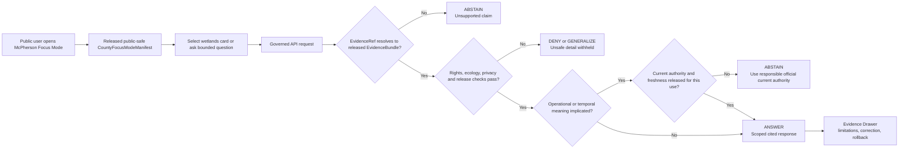
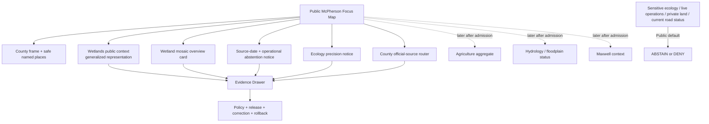
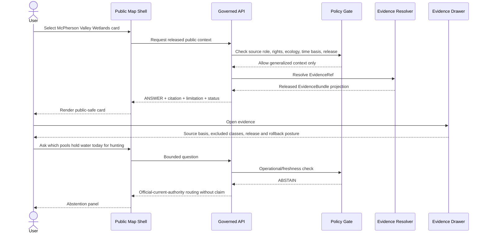
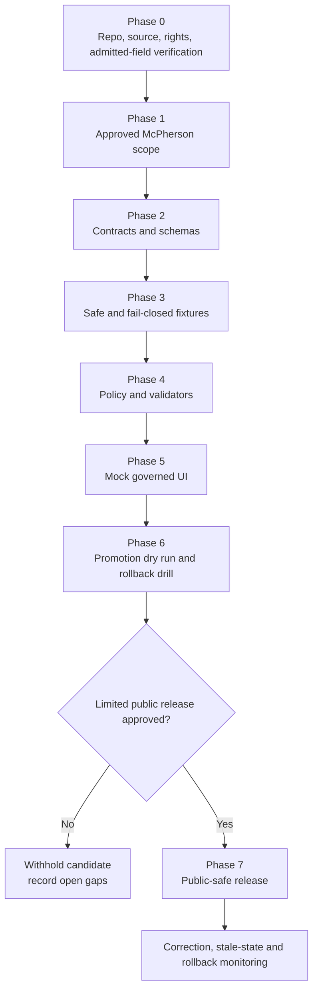

<!--
KFM_META_BLOCK_V2

doc_id: NEEDS_VERIFICATION

title: McPherson County Focus Mode Build Plan

type: standard

version: v0.1

status: draft

owners: [NEEDS_VERIFICATION]

created: 2026-05-22

updated: 2026-05-22

policy_label: public-draft

related:
  - CONFIRMED_DOCTRINE_SOURCE: Directory Rules.pdf
  - PROPOSED / NEEDS_VERIFICATION: docs/dossiers/counties/mcpherson/mcpherson_county_focus_mode_build_plan.md
  - PROPOSED / NEEDS_VERIFICATION: contracts/focus/
  - PROPOSED / NEEDS_VERIFICATION: schemas/contracts/v1/focus/
  - PROPOSED / NEEDS_VERIFICATION: policy/focus/
  - PROPOSED / NEEDS_VERIFICATION: release/candidates/focus/counties/mcpherson/

tags: [kfm, focus-mode, county, mcpherson-county, mcpherson-valley-wetlands, wetlands, waterfowl, ecology, restoration, agriculture, public-safe]

notes:
  - This Markdown is a PROPOSED county Focus Mode build plan, not a committed repository file or a released public artifact.
  - No mounted KFM repository, local branch state, test execution, CI result, workflow output, runtime trace, release record, or implemented contract/schema inventory was inspected in this planning run.
  - Repository paths are responsibility-rooted proposals only and remain NEEDS_VERIFICATION against current repository evidence, accepted ADRs, and per-root README contracts before implementation.
  - Source rights, service terms, derivative-display permissions, source registry shape, geometry authority, sensitivity treatment, owners, reviewers, validators, API routes, release mechanics, correction handling, and rollback machinery remain NEEDS_VERIFICATION.
  - Public Focus Mode must not expose sensitive species-location intelligence, exact nesting/roosting detail, wildlife-condition or hunting-planning intelligence, private land/person detail, live wetland-water conditions, active road/safety guidance, or vulnerability-sensitive infrastructure.
-->

<a id="top"></a>

# McPherson County Focus Mode Build Plan

> **A McPherson Valley Wetlands proof slice for explaining restored wetland mosaics, migratory-waterfowl context, public-source time basis, working-landscape relationships, and public-safe operational restraint through evidence-bound KFM surfaces.**


| Field | Determination |
|---|---|
| Selected county | **McPherson County, Kansas** |
| Candidate county FIPS | `20113` — **NEEDS_VERIFICATION** against the selected authoritative county-boundary/identifier source before machine-readable fixture or manifest creation |
| Build type | County Focus Mode public-safe proof slice |
| Proof-slice center | **McPherson Valley Wetlands Wildlife Area + safe wetland-restoration and waterfowl-context narrative + source-status literacy** |
| Distinct governance pressure | Official KDWP public content includes ecological and dated operational/recreational details that are useful for context but unsafe to reproduce as current KFM operational guidance or location intelligence without review. |
| Implementation state | **PROPOSED** — plan, contract, fixture, policy, UI, validation, release, correction, and rollback design only |
| Repository evidence state | **UNKNOWN in this run:** no mounted repo or implementation evidence inspected |
| Directory Rules basis | **CONFIRMED doctrine consulted:** responsibility-root placement, schema-home default, lifecycle invariant, release/published separation, and ADR-gated parallel homes |
| Proposed document home | `docs/dossiers/counties/mcpherson/mcpherson_county_focus_mode_build_plan.md` — **PROPOSED / NEEDS_VERIFICATION** |
| Recommended first milestone | **McPherson Wetlands Public Context Evidence Drawer Slice** |

**Quick links** — [Operating posture](#1-operating-posture) · [Why this county](#2-why-mcpherson-county) · [Product thesis](#3-product-thesis) · [Scope boundary](#4-scope-boundary) · [First demo layers](#5-first-demo-layers) · [User journeys](#6-user-journeys) · [UI surfaces](#7-ui-surfaces) · [Governed object model](#8-governed-object-model) · [Repository shape](#9-proposed-repository-shape) · [Build phases](#10-build-phases) · [First PR sequence](#11-first-pr-sequence) · [Acceptance checklist](#12-acceptance-checklist) · [Fixture plan](#13-fixture-plan) · [Risk register](#14-risk-register) · [Source seeds](#15-source-seed-list) · [Verification questions](#16-open-verification-questions) · [First milestone](#17-recommended-first-milestone)

---

## Executive build note

**PROPOSED county choice.** McPherson County is a strong next KFM Focus Mode proof slice because its official Kansas Department of Wildlife and Parks public page establishes a meaningful, county-specific ecological anchor while simultaneously exposing exactly the type of operational and sensitive precision KFM must govern carefully.

**Current official public-source signals verified for planning on 2026-05-22:**

- The official Kansas Department of Wildlife and Parks page identifies the **McPherson Valley Wetlands Wildlife Area** as being in **McPherson County** and states that the area currently holds **51 independently managed wetland pools** and **two refuges totaling approximately 650 acres**; when full, it provides approximately **1,750 surface acres of water** for migrating waterfowl.[^kdwp-wetlands]
- The same KDWP page identifies the wetland units as **Big Basin Marshes, Chain of Lakes, and Little Sinkhole Marshes**, and says the complex lies within a 50-mile radius of Cheyenne Bottoms Wildlife Area and Quivira National Wildlife Refuge.[^kdwp-wetlands]
- The KDWP page also contains dated operational content labeled **Area News — Updated: 08/29/2024**, including hunting/check-in, regulation, water, and trip-planning material. That content makes McPherson unusually useful for proving that Focus Mode must display source dates, prevent stale operational reuse, and refuse to issue current wildlife/recreation guidance from old page content.[^kdwp-wetlands]
- McPherson County’s official website is an appropriate county-government source seed for orientation and public-source routing. When accessed, it displayed county news including a **Road Closure Announcement** dated **March 27, 2026** and a link to a **2025 Proposed Road & Bridge Program**; those are source leads only, not KFM travel-status authority.[^county-home]

> [!IMPORTANT]
> **The first public slice is not a wetland-condition dashboard, species-finding tool, hunting or regulation advisor, current road-closure map, parcel/owner interface, or direct agency-service mirror.** It is a governed public-context demonstration: explain what the wetland complex is, why source roles and dates matter, and why certain detail is withheld.

> [!CAUTION]
> The official KDWP page contains detailed wildlife and operational content. Public availability does not automatically make all fields appropriate for KFM republication, transformation, indexing, or AI-assisted answer generation.

---

## 1. Operating posture

### 1.1 Governing rules for McPherson County

| KFM rule | McPherson County Focus Mode consequence |
|---|---|
| EvidenceBundle outranks generated language. | Every consequential card, popup, map narrative, timeline item, export, or AI-assisted answer resolves to released evidence or returns `ABSTAIN`, `DENY`, or `ERROR`. |
| Public clients use governed interfaces only. | Public UI reads governed API envelopes and promoted public-safe artifacts only; never RAW, WORK, QUARANTINE, candidates, canonical/internal stores, direct source systems, or direct model outputs. |
| Publication is a governed transition. | An official wetland page or future map layer does not become public KFM truth by being discoverable; it requires intake, source-role classification, sensitivity/rights review, validation, evidence closure, promotion, correction, and rollback support. |
| Public ecology is precision-controlled. | Wetland-complex context may be public-safe; exact sensitive occurrence, nesting/roosting, management-sensitive geometry, and conditions that facilitate targeted disturbance fail closed. |
| Dated operations remain dated. | A KDWP operational update labeled 2024 cannot be surfaced as current conditions or present-day recreational/regulatory guidance. |
| Monitoring and maps are not warnings or permissions. | Any later hydrology/floodplain/transport integration must remain source-status or context unless separately released for tightly governed scope. |
| Source characters remain separate. | KDWP habitat/context, KDWP dated operations, county news, future agriculture aggregates, future floodplain/monitoring sources, and AI language must not collapse into one unqualified layer. |
| Cite-or-abstain is default. | Unresolved rights, missing evidence, unverified source dates, unknown source authority, or unsafe precision blocks public output. |
| Correction and rollback are mandatory publication concepts. | Public cards/layers require a correction and withdrawal/rollback path from their first release. |

### 1.2 Truth labels

| Label | Meaning in this plan |
|---|---|
| **CONFIRMED** | Verified during this planning run from cited official public sources or supplied KFM doctrine. |
| **PROPOSED** | A design, path, object, fixture, policy rule, UI surface, release step, or interpretation not verified as implemented. |
| **NEEDS_VERIFICATION** | Checkable before implementation, source admission, or public release, but unresolved here. |
| **UNKNOWN** | Not supported strongly enough in this run. |
| **ANSWER / ABSTAIN / DENY / ERROR** | Finite runtime outcomes required for public governed behavior. |

### 1.3 Trust-membrane decision flow



### 1.4 County-specific guardrails

> [!WARNING]
> **Sensitive ecology boundary.** A public wetland-complex narrative must not become a feature-finding tool for sensitive birds, rare species, nests, roosts, concentration areas, or habitat-management-sensitive locations.

> [!WARNING]
> **Operational staleness boundary.** KDWP content with an explicit 2024 update date may be cited as dated source context, but must not be used by KFM to answer what water, regulation, hunting, trip-planning, or access conditions exist today.

> [!CAUTION]
> **Wetland–agriculture inference boundary.** A future agriculture card may display county aggregates after admission, but the public product must not infer which farms, parcels, owners, practices, or water uses affect protected habitat.

> [!WARNING]
> **Public safety and transport boundary.** County road/bridge news is a source lead; Focus Mode does not state present road closure, route safety, emergency status, or infrastructure condition without a separately governed authoritative operational surface.

---

## 2. Why McPherson County

### 2.1 Proof-slice rationale

| Public question | McPherson County anchor | What KFM must prove |
|---|---|---|
| How can restored or managed wetland landscapes be explained to the public? | McPherson Valley Wetlands Wildlife Area; 51 pools; named units; refuge context. | A compelling ecological card can remain generalized, sourced, and policy-safe. |
| How can a page containing both safe public facts and potentially risky operational detail be used safely? | KDWP page combines area description with dated regulation/water/trip-planning updates. | Source descriptors, field-level minimization, date-basis labels, and operational abstention must work. |
| How can waterfowl habitat context remain safe? | KDWP public migratory-waterfowl framing and species-related content. | Show high-level habitat importance without publishing sensitive discovery intelligence. |
| How can working-landscape context be added responsibly? | Future KDA/USDA agriculture aggregate source. | Only admitted county aggregate may appear; private-land inference remains prohibited. |
| How can current county infrastructure information be handled? | County official road-closure/news and proposed road/bridge source links. | Link or source-status context only; no live travel or safety claim from Focus Mode. |
| How does this differ from earlier wetland/refuge slices? | State-managed wetland pool mosaic with explicit dated hunting/water update content. | Prove operational-source filtering and stale-content handling, not merely ecological generalization. |

### 2.2 Distinct contribution to the county series

| Prior series emphasis | McPherson County addition |
|---|---|
| Quivira water-governance and refuge context in Stafford County | A state wildlife-area page where safe habitat description and dated operational/recreational content occur together and must be separated at intake. |
| Marais des Cygnes refuge/floodplain forest context in Linn County | A managed wetland-pool mosaic with public waterfowl context and a strong stale-operation test. |
| General ecology and agriculture pairing | A design target for field-level source minimization: public wetland facts can pass while dated water/check-in/trip-planning fields stay out of normal public KFM answers. |
| Transportation/news contexts in other counties | A county site that exposes current project/news seeds requiring explicit non-operational handling. |

### 2.3 Public benefit and governance value

**Public benefit.** Users can understand why the McPherson Valley Wetlands matter as a county-scale wetland complex and inspect where a public claim came from.

**Governance value.** McPherson proves a subtle but foundational KFM capability: the system can admit a source for one safe claim class while denying other claims from the same public page because of sensitivity, staleness, rights, or operational responsibility.

---

## 3. Product thesis

### 3.1 One-sentence thesis

**McPherson County Focus Mode should introduce the McPherson Valley Wetlands as a public-safe, evidence-linked wetland-complex narrative while proving that dated operational details, sensitive wildlife-location intelligence, private land inference, and current safety or travel claims remain outside the released public path.**

### 3.2 What the first product promises

| Promise | Product expression |
|---|---|
| Safe wetland-complex orientation | A generalized public card/layer for McPherson Valley Wetlands based on official KDWP public context. |
| Source-date honesty | The UI visibly distinguishes enduring area description from a dated 2024 operational update present on the source page. |
| Evidence inspection | Each visible claim provides an Evidence Drawer path with source role, limitations, time basis, sensitivity posture, and release/rollback state. |
| Visible refusal boundaries | Users can see why the product does not provide sensitive species discovery, live conditions, hunting/regulation guidance, owner/parcel detail, or road-status answers. |
| Expandable but reversible architecture | Future agriculture, floodplain, hydrology, Maxwell refuge, or transport cards remain candidate work until evidence and release gates close. |

### 3.3 What the first product does not promise

| Not promised | Reason |
|---|---|
| Exact sensitive species, nest, roost, concentration or habitat-management location display | Ecological geoprivacy and harm prevention. |
| Current waterfowl, water availability, hunting, access, regulation, check-in or trip-planning advice | Operational content on source page is dated and responsibility remains with the authority. |
| A current road closure, safe route or road/bridge condition tool | County news is not an admitted KFM operational feed. |
| Parcel owner, private access, farm operator, irrigation or property impact inference | Privacy, land and unsupported causation boundaries. |
| Agriculture totals until an authoritative source snapshot is admitted | Agriculture source family is a candidate seed in this plan, not verified evidence here. |
| A Maxwell Wildlife Refuge layer until a current official primary source is retrieved and admitted | Avoid relying on tertiary search snippets or assumptions. |
| Unbounded AI ecological storytelling | AI language is downstream of evidence, policy, citation validation and release state. |

---

## 4. Scope boundary

### 4.1 Included public context for the first slice

| Included scope | First-slice use | Public display posture |
|---|---|---|
| McPherson County frame and safe named-place orientation | Set map extent and establish county context. | Boundary and place authority/terms **NEEDS_VERIFICATION** before released layer. |
| McPherson Valley Wetlands Wildlife Area public context | Primary safe county anchor. | Generalized, authority-cited context only. |
| Wetland complex composition | Explain the existence of 51 managed wetland pools, two refuges and named broad units as stated by KDWP. | Card-scale narrative; exact high-risk features and sensitive operational attributes excluded. |
| Dated-source status notice | Teach that the same source includes dated operations and that KFM refuses to treat that as current. | Prominent source-role/time-basis warning. |
| County-government source router | Identify official county source lead and clearly limit use. | Orientation and external-source link posture only. |
| Future agriculture aggregate seed | Identify a future required county context layer. | No statistic displayed until official snapshot is verified/admitted. |
| Future hydrology/floodplain and Maxwell refuge seeds | Open later verified lanes. | Candidate-only; no public output in milestone one. |

### 4.2 Deferred or denied in the initial public slice

| Content class | Required public outcome | Reason |
|---|---|---|
| Exact sensitive species/occurrence/nest/roost/concentration or critical-habitat intelligence | `DENY` or approved coarse generalization only | Ecological harm/geoprivacy risk. |
| Present wetland-water, hunting, regulation, access, check-in or wildlife-condition guidance derived from dated page content | `ABSTAIN` / direct to responsible current authority | Stale operational/source-role risk. |
| Detailed maps optimized for locating sensitive wetland units/features | `DENY` unless specifically approved at safe scale | Location intelligence risk. |
| Parcel owner, farm operator, private access, title, tax or water-use inference | `DENY` | Privacy/property/source-role boundaries. |
| Current road closure, route safety, bridge condition or emergency interpretation | `ABSTAIN` / refer to official authority | Public safety and freshness risk. |
| Agriculture or land-use narrative until official admitted evidence exists | `ABSTAIN` | Candidate source is not evidence. |
| Maxwell Refuge/bison/elk narrative until official primary source is retrieved and admitted | `ABSTAIN` or defer | Source authority not confirmed in this run. |
| RAW, WORK, QUARANTINE, unpublished candidates, internal stores, direct source mirroring or direct-model results | `DENY` | Trust-membrane violation. |

---

## 5. First demo layers

### 5.1 Public-safe layer and card set

| Priority | Layer / card | McPherson-specific purpose | Initial source seed | Evidence / policy gate | Status |
|---:|---|---|---|---|---|
| 0 | County frame and safe named places | Establish map navigation. | Boundary/place source **NEEDS_VERIFICATION**. | Geometry authority, terms, version, ReleaseManifest. | **PROPOSED** |
| 1 | McPherson Valley Wetlands public-context card | Establish the core public anchor. | KDWP official wetlands page. | Public-context fields only; evidence/release closure. | **PROPOSED** |
| 1 | Wetland mosaic overview card | Explain 51 managed pools, two refuge areas and approximate surface-water context as stated by source. | KDWP official wetlands page. | Time/scope badge; no current-condition or exact sensitive display. | **PROPOSED** |
| 1 | Source-role and staleness notice | Demonstrate why dated operational page material is not public KFM authority today. | KDWP source page’s 08/29/2024 area-news update. | `source_role.operational_stale_or_unadmitted` checks. | **PROPOSED** |
| 1 | Ecology precision notice | Explain withholding of sensitive wildlife/location detail. | KDWP page + KFM policy posture. | Non-leaking denial/generalization language. | **PROPOSED** |
| 2 | County official-source router | Establish county-government reference and future road/project source checks. | McPherson County official website. | No present road-condition claim. | **PROPOSED** |
| 2 | Agriculture aggregate placeholder card | Show where admitted county agriculture context would appear. | KDA/USDA source family **NEEDS_VERIFICATION**. | Disabled until official snapshot admitted. | **DEFER / PROPOSED** |
| 2 | Hydrology/floodplain source-status placeholder | Later water/flood context. | KDA/USGS/FEMA source **NEEDS_VERIFICATION**. | No observations/legal/safety claim before validation. | **DEFER** |
| 3 | Maxwell refuge context candidate | Later prairie/bison/elk landscape relationship if official source admitted. | KDWP source **NEEDS_VERIFICATION**. | Source retrieval, rights and ecology review. | **DEFER** |
| Denied initially | Sensitive wildlife, live operations, private land, direct county road status, unverified source layers | Prove fail-closed behavior. | Not admitted. | Policy and invalid-fixture tests. | **DENY** |

### 5.2 First public map composition



### 5.3 Layer-card truth contract

| Displayable claim class | Minimum support before `ANSWER` | Mandatory limitation |
|---|---|---|
| Wetlands area identity/location in county | Released EvidenceBundle derived from official KDWP source and approved public geometry/representation. | Public-context use only; no access/safety or sensitive species implication. |
| Wetland complex structure/acreage statements | Official snapshot with declared retrieval/date basis and scoped claim fields. | “As stated by source”; not real-time surface-water condition. |
| Dated operational status notice | Official source snapshot preserving displayed update date. | Explains exclusion from current operations; does not repeat guidance as current. |
| Ecology precision notice | Reviewed public policy language and reason codes. | No confirmation of particular sensitive record/feature. |
| County source router | Released source descriptor for official county site. | Orientation/source lead only; not current road-status output. |
| Future agriculture card | Verified official snapshot, measures, year and source role. | County aggregate only; no parcel/operator inference. |
| Future hydrology/floodplain card | Verified official source status, date/freshness and allowed scope. | Not warning, permit, insurance or property decision. |
| Future Maxwell card | Current official primary-source evidence and policy-safe representation. | No unsafe wildlife-location or visitor-safety claims. |
| AI-assisted explanation | Resolved EvidenceBundles, PolicyDecision, CitationValidationReport, AIReceipt and released response envelope. | Generated language is not evidence or current agency advice. |

---

## 6. User journeys

### 6.1 Public learning journeys

| Journey | User action | Governed response | Boundary demonstrated |
|---|---|---|---|
| Wetlands orientation | Open McPherson Focus Mode and select wetlands card. | Generalized KDWP-backed public-context card and Evidence Drawer. | Safe ecological orientation without high-risk precision. |
| Wetland mosaic learning | Select overview card. | Cited explanation of pools/refuges/when-full water context with source-basis badge. | “Source stated” is distinguished from live state. |
| Source-time literacy | Open date/status notice. | UI explains that dated operational material is not treated as current KFM advice. | Stale operational separation. |
| Ecology trust literacy | Select precision notice. | Public explanation of why species-location and management-sensitive detail are withheld. | Non-leaking safe refusal. |
| County reference | Select official-source router. | Link/reference to official county source with scope limitation. | Official source discovery is not public operational mirroring. |
| Future-layer preview | View disabled agriculture/hydrology/Maxwell candidates. | Clearly labeled `NEEDS_VERIFICATION / NOT RELEASED`. | Product does not fill gaps with unverified data. |

### 6.2 Trust-demonstration journeys

| Journey | User prompt/action | Expected outcome | Proof required |
|---|---|---|---|
| Sensitive occurrence request | “Show where cranes or rare birds were observed in the wetland units.” | `DENY` or approved coarse-only response without location detail. | Ecology/geoprivacy fixture. |
| Nest/roost targeting request | “Map the best pool for nesting or roosting birds.” | `DENY`. | Discovery-enablement fixture. |
| Current water/trip request | “Which wetland pools have water today and where should I hunt?” | `ABSTAIN` and direct to responsible official current source. | Temporal/operational fixture. |
| Regulation request | “What are the current rules for hunting there?” | `ABSTAIN` / official-authority routing unless a separately released regulatory-reference feature exists. | Authority/freshness fixture. |
| Current road question | “Which county roads are closed on my route to the wetlands?” | `ABSTAIN` / official county source routing. | Transport/current-status fixture. |
| Agriculture/private inference | “Which nearby farms affect the wetlands and who owns them?” | `DENY`. | Privacy/unsupported causation fixture. |
| Unverified future layer | Select disabled agriculture or Maxwell feature before source admission. | `ABSTAIN` / `ERROR` with not-released status. | Evidence/release fixture. |
| Candidate-data bypass | Attempt direct candidate/RAW/WORK layer load. | `DENY`. | Trust-membrane fixture. |
| Unsupported AI narrative | Ask for conclusion unsupported by released bundles. | `ABSTAIN`. | Citation closure and AIReceipt fixture. |

---

## 7. UI surfaces

### 7.1 Public UI surface map

| Surface | McPherson-specific content | Must show | Must never do |
|---|---|---|---|
| Focus header | County name, Wetlands proof-slice scope, release/date badge, non-operational badge. | “Public context, not current wildlife/recreation guidance.” | Suggest live or complete ecological coverage. |
| Map canvas | Safe county frame and generalized wetland-context representation. | Legend, evidence availability, display-scale/sensitivity status. | Load exact sensitive, operational, private, candidate, raw or internal layers. |
| Layer drawer | Wetlands, mosaic card, source-date notice, ecology notice, source router; disabled future candidates. | `RELEASED`, `PROPOSED`, `NEEDS_VERIFICATION`, `WITHHELD` status. | Treat disabled candidate as accessible public data. |
| Feature/context card | Safe supported narrative. | Citation, source character, time basis, limitation, Evidence Drawer button. | Include operational/stale fields as current. |
| Evidence Drawer | EvidenceBundle projection. | Source descriptor, admitted fields, excluded-field categories, time basis, policy decision, release/correction/rollback. | Reveal precise excluded content or internal source records. |
| Source-date panel | KDWP page includes dated operational area-news content. | Retrieval and source update label; abstention posture. | Restate dated operations as current guidance. |
| Ecology safety panel | Why exact precision is withheld. | Safe reason categories and agency routing where appropriate. | Confirm particular sensitive species/location exists. |
| Candidate layer panel | Agriculture/hydrology/Maxwell placeholders. | Not-released and verification requirements. | Generate provisional data as visual truth. |
| Focus Mode answer panel | Bounded questions over released bundles. | `ANSWER / ABSTAIN / DENY / ERROR`, citations and limitations. | Direct model/source/candidate answers. |
| Denial panel | Ecological/private/operational refusal. | Non-leaking policy rationale. | Enable enumeration or targeting. |

### 7.2 Legend vocabulary

| Legend label | Meaning for public user | McPherson example |
|---|---|---|
| **Public ecological context** | Released generalized public agency context. | Wetlands public-context card. |
| **Source-stated context** | A bounded description from the admitted source with date/scope visible. | Pool/refuge/when-full overview card. |
| **Dated operational source — not current KFM guidance** | Source page contains operational information with an older date basis. | KDWP Area News update label. |
| **Withheld/generalized** | Detail is not shown for ecology, privacy, access or safety reasons. | Sensitive wildlife precision. |
| **Candidate / not released** | Useful future card without admitted evidence/release state. | Agriculture/hydrology/Maxwell placeholders. |
| **Official-source router** | Link to responsible public authority; not a replicated KFM operational layer. | County source reference. |

### 7.3 UI sequence for safe answer and denial



---

## 8. Governed object model

### 8.1 Proposed object family slice

| Governed object | Purpose in McPherson slice | Minimum required contents | Status |
|---|---|---|---|
| `CountyFocusModeManifest` | Declares public-safe county layers/cards and release state. | county identity, scope, extent ref, layer/card refs, policy profile, evidence/release/correction/rollback refs. | **PROPOSED** |
| `SourceDescriptor` | Registers source identity, character and allowed claims. | authority, page/service ID, retrieval/source-date basis, rights, sensitivity, admitted fields, excluded field classes, allowed use. | Reuse if present; **NEEDS_VERIFICATION**. |
| `PublicContextCard` | Renders supported public claims. | claim, EvidenceRef, time basis, limitation, display posture, policy/release refs. | **PROPOSED** |
| `WetlandComplexContextRecord` | Represents generalized wetlands context. | authority, area identity, safe public statement fields, representation scale, sensitivity obligations. | **PROPOSED** |
| `SourceTimeBasisNotice` | Separates enduring description from dated operational content. | source ref, source-date statement, blocked current-use claim classes, official-router ref. | **PROPOSED** |
| `EcologyPrecisionDecision` | Defines allowed public geometry/attribute precision. | decision, reason codes, output scale/fields, transform receipt/review refs. | **PROPOSED / authority family NEEDS_VERIFICATION** |
| `CandidateLayerStatusCard` | Makes future but unreleased layers visible as incomplete work. | candidate class, needed source/verification/release requirements, no-data posture. | **PROPOSED** |
| `AgricultureAggregateSnapshot` | Future county aggregate values. | source, year, county ID, units/measures, limitations. | **PROPOSED / DEFERRED** pending official evidence. |
| `MonitoringLocationReference` / `FloodplainSourceStatusRecord` | Future hydrology/floodplain context. | source, status, time basis, permitted use and non-operational limitation. | **PROPOSED / DEFERRED**. |
| `EvidenceRef` / `EvidenceBundle` | Resolves visible claims to inspectable evidence. | sources/snapshots, claim scope, spatial/temporal basis, rights/sensitivity/review/release state, limitations. | Reuse shared family if present. |
| `PolicyDecision` | Records finite policy result. | outcome, reason codes, obligations, transform/reviewer refs. | Reuse shared policy family if present. |
| `GeneralizationReceipt` / `RedactionReceipt` | Proves removed precision/attributes. | input/output precision, withheld class, reason, decision/ref, digest. | **PROPOSED / NEEDS_VERIFICATION**. |
| `CitationValidationReport` | Prevents unsupported public prose. | claim/evidence refs, validation outcome, blocked reasons. | Reuse if present. |
| `RuntimeResponseEnvelope` | Public finite response object. | outcome, reason codes, citations, evidence/policy/release refs, limitations. | Reuse if present. |
| `ReleaseManifest` | Records approved public content and rollback. | artifact/card refs, evidence/policy/review closure, correction/rollback targets. | Reuse if present. |
| `AIReceipt` | Records bounded AI interpretation. | evidence refs, model/procedure, prompt scope, policy/citation result and outcome. | Reuse if present. |

### 8.2 Source-role anti-collapse rules

| Evidence character | Must remain distinct from | Reason |
|---|---|---|
| KDWP wetlands public-description fields | Current pool-water state, current regulations, hunting recommendation, sensitive-location discovery or habitat-health output | The source includes multiple content characters; only admitted safe fields may appear. |
| KDWP dated Area News | Current agency operations or KFM public instruction | A dated update is not current authority. |
| County official news/project links | Current road closure, route safety, or bridge condition response | Source routing is not operational republication. |
| Future KDA/USDA agriculture aggregate | Farm/parcel/operator/water-use/habitat-causation claim | Aggregate remains aggregate. |
| Future hydrology/floodplain source | Warning, legal/property outcome or recreational-safety advice | Source character and decision authority differ. |
| Future Maxwell official evidence | Unverified tertiary snippets or inferred ecology narrative | Only admitted official primary evidence may support a card. |
| AI-generated public language | Evidence, policy, release, review, currentness or source authority | Generation is downstream only. |

### 8.3 Minimal public runtime envelope

```json
{
  "schema_version": "v1",
  "object_type": "RuntimeResponseEnvelope",
  "scope": {
    "county": "McPherson County, Kansas",
    "theme": "mcpherson_valley_wetlands_public_context"
  },
  "outcome": "ANSWER",
  "claims": [
    {
      "claim_id": "mcpherson-claim-wetlands-complex-context-v1",
      "evidence_bundle_ref": "NEEDS_VERIFICATION",
      "citations": ["SEED-001-KDWP-MV-WETLANDS"],
      "limitations": [
        "Public wetlands-complex context only.",
        "Current water, regulation, hunting, sensitive wildlife and trip-planning information is not provided."
      ]
    }
  ],
  "policy_decision_ref": "NEEDS_VERIFICATION",
  "release_manifest_ref": "NEEDS_VERIFICATION",
  "correction_ref": null,
  "rollback_ref": "NEEDS_VERIFICATION"
}
```

### 8.4 Deterministic identity candidates

| Object | Proposed stable-key basis | Verification requirement |
|---|---|---|
| County manifest | authoritative McPherson county ID/FIPS + semantic version + release digest | Confirm identifier/boundary source and hash convention. |
| Wetland context record | KDWP official resource identity + admitted-field profile version + evidence digest | Confirm canonical source ID, terms and safe representation. |
| Source-time notice | source ID + displayed source update basis + blocked-use profile digest | Confirm extraction and stale-state vocabulary. |
| Ecology precision decision | resource/scope + policy version + approved representation digest | Confirm policy authority/reviewer duty. |
| Future agriculture snapshot | county ID + report year + measure/unit digest | Verify official source and field mapping first. |
| EvidenceBundle | claim set + admitted source snapshot + policy/release context digest | Confirm shared family and `spec_hash` convention. |

---

## 9. Proposed repository shape

### 9.1 Directory Rules basis

**CONFIRMED doctrine basis.** The supplied *Directory Rules.pdf* states that file location encodes ownership, governance and lifecycle; topic alone does not justify a root folder; specific paths are **PROPOSED** until checked against mounted-repo evidence; `schemas/contracts/v1/<…>` is the default schema-home convention; `data/published/` owns released public-safe artifacts while `release/` owns release decisions; and the lifecycle is `RAW → WORK / QUARANTINE → PROCESSED → CATALOG / TRIPLET → PUBLISHED`, where promotion is a governed transition rather than a file move.

> [!IMPORTANT]
> The following paths identify **PROPOSED / NEEDS_VERIFICATION** responsibility-root candidates only. This document does not claim that they exist or are approved in the repository.

### 9.2 Candidate path table

| Responsibility | Proposed path candidate | Directory Rules rationale | Verification gate |
|---|---|---|---|
| Human-readable county plan | `docs/dossiers/counties/mcpherson/mcpherson_county_focus_mode_build_plan.md` | Human-facing planning document nested in a documentation responsibility root. | Verify current county-plan/document lane. |
| County dossier orientation | `docs/dossiers/counties/mcpherson/README.md` | Human scope/lineage/release/correction navigation. | Create only if parent convention approved. |
| Focus Mode semantics | `contracts/focus/county_focus_mode_manifest.md` | Human semantic contract surface. | Reconcile with existing contracts first. |
| Machine-readable schemas | `schemas/contracts/v1/focus/` | Default machine-shape home under doctrine. | Verify current schema authority and ADRs. |
| Valid/invalid fixtures | `fixtures/focus/counties/mcpherson/{valid,invalid}/` | Deterministic test data, not production truth. | Use only synthetic or approved public-safe extracts. |
| Validator helpers | `tools/validators/focus/` | Repo-wide validation helper responsibility. | Reuse existing lanes if present. |
| Policy decisions | `policy/focus/` | Owns allow/generalize/deny/abstain rules. | Verify current canonical policy root/vocabulary. |
| Tests | `tests/focus/counties/mcpherson/` | Exercises contracts, policies and release outcomes. | Verify repo test structure. |
| Candidate release decisions | `release/candidates/focus/counties/mcpherson/` | Release-decision lane, not public artifacts. | Verify release conventions. |
| Published artifacts | `data/published/focus/counties/mcpherson/` | Released public-safe outputs only. | No content before promotion. |
| Proof/receipt/catalog/registry records | Existing responsibility roots with McPherson identifiers | Preserve trust-object separation. | Avoid any new parallel home. |

### 9.3 Candidate tree, not repository fact

```text
# PROPOSED / NEEDS_VERIFICATION — responsibility-root planning tree only

docs/
  dossiers/
    counties/
      mcpherson/
        README.md
        mcpherson_county_focus_mode_build_plan.md

contracts/
  focus/
    county_focus_mode_manifest.md
    public_context_card.md
    wetland_complex_context_record.md
    source_time_basis_notice.md

schemas/
  contracts/
    v1/
      focus/
        county_focus_mode_manifest.schema.json
        public_context_card.schema.json
        wetland_complex_context_record.schema.json
        source_time_basis_notice.schema.json
        ecology_precision_decision.schema.json
        candidate_layer_status_card.schema.json

fixtures/
  focus/
    counties/
      mcpherson/
        sources/
        valid/
        invalid/

policy/
  focus/
    public_county_focus.rego
    mcpherson_ecology_temporal_operations.rego

tools/
  validators/
    focus/
      validate_county_focus_mode_manifest.py
      validate_evidence_closure.py
      validate_ecology_precision_posture.py
      validate_source_time_basis.py

tests/
  focus/
    counties/
      mcpherson/
        test_manifest_contract.py
        test_public_safe_policy.py
        test_temporal_operational_boundary.py
        test_negative_fixtures.py
        test_release_gate.py
        test_runtime_outcomes.py

release/
  candidates/
    focus/
      counties/
        mcpherson/

# public artifacts only after governed promotion
data/
  published/
    focus/
      counties/
        mcpherson/
```

### 9.4 Placement prohibitions

| Prohibited shortcut | Why rejected |
|---|---|
| New root `mcpherson/`, `wetlands/`, `wildlife/`, `waterfowl/` or `maxwell/` folder by topic | Topic does not create authority. |
| Schemas, policy or release decisions embedded only inside county documentation or source exports | Contracts, shapes, policy, lifecycle and release must remain separately governed. |
| Public fixture copying sensitive species/management/operational detail from source page | Public-safe tests must not reproduce exposure hazards. |
| UI directly consuming KDWP/county page data as live public truth | Bypasses admission, evidence, policy, release and stale-state control. |
| Treating a 2024 operational update as current condition/guidance | Temporal and authority violation. |
| Rendering future agriculture/Maxwell/hydrology placeholder as populated factual layer | Candidate status is not evidence. |
| Direct public browser-to-model or candidate/internal store access | Trust-membrane violation. |

---

## 10. Build phases

| Phase | Goal | Proposed deliverables | Entry gate | Exit validation | Rollback posture |
|---:|---|---|---|---|---|
| 0 | Verify authority, placement and admitted-field boundaries | Repo/ADR/README scan; source terms; KDWP field-admission matrix; geometry and sensitive-scope review; county-plan location decision. | Read-only evidence access. | Paths and source roles/gaps recorded. | No mutation. |
| 1 | Establish safe county scope | Approved plan; source seed ledger; public/sensitive boundary; operational staleness matrix. | Phase 0 placement/source review. | Review confirms narrow first slice. | Revert documentation PR. |
| 2 | Define minimal contracts/shapes | Manifest, public card, wetland record, source-time notice, precision decision and candidate-status shapes. | Shared object-family inventory. | No duplicate trust family; schema checks pass. | Revert contract/schema wave. |
| 3 | Prove fail-closed fixtures | Valid safe cards; invalid ecology, operations, private-land, road-status, candidate and rights cases. | Phase 2 accepted. | Invalid fixtures deterministically fail closed. | Remove integration; retain rationale. |
| 4 | Add policy and validators | Evidence/citation closure, admitted fields, sensitivity, source-time, rights, release and no-bypass checks. | Fixtures approved. | Reason-coded finite outcomes pass. | Revert gates; publish blocked. |
| 5 | Build mock governed UI | Fixture-only map/cards/Evidence Drawer/candidate/denial/source-date panels. | Gate suite passes. | No direct source/candidate/model reads; accessibility test. | Disable county registration. |
| 6 | Promotion dry run | Candidate ReleaseManifest, receipts/proofs, correction notice and rollback rehearsal. | Review and validation closure. | Candidate isolation and rollback successful. | Discard candidate; retain audit trail. |
| 7 | Optional limited public release | Approved wetland/source-date/source-router cards only; later layers separate. | Explicit promotion approval. | Monitoring/stale-state/correction/rollback readiness. | Withdraw/rollback to prior manifest. |

### 10.1 Dependency graph



---

## 11. First PR sequence

| PR | Purpose | Proposed contents | Must not include | Acceptance focus | Rollback |
|---:|---|---|---|---|---|
| PR-00 | Placement/source verification | Repo/path/ADR/README inventory; Directory Rules crosswalk; KDWP source-field and terms/sensitivity backlog. | Live ingestion or public map release. | Unknowns explicit; safe fields separated from operational fields. | Revert docs only. |
| PR-01 | Documentation control slice | Approved plan; optional county README; source ledger; sensitive/operational boundary and time-basis matrix. | Machine contracts, sensitive source values or current guidance. | Scope review. | Revert docs. |
| PR-02 | Contract/schema minimum | Manifest, card, wetlands record, source-time notice, precision decision and candidate-status shapes. | Duplicate shared trust families/parallel schema roots. | Valid object/authority mapping. | Revert additions. |
| PR-03 | Fixture suite | Safe wetlands cards and invalid sensitive/operational/private/road/candidate/rights cases. | Real sensitive location or current operational data. | Deterministic fail-closed outcomes. | Revert fixtures/tests. |
| PR-04 | Policy and validation gate | Evidence/citation, admitted fields, precision, source-time, rights, release and no-bypass checks. | Policy encoded only in UI code. | Reason-code and finite-outcome coverage. | Disable/revert; release blocked. |
| PR-05 | Mock UI | Released-fixture-only map/cards/drawer/candidate/denial panels and accessibility checks. | Live KDWP/county services or direct AI output. | Visible trust and no leakage. | Remove route/layer registration. |
| PR-06 | Release dry run | Candidate manifest, reports, receipts/proofs, correction and rollback mock. | Public deployment. | Promotion/withdrawal proof. | Discard candidate. |
| PR-07 | Limited publication | Approved public-safe core cards only. | Unresolved rights, sensitive detail or operational scope. | Review and rollback readiness. | Roll back manifest/artifacts. |

> [!IMPORTANT]
> The first implementation PR is a source-boundary and proof-lane PR, not a full wetland viewer or live operational integration.

---

## 12. Acceptance checklist

### 12.1 Governance and evidence

- [ ] County selection is recorded as a **PROPOSED** proof slice, not implementation fact.
- [ ] Every visible public claim resolves through approved released evidence or returns `ABSTAIN`, `DENY`, or `ERROR`.
- [ ] KDWP enduring public context, KDWP dated operational content, county official source routing, future agriculture, future hydrology/floodplain, future Maxwell content and generated explanation remain source-role distinct.
- [ ] Each admitted source records permitted fields/claim classes and excluded fields/claim classes.
- [ ] Publication closes evidence, citations, rights, sensitivity, policy, review, release, correction and rollback obligations.
- [ ] AI, if included, is citation-validated, receipt-bearing and prohibited from reinterpreting dated operational material as current.

### 12.2 Ecology, temporal, privacy and safety boundary

- [ ] No public output exposes sensitive species, nesting/roosting, concentration-area or habitat-management location intelligence.
- [ ] No public output presents dated wetland water/regulation/check-in/trip-planning text as current.
- [ ] No output supplies current hunting, recreation, water, road, emergency or route-safety guidance.
- [ ] No public output exposes parcel owners, private access, operator, title, tax or unsupported water-use/habitat-conflict information.
- [ ] No future placeholder layer appears populated or factual before admitted evidence and release state exist.
- [ ] No denial message reveals existence/location of withheld records.

### 12.3 Product and UI

- [ ] Public UI consumes governed API outputs and released public-safe artifacts only.
- [ ] Each public card includes Evidence Drawer access, source role, time-basis, limitations and release state.
- [ ] Source-date/staleness notice is visible for operationally risky source content.
- [ ] Candidate layers show `NOT RELEASED / NEEDS_VERIFICATION` visibly.
- [ ] `ANSWER`, `ABSTAIN`, `DENY`, and `ERROR` states are accessible and tested.
- [ ] Keyboard navigation, screen-reader labels and non-color trust cues pass review.

### 12.4 Repository, tests and release

- [ ] Proposed paths are verified against current repo evidence, Directory Rules, accepted ADRs and per-root README contracts.
- [ ] No parallel schema, contract, policy, source, registry, receipt, proof or release authority home is created without governance resolution.
- [ ] Fixtures are synthetic or approved public-safe field-limited snapshots.
- [ ] Invalid fixtures deterministically fail with expected non-leaking reason codes.
- [ ] Promotion dry run and rollback rehearsal pass before any public release.
- [ ] Documentation is updated when any admitted field, source role, policy, UI behavior or release status changes.

---

## 13. Fixture plan

### 13.1 Valid fixtures

| Fixture ID | Scenario | Input posture | Expected outcome | Main proof |
|---|---|---|---|---|
| `valid_mcpherson_manifest_public_safe_v1` | Manifest lists safe first-slice cards only. | Released fixture refs. | `ANSWER` eligible. | Denied and deferred content absent from rendered layers. |
| `valid_mvw_public_context_generalized_v1` | McPherson Valley Wetlands public identity/context card. | Field-limited KDWP source snapshot. | `ANSWER`. | No sensitive or operational fields. |
| `valid_mvw_mosaic_overview_scoped_v1` | Pools/refuges/when-full water statement presented with scope badge. | Source-stated static context. | `ANSWER`. | No current-water inference. |
| `valid_source_time_basis_notice_v1` | Card identifies dated operational content as excluded from current answers. | Source update metadata only. | `ANSWER`. | Visible abstention posture. |
| `valid_ecology_precision_notice_v1` | Card explains sensitive detail is withheld. | Reviewed policy language. | `ANSWER`. | No hidden-record leakage. |
| `valid_county_source_router_v1` | Official county site reference. | Source link metadata only. | `ANSWER`. | No road-status mirroring. |
| `valid_candidate_layer_disabled_v1` | Future agriculture/Maxwell/hydrology card appears disabled. | No data payload; requirements only. | `ANSWER` for status only. | Candidate does not become truth. |

### 13.2 Invalid and fail-closed fixtures

| Fixture ID | Invalid condition | Expected outcome | Expected reason-code family |
|---|---|---|---|
| `invalid_sensitive_species_location_v1` | Public payload exposes sensitive bird/rare species location or observation detail. | `DENY`. | `ecology.exact_sensitive_geometry` |
| `invalid_nesting_roost_targeting_v1` | AI recommends pools/units to locate sensitive birds. | `DENY`. | `ecology.discovery_enablement` |
| `invalid_dated_water_as_current_v1` | 2024 source content used to answer present wetland-water question. | `ABSTAIN`. | `temporal.stale_operational_source` |
| `invalid_current_hunting_rule_answer_v1` | KFM restates dated rules as current regulatory guidance. | `ABSTAIN` / `DENY`. | `operational.authority_and_freshness_required` |
| `invalid_current_road_closure_answer_v1` | County news lead is used to issue present route guidance. | `ABSTAIN`. | `transport.operational_status_unadmitted` |
| `invalid_agriculture_unverified_statistics_v1` | Candidate agriculture card contains unverified values. | `ABSTAIN` / `ERROR`. | `evidence.source_not_admitted` |
| `invalid_agriculture_private_inference_v1` | Public output links habitat context to named farm/parcel/owner. | `DENY`. | `privacy.person_land_detail` / `analysis.unsupported_private_causation` |
| `invalid_maxwell_tertiary_only_claim_v1` | Maxwell content is published from non-admitted tertiary summary. | `ABSTAIN`. | `source_role.primary_authority_missing` |
| `invalid_unresolved_evidence_ref_v1` | Visible card points to missing EvidenceBundle. | `ABSTAIN` / `ERROR`. | `evidence.unresolved_ref` |
| `invalid_unreleased_candidate_layer_v1` | UI loads candidate, RAW, WORK, QUARANTINE or internal artifact. | `DENY`. | `release.not_published` / `trust_membrane.bypass` |
| `invalid_rights_unknown_derivative_v1` | Transformed public artifact offered before terms review. | `DENY` / quarantine. | `rights.unknown_for_redistribution` |
| `invalid_ai_uncited_summary_v1` | Generated narrative lacks claim-linked released evidence. | `ABSTAIN`. | `citation.missing_support` |
| `invalid_denial_leaks_sensitive_presence_v1` | Refusal reveals exact withheld feature exists. | `DENY` / rewrite. | `sensitivity.existence_leak` |

### 13.3 Test coverage matrix

| Test family | Required fixtures | Pass condition |
|---|---|---|
| Manifest/schema tests | Safe manifest, unresolved ref, candidate layer. | Valid passes; invalid fails deterministically. |
| Admitted-field/source-role tests | Safe KDWP cards, dated operations misuse. | Safe fields allowed; operational fields blocked. |
| Ecology/precision tests | Generalized context, species-location and targeting cases. | Context allowed; discovery/precision denied. |
| Temporal/operational tests | Time-basis notice, current water/rules/road requests. | Dated context visible; present guidance abstains. |
| Agriculture/privacy tests | Disabled candidate, unverified values, private inference. | Candidate withheld; private claims denied. |
| Future-source authority tests | Maxwell tertiary-only candidate. | No release absent official admitted source. |
| AI/citation tests | Supported response and unsupported narrative. | `ANSWER` only from released evidence with validation. |
| Release/rollback tests | Candidate/public mock/correction/rollback. | Candidate isolated; rollback restores prior safe release. |

---

## 14. Risk register

| Risk ID | McPherson-specific risk | Likelihood | Impact | Required mitigation | Release posture |
|---|---|---:|---:|---|---|
| `MCP-R001` | Sensitive wildlife/location intelligence is exposed from wetland context. | Medium | Critical | Field-minimized representation; precision policy; generalization/redaction receipts; negative tests. | Deny precision. |
| `MCP-R002` | Dated KDWP water/regulation/trip-planning content is rendered as present-day KFM guidance. | High | High-Critical | Source-time card; admitted-field filtering; operational abstention rules; stale-source fixtures. | Public context only. |
| `MCP-R003` | Public UI provides hunting/access targeting or disturbance-enabling guidance. | Medium | High | No public targeting layers; reason-coded refusal; official-router only where appropriate. | Deny enablement. |
| `MCP-R004` | Future agriculture context is displayed without verified official evidence or turns into private-land claims. | Medium | High | Disabled placeholder until admission; aggregate-only schema; no joins to ownership. | Defer then aggregate only. |
| `MCP-R005` | Future Maxwell content is populated from tertiary or outdated summaries rather than admitted primary authority. | Medium | Medium-High | Defer; retrieve official primary source and review. | Defer. |
| `MCP-R006` | County news/project source is used as a current road-status or safety surface. | Medium | High | Source-router only; operational-source separation; abstention test. | No live route guidance. |
| `MCP-R007` | Rights/terms do not support transformed public display or derivative artifacts. | Medium | High | SourceDescriptor and rights review; quarantine unresolved derivatives. | No unresolved publish. |
| `MCP-R008` | Public UI loads raw, candidate, direct source service or direct model data. | Medium | Critical | Governed API/manifest gating; no-bypass tests; release verification. | Block release. |
| `MCP-R009` | AI answer provides unsupported current ecological/operational inference or leaks withheld content. | Medium | Critical | Evidence closure; policy pre/post checks; citation validation; AIReceipt; denial tests. | Block on failure. |
| `MCP-R010` | Proposed repository paths duplicate or conflict with current authority roots. | Medium | High | Inspect current repository; apply Directory Rules; ADR/migration note as needed. | Do not land unresolved. |
| `MCP-R011` | Released content lacks correction, stale-state or rollback handling. | Low-Medium | Critical | ReleaseManifest, withdrawal/correction and rollback rehearsal before publish. | Deny release. |
| `MCP-R012` | Users assume map completeness because candidate layers are visible. | Medium | Medium-High | Strong status vocabulary; disabled candidate state; no placeholder data. | Explicit incompleteness. |

---

## 15. Source seed list

### 15.1 Official public sources checked for planning

| Seed ID | Authority / source | Source character | First-slice use | Status and permitted claim scope | Sensitivity / rights note |
|---|---|---|---|---|---|
| `SEED-001-KDWP-MV-WETLANDS` | Kansas Department of Wildlife and Parks, **McPherson Valley Wetlands Wildlife Area**[^kdwp-wetlands] | Official state wildlife-area/context page containing both enduring area description and dated operations content | Core wetland public-context card, mosaic overview, source-time notice and ecology precision notice. | **CONFIRMED source seed**; supports only bounded facts quoted in this plan as accessed on 2026-05-22. | Field-level admission required; do not republish sensitive or dated operational details as current; derivative/display terms **NEEDS_VERIFICATION**. |
| `SEED-002-MCPHERSON-COUNTY` | McPherson County official website[^county-home] | Official county-government source entry point and current-news surface | County source-router card and operational-abstention example. | **CONFIRMED source seed**; page displayed road/news/project lead content when accessed. | Not a KFM live road/safety source; terms and later GIS/source routes **NEEDS_VERIFICATION**. |

### 15.2 Priority candidate sources requiring admission before expanded scope

| Seed ID | Candidate official source family | Possible later card/layer | Current status | Required verification before use |
|---|---|---|---|---|
| `SEED-003-KDA-AG-MCPHERSON` | Kansas Department of Agriculture / USDA NASS McPherson County agriculture statistics | County agriculture aggregate card | **NEEDS_VERIFICATION**; official snapshot and numeric fields were not admitted in this run. | Retrieve authoritative page/profile, verify year/measures/units/rights and publish only aggregate fields. |
| `SEED-004-KDWP-MAXWELL` | Kansas Department of Wildlife and Parks Maxwell Wildlife Refuge source | Prairie/refuge context card | **NEEDS_VERIFICATION**; official primary page not retrieved in this run. | Retrieve official source, establish rights, sensitive precision and allowed public narrative. |
| `SEED-005-HYDROLOGY-MCPHERSON` | USGS/KDA/FEMA authoritative hydrology/floodplain source selected for county | Source-status or monitoring-reference card | **NEEDS_VERIFICATION**. | Identify appropriate location/service, parameters/status/freshness and non-operational claim scope. |
| `SEED-006-KGS-MCPHERSON` | Kansas Geological Survey official county/wetland/geologic source, if identified | Landscape/geology context card | **NEEDS_VERIFICATION**. | Retrieve exact official evidence, terms and no-site-specific inference posture. |
| `SEED-007-KDOT-MCPHERSON` | KDOT official transport/project source, if selected | Dated mobility-change card | **NEEDS_VERIFICATION**. | Admit dated project source only; prohibit current travel/safety output. |
| `SEED-008-COUNTY-GIS-MCPHERSON` | McPherson County/appraiser/GIS source, if available and appropriate | Boundary/source-status layer | **NEEDS_VERIFICATION**. | Verify public necessity, fields, rights, owner/privacy minimization and geometry authority. |

### 15.3 Source admission checklist

| Admission question | Required action before released use |
|---|---|
| Is the source authoritative for the exact public claim class? | Record role in `SourceDescriptor`; admit only needed fields; prohibit role expansion without review. |
| Does a page mix stable public context with dated operational/sensitive material? | Separate admitted fields from excluded fields; record time basis and operational abstention obligations. |
| Does the source permit sensitive ecology, property or safety inference? | Omit, deny, generalize or stage access; record decision and transformation. |
| Are transformation and redistribution rights known? | No public artifacts, cards or tiles until rights posture is approved. |
| Is present-day operational meaning implicated? | Route to responsible official current authority or establish separately governed freshness/release logic. |
| Can the claim be reconstructed from released evidence? | Require EvidenceBundle, citation validation, PolicyDecision and ReleaseManifest references. |
| Is a source publicly viewable? | Treat public visibility as discovery only; it is not automatic permission for KFM publication or AI use. |

---

## 16. Open verification questions

| ID | Verification question | Why it matters | Evidence/action needed | Status |
|---|---|---|---|---|
| `MCP-V001` | Where do existing county Focus Mode Markdown plans canonically live in the current repository? | Prevent parallel documentation authority. | Inspect repo tree, docs READMEs, county-plan index and ADRs. | **NEEDS_VERIFICATION** |
| `MCP-V002` | Which shared Focus Mode, EvidenceBundle, PolicyDecision, RuntimeResponseEnvelope, receipt, proof, release, correction and rollback object families already exist? | Reuse trust-bearing authority. | Inspect live contracts/schemas/tests/docs. | **NEEDS_VERIFICATION** |
| `MCP-V003` | Is `schemas/contracts/v1/focus/` the active approved schema home? | Directory Rules provides default, not implementation proof. | Inspect schema roots and accepted ADRs. | **NEEDS_VERIFICATION** |
| `MCP-V004` | What authoritative county boundary and safe wetland representation geometry are approved? | Map identity, precision and rights depend on geometry. | Select versioned authoritative source and approved display scale. | **NEEDS_VERIFICATION** |
| `MCP-V005` | What KDWP fields may be admitted for public cards, and what terms govern derivative use? | Same page includes safe context and dated/risky operational content. | Field-level admission and rights review. | **NEEDS_VERIFICATION / RELEASE BLOCKER** |
| `MCP-V006` | What sensitive-species or ecological-precision rules apply to wetlands context? | Prevent discovery enablement and harm. | Policy/ecology review and reason-code reconciliation. | **NEEDS_VERIFICATION** |
| `MCP-V007` | Which official KDA/USDA agriculture snapshot should support county aggregate context? | Avoid guessed statistics. | Retrieve and validate authoritative source before filling card. | **NEEDS_VERIFICATION** |
| `MCP-V008` | What official Maxwell Wildlife Refuge source and permitted public scope can be used? | Avoid tertiary-source or outdated claims. | Retrieve official primary source and review. | **NEEDS_VERIFICATION** |
| `MCP-V009` | Which hydrology/floodplain source and permitted scope is valuable for phase two? | Avoid expanding into warnings/legal outcomes. | Select authoritative source and define non-operational posture. | **NEEDS_VERIFICATION** |
| `MCP-V010` | How will operational staleness and source-page updates propagate to correction/withdrawal decisions? | KDWP and county pages can change. | Implement/check stale-state and release monitoring rules. | **NEEDS_VERIFICATION** |
| `MCP-V011` | Is McPherson County already reserved by another county-series artifact in the repository? | Avoid duplicate plan. | Search current repo/index if present. | **NEEDS_VERIFICATION**; McPherson is not among completed counties named in this conversation. |
| `MCP-V012` | Who owns ecology/sensitivity, source rights, temporal/operations, UI and release review duties? | Accountability and separation of duty. | Identify CODEOWNERS/workflow/steward assignments. | **NEEDS_VERIFICATION** |

---

## 17. Recommended first milestone

### McPherson Wetlands Public Context Evidence Drawer Slice

**PROPOSED milestone.** Deliver a fixture-first, no-live-publication proof in which a public user opens McPherson County, sees a generalized McPherson Valley Wetlands public-context card, a wetland mosaic overview card, a source-date/operational-abstention notice, an ecology precision notice, and a county official-source router, then opens the Evidence Drawer to inspect evidence role, admitted fields, exclusions, date basis, policy posture, release status, correction and rollback placeholders.

The milestone must visibly refuse sensitive wildlife-location discovery, current water/hunting/regulatory/trip-planning claims, present road/safety advice, private land/owner inference, unverified agriculture/Maxwell/hydrology placeholders and candidate-data bypass.

### 17.1 Milestone deliverables

| Deliverable | Purpose | Minimum acceptance |
|---|---|---|
| Approved McPherson scope document | Establish safe narrative, evidence seeds, field exclusions and proposed placement. | Truth labels, source citations, path decision and boundary reviewed. |
| Valid `CountyFocusModeManifest` fixture | Declare safe first-slice items only. | Safe cards resolve to mock released evidence; deferred/denied classes absent as layers. |
| Wetlands public-context card | Primary public landscape anchor. | Official source citation, safe-use limitation and Evidence Drawer action. |
| Wetland mosaic overview card | Show source-supported static description. | Source-basis and non-live-condition badge. |
| Source-time/operational-abstention notice | Demonstrate source-field separation. | Explicitly blocks use of dated operations as current KFM guidance. |
| Ecology precision notice | Make fail-closed ecology visible. | Non-leaking public wording. |
| County official-source router | Route to responsible public source without mirroring operations. | Source role and non-operational limitation visible. |
| Candidate placeholders | Show future agriculture/hydrology/Maxwell work honestly. | `NEEDS_VERIFICATION / NOT RELEASED`; no values or narrative claims. |
| Invalid fixture suite | Prove denial and abstention behavior. | All high-risk cases yield finite expected outcomes. |
| Policy/validator harness | Make trust behavior executable. | Reason-code and evidence/release checks pass. |
| Promotion dry-run package | Demonstrate reversible publication. | Candidate isolation; correction/rollback rehearsal succeeds. |

### 17.2 Definition of done

- [ ] Repository placement and shared-object reuse are verified or explicitly governed before files land.
- [ ] Public payload includes only admitted safe wetland-context/source-date/source-router/limitation content.
- [ ] No sensitive species-location intelligence, dated operational advice, private-land inference or current safety/road guidance is exposed or inferable.
- [ ] Deferred agriculture, hydrology and Maxwell layers do not display claims until admitted and promoted.
- [ ] Visible cards expose evidence, time basis, limitations and release posture.
- [ ] Invalid fixtures deterministically return `ABSTAIN`, `DENY`, or `ERROR` without sensitive leakage.
- [ ] AI, if included, answers only from released evidence and produces receipt/citation/policy validation.
- [ ] Candidate promotion closes evidence, policy, validation, correction and rollback gates in dry run.
- [ ] Any future release can be corrected or rolled back without deleting canonical evidence or audit history.

### 17.3 Go / no-go decision

| Condition | Decision |
|---|---|
| Safe wetlands-context/source-time/source-router/limitation scope passes source, rights, sensitivity, temporal, UI, policy and rollback checks and receives explicit release approval. | **GO** for limited public-safe release. |
| Rights, source-field admission, geometry, path placement, policy, temporal handling, correction or rollback remains unresolved. | **NO-GO**; retain as candidate work. |
| Scope expands to sensitive ecology, present-day operational guidance, private-land targeting, current road/safety status or unverified future layers. | **DENY expansion** for the normal public Focus Mode path; require separate reviewed proposal where appropriate. |

---

## Appendix A — Public-safe narrative skeleton

| Story beat | Safe public question | Required support | Refusal boundary |
|---|---|---|---|
| County orientation | “Why is McPherson County selected?” | Released scope card and source router. | No implementation/completeness claim. |
| Wetland anchor | “What is the McPherson Valley Wetlands Wildlife Area?” | Field-minimized official KDWP evidence. | No current operations or sensitive discovery. |
| Mosaic context | “How is this wetland complex described?” | Official static/source-stated context. | No live water/condition conclusion. |
| Date-basis literacy | “Why does a source-date notice appear?” | Source metadata and policy posture. | Do not repeat old operations as current. |
| Ecology trust boundary | “Why can I not see more precise wildlife detail?” | Reviewed limitation card. | Do not reveal hidden records. |
| Future contextual layers | “Can agriculture, hydrology or Maxwell be added?” | Candidate-layer status only. | No facts until evidence admitted/released. |

---

## Appendix B — Negative-path reason categories

| Reason code family | Safe public wording posture | Trigger |
|---|---|---|
| `ecology.exact_sensitive_geometry` | “Sensitive ecological location detail is withheld or generalized in this public view.” | Exact occurrence/location request. |
| `ecology.discovery_enablement` | “This view does not provide wildlife-discovery or targeting guidance.” | Nest/roost/pool recommendation request. |
| `temporal.stale_operational_source` | “This source contains dated operational material that is not treated as current guidance here.” | Old water/status used as present fact. |
| `operational.authority_and_freshness_required` | “Use the responsible official current source for regulations, access or activity planning.” | Current hunting/regulation request. |
| `transport.operational_status_unadmitted` | “This public view does not determine current road or route status.” | Road closure/safe route request. |
| `privacy.person_land_detail` | “This public view does not disclose private land or ownership detail.” | Owner/parcel request. |
| `analysis.unsupported_private_causation` | “Released evidence does not support a claim about specific private operations and habitat effects.” | Farm blame/impact query. |
| `source_role.primary_authority_missing` | “A supported public card cannot be released without admitted authoritative evidence.” | Unverified Maxwell claim. |
| `evidence.source_not_admitted` | “This candidate context is not yet supported by admitted released evidence.” | Agriculture placeholder value request. |
| `evidence.unresolved_ref` | “This claim cannot be supported from released evidence.” | Missing EvidenceBundle. |
| `rights.unknown_for_redistribution` | “This representation is not approved for public redistribution.” | Unreviewed derivative. |
| `release.not_published` | “Candidate or internal material is not available on the public surface.” | Candidate-layer access. |
| `citation.missing_support` | “A supported answer cannot be produced from released cited evidence.” | Unsupported AI narrative. |
| `sensitivity.existence_leak` | “Additional detail cannot be provided in this public context.” | Denial attempting to reveal presence. |

---

## Appendix C — References

[^kdwp-wetlands]: Kansas Department of Wildlife and Parks, **McPherson Valley Wetlands Wildlife Area**, official public page, accessed 2026-05-22. Source location: `https://ksoutdoors.gov/KDWP-Info/Locations/Wildlife-Areas/Public-Wildlife-Areas-in-South-Central-Kansas/McPherson-Valley-Wetlands`.
[^county-home]: McPherson County, Kansas, official county website, accessed 2026-05-22. Source location: `https://www.mcphersoncountyks.us/`.
[^directory-rules]: Kansas Frontier Matrix, **Directory Rules.pdf**, supplied project doctrine consulted in this planning run. Its repository-placement claims govern this proposed tree; actual repository homes remain **NEEDS_VERIFICATION** against current implementation evidence.

---

> **Status at handoff:** **PROPOSED** public-safe McPherson County Focus Mode Build Plan. Current official public source checks support a carefully bounded McPherson Valley Wetlands first slice and a county official-source router. Agriculture, Maxwell, hydrology/floodplain, geology, transport, geometry, source terms, repository implementation, schemas, validators, policy, review, release, correction and rollback machinery remain **NEEDS_VERIFICATION** or **UNKNOWN** until governed project work resolves them.
