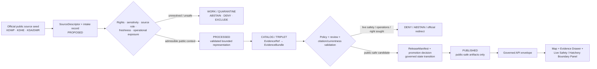
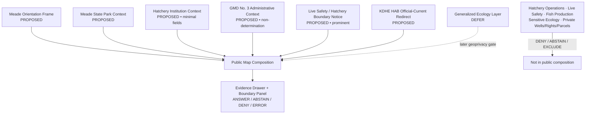
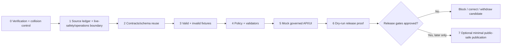

<!-- [KFM_META_BLOCK_V2]
doc_id: NEEDS_VERIFICATION — <REGISTERED_KFM_DOC_ID>
title: Meade County Focus Mode Build Plan — State Park, Fish-Rearing and Groundwater Context Without Live Safety or Hatchery-Operations Claims
type: county-focus-mode-build-plan
version: v0.1-draft
status: draft
owners:
  - NEEDS_VERIFICATION — <OWNER:focus-mode-steward>
  - NEEDS_VERIFICATION — <OWNER:ecology-and-hatchery-reviewer>
  - NEEDS_VERIFICATION — <OWNER:public-safety-and-currentness-reviewer>
created: 2026-05-24
updated: 2026-05-24
policy_label: public_draft
county: Meade County, Kansas
county_slug: meade
proof_slice: Meade State Park and Meade Fish Rearing Station public context with hatchery-operations, groundwater-source, ecological-sensitivity and live visitor-alert restraint
primary_public_safe_boundary: Official park and hatchery pages may support bounded, time-attributed public context; KFM must not republish operational water-supply or facility-security detail, infer fish-health or stocking status, expose sensitive ecology, determine groundwater or water-right condition, or turn dated alerts and facility statements into live safety/access/public-health guidance.
release_status: NOT_RELEASED — planning artifact only
review_assignments:
  - NEEDS_VERIFICATION — source admission and rights reviewer
  - NEEDS_VERIFICATION — hatchery/operational-infrastructure sensitivity reviewer
  - NEEDS_VERIFICATION — ecology/geoprivacy reviewer
  - NEEDS_VERIFICATION — public-safety/currentness reviewer
  - NEEDS_VERIFICATION — public-safe release reviewer
correction_path: NEEDS_VERIFICATION — no implemented correction path asserted
rollback_path: NEEDS_VERIFICATION — no implemented rollback path asserted
unverified_repository_paths:
  - PROPOSED / NEEDS_VERIFICATION — docs/focus-modes/meade-county/build-plan.md
  - PROPOSED / NEEDS_VERIFICATION — docs/focus-modes/meade-county/
  - PROPOSED / NEEDS_VERIFICATION — fixtures/focus_modes/meade/
schema_contract_policy_homes:
  - PROPOSED / NEEDS_VERIFICATION — contracts/focus_mode/
  - PROPOSED / NEEDS_VERIFICATION — schemas/contracts/v1/focus_mode/
  - PROPOSED / NEEDS_VERIFICATION — policy/runtime/, policy/sensitivity/, policy/rights/, policy/release/
collision_search:
  completed_register: CONFIRMED — Meade County is absent from the user-supplied completed/collision register; Butler, Wilson, Franklin, Haskell, Grant, Comanche and Labette were additionally excluded because artifacts were generated earlier in this continuing series.
  available_project_materials: CONFIRMED — Meade-targeted searches across accessible uploaded/project materials and File Library performed on 2026-05-24 surfaced existing county-plan artifacts for other counties but did not surface a Meade County Focus Mode Build Plan.
  live_repository_index: CONFIRMED — docs/focus-mode/counties/COUNTY_INDEX.md on main was inspected and lists Meade as not-started with validation not-run.
  live_repository_control_plane: CONFIRMED — docs/focus-mode/README.md, docs/doctrine/directory-rules.md §6.7 and tools/validators/validate_focus_mode_index.py were inspected during this continuing session; the validator self-identifies as PROPOSED implementation and no validator execution is claimed.
  live_repository_target_search: CONFIRMED — targeted searches for meade_county_focus_mode_build_plan, Meade County Focus Mode, meade-county and Meade State Park Meade Hatchery fish rearing fire ban returned no matching live-repository result.
  exhaustive_absence: NEEDS_VERIFICATION — unindexed branches, private artifacts and unsearched prior outputs may still exist.
directory_rules_basis:
  - CONFIRMED — attached Directory Rules.pdf was inspected during this continuing session; it requires responsibility-root placement, schema-home separation and the RAW → WORK / QUARANTINE → PROCESSED → CATALOG / TRIPLET → PUBLISHED lifecycle.
  - CONFIRMED — live docs/doctrine/directory-rules.md §6.7 was inspected; Focus Modes are cross-cutting compositional proof slices, not root folders, and doctrine identifies docs/focus-modes/<area>-<scope>/ as the documentation pattern.
  - NEEDS_VERIFICATION / DIVERGENCE — observed live county index and README are under docs/focus-mode/ while current doctrine and README prose refer to docs/focus-modes/; landing requires reconciliation before repository work.
official_source_checks:
  - CONFIRMED — Kansas Department of Wildlife and Parks, Meade State Park page, checked 2026-05-24.
  - CONFIRMED — Kansas Department of Wildlife and Parks, Meade Hatchery / Meade Fish Rearing Station page, checked 2026-05-24.
  - CONFIRMED — Kansas Department of Health and Environment, Harmful Algal Blooms page, checked 2026-05-24.
  - CONFIRMED — Kansas Department of Agriculture, Division of Water Resources, G.M.D. No. 3 page, checked 2026-05-24.
source_check_date: 2026-05-24
tags: [kfm, focus-mode, meade-county, meade-state-park, meade-hatchery, fish-rearing, hatchery-operations, groundwater, gmd-3, hab, ecology, live-safety, cite-or-abstain, public-safe]
notes:
  - This document is a planning artifact and does not claim implementation, source admission, rights clearance, policy approval, review completion, promotion, publication, correction readiness or rollback readiness.
  - Checked official hatchery content includes operational/facility and water-supply detail; this plan records the exclusion duty rather than incorporating those details into its public product design.
  - EvidenceBundle outranks generated language; dated official alerts remain official-current redirects, not cached KFM safety judgments.
[/KFM_META_BLOCK_V2] -->

<a id="top"></a>

# Meade County Focus Mode Build Plan
## State Park, Fish-Rearing and Groundwater Context Without Live Safety or Hatchery-Operations Claims

> **Product thesis:** Present Meade County’s state-park, lake, fish-rearing and southwest Kansas groundwater-management context through official, evidence-visible public information while refusing live safety, public-health, hatchery-operations, private-water, water-right or sensitive-ecology conclusions.


| Identity / status field | Value |
|---|---|
| County selected | **Meade County, Kansas** |
| Draft status | `PROPOSED` planning artifact; no implementation or publication asserted |
| Distinct proof slice | Meade State Park and Meade Fish Rearing Station public context joined to official visitor-alert, HAB and GMD No. 3 currentness/authority boundaries |
| Most consequential public-safe boundary | **Official park/hatchery pages may support bounded context, but KFM must not expose hatchery or water-supply operational detail, infer current fish/stocking/public-health status, determine groundwater or water-right condition, disclose sensitive ecology, or turn dated alerts into live safety/access guidance.** |
| Official seeds checked in this run | KDWP Meade State Park; KDWP Meade Hatchery; KDHE Harmful Algal Blooms; KDA Division of Water Resources G.M.D. No. 3 |
| Live index collision check | `CONFIRMED` inspected: Meade row presently says `not-started` / `not-run` |
| Targeted repository search | `CONFIRMED` performed; no Meade plan collision surfaced |
| Exhaustive collision absence | `NEEDS_VERIFICATION` |
| Intended landing location | `PROPOSED / NEEDS_VERIFICATION` — `docs/focus-modes/meade-county/build-plan.md` |
| Release / review / rollback | `NOT_RELEASED`; review, correction and rollback mechanisms `NEEDS_VERIFICATION` |

## Quick links

[Operating posture](#1-operating-posture) · [Why this county](#2-why-this-county) · [Product thesis](#3-product-thesis) · [Scope boundary](#4-scope-boundary) · [First demo layers](#5-first-demo-layers) · [User journeys](#6-user-journeys) · [UI surfaces](#7-ui-surfaces) · [Governed object model](#8-governed-object-model) · [Repository shape](#9-proposed-repository-shape) · [Build phases](#10-build-phases) · [First PR sequence](#11-first-pr-sequence) · [Acceptance checklist](#12-acceptance-checklist) · [Fixture plan](#13-fixture-plan) · [Risk register](#14-risk-register) · [Sources](#15-source-seed-list) · [Verification](#16-open-verification-questions) · [First milestone](#17-recommended-first-milestone) · [Appendices](#appendix-a--public-safe-narrative-skeleton)

---

## Executive build note

**Meade County is selected as a state-managed public-use and biological-production-infrastructure proof slice.** The checked Kansas Department of Wildlife and Parks (KDWP) Meade State Park page identifies the park in Meade County and describes the lake, wildlife-area and fish-hatchery relationship; at the time checked, the same official page displayed a dated park alert marked **Updated 04/17/2026** that included a fire-ban notice and facility-status messaging.[^s1] KDWP’s checked Meade Hatchery page identifies the Meade Fish Rearing Station in Meade County and characterizes it as the only hatchery in southwest Kansas.[^s2]

The source set makes the public-safe boundary unusually concrete. The hatchery page exposes facility and water-supply operations beyond what a public interpretive proof slice needs. This plan intentionally does **not** repeat those operational details into public layer design. KDHE additionally states that harmful algal blooms are unpredictable, can develop rapidly and move within a water body, and publishes current advisory information; its checked table was marked **Updated: May 22, 2026**.[^s3] KDA/DWR lists Meade among the counties or partial counties of Southwest Kansas GMD No. 3, establishing a groundwater-governance context that must remain administrative and aggregate rather than a claim about a particular supply, well or legal right.[^s4]

> [!CAUTION]
> ## Public-safe boundary — official visitor and hatchery sources are not a KFM live-safety or operations feed
>
> **KFM may eventually display admitted, time-attributed Meade State Park, general fish-rearing, and GMD No. 3 context. KFM must not republish operational hatchery or water-supply detail; state current fish production, stocking, biosecurity or facility condition; declare a lake safe or unsafe now; replace official fire-ban, HAB, closure or access advisories; determine groundwater/water-right status; or expose sensitive ecological locations.**
>
> Questions of that type resolve to `DENY`, `ABSTAIN` or an official-current redirect unless a separately governed public-safe release explicitly supports the narrowly stated claim.

### Evidence boundary at authoring time

| Label | What is established for this plan | What is not established |
|---|---|---|
| `CONFIRMED` | KDWP checked park page identifies Meade State Park in Meade County, describes park/lake/wildlife/hatchery context and displayed a dated alert at time of check; KDWP checked hatchery page identifies the Meade Fish Rearing Station and its southwest Kansas hatchery role; KDHE checked page describes HAB unpredictability and current advisories; KDA/DWR checked page lists Meade within GMD No. 3; live index, control-plane and Directory Rules evidence were inspected; targeted collision searches were performed. | — |
| `PROPOSED` | Focus Mode scope, public-safe layer/card set, UI panels, governed objects, fixture plan, reason codes, build phases, milestone and intended responsibility-rooted paths. | No proposed component is represented as implemented. |
| `NEEDS_VERIFICATION` | Full project-wide collision absence; repository landing after singular/plural path divergence; county geometry authority; derivative-display rights; which hatchery facts may be public-safe beyond minimal context; sensitive ecology review; shared contracts/schemas/policies; review assignments; correction/rollback; release readiness. | — |
| `UNKNOWN` | Current conditions after retrieval time; any unindexed prior Meade plan; whether a later reviewer approves a release; actual runtime/deployment behavior. | — |

---

# 1. Operating posture

## 1.1 Governing rules applied to Meade County

| KFM rule | Meade County application |
|---|---|
| EvidenceBundle outranks generated language | No narrative about park status, hatchery activity, ecology, public health or groundwater may become public truth without resolved admitted evidence. |
| Cite-or-abstain | Bounded place and agency-role statements may be answered after evidence closure; current safety, facility, water or ecological questions abstain or deny without fit current authority. |
| Public clients consume governed surfaces only | An eventual public map uses released public-safe artifacts through governed APIs, never `RAW`, `WORK`, `QUARANTINE`, internal source captures, restricted operational material or direct model output. |
| Source roles stay distinct | KDWP park visitor information, KDWP hatchery/facility context, KDHE health-advisory information, DWR administrative groundwater context and generated explanations must never merge into one “current truth” layer. |
| Promotion is governed transition | An official webpage, extracted record or generated map does not become published merely by existence; policy, review, release, correction and rollback closure are required. |
| Restricted/unsafe material fails closed | Hatchery operational detail, sensitive ecology, private water/well/farm information and unsafe current-condition inference are withheld or quarantined. |
| AI is interpretive only | AI may explain admitted public context; it cannot replace current park/KDHE/DWR authority or expose operational/sensitive detail. |

## 1.2 Truth labels and finite outcomes

| Token | Meaning in this plan |
|---|---|
| `CONFIRMED` | Verified in this run from checked official public sources, inspected live repository evidence or generated artifact evidence. |
| `PROPOSED` | Design recommendation or candidate artifact not verified as implemented. |
| `NEEDS_VERIFICATION` | Checkable before action but not sufficiently established now. |
| `UNKNOWN` | Not resolved from admissible evidence in this run. |
| `ANSWER` | Public-safe response supported by resolved evidence and allowed by policy. |
| `ABSTAIN` | Evidence, currentness, authority, rights, sensitivity or release fitness is unresolved. |
| `DENY` | Requested content crosses an operations, live-safety, public-health, water-right, private-detail or sensitive-ecology boundary. |
| `ERROR` | Contract, evidence-resolution, validation or runtime failure prevents a trusted response. |

## 1.3 Public trust membrane



## 1.4 County-specific non-negotiable guardrails

| Guardrail | Required posture | Default outcome when violated |
|---|---|---|
| Dated park alert vs live guidance | A checked official alert is evidence of what the official page displayed when retrieved; KFM must not cache it as current visitor guidance without expiry/current-source behavior. | `ABSTAIN` — `LIVE_PARK_ALERT_REQUIRES_OFFICIAL_CURRENT_SOURCE` |
| HAB/public-health status | KDHE advisories are official-current health context; KFM must not state a lake’s present HAB safety from cached/non-current material. | `ABSTAIN` — `LIVE_HAB_STATUS_REQUIRES_KDHE` |
| Hatchery operational detail | Do not publish facility-production, water-supply, security, biosecurity or operational infrastructure detail merely because an official page discloses it. | `DENY` — `HATCHERY_OPERATIONAL_DETAIL_WITHHELD` |
| Fish production/stocking status | General agency role does not authorize a present stocking, fish-health, disease or production conclusion. | `ABSTAIN` — `FISH_PRODUCTION_STATUS_NOT_ESTABLISHED` |
| Sensitive ecological locations | Do not expose exact sensitive species, nesting/roosting, spawning, disease-control or management locations. | `DENY` — `SENSITIVE_ECOLOGY_DETAIL_NOT_ADMITTED` |
| Groundwater and water rights | DWR/GMD context remains administrative; no KFM conclusion on private wells, lawful use, water rights or future water availability. | `DENY` — `GROUNDWATER_RIGHT_OR_SUPPLY_DETERMINATION_DENIED` |
| Access, closure and recreation safety | No statement that a feature is open, accessible or safe now except via an admitted official-current redirect/display rule. | `ABSTAIN` — `CURRENT_ACCESS_OR_SAFETY_REQUIRES_AUTHORITY` |
| Private-property inference | No parcel, household, operator or private-water conclusion is part of the first public slice. | `DENY` — `PRIVATE_PROPERTY_OR_WATER_DETAIL_DENIED` |

---

# 2. Why this county

## 2.1 Selection and collision screen

| Screen | Result | Status | Effect on selection |
|---|---|---:|---|
| User-supplied completed/collision register | Meade County is not listed. | `CONFIRMED` | Eligible to evaluate. |
| Plans generated earlier in this continuing series | Butler, Wilson, Franklin, Haskell, Grant, Comanche and Labette were excluded from reselection. | `CONFIRMED` | Avoids current-series duplicate. |
| Accessible uploaded/project-material and File Library search | Meade-targeted searches returned existing county-plan artifacts for other counties, including Barton, Cherokee, Finney, Johnson, Wyandotte, Reno, Ellsworth, Riley and Geary, but did not return a Meade plan. | `CONFIRMED` for performed search; `NEEDS_VERIFICATION` exhaustively | Candidate not rejected. |
| Live repository master county index | Inspected `docs/focus-mode/counties/COUNTY_INDEX.md`; Meade is listed `not-started` with validation `not-run`. | `CONFIRMED` observation only | Candidate not rejected; status is not release proof. |
| Live repository control-plane evidence | Inspected README, Directory Rules and validator evidence in this continuing session; singular/plural path divergence remains and validator does not prove a run. | `CONFIRMED` | Landing remains bounded and conditional. |
| Live repository targeted string search | Searches for `meade_county_focus_mode_build_plan`, `Meade County Focus Mode`, `meade-county`, and candidate proof terms returned no result. | `CONFIRMED` for performed searches | No repository collision discovered. |
| Exhaustive project-wide uniqueness | All branches, private files and unsearched prior artifacts were not proven absent. | `NEEDS_VERIFICATION` | Recheck immediately before any repository landing. |

> [!NOTE]
> Meade County was selected only after collision screening against the supplied register, the plans generated in this continuation, accessible project materials/File Library and inspected live repository evidence. No collision surfaced, but exhaustive absence remains a future verification gate.

## 2.2 Proof-slice rationale

| Selection dimension | Meade County proof value | Evidence basis / status |
|---|---|---|
| Public-use state park context | KDWP identifies Meade State Park in Meade County and describes lake, wildlife-area and visitor-use context. | `CONFIRMED` official source checked.[^s1] |
| Biological-production infrastructure | KDWP identifies Meade Fish Rearing Station in Meade County and describes its hatchery role in southwest Kansas. | `CONFIRMED` official source checked.[^s2] |
| Live visitor-alert currentness | At retrieval time the official park page visibly carried a dated fire-ban/facility-status alert. | `CONFIRMED` retrieval; no future-currentness inference.[^s1] |
| Water recreation / public-health currentness | KDHE explains that HABs can develop rapidly and publishes a current-advisory surface. | `CONFIRMED` official source checked.[^s3] |
| Groundwater-governance context | DWR identifies Meade among counties or partial counties in Southwest Kansas GMD No. 3. | `CONFIRMED` administrative context checked.[^s4] |
| Operational exposure challenge | The hatchery source contains operational/facility/water-supply detail that a public interpretation product does not need. | `CONFIRMED` source characteristic; `PROPOSED` exclusion policy.[^s2] |
| Governance value | Meade tests whether KFM can teach public land and agency context while refusing to become a facility operations or live safety system. | `PROPOSED` proof objective grounded in checked sources. |

## 2.3 Distinct series proof

| Completed or collision-identified proof slice | Boundary already tested | What Meade adds without duplicating it |
|---|---|---|
| Butler County | El Dorado Lake recreation and live reservoir/public-safety currentness. | A **state fish-rearing facility** beside a state park, adding operational biological-production and water-supply-detail restraint. |
| Haskell / Grant counties | Groundwater administration, water-right or natural-resource context. | Groundwater appears as a secondary operational-context risk tied to park/hatchery interpretation, not an administrative-water-centered product. |
| Barton County | Wetland/refuge ecology and wildlife geoprivacy. | Managed hatchery/fish-rearing and visitor-alert context rather than migratory wetland mapping. |
| Comanche County | Red Hills geology and sensitive cultural/cave locality withholding. | Agency-managed aquatic production and current public-health/visitor information boundaries. |
| Labette County | Reservoir public-use plus historic defense-industrial/environmental restraint. | Active state park/hatchery context with operational-data minimization and HAB/fire-alert currentness handling. |

## 2.4 Public benefit and governance value

The first Meade product can help users understand:

- that Meade State Park and the fish-rearing station are related public agency contexts in Meade County;
- why a time-stamped official alert needs freshness handling instead of narrative caching;
- why public hatchery information can support a general institutional context card without reproducing operational details;
- why KDHE health-advisory content remains current official authority rather than a generated lake-safety verdict;
- why GMD membership offers administrative groundwater context, not a decision about a well, water right or supply.

## 2.5 County anchors supported by checked official sources

| Anchor | Supported statement for this plan | Source role | Status |
|---|---|---|---:|
| Meade State Park | KDWP page identifies Meade State Park in Meade County and presents lake/wildlife-area/fish-hatchery context. | State public-use/park context | `CONFIRMED` |
| Dated park alert | At retrieval time, official KDWP page displayed a Meade Alert marked Updated 04/17/2026 with fire-ban/facility messaging. | Official-current visitor-information source at retrieval time | `CONFIRMED` retrieved; future-currentness `UNKNOWN` |
| Meade Fish Rearing Station | KDWP page identifies the station in Meade County and says it is the only hatchery in southwest Kansas. | Agency/fish-rearing institutional context | `CONFIRMED` |
| Operational detail exclusion | Checked hatchery page contains operational facility/water-supply information beyond first-slice public need. | Sensitive operational source characteristic | `CONFIRMED`; public detail `EXCLUDE` |
| HAB advisory currentness | KDHE states HABs are unpredictable, may develop rapidly/move, and provides current advisories. | Public-health/current advisory authority | `CONFIRMED` |
| GMD No. 3 membership | DWR page lists Meade among Southwest Kansas GMD No. 3 counties/partial counties. | Administrative groundwater-management context | `CONFIRMED` |

---

# 3. Product thesis

## 3.1 One-sentence thesis

> **Meade County Focus Mode should let the public explore evidence-backed state-park, general fish-rearing and groundwater-management context while making it impossible to mistake KFM for a live park-alert, lake-health, hatchery-operations, fish-production, water-right or sensitive-ecology authority.**

## 3.2 What the first product promises

| Promise | Implementation meaning |
|---|---|
| A bounded Meade county frame | Public-safe orientation extent once authoritative geometry and rights are admitted. |
| Evidence-visible park context | General park/lake/wildlife-area context can display only with source and temporal limitations. |
| Minimal hatchery institution card | Public may learn that a KDWP fish-rearing station exists in Meade County and its general role, without operational detail. |
| A central live-safety/operations boundary | Current alert, HAB and facility-operation boundaries remain visible in UI and policy. |
| Finite outcomes | Supported context may yield `ANSWER`; current/sensitive/operational questions yield `ABSTAIN` or `DENY`. |
| Reversibility | Any future public release requires correction and rollback support; none are claimed now. |

## 3.3 What the first product does not promise

| Non-promise | Required user-facing posture |
|---|---|
| Whether a fire ban, facility opening or recreation condition is in force now | Redirect to official-current KDWP surface; do not cache a KFM verdict. |
| Whether Meade Lake is safe for contact, fish consumption or animals now | Redirect to current KDHE/KDWP authority; do not answer from historical context. |
| Hatchery facility, water-supply, production, security or biosecurity detail | Withhold; not required for a public interpretive product. |
| Current fish stocking, disease, production or ecological-management status | Abstain absent admitted public-safe current authority. |
| Condition of a private well, farm, water right or future water supply | Deny; DWR/GMD context is not a private/legal determination. |
| Exact sensitive ecology or wildlife-management features | Deny or defer pending sensitivity review. |
| Implementation or release readiness | This is a plan, not an implemented or published feature. |

---

# 4. Scope boundary

## 4.1 First-slice classification

| Content family | First-slice posture | Why | Governing boundary |
|---|---:|---|---|
| Meade county orientation extent | `PROPOSED` public-safe | Establishes bounded map frame; geometry source/admission still required. | No private/property/water inference. |
| Meade State Park general context card | `PROPOSED` public-safe after admission | KDWP provides official public-use and county context. | No live access, alert, health or safety verdict. |
| Meade Lake / wildlife-area general context | `PROPOSED` public-safe after admission | Supports visitor-oriented orientation at broad scope. | No precise sensitive ecology or current conditions. |
| `LiveVisitorInformationBoundaryNotice` | `PROPOSED` **priority public-safe card** | Official source itself displays date-sensitive visitor alert material. | Redirect or expiry behavior required. |
| `HatcheryInstitutionContextCard` | `PROPOSED` minimal public-safe after review | KDWP supports general institutional role. | Deliberately excludes operational/facility/water-supply detail. |
| `HatcheryOperationalDetail` | `DENY` / `EXCLUDE` | Not needed for public interpretation and creates operational sensitivity. | Not part of first product. |
| `HABAuthorityRedirectCard` | `PROPOSED` official-current redirect only | KDHE establishes rapid/current health-advisory nature. | No cached KFM lake-safety response. |
| `GMD3AdministrativeContextCard` | `PROPOSED` narrow/general context | DWR verifies Meade in GMD No. 3. | No private well/water-right/future supply determination. |
| Fish stocking/production/current health layer | `DEFER` / `DENY` when asked as current | Requires fit, admitted, public-safe current data and sensitivity review. | No inferred operational conclusion. |
| Sensitive ecology locations | `DENY` / `DEFER` | Recreation/wildlife context does not license geoprivacy-sensitive detail. | Generalize or exclude. |
| Private well, parcel, farm or individual water-right content | `DENY` | Privacy/property/legal and water-governance risk. | Outside first slice. |

## 4.2 Public-safe content requirements

Every first-slice public object must expose, where applicable:

- official source authority and declared source role;
- retrieved/checked date and any alert/advisory validity indicator;
- evidence resolution status;
- rights, sensitivity and operational-exposure posture;
- currentness/expiry rule for alert, public-health and facility-status material;
- limitations denying hatchery operations, live safety, private-water and water-right inferences;
- review, release, correction and rollback state once those processes exist.

## 4.3 Denied-by-default content

| Public request example | Outcome | Candidate reason code |
|---|---:|---|
| “Is the park fire ban still active right now?” | `ABSTAIN` / official-current redirect | `LIVE_PARK_ALERT_REQUIRES_OFFICIAL_CURRENT_SOURCE` |
| “Is Meade Lake safe for swimming or pets today?” | `ABSTAIN` / official-current redirect | `LIVE_HAB_STATUS_REQUIRES_KDHE` |
| “Map the hatchery’s operational water infrastructure or production facilities.” | `DENY` | `HATCHERY_OPERATIONAL_DETAIL_WITHHELD` |
| “What fish is the hatchery producing or releasing today?” | `ABSTAIN` | `FISH_PRODUCTION_STATUS_NOT_ESTABLISHED` |
| “Show exact sensitive wildlife or management locations near the park.” | `DENY` | `SENSITIVE_ECOLOGY_DETAIL_NOT_ADMITTED` |
| “Does this local well or water right support my farm?” | `DENY` | `GROUNDWATER_RIGHT_OR_SUPPLY_DETERMINATION_DENIED` |
| “Is this parcel accessible or suitable because it is near the lake?” | `DENY` | `PRIVATE_PROPERTY_OR_WATER_DETAIL_DENIED` |
| “Treat a cached alert as the park’s present open/closed/safe status.” | `ABSTAIN` | `CURRENT_ACCESS_OR_SAFETY_REQUIRES_AUTHORITY` |

---

# 5. First demo layers

## 5.1 Prioritized first public-safe layer/card set

| Priority | Layer or card | Public purpose | Checked source seed | Evidence / policy gate | Status |
|---:|---|---|---|---|---:|
| 1 | `LiveSafetyAndHatcheryBoundaryNotice` | Explains why KFM shows general context but does not serve live alerts, health advisories or operations detail. | KDWP park/hatchery + KDHE + DWR[^s1][^s2][^s3][^s4] | Boundary policy; currentness and operational exposure tests. | `PROPOSED` |
| 2 | `MeadeStateParkContextCard` | Presents broad state-park/county/lake context. | KDWP Meade State Park page[^s1] | Source admission; EvidenceBundle; no current-safety conclusion. | `PROPOSED` |
| 3 | `DatedVisitorAlertRedirectCard` | Demonstrates that time-sensitive official visitor material needs live-source routing. | KDWP page alert at retrieval time[^s1] | Expiry/retrieval timestamp; display only as official-current redirect or status-bearing response if governed. | `PROPOSED` |
| 4 | `HatcheryInstitutionContextCard` | States a general fish-rearing institutional anchor without operations. | KDWP Meade Hatchery page[^s2] | Minimal-field policy; operational redaction; evidence and rights review. | `PROPOSED` |
| 5 | `HABAuthorityRedirectCard` | Teaches where present public-health water advice belongs. | KDHE HAB page[^s3] | Currentness/expiry and no-cache-safe-verdict rule. | `PROPOSED` |
| 6 | `GMD3AdministrativeContextCard` | Adds bounded groundwater-management context. | KDA/DWR GMD No. 3 page[^s4] | Administrative-source badge; no individual right/well/supply conclusion. | `PROPOSED` |
| 7 | Meade county orientation extent | Establishes map scope. | Geometry source `NEEDS_VERIFICATION` | Authority, vintage, rights and simplification receipt. | `PROPOSED` |
| 8 | Generalized ecology/habitat context | Could later describe public-safe habitat context. | Official ecology source not admitted beyond KDWP general text. | Geoprivacy, seasonal/management sensitivity and rights review. | `DEFER` |
| 9 | Hatchery facility/water-supply/production details | Not required for public learning and risks operational disclosure. | Checked page demonstrates exclusion need. | Prohibited first slice. | `DENY` |
| 10 | Live safety, closure, advisories, fish health or stocking feed | Current operational/public-health product outside MVP. | Requires governed official-current source behavior. | No cached or inferred verdict. | `EXCLUDE` |

## 5.2 Map composition



## 5.3 Layer-card truth contract

| Required field | Purpose | Failure posture |
|---|---|---|
| `layer_id` / `card_id` | Stable reference candidate for a visible product. | `ERROR` when missing. |
| `county_scope: meade` | Prevent scope drift. | `ABSTAIN` if mismatched. |
| `source_role` | Distinguish park context, hatchery institution, public-health advisory, groundwater administration and generated narrative. | `ABSTAIN`; no release without it. |
| `temporal_basis` | Records checked date, alert timestamp, advisory update date or stable-context status. | `ABSTAIN` for “now” questions without current-source fitness. |
| `freshness_or_expiry` | Prevents cached alert/advisory material from remaining authoritative. | `ABSTAIN` / disable live-status surface. |
| `operational_sensitivity` | Prevents release of facility/water-supply/production details. | `DENY` / quarantine. |
| `ecological_sensitivity` | Prevents exact occurrence or management disclosure. | `DENY` / generalize. |
| `evidence_refs` | Requires resolvable evidence for claim-bearing display. | `ABSTAIN`; release block if unresolved. |
| `rights_status` | Records whether derivative display or caching is permitted. | Quarantine/abstain if unresolved. |
| `policy_decision_ref` | Binds public use to the evaluated boundary. | Fail closed if missing. |
| `limitations` | States no live-safety, hatchery-operations, public-health, water-right or private-water inference. | Fail public validation if omitted. |
| `correction_ref` / `rollback_ref` | Provides future reversal capability. | No publication without closure. |

---

# 6. User journeys

## 6.1 Public learning journeys

| Journey | User action | Public-safe response | Trust affordance |
|---|---|---|---|
| Park orientation | Opens Meade and selects State Park context. | Shows KDWP-backed broad place/institution context with checked date. | Evidence Drawer and no-live-status limitation. |
| Hatchery understanding | Opens general hatchery card. | Shows KDWP-backed institutional role only. | “Operational detail withheld” badge and minimal-field display. |
| Why a safety answer is absent | Opens boundary notice. | Explains alert/HAB/current-condition questions remain with official-current authority. | Displays currentness reason codes and official-source routing. |
| Groundwater context | Opens GMD card. | Shows DWR-backed administrative context that Meade lies within GMD No. 3. | “No private-well, right or supply determination” limitation. |

## 6.2 Trust-demonstration journeys

| Query or interaction | Expected outcome | Demonstrated KFM property |
|---|---:|---|
| “What official source identifies Meade State Park in this county?” | `ANSWER` after evidence resolution | Traceable public agency context. |
| “What is Meade Fish Rearing Station’s general public institutional context?” | `ANSWER` only at approved minimal scope | Operational minimization. |
| “Why won’t KFM tell me today’s lake safety status?” | `ANSWER` about authority boundary; not safety answer | Official-current redirect discipline. |
| User selects a mock alert card without a valid freshness policy | `ABSTAIN` | Temporal/currentness gate. |
| User opens a card with unresolved evidence | `ABSTAIN` | Evidence closure required. |

## 6.3 Denied or abstained requests

| Request | Runtime result | Public explanation seed | Candidate reason code |
|---|---:|---|---|
| “Is the official park alert still in force right now?” | `ABSTAIN` | Retrieve the official-current KDWP source; KFM does not rely on cached alert text. | `LIVE_PARK_ALERT_REQUIRES_OFFICIAL_CURRENT_SOURCE` |
| “Is the lake safe for people, pets or fishing today?” | `ABSTAIN` | Consult current KDHE/KDWP authority; present health/safety is time-sensitive. | `LIVE_HAB_STATUS_REQUIRES_KDHE` |
| “Show the hatchery’s water infrastructure, facility layout or operating details.” | `DENY` | Operational detail is withheld from the public interpretive slice. | `HATCHERY_OPERATIONAL_DETAIL_WITHHELD` |
| “What fish is being produced or stocked right now?” | `ABSTAIN` | Present production/stocking status is not established by admitted public-safe context. | `FISH_PRODUCTION_STATUS_NOT_ESTABLISHED` |
| “Map sensitive wildlife or management points around the lake.” | `DENY` | Ecological/geoprivacy detail has not been admitted for public display. | `SENSITIVE_ECOLOGY_DETAIL_NOT_ADMITTED` |
| “Does a particular well/right guarantee water for this property?” | `DENY` | KFM does not issue water-right, private-water or supply determinations. | `GROUNDWATER_RIGHT_OR_SUPPLY_DETERMINATION_DENIED` |
| “Can I access this private location because it appears on the map?” | `DENY` | Public map context does not confer access or property permission. | `PRIVATE_PROPERTY_OR_WATER_DETAIL_DENIED` |

---

# 7. UI surfaces

## 7.1 Required surfaces

| Surface | Public function | Meade-specific trust behavior | Status |
|---|---|---|---:|
| Header | Identifies county, evidence/release state and boundary. | Persistent badge: “No live safety or hatchery-operations verdict.” | `PROPOSED` |
| Map canvas | Shows released public-safe layer composition. | Broad park/GMD context only after release; no operational facility or sensitive ecology features. | `PROPOSED` |
| Layer drawer | Toggles permitted context cards/layers. | Source-role, checked-date, currentness and sensitivity badges appear for each card. | `PROPOSED` |
| Evidence Drawer | Resolves visible claims to evidence/limitations. | Makes KDWP/KDHE/DWR role separation and operational exclusion visible. | `PROPOSED` |
| Answer panel | Answers supported contextual questions. | Can explain broad park/hatchery/GMD context; cannot answer present status/safety/operations. | `PROPOSED` |
| Denial panel | Explains denied requests without leakage. | Refuses hatchery operations, sensitive ecology and water-right/private-water questions. | `PROPOSED` |
| Timeline / time-basis surface | Shows retrieved dates, official alert dates and expiry posture. | Dated park alert/HAB material cannot silently persist as “current.” | `PROPOSED` |
| **Live Safety / Hatchery Operations Boundary Panel** | Makes primary public-safe boundary visible. | Provides official-current routing and denial reasons. | `PROPOSED` |
| Current-authority redirect panel | Routes live conditions appropriately. | Links only to verified current official surfaces; no model-generated safety verdict. | `PROPOSED` |
| Release/correction panel | Future release and reversibility state. | States `NOT_RELEASED` in drafts/mocks. | `PROPOSED` |

## 7.2 Legend vocabulary

| UI label | Meaning | May support | Must not be used as |
|---|---|---|---|
| `State park context` | KDWP-backed broad place and public-use context. | Stable orientation after admission. | Live opening, restriction or safety answer. |
| `Official-current alert source` | Authority source whose displayed conditions may change. | Redirect or governed current retrieval only. | Cached narrative verdict. |
| `Fish-rearing institutional context` | Minimal public description of agency role. | Existence/general institutional setting. | Facility map, production, biosecurity or water-supply disclosure. |
| `Public-health advisory authority` | KDHE HAB currentness/safety authority. | Redirect and time-sensitive advisory display if governed. | Model-generated lake health conclusion. |
| `Administrative groundwater context` | DWR/GMD description of district context. | Broad management geography. | Private well, legal right or future supply determination. |
| `Sensitive ecology withheld` | Detail excluded from public surface. | Explaining absence. | Confirmation or reconstruction clue. |
| `Draft / mock` | Planning/testing only. | UI/policy proof. | Published or released truth. |

## 7.3 Governed interaction sequence

```mermaid
sequenceDiagram
    actor U as Public user
    participant UI as Explorer UI
    participant API as Governed API
    participant P as Policy gate
    participant E as Evidence resolver
    participant R as Released artifacts
    participant O as Official-current source route
    U->>UI: Open Meade / ask park-hatchery question
    UI->>API: Request public context envelope
    API->>P: Evaluate source role, freshness, sensitivity, operations and water boundary
    alt Bounded general context allowed
        P->>E: Resolve EvidenceRef
        E->>R: Read released public-safe bundle
        R-->>E: EvidenceBundle + limitations
        E-->>API: Resolved evidence
        API-->>UI: ANSWER + citations + boundary notice
        UI-->>U: Map/card + Evidence Drawer
    else Live alert or HAB/current safety question
        P-->>API: ABSTAIN or governed redirect required
        API->>O: Optional verified current-source route
        API-->>UI: ABSTAIN/redirect envelope; no cached safety verdict
        UI-->>U: Official-current guidance path
    else Hatchery operations, sensitive ecology or private water/right request
        P-->>API: DENY + reason code
        API-->>UI: DENY envelope; no sensitive detail
        UI-->>U: Boundary panel
    end
```

---

# 8. Governed object model

## 8.1 Shared KFM object families to reuse or verify

| Object family | Role in the Meade proof slice | Meade-specific requirement | Implementation status |
|---|---|---|---:|
| `SourceDescriptor` | Declares authority, role, rights, freshness, sensitivity and intended use. | Separate KDWP park, KDWP hatchery, KDHE advisory and DWR administrative contexts. | `PROPOSED / NEEDS_VERIFICATION` |
| `EvidenceRef` | Stable link from visible claim to proof. | Required for all context and boundary cards. | `PROPOSED / NEEDS_VERIFICATION` |
| `EvidenceBundle` | Resolved proof package outranking generated prose. | Retains checked-date, currentness, operational-exclusion and water-nondetermination limitations. | `PROPOSED / NEEDS_VERIFICATION` |
| `PolicyDecision` | Enforces allow/abstain/deny behavior. | Must deny operations/private-water/sensitive ecology and abstain for stale/live-safety questions. | `PROPOSED / NEEDS_VERIFICATION` |
| `RuntimeResponseEnvelope` | Carries `ANSWER`, `ABSTAIN`, `DENY` or `ERROR`. | Must avoid restating withheld operational content in refusals. | `PROPOSED / NEEDS_VERIFICATION` |
| `CitationValidationReport` | Confirms claims trace to admitted evidence and remain in role scope. | Must fail if dated alert becomes current assertion or hatchery context becomes operations detail. | `PROPOSED / NEEDS_VERIFICATION` |
| `ReleaseManifest` | Records public-safe released composition. | Cannot include operational detail, stale live-status cards or sensitive ecology/private-water content. | `PROPOSED / NEEDS_VERIFICATION` |
| `AIReceipt` | Records generated explanation dependencies and outcome. | AI cannot manufacture safety, operations, public-health or water-right conclusions. | `PROPOSED / NEEDS_VERIFICATION` |
| `ReviewRecord` | Records required review duties/findings. | Currentness, operational sensitivity, ecology and water-governance review needed before release. | `PROPOSED / NEEDS_VERIFICATION` |
| `CorrectionNotice` | Corrects public output after evidence/status/policy change. | Needed if stale alert or overbroad institutional claim is published. | `PROPOSED / NEEDS_VERIFICATION` |
| `RollbackPlan` / rollback reference | Enables immediate reversible withdrawal. | Required before any released/current-status feature exists. | `PROPOSED / NEEDS_VERIFICATION` |

## 8.2 County-specific object candidates

| Candidate object | Purpose | Public-safe fields | Excluded meaning |
|---|---|---|---|
| `MeadeStateParkContextCard` | Presents broad KDWP state-park context. | county scope, general public-use summary, checked date, evidence and limitations. | No live safety/access/alert status. |
| `DatedVisitorAlertRedirectCard` | Records that official-current visitor messaging exists and requires fresh retrieval. | authority, retrieved date, displayed-update date, expiry policy, redirect. | No cached verdict after expiry. |
| `HatcheryInstitutionContextCard` | Presents minimal fish-rearing institutional context. | agency, general role, county, evidence, operations-withheld notice. | No facility, water-supply, production or security detail. |
| `HABAuthorityRedirectCard` | Makes current public-health authority explicit. | authority, currentness policy, reason code and redirect. | No KFM health/safety determination. |
| `GMD3AdministrativeContextCard` | Presents broad groundwater-management context. | district, county scope, administrative role, limitations. | No private well/right/supply determination. |
| `LiveSafetyAndHatcheryBoundaryNotice` | Machine-visible central restriction. | prohibited claim classes, reason codes, official redirects and release posture. | No operational or sensitive detail. |

## 8.3 Source-role anti-collapse rules

| Source family | Valid role in Meade Focus Mode | Must not collapse into |
|---|---|---|
| KDWP Meade State Park page | Public-use place context; official-current visitor-source routing where governed. | Permanent KFM safety/open/closure/fire-ban verdict. |
| KDWP Meade Hatchery page | Minimal institutional context after operational screening. | Public facility/water-supply/production/biosecurity layer. |
| KDHE HAB page | Official public-health/current advisory authority and redirect. | Cached lake-safety claim or generalized park narrative. |
| KDA/DWR GMD No. 3 page | Administrative groundwater-management context. | Private well, legal-right, lawful-use or future supply conclusion. |
| Future ecology evidence | Generalized public-safe ecological context only after admission. | Exact species/management/spawning/roost detail. |
| Generated AI narrative | Explanation downstream of evidence and policy. | Evidence, official advice, safety, review or release state. |

## 8.4 Minimal public runtime response example — allowed context

```json
{
  "schema_version": "v1",
  "object_type": "RuntimeResponseEnvelope",
  "response_id": "kfm.runtime.meade.park_hatchery_context.answer.v1",
  "county": "meade",
  "outcome": "ANSWER",
  "answer_scope": "public_safe_park_and_institution_context",
  "answer": "Checked Kansas Department of Wildlife and Parks pages identify Meade State Park and Meade Fish Rearing Station in Meade County, with the fish-rearing station described as the only hatchery in southwest Kansas.",
  "evidence_refs": [
    "kfm.evidence_ref.meade.kdwp_park_context.v1",
    "kfm.evidence_ref.meade.kdwp_hatchery_institution_context.v1"
  ],
  "source_roles": [
    "state_park_context",
    "fish_rearing_institution_context"
  ],
  "temporal_basis": {
    "source_checked_on": "2026-05-24",
    "claim_currentness": "bounded_institutional_context_only"
  },
  "limitations": [
    "This response does not report current park safety, alert, closure, hatchery operations, water-supply infrastructure, fish production or stocking status.",
    "This response does not determine groundwater, water-right, private-property or sensitive-ecology conditions."
  ],
  "policy_label": "public_safe_candidate",
  "review_state": "NEEDS_VERIFICATION",
  "release_state": "NOT_RELEASED",
  "citation_validation": "NEEDS_VERIFICATION",
  "spec_hash": "NEEDS_VERIFICATION"
}
```

## 8.5 Abstention example — live park or lake safety

```json
{
  "schema_version": "v1",
  "object_type": "RuntimeResponseEnvelope",
  "response_id": "kfm.runtime.meade.live_park_or_lake_safety.abstain.v1",
  "county": "meade",
  "outcome": "ABSTAIN",
  "reason_code": "LIVE_PARK_ALERT_REQUIRES_OFFICIAL_CURRENT_SOURCE",
  "message": "Meade park restrictions and lake-health or safety conditions may change. KFM does not provide a cached safety verdict; consult the current official KDWP and, for harmful algal bloom advisories, KDHE surfaces.",
  "evidence_refs": [
    "kfm.evidence_ref.meade.kdwp_dated_alert_boundary.v1",
    "kfm.evidence_ref.meade.kdhe_hab_currentness_boundary.v1"
  ],
  "official_redirects": [
    {
      "authority": "Kansas Department of Wildlife and Parks",
      "purpose": "current Meade State Park visitor information"
    },
    {
      "authority": "Kansas Department of Health and Environment",
      "purpose": "current harmful algal bloom advisory information"
    }
  ],
  "policy_label": "public_abstain",
  "review_state": "NEEDS_VERIFICATION",
  "release_state": "NOT_RELEASED",
  "spec_hash": "NEEDS_VERIFICATION"
}
```

## 8.6 Denial example — operational/private-water disclosure

```json
{
  "schema_version": "v1",
  "object_type": "RuntimeResponseEnvelope",
  "response_id": "kfm.runtime.meade.hatchery_operations_or_private_water.deny.v1",
  "county": "meade",
  "outcome": "DENY",
  "reason_code": "HATCHERY_OPERATIONAL_DETAIL_WITHHELD",
  "message": "KFM does not provide hatchery operational, facility-security or water-supply detail and does not determine private groundwater or water-right conditions.",
  "evidence_refs": [
    "kfm.evidence_ref.meade.operations_and_water_boundary.v1"
  ],
  "withheld_fields": [
    "facility_operational_detail",
    "water_supply_infrastructure_detail",
    "fish_production_or_biosecurity_status",
    "private_well_or_water_right_detail",
    "sensitive_ecology_geometry"
  ],
  "policy_label": "public_deny",
  "review_state": "NEEDS_VERIFICATION",
  "release_state": "NOT_RELEASED",
  "spec_hash": "NEEDS_VERIFICATION"
}
```

## 8.7 Deterministic identity and `spec_hash` posture

| Item | Candidate identity pattern | Hash posture |
|---|---|---|
| Source descriptor | `kfm.source.meade.<authority>.<source_slug>.v1` | Hash normalized identity, role, checked date, freshness, rights, sensitivity and limitations. |
| Evidence bundle | `kfm.evidence_bundle.meade.<claim_scope>.v1` | Hash admitted evidence, redaction/exclusion posture, time fitness and policy/review links. |
| Card/layer | `kfm.card.meade.<public_safe_card>.v1` / `kfm.layer.meade.<layer>.v1` | Hash display spec plus evidence, currentness and policy references. |
| Runtime fixture | `kfm.runtime.meade.<scenario>.<outcome>.v1` | Hash fixture per verified canonical utility. |
| Release candidate | `kfm.release.meade.focus_mode.v0_1` | Hash manifest and proof/review/correction/rollback closure. |

> [!IMPORTANT]
> The identity patterns and `spec_hash` behaviors above are `PROPOSED`. Existing identifier grammar, hashing utilities and shared object contracts must be inspected before implementation.

---

# 9. Proposed repository shape

## 9.1 Directory Rules basis and observed divergence

| Finding | Label | Consequence for this plan |
|---|---:|---|
| Attached `Directory Rules.pdf` states that location encodes responsibility/governance/lifecycle and topic does not justify a new root. | `CONFIRMED` inspected during this continuing session | Meade is a Focus Mode lane within responsibility roots, not a new top-level folder. |
| Attached Directory Rules states the lifecycle `RAW → WORK / QUARANTINE → PROCESSED → CATALOG / TRIPLET → PUBLISHED` and promotion is a governed transition. | `CONFIRMED` | No official source, alert cache, AI output or mock payload is public by existence alone. |
| Live `docs/doctrine/directory-rules.md` §6.7 states Focus Modes are multi-root compositional proof slices and gives `docs/focus-modes/<area>-<scope>/`. | `CONFIRMED` doctrine | Intended documentation path follows `docs/focus-modes/meade-county/`, pending reconciliation. |
| Live `docs/focus-mode/README.md` restates the doctrine and refers to plural `docs/focus-modes/`, while itself and the index sit under singular `docs/focus-mode/`. | `CONFIRMED` observed divergence | Do not silently add a sibling lane without a documented resolution. |
| Live index lists Meade `not-started`; inspected validator exists but self-identifies as `PROPOSED implementation`. | `CONFIRMED` observed evidence | No lane existence, validation execution or canonical landing is claimed. |

> [!WARNING]
> **All repository paths below remain `PROPOSED / NEEDS_VERIFICATION` unless explicitly identified as inspected live evidence.** This artifact neither modifies the repository nor authorizes a path decision. Resolve the singular/plural Focus Mode control-plane divergence and verify existing authority homes before implementation.

## 9.2 Candidate path table

| Responsibility root | Proposed path | Purpose | Verification gate |
|---|---|---|---|
| Human documentation | `docs/focus-modes/meade-county/build-plan.md` | This plan as a county proof-slice document. | Reconcile singular/plural control-plane convention and any accepted ADR. |
| Human documentation companions | `docs/focus-modes/meade-county/{README.md,layer-registry.md,evidence-model.md,acceptance-checklist.md,source-seed-list.md,public-safety-notes.md,hatchery-operations-and-currentness-notes.md,water-and-ecology-boundary-notes.md}` | Boundary and control-plane documentation. | Confirm lane convention and index update procedure. |
| Semantic contracts | `contracts/focus_mode/` | Reuse or extend shared object meaning. | Inspect existing contracts; no parallel family. |
| Machine schemas | `schemas/contracts/v1/focus_mode/` | Shared machine-checkable payload shapes. | Verify schema authority and existing definitions. |
| Fixtures | `fixtures/focus_modes/meade/{valid,invalid}/` | Finite-outcome and fail-closed test inputs. | Verify fixture-home convention. |
| UI shell | `apps/explorer-web/src/focus-modes/meade/` | Mock/public UI behind governed API. | Verify live app conventions. |
| Validators | `tools/validators/` | Shared checks for evidence/currentness/sensitivity/boundary behavior. | Inspect registry and avoid duplicates. |
| Source catalog | `data/catalog/sources/meade/source_descriptors.yaml` | Admitted descriptors only. | Rights, sensitivity, time and role review. |
| Published artifacts | `data/published/layers/meade/`, `data/published/api_payloads/focus-modes/meade.json` | Future released public-safe artifacts only. | Not first-PR; governed promotion required. |
| Release decisions | `release/candidates/meade-focus-mode/`, `release/manifests/meade-focus-mode-v<n>.json` | Future candidate/manifest artifacts. | Review, correction and rollback verified. |
| Optional pipeline composition | `pipeline_specs/focus_modes/meade/` | Only if a distinct declarative build is justified. | Avoid when shared composition suffices. |

## 9.3 Proposed responsibility-rooted tree

```text
# PROPOSED / NEEDS_VERIFICATION — no repository changes asserted

docs/
└── focus-modes/
    └── meade-county/
        ├── README.md
        ├── build-plan.md
        ├── layer-registry.md
        ├── evidence-model.md
        ├── acceptance-checklist.md
        ├── source-seed-list.md
        ├── public-safety-notes.md
        ├── hatchery-operations-and-currentness-notes.md
        └── water-and-ecology-boundary-notes.md

contracts/
└── focus_mode/                         # shared semantic family; verify/reuse

schemas/
└── contracts/v1/focus_mode/            # shared machine shape; verify/reuse

fixtures/
└── focus_modes/meade/
    ├── valid/
    │   ├── focus_mode_payload.public_safe_context.valid.json
    │   ├── evidence_bundle.park_context.valid.json
    │   ├── evidence_bundle.hatchery_institution_context.valid.json
    │   ├── runtime_response.current_authority_redirect.valid.json
    │   └── runtime_response.gmd_context.valid.json
    └── invalid/
        ├── cached_alert_as_live_status.invalid.json
        ├── cached_hab_as_lake_safe_now.invalid.json
        ├── hatchery_operational_detail_public.invalid.json
        ├── fish_production_status_without_current_evidence.invalid.json
        ├── sensitive_ecology_exact_detail.invalid.json
        ├── groundwater_right_or_private_supply_determination.invalid.json
        ├── parcel_or_access_inference.invalid.json
        ├── unresolved_evidence_ref.invalid.json
        ├── model_output_as_evidence.invalid.json
        └── public_raw_work_quarantine_access.invalid.json

apps/
└── explorer-web/src/focus-modes/meade/       # mock/UI only after contract verification

data/
├── catalog/sources/meade/                    # admitted descriptors only
└── published/                                # prohibited until governed promotion

release/
├── candidates/meade-focus-mode/              # later candidate only
└── manifests/                                # later governed release only
```

## 9.4 Placement prohibitions

- Do **not** create root-level `meade/`, `hatchery/`, `state-park/`, `groundwater/`, `ecology/` or `focus_modes/` authority folders.
- Do **not** place machine schemas inside `contracts/focus_mode/` or public source captures alongside semantic contracts.
- Do **not** use `apps/web/` for new Focus Mode work when inspected doctrine identifies `apps/explorer-web/`.
- Do **not** place source-contained hatchery/facility/water-supply operational details in public artifacts merely because they are discoverable on an official webpage.
- Do **not** cache date-sensitive official visitor alerts or KDHE advisories into undated KFM truth.
- Do **not** expose private wells, water-right conclusions, parcel/access implications or exact sensitive ecology.
- Do **not** allow UI, tiles, stories or generated responses to read `RAW`, `WORK` or `QUARANTINE`.
- Do **not** populate `data/published/` or `release/manifests/` because this plan exists.

---

# 10. Build phases

| Phase | Goal | Entry gates | Planned outputs | Exit validation | Rollback posture |
|---:|---|---|---|---|---|
| 0 | Verify collision and control-plane placement | Register checked; live index/README/rules/validator inspected; targeted searches repeated near PR time | Verification note; reconciled landing decision; collision receipt candidate | No surfaced Meade collision; path divergence resolved or blocked | Stop without repository addition if unresolved |
| 1 | Admit source ledger and primary boundary | KDWP/KDHE/DWR seeds inventoried; currentness/operations/sensitivity questions explicit | Descriptor candidates; Live Safety/Hatchery Boundary Notice; source-role matrix | Each source has role, freshness, rights, sensitivity and allowed scope; operations details excluded | Preserve notes only; do not promote |
| 2 | Confirm/reuse shared contracts and schemas | Existing object-family inventory performed | Reuse decision or governed extension proposal | No parallel authority homes | Revert proposed changes; retain docs |
| 3 | Build valid and invalid fixtures | Contracts and boundary sufficiently specified | Public-safe context fixtures; high-risk currentness/operations/private-water pack | Unsafe cases fail closed; no pass claim without run evidence | Delete unaccepted fixtures |
| 4 | Policy and validator proof | Fixture family exists | Policy candidates and evidence/currentness/operations validators | All finite outcomes covered; operations/currentness failures block | Revert candidate; block release |
| 5 | Mock governed API and UI | Contracts, fixtures and policy posture agreed | Mock envelopes; Evidence Drawer; Boundary Panel; redirect panel | No internal stores or sensitive details; `NOT_RELEASED` visible | Disable mock route/component |
| 6 | Dry-run release proof | Sources admitted; reviews/tests available | Candidate dossier, proof report, correction/rollback drafts | No public alias; closure tested only | Withdraw candidate |
| 7 | Optional minimal public-safe publication | Explicit evidence, policy, rights, review and release approvals | Narrow released context via governed interfaces only | Limitations/currentness visible; rollback actionable | Activate recorded correction/rollback |



---

# 11. First PR sequence

> [!IMPORTANT]
> **Live source integration and public release are not first-PR work.** The first work must resolve placement/collision verification and encode the live-safety/hatchery-operations boundary before any current-information, facility-detail or public-release behavior is attempted.

| Order | Proposed PR objective | Principal content | Acceptance emphasis |
|---:|---|---|---|
| 1 | Verification and documentation control | Repeat collision search; reconcile/block focus-mode path divergence; authorized control-plane docs only. | No duplicate plan; no guessed canonical path. |
| 2 | Source ledger/admission and public-safe boundary | KDWP/KDHE/DWR descriptors; role/currentness/sensitivity matrix; boundary notice. | Official pages do not become cached live safety or operational-detail truth. |
| 3 | Contracts/schemas or shared-object reuse | Inspect existing shared object families; reuse or govern extension. | No parallel homes; contract/schema/policy separation. |
| 4 | Valid and invalid fixtures | Safe context examples plus alert/HAB/operations/private-water/ecology failures. | Fail-closed proof before integration. |
| 5 | Policy and validators | Evidence, freshness, operations, sensitivity and public-membrane checks. | All finite outcomes represented; unsafe cases block. |
| 6 | Mock governed API/UI | Mock envelopes; Evidence Drawer; Live Safety/Hatchery Boundary Panel. | Trust demonstration, not live product. |
| 7 | Dry-run release proof | Candidate manifest; validation/review/correction/rollback references. | Rehearsal only; no publication. |
| 8 | Only then optional minimal public-safe publication | Narrow permitted context after completed gates. | Public output remains traceable, currentness-bounded and reversible. |

---

# 12. Acceptance checklist

## 12.1 Governance and evidence

- [ ] Collision check is repeated immediately before any repository landing.
- [ ] Meade remains absent from newly discovered county-plan artifacts.
- [ ] Every public claim-bearing layer/card/answer resolves `EvidenceRef` to `EvidenceBundle`.
- [ ] Every source declares authority role, checked date/freshness, intended use, rights and sensitivity posture.
- [ ] KDWP park, KDWP hatchery, KDHE HAB, DWR GMD and generated-narrative roles remain distinct.
- [ ] Source-contained operational detail is not silently copied into public product content.
- [ ] Generated language is never treated as proof or official-current advice.
- [ ] `ANSWER`, `ABSTAIN`, `DENY` and `ERROR` fixtures exist.
- [ ] No validation/pass/release claim is made without execution evidence and governance closure.

## 12.2 Public/sensitive boundary

- [ ] Live Safety / Hatchery Operations Boundary Panel is prominent.
- [ ] Dated park alert content cannot be shown as present status without governed fresh-source behavior.
- [ ] HAB/current lake-health questions route to KDHE authority or abstain.
- [ ] Hatchery operational, facility, water-supply, production and biosecurity detail is excluded from first product.
- [ ] Fish-production or stocking-status questions abstain unless a public-safe current source is separately admitted.
- [ ] Sensitive ecological features are denied or generalized after review.
- [ ] DWR/GMD context cannot become a private-well, water-right or future-supply determination.
- [ ] Parcel/access/private-property information is excluded.

## 12.3 Product and UI

- [ ] Header states county, draft/release state and “No live safety or hatchery-operations verdict.”
- [ ] Map renders only admitted/released public-safe context in any eventual public mode.
- [ ] Layer drawer exposes source role, evidence state, freshness/expiry and sensitivity badge.
- [ ] Evidence Drawer clearly separates park, hatchery, health-advisory and water-administration sources.
- [ ] Answer panel supports bounded contextual questions only.
- [ ] Denial panel handles operations, sensitive ecology and private-water/right prompts without leakage.
- [ ] Timeline/currentness panel shows alert/advisory checked dates and expiry posture.
- [ ] Mock/demo state remains visibly `NOT_RELEASED`.

## 12.4 Repository, validation, release, correction and rollback

- [ ] Directory Rules basis is cited in any future path-bearing PR.
- [ ] `docs/focus-mode/` versus `docs/focus-modes/` divergence is reconciled or blocks landing.
- [ ] Existing contracts, schemas, policy, fixtures and validator families are inspected before extension.
- [ ] No parallel schema, contract, policy, source-registry, proof, receipt, release or publication authority home is created.
- [ ] Public UI has no route or payload path to `RAW`, `WORK` or `QUARANTINE`.
- [ ] Candidate release proves no stale-live-status, operational-detail, private-water or sensitive-ecology output.
- [ ] Correction and rollback references exist before publication.
- [ ] Promotion, if ever approved, is a governed state transition rather than a file move.

---

# 13. Fixture plan

## 13.1 Valid fixture candidates

| Fixture candidate | Scenario | Evidence requirement | Expected outcome | Status |
|---|---|---|---:|---:|
| `focus_mode_payload.public_safe_context.valid.json` | Initial Meade payload contains only broad context, boundary and official-current redirect objects. | Resolved public-safe evidence refs or explicit mock status. | Future schema/policy pass. | `PROPOSED` |
| `evidence_bundle.park_context.valid.json` | KDWP-backed state-park general context. | Checked descriptor/admitted claim scope. | `ANSWER` eligible after release. | `PROPOSED` |
| `evidence_bundle.hatchery_institution_context.valid.json` | Minimal KDWP-backed fish-rearing institution card with operational redaction. | Explicit minimal-field and exclusion posture. | `ANSWER` eligible only at bounded scope. | `PROPOSED` |
| `runtime_response.current_authority_redirect.valid.json` | User asks current park or HAB safety question. | Current-authority routing policy and evidence. | `ABSTAIN` with redirect. | `PROPOSED` |
| `runtime_response.gmd_context.valid.json` | User asks broad administrative groundwater context. | DWR evidence and non-determination limitation. | `ANSWER` eligible after release. | `PROPOSED` |
| `runtime_response.hatchery_operations_deny.valid.json` | User requests operational detail. | Policy decision and withheld-fields specification. | `DENY`. | `PROPOSED` |

## 13.2 Invalid / fail-closed fixture candidates

| Invalid fixture | Failure exercised | Expected outcome / failed rule | Primary boundary relevance |
|---|---|---|---|
| `cached_alert_as_live_status.invalid.json` | Dated park alert becomes “still active now” without fresh verification. | `ABSTAIN`; `LIVE_PARK_ALERT_REQUIRES_OFFICIAL_CURRENT_SOURCE`. | Highest |
| `cached_hab_as_lake_safe_now.invalid.json` | Non-current or missing advisory is used to state health/safety status. | `ABSTAIN`; `LIVE_HAB_STATUS_REQUIRES_KDHE`. | Highest |
| `hatchery_operational_detail_public.invalid.json` | Public payload republishes operations/facility/water-supply detail. | `DENY`; `HATCHERY_OPERATIONAL_DETAIL_WITHHELD`. | Highest |
| `fish_production_status_without_current_evidence.invalid.json` | Context card asserts current stocking/production/fish-health status. | `ABSTAIN`; `FISH_PRODUCTION_STATUS_NOT_ESTABLISHED`. | High |
| `sensitive_ecology_exact_detail.invalid.json` | Exact species/management/occurrence detail is displayed. | `DENY`; `SENSITIVE_ECOLOGY_DETAIL_NOT_ADMITTED`. | High |
| `groundwater_right_or_private_supply_determination.invalid.json` | GMD/park/hatchery context becomes individual water-right or supply verdict. | `DENY`; `GROUNDWATER_RIGHT_OR_SUPPLY_DETERMINATION_DENIED`. | High |
| `parcel_or_access_inference.invalid.json` | Map context implies private access or property suitability. | `DENY`; `PRIVATE_PROPERTY_OR_WATER_DETAIL_DENIED`. | High |
| `missing_freshness_policy_on_alert.invalid.json` | Alert-bearing object lacks checked date/expiry behavior. | Validation failure; public status disabled. | High |
| `unresolved_evidence_ref.invalid.json` | Visible claim lacks resolved EvidenceBundle. | `ABSTAIN`; release block. | Core invariant |
| `model_output_as_evidence.invalid.json` | AI narrative is cited as proof or official safety advice. | `ERROR` / release block; `AI_NOT_EVIDENCE`. | Core invariant |
| `public_raw_work_quarantine_access.invalid.json` | Public payload references internal lifecycle stores. | `ERROR` / release block; `PUBLIC_INTERNAL_LIFECYCLE_ACCESS`. | Core invariant |

## 13.3 Fixture-to-test matrix

| Test family | Valid fixtures | Invalid fixtures | Required result |
|---|---|---|---|
| Evidence closure | Park/hatchery/GMD bundles | unresolved evidence; AI-as-evidence | No public claim without resolved evidence. |
| Currentness / expiry | Current-authority redirect | cached alert; cached HAB; missing freshness policy | Live status abstains without fit fresh source. |
| Operations minimization | Minimal hatchery institution card | operational-detail invalid | No public operational facility/water-supply detail. |
| Ecological sensitivity | Broad park context | exact sensitive-ecology invalid | No exact sensitive ecological output. |
| Water nondetermination | GMD context | private supply/right determination | No individual well/right/supply conclusion. |
| Property/access restraint | General park frame | parcel/access inference | No access or private-property determination. |
| Lifecycle membrane | Public-safe payload | RAW/WORK/QUARANTINE access | Public surface cannot cross trust membrane. |
| Release closure | Candidate-only output | missing review/correction/rollback | No published state without closure. |

## 13.4 Highest-risk invalid fixture pack — live safety and hatchery operations

| Pack element | Trigger | Required detection | Expected public behavior |
|---|---|---|---|
| Stale park alert | Alert is retained or narrated as currently applicable after retrieval/expiry without official refresh. | Currentness validator fails. | `ABSTAIN`; official KDWP route only. |
| Stale water-health answer | No current KDHE evidence but response declares lake safe/unsafe. | Public-health currentness rule fails. | `ABSTAIN`; KDHE route only. |
| Operations copy-through | Source-contained infrastructure/operational fields appear in public card or answer. | Operational allowlist/redaction check fails. | `DENY`; quarantine payload. |
| Production inference | General hatchery card is used to assert present species production or stocking action. | Source-role/time-fitness rule fails. | `ABSTAIN`. |
| Sensitive ecology disclosure | Public map reveals precise habitat/species/management geometry. | Ecology/geoprivacy policy fails. | `DENY`; remove/generalize after review. |
| Private water-right inference | GMD/hatchery/water source is used for individual right or supply judgment. | Water-governance policy fails. | `DENY`; official authority redirect where appropriate. |

---

# 14. Risk register

| Risk | Likelihood | Impact | Required mitigation | Release posture |
|---|---:|---:|---|---|
| Dated park alert is read as live KFM guidance | High | High | Freshness/expiry contract; official-current redirect; invalid fixture. | No live alert layer in first slice. |
| HAB or lake-health conclusion is stale or unsupported | Medium/High | Critical | KDHE redirect/currentness policy; never infer absent current official advisory. | `ABSTAIN` by default. |
| Hatchery operations/facility/water-supply details copied into public map | Medium | High | Minimal-field allowlist, redaction review and operational fixture pack. | `DENY` first slice. |
| Institutional context becomes current stocking/production claim | Medium | High | Source-role and temporal validation; abstention behavior. | `DEFER` current status. |
| Sensitive wildlife/management detail exposed | Medium | High | Geoprivacy/sensitivity review; generalized or excluded outputs. | `DENY` / `DEFER`. |
| GMD context becomes private well/water-right/supply determination | Medium | Critical | Nondetermination warning and water-policy tests. | `DENY`. |
| Access/property implication drawn from map context | Medium | High | No parcel/private-site content; explicit access disclaimer. | `DENY`. |
| Rights/derivative-display unresolved for source assets | Medium | Medium/High | Source descriptor rights review before reuse/caching. | Quarantine until resolved. |
| Source-role collapse in generated narrative | High | High | Evidence/policy-scoped prompts, citation validation and AI receipts. | Block answer/release. |
| Singular/plural Focus Mode path drift hardens | High | Medium | Reconcile before repository landing. | Planning artifact only. |
| Existing Meade plan discovered late | Low/Medium | Medium | Repeat collision search immediately before PR; never overwrite. | Stop and reconcile. |
| Mock content mistaken as released truth | Medium | High | Persistent draft labels and no public release alias. | Mock only until gates pass. |

---

# 15. Source seed list

## 15.1 Current official public sources actually checked in this run

| ID | Checked source | Authority / source role | Verified source anchor | Intended public-safe use | Allowed claim scope | Rights, sensitivity, operational/currentness and publication limits | Status |
|---|---|---|---|---|---|---|---:|
| `S1` | Kansas Department of Wildlife and Parks, **Meade State Park** page[^s1] | State park / public-use and official-current visitor-information surface | Identifies Meade State Park in Meade County; describes broad park/lake/wildlife/hatchery context; at check time displayed a dated alert marked Updated 04/17/2026 including fire-ban and facility-status messaging. | Broad park context card and official-current redirect/currentness exemplar. | Public agency/place context and “page displayed this alert at retrieval time” only. | Alert/facility statements are time-sensitive; no KFM “still active/safe/open now” answer without governed fresh retrieval. Avoid republishing operational or precise sensitive detail. | `CONFIRMED` checked |
| `S2` | Kansas Department of Wildlife and Parks, **Meade Hatchery / Meade Fish Rearing Station** page[^s2] | Agency/fish-rearing institutional source with operational-detail sensitivity | Identifies Meade Fish Rearing Station in Meade County and calls it the only hatchery in southwest Kansas; page also contains facility and water-supply operational information. | Minimal institution-context card and operational-exclusion boundary. | General institutional existence/role only unless further reviewed. | Operational facility, water-supply, production/biosecurity and security-relevant details are excluded from first public slice; derivative-display rights and sensitivity review required. | `CONFIRMED` checked |
| `S3` | Kansas Department of Health and Environment, **Harmful Algal Blooms** page[^s3] | Official public-health/current-advisory authority | States blooms are unpredictable, can develop rapidly/move within a water body, provides current advisories and showed Updated: May 22, 2026 when checked. | Current-authority redirect and lake-health abstention rule. | KDHE role/currentness limitation only; advisory display only if governed and fresh. | Do not infer Meade-specific safety from absence/presence without current scoped query/admitted output; health advice remains official. | `CONFIRMED` checked |
| `S4` | Kansas Department of Agriculture, Division of Water Resources, **G.M.D. No. 3** page[^s4] | State administrative groundwater-management context | Lists Meade among counties/partial counties in Southwest Kansas GMD No. 3. | Broad GMD administrative context card. | Membership/administrative context only. | Dated aggregate or map resources require separate admission; no individual well, water-right, lawful-use or future supply conclusion. | `CONFIRMED` checked |

## 15.2 Candidate official sources for later verification

| Candidate source family | Candidate use | Why later, not now | Required pre-admission verification |
|---|---|---|---|
| KDWP current alerts, fish stocking or public lake information endpoints | Live redirect/status layer if allowed. | Requires refresh/expiry and controlled field scope; not first-PR. | Retrieval cadence, cache expiration, allowed fields, public-safety policy. |
| KDWP ecological services or official wildlife-area datasets | Generalized ecology/habitat layer. | Sensitive species/management-location risk. | Geoprivacy, seasonal/management restrictions, rights and release scope. |
| KDA/DWR/KGS WIMAS or groundwater observation products | Water context beyond GMD membership. | Water-right/currentness/private-supply risks; similar boundary already proven elsewhere. | Data fitness, time basis, legal nondetermination and generalization. |
| Kansas official boundary source or Census TIGER/Line | County orientation geometry. | Not admitted in this plan. | Authority, vintage, CRS, rights and simplification receipt. |
| Meade County or City of Meade official public sources | Civic context and official redirect routes. | Not necessary for first proof slice and not checked for admission here. | Authority, data roles, privacy/access and currentness. |
| KGS Red Hills or Meade geology materials | Landscape/geology enrichment. | Secondary to park/hatchery boundary objective. | Source scope, derivative-display rights and no hazard/site safety inference. |

## 15.3 Source admission checklist

- [ ] Create or reuse a verified `SourceDescriptor` contract and canonical source-registry/catalog home.
- [ ] Record authority, page identity, retrieved/checked date, stable locator and alert/advisory update marker.
- [ ] Declare source roles: `state_park_context`, `official_current_visitor_source`, `fish_rearing_institution_context`, `public_health_advisory_authority`, `administrative_groundwater_context`.
- [ ] Record rights/terms and derivative-display permissions before copying text, assets, map features or caching status.
- [ ] Record freshness and expiry obligations for alerts/advisories/facility status.
- [ ] Apply an allowlist/redaction posture to hatchery source content; exclude operational details not necessary for public interpretation.
- [ ] Record ecology/geoprivacy posture before any wildlife/habitat representation.
- [ ] Preserve water nondetermination: GMD context is not a private well/right/supply verdict.
- [ ] Resolve `EvidenceRef` to `EvidenceBundle` before claim promotion.
- [ ] Run high-risk negative fixtures before any release candidate.
- [ ] Keep unresolved or unsafe source-derived material in `WORK` or `QUARANTINE`; never summarize it into public truth.

---

# 16. Open verification questions

## 16.1 Repository-path and existing-plan verification

- [ ] Has any Meade County Focus Mode Build Plan been created in an unindexed branch, private artifact store or earlier output not returned by accessible searches?
- [ ] How should the live singular `docs/focus-mode/` index/README paths be reconciled with doctrine references to plural `docs/focus-modes/`?
- [ ] When should a newly drafted plan affect the county index: artifact creation, complete lane creation or validated lane?
- [ ] Has `validate_focus_mode_index.py` ever been executed against the live branch, and what status changes are authorized?

## 16.2 Existing shared contract/schema/policy family verification

- [ ] Which shared `SourceDescriptor`, `EvidenceRef`, `EvidenceBundle`, `PolicyDecision`, `RuntimeResponseEnvelope`, `CitationValidationReport`, `ReviewRecord`, `ReleaseManifest`, `CorrectionNotice` and `RollbackPlan` definitions exist?
- [ ] Are `contracts/focus_mode/`, `schemas/contracts/v1/focus_mode/`, `fixtures/focus_modes/<area>/` and `apps/explorer-web/src/focus-modes/<area>/` already implemented consistently?
- [ ] Does a canonical reason-code vocabulary already cover currentness, operations, public health, water-right and ecological refusals?
- [ ] What validator/policy machinery enforces public trust-membrane and AI-not-evidence rules?

## 16.3 Source authority, rights and geometry

- [ ] What is the authoritative public county-boundary geometry and its derivative-display rule?
- [ ] Which KDWP park fields may be cached or publicly displayed, and what expiry/freshness policy applies?
- [ ] Which minimal hatchery facts are appropriate for public representation, and which fields must be redacted or excluded?
- [ ] Can KDHE current advisory information be displayed through KFM, or should KFM route users to KDHE without caching?
- [ ] What additional DWR/KGS water material, if any, is appropriate for a broad Meade context without recreating private/right determinations?

## 16.4 Sensitivity and review duties

- [ ] Which reviewer approves the hatchery operational-detail allowlist/redaction policy?
- [ ] What ecological/geoprivacy threshold governs lake/wildlife-area content?
- [ ] What current-source/freshness rule controls alert, fire ban, access and facility-status language?
- [ ] How should private-water/right prompts route to official authority while ensuring no personal or property detail is surfaced?

## 16.5 Correction, rollback and release machinery

- [ ] What release-object and manifest naming convention is canonical?
- [ ] What correction process applies if a published alert/status card goes stale or a public card leaks operational detail?
- [ ] What rollback target immediately disables a live-status/operations/ecology feature while preserving audit history?
- [ ] What proof pack demonstrates no unsafe currentness, operations, water-right or ecology disclosure before publication?

---

# 17. Recommended first milestone

## Milestone 1 — Meade Live-Safety and Hatchery-Operations Boundary Control Plane

### Milestone statement

> Establish a documentation-and-fixture-first Meade County proof slice in which official broad state-park, minimal fish-rearing-institution and GMD administrative context may be explained, while stale alert or HAB status, hatchery operational detail, present fish-production claims, sensitive ecological precision and private groundwater/water-right determinations are machine-testable fail-closed outcomes.

### Planned milestone deliverables

| Deliverable | Purpose | Status |
|---|---|---:|
| Placement and collision verification note | Confirms Meade remains unused and records/reconciles path divergence. | `PROPOSED` |
| Meade build plan and companion boundary notes | Establishes public-safe scope and currentness/operations/water boundary. | `PROPOSED` |
| Checked-source seed ledger | Records KDWP/KDHE/DWR roles, freshness, operational limits and admission questions. | `PROPOSED` |
| Shared-object reuse decision | Prevents parallel contracts/schemas/policy/source/release homes. | `PROPOSED` |
| Valid public-safe context fixture set | Demonstrates bounded park/hatchery/GMD answers. | `PROPOSED` |
| Highest-risk invalid safety/operations pack | Demonstrates alert/HAB/operations/private-water/ecology failures. | `PROPOSED` |
| Mock finite-outcome response examples | Demonstrates `ANSWER`, `ABSTAIN`, `DENY`, `ERROR` without release. | `PROPOSED` |

### Definition of done

- [ ] Collision checks are rerun and recorded; no Meade collision is surfaced.
- [ ] Intended documentation lane is reconciled with Directory Rules and observed live control-plane/index convention.
- [ ] KDWP park descriptor candidate retains checked-date/currentness limits and does not promise live status.
- [ ] KDWP hatchery descriptor candidate contains a minimal public field allowlist and operational-detail exclusion.
- [ ] KDHE descriptor candidate supports official-current routing and no cached health verdict.
- [ ] DWR GMD descriptor candidate carries individual well/right/supply nondetermination.
- [ ] `LiveSafetyAndHatcheryBoundaryNotice` is specified and visible in the mock/public design.
- [ ] `DENY` fixtures cover operational detail, sensitive ecology and private water/right inference.
- [ ] `ABSTAIN` fixtures cover stale park alerts, HAB/current safety and current fish-production status.
- [ ] No live integration, review-completion, validation-pass, promotion or publication claim is made.
- [ ] Correction and rollback obligations are documented for any future release.

### Go / no-go decision table

| Decision | Required evidence | Result if absent |
|---|---|---|
| **GO** to documentation/control-plane PR | Resolved landing path, repeated no-collision check, source-role ledger and review path. | No repository landing. |
| **GO** to fixtures/policy PR | Verified shared-object homes and agreed boundary/reason-code contract. | Planning docs only. |
| **GO** to mock UI/API | Fixtures and policy tests demonstrate fail-closed finite outcomes. | No data-bearing mock surface. |
| **GO** to dry-run release proof | Admitted sources, rights/sensitivity/currentness review, evidence closure, citation validation and correction/rollback drafts. | No release candidate. |
| **GO** to public publication | Governed promotion decision and completed public-safe gates. | `NOT_RELEASED`; abstain from publication claims. |

---

# Appendix A — Public-safe narrative skeleton

## A.1 Landing narrative

**Meade County: public park and fish-rearing context with a visible live-safety boundary**

Meade County contains a state park and fish-rearing station whose official public pages can support a clear, useful public orientation experience. The initial Focus Mode should present broad admitted context only: where the public agency context sits, what the general institutional relationship is, and what evidence supports the visible narrative.

## A.2 Boundary narrative

Visitor conditions, park restrictions, harmful algal bloom advisories and facility status can change. Hatchery source pages may also contain operational detail not appropriate for a public interpretive layer. KFM therefore does not issue cached live-safety judgments, reproduce operational infrastructure details or infer private water conditions. Instead it surfaces evidence limitations and routes current questions to official authority.

## A.3 Map narrative

A public-safe map may eventually include:

1. a verified Meade county orientation frame;
2. a broad KDWP-attributed Meade State Park context card;
3. a minimal fish-rearing institution card with operations withheld;
4. a DWR-attributed GMD No. 3 administrative context card;
5. a prominent Live Safety / Hatchery Operations Boundary Notice;
6. official-current redirect cards for KDWP or KDHE where governed.

It does not include operational hatchery detail, cached fire-ban/HAB status, current fish-production claims, private well/right conclusions, parcel/access inference or sensitive ecology geometry.

## A.4 Evidence Drawer narrative

For each visible card, the drawer should show:

- **Source role:** state-park context, fish-rearing institution context, public-health advisory authority, groundwater administrative context or official-current redirect;
- **Time basis:** checked date, alert/advisory update indicator and expiry/currentness rule;
- **Allowed claim scope:** bounded public context only;
- **Withheld interpretation:** live safety, hatchery operations, fish status, private water/right and sensitive ecology;
- **Review/release state:** draft until gates pass;
- **Correction/rollback:** required before any eventual publication or status-bearing display.

---

# Appendix B — Required negative-path reason-code categories

| Reason-code category | Candidate code | Trigger | Expected outcome |
|---|---|---|---:|
| Live park alert currentness | `LIVE_PARK_ALERT_REQUIRES_OFFICIAL_CURRENT_SOURCE` | Dated KDWP alert asked to support current conditions without fresh governed retrieval. | `ABSTAIN` |
| Current HAB/public-health authority | `LIVE_HAB_STATUS_REQUIRES_KDHE` | Lake health/safety requested without current KDHE-supported status. | `ABSTAIN` |
| Hatchery operations protection | `HATCHERY_OPERATIONAL_DETAIL_WITHHELD` | Request/output includes facility, water-supply, production or security detail. | `DENY` |
| Fish-status fitness | `FISH_PRODUCTION_STATUS_NOT_ESTABLISHED` | Present stocking/production/disease/health status inferred from general context. | `ABSTAIN` |
| Sensitive ecology | `SENSITIVE_ECOLOGY_DETAIL_NOT_ADMITTED` | Exact or sensitive occurrence/management location requested. | `DENY` |
| Groundwater/right nondetermination | `GROUNDWATER_RIGHT_OR_SUPPLY_DETERMINATION_DENIED` | Individual well/right/private-supply/future availability judgment requested. | `DENY` |
| Access/property restriction | `PRIVATE_PROPERTY_OR_WATER_DETAIL_DENIED` | Access/parcel/private-property inference requested. | `DENY` |
| Current access/safety fitness | `CURRENT_ACCESS_OR_SAFETY_REQUIRES_AUTHORITY` | Current open/closed/safe/unsafe statement lacks fit current official basis. | `ABSTAIN` |
| Source admission unresolved | `SOURCE_ADMISSION_UNRESOLVED` | Source material invoked before rights/sensitivity/currentness admission. | `ABSTAIN` / quarantine |
| Evidence unresolved | `EVIDENCE_BUNDLE_UNRESOLVED` | Claim lacks resolved evidence. | `ABSTAIN` |
| Generated output misuse | `AI_NOT_EVIDENCE` | Generated language presented as proof or official advice. | `ERROR` / release block |
| Trust-membrane violation | `PUBLIC_INTERNAL_LIFECYCLE_ACCESS` | Public surface reads `RAW`, `WORK` or `QUARANTINE`. | `ERROR` / release block |

---

# Appendix C — References and evidence-use note

## C.1 Official public sources checked on 2026-05-24

[^s1]: Kansas Department of Wildlife and Parks, **Meade State Park**. Checked 2026-05-24. <https://ksoutdoors.gov/State-Parks/Locations/Meade>. Used only for broad state-park/county context and to demonstrate that official visitor-alert content is time-sensitive; the page displayed a Meade Alert marked Updated 04/17/2026 at retrieval time. This plan does not treat that alert as a lasting KFM safety or access determination.

[^s2]: Kansas Department of Wildlife and Parks, **Meade Hatchery / Meade Fish Rearing Station**. Checked 2026-05-24 by following the official hatchery link from the Meade State Park page. <https://ksoutdoors.gov/Fishing/Hatcheries/Meade>. Used only for minimal institutional context: the station is identified in Meade County and described as the only hatchery in southwest Kansas. The checked page contains operational/facility and water-supply detail that this plan deliberately excludes from public layer design pending sensitivity review.

[^s3]: Kansas Department of Health and Environment, **Harmful Algal Blooms**. Checked 2026-05-24. <https://www.kdhe.ks.gov/777/Harmful-Algal-Blooms>. Used as the current-authority/currentness boundary source: KDHE explains bloom unpredictability and rapid movement and maintains the current-advisories surface, which showed an update date of May 22, 2026 when checked. It is not used here to make a Meade-specific lake-safety determination.

[^s4]: Kansas Department of Agriculture, Division of Water Resources, **G.M.D. No. 3**. Checked 2026-05-24. <https://www.agriculture.ks.gov/divisions-programs/division-of-water-resources/managing-kansas-water-resources/groundwater-management-districts/g-m-d-no-3>. Used only for the verified administrative anchor that Meade is among counties/partial counties in Southwest Kansas GMD No. 3. It is not used to determine an individual water right, private well, lawful use or future supply.

## C.2 Repository and project-material evidence checked

| Evidence inspected | Use in this plan | Status |
|---|---|---:|
| Uploaded `Directory Rules.pdf` | Responsibility-root doctrine, lifecycle invariant, schema-home separation and trust-path principles. | `CONFIRMED` inspected in continuing session |
| Live repository `docs/doctrine/directory-rules.md` §6.7 on `main` | Current Focus Mode placement doctrine and multi-root composition pattern. | `CONFIRMED` inspected |
| Live repository `docs/focus-mode/counties/COUNTY_INDEX.md` on `main` | Collision/index check; Meade observed `not-started` / `not-run`; singular path observed. | `CONFIRMED` inspected |
| Live repository `docs/focus-mode/README.md` on `main` | Control-plane evidence and singular/plural path divergence. | `CONFIRMED` inspected |
| Live repository `tools/validators/validate_focus_mode_index.py` on `main` | Validator vocabulary and self-described proposed status; no execution claimed. | `CONFIRMED` inspected |
| Targeted live repository searches for Meade plan/county/proof terms | Collision prevention. | `CONFIRMED` performed; no match surfaced |
| Targeted searches across accessible uploaded/project materials and File Library for Meade plan/proof terms | Collision prevention against visible corpus. | `CONFIRMED` performed; other county plans surfaced; no Meade plan surfaced; exhaustive absence `NEEDS_VERIFICATION` |

## C.3 Evidence-use note

This build plan is **not** an EvidenceBundle, source-admission record, PolicyDecision, ReviewRecord, ReleaseManifest or published product. Official source checking supports selection of Meade County and design of a conservative public-safe boundary. Any future implementation must separately admit source material, verify rights, freshness and sensitivity, resolve EvidenceRefs, validate contracts and fixtures, pass policy/review/release gates, and preserve correction and rollback before public publication.

---

[Back to top](#top)
