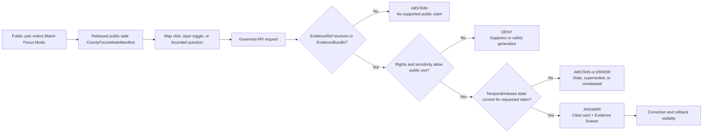
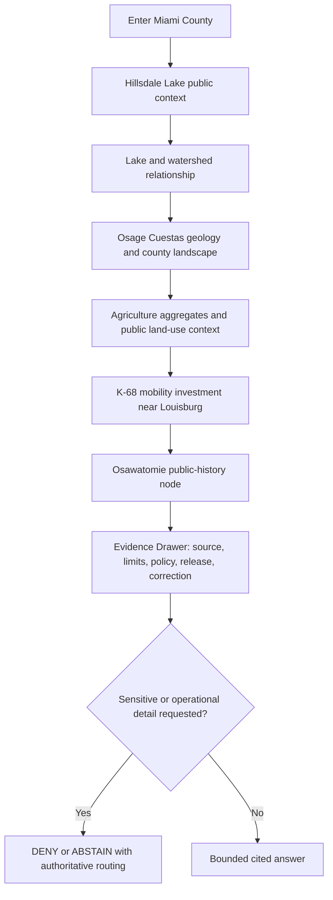
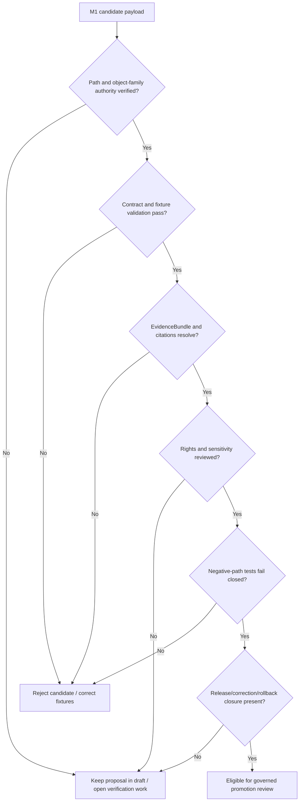

<!--
KFM_META_BLOCK_V2

doc_id: NEEDS_VERIFICATION

title: Miami County Focus Mode Build Plan

type: standard

version: v0.1

status: draft

owners: [NEEDS_VERIFICATION]

created: 2026-05-21

updated: 2026-05-21

policy_label: public-draft

related:
  - CONFIRMED_DOCTRINE_SOURCE: Directory Rules.pdf
  - PROPOSED / NEEDS_VERIFICATION: docs/dossiers/counties/miami/miami_county_focus_mode_build_plan.md
  - PROPOSED / NEEDS_VERIFICATION: contracts/focus/
  - PROPOSED / NEEDS_VERIFICATION: schemas/contracts/v1/focus/
  - PROPOSED / NEEDS_VERIFICATION: policy/focus/
  - PROPOSED / NEEDS_VERIFICATION: release/candidates/focus/counties/miami/

tags: [kfm, focus-mode, county, miami-county, hillsdale-lake, marais-des-cygnes, osage-cuestas, agriculture, hydrology, transport, heritage, public-safe]

notes:
  - This downloadable Markdown is a PROPOSED county Focus Mode build plan, not a committed repository file or a released public artifact.
  - No mounted repository, local branch state, test execution, CI result, runtime trace, or release proof was inspected in this planning run.
  - Directory paths are responsibility-rooted proposals and remain NEEDS_VERIFICATION against current repo evidence, accepted ADRs, and per-root README contracts before implementation.
  - Source authority, terms, redistribution rights, API/service behavior, validator availability, schema placement, release state, and owner assignments remain NEEDS_VERIFICATION before activation or publication.
  - Exact ecological occurrences, cultural/archaeological or burial locations, living-person details, parcel ownership exposure, active incident intelligence, dam-security or control-operation detail, and critical-infrastructure vulnerabilities fail closed or require reviewed public-safe transformation.
-->

<a id="top"></a>

# Miami County Focus Mode Build Plan

> **A reservoir–river–growth-edge proof slice for explaining Hillsdale Lake, Osage Cuestas geology, county agriculture, K-68 mobility change, and Osawatomie public history through released, evidence-bound, policy-safe KFM surfaces.**


| Field | Determination |
|---|---|
| Selected county | **Miami County, Kansas** |
| County FIPS | **NEEDS_VERIFICATION** before machine-readable fixture creation |
| Build type | County Focus Mode public-safe proof slice |
| Implementation state | **PROPOSED** — plan, fixture, and release-gate design only |
| Repository evidence state | **UNKNOWN in this run:** no mounted repo, runtime, workflow, branch, dashboard, or released artifact was inspected |
| Directory basis | **CONFIRMED doctrine consulted:** responsibility-root placement, schema-home default, lifecycle law, ADR-gated parallel homes |
| Proposed document home | `docs/dossiers/counties/miami/miami_county_focus_mode_build_plan.md` — **PROPOSED / NEEDS_VERIFICATION** against established county-plan convention and current repo evidence |
| Intended first milestone | **Miami Hillsdale–Cuestas Evidence Drawer Slice** |

**Quick links** — [Operating posture](#1-operating-posture) · [Why this county](#2-why-miami-county) · [Product thesis](#3-product-thesis) · [Scope boundary](#4-scope-boundary) · [First demo layers](#5-first-demo-layers) · [User journeys](#6-user-journeys) · [UI surfaces](#7-ui-surfaces) · [Governed object model](#8-governed-object-model) · [Repository shape](#9-proposed-repository-shape) · [Build phases](#10-build-phases) · [First PR sequence](#11-first-pr-sequence) · [Acceptance](#12-acceptance-checklist) · [Fixtures](#13-fixture-plan) · [Risk register](#14-risk-register) · [Sources](#15-source-seed-list) · [Verification](#16-open-verification-questions) · [Milestone](#17-recommended-first-milestone)

---

## Executive build note

**PROPOSED county choice.** Miami County is a high-value next KFM proof slice because one governed county view can connect: county GIS and the dangers of parcel/ownership overexposure; Hillsdale Lake and Big Bull Creek / Marais des Cygnes basin context; a published roadway-overtopping and flash-flood-planning study; 2022 agriculture aggregates; Osage Cuestas geology and construction-aggregate context; an active K-68 corridor project near Louisburg; and the publicly interpreted Bleeding Kansas landscape at Osawatomie. That combination tests whether KFM can present a useful public story while sharply separating context from adjudication, interpretation from operations, and public history from sensitive location inference.

**Current public-source seed signals, verified for planning on 2026-05-21:**

- Miami County’s official GIS / Mapping Division states that it maintains GIS support and data for county departments and maintains current property ownership information; this is useful authority context but also creates a clear privacy/title-truth boundary for any public KFM layer.[^miami-gis]
- The Kansas Department of Agriculture reports **1,254 farms**, **273,336 acres**, and **$79 million in crop and livestock sales in 2022** for Miami County, based on the USDA 2022 Census of Agriculture.[^kda-ag]
- KDA-DWR states that it funded a Flash Flood Potential Index and roadway-overtopping frequency analysis for the **Hillsdale Lake Watershed in Miami County**; this is planning context, not real-time road-safety or emergency-routing truth.[^kda-ffpi]
- The U.S. Army Corps of Engineers states that Hillsdale Lake is managed for flood damage reduction, water supply, water quality improvements, fish and wildlife management, and recreation; it also reports **4,580 surface acres of water** and **more than 8,000 acres of public land** surrounding the lake.[^usace-hillsdale]
- KGS reports that Miami County is in the **Osage Cuestas** region, that its surface rocks record Pennsylvanian limestone/sandstone/shale/coal cycles, and that its limestone aggregate resources are increasingly important for Kansas City-region growth and transportation infrastructure.[^kgs-geology]
- KDOT’s current project page describes the **K-68 Expansion in Miami County**, from U.S. 169 east to just west of U.S. 69 near Louisburg, as a 6.68-mile project with construction listed as beginning in 2026 and anticipated completion in 2028.[^kdot-k68]
- The City of Osawatomie presents John Brown Memorial Park and Museum State Historic Site as a publicly interpreted location tied to the Battle of Osawatomie and the Adair cabin.[^osawatomie-history]

> [!IMPORTANT]
> **Miami County is a proof slice for evidence-linked public explanation, not a parcel-ownership product, flood or traffic warning system, dam-operations interface, drinking-water security view, infrastructure vulnerability map, or unreviewed heritage/ecology discovery tool.**

---

## 1. Operating posture

### 1.1 Governing rules for this plan

| Rule | Miami County Focus Mode consequence |
|---|---|
| EvidenceBundle outranks generated language. | Every consequential card, comparison, map narrative, or AI answer resolves to supportable evidence or returns `ABSTAIN`, `DENY`, or `ERROR`. |
| Public clients use governed interfaces only. | The public map and panels consume released public-safe artifacts and governed API envelopes; they never read RAW, WORK, QUARANTINE, unpublished candidates, canonical/internal stores, or direct model output. |
| Publication is a governed transition. | A Miami County public artifact requires validation, evidence closure, rights/sensitivity decision, review where required, release state, correction path, and rollback target. |
| Maps and AI are downstream carriers. | Tiles, popups, summaries, charts, story cards, exports, and generated prose do not establish truth independently. |
| Cite-or-abstain is default. | Missing source authority, stale temporal status, unresolved rights, missing release state, or unsupported claims force abstention or denial. |
| Precision is policy-controlled. | Exact ecology, cultural heritage, private-property, infrastructure/security, active incident, and living-person details must be omitted, generalized, restricted, delayed, or denied. |
| Source character must remain visible. | Aggregate statistics, operational water-management context, geologic interpretation, planning studies, current project pages, historical interpretation, and live observations must not be flattened into one “truth layer.” |

### 1.2 Truth-label key

| Label | Meaning in this plan |
|---|---|
| **CONFIRMED** | Verified during this planning run from cited official public sources or supplied KFM doctrine. |
| **PROPOSED** | A product design, path, contract/schema shape, fixture, layer, policy rule, PR step, or implementation choice not verified as implemented. |
| **NEEDS_VERIFICATION** | Checkable before source activation, PR landing, public release, or operational use, but not yet checked strongly enough. |
| **UNKNOWN** | Not supported sufficiently in this run. |
| **ANSWER / ABSTAIN / DENY / ERROR** | Finite runtime outcomes for public-facing governed responses, not rhetorical emphasis. |

### 1.3 Public-safe decision flow



### 1.4 County-specific non-negotiable guardrails

> [!CAUTION]
> **Hillsdale Lake and infrastructure:** Public users may receive reviewed educational context about lake benefits, watershed relationships, and authoritative public resources. Focus Mode must not expose security-sensitive dam details, operational release-control logic, infrastructure vulnerabilities, or tactical/emergency instructions.

> [!WARNING]
> **GIS, property, and people:** The county GIS source explicitly includes property ownership information. Public KFM display must not treat parcel records as title truth, expose unnecessary ownership/living-person detail, or infer private-land access, value, vulnerability, or legal status.

> [!WARNING]
> **Ecology and heritage:** Hillsdale habitat context and Osawatomie public interpretation may be shown when public and supported. Exact sensitive species occurrences, nests, archaeological locations, burials, sacred/cultural places, or inferred “likely sites” must fail closed absent qualified review and a documented safe transform.

> [!NOTE]
> **Flood and transportation context:** A published FFPI/roadway-overtopping analysis and a current KDOT project page are valid context sources only within their declared scope. They are not substitutes for current warnings, road conditions, routing, permit determinations, or site-specific risk decisions.

---

## 2. Why Miami County

### 2.1 Proof-slice rationale

Miami County exercises KFM across an unusually useful intersection of public knowledge characters:

| Public question | County-specific anchor | What KFM must prove |
|---|---|---|
| How do water, recreation, public land, and watershed planning relate? | Hillsdale Lake; Big Bull Creek; Marais des Cygnes basin relationship; USACE and USGS source seeds. | Separate public context, measured observation, operations, flood planning, and safety authority. |
| How does geology shape land use and growth infrastructure? | Osage Cuestas; Pennsylvanian limestone/shale/sandstone/coal; aggregate-resource context. | Explain geology without creating parcel-level extraction, title, hazard, or suitability claims. |
| How does agriculture remain visible near a growth corridor? | 1,254 farms / 273,336 acres / $79M 2022 agricultural sales. | Show aggregate evidence without identifying farm operators or inferring parcel land use. |
| How does mobility investment change county context? | K-68 expansion between U.S. 169 and U.S. 69 near Louisburg. | Preserve project status and date basis without becoming traffic or construction-routing authority. |
| How should public history be presented? | John Brown Memorial Park / Adair cabin / Battle of Osawatomie public interpretation. | Render documented public heritage without inferring sensitive sites or flattening historical complexity. |
| How do public GIS sources help without violating trust? | County GIS maps and ownership-support function. | Use only reviewed public-safe representations; prevent ownership/title/privacy leakage. |

### 2.2 Why it is distinct from prior county slices

| Prior emphasis in the series | Miami County addition |
|---|---|
| Flint Hills prairie and ranch landscape | Reservoir–watershed–growth corridor with public water-supply significance and Osage Cuestas geology. |
| Missouri River or central floodplain counties | Hillsdale Lake watershed planning plus lake-managed benefits and roadway-overtopping analysis. |
| Major metro/suburban counties | Exurban-rural interface where agriculture, public lake lands, and active corridor expansion coexist. |
| Southeast mined-land/geology counties | Limestone aggregate and urban/transport-growth relation rather than mined-land rehabilitation emphasis. |
| Fort/trail interpretation counties | Osawatomie/Bleeding Kansas public-history node with strict non-inference rules for non-public cultural locations. |

### 2.3 Public benefit and governance test

**Product benefit.** A public user can understand why Hillsdale Lake, county agriculture, Osage Cuestas geology, K-68 mobility, and Osawatomie history all matter to Miami County without navigating unrelated websites or receiving unsupported synthesis.

**Governance benefit.** The county forces tests for high-risk boundaries: parcel ownership, public-water infrastructure, active transport projects, roadway-overtopping planning, public history, environmental sensitivity, and the difference between an educational narrative and an authoritative operational decision.

---

## 3. Product thesis

### 3.1 One-sentence thesis

**Miami County Focus Mode should allow a public user to explore how a reservoir-centered watershed, Osage Cuestas geology, agriculture, corridor investment, and publicly interpreted territorial history intersect—through cited, released, public-safe evidence surfaces that expose limitations and refuse sensitive or over-precise claims.**

### 3.2 What the first product promises

| Promise | Product expression |
|---|---|
| Watershed and lake literacy | A safe, authoritative explanation of Hillsdale Lake public context and its watershed relationship. |
| Inspectable evidence | Evidence Drawer access from every consequential card, with source, date, source role, limitations, policy/release state, and correction posture. |
| Temporal honesty | Project pages, static interpretation, published planning studies, monitoring locations, and historical records are visibly distinguished. |
| Safe precision | Sensitive ecology, private property, infrastructure/security detail, and non-public cultural locations do not appear in public outputs. |
| Reversible publication | Candidate layers can be withheld, corrected, withdrawn, or rolled back without concealing lineage. |

### 3.3 What the first product does not promise

| Not promised | Reason |
|---|---|
| A dam-control, water-supply security, flood warning, or emergency-routing application | KFM Focus Mode is interpretive and evidence-bound, not an operational command or alert system. |
| A public parcel ownership explorer | County GIS authority does not make property-owner display necessary or safe for this public narrative. |
| Current construction routing or traffic conditions | Project context and traveler-information authority are distinct. |
| Property-level geology, construction-aggregate, or development suitability advice | County-scale geologic evidence is not parcel adjudication. |
| Exact wildlife or cultural-resource discovery | Exposure risk and source authority constraints require denial or reviewed generalization. |
| Unbounded AI narration | AI is subordinate to EvidenceBundle resolution, policy checks, citation validation, and finite outcomes. |

---

## 4. Scope boundary

### 4.1 Included public context for the first slice

| Included scope | First-slice use | Public display posture |
|---|---|---|
| Miami County frame and public named-place context | Focus extent, navigation, place orientation. | Public-safe after boundary authority/version check. |
| Hillsdale Lake public context | Lake benefits, public lands, recreation/public-water/watershed interpretation. | Text/card-first; geometry only from reviewed source and public-safe manifest. |
| Big Bull Creek / Marais des Cygnes watershed relationship | Explain basin relationship and hydrologic context. | Generalized interpretive context; no tactical operations. |
| USGS Hillsdale monitoring-location context | Timestamped hydrologic evidence seed for a future released observation card. | Display variables only after normalization, freshness, revision, and release checks. |
| KDA-DWR FFPI / roadway-overtopping published analysis | Explain that flood-planning context exists for Hillsdale watershed. | Educational/planning record only; not routing or current safety status. |
| County-level agriculture summary | Public agricultural scale and land-use context. | Aggregate statistics only; no operator/property inference. |
| KGS Osage Cuestas geology interpretation | Bedrock/geologic-landscape explainer tied to county setting. | Educational only; no parcel mineral, title, hazard, or engineering judgment. |
| K-68 expansion project context | Mobility/growth-change card with declared project date/status. | Source-date visible; direct users to current KDOT authority for travel conditions. |
| John Brown Memorial Park / Museum public interpretation | Public heritage story node for Osawatomie. | Only already interpreted public site content; no inferred site discovery. |
| Official county GIS authority note | Explain availability and governance caution around county GIS. | Do not expose ownership/parcel content in initial public slice. |

### 4.2 Explicit exclusions and denial conditions

| Sensitive or out-of-scope detail | Required public outcome | Reason |
|---|---|---|
| Parcel ownership, owner search, living-person record details, private access, assessed-value narratives, or title conclusions | `DENY` or omit | Avoid unnecessary private-person/property exposure; assessor/GIS data is not title truth. |
| Dam security, control works detail, release-operation scheduling, vulnerability analyses, restricted water-supply/security details | `DENY` or generalize | Critical infrastructure and public-safety sensitivity. |
| Active flood warning, safe-driving guidance, road passability, emergency evacuation, or rescue instructions | `ABSTAIN` / route to official operational authority | Focus Mode is not an alert or emergency-routing system. |
| Exact sensitive species, nests, roosts, spawning sites, threatened plants, steward-only habitat records | `DENY` or reviewed coarse generalization | Geoprivacy and ecological harm prevention. |
| Archaeological, burial, sacred/culturally sensitive, collection-location, or inferred site-potential details | `DENY` absent qualified review and transform receipt | Sovereignty, cultural sensitivity, and looting risk. |
| Site-specific mineral/aggregate potential, private quarry inference, geotechnical suitability, or land-value prediction | `ABSTAIN` or omit | False precision and private-property/economic inference risk. |
| Current K-68 closures, detours, or project-state claims without current governed source evidence | `ABSTAIN` / route to KDOT authority | Stale-status and public-safety risk. |
| RAW, WORK, QUARANTINE, internal stores, unpublished candidates, or direct model outputs | `DENY` | Trust-membrane violation. |

---

## 5. First demo layers

### 5.1 Public-safe layer and card set

| Priority | Layer / card | County-specific purpose | Initial source seed | Evidence / policy gate | Status |
|---:|---|---|---|---|---|
| 0 | County frame and public places | Establish Miami County, Paola, Louisburg, Osawatomie, and public navigation frame. | Authoritative boundary/place source **NEEDS_VERIFICATION** | Geometry authority, rights, version, release manifest. | **PROPOSED** |
| 1 | Hillsdale Lake public-context card | Anchor water supply/flood-reduction/recreation/fish-and-wildlife public narrative. | USACE Hillsdale Lake. | No operations/security detail; source role and time basis visible. | **PROPOSED** |
| 1 | Lake–watershed relationship explainer | Explain Big Bull Creek to Marais des Cygnes connection at safe generality. | USACE; reviewed hydrography source **NEEDS_VERIFICATION**. | Safe geometry, evidence closure, no hazard/operations inference. | **PROPOSED** |
| 1 | County agriculture aggregate card | Show farm count, acres, and 2022 sales context. | KDA / USDA Census of Agriculture. | Aggregate-only; source-year visible; no farm/parcel joins. | **PROPOSED** |
| 1 | Osage Cuestas geology explainer | Explain ridges/slopes, Pennsylvanian bedrock, limestone context, and infrastructure relation. | KGS geologic map announcement/map. | Educational-use label; no private extraction/suitability inference. | **PROPOSED** |
| 2 | Hillsdale monitoring-location card | Establish available observation-source context. | USGS-06914995. | Timestamp, unit, revision/provisional posture, no alert claims. | **PROPOSED** |
| 2 | FFPI / roadway-overtopping planning card | Explain published study scope and why users must consult current authorities for conditions. | KDA-DWR FFPI page. | Label as planning analysis; deny live routing interpretation. | **PROPOSED** |
| 2 | K-68 corridor project card | Explain public mobility investment between U.S. 169 and U.S. 69 near Louisburg. | KDOT project page. | Display source date/status; not current traffic or detour system. | **PROPOSED** |
| 2 | Osawatomie public-history story node | Explain publicly interpreted John Brown/Adair cabin/Battle of Osawatomie history. | City of Osawatomie public historic site page. | Public interpreted asset only; no cultural-site inference. | **PROPOSED** |
| 3 | County GIS reference card | Explain official GIS availability and why property data is not included in the first public slice. | Miami County GIS / Mapping page. | Rights/field/privacy/title-truth review required; no ownership layer by default. | **PROPOSED / WITHHELD FROM INITIAL MAP** |
| 3 | Public ecology / wildlife context | Potential Hillsdale public-safe habitat/recreation context. | USACE / KDWP source to verify. | Sensitive-species and exact-habitat gates first. | **NEEDS_VERIFICATION / DEFERRED** |

### 5.2 Layer-classification rules

| Layer class | Allowed public behavior | Not allowed |
|---|---|---|
| Educational interpretation | Explain supported relationships with source date and limits. | Treat interpretation as full legal/scientific/engineering determination. |
| Aggregate statistic | Present county totals with reported year and provider. | Join to parcels or identify individual producers/owners. |
| Observation snapshot | Display released variable, units, observed/retrieved times, revision status. | Convert into flood alert, reservoir-operation advice, or drinking-water safety assertion. |
| Planning-study context | Explain purpose and published scope of FFPI/overtopping analysis. | Present as present road passability, evacuation, or travel instruction. |
| Transportation-project context | Display current project-page facts and source date. | Infer current traffic, construction access, detours, or property impacts. |
| Public heritage | Render publicly interpreted museum/park content. | Generate or reveal additional cultural/archaeological locations. |
| Sensitive candidate | Withhold from ordinary UI pending review or generalized transformation. | “Hide” exact detail only in styling while retaining accessible payloads/downloads. |

### 5.3 Candidate opening narrative sequence



---

## 6. User journeys

### Journey A — Lake and watershed learner: “Why does Hillsdale Lake matter here?”

| Step | User action | Focus Mode behavior | Evidence / safety requirement |
|---:|---|---|---|
| 1 | Opens Miami County | Lands on county overview with lake, geology, agriculture, mobility, and heritage toggles. | Only released public-safe manifest loads. |
| 2 | Selects Hillsdale Lake card | Shows USACE-backed public-benefit narrative and public context. | No security-sensitive or operations detail. |
| 3 | Opens watershed explainer | Shows reviewed relationship among lake, Big Bull Creek, and Marais des Cygnes context. | Geometry and claims require released evidence support. |
| 4 | Opens Evidence Drawer | Sees source role, public limitations, review/release state, and correction path. | EvidenceBundle must resolve. |

### Journey B — Flood-planning user: “Does the road flood?”

| Step | User action | Focus Mode behavior | Evidence / safety requirement |
|---:|---|---|---|
| 1 | Selects FFPI/overtopping context | Explains that KDA-DWR published a watershed analysis. | Label as planning context and date-bounded record. |
| 2 | Requests present passability or safest route | Returns `ABSTAIN` and directs to authoritative current emergency/traveler resources. | No current-road inference from analysis product. |
| 3 | Requests a parcel-level risk/permit decision | Returns `ABSTAIN`. | No legal, insurance, or permit adjudication. |

### Journey C — Agriculture and geology learner: “What connects farms to this landscape?”

| Step | User action | Focus Mode behavior | Evidence / safety requirement |
|---:|---|---|---|
| 1 | Opens agriculture card | Displays KDA county totals and 2022 data basis. | Aggregate only. |
| 2 | Opens geology comparison | Shows KGS-supported Osage Cuestas and bedrock-context explanation. | Interpretive; no parcel or engineering conclusion. |
| 3 | Requests specific quarry/land-value prediction | Returns `ABSTAIN` or omits. | No private extraction/economic inference. |

### Journey D — Mobility and growth learner: “What is changing along K-68?”

| Step | User action | Focus Mode behavior | Evidence / safety requirement |
|---:|---|---|---|
| 1 | Selects K-68 project card | Presents the KDOT-reported project location, scope, and timeline with retrieval date. | Current project page is cited; no routing instruction. |
| 2 | Asks whether a route is open now | Returns `ABSTAIN` unless a current authorized transportation status source is released for the product. | Project context is not traveler-information status. |
| 3 | Requests property impacts | Returns `ABSTAIN` / directs to official project process. | No parcel or eminent-domain inference. |

### Journey E — History learner: “Why is Osawatomie significant?”

| Step | User action | Focus Mode behavior | Evidence / safety requirement |
|---:|---|---|---|
| 1 | Opens public-history story node | Presents publicly interpreted John Brown Memorial Park / Adair cabin / Battle of Osawatomie context. | Cite official public interpretation. |
| 2 | Requests hidden sites or artifact locations | Returns `DENY`. | No discovery-enabling cultural-resource inference. |
| 3 | Opens source/evidence drawer | Shows public interpretation source and limitations. | No generated historical assertion without evidence. |

### Journey F — Steward/reviewer: “Is this safe to publish?”

| Step | Review action | Required result |
|---:|---|---|
| 1 | Review source descriptors and terms | Each active source has authority, role, rights/terms status, temporal character, allowed precision, sensitivity posture, and citation rule. |
| 2 | Run negative fixture set | Parcel exposure, dam operations, live route inference, exact ecology/cultural location, missing evidence, and unreleased card cases fail closed. |
| 3 | Review public payload | No map/UI/AI path includes RAW, WORK, QUARANTINE, exact restricted geometry, direct model output, or unapproved artifact. |
| 4 | Promote or reject | Promotion is a governed decision with release/correction/rollback closure; failure keeps candidates unpublished. |

---

## 7. UI surfaces

### 7.1 County Focus Mode panel set

| Surface | User-facing purpose | Mandatory trust fields | Status |
|---|---|---|---|
| County overview header | Establish Miami County scope and limitation banners. | county identity source, release state, last reviewed, “not operational/adjudicatory” notice. | **PROPOSED** |
| Theme switcher | Move among lake/watershed, landscape/geology, agriculture, mobility, and public history. | theme scope, source roles, temporal character, release status. | **PROPOSED** |
| Layer library | Toggle only approved public-safe context layers and cards. | `layer_id`, evidence ref, sensitivity class, artifact/release ref, correction state. | **PROPOSED** |
| Map canvas | Provide disciplined downstream spatial representation. | released `LayerManifest`, safe style, attribution, no hidden restricted payloads. | **PROPOSED** |
| Timeline/status ribbon | Separate current project page, observation snapshot, published planning study, aggregate 2022 statistic, and historic context. | valid/observed/published/retrieved dates; stale/superseded marker. | **PROPOSED** |
| Evidence Drawer | Make every material claim inspectable. | EvidenceBundle, SourceDescriptor, rights/sensitivity posture, PolicyDecision, validation, release, correction, rollback. | **PROPOSED** |
| Focus Mode answer panel | Provide bounded evidence-backed narrative. | finite outcome, citation set, evidence refs, limitation text, AIReceipt when generated. | **PROPOSED** |
| Denial/abstention panel | Explain safe refusal without leaking protected information. | reason code, safe message, authority routing where appropriate. | **PROPOSED** |
| Correction/withdrawal banner | Make changed or withdrawn content visible. | correction notice, replacement/rollback ref, effective time. | **PROPOSED** |

### 7.2 Suggested first-screen arrangement

```mermaid
flowchart LR
    MAP[Map: Miami County public-safe layers] --- HDR[Header: scope + trust badges]
    MAP --- THEMES[Themes: Lake | Geology | Agriculture | Mobility | History]
    MAP --- DRAWER[Evidence Drawer]
    DRAWER --- SOURCES[Sources + roles + dates]
    DRAWER --- POLICY[Policy / release / correction state]
    DRAWER --- ANSWER[Focus Mode bounded answer]
    ANSWER --- OUTCOME[ANSWER | ABSTAIN | DENY | ERROR]
```

### 7.3 Trust-visible layer card example

```json
{
  "object_type": "CountyFocusLayerCard",
  "schema_version": "v1",
  "county_id": "NEEDS_VERIFICATION: miami-county-fips",
  "layer_id": "miami.hillsdale_lake.public_context.v1",
  "title": "Hillsdale Lake Public Context",
  "knowledge_character": "public_interpretive_context",
  "outcome": "ANSWER",
  "public_safe": true,
  "source_refs": ["SEED-002-USACE-HILLSDALE"],
  "evidence_bundle_ref": "NEEDS_VERIFICATION",
  "policy_decision_ref": "NEEDS_VERIFICATION",
  "release_manifest_ref": "NEEDS_VERIFICATION",
  "limitations": [
    "Educational public context only.",
    "No dam-control, security, emergency-routing, or operational release details are exposed."
  ],
  "correction_ref": null,
  "rollback_ref": "NEEDS_VERIFICATION"
}
```

### 7.4 Denial envelope example: property ownership request

```json
{
  "object_type": "RuntimeResponseEnvelope",
  "schema_version": "v1",
  "county_id": "NEEDS_VERIFICATION: miami-county-fips",
  "outcome": "DENY",
  "reason_code": "PRIVATE_PROPERTY_OR_LIVING_PERSON_EXPOSURE",
  "public_message": "Property-owner detail is not provided through this public Focus Mode view.",
  "policy_decision_ref": "NEEDS_VERIFICATION",
  "evidence_bundle_refs": [],
  "release_state": "withheld"
}
```

### 7.5 Abstention envelope example: present road safety request

```json
{
  "object_type": "RuntimeResponseEnvelope",
  "schema_version": "v1",
  "county_id": "NEEDS_VERIFICATION: miami-county-fips",
  "outcome": "ABSTAIN",
  "reason_code": "CURRENT_TRAVEL_STATUS_NOT_IN_RELEASED_EVIDENCE",
  "public_message": "This view contains project and planning context, not current roadway conditions. Consult current official traveler or emergency information.",
  "policy_decision_ref": "NEEDS_VERIFICATION",
  "evidence_bundle_refs": ["NEEDS_VERIFICATION: k68-project-context-bundle"],
  "release_state": "public-context-only"
}
```

### 7.6 Accessibility and usability minimums

- [ ] Keyboard-accessible themes, toggles, drawer controls, focus answer actions, and denial/correction details.
- [ ] Screen-reader-accessible labels for `ANSWER`, `ABSTAIN`, `DENY`, `ERROR`, `STALE`, `CORRECTED`, and `WITHDRAWN`.
- [ ] No reliance on color alone for sensitivity, date character, release status, or withheld detail.
- [ ] Plain-language limitation banner on water, flood-planning, transport, property, ecology, and heritage surfaces.
- [ ] Source/date/citation access from each consequential card.
- [ ] Mobile and low-bandwidth behavior reviewed before any public release claim.

---

## 8. Governed object model

### 8.1 Object-family map

| Object family | Role in Miami County slice | Minimum content expectation | Path posture |
|---|---|---|---|
| `CountyFocusModeManifest` | Binds approved Miami layers, cards, UI defaults, outcomes, and release state. | county identity, card/layer refs, evidence refs, policy/release refs, temporal state, correction/rollback refs. | **PROPOSED / home NEEDS_VERIFICATION** |
| `SourceDescriptor` | Defines each official source seed and constraints. | authority, role, rights/terms, access, temporal character, allowed precision, sensitivity, citation rule. | Extend existing family if present; do not duplicate. |
| `PublicContextCard` | Provides supported public explanation for lake, geology, agriculture, mobility, or history. | claim refs, source refs, limitation text, evidence/release refs. | **PROPOSED** |
| `LayerManifest` | Controls map layer admission into public UI. | artifact refs, public-safe flag, evidence/policy/release closure, style/attribution, correction state. | **PROPOSED** |
| `EvidenceRef` / `EvidenceBundle` | Resolves claims to admissible support. | spatial/temporal scope, source records, limitations, resolution state, integrity/correction context. | Reuse KFM trust spine. |
| `PolicyDecision` | Records allow/generalize/abstain/deny obligations. | decision, reason codes, obligations, rights/sensitivity checks, review need. | Reuse policy family. |
| `AggregateAgricultureSnapshot` | Carries KDA/USDA county summary card. | source year, measures, units, source ref, non-disaggregation limitation. | **PROPOSED** |
| `ObservationSnapshot` | Carries released USGS monitoring-location values when implemented. | location/source ID, variable, units, observed/retrieved times, revision status, evidence ref. | **PROPOSED** |
| `PlanningStudyContextRecord` | Represents published FFPI/overtopping study context. | study identity, jurisdiction/scope, publish/retrieval date, limitation: not live operations. | **PROPOSED** |
| `TransportationProjectContextRecord` | Represents K-68 project-page context. | project number/scope, source date, timeline, current-status boundary, citations. | **PROPOSED** |
| `PublicHeritageContextRecord` | Carries public Osawatomie interpretation. | public-site source, narrative claims, precision posture, heritage limitation. | **PROPOSED** |
| `GeneralizationReceipt` / `RedactionReceipt` | Records transformed sensitive geometry or attributes. | source precision, output precision, reason, reviewer/policy ref, digest. | **PROPOSED / family authority NEEDS_VERIFICATION** |
| `CitationValidationReport` | Rejects unsupported public language. | claim refs, evidence refs, validation outcome, blocked text/reason. | Reuse governed-output validation family if present. |
| `RuntimeResponseEnvelope` | Carries finite Focus/UI outcome. | outcome, reason code, evidence/policy refs, citations, release state, limitations. | Reuse runtime family. |
| `ReleaseManifest` | Records approved public publication. | artifacts, validation/policy/review closure, evidence refs, correction and rollback targets. | Reuse release family. |
| `AIReceipt` | Captures any generated summary behavior. | evidence/context refs, generation procedure/model ref, outcome, citation validation, policy ref. | Reuse AI/governance family; never direct public model output. |

### 8.2 Source-role anti-collapse rules

| Evidence character | Must remain distinct from | Why |
|---|---|---|
| Miami County GIS/Mapping authority and property support | Title, ownership adjudication, private-land exposure, or public Focus Mode necessity | GIS data availability does not authorize unnecessary display or establish title truth. |
| USACE lake public-benefit statement | Dam security, operational release decisions, emergency guidance, or drinking-water safety status | Public interpretation and restricted/operational functions differ. |
| USGS monitoring location / released observations | Forecast, warning, hazard advice, or reservoir management decision | Measurement is not alert or management authority. |
| KDA-DWR FFPI/overtopping published analysis | Present road passability or evacuation route | Planning analysis is not current safety status. |
| KDA/USDA county aggregate agriculture statistics | Farm-level operations, ownership, land-use classification, or economic prediction | Aggregate reporting must not expose or infer individual activity. |
| KGS county geologic map and explainer | Parcel engineering suitability, mineral ownership, quarry siting, or extraction claim | Geologic context is not legal/engineering/resource-development truth. |
| KDOT current project page | Current traffic condition or property impact decision | A project page communicates project scope/status, not all operational outcomes. |
| Osawatomie public historic interpretation | Non-public archaeology, artifact locations, burials, or inferred cultural sites | Public narrative must not become discovery-enabling inference. |
| Generated narrative | Evidence, policy, release, or correction record | AI language is downstream interpretation only. |

### 8.3 Minimal public response envelope

```json
{
  "schema_version": "v1",
  "object_type": "RuntimeResponseEnvelope",
  "scope": {
    "county": "Miami County, Kansas",
    "theme": "hillsdale_watershed_public_context"
  },
  "outcome": "ANSWER",
  "claims": [
    {
      "claim_id": "miami-claim-hillsdale-public-benefits-v1",
      "evidence_bundle_ref": "NEEDS_VERIFICATION",
      "citations": ["SEED-002-USACE-HILLSDALE"],
      "limitations": ["Public interpretive context only; not operational guidance."]
    }
  ],
  "policy_decision_ref": "NEEDS_VERIFICATION",
  "release_manifest_ref": "NEEDS_VERIFICATION",
  "correction_ref": null,
  "rollback_ref": "NEEDS_VERIFICATION"
}
```

### 8.4 Deterministic identity candidates

| Candidate object | Proposed stable key basis | Verification requirement |
|---|---|---|
| Miami county manifest | county authority ID/FIPS + product version + release digest | Confirm county identifier authority and implemented hashing convention. |
| Source descriptor | authority + source title/service identifier + version/retrieval class | Confirm source-registry vocabulary and terms fields. |
| Lake context card | county ID + public asset identifier + card semantic version | Confirm public geometry/reference authority and public-safe scope. |
| KDA agriculture snapshot | county ID + census year + reported-measures digest | Confirm record normalization/units/citation fields. |
| K-68 project record | authority + project number `KA-2373-04` + retrieved/snapshot date | Confirm update/stale-state policy. |
| Evidence bundle | declared claims + source snapshots + policy/release context digest | Confirm existing EvidenceBundle contract and spec-hash convention. |

---

## 9. Proposed repository shape

### 9.1 Directory Rules basis

**CONFIRMED doctrine basis.** Directory Rules states that a file location encodes ownership, governance, and lifecycle; topic alone does not justify a root; the schema-home default is `schemas/contracts/v1/<…>`; RAW → WORK / QUARANTINE → PROCESSED → CATALOG / TRIPLET → PUBLISHED remains the lifecycle invariant; and creating parallel schema, contract, policy, source, registry, release, proof, or receipt homes requires an ADR.

> [!IMPORTANT]
> The tree below is **PROPOSED / NEEDS_VERIFICATION**. It is a responsibility-rooted placement plan, not a claim that these files currently exist, have been implemented, or match current repository conventions. A mounted checkout and relevant ADR/per-root README review must precede PR landing.

### 9.2 Candidate path table

| Responsibility | Proposed path candidate | Why it belongs there | Status / verification gate |
|---|---|---|---|
| Human-readable county build plan | `docs/dossiers/counties/miami/miami_county_focus_mode_build_plan.md` | Planning dossier explaining product boundary, evidence, and implementation sequence. | **PROPOSED**; verify established county-plan home; do not create parallel docs convention. |
| Human-readable county README | `docs/dossiers/counties/miami/README.md` | Orientation, lineage, release/correction pointers. | **PROPOSED**; only if parent convention exists or is approved. |
| Focus object semantics | `contracts/focus/county_focus_mode_manifest.md` | Defines meaning, obligations, and outcome behavior. | **PROPOSED / NEEDS_VERIFICATION** against existing contract family. |
| Machine shape | `schemas/contracts/v1/focus/county_focus_mode_manifest.schema.json` | Default schema responsibility root per Directory Rules. | **PROPOSED**; extend rather than duplicate any existing schema. |
| Source descriptor fixture(s) | `fixtures/focus/counties/miami/sources/` | Deterministic offline test material, not canonical source storage. | **PROPOSED**; fixture convention NEEDS_VERIFICATION. |
| Valid UI/runtime fixtures | `fixtures/focus/counties/miami/valid/` | Prove compliant public responses. | **PROPOSED**. |
| Invalid UI/runtime fixtures | `fixtures/focus/counties/miami/invalid/` | Prove fail-closed outcomes. | **PROPOSED**. |
| Validator implementation | `tools/validators/focus/` | Validation tooling belongs under tools, not policy or schemas. | **PROPOSED**; reuse existing validators if present. |
| Policy rules | `policy/focus/` | Decides allow/generalize/abstain/deny. | **PROPOSED**; policy root spelling and lane convention NEEDS_VERIFICATION. |
| Tests | `tests/focus/counties/miami/` | Proves schemas, policies, negative cases, release gates. | **PROPOSED**. |
| Candidate release decision | `release/candidates/focus/counties/miami/` | Promotion decision record, not public artifact storage. | **PROPOSED**; release convention NEEDS_VERIFICATION. |
| Published artifact output | `data/published/focus/counties/miami/` | Only released public-safe data/artifacts after governed promotion. | **PROPOSED**; must not receive unreviewed candidates. |
| Receipts/proofs/catalog records | Existing `data/receipts/`, `data/proofs/`, `data/catalog/` lanes with Miami identifiers | Preserve separation of lifecycle custody and proof/release objects. | **PROPOSED**; use existing conventions and no parallel homes. |

### 9.3 Candidate tree, not repo fact

```text
# PROPOSED / NEEDS_VERIFICATION — responsibility-rooted planning tree only

docs/
  dossiers/
    counties/
      miami/
        README.md
        miami_county_focus_mode_build_plan.md

contracts/
  focus/
    county_focus_mode_manifest.md
    public_context_card.md

schemas/
  contracts/
    v1/
      focus/
        county_focus_mode_manifest.schema.json
        public_context_card.schema.json
        planning_study_context_record.schema.json
        transportation_project_context_record.schema.json

fixtures/
  focus/
    counties/
      miami/
        sources/
        valid/
        invalid/

policy/
  focus/
    public_county_focus.rego
    miami_public_safety.rego

tools/
  validators/
    focus/
      validate_county_focus_mode_manifest.py
      validate_public_context_card.py

tests/
  focus/
    counties/
      miami/
        test_manifest_contract.py
        test_public_safe_policy.py
        test_negative_fixtures.py
        test_release_gate.py

release/
  candidates/
    focus/
      counties/
        miami/

# public artifact only after governed promotion
data/
  published/
    focus/
      counties/
        miami/
```

### 9.4 Placement prohibitions

| Prohibited shortcut | Why it is rejected |
|---|---|
| New root folder `miami/`, `counties/`, `hillsdale/`, or `focus_mode/` without responsibility-root justification | Domain/topic is not a root authority. |
| Placing schema JSON in `docs/` or next to downloaded data | Meaning, shape, data custody, and documentation must remain separate. |
| Placing release decisions inside `data/published/` | Release state is not the same as released artifact storage. |
| Placing public artifacts under `release/` | `release/` owns decisions/manifests; published data belongs in its lifecycle home. |
| Putting ownership-bearing county GIS exports into a public fixture or demo payload | Violates private-property minimization and potentially rights/terms posture. |
| Serving candidate/RAW/WORK/QUARANTINE layers directly to MapLibre | Bypasses the trust membrane. |

---

## 10. Build phases

### Phase 0 — Evidence, authority, and placement audit

| Work item | Output | Gate |
|---|---|---|
| Verify county has not already been implemented in target series/repo | County selection record | No duplicate county-plan home or superseded lineage conflict. |
| Inspect current repo tree, ADRs, README contracts, schemas, contracts, policy, fixtures, tests, release conventions | Repo conformance inventory | No path creation until ownership and conflicts are documented. |
| Verify public source terms, roles, cadence, precision, and sensitivity posture | Draft source descriptors / activation checklist | Unclear terms or sensitivity keeps source unactivated. |
| Verify appropriate public-safe product scope | Approved layer/card boundary | Sensitive or operational exposure removed or denied. |

### Phase 1 — Contract-and-fixture-first proof surface

| Work item | Output | Gate |
|---|---|---|
| Draft/reuse county Focus manifest and context-card semantic contracts | Contract changes or extension notes | No duplicate semantic authority. |
| Draft/reuse schemas and fixtures | Valid and invalid fixture pack | Valid fixtures pass; invalid fixtures fail for expected reason. |
| Build five public-safe cards as offline fixtures | Lake, agriculture, geology, mobility, public-history card payloads | No live fetch required in PR; all citations represented. |
| Add Evidence Drawer and finite-outcome fixture payloads | `ANSWER`, `ABSTAIN`, `DENY`, `ERROR` fixtures | Unsupported/sensitive outputs fail closed. |

### Phase 2 — Policy, validation, and no-network proof

| Work item | Output | Gate |
|---|---|---|
| Policy checks for property, infrastructure, ecology, heritage, transport status, and flood planning | Decision reports | Denial/abstention obligations fire deterministically. |
| Source-role and temporal-character validator | Validation report | Observation/planning/project/history/aggregate characters never silently collapse. |
| Public artifact admission validator | Release-candidate report | Missing EvidenceBundle, policy, correction, or rollback blocks promotion. |
| No-network demo build | Deterministic rendered fixture bundle | Reproducible digests and no external dependency in ordinary tests. |

### Phase 3 — Governed UI integration

| Work item | Output | Gate |
|---|---|---|
| Map layer registry entry for public-safe approved artifacts | Layer manifests | Renderer receives released artifact refs only. |
| County overview, card deck, status ribbon, drawer, and denial UI | UI integration behind feature flag | No direct model, raw, sensitive, or unreleased data path. |
| Accessibility and responsive review | QA report | Keyboard, screen-reader, contrast/status, mobile requirements pass. |

### Phase 4 — Release review and correction/rollback rehearsal

| Work item | Output | Gate |
|---|---|---|
| Assemble evidence/policy/validation/review/proof/release closure | Candidate release package | All obligations satisfied. |
| Correction and rollback rehearsal | Correction/rollback report | Public alias can be withdrawn or restored safely. |
| Promotion decision | Approved/rejected release manifest | Publication occurs only via governed transition. |

---

## 11. First PR sequence

### 11.1 Recommended PR chain

| PR | Title | Purpose | Included | Explicitly excluded | Rollback posture |
|---:|---|---|---|---|---|
| PR-01 | **Miami Focus Mode documentation and source-boundary intake** | Establish planning artifact, source candidates, sensitivity posture, placement verification record. | Plan, source seed register, verification checklist, ADR/placement note where required. | No schemas unless existing convention confirmed; no code; no public data; no live connector. | Remove draft/restore prior docs; no release impact. |
| PR-02 | **Miami public-context contracts and offline fixtures** | Define/reuse bounded card and manifest shapes with positive/negative fixtures. | Contract/schema extensions as verified, five public-safe card fixtures, denial/abstention fixtures. | No live source ingestion; no public UI enablement. | Revert un-released fixtures/schema additions or version successor if externally adopted. |
| PR-03 | **Miami Focus Mode fail-closed validation and policy gates** | Enforce evidence, source role, rights/sensitivity, temporal character, finite outcomes, and release closure. | Validators, policy tests, deterministic no-network CI step. | No candidate promotion. | Revert gate changes; feature remains off. |
| PR-04 | **Miami governed UI behind disabled feature flag** | Render released-fixture-shaped map/cards/drawer safely. | Layer manifest adapter, status chips, drawer, limitation/deny UI, accessibility tests. | No public release; no direct external calls from public UI. | Disable flag; retain contracts/tests. |
| PR-05 | **Miami candidate release and rollback rehearsal** | Assemble eligible public-safe artifact and rehearse correction/withdrawal. | Release candidate, proof/receipt refs, review decision, rollback/correction drill. | No promotion unless gates pass and reviewers approve. | Keep public alias unchanged or restore prior release. |

### 11.2 Smallest sound first PR

**Recommended first PR:** PR-01 only. It is the smallest reversible change because it creates a reviewable planning/control surface and source-boundary register without pretending that source activation, schema authority, policies, fixtures, UI, or publication have already been implemented.

### 11.3 PR review questions

- [ ] Does the selected document path follow the existing county-plan convention rather than inventing a new parallel documentation home?
- [ ] Are all machine/object/path proposals explicitly marked `PROPOSED` or `NEEDS_VERIFICATION`?
- [ ] Is property/ownership exposure excluded from public scope despite official GIS availability?
- [ ] Are Hillsdale operations/security, current road/flood safety, and private-property inferences excluded or denied?
- [ ] Do heritage and ecology rules fail closed for exact sensitive location requests?
- [ ] Is a correction/rollback path specified before publication is considered?

---

## 12. Acceptance checklist

### 12.1 Documentation and governance acceptance

- [ ] KFM Meta Block V2 fields are present and unknown identifiers/owners remain `NEEDS_VERIFICATION`.
- [ ] County choice is documented with authoritative source seeds and explicit public-safety/sensitivity boundary.
- [ ] Proposed paths are responsibility-rooted and not represented as current repo fact.
- [ ] No new root folder, parallel contract/schema/policy/release/proof/receipt/source home, or compatibility-root promotion is implied without ADR handling.
- [ ] Lifecycle law remains visible: `RAW -> WORK / QUARANTINE -> PROCESSED -> CATALOG / TRIPLET -> PUBLISHED`.
- [ ] Public surfaces are described as consumers of governed APIs and released artifacts only.

### 12.2 Evidence and source acceptance

- [ ] Every public card has a declared source role, authority, temporal character, citation, limitation, and activation status.
- [ ] Every material claim resolves to an EvidenceBundle or produces `ABSTAIN`, `DENY`, or `ERROR`.
- [ ] KDA agriculture totals are shown only at aggregate county level and retain their 2022 basis.
- [ ] USACE/USGS/KDA-DWR water material is characterized correctly as public context, observation, or planning study—not a warning/operations system.
- [ ] KGS geologic information remains interpretive and does not become private-resource or engineering truth.
- [ ] KDOT project context retains source date/status and is not used as live traffic status.
- [ ] Public-history material remains limited to publicly interpreted locations and supported claims.

### 12.3 Public-safety and sensitivity acceptance

- [ ] Parcel ownership/living-person/private-property detail is absent from ordinary public payloads.
- [ ] Exact sensitive ecology, cultural resources, burial/sacred sites, and inferred site potential fail closed.
- [ ] Dam security, operational release control, water-supply vulnerability, and critical-infrastructure detail fail closed.
- [ ] Current emergency, flood routing, road passability, or construction detour requests do not receive inferred answers.
- [ ] All redactions/generalizations, when used, have a receipt and review/policy basis.

### 12.4 UI and runtime acceptance

- [ ] UI loads only approved released manifests or deterministic fixtures in non-public testing.
- [ ] Evidence Drawer shows source, role, temporal basis, limitation, policy, release, correction, and rollback state.
- [ ] Focus Mode exposes finite outcomes with reason codes and cited support.
- [ ] No direct model client, internal data-store, RAW/WORK/QUARANTINE, or unpublished layer reference exists in public UI payloads.
- [ ] Accessibility, mobile behavior, and status/limitation readability are validated before public release.

### 12.5 Release and rollback acceptance

- [ ] Candidate release includes evidence, validation, policy, review where required, rights, sensitivity, proof, correction, and rollback closure.
- [ ] Promotion is a decision record and does not occur by copying files alone.
- [ ] Stale project/observation/planning-state propagation has been tested.
- [ ] Correction/withdrawal/rollback rehearsal has been completed before public alias activation.

---

## 13. Fixture plan

### 13.1 Valid fixture set

| Fixture ID | Scenario | Expected outcome | Required evidence posture |
|---|---|---|---|
| `valid_miami_overview_v1` | County landing card with safe themes and limitation notice. | `ANSWER` | Released manifest + county source ref + public-safe policy decision. |
| `valid_hillsdale_public_context_v1` | USACE-backed lake public-context card. | `ANSWER` | EvidenceBundle supports only declared public narrative. |
| `valid_miami_agriculture_2022_v1` | KDA county agriculture aggregate card. | `ANSWER` | Year/source visible; no property join. |
| `valid_osage_cuestas_geology_v1` | KGS-backed geology explainer. | `ANSWER` | Interpretive limitation shown; no parcel conclusion. |
| `valid_k68_project_context_v1` | KDOT K-68 project card with retrieved status/time fields. | `ANSWER` | Project context only; current-road warning prohibited. |
| `valid_osawatomie_public_history_v1` | Public interpreted John Brown Memorial Park card. | `ANSWER` | Official public narrative; no extra-site inference. |
| `valid_hillsdale_monitoring_location_v1` | USGS station-identity/context card without active operational claim. | `ANSWER` | Time/variable use bounded; no alert assertion. |

### 13.2 Invalid and fail-closed fixture set

| Fixture ID | Invalid condition | Required outcome | Reason code candidate |
|---|---|---|---|
| `invalid_missing_evidence_lake_card_v1` | Hillsdale card claims benefits with no resolvable EvidenceBundle. | `ABSTAIN` | `EVIDENCE_BUNDLE_UNRESOLVED` |
| `invalid_parcel_owner_exposure_v1` | Public card includes owner name/property details derived from county GIS. | `DENY` | `PRIVATE_PROPERTY_OR_LIVING_PERSON_EXPOSURE` |
| `invalid_title_truth_claim_v1` | Parcel geometry/appraisal represented as title or ownership proof. | `DENY` | `PROPERTY_TITLE_TRUTH_UNSUPPORTED` |
| `invalid_dam_operation_detail_v1` | Public answer exposes control-operation/security/vulnerability information. | `DENY` | `CRITICAL_INFRASTRUCTURE_SENSITIVE_DETAIL` |
| `invalid_ffpi_live_route_v1` | FFPI/overtopping planning analysis used to claim current safe route/passability. | `ABSTAIN` or `DENY` | `PLANNING_ANALYSIS_NOT_CURRENT_OPERATION` |
| `invalid_k68_current_closure_from_project_page_v1` | Project context presented as current road closure/detour information. | `ABSTAIN` | `CURRENT_TRAVEL_STATUS_NOT_IN_RELEASED_EVIDENCE` |
| `invalid_exact_sensitive_species_hillsdale_v1` | Public response returns exact sensitive occurrence or nesting coordinates. | `DENY` | `SENSITIVE_ECOLOGY_EXACT_LOCATION` |
| `invalid_inferred_cultural_site_v1` | Generated text/map suggests unreviewed historic/archaeological sites near Osawatomie. | `DENY` | `SENSITIVE_CULTURAL_LOCATION_INFERENCE` |
| `invalid_geology_quarry_parcel_inference_v1` | County geology card identifies private parcel extraction potential. | `ABSTAIN` or `DENY` | `PRIVATE_RESOURCE_INFERENCE_UNSUPPORTED` |
| `invalid_unreleased_layer_public_load_v1` | Map requests candidate layer lacking ReleaseManifest. | `ERROR` / block load | `PUBLIC_LAYER_NOT_RELEASED` |
| `invalid_ai_output_as_source_v1` | Narrative cites generated language rather than evidence. | `ERROR` | `GENERATED_TEXT_NOT_EVIDENCE` |
| `invalid_release_without_rollback_v1` | Candidate has no correction/rollback target. | Promotion blocked | `ROLLBACK_CLOSURE_MISSING` |

### 13.3 Test matrix

| Test family | What it proves | Required failure example | Status |
|---|---|---|---|
| Schema tests | Shape is valid and deterministic. | Missing `evidence_bundle_ref`, invalid outcome, absent time character. | **PROPOSED** |
| Source-role tests | Evidence characters are not collapsed. | FFPI study treated as live warning; project page treated as traffic status. | **PROPOSED** |
| Policy tests | Sensitive/private/security requests fail closed. | Owner detail, exact species, dam operations, cultural inference. | **PROPOSED** |
| Citation tests | Public claims cite evidence or abstain. | Uncited lake or history narrative. | **PROPOSED** |
| Release tests | Public layers are gated by release/correction/rollback closure. | UI attempts to load unpublished candidate. | **PROPOSED** |
| UI tests | Trust state remains visible and safe in presentation. | Denial text leaks prohibited detail; status indicated only by color. | **PROPOSED** |
| Temporal tests | Time-bounded sources do not silently age into current truth. | Stale KDOT/USGS/project payload shown without marker. | **PROPOSED** |

---

## 14. Risk register

| ID | Risk | Miami County trigger | Severity | Mitigation / required gate | Residual status |
|---|---|---|---:|---|---|
| R-01 | Parcel/ownership exposure | County GIS explicitly maintains ownership information. | Critical | Exclude ownership from ordinary public scope; policy deny fixtures; review any parcel use. | **NEEDS_VERIFICATION** |
| R-02 | Infrastructure/security leakage | Hillsdale Lake dam/outlet/water-supply operational detail. | Critical | Public-context-only card; block security/operation/vulnerability fields; steward review. | **NEEDS_VERIFICATION** |
| R-03 | Flood-planning overreach | FFPI/overtopping study interpreted as present safe route or warning. | High | Source-character badge; `ABSTAIN` for current conditions; route to current authority. | **NEEDS_VERIFICATION** |
| R-04 | Sensitive ecology exposure | Wildlife/habitat interest around lake/public lands. | Critical | Generalize/withhold exact occurrences; deny fixture; redaction receipt if transformed. | **NEEDS_VERIFICATION** |
| R-05 | Cultural-resource discovery risk | Osawatomie history prompts users to seek undisclosed sites. | High | Limit to publicly interpreted assets; deny inferred/exact non-public locations. | **NEEDS_VERIFICATION** |
| R-06 | Stale project/transport status | K-68 project timeline or later changes become outdated. | High | Retrieval/version metadata; stale-state rule; no live road answer absent current authorized data. | **NEEDS_VERIFICATION** |
| R-07 | Geology false precision | County geology becomes parcel suitability/resource inference. | High | Educational-only limitation; block parcel joins and private extraction inference. | **NEEDS_VERIFICATION** |
| R-08 | Agriculture-to-property inference | Aggregate farm statistics combined with property data. | High | Aggregate-only policy; cross-lane join review; no property UI in first slice. | **NEEDS_VERIFICATION** |
| R-09 | Rights/terms uncertainty | GIS map services, derived layers, downloads, attribution or caching. | High | Source activation checklist; quarantine until terms recorded. | **NEEDS_VERIFICATION** |
| R-10 | AI hallucination/overconfidence | Fluent narrative about flood, history, property, or lake operations. | Critical | EvidenceBundle-first flow; citation validation; finite outcomes; AIReceipt. | **NEEDS_VERIFICATION** |
| R-11 | Renderer bypass | Direct map loading from candidate/internal/sensitive stores. | Critical | LayerManifest/ReleaseManifest only; negative tests; deny-by-default networking. | **NEEDS_VERIFICATION** |
| R-12 | Rollback failure | Published county story/layer cannot be withdrawn after correction. | High | Release/correction/rollback objects and rehearsal before promotion. | **NEEDS_VERIFICATION** |
| R-13 | Repository drift | County files placed in new topic roots or parallel contract/schema homes. | High | Directory Rules review; mounted-repo scan; ADR/drift record before path creation. | **NEEDS_VERIFICATION** |

---

## 15. Source seed list

### 15.1 Initial official source ledger candidates

| Seed ID | Public source candidate | Supports | Source character | Public-use posture for first slice | Status |
|---|---|---|---|---|---|
| `SEED-001-MIAMI-GIS` | Miami County, **GIS / Mapping** | GIS authority and public map availability; demonstrates property/ownership boundary. | County administrative GIS context | Cite as authority/context only; ownership/parcel presentation withheld initially. | **CONFIRMED page reviewed / activation NEEDS_VERIFICATION** |
| `SEED-002-KDA-AG` | Kansas Department of Agriculture, **Miami County** | 2022 aggregate farms/acres/sales. | Aggregate statistical record | Public county aggregate card with year and limitations. | **CONFIRMED page reviewed** |
| `SEED-003-USACE-HILLSDALE` | USACE Kansas City District, **Learn About the Lake — Hillsdale Lake** | Public purposes, public lands/water context, basin relation. | Official public infrastructure/recreation/context description | Public educational card; operations/security filtered. | **CONFIRMED page reviewed / detailed public layer rights NEEDS_VERIFICATION** |
| `SEED-004-USGS-HILLSDALE` | USGS, **Hillsdale LK NR Hillsdale, KS — USGS-06914995** | Monitoring location and future timestamped observation source seed. | Observation-source endpoint | Public only through normalized, released observation payload; no alerts. | **CONFIRMED page reviewed / variable/cadence use NEEDS_VERIFICATION** |
| `SEED-005-KDA-FFPI` | KDA-DWR, **Flash Flood Potential Index / Roadway Overtopping** | Hillsdale Lake Watershed FFPI/overtopping published study existence. | Published planning-analysis context | Explain planning study; do not derive current road safety. | **CONFIRMED page reviewed / report terms and detail review NEEDS_VERIFICATION** |
| `SEED-006-KGS-MIAMI` | KGS, **Geologic Map for Miami County Now Available** and associated map | Osage Cuestas geology, surface-rock explanation, limestone/aggregate context. | Official geology/interpretation/map source | Educational geology card; no private parcel inference. | **CONFIRMED page reviewed / derivative-use details NEEDS_VERIFICATION** |
| `SEED-007-KDOT-K68` | KDOT, **K-68 Expansion in Miami County** | Project scope, location, project number, reported timeline. | Current project-page context | Public project card with retrieval date; not live roadway condition. | **CONFIRMED page reviewed / stale-state policy required** |
| `SEED-008-OSAWATOMIE-HISTORY` | City of Osawatomie, **John Brown Memorial Park and Museum State Historic Site** | Publicly interpreted history/site narrative. | Public heritage interpretation | Public story node; no non-public site inference. | **CONFIRMED page reviewed / heritage precision review NEEDS_VERIFICATION** |
| `SEED-009-KDWP-HILLSDALE` | Kansas Department of Wildlife and Parks Hillsdale materials | Recreation/public-land/wildlife context. | Public management/context source | Candidate only after ecology/sensitivity and terms review. | **NEEDS_VERIFICATION / DEFERRED** |
| `SEED-010-FEMA-KDA-EFFECTIVE-FLOOD` | Current effective floodplain source for Miami County | Regulatory/floodplain routing when appropriate. | Effective regulatory-context source | Link-out/router card only unless source terms and limitations validated. | **NEEDS_VERIFICATION / DEFERRED** |

### 15.2 Source activation checklist

For each source promoted beyond planning:

- [ ] Confirm authority and source role: primary, corroborating, context, restricted, regulatory-context, observation, or another approved vocabulary.
- [ ] Record public terms, rights, attribution, API/service limits, derivative/caching rules, and redistribution class.
- [ ] Record temporal character: aggregate-year statistic, monitoring observation, current project page, published planning analysis, public interpretation, or effective regulatory display.
- [ ] Record precision and sensitivity implications, including whether geometry or attributes need suppression/generalization.
- [ ] Resolve `EvidenceRef` to an `EvidenceBundle` before public claim use.
- [ ] Apply policy checks before any public layer/card artifact is derived.
- [ ] Record validation, review when required, release state, correction path, and rollback target.

---

## 16. Open verification questions

### 16.1 Repository and placement

| Question | Why it matters | Evidence needed | Status |
|---|---|---|---|
| What is the established in-repo home for existing county Focus Mode Markdown plans? | Prevents a parallel docs convention. | Mounted checkout and per-root/ADR review. | **NEEDS_VERIFICATION** |
| Is `docs/dossiers/counties/<county>/` approved, or does Focus Mode documentation already live elsewhere? | Document location encodes responsibility. | Directory Rules + repo evidence + docs steward decision. | **NEEDS_VERIFICATION** |
| Which existing contract/schema families govern Focus Mode manifests, Evidence Drawer payloads, and runtime envelopes? | Prevents duplicate semantic or schema authority. | Current `contracts/`, `schemas/contracts/v1/`, tests, and ADR inventory. | **NEEDS_VERIFICATION** |
| Which policy and validator paths already govern sensitive geometry, property, infrastructure, citations, and finite outcomes? | Reuse is safer than parallel logic. | Current repo policy/validator/test review. | **NEEDS_VERIFICATION** |
| What release/correction/rollback object paths are canonical? | No public artifact should be emitted into a parallel release home. | Release/data lifecycle README and ADR review. | **NEEDS_VERIFICATION** |

### 16.2 Public sources, authority, rights, and temporal use

| Question | Consequence if unresolved | Status |
|---|---|---|
| Which county boundary/place geometry source is approved for public map output? | Text-only/county-label prototype or quarantined geometry. | **NEEDS_VERIFICATION** |
| What are the reuse/display/field-level terms for Miami County GIS and linked real-estate map data? | No GIS/parcel/ownership-derived layer in public slice. | **NEEDS_VERIFICATION** |
| Which USACE/KDWP geometry and public-land boundaries may be redistributed or tiled for Hillsdale context? | Use text/link cards only until verified. | **NEEDS_VERIFICATION** |
| Which USGS variables, update cadence, revision state, and citation form are appropriate for a released observation card? | Use station-identity context only until normalized/released. | **NEEDS_VERIFICATION** |
| What limitations and effective/current status apply to KDA-DWR FFPI/overtopping data and any floodplain routing source? | Study described only as published context; no map/routing claim. | **NEEDS_VERIFICATION** |
| How should KDOT K-68 status snapshots become stale or superseded in Focus Mode? | No current-condition answer; always show retrieval/status basis. | **NEEDS_VERIFICATION** |

### 16.3 Sensitivity, history, infrastructure, and public safety

| Question | Consequence if unresolved | Status |
|---|---|---|
| Which Hillsdale-area species/habitats or public-land datasets require generalization or withholding? | Ecology layer deferred; only general public context allowed. | **NEEDS_VERIFICATION** |
| What lake/infrastructure attributes must never appear in public payloads? | Limit to high-level public-benefit narrative. | **NEEDS_VERIFICATION** |
| Which public history locations beyond John Brown Memorial Park are reviewed for safe display? | Heritage layer stays restricted to cited public asset(s). | **NEEDS_VERIFICATION** |
| What cross-lane joins between agriculture, geology, GIS, transport, and infrastructure require steward review or denial? | No parcel or private-resource joins in first slice. | **NEEDS_VERIFICATION** |

### 16.4 Product and release

| Question | Consequence if unresolved | Status |
|---|---|---|
| What constitutes a complete county Focus Mode and Evidence Drawer payload in implemented KFM? | Demo remains fixture-level/proposed. | **NEEDS_VERIFICATION** |
| What validators enforce citation closure, public safe geometry, release state, and rollback targets? | No promotion claim. | **NEEDS_VERIFICATION** |
| What accessibility, performance, offline/cache, and mobile acceptance thresholds apply? | No public UI release. | **NEEDS_VERIFICATION** |

---

## 17. Recommended first milestone

## M1 — Miami Hillsdale–Cuestas Evidence Drawer Slice

### 17.1 Milestone purpose

Deliver the smallest defensible public-safe Miami County experience: a governed map-and-drawer prototype that explains Hillsdale Lake public context, county agriculture aggregates, Osage Cuestas geology, K-68 project context, and Osawatomie public history—without publishing parcel ownership, dam-operation/security detail, real-time flood or traffic claims, exact sensitive ecology, or unreviewed cultural-resource locations.

### 17.2 Included milestone payloads

| Payload | Required status at milestone review |
|---|---|
| Miami county focus manifest candidate | Fixture-backed; not published unless promotion closure is complete. |
| Hillsdale Lake public-context card | USACE-backed; text/public-context safe; operations/security excluded. |
| Miami agriculture 2022 aggregate card | KDA-backed; year shown; no private joins. |
| Osage Cuestas geology card | KGS-backed; educational limitation visible. |
| K-68 project context card | KDOT-backed; project scope/timeline and retrieval date visible; no live traffic assertion. |
| Osawatomie public-history card | Official public interpretation; no inferred site locations. |
| FFPI/overtopping limitation card | Explains source existence and operational boundary; may be card-only until detail/terms review. |
| Evidence Drawer payload | Displays evidence, source roles, date character, limitations, policy/release/correction/rollback posture. |
| Negative fixture pack | Ownership, dam security, live routing, exact ecology/cultural, missing evidence, stale status, and unreleased-layer cases. |

### 17.3 Milestone pass/fail gate



### 17.4 Definition of done

- [ ] Repository home, schema/contract families, policy root, test/fixture lane, and release/correction/rollback homes are verified or formally ADR-gated.
- [ ] At least five public-safe Miami cards render from governed fixture payloads.
- [ ] Evidence Drawer exposes source, role, temporal basis, limitations, policy, release, correction, and rollback posture.
- [ ] Invalid fixtures for ownership, dam/infrastructure security, current routing/flood claims, sensitive ecology, cultural-location inference, missing evidence, and unpromoted artifacts all fail closed.
- [ ] No public UI path reads RAW, WORK, QUARANTINE, internal/canonical data, direct external service data without governance, or direct model output.
- [ ] No card claims title, parcel-level suitability, operational safety, current road passability, live emergency guidance, or exact sensitive location truth.
- [ ] Promotion remains withheld unless the governed release review is completed and auditable.

---

## Appendix A — Finite outcome examples

| User request | Outcome | Public-safe response posture |
|---|---|---|
| “Why is Hillsdale Lake important to Miami County?” | `ANSWER` | Cited public context with no operational/security detail. |
| “What does the public geology source say about the county landscape?” | `ANSWER` | Cited Osage Cuestas explanation with limitations. |
| “Show the 2022 agriculture scale of Miami County.” | `ANSWER` | Aggregate statistics with year/source visible. |
| “Is this road safe from flooding right now?” | `ABSTAIN` | Explain planning/source limitation and route to current authoritative information. |
| “Show who owns the parcels around the lake.” | `DENY` | Property-owner detail not exposed through public Focus Mode. |
| “Tell me exactly how the dam is operated during an event.” | `DENY` | Operational/security-sensitive detail withheld. |
| “Show exact sensitive wildlife locations near Hillsdale.” | `DENY` | Geoprivacy and public-safety/ecological harm boundary. |
| “Where are undisclosed historic or archaeological sites near Osawatomie?” | `DENY` | Cultural-location restriction. |
| “Is K-68 closed right now?” using only project context | `ABSTAIN` | Project page does not establish current traveler status. |

---

## Appendix B — Evidence basis and source notes

### B.1 KFM doctrine basis

This document applies the supplied KFM doctrine and Directory Rules posture: evidence-first, map-first, time-aware, cite-or-abstain, finite public outcomes, governed APIs and released artifacts only, policy-aware precision, correction/rollback visibility, and responsibility-root placement. It makes no claim that proposed repository paths, schemas, validators, policies, routes, tests, or runtime behaviors exist in an implemented checkout.

### B.2 Official public sources reviewed for county choice

[^miami-gis]: Miami County, Kansas, **GIS / Mapping**, accessed 2026-05-21. The page states that the GIS / Mapping Division maintains GIS support and data for county departments and maintains current property ownership information for Miami County; it also lists county map-view resources. <https://www.miamicountyks.gov/219/GIS-Mapping>

[^kda-ag]: Kansas Department of Agriculture, **Miami County**, accessed 2026-05-21. Reports 1,254 farms accounting for 273,336 acres and $79 million in crop and livestock sales in 2022, according to the USDA 2022 Census of Agriculture. <https://www.agriculture.ks.gov/kansas-agriculture/kansas-agricultural-statistics/miami-county>

[^kda-ffpi]: Kansas Department of Agriculture, Division of Water Resources, **Flash Flood Potential Index / Roadway Overtopping**, accessed 2026-05-21. States that KDA-DWR funded a Technical Assistance project to develop a Flash Flood Potential Index and a roadway overtopping frequency analysis for Hillsdale Lake Watershed in Miami County. <https://www.agriculture.ks.gov/divisions-programs/division-of-water-resources/water-structures/floodplain-management/mapping/flash-flood-potential-index-roadway-overtopping>

[^usace-hillsdale]: U.S. Army Corps of Engineers, Kansas City District, **Learn About the Lake — Hillsdale Lake**, accessed 2026-05-21. Describes public-benefit functions and states that the Corps manages 4,580 surface acres of water and more than 8,000 acres of public land surrounding the lake. <https://www.nwk.usace.army.mil/Locations/District-Lakes/Hillsdale-Lake/Learn-About-the-Lake/>

[^usgs-hillsdale]: U.S. Geological Survey, **Monitoring location Hillsdale LK NR Hillsdale, KS — USGS-06914995**, accessed 2026-05-21. <https://waterdata.usgs.gov/monitoring-location/USGS-06914995/>

[^kgs-geology]: Kansas Geological Survey, **Geologic Map for Miami County Now Available**, dated 2022-12-06 and accessed 2026-05-21. Describes Miami County’s Osage Cuestas setting, Pennsylvanian surface rocks, Hillsdale Lake, agriculture, and limestone aggregate context. <https://kgs.ku.edu/news/article/2022/12/06/geologic-map-miami-county-now-available>

[^kdot-k68]: Kansas Department of Transportation, **K-68 Expansion in Miami County**, accessed 2026-05-21. Describes project KA-2373-04, from U.S. 169 east to just west of U.S. 69 near Louisburg, 6.68 miles, with construction listed as beginning in 2026 and anticipated project completion in 2028. <https://www.ksdot.gov/projects/southeast-kansas-projects/k-68-expansion-in-miami-county>

[^osawatomie-history]: City of Osawatomie, **John Brown Memorial Park and Museum State Historic Site**, accessed 2026-05-21. Presents the publicly interpreted site of the Battle of Osawatomie and the John Brown Museum containing the Adair family cabin. <https://www.osawatomieks.org/visitors/webforms/john-brown-memorial-park-and-museum-state-historic-site>

---

[Back to top](#top)
