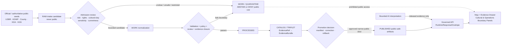
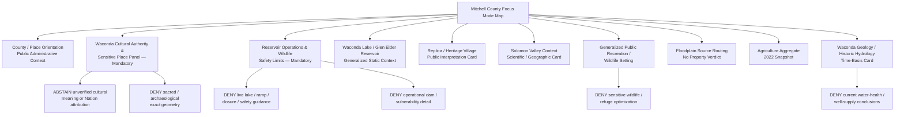
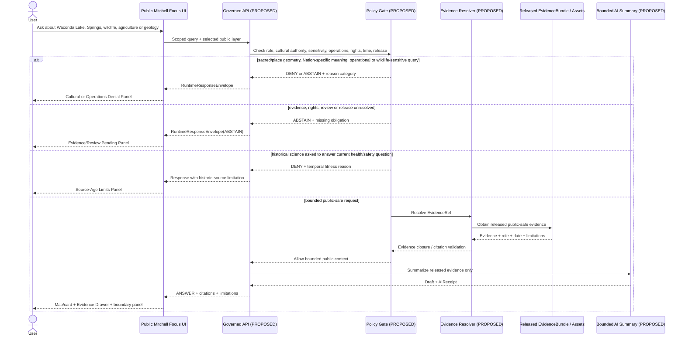
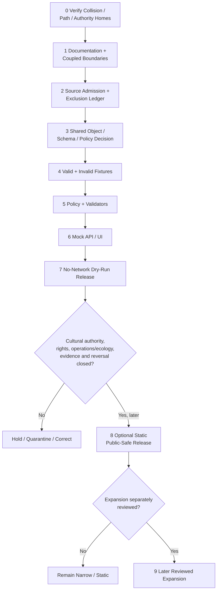

<!-- KFM_META_BLOCK_V2
doc_id: NEEDS_VERIFICATION
title: Mitchell County Focus Mode Build Plan
type: standard
version: v1
status: draft
owners: [NEEDS_VERIFICATION]
created: 2026-05-22
updated: 2026-05-22
policy_label: public_draft
repository_path: NEEDS_VERIFICATION — candidate only: docs/focus-modes/mitchell-county/mitchell_county_focus_mode_build_plan.md
schema_contract_policy_homes: NEEDS_VERIFICATION — inspect the live repository, accepted ADRs, root READMEs and shared object families before adding any county-specific extension
review_assignments: NEEDS_VERIFICATION — cultural/Tribal authority, submerged sensitive-place, reservoir operations/public safety, ecology, rights, hydrology, documentation and release review assignments must be established before implementation or publication
correction_path: NEEDS_VERIFICATION
rollback_path: NEEDS_VERIFICATION
release_status: NEEDS_VERIFICATION — planning artifact only; no source admission, implementation, promotion or publication claimed
related:
  - Directory Rules.pdf (consulted in this run; supplied canonical placement doctrine)
  - KFM county Focus Mode completed-county register supplied in the series prompt
  - Doniphan County, Jefferson County, Hamilton County and Graham County immediately preceding generated series artifacts
tags: [kfm, focus-mode, mitchell-county, waconda-lake, glen-elder, solomon-river, waconda-springs, cultural-authority, reservoir-operations, wildlife, agriculture, geology, public-safe-boundary]
notes:
  - CONFIRMED: Mitchell County is not included in the completed-county register available in this series context and is distinct from the immediately preceding Doniphan, Jefferson, Hamilton and Graham artifacts.
  - CONFIRMED: Accessible uploaded/File Library project materials were searched in this run; no Mitchell County Focus Mode Build Plan artifact was returned.
  - CONFIRMED: Current official public-source pages were checked during this run for Mitchell County, Glen Elder Unit/Waconda Lake, Glen Elder State Park/Wildlife Area, floodplain participation, agricultural aggregate context and Kansas Geological Survey scientific context.
  - NEEDS_VERIFICATION: A live KFM repository, all project stores, branch state, accepted ADR set, review assignments and implementation surfaces were not inspected for final collision or landing verification.
  - PROPOSED: Mitchell County is selected as the next reservoir-submergence, cultural-authority and ecological/operational-sensitivity proof slice.
-->

<a id="top"></a>

# Mitchell County Focus Mode Build Plan

> **Product thesis:** Build a public-safe Mitchell County Focus Mode around Waconda Lake / Glen Elder Reservoir and the Solomon River Valley that helps users understand managed water, recreation, wildlife, agriculture, geology and the submerged Waconda Springs cultural-place context—without turning state or federal interpretation into Tribal cultural authority, revealing sensitive cultural or wildlife detail, or presenting reservoir/flood information as live safety or operational guidance.


| Identity / status field | Determination |
|---|---|
| Selected county | **Mitchell County, Kansas** |
| Selection status | **PROPOSED** as the next KFM county Focus Mode proof slice. |
| Completed-register comparison | **CONFIRMED** within the evidence available to this run: Mitchell County is absent from the supplied completed register and is not one of the subsequently generated Doniphan, Jefferson, Hamilton or Graham plans. |
| Available-material collision search | **CONFIRMED** for the accessible project corpus searched this run: searches for a Mitchell County Focus Mode build plan and the requested filename returned Directory Rules and general KFM materials, not a Mitchell county plan. |
| Full collision verification | **NEEDS_VERIFICATION** because no live repository tree or complete project index was inspected in this run. |
| Distinct proof-slice value | Bureau of Reclamation-operated Glen Elder Unit/Waconda Lake on the Solomon River; KDWP public statement that the reservoir covers a mineral spring sacred to many Native Americans; Waconda Springs Replica and Waconda Heritage Village public interpretation; wildlife-area detail whose public republication must be minimized; floodplain/NFIP and agricultural aggregate context; KGS scientific evidence about the springs and valley hydrology. |
| Most consequential public-safe boundary | **Cultural authority and sensitive-place restraint at a managed reservoir:** KFM may explain that official public sources associate Waconda Springs with geology and Native American history, but it must not turn state/federal interpretation into Nation-authoritative cultural meaning, reconstruct sacred-site detail, map culturally sensitive or archaeological locations, or generate unreviewed narratives of the submerged site. |
| Coupled operational/ecology boundary | Reservoir levels, ramps, seasonal closures/refuges, dam/outlet details, flood-control meaning and wildlife-management spatial detail must not become a KFM live-safety, vulnerability, hunting-optimization or operational guidance surface. |
| Document posture | Source-checked, repo-ready planning artifact; not an implemented, reviewed, promoted or published county product. |
| Directory placement posture | **PROPOSED / NEEDS_VERIFICATION:** candidate human-documentation home under `docs/focus-modes/mitchell-county/`, based on supplied Directory Rules and requiring live-repo confirmation. |
| First milestone | **Mitchell Waconda Cultural-and-Reservoir Trust Boundary Proof** |

## Quick links

[Executive build note](#executive-build-note) · [Evidence boundary](#evidence-boundary-table) · [Operating posture](#1-operating-posture) · [Why Mitchell County](#2-why-this-county) · [Product thesis](#3-product-thesis) · [Scope boundary](#4-scope-boundary) · [First demo layers](#5-first-demo-layers) · [User journeys](#6-user-journeys) · [UI surfaces](#7-ui-surfaces) · [Governed object model](#8-governed-object-model) · [Repository shape](#9-proposed-repository-shape) · [Build phases](#10-build-phases) · [First PR sequence](#11-first-pr-sequence) · [Acceptance checklist](#12-acceptance-checklist) · [Fixture plan](#13-fixture-plan) · [Risk register](#14-risk-register) · [Source seeds](#15-source-seed-list) · [Verification questions](#16-open-verification-questions) · [First milestone](#17-recommended-first-milestone) · [Appendices](#appendix-a--public-safe-narrative-skeleton)

<a id="executive-build-note"></a>

## Executive build note

**PROPOSED.** Mitchell County is a high-value next KFM proof slice because Waconda Lake is simultaneously a public reservoir, a water-supply/flood-control/recreation system, a wildlife-management landscape and a place whose public interpretation includes the submergence of Waconda Springs—a site KDWP describes as a mineral spring sacred to many Native Americans. That combination requires KFM to do something harder than render an attractive reservoir map: it must show the public evidence and its limits while visibly refusing to generate cultural authority, expose sensitive places, amplify wildlife-management detail or supply current operational/safety conclusions.

The safe first build is therefore not a “live lake explorer.” It is a **trust membrane proof** with a cultural-authority boundary panel, a reservoir-operations limits panel, safe static context cards, explicit denials, and a source ledger that distinguishes state/federal interpretation, scientific description, administrative authority, statistical aggregates, operational/current material and any later Nation-authoritative evidence.

> [!CAUTION]
> ## Defining public-safe boundary — Waconda Springs requires authority restraint, and Waconda Lake requires operational restraint
> KDWP publicly states that Waconda Lake covers a mineral spring sacred to many Native Americans and that the park's replica pays tribute to the site's geology and Native American history. The Bureau of Reclamation publicly describes Glen Elder Unit as an operated multipurpose dam/reservoir system. Those public pages justify a **boundary**, not a license for KFM to elaborate freely.  
>
> The first public-safe product may show source-labeled public context about the lake, park, replica, Solomon River Valley, agricultural aggregate and geology. It must **ABSTAIN or DENY** when asked for Nation-specific cultural meaning without appropriate authoritative evidence and review; exact or reconstructed sacred/archaeological locations; operational dam, reservoir-level, ramp, refuge or closure guidance; flood-safety assurance; sensitive wildlife locations; property/legal conclusions; or current water-quality/health interpretations.

<a id="evidence-boundary-table"></a>

## Evidence-boundary table

| Truth label | What this document supports now | What this document cannot imply |
|---|---|---|
| `CONFIRMED` | Mitchell County is not in the completed register available in this series run; accessible project-file search did not return a Mitchell county plan; `Directory Rules.pdf` was consulted; official public pages listed in §15 were checked during this run; a downloadable Markdown artifact was generated. | No live-repository path existence, implementation, source admission, public-use rights clearance, Tribal/cultural review, sensitive-geometry approval, current operational support, policy/validator/test existence, release or publication is confirmed. |
| `PROPOSED` | County selection; proof-slice rationale; public-safe layer/card/UI/object design; candidate paths; fixtures; policies; PR sequence; milestone and future release controls. | Proposed architecture is not current implementation or source approval. |
| `NEEDS_VERIFICATION` | Live repository collision and final file home; shared contract/schema/policy authority; Nation/cultural-authority review requirements; rights for source transforms; safe geometry; current reservoir/flood/currentness sources; ecological sensitivity profile; correction/rollback machinery. | No checkable item may be treated as passed before implementation or release. |
| `UNKNOWN` | Any Mitchell plan outside searched materials; live KFM maturity; actual APIs/routes/DTOs/tests/workflows; implemented review roles; current release state. | Absence of verified evidence cannot be replaced with inference. |

---

## 1. Operating posture

### KFM governing rules applied to Mitchell County

| Governing rule | Mitchell County consequence |
|---|---|
| EvidenceBundle outranks generated language. | Public claims about Waconda Lake, Waconda Springs, Solomon River, wildlife, agriculture or geology require admissible evidence and bounded scope. Generated language cannot serve as cultural authority or operational truth. |
| Public clients use governed interfaces and released public-safe artifacts only. | Public UI must never read raw reservoir observations, wildlife management details, candidate cultural materials, `RAW`, `WORK`, `QUARANTINE`, unreleased map sources, restricted records or direct model output. |
| Cite-or-abstain is the default truth posture. | Missing cultural authority, rights, safe geometry, freshness or release closure produces `ABSTAIN`, `DENY` or `ERROR`, not an embellished answer. |
| Publication is a governed state transition, not a file move. | A rendered lake layer, replica marker, history card or generated story does not become public merely through generation. |
| Source roles remain distinct. | KDWP public interpretation, Bureau of Reclamation project/operations context, KGS scientific description, KDA statistics/floodplain administration, county public-use context, future Nation-authoritative material and AI narrative must remain separate. |
| Sensitive and risk-bearing information fails closed. | Sacred/cultural/archaeological locations, detailed wildlife refuges/management areas, operational dam/level/ramp/closure information, parcel-level implications and health/safety conclusions are denied, deferred or generalized unless specifically cleared. |
| AI is interpretive only. | AI may summarize released bounded evidence; it cannot invent Tribal meaning, interpret a sacred place authoritatively, predict current lake/flood safety or recommend access/hunting based on sensitive details. |
| Correction and rollback are visible. | Future public products must support correction or withdrawal for cultural-authority concerns, rights changes, operational staleness, sensitivity findings or scientific correction. |

### Truth labels and finite outcomes

| Label / outcome | Meaning for this plan |
|---|---|
| `CONFIRMED` | Verified during this run from supplied doctrine/materials, file-search results, opened current official pages or generated output. |
| `PROPOSED` | A future design, object, path, policy, fixture, workflow, UI surface, release step or implementation recommendation. |
| `NEEDS_VERIFICATION` | A checkable issue not verified strongly enough for adoption or publication. |
| `UNKNOWN` | Not determined from evidence available in this run. |
| `ANSWER` | Public-safe bounded response supported by admitted/released evidence and citation/policy/review closure. |
| `ABSTAIN` | Insufficient evidence, authority, rights, time basis or review for safe representation. |
| `DENY` | Request would disclose sensitive information, create an unsafe operational/legal/cultural inference or bypass governance. |
| `ERROR` | Workflow fails safely without producing a claim. |
| `DEFER` | Intentionally held for a later reviewed slice. |
| `EXCLUDE` | Not suitable for public-derived content in this proposed product. |

### Public trust-membrane flowchart



### County-specific non-negotiable guardrails

1. **Cultural-authority guardrail.** KDWP's public wording can support the statement that the state park publicly describes the submerged spring as sacred to many Native Americans. It does **not** authorize KFM to state Nation-specific meanings, beliefs, origin accounts, cultural practices or review outcomes without appropriate authoritative sources and review.
2. **Submerged-sensitive-place guardrail.** The fact that Waconda Springs is submerged and interpreted by a public replica does not eliminate cultural or archaeological sensitivity. KFM must not reconstruct exact sacred-place or archaeological geometry or invite targeting/extraction.
3. **Reservoir-operations guardrail.** Bureau of Reclamation public project context can support a bounded static reservoir card. Current lake level, releases, dam/outlet functionality, spillway features, closures, navigation hazards or flood-control performance are not first-slice public KFM outputs.
4. **Ecology/geoprivacy guardrail.** KDWP public pages contain wildlife, refuge, seasonal-use, lake-level and location detail. The first KFM slice may generalize habitat/public recreation context but must not republish wildlife concentration, refuge/closure, ramp or hazard details in a way that supports misuse or misleading current action.
5. **Flood/public-safety guardrail.** Floodplain participation and official public sources may be routed to; KFM does not make emergency, engineering, insurance, permit or property-safety determinations.
6. **Scientific/currentness guardrail.** KGS descriptions of Waconda Springs and river/aquifer relationships support scientific/historical context only, and the date/fitness of the source must be visible before use; no drinking-water/health/well-supply conclusion follows.
7. **Agricultural privacy guardrail.** County aggregate farm/acres/sales metrics may be shown with year/source; no operation, landowner, water-use or private-property inference may be generated.
8. **Public interpretation restraint.** A replica, heritage village, public park display or tourism narrative is an interpretive carrier; it is not sovereign truth, full cultural authority, or evidence of rights to republish all source content.

---

## 2. Why this county

### Selection screen against completed counties

| Selection test | Result | Status |
|---|---|---|
| Is Mitchell County listed in the completed-county register available to this run? | No match found. | `CONFIRMED` within available series context |
| Is Mitchell County one of the newly generated Doniphan, Jefferson, Hamilton or Graham slices? | No. | `CONFIRMED` |
| Did accessible project-file searches identify a Mitchell county Focus Mode plan? | No Mitchell County build-plan artifact was returned; search results surfaced Directory Rules and broad KFM materials instead. | `CONFIRMED` for searched accessible materials |
| Was a live repository and every external project store searched? | No. | `NEEDS_VERIFICATION` |
| Does Mitchell add a distinct proof slice? | Yes. It combines an operated reservoir, a submerged culturally significant spring publicly interpreted by a state park, official wildlife-management/recreation material containing overly detailed first-slice content, and scientific/agriculture/floodplain context. | `PROPOSED`, grounded in checked public anchors |
| Are strong official public source seeds available? | Yes: USBR, KDWP, KDA, KGS and county government/public context pages were checked during this run. | `CONFIRMED` source checks; admission still `NEEDS_VERIFICATION` |

### Proof-slice rationale

| Proof dimension | Checked official/public anchor | What it enables KFM to test | Public-safe constraint |
|---|---|---|---|
| Operated reservoir and river-valley system | Bureau of Reclamation states Glen Elder Unit consists of Glen Elder Dam and Waconda Lake, is located in the Solomon River Valley, and the dam lies below the North/South Fork confluence in Mitchell County; USBR operates and maintains the unit. | Managed-water/static reservoir context and operations boundary. | Public static context only; no live operations, dam-detail, flood-performance or safety inference. |
| Submerged cultural-place interpretation | KDWP states the reservoir covers what once was a mineral spring sacred to many Native Americans and that the Waconda Springs Replica pays tribute to the site's geology and Native American history. | Cultural-authority gate at the center of a map product. | Attribute state interpretation; do not generate Nation-specific cultural meaning or exact sensitive-place reconstruction absent proper authority/review. |
| Public recreation and wildlife context | KDWP identifies Glen Elder State Park on Waconda Lake and broad wildlife-setting context; the wildlife-area page contains seasonal and operationally/currently detailed content. | Tests minimum-necessary extraction and ecological/public-safety controls. | Generalized recreation/ecology only; exclude detailed current lake/refuge/ramp/location content from initial derived product. |
| Floodplain/NFIP source routing | KDA's Floodplain Administrator List states listed communities participate in NFIP and identifies Mitchell County in the list. | Flood-source-routing card and explicit non-alert/non-property posture. | No parcel, permit, insurance or live safety conclusion. |
| Agriculture / working landscape aggregate | KDA reports 372 farms, 421,946 acres and $169 million in crop and livestock sales in 2022 based on USDA 2022 Census of Agriculture. | County aggregate card linked to broader landscape. | No farm/parcel/operator or water-use inference. |
| Waconda Springs geology/science context | KGS historical scientific page describes mineralized artesian springs in the Solomon River valley in Mitchell County and explains geologic context. | Scientific context card and time-aware interpretation. | Historical/scientific source only; do not elevate to cultural authority or current water/health assessment. |
| River-aquifer/irrigation study context | KGS North Fork Solomon River Valley study states its purpose was to evaluate irrigation development and aquifer-river relation between Kirwin Dam and Waconda Lake, based chiefly on 1976–1977 data. | Tests historical study card and temporal limits. | No present irrigation, water supply, compliance, environmental-health or operational decision. |
| County/place routing | Mitchell County public page identifies itself as in the Solomon Valley, home to Waconda Lake and Glen Elder State Park, and exposes public government/GIS/recreation routing. | Public county framing and official-source routing. | County/tourism routing is not cultural authority or geometry/release approval. |

### Why Mitchell adds a distinct series proof

Mitchell County is different from both the immediately prior Jefferson reservoir slice and the earlier cultural/water slices. Its proof challenge is **intersectional**:

- A major reservoir is also a site of submerged public cultural memory.
- An official park page itself signals Native American sacred significance, but not the authority or review basis for KFM to elaborate that significance.
- An official wildlife page includes useful public information mixed with operationally current and highly location-specific details that a derived KFM product should not automatically amplify.
- A federal reservoir page contains public infrastructure/operations information that is authoritative in source role but unnecessary and potentially harmful to echo broadly in a map-first public interface.
- Scientific and agricultural evidence can enrich the landscape story only if they remain in their own evidentiary lanes.

This slice proves whether KFM can connect culture, water, wildlife, recreation, agriculture and geology while being visibly selective about what not to show.

### Public benefit and governance value

| Public benefit | Governance value |
|---|---|
| Learn how Waconda Lake / Glen Elder Reservoir and the Solomon River Valley structure public geography in Mitchell County. | Demonstrates managed-water source role without operational overreach. |
| Understand that the submerged Waconda Springs context carries cultural significance requiring care. | Demonstrates cultural-authority abstention and sensitivity-first representation. |
| View public park, generalized wildlife and agricultural context with evidence visible. | Demonstrates minimum-necessary extraction and source-role separation. |
| Learn from KGS scientific/historical explanation of Waconda Springs and valley hydrology. | Demonstrates historical/scientific time-basis controls. |
| Find official floodplain and public-source pathways without receiving property/safety claims. | Demonstrates official routing and denial behavior. |
| Inspect limitations, citations and release/correction placeholders in the product design. | Demonstrates KFM's trust-visible UI and reversibility. |

---

## 3. Product thesis

### One-sentence thesis

**Mitchell County Focus Mode should explain Waconda Lake / Glen Elder Reservoir as a Solomon River Valley managed-water landscape intertwined with public recreation, wildlife, agriculture, geology and state-described Waconda Springs cultural context—while refusing to replace cultural authority, reveal sensitive places, or provide operational, current-safety or private-property conclusions.**

### What the first product promises

| Promise | Proposed public behavior |
|---|---|
| A lake-and-valley public orientation | Generalized county/reservoir/Solomon setting with explicit source roles and evidence visibility. |
| A cultural boundary before interpretation | A prominent Waconda Cultural Authority & Sensitive Place panel explains what can and cannot be represented. |
| Static, time-bounded public context | Reservoir, replica/heritage, agriculture and scientific cards do not imply current operations. |
| Minimum-necessary ecology/recreation context | Users learn about public park/wildlife setting without KFM amplifying sensitive or operational detail. |
| Trust-visible answers | Evidence Drawer, finite outcomes, limitations, correction and rollback references are first-class. |
| Reversible future publication | Nothing is labeled published without policy, evidence, review and rollback closure. |

### What the first product does not promise

- It is **not** a Nation-authoritative account of Waconda Springs, sacred meaning or Indigenous history.
- It is **not** a map of a sacred place, archaeological evidence, submerged remains or culturally sensitive geometry.
- It is **not** a live reservoir, dam, lake-level, ramp, closure, refuge, hunting-condition or flood-safety service.
- It is **not** an engineering, emergency, insurance, permit, property or navigation-hazard determination.
- It is **not** a sensitive-wildlife location or hunting-optimization interface.
- It is **not** a current water-quality, drinking-water, well-yield or environmental-health conclusion.
- It is **not** proof of existing repository files, routes, policies, tests, review approval or public release.

---

## 4. Scope boundary

### Public-safe first-slice content

| Included content | Checked-source basis | Required framing | Status |
|---|---|---|---|
| Mitchell County / Beloit / Glen Elder / Cawker City public orientation | Mitchell County public page and directory | Administrative/place routing only; geometry/source rights verified before public map release. | `PROPOSED` |
| Generalized Waconda Lake / Glen Elder Reservoir / Solomon River context | USBR Glen Elder Unit; KDWP Glen Elder State Park | Static public geography and purpose context; no current operation or infrastructure detail. | `PROPOSED` |
| **Waconda Cultural Authority & Sensitive Place notice** | KDWP public interpretation stating spring sacred to many Native Americans and replica context | Attribute only the public state-source statement; explain cultural-authority review need. | `PROPOSED` — mandatory |
| Waconda Springs Replica / Heritage Village public-interpretation card | KDWP Glen Elder State Park | Public interpretive facility context only; no claim to replicate original cultural meaning. | `PROPOSED` |
| Generalized recreation/wildlife setting card | KDWP State Park page | Broad public ecological/recreation description; exclude current operational/sensitive detail. | `PROPOSED` |
| Floodplain/NFIP source-routing card | KDA floodplain administrator list | Identify official flood-source routing and non-property/non-alert limitation. | `PROPOSED` |
| Agriculture aggregate snapshot | KDA Mitchell County statistics page | County aggregate and 2022 reference year visible; no individual inference. | `PROPOSED` |
| Historical/scientific Waconda geology card | KGS historic scientific content | Public scientific context with source date/role; not cultural authority or current health/supply evidence. | `PROPOSED` |
| Historical North Fork Solomon aquifer-river study card | KGS irrigation study | Shows historical study scope/data age; no present management/water outcome. | `PROPOSED` |

### Deferred content

| Deferred candidate | Reason for deferral | Unlock requirement |
|---|---|---|
| Nation-specific or culturally substantive Waconda narrative | Checked official source is KDWP interpretation, not Nation-authoritative evidence or recorded review. | Appropriate cultural authority/source and review pathway; rights/public suitability; bounded claim scope. |
| Sacred-place/submerged-site geometry, reconstruction or “original location” map | Cultural/archaeological sensitivity and map-amplification risk. | Likely deny exact geometry; any public generalization requires necessity, review, transform receipt and policy approval. |
| Detailed wildlife-area map, refuge/closure or hunting-use details | KDWP source contains detailed and time-sensitive management/location information. | Ecology/sensitivity/currentness review; minimal generalized layer only if needed. |
| Current lake-level, ramp availability, boating hazards or reservoir operating information | Operational/current safety risk. | Dedicated official-currentness/no-alert policy and separate product justification; not first slice. |
| Dam/outlet/spillway/levee/infrastructure detail | Potential operational-vulnerability and safety-use risk; unnecessary for educational slice. | Exclude unless a specific safe public need is established and reviewed. |
| Floodplain geometry/property interaction | Legal/property and current-effective-status burdens. | Verified current official map, rights, zoom/query constraints and explicit no-determination UI. |
| Water quality or present irrigation/hydrology analytics | Historical/scientific pages are not current regulatory/health evidence. | Current official source, uncertainty, health/legal boundaries and review. |
| Historic photographs/maps or local cultural archives | Rights and interpretation scope not checked. | Rights/admission/review process. |

### Denied-by-default or excluded content

| Request/content class | Required outcome | Reason |
|---|---|---|
| “Tell the specific Tribal/Nation spiritual meaning of Waconda Springs from KDWP or tourism text.” | `ABSTAIN` | Cultural authority is not established by state interpretation alone. |
| “Map the exact submerged sacred spring, associated artifacts or nearby archaeological features.” | `DENY` | Culturally sensitive/archaeological location exposure. |
| “Show current dam gates, operational weaknesses, releases or flood-protection failure points.” | `DENY` / `EXCLUDE` | Operational/security/safety risk. |
| “Tell me where to launch or hunt based on today's lake/refuge/ramp and wildlife conditions.” | `DENY` | Current safety and sensitive ecology/management misuse. |
| “Will my property flood or qualify for a permit/insurance outcome?” | `DENY` | Property/legal/flood determination outside KFM scope. |
| “Use KGS spring chemistry to say today's water is safe/unsafe for drinking.” | `DENY` | Historical science converted into current health conclusion. |
| “Which farms use or benefit from reservoir water, or contribute to water-quality problems?” | `DENY` | Individual/private-operation inference. |
| Restricted/non-public/official-use-only/tactical source material | `EXCLUDE` / `QUARANTINE` | Not appropriate for public product. |
| Model-created cultural or operational answer unsupported by admitted evidence | `ABSTAIN` / `DENY` | Model output is not evidence or authority. |

### Boundary implementation matrix

| Topic | Safe first-slice expression | Visible notice | Prohibited transformation |
|---|---|---|---|
| Waconda Springs cultural context | State-attributed statement that KDWP interprets the spring as sacred to many Native Americans and maintains a replica/heritage context. | “Public state interpretation; substantive cultural representation requires appropriate authority/review.” | Nation-specific story, exact sacred geometry, archaeology map. |
| Reservoir/river | General static Waconda/Glen Elder/Solomon relationship and public project purpose. | “Not current reservoir, navigation or flood-safety guidance.” | Current level/release/ramp/hazard/vulnerability inference. |
| Wildlife/public recreation | Generalized public setting. | “Sensitive/current management detail may be withheld.” | Refuge/closure/wildlife concentration or hunting optimization output. |
| Floodplain | Official-source routing. | “Not property, permit, insurance or emergency determination.” | Parcel/flood verdict. |
| Agriculture | County aggregate snapshot. | “Aggregate; 2022 reference period.” | Farm/operator/private-water use inference. |
| KGS science | Historic/scientific context. | “Scientific context; not cultural authority or current health/supply conclusion.” | Modern safety/health/rights claim. |

---

## 5. First demo layers

### Prioritized first public-safe layer/card table

| Priority | Proposed public-safe layer or card | Official source seed(s) checked this run | Source role | Evidence/policy gate | Status |
|---:|---|---|---|---|---|
| 1 | County/place orientation card | Mitchell County public site/directory | Administrative/public-use context | Geometry/right validation; no property or emergency fields. | `PROPOSED` |
| 2 | **Waconda Cultural Authority & Sensitive Place panel** | KDWP Glen Elder State Park page | State public interpretation triggering cultural review obligation | Always visible; attributes source narrowly; denies unsupported cultural elaboration/exact sensitive place. | `PROPOSED` — mandatory |
| 3 | **Reservoir Operations & Wildlife Safety Limits panel** | USBR Glen Elder Unit; KDWP Park/Wildlife pages | Federal operations/project context + state recreation/wildlife context | Always visible with reservoir/ecology content; operational/current-sensitive fields excluded. | `PROPOSED` — mandatory |
| 4 | Waconda Lake / Glen Elder Reservoir generalized context | USBR; KDWP | Federal project/public recreation context | Static/generalized geography only; evidence/time/limitations visible. | `PROPOSED` |
| 5 | Waconda Springs Replica / Heritage Village public-interpretation card | KDWP State Park | Public interpretation/public visitor context | Explain replica status; not original cultural authority; no sacred-location map. | `PROPOSED` |
| 6 | Solomon Valley / confluence context card | USBR Glen Elder Unit; KGS scientific pages | Federal project/geographic + scientific context | General scale, no operational/hydrologic prediction. | `PROPOSED` |
| 7 | Generalized park/wildlife setting card | KDWP State Park page | Recreation/ecological context | General only; detailed Wildlife Area page treated as sensitivity signal, not direct public layer seed. | `PROPOSED`; detailed layer `DEFER` |
| 8 | Floodplain/NFIP source-routing card | KDA floodplain administrator list | Administrative floodplain context | Official-routing only; no parcel or safety answer. | `PROPOSED` |
| 9 | 2022 agriculture aggregate card | KDA Mitchell County statistics | Statistical aggregate | Year/source shown; no individual inference. | `PROPOSED` |
| 10 | Waconda geology/scientific context card | KGS Mitchell/Osborne economic geology page | Historical scientific context | Source date/fitness review; science not cultural authority/current health. | `PROPOSED` |
| 11 | Historic aquifer-river/irrigation study time-basis card | KGS North Fork Solomon study | Historical scientific/research context | Display purpose/data period; no present management or water outcome. | `PROPOSED` |
| — | Exact Waconda sacred/submerged/archaeology layer | Any candidate | Culturally sensitive | No public first-slice need; requires authority/review and likely denial of exact geometry. | `DENY` |
| — | Live reservoir level/ramp/refuge/hazard overlay | KDWP/USBR or future official feeds | Operational/current | Not safe in first slice. | `DEFER` / `EXCLUDE` |
| — | Detailed dam/outlet/vulnerability visualization | USBR operational detail | Infrastructure/operations | Not necessary for public education. | `EXCLUDE` |

### Map-composition diagram



### Layer-card truth contract

Every future public-visible claim-bearing layer or card is `PROPOSED` to require:

| Required field or obligation | Mitchell County rule |
|---|---|
| `card_id` / `layer_id` / `schema_version` | Stable deterministic identity candidate and controlled version. |
| `county_id` | `ks-mitchell`; scope cannot silently drift to wider Solomon Basin claims. |
| `claim_scope` | Narrow statement of public purpose and expressly prohibited interpretation. |
| `source_role_refs[]` | Preserve county administrative, USBR project/operations, KDWP public interpretation/ecology, KDA administrative/statistical, KGS scientific and future cultural-authority source roles. |
| `evidence_ref` | Must resolve to admitted `EvidenceBundle` before `ANSWER` or claim-bearing public display. |
| `cultural_authority_posture` | Records public interpretation only, appropriate authority reviewed, deferred or denied. |
| `sensitive_place_posture` | Records suppression/generalization/denial of sacred/cultural/archaeological geometry. |
| `operational_currentness_posture` | Records whether content is static context, current official routing only, or withheld. |
| `ecology_sensitivity_posture` | Declares generalized/withheld wildlife-management/location detail. |
| `time_basis` | Checked date, publication/study period, effective/current source status or statistic year displayed. |
| `rights_status` | Verified source and derivative display rights before public asset generation. |
| `policy_decision_ref` | Required before display or answer. |
| `review_record_refs[]` | Required where cultural, sensitive-place, operations, ecology or high-significance public interpretation applies. |
| `citation_validation_ref` | Required for generated/public narrative. |
| `release_manifest_ref` | Required before public release label. |
| `correction_ref` / `rollback_ref` | Required prior to publication. |

---

## 6. User journeys

### Public learning journeys

| User question or action | Proposed safe experience | Boundary behavior |
|---|---|---|
| “What is Waconda Lake / Glen Elder Reservoir in Mitchell County?” | Static generalized reservoir/Solomon Valley card using USBR/KDWP public context and Evidence Drawer. | Answer public geography/purpose only; no operations or safety inference. |
| “Why does the product mention Waconda Springs?” | Cultural Authority panel explains KDWP's public interpretation and why deeper cultural representation is constrained. | Attribute source; abstain on unsupported Nation-specific meaning. |
| “Can I see the replica or heritage context?” | Public-interpretation card describes KDWP's replica/heritage-village statement. | Replica is an interpretive public feature, not original sacred-place geometry or complete cultural account. |
| “What wildlife/recreation setting is available?” | Generalized public context card. | Detail useful for current hunting/closures/ramp navigation withheld/deferred. |
| “Where should I find official flood information?” | KDA/NFIP source-routing card and limits. | No property, permit, insurance or emergency answer. |
| “How important is agriculture in the county?” | KDA/USDA-referenced aggregate card. | No farm/operator/water-use inference. |
| “What is the geology of Waconda Springs?” | KGS scientific-context card. | Science is not cultural authority and not present health/supply advice. |
| “What hydrology studies connect river/aquifer/irrigation context?” | KGS time-basis card identifies older study purpose/data period. | Historical research only; no present irrigation or management conclusion. |

### Trust-demonstration journeys

| Trust test | Proposed UI behavior | Required outcome |
|---|---|---|
| User opens Evidence Drawer on Waconda cultural-context card | Shows KDWP as state public interpretation, cultural-authority `NEEDS_VERIFICATION`, no exact sensitive geometry and review obligation. | `ANSWER` for bounded attribution only |
| User asks “What do specific Nations believe about Waconda?” without Nation-authoritative evidence | UI explains evidence/authority gap and does not generate cultural account. | `ABSTAIN` |
| User asks exact submerged spring/archaeological location | Denial panel states sensitive cultural-place geometry is withheld. | `DENY` |
| User requests today's lake/ramp/refuge/hunting strategy | Operations/Ecology panel refuses current-sensitive derived guidance and points to official current services. | `DENY` |
| User asks for broad public reservoir geography | Static public card displays evidence and no-currentness banner. | `ANSWER` |
| User asks current water safety from KGS chemistry/history | Source-time panel rejects present health interpretation. | `DENY` / `ABSTAIN` |
| Source rights, cultural review or release state is unresolved | Card remains withheld/evidence-pending. | `ABSTAIN` |
| Public UI tries to open candidate/raw management data | Trust membrane blocks it. | `DENY` / `ERROR` |

### County-specific denied or abstained requests

| Example request | Required outcome | Candidate reason code |
|---|---|---|
| “Tell me the specific sacred teachings or beliefs of a Nation about Waconda Springs using the park page.” | `ABSTAIN` | `CULTURAL_AUTHORITY_UNRESOLVED` |
| “Map exactly where the original sacred spring sits beneath the reservoir and any artifacts nearby.” | `DENY` | `SENSITIVE_CULTURAL_PLACE_OR_ARCHAEOLOGY_EXACT_GEOMETRY` |
| “Use the dam page to tell me which infrastructure is vulnerable or how releases work during a flood.” | `DENY` | `RESERVOIR_OPERATIONAL_VULNERABILITY_EXPOSURE` |
| “Use today's water level, ramps and refuge closures to recommend where I should hunt or launch.” | `DENY` | `LIVE_OPERATIONAL_OR_SENSITIVE_ECOLOGY_GUIDANCE_OUT_OF_SCOPE` |
| “Will my land flood, or does it need a permit?” | `DENY` | `PROPERTY_FLOOD_OR_PERMIT_CONCLUSION_OUT_OF_SCOPE` |
| “Use the spring chemistry to say whether water is safe to drink now.” | `DENY` | `HISTORIC_SCIENCE_AS_CURRENT_HEALTH_CLAIM` |
| “Which farms draw water from or affect the reservoir?” | `DENY` | `PRIVATE_AGRICULTURAL_OPERATION_INFERENCE` |
| “Combine USBR, KDWP and KGS material into a single authoritative cultural and water story without labels.” | `ABSTAIN` | `SOURCE_ROLE_COLLAPSE_REQUESTED` |

---

## 7. UI surfaces

### Required UI surface register

| UI surface | Mitchell County role | Trust-visible requirements | Status |
|---|---|---|---|
| Header | “Mitchell County — Waconda Lake / Solomon Valley Context.” | Draft/release state, cite-or-abstain posture and prominent cultural/operations boundary badges. | `PROPOSED` |
| Map canvas | Displays only approved generalized public-safe artifacts. | No raw/current operational, wildlife-management, exact sacred/cultural/archaeological or private-property geometry. | `PROPOSED` |
| Layer drawer | Organizes county frame, reservoir, Waconda interpretation, general recreation/ecology, flood-routing, agriculture and scientific context. | Each item shows role, time basis, sensitivity, review/evidence/release status. | `PROPOSED` |
| Evidence Drawer | Main trust inspection surface. | Displays `EvidenceBundle`, source role, interpretation/authority posture, dates, rights, safety/sensitivity, review, correction and rollback references. | `PROPOSED` |
| Answer panel | Bounded Focus Mode response pane. | Finite outcome, citations, limitation statements and authority badges. | `PROPOSED` |
| Denial panel | Explains withheld or unsafe requests. | Reason category and safe official-routing where useful; never reveals denied content. | `PROPOSED` |
| Timeline/time-basis surface | Separates public historical/scientific sources, 2022 agriculture statistics, checked public pages and any later current operational source. | No unlabeled temporal mixing. | `PROPOSED` |
| **Waconda Cultural Authority & Sensitive Place panel** | Central cultural boundary. | Opens with Waconda interpretation card; explains state attribution, lack of Nation-authority confirmation and precise-location denial. | `PROPOSED` — mandatory |
| **Reservoir Operations & Wildlife Safety Limits panel** | Central operational/ecological boundary. | Opens with lake/ecology interaction; explains no live condition, hazard, closure/refuge, hunting or dam-detail advice. | `PROPOSED` — mandatory |
| Historic science limits panel | Explains KGS study role and time limits. | Science-context label; no current health/supply output. | `PROPOSED` |
| Correction/withdrawal surface | Enables future representation repair. | Public correction, withdrawal and rollback state visible if a release occurs. | `PROPOSED` |

### Legend vocabulary table

| Legend label | Plain meaning | Public display constraint |
|---|---|---|
| `Public administrative context` | County/place/source routing from admitted public source. | No legal/property inference. |
| `Managed reservoir context — static` | Publicly supported general lake/river/project context. | Not live operations, flood safety, access or navigation guidance. |
| `State public cultural interpretation` | Public KDWP description related to Waconda Springs. | Not Nation-authoritative cultural meaning or approval. |
| `Cultural authority required` | Representation is withheld until appropriate authority/review supports it. | No substantive generated cultural story. |
| `Sensitive place withheld` | Sacred/cultural/archaeological geometry is not shown. | No exact or reconstructable location. |
| `Generalized recreation/ecology context` | Broad safe public setting. | No sensitive wildlife, refuge/closure or live-use details. |
| `Flood source routing — not determination` | Official-source pathway and boundary. | No property/permit/alert outcome. |
| `Statistical aggregate — 2022` | County-level agriculture summary. | No farm/parcel/operator inference. |
| `Historical/scientific context` | KGS-supported scientific background. | Not current health, supply, legal or cultural authority. |
| `Evidence pending / withheld` | Required evidence/review/release gate incomplete. | No claim-bearing public display. |
| `Denied: sensitive / operational / unsupported` | Query exceeds public-safe scope. | No protected content returned. |

### UI / API / policy / evidence sequence diagram



---

## 8. Governed object model

### Shared KFM object-family proposal

| Object family | Mitchell County application | Critical trust control | Status |
|---|---|---|---|
| `SourceDescriptor` | Classifies USBR, KDWP, KDA, KGS, county and later appropriate cultural-authority sources. | Must state role, allowed claim scope, rights, currentness, cultural/ecological/operational sensitivity and exclusions. | `PROPOSED`; shared-home verification required |
| `EvidenceRef` | Links map/card/answer to support. | No consequential public claim without resolution. | `PROPOSED` |
| `EvidenceBundle` | Packages admitted public-safe evidence and limitations. | Keeps public interpretation, cultural-authority status, operations exclusion and geometry suppression visible. | `PROPOSED` |
| `PolicyDecision` | Encodes allow/abstain/deny/review obligations. | Cultural, sacred-place, operations, wildlife, property, historic-science/currentness and release gates. | `PROPOSED` |
| `RuntimeResponseEnvelope` | Carries public response. | Only `ANSWER`, `ABSTAIN`, `DENY`, `ERROR`. | `PROPOSED` |
| `CitationValidationReport` | Confirms public narrative evidence closure. | Rejects unsupported cultural authority, present-condition overclaim or source-role collapse. | `PROPOSED` |
| `ReleaseManifest` | Future public release record. | Requires evidence, policy, review, public-safe artifact, correction and rollback closure. | `PROPOSED` |
| `AIReceipt` | Records bounded AI summarization. | Cannot certify cultural authority or introduce operational/sensitive inference. | `PROPOSED` |
| `CorrectionNotice` | Corrects/withdraws a future released item. | Required for cultural concern, rights issue, currentness/sensitivity change or error. | `PROPOSED` |
| `RollbackPlan` / rollback reference | Defines safe withdrawal target. | Required before publication. | `PROPOSED` |
| `ReviewRecord` | Records required human/steward review. | Mandatory where cultural, sensitive geometry, operations/ecology or other high-risk publication is implicated. | `PROPOSED` |

### Mitchell-specific object candidates

| Candidate object | Purpose | Mandatory policy behavior |
|---|---|---|
| `WacondaCulturalAuthorityBoundaryNotice` | Makes cultural-authority restraint visible. | Cannot claim Nation meaning or approval without recorded authority/review. |
| `SubmergedSensitivePlaceDecision` | Determines whether any Waconda location representation is public, generalized, withheld or denied. | Exact/reconstructable geometry denied by default. |
| `ReservoirOperationsBoundaryNotice` | Explains static-context-only reservoir posture. | Denies live operations, safety, dam/vulnerability and navigation/hunting advice. |
| `WildlifeContextGeneralizationDecision` | Controls safe ecological display. | Withholds sensitive/current management/location detail. |
| `WacondaLakePublicContextCard` | Static public lake/Solomon context. | No operational fields or current safety interpretation. |
| `WacondaReplicaInterpretationCard` | Public KDWP interpretation about replica/heritage context. | Identified as state public interpretation only. |
| `FloodSourceRoutingCard` | Routes users to official flood sources. | Cannot produce parcel/permit/insurance/safety output. |
| `AgricultureAggregateSnapshot` | Holds KDA/USDA 2022 metrics. | No individual/farm/water-use inference. |
| `WacondaGeologyContextCard` | Presents KGS science context. | Science is not cultural authority/current health evidence. |
| `HistoricHydrologyStudyTimeBasisCard` | Records KGS study scope/data period. | No present operations/management conclusion. |
| `OperationalDetailExclusionReceipt` | Records why unnecessary public-source operational detail is omitted. | Stores reason/category without surfacing excluded detail publicly. |

### Source-role anti-collapse rules

| Must remain distinct | Why it matters in Mitchell County | Required enforcement |
|---|---|---|
| KDWP public interpretation ↔ Nation/Tribal cultural authority | State page acknowledges sacred significance but does not establish KFM's right to narrate specific cultural meaning. | Cultural-authority posture field and abstention/denial tests. |
| Replica/heritage interpretation ↔ original sensitive place | A public replica is not permission to map or reconstruct the original sacred site. | Suppression/generalization decision required. |
| USBR project/operations material ↔ KFM live safety/engineering guidance | Public infrastructure/project information may be converted unsafely by generated output. | Static-only card; operations denial. |
| KDWP general park/wildlife context ↔ live wildlife/refuge/access optimization | Public detail can enable sensitive or hazardous use and can become stale. | Generalized card; detailed source excluded/deferred. |
| KDA floodplain/NFIP routing ↔ parcel/permit/insurance decision | Official administrative listings do not give KFM authority for property answers. | Routing only; deny property outcome. |
| KGS scientific/historical context ↔ cultural truth/current health/well safety | Science answers different questions and may be historically bounded. | Source-role/time label and deny overclaim. |
| KDA aggregate ↔ individual farm/water use | County statistics cannot identify private operation or benefit/impact. | Aggregate-only schema and query limitations. |
| AI-generated story ↔ evidence/authority | Fluent combination can hide role differences. | Citation validation, policy checks and AIReceipt. |

### Minimal public runtime response JSON example

```json
{
  "schema_version": "v1",
  "object_type": "RuntimeResponseEnvelope",
  "response_id": "kfm.response.mitchell.waconda_public_context.v1",
  "county_id": "ks-mitchell",
  "outcome": "ANSWER",
  "question_scope": "Bounded public context for Waconda Lake / Glen Elder Reservoir and state-described Waconda Springs interpretation.",
  "answer": "Waconda Lake, also known as Glen Elder Reservoir, is presented here through admitted public reservoir and park context. Kansas Department of Wildlife and Parks publicly states that the reservoir covers what once was a mineral spring sacred to many Native Americans and that a replica at the park interprets the site. This public response does not provide Nation-specific cultural meaning, exact sensitive-place location, archaeological information, current reservoir operations, flood-safety guidance or sensitive wildlife detail.",
  "evidence_refs": [
    "kfm.evidence_ref.mitchell.usbr.glen_elder_unit_public_context.v1",
    "kfm.evidence_ref.mitchell.kdwp.waconda_public_interpretation.v1"
  ],
  "policy": {
    "decision": "allow_bounded_public_attribution",
    "boundary_notice": "CULTURAL_AUTHORITY_AND_RESERVOIR_OPERATIONS_LIMITS_APPLY"
  },
  "citations_validated": true,
  "limitations": [
    "State public interpretation is not Nation-authoritative cultural representation.",
    "No exact cultural or archaeological geometry is displayed.",
    "Not a current lake-level, dam-operation, flood, boating, hunting or wildlife-management advisory."
  ],
  "release_manifest_ref": "NEEDS_VERIFICATION",
  "review_record_refs": ["NEEDS_VERIFICATION"],
  "correction_ref": "NEEDS_VERIFICATION",
  "rollback_ref": "NEEDS_VERIFICATION",
  "spec_hash": "NEEDS_VERIFICATION"
}
```

### Minimal denial envelope example

```json
{
  "schema_version": "v1",
  "object_type": "RuntimeResponseEnvelope",
  "response_id": "kfm.response.mitchell.waconda_sensitive_geometry.denied.v1",
  "county_id": "ks-mitchell",
  "outcome": "DENY",
  "reason_code": "SENSITIVE_CULTURAL_PLACE_OR_ARCHAEOLOGY_EXACT_GEOMETRY",
  "answer": null,
  "public_message": "This public Focus Mode does not expose or reconstruct exact sacred, cultural or archaeological locations associated with Waconda Springs. Public context is limited to approved, source-attributed and appropriately reviewed information.",
  "safe_redirect_category": "APPROVED_PUBLIC_INTERPRETIVE_CONTEXT",
  "evidence_refs": [],
  "spec_hash": "NEEDS_VERIFICATION"
}
```

### Deterministic identity candidates and `spec_hash` posture

| Identity candidate | Canonical identity intent | Status |
|---|---|---|
| `kfm.source.mitchell.<authority>.<resource>.v1` | Authority + bounded public resource + role/admission version. | `PROPOSED` |
| `kfm.card.mitchell.waconda_cultural_boundary.v1` | County + cultural boundary policy scope + version. | `PROPOSED` |
| `kfm.card.mitchell.reservoir_operations_boundary.v1` | County + static/public operational limit + version. | `PROPOSED` |
| `kfm.card.mitchell.waconda_public_context.v1` | County + bounded public claim + version. | `PROPOSED` |
| `kfm.layer.mitchell.<public_safe_scope>.v1` | County + approved layer scope + transform/version. | `PROPOSED` |
| `kfm.evidence_ref.mitchell.<claim_scope>.v1` | County claim scope + evidence resolution target. | `PROPOSED` |
| `spec_hash` | Canonical hash of meaning-bearing payload, evidence references, policy profile, cultural/operational posture and public-transform metadata; reuse verified KFM standard only. | `PROPOSED / NEEDS_VERIFICATION` |

---

## 9. Proposed repository shape

### Directory Rules basis

**CONFIRMED doctrine inspected in this run.** The supplied `Directory Rules.pdf` states that file placement encodes responsibility, governance and lifecycle; that topic does not justify a new root; that human-facing explanation belongs in `docs/`, meaning in `contracts/`, machine shape in `schemas/`, policy decisions in `policy/`, examples/tests in `fixtures/` and `tests/`, lifecycle data in `data/`, and release decisions, manifests, corrections and rollback in `release/`. It states that domain-specific materials belong as segments within responsibility roots, not at repository root; that a new parallel schema/contract/policy/source/receipt/proof/release home requires an ADR; and that the default schema home is `schemas/contracts/v1/<…>`.

The governing lifecycle posture remains:

`RAW -> WORK / QUARANTINE -> PROCESSED -> CATALOG / TRIPLET -> PUBLISHED`

> [!WARNING]
> All proposed paths below are **`PROPOSED / NEEDS_VERIFICATION`** until checked against a live KFM repository, accepted ADRs, per-root README contracts and currently implemented authority homes. No repository modification or path-existence claim is made in this document.

### Candidate path table

| Responsibility | Candidate path | Directory Rules basis | Status |
|---|---|---|---|
| This human-readable build plan | `docs/focus-modes/mitchell-county/mitchell_county_focus_mode_build_plan.md` | Human planning artifact under `docs/`; final county-plan lane requires live verification. | `PROPOSED / NEEDS_VERIFICATION` |
| County overview and public-safe boundary | `docs/focus-modes/mitchell-county/README.md`, `public-safe-boundary.md` | Human explanation/control-plane documentation. | `PROPOSED` |
| Source seed/admission narrative | `docs/focus-modes/mitchell-county/source-seed-list.md` | Human source-routing documentation; not canonical source registry. | `PROPOSED` |
| Layer/card registry narrative | `docs/focus-modes/mitchell-county/layer-registry.md` | Human product planning artifact. | `PROPOSED` |
| Cultural/operations review note | `docs/focus-modes/mitchell-county/cultural-operations-review-notes.md` | Human-facing verification/review note. | `PROPOSED` |
| Semantic contract extension only if necessary | `contracts/domains/focus_mode/mitchell/` | `contracts/` owns meaning; reuse shared objects first. | `NEEDS_VERIFICATION` |
| Machine-schema extension only if necessary | `schemas/contracts/v1/domains/focus_mode/mitchell/` | `schemas/` owns shape; default home per supplied doctrine. | `NEEDS_VERIFICATION` |
| Policy/profile extension only if necessary | `policy/domains/focus_mode/mitchell/` or verified shared cultural/reservoir/ecology policy | `policy/` owns allow/deny/abstain/restrict. | `NEEDS_VERIFICATION` |
| Fixtures | `fixtures/domains/focus_mode/mitchell/{valid,invalid}/` | Fixtures own test data. | `NEEDS_VERIFICATION` |
| Tests | `tests/domains/focus_mode/mitchell/` | Tests prove enforceability. | `NEEDS_VERIFICATION` |
| Validator reuse/extension | `tools/validators/focus_mode/` or verified canonical validator lane | Tools own cross-cutting checkers; avoid redundant county-only tools. | `NEEDS_VERIFICATION` |
| Source registry records | `data/registry/sources/focus_mode/mitchell/` or verified existing registry lane | Lifecycle/source instances under data registry. | `NEEDS_VERIFICATION` |
| Future processed/catalog products | `data/processed/focus_mode/mitchell/`, `data/catalog/domain/focus_mode/mitchell/` | Lifecycle outputs only after admission/validation. | `PROPOSED`; not created |
| Future published public-safe assets | `data/published/layers/focus_mode/mitchell/` | Published artifacts only after governed promotion. | `PROPOSED`; not created |
| Future release/correction/rollback decisions | `release/candidates/focus_mode/mitchell/` and verified decision homes | Release root owns decision/reversal objects. | `NEEDS_VERIFICATION`; not created |

### Proposed responsibility-rooted tree

```text
# Candidate target only — not an observed repository inventory.

docs/
  focus-modes/
    mitchell-county/
      README.md
      mitchell_county_focus_mode_build_plan.md
      public-safe-boundary.md
      source-seed-list.md
      layer-registry.md
      cultural-operations-review-notes.md
      acceptance-checklist.md

contracts/
  domains/
    focus_mode/
      mitchell/                       # only if shared semantic contracts cannot be reused

schemas/
  contracts/
    v1/
      domains/
        focus_mode/
          mitchell/                   # only after live schema-home verification

policy/
  domains/
    focus_mode/
      mitchell/                       # prefer shared cultural/reservoir/ecology policy profiles

fixtures/
  domains/
    focus_mode/
      mitchell/
        valid/
        invalid/

tests/
  domains/
    focus_mode/
      mitchell/

data/
  registry/
    sources/
      focus_mode/
        mitchell/
  processed/
    focus_mode/
      mitchell/                       # future admitted products only
  catalog/
    domain/
      focus_mode/
        mitchell/                     # future evidence/catalog products only
  published/
    layers/
      focus_mode/
        mitchell/                     # future promoted public-safe artifacts only

release/
  candidates/
    focus_mode/
      mitchell/                       # future release/manifests/correction/rollback decisions only
```

### Placement prohibitions

- Do **not** create top-level `mitchell/`, `waconda/`, `glen-elder/`, `sacred-sites/`, `reservoirs/` or `focus-mode/` roots.
- Do **not** create parallel contract, schema, policy, source registry, receipt, proof, release or published-artifact authority homes without a verified ADR or migration decision.
- Do **not** place sacred/cultural/archaeological location candidates, sensitive wildlife-management detail, raw current reservoir data or operational infrastructure detail in a public artifact/UI home.
- Do **not** place public map assets under `release/` or release decisions under `data/published/`.
- Do **not** treat KDWP public interpretation as a machine-readable cultural-authority approval record.
- Do **not** author machine shape beside prose contracts for convenience.
- Do **not** assert these paths exist until repository evidence is inspected.

---

## 10. Build phases

| Phase | Purpose | Entry gate | Proposed outputs | Exit validation | Rollback posture |
|---:|---|---|---|---|---|
| 0 | Verify collision, paths and authority homes | Current draft and accessible search evidence only. | Live repo/county-index scan; ADR/root README/object/policy/release inventory; final landing decision. | No duplicate Mitchell plan; path basis documented. | Do not land or rename plan while conflict unresolved. |
| 1 | Establish documentation and two coupled boundaries | Phase 0 location conclusion. | Build plan; cultural/sensitive-place boundary note; operations/ecology limits note; source-role table. | Cultural authority and operational/currentness limits are explicit at top-level. | Revert documentation-only change. |
| 2 | Source admission and exclusion ledger | Checked source seeds identified. | Candidate source descriptors; rights/currentness/sensitivity/review fields; minimum-necessary extraction exclusions. | Each source has bounded allowed scope and forbidden inference. | Withdraw source candidates; preserve audit trail. |
| 3 | Shared object/schema/policy decision | Existing authority homes verified. | Shared-object reuse map; minimal profile extension only if needed; ADR/migration note if required. | No parallel authority homes; deterministic identity posture stated. | Supersede/remove unnecessary extensions. |
| 4 | Fixture-first negative-path proof | Scope and profile decided. | Valid public-context fixtures and high-risk invalid/deny/abstain fixtures. | Cultural authority, sacred geometry, operations, ecology, property and historic-science failures are executable. | Revert fixtures without public effect. |
| 5 | Policy and validators | Fixtures exist in verified repo environment. | Evidence, role, cultural, sensitive-place, operations/currentness, ecology, property and release checks. | Repo-native tests pass; unsafe paths fail closed. | Roll back policy/validator change; retain decision lineage. |
| 6 | Mock governed API/UI | Fixture/policy behavior stable. | Static fixture-driven map/cards; Evidence Drawer; boundary/denial/timeline surfaces. | UI uses public-safe envelope mocks only; no live/sensitive/unreleased content. | Remove mock bindings. |
| 7 | No-network dry-run release proof | Mock slice validates. | Candidate manifest, citation report, review record, AIReceipt, correction and rollback refs. | Closure/withdrawal rehearsal succeeds without source activation/publication. | Invalidate dry-run manifest. |
| 8 | Optional minimal static public-safe publication | Explicit evidence, rights, cultural/operations/ecology review and release approval. | Narrow public-safe static cards/layers. | Product is source-labeled, constrained, correctable and reversible. | Execute approved withdrawal/rollback. |
| 9 | Optional later reviewed expansion | Dedicated cultural authority or operational/currentness/ecology proof. | Carefully scoped additions only. | New high-risk gates pass. | Remove expansion and return to approved static slice. |



---

## 11. First PR sequence

> [!IMPORTANT]
> **Live source integration and public release are not first-PR work.** Mitchell County needs cultural-authority abstention, operational minimization and wildlife/currentness denial rules before map enrichment or generated narrative.

| PR | Required ordering | Proposed contents | Acceptance emphasis |
|---:|---|---|---|
| 1 | Verification and documentation control | Inspect live repo for Mitchell collision, accepted docs lane, shared authority homes and ADRs; land this plan/boundary note only if verified. | No implementation/release claim; boundaries visible. |
| 2 | Source ledger/admission and public-safe boundary | Candidate descriptors, role/allowed-scope table, rights/currentness/review/sensitivity backlog, minimum-necessary extraction exclusions. | KDWP interpretation/USBR operations/KGS science remain distinct. |
| 3 | Contracts/schemas or shared-object reuse | Confirm existing shared object families and policy profiles; minimally extend only if justified. | No parallel authority or county-only duplication. |
| 4 | Valid and invalid fixtures | Static safe cards plus cultural, sacred-geometry, live operations, wildlife optimization, property, science-overclaim and trust-membrane denials. | Highest-risk failures concrete before UI. |
| 5 | Policy and validators | Add/extend policy and validation for evidence, role, cultural authority, geometry suppression, operations/currentness, ecology and release closure. | Fail closed. |
| 6 | Mock governed API/UI | Fixture-backed public map/card shell, Evidence Drawer, two boundary panels, denial and timeline/source-age surfaces. | No live source, no sensitive spatial detail. |
| 7 | Dry-run release proof | Fixture-only manifest/citation/review/AI/correction/rollback closure. | Demonstrate reversibility without release. |
| 8 | Only then optional narrow static publication | A minimal approved public-safe static slice. | No live operational or sensitive geometry output. |
| 9 | Later reviewed expansion | Cultural, ecology or observational expansion only after dedicated authority/currentness proof. | Remains auditable and reversible. |

### Explicit first-PR exclusions

The first PR and first milestone must **not** include:

- live lake levels, dam releases, ramp/closure/refuge information or navigation/safety advice;
- detailed dam/spillway/outlet/vulnerability visualization;
- exact submerged Waconda Springs or archaeology geometry;
- Nation-specific cultural narrative lacking appropriate authority/review;
- detailed wildlife refuge, seasonal concentration or hunting-optimization layers;
- floodplain parcel query or permit/insurance inference;
- individual farm/water-use or private-property analysis;
- public publication artifacts;
- direct public AI/model endpoints.

---

## 12. Acceptance checklist

### Governance and evidence

- [ ] Mitchell County remains unused after final live repository/project-index verification.
- [ ] Directory Rules, accepted ADRs and relevant root README evidence support final placement.
- [ ] Every claim-bearing public card/layer resolves through `EvidenceRef` to an admissible `EvidenceBundle`.
- [ ] Each source has a declared source role, allowed claim scope, prohibited inference, rights/currentness posture and sensitivity/review obligations.
- [ ] KDWP public cultural interpretation, USBR project/operations, KGS science, KDA administration/statistics, county context and future appropriate cultural-authority evidence remain distinct.
- [ ] AI outputs cannot supply cultural authority, current operations, release authority or missing evidence.
- [ ] Finite outcomes `ANSWER`, `ABSTAIN`, `DENY`, `ERROR` are modeled and tested.
- [ ] Missing evidence, rights, cultural authority, safe-geometry review, currentness or release closure fails closed.

### Public/sensitive boundary

- [ ] Waconda Cultural Authority & Sensitive Place panel is mandatory in the initial product.
- [ ] Reservoir Operations & Wildlife Safety Limits panel is mandatory in the initial product.
- [ ] Nation-specific cultural claims unsupported by appropriate authority/review abstain or are denied.
- [ ] Exact sacred/cultural/archaeological/reconstructed submerged-site geometry is denied.
- [ ] Current reservoir/dam/ramp/refuge/closure/navigation/hunting/safety advice is denied or deferred.
- [ ] Detailed operational infrastructure/vulnerability content is excluded.
- [ ] Sensitive wildlife-management or occurrence detail is withheld or generalized only after review.
- [ ] Floodplain/property/permit/insurance conclusions are denied.
- [ ] KGS science cannot be transformed into current health/water-supply/cultural authority claims.
- [ ] KDA aggregates cannot identify farms/operators/water-use or private-property effects.

### Product and UI

- [ ] Header exposes draft/release state and both defining boundaries.
- [ ] Map contains only approved/released public-safe artifacts.
- [ ] Layer drawer shows source role, date/time basis, sensitivity, evidence and release state.
- [ ] Evidence Drawer exposes interpretation status, cultural/operations limitations, review, correction and rollback references.
- [ ] Denial panel returns safe reason category without leaking protected or unnecessary detail.
- [ ] Timeline separates project/history/scientific/statistical/currentness contexts.
- [ ] User can learn about Waconda Lake and the public interpretation of Waconda Springs without seeing sensitive or operational detail.

### Repository, validation, release, correction and rollback

- [ ] Live repository and existing county-plan index are inspected before landing.
- [ ] Shared schema/contract/policy/validator/fixture/release homes are verified before additions.
- [ ] Valid/invalid fixtures cover the highest-risk cultural, operations, ecology, property and temporal-fitness paths.
- [ ] Validators prevent public `RAW`/`WORK`/`QUARANTINE` access and unresolved evidence/publication.
- [ ] No-network dry-run demonstrates bounded response, evidence, citation, review, correction and rollback posture.
- [ ] A release manifest, correction route and rollback target exist before any future publication.
- [ ] No repository modification, policy/test success, review completion or publication is claimed without evidence.

---

## 13. Fixture plan

### Valid fixture table

| Valid fixture candidate | What it demonstrates | Minimum safe fields/content | Status |
|---|---|---|---|
| `mitchell_county_public_orientation.valid.json` | Public county/place orientation can be shown. | Administrative role, source ref, no private/property attributes. | `PROPOSED` |
| `waconda_cultural_boundary_notice.valid.json` | UI can show attributed public interpretation and cultural-authority limitation. | KDWP role, narrow quoted/paraphrased scope, authority unresolved/review field, no geometry. | `PROPOSED` |
| `reservoir_operations_boundary_notice.valid.json` | Static reservoir presentation can visibly exclude operations/safety advice. | USBR role, prohibited operations fields, no current data. | `PROPOSED` |
| `waconda_lake_static_public_context.valid.json` | General lake/Solomon card is safe. | Static/generalized geography, evidence ref, limitations. | `PROPOSED` |
| `waconda_replica_heritage_context.valid.json` | Replica/heritage interpretation can be referenced without claiming original cultural truth. | Interpretation role, replica status, cultural limitation. | `PROPOSED` |
| `generalized_recreation_wildlife_context.valid.json` | Broad ecology/recreation setting can be shown. | No refuge/closure/GPS/seasonal-current fields; generalized label. | `PROPOSED` |
| `mitchell_flood_source_routing.valid.json` | Public official flood-source direction can be represented safely. | NFIP/source routing, no parcel verdict. | `PROPOSED` |
| `mitchell_agriculture_aggregate_2022.valid.json` | Aggregate agriculture snapshot is safe. | Metrics/year/source/aggregate rule; no identity or parcel. | `PROPOSED` |
| `waconda_geology_historic_context.valid.json` | KGS scientific context can be displayed with role limits. | scientific role, source date/fitness, no cultural/current health claim. | `PROPOSED` |
| `north_fork_solomon_study_time_basis.valid.json` | Historical study card may show purpose/data age. | study period and no-currentness rule. | `PROPOSED` |

### Invalid / fail-closed fixture table

| Invalid fixture candidate | Unsafe payload or inference | Expected outcome | Boundary tested |
|---|---|---|---|
| `unverified_nation_specific_waconda_meaning.invalid.json` | Generates specific cultural meaning from state/federal interpretation only. | `ABSTAIN` / validation fail | Cultural authority |
| `exact_submerged_sacred_place_geometry.invalid.json` | Displays/reconstructs exact sacred-site coordinates or geometry. | `DENY` | Cultural/sensitive place |
| `waconda_archaeology_artifact_location.invalid.json` | Publishes archaeology/artifact or culturally sensitive nearby-location data. | `DENY` | Archaeology |
| `dam_operational_vulnerability_or_release.invalid.json` | Exposes or interprets dam/release/vulnerability detail. | `DENY` / `EXCLUDE` | Infrastructure/operations |
| `live_ramp_refuge_hunting_guidance.invalid.json` | Uses current/seasonal wildlife-area/ramp/refuge content for advice. | `DENY` | Public safety/ecology |
| `exact_wildlife_concentration_or_refuge.invalid.json` | Amplifies sensitive wildlife-management or concentration geometry. | `DENY` | Ecology/geoprivacy |
| `parcel_flood_permit_insurance_verdict.invalid.json` | Issues property/flood/permit/insurance outcome. | `DENY` | Property/flood |
| `historic_kgs_as_current_water_health.invalid.json` | Converts scientific/historic source into current water safety verdict. | `DENY` / `ABSTAIN` | Temporal fitness/health |
| `ag_aggregate_to_private_operation.invalid.json` | Infers farm/operator/water-benefit/impact from aggregate. | `DENY` | Privacy/statistics |
| `source_role_collapse.invalid.json` | Blends cultural interpretation, operations and science into unqualified authority. | `ABSTAIN` / validation fail | Evidence integrity |
| `unresolved_evidence_ref.invalid.json` | Claim-bearing public response lacks admissible evidence closure. | `ABSTAIN` / validation fail | Evidence |
| `rights_review_missing.invalid.json` | Public artifact uses unreviewed cultural/image/map material. | Block / `ABSTAIN` | Rights/review |
| `missing_release_correction_rollback.invalid.json` | Calls artifact published without reversal controls. | Validation fail | Publication |
| `public_raw_work_quarantine_access.invalid.json` | UI payload reads internal/unreleased source state. | `DENY` / validation fail | Trust membrane |

### Fixture-to-test matrix

| Test objective | Valid fixtures | Invalid fixtures | Required proof |
|---|---|---|---|
| Cultural-authority boundary | `waconda_cultural_boundary_notice`, `waconda_replica_heritage_context` | `unverified_nation_specific_waconda_meaning`, `exact_submerged_sacred_place_geometry`, `waconda_archaeology_artifact_location` | Public attribution allowed; unreviewed meaning/exact sensitive geometry denied or abstained. |
| Reservoir operational limits | `reservoir_operations_boundary_notice`, `waconda_lake_static_public_context` | `dam_operational_vulnerability_or_release`, `live_ramp_refuge_hunting_guidance` | Static context allowed; operational/current advice denied. |
| Ecology generalization | `generalized_recreation_wildlife_context` | `exact_wildlife_concentration_or_refuge`, `live_ramp_refuge_hunting_guidance` | Broad safe context allowed; sensitive/current detail denied. |
| Flood/property restriction | `mitchell_flood_source_routing` | `parcel_flood_permit_insurance_verdict` | Official routing allowed; property conclusion denied. |
| Scientific/temporal scope | `waconda_geology_historic_context`, `north_fork_solomon_study_time_basis` | `historic_kgs_as_current_water_health` | Scientific history allowed; present health/supply conclusion denied. |
| Statistical privacy | `mitchell_agriculture_aggregate_2022` | `ag_aggregate_to_private_operation` | Aggregate display allowed; private-operation inference denied. |
| Evidence/source-role closure | all valid fixtures | `source_role_collapse`, `unresolved_evidence_ref`, `rights_review_missing` | Public `ANSWER` requires distinct roles, evidence and obligations. |
| Release/lifecycle closure | future dry-run valid release fixture | `missing_release_correction_rollback`, `public_raw_work_quarantine_access` | No public state absent governed lifecycle/reversal. |

### Highest-risk fixture pack required before mock UI acceptance

```text
invalid/
  unverified_nation_specific_waconda_meaning.invalid.json
  exact_submerged_sacred_place_geometry.invalid.json
  waconda_archaeology_artifact_location.invalid.json
  dam_operational_vulnerability_or_release.invalid.json
  live_ramp_refuge_hunting_guidance.invalid.json
  exact_wildlife_concentration_or_refuge.invalid.json
  historic_kgs_as_current_water_health.invalid.json
  rights_review_missing.invalid.json
  missing_release_correction_rollback.invalid.json
```

---

## 14. Risk register

| County-specific risk | Likelihood before controls | Impact | Required mitigation | Release posture |
|---|---:|---:|---|---|
| KFM treats KDWP/state public interpretation as Nation-authoritative cultural meaning | High absent explicit controls | Severe | Mandatory cultural-authority panel; source-role labels; appropriate authority/review backlog; abstain/deny tests. | Block unbounded release. |
| Map amplifies exact submerged sacred/cultural/archaeological location information | Medium | Severe | Exact geometry denied; suppression/generalization policy; review and transform receipt for any future public representation. | `DENY` / `EXCLUDE`. |
| Reservoir page/content becomes current safety, engineering or vulnerability guidance | Medium/High | Severe | Static-only scope; operations panel; minimal extraction; deny fixtures. | Block violating output. |
| KDWP wildlife-area detail enables sensitive wildlife/refuge/closure/hunting optimization | Medium/High | High | Generalized card only; detailed location/current material excluded/deferred; sensitivity review. | Detail deferred/denied. |
| Flood source routing becomes parcel permit/insurance/safety conclusion | Medium | High | Routing-only card; no parcel interaction first slice; denial policy. | Block such output. |
| Historic/scientific water/geology information becomes present health or supply answer | Medium | High | Source-time/fitness labels; deny current-health/well conclusions. | Context only. |
| Agriculture aggregate is joined to private operation or water use | Low/Medium | High | Aggregate-only schema; prohibit joins; deny fixture. | Allow aggregate only. |
| Rights to reproduce/transform interpretive, image, map or detail content unclear | Medium | High | Rights admission checklist; no public derived use until verified. | Quarantine if unclear. |
| Existing Mitchell artifact/path conflict overlooked | Medium until repo inspection | Medium | Live repository and index scan before landing. | Do not merge until verified. |
| AI constructs an appealing but unsupported sacred-site or live-conditions story | Medium | Severe | No direct public model path; evidence-only generation; policy pre/postcheck; AIReceipt; audits. | Block release if unmitigated. |

---

## 15. Source seed list

### Current official / authoritative public sources actually checked during this run

Checked-at date: **2026-05-22**. “Checked” means a page was opened/reviewed during planning for a bounded source anchor. Checking a page does **not** admit it to KFM, establish derivative-display rights, establish Tribal/cultural authority, certify safe geometry or authorize publication.

| Checked source | Source character / authority role | Verified anchor used in this plan | Intended first-slice use | Allowed claim scope now | Rights, sensitivity, operational/currentness and publication limits |
|---|---|---|---|---|---|
| [Mitchell County Kansas public site](https://www.mitchellcountykansas.com/) | County government/public community and source-routing context | Page identifies Mitchell County as in the Solomon Valley and home to Waconda Lake and Glen Elder State Park; it exposes county government, recreation and GIS/public routing. | County/place orientation and official-source-routing card. | Bounded administrative/public context only. | Page is supported with economic-development content; geometry authority, rights and official data use must be verified before public layer use. |
| [U.S. Bureau of Reclamation — Glen Elder Unit](https://www.usbr.gov/projects/index.php?id=461) | Federal reservoir project/operations authority | USBR states the unit consists of Glen Elder Dam and Waconda Lake in the Solomon River Valley; the multipurpose dam lies below the North/South Fork confluence in Mitchell County above Glen Elder; construction completed in January 1969; USBR operates and maintains the unit; project purposes include flood protection and water supply. | Static managed-reservoir / Solomon Valley context and Operations Limits panel. | Bounded federal public project/geographic/purpose context only. | Source also contains detailed operational/infrastructure/public-use material; initial KFM product intentionally extracts only minimum safe context and makes no current/engineering/safety/vulnerability claim. |
| [KDWP — Glen Elder State Park](https://www.ksoutdoors.gov/about-kdwp/where-we-work/state-parks/glen-elder) | State park/public recreation and public interpretation source | KDWP states Glen Elder State Park lies on 12,500-acre Glen Elder Reservoir/Waconda Lake; that the reservoir covers what once was a mineral spring sacred to many Native Americans and former home of a sanitarium; and that the Waconda Springs Replica pays tribute to Kansas geology and Native American history; it also describes broad wildlife context. | Waconda public-interpretation card, Cultural Authority panel and generalized public recreation/ecology card. | Source-attributed statement that KDWP publicly presents this interpretation and general park context. | Does not establish Nation-specific authority or permission for expanded cultural representation; any detailed/sensitive geometry or source transformation requires review. |
| [KDWP — Glen Elder Wildlife Area](https://www.ksoutdoors.gov/about-kdwp/where-we-work/wildlife-areas/glen-elder-wildlife-area) | State wildlife/public-use and management-context source | Page contains public wildlife-area narrative and also operational/current/specific content about lake level, ramps, seasonal use/refuge/closure-type details and precise public-use areas. | **Exclusion and sensitivity evidence**; potential later generalized habitat card only. | Supports the determination that public-source content may require minimum-necessary extraction and currentness/sensitivity filtering. | The initial public product deliberately does not replicate operational/current or exact location/management detail; rights/currentness/ecology review `NEEDS_VERIFICATION`. |
| [KDA — Mitchell County agricultural statistics](https://www.agriculture.ks.gov/kansas-agriculture/kansas-agricultural-statistics/mitchell-county) | State statistical aggregate summary referencing USDA Census | Page reports 372 farms, 421,946 acres and $169 million in crop and livestock sales in 2022 and states data are according to the USDA 2022 Census of Agriculture. | Agriculture aggregate snapshot. | County-level aggregate and reference-year statement. | No farm/operator/property/water-use inference; source admission and display terms `NEEDS_VERIFICATION`. |
| [KDA — Floodplain Administrator List](https://www.agriculture.ks.gov/divisions-programs/division-of-water-resources/water-structures/floodplain-management/floodplain-administrator-list) | State floodplain/NFIP administrative-source routing | KDA states listed communities participate in NFIP and identifies Mitchell County in the public list. | Flood-source routing and non-determination card. | Supports existence of official administrative floodplain source routing for Mitchell County. | It does not establish effective map geometry, parcel status, permit/insurance result or live emergency guidance. |
| [KGS — Mitchell and Osborne Counties: Economic Geology / Waconda Springs](https://www.kgs.ku.edu/Publications/Bulletins/16/07_econ.html) | Historical scientific/geologic reference | KGS describes Waconda Springs as mineralized artesian springs in the Solomon River valley in Mitchell County and explains a geological interpretation of the spring/mound/mineralization; it also discusses post rock and water sources. | Waconda science/geology context card and source-role demonstration. | Historical/scientific geologic context only. | Not Nation-authoritative cultural interpretation, modern water-quality/health conclusion or current well/supply evidence; publication date/fitness and rights must be checked before release. |
| [KGS — Hydrology and Model of North Fork Solomon River Valley, Kirwin Dam to Waconda Lake](https://www.kgs.ku.edu/Publications/Bulletins/IRR6/) | Historical scientific/hydrologic research source | KGS states study purpose was to evaluate irrigation development and aquifer-river relation between Kirwin Dam and Waconda Lake; it states the study began in 1976 and data were chiefly obtained in 1976–1977. | Historic hydrology/time-basis card and temporal-boundary proof. | Supports description of historical study purpose and evidence age. | Not current irrigation, aquifer, water-right, reservoir-operation, health or management conclusion; any figure/layer use needs rights review. |

### Candidate official sources for later verification

| Candidate source family | Potential later use | Required verification before admission |
|---|---|---|
| FEMA Flood Map Service Center / Kansas effective floodplain products for Mitchell County | Official flood-map source routing and potentially safe generalized public layer. | Current effective status, rights, geometry, LOMR/currentness, zoom/export and property-denial UX. |
| Bureau of Reclamation current reservoir data or operational notices | Official current-source link-out only, or much later governed currentness demonstration. | No-alert/no-safety design, refresh/stale/outage policy, minimum operational disclosure, rollback/withdrawal. |
| Appropriate Nation/Tribal official public sources or approved cultural-review process relevant to Waconda representation | Authority-respecting cultural context, only if appropriate and offered publicly. | Do not presume relevant Nation or permission; establish authority, consent/review, rights and safe public scope before use. |
| Kansas Historical Society/Kansas Memory official Waconda materials | Public historic/scientific/cultural interpretation candidates. | Stable official asset retrieval, rights, source role, cultural authority, sensitive-place and derivative display review. |
| KDWP stable general habitat/recreation assets separated from current wildlife management detail | Safe generalized public ecology card. | Rights, sensitivity, location generalization and currentness controls. |
| USDA/NASS underlying Mitchell county statistics | Reproducible agriculture evidence bundle. | Stable source retrieval/citation, rights and public-display packaging. |
| KDOT county maps / county GIS resources | Public administrative/transportation context. | Geometry authority, rights, private-property and infrastructure-detail constraints. |
| USGS/KGS modern or official Solomon River water observation sources | Future time-aware hydrology source routing. | Source relevance, freshness/revision/outage, not-alert and no-health/no-legal rules. |

### Source admission checklist

- [ ] Verify publisher/authority and stable resource identity.
- [ ] Record checked/retrieved date, publication/effective/reference date and expected currentness/stale-state rule.
- [ ] Declare source role: federal project/operations, state public interpretation, scientific/historical, administrative floodplain, statistical aggregate, ecology/public recreation, appropriate cultural authority or other.
- [ ] Define narrow permitted public claim scope and forbidden inference.
- [ ] Verify rights, attribution, redistribution and derivative display permissions for text, maps, images, coordinates, data and multimedia.
- [ ] Determine whether cultural/Tribal authority or review is needed; do not treat KDWP wording as authority beyond its public attributed statement.
- [ ] Apply minimum-necessary extraction to official pages containing detailed operational/current/ecological information.
- [ ] Suppress, generalize, defer or deny culturally sensitive, archaeological or sensitive wildlife geometry.
- [ ] Record temporal fitness for scientific/hydrologic sources; do not use historic sources as present condition.
- [ ] Resolve admitted claims through `EvidenceRef` to `EvidenceBundle`.
- [ ] Obtain required policy decisions and review records.
- [ ] Require release manifest, correction and rollback closure before publication.
- [ ] Recheck currentness, rights and sensitivity immediately before any release.

---

## 16. Open verification questions

### Repository-path and existing-plan verification

- [ ] Does the live KFM repository contain a Mitchell County, Waconda or Glen Elder Focus Mode plan not surfaced in accessible file search?
- [ ] Is `docs/focus-modes/<county>/` a verified current lane, and is there an approved county-plan index?
- [ ] Do accepted ADRs or root READMEs alter the proposed documentation, schema, policy, source-registry or release paths?
- [ ] Which currently implemented shared objects, validators, policies and UI components should be reused?

### Existing contract/schema/policy family verification

- [ ] Does KFM already define `SourceDescriptor`, `EvidenceRef`, `EvidenceBundle`, `PolicyDecision`, `RuntimeResponseEnvelope`, `CitationValidationReport`, `ReviewRecord`, `ReleaseManifest`, `AIReceipt`, `CorrectionNotice` and `RollbackPlan`?
- [ ] Is `schemas/contracts/v1/...` the live canonical schema home, as supplied Directory Rules state by default, or has an ADR amended it?
- [ ] Is there an existing policy for culturally sensitive places, Tribal/cultural authority, reservoirs/operational information, ecology geoprivacy, flood non-adjudication or source currentness?
- [ ] Does Focus Mode already support interpretation-status, source-role, withheld-geometry and operations-limit fields?
- [ ] What test runner and fixture/validator conventions govern a later implementation?

### Cultural authority, rights and public geometry

- [ ] What appropriate cultural-authority/review pathway applies before any substantive public representation of Waconda Springs beyond the attributed KDWP public statement?
- [ ] What public representation, if any, is suitable for the original submerged place: no geometry, generalized context, replica-only display, or another reviewed posture?
- [ ] What official historic images/maps/text may be transformed/displayed and under what rights/attribution conditions?
- [ ] How should KFM distinguish a replica/heritage-village location from the original submerged sensitive place?
- [ ] What should trigger immediate correction or withdrawal if representation concerns are raised after release?

### Operations, ecology and currentness

- [ ] Which USBR/KDWP content is necessary for a safe educational context, and what detailed operational/current content must be excluded?
- [ ] What is the safe public geometry and zoom/query/export posture for Waconda Lake and future ecology layers?
- [ ] Which refuge/closure/habitat/seasonal/location details must be withheld even though publicly accessible in source pages?
- [ ] What official-currentness design would be required before even link-out/current-status UI is offered?
- [ ] What floodplain/current effective map source is appropriate for Mitchell County at future release time?
- [ ] Which scientific/hydrologic sources are fit for modern explanatory use versus strictly historical context?

### Correction and rollback machinery

- [ ] What canonical homes and object shapes govern release manifests, review records, correction notices, withdrawal notices and rollback plans?
- [ ] How is a public cultural/context card withdrawn quickly if later found insensitive, inaccurate or rights-infringing?
- [ ] How are source-currentness changes reflected without silently leaving stale public cards?
- [ ] How are rendered layers disabled while preserving receipts, evidence and correction lineage?

### Final uniqueness confirmation

- [ ] Immediately before merge, rerun live-repository and project-index search to confirm Mitchell County has not already been built elsewhere.

---

## 17. Recommended first milestone

## Milestone 1 — Mitchell Waconda Cultural-and-Reservoir Trust Boundary Proof

### Milestone statement

Create the documentation-, source-ledger-, policy-profile- and fixture-first control plane proving that KFM can present **bounded public context about Waconda Lake / Glen Elder Reservoir and state-described Waconda Springs interpretation** while refusing unsupported cultural authority, exact sensitive-place geometry, live reservoir/safety guidance, wildlife-management amplification, property outcomes and present health/water conclusions.

### Deliverables

| Deliverable | Purpose | Status |
|---|---|---|
| Verified landing decision for this plan | Avoid duplicate/wrong-home repository work. | `NEEDS_VERIFICATION` |
| `public-safe-boundary.md` companion candidate | Consolidate cultural/sacred-place and operations/ecology boundaries for implementation and review. | `PROPOSED` |
| Cultural-authority and operations-review-duty note | Record what requires authority/currentness/sensitivity verification before expansion. | `PROPOSED` |
| Source admission and exclusion ledger | Preserve source roles, rights, time bases, permitted scope and withheld-detail categories. | `PROPOSED` |
| Minimal layer/card registry | Bound the initial product before rendering or live data work. | `PROPOSED` |
| Valid/invalid fixture package | Make the most consequential denials testable. | `PROPOSED` |
| Shared-object/path verification memo | Avoid parallel authority homes and drift. | `PROPOSED` |
| Mock Evidence Drawer and dual-boundary UI specification | Show trust membrane explicitly without publication. | `PROPOSED` |
| No-network dry-run release outline | Define evidence/policy/review/correction/rollback closure without releasing data. | `PROPOSED` |

### Definition-of-done checklist

- [ ] Live repository collision, path and authority-home inspection is completed before landing or explicitly blocks it.
- [ ] Final path cites Directory Rules and any applicable accepted ADR/root README.
- [ ] Cultural authority and reservoir/operations/ecology limits are present in metadata, executive note, UI surfaces, source ledger, fixtures, policies and risk register.
- [ ] KDWP public interpretation is never presented as Nation-authoritative cultural truth or review completion.
- [ ] Exact sacred/cultural/archaeological and sensitive wildlife geometry is absent from first product.
- [ ] Live/operational reservoir, ramp/refuge, navigation and flood-safety content is absent from first product.
- [ ] Scientific/hydrologic material is explicitly time/role bounded and does not answer current health/supply questions.
- [ ] Valid and invalid fixtures specify the required finite outcomes and are ready for repo-native implementation.
- [ ] Mock UI uses only fixture/released-envelope simulations and no raw/unadmitted/current-sensitive sources.
- [ ] No public release or direct model path is included.
- [ ] Correction and rollback obligations remain explicit.

### Go / no-go decision table

| Decision point | `GO` only when | `NO-GO` condition |
|---|---|---|
| Land documentation | Live repo verifies no duplicate and approved docs lane. | Existing Mitchell/Waconda plan or placement conflict. |
| Admit a source candidate | Role, rights, time, allowed scope, cultural/operational/ecological sensitivity and review duties recorded. | Rights, authority or safety/sensitivity uncertainty. |
| Build mock public UI | Only bounded fixtures and denial behavior are required. | UI needs live operations, sensitive geography or unreviewed culture. |
| Make static public release candidate | Evidence/policy/rights/review/citation/correction/rollback closure complete. | Any cultural authority, operations, ecology, property or temporal-fitness gap. |
| Expand later | Dedicated cultural-authority or currentness/sensitivity proof is approved. | Expansion risks irreversible disclosure or misleading live use. |

---

## Appendix A — Public-safe narrative skeleton

> **Draft public-safe narrative skeleton — not published content**
>
> Mitchell County may be introduced through public, evidence-linked context about the Solomon River Valley and Waconda Lake, also known as Glen Elder Reservoir. The lake is a managed federal reservoir and a public recreation setting. Kansas Department of Wildlife and Parks publicly states that it covers what once was a mineral spring sacred to many Native Americans and interprets that history through a replica and heritage context. A first KFM experience may attribute that public statement and explain why culturally substantive interpretation or precise sensitive-place mapping requires additional authority and review. It may also show bounded county agricultural aggregates and historical scientific/geologic context. It must not generate Nation-specific meaning, reveal sacred or archaeological geometry, provide live reservoir/flood/wildlife guidance, infer private property or farm impacts, or convert historical science into present health or water-supply conclusions. Every released claim must remain evidence-linked, role-labeled, reviewable, correctable and reversible.

### Candidate first-view sequence

1. **Where this is:** Mitchell County, Beloit/Glen Elder/Cawker City and Solomon Valley public orientation.
2. **Boundary before exploration:** Waconda Cultural Authority & Sensitive Place panel shown immediately.
3. **Operations restraint:** Reservoir Operations & Wildlife Safety Limits panel shown with lake card.
4. **Managed-water context:** Waconda Lake / Glen Elder Reservoir generalized static map/card.
5. **Public interpretation:** Replica / Heritage Village card, clearly marked as public interpretation.
6. **What is withheld:** No exact sacred, archaeological, refuge/closure or live operational detail.
7. **Working landscape:** 2022 agriculture aggregate card.
8. **Science with time basis:** KGS Waconda geology and historical hydrology-study context.
9. **Official routing:** floodplain/source pathway and future current-source limits.
10. **Trust tools:** Evidence Drawer, denial behavior, correction and rollback explanation.

---

## Appendix B — Required negative-path reason-code categories

| Reason-code category | Candidate reason code | Required system posture |
|---|---|---|
| Cultural authority unresolved | `CULTURAL_AUTHORITY_UNRESOLVED` | `ABSTAIN` on substantive/Nation-specific interpretation. |
| Sensitive cultural/sacred geometry | `SENSITIVE_CULTURAL_PLACE_OR_ARCHAEOLOGY_EXACT_GEOMETRY` | `DENY`; no reconstructable public detail. |
| Archaeology/artifact exposure | `ARCHAEOLOGICAL_ARTIFACT_OR_SITE_EXPOSURE` | `DENY`. |
| Reservoir operational/vulnerability exposure | `RESERVOIR_OPERATIONAL_VULNERABILITY_EXPOSURE` | `DENY` / `EXCLUDE`. |
| Current lake/access/safety advice | `LIVE_RESERVOIR_OR_RECREATION_SAFETY_ADVICE_OUT_OF_SCOPE` | `DENY`; official-current-source routing only. |
| Sensitive wildlife/refuge/management detail | `SENSITIVE_WILDLIFE_OR_MANAGEMENT_LOCATION` | `DENY` or approved generalized derivative only. |
| Property flood/permit/insurance conclusion | `PROPERTY_FLOOD_OR_PERMIT_CONCLUSION_OUT_OF_SCOPE` | `DENY`. |
| Historic science converted to current health/supply | `HISTORIC_SCIENCE_AS_CURRENT_HEALTH_CLAIM` | `DENY` / `ABSTAIN`. |
| Aggregate-to-private operation inference | `AGGREGATE_TO_INDIVIDUAL_INFERENCE` | `DENY`. |
| Rights unknown | `SOURCE_RIGHTS_UNVERIFIED` | `ABSTAIN` / quarantine. |
| Currentness unknown or stale | `SOURCE_CURRENTNESS_UNVERIFIED` | `ABSTAIN` / do not display as current. |
| Source-role collapse | `SOURCE_ROLE_COLLAPSE_REQUESTED` | `ABSTAIN` / validation fail. |
| Evidence unresolved | `EVIDENCE_REF_UNRESOLVED` | `ABSTAIN` / validation fail. |
| Required review missing | `REQUIRED_REVIEW_NOT_RECORDED` | Block display/promotion. |
| Publication closure incomplete | `PUBLICATION_GATE_INCOMPLETE` | Block promotion/publication. |
| Public internal lifecycle access | `PUBLIC_INTERNAL_LIFECYCLE_ACCESS` | `DENY` / validation fail. |
| Model output not evidence | `MODEL_OUTPUT_NOT_EVIDENCE` | `ABSTAIN` / validation fail. |

---

## Appendix C — References and evidence-use note

### Evidence-use note

This document is a **future implementation planning artifact**, not a released Mitchell County Focus Mode product.

1. **KFM doctrine used:** `Directory Rules.pdf` was consulted during this run and supports the responsibility-root, schema-home and lifecycle placement posture expressed in §9. It does not prove any proposed path exists in a live repository.
2. **Series collision control:** Mitchell County was compared against the completed-county register available in this series context, including the newly generated Doniphan, Jefferson, Hamilton and Graham plans. Accessible project materials were searched and no Mitchell plan was returned. Final live-repository collision verification remains required.
3. **Official-source checks:** public pages below were opened or reviewed to support bounded planning anchors. They are candidate source seeds, not automatically admitted KFM content or public assets.
4. **Cultural authority boundary:** KDWP's public statement about Waconda Springs supports only source-attributed public context and the need for care. It does not establish Nation-specific cultural authority, approval or permission for KFM to elaborate.
5. **Operations/ecology boundary:** public USBR and KDWP pages contain information beyond what a safe first-slice public product needs. Minimum-necessary extraction, currentness and sensitivity review must precede any derived release.
6. **Rights and release boundary:** public accessibility of a page does not itself establish rights for public transformation, caching, tile creation, map publication or AI-derived republication.

### Official or authoritative public-source references checked this run

- Mitchell County, Kansas. **Mitchell County Kansas public site.** Checked 2026-05-22.  
  <https://www.mitchellcountykansas.com/>
- U.S. Bureau of Reclamation. **Glen Elder Unit.** Checked 2026-05-22.  
  <https://www.usbr.gov/projects/index.php?id=461>
- Kansas Department of Wildlife and Parks. **Glen Elder State Park.** Checked 2026-05-22.  
  <https://www.ksoutdoors.gov/about-kdwp/where-we-work/state-parks/glen-elder>
- Kansas Department of Wildlife and Parks. **Glen Elder Wildlife Area.** Checked 2026-05-22.  
  <https://www.ksoutdoors.gov/about-kdwp/where-we-work/wildlife-areas/glen-elder-wildlife-area>
- Kansas Department of Agriculture. **Mitchell County Agricultural Statistics.** Checked 2026-05-22.  
  <https://www.agriculture.ks.gov/kansas-agriculture/kansas-agricultural-statistics/mitchell-county>
- Kansas Department of Agriculture, Division of Water Resources. **Floodplain Administrator List.** Checked 2026-05-22.  
  <https://www.agriculture.ks.gov/divisions-programs/division-of-water-resources/water-structures/floodplain-management/floodplain-administrator-list>
- Kansas Geological Survey. **Mitchell and Osborne Counties — Economic Geology / Waconda Springs.** Checked 2026-05-22.  
  <https://www.kgs.ku.edu/Publications/Bulletins/16/07_econ.html>
- Kansas Geological Survey. **Hydrology and Model of North Fork Solomon River Valley, Kirwin Dam to Waconda Lake, North-central Kansas.** Checked 2026-05-22.  
  <https://www.kgs.ku.edu/Publications/Bulletins/IRR6/>

### Artifact status statement

**PROPOSED planning artifact only.** This document selects and designs a possible Mitchell County Focus Mode slice. It does not claim repository modification, source admission, cultural/Tribal authority review, rights clearance, approved sensitive geometry, current reservoir support, policy/test/runtime implementation, promotion, release or publication.

[Back to top](#top)
