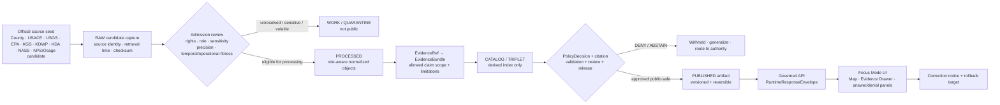
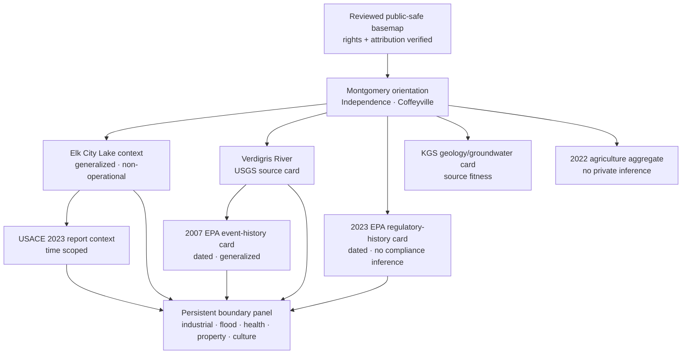
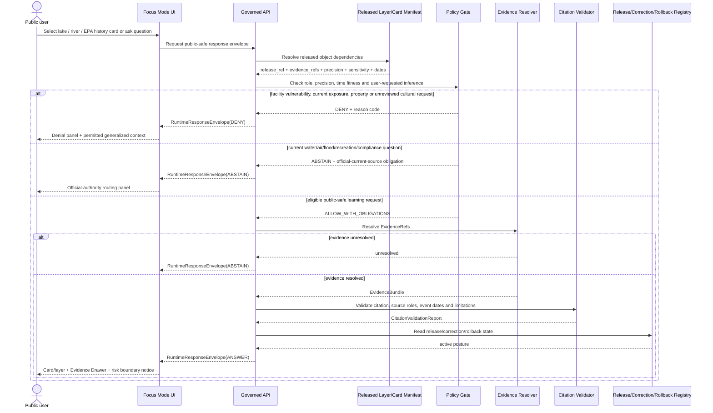
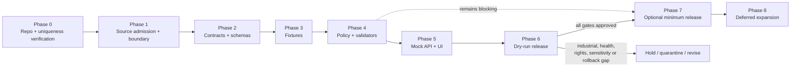

<!-- KFM_META_BLOCK_V2
doc_id: NEEDS_VERIFICATION
title: Montgomery County Focus Mode Build Plan
type: standard
version: v1
status: draft
owners: [NEEDS_VERIFICATION]
created: 2026-05-22
updated: 2026-05-22
policy_label: NEEDS_VERIFICATION — proposed_public_draft
repository_path: NEEDS_VERIFICATION — PROPOSED docs/focus-modes/montgomery-county/montgomery_county_focus_mode_build_plan.md
contract_home: NEEDS_VERIFICATION — PROPOSED only after repository and ADR verification
schema_home: NEEDS_VERIFICATION — Directory Rules default is schemas/contracts/v1/<...>; Focus Mode county/product lane unresolved
policy_home: NEEDS_VERIFICATION — PROPOSED only after repository and ADR verification
validator_home: NEEDS_VERIFICATION — PROPOSED only after repository and ADR verification
fixture_home: NEEDS_VERIFICATION — PROPOSED only after repository and ADR verification
review_assignments:
  - NEEDS_VERIFICATION — environmental-regulatory reviewer
  - NEEDS_VERIFICATION — flood / hydrology / water-quality reviewer
  - NEEDS_VERIFICATION — critical-infrastructure / operational-sensitivity reviewer
  - NEEDS_VERIFICATION — ecology / sensitive-location reviewer
  - NEEDS_VERIFICATION — cultural-sovereignty / Osage-authority reviewer if historical settlement narrative is activated
  - NEEDS_VERIFICATION — public release and rollback reviewer
release_status: NOT_RELEASED
correction_path: NEEDS_VERIFICATION
rollback_path: NEEDS_VERIFICATION
related:
  - Directory Rules.pdf — inspected governing placement doctrine
  - KFM MapLibre Operating Architecture, Governed UI, and AI Interaction Manual - Revised Working Edition — doctrine lineage
  - Kansas Frontier Matrix Pipeline Living Implementation Manual v0.3 — doctrine lineage
  - Existing county Focus Mode plans — NEEDS_VERIFICATION against live repository and authoritative plan registry
tags:
  - kfm
  - focus-mode
  - montgomery-county
  - elk-city-lake
  - verdigris-river
  - coffeyville
  - industrial-regulatory-history
  - flood-risk
  - cross-timbers
  - environmental-safety
  - public-safe
notes:
  - Planning artifact only; no repository mutation, implementation, route, test, release, deployment, or publication claim is made.
  - The user-provided completed-county register and earlier selected counties visible in this continuation do not list Montgomery County.
  - A targeted search of accessible current-conversation and File Library project materials did not surface a Montgomery County Focus Mode Build Plan; complete live-repository and document-registry confirmation remains NEEDS_VERIFICATION.
  - Official public web sources were checked on 2026-05-22; source admission, rights, derivative-display permission, geometry authority, operational freshness, industrial/facility sensitivity, ecological review, cultural review, health/legal scope, and public-release permissions remain gated.
-->

<a id="top"></a>

# Montgomery County Focus Mode Build Plan
## Elk City Lake, Verdigris River, Coffeyville Industrial-Regulatory History, and Flood-Safe Public Interpretation Proof Slice

> **Product thesis:** Build a public-safe Montgomery County Focus Mode that connects Elk City Lake, the Verdigris River corridor, southeast Kansas geology and groundwater, recreation and wildlife context, county agriculture, and public regulatory/environmental history in Coffeyville—without converting historic spills, enforcement records, industrial facilities, flood exposure, water-quality reports, parcel data, or current conditions into KFM health, safety, legal, access, vulnerability, or operational authority.


| Identity / status field | Determination |
|---|---|
| Selected county | **Montgomery County, Kansas** |
| Selection status | **CONFIRMED** against the user-provided completed-county register and county plans visibly produced earlier in this continuation: Montgomery County is not listed. |
| Plan-collision check | **NEEDS_VERIFICATION** — a targeted search of accessible project/file materials did not surface a Montgomery County Focus Mode Build Plan; a current live repository and authoritative document registry were not inspected in this run. |
| Distinct proof value | **PROPOSED** river-reservoir-industrial/regulatory proof slice: Elk City Lake and USACE stewardship, Verdigris River observation, Coffeyville flood-and-industrial response history and later EPA enforcement context, KGS groundwater/geology and oil/gas history, state-park/wildlife public-use context, local GIS/property boundary, and county-scale agriculture. |
| Most consequential public-safe boundary | **Industrial/flood/environmental-health and operational boundary:** public regulatory history and general water/recreation context may be explainable; precise industrial vulnerability, current facility operations, household/property impact, current contamination/health/safety assertions, live reservoir or flood conditions, and legal/compliance conclusions must fail closed or route to responsible official authorities. |
| Secondary cultural boundary | **NEEDS_VERIFICATION** — an NPS registration narrative checked during research describes the Kansas “Little House” setting in relation to the Osage Diminished Reserve; any KFM use beyond a deferred source seed requires Osage Nation-authoritative evidence and appropriate review. |
| Evidence basis | **CONFIRMED** current official public-source checks during this run; **CONFIRMED** attached `Directory Rules.pdf` inspected for placement doctrine. |
| Repository status | **UNKNOWN** — no current checkout, deployed runtime, route inventory, tests, CI output, manifests or branch state were inspected for this plan. |
| Document posture | **PROPOSED** implementation planning artifact; **NOT_RELEASED**; not evidence of implementation. |

**Quick links:** [Operating posture](#1-operating-posture) · [Why Montgomery County](#2-why-this-county) · [Product thesis](#3-product-thesis) · [Scope boundary](#4-scope-boundary) · [First demo layers](#5-first-demo-layers) · [User journeys](#6-user-journeys) · [UI surfaces](#7-ui-surfaces) · [Governed objects](#8-governed-object-model) · [Repository shape](#9-proposed-repository-shape) · [Build phases](#10-build-phases) · [First PR sequence](#11-first-pr-sequence) · [Acceptance](#12-acceptance-checklist) · [Fixtures](#13-fixture-plan) · [Risks](#14-risk-register) · [Source seeds](#15-source-seed-list) · [Verification](#16-open-verification-questions) · [Milestone](#17-recommended-first-milestone)

> [!IMPORTANT]
> **Executive build note.** Montgomery County adds a proof slice that earlier county plans do not adequately cover: a visible landscape where reservoir stewardship, river observation, historic flooding, a publicly documented industrial spill response, later environmental enforcement, recreation/ecology, private-property mapping, and agriculture meet. Official sources checked during this run establish that USACE manages Elk City Lake near Independence; USGS operates the Verdigris River monitoring-location page at Independence; EPA documented the 2007 flood-related Coffeyville oil spill’s impact on the Verdigris River and published a 2023 Clean Air Act settlement information sheet for the Coffeyville refinery; KGS supplies Montgomery groundwater and oil/gas-geology references; KDA and USDA NASS provide 2022 county aggregates; and Montgomery County provides official GIS/parcel routing. Those public facts support a rigorous planning slice. They do not authorize live hazard maps, present health conclusions, precise facility vulnerability views, private-property inferences, or public release. `[S-01] [S-02] [S-03] [S-04] [S-05] [S-06] [S-07] [S-10] [S-11] [S-12]`

> [!CAUTION]
> ## Montgomery County public-safe boundary — environmental history is not an operational or health dashboard
> This Focus Mode may explain **officially documented history**—including a past flood-related oil-spill response and a dated EPA enforcement action—alongside general reservoir, river and agriculture context. It must not publish facility-operational details or vulnerability-sensitive geometry; imply that historic contamination or enforcement establishes present local exposure; identify affected households or parcels; make current drinking-water, air-quality, flood, dam, boating, hunting, fishing, emergency or legal determinations; or use parcel/GIS availability as title/access truth. Any cultural narrative involving the Osage Diminished Reserve remains deferred until appropriate Osage-authoritative evidence and review are established. `[S-02] [S-04] [S-05] [S-08] [S-09] [S-12] [S-14]`

---

## Evidence boundary for this plan

| Status | What is supported here |
|---|---|
| `CONFIRMED` | Montgomery County is absent from the supplied completed-county register and the visibly produced continuation-plan selections; the attached Directory Rules doctrine was inspected; official public web pages/PDFs listed as checked source seeds were reviewed during this run and support only the narrowly attributed statements. |
| `PROPOSED` | Product thesis, layers, cards, public map composition, policy boundaries, governed objects, repository paths, schemas/contracts/policies, fixtures, tests, UI, phases, PR sequence, release approach and milestone. |
| `NEEDS_VERIFICATION` | Live-repository/document-registry collision search; current ADRs and canonical paths; source rights; layer geometry authority and spatial precision; industrial/infrastructure exposure review; ecological sensitivity; cultural/Osage review; present water/air/health/regulatory/operational fitness; correction/rollback implementation. |
| `UNKNOWN` | Existing Montgomery implementation, current runtime behavior, API routes, CI/test results, deployed UI, live data connectors, release state and project content outside accessible materials. |

---

# 1. Operating posture

## 1.1 KFM governing rules applied to Montgomery County

| Governing rule | Montgomery County application | Required product/runtime behavior |
|---|---|---|
| EvidenceBundle outranks generated language | Neither a map of Coffeyville/Verdigris/Elk City nor a compelling spill/flood narrative is truth without evidence and bounded scope. | Every visible claim-bearing layer/card/answer must resolve `EvidenceRef` to an admitted `EvidenceBundle`; unresolved content returns `ABSTAIN`. |
| Public clients use governed surfaces only | Public UI must not directly read raw EPA response artifacts, direct monitoring data, unreviewed water-quality PDFs, industrial candidate layers, parcel exports, or direct AI responses. | Public clients read governed API envelopes and released public-safe artifacts only. |
| Lifecycle remains `RAW → WORK / QUARANTINE → PROCESSED → CATALOG / TRIPLET → PUBLISHED` | Official-source availability does not make a public artifact; industrial/environmental materials can require quarantine or precision reduction. | Source capture, rights/sensitivity review, normalization, evidence closure and release decision precede publication. |
| Publication is a governed transition, not a file move | Copying an EPA, USACE, KGS or county layer into a web asset folder cannot make it public KFM truth. | Require policy, validation, citations, review, manifest, correction and rollback before release. |
| Cite-or-abstain is default | Environmental-regulatory and industrial histories are easily interpreted as present risk or health claims. | Unsupported, stale or over-scoped assertions `ABSTAIN`; sensitive/unsafe disclosure `DENY`; bypass/failure `ERROR`. |
| AI is interpretive, not authority | AI may summarize approved public evidence but cannot conclude present exposure, facility compliance, flood safety, legal liability, parcel impact, water safety or emergency status. | AI produces bounded envelopes and receipts only downstream of evidence/policy. |
| Source roles remain distinct | County GIS, USACE lake management, USGS observation, EPA response/enforcement, KGS historical/scientific material, KDWP public-use context, and NASS/KDA statistics support different claim classes. | UI and validators expose roles, time bases, limitations and denial duties. |
| Correction and rollback remain visible | Source status, water reports, regulatory records and public conditions can change or be reinterpreted. | Released content carries correction/rollback and can be withdrawn/generalized. |

## 1.2 Truth-label and finite-outcome key

| Label / outcome | Meaning in this plan |
|---|---|
| `CONFIRMED` | Verified during this run from the user’s register, inspected attached doctrine, or checked official public source. |
| `PROPOSED` | Design, path, layer, object, policy, fixture, UI behavior or implementation direction not verified as existing. |
| `NEEDS_VERIFICATION` | Checkable before implementation/publication, but not established sufficiently in this run. |
| `UNKNOWN` | Not supported or not resolvable from current evidence. |
| `ANSWER` | Runtime response only when evidence, policy, citations, release state, temporal fitness and permitted scope pass. |
| `ABSTAIN` | Runtime response when evidence, currentness, authority, rights, geometry, release or claim scope is insufficient. |
| `DENY` | Runtime response when disclosure/use conflicts with industrial sensitivity, infrastructure, health, private property, ecology, culture, public safety, legal or release controls. |
| `ERROR` | Runtime response when object shape, evidence resolution, validation, governed service or trust membrane fails. |

## 1.3 Public trust-membrane Mermaid flowchart



## 1.4 County-specific non-negotiable guardrails

| Guardrail | Checked-source reason | Default public posture |
|---|---|---|
| A historic spill/response record or enforcement action may be explained only as dated official regulatory history. | EPA documents a 2007 flood-related oil spill response affecting the Verdigris River, and a separate 2023 Clean Air Act settlement with the Coffeyville refinery operator. `[S-04] [S-05]` | General city/river/regulatory-history card may be proposed; no present exposure, compliance, health or hazard conclusion. |
| No detailed industrial facility operations, vulnerabilities, response staging or sensitive infrastructure view. | EPA settlement material and response records describe an operating refinery and environmental response; detailed operations are not required for public learning. `[S-04] [S-05]` | Generalized industrial-regulatory context only; precise operational/vulnerability mapping `DENY` or `DEFER`. |
| Do not represent historic flood/spill impact as present environmental or household condition. | EPA response record is event-specific; USGS/USACE data and water-quality records carry their own times. `[S-04] [S-06] [S-07]` | Display dates and scope; current health/property/environmental inference `ABSTAIN`/`DENY`. |
| Elk City Lake context does not become live water, recreation or safety authority. | USACE lake page links to water-safety/lake-level/recreation materials and describes lake uses; the 2023 water-quality summary is time-bounded. `[S-02] [S-07]` | Public orientation/context only; live lake, boating, water-quality or safety questions route to official authority. |
| USGS station identity/observations do not become flood or water-safety conclusions. | USGS identifies Verdigris River at Independence and references WaterAlert/revisions. `[S-03]` | Observation-source card and time-basis only; no alert replacement. |
| Parcel/GIS availability does not become property, exposure, title or access truth. | Montgomery County provides GIS parcel data and public parcel-search routing. `[S-01] [S-12]` | Parcel layer excluded from first public slice; household/owner/exposure inference `DENY`. |
| KGS groundwater/geology/oil-gas references require source-fitness labels and must not expose operations or present pollution conclusions. | KGS report describes Montgomery geology/groundwater; historical oil/gas publication describes Verdigris drainage and resource history. `[S-08] [S-09]` | Broad scientific/historical context only, with dates/limitations; detailed asset/pollution conclusions withheld. |
| Wildlife/recreation context may not expose sensitive ecology or current permission. | USACE states substantial project-area wildlife-management/public-hunting context; KDWP identifies Elk City State Park. `[S-02] [S-13]` | Generalized public-use context only; exact sensitive ecological features and current permission `DEFER`/`DENY`. |
| Any Little House / Osage Diminished Reserve narrative is deferred pending Osage-authoritative evidence and review. | An NPS registration narrative checked as context states the Kansas Ingalls homestead was within the Osage Diminished Reserve. `[S-14]` | Candidate source seed only; no first-slice cultural narrative or spatial representation. |
| Agricultural facts remain aggregates. | KDA and NASS supply county-level 2022 agricultural statistics. `[S-10] [S-11]` | Aggregate card only; no producer/parcel/property/industrial-exposure inference. |

---

# 2. Why this county

## 2.1 Selection screen against completed county work

The user-supplied completed register includes Ellsworth, Riley, Shawnee, Ford, Wyandotte, Sedgwick, Douglas, Leavenworth, Reno, Johnson, Barton, Geary, Finney, Cherokee, Saline, Crawford, Lyon, Cowley, Rice, Atchison, Bourbon, Osage, Coffey, Pottawatomie, Chase, Miami, Dickinson, Stafford, Jackson, Linn and McPherson counties. The continuation visible in this series has also selected Morris, Brown, Cloud, Republic, Morton, Phillips, Barber and Trego counties. **Montgomery County is absent from both sets.**

| Candidate considered | Distinct proof potential | Series-overlap or sequencing concern | Disposition |
|---|---|---|---|
| Butler County | Reservoir, oil/industry, urban-fringe, Flint Hills and critical-infrastructure exposure. | Strong future slice; industrial and reservoir story is more compactly bounded in Montgomery through official EPA/Verdigris evidence. | `DEFER` |
| Marshall County | Big Blue River, overland trail and historic movement. | Strong but less distinct from multiple river/history proof slices already completed. | `DEFER` |
| Greenwood County | Flint Hills, Fall River reservoir and ranching landscape. | Strong ecology/water option; industrial-regulatory boundary less pronounced. | `DEFER` |
| **Montgomery County** | **Elk City Lake; Verdigris River monitoring; Coffeyville flood/spill and Clean Air Act enforcement history; southeast Kansas groundwater/oil-gas context; state park/wildlife setting; local GIS/property boundary; county agriculture.** | **Distinct from Cherokee’s mining/remediation slice and Wyandotte’s metro environmental-justice slice because it tests a river-linked industrial incident/regulatory history, reservoir stewardship and present-condition abstention in a rural/small-city county product.** | **`SELECTED`** |

## 2.2 Proof-slice rationale table

| Dimension | Checked official Montgomery County anchor | KFM proof value | Status |
|---|---|---|---|
| County GIS / private-property boundary | Montgomery County GIS page states county GIS parcel data is publicly accessible; parcel-search page provides public parcel routing. `[S-01] [S-12]` | Forces parcel/title/exposure non-inference and geometry-rights review. | `CONFIRMED` source routing; first-slice parcel layer `DENY` |
| Federal lake and recreation | USACE states Elk City Lake is about five miles northwest of Independence and describes park/recreation/fishing context. `[S-02]` | Supports public lake context while demonstrating official-current safety/rule boundary. | `CONFIRMED` source anchor; `PROPOSED` card |
| Wildlife/public-hunting context | USACE states KDWP has a license to about 12,240 acres of project area for wildlife management/public hunting and USACE oversees additional wildlife acreage, with exceptions around dams, parks and control structures. `[S-02]` | Demonstrates ecology/public-use/infrastructure-sensitive precision boundary. | `CONFIRMED` public statement; exact/sensitive layer `DEFER` |
| Water quality/time basis | USACE’s 2023 Elk City Water Quality Summary states monitoring occurred April–September 2023 and references 2022 KDHE impairment listings for eutrophication and siltation effects. `[S-07]` | Tests time-scoped water-quality context without current health/safety overclaim. | `CONFIRMED` dated report; current conclusion `ABSTAIN` |
| River observation | USGS identifies `USGS-07170500`, Verdigris River at Independence, Kansas, and provides related revisions/WaterAlert paths. `[S-03]` | Provides observation-source layer and no-alert-boundary demonstration. | `CONFIRMED` source anchor; `PROPOSED` card |
| Flood-linked industrial event history | EPA response site states flooding caused a crude-oil spill at the Coffeyville Resources facility to impact the Verdigris River and potentially downstream water users. `[S-04]` | Creates the core historic-event/environmental-harm boundary. | `CONFIRMED` dated official response record; present-risk inference prohibited |
| Current regulatory-history source | EPA’s 2023 information sheet states EPA, DOJ and Kansas announced a Clean Air Act settlement with Coffeyville Resources Refining & Marketing concerning alleged violations and pollution-control requirements. `[S-05]` | Supports a regulatory-history card while enforcing no current compliance/health conclusion. | `CONFIRMED` official dated enforcement context; facility-detail exposure controlled |
| Geology and groundwater | KGS groundwater-series page states it describes geology and groundwater resources of Montgomery County, with work tied to KGS and USGS investigations. `[S-08]` | Adds scientific/hydrologic context and source-fitness obligations. | `CONFIRMED` source anchor; date/fitness `NEEDS_VERIFICATION` before layer |
| Oil/gas and Verdigris landscape history | KGS oil/gas bulletin describes Montgomery topography, Elk/Verdigris floodplains and historic oil/gas resource context. `[S-09]` | Explains industrial/geologic history without exposing current facility operations. | `CONFIRMED` historic scientific source; modern operational fitness insufficient |
| Agriculture | KDA reports 892 farms, 300,352 acres and $71 million in crop/livestock sales in 2022; direct NASS county profile was checked. `[S-10] [S-11]` | Adds working-landscape aggregate context distinct from parcel or facility inference. | `CONFIRMED` aggregates; `PROPOSED` card |
| Cultural/sovereignty candidate | NPS registration-form background text checked during research describes a Kansas Ingalls homestead within the Osage Diminished Reserve. `[S-14]` | Identifies a future cultural authority/review boundary. | `CONFIRMED` page checked as contextual seed; product inclusion `DEFER` |

## 2.3 Why Montgomery adds a distinct series proof

Montgomery County extends the Focus Mode series with a **river-linked industrial/regulatory and reservoir-stewardship proof slice**. It forces the product to preserve distinctions that matter for public trust:

1. **A historic environmental incident is not present exposure.** EPA’s response documentation can support an event-history card, but it cannot justify claims about current household risk, water quality or property impacts.
2. **A regulatory enforcement record is not a live facility status layer.** EPA’s 2023 settlement information supports bounded regulatory-history context, not present compliance or operational vulnerability display.
3. **A federal lake is both a public-use setting and an operational/infrastructure context.** USACE public recreation material is useful, but exact control-structure, current safety, current water-level and public-use decisions require official current handling.
4. **River observations and dated water-quality summaries must remain time scoped.** USGS observation metadata and USACE’s 2023 water-quality report must not be collapsed into real-time health or flood advice.
5. **A publicly accessible parcel system does not entitle KFM to map people, titles or exposure.** Local GIS is a governance risk as much as a source opportunity.
6. **Future local history involving Osage land requires sovereign-source review.** KFM should identify the boundary now rather than silently inherit settler-centered narrative from a secondary historic reference.

## 2.4 Public benefit and governance value

| Public benefit | Governance value demonstrated |
|---|---|
| Explore Elk City Lake and Verdigris River as linked southeast Kansas landscape features. | Separates public recreation, observation, water-quality and operational authority. |
| Learn about dated public environmental-regulatory history in Coffeyville. | Demonstrates event-time labels and refusal to make current exposure or health claims. |
| Understand local geology, groundwater and historic oil/gas context. | Demonstrates scientific/historic source fitness and infrastructure-detail limits. |
| View county agriculture in relation to river/lake/industrial history without profiling individual landowners. | Demonstrates aggregate-only and property-safe data use. |
| Understand why maps omit parcel exposure, precise facility operations or sensitive ecology. | Makes public-safe boundary and denial behavior visible. |
| Support future cultural-history expansion only through appropriate authority. | Demonstrates culturally responsible deferral and verification rather than plausible storytelling. |

---

# 3. Product thesis

## 3.1 One-sentence thesis

**Montgomery County Focus Mode should allow a public user to explore Elk City Lake, Verdigris River, bounded Coffeyville environmental-regulatory history, broad geology/groundwater, recreation/ecology context and agricultural aggregates through inspectable evidence, while visibly refusing present-exposure, sensitive-facility, private-property, current-water, safety, legal and unreviewed cultural claims.**

## 3.2 What the first product promises

| Promise | Bounded implementation meaning |
|---|---|
| A source-cited Montgomery orientation view. | Uses admitted official public-safe sources and approved geometry only. |
| A public-safe Elk City Lake and Verdigris River explanation. | Distinguishes lake management/public use, river observation and dated water-quality context. |
| A dated environmental-regulatory history card. | Explains EPA-documented events/actions only at approved generalized scope and with dates visible. |
| Broad KGS geology/groundwater and historic oil/gas context. | Carries historic/scientific role and source-fitness labels; excludes current operations and contamination conclusions. |
| A 2022 agriculture aggregate card. | Displays stated-year county statistics only. |
| Trust-visible refusal behavior. | Provides reason codes and official-current-source routing when the user asks unsafe or unsupported questions. |
| Correction/rollback-ready public release planning. | No public release before approved manifest, correction and rollback posture. |

## 3.3 What the first product does not promise

| It does not promise… | Required first-product behavior |
|---|---|
| Current contamination, air quality, drinking-water safety, flood risk, property impact, human-health status or refinery compliance conclusion. | `ABSTAIN`/`DENY`; present only bounded dated regulatory/event history. |
| Detailed refinery, dam, control-structure, response staging or other vulnerability-sensitive operational maps. | `DENY` or `DEFER`. |
| Current lake level, water-quality, boating, hunting, fishing, swimming, emergency or road-safety advice. | `ABSTAIN`; route to responsible official current source after review. |
| Parcel ownership, title, household exposure or land-access authority. | `DENY`; omit parcel layer in first slice. |
| Sensitive wildlife occurrence or habitat-management precision. | `DENY` or `DEFER` through ecological review. |
| Cultural interpretation involving Osage history without Osage-authoritative evidence and appropriate review. | `DEFER` and display no cultural layer in first slice. |
| Implemented or released Montgomery Focus Mode. | Document remains `PROPOSED`; implementation remains `UNKNOWN`. |

---

# 4. Scope boundary

## 4.1 Public-safe first-slice content

| Candidate public-safe content | Checked source role | Permitted first-slice representation | Required gate |
|---|---|---|---|
| Montgomery County / Independence / Coffeyville orientation | County administrative/civic | County and named city orientation; official source routing. | Boundary/city geometry authority and rights verification. |
| Elk City Lake general context | USACE federal project/recreation context | Generalized/official public-safe lake context and public-use card. | Geometry rights, operational/infrastructure precision, current-rule separation and release review. |
| Verdigris River observation-source card | USGS monitoring system | Station identity and later approved timestamped observations if admitted. | No alert/health/legal claim; freshness/revisions. |
| 2023 Elk City water-quality report context | USACE dated environmental monitoring summary | Clearly dated explanatory card describing the existence and scope of 2023 monitoring and referenced impairment context. | No present health/safety conclusion; report field/use review. |
| Coffeyville flood/spill historic-event card | EPA response record | Generalized, dated city/river event-history narrative; no household/facility operational detail. | Health/property/facility sensitivity; temporal and citation controls. |
| Coffeyville regulatory-history card | EPA enforcement information sheet | Dated, bounded statement that EPA/DOJ/Kansas announced a 2023 CAA settlement involving the Coffeyville refinery operator. | No current compliance/health/operations conclusion; public precision review. |
| Montgomery geology/groundwater context | KGS scientific/historic | Broad geology/groundwater card with source-fitness/date label. | Currentness/rights/geometry review. |
| County agriculture aggregate | KDA/NASS statistical aggregate | 2022 county aggregate card. | No parcel/operator/industrial-exposure inference. |
| Public-safe boundary panel | All cited official sources + KFM doctrine | Visible limitations: historic ≠ current; monitoring ≠ alert; GIS ≠ title; regulatory history ≠ exposure. | Policy/reason-code approval. |

## 4.2 Deferred content

| Deferred item | Why deferred | Requirement before reconsideration |
|---|---|---|
| Live water-quality, lake-level, flood, air-quality or emergency surface | Health/safety and operational freshness risks. | Approved official-current authority flow, expiry/SLA, non-alert posture, correction and review. |
| Detailed refinery/facility/industrial infrastructure layer | Vulnerability-sensitive and may imply operations/exposure. | Public-benefit test, safe precision, rights and security review; likely remain generalized only. |
| Historic spill impact parcel/household visualization | Identifies or implies affected properties/people and potentially persistent exposure. | Strong public need, privacy/legal/health review, deidentification and evidentiary support; likely denied in public mode. |
| Dam/control structures, hunting-area exceptions or sensitive wildlife layers | Operational/infrastructure/ecological risk. | USACE/KDWP rights, geoprivacy, currentness and public-safety review. |
| Current recreation permission panel | Regulations and conditions may change. | Approved official-routing flow or tightly governed volatile-data envelope. |
| Parcel/title/access map | Private-property/title/access inference. | Compelling approved public purpose; legal/privacy review; excluded from initial public mode. |
| Little House / Osage Diminished Reserve interpretation | Cultural sovereignty and historical source-authority issue. | Osage Nation-authoritative evidence, identified review process, approved public narrative and precision. |

## 4.3 Denied by default

| Content or question type | Outcome | Reason |
|---|---|---|
| Exact industrial facility vulnerability, control-system, response-resource or security-sensitive geometry. | `DENY` | Infrastructure/operational/public-safety risk. |
| Claims that a current household, parcel or neighborhood is contaminated or exposed because of the historic spill or a regulatory record. | `DENY` | Health/property inference unsupported and potentially harmful. |
| Present air/water safety, current pollution, flood-safety or refinery compliance conclusion from KFM. | `ABSTAIN` / `DENY` | Requires responsible current authority and appropriate evidence. |
| Parcel ownership/title/access conclusions. | `DENY` | Public GIS/parcel availability is not title/access truth. |
| Exact sensitive wildlife locations or closed/controlled hunting detail. | `DENY` / `ABSTAIN` | Ecology and current public-use/infrastructure boundaries. |
| Cultural story or mapped representation involving Osage lands without appropriate authority/review. | `DENY` / `ABSTAIN` | Cultural sovereignty/source-authority unresolved. |
| Unreleased candidate or RAW/WORK/QUARANTINE content surfaced publicly. | `DENY` / `ERROR` | Publication/trust-membrane violation. |

---

# 5. First demo layers

## 5.1 Prioritized first public-safe layer/card table

| Priority | Public-safe layer/card | Montgomery-specific purpose | Checked seed(s) | Evidence / policy gates | Initial status |
|---:|---|---|---|---|---|
| 1 | **Montgomery County + Independence/Coffeyville orientation card** | Establish county scope and named civic anchors. | `[S-01]` | Boundary/city geometry, rights and no parcel exposure. | `PROPOSED` |
| 2 | **Elk City Lake generalized context layer/card** | Explain federal lake/public-use setting without operational detail. | `[S-02]` | Official public-safe geometry; no lake-level/current-safety/control-structure detail; review. | `PROPOSED` |
| 3 | **Verdigris River / USGS monitoring-location card** | Expose river observation-source identity. | `[S-03]` | Time/source-role label; not alert/health/flood/legal. | `PROPOSED` |
| 4 | **Historic environmental-event card: 2007 Coffeyville flood/spill response** | Teach dated EPA-documented river/industrial/flood history at generalized scope. | `[S-04]` | Historic-only; no parcel/household/current-exposure/facility-detail inference. | `PROPOSED` |
| 5 | **Regulatory-history card: 2023 CAA settlement information** | Explain dated public regulatory record without operational or health inference. | `[S-05]` | Generalized city/facility context; no current compliance or emissions status. | `PROPOSED` |
| 6 | **Elk City water-quality source-fitness card** | Demonstrate dated 2023 USACE monitoring report and referenced 2022 assessment context. | `[S-07]` | Dated context; no current water safety/public-health assertion. | `PROPOSED` |
| 7 | **Montgomery geology/groundwater context card** | Provide broad KGS scientific setting. | `[S-08] [S-09]` | Historic/scientific badge; no current industrial/pollution inference. | `PROPOSED` |
| 8 | **2022 agriculture aggregate card** | Display county farming/land/sales scale. | `[S-10] [S-11]` | Aggregate only; no parcel/operator exposure inference. | `PROPOSED` |
| 9 | **Wildlife/recreation public-use card** | Explain generalized Elk City public-use context. | `[S-02] [S-13]` | Current rules/sensitive ecology/infrastructure exceptions unresolved. | `DEFER` or narrowly `PROPOSED` notice |
| 10 | **Live hazard/water/air/current compliance panel** | Tempting public utility. | `[S-03] [S-05] [S-07]` plus future authority | Operational/public-health governance not established. | `DEFER` |
| 11 | **Facility/parcel/exposure or vulnerability map** | Potential environmental-justice/risk map but high harm. | `[S-01] [S-04] [S-05] [S-12]` | Privacy, health, industrial, legal and safety gates unresolved. | `DENY` in first slice |
| 12 | **Osage/settlement-history layer** | Potential future public history. | `[S-14]` plus future Osage official sources | Appropriate sovereign-source/review not established. | `DEFER` |

## 5.2 Mermaid map-composition diagram



## 5.3 Layer-card truth contract

Every claim-bearing public layer/card must carry at least:

| Field | Montgomery-specific requirement |
|---|---|
| `object_id` | Deterministic candidate ID derived from stable scope/source/policy/version inputs. |
| `object_type` | Typed layer/card/notice, e.g., `HistoricEnvironmentalEventCard`, `ReservoirContextCard`. |
| `county_fips` | Candidate Montgomery identifier `20125`; canonical county geometry/ID source remains to be verified before release. |
| `claim_scope` | Explicit permitted claim boundary, especially historic-versus-current scope. |
| `source_roles` | Distinguish county GIS, federal lake/project, observation, regulatory response/enforcement, scientific/historic geology, resource-management/public-use and statistical aggregate. |
| `temporal_basis` | Event date, enforcement document date, sampling/reporting period, retrieval date and release date as applicable. |
| `evidence_refs` | Every visible claim resolves to EvidenceBundle support. |
| `rights_status` | `unknown`/`needs_verification` until source terms and public derivative-display use are recorded. |
| `sensitivity` | At minimum `public`, `generalize`, `review_required`, `restricted`. |
| `precision_class` | Facility/parcel/health/sensitive ecology/cultural details constrained; general city/river context only unless reviewed. |
| `policy_decision_ref` | Required before public display or answer. |
| `citation_validation_ref` | Required for narrative or generated answer. |
| `release_manifest_ref` | Required before a layer/card is described as published. |
| `limitations` | Required: historic regulatory context is not current exposure/compliance; observation is not alert; public GIS is not title/access; operational details withheld. |
| `correction_ref` / `rollback_ref` | Required for any released artifact. |

---

# 6. User journeys

## 6.1 Public learning journeys

| Journey | User interaction | Allowed public-safe response | Trust affordance |
|---|---|---|---|
| Lake orientation | Select “Elk City Lake.” | Explain approved USACE public lake context and available public-use orientation at safe scale. | Federal project/public-use role, non-live/safety limitation, Evidence Drawer. |
| River evidence | Click “Verdigris River at Independence.” | Display USGS monitoring-location identity and explain observation-source role. | `Observation source — not alert or water-safety decision` badge. |
| Environmental history | Open “Coffeyville flood/spill event history.” | Explain that EPA documented a 2007 flood-related oil spill affecting the Verdigris River at bounded generalized scope. | Dated event badge; present-exposure denial notice. |
| Regulatory history | Open “EPA 2023 enforcement context.” | State that EPA/DOJ/Kansas announced a dated Clean Air Act settlement involving the Coffeyville refinery operator. | Regulatory-history role and no-current-compliance/health inference notice. |
| Water-quality time basis | Open Elk City monitoring context. | Explain USACE’s 2023 sampling/report context and its date-limited nature. | Report date, referenced assessment date and no-current-safety warning. |
| Landscape science | Select geology/groundwater context. | Present broad KGS-attributed geology/groundwater/oil-gas history. | Historic/scientific source-fitness badge; no operations/pollution inference. |
| Agriculture | Open “Working landscape — 2022.” | Show KDA/NASS aggregate farms/acres/sales context. | Aggregate badge; no parcel/operator link. |
| Boundary demonstration | Ask why facilities/parcels are not mapped in detail. | Explain industrial sensitivity, privacy, title/access and current-health limitations. | Denial reasoning visible without sensitive geometry. |

## 6.2 Trust-demonstration journeys

| Trust journey | Demonstrated behavior | Expected outcome |
|---|---|---|
| Missing evidence | Open an environmental-history card whose EvidenceRef is unresolved. | `ABSTAIN / EVIDENCE_BUNDLE_UNRESOLVED` |
| Present exposure inference | Ask which current households are contaminated because of the 2007 spill. | `DENY / CURRENT_EXPOSURE_OR_HOUSEHOLD_INFERENCE_PROHIBITED` |
| Facility vulnerability request | Ask for detailed refinery, levee or control-structure vulnerability map. | `DENY / CRITICAL_INFRASTRUCTURE_OR_FACILITY_DETAIL_WITHHELD` |
| Current compliance claim | Ask whether the refinery is currently violating air law based on the 2023 settlement card. | `ABSTAIN / CURRENT_REGULATORY_STATUS_NOT_ESTABLISHED` |
| Water health claim | Ask whether Elk City Lake or Verdigris water is safe today. | `ABSTAIN / CURRENT_HEALTH_OR_WATER_STATUS_NOT_ESTABLISHED` |
| Station as flood alert | Ask whether the USGS river marker means downstream property is safe. | `DENY / NOT_AN_EMERGENCY_ALERT_SYSTEM` |
| Parcel-exposure request | Ask for names/addresses of parcels affected by the historic spill or near a facility. | `DENY / PRIVATE_PROPERTY_OR_EXPOSURE_INFERENCE` |
| Current lake/recreation status | Ask whether it is safe/legal to boat, swim, hunt or fish today. | `ABSTAIN / OFFICIAL_CURRENT_REGULATION_OR_SAFETY_SOURCE_REQUIRED` |
| Cultural-history request | Ask for an authoritative Osage land-history map based only on settler-history narrative. | `ABSTAIN / NATION_AUTHORITY_OR_REVIEW_UNRESOLVED` |
| Unreleased layer request | Attempt to access an industrial-facility or parcel candidate layer. | `DENY / NOT_PUBLICLY_RELEASED` |

## 6.3 County-specific denied or abstained requests

| User request | Outcome | Public-facing explanation |
|---|---|---|
| “Map exactly which homes are contaminated today because of the Coffeyville flood spill.” | `DENY` | A dated event record does not establish current household exposure, and private health/property inferences are not provided in public Focus Mode. |
| “Show refinery vulnerability points and the routes an oil spill would take now.” | `DENY` | Detailed facility/infrastructure and hazard-vulnerability mapping is withheld from public output. |
| “Is the refinery compliant today because EPA settled the case?” | `ABSTAIN` | A dated settlement record is regulatory history, not a current compliance determination. |
| “Is the Verdigris River safe to drink from right now?” | `ABSTAIN` | KFM does not issue current drinking-water or public-health determinations; consult responsible official authorities. |
| “Which private parcels border the public hunting areas and may I enter them?” | `DENY` | Public Focus Mode is not a title or land-access permission service. |
| “Are the lake level and ramps safe for boating today?” | `ABSTAIN` | Current lake and recreation safety information must be checked through official current sources. |
| “Tell the Osage story of the Little House site from this NPS document and map it.” | `ABSTAIN` | Cultural representation requires appropriate Osage-authoritative evidence and review before public inclusion. |

---

# 7. UI surfaces

## 7.1 Required UI surfaces

| Surface | Montgomery County content / behavior | Trust requirement |
|---|---|---|
| Header | “Montgomery County — Verdigris / Elk City / Environmental-Regulatory Proof Slice”; evidence, time, sensitivity and release badges. | Show `NOT_RELEASED`; no live hazard or health implication. |
| Map canvas | Approved generalized county/lake/river/context features only. | No facility-vulnerability, household, parcel-exposure, sensitive ecology or cultural detail. |
| Layer drawer | Toggles Elk City context, Verdigris source, event/regulatory-history cards, KGS context and agriculture. | Show source role, dates, precision, sensitivity, release and limitations. |
| Evidence Drawer | EvidenceBundle resolution, source role, event/report date, limitations, policy result, citations, review and correction/rollback. | Any industrial/environmental claim is inspectable and time-bounded. |
| Answer panel | Evidence-bounded natural-language response with finite outcome. | No direct model output; only `ANSWER`, `ABSTAIN`, `DENY`, `ERROR`. |
| Denial panel | Industrial/facility, current exposure, health, private property, safety, sensitive ecology and cultural-review reasons. | Explain restrictions without exposing locations or suggesting current risk. |
| Timeline/time-basis surface | EPA 2007 event record; EPA 2023 settlement information; USACE 2023 water-quality summary; NASS/KDA 2022 aggregates; observation/release dates. | Clearly separate historic event, regulatory record, sampling period, observation and product release. |
| Industrial/flood public-safe panel | Persistent warning when event/regulatory history is active. | States “historic/regulatory context is not current exposure or safety information.” |
| Property boundary panel | Visible when users attempt parcel-related interaction. | States parcel GIS is not title, exposure or access authority; public layer omitted. |
| Cultural-authority deferred panel | Visible only if future cultural theme is requested. | States Osage-authoritative source/review required; no mapped content delivered. |
| Official-current routing surface | Approved routing for live lake, flood, water, air or recreation questions where available. | Clearly distinguished from released KFM narrative. |

## 7.2 Legend vocabulary table

| Legend label | User-facing meaning | Montgomery example | Must not imply |
|---|---|---|---|
| `Reservoir context` | Reviewed public-safe description of federal lake/public-use setting. | Elk City Lake. | Live levels, boating/swimming safety, hunting permission or dam operations. |
| `Observation source` | Official monitoring-location / admitted timestamped observation. | Verdigris River at Independence. | Flood alert, exposure, water safety or legal conclusion. |
| `Historic environmental event` | Officially documented past event with date/scope shown. | EPA 2007 flood/spill response. | Current contamination, current household/property impact or present hazard. |
| `Regulatory history` | Official enforcement/settlement record with date and limited scope. | EPA 2023 CAA settlement information. | Current facility compliance, emissions or health status. |
| `Dated water-quality context` | Time-scoped monitoring/report source. | USACE 2023 summary. | Current lake safety or drinking-water advice. |
| `Scientific/historic landscape context` | General geology/groundwater/resource-history interpretation. | KGS Montgomery context. | Current operational/facility/pollution truth. |
| `Statistical aggregate` | County-scale stated-year statistic. | KDA/NASS 2022 agriculture. | Individual producer, property or exposure fact. |
| `Generalized for protection` | Detail intentionally reduced due to risk. | Facility/ecology/property boundaries. | Missing precision is error or a clue to infer hidden detail. |
| `Official current source required` | Live condition or rule question must be answered elsewhere. | Lake levels, flood, recreation, air/water status. | KFM is current authority. |
| `Withheld` | Content cannot be publicly disclosed at requested scope. | Facility vulnerability, parcel exposure, sensitive ecology, unreviewed cultural layer. | Hidden data can be inferred from adjacent map rendering. |

## 7.3 UI/API/policy/evidence sequence diagram



---

# 8. Governed object model

## 8.1 Proposed shared object family

All object use below remains **PROPOSED** unless future live-repository evidence verifies canonical definitions or approved extensions.

| Object family | Montgomery Focus Mode role | Minimum public-safe obligation | Status |
|---|---|---|---|
| `SourceDescriptor` | Records official source identity, source role, terms, temporal character, rights and sensitivity posture. | Distinguish county GIS, USACE, USGS, EPA event/enforcement, KGS, KDWP, KDA, NASS and deferred cultural source. | `PROPOSED` |
| `EvidenceRef` | Pointer from public card/layer/answer to support. | Claim-bearing public output must resolve evidence. | `PROPOSED` |
| `EvidenceBundle` | Admissible support closure and bounded claim scope. | Carries source roles, event/report/observation time, rights/sensitivity, precision, limitations, review and release state. | `PROPOSED` |
| `PolicyDecision` | Determines allow/generalize/abstain/deny obligations. | Includes industrial/facility, current exposure/health, property, operations, ecology, cultural and legal reason codes. | `PROPOSED` |
| `RuntimeResponseEnvelope` | Finite public response payload. | Only `ANSWER`, `ABSTAIN`, `DENY`, `ERROR`. | `PROPOSED` |
| `CitationValidationReport` | Confirms visible narrative matches admitted evidence. | Rejects current-risk inference from dated history or unsupported facility/property claims. | `PROPOSED` |
| `ReleaseManifest` | Declares released public-safe content and dependencies. | Includes evidence, policy, validations, reviews, correction and rollback. | `PROPOSED` |
| `AIReceipt` | Audits generated explanation. | Records evidence and finite outcome; must not include restricted detail in public output. | `PROPOSED` |
| `CorrectionNotice` | Records correction/generalization/withdrawal. | Required for released environmental/history claims or layers. | `PROPOSED` |
| `RollbackPlan` / `RollbackCard` | Returns public output to a prior safe state. | Required before public release. | `PROPOSED` |
| `ReviewRecord` | Records environmental, operational, privacy, ecology, cultural and release review. | Required for higher-risk content. | `PROPOSED` |

## 8.2 County-specific object candidates

| Candidate object | Intended purpose | Critical constraints | Status |
|---|---|---|---|
| `ElkCityReservoirContextCard` | Explain lake/public-use context. | Non-live; no dam/control detail, current water/safety or current regulation conclusion. | `PROPOSED` |
| `VerdigrisObservationSourceCard` | Identify USGS station and time-bounded observations. | Not a flood, water-safety or exposure conclusion. | `PROPOSED` |
| `HistoricIndustrialEventCard` | Explain EPA-documented 2007 flood/spill event at generalized scope. | Must show event date; no current exposure, household, parcel or facility-vulnerability inference. | `PROPOSED` |
| `RegulatoryHistoryCard` | Explain EPA 2023 enforcement/settlement context. | Dated only; no present compliance, air-quality or health conclusion. | `PROPOSED` |
| `DatedWaterQualityContextCard` | Explain USACE 2023 monitoring/report context. | Dated/source-fitness label; not a current safety or health determination. | `PROPOSED` |
| `GroundwaterGeologyContextCard` | Present broad KGS geology/groundwater/resource-history context. | Historic/scientific role; no current industrial or contamination statement. | `PROPOSED` |
| `IndustrialFloodBoundaryNotice` | Persistent UI notice for industrial/environmental-history mode. | Must block inference and route live/current questions outward. | `PROPOSED` |
| `PrivatePropertyExposureBoundaryNotice` | Explain omission of parcel/exposure displays. | Does not expose addresses or owners. | `PROPOSED` |
| `AgricultureAggregateCard` | Present KDA/NASS county aggregate statistics. | Aggregate/year labeled; no parcel/operator/exposure association. | `PROPOSED` |
| `CulturalAuthorityDeferredNotice` | Explain why a settler/Osage narrative is not active in first slice. | Requires Osage-authoritative evidence and appropriate review before expansion. | `PROPOSED` notice / cultural layer `DEFER` |

## 8.3 Source-role anti-collapse rules

| Source role | Checked seed example | May support | Must never silently become |
|---|---|---|---|
| County GIS/administrative routing | Montgomery County GIS/parcel pages `[S-01] [S-12]` | Official local GIS/parcel availability and public-source routing. | Title, access, exposure or public-health truth. |
| Federal reservoir/public-use management | USACE Elk City Lake `[S-02]` | Lake setting and general stated public-use/wildlife-management context. | Live lake/safety status, infrastructure vulnerability or exact sensitive feature representation. |
| Observation metadata | USGS Verdigris station `[S-03]` | Monitoring-location identity and admitted observations. | Alert, health, industrial impact or legal conclusion. |
| Environmental response history | EPA flood/oil response `[S-04]` | Dated event-history statement and river impact within official record scope. | Present exposure, present contamination or household/property finding. |
| Regulatory enforcement history | EPA 2023 settlement sheet `[S-05]` | Dated announcement and attributed enforcement context. | Present compliance, operations, emissions or health condition. |
| Dated environmental monitoring summary | USACE 2023 water-quality report `[S-07]` | Time-bounded monitoring/report-context facts. | Current water safety or public-health determination. |
| Scientific/historic geology and groundwater | KGS sources `[S-08] [S-09]` | Broad scientific/historic environmental setting. | Current facility operations, pollution or regulatory outcome. |
| Public recreation/ecology context | KDWP/USACE `[S-02] [S-13]` | General public-use context after admission. | Current permission or sensitive ecology location disclosure. |
| Statistical aggregate | KDA/NASS `[S-10] [S-11]` | County-level stated-year agricultural facts. | Producer, parcel, exposure or water-right inference. |
| Deferred cultural context | NPS registry narrative checked as seed `[S-14]` plus future Osage official source | Reason to establish a sovereign-source/review gate. | KFM-generated Osage narrative or location representation without authority/review. |
| Generated narrative | Future KFM AI output | Explain approved released evidence within scope. | Evidence, policy, regulator, health authority or release proof. |

## 8.4 Minimal public runtime response JSON example

```json
{
  "schema_version": "v1",
  "object_type": "RuntimeResponseEnvelope",
  "response_id": "kfm:runtime-response:montgomery:verdigris-elk-city-context:EXAMPLE_ONLY",
  "outcome": "ANSWER",
  "county": {
    "name": "Montgomery County",
    "state": "Kansas",
    "fips": "20125"
  },
  "request_scope": "public_safe_learning",
  "title": "Elk City Lake, Verdigris River and dated environmental-regulatory context",
  "answer": "Montgomery County includes Elk City Lake near Independence and a Verdigris River monitoring location. Official EPA sources also document dated Coffeyville environmental-regulatory history. This public-safe view provides general, time-labeled context only; it does not identify current contamination, household exposure, facility vulnerability, lake or river safety, refinery compliance, private property status, or emergency conditions.",
  "source_roles": [
    "federal_reservoir_public_use_context",
    "observation_metadata",
    "historic_environmental_event",
    "regulatory_history"
  ],
  "evidence_refs": [
    "kfm:evidence-ref:montgomery:elk-city:usace-context:v1",
    "kfm:evidence-ref:montgomery:verdigris-usgs-07170500:metadata:v1",
    "kfm:evidence-ref:montgomery:coffeyville-2007:epa-event-history:v1",
    "kfm:evidence-ref:montgomery:coffeyville-2023:epa-regulatory-history:v1"
  ],
  "policy_decision": {
    "outcome": "ALLOW_WITH_OBLIGATIONS",
    "obligations": [
      "display_event_and_document_dates",
      "withhold_facility_vulnerability_detail",
      "deny_current_exposure_or_property_inference",
      "do_not_present_water_air_flood_safety_or_compliance_status",
      "route_current_operational_questions_to_official_authority"
    ]
  },
  "citation_validation_ref": "kfm:citation-validation:montgomery:EXAMPLE_ONLY",
  "release_manifest_ref": "NEEDS_VERIFICATION_NOT_RELEASED",
  "limitations": [
    "Historic environmental and regulatory context is not present exposure or compliance status.",
    "Not a drinking-water, air-quality, flood, recreation-safety or emergency advisory system.",
    "Not a parcel, title, access or facility-vulnerability service."
  ],
  "correction_ref": "NEEDS_VERIFICATION",
  "rollback_ref": "NEEDS_VERIFICATION"
}
```

## 8.5 Deterministic identity candidates

| Candidate identifier | Proposed deterministic basis | Validator obligation |
|---|---|---|
| `montgomery.reservoir_context.elk_city_lake.v1` | County FIPS + object family + admitted USACE source + public precision + policy/schema version. | Reject live conditions/control-structure/safety fields outside approved profile. |
| `montgomery.observation_metadata.usgs_07170500.v1` | Station ID + approved fields + time/source-role profile. | Reject alert, exposure or safety conclusions. |
| `montgomery.event_history.coffeyville_flood_spill_2007.v1` | Event date + EPA source ID + generalized precision + permitted scope. | Require event-date visibility; reject current exposure/property/facility inference. |
| `montgomery.regulatory_history.coffeyville_caa_settlement_2023.v1` | Document date + EPA source ID + regulatory-history role + limitations. | Reject current compliance/emissions/health representation. |
| `montgomery.water_quality.elk_city_usace_2023_context.v1` | Reporting year + USACE source + scope + temporal-fitness label. | Reject current water-safety output. |
| `montgomery.geology_groundwater.kgs_context.v1` | County + KGS source + scientific/historic scope + limitation class. | Reject current pollution/operations conclusions. |
| `montgomery.ag_aggregate.kda_nass_2022.v1` | County FIPS + census year + selected metrics + source version. | Reject parcel/operator/exposure associations. |
| `spec_hash` candidate | Canonical JSON of allowed fields, evidence refs, roles, precision class, time basis, policy obligations and render contract. | Hash/canonicalization algorithm remains `NEEDS_VERIFICATION` until adopted through canonical contract/ADR. |

---

# 9. Proposed repository shape

## 9.1 Directory Rules basis

**CONFIRMED doctrine inspected:** `Directory Rules.pdf` establishes that a file’s location encodes responsibility, governance and lifecycle; topic does not justify a root folder; human-facing documents belong under `docs/`; object meaning belongs under `contracts/`; machine-checkable shape belongs by default under `schemas/contracts/v1/<...>`; policy owns allow/deny/restrict/abstain decisions; release decisions remain distinct from released artifacts in `data/published/`; and creating a parallel authority home or changing schema-home rules requires ADR treatment. The doctrine also states that concrete paths are **PROPOSED** until verified against mounted-repository evidence and relevant ADRs.

> [!WARNING]
> **Every repository path below is `PROPOSED / NEEDS_VERIFICATION`.** This plan does not assert that a Montgomery Focus Mode lane, shared profile, contract, schema, policy, fixture, validator, UI component, release registry or published artifact currently exists. The current repository and ADRs must be inspected before any path-bearing change.

## 9.2 Candidate path table

| Candidate path | Responsibility root | Why it belongs there | Directory Rules basis | Status |
|---|---|---|---|---|
| `docs/focus-modes/montgomery-county/montgomery_county_focus_mode_build_plan.md` | `docs/` | Human-facing build-plan artifact. | Human explanation belongs in `docs/`; county is a lane, not root. | `PROPOSED / NEEDS_VERIFICATION` |
| `docs/focus-modes/montgomery-county/source-admission-register.md` | `docs/` | Human review register for authority, rights, environmental/industrial safety, source time and release decisions. | Human-facing documentation/register. | `PROPOSED / NEEDS_VERIFICATION` |
| `contracts/domains/focus-mode/montgomery/README.md` | `contracts/` | Meaning of any Montgomery profile only if shared Focus Mode semantics require extension. | Contracts define object meaning. | `PROPOSED / NEEDS_VERIFICATION` |
| `schemas/contracts/v1/domains/focus_mode/montgomery/focus_mode_payload.schema.json` | `schemas/` | Machine shape for public-safe payload/profile if needed. | Default schema-home rule in Directory Rules. | `PROPOSED / NEEDS_VERIFICATION` |
| `schemas/contracts/v1/domains/focus_mode/montgomery/environmental_boundary_notice.schema.json` | `schemas/` | Machine shape for industrial/flood/health/private-property warning payload. | Machine shape belongs under schemas. | `PROPOSED / NEEDS_VERIFICATION` |
| `policy/domains/focus_mode/montgomery/public_safe_publication.rego` | `policy/` | Allow/generalize/abstain/deny obligations for industrial, flood, health, property, operations and culture. | Policy owns admissibility. | `PROPOSED / NEEDS_VERIFICATION` |
| `fixtures/domains/focus_mode/montgomery/valid/` | `fixtures/` | Public-safe valid samples. | Fixtures prove rules. | `PROPOSED / NEEDS_VERIFICATION` |
| `fixtures/domains/focus_mode/montgomery/invalid/` | `fixtures/` | Fail-closed environmental/industrial/private/safety samples. | Invalid fixtures prove enforcement. | `PROPOSED / NEEDS_VERIFICATION` |
| `tests/domains/focus_mode/montgomery/` | `tests/` | Evidence, policy, temporal fitness, citation, trust-membrane and release tests. | Tests prove enforceability. | `PROPOSED / NEEDS_VERIFICATION` |
| `tools/validators/domains/focus_mode/validate_montgomery_public_safe_payload.py` | `tools/` | Validator only if canonical shared validators cannot apply a county policy profile. | Long-lived validators belong under tools; reuse first. | `PROPOSED / NEEDS_VERIFICATION` |
| `data/registry/sources/focus_mode/montgomery/` | `data/registry/` | SourceDescriptor and rights/sensitivity records if current convention permits profile segmentation. | Source identity and rights belong in lifecycle/registry. | `PROPOSED / NEEDS_VERIFICATION` |
| `release/candidates/focus_mode/montgomery/` | `release/` | Candidate release decisions, reviews and manifest material. | Release decisions separate from artifacts. | `PROPOSED / NEEDS_VERIFICATION` |
| `data/published/layers/focus_mode/montgomery/` | `data/published/` | Approved public-safe artifacts only after governed promotion. | Published lifecycle stage. | `PROPOSED / NEEDS_VERIFICATION` |
| `apps/explorer-web/src/focus-modes/montgomery/` | `apps/` | Public UI module only if canonical explorer path/module convention is verified. | Deployable UI belongs under apps and reads governed API. | `PROPOSED / NEEDS_VERIFICATION` |

## 9.3 Proposed responsibility-rooted tree

```text
Kansas-Frontier-Matrix/                                         # live repo NOT inspected for this plan
├── docs/
│   └── focus-modes/                                            # lane name NEEDS_VERIFICATION
│       └── montgomery-county/
│           ├── montgomery_county_focus_mode_build_plan.md      # this artifact candidate
│           └── source-admission-register.md                    # PROPOSED
├── contracts/
│   └── domains/focus-mode/montgomery/
│       └── README.md                                           # PROPOSED meaning/profile
├── schemas/
│   └── contracts/v1/domains/focus_mode/montgomery/
│       ├── focus_mode_payload.schema.json
│       └── environmental_boundary_notice.schema.json
├── policy/
│   └── domains/focus_mode/montgomery/
│       └── public_safe_publication.rego
├── fixtures/
│   └── domains/focus_mode/montgomery/
│       ├── valid/
│       └── invalid/
├── tests/
│   └── domains/focus_mode/montgomery/
├── tools/
│   └── validators/domains/focus_mode/
│       └── validate_montgomery_public_safe_payload.py          # only if shared validator insufficient
├── data/
│   ├── registry/sources/focus_mode/montgomery/
│   └── published/layers/focus_mode/montgomery/                 # released public-safe artifacts only
├── release/
│   └── candidates/focus_mode/montgomery/                       # decisions/manifests, not map data
└── apps/
    └── explorer-web/src/focus-modes/montgomery/                # only after UI-home verification
```

## 9.4 Placement prohibitions

| Prohibited shortcut | Why prohibited |
|---|---|
| Create a root-level `montgomery/`, `coffeyville/`, `elk_city/`, `verdigris/`, `industrial/`, `counties/` or `focus_mode/` folder. | Topic does not define repository authority. |
| Put schemas, Rego rules, evidence/proof material or fixture authority beside this plan under `docs/`. | Human documentation does not own executable trust layers. |
| Create new parallel policy, schema, source registry, proof, receipt, release or published-artifact homes. | Parallel authority requires ADR and creates drift. |
| Store raw EPA/USGS/USACE data, parcel exports or facility candidates as public browser assets. | Violates lifecycle, public-trust and sensitive-detail constraints. |
| Publish facility/parcel/exposure maps with a disclaimer rather than a policy decision. | Disclaimer does not cure health/privacy/infrastructure harm. |
| Treat historic EPA events or enforcement as present condition, compliance or health truth. | Violates time-aware/source-role discipline. |
| Copy live water/recreation/flood/air status into durable narrative without freshness, expiry and official-authority governance. | Creates public-safety risk. |
| Associate agricultural aggregates with individual parcels, producers or pollution exposure. | Creates private inference and unsupported causality. |

---

# 10. Build phases

## 10.1 Ordered build-phase table

| Phase | Objective | Entry gate | Proposed outputs | Exit validation | Rollback posture |
|---:|---|---|---|---|---|
| 0 | Verify repository and county uniqueness | User request + this draft | Current repo/tree/ADR scan; authoritative plan-registry search; placement decision. | No Montgomery collision or approved migration; canonical location resolved or documented unresolved. | Do not place in repo if conflict remains; retain standalone draft. |
| 1 | Classify sources and controlling public boundary | Checked official source seeds | Source descriptors; rights/sensitivity/time/precision register; historic/current distinction; industrial/property/cultural constraints. | Each source has allowed claim scope and prohibited inferences; unresolved sources quarantined. | Remove unsafe/unverified sources from candidate set. |
| 2 | Define object semantics and machine shape | Path/reuse decision established | Shared-object reuse or approved Montgomery profile; schema; finite outcomes and reason codes. | No parallel authority homes; fixture schema checks pass. | Revert proposed extension/profile; log incompatibility. |
| 3 | Build fixture-first public-safe set | Contract/profile basis | Positive lake/river/history/KGS/ag cards and negative industrial/health/property/current-ops/cultural fixtures. | Positives validate; negatives fail for intended deterministic reasons. | Withdraw invalid candidates; preserve failure record. |
| 4 | Implement policy and validators | Fixtures complete | Evidence closure, source-role, temporal fitness, industrial/private/health/currentness/release/correction/rollback validation. | High-risk cases deny or abstain predictably. | Disable profile; no public promotion. |
| 5 | Build mock governed API/UI proof | Offline policy/validation success | Layer drawer, Evidence Drawer, answer/denial, timeline, environmental-boundary and official-routing panels from fixtures. | UI reads governed mock envelopes only and exposes finite outcomes. | Remove UI proof module; preserve validation evidence. |
| 6 | Assemble dry-run release candidate | All offline gates pass | Candidate manifest, validation/citation reports, reviews, correction and rollback plan. | Dry-run denies unresolved health/operational/rights/sensitivity/reversibility issues. | Reject candidate and file correction backlog. |
| 7 | Consider minimal public-safe release | Explicit approvals and release decision | Approved generalized cards/layers only. | Public-path audit and rollback rehearsal succeed. | Withdraw/revert and publish correction notice where needed. |
| 8 | Consider deferred integrations | Proven governance maturity | Approved official-current link-outs or tightly scoped generalized expansions. | Freshness, authority, rights, precision and sensitivity pass. | Disable integration and restore prior safe release. |

## 10.2 Mermaid dependency graph



---

# 11. First PR sequence

> [!IMPORTANT]
> **Live source integration and public release are not first-PR work.** Montgomery County must start with current repository verification, documentation control, source admission and negative-path proof. A polished environmental/industrial map without those gates would be materially unsafe.

| PR | Practical purpose | Candidate contents | Acceptance signal | Publication posture |
|---:|---|---|---|---|
| `PR-0001` | Verification and documentation control | Inspect live repo, ADRs and Focus Mode convention; confirm no existing Montgomery plan; place this plan only under verified documentation responsibility; log unresolved decisions. | No overwrite, no topic root, no unsupported implementation claim. | No source integration or publication. |
| `PR-0002` | Source ledger and public-safe boundary | Source descriptors/register for county, USACE, USGS, EPA, KGS, KDA/NASS and candidate cultural sources; rights, time and risk matrix. | Each seed classified by role and allowed scope; unresolved details quarantined. | No publication. |
| `PR-0003` | Shared objects/contracts/schemas | Reuse canonical trust objects or add approved profile; finite outcomes and reason codes. | No parallel contract/schema authority; fixtures validate. | No publication. |
| `PR-0004` | Valid and invalid fixture pack | Public-safe cards plus present-exposure, facility-vulnerability, current-health, parcel, operations and cultural fail-closed fixtures. | Negative expectations deterministic. | Fixture-only. |
| `PR-0005` | Policy and validator hardening | Evidence resolution, role integrity, temporal fitness, privacy/health/industry/currentness/release/reversibility rules. | Meaningful invalid fixtures fail closed. | No publication. |
| `PR-0006` | Mock governed API/UI proof | Fixture-backed map, layer drawer, Evidence Drawer, answer/denial panels, timeline and boundary warnings. | UI consumes governed mock envelope only; finite outcomes visible. | No publication. |
| `PR-0007` | Dry-run release proof | Candidate manifest, citations, validation, reviews, correction and rollback drill. | Candidate cannot pass if any controlling gate unresolved. | Candidate only. |
| `PR-0008+` | Optional approved minimum public-safe release | Generalized approved layers/cards only. | All release/rollback requirements verified. | Publication may be considered only here. |

---

# 12. Acceptance checklist

## 12.1 Governance and evidence

- [ ] Montgomery County is confirmed absent from the current authoritative county-plan register before implementation, or a controlled migration resolves conflict.
- [ ] Live repository evidence verifies canonical docs, contracts, schemas, policy, fixtures, tests, app and release paths before creating files.
- [ ] No statement claims implementation, route, test, deployment or release without direct current evidence.
- [ ] Every visible claim-bearing object resolves `EvidenceRef` to admissible `EvidenceBundle`.
- [ ] Every bundle records source role, claim scope, date/time basis, rights/sensitivity, precision, limitation, review and release posture.
- [ ] County GIS, USACE, USGS, EPA response, EPA enforcement, KGS, KDWP and KDA/NASS source roles remain distinct.
- [ ] Any future cultural theme is blocked until appropriate Osage-authoritative evidence and review are established.
- [ ] Generated language cannot replace evidence, public authority, policy, citations or release state.
- [ ] Citation validation blocks over-scoped or current-risk narratives.

## 12.2 Public and sensitive boundary

- [ ] Historic EPA event/regulatory cards are date-labeled and never imply present exposure or current compliance.
- [ ] Detailed industrial facility/vulnerability/control-structure/infrastructure precision is withheld or deferred.
- [ ] Household/property/exposure inferences are denied.
- [ ] Parcel/title/access content is omitted in the public first slice.
- [ ] Current water, air, flood, health, recreation and emergency statements are absent unless a separately approved official-current flow exists.
- [ ] USGS monitoring content is not used as an alert or safety conclusion.
- [ ] USACE dated water-quality context is not rendered as current safety advice.
- [ ] Sensitive ecology/geoprivacy controls apply before any wildlife layer.
- [ ] Agricultural aggregate is not joined to property, operator, exposure or legal claims.
- [ ] Unreviewed Osage-related cultural representation is not public.

## 12.3 Product and UI

- [ ] Header shows proof slice, public-safe boundary, evidence, time basis and release state.
- [ ] Map displays only approved generalized/public-safe content.
- [ ] Layer drawer displays source role, dates, precision, sensitivity, evidence state and limitations.
- [ ] Evidence Drawer is available from every consequential feature/card.
- [ ] Answer panel supports `ANSWER`, `ABSTAIN`, `DENY`, `ERROR`.
- [ ] Denial panel explains industrial, health, property, safety, ecology and cultural refusals without leaking details.
- [ ] Timeline clearly distinguishes 2007 event history, 2023 regulatory/water-quality sources, 2022 agriculture statistics, observation time and release time.
- [ ] Environmental-history cards show “historic/regulatory context is not current exposure/status.”
- [ ] Official-current routing is visually distinct from released KFM claims.
- [ ] Accessibility, attribution, keyboard navigation, contrast and readable legends are tested.

## 12.4 Repository, validation, release, correction and rollback

- [ ] No new repository root is created for Montgomery, Coffeyville, Elk City, Verdigris or industrial themes.
- [ ] Every proposed path is checked against Directory Rules, current repo evidence and ADRs.
- [ ] Contracts, schemas, policy, fixtures, tests, releases and public artifacts remain separate lanes.
- [ ] Public UI does not read RAW, WORK, QUARANTINE, candidate sources or direct model output.
- [ ] Valid fixtures pass expected checks.
- [ ] Invalid fixtures fail closed with deterministic reason codes.
- [ ] Candidate release includes evidence, policy, validation, citations, reviews, correction and rollback.
- [ ] Rollback drill is completed before any public publication.
- [ ] Correction/withdrawal state is visible for any released output later changed.

---

# 13. Fixture plan

## 13.1 Valid fixture table

| Valid fixture candidate | What it proves | Required source-role posture | Expected result |
|---|---|---|---|
| `montgomery_orientation.public_safe.valid.json` | County/city orientation without parcel or exposure inference. | `county_administrative_context` | Pass as candidate. |
| `elk_city_lake_context.non_operational.valid.json` | General lake context omits live safety/operations and control detail. | `federal_reservoir_public_use_context` | Pass with current-authority obligation. |
| `verdigris_usgs_07170500.metadata.valid.json` | River station represented as observation metadata only. | `observation_metadata` | Pass with no-alert limitation. |
| `coffeyville_2007_environmental_event.generalized.valid.json` | EPA-documented historic event is date-labeled and generalized. | `historic_environmental_event` | Pass with no-current-exposure obligation. |
| `coffeyville_2023_regulatory_history.generalized.valid.json` | Settlement information represented as dated regulatory history. | `regulatory_history` | Pass with no-current-compliance/health obligation. |
| `elk_city_usace_2023_water_quality.dated_context.valid.json` | Dated monitoring report is not treated as present safety truth. | `dated_environmental_monitoring_context` | Pass with temporal-fitness notice. |
| `kgs_groundwater_geology.historic_scientific_context.valid.json` | Broad KGS context has role/fitness limitations. | `scientific_historic_context` | Pass. |
| `kda_nass_2022_agriculture.aggregate.valid.json` | Aggregate statistics display year and do not identify operations. | `statistical_aggregate` | Pass. |
| `industrial_flood_boundary_notice.valid.json` | UI displays limitation and official-current routing obligations. | `policy_notice` | Pass. |
| `runtime_answer_montgomery_context.mock.valid.json` | Complete finite envelope with evidence/policy/citation/limitations. | Multiple role-aware refs | Pass in mock/dry-run only. |

## 13.2 Invalid / fail-closed fixture table

| Invalid fixture candidate | Montgomery-specific risk | Expected outcome / reason code |
|---|---|---|
| `historic_spill_as_current_household_exposure.public.invalid.json` | Health/property inference from dated event. | `DENY / CURRENT_EXPOSURE_OR_HOUSEHOLD_INFERENCE_PROHIBITED` |
| `refinery_detailed_vulnerability_map.public.invalid.json` | Industrial/infrastructure sensitivity. | `DENY / CRITICAL_INFRASTRUCTURE_OR_FACILITY_DETAIL_WITHHELD` |
| `epa_2023_settlement_as_current_compliance.invalid.json` | Dated enforcement record represented as current compliance. | `ABSTAIN / CURRENT_REGULATORY_STATUS_NOT_ESTABLISHED` |
| `usace_2023_summary_as_current_drinking_water_safety.invalid.json` | Dated monitoring source represented as present health truth. | `ABSTAIN / CURRENT_HEALTH_OR_WATER_STATUS_NOT_ESTABLISHED` |
| `usgs_station_as_flood_or_safety_alert.invalid.json` | Observation source treated as alert. | `DENY / NOT_AN_EMERGENCY_ALERT_SYSTEM` |
| `current_lake_level_boating_hunting_permission.invalid.json` | Dynamic recreation/safety question unsupported. | `ABSTAIN / OFFICIAL_CURRENT_REGULATION_OR_SAFETY_SOURCE_REQUIRED` |
| `parcel_owner_exposure_or_access_layer.public.invalid.json` | Private property/title/exposure inference. | `DENY / PRIVATE_PROPERTY_OR_EXPOSURE_INFERENCE` |
| `industrial_detail_as_public_health_risk_score.invalid.json` | Unsupported modeled health/hazard claim. | `DENY / HEALTH_RISK_MODEL_NOT_ADMITTED` |
| `sensitive_wildlife_location_at_project_area.invalid.json` | Ecological sensitivity. | `DENY / ECOLOGICAL_LOCATION_SENSITIVE` |
| `osage_history_narrative_without_authority_review.invalid.json` | Cultural narrative lacks sovereign authority/review. | `ABSTAIN / NATION_AUTHORITY_OR_REVIEW_UNRESOLVED` |
| `ag_aggregate_joined_to_parcel_or_exposure.invalid.json` | Private/causal inference from aggregate. | `DENY / PRIVATE_OPERATION_OR_EXPOSURE_INFERENCE` |
| `card_missing_evidence_bundle.invalid.json` | Visible claim lacks evidence closure. | `ABSTAIN / EVIDENCE_BUNDLE_UNRESOLVED` |
| `unreleased_industrial_or_parcel_layer_public.invalid.json` | Candidate publicly exposed. | `DENY / NOT_PUBLICLY_RELEASED` |
| `raw_source_or_direct_model_public_ui.invalid.json` | Public trust-membrane bypass. | `ERROR / PUBLIC_RAW_OR_DIRECT_MODEL_PATH_FORBIDDEN` |
| `release_without_correction_or_rollback.invalid.json` | Irreversible publication attempt. | `DENY / REVERSIBILITY_NOT_ESTABLISHED` |

## 13.3 Fixture-to-test matrix

| Test family | Positive fixture(s) | Negative fixture(s) | Required proof |
|---|---|---|---|
| Schema conformance | All valid candidates | Malformed variants | Required roles, outcomes, dates, precision, sensitivity and release refs enforced. |
| Evidence resolution | All visible claim fixtures | Missing bundle | No `ANSWER` without admitted evidence closure. |
| Industrial/event-history policy | Historic event and regulatory-history cards | Exposure/facility/current-compliance variants | Dated history permitted; current/precise inference fails closed. |
| Water/observation/currentness | River station and dated water-quality cards | Safety/health/current-lake variants | Observation/report scope cannot become live authority. |
| Property/privacy | Orientation/boundary notice | Parcel/owner/exposure/access variant | Public property inference denied. |
| Ecology/public-use | Narrow general public-use notice if approved | Sensitive wildlife/current permission variants | Precision/current use fails closed. |
| Cultural authority | Deferred notice only | Unreviewed Osage narrative variant | Cultural theme blocked pending authority/review. |
| Aggregate privacy/causality | Agriculture aggregate | Parcel/exposure association | Aggregate remains non-private and non-causal. |
| Citation validation | Mock runtime answer | Narrative overclaim variant | Generated prose remains inside source claim scope. |
| Public trust membrane | Governed mock response | Raw/direct-model bypass | UI consumes governed envelope only. |
| Release/reversibility | Dry-run candidate | Missing correction/rollback; unreleased-as-public | Publication remains gated and reversible. |

---

# 14. Risk register

| ID | County-specific risk | Likelihood | Impact | Required mitigation | Release posture |
|---|---|---:|---:|---|---|
| `R-MG-01` | Historic industrial spill/regulatory evidence is interpreted as current household exposure or present contamination. | High | Critical | Dated event/regulatory role; deny present-exposure inference; citation/time validator; explicit UI warning. | Blocks release if overclaim possible. |
| `R-MG-02` | Detailed facility/dam/control/infrastructure geometry exposes vulnerabilities or encourages unsafe interpretation. | Medium/High | Critical | Generalized context only; infrastructure precision review; detailed layer denied/deferred. | Exact/detail `DENY`/`DEFER`. |
| `R-MG-03` | EPA settlement record becomes current compliance, emissions or public-health status. | Medium/High | High/Critical | Regulatory-history label; abstention for current status; official-current routing. | Bounded dated card only. |
| `R-MG-04` | USACE/USGS material becomes current lake/river/drinking-water/flood/safety advice. | High | Critical | Temporal/source-role validation; current questions abstain; non-alert panel. | Current/live layers `DEFER`. |
| `R-MG-05` | Parcel/GIS mapping identifies owners, household impact, access or exposure. | High | Critical | Exclude parcel layer; deny property/exposure inference; privacy/legal review for any later purpose. | Public first slice `DENY`. |
| `R-MG-06` | Sensitive ecology or hunting-area precision is exposed through lake/public-use layer. | Medium | High | Ecology/geoprivacy review; generalized public-use only; no current/open-area claims. | Sensitive layer `DEFER`. |
| `R-MG-07` | Historic/scientific KGS resource context is mistaken for current industrial/environmental condition. | Medium | High | Source-fitness badge; citation/time checks; no operations/pollution inference. | Context only. |
| `R-MG-08` | Cultural history of Osage land is represented through settler-centered material without appropriate Nation authority/review. | Medium | Critical | Defer cultural theme; require Osage-authoritative evidence/review before activation. | Cultural layer `DEFER`. |
| `R-MG-09` | Agriculture aggregate is joined to parcels, facilities or exposure to imply individual harm or responsibility. | Medium | High | Aggregate-only schema; deny joins and causal inference; public-field allowlist. | Aggregate only. |
| `R-MG-10` | Official-source public availability is assumed to grant derivative-display rights or safe geometry precision. | High | High | Rights/geometry source admission register; quarantine until verified. | No publication while unresolved. |
| `R-MG-11` | Existing Montgomery plan/shared schema/policy is duplicated through unverified placement. | Medium | Medium/High | Phase 0 repository/document registry scan; reuse/migrate; ADR if necessary. | No repo landing before verification. |
| `R-MG-12` | Generated language or a polished map minimizes denial/correction posture. | Medium | High | Evidence Drawer, finite outcomes, citation validation, AIReceipt and visible boundary banner. | Fail closed. |

---

# 15. Source seed list

## 15.1 Current official public sources actually checked during this run

**Research run date:** 2026-05-22.  
**Admission rule:** “Checked” means an official public page or official-origin document was reviewed as a seed for this planning artifact. It does **not** establish KFM admissibility, source rights, derivative-display permission, authoritative public geometry, safe precision, current operational fitness, current health/compliance status, release authorization or implementation.

| ID | Authority / official source checked | Source character | Verified in-run anchor | Intended KFM use | Allowed claim scope in this plan | Rights / sensitivity / operational limitations |
|---|---|---|---|---|---|---|
| `S-01` | Montgomery County official GIS Mapping page — <https://www.mgcountyks.org/179/GIS-Mapping> | County administrative / GIS routing | States county GIS parcel data is publicly accessible through Kansas GIS and identifies county GIS office in Independence. | County orientation and private-property boundary rationale. | Existence of official GIS/parcel routing and office context. | Public GIS does not establish KFM title/access/exposure layer; rights, fields and privacy review required. |
| `S-02` | U.S. Army Corps of Engineers, Tulsa District, Elk City Lake — <https://www.swt.usace.army.mil/Locations/Tulsa-District-Lakes/Kansas/Elk-City-Lake/> | Federal lake/project/public-use context | States Elk City Lake is about five miles northwest of Independence; identifies recreation, water-safety/lake-level links, sport fishing, and wildlife/public hunting management context including KDWP project-area license and dam/park/control-structure exceptions. | General lake/public-use context and operations/ecology/infrastructure boundary. | Public high-level statements as attributed to USACE. | No current lake/safety/permission/detail layer; sensitive/infrastructure precision and rights require review. |
| `S-03` | U.S. Geological Survey Water Data for the Nation, `USGS-07170500`, Verdigris River at Independence, KS — <https://waterdata.usgs.gov/monitoring-location/USGS-07170500/> | Official monitoring-location / observation source | Identifies monitoring location; page links to WaterAlert and revisions and identifies cooperation with Kansas Water Office and USACE Tulsa District. | River observation-source card and time/source-role demonstration. | Monitoring-location identity and later admitted timestamped observations only. | Not alert, flood, health, contamination, compliance or legal truth; current data handling/terms/freshness require governance. |
| `S-04` | EPA OSC Response, Oklahoma Flooding / Coffeyville Oil Response Regions 6 & 7 — <https://response.epa.gov/site/site_profile.aspx?site_id=3275> | Federal historic environmental-response source | States a crude-oil spill occurred at the Coffeyville Resources facility; flooding caused impact to the Verdigris River; downstream water users might be impacted in that event. | Dated/generalized environmental-event history card and no-current-inference boundary. | EPA-attributed event/response scope only. | No current contamination, exposure, household, property, health or facility-vulnerability conclusion. |
| `S-05` | EPA Enforcement, 2023 Coffeyville Resources Refining & Marketing Clean Air Act Settlement Information Sheet — <https://www.epa.gov/enforcement/2023-coffeyville-resources-refining-marketing-llc-clean-air-act-settlement-information> | Federal/state regulatory-enforcement history source | States EPA, DOJ and State of Kansas announced a 2023 settlement for alleged violations involving the Coffeyville refinery operator and new consent-decree pollution-control requirements. | Dated regulatory-history card. | Public dated enforcement-context statement only. | Not current compliance/emissions/health/operations truth; detailed facility fields and downstream inferences controlled. |
| `S-06` | EPA archived news release, 2007 Coffeyville response agreement — <https://www.epa.gov/archive/epapages/newsroom_archive/newsreleases/ceb6327503a7ba72852573140073ddc8.html> | Federal dated environmental-response history | States EPA and Coffeyville Resources reached a formal agreement in July 2007 to address contamination from an oil spill resulting from record-setting flood conditions. | Corroborating event chronology source candidate. | Dated event-history corroboration only. | Archived material; not current condition; admission/citation hierarchy required. |
| `S-07` | USACE, *Elk City Water Quality Summary 2023* — <https://www.swt.usace.army.mil/Portals/41/docs/lakes/water-quality/summary-reports-/ElkCity2023WQSummary.pdf> | Federal dated environmental monitoring/report source | States USACE collected water-quality data approximately monthly April–September 2023 and references 2022 Kansas assessment listings for eutrophication affecting aquatic life and siltation affecting water supply. | Dated water-quality context and temporal-fitness demonstration. | State that a 2023 USACE summary reports its sampling scope and referenced assessment context. | Not current water safety/health/advisory truth; monitoring locations/fields/rights and later status require verification. |
| `S-08` | Kansas Geological Survey, *Ground-water Series 1—Montgomery County, Kansas* — <https://www.kgs.ku.edu/Publications/Bulletins/GW1/> | State scientific/geology/groundwater source | States report describes geology and groundwater resources of Montgomery County and resulted from KGS/USGS-supported investigation program. | General geology/groundwater context card. | KGS-attributed report purpose and broad scientific context. | Date/version/current fitness, geometry/data rights and industrial/pollution inference require verification. |
| `S-09` | Kansas Geological Survey, *Oil and Gas in Montgomery County, Kansas* — <https://www.kgs.ku.edu/Publications/Bulletins/31/index.html> | State historic scientific/resource-history source | Describes rolling plains/escarpments and flat floodplain areas of Elk and Verdigris rivers, with Independence and Coffeyville in the Verdigris valley, in an oil/gas resource publication. | Historic geology/resource and river-valley context. | Historic scientific/source-attributed context only. | Not current facility, contamination, extraction, safety or legal status. |
| `S-10` | Kansas Department of Agriculture, Montgomery County statistics — <https://www.agriculture.ks.gov/kansas-agriculture/kansas-agricultural-statistics/montgomery-county> | State official statistical summary based on USDA census | Reports 892 farms accounting for 300,352 acres and $71 million in crop and livestock sales in 2022; attributes values to USDA 2022 Census of Agriculture. | Agricultural aggregate card. | KDA-attributed stated-year aggregate only. | No private farm/operator/parcel/exposure or water-right inference; reconcile selected fields with NASS profile. |
| `S-11` | USDA NASS, 2022 Census of Agriculture County Profile: Montgomery County, Kansas — <https://www.nass.usda.gov/Publications/AgCensus/2022/Online_Resources/County_Profiles/Kansas/cp20125.pdf> | Federal official statistical aggregate | Direct profile was checked; displays land-use and sales/crop-livestock statistics and suppresses some irrigated detail with `(D)`. | Primary aggregate source candidate and suppression-handling proof. | Publicly shown county-level metrics selected after validation; preserve suppression markers. | Do not infer suppressed data, parcel/operator/exposure facts or causation. |
| `S-12` | Montgomery County official Parcel Search page — <https://www.mgcountyks.org/210/Parcel-Search> | County administrative/property routing | Provides public parcel and aerial-image search options. | Explicit reason to omit parcel/title/exposure layer in public first slice. | Existence of routing options only. | Not KFM title, access or current exposure authority; parcel use denied/deferred. |
| `S-13` | Kansas Department of Wildlife and Parks, Elk City State Park page — <https://ksoutdoors.gov/state_parks/locations/elk_city> | State recreation/resource-management source | Official KDWP page identifies Elk City State Park and general public-use context. | Candidate general recreation/context card. | Official site identity/general public-use seed only. | Public-use rules/current conditions/sensitive ecology and rights need admission review. |
| `S-14` | National Park Service, Wilder Homestead NRHP registration-form narrative — <https://npgallery.nps.gov/pdfhost/docs/NRHP/Text/09000720.pdf> | Federal historic-registration contextual source; not a Montgomery product source by itself | Background text states the Ingalls family’s Kansas homestead was within the Diminished Reserve of the Osage Indian Nation and refers to Independence, Kansas. | Candidate verification trigger for cultural/Osage authority boundary only. | Supports the conclusion that any future related KFM narrative needs separate authority/review verification. | Not sufficient for first-slice cultural layer, Montgomery geometry or Osage cultural representation; Osage-authoritative evidence required. |

## 15.2 Candidate official sources for later verification

| Candidate official source family | Potential product use | Verification required before admission/public use | Initial posture |
|---|---|---|---|
| Osage Nation official historic-preservation/cultural resources sources and review route | Appropriate authority for any future Osage-land/cultural-history interpretation. | Identify proper authoritative source, consultation/review duties, permitted public statements and protected content. | `CANDIDATE / CULTURAL_REVIEW_REQUIRED` |
| USACE Elk City Master Plan / Environmental Assessment and stable geospatial products | Approved public-safe lake/land-classification geometry and stewardship context. | Rights, revision status, sensitive wildlife/operations fields, public precision and release scope. | `CANDIDATE / NEEDS_VERIFICATION` |
| KDHE current water-quality/assessment/TMDL products relevant to Elk City or Verdigris | State water-quality/regulatory context. | Current authoritative status, assessment period, health/legal scope, data terms, no-advice policy. | `CANDIDATE / REGULATORY_REVIEW` |
| EPA ECHO/Facility enforcement data or later official settlement updates | Updated regulatory context. | Generalization, current-status interpretation, public fields, facility-vulnerability and privacy/public-health boundaries. | `CANDIDATE / INDUSTRIAL_REVIEW` |
| FEMA NFHL / official flood authorities | Flood-hazard context at safe scale. | Effective-date authority, rights, public-safe precision and not-an-alert posture. | `CANDIDATE / NEEDS_VERIFICATION` |
| USGS/NHD or approved state hydrography geometry | Verdigris/Elk river geometry. | Version, rights, authority and public-scale fitness. | `CANDIDATE / NEEDS_VERIFICATION` |
| KDWP wildlife/public-use sources for Elk City project area | General ecology/recreation layer. | Species/geoprivacy, current rules, USACE/KDWP responsibility division and display rights. | `CANDIDATE / ECOLOGY_REVIEW` |
| KGS modern downloadable groundwater/geology products | Contemporary broad scientific map/context. | Version, rights, water/well sensitivity and industrial inference controls. | `CANDIDATE / NEEDS_VERIFICATION` |
| NRCS SSURGO / USDA land-cover products | Soil/agriculture/land-cover aggregate context. | Rights, version, scale fitness and no-private/exposure inference. | `CANDIDATE / NEEDS_VERIFICATION` |
| KSHS or NPS/NRHP Montgomery historic properties | Carefully bounded public-history context. | Sensitivity, living/private/site precision, Osage-authority review where relevant and rights. | `CANDIDATE / CULTURAL_REVIEW` |

## 15.3 Source admission checklist

For every Montgomery source considered for a public layer, card or answer:

- [ ] Identify authoritative publisher and stable source/document identifier.
- [ ] Record retrieval date, publication/document date, event date, monitoring period and any operational expiry.
- [ ] Classify role: county GIS/civic, reservoir management, observation, historic response, regulatory enforcement, dated water-quality monitoring, scientific/historic geology, recreation/ecology, statistical aggregate or cultural-authority candidate.
- [ ] State permitted claim scope and prohibited inference scope, especially historic-versus-current and aggregate-versus-private.
- [ ] Record rights, terms, attribution and derivative-display permission or mark `NEEDS_VERIFICATION`.
- [ ] Identify authoritative geometry and approved public precision; do not infer permission from public webpage availability.
- [ ] Classify industrial/infrastructure, flood, environmental-health, property/privacy, ecological, cultural, operational and legal risks.
- [ ] Establish whether content is stable context, historical event, dated regulatory action, time-bounded monitoring, observation, statistical release or live operational notice.
- [ ] Create EvidenceRefs and prove EvidenceBundle resolution before visible use.
- [ ] Apply policy decision, citation validation and required domain/release review.
- [ ] Require ReleaseManifest, correction path and rollback target before publication.
- [ ] Quarantine any source, field or spatial precision with unresolved authority, rights, sensitivity, temporal fitness, health, property or operational-safety posture.

---

# 16. Open verification questions

## 16.1 Repository-path and existing-plan verification

| Question | Why blocking | Status |
|---|---|---|
| Does the current live repository or authoritative document registry already contain a Montgomery County Focus Mode plan? | Prevent duplicate authority or overwrite. | `NEEDS_VERIFICATION` |
| What is the canonical documentation lane for county Focus Mode plans? | Determines safe Markdown placement. | `NEEDS_VERIFICATION` |
| Which accepted ADRs govern schema home, policy home, release lanes, compatibility roots and public application path? | Paths cannot be treated as facts without current evidence. | `NEEDS_VERIFICATION` |
| Does a shared Focus Mode object/policy profile already cover event-history and industrial-boundary cases? | Reuse shared trust objects instead of creating county-specific drift. | `NEEDS_VERIFICATION` |

## 16.2 Existing shared contract/schema/policy verification

| Question | Why blocking | Status |
|---|---|---|
| Are canonical `SourceDescriptor`, `EvidenceRef`, `EvidenceBundle`, `PolicyDecision`, `RuntimeResponseEnvelope`, `CitationValidationReport`, `ReleaseManifest`, `AIReceipt`, `CorrectionNotice` and `RollbackPlan` present? | Reuse/extend/migrate deliberately. | `NEEDS_VERIFICATION` |
| Does current repository implement `schemas/contracts/v1/<...>` as canonical machine-schema home? | Directory Rules supplies default, but actual repo/ADRs must be reconciled. | `NEEDS_VERIFICATION` |
| Is there shared policy for industrial/facility sensitivity, current health inference, flood/emergency non-alert output, property/privacy, ecology and cultural authority? | Montgomery must not fork or weaken core policy. | `NEEDS_VERIFICATION` |
| What are canonical fixture/test/reason-code homes and vocabularies? | Ensures tests strengthen system controls rather than create a parallel proof lane. | `NEEDS_VERIFICATION` |

## 16.3 Source authority, rights and geometry

| Question | Required verification |
|---|---|
| Which public-safe geometry source is authoritative for county, city, Elk City Lake and Verdigris River context? | Publisher, version, rights, attribution, precision and sensitivity. |
| Can an EPA event-history or regulatory-history marker safely display city-level/generalized geography? | Industrial/privacy/health/legal review; no facility-vulnerability or parcel implication. |
| What exact public fields from USACE/KDWP lake/project resources are safe and non-operational? | Responsibility split, currentness, infrastructure/weaponization risk, ecology sensitivity and rights. |
| Can USGS observations be displayed, or should only station metadata appear in the initial proof? | Data terms, freshness, revisions, non-alert policy and correction handling. |
| What status/date/claim scope is safe for USACE/KDHE water-quality material? | Prevent health/currentness overclaim. |
| Which KDA/NASS fields reconcile and may be presented without suppressed/private inference? | Verify field definitions, suppression symbols, year and citations. |
| What source/admission path is required for any cultural history involving Osage land? | Osage-authoritative evidence and appropriate review. |

## 16.4 Sensitivity and review duties

| Question | Why it matters |
|---|---|
| What generalized spatial precision is safe for Coffeyville regulatory/event history without implying facility vulnerability or household exposure? | Map display itself can create unsupported health/property implications. |
| Which facility/infrastructure fields are prohibited in public display? | Protects public safety and avoids operational exposure. |
| What water/air/health language is allowed as dated context and what must always abstain? | Prevents risk and medical/environmental overclaim. |
| Which Elk City ecology/public-use details require geoprivacy or current-rule controls? | Recreation and wildlife context can be sensitive or volatile. |
| May any county parcel data be used even for generalized environmental-history presentation? | Default omission minimizes privacy/title/exposure harm. |
| Which Osage authority/review processes apply before any related historical layer/story? | Prevents unreviewed settler-centered cultural representation. |

## 16.5 Correction and rollback machinery

| Question | Required proof |
|---|---|
| What is the canonical `ReleaseManifest` and public artifact alias/version convention? | Required to state publication truth. |
| How is a corrected regulatory record, updated current status or tightened facility/privacy sensitivity handled after release? | Required to prevent stale/harmful output persistence. |
| How are map caches, EvidenceBundles and AI answers withdrawn or recompiled when a source or policy changes? | Required for downstream trust. |
| What public correction notice appears after withdrawal/generalization? | Required for visible accountability. |
| What rollback target and rehearsal receipt are required before public publication? | Required for reversible change. |

---

# 17. Recommended first milestone

## Milestone name: **MG-01 — Verdigris / Elk City Environmental-History Boundary Evidence Drawer Proof**

### 17.1 Milestone statement

Build a **fixture-first, no-network Montgomery County proof package** that displays a generalized Elk City Lake context card, a Verdigris River monitoring-source card, a dated EPA flood/spill history card, a dated EPA regulatory-history card, a time-labeled USACE water-quality context card, a broad KGS landscape card and a 2022 agriculture aggregate card through a governed Evidence Drawer—while demonstrably denying facility vulnerability, current exposure, private-property inference and unreviewed cultural narrative, and abstaining from present water/air/flood/recreation/compliance or emergency conclusions.

### 17.2 Milestone deliverables

| Deliverable | Minimum content | Posture |
|---|---|---|
| Current placement and collision verification record | Repo/document registry inspection; Directory Rules/ADR placement rationale; no-overwrite decision. | Mandatory before repo landing. |
| Montgomery source-admission dossier | Source descriptors; roles; claims; rights; precision; industrial/health/property/cultural/time-fitness gates. | `PROPOSED` until approved. |
| Public-safe positive fixture pack | Lake, river metadata, environmental event history, regulatory history, dated monitoring context, KGS context and agriculture aggregate. | Offline/no-network proof only. |
| High-value negative fixture pack | Current exposure/household, facility vulnerability, current compliance/health/water/flood, parcel/access, sensitive ecology, unreviewed cultural layer and release bypass. | Must fail closed. |
| Policy boundary profile | Deterministic outcomes/reason codes and visible obligations. | Blocking gate. |
| Mock governed API/UI proof | Map/layer drawer, Evidence Drawer, answer/denial, timeline and industrial/flood/property warning panels. | Fixture-backed only. |
| Dry-run release dossier | Candidate manifest, evidence/citation/validation/policy reports, review checklist, correction and rollback proof. | Candidate only; no publication. |

### 17.3 Definition of done checklist

- [ ] Montgomery County remains unused in the authoritative plan registry at implementation time, or approved conflict resolution is recorded.
- [ ] Document and implementation paths are verified against current repository evidence, Directory Rules and applicable ADRs.
- [ ] All first-milestone official sources are classified by source role and permitted claim scope.
- [ ] Rights, geometry, industrial sensitivity, health/currentness, cultural and review unknowns block public publication until resolved.
- [ ] Elk City context fixture passes without current safety/operations or sensitive infrastructure implications.
- [ ] Verdigris observation-source fixture passes with no-alert/no-health limitations.
- [ ] EPA 2007 environmental-event fixture passes only as dated generalized history.
- [ ] EPA 2023 regulatory-history fixture passes only with no-current-compliance/health limitation.
- [ ] USACE 2023 water-quality context fixture passes only with time-bound, non-current-safety limitation.
- [ ] KGS broad context and 2022 agriculture aggregate fixtures pass with visible limitations.
- [ ] Present household/property exposure fixture returns `DENY`.
- [ ] Facility vulnerability/detail fixture returns `DENY`.
- [ ] Current health/water/flood/compliance/recreation fixtures abstain or deny.
- [ ] Parcel/title/access and private-operation association fixtures return `DENY`.
- [ ] Unreviewed cultural/Osage narrative fixture returns `ABSTAIN` or `DENY`.
- [ ] UI reads only governed fixture responses; no RAW/WORK/QUARANTINE/direct source/direct model path.
- [ ] Dry-run publication cannot pass without correction and rollback references.
- [ ] Milestone contains no live connector and no public release.

### 17.4 Go / no-go decision table

| Gate | `GO` condition | `NO-GO` condition |
|---|---|---|
| County uniqueness | Current authoritative registry/repo confirms no Montgomery plan conflict or approved migration exists. | Duplicate/conflicting plan remains unresolved. |
| Directory/authority placement | Verified responsibility-root paths and ADR decisions allow work without parallel authority. | Path depends on guessed repo shape or creates unapproved authority home. |
| Source admission | Each public candidate has documented role, permitted scope, rights, time basis, precision and sensitivity adequate for dry-run. | Controlling authority/rights/sensitivity/currentness gap remains. |
| Industrial/environmental boundary | Historic/regulatory cards are safe; current exposure/facility vulnerability tests deny correctly. | Current-risk or detailed facility content reaches public output. |
| Water/current-operations boundary | Observation/report/current-condition tests abstain/deny correctly. | A dated or observation source generates a current safety/health/status answer. |
| Property/cultural/ecology boundary | Property/private, cultural-authority and sensitive-ecology tests fail closed. | Public output exposes or implies protected/private content. |
| Evidence/citation | All visible claims resolve EvidenceBundles and pass citation checks in fixture/dry-run. | Unsupported narrative or unresolved evidence. |
| Reversibility | Correction and rollback objects/drill exist for candidate release. | Irreversible publication attempt. |
| Future publication | All authority, rights, policy, review, evidence and rollback gates pass. | Any controlling issue remains unresolved. |

---

# Appendix A. Public-safe narrative skeleton

This appendix is **PROPOSED** copy structure for a future public-safe product. It is not released narrative and must not be treated as authoritative public content.

## A.1 County orientation card

**Title:** Montgomery County: lake, river and environmental-history context  
**Permitted narrative pattern:**  
Montgomery County includes Elk City Lake near Independence and the Verdigris River corridor through a landscape shaped by public recreation, agriculture, geology and documented environmental-regulatory history. This public-safe view may display reviewed, time-labeled source context. It does not establish current contamination, household exposure, facility vulnerability, lake or river safety, property access, legal compliance, or culturally authoritative history.  
**Required roles:** county civic; federal reservoir/public-use; observation; regulatory-history; policy limitation.  
**Required limitation:** Current operational, health and property questions belong with responsible official authorities.

## A.2 Elk City Lake card

**Title:** Elk City Lake: public context with operational boundaries  
**Permitted narrative pattern:**  
An approved USACE-attributed card may identify Elk City Lake near Independence and summarize general public-use context.  
**Required limitation:** This is not current water level, boating/swimming safety, hunting/fishing permission, water-quality status or infrastructure-detail information.

## A.3 Verdigris River observation card

**Title:** Verdigris River: official observation-source context  
**Permitted narrative pattern:**  
A public card may identify the USGS monitoring location at Independence and display only admitted time-scoped evidence.  
**Required limitation:** A station is not a flood alert, exposure finding, water-safety determination or regulatory ruling.

## A.4 Environmental-regulatory history card

**Title:** Dated environmental history in Coffeyville  
**Permitted narrative pattern:**  
Official EPA sources may support a carefully dated, generalized account that flooding in 2007 led to an oil-spill response affecting the Verdigris River, and that EPA/DOJ/Kansas announced a separate Clean Air Act settlement in 2023 concerning the refinery operator.  
**Required limitation:** Historic and regulatory records do not establish current exposure, health status, facility compliance or vulnerability.

## A.5 Water-quality time-basis card

**Title:** Elk City water-quality reporting: time matters  
**Permitted narrative pattern:**  
An approved card may state that USACE produced a report summarizing April–September 2023 sampling and referenced assessment information.  
**Required limitation:** A dated report does not answer whether water is safe today or replace current responsible authorities.

## A.6 Agriculture aggregate card

**Title:** Montgomery County agriculture — 2022 aggregate context  
**Permitted narrative pattern:**  
A source-cited card may show approved county-level totals from KDA/NASS for the stated year.  
**Required limitation:** Aggregate data are not evidence about an individual farm, parcel, landowner, facility impact or exposure.

## A.7 Withheld-content explanation

**Title:** Why some detail is not shown  
**Narrative pattern:**  
Montgomery County’s public landscape includes industrial-regulatory history, river and lake systems, public recreation, private property and possible future cultural-history responsibilities. KFM may explain reviewed public context, but it withholds sensitive precision and routes current health, safety, operations, access and legal questions to responsible official sources so maps and generated text do not substitute for authority.

---

# Appendix B. Required negative-path reason-code categories

| Category | Proposed reason code | Trigger in Montgomery proof slice | Outcome |
|---|---|---|---|
| Evidence closure | `EVIDENCE_BUNDLE_UNRESOLVED` | Visible claim has no admissible evidence resolution. | `ABSTAIN` |
| Citation scope | `CITATION_VALIDATION_FAILED` | Narrative exceeds admitted source claim. | `ABSTAIN` / `ERROR` |
| Source-role integrity | `SOURCE_ROLE_COLLAPSE` | Event/regulatory/observation/water/scientific/aggregate roles flattened. | `ABSTAIN` |
| Rights/geometry | `RIGHTS_OR_GEOMETRY_AUTHORITY_UNVERIFIED` | Layer transform or precision unapproved. | `ABSTAIN` |
| Industrial/facility detail | `CRITICAL_INFRASTRUCTURE_OR_FACILITY_DETAIL_WITHHELD` | Detailed facility/response/control/vulnerability map requested. | `DENY` |
| Historic-to-current exposure | `CURRENT_EXPOSURE_OR_HOUSEHOLD_INFERENCE_PROHIBITED` | Historic event used to infer current household/property contamination. | `DENY` |
| Regulatory currentness | `CURRENT_REGULATORY_STATUS_NOT_ESTABLISHED` | Dated settlement used as current compliance/emissions claim. | `ABSTAIN` |
| Current health/water | `CURRENT_HEALTH_OR_WATER_STATUS_NOT_ESTABLISHED` | Dated report/observation used for current water/health result. | `ABSTAIN` |
| Emergency boundary | `NOT_AN_EMERGENCY_ALERT_SYSTEM` | Station/map used for flood/safety advice. | `DENY` |
| Recreation/current operations | `OFFICIAL_CURRENT_REGULATION_OR_SAFETY_SOURCE_REQUIRED` | User requests live lake/recreation/safety determination. | `ABSTAIN` |
| Property/exposure/title | `PRIVATE_PROPERTY_OR_EXPOSURE_INFERENCE` | Parcel/address/owner or exposure claim requested. | `DENY` |
| Health model | `HEALTH_RISK_MODEL_NOT_ADMITTED` | Unsupported risk scoring of industrial/environmental conditions. | `DENY` |
| Ecology sensitivity | `ECOLOGICAL_LOCATION_SENSITIVE` | Exact sensitive occurrence/habitat detail requested. | `DENY` |
| Cultural authority | `NATION_AUTHORITY_OR_REVIEW_UNRESOLVED` | Cultural narrative/map lacks appropriate Osage-authoritative evidence/review. | `ABSTAIN` / `DENY` |
| Private operation | `PRIVATE_OPERATION_OR_EXPOSURE_INFERENCE` | Agricultural aggregate joined to individual property/impact. | `DENY` |
| Release state | `NOT_PUBLICLY_RELEASED` | Candidate/restricted layer requested as public output. | `DENY` |
| Trust membrane | `PUBLIC_RAW_OR_DIRECT_MODEL_PATH_FORBIDDEN` | Public surface reaches raw/candidate/direct-model output. | `ERROR` |
| Reversibility | `REVERSIBILITY_NOT_ESTABLISHED` | Candidate release lacks correction/rollback target. | `DENY` |

---

# Appendix C. References and evidence-use note

## C.1 Attached KFM doctrine consulted

| Reference | Use in this plan | Evidence posture |
|---|---|---|
| *Directory Rules.pdf* | Governs responsibility-root placement; no topic-as-root rule; default schema-home convention; lifecycle law; release/published-artifact separation; and ADR requirements for parallel authority or schema-home changes. | `CONFIRMED` inspected doctrine; all concrete repository paths remain `PROPOSED / NEEDS_VERIFICATION`. |
| *KFM MapLibre Operating Architecture, Governed UI, and AI Interaction Manual - Revised Working Edition* | Lineage for map renderer as downstream surface, trust-visible UI and Evidence Drawer posture. | Available doctrine lineage; current implementation `UNKNOWN`. |
| *Kansas Frontier Matrix Pipeline Living Implementation Manual v0.3* | Lineage for lifecycle, promotion, correction and rollback posture. | Available doctrine lineage; current implementation `UNKNOWN`. |

## C.2 Official public references checked during this run

The checked official source-seed ledger is provided in [§15.1](#151-current-official-public-sources-actually-checked-during-this-run). It supports county selection and planning decisions only within the listed allowed claim scopes. Official public availability does not itself establish KFM public display rights, current environmental/health status, safe facility precision, cultural authority, public release approval or implemented system behavior.

## C.3 Final planning determination

**PROPOSED determination:** Montgomery County is a strong next KFM proof slice because it forces the public map to handle industrial and environmental history without overclaiming current risk: an EPA-documented flood/spill event is not present household exposure; an EPA enforcement record is not current compliance or health status; a USGS station is not an alert system; a dated USACE monitoring summary is not current water-safety advice; a county GIS parcel service is not title or exposure truth; and a possible Osage-related cultural history theme must await appropriate sovereign-source evidence and review. The smallest sound milestone is therefore **MG-01 — Verdigris / Elk City Environmental-History Boundary Evidence Drawer Proof**, using fixtures and fail-closed testing before any live source integration or public release.

[Back to top](#top)
