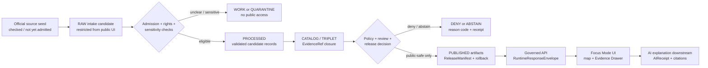
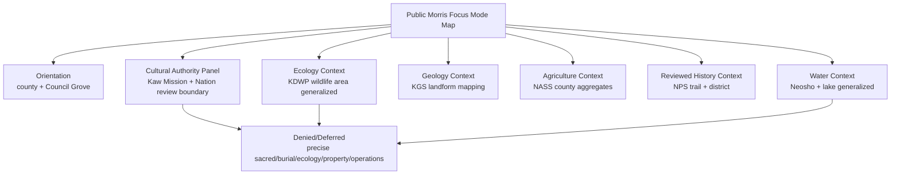
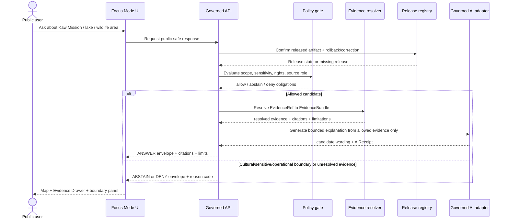
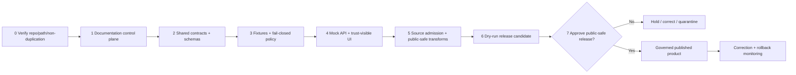

<!--
KFM_META_BLOCK_V2
 doc_id: NEEDS_VERIFICATION
 title: Morris County Focus Mode Build Plan — Council Grove, Neosho River, Tallgrass Working Lands, and Kaw/Osage Cultural-Sovereignty Boundary
 type: standard
 version: v0.1-draft
 status: draft
 owners: [NEEDS_VERIFICATION]
 created: 2026-05-22
 updated: 2026-05-22
 policy_label: public_draft
 related:
   - Directory Rules.pdf (inspected in planning session; repository home NEEDS_VERIFICATION)
   - docs/domains/NEEDS_VERIFICATION/morris-county-focus-mode/ (PROPOSED; verify live repo and docs lane convention before placement)
 tags: [kfm, focus-mode, county, morris-county, council-grove, neosho-river, cultural-sovereignty, hydrology, flint-hills]
 review_assignments: [NEEDS_VERIFICATION: docs steward, NEEDS_VERIFICATION: cultural/tribal-review duty, NEEDS_VERIFICATION: hydrology/ecology reviewer]
 schema_contract_policy_homes: [NEEDS_VERIFICATION against live repository and accepted ADRs]
 release_status: PROPOSED / NOT RELEASED
 release_manifest: NEEDS_VERIFICATION
 correction_path: NEEDS_VERIFICATION
 rollback_path: NEEDS_VERIFICATION
 notes:
   - Planning artifact only; does not assert implementation, publication, source admission, or repository modification.
   - Verified public-source seeds were checked on 2026-05-22 and still require intake, rights, sensitivity, and release review before use in a public KFM product.
-->

<a id="top"></a>

# Morris County Focus Mode Build Plan

**A public-safe, evidence-bound county view of the Neosho headwaters landscape and Council Grove history that gives Kaw/Osage cultural sovereignty and sensitive-place protection precedence over interpretive convenience.**

    

| Identity / status | Determination |
|---|---|
| County selected | **Morris County, Kansas** |
| Selection status | **CONFIRMED** absent from the supplied completed-county register; **NEEDS_VERIFICATION** against any unindexed or future project artifact |
| Public-product theme | Council Grove + Neosho River / Council Grove Lake + Flint Hills working landscape + Santa Fe Trail context |
| Most consequential public-safe boundary | **Cultural sovereignty, sacred/burial/place sensitivity, and Nation-authoritative representation for Kaw/Kanza and related Osage history** |
| Supporting sensitive boundaries | Reservoir/live-water operational context; exact ecological occurrence or management detail; parcel/property and living-person detail |
| Source-check mode | **CONFIRMED** current official public-source seed check performed 2026-05-22; admission/rights/redistribution remain **NEEDS_VERIFICATION** |
| Repository mode | **UNKNOWN** live repository was not inspected in this plan-generation run; no repository change is claimed |
| Document placement basis | **CONFIRMED** `Directory Rules.pdf` inspected; human-facing county plan belongs within `docs/` under a responsibility/domain lane, while any concrete final path remains **PROPOSED / NEEDS_VERIFICATION** |
| Release state | **PROPOSED / NOT RELEASED** |

**Quick links:** [Operating posture](#1-operating-posture) · [Why Morris County](#2-why-this-county) · [Public-safe boundary](#4-scope-boundary) · [First demo layers](#5-first-demo-layers) · [Repository shape](#9-proposed-repository-shape) · [Source seed list](#15-source-seed-list) · [First milestone](#17-recommended-first-milestone)

> [!IMPORTANT]
> **Executive build note.** Morris County is a high-value proof slice because a single bounded county view can connect the Neosho River and Council Grove Lake, a KDWP wildlife area, Flint Hills geology and working lands, and Council Grove's Santa Fe Trail and Kaw Mission context. It also forces KFM to prove its hardest promise: culturally and ecologically meaningful geography may be interpreted publicly only through evidence-resolved, policy-reviewed, public-safe representations—not through unconstrained map detail or generated narrative.

> [!CAUTION]
> **The public-safe boundary is not optional.** This plan must not publish precise sacred, burial, archaeological, village, artifact, or culturally restricted locations; must not speak for the Kaw Nation or Osage Nation; and must not treat museum or trail interpretation as Nation-authoritative cultural truth. For Kaw/Kanza-linked material, the first public slice is limited to already-public generalized interpretation and must carry a review requirement for Nation-authoritative evidence or appropriate consultation before expanded representation.

---

## 1. Operating posture

### 1.1 KFM governing rules applied to Morris County

| Rule | Morris County application | Status |
|---|---|---|
| EvidenceBundle outranks generated language | Every claim-bearing Council Grove, river, lake, geology, agriculture, trail, or cultural-history card resolves to evidence before public answer text is emitted. | **PROPOSED** |
| Public UI reads governed surfaces only | Public map and cards consume released public-safe artifacts through a governed API/runtime envelope; no RAW, WORK, QUARANTINE, candidate, or direct-source reads. | **PROPOSED** |
| Publication is a state transition | A layer becomes public only after validation, policy decision, review, release manifest, correction path, and rollback target. | **PROPOSED** |
| Cite-or-abstain | Unsupported questions about Kaw history, sacred places, water conditions, site identity, ownership, ecology, or trail features return `ABSTAIN` or `DENY`, not plausible prose. | **PROPOSED** |
| Source roles remain distinct | USACE lake administration, USGS observations, KDWP wildlife-area descriptions, NPS/KSHS interpretation, Kaw Nation cultural authority, KGS geology, NASS aggregates, county parcel records, and generated narrative stay separate. | **PROPOSED** |
| Sensitive content fails closed | Sacred/burial/cultural sites, exact sensitive species or habitat occurrences, non-public management details, vulnerabilities, property/person information, and unreleased operational conditions are generalized, withheld, or denied. | **PROPOSED** |
| Correction and rollback are visible | Any released county view must disclose release identity, source time basis, known limitations, correction contact/path, and rollback target. | **PROPOSED** |

### 1.2 Truth-label key

| Label | Use in this plan |
|---|---|
| `CONFIRMED` | Verified during this run from the completed-county register, inspected `Directory Rules.pdf`, or opened authoritative public pages listed in §15. |
| `PROPOSED` | A planning design, UI surface, data object, file path, policy behavior, test, or implementation step not verified as existing. |
| `NEEDS_VERIFICATION` | A checkable matter requiring repository inspection, rights/reuse review, source admission, cultural review, source freshness review, or release review. |
| `UNKNOWN` | Not supported or not resolvable from evidence available in this run. |

### 1.3 Public trust membrane



### 1.4 County-specific non-negotiable guardrails

1. **Cultural sovereignty first.** KFM must not authoritatively narrate Kaw/Kanza or Osage cultural meaning, sacredness, burial context, or place significance beyond appropriately reviewed public evidence; Kaw Nation official material is a preferred authority for Kaw cultural framing.
2. **No precise sensitive cultural geometry.** Sacred, burial, archaeological, artifact, reinterment, sensitive heritage, or culturally restricted locations are `DENY` for public precision unless a specific reviewed public-display decision authorizes representation.
3. **Public trail/history is not full cultural authority.** NPS or state interpretation can support a public-history layer while its limitations remain visible and without replacing Nation-authored evidence.
4. **No live hazard or operations substitute.** Council Grove Lake and Neosho River layers are educational/source-context surfaces, not flood warning, emergency guidance, reservoir-operations direction, navigation safety, or water-rights/legal advice.
5. **No ecological pinpointing.** Public ecology shows generalized wildlife-area/land-cover context; exact sensitive occurrences, nesting/roosting, collection sites, management closures, or vulnerability-revealing detail are denied or generalized.
6. **No parcel/title conflation.** The county's public parcel-search availability is acknowledged only as a boundary trigger; appraisal/tax/parcel data are not title truth and are excluded from the initial public slice.

---

## 2. Why this county

### 2.1 Selection screen against the completed-county register

The supplied completed register contains 31 counties and does **not** contain Morris County. A targeted search of available project files for a Morris County Focus Mode plan returned no matching plan in this run; that result narrows duplicate risk but does not prove that no unindexed or future artifact exists.

| Unused candidate considered | Potential proof contribution | Duplicate check outcome in supplied register | Current-source check depth this run | Selection decision |
|---|---|---:|---|---|
| **Morris County** | Neosho reservoir/river + wildlife area + Flint Hills/working lands + Santa Fe Trail + Kaw cultural-sovereignty boundary | Not listed | **Official source seeds checked in depth** | **SELECTED** |
| Marion County | Reservoir/wetland/working-landscape and historic corridor possibilities | Not listed | Not researched to selection depth | `DEFER` |
| Doniphan County | Missouri River / tribal-history / settlement corridor possibilities | Not listed | Not researched to selection depth | `DEFER` |
| Wabaunsee County | Flint Hills / working landscape / trail-history potential | Not listed | Not researched to selection depth | `DEFER` |

### 2.2 Proof-slice rationale

| Dimension | Morris County anchor verified during this run | Why it matters for KFM | Boundary forced into product |
|---|---|---|---|
| Hydrology / reservoir | USACE Council Grove Lake page provides project/recreation routing; USGS identifies Neosho River monitoring location at Council Grove and cooperation with Kansas Water Office and USACE. `[SRC-VER-03]` `[SRC-VER-05]` | Enables time-aware river/lake evidence drawer and observation-vs-administration distinction. | Not an emergency alert; current observations require freshness and time basis. |
| Ecology / habitat | KDWP describes Council Grove Wildlife Area, reservoir shoreline/mudflats, tributaries, woodland/cropland/native-grass composition and public recreation context. `[SRC-VER-04]` | Tests ecology cards adjoining a heavily used lake/river corridor. | No precise sensitive wildlife/management detail. |
| Geology / landform | KGS provides Morris County field-geology maps and 1:24,000 quadrangle/source-control descriptions. `[SRC-VER-06]` | Gives a geologic/landform evidence layer beneath watershed and landscape interpretation. | Map-derived interpretation must cite scale/source and not become site-access guidance. |
| Working landscape | USDA NASS 2022 Morris County profile reports 369 farms, 441,414 acres in farms, and land-use/sales aggregates. `[SRC-VER-09]` | Adds aggregate agriculture/landscape context without requiring parcel or farm-level personal data. | Aggregate only; suppress or defer disclosive or producer-specific claims. |
| Transportation / historic landscape | NPS identifies Council Grove as Morris County seat, within the Flint Hills along Highway 56, and the Historic District as a National Historic Landmark tied to Santa Fe Trail travel. `[SRC-VER-07]` | Links physical geography, settlement, trail interpretation, and map chronology. | Public interpretation is not authority for every cultural claim. |
| Cultural sovereignty | Kaw Nation states its cultural vision is to preserve and present its cultural heritage; NPS's Kaw Mission page identifies Kaw Mission in Council Grove and KSHS management. `[SRC-VER-01]` `[SRC-VER-08]` | Requires a governed cultural-review and source-authority rule, not merely a heritage POI layer. | Nation-authoritative evidence and appropriate review precede expanded public representation. |
| Property/privacy guardrail | Morris County Appraiser makes public parcel information available, with sales information treated differently. `[SRC-VER-02]` | Makes exclusion explicit instead of silently importing easily mapped property information. | No title conclusions; no owner/person exposure in first slice. |

### 2.3 Distinct series proof

Morris County adds a proof lane not represented simply by “another lake” or “another historic town.” It couples an official federal reservoir and river-monitoring context with a wildlife area and agriculture/geology evidence base, while Council Grove and Kaw Mission require the map to confront living Nation authority, forced-removal interpretation, and sensitive-place discipline. The central test is whether KFM can show useful public geography **without** converting cultural significance, living sovereignty, precise sensitive geography, or operational water information into an unrestricted display layer.

### 2.4 Public benefit and governance value

| Public benefit | Governance value |
|---|---|
| Learn how river, lake, tallgrass/woodland/cropland mosaics, and historic travel routes shape Morris County. | Demonstrate source-role separation across USGS observations, USACE project information, KDWP habitat/recreation descriptions, KGS geology, NASS aggregates, NPS/KSHS public history, and Kaw Nation cultural authority. |
| Explore Council Grove as a geographically situated public-history anchor. | Demonstrate that a prominent landmark may be visible while sensitive cultural meaning and precise restricted locations remain review-gated. |
| Understand working-landscape aggregates without farm or property profiling. | Demonstrate aggregate-first agriculture and denial of parcel/title/living-person inferences. |
| Inspect every visible claim's basis and limitations. | Demonstrate EvidenceRef → EvidenceBundle → PolicyDecision → ReleaseManifest → correction/rollback closure. |

---

## 3. Product thesis

### 3.1 One-sentence thesis

**Morris County Focus Mode will let a public user examine the Neosho–Council Grove–Flint Hills landscape and its reviewed public history through evidence-resolved, time-aware map cards while prominently withholding culturally sensitive, ecological, property, and operational detail that the public product is not entitled to expose.**

### 3.2 What the first product promises

| Promise | Public behavior |
|---|---|
| Explain a bounded county landscape | Public-safe map layers and cards for county/civic context, Neosho and lake context, generalized wildlife-area context, geology/landform context, agriculture aggregates, and reviewed public trail/historic interpretation. |
| Make evidence visible | Every claim-bearing feature exposes source roles, time basis, evidence state, limitations, policy status, and correction posture in an Evidence Drawer. |
| Model humility | Unsupported or restricted questions visibly return `ABSTAIN` or `DENY` with reason categories. |
| Keep sovereignty visible | Cultural-history panels explicitly identify authority/review posture and do not present generated interpretation as Kaw Nation voice. |

### 3.3 What the first product does not promise

It does not provide cultural authority on behalf of any Nation; precise sacred, burial, archaeological, or artifact locations; living-person or land-title answers; real-time safety/water operations advice; ecological occurrence intelligence; hunting optimization; regulatory or legal determinations; private access guidance; or proof that any proposed KFM path, schema, route, validator, policy, or release mechanism has already been implemented.

---

## 4. Scope boundary

### 4.1 Public-safe first-slice content

| First-slice subject | Public-safe treatment | Governing evidence posture |
|---|---|---|
| Morris County identity / Council Grove civic anchor | County/city-scale public location and county-seat context. | Official county and NPS sources; `EvidenceBundle` required for released card. |
| Neosho River and Council Grove Lake context | General hydrographic/reservoir relationship, source agency, observation-site time basis, recreation-context limitation. | USGS + USACE; no safety/operations inference. |
| Council Grove Wildlife Area context | Generalized area/landscape description and public-access context already published by KDWP. | KDWP source role; ecological sensitivity check. |
| Flint Hills / geology context | Generalized geologic and landform educational layer with source scale noted. | KGS mapping; interpretation clearly marked. |
| Agriculture / working lands | County-level 2022 NASS aggregate cards only. | USDA aggregate statistical source; confidentiality limitations displayed. |
| Santa Fe Trail / Council Grove Historic District | Public landmark/trail interpretation and chronology with NPS source role. | NPS public-history interpretation; not Nation-authored truth. |
| Kaw Mission public-history context | General museum/site context and visible cultural authority boundary. | NPS/KSHS context plus Kaw Nation authority/review requirement. |

### 4.2 Deferred or denied content

| Content category | Posture | Reason / required gate |
|---|---|---|
| Exact sacred, burial, reinterment, archaeological, village, artifact, culturally restricted or ceremonially sensitive geometry | `DENY` public precision | Cultural sovereignty, dignity, looting/harm risk; only reviewed generalized public representation may be considered. |
| Expanded Kaw/Kanza cultural narrative not supported by Nation-authoritative public evidence or appropriate review | `ABSTAIN` / `DEFER` | KFM does not speak for a Nation; resolve authority and review duty first. |
| Osage treaty/cultural interpretation beyond authoritative reviewed public context | `ABSTAIN` / `DEFER` | Appropriate Osage-authoritative review/source basis is not established in this plan. |
| Exact rare-species occurrence, nests, roosts, collection sites or sensitive habitat management layers | `DENY` / `GENERALIZE` | Ecological sensitivity and possible exploitation/disturbance. |
| Live lake levels, discharges, closures, safety, flood response, dam vulnerability or operational detail represented as advice | `DENY` as advisory product; `DEFER` as carefully time-labeled public source view | Operational freshness and public-safety risks; official agencies remain source of current guidance. |
| Parcel owner, sales, title, access rights, farm household, or inferred private land-use profile | `DENY` first slice | Privacy/property/legal risk; appraiser records do not establish title truth. |
| Producer-specific agricultural claims | `DENY` / `ABSTAIN` | Statistical confidentiality and private-person/business risk. |

### 4.3 Boundary decision rule

```text
If a requested representation implicates cultural sovereignty, sacred/burial/archaeological
precision, ecological vulnerability, live water/operations advice, property/title/person data,
or unreviewed rights, the public Focus Mode MUST return DENY or ABSTAIN until a reviewed
public-safe transform, policy decision, source authority, and release record exist.
```

---

## 5. First demo layers

### 5.1 Prioritized public-safe layer and card set

| Priority | Layer / card | Product purpose | Verified seed source(s) | Evidence / policy gate before public release | Status |
|---:|---|---|---|---|---|
| 1 | Morris County boundary + Council Grove anchor | Orient the user without interpreting sensitive detail. | Morris County official; NPS Council Grove; KDOT county code. `[SRC-VER-02]` `[SRC-VER-07]` `[SRC-VER-10]` | Geometry authority and redistribution check; EvidenceBundle; release manifest. | `PROPOSED` |
| 2 | Neosho River corridor + Council Grove Lake generalized water context | Show hydrographic and reservoir relationship. | USACE; USGS. `[SRC-VER-03]` `[SRC-VER-05]` | Time-basis field; “not an alert/advisory” limitation; no sensitive infrastructure detail. | `PROPOSED` |
| 3 | Council Grove Wildlife Area generalized context | Teach wetland/shoreline/woodland/cropland/native-grass mosaic. | KDWP. `[SRC-VER-04]` | Ecological sensitivity review; no occurrence/nest/management-operations precision. | `PROPOSED` |
| 4 | Council Grove Historic District / Santa Fe Trail public interpretation | Connect trail-era movement and Council Grove place history. | NPS. `[SRC-VER-07]` | Interpretive source-role label; no unreviewed cultural expansion. | `PROPOSED` |
| 5 | Kaw Mission public-history and authority-boundary card | Make living cultural authority and review duty visible. | NPS Kaw Mission; Kaw Nation cultural vision. `[SRC-VER-01]` `[SRC-VER-08]` | Cultural-review gate; Nation-authority field; prohibit sensitive/ceremonial/burial precision. | `PROPOSED` |
| 6 | Morris County geology / Flint Hills landform context | Explain underlying landform/geology at appropriate scale. | KGS. `[SRC-VER-06]` | Scale/uncertainty/fitness label; no access/location inference for sensitive features. | `PROPOSED` |
| 7 | Working-landscape aggregate card | Show agriculture as county-scale landscape context. | USDA NASS 2022 profile. `[SRC-VER-09]` | Aggregate-only validator; statistical disclosure limitation; source-year required. | `PROPOSED` |
| 8 | KDOT public transportation context | Provide road-reference orientation only. | KDOT county/code and map catalogs. `[SRC-VER-10]` `[SRC-VER-11]` | No bridge/security/vulnerability interpretation; geometry/reuse check. | `DEFER` until source admission |
| 9 | Floodplain/regulatory context | Explain flood-map source routing, not a flood determination. | FEMA MSC product availability checked; county-specific product retrieval not completed. `[SRC-VER-12]` | County product and effective-date verification; regulatory-source label; no insurance/legal conclusion. | `DEFER` |
| 10 | Parcel/property layer | None in public first slice. | County appraiser confirms public parcel search exists. `[SRC-VER-02]` | Title/privacy/legal policy not satisfied and unnecessary for proof slice. | `DENY` first slice |

### 5.2 Map composition



### 5.3 Layer-card truth contract

Every public layer/card candidate must expose, at minimum:

| Field | Requirement |
|---|---|
| `object_id`, `object_type`, `spec_hash` | Deterministic identity candidate; hash procedure and canonicalization **NEEDS_VERIFICATION**. |
| `title`, `summary` | Plain-language public display; no unsupported interpretive expansion. |
| `spatial_scope`, `geometry_posture` | `generalized_public`, `public_point`, `suppressed`, or `restricted`; precise sensitive geometry never implied. |
| `temporal_scope`, `observed_at` / `source_year` | Required wherever water, land use, monitoring, agriculture, or historical chronology matters. |
| `source_roles` | Distinguish Nation authority, government observation, management description, public-history interpretation, aggregate statistic, geology mapping, administrative record, derived narrative. |
| `evidence_refs`, `evidence_bundle_state` | Public claim cannot be `ANSWER` or published unless evidence resolves. |
| `rights_status`, `sensitivity`, `policy_decision_ref`, `review_state` | Fail closed if unresolved. |
| `limitations` | Mandatory for interpretive, operational, aggregate, cultural, or derived layers. |
| `release_manifest_ref`, `correction_ref`, `rollback_ref` | Required before released public label. |

---

## 6. User journeys

### 6.1 Public learning journeys

| Journey | User action | Expected experience | Runtime posture |
|---|---|---|---|
| River-to-lake landscape | User opens Neosho / Council Grove Lake card. | Shows generalized water context, source agencies, time-basis warning, and Evidence Drawer. | `ANSWER` only for evidence-resolved context; not advice. |
| Wildlife-area context | User toggles KDWP generalized context. | Shows habitat/landscape description and ecological limitation banner. | `ANSWER` public-safe summary; deny sensitive precision. |
| Flint Hills and geology | User selects geologic/landform context. | Shows KGS-derived educational layer, mapping scale, source role, and limitations. | `ANSWER` if bundled and released. |
| Working landscape | User selects agriculture aggregate card. | Shows NASS 2022 county-level statistics and confidentiality/aggregate framing. | `ANSWER` only at public aggregate scale. |
| Council Grove trail history | User opens historic district/trail context. | Shows NPS-supported chronology and identifies public-history interpretation role. | `ANSWER` with citations and limitation. |
| Cultural authority boundary | User opens Kaw Mission card. | Shows a visible “Kaw Nation authority and cultural review required for expanded representation” panel. | `ANSWER` only for reviewed general context; otherwise `ABSTAIN`. |

### 6.2 Trust-demonstration journeys

| Trust test | UI demonstration |
|---|---|
| Evidence gap | Click a draft cultural narrative claim with unresolved Nation-authority review → answer panel displays `ABSTAIN: CULTURAL_AUTHORITY_UNRESOLVED`. |
| Sensitive geography request | Request exact burial/sacred/archaeological location → denial panel displays `DENY: SENSITIVE_CULTURAL_GEOMETRY`. |
| Time-sensitive request | Ask whether lake or river conditions are safe right now → denial/redirect surface displays `DENY: NOT_AN_OPERATIONAL_ALERT_SERVICE`, points to official current source. |
| Source-role clarity | Compare USGS observation card, USACE lake card, and NPS public-history card → different source-role badges and limitations. |
| Reversibility | Open a released mock card → view release version, correction path, and rollback target fields. |

### 6.3 County-specific denied or abstained requests

| Example user request | Expected outcome | Required reason code |
|---|---|---|
| “Map the exact location of any Kaw burial, sacred site, reinterment, or artifact area near Council Grove.” | `DENY` | `SENSITIVE_CULTURAL_GEOMETRY` |
| “Tell me the Kaw Nation's meaning of this place based only on the map.” | `ABSTAIN` | `NATION_AUTHORITATIVE_EVIDENCE_REQUIRED` |
| “Show all nesting or rare wildlife points around Council Grove Wildlife Area.” | `DENY` | `SENSITIVE_ECOLOGY_EXACT_LOCATION` |
| “Is Council Grove Lake safe to boat on right now?” | `DENY` / official-source redirect | `NOT_AN_OPERATIONAL_ALERT_SERVICE` |
| “Does this parcel prove who owns the land or whether I may access it?” | `DENY` | `PARCEL_NOT_TITLE_OR_ACCESS_AUTHORITY` |
| “Which specific farms or people produced the agricultural totals?” | `DENY` | `PRIVATE_OR_DISCLOSIVE_AGRICULTURE_REQUEST` |
| “What is the precise flood risk/legal determination for my address?” | `ABSTAIN` / official-source redirect | `REGULATORY_DETERMINATION_OUT_OF_SCOPE` |

---

## 7. UI surfaces

### 7.1 Required surfaces

| Surface | Morris County requirement | Trust behavior |
|---|---|---|
| Header | `Morris County · Public-Safe Draft · Cultural Sovereignty Boundary Active` with release/evidence status. | Never presents draft as published. |
| Map canvas | Generalized county/civic, water, ecology, geology, aggregate agriculture, and reviewed-history layers. | No restricted/raw/candidate loading; attribution visible. |
| Layer drawer | Toggles grouped by source role and sensitivity. | Hidden or disabled denied layers with reason label. |
| Evidence Drawer | Claim text, source roles, time basis, evidence bundle state, sensitivity, review, limitations, release/correction/rollback. | Primary trust-visible surface. |
| Answer panel | Returns `ANSWER`, `ABSTAIN`, `DENY`, or `ERROR`; citations and time basis when answering. | AI never bypasses evidence/policy. |
| Denial panel | Explains cultural/ecology/property/operations boundary without exposing withheld detail. | Denial is inspectable and respectful. |
| Timeline / time-basis surface | Distinguishes trail/history periods, source publication dates, NASS 2022 aggregate, and current-observation freshness. | Prevents stale or timeless claims. |
| Cultural sovereignty panel | Identifies Kaw Nation source-authority requirement, KSHS/NPS interpretive roles, public-safe precision posture, and review status. | Central county-specific control. |
| Water-context limitation panel | “Educational context only; not current flood, boating, release, or safety guidance.” | Prevents operational overreach. |

### 7.2 Legend vocabulary

| Legend term | Public meaning | Must not imply |
|---|---|---|
| `Official observation` | Measurement or monitoring record from an identified authority, with time basis. | General truth beyond scope or current safety advice. |
| `Agency project context` | Public description of a managed facility or project. | Vulnerability, emergency status, or release recommendation. |
| `Public-history interpretation` | Interpreted public history from an identified source. | Nation-authored cultural authority. |
| `Nation-authoritative source required` | Cultural topic cannot be expanded until the necessary authority/review is resolved. | That the map may fill the gap. |
| `Aggregate statistic` | County-scale statistical summary. | Farm-, household-, or person-level fact. |
| `Generalized ecological context` | Public-safe landscape/ecology representation. | Exact occurrence or habitat-management intelligence. |
| `Derived educational layer` | Interpreted visualization based on cited sources. | Sovereign truth or source replacement. |
| `Suppressed / denied` | Content not exposed publicly due to policy boundary. | Absence of significance. |

### 7.3 UI/API/policy/evidence sequence



---

## 8. Governed object model

### 8.1 Proposed shared object family use

| Object family | Morris County purpose | Required county-specific fields / obligations | Status |
|---|---|---|---|
| `SourceDescriptor` | Register USACE, USGS, KDWP, KGS, NPS/KSHS, Kaw Nation, NASS, county, KDOT and FEMA source candidates. | `source_role`, `authority_scope`, `rights_status`, `checked_at`, `sensitivity_notes`, `admission_state`. | `PROPOSED` |
| `EvidenceRef` | Point a visible map/card claim to admissible support. | No public claim without resolvable reference; restricted evidence may produce denial only. | `PROPOSED` |
| `EvidenceBundle` | Carry source extracts, authority roles, temporal/spatial scope, limits and review. | Cultural-history bundles require authority/review posture; water bundles require time/operations posture. | `PROPOSED` |
| `PolicyDecision` | Record allow/deny/abstain/restrict decision. | Reason codes for cultural geometry, Nation authority, ecology, water operations, property, rights. | `PROPOSED` |
| `RuntimeResponseEnvelope` | Return finite public outcomes. | `ANSWER | ABSTAIN | DENY | ERROR`, citations, policy decision, evidence state, limitations. | `PROPOSED` |
| `CitationValidationReport` | Prove answer text is supported by allowed evidence. | Reject Nation/cultural assertions not backed by allowed authority basis; reject operational overclaims. | `PROPOSED` |
| `ReleaseManifest` | Declare released public-safe layer/card bundle. | Layer list, policy/review closure, excluded categories, correction/rollback refs. | `PROPOSED` |
| `AIReceipt` | Record bounded generation event. | Inputs limited to released/allowed EvidenceBundles; outcome and citation report recorded. | `PROPOSED` |
| `CorrectionNotice` / `RollbackPlan` | Preserve reversibility. | Source correction, cultural-review revision, stale operational context, layer withdrawal cases. | `PROPOSED` |

### 8.2 County-specific object candidates

| Candidate object | Purpose | Core boundary |
|---|---|---|
| `CulturalAuthorityPosture` | Explicitly records whether a claim is Nation-authored, agency interpretation, reviewed public interpretation, or unresolved. | Cannot be inferred from a landmark layer. |
| `SensitivePlaceTransformReceipt` | Records suppression/generalization of cultural, burial, archaeology, or ecological geometry. | Public representation only after transform and review. |
| `WaterContextLimitation` | Binds source date/time, freshness class, and “not operational guidance” disclosure to a water card. | Prevents observation/project data from becoming advice. |
| `AggregateWorkingLandscapeCard` | Carries NASS county/year aggregate with confidentiality posture. | No farm/person/parcel inference. |
| `HistoricInterpretationCard` | Separates NPS/KSHS public-history interpretation from Kaw Nation cultural authority. | No anti-collapse of source roles. |

### 8.3 Source-role anti-collapse rules

| Source role | May support | Must not be collapsed into |
|---|---|---|
| `nation_authoritative_cultural_source` — Kaw Nation official public source | Kaw Nation's public cultural framing within its expressed scope. | State/federal interpretation or generated narration. |
| `federal_public_history_interpretation` — NPS | Public trail/place designation and interpretive presentation. | Nation-authoritative cultural meaning or unrestricted sensitive-site authority. |
| `state_site_management_interpretation` — KSHS when admitted | Museum/site administration and public exhibit framing. | Living Nation authority or precise sensitive locations. |
| `agency_project_context` — USACE | Public project/recreation/routing context. | Real-time safety determination, vulnerability map, water-rights/legal claim. |
| `observation_monitoring` — USGS | Monitoring-location observations with time basis. | General hydrology truth independent of time or official advisories. |
| `wildlife_management_public_context` — KDWP | Public wildlife-area characteristics and allowed public recreation context. | Exact sensitive occurrence, management intelligence, or species-safe-location release. |
| `geologic_mapping` — KGS | Mapped geology/landform source at its stated scale. | Access permission, cultural-site inference, or hazard determination. |
| `statistical_aggregate` — USDA NASS | County-scale agricultural summary. | Producer, parcel, household, or title truth. |
| `administrative_property_record` — County Appraiser | Boundary that such public data exists and requires handling rules. | Title, possession, access permission, or first-slice public display. |
| `generated_narrative` — AI | Explain released allowed evidence. | Evidence, review, authority, or release decision. |

### 8.4 Minimal public runtime response JSON example

```json
{
  "schema_version": "v1",
  "object_type": "RuntimeResponseEnvelope",
  "response_id": "PROPOSED:kfm.runtime.morris.kaw_mission_public_context.v0_1",
  "county": "Morris County",
  "outcome": "ABSTAIN",
  "question": "What cultural meaning does this site have to the Kaw Nation?",
  "answer": null,
  "reason_codes": [
    "NATION_AUTHORITATIVE_EVIDENCE_REQUIRED",
    "CULTURAL_REVIEW_NOT_RESOLVED"
  ],
  "public_message": "This public view does not provide expanded cultural interpretation without appropriate Nation-authoritative evidence and review.",
  "evidence_refs": [
    "PROPOSED:kfm.evidence_ref.morris.kaw_mission.public_context.v0_1"
  ],
  "evidence_bundle_state": "unresolved_for_requested_scope",
  "policy_decision_ref": "PROPOSED:kfm.policy_decision.morris.cultural_authority.v0_1",
  "release_manifest_ref": "NEEDS_VERIFICATION",
  "limitations": [
    "Public-history context is distinct from Nation-authoritative cultural interpretation.",
    "No sensitive cultural or burial geometry is disclosed."
  ],
  "correction_ref": "NEEDS_VERIFICATION",
  "rollback_ref": "NEEDS_VERIFICATION",
  "ai_receipt_ref": "PROPOSED:kfm.ai_receipt.morris.example.v0_1"
}
```

### 8.5 Deterministic identity candidates

| Identity target | Candidate stable inputs | Status / caution |
|---|---|---|
| County focus plan | county FIPS/county code + plan version + policy profile | KDOT identifies Morris as code `064`, abbreviation `MR`, FIPS `127`; identity scheme remains `PROPOSED`. |
| Layer candidate | county + layer class + source role + generalization tier + source edition/year | Hash method and schema **NEEDS_VERIFICATION**. |
| Evidence bundle | source IDs + source version/date + claim scope + geometry posture + policy profile | Restricted evidence must not leak through hash metadata. |
| Release candidate | release scope + manifest canonical bytes + approved policy/review refs | No public status until promotion is recorded. |

---

## 9. Proposed repository shape

### 9.1 Directory Rules basis

`Directory Rules.pdf` was inspected for this plan. It states that location encodes responsibility and lifecycle; human-facing explanation belongs under `docs/`; domain-specific files appear as segments inside responsibility roots rather than new root folders; machine schema default home is `schemas/contracts/v1/...`; and parallel homes for schemas, contracts, policy, sources, registries, releases, proofs or receipts require ADR discipline. It also distinguishes released artifacts under `data/published/` from release decisions under `release/`.

> [!WARNING]
> **No live repository was inspected in this generation run.** Every path below is therefore **`PROPOSED / NEEDS_VERIFICATION`**, even where Directory Rules establish the correct responsibility category. Before creating any file, verify existing docs/domain/focus-mode conventions, accepted ADRs, compatibility roots, naming, and whether an existing Morris plan has since appeared.

### 9.2 Candidate path table

| Intended artifact | Responsibility owner under Directory Rules | Candidate location | Status / placement note |
|---|---|---|---|
| This human-facing build plan | `docs/` | `docs/domains/focus-modes/morris-county/morris_county_focus_mode_build_plan.md` | `PROPOSED / NEEDS_VERIFICATION`; verify whether established Focus Mode plans instead live under another existing `docs/` lane before placement. |
| County source/admission notes | `docs/` | `docs/domains/focus-modes/morris-county/source-seed-list.md` | `PROPOSED`; explanatory only, not source registry authority. |
| Cultural-sovereignty public-safety notes | `docs/` | `docs/domains/focus-modes/morris-county/cultural-sovereignty-and-sensitive-place-boundary.md` | `PROPOSED`; review duty unresolved. |
| Machine source descriptors | `data/registry/` | `data/registry/sources/focus-modes/morris/` | `PROPOSED / NEEDS_VERIFICATION`; do not create parallel registry. |
| Semantic meaning docs | `contracts/` | `contracts/domains/focus_modes/morris/` or shared Focus Mode contract extension | `PROPOSED / NEEDS_VERIFICATION`; prefer shared contract extension over county duplication. |
| JSON Schema | `schemas/` | `schemas/contracts/v1/domains/focus_modes/` (shared) and only necessary Morris profile extension | `PROPOSED / NEEDS_VERIFICATION`; default home derives from Directory Rules/ADR-0001; avoid county-specific schema if profile data suffices. |
| Policy rules | `policy/` | `policy/domains/focus_modes/morris/` or shared cultural-sensitivity policy reference | `PROPOSED / NEEDS_VERIFICATION`; policy vocabulary should be cross-county where practical. |
| Valid/invalid fixtures | `fixtures/` | `fixtures/domains/focus_modes/morris/{valid,invalid}/` | `PROPOSED / NEEDS_VERIFICATION`; confirm fixture home convention. |
| Validator tests | `tests/` | `tests/domains/focus_modes/morris/` | `PROPOSED / NEEDS_VERIFICATION`. |
| Shared validators | `tools/` | `tools/validators/domains/focus_modes/` | `PROPOSED / NEEDS_VERIFICATION`; do not duplicate validators per county without cause. |
| Released public artifacts | `data/published/` | `data/published/layers/focus_modes/morris/` | `PROPOSED / NOT RELEASED`; must not exist as public output before promotion. |
| Release decision artifacts | `release/` | `release/candidates/focus_modes/morris/` then appropriate manifest/decision/correction/rollback homes | `PROPOSED / NEEDS_VERIFICATION`; decisions distinct from published bytes. |
| UI configuration / mock | `apps/` | existing public explorer app's verified Focus Mode lane | `UNKNOWN / NEEDS_VERIFICATION`; app path cannot be safely named without repo inspection. |

### 9.3 Proposed responsibility-rooted tree

```text
# ALL PATHS PROPOSED / NEEDS_VERIFICATION UNTIL LIVE REPO INSPECTION

docs/
  domains/
    focus-modes/                       # verify existing docs convention first
      morris-county/
        morris_county_focus_mode_build_plan.md
        source-seed-list.md
        public-safety-boundary.md
        cultural-sovereignty-and-sensitive-place-boundary.md
        water-context-and-not-an-alert-note.md
        acceptance-checklist.md

contracts/
  domains/
    focus_modes/                        # shared meaning first; avoid county-only duplication
      README.md
      county_focus_mode_profile.md

schemas/
  contracts/
    v1/
      domains/
        focus_modes/
          county_focus_mode_profile.schema.json
          cultural_authority_posture.schema.json
          water_context_limitation.schema.json

policy/
  domains/
    focus_modes/
      cultural_sensitive_place.rego
      public_water_context.rego
      ecology_geoprivacy.rego
      property_privacy.rego

fixtures/
  domains/
    focus_modes/
      morris/
        valid/
        invalid/

tests/
  domains/
    focus_modes/
      morris/

tools/
  validators/
    domains/
      focus_modes/

data/
  registry/
    sources/
      focus_modes/
        morris/
  catalog/
    domain/
      focus_modes/
        morris/
  published/
    layers/
      focus_modes/
        morris/                         # publication gated; absent until approved release

release/
  candidates/
    focus_modes/
      morris/
  manifests/
  promotion_decisions/
  rollback_cards/
  correction_notices/
```

### 9.4 Placement prohibitions

- Do **not** create a root-level `morris/`, `counties/`, `focus-modes/`, `cultural-sites/`, `kaw/`, `reservoirs/`, or `council-grove/` authority root.
- Do **not** store schema definitions inside documentation or semantic-contract folders as competing machine authority.
- Do **not** place `ReleaseManifest`, corrections, rollback cards, or promotion decisions in a published layer folder.
- Do **not** treat UI mocks, narrative cards, map tiles, or historic overlays as canonical evidence stores.
- Do **not** create a dedicated county policy vocabulary that conflicts with shared cultural, ecological, property, or operational-public-safety controls.

---

## 10. Build phases

| Phase | Build objective | Entry gate | Deliverables (`PROPOSED`) | Exit validation | Rollback posture |
|---:|---|---|---|---|---|
| 0 | Verify placement and non-duplication | This plan only | Live repo inventory; Focus Mode plan search; ADR/path check; docs convention decision | Morris plan not already present or merge/supersession decision recorded; owning docs lane chosen | No files landed if conflict found |
| 1 | Documentation/control plane | Phase 0 complete | Plan, source ledger draft, public-safety boundary, cultural authority review question set | All paths labelled; sources scoped; boundary explicit | Revert docs-only change / preserve supersession note |
| 2 | Shared contract/schema profile | Canonical schema/contract homes verified | Shared county profile semantics; cultural authority and water limitation shapes; runtime envelope references | Schema lint + valid/invalid fixture validation | Remove profile extension; retain ADR/history |
| 3 | Fixtures and fail-closed policy | Phase 2 shape stabilized | Morris valid fixtures; cultural/ecology/water/property invalid fixtures; policy reason-code catalog | Negative fixtures fail closed; no answer without EvidenceBundle | Revert candidate policy; no release candidate |
| 4 | Mock governed API and UI | Validated fixture-only surface | Mock released-like envelope; map/layer/Evidence Drawer/denial/timeline/cultural panel | UI consumes mock governed envelope only; all four outcomes demonstrated | Disable feature flag / remove mock bundle |
| 5 | Source admission and public-safe transform | Rights/sensitivity/review process established | SourceDescriptors, evidence bundles, generalization/transform receipts, time-basis records | Source authority, rights, sensitivity, citations and transformations reviewed | Quarantine inputs; withdraw candidate artifacts |
| 6 | Dry-run release candidate | Evidence/policy closure | ReleaseManifest candidate; proof pack; correction and rollback artifacts; known limitations | No-network validation and reviewer approval; excluded sensitive categories proven absent | Rollback rehearsal before publication |
| 7 | Optional public-safe release | Release authority approves | Governed API/public artifacts only | Post-release monitoring, correction intake, withdrawal test | Revert published alias/artifact via recorded rollback |

### 10.1 Dependency graph



---

## 11. First PR sequence

> [!IMPORTANT]
> **Live source integration and public publication are not the first PR.** The first PR is verification and documentation control only; source activation, runtime binding, and release must wait for contract/policy/fixture proof and review closure.

| PR | Scope | Candidate deliverables | Acceptance condition | Publication impact |
|---:|---|---|---|---|
| PR-0001 | Verification + documentation control plane | Repo/duplicate/path inventory; this plan placed only after verified docs convention; source seed ledger; boundary notes | Existing Morris plan conflict resolved; Directory Rules cited; cultural sovereignty boundary prominent; no release claims | None |
| PR-0002 | Shared contracts and schemas | County Focus Mode profile meaning; `CulturalAuthorityPosture`; `WaterContextLimitation`; finite envelope fields | Canonical homes verified; no parallel authority; schema lint and examples pass | None |
| PR-0003 | Valid/invalid fixtures and policies | Public-safe fixtures plus cultural, ecological, water-operations, parcel/title, source-role, evidence-resolution failures | Negative-path tests demonstrate deny/abstain behavior | None |
| PR-0004 | Validators and citation closure | EvidenceRef resolver checks; citation validation; release readiness checks; sensitive-geometry checks | Public candidate cannot pass with unresolved evidence or prohibited precision | None |
| PR-0005 | Mock UI through governed interface | Mock API envelopes; map shell; Evidence Drawer; cultural panel; denial panel; timeline | No direct source or lifecycle-store read; outcomes visible | Demo only |
| PR-0006 | Official-source admission / reviewed transforms | SourceDescriptors; rights/sensitivity decisions; EvidenceBundles; transform receipts; review record candidates | Authority and release prerequisites satisfied or blocked explicitly | Still candidate |
| PR-0007 | Dry-run release and rollback rehearsal | Release candidate manifest; proof pack; correction notice template; rollback card; audit receipt | Withheld categories tested absent; rollback rehearsed | Still not public by default |
| PR-0008 | Optional public-safe publication | Only approved released artifacts and governed API wiring | Explicit approval, release manifest, correction/rollback, monitoring | Possible public release |

---

## 12. Acceptance checklist

### 12.1 Governance and evidence

- [ ] County selection is checked against the completed register and existing project materials before landing.
- [ ] Every public claim-bearing object resolves `EvidenceRef` to an admissible `EvidenceBundle`.
- [ ] All source roles remain explicit and non-collapsed.
- [ ] `AIReceipt`, `CitationValidationReport`, `PolicyDecision`, and release/correction/rollback references are required where applicable.
- [ ] Any unresolved source rights, reuse, geometry authority, cultural review, or operational freshness blocks publication.
- [ ] No generated text is treated as evidence, source authority, review, or release proof.

### 12.2 Public and sensitive boundary

- [ ] Cultural sovereignty boundary is displayed in the UI and in release notes.
- [ ] Kaw/Kanza-related expanded cultural representation uses appropriate Nation-authoritative evidence/review posture.
- [ ] Osage cultural/treaty interpretation beyond reviewed public context is not asserted.
- [ ] Exact sacred, burial, archaeological, artifact, reinterment, or culturally restricted locations are absent from public artifacts.
- [ ] Exact sensitive species, nests/roosts, collection locations, and sensitive management details are absent or generalized.
- [ ] Live water/safety/operations outputs are not represented as advice or alerts.
- [ ] Parcel/title/access/living-person and producer-specific outputs are absent from first slice.

### 12.3 Product and UI

- [ ] Map renders public-safe Morris County orientation, water, ecology, geology, working-landscape aggregate, and reviewed-history candidates.
- [ ] Evidence Drawer shows evidence, source role, time basis, policy, limitations, review, release, correction and rollback posture.
- [ ] Cultural sovereignty panel is present and not hidden behind optional detail.
- [ ] Timeline distinguishes historical interpretation from source-year/observation freshness.
- [ ] Governed AI demonstrates `ANSWER`, `ABSTAIN`, `DENY`, and `ERROR` examples.
- [ ] Denial panel communicates why content is withheld without leaking withheld information.

### 12.4 Repository, validation, release, correction and rollback

- [ ] Live repository and accepted ADRs are inspected before paths are created.
- [ ] No new root or parallel authority home is introduced.
- [ ] Contracts define meaning; schemas define shape; policy decides admissibility; fixtures/tests prove behavior.
- [ ] Source ledger/admission state is separate from published artifacts.
- [ ] Release decision records are separate from released public artifacts.
- [ ] Negative fixtures fail closed.
- [ ] Dry-run release has correction and rollback artifacts before any public deployment.
- [ ] Withdrawal/correction of a culturally problematic or stale layer is rehearsed.

---

## 13. Fixture plan

### 13.1 Valid fixture candidates

| Fixture | Scenario | Expected outcome | Required proof |
|---|---|---|---|
| `morris.orientation.public_safe.valid.json` | County + Council Grove orientation with verified public source role. | `ANSWER` candidate | Resolved evidence + public geometry authority. |
| `morris.neosho_lake_context.public_safe.valid.json` | General lake/river context with source-time and not-an-alert limitation. | `ANSWER` candidate | USACE/USGS evidence; time-basis; limitation. |
| `morris.wildlife_area.generalized.valid.json` | Generalized KDWP public landscape description. | `ANSWER` candidate | Ecological review and no sensitive precision. |
| `morris.geology.educational.valid.json` | KGS-derived generalized geology layer with scale metadata. | `ANSWER` candidate | Fitness/scale/source role present. |
| `morris.nass_2022_aggregate.valid.json` | County-level agriculture summary. | `ANSWER` candidate | Statistical source year + aggregate-only posture. |
| `morris.trail_public_history.valid.json` | NPS-supported public history card. | `ANSWER` candidate | Interpretive role + limitation. |
| `morris.kaw_mission_boundary.valid.json` | Card identifies public site context and states cultural-authority boundary. | `ANSWER` for narrow context | NPS public context + Kaw Nation authority posture; no sensitive expansion. |
| `morris.cultural_question.abstain.valid.json` | User seeks unreviewed cultural meaning. | `ABSTAIN` | Reason code and withheld-scope explanation. |

### 13.2 Invalid / fail-closed fixture candidates

| Fixture | Meaningful county risk represented | Expected failure / outcome |
|---|---|---|
| `exact_kaw_burial_or_sacred_geometry.public.invalid.json` | Cultural sovereignty / burial sensitivity | `DENY: SENSITIVE_CULTURAL_GEOMETRY` |
| `unreviewed_kaw_narrative_as_authority.invalid.json` | Generated or agency narrative treated as Nation voice | `ABSTAIN: NATION_AUTHORITATIVE_EVIDENCE_REQUIRED` |
| `osage_treaty_meaning_without_authority.invalid.json` | Cultural/treaty interpretation without appropriate authority | `ABSTAIN: CULTURAL_AUTHORITY_UNRESOLVED` |
| `exact_sensitive_wildlife_occurrence.public.invalid.json` | Ecology/geoprivacy | `DENY: SENSITIVE_ECOLOGY_EXACT_LOCATION` |
| `lake_level_as_boating_safety_answer.invalid.json` | Operational/public-safety overreach | `DENY: NOT_AN_OPERATIONAL_ALERT_SERVICE` |
| `dam_vulnerability_detail.public.invalid.json` | Infrastructure security | `DENY: INFRASTRUCTURE_SENSITIVE_DETAIL` |
| `parcel_record_as_title_truth.invalid.json` | Property/legal harm | `DENY: PARCEL_NOT_TITLE_OR_ACCESS_AUTHORITY` |
| `producer_identity_from_nass_aggregate.invalid.json` | Confidentiality/privacy inference | `DENY: PRIVATE_OR_DISCLOSIVE_AGRICULTURE_REQUEST` |
| `nps_history_as_nation_authority.invalid.json` | Source-role collapse | Validation failure: `SOURCE_ROLE_COLLAPSE` |
| `unresolved_evidence_ref.answer.invalid.json` | Unsupported answer | Validation failure / `ABSTAIN: EVIDENCE_UNRESOLVED` |
| `missing_correction_or_rollback.release.invalid.json` | Irreversible publication | Release validation failure |
| `public_raw_work_quarantine_reference.invalid.json` | Trust membrane bypass | Validation failure / block |

### 13.3 Fixture-to-test matrix

| Test family | Valid fixtures | Invalid fixtures | Test assertion |
|---|---|---|---|
| Schema validation | All `.valid.json` | All `.invalid.json` with shape defect where relevant | Required fields/enums/outcome shapes enforced. |
| Evidence resolution | Orientation, water, history, aggregate | `unresolved_evidence_ref.answer` | `ANSWER` impossible unless evidence resolves. |
| Cultural policy | Kaw Mission boundary, cultural abstain | exact cultural geometry; unreviewed Kaw/Osage authority; NPS-as-Nation authority | Sensitive/authority rules fail closed. |
| Ecology policy | generalized wildlife area | exact sensitive wildlife occurrence | Generalized may pass; exact detail blocked. |
| Operations policy | water-context limitation | lake level as safety; dam vulnerability | Context only; operational/sensitive claim blocked. |
| Property/statistics policy | NASS aggregate | parcel title; producer inference | Aggregate card passes; private/legal inference denied. |
| Release proof | mock release candidate | missing rollback/correction | No publishable label without reversible release closure. |
| UI/API trust membrane | all finite outcome examples | public lifecycle-store reference | UI renders allowed envelopes only; bypass is rejected. |

---

## 14. Risk register

| Risk | Likelihood | Impact | Required mitigation | Release posture |
|---|---:|---:|---|---|
| Cultural narrative speaks for Kaw Nation or obscures living sovereignty | High | Severe | Kaw Nation authority posture; cultural-review duty; abstain when unresolved; prominent UI disclosure. | Block expanded cultural publication until resolved. |
| Precise sacred/burial/archaeological/culturally restricted geography is exposed | Medium | Severe | Default denial; transform receipt; review; no precision in public layers or logs. | `DENY` public detail. |
| NPS/KSHS interpretive material collapses into Nation-authoritative truth | High | High | Source-role anti-collapse validator and legend labels. | Narrow context only; otherwise abstain. |
| Wildlife area display enables sensitive ecology harm | Medium | High | Generalized layer; exact-occurrence denial; sensitivity review. | Generalized public context only. |
| Water context is mistaken for live safety/flood/boating guidance | High | High | Time-basis and not-an-alert banner; official redirect; deny advice requests. | Context only; no alert claim. |
| Reservoir/dam layer reveals vulnerability-relevant detail | Low/Medium | High | Exclude operational/security detail; policy scan. | Withhold unless explicitly public-safe reviewed. |
| Parcel or farm data becomes title/private-person inference | Medium | High | Exclude parcels; aggregate-only agriculture; legal/privacy denial codes. | Deny first-slice parcel/person layers. |
| Agricultural summary becomes timeless/generalized claim | Medium | Medium | Display NASS source year and confidentiality notes. | Release only with year/limitations. |
| Geometry rights or derivative-display permissions are unclear | Medium | High | SourceDescriptor rights review and release gate. | Quarantine/hold until resolved. |
| Historic or cultural correction arrives after release | Medium | High | Correction Notice and rollback path; visible versioning; steward escalation. | Release requires correction/rollback readiness. |
| County duplicate plan exists elsewhere | Low/Medium | Medium | Pre-merge repository and project-file duplicate search; merge/supersede rather than overwrite. | Block merge until checked. |

---

## 15. Source seed list

### 15.1 Official public sources checked during this run

All entries below were **checked on 2026-05-22** as public source seeds. “Checked” does **not** mean admitted into KFM, licensed for derivative publication, current enough for every use, or cleared for sensitive display.

| Source ID | Official/public source checked | Source character | Intended first-slice use | Allowed claim scope at seed stage | Rights / sensitivity / operations limitation | Status |
|---|---|---|---|---|---|---|
| `SRC-VER-01` | [Kaw Nation official site — cultural vision](https://www.kawnation.gov/) | Nation-authoritative public source within its published scope | Establish that Kaw Nation is a living authority for its cultural heritage and that expanded representation requires appropriate Nation-authoritative basis/review. | Quote/paraphrase the published cultural-vision posture with attribution. | Does not grant KFM permission to map sensitive places or speak for the Nation; reuse/review requirements remain unresolved. | `CONFIRMED checked / NEEDS_VERIFICATION admission` |
| `SRC-VER-02` | [Morris County official site — Appraiser Parcel Search](https://www.morriscountyks.org/appraiser/pages/parcel-search) | County administrative/public-access source | Boundary note showing parcel information exists and should be excluded from first slice. | State that county public parcel search is available and differentiates public/registered access as displayed by the county. | Parcel records are not title/access authority; privacy/redistribution/display controls unresolved; no initial layer. | `CONFIRMED checked / DENY first-slice use` |
| `SRC-VER-03` | [USACE Tulsa District — Council Grove Lake](https://www.swt.usace.army.mil/Locations/Tulsa-District-Lakes/Kansas/Council-Grove-Lake/) | Federal project/recreation context | Reservoir context, managing office, public routing, contextual links. | General project/recreation context and agency identification. | Not live safety advice, dam-security analysis, water-rights conclusion, or permission to republish geometry. | `CONFIRMED checked / NEEDS_VERIFICATION admission` |
| `SRC-VER-04` | [Kansas Department of Wildlife and Parks — Council Grove Wildlife Area](https://www.ksoutdoors.gov/about-kdwp/where-we-work/wildlife-areas/council-grove-wildlife-area) | State public wildlife-area/recreation context | Generalized ecology/landscape description adjoining reservoir. | Public description of reservoir/tributary/landscape context at appropriate generalized scale. | Exact ecological occurrences or sensitive management detail not authorized; public precision must be reviewed. | `CONFIRMED checked / NEEDS_VERIFICATION sensitivity` |
| `SRC-VER-05` | [USGS Water Data for the Nation — Neosho River at Council Grove, USGS-07179500](https://waterdata.usgs.gov/monitoring-location/USGS-07179500/) | Federal monitoring-location/observation source | Hydrology evidence card with source and time-basis fields. | Identify monitoring location and cooperating agencies; observations only when retrieved and timestamped. | Operational freshness and display rules required; no alert, flood, boating, or legal conclusion. | `CONFIRMED checked / NEEDS_VERIFICATION observation use` |
| `SRC-VER-06` | [Kansas Geological Survey — Field Geology Maps, Morris County](https://www.kgs.ku.edu/Publications/OFR/2008/OFR08_8/index.html) | State/academic geological mapping source | Educational geology/landform layer candidate. | Map/publication existence, scale and described mapping/control-point basis. | Reuse/display terms and best map product selection require verification; no cultural/access inference. | `CONFIRMED checked / NEEDS_VERIFICATION geometry rights` |
| `SRC-VER-07` | [National Park Service — Council Grove, Kansas](https://www.nps.gov/places/council-grove-kansas.htm) | Federal public-history interpretation/designation source | Council Grove/Santa Fe Trail/Historic District public-history context. | NPS-described county-seat, trail, and designation context with attribution. | Interpretation is not Nation-authoritative cultural truth; derivative geometry and historic-detail policy review remain required. | `CONFIRMED checked / NEEDS_VERIFICATION admission` |
| `SRC-VER-08` | [National Park Service — Kaw Mission State Historic Site](https://www.nps.gov/places/kaw-mission-state-historic-site.htm) | Federal public-history page identifying KSHS-managed site | Narrow Kaw Mission public-context card plus authority boundary. | Site/public exhibit context and NPS-stated administration by KSHS. | Does not authorize precise sensitive cultural/burial representation or replace Kaw Nation authority. | `CONFIRMED checked / NEEDS_VERIFICATION cultural review` |
| `SRC-VER-09` | [USDA NASS — 2022 Census of Agriculture, Morris County Profile](https://www.nass.usda.gov/Publications/AgCensus/2022/Online_Resources/County_Profiles/Kansas/cp20127.pdf) | Federal statistical aggregate | County-level working-landscape aggregate card. | Display public county totals/aggregates for the stated census year, with statistical context. | Must respect withheld values and avoid farm/person/parcel inference; derivative display review required. | `CONFIRMED checked / NEEDS_VERIFICATION admission` |
| `SRC-VER-10` | [KDOT — County Names and Codes](https://www.ksdot.gov/about/our-organization/divisions/project-delivery/county-names-and-codes) | State administrative reference | Deterministic county identity seed. | Morris is listed by KDOT as county code `064`, abbreviation `MR`, FIPS `127`. | Identity mapping still requires KFM contract/registry confirmation. | `CONFIRMED checked / NEEDS_VERIFICATION integration` |
| `SRC-VER-11` | [KDOT — County Bridge Maps catalog](https://www.ksdot.gov/about/our-organization/divisions/planning-and-development/kansas-maps-and-gis-resources/county-bridge-maps) | State transportation map catalog | Later transportation-source candidate only. | Confirm KDOT catalog exposes a Morris bridge-map entry. | Bridge/infrastructure vulnerability and derivative geometry review required; not first-slice layer. | `CONFIRMED checked / DEFER` |
| `SRC-VER-12` | [FEMA Flood Map Service Center — Product Availability](https://msc.fema.gov/portal/productAvailability) | Federal regulatory-product discovery surface | Later regulatory floodplain source routing. | Confirm catalog purpose and update/product-discovery mechanism. | Morris-specific effective products not retrieved in this run; no flood/legal determination. | `CONFIRMED checked / DEFER` |

### 15.2 Candidate official sources for later verification

| Candidate source family | Intended purpose | Why not promoted to verified seed in this plan | Required next check | Status |
|---|---|---|---|---|
| Kansas Historical Society / Kaw Mission authoritative site material | State-managed historic-site and exhibit documentation | NPS identified KSHS management, but a stable KSHS content endpoint/rights statement was not fully validated in this run. | Open official KSHS/Kaw Mission materials; establish scope, reuse, and cultural-review relationship. | `NEEDS_VERIFICATION` |
| Kaw Nation Council Grove / Allegawaho / related public cultural material | Nation-authored public cultural/site framing | Nation homepage was checked; county-specific authoritative display scope was not fully adjudicated. | Locate and review Nation-authored public pages or obtain appropriate review channel for representations. | `NEEDS_VERIFICATION / HIGH PRIORITY` |
| Osage Nation authoritative public sources | Any representation connected to Osage treaty/cultural history in Council Grove material | No Osage-authoritative source was admitted in this run. | Establish authority/review basis before expanded narrative. | `NEEDS_VERIFICATION / HIGH PRIORITY` |
| USACE pertinent-data, history, shoreline/master-plan or lake-level sources | More detailed lake contextual evidence | Links are present on checked page, but detailed documents and operational sensitivity were not evaluated. | Retrieve only needed public-safe materials; classify operational sensitivity and time basis. | `NEEDS_VERIFICATION` |
| USGS API observation retrieval and revision metadata | Time-aware water display | Location page checked, not an ingested/reproducible observation snapshot. | Define time window, snapshot/receipt, freshness and revision handling. | `NEEDS_VERIFICATION` |
| FEMA county-specific FIRM/NFHL products | Regulatory floodplain context | Product portal checked; Morris county product/effective date not resolved. | Retrieve specific authoritative county/community product and effective date; rights/use check. | `NEEDS_VERIFICATION` |
| NRCS SSURGO / Web Soil Survey | Soil and land-capability context | Not checked in this run. | Verify dataset, scale, terms, and public-safe rendering posture. | `NEEDS_VERIFICATION` |
| USDA Cropland Data Layer | Derived land-cover/agriculture context | Not checked in this run; NASS Census profile already supplies aggregate first-slice anchor. | Determine whether it materially adds value without farm-level inference. | `DEFER / NEEDS_VERIFICATION` |
| County GIS boundary or Kansas authoritative county boundary source | Renderable county geometry | County site confirms county source routing, not chosen boundary geometry authority/terms. | Select and document canonical public-safe geometry source. | `NEEDS_VERIFICATION` |

### 15.3 Source admission checklist

For every source proposed for a public Morris County release:

- [ ] `SourceDescriptor` assigns stable ID, publisher, source role, authority scope, checked/retrieved date, and revision/version information.
- [ ] Rights/terms allow intended transformation, display, citation and retention—or the source is held from publication.
- [ ] Cultural sovereignty and sensitivity screening is completed; Nation-authoritative or appropriate review duty is identified where relevant.
- [ ] Geometry authority, precision, generalization and suppression posture is recorded.
- [ ] Time-sensitive observations state timestamps, freshness, revision behavior and “not an operational alert” constraints.
- [ ] Statistical aggregates preserve disclosure protections and year/scope.
- [ ] EvidenceRef resolves to EvidenceBundle before any public claim is answered.
- [ ] PolicyDecision, review state, ReleaseManifest, correction and rollback requirements are satisfied before publication.

---

## 16. Open verification questions

### 16.1 Repository-path and existing artifact verification

- [ ] Does a Morris County Focus Mode plan already exist in the live repository, an unindexed artifact set, or a later series register?
- [ ] What is the already-established human-documentation lane for county Focus Mode plans: `docs/domains/focus-modes/`, `docs/focus-modes/`, or another verified location?
- [ ] Which accepted ADRs govern schema home, focus-mode placement, public app path, policy path, and fixtures?
- [ ] Are `contracts/`, `schemas/contracts/v1/`, `policy/`, `fixtures/`, `tests/`, `release/`, and `data/registry/` canonical in the active branch and used consistently?

### 16.2 Shared contracts, schemas and policy family verification

- [ ] Does the repository already implement `SourceDescriptor`, `EvidenceRef`, `EvidenceBundle`, `PolicyDecision`, `RuntimeResponseEnvelope`, `CitationValidationReport`, `ReleaseManifest`, `AIReceipt`, `CorrectionNotice`, or `RollbackPlan`?
- [ ] Can Morris County be expressed as a configuration/profile of shared Focus Mode contracts rather than creating county-specific contract duplication?
- [ ] Which existing reason-code taxonomy should own cultural-authority, sensitive-place, ecology, water-operations and parcel/title denials?

### 16.3 Source authority, rights, geometry and review

- [ ] What official public source may define/render county boundary geometry, and under what reuse terms?
- [ ] What Kaw Nation-authored/publicly approved material and review procedure should govern Kaw/Kanza cultural representation in this product?
- [ ] What Osage Nation-authoritative source/review procedure is needed before interpreting the 1825 treaty/place context beyond already-public attribution?
- [ ] What KSHS source and rights/review posture should be used for Kaw Mission public material?
- [ ] Which KDWP ecological information may be shown publicly without location sensitivity risk?
- [ ] Which USACE/USGS fields are appropriate for time-aware educational context and which are operationally sensitive or too stale?
- [ ] What FEMA county-specific effective flood product is authoritative, and what display limitation is required?
- [ ] Does use of NASS aggregates require additional attribution/terms handling in KFM artifacts?

### 16.4 Correction, rollback and publication machinery

- [ ] What is the required cultural correction/escalation path if Kaw Nation or another appropriate authority identifies harmful or inaccurate representation?
- [ ] How are stale water observations or superseded federal/state pages withdrawn or corrected?
- [ ] What release record and rollback target controls removal of a map layer/card after an authority, sensitivity or rights issue?
- [ ] Who performs cultural review, hydrology/ecology review, release approval and rollback authority duties?

---

## 17. Recommended first milestone

### Milestone 1 — **Morris Cultural-Sovereignty and Neosho Context Control Plane**

**Milestone statement:** Produce a docs-and-fixtures-first, non-public Morris County Focus Mode proof package that demonstrates a generalized Neosho/Council Grove/wildlife/working-landscape map and an explicit Kaw/Osage cultural-sovereignty denial/abstention boundary before any source ingestion, API wiring, or release claim.

### 17.1 Deliverables (`PROPOSED`)

| Deliverable | Purpose |
|---|---|
| Verified repository and duplicate-plan inventory | Prevent overwrite and choose lawful documentation home. |
| Morris build plan plus source seed ledger | Establish evidence and planning boundary. |
| Cultural-sovereignty and sensitive-place public-safety note | Make the highest risk a governing product feature. |
| Water-context “not an alert/advice” note | Prevent operational misrepresentation. |
| Shared-object gap analysis | Determine whether existing contracts/schemas/policy can support the proof slice. |
| Valid/invalid fixture specification | Prove public-safe and fail-closed paths before implementation. |
| Mock runtime-envelope examples | Demonstrate `ANSWER`, `ABSTAIN`, `DENY`, `ERROR` without live data. |
| Release/correction/rollback requirements checklist | Preserve reversibility before publication is contemplated. |

### 17.2 Definition of done

- [ ] Morris County remains absent from the current verified series register/repo artifact inventory or a merge/supersession decision is recorded.
- [ ] Document home is verified against Directory Rules, live repo tree and ADRs.
- [ ] Public-safe first layer set is bounded and source-role-separated.
- [ ] Cultural sovereignty/sensitive-place boundary is visible in scope, UI, policies, fixtures, risks, source ledger and milestone acceptance.
- [ ] At least one `ANSWER`, `ABSTAIN`, `DENY`, and `ERROR` mock envelope is specified.
- [ ] Negative-path fixtures cover sensitive cultural geography, unreviewed Nation authority, sensitive ecology, water-operation overclaim, property/title inference, evidence failure, and irreversibility.
- [ ] No live source integration, public endpoint, release state, or repository mutation is claimed by this planning artifact.

### 17.3 Go / no-go decision table

| Decision question | Go condition | No-go / hold condition |
|---|---|---|
| Land docs milestone? | Live repo confirms non-duplicate plan and lawful docs lane. | Existing Morris plan or docs-lane conflict unresolved. |
| Add shared object profile? | Existing contract/schema home verified and extension does not duplicate authority. | Canonical object families or ADR status unresolved. |
| Build mock UI? | Fixtures/policies demonstrate fail-closed outcomes and cultural panel is mandatory. | Mock UI can imply public/released truth or omits boundary. |
| Admit official sources? | Authority scope, rights, sensitivity and review duty documented. | Nation/cultural, geometry, operations or reuse questions unresolved. |
| Promote public-safe release? | Evidence closure, policy/review approval, transform receipts, correction and rollback all present. | Any high-risk uncertainty remains. |

---

# Appendices

## Appendix A — Public-safe narrative skeleton

```markdown
# Morris County: River, Prairie, Working Lands, and Reviewed Public History

## What this view shows
This public-safe view introduces Morris County through Council Grove, generalized Neosho
River and Council Grove Lake context, public wildlife-area landscape context, mapped geology,
and county-scale working-landscape statistics.

## What evidence supports this view
Each visible card identifies its source role and time basis: USGS observations, USACE project
context, KDWP public wildlife-area description, KGS geological mapping, USDA NASS aggregates,
NPS/KSHS public-history interpretation, and—where cultural representation is appropriate—
Kaw Nation-authoritative public material or documented review posture.

## Cultural sovereignty boundary
Council Grove and Kaw Mission are connected with living Kaw/Kanza cultural heritage and with
broader Indigenous histories. This map does not speak for any Nation and does not expose
precise sacred, burial, archaeological, or culturally restricted places. Questions requiring
Nation-authoritative evidence or sensitive precision are withheld or answered only after
appropriate review.

## Water and ecology boundary
Water layers are educational context, not real-time safety or flood guidance. Ecology layers are
generalized public context, not exact occurrence or habitat-management intelligence.

## Working-landscape and property boundary
Agricultural content is county-scale aggregate context. Parcel, title, access, owner, household,
or producer-specific claims are not included.

## How to inspect or correct this view
Open the Evidence Drawer for source roles, dates, limitations, policy posture, release identity,
and the correction/rollback route.
```

## Appendix B — Required negative-path reason-code categories

| Category | Required reason codes (candidate vocabulary) | Example trigger |
|---|---|---|
| Evidence | `EVIDENCE_UNRESOLVED`, `CITATION_VALIDATION_FAILED`, `SOURCE_ROLE_COLLAPSE` | Answer requested before EvidenceBundle resolves. |
| Cultural sovereignty | `NATION_AUTHORITATIVE_EVIDENCE_REQUIRED`, `CULTURAL_REVIEW_NOT_RESOLVED` | Expanded Kaw/Kanza or Osage cultural claim lacks appropriate authority/review. |
| Sensitive cultural geometry | `SENSITIVE_CULTURAL_GEOMETRY`, `BURIAL_OR_SACRED_SITE_PUBLIC_PRECISION_DENIED`, `ARCHAEOLOGICAL_LOCATION_WITHHELD` | Exact location requested or present in payload. |
| Ecology | `SENSITIVE_ECOLOGY_EXACT_LOCATION`, `HABITAT_MANAGEMENT_DETAIL_WITHHELD` | Occurrence, nest/roost, or sensitive management precision. |
| Water and operations | `NOT_AN_OPERATIONAL_ALERT_SERVICE`, `OPERATIONAL_FRESHNESS_UNRESOLVED`, `INFRASTRUCTURE_SENSITIVE_DETAIL` | Safety answer or vulnerability layer requested. |
| Property/privacy/statistics | `PARCEL_NOT_TITLE_OR_ACCESS_AUTHORITY`, `LIVING_PERSON_OR_PRIVATE_PROPERTY_DETAIL`, `PRIVATE_OR_DISCLOSIVE_AGRICULTURE_REQUEST` | Owner/access or producer inference request. |
| Rights/release | `RIGHTS_STATUS_UNRESOLVED`, `PUBLIC_GEOMETRY_AUTHORITY_UNRESOLVED`, `RELEASE_NOT_APPROVED`, `ROLLBACK_OR_CORRECTION_MISSING` | Candidate presented as released without closure. |
| Lifecycle bypass | `PUBLIC_RAW_ACCESS_DENIED`, `PUBLIC_WORK_ACCESS_DENIED`, `PUBLIC_QUARANTINE_ACCESS_DENIED`, `DIRECT_MODEL_OUTPUT_NOT_EVIDENCE` | UI or AI attempts restricted trust-path access. |

## Appendix C — References

### C.1 Project doctrine inspected

| Reference | Use in this plan | Status |
|---|---|---|
| `Directory Rules.pdf` (uploaded project doctrine, inspected 2026-05-22) | Responsibility-root placement, schema-home posture, lifecycle law, release/artifact separation, ADR triggers. | `CONFIRMED doctrine inspected; repo implementation UNKNOWN` |

### C.2 Current official public-source references checked on 2026-05-22

1. Kaw Nation. [Official website — Cultural Vision](https://www.kawnation.gov/). Source seed for living cultural-authority posture.
2. Morris County, Kansas. [Appraiser — Parcel Search](https://www.morriscountyks.org/appraiser/pages/parcel-search). Source seed for explicit parcel/title/privacy exclusion boundary.
3. U.S. Army Corps of Engineers, Tulsa District. [Council Grove Lake](https://www.swt.usace.army.mil/Locations/Tulsa-District-Lakes/Kansas/Council-Grove-Lake/). Source seed for reservoir/project context.
4. Kansas Department of Wildlife and Parks. [Council Grove Wildlife Area](https://www.ksoutdoors.gov/about-kdwp/where-we-work/wildlife-areas/council-grove-wildlife-area). Source seed for generalized ecology/recreation context.
5. U.S. Geological Survey. [Neosho River at Council Grove, KS — USGS-07179500](https://waterdata.usgs.gov/monitoring-location/USGS-07179500/). Source seed for water-monitoring/time-aware context.
6. Kansas Geological Survey. [Field Geology Maps — Morris County, Kansas](https://www.kgs.ku.edu/Publications/OFR/2008/OFR08_8/index.html). Source seed for geology/landform context.
7. National Park Service. [Council Grove, Kansas](https://www.nps.gov/places/council-grove-kansas.htm). Source seed for Santa Fe Trail and Historic District public-history context.
8. National Park Service. [Kaw Mission State Historic Site](https://www.nps.gov/places/kaw-mission-state-historic-site.htm). Source seed for narrow site/public-history context and KSHS management identification.
9. USDA National Agricultural Statistics Service. [2022 Census of Agriculture: Morris County Profile](https://www.nass.usda.gov/Publications/AgCensus/2022/Online_Resources/County_Profiles/Kansas/cp20127.pdf). Source seed for county aggregate agriculture/working-landscape context.
10. Kansas Department of Transportation. [County Names and Codes](https://www.ksdot.gov/about/our-organization/divisions/project-delivery/county-names-and-codes). Source seed for county identity crosswalk.
11. Kansas Department of Transportation. [County Bridge Maps catalog](https://www.ksdot.gov/about/our-organization/divisions/planning-and-development/kansas-maps-and-gis-resources/county-bridge-maps). Deferred transportation-map seed.
12. Federal Emergency Management Agency. [Flood Map Service Center — Product Availability](https://msc.fema.gov/portal/productAvailability). Deferred regulatory flood-product discovery seed.

### C.3 Reference posture

The references above establish **source-seed availability** and a defensible selection rationale. They do not establish KFM intake, rights clearance, geometry authority, sensitivity approval, cultural approval, release status, source freshness for operational use, or repository implementation. Those matters remain `NEEDS_VERIFICATION` and are explicit gates in this plan.

---

**Document end · Morris County Focus Mode Build Plan · `PROPOSED / NOT RELEASED` · Generated 2026-05-22**
