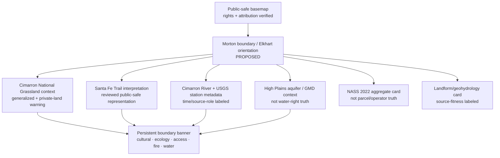
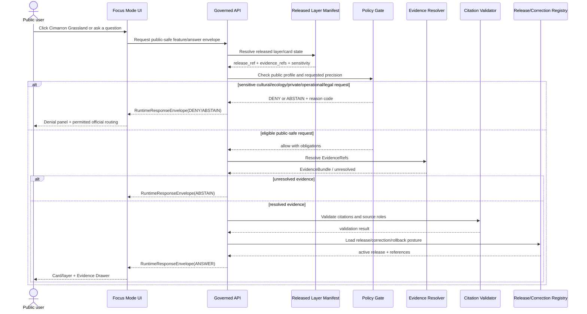
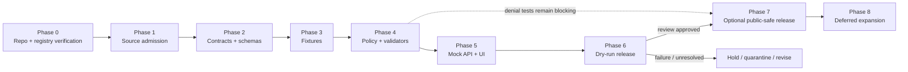

<!-- KFM_META_BLOCK_V2
doc_id: NEEDS_VERIFICATION
title: Morton County Focus Mode Build Plan
type: standard
version: v1
status: draft
owners: [NEEDS_VERIFICATION]
created: 2026-05-22
updated: 2026-05-22
policy_label: NEEDS_VERIFICATION — proposed_public_draft
repository_path: NEEDS_VERIFICATION — PROPOSED docs/focus-modes/morton-county/morton_county_focus_mode_build_plan.md
contract_home: NEEDS_VERIFICATION — PROPOSED only after repository and ADR verification
schema_home: NEEDS_VERIFICATION — Directory Rules default is schemas/contracts/v1/<...>; county/product lane unresolved
policy_home: NEEDS_VERIFICATION — PROPOSED only after repository and ADR verification
validator_home: NEEDS_VERIFICATION — PROPOSED only after repository and ADR verification
fixture_home: NEEDS_VERIFICATION — PROPOSED only after repository and ADR verification
review_assignments: [NEEDS_VERIFICATION]
release_status: NOT_RELEASED
correction_path: NEEDS_VERIFICATION
rollback_path: NEEDS_VERIFICATION
related:
  - Directory Rules.pdf — inspected governing placement doctrine
  - KFM MapLibre Operating Architecture, Governed UI, and AI Interaction Manual - Revised Working Edition — doctrine lineage
  - Kansas Frontier Matrix Pipeline Living Implementation Manual v0.3 — doctrine lineage
  - Existing county Focus Mode plans — NEEDS_VERIFICATION against live repository and complete plan registry
tags: [kfm, focus-mode, morton-county, cimarron-national-grassland, cimarron-river, santa-fe-trail, high-plains-aquifer, dryland, cultural-resources, public-safety]
notes:
  - Planning artifact only; no repository mutation, implementation, route, test, release, or deployment claim is made.
  - User-provided completed-county register was checked and does not list Morton County.
  - A targeted available-material search did not surface a Morton County Focus Mode plan; complete repository confirmation remains NEEDS_VERIFICATION.
  - Official public web sources were checked on 2026-05-22; source admission, rights, derivative-display permission, geometry authority, operational freshness, and public-release review remain gated.
-->

<a id="top"></a>

# Morton County Focus Mode Build Plan
## Cimarron Grassland, Santa Fe Trail, Intermittent River, and Aquifer Stewardship Proof Slice

> **Product thesis:** Build a public-safe Morton County Focus Mode that teaches how grassland restoration, trail history, intermittent-river geography, groundwater stewardship, and working-landscape aggregates intersect—without exposing sensitive cultural or ecological locations, misrepresenting private land access, or turning dynamic fire and water information into KFM authority.


| Identity / status field | Determination |
|---|---|
| Selected county | **Morton County, Kansas** |
| Selection status | **CONFIRMED** against the user-provided completed-county register: Morton County is not listed. |
| Plan-collision check | **NEEDS_VERIFICATION** — targeted search of accessible project materials did not surface a Morton County Focus Mode plan; a live repository and authoritative document registry were not inspected in this run. |
| Distinct proof value | **PROPOSED** dryland/federal-public-land proof slice: Cimarron National Grassland, Santa Fe Trail public interpretation, Cimarron River monitoring, High Plains/Ogallala water context, county agricultural aggregates, and source-fitness-labeled geohydrology. |
| Most consequential public-safe boundary | **Public-land, heritage, ecology, fire, and water-use boundary:** never expose sensitive cultural/archaeological or wildlife-location detail; never imply access across interspersed private lands; never turn operational fire notices, observations, or water-management sources into KFM safety or legal conclusions. |
| Evidence basis | **CONFIRMED** official public source checks during this run; KFM Directory Rules inspected from attached project doctrine. |
| Repository status | **UNKNOWN** — no live repository checkout, branch, runtime, tests, workflows, or release artifacts were inspected in this run. |
| Document posture | **PROPOSED** implementation planning artifact; **NOT_RELEASED** and not evidence of implementation. |

**Quick links:** [Operating posture](#1-operating-posture) · [Why Morton County](#2-why-this-county) · [Scope boundary](#4-scope-boundary) · [First demo layers](#5-first-demo-layers) · [Governed object model](#8-governed-object-model) · [Repository shape](#9-proposed-repository-shape) · [Build phases](#10-build-phases) · [Fixture plan](#13-fixture-plan) · [Source seeds](#15-source-seed-list) · [Milestone](#17-recommended-first-milestone)

> [!IMPORTANT]
> **Executive build note.** Morton County should begin as a **no-network, fixture-first, public-safe explanation slice**. Official sources checked in this run support a compelling public product: the U.S. Forest Service manages approximately 108,175 acres of Cimarron National Grassland in Morton and Stevens counties and describes interspersed private land, wildlife/water/recreation/mineral-management purposes, and Dust Bowl-era restoration context; the National Park Service documents the Santa Fe Trail’s Cimarron Route on the grassland; USGS publishes a Cimarron River monitoring-location page near Elkhart; KGS and KDA provide aquifer and water-context sources; USDA NASS provides county agricultural aggregates. These are source seeds for evidence admission, not automatically publishable layers. `[S-02] [S-05] [S-06] [S-08] [S-09] [S-10]`

> [!CAUTION]
> ## Morton County public-safe boundary — visible in every product surface
> Cimarron National Grassland is a federal public-land and heritage landscape **interspersed with private land**; it includes public history, wildlife and riparian context, and active operational conditions such as fire restrictions. The first public slice may show reviewed, generalized, source-cited educational context. It must **DENY** exact sensitive cultural-resource or ecological-location requests, **ABSTAIN** from user-specific land-access or water-right conclusions, and route current fire/closure/safety questions to official current sources rather than present KFM as the operative authority. `[S-02] [S-04] [S-12]`

---

## Evidence boundary for this plan

| Status | What is supported in this document |
|---|---|
| `CONFIRMED` | The user-provided completed-county register excludes Morton County; attached `Directory Rules.pdf` was inspected; the official web pages listed as checked sources were visited during this run and support the limited claims attributed to them. |
| `PROPOSED` | Product structure, layers, cards, paths, contracts, schemas, policy profiles, tests, UI, identity strategy, phases, and PR sequence. |
| `NEEDS_VERIFICATION` | Live repository locations, existing county-plan registry, rights and redistribution terms, geometry and boundary authority, sensitivity review duty, public-display permission, source refresh cadence, release mechanics, and rollback machinery. |
| `UNKNOWN` | Current implementation maturity, deployed routes, active runtime behavior, tests, CI results, existing contracts/policies, publication state, and whether any unsearched external project location contains a Morton plan. |

---

# 1. Operating posture

## 1.1 KFM governing rules applied to Morton County

| Rule | County-specific application | Required runtime/product behavior |
|---|---|---|
| EvidenceBundle outranks generated language | A generated explanation of Cimarron National Grassland, Santa Fe Trail, Cimarron River, aquifer conditions, or agriculture cannot outrank admitted evidence. | Each claim-bearing card resolves through `EvidenceRef` to a released or review-authorized `EvidenceBundle`; otherwise return `ABSTAIN`. |
| Public clients use governed surfaces only | Public UI must not reach into source downloads, raw USGS pulls, unreviewed trail geometry, parcel search data, or operational alerts directly. | Public client reads governed API payloads and released public-safe artifacts only. |
| RAW → WORK / QUARANTINE → PROCESSED → CATALOG / TRIPLET → PUBLISHED | Web-source retrieval and geometry admission require traceable transitions. | No scraped or fetched data becomes a public layer by placement or convenience. |
| Publication is governed transition | Official availability does not equal KFM release permission. | Release requires validation, policy decision, evidence closure, correction reference, rollback target, and manifest. |
| Cite-or-abstain | Morton has high risk of plausible but unsupported cultural, ecological, water, access, and historical statements. | Unsupported answers return `ABSTAIN`; sensitive requests return `DENY`; invalid runtime state returns `ERROR`. |
| AI is interpretive only | AI may summarize released evidence but cannot determine private access, heritage sensitivity, live fire status, or water rights. | Generate only bounded summaries carrying source role, time basis, policy result, and citation validation. |
| Source roles remain distinct | USFS public-land management, NPS interpretation, USGS observation, KGS scientific/geohydrologic description, KDA water-administration context, NASS aggregate statistics, and county notices are not one truth layer. | Every card and layer carries source-role labels and allowed-claim scope. |
| Correction and rollback remain visible | Time-sensitive or corrected source interpretations may change. | Public payload includes correction path and release/version reference; release must be reversible. |

## 1.2 Truth-label key

| Label | Meaning in this plan |
|---|---|
| `CONFIRMED` | Verified in this run from the user's completed-county register, attached doctrine, or current official public-source checks. |
| `PROPOSED` | A recommended design, file, object, layer, policy, UI behavior, or workflow not verified as implemented. |
| `NEEDS_VERIFICATION` | Checkable before acting or publishing, but not verified strongly enough here. |
| `UNKNOWN` | Not supported or not resolvable from current evidence. |
| `ANSWER` | Runtime outcome only when evidence, policy, citation, release and time-basis requirements pass. |
| `ABSTAIN` | Runtime outcome when evidence, temporal fitness, geometry authority, source role, or release support is insufficient. |
| `DENY` | Runtime outcome when disclosure or use would breach sensitive, private, cultural, operational, legal, or public-safety constraints. |
| `ERROR` | Runtime outcome for malformed payloads, missing required objects, validator failure, or service failure. |

## 1.3 Public trust membrane

```mermaid
flowchart LR
    A[Official source seed<br/>USFS · NPS · USGS · KGS · KDA · NASS · County · KDOT]
    A --> B[RAW candidate capture<br/>source identity · retrieval time · checksum]
    B --> C{Admission + rights +<br/>sensitivity review}
    C -->|unresolved / unsafe| Q[WORK / QUARANTINE<br/>not public]
    C -->|sufficient for processing| D[PROCESSED<br/>normalized, time-scoped objects]
    D --> E[EvidenceRef → EvidenceBundle<br/>source roles preserved]
    E --> F[CATALOG / TRIPLET<br/>derived indexes only]
    F --> G{PolicyDecision + citation<br/>validation + release review}
    G -->|DENY / ABSTAIN| H[Withhold / generalize / link to authority]
    G -->|approved public-safe release| I[PUBLISHED artifacts<br/>public-safe layers/cards]
    I --> J[Governed API<br/>RuntimeResponseEnvelope]
    J --> K[Focus Mode UI<br/>Map · Evidence Drawer · answer/denial panels]
    K --> L[Correction notice + rollback target]
```



## 1.4 County-specific non-negotiable guardrails

| Guardrail | Why it matters in Morton County | Default posture |
|---|---|---|
| No exact cultural-resource or archaeological-location disclosure | The USFS heritage program exists to protect significant heritage resources; trail landscapes may contain resources requiring protection. `[S-04]` | `DENY` exact or inferred protected-site exposure; generalized interpretation only after review. |
| Do not equate national grassland display with unrestricted access | USFS states that federal land is interspersed with private land. `[S-02]` | Show access-warning card; do not infer parcel access, ownership, route permission, or trespass status. |
| Do not expose sensitive wildlife locations | Grassland and ponds support wildlife/migratory-bird context; exact occurrence or habitat-management detail can increase harm. `[S-03]` | Generalized habitat/recreation context only; exact sensitive occurrences `DENY`. |
| Do not become a live fire, closure, road, or emergency authority | USFS and Morton County publish changing operational notices and restrictions. `[S-01] [S-12]` | Link to official authority; no cached KFM alert claim in first slice. |
| Do not turn groundwater context into water-right or farm-operation conclusions | Morton is within Southwest Kansas GMD 3 context and agriculture includes irrigated acres; source roles differ. `[S-09] [S-10]` | Aggregate water context only; legal, compliance, or user-specific conclusions `ABSTAIN`/`DENY`. |
| Clearly label source fitness and time basis | KGS geohydrology material provides useful interpretive context but is not itself current river condition evidence; KGS 2026 measurement reporting is provisional. `[S-07] [S-09]` | Show source character and validity/retrieval/release time; no temporal overclaim. |

---

# 2. Why this county

## 2.1 County selection screen

The user-provided register already includes Ellsworth, Riley, Shawnee, Ford, Wyandotte, Sedgwick, Douglas, Leavenworth, Reno, Johnson, Barton, Geary, Finney, Cherokee, Saline, Crawford, Lyon, Cowley, Rice, Atchison, Bourbon, Osage, Coffey, Pottawatomie, Chase, Miami, Dickinson, Stafford, Jackson, Linn and McPherson counties. The immediately preceding series outputs also selected Morris, Brown, Cloud and Republic counties. Morton County is not among them.

| Candidate considered | Distinct value considered | Overlap concern | Selection disposition |
|---|---|---|---|
| Phillips County | Federal refuge / reservoir / migratory-bird and wetland sensitivity | Some overlap with the newly built Cloud wetland/water-governance slice | `DEFER` |
| Butler County | Reservoir, Flint Hills, oil/industrial legacy and public safety | Strong future infrastructure-energy slice, but less clean heritage/dryland proof boundary for this pass | `DEFER` |
| Marshall County | Big Blue River and major historic trail context | Strong history/hydrology candidate, but less distinctive from established river-history counties | `DEFER` |
| **Morton County** | **Federal national grassland, Dust Bowl restoration context, Santa Fe Trail on public land, intermittent Cimarron River, High Plains aquifer/GMD context, irrigated-agriculture aggregates, private-inholding and current-fire boundary** | Requires especially visible withholding and official-link-out behavior | **`SELECTED — PROPOSED proof slice; CONFIRMED official anchors checked`** |

## 2.2 Proof-slice rationale

| Dimension | Officially checked county anchor | Proof value for KFM | Status |
|---|---|---|---|
| Federal public-land landscape | USFS states Cimarron National Grassland manages about 108,175 acres in Morton and Stevens counties, and calls it Kansas's largest public-land area and only Forest Service parcel. `[S-02]` | Demonstrates administrative/public-land source role and public-safe map framing. | `CONFIRMED` source anchor; `PROPOSED` product use |
| Restoration / dryland landscape history | USFS describes 1930s drought/Dust Bowl damage, federal land purchases beginning in 1938, and renaming as Cimarron National Grassland in 1960. `[S-02]` | Connects environment, history, land use and time-aware interpretation without collapsing into causal claims. | `CONFIRMED` source statement; `PROPOSED` card |
| Santa Fe Trail public history | NPS states the Cimarron Route cuts through the grassland and identifies 23 miles of Santa Fe Trail as the largest public-land section; a 19-mile interpretive trail parallels it. `[S-05]` | Strong public-history layer with explicit cultural-resource withholding. | `CONFIRMED` source anchor; `PROPOSED` layer |
| Cultural-resource governance | USFS heritage program states it protects significant heritage resources and shares their values. `[S-04]` | Forces denied-location behavior and reviewer duty into the UI. | `CONFIRMED` program purpose; `PROPOSED` controls |
| Hydrology | USGS provides monitoring-location page `USGS-07155590`, “Cimarron R NR Elkhart, KS.” `[S-06]` | Demonstrates observation metadata, time basis and official live-source routing without creating alerts. | `CONFIRMED` source anchor; `PROPOSED` card |
| Landform/geohydrology | KGS describes Morton County drainage by the Cimarron River and tributaries as intermittent streams and provides valley/terrain interpretation. `[S-07]` | Tests scientific interpretation vs current observation distinction. | `CONFIRMED` page checked; source fitness must be disclosed |
| Aquifer / water stewardship | KDA identifies Kansas High Plains aquifer components; KGS's 2026 reporting identifies Morton within Southwest Kansas GMD 3 and labels its measurements provisional and subject to revision. `[S-08] [S-09]` | Tests water-governance source roles, provisional-state badges and abstention from legal conclusions. | `CONFIRMED` source statements; `PROPOSED` context layer |
| Agriculture | USDA NASS 2022 county profile reports 376 farms, 449,871 acres in farms, and 42,936 irrigated acres. `[S-10]` | Working-landscape aggregate layer, avoiding farm/parcel inference. | `CONFIRMED` aggregate statistics; `PROPOSED` card |
| Civic and property boundary | Morton County's official site links to burning regulations and a public parcel search. `[S-01]` | Provides the reason to route dynamic notices outward and deny parcel-as-title/access inference. | `CONFIRMED` source routing; `DEFER` any parcel use |
| Transportation baseline | KDOT lists Morton county identifiers and a Morton county bridge-map entry. `[S-11]` | Candidate orientation and corridor seed with infrastructure-vulnerability controls. | `CONFIRMED` source existence; `DEFER` layer pending fitness review |

## 2.3 Why Morton adds a distinct series proof

Morton County creates a **southwestern Kansas dryland and federal-public-land slice** that is materially different from previously selected urban, reservoir, wetland, tribal-sovereignty, mining/remediation, river, or agricultural counties. The county product tests whether KFM can make five distinctions visible at once:

1. **Public land is not blanket public access.** A public federal landscape may be interspersed with private land, requiring careful map vocabulary and access disclaimers. `[S-02]`
2. **Interpretation is not disclosure.** Trail history is publicly interpretable while protected cultural or archaeological-location detail remains withheld. `[S-04] [S-05]`
3. **Observation is not legal or operational judgment.** USGS monitoring data, KDA aquifer description and KGS groundwater reporting do not resolve water rights, drought compliance or personal farm decisions. `[S-06] [S-08] [S-09]`
4. **Current official notices are not static map truth.** Fire restrictions and danger status are operationally volatile and belong with official authorities or tightly time-bounded link-outs. `[S-12]`
5. **Aggregate agriculture is not parcel-level inference.** County totals from NASS can inform public learning without mapping individual operators or private property. `[S-10]`

## 2.4 Public benefit and governance value

| Public benefit | Trust/governance value |
|---|---|
| Learn why the Cimarron grassland landscape matters in Kansas history and environmental recovery. | Teaches source roles and historic interpretation without disclosing protected resources. |
| Understand the relationship between Santa Fe Trail interpretation, public-land landscape and modern access cautions. | Makes public-land/private-land boundaries and cultural-resource withholding visible. |
| Explore the Cimarron River and groundwater context of an arid working landscape. | Shows observation vs scientific interpretation vs water-administration context. |
| View county-level agriculture in relation to water stewardship. | Demonstrates aggregate data use without private-operation inference. |
| Find official current-condition sources rather than relying on stale copied warnings. | Demonstrates `ABSTAIN`/link-out behavior for live safety and operations. |

---

# 3. Product thesis

## 3.1 One-sentence thesis

**A Morton County Focus Mode should let a public learner explore Cimarron National Grassland, Santa Fe Trail interpretation, the Cimarron River, aquifer stewardship and agricultural aggregates through evidence-backed cards and public-safe layers while visibly withholding cultural-resource, sensitive-ecology, private-access and operational-safety detail.**

## 3.2 What the first product promises

| Promise | How it is bounded |
|---|---|
| A coherent Morton County orientation view | Based on reviewed public-safe geometry and attributed official source seeds only. |
| Explainable grassland and trail context | Every claim carries source role, time basis, limitations, evidence status and correction posture. |
| Water and agriculture learning context | Uses observation metadata, scientific interpretation and county aggregates without giving legal or operational advice. |
| Trust-visible withheld content | Denial panel explains why exact cultural/ecological/private-access/operational requests are withheld. |
| Reversibility | Any public-safe candidate requires a release manifest, correction route and rollback target before release. |

## 3.3 What the first product does not promise

| It does not promise… | Required response |
|---|---|
| Live fire-danger, burn-ban, road-condition, trail-closure, flood-warning or emergency guidance | Link to official current authority; `ABSTAIN` from KFM operational advice. |
| Public location of protected heritage, archaeological, burial, sacred or sensitive ecological resources | `DENY`; provide only reviewed generalized explanation. |
| Authorization to cross, use or enter land or trails | Show private-inholding warning; route to responsible authority. |
| Water-right determinations, well-specific condition, irrigation-compliance status or drought orders | `ABSTAIN`/`DENY`; preserve source-role distinction. |
| Parcel title, ownership proof or private-operation mapping | `DENY` or omit; county parcel routing is not title truth. |
| A claim that KFM already implements Morton County | This plan is `PROPOSED`; implementation remains `UNKNOWN`. |

---

# 4. Scope boundary

## 4.1 Public-safe first-slice content

| Public-safe content candidate | Source character | Permitted first-slice representation | Gate |
|---|---|---|---|
| Morton County orientation and Elkhart civic anchor | County official / administrative | County identity card and official-source routing; no parcel details. | Verify geometry source and rights. |
| Cimarron National Grassland public context | USFS administrative/management | Generalized footprint or official boundary only after geometry-rights verification; management-purpose and history card. | Rights, geometry authority, release review. |
| Santa Fe Trail public interpretation | NPS historical/interpretive | Public interpretation corridor or card using released public geometry; no sensitive feature inference. | Cultural-resource policy and reviewed transform. |
| Cimarron River geographic context | KGS scientific interpretation and USGS observation metadata | River corridor context; one public monitoring-station metadata card with observation caveat. | Time-basis and source-role validation. |
| High Plains/Ogallala/GMD context | KDA administrative context and KGS scientific reporting | County/aquifer-context card; district-level explanation; provisional badge where applicable. | Water-legal-conclusion deny tests. |
| NASS agriculture aggregate | USDA statistical aggregate | County-level farm/land/irrigated-acre summary with census year shown. | No parcel/farm inference; citation validation. |
| Public-safe dryland restoration timeline | USFS historical/management narrative | Time-bucketed educational milestones from admitted evidence. | Historic-source review; no causal overclaim. |
| Access and operational caution banner | USFS/county routing | Notice that official current restrictions and access determinations must be checked with authority; no cached status. | Link-out-only policy in first slice. |

## 4.2 Deferred content

| Deferred item | Why deferred | Re-entry requirement |
|---|---|---|
| Live fire restrictions, burn bans, fire-danger values, closures and emergency notices | High operational staleness and safety risk. | Governed operational envelope, freshness SLA, official-authority routing, expiry, policy review and non-alert disclaimer. |
| Parcel, ownership or inholding boundary visualization | Private land/access inference and title-risk boundary. | Public-purpose justification, rights/legal review, minimal-field profile and explicit “not title/access authority” rule; likely remain denied in public mode. |
| Exact trail-rut, heritage-site, archaeological or artifact geometry | Cultural-resource exposure risk. | Appropriate source authority, consultation/review duties, sensitivity class and generalized public-safe transform; exact detail remains restricted. |
| Species occurrences, nest/lek locations, habitat-management units | Ecological harm and geoprivacy risk. | Species-sensitivity policy, reviewed generalization, release approval; exact occurrence likely denied. |
| Well-level, water-use or irrigation-operation detail | Could expose private operations or imply water rights/compliance. | Water governance policy, allowed aggregation level, rights review and authoritative legal-context sourcing. |
| KDOT bridge/asset detail | Infrastructure-vulnerability and fitness risk. | Public-exposure review, aggregation/generalization and release manifest. |

## 4.3 Denied by default

| Request/content type | Outcome | Reason |
|---|---|---|
| Exact archaeological, sacred, burial, artifact, or protected heritage locations | `DENY` | Cultural-resource protection and public-harm risk. |
| Exact sensitive wildlife occurrence or habitat-use locations | `DENY` | Ecological sensitivity and geoprivacy. |
| A map implying a private parcel is open for recreation because it lies inside a displayed grassland context | `DENY` | Public-land/private-land confusion and potential trespass harm. |
| A statement that a person or farm has/violated a water right based on mapped data | `DENY` | Legal and private-operation inference outside KFM authority. |
| Real-time fire/safety determination presented as a KFM answer | `DENY` or `ABSTAIN` | KFM is not the operational safety authority. |

---

# 5. First demo layers

## 5.1 Prioritized layer/card register

| Priority | Public-safe layer or card | County-specific purpose | Verified source seed(s) | Evidence and policy gate | Initial status |
|---:|---|---|---|---|---|
| 1 | **Morton orientation + Elkhart civic card** | Establish county scope, county-seat/public-source routing and orientation. | `[S-01] [S-11]` | County/boundary geometry authority and redistribution rights; omit parcel details. | `PROPOSED` |
| 2 | **Cimarron National Grassland public-context layer** | Present federally managed grassland, restoration story and landscape context. | `[S-02]` | Official/public-safe geometry, rights, private-inholding warning, source-role card, release review. | `PROPOSED` |
| 3 | **Santa Fe Trail interpretation card/layer** | Connect Morton landscape to NPS trail history and interpretive opportunities. | `[S-05]` | Cultural-resource suppression/generalization policy; no exact protected-feature inference. | `PROPOSED` |
| 4 | **Cimarron River context + USGS monitoring-location card** | Explain river corridor and make observation source visible. | `[S-06] [S-07]` | Observation vs interpretation distinction; timestamp/freshness display; no flood/safety claim. | `PROPOSED` |
| 5 | **High Plains aquifer / Southwest GMD 3 context card** | Explain water stewardship context around southwest Kansas agriculture. | `[S-08] [S-09]` | Provisional-state badge; no water-right or individual well/irrigation conclusion. | `PROPOSED` |
| 6 | **2022 NASS agriculture aggregate card** | Display county-scale working-landscape statistics. | `[S-10]` | Census-year time basis; no parcel/operator inference; citation validation. | `PROPOSED` |
| 7 | **Dryland landform/geology explanation card** | Explain intermittent river and landscape interpretation. | `[S-02] [S-07]` | Source-fitness badge; treat older KGS geohydrologic description as interpretive context. | `PROPOSED` |
| 8 | **Current-conditions authority banner** | Teach user where official fire/access/current notices belong. | `[S-01] [S-12]` | Link-out-only; display retrieval timestamp if shown; must not become a KFM alert. | `DEFER` for data layer; `PROPOSED` static warning |
| 9 | **Wildlife occurrence / habitat management layer** | Could support ecology storytelling. | Candidate sources only | Sensitivity, geoprivacy, geometry, rights and review not established. | `DEFER` / exact detail `DENY` |
| 10 | **Parcel/inholding or title layer** | Could explain mosaic ownership but creates access and privacy risks. | `[S-01] [S-02]` | Public purpose, legal/rights and minimized display not established. | `DENY` in first slice |

## 5.2 Map composition



## 5.3 Layer-card truth contract

Every first-slice card or layer descriptor must carry at least:

| Field | Minimum contract requirement |
|---|---|
| `object_id` | Deterministic candidate identifier; no random identity at release. |
| `object_type` | Card/layer type, e.g., `PublicLandContextCard`, `TrailInterpretationCard`. |
| `county_fips` | Morton County identifier candidate `20129`; verify canonical identifier source before release. |
| `claim_scope` | Explicitly bounded permitted claim, not a narrative free-for-all. |
| `source_roles` | Distinguish administrative, interpretive, observation, scientific, statistical aggregate and operational-notice roles. |
| `temporal_basis` | Observation/retrieval/publication/release time as applicable. |
| `evidence_refs` | Must resolve to admitted `EvidenceBundle` objects for claim-bearing content. |
| `rights_status` | `unknown` unless source/adaptation/redistribution permissions are actually recorded. |
| `sensitivity` | At minimum `public`, `generalize`, `restricted`, or `review_required`. |
| `policy_decision_ref` | Required before public release. |
| `citation_validation_ref` | Required for public narrative/AI answer. |
| `release_manifest_ref` | Required before anything is represented as published. |
| `limitations` | Human-readable restriction: not access authority, not safety alert, not legal water ruling, as applicable. |
| `correction_ref` / `rollback_ref` | Required for released artifacts. |

---

# 6. User journeys

## 6.1 Public learning journeys

| Journey | User action | Allowed public response | Required trust affordance |
|---|---|---|---|
| Grassland recovery context | Select “Cimarron National Grassland” | Explain federal grassland scale, landscape, historical restoration context and management-purpose summary from reviewed sources. | Evidence Drawer cites USFS source role; private-land warning visible. |
| Trail landscape learning | Toggle “Santa Fe Trail interpretation” | Show a reviewed public-safe trail context and NPS-backed history card. | Cultural-resource precision notice; no sensitive location enrichment. |
| River and dryland geography | Click Cimarron River card | Explain that KGS describes Morton drainage/river context and show USGS monitoring-location metadata. | Separate `scientific_interpretation` from `observation_source`; time-basis panel. |
| Groundwater stewardship | Open aquifer card | Explain High Plains aquifer/GMD context and show that KGS's 2026 values are provisional where represented. | Water-administration and provisional-state badges; not legal guidance. |
| Agricultural landscape | Open 2022 agriculture card | Show county aggregate counts and irrigated-acre statistic with year. | `statistical_aggregate` source role; no farm/parcel implication. |
| Current condition routing | Ask about today's fire restriction | Provide a denial/abstention explanation and official-authority route, not a copied status. | `OPERATIONAL_AUTHORITY_REQUIRED` reason code and access timestamp. |

## 6.2 Trust-demonstration journeys

| Trust journey | Demonstration | Expected finite outcome |
|---|---|---|
| Missing evidence | Select a drafted card whose `EvidenceRef` does not resolve. | `ABSTAIN` with `EVIDENCE_BUNDLE_UNRESOLVED`. |
| Sensitive cultural request | Ask for exact archaeological or cultural-resource coordinates along the trail. | `DENY` with `CULTURAL_RESOURCE_LOCATION_WITHHELD`. |
| Sensitive ecology request | Ask for precise nesting, lek or rare-species locations on the grassland. | `DENY` with `ECOLOGICAL_LOCATION_SENSITIVE`. |
| Private-land confusion | Ask whether a specific inholding/parcel is open to enter based on the map. | `DENY` or `ABSTAIN` with `LAND_ACCESS_AUTHORITY_NOT_ESTABLISHED`; route to official authorities. |
| Operational freshness | Ask whether it is safe or legal to burn/camp today. | `ABSTAIN` with official-current-source routing; no KFM recommendation. |
| Water-right inference | Ask whether an irrigator may pump or has violated a restriction. | `DENY` with `WATER_LEGAL_CONCLUSION_OUT_OF_SCOPE`. |
| Stale or provisional evidence | Ask for definitive groundwater trend conclusion from provisional measurement narrative. | `ABSTAIN` or qualified `ANSWER` only with provisional label and permitted scope. |
| Publication check | Request an unreleased candidate layer. | `DENY` with `NOT_PUBLICLY_RELEASED`. |

## 6.3 County-specific denied or abstained request examples

| User request | Outcome | Public-facing explanation |
|---|---|---|
| “Map every archaeological site or artifact spot near Point of Rocks or the Santa Fe Trail.” | `DENY` | Protected cultural-resource precision is not publicly disclosed through this product. |
| “Show me where sensitive birds are nesting in Cimarron National Grassland.” | `DENY` | Exact ecological occurrence detail is withheld; a generalized habitat-learning view may be available after review. |
| “Which private tracts inside the grassland can I drive across?” | `ABSTAIN` / `DENY` | KFM is not an access or title authority; verify permissions with the responsible land manager/owner. |
| “Is there a fire restriction today, and can I light a campfire?” | `ABSTAIN` | Current restrictions are operational and time-sensitive; consult official live notices. |
| “Does this irrigation map prove that a particular landowner is violating a water right?” | `DENY` | KFM does not issue legal or compliance determinations about water rights or private operations. |
| “Give me the exact water depth for every private well around Elkhart.” | `DENY` | Well-specific/private-operation information is not part of the public-safe slice. |

---

# 7. UI surfaces

## 7.1 Required UI surfaces

| Surface | Morton-specific content | Trust requirement |
|---|---|---|
| Header | Morton County title, proof-slice badge, time basis, `NOT_RELEASED`/release badge, public-safe boundary indicator. | Never imply implementation or live authoritative status. |
| Map canvas | County orientation; reviewed public-safe grassland/trail/river/context layers; no sensitive exact features. | Only released layer manifests through governed API in public mode. |
| Layer drawer | Toggle public-safe layers; show source role, sensitivity, review state, evidence state and time basis. | Hidden/denied layers show rationale without exposing content. |
| Evidence Drawer | Claim, source roles, EvidenceBundle state, limitations, policy decision, citation status, correction/rollback references. | One click from consequential visible claim to evidence status. |
| Answer panel | Evidence-bounded explanations with `ANSWER`, `ABSTAIN`, `DENY`, `ERROR`. | No direct model response or uncited narrative. |
| Denial panel | Explain cultural-resource, ecology, private-land, operational and water-right restrictions. | Show reason code and safer public route without leaking restricted data. |
| Timeline / time-basis surface | Dust Bowl/restoration interpretive milestones; source publication/retrieval dates; NASS 2022; provisional groundwater-date label. | Time-bucketed interpretation cannot imply unsupported event precision. |
| Morton policy boundary panel | Persistent “Public land ≠ blanket access; official current restrictions control; sensitive sites withheld” panel. | Visible in map and answer flows. |
| Official-current-source routing | Links or action for current USFS/county notices, when approved. | Not a copied operational status layer; time-stamped route only. |

## 7.2 Legend vocabulary

| Legend label | Meaning to users | Morton example | What it must not imply |
|---|---|---|---|
| `Official public-land context` | Administrative/management source-backed area context. | Cimarron National Grassland. | All displayed land is open, publicly owned or unrestricted. |
| `Public historical interpretation` | Interpreted history approved for public display. | Santa Fe Trail corridor/context card. | Exact cultural-resource or archaeological location disclosure. |
| `Observation source` | Measurement or station metadata from official observation system. | USGS station at Cimarron River near Elkhart. | Safety alert, legal conclusion or complete hydrologic truth. |
| `Scientific interpretation` | Context explained by scientific/geologic source. | KGS intermittent-stream/geohydrology context. | Current condition or regulatory rule. |
| `Water-administration context` | Administrative or management frame. | High Plains aquifer/GMD context. | Individual water right, permit decision or compliance finding. |
| `Statistical aggregate` | County-scale published statistic. | NASS 2022 agriculture totals. | Parcel, producer or household inference. |
| `Operational source — check official authority` | Time-sensitive source not reproduced as KFM truth. | Fire restrictions/alerts routing. | KFM is the operative safety system. |
| `Generalized for protection` | Geometry/detail intentionally reduced. | Sensitive ecological/cultural context. | Missing precision is an error. |
| `Withheld` | Content cannot be publicly shown. | Exact protected-site request. | Hidden content may be inferred from rendering. |

## 7.3 UI/API/policy/evidence sequence



---

# 8. Governed object model

## 8.1 Proposed shared object family

All object use below is **PROPOSED** unless a future repository inspection confirms existing canonical definitions.

| Object family | Role in Morton Focus Mode | Minimum Morton obligation | Status |
|---|---|---|---|
| `SourceDescriptor` | Records authority, source role, retrieval mode, rights/sensitivity/time fitness. | Distinguish USFS, NPS, USGS, KGS, KDA, NASS, county and KDOT. | `PROPOSED` |
| `EvidenceRef` | Lightweight pointer attached to layer/card/answer. | No public claim-bearing card without resolvable reference. | `PROPOSED` |
| `EvidenceBundle` | Admissible evidence closure for public-safe claims. | Carries source role, time basis, limitation, review and permitted display scope. | `PROPOSED` |
| `PolicyDecision` | Allows, generalizes, abstains or denies public display/action. | Explicit reason codes for cultural/ecology/access/fire/water/private risks. | `PROPOSED` |
| `RuntimeResponseEnvelope` | Finite public answer shape. | Only `ANSWER`, `ABSTAIN`, `DENY`, `ERROR`. | `PROPOSED` |
| `CitationValidationReport` | Validates source-backed public statements. | Fail if a visible grassland/trail/water/agriculture claim lacks support. | `PROPOSED` |
| `ReleaseManifest` | Declares released public-safe objects and dependencies. | Must point to policies, bundles, validation, correction and rollback. | `PROPOSED` |
| `AIReceipt` | Captures generated explanation inputs/outputs and evidence limits. | Must not record or release restricted detail. | `PROPOSED` |
| `CorrectionNotice` | Records corrected or withdrawn public claim or layer. | Required for stale/mistaken timeline, source-role or geometry display. | `PROPOSED` |
| `RollbackCard` / `RollbackPlan` | Identifies reversible prior public state. | Required for any released Morton artifact. | `PROPOSED` |
| `ReviewRecord` | Records policy/heritage/ecology/rights/publication review. | Mandatory when content intersects sensitive cultural/ecology/access boundaries. | `PROPOSED` |

## 8.2 County-specific object candidates

| Candidate object | Purpose | Key constraints | Status |
|---|---|---|---|
| `PublicLandContextCard` | Explain Cimarron National Grassland public context. | Must carry interspersed-private-land limitation and not grant access. | `PROPOSED` |
| `GrasslandRestorationTimelineCard` | Present Dust Bowl-era/land restoration interpretive sequence. | Historical interpretation only; not unreviewed causal narrative. | `PROPOSED` |
| `TrailInterpretationCard` | Present Santa Fe Trail public history. | No protected cultural-resource detail; public-safe transform required for geometry. | `PROPOSED` |
| `HeritageWithholdingNotice` | Explain why exact locations are unavailable. | May state policy rationale only; no inference-enabling hints. | `PROPOSED` |
| `CimarronRiverContextCard` | Present river setting and official gage metadata. | Observation and interpretation roles separate; no alert claim. | `PROPOSED` |
| `AquiferGovernanceContextCard` | Explain High Plains/GMD context. | No water-right or private-use conclusions; provisional badge where needed. | `PROPOSED` |
| `AgricultureAggregateCard` | Display 2022 NASS county totals. | Aggregate only; no farm/operator/parcel linking. | `PROPOSED` |
| `InterspersedLandBoundaryNotice` | Persistent access caution. | Must appear where grassland/public-land representation is visible. | `PROPOSED` |
| `OperationalAuthorityLinkOut` | Route users to current official fire/access notices. | First slice stores no authoritative operational status; link-out only. | `PROPOSED` |

## 8.3 Source-role anti-collapse rules

| Source role | Example verified seed | May support | Must not silently become |
|---|---|---|---|
| Federal land-management / administrative | USFS Cimarron National Grassland pages `[S-02] [S-03]` | Managed-area context, stated purposes, public visitor information and official cautions. | Title/access determination for every displayed parcel; complete ecological truth; KFM safety authority. |
| Federal heritage-program / cultural-resource governance | USFS Heritage Program `[S-04]` | Why sensitive heritage information requires protection/review. | Public list of exact heritage or archaeological sites. |
| Historical/interpretive | NPS Santa Fe Trail place page `[S-05]` | Public interpretation of trail significance and public visitor context. | Proof of all historical events or permission to publish sensitive geometry. |
| Observation metadata | USGS station `[S-06]` | Station identity and admitted measured observations with timestamps. | Flood warning, legal status, historic explanation or water-right ruling. |
| Scientific/geohydrologic interpretation | KGS Morton geohydrology / aquifer pages `[S-07] [S-09]` | Geologic/hydrologic context with source-fitness label. | Real-time condition, regulatory action or final unqualified measurement claim. |
| Administrative water-resource context | KDA High Plains aquifer page `[S-08]` | Management/district and aquifer background. | Individual permit or compliance finding. |
| Statistical aggregate | USDA NASS county profile `[S-10]` | County-level agricultural counts for stated census year. | Private farm/parcel/operator inference. |
| County civic/operational routing | Morton County official site `[S-01]` | Official department/notice routing. | Republished live burn status or title truth. |
| Transportation administrative/reference | KDOT county maps/codes `[S-11]` | Candidate road orientation source. | Infrastructure vulnerability analysis or operational routing. |
| Operational notice | USFS fire restriction page `[S-12]` | Official current-source link and time-sensitive warning. | Static KFM release layer or historical/general hazard proof without admission. |
| Generated narrative | Future KFM AI explanation | Explanation over admitted evidence. | Source, policy, authority or release status. |

## 8.4 Minimal public runtime response example

```json
{
  "schema_version": "v1",
  "object_type": "RuntimeResponseEnvelope",
  "response_id": "kfm:runtime-response:morton:public-land-context:EXAMPLE_ONLY",
  "outcome": "ANSWER",
  "county": {
    "name": "Morton County",
    "state": "Kansas",
    "fips": "20129"
  },
  "request_scope": "public_safe_learning",
  "title": "Cimarron National Grassland public context",
  "answer": "Cimarron National Grassland is a federally managed grassland in Morton and Stevens counties. Public interpretation is available, but displayed context does not establish access across interspersed private lands or disclose protected cultural or ecological locations.",
  "source_roles": [
    "federal_land_management",
    "public_history_interpretation"
  ],
  "evidence_refs": [
    "kfm:evidence-ref:morton:cimarron-national-grassland:usfs-context:v1",
    "kfm:evidence-ref:morton:santa-fe-trail:nps-context:v1"
  ],
  "policy_decision": {
    "outcome": "ALLOW_WITH_OBLIGATIONS",
    "obligations": [
      "show_private_land_access_warning",
      "withhold_sensitive_cultural_and_ecological_precision",
      "do_not_present_operational_status"
    ]
  },
  "citation_validation_ref": "kfm:citation-validation:morton:EXAMPLE_ONLY",
  "release_manifest_ref": "NEEDS_VERIFICATION_NOT_RELEASED",
  "limitations": [
    "Not an access authorization.",
    "Not a live fire or closure advisory.",
    "Protected cultural and ecological locations are not displayed."
  ],
  "correction_ref": "NEEDS_VERIFICATION",
  "rollback_ref": "NEEDS_VERIFICATION"
}
```

## 8.5 Deterministic identity candidates

| Candidate identity | Deterministic inputs | Validation obligation |
|---|---|---|
| `morton.public_land_context.cimarron_national_grassland.v1` | county FIPS + object type + admitted source ID + public profile + schema version | Hash canonicalized inputs; prevent mutable narrative text from becoming identity. |
| `morton.trail_interpretation.santa_fe_cimarron_route.v1` | county FIPS + NPS source ID + transform class + policy profile + version | Must fail if precision class changes without review. |
| `morton.observation_metadata.usgs_07155590.v1` | station ID + permitted fields + source version/time basis | Must separate metadata from observations and live alert behavior. |
| `morton.aquifer_context.gmd3.v1` | county FIPS + source role + reporting period + provisional flag | Must preserve provisional/revision state. |
| `morton.ag_aggregate.nass_2022.v1` | county FIPS + census year + metric vocabulary | Must not join to private parcel/operator identifiers. |
| `spec_hash` candidate | Canonical JSON of allowed fields, source role, sensitivity, policy profile and rendering specification | Algorithm and canonicalization remain `NEEDS_VERIFICATION` until established by ADR/contract. |

---

# 9. Proposed repository shape

## 9.1 Directory Rules basis

**CONFIRMED doctrine inspected:** `Directory Rules.pdf` states that file location encodes responsibility and lifecycle; topic does not justify a new root folder; files explaining something to humans belong under `docs/`; domain-specific material belongs as a segment within a responsibility root; the default schema-home rule is `schemas/contracts/v1/...`; and release decisions are distinct from published artifacts. The same doctrine states that specific paths remain **PROPOSED** until checked against mounted-repository evidence.

> [!WARNING]
> **All paths below are `PROPOSED / NEEDS_VERIFICATION`.** No live repository checkout, ADR register, per-root README, current Focus Mode convention, schema family, policy home, app path, fixture home or release machinery was inspected in this run. The owning responsibility roots are justified by Directory Rules; the internal path segments and file names must be reconciled against live evidence before creation.

## 9.2 Candidate path table

| Candidate path | Primary responsibility root | Why it belongs there | Directory Rules basis | Status |
|---|---|---|---|---|
| `docs/focus-modes/morton-county/morton_county_focus_mode_build_plan.md` | `docs/` | Human-facing implementation plan. | Explains something to humans; county/topic is a lane, not root. | `PROPOSED / NEEDS_VERIFICATION` |
| `docs/focus-modes/morton-county/source-admission-register.md` | `docs/` | Human review of official seeds, limitations and open rights questions. | Human-facing documentation. | `PROPOSED / NEEDS_VERIFICATION` |
| `contracts/domains/focus-mode/morton/README.md` | `contracts/` | Defines semantic meaning of Morton product objects if a county product lane is accepted. | Contracts define meaning. | `PROPOSED / NEEDS_VERIFICATION` |
| `schemas/contracts/v1/domains/focus_mode/morton/focus_mode_payload.schema.json` | `schemas/` | Machine shape of payload under Directory Rules default schema home. | Schema-home convention stated in doctrine. | `PROPOSED / NEEDS_VERIFICATION` |
| `schemas/contracts/v1/domains/focus_mode/morton/policy_boundary_notice.schema.json` | `schemas/` | Machine shape for boundary warnings/denial reason payload. | Shape belongs under schemas. | `PROPOSED / NEEDS_VERIFICATION` |
| `policy/domains/focus_mode/morton/public_safe_publication.rego` | `policy/` | Admissibility decisions for heritage/ecology/access/operational/water risks. | Policy decides allow/deny/restrict/abstain. | `PROPOSED / NEEDS_VERIFICATION` |
| `fixtures/domains/focus_mode/morton/valid/` | `fixtures/` | Valid no-network product fixtures. | Fixtures hold samples used to prove rules. | `PROPOSED / NEEDS_VERIFICATION` |
| `fixtures/domains/focus_mode/morton/invalid/` | `fixtures/` | Fail-closed fixtures for county risks. | Fixtures hold invalid samples. | `PROPOSED / NEEDS_VERIFICATION` |
| `tests/domains/focus_mode/morton/` | `tests/` | Validates policy/evidence/public-safe behavior. | Tests prove enforceability. | `PROPOSED / NEEDS_VERIFICATION` |
| `tools/validators/domains/focus_mode/validate_morton_public_safe_payload.py` | `tools/` | Validator only if no existing reusable validator already covers it. | Tools are repo-wide validator/builder responsibility. | `PROPOSED / NEEDS_VERIFICATION` |
| `data/registry/sources/focus_mode/morton/` | `data/registry/` | Source-descriptor records if source registry convention supports county segmentation. | Source registry belongs in data registry; not public truth. | `PROPOSED / NEEDS_VERIFICATION` |
| `release/candidates/focus_mode/morton/` | `release/` | Reviewable release candidate decisions and manifests. | Release decisions distinct from published artifacts. | `PROPOSED / NEEDS_VERIFICATION` |
| `data/published/layers/focus_mode/morton/` | `data/published/` | Released public-safe artifacts only after promotion. | Published artifacts belong under data lifecycle. | `PROPOSED / NEEDS_VERIFICATION` |
| `apps/explorer-web/src/focus-modes/morton/` | `apps/` | Public-facing UI module only if canonical explorer app exists as stated by verified repo evidence. | Deployable UI belongs under apps; public surface reads governed API. | `PROPOSED / NEEDS_VERIFICATION` |

## 9.3 Proposed responsibility-rooted tree

```text
Kansas-Frontier-Matrix/                                  # repository presence not inspected
├── docs/
│   └── focus-modes/                                     # lane name NEEDS_VERIFICATION
│       └── morton-county/
│           ├── morton_county_focus_mode_build_plan.md   # this planning artifact candidate
│           └── source-admission-register.md             # PROPOSED
├── contracts/
│   └── domains/focus-mode/morton/                       # PROPOSED owning-lane choice
│       └── README.md
├── schemas/
│   └── contracts/v1/domains/focus_mode/morton/          # default schema-home basis from Directory Rules
│       ├── focus_mode_payload.schema.json
│       └── policy_boundary_notice.schema.json
├── policy/
│   └── domains/focus_mode/morton/
│       └── public_safe_publication.rego
├── fixtures/
│   └── domains/focus_mode/morton/
│       ├── valid/
│       └── invalid/
├── tests/
│   └── domains/focus_mode/morton/
├── tools/
│   └── validators/domains/focus_mode/
│       └── validate_morton_public_safe_payload.py
├── data/
│   ├── registry/sources/focus_mode/morton/
│   └── published/layers/focus_mode/morton/              # only released public-safe artifacts
├── release/
│   └── candidates/focus_mode/morton/                    # decisions/manifests, not published tiles
└── apps/
    └── explorer-web/src/focus-modes/morton/             # only if verified as canonical public UI home
```

## 9.4 Placement prohibitions

| Prohibited shortcut | Why prohibited |
|---|---|
| Creating a root-level `morton/`, `counties/`, `focus_mode/` or `cimarron/` folder | Topic/county does not justify a root; responsibility roots govern placement. |
| Putting JSON schemas beside Markdown plans under `docs/` | Documentation and executable shape authority must not collapse. |
| Placing policy rules under `docs/`, `apps/` or a parallel `policies/` home | Policy authority must remain singular or explicitly migrated. |
| Writing raw official responses or downloaded operational notices into public UI assets | Violates lifecycle and public trust membrane. |
| Storing a `ReleaseManifest` with published layer tiles as if they were the same object | Release decisions and released artifacts are separate authority families. |
| Maintaining both new county-specific validators and a shared canonical validator without justification | Creates duplicated trust logic and drift risk. |
| Copying official fire restrictions into a static public story layer | Creates stale operational authority risk. |
| Using parcel-search data to draw publicly implied access/title claims | Creates private-land/access/title harm. |

---

# 10. Build phases

## 10.1 Ordered build plan

| Phase | Objective | Entry gate | Core outputs | Exit validation | Rollback posture |
|---:|---|---|---|---|---|
| 0 | Verify repository and series registry | User request + this plan | Repo inventory receipt; existing Focus Mode plan/path/ADR scan; confirm Morton not already implemented elsewhere. | No collision; canonical doc/product lane determined or documented as unresolved. | Withdraw plan placement proposal if conflict found. |
| 1 | Source admission and boundary register | Official seed list checked | `SourceDescriptor` candidates; rights/sensitivity/freshness/geometry register; allowed-claim scopes. | All public candidate sources classified; unresolved rights quarantined. | Remove unadmitted sources from candidate layer set. |
| 2 | Semantic and shape contracts | Approved responsibility-lane decision | Proposed object contract docs, schemas, finite outcomes and reason code list. | Schema checks on fixture-only payloads; no parallel authority home. | Revert contract/schema PR; retain migration note. |
| 3 | Public-safe and fail-closed fixtures | Contracts stable enough for tests | Valid and invalid fixture packs for heritage/ecology/private-land/fire/water/provisional risks. | Negative fixtures fail for intended reasons; positives carry evidence/policy placeholders. | Remove candidate fixtures; retain issue/backlog. |
| 4 | Policy and validators | Fixture pack present | Public-safe policy profile; evidence closure, source-role, release-state, precision and freshness validators. | `DENY`/`ABSTAIN` paths demonstrably enforced in no-network tests. | Disable county profile; preserve failure reports. |
| 5 | Mock governed API and UI proof | Policy/validator test success | Map shell, drawer, answer/denial panels and mock envelopes using only fixtures. | No UI direct source/raw access; finite outcomes visible; accessibility checks. | Remove mock route/module; retain validated fixtures. |
| 6 | Dry-run public-safe release candidate | Evidence closure for chosen minimum layers | Candidate manifest, validation report, citation report, correction/rollback objects; no public publication yet. | Dry-run gate confirms release could be reversed; sensitive requests remain denied. | Reject candidate and record decision. |
| 7 | Optional reviewed public-safe publication | Explicit rights, review and release approvals | Released minimal artifact/API payload only for approved layers. | Public path, citation, policy, source, monitoring and rollback verification. | Roll back release alias/artifact; issue correction/withdrawal if needed. |
| 8 | Deferred live/expanded sources | Demonstrated governance maturity | Optional current-condition routing, new layers or connectors only if justified. | Operational freshness, rights and sensitivity safeguards passed. | Disable connector/layer; retain receipt and correction history. |

## 10.2 Dependency graph



---

# 11. First PR sequence

> [!IMPORTANT]
> **Live source integration and public release are not the first PR.** The first work must prove path authority, documentation control, source admission, contracts, fixtures and fail-closed behavior before a public layer or live connector is considered.

| PR | Proposed purpose | Proposed contents | Acceptance signal | Publication posture |
|---:|---|---|---|---|
| `PR-0001` | Verification and documentation control | Inspect live repo; locate Focus Mode convention; compare county register; verify ADR/schema/policy homes; place this plan only after path decision; add verification backlog entry. | No overwrite; no new root; identified canonical or unresolved path with documented rationale. | No publication; no live fetch. |
| `PR-0002` | Source ledger and boundary dossier | Source descriptors for selected official seeds; rights/sensitivity/operational-freshness/geometry authority register; public-safe boundary language. | Each seed has source role, allowed claim scope and explicit unresolved fields. | No publication; sources may remain quarantined. |
| `PR-0003` | Contracts and schemas | Shared or Morton profile contracts for card/payload/policy notice; schema-home decision respected. | Valid schemas; no divergent semantic/machine authority homes. | No publication. |
| `PR-0004` | Valid and invalid fixtures | Fixture-only sample layers/cards/envelopes; heritage/ecology/access/fire/water/provisional fail-closed samples. | Negative-path tests specified and runnable against repo-native validators. | No live sources; no public artifacts. |
| `PR-0005` | Policy and validators | Policy profile, evidence closure checks, source-role anti-collapse, freshness and release-state checks. | Invalid fixtures reliably yield expected denial/abstention codes. | No publication. |
| `PR-0006` | Mock UI and governed API envelope | Fixture-backed layer drawer, Evidence Drawer, denial panel, time-basis surface and current-authority routing UI. | Public client touches only mocked governed payload; finite outcomes demonstrable. | No publication. |
| `PR-0007` | Dry-run release proof | Candidate manifest, citation validation report, review record placeholders resolved, correction/rollback plan and dry-run proof. | Release denial works when any right/sensitivity/evidence/review requirement is missing. | Candidate only. |
| `PR-0008+` | Optional reviewed public-safe minimum release | Only layers/cards approved through all gates. | Release manifest and rollback drill verified. | Public-safe publication may be considered. |

---

# 12. Acceptance checklist

## 12.1 Governance and evidence

- [ ] Morton County remains confirmed as unused in the authoritative series registry or any collision is resolved before merge.
- [ ] A live repository inspection records canonical path, ADR, schema, policy, fixture, test, app and release conventions.
- [ ] The plan does not claim existing implementation, route, test, release or deployment without evidence.
- [ ] Every claim-bearing card or layer resolves from `EvidenceRef` to `EvidenceBundle`.
- [ ] Every EvidenceBundle records source role, allowed claim scope, time basis, limitation and review/release posture.
- [ ] Source roles remain separate: management, heritage, interpretation, observation, scientific, administrative water, statistical aggregate and operational.
- [ ] AI-generated text never substitutes for evidence, policy, citation validation or release state.
- [ ] No visible public claim lacks citation-validation support.

## 12.2 Public and sensitive boundary

- [ ] Exact cultural-resource, archaeological, burial, sacred or protected heritage geometry is denied from public output.
- [ ] Exact sensitive wildlife/species/habitat-management geometry is denied or generalized through reviewed policy.
- [ ] Grassland presentation displays a clear private-land/access warning.
- [ ] Parcel search, ownership and title inference are omitted or denied in the public slice.
- [ ] Live fire restriction, burn-ban, closure and safety claims are not republished as static KFM authority.
- [ ] Water observation/administrative/scientific sources are never presented as individual water-right or compliance conclusions.
- [ ] Well-, farm-, household- or operator-specific disclosure is denied from public mode.
- [ ] KDOT/infrastructure candidates remain generalized or deferred until vulnerability review is complete.

## 12.3 Product and UI

- [ ] Header shows county, proof-slice identity, evidence state, time basis and release state.
- [ ] Map canvas displays only approved public-safe layers.
- [ ] Layer drawer exposes source role, evidence status, sensitivity, time basis and limitations.
- [ ] Evidence Drawer is one interaction away from each consequential visible claim.
- [ ] Answer panel implements `ANSWER`, `ABSTAIN`, `DENY` and `ERROR`.
- [ ] Denial panel explains withheld cultural, ecology, access, fire and water-right requests without leaking detail.
- [ ] Timeline clearly distinguishes interpretive historic milestones, source dates, observation dates and release dates.
- [ ] Morton public-safe boundary warning remains visible wherever grassland/trail/water context is explored.
- [ ] Accessibility, keyboard navigation, attribution and readable map/legend semantics are checked.

## 12.4 Repository, validation, release, correction and rollback

- [ ] No new county/domain top-level root is created.
- [ ] All proposed paths are checked against Directory Rules, live repo and visible ADRs before creation.
- [ ] Meaning, machine shape, policy, fixtures, tests, release decisions and published artifacts remain separate.
- [ ] No public code directly reads `RAW`, `WORK`, `QUARANTINE` or unpublished candidate stores.
- [ ] Valid fixtures pass schema/policy/evidence checks.
- [ ] Invalid fixtures fail closed with deterministic reason codes.
- [ ] Release candidate carries validation, policy, evidence, citation, review, correction and rollback references.
- [ ] A rollback rehearsal is completed before any public-safe release.
- [ ] Any withdrawn/corrected claim displays its correction state in the public interface.

---

# 13. Fixture plan

## 13.1 Valid fixture set

| Fixture candidate | What it proves | Required source roles | Expected result |
|---|---|---|---|
| `morton_county_orientation.public_safe.valid.json` | County-level identity/orientation without parcel exposure. | `administrative_reference` | Pass; public-safe candidate. |
| `cimarron_national_grassland_context.generalized.valid.json` | Public-land context card with private-land warning and no exact restricted detail. | `federal_land_management` | Pass with obligations. |
| `santa_fe_trail_interpretation.generalized.valid.json` | Public interpretive card/layer with cultural-resource withholding notice. | `public_history_interpretation`, `heritage_policy_context` | Pass with generalization obligation. |
| `cimarron_river_usgs_station_metadata.valid.json` | Station metadata is represented as observation-source routing, not alert. | `observation_metadata`, `scientific_interpretation` | Pass with time-basis warning. |
| `high_plains_gmd3_context.provisional_labeled.valid.json` | District/aquifer context preserves provisional status and avoids legal conclusions. | `administrative_water_context`, `scientific_reporting` | Pass with limitation badge. |
| `nass_2022_agriculture_aggregate.valid.json` | County aggregate metrics display year and prohibit private inference. | `statistical_aggregate` | Pass. |
| `official_current_conditions_linkout.valid.json` | Official routing banner does not duplicate current operational status. | `operational_authority_routing` | Pass as link-out notice only. |
| `runtime_answer_grassland_context.valid.json` | Complete evidence/policy/citation/release-aware `ANSWER` fixture. | Multiple admitted roles | Pass only in mock/dry-run until actual release. |

## 13.2 Invalid / fail-closed fixture set

| Invalid fixture candidate | County-specific risk represented | Expected outcome / reason code |
|---|---|---|
| `cultural_resource_exact_coordinates.public.invalid.json` | Exact archaeological/cultural-resource exposure along trail/grassland. | `DENY / CULTURAL_RESOURCE_LOCATION_WITHHELD` |
| `sensitive_wildlife_occurrence_exact.public.invalid.json` | Exact ecological occurrence or nesting/lek detail. | `DENY / ECOLOGICAL_LOCATION_SENSITIVE` |
| `grassland_inholding_implied_public_access.invalid.json` | Map suggests private land is open because it appears within public-land context. | `DENY / LAND_ACCESS_AUTHORITY_NOT_ESTABLISHED` |
| `parcel_search_as_title_truth.invalid.json` | County parcel-routing data treated as ownership/title truth. | `DENY / PARCEL_IS_NOT_TITLE_AUTHORITY` |
| `fire_restriction_cached_as_kfm_alert.invalid.json` | Time-sensitive official restriction copied into static KFM truth layer. | `DENY / OPERATIONAL_AUTHORITY_REQUIRED` |
| `usgs_gage_as_flood_warning.invalid.json` | Observation station represented as KFM safety alert. | `DENY / NOT_AN_EMERGENCY_ALERT_SYSTEM` |
| `gmd_context_as_individual_water_right.invalid.json` | Aquifer/GMD context used as legal outcome for a user or parcel. | `DENY / WATER_LEGAL_CONCLUSION_OUT_OF_SCOPE` |
| `kgs_provisional_groundwater_as_final.invalid.json` | Provisional report stated as final unqualified truth. | `ABSTAIN / TEMPORAL_FITNESS_OR_FINALITY_UNRESOLVED` |
| `nass_aggregate_joined_to_private_operator.invalid.json` | Aggregate agriculture data linked to individual farm/operator. | `DENY / PRIVATE_OPERATION_INFERENCE` |
| `public_card_missing_evidence_bundle.invalid.json` | Claim visible without evidence resolution. | `ABSTAIN / EVIDENCE_BUNDLE_UNRESOLVED` |
| `unreleased_candidate_shown_as_published.invalid.json` | Layer called public/released before promotion. | `DENY / NOT_PUBLICLY_RELEASED` |
| `raw_source_url_direct_to_public_ui.invalid.json` | UI bypasses trust membrane. | `ERROR / PUBLIC_RAW_PATH_FORBIDDEN` |

## 13.3 Fixture-to-test matrix

| Test family | Valid fixture(s) | Invalid fixture(s) | Required check |
|---|---|---|---|
| Schema conformance | All valid | malformed payload variants | Required fields, finite outcomes, source roles, sensitivity, time fields. |
| Evidence resolution | Grassland, trail, river, aquifer, ag runtime examples | Missing evidence fixture | Claim-bearing visible output must resolve EvidenceBundle or abstain. |
| Heritage/cultural policy | Trail generalized valid | Exact cultural coordinates invalid | Exact precision denied and no inference leakage. |
| Ecology/geoprivacy policy | Generalized context only | Exact wildlife invalid | Sensitive occurrence denied/generalized. |
| Private land/access policy | Grassland warning valid | Inholding access and parcel title invalid | No implied public access or title assertion. |
| Operational freshness/safety | Link-out valid | Cached fire alert and gage-as-warning invalid | Current authority remains external/official and time-sensitive. |
| Water source-role policy | Aquifer context valid | Individual-water-right invalid | Administrative/scientific sources cannot become legal decisions. |
| Temporal/source-fitness | Provisional-labeled valid | Provisional-as-final invalid | Stale/provisional status visible and enforceable. |
| Agriculture privacy | County aggregate valid | Private-operator inference invalid | County statistics remain aggregate. |
| Release/correction/rollback | Mock released-envelope fixture | Unreleased-as-published invalid | No release without manifest and rollback/correction references. |
| Public trust-membrane | Fixture-backed API only | Raw-direct-UI invalid | UI reads governed envelope only. |

---

# 14. Risk register

| ID | County-specific risk | Likelihood | Impact | Required mitigation | Release posture |
|---|---|---:|---:|---|---|
| `R-MT-01` | Exact cultural/archaeological/heritage-resource disclosure through trail or grassland maps. | Medium | Critical | Deny exact locations; cultural-resource policy; reviewed generalization; audit logs and negative tests. | Block public release until controls pass. |
| `R-MT-02` | Sensitive wildlife or habitat-management disclosure. | Medium | High | Geoprivacy profile; generalized habitat-only public layer; no exact occurrence; review duty. | Exact detail `DENY`; generalized view gated. |
| `R-MT-03` | Public-land visualization implies access across private inholdings. | High | High | Persistent access disclaimer; omit parcel/access inference; test denial journey. | Block layer until warning and policy pass. |
| `R-MT-04` | Static KFM content presents stale fire restrictions or closure/safety advice. | High | Critical | First slice link-out only; operational data deferred; explicit not-an-alert rule. | Live operational layer `DEFER`. |
| `R-MT-05` | USGS/KGS/KDA context becomes water-right, drought-compliance or irrigation advice. | Medium | High | Source-role separation; deny legal/user-specific conclusions; limitation badges. | Release only educational context. |
| `R-MT-06` | Provisional/current measurement language is stripped from groundwater context. | Medium | High | Preserve provisional/revision flag and reporting date; temporal validator. | Hold if finality unknown. |
| `R-MT-07` | Aggregate NASS data used to infer individual operator behavior or private farm attributes. | Medium | High | Aggregate-only display; ban joins to parcel/operator data in public mode. | Permit only reviewed county aggregate. |
| `R-MT-08` | Rights or derivative-display permissions are assumed from public website availability. | High | High | Source admissions register; rights/license and geometry-use review before derived layers. | `NEEDS_VERIFICATION`; no release. |
| `R-MT-09` | KGS historic/context material is mistaken for current hydrologic condition. | Medium | Medium | Source-fitness label; separate from USGS observation/time basis. | Release only with limitations. |
| `R-MT-10` | Infrastructure/road or facility detail is displayed at unsafe precision. | Low/Medium | High | Defer detailed KDOT/asset layer; vulnerability review and generalized public profile. | `DEFER`. |
| `R-MT-11` | County plan collides with an existing Morton plan or incompatible product-lane convention. | Medium | Medium | Phase 0 repo/document registry scan; no overwrite; migration/ADR if conflict. | No repo placement before verification. |
| `R-MT-12` | Generated narrative exceeds evidence or suppresses uncertainty. | Medium | High | EvidenceBundle resolution, citation validation, finite outcomes and AIReceipt. | Fail closed. |

---

# 15. Source seed list

## 15.1 Official public sources checked during this run

**Run date:** 2026-05-22.  
**Admission rule:** “Checked” means the page was accessed during research and can seed later evidence intake. It does **not** establish redistribution permission, geometry authority, sufficient evidence for release, cultural/ecological clearance, or operative freshness at publication time.

| ID | Authority / checked official source | Source character | Verified in-run anchor | Intended KFM use | Allowed claim scope now | Rights / sensitivity / operational limitation |
|---|---|---|---|---|---|---|
| `S-01` | Morton County, Kansas official website — <https://mtcoks.com/> | County administrative / civic routing / operational routing | Site identifies Morton County contact in Elkhart and exposes routing to public parcel search and burning regulations. | Civic-source anchor and boundary rationale. | County official-source routing exists. | Do not copy parcel/title/access or dynamic burn information into public release without separate review. |
| `S-02` | USDA Forest Service, Cimarron National Grassland “About the district” — <https://www.fs.usda.gov/r02/psicc/about-area/cimarron-national-grassland> | Federal land-management and public interpretation | USFS describes approximately 108,175 acres in Morton and Stevens counties; management purposes; interspersed private land; Dust Bowl-era/restoration narrative; Elkhart county-seat note. | Principal public-land and restoration context source seed. | Attribute the statements as USFS public context. | Boundary geometry/derivative rights, sensitivity and access representation still require review; no implied access. |
| `S-03` | USDA Forest Service, Cimarron National Grassland recreation page — <https://www.fs.usda.gov/r02/psicc/recreation/cimarron-national-grassland-0> | Federal recreation/public context | Page lists recreation features including human-made ponds constructed for migratory birds, Turkey Trail, trailheads and interpretive sites. | Candidate public-recreation/context card and ecology-boundary rationale. | Public visitor-context statements only. | Do not expose species locations, management detail or operational status without policy/review. |
| `S-04` | USDA Forest Service, Archaeology and Cultural Resources — <https://www.fs.usda.gov/r02/psicc/natural-resources/arch-cultural> | Heritage-program / cultural-resource protection context | Page states Heritage Program purpose includes protection of significant heritage resources. | Defines need for cultural-resource withholding policy. | Cite program purpose and public-safe protection rationale. | Does not authorize KFM to locate or publish protected resource data. |
| `S-05` | National Park Service, Cimarron National Grassland / Santa Fe National Historic Trail place page — <https://www.nps.gov/places/cimarron-national-grassland.htm> | Federal public-history interpretation | NPS states grassland covers parts of Morton and Stevens counties; Santa Fe Trail's Cimarron Route crosses it; 23 miles of trail are on the grassland and a 19-mile interpretive trail parallels the historic trail. | Public-history interpretation card/layer seed. | NPS-attributed public interpretation only. | Exact sensitive features and public-display geometry require review; NPS narrative is not blanket data license. |
| `S-06` | USGS Water Data for the Nation, `USGS-07155590`, Cimarron R NR Elkhart, KS — <https://waterdata.usgs.gov/monitoring-location/USGS-07155590/> | Official observation/monitoring-location system | Station page identifies monitoring location and station ID. | River/observation-source card and future admitted observation routing. | Monitoring-location existence/identity. | Live measurements, revisions, flood/safety meaning and reuse terms require admission and time-basis controls. |
| `S-07` | Kansas Geological Survey, Morton County Geohydrology — Geography — <https://www.kgs.ku.edu/General/Geology/Morton/04_geog.html> | Scientific/geohydrologic interpretation; likely historical publication context | Page describes Morton drainage by Cimarron River and tributaries as intermittent streams and provides valley/terrain narrative. | Landform and river-context explanation. | Source-attributed interpretive description. | Fitness for current-condition claims is insufficient; publication date/version and derivative rights `NEEDS_VERIFICATION`. |
| `S-08` | Kansas Department of Agriculture, Division of Water Resources, Ogallala–High Plains Aquifer — <https://www.agriculture.ks.gov/divisions-programs/division-of-water-resources/managing-kansas-water-resources/information-about-kansas-water-resources/ogallala-high-plains-aquifer> | State administrative water-context source | Page identifies Kansas High Plains aquifer components and Groundwater Management District routing. | Water-context source routing and vocabulary. | General aquifer/admin context only. | Not an individual water-right decision, permit record or compliance finding. |
| `S-09` | Kansas Geological Survey, “Groundwater levels in the Kansas High Plains aquifer see first overall increase since 2019,” 2026-04-02 — <https://kgs.ku.edu/news/article/groundwater-levels-in-the-kansas-high-plains-aquifer-see-first-overall-increase-since-2019> | Current KGS reporting / scientific monitoring summary | Identifies Morton within Southwest Kansas GMD 3; states measurement results are provisional and subject to revision. | Provisional-state and district-context demonstration. | KGS-reported district context with provisional status retained. | Not a final/local-well conclusion; no legal or farm-specific inference. |
| `S-10` | USDA NASS, 2022 Census of Agriculture County Profile: Morton County, Kansas — <https://www.nass.usda.gov/Publications/AgCensus/2022/Online_Resources/County_Profiles/Kansas/cp20129.pdf> | Official statistical aggregate | Reports 376 farms, 449,871 acres in farms and 42,936 irrigated acres for 2022. | Agriculture aggregate card. | Census-year county aggregate only. | Do not infer private farm/operator/parcel facts; reuse/display terms and citation format require admission review. |
| `S-11` | Kansas Department of Transportation, County Names and Codes / County Bridge Maps — <https://www.ksdot.gov/about/our-organization/divisions/project-delivery/county-names-and-codes> and <https://www.ksdot.gov/about/our-organization/divisions/planning-and-development/kansas-maps-and-gis-resources/county-bridge-maps> | State transportation administrative/reference | Lists Morton county identifiers and makes a Morton county bridge-map entry available. | Candidate orientation/transport seed. | Source-routing and county-identifier context only. | Geometry/license/precision/infrastructure-vulnerability review required; layer deferred. |
| `S-12` | USDA Forest Service press release and alert context, Stage 1 fire restrictions page — <https://www.fs.usda.gov/r02/psicc/newsroom/releases/pike-san-isabel-nfs-cimarron-and-comanche-ngs-enter-stage-1-fire> | Operational, time-sensitive public-safety notice | Page dated 2026-03-27 states Stage 1 restrictions for the named system and that conditions continue to be assessed. | Supports operational-risk boundary and official-link-out pattern. | Demonstrate that official operational status exists and changes over time. | Must not be republished as durable KFM status; refresh/currentness and rescission must be checked at point of use. |

## 15.2 Candidate official sources for later verification

| Candidate source family | Potential value | Verification needed before admission | Initial posture |
|---|---|---|---|
| FEMA Flood Map Service Center / NFHL | Flood-hazard context for Cimarron corridor. | Confirm Morton-specific product availability, geometry rights, effective date and public display obligations. | `CANDIDATE / NEEDS_VERIFICATION` |
| NRCS Web Soil Survey / SSURGO | Soil and dryland landscape context. | Survey-area coverage, rights, version, geometry and map-unit fitness. | `CANDIDATE / NEEDS_VERIFICATION` |
| USDA Cropland Data Layer | County crop/land-cover aggregate context. | Product year, material-change logic, allowed display, aggregation and no-private-inference policy. | `CANDIDATE / NEEDS_VERIFICATION` |
| USFS geospatial data / grassland plan documents | Authoritative public-land geometry/management classifications. | Public geometry source, data license, cultural/ecological sensitivity fields and revision cadence. | `CANDIDATE / NEEDS_VERIFICATION` |
| National Park Service trail GIS/data package | Trail layer geometry and interpretation. | Geometry availability, precision, sensitive-resource review and derivative display terms. | `CANDIDATE / NEEDS_VERIFICATION` |
| Kansas DWR / WIMAS / GMD 3 official records | Water-use/admin context. | Public-safe aggregation, legal interpretation prohibition, rights and time basis. | `CANDIDATE / RESTRICTED-REVIEW` |
| USFWS species-status sources | Conservation-status and sensitivity-policy basis. | Species relevance within selected AOI, geoprivacy requirement and public-safe generalization. | `CANDIDATE / SENSITIVE-REVIEW` |
| KGS/DASC downloadable geometry or hydro datasets | Geologic/aquifer/administrative layers. | Version, derivative rights, geometry authority and source fitness. | `CANDIDATE / NEEDS_VERIFICATION` |
| Census TIGER/Line county/place boundaries | Public-safe boundary/orientation geometry. | Version/vintage, licensing/attribution and fit with canonical county ID. | `CANDIDATE / NEEDS_VERIFICATION` |
| KDHE water-quality or environmental-source family | Water-quality context if Morton-specific source is established. | County/site relevance, regulatory/source role, sensitivity and temporal scope. | `CANDIDATE / NEEDS_VERIFICATION` |

## 15.3 Source admission checklist

For every source proposed for a public layer or answer:

- [ ] Identify authoritative publisher and stable source identifier.
- [ ] Record retrieval time, publication/version time and expected refresh cadence.
- [ ] Classify source role: administrative, management, heritage, interpretation, observation, scientific, regulatory, statistical aggregate or operational notice.
- [ ] Record allowed claim scope and prohibited inference scope.
- [ ] Record rights/license/terms and derivative-display permission or mark `NEEDS_VERIFICATION`.
- [ ] Identify authoritative geometry source and permitted spatial precision.
- [ ] Classify sensitivity: cultural/heritage, ecological, private land/access, water/legal, infrastructure, operational safety.
- [ ] Establish whether source is stable evidence, provisional reporting or live operational information.
- [ ] Create evidence references and bundle-resolution test.
- [ ] Apply citation validation and policy decision.
- [ ] Require review, release manifest, correction and rollback before public publication.
- [ ] Quarantine any source with unresolved rights, precision, sensitivity, freshness or authority conflicts.

---

# 16. Open verification questions

## 16.1 Repository and plan-registry verification

| Question | Why blocking | Status |
|---|---|---|
| Does a live repository or authoritative plan registry already contain a Morton County Focus Mode plan? | Must prevent overwrite or duplicated county authority. | `NEEDS_VERIFICATION` |
| What is the accepted human-documentation home for county Focus Mode plans: `docs/focus-modes/`, a domain lane, a product lane or another documented convention? | Determines safe location for this Markdown. | `NEEDS_VERIFICATION` |
| Are there accepted ADRs that amend Directory Rules or define Focus Mode naming/path conventions? | Paths may otherwise drift. | `NEEDS_VERIFICATION` |
| Which app path is canonical for public UI, and which is compatibility-only? | Prevents implementing the UI in the wrong authority lane. | `NEEDS_VERIFICATION` |

## 16.2 Existing shared contract/schema/policy verification

| Question | Why blocking | Status |
|---|---|---|
| Do canonical `SourceDescriptor`, `EvidenceRef`, `EvidenceBundle`, `PolicyDecision`, `RuntimeResponseEnvelope`, `CitationValidationReport`, `ReleaseManifest`, `AIReceipt`, `CorrectionNotice` and rollback objects already exist? | Reuse/extend instead of creating parallel families. | `NEEDS_VERIFICATION` |
| Does the live repository implement the Directory Rules schema-home convention under `schemas/contracts/v1/...`? | Prevents duplicate/contradictory schema authority. | `NEEDS_VERIFICATION` |
| Is there an existing public-safe geometry/sensitivity policy profile for archaeology, ecology, private land, water or operational notices? | Morton should not create inconsistent policy vocabularies. | `NEEDS_VERIFICATION` |
| Are fixture and test homes already normalized? | Avoids competing test evidence homes. | `NEEDS_VERIFICATION` |

## 16.3 Source authority, rights and geometry

| Question | Required verification |
|---|---|
| What geometry should represent the Morton boundary, Cimarron National Grassland, Santa Fe Trail and Cimarron River? | Select official public-safe geometry, confirm version, attribution, precision and derivative-display permissions. |
| May USFS/NPS narrative or data be transformed into a public map layer, and at what detail? | Record rights/terms and cultural-resource review duty. |
| Is a trail layer safe at its candidate precision? | Confirm no protected-resource inference and approve generalization profile. |
| What is the appropriate rights/use posture for USGS/KGS/KDA/NASS data in public artifacts? | Record terms, citation rules, transformed-output scope and source fitness. |
| Is a KDOT transport layer justified in the minimum slice? | Confirm public benefit, precision, rights and infrastructure-risk review. |

## 16.4 Sensitivity and review duties

| Question | Why it matters |
|---|---|
| Which cultural-resource review authority or consultation process is required for public trail/heritage mapping? | Exact or inferred heritage disclosure may be harmful or impermissible. |
| Which ecological classes or species require withholding/generalization in the grassland context? | Public display must not expose vulnerable occurrences. |
| What public-land/private-land/access warning language has legal and product approval? | Map must not imply access authority. |
| Can any operational notice surface be safely offered beyond a current official-source link? | Live safety content requires freshness, expiry and responsibility boundaries. |
| What water-use aggregation is acceptable without exposing private operations or creating legal inference? | Water stewardship is distinct from rights/compliance. |

## 16.5 Correction and rollback machinery

| Question | Required proof |
|---|---|
| What release manifest and artifact alias pattern is canonical? | Needed before publication. |
| How does a correction propagate from an official-source update or policy correction to cards, layers, caches and AI answers? | Needed for trust-visible maintenance. |
| What rollback target and drill must exist for a released Morton payload? | Needed for reversibility. |
| How are stale operational and provisional-source displays expired or withdrawn? | Needed to prevent unsafe persistence. |

---

# 17. Recommended first milestone

## Milestone name: **MT-01 — Cimarron Public-Safe Evidence Drawer Proof**

### 17.1 Milestone statement

Build a **fixture-first, no-network Morton County proof package** that renders one public-safe Cimarron National Grassland/Santa Fe Trail learning card, one Cimarron River/USGS observation-source card, one High Plains aquifer/GMD context card and one NASS agriculture aggregate card through a governed response envelope and Evidence Drawer, while demonstrably denying cultural-resource precision, sensitive wildlife precision, private-land access inference, live fire-authority claims and water-right conclusions.

### 17.2 Milestone deliverables

| Deliverable | Minimum content | Posture |
|---|---|---|
| Verified placement decision | Repository inventory, county-plan collision check, Directory Rules/ADR alignment note. | Required before repo landing. |
| Source-admission draft | Descriptors for selected official seed sources with allowed claim scope and unresolved rights/sensitivity fields. | `PROPOSED` until approved. |
| Public-safe fixture pack | Four valid card/payload fixtures and key invalid fixtures. | No-network only. |
| Policy boundary profile | Heritage/ecology/access/fire/water/provisional reason-code rules. | Fail closed. |
| Mock runtime envelope | Demonstrate `ANSWER`, `ABSTAIN`, `DENY`, `ERROR`. | Fixture only. |
| Evidence Drawer mock | Visible source-role, evidence, policy, limitation and time-basis panels. | No public source fetch. |
| Dry-run release dossier | Candidate manifest, validation report, citation report, correction/rollback placeholders resolved or release denied. | Must not publish. |

### 17.3 Definition of done

- [ ] Morton County remains unused in the authoritative plan register at implementation time.
- [ ] Path placement is verified against live repository evidence, Directory Rules and applicable ADRs.
- [ ] Four valid public-safe fixtures pass the repo-native schema/policy/evidence checks.
- [ ] Cultural-resource exact location fixture returns `DENY`.
- [ ] Sensitive-wildlife exact location fixture returns `DENY`.
- [ ] Public-land/access inference fixture returns `DENY` or bounded `ABSTAIN`.
- [ ] Fire/current-condition KFM-authority fixture returns `ABSTAIN`/official route, not a copied alert.
- [ ] Water-right inference fixture returns `DENY`.
- [ ] Provisional-as-final fixture fails or returns bounded abstention.
- [ ] Public card shows source role, time basis, evidence state, policy obligations and limitations.
- [ ] UI has no RAW/WORK/QUARANTINE/direct-source/public-model bypass.
- [ ] Dry-run release cannot pass without correction and rollback references.
- [ ] No live connector and no public publication are included in the milestone.

### 17.4 Go / no-go decision table

| Decision gate | `GO` condition | `NO-GO` condition |
|---|---|---|
| County uniqueness | Authoritative registry and repo search confirm no Morton plan conflict or migration is approved. | Existing conflicting plan or unresolved authority collision. |
| Path authority | Canonical documentation/product/schema/policy/fixture/release homes are verified or ADR-approved. | Proposed paths would create parallel authority or unreviewed root drift. |
| Source admission | Selected source descriptors record source role, permitted claim scope, time basis and unresolved rights fully cleared for dry-run use. | Rights/sensitivity/geometry/source role remain unclear for candidate card. |
| Public-safe boundary | Deny/abstain tests succeed for cultural/ecology/access/fire/water risks. | Any invalid high-risk fixture is displayed or answered. |
| Evidence closure | Every visible claim resolves to evidence and citation validation in mock/dry-run. | Missing EvidenceBundle or unsupported narrative. |
| Release readiness | Dry-run manifest includes correction and rollback; no public publication attempted. | Any output is called public/published before promotion review. |
| Future publication | All release gates, public-display rights and review duties proven; rollback drill passes. | Any unresolved source, policy, sensitivity, operational or rollback question. |

---

# Appendix A. Public-safe narrative skeleton

This skeleton is a **PROPOSED** content pattern, not a released public narrative.

## A.1 County introduction card

**Title:** Morton County: a dryland landscape of grassland restoration, trail interpretation and water stewardship  
**Public-safe narrative pattern:**  
Morton County contains a major federal grassland landscape around the Cimarron River and publicly interpreted Santa Fe Trail context. This view connects reviewed public information about landscape, history, water and agriculture. It does not disclose protected cultural or ecological locations, establish access across private lands, issue current fire/safety advice or determine individual water rights.  
**Required evidence roles:** administrative/public-land, public-history interpretation, source limitation.  
**Required warning:** public context is not access authorization or current safety advice.

## A.2 Cimarron National Grassland card

**Title:** Cimarron National Grassland: public landscape context  
**Permitted message:** Attribute USFS-stated acreage, management context and restoration/history framing only after EvidenceBundle resolution.  
**Required limitation:** Federal land is interspersed with private land; display does not establish entry or travel permission.  
**Withheld:** exact protected cultural resources; exact sensitive ecological locations; operationally sensitive information.

## A.3 Santa Fe Trail interpretation card

**Title:** Santa Fe Trail: public interpretation in a protected landscape  
**Permitted message:** NPS-attributed interpretation of the Cimarron Route and public interpretive trail context.  
**Required limitation:** Public interpretation does not authorize publication of protected-site detail or inference of archaeological locations.  
**Withheld:** exact resource positions and sensitivity-bearing overlays.

## A.4 Cimarron River and groundwater card

**Title:** Water in a semi-arid working landscape  
**Permitted message:** Show USGS monitoring-location metadata and evidence-bounded aquifer/GMD context.  
**Required limitation:** Station metadata and scientific/administrative sources do not provide emergency alerts, water-right determinations or private well/farm guidance.  
**Withheld:** user-specific/legal conclusions and precise private-use data.

## A.5 Agriculture aggregate card

**Title:** Agriculture in Morton County — 2022 aggregate context  
**Permitted message:** NASS county aggregate statistics with census year and citation.  
**Required limitation:** Aggregates describe the county at a reported time; they do not identify, evaluate or disclose individual operations.

## A.6 Withheld-content explanation

**Title:** Why some detail is not shown  
**Message pattern:**  
Some locations and operational details are not publicly rendered because the landscape includes protected heritage resources, potentially sensitive ecology, interspersed private land and time-sensitive safety information. KFM shows the evidence and policy basis for public-safe interpretation while directing current operational questions to responsible official sources.

---

# Appendix B. Required negative-path reason-code categories

| Reason-code category | Example code | Trigger in Morton proof slice | Runtime outcome |
|---|---|---|---|
| Evidence closure | `EVIDENCE_BUNDLE_UNRESOLVED` | Claim-bearing card has missing or unresolved evidence. | `ABSTAIN` |
| Citation validation | `CITATION_VALIDATION_FAILED` | Visible public narrative exceeds admitted source claim. | `ABSTAIN` / `ERROR` |
| Source-role collapse | `SOURCE_ROLE_COLLAPSE` | KGS/KDA/USGS/NASS/USFS roles are merged into unsupported truth. | `ABSTAIN` |
| Rights/terms | `RIGHTS_OR_DERIVATIVE_DISPLAY_UNVERIFIED` | Geometry or transformed display permission not established. | `ABSTAIN` |
| Cultural resource | `CULTURAL_RESOURCE_LOCATION_WITHHELD` | Request for exact heritage/archaeological/sacred/burial/artifact detail. | `DENY` |
| Ecology sensitivity | `ECOLOGICAL_LOCATION_SENSITIVE` | Exact occurrence/nest/lek/habitat-management request. | `DENY` |
| Private land/access | `LAND_ACCESS_AUTHORITY_NOT_ESTABLISHED` | User asks whether private/inholding land is open based on map. | `DENY` / `ABSTAIN` |
| Parcel/title | `PARCEL_IS_NOT_TITLE_AUTHORITY` | Parcel routing/display treated as ownership/title proof. | `DENY` |
| Operational safety | `OPERATIONAL_AUTHORITY_REQUIRED` | Asked for current fire restriction, closure or legal burn advice. | `ABSTAIN` |
| Emergency-system boundary | `NOT_AN_EMERGENCY_ALERT_SYSTEM` | River or hazard data presented as public safety alert. | `DENY` |
| Water/legal | `WATER_LEGAL_CONCLUSION_OUT_OF_SCOPE` | Individual water-right/permit/compliance conclusion requested. | `DENY` |
| Private operation | `PRIVATE_OPERATION_INFERENCE` | Farm/well/operator claim inferred from aggregates or map. | `DENY` |
| Temporal fitness | `TEMPORAL_FITNESS_OR_FINALITY_UNRESOLVED` | Provisional/historic data presented as final current claim. | `ABSTAIN` |
| Release state | `NOT_PUBLICLY_RELEASED` | Candidate data requested as public output. | `DENY` |
| Trust membrane | `PUBLIC_RAW_PATH_FORBIDDEN` | Public UI/API attempts RAW/WORK/QUARANTINE/direct-source access. | `ERROR` |
| Rollback/correction | `REVERSIBILITY_NOT_ESTABLISHED` | Release lacks correction or rollback target. | `DENY` |

---

# Appendix C. References and evidence-use note

## C.1 Attached doctrine consulted

| Reference | Use in this plan | Status |
|---|---|---|
| *Directory Rules.pdf* | Governs responsibility-root placement, schema-home default, lifecycle distinction, release/published-artifact separation, no topic-as-root rule and ADR requirements. | `CONFIRMED` inspected attached doctrine; specific repository paths remain `PROPOSED / NEEDS_VERIFICATION`. |
| *KFM MapLibre Operating Architecture, Governed UI, and AI Interaction Manual - Revised Working Edition* | Doctrine lineage for governed UI, MapLibre-as-renderer, Evidence Drawer and finite-outcome behavior. | `CONFIRMED` available project doctrine; implementation remains `UNKNOWN`. |
| *Kansas Frontier Matrix Pipeline Living Implementation Manual v0.3* | Doctrine lineage for lifecycle and governed promotion posture. | `CONFIRMED` available project doctrine; implementation remains `UNKNOWN`. |

## C.2 Official public sources checked during this run

The authoritative source-seed ledger appears in [§15.1](#151-official-public-sources-checked-during-this-run). Its entries are the evidence basis for county selection and the county-specific design anchors in this plan. Checking an official source establishes that the cited public page was reviewed during planning; it does not by itself authorize public derivative layers, publish exact geometry, remove sensitivity review or establish implementation.

## C.3 Document conclusion

**PROPOSED determination:** Morton County is an unusually strong next KFM county proof slice because it forces the product to make public-safe distinctions that matter: federal grassland context versus private-land access; Santa Fe Trail interpretation versus protected heritage precision; intermittent-river and aquifer evidence versus water-right or safety conclusions; aggregate agricultural statistics versus private-operation inference; and official operational notices versus KFM publication. The correct first milestone is not a public map release—it is a fixture-first Evidence Drawer proof that demonstrates these distinctions with deterministic deny/abstain behavior, source-role integrity, correction posture and rollback readiness.

[Back to top](#top)
