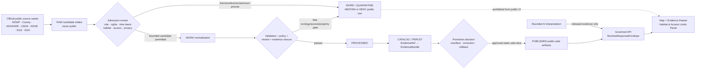
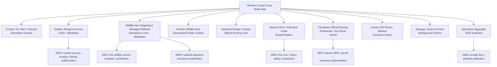
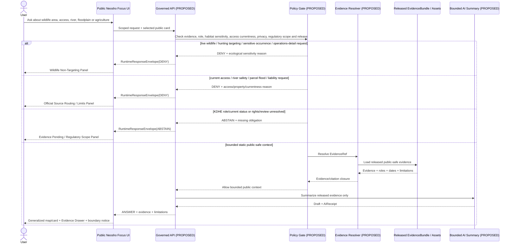
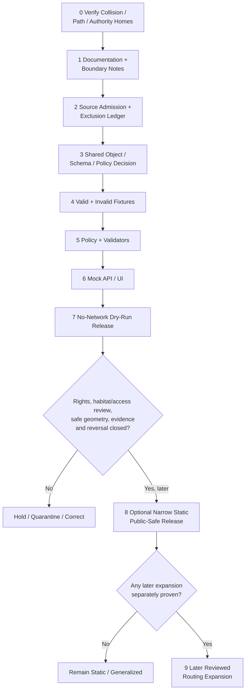

<!-- KFM_META_BLOCK_V2
doc_id: NEEDS_VERIFICATION
title: Neosho County Focus Mode Build Plan
type: standard
version: v1
status: draft
owners: [NEEDS_VERIFICATION]
created: 2026-05-22
updated: 2026-05-22
policy_label: public_draft
repository_path: NEEDS_VERIFICATION - candidate only: docs/focus-modes/neosho-county/neosho_county_focus_mode_build_plan.md
schema_contract_policy_homes: NEEDS_VERIFICATION - inspect the live repository, accepted ADRs, per-root README contracts and verified shared object-family authority before extending any contract, schema, policy, fixture, source-registry, proof, receipt, release or published-artifact home
review_assignments: NEEDS_VERIFICATION - ecology/wildlife sensitivity, managed-wetland operations, hunting/access currentness, hydrology/floodplain, environmental-regulatory, parcel/privacy, rights, documentation and release review duties must be established before implementation or publication
correction_path: NEEDS_VERIFICATION
rollback_path: NEEDS_VERIFICATION
release_status: NEEDS_VERIFICATION - planning artifact only; no source admission, implementation, promotion or publication claimed
related:
  - Directory Rules.pdf (consulted in this run; supplied canonical placement doctrine)
  - KFM county Focus Mode completed-county register supplied in the series prompt
  - Clark County, Harvey County, Allen County, Pawnee County and Marion County artifacts previously generated in this visible continuation sequence
tags: [kfm, focus-mode, neosho-county, neosho-wildlife-area, st-paul, chanute, neosho-river, flat-rock-creek, wetlands, migratory-waterfowl, refuge-closure, floodplain, water-quality, agriculture, habitat-sensitivity, public-safe-boundary]
notes:
  - CONFIRMED: Neosho County is not included in the completed-county register available in this series context and is distinct from subsequently generated county-plan artifacts visible in this continuation context.
  - CONFIRMED: Accessible uploaded/File Library project materials were searched in this run; no Neosho County Focus Mode Build Plan artifact was returned.
  - CONFIRMED: Directory Rules.pdf was consulted in this run before repository-path proposals were made.
  - CONFIRMED: Current official or authoritative public-source pages were checked in this run for Neosho Wildlife Area, Neosho County GIS/Floodplain, Kansas DWR preliminary floodplain mapping, Neosho River USGS monitoring-source availability, KGS geology source fitness, KDA agricultural aggregates and a KDHE Neosho River near Chanute water-quality/TMDL document.
  - CONFIRMED: KDWP publicly describes the Neosho Wildlife Area as a 3,246-acre man-made marsh on the flood plain below the junction of Flat Rock Creek and the Neosho River, including 1,787 acres of intensively managed wetlands, sixteen independently managed wetlands and an 800-acre refuge pool closed to hunting, foot and vehicle traffic during waterfowl season.
  - NEEDS_VERIFICATION: Current regulatory status and release fitness of KDHE water-quality/TMDL material; current access/closure/current-wildlife or wetland-management conditions; rights for derivative spatial display; safe map generalization thresholds; final policy/review assignments.
  - NEEDS_VERIFICATION: A live KFM repository, complete project index, accepted ADR set, implementation tree, rights register and release machinery were not inspected for final collision or landing verification.
  - PROPOSED: Neosho County is selected as the next managed-wetland, migratory-waterfowl, refuge-access and floodplain/public-data minimization proof slice.
-->

<a id="top"></a>

# Neosho County Focus Mode Build Plan

> **Product thesis:** Build a public-safe Neosho County Focus Mode around the Neosho Wildlife Area, Neosho River and southeast Kansas working landscape that explains managed wetland habitat, public access boundaries, floodplain context, geology and county agriculture—without publishing live wildlife concentrations, sensitive habitat-use patterns, operational wetland-management detail, hunting-success guidance, parcel/flood determinations or current water-quality and environmental-liability conclusions.


| Identity / status field | Determination |
|---|---|
| Selected county | **Neosho County, Kansas** |
| Selection status | **PROPOSED** as the next KFM county Focus Mode proof slice. |
| Completed-register comparison | **CONFIRMED** within available series evidence: Neosho County is absent from the user-supplied completed register and is not among the Clark, Harvey, Allen, Pawnee or Marion plans previously generated in this visible continuation sequence. |
| Available-material collision search | **CONFIRMED** for accessible uploaded/File Library materials searched during this run: no `neosho_county_focus_mode_build_plan.md` or Neosho County Focus Mode plan artifact was returned. |
| Full collision verification | **NEEDS_VERIFICATION** because no live repository tree or complete project index was inspected. |
| Distinct proof-slice value | Neosho Wildlife Area's KDWP-documented managed wetland/refuge/access context; Neosho River and Flat Rock Creek floodplain setting; migratory-waterfowl purpose; public hunting/fishing/closed-refuge distinctions; Chanute/official river observation route; county GIS and floodplain high-stakes/private-data boundaries; KDHE water-quality regulatory context held to its source role; geology source fitness; county agriculture aggregate. |
| Most consequential public-safe boundary | **Wildlife/habitat-use and access-currentness restraint:** KFM may present KDWP's broad public description of the managed wetland and the official existence of seasonal closure rules, but it must not surface live or predicted waterfowl concentrations, refuge-use hotspots, hunting-opportunity optimization, fine managed-wetland operational detail, sensitive-species occurrence, or stale access/closure information as current field guidance. |
| Coupled public-safe boundary | **Floodplain, parcel and water-quality non-determination:** official GIS/floodplain, USGS and KDHE sources may be routed or displayed in bounded form only; they must not become parcel/BFE/insurance/permit decisions, live flood/recreation guidance, human/ecological safety conclusions or farm/polluter liability claims. |
| Document posture | Repo-ready, source-checked future implementation plan; not an implemented, reviewed, promoted or published county product. |
| Directory placement posture | **PROPOSED / NEEDS_VERIFICATION:** candidate human-documentation home under `docs/focus-modes/neosho-county/`, justified by supplied Directory Rules but not confirmed in a live repository. |
| First milestone | **Neosho Managed Wetland and Refuge Boundary Proof** |

## Quick links

[Executive build note](#executive-build-note) · [Evidence boundary](#evidence-boundary-table) · [Operating posture](#1-operating-posture) · [Why Neosho County](#2-why-this-county) · [Product thesis](#3-product-thesis) · [Scope boundary](#4-scope-boundary) · [First demo layers](#5-first-demo-layers) · [User journeys](#6-user-journeys) · [UI surfaces](#7-ui-surfaces) · [Governed object model](#8-governed-object-model) · [Repository shape](#9-proposed-repository-shape) · [Build phases](#10-build-phases) · [First PR sequence](#11-first-pr-sequence) · [Acceptance checklist](#12-acceptance-checklist) · [Fixture plan](#13-fixture-plan) · [Risk register](#14-risk-register) · [Source seeds](#15-source-seed-list) · [Verification questions](#16-open-verification-questions) · [First milestone](#17-recommended-first-milestone) · [Appendices](#appendix-a---public-safe-narrative-skeleton)

<a id="executive-build-note"></a>

## Executive build note

**PROPOSED.** Neosho County adds a KFM proof slice in which public ecology, public recreation and public safety cannot be treated as the same layer. Kansas Department of Wildlife and Parks identifies the Neosho Wildlife Area near St. Paul as a man-made marsh developed in 1960 on the flood plain below the junction of Flat Rock Creek and the Neosho River. KDWP reports a 3,246-acre area, with 1,787 acres of intensively managed wetlands and sixteen independently managed wetland units, managed primarily as resting and feeding habitat for migratory waterfowl. KDWP also publicly states that an 800-acre refuge pool is closed to hunting, foot and vehicle traffic during the waterfowl season and that fishing is allowed there only during a stated seasonal window. [SRC-NEOSHO-001]

Those official facts make Neosho County valuable for KFM because they carry a built-in governance challenge: a useful educational map of a managed wetland could easily become a live wildlife-targeting, hunting-optimization or access-misrepresentation surface. An AI or map UI could overread public management language into “where birds are now,” “where to hunt,” “where closed refuges are currently safe to enter,” or “what water-control operations are taking place.” A public-safe first slice must instead display broad habitat and authority context, preserve the KDWP role, display access/closure limitations as official-rule routing rather than KFM field advice, and intentionally avoid live wildlife/water-management detail.

Neosho County also supports a second trust challenge. The county's official GIS/Floodplain page states that its GIS office maintains parcel and agriculture land use data while warning that the data are for tax purposes and not legal documents or boundary surveys. The same page discusses NFIP/SFHA development regulation, and Kansas DWR exposes preliminary floodplain mapping dated December 18, 2024. USGS identifies the Neosho River near Chanute monitoring location, and KDHE provides an official Neosho River near Chanute water-quality/TMDL document. These sources are useful for routing and source-role literacy, but they must not be merged into parcel outcomes, live flood/safety advice, current ecological-health judgments or agricultural liability claims. [SRC-NEOSHO-003] [SRC-NEOSHO-004] [SRC-NEOSHO-005] [SRC-NEOSHO-007]

> [!CAUTION]
> ## Defining public-safe boundary — a public wetland map must not become a live wildlife-targeting or access-guidance product
> KDWP's public information establishes that the Neosho Wildlife Area is a managed wetland complex built for migratory waterfowl and includes a seasonally restricted refuge pool. That evidence supports broad public education about wetland purpose, agency role and the existence of access restrictions.
>
> It does **not** authorize KFM to publish current waterfowl counts or concentration hotspots, infer refuge occupancy, optimize hunting pressure, display unnecessary water-level manipulation or management-operation detail, expose sensitive occurrences, state that an area is currently open or safe from stale information, or treat ecological/hydrologic/regulatory sources as property, health, flood or liability decisions.

<a id="evidence-boundary-table"></a>

## Evidence-boundary table

| Truth label | What this document supports now | What this document cannot imply |
|---|---|---|
| `CONFIRMED` | Neosho County is absent from the completed-county register available to this run; accessible project-material search returned no Neosho plan; `Directory Rules.pdf` was consulted; official/authoritative public pages listed in §15 were checked; KDWP's described acreage, managed-wetland purpose and refuge-pool restriction were checked; this downloadable Markdown artifact was generated in this run. | No live-repository file presence, source admission, rights clearance, safe public geometry, ecological/access/currentness review, approved water-quality/flood representation, implemented schema/policy/test/API/UI behavior, promotion or publication is confirmed. |
| `PROPOSED` | Neosho County selection; product thesis; public-safe boundary; layer/card/UI/object/path/fixture/policy/PR/milestone design; a later narrow static public-safe product. | Proposed design is not proof that the system or public product already exists. |
| `NEEDS_VERIFICATION` | Live repository collision/path; accepted ADRs and shared object homes; source rights and derivative-display permissions; safe spatial scale; current KDWP access/rule handling; regulatory currentness of KDHE material; current floodplain/effective-map state; correction and rollback machinery. | Checkable gaps cannot be presented as passed gates or current public truth. |
| `UNKNOWN` | Any Neosho plan outside searched accessible materials; actual KFM implementation maturity; deployed routes/contracts/tests/workflows; review assignments; release state. | Unsupported assumptions remain outside claim scope. |

### High-significance source-derived statements

| Statement | Truth label | Basis and constraint |
|---|---|---|
| Neosho Wildlife Area is a KDWP-managed man-made marsh on the flood plain below the junction of Flat Rock Creek and the Neosho River. | `CONFIRMED` | KDWP official area page checked during this run. [SRC-NEOSHO-001] |
| KDWP reports 3,246 acres total, 1,787 acres of intensively managed wetlands and sixteen independently managed wetlands. | `CONFIRMED` | KDWP official page; can be used as static public context only. [SRC-NEOSHO-001] |
| KDWP says the area's primary management purpose is resting and feeding habitat for migratory waterfowl. | `CONFIRMED` | KDWP official page; does not support live wildlife location inference. [SRC-NEOSHO-001] |
| KDWP states the 800-acre refuge pool is closed to hunting, foot and vehicle traffic during waterfowl season and identifies a seasonal fishing allowance. | `CONFIRMED` | KDWP official page checked; KFM must not substitute for current agency rules or field decisions. [SRC-NEOSHO-001] |
| Neosho County GIS maintains parcel and agriculture land-use data and states county information is for tax purposes rather than legal documents or boundary surveys. | `CONFIRMED` | Neosho County official GIS/Floodplain page. [SRC-NEOSHO-003] |
| Kansas DWR displays preliminary Neosho County floodplain mapping data dated December 18, 2024. | `CONFIRMED` | KDA/DWR official mapping page; no final parcel result follows. [SRC-NEOSHO-004] |
| USGS exposes an official Neosho River near Chanute monitoring-location route. | `CONFIRMED` | USGS official page; live display/use deferred. [SRC-NEOSHO-005] |
| KDHE's checked Neosho River near Chanute document can support a current public impairment or liability layer. | `NEEDS_VERIFICATION` | Official document checked; controlling/current regulatory status, rights and admissible release purpose not verified. [SRC-NEOSHO-007] |

---

## 1. Operating posture

### KFM governing rules applied to Neosho County

| Governing rule | Neosho County consequence |
|---|---|
| EvidenceBundle outranks generated language. | Every public claim about wetlands, migratory-waterfowl purpose, access restrictions, the Neosho River, floodplain, geology, agriculture or regulatory context must resolve to admitted evidence with source role, time basis, scope and limitation. |
| Public clients use governed interfaces and released public-safe artifacts only. | Public UI must never read `RAW`, `WORK`, `QUARANTINE`, unreviewed waterfowl reports, candidate wildlife occurrences, wetland-operation candidates, raw river observations, parcel data, or direct model output. |
| Cite-or-abstain is the truth posture. | Missing evidence, currentness, rights, safe scale, sensitivity review or release state yields `ABSTAIN`, `DENY` or `ERROR`, not confident map prose or field guidance. |
| Publication is a governed state transition. | A habitat polygon, closure card, river marker, regulatory note or AI summary is not public truth because it is technically displayable. |
| Source roles remain distinct. | KDWP habitat/access management, County parcel/floodplain administration, KDA/DWR preliminary mapping, USGS observation routing, KDHE regulatory water-quality context, KGS science and KDA statistics must not collapse into one environmental layer. |
| Ecology and safety risks fail closed. | Current wildlife concentrations, sensitive occurrences, unnecessary habitat-management precision, hunting/access optimization, live flood/safety claims and private/legal inferences are denied or deferred. |
| AI is interpretive only. | AI may summarize released static context; it cannot locate wildlife, optimize hunting, declare access open, issue current flood or water-quality advice, assign pollution responsibility or promote a release. |
| Corrections and rollback remain auditable. | Any future public habitat/access/routing card must support correction or withdrawal if rules change, sensitivity is reclassified, geometry is excessive or source status is corrected. |

### Truth labels and finite outcomes

| Label / outcome | Meaning for this artifact |
|---|---|
| `CONFIRMED` | Verified in this run from supplied doctrine, accessible file search, opened official/authoritative public sources or generated artifact output. |
| `PROPOSED` | Future design, path, object, schema/policy/fixture, workflow, UI, review or release recommendation. |
| `NEEDS_VERIFICATION` | Checkable item not verified strongly enough for implementation or publication. |
| `UNKNOWN` | Not resolvable from evidence available in this run. |
| `ANSWER` | Bounded public-safe response backed by admitted/released evidence and policy/citation/review closure. |
| `ABSTAIN` | Authority, freshness, rights, sensitivity, scale or release closure is insufficient. |
| `DENY` | Request would expose sensitive information, create unsafe field/property/legal inference or bypass governance. |
| `ERROR` | Governed failure that returns no unsupported claim. |
| `DEFER` | Candidate intentionally held for later verified work. |
| `EXCLUDE` | Candidate unsuitable for the proposed public product. |

### Public trust-membrane flowchart



### County-specific non-negotiable guardrails

1. **Habitat-use non-targeting guardrail.** Public KDWP purpose statements may support broad wetland context, but KFM must not reveal or predict current waterfowl locations, congregations, refuge occupancy, migration-use hotspots, nesting/resting detail or sensitive-species occurrence.
2. **Access-currentness guardrail.** The KDWP public page provides seasonal restrictions. KFM may identify the official source and general rule category, but it must not claim current openness, hunting eligibility, fishing legality, vehicle access or safe entry without a governed current official source and clear non-replacement posture.
3. **Managed-wetland operations minimization guardrail.** Public management descriptions may support general education, but water-control operations, treatment schedules, pool-level conditions, planted-forage conditions or other detail that could intensify hunting/wildlife targeting is withheld from the first product.
4. **Hunting-pressure and public-safety guardrail.** KFM is not a hunting-success, crowd avoidance, access-route, safety, regulation or enforcement product. Current reports, harvest patterns and access constraints require separate proof and likely official link-out rather than a derived public layer.
5. **Floodplain/property guardrail.** County and KDA/DWR floodplain sources are official routing material; preliminary maps and county GIS cannot become parcel/BFE/flood-insurance/permit/boundary or legal determinations in KFM.
6. **Parcel/privacy guardrail.** The county GIS page explicitly discusses parcel and agriculture land-use data and tax-purpose limitations. Parcel, landowner, 911 address, tax, valuation and private-property joins are excluded from the first public slice.
7. **Hydrology currentness guardrail.** USGS river-source availability supports future official-source routing, not live water/flood/recreation or wildlife-condition decisions in the first product.
8. **Environmental-regulatory anti-collapse guardrail.** KDHE regulatory material may support a source-role/deferred-review record, but KFM must not state current impairment, ecological safety, cause or responsibility without current controlling evidence and review.
9. **Agricultural non-attribution guardrail.** KDA aggregate farm/acre/sales facts may be shown with their reference year; no named operation, runoff, pollutant, habitat impact or compliance inference follows.
10. **Geology/source-fitness guardrail.** KGS states its displayed county map is extracted from the state map because no detailed digital county mapping had been completed for that page. It may support background context only, not site-level management, water-quality or engineering truth.

---

## 2. Why this county

### Selection screen against completed counties

| Selection test | Result | Status |
|---|---|---|
| Is Neosho County listed in the user-supplied completed-county register? | No match found. | `CONFIRMED` within available register evidence |
| Is Neosho County one of the subsequently generated visible continuation artifacts? | No match among Clark, Harvey, Allen, Pawnee and Marion outputs. | `CONFIRMED` within current visible continuation evidence |
| Did accessible project-material search identify a Neosho County Focus Mode plan? | No Neosho County build-plan artifact was returned from searches for the county, expected filename or Neosho Wildlife Area/Focus Mode terms. | `CONFIRMED` for searched accessible materials |
| Was a live repository and every project store/index inspected? | No. | `NEEDS_VERIFICATION` |
| Does Neosho add a distinct proof slice? | Yes. It centers a publicly managed migratory-waterfowl wetland/refuge with explicit seasonal access restrictions, while also testing floodplain, parcel and water-quality source separation. | `PROPOSED`, grounded in checked sources |
| Are strong official or authoritative source seeds present? | Yes. KDWP, Neosho County, KDA/DWR, USGS, KDHE, KGS and KDA official/authoritative pages were checked. | `CONFIRMED` source checks; admission remains `NEEDS_VERIFICATION` |

### Proof-slice rationale

| Proof dimension | Checked official/authoritative public-source anchor | KFM proof value | Public-safe constraint |
|---|---|---|---|
| Managed wetland habitat and floodplain setting | KDWP describes a 3,246-acre man-made marsh developed on the flood plain below Flat Rock Creek and the Neosho River. | Provides a clear map-first ecological/hydrologic anchor. | Broad setting only; no dynamic habitat or access inference. |
| Migratory-waterfowl purpose | KDWP states the area was designed and is managed as resting and feeding habitat for migratory waterfowl. | Tests whether KFM can show habitat purpose without targeting wildlife. | No live concentration, habitat-use hotspot or hunting optimization layer. |
| Managed-pool/refuge/access restrictions | KDWP identifies sixteen independently managed wetlands and an 800-acre refuge pool closed to hunting, foot and vehicle traffic during waterfowl season. | Tests visible policy/access boundaries and abstention on current field guidance. | Do not represent stale rule summaries as present authorization; avoid operational overprecision. |
| Agriculture / working landscape | KDA reports 612 farms, 319,747 acres and $95 million in 2022 crop/livestock sales, according to USDA Census. | Adds county-scale working-landscape context. | No runoff, pollution, habitat-impact or farm-liability attribution. |
| Parcel and agricultural land-use data boundary | County GIS says it maintains parcel and agriculture land-use data and that county data are for tax purposes only, not legal boundary surveys. | Tests explicit data-minimization and no-property-product stance. | No parcel, owner, 911 address, valuation, boundary or legal display. |
| Floodplain official routing | County GIS/Floodplain page identifies NFIP/SFHA development context; KDA/DWR labels its map preliminary data dated 12/18/2024. | Tests official high-stakes routing and preliminary-status display. | No parcel, BFE, insurance, permit or current flood decision. |
| Neosho River observation routing | USGS identifies official monitoring location `USGS-07183200`, Neosho R near Chanute. | Tests later hydrology currentness design. | No live value, recreation, flood or ecology decision in first slice. |
| Regulatory water-quality candidate | KDHE official document addresses Neosho River near Chanute water-quality impairment/TMDL context. | Tests regulatory-source role and deferral where current fit is unresolved. | No present impairment, safety, ecological-health or farm-responsibility claim without verifying controlling status. |
| Geology/source fitness | KGS states no detailed digital county mapping had been done for that page; the county map is extracted from the state geologic map and cites a 1966 publication. | Tests background-science/source-fitness disclosure. | Not management-precision or present water-quality evidence. |

### Why Neosho adds a distinct series proof

Neosho County tests a class of KFM risk that differs from the recent reservoir, groundwater, remediation and cultural-history plans: **a public wildlife area where broad educational context is safe but live or overly precise ecological representation can become a targeting and access problem**.

The proof is distinctive because:

- A state wildlife agency publicly describes both **habitat purpose** and **access restrictions** at the same site.
- The product must teach that a managed wetland serves migratory waterfowl while refusing to tell users where waterfowl are now or how to exploit management patterns.
- Publicly accessible pool/refuge and seasonal-rule descriptions create a special KFM burden: show the official boundary without becoming a live rules or access-decision service.
- The county GIS/floodplain source simultaneously exposes the need for property minimization, because parcel and agriculture land-use data are public-facing but unnecessary for a first wildlife/wetland story.
- KDHE and USGS materials create pressure to add water-quality or live river context; the correct first product demonstrates role separation and deferral rather than collapsing them into “wetland health.”

### Public benefit and governance value

| Public benefit | Governance value |
|---|---|
| Learn why the Neosho Wildlife Area exists and how it relates to the river floodplain. | Demonstrates source-attributed public ecology at safe scale. |
| Understand that public wildlife areas may include refuge/access restrictions. | Demonstrates visible boundary behavior instead of silently hiding policy. |
| See county-scale agriculture as context around a wetland landscape. | Demonstrates aggregate-only representation without blame. |
| Find official county/floodplain/river sources where needed. | Demonstrates official routing without high-stakes determination. |
| Understand why live wildlife and detailed management information are not mapped. | Demonstrates ecology sensitivity and minimum-necessary display. |
| Inspect evidence, denial reasons, correction and rollback posture. | Demonstrates governed Focus Mode behavior before implementation. |

### Specific county anchors supported by checked official sources

| County anchor | Verified public statement used in this plan | Source role |
|---|---|---|
| Neosho Wildlife Area | KDWP describes area, location setting, acreage, wetland-management purpose and seasonal refuge closure. | State habitat/access management authority |
| St. Paul / public wildlife-area association | KDWP identifies Neosho Wildlife Area address as Saint Paul, Kansas and its county-locations source assigns Neosho Wildlife Area to Neosho County. | State administrative/place context |
| Neosho River / Flat Rock Creek setting | KDWP situates the wildlife area below their junction; USGS identifies river monitoring near Chanute. | State habitat context + federal observation routing |
| County GIS/floodplain | Neosho County describes parcel/agriculture land-use maintenance, tax-purpose limits and NFIP/SFHA development context. | County administrative/property/flood routing |
| Preliminary floodplain map | KDA/DWR labels Neosho County mapping preliminary and dated 12/18/2024. | State floodplain/currentness routing |
| Water-quality regulatory candidate | KDHE has official Neosho River near Chanute water-quality/TMDL material. | State environmental-regulatory candidate |
| Geology fitness | KGS identifies map as state-map-derived and references a 1966 geology/ground-water publication. | State scientific/source-fitness context |
| Agriculture | KDA reports 612 farms, 319,747 acres and $95 million in 2022 crop/livestock sales. | Statistical aggregate |

---

## 3. Product thesis

### One-sentence thesis

**Neosho County Focus Mode should present the Neosho Wildlife Area and Neosho River floodplain as a governed, evidence-linked managed-wetland landscape with visible habitat and access boundaries—while refusing live wildlife targeting, stale access guidance, unnecessary wetland-operation detail, current water-quality conclusions and parcel or farm-liability outputs.**

### What the first product promises

| Promise | Proposed public behavior |
|---|---|
| Safe wetland and river-corridor orientation | Generalized Neosho Wildlife Area / Neosho River / St. Paul context backed by KDWP official evidence. |
| Habitat purpose without wildlife targeting | A static managed-wetland purpose card identifies migratory-waterfowl habitat role and sensitivity limits. |
| Access limits made visible | A Habitat, Refuge & Access Limits panel explains official seasonal restrictions and why KFM is not current field authorization. |
| Context layers remain role-separated | County floodplain/GIS, USGS, KDHE, KGS and KDA context appear only in safe, clearly limited cards or deferred routing notes. |
| Privacy and property limits are explicit | The county GIS role is acknowledged while parcel/property/911/tax/boundary outputs are excluded. |
| Reversible evidence-centered output | Finite outcomes, Evidence Drawer, review/release/correction/rollback fields remain visible. |

### What the first product does not promise

- It is **not** a live waterfowl count, migration hotspot, hunting-success, habitat-condition or managed-pool operations map.
- It is **not** current permission to enter, fish, hunt, drive or traverse any wildlife-area unit.
- It is **not** a rare/sensitive species, nesting, resting-site or congregation-location product.
- It is **not** a live river, flood, water-quality, ecological-health or recreation-safety service.
- It is **not** a parcel, BFE, permit, insurance, boundary-survey, owner, 911-address or tax product.
- It is **not** a farm pollution, habitat-damage, compliance or legal-liability system.
- It is **not** evidence that repository paths, contracts, schemas, policies, validators, tests, APIs, UI surfaces, reviews or releases already exist.

---

## 4. Scope boundary

### Public-safe first-slice content

| Included first-slice content | Checked-source basis | Required presentation limit | Status |
|---|---|---|---|
| Neosho County / St. Paul / Chanute orientation card | County official site; KDWP; USGS | Administrative/place/source-routing context only; no private/property fields or live conditions. | `PROPOSED` |
| Generalized Neosho Wildlife Area marker/card | KDWP Wildlife Area page | Broad place/purpose/acreage context only; no live wildlife, pool status or operational detail map. | `PROPOSED` |
| **Habitat, Refuge & Access Limits panel** | KDWP official area page | Mandatory with wildlife-area interaction; explains habitat sensitivity and current-rule limits. | `PROPOSED` — mandatory |
| **Wildlife Non-Targeting & Managed-Wetland Operations panel** | KDWP management-purpose/detail context | Mandatory with habitat/waterfowl queries; prohibits live targeting and operations amplification. | `PROPOSED` — mandatory |
| Seasonal closure/source-routing card | KDWP official area page | Reports that KDWP states restrictions exist; routes users to current KDWP authority; no KFM current-entry decision. | `PROPOSED` |
| Neosho River / Flat Rock Creek broad context card | KDWP; USGS official monitoring-source page | General relationship and observation-source routing only; no live conditions. | `PROPOSED` |
| County GIS / parcel privacy exclusion card | Neosho County GIS/Floodplain page | Explains why parcel/agriculture land-use/legal-boundary data are not first-slice public output. | `PROPOSED` |
| Floodplain official-routing card | Neosho County; KDA/DWR | NFIP/SFHA and preliminary-source routing only; no property/legal decision. | `PROPOSED` |
| Geology/source-fitness context card | KGS county map page | Background/scientific map-fitness explanation only. | `PROPOSED` |
| Agriculture aggregate snapshot | KDA county statistics | County aggregate and 2022 reference year only. | `PROPOSED` |
| KDHE water-quality regulatory candidate note | KDHE checked official document | Records a possible later regulatory source; current status/use not represented as first-slice public truth. | `DEFER` / `NEEDS_VERIFICATION` |

### Deferred content

| Deferred candidate | Why deferred | Required unlock |
|---|---|---|
| Dynamic KDWP waterfowl reports or counts | Could reveal current congregations/hunting opportunity and is operational/current. A direct attempt to open a result page during this run was unsuccessful. | Official access/terms, ecological sensitivity, cadence/stale, public-purpose and no-targeting review; likely link-out only. |
| Pool-level wetland, refuge or water-control geometry/status | Fine management precision may amplify targeting/access misuse. | Minimum-necessary display, safe generalization, rights and habitat/access review; likely omitted. |
| Live closure, access or hunting-condition layer | Field rules/conditions can change and have legal/safety consequences. | Current official source, expiry/outage handling and clear non-replacement UI; not first product. |
| Sensitive or exact wildlife-occurrence layer | Geoprivacy and disturbance risks. | `DENY` by default; only generalized non-sensitive context after policy/review. |
| Live USGS river observations | Could be mistaken for flood, navigation or wildlife/recreation advice. | Currentness/revision/outage/no-advice controls and explicit purpose. |
| KDHE TMDL/impairment layer | Regulatory/currentness and causal/health overclaim risk. | Verify current controlling status, rights, claim scope, policy and review. |
| Floodplain geometry or parcel query | Preliminary map and property/legal consequences. | Current/effective official product, rights, no-determination policy and restricted UI. |
| County GIS parcel/agriculture-land-use joins | Private/property/legal and inference concerns. | Excluded from first slice; separate approved public purpose required. |
| Farm/water-quality/habitat-impact modeling | Aggregate-to-private causality and regulatory risk. | Separate evidence and policy study; not initial public output. |
| Neosho State Fishing Lake or other recreation expansion | Additional official source/advisory/currentness work needed and not necessary for wetland proof. | Separate source admission and public-health/access review. |

### Denied-by-default or excluded content

| Request/content class | Required outcome | Reason |
|---|---|---|
| “Show where ducks or other waterfowl are concentrated at Neosho Wildlife Area right now.” | `DENY` | Wildlife targeting/disturbance and currentness risk. |
| “Which pool should I hunt today based on managed water, grain or refuge patterns?” | `DENY` | Hunting optimization and managed-habitat operations amplification. |
| “Is the refuge pool currently open for access, fishing or vehicle travel?” | `DENY` with official KDWP routing | Current field-rule/authorization decision belongs to responsible authority. |
| “Map exact refuge/pool-management operations or water-level controls.” | `DENY` / `EXCLUDE` | Minimum-necessary and habitat/access sensitivity. |
| “Show rare species, nests or protected resting locations within the marsh.” | `DENY` | Ecological geoprivacy/sensitivity. |
| “Use river or wetland conditions to tell me where wildlife will be tomorrow.” | `DENY` | Predictive targeting and unsupported inference. |
| “Use preliminary flood maps to decide my BFE, permit or insurance requirement.” | `DENY` | High-stakes property/legal determination outside KFM. |
| “Use KDHE material to say the river is safe/unsafe now or name responsible farms.” | `DENY` / `ABSTAIN` | Regulatory/currentness/health/causality overclaim. |
| “Show parcel owners, tax lots or 911 addresses adjoining the wetland.” | `DENY` / `EXCLUDE` | Private/property data unnecessary for first public benefit. |
| Restricted, non-public, tactical, sensitive or rights-unclear source material | `EXCLUDE` / `QUARANTINE` | Not appropriate for public-derived product. |

### Boundary implementation matrix

| Risk-bearing topic | Safe first-slice expression | Visible warning | Prohibited transformation |
|---|---|---|---|
| Neosho Wildlife Area | Generalized KDWP place and purpose card. | “Managed wetland context; not live wildlife or access information.” | Live habitat/wildlife targeting layer. |
| Migratory waterfowl | Management-purpose statement only. | “Current concentrations and sensitive occurrences not displayed.” | Count/hotspot/predictive display. |
| Refuge/seasonal restrictions | Official-rule/source-routing card. | “Check current KDWP rules before field use; KFM does not authorize access.” | Current entry/fishing/hunting permission decision. |
| Managed pools/operations | General statement that wetlands are managed. | “Operational precision withheld.” | Pool-level condition or control map. |
| Neosho River/USGS | Official observation-source routing. | “No live flood, water-quality or recreation-safety interpretation.” | Safety/current-condition conclusion. |
| KDHE regulatory context | Deferred source-candidate record. | “Current controlling status and allowed scope not established.” | Current impairment/safety/liability card. |
| Floodplain | Official routing/preliminary status card. | “No parcel/BFE/permit/insurance determination.” | Parcel decision. |
| County GIS | Exclusion/privacy card. | “Tax-purpose/parcel data not included.” | Owner/address/property display. |
| Agriculture | KDA aggregate snapshot. | “Aggregate; 2022 reference year.” | Farm runoff/pollution/compliance inference. |
| KGS geology | Source-fitness/background card. | “State-map-derived/background context.” | Detailed management or present water-condition claim. |

---

## 5. First demo layers

### Prioritized first public-safe layer/card table

| Priority | Proposed public-safe layer or card | Checked source seed(s) | Source role | Evidence/policy gate | Status |
|---:|---|---|---|---|---|
| 1 | Neosho County / St. Paul / Chanute orientation card | County official site; KDWP; USGS | Administrative/public-place/source routing | Verify any geometry/rights; no parcel, private or live fields. | `PROPOSED` |
| 2 | **Habitat, Refuge & Access Limits panel** | KDWP Neosho Wildlife Area | State habitat/access-management authority | Mandatory; no current authorization or field safety advice. | `PROPOSED` — mandatory |
| 3 | **Wildlife Non-Targeting & Managed-Wetland Operations panel** | KDWP Neosho Wildlife Area | State ecological/management context | Mandatory; blocks counts, hotspots, predictive targeting and unnecessary operations detail. | `PROPOSED` — mandatory |
| 4 | Neosho Wildlife Area generalized public-context card | KDWP | State wildlife-area context | Broad extent/purpose/acreage only; static and source-attributed. | `PROPOSED` |
| 5 | Seasonal refuge/access official-source card | KDWP | State access-rule context | Rule category and source visible; current field authorization denied. | `PROPOSED` |
| 6 | Neosho River / Flat Rock Creek landscape-relation card | KDWP; USGS | Habitat setting + observation-source routing | Static broad relation only; no live hydrology/wildlife inference. | `PROPOSED` |
| 7 | Floodplain official-routing card | County GIS/Floodplain; KDA/DWR | County/state flood/regulatory routing | Preliminary status and no-property-determination visible. | `PROPOSED` |
| 8 | County GIS parcel/privacy exclusion card | County GIS/Floodplain | County administrative/property source | Shows why parcel/ag-land-use/911 fields are excluded. | `PROPOSED` |
| 9 | Neosho geology/source-fitness card | KGS | Scientific/cartographic background | Source age/scale limitation visible; no site-level management claim. | `PROPOSED` |
| 10 | 2022 agriculture aggregate card | KDA | Statistical aggregate | County scale only; no runoff/pollutant/habitat impact inference. | `PROPOSED` |
| — | KDHE water-quality/TMDL context card | KDHE official document | Environmental-regulatory candidate | Controlling status/currentness/claim scope unresolved. | `DEFER` / `NEEDS_VERIFICATION` |
| — | Dynamic waterfowl/count/hunting-opportunity layer | KDWP future/current official materials | Current ecological/access | No-targeting/currentness proof absent. | `DENY` / `DEFER` |
| — | Pool/refuge operational precision layer | KDWP/current operational sources | Habitat management/access sensitive | Not needed for first proof. | `DENY` / `EXCLUDE` |
| — | Live river/flood/property layer | USGS/FEMA/KDA/DWR/County future sources | High-stakes/current/private | Not first-slice public purpose. | `DENY` / `DEFER` |

### Mermaid map-composition diagram



### Layer-card truth contract

Every future public-visible claim-bearing card or layer is `PROPOSED` to require:

| Required field or obligation | Neosho County rule |
|---|---|
| `card_id` / `layer_id` / `schema_version` | Stable deterministic identity candidate and controlled version. |
| `county_id` | `ks-neosho`; no silent extension beyond admitted spatial scope. |
| `feature_id` | Required for wildlife-area/river/flood/routing cards; canonical identity must be registry-verified. |
| `claim_scope` | Narrow public educational purpose and expressly prohibited transformations. |
| `source_role_refs[]` | Preserve KDWP habitat/access management, County administrative/property, KDA/DWR floodplain, USGS observation, KDHE regulatory, KGS scientific and KDA statistical roles. |
| `evidence_ref` | Resolves to admitted `EvidenceBundle`; no evidence closure means no `ANSWER` or claim-bearing public display. |
| `habitat_sensitivity_posture` | Declares generalized public context, current-use withheld, sensitive-occurrence denied or review-required posture. |
| `wildlife_targeting_posture` | Explicitly prohibits counts, hotspots, predictive use and hunting optimization unless a separate approved public purpose exists. |
| `access_currentness_posture` | Declares static official-rule context versus current official-rule routing; no KFM authorization. |
| `managed_wetland_operations_posture` | Declares whether operations detail is withheld/generalized and why. |
| `hydrology_flood_property_posture` | Declares routing-only/currentness/no property or live-safety outcomes. |
| `environmental_regulatory_posture` | Declares whether a KDHE source is deferred, admitted for bounded regulatory context or withheld. |
| `parcel_privacy_posture` | Prohibits parcel, owner, 911 address, valuation and legal-boundary display. |
| `agriculture_anti_causation_posture` | Declares aggregate-only use and prohibits runoff/pollution/compliance attribution. |
| `geometry_posture` | Generalized, withheld, deferred or approved scale with any transform receipt requirement. |
| `time_basis` | Checked time, stated seasonal rule, data date, statistic year, study period or expiry state visible. |
| `rights_status` | Rights/terms/attribution and derivative-display status verified before public artifact generation. |
| `policy_decision_ref` | Required before display or answer. |
| `review_record_refs[]` | Required for wildlife, access, operations, current hydrology, regulatory water-quality, property or release-significant outputs. |
| `citation_validation_ref` | Required for public narrative. |
| `release_manifest_ref` | Required before published labeling. |
| `correction_ref` / `rollback_ref` | Required before public release. |

---

## 6. User journeys

### Public learning journeys

| User question or action | Proposed safe experience | Boundary behavior |
|---|---|---|
| “What is the Neosho Wildlife Area?” | Generalized KDWP-backed card explains marsh/floodplain context, acreage and broad migratory-waterfowl purpose. | No current wildlife, hunting or operational inference. |
| “Why does the map show an access boundary warning?” | Habitat & Access Limits panel explains that KDWP publishes seasonal restrictions and KFM is not a current access authority. | Trust-visible refusal. |
| “What does managed wetland mean here?” | Broad card states official managed-wetland purpose without pool-operation or habitat-targeting detail. | Operations precision withheld. |
| “Where is this in relation to the Neosho River?” | Static KDWP relation and USGS official-source-routing card. | No live river or flood/safety inference. |
| “Where do I find floodplain information?” | County/KDA-DWR official-routing card labels preliminary/currentness posture. | No parcel or legal outcome. |
| “Why is there no parcel layer?” | GIS privacy/exclusion panel explains official tax-purpose and legal-boundary disclaimers. | No owner/address/valuation display. |
| “What is the county's agricultural context?” | KDA/USDA-referenced 2022 aggregate card. | No source/blame/compliance conclusion. |
| “What does KDHE say about the river?” | Product states a checked regulatory source exists but remains deferred pending current-status and allowed-scope review. | `ABSTAIN` from current claim. |

### Trust-demonstration journeys

| Trust test | Proposed UI behavior | Finite outcome |
|---|---|---|
| User opens Evidence Drawer for wildlife area context | Shows KDWP role, static source anchor, habitat sensitivity, access-currentness limitation, withheld-detail class, rights/review/release placeholders and correction posture. | `ANSWER` for bounded context |
| User asks “Where are the ducks today?” | Wildlife Non-Targeting panel refuses locations/counts/predictions. | `DENY` |
| User asks “Which unit should I hunt?” | Denial panel refuses optimization and directs current rules/use questions to KDWP. | `DENY` |
| User asks whether the refuge is open to vehicle access right now | Access-currentness panel refuses current authorization. | `DENY` |
| User asks for county agriculture totals | Safe aggregate card displays official source year and limits. | `ANSWER` |
| User asks whether preliminary flood map proves their property status | Flood/property panel refuses and routes to official process. | `DENY` |
| User asks for a current river impairment or farm-blame conclusion from KDHE material | Regulatory-role panel states status/scope not admitted for that use. | `ABSTAIN` / `DENY` |
| Rights, safe geometry, currentness or sensitivity review is missing | Candidate layer remains withheld. | `ABSTAIN` |
| Public UI attempts to fetch raw wildlife, operations or parcel candidates | Trust membrane blocks access. | `DENY` / `ERROR` |

### County-specific denied or abstained requests

| Example request | Required outcome | Candidate reason code |
|---|---|---|
| “Map current waterfowl concentrations in each Neosho Wildlife Area pool.” | `DENY` | `LIVE_WILDLIFE_TARGETING_DENIED` |
| “Predict which wetland unit will hold the most ducks tomorrow.” | `DENY` | `PREDICTIVE_HUNTING_OR_DISTURBANCE_TARGETING` |
| “Show pool-management or planted-forage conditions to improve hunting success.” | `DENY` | `MANAGED_HABITAT_OPERATION_DETAIL_WITHHELD` |
| “Can I enter or drive into the refuge pool today?” | `DENY` | `CURRENT_ACCESS_AUTHORIZATION_OUT_OF_SCOPE` |
| “Show nesting, protected or sensitive wildlife locations.” | `DENY` | `SENSITIVE_OCCURRENCE_GEOPRIVACY` |
| “Does the river gauge mean floodplain access is safe today?” | `DENY` | `LIVE_RIVER_OR_ACCESS_SAFETY_OUT_OF_SCOPE` |
| “Use preliminary floodplain mapping to decide my BFE, insurance or permit.” | `DENY` | `PRELIMINARY_FLOOD_DATA_AS_PROPERTY_DECISION` |
| “Use water-quality records and farm statistics to identify responsible farmers.” | `DENY` | `REGULATORY_TO_PRIVATE_CAUSATION_INFERENCE` |
| “Show adjoining owners, tax parcels and 911 addresses around the wetland.” | `DENY` | `PARCEL_OR_LIVING_PERSON_EXPOSURE_DENIED` |
| “Blend habitat, river, flood and regulatory sources into one current wetland-health score.” | `ABSTAIN` | `SOURCE_ROLE_COLLAPSE_REQUESTED` |

---

## 7. UI surfaces

### Required UI surface register

| UI surface | Neosho County role | Trust-visible requirements | Status |
|---|---|---|---|
| Header | “Neosho County — Managed Wetlands, Neosho River & Public Habitat Context.” | Shows draft/release state, cite-or-abstain posture and wildlife/access boundary badge. | `PROPOSED` |
| Map canvas | Renders approved static/generalized public-safe artifacts only. | No live waterfowl, sensitive occurrence, wetland-operation, current closure, raw hydrology, parcel or unreviewed regulatory layer. | `PROPOSED` |
| Layer drawer | Groups county orientation, wildlife-area context, access/rule routing, river relation, floodplain routing, GIS exclusion, geology and agriculture. | Each item shows source role, time/currentness, sensitivity, evidence and release state. | `PROPOSED` |
| Evidence Drawer | Main trust-inspection surface. | Displays EvidenceBundle, KDWP role, habitat/access limitations, withheld operations/detail, rights, policy/review, correction and rollback references. | `PROPOSED` |
| Answer panel | Presents bounded Focus Mode results. | Finite outcome, citations, scope and limitations; no implicit wildlife, access or water-quality decision. | `PROPOSED` |
| Denial panel | Explains denied or abstained requests. | Safe reason category and responsible official-source routing; never reveals denied wildlife/private/operations detail. | `PROPOSED` |
| Timeline/time-basis surface | Separates 1960 wetland-development context, official stated seasonal-rule context, 2022 agriculture, 12/18/2024 preliminary floodplain page and any future current-source states. | Prevents static/current/regulatory collapse. | `PROPOSED` |
| **Habitat, Refuge & Access Limits panel** | Defines the access/currentness side of primary public-safe boundary. | Opens with any refuge or field-use query; explains official-source role and no current KFM authorization. | `PROPOSED` — mandatory |
| **Wildlife Non-Targeting & Managed-Wetland Operations panel** | Defines ecological sensitivity and minimum-necessary detail. | Opens with waterfowl/habitat/pool question; no hotspots, predictions or detailed operations. | `PROPOSED` — mandatory |
| Floodplain / Parcel / Regulatory Limits panel | Controls flood, GIS and KDHE contexts. | No parcel/BFE/insurance/permit, liability or current water-quality decision. | `PROPOSED` |
| Correction / withdrawal surface | Supports future safe repair. | Displays correction, supersession, withdrawal and rollback state when releases exist. | `PROPOSED` |

### Legend vocabulary table

| Legend label | Meaning shown to users | Display constraint |
|---|---|---|
| `State wildlife-area context — generalized` | KDWP-backed broad managed-wetland description. | No live wildlife or operational precision. |
| `Migratory-waterfowl habitat purpose` | Official management purpose at broad narrative level. | No counts, hotspots or predictions. |
| `Official access limitation — verify current rule` | KDWP states a relevant seasonal access restriction exists. | Not present field authorization. |
| `Wildlife-sensitive detail withheld` | Information omitted to prevent disturbance/targeting. | No query/export of sensitive detail. |
| `River observation source — live use deferred` | USGS source identity/routing. | Not flood or recreation-safety advice. |
| `Preliminary flood source — no determination` | KDA/DWR map context. | Not parcel/BFE/permit/insurance output. |
| `Property/parcel data excluded` | County GIS information outside first public purpose. | No owner/address/valuation display. |
| `Regulatory water-quality source deferred` | KDHE source requires currentness/scope review. | Not current health or liability conclusion. |
| `Scientific background context` | KGS map/source-fitness context. | Not local management/water-quality truth. |
| `Statistical aggregate — 2022` | KDA county agricultural summary. | No farm/cause/compliance inference. |

### UI / API / policy / evidence sequence diagram



---

## 8. Governed object model

### Shared KFM object-family proposal

| Object family | Neosho County application | Critical trust control | Status |
|---|---|---|---|
| `SourceDescriptor` | Classifies KDWP, County, KDA/DWR, USGS, KDHE, KGS and KDA sources. | Declares role, allowed scope, rights, time/currentness, habitat/access/private/regulatory limitations and exclusions. | `PROPOSED`; shared-home verification required |
| `EvidenceRef` | Connects public cards/layers/answers to supporting evidence. | No consequential public output without resolution. | `PROPOSED` |
| `EvidenceBundle` | Packages admitted public-safe evidence and limitations. | Must carry habitat/access sensitivity, geometry scale, source roles, date/currentness and withheld-detail posture. | `PROPOSED` |
| `PolicyDecision` | Encodes allow/abstain/deny/review obligations. | Wildlife-targeting, access, operations, hydrology/flood, parcel/privacy, regulatory-water-quality and release gates. | `PROPOSED` |
| `RuntimeResponseEnvelope` | Public output carrier. | Only `ANSWER`, `ABSTAIN`, `DENY`, `ERROR`. | `PROPOSED` |
| `CitationValidationReport` | Confirms public narrative evidence support. | Rejects live targeting/access claims, current regulatory overclaim, parcel outcomes and agriculture attribution. | `PROPOSED` |
| `ReleaseManifest` | Future released-slice record. | Requires evidence, rights, policy, review, correction and rollback closure. | `PROPOSED` |
| `AIReceipt` | Records bounded AI summarization. | Cannot certify wildlife location, access, hunting, safety, water-quality, private responsibility or release authority. | `PROPOSED` |
| `CorrectionNotice` | Carries correction or withdrawal. | Required if public output exposes excessive ecological detail, stale access, or incorrect regulatory/status material. | `PROPOSED` |
| `RollbackPlan` or rollback reference | Defines public removal/reversion target. | Required before public release. | `PROPOSED` |
| `ReviewRecord` | Records required steward/reviewer decision. | Required for ecology sensitivity, access, managed-wetland detail, hydrology/flood, regulatory or release-significant content. | `PROPOSED` |

### Neosho-specific object candidates

| Candidate object | Purpose | Mandatory policy behavior |
|---|---|---|
| `HabitatAccessBoundaryNotice` | Makes refuge/access/currentness restraint visible. | Denies current field authorization and stale rule inference. |
| `WildlifeNonTargetingDecision` | Prevents wildlife-concentration and predictive-use output. | Denies counts, hotspots, predictions and hunting optimization. |
| `ManagedWetlandOperationsMinimizationDecision` | Governs use of management detail. | Allows broad purpose only; withholds unnecessary operational precision. |
| `NeoshoWildlifeAreaPublicContextCard` | Presents generalized KDWP context. | Static, broad and non-targeting. |
| `SeasonalRefugeRuleRoutingCard` | Explains official source and limitation. | Requires official-current-source route; no KFM access authorization. |
| `RiverObservationRoutingCard` | Identifies USGS source category. | No live/safety/flood interpretation initially. |
| `FloodplainOfficialRoutingCard` | Provides county/KDA-DWR flood-source category. | Preliminary/status visible; no parcel result. |
| `ParcelGisExclusionNotice` | Explains why official parcel/land-use/911 content is excluded. | No private/property output. |
| `WaterQualityRegulatoryDeferNotice` | Records KDHE source candidate without overclaim. | No current/public card until controlling status and scope are verified. |
| `GeologySourceFitnessCard` | Presents KGS limitation and general science context. | No local operations/water-quality conclusion. |
| `AgricultureAggregateSnapshot` | Holds 2022 KDA metrics. | No private farm, pollution or compliance attribution. |
| `EcologicalDetailExclusionReceipt` | Records omitted live/sensitive/operations detail. | Public output may show reason category, never withheld payload. |

### Source-role anti-collapse rules

| Must remain distinct | Why it matters in Neosho County | Required enforcement |
|---|---|---|
| KDWP habitat purpose ↔ live wildlife occurrence | A managed habitat purpose does not identify where animals are now. | Wildlife-targeting policy, no-occurrence fields and denial fixtures. |
| KDWP official rule statement ↔ current access authorization | Published seasonal text does not substitute for current rules or field conditions. | Access-currentness fields and link-out/deny posture. |
| KDWP management description ↔ public operations map | Detail about managed wetlands can invite targeting or unsafe inferences. | Minimum-necessary policy and suppressed-detail receipt. |
| County GIS/flood ↔ legal parcel determination | County itself states tax-purpose and no legal-boundary-survey limits. | Exclusion card and no parcel joins. |
| KDA/DWR preliminary mapping ↔ effective current flood decision | Preliminary data cannot support parcel outcome. | Status field and denial. |
| USGS observation source ↔ live public safety or habitat result | Monitoring-source availability is not a KFM field/safety conclusion. | Routing-only first slice. |
| KDHE regulatory document ↔ current ecological health or liability | Regulatory/time/context must be confirmed before public claim. | Deferred source and abstention tests. |
| KDA aggregate ↔ farm/pollution responsibility | County aggregate is not causal evidence about an operation. | Aggregate-only card and denied joins. |
| KGS map ↔ detailed local ground truth | State-map-derived background lacks detailed local precision. | Source-fitness display. |
| AI-generated text ↔ ecological or regulatory authority | Fluent prose can hide sensitive/detail/currentness overclaim. | Evidence closure, policy validation and `AIReceipt`. |

### Minimal public runtime response JSON example

```json
{
  "schema_version": "v1",
  "object_type": "RuntimeResponseEnvelope",
  "response_id": "kfm.response.neosho.wildlife_area_public_context.v1",
  "county_id": "ks-neosho",
  "outcome": "ANSWER",
  "question_scope": "Bounded static public context for Neosho Wildlife Area and its Neosho River floodplain setting.",
  "answer": "Kansas Department of Wildlife and Parks publicly describes Neosho Wildlife Area as a 3,246-acre man-made marsh below the junction of Flat Rock Creek and the Neosho River, managed primarily as resting and feeding habitat for migratory waterfowl. KDWP also publishes an access-restriction context for its refuge pool during waterfowl season. This public view is educational and static: it does not display live wildlife locations or counts, predict hunting opportunity, identify sensitive occurrences, authorize current access, expose detailed wetland operations, decide flood/property status or make current water-quality or farm-responsibility conclusions.",
  "evidence_refs": [
    "kfm.evidence_ref.neosho.kdwp.wildlife_area_public_context.v1",
    "kfm.evidence_ref.neosho.kdwp.habitat_access_boundary.v1",
    "kfm.evidence_ref.neosho.county.floodplain_gis_limits.v1"
  ],
  "policy": {
    "decision": "allow_bounded_static_context",
    "boundary_notice": "WILDLIFE_NON_TARGETING_AND_ACCESS_CURRENTNESS_LIMITS_APPLY"
  },
  "citations_validated": true,
  "limitations": [
    "Static public context only; consult current KDWP authority for field rules and access.",
    "No live wildlife, sensitive occurrence or hunting-optimization information is displayed.",
    "No parcel, flood, water-quality, safety or agricultural-causation determination is made."
  ],
  "release_manifest_ref": "NEEDS_VERIFICATION",
  "review_record_refs": ["NEEDS_VERIFICATION"],
  "correction_ref": "NEEDS_VERIFICATION",
  "rollback_ref": "NEEDS_VERIFICATION",
  "spec_hash": "NEEDS_VERIFICATION"
}
```

### Minimal denial envelope example

```json
{
  "schema_version": "v1",
  "object_type": "RuntimeResponseEnvelope",
  "response_id": "kfm.response.neosho.live_waterfowl_targeting.denied.v1",
  "county_id": "ks-neosho",
  "outcome": "DENY",
  "reason_code": "LIVE_WILDLIFE_TARGETING_DENIED",
  "answer": null,
  "public_message": "This public Focus Mode does not identify or predict current wildlife concentrations, refuge occupancy, sensitive occurrences or hunting opportunities. It provides broad evidence-linked habitat context only.",
  "safe_redirect_category": "CURRENT_OFFICIAL_KDWP_PUBLIC_INFORMATION",
  "evidence_refs": [],
  "spec_hash": "NEEDS_VERIFICATION"
}
```

### Minimal abstention envelope example

```json
{
  "schema_version": "v1",
  "object_type": "RuntimeResponseEnvelope",
  "response_id": "kfm.response.neosho.kdhe_current_impairment.abstain.v1",
  "county_id": "ks-neosho",
  "outcome": "ABSTAIN",
  "reason_code": "REGULATORY_SOURCE_CURRENTNESS_AND_SCOPE_UNVERIFIED",
  "answer": null,
  "public_message": "A public KDHE water-quality document was identified, but its present controlling status and allowed public claim scope have not been verified for this product. KFM will not convert it into a current river-health or responsibility conclusion.",
  "safe_redirect_category": "VERIFY_CURRENT_OFFICIAL_REGULATORY_SOURCE",
  "evidence_refs": [],
  "spec_hash": "NEEDS_VERIFICATION"
}
```

### Deterministic identity candidates and `spec_hash` posture

| Identity candidate | Canonical identity intent | Status |
|---|---|---|
| `kfm.source.neosho.<authority>.<resource>.v1` | Authority + bounded public resource + role/admission version. | `PROPOSED` |
| `kfm.feature.ks.neosho.neosho_wildlife_area` | Stable candidate identity for broad wildlife-area context. | `PROPOSED / NEEDS_VERIFICATION` |
| `kfm.card.neosho.habitat_access_boundary.v1` | County + refuge/access limitation + version. | `PROPOSED` |
| `kfm.card.neosho.wildlife_non_targeting_boundary.v1` | County + ecological sensitivity limitation + version. | `PROPOSED` |
| `kfm.card.neosho.wildlife_area_public_context.v1` | County + broad KDWP context + version. | `PROPOSED` |
| `kfm.layer.neosho.<public_safe_scope>.v1` | County + approved generalized spatial scope + transform/version. | `PROPOSED` |
| `kfm.evidence_ref.neosho.<claim_scope>.v1` | County claim scope + evidence-resolution target. | `PROPOSED` |
| `spec_hash` | Canonical hash of meaning-bearing payload, evidence refs, geometry generalization, sensitivity/currentness posture, policy decision and public-release declaration; implementation must reuse a verified KFM standard. | `PROPOSED / NEEDS_VERIFICATION` |

---

## 9. Proposed repository shape

### Directory Rules basis

**CONFIRMED doctrine inspected during this run.** The supplied `Directory Rules.pdf` states that file location encodes responsibility, governance and lifecycle; topic does not justify a repository root; human-facing explanation belongs under `docs/`; semantic meaning belongs under `contracts/`; machine-checkable shape belongs under `schemas/`; allow/deny/restrict/abstain behavior belongs under `policy/`; fixtures and tests have their own roots; lifecycle data belongs under `data/`; and release decisions, correction and rollback belong under `release/`. It identifies `schemas/contracts/v1/<...>` as the default schema-home convention and preserves:

`RAW -> WORK / QUARANTINE -> PROCESSED -> CATALOG / TRIPLET -> PUBLISHED`

with promotion as a governed state transition rather than a file move.

> [!WARNING]
> Every repository path below is **`PROPOSED / NEEDS_VERIFICATION`** until checked against a live KFM repository, accepted ADRs, per-root README contracts and current authority homes. This artifact does not modify a repository and does not claim that any proposed path exists.

### Candidate path table

| Responsibility | Candidate path | Directory Rules basis | Status |
|---|---|---|---|
| This build-plan document | `docs/focus-modes/neosho-county/neosho_county_focus_mode_build_plan.md` | Human planning document belongs under `docs/`; exact Focus Mode lane must be checked in repo. | `PROPOSED / NEEDS_VERIFICATION` |
| County overview and boundary docs | `docs/focus-modes/neosho-county/README.md`, `public-safe-boundary.md` | Human-facing governance/product explanation. | `PROPOSED` |
| Source seed/admission narrative | `docs/focus-modes/neosho-county/source-seed-list.md` | Human-readable source planning; does not replace registry. | `PROPOSED` |
| Habitat/access sensitivity note | `docs/focus-modes/neosho-county/habitat-access-and-non-targeting.md` | Human-facing trust-boundary explanation. | `PROPOSED` |
| Layer/card registry narrative | `docs/focus-modes/neosho-county/layer-registry.md` | Human-facing product planning. | `PROPOSED` |
| Semantic contract extension only if required | `contracts/domains/focus_mode/neosho/` | `contracts/` owns meaning; shared reuse preferred. | `NEEDS_VERIFICATION` |
| Machine-schema extension only if required | `schemas/contracts/v1/domains/focus_mode/neosho/` | `schemas/` owns machine shape under supplied schema-home doctrine. | `NEEDS_VERIFICATION` |
| Policy/profile extension only if required | `policy/domains/focus_mode/neosho/` or verified shared habitat/access/ecology profile | `policy/` owns allow/deny/abstain/restrict behavior; reuse preferred. | `NEEDS_VERIFICATION` |
| Valid/invalid fixtures | `fixtures/domains/focus_mode/neosho/{valid,invalid}/` | `fixtures/` owns test inputs. | `NEEDS_VERIFICATION` |
| Tests | `tests/domains/focus_mode/neosho/` | `tests/` prove enforceability. | `NEEDS_VERIFICATION` |
| Validator reuse/extension | `tools/validators/focus_mode/` or verified canonical lane | `tools/` owns reusable validators; avoid county-only forks without need. | `NEEDS_VERIFICATION` |
| Source registry records | `data/registry/sources/focus_mode/neosho/` or verified canonical source-registry lane | Source/lifecycle records belong under registry responsibilities. | `NEEDS_VERIFICATION` |
| Future processed/catalog products | `data/processed/focus_mode/neosho/`, `data/catalog/domain/focus_mode/neosho/` | Lifecycle products only after admission/validation. | `PROPOSED`; not created |
| Future published public-safe assets | `data/published/layers/focus_mode/neosho/` | Public artifacts only after governed promotion. | `PROPOSED`; not created |
| Future release/correction/rollback decisions | `release/candidates/focus_mode/neosho/` and verified decision homes | `release/` owns decisions and reversal. | `NEEDS_VERIFICATION`; not created |

### Proposed responsibility-rooted tree

```text
# Candidate target only - not an observed repository inventory.

docs/
  focus-modes/
    neosho-county/
      README.md
      neosho_county_focus_mode_build_plan.md
      public-safe-boundary.md
      source-seed-list.md
      habitat-access-and-non-targeting.md
      layer-registry.md
      acceptance-checklist.md

contracts/
  domains/
    focus_mode/
      neosho/                         # only if shared semantic contracts cannot be reused

schemas/
  contracts/
    v1/
      domains/
        focus_mode/
          neosho/                     # only after live schema-home verification

policy/
  domains/
    focus_mode/
      neosho/                         # prefer shared ecology/access/currentness policies

fixtures/
  domains/
    focus_mode/
      neosho/
        valid/
        invalid/

tests/
  domains/
    focus_mode/
      neosho/

data/
  registry/
    sources/
      focus_mode/
        neosho/
  processed/
    focus_mode/
      neosho/                         # future admitted products only
  catalog/
    domain/
      focus_mode/
        neosho/                       # future evidence/catalog products only
  published/
    layers/
      focus_mode/
        neosho/                       # future promoted public-safe artifacts only

release/
  candidates/
    focus_mode/
      neosho/                         # future decisions/manifests/correction/rollback only
```

### Placement prohibitions

- Do **not** create top-level `neosho/`, `neosho-wildlife-area/`, `wetlands/`, `waterfowl/`, `hunting/`, `river/`, `floodplain/` or `focus-mode/` authority buckets.
- Do **not** create parallel contract, schema, policy, source-registry, receipt, proof, release or published-artifact homes without a verified ADR or migration decision.
- Do **not** place live wildlife counts, sensitive species occurrences, predicted habitat use, detailed managed-wetland operations, current field-access determinations, raw hydrology or parcel/private content in public artifact/UI homes.
- Do **not** place released map assets under `release/` or decision/rollback records under `data/published/`.
- Do **not** transform official public maps, regulation text, wildlife descriptions or regulatory documents into a public KFM layer without source admission, sensitivity/currentness review and release closure.
- Do **not** join county parcel data, farm aggregates or water-quality context in ways that produce private or causal accusations.
- Do **not** claim any proposed file or path exists until repository evidence is inspected.

---

## 10. Build phases

| Phase | Purpose | Entry gate | Proposed outputs | Exit validation | Rollback posture |
|---:|---|---|---|---|---|
| 0 | Verify collision, paths and authority homes | Current artifact and accessible project-file search only. | Live repo/county-index scan; ADR/root README/object/policy/release inventory; final landing decision. | No duplicate Neosho plan; documented path basis. | Do not land/rename while unresolved. |
| 1 | Establish documentation and public-safe boundaries | Phase 0 placement result. | Build plan; habitat/non-targeting boundary note; access-currentness note; flood/property/regulatory exclusions. | Defining boundaries prominent and internally consistent. | Revert documentation-only change. |
| 2 | Source admission and exclusion ledger | Checked source set identified. | Candidate source descriptors; allowed/prohibited scope; rights/time/sensitivity/currentness fields; excluded live/detail registry. | No source supports a claim beyond role, safe scale or time basis. | Withdraw candidate admission; retain audit note. |
| 3 | Shared object/schema/policy decision | Existing authority homes verified. | Shared reuse map; minimal extension only where proven; ADR/migration note if required. | Single authority per object/rule family; identity and `spec_hash` posture defined. | Supersede unnecessary extension. |
| 4 | Fixture-first negative-path proof | Object/policy scope settled. | Valid static/routing fixtures and invalid wildlife/access/operations/flood/property/regulatory/farm/release fixtures. | Highest-risk cases fail closed before UI work. | Revert fixtures with no public effect. |
| 5 | Policy and validators | Fixtures exist in verified repo environment. | Evidence closure, habitat sensitivity, access currentness, operations minimization, flood/privacy/regulatory scope and release checks. | Repo-native tests pass; unsafe outputs deny/abstain. | Roll back candidate policy/validator change; preserve lineage. |
| 6 | Mock governed API/UI | Fixture and policy behavior stable. | Fixture-backed cards/map; Evidence Drawer; mandatory panels; denial/timeline surfaces. | UI reads mock released envelopes only; no raw/live/private/sensitive candidates. | Remove mock bindings. |
| 7 | No-network dry-run release proof | Mock slice validates. | Candidate manifest, citation report, review record, AIReceipt, correction and rollback references. | Closure/withdrawal rehearsal succeeds without publication. | Invalidate dry-run manifest. |
| 8 | Optional minimal static public-safe publication | Explicit evidence, rights, habitat/access review, safe geometry and release approval. | Narrow static wildlife-area/context/routing cards. | Output is bounded, non-targeting, citeable, correctable and reversible. | Execute approved withdrawal/rollback. |
| 9 | Optional later reviewed source-routing expansion | Dedicated currentness/ecology/regulatory proof separately approved. | Carefully scoped later routing or non-sensitive context only. | No live targeting, legal/safety or private inference enters UI. | Remove expansion and return to static slice. |

### Mermaid dependency graph



---

## 11. First PR sequence

> [!IMPORTANT]
> **Live source integration and public release are not first-PR work.** Neosho County requires wildlife non-targeting, access-currentness, managed-wetland operations minimization, flood/property and regulatory-source boundaries before any public map enrichment or generated ecological narrative is treated as product.

| PR | Required sequence | Proposed contents | Acceptance emphasis |
|---:|---|---|---|
| 1 | Verification and documentation control | Inspect live repo for Neosho collision, approved docs lane, shared authority homes and ADRs; land this plan/boundary note only after verification. | No implementation/release claim; principal boundary visible. |
| 2 | Source ledger/admission and public-safe boundary | Candidate descriptors, source-role table, rights/time/sensitivity/currentness backlog and withheld-detail register. | Habitat context remains static/non-targeting; public source availability is not approval. |
| 3 | Contracts/schemas or shared-object reuse | Verify shared KFM object/policy families; minimally extend only for a demonstrated gap. | No parallel authority homes. |
| 4 | Valid and invalid fixtures | Static safe examples plus unsafe wildlife targeting, access, operations, flood/property, regulatory and release cases. | Failure behavior defined before UI. |
| 5 | Policy and validators | Evidence, habitat sensitivity, access currentness, operations minimization, privacy/flood/regulatory and release gates. | Unsafe outputs fail closed. |
| 6 | Mock governed API/UI | Fixture-backed cards/map, Evidence Drawer, mandatory panels, Denial panel and Timeline. | No raw/live/unreviewed/sensitive/private public path. |
| 7 | Dry-run release proof | Fixture-only manifest/citation/review/AI/correction/rollback closure. | Demonstrates auditability and withdrawal without release. |
| 8 | Only then optional minimal public-safe publication | Narrow static wildlife-area/context/source-routing slice after explicit approval. | No live wildlife, field authorization, operational precision or parcel/regulatory verdict. |
| 9 | Later reviewed expansion | Only after separate ecological/currentness/regulatory proof. | Non-targeting, role-separated and reversible. |

### Explicit first-PR exclusions

The first PR and recommended first milestone must **not** include:

- live waterfowl reports, counts, locations, habitat-hotspot or predictive outputs;
- hunting-success, refuge-occupancy or field-access optimization;
- detailed pool-management, water-control, planted-forage or operational-status display;
- exact sensitive wildlife-occurrence, nesting or resting-site layers;
- live USGS river/flood/safety output;
- public KDHE current impairment, ecological-health, health or liability conclusions;
- county parcel, 911-address, owner, tax, valuation, BFE, permit or insurance output;
- farm pollution/runoff/compliance attribution from aggregates;
- public released map artifacts;
- direct public AI/model endpoints.

---

## 12. Acceptance checklist

### Governance and evidence

- [ ] Neosho County remains unused after final live repository/project-index verification.
- [ ] Final landing path is supported by Directory Rules and any applicable accepted ADR/root README evidence.
- [ ] Every consequential public card/layer/answer resolves through `EvidenceRef` to an admissible public-safe `EvidenceBundle`.
- [ ] Every source defines source role, allowed claim, prohibited inference, rights, date/currentness, geometry, sensitivity and required review.
- [ ] KDWP, County, KDA/DWR, USGS, KDHE, KGS and KDA source roles remain distinct.
- [ ] AI does not provide wildlife targeting, access authorization, wetland operations, live hydrology, regulatory/current impairment, property/legal or farm-causation conclusions.
- [ ] Finite outcomes `ANSWER`, `ABSTAIN`, `DENY`, `ERROR` are modeled and testable.
- [ ] Missing evidence, rights, safe scale, sensitivity/currentness review or release closure fails closed.

### Public/sensitive boundary

- [ ] Habitat, Refuge & Access Limits panel is mandatory.
- [ ] Wildlife Non-Targeting & Managed-Wetland Operations panel is mandatory.
- [ ] No live or predicted waterfowl concentration, hunting-opportunity or sensitive occurrence output is public.
- [ ] No current access/fishing/hunting/vehicle-entry authorization is generated from static source text.
- [ ] No detailed pool-operation or wetland-management condition display is included in first slice.
- [ ] No USGS/KDHE source is converted into live ecological-health, public-safety or liability output.
- [ ] No preliminary floodplain data becomes a parcel/BFE/insurance/permit conclusion.
- [ ] No county parcel, 911 address, owner, tax or valuation content enters the first slice.
- [ ] No agricultural aggregate becomes pollution, habitat-impact or compliance attribution.
- [ ] Rights-unclear, sensitive, stale or unnecessary detail is withheld, excluded or quarantined.

### Product and UI

- [ ] Header shows draft/release posture and habitat/access/non-targeting boundary.
- [ ] Map canvas contains only approved static/generalized public-safe artifacts.
- [ ] Layer drawer exposes source role, time/currentness, sensitivity, evidence and release state.
- [ ] Evidence Drawer exposes KDWP role, habitat/access limitation, withheld-detail class, rights/review and correction/rollback posture.
- [ ] Denial panel explains refusal without returning sensitive wildlife/private/operations detail.
- [ ] Timeline separates historical development context, official seasonal-rule statement, 2022 agriculture, preliminary floodplain data date and any future current-source state.
- [ ] Users can understand wetland purpose and official boundaries without receiving a targeting, access, safety, property or regulatory decision.

### Repository, validation, release, correction and rollback

- [ ] Live repository and county-plan index are inspected before landing.
- [ ] Shared contract/schema/policy/validator/fixture/release homes are verified before county-specific additions.
- [ ] Valid/invalid fixtures cover wildlife targeting, access, operations, hydrology/flood, privacy, regulatory water-quality, agriculture and release failures.
- [ ] Validators prevent public access to `RAW`, `WORK`, `QUARANTINE`, unresolved evidence or incomplete release closure.
- [ ] No-network dry-run demonstrates bounded response, citation, review, correction and rollback posture.
- [ ] Release manifest, correction route and rollback target exist before any future published label.
- [ ] No repository modification, test success, review completion, implemented route or publication is claimed without evidence.

---

## 13. Fixture plan

### Valid fixture table

| Valid fixture candidate | What it demonstrates | Minimum safe content | Status |
|---|---|---|---|
| `neosho_county_public_orientation.valid.json` | County/place/source routing can be shown. | Administrative context, no parcel/private/live data. | `PROPOSED` |
| `habitat_refuge_access_boundary_notice.valid.json` | UI can explain official access and currentness limits. | KDWP evidence refs, no-authorization rule, routing posture. | `PROPOSED` |
| `wildlife_non_targeting_boundary.valid.json` | UI can disclose why live ecological detail is absent. | No-count/no-hotspot/no-prediction fields and reason categories. | `PROPOSED` |
| `neosho_wildlife_area_static_context.valid.json` | Broad KDWP habitat context may be displayed safely. | Generalized place, total acreage, managed-wetland purpose, no live fields. | `PROPOSED` |
| `seasonal_refuge_rule_routing.valid.json` | Official restriction can be represented as source-routing context. | Stated official rule class, current-use disclaimer, no permission decision. | `PROPOSED` |
| `neosho_river_broad_context.valid.json` | River relation/source-routing context is safe. | Broad relation and USGS source identity only. | `PROPOSED` |
| `floodplain_official_routing_preliminary.valid.json` | Preliminary flood-source card can be safe. | Preliminary/date status and no-property-determination field. | `PROPOSED` |
| `county_gis_parcel_exclusion.valid.json` | Product can transparently exclude parcel/private data. | County source-role and stated limitation; no parcel fields. | `PROPOSED` |
| `neosho_geology_source_fitness.valid.json` | KGS background context can be accurately constrained. | State-map-derived statement and no detailed local conclusion. | `PROPOSED` |
| `neosho_agriculture_aggregate_2022.valid.json` | County aggregate card is safe. | Metrics/year/aggregate label, no causal/private fields. | `PROPOSED` |

### Invalid / fail-closed fixture table

| Invalid fixture candidate | Unsafe payload or inference | Expected outcome | Boundary tested |
|---|---|---|---|
| `live_waterfowl_pool_counts.invalid.json` | Displays current waterfowl concentrations by pool or feature. | `DENY` | Wildlife sensitivity |
| `predictive_hunting_hotspot.invalid.json` | Predicts wildlife use or hunting opportunity from management/conditions. | `DENY` | Targeting/disturbance |
| `managed_wetland_operations_detail.invalid.json` | Shows unnecessary pool-control, planted-forage or habitat-operation detail. | `DENY` / validation fail | Operations minimization |
| `current_access_authorization_from_static_page.invalid.json` | States entry/fishing/hunting/vehicle permission now from static summary. | `DENY` | Access currentness |
| `sensitive_occurrence_geometry.invalid.json` | Shows nests, rare species or protected resting/congregation location. | `DENY` | Geoprivacy |
| `usgs_river_to_field_safety.invalid.json` | Converts observation source/data into present access/flood/recreation advice. | `DENY` | Hydrology/current safety |
| `preliminary_flood_parcel_verdict.invalid.json` | Issues BFE/flood/insurance/permit result from preliminary mapping. | `DENY` | Flood/property |
| `county_parcel_wetland_join.invalid.json` | Joins owners/addresses/tax lots to habitat/flood context. | `DENY` | Privacy/property |
| `kdhe_document_as_current_health.invalid.json` | Publishes current river/ecological-health/impairment conclusion absent controlling-status verification. | `ABSTAIN` / validation fail | Regulatory/currentness |
| `ag_aggregate_to_pollution_blame.invalid.json` | Names farms or attributes pollutants/habitat effects from county totals. | `DENY` | Statistics/causality/privacy |
| `source_role_collapse.invalid.json` | Blends KDWP/County/DWR/USGS/KDHE/KGS/KDA into a current wetland-health score. | `ABSTAIN` / validation fail | Evidence integrity |
| `unresolved_evidence_ref.invalid.json` | Claim-bearing public output lacks EvidenceBundle resolution. | `ABSTAIN` / validation fail | Evidence |
| `rights_or_ecology_review_missing.invalid.json` | Public artifact lacks rights/ecology/access review closure. | Block / `ABSTAIN` | Rights/review |
| `missing_release_correction_rollback.invalid.json` | Artifact marked public without reversal controls. | Validation fail | Publication |
| `public_raw_work_quarantine_access.invalid.json` | Public output reads internal/unreleased wildlife/operations/private candidates. | `DENY` / validation fail | Trust membrane |

### Fixture-to-test matrix

| Test objective | Valid fixtures | Invalid fixtures | Required proof |
|---|---|---|---|
| Habitat context without targeting | `wildlife_non_targeting_boundary`, `neosho_wildlife_area_static_context` | `live_waterfowl_pool_counts`, `predictive_hunting_hotspot`, `sensitive_occurrence_geometry` | Broad context allowed; targeting denied. |
| Access/currentness restraint | `habitat_refuge_access_boundary_notice`, `seasonal_refuge_rule_routing` | `current_access_authorization_from_static_page` | Official-rule routing allowed; current permission denied. |
| Managed-wetland operations minimization | `neosho_wildlife_area_static_context` | `managed_wetland_operations_detail` | Purpose allowed; operational detail fails. |
| Hydrology/flood/property separation | `neosho_river_broad_context`, `floodplain_official_routing_preliminary`, `county_gis_parcel_exclusion` | `usgs_river_to_field_safety`, `preliminary_flood_parcel_verdict`, `county_parcel_wetland_join` | Source routing/exclusion allowed; decisions denied. |
| Regulatory/statistical/science limits | `neosho_geology_source_fitness`, `neosho_agriculture_aggregate_2022` | `kdhe_document_as_current_health`, `ag_aggregate_to_pollution_blame`, `source_role_collapse` | Safe context allowed; current/causal collapse fails. |
| Evidence/review closure | all valid fixtures | `unresolved_evidence_ref`, `rights_or_ecology_review_missing` | `ANSWER` requires evidence, rights/review and role fidelity. |
| Release/lifecycle closure | future valid dry-run release fixture | `missing_release_correction_rollback`, `public_raw_work_quarantine_access` | No public state absent governed lifecycle and reversal. |

### Highest-risk fixture pack required before mock UI acceptance

```text
invalid/
  live_waterfowl_pool_counts.invalid.json
  predictive_hunting_hotspot.invalid.json
  managed_wetland_operations_detail.invalid.json
  current_access_authorization_from_static_page.invalid.json
  sensitive_occurrence_geometry.invalid.json
  usgs_river_to_field_safety.invalid.json
  preliminary_flood_parcel_verdict.invalid.json
  county_parcel_wetland_join.invalid.json
  kdhe_document_as_current_health.invalid.json
  rights_or_ecology_review_missing.invalid.json
  missing_release_correction_rollback.invalid.json
```

---

## 14. Risk register

| County-specific risk | Likelihood before controls | Impact | Required mitigation | Release posture |
|---|---:|---:|---|---|
| Public layer enables live waterfowl targeting, disturbance or hunting optimization | High absent controls | Severe | Static/generalized context only; mandatory non-targeting panel; deny counts/hotspots/predictions. | Block violating output. |
| Official seasonal closure context is misread as current access authorization | High absent controls | High/Severe | Access-currentness warning, responsible KDWP routing and denial fixture. | No current-access output. |
| Managed wetland operation details are spatially amplified beyond public need | Medium/High | High | Minimum-necessary representation; operations withheld; ecological review. | Exclude detail initially. |
| Sensitive species, nesting/resting or refuge-occupancy information is exposed | Medium | Severe | Geoprivacy/sensitivity policy; exact/detail denial; review. | `DENY` / block release. |
| USGS river source is used as live flood, access or ecological safety guidance | Medium | High/Severe | Routing-only first slice; currentness/no-advice policy. | Dynamic use deferred. |
| Preliminary floodplain source becomes parcel/BFE/insurance/permit determination | Medium | High | Preliminary badge; official routing only; denial fixtures. | No property output. |
| County parcel/agriculture-land-use/911 data is joined to wetland or flood context | Medium | High/Severe | Explicit privacy exclusion; no joins; audit fixtures. | Exclude first slice. |
| KDHE document is presented as current impairment, ecological health or responsibility conclusion without controlling-status verification | Medium | High/Severe | Defer public regulatory card; verify status/scope/rights; abstention behavior. | Withhold initially. |
| KDA aggregates become pollution or habitat-damage accusations against farms | Medium | High | Aggregate-only card; no causal joins; denial tests. | Aggregate only. |
| Rights/derivative-display permission for maps, source text or generated layers is unclear | Medium | High | Source admission/rights checklist; no transformed public layer until verified. | No release while unclear. |
| Existing Neosho artifact/path conflict is missed | Medium until live repo check | Medium | Live collision/path/ADR inspection before landing. | No merge until verified. |
| AI generates plausible but unsafe wildlife/access/current-health/property conclusions | Medium | Severe | No direct public model path; evidence-only generation; policy/citation validation and AIReceipt. | Block if unmitigated. |

---

## 15. Source seed list

### Current official or authoritative public sources actually checked during this run

Checked-at date: **2026-05-22**. “Checked” means the public page or official document was opened or reviewed during planning for a bounded source anchor. It does **not** mean that material has been admitted into KFM, derivative-display rights have been resolved, ecological/access/currentness review has occurred, public geometry is approved or a release exists.

| Source ID | Checked source | Source character / authority role | Verified source anchor used in this plan | Intended first-slice use | Allowed claim scope now | Rights, sensitivity, operational/currentness and publication limits |
|---|---|---|---|---|---|---|
| `SRC-NEOSHO-001` | [Kansas Department of Wildlife and Parks — Neosho Wildlife Area](https://www.ksoutdoors.gov/about-kdwp/where-we-work/wildlife-areas/neosho-wildlife-area) | State wildlife-area/habitat/access-management authority source | KDWP states the area is a man-made marsh developed in 1960 on the flood plain below the junction of Flat Rock Creek and the Neosho River; reports 3,246 total acres, 1,787 acres of intensively managed wetlands and sixteen independently managed wetlands; states it is managed primarily for resting and feeding habitat for migratory waterfowl; states an 800-acre refuge pool is closed to hunting, foot and vehicle traffic during waterfowl season and identifies a seasonal fishing window. | Core wildlife-area generalized context; Habitat/Access Limits panel; Wildlife Non-Targeting panel. | Broad static place, agency-purpose and official-restriction-context statements only. | No live waterfowl/count/hunting optimization; no KFM current access authorization; no pool/operations amplification; map transformation and rights require verification. |
| `SRC-NEOSHO-002` | [Neosho County, Kansas — Official Website](https://www.neoshocountyks.org/) | County government/public-service routing | Official Neosho County site presents county administration and current public-service routing. | County orientation/source-routing card. | Official county-source existence and broad administration only. | Current notices/emergency functions remain official-source responsibilities; no private/property content admitted. |
| `SRC-NEOSHO-003` | [Neosho County, Kansas — GIS / Floodplain](https://www.neoshocountyks.org/167/GIS-Floodplain) | County GIS, property-data and floodplain administration source | County says GIS office maintains parcel data and agriculture land-use data; data are subject to change, for tax purposes only and not intended as legal documents or boundary surveys; page states the county participates in NFIP and discusses development regulation in Special Flood Hazard Areas. | Parcel/privacy exclusion card and floodplain official-routing card. | Supports exclusion/routing posture and high-stakes boundary design. | No parcel/owner/address/valuation/boundary, flood/BFE/permit/insurance or legal decision layer. |
| `SRC-NEOSHO-004` | [Kansas Department of Agriculture / Division of Water Resources — Neosho County Floodplain Mapping](https://gis2.kda.ks.gov/gis/neosho/) | State floodplain mapping/currentness routing source | Official page labels shown material “Preliminary Floodplain Mapping Data 12/18/2024” and routes BFE requests to a portal. | Preliminary flood-source routing card. | Existence, data-date and preliminary-status statement only. | Not final/effective property status or KFM BFE/insurance/permit determination; rights and later effective/current state require verification. |
| `SRC-NEOSHO-005` | [U.S. Geological Survey — Neosho R NR Chanute, KS, USGS-07183200](https://waterdata.usgs.gov/monitoring-location/USGS-07183200/) | Federal hydrologic observation-source routing candidate | USGS identifies the Neosho River near Chanute monitoring location and exposes Water Data/API/statistics/revisions routes. | River official-source-routing card only. | Supports official source identity and need for future currentness/revision design. | No live observations, flood/recreation/wildlife/access/water-quality conclusions in first slice. |
| `SRC-NEOSHO-006` | [Kansas Geological Survey — Neosho County Geologic Map Page](https://www.kgs.ku.edu/General/Geology/County/nop/neosho.html) | State-university scientific/cartographic source and fitness statement | KGS states no detailed digital mapping has been done for the county on that page and its map is extracted from the state geologic map; cites Jungmann's 1966 geology and ground-water bulletin; page updated December 9, 2020. | Geology/source-fitness card. | General background scientific/source-fitness context. | Not detailed habitat-management, present water-quality, flood or engineering evidence; map rights/transform/scale require verification. |
| `SRC-NEOSHO-007` | [Kansas Department of Health and Environment — Neosho River (Chanute) Water Quality Impairment / TMDL document](https://www.kdhe.ks.gov/DocumentCenter/View/14965/Neosho-River-Chanute-PDF) | State environmental-regulatory/water-quality document candidate | Checked document addresses a Neosho River near Chanute water-quality/TMDL context and identifies a watershed extending through Allen, Neosho, Wilson and Woodson Counties. | **Deferred regulatory-source candidate**, source-role/currentness warning and later-verification target. | Confirms an official regulatory document exists and is cross-county in scope. | Controlling/current status, permitted public claim, rights, cross-county representation and causal/public-health implications require verification; not a current public layer. |
| `SRC-NEOSHO-008` | [Kansas Department of Agriculture — Neosho County Agricultural Statistics](https://www.agriculture.ks.gov/kansas-agriculture/kansas-agricultural-statistics/neosho-county) | State statistical aggregate summary referencing USDA Census | KDA reports 612 farms, 319,747 acres and $95 million in crop and livestock sales in 2022, according to USDA 2022 Census of Agriculture. | Agriculture aggregate snapshot. | County-scale aggregate with explicit reference year. | No individual farm, landowner, runoff, pollutant, habitat-impact, compliance or liability inference. |

### Official-source material deliberately not treated as first-slice public layer input

| Candidate information class | Why it is constrained or deferred | Proposed handling |
|---|---|---|
| Dynamic waterfowl reports, counts or conditions | May reveal current concentrations, hunting opportunity or habitat-use dynamics; direct opening of a surfaced report URL was unsuccessful in this run. | Do not claim checked content or ingest; later review for link-out or exclude. |
| Detailed wetland pool/manipulation/forage information | Public management prose may become targeting or operational amplification when mapped. | Retain minimum necessary broad purpose only. |
| Refuge-season rule as present access decision | Rules and conditions may change; a static product is not field authorization. | Provide agency-source routing and no-current-authorization disclosure. |
| USGS live river observations | Useful current data but may become access/flood/recreation guidance. | Identify source only initially; dynamic integration deferred. |
| KDHE TMDL/regulatory document | Official and useful, but current controlling status and scope have not been verified here. | Record as deferred source candidate; no public claim-bearing layer. |
| County parcel/agriculture land-use data | County identifies purpose and limitations; not necessary for wetland education. | Explicitly exclude from first public product. |
| KDA agricultural aggregate | Appropriate only at aggregate scale. | Separate context card without causal join. |

### Candidate official or authoritative sources for later verification

| Candidate source family | Potential later use | Required verification before admission |
|---|---|---|
| Current KDWP regulations, wildlife-area maps, current access/closure notices and public management documents | Official access/source-routing and safe visitor-context improvement. | Currentness, terms, sensitive-detail minimization, no field authorization and no-targeting design. |
| KDWP waterfowl reports or hunting-status resources | Potential official link-out only, if justified. | Ecological sensitivity, wildlife targeting risk, currentness/expiry, rights and public-purpose review; likely no derived layer. |
| KDHE currently controlling Neosho River assessment/TMDL/Integrated Report materials | Later bounded regulatory-water-quality context. | Confirm current status, source role, cross-county scope, rights, no-health/no-liability/no-farm-attribution posture. |
| FEMA/KDA effective floodplain products for Neosho County | Future official flood-source routing. | Effective-versus-preliminary status, rights, no parcel/BFE/permit/insurance output. |
| USGS/Kansas Water Office current Neosho River sources | Later timestamped source-routing or non-advisory observation UI. | Refresh, revision, outage, stale, no-safety/no-access policy and rollback design. |
| USDA/NASS underlying Neosho County Census profile | Reproducible agriculture EvidenceBundle. | Stable record retrieval, citation, aggregate-use and public-display terms. |
| KGS detailed source publications or modern geologic products | Later landform/science context. | Scale, date, rights and no management/water-quality inference. |
| Official city or county public land/recreation sources for Chanute/St. Paul | Additional public orientation, if needed. | Authority, rights, currentness and no private/property or safety inference. |

### Source admission checklist

- [ ] Verify publisher/authority and stable source identity.
- [ ] Record retrieved date, source update date, seasonal/current rule status, statistic year, document period or effective/current state.
- [ ] Assign exact source role: wildlife/habitat/access management, county administration/property/flood, state floodplain, federal observation, state environmental-regulatory, scientific/cartographic or statistical aggregate.
- [ ] Define narrow permitted public claim scope and every forbidden transformation.
- [ ] Confirm rights, attribution, redistribution and derivative-display permissions for text, maps, data, figures and generated layers.
- [ ] Apply ecology sensitivity, wildlife non-targeting, managed-operations, access-currentness, hydrology/flood, privacy/property, environmental-regulatory and agriculture/causality classifications.
- [ ] Determine whether geometry/detail is generalized, withheld, deferred or approved; record any transformation receipt requirement.
- [ ] Treat live wildlife reports and sensitive/detail-rich management information as withheld or quarantined until explicitly admitted.
- [ ] Prevent joins that transform safe sources into targeting, property, safety, current impairment or private liability conclusions.
- [ ] Resolve admitted claims through `EvidenceRef` to `EvidenceBundle`.
- [ ] Obtain required policy decisions and review records.
- [ ] Require release manifest, correction and rollback closure before publication.
- [ ] Recheck official rule status, source status, rights and sensitivity immediately before any release.

---

## 16. Open verification questions

### Repository-path and existing-plan verification

- [ ] Does the live KFM repository contain an existing Neosho County, Neosho Wildlife Area, Neosho River or wetland Focus Mode artifact not surfaced by accessible file search?
- [ ] Is `docs/focus-modes/<county>/` an approved human-documentation lane, or does the live repo use another responsibility-rooted convention?
- [ ] Do accepted ADRs or per-root README contracts amend the proposed documentation, schema, policy, source-registry or release paths?
- [ ] Is there a canonical county-plan index or lineage register that must be updated if this document is landed?

### Existing shared contract/schema/policy verification

- [ ] Does KFM already implement `SourceDescriptor`, `EvidenceRef`, `EvidenceBundle`, `PolicyDecision`, `RuntimeResponseEnvelope`, `CitationValidationReport`, `ReviewRecord`, `ReleaseManifest`, `AIReceipt`, `CorrectionNotice` and `RollbackPlan`?
- [ ] Is `schemas/contracts/v1/...` the live canonical schema home under accepted ADRs, or has it been amended?
- [ ] Is there an existing ecology/geoprivacy, wildlife-area access, currentness, hydrology/flood, parcel/privacy or regulatory-water-quality policy family to reuse?
- [ ] Does Focus Mode already carry habitat sensitivity, no-targeting, access-currentness, withheld-detail, geometry-generalization, reason-code and correction/rollback fields?
- [ ] Which existing fixtures, tests, validators and UI components are canonical?

### Wildlife/habitat, access, operations and rights

- [ ] What is the safe public geometry for a first wildlife-area context: broad marker, agency-published general boundary, generalized envelope or card-only representation?
- [ ] Should current KDWP access/closure material be link-out only, even if technically available as public data?
- [ ] What wetland-management details must be excluded to avoid targeting or interference with habitat management?
- [ ] What ecological sensitivity review is required for any public habitat or species-adjacent representation?
- [ ] What rights/terms/attribution requirements apply to KDWP maps, boundaries, management prose and derived layers?
- [ ] What correction/withdrawal triggers apply if a released habitat card is used for targeting or a seasonal access statement changes?

### River, floodplain, GIS, regulatory water quality and agriculture

- [ ] What USGS Neosho River observation, if any, may later be shown without producing field-safety, flood, recreation or habitat-use guidance?
- [ ] What effective/current floodplain source applies to Neosho County at any later release date, and what UI denies parcel/BFE/permit/insurance conclusions?
- [ ] Should county GIS remain excluded except for a source-routing/exclusion note because of parcel/agriculture land-use/911 and tax-purpose considerations?
- [ ] What is the controlling/current status of the KDHE Neosho River near Chanute water-quality/TMDL document, and what narrow public use—if any—is appropriate?
- [ ] How will cross-county regulatory scope be retained if a river/watershed source extends beyond Neosho County?
- [ ] How will agriculture remain separated from runoff, pollution, habitat-impact and private-compliance inference?
- [ ] Is a later water-quality product needed at all for the initial wetland proof, or should it remain a deferred research lane?

### Correction and rollback machinery

- [ ] What canonical homes and object shapes govern release manifests, review records, correction notices, withdrawal notices and rollback plans?
- [ ] How can a released card/layer be disabled quickly if it reveals excessive ecological detail, is misread as field authorization or becomes stale?
- [ ] How are official KDWP rule changes, flood-map changes, KDHE status changes, rights changes and review findings propagated into release state?
- [ ] How are withdrawn artifacts retained for audit while public aliases are removed or superseded?

### Final uniqueness confirmation

- [ ] Immediately before merge, rerun live repository and project-index search to confirm Neosho County has not already been built elsewhere.

---

## 17. Recommended first milestone

## Milestone 1 — Neosho Managed Wetland and Refuge Boundary Proof

### Milestone statement

Create the documentation-, source-ledger-, policy-profile- and fixture-first control plane proving that KFM can present **bounded static public context about Neosho Wildlife Area and its Neosho River floodplain setting** while refusing live wildlife targeting, current field-access authorization, unnecessary managed-wetland operations precision, parcel/flood determinations, current regulatory-water claims and agricultural blame.

### Deliverables

| Deliverable | Purpose | Status |
|---|---|---|
| Verified landing decision for this plan | Prevent duplicate or wrong-home repository work. | `NEEDS_VERIFICATION` |
| `public-safe-boundary.md` companion candidate | Consolidate habitat non-targeting, access currentness, operations, flood/property and regulatory limits. | `PROPOSED` |
| Habitat/access/non-targeting review-duty note | Record required ecology, access, rights, currentness and safe-geometry verification. | `PROPOSED` |
| Source admission and exclusion ledger | Preserve roles, rights, dates, allowed scope and withheld-detail classes. | `PROPOSED` |
| Minimal layer/card registry | Define only a narrow static safe product before rendering. | `PROPOSED` |
| Valid/invalid fixture package | Make highest-risk refusal and abstention behavior testable. | `PROPOSED` |
| Shared-object/path verification memo | Avoid authority-home drift and implementation overclaim. | `PROPOSED` |
| Mock Evidence Drawer and mandatory-panel specification | Demonstrate trust-visible UI without publication or live ecology integration. | `PROPOSED` |
| No-network dry-run release outline | Define evidence/policy/review/correction/rollback closure without public release. | `PROPOSED` |

### Definition-of-done checklist

- [ ] Live repository collision, path and authority-home inspection is completed before landing or explicitly blocks it.
- [ ] Final path cites Directory Rules and any applicable accepted ADR/root README.
- [ ] Habitat/non-targeting and access-currentness boundaries appear in metadata, executive note, UI, source ledger, fixtures, policy backlog and risk register.
- [ ] No live/predicted waterfowl, sensitive occurrence, hunting-opportunity or habitat-operations detail enters the first public product.
- [ ] No current access/fishing/hunting/vehicle authorization is produced from static official-source context.
- [ ] No live river/flood/safety or current environmental-regulatory claim enters the first product.
- [ ] No parcel/owner/address/tax/valuation/BFE/permit/insurance output enters the first product.
- [ ] No agricultural aggregate becomes pollution, habitat-impact, responsibility or compliance output.
- [ ] Valid and invalid fixtures specify required finite outcomes and are ready for repo-native implementation.
- [ ] Mock UI uses only fixture/released-envelope simulation and no raw/live/private/sensitive/unreviewed candidate data.
- [ ] No public release or direct public model path is included.
- [ ] Correction and rollback obligations remain explicit.

### Go / no-go decision table

| Decision point | `GO` only when | `NO-GO` condition |
|---|---|---|
| Land documentation | Live repo verifies no collision and approved docs lane. | Existing Neosho plan or placement conflict. |
| Admit a public habitat source candidate | Role, rights, date/currentness, sensitivity, safe geometry, allowed claim and review are recorded. | Rights, targeting, access-currentness or geometry uncertainty. |
| Build mock public UI | Only static fixture-derived context, source routing and denial behavior are needed. | UI requires live wildlife, field authorization, operational detail, parcel or current regulatory output. |
| Make static public release candidate | Evidence/policy/rights/safe-scale/review/citation/correction/rollback closure is complete. | Any ecology, access, currentness, property, regulatory or reversal gap. |
| Expand later | Dedicated ecological/currentness/regulatory review and safe-transform approval exist. | Expansion risks disturbance, targeting, property inference or misleading field reliance. |

---

## Appendix A — Public-safe narrative skeleton

> **Draft public-safe narrative skeleton — not published content**
>
> Neosho County may be explored through public, evidence-linked context about the Neosho Wildlife Area and its Neosho River floodplain setting. Kansas Department of Wildlife and Parks publicly describes the area near St. Paul as a managed marsh developed below the junction of Flat Rock Creek and the Neosho River, totaling 3,246 acres and primarily managed as resting and feeding habitat for migratory waterfowl. KDWP also publicly describes refuge/access restrictions during waterfowl season. A first KFM experience may present that broad habitat and public-authority context, separate official river/floodplain source routes, background geology and county-scale agricultural aggregates. It must not reveal or predict current wildlife locations, optimize hunting, present itself as current access authority, expose unnecessary management operations, issue parcel/flood decisions, make current water-quality or ecological-health claims, or attribute environmental responsibility to private farms. Every released claim must remain evidence-linked, source-role-visible, public-safe, reviewable, correctable and reversible.

### Candidate first-view sequence

1. **Where this is:** Neosho County, St. Paul and Chanute orientation.
2. **Boundary before habitat exploration:** Habitat, Refuge & Access Limits panel.
3. **Sensitivity before detail:** Wildlife Non-Targeting & Managed-Wetland Operations panel.
4. **Managed wetland context:** Neosho Wildlife Area generalized card.
5. **Official-rule routing:** seasonal refuge/access card without current authorization.
6. **River setting:** Neosho River / Flat Rock Creek broad relation and USGS route.
7. **Flood/property restraint:** County/KDA-DWR routing and GIS exclusion cards.
8. **Science with fitness limits:** KGS geology card.
9. **Working landscape:** KDA 2022 agriculture aggregate.
10. **Deferred environmental-regulatory context:** KDHE source-candidate note only.
11. **Trust tools:** Evidence Drawer, denial/abstention behavior, correction and rollback explanation.

---

## Appendix B — Required negative-path reason-code categories

| Reason-code category | Candidate reason code | Required system posture |
|---|---|---|
| Live wildlife targeting | `LIVE_WILDLIFE_TARGETING_DENIED` | `DENY`; no counts, locations or concentration output. |
| Predictive hunting/disturbance targeting | `PREDICTIVE_HUNTING_OR_DISTURBANCE_TARGETING` | `DENY`. |
| Sensitive occurrence/geoprivacy | `SENSITIVE_OCCURRENCE_GEOPRIVACY` | `DENY`; no exact/predictive geography. |
| Managed habitat operations detail | `MANAGED_HABITAT_OPERATION_DETAIL_WITHHELD` | `DENY` / `EXCLUDE` or reviewed generalization only. |
| Current field access authorization | `CURRENT_ACCESS_AUTHORIZATION_OUT_OF_SCOPE` | `DENY`; official current-source routing only. |
| Live river/access safety | `LIVE_RIVER_OR_ACCESS_SAFETY_OUT_OF_SCOPE` | `DENY`; no current safety decision. |
| Preliminary flood/property decision | `PRELIMINARY_FLOOD_DATA_AS_PROPERTY_DECISION` | `DENY`; official process routing only. |
| Parcel/living-person/private exposure | `PARCEL_OR_LIVING_PERSON_EXPOSURE_DENIED` | `DENY` / `EXCLUDE`. |
| Regulatory source status/scope unresolved | `REGULATORY_SOURCE_CURRENTNESS_AND_SCOPE_UNVERIFIED` | `ABSTAIN`; no current claim. |
| Regulatory-to-private causation | `REGULATORY_TO_PRIVATE_CAUSATION_INFERENCE` | `DENY`. |
| Aggregate-to-pollution attribution | `AGGREGATE_TO_PRIVATE_POLLUTION_ATTRIBUTION` | `DENY`. |
| Minimum-necessary display not established | `MINIMUM_NECESSARY_DISPLAY_NOT_ESTABLISHED` | `ABSTAIN`; withhold excess detail. |
| Source rights unknown | `SOURCE_RIGHTS_UNVERIFIED` | `ABSTAIN` / quarantine. |
| Source currentness unknown or stale | `SOURCE_CURRENTNESS_UNVERIFIED` | `ABSTAIN`; no current display. |
| Source-role collapse | `SOURCE_ROLE_COLLAPSE_REQUESTED` | `ABSTAIN` / validation failure. |
| Evidence unresolved | `EVIDENCE_REF_UNRESOLVED` | `ABSTAIN` / validation failure. |
| Required review missing | `REQUIRED_REVIEW_NOT_RECORDED` | Block display/promotion. |
| Publication closure incomplete | `PUBLICATION_GATE_INCOMPLETE` | Block promotion/publication. |
| Public internal lifecycle access | `PUBLIC_INTERNAL_LIFECYCLE_ACCESS` | `DENY` / validation failure. |
| Model output treated as evidence | `MODEL_OUTPUT_NOT_EVIDENCE` | `ABSTAIN` / validation failure. |

---

## Appendix C — References and evidence-use note

### Evidence-use note

This document is a **future implementation planning artifact**, not a released Neosho County Focus Mode product.

1. **KFM doctrine used:** `Directory Rules.pdf` was consulted during this run and supports the responsibility-root, schema-home and lifecycle placement posture in §9. It does not prove that any proposed path exists in a live repository.
2. **Series collision control:** Neosho County was compared with the completed-county register available in this series context and with county artifacts visible in this continuation. Accessible project materials were searched and no Neosho plan was returned. Final live-repository collision verification remains required.
3. **Official-source checks:** the pages and official document listed in §15 were opened or reviewed for bounded planning anchors. They are candidate source seeds, not admitted KFM data or approved released artifacts.
4. **Ecology/access boundary:** KDWP information supports broad managed-wetland and public-authority context, not wildlife-targeting, current-access authorization or operations-amplification products.
5. **Flood/property/privacy boundary:** County and state flood/GIS sources support official routing and explicit exclusions, not parcel, boundary, insurance, permit or private-person output.
6. **Regulatory/currentness boundary:** the checked KDHE document is an official source candidate; it is not represented as a current public water-quality, safety, ecological-health or responsibility conclusion absent verification.
7. **Rights/release boundary:** public page access is not itself proof of rights to transform, cache, tile, spatially amplify or publish source material in KFM.

### Official or authoritative public-source references checked this run

- `SRC-NEOSHO-001` — Kansas Department of Wildlife and Parks. **Neosho Wildlife Area.** Checked 2026-05-22.  
  <https://www.ksoutdoors.gov/about-kdwp/where-we-work/wildlife-areas/neosho-wildlife-area>
- `SRC-NEOSHO-002` — Neosho County, Kansas. **Official Website.** Checked 2026-05-22.  
  <https://www.neoshocountyks.org/>
- `SRC-NEOSHO-003` — Neosho County, Kansas. **GIS / Floodplain.** Checked 2026-05-22.  
  <https://www.neoshocountyks.org/167/GIS-Floodplain>
- `SRC-NEOSHO-004` — Kansas Department of Agriculture / Division of Water Resources. **Neosho County Floodplain Mapping.** Checked 2026-05-22; page labels displayed information preliminary and dated 12/18/2024.  
  <https://gis2.kda.ks.gov/gis/neosho/>
- `SRC-NEOSHO-005` — U.S. Geological Survey. **Neosho R NR Chanute, KS — USGS-07183200.** Checked 2026-05-22 as an official observation-source routing candidate only.  
  <https://waterdata.usgs.gov/monitoring-location/USGS-07183200/>
- `SRC-NEOSHO-006` — Kansas Geological Survey. **Neosho County Geologic Map Page.** Checked 2026-05-22.  
  <https://www.kgs.ku.edu/General/Geology/County/nop/neosho.html>
- `SRC-NEOSHO-007` — Kansas Department of Health and Environment. **Neosho River (Chanute) Water Quality Impairment / TMDL document.** Checked 2026-05-22 as a deferred regulatory/currentness-review candidate only.  
  <https://www.kdhe.ks.gov/DocumentCenter/View/14965/Neosho-River-Chanute-PDF>
- `SRC-NEOSHO-008` — Kansas Department of Agriculture. **Neosho County Agricultural Statistics.** Checked 2026-05-22.  
  <https://www.agriculture.ks.gov/kansas-agriculture/kansas-agricultural-statistics/neosho-county>

### Artifact status statement

**PROPOSED planning artifact only.** This document selects and designs a possible Neosho County Focus Mode slice. It does not claim repository modification, source admission, rights clearance, approved public habitat geometry, ecological/access/regulatory review completion, implemented schemas/policies/tests/runtime, promotion, release or publication.

[Back to top](#top)
