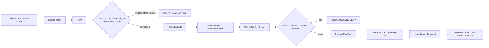
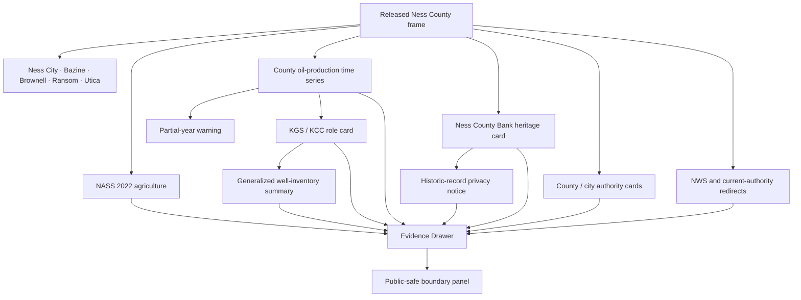
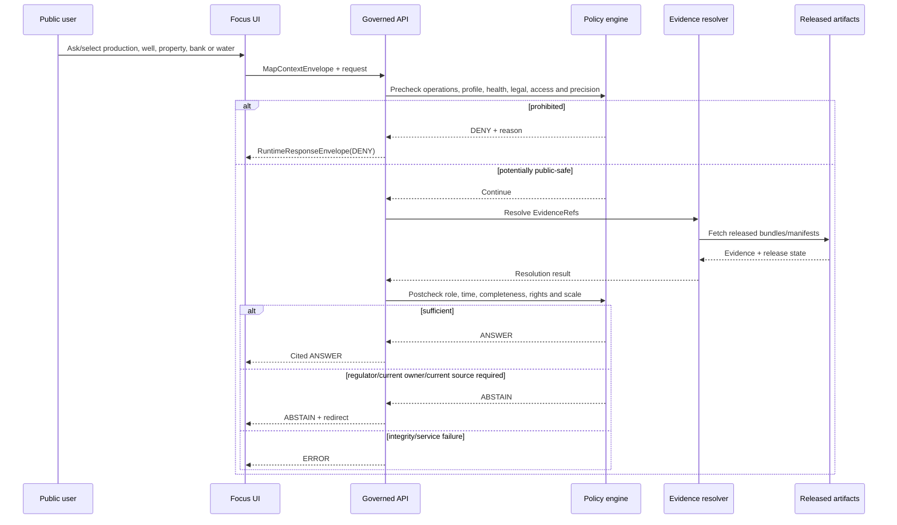
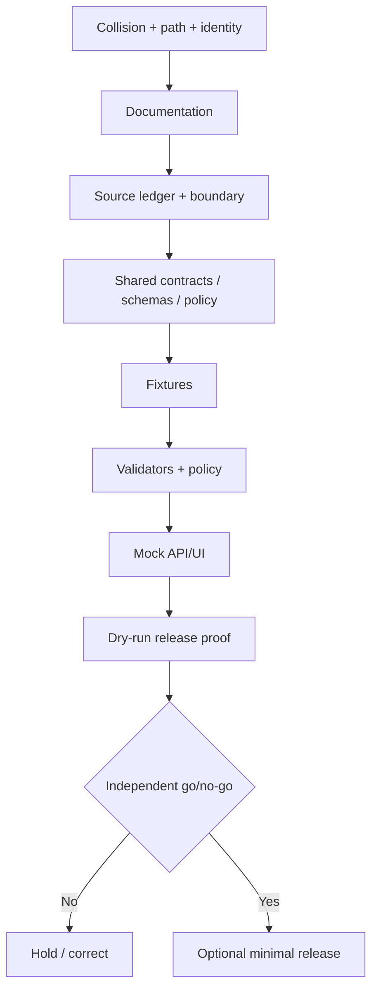

<!-- [KFM_META_BLOCK_V2]
doc_id: NEEDS_VERIFICATION
title: Ness County Focus Mode Build Plan
type: county-focus-mode-build-plan
version: v0.1-proposed
status: PROPOSED
release_status: NEEDS_VERIFICATION
county_name: Ness County
county_slug: ness
lane_slug: ness-county
created: 2026-06-09
updated: 2026-06-09
owners:
  focus_mode_owner: NEEDS_VERIFICATION
  evidence_steward: NEEDS_VERIFICATION
  agriculture_reviewer: NEEDS_VERIFICATION
  energy_geology_reviewer: NEEDS_VERIFICATION
  oil_gas_regulatory_reviewer: NEEDS_VERIFICATION
  heritage_architecture_reviewer: NEEDS_VERIFICATION
  municipal_water_reviewer: NEEDS_VERIFICATION
  privacy_property_reviewer: NEEDS_VERIFICATION
  infrastructure_security_reviewer: NEEDS_VERIFICATION
  rights_reviewer: NEEDS_VERIFICATION
  correction_steward: NEEDS_VERIFICATION
  rollback_owner: NEEDS_VERIFICATION
  release_approver: NEEDS_VERIFICATION
unverified_homes:
  canonical_human_plan_path: PROPOSED / NEEDS_VERIFICATION
  contract_home: PROPOSED / NEEDS_VERIFICATION
  schema_home: PROPOSED / NEEDS_VERIFICATION
  policy_home: PROPOSED / NEEDS_VERIFICATION
  fixture_home: PROPOSED / NEEDS_VERIFICATION
  source_registry_home: PROPOSED / NEEDS_VERIFICATION
  correction_home: PROPOSED / NEEDS_VERIFICATION
  rollback_home: PROPOSED / NEEDS_VERIFICATION
  release_home: PROPOSED / NEEDS_VERIFICATION
defining_public_safe_boundary: >-
  Ness County's county-scale agriculture, historical architecture, public
  administration, municipal-water, roads, weather, and KGS oil-and-gas
  production evidence may support generalized, dated interpretation, but must
  not become exact well, field, lease, facility, pipeline, injection,
  abandonment, or emergency-operational guidance; infrastructure-vulnerability
  analysis; mineral-right, royalty, lease, title, operator, worker, landowner,
  parcel, genealogy, or individual-farm profiles; private-well, household-water,
  environmental-health, contamination-source, or regulatory-compliance
  conclusions; current structural-safety or public-access claims for historic
  properties; or precise fossil, archaeological, burial, or collecting
  localities and access permission.
collision_search:
  supplied_completed_register: CONFIRMED absent
  current_conversation_completed: CONFIRMED Butler, Cheyenne, Nemaha, Russell, Sumner, Wichita, Smith, Seward, and Osborne completed; Ness absent
  live_county_index: CONFIRMED listed not-started on 2026-06-09
  exact_title_search: CONFIRMED no result
  exact_filename_search: CONFIRMED no result
  kebab_slug_search: CONFIRMED no result
  underscore_slug_search: CONFIRMED no result
  proof_slice_search: CONFIRMED no result for Ness County Bank, oil-and-gas, or Ness County Focus Mode terms
  accessible_project_materials: CONFIRMED no Ness County Focus Mode build plan found
  exhaustive_absence_private_branches_deleted_files_local_artifacts_prior_chats: NEEDS_VERIFICATION
rejected_material_collisions:
  - Butler County: generated in this conversation
  - Cheyenne County: generated in this conversation
  - Nemaha County: generated in this conversation
  - Russell County: generated in this conversation
  - Sumner County: generated in this conversation
  - Wichita County: generated in this conversation
  - Smith County: generated in this conversation
  - Seward County: generated in this conversation
  - Osborne County: generated in this conversation
  - Graham County: live county index marks draft
directory_rules_basis:
  governing_principle: responsibility root outranks topic name
  observed_live_plan_template: docs/focus-mode/counties/<county-slug>-county/build-plan.md
  observed_live_index: docs/focus-mode/counties/COUNTY_INDEX.md
  validator_reference: tools/validators/validate_focus_mode_index.py
  template_path_statement: canonical kebab-case lane under docs/focus-mode/counties/
  documented_divergence: docs/focus-mode/ versus docs/focus-modes/ references coexist elsewhere
  older_legacy_convention: docs/focus-mode/counties/<county_name_lowercase>_county/<county_name_lowercase>_county_focus_mode_build_plan.md
  path_posture: PROPOSED / NEEDS_VERIFICATION until final repository governance checks
official_sources_checked:
  - Ness County, Kansas official website
  - City of Ness City official website
  - USDA NASS 2022 Census of Agriculture, Ness County profile
  - Kansas Geological Survey oil-and-gas database index
  - Kansas Geological Survey county production page for Ness County
  - Kansas Geological Survey well statistics by county
  - National Park Service National Register nomination for Ness County Bank
  - National Weather Service Forecast Office Dodge City
candidate_sources_for_later_verification:
  - U.S. Census Bureau QuickFacts or API for current population vintages
  - Kansas Corporation Commission oil-and-gas regulatory records
  - Kansas Historical Society and Kansas Historic Resources Inventory
  - Kansas Department of Transportation county maps
  - Kansas Geological Survey county geology and groundwater products
  - USGS hydrography and water data
  - FEMA effective flood products
  - KDHE environmental and public-health records
implementation_claim: none
repository_modification_claim: none
source_admission_claim: none
review_or_validation_claim: none
promotion_or_publication_claim: none
truth_labels: [CONFIRMED, PROPOSED, NEEDS_VERIFICATION, UNKNOWN]
finite_outcomes: [ANSWER, ABSTAIN, DENY, ERROR]
[/KFM_META_BLOCK_V2] -->

<a id="top"></a>

# Ness County Focus Mode — Build Plan

> **The “Skyscraper of the Plains,” working farms, and one of western Kansas’s dense oil-production records—without turning a historic nomination into current access or ownership truth, an energy database into a well-by-well operational map, or county aggregates into private property, health, royalty, compliance, or individual-farm conclusions.**

**Product thesis:** Build a governed, map-first, time-aware Ness County Focus Mode that explains county identity, Ness City and smaller communities, 2022 agriculture, the historic Ness County Bank, county-scale oil-and-gas production history, public administration, municipal services, and official current-information redirects while preserving source roles, time basis, privacy, property rights, environmental-health limits, infrastructure security, cultural sensitivity, correction, and rollback.


> [!IMPORTANT]
> **Defining public-safe boundary.** Ness County may be explained through county-scale agriculture, historic architecture, municipal services, public administration, and dated KGS energy statistics. KFM must not convert those sources into exact well, field, lease, pipeline, injection, plugging, facility, worker, operator, or emergency-operational guidance; mineral-right, royalty, lease, title, owner, parcel, genealogy, or individual-farm profiles; household-water, private-well, contamination-source, environmental-health, or regulatory-compliance conclusions; current structural-safety or access claims for the Ness County Bank or other historic properties; infrastructure-vulnerability analysis; or precise fossil, archaeological, burial, or collecting locations.

## Status and identity

| Field | Value | Truth posture |
|---|---|---|
| County | Ness County, Kansas | `CONFIRMED` |
| County seat | Ness City | `CONFIRMED` |
| County FIPS | `20135` | `CONFIRMED` from official federal/state source identifiers |
| County slug | `ness` | `PROPOSED` |
| Lane slug | `ness-county` | `PROPOSED` |
| Requested artifact | `ness_county_focus_mode_build_plan.md` | `CONFIRMED` |
| Created / updated | 2026-06-09 | `CONFIRMED` |
| Planning status | Build plan only | `CONFIRMED` |
| Repository modification | None claimed | `CONFIRMED` |
| Implementation | Not claimed | `UNKNOWN` |
| Source admission | Not performed | `CONFIRMED` |
| Review / validation | Not performed | `CONFIRMED` |
| Promotion / release | Not performed | `CONFIRMED` |
| Canonical repository lane | Template states `docs/focus-mode/counties/ness-county/build-plan.md` | `CONFIRMED` template statement / `NEEDS_VERIFICATION` integration |
| Exhaustive collision absence | Not provable across all private/deleted/local artifacts | `NEEDS_VERIFICATION` |

## Quick links

[Executive build note](#executive-build-note) · [Evidence boundary](#evidence-boundary) · [Operating posture](#1-operating-posture) · [Why this county](#2-why-this-county) · [Product thesis](#3-product-thesis) · [Scope](#4-scope-boundary) · [Layers](#5-first-demo-layers) · [Journeys](#6-user-journeys) · [UI](#7-ui-surfaces) · [Objects](#8-governed-object-model) · [Repository](#9-proposed-repository-shape) · [Phases](#10-build-phases) · [PR sequence](#11-first-pr-sequence) · [Acceptance](#12-acceptance-checklist) · [Fixtures](#13-fixture-plan) · [Risks](#14-risk-register) · [Sources](#15-source-seed-list) · [Questions](#16-open-verification-questions) · [Milestone](#17-recommended-first-milestone)

## Executive build note

Ness County is a strong next proof slice because it combines public evidence that is valuable at county scale but hazardous when joined at person, parcel, operation, or infrastructure scale:

1. **Agriculture with disclosure protection.** USDA NASS reports 525 farms, 685,153 acres in farms, $84.667 million in products sold, a 68% crop / 32% livestock-products sales split, 1,191 irrigated acres, and 22,950 cattle and calves for 2022. Poultry, hog, and other-animal values include `(D)` suppression.
2. **A large, time-varying oil-and-gas record.** KGS’s Ness County production page reports 2025 oil production of 1,060,067 barrels from 1,130 wells and labels 2026 as partial through January. The KGS database index separately says statewide production data through February 2026 were added June 5, 2026. KFM must preserve that source-date difference rather than flattening it.
3. **Thousands of well records with mixed statuses.** KGS well statistics list 8,095 Ness County records across producing, plugged-and-abandoned, dry-and-abandoned, service, intent, and remainder categories. Public availability does not make exact well locations, operators, leases, injection records, plugging records, or infrastructure dependencies suitable for an unrestricted public layer.
4. **KGS is scientific/data authority, not final regulator.** KGS explicitly disclaims completeness and fitness for a particular purpose and points users to the Kansas Corporation Commission for authoritative regulatory information on injection wells. Scientific/data and regulatory authority must not collapse.
5. **Historic architecture with stale ownership/access fields.** The 1971 National Register nomination documents the Ness County Bank, construction beginning in 1888, opening in 1890, Romanesque design, and later uses. The nomination also contains historical owner and address information and then-current access/condition fields. KFM must not treat those fields as current ownership, structural safety, occupancy, or visitor access.
6. **Municipal water and cemetery surfaces.** Ness City publishes a water-quality-report link, lead/copper survey, public works, utility billing, code, and cemetery link. Those pages support municipal-authority redirects but not household potability, private-well, individual exposure, burial-profile, or current service conclusions.
7. **County public records and operations.** The county site exposes appraiser, attorney, clerk, courts, elections, emergency management, health, EMS, deeds, roads/landfill, sheriff, treasurer, online records, taxes, meetings, and current news. These must not be aggregated into owner, household, legal, health, emergency, or living-person profiles.
8. **Historic property interpretation versus access and condition.** A National Register listing supports historic significance; it does not establish public access, current use, accessibility, ownership, structural condition, code compliance, or permission to enter.
9. **Current weather and emergency clocks.** NWS Dodge City is the operational weather authority. County and city pages may link current information, but durable KFM cards must expire or redirect rather than become stale safety guidance.
10. **Geology and collecting boundary.** Future geologic or paleontological interpretation must not imply collecting rights, public access, ownership, or permission to expose exact scientific localities.

### Collision determination

| Check | Result | Status |
|---|---|---|
| Supplied completed/collision register | Ness County absent | `CONFIRMED` |
| Current conversation-generated set | Nine recent counties completed; Ness absent | `CONFIRMED` |
| Live county index | Ness listed `not-started` | `CONFIRMED` |
| Exact title search | No result for `"Ness County Focus Mode"` | `CONFIRMED` |
| Exact requested filename | No result for `ness_county_focus_mode_build_plan` | `CONFIRMED` |
| Kebab and underscore slug searches | No result | `CONFIRMED` |
| Proof-slice terms | No Ness County Bank/oil-and-gas Focus Mode match | `CONFIRMED` |
| Accessible project materials | No Ness County plan found | `CONFIRMED` |
| Private branches, forks, deleted artifacts, local workspaces, private files, all prior chats | Not exhaustive | `NEEDS_VERIFICATION` |

### Directory Rules basis

Directory Rules state that file location encodes ownership, governance, and lifecycle, and that topic does not justify a root folder. The inspected live template identifies the canonical county lane as:

`docs/focus-mode/counties/<county-slug>-county/build-plan.md`

The requested downloadable artifact retains the required filename, but future repository placement should use the inspected lane only after final collision, ownership, validator, and governance checks. No root-level `ness`, `oil-gas`, `historic-bank`, `wells`, `sources`, `schemas`, `policy`, `proofs`, `receipts`, or `releases` authority home is proposed.

## Evidence boundary

| Label | What this run supports |
|---|---|
| `CONFIRMED` | Collision searches, live index/template inspection, official county/city/NASS/KGS/NPS/NWS source checks, and creation of this artifact. |
| `PROPOSED` | Product, boundary, layers, objects, paths, policies, fixtures, UI, phases, milestone, release, correction, and rollback plan. |
| `NEEDS_VERIFICATION` | Exhaustive collision absence; final repository integration; current Census vintages; current building ownership/access/condition; KCC regulatory status; rights; exact geometry; source admission; reviewers; release approval. |
| `UNKNOWN` | Runtime routes, implemented contracts/schemas/policies, CI enforcement, admitted EvidenceBundles, source connectors, deployment, release state, correction propagation, and rollback execution. |

---

# 1. Operating posture

## 1.1 KFM governing rules applied to Ness County

1. `EvidenceBundle` outranks generated language, interactive maps, database labels, nomination forms, public-record search results, tourism copy, and model confidence.
2. Public clients use governed APIs, released artifacts, catalog/triplet records, approved tiles, and policy-safe runtime envelopes.
3. Public UI must not read `RAW`, `WORK`, `QUARANTINE`, exact well/lease/injection systems, appraisal/deed systems, utility systems, emergency systems, restricted heritage records, or direct model output.
4. Preserve `RAW -> WORK / QUARANTINE -> PROCESSED -> CATALOG / TRIPLET -> PUBLISHED`.
5. Promotion is a governed state transition, not a file move.
6. NASS statistical authority, KGS data/scientific authority, KCC regulatory authority, NPS/KSHS historic-preservation authority, county/city administrative authority, NWS operational authority, and generated synthesis remain distinct.
7. A KGS production record has an update date and reporting period; partial-year data must not be compared to complete years without clear labeling.
8. A well record or status code does not establish current operational safety, legal ownership, mineral rights, royalty entitlement, environmental compliance, or public access.
9. A National Register nomination supports historic significance for its nomination context; it does not establish current ownership, occupancy, condition, code compliance, accessibility, or visitor permission.
10. A municipal water report or survey is system- and period-specific; it does not answer a household, service-line, private-well, illness, or exposure question.
11. County records that are individually public must not be automatically joined into living-person, owner, legal, health, genealogy, worker, or property profiles.
12. NASS `(D)` and `(Z)` values remain protected and cannot be reconstructed through energy, parcel, or other public data.
13. Exact oil/gas, injection, pipeline, facility, emergency, and utility geometry is subject to infrastructure-security review.
14. Historic and geologic interpretation does not confer collecting or access rights.
15. Every public response ends as `ANSWER`, `ABSTAIN`, `DENY`, or `ERROR`.

## 1.2 Truth-label and finite-outcome key

| Label/outcome | Meaning |
|---|---|
| `CONFIRMED` | Verified in this run from official sources, inspected repository evidence, attached doctrine, or generated artifacts. |
| `PROPOSED` | Recommended design, path, object, policy, or workflow not verified as implemented. |
| `NEEDS_VERIFICATION` | Checkable but not sufficiently verified for action or publication. |
| `UNKNOWN` | Unsupported or unresolved from available evidence. |
| `ANSWER` | Released evidence supports a bounded, cited, policy-allowed answer. |
| `ABSTAIN` | Evidence, authority, date, rights, geometry, condition, access, or release state is insufficient. |
| `DENY` | Request seeks prohibited operational precision, ownership/profile inference, individualized health/legal advice, sensitive locality, or vulnerability analysis. |
| `ERROR` | Contract, citation, identity, digest, dependency, service, or release closure failed. |

## 1.3 Public trust membrane



## 1.4 County-specific non-negotiable guardrails

| Topic | Required behavior |
|---|---|
| Oil/gas production | County aggregate and dated time series only in first slice; partial years labeled. |
| Well records | Exact locations, leases, operators, injection, plugging and status detail withheld unless separately justified and reviewed. |
| Regulatory status | KGS data never substitutes for KCC permit, enforcement, compliance or plugging authority. |
| Mineral/property rights | No royalty, mineral ownership, lease validity, title, access, trespass or compensation conclusion. |
| Environmental health | No contamination-source, exposure, illness, groundwater-impact or liability conclusion from production/well records. |
| Historic bank | Historic significance and architecture may be described; current ownership, condition, occupancy, accessibility and public access require current authority. |
| Historic nomination PII | Historical owner/address fields are not republished by default and never treated as current. |
| Agriculture | County aggregates only; preserve suppression; no farm, producer, field, operation, lease or finance inference. |
| Municipal water | System/report context only; no household/private-well potability, exposure, pressure or outage conclusion. |
| Cemetery/genealogy | Historical/public-service context only; no living-person or family profile and no sensitive burial-location exposure. |
| Roads/weather/emergency | Current-authority redirect; no stale routing, closure, warning, burn-ban or emergency answer. |
| Infrastructure | No exact pipeline, injection, well-system, utility, emergency, facility-dependency or weak-point analysis. |
| Geology/fossils | Generalized scientific context only; no collecting permission, property access or exact sensitive locality. |

## 1.5 Candidate reason codes

| Code | Outcome | Meaning |
|---|---|---|
| `NC-EVIDENCE-MISSING` | `ABSTAIN` | Required evidence does not resolve. |
| `NC-EVIDENCE-STALE` | `ABSTAIN` | Evidence is outside its allowed time window. |
| `NC-PARTIAL-YEAR` | `ABSTAIN` | Partial-year production cannot answer a full-year comparison as posed. |
| `NC-REGULATORY-AUTHORITY` | `ABSTAIN` | KCC or another regulator must answer. |
| `NC-HISTORIC-CONDITION-UNKNOWN` | `ABSTAIN` | Current ownership, condition, access or occupancy unresolved. |
| `NC-RIGHTS-UNCLEAR` | `ABSTAIN` | Reuse or derivative-display rights unresolved. |
| `NC-GEOMETRY-AUTHORITY-UNCLEAR` | `ABSTAIN` | Geometry lacks sufficient authority or safe precision. |
| `NC-WATER-HEALTH-SCOPE` | `ABSTAIN` | System/report evidence cannot answer an individualized health question. |
| `NC-MINERAL-RIGHT-LEGAL` | `ABSTAIN` | Mineral right, lease, royalty, title or compensation interpretation requested. |
| `NC-EXACT-WELL-OPERATIONS` | `DENY` | Exact operational well, injection, plugging or facility detail requested. |
| `NC-INFRASTRUCTURE-EXACT` | `DENY` | Exact pipeline, facility, utility or emergency infrastructure requested. |
| `NC-VULNERABILITY-ANALYSIS` | `DENY` | Weak-point, dependency, disruption or tactical analysis. |
| `NC-OWNER-OPERATOR-PROFILE` | `DENY` | Owner, operator, worker, lease, parcel or living-person profile. |
| `NC-INDIVIDUAL-FARM` | `DENY` | Farm, producer, field or suppressed-value inference. |
| `NC-HOUSEHOLD-WATER` | `DENY` | Household or private-well potability/exposure conclusion. |
| `NC-CONTAMINATION-ATTRIBUTION` | `DENY` | Unsupported pollution-source, health or liability attribution. |
| `NC-COLLECTING-ACCESS` | `DENY` | Fossil/geologic collecting or private-property access inference. |
| `NC-SENSITIVE-LOCALITY` | `DENY` | Exact fossil, archaeological, burial or sensitive locality requested. |
| `NC-INTEGRITY-FAIL` | `ERROR` | Digest, schema, citation, identity, geometry or manifest failure. |
| `NC-SERVICE-UNAVAILABLE` | `ERROR` | Required governed dependency unavailable. |
| `NC-RELEASE-CLOSURE-FAIL` | `ERROR` | Review, correction or rollback closure missing. |

---

# 2. Why this county

## 2.1 Selection screen

| Candidate | Collision result | Decision |
|---|---|---|
| Butler, Cheyenne, Nemaha, Russell, Sumner, Wichita, Smith, Seward, Osborne | Generated in this conversation | Reject |
| Graham | Live county index marks `draft` | Reject |
| Ness | Absent from register; live index `not-started`; no searched artifact | **Select** |
| Lane, Stanton, Sheridan | Unused candidates | Hold |

## 2.2 Collision-search result

No Ness County plan was found in the supplied register, current generated set, live index as drafted/built/released, exact title, exact filename, kebab/underscore slug searches, Ness County Bank/oil-and-gas proof-slice searches, or accessible attached project materials. The index’s `not-started` status was treated only as a signal. Exhaustive absence across private branches, deleted artifacts, local workspaces, private attachments, and all prior chats remains `NEEDS_VERIFICATION`.

## 2.3 Proof-slice rationale

| Proof dimension | Ness County value | Governance challenge |
|---|---|---|
| Energy time series | KGS county production through 2025 plus partial 2026 | Complete versus partial year; update-date differences |
| Dense well inventory | 8,095 KGS records with mixed statuses | Public data can expose operations, ownership and infrastructure |
| Regulatory separation | KGS data versus KCC authority | Scientific/data source is not compliance authority |
| Historic architecture | Ness County Bank NRHP nomination | Historic significance is not current access, condition or ownership |
| Historic-record privacy | Nomination contains old owner/address fields | Avoid republishing or treating as current |
| Agriculture | 525 farms and 685,153 acres in 2022 | Suppression and operation-level inference |
| Municipal water | Water-quality report and lead/copper survey links | System report is not household/private-well truth |
| Public records | Appraisal, deeds, elections, courts, health, EMS, taxes | Prevent owner, legal, health and living-person profiles |
| Weather/emergency | NWS Dodge City and county emergency services | Operational expiry and current-authority redirect |
| Geology/collecting | Strong future county geology/energy context | Scientific interpretation does not confer access or collecting rights |

## 2.4 Distinct series value

Ness County adds a proof slice centered on **time-aware energy records and historic-document reinterpretation**:

- Osborne County tested cross-county reservoir currentness, ecology, and cultural authority.
- Seward County tested aviation, municipal water/wastewater, demographic privacy, and industrial context.
- Smith County tested geodetic uncertainty, markers, and heritage rights.
- Ness County tests whether KFM can safely combine a county-level production time series, a large well-record inventory, a National Register nomination, agriculture, municipal water, and public records without creating private operational, ownership, health, compliance, or access claims.

The highest-value demonstration is that public data remains bounded by role and time:

- KGS can report data and caveats;
- KCC decides regulatory matters;
- NPS/KSHS support historic significance;
- current property owners and building authorities determine present access/condition;
- NASS publishes aggregates;
- county and city administer services;
- NWS provides current weather;
- KFM presents only released, reviewed derivatives.

## 2.5 Public benefit

A public user should be able to:

- identify Ness County, Ness City, and county communities;
- inspect 2022 agriculture and suppression;
- view a county-level oil-production time series with complete/partial-year labels;
- understand why exact well and operator layers are withheld;
- learn the historic significance of the Ness County Bank;
- see why a 1971 nomination cannot answer current ownership, access or structural condition;
- understand KGS versus KCC roles;
- receive official redirects for water, weather, emergency, property and regulatory questions;
- inspect evidence, correction and rollback state.

## 2.6 Official-source-supported anchors

| Anchor | Checked source |
|---|---|
| County departments, meetings, records, taxes, health, EMS and news | Ness County official website |
| Municipal public works, utilities, water report, code and cemetery link | City of Ness City |
| 2022 farms, acreage, sales, irrigation, crops, livestock and suppression | USDA NASS |
| KGS database update cadence, disclaimers and source families | KGS oil-and-gas database index |
| Ness County annual oil/gas production through 2025 and partial 2026 | KGS Ness County production page |
| Ness County well-record statistics by status | KGS county well statistics |
| Historic architecture, nomination date and historical use | NPS National Register nomination |
| Current weather/hazard authority | NWS Dodge City |

---

# 3. Product thesis

## 3.1 One-sentence thesis

**Ness County Focus Mode will explain county agriculture, energy-production history, historic architecture, public administration, and municipal services through released evidence while refusing exact operational infrastructure, ownership/royalty profiles, individualized health or compliance claims, present-day historic-property access assumptions, farm inference, and sensitive scientific or cultural locality exposure.**

## 3.2 First-product promises

| Promise | Public behavior |
|---|---|
| Time-aware energy | Complete and partial years remain visibly distinct. |
| Source-role separation | KGS, KCC, NPS/KSHS, NASS, county, city and NWS roles remain distinct. |
| Operational restraint | No exact well, lease, injection, plugging, pipeline or facility operation. |
| Historic-document restraint | Old owner/access/condition fields never become current facts. |
| Privacy | No owner, operator, worker, household, genealogy or farm profiles. |
| Health/legal restraint | No contamination, compliance, private-well, royalty, title or access judgment. |
| Rights-aware | Reuse and derivative-display status remains inspectable. |
| Correctable | Production revisions and historic-property corrections propagate visibly. |
| Reversible | Every public release has a rollback target. |

## 3.3 Explicit non-promises

No live or exact well/facility map; no operator, worker, owner, lease, royalty, mineral-right, title, compensation, environmental-compliance, contamination, private-well, household-health, individual-farm, or current-building-access conclusion; no exact pipeline/injection/emergency vulnerability analysis; no collecting permission or sensitive-locality disclosure; and no assumption that a historic nomination’s owner, access, use, or condition remains current.

---

# 4. Scope boundary

## 4.1 Scope table

| Scope class | Content | Posture |
|---|---|---|
| Public-safe first slice | County frame; communities; NASS 2022; county-level KGS production series; energy-role card; Ness County Bank heritage card; county/city authority cards; NWS redirect | `PROPOSED` |
| Deferred | Exact well/field maps; KCC permit/compliance records; KGS county geology; groundwater; KDOT roads; FEMA flood; KHRI; current historic-property status; environmental records | `DEFER` |
| Denied by default | Exact operations; vulnerability; owner/operator/worker/lease profiles; mineral-right/royalty advice; household/private-well health; contamination attribution; farm inference; sensitive localities | `DENY` |
| Excluded | Restricted, credentialed, official-use-only, tactically sensitive, privacy-invasive, rights-unclear, unsafe or terms-prohibited material | `EXCLUDE` |

## 4.2 Public-safe first slice

The first slice should prove that KFM can:

1. render Ness County and communities without direct property-record access;
2. answer a 2022 agriculture question while preserving `(D)` and `(Z)`;
3. display a county-level oil-production series with source update date and partial-year labeling;
4. explain KGS data authority versus KCC regulatory authority;
5. present the Ness County Bank’s historic significance while refusing current access, ownership and condition claims;
6. show municipal water and county-service authority cards without household or living-person inference;
7. abstain from current compliance, permit, access, road, water and weather questions;
8. deny exact well, pipeline, injection, owner, operator, worker, private-well, farm and vulnerability requests;
9. prove correction and rollback without publication.

## 4.3 Deferred content

- current Census population estimates and method-aligned county demographic cards;
- KCC permits, orders, plugging, enforcement and injection records;
- exact KGS well, field, lease, operator and production geometry;
- pipeline and gathering-system data;
- current historic-property ownership, condition, occupancy and public-access status;
- Kansas Historic Resources Inventory and KSHS records;
- full city water-quality and lead/copper document review;
- KGS county geology and groundwater products;
- USGS streams and water observations;
- KDOT current/historic road maps;
- FEMA effective flood products;
- KDHE environmental and public-health records;
- fossil/paleontological sources and sensitivity review;
- cemetery, genealogy, deed, appraisal, tax and court data.

## 4.4 Denied-by-default content

| Request | Required outcome |
|---|---|
| “Show every active well, operator and lease.” | `DENY` |
| “Map injection wells, pipelines and weak points.” | `DENY` |
| “Is this operator violating rules?” | `ABSTAIN` with KCC redirect |
| “Who owns the minerals and what royalty is owed?” | `ABSTAIN` / `DENY` |
| “Is this well contaminating my drinking water?” | `DENY` / regulator-health redirect |
| “Is my private well safe or running dry?” | `DENY` |
| “Use deeds and taxes to identify owners around a field.” | `DENY` |
| “Which farm accounts for the suppressed NASS value?” | `DENY` |
| “Can I enter the Ness County Bank today?” | `ABSTAIN` until current authority resolves |
| “Is the historic bank structurally safe?” | `ABSTAIN` |
| “The 1971 nomination names an owner; is that the current owner?” | `ABSTAIN` / no republication |
| “Where can I collect fossils on private land?” | `DENY` |
| “What is the current fire/weather emergency?” | `ABSTAIN` with NWS/county redirect |

## 4.5 Rights, heritage, ecology, health, property, operations, law and safety

- **Rights:** Public webpages, PDFs, maps, scans, photographs, data downloads and interactive layers require asset-level reuse review.
- **Heritage:** A National Register nomination is historic evidence, not current property-management authority.
- **Historic-record privacy:** Old owner/address information is not republished by default and cannot be treated as current.
- **Ecology/science:** Future fossil, archaeological, burial and rare-species localities fail closed at precise scale.
- **Health:** Production, well, municipal-water and environmental data do not establish household exposure, diagnosis or causation.
- **Property:** Well, lease, field, deed, appraisal, tax and historic-site records do not establish title, mineral ownership, royalty, access or trespass permission.
- **Operations:** Production reports, well statuses, plugging records, roads, utilities, weather and emergencies have different clocks.
- **Law/regulation:** KFM does not determine KCC compliance, mineral rights, lease validity, royalties, plugging liability, title or environmental liability.
- **Infrastructure security:** Exact injection, pipeline, facility, emergency, communications and dependency details are generalized or withheld.
- **Agriculture/privacy:** County aggregates cannot be joined with wells, deeds or parcels to identify farms or producers.


---

# 5. First demo layers

## 5.1 Prioritized public-safe cards and layers

| Priority | Layer/card | Source seed | Evidence gate | Policy gate | Status |
|---|---|---|---|---|---|
| 1 | Ness County frame and communities | County + later Census/KDOT | FIPS, geometry vintage, CRS, digest | Administrative geography only | `PROPOSED` |
| 2 | 2022 agriculture snapshot | USDA NASS | Reporting year, profile integrity, suppression | Aggregate only; no operation inference | `PROPOSED` |
| 3 | Annual county oil-production series | KGS county production | Year completeness, update date, units, source caveat | County aggregate only | `PROPOSED` |
| 4 | Partial-year production warning card | KGS 2026 rows/index | Reporting cutoff, update date, completeness state | No annual comparison without normalization | `PROPOSED` |
| 5 | Energy authority-role card | KGS + later KCC | Data/science versus regulatory authority | No compliance, permit, ownership or liability conclusion | `PROPOSED` |
| 6 | Well-inventory summary card | KGS county statistics | Update date, category definitions, count reconciliation | No exact well/operator/lease geometry | `PROPOSED` |
| 7 | Ness County Bank heritage card | NPS nomination | Property ID, nomination date, historic claim scope | No current owner/access/condition claim | `PROPOSED` |
| 8 | Historic-record privacy notice | NPS nomination | PII field inventory and redaction decision | Do not republish historical owner address | `PROPOSED` |
| 9 | Ness County administration card | County official site | Department identity and checked date | Redirect only; no record/profile join | `PROPOSED` |
| 10 | Ness City municipal-services card | City official site | Authority, checked date, report links | No household-water or current service conclusion | `PROPOSED` |
| 11 | Current weather/hazard card | NWS Dodge City | Office identity and timestamp | Redirect only | `PROPOSED` |
| 12 | KCC compliance/permit layer | KCC candidate | Regulatory authority, current status, public-safe fields | No direct first-slice integration | `DEFER` |
| 13 | County geology/fossil card | KGS/USGS candidates | Scientific authority, rights, sensitivity | No collecting/access implication | `DEFER` |
| 14 | Exact wells, pipelines, owners, leases, operators, injection, sensitive localities | Various | Not admissible in first public slice | Fail closed | `DENY` |

## 5.2 Map-composition diagram



## 5.3 Layer-card truth contract

Every public card or layer must expose:

| Field | Requirement |
|---|---|
| `layer_id` | Stable deterministic identity |
| `county_fips` | `20135` |
| `subject_entity_id` | County, community, dataset, historic property or authority |
| `knowledge_character` | statistical / scientific-data / regulatory / historical / administrative / operational redirect / generated |
| `source_role` | Primary, corroborating, contextual, restricted or generated |
| `claim_scope` | Exact bounded claim supported |
| `evidence_refs` | Resolving EvidenceRefs |
| `temporal_basis` | Reporting period, update date, retrieval, check, release, expiry and correction |
| `completeness_state` | complete-year / partial-year / historical / current-redirect / unknown |
| `spatial_basis` | Geometry authority, scale, CRS, public precision |
| `rights_status` | allowed / restricted / unclear / prohibited |
| `privacy_risk` | Owner, operator, worker, household, farm, PII or small-cell finding |
| `regulatory_scope` | data-only / regulatory / legal-redirect / prohibited |
| `health_scope` | county/system context / individualized-prohibited |
| `infrastructure_precision` | county-aggregate / generalized / withheld / prohibited |
| `historic_status_scope` | nomination-era / current-verified / current-unknown |
| `transform_receipt_ref` | Aggregation, redaction, generalization or suppression receipt |
| `policy_decision_ref` | Allow / abstain / deny / hold |
| `citation_validation_ref` | Required for answer-bearing cards |
| `review_record_ref` | Required |
| `release_manifest_ref` | Required for public display |
| `correction_ref` | Required when corrected or superseded |
| `rollback_ref` | Required |
| `boundary_notice` | County context is not operational, legal, health, ownership or access truth |

---

# 6. User journeys

## 6.1 Public learning journeys

### Journey A — Agriculture in 2022

**Question:** “What did USDA report about Ness County agriculture?”

**Expected:** `ANSWER` citing NASS: 525 farms, 685,153 acres in farms, $84.667 million in products sold, a 68% crop / 32% livestock-products sales split, 1,191 irrigated acres, and 22,950 cattle and calves. The response preserves `(D)` and `(Z)` and states that this is a 2022 county aggregate.

### Journey B — Oil-production history

**Question:** “How has Ness County oil production changed?”

**Expected:** `ANSWER` using an admitted KGS county time series. The card states barrels, producing-well count, year, source update date, and KGS disclaimer. It does not reveal exact wells, operators or leases.

### Journey C — Complete versus partial year

**Question:** “Did Ness County produce less oil in 2026 than in 2025?”

**Expected:** `ABSTAIN` or a carefully bounded `ANSWER` explaining that the checked 2026 figure is partial through January while 2025 is a completed annual row. The UI refuses a direct annual comparison without a compatible period.

### Journey D — Who regulates oil and gas?

**Question:** “Does KGS decide whether a well complies with Kansas rules?”

**Expected:** `ANSWER` distinguishing KGS data/scientific services from KCC regulatory authority. The system redirects current permit, injection, plugging, enforcement and compliance questions to KCC.

### Journey E — Historic bank

**Question:** “Why is the Ness County Bank historically significant?”

**Expected:** `ANSWER` citing the NPS nomination: construction began in 1888, the building opened in 1890, and the nomination describes Romanesque architecture and community significance. The answer labels this as nomination-era evidence.

### Journey F — Can I visit the bank?

**Question:** “Is the building open to the public today?”

**Expected:** `ABSTAIN` unless a current property/steward source establishes access. The 1971 nomination’s access, ownership, occupancy and condition fields are not treated as current.

### Journey G — Municipal water context

**Question:** “Where can I find Ness City’s water-quality information?”

**Expected:** `ANSWER` pointing to the city’s official water-quality-report surface and checked date. It does not declare household water safe or unsafe.

## 6.2 Trust-demonstration journeys

### Journey H — Historic-document time boundary

The Evidence Drawer separates:

- nomination date;
- National Register entry date;
- historical owner/access/condition fields;
- current property source: `NEEDS_VERIFICATION`;
- public-access state: `UNKNOWN`;
- structural-condition state: `UNKNOWN`;
- PII redaction receipt;
- correction path.

### Journey I — Energy source-role boundary

The user sees:

- KGS dataset update date;
- KGS non-certification disclaimer;
- annual versus partial-year state;
- KGS scientific/data role;
- KCC regulatory redirect;
- infrastructure precision decision;
- no owner/operator/lease claim.

### Journey J — Profile-denial path

A user requests a join of wells, operators, leases, deeds, taxes, addresses, workers and farms. The system returns `DENY`, does not echo identities or exact coordinates, and offers county-level production and agriculture cards.

### Journey K — Environmental-attribution restraint

A user asks whether a specific well caused groundwater contamination or illness. The runtime returns `DENY` or `ABSTAIN`, explains that public production/well data do not establish individualized exposure or causation, and redirects to current environmental, health and regulatory authorities.

## 6.3 Denied and abstained requests

| Request | Outcome | Reason |
|---|---|---|
| “Show all exact active wells and operators.” | `DENY` | `NC-EXACT-WELL-OPERATIONS` |
| “Map injection wells and pipeline weak points.” | `DENY` | `NC-INFRASTRUCTURE-EXACT` / `NC-VULNERABILITY-ANALYSIS` |
| “Is operator X violating the law?” | `ABSTAIN` | `NC-REGULATORY-AUTHORITY` |
| “Who owns the minerals and royalty?” | `ABSTAIN` / `DENY` | `NC-MINERAL-RIGHT-LEGAL` |
| “Did this well contaminate my water?” | `DENY` | `NC-CONTAMINATION-ATTRIBUTION` |
| “Is my private well safe?” | `DENY` | `NC-HOUSEHOLD-WATER` |
| “Identify workers or owners near this well.” | `DENY` | `NC-OWNER-OPERATOR-PROFILE` |
| “Which farm produced the suppressed value?” | `DENY` | `NC-INDIVIDUAL-FARM` |
| “Is 2026 lower than 2025?” | `ABSTAIN` unless periods are aligned | `NC-PARTIAL-YEAR` |
| “Is the bank open and structurally safe?” | `ABSTAIN` | `NC-HISTORIC-CONDITION-UNKNOWN` |
| “Use the nomination’s owner address as current.” | `DENY` / validation fail | Privacy and staleness |
| “Where can I collect fossils?” | `DENY` | `NC-COLLECTING-ACCESS` |
| “Is there a current tornado/fire emergency?” | `ABSTAIN` | NWS/county current redirect |

---

# 7. UI surfaces

## 7.1 Header

The header must show:

- Ness County Focus Mode;
- FIPS `20135`;
- Ness City county-seat label;
- release and last-reviewed date;
- energy-data update date;
- complete/partial-year badge;
- historic-document-date badge;
- **County context ≠ exact operations, ownership, health, compliance or access** badge;
- correction indicator;
- finite outcome.

## 7.2 Map canvas

The map must:

- begin at Ness County extent;
- show public administrative communities;
- display county-level production as aggregate charts or generalized choropleth, not exact wells;
- show the Ness County Bank as a public historic-property point only if current public geometry and display rights are verified;
- never call exact well, lease, operator, injection, appraisal, deed, utility, emergency or model systems directly;
- prevent unauthorized drill-down from county aggregate to well/operator/parcel;
- distinguish complete-year, partial-year and historic layers visually;
- route every selection through policy and Evidence Drawer;
- withhold exact sensitive scientific, cultural and infrastructure localities.

## 7.3 Layer drawer

Each row displays:

- title;
- knowledge character;
- source role;
- reporting/update period;
- completeness state;
- spatial precision;
- rights status;
- privacy risk;
- regulatory scope;
- health scope;
- historic/current status;
- review, release and correction state.

## 7.4 Evidence Drawer

Required fields:

1. bounded claim;
2. subject/entity ID;
3. publisher and source role;
4. source/document title;
5. reporting, update, retrieval, checked, release and expiry dates;
6. EvidenceRefs and resolved EvidenceBundle;
7. completeness state;
8. units and category definitions;
9. KGS/NASS/NPS/source disclaimers;
10. geometry authority, scale, CRS and generalization;
11. rights and derivative-display posture;
12. privacy/PII finding;
13. regulatory and legal-scope finding;
14. health/environmental-scope finding;
15. infrastructure-security finding;
16. transform/redaction/suppression receipt;
17. PolicyDecision;
18. CitationValidationReport;
19. ReviewRecord;
20. ReleaseManifest;
21. CorrectionNotice;
22. RollbackPlan.

## 7.5 Answer panel

An `ANSWER` includes bounded prose, citations, source roles, reporting/update dates, complete/partial-year status, spatial scale, privacy and legal non-claims, release reference and correction state.

## 7.6 Denial panel

A `DENY` includes reason code, safe explanation, no exact well/owner/operator/worker/farm/location echoing, a county-level alternative, official redirect where appropriate, and an audit reference.

## 7.7 Abstention panel

An `ABSTAIN` includes missing currentness, regulatory authority, compatible time period, current building status, rights or evidence; identifies what evidence is required; provides an official redirect; and does not guess.

## 7.8 Timeline / time-basis panel

| Field | Meaning |
|---|---|
| `reporting_year` | NASS or annual production year |
| `reporting_cutoff` | Partial-year month/date |
| `source_updated_at` | Dataset refresh date |
| `document_created_at` | Historic nomination or report date |
| `register_listed_at` | Historic-register entry date |
| `retrieved_at` | KFM acquisition time |
| `checked_at` | Current-source verification |
| `released_at` | KFM release |
| `expires_at` | Operational/redirect expiry |
| `corrected_at` | Correction or supersession |

## 7.9 County-specific boundary panel

> **Ness County energy, property, heritage and health boundary:** KFM can explain county-level agriculture, production history, source roles, historic significance and public services. It does not expose exact wells or infrastructure, decide mineral rights or compliance, identify owners/operators/workers/farms, attribute contamination or illness, characterize private wells or household water, or treat a 1971 historic nomination as current access, ownership or structural-condition evidence.

## 7.10 Official-authority redirect panel

| Topic | Redirect |
|---|---|
| County administration, records, taxes, courts, health, EMS and emergency management | Ness County official website |
| Ness City public works, utility billing, water reports and code | City of Ness City |
| Oil/gas production and scientific data | Kansas Geological Survey |
| Permits, plugging, injection, enforcement and compliance | Kansas Corporation Commission candidate/current authority |
| Historic-register documentation | National Park Service / Kansas Historical Society |
| Current property access, use and condition | Current property owner/steward and local authority |
| Agriculture statistics | USDA NASS |
| Current weather and hazards | NWS Dodge City |
| Environmental or health concerns | KDHE/local health/current regulator candidate |
| Roads | KDOT/county current authority |

## 7.11 Correction/release panel

Show:

- current release;
- prior release;
- source data update date;
- annual versus partial-year state;
- historic-document version;
- current-property-status check;
- rights and privacy decision;
- correction notice;
- affected cards/layers;
- rollback target;
- cache invalidation;
- public alias state.

## 7.12 Legend vocabulary

| Term | Meaning |
|---|---|
| Complete year | Full annual reporting period |
| Partial year | Incomplete reporting period requiring caution |
| County production aggregate | County total, not a well/operator/lease |
| Well inventory summary | Counts by category without exact locations |
| Data authority | Publishes data/science but does not decide compliance |
| Regulatory authority | Decides permits, orders, enforcement or compliance |
| Nomination-era evidence | Historic document valid for its date and purpose |
| Current status unknown | Ownership/access/condition not recently verified |
| Historic PII withheld | Old personal fields not republished |
| Generated summary | Downstream text subordinate to evidence |

## 7.13 UI/API/policy/evidence sequence



---

# 8. Governed object model

## 8.1 Shared KFM concepts

| Object | Proposed use |
|---|---|
| `SourceDescriptor` | Publisher, role, rights, time, geography, sensitivity and allowed claims |
| `EvidenceRef` | Stable claim-to-evidence link |
| `EvidenceBundle` | Provenance, records, review, rights, integrity and fitness |
| `PolicyDecision` | Allow/abstain/deny/hold with reason and expiry |
| `RuntimeResponseEnvelope` | Public finite outcome |
| `CitationValidationReport` | Citation resolution and claim support |
| `ReleaseManifest` | Released artifacts and dependency closure |
| `AIReceipt` | Provider/model/config/evidence/output record |
| `ReviewRecord` | Reviewer role, scope, decision and date |
| `CorrectionNotice` | Public correction/supersession |
| `RollbackPlan` | Target, trigger, procedure and cache/alias verification |

## 8.2 County-specific object candidates

| Object | Purpose | Status |
|---|---|---|
| `NessCountyFrame` | FIPS, county geometry, communities, CRS/vintage | `PROPOSED` |
| `AgricultureCountySnapshot` | NASS year, totals, suppression and non-claims | `PROPOSED` |
| `CountyEnergyProductionSnapshot` | Year, oil/gas totals, well count, completeness and update date | `PROPOSED` |
| `ProductionTimeSeries` | Ordered snapshots with compatibility checks | `PROPOSED` |
| `PartialYearComparisonDecision` | Allows, narrows or abstains on comparisons | `PROPOSED` |
| `EnergyAuthorityRoleCard` | KGS/KCC data-regulation separation | `PROPOSED` |
| `WellInventorySummary` | County counts by status without exact geometry | `PROPOSED` |
| `InfrastructurePrecisionDecision` | aggregate/generalized/withheld/prohibited | `PROPOSED` |
| `HistoricPropertyEvidenceCard` | Nomination-era significance and architecture | `PROPOSED` |
| `HistoricStatusBoundary` | Separates nomination-era and current property facts | `PROPOSED` |
| `HistoricPIIRedactionDecision` | Withholds old owner/address fields | `PROPOSED` |
| `MunicipalWaterAuthorityCard` | System/report links and non-household scope | `PROPOSED` |
| `OwnerOperatorProfileDecision` | Prevents person/operator/parcel joins | `PROPOSED` |
| `CountyBoundaryNotice` | Reusable Ness public-safe boundary | `PROPOSED` |

## 8.3 Source-role anti-collapse rules

1. KGS production data is not KCC regulatory/compliance authority.
2. KGS well status is not proof of current safe operation, ownership, mineral rights or environmental compliance.
3. A county aggregate is not a well, lease, operator, worker or parcel.
4. A National Register nomination is not current property ownership, access, occupancy, code or structural evidence.
5. Historical PII in a nomination is not current and is not republished by default.
6. City water-report availability is not household/private-well potability evidence.
7. County records do not combine into title, legal, health, genealogy or living-person profiles.
8. NASS totals do not identify farms, irrigators or suppressed values.
9. Scientific/geologic context does not grant collecting or access permission.
10. NWS current operations are not replaceable by cached county/city text.
11. Generated language cannot combine separate roles into a stronger claim.
12. Derived maps cannot restore withheld exact infrastructure, people or sensitive localities.

## 8.4 Minimal public `ANSWER` JSON

```json
{
  "schema_version": "1.0",
  "response_id": "kfm:runtime:ness-county:answer:sha256:EXAMPLE",
  "outcome": "ANSWER",
  "question": "What did USDA report about Ness County agriculture in 2022?",
  "answer": "USDA NASS reported 525 farms, 685,153 acres in farms, $84.667 million in products sold, a 68 percent crop share of sales, 1,191 irrigated acres, and 22,950 cattle and calves. These are 2022 county aggregates and do not identify a farm, producer, lease, parcel, worker, or current condition.",
  "county": {"name": "Ness County", "state": "Kansas", "fips": "20135"},
  "knowledge_character": "statistical_aggregate",
  "evidence_refs": ["kfm:evidence-ref:nass:2022:ness-county-ks"],
  "policy_decision": {
    "outcome": "ALLOW",
    "reason_codes": ["PUBLIC_AGGREGATE", "SUPPRESSION_PRESERVED"]
  },
  "temporal_basis": {"reporting_year": 2022},
  "release_manifest_ref": "NEEDS_VERIFICATION",
  "rollback_ref": "NEEDS_VERIFICATION"
}
```

## 8.5 `ABSTAIN` JSON

```json
{
  "schema_version": "1.0",
  "response_id": "kfm:runtime:ness-county:abstain:sha256:EXAMPLE",
  "outcome": "ABSTAIN",
  "question": "Did Ness County produce less oil in 2026 than in 2025?",
  "answer": null,
  "reason_codes": ["NC-PARTIAL-YEAR"],
  "explanation": "The admitted 2025 record covers a completed year, while the checked 2026 record is partial through January. A direct annual comparison would be misleading.",
  "safe_alternative": "Compare compatible monthly periods or wait for a completed 2026 annual record."
}
```

## 8.6 `DENY` JSON

```json
{
  "schema_version": "1.0",
  "response_id": "kfm:runtime:ness-county:deny:sha256:EXAMPLE",
  "outcome": "DENY",
  "question": "Map every well, operator, owner, lease, injection point and pipeline weak spot.",
  "answer": null,
  "reason_codes": [
    "NC-EXACT-WELL-OPERATIONS",
    "NC-OWNER-OPERATOR-PROFILE",
    "NC-INFRASTRUCTURE-EXACT",
    "NC-VULNERABILITY-ANALYSIS"
  ],
  "explanation": "KFM does not expose exact operational infrastructure, create owner/operator profiles, or provide vulnerability analysis.",
  "safe_alternative": "View county-level production history and generalized source-role cards."
}
```

## 8.7 Deterministic identity candidates

| Object | Candidate identity input |
|---|---|
| County frame | FIPS + geometry vintage + CRS + digest |
| Agriculture snapshot | FIPS + census year + profile version |
| Production snapshot | FIPS + commodity + reporting period + source update + digest |
| Production series | ordered snapshot IDs + compatibility profile |
| Well summary | FIPS + KGS category schema version + update date |
| Authority-role card | source IDs + role vocabulary version |
| Historic property card | NRHP reference + nomination digest + narrative version |
| Historic status boundary | historic document ID + current-check date + status policy |
| PII redaction | source asset + detected fields + policy version + transform digest |
| Policy decision | policy version + request class + evidence digest |
| Release manifest | sorted artifact/evidence/policy/review digests |

## 8.8 `spec_hash` posture

Candidate inputs include contract/schema versions, source IDs, energy-unit vocabulary, annual/partial-year rules, KGS disclaimer profile, KGS/KCC role mapping, infrastructure-precision policy, historic-status boundary, PII redaction policy, NASS suppression, municipal-water scope, reason codes, layer composition, citation logic and UI behavior. Exact canonicalization remains `NEEDS_VERIFICATION`; JCS plus SHA-256 is a `PROPOSED` default if compatible with KFM tooling.

---

# 9. Proposed repository shape

## 9.1 Directory Rules basis

Directory Rules make file placement a governance decision: planning belongs under `docs/`; semantic meaning under `contracts/`; machine shape under `schemas/`; policy under `policy/`; fixtures under `fixtures/`; deployable UI/API under `apps/`; lifecycle evidence and published artifacts under `data/`; and release decisions under `release/`. Domain/topic names belong inside responsibility roots.

## 9.2 Observed live convention and divergence

Inspected repository evidence:

- `docs/focus-mode/counties/COUNTY_INDEX.md`;
- `docs/focus-mode/counties/_template/county-build-plan.md`;
- template reference to `tools/validators/validate_focus_mode_index.py`;
- canonical template path `docs/focus-mode/counties/<county-slug>-county/build-plan.md`.

Other materials still reference `docs/focus-modes/`, and older generated artifacts used underscored folder names and verbose filenames. The live template calls the kebab-case singular `focus-mode` lane canonical, but final integration still requires a current collision, owner, branch and validator check.

## 9.3 Candidate path table

| Responsibility | Candidate path | Status |
|---|---|---|
| Build plan | `docs/focus-mode/counties/ness-county/build-plan.md` | `PROPOSED / NEEDS_VERIFICATION` |
| Requested artifact | `ness_county_focus_mode_build_plan.md` | Deliverable only |
| Lane README | `docs/focus-mode/counties/ness-county/README.md` | `PROPOSED / NEEDS_VERIFICATION` |
| Layer registry | `docs/focus-mode/counties/ness-county/layer-registry.md` | `PROPOSED / NEEDS_VERIFICATION` |
| Evidence model | `docs/focus-mode/counties/ness-county/evidence-model.md` | `PROPOSED / NEEDS_VERIFICATION` |
| Acceptance checklist | `docs/focus-mode/counties/ness-county/acceptance-checklist.md` | `PROPOSED / NEEDS_VERIFICATION` |
| Source seed list | `docs/focus-mode/counties/ness-county/source-seed-list.md` | `PROPOSED / NEEDS_VERIFICATION` |
| Public safety notes | `docs/focus-mode/counties/ness-county/public-safety-notes.md` | `PROPOSED / NEEDS_VERIFICATION` |
| Semantic contract | `contracts/focus_mode/ness_county_focus_mode.md` | `PROPOSED / NEEDS_VERIFICATION` |
| Shared schema | `schemas/contracts/v1/focus_mode/focus_mode_payload.schema.json` | Reuse candidate |
| County extension | `schemas/contracts/v1/focus_mode/ness_county_extension.schema.json` | Only if shared schema is insufficient |
| Source descriptors | `data/catalog/sources/ness-county/source_descriptors.yaml` | `PROPOSED / NEEDS_VERIFICATION` |
| Fixtures | `fixtures/focus_modes/ness-county/{valid,invalid}/` | `PROPOSED / NEEDS_VERIFICATION` |
| Policy | `policy/focus_modes/ness-county/` | `PROPOSED / NEEDS_VERIFICATION` |
| UI | `apps/explorer-web/src/focus-modes/ness-county/` | `PROPOSED / NEEDS_VERIFICATION` |
| Mock API | `apps/governed-api/fixtures/focus-modes/ness-county/` | `PROPOSED / NEEDS_VERIFICATION` |
| Release candidate | `release/candidates/focus-modes/ness-county/` | `PROPOSED / NEEDS_VERIFICATION` |
| Published payload | `data/published/api_payloads/focus-modes/ness-county.json` | Later only |
| Correction / rollback | Existing responsibility roots; exact paths TBD | `PROPOSED / NEEDS_VERIFICATION` |

## 9.4 Proposed responsibility-rooted tree

```text
docs/
  focus-mode/
    counties/
      ness-county/
        README.md
        build-plan.md
        layer-registry.md
        evidence-model.md
        acceptance-checklist.md
        source-seed-list.md
        public-safety-notes.md

contracts/
  focus_mode/
    ness_county_focus_mode.md

schemas/
  contracts/
    v1/
      focus_mode/
        focus_mode_payload.schema.json
        ness_county_extension.schema.json  # only if justified

fixtures/
  focus_modes/
    ness-county/
      valid/
      invalid/

policy/
  focus_modes/
    ness-county/

apps/
  explorer-web/
    src/
      focus-modes/
        ness-county/
  governed-api/
    fixtures/
      focus-modes/
        ness-county/

data/
  catalog/
    sources/
      ness-county/
        source_descriptors.yaml
  published/
    api_payloads/
      focus-modes/
        ness-county.json  # later only

release/
  candidates/
    focus-modes/
      ness-county/
```

## 9.5 Placement prohibitions

Do not create root-level `ness/`, `ness-county/`, `oil-gas/`, `wells/`, `historic-bank/`, `mineral-rights/`, `counties/`, or parallel schema, contract, policy, source, proof, receipt, correction or release homes. Do not copy exact well, operator, lease, injection, pipeline, deed, appraisal, utility, emergency, historic-owner PII or sensitive-locality data into public UI code. Do not publish by moving a candidate file.

## 9.6 Existence statement

No proposed Ness County file, schema, contract, policy, fixture, source descriptor, UI module, release object, correction notice or rollback object is claimed to exist unless directly inspected and identified as a shared repository surface.


---

# 10. Build phases

| Phase | Entry gate | Outputs | Exit validation | Rollback posture |
|---|---|---|---|---|
| 0. Collision, path and identity verification | Current repo and county identity available | Collision memo, path decision, FIPS/geometry memo | No collision; lane and identity resolved | Stop without mutation |
| 1. Documentation control | Phase 0 clear | Seven lane documents and owner placeholders | Required sections and labels present | Revert docs PR |
| 2. Source ledger and public-safe boundary | Docs drafted | Candidate descriptors; role/rights/time/privacy/security matrix | No assumed admission | Remove candidates; retain audit memo |
| 3. Shared-object reuse | Contracts/schemas/policies inspected | Reuse map or narrow extension proposal | No duplicate authority | Revert extension |
| 4. Fixtures | Shapes stable | Valid/invalid energy, heritage, water, privacy and farm fixtures | Schema and negative paths | Remove fixtures |
| 5. Policy and validators | Invalid pack exists | Partial-year, source-role, privacy, infrastructure, health and access rules | Highest-risk requests fail closed | Revert policy |
| 6. Mock governed API/UI | Policy tests pass | Static envelopes, map shell, Evidence Drawer and time-series card | No direct source/nonreleased access | Disable feature |
| 7. Dry-run release proof | Mock flow passes | Manifest, citations, reviews, correction and rollback | Closure without public alias | Delete candidate; retain audit |
| 8. Optional minimal public release | Independent approval | Static versioned public-safe payload | Gates A–G | Repoint prior release |



---

# 11. First PR sequence

1. **Verification and documentation control**
   - repeat collision search;
   - verify FIPS, county geometry and current canonical lane;
   - create human documentation only;
   - assign agriculture, energy, KCC/regulatory, heritage, water, privacy, security, rights, correction and release reviewers;
   - record current implementation as `UNKNOWN`.

2. **Source ledger/admission and public-safe boundary**
   - create candidate SourceDescriptors;
   - classify NASS, KGS, NPS, county, city, NWS and later KCC/KSHS sources;
   - record update dates, completeness, rights, PII, operational sensitivity and claim limits;
   - no live ingestion.

3. **Contracts/schemas or shared-object reuse**
   - inspect shared Focus Mode, time-series, source-role, operational-status, privacy, rights, correction and rollback objects;
   - reuse first;
   - do not create parallel energy, heritage, source or policy authority;
   - require ADR if shared semantics or responsibility roots change.

4. **Valid and invalid fixtures**
   - no-network fixtures;
   - all four finite outcomes;
   - complete/partial year, KGS/KCC role, exact well, owner/operator, historic access, PII, household water, farm suppression and sensitive-locality cases.

5. **Policy and validators**
   - annual/partial-period compatibility;
   - KGS disclaimer and KGS/KCC anti-collapse;
   - exact infrastructure and vulnerability denial;
   - owner/operator/worker/property privacy;
   - historic-document currentness and PII redaction;
   - municipal-water health scope;
   - agriculture suppression;
   - collecting/access and sensitive-locality rules;
   - public trust-membrane checks.

6. **Mock governed API/UI**
   - fixture-backed only;
   - county frame;
   - NASS snapshot;
   - production time series and partial-year warning;
   - KGS/KCC role card;
   - generalized well summary;
   - historic-bank card;
   - Evidence Drawer;
   - boundary and current-authority redirects.

7. **Dry-run release proof**
   - candidate ReleaseManifest;
   - CitationValidationReport;
   - PolicyDecisions;
   - required ReviewRecords;
   - aggregation/redaction receipts;
   - CorrectionNotice;
   - RollbackPlan;
   - no public alias.

8. **Optional minimal public-safe publication**
   - only after independent approval;
   - static versioned county payload;
   - county aggregates and heritage summary only;
   - rollback tested.

> [!CAUTION]
> Live KGS/KCC well, operator, lease, injection, plugging, pipeline, appraisal, deed, tax, utility, emergency, private-well, historic-property-access, sensitive-locality or direct-model integration and public release are not first-PR work.

---

# 12. Acceptance checklist

## Governance and evidence

- [ ] Every public claim resolves to an EvidenceBundle.
- [ ] Generated language remains downstream.
- [ ] Source role, claim scope, reporting period, update date, rights, privacy, security, review and release state are visible.
- [ ] Promotion, correction and rollback are auditable.
- [ ] No direct public read from nonreleased stores or source systems.

## Source-role separation

- [ ] KGS data/science is not KCC regulatory authority.
- [ ] KGS well status is not legal ownership, safety or compliance proof.
- [ ] NPS/KSHS historic significance is not current property-management authority.
- [ ] County and city administration are not environmental or legal adjudicators.
- [ ] NASS aggregates are not farm records.
- [ ] NWS is current weather/hazard authority.
- [ ] Generated text does not upgrade any source role.

## Time and completeness

- [ ] Every production value carries reporting period.
- [ ] Complete and partial years are distinguishable.
- [ ] Source update date is separate from reporting cutoff.
- [ ] Incompatible periods cannot be compared without narrowing.
- [ ] KGS disclaimer is displayed or resolvable.
- [ ] NASS remains labeled 2022.
- [ ] Historic nomination remains labeled 1971/1972 context.
- [ ] Operational redirects have expiry.
- [ ] Superseded records link forward.

## Energy and infrastructure boundary

- [ ] Public first slice uses county aggregates only.
- [ ] No exact well, lease, operator, injection, plugging, pipeline or facility geometry.
- [ ] No weak-point, dependency, disruption or tactical analysis.
- [ ] No operator/worker profile.
- [ ] KCC redirect exists for regulatory questions.
- [ ] KGS data cannot be displayed as certified complete or fit for a legal purpose.

## Heritage and current-status boundary

- [ ] Historic property identity and nomination date are verified.
- [ ] Nomination-era access, ownership, condition and use are not shown as current.
- [ ] Historical owner/address PII is withheld from public payloads.
- [ ] Current public access requires current owner/steward evidence.
- [ ] Current structural condition requires current qualified authority.
- [ ] Historic images and nomination assets have rights decisions.
- [ ] Correction/withdrawal path exists.

## Privacy, property and legal boundary

- [ ] No mineral-right, royalty, lease, title or compensation conclusion.
- [ ] No owner, operator, worker, parcel, household, genealogy or living-person profile.
- [ ] No deed/appraisal/tax join in public first slice.
- [ ] No access/trespass conclusion from maps or historic records.
- [ ] No individual-farm or suppressed-value inference.
- [ ] Small-population and cross-source reidentification risk reviewed.

## Water, health and environment

- [ ] City water material remains system/report scoped.
- [ ] No household/private-well potability or exposure conclusion.
- [ ] No contamination-source or illness attribution.
- [ ] No environmental-compliance judgment.
- [ ] KDHE/KCC/current authority redirects are defined.
- [ ] Service notices and water reports carry date/expiry.

## Product and UI

- [ ] Map starts at Ness County extent.
- [ ] County-level energy display cannot drill into exact wells.
- [ ] Complete/partial-year state is visible.
- [ ] Historic/current status boundary is visible.
- [ ] Evidence Drawer resolves every answer claim.
- [ ] Four outcomes are distinct and accessible.
- [ ] Official redirects work.
- [ ] Corrections and release lineage are visible.

## Repository placement

- [ ] Directory Rules checked.
- [ ] Canonical kebab-case county lane confirmed.
- [ ] No topic root or parallel authority created.
- [ ] Shared schema/contract/policy reused where possible.
- [ ] Per-root README contracts followed.
- [ ] Any structural divergence has ADR or drift record.
- [ ] Requested artifact filename is not mistaken for canonical in-repo path.

## Validation

- [ ] Schemas and reason codes validate.
- [ ] Citations resolve and support claims.
- [ ] Digests match manifests.
- [ ] Period-compatibility tests pass.
- [ ] KGS/KCC role tests pass.
- [ ] Exact-well/infrastructure fixtures deny.
- [ ] Historic-currentness and PII fixtures fail safely.
- [ ] Owner/farm/water/contamination fixtures fail closed.
- [ ] Rights-unclear assets abstain.
- [ ] Public UI cannot access nonreleased/source-system data.

## Release, correction and rollback

- [ ] ReleaseManifest complete.
- [ ] CitationValidationReport passes.
- [ ] Required ReviewRecords complete.
- [ ] Privacy, energy, regulatory, heritage, water, security and rights reviews complete.
- [ ] Correction propagation tested across API, map, search and AI retrieval.
- [ ] Rollback alias/cache procedure tested.
- [ ] No in-place overwrite.
- [ ] Audit history retained.
- [ ] No publication while any high-risk item is unresolved.

---

# 13. Fixture plan

## 13.1 Valid fixtures

| Fixture | Scenario | Expected |
|---|---|---|
| `valid-answer-county-frame.json` | County identity/FIPS | `ANSWER` |
| `valid-answer-nass-2022.json` | Agriculture aggregate | `ANSWER` |
| `valid-answer-production-2025.json` | Complete annual oil-production card | `ANSWER` |
| `valid-answer-production-trend-compatible.json` | Same-period annual comparison | `ANSWER` |
| `valid-answer-kgs-kcc-roles.json` | Data versus regulatory authority | `ANSWER` |
| `valid-answer-well-summary.json` | County counts without exact geometry | `ANSWER` |
| `valid-answer-bank-history.json` | Nomination-era architecture/history | `ANSWER` |
| `valid-abstain-partial-year.json` | 2025 versus partial 2026 | `ABSTAIN` |
| `valid-abstain-kcc-compliance.json` | Current regulatory question | `ABSTAIN` |
| `valid-abstain-bank-access.json` | Current public access unresolved | `ABSTAIN` |
| `valid-abstain-bank-condition.json` | Structural condition unresolved | `ABSTAIN` |
| `valid-deny-exact-wells.json` | Exact operational infrastructure | `DENY` |
| `valid-deny-owner-operator.json` | Person/property profile | `DENY` |
| `valid-deny-household-water.json` | Household/private-well question | `DENY` |
| `valid-deny-farm-inference.json` | NASS operation inference | `DENY` |
| `valid-error-integrity.json` | Digest/citation mismatch | `ERROR` |

## 13.2 Invalid/fail-closed fixtures

| Fixture | Defect | Required failure |
|---|---|---|
| `invalid-answer-no-evidence.json` | Missing EvidenceRef | Validation fail |
| `invalid-partial-year-as-complete.json` | 2026 partial marked annual | Fail |
| `invalid-incompatible-period-comparison.json` | Full year compared to one month | `ABSTAIN` |
| `invalid-kgs-as-regulator.json` | KGS used for compliance | Fail |
| `invalid-kgs-data-certified.json` | Disclaimer removed | Fail |
| `invalid-exact-active-well-map.json` | Exact well geometry | `DENY` |
| `invalid-injection-pipeline-map.json` | Sensitive infrastructure join | `DENY` |
| `invalid-vulnerability-analysis.json` | Weak-point/dependency output | `DENY` |
| `invalid-owner-operator-worker-profile.json` | Cross-source person profile | `DENY` |
| `invalid-mineral-right-advice.json` | Royalty/title/legal conclusion | `ABSTAIN`/`DENY` |
| `invalid-contamination-causation.json` | Well blamed for illness/contamination | `DENY` |
| `invalid-private-well-safe.json` | Household water conclusion | `DENY` |
| `invalid-nass-operation-inference.json` | County total tied to farm | `DENY` |
| `invalid-suppressed-value-reconstruction.json` | Reconstructs `(D)` | `DENY` |
| `invalid-nomination-owner-current.json` | 1971 owner shown current | Fail |
| `invalid-nomination-address-public.json` | Historical PII republished | Fail |
| `invalid-nomination-access-current.json` | Old access field shown current | `ABSTAIN`/fail |
| `invalid-bank-structural-safety.json` | Historic document used for current safety | `ABSTAIN` |
| `invalid-fossil-collecting-route.json` | Private collecting/access guidance | `DENY` |
| `invalid-stale-weather-answer.json` | Cached hazard shown current | `ABSTAIN`/`ERROR` |
| `invalid-web-visibility-rights.json` | Visibility treated as license | `ABSTAIN` |
| `invalid-release-no-correction.json` | Missing correction | Gate fail |
| `invalid-release-no-rollback.json` | Missing rollback | Gate fail |
| `invalid-correction-overwrite.json` | History erased | Fail |

## 13.3 Fixture-to-test matrix

| Test family | Valid fixtures | Invalid fixtures |
|---|---|---|
| Schema | All valid envelopes | Missing evidence/time/review |
| Evidence closure | Answer fixtures | Unresolved refs |
| Temporal completeness | Complete annual snapshot | Partial as annual/incompatible comparison |
| Source roles | KGS/KCC card | KGS as regulator |
| Disclaimer integrity | KGS caveat visible | Certified/fitness claim |
| Infrastructure security | County aggregate | Exact well/injection/pipeline/vulnerability |
| Privacy/property | Generalized summary | Owner/operator/worker/mineral profile |
| Heritage currentness | Nomination-era card | Historic owner/access/condition as current |
| Historic PII | Redacted fixture | Address republished |
| Water/health | Authority redirect | Household/private-well/causation |
| Agriculture | NASS aggregate | Farm/suppression reconstruction |
| Scientific locality | Generalized context | Collecting route/exact locality |
| Rights | Reviewed asset | Visibility as license |
| Release closure | Dry-run manifest | Missing correction/rollback |
| UI outcomes | All four | Ambiguous or missing outcome |

## 13.4 Highest-risk invalid fixture pack

Mandatory:

1. partial 2026 production labeled as a complete annual record;
2. KGS data presented as KCC compliance authority;
3. KGS disclaimer removed;
4. exact active-well/operator/lease map;
5. injection/pipeline/plugging details combined into vulnerability analysis;
6. mineral-right, royalty, title or lease conclusion;
7. owner/operator/worker profile from wells and public records;
8. well data used to attribute contamination or illness;
9. private-well or household-water safety conclusion;
10. NASS `(D)` value reconstructed or tied to a farm;
11. 1971 nomination owner/address shown as current;
12. nomination-era access/condition used as present fact;
13. fossil/collecting route to private property;
14. stale weather/emergency answer;
15. release without correction and rollback.

No milestone passes unless all fail closed without echoing exact coordinates, identities, private records, sensitive infrastructure or suppressed values.

---

# 14. Risk register

| Risk | Likelihood | Impact | Required mitigation | Release posture |
|---|---|---|---|---|
| Partial-year production shown as complete | High | High | Completeness state and comparison validator | Block |
| KGS data treated as regulatory/compliance authority | High | High | KGS/KCC source-role contract | Block |
| KGS disclaimer omitted | Medium | High | Source-specific disclaimer validation | Block |
| Exact wells/operators/leases exposed | High | High | Aggregate-only first slice; deny fixtures | Block |
| Injection/pipeline/facility data enables vulnerability analysis | Medium | Critical | Withhold/generalize; security review | Block |
| Mineral-right/royalty/title conclusion | High | High | Legal-scope abstention and redirect | Block |
| Public records create owner/operator/worker profiles | High | Critical | Cross-source privacy policy and query denial | Block |
| Production/well data used for contamination causation | High | High | Health/environment attribution policy | Block |
| Municipal report becomes household/private-well advice | Medium | High | System-level health-scope rule | Block |
| NASS suppression reconstructed | Medium | High | Suppression and join controls | Block |
| 2022 agriculture shown as current | High | Medium | Reporting-year label | Block |
| Historic owner/address republished | Medium | High | PII redaction and review | Block |
| Nomination-era owner/access/condition shown as current | High | High | HistoricStatusBoundary | Block |
| Historic property described as structurally safe | Medium | High | Current qualified authority required | Block |
| Public historic point implies access permission | Medium | High | Access-status abstention | Block |
| Geologic/fossil source implies collecting rights | Medium | High | Collecting/access denial | Block |
| Exact sensitive locality disclosed | Low/Medium | High | Sensitivity review and precision policy | Block |
| Public webpage treated as reuse license | High | Medium | Asset-level rights review | Hold |
| Weather/emergency data cached | High | High | Current authority redirect and TTL | Block |
| Correction fails to propagate | Medium | High | Dependency graph and correction tests | Block |
| Rollback untested | Medium | High | Dry-run rollback | Block |
| Path divergence creates parallel lane | Medium | Medium | Template/Directory Rules check and drift record | Block merge |
| AI fills unknown ownership/compliance/currentness | High | High | Cite-or-abstain and structured non-claims | Block |


---

# 15. Source seed list

## 15.1 Citation key

These identifiers are planning-only source references. They are not admitted `EvidenceRef` values and do not imply source admission, review, promotion, or publication.

- `[SRC-NC-COUNTY]` — Ness County official website.
- `[SRC-NC-CITY]` — City of Ness City official website.
- `[SRC-NC-NASS-2022]` — USDA NASS 2022 Census of Agriculture county profile.
- `[SRC-NC-KGS-INDEX]` — Kansas Geological Survey oil-and-gas database index.
- `[SRC-NC-KGS-PRODUCTION]` — Kansas Geological Survey Ness County production page.
- `[SRC-NC-KGS-WELL-STATS]` — Kansas Geological Survey well statistics by county.
- `[SRC-NC-NPS-BANK]` — National Park Service National Register nomination for Ness County Bank.
- `[SRC-NC-NWS]` — National Weather Service Forecast Office Dodge City.

## 15.2 Official sources checked during this run

### SRC-NC-COUNTY — Ness County official website

- **URL:** https://www.nesscountyks.gov/
- **Authority role:** County administrative authority and local public-information publisher.
- **Checked:** 2026-06-09.
- **Verified anchors:** County appraiser, attorney, clerk, commissioners, district court, elections, emergency management, health department, EMS, register of deeds, road and bridge, landfill, sheriff, treasurer, online records, property-tax payment, agendas/minutes, and dated public notices.
- **Intended use:** County identity, department/authority card, current-notice redirect, and privacy-boundary fixtures.
- **Allowed claim scope:** Existence and public role of county offices and notices at the checked time.
- **Rights limitations:** Public visibility does not establish permission to reproduce maps, records, photographs, forms, notices, or downloadable documents.
- **Sensitivity limitations:** Appraisal, deeds, courts, elections, emergency management, EMS, sheriff, taxes, health, staff, and contact information require privacy and operational review.
- **Operational/currentness limitations:** Officeholders, contacts, notices, meetings, alerts, closures, jobs, fees, records, and services change.
- **Status:** `CONFIRMED checked / NEEDS_VERIFICATION for source admission`.

### SRC-NC-CITY — City of Ness City official website

- **URL:** https://nesscityks.frontdeskgworks.com/c/
- **Authority role:** Municipal administrative and service authority.
- **Checked:** 2026-06-09.
- **Verified anchors:** City administration, public works, utility billing, water-quality-report link, lead-and-copper survey, city code, forms, payments, public notices, and cemetery information.
- **Intended use:** Municipal authority card, water-report redirect, public-service context, and currentness fixtures.
- **Allowed claim scope:** Published municipal service categories, document availability, and dated public information.
- **Rights limitations:** Linked reports, surveys, forms, maps, images, payment systems, and third-party assets require separate review.
- **Sensitivity limitations:** Utility, service-line, payment, cemetery, staff, contact, code-enforcement, and resident information require privacy and infrastructure review.
- **Operational/currentness limitations:** Water reports, notices, fees, service status, contacts, code, and linked resources change.
- **Status:** `CONFIRMED checked / redirect-first candidate`.

### SRC-NC-NASS-2022 — USDA NASS 2022 Census of Agriculture county profile

- **URL:** https://www.nass.usda.gov/Publications/AgCensus/2022/Online_Resources/County_Profiles/Kansas/cp20135.pdf
- **Authority role:** Federal agricultural statistical authority.
- **Checked:** 2026-06-09.
- **Verified anchors:** 525 farms; 685,153 acres in farms; average farm size 1,305 acres; $84.667 million in products sold; 68% crop and 32% livestock-products sales; 1,191 irrigated acres; 22,950 cattle and calves; crop acreage; and multiple `(D)` or `(Z)` values.
- **Intended use:** Static 2022 county agriculture snapshot and suppression proof.
- **Allowed claim scope:** Published county totals, shares, rankings, crop acreage, and unsuppressed inventory for the 2022 reporting cycle.
- **Rights limitations:** Attribution and applicable reuse terms must be recorded before publication.
- **Sensitivity limitations:** No farm, producer, worker, field, lease, parcel, facility, financial, or suppressed-value inference.
- **Operational/currentness limitations:** The profile describes the 2022 census cycle, not current production, ownership, employment, or market conditions.
- **Status:** `CONFIRMED checked / candidate for admission`.

### SRC-NC-KGS-INDEX — Kansas Geological Survey oil-and-gas database index

- **URL:** https://www.kgs.ku.edu/PRS/petroDB.html
- **Authority role:** State scientific/data publisher and database gateway.
- **Checked:** 2026-06-09.
- **Verified anchors:** Statewide oil-and-gas database families; county production and well-search links; a June 5, 2026 notice that production data through February 2026 had been added; KGS disclaimers that data are not guaranteed complete and are not warranted for a particular purpose; a pointer to Kansas Corporation Commission authority for injection-well regulatory information.
- **Intended use:** Source-role card, update-cadence evidence, disclaimer contract, and KGS/KCC anti-collapse rule.
- **Allowed claim scope:** KGS-published data availability, update notices, database categories, and scientific/data role.
- **Rights limitations:** Bulk downloads, database extracts, screenshots, maps, automated queries, and derivative layers require terms review.
- **Sensitivity limitations:** Exact well, operator, lease, injection, plugging, field, facility, and infrastructure combinations require privacy and security review.
- **Operational/currentness limitations:** Update notices and individual database pages can have different reporting cutoffs; the index is not regulatory certification.
- **Status:** `CONFIRMED checked / candidate with mandatory disclaimer and role controls`.

### SRC-NC-KGS-PRODUCTION — KGS Ness County production page

- **URL:** https://www.kgs.ku.edu/PRS/County/nop/ness.html
- **Authority role:** State scientific/data source for county production summaries.
- **Checked:** 2026-06-09.
- **Verified anchors:** The page lists annual oil and gas production and producing-well counts; the checked row reports 2025 oil production of 1,060,067 barrels from 1,130 wells and 2025 gas production of 22,153 MCF from 2 wells; the 2026 row is explicitly partial through January, with 79,158 barrels and 647 oil wells and 1,160 MCF from 1 gas well.
- **Intended use:** County production time series, complete/partial-year fixtures, and source-update/correction tests.
- **Allowed claim scope:** Published county-level totals and producing-well counts for their stated periods.
- **Rights limitations:** Data extraction, charts, screenshots, and derivative time series require review and attribution.
- **Sensitivity limitations:** No exact well, operator, lease, owner, worker, parcel, injection, plugging, pipeline, facility, or vulnerability inference.
- **Operational/currentness limitations:** Partial 2026 data cannot be compared as a complete year; page-specific reporting cutoff must remain visible.
- **Status:** `CONFIRMED checked / candidate for aggregate admission`.

### SRC-NC-KGS-WELL-STATS — KGS well statistics by county

- **URL:** https://www.kgs.ku.edu/PRS/countyStats.html
- **Authority role:** State scientific/data summary.
- **Checked:** 2026-06-09.
- **Verified anchors:** The checked table reports 8,095 Ness County well records distributed across producing, plugged-and-abandoned, dry-and-abandoned, service, intent, and remaining categories; the page includes update information and a caution that KCC is the authoritative source for injection-well regulatory information.
- **Intended use:** Generalized county inventory card, category-vocabulary test, and infrastructure-precision boundary proof.
- **Allowed claim scope:** County-level record counts and source-defined categories at the checked update date.
- **Rights limitations:** Table extraction, automated reuse, and derived visualization require review.
- **Sensitivity limitations:** Exact well coordinates, operators, leases, injection classifications, plugging details, and combined infrastructure relationships are not first-slice public content.
- **Operational/currentness limitations:** Counts and statuses can change; category definitions must be versioned and reconciled with current sources.
- **Status:** `CONFIRMED checked / generalized-summary candidate only`.

### SRC-NC-NPS-BANK — National Register nomination for Ness County Bank

- **URL:** https://npgallery.nps.gov/NRHP/GetAsset/NRHP/72000519_text
- **Authority role:** Federal historic-preservation record and nomination-era documentation.
- **Checked:** 2026-06-09.
- **Verified anchors:** National Register reference `72000519`; nomination-era documentation of the Ness County Bank; construction beginning in 1888; opening in 1890; Romanesque architectural description; historic community uses; nomination-era owner, address, accessibility, use, and condition fields.
- **Intended use:** Historic-property evidence card, nomination-era chronology, current-status boundary, PII-redaction fixture, and rights review.
- **Allowed claim scope:** Historic significance, architecture, construction chronology, and nomination-era facts supported by the document.
- **Rights limitations:** Reproduction of scans, photographs, maps, text, signatures, and derivative assets requires rights and attribution review.
- **Sensitivity limitations:** Historical owner/address and other personal fields should not be republished by default; nomination data must not be treated as current ownership, access, occupancy, or condition.
- **Operational/currentness limitations:** A 1971 nomination and 1972 listing do not establish current structural safety, code compliance, accessibility, use, ownership, stewardship, opening hours, or permission to enter.
- **Status:** `CONFIRMED checked / candidate with historic-currentness and PII controls`.

### SRC-NC-NWS — National Weather Service Forecast Office Dodge City

- **URL:** https://www.weather.gov/ddc/
- **Authority role:** Federal operational weather and hazard authority.
- **Checked:** 2026-06-09.
- **Verified anchors:** Current hazards, observations, forecasts, radar, climate/past weather, fire-weather information, and storm-reporting resources.
- **Intended use:** Current weather/hazard redirect and later dated climate evidence.
- **Allowed claim scope:** Redirect users to current official products; use archived products only after source admission.
- **Rights limitations:** Feed, API, map, screenshot, and derivative terms require verification.
- **Sensitivity limitations:** No unusual source sensitivity, but stale weather and emergency content creates public-safety risk.
- **Operational/currentness limitations:** Products expire rapidly and cannot be cached as durable county truth.
- **Status:** `CONFIRMED checked / redirect-only first slice`.

## 15.3 Candidate sources for later verification

| Candidate | Intended role | Verify before admission |
|---|---|---|
| U.S. Census Bureau QuickFacts or API | Population and demographics | Current county availability, vintages, flags, FIPS, citation terms |
| Kansas Corporation Commission | Oil/gas regulation | Current permits, orders, injection, plugging, enforcement, public-safe fields, rights |
| Kansas Historical Society / KHRI | Historic resources | Property identity, current listing status, images, rights, current stewardship links |
| Current Ness County Bank owner/steward or local authority | Present-day access/use/condition | Ownership authority, public access, hours, safety, accessibility, rights |
| KDOT Ness County maps | Roads and communities | Current version, geometry authority, license, no live-route inference |
| KGS county geology and groundwater | Geology/water context | Product version, scale, rights, private-well/property and collecting boundaries |
| USGS hydrography and water data | Streams and observations | Applicable features/stations, provisional flags, time, rights |
| FEMA effective flood products | Flood context | Effective status, date, geometry, rights, no parcel/live-safety conclusion |
| KDHE environmental and health records | Environmental context | Reporting period, source authority, no individualized health/causation inference |
| NRCS SSURGO | Soils/agriculture | Survey vintage, scale, interpretation limits, redistribution |
| County/city GIS and records | Administration | Terms, geometry authority, PII, title disclaimers, infrastructure sensitivity |
| Cemetery/genealogy sources | Historical research | Living-person exclusion, burial sensitivity, rights, precision |
| Paleontological or archaeological sources | Scientific/cultural history | Locality sensitivity, collecting/access law, rights, reviewer authority |

## 15.4 Source-admission checklist

For every candidate source:

- [ ] Publisher, canonical URL, and authority role are verified.
- [ ] Stable source and document identifiers are assigned.
- [ ] Knowledge character and source role are recorded.
- [ ] Claim scope and prohibited inferences are documented.
- [ ] Reporting period, cutoff, update, publication, retrieval, checked, effective, expiry, and supersession times are captured.
- [ ] Complete-year, partial-year, historic, current, and unknown states are explicit.
- [ ] Rights, attribution, redistribution, screenshot, scan, map, database, API, and derivative-display permissions are reviewed.
- [ ] Geometry authority, CRS, scale, vintage, public precision, and generalization are documented.
- [ ] Owner, operator, worker, lease, parcel, PII, household, farm, and small-cell privacy are reviewed.
- [ ] Well, injection, pipeline, facility, utility, emergency, and infrastructure-security risks are reviewed.
- [ ] Historic owner/address fields receive redaction or withholding decisions.
- [ ] Water, health, environmental, contamination, legal, mineral-right, and compliance limitations are documented.
- [ ] NASS and Census disclosure flags remain intact.
- [ ] Source-specific disclaimers remain visible and machine-testable.
- [ ] Checksum and acquisition receipt are recorded.
- [ ] Candidate enters `WORK` or `QUARANTINE`, not `PUBLISHED`.
- [ ] Validation and reviewer decision are recorded.
- [ ] Correction and supersession sources are identified.
- [ ] Every public transform has an aggregation, redaction, or generalization receipt.
- [ ] Release closure includes correction and rollback references.

---

# 16. Open verification questions

## 16.1 Collision, repository, and shared authority

1. Does a Ness County plan exist in a private branch, fork, deleted artifact, local workspace, private attachment, or prior chat?
2. Should the recently generated county plans be added to the live collision register before another run?
3. Is `tools/validators/validate_focus_mode_index.py` currently enforced in CI?
4. Is `docs/focus-mode/` fully reconciled with remaining `docs/focus-modes/` references?
5. Which existing shared contracts, schemas, reason-code registries, rights objects, privacy decisions, correction records, and rollback records should this slice reuse?
6. Can the shared `FocusModePayload` express complete/partial-year status, historic/current status, source-specific disclaimers, PII redaction, regulatory scope, and infrastructure precision?
7. Is a Ness-specific schema extension actually necessary?
8. Which owners and independent reviewers are mandatory?

## 16.2 Energy data, KGS, and KCC authority

9. What is the canonical KGS source and current reporting cutoff for each county production series?
10. Why did the KGS database index report data through February 2026 while the county page showed partial data through January?
11. Which date is `source_updated_at`, which is `reporting_cutoff`, and which is retrieval time?
12. How should late revisions to annual production be represented?
13. What unit and category vocabularies are canonical?
14. How are oil wells, gas wells, service wells, intents, dry holes, and plugged records defined across versions?
15. Which KGS fields may be released only as county aggregates?
16. Which exact fields must be withheld even when publicly searchable?
17. What current KCC records establish permit, injection, plugging, enforcement, and compliance status?
18. Which KCC source is authoritative for each regulatory claim?
19. How should conflicting KGS and KCC records be represented?
20. Can operator or lease names ever be released in a county Focus Mode without creating profiles?
21. Which combinations of well, lease, operator, pipeline, road, utility, and facility data create a vulnerability risk?
22. Who approves energy/infrastructure generalization?

## 16.3 Historic bank, property status, and rights

23. Who currently owns or stewards the Ness County Bank property?
24. Is it currently occupied, publicly accessible, open by appointment, closed, or under restoration?
25. What current authority can establish structural condition, code compliance, accessibility, and safe entry?
26. Is the National Register listing still active and unchanged?
27. Which KSHS/KHRI records provide current property identity and status?
28. Which nomination-era owner, address, signature, map, and photograph fields require redaction?
29. What rights apply to the nomination scan, photographs, architectural descriptions, maps, and derivative media?
30. May KFM display a point geometry for the property, and at what precision?
31. How should a later correction to ownership, access, or condition propagate?
32. Which current official source should the UI use for visitor access?

## 16.4 Agriculture and reidentification

33. Which NASS variables are suppressed in deeper tables?
34. Which joins with wells, leases, parcels, roads, soils, crop layers, or employer data could reconstruct a farm or `(D)` value?
35. What small-cell threshold applies to 525 farms and Ness County’s rural population?
36. May irrigation or crop layers be shown without identifying operations?
37. Which agricultural facility or livestock records are too revealing for public release?
38. How should Agriculture Census cycles be compared over time?

## 16.5 Municipal water, private wells, and environmental health

39. Which Ness City Consumer Confidence Report is current?
40. What public-water system boundary and reporting period apply?
41. What is the status and scope of the lead-and-copper survey?
42. Which fields can be summarized without household, service-line, private-well, or health conclusions?
43. Which water-system details are infrastructure-sensitive?
44. Which authority handles current advisories, complaints, and service interruptions?
45. Which KDHE sources can support county-level environmental context without pollution or illness attribution?
46. Which private-well or groundwater sources must be restricted or excluded?
47. Who reviews water-health language?

## 16.6 Public records, title, genealogy, cemetery, and living persons

48. Which county appraisal, deed, tax, court, election, EMS, health, and emergency fields must be excluded?
49. Can any property aggregate be released without title, valuation, or owner inference?
50. What title, mineral-right, royalty, lease, and access disclaimers are required?
51. How are historical and current people distinguished?
52. Which genealogy or cemetery records can expose living persons or sensitive burial information?
53. What precision is allowed for cemetery and burial-related content?
54. Who reviews living-person and burial sensitivity?

## 16.7 Geology, fossils, collecting, and access

55. Which KGS geology and paleontology products are authoritative for county-scale interpretation?
56. Which fossil or archaeological localities require withholding or generalization?
57. What collecting, land-access, and ownership disclaimers are required?
58. How does KFM prevent scientific interpretation from becoming collecting permission?
59. Which current land manager or property authority must answer access questions?
60. Which maps and images may be reproduced or transformed?

## 16.8 Currentness, correction, rollback, and release

61. What TTL applies to NWS products, county notices, city notices, water reports, road information, and emergency updates?
62. Who may trigger emergency withdrawal of a stale or unsafe card?
63. How do corrections to production totals, well counts, historic-property status, or water reports propagate through cards, API, tiles, search, exports, and AI retrieval?
64. Which correction object and path are canonical?
65. Which rollback object and path are canonical?
66. How are aliases, caches, derived charts, and search indexes repointed?
67. Which review duties must be separated from source preparation?
68. What promotion gates A–G exist in current implementation?
69. What evidence is required before the county index can move beyond `draft`?
70. Which unresolved conditions automatically force `ABSTAIN`, `DENY`, withdrawal, or rollback?

---

# 17. Recommended first milestone

## 17.1 Milestone name

**Ness County Energy-Time-Series, Historic-Status, and Property-Privacy Boundary Proof**

## 17.2 Milestone statement

Create a no-network, fixture-only demonstration that:

- renders Ness County and its public administrative communities;
- answers one 2022 agriculture question;
- answers one complete-year 2025 oil-production question;
- abstains from a misleading 2025-versus-partial-2026 annual comparison;
- explains KGS scientific/data authority versus KCC regulatory authority;
- displays a generalized county well-inventory summary without exact coordinates, operators, leases, or infrastructure;
- answers one nomination-era Ness County Bank history question;
- abstains from current bank ownership, access, occupancy, accessibility, and structural-condition questions;
- answers one municipal water-authority question without household/private-well conclusions;
- denies exact wells, injection/pipeline detail, owner/operator/worker profiles, mineral-right/royalty advice, contamination attribution, private-well advice, farm inference, collecting routes, and vulnerability analysis;
- returns `ERROR` on evidence, citation, digest, schema, or release-integrity failure;
- proves correction and rollback closure;
- publishes nothing.

## 17.3 Deliverables

1. Collision, path, and county-identity memo.
2. Seven draft county-lane documents.
3. Candidate source ledger.
4. Annual/partial-year production-state vocabulary.
5. KGS/KCC source-role contract.
6. Source-specific disclaimer profile.
7. Generalized well-inventory contract.
8. Infrastructure-precision policy.
9. Historic-property evidence/current-status boundary.
10. Historic-PII redaction policy.
11. Owner/operator/worker/property profile policy.
12. Water-health and contamination-attribution policy.
13. Agriculture suppression and cross-source-join policy.
14. Shared-object reuse map.
15. Valid `ANSWER`, `ABSTAIN`, `DENY`, and `ERROR` fixtures.
16. Highest-risk invalid fixture pack.
17. CitationValidationReport and PolicyDecision fixtures.
18. Mock county map, production chart, Evidence Drawer, timeline, and boundary panel.
19. Current-authority redirect panel.
20. Dry-run ReleaseManifest.
21. CorrectionNotice.
22. RollbackPlan.
23. Validation report.

## 17.4 Definition of done

- [ ] Collision search repeated immediately before merge.
- [ ] Canonical lane confirmed or drift recorded.
- [ ] County FIPS and public geometry verified.
- [ ] No live connector and no source-admission claim.
- [ ] NASS answer preserves 2022 scope and suppression.
- [ ] 2025 production answer includes unit, source, update date, and KGS disclaimer.
- [ ] Partial 2026 record is visibly incomplete.
- [ ] Incompatible complete/partial comparisons abstain.
- [ ] KGS and KCC roles remain distinct.
- [ ] No exact well, operator, lease, injection, pipeline, or facility data enters the public fixture.
- [ ] Historic-bank answer is explicitly nomination-era.
- [ ] Historical owner/address PII is absent from the public payload.
- [ ] Current access, ownership, use, accessibility, and structural condition remain unknown unless newly verified.
- [ ] Municipal-water answer remains system/report scoped.
- [ ] Mineral-right, owner/operator/worker, contamination, private-well, farm, collecting, and vulnerability requests fail closed.
- [ ] Rights-unclear assets remain absent.
- [ ] Integrity failures return `ERROR`.
- [ ] Defining public-safe boundary appears throughout the UI.
- [ ] Dry-run release includes correction and rollback closure.
- [ ] No public alias, route, tile, payload, deployment, promotion, or publication is created.

## 17.5 Go/no-go table

| Gate | Go condition | No-go condition |
|---|---|---|
| Collision | No authoritative plan collision | Existing plan found |
| Placement | One responsibility-rooted county lane | Parallel or legacy authority created |
| Identity | FIPS and county geometry verified | County identity unresolved |
| Evidence | Every answer EvidenceRef resolves | Missing or unsupported claim |
| Time series | Periods and completeness states explicit | Partial year shown as complete |
| Source roles | KGS and KCC remain distinct | Data source treated as regulator |
| Disclaimer | KGS caveat preserved | Data represented as certified complete/fit |
| Infrastructure | County aggregate only | Exact wells or vulnerabilities exposed |
| Privacy | Owner/operator/worker/property joins denied | Reidentification possible |
| Heritage | Nomination-era/current boundary enforced | Historic fields presented as current |
| Water/health | System scope and non-causation visible | Household or contamination claim |
| Agriculture | Suppression preserved | Farm or `(D)` value reconstructed |
| Rights | Asset-level decision recorded | Visibility treated as license |
| UI | Four finite outcomes are distinct | Non-answer resembles an answer |
| Release | Correction and rollback complete | Missing closure |
| Publication | Independent approval and all gates pass | Any high-risk item unresolved |

---

# Appendix A — Public-safe narrative skeleton

## A.1 Working title

**Ness County: Farms, Oil Production, the “Skyscraper of the Plains,” and Why Public Records Do Not Become Private Truth**

## A.2 Future public-facing narrative outline

### 1. Resolve the county

- Ness County, Kansas.
- Ness City and county communities.
- FIPS, county geometry, source date, and map scale.
- Population card added only after a current authoritative statistical source is admitted.

### 2. Agriculture in 2022

- Farms, acreage, products sold, crop/livestock split, irrigation, crops, and cattle.
- Census-cycle date and methodology.
- Suppressed values remain suppressed.
- No farm, producer, field, worker, lease, or parcel inference.

### 3. County oil-production history

- Annual county production as a time series.
- Units, producing-well counts, update dates, and source caveats.
- Complete versus partial reporting periods.
- Corrections and later revisions remain visible.

### 4. What a well inventory can—and cannot—show

- Generalized county counts by source-defined status.
- No exact well, operator, lease, injection, plugging, pipeline, facility, or worker map.
- No infrastructure or vulnerability analysis.

### 5. KGS and KCC do different jobs

- KGS as a scientific/data publisher.
- KCC as the relevant regulatory authority for permits, injection, plugging, orders, enforcement, and compliance.
- KFM does not merge those roles.

### 6. The Ness County Bank

- Construction beginning in 1888 and opening in 1890.
- Romanesque architectural interpretation.
- Historic community role and National Register documentation.
- Nomination-era evidence clearly labeled.
- Historical owner/address fields withheld.
- Present access, use, ownership, accessibility, and condition require current verification.

### 7. County and city public services

- County administration and public-office redirects.
- Ness City public works, utilities, water-report, code, and cemetery surfaces.
- No household-water, title, legal, emergency, or living-person conclusion.

### 8. Property, health, and collecting boundaries

- Mineral rights, royalties, leases, title, access, contamination, private wells, and compliance require appropriate current authorities.
- Scientific geology does not confer collecting or property access.
- Sensitive fossil, archaeological, burial, and cultural localities remain withheld.

### 9. Inspect, correct, and roll back

- Evidence Drawer.
- Source role, reporting period, update date, rights, privacy, policy, review, and release.
- Correction and supersession history.
- Rollback target and public release lineage.

## A.3 Closing posture

Ness County Focus Mode is an evidence-bounded county explainer. It is not a well-operation map, energy-infrastructure intelligence system, mineral-right or royalty service, compliance adjudicator, landowner/operator/worker profile, contamination investigator, private-well or household-health adviser, present-day historic-building inspection, collecting-access guide, or published product until governed promotion is completed.

---

# Appendix B — Required negative-path reason-code categories

| Category | Reason codes | Finite outcome |
|---|---|---|
| Missing/stale evidence | `NC-EVIDENCE-MISSING`, `NC-EVIDENCE-STALE` | `ABSTAIN` |
| Partial/incompatible period | `NC-PARTIAL-YEAR` | `ABSTAIN` |
| Regulatory authority | `NC-REGULATORY-AUTHORITY` | `ABSTAIN` |
| Historic currentness | `NC-HISTORIC-CONDITION-UNKNOWN` | `ABSTAIN` |
| Rights/geometry | `NC-RIGHTS-UNCLEAR`, `NC-GEOMETRY-AUTHORITY-UNCLEAR` | `ABSTAIN` |
| Water-health scope | `NC-WATER-HEALTH-SCOPE` | `ABSTAIN` |
| Mineral/legal interpretation | `NC-MINERAL-RIGHT-LEGAL` | `ABSTAIN` |
| Exact well operations | `NC-EXACT-WELL-OPERATIONS` | `DENY` |
| Exact infrastructure | `NC-INFRASTRUCTURE-EXACT` | `DENY` |
| Vulnerability analysis | `NC-VULNERABILITY-ANALYSIS` | `DENY` |
| Owner/operator/worker profile | `NC-OWNER-OPERATOR-PROFILE` | `DENY` |
| Individual farm | `NC-INDIVIDUAL-FARM` | `DENY` |
| Household/private water | `NC-HOUSEHOLD-WATER` | `DENY` |
| Contamination/health attribution | `NC-CONTAMINATION-ATTRIBUTION` | `DENY` |
| Collecting/access | `NC-COLLECTING-ACCESS` | `DENY` |
| Sensitive locality | `NC-SENSITIVE-LOCALITY` | `DENY` |
| Integrity/dependency/release | `NC-INTEGRITY-FAIL`, `NC-SERVICE-UNAVAILABLE`, `NC-RELEASE-CLOSURE-FAIL` | `ERROR` |

## B.1 Required finite-outcome behavior

1. `ANSWER` requires evidence closure, citation support, policy allow, compatible time/scale, review, release state, correction path, and rollback reference.
2. `ABSTAIN` identifies the missing authority, period, current status, rights, geometry, or evidence and provides a safe official redirect.
3. `DENY` does not echo exact coordinates, owner/operator/worker identities, leases, private records, sensitive infrastructure, suppressed values, or localities.
4. `ERROR` never falls back to generated speculation.
5. Every finite outcome emits an audit reference.
6. The UI must not render an abstention, denial, or error as a successful answer.
7. Generated narrative cannot replace missing KCC, current-property, health, title, or access evidence.

---

# Appendix C — References and evidence-use note

## C.1 Official references checked

1. **Ness County, Kansas official website.** Checked 2026-06-09.  
   https://www.nesscountyks.gov/  
   Role: county administrative authority. Limitations: changing notices, officeholders, public records, legal/health/emergency context, privacy, and rights.

2. **City of Ness City official website.** Checked 2026-06-09.  
   https://nesscityks.frontdeskgworks.com/c/  
   Role: municipal administrative and service authority. Limitations: changing service information, utility and water-system scope, privacy, infrastructure, and linked-resource rights.

3. **USDA NASS 2022 Census of Agriculture County Profile — Ness County, Kansas.** Checked 2026-06-09.  
   https://www.nass.usda.gov/Publications/AgCensus/2022/Online_Resources/County_Profiles/Kansas/cp20135.pdf  
   Role: federal agricultural statistical authority. Limitations: 2022 aggregate; disclosure protection; no operation/person/property inference.

4. **Kansas Geological Survey oil-and-gas database index.** Checked 2026-06-09.  
   https://www.kgs.ku.edu/PRS/petroDB.html  
   Role: state scientific/data gateway. Limitations: database disclaimers, update-date differences, rights, infrastructure security, and no regulatory substitution.

5. **Kansas Geological Survey — Ness County annual oil and gas production.** Checked 2026-06-09.  
   https://www.kgs.ku.edu/PRS/County/nop/ness.html  
   Role: county aggregate production source. Limitations: complete versus partial periods; no exact well/operator/lease/current-compliance inference.

6. **Kansas Geological Survey — Well statistics by county.** Checked 2026-06-09.  
   https://www.kgs.ku.edu/PRS/countyStats.html  
   Role: generalized county well-record summary. Limitations: category/update interpretation; no exact operational map; KCC regulatory authority remains separate.

7. **National Park Service — National Register nomination for Ness County Bank.** Checked 2026-06-09.  
   https://npgallery.nps.gov/NRHP/GetAsset/NRHP/72000519_text  
   Role: federal historic-preservation documentation. Limitations: nomination-era evidence; historical PII; asset rights; no current ownership, access, occupancy, accessibility, or structural-condition conclusion.

8. **National Weather Service Forecast Office Dodge City.** Checked 2026-06-09.  
   https://www.weather.gov/ddc/  
   Role: operational weather and hazard authority. Limitations: rapidly expiring products and current-authority redirect requirements.

## C.2 Repository and doctrine evidence checked

- `docs/focus-mode/counties/COUNTY_INDEX.md`
- `docs/focus-mode/counties/_template/county-build-plan.md`
- template reference to `tools/validators/validate_focus_mode_index.py`
- attached `Directory Rules.pdf`
- attached repository-structure guiding document
- accessible KFM materials searched for Ness County, Ness County Bank, and oil-and-gas county-plan collisions

Directory Rules state that a file location encodes ownership, governance, and lifecycle; topic alone does not justify a repository root. The lifecycle remains `RAW -> WORK / QUARANTINE -> PROCESSED -> CATALOG / TRIPLET -> PUBLISHED`, and promotion is a governed state transition rather than a file move.

## C.3 Evidence-use note

This plan is not:

- an `EvidenceBundle`;
- a source-admission decision;
- a current or exact oil/gas well, field, lease, operator, worker, injection, plugging, pipeline, or facility map;
- a mineral-right, royalty, lease, title, ownership, compensation, access, or trespass determination;
- a permit, enforcement, plugging, injection, or regulatory-compliance determination;
- a contamination-source, environmental-liability, exposure, illness, or medical determination;
- a private-well or household-water assessment;
- an individual-farm, producer, field, worker, or suppressed-value identification;
- a current ownership, occupancy, accessibility, structural-safety, code, or public-access determination for the Ness County Bank;
- a fossil, archaeological, burial, sacred, or collecting-location guide;
- an infrastructure-vulnerability product;
- a current weather, road, fire, emergency, utility, or service advisory;
- a ReleaseManifest;
- a published product;
- proof that any proposed schema, contract, policy, fixture, validator, API, UI, source descriptor, correction, or rollback object exists.

It is a `PROPOSED` planning artifact grounded in repository evidence, KFM doctrine, and official sources checked on 2026-06-09. No repository modification, implementation, source admission, validation, review, promotion, deployment, or publication is claimed.

---

**End of Ness County Focus Mode Build Plan**

[Back to top](#top)
