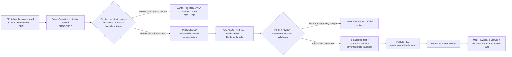
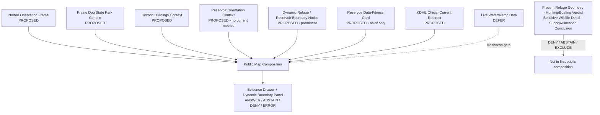
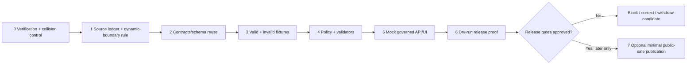

<!-- [KFM_META_BLOCK_V2]
doc_id: NEEDS_VERIFICATION — <REGISTERED_KFM_DOC_ID>
title: Norton County Focus Mode Build Plan — Prairie Dog State Park and Dynamic Refuge/Reservoir Context Without Live Boundary or Safety Verdicts
type: county-focus-mode-build-plan
version: v0.1-draft
status: draft
owners:
  - NEEDS_VERIFICATION — <OWNER:focus-mode-steward>
  - NEEDS_VERIFICATION — <OWNER:hydrology-and-reservoir-reviewer>
  - NEEDS_VERIFICATION — <OWNER:ecology-and-public-use-reviewer>
created: 2026-05-24
updated: 2026-05-24
policy_label: public_draft
county: Norton County, Kansas
county_slug: norton
proof_slice: Prairie Dog State Park, Norton Wildlife Area at Keith Sebelius Reservoir, managed refuge-boundary currentness and reservoir-data temporal-fitness restraint
primary_public_safe_boundary: Official park, wildlife-area and reservoir pages may support bounded, time-attributed public context; KFM must not turn dated or fluctuating refuge-line, water-level, boating-access, hunting-regulation, lake-health or visitor-status information into live safety, access, legal, wildlife-location, municipal-water or water-allocation conclusions.
release_status: NOT_RELEASED — planning artifact only
review_assignments:
  - NEEDS_VERIFICATION — source admission and rights reviewer
  - NEEDS_VERIFICATION — wildlife-area/refuge-boundary and ecological sensitivity reviewer
  - NEEDS_VERIFICATION — reservoir/currentness and public-safety reviewer
  - NEEDS_VERIFICATION — public-safe release reviewer
correction_path: NEEDS_VERIFICATION — no implemented correction path asserted
rollback_path: NEEDS_VERIFICATION — no implemented rollback path asserted
unverified_repository_paths:
  - PROPOSED / NEEDS_VERIFICATION — docs/focus-modes/norton-county/build-plan.md
  - PROPOSED / NEEDS_VERIFICATION — docs/focus-modes/norton-county/
  - PROPOSED / NEEDS_VERIFICATION — fixtures/focus_modes/norton/
schema_contract_policy_homes:
  - PROPOSED / NEEDS_VERIFICATION — contracts/focus_mode/
  - PROPOSED / NEEDS_VERIFICATION — schemas/contracts/v1/focus_mode/
  - PROPOSED / NEEDS_VERIFICATION — policy/runtime/, policy/sensitivity/, policy/rights/, policy/release/
collision_search:
  completed_register: CONFIRMED — Norton County is absent from the user-supplied completed/collision register; Butler, Wilson, Franklin, Haskell, Grant, Comanche, Labette and Meade were additionally excluded because artifacts were generated earlier in this continuing series.
  available_project_materials: CONFIRMED — Norton-targeted searches across accessible uploaded/project materials and File Library performed on 2026-05-24 did not surface a Norton County Focus Mode Build Plan.
  live_repository_index: CONFIRMED — docs/focus-mode/counties/COUNTY_INDEX.md on main was inspected and lists Norton as not-started with validation not-run.
  live_repository_control_plane: CONFIRMED — docs/focus-mode/README.md, docs/doctrine/directory-rules.md §6.7 and tools/validators/validate_focus_mode_index.py were inspected during this continuing session; the validator self-identifies as PROPOSED implementation and no validator execution is claimed.
  live_repository_target_search: CONFIRMED — targeted searches for norton_county_focus_mode_build_plan, Norton County Focus Mode, norton-county and Prairie Dog State Park Keith Sebelius Norton Wildlife Area prairie dog town returned no matching live-repository result.
  exhaustive_absence: NEEDS_VERIFICATION — unindexed branches, private artifacts and unsearched prior outputs may still exist.
directory_rules_basis:
  - CONFIRMED — attached Directory Rules.pdf was inspected during this continuing session; it requires responsibility-root placement, schema-home separation and the RAW → WORK / QUARANTINE → PROCESSED → CATALOG / TRIPLET → PUBLISHED lifecycle.
  - CONFIRMED — live docs/doctrine/directory-rules.md §6.7 was inspected; Focus Modes are cross-cutting compositional proof slices, not root folders, and doctrine identifies docs/focus-modes/<area>-<scope>/ as the documentation pattern.
  - NEEDS_VERIFICATION / DIVERGENCE — observed live county index and README are under docs/focus-mode/ while current doctrine and README prose refer to docs/focus-modes/; landing requires reconciliation before repository work.
official_source_checks:
  - CONFIRMED — Kansas Department of Wildlife and Parks, Prairie Dog State Park page, checked 2026-05-24.
  - CONFIRMED — Kansas Department of Wildlife and Parks, Norton Wildlife Area at Keith Sebelius Reservoir page, checked 2026-05-24.
  - CONFIRMED — U.S. Bureau of Reclamation, Current Reservoir Data for Keith Sebelius Lake, KS page, checked 2026-05-24.
  - CONFIRMED — Kansas Department of Health and Environment, Harmful Algal Blooms page, checked 2026-05-24.
source_check_date: 2026-05-24
tags: [kfm, focus-mode, norton-county, prairie-dog-state-park, keith-sebelius-reservoir, norton-wildlife-area, refuge-boundary, reservoir-currentness, recreation, public-safety, ecology, cite-or-abstain, public-safe]
notes:
  - This document is a planning artifact and does not claim implementation, source admission, rights clearance, policy approval, review completion, promotion, publication, correction readiness or rollback readiness.
  - The checked official pages include date-sensitive water availability, reservoir-data and refuge-boundary information; this plan treats those as currentness-bound evidence, not evergreen public answers.
  - EvidenceBundle outranks generated language; official visitor and management surfaces retain their distinct source roles.
[/KFM_META_BLOCK_V2] -->

<a id="top"></a>

# Norton County Focus Mode Build Plan
## Prairie Dog State Park and Dynamic Refuge/Reservoir Context Without Live Boundary or Safety Verdicts

> **Product thesis:** Present Norton County’s Prairie Dog State Park, Norton Wildlife Area and Keith Sebelius Reservoir setting through evidence-visible, time-bounded public context while refusing to turn shifting refuge lines, dated reservoir values or visitor notices into live access, hunting, boating, health, supply or safety conclusions.


| Identity / status field | Value |
|---|---|
| County selected | **Norton County, Kansas** |
| Draft status | `PROPOSED` planning artifact; no implementation or publication asserted |
| Distinct proof slice | Dynamic refuge-boundary and reservoir-data temporal fitness around Prairie Dog State Park and Norton Wildlife Area at Keith Sebelius Reservoir |
| Most consequential public-safe boundary | **Time-bounded official visitor, water-level and refuge information must not become KFM live access, boating, hunting, lake-safety, ecological, municipal-water or water-allocation conclusions.** |
| Official seeds checked in this run | KDWP Prairie Dog State Park; KDWP Norton Wildlife Area at Keith Sebelius Reservoir; U.S. Bureau of Reclamation Keith Sebelius current-data surface; KDHE Harmful Algal Blooms |
| Live index collision check | `CONFIRMED` inspected: Norton row presently says `not-started` / `not-run` |
| Targeted repository search | `CONFIRMED` performed; no Norton plan collision surfaced |
| Exhaustive collision absence | `NEEDS_VERIFICATION` |
| Intended landing location | `PROPOSED / NEEDS_VERIFICATION` — `docs/focus-modes/norton-county/build-plan.md` |
| Release / review / rollback | `NOT_RELEASED`; review, correction and rollback mechanisms `NEEDS_VERIFICATION` |

## Quick links

[Operating posture](#1-operating-posture) · [Why this county](#2-why-this-county) · [Product thesis](#3-product-thesis) · [Scope boundary](#4-scope-boundary) · [First demo layers](#5-first-demo-layers) · [User journeys](#6-user-journeys) · [UI surfaces](#7-ui-surfaces) · [Governed object model](#8-governed-object-model) · [Repository shape](#9-proposed-repository-shape) · [Build phases](#10-build-phases) · [First PR sequence](#11-first-pr-sequence) · [Acceptance checklist](#12-acceptance-checklist) · [Fixture plan](#13-fixture-plan) · [Risk register](#14-risk-register) · [Sources](#15-source-seed-list) · [Verification](#16-open-verification-questions) · [First milestone](#17-recommended-first-milestone) · [Appendices](#appendix-a--public-safe-narrative-skeleton)

---

## Executive build note

**Norton County is selected as a dynamic public-use and managed-wildlife-boundary proof slice.** The checked Kansas Department of Wildlife and Parks (KDWP) Prairie Dog State Park page identifies the park southwest of Norton on the north side of Keith Sebelius Reservoir and Norton Wildlife Area, and preserves public-history context including a one-room school and renovated adobe house.[^s1] The checked KDWP Norton Wildlife Area page states that a middle portion of the reservoir is designated as a waterfowl refuge from **November 1 through January 31**, and that the refuge line **fluctuates with the water level every year**, directing users to check the latest boundary.[^s2]

The water-side currentness issue is also visible. KDWP links users to U.S. Bureau of Reclamation reservoir data; the checked Reclamation page is titled **Current Reservoir Data for Keith Sebelius Lake, KS** but displayed daily data as of **02/24/2026** and hourly data as of **02/25/2026** when retrieved on **2026-05-24**.[^s3] That makes Norton an especially clear KFM demonstration: official source pages may be admissible as evidence of a stated context or displayed as-of value, but KFM must not quietly convert them into real-time access, water-level, refuge-boundary, boating or safety answers.

> [!CAUTION]
> ## Public-safe boundary — shifting refuge lines and dated reservoir data require current official authority
>
> **KFM may eventually display admitted, time-attributed park, history and generalized reservoir/wildlife-area context. KFM must not state the present refuge boundary, current hunting permission, boating access, park water availability, reservoir level, lake-health/safety status, municipal-water condition or water-allocation meaning from cached, stale or insufficiently scoped material.**
>
> Questions of that kind resolve to `ABSTAIN`, `DENY` or an official-current redirect unless a separately governed, fresh and public-safe response path has been approved.

### Evidence boundary at authoring time

| Label | What is established for this plan | What is not established |
|---|---|---|
| `CONFIRMED` | Checked KDWP park page identifies Prairie Dog State Park relative to Norton, Keith Sebelius Reservoir and Norton Wildlife Area and includes public-history context; checked KDWP wildlife-area page states seasonal refuge timing and that the refuge line fluctuates with water level; checked Reclamation surface displayed reservoir data with February 2026 as-of values at retrieval time; checked KDHE page explains HAB currentness and rapid change; live index/control-plane/Directory Rules evidence was inspected; targeted collision searches were performed. | — |
| `PROPOSED` | Focus Mode scope, first-demo composition, UI panels, governed object candidates, fixtures, reason codes, build phases, milestone and intended responsibility-rooted paths. | No proposed component is represented as implemented. |
| `NEEDS_VERIFICATION` | Full project-wide collision absence; repository landing after singular/plural path divergence; source rights/derivative display; map geometry authority; public display of any dynamic data; ecology review; shared contracts/schemas/policies; review assignments; correction/rollback machinery. | — |
| `UNKNOWN` | Current reservoir values, refuge boundaries, park service status or health advisories after source retrieval; whether any unindexed Norton plan exists; any eventual release or runtime behavior. | — |

---

# 1. Operating posture

## 1.1 Governing rules applied to Norton County

| KFM rule | Norton County application |
|---|---|
| EvidenceBundle outranks generated language | No map card or AI answer about reservoir status, refuge boundaries, visitor access, safety, ecology or water meaning becomes public truth without admitted evidence. |
| Cite-or-abstain | Stable place/history context may be answerable with evidence; changing boundaries, water values, safety or regulations require current official authority or abstention. |
| Public clients consume governed surfaces only | The public UI consumes released public-safe artifacts through governed interfaces, never `RAW`, `WORK`, `QUARANTINE`, unpublished captures, restricted sources or direct model output. |
| Source roles stay separate | KDWP park interpretation, KDWP wildlife-management/regulations, Reclamation reservoir values, KDHE public-health advisories and generated narrative must not collapse into one “current conditions” truth layer. |
| Promotion is governed transition | A linked agency page or retrieved value does not become published KFM data merely by appearing in a draft; validation, policy, review, correction and rollback are required. |
| Sensitivity and operational currentness fail closed | Fluctuating refuge boundaries, time-sensitive access restrictions, exact sensitive habitat interpretation and water-supply/allocation conclusions are withheld unless governed. |
| AI is interpretive only | AI may explain supported context and why KFM abstains; it cannot calculate a current boundary or declare present safe use. |

## 1.2 Truth labels and finite outcomes

| Token | Meaning in this plan |
|---|---|
| `CONFIRMED` | Verified in this run from checked official public sources, inspected repository materials or generated artifact evidence. |
| `PROPOSED` | Design recommendation or planned artifact not verified as implemented. |
| `NEEDS_VERIFICATION` | Checkable before action but not sufficiently established now. |
| `UNKNOWN` | Not resolved from admissible evidence in this run. |
| `ANSWER` | Public-safe response supported by resolved evidence and allowed policy. |
| `ABSTAIN` | Evidence, freshness, authority, rights, sensitivity or release fitness is unresolved. |
| `DENY` | Requested content crosses a safety, regulation, sensitive ecology, water-allocation, property/private-detail or operational boundary. |
| `ERROR` | Contract, evidence-resolution, validation or runtime failure prevents a trusted response. |

## 1.3 Public trust membrane



## 1.4 County-specific non-negotiable guardrails

| Guardrail | Required posture | Default outcome when violated |
|---|---|---|
| Refuge line currentness | KDWP states the refuge line fluctuates with water level; KFM does not serve an unverified present boundary. | `ABSTAIN` — `REFUGE_BOUNDARY_REQUIRES_CURRENT_KDWP_SOURCE` |
| Seasonal hunting/regulation status | Dated or seasonal text cannot become “legal to hunt here now” guidance. | `ABSTAIN` / `DENY` — `CURRENT_REGULATION_STATUS_REQUIRES_AUTHORITY` |
| Reservoir values | A displayed as-of value remains tied to its source timestamp; it is not “current” without freshness rules. | `ABSTAIN` — `RESERVOIR_DATA_TEMPORAL_FITNESS_UNRESOLVED` |
| Boating/access availability | Water-level-dependent or park-service availability cannot be inferred from stale pages. | `ABSTAIN` — `CURRENT_ACCESS_OR_BOATING_REQUIRES_AUTHORITY` |
| Lake-health/public safety | KDHE current advisories remain the competent health surface; KFM does not declare present safety from context data. | `ABSTAIN` — `LIVE_WATER_HEALTH_STATUS_REQUIRES_KDHE` |
| Sensitive ecology | Wildlife-area context does not license display of sensitive occurrence, refuge-use or management-detail layers. | `DENY` — `SENSITIVE_WILDLIFE_DETAIL_NOT_ADMITTED` |
| Municipal water/allocation interpretation | Reservoir data do not authorize conclusions about municipal supply, allocation, legal rights or future water availability. | `DENY` — `WATER_SUPPLY_OR_ALLOCATION_DETERMINATION_DENIED` |
| Visitor-history context | Historic buildings can be explained publicly, but are not evidence of present facility access, condition or safety. | `ABSTAIN` — `HISTORIC_CONTEXT_NOT_CURRENT_FACILITY_STATUS` |

---

# 2. Why this county

## 2.1 Selection and collision screen

| Screen | Result | Status | Effect on selection |
|---|---|---:|---|
| User-supplied completed/collision register | Norton County is not listed. | `CONFIRMED` | Eligible to evaluate. |
| Plans generated earlier in this continuing series | Butler, Wilson, Franklin, Haskell, Grant, Comanche, Labette and Meade were excluded from reselection. | `CONFIRMED` | Avoids current-series duplicate. |
| Accessible uploaded/project-material and File Library search | Norton-targeted searches were performed and did not surface a Norton County Focus Mode Build Plan in returned results. | `CONFIRMED` for performed search; `NEEDS_VERIFICATION` exhaustively | Candidate not rejected. |
| Live repository master county index | Inspected `docs/focus-mode/counties/COUNTY_INDEX.md`; Norton is listed `not-started` with validation `not-run`. | `CONFIRMED` observation only | Candidate not rejected; status is not validation/release proof. |
| Live repository control-plane evidence | README, Directory Rules and validator evidence were previously inspected in this continuing session; singular/plural path divergence remains and no validator execution is claimed. | `CONFIRMED` | Landing remains bounded and conditional. |
| Live repository targeted string search | Searches for `norton_county_focus_mode_build_plan`, `Norton County Focus Mode`, `norton-county`, and candidate proof terms returned no result. | `CONFIRMED` for performed searches | No repository collision discovered. |
| Exhaustive project-wide uniqueness | All branches, private files and unsearched prior artifacts were not proven absent. | `NEEDS_VERIFICATION` | Recheck immediately before any repository landing. |

> [!NOTE]
> Norton County was selected only after collision screening against the supplied register, this continuation’s generated plans, accessible project materials/File Library and inspected live repository evidence. No collision surfaced, but exhaustive absence remains a future verification gate.

## 2.2 Proof-slice rationale

| Selection dimension | Norton County proof value | Evidence basis / status |
|---|---|---|
| Public park and history context | KDWP identifies Prairie Dog State Park’s relationship to Norton and Keith Sebelius Reservoir and notes preserved historic buildings. | `CONFIRMED` official source checked.[^s1] |
| Managed wildlife/refuge boundary | KDWP states that part of the reservoir is designated as a seasonal waterfowl refuge and that its boundary fluctuates with water levels. | `CONFIRMED` official source checked.[^s2] |
| Reservoir temporal fitness | Reclamation’s checked “Current Reservoir Data” surface displayed February 2026 values at May 2026 retrieval. | `CONFIRMED` observed source state; current-value use restricted.[^s3] |
| Public-health/currentness boundary | KDHE states HAB conditions can change rapidly and publishes current advisories. | `CONFIRMED` official source checked.[^s4] |
| Governance challenge | Users may confuse a general recreation/history map, water-level page or refuge notice with live legal access/safety/wildlife-boundary truth. | `PROPOSED` proof objective grounded in checked sources. |
| Distinct series value | Norton links a **water-level-responsive refuge boundary** to public recreation and dated reservoir data, rather than focusing on a hatchery, fossil locality, mining site or industrial record. | `PROPOSED` comparative rationale. |

## 2.3 Distinct series proof

| Completed or collision-identified proof slice | Boundary already tested | What Norton adds without duplicating it |
|---|---|---|
| Butler County | Reservoir/recreation and dated live-safety/public-use context. | A formally managed waterfowl-refuge boundary that KDWP says shifts with reservoir water level. |
| Meade County | State park plus fish-rearing operations and health/visitor-alert currentness. | Refuge-line and hunting/access currentness coupled to a federal reservoir-data surface, not hatchery operations. |
| Barton County | Major wetland/migratory wildlife geoprivacy and public interpretation. | A reservoir-linked seasonal managed-boundary problem with explicit boundary fluctuation and recreation access effects. |
| Haskell / Grant counties | Groundwater/water-right or subsurface-resource nondetermination. | Surface-reservoir data fitness, managed wildlife lines and visitor use rather than private groundwater/legal records. |
| Comanche County | Cave/archaeology/cultural-locality precision. | Dynamic management boundary and currentness rather than restricted archaeological location. |

## 2.4 Public benefit and governance value

The first Norton product can help users understand:

- the public relationship among Prairie Dog State Park, Keith Sebelius Reservoir and Norton Wildlife Area;
- the interpretive value of the park’s preserved historic buildings;
- why a waterfowl refuge line that fluctuates with water level cannot be frozen into a static KFM access map;
- why a page labelled “current” must still display its source timestamps and freshness state;
- why lake-health, boating, hunting, access and water-allocation questions remain with appropriate official-current authorities.

## 2.5 County anchors supported by checked official sources

| Anchor | Supported statement for this plan | Source role | Status |
|---|---|---|---:|
| Prairie Dog State Park | KDWP identifies it southwest of Norton on the north side of Keith Sebelius Reservoir and Norton Wildlife Area. | State park/public-use context | `CONFIRMED` |
| Park historical interpretation | KDWP states that two vintage nineteenth-century buildings are preserved, including a one-room school and renovated adobe house. | Official public-history context | `CONFIRMED` |
| Norton Wildlife Area refuge timing | KDWP states that the middle portion of the reservoir is designated as a waterfowl refuge starting November 1 and closed until January 31. | Wildlife-management/regulatory public notice | `CONFIRMED` as published statement |
| Refuge-line variability | KDWP states that the refuge line fluctuates with water level every year and instructs users to check the latest boundary. | Dynamic wildlife-management/currentness source | `CONFIRMED` |
| Reservoir data as-of display | Reclamation page displayed daily values as of 02/24/2026 and hourly values as of 02/25/2026 when checked on 2026-05-24. | Federal reservoir-data source with temporal limitation | `CONFIRMED` retrieved state |
| Water-health advisory authority | KDHE states blooms are unpredictable and may change rapidly and publishes current advisories. | Public-health/current advisory authority | `CONFIRMED`; no Norton-specific advisory claimed |

---

# 3. Product thesis

## 3.1 One-sentence thesis

> **Norton County Focus Mode should let the public explore official, bounded park, public-history and generalized reservoir/wildlife-area context while making it impossible to mistake KFM for a live refuge-boundary, hunting-regulation, boating-access, water-level, lake-health or water-supply authority.**

## 3.2 What the first product promises

| Promise | Implementation meaning |
|---|---|
| A bounded Norton county frame | Public-safe orientation extent after authoritative geometry and rights admission. |
| Evidence-visible park/history context | Broad park and historic-structure context traces to KDWP evidence with limitations. |
| Dynamic-boundary transparency | The waterfowl-refuge issue is a prominent boundary panel, not hidden metadata. |
| Reservoir data fitness | Any eventual display of reservoir values carries source as-of date and freshness/expiry state. |
| Finite outcomes | Supported stable context may yield `ANSWER`; current/sensitive/legal/safety questions yield `ABSTAIN` or `DENY`. |
| Reversibility | Any later public release requires correction and rollback closure; none are claimed here. |

## 3.3 What the first product does not promise

| Non-promise | Required user-facing posture |
|---|---|
| Current location of a refuge line or whether an area is open to hunting now | Direct user to current KDWP boundary/regulatory source; do not state KFM conclusion. |
| Current reservoir levels, ramp usability or boating access | Display only if fresh governed retrieval is approved; otherwise abstain. |
| Current park facility/water status | Dated park page statements are not evergreen. |
| Present lake-health or swimming/pet safety | Route to current KDHE/official lake manager authority. |
| Exact sensitive wildlife occurrence/management locations | Deny or defer pending public-safe ecology review. |
| Municipal water supply, allocation, legal rights or future availability | Deny; reservoir values do not authorize those determinations. |
| Implemented or released product | This is a plan only. |

---

# 4. Scope boundary

## 4.1 First-slice classification

| Content family | First-slice posture | Why | Governing boundary |
|---|---:|---|---|
| Norton county orientation extent | `PROPOSED` public-safe | Establishes bounded map frame; authoritative geometry still required. | No private/property/safety inference. |
| Prairie Dog State Park general context card | `PROPOSED` public-safe after admission | KDWP supports stable broad relationship and history context. | No live facility/access/safety status. |
| Historic Buildings Context Card | `PROPOSED` public-safe after admission | KDWP identifies preserved public-history features. | No current condition or entry/access inference. |
| Keith Sebelius Reservoir orientation card | `PROPOSED` generalized context | Supports spatial relationship without real-time values. | No current reservoir/boating/supply conclusion. |
| `DynamicRefugeBoundaryNotice` | `PROPOSED` **priority public-safe card** | KDWP explicitly states refuge line fluctuates with water level. | No static present boundary or legal hunting interpretation. |
| `ReservoirDataFitnessNotice` | `PROPOSED` **priority public-safe card** | Reclamation as-of values show temporal-fitness burden. | No “current now” display without freshness gate. |
| KDHE current health-advisory redirect | `PROPOSED` redirect only | Lake-health questions demand current authority. | No Norton safety answer without current scoped data. |
| Current refuge-line or seasonal regulation map | `EXCLUDE` / `DEFER` | Requires live/fresh authoritative delivery and legal-context caution. | No static public KFM layer in MVP. |
| Current water-level/boat-ramp status | `DEFER` | Could be useful only with freshness and expiry. | No cached current-status output. |
| Sensitive wildlife occurrence/management detail | `DENY` / `DEFER` | Wildlife area context does not license exposure. | Generalize or exclude. |
| Municipal supply, allocation or water-right content | `DENY` | Not supported by public recreation/reservoir context product. | Outside first slice. |
| Private land/access or individual-person information | `DENY` | Privacy/property/access risk. | Outside first slice. |

## 4.2 Public-safe content requirements

Every first-slice public object must expose, where applicable:

- official source authority and declared role;
- checked/retrieved date and any as-of or seasonal-effective date;
- source freshness/expiry policy for dynamic data;
- EvidenceRef resolution state;
- sensitivity and rights posture;
- visible limitations against live boundary, regulatory, safety, supply and sensitive-ecology inference;
- review, release, correction and rollback state once those processes exist.

## 4.3 Denied-by-default content

| Public request example | Outcome | Candidate reason code |
|---|---:|---|
| “Where is the waterfowl refuge boundary today, and can I hunt this spot?” | `ABSTAIN` / `DENY` | `REFUGE_BOUNDARY_REQUIRES_CURRENT_KDWP_SOURCE` |
| “Are the ramps usable and is boating access open right now?” | `ABSTAIN` | `CURRENT_ACCESS_OR_BOATING_REQUIRES_AUTHORITY` |
| “What is the current reservoir level?” from stale/unrefreshed artifact | `ABSTAIN` | `RESERVOIR_DATA_TEMPORAL_FITNESS_UNRESOLVED` |
| “Is the lake safe for swimming, pets or fishing today?” | `ABSTAIN` | `LIVE_WATER_HEALTH_STATUS_REQUIRES_KDHE` |
| “Show exact wildlife refuge-use or sensitive occurrence points.” | `DENY` | `SENSITIVE_WILDLIFE_DETAIL_NOT_ADMITTED` |
| “Does this reservoir assure Norton municipal water supply or my water right?” | `DENY` | `WATER_SUPPLY_OR_ALLOCATION_DETERMINATION_DENIED` |
| “Is the historic adobe house open/safe to enter now?” | `ABSTAIN` | `HISTORIC_CONTEXT_NOT_CURRENT_FACILITY_STATUS` |
| “Turn dated seasonal restrictions into permanent map symbology.” | `DENY` | `DYNAMIC_MANAGEMENT_BOUNDARY_CANNOT_BE_FROZEN` |

---

# 5. First demo layers

## 5.1 Prioritized first public-safe layer/card set

| Priority | Layer or card | Public purpose | Checked source seed | Evidence / policy gate | Status |
|---:|---|---|---|---|---:|
| 1 | `DynamicRefugeAndReservoirBoundaryNotice` | Explains why managed boundaries, water values and safety are time-sensitive. | KDWP wildlife area + Reclamation + KDHE[^s2][^s3][^s4] | Currentness/sensitivity policy and negative fixtures. | `PROPOSED` |
| 2 | `PrairieDogStateParkContextCard` | Presents stable broad place/public-use context. | KDWP Prairie Dog State Park[^s1] | Source admission; EvidenceBundle; no live facility statement. | `PROPOSED` |
| 3 | `HistoricBuildingsContextCard` | Adds bounded public-history context. | KDWP Prairie Dog State Park[^s1] | Source-role badge; no current access/safety claim. | `PROPOSED` |
| 4 | `ReservoirOrientationCard` | Shows relation of park/reservoir/wildlife area without delivering current metrics. | KDWP pages[^s1][^s2] | Generalized orientation only; no level/status output. | `PROPOSED` |
| 5 | `RefugeBoundaryCurrentnessCard` | Shows that the relevant official boundary is dynamic. | KDWP Norton Wildlife Area[^s2] | Must not render a present boundary geometry in MVP. | `PROPOSED` |
| 6 | `ReservoirDataFitnessCard` | Teaches as-of/freshness requirements for water values. | Reclamation page[^s3] | Display source-date limitation; dynamic values deferred absent live gate. | `PROPOSED` |
| 7 | `WaterHealthOfficialRedirectCard` | Routes live lake-health needs to KDHE. | KDHE HAB page[^s4] | No lake-specific verdict unless current scoped official data admitted. | `PROPOSED` |
| 8 | Current water-level or boat-ramp layer | Potential later live layer only after robust expiry/governed delivery. | Reclamation/KDWP source family | Freshness, error, expiry, release and rollback closure. | `DEFER` |
| 9 | Current refuge-line/regulation geometry | High-value but too easily mistaken as legal/current guidance. | KDWP source family | Real-time authoritative pathway and legal/currentness review. | `EXCLUDE` first slice |
| 10 | Sensitive wildlife management/occurrence detail | Not necessary for public context. | Boundary policy | Prohibited unless separately generalized/reviewed. | `DENY` |

## 5.2 Map composition



## 5.3 Layer-card truth contract

| Required field | Purpose | Failure posture |
|---|---|---|
| `layer_id` / `card_id` | Stable public object reference candidate. | `ERROR` in runtime fixture when absent. |
| `county_scope: norton` | Prevent scope drift. | `ABSTAIN` if mismatch. |
| `source_role` | Distinguish park/public-history, wildlife-management, reservoir-data and public-health authority. | `ABSTAIN`; no release if absent. |
| `temporal_basis` | Carries page checked date, as-of measurement date or seasonal statement. | `ABSTAIN` for current questions without fitness. |
| `freshness_or_expiry` | Prevents outdated dynamic source information becoming public current truth. | `ABSTAIN` / disable dynamic answer. |
| `dynamic_boundary_posture` | States whether a feature is explanatory only or current authoritative geometry. | `DENY` if public layer implies current legal/refuge line without gate. |
| `ecological_sensitivity` | Controls wildlife-management or occurrence precision. | `DENY` / generalize. |
| `evidence_refs` | Requires claim support. | `ABSTAIN`; candidate release fails if unresolved. |
| `rights_status` | Captures any derivative-display/cache permission. | Quarantine/abstain if unresolved. |
| `policy_decision_ref` | Binds display to evaluated boundary behavior. | Fail closed if absent. |
| `limitations` | States no live access/safety/regulatory/supply conclusion. | Fail public validation if omitted. |
| `correction_ref` / `rollback_ref` | Provides future reversal capability. | No publication without closure. |

---

# 6. User journeys

## 6.1 Public learning journeys

| Journey | User action | Public-safe response | Trust affordance |
|---|---|---|---|
| Park orientation | Opens Norton and selects park context. | Shows KDWP-backed broad relation of park, reservoir and wildlife area. | Evidence Drawer and no-live-status limitation. |
| Public history | Opens Historic Buildings card. | Shows bounded KDWP-backed interpretation of preserved structures. | Source role marked `official_public_history_context`. |
| Why the refuge is not mapped live | Opens Dynamic Boundary card. | Explains KDWP’s statement that refuge line changes with water level and requires latest official boundary. | No displayed current refuge polygon in MVP. |
| Why water metrics are deferred | Opens Reservoir Data Fitness card. | Shows that an official data surface has as-of timestamps and requires freshness policy. | As-of/checked dates visible. |

## 6.2 Trust-demonstration journeys

| Query or interaction | Expected outcome | Demonstrated KFM property |
|---|---:|---|
| “What official source identifies Prairie Dog State Park’s relationship to Keith Sebelius Reservoir?” | `ANSWER` after evidence resolution | Traceable public-use context. |
| “Why does KFM not show the waterfowl-refuge line as current?” | `ANSWER` about boundary; not a geometry answer | Dynamic-boundary governance. |
| “What did the Reclamation page display when checked?” | `ANSWER` only as retrieved/as-of evidence | Temporal fitness and bounded citation. |
| “Can I hunt here today?” | `ABSTAIN` / official-current redirect | No generated legal/regulatory guidance. |
| User clicks a card lacking resolved evidence | `ABSTAIN` | Evidence closure required. |

## 6.3 Denied or abstained requests

| Request | Runtime result | Public explanation seed | Candidate reason code |
|---|---:|---|---|
| “Show today’s refuge boundary and tell me whether hunting is permitted here.” | `ABSTAIN` / `DENY` | KDWP states the boundary fluctuates with water level; use its latest official information. | `REFUGE_BOUNDARY_REQUIRES_CURRENT_KDWP_SOURCE` |
| “Is the boat ramp usable today based on this lake card?” | `ABSTAIN` | Access can depend on water levels; no fresh governed status has been admitted. | `CURRENT_ACCESS_OR_BOATING_REQUIRES_AUTHORITY` |
| “Give me the current reservoir percentage full.” | `ABSTAIN` unless fresh governed retrieval exists | The checked federal page presented dated as-of values; currentness is unresolved. | `RESERVOIR_DATA_TEMPORAL_FITNESS_UNRESOLVED` |
| “Is the water safe for my child or dog today?” | `ABSTAIN` | Current health advisories belong to KDHE/lake manager sources. | `LIVE_WATER_HEALTH_STATUS_REQUIRES_KDHE` |
| “Show exact wildlife-use or sensitive habitat locations.” | `DENY` | Sensitive or management-significant wildlife detail is not admitted publicly. | `SENSITIVE_WILDLIFE_DETAIL_NOT_ADMITTED` |
| “Does this reservoir guarantee city supply or an individual water entitlement?” | `DENY` | KFM does not determine water supply allocation or legal rights. | `WATER_SUPPLY_OR_ALLOCATION_DETERMINATION_DENIED` |
| “Are historic buildings currently open and safe to enter?” | `ABSTAIN` | Historic interpretation is not current facility status. | `HISTORIC_CONTEXT_NOT_CURRENT_FACILITY_STATUS` |

---

# 7. UI surfaces

## 7.1 Required surfaces

| Surface | Public function | Norton-specific trust behavior | Status |
|---|---|---|---:|
| Header | Identifies county, evidence/release state and boundary. | Persistent badge: “No live refuge-boundary or lake-safety verdict.” | `PROPOSED` |
| Map canvas | Shows released public-safe contextual composition. | Park/reservoir/general history only; no current refuge polygon or sensitive habitat point. | `PROPOSED` |
| Layer drawer | Toggles allowed contextual layers/cards. | Each item exposes source role, time basis, freshness and dynamic-boundary status. | `PROPOSED` |
| Evidence Drawer | Resolves claims to evidence and limitations. | Displays KDWP vs Reclamation vs KDHE roles and as-of constraints. | `PROPOSED` |
| Answer panel | Answers supported contextual questions. | Can explain place/history/dynamic-boundary rule; cannot determine current status. | `PROPOSED` |
| Denial panel | Explains denied requests without leakage. | Refuses hunting/regulatory, sensitive wildlife, water-allocation or safety verdicts. | `PROPOSED` |
| Timeline / time-basis surface | Shows checked date, seasonal periods and data-as-of timestamps. | Makes source fitness visible before any interaction with dynamic material. | `PROPOSED` |
| **Dynamic Refuge Boundary / Reservoir Currentness Panel** | Makes primary boundary unavoidable. | Explains boundary fluctuation and data-as-of obligations. | `PROPOSED` |
| Official-current redirect panel | Routes changing conditions. | Points users to authoritative sources rather than producing KFM live guidance. | `PROPOSED` |
| Release/correction panel | Future release and reversibility state. | Displays `NOT_RELEASED` in draft/mock experiences. | `PROPOSED` |

## 7.2 Legend vocabulary

| UI label | Meaning | May support | Must not be used as |
|---|---|---|---|
| `State park context` | KDWP-backed broad public-use/place context. | Stable orientation after admission. | Live facility/open/safety answer. |
| `Official public-history context` | KDWP-described historic interpretation feature. | Bounded history. | Present access or condition determination. |
| `Wildlife management notice` | KDWP information regarding management/refuge rules. | Explanation of why dynamic source handling matters. | Static legal/hunting map or sensitive ecology layer. |
| `Dynamic boundary withheld` | Boundary cannot safely be frozen as public truth. | Explaining absent geometry. | A hint or substitute current boundary. |
| `As-of reservoir data` | Source values bounded by displayed timestamp. | Historical/as-retrieved context if admitted. | Current supply/boating/flood/safety answer. |
| `Public-health authority redirect` | KDHE/lake-manager pathway for current health advice. | Redirection and currentness policy. | KFM health verdict. |
| `Draft / mock` | Planning/testing only. | UI/policy proof. | Released public truth. |

## 7.3 Governed interaction sequence

```mermaid
sequenceDiagram
    actor U as Public user
    participant UI as Explorer UI
    participant API as Governed API
    participant P as Policy gate
    participant E as Evidence resolver
    participant R as Released artifacts
    participant O as Official-current source route
    U->>UI: Open Norton / ask park-reservoir question
    UI->>API: Request public context envelope
    API->>P: Evaluate scope, source role, freshness and sensitivity
    alt Bounded context allowed
        P->>E: Resolve EvidenceRef
        E->>R: Read released public-safe bundle
        R-->>E: EvidenceBundle + limitations
        E-->>API: Resolved evidence
        API-->>UI: ANSWER + citations + boundary notice
        UI-->>U: Context map/card + Evidence Drawer
    else Live boundary/regulation/level/health question
        P-->>API: ABSTAIN or governed redirect required
        API->>O: Optional verified current-source route
        API-->>UI: ABSTAIN/redirect envelope; no KFM current verdict
        UI-->>U: Official-current path + limitations
    else Sensitive ecology or water-allocation claim
        P-->>API: DENY + reason code
        API-->>UI: DENY envelope; no restricted detail
        UI-->>U: Boundary panel
    end
```

---

# 8. Governed object model

## 8.1 Shared KFM object families to reuse or verify

| Object family | Role in the Norton proof slice | Norton-specific requirement | Implementation status |
|---|---|---|---:|
| `SourceDescriptor` | Declares source authority, role, rights, freshness and sensitivity. | Separate KDWP park/history, KDWP management boundary, Reclamation reservoir data and KDHE health authority. | `PROPOSED / NEEDS_VERIFICATION` |
| `EvidenceRef` | Stable link from visible claim/card to support. | Required for each public claim and boundary explanation. | `PROPOSED / NEEDS_VERIFICATION` |
| `EvidenceBundle` | Resolved evidence package outranking generated text. | Retains as-of dates, seasonal/currentness limits and dynamic-boundary posture. | `PROPOSED / NEEDS_VERIFICATION` |
| `PolicyDecision` | Enforces finite public outcome. | Must abstain for unverified current boundaries/data/safety and deny sensitive ecology/allocation claims. | `PROPOSED / NEEDS_VERIFICATION` |
| `RuntimeResponseEnvelope` | Carries `ANSWER`, `ABSTAIN`, `DENY` or `ERROR`. | Must avoid leaked coordinates or implied regulation/currentness in refusals. | `PROPOSED / NEEDS_VERIFICATION` |
| `CitationValidationReport` | Confirms claims stay within evidence/source role. | Must fail when dated values are labelled current or management notice becomes legal advice. | `PROPOSED / NEEDS_VERIFICATION` |
| `ReleaseManifest` | Records approved public-safe composition. | Cannot include stale/current-status or sensitive wildlife/supply determination content. | `PROPOSED / NEEDS_VERIFICATION` |
| `AIReceipt` | Records generated answer evidence and policy dependencies. | AI cannot manufacture current boundaries, rules, levels or safety conclusions. | `PROPOSED / NEEDS_VERIFICATION` |
| `ReviewRecord` | Records required reviews and findings. | Ecology, public safety/currentness, hydrology/reservoir and release review required. | `PROPOSED / NEEDS_VERIFICATION` |
| `CorrectionNotice` | Corrects released interpretation after source/status change. | Needed if a stale boundary/data card or misleading currentness statement is released. | `PROPOSED / NEEDS_VERIFICATION` |
| `RollbackPlan` / rollback reference | Identifies withdrawal/reversal target. | Required before any dynamic or public release is claimed. | `PROPOSED / NEEDS_VERIFICATION` |

## 8.2 County-specific object candidates

| Candidate object | Purpose | Public-safe fields | Excluded meaning |
|---|---|---|---|
| `PrairieDogStateParkContextCard` | Presents stable park/reservoir/wildlife-area relationship. | county scope, general setting, source role, checked date, EvidenceRef, limitations. | No live availability/safety/status. |
| `HistoricBuildingsContextCard` | Presents bounded official public-history context. | feature category, narrative scope, evidence and limitation. | No entry/access/current-condition guarantee. |
| `DynamicRefugeBoundaryNotice` | Encodes refuge-line currentness rule. | managing authority, seasonal statement, fluctuation warning, redirect/reason code. | No current boundary geometry. |
| `ReservoirDataFitnessNotice` | Encodes as-of/freshness rule for values. | authority, retrieved date, source-as-of timestamp, status fitness. | No current lake/supply/safety conclusion. |
| `WaterHealthAuthorityRedirect` | Routes present public-health questions to KDHE/current managers. | authority, question class, redirect, no-verdict statement. | No KFM health advice. |
| `SensitiveWildlifeExclusionNotice` | Identifies withheld ecology content classes. | sensitivity class, public generalization posture, reason code. | No occurrence/location inference. |

## 8.3 Source-role anti-collapse rules

| Source family | Valid role in Norton Focus Mode | Must not collapse into |
|---|---|---|
| KDWP Prairie Dog State Park page | Public-use and official public-history context; current source routing when verified. | Evergreen facility access, live water availability or safety conclusion. |
| KDWP Norton Wildlife Area page | Wildlife-management/currentness evidence and official regulatory routing. | Static present refuge-boundary layer, legal hunting advice or precise sensitive ecology. |
| U.S. Bureau of Reclamation reservoir data page | Time-stamped federal reservoir-data source. | Current water-supply, boating, flood, allocation or legal conclusion without freshness/admission. |
| KDHE HAB page | Current public-health/advisory authority. | Inferred Norton lake-health verdict absent current scoped evidence. |
| Generated AI narrative | Downstream explanation bounded by evidence/policy. | Evidence, official advice, legal rule, review or release state. |

## 8.4 Minimal public runtime response example — allowed context

```json
{
  "schema_version": "v1",
  "object_type": "RuntimeResponseEnvelope",
  "response_id": "kfm.runtime.norton.park_reservoir_context.answer.v1",
  "county": "norton",
  "outcome": "ANSWER",
  "answer_scope": "public_safe_park_and_history_context",
  "answer": "Checked Kansas Department of Wildlife and Parks material identifies Prairie Dog State Park southwest of Norton on the north side of Keith Sebelius Reservoir and Norton Wildlife Area, and notes preserved public-history features including a one-room school and renovated adobe house.",
  "evidence_refs": [
    "kfm.evidence_ref.norton.kdwp_park_context.v1"
  ],
  "source_roles": [
    "state_park_and_public_history_context"
  ],
  "temporal_basis": {
    "source_checked_on": "2026-05-24",
    "claim_currentness": "bounded_place_and_history_context_only"
  },
  "limitations": [
    "This response does not provide current refuge boundaries, hunting permissions, boating access, reservoir values, lake-health conditions or facility access status.",
    "This response does not determine water allocation, municipal supply or sensitive wildlife locations."
  ],
  "policy_label": "public_safe_candidate",
  "review_state": "NEEDS_VERIFICATION",
  "release_state": "NOT_RELEASED",
  "citation_validation": "NEEDS_VERIFICATION",
  "spec_hash": "NEEDS_VERIFICATION"
}
```

## 8.5 Abstention example — current refuge boundary or water level

```json
{
  "schema_version": "v1",
  "object_type": "RuntimeResponseEnvelope",
  "response_id": "kfm.runtime.norton.dynamic_refuge_or_level.abstain.v1",
  "county": "norton",
  "outcome": "ABSTAIN",
  "reason_code": "REFUGE_BOUNDARY_REQUIRES_CURRENT_KDWP_SOURCE",
  "message": "KDWP states that the waterfowl refuge line fluctuates with water level and users should check the latest boundary. KFM does not provide a cached present refuge line, hunting determination or reservoir-status verdict.",
  "evidence_refs": [
    "kfm.evidence_ref.norton.kdwp_refuge_boundary_currentness.v1",
    "kfm.evidence_ref.norton.usbr_reservoir_data_fitness.v1"
  ],
  "official_redirects": [
    {
      "authority": "Kansas Department of Wildlife and Parks",
      "purpose": "latest wildlife-area/refuge boundary and current regulations"
    },
    {
      "authority": "U.S. Bureau of Reclamation",
      "purpose": "federal reservoir data with explicit source timestamp"
    }
  ],
  "policy_label": "public_abstain",
  "review_state": "NEEDS_VERIFICATION",
  "release_state": "NOT_RELEASED",
  "spec_hash": "NEEDS_VERIFICATION"
}
```

## 8.6 Denial example — water allocation or sensitive wildlife request

```json
{
  "schema_version": "v1",
  "object_type": "RuntimeResponseEnvelope",
  "response_id": "kfm.runtime.norton.supply_or_sensitive_wildlife.deny.v1",
  "county": "norton",
  "outcome": "DENY",
  "reason_code": "WATER_SUPPLY_OR_ALLOCATION_DETERMINATION_DENIED",
  "message": "KFM does not determine municipal or individual water supply, allocation or legal-right status from reservoir data and does not provide sensitive wildlife-management or occurrence detail.",
  "evidence_refs": [
    "kfm.evidence_ref.norton.public_safe_boundary.v1"
  ],
  "withheld_fields": [
    "sensitive_wildlife_geometry",
    "current_refuge_boundary_geometry",
    "individual_or_municipal_water_determination",
    "property_or_access_detail"
  ],
  "policy_label": "public_deny",
  "review_state": "NEEDS_VERIFICATION",
  "release_state": "NOT_RELEASED",
  "spec_hash": "NEEDS_VERIFICATION"
}
```

## 8.7 Deterministic identity and `spec_hash` posture

| Item | Candidate identity pattern | Hash posture |
|---|---|---|
| Source descriptor | `kfm.source.norton.<authority>.<source_slug>.v1` | Hash normalized source identity, role, checked date, freshness, rights, sensitivity and limitations. |
| Evidence bundle | `kfm.evidence_bundle.norton.<claim_scope>.v1` | Hash admitted evidence, as-of/expiry posture, dynamic-boundary limitations and policy/review links. |
| Card/layer | `kfm.card.norton.<public_safe_card>.v1` / `kfm.layer.norton.<layer>.v1` | Hash display specification plus evidence/currentness/policy references. |
| Runtime fixture | `kfm.runtime.norton.<scenario>.<outcome>.v1` | Hash fixture per verified canonical utility. |
| Release candidate | `kfm.release.norton.focus_mode.v0_1` | Hash manifest and proof/review/correction/rollback closure. |

> [!IMPORTANT]
> These identity patterns and `spec_hash` behaviors are `PROPOSED`. Existing identifier grammar, hashing utilities and shared object contracts must be inspected before implementation.

---

# 9. Proposed repository shape

## 9.1 Directory Rules basis and observed divergence

| Finding | Label | Consequence for this plan |
|---|---:|---|
| Attached `Directory Rules.pdf` states that location encodes responsibility/governance/lifecycle and topic does not justify a new root. | `CONFIRMED` inspected during this continuing session | Norton is a Focus Mode lane inside responsibility roots, not a new root folder. |
| Attached Directory Rules states lifecycle `RAW → WORK / QUARANTINE → PROCESSED → CATALOG / TRIPLET → PUBLISHED` and promotion is a governed transition. | `CONFIRMED` | No page capture, dynamic value, AI output or mock is public because it exists. |
| Live `docs/doctrine/directory-rules.md` §6.7 states Focus Modes are multi-root compositional proof slices and gives `docs/focus-modes/<area>-<scope>/`. | `CONFIRMED` doctrine | Intended documentation path follows `docs/focus-modes/norton-county/`, pending reconciliation. |
| Live `docs/focus-mode/README.md` restates doctrine using plural `docs/focus-modes/`, while itself and the county index sit under singular `docs/focus-mode/`. | `CONFIRMED` observed divergence | Do not silently create a competing lane without documented resolution. |
| Live index lists Norton `not-started`; inspected validator exists but self-identifies as `PROPOSED implementation`. | `CONFIRMED` observed evidence | No lane existence, validator run or canonical landing is claimed. |

> [!WARNING]
> **All repository paths below remain `PROPOSED / NEEDS_VERIFICATION` unless explicitly identified as inspected live evidence.** This artifact neither modifies the repository nor authorizes a path decision. Resolve the singular/plural Focus Mode control-plane divergence and verify existing authority homes before implementation.

## 9.2 Candidate path table

| Responsibility root | Proposed path | Purpose | Verification gate |
|---|---|---|---|
| Human documentation | `docs/focus-modes/norton-county/build-plan.md` | This plan as a county proof-slice document. | Reconcile singular/plural control-plane convention and any accepted ADR. |
| Human documentation companions | `docs/focus-modes/norton-county/{README.md,layer-registry.md,evidence-model.md,acceptance-checklist.md,source-seed-list.md,public-safety-notes.md,dynamic-refuge-and-reservoir-currentness-notes.md}` | Boundary and control-plane documents. | Confirm lane convention and index update procedure. |
| Semantic contracts | `contracts/focus_mode/` | Reuse or extend shared object meaning. | Inspect existing contracts; avoid parallel family. |
| Machine schemas | `schemas/contracts/v1/focus_mode/` | Shared machine-checkable payload shapes. | Verify schema authority and existing definitions. |
| Fixtures | `fixtures/focus_modes/norton/{valid,invalid}/` | Finite-outcome and fail-closed proof inputs. | Verify fixture-home convention. |
| UI shell | `apps/explorer-web/src/focus-modes/norton/` | Mock/public UI behind governed API. | Verify live app conventions. |
| Validators | `tools/validators/` | Shared checks for evidence/currentness/sensitivity/dynamic-boundary behavior. | Inspect validator registry and avoid duplicates. |
| Source catalog | `data/catalog/sources/norton/source_descriptors.yaml` | Admitted public-source descriptor records. | Rights, sensitivity, time and role review. |
| Published artifacts | `data/published/layers/norton/`, `data/published/api_payloads/focus-modes/norton.json` | Future released public-safe artifacts only. | Not first-PR; governed promotion required. |
| Release decisions | `release/candidates/norton-focus-mode/`, `release/manifests/norton-focus-mode-v<n>.json` | Future candidate/manifest artifacts. | Review, correction and rollback verified. |
| Optional pipeline composition | `pipeline_specs/focus_modes/norton/` | Only if a distinct dynamic-source composition is justified. | Avoid when shared composition suffices. |

## 9.3 Proposed responsibility-rooted tree

```text
# PROPOSED / NEEDS_VERIFICATION — no repository changes asserted

docs/
└── focus-modes/
    └── norton-county/
        ├── README.md
        ├── build-plan.md
        ├── layer-registry.md
        ├── evidence-model.md
        ├── acceptance-checklist.md
        ├── source-seed-list.md
        ├── public-safety-notes.md
        └── dynamic-refuge-and-reservoir-currentness-notes.md

contracts/
└── focus_mode/                         # shared semantic family; verify/reuse

schemas/
└── contracts/v1/focus_mode/            # shared machine shape; verify/reuse

fixtures/
└── focus_modes/norton/
    ├── valid/
    │   ├── focus_mode_payload.public_safe_context.valid.json
    │   ├── evidence_bundle.park_history_context.valid.json
    │   ├── evidence_bundle.dynamic_refuge_notice.valid.json
    │   ├── runtime_response.reservoir_data_fitness.valid.json
    │   └── runtime_response.health_authority_redirect.valid.json
    └── invalid/
        ├── static_refuge_boundary_as_current.invalid.json
        ├── seasonal_rule_as_current_hunting_permission.invalid.json
        ├── stale_reservoir_value_as_current.invalid.json
        ├── ramp_access_from_unfit_level.invalid.json
        ├── water_health_verdict_without_current_authority.invalid.json
        ├── sensitive_wildlife_detail.invalid.json
        ├── municipal_supply_or_allocation_determination.invalid.json
        ├── historic_building_as_current_access_status.invalid.json
        ├── unresolved_evidence_ref.invalid.json
        ├── model_output_as_evidence.invalid.json
        └── public_raw_work_quarantine_access.invalid.json

apps/
└── explorer-web/src/focus-modes/norton/      # mock/UI only after contract verification

data/
├── catalog/sources/norton/                   # admitted descriptors only
└── published/                                # prohibited until governed promotion

release/
├── candidates/norton-focus-mode/             # later candidate only
└── manifests/                                # later governed release only
```

## 9.4 Placement prohibitions

- Do **not** create root-level `norton/`, `prairie-dog/`, `reservoir/`, `wildlife-area/` or `focus_modes/` authority folders.
- Do **not** place machine schemas inside `contracts/focus_mode/` or public instance/source data beside semantic contracts.
- Do **not** use `apps/web/` for new Focus Mode work when inspected doctrine identifies `apps/explorer-web/`.
- Do **not** freeze a water-level-dependent refuge line into an undated public KFM layer.
- Do **not** publish dynamic reservoir values without as-of date, freshness/expiry behavior and release controls.
- Do **not** expose sensitive wildlife-management detail or make municipal-water/allocation/legal determinations.
- Do **not** allow the UI, tiles, stories or generated responses to read `RAW`, `WORK` or `QUARANTINE`.
- Do **not** populate `data/published/` or `release/manifests/` because this plan exists.

---

# 10. Build phases

| Phase | Goal | Entry gates | Planned outputs | Exit validation | Rollback posture |
|---:|---|---|---|---|---|
| 0 | Verify collision and control-plane placement | Register checked; live index/README/rules/validator inspected; targeted searches repeated near PR time | Verification note; reconciled landing decision; collision receipt candidate | No surfaced Norton collision; path divergence resolved or blocked | Stop without repository addition if unresolved |
| 1 | Admit source ledger and primary boundary | KDWP/Reclamation/KDHE seeds inventoried; freshness/dynamic-boundary questions explicit | Descriptor candidates; Dynamic Refuge/Reservoir Boundary Notice; role/currentness matrix | Each source has role, freshness, rights, sensitivity and allowed scope; dynamic values withheld absent gate | Preserve notes only; do not promote |
| 2 | Confirm/reuse shared contracts and schemas | Existing object-family inventory performed | Reuse decision or governed extension proposal | No parallel authority homes | Revert proposed changes; retain docs |
| 3 | Build valid and invalid fixtures | Contracts and boundary sufficiently specified | Public-safe context fixtures; high-risk dynamic-boundary/currentness pack | Unsafe cases fail closed; no pass claim without run evidence | Delete unaccepted fixtures |
| 4 | Policy and validator proof | Fixture family exists | Policy candidates and evidence/freshness/sensitivity validators | All finite outcomes covered; stale/current failures block | Revert candidate; block release |
| 5 | Mock governed API and UI | Contracts, fixtures and policy posture agreed | Mock envelopes; Evidence Drawer; Dynamic Boundary Panel; redirect panel | No internal stores or unsafe present-status claims; `NOT_RELEASED` visible | Disable mock route/component |
| 6 | Dry-run release proof | Sources admitted; reviews/tests available | Candidate dossier, proof report, correction/rollback drafts | No public alias; closure tested only | Withdraw candidate |
| 7 | Optional minimal public-safe publication | Explicit evidence, policy, rights, review and release approvals | Narrow released static context via governed interfaces only | Limitations/currentness visible; rollback actionable | Activate recorded correction/rollback |



---

# 11. First PR sequence

> [!IMPORTANT]
> **Live source integration and public release are not first-PR work.** The first work must resolve placement/collision verification and encode the dynamic refuge-boundary/reservoir-currentness rule before any status-bearing data or public-release behavior is attempted.

| Order | Proposed PR objective | Principal content | Acceptance emphasis |
|---:|---|---|---|
| 1 | Verification and documentation control | Repeat collision search; reconcile/block focus-mode path divergence; authorized control-plane docs only. | No duplicate plan; no guessed canonical path. |
| 2 | Source ledger/admission and public-safe boundary | KDWP/Reclamation/KDHE descriptors; role/freshness/sensitivity matrix; boundary notice. | Dynamic official content does not become static KFM truth. |
| 3 | Contracts/schemas or shared-object reuse | Inspect existing shared object families; reuse or govern extension. | No parallel homes; contract/schema/policy separation. |
| 4 | Valid and invalid fixtures | Safe park/history examples plus refuge-line/data/safety/allocation failures. | Fail-closed proof before live features. |
| 5 | Policy and validators | Evidence, freshness, dynamic-boundary, ecology and public-membrane checks. | All finite outcomes represented; unsafe cases block. |
| 6 | Mock governed API/UI | Mock envelopes; Evidence Drawer; Dynamic Boundary/Reservoir Panel. | Trust demonstration, not live product. |
| 7 | Dry-run release proof | Candidate manifest; validation/review/correction/rollback references. | Rehearsal only; no publication. |
| 8 | Only then optional minimal public-safe publication | Narrow stable context after completed gates. | Public output remains traceable, currentness-bounded and reversible. |

---

# 12. Acceptance checklist

## 12.1 Governance and evidence

- [ ] Collision check is repeated immediately before any repository landing.
- [ ] Norton remains absent from newly discovered county-plan artifacts.
- [ ] Every public claim-bearing layer/card/answer resolves `EvidenceRef` to `EvidenceBundle`.
- [ ] Every source declares authority role, checked date/freshness, intended use, rights and sensitivity posture.
- [ ] KDWP park/history, KDWP wildlife-management, Reclamation data, KDHE health and generated-narrative roles remain distinct.
- [ ] Generated language is never treated as proof or official-current advice.
- [ ] `ANSWER`, `ABSTAIN`, `DENY` and `ERROR` fixtures exist.
- [ ] No validation/pass/release claim is made without execution evidence and governance closure.

## 12.2 Public/sensitive boundary

- [ ] Dynamic Refuge Boundary / Reservoir Currentness Panel is prominent.
- [ ] Present refuge-line geometry is excluded from first public release.
- [ ] Seasonal/refuge text cannot become current hunting-permission guidance.
- [ ] Reservoir metrics cannot become “current now” without freshness/expiry behavior.
- [ ] Current boating/ramp/access questions route to official authority or abstain.
- [ ] Lake-health questions route to KDHE/current official authority or abstain.
- [ ] Sensitive wildlife-management or occurrence detail is denied or generalized after review.
- [ ] Reservoir context cannot become municipal supply, allocation or legal-right conclusion.
- [ ] Historical context cannot become present facility-access/safety statement.

## 12.3 Product and UI

- [ ] Header states county, draft/release state and “No live refuge-boundary or lake-safety verdict.”
- [ ] Map renders only admitted/released static public-safe context in any eventual public mode.
- [ ] Layer drawer exposes source role, evidence state, as-of/freshness and dynamic-boundary badge.
- [ ] Evidence Drawer clearly separates park/history, management, reservoir-data and health-advisory sources.
- [ ] Answer panel supports bounded contextual questions only.
- [ ] Denial panel handles sensitive wildlife and water-allocation prompts without leakage.
- [ ] Timeline/currentness panel shows seasonal statements and as-of data timestamps.
- [ ] Mock/demo state remains visibly `NOT_RELEASED`.

## 12.4 Repository, validation, release, correction and rollback

- [ ] Directory Rules basis is cited in any future path-bearing PR.
- [ ] `docs/focus-mode/` versus `docs/focus-modes/` divergence is reconciled or blocks landing.
- [ ] Existing contracts, schemas, policy, fixtures and validator families are inspected before extension.
- [ ] No parallel schema, contract, policy, source-registry, proof, receipt, release or publication authority home is created.
- [ ] Public UI has no route or payload path to `RAW`, `WORK` or `QUARANTINE`.
- [ ] Candidate release proves no stale current-status, boundary, sensitive-wildlife or water-allocation output.
- [ ] Correction and rollback references exist before publication.
- [ ] Promotion, if ever approved, is a governed state transition rather than a file move.

---

# 13. Fixture plan

## 13.1 Valid fixture candidates

| Fixture candidate | Scenario | Evidence requirement | Expected outcome | Status |
|---|---|---|---:|---:|
| `focus_mode_payload.public_safe_context.valid.json` | Initial Norton payload includes static context and boundary notices only. | Resolved public-safe evidence refs or explicit mock status. | Future schema/policy pass. | `PROPOSED` |
| `evidence_bundle.park_history_context.valid.json` | KDWP-backed park and public-history context. | Checked descriptor/admitted claim scope. | `ANSWER` eligible after release. | `PROPOSED` |
| `evidence_bundle.dynamic_refuge_notice.valid.json` | KDWP-backed explanation that refuge line is dynamic. | Evidence and non-geometry/public-currentness limitation. | `ANSWER` about boundary only. | `PROPOSED` |
| `runtime_response.reservoir_data_fitness.valid.json` | User asks why current values are not asserted. | Reclamation as-of evidence and freshness policy. | `ANSWER` about limitation / `ABSTAIN` for live value. | `PROPOSED` |
| `runtime_response.health_authority_redirect.valid.json` | User asks current lake-health question. | KDHE role and official-current routing policy. | `ABSTAIN` with redirect. | `PROPOSED` |
| `runtime_response.sensitive_or_allocation_deny.valid.json` | User requests wildlife detail or water allocation verdict. | Policy decision and withheld-fields definition. | `DENY`. | `PROPOSED` |

## 13.2 Invalid / fail-closed fixture candidates

| Invalid fixture | Failure exercised | Expected outcome / failed rule | Primary boundary relevance |
|---|---|---|---|
| `static_refuge_boundary_as_current.invalid.json` | Public map presents a static refuge polygon as present official boundary. | `ABSTAIN` / fail; `REFUGE_BOUNDARY_REQUIRES_CURRENT_KDWP_SOURCE`. | Highest |
| `seasonal_rule_as_current_hunting_permission.invalid.json` | Published seasonal statement becomes a legal-now hunting answer. | `ABSTAIN` / `DENY`; `CURRENT_REGULATION_STATUS_REQUIRES_AUTHORITY`. | Highest |
| `stale_reservoir_value_as_current.invalid.json` | As-of reservoir values are labelled current at response time. | `ABSTAIN`; `RESERVOIR_DATA_TEMPORAL_FITNESS_UNRESOLVED`. | Highest |
| `ramp_access_from_unfit_level.invalid.json` | Unverified level/status used to say boat access is available. | `ABSTAIN`; `CURRENT_ACCESS_OR_BOATING_REQUIRES_AUTHORITY`. | Highest |
| `water_health_verdict_without_current_authority.invalid.json` | Static context becomes present safety/health answer. | `ABSTAIN`; `LIVE_WATER_HEALTH_STATUS_REQUIRES_KDHE`. | High |
| `sensitive_wildlife_detail.invalid.json` | Public output exposes sensitive occurrence/management detail. | `DENY`; `SENSITIVE_WILDLIFE_DETAIL_NOT_ADMITTED`. | High |
| `municipal_supply_or_allocation_determination.invalid.json` | Reservoir values become supply/right/allocation verdict. | `DENY`; `WATER_SUPPLY_OR_ALLOCATION_DETERMINATION_DENIED`. | High |
| `historic_building_as_current_access_status.invalid.json` | Public-history card asserts present access or safety. | `ABSTAIN`; `HISTORIC_CONTEXT_NOT_CURRENT_FACILITY_STATUS`. | Medium |
| `missing_freshness_policy_on_dynamic_source.invalid.json` | Dynamic source object lacks source-as-of and expiry posture. | Validation failure; public display blocked. | High |
| `unresolved_evidence_ref.invalid.json` | Visible claim lacks a resolved EvidenceBundle. | `ABSTAIN`; release block. | Core invariant |
| `model_output_as_evidence.invalid.json` | AI narrative is cited as proof or official safety advice. | `ERROR` / release block; `AI_NOT_EVIDENCE`. | Core invariant |
| `public_raw_work_quarantine_access.invalid.json` | Public payload references internal lifecycle stores. | `ERROR` / release block; `PUBLIC_INTERNAL_LIFECYCLE_ACCESS`. | Core invariant |

## 13.3 Fixture-to-test matrix

| Test family | Valid fixtures | Invalid fixtures | Required result |
|---|---|---|---|
| Evidence closure | Park/history/refuge-notice bundles | unresolved evidence; AI-as-evidence | No public claim without resolved evidence. |
| Dynamic-boundary fitness | Dynamic refuge notice | static boundary; seasonal rule as current permission | No present legal/refuge geometry without current authority. |
| Reservoir-data freshness | Data-fitness response | stale values; ramp-access inference; missing freshness policy | No live output without time fitness. |
| Public-health routing | Health-authority redirect | unsupported lake-health verdict | No KFM present health determination. |
| Ecology sensitivity | Static/general context | sensitive wildlife detail | No unsafe ecological precision. |
| Supply/legal nondetermination | Context only | allocation/supply determination | No water supply/right judgment. |
| Lifecycle membrane | Public-safe payload | RAW/WORK/QUARANTINE access | Public surface cannot cross trust membrane. |
| Release closure | Candidate-only output | missing review/correction/rollback | No published state without closure. |

## 13.4 Highest-risk invalid fixture pack — dynamic refuge and reservoir currentness

| Pack element | Trigger | Required detection | Expected public behavior |
|---|---|---|---|
| Frozen management boundary | Static refuge geometry is served without validated present boundary source. | Dynamic-boundary policy fails. | `ABSTAIN`; no polygon. |
| Legal-now inference | User receives present hunting-permission answer from seasonal or cached text. | Source-role/currentness gate fails. | `ABSTAIN` / official KDWP redirect. |
| Stale measurement claim | Old as-of reservoir value is presented as current. | Freshness/expiry validator fails. | `ABSTAIN`; show source-date limitation only. |
| Water-dependent access inference | Ramp or boating status is inferred from values or static text. | Access-currentness rule fails. | `ABSTAIN`. |
| Health overclaim | No current scoped KDHE advisory exists but map/AI declares safety. | Health authority gate fails. | `ABSTAIN`; KDHE redirect. |
| Wildlife/supply overclaim | Public output exposes sensitive wildlife detail or determines supply/allocation. | Sensitivity/nondetermination rule fails. | `DENY`; withhold detail. |

---

# 14. Risk register

| Risk | Likelihood | Impact | Required mitigation | Release posture |
|---|---:|---:|---|---|
| Refuge line freezes into a misleading present boundary | High | Critical | Dynamic-boundary notice, no MVP polygon, official-current redirect and invalid fixture. | Exclude live boundary from first slice. |
| Seasonal management text becomes present hunting/legal guidance | High | Critical | Source-role/currentness policy and abstention behavior. | `ABSTAIN` by default. |
| Dated reservoir values presented as live/current | High | High | Mandatory as-of/freshness fields, expiry policy and validation. | No dynamic value release initially. |
| Boat ramp/access status inferred from water values | Medium/High | High | No access inference; current official route only. | `ABSTAIN`. |
| Lake-health or public-safety verdict inferred | Medium | Critical | KDHE authority redirect and no-health-verdict fixtures. | `ABSTAIN` unless governed current source. |
| Sensitive wildlife-management detail exposed | Medium | High | Ecology sensitivity review; generalize/exclude. | `DENY` / `DEFER`. |
| Reservoir information becomes municipal supply/allocation/legal claim | Medium | Critical | Nondetermination warning and tests. | `DENY`. |
| Historic buildings card becomes current access/condition claim | Medium | Medium/High | Separate historic role; time/currentness limitation. | `ABSTAIN`. |
| Rights/derivative-display unresolved for source assets or dynamic caching | Medium | High | Source descriptor rights/cache review before reuse. | Quarantine until resolved. |
| Source-role collapse in generated narrative | High | High | Policy-scoped prompts, evidence resolver, citation validation and AI receipts. | Block answer/release. |
| Singular/plural Focus Mode path drift hardens | High | Medium | Reconcile before repository landing. | Planning artifact only. |
| Existing Norton plan discovered late | Low/Medium | Medium | Repeat collision search before PR; never overwrite. | Stop and reconcile. |
| Mock content mistaken as released/current truth | Medium | High | Persistent draft labels, no public alias and release-state enforcement. | Mock only until gates pass. |

---

# 15. Source seed list

## 15.1 Current official public sources actually checked in this run

| ID | Checked source | Authority / source role | Verified source anchor | Intended public-safe use | Allowed claim scope | Rights, sensitivity, operational/currentness and publication limits | Status |
|---|---|---|---|---|---|---|---:|
| `S1` | Kansas Department of Wildlife and Parks, **Prairie Dog State Park** page[^s1] | State park / public-use and official public-history context, with time-sensitive visitor information | Identifies Prairie Dog State Park southwest of Norton on the north side of Keith Sebelius Reservoir and Norton Wildlife Area; identifies a one-room school and renovated adobe house as preserved historical interpretation; page also displayed a dated visitor notice at retrieval. | Broad park/history context card and currentness-boundary exemplar. | Stable place/history relationship and “the page displayed this notice when checked” only. | Time-sensitive visitor and facility information must not become current KFM status without fresh governed retrieval; any mapped amenities require scope/rights/currentness review. | `CONFIRMED` checked |
| `S2` | Kansas Department of Wildlife and Parks, **Norton Wildlife Area at Keith Sebelius Reservoir** page[^s2] | Wildlife-management / public-regulatory and recreation context | States seasonal waterfowl-refuge closure timing and that refuge line fluctuates with water level each year, instructing users to check the latest boundary. | Dynamic Refuge Boundary Notice and source-role/currentness teaching card. | Published management/currentness limitation only; no static present refuge geometry in MVP. | Contains public recreation/management details and coordinates not required for initial public slice; present rules/boundaries require current official source and regulatory caution. | `CONFIRMED` checked |
| `S3` | U.S. Bureau of Reclamation, **Current Reservoir Data for Keith Sebelius Lake, KS**[^s3] | Federal time-series/reservoir-data source | On 2026-05-24 the checked page displayed daily data as of 02/24/2026 and hourly data as of 02/25/2026. | Reservoir Data Fitness Notice and later candidate dynamic-source evaluation. | Source-display/as-of evidence only in this plan. | No KFM “current now,” access, safety, supply, allocation or legal conclusion; any live use requires freshness/expiry/error handling and release review. | `CONFIRMED` checked |
| `S4` | Kansas Department of Health and Environment, **Harmful Algal Blooms** page[^s4] | Official public-health/current-advisory authority | States HABs are unpredictable, may develop rapidly and move across a water body; publishes current advisories and displayed an update date of May 22, 2026 when checked. | Water-health authority redirect and no-safety-verdict rule. | Agency/currentness role only; no Norton-specific advisory is asserted here. | KFM must not infer Norton water safety from generic or stale data; present health guidance remains official-current. | `CONFIRMED` checked |

## 15.2 Candidate official sources for later verification

| Candidate source family | Candidate use | Why later, not now | Required pre-admission verification |
|---|---|---|---|
| KDWP latest refuge line maps/regulations or official dynamic endpoints | Current-boundary redirect/display if appropriate. | Present boundary/legal-currentness burden is central risk. | Freshness, effective period, geometry scope, public-display rule and fail-closed expiry. |
| Reclamation API or data export documentation for Keith Sebelius | Governed time-series layer. | Source page alone shows temporal-fitness issue. | Data contract, update cadence, missing-value semantics, rights, outage/expiry behavior. |
| KDWP fishing reports/boat launching resources | Recreation currentness linkouts. | Could be mistaken for access/safety verdict. | Source role, cadence, allowed fields and disclaimer. |
| Official county geometry source or Census TIGER/Line | County orientation extent. | Not admitted in this plan. | Authority, vintage, CRS, rights and simplification receipt. |
| KSHS/KHRI or local official preservation records | Expanded historic-building/public-history card. | KDWP page supplies sufficient MVP anchor; deeper history deferred. | Authority, rights, location/access and interpretation fitness. |
| KDWP ecological services or other official habitat source | Generalized ecology context. | Wildlife-management sensitivity risk. | Geoprivacy, seasonality, management detail and release scope. |

## 15.3 Source admission checklist

- [ ] Create or reuse a verified `SourceDescriptor` contract and canonical source-registry/catalog home.
- [ ] Record authority, page identity, retrieved/checked date, stable locator, effective date and as-of timestamps.
- [ ] Declare roles: `state_park_context`, `official_public_history_context`, `wildlife_management_notice`, `federal_reservoir_timeseries`, `public_health_advisory_authority`.
- [ ] Record rights/terms and derivative-display or caching permissions before reproducing map, geometry, value or asset.
- [ ] Define freshness and expiry obligations for refuge boundaries, water values, visitor notices and advisory status.
- [ ] Record sensitivity/generalization posture before any wildlife management or occurrence representation.
- [ ] Preserve no-regulatory/no-allocation/no-safety-verdict limitations in every relevant public card.
- [ ] Resolve `EvidenceRef` to `EvidenceBundle` before claim promotion.
- [ ] Run high-risk negative fixtures before any release candidate.
- [ ] Keep unresolved, stale or unsafe source-derived content in `WORK` or `QUARANTINE`; never summarize it into public truth.

---

# 16. Open verification questions

## 16.1 Repository-path and existing-plan verification

- [ ] Has any Norton County Focus Mode Build Plan been created in an unindexed branch, private artifact store or prior output not returned by accessible searches?
- [ ] How should the live singular `docs/focus-mode/` index/README paths be reconciled with doctrine references to plural `docs/focus-modes/`?
- [ ] When should a drafted plan affect the county index: artifact creation, complete lane creation or validated lane?
- [ ] Has `validate_focus_mode_index.py` ever been executed against the live branch, and what results are authorized to modify index status?

## 16.2 Existing shared contract/schema/policy family verification

- [ ] Which shared `SourceDescriptor`, `EvidenceRef`, `EvidenceBundle`, `PolicyDecision`, `RuntimeResponseEnvelope`, `CitationValidationReport`, `ReviewRecord`, `ReleaseManifest`, `CorrectionNotice` and `RollbackPlan` definitions exist?
- [ ] Are `contracts/focus_mode/`, `schemas/contracts/v1/focus_mode/`, `fixtures/focus_modes/<area>/` and `apps/explorer-web/src/focus-modes/<area>/` implemented consistently?
- [ ] Does an existing reason-code vocabulary cover dynamic boundary, source freshness, wildlife sensitivity, public health and water-allocation denials?
- [ ] What validator/policy machinery enforces no public `RAW`/`WORK`/`QUARANTINE` access and no AI-as-evidence behavior?

## 16.3 Source authority, rights, geometry and dynamic delivery

- [ ] What authoritative public county boundary geometry and derivative-display rule should be admitted?
- [ ] Is there an official KDWP machine-readable refuge-boundary source suitable for public display, or should KFM always redirect without displaying current geometry?
- [ ] What Reclamation data source has reliable cadence, missing-value semantics and expiry behavior appropriate for a governed UI?
- [ ] Which visitor or amenity facts from the park/wildlife-area pages are stable enough for public cards and which require live retrieval?
- [ ] What KDHE display/redirect posture permits current health information without KFM becoming a public-health authority?

## 16.4 Sensitivity and review duties

- [ ] Which reviewer approves dynamic wildlife-boundary and sensitivity handling?
- [ ] What geoprivacy threshold governs waterfowl management, habitat or wildlife-use data?
- [ ] Which questions about hunting and regulations must always redirect to KDWP rather than produce KFM explanations?
- [ ] What water-governance review prevents reservoir values from becoming allocation, supply or legal conclusions?

## 16.5 Correction, rollback and release machinery

- [ ] What release-object and manifest naming convention is canonical?
- [ ] What correction process applies if a published boundary/data/currentness card becomes stale or misleading?
- [ ] What rollback target immediately disables a dynamic layer or answer path while preserving audit history?
- [ ] What proof pack demonstrates no unsafe currentness, regulation, wildlife, supply or health output before publication?

---

# 17. Recommended first milestone

## Milestone 1 — Norton Dynamic Refuge and Reservoir Currentness Control Plane

### Milestone statement

> Establish a documentation-and-fixture-first Norton County proof slice in which admitted park, public-history and generalized reservoir/wildlife-area context may be explained, while present refuge geometry, hunting permission, stale reservoir metrics, boating/access status, lake-health conclusions, sensitive wildlife detail and water-allocation determinations are machine-testable fail-closed outcomes.

### Planned milestone deliverables

| Deliverable | Purpose | Status |
|---|---|---:|
| Placement and collision verification note | Confirms Norton remains unused and records/reconciles path divergence. | `PROPOSED` |
| Norton build plan and companion dynamic-boundary notes | Establishes public-safe scope and currentness rule. | `PROPOSED` |
| Checked-source seed ledger | Records KDWP/Reclamation/KDHE roles, freshness, sensitivity and admission questions. | `PROPOSED` |
| Shared-object reuse decision | Prevents parallel contracts/schemas/policy/source/release homes. | `PROPOSED` |
| Valid public-safe context fixture set | Demonstrates bounded park/history/refuge-boundary explanation. | `PROPOSED` |
| Highest-risk invalid dynamic-currentness pack | Demonstrates refuge/data/health/allocation/ecology failure paths. | `PROPOSED` |
| Mock finite-outcome response examples | Demonstrates `ANSWER`, `ABSTAIN`, `DENY`, `ERROR` without release. | `PROPOSED` |

### Definition of done

- [ ] Collision checks are rerun and recorded; no Norton collision is surfaced.
- [ ] Intended documentation lane is reconciled with Directory Rules and observed live control-plane/index convention.
- [ ] KDWP park descriptor candidate retains checked-date/currentness limits for visitor information.
- [ ] KDWP wildlife-area descriptor candidate carries a dynamic-refuge-line warning and prohibits static present geometry in MVP.
- [ ] Reclamation descriptor candidate records as-of timestamps, freshness/expiry and no-supply/no-access conclusion.
- [ ] KDHE descriptor candidate supports official-current routing and no cached health verdict.
- [ ] `DynamicRefugeAndReservoirBoundaryNotice` is specified and visible in the mock/public design.
- [ ] `DENY` fixtures cover sensitive wildlife and water-allocation/supply inference.
- [ ] `ABSTAIN` fixtures cover refuge/current regulation, stale water values, boating access, water health and historic-feature currentness.
- [ ] No live integration, review-completion, validation-pass, promotion or publication claim is made.
- [ ] Correction and rollback obligations are documented for any future release.

### Go / no-go decision table

| Decision | Required evidence | Result if absent |
|---|---|---|
| **GO** to documentation/control-plane PR | Resolved landing path, repeated no-collision check, source-role ledger and review path. | No repository landing. |
| **GO** to fixtures/policy PR | Verified shared-object homes and agreed boundary/reason-code contract. | Planning docs only. |
| **GO** to mock UI/API | Fixtures and policy tests demonstrate fail-closed finite outcomes. | No data-bearing mock surface. |
| **GO** to dry-run release proof | Admitted sources, rights/sensitivity/currentness review, evidence closure, citation validation and correction/rollback drafts. | No release candidate. |
| **GO** to public publication | Governed promotion decision and completed public-safe gates. | `NOT_RELEASED`; abstain from publication claims. |

---

# Appendix A — Public-safe narrative skeleton

## A.1 Landing narrative

**Norton County: park and reservoir context with a visible dynamic-boundary rule**

Norton County contains a public park, public-history features and a reservoir-linked wildlife area that can support a compelling Focus Mode orientation experience. KDWP evidence can support broad context about Prairie Dog State Park, Keith Sebelius Reservoir, Norton Wildlife Area and preserved historic structures. Each displayed claim should disclose source role, checked date, evidence state and limitation.

## A.2 Boundary narrative

In Norton, some of the most useful public information changes with water level or season. KDWP states that the waterfowl refuge line fluctuates with reservoir water level and directs users to check the latest boundary. Reclamation exposes reservoir values with explicit source timestamps. KFM therefore does not freeze management boundaries, label old values as current, issue hunting/boating/access advice, or determine lake-health or supply conditions from unfit evidence.

## A.3 Map narrative

A public-safe map may eventually include:

1. a verified Norton county orientation frame;
2. a broad KDWP-attributed Prairie Dog State Park context card;
3. a public-history card for the preserved structures described by KDWP;
4. a generalized Keith Sebelius Reservoir/Norton Wildlife Area relationship card;
5. a prominent Dynamic Refuge / Reservoir Currentness Boundary Notice;
6. source-fitness and official-current redirect cards.

It does not include present refuge-line geometry, hunting permission, live lake level/access statements, lake-health verdicts, sensitive wildlife detail or municipal/individual water-allocation conclusions.

## A.4 Evidence Drawer narrative

For each visible card, the drawer should show:

- **Source role:** park/public history, wildlife-management notice, reservoir timeseries or public-health authority;
- **Temporal fitness:** checked date, source-as-of date, seasonal period and expiry/currentness posture;
- **Allowed claim scope:** bounded static/public context;
- **Forbidden interpretation:** present boundary, legal permission, access/safety, water-health, sensitive wildlife or water allocation;
- **Review/release state:** draft until all gates pass;
- **Correction/rollback:** required before any public release.

---

# Appendix B — Required negative-path reason-code categories

| Reason-code category | Candidate code | Trigger | Expected outcome |
|---|---|---|---:|
| Dynamic refuge boundary | `REFUGE_BOUNDARY_REQUIRES_CURRENT_KDWP_SOURCE` | Present boundary sought or static geometry offered as current. | `ABSTAIN` |
| Current regulation/hunting status | `CURRENT_REGULATION_STATUS_REQUIRES_AUTHORITY` | Legal-now hunting conclusion sought from static/seasonal text. | `ABSTAIN` / `DENY` |
| Reservoir data temporal fitness | `RESERVOIR_DATA_TEMPORAL_FITNESS_UNRESOLVED` | Dated value labelled current or asked to decide current status. | `ABSTAIN` |
| Boating/access currentness | `CURRENT_ACCESS_OR_BOATING_REQUIRES_AUTHORITY` | Ramp/access usability requested without fresh official evidence. | `ABSTAIN` |
| Water-health currentness | `LIVE_WATER_HEALTH_STATUS_REQUIRES_KDHE` | Present lake-health/safety requested without current competent authority. | `ABSTAIN` |
| Sensitive wildlife | `SENSITIVE_WILDLIFE_DETAIL_NOT_ADMITTED` | Exact management/occurrence/habitat detail requested. | `DENY` |
| Water supply/allocation | `WATER_SUPPLY_OR_ALLOCATION_DETERMINATION_DENIED` | Supply, allocation, water-right or future availability judgment sought. | `DENY` |
| Historic feature currentness | `HISTORIC_CONTEXT_NOT_CURRENT_FACILITY_STATUS` | Historic card used to answer present facility access/safety. | `ABSTAIN` |
| Source admission unresolved | `SOURCE_ADMISSION_UNRESOLVED` | Source material invoked before rights/sensitivity/freshness admission. | `ABSTAIN` / quarantine |
| Evidence unresolved | `EVIDENCE_BUNDLE_UNRESOLVED` | Claim lacks resolved evidence. | `ABSTAIN` |
| Generated output misuse | `AI_NOT_EVIDENCE` | Generated language presented as proof or official advice. | `ERROR` / release block |
| Trust-membrane violation | `PUBLIC_INTERNAL_LIFECYCLE_ACCESS` | Public surface reads `RAW`, `WORK` or `QUARANTINE`. | `ERROR` / release block |

---

# Appendix C — References and evidence-use note

## C.1 Official public sources checked on 2026-05-24

[^s1]: Kansas Department of Wildlife and Parks, **Prairie Dog State Park**. Checked 2026-05-24. <https://www.ksoutdoors.gov/about-kdwp/where-we-work/state-parks/prairie-dog>. Used only for broad park, reservoir/wildlife-area relationship and official public-history context, plus evidence that time-sensitive visitor notices may be present. The retrieved page displayed a dated notice from December 1, 2025; this plan does not treat that notice as current public guidance.

[^s2]: Kansas Department of Wildlife and Parks, **Norton Wildlife Area at Keith Sebelius Reservoir**. Checked 2026-05-24. <https://www.ksoutdoors.gov/about-kdwp/where-we-work/wildlife-areas/norton-wildlife-area-at-keith-sebelius-reservoir>. Used for the verified boundary anchor that a seasonal waterfowl refuge is described and that its line fluctuates with water level each year. This plan does not map a present refuge line or offer hunting/legal guidance.

[^s3]: U.S. Bureau of Reclamation, **Current Reservoir Data for Keith Sebelius Lake, KS**. Checked 2026-05-24. <https://www.usbr.gov/gp-bin/arcweb_ksks.pl>. Used only as a temporal-fitness source: when retrieved, the page displayed daily data as of 02/24/2026 and hourly data as of 02/25/2026. This plan does not treat those displayed values as current conditions, access guidance, water-supply evidence or allocation meaning.

[^s4]: Kansas Department of Health and Environment, **Harmful Algal Blooms**. Checked 2026-05-24. <https://www.kdhe.ks.gov/777/Harmful-Algal-Blooms>. Used as an official-current public-health authority seed: KDHE states blooms can develop rapidly and move within a water body and maintains current advisories. No Norton-specific advisory is asserted in this plan.

## C.2 Repository and project-material evidence checked

| Evidence inspected | Use in this plan | Status |
|---|---|---:|
| Uploaded `Directory Rules.pdf` | Responsibility-root doctrine, lifecycle invariant, schema-home separation and trust-path principles. | `CONFIRMED` inspected in continuing session |
| Live repository `docs/doctrine/directory-rules.md` §6.7 on `main` | Current Focus Mode placement doctrine and multi-root composition pattern. | `CONFIRMED` inspected |
| Live repository `docs/focus-mode/counties/COUNTY_INDEX.md` on `main` | Collision/index check; Norton observed `not-started` / `not-run`; singular path observed. | `CONFIRMED` inspected |
| Live repository `docs/focus-mode/README.md` on `main` | Control-plane evidence and singular/plural path divergence. | `CONFIRMED` inspected |
| Live repository `tools/validators/validate_focus_mode_index.py` on `main` | Validator vocabulary and self-described proposed status; no execution claimed. | `CONFIRMED` inspected |
| Targeted live repository searches for Norton plan/county/proof terms | Collision prevention. | `CONFIRMED` performed; no match surfaced |
| Targeted searches across accessible uploaded/project materials and File Library for Norton plan terms | Collision prevention against visible corpus. | `CONFIRMED` performed; no Norton plan surfaced; exhaustive absence `NEEDS_VERIFICATION` |

## C.3 Evidence-use note

This build plan is **not** an EvidenceBundle, source-admission record, PolicyDecision, ReviewRecord, ReleaseManifest or published product. Official source checking in this run supports selection of Norton County and design of a conservative public-safe boundary. Any future implementation must separately admit source material, verify rights, freshness and sensitivity, resolve EvidenceRefs, validate contracts and fixtures, pass policy/review/release gates, and preserve correction and rollback before public publication.

---

[Back to top](#top)
