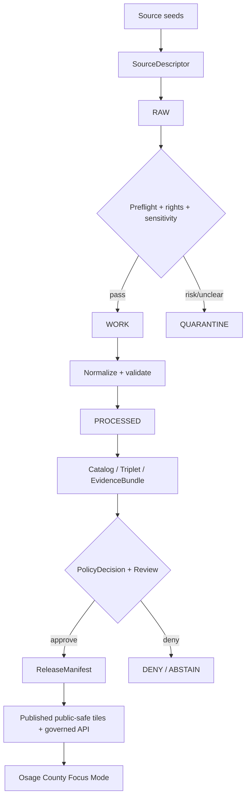
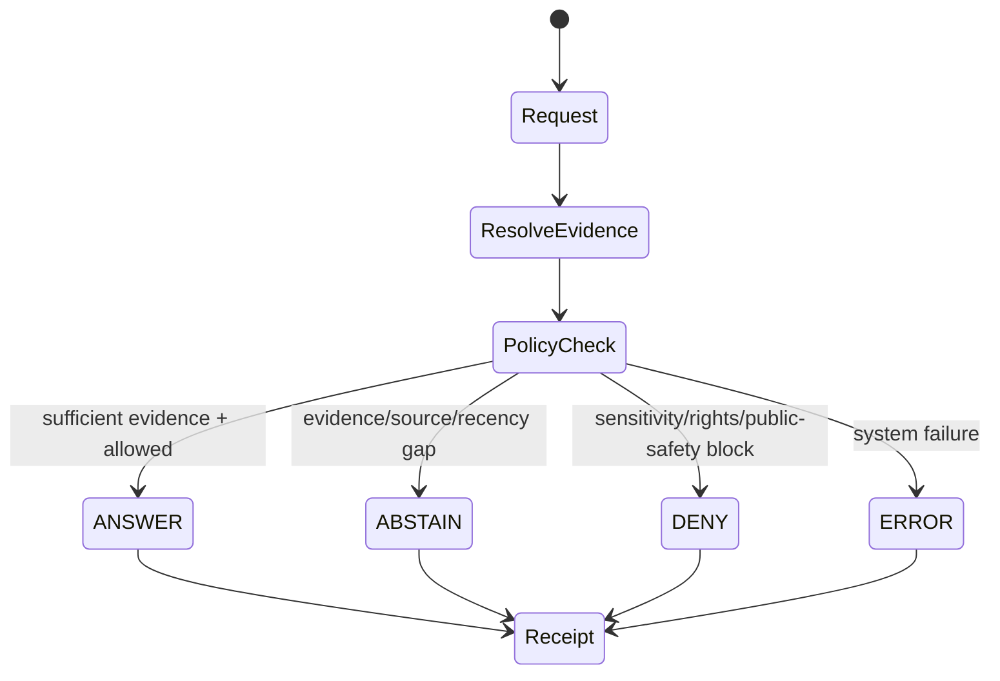

<!--
KFM_META_BLOCK_V2
doc_id: NEEDS_VERIFICATION
title: Osage County Focus Mode Build Plan
type: standard
version: v1
status: draft
owners:
  - NEEDS_VERIFICATION
created: NEEDS_VERIFICATION
updated: NEEDS_VERIFICATION
policy_label: public-plan
related:
  - docs/doctrine/directory-rules.md
  - docs/domains/hydrology/README.md
  - docs/domains/agriculture/README.md
  - docs/domains/geology/README.md
  - docs/domains/roads-rail-trade-routes/README.md
  - docs/domains/settlements-infrastructure/README.md
  - docs/domains/archaeology/README.md
  - docs/domains/habitat/README.md
  - docs/domains/fauna/README.md
tags:
  - kfm
  - focus-mode
  - county-proof-slice
  - osage-county
  - governance
notes:
  - Repo paths are PROPOSED until verified against a mounted Kansas-Frontier-Matrix checkout.
  - Source seeds require source-descriptor, rights, cadence, and sensitivity review before activation.
  - Public UI must use governed APIs and released artifacts only.
-->

<a id="top"></a>

# Osage County Focus Mode Build Plan

> **County proof slice:** Osage County, Kansas  
> **Plan posture:** `PROPOSED` build plan · `NEEDS_VERIFICATION` for repo paths, owners, schema homes, validators, source rights, source cadence, and release state  
> **KFM posture:** evidence-first · map-first · time-aware · cite-or-abstain · policy-aware · fail-closed · auditable · reversible

<p align="center">
  
  
  
  
  
</p>

<p align="center">
  <a href="#operating-posture">Operating posture</a> ·
  <a href="#why-this-county">Why this county</a> ·
  <a href="#first-demo-layers">First demo layers</a> ·
  <a href="#governed-object-model">Governed object model</a> ·
  <a href="#proposed-repository-shape">Repository shape</a> ·
  <a href="#first-pr-sequence">First PRs</a> ·
  <a href="#source-seed-list">Source seeds</a> ·
  <a href="#recommended-first-milestone">Milestone</a>
</p>

---

## Impact block

Osage County is a strong next Kansas Frontier Matrix proof slice because it forces KFM to connect **property-facing GIS**, **US-75 / K-31 transportation context**, **Marais des Cygnes watershed and floodplain governance**, **agricultural land use**, **eastern Kansas geology and groundwater**, **coal/resource history**, **settlement history**, and **public-safe cultural heritage** without collapsing any of those into a single map layer.

The plan deliberately treats the public map as a **trust-visible evidence interface**, not a truth store. Every public layer must resolve through released artifacts, EvidenceBundles, policy decisions, validation reports, receipts, and rollback targets.

---

<a id="operating-posture"></a>

## 1. Operating posture

### 1.1 Focus Mode law

| Rule | Osage County application |
|---|---|
| EvidenceBundle outranks generated language. | Every county claim shown in Focus Mode must resolve to a source-backed EvidenceBundle or return `ABSTAIN`. |
| Public clients use governed interfaces only. | Public UI may consume released layer manifests, governed API DTOs, catalog/triplet records, tile services, and runtime envelopes. |
| Public UI must not read unsafe stores. | No public access to RAW, WORK, QUARANTINE, unpublished candidates, canonical/internal stores, or direct model outputs. |
| Publication is a governed transition. | A layer becoming visible is a PromotionDecision + ReleaseManifest event, not a file copy. |
| AI is interpretive only. | AI may explain Osage County evidence state, but it may not invent missing source support, decide rights, or publish. |
| Cite-or-abstain. | Missing EvidenceRef, unresolved source role, stale source, unclear rights, or sensitive exact geometry returns `ABSTAIN`, `DENY`, or `ERROR`. |
| Fail closed for sensitivity. | Archaeology, sacred/burial sites, rare species, living-person data, exact infrastructure vulnerabilities, and private property details are generalized, redacted, restricted, or denied. |

### 1.2 Truth labels used in this plan

| Label | Meaning |
|---|---|
| `CONFIRMED` | Verified in this planning session from current public-source browsing or supplied KFM doctrine snippets. |
| `PROPOSED` | Recommended design, path, fixture, PR, object, layer, or workflow not verified in current repo implementation. |
| `NEEDS_VERIFICATION` | Checkable before implementation or publication but not yet proven. |
| `UNKNOWN` | Not known from current evidence. |
| `DENY` | Must not be exposed in public Focus Mode. |
| `ABSTAIN` | Do not answer or render because support is incomplete or unsafe. |
| `ERROR` | System failure state; user-facing explanation must be bounded and non-leaky. |

> [!IMPORTANT]
> This document does **not** claim a mounted repo inspection, successful tests, live routes, existing validators, current branch state, deployed services, or existing KFM source descriptors. All repository paths below are **PROPOSED** and must be checked against Directory Rules, current repository evidence, and accepted ADRs before use.

---

<a id="why-this-county"></a>

## 2. Why this county

### 2.1 County choice summary

**Osage County** is the right next slice because it is neither a major metro county nor a pure rural sample. It has enough complexity to test KFM governance without making the first release too large:

| Proof pressure | Why Osage County is useful |
|---|---|
| Property/GIS boundary discipline | Public parcel maps exist, but parcels are not title truth and must not become public-person dossiers. |
| Hydrology and floodplain governance | Northern Osage County has active draft floodplain-map context, while the statewide floodplain viewer governs current effective floodplain lookup. |
| Transportation and infrastructure | U.S. 75 bridge work, K-31 corridors, and detour context test transportation evidence without exposing operational vulnerabilities. |
| Agriculture | 2022 agricultural statistics are substantial enough for CDL, SSURGO, and county ag-context fixtures. |
| Geology/groundwater | KGS has a geologic map and a geohydrology report, giving the county a strong geology-groundwater layer pair. |
| Cultural and historic context | Osage name, settlement, trail/corridor history, and likely archaeology sensitivity require public-safe framing, exact-location suppression, and review gates. |
| Ecological sensitivity | Eastern Kansas prairie/woodland/river-corridor habitat supports habitat/fauna layers while forcing rare-species geoprivacy. |

### 2.2 What makes this county different from prior slices

Osage County adds a useful **east-central Kansas transition case**:

- It is close enough to Topeka/Lawrence influence to test commuter and corridor context.
- It is rural/agricultural enough to test county-scale land-cover materiality.
- It has named geology and groundwater reports that let KFM join surface geology, groundwater regions, wells, floodplains, and land-use claims.
- It has public parcel and appraiser-facing data surfaces that require strict anti-collapse rules: **parcel map ≠ land title**, **appraiser value ≠ ownership truth**, **address point ≠ person identity**.

---

<a id="product-thesis"></a>

## 3. Product thesis

**Osage County Focus Mode** should answer:

> “What can KFM safely show, explain, and cite about Osage County’s land, water, movement corridors, agriculture, geology, settlement pattern, and public-safe heritage — without exposing restricted places, overclaiming private-property records, or treating the map as truth?”

### 3.1 Demo promise

The first public demo should let a user select Osage County and see:

1. A county overview card with source-backed facts.
2. A layer stack limited to released, public-safe county layers.
3. Evidence Drawer entries for every visible claim.
4. A policy banner when a layer is generalized, stale, restricted, or intentionally absent.
5. Focus Mode questions that return `ANSWER`, `ABSTAIN`, `DENY`, or `ERROR` with receipts.

### 3.2 Non-goals

- No live emergency flood warning.
- No parcel-owner profiling.
- No title/legal boundary claims.
- No exact archaeology, burial, sacred-site, rare-species, or vulnerable infrastructure exposure.
- No direct source-system side effects.
- No direct AI answers outside the governed API envelope.
- No auto-publication from source watchers.

---

<a id="scope-boundary"></a>

## 4. Scope boundary

### 4.1 Included in first slice

| Domain | Included public-safe scope |
|---|---|
| Spatial foundation | County boundary, municipalities, generalized roads, generalized hydrography, released basemap context. |
| Hydrology | Current effective floodplain references, generalized stream/watershed context, policy-safe floodplain status cards. |
| Agriculture | County-level 2022 agriculture statistics, CDL histogram candidate, general cropland/pasture context. |
| Soil | SSURGO-derived public-safe summaries, not farm-specific advice. |
| Geology/natural resources | KGS county geologic map seed, groundwater-region summary, construction-material/coal-resource historical context where public-safe. |
| Roads/rail/trade routes | U.S. 75, K-31, major routes, project context, generalized historic movement corridors. |
| Settlements/infrastructure | Osage City, Lyndon, Burlingame, Carbondale, Overbrook, Melvern, Scranton and service-area context at public-safe resolution. |
| Habitat/fauna/flora | Generalized habitat regions, public-safe eBird/GBIF-derived summaries only after geoprivacy. |
| Archaeology/cultural heritage | Public interpretive context only; exact site locations denied. |
| People/genealogy/land ownership | Historical aggregate context only; living-person and DNA data denied by default. |

### 4.2 Excluded or restricted

| Material | Public posture | Reason |
|---|---:|---|
| Exact archaeological/burial/sacred-site coordinates | `DENY` | Cultural sensitivity and looting risk. |
| Rare species precise occurrence | `DENY` or generalized | Species protection and source geoprivacy. |
| Parcel ownership tied to living people | `DENY` unless separately reviewed | Living-person/private-property risk. |
| Critical infrastructure vulnerabilities | `DENY` | Public safety/security. |
| Emergency flood alerts | `ABSTAIN` | KFM is not an emergency alerting system. |
| Unreviewed model outputs | `ABSTAIN` | Model output is derivative, not evidence. |
| Unreleased candidate tiles | `DENY` | Publication gate not passed. |

---

<a id="first-demo-layers"></a>

## 5. First demo layers

### 5.1 Layer manifest candidates

| Layer ID | Layer name | Source seed | Public posture | Evidence requirement | Fixture |
|---|---|---|---|---|---|
| `ks-osage-boundary-v1` | Osage County boundary | TIGER/Line or Kansas GIS boundary seed | Public | SourceDescriptor + geometry hash + license note | Positive |
| `ks-osage-municipal-context-v1` | Cities and settlements | Census places / county public context | Public | SourceDescriptor + release manifest | Positive |
| `ks-osage-major-roads-v1` | Major roads | KDOT / TIGER roads | Public generalized | Route class only; no operational details | Positive |
| `ks-osage-us75-k31-project-context-v1` | U.S. 75 / K-31 project context | KDOT project pages | Public summary | Project-status evidence, timestamp, no live routing promises | Positive + stale fixture |
| `ks-osage-floodplain-context-v1` | Effective floodplain context | KDA floodplain viewer / FEMA | Public with caveats | Must identify effective vs draft; no emergency warning | Positive + draft-confusion invalid |
| `ks-osage-draft-floodplain-north-v1` | Northern Osage draft floodplain project | KDA mapping project | Public summary only | Must label draft/non-regulatory until adopted | Positive + invalid regulatory-overclaim |
| `ks-osage-ag-summary-2022-v1` | 2022 agriculture overview | KDA / USDA Census of Agriculture | Public county aggregate | Citation + census year + source role | Positive |
| `ks-osage-cdl-histogram-candidate-v1` | Cropland Data Layer histogram candidate | USDA CDL | Candidate only until validated | Materiality watch receipt + classmap version | Candidate fixture |
| `ks-osage-geology-v1` | Geologic map context | KGS map M-54 | Public interpretive | Map citation + scale + publication history | Positive |
| `ks-osage-groundwater-regions-v1` | Groundwater regions | KGS geohydrology report | Public with scale caveat | Generalized regions + source limitations | Positive |
| `ks-osage-parcel-reference-v1` | Parcel map reference | County/ArcGIS parcel seed | Restricted summary | Must not expose owner profiling or title truth | Negative fixtures required |
| `ks-osage-heritage-context-v1` | Heritage/cultural context | NPS/KSHS/local public history seeds | Public interpretive | No exact sensitive site geometry | Positive + exact-site-deny |
| `ks-osage-habitat-context-v1` | Habitat context | NLCD/USGS/EPA/KDWP seed | Public generalized | Geoprivacy policy before rendering | Positive |
| `ks-osage-fauna-summary-v1` | Wildlife observation summary | eBird/GBIF candidate | Generalized only | Geoprivacy + source terms + recency | Negative exact-occurrence fixture |

### 5.2 Visual stack



> [!CAUTION]
> Parcel, appraiser, address, and local GIS layers are not automatically public-facing Focus Mode layers. Public release requires source-role review, privacy review, and title/ownership anti-collapse rules.

---

<a id="user-journeys"></a>

## 6. User journeys

### 6.1 Public learner

**Question:** “What makes Osage County’s landscape different from nearby counties?”

Expected behavior:

- Shows generalized county map.
- Explains Marais des Cygnes watershed context, eastern Kansas geology, agriculture, and settlement pattern.
- Opens Evidence Drawer with KGS/KDA/KDOT/county seeds.
- Does not show restricted site coordinates or living-person property details.

### 6.2 County steward

**Question:** “Which Osage County layers are safe to publish?”

Expected behavior:

- Displays layer readiness matrix.
- Flags `NEEDS_VERIFICATION` for source rights, stale data, draft floodplain status, and sensitive geometry.
- Requires PromotionDecision before public display.

### 6.3 Transportation/history researcher

**Question:** “How do U.S. 75, K-31, and older corridors shape Osage County?”

Expected behavior:

- Shows generalized modern route network.
- Explains KDOT project evidence and historic movement context separately.
- Avoids real-time routing and exact vulnerability claims.

### 6.4 Hydrology user

**Question:** “Is my property in a floodplain?”

Expected behavior:

- `ABSTAIN` from property-specific determination unless official effective floodplain source and address flow are explicitly in scope.
- Provide general guidance: consult official KDA/FEMA viewer and local floodplain administrator.
- Do not give emergency or insurance/legal determination.

### 6.5 Biodiversity user

**Question:** “Where are sensitive species in Osage County?”

Expected behavior:

- `DENY` exact locations.
- Offer generalized habitat context if released and reviewed.
- Explain geoprivacy policy and EvidenceBundle limitations.

---

<a id="ui-surfaces"></a>

## 7. UI surfaces

| Surface | County-specific behavior |
|---|---|
| County header | “Osage County Focus Mode” with status badges for release state, evidence coverage, and policy posture. |
| Layer drawer | Groups layers by `public`, `generalized`, `restricted`, `candidate`, `stale`, `denied`. |
| Evidence Drawer | Shows source role, evidence date, source rights status, spec_hash, limitations, and transform receipts. |
| Policy banner | Visible when floodplain data are draft, parcel data are restricted, or species/heritage geometry is generalized. |
| Ask panel | Uses governed runtime envelope only; no direct model endpoint. |
| Timeline slider | Shows census/agriculture year, source vintage, project date, and release date separately. |
| Corrections tab | Lets users submit correction suggestions without mutating canonical data. |
| Steward review panel | Local/private steward-only surface for candidate layer readiness and negative fixtures. |

### 7.1 Runtime outcomes



---

<a id="governed-object-model"></a>

## 8. Governed object model

### 8.1 Required objects

| Object | Purpose | Osage County example |
|---|---|---|
| `SourceDescriptor` | Defines authority, source role, cadence, rights, contact, and limitations. | KDA Osage agriculture statistics page. |
| `SourceIntakeRecord` | Records fetch/import event without publishing. | KGS geologic map metadata intake. |
| `EvidenceRef` | Stable reference to evidence used by a claim. | EvidenceRef for “865 farms in 2022.” |
| `EvidenceBundle` | Resolved evidence package that can support public explanation. | Agriculture summary bundle. |
| `PolicyDecision` | Records allow/deny/generalize/abstain decision. | Rare species exact location denied. |
| `ValidationReport` | Records schema, linkage, geospatial, rights, and policy checks. | Floodplain layer validation. |
| `RunReceipt` | Records deterministic process run. | CDL histogram materiality run. |
| `TransformReceipt` | Records redaction/generalization/aggregation. | Generalized heritage location transform. |
| `PromotionDecision` | Human/governed state transition for release. | Osage County public overview v1 approved. |
| `ReleaseManifest` | Public release manifest listing approved artifacts. | `osage_focus_mode_public_v1`. |
| `RollbackPlan` | Reversible target and steps. | Withdraw floodplain layer if source status changes. |
| `CorrectionNotice` | Public correction history. | Updated project status after KDOT page changes. |

### 8.2 Claim model examples

| Claim | Required status before public answer |
|---|---|
| “Osage County had 865 farms in 2022.” | `ANSWER` only with KDA/USDA EvidenceBundle and source year. |
| “Northern Osage floodplain maps are draft.” | `ANSWER` only with KDA mapping-project EvidenceBundle and draft label. |
| “This parcel belongs to X.” | `DENY` for public Focus Mode unless specific reviewed legal/rights basis exists. |
| “This exact site is culturally sensitive.” | `DENY` exact location; possibly `ANSWER` only as generalized public-safe context. |
| “This tile shows current air/smoke risk.” | `ABSTAIN` unless current source cadence, model/observation distinction, and release manifest are present. |

### 8.3 Anti-collapse rules

| Do not collapse | Required distinction |
|---|---|
| Parcel geometry → land title | Parcel/appraiser records are administrative/tax context, not title proof. |
| Draft floodplain → effective regulation | Draft mapping project must remain draft until official adoption. |
| KGS historical geology report → current engineering determination | Use as geologic context, not site-specific engineering advice. |
| Road project page → live routing | KDOT project info is not live traffic routing. |
| Habitat model → species presence | Habitat support is not occurrence proof. |
| AI summary → evidence | AI is an interpretive carrier only. |

---

<a id="proposed-repository-shape"></a>

## 9. Proposed repository shape

> [!WARNING]
> Directory Rules basis: file placement should follow responsibility root, lifecycle, authority, and governance boundary — not county topic convenience. The paths below are **PROPOSED** and must be verified against the live repository and accepted ADRs before creation.

### 9.1 Proposed documentation homes

```text
docs/
  focus-modes/
    counties/
      osage/
        README.md
        osage_county_focus_mode_build_plan.md
        source_seed_register.md
        public_safe_layer_matrix.md
        open_questions.md
```

### 9.2 Proposed contracts and schemas

```text
schemas/
  contracts/
    v1/
      focus_mode/
        county_focus_mode.schema.json
        focus_mode_runtime_envelope.schema.json
        focus_mode_layer_manifest.schema.json
      evidence/
        evidence_ref.schema.json
        evidence_bundle.schema.json
      release/
        release_manifest.schema.json
        rollback_plan.schema.json
```

### 9.3 Proposed source descriptors

```text
data/
  source_descriptors/
    kansas/
      osage_county/
        osage_county_gis_parcels.source.json
        kda_osage_ag_stats_2022.source.json
        kda_floodplain_viewer.source.json
        kda_lower_kansas_custom_watershed.source.json
        kgs_osage_geologic_map_m54.source.json
        kgs_osage_geohydrology.source.json
        kdot_us75_osage_bridges.source.json
        kdot_k31_osage_project.source.json
```

### 9.4 Proposed fixtures

```text
fixtures/
  focus_mode/
    counties/
      osage/
        valid/
          osage_focus_mode_public_minimal.v1.json
          osage_ag_summary_2022.evidence_bundle.v1.json
          osage_geology_context.evidence_bundle.v1.json
          osage_transport_context.evidence_bundle.v1.json
        invalid/
          parcel_owner_public_exposure.invalid.json
          archaeology_exact_location.invalid.json
          rare_species_exact_occurrence.invalid.json
          draft_floodplain_as_effective.invalid.json
          kdot_project_as_live_route.invalid.json
          missing_evidence_ref.invalid.json
          unreleased_tile_manifest.invalid.json
```

### 9.5 Proposed policy and validators

```text
policy/
  focus_mode/
    county_publication.rego
    sensitive_geometry.rego
    parcel_privacy.rego
    floodplain_status.rego
    ecology_geoprivacy.rego

tools/
  validators/
    focus_mode/
      validate_county_focus_mode.py
      validate_layer_manifest.py
      validate_evidence_bundle_resolution.py
      validate_public_safe_geometry.py
      validate_osage_fixture_pack.py
```

### 9.6 Proposed release artifacts

```text
release/
  manifests/
    focus_mode/
      counties/
        osage/
          osage_focus_mode_public_v1.release_manifest.json
          osage_focus_mode_public_v1.rollback_plan.json
```

---

<a id="build-phases"></a>

## 10. Build phases

### Phase 0 — Evidence and repo boundary inventory

- [ ] Mount or inspect current repository.
- [ ] Verify Directory Rules and accepted ADRs.
- [ ] Inventory existing focus-mode, county, hydrology, agriculture, geology, roads, settlements, archaeology, habitat, fauna, and source-ledger files.
- [ ] Mark path conflicts as `NEEDS_VERIFICATION`.
- [ ] Create no files outside responsibility roots.

### Phase 1 — Source seed registry

- [ ] Create Osage County source-seed register.
- [ ] For each seed, record source role, owner/contact, rights, update cadence, access method, spatial scope, temporal scope, and limitations.
- [ ] Do not ingest live data yet.
- [ ] Add negative source entries for sources that are useful but unsafe for public release.

### Phase 2 — Minimal schemas and fixtures

- [ ] Add county Focus Mode schema.
- [ ] Add layer manifest schema.
- [ ] Add EvidenceBundle examples.
- [ ] Add invalid fixtures for sensitive geometry and title/privacy overclaims.
- [ ] Validate all fixtures offline.

### Phase 3 — Public-safe layer manifest

- [ ] Add county boundary, municipality, agriculture summary, geology context, major roads, and floodplain context as candidate layers.
- [ ] Require release state and policy state on every layer.
- [ ] Block parcel ownership and sensitive ecological/archaeological geometry.

### Phase 4 — Governed API and UI mock

- [ ] Mock `/focus-mode/counties/osage` or repo-native equivalent.
- [ ] Return finite runtime envelope.
- [ ] Implement Evidence Drawer payload.
- [ ] Add policy banner behavior for generalized or denied layers.

### Phase 5 — Promotion dry run

- [ ] Run no-network promotion simulation.
- [ ] Emit `RunReceipt`, `ValidationReport`, `PolicyDecision`, `PromotionDecision`, `ReleaseManifest`, and `RollbackPlan`.
- [ ] Confirm release is a governed state transition.

### Phase 6 — Optional source activation

- [ ] Activate one low-risk public source after rights/cadence check.
- [ ] Prefer KDA county agriculture statistics or KGS geologic map metadata.
- [ ] Keep parcels, rare species, archaeology, and live operational data out of first public activation.

---

<a id="first-pr-sequence"></a>

## 11. First PR sequence

### PR-OSAGE-0001 — Documentation and source seed register

| Item | Status |
|---|---|
| Add Osage County Focus Mode README/build plan | `PROPOSED` |
| Add source seed register | `PROPOSED` |
| Add public-safe layer matrix | `PROPOSED` |
| Add open questions file | `PROPOSED` |
| No source ingestion | Required |
| No public release | Required |

### PR-OSAGE-0002 — Schema and fixture pack

| Item | Status |
|---|---|
| Add county Focus Mode contract fixture | `PROPOSED` |
| Add EvidenceBundle fixtures | `PROPOSED` |
| Add invalid fixtures | `PROPOSED` |
| Add validator stubs | `PROPOSED` |
| Add CI no-network test job | `PROPOSED` |

### PR-OSAGE-0003 — Policy gates

| Gate | Invalid fixture |
|---|---|
| Parcel privacy gate | `parcel_owner_public_exposure.invalid.json` |
| Sensitive archaeology gate | `archaeology_exact_location.invalid.json` |
| Ecology geoprivacy gate | `rare_species_exact_occurrence.invalid.json` |
| Floodplain status gate | `draft_floodplain_as_effective.invalid.json` |
| Evidence resolution gate | `missing_evidence_ref.invalid.json` |
| Release state gate | `unreleased_tile_manifest.invalid.json` |

### PR-OSAGE-0004 — Mock governed API and UI payload

| Component | Scope |
|---|---|
| County Focus Mode response | Static no-network fixture. |
| Evidence Drawer | Shows source roles, limitations, policy labels. |
| Ask panel | Finite runtime outcomes only. |
| Layer drawer | Does not load unreleased artifacts. |

### PR-OSAGE-0005 — Release dry run

| Artifact | Required |
|---|---|
| ValidationReport | Yes |
| PolicyDecision | Yes |
| PromotionDecision | Yes |
| ReleaseManifest | Yes |
| RollbackPlan | Yes |
| CorrectionNotice template | Yes |

---

<a id="acceptance-checklist"></a>

## 12. Acceptance checklist

### 12.1 Governance

- [ ] No public UI reads RAW, WORK, QUARANTINE, unpublished candidates, canonical/internal stores, or direct model output.
- [ ] Every visible claim resolves to an EvidenceBundle.
- [ ] Every source has a SourceDescriptor or source seed entry.
- [ ] Every layer has release state, policy label, rights status, source role, and limitations.
- [ ] Every denied/abstained answer emits a receipt.
- [ ] Promotion is recorded as a governed decision.
- [ ] Rollback target exists before release.

### 12.2 Osage-specific correctness

- [ ] Agriculture summary uses correct 2022 county figures and source year.
- [ ] Draft floodplain material is never labeled as current effective regulation.
- [ ] KDA/FEMA effective floodplain context is clearly separated from draft project context.
- [ ] KGS geology and groundwater sources include scale and age limitations.
- [ ] KDOT project pages are treated as project context, not live traffic operations.
- [ ] Parcel/appraiser sources are not presented as title truth.
- [ ] Sensitive heritage and ecology locations are generalized or denied.

### 12.3 Tests

- [ ] Positive fixtures validate.
- [ ] Negative fixtures fail closed.
- [ ] Missing EvidenceRef returns `ABSTAIN`.
- [ ] Sensitive exact geometry returns `DENY`.
- [ ] Unreleased tile manifest returns `DENY`.
- [ ] Direct model-client bypass fails CI.
- [ ] Release dry run emits all required receipts.

---

<a id="risk-register"></a>

## 13. Risk register

| Risk | Likelihood | Impact | Public posture | Mitigation |
|---|---:|---:|---|---|
| Parcel data interpreted as ownership/title truth | High | High | Restrict/generalize | Add parcel anti-collapse policy and disclaimer. |
| Draft floodplain map treated as effective regulation | Medium | High | `ABSTAIN` if unclear | Require `floodplain_status` = `effective` or `draft` with explicit label. |
| Sensitive archaeology exposure | Medium | High | `DENY` | Exact coordinates forbidden in public fixtures. |
| Rare species exact occurrence exposure | Medium | High | `DENY` | Geoprivacy transform receipt required. |
| KDOT project interpreted as live traffic routing | Medium | Medium | Public summary only | Require timestamp and “not live routing” warning. |
| KGS historical report overused for current engineering advice | Medium | Medium | Public caveated | Add scale/vintage limitations. |
| Source rights unclear | Medium | High | `ABSTAIN` | SourceDescriptor rights field required. |
| County GIS service changes schema or access | Medium | Medium | `ABSTAIN` on stale | Watcher emits proposed work only, not public update. |
| Agriculture/CDL changes cause noisy reprocessing | Medium | Low | Candidate only | Use material-change threshold and sidecar receipts. |
| AI generates unsupported county facts | Medium | High | `ABSTAIN` | Runtime citation validation before answer. |
| Public release lacks rollback target | Low | High | Block release | ReleaseManifest requires RollbackPlan. |
| Overly precise infrastructure detail | Medium | High | `DENY` | Generalize project/context geometry. |

---

<a id="source-seed-list"></a>

## 14. Source seed list

> [!NOTE]
> These are source seeds, not activated sources. Each needs a `SourceDescriptor`, rights/cadence review, source-role assignment, and source-specific validator before production use.

| Seed ID | Source | Candidate use | Source role | Public posture | Verification status |
|---|---|---|---|---|---|
| `seed-osage-county-gis-parcels` | Osage County / ArcGIS parcel map | Parcel-reference warning, administrative context | Context / restricted | Restricted summary only | `NEEDS_VERIFICATION` |
| `seed-osage-parcel-search` | Osage County parcel search | Appraiser/parcel public-access boundary | Context / restricted | Not public person/title claim | `NEEDS_VERIFICATION` |
| `seed-kda-osage-ag-2022` | Kansas Department of Agriculture Osage County agricultural statistics | County ag summary | Authoritative/statistical | Public aggregate | `NEEDS_VERIFICATION` |
| `seed-usda-nass-osage-profile-2022` | USDA NASS 2022 county profile | Agriculture cross-check | Primary/statistical | Public aggregate | `NEEDS_VERIFICATION` |
| `seed-kda-current-effective-floodplain-viewer` | KDA Kansas Current Effective Floodplain Viewer | Effective floodplain context | Regulatory/context | Public with caveats | `NEEDS_VERIFICATION` |
| `seed-kda-lower-kansas-custom-watershed` | KDA Lower Kansas custom watershed project | Draft floodplain update context | Draft/project | Public summary only | `NEEDS_VERIFICATION` |
| `seed-kgs-osage-geologic-map-m54` | KGS Geologic Map of Osage County | Geology layer seed | Authoritative/geologic map | Public with scale caveat | `NEEDS_VERIFICATION` |
| `seed-kgs-osage-geohydrology` | KGS Osage County geohydrology | Groundwater regions | Historical/scientific | Public with vintage caveat | `NEEDS_VERIFICATION` |
| `seed-kgs-osage-groundwater-regions` | KGS groundwater regions page | Groundwater-region summary | Scientific/context | Public generalized | `NEEDS_VERIFICATION` |
| `seed-wwc5-water-well-records` | KGS WWC5 water well records | Well-record context | Administrative/scientific | Restricted/generalized | `NEEDS_VERIFICATION` |
| `seed-kdot-us75-osage-bridges` | KDOT U.S. 75 bridge improvements | Transportation project context | Official/project | Public summary only | `NEEDS_VERIFICATION` |
| `seed-kdot-k31-osage-project` | KDOT K-31 Osage project | Route/project context | Official/project | Public summary only | `NEEDS_VERIFICATION` |
| `seed-usgs-nhdplus` | USGS NHDPlus / hydrography | Rivers/streams/watersheds | Hydrography | Public generalized | `NEEDS_VERIFICATION` |
| `seed-usda-ssurgo-osage` | USDA SSURGO | Soil context | Soil survey | Public generalized | `NEEDS_VERIFICATION` |
| `seed-usda-cdl-osage` | USDA Cropland Data Layer | CDL histogram candidate | Remote sensing / land cover | Public after validation | `NEEDS_VERIFICATION` |
| `seed-nlcd-osage` | USGS NLCD | Habitat/land-cover context | Land cover | Public generalized | `NEEDS_VERIFICATION` |
| `seed-ebird-osage` | eBird | Bird observation summaries | Citizen science / observation | Generalized only | `NEEDS_VERIFICATION` |
| `seed-gbif-osage` | GBIF | Species occurrence summaries | Aggregated occurrence | Generalized only | `NEEDS_VERIFICATION` |
| `seed-kshs-osage-heritage` | Kansas Historical Society / public heritage references | Cultural context | Historical/context | Public interpretive | `NEEDS_VERIFICATION` |
| `seed-fema-msc-osage` | FEMA Map Service Center | Flood map cross-check | Federal/regulatory | Public with caveats | `NEEDS_VERIFICATION` |

### 14.1 Source activation priority

| Priority | Seed | Reason |
|---:|---|---|
| 1 | KDA Osage agriculture statistics | Low sensitivity, county aggregate, strong first EvidenceBundle. |
| 2 | KGS geologic map metadata | Public map context, clear scale and source role. |
| 3 | KDA floodplain viewer / mapping project | High public value, needs careful effective/draft distinction. |
| 4 | KDOT U.S. 75 / K-31 project context | Useful movement layer, must avoid live routing. |
| 5 | SSURGO/CDL/NLCD | Strong map layers, require materiality and source-version handling. |
| 6 | Parcel map | Useful but privacy/title risks; keep restricted in first public release. |
| 7 | eBird/GBIF | Useful but geoprivacy and source-terms risks; generalize only. |
| 8 | Heritage/archaeology | Interpretive only; exact locations denied. |

---

<a id="open-verification-questions"></a>

## 15. Open verification questions

### 15.1 Repository and path questions

- [ ] What is the current accepted schema home in the live repo?
- [ ] Does a Focus Mode county docs tree already exist?
- [ ] Are county build plans stored under `docs/focus-modes/counties/` or another documented root?
- [ ] Are policy files under `policy/` or `policies/` in current repo convention?
- [ ] Are source descriptors stored under `data/source_descriptors/`, `connectors/`, or a source-ledger root?
- [ ] Is there an accepted ADR for county Focus Mode naming?
- [ ] Which test runner is canonical for validators?
- [ ] Are ReleaseManifest and RollbackPlan schemas already present?

### 15.2 Source questions

- [ ] What are the usage terms for Osage County GIS parcel map?
- [ ] Does the parcel map expose owner names, and what public restrictions are required?
- [ ] What is the official floodplain administrator source for Osage County?
- [ ] Which floodplain panels are effective versus draft for northern Osage County?
- [ ] What is the current status of U.S. 75 bridge improvements and K-31 work?
- [ ] Which KGS geologic/geohydrologic sources are current enough for public context?
- [ ] Which historical/cultural sources are safe for public interpretive use?
- [ ] What state or tribal consultation posture is required for sensitive heritage narratives?

### 15.3 Policy questions

- [ ] What geometry precision is allowed for heritage context?
- [ ] What geometry precision is allowed for rare species and sensitive habitats?
- [ ] Can public Focus Mode show parcel polygons without owner/name attributes?
- [ ] Must floodplain answers redirect to official viewers for property-level determinations?
- [ ] What disclaimer text is required for non-emergency hazards and flood context?
- [ ] What review role approves county Focus Mode release?

---

<a id="recommended-first-milestone"></a>

## 16. Recommended first milestone

### Milestone: `M-OSAGE-001 — Public-safe county overview with evidence drawer`

**Goal:** ship a no-network, fixture-backed Osage County Focus Mode slice that proves the trust membrane before source activation.

#### Included

- County overview card.
- Agriculture summary EvidenceBundle.
- Geologic map context EvidenceBundle.
- Floodplain status banner with effective-vs-draft distinction.
- U.S. 75 / K-31 transportation context card.
- Public-safe layer manifest.
- Evidence Drawer for every visible claim.
- Negative fixtures for parcel privacy, archaeology exact location, rare species exact occurrence, draft floodplain overclaim, and missing EvidenceRef.
- Release dry-run artifacts.

#### Excluded

- Live parcel ingestion.
- Live species occurrence ingestion.
- Emergency flood alerts.
- Live KDOT traffic/routing.
- Exact archaeology/cultural site geometry.
- Public direct model endpoint.
- Any publication without rollback.

#### Definition of done

- [ ] All fixtures validate or fail as expected.
- [ ] All public claims resolve to EvidenceBundles.
- [ ] All sensitive exact-location fixtures return `DENY`.
- [ ] Missing citation fixtures return `ABSTAIN`.
- [ ] Public UI consumes only the governed mock API fixture.
- [ ] Release dry run emits ReleaseManifest and RollbackPlan.
- [ ] README documents source limitations and public-safe boundary.

---

## Appendix A — County layer fixture outline

```json
{
  "schema_version": "v1",
  "focus_mode_id": "kfm:focus-mode:county:ks:osage:v1",
  "county": {
    "name": "Osage County",
    "state": "Kansas",
    "fips": "20139"
  },
  "release_state": "candidate",
  "runtime_outcomes": ["ANSWER", "ABSTAIN", "DENY", "ERROR"],
  "layers": [
    {
      "layer_id": "ks-osage-ag-summary-2022-v1",
      "policy_label": "public",
      "evidence_bundle_ref": "kfm://evidence-bundle/osage/ag-summary-2022",
      "release_state": "candidate",
      "limitations": [
        "County aggregate only.",
        "Does not identify individual farms or operators."
      ]
    }
  ]
}
```

---

## Appendix B — Negative fixture matrix

| Invalid fixture | Expected outcome | Reason |
|---|---|---|
| `parcel_owner_public_exposure.invalid.json` | `DENY` | Living-person/private-property risk and title anti-collapse. |
| `archaeology_exact_location.invalid.json` | `DENY` | Cultural-resource/sacred/burial-site risk. |
| `rare_species_exact_occurrence.invalid.json` | `DENY` | Ecology geoprivacy. |
| `draft_floodplain_as_effective.invalid.json` | `ERROR` or `ABSTAIN` | Regulatory status overclaim. |
| `kdot_project_as_live_route.invalid.json` | `ABSTAIN` | KDOT project context is not live routing. |
| `missing_evidence_ref.invalid.json` | `ABSTAIN` | Cite-or-abstain. |
| `unreleased_tile_manifest.invalid.json` | `DENY` | Publication gate missing. |

---

## Appendix C — Public copy guardrails

Approved public phrasing examples:

- “KFM has a released county-level agriculture summary for Osage County based on 2022 public aggregate statistics.”
- “This floodplain layer distinguishes official effective floodplain context from draft mapping-project context.”
- “This geology layer is public interpretive context and is not site-specific engineering advice.”
- “Exact sensitive cultural-resource and rare-species locations are not shown in public Focus Mode.”

Disallowed public phrasing examples:

- “This parcel owner is…”
- “This draft floodplain map is the current regulation.”
- “This exact point is an archaeological site.”
- “This species was observed here.”
- “KFM recommends this live driving route.”
- “The AI determined this fact.”

---

## Appendix D — Source URLs captured during planning

These URLs were used as source seeds during planning and must be converted into governed `SourceDescriptor` records before activation:

| Source seed | URL |
|---|---|
| Osage County ArcGIS parcel map | `https://www.arcgis.com/apps/webappviewer/index.html?id=a74a8e0ef1da48769a706e23cae5635f` |
| Osage County parcel search | `https://osage.kansasgov.com/parcel/` |
| KDA Osage County agriculture statistics | `https://www.agriculture.ks.gov/kansas-agriculture/kansas-agricultural-statistics/osage-county` |
| USDA NASS Osage County 2022 profile | `https://www.nass.usda.gov/Publications/AgCensus/2022/Online_Resources/County_Profiles/Kansas/cp20139.pdf` |
| KDA mapping projects | `https://www.agriculture.ks.gov/divisions-programs/division-of-water-resources/water-structures/floodplain-management/mapping/mapping-projects` |
| KDA Kansas Current Effective Floodplain Viewer | `https://gis2.kda.ks.gov/gis/ksfloodplain/` |
| KDA Lower Kansas custom watershed project | `https://www.agriculture.ks.gov/divisions-programs/division-of-water-resources/water-structures/floodplain-management/mapping/lower-kansas-custom-watershed-douglas-county-and-osage-county` |
| KGS geologic map of Osage County | `https://www.kgs.ku.edu/General/Geology/County/nop/osage.html` |
| KGS Osage County geohydrology | `https://www.kgs.ku.edu/General/Geology/Osage/index.html` |
| KGS groundwater regions in Osage County | `https://www.kgs.ku.edu/General/Geology/Osage/05_gw5.html` |
| KDOT U.S. 75 bridge improvements in Osage County | `https://www.ksdot.gov/projects/northeast-kansas-projects/u-s-75-bridge-improvements-in-osage-county` |
| KDOT K-31 Osage County project archive | `https://www.ksdot.gov/Home/Components/News/News/1083/712` |

---

## Final status

| Field | Status |
|---|---|
| County selected | Osage County |
| Build plan generated | `CONFIRMED` |
| Repo paths | `PROPOSED` |
| Source activation | `NOT_STARTED` |
| Public release | `NOT_STARTED` |
| Required next action | Verify repo placement, create source seed register, and add no-network fixtures. |

[Back to top](#top)
