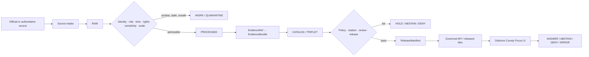
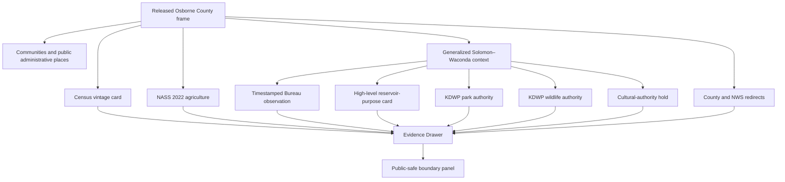
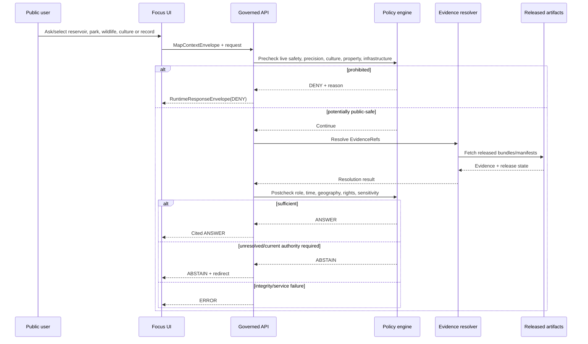
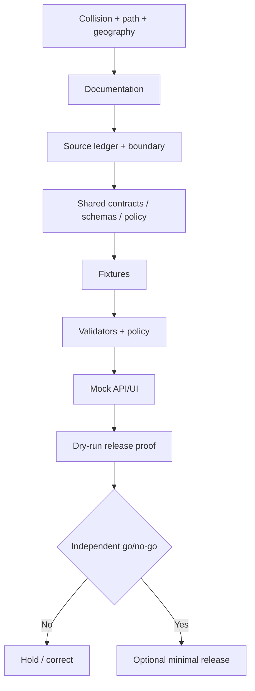

<!-- [KFM_META_BLOCK_V2]
doc_id: NEEDS_VERIFICATION
title: Osborne County Focus Mode Build Plan
type: county-focus-mode-build-plan
version: v0.1-proposed
status: PROPOSED
release_status: NEEDS_VERIFICATION
county_name: Osborne County
county_slug: osborne
lane_slug: osborne-county
created: 2026-06-09
updated: 2026-06-09
owners:
  focus_mode_owner: NEEDS_VERIFICATION
  evidence_steward: NEEDS_VERIFICATION
  hydrology_reviewer: NEEDS_VERIFICATION
  reservoir_operations_reviewer: NEEDS_VERIFICATION
  recreation_public_safety_reviewer: NEEDS_VERIFICATION
  ecology_geoprivacy_reviewer: NEEDS_VERIFICATION
  cultural_history_reviewer: NEEDS_VERIFICATION
  tribal_nation_review_coordinator: NEEDS_VERIFICATION
  agriculture_reviewer: NEEDS_VERIFICATION
  privacy_property_reviewer: NEEDS_VERIFICATION
  infrastructure_security_reviewer: NEEDS_VERIFICATION
  rights_reviewer: NEEDS_VERIFICATION
  release_approver: NEEDS_VERIFICATION
unverified_homes:
  canonical_human_plan_path: PROPOSED / NEEDS_VERIFICATION
  schema_home: PROPOSED / NEEDS_VERIFICATION
  contract_home: PROPOSED / NEEDS_VERIFICATION
  policy_home: PROPOSED / NEEDS_VERIFICATION
  fixture_home: PROPOSED / NEEDS_VERIFICATION
  source_registry_home: PROPOSED / NEEDS_VERIFICATION
  correction_home: PROPOSED / NEEDS_VERIFICATION
  rollback_home: PROPOSED / NEEDS_VERIFICATION
  release_home: PROPOSED / NEEDS_VERIFICATION
defining_public_safe_boundary: >-
  Osborne County's population, agriculture, Solomon River, western Waconda
  Lake/Glen Elder Reservoir, recreation, wildlife-area, reservoir, historical,
  public-record, emergency, and health sources may support generalized, dated
  explanation, but must not become live boating, swimming, fishing, hunting,
  camping, road, weather, flood, reservoir-level, dam-operation, water-release,
  or emergency guidance; dam or infrastructure vulnerability analysis; precise
  refuge or sensitive-species locations; private-well, water-right, potability,
  property-access, title, owner, genealogy, or individual-farm conclusions; or
  public cultural representation of Waconda-related sacred, Tribal, Nation, or
  submerged heritage without authoritative evidence and review.
collision_search:
  supplied_completed_register: CONFIRMED absent
  current_conversation_completed: CONFIRMED Butler, Cheyenne, Nemaha, Russell, Sumner, Wichita, Smith, and Seward completed; Osborne absent
  live_county_index: CONFIRMED listed not-started on 2026-06-09
  exact_title_search: CONFIRMED no result
  exact_filename_search: CONFIRMED no result
  kebab_slug_search: CONFIRMED no result
  underscore_slug_search: CONFIRMED no result
  proof_slice_search: CONFIRMED no result for Waconda, Glen Elder, and Osborne County Focus Mode terms
  accessible_project_materials: CONFIRMED no Osborne County Focus Mode plan found
  exhaustive_absence_private_branches_deleted_files_local_artifacts_prior_chats: NEEDS_VERIFICATION
rejected_material_collisions:
  - Butler County: generated in this conversation
  - Cheyenne County: generated in this conversation
  - Nemaha County: generated in this conversation
  - Russell County: generated in this conversation
  - Sumner County: generated in this conversation
  - Wichita County: generated in this conversation
  - Smith County: generated in this conversation
  - Seward County: generated in this conversation
  - Graham County: live county index marks draft
directory_rules_basis:
  governing_principle: responsibility root outranks topic name
  observed_live_plan_template: docs/focus-mode/counties/<county-slug>-county/build-plan.md
  observed_live_index: docs/focus-mode/counties/COUNTY_INDEX.md
  validator_reference: tools/validators/validate_focus_mode_index.py
  documented_divergence: docs/focus-mode/ versus docs/focus-modes/ references coexist
  legacy_convention: docs/focus-mode/counties/<county>_county/<county>_county_focus_mode_build_plan.md
  path_posture: PROPOSED / NEEDS_VERIFICATION
official_sources_checked:
  - Osborne County official website
  - U.S. Census Bureau QuickFacts
  - USDA NASS 2022 county profile
  - Kansas Department of Wildlife and Parks Glen Elder State Park
  - Kansas Department of Wildlife and Parks Glen Elder Wildlife Area
  - U.S. Bureau of Reclamation current Waconda Lake data
  - U.S. Bureau of Reclamation Waconda allocation diagram
  - National Weather Service Hastings
implementation_claim: none
repository_modification_claim: none
source_admission_claim: none
review_or_validation_claim: none
promotion_or_publication_claim: none
truth_labels: [CONFIRMED, PROPOSED, NEEDS_VERIFICATION, UNKNOWN]
finite_outcomes: [ANSWER, ABSTAIN, DENY, ERROR]
[/KFM_META_BLOCK_V2] -->

<a id="top"></a>

# Osborne County Focus Mode — Build Plan

> **The western Waconda–Solomon corridor, public recreation, reservoir evidence, agriculture, wildlife management, county services, and cultural history—without turning a dated reservoir reading into live safety advice, a public wildlife map into sensitive-location disclosure, a dam into a vulnerability study, or Waconda-related heritage into unreviewed cultural authority.**

**Product thesis:** Build a governed, map-first, time-aware Osborne County Focus Mode that explains county identity, communities, population vintages, 2022 agriculture, the South Fork Solomon River, Osborne County’s portion of Waconda Lake/Glen Elder Reservoir, public recreation and wildlife-management roles, county services, and cross-county reservoir governance while preserving operational currentness, cultural authority, ecological geoprivacy, property and health limits, infrastructure security, rights, correction, and rollback.


> [!IMPORTANT]
> **Defining public-safe boundary.** Osborne County can be explained through county-scale population and agriculture, the Solomon River system, the western Osborne County portion of Waconda Lake/Glen Elder Reservoir, public recreation, wildlife management, county government, and dated official reservoir observations. KFM must not convert those sources into live boating, swimming, fishing, hunting, camping, road, flood, weather, reservoir-level, release, or emergency guidance; dam or infrastructure vulnerability analysis; precise refuge or sensitive wildlife-use locations; private-well, water-right, potability, title, property-access, owner, genealogy, or individual-farm conclusions; or Waconda-related sacred, Tribal, Nation, or submerged-cultural interpretation without authoritative evidence, review, rights, and sensitivity controls.

## Status and identity

| Field | Value | Truth posture |
|---|---|---|
| County | Osborne County, Kansas | `CONFIRMED` |
| County seat | Osborne | `CONFIRMED` |
| County FIPS | `20141` | `CONFIRMED` |
| County slug | `osborne` | `PROPOSED` |
| Lane slug | `osborne-county` | `PROPOSED` |
| Requested artifact | `osborne_county_focus_mode_build_plan.md` | `CONFIRMED` |
| Created / updated | 2026-06-09 | `CONFIRMED` |
| Planning status | Build plan only | `CONFIRMED` |
| Repository modification | None claimed | `CONFIRMED` |
| Implementation | Not claimed | `UNKNOWN` |
| Source admission | Not performed | `CONFIRMED` |
| Review / validation | Not performed | `CONFIRMED` |
| Promotion / release | Not performed | `CONFIRMED` |
| Canonical repository lane | Template states `docs/focus-mode/counties/osborne-county/build-plan.md` | `CONFIRMED` template / `NEEDS_VERIFICATION` integration |
| Exhaustive collision absence | Not provable across all private/deleted/local artifacts | `NEEDS_VERIFICATION` |

## Quick links

[Executive build note](#executive-build-note) · [Evidence boundary](#evidence-boundary) · [Operating posture](#1-operating-posture) · [Why this county](#2-why-this-county) · [Product thesis](#3-product-thesis) · [Scope](#4-scope-boundary) · [Layers](#5-first-demo-layers) · [Journeys](#6-user-journeys) · [UI](#7-ui-surfaces) · [Objects](#8-governed-object-model) · [Repository](#9-proposed-repository-shape) · [Phases](#10-build-phases) · [PR sequence](#11-first-pr-sequence) · [Acceptance](#12-acceptance-checklist) · [Fixtures](#13-fixture-plan) · [Risks](#14-risk-register) · [Sources](#15-source-seed-list) · [Questions](#16-open-verification-questions) · [Milestone](#17-recommended-first-milestone)

## Executive build note

Osborne County is a strong next proof slice because it forces KFM to separate overlapping but non-equivalent truth systems:

1. **County identity and rural population.** Census reports a 2025 estimate of 3,285, a 2020 Census count of 3,500, 892.52 square miles of land, and FIPS `20141`. Different vintages must remain distinct.
2. **Agriculture with suppression.** NASS reports 308 farms, 424,101 acres in farms, $92.525 million in products sold, an 81% crop / 19% livestock-products sales split, 7,845 irrigated acres, and 25,371 cattle and calves for 2022. Several values are withheld as `(D)`.
3. **A cross-county reservoir identity problem.** Waconda Lake/Glen Elder Reservoir spans Mitchell and Osborne counties. The dam, state park, facilities, and historical Waconda Spring site cannot be assigned to Osborne merely because part of the reservoir and wildlife area touches the county.
4. **Operational reservoir data with a short clock.** The Bureau page checked in this run displayed daily data dated 2026-06-05 and hourly data dated 2026-06-07. Those are observations, not timeless lake condition, boating safety, flood status, or release guidance.
5. **Changing recreation and wildlife restrictions.** KDWP publishes park facilities, wildlife-area information, seasonal refuges, hunter check-in, ramp notes, low-water cautions, camping restrictions, and notices. Copying them into a durable layer without expiry is unsafe.
6. **Cultural and submerged heritage.** Waconda-related history includes sacred and Tribal or Nation-related dimensions, settler-era resort history, reservoir construction, and modern heritage interpretation. County or tourism narrative cannot substitute for authoritative cultural review.
7. **Dam and allocation evidence without vulnerability analysis.** Bureau material can explain public purpose at a high level but detailed operations, gates, releases, and dependencies are not first-slice public content.
8. **County public records and notices.** The county exposes appraiser, deeds, elections, emergency management, health, highways, fire districts, open records, veterans, notices, and appraisal search. Visibility does not authorize profiles.
9. **Map-first uncertainty.** A public map must distinguish county boundary, waterbody, shoreline, wildlife area, state park, seasonal refuge, dam, river, recreation facility, cultural narrative area, and generalized sensitive zone.

### Collision determination

| Check | Result | Status |
|---|---|---|
| Supplied completed/collision register | Osborne County absent | `CONFIRMED` |
| Current conversation-generated set | Eight recent counties completed; Osborne absent | `CONFIRMED` |
| Live county index | Osborne listed `not-started` | `CONFIRMED` |
| Exact title and filename | No result | `CONFIRMED` |
| Kebab and underscore slug searches | No result | `CONFIRMED` |
| Waconda/Glen Elder proof-slice search | No result | `CONFIRMED` |
| Accessible attached project materials | No county-plan artifact found | `CONFIRMED` |
| Private branches, forks, deleted files, local workspaces, all prior chats | Not exhaustive | `NEEDS_VERIFICATION` |

### Directory Rules basis

The attached Directory Rules establish that file location encodes responsibility, governance, and lifecycle; topic does not justify a root folder. The inspected live template states that county build plans use:

`docs/focus-mode/counties/<county-slug>-county/build-plan.md`

and rejects the older underscored folder plus verbose filename pattern. The requested downloadable artifact retains the requested filename, but future repository placement should follow the inspected lane only after a final collision, owner, validator, and governance check.

## Evidence boundary

| Label | What this run supports |
|---|---|
| `CONFIRMED` | Collision searches, live index/template inspection, official county/Census/NASS/KDWP/Bureau/NWS checks, and creation of this artifact. |
| `PROPOSED` | Product, boundary, layers, objects, paths, policies, fixtures, UI, phases, milestone, release, correction, and rollback plan. |
| `NEEDS_VERIFICATION` | Exhaustive collision absence; final integration; current park/refuge/ramp/lake/flood/weather status; cultural authority; rights; exact geometry; source admission; reviewers; release approval. |
| `UNKNOWN` | Runtime routes, implemented schemas/contracts/policies, CI enforcement, admitted bundles, deployment, release, corrections, and rollback execution. |


---

# 1. Operating posture

## 1.1 KFM governing rules applied to Osborne County

1. `EvidenceBundle` outranks generated text, map symbols, visitor descriptions, current-data widgets, allocation diagrams, park brochures, county banners, and model inference.
2. Public clients use governed APIs, released artifacts, approved tiles, catalog/triplet records, and finite response envelopes.
3. Public UI must not read `RAW`, `WORK`, `QUARANTINE`, appraisal/deed systems, emergency portals, hunter check-in systems, live reservoir operations, restricted cultural records, or direct model output.
4. Preserve `RAW -> WORK / QUARANTINE -> PROCESSED -> CATALOG / TRIPLET -> PUBLISHED`.
5. Promotion is a governed state transition, not a file move.
6. County administration, Census, NASS, Bureau reservoir operations, KDWP park/recreation, KDWP wildlife management, NWS operations, KSHS history, Nation/Tribal cultural authority, KDOT transportation, and generated synthesis remain separate source roles.
7. A reservoir reading is valid at its observation time; it is not a live safety or release forecast.
8. Reservoir percentage-full, elevation, storage, inflow, outflow, flood-control pool, boat-ramp status, and waterfowl conditions have different clocks and authorities.
9. A wildlife-area page does not authorize exact publication of refuge, nesting, roosting, migration, or sensitive-species-use locations.
10. A recreation page does not replace current boating, swimming, fishing, hunting, campground, fire, access, or health guidance.
11. A cultural narrative is not Nation/Tribal authority, archaeological clearance, sacred-site permission, or unrestricted media reuse.
12. An allocation diagram is not an individualized water-right, release, irrigation, municipal-supply, or compliance determination.
13. Public appraisal, deed, veteran, election, health, emergency, and open-record information does not become a living-person, owner, title, household, or genealogy profile.
14. NASS and Census aggregates retain vintage, methodology, suppression, and non-individual scope.
15. Every public response terminates as `ANSWER`, `ABSTAIN`, `DENY`, or `ERROR`.

## 1.2 Truth-label and finite-outcome key

| Label/outcome | Meaning |
|---|---|
| `CONFIRMED` | Verified in this run from official sources, inspected repository evidence, attached doctrine, or generated artifacts. |
| `PROPOSED` | Recommended design, path, object, policy, or workflow not verified as implemented. |
| `NEEDS_VERIFICATION` | Checkable but not sufficiently verified for action or publication. |
| `UNKNOWN` | Unsupported or unresolved with available evidence. |
| `ANSWER` | Released evidence supports a bounded, cited, policy-allowed answer. |
| `ABSTAIN` | Evidence, role, time, geometry, authority, rights, review, or release state is insufficient. |
| `DENY` | Request seeks prohibited precision, live safety substitution, sensitive ecology, private-property/profile, individualized water/health, cultural overreach, or vulnerability analysis. |
| `ERROR` | Contract, citation, identity, integrity, service, dependency, or release closure failed. |

## 1.3 Public trust membrane



## 1.4 County-specific non-negotiable guardrails

| Topic | Required behavior |
|---|---|
| County/reservoir geography | Distinguish Osborne, Mitchell, waterbody, shoreline, state park, wildlife area, dam, river, and cultural sites. |
| Reservoir readings | Display observation time and source; never present as live safety, flood, release, or boating advice. |
| Dam/infrastructure | High-level public mission only; no vulnerability, gate, release, dependency, or tactical analysis. |
| Recreation | Current-authority redirect; no stale ramp, swimming, camping, fire, fishing, hunting, road, closure, or hazard claims. |
| Wildlife/refuges | Generalized context; exact refuge and sensitive-use geometry withheld or policy-gated. |
| Waconda cultural history | Require authoritative evidence and appropriate Nation/Tribal review before public representation. |
| Agriculture | County aggregates only; preserve `(D)` and `(Z)`; no farm, field, producer, lease, irrigation-unit, or financial inference. |
| Water rights/wells | No private-well, water-right, release entitlement, allocation, potability, or compliance conclusion. |
| Property/public records | No title, ownership, access, veteran, genealogy, household, health, or living-person profile. |
| Emergency/weather | NWS and county emergency redirects; no stale warning, burn-ban, flood, road, or emergency answer. |
| Rights | Website visibility does not establish redistribution, screenshot, map, PDF, media, or derivative-display permission. |
| AI | May summarize released evidence only; cannot decide cultural authority, sensitivity, currentness, rights, or release. |

## 1.5 Candidate reason codes

| Code | Outcome | Meaning |
|---|---|---|
| `OC-EVIDENCE-MISSING` | `ABSTAIN` | Required evidence does not resolve. |
| `OC-EVIDENCE-STALE` | `ABSTAIN` | Evidence is outside its allowed time window. |
| `OC-RESERVOIR-NOT-LIVE` | `ABSTAIN` | Reservoir observation cannot answer a current/live question. |
| `OC-RECREATION-CURRENTNESS` | `ABSTAIN` | Current park/ramp/fishing/hunting/camping status unresolved. |
| `OC-CULTURAL-AUTHORITY-UNCLEAR` | `ABSTAIN` | Nation/Tribal/cultural authority or review unresolved. |
| `OC-RIGHTS-UNCLEAR` | `ABSTAIN` | Reuse or derivative-display rights unresolved. |
| `OC-GEOMETRY-AUTHORITY-UNCLEAR` | `ABSTAIN` | Boundary or feature geometry lacks sufficient authority. |
| `OC-WATER-RIGHT-LEGAL` | `ABSTAIN` | Legal water-right or allocation interpretation requested. |
| `OC-PRIVATE-WELL` | `DENY` | Private-well, property-level groundwater, or potability inference. |
| `OC-LIVE-SAFETY` | `DENY` | Request seeks live boating, swimming, flood, road, weather, or emergency substitution. |
| `OC-INFRASTRUCTURE-EXACT` | `DENY` | Exact dam, release, utility, emergency, or critical-infrastructure detail. |
| `OC-VULNERABILITY-ANALYSIS` | `DENY` | Weak-point, dependency, disruption, or tactical analysis. |
| `OC-WILDLIFE-EXACT` | `DENY` | Exact sensitive wildlife/refuge-use location requested. |
| `OC-SACRED-SITE-EXACT` | `DENY` | Exact sacred, burial, archaeological, or culturally sensitive location requested. |
| `OC-OWNER-PROFILE` | `DENY` | Owner, title, appraisal, deed, veteran, genealogy, or household profile. |
| `OC-INDIVIDUAL-FARM` | `DENY` | Farm, producer, field, irrigation unit, or suppressed-value inference. |
| `OC-INTEGRITY-FAIL` | `ERROR` | Digest, schema, citation, geometry, or manifest failure. |
| `OC-SERVICE-UNAVAILABLE` | `ERROR` | Required governed dependency unavailable. |
| `OC-RELEASE-CLOSURE-FAIL` | `ERROR` | Review, correction, or rollback closure missing. |

---

# 2. Why this county

## 2.1 Selection screen

| Candidate | Collision result | Decision |
|---|---|---|
| Butler, Cheyenne, Nemaha, Russell, Sumner, Wichita, Smith, Seward | Generated in this conversation | Reject |
| Graham | Live county index marks `draft` | Reject |
| Osborne | Absent from register; live index `not-started`; no searched artifact | **Select** |
| Lane, Stanton, Sheridan | Unused candidates | Hold |

## 2.2 Collision-search result

No Osborne County plan was found in the supplied register, current generated set, live index as drafted/built/released, exact title, exact filename, slug searches, Waconda/Glen Elder proof-slice search, or accessible attached project materials. The `not-started` index state was not treated as proof of absence. Exhaustive absence across private branches, deleted artifacts, local workspaces, private attachments, and all prior chats remains `NEEDS_VERIFICATION`.

## 2.3 Proof-slice rationale

| Proof dimension | Osborne County value | Governance challenge |
|---|---|---|
| Cross-county waterbody | Waconda Lake spans Osborne and Mitchell counties | Do not assign all facilities/history/operations to Osborne |
| Reservoir operations | Bureau publishes timestamped elevation, storage, inflow and outflow | Observation is not live safety or forecast |
| Recreation | State park, ramps, trails, camping and access | Rules and facilities change |
| Wildlife management | Large wildlife area and seasonal refuges | Sensitive geometry and current restrictions |
| Cultural history | Waconda sacred/Tribal/Nation, resort and reservoir narratives | Authority, sovereignty, rights and sensitivity |
| Agriculture | 308 farms; crop-dominant sales; 2022 suppression | No farm or irrigator inference |
| Rural population | 3,285 estimate; 3,500 Census count | Vintage clarity and small-population privacy |
| County administration | Appraisal, deeds, health, emergency, highway, fire, veterans | Public records do not become profiles |
| Hydrology | South Fork Solomon River and reservoir connection | Scientific, operational and legal roles separate |
| Infrastructure | Dam, roads and emergency systems | Public description is not vulnerability analysis |

## 2.4 Distinct series value

Osborne County requires KFM to model a feature that crosses county boundaries and authority systems. The same reservoir may be a Bureau operational object, KDWP recreation landscape, wildlife-management area, county geography feature, cultural-history carrier, ecological refuge, time series, and changing shoreline. One source cannot answer for all those roles.

## 2.5 Public benefit

A user should be able to identify Osborne County and communities, inspect population values by vintage, inspect 2022 agriculture and suppression, understand that Waconda Lake crosses two counties, view a dated Bureau observation without mistaking it for live safety guidance, understand source roles, see why wildlife precision is generalized, and use official redirects for current reservoir, recreation, weather, and emergency information.

## 2.6 Official-source-supported anchors

| Anchor | Checked source |
|---|---|
| County departments, notices, appraisal, deeds, health, emergency and highways | Osborne County official website |
| FIPS, population vintages, land area and disclosure flags | Census QuickFacts |
| Farms, acreage, sales, irrigation, crops, cattle and `(D)` values | USDA NASS |
| State park facilities and trails | KDWP Glen Elder State Park |
| Wildlife area, county coverage, rules and public-use context | KDWP Glen Elder Wildlife Area |
| Timestamped reservoir elevation/storage/inflow/outflow | Bureau of Reclamation |
| Structural storage allocation diagram | Bureau of Reclamation |
| Current weather/hazards authority | NWS Hastings |

---

# 3. Product thesis

## 3.1 One-sentence thesis

**Osborne County Focus Mode will explain county identity, agriculture, the Solomon–Waconda landscape, public recreation, wildlife management, reservoir observations, and cultural-history boundaries through released evidence while refusing live safety substitution, sensitive wildlife or sacred-site precision, dam vulnerability, individualized water/property/farm conclusions, and unreviewed cultural authority.**

## 3.2 First-product promises

| Promise | Public behavior |
|---|---|
| Cross-county clarity | Every Waconda feature states county and authority relationship. |
| Time-aware evidence | Every reservoir reading carries observation and retrieval times. |
| Role separation | Bureau, KDWP, county, NWS, Census, NASS and cultural authorities remain distinct. |
| Geoprivacy | Sensitive refuge, wildlife and cultural geometry is generalized or withheld. |
| Health/legal restraint | No private-well, potability, water-right, allocation or compliance judgment. |
| Privacy | No owner, deed, appraisal, veteran, genealogy, household or farm profile. |
| Rights visibility | Reuse and derivative-display posture is inspectable. |
| Operational expiry | Recreation, weather, emergency and access notices expire or redirect. |
| Correction-ready | New evidence can supersede a release without erasing history. |
| Rollback-ready | Every public release names a tested rollback target. |

## 3.3 Explicit non-promises

No live lake-level, flood, boating, swimming, fishing, hunting, camping, ramp, road, weather, fire, or emergency service; no dam-operation, release, allocation, dependency, failure or vulnerability product; no exact sensitive wildlife or cultural coordinates; no Nation/Tribal authority from tourism text; no private-well, household health, water-right, title, ownership, genealogy, or individual-farm advice; and no unrestricted reuse of official assets.

---

# 4. Scope boundary

## 4.1 Scope table

| Scope class | Content | Posture |
|---|---|---|
| Public-safe first slice | County frame; communities; Census; NASS 2022; generalized Solomon–Waconda context; Bureau observation card; authority-role cards; redirects | `PROPOSED` |
| Deferred | Current operations; detailed shoreline; refuge polygons; dam geometry; cultural narratives; KDOT, USGS, FEMA, KGS layers | `DEFER` |
| Denied by default | Live safety; exact infrastructure; vulnerability; sensitive ecology/culture; private-well/right/potability; profiles; farm inference | `DENY` |
| Excluded | Restricted, credentialed, official-use-only, tactical, privacy-invasive, rights-unclear, unsafe or terms-prohibited material | `EXCLUDE` |

## 4.2 Public-safe first slice

The first slice should prove county/reservoir geographic separation, Census and NASS answers, a timestamped Bureau observation, distinct source roles, generalized park/wildlife context, safe abstention for live questions, denial for sensitive/infrastructure/property requests, a cultural-authority hold state, and correction/rollback closure without publication.

## 4.3 Deferred content

- exact shoreline and county-intersection geometry by date;
- real-time reservoir integration and detailed facility operations;
- refuge and seasonal closure polygons;
- exact wildlife-use locations;
- Waconda sacred/cultural interpretation and Nation/Tribal review workflow;
- KSHS/Kansas Memory archival assets and rights;
- Waconda Heritage Village narrative;
- KDOT roads and access status;
- USGS hydrology, FEMA flood products, and KGS geology;
- county appraisal, deeds, veterans, genealogy, health and emergency data;
- live NWS and county-alert integration.

## 4.4 Denied-by-default content

| Request | Required outcome |
|---|---|
| “Is the lake safe for boating or swimming right now?” | `ABSTAIN` or `DENY` with current-authority redirect |
| “Which ramps are usable today?” | `ABSTAIN` |
| “What is the dam releasing now?” | `ABSTAIN` |
| “Show dam weak points and failure consequences.” | `DENY` |
| “Map exact refuge and waterfowl concentration locations.” | `DENY` |
| “Show the exact sacred or submerged Waconda site.” | `DENY` |
| “Tell the Waconda sacred story as authoritative fact.” | `ABSTAIN` |
| “Does this reading prove my well is safe?” | `DENY` |
| “Interpret my water right or allocation.” | `ABSTAIN` |
| “Who owns land around this access point?” | `DENY` |
| “Use appraisal data to find a shore route.” | `DENY` |
| “Which farm produced the withheld value?” | `DENY` |
| “Is there a flood warning now?” | `ABSTAIN` with NWS/county redirect |
| “Can I hunt, fish, camp, or drive here today?” | `ABSTAIN` with KDWP redirect |

## 4.5 Rights, cultural, ecological, health, property, operational, legal and safety boundaries

- **Rights:** Web visibility is not a reuse license.
- **Cultural authority:** Sacred, Tribal/Nation, archaeological, resort, reservoir and tourism narratives remain separate.
- **Ecology:** Exact refuge and sensitive-species use fail closed.
- **Health:** Lake readings do not establish household potability, illness, exposure or fish-consumption safety.
- **Property:** Water access, roads, appraisal and deeds do not establish title, easement, permission or safe route.
- **Operations:** Reservoir, ramps, park rules, waterfowl, hunting, fishing, roads, weather and emergency information expire.
- **Law:** KFM does not interpret water rights, recreation compliance, land access, dam operations, flood orders, title or liability.
- **Infrastructure:** Dam, spillway, outlet, communications, road, utility and emergency details are generalized or withheld.
- **Privacy:** Public records must not be joined into living-person, veteran, health, genealogy, landowner or farm profiles.


---

# 5. First demo layers

## 5.1 Prioritized public-safe cards and layers

| Priority | Layer/card | Source seed | Evidence gate | Policy gate | Status |
|---|---|---|---|---|---|
| 1 | Osborne County frame and communities | Census + county | FIPS, geometry vintage, CRS, digest | Administrative geography only | `PROPOSED` |
| 2 | Population-vintage card | Census | Dataset/vintage/method notes | Aggregate only | `PROPOSED` |
| 3 | 2022 agriculture snapshot | NASS | Reporting year, integrity, suppression | No operation inference | `PROPOSED` |
| 4 | Solomon–Waconda cross-county context | Bureau + KDWP + later USGS | County intersection, authority, scale | No live hydrologic or access claim | `PROPOSED` |
| 5 | Timestamped reservoir observation | Bureau current-data page | Observation time, retrieval time, units, missing-value rules | Historical/status card only; not live safety | `PROPOSED` |
| 6 | Reservoir allocation-purpose card | Bureau allocation PDF | Revision date, structure, source identity | No individual right/release/compliance interpretation | `PROPOSED` |
| 7 | Glen Elder State Park authority card | KDWP | Current page identity, checked date | Redirect for current facilities/rules | `PROPOSED` |
| 8 | Glen Elder Wildlife Area authority card | KDWP | County coverage, checked date, sensitivity review | Generalized only; exact refuge/use withheld | `PROPOSED` |
| 9 | Waconda cultural-authority hold card | County/KDWP seed; later Nation/Tribal/KSHS evidence | Authority and rights resolution | No generated cultural authority | `DEFER` |
| 10 | County public-services card | County | Department identity and checked date | No record/profile or emergency substitution | `PROPOSED` |
| 11 | Current weather/hazard authority card | NWS Hastings | Office/service identity and timestamp | Redirect only | `PROPOSED` |
| 12 | Detailed dam, refuge, owner, farm, well and sacred-site layers | Various | Not admissible first slice | Fail closed | `DENY` |

## 5.2 Map-composition diagram



## 5.3 Layer-card truth contract

Every public card/layer must expose:

| Field | Requirement |
|---|---|
| `layer_id` | Stable deterministic identity |
| `county_fips` | `20141` |
| `subject_entity_id` | County, river, reservoir, park, wildlife area, observation or authority |
| `knowledge_character` | statistical / scientific / operational / administrative / historical / cultural-authority / generated |
| `source_role` | Primary, corroborating, contextual, restricted or generated |
| `claim_scope` | Exact bounded claim |
| `evidence_refs` | Resolving EvidenceRefs |
| `temporal_basis` | Observation/report/effective/retrieval/check/release/expiry/correction |
| `spatial_basis` | Geometry authority, county relation, scale, CRS, generalization |
| `cross_county_relation` | Osborne / Mitchell / shared / outside / unknown |
| `operational_status` | durable / timestamped / current-redirect / expired / unknown |
| `rights_status` | allowed / restricted / unclear / prohibited |
| `sensitivity_tier` | Reviewed ecology/culture/infrastructure tier |
| `public_precision` | exact-public / generalized / withheld / prohibited |
| `health_legal_scope` | descriptive only / official redirect / prohibited |
| `transform_receipt_ref` | Generalization/redaction/suppression receipt |
| `policy_decision_ref` | Allow/abstain/deny/hold |
| `citation_validation_ref` | Required for answer-bearing cards |
| `review_record_ref` | Required |
| `release_manifest_ref` | Required for public display |
| `correction_ref` | Required if corrected/superseded |
| `rollback_ref` | Required |
| `boundary_notice` | Reservoir context is not live safety or private advice |

---

# 6. User journeys

## 6.1 Public learning journeys

### Journey A — County identity and population

**Question:** “How many people live in Osborne County?”

**Expected:** `ANSWER` distinguishing the 2020 Census count of 3,500 from the 2025 estimate of 3,285, with FIPS `20141` and 892.52 square miles of land. No small-area person inference.

### Journey B — Agriculture in 2022

**Question:** “What did USDA report about Osborne County agriculture?”

**Expected:** `ANSWER` citing 308 farms, 424,101 acres, $92.525 million in sales, 81% crops, 19% livestock products, 7,845 irrigated acres, and 25,371 cattle/calves. `(D)` values remain withheld.

### Journey C — Why Waconda appears in an Osborne County view

**Question:** “Why is Waconda Lake shown in Osborne County Focus Mode?”

**Expected:** `ANSWER` explaining that the waterbody and wildlife-area context cross county boundaries. The UI states which portions and authorities relate to Osborne and which are in Mitchell County or cross-county.

### Journey D — What a reservoir reading means

**Question:** “What did the Bureau report on June 5 and June 7, 2026?”

**Expected:** `ANSWER` bounded to the source timestamps and units. It explicitly says the record is not a live boating, flood, release, or safety determination.

### Journey E — Park versus wildlife-area roles

**Question:** “Who manages recreation and wildlife around the reservoir?”

**Expected:** `ANSWER` distinguishing KDWP state-park and wildlife-area roles from Bureau reservoir operations and county government.

### Journey F — Cultural-authority restraint

**Question:** “Tell me the Waconda sacred history.”

**Expected:** `ABSTAIN` unless appropriately authoritative, reviewed, rights-cleared, sensitivity-safe evidence has been admitted. The UI explains why county or tourism copy is not sufficient cultural authority.

## 6.2 Trust-demonstration journeys

### Journey G — Observation expiry

The user opens the reservoir card and sees:

- observation time;
- retrieval/check time;
- source;
- units and missing-value rule;
- whether it is inside the allowed currentness window;
- current official link;
- “not live safety or release guidance.”

### Journey H — Cross-county geography

Selecting the waterbody shows separate relationships for:

- Osborne County;
- Mitchell County;
- Waconda Lake;
- Glen Elder Dam;
- Glen Elder State Park;
- Glen Elder Wildlife Area;
- generalized cultural-history area.

The system does not infer that every named feature belongs to Osborne.

### Journey I — Sensitive ecology denial

A user requests exact seasonal-refuge or waterfowl-concentration geometry. The system returns `DENY`, does not echo hidden coordinates, and offers a generalized wildlife-management card.

### Journey J — Property/profile denial

A user asks to join appraisal, deeds, roads, access points, veteran records and farm statistics. The system returns `DENY` and offers county-level aggregates and official property/legal redirects.

## 6.3 Denied and abstained requests

| Request | Outcome | Reason |
|---|---|---|
| “Is the lake safe now?” | `ABSTAIN` / `DENY` | `OC-LIVE-SAFETY` |
| “Which ramp works today?” | `ABSTAIN` | `OC-RECREATION-CURRENTNESS` |
| “Predict tomorrow’s release and downstream flood.” | `ABSTAIN` | `OC-RESERVOIR-NOT-LIVE` |
| “Show dam gates and weak points.” | `DENY` | `OC-INFRASTRUCTURE-EXACT` |
| “Show exact refuge and roosting polygons.” | `DENY` | `OC-WILDLIFE-EXACT` |
| “Show exact sacred/submerged cultural coordinates.” | `DENY` | `OC-SACRED-SITE-EXACT` |
| “Give an authoritative sacred-history narrative from county text.” | `ABSTAIN` | `OC-CULTURAL-AUTHORITY-UNCLEAR` |
| “Does my well have enough safe water?” | `DENY` | `OC-PRIVATE-WELL` |
| “Calculate my allocation or water right.” | `ABSTAIN` | `OC-WATER-RIGHT-LEGAL` |
| “Who owns shoreline land?” | `DENY` | `OC-OWNER-PROFILE` |
| “Which farm produced the suppressed value?” | `DENY` | `OC-INDIVIDUAL-FARM` |
| “Is there an emergency or flood warning?” | `ABSTAIN` | NWS/county redirect required |

---

# 7. UI surfaces

## 7.1 Header

The header must show:

- Osborne County Focus Mode;
- FIPS `20141`;
- release and review date;
- cross-county reservoir badge;
- operational freshness badge;
- ecology/culture sensitivity badge;
- **Reservoir context ≠ live safety or private advice** badge;
- correction state;
- finite outcome.

## 7.2 Map canvas

The map must:

- start at Osborne County extent;
- show communities and county boundary;
- render waterbody, river, county relation, park and wildlife authority with distinct symbols;
- avoid precise seasonal-refuge, wildlife-use and sensitive cultural geometry;
- never call live Bureau/KDWP/NWS/county systems directly from the public client;
- prevent direct access to appraisal, deed, emergency, hunter check-in, or restricted cultural systems;
- show observation time on reservoir-derived symbology;
- route every selection through governed API, policy and Evidence Drawer;
- prevent marker styling from implying current safety or access.

## 7.3 Layer drawer

Each layer row displays:

- knowledge character;
- source role;
- county relationship;
- observation/report/effective period;
- currentness and expiry;
- geometry authority and scale;
- rights state;
- sensitivity tier;
- public precision;
- review/release/correction state.

## 7.4 Evidence Drawer

Required fields:

1. bounded claim;
2. subject identity and cross-county relation;
3. publisher and source role;
4. source/document title;
5. observation/report/effective/retrieval/check dates;
6. EvidenceRefs and resolved EvidenceBundle;
7. temporal fitness and expiry;
8. geometry authority, CRS, scale and generalization;
9. rights and derivative-display posture;
10. ecology/culture/infrastructure sensitivity finding;
11. health/legal/property non-claims;
12. transform receipt;
13. PolicyDecision;
14. CitationValidationReport;
15. ReviewRecord;
16. ReleaseManifest;
17. CorrectionNotice;
18. RollbackPlan.

## 7.5 Answer panel

An `ANSWER` includes bounded prose, citations, source roles, time/spatial basis, county relationship, uncertainty, public-safe non-claims, release reference and correction state.

## 7.6 Denial panel

A `DENY` includes reason code, safe explanation, no sensitive coordinates/identities/infrastructure echo, a generalized alternative, official redirect where appropriate, and an audit reference.

## 7.7 Abstention panel

An `ABSTAIN` includes unresolved authority/currentness/rights/geometry/status, evidence needed, current official redirect, and no guessed safety, cultural, legal, property, or operational conclusion.

## 7.8 Timeline/time-basis panel

| Field | Meaning |
|---|---|
| `observed_at` | Reservoir or environmental measurement time |
| `reporting_period` | Census/NASS/other report period |
| `published_at` | Source publication or revision |
| `effective_from/to` | Rule, refuge, closure, notice or permit period |
| `retrieved_at` | KFM retrieval |
| `checked_at` | Authority/currentness check |
| `released_at` | KFM release |
| `expires_at` | Operational expiry |
| `corrected_at` | Correction/supersession |

## 7.9 County-specific boundary panel

> **Osborne County reservoir, wildlife, culture, property and safety boundary:** County-scale and timestamped evidence may explain the Waconda–Solomon landscape, agriculture, public roles and history. It does not provide live boating/flood/recreation guidance, dam vulnerability, exact wildlife or sacred-site locations, private-well or water-right advice, owner/farm profiles, or unreviewed cultural authority.

## 7.10 Official-authority redirect panel

| Topic | Redirect |
|---|---|
| County administration, notices, records and emergency sign-up | Osborne County |
| Current reservoir readings | Bureau of Reclamation |
| Current state park facilities, reservations and alerts | KDWP Glen Elder State Park |
| Current wildlife-area rules, check-in and reports | KDWP Glen Elder Wildlife Area |
| Current weather and hazards | NWS Hastings |
| Agriculture statistics | USDA NASS |
| Population/business statistics | Census Bureau |
| Cultural/history material | Appropriate Nation/Tribal authority, KSHS/Kansas Memory and reviewed local stewards |
| Roads | KDOT/county current authority |
| Flood products | NWS/FEMA/KDA DWR current authority |

## 7.11 Correction/release panel

Show current release, previous release, source versions, observation timestamp, operational expiry, cultural-review state, correction notice, affected cards/layers, rollback target, cache invalidation and public alias state.

## 7.12 Legend vocabulary

| Term | Meaning |
|---|---|
| Timestamped observation | Measurement at a stated time, not a live forecast |
| Cross-county feature | Feature related to more than one county |
| Operational redirect | Link to current authority rather than cached truth |
| Generalized wildlife area | Public-safe context without sensitive precision |
| Cultural-authority hold | Public narrative withheld pending appropriate authority/review |
| Statistical aggregate | County summary, not a person or farm |
| Access not established | No title, easement, road or permission conclusion |
| Infrastructure withheld | Detail excluded for security/public-safety reasons |
| Generated summary | Downstream text subordinate to evidence |

## 7.13 UI/API/policy/evidence sequence



---

# 8. Governed object model

## 8.1 Shared KFM concepts

| Object | Proposed use |
|---|---|
| `SourceDescriptor` | Publisher, role, rights, sensitivity, time, geography, allowed claims |
| `EvidenceRef` | Stable claim-to-evidence link |
| `EvidenceBundle` | Provenance, records, review, rights, integrity, temporal/spatial fitness |
| `PolicyDecision` | Allow/abstain/deny/hold with reason and expiry |
| `RuntimeResponseEnvelope` | Public finite outcome |
| `CitationValidationReport` | Citation resolution and support |
| `ReleaseManifest` | Released artifacts and dependency closure |
| `AIReceipt` | Provider/model/config/evidence/output record |
| `ReviewRecord` | Reviewer role, scope, decision and date |
| `CorrectionNotice` | Public correction/supersession |
| `RollbackPlan` | Target, trigger, procedure, cache/alias verification |

## 8.2 County-specific object candidates

| Object | Purpose | Status |
|---|---|---|
| `OsborneCountyFrame` | FIPS, county geometry, communities, CRS/vintage | `PROPOSED` |
| `CrossCountyWaterbodyRelation` | Relates reservoir to counties and authorities | `PROPOSED` |
| `ReservoirObservation` | Timestamped value, unit, source, quality and expiry | `PROPOSED` |
| `ReservoirPurposeCard` | High-level flood/irrigation/recreation role | `PROPOSED` |
| `RecreationStatusRedirect` | Current park/ramp/rule authority | `PROPOSED` |
| `WildlifeAreaPublicView` | Generalized public-safe wildlife context | `PROPOSED` |
| `SensitiveGeometryDecision` | exact/generalized/withheld/denied | `PROPOSED` |
| `CulturalAuthorityDecision` | Authority, consent/review, rights, sensitivity | `PROPOSED` |
| `AgricultureCountySnapshot` | NASS reporting year and suppression | `PROPOSED` |
| `CountyPublicRecordBoundary` | Prevents profile and title inference | `PROPOSED` |
| `OperationalExpiryRecord` | TTL, supersession and current redirect | `PROPOSED` |
| `CountyBoundaryNotice` | Reusable public-safe boundary | `PROPOSED` |

## 8.3 Source-role anti-collapse rules

1. Bureau reservoir data is not KDWP recreation authority.
2. KDWP state park is not KDWP wildlife-area management.
3. A wildlife-area page is not exact ecological-occurrence evidence.
4. County tourism/history is not Nation/Tribal cultural authority.
5. KSHS history is not sacred-site consent or current access authority.
6. A reservoir observation is not a forecast, warning, release order or boating advisory.
7. An allocation diagram is not an individual legal entitlement.
8. Census/NASS aggregates are not people, households, farms or owners.
9. Appraisal/deed data is not title or access truth.
10. Generated text cannot combine these sources into a stronger claim than their EvidenceBundles support.

## 8.4 Minimal public `ANSWER` JSON

```json
{
  "schema_version": "1.0",
  "response_id": "kfm:runtime:osborne-county:answer:sha256:EXAMPLE",
  "outcome": "ANSWER",
  "question": "What did USDA report about Osborne County agriculture in 2022?",
  "answer": "USDA NASS reported 308 farms, 424,101 acres in farms, $92.525 million in products sold, an 81 percent crop share of sales, 7,845 irrigated acres, and 25,371 cattle and calves. These are 2022 county aggregates and do not identify a farm, producer, irrigator, parcel, or current condition.",
  "county": {"name": "Osborne County", "state": "Kansas", "fips": "20141"},
  "knowledge_character": "statistical_aggregate",
  "evidence_refs": ["kfm:evidence-ref:nass:2022:osborne-county-ks"],
  "policy_decision": {
    "outcome": "ALLOW",
    "reason_codes": ["PUBLIC_AGGREGATE", "SUPPRESSION_PRESERVED"]
  },
  "temporal_basis": {"reporting_year": 2022},
  "release_manifest_ref": "NEEDS_VERIFICATION",
  "rollback_ref": "NEEDS_VERIFICATION"
}
```

## 8.5 `ABSTAIN` JSON

```json
{
  "schema_version": "1.0",
  "response_id": "kfm:runtime:osborne-county:abstain:sha256:EXAMPLE",
  "outcome": "ABSTAIN",
  "question": "Is Waconda Lake safe for boating right now?",
  "answer": null,
  "reason_codes": ["OC-RESERVOIR-NOT-LIVE", "OC-RECREATION-CURRENTNESS"],
  "explanation": "The released evidence contains timestamped reservoir observations and checked recreation pages, but it is not a live boating-safety service.",
  "safe_alternative": "Open current Bureau, KDWP, NWS, and local-authority information."
}
```

## 8.6 `DENY` JSON

```json
{
  "schema_version": "1.0",
  "response_id": "kfm:runtime:osborne-county:deny:sha256:EXAMPLE",
  "outcome": "DENY",
  "question": "Show exact refuge, sacred-site and dam weak-point locations.",
  "answer": null,
  "reason_codes": [
    "OC-WILDLIFE-EXACT",
    "OC-SACRED-SITE-EXACT",
    "OC-INFRASTRUCTURE-EXACT",
    "OC-VULNERABILITY-ANALYSIS"
  ],
  "explanation": "KFM does not expose sensitive ecological or cultural precision or infrastructure vulnerability information.",
  "safe_alternative": "View generalized public-safe authority cards and official public-use guidance."
}
```

## 8.7 Deterministic identity candidates

| Object | Candidate identity input |
|---|---|
| County frame | FIPS + geometry vintage + CRS + digest |
| Cross-county relation | subject ID + county IDs + relation version |
| Reservoir observation | source + station/reservoir ID + observed_at + parameter + unit |
| Purpose card | facility/project ID + document revision + digest |
| Wildlife public view | management area ID + policy transform + geometry digest |
| Cultural decision | subject + authority/reviewer set + evidence + policy version |
| Agriculture snapshot | FIPS + census year + profile version |
| Operational expiry | source object + checked_at + TTL policy |
| Policy decision | policy version + request class + evidence digest |
| Release manifest | sorted artifact/evidence/policy/review digests |

## 8.8 `spec_hash` posture

Candidate inputs include schema/contract versions, source-role vocabulary, cross-county relation rules, reservoir parameter vocabulary, unit normalization, currentness policy, sensitivity transforms, cultural-authority requirements, agriculture suppression, UI behavior, citation logic and release closure. Canonicalization remains `NEEDS_VERIFICATION`; JCS plus SHA-256 is a `PROPOSED` default if repo-compatible.

---

# 9. Proposed repository shape

## 9.1 Directory Rules basis

Human planning belongs under `docs/`; semantics under `contracts/`; machine shape under `schemas/`; policy under `policy/`; fixtures under `fixtures/`; deployables under `apps/`; source/lifecycle records under `data/`; and release decisions under `release/`. Public clients consume governed APIs and released artifacts.

## 9.2 Observed live convention and divergence

The live template states the canonical lane is:

`docs/focus-mode/counties/osborne-county/build-plan.md`

The current county index lists `osborne-county` as `not-started`. Other materials reference `docs/focus-modes/`, and older plans used underscored folder names and verbose filenames. The inspected template explicitly says the kebab-case singular `focus-mode` lane is canonical. Integration still requires final collision, ownership and validator checks.

## 9.3 Candidate path table

| Responsibility | Candidate path | Status |
|---|---|---|
| Build plan | `docs/focus-mode/counties/osborne-county/build-plan.md` | `PROPOSED / NEEDS_VERIFICATION` |
| Requested artifact | `osborne_county_focus_mode_build_plan.md` | Deliverable only |
| Lane README | `docs/focus-mode/counties/osborne-county/README.md` | `PROPOSED / NEEDS_VERIFICATION` |
| Layer registry | `docs/focus-mode/counties/osborne-county/layer-registry.md` | `PROPOSED / NEEDS_VERIFICATION` |
| Evidence model | `docs/focus-mode/counties/osborne-county/evidence-model.md` | `PROPOSED / NEEDS_VERIFICATION` |
| Acceptance checklist | `docs/focus-mode/counties/osborne-county/acceptance-checklist.md` | `PROPOSED / NEEDS_VERIFICATION` |
| Source seed list | `docs/focus-mode/counties/osborne-county/source-seed-list.md` | `PROPOSED / NEEDS_VERIFICATION` |
| Public safety notes | `docs/focus-mode/counties/osborne-county/public-safety-notes.md` | `PROPOSED / NEEDS_VERIFICATION` |
| Semantic contract | `contracts/focus_mode/osborne_county_focus_mode.md` | `PROPOSED / NEEDS_VERIFICATION` |
| Shared schema | `schemas/contracts/v1/focus_mode/focus_mode_payload.schema.json` | Reuse candidate |
| County extension | `schemas/contracts/v1/focus_mode/osborne_county_extension.schema.json` | Only if shared schema is insufficient |
| Source descriptors | `data/catalog/sources/osborne-county/source_descriptors.yaml` | `PROPOSED / NEEDS_VERIFICATION` |
| Fixtures | `fixtures/focus_modes/osborne-county/{valid,invalid}/` | `PROPOSED / NEEDS_VERIFICATION` |
| Policy | `policy/focus_modes/osborne-county/` | `PROPOSED / NEEDS_VERIFICATION` |
| UI | `apps/explorer-web/src/focus-modes/osborne-county/` | `PROPOSED / NEEDS_VERIFICATION` |
| Mock API | `apps/governed-api/fixtures/focus-modes/osborne-county/` | `PROPOSED / NEEDS_VERIFICATION` |
| Release candidate | `release/candidates/focus-modes/osborne-county/` | `PROPOSED / NEEDS_VERIFICATION` |
| Published payload | `data/published/api_payloads/focus-modes/osborne-county.json` | Later only |
| Correction / rollback | Existing responsibility roots; exact paths TBD | `PROPOSED / NEEDS_VERIFICATION` |

## 9.4 Proposed responsibility-rooted tree

```text
docs/
  focus-mode/
    counties/
      osborne-county/
        README.md
        build-plan.md
        layer-registry.md
        evidence-model.md
        acceptance-checklist.md
        source-seed-list.md
        public-safety-notes.md

contracts/
  focus_mode/
    osborne_county_focus_mode.md

schemas/
  contracts/
    v1/
      focus_mode/
        focus_mode_payload.schema.json
        osborne_county_extension.schema.json  # only if justified

fixtures/
  focus_modes/
    osborne-county/
      valid/
      invalid/

policy/
  focus_modes/
    osborne-county/

apps/
  explorer-web/
    src/
      focus-modes/
        osborne-county/
  governed-api/
    fixtures/
      focus-modes/
        osborne-county/

data/
  catalog/
    sources/
      osborne-county/
        source_descriptors.yaml
  published/
    api_payloads/
      focus-modes/
        osborne-county.json  # later only

release/
  candidates/
    focus-modes/
      osborne-county/
```

## 9.5 Placement prohibitions

Do not create root-level `osborne/`, `waconda/`, `reservoir/`, `wildlife/`, `culture/`, `counties/`, or parallel schema/contract/policy/source/rights/receipt/proof/release homes. Do not copy live operational, appraisal, deed, emergency, hunter check-in, restricted cultural, dam, refuge or sensitive wildlife data into public UI code. Do not publish by moving a candidate file.

## 9.6 Existence statement

No proposed Osborne County file, schema, contract, policy, fixture, source descriptor, UI module, release object, correction notice or rollback object is claimed to exist unless directly inspected and identified as a shared repository surface.


---

# 10. Build phases

| Phase | Entry gate | Outputs | Exit validation | Rollback posture |
|---|---|---|---|---|
| 0. Collision, path and geography verification | Current repo and county identity available | Collision memo, path decision, county/reservoir relation memo | No collision; FIPS/geometry/path resolved | Stop without mutation |
| 1. Documentation control | Phase 0 clear | Seven lane documents and owner placeholders | Required sections/labels present | Revert docs PR |
| 2. Source ledger and public-safe boundary | Docs drafted | Candidate descriptors; role/rights/time/sensitivity matrix | No assumed admission | Remove candidates; retain memo |
| 3. Shared-object reuse | Shared contracts/schemas/policies inspected | Reuse map or narrow extension proposal | No parallel authority | Revert extension |
| 4. Fixtures | Shapes stable | Valid/invalid county, reservoir, culture, wildlife, property and agriculture fixtures | Schema and negative paths | Remove fixtures |
| 5. Policy and validators | Invalid pack exists | Currentness, cross-county, cultural, ecology, privacy and infrastructure rules | Highest-risk requests fail closed | Revert policy |
| 6. Mock governed API/UI | Policy tests pass | Static envelopes, map shell, Evidence Drawer, timeline | No direct source/nonreleased access | Disable feature |
| 7. Dry-run release proof | Mock flow passes | Manifest, citations, reviews, correction and rollback | Closure without public alias | Delete candidate; retain audit |
| 8. Optional minimal public release | Independent approval | Static versioned public-safe payload | Gates A–G | Repoint prior release |



---

# 11. First PR sequence

1. **Verification and documentation control**
   - repeat collision search;
   - verify FIPS, county geometry and reservoir/county relationship;
   - confirm canonical lane;
   - create human documentation only;
   - assign owners and hydrology, recreation, ecology, culture, privacy, security, rights and release reviewers.

2. **Source ledger/admission and public-safe boundary**
   - create candidate descriptors;
   - classify Bureau, KDWP park, KDWP wildlife, county, Census, NASS, NWS and future cultural sources;
   - record rights, time, geometry, sensitivity and currentness;
   - no live ingestion.

3. **Contracts/schemas or shared-object reuse**
   - inspect shared Focus Mode, observation, operational-status, sensitive-geometry, cultural-authority and release objects;
   - reuse first;
   - no parallel cultural, source, rights or policy authority;
   - ADR only if shared semantics cannot express the slice.

4. **Valid and invalid fixtures**
   - fixture-only and no-network;
   - all four finite outcomes;
   - cross-county, stale-observation, live-safety, exact-refuge, sacred-site, dam-vulnerability, owner, farm, private-well and rights cases.

5. **Policy and validators**
   - county/reservoir relationship validation;
   - observation currentness/expiry;
   - source-role anti-collapse;
   - cultural-authority hold;
   - ecological geoprivacy;
   - property/privacy and agriculture suppression;
   - infrastructure security;
   - public trust-membrane checks.

6. **Mock governed API/UI**
   - fixture-backed only;
   - county frame;
   - population and agriculture cards;
   - generalized Waconda–Solomon card;
   - timestamped observation;
   - authority-role panel;
   - Evidence Drawer;
   - denial/abstention and current-authority redirects.

7. **Dry-run release proof**
   - candidate ReleaseManifest;
   - CitationValidationReport;
   - PolicyDecisions;
   - ReviewRecords;
   - redaction/generalization receipts;
   - CorrectionNotice;
   - RollbackPlan;
   - no public alias.

8. **Optional minimal public-safe publication**
   - only after independent approval;
   - static versioned payload;
   - generalized layers;
   - rollback tested.

> [!CAUTION]
> Live reservoir, park, hunting/fishing, ramp, road, NWS, emergency, appraisal, deed, private-well, dam-operation, exact-refuge, sensitive wildlife, sacred-site, cultural-record, or direct-model integration and public release are not first-PR work.

---

# 12. Acceptance checklist

## Governance and evidence

- [ ] Every public claim resolves to an EvidenceBundle.
- [ ] Generated language remains downstream.
- [ ] Source role, claim scope, time, geography, rights, sensitivity, review and release state are visible.
- [ ] Promotion, correction and rollback remain auditable.
- [ ] No direct public read from nonreleased stores or source systems.

## Source-role separation

- [ ] Bureau observations are not recreation or safety advice.
- [ ] KDWP state park and wildlife-area roles are distinct.
- [ ] County government is not reservoir-operation authority.
- [ ] NWS is current weather/hazard authority.
- [ ] Census/NASS are statistical authorities, not individual-record sources.
- [ ] County/tourism history is not Nation/Tribal cultural authority.
- [ ] Allocation diagrams are not individualized legal determinations.
- [ ] Generated text does not upgrade any source role.

## Geography and cross-county integrity

- [ ] County FIPS is `20141`.
- [ ] County geometry vintage and CRS are recorded.
- [ ] Waconda Lake's Osborne/Mitchell relationship is explicit.
- [ ] Dam, state park, wildlife area, waterbody and cultural features are separate entities.
- [ ] No feature is assigned to Osborne solely by name association.
- [ ] Generalization does not move sensitive features into misleading locations.

## Public/sensitive boundary

- [ ] No live boating, swimming, fishing, hunting, camping, road, flood, weather or emergency answer.
- [ ] No dam/release vulnerability analysis.
- [ ] No exact refuge, nesting, roosting, migration or sensitive-species location.
- [ ] No exact sacred, burial, archaeological or culturally sensitive location.
- [ ] No private-well, potability, water-right, allocation or compliance conclusion.
- [ ] No owner, title, appraisal, deed, veteran, genealogy or household profile.
- [ ] No individual-farm or suppressed-value inference.
- [ ] Boundary appears in header, map, drawer, answer and non-answer panels.

## Currentness and expiry

- [ ] Reservoir observation carries `observed_at`.
- [ ] Retrieval and checked dates are separate.
- [ ] Operational cards have TTL/expiry.
- [ ] Park/refuge/ramp rules do not remain current after expiry.
- [ ] NWS and county alerts redirect to current authority.
- [ ] NASS remains labeled 2022.
- [ ] Census vintages remain distinct.
- [ ] Bureau allocation diagram retains its revision date.
- [ ] Superseded records link forward.

## Cultural authority and rights

- [ ] Cultural claims identify authority and review state.
- [ ] Nation/Tribal review duties are documented before public representation.
- [ ] Sacred/cultural precision is withheld by default.
- [ ] Archival images, maps, PDFs and media have asset-level rights decisions.
- [ ] Public website visibility is not treated as permission.
- [ ] Cultural correction and withdrawal paths are explicit.

## Product and UI

- [ ] Map starts at Osborne County extent.
- [ ] Cross-county reservoir relation is visible.
- [ ] Timestamped observations are visually distinct from live status.
- [ ] Sensitive layers cannot be toggled into exact view.
- [ ] Evidence Drawer resolves all answer claims.
- [ ] Four outcomes are distinct and accessible.
- [ ] Current-authority redirects work.
- [ ] Corrections and release lineage are visible.

## Repository placement

- [ ] Directory Rules checked.
- [ ] Canonical kebab-case county lane confirmed.
- [ ] No topic root or parallel authority created.
- [ ] Shared schema/contract/policy reused where possible.
- [ ] Per-root README contracts followed.
- [ ] Any structural divergence has ADR or drift record.
- [ ] Requested artifact name is not mistaken for canonical in-repo path.

## Validation

- [ ] Schemas and reason codes validate.
- [ ] Citations resolve and support claims.
- [ ] Digests match manifests.
- [ ] County/cross-county geometry tests pass.
- [ ] Stale reservoir observations abstain.
- [ ] Cultural-authority fixtures hold or abstain.
- [ ] Wildlife/sacred precision fixtures deny.
- [ ] Owner/farm/private-well fixtures deny.
- [ ] Rights-unclear assets abstain.
- [ ] Public UI cannot access nonreleased or source-system data.

## Release, correction and rollback

- [ ] ReleaseManifest complete.
- [ ] CitationValidationReport passes.
- [ ] Required ReviewRecords complete.
- [ ] Sensitive-geometry and cultural reviews complete.
- [ ] Correction propagation tested across API, map, search and AI retrieval.
- [ ] Rollback alias/cache procedure tested.
- [ ] No in-place overwrite.
- [ ] Audit history retained.
- [ ] No publication while any high-risk item is unresolved.

---

# 13. Fixture plan

## 13.1 Valid fixtures

| Fixture | Scenario | Expected |
|---|---|---|
| `valid-answer-county-frame.json` | County identity/FIPS | `ANSWER` |
| `valid-answer-census-vintages.json` | 2020 and 2025 population | `ANSWER` |
| `valid-answer-nass-2022.json` | Agriculture aggregate | `ANSWER` |
| `valid-answer-cross-county-reservoir.json` | Osborne/Mitchell relation | `ANSWER` |
| `valid-answer-reservoir-observation.json` | Timestamped June 2026 observation | `ANSWER` |
| `valid-answer-authority-roles.json` | Bureau/KDWP/county/NWS distinction | `ANSWER` |
| `valid-abstain-live-lake-safety.json` | Current boating/swimming request | `ABSTAIN` |
| `valid-abstain-current-ramp.json` | Current ramp status unresolved | `ABSTAIN` |
| `valid-abstain-cultural-authority.json` | Sacred narrative lacks authority review | `ABSTAIN` |
| `valid-abstain-water-right.json` | Legal interpretation requested | `ABSTAIN` |
| `valid-deny-dam-vulnerability.json` | Weak points/dependencies | `DENY` |
| `valid-deny-exact-refuge.json` | Sensitive ecology precision | `DENY` |
| `valid-deny-sacred-site.json` | Cultural precision | `DENY` |
| `valid-deny-private-well.json` | Property-level well conclusion | `DENY` |
| `valid-deny-owner-profile.json` | Appraisal/deed join | `DENY` |
| `valid-deny-individual-farm.json` | Suppressed operation inference | `DENY` |
| `valid-error-integrity.json` | Digest mismatch | `ERROR` |

## 13.2 Invalid/fail-closed fixtures

| Fixture | Defect | Required failure |
|---|---|---|
| `invalid-answer-no-evidence.json` | Missing EvidenceRef | Validation fail |
| `invalid-reservoir-all-in-osborne.json` | Cross-county collapse | Fail |
| `invalid-dam-in-osborne-assumption.json` | Wrong feature geography | Fail |
| `invalid-observation-no-time.json` | Timestamp missing | Fail |
| `invalid-old-reading-as-live.json` | Stale reading shown current | `ABSTAIN` |
| `invalid-reading-as-boating-safe.json` | Operational overclaim | `DENY`/fail |
| `invalid-allocation-as-water-right.json` | Legal overclaim | `ABSTAIN` |
| `invalid-exact-refuge-polygon.json` | Sensitive ecology exposure | `DENY` |
| `invalid-waterfowl-concentration.json` | Wildlife-use precision | `DENY` |
| `invalid-sacred-site-coordinate.json` | Cultural precision | `DENY` |
| `invalid-county-story-as-tribal-authority.json` | Authority collapse | `ABSTAIN`/fail |
| `invalid-unlicensed-archive-image.json` | Rights absent | `ABSTAIN` |
| `invalid-private-well-life.json` | Property-level inference | `DENY` |
| `invalid-owner-access-route.json` | Owner/title/access profile | `DENY` |
| `invalid-nass-operation-inference.json` | Aggregate tied to farm | `DENY` |
| `invalid-suppressed-reconstruction.json` | Reconstructs `(D)` | `DENY` |
| `invalid-live-weather-from-cache.json` | Stale hazard answer | `ABSTAIN`/`ERROR` |
| `invalid-dam-gate-map.json` | Infrastructure precision | `DENY` |
| `invalid-release-no-correction.json` | Missing correction | Gate fail |
| `invalid-release-no-rollback.json` | Missing rollback | Gate fail |
| `invalid-correction-overwrite.json` | History erased | Fail |

## 13.3 Fixture-to-test matrix

| Test family | Valid fixtures | Invalid fixtures |
|---|---|---|
| Schema | All valid envelopes | Missing evidence/time/review |
| Evidence closure | Answer fixtures | Unresolved refs |
| Geography | Cross-county relation | Reservoir/dam county collapse |
| Temporal currentness | Timestamped observation | Old reading as live |
| Source roles | Authority-role answer | Bureau/KDWP/county/culture collapse |
| Recreation safety | Redirect/abstain | Reading as safety advice |
| Cultural authority | Hold fixture | County story as Nation/Tribal authority |
| Ecological sensitivity | Generalized view | Refuge/waterfowl precision |
| Water/legal | General context | Right/allocation/private-well claim |
| Privacy/property | County aggregates | Owner/access/profile joins |
| Agriculture | NASS aggregate | Farm/suppression reconstruction |
| Infrastructure | High-level purpose | Gate/vulnerability map |
| Rights | Reviewed asset | Visibility treated as license |
| Release closure | Dry-run manifest | Missing correction/rollback |
| UI outcomes | All four | Ambiguous or missing outcome |

## 13.4 Highest-risk invalid fixture pack

Mandatory:

1. entire reservoir and dam assigned to Osborne County;
2. stale reservoir observation rendered as live boating/flood guidance;
3. exact dam/gate/release vulnerability map;
4. exact seasonal-refuge polygon;
5. exact waterfowl concentration or sensitive-species point;
6. exact sacred/submerged cultural coordinate;
7. county/tourism narrative presented as Nation/Tribal authority;
8. unlicensed archival image or map reuse;
9. private-well safety or remaining-life conclusion;
10. water allocation interpreted as individual right;
11. appraisal/deed join used for owner and access route;
12. NASS `(D)` value reconstructed or tied to a farm;
13. cached weather/emergency answer;
14. release without correction and rollback.

No milestone passes unless all fail closed without echoing hidden coordinates, identities, sensitive operational detail or protected assets.

---

# 14. Risk register

| Risk | Likelihood | Impact | Required mitigation | Release posture |
|---|---|---|---|---|
| Reservoir/dam geography assigned to wrong county | High | High | Entity relationships and geometry tests | Block |
| Timestamped reading presented as live safety | High | Critical | Observation-time contract, TTL and redirect | Block |
| Bureau data treated as KDWP recreation authority | Medium | High | Source-role separation | Block |
| Park/wildlife rule becomes stale | High | High | Expiry, checked date and redirect | Block |
| Exact refuge or wildlife-use geometry exposed | Medium | High | Geoprivacy transform and deny tests | Block |
| Sacred/cultural precision exposed | Medium | Critical | Deny-by-default and cultural review | Block |
| County history treated as Nation/Tribal authority | High | High | CulturalAuthorityDecision | Block |
| Archival/map rights assumed from visibility | High | Medium | Asset-level rights review | Hold |
| Dam/facility data enables vulnerability analysis | Medium | Critical | Generalize/withhold; security review | Block |
| Allocation diagram becomes legal/right advice | Medium | High | Legal-scope rule and redirect | Block |
| Reservoir data becomes private-well/potability advice | High | High | Scale and health boundary | Block |
| Property records become owner/access profile | High | High | Join controls and denial | Block |
| NASS suppression reconstructed | Medium | High | Suppression and cross-source join controls | Block |
| 2022 agriculture shown as current | High | Medium | Reporting-year label | Block |
| Census vintages collapsed | Medium | Medium | Vintage-aware UI | Block |
| County emergency/weather data cached | High | High | Current authority redirect | Block |
| Correction fails to propagate | Medium | High | Dependency graph and correction tests | Block |
| Rollback untested | Medium | High | Dry-run rollback | Block |
| Path divergence creates parallel lane | Medium | Medium | Template/Directory Rules check and drift record | Block merge |
| AI fills cultural/currentness unknowns | High | High | Cite-or-abstain and structured hold states | Block |


---

# 15. Source seed list

## 15.1 Citation key

These are planning source IDs, not admitted `EvidenceRef` values.

- `[SRC-OC-COUNTY]` — Osborne County official website.
- `[SRC-OC-CENSUS]` — Census QuickFacts.
- `[SRC-OC-NASS-2022]` — USDA NASS 2022 county profile.
- `[SRC-OC-KDWP-PARK]` — Glen Elder State Park.
- `[SRC-OC-KDWP-WA]` — Glen Elder Wildlife Area.
- `[SRC-OC-USBR-CURRENT]` — Current Waconda reservoir data.
- `[SRC-OC-USBR-ALLOC]` — Waconda allocation diagram.
- `[SRC-OC-NWS]` — NWS Hastings.

## 15.2 Official sources checked during this run

### SRC-OC-COUNTY — Osborne County official website

- **URL:** https://www.osbornecounty.org/
- **Authority role:** County administrative authority and local public-information publisher.
- **Checked:** 2026-06-09.
- **Verified anchors:** Appraiser, county attorney, clerk, commissioners, elections, emergency management, extension, health, highway, weeds, rural fire districts, recycling, register of deeds, landfill, sheriff, treasurer, documents, history, levies, maps, news, open-record information, text notifications, veterans register, appraisal search, election notice and weather-alert sign-up.
- **Intended use:** County identity, department/authority card, current-notice redirect, public-record boundary fixtures.
- **Allowed claim scope:** What the county publishes within its stated role and checked date.
- **Rights limitations:** Website visibility does not establish permission to reproduce maps, documents, images, records or notices.
- **Sensitivity limitations:** Appraisal, deeds, veterans, health, elections, emergency, fire, sheriff and living-person information require privacy/security review.
- **Operational/currentness limitations:** Notices, office state, elections, alerts, jobs, contacts and public services change.
- **Status:** `CONFIRMED checked / NEEDS_VERIFICATION for admission`.

### SRC-OC-CENSUS — U.S. Census Bureau QuickFacts

- **URL:** https://www.census.gov/quickfacts/fact/table/osbornecountykansas/PST045225
- **Authority role:** Federal statistical and geographic-identity authority.
- **Checked:** 2026-06-09.
- **Verified anchors:** 2025 population estimate 3,285; 2024 estimate 3,353; 2020 Census population 3,500; 892.52 square miles of land; FIPS `20141`; mixed-vintage demographic, housing, health, economy and business values; `D`, `S`, `N`, `Z` and other flags.
- **Intended use:** County entity confirmation, population-vintage card and aggregate context.
- **Allowed claim scope:** Published values for their stated definitions and vintages.
- **Rights limitations:** Follow Census citation and use guidance.
- **Sensitivity limitations:** No person/household profile; preserve all suppression and small-sample flags.
- **Operational/currentness limitations:** Different vintages and methodologies are not automatically comparable.
- **Status:** `CONFIRMED checked / candidate for admission`.

### SRC-OC-NASS-2022 — USDA NASS 2022 Census of Agriculture County Profile

- **URL:** https://www.nass.usda.gov/Publications/AgCensus/2022/Online_Resources/County_Profiles/Kansas/cp20141.pdf
- **Authority role:** Federal agricultural statistical authority.
- **Checked:** 2026-06-09.
- **Verified anchors:** 308 farms; 424,101 acres in farms; average farm size 1,377 acres; $92.525 million products sold; 81% crop / 19% livestock-products sales; 7,845 irrigated acres; wheat 67,481 acres; soybeans 50,935; sorghum 38,325; corn 24,902; forage 20,069; 25,371 cattle/calves; `(D)` livestock values.
- **Intended use:** Static 2022 agriculture snapshot and suppression test.
- **Allowed claim scope:** County totals, shares, ranks, crop acreage and unsuppressed inventory.
- **Rights limitations:** Attribution and reuse terms must be recorded.
- **Sensitivity limitations:** No farm, producer, field, irrigator, lease, facility, financial or suppressed-value inference.
- **Operational/currentness limitations:** 2022 data are not current farm or market status.
- **Status:** `CONFIRMED checked / candidate for admission`.

### SRC-OC-KDWP-PARK — Kansas Department of Wildlife and Parks, Glen Elder State Park

- **URL:** https://www.ksoutdoors.gov/about-kdwp/where-we-work/state-parks/glen-elder
- **Authority role:** State park and recreation authority.
- **Checked:** 2026-06-09.
- **Verified anchors:** Named camping areas, trails, cabins, reservations, park location and contact surfaces.
- **Intended use:** State-park authority card and current public-use redirect.
- **Allowed claim scope:** Checked park/facility categories and authority identity.
- **Rights limitations:** Maps, photos, trail geometry, reservation links and attachments require separate review.
- **Sensitivity limitations:** Visitor/reservation information and facility details require privacy/security review.
- **Operational/currentness limitations:** Sites, permits, access, fees, reservations, facilities and alerts change.
- **Status:** `CONFIRMED checked / redirect-first candidate`.

### SRC-OC-KDWP-WA — Kansas Department of Wildlife and Parks, Glen Elder Wildlife Area

- **URL:** https://ksoutdoors.gov/KDWP-Info/Locations/Wildlife-Areas/Public-Wildlife-Areas-in-Northwest-Kansas/Glen-Elder
- **Authority role:** State wildlife-management and public-use authority.
- **Checked:** 2026-06-09.
- **Verified anchors:** Almost 13,200 land acres surrounding the reservoir; Mitchell and Osborne county coverage; wildlife/recreation context; hunter check-in/out; seasonal and special regulations; currentness notes; generalized reservoir history; state-park and fishing links.
- **Intended use:** Wildlife authority card, geoprivacy fixture, currentness/expiry demonstration and official redirect.
- **Allowed claim scope:** Checked management/public-use statements at appropriate generalization.
- **Rights limitations:** Maps, boundary files, reports, photos and downloadable products require individual review.
- **Sensitivity limitations:** Exact refuge, wildlife-use, managed-field and seasonal concentration geometry must be reviewed/generalized.
- **Operational/currentness limitations:** Water levels, ramps, roads, reports, hunting areas, closures and regulations change. The page contains dated material and must not be treated as live without recheck.
- **Status:** `CONFIRMED checked / candidate with strict sensitivity and TTL controls`.

### SRC-OC-USBR-CURRENT — Bureau of Reclamation current Waconda Lake data

- **URL:** https://www.usbr.gov/gp-bin/arcweb_waks.pl
- **Authority role:** Federal reservoir observation/operations publisher.
- **Checked:** 2026-06-09.
- **Verified anchors:** Daily data dated 2026-06-05 and hourly data dated 2026-06-07; elevation, storage, inflow, outflow, percent-full and related parameters; missing-value note; links to time-series products.
- **Intended use:** Timestamped observation card and operational-currentness proof.
- **Allowed claim scope:** Exact values only with observation time, unit, parameter, source and retrieval context.
- **Rights limitations:** Data extraction, graph reuse, automated access and derivatives require terms review.
- **Sensitivity limitations:** Public values may be used only at public-safe scope; no dam/release vulnerability analysis.
- **Operational/currentness limitations:** The checked page was already timestamped behind the current date. It is not a live safety, flood, boating or release service.
- **Status:** `CONFIRMED checked / candidate with mandatory timestamp and expiry`.

### SRC-OC-USBR-ALLOC — Bureau of Reclamation Waconda Lake allocation diagram

- **URL:** https://www.usbr.gov/gp/aop/resaloc/waconda_lake.pdf
- **Authority role:** Federal facility/storage-allocation reference.
- **Checked:** 2026-06-09.
- **Verified anchors:** Storage-pool and elevation allocation diagram; revision date 2012-10-16; conservation, flood-control, inactive and dead-pool categories.
- **Intended use:** High-level reservoir-purpose and terminology card.
- **Allowed claim scope:** Diagram contents within its revision date and public explanatory role.
- **Rights limitations:** PDF reproduction and derivative diagrams require review.
- **Sensitivity limitations:** Do not combine with operational or infrastructure detail to create vulnerability analysis.
- **Operational/currentness limitations:** Static 2012 revision is not a current release, safety or legal allocation determination.
- **Status:** `CONFIRMED checked / contextual candidate`.

### SRC-OC-NWS — National Weather Service Forecast Office Hastings

- **URL:** https://www.weather.gov/gid/
- **Authority role:** Federal operational weather and hazard authority for the region, subject to service-area verification.
- **Checked:** 2026-06-09.
- **Verified anchors:** Current hazards, forecasts, observations, radar, river/lake, fire-weather, climate/past-weather and storm-report surfaces.
- **Intended use:** Current weather/hazard redirect and later dated historical-weather evidence.
- **Allowed claim scope:** Redirect to current official products; archived use only after admission.
- **Rights limitations:** Feed/API/map/screenshot terms require verification.
- **Sensitivity limitations:** Stale data is a public-safety risk.
- **Operational/currentness limitations:** Products expire rapidly; confirm Osborne County service-area coverage before admission.
- **Status:** `CONFIRMED checked / service-area NEEDS_VERIFICATION / redirect-only first slice`.

## 15.3 Candidate sources for later verification

| Candidate | Intended role | Verify before admission |
|---|---|---|
| Appropriate Tribal or Nation official sources | Waconda cultural authority | Authority, consultation, consent/review, public-safe scope, sovereignty, rights |
| Kansas Historical Society / Kansas Memory | History and archives | Canonical records, asset rights, cultural limitations, chronology |
| USGS National Hydrography / streamflow | Hydrology | Applicable stations/features, provisional flags, time, geometry, rights |
| KGS springs/geology/hydrology | Scientific history | Product version, scale, rights, cultural/property limits |
| KDOT Osborne County and corridor maps | Transportation | Current version, geometry authority, license, no live-road inference |
| FEMA NFHL/NRI | Flood context | Effective status, date, rights, no live/parcel safety conclusion |
| KDA DWR / Kansas Water Office | Water administration | Authority, rights, currentness, no individual-right inference |
| Recreation.gov | Federal recreation context | Authority relationship, currentness, terms, no security overreach |
| KDWP fishing/waterfowl/park alerts | Current recreation | TTL, authority, source terms, sensitive geometry |
| County maps/history/documents | Local administration/history | Rights, accuracy, living-person/property/cultural review |
| City of Osborne and other municipalities | Municipal context | Current official sites, services, water/utility/security scope |
| NRCS SSURGO / USDA soils | Soils/agriculture | Survey vintage, scale, rights, fitness |
| NOAA climate archives | Historical climate | Station identity, period, quality flags, no live forecast use |

## 15.4 Source-admission checklist

For each source:

- [ ] Publisher and canonical URL verified.
- [ ] Stable source/document ID assigned.
- [ ] Authority role and knowledge character assigned.
- [ ] Claim scope and prohibited inferences documented.
- [ ] County/feature/cross-county relationship verified.
- [ ] Observation, reporting, publication, revision, effective, retrieval, checked, expiry and supersession times captured.
- [ ] Rights, attribution, redistribution, screenshot, PDF, map, feed and derivative-display permissions reviewed.
- [ ] Geometry authority, CRS, scale, vintage and generalization documented.
- [ ] Cultural, ecological, infrastructure, health, property, privacy and legal sensitivity reviewed.
- [ ] Suppression and small-cell risk reviewed.
- [ ] Operational TTL defined.
- [ ] Source-specific disclaimers preserved.
- [ ] Checksum and acquisition receipt recorded.
- [ ] Candidate enters `WORK` or `QUARANTINE`.
- [ ] Validation and reviewer decision recorded.
- [ ] Correction and supersession source identified.
- [ ] Public transform has a receipt.
- [ ] Release has correction and rollback closure.

---

# 16. Open verification questions

## Collision and repository

1. Does an Osborne County plan exist in a private branch, fork, deleted artifact, local workspace, private attachment or prior chat?
2. Should the newly generated county plans be added to the live collision register before another run?
3. Is the county-index validator active and authoritative?
4. Is the singular `docs/focus-mode/` lane fully reconciled with all plural/legacy references?
5. Which owner and review roles are required for a reservoir/cultural/ecology county slice?

## County and cross-county geography

6. Which canonical county geometry and vintage should KFM use?
7. Which authoritative geometry defines Waconda Lake at a stated date or pool elevation?
8. How should a changing shoreline relate to a static county boundary?
9. Which parts of the reservoir, wildlife area, state park, dam, trails and facilities intersect Osborne County?
10. What relation vocabulary should represent `within`, `intersects`, `managed_with`, `outside_but_contextual`, and `unknown`?
11. Should public rendering use a generalized waterbody polygon rather than a current shoreline?

## Reservoir operations and currentness

12. What TTL applies to daily and hourly Bureau observations?
13. How should missing-value sentinels be normalized?
14. Which parameters are public-safe?
15. Which source is authoritative for current releases, flood operations and downstream conditions?
16. Should KFM ever answer a “current level” question, or always redirect?
17. How are corrections handled when Bureau data are revised?
18. Which operational values must be withheld from AI retrieval despite public availability?
19. What constitutes an infrastructure-vulnerability join?

## Recreation and public safety

20. Which KDWP page or feed is authoritative for current ramps, camping, hunting, fishing, refuges, fires and closures?
21. What TTL applies to each class?
22. How are conflicting KDWP, Bureau, county, NWS and local notices resolved?
23. Which rules can be cached as durable regulation, and which require current verification?
24. How does the UI distinguish a checked rule from live availability?
25. Who may trigger emergency withdrawal?

## Wildlife and ecological sensitivity

26. Which refuge and wildlife-area geometries are safe to publish?
27. What generalization is required for seasonal refuges?
28. Which species/use records require exact-location denial?
29. How are migration, nesting, roosting and concentration data classified?
30. May managed fields, blinds, special-hunt areas or check-in information be mapped publicly?
31. Which ecology reviewer has release authority?
32. How do correction and seasonal-expiry propagate to tiles and AI retrieval?

## Waconda cultural authority and rights

33. Which Tribal or Nation authorities are appropriate for Waconda-related cultural interpretation?
34. What consultation, review, consent or attribution duties apply?
35. Which cultural claims are public-safe, which require generalized wording, and which are denied?
36. What exact locations must be withheld?
37. How should sacred, archaeological, settler-resort, reservoir and tourism narratives remain distinct?
38. Which KSHS/Kansas Memory assets may be reproduced or transformed?
39. How are conflicting historical narratives displayed?
40. Who may approve cultural narrative release and later correction/withdrawal?

## Agriculture, property, wells and privacy

41. Which NASS values are suppressed and what joins could reconstruct them?
42. What small-cell threshold applies to 308 farms and 3,285 residents?
43. May irrigated acreage be mapped without identifying operations?
44. Which county appraisal/deed/open-record fields must be excluded?
45. Can any property aggregate be safely admitted?
46. How are veterans, health, genealogy and living-person data protected?
47. Which well/water-right sources are prohibited or restricted?
48. How does the system prevent reservoir evidence from becoming property-level well or potability advice?

## Rights, contracts, correction, rollback and release

49. Which rights apply to Bureau graphs/data, KDWP maps/boundaries, county documents and KSHS assets?
50. Can the shared Focus Mode schema express cross-county relation, observation currentness, cultural authority and sensitive precision?
51. Which shared reason-code registry is canonical?
52. Which correction and rollback objects/paths are canonical?
53. How do corrections propagate through cards, API, tiles, search, exports and AI retrieval?
54. How are aliases and caches repointed?
55. Which reviewers must be independent of source preparation?
56. What gates A–G exist in current implementation?
57. What proof is required before index status advances beyond `draft`?
58. Which release conditions force automatic abstention or withdrawal?

---

# 17. Recommended first milestone

## Milestone name

**Osborne County Cross-County Reservoir, Currentness, Ecology, and Cultural-Authority Boundary Proof**

## Milestone statement

Create a no-network, fixture-only demonstration that:

- renders Osborne County and a generalized Waconda–Solomon relationship;
- answers one population-vintage question;
- answers one 2022 agriculture question;
- answers one cross-county reservoir relationship question;
- answers one timestamped Bureau observation question with explicit non-live scope;
- explains Bureau, KDWP park, KDWP wildlife, county and NWS roles;
- abstains from live lake, ramp, recreation, flood, weather, release, cultural-authority and water-right questions;
- denies exact dam, refuge, wildlife-use, sacred-site, private-well, owner, farm and vulnerability requests;
- returns `ERROR` on evidence/integrity failure;
- proves correction and rollback closure;
- publishes nothing.

## Deliverables

1. Collision/path/geography memo.
2. Seven draft lane documents.
3. Candidate source ledger.
4. Cross-county waterbody relation vocabulary.
5. Reservoir observation/currentness contract.
6. Recreation status/redirect contract.
7. Sensitive geometry decision model.
8. Cultural authority/review hold model.
9. Agriculture suppression and privacy policy.
10. Shared-object reuse map.
11. Valid `ANSWER`, `ABSTAIN`, `DENY`, and `ERROR` fixtures.
12. Highest-risk invalid fixture pack.
13. CitationValidationReport and PolicyDecision fixtures.
14. Mock county map, Evidence Drawer, timeline and boundary panel.
15. Official-authority redirect panel.
16. Dry-run ReleaseManifest.
17. CorrectionNotice.
18. RollbackPlan.
19. Validation report.

## Definition of done

- [ ] Collision rechecked immediately before merge.
- [ ] Canonical path confirmed or drift recorded.
- [ ] FIPS and county geometry verified.
- [ ] Cross-county reservoir relations validated.
- [ ] No live connector or source-admission claim.
- [ ] Census vintages remain distinct.
- [ ] NASS answer preserves 2022 scope and suppression.
- [ ] Reservoir answer displays observation time and non-live notice.
- [ ] Bureau/KDWP/county/NWS roles remain distinct.
- [ ] Cultural narrative remains held without appropriate authority/review.
- [ ] Live recreation/weather/flood/release questions abstain and redirect.
- [ ] Exact ecology/culture/infrastructure requests deny.
- [ ] Private-well, owner, water-right and farm requests fail closed.
- [ ] Rights-unclear assets remain absent.
- [ ] Integrity failure returns `ERROR`.
- [ ] Boundary is visible throughout UI.
- [ ] Dry-run release includes correction and rollback.
- [ ] No public alias, route, tile, payload, deployment, promotion or publication.

## Go/no-go table

| Gate | Go condition | No-go condition |
|---|---|---|
| Collision | No authoritative plan collision | Existing plan found |
| Placement | One responsibility-rooted lane | Parallel authority |
| Geography | County and cross-county relationships validated | Dam/reservoir misassigned |
| Evidence | Every answer ref resolves | Missing/unresolved evidence |
| Currentness | Observation time, TTL and redirects work | Stale record shown live |
| Source roles | Bureau/KDWP/county/NWS/culture distinct | Authority collapse |
| Ecology | Sensitive precision withheld | Refuge/use location exposed |
| Culture | Appropriate authority/review recorded | Tourism/county text treated as authority |
| Water/property | Legal, well, owner and access claims fail closed | Individual conclusion leaks |
| Agriculture | Suppression preserved | Operation reconstructed |
| Infrastructure | High-level only | Vulnerability or tactical detail |
| Rights | Asset-level posture recorded | Visibility treated as license |
| UI | Four outcomes distinct | Non-answer resembles answer |
| Release | Correction and rollback complete | Missing closure |
| Publication | Independent approval | Any unresolved high-risk item |

---

# Appendix A — Public-safe narrative skeleton

## A.1 Working title

**Osborne County: Agriculture, the Solomon–Waconda Landscape, Public Recreation, and Why a Reservoir Reading Is Not Live Safety Guidance**

## A.2 Narrative outline

1. **Resolve the county**
   - Osborne County, county seat, FIPS, communities, county geometry and Census vintages.
2. **Agriculture in 2022**
   - Farms, acreage, sales, crops, irrigation, cattle, suppression and no-operation inference.
3. **A waterbody across county lines**
   - Osborne and Mitchell relationships.
   - Waterbody, dam, park, wildlife area and river as separate entities.
4. **What a reservoir observation means**
   - Parameter, unit, observation time, retrieval time and source.
   - No live safety, release or forecast claim.
5. **Who does what**
   - Bureau reservoir role.
   - KDWP state-park role.
   - KDWP wildlife-management role.
   - County, NWS, Census and NASS roles.
6. **Recreation and operational currentness**
   - Ramps, trails, camping, hunting, fishing, refuges and current redirects.
7. **Wildlife geoprivacy**
   - Generalized habitat and management context.
   - Why sensitive locations are withheld.
8. **Waconda cultural authority**
   - Sacred/Tribal/Nation, archaeological, resort, reservoir and tourism narratives remain distinct.
   - Appropriate authority and review before public representation.
9. **Property, wells and public records**
   - No title, access, owner, genealogy, private-well or individual-farm conclusion.
10. **Inspect, correct and roll back**
    - Evidence Drawer, source roles, time, rights, review, release, correction and rollback.

## A.3 Closing posture

Osborne County Focus Mode is an evidence-bounded public explainer, not a live reservoir/recreation/weather service, dam-security product, sensitive wildlife or sacred-site locator, cultural authority substitute, water-right/private-well adviser, title/owner/genealogy service, or farm identifier.

---

# Appendix B — Required negative-path reason-code categories

| Category | Code | Outcome |
|---|---|---|
| Missing/stale evidence | `OC-EVIDENCE-MISSING`, `OC-EVIDENCE-STALE` | `ABSTAIN` |
| Reservoir currentness | `OC-RESERVOIR-NOT-LIVE` | `ABSTAIN` |
| Recreation currentness | `OC-RECREATION-CURRENTNESS` | `ABSTAIN` |
| Cultural authority | `OC-CULTURAL-AUTHORITY-UNCLEAR` | `ABSTAIN` |
| Rights/geometry | `OC-RIGHTS-UNCLEAR`, `OC-GEOMETRY-AUTHORITY-UNCLEAR` | `ABSTAIN` |
| Water-right legal | `OC-WATER-RIGHT-LEGAL` | `ABSTAIN` |
| Private well | `OC-PRIVATE-WELL` | `DENY` |
| Live safety | `OC-LIVE-SAFETY` | `DENY` |
| Exact infrastructure | `OC-INFRASTRUCTURE-EXACT` | `DENY` |
| Vulnerability | `OC-VULNERABILITY-ANALYSIS` | `DENY` |
| Wildlife precision | `OC-WILDLIFE-EXACT` | `DENY` |
| Cultural/sacred precision | `OC-SACRED-SITE-EXACT` | `DENY` |
| Owner/profile | `OC-OWNER-PROFILE` | `DENY` |
| Individual farm | `OC-INDIVIDUAL-FARM` | `DENY` |
| Integrity/dependency/release | `OC-INTEGRITY-FAIL`, `OC-SERVICE-UNAVAILABLE`, `OC-RELEASE-CLOSURE-FAIL` | `ERROR` |

### Required finite-outcome behavior

1. `ANSWER` requires evidence closure, citations, policy allow, temporal/spatial fitness, review and release state.
2. `ABSTAIN` identifies missing currentness, authority, rights, geometry or legal scope and provides a safe redirect.
3. `DENY` does not echo sensitive coordinates, identities, private records or infrastructure details.
4. `ERROR` never falls back to uncited generation.
5. Every outcome emits an audit reference.
6. The UI must not render a non-answer as a successful answer.

---

# Appendix C — References and evidence-use note

## C.1 Official references checked

1. **Osborne County official website.** Checked 2026-06-09.  
   https://www.osbornecounty.org/  
   Role: county administrative authority. Limits: changing notices; property, health, emergency, election, veteran and living-person review.

2. **U.S. Census Bureau QuickFacts — Osborne County, Kansas.** Checked 2026-06-09.  
   https://www.census.gov/quickfacts/fact/table/osbornecountykansas/PST045225  
   Role: federal statistical and identity authority. Limits: mixed vintages, sampling and disclosure flags; no person inference.

3. **USDA NASS 2022 Census of Agriculture — Osborne County.** Checked 2026-06-09.  
   https://www.nass.usda.gov/Publications/AgCensus/2022/Online_Resources/County_Profiles/Kansas/cp20141.pdf  
   Role: federal agricultural statistics. Limits: 2022 aggregate; preserve `(D)` and other flags; no operation inference.

4. **Kansas Department of Wildlife and Parks — Glen Elder State Park.** Checked 2026-06-09.  
   https://www.ksoutdoors.gov/about-kdwp/where-we-work/state-parks/glen-elder  
   Role: state-park/recreation authority. Limits: changing facilities, access, reservations and rules; map/media rights.

5. **Kansas Department of Wildlife and Parks — Glen Elder Wildlife Area.** Checked 2026-06-09.  
   https://ksoutdoors.gov/KDWP-Info/Locations/Wildlife-Areas/Public-Wildlife-Areas-in-Northwest-Kansas/Glen-Elder  
   Role: wildlife-management/public-use authority. Limits: dated operational content, sensitive geometry, current restrictions and rights.

6. **Bureau of Reclamation — Current Data for Waconda Lake, Kansas.** Checked 2026-06-09.  
   https://www.usbr.gov/gp-bin/arcweb_waks.pl  
   Role: timestamped federal reservoir observation source. Limits: not live safety/forecast/release advice; terms and security review.

7. **Bureau of Reclamation — Waconda Lake Allocation Diagram.** Checked 2026-06-09.  
   https://www.usbr.gov/gp/aop/resaloc/waconda_lake.pdf  
   Role: static reservoir storage/purpose reference. Limits: revised 2012; no individualized right, current operation or vulnerability use.

8. **National Weather Service Forecast Office Hastings.** Checked 2026-06-09.  
   https://www.weather.gov/gid/  
   Role: operational weather/hazard authority. Limits: rapidly expiring products; confirm county service coverage.

## C.2 Repository and doctrine evidence checked

- `docs/focus-mode/counties/COUNTY_INDEX.md`
- `docs/focus-mode/counties/_template/county-build-plan.md`
- template reference to `tools/validators/validate_focus_mode_index.py`
- attached `Directory Rules.pdf`
- attached repository-structure guiding document
- accessible KFM materials searched for Osborne, Waconda and Glen Elder county-plan collisions

Directory Rules establish that file placement encodes authority, lifecycle and governance, that topic does not justify a root folder, and that proposed paths require current repository and ADR review. fileciteturn58file1

## C.3 Evidence-use note

This plan is not:

- an `EvidenceBundle`;
- a source-admission decision;
- a live reservoir, flood, boating, swimming, fishing, hunting, camping, ramp, road, weather, fire or emergency service;
- a dam-operation, release, allocation, failure or vulnerability analysis;
- a cultural, Tribal or Nation authority statement;
- an archaeological/sacred-site locator;
- a private-well, potability, water-right, health or compliance determination;
- a title, property-access, landowner, veteran, genealogy or living-person profile;
- an individual-farm or suppressed-value identification;
- a ReleaseManifest;
- a published product;
- proof that any proposed schema, contract, policy, fixture, validator, API, UI, correction or rollback object exists.

It is a `PROPOSED` planning artifact grounded in repository evidence, KFM doctrine and official sources checked on 2026-06-09. No repository modification, implementation, source admission, validation, review, promotion, deployment or publication is claimed.

---

**End of Osborne County Focus Mode Build Plan**

[Back to top](#top)
