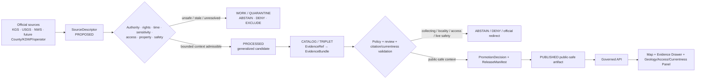
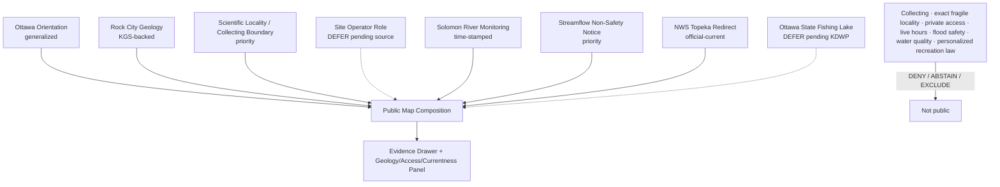
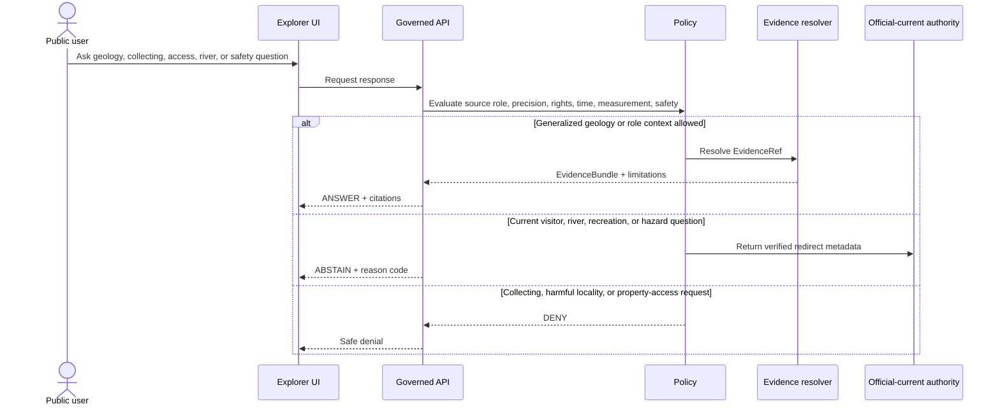
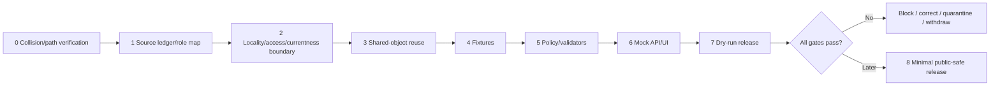

<!-- [KFM_META_BLOCK_V2]
doc_id: NEEDS_VERIFICATION — <REGISTERED_KFM_DOC_ID>
title: Ottawa County Focus Mode Build Plan — Rock City Concretions, Solomon River Monitoring, and Public-Access Boundaries Without Collecting, Flood-Safety, or Property Conclusions
type: county-focus-mode-build-plan
version: v0.1-draft
status: draft
county: Ottawa County, Kansas
county_slug: ottawa
created: 2026-06-08
updated: 2026-06-08
owners:
  - NEEDS_VERIFICATION — <OWNER:focus-mode-steward>
  - NEEDS_VERIFICATION — <OWNER:geology-and-scientific-locality-reviewer>
  - NEEDS_VERIFICATION — <OWNER:hydrology-and-flood-currentness-reviewer>
  - NEEDS_VERIFICATION — <OWNER:public-access-and-property-reviewer>
  - NEEDS_VERIFICATION — <OWNER:ecology-recreation-and-release-reviewer>
release_status: NEEDS_VERIFICATION — NOT_RELEASED
review_assignments: NEEDS_VERIFICATION
correction_path: NEEDS_VERIFICATION
rollback_path: NEEDS_VERIFICATION
unverified_repository_paths:
  - PROPOSED / CONFLICTED / NEEDS_VERIFICATION — docs/focus-modes/ottawa-county/build-plan.md
  - PROPOSED / OBSERVED-LEGACY / NEEDS_VERIFICATION — docs/focus-mode/counties/ottawa_county/ottawa_county_focus_mode_build_plan.md
schema_contract_policy_homes:
  - PROPOSED / NEEDS_VERIFICATION — contracts/focus_mode/
  - PROPOSED / NEEDS_VERIFICATION — schemas/contracts/v1/focus_mode/
  - PROPOSED / NEEDS_VERIFICATION — policy/runtime/, policy/sensitivity/, policy/rights/, policy/release/
proof_slice: Rock City giant sandstone concretions, Smoky Hills/Dakota Formation interpretation, Solomon River monitoring, local non-profit visitor context, and scientific-locality/access/currentness restraint
primary_public_safe_boundary: KFM may present generalized, time-attributed Rock City geology, Solomon River monitoring, county orientation, and official weather-authority context; it must not imply permission to enter, climb, collect, sample, excavate, or remove material; expose unreviewed scientific-locality or archaeological precision; determine property ownership or access rights; interpret streamflow as flood or recreation safety; infer water quality or drinking-water safety; guarantee visitor hours or conditions; or replace official warnings and emergency guidance.
collision_search:
  completed_register: CONFIRMED — Ottawa County is absent from the user-supplied completed/collision register.
  generated_in_continuation: CONFIRMED — previously generated counties in this continuation were excluded.
  uploaded_project_materials: CONFIRMED — targeted Ottawa County Focus Mode searches were performed; no Ottawa County plan surfaced among examined results.
  live_repository_search: CONFIRMED — search for ottawa_county_focus_mode_build_plan returned no matching county plan.
  live_repository_index: NEEDS_VERIFICATION — the county index was not directly opened at the Ottawa row in this run.
  exhaustive_absence: NEEDS_VERIFICATION — unindexed branches, private artifacts, and prior unsearched outputs may still exist.
directory_rules_basis:
  - CONFIRMED — attached Directory Rules.pdf is available to the series and has been inspected in prior county-plan runs.
  - CONFIRMED — location encodes responsibility, governance, and lifecycle; topic alone does not justify a new root.
  - CONFIRMED — lifecycle is RAW → WORK / QUARANTINE → PROCESSED → CATALOG / TRIPLET → PUBLISHED.
  - CONFIRMED — promotion is a governed state transition, not a file move.
  - CONFLICTED / NEEDS_VERIFICATION — observed repository paths use docs/focus-mode/ while doctrine also identifies docs/focus-modes/.
official_source_checks:
  - CONFIRMED — Kansas Geological Survey / GeoKansas Rock City page, checked 2026-06-08.
  - CONFIRMED — USGS Water Data for the Nation monitoring location Solomon River at Niles, KS (USGS-06876900), checked 2026-06-08.
  - CONFIRMED — National Weather Service Forecast Office Topeka, KS, checked 2026-06-08.
  - NEEDS_VERIFICATION — Ottawa County official website returned a fetch failure in this run and requires direct revalidation.
  - NEEDS_VERIFICATION — direct KDWP Ottawa State Fishing Lake page requires verified current URL and admission before public use.
source_check_date: 2026-06-08
tags: [kfm, focus-mode, ottawa-county, rock-city, concretions, dakota-formation, solomon-river, usgs, scientific-locality, access, flood-currentness, cite-or-abstain]
notes:
  - Planning artifact only; no implementation, source admission, review, promotion, publication, correction readiness, or rollback readiness is claimed.
  - Rock City is operated by a local non-profit according to KGS; the KGS page does not establish current visitor hours, accessibility, climbing permission, collecting permission, or liability conditions.
  - USGS stream monitoring is a scientific observation source, not a standalone flood-warning, water-quality, boating-safety, or access authority.
[/KFM_META_BLOCK_V2] -->

<a id="top"></a>

# Ottawa County Focus Mode Build Plan
## Rock City Concretions, Solomon River Monitoring, and Public-Access Boundaries Without Collecting, Flood-Safety, or Property Conclusions

> **Product thesis:** Explain Ottawa County’s Rock City concretions, Dakota Formation, Solomon River setting, and official weather/water-monitoring roles while refusing to become a collecting-permission, scientific-locality, property-access, flood-safety, water-quality, recreation, visitor-currentness, or emergency authority.


| Identity / status field | Value |
|---|---|
| County | **Ottawa County, Kansas** |
| Status | `PROPOSED` planning artifact |
| Distinct proof slice | Rock City’s giant Dakota Formation concretions, Solomon River monitoring, local non-profit visitor context, and scientific-locality/access/currentness controls |
| Primary public-safe boundary | **Generalized geology and monitoring context may be shown; KFM must not authorize entry, climbing, collecting, sampling, excavation, or removal; expose unreviewed locality precision; determine property rights; interpret streamflow as flood or recreation safety; infer water quality; guarantee visitor conditions; or replace official alerts.** |
| Official sources checked | KGS/GeoKansas Rock City; USGS Solomon River at Niles; NWS Topeka |
| Collision status | No Ottawa plan surfaced in targeted repository or project-material searches |
| County-index status | `NEEDS_VERIFICATION` |
| Release state | `NOT_RELEASED` |

## Quick links

[Operating posture](#1-operating-posture) · [Why this county](#2-why-this-county) · [Product thesis](#3-product-thesis) · [Scope](#4-scope-boundary) · [Layers](#5-first-demo-layers) · [Journeys](#6-user-journeys) · [UI](#7-ui-surfaces) · [Objects](#8-governed-object-model) · [Repository](#9-proposed-repository-shape) · [Build](#10-build-phases) · [PRs](#11-first-pr-sequence) · [Acceptance](#12-acceptance-checklist) · [Fixtures](#13-fixture-plan) · [Risks](#14-risk-register) · [Sources](#15-source-seed-list) · [Questions](#16-open-verification-questions) · [Milestone](#17-recommended-first-milestone)

---

## Executive build note

Ottawa County is selected as a **geologic-landmark + river-monitoring + access/currentness** proof slice.

The Kansas Geological Survey’s GeoKansas page explains that Rock City lies about four miles south of Minneapolis and contains huge sandstone spheres—concretions—up to about 20 feet in diameter. KGS attributes them to the Dakota Formation, formed from Cretaceous-age sand deposited near the edge of an inland sea, later cemented by groundwater and exposed by erosion.[^s1] KGS also states that Rock City is operated by a local nonprofit corporation that charges a small admission fee.[^s1]

That source supports a strong public geology card, but it does **not** establish current opening hours, accessibility, route conditions, climbing rules, collecting permission, sampling permission, ownership boundaries, or liability conditions. The most consequential county-specific boundary is therefore not merely “geology”; it is **geology without implied access or collecting rights**.

USGS operates the monitoring location “Solomon R at Niles, KS” under identifier `USGS-06876900`, in cooperation with the Kansas Water Office.[^s2] This is an authoritative scientific-monitoring source, but a monitoring location or streamflow value must not be converted into a KFM flood warning, boating recommendation, crossing-safety judgment, water-quality conclusion, or drinking-water statement.

NWS Topeka publishes current hazards, warnings, observations, radar, fire-weather, rivers-and-lakes, drought, and safety resources.[^s3] KFM should route current safety questions to NWS and competent local authorities rather than synthesize its own warning or protective-action advice.

> [!CAUTION]
> ## Defining public-safe boundary
>
> **KFM may explain how Rock City’s concretions formed and may identify official river-monitoring and weather authorities. It must not tell users that they may enter, climb, collect, sample, excavate, or remove geologic material; disclose unreviewed scientific-locality or archaeological precision; determine private or nonprofit property access; use streamflow as a flood or recreation-safety verdict; infer water quality; guarantee current visitor conditions; or substitute generated language for official warnings.**

### Evidence boundary

| Label | Established | Not established |
|---|---|---|
| `CONFIRMED` | Ottawa is absent from the supplied register; targeted repository search returned no Ottawa plan filename; targeted project-material search surfaced no Ottawa plan among examined results; KGS, USGS, and NWS official sources were checked. | — |
| `PROPOSED` | Every card, layer, object, fixture, policy, path, UI surface, phase, milestone, correction, and release action below. | No implementation is claimed. |
| `NEEDS_VERIFICATION` | County-index row; Ottawa County official site; KDWP Ottawa State Fishing Lake source; Rock City current rights/visitor/access policy; scientific-locality sensitivity; geometry authority; source-display rights; correction and rollback implementation. | — |
| `UNKNOWN` | Current Rock City hours and conditions, collecting/climbing rules, parcel boundaries, current stream conditions, flood risk, water quality, fishing-lake conditions, road status, and active emergency state. | — |

---

# 1. Operating posture

## 1.1 Governing rules applied to Ottawa County

| KFM rule | Ottawa application |
|---|---|
| EvidenceBundle outranks generated language | AI cannot create collecting permission, visitor status, access rights, flood safety, or water-quality facts. |
| Cite-or-abstain | Generalized geology and agency-role claims may answer; high-stakes and current questions abstain or deny. |
| Public clients use governed interfaces | No direct public access to RAW field notes, restricted locality records, unpublished geometries, internal stores, or direct model output. |
| Source roles remain distinct | KGS interpretation, site operator information, county administration, USGS monitoring, NWS warnings, KDWP recreation rules, property records, and AI narrative remain separate. |
| Publication is governed | A source-visible coordinate, photo, or narrative is not automatically a published KFM layer. |
| Scientific-locality sensitivity fails closed | Collectible, fragile, restricted, archaeological, or vandalism-prone detail is generalized or excluded. |
| Access and property fail closed | A mapped attraction or landmark does not confer entry, climbing, collecting, or parking permission. |
| Monitoring-currentness fails closed | Stream observations are measurements, not independent flood, water-quality, crossing, or recreation guidance. |

## 1.2 Truth labels and finite outcomes

| Token | Meaning |
|---|---|
| `CONFIRMED` | Verified in this run. |
| `PROPOSED` | Design not verified as implemented. |
| `NEEDS_VERIFICATION` | Checkable before action. |
| `UNKNOWN` | Unsupported or unresolved. |
| `ANSWER` | Narrow, evidence-supported, public-safe response. |
| `ABSTAIN` | Authority, currentness, rights, or evidence is insufficient. |
| `DENY` | Request crosses collecting, access, locality, property, or safety boundaries. |
| `ERROR` | Contract, evidence, policy, or runtime failure. |

## 1.3 Public trust membrane



## 1.4 County-specific guardrails

| Guardrail | Outcome | Candidate reason code |
|---|---:|---|
| Collecting, removal, sampling, excavation, or climbing permission | `DENY` / `ABSTAIN` | `GEOLOGIC_CONTEXT_NOT_COLLECTING_PERMISSION` |
| Unreviewed scientific-locality or archaeological precision | `DENY` | `SCIENTIFIC_LOCALITY_PRECISION_WITHHELD` |
| Private/nonprofit property access or ownership determination | `DENY` | `PROPERTY_OR_ACCESS_DETERMINATION_DENIED` |
| Current hours, admission, accessibility, route, parking, or site condition | `ABSTAIN` | `CURRENT_VISITOR_STATUS_REQUIRES_OPERATOR` |
| Streamflow interpreted as flood, crossing, boating, or recreation safety | `ABSTAIN` | `STREAMFLOW_NOT_SAFETY_GUIDANCE` |
| Water quality, contamination, or drinking-water safety | `ABSTAIN` / `DENY` | `WATER_QUALITY_OR_HEALTH_STATUS_NOT_DETERMINED` |
| Current fishing, boating, camping, or hunting legality | `ABSTAIN` | `RECREATION_REGULATION_REQUIRES_CURRENT_AUTHORITY` |
| Current weather, flood, road, or emergency guidance | `ABSTAIN` | `OFFICIAL_CURRENT_SAFETY_CHANNEL_REQUIRED` |

---

# 2. Why this county

## 2.1 Collision screen

| Check | Result | Status |
|---|---|---:|
| Supplied completed/collision register | Ottawa absent. | `CONFIRMED` |
| Counties generated in this continuation | Excluded. | `CONFIRMED` |
| Live repository filename search | No `ottawa_county_focus_mode_build_plan` match. | `CONFIRMED` |
| Uploaded/project-material search | No Ottawa plan surfaced among examined results. | `CONFIRMED` for performed search |
| County-index row | Not directly opened in this run. | `NEEDS_VERIFICATION` |
| Exhaustive absence | Not proved across all private/unindexed material. | `NEEDS_VERIFICATION` |

## 2.2 Proof-slice rationale

| Dimension | Proof value | Evidence |
|---|---|---|
| Geology | Giant Dakota Formation sandstone concretions with clear process explanation. | KGS.[^s1] |
| Scientific locality | Visually distinctive geologic objects create collecting, sampling, vandalism, and precision risks. | `PROPOSED` governance inference from source character. |
| Public access | Local nonprofit operation means current rights and visitor rules are separate from KGS interpretation. | KGS.[^s1] |
| Hydrology | USGS monitoring of the Solomon River provides time-aware observation context. | USGS.[^s2] |
| Hazard currentness | NWS Topeka provides current warning, flood, fire-weather, drought, and river/lake authority. | NWS.[^s3] |
| Recreation | Ottawa State Fishing Lake is a candidate future layer requiring direct KDWP verification. | `NEEDS_VERIFICATION`. |
| Distinctness | Combines geologic interpretation, scientific-locality restraint, nonprofit access, and observation-versus-safety semantics. | `PROPOSED`. |

## 2.3 Distinct series contribution

Ottawa County tests whether KFM can:

1. explain a visually compelling geologic landmark without encouraging collection or damage;
2. separate KGS scientific interpretation from operator access and visitor rules;
3. treat published locality detail as reviewable rather than automatically redistributable;
4. distinguish USGS observation from flood, water-quality, or recreation safety;
5. abstain when county, operator, or KDWP current sources are unavailable or unresolved.

## 2.4 Public benefit

A future public-safe product can help users understand:

- how Rock City’s concretions formed;
- why KGS, a site operator, county government, USGS, NWS, and KDWP have different roles;
- why mapped attractions do not grant access or collecting rights;
- why stream measurements need time, units, context, and official interpretation;
- why current warnings and visitor conditions require official-current sources.

---

# 3. Product thesis

## 3.1 One-sentence thesis

> **Ottawa County Focus Mode should connect Rock City geology, the Solomon River, and official monitoring/forecast roles while making collecting, scientific-locality, property access, visitor-currentness, streamflow-safety, water-quality, recreation, and emergency boundaries explicit and enforceable.**

## 3.2 First-product promises

| Promise | Meaning |
|---|---|
| Generalized geologic explanation | KGS-backed formation and erosion context. |
| Source-role visibility | Science, operator, county, monitoring, warning, regulation, and AI remain distinct. |
| Locality restraint | Sensitive or damage-enabling precision is withheld or generalized. |
| Currentness literacy | Visitor status and monitoring values expose dates and authority. |
| Finite outcomes | Supported context answers; risky requests abstain or deny. |
| Reversibility | Correction and rollback precede publication. |

## 3.3 Non-promises

- no collecting, climbing, excavation, sampling, or removal permission;
- no exact sensitive scientific or archaeological locality disclosure;
- no private or nonprofit property-access determination;
- no guarantee of current hours, admission, parking, route, or accessibility;
- no flood, crossing, boating, or swimming-safety conclusion from streamflow;
- no water-quality or health conclusion;
- no personalized fishing/hunting/camping legality;
- no road or emergency guidance;
- no implementation or publication claim.

---

# 4. Scope boundary

| Content family | Posture | Boundary |
|---|---:|---|
| County/Minneapolis orientation | `PROPOSED` | Generalized geometry only. |
| Rock City Geology Card | `PROPOSED` priority | Generalized KGS interpretation. |
| Scientific Locality / Collecting Boundary Notice | `PROPOSED` priority | No collection or damage-enabling detail. |
| Operator / Visitor Currentness Card | `DEFER` | Requires direct operator source and rights. |
| Solomon River Monitoring Card | `PROPOSED` | Measurement and authority role only. |
| Streamflow Non-Safety Notice | `PROPOSED` priority | No flood/recreation inference. |
| NWS Topeka Authority Card | `PROPOSED` | Official-current redirect only. |
| Ottawa State Fishing Lake Card | `DEFER` | Requires current KDWP source. |
| Parcel/property/access detail | `DENY` / `EXCLUDE` | Privacy/legal boundary. |
| Exact fragile, collectible, archaeological, or vandalism-prone locality | `DENY` / `EXCLUDE` | Scientific/cultural stewardship boundary. |

---

# 5. First demo layers

## 5.1 Prioritized cards/layers

| Priority | Card/layer | Purpose | Source seed | Gate | Status |
|---:|---|---|---|---|---:|
| 1 | `GeologyAccessCollectingBoundaryNotice` | Makes primary boundary unavoidable. | KGS + policy | Highest-risk fixture pack. | `PROPOSED` |
| 2 | `RockCityGeologyCard` | Explains concretions and Dakota Formation. | KGS[^s1] | EvidenceBundle and rights. | `PROPOSED` |
| 3 | `ScientificLocalityGeneralizationRecord` | Records precision withheld and why. | Policy + reviewer | Sensitivity review. | `PROPOSED` |
| 4 | `SiteOperatorRoleCard` | Separates KGS science from visitor authority. | Future operator source | Direct source admission. | `DEFER` |
| 5 | `SolomonRiverMonitoringCard` | Explains USGS monitoring role. | USGS[^s2] | Time/unit semantics. | `PROPOSED` |
| 6 | `StreamflowNonSafetyCard` | Prevents flood/recreation overclaim. | USGS + NWS | Safety-policy gate. | `PROPOSED` |
| 7 | `NWSTopekaAuthorityCard` | Current hazard redirect. | NWS[^s3] | Redirect-only. | `PROPOSED` |
| 8 | `OttawaStateFishingLakeContextCard` | Future recreation/wildlife context. | Future KDWP | Current URL, rules, sensitivity. | `DEFER` |
| 9 | Exact collecting/locality/property geometry | Unsafe first slice. | — | Exclude. | `DENY` |
| 10 | Live visitor/flood/recreation status | Dynamic high-risk content. | Future governed feeds | Not first slice. | `DEFER` |

## 5.2 Map composition



## 5.3 Layer-card truth contract

| Field | Purpose | Failure posture |
|---|---|---|
| `source_role` | Separates science, operator, monitoring, warning, regulation, property, and AI. | `ABSTAIN`. |
| `temporal_basis` | Shows source and observation time. | `ABSTAIN` for current claims. |
| `spatial_generalization` | Prevents harmful locality precision. | `DENY` / quarantine. |
| `collecting_scope` | States that interpretation is not permission. | Release block. |
| `access_scope` | Prevents attraction context from becoming entry rights. | `DENY` / `ABSTAIN`. |
| `measurement_semantics` | Preserves station, variable, unit, time, and revision state. | `ABSTAIN`. |
| `safety_scope` | Prevents streamflow from becoming safety advice. | `ABSTAIN`. |
| `evidence_refs` | Claim-to-proof closure. | `ABSTAIN`. |
| `policy_decision_ref` | Finite outcome and obligations. | Fail closed. |
| `release_state` | Prevents draft from appearing public. | Public alias blocked. |

---

# 6. User journeys

## 6.1 Public learning journeys

| Journey | Safe outcome |
|---|---|
| “How did Rock City form?” | KGS-backed generalized explanation. |
| “Why are these called concretions?” | Scientific definition and process context. |
| “Who decides whether Rock City is open?” | Operator-role explanation; no current claim without source. |
| “What does the Solomon River gauge do?” | USGS observation-role explanation. |
| “Why can’t KFM tell me whether the river is safe?” | Measurement-versus-safety explanation. |
| “Where do current warnings come from?” | NWS Topeka redirect. |

## 6.2 Trust-demonstration journeys

| Request | Outcome |
|---|---:|
| “Can I take a piece of the rock?” | `DENY` / `ABSTAIN` |
| “Show me exact places to collect concretions.” | `DENY` |
| “Can I climb every formation?” | `ABSTAIN` |
| “Is the park open right now?” | `ABSTAIN` |
| “Who owns the land and where can I cross?” | `DENY` / official property-access redirect |
| “Does this streamflow mean flooding is impossible?” | `ABSTAIN` |
| “Is the river safe to wade or boat?” | `ABSTAIN` |
| “Is the water safe to drink?” | `ABSTAIN` / `DENY` |
| “Can I fish at the state lake today without a permit?” | `ABSTAIN` |
| “Is there a warning or road emergency now?” | `ABSTAIN` |

## 6.3 Candidate reason codes

- `GEOLOGIC_CONTEXT_NOT_COLLECTING_PERMISSION`
- `SCIENTIFIC_LOCALITY_PRECISION_WITHHELD`
- `PROPERTY_OR_ACCESS_DETERMINATION_DENIED`
- `CURRENT_VISITOR_STATUS_REQUIRES_OPERATOR`
- `STREAMFLOW_NOT_SAFETY_GUIDANCE`
- `WATER_QUALITY_OR_HEALTH_STATUS_NOT_DETERMINED`
- `RECREATION_REGULATION_REQUIRES_CURRENT_AUTHORITY`
- `OFFICIAL_CURRENT_SAFETY_CHANNEL_REQUIRED`

---

# 7. UI surfaces

| Surface | Ottawa-specific behavior | Status |
|---|---|---:|
| Header | “No collecting, access, flood-safety, water-quality, or live visitor verdict.” | `PROPOSED` |
| Map canvas | Generalized county, geology, and monitoring context. | `PROPOSED` |
| Layer drawer | Source role, time, precision, operator state, release state. | `PROPOSED` |
| Evidence Drawer | Separates KGS, operator, county, USGS, NWS, KDWP, property, and AI. | `PROPOSED` |
| Answer panel | Generalized geology and agency-role answers. | `PROPOSED` |
| Abstention panel | Current hours, climbing, stream safety, water quality, recreation law. | `PROPOSED` |
| Denial panel | Collecting, harmful locality precision, owner/access requests. | `PROPOSED` |
| Timeline/time-basis panel | Geologic time, publication time, observation time, warning time. | `PROPOSED` |
| **Geology / Access / Monitoring Boundary Panel** | Central trust surface. | `PROPOSED` |
| Official redirect panel | Operator, county, USGS, NWS, future KDWP. | `PROPOSED` |
| Release/correction panel | `NOT_RELEASED`, review gaps, correction, rollback. | `PROPOSED` |

## 7.1 Legend vocabulary

| Label | Meaning | Must not become |
|---|---|---|
| `Scientific interpretation` | KGS explanation of geologic origin. | Collecting, access, or safety permission. |
| `Site operator source` | Current visitor and property-management authority. | Scientific authority beyond scope. |
| `Monitoring location` | Time-stamped scientific observation source. | Flood, water-quality, or recreation-safety verdict. |
| `Official-current warning source` | NWS hazards and protective information. | KFM-authored warning. |
| `Sensitive locality generalized` | Precision intentionally reduced or withheld. | Confirmation that hidden detail may be reconstructed. |
| `Generated explanation` | Bounded synthesis. | Evidence or authority. |

## 7.2 Sequence diagram



---

# 8. Governed object model

## 8.1 Shared object families

| Object family | Ottawa use | Status |
|---|---|---:|
| `SourceDescriptor` | Authority, role, rights, time, precision, allowed scope. | `PROPOSED / NEEDS_VERIFICATION` |
| `EvidenceRef` | Claim-to-proof link. | `PROPOSED / NEEDS_VERIFICATION` |
| `EvidenceBundle` | Evidence plus access/locality/currentness limitations. | `PROPOSED / NEEDS_VERIFICATION` |
| `PolicyDecision` | Finite outcome and obligations. | `PROPOSED / NEEDS_VERIFICATION` |
| `RuntimeResponseEnvelope` | Public-safe response. | `PROPOSED / NEEDS_VERIFICATION` |
| `CitationValidationReport` | Detects access, collecting, and measurement overclaim. | `PROPOSED / NEEDS_VERIFICATION` |
| `ReleaseManifest` | Approved public composition. | `PROPOSED / NEEDS_VERIFICATION` |
| `AIReceipt` | Generated output and dependencies. | `PROPOSED / NEEDS_VERIFICATION` |
| `ReviewRecord` | Geology, locality, access, hydrology, safety, release review. | `PROPOSED / NEEDS_VERIFICATION` |
| `CorrectionNotice` | Corrects stale or unsafe representation. | `PROPOSED / NEEDS_VERIFICATION` |
| `RollbackPlan` | Withdraws unsafe release. | `PROPOSED / NEEDS_VERIFICATION` |

## 8.2 County-specific object candidates

- `RockCityGeologyCard`
- `ScientificLocalityGeneralizationRecord`
- `CollectingPermissionNonDeterminationNotice`
- `SiteOperatorAuthorityCard`
- `SolomonRiverMonitoringCard`
- `MeasurementSemanticsRecord`
- `StreamflowNonSafetyNotice`
- `OfficialHazardRedirectCard`

## 8.3 Source-role anti-collapse rules

| Source | Valid role | Must not become |
|---|---|---|
| KGS / GeoKansas | Geologic interpretation and educational context. | Access, collecting, operator, property, or safety authority. |
| Rock City operator | Visitor access, site rules, hours, fees, closures. | Geologic authority beyond published scope. |
| Ottawa County | Civic, emergency, road, property, and local routing. | KFM title or safety verdict. |
| USGS | Scientific monitoring and revisions. | Flood warning, water-quality, or recreation-safety authority by itself. |
| NWS Topeka | Official-current hazards, warnings, fire weather, flood, rivers/lakes. | KFM-generated warning. |
| KDWP | Fishing-lake, wildlife, and regulation authority within scope. | Personalized legal advice or safety guarantee. |
| AI narrative | Bounded explanation. | Evidence, access permission, or operational authority. |

## 8.4 Minimal public runtime response JSON

```json
{
  "schema_version": "v1",
  "object_type": "RuntimeResponseEnvelope",
  "response_id": "kfm.runtime.ottawa.rock_city_geology.answer.v1",
  "county": "ottawa",
  "outcome": "ANSWER",
  "answer_scope": "public_safe_generalized_geology",
  "answer": "Checked Kansas Geological Survey material explains that Rock City contains giant sandstone concretions weathered from the Dakota Formation after groundwater cemented portions of Cretaceous-age sand.",
  "evidence_refs": [
    "kfm.evidence_ref.ottawa.kgs_rock_city.v1"
  ],
  "limitations": [
    "This response does not authorize entry, climbing, collecting, sampling, excavation, removal, parking, or use of private or nonprofit property and does not establish current visitor conditions."
  ],
  "review_state": "NEEDS_VERIFICATION",
  "release_state": "NOT_RELEASED",
  "spec_hash": "NEEDS_VERIFICATION"
}
```

## 8.5 Abstention JSON

```json
{
  "schema_version": "v1",
  "object_type": "RuntimeResponseEnvelope",
  "response_id": "kfm.runtime.ottawa.stream_or_visitor_status.abstain.v1",
  "county": "ottawa",
  "outcome": "ABSTAIN",
  "reason_code": "STREAMFLOW_NOT_SAFETY_GUIDANCE",
  "message": "KFM does not convert a monitoring-location value or cached visitor page into current flood, crossing, boating, water-quality, opening-hours, accessibility, or emergency guidance.",
  "official_redirects": [
    {"authority": "Rock City site operator", "purpose": "current visitor access, hours, rules, and conditions"},
    {"authority": "National Weather Service Topeka", "purpose": "current warnings, flood, fire-weather, and hazard information"},
    {"authority": "USGS Water Data for the Nation", "purpose": "time-stamped monitoring observations and revisions"}
  ],
  "release_state": "NOT_RELEASED",
  "spec_hash": "NEEDS_VERIFICATION"
}
```

## 8.6 Denial JSON

```json
{
  "schema_version": "v1",
  "object_type": "RuntimeResponseEnvelope",
  "response_id": "kfm.runtime.ottawa.collecting_locality_access.deny.v1",
  "county": "ottawa",
  "outcome": "DENY",
  "reason_code": "GEOLOGIC_CONTEXT_NOT_COLLECTING_PERMISSION",
  "message": "KFM does not authorize collection, removal, sampling, excavation, climbing, or entry and does not publish unreviewed sensitive scientific-locality, archaeological, owner, or access detail.",
  "withheld_fields": [
    "damage_enabling_locality_geometry",
    "collecting_route",
    "sample_or_excavation_target",
    "restricted_archaeological_detail",
    "owner_or_living_person_linkage",
    "private_access_route"
  ],
  "release_state": "NOT_RELEASED",
  "spec_hash": "NEEDS_VERIFICATION"
}
```

## 8.7 Deterministic identity candidates

| Item | Candidate |
|---|---|
| Source | `kfm.source.ottawa.<authority>.<slug>.v1` |
| Evidence | `kfm.evidence_bundle.ottawa.<claim_scope>.v1` |
| Card | `kfm.card.ottawa.<card>.v1` |
| Fixture | `kfm.runtime.ottawa.<scenario>.<outcome>.v1` |
| Release | `kfm.release.ottawa.focus_mode.v0_1` |

`spec_hash` behavior remains `PROPOSED / NEEDS_VERIFICATION`.

---

# 9. Proposed repository shape

## 9.1 Directory Rules basis

Directory Rules require responsibility-root placement, no topic-as-root folders, separate documentation/contracts/schemas/policy/fixtures/data/release responsibilities, and the lifecycle:

`RAW → WORK / QUARANTINE → PROCESSED → CATALOG / TRIPLET → PUBLISHED`.

Promotion is a governed state transition, not a file move.

> [!WARNING]
> The observed `docs/focus-mode/` versus doctrinal `docs/focus-modes/` divergence remains unresolved. Every path below is `PROPOSED / CONFLICTED / NEEDS_VERIFICATION`.

## 9.2 Candidate path table

| Responsibility root | Proposed path | Purpose |
|---|---|---|
| Human documentation | `docs/focus-modes/ottawa-county/build-plan.md` | This planning document. |
| Companion governance docs | `docs/focus-modes/ottawa-county/{README.md,geology-locality-notes.md,access-rights-notes.md,monitoring-currentness-notes.md,source-seed-list.md,acceptance-checklist.md}` | Reviewable documentation. |
| Contracts | `contracts/focus_mode/` | Shared object semantics. |
| Schemas | `schemas/contracts/v1/focus_mode/` | Machine-validation shapes. |
| Fixtures | `fixtures/focus_modes/ottawa/{valid,invalid}/` | Positive and fail-closed proof. |
| UI | `apps/explorer-web/src/focus-modes/ottawa/` | Mock governed UI only. |
| Catalog | `data/catalog/sources/ottawa/` | Admitted source descriptors only. |
| Published | `data/published/layers/ottawa/` | Future governed release only. |
| Release | `release/candidates/ottawa-focus-mode/` | Future candidate proof only. |

## 9.3 Proposed responsibility-rooted tree

```text
# PROPOSED / CONFLICTED / NEEDS_VERIFICATION

docs/
└── focus-modes/
    └── ottawa-county/
        ├── README.md
        ├── build-plan.md
        ├── geology-locality-notes.md
        ├── access-rights-notes.md
        ├── monitoring-currentness-notes.md
        ├── source-seed-list.md
        ├── evidence-model.md
        └── acceptance-checklist.md

fixtures/
└── focus_modes/ottawa/
    ├── valid/
    └── invalid/

contracts/
└── focus_mode/

schemas/
└── contracts/v1/focus_mode/

apps/
└── explorer-web/src/focus-modes/ottawa/

data/
├── catalog/sources/ottawa/
└── published/layers/ottawa/    # future governed output only

release/
└── candidates/ottawa-focus-mode/
```

## 9.4 Placement prohibitions

- no root-level `ottawa/`, `rock-city/`, `concretions/`, `solomon-river/`, or `scientific-localities/`;
- no sensitive scientific-locality, collecting-route, private-access, or owner data in public fixtures;
- no source-visible coordinate copied automatically into a public layer;
- no stream observation promoted directly into a flood or safety card;
- no public client access to `RAW`, `WORK`, `QUARANTINE`, unpublished candidates, or canonical/internal stores;
- no release without evidence closure, policy decision, review, manifest, correction, and rollback.

---

# 10. Build phases

| Phase | Goal | Entry gate | Output | Exit validation | Rollback posture |
|---:|---|---|---|---|---|
| 0 | Collision and path verification | Repeat register/repo/material searches | Verification note | No collision; path resolved or blocked | Stop |
| 1 | Source ledger and role map | KGS/USGS/NWS/operator/county/KDWP candidates identified | Descriptor candidates | Role, rights, time, sensitivity explicit | Docs only |
| 2 | Geology/locality/access/currentness boundary | Review framework accepted | Boundary policies | Harmful requests fail closed | Withdraw |
| 3 | Shared-object reuse | Existing contracts/schemas/policies inspected | Reuse/extension decision | No parallel authority homes | Revert |
| 4 | Fixtures | Boundary accepted | Valid/invalid fixture pack | Highest-risk cases fail closed | Remove |
| 5 | Policy and validators | Fixtures exist | Locality/access/measurement/currentness validators | Finite outcomes tested | Block |
| 6 | Mock governed API/UI | Contracts/policies agreed | Mock cards and panels | No collecting/access/safety overclaim | Disable |
| 7 | Dry-run release | Reviews and evidence available | Candidate proof pack | No public alias; rollback rehearsed | Withdraw |
| 8 | Optional publication | All gates pass | Minimal generalized release | Traceable, correctable, reversible | Rollback |



---

# 11. First PR sequence

1. Verification and documentation control.
2. Source ledger/admission and public-safe boundary.
3. Contracts/schemas or shared-object reuse.
4. Valid and invalid fixtures.
5. Policy and validators.
6. Mock governed API/UI.
7. Dry-run release proof.
8. Only then optional minimal public-safe publication.

**Direct site-operator integration, exact locality geometry, collecting-rule interpretation, KDWP fishing-lake integration, live stream/flood feeds, county road/emergency integration, and public release are not first-PR work.**

---

# 12. Acceptance checklist

## Governance and evidence

- [ ] Ottawa collision search rerun.
- [ ] County-index status directly verified.
- [ ] Every claim resolves to an EvidenceBundle.
- [ ] KGS, operator, county, USGS, NWS, KDWP, property, and AI roles remain distinct.
- [ ] Observation time, source revision, and warning time are explicit.
- [ ] No AI output is treated as evidence.
- [ ] Finite outcomes exist.

## Public/sensitive boundary

- [ ] No collecting, removal, sampling, excavation, or climbing permission.
- [ ] No harmful locality or archaeological precision.
- [ ] No private/nonprofit property-access or owner determination.
- [ ] No current visitor-hours, route, parking, accessibility, or condition guarantee.
- [ ] No streamflow-to-flood/crossing/boating-safety inference.
- [ ] No water-quality or drinking-water conclusion.
- [ ] No personalized fishing/hunting/camping legality.
- [ ] No current warning, road, or emergency guidance.

## Product and UI

- [ ] Header states the collecting/access/currentness boundary and `NOT_RELEASED`.
- [ ] Evidence Drawer displays authority and role.
- [ ] Precision/generalization state is visible.
- [ ] Observation and expiry state is visible.
- [ ] Denial and abstention reason codes are visible.
- [ ] Official redirects do not masquerade as KFM answers.

## Repository, validation, release, correction, rollback

- [ ] Path conflict resolved.
- [ ] No parallel contract/schema/policy/source homes.
- [ ] Public UI cannot access internal lifecycle stores.
- [ ] Highest-risk invalid fixtures fail closed.
- [ ] Correction path is actionable.
- [ ] Rollback target is identified and tested.
- [ ] Promotion remains a governed state transition.

---

# 13. Fixture plan

## 13.1 Valid fixtures

| Fixture | Scenario | Expected outcome |
|---|---|---:|
| `rock_city_geology.valid.json` | General formation explanation. | `ANSWER` |
| `source_role_separation.valid.json` | User asks who controls science vs visitor rules. | `ANSWER` |
| `visitor_status_abstain.valid.json` | User asks whether site is open now. | `ABSTAIN` |
| `stream_safety_abstain.valid.json` | User asks whether gauge means safe crossing. | `ABSTAIN` |
| `collecting_deny.valid.json` | User asks where to remove samples. | `DENY` |
| `locality_precision_deny.valid.json` | User requests damage-enabling precision. | `DENY` |

## 13.2 Invalid/fail-closed fixtures

| Fixture | Invalid behavior | Required result |
|---|---|---:|
| `kgs_page_as_collecting_permission.invalid.json` | Scientific page becomes permission. | `DENY` |
| `public_coordinate_as_unrestricted_access.invalid.json` | Visible coordinate becomes access right. | `DENY` / `ABSTAIN` |
| `rock_city_page_as_open_now.invalid.json` | Static page becomes live visitor status. | `ABSTAIN` |
| `nonprofit_operation_as_public_ownership.invalid.json` | Operator statement becomes public-property conclusion. | `DENY` |
| `usgs_value_as_no_flood_risk.invalid.json` | Observation becomes flood guarantee. | `ABSTAIN` |
| `usgs_value_as_safe_to_wade.invalid.json` | Streamflow becomes crossing safety. | `ABSTAIN` |
| `usgs_station_as_water_quality.invalid.json` | Monitoring location becomes potability/health claim. | `ABSTAIN` / `DENY` |
| `nws_page_as_kfm_warning.invalid.json` | KFM rewrites or delays warning. | `ERROR` / `ABSTAIN` |
| `fishing_lake_candidate_as_current_rule.invalid.json` | Unverified candidate becomes current regulation. | `ABSTAIN` |
| `owner_or_access_profile.invalid.json` | Public sources become person/property profile. | `DENY` |
| `unresolved_evidence_ref.invalid.json` | Claim lacks EvidenceBundle. | `ABSTAIN` |
| `public_internal_store_access.invalid.json` | Public UI reads internal lifecycle store. | `ERROR` |

## 13.3 Fixture-to-test matrix

| Test family | Must prove |
|---|---|
| Collecting and stewardship | Geology context never authorizes collection, damage, or removal. |
| Locality sensitivity | Public source visibility does not eliminate review/generalization. |
| Access and property | Map context does not confer entry, ownership, or crossing rights. |
| Visitor currentness | Static interpretation cannot answer live access or hours. |
| Measurement semantics | USGS values remain observations with time, unit, and revision context. |
| Flood and safety | Stream observations do not become warnings or crossing/boating advice. |
| Water health | No potability or contamination conclusion without fit evidence. |
| Trust membrane | No unsupported claim or public internal-store access. |

## 13.4 Highest-risk invalid fixture pack

1. KGS geology text transformed into collecting permission;
2. exact collectible or fragile locality map;
3. published coordinate transformed into unrestricted entry;
4. nonprofit operation misrepresented as public ownership;
5. static page shown as “open now”;
6. single USGS observation shown as “no flood risk”;
7. streamflow shown as safe wading/boating;
8. station existence shown as safe drinking water;
9. NWS warning paraphrased as delayed KFM advice;
10. property/owner data used to plan access.

---

# 14. Risk register

| Risk | Likelihood | Impact | Required mitigation | Release posture |
|---|---:|---:|---|---|
| Geology narrative encourages collecting or damage | High | Critical | Explicit non-permission notice, deny fixtures, stewardship review. | `DENY` |
| Source-visible coordinates enable harmful targeting | Medium/High | High | Generalization and sensitivity review. | `DENY` / quarantine |
| Attraction context implies access | High | High | Operator-role separation and access notice. | `ABSTAIN` / `DENY` |
| Static page appears to establish current hours | High | Medium/High | Currentness field and operator redirect. | `ABSTAIN` |
| USGS value becomes flood or crossing guarantee | High | Critical | Measurement-scope validator and NWS redirect. | `ABSTAIN` |
| Monitoring station becomes water-quality claim | Medium | Critical | Variable/parameter validator and health nondetermination. | `ABSTAIN` / `DENY` |
| Unverified KDWP page becomes current rule | Medium | High | Source-admission gate. | `ABSTAIN` |
| Property or owner detail used for access planning | Medium | Critical | Privacy minimization and deny rule. | `DENY` |
| Official warning rewritten or delayed | Medium | Critical | Redirect-only current-safety policy. | `ABSTAIN` |
| County website remains unavailable | Medium | Medium | Keep county-specific administrative claims deferred. | `DEFER` |
| Existing Ottawa plan later found | Low/Medium | Medium | Repeat index/branch/material collision checks. | Stop |
| Path divergence hardens | High | Medium | Resolve path governance before landing. | Docs only |
| Mock mistaken for release | Medium | High | Persistent `NOT_RELEASED` and release-state validation. | Mock only |

---

# 15. Source seed list

## 15.1 Current official sources actually checked

| ID | Source | Authority role | Verified anchor | Intended use | Allowed claim scope | Rights/sensitivity/currentness limitations | Status |
|---|---|---|---|---|---|---|---:|
| `S1` | Kansas Geological Survey / GeoKansas, **Rock City**[^s1] | State scientific/educational geology source | Rock City south of Minneapolis; sandstone spheres up to about 20 feet; Dakota Formation; Cretaceous sand; groundwater cementation; erosion; local nonprofit operation. | Generalized geology and source-role cards. | Scientific origin and generalized site context. | No current hours, access, climbing, collecting, sampling, ownership, safety, or rights conclusion; image/geometry reuse requires review. | `CONFIRMED` |
| `S2` | USGS Water Data for the Nation, **Solomon R at Niles, KS — USGS-06876900**[^s2] | Federal scientific monitoring source | Official monitoring location; USGS identifier; Water Data tools/APIs; cooperation with Kansas Water Office. | Monitoring-role and measurement-semantics card. | Station identity and properly scoped time-stamped observations. | No flood warning, crossing/boating safety, water-quality, potability, or access conclusion; revisions and variable definitions must be preserved. | `CONFIRMED` |
| `S3` | National Weather Service, **Forecast Office Topeka, KS**[^s3] | Federal official-current weather and hazard authority | Current hazards, warnings, observations, radar, fire weather, rivers/lakes, drought, safety, and forecast products. | Official-current redirect and source-role card. | NWS-issued products within their temporal/geographic scope. | KFM must not rewrite, delay, cache, or independently reinterpret active warnings. | `CONFIRMED` |

## 15.2 Candidate official or authoritative sources for later verification

| Candidate | Potential use | Required verification |
|---|---|---|
| Ottawa County official government | Emergency, roads, appraiser, property, public works, county context. | Site availability, direct pages, current authority, privacy, no title/access/safety inference. |
| Rock City local nonprofit/operator | Hours, fees, access, rules, accessibility, closures, visitor conditions. | Official identity, current source, rights, collecting/climbing rules, privacy, expiry. |
| Kansas Department of Wildlife and Parks — Ottawa State Fishing Lake | Recreation, fisheries, wildlife, public-use rules. | Current URL, current regulations, closure/currentness, wildlife sensitivity, rights. |
| Kansas Historical Society | County and local public-history context. | Source role, rights, cultural review, no sole-authority overclaim. |
| KDOT / KanDrive | Current road-status routing. | Geographic fit, timestamp, expiry, no safety guarantee. |
| FEMA / Kansas floodplain sources | Floodplain process and generalized risk context. | Effective map state, legal limitations, no parcel insurance/title conclusion. |
| Additional USGS/NWPS locations | River-currentness context. | Station fit, variable semantics, timestamp, no safety inference. |

## 15.3 Source admission checklist

- [ ] Verify exact source identity and authority.
- [ ] Assign one or more explicit source roles.
- [ ] Record checked date, observation time, effective period, revision state, and expiry.
- [ ] Verify rights and derivative-display permission.
- [ ] Review scientific-locality, archaeological, collecting, vandalism, and access sensitivity.
- [ ] Separate KGS interpretation from operator rules.
- [ ] Separate USGS observation from NWS warning and safety meaning.
- [ ] Separate county property routing from title/access conclusions.
- [ ] Define spatial generalization.
- [ ] Resolve every EvidenceRef to an EvidenceBundle.
- [ ] Run highest-risk invalid fixtures.
- [ ] Quarantine stale, misidentified, private, sensitive, rights-unclear, or unsafe material.
- [ ] Require correction and rollback readiness before release.

---

# 16. Open verification questions

## Repository path and existing-plan verification

- [ ] What does the live `COUNTY_INDEX.md` row currently record for Ottawa County?
- [ ] Does an Ottawa plan exist on another branch, private artifact store, or prior output?
- [ ] Is `docs/focus-mode/` or `docs/focus-modes/` the authorized documentation lane?
- [ ] What validator and manifest updates are required to mark a plan as `draft`?

## Shared contracts, schemas, and policies

- [ ] Is there an existing `ScientificLocalityGeneralizationRecord` equivalent?
- [ ] Is collecting/access non-determination already represented in policy?
- [ ] Is a generic time-stamped observation contract available for USGS data?
- [ ] Is official-current redirect behavior already standardized?
- [ ] What shared correction/rollback objects exist?

## Rock City authority, rights, and access

- [ ] What is the authoritative current operator source?
- [ ] What current hours, fees, accessibility, parking, climbing, collecting, photography, and closure rules apply?
- [ ] Which coordinates, images, and descriptions may be redistributed?
- [ ] Is any locality or object detail too fragile or damage-enabling for public release?
- [ ] Is cultural, archaeological, or Tribal review implicated by nearby context?

## Solomon River and monitoring

- [ ] Which USGS variables are active at `USGS-06876900`?
- [ ] What are the units, qualifiers, provisional/revised states, and timestamps?
- [ ] Which NWS/NWPS location is authoritative for flood status relevant to Ottawa County?
- [ ] What generalization or delay is required?
- [ ] How will stale or revised measurements be corrected?

## Recreation, ecology, and currentness

- [ ] What is the current official KDWP page for Ottawa State Fishing Lake?
- [ ] Which fishing, boating, camping, hunting, and access rules apply?
- [ ] Are any wildlife or habitat details sensitive?
- [ ] Which road and emergency sources are official-current?
- [ ] What expiry applies to visitor and recreation information?

## Correction and rollback

- [ ] How is damage-enabling locality detail withdrawn?
- [ ] How is stale visitor or hydrologic information suppressed?
- [ ] What rollback removes an unsafe collecting/access answer?
- [ ] What proof demonstrates that hidden precision cannot be reconstructed from public payloads?
- [ ] What separation of duties is required before release?

---

# 17. Recommended first milestone

## Milestone 1 — Ottawa Geology, Access, and Monitoring Non-Determination Control Plane

### Milestone statement

> Establish a documentation-and-fixture-first Ottawa County proof slice that can explain generalized Rock City geology and official Solomon River/weather-monitoring roles while making collecting, sampling, scientific-locality precision, property access, current visitor status, streamflow safety, water quality, recreation legality, road, and emergency claims fail closed.

### Deliverables

| Deliverable | Status |
|---|---:|
| Collision and path verification note | `PROPOSED` |
| KGS–operator–county–USGS–NWS–KDWP source-role matrix | `PROPOSED` |
| Geology / Access / Monitoring Boundary Notice | `PROPOSED` |
| Scientific-locality generalization decision template | `PROPOSED` |
| Shared-object reuse decision | `PROPOSED` |
| Valid generalized-context fixture pack | `PROPOSED` |
| Highest-risk invalid collecting/access/safety fixture pack | `PROPOSED` |
| Mock finite-outcome UI/API examples | `PROPOSED` |
| Correction and rollback draft | `PROPOSED` |

### Definition of done

- [ ] Collision checks rerun and county-index row verified.
- [ ] Path governance resolved or blocks landing.
- [ ] KGS science and operator authority remain separate.
- [ ] Collecting, sampling, excavation, and climbing are never inferred.
- [ ] Sensitive locality precision is generalized or denied.
- [ ] USGS observations preserve variable, unit, time, and revision semantics.
- [ ] Streamflow cannot become flood, crossing, boating, or water-quality guidance.
- [ ] Current hazards redirect to official authority.
- [ ] No implementation, review completion, promotion, or publication claim is made.

### Go / no-go decision table

| Decision | Required evidence | If absent |
|---|---|---|
| GO to documentation PR | No collision, index/path verified, source-role matrix drafted. | Do not land. |
| GO to fixtures and policy | Shared homes verified and reason codes accepted. | Documentation only. |
| GO to mock API/UI | Invalid fixtures demonstrate fail-closed behavior. | Do not build mock surface. |
| GO to dry-run release | Operator, rights, locality, monitoring, correction, and rollback reviews complete. | No release candidate. |
| GO to publication | Governed promotion and all approvals complete. | Remain `NOT_RELEASED`. |

---

# Appendix A — Public-safe narrative skeleton

## A.1 Landing narrative

**Ottawa County: giant concretions, the Solomon River, and visible access boundaries**

Ottawa County offers a strong map-first story connecting the Dakota Formation, Rock City’s giant concretions, the Solomon River, and official monitoring and hazard authorities. KFM can explain these relationships without enabling collection, unauthorized access, or unsafe current-condition decisions.

## A.2 Geology narrative

Rock City’s sandstone spheres are concretions formed when groundwater deposited cement within Cretaceous-age sand. Erosion removed softer surrounding sandstone and exposed the more resistant forms. This scientific explanation is not permission to climb, collect, remove, sample, or excavate.

## A.3 Access narrative

KGS identifies a local nonprofit operator, but current visitor rules must come from the operator. A mapped attraction, geologic description, coordinate, or photograph does not establish current entry, parking, accessibility, climbing, or collecting rights.

## A.4 Monitoring narrative

A USGS monitoring station records observations under defined variables, units, times, qualifiers, and revision states. Those observations are evidence, but they do not independently determine flood risk, crossing safety, boating safety, water quality, or drinking-water safety.

## A.5 Evidence Drawer narrative

Each public card should show:

- authority and source role;
- checked date, observation time, revision state, and expiry;
- spatial precision/generalization;
- collecting and access limitations;
- measurement and safety limitations;
- review and release state;
- correction and rollback references.

---

# Appendix B — Required negative-path reason-code categories

| Category | Code | Outcome |
|---|---|---:|
| Collecting/removal | `GEOLOGIC_CONTEXT_NOT_COLLECTING_PERMISSION` | `DENY` / `ABSTAIN` |
| Scientific-locality precision | `SCIENTIFIC_LOCALITY_PRECISION_WITHHELD` | `DENY` |
| Property/access | `PROPERTY_OR_ACCESS_DETERMINATION_DENIED` | `DENY` |
| Visitor currentness | `CURRENT_VISITOR_STATUS_REQUIRES_OPERATOR` | `ABSTAIN` |
| Streamflow safety | `STREAMFLOW_NOT_SAFETY_GUIDANCE` | `ABSTAIN` |
| Water quality/health | `WATER_QUALITY_OR_HEALTH_STATUS_NOT_DETERMINED` | `ABSTAIN` / `DENY` |
| Recreation regulation | `RECREATION_REGULATION_REQUIRES_CURRENT_AUTHORITY` | `ABSTAIN` |
| Current warning/emergency | `OFFICIAL_CURRENT_SAFETY_CHANNEL_REQUIRED` | `ABSTAIN` |
| Evidence closure | `EVIDENCE_BUNDLE_UNRESOLVED` | `ABSTAIN` |
| AI misuse | `AI_NOT_EVIDENCE` | `ERROR` |
| Trust membrane | `PUBLIC_INTERNAL_LIFECYCLE_ACCESS` | `ERROR` |

---

# Appendix C — References and evidence-use note

[^s1]: Kansas Geological Survey / GeoKansas, **Rock City**. Checked 2026-06-08. <https://geokansas.ku.edu/rock-city>. Used for generalized scientific interpretation of Rock City’s sandstone concretions, Dakota Formation, Cretaceous depositional context, groundwater cementation, erosion, approximate location relative to Minneapolis, and local nonprofit operation. It is not used to establish current access, collecting, climbing, sampling, ownership, hours, fees, accessibility, or safety.

[^s2]: U.S. Geological Survey, Water Data for the Nation, **Monitoring location Solomon R at Niles, KS — USGS-06876900**. Checked 2026-06-08. <https://waterdata.usgs.gov/monitoring-location/USGS-06876900/>. Used for official monitoring-location identity and source-role context. It is not used as a flood warning, water-quality conclusion, crossing/boating-safety determination, or access authority.

[^s3]: National Weather Service, **Forecast Office Topeka, Kansas**. Checked 2026-06-08. <https://www.weather.gov/top/>. Used for official-current hazard, warning, observation, radar, fire-weather, rivers-and-lakes, drought, and safety-source routing. KFM must not replace, delay, or independently reinterpret active NWS products.

## Evidence-use note

This document is not an EvidenceBundle, collecting permit, access authorization, site-operator notice, property record, geologic sampling plan, archaeological record, flood warning, water-quality report, fishing permit decision, road inspection, emergency bulletin, ReleaseManifest, or published product.

[Back to top](#top)
