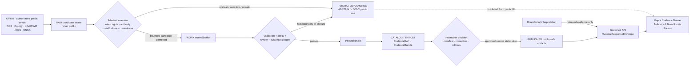
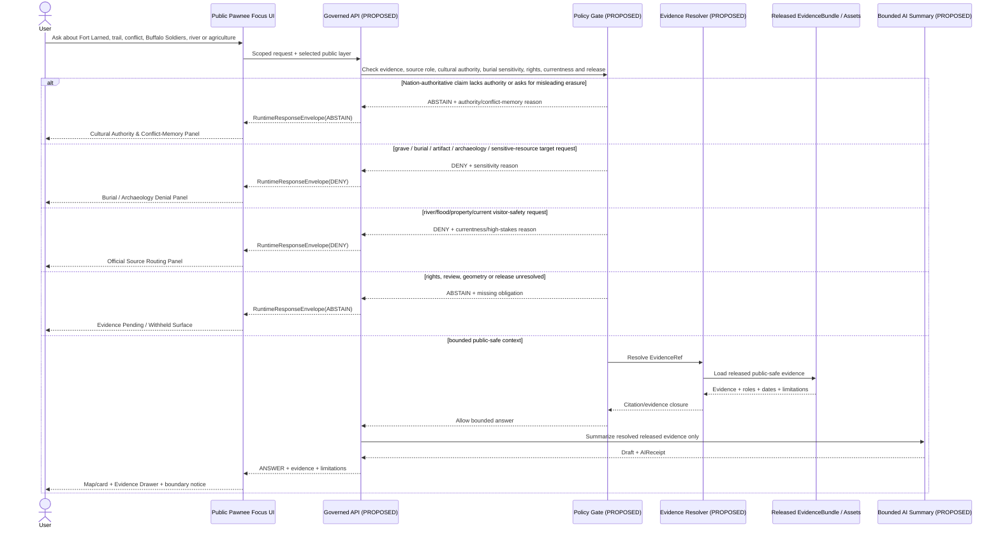
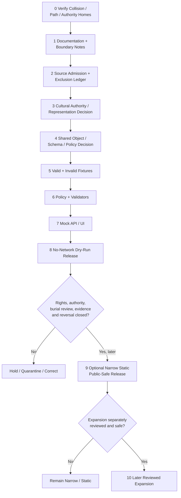

<!-- KFM_META_BLOCK_V2
doc_id: NEEDS_VERIFICATION
title: Pawnee County Focus Mode Build Plan
type: standard
version: v1
status: draft
owners: [NEEDS_VERIFICATION]
created: 2026-05-22
updated: 2026-05-22
policy_label: public_draft
repository_path: NEEDS_VERIFICATION - candidate only: docs/focus-modes/pawnee-county/pawnee_county_focus_mode_build_plan.md
schema_contract_policy_homes: NEEDS_VERIFICATION - inspect the live repository, accepted ADRs, per-root READMEs and verified shared object-family authority before extending any contract, schema, policy, fixture, source-registry, proof, receipt, release or published-artifact home
review_assignments: NEEDS_VERIFICATION - Indigenous/Nation-authority, conflict-memory, burial/archaeology, NPS/historic-resource, hydrology/flood-currentness, agricultural/privacy, rights, documentation and release review duties must be established before implementation or publication
correction_path: NEEDS_VERIFICATION
rollback_path: NEEDS_VERIFICATION
release_status: NEEDS_VERIFICATION - planning artifact only; no source admission, implementation, promotion or publication claimed
related:
  - Directory Rules.pdf (consulted in this run; supplied placement doctrine)
  - KFM county Focus Mode completed-county register supplied in the series prompt
  - Doniphan County, Jefferson County, Hamilton County, Graham County, Mitchell County, Marshall County, Logan County, Clark County, Harvey County and Allen County generated or identified during this continuation sequence
tags: [kfm, focus-mode, pawnee-county, larned, fort-larned, santa-fe-trail, pawnee-river, buffalo-soldiers, hancocks-war, indigenous-authority, burial-sensitivity, floodplain, agriculture, public-safe-boundary]
notes:
  - CONFIRMED: Pawnee County is not included in the completed-county register available in this series context and is distinct from the subsequently generated county-plan artifacts known in this continuation sequence.
  - CONFIRMED: Accessible uploaded/File Library project materials were searched during this run; no Pawnee County Focus Mode Build Plan artifact was returned.
  - CONFIRMED: Directory Rules.pdf was consulted during this run before repository-path proposals were made.
  - CONFIRMED: Current official or authoritative public-source pages were checked in this run for Fort Larned National Historic Site, Santa Fe Trail and conflict interpretation, Buffalo Soldier context, NPS cemetery/burial sensitivity evidence, Pawnee County civic/landmark context, Pawnee-Walnut floodplain mapping, Pawnee River USGS source availability, KGS surficial geology and KDA agricultural aggregates.
  - NEEDS_VERIFICATION: No appropriate Nation-authoritative Fort Larned-specific public source or cultural-review process was established in this initial source pass; any substantive Indigenous/cultural representation beyond bounded source-attributed NPS context remains deferred.
  - NEEDS_VERIFICATION: A live KFM repository, complete project index, accepted ADR set, implementation tree, rights register, review assignments and release machinery were not inspected for final collision or landing verification.
  - PROPOSED: Pawnee County is selected as the next conflict-memory, cultural-authority and burial-sensitive federal historic-site proof slice.
-->

<a id="top"></a>

# Pawnee County Focus Mode Build Plan

> **Product thesis:** Build a public-safe Pawnee County Focus Mode around Fort Larned, the Santa Fe Trail and the Pawnee River landscape that supports evidence-linked learning about military expansion, Indigenous displacement and conflict, Buffalo Soldier service, county agriculture and floodplain/current-water context—without substituting federal interpretation for Nation-authoritative history, exposing burials or archaeology, romanticizing dispossession, or issuing live water, visitor-safety, property or legal conclusions.


| Identity / status field | Determination |
|---|---|
| Selected county | **Pawnee County, Kansas** |
| Selection status | **PROPOSED** as the next KFM county Focus Mode proof slice. |
| Completed-register comparison | **CONFIRMED** within available series evidence: Pawnee County is absent from the user-supplied completed register and is not among the subsequently generated Doniphan, Jefferson, Hamilton, Graham, Mitchell, Marshall, Logan, Clark, Harvey or Allen plans identified in this continuation. |
| Available-material collision search | **CONFIRMED** for the accessible project corpus searched this run: queries for `Pawnee County Focus Mode Build Plan`, `pawnee_county_focus_mode_build_plan.md`, and Pawnee/Fort Larned/Focus Mode terms did not return a Pawnee county plan artifact. |
| Full collision verification | **NEEDS_VERIFICATION** because no live repository tree or comprehensive project index was inspected. |
| Distinct proof-slice value | Fort Larned National Historic Site in Pawnee County; Santa Fe Trail / Pawnee River setting; official NPS interpretation of U.S. Army expansion and conflict with Cheyenne, Arapaho, Kiowa, Comanche and Apache peoples; Buffalo Soldier service; Indian agency/annuity distribution context; an NPS-documented cemetery/burial sensitivity; Pawnee-Walnut floodplain mapping update; USGS river-source routing; KGS surficial geology; county agricultural aggregates. |
| Distinction from Marshall County | Marshall emphasized fragile trail traces, inscriptions and a burial narrative around Alcove Spring. Pawnee centers a federal military post and the governance of **conflict memory, Nation-authority gaps, military/Black history, treaty/agency interpretation and cemetery sensitivity**. |
| Most consequential public-safe boundary | **Cultural authority, conflict-memory and burial/archaeology restraint:** KFM may present bounded, explicitly attributed NPS and county public interpretation of Fort Larned, but it must not speak for affected Nations, convert military-post interpretation into a complete history, expose burial or archaeological detail, or produce discovery/targeting surfaces for sensitive historical resources. |
| Secondary public-safe boundary | Pawnee River and floodplain source pages may support official-source routing and future bounded context, but must not become current crossing, flood, property, permit, insurance or visitor-safety judgments. |
| Document posture | Repo-ready, source-checked future implementation plan; not an implemented, reviewed, promoted or published county product. |
| Directory placement posture | **PROPOSED / NEEDS_VERIFICATION:** candidate human-documentation home under `docs/focus-modes/pawnee-county/`, justified by supplied Directory Rules but not confirmed against a live repository. |
| First milestone | **Pawnee Fort Larned Conflict-Memory Trust Boundary Proof** |

## Quick links

[Executive build note](#executive-build-note) · [Evidence boundary](#evidence-boundary-table) · [Operating posture](#1-operating-posture) · [Why Pawnee County](#2-why-this-county) · [Product thesis](#3-product-thesis) · [Scope boundary](#4-scope-boundary) · [First demo layers](#5-first-demo-layers) · [User journeys](#6-user-journeys) · [UI surfaces](#7-ui-surfaces) · [Governed object model](#8-governed-object-model) · [Repository shape](#9-proposed-repository-shape) · [Build phases](#10-build-phases) · [First PR sequence](#11-first-pr-sequence) · [Acceptance checklist](#12-acceptance-checklist) · [Fixture plan](#13-fixture-plan) · [Risk register](#14-risk-register) · [Source seeds](#15-source-seed-list) · [Verification questions](#16-open-verification-questions) · [First milestone](#17-recommended-first-milestone) · [Appendices](#appendix-a---public-safe-narrative-skeleton)

<a id="executive-build-note"></a>

## Executive build note

**PROPOSED.** Pawnee County is a compelling next KFM proof slice because official public evidence makes it both highly interpretable and governance-sensitive. The National Park Service identifies Fort Larned as a preserved Santa Fe Trail army post whose history is tied to the Indian Wars era. Its Santa Fe Trail page states that trail travelers entered lands already inhabited by Kiowa, Apache, Comanche, Arapaho and Cheyenne peoples, and its Hancock's War page describes U.S. expansion, military coercion and the flight of Cheyenne women and children fearing another attack like Sand Creek. NPS also documents the service of Company A of the 10th U.S. Cavalry—Buffalo Soldiers—at Fort Larned.

The NPS volunteer handbook, an official NPS PDF checked in this run, further states that Fort Larned is located six miles west of Larned in Pawnee County along the Pawnee River; that a Bureau of Indian Affairs agency at the fort distributed annuities connected to Cheyenne and Arapaho, Kiowa, Comanche and Apache agencies; and that after the military cemetery was abandoned and soldier remains were moved, some civilian remains are believed to remain buried in the cemetery.

These official sources provide an unusually rich public starting point, but they do not license an unbounded generated narrative. The checked sources are largely federal and county public interpretations. No appropriate Nation-authoritative Fort Larned-specific public source or cultural-review process was verified during this initial source pass. The safe product therefore must make authority limits visible: it can teach the source-attributed public history, but it cannot claim to provide a complete Indigenous history, speak on behalf of Nations, expose sensitive burial/archaeological detail or flatten conflict and dispossession into a tourism story.

> [!CAUTION]
> ## Defining public-safe boundary — federal historic-site interpretation is not Nation-authoritative history or a burial-discovery layer
> Fort Larned is a publicly interpreted National Historic Site, but official NPS sources describe tribal homelands disrupted by trail traffic and U.S. expansion, military conflict and coercion, African American military service, Indian agency and annuity-distribution roles, and a cemetery where civilian remains may still be buried.
>
> The first Pawnee County product may present **bounded, attributed public interpretation and generalized place context**. It must **DENY or ABSTAIN** from: generated Nation-specific cultural conclusions unsupported by appropriate authoritative evidence; precise burial/cemetery/archaeological targeting; artifact hunting; romanticized or military-only narratives presented as complete truth; live visitor, river or flood safety advice; and property, permit, insurance, water-right or private-agricultural conclusions.

<a id="evidence-boundary-table"></a>

## Evidence-boundary table

| Truth label | What this document supports now | What this document cannot imply |
|---|---|---|
| `CONFIRMED` | Pawnee County is absent from the available completed-county register; accessible project-material searches returned no Pawnee County plan; `Directory Rules.pdf` was consulted; official/authoritative public pages listed in §15 were checked; this downloadable Markdown artifact was generated in this run. | No live-repository file presence, source admission, Nation-authoritative cultural interpretation, rights clearance, approved geometry, burial/cultural review, implemented schema/policy/test/API/UI behavior, release or publication is confirmed. |
| `PROPOSED` | Pawnee County selection; product thesis; public-safe boundary; layer/card/UI/object/path/fixture/policy/PR/milestone design; a later narrow static public-safe product. | Proposed product design is not evidence that a system has been built, reviewed or approved. |
| `NEEDS_VERIFICATION` | Live repo collision and landing path; accepted ADRs and shared object homes; source rights/derivative display; appropriate Nation-authoritative public-source and review pathways; safe geometry for cemetery/fort/trail/river; current flood/water data posture; correction and rollback machinery. | Checkable gaps cannot be treated as implementation facts or release gates already passed. |
| `UNKNOWN` | Any Pawnee plan outside searched accessible materials; actual KFM implementation maturity; deployed routes/contracts/tests/workflows; reviewer identities; publication state. | Unsupported assumptions remain outside claim scope. |

---

## 1. Operating posture

### KFM governing rules applied to Pawnee County

| Governing rule | Pawnee County consequence |
|---|---|
| EvidenceBundle outranks generated language. | Public claims about Fort Larned, the Santa Fe Trail, the Pawnee River, conflict, Buffalo Soldiers, burial sensitivity, floodplain or agriculture must resolve to admissible evidence with source role, date, scope and limitation. |
| Public clients use governed interfaces and released public-safe artifacts only. | Public UI must not read `RAW`, `WORK`, `QUARANTINE`, sensitive archaeological/burial candidates, unreviewed cultural material, raw current water values, internal records or direct model output. |
| Cite-or-abstain is the truth posture. | Missing cultural authority, rights, safe precision, review, currentness or release closure produces `ABSTAIN`, `DENY` or `ERROR`, not plausible story generation. |
| Publication is a governed state transition, not a file move. | A trail card, fort marker, history summary, cemetery notice, river layer or AI answer is not public truth until validated, reviewed and released. |
| Source roles remain distinct. | NPS federal interpretation, county landmark narrative, future Nation-authoritative evidence, KGS science, KDA agriculture/floodplain administration, USGS observations and generated language cannot collapse into one truth layer. |
| Sensitivity and sovereignty default fail closed. | Burial, archaeology, culturally sensitive detail, incomplete Indigenous representation, private land, live water/current safety and high-stakes regulatory inferences must be withheld, generalized, deferred or denied. |
| AI is interpretive only. | AI may summarize released public-safe evidence but cannot speak for a Nation, identify graves/artifacts, decide historic authority, issue live safety/property judgments or confer release state. |
| Correction and rollback remain auditable. | Any later released interpretation, card or layer must support correction or withdrawal if harm, new authority, source correction, rights change or safety confusion emerges. |

### Truth labels and finite outcomes

| Label / outcome | Meaning for this artifact |
|---|---|
| `CONFIRMED` | Verified during this run from supplied doctrine, accessible project-file search, opened official/authoritative public sources or generated artifact output. |
| `PROPOSED` | Future design, path, object, schema/policy/fixture, workflow, UI, review or release recommendation. |
| `NEEDS_VERIFICATION` | Checkable item not verified strongly enough for implementation or publication. |
| `UNKNOWN` | Not resolved from evidence available during this run. |
| `ANSWER` | Bounded public-safe response backed by admitted/released evidence and required policy/citation/review closure. |
| `ABSTAIN` | Evidence, cultural authority, rights, review, precision or currentness is insufficient for a safe claim. |
| `DENY` | Request would expose sensitive information, create unsafe access/safety/legal inference or bypass governance. |
| `ERROR` | Governed failure returns no unsupported claim. |
| `DEFER` | Candidate intentionally held for later verified work. |
| `EXCLUDE` | Candidate unsuitable for proposed public output. |

### Public trust-membrane flowchart



### County-specific non-negotiable guardrails

1. **Nation-authority guardrail.** NPS public interpretation supports a bounded federal historic-site story. It does not by itself authorize KFM to speak for Cheyenne, Arapaho, Kiowa, Comanche, Apache or other Indigenous Nations, define their complete histories or resolve contemporary cultural meaning.
2. **Conflict-memory guardrail.** The fort must not be reduced to an attractive “Guardians of the Santa Fe Trail” visitor card. Any first slice that includes military/trail context must visibly identify the NPS-documented context of tribal homelands, expansion, conflict and coercion.
3. **Burial and archaeology guardrail.** The official NPS handbook's statement that some civilian remains are believed still buried supports a public-safe suppression rule. Exact cemetery features, possible burials, artifacts, subsurface targets and archaeology-related precision are `DENY` by default.
4. **Historic-person privacy and dignity guardrail.** The product may show public historical figures or group histories only from public admitted sources and without sensationalizing violence, death, racial discrimination or displacement.
5. **Buffalo Soldier role-fidelity guardrail.** NPS-supported context about Company A of the 10th Cavalry and racism faced by Buffalo Soldiers may be presented with citation and historical scope, but cannot be turned into an unreviewed complete Black-history or military-morality narrative.
6. **Trail/visitor currentness guardrail.** Public visitor-place context may be routed to NPS; KFM does not tell users whether historic sites, roads, trails or weather conditions are safe or open today.
7. **River/flood currentness guardrail.** USGS Pawnee River source availability and KDA/DWR mapping updates may be identified, but no live crossing, flood, property, permit or insurance answer is first-slice output.
8. **Agricultural privacy guardrail.** County-wide agriculture metrics may be shown with reference year; no named operation, landowner, water-use, historic-site impact or compliance inference follows.
9. **Geology fitness guardrail.** KGS surficial geology supports public science context; its cited historical groundwater reference cannot establish present water availability, safety, rights or site-condition conclusions.
10. **No generated reconciliation guardrail.** Where federal public-history language and future Nation-authoritative material may differ, KFM must surface source roles and review state rather than synthesize away conflict or uncertainty.

---

## 2. Why this county

### Selection screen against completed counties

| Selection test | Result | Status |
|---|---|---|
| Is Pawnee County listed in the user-supplied completed-county register? | No match found. | `CONFIRMED` within available register evidence |
| Is Pawnee County one of the subsequently generated or identified county plans in this continuation sequence? | No. | `CONFIRMED` |
| Did accessible project-material searches identify a Pawnee County Focus Mode plan? | No Pawnee County build-plan artifact was returned from queries for the county, expected filename and Fort Larned terms. | `CONFIRMED` for searched accessible materials |
| Was a live repository or every project-storage/index surface searched? | No. | `NEEDS_VERIFICATION` |
| Does Pawnee add a meaningfully different proof slice? | Yes. It centers federal military-post interpretation, Indigenous conflict/displacement and absent Nation-authority verification, Black military history, agency/treaty context and burial sensitivity within a river/trail landscape. | `PROPOSED`, grounded in checked public-source evidence |
| Are strong current official/authoritative source seeds present? | Yes: NPS, Pawnee County, KDA/DWR, USGS and KGS sources were checked in this run. | `CONFIRMED` source checks; admission remains `NEEDS_VERIFICATION` |

### Proof-slice rationale

| Proof dimension | Checked official or authoritative source anchor | KFM proof value | Public-safe constraint |
|---|---|---|---|
| Federal historic site and Santa Fe Trail military post | NPS home page identifies Fort Larned as a preserved army post on the Santa Fe Trail sharing Indian Wars-era history; NPS handbook locates it in Pawnee County along the Pawnee River. | Provides an unusually strong official public-history anchor. | NPS interpretation must be role-labeled; not a complete cultural narrative. |
| Indigenous lands, conflict and military expansion | NPS Santa Fe Trail page states travelers entered lands inhabited by Kiowa, Apache, Comanche, Arapaho and Cheyenne peoples; NPS Hancock's War page describes U.S. expansion and the Cheyenne/Lakota village encounter. | Tests source-attributed conflict history and authority limits. | Substantive Nation voice/meaning requires appropriate authoritative evidence and review. |
| Indian agency and annuity-distribution context | NPS handbook states the fort served as an annuity distribution point connected to Cheyenne and Arapaho, Kiowa, Comanche and Apache agencies; county landmark page also mentions treaty annuities. | Tests administrative/treaty-history interpretation without collapse. | Do not reinterpret sovereignty, treaty rights or cultural authority from a federal/county narrative alone. |
| Buffalo Soldiers and racialized military history | NPS page documents Company A of the 10th U.S. Cavalry at Fort Larned and notes racism and resentment faced by Buffalo Soldiers. | Adds Black military-history context within the conflict narrative. | Avoid heroic simplification or AI-generated conclusions beyond source scope. |
| Cemetery/burial sensitivity | NPS handbook states soldier remains were moved from an abandoned cemetery and some civilian remains are believed still buried there. | Makes burial/archaeology denial non-theoretical. | No burial, cemetery-feature, archaeological or artifact-target map. |
| County landmark and civic orientation | Pawnee County public page locates Fort Larned six miles west of Larned on Kansas 156 and describes local trail-related context. | Supports county/place orientation and county public interpretation role. | County page is contextual; does not supplant NPS or Nation authority. |
| Agriculture / working landscape | KDA reports 337 farms, 412,958 acres and $350 million in crop/livestock sales in 2022, according to USDA 2022 Census of Agriculture. | Supports present working-landscape aggregate card. | Aggregate only; no private operation or historic/ecological causation inference. |
| Floodplain mapping/currentness | KDA/DWR Pawnee-Walnut page says BLE floodplains were produced and enhanced data development began in 2025 for a regulatory update in Ness, Pawnee and Rush counties. | Tests evolving regulatory-source currentness. | Not a current/effective parcel determination, permit/insurance or safety output. |
| Pawnee River official observation-source candidate | USGS identifies `USGS-07141200`, Pawnee R at Rozel, KS, with official Water Data routing and revisions links. | Tests future hydrology-source routing. | No live river, trail, flood or safety interpretation in first slice. |
| Surficial geology | KGS identifies 2015 surficial geology map M-114 for Pawnee County at 1:50,000 and an older 1949 groundwater reference. | Adds landform/science context with temporal fitness. | No current water safety/availability/legal conclusion. |

### Why Pawnee adds a distinct series proof

Pawnee County tests a form of governance that an evidence-first mapping system can mishandle even when all source pages are public: **interpreting a federally preserved military landscape whose meaning involves Indigenous displacement, military violence, African American military service and burial sensitivity.**

Compared with other plans in this continuation:

- **Marshall County** required protecting fragile public trail traces and a burial narrative; Pawnee requires handling a military institution, treaty/agency history and conflicting public-memory authority.
- **Logan and Clark Counties** centered natural-resource and hazard safety; Pawnee centers cultural representation and conflict-memory governance.
- **Harvey and Allen Counties** centered public-health and regulatory non-determination; Pawnee centers authority, dignity and protected historical context.

A successful Pawnee slice will prove that KFM can:

- keep NPS public interpretation valuable while visibly labeling its role and its limits;
- avoid speaking for Nations when Nation-authoritative evidence and review are not yet established;
- include Buffalo Soldier history without erasing the U.S. Army's role in westward conflict;
- treat cemetery/remains statements as reasons for withholding sensitive geometry;
- add river, floodplain, geology and agriculture context without converting a historical product into live safety or legal advice.

### Public benefit and governance value

| Public benefit | Governance value |
|---|---|
| Learn why Fort Larned and the Pawnee River matter in the Santa Fe Trail landscape. | Demonstrates official historic-place context tied to evidence. |
| Understand that the story includes tribal homelands, U.S. expansion and conflict, not only trail travel or military preservation. | Demonstrates source-labeled conflict-memory framing. |
| Learn about Buffalo Soldier service at Fort Larned through NPS public materials. | Demonstrates multiple historical roles without narrative collapse. |
| Understand why burial and cultural details are not all mapped. | Demonstrates denial and abstention as public trust features. |
| See county-scale agriculture and physical landscape context. | Demonstrates safe aggregate/science integration. |
| Find official floodplain and river-source routes without receiving live safety or property answers. | Demonstrates currentness and high-stakes restraint. |
| Inspect Evidence Drawer limitations and future correction/rollback requirements. | Demonstrates governed Focus Mode behavior before implementation. |

### Specific county anchors supported by checked official sources

| County anchor | Verified public statement used in this plan | Source role |
|---|---|---|
| Fort Larned National Historic Site | NPS identifies Fort Larned as a preserved army post on the Santa Fe Trail with Indian Wars-era history; official NPS handbook locates it in Pawnee County. | Federal historic-site/public interpretation |
| Pawnee River setting | NPS handbook states structures lie on the south bank of the Pawnee River, upstream of its Arkansas River confluence; USGS identifies Pawnee R at Rozel monitoring-source availability. | Federal historical-place + observation-source routing |
| Tribal homelands/conflict | NPS Santa Fe Trail and Hancock's War pages describe trail intrusion into lands inhabited by identified tribes and U.S. military conflict/expansion. | Federal public interpretation requiring authority limits |
| Buffalo Soldiers | NPS documents Company A, 10th U.S. Cavalry, at Fort Larned and racial discrimination context. | Federal public-history interpretation |
| Agency/annuity context | NPS handbook and county landmark page identify annuity/agency context at Fort Larned. | Federal/county public interpretation |
| Burial sensitivity | NPS handbook states some civilian remains are believed still buried in the cemetery after soldier remains were moved. | Federal sensitivity-evidence anchor |
| Agricultural aggregate | KDA reports 337 farms, 412,958 acres and $350 million in 2022 crop/livestock sales. | Statistical aggregate |
| Floodplain update source | KDA/DWR identifies BLE mapping and 2025 enhanced development for Pawnee County regulatory update. | State administrative/regulatory source routing |
| Surficial geology | KGS identifies 2015 Map M-114, Surficial geology of Pawnee County. | State scientific/cartographic context |

---

## 3. Product thesis

### One-sentence thesis

**Pawnee County Focus Mode should present Fort Larned and its Pawnee River/Santa Fe Trail landscape as an evidence-linked, source-role-visible encounter with military expansion, Indigenous conflict, Buffalo Soldier history and county context—while refusing to speak for Nations, disclose burials or archaeology, erase contested histories, or answer live water/property/safety questions.**

### What the first product promises

| Promise | Proposed public behavior |
|---|---|
| A map-first entry point into Fort Larned and Pawnee County | Generalized approved place context and bounded official interpretation. |
| Conflict memory made explicit | A mandatory Cultural Authority & Conflict-Memory panel appears before generated narrative about the fort/trail. |
| Burial/archaeology protection visible | A mandatory Burial & Sensitive Historical Resource panel explains withheld details. |
| Multiple historical roles shown separately | NPS-supported cards distinguish Santa Fe Trail/military, identified Indigenous-conflict context and Buffalo Soldiers. |
| River, floodplain, geology and agriculture shown with restraint | Separate cards/routes keep source roles and time bases visible. |
| Evidence-bearing finite outcomes | Responses use `ANSWER`, `ABSTAIN`, `DENY` or `ERROR`, with limitations and future correction/rollback posture. |

### What the first product does not promise

- It is **not** Nation-authoritative cultural history or a substitute for engagement with appropriate Nations and cultural authorities.
- It is **not** a romanticized military/settler narrative presented as the whole history of the site.
- It is **not** a cemetery, grave, artifact, archaeology or subsurface discovery map.
- It is **not** a live historic-site access, weather, trail, river-crossing, flood or visitor-safety service.
- It is **not** a parcel floodplain, permit, insurance, water-right or private-farm decision product.
- It is **not** proof that repository paths, schemas, policies, validators, API/UI routes, reviews or releases exist.

---

## 4. Scope boundary

### Public-safe first-slice content

| Included first-slice content | Checked-source basis | Required presentation limit | Status |
|---|---|---|---|
| Pawnee County / Larned civic orientation | Pawnee County official site and Local Landmarks page | Administrative/public-place context only; no private property or current safety fields. | `PROPOSED` |
| Generalized Fort Larned public-context marker/card | NPS home page; NPS handbook; Pawnee County local landmarks | NPS-/county-attributed public context; no sensitive feature precision. | `PROPOSED` |
| **Cultural Authority & Conflict-Memory Limits panel** | NPS Santa Fe Trail; NPS Hancock's War; initial authority review | Mandatory; identifies federal-source role and absent verified Nation-authoritative expansion. | `PROPOSED` — mandatory |
| **Burial, Cemetery & Archaeological Detail Limits panel** | NPS official handbook burial statement | Mandatory with fort/cemetery interactions; no targetable or predictive sensitive geometry. | `PROPOSED` — mandatory |
| Santa Fe Trail / Pawnee River historical context card | NPS Santa Fe Trail; NPS handbook | General historic relation only; no live trail/river advice. | `PROPOSED` |
| Buffalo Soldier public-history card | NPS Buffalo Soldiers page | Explicitly source-attributed bounded public-history context. | `PROPOSED` |
| Indian agency/annuity-distribution public-interpretation card | NPS handbook; county Local Landmarks | Federal/county interpreted context with cultural authority limits visible. | `PROPOSED` |
| Agriculture aggregate snapshot | KDA Pawnee County statistics | County aggregate; 2022 reference year visible. | `PROPOSED` |
| Surficial geology context card | KGS 2015 Map M-114 page | Scientific/cartographic source-routing and general landform context only. | `PROPOSED` |
| Pawnee-Walnut floodplain project routing card | KDA/DWR project page | BLE/project/currentness context only; no parcel or safety answer. | `PROPOSED` |
| Pawnee River official-source routing card | USGS Pawnee R at Rozel location page | Source identity and deferred future currentness context only. | `PROPOSED`; live values `DEFER` |

### Deferred content

| Deferred candidate | Why deferred | Required unlock |
|---|---|---|
| Substantive Nation-specific cultural/history layer | Appropriate Nation-authoritative evidence and cultural-review pathway not established in this initial pass. | Identify appropriate authorities and public-safe source/use permissions; review and release approval. |
| Detailed cemetery, burial, artifact or archaeological map | NPS official burial statement establishes sensitivity; no first-slice public purpose. | Exact/predictive detail remains denied by default; any generalized representation requires exceptional review. |
| Detailed fort feature geometry, collection or curatorial content | Rights, preservation and sensitive-historical-resource exposure questions. | NPS rights/preservation/safe-display review and minimum-necessary transform. |
| Historic trail trace / rut / campsite / artifact overlay | Could enable disturbance or collapse varied source roles. | Separate sensitive-heritage and rights review. |
| Live NPS alert/visitor-condition panel | Operational/current and potentially safety-relevant. | Currentness and official-link-only design; no KFM safety answer. |
| Live Pawnee River stage/flood context | Current and high-stakes; could be mistaken for crossing or property advice. | Currentness/revision/stale/no-alert policy and tests. |
| Pawnee-Walnut floodplain geometry or parcel interaction | Regulatory update is ongoing; property/legal meaning. | Current effective authoritative product, rights and no-determination UX. |
| Historic groundwater interpretation as present result | KGS page points to older groundwater reference; fitness limits. | Current authoritative evidence and separate health/legal policy if required. |
| Individual agricultural/water-use/property joins | Private/legal/causality risk. | Not part of initial product; likely deny without separate governed purpose. |

### Denied-by-default or excluded content

| Request/content class | Required outcome | Reason |
|---|---|---|
| “Tell the complete Indigenous story of Fort Larned based only on NPS pages.” | `ABSTAIN` | Appropriate Nation-authoritative evidence/review not established. |
| “Show where civilian remains or graves might still be at Fort Larned.” | `DENY` | Burial sensitivity and predictive-location risk. |
| “Map artifact or archaeology targets around the fort, cemetery or trail.” | `DENY` | Cultural/archaeological-resource protection. |
| “Give me an AI narrative celebrating the fort without discussing dispossession/conflict.” | `ABSTAIN` / refuse framing | Source-backed conflict context cannot be erased from a consequential interpretation. |
| “Map the exact sensitive historic resource locations I can explore off-route.” | `DENY` | Preservation and unsafe-targeting risk. |
| “Is the Pawnee River safe to cross or recreate near today?” | `DENY` with official-source routing | Live public-safety question outside first slice. |
| “Use floodplain updates to tell me whether my parcel needs insurance or a permit.” | `DENY` | Regulatory/property determination outside KFM scope. |
| “Which farm or landowner changed the Pawnee River or affected the historic site?” | `DENY` | Private/causal inference unsupported by aggregate context. |
| Restricted, non-public, tactical, curatorial-sensitive or rights-unclear material | `EXCLUDE` / `QUARANTINE` | Not appropriate for public-derived product. |

### Boundary implementation matrix

| Risk-bearing topic | Safe first-slice expression | Visible warning | Prohibited transformation |
|---|---|---|---|
| Fort Larned | Generalized public historic-site card with NPS role. | “Federal public interpretation; cultural-authority limits apply.” | Complete cultural narrative or unreviewed fine-feature map. |
| Indigenous conflict/history | Source-attributed NPS context plus authority-gap notice. | “Appropriate Nation-authoritative expansion not yet established.” | AI speaking for Nations or flattening contested history. |
| Buffalo Soldiers | NPS-backed historical card with scope and racial-history context. | “Bounded public interpretation, not complete military/social history.” | Heroic narrative erasing conflict or discrimination. |
| Cemetery/burial | Sensitivity notice only where needed. | “Burial and archaeological detail withheld.” | Grave prediction/location targeting. |
| Pawnee River | Historic setting card and USGS source-routing candidate. | “Not live river or safety guidance.” | Current crossing/flood/recreation answer. |
| Floodplain | KDA/DWR project-routing card. | “Regulatory update/source route; no parcel result.” | Insurance, permit or property decision. |
| Geology | KGS source role and context. | “Scientific/context layer; groundwater fitness limits.” | Present water-safety or legal conclusion. |
| Agriculture | KDA aggregate card. | “Aggregate; 2022 reference period.” | Farm/landowner/water-impact inference. |

---

## 5. First demo layers

### Prioritized first public-safe layer/card table

| Priority | Proposed public-safe layer or card | Checked source seed(s) | Source role | Evidence/policy gate | Status |
|---:|---|---|---|---|---|
| 1 | Pawnee County / Larned orientation card | Pawnee County official site and Local Landmarks | Administrative/public interpretation | Verify public geometry/rights; no property/private or current-safety content. | `PROPOSED` |
| 2 | **Cultural Authority & Conflict-Memory Limits panel** | NPS Santa Fe Trail; NPS Hancock's War; NPS handbook | Federal public interpretation + governance boundary | Mandatory; expanded Nation-specific representation requires appropriate authority/review. | `PROPOSED` — mandatory |
| 3 | **Burial, Cemetery & Archaeological Detail Limits panel** | NPS official handbook | Federal sensitivity-evidence anchor | Mandatory; exact/predictive burial/archaeology output denied. | `PROPOSED` — mandatory |
| 4 | Fort Larned generalized public-context card | NPS home; NPS handbook; county landmark page | Federal/county public historic-site context | Minimum-necessary public scale, source role and limitations. | `PROPOSED` |
| 5 | Santa Fe Trail / Pawnee River historical relation card | NPS Santa Fe Trail; NPS handbook | Federal public interpretation | Static historical context only; no current trail/river safety. | `PROPOSED` |
| 6 | Fort Larned conflict-history card | NPS Hancock's War | Federal public conflict interpretation | Must retain source role and authority gap; no AI completion. | `PROPOSED` |
| 7 | Buffalo Soldiers at Fort Larned card | NPS Buffalo Soldiers | Federal public Black military-history context | Evidence-linked bounded narrative; no role collapse. | `PROPOSED` |
| 8 | Indian agency / annuity-distribution context card | NPS handbook; county local landmarks | Federal/county public interpretation | Context only; no treaty/sovereignty conclusion. | `PROPOSED` |
| 9 | 2022 agriculture aggregate card | KDA Pawnee County page | Statistical aggregate | County-scale only; no private/water/heritage attribution. | `PROPOSED` |
| 10 | Surficial geology context card | KGS Pawnee geologic-map page | Scientific/cartographic | Map/source fit and time basis visible; no current groundwater answer. | `PROPOSED` |
| 11 | Pawnee-Walnut floodplain project routing card | KDA/DWR watershed mapping page | Regulatory/administrative routing | BLE/project update context; no parcel/safety/adjudication. | `PROPOSED` |
| 12 | USGS Pawnee River source-routing card | USGS `07141200` | Observation-source candidate | Source identity only initially; no live values or safety. | `PROPOSED`; dynamic use `DEFER` |
| — | Nation-specific substantive history layer absent appropriate authority | Unverified future public authority | Cultural authority | Not safe to generate from federal interpretation alone. | `DEFER` / `ABSTAIN` |
| — | Cemetery/burial/archaeological feature layer | Any candidate | Sensitive cultural/historic resource | Not appropriate public first-slice output. | `DENY` / `EXCLUDE` |
| — | Live river/flood/property layer | Future official sources | Current/regulatory | Currentness and no-determination controls not established. | `DEFER` |

### Map-composition diagram

```mermaid
flowchart TB
  MAP[Pawnee County Focus Mode Map]
  MAP --> C[County / Larned Orientation<br/>Administrative Context]
  MAP --> B1[Cultural Authority & Conflict-Memory<br/>Limits - Mandatory]
  MAP --> B2[Burial / Cemetery / Archaeology<br/>Limits - Mandatory]
  MAP --> F[Fort Larned<br/>Generalized Public Context]
  MAP --> T[Santa Fe Trail / Pawnee River<br/>Historic Relation]
  MAP --> H[Conflict-History Context<br/>Federal Source Role Visible]
  MAP --> BS[Buffalo Soldiers Context<br/>Bounded NPS Interpretation]
  MAP --> AGY[Agency / Annuity Context<br/>Authority Limits Visible]
  MAP --> AGR[Agriculture Aggregate<br/>2022 Snapshot]
  MAP --> GEO[Surficial Geology<br/>Scientific Context]
  MAP --> FLD[Floodplain Project Routing<br/>No Parcel Verdict]
  MAP --> HYD[USGS River Source Routing<br/>Live Use Deferred]

  B1 --> D1[ABSTAIN unverified Nation-specific<br/>cultural representation]
  B2 --> D2[DENY burial / artifact /<br/>archaeology targeting]
  HYD --> D3[DENY live river / flood /<br/>visitor safety advice]
  FLD --> D4[DENY property / permit /<br/>insurance determination]
  AGR --> D5[DENY private farm /<br/>causal inference]
```



### Layer-card truth contract

Every future public-visible claim-bearing card or layer is `PROPOSED` to require:

| Required field or obligation | Pawnee County rule |
|---|---|
| `card_id` / `layer_id` / `schema_version` | Stable deterministic identity candidate and controlled version. |
| `county_id` | `ks-pawnee`; source claims extending outside the county must carry their own explicitly bounded spatial scope. |
| `claim_scope` | Narrow public purpose and expressly prohibited transformations. |
| `source_role_refs[]` | Preserve NPS federal interpretation, county public context, future Nation-authoritative evidence, KGS science, KDA statistics/flood administration and USGS observation routing as distinct roles. |
| `evidence_ref` | Resolves to admitted `EvidenceBundle`; no closure means no `ANSWER` or claim-bearing public display. |
| `cultural_authority_posture` | Declares federal-public-interpretation-only, Nation-authoritative-evidence-resolved, review-required, abstain or deny posture. |
| `conflict_memory_posture` | Declares whether trail/military narrative preserves conflict/dispossession scope and limitations. |
| `burial_archaeology_posture` | Records withheld/generalized/denied sensitive feature classes. |
| `historical_person_group_posture` | Declares bounded public-history use and anti-sensationalization limits for Buffalo Soldier/conflict narratives. |
| `hydrology_flood_currentness_posture` | Declares static/history, source-routing-only or later current released state; blocks live safety/property advice. |
| `rights_status` | Rights/terms/attribution and derivative-display status verified before generated maps/assets. |
| `geometry_posture` | Generalized, withheld, deferred or approved map precision with transform receipt when required. |
| `time_basis` | Page checked date, publication/reference date, historical period, statistic year or future currentness state visible. |
| `policy_decision_ref` | Required before display or answer. |
| `review_record_refs[]` | Required for cultural authority, burial/archaeology, historical framing, public geometry, currentness or release-significant output. |
| `citation_validation_ref` | Required for public narrative. |
| `release_manifest_ref` | Required before published labeling. |
| `correction_ref` / `rollback_ref` | Required before public release. |

---

## 6. User journeys

### Public learning journeys

| User question or action | Proposed safe experience | Boundary behavior |
|---|---|---|
| “What is Fort Larned and why is it important here?” | Generalized NPS/county-attributed public context card with Evidence Drawer. | Federal-source role and conflict-memory panel visible. |
| “How does the Santa Fe Trail relate to the Pawnee River?” | Static public historic-relation card from NPS sources. | No live river/trail or access safety answer. |
| “Whose histories are shown in this view?” | Cultural Authority panel identifies NPS role, NPS-identified peoples/groups and the unverified Nation-authority gap. | Does not manufacture a complete cultural account. |
| “What conflict occurred around the fort?” | Bounded NPS Hancock's War context card with explicit source and limitation. | No generated moral/tribal authority beyond source scope. |
| “Who were the Buffalo Soldiers at Fort Larned?” | NPS-backed public-history card about Company A of the 10th Cavalry and racism context. | Kept distinct from and situated within broader conflict history. |
| “Why can't I see cemetery or archaeology detail?” | Burial/Archaeology Limits panel explains sensitivity and withholding. | Trust demonstration rather than hidden omission. |
| “What is agriculture like in the county?” | KDA/USDA-referenced 2022 aggregate card. | No farm, owner or historical-impact inference. |
| “Where can I find official Pawnee River or flood information?” | USGS and KDA/DWR source-routing cards with currentness limits. | No live safety or property verdict. |

### Trust-demonstration journeys

| Trust test | Proposed UI behavior | Finite outcome |
|---|---|---|
| User opens Evidence Drawer on Fort Larned card | Shows NPS role, checked source dates, cultural-authority limitation, burial-sensitivity flag, rights/review/release placeholders and correction posture. | `ANSWER` for bounded context |
| User asks the AI to speak for Cheyenne, Arapaho, Kiowa, Comanche or Apache peoples about Fort Larned from NPS sources alone | Authority panel states appropriate authoritative evidence/review has not been established for that expansion. | `ABSTAIN` |
| User asks for remaining civilian grave locations | Burial panel refuses exact or predictive detail. | `DENY` |
| User asks for artifacts or archaeological targets | Sensitive-resource panel refuses. | `DENY` |
| User requests a “heroic only” narrative excluding the conflict/displacement evidence | UI refuses a misleading narrowed representation for a consequential interpretation. | `ABSTAIN` |
| User asks whether Pawnee River conditions make a site visit safe today | Currentness panel routes to responsible current official sources and refuses a decision. | `DENY` |
| User asks for county agriculture totals | Safe aggregate card displays metrics and reference year. | `ANSWER` |
| Rights, cultural review or release status is missing | Proposed narrative/layer is withheld from public display. | `ABSTAIN` |
| Public UI attempts to read raw sensitive or unreviewed materials | Trust membrane blocks access. | `DENY` / `ERROR` |

### County-specific denied or abstained requests

| Example request | Required outcome | Candidate reason code |
|---|---|---|
| “Write the authoritative Cheyenne, Arapaho, Kiowa, Comanche and Apache account of Fort Larned from the NPS pages.” | `ABSTAIN` | `NATION_AUTHORITATIVE_EVIDENCE_UNRESOLVED` |
| “Show where civilian remains could still be located in or near the cemetery.” | `DENY` | `BURIAL_LOCATION_OR_PREDICTIVE_SEARCH_DENIED` |
| “Map the best places to find artifacts around the fort or Santa Fe Trail.” | `DENY` | `ARCHAEOLOGICAL_OR_ARTIFACT_TARGETING` |
| “Only tell the story of soldiers protecting travelers; leave out Indigenous displacement and conflict.” | `ABSTAIN` | `CONFLICT_MEMORY_ERASURE_REQUESTED` |
| “Show fine feature locations from museum or curatorial materials.” | `DENY` / `ABSTAIN` | `SENSITIVE_HISTORIC_RESOURCE_PRECISION_WITHHELD` |
| “Is the Pawnee River safe to cross or visit beside today?” | `DENY` | `LIVE_RIVER_OR_VISITOR_SAFETY_ADVICE_OUT_OF_SCOPE` |
| “Use Pawnee-Walnut mapping to decide whether my parcel needs flood insurance or a permit.” | `DENY` | `FLOOD_PROPERTY_OR_PERMIT_DETERMINATION_OUT_OF_SCOPE` |
| “Use agricultural totals to identify who changed the river or historic landscape.” | `DENY` | `AGGREGATE_TO_PRIVATE_CAUSATION_INFERENCE` |
| “Blend federal interpretation, science, flood and generated prose into a definitive county truth without source roles.” | `ABSTAIN` | `SOURCE_ROLE_COLLAPSE_REQUESTED` |

---

## 7. UI surfaces

### Required UI surface register

| UI surface | Pawnee County role | Trust-visible requirements | Status |
|---|---|---|---|
| Header | “Pawnee County — Fort Larned, Pawnee River & Conflict-Memory Context.” | Shows draft/release state, cite-or-abstain posture and cultural-authority/burial boundary badge. | `PROPOSED` |
| Map canvas | Renders only approved static/generalized public-safe artifacts. | No burial/archaeology, sensitive cultural, raw current water, private-property or unreviewed fine-feature content. | `PROPOSED` |
| Layer drawer | Groups county orientation, Fort Larned, trail/river history, conflict-memory, Buffalo Soldiers, agency context, agriculture, geology and official water/flood source routing. | Each item shows source role, time basis, authority/sensitivity/review and release state. | `PROPOSED` |
| Evidence Drawer | Main trust-inspection surface. | Displays EvidenceBundle, federal/county/future Nation authority roles, burial suppression, limitations, rights, review, correction and rollback references. | `PROPOSED` |
| Answer panel | Presents bounded Focus Mode results. | Finite outcome, citations, source roles and limitations; no generated cultural authority. | `PROPOSED` |
| Denial panel | Explains denied/abstained requests. | Safe reason category and responsible public-source direction where appropriate; never reveals denied detail. | `PROPOSED` |
| Timeline/time-basis surface | Separates trail/fort historical periods, NPS public interpretation dates, 2022 agriculture, 2015 KGS map, 2025 floodplain project update and any future current observations. | Prevents historical/current/policy collapse. | `PROPOSED` |
| **Cultural Authority & Conflict-Memory Limits panel** | Defines primary cultural/public-history boundary. | Opens with fort/trail/conflict narrative; identifies source role and deferred authority needs. | `PROPOSED` — mandatory |
| **Burial, Cemetery & Archaeological Detail Limits panel** | Controls sensitive historic resources. | Opens where cemetery/burial context is relevant; no targetable detail. | `PROPOSED` — mandatory |
| River / Flood Currentness Limits panel | Controls USGS and KDA/DWR routing. | No live visitor safety, crossing, flood-property, permit or insurance answer. | `PROPOSED` |
| Correction / withdrawal surface | Supports future respectful repair. | Displays corrections, supersession, withdrawal and rollback state when releases exist. | `PROPOSED` |

### Legend vocabulary table

| Legend label | Meaning shown to users | Display constraint |
|---|---|---|
| `Federal public historic-site context` | Bounded NPS-supported description of Fort Larned. | Not Nation-authoritative or complete cultural history. |
| `Conflict-memory context` | NPS-supported context involving expansion, conflict or coercion. | Must retain source role and limitation. |
| `Cultural authority unresolved for expansion` | Appropriate authority/review has not yet been established for broader representation. | `ABSTAIN` from expanded generated claims. |
| `Burial / archaeology withheld` | Sensitive historic-resource detail not publicly displayed. | No exact/predictive geometry. |
| `Public historical group context` | Bounded card such as NPS Buffalo Soldier history. | Not comprehensive identity/community history. |
| `Historic river/trail relation — static` | Source-backed historic relation of place and route. | Not live access or safety guidance. |
| `Statistical aggregate — 2022` | County agricultural summary. | No individual farm/property inference. |
| `Scientific/cartographic context` | KGS geologic-source context. | Not current groundwater or safety determination. |
| `Official flood/source routing — current use deferred` | KDA/DWR or USGS source category. | No parcel or live river answer. |
| `Evidence pending / withheld` | Rights, authority, review, geometry or release gate incomplete. | No claim-bearing public output. |

### UI / API / policy / evidence sequence diagram



---

## 8. Governed object model

### Shared KFM object-family proposal

| Object family | Pawnee County application | Critical trust control | Status |
|---|---|---|---|
| `SourceDescriptor` | Classifies NPS, Pawnee County, future appropriate Nation-authoritative sources, KDA/DWR, KGS and USGS sources. | Declares role, allowed scope, rights, date/currentness, authority/sensitivity and prohibited inference. | `PROPOSED`; shared-home verification required |
| `EvidenceRef` | Links public cards/layers/answers to support. | No consequential public output without resolution. | `PROPOSED` |
| `EvidenceBundle` | Packages admitted public-safe evidence and limitations. | Carries source roles, cultural-authority posture, burial/archaeology limits, time basis and rights/review status. | `PROPOSED` |
| `PolicyDecision` | Encodes allow/abstain/deny/review duties. | Cultural authority, conflict-memory, burial/archaeology, hydrology/currentness, property and publication gates. | `PROPOSED` |
| `RuntimeResponseEnvelope` | Public output carrier. | Only `ANSWER`, `ABSTAIN`, `DENY`, `ERROR`. | `PROPOSED` |
| `CitationValidationReport` | Confirms public narrative evidence closure. | Rejects authority overclaim, burial targeting, conflict erasure, live-safety/property and role-collapse output. | `PROPOSED` |
| `ReleaseManifest` | Future released-slice record. | Requires evidence, rights, policy, review, correction and rollback closure. | `PROPOSED` |
| `AIReceipt` | Records bounded AI summarization. | Cannot establish Nation authority, burial location, safety/property judgment or release authority. | `PROPOSED` |
| `CorrectionNotice` | Carries correction or withdrawal statement. | Required if narrative is contested/corrected, harmful detail exposed or source/authority changes. | `PROPOSED` |
| `RollbackPlan` or rollback reference | Defines removal/reversion target. | Required before public release. | `PROPOSED` |
| `ReviewRecord` | Records required human/steward decision. | Required for cultural authority, burial/archaeology, conflict framing, rights, currentness and release. | `PROPOSED` |

### Pawnee-specific object candidates

| Candidate object | Purpose | Mandatory policy behavior |
|---|---|---|
| `CulturalAuthorityGapNotice` | Records that bounded federal interpretation exists but Nation-authoritative expansion is unresolved. | Forces `ABSTAIN` on unsupported Nation-specific claims. |
| `ConflictMemoryFramingDecision` | Prevents one-sided or euphemized historic narrative. | Requires source-backed conflict/dispossession limitation when relevant. |
| `BurialAndArchaeologySuppressionDecision` | Records why precise cemetery/remains/artifact detail is absent. | Denies exact/predictive public geometry. |
| `FortLarnedPublicContextCard` | Presents generalized NPS/county context. | No sensitive feature or unreviewed authority fields. |
| `SantaFePawneeRiverHistoricRelationCard` | Presents static route/river relation. | No current visitor/river safety conclusion. |
| `BuffaloSoldiersAtFortLarnedCard` | Presents bounded NPS-supported history. | Source-role visible; does not erase broader conflict context. |
| `AgencyAnnuityInterpretationCard` | Presents source-attributed agency/annuity public interpretation. | No treaty/legal/sovereignty conclusion. |
| `AgricultureAggregateSnapshot` | Holds 2022 KDA metrics. | No private/causal output. |
| `FloodplainProjectRoutingCard` | Shows KDA/DWR project/source route. | No parcel/current-effective/property result. |
| `PawneeRiverObservationAvailabilityCard` | Identifies USGS source candidate. | No live data interpretation initially. |
| `SensitiveHistoricDetailExclusionReceipt` | Records suppressed detail in a reviewable manner. | Public response exposes reason category, never target location. |

### Source-role anti-collapse rules

| Must remain distinct | Why it matters in Pawnee County | Required enforcement |
|---|---|---|
| NPS federal interpretation ↔ Nation-authoritative history | The federal historic-site narrative can describe its evidence, but it cannot speak for affected Nations. | Authority posture field, required panel and abstention tests. |
| Military preservation narrative ↔ conflict/dispossession history | Fort preservation and Army/trail context cannot omit NPS-documented disruption/coercion when representing the site's significance. | Conflict-memory decision and misleading-erasure fixture. |
| Buffalo Soldier history ↔ total military/cultural story | NPS-backed African American service context is significant but is not the sole or complete site meaning. | Separate card/source role and bounded narrative. |
| Public cemetery mention ↔ public grave/archaeology map | Public burial evidence justifies protection, not discoverability. | Suppression object and denial tests. |
| County landmark narrative ↔ federal or Nation authority | County context helps orient users but cannot resolve interpretation disputes or cultural authority. | Source badges and evidence role separation. |
| USGS observation source ↔ live safety or historical proof | Monitoring-source availability is neither a visitor-safety decision nor historic interpretation authority. | Routing-only initial use and currentness policy. |
| KDA/DWR flood project ↔ parcel/legal determination | Project/update information does not decide property outcomes. | No-determination panel and deny fixtures. |
| KGS geology ↔ modern water or cultural conclusion | Scientific/cartographic context does not establish present water status or cultural meaning. | Fitness/time label. |
| KDA aggregate ↔ private historical or agricultural responsibility | County totals do not identify any individual operation. | Aggregate-only object and no joins. |
| AI-generated language ↔ evidence or cultural authority | Fluent prose can mask source-role/authority gaps. | Evidence closure, policy and `AIReceipt`. |

### Minimal public runtime response JSON example

```json
{
  "schema_version": "v1",
  "object_type": "RuntimeResponseEnvelope",
  "response_id": "kfm.response.pawnee.fort_larned_public_context.v1",
  "county_id": "ks-pawnee",
  "outcome": "ANSWER",
  "question_scope": "Bounded public context for Fort Larned, the Santa Fe Trail and Pawnee River setting.",
  "answer": "Fort Larned is presented here through admitted National Park Service and Pawnee County public context as a preserved Santa Fe Trail military post in Pawnee County along the Pawnee River. NPS materials also describe conflict and U.S. expansion affecting Indigenous peoples, Buffalo Soldier service, and cemetery sensitivity. This public view is source-attributed and bounded: it does not speak for Nations, identify graves or archaeological resources, erase conflict from the interpretation, or provide live river, visitor, flood, property or water-right guidance.",
  "evidence_refs": [
    "kfm.evidence_ref.pawnee.nps.fort_larned_public_context.v1",
    "kfm.evidence_ref.pawnee.nps.conflict_memory_context.v1",
    "kfm.evidence_ref.pawnee.nps.burial_sensitivity_boundary.v1"
  ],
  "policy": {
    "decision": "allow_bounded_public_context",
    "boundary_notice": "CULTURAL_AUTHORITY_CONFLICT_MEMORY_AND_BURIAL_LIMITS_APPLY"
  },
  "citations_validated": true,
  "limitations": [
    "Federal public interpretation is not Nation-authoritative history.",
    "No burial, cemetery-feature, archaeology or artifact-target geometry is displayed.",
    "No live river, visitor-safety, flood-property, permit, insurance or water-right conclusion is made."
  ],
  "release_manifest_ref": "NEEDS_VERIFICATION",
  "review_record_refs": ["NEEDS_VERIFICATION"],
  "correction_ref": "NEEDS_VERIFICATION",
  "rollback_ref": "NEEDS_VERIFICATION",
  "spec_hash": "NEEDS_VERIFICATION"
}
```

### Minimal abstention envelope example

```json
{
  "schema_version": "v1",
  "object_type": "RuntimeResponseEnvelope",
  "response_id": "kfm.response.pawnee.nation_authoritative_history.abstain.v1",
  "county_id": "ks-pawnee",
  "outcome": "ABSTAIN",
  "reason_code": "NATION_AUTHORITATIVE_EVIDENCE_UNRESOLVED",
  "answer": null,
  "public_message": "The checked public sources support bounded federal historic-site interpretation, but this product has not established appropriate Nation-authoritative evidence or review for a substantive Nation-specific cultural account. KFM will not generate that authority.",
  "safe_redirect_category": "CULTURAL_AUTHORITY_REVIEW_REQUIRED",
  "evidence_refs": [],
  "spec_hash": "NEEDS_VERIFICATION"
}
```

### Minimal denial envelope example

```json
{
  "schema_version": "v1",
  "object_type": "RuntimeResponseEnvelope",
  "response_id": "kfm.response.pawnee.burial_targeting.denied.v1",
  "county_id": "ks-pawnee",
  "outcome": "DENY",
  "reason_code": "BURIAL_LOCATION_OR_PREDICTIVE_SEARCH_DENIED",
  "answer": null,
  "public_message": "This public Focus Mode does not identify or predict graves, burials, cemetery features, archaeological resources or artifact locations. Sensitive historical-resource detail is withheld while public context remains available.",
  "safe_redirect_category": "APPROVED_PUBLIC_HISTORIC_SITE_CONTEXT",
  "evidence_refs": [],
  "spec_hash": "NEEDS_VERIFICATION"
}
```

### Deterministic identity candidates and `spec_hash` posture

| Identity candidate | Canonical identity intent | Status |
|---|---|---|
| `kfm.source.pawnee.<authority>.<resource>.v1` | Authority + bounded public resource + role/admission version. | `PROPOSED` |
| `kfm.card.pawnee.cultural_authority_gap.v1` | County + authority-limitation scope + version. | `PROPOSED` |
| `kfm.card.pawnee.conflict_memory_boundary.v1` | County + conflict-framing scope + version. | `PROPOSED` |
| `kfm.card.pawnee.burial_archaeology_boundary.v1` | County + protected-resource scope + version. | `PROPOSED` |
| `kfm.card.pawnee.fort_larned_public_context.v1` | County + bounded public historic-site context + version. | `PROPOSED` |
| `kfm.layer.pawnee.<public_safe_scope>.v1` | County + approved generalized spatial scope + transform/version. | `PROPOSED` |
| `kfm.evidence_ref.pawnee.<claim_scope>.v1` | County claim scope + evidence-resolution target. | `PROPOSED` |
| `spec_hash` | Canonical hash of meaning-bearing payload, evidence references, source roles, authority/sensitivity/currentness posture and public-transform metadata; algorithm must reuse verified KFM canonicalization. | `PROPOSED / NEEDS_VERIFICATION` |

---

## 9. Proposed repository shape

### Directory Rules basis

**CONFIRMED doctrine inspected during this run.** The supplied `Directory Rules.pdf` states that file location encodes responsibility, governance and lifecycle; topic does not justify a new repository root; human-facing explanation belongs under `docs/`; semantic meaning belongs under `contracts/`; machine-checkable shape belongs under `schemas/`; allow/deny/restrict/abstain decisions belong under `policy/`; fixtures and tests have their own roots; lifecycle data belongs under `data/`; and release decisions, corrections and rollback belong under `release/`. It states that domain-specific material must appear as a segment inside responsibility roots, identifies `schemas/contracts/v1/<...>` as the default schema-home convention and preserves this lifecycle:

`RAW -> WORK / QUARANTINE -> PROCESSED -> CATALOG / TRIPLET -> PUBLISHED`

> [!WARNING]
> Every repository path below is **`PROPOSED / NEEDS_VERIFICATION`** until checked against a live KFM repository, accepted ADRs, per-root README contracts and current authority homes. This artifact does not modify a repository and does not claim that any proposed path exists.

### Candidate path table

| Responsibility | Candidate path | Directory Rules basis | Status |
|---|---|---|---|
| This build-plan document | `docs/focus-modes/pawnee-county/pawnee_county_focus_mode_build_plan.md` | Human planning document belongs under `docs/`; exact Focus Mode lane requires live-repo verification. | `PROPOSED / NEEDS_VERIFICATION` |
| County overview and public-safe boundary | `docs/focus-modes/pawnee-county/README.md`, `public-safe-boundary.md` | Human-facing governance/product explanation. | `PROPOSED` |
| Source-seed/admission narrative | `docs/focus-modes/pawnee-county/source-seed-list.md` | Human-readable source planning; not canonical registry. | `PROPOSED` |
| Layer/card registry narrative | `docs/focus-modes/pawnee-county/layer-registry.md` | Human-facing product planning. | `PROPOSED` |
| Cultural/conflict/burial review notes | `docs/focus-modes/pawnee-county/cultural-authority-and-burial-review-notes.md` | Human review/verification explanation. | `PROPOSED` |
| Semantic contract extension only if required | `contracts/domains/focus_mode/pawnee/` | `contracts/` owns meaning; verified shared reuse preferred. | `NEEDS_VERIFICATION` |
| Machine-schema extension only if required | `schemas/contracts/v1/domains/focus_mode/pawnee/` | `schemas/` owns machine shape under supplied default schema-home doctrine. | `NEEDS_VERIFICATION` |
| Policy/profile extension only if required | `policy/domains/focus_mode/pawnee/` or verified shared cultural-authority/burial/history profile | `policy/` owns allow/deny/abstain/restrict behavior; reuse preferred. | `NEEDS_VERIFICATION` |
| Valid/invalid fixtures | `fixtures/domains/focus_mode/pawnee/{valid,invalid}/` | `fixtures/` owns test inputs. | `NEEDS_VERIFICATION` |
| Tests | `tests/domains/focus_mode/pawnee/` | `tests/` proves enforceability. | `NEEDS_VERIFICATION` |
| Validator reuse/extension | `tools/validators/focus_mode/` or verified canonical lane | `tools/` owns reusable validators; avoid county-only forks without need. | `NEEDS_VERIFICATION` |
| Source registry records | `data/registry/sources/focus_mode/pawnee/` or verified canonical source-registry lane | Source/lifecycle records belong under registry responsibilities. | `NEEDS_VERIFICATION` |
| Future processed/catalog products | `data/processed/focus_mode/pawnee/`, `data/catalog/domain/focus_mode/pawnee/` | Lifecycle products only after admission/validation. | `PROPOSED`; not created |
| Future published public-safe assets | `data/published/layers/focus_mode/pawnee/` | Public artifacts only after governed promotion. | `PROPOSED`; not created |
| Future release/correction/rollback decisions | `release/candidates/focus_mode/pawnee/` and verified decision homes | `release/` owns decisions and reversal. | `NEEDS_VERIFICATION`; not created |

### Proposed responsibility-rooted tree

```text
# Candidate target only - not an observed repository inventory.

docs/
  focus-modes/
    pawnee-county/
      README.md
      pawnee_county_focus_mode_build_plan.md
      public-safe-boundary.md
      source-seed-list.md
      layer-registry.md
      cultural-authority-and-burial-review-notes.md
      acceptance-checklist.md

contracts/
  domains/
    focus_mode/
      pawnee/                         # only if shared semantic contracts cannot be reused

schemas/
  contracts/
    v1/
      domains/
        focus_mode/
          pawnee/                     # only after live schema-home verification

policy/
  domains/
    focus_mode/
      pawnee/                         # prefer shared authority/burial/currentness policies

fixtures/
  domains/
    focus_mode/
      pawnee/
        valid/
        invalid/

tests/
  domains/
    focus_mode/
      pawnee/

data/
  registry/
    sources/
      focus_mode/
        pawnee/
  processed/
    focus_mode/
      pawnee/                         # future admitted products only
  catalog/
    domain/
      focus_mode/
        pawnee/                       # future evidence/catalog products only
  published/
    layers/
      focus_mode/
        pawnee/                       # future promoted public-safe artifacts only

release/
  candidates/
    focus_mode/
      pawnee/                         # future decisions/manifests/correction/rollback only
```

### Placement prohibitions

- Do **not** create top-level `pawnee/`, `fort-larned/`, `santa-fe-trail/`, `cemetery/`, `burials/`, `indigenous-history/`, `pawnee-river/` or `focus-mode/` authority buckets.
- Do **not** create parallel contract, schema, policy, source-registry, receipt, proof, release or published-artifact homes without a verified ADR or migration decision.
- Do **not** place exact burial/cemetery/archaeological features, unreviewed culturally sensitive material, curatorial-sensitive details, private/property data or raw current water observations in public artifact/UI homes.
- Do **not** place rendered public map assets under `release/` or decision/rollback records under `data/published/`.
- Do **not** convert publicly accessible NPS text or geometry into an automatic public spatial-amplification decision.
- Do **not** conflate federal historic-site interpretation with Nation-authoritative cultural meaning.
- Do **not** claim any proposed file or path exists until repository evidence is inspected.

---

## 10. Build phases

| Phase | Purpose | Entry gate | Proposed outputs | Exit validation | Rollback posture |
|---:|---|---|---|---|---|
| 0 | Verify collision, paths and authority homes | Current artifact and accessible search evidence only. | Live repo/county-index scan; ADR/root README/object/policy/release inventory; final landing decision. | No duplicate Pawnee plan; documented path basis. | Do not land/rename while unresolved. |
| 1 | Establish documentation and public-safe boundaries | Phase 0 placement result. | Build plan; cultural-authority/conflict-memory note; burial/archaeology note; river/flood currentness note. | Defining boundaries prominent and internally consistent. | Revert documentation-only change. |
| 2 | Source admission and exclusion ledger | Checked public-source set identified. | Candidate descriptors; role/scope/rights/date/currentness/sensitivity/review fields; minimum-necessary extraction and exclusion register. | No source supports a claim beyond role, authority, scale or time basis. | Withdraw candidate admission; preserve audit note. |
| 3 | Cultural-authority and representation pathway decision | Bounded NPS layer scope known. | Identify appropriate future Nation-authoritative evidence/review obligations or maintain explicit deferral; conflict-memory framing record. | Unsupported cultural expansion cannot proceed silently. | Retain narrow federal-context slice only. |
| 4 | Shared object/schema/policy decision | Existing authority homes verified. | Shared reuse map; minimal extension only where proven; ADR/migration note if required. | No parallel authority; deterministic identity posture defined. | Supersede unnecessary extension. |
| 5 | Fixture-first negative-path proof | Object and policy scope settled. | Valid public-context fixtures; invalid authority, burial, erasure, currentness, property and release cases. | Highest-risk cases fail closed before UI work. | Revert fixtures with no public effect. |
| 6 | Policy and validators | Fixtures exist in a verified repo environment. | Evidence, source-role, authority, burial/archaeology, currentness, flood/property and release gates. | Repo-native tests pass; unsafe cases deny/abstain. | Roll back candidate policy/validator change; preserve lineage. |
| 7 | Mock governed API/UI | Fixture and policy behavior stable. | Static fixture-driven map/cards; Evidence Drawer; mandatory panels; denial/timeline UI. | UI reads mock released-envelope data only; no raw/sensitive/live inputs. | Remove mock bindings. |
| 8 | No-network dry-run release proof | Mock slice validates. | Candidate manifest, citation report, review record, AIReceipt, correction and rollback references. | Closure/withdrawal rehearsal succeeds without publication. | Invalidate dry-run manifest. |
| 9 | Optional minimal static public-safe publication | Explicit evidence, rights, cultural/burial review, safe geometry, policy and release approval. | Narrow generalized static cards/layers. | Output is bounded, respectful, citeable, correctable and reversible. | Execute approved withdrawal/rollback. |
| 10 | Optional later reviewed expansion | Separate cultural/current-water/ecology expansion independently justified. | Carefully scoped additions only. | New risk-specific gates pass. | Remove expansion and return to narrow static slice. |

### Mermaid dependency graph



---

## 11. First PR sequence

> [!IMPORTANT]
> **Live source integration and public release are not first-PR work.** Pawnee County requires cultural-authority limits, conflict-memory framing, burial/archaeology suppression and river/flood currentness controls before map enrichment or generated historical narrative is treated as product.

| PR | Required sequence | Proposed contents | Acceptance emphasis |
|---:|---|---|---|
| 1 | Verification and documentation control | Inspect live repo for Pawnee collision, approved docs lane, shared authority homes and ADRs; land this plan/boundary note only after verification. | No implementation or release claim; boundary visible. |
| 2 | Source ledger/admission and public-safe boundary | Candidate descriptors, role/scope table, rights/date/currentness/sensitivity/review backlog and omitted-detail register. | Federal public interpretation remains bounded; burial sensitivity visible. |
| 3 | Cultural-authority and conflict-memory control | Record the federal-source scope, deferred Nation-authoritative expansion and required review pathway; define no-erasure rule. | AI cannot fill cultural-authority gaps or omit consequence-bearing conflict context. |
| 4 | Contracts/schemas or shared-object reuse | Verify existing KFM object/policy families; minimally extend only for proven gap. | No parallel authority homes. |
| 5 | Valid and invalid fixtures | Safe context examples plus authority, burial, artifact, conflict-erasure, live water, flood/property and release failures. | Failure behavior defined before UI. |
| 6 | Policy and validators | Evidence, role, authority, burial/archaeology, currentness, flood/property, aggregate/privacy and release gates. | Unsafe outputs fail closed. |
| 7 | Mock governed API/UI | Fixture-backed map/cards, Evidence Drawer, mandatory panels, denial panel and timeline. | No raw/live/sensitive/unreviewed public path. |
| 8 | Dry-run release proof | Fixture-only manifest/citation/review/AI/correction/rollback closure. | Demonstrates auditability and respectful reversibility without release. |
| 9 | Only then optional minimal public-safe publication | Narrow generalized static slice after explicit approval. | No unverified cultural expansion, burial precision or live safety/property layer. |
| 10 | Later reviewed expansion | Additional appropriate cultural, hydrologic or ecological layer only after independent gates. | Bounded, authority-respecting and reversible. |

### Explicit first-PR exclusions

The first PR and recommended first milestone must **not** include:

- Nation-specific substantive generated interpretation beyond bounded checked public-source context;
- exact or predictive grave, burial, cemetery, artifact or archaeological geometry;
- an interpretation that omits the NPS-supported conflict/displacement context while celebrating military expansion;
- fine historic-resource or curatorial-sensitive feature display;
- live Pawnee River, flood, trail, road, weather or visitor-safety output;
- parcel floodplain, permit, insurance, private landowner or water-right conclusions;
- public released map artifacts;
- direct public AI/model endpoints.

---

## 12. Acceptance checklist

### Governance and evidence

- [ ] Pawnee County remains unused after final live repository/project-index verification.
- [ ] Final landing path is supported by Directory Rules and any applicable accepted ADR/root README evidence.
- [ ] Every consequential public card/layer/answer resolves through `EvidenceRef` to an admissible public-safe `EvidenceBundle`.
- [ ] Each source defines source role, bounded allowed claim, prohibited inference, rights posture, date/currentness, geometry and sensitivity/review obligations.
- [ ] NPS federal interpretation, county context, future Nation-authoritative sources, KGS science, KDA/DWR administration, USGS observation and KDA statistics remain distinct.
- [ ] AI does not provide Nation-authoritative claims, graves/artifact locations, one-sided conflict erasure, live safety, property or water-right conclusions.
- [ ] Finite outcomes `ANSWER`, `ABSTAIN`, `DENY`, `ERROR` are modeled and testable.
- [ ] Missing evidence, rights, cultural authority, burial review, safe geometry, currentness or release closure fails closed.

### Public/sensitive boundary

- [ ] Cultural Authority & Conflict-Memory Limits panel is mandatory in the first product.
- [ ] Burial, Cemetery & Archaeological Detail Limits panel is mandatory in the first product.
- [ ] No exact or predictive burial/cemetery/archaeological/artifact output is public.
- [ ] No substantive Nation-specific cultural claim is generated absent appropriate authoritative evidence and review.
- [ ] Fort/trail military interpretation does not erase NPS-supported Indigenous displacement/conflict context.
- [ ] Buffalo Soldier context is evidence-linked, dignified and not used to flatten the broader history.
- [ ] No live river/flood/visitor-safety output is included in the first slice.
- [ ] No property, permit, insurance, water-right or private agricultural inference is generated.
- [ ] Rights-unclear/restricted/curatorial-sensitive material is withheld, excluded or quarantined.

### Product and UI

- [ ] Header shows draft/release posture and cultural-authority/burial boundary.
- [ ] Map canvas contains only approved generalized public-safe artifacts.
- [ ] Layer drawer shows source role, authority/sensitivity, time basis, evidence and release state.
- [ ] Evidence Drawer exposes cultural-authority gap, burial suppression, currentness limitation and correction/rollback posture.
- [ ] Denial panel explains refusal without exposing sensitive detail.
- [ ] Timeline separates historic fort/trail/conflict periods, public-source dates, 2015 geology map, 2022 statistics, 2025 floodplain project state and any later observations.
- [ ] Users can learn about Fort Larned without receiving a culturally unauthorized, burial-targeting, safety or property answer.

### Repository, validation, release, correction and rollback

- [ ] Live repository and county-plan index are inspected before landing.
- [ ] Shared contract/schema/policy/validator/fixture/release homes are verified before county-specific additions.
- [ ] Valid/invalid fixtures cover authority, burial/archaeology, conflict framing, hydrology/flood, aggregate/privacy and release failures.
- [ ] Validators prevent public access to `RAW`, `WORK`, `QUARANTINE`, unresolved evidence or incomplete release closure.
- [ ] No-network dry-run demonstrates bounded response, citation, review, correction and rollback posture.
- [ ] Release manifest, correction route and rollback target exist before any future published label.
- [ ] No repository modification, test success, review completion, implemented route or publication is claimed without evidence.

---

## 13. Fixture plan

### Valid fixture table

| Valid fixture candidate | What it demonstrates | Minimum safe content | Status |
|---|---|---|---|
| `pawnee_county_public_orientation.valid.json` | County/Larned source-routing context can be shown. | Administrative role, generalized place context, no private/sensitive feature fields. | `PROPOSED` |
| `cultural_authority_conflict_memory_notice.valid.json` | UI can disclose federal-source role and authority limitations. | NPS evidence refs, authority gap, conflict-memory requirement. | `PROPOSED` |
| `burial_archaeology_boundary_notice.valid.json` | UI can explain sensitive-detail suppression. | NPS burial evidence ref and deny categories; no target geometry. | `PROPOSED` |
| `fort_larned_public_context.valid.json` | Generalized public historic-site context is safe. | Federal/county source role, limitations, no sensitive precision. | `PROPOSED` |
| `santa_fe_pawnee_river_historic_relation.valid.json` | Historic trail/river relation may be displayed. | Static relation, no live river/access advice. | `PROPOSED` |
| `buffalo_soldiers_context.valid.json` | Bounded NPS Black military-history card is possible. | Source-attributed facts and scope limits. | `PROPOSED` |
| `agency_annuity_interpretation.valid.json` | Federal/county public interpretation may be shown with authority warning. | No treaty/legal/Nation-authority inference. | `PROPOSED` |
| `pawnee_agriculture_aggregate_2022.valid.json` | County aggregate card is safe. | Metrics/year/aggregate label; no individual join. | `PROPOSED` |
| `pawnee_surficial_geology_context.valid.json` | KGS science/source-routing card is safe. | Map reference/source date and no current water conclusion. | `PROPOSED` |
| `pawnee_walnut_flood_routing.valid.json` | Floodplain project context may be shown cautiously. | BLE/update project/date and no parcel result. | `PROPOSED` |
| `pawnee_river_usgs_source_routing.valid.json` | Official observation-source availability may be identified. | Station identity/routing only; no live values. | `PROPOSED` |

### Invalid / fail-closed fixture table

| Invalid fixture candidate | Unsafe payload or inference | Expected outcome | Boundary tested |
|---|---|---|---|
| `nation_authority_generated_from_nps_only.invalid.json` | Creates a substantive Nation-authoritative account from federal pages alone. | `ABSTAIN` | Cultural authority |
| `conflict_memory_erasure.invalid.json` | Provides consequence-bearing fort history stripped of source-supported displacement/conflict context. | `ABSTAIN` / validation fail | Historic framing |
| `civilian_burial_prediction.invalid.json` | Maps or predicts remaining grave locations. | `DENY` | Burial sensitivity |
| `artifact_archaeology_targeting.invalid.json` | Identifies artifact or archaeological search locations. | `DENY` | Cultural resource protection |
| `curatorial_sensitive_feature_precision.invalid.json` | Exposes sensitive fine historic-feature detail without review. | `DENY` / validation fail | Sensitive geometry/rights |
| `live_pawnee_river_visitor_safety.invalid.json` | Uses source routing/data for current visit/crossing/flood safety. | `DENY` | Currentness/public safety |
| `pawnee_flood_parcel_permit_verdict.invalid.json` | Uses flood project material for property/permit/insurance answer. | `DENY` | Regulatory/property |
| `historic_groundwater_as_current_result.invalid.json` | Uses historical science for current water safety/availability claim. | `DENY` / `ABSTAIN` | Temporal fitness |
| `ag_aggregate_to_private_heritage_impact.invalid.json` | Attributes historic-site or river impact to named/private farms from aggregate. | `DENY` | Privacy/causation |
| `source_role_collapse.invalid.json` | Blends NPS/county/KGS/KDA/USGS/generated claims into unqualified truth. | `ABSTAIN` / validation fail | Evidence integrity |
| `unresolved_evidence_ref.invalid.json` | Claim-bearing output lacks EvidenceBundle resolution. | `ABSTAIN` / validation fail | Evidence |
| `rights_or_cultural_review_missing.invalid.json` | Public artifact lacks required rights/cultural/burial review closure. | Block / `ABSTAIN` | Rights/review |
| `missing_release_correction_rollback.invalid.json` | Artifact marked public absent reversal controls. | Validation fail | Publication |
| `public_raw_work_quarantine_access.invalid.json` | Public output reads internal/unreleased sensitive candidate material. | `DENY` / validation fail | Trust membrane |

### Fixture-to-test matrix

| Test objective | Valid fixtures | Invalid fixtures | Required proof |
|---|---|---|---|
| Cultural authority and conflict-memory honesty | `cultural_authority_conflict_memory_notice`, `fort_larned_public_context` | `nation_authority_generated_from_nps_only`, `conflict_memory_erasure` | Bounded federal context allowed; unsupported authority/erasure abstains. |
| Burial/archaeology protection | `burial_archaeology_boundary_notice` | `civilian_burial_prediction`, `artifact_archaeology_targeting`, `curatorial_sensitive_feature_precision` | Public protection explanation allowed; targeting denied. |
| Multiple historic-role representation | `buffalo_soldiers_context`, `agency_annuity_interpretation` | `source_role_collapse` | Parallel role-labeled cards allowed; unqualified fusion fails. |
| River/flood/currentness restraint | `santa_fe_pawnee_river_historic_relation`, `pawnee_walnut_flood_routing`, `pawnee_river_usgs_source_routing` | `live_pawnee_river_visitor_safety`, `pawnee_flood_parcel_permit_verdict` | Static/routing context allowed; live/property judgment denied. |
| Science/statistical scope | `pawnee_surficial_geology_context`, `pawnee_agriculture_aggregate_2022` | `historic_groundwater_as_current_result`, `ag_aggregate_to_private_heritage_impact` | Context/aggregate allowed; present/private inference denied. |
| Evidence/review closure | all valid fixtures | `unresolved_evidence_ref`, `rights_or_cultural_review_missing` | `ANSWER` requires evidence, rights/review and role fidelity. |
| Release/lifecycle closure | future valid dry-run release fixture | `missing_release_correction_rollback`, `public_raw_work_quarantine_access` | No public state absent governed lifecycle and reversal. |

### Highest-risk fixture pack required before mock UI acceptance

```text
invalid/
  nation_authority_generated_from_nps_only.invalid.json
  conflict_memory_erasure.invalid.json
  civilian_burial_prediction.invalid.json
  artifact_archaeology_targeting.invalid.json
  curatorial_sensitive_feature_precision.invalid.json
  live_pawnee_river_visitor_safety.invalid.json
  pawnee_flood_parcel_permit_verdict.invalid.json
  rights_or_cultural_review_missing.invalid.json
  missing_release_correction_rollback.invalid.json
```

---

## 14. Risk register

| County-specific risk | Likelihood before controls | Impact | Required mitigation | Release posture |
|---|---:|---:|---|---|
| Federal public interpretation is presented as Nation-authoritative history | High absent controls | Severe | Mandatory authority panel; source-role separation; cultural-review requirement; abstention fixture. | Block violating output. |
| Fort/trail narrative celebrates military protection while suppressing NPS-supported displacement/conflict context | Medium/High | High/Severe | Conflict-memory decision; minimum contextual obligation; review and invalid fixture. | Block misleading narrative. |
| Public map enables grave/burial/archaeological or artifact targeting | Medium | Severe | No sensitive geometry; mandatory Burial panel; denial tests; generalization only if reviewed. | `DENY` / block release. |
| Buffalo Soldier history is tokenized, isolated or used to erase broader conflict | Medium | High | Role-separated evidence card; dignified framing review; narrative limitations. | Review required. |
| Detail from NPS/curatorial or historic-resource materials is spatially overexposed | Medium | High | Minimum-necessary display, rights/sensitivity review and transform receipt. | Withhold until approved. |
| Static river/flood context becomes current visitor or property guidance | Medium/High | High/Severe | Routing-only first slice; currentness/no-safety policy; deny tests. | Live layer deferred. |
| KDA/DWR mapping update is treated as final parcel or regulatory answer | Medium | High | Project/status label; official-routing only; no parcel interaction. | Deny property result. |
| KGS/historic groundwater reference becomes present water claim | Low/Medium | High | Science fitness and time-basis card; deny current result. | Context only. |
| Agricultural aggregate becomes private blame or historical-site impact narrative | Low/Medium | High | Aggregate-only schema; no joins; denial fixture. | Aggregate only. |
| Rights/derivative-display permission for NPS/KGS/maps/images is unclear | Medium | High | Rights checklist; no transformed public release absent verification. | No release while unclear. |
| Existing Pawnee artifact/path conflict is missed | Medium until live repo check | Medium | Live collision/path/ADR inspection before landing. | No merge until verified. |
| AI generates persuasive but unauthorized, sensitive or one-sided history | Medium | Severe | No direct public model path; evidence-only generation; authority policy, citation validation and AIReceipt. | Block if unmitigated. |

---

## 15. Source seed list

### Current official or authoritative public sources actually checked during this run

Checked-at date: **2026-05-22**. “Checked” means the public page or official PDF was opened or reviewed during planning for a bounded source anchor. It does **not** mean material has been admitted into KFM, that derivative-display rights are resolved, that cultural/burial review is complete, that map precision is approved or that a release exists.

| Checked source | Source character / authority role | Verified source anchor used in this plan | Intended first-slice use | Allowed claim scope now | Rights, sensitivity, currentness and publication limits |
|---|---|---|---|---|---|
| [National Park Service — Fort Larned National Historic Site](https://www.nps.gov/fols/) | Federal historic-site/public interpretation source | NPS presents Fort Larned as a preserved Santa Fe Trail army post from the 1860s–1870s sharing Indian Wars-era history. | Fort Larned generalized public-context card. | Bounded attributed NPS public interpretation. | Not Nation-authoritative cultural history; map/image/derivative display and sensitive-resource scale require review. |
| [National Park Service — Santa Fe Trail, Fort Larned](https://www.nps.gov/fols/learn/historyculture/santa-fe-trail.htm) | Federal trail/conflict public interpretation source | NPS states Santa Fe Trail travelers entered lands already inhabited by Kiowa, Apache, Comanche, Arapaho and Cheyenne peoples and describes displacement from hunting grounds and increasing conflict as traffic grew. | Conflict-memory and cultural-authority boundary card; trail/river historic context. | Bounded NPS-attributed interpretation of trail conflict context. | Does not authorize KFM to speak for Nations or produce an unreviewed total cultural narrative. |
| [National Park Service — Hancock's War](https://www.nps.gov/fols/learn/historyculture/hancocks-war.htm) | Federal conflict-history public interpretation source | NPS states American society's westward movement disrupted livelihoods of American Indian nations on the Southern Plains; describes Fort Larned's role in permanent military presence and Hancock's interactions with Cheyenne leaders and a Cheyenne/Lakota village. | Conflict-memory card and no-erasure policy basis. | Source-attributed federal interpretation of a consequential event. | Requires sensitive, correction-friendly presentation; not substitute for Nation-authoritative interpretation. |
| [National Park Service — Buffalo Soldiers at Fort Larned](https://www.nps.gov/fols/learn/historyculture/buffalo-soldiers.htm) | Federal public-history source | NPS states Company A of the 10th U.S. Cavalry arrived at Fort Larned in April 1867 and that Buffalo Soldiers faced racism and resentment in the post-Civil War era. | Bounded Buffalo Soldier history card. | NPS-attributed public historical context. | Must be presented with dignity, source role and broader site context; not a generated comprehensive history. |
| [National Park Service — Fort Larned VIP Handbook (official PDF)](https://www.nps.gov/fols/getinvolved/supportyourpark/upload/Fort-Larned-VIP-Handbook-Copy-wo-Appendix-B-20180113.pdf) | Federal park handbook/public interpretive and sensitivity source | Handbook locates Fort Larned six miles west of Larned in Pawnee County along the south bank of the Pawnee River; describes Indian agency/annuity distribution context; states the military cemetery was abandoned, soldier remains moved, and some civilian remains are believed still buried there. | County/site relation, agency context and Burial/Archaeology Limits panel. | Minimum necessary public context and sensitivity justification only. | Older handbook; burial detail supports suppression, not mapping; terminology/authority framing and rights/derivative use require review. |
| [Pawnee County, Kansas — Official Website](https://www.pawneecountykansas.com/) | County government/administrative source routing | Official county page identifies the Pawnee County Courthouse in Larned and provides current county-public routing. | County/Larned orientation card. | Administrative/source-routing context only. | News/notices may be current/high-stakes; no private/property/permit data admitted into first slice. |
| [Pawnee County — Local Landmarks](https://www.pawneecountykansas.com/195/Local-Landmarks) | County public landmark/visitor interpretation source | County page states Fort Larned was established in 1859 near the midpoint of the Santa Fe Trail, mentions distribution of treaty annuities and locates the site six miles west of Larned on Kansas 156. | County public-context corroboration and source-role example. | Attributed county public interpretation only. | Does not establish Nation authority, historic completeness, rights for map transformation or sensitive geometry approval. |
| [Kansas Department of Agriculture — Pawnee County Agricultural Statistics](https://www.agriculture.ks.gov/kansas-agriculture/kansas-agricultural-statistics/pawnee-county) | State statistical aggregate summary referencing USDA Census | KDA reports 337 farms, 412,958 acres and $350 million in crop and livestock sales in 2022, according to USDA 2022 Census of Agriculture. | Agriculture aggregate snapshot. | County-scale aggregate with explicit 2022 reference period. | No individual farm, landowner, water-use, compliance, historic-impact or environmental-causation inference. |
| [KDA/DWR — Pawnee-Walnut Custom Watershed](https://www.agriculture.ks.gov/divisions-programs/division-of-water-resources/water-structures/floodplain-management/mapping/pawnee-walnut-custom-watershed) | State floodplain/regulatory mapping-project source | KDA/DWR states the project produced BLE floodplains for the entire custom watershed and that enhanced data development began in 2025 for Ness, Pawnee and Rush counties for a regulatory update. | Floodplain project/source-routing and currentness card. | Supports mapping-project/status context and the need for official routing. | Not current effective parcel status, insurance/permit decision or public-safety guidance; spatial use/rights require verification. |
| [USGS Water Data for the Nation — Pawnee R at Rozel, KS, USGS-07141200](https://waterdata.usgs.gov/monitoring-location/USGS-07141200/) | Federal observation-source routing candidate | USGS identifies the monitoring location and routes to Water Data APIs, statistics, revisions and related resources; the page states it is operated in cooperation with Kansas Water Office and USGS Cooperative Matching Funds. | Future Pawnee River official-source routing card only. | Supports official source identity and currentness/revision design requirement. | No live value, visitor-safety, flood, property or historic interpretation answer in first slice; webpage-maintenance and revision handling required before any live use. |
| [Kansas Geological Survey — Pawnee County Geologic Map Page](https://www.kgs.ku.edu/General/Geology/County/nop/pawnee.html) | State-university scientific/cartographic source routing | KGS lists the 2015 `Surficial geology of Pawnee County, Kansas`, Map M-114 at 1:50,000, and a 1949 geology/groundwater reference; page updated December 9, 2020. | Surficial-geology/source-fitness card. | Bounded scientific/cartographic context and later-source route. | No present groundwater safety, availability, legal or cultural conclusion; map rights/transform/admission require verification. |

### Authority and sensitivity handling note

| Official-source issue | Determination in this plan | Required later action |
|---|---|---|
| NPS identifies specific Nations/peoples in trail/conflict context, but no appropriate Nation-authoritative Fort Larned-specific public source was established in this first research pass. | `NEEDS_VERIFICATION` for expanded cultural representation; bounded NPS interpretation may be proposed with source role visible. | Identify appropriate authority/review pathway before any expanded cultural layer or narrative. |
| NPS public materials include older terminology and federal historic-site framing. | `CONFIRMED` as source content; presentation must preserve attribution and avoid uncritical repetition where it causes harm or erases authority limits. | Conduct cultural/conflict-memory editorial review before release. |
| NPS official handbook reports possible remaining civilian burials in the cemetery. | `CONFIRMED` as official sensitivity anchor. | Withhold exact/predictive sensitive detail; require burial/archaeology policy and review. |
| Public river/flood sources are current or evolving data/resource routes. | `CONFIRMED` source availability; live public product use is `DEFER`. | Define currentness, staleness, no-safety/no-property policy before any dynamic integration. |

### Candidate official or authoritative sources for later verification

| Candidate source family | Potential later use | Required verification before admission |
|---|---|---|
| Appropriate Cheyenne, Arapaho, Kiowa, Comanche, Apache or other Nation-authoritative public sources/review pathway relevant to Fort Larned's public representation | Authority-respecting cultural context, only where appropriate and authorized for public use. | Do not presume which Nation or interpretive scope; establish authority, review, rights and public-safe representation before use. |
| NPS official foundation document, cultural landscape report, administrative history, museum/collection policy or current visitor advisories | Expanded historic-site/source-management context. | Rights, curatorial sensitivity, burial/archaeology, currentness and minimum-necessary display. |
| Kansas Historical Society official Fort Larned/Santa Fe Trail holdings | Corroborating Kansas public-history evidence. | Source role, rights, sensitivity and no-authority-collapse review. |
| FEMA/KDA current effective floodplain products for Pawnee County | Future official flood-source routing or safely generalized layer. | Effective state, rights, zoom/export limits and no property/permit/insurance determination. |
| USGS/Kansas Water Office current Pawnee/Arkansas River sources | Future timestamped official observation routing. | Station fitness, update/revision/outage, no visitor-safety/flood-action claim and rollback. |
| USDA/NASS underlying Pawnee County record | Reproducible agriculture EvidenceBundle. | Stable retrieval, citation, aggregation and public-display terms. |
| KGS full 2015 surficial-geology map or later scientific products | General landform/geoscience context. | Rights, map scale, no cultural or current-water inference. |
| KDOT/public route maps if needed for coarse orientation | General public route/context only. | No current road safety, sensitive feature access or infrastructure vulnerability output. |

### Source admission checklist

- [ ] Verify publisher/authority and stable source identity.
- [ ] Record checked/retrieved date, source publication/update date, historical period, statistic year or currentness state.
- [ ] Assign exact source role: federal public interpretation, county context, Nation/cultural authority, scientific/cartographic, statistical aggregate, flood/regulatory routing or observation/current source.
- [ ] Define narrow permitted public claim scope and forbidden transformation for each source.
- [ ] Establish appropriate Nation-authoritative evidence/review obligations before expanded cultural representation.
- [ ] Confirm rights, attribution, redistribution and derivative-display permissions for text, maps, figures, images, coordinates and generated layers.
- [ ] Apply cultural sovereignty, conflict-memory, burial/archaeology, sensitive-historic-resource, river/flood currentness, private/property and aggregate/privacy classifications.
- [ ] Determine whether geometry is generalized, withheld, deferred or approved; record any transform-receipt requirement.
- [ ] Treat official public burial evidence as a suppression trigger, not a discovery-layer seed.
- [ ] Prevent joins that transform separately valid river/flood/geology/agricultural sources into unsupported safety, property or cultural conclusions.
- [ ] Resolve admitted claims through `EvidenceRef` to `EvidenceBundle`.
- [ ] Obtain required policy decisions and review records.
- [ ] Require release manifest, correction and rollback closure before publication.
- [ ] Recheck authority, rights, sensitivity, source status and currentness immediately before any release.

---

## 16. Open verification questions

### Repository-path and existing-plan verification

- [ ] Does the live KFM repository contain an existing Pawnee County, Fort Larned, Pawnee River or Santa Fe Trail Focus Mode artifact not surfaced by accessible file search?
- [ ] Is `docs/focus-modes/<county>/` an approved human-documentation lane, or does the live repository use another responsibility-rooted convention?
- [ ] Do accepted ADRs or per-root README contracts amend the proposed documentation, schema, policy, source-registry or release paths?
- [ ] Is there a canonical county-plan index or lineage register that must be updated if this document is landed?

### Existing shared contract/schema/policy verification

- [ ] Does KFM already implement `SourceDescriptor`, `EvidenceRef`, `EvidenceBundle`, `PolicyDecision`, `RuntimeResponseEnvelope`, `CitationValidationReport`, `ReviewRecord`, `ReleaseManifest`, `AIReceipt`, `CorrectionNotice` and `RollbackPlan`?
- [ ] Is `schemas/contracts/v1/...` the live canonical schema home under accepted ADRs, or has it been amended?
- [ ] Is there an existing Indigenous/cultural-authority, archaeology/burial, historic-interpretation, currentness/flood or property/privacy policy profile to reuse?
- [ ] Does Focus Mode already carry cultural-authority posture, conflict-memory limitations, suppressed geometry, reason codes, time basis and correction/rollback fields?
- [ ] Which existing fixtures, tests, validators and UI components are canonical?

### Cultural authority, burial sensitivity, rights and public geometry

- [ ] What appropriate Nation-authoritative sources and/or review process apply to any expanded public cultural representation of Fort Larned and its surrounding history?
- [ ] What language/framing review is necessary for federal-source terms and the representation of conflict, displacement, treaty/agency activity and Buffalo Soldier service?
- [ ] Must all cemetery/burial/archaeological detail beyond a generalized withholding notice be categorically excluded from public KFM display?
- [ ] What public geometry, if any, is necessary for a safe Fort Larned first slice: site marker only, generalized park context or approved public facility context?
- [ ] What rights and attribution requirements apply to NPS text, maps, brochure imagery, KGS maps and any derived KFM layer?
- [ ] What correction/withdrawal trigger applies if a public narrative is contested by a cultural authority or found to expose sensitive historic resources?

### River, floodplain, geology and agriculture

- [ ] What current/effective floodplain source and status applies to Pawnee County at a future release date while the checked regulatory-update project proceeds?
- [ ] What USGS Pawnee River observation, if any, may later be shown safely without producing visitor-safety, flood-action or property conclusions?
- [ ] Should the KGS surficial map be included only as source routing until rights/transform and scale are approved?
- [ ] How will agriculture aggregate remain isolated from private farm, water-use, cultural-resource impact and environmental-liability inference?
- [ ] Are there sensitive ecology or riparian-habitat considerations near public historic-site context that would require an additional geoprivacy review?

### Correction and rollback machinery

- [ ] What canonical homes and object shapes govern release manifests, review records, correction notices, withdrawal notices and rollback plans?
- [ ] How can a released card/layer be disabled immediately if it reveals sensitive burial/cultural detail, creates authority harm or is mistaken for live safety/property advice?
- [ ] How are official NPS/source updates, authoritative cultural additions/corrections, flood-map changes, rights changes or review findings propagated to public release state?
- [ ] How are withdrawn artifacts retained for audit while public aliases are removed or superseded?

### Final uniqueness confirmation

- [ ] Immediately before merge, rerun live repository and project-index search to confirm Pawnee County has not already been built elsewhere.

---

## 17. Recommended first milestone

## Milestone 1 — Pawnee Fort Larned Conflict-Memory Trust Boundary Proof

### Milestone statement

Create the documentation-, source-ledger-, policy-profile- and fixture-first control plane proving that KFM can present **bounded, evidence-linked public context about Fort Larned, the Santa Fe Trail and the Pawnee River setting** while refusing Nation-authority overclaim, conflict-memory erasure, burial or archaeological targeting, live river/flood safety inference and private/property conclusions.

### Deliverables

| Deliverable | Purpose | Status |
|---|---|---|
| Verified landing decision for this plan | Prevent duplicate or wrong-home repository work. | `NEEDS_VERIFICATION` |
| `public-safe-boundary.md` companion candidate | Consolidate cultural-authority, conflict-memory, burial/archaeology and currentness boundaries. | `PROPOSED` |
| Cultural-authority and burial-review duty note | Record appropriate authority/review, rights, sensitivity and safe-geometry requirements before expansion. | `PROPOSED` |
| Conflict-memory framing record | Prevent consequential public narrative from erasing checked-source conflict/displacement context. | `PROPOSED` |
| Source admission and exclusion ledger | Preserve source roles, rights, dates, allowed scope and withheld-detail classes. | `PROPOSED` |
| Minimal layer/card registry | Define a narrow safe first product before rendering. | `PROPOSED` |
| Valid/invalid fixture package | Make highest-risk abstention and denial behavior testable. | `PROPOSED` |
| Shared-object/path verification memo | Avoid authority-home drift and implementation overclaim. | `PROPOSED` |
| Mock Evidence Drawer and mandatory-panel specification | Demonstrate trust-visible UI without publication. | `PROPOSED` |
| No-network dry-run release outline | Define evidence/policy/review/correction/rollback closure without public release. | `PROPOSED` |

### Definition-of-done checklist

- [ ] Live repository collision, path and authority-home inspection is completed before landing or explicitly blocks it.
- [ ] Final path cites Directory Rules and any applicable accepted ADR/root README.
- [ ] Cultural-authority, conflict-memory and burial/archaeology boundaries appear in metadata, executive note, UI, source ledger, fixtures, policy backlog and risk register.
- [ ] No Nation-specific substantive cultural account is generated without appropriate authoritative evidence/review.
- [ ] No exact or predictive burial, cemetery, artifact, archaeology or sensitive historic-resource layer enters the first public product.
- [ ] No public military/trail narrative erases the NPS-supported conflict/dispossession context.
- [ ] No live Pawnee River/flood/visitor-safety or property/permit/insurance output enters the first product.
- [ ] No private agricultural or water/legal inference enters the first product.
- [ ] Valid/invalid fixtures specify required finite outcomes and are ready for repo-native implementation.
- [ ] Mock UI uses only fixture/released-envelope simulation and no raw/live/sensitive/unreviewed candidate data.
- [ ] No public release or direct public model path is included.
- [ ] Correction and rollback obligations remain explicit.

### Go / no-go decision table

| Decision point | `GO` only when | `NO-GO` condition |
|---|---|---|
| Land documentation | Live repo verifies no collision and approved docs lane. | Existing Pawnee plan or placement conflict. |
| Admit public-history source candidate | Role, rights, date, permitted scope, cultural/burial/currentness review and safe geometry are recorded. | Authority, rights, sensitivity or safe-scale uncertainty. |
| Add expanded cultural narrative | Appropriate authoritative evidence/review and public-safe purpose are established. | Federal interpretation is the only support or authority remains unresolved. |
| Build mock public UI | Only bounded fixture-derived context and denial/abstention behavior are needed. | UI requires burial precision, unreviewed cultural authority or live safety/property output. |
| Make static public release candidate | Evidence/policy/rights/authority/burial review/citation/correction/rollback closure is complete. | Any cultural authority, burial, geometry, rights, currentness or reversal gap. |
| Expand later | Dedicated authority/sensitivity/currentness review and safe-transform approval exist. | Expansion risks irreversible exposure, misrepresentation or unsafe reliance. |

---

## Appendix A — Public-safe narrative skeleton

> **Draft public-safe narrative skeleton — not published content**
>
> Pawnee County may be explored through public, evidence-linked context about Fort Larned, the Santa Fe Trail and the Pawnee River landscape. National Park Service public materials identify Fort Larned as a preserved Santa Fe Trail military post in Pawnee County and describe a history involving U.S. expansion into lands inhabited by Kiowa, Apache, Comanche, Arapaho and Cheyenne peoples, conflict surrounding the fort, and the service of Buffalo Soldiers of the 10th Cavalry. An official NPS handbook also describes Indian agency and annuity-distribution context and states that some civilian remains are believed to remain buried in the cemetery after soldier remains were moved. A first KFM experience may present those bounded, attributed public facts alongside separate county, agricultural, geologic and official river/flood source-routing context. It must not speak for Nations without appropriate authoritative evidence, expose burials or archaeology, erase conflict from its historic interpretation, issue live safety or property determinations, or convert aggregate context into private conclusions. Every released claim must remain evidence-linked, role-visible, reviewable, correctable and reversible.

### Candidate first-view sequence

1. **Where this is:** Pawnee County and Larned public orientation.
2. **Authority before interpretation:** Cultural Authority & Conflict-Memory Limits panel.
3. **Sensitivity before detail:** Burial, Cemetery & Archaeological Detail Limits panel.
4. **Historic place:** Fort Larned generalized public-context card.
5. **Route and river:** Santa Fe Trail / Pawnee River historic-relation card.
6. **Conflict memory:** NPS-supported expansion/conflict context with source role visible.
7. **Multiple histories:** Buffalo Soldier card and agency/annuity context card, kept separate and bounded.
8. **Working landscape:** 2022 agriculture aggregate.
9. **Science and currentness:** KGS geology and official flood/river source-routing cards.
10. **Trust tools:** Evidence Drawer, denial/abstention behavior, correction and rollback explanation.

---

## Appendix B — Required negative-path reason-code categories

| Reason-code category | Candidate reason code | Required system posture |
|---|---|---|
| Nation-authoritative claim unsupported | `NATION_AUTHORITATIVE_EVIDENCE_UNRESOLVED` | `ABSTAIN`; do not generate authority. |
| Conflict-memory erasure | `CONFLICT_MEMORY_ERASURE_REQUESTED` | `ABSTAIN` / validation failure for consequential interpretation. |
| Burial location or predictive search | `BURIAL_LOCATION_OR_PREDICTIVE_SEARCH_DENIED` | `DENY`; no geometry or prediction. |
| Archaeology/artifact targeting | `ARCHAEOLOGICAL_OR_ARTIFACT_TARGETING` | `DENY`. |
| Sensitive historic-resource precision | `SENSITIVE_HISTORIC_RESOURCE_PRECISION_WITHHELD` | `DENY` or reviewed generalization only. |
| Live river/visitor safety | `LIVE_RIVER_OR_VISITOR_SAFETY_ADVICE_OUT_OF_SCOPE` | `DENY`; official current-source routing only. |
| Flood/property/permit conclusion | `FLOOD_PROPERTY_OR_PERMIT_DETERMINATION_OUT_OF_SCOPE` | `DENY`; official process routing only. |
| Historic science as current water result | `HISTORIC_SCIENCE_AS_CURRENT_WATER_CONCLUSION` | `DENY` / `ABSTAIN`. |
| Aggregate-to-private causation inference | `AGGREGATE_TO_PRIVATE_CAUSATION_INFERENCE` | `DENY`. |
| Minimum-necessary display not established | `MINIMUM_NECESSARY_DISPLAY_NOT_ESTABLISHED` | `ABSTAIN`; withhold excess detail. |
| Source rights unknown | `SOURCE_RIGHTS_UNVERIFIED` | `ABSTAIN` / quarantine. |
| Source currentness unknown or stale | `SOURCE_CURRENTNESS_UNVERIFIED` | `ABSTAIN`; no current display. |
| Source-role collapse | `SOURCE_ROLE_COLLAPSE_REQUESTED` | `ABSTAIN` / validation failure. |
| Evidence unresolved | `EVIDENCE_REF_UNRESOLVED` | `ABSTAIN` / validation failure. |
| Required review missing | `REQUIRED_REVIEW_NOT_RECORDED` | Block display/promotion. |
| Publication closure incomplete | `PUBLICATION_GATE_INCOMPLETE` | Block promotion/publication. |
| Public internal lifecycle access | `PUBLIC_INTERNAL_LIFECYCLE_ACCESS` | `DENY` / validation failure. |
| Model output treated as evidence | `MODEL_OUTPUT_NOT_EVIDENCE` | `ABSTAIN` / validation failure. |

---

## Appendix C — References and evidence-use note

### Evidence-use note

This document is a **future implementation planning artifact**, not a released Pawnee County Focus Mode product.

1. **KFM doctrine used:** `Directory Rules.pdf` was consulted during this run and supports the responsibility-root, schema-home and lifecycle placement posture in §9. It does not prove that any proposed path exists in a live repository.
2. **Series collision control:** Pawnee County was compared against the completed-county register available in this series context, including the subsequently generated or identified Doniphan, Jefferson, Hamilton, Graham, Mitchell, Marshall, Logan, Clark, Harvey and Allen plans. Accessible project materials were searched and no Pawnee plan was returned. Final live-repository collision verification remains required.
3. **Official-source checks:** the public pages and official PDF listed below were opened or reviewed for bounded planning anchors. They are candidate source seeds, not admitted KFM data or approved released artifacts.
4. **Cultural-authority boundary:** NPS and county sources support bounded federal/county public interpretation; no appropriate Nation-authoritative Fort Larned-specific public source or review path was verified during this first research pass. Expanded cultural representation therefore remains deferred.
5. **Burial/archaeology boundary:** official NPS burial context is used only to establish why sensitive precision must be withheld, not as a candidate discovery layer.
6. **Currentness/property boundary:** official river and floodplain source availability supports future routing and limitation design, not live safety, parcel, permit or insurance answers.
7. **Rights/release boundary:** public page access is not itself proof of rights to transform, cache, tile, spatially amplify or publish source material in KFM.

### Official or authoritative public-source references checked this run

- National Park Service. **Fort Larned National Historic Site.** Checked 2026-05-22.  
  <https://www.nps.gov/fols/>
- National Park Service. **Santa Fe Trail — Fort Larned National Historic Site.** Checked 2026-05-22.  
  <https://www.nps.gov/fols/learn/historyculture/santa-fe-trail.htm>
- National Park Service. **Hancock's War — Fort Larned National Historic Site.** Checked 2026-05-22.  
  <https://www.nps.gov/fols/learn/historyculture/hancocks-war.htm>
- National Park Service. **Buffalo Soldiers — Fort Larned National Historic Site.** Checked 2026-05-22.  
  <https://www.nps.gov/fols/learn/historyculture/buffalo-soldiers.htm>
- National Park Service. **Fort Larned VIP Handbook (official PDF).** Checked 2026-05-22 for site-location, agency-history and burial-sensitivity planning anchors.  
  <https://www.nps.gov/fols/getinvolved/supportyourpark/upload/Fort-Larned-VIP-Handbook-Copy-wo-Appendix-B-20180113.pdf>
- Pawnee County, Kansas. **Official Website.** Checked 2026-05-22.  
  <https://www.pawneecountykansas.com/>
- Pawnee County, Kansas. **Local Landmarks.** Checked 2026-05-22.  
  <https://www.pawneecountykansas.com/195/Local-Landmarks>
- Kansas Department of Agriculture. **Pawnee County Agricultural Statistics.** Checked 2026-05-22.  
  <https://www.agriculture.ks.gov/kansas-agriculture/kansas-agricultural-statistics/pawnee-county>
- Kansas Department of Agriculture / Division of Water Resources. **Pawnee-Walnut Custom Watershed (Ness, Pawnee & Rush Counties).** Checked 2026-05-22.  
  <https://www.agriculture.ks.gov/divisions-programs/division-of-water-resources/water-structures/floodplain-management/mapping/pawnee-walnut-custom-watershed>
- U.S. Geological Survey. **Pawnee R at Rozel, KS — USGS-07141200.** Checked 2026-05-22 as an official observation-source routing candidate only.  
  <https://waterdata.usgs.gov/monitoring-location/USGS-07141200/>
- Kansas Geological Survey. **Pawnee County Geologic Map Page.** Checked 2026-05-22.  
  <https://www.kgs.ku.edu/General/Geology/County/nop/pawnee.html>

### Artifact status statement

**PROPOSED planning artifact only.** This document selects and designs a possible Pawnee County Focus Mode slice. It does not claim repository modification, source admission, cultural-authority resolution, rights clearance, approved sensitive/public geometry, burial/archaeology review completion, implemented schemas/policies/tests/runtime, promotion, release or publication.

[Back to top](#top)
