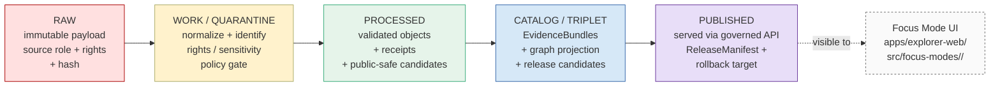

<!-- [KFM_META_BLOCK_V2]
doc_id: kfm://doc/focus-mode-people-readme
title: Focus Mode × People/DNA/Land — Authoring Guidance
type: standard
version: v0.1
status: draft
owners: [NEEDS VERIFICATION — docs steward, People/DNA/Land steward, AI surface steward]
created: 2026-05-22
updated: 2026-05-22
policy_label: public_draft
related:
  - docs/domains/people-dna-land/README.md          # PROPOSED — canonical domain home per Directory Rules §12
  - docs/focus-modes/README.md                      # PROPOSED — Focus Mode pattern overview per Directory Rules §6.7
  - docs/focus-modes/ellsworth-county/README.md     # PROPOSED — first county exemplar
  - directory-rules.md                              # §6.7 Focus Mode placement, §12 Domain Placement Law
tags: [kfm, focus-mode, people-dna-land, doctrine, sensitivity, deny-default, cite-or-abstain]
notes:
  - PROPOSED path: requested as docs/focus-mode/people/README.md (singular "focus-mode").
  - Directory Rules §6.7.2 canonical form is docs/focus-modes/<area>-<scope>/ (plural).
  - "People" is a domain (Directory Rules §12), not an area (§6.7.4). Treat this doc as cross-cutting
    authoring guidance for how Focus Mode surfaces handle People/DNA/Land content, NOT as a Focus Mode
    composition. Resolution of the path discrepancy is recorded in Section 14 for ADR consideration.
  - All implementation, API route, schema, and CI claims are PROPOSED / NEEDS VERIFICATION pending
    mounted-repo inspection.
[/KFM_META_BLOCK_V2] -->

<a id="top"></a>

# Focus Mode × People/DNA/Land — Authoring Guidance

> Cross-cutting guidance for handling **People, Genealogy, DNA, and Land Ownership** content inside KFM Focus Mode surfaces — what may appear, what is denied by default, what must be redacted, and what AI may say.


**Status:** draft &nbsp;·&nbsp; **Owners:** _NEEDS VERIFICATION_ &nbsp;·&nbsp; **Updated:** 2026-05-22

---

## Quick links

- [1. Scope](#1-scope)
- [2. Repo fit](#2-repo-fit)
- [3. What this guidance does and does not cover](#3-what-this-guidance-does-and-does-not-cover)
- [4. Sensitivity posture at a glance](#4-sensitivity-posture-at-a-glance)
- [5. DENY-by-default rules for Focus Mode surfaces](#5-deny-by-default-rules-for-focus-mode-surfaces)
- [6. Object families that may appear in a Focus Mode](#6-object-families-that-may-appear-in-a-focus-mode)
- [7. Source families and admission posture](#7-source-families-and-admission-posture)
- [8. Pipeline shape (RAW → PUBLISHED)](#8-pipeline-shape-raw--published)
- [9. Cross-lane relations](#9-cross-lane-relations)
- [10. Governed AI behavior in Focus Mode](#10-governed-ai-behavior-in-focus-mode)
- [11. UI surface guidance](#11-ui-surface-guidance)
- [12. Validators, tests, and fixtures](#12-validators-tests-and-fixtures)
- [13. Authoring checklist](#13-authoring-checklist)
- [14. Path placement and open verification](#14-path-placement-and-open-verification)
- [15. Related docs](#15-related-docs)

---

## 1. Scope

CONFIRMED doctrine: KFM's **People/DNA/Land** domain governs assertion-first person evidence, genealogy relationships, restricted DNA evidence, land instruments, ownership intervals, chain-of-title reasoning, consent, policy decisions, review, correction, graph projection, EvidenceBundle views, and rollback. [DOM-PEOPLE] [ENCY]

CONFIRMED doctrine: A **Focus Mode** is a governed, evidence-bounded, county- or region-scale proof slice that demonstrates the full KFM trust path:

> `SourceDescriptor → SourceIntakeRecord → EvidenceRef → EvidenceBundle → Claim/AtlasCard → DecisionEnvelope → ReleaseManifest → Public UI`

— for a bounded spatial frame. Focus Modes are **areas**, not domains; they **compose** domains, including People/DNA/Land. [DIRRULES §6.7.1, §12]

PROPOSED scope of this doc: provide a single authoring reference that any county or region Focus Mode (Ellsworth, Riley, Shawnee, Ford, Wyandotte, Sedgwick, Douglas, Leavenworth, Reno, Johnson, Barton, and successors) consults when its layer registry, evidence model, or AI surface touches People/DNA/Land content.

> [!IMPORTANT]
> This document is **doctrine and authoring guidance**, not a Focus Mode composition. Per Directory Rules §6.7.5, a Focus Mode MUST NOT carry a domain into a root folder. "People" is a domain (§12). The most defensible reading of this file's path is **cross-cutting guidance**; a Kansas-county Focus Mode that surfaces People content lives under `docs/focus-modes/<area>-county/`, not here.

[Back to top ↑](#top)

---

## 2. Repo fit

PROPOSED placement diagram. The People/DNA/Land **domain** lives along the lane pattern of Directory Rules §12; **Focus Modes** live along the cross-root composition of §6.7. This doc sits *between* them.

```mermaid
flowchart LR
  subgraph DOM["People/DNA/Land — domain lanes (§12)"]
    DR["docs/domains/people-dna-land/"]
    CR["contracts/domains/people-dna-land/"]
    SR["schemas/contracts/v1/domains/people-dna-land/"]
    PR["policy/domains/people-dna-land/"]
  end

  subgraph FM["Focus Modes — area composition (§6.7)"]
    DFM["docs/focus-modes/&lt;area&gt;-county/"]
    AFM["apps/explorer-web/src/focus-modes/&lt;area&gt;/"]
    FXM["fixtures/focus_modes/&lt;area&gt;/"]
    RFM["release/candidates/&lt;area&gt;-focus-mode/"]
  end

  GUIDE["docs/focus-mode/people/README.md
  (this doc — PROPOSED path)"]:::flag

  DOM -. cites .-> GUIDE
  GUIDE -. binds .-> FM
  GUIDE -. defers truth to .-> DOM

  classDef flag fill:#fff3cd,stroke:#b58900,stroke-width:1px;
```



NEEDS VERIFICATION: every path drawn above. None has been confirmed against a mounted repository in this session.

[Back to top ↑](#top)

---

## 3. What this guidance does and does not cover

| Aspect | This doc covers | This doc defers to |
|---|---|---|
| Domain ownership of objects | Lists what People/DNA/Land owns and does not own | `docs/domains/people-dna-land/` (PROPOSED) and the Atlas v1.0 §16 chapter [DOM-PEOPLE] |
| Sensitivity tiers | Restates published tier defaults; calls out Focus Mode interaction | The Master Sensitivity Tier Atlas (Atlas supplement §24.5) |
| Schema definitions | Names object families | `schemas/contracts/v1/domains/people-dna-land/` (PROPOSED) [DIRRULES §6.4] |
| Policy rules | Names DENY surfaces in plain language | `policy/domains/people-dna-land/` and `policy/consent/people/` (PROPOSED) |
| Focus Mode AI prompts | Constrains what AI may say in a county Focus Mode answer | `apps/explorer-web/src/focus-modes/<area>/` UI doctrine and AIReceipt rules |
| County-specific layers | Does **not** enumerate county layers | Each county build plan under `docs/focus-modes/<area>-county/` |

[Back to top ↑](#top)

---

## 4. Sensitivity posture at a glance

CONFIRMED / PROPOSED doctrine: **Living-person output and DNA-derived outputs are denied or restricted by default**; raw kit/vendor IDs and DNA segments are not public; assessor/tax records and parcel geometry are not title truth. [DOM-PEOPLE] [ENCY]

> [!CAUTION]
> Default sensitivity tiers for People/DNA/Land surfaces are **T4 (restricted)**. No Focus Mode layer registry may publish living-person, raw-DNA-segment, or private person-parcel-join content without an explicit allowed transform, named reviewer, and a `RedactionReceipt`. [ENCY §24.5]

PROPOSED tier defaults for content this domain may originate:

| Domain / object class | Default tier | Allowed public transform | Required gate |
|---|---|---|---|
| Living-person fields | T4 | Aggregation by tract or county + `AggregationReceipt` → T1 | Consent or aggregation gate + `ReviewRecord` |
| Raw DNA segment data | T4 | **No transform releases this to a public tier**; T3 only under explicit research agreement | Named consent + `ReviewRecord` + `PolicyDecision` |
| Private person–parcel join | T4 | Generalized parcel + de-identified person → T2 only | `RedactionReceipt` + `ReviewRecord` |
| Historic (non-living) person assertion | T1 (PROPOSED) | Public-safe summary card with `EvidenceBundle` | Citation validation; freshness check |
| Land instrument (patent / deed / probate, historic) | T0–T1 (PROPOSED) | Public-safe card with `EvidenceBundle`; **not** title truth | Citation validation; assessor-as-title denial |

[Back to top ↑](#top)

---

## 5. DENY-by-default rules for Focus Mode surfaces

CONFIRMED doctrine: every Focus Mode answer surface returns a finite outcome — `ANSWER`, `ABSTAIN`, `DENY`, or `ERROR`. [GAI] [ENCY §24.3.2]

PROPOSED DENY rules specific to People/DNA/Land in a Focus Mode context:

> [!WARNING]
> The following are **MUST DENY** at the Focus Mode trust membrane. They are not stylistic guidance.

1. **Living-person identification or location** in any public card, popup, layer label, AI answer, or Evidence Drawer payload.
2. **Raw DNA segments, kit identifiers, vendor IDs, or triangulation tables** in any released artifact.
3. **Private person-to-parcel joins** that name a living person and a specific parcel together.
4. **Assessor or tax records cited as title truth.** Assessor data is observation/administrative, not authority. [DOM-PEOPLE]
5. **Parcel geometry cited as title-boundary proof** without source role and `EvidenceBundle` support.
6. **GEDCOM imports without rights review and living-flag screening** appearing as released content.
7. **AI-generated relationship hypotheses** presented as fact. Relationship hypotheses remain hypotheses. [KFM Unified Build Manual §DOM-PEOPLE]
8. **Public UI reading directly from `data/raw/`, `data/work/`, or `data/quarantine/`** for any People/DNA/Land artifact. [DIRRULES §6.7.5, §7.1]
9. **Model output substituted for `EvidenceBundle`** in a Focus Mode answer. [DIRRULES §6.7.5; ENCY §24.9.2]
10. **Cemetery / burial geometry at parcel-grade precision** in a public card without sensitivity review and explicit policy decision.

[Back to top ↑](#top)

---

## 6. Object families that may appear in a Focus Mode

CONFIRMED terms / PROPOSED field realization: People/DNA/Land's ubiquitous language. Meaning is constrained by source role, evidence, time, and release state. [DOM-PEOPLE] [ENCY]

<details>
<summary><strong>Owned objects — click to expand the full inventory</strong></summary>

| Object family | Public Focus Mode role (PROPOSED) | Default sensitivity | Notes |
|---|---|---|---|
| `PersonAssertion` | Historic person card; residence/migration evidence | T1 historic / T4 if living touch | Identity rule: source id + object role + temporal scope + normalized digest. |
| `PersonCanonical` | Aggregated historic person identity | T1 historic / T4 if living | Promotion gated. |
| `NameAssertion` | Name variants on historic person card | T1 historic | Must cite source. |
| `LifeEvent` | Birth/death/marriage event on historic timeline | T1 historic / T4 if living | Time roles must not collapse. |
| `RelationshipAssertion` | Edges between historic persons | T1 historic / T4 if living | Hypotheses remain hypotheses. |
| `FamilyGroup` | Historic family unit context | T1 historic / T4 if living | — |
| `ResidenceEvent` | Place-bound life event | T1 historic / T4 if living | Cross-lane to Settlements. |
| `MigrationEvent` | Movement context | T1 historic / T4 if living | Cross-lane to Roads/Rail. |
| `DNAMatchEvidence` | **Restricted**; not a public Focus Mode object | T4 | T4 forever for raw segments. |
| `DNAKitToken` | **Restricted**; internal identifier | T4 | Never public. |
| `ConsentGrant` | Internal governance record | T4 | Internal review surface only. |
| `RevocationReceipt` | Internal governance record | T4 | Internal review surface only. |
| `LandOwnershipAssertion` | Historic ownership card with source role | T0–T1 (historic) | Not title truth. |
| `DeedInstrument` | Historic deed card | T0–T1 (historic) | `EvidenceBundle` required. |
| `TitleInstrument` | Historic title card | T0–T1 (historic) | Not title truth. |
| `AssessorRecord` | Administrative context | T1 (administrative) | **Never** cited as title authority. |
| `TaxRecord` | Administrative context | T1 (administrative) | Same as above. |
| `ParcelVersion` | Historic parcel envelope | T0–T1 | Parcel ≠ title; never the boundary truth. |
| `OwnershipInterval` | Time-bound ownership claim | T0–T1 (historic) | Time-aware. |
| `LandInstrument` | Generic instrument family | T0–T1 (historic) | Time-aware. |
| `LegalDescription` | Metes/bounds/PLSS string | T0–T1 (historic) | Source role distinct from geometry. |
| `LandParcel` | Geometric parcel envelope | T0–T1 (historic) | Geometry authority is not title. |

</details>

CONFIRMED / PROPOSED: People/DNA/Land explicitly **does not own** Settlements, roads, archaeology, hydrology, agriculture, hazards, or spatial foundation; those domains provide context and **MUST NOT weaken living-person, DNA, title, or parcel-boundary controls** when they cite People objects. [DOM-PEOPLE]

[Back to top ↑](#top)

---

## 7. Source families and admission posture

CONFIRMED / PROPOSED: each source family is admitted with a source role of `authority`, `observation`, `context`, or `model`. Rights and terms are NEEDS VERIFICATION at the source-instance level; sensitive joins **fail closed**. [DOM-PEOPLE] [ENCY]

| Source family | Typical role | Public-use posture in a Focus Mode (PROPOSED) |
|---|---|---|
| Vital / cemetery / burial / obituary / church / school / military / census / directory / court / probate records | observation / context | Historic-only; living-person fields screened; cemetery precision generalized. |
| GEDCOM / GEDZip / tree overlays | observation | Imports require rights review **and** living-flag screening before any public surface. |
| DNA vendor match CSV / segment / triangulation data | observation | **Never publicly released.** Internal review surface only. |
| Patent / deed / mortgage / lien / easement / lease / mineral / water / access / probate instruments | authority (historic) / observation | Historic instruments may surface as public cards; **never as title truth**. |
| Assessor and tax roll records | observation / administrative | Administrative context only; assessor-as-title is a denied pattern. |
| Plat / survey / metes / bounds / PLSS / subdivision / derived geometry | authority (geometric) / context | Geometry authority is distinct from title authority. |

> [!NOTE]
> Source rights, terms, cadence, and stale-state behavior for every source instance MUST be recorded on its `SourceDescriptor` per [ENCY] and verified against the live registry before that source can support a public Focus Mode claim. Current rights status is NEEDS VERIFICATION for all source instances in this session.

[Back to top ↑](#top)

---

## 8. Pipeline shape (RAW → PUBLISHED)

CONFIRMED doctrine / PROPOSED lane application: People/DNA/Land follows the canonical KFM lifecycle. Promotion is a **governed state transition, not a file move**. [DIRRULES] [DOM-PEOPLE] [ENCY]



| Stage | People/DNA/Land handling | Gate | Implementation status |
|---|---|---|---|
| RAW | Capture immutable source payload with source role, rights, sensitivity, citation, time, and hash. | `SourceDescriptor` exists. | PROPOSED |
| WORK / QUARANTINE | Normalize schema, geometry, time, identity, evidence, rights, and policy. Hold failures. | Validation **and** policy gate pass, or quarantine reason recorded. | PROPOSED |
| PROCESSED | Emit validated normalized objects, receipts, and public-safe candidates. | `EvidenceRef`, `ValidationReport`, and digest closure exist. | PROPOSED |
| CATALOG / TRIPLET | Emit catalog records, `EvidenceBundle`s, graph/triplet projections, and release candidates. | Catalog/proof closure passes. | PROPOSED |
| PUBLISHED | Serve released public-safe artifacts through governed APIs and manifests. | `ReleaseManifest`, correction path, rollback target, and review/policy state exist. | PROPOSED |

[Back to top ↑](#top)

---

## 9. Cross-lane relations

CONFIRMED / PROPOSED: every relation must preserve ownership, source role, sensitivity, and `EvidenceBundle` support. [DOM-PEOPLE]

| Related lane | Relation type | What a Focus Mode may show |
|---|---|---|
| Settlements | residence, cemetery, school, court, county, township, place relation | Historic person ↔ place card with `EvidenceBundle`. Cemetery geometry generalized. |
| Roads/Rail | migration, access, movement | Historic migration paths with uncertainty; no living-person tracking. |
| Archaeology | historic person, land, documentary, cultural-place context | Sovereignty review respected; exact-location denial preserved. |
| Agriculture | farm, land use, producer-adjacent context with privacy | Aggregate context only; never a producer-named private join. |
| Frontier Matrix | public land and land-office context | Without living/DNA/title leakage. |

[Back to top ↑](#top)

---

## 10. Governed AI behavior in Focus Mode

CONFIRMED doctrine / PROPOSED implementation: AI may summarize released People/DNA/Land `EvidenceBundle`s, compare evidence, explain limitations, and draft steward-review notes; AI **must ABSTAIN when evidence is insufficient** and **DENY where policy, rights, sensitivity, or release state blocks the request**. [GAI] [DOM-PEOPLE]

PROPOSED outcome map for People-touching Focus Mode questions:

| User question shape | Outcome | Why |
|---|---|---|
| "Tell me about \[historic person\] who lived in \[county\] in \[year\]" | `ANSWER` with citations | Released historic `EvidenceBundle` resolves. |
| "Who lives at \[address\] today?" | `DENY` | Living-person identification. |
| "Show me DNA matches between these two people" | `DENY` | Raw DNA segments and matches are T4 forever. |
| "What is the chain of title for this parcel?" | `ABSTAIN` with limitation note | KFM is not a title authority; assessor-as-title is denied. |
| "Map the cemetery lots closest to the river" | `DENY` or `ABSTAIN` with generalized link-out | Cemetery precision is sensitivity-significant. |
| "Trace this family's migration through Kansas" | `ANSWER` with citations and uncertainty if historic and released; `ABSTAIN` if evidence is thin | Hypotheses must remain hypotheses. |
| "Does this assertion match my GEDCOM?" | `ABSTAIN` if GEDCOM lacks rights review; `DENY` if it contains living-person fields | Rights and living-flag screening upstream. |

> [!IMPORTANT]
> Every Focus Mode answer that touches People/DNA/Land MUST carry an `AIReceipt` with `EvidenceBundle` reference, policy posture, and finite outcome. AI never reads RAW/WORK/QUARANTINE; only released `EvidenceBundle`. [GAI] [DIRRULES §6.7.1]

[Back to top ↑](#top)

---

## 11. UI surface guidance

PROPOSED: how People/DNA/Land content appears across the Focus Mode UI lattice. Each surface preserves the trust membrane — no surface reads RAW/WORK/QUARANTINE or direct model output.

| Surface | What People/DNA/Land may show | What it must never do |
|---|---|---|
| Focus header | Historic-scope badge; public-safe disclaimer when People layers are active | Imply living-person coverage or title authority |
| Map canvas | Historic person markers (generalized); historic parcel envelopes; migration paths with uncertainty | Plot living-person residences; show exact cemetery lots; show parcel as title boundary |
| Layer drawer | Toggles for historic-person events, historic-instrument layers, generalized parcel context | Hide a denied layer behind a toggle as if it could be enabled |
| Timeline / time-basis rail | Source date · observed date · released date distinctions | Merge dates into false currentness |
| Feature / context card | Public-safe summary with Evidence Drawer link | Present uncited narrative; expose restricted attributes |
| Evidence Drawer | `EvidenceBundle` projection, source role, freshness, correction route, rollback route | Reveal excluded raw attributes; expose DNA segments |
| Focus Mode answer panel | Finite outcome with citations and limitations | Generate hypotheses as fact; substitute model output for evidence |
| Denial panel | Living-person / DNA / private-parcel-join / cemetery-precision denial rationale | Reveal what was withheld in a way that enables reconstruction |

[Back to top ↑](#top)

---

## 12. Validators, tests, and fixtures

PROPOSED validator coverage. Every county Focus Mode that touches People/DNA/Land SHOULD have negative fixtures exercising the full denial surface. [DOM-PEOPLE] [ENCY]

| Validator class | Required negative case | Expected outcome |
|---|---|---|
| Person assertion evidence test | Person card published without resolved `EvidenceRef` | `DENY` / `ERROR` |
| GEDCOM import test | GEDCOM with living-flag positives entering PROCESSED | `HOLD` in QUARANTINE |
| DNA consent / raw-ID no-log test | DNA segment or kit ID appearing in logs, payloads, or exports | `FAIL` |
| Revocation cleanup test | `RevocationReceipt` issued; derivative still served | `FAIL` |
| Legal-description / chain-of-title gap test | Title chain inferred across a gap with no evidence | `ABSTAIN` |
| Assessor-as-title denial | Assessor record cited as title authority | `DENY` |
| Graph projection safety test | Graph edge exposes living-person ↔ parcel join | `DENY` |
| Public RAW route test | Any UI route reads from `data/raw/`, `data/work/`, or `data/quarantine/` | `DENY` / `ERROR` |
| AI uncited-language test | Focus Mode answer returns prose without citation | `ABSTAIN` |

PROPOSED fixture homes (per Directory Rules §6.7.2):

- `fixtures/focus_modes/<area>/valid/` — public-safe People content for the area.
- `fixtures/focus_modes/<area>/invalid/` — denied or quarantined People content, one fixture per denial above.
- Domain-level fixtures live separately at `fixtures/domains/people-dna-land/{valid,invalid}/` (PROPOSED).

[Back to top ↑](#top)

---

## 13. Authoring checklist

Use this checklist when a Focus Mode build plan (any county) wires People/DNA/Land content into its layer registry, evidence model, or AI surface.

```text
[ ] Confirm no layer registry entry surfaces living-person fields.
[ ] Confirm no layer registry entry exposes raw DNA segments, kit IDs, or triangulation tables.
[ ] Confirm no layer registry entry joins a living person to a specific parcel.
[ ] Confirm assessor / tax records are tagged as administrative context, not title authority.
[ ] Confirm parcel geometry is tagged as geometric authority, not title-boundary truth.
[ ] Confirm cemetery / burial precision is generalized or policy-reviewed.
[ ] Confirm every published People object resolves an EvidenceRef to an EvidenceBundle.
[ ] Confirm a PolicyDecision exists for each People-touching public layer.
[ ] Confirm a RedactionReceipt exists for each generalized geometry.
[ ] Confirm a ReleaseManifest references every public People artifact.
[ ] Confirm AIReceipt is emitted on every People-touching Focus Mode answer.
[ ] Confirm a RollbackCard target exists for every People-touching release.
[ ] Confirm UI cannot read RAW/WORK/QUARANTINE from any People route.
[ ] Confirm denial paths return ABSTAIN or DENY with reason, not silent empty.
[ ] Confirm negative fixtures exist for every denial above.
```

[Back to top ↑](#top)

---

## 14. Path placement and open verification

> [!NOTE]
> This section exists because the requested path for this file (`docs/focus-mode/people/README.md`) diverges from canonical Directory Rules §6.7.2 in two ways. The discrepancy is surfaced rather than smoothed over.

### 14.1 Path discrepancies (PROPOSED, NEEDS VERIFICATION)

| Aspect | Requested form | Canonical form per Directory Rules | Status |
|---|---|---|---|
| Folder pluralization | `docs/focus-mode/` (singular) | `docs/focus-modes/` (plural) per §6.7.2 | DRIFT — flagged for ADR or routine PR rename |
| Sub-segment | `people/` (a domain) | `<area>-<scope>/` (an area — county, region, corridor) per §6.7.4 | DRIFT — domain cannot be carried into Focus Mode path per §6.7.5 |
| Most defensible reading | Cross-cutting authoring guidance for Focus Mode authors touching People/DNA/Land | Not a Focus Mode composition | PROPOSED |
| Alternative canonical homes | n/a | `docs/domains/people-dna-land/focus-mode-guidance.md` (under §12) **or** a section inside `docs/focus-modes/README.md` (under §6.7) | PROPOSED for ADR |

### 14.2 Open verification items

| Item | Evidence that would settle it | Status |
|---|---|---|
| Final path for cross-cutting Focus-Mode × Domain guidance | Mounted-repo evidence; ADR; existing `docs/focus-modes/README.md` if present | NEEDS VERIFICATION |
| `docs/domains/people-dna-land/` presence and shape | Mounted-repo listing | UNKNOWN |
| Living-person policy enforcement | Mounted policy files, schemas, tests, validators, CI workflows | NEEDS VERIFICATION |
| DNA consent / revocation enforcement | Same as above | NEEDS VERIFICATION |
| Land instrument chain logic | Same as above | NEEDS VERIFICATION |
| Geometry-role boundary logic | Same as above | NEEDS VERIFICATION |
| UI / API restricted-field no-leak behavior | Same as above | NEEDS VERIFICATION |
| Schema home for People/DNA/Land objects | ADR-0001 against live tree | NEEDS VERIFICATION |
| Owner assignments for this file | Steward registry | NEEDS VERIFICATION |

[Back to top ↑](#top)

---

## 15. Related docs

> _Links are PROPOSED. Targets have not been verified against a mounted repository._

- [`../../domains/people-dna-land/README.md`](../../domains/people-dna-land/README.md) — PROPOSED canonical People/DNA/Land domain home per Directory Rules §12.
- [`../../focus-modes/README.md`](../../focus-modes/README.md) — PROPOSED Focus Mode pattern overview per Directory Rules §6.7.
- [`../../focus-modes/ellsworth-county/README.md`](../../focus-modes/ellsworth-county/README.md) — PROPOSED first county exemplar.
- [`../../../directory-rules.md`](../../../directory-rules.md) — §6.7 Focus Mode placement, §12 Domain Placement Law, §13.5 anti-patterns.
- [`../../adr/`](../../adr/) — relevant accepted ADRs (path / placement / schema home), pending verification.
- _Atlas v1.0 §16_ — People, Genealogy, DNA, and Land Ownership chapter.
- _Atlas Pass 23+32 Supplement §24.5_ — Master Sensitivity Tier Atlas.

---

<sub>**Last updated:** 2026-05-22 &nbsp;·&nbsp; **Doc status:** draft &nbsp;·&nbsp; **Truth posture:** cite-or-abstain &nbsp;·&nbsp; **Path:** PROPOSED / NEEDS VERIFICATION</sub>

[Back to top ↑](#top)
