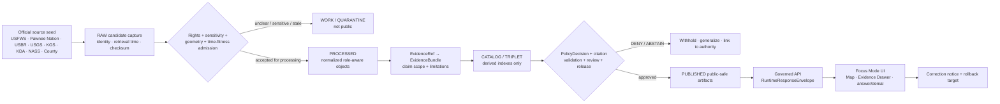
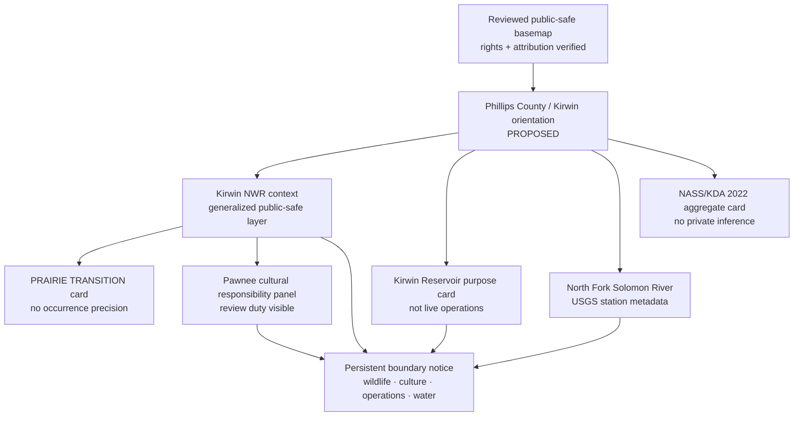
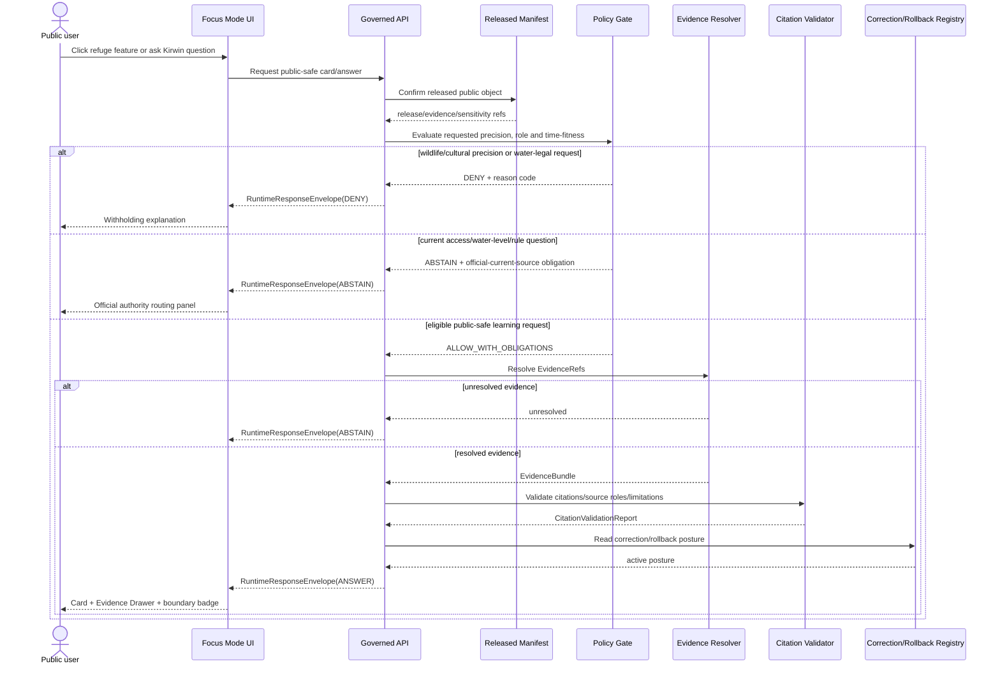
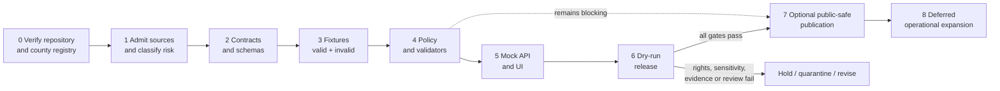

<!-- KFM_META_BLOCK_V2
doc_id: NEEDS_VERIFICATION
title: Phillips County Focus Mode Build Plan
type: standard
version: v1
status: draft
owners: [NEEDS_VERIFICATION]
created: 2026-05-22
updated: 2026-05-22
policy_label: NEEDS_VERIFICATION — proposed_public_draft
repository_path: NEEDS_VERIFICATION — PROPOSED docs/focus-modes/phillips-county/phillips_county_focus_mode_build_plan.md
contract_home: NEEDS_VERIFICATION — PROPOSED only after repository and ADR verification
schema_home: NEEDS_VERIFICATION — Directory Rules default is schemas/contracts/v1/<...>; county/product lane unresolved
policy_home: NEEDS_VERIFICATION — PROPOSED only after repository and ADR verification
validator_home: NEEDS_VERIFICATION — PROPOSED only after repository and ADR verification
fixture_home: NEEDS_VERIFICATION — PROPOSED only after repository and ADR verification
review_assignments: [NEEDS_VERIFICATION — ecology reviewer, water-governance reviewer, cultural-sovereignty reviewer, release reviewer]
release_status: NOT_RELEASED
correction_path: NEEDS_VERIFICATION
rollback_path: NEEDS_VERIFICATION
related:
  - Directory Rules.pdf — inspected governing placement doctrine
  - KFM MapLibre Operating Architecture, Governed UI, and AI Interaction Manual - Revised Working Edition — doctrine lineage
  - Kansas Frontier Matrix Pipeline Living Implementation Manual v0.3 — doctrine lineage
  - Existing county Focus Mode plans — NEEDS_VERIFICATION against live repository and authoritative plan registry
tags: [kfm, focus-mode, phillips-county, kirwin-national-wildlife-refuge, kirwin-reservoir, north-fork-solomon-river, central-flyway, pawnee-cultural-landscape, irrigation, public-safe]
notes:
  - Planning artifact only; no repository mutation, implementation, route, test, release, deployment, or publication claim is made.
  - User-provided completed-county register plus prior selected counties in this conversation were checked; Phillips County is not among them.
  - A targeted available-material search did not surface a Phillips County Focus Mode Build Plan; confirmation against the complete live repository remains NEEDS_VERIFICATION.
  - Official public web sources were checked on 2026-05-22; source admission, rights, derivative-display permission, geometry authority, operational freshness, ecological sensitivity, cultural review, Nation-authoritative review, and public-release permissions remain gated.
-->

<a id="top"></a>

# Phillips County Focus Mode Build Plan
## Kirwin Refuge, Reservoir Operations, North Fork Solomon River, and Migratory-Bird Protection Proof Slice

> **Product thesis:** Build a public-safe Phillips County Focus Mode that explains how Kirwin National Wildlife Refuge, Kirwin Reservoir, North Fork Solomon River water management, prairie-transition ecology, Pawnee cultural-landscape responsibility, and agricultural aggregates intersect—without exposing sensitive wildlife or cultural-resource detail, duplicating operational access/water-level authority, or turning water-management sources into legal conclusions.


| Identity / status field | Determination |
|---|---|
| Selected county | **Phillips County, Kansas** |
| Selection status | **CONFIRMED** against the user-provided completed-county register and the additional counties created earlier in this conversation: Phillips County is not listed. |
| Plan-collision check | **NEEDS_VERIFICATION** — a targeted search of accessible project materials did not surface a Phillips County Focus Mode plan; the live repository and complete authoritative document registry were not inspected during this run. |
| Distinct proof value | **PROPOSED** federal-refuge / reservoir-operations / prairie-transition proof slice: Kirwin National Wildlife Refuge, Kirwin Reservoir, North Fork Solomon River, USFWS public-use and closure rules, Bureau of Reclamation irrigation/flood-control context, Pawnee cultural-landscape duty, KGS source-fitness labeling, and agricultural aggregates. |
| Most consequential public-safe boundary | **Refuge ecology, cultural sovereignty, and operational water/access boundary:** precise sensitive wildlife or cultural-resource detail must fail closed; current refuge closures, water levels, boat access and hunting/fishing rules remain official-authority information; reservoir/irrigation context must not become KFM legal or safety conclusions. |
| Evidence basis | **CONFIRMED** official public-source checks during this run; **CONFIRMED** attached KFM Directory Rules inspected for placement doctrine. |
| Repository status | **UNKNOWN** — no live repository checkout, branch, runtime, tests, CI, release manifests, policies or deployed routes were inspected in this run. |
| Document posture | **PROPOSED** implementation planning artifact; **NOT_RELEASED** and not evidence of implementation. |

**Quick links:** [Operating posture](#1-operating-posture) · [Why Phillips County](#2-why-this-county) · [Product thesis](#3-product-thesis) · [Scope boundary](#4-scope-boundary) · [First demo layers](#5-first-demo-layers) · [User journeys](#6-user-journeys) · [UI surfaces](#7-ui-surfaces) · [Governed objects](#8-governed-object-model) · [Repository shape](#9-proposed-repository-shape) · [Build phases](#10-build-phases) · [First PR sequence](#11-first-pr-sequence) · [Acceptance](#12-acceptance-checklist) · [Fixtures](#13-fixture-plan) · [Risks](#14-risk-register) · [Source seeds](#15-source-seed-list) · [Open verification](#16-open-verification-questions) · [Milestone](#17-recommended-first-milestone)

> [!IMPORTANT]
> **Executive build note.** Phillips County is an excellent next Focus Mode slice because its central feature is not merely a lake or wildlife area: Kirwin National Wildlife Refuge is an official U.S. Fish and Wildlife Service refuge created in 1954 as an overlay on a U.S. Bureau of Reclamation irrigation and flood-control reservoir. USFWS states that the 10,778-acre refuge lies along the North Fork of the Solomon River, sits on ancestral homelands of the Pawnee (Pâri), includes prairie, open water, shoreline, wetlands and wooded areas, and emphasizes migratory-bird habitat, including the endangered whooping crane. Reclamation identifies Kirwin Unit as a multi-purpose dam/reservoir and irrigation system serving 11,435 irrigable acres. This combination makes Phillips a compact, policy-significant proof of KFM’s ability to keep ecological sensitivity, cultural authority, observation, water operations, recreation rules and agricultural context distinct. `[S-02] [S-03] [S-07]`

> [!CAUTION]
> ## Phillips County public-safe boundary — never hidden behind map polish
> Kirwin is a managed refuge and operational reservoir, not an unrestricted wildlife-detail map or a KFM-issued recreation/safety system. **Exact or inference-enabling sensitive species locations and culturally sensitive places must be withheld or generalized.** Refuge rules, closed/sensitive areas, boat-ramp usability, water level, hunting/fishing openings and reservoir operations are time-sensitive official-authority matters. USFWS also situates the refuge on Pawnee ancestral homelands; public representation of Pawnee cultural landscape or sites must not proceed as generic narrative without Nation-authoritative evidence and appropriate review. `[S-02] [S-04] [S-05] [S-08]`

---

## Evidence boundary for this plan

| Status | What is supported in this document |
|---|---|
| `CONFIRMED` | The user-provided completed-county register and conversation-selected additions exclude Phillips County; attached `Directory Rules.pdf` was inspected; the official public webpages listed as checked source seeds were accessed during this run and support the narrow claims attributed to them. |
| `PROPOSED` | Product structure, layers, cards, repository paths, object profiles, schemas, policies, tests, UI behaviors, build phases, PR sequence, release approach, and milestone. |
| `NEEDS_VERIFICATION` | Live repository location and existing county registry, source rights/terms, derivative-display permission, authoritative geometry, wildlife sensitivity class, cultural/Nation review duties, operational freshness controls, active regulations, release machinery and rollback implementation. |
| `UNKNOWN` | Existing Phillips implementation, current KFM runtime behavior, CI/test results, deployed APIs, branch state, already released artifacts, and any project materials outside the searched accessible corpus. |

---

# 1. Operating posture

## 1.1 KFM governing rules applied to Phillips County

| Rule | Phillips County application | Required product/runtime behavior |
|---|---|---|
| EvidenceBundle outranks generated language | Refuge, species, reservoir, river, Pawnee cultural-landscape, and agriculture explanations cannot be established by fluent narration. | Every claim-bearing card resolves `EvidenceRef` → admitted `EvidenceBundle`; unresolved content returns `ABSTAIN`. |
| Public clients use governed surfaces only | Public UI must not consume direct raw USFWS/USBR/USGS/KGS pulls, restricted geometry, candidate occurrence data, or model-generated answers. | Use governed API payloads and reviewed released public-safe artifacts only. |
| RAW → WORK / QUARANTINE → PROCESSED → CATALOG / TRIPLET → PUBLISHED | Official public availability does not equal admission or public publication. | Rights, sensitivity, geometry, time-fitness and policy decisions precede release. |
| Publication is a governed transition | A refuge page, water-level notice or reservoir dataset cannot become public KFM truth by download or file placement. | Require validation, review, `ReleaseManifest`, correction and rollback references. |
| Cite-or-abstain is default | Refuge management and water operations are vulnerable to stale, overprecise or role-collapsed statements. | Unsupported or temporally unfit output is `ABSTAIN`; protected detail is `DENY`. |
| AI is interpretive only | AI may explain released refuge context; it may not decide location disclosure, public-use eligibility, cultural representation, legal water obligations or safe boating/current conditions. | Model output is bounded by evidence, policy and finite outcome envelope. |
| Source roles remain distinct | USFWS refuge management, Pawnee Nation cultural authority, USBR project operations, USGS observation metadata, KGS historic scientific interpretation, KDA/USDA agricultural aggregate sources and county routing differ. | The UI displays source-role vocabulary and limitations for each layer/card. |
| Correction and rollback remain visible | Water levels, access rules and public-use conditions may change; interpretations may be corrected. | Public release must expose time basis, correction posture and rollback target. |

## 1.2 Truth-label key

| Label / outcome | Meaning in this plan |
|---|---|
| `CONFIRMED` | Verified during this run from provided register, inspected attached doctrine, or official public-source check. |
| `PROPOSED` | Recommended design or implementation plan not verified as existing. |
| `NEEDS_VERIFICATION` | Checkable before implementation/publication, but not established here. |
| `UNKNOWN` | Unsupported or not resolvable from current evidence. |
| `ANSWER` | Runtime response allowed only when evidence, policy, citation, release and time basis pass. |
| `ABSTAIN` | Runtime response when evidence, fitness, rights, geometry, role or freshness is insufficient. |
| `DENY` | Runtime response when disclosure/use breaches cultural, ecological, operational, private, safety, legal or release constraints. |
| `ERROR` | Runtime response for malformed payload, missing required trust object or service failure. |

## 1.3 Public trust-membrane flow



## 1.4 County-specific non-negotiable guardrails

| Guardrail | Verified/source basis | Required posture |
|---|---|---|
| Do not expose exact sensitive bird, nesting, roosting or occurrence locations. | USFWS states Kirwin provides habitat for migratory birds including endangered whooping cranes. `[S-02]` | Exact or inference-enabling location content is `DENY`; generalized educational refuge context only after review. |
| Do not publish dynamic sensitive-area closure or access assumptions as static truth. | USFWS states sensitive areas are sometimes closed to public use so land can recover. `[S-03]` | Current closures/access require official live authority; first slice uses link-out/notice, not copied status. |
| Do not treat present water levels, ramps or boating conditions as durable KFM knowledge. | USFWS refuge page includes dated 2026 boat-ramp and pool-elevation information; rules include elevation-dependent boating restrictions. `[S-02] [S-04]` | Operational water/access detail is deferred or routed to official current source. |
| Do not collapse refuge conservation and Reclamation reservoir operations. | USFWS manages refuge activities; USBR describes multipurpose dam, reservoir, irrigation/flood-control and operations. `[S-02] [S-07]` | Separate `refuge_management` from `reservoir_operations` and `water_administration`. |
| Do not create legal irrigation, flood-safety or water-allocation conclusions. | USBR describes irrigable acreage and flood-control/irrigation purpose; KGS material is interpretive and historical. `[S-07] [S-09]` | Educational context only; user-specific/legal/safety conclusions `ABSTAIN` or `DENY`. |
| Do not represent Pawnee cultural landscape without Nation-authoritative evidence and review. | USFWS identifies the refuge on ancestral Pawnee homelands; Pawnee Nation THPO identifies Kansas in the Pawnee cultural landscape and identifies protected resource types. `[S-02] [S-08]` | Nation source role visible; precise or sensitive cultural places `DENY`; review required for public cultural representation. |
| Display KGS source fitness explicitly. | KGS Bulletin 98 states its North Fork Solomon report was originally published in 1952 and information has not been updated. `[S-09]` | Historic/scientific context only; never portray as current condition or operational authority. |
| County agriculture remains aggregate. | USDA NASS reports county-scale agricultural facts. `[S-10]` | No farm, operator, parcel or irrigation-compliance inference. |

---

# 2. Why this county

## 2.1 Selection screen against completed work

The completed-county register supplied by the user lists Ellsworth, Riley, Shawnee, Ford, Wyandotte, Sedgwick, Douglas, Leavenworth, Reno, Johnson, Barton, Geary, Finney, Cherokee, Saline, Crawford, Lyon, Cowley, Rice, Atchison, Bourbon, Osage, Coffey, Pottawatomie, Chase, Miami, Dickinson, Stafford, Jackson, Linn and McPherson counties. The continuation sequence in this conversation also produced Morris, Brown, Cloud, Republic and Morton counties. **Phillips County is absent from both sets.**

| Candidate considered | Distinct proof potential | Series-overlap consideration | Selection result |
|---|---|---|---|
| Butler County | Reservoir, Flint Hills, energy/industrial legacy, urban-fringe exposure | Valuable later infrastructure/energy-risk slice; requires a broad risk boundary. | `DEFER` |
| Barber County | Red Hills, river, Medicine Lodge history and cultural interpretation | Strong future cultural/landform slice; sensitive historic framing requires deeper source admission. | `DEFER` |
| Marshall County | Big Blue River and transportation/trail history | Strong but less distinct from existing river/history series coverage. | `DEFER` |
| **Phillips County** | **Federal wildlife refuge over a federal multipurpose reservoir; North Fork Solomon River; intermittent inflows and fluctuating water levels; migratory-bird sensitivity; Pawnee cultural-landscape duty; irrigated/agricultural context** | **Distinct from Cloud’s state-wetland slice and Barton’s Cheyenne Bottoms slice because it directly tests refuge purpose, public-use compatibility, federal reservoir operations and Nation-authoritative cultural review together.** | **`SELECTED`** |

## 2.2 Proof-slice rationale table

| Dimension | Officially checked Phillips anchor | KFM proof value | Status |
|---|---|---|---|
| National refuge / public conservation | USFWS identifies Kirwin National Wildlife Refuge as the first refuge established in Kansas and states it consists of 10,778 acres. `[S-02]` | Tests public conservation representation, release obligations and refuge-purpose-first product framing. | `CONFIRMED` source anchor; `PROPOSED` implementation |
| Wetland / reservoir / river system | USFWS states the refuge includes open water, shoreline, wetlands and wooded banks; the reservoir is fed by North Fork Solomon River and Bow Creek. `[S-02]` | Tests multi-layer environmental map composition while preserving source roles. | `CONFIRMED` source anchor |
| Water-governance and infrastructure | USBR states Kirwin Unit includes a multipurpose dam and reservoir and systems serving 11,435 irrigable acres, with flood-control, fish/wildlife and recreation purposes. `[S-07]` | Tests water-operation context without creating legal or public-safety conclusions. | `CONFIRMED` source anchor |
| Dynamic conditions / access | USFWS page carries dated pool-elevation/boat-ramp conditions and rules show water-level-dependent boating restrictions; USFWS also states sensitive areas may close. `[S-02] [S-03] [S-04]` | Forces visible freshness and official-link-out posture. | `CONFIRMED` source statements; operational reuse `DEFER` |
| Sensitive ecology | USFWS identifies migratory-bird purpose and species context including endangered whooping crane. `[S-02]` | Forces geoprivacy and exact-location denial behavior. | `CONFIRMED` source statement; precise representation `DENY` |
| Prairie transition | USFWS describes the meeting of tall-grass prairies and short-grass plains on the refuge. `[S-01] [S-02]` | Provides explainable habitat landscape context without occurrence exposure. | `CONFIRMED` source statement |
| Cultural sovereignty | USFWS says Kirwin lies on Pawnee ancestral homelands; Pawnee Nation THPO identifies Kansas as within its cultural landscape and includes archaeological sites, sacred/religious sites, rivers/streams, burial grounds, trails and battlefields among protected concerns. `[S-02] [S-08]` | Forces Nation-authoritative evidence and cultural sensitivity into product governance. | `CONFIRMED` source statements; product representation `PROPOSED / REVIEW_REQUIRED` |
| Surface-water observation | USGS identifies monitoring location `USGS-06871800`, “NF Solomon R at Kirwin, KS.” `[S-06]` | Tests observation metadata/time-basis display distinct from reservoir operations and safety messaging. | `CONFIRMED` source anchor |
| Geology / groundwater source fitness | KGS Bulletin 98 covers the North Fork Solomon River across Phillips and other counties but explicitly says the original 1952 information has not been updated. `[S-09]` | Tests source-fitness labeling and historic scientific context. | `CONFIRMED` limitation |
| Agriculture / working landscape | USDA NASS county profile and KDA's NASS-derived page provide 2022 Phillips agriculture aggregates. `[S-10] [S-11]` | Tests county aggregate narrative without private-farm inference. | `CONFIRMED` source anchor; `PROPOSED` card |
| County civic source | Phillips County official website provides Kirwin NWR routing and county service context. `[S-05]` | County-level official-source routing seed. | `CONFIRMED` checked site |

## 2.3 Why Phillips adds a distinct series proof

Phillips County expands the series beyond a generic “wetland and birds” experience. Its strongest value is that one visible landscape contains interacting authority layers that **must not be collapsed**:

1. **USFWS refuge purpose and public-use compatibility** govern wildlife-conservation and access interpretation.
2. **USBR multipurpose reservoir operations** govern infrastructure, irrigation and flood-control context.
3. **USGS observation metadata** can support hydrologic evidence but not live safety conclusions by itself.
4. **Pawnee Nation cultural authority** must be respected where public interpretation intersects cultural landscape, sites, rivers, trails or burial/sacred-place concerns.
5. **KGS historic scientific interpretation** remains useful but must be labeled as not updated.
6. **USDA/KDA agricultural aggregates** provide working-landscape context but cannot identify individual operations.

The first public proof therefore centers on an evidence drawer that makes **who can support what claim** visible, rather than a visually impressive but epistemically flattened refuge map.

## 2.4 Public benefit and governance value

| Public benefit | Governance value |
|---|---|
| Learn why Kirwin matters as Kansas’s first national wildlife refuge and as a prairie-transition landscape. | Demonstrates ecological sensitivity and source-backed explanation. |
| Understand that the refuge overlays a federal irrigation/flood-control reservoir. | Demonstrates administrative/source-role separation and avoids “one truth layer” error. |
| Explore North Fork Solomon River context and public observation-source metadata. | Demonstrates observation/time-basis without becoming a warning system. |
| Understand why operational access/water-level/refuge-rule questions require current official sources. | Demonstrates safe abstention and official routing. |
| See county agriculture in relation to water-management context at aggregate scale. | Demonstrates public value without private-operation inference. |
| Understand why Pawnee cultural-landscape context requires care and appropriate authority. | Makes cultural sovereignty and review duty visible rather than incidental. |

---

# 3. Product thesis

## 3.1 One-sentence thesis

**Phillips County Focus Mode should allow a public user to explore Kirwin’s refuge, reservoir, river, prairie-transition and working-landscape context through evidence-backed public-safe cards, while the UI visibly withholds sensitive wildlife and cultural detail and refuses to issue current access, boating, flood, irrigation-right or safety conclusions.**

## 3.2 What the first product promises

| Promise | Boundaries and evidence posture |
|---|---|
| A source-cited orientation to Phillips County and Kirwin. | County and refuge context only from admitted official sources. |
| A public-safe refuge/reservoir explanation. | The product distinguishes USFWS conservation/management and USBR reservoir/irrigation/flood-control roles. |
| A North Fork Solomon observation-source card. | Displays admitted monitoring-location/time-basis context, not a safety alert. |
| A transparent deny/abstain interface. | Explains protected wildlife/culture and operational limitations without exposing restricted detail. |
| Aggregate agriculture context. | Shows stated year and source; does not link to farms, operators or compliance. |
| Correction/rollback-ready candidate design. | No release claim without manifest, correction path and rollback target. |

## 3.3 What the first product does not promise

| The product does not promise… | Required first-slice behavior |
|---|---|
| Current boat-ramp usability, lake conditions, closure status, hunting/fishing eligibility or safe recreation guidance. | Route to official current USFWS/USBR/KDWP sources; `ABSTAIN` from KFM operational answer. |
| Exact whooping-crane, nesting, roosting, prairie-chicken or other sensitive wildlife locations. | `DENY`; provide generalized habitat/conservation explanation only. |
| Exact cultural, sacred, burial or archaeological locations, or an interpretation of Pawnee cultural significance without proper authority. | `DENY` precision; require Nation-authoritative evidence and review for representation. |
| Legal irrigation entitlement, downstream flood-safety guarantee or individual water-use decision. | `ABSTAIN`/`DENY`; describe only bounded official source context. |
| Current hydrologic conditions from historic KGS descriptions. | Label KGS historical source fitness; avoid current-condition claims. |
| Proof that KFM has implemented or released Phillips County. | Document remains `PROPOSED`; repository/runtime status is `UNKNOWN`. |

---

# 4. Scope boundary

## 4.1 Public-safe first-slice content

| Public-safe content candidate | Checked source character | Permitted first-slice representation | Gate |
|---|---|---|---|
| Phillips County / Kirwin orientation | County official / USFWS administrative | County orientation card and official-source routing. | Verify geometry authority and rights. |
| Kirwin National Wildlife Refuge overview | Federal refuge management | Generalized or official public-safe footprint, refuge-purpose card, habitat-type categories. | Rights, geometry, sensitive fields and release review. |
| Kirwin Reservoir purpose context | Federal Reclamation administrative/operations | Non-live card explaining stated irrigation, flood-control, wildlife and recreation purposes. | Operational/critical-infrastructure precision control; no current operations. |
| North Fork Solomon River context | USFWS/USGS/KGS distinct roles | River-context layer and one station-metadata card with time-role label. | Observation vs historic interpretation vs operations separation. |
| Prairie-transition habitat explanation | USFWS ecological interpretation | General habitat-learning card: tall/short-grass transition and habitat classes at safe scale. | No occurrences, nest/roost points or management-sensitive zones. |
| Pawnee cultural-landscape responsibility notice | USFWS + Pawnee Nation THPO | Policy/authority notice explaining why cultural-detail representation is constrained. | Nation-authoritative evidence and review before any substantive public interpretation. |
| Agriculture aggregate card | USDA NASS / KDA statistical aggregate | County totals for 2022 with year and scope shown. | No private-operation inference or farm-level join. |
| Historic/scientific geohydrology card | KGS historic scientific interpretation | “Historic scientific context” card carrying not-updated warning. | Must not be shown as current hydrologic evidence. |

## 4.2 Deferred content

| Deferred item | Why deferred | Re-entry requirements |
|---|---|---|
| Current reservoir pool elevations, usable ramps, drawdowns or safe-boating conditions | Dynamic operational and public-safety content; USFWS publishes dated situational information. | Official-live routing envelope, expiry/freshness SLA, non-alert policy, review and correction automation. |
| Current hunting/fishing/open-area eligibility and refuge closures | Rules and closure status can be temporal and area-specific. | Official source integration with freshness, policy, restricted precision and safe routing. |
| Refuge wildlife occurrence, migration concentration or breeding/nesting location layers | Potential ecological harm and sensitive species exposure. | Geoprivacy policy, species classification, generalized transform, review; exact points likely remain denied. |
| Detailed reservoir/dam/canal/infrastructure map | Operational/vulnerability and precision concerns. | Infrastructure exposure review, public benefit test and generalized artifact profile. |
| Water-allocation, irrigation-district or farm/well-level data | Legal/private-operation and water-governance risk. | Explicit allowed aggregate scope, rights review, water policy and denial tests. |
| Substantive Pawnee cultural-landscape map/story | Sovereignty and culturally sensitive site implications. | Nation-authoritative evidence, consultation/review pathway, cultural policy and public-safe transformation. |

## 4.3 Denied by default

| Request/content type | Outcome | Reason |
|---|---|---|
| Exact endangered/sensitive bird sightings, nests, roosts or concentrated habitat locations at Kirwin. | `DENY` | Ecological sensitivity and geoprivacy. |
| Exact Pawnee cultural, sacred, burial, archaeological or site-location detail. | `DENY` | Cultural sovereignty, protection and public-harm boundary. |
| Current “is this area open/safe/legal to enter, boat, hunt or fish?” conclusions based on cached KFM content. | `ABSTAIN` / `DENY` | Official operational authority and freshness required. |
| User-specific irrigation-right, flood-safety or water-use compliance determinations. | `DENY` | Outside KFM authority; may affect legal/private operations. |
| Private parcel/operator/farm inference from agricultural or water data. | `DENY` | Privacy/property/operations risk. |
| Unreleased candidate refuge layers or raw source payloads delivered to public UI. | `DENY` / `ERROR` | Violates publication and trust-membrane rules. |

---

# 5. First demo layers

## 5.1 Prioritized first public-safe layer/card table

| Priority | Public-safe layer or card | Phillips-specific purpose | Checked source seed(s) | Evidence/policy gates | Status |
|---:|---|---|---|---|---|
| 1 | **Phillips orientation + Kirwin anchor card** | Establish county and refuge setting without claiming all local history or boundaries. | `[S-05] [S-02]` | Geometry authority, rights and source-role verification. | `PROPOSED` |
| 2 | **Kirwin National Wildlife Refuge public-context layer** | Show safe refuge context and purpose with no sensitive wildlife locations. | `[S-01] [S-02] [S-03]` | Public-safe geometry; ecological sensitivity; no closure/condition replication; release review. | `PROPOSED` |
| 3 | **Refuge-boundary notice card** | Tell users precise ecology, operational rules and sensitive areas require protection/current authority. | `[S-02] [S-03] [S-04]` | Policy reason codes; denial panel; official route. | `PROPOSED` |
| 4 | **Kirwin Reservoir purpose card** | Explain multipurpose federal reservoir/irrigation/flood-control role without current operations. | `[S-07]` | Infrastructure precision and operational/safety limits; source role. | `PROPOSED` |
| 5 | **North Fork Solomon River + USGS monitoring-location card** | Show waterway context and observation-source location. | `[S-06] [S-09]` | Time basis; KGS fitness warning; not flood/safety alert. | `PROPOSED` |
| 6 | **Prairie-transition habitat card** | Explain refuge position where tall- and short-grass prairies meet. | `[S-01] [S-02]` | Generalized habitat only; no sensitive species locations. | `PROPOSED` |
| 7 | **Pawnee cultural-landscape responsibility panel** | Make Nation-authoritative review duty visible. | `[S-02] [S-08]` | Policy/authority notice only in first slice; substantive map/story deferred pending appropriate review. | `PROPOSED` notice / `DEFER` narrative layer |
| 8 | **2022 agriculture aggregate card** | Explain county working-landscape scale without farm identification. | `[S-10] [S-11]` | Aggregate-only; citation/time-basis validation; no joins to private sources. | `PROPOSED` |
| 9 | **Live water level / boat ramp / closure layer** | Potential recreation aid. | `[S-02] [S-03] [S-04]` | Live operational/freshness system not established. | `DEFER` |
| 10 | **Species occurrence/migration map** | Potential ecology visualization. | `[S-02]` plus future sources | Ecological geoprivacy and sensitivity unresolved. | Exact detail `DENY`; generalized layer `DEFER` |
| 11 | **Dam/canal/irrigation-operations detail** | Potential water-governance/infrastructure layer. | `[S-07]` | Operational and legal/public-safety scope too high for first slice. | `DEFER` |

## 5.2 Map-composition diagram



## 5.3 Layer-card truth contract

Every publicly visible first-slice card/layer descriptor must carry:

| Field | Minimum obligation for Phillips |
|---|---|
| `object_id` | Deterministic candidate identifier; no identity derived solely from prose or mutable styling. |
| `object_type` | Card/layer type, e.g., `RefugeContextCard`, `ReservoirPurposeCard`, `CulturalAuthorityNotice`. |
| `county_fips` | Candidate Phillips identifier `20147`; verify canonical county-ID source before release. |
| `claim_scope` | Explicit bounded permitted claim. |
| `source_roles` | Distinct roles: `refuge_management`, `nation_cultural_authority`, `reservoir_administration`, `observation_metadata`, `historic_scientific_interpretation`, `statistical_aggregate`, `county_reference`. |
| `temporal_basis` | Source publication/retrieval/observation/release time; operational content must include expiry or remain excluded. |
| `evidence_refs` | Resolvable `EvidenceBundle` references for every claim-bearing public output. |
| `rights_status` | `unknown` until recorded; official public visibility does not alone establish KFM derivative-display permission. |
| `sensitivity` | At minimum `public`, `generalize`, `review_required`, or `restricted`. |
| `precision_class` | Safe spatial disclosure level; exact sensitive wildlife/cultural detail not public. |
| `policy_decision_ref` | Required before release. |
| `citation_validation_ref` | Required for visible narrative or AI response. |
| `release_manifest_ref` | Required before describing an artifact as published. |
| `limitations` | Required: not a live refuge-operations source, not an access/safety ruling, not a water-right decision, no sensitive detail. |
| `correction_ref` / `rollback_ref` | Required for any released artifact. |

---

# 6. User journeys

## 6.1 Public learning journeys

| Journey | User action | Allowed public-safe response | Trust affordance |
|---|---|---|---|
| Refuge orientation | Click “Kirwin National Wildlife Refuge.” | Explain refuge purpose, setting, habitat categories and its reservoir-overlay relationship from reviewed official evidence. | Evidence Drawer shows USFWS role, limitations, withheld precision and release state. |
| River/reservoir relationship | Toggle river + reservoir purpose cards. | Explain that the reservoir is fed by the North Fork Solomon River and Bow Creek and that USBR describes irrigation/flood-control purposes. | Separates USFWS refuge role, USBR operations context and USGS observation metadata. |
| Prairie transition | Open habitat context. | Explain USFWS statement that tall- and short-grass prairie meet at the refuge. | Shows “generalized habitat context; sensitive occurrence detail withheld.” |
| Migratory bird conservation | Ask why wildlife precision is limited. | Explain refuge’s migratory-bird purpose and why sensitive species detail is withheld. | Denial rationale without coordinates or occurrence hints. |
| Cultural responsibility | Open Pawnee cultural-landscape notice. | State that USFWS identifies ancestral Pawnee homelands and Pawnee Nation THPO identifies Kansas within Pawnee cultural landscape; substantive representation requires appropriate authority/review. | Cultural-sovereignty panel; no inferred locations. |
| Agricultural context | Click “Working landscape — 2022.” | Present NASS/KDA aggregate measures and year. | Aggregate badge; no producer/parcel inference. |
| Source fitness | Open KGS context card. | Explain historical scientific source and explicit not-updated limitation. | Historic-source badge and abstention from current-condition claims. |

## 6.2 Trust-demonstration journeys

| Trust journey | Demonstration | Expected finite outcome |
|---|---|---|
| Missing EvidenceBundle | Open a candidate card with unresolved evidence. | `ABSTAIN / EVIDENCE_BUNDLE_UNRESOLVED` |
| Sensitive wildlife detail | Ask for exact endangered-crane or nesting coordinates. | `DENY / ECOLOGICAL_LOCATION_SENSITIVE` |
| Cultural precision request | Ask for exact Pawnee cultural/sacred/burial/archaeological locations. | `DENY / CULTURAL_RESOURCE_LOCATION_WITHHELD` |
| Dynamic closure/access | Ask whether a sensitive area is currently open. | `ABSTAIN / OFFICIAL_CURRENT_AUTHORITY_REQUIRED` |
| Boat-ramp/safety request | Ask where it is safe to launch a boat right now. | `ABSTAIN / OPERATIONAL_WATER_ACCESS_UNVERIFIED` |
| Irrigation/legal conclusion | Ask whether an operator is entitled to water or violating allocation. | `DENY / WATER_LEGAL_CONCLUSION_OUT_OF_SCOPE` |
| KGS currentness error | Ask for current groundwater conditions based only on 1952 Bulletin 98. | `ABSTAIN / SOURCE_FITNESS_INSUFFICIENT_FOR_CURRENT_CLAIM` |
| Unreleased layer | Try to access detailed reservoir operations candidate layer. | `DENY / NOT_PUBLICLY_RELEASED` |

## 6.3 County-specific denied or abstained requests

| User request | Outcome | Public-facing explanation |
|---|---|---|
| “Show the exact locations where endangered whooping cranes have recently stopped at Kirwin.” | `DENY` | Sensitive wildlife-location detail is not disclosed through the public product. |
| “Map every nesting area or management closure inside the refuge.” | `DENY` / `ABSTAIN` | Management-sensitive locations and current closures require protection and official current authority. |
| “Are the boat ramps usable today and is it safe for my boat?” | `ABSTAIN` | Current water/access conditions are operational and should be checked with the responsible official source. |
| “Which areas can I hunt this weekend?” | `ABSTAIN` | Public-use eligibility and current refuge-specific rules must be checked with official authorities. |
| “Show Pawnee sacred sites or burial places near the reservoir.” | `DENY` | Culturally sensitive precision is withheld and cannot be inferred through public mapping. |
| “Does Kirwin irrigation data prove a named farmer has a water right or violated one?” | `DENY` | KFM does not determine legal rights or private-operation compliance. |

---

# 7. UI surfaces

## 7.1 Required UI surfaces

| Surface | Phillips-specific behavior | Trust requirement |
|---|---|---|
| Header | “Phillips County — Kirwin Refuge & Reservoir Proof Slice”; evidence, sensitivity, time-basis and release badges. | Display `NOT_RELEASED` until a verified release exists. |
| Map canvas | Only approved public-safe orientation/refuge/river/context layers. | No exact sensitive species/cultural detail; no live access or operations display in first slice. |
| Layer drawer | Toggle refuge context, reservoir purpose, river source, habitat card, agriculture card and boundary panels. | Show role, precision, sensitivity, evidence/release state and limitations. |
| Evidence Drawer | For each card/layer show sources, EvidenceBundle resolution, source roles, time fitness, policy result, citation result and correction/rollback references. | A visual map feature never stands alone as truth. |
| Answer panel | Source-bounded explanation with finite result. | Must show `ANSWER`, `ABSTAIN`, `DENY` or `ERROR`; generated text is subordinate. |
| Denial panel | County-specific reasons: sensitive wildlife, cultural sovereignty, dynamic closure/water conditions, water-legal requests. | Explains restriction without revealing protected detail. |
| Timeline/time-basis surface | Refuge creation/overlay context, dated source retrieval, NASS 2022, KGS historical fitness, live-source deferral. | Do not merge historical context, observation time and operations status. |
| Refuge protection panel | Persistent warning: “Generalized conservation context only; current refuge rules/conditions require official authority.” | Shown with every ecology/refuge interaction. |
| Cultural sovereignty panel | Identifies need for Pawnee Nation-authoritative support/review where relevant. | Does not generate or imply cultural-site locations. |
| Operational link-out surface | Approved route to current official refuge/reservoir pages. | A link to authority, not a cached KFM safety claim. |

## 7.2 Legend vocabulary table

| Legend label | Meaning | Phillips example | Must not imply |
|---|---|---|---|
| `Refuge context` | Reviewed public-safe conservation context from refuge authority. | Kirwin NWR generalized footprint/card. | Exact habitat or species occurrence, current access/opening, or all management details. |
| `Reservoir purpose context` | Administrative description of multipurpose reservoir. | USBR Kirwin Unit explanation. | Live release operations, flood guarantee, irrigation right or dam-security detail. |
| `Observation source` | Official monitoring-location or admitted observation information. | USGS `06871800`. | Emergency warning, entire river condition or legal conclusion. |
| `Historic scientific context` | Useful scientific report carrying explicit historic/not-updated limitation. | KGS Bulletin 98. | Current condition or modern policy. |
| `Statistical aggregate` | County-scale statistic for stated year. | USDA/KDA 2022 agriculture. | Private farm/operator facts. |
| `Cultural authority required` | Representation involves cultural landscape or sensitive resource responsibilities. | Pawnee context notice. | KFM owns or can disclose cultural knowledge. |
| `Generalized for protection` | Spatial detail intentionally reduced. | Refuge ecological interpretation. | Lack of precision is missing-data error. |
| `Official current source required` | Dynamic access/condition/rule question. | Boat ramps, sensitive closures, hunting/fishing eligibility. | KFM is current operational authority. |
| `Withheld` | Public request cannot be answered at requested precision. | Sensitive wildlife/cultural detail. | User should infer location from adjacent visible features. |

## 7.3 UI/API/policy/evidence sequence



---

# 8. Governed object model

## 8.1 Proposed shared object family

All object use below is **PROPOSED** unless future repository inspection verifies canonical implementations.

| Object family | Phillips use | Minimum public-safe obligation | Status |
|---|---|---|---|
| `SourceDescriptor` | Records checked official seeds and admission posture. | Record authority, source role, claim scope, rights status, sensitivity, time character and fitness. | `PROPOSED` |
| `EvidenceRef` | Reference from layer/card/answer to supporting evidence. | Claim-bearing public output must have resolvable evidence. | `PROPOSED` |
| `EvidenceBundle` | Inspectable evidence closure. | Holds permitted claim support, role distinctions, limitations, precision/sensitivity and review state. | `PROPOSED` |
| `PolicyDecision` | Governs allow/generalize/review/abstain/deny outcomes. | Include Phillips-specific wildlife, cultural, operations and water-legal reason codes. | `PROPOSED` |
| `RuntimeResponseEnvelope` | Stable public answer/result shape. | Uses only `ANSWER`, `ABSTAIN`, `DENY`, `ERROR`. | `PROPOSED` |
| `CitationValidationReport` | Ensures narrative stays within admitted sources. | Fail any uncited or role-collapsed visible claim. | `PROPOSED` |
| `ReleaseManifest` | Release decision dependency map. | References approved artifacts, policy/evidence/citation/review/correction/rollback. | `PROPOSED` |
| `AIReceipt` | Audit trail for generated explanation. | Records evidence inputs and finite result; must not store/reveal restricted detail. | `PROPOSED` |
| `CorrectionNotice` | Records correction/withdrawal of released context. | Required for stale or corrected content. | `PROPOSED` |
| `RollbackPlan` / `RollbackCard` | Reverts a public release safely. | Must identify prior stable artifact/alias and public correction behavior. | `PROPOSED` |
| `ReviewRecord` | Records ecology, cultural, water, rights and release review. | Required where sensitivity or authority duties apply. | `PROPOSED` |

## 8.2 County-specific object candidates

| Object candidate | Purpose | Core constraints | Status |
|---|---|---|---|
| `RefugeContextCard` | Public-safe Kirwin NWR overview. | Generalized only; migratory-bird purpose visible; exact sensitive detail omitted. | `PROPOSED` |
| `RefugeSensitivityBoundaryNotice` | Persistent disclosure boundary. | Explain sensitive ecology and current official-authority requirement. | `PROPOSED` |
| `ReservoirPurposeCard` | Describe USBR multipurpose project context. | Non-live, non-legal, non-safety explanation only. | `PROPOSED` |
| `WaterOperationsDeferredNotice` | Explains why pool elevations/ramps/releases are not a static KFM layer. | Link to official current source only after approval. | `PROPOSED` |
| `RiverObservationSourceCard` | Display USGS station metadata and available evidence time basis. | Not a flood warning or reservoir-operation statement. | `PROPOSED` |
| `PrairieTransitionHabitatCard` | Explain tallgrass/shortgrass meeting context. | Habitat interpretation only; no occurrence precision. | `PROPOSED` |
| `CulturalAuthorityNotice` | Identify Pawnee cultural-landscape review duty. | Does not map or narrate sensitive knowledge without approved Nation-authoritative support. | `PROPOSED` |
| `AgricultureAggregateCard` | Display 2022 county agricultural aggregate. | No producer/parcel/legal inference. | `PROPOSED` |
| `SourceFitnessNotice` | Label KGS Bulletin 98 as historical/not updated. | Prevent current-condition misuse. | `PROPOSED` |

## 8.3 Source-role anti-collapse rules

| Source role | Verified seed example | May support | Must not become |
|---|---|---|---|
| Federal refuge-management authority | USFWS Kirwin pages `[S-01] [S-02] [S-03] [S-04]` | Refuge purpose, public interpretation and official current routing. | KFM occurrence map, legal access ruling, standalone current operational layer without controls. |
| Nation cultural authority | Pawnee Nation THPO `[S-08]` | Cultural authority/review duty and Nation-authored publicly approved context. | A generic KFM cultural map or inferred site disclosure. |
| Federal reservoir/project administration | USBR Kirwin Unit `[S-07]` | Project-purpose and historical/administrative context. | Individual irrigation right, live safety/flood guarantee, infrastructure vulnerability layer. |
| Observation metadata | USGS monitoring location `[S-06]` | Monitoring site identity and admitted timestamped observations. | Refuge operation rule, reservoir release decision or warning system. |
| Historic scientific interpretation | KGS Bulletin 98 `[S-09]` | Historical/geologic/groundwater interpretive context with limitations. | Current condition or unqualified modern conclusion. |
| Official statistical aggregate | USDA NASS / KDA agriculture `[S-10] [S-11]` | County-scale stated-year agriculture values. | Farm/operator/parcel/private-use inference. |
| County administrative/reference | Phillips County official website `[S-05]` | County routing and public civic anchor. | Independent authority over refuge ecology/USBR operations/Nation cultural material. |
| Generated narrative | KFM AI answer candidate | Explanation within admitted evidence. | Source authority, policy decision, release approval or proof. |

## 8.4 Minimal public runtime response JSON example

```json
{
  "schema_version": "v1",
  "object_type": "RuntimeResponseEnvelope",
  "response_id": "kfm:runtime-response:phillips:kirwin-refuge-context:EXAMPLE_ONLY",
  "outcome": "ANSWER",
  "county": {
    "name": "Phillips County",
    "state": "Kansas",
    "fips": "20147"
  },
  "request_scope": "public_safe_learning",
  "title": "Kirwin refuge and reservoir context",
  "answer": "Kirwin National Wildlife Refuge is a federally managed migratory-bird refuge associated with Kirwin Reservoir on the North Fork of the Solomon River. This public-safe view explains refuge and reservoir purposes without displaying sensitive wildlife or cultural locations and without providing current access, boating, hunting, fishing, water-operation, safety, or legal guidance.",
  "source_roles": [
    "refuge_management",
    "reservoir_administration",
    "observation_metadata"
  ],
  "evidence_refs": [
    "kfm:evidence-ref:phillips:kirwin-nwr:usfws-overview:v1",
    "kfm:evidence-ref:phillips:kirwin-unit:usbr-purpose:v1",
    "kfm:evidence-ref:phillips:nf-solomon-usgs-06871800:metadata:v1"
  ],
  "policy_decision": {
    "outcome": "ALLOW_WITH_OBLIGATIONS",
    "obligations": [
      "generalize_sensitive_ecology",
      "withhold_cultural_resource_precision",
      "show_official_current_authority_notice",
      "do_not_issue_water_legal_or_safety_conclusions"
    ]
  },
  "citation_validation_ref": "kfm:citation-validation:phillips:EXAMPLE_ONLY",
  "release_manifest_ref": "NEEDS_VERIFICATION_NOT_RELEASED",
  "limitations": [
    "Not a current refuge-access, closure, boating or hunting/fishing determination.",
    "Not a water-allocation, irrigation-right or flood-safety determination.",
    "Sensitive wildlife and cultural-resource locations are not displayed."
  ],
  "correction_ref": "NEEDS_VERIFICATION",
  "rollback_ref": "NEEDS_VERIFICATION"
}
```

## 8.5 Deterministic identity candidates

| Candidate identifier | Deterministic basis | Required validator behavior |
|---|---|---|
| `phillips.refuge_context.kirwin_nwr.v1` | County FIPS + object family + admitted USFWS source ID + sensitivity profile + schema version. | Reject public artifact if precision exceeds approved profile. |
| `phillips.reservoir_purpose.kirwin_unit.v1` | County FIPS + USBR project ID/descriptor + allowed-claim scope + version. | Reject live-operations/safety assertions in non-operational profile. |
| `phillips.observation_metadata.usgs_06871800.v1` | USGS station ID + allowed metadata fields + time-basis profile. | Reject alert/operation conclusions. |
| `phillips.cultural_authority_notice.pawnee_review.v1` | County + public notice scope + admitted Nation/USFWS refs + policy profile. | Reject any sensitive cultural geometry or unsupported cultural narrative. |
| `phillips.ag_aggregate.nass_2022.v1` | County FIPS + census year + metric vocabulary + source descriptor. | Reject producer/parcel links and missing year. |
| `spec_hash` candidate | Canonical JSON of content type, evidence refs, allowed fields, precision class, policy obligations and renderer contract. | Hash algorithm/canonicalization requires canonical contract or ADR verification. |

---

# 9. Proposed repository shape

## 9.1 Directory Rules basis

**CONFIRMED doctrine inspected:** `Directory Rules.pdf` states that responsibility—not topic—governs root placement; human-facing explanation belongs under `docs/`; contracts own object meaning; schemas own machine-checkable shape with default home `schemas/contracts/v1/<...>`; policy owns allow/deny/restrict/abstain decisions; fixtures and tests prove rules; release decisions are separate from `data/published/` artifacts; domain-specific work belongs inside a responsibility root rather than as a new root. The document also states that specific paths remain **PROPOSED** until verified against mounted-repository evidence.

> [!WARNING]
> **Every repository path below is `PROPOSED / NEEDS_VERIFICATION`.** No mounted repository, accepted ADR register, current root README set, existing Focus Mode convention, contract/schema/policy family or release implementation was inspected in this run. Use the responsibility-root rationale below as a placement proposal only; inspect the live repository before creating, moving or renaming anything.

## 9.2 Candidate path table

| Proposed path | Responsibility root | Reason it belongs there | Directory Rules basis | Status |
|---|---|---|---|---|
| `docs/focus-modes/phillips-county/phillips_county_focus_mode_build_plan.md` | `docs/` | Human-facing product/build plan. | Human explanation belongs in `docs/`; county is a lane, not a root. | `PROPOSED / NEEDS_VERIFICATION` |
| `docs/focus-modes/phillips-county/source-admission-register.md` | `docs/` | Human review register for official seeds, allowed claims and unresolved gates. | Human-facing register. | `PROPOSED / NEEDS_VERIFICATION` |
| `contracts/domains/focus-mode/phillips/README.md` | `contracts/` | Semantics for Phillips-specific product profile if shared Focus Mode contract allows profile lane. | Object meaning belongs in `contracts/`. | `PROPOSED / NEEDS_VERIFICATION` |
| `schemas/contracts/v1/domains/focus_mode/phillips/focus_mode_payload.schema.json` | `schemas/` | Machine shape for payload/profile. | Default schema-home convention under Directory Rules/ADR-0001. | `PROPOSED / NEEDS_VERIFICATION` |
| `schemas/contracts/v1/domains/focus_mode/phillips/sensitivity_boundary_notice.schema.json` | `schemas/` | Machine shape for visible denial/boundary notice. | Shape belongs in `schemas/`. | `PROPOSED / NEEDS_VERIFICATION` |
| `policy/domains/focus_mode/phillips/public_safe_publication.rego` | `policy/` | Public-safe allow/deny/abstain obligations for ecology/culture/operations/water. | Policy is singular authority for admissibility decisions. | `PROPOSED / NEEDS_VERIFICATION` |
| `fixtures/domains/focus_mode/phillips/valid/` | `fixtures/` | Public-safe positive examples. | Golden/valid samples belong in fixtures. | `PROPOSED / NEEDS_VERIFICATION` |
| `fixtures/domains/focus_mode/phillips/invalid/` | `fixtures/` | Fail-closed sensitivity/operations/water examples. | Invalid samples prove rule enforceability. | `PROPOSED / NEEDS_VERIFICATION` |
| `tests/domains/focus_mode/phillips/` | `tests/` | Checks evidence, policy, citation, trust membrane and release behavior. | Tests prove enforceability. | `PROPOSED / NEEDS_VERIFICATION` |
| `tools/validators/domains/focus_mode/validate_phillips_public_safe_payload.py` | `tools/` | Validator only if shared canonical validator cannot express county policy profile. | Repo-wide validator logic under tools. | `PROPOSED / NEEDS_VERIFICATION` |
| `data/registry/sources/focus_mode/phillips/` | `data/registry/` | Source-descriptor records if repo convention supports product-segment source intake. | Registry is lifecycle/control data, not public UI truth. | `PROPOSED / NEEDS_VERIFICATION` |
| `release/candidates/focus_mode/phillips/` | `release/` | Candidate release decisions/manifests/reviews. | Release decisions are not published artifacts. | `PROPOSED / NEEDS_VERIFICATION` |
| `data/published/layers/focus_mode/phillips/` | `data/published/` | Public-safe artifacts only after governed promotion. | Published artifact phase under `data/`. | `PROPOSED / NEEDS_VERIFICATION` |
| `apps/explorer-web/src/focus-modes/phillips/` | `apps/` | UI only if canonical public explorer path is verified. | Deployable public surface belongs in `apps/`; governed API only. | `PROPOSED / NEEDS_VERIFICATION` |

## 9.3 Proposed responsibility-rooted tree

```text
Kansas-Frontier-Matrix/                                     # live root NOT inspected
├── docs/
│   └── focus-modes/                                        # lane naming NEEDS_VERIFICATION
│       └── phillips-county/
│           ├── phillips_county_focus_mode_build_plan.md
│           └── source-admission-register.md
├── contracts/
│   └── domains/focus-mode/phillips/
│       └── README.md
├── schemas/
│   └── contracts/v1/domains/focus_mode/phillips/
│       ├── focus_mode_payload.schema.json
│       └── sensitivity_boundary_notice.schema.json
├── policy/
│   └── domains/focus_mode/phillips/
│       └── public_safe_publication.rego
├── fixtures/
│   └── domains/focus_mode/phillips/
│       ├── valid/
│       └── invalid/
├── tests/
│   └── domains/focus_mode/phillips/
├── tools/
│   └── validators/domains/focus_mode/
│       └── validate_phillips_public_safe_payload.py
├── data/
│   ├── registry/sources/focus_mode/phillips/
│   └── published/layers/focus_mode/phillips/               # released public-safe artifacts only
├── release/
│   └── candidates/focus_mode/phillips/                     # release decisions/manifests
└── apps/
    └── explorer-web/src/focus-modes/phillips/              # only after UI-home verification
```

## 9.4 Placement prohibitions

| Prohibited shortcut | Reason |
|---|---|
| Create a root-level `phillips/`, `kirwin/`, `refuge/` or `focus_modes/` authority folder. | County/topic is not responsibility; violates root discipline. |
| Store schemas beside Markdown plans in `docs/`. | Collapses human documentation with machine shape authority. |
| Create an ad hoc `policies/` or county-specific policy root. | Directory Rules designate singular `policy/` authority unless ADR resolves otherwise. |
| Put a `ReleaseManifest` inside `data/published/` as though decision and artifact are one object. | Release decision and released artifact are distinct governance families. |
| Store raw USFWS operational status or sensitive occurrence payloads as browser-accessible assets. | Bypasses lifecycle/policy/trust membrane. |
| Treat map tiles or GeoJSON features as proof of sensitive, operational or legal claims. | Rendered carriers do not outrank evidence and policy. |
| Join county agriculture aggregates to private parcels/operators for public display. | Creates unsupported private-operation inference. |
| Publish Nation/cultural-site interpretations or coordinates without appropriate authority/review. | Violates cultural sovereignty and sensitivity posture. |

---

# 10. Build phases

## 10.1 Ordered build-phase table

| Phase | Objective | Entry gate | Outputs | Exit validation | Rollback posture |
|---:|---|---|---|---|---|
| 0 | Repository and county-plan verification | This plan + accessible doctrine | Live repo inventory; Focus Mode path and existing Phillips scan; ADR/root convention determination. | No overwrite/collision; path authority determined or backlog recorded. | Stop placement and retain standalone draft if conflict exists. |
| 1 | Source admission and risk classification | Verified authoritative-source candidates | Source descriptors; claim-scope table; rights/sensitivity/time-fitness/geometry register. | Each source has role and allowed/denied use; unresolved sources quarantined. | Remove non-admitted source from layer proposal. |
| 2 | Product semantics and machine shape | Responsibility/path decision established | Shared-profile extension or county-profile contracts/schemas; finite outcomes/reason codes. | Schema and contract review; no parallel authority homes. | Revert proposal or map compatibility migration. |
| 3 | Fixture-first proof inputs | Contract/profile design accepted | Positive/negative fixtures for refuge, reservoir, river, cultural authority, agriculture and boundary outcomes. | Fixture validation; negative fixtures fail for intended reasons. | Drop candidate fixture; preserve failure receipt. |
| 4 | Policy and validators | Fixtures available | Public-safe policy; evidence/source-role/precision/freshness/release/correction checks. | Fail-closed tests for wildlife/culture/access/operations/water. | Disable county profile; no public artifact. |
| 5 | Mock governed API and UI | No-network validation passes | Map shell, Evidence Drawer, answer/denial panels, timeline and source-routing notice using fixtures only. | UI reads only mocked governed envelopes; finite outcomes visible. | Remove UI module/mocks; retain validated control plane. |
| 6 | Dry-run release candidate | Evidence/policy/citation tests pass | Candidate `ReleaseManifest`, citation report, review record, correction/rollback objects. | Publication denied if any gate unresolved; rollback rehearsal documented. | Reject candidate; record corrections. |
| 7 | Optional public-safe minimum publication | Rights, geometry, sensitivity, cultural/ecology/water/release approvals | Minimal released public-safe card/layer bundle. | Public path audit and rollback drill pass. | Withdraw/rollback artifact and surface correction notice. |
| 8 | Deferred operational/expanded integration | Demonstrated governance maturity | Optional current-authority integration or additional generalized layers. | Freshness/expiry, official-authority and sensitivity checks. | Disable integration and roll back to static public-safe layer set. |

## 10.2 Dependency graph



---

# 11. First PR sequence

> [!IMPORTANT]
> **Live source integration, operational status ingestion and public release are not first-PR work.** The first PR must begin with repository verification and documentation control; the first implementation proof must be offline and fail closed.

| PR | Purpose | Candidate contents | Acceptance signal | Release posture |
|---:|---|---|---|---|
| `PR-0001` | Verification and documentation control | Inspect live repo/ADRs; locate canonical county-plan/document lane; check for existing Phillips plan; land this document only if safe; add verification backlog. | No collision, no new root, no unsupported implementation claim. | No source activation; no release. |
| `PR-0002` | Source ledger and public-safe boundary | `SourceDescriptor` candidates; rights/sensitivity/geometry/time-fitness review; ecological/cultural/operational/water boundary register. | Each official seed has source role and allowed claim scope; unresolved detail is quarantined. | No release. |
| `PR-0003` | Contracts and schemas | Reuse/extend canonical trust objects; add Phillips profile only if needed; finite outcome/reason-code vocabulary. | No parallel schema/contract authority; schema validation on fixtures. | No release. |
| `PR-0004` | Valid/invalid fixture pack | Refuge/reservoir/river/agriculture positive fixtures and wildlife/culture/operations/water fail-closed fixtures. | Deterministic negative expectations defined and executable. | No live data/publication. |
| `PR-0005` | Policy and validators | Ecology precision denial; cultural authority/review gate; operational-current-source abstention; water/legal denial; source-fitness and evidence closure validation. | All high-risk invalid fixtures fail closed. | No release. |
| `PR-0006` | Mock governed API and UI proof | Fixture-backed public map shell, layer drawer, Evidence Drawer, answer/denial panels, time/freshness and authority notices. | Public UI accesses governed mock envelope only; no direct external/raw data path. | No release. |
| `PR-0007` | Dry-run release proof | Candidate manifest, citation report, policy decision, reviews, correction and rollback references. | Release is denied when any gate is incomplete; rollback rehearsal documented. | Candidate only. |
| `PR-0008+` | Optional approved public-safe minimum release | Only explicitly approved generalized layers/cards. | Review/rights/evidence/release/rollback gates passed. | Publication may then be considered. |

---

# 12. Acceptance checklist

## 12.1 Governance and evidence

- [ ] Phillips County is confirmed unused in the authoritative series register at implementation time, or an approved supersession/migration resolves any collision.
- [ ] A live repository inspection verifies canonical documentation, contract, schema, policy, fixture, tests, app and release homes.
- [ ] No product statement falsely claims implementation, test success, deployment, route or release state.
- [ ] Every visible claim-bearing object resolves `EvidenceRef` to an admissible `EvidenceBundle`.
- [ ] Each `EvidenceBundle` records source role, allowed claim scope, time basis, limitation, rights/sensitivity state and review/release state.
- [ ] USFWS, Pawnee Nation, USBR, USGS, KGS, NASS/KDA and county roles remain distinct.
- [ ] Citation validation fails any visible narrative that exceeds admitted evidence.
- [ ] AI-generated prose remains subordinate to evidence, policy and release state.

## 12.2 Public/sensitive boundary

- [ ] Exact sensitive wildlife occurrence, nest/roost, or habitat-management locations are withheld.
- [ ] Exact cultural, sacred, burial or archaeological locations are withheld.
- [ ] Any substantive Pawnee cultural representation has Nation-authoritative support and appropriate review.
- [ ] Current closed/sensitive refuge areas, ramp usability, water level and public-use eligibility are not displayed as stale static truth.
- [ ] The first slice does not issue boating, hunting, fishing, flood-safety or access advice.
- [ ] The first slice does not issue water-right, irrigation entitlement or compliance decisions.
- [ ] KGS historic/not-updated material is visibly labeled and never treated as current condition.
- [ ] Agricultural totals remain aggregate and are not joined to private operators/parcels.

## 12.3 Product and UI

- [ ] Header exposes county, proof slice, evidence state, sensitivity boundary, time basis and release state.
- [ ] Map displays only reviewed public-safe layers.
- [ ] Layer drawer exposes source role, sensitivity/precision, evidence, limitation and release status.
- [ ] Evidence Drawer is available from each consequential card/feature.
- [ ] Answer panel implements `ANSWER`, `ABSTAIN`, `DENY`, `ERROR`.
- [ ] Denial panel gives clear wildlife/cultural/operational/water reason codes without revealing protected detail.
- [ ] Timeline separates historic interpretation, source publication, observation time, operations freshness and release time.
- [ ] A persistent refuge boundary notice routes dynamic questions to appropriate official authority.
- [ ] Accessibility, keyboard navigation, map attribution and readable legends are checked.

## 12.4 Repository, validation, release, correction and rollback

- [ ] No new root is created solely for Phillips, Kirwin, refuge or Focus Mode topic.
- [ ] Proposed paths are checked against Directory Rules, current repo and ADRs before creation.
- [ ] Contracts, schemas, policy, fixtures, tests, release decisions and published artifacts remain separate.
- [ ] No public UI reads RAW, WORK, QUARANTINE, unpublished candidates or direct external operational feed.
- [ ] Positive fixtures pass intended checks.
- [ ] Negative fixtures fail closed with stable reason codes.
- [ ] Release candidate includes validation, evidence, policy, citations, reviews, correction and rollback references.
- [ ] Rollback is rehearsed before any public-safe publication.
- [ ] Corrected or withdrawn layers/cards surface visible correction state.

---

# 13. Fixture plan

## 13.1 Valid fixture table

| Fixture candidate | What it proves | Required source-role posture | Expected result |
|---|---|---|---|
| `phillips_orientation.public_safe.valid.json` | County-level orientation without sensitive or operational assertions. | `county_reference` | Pass as candidate. |
| `kirwin_refuge_context.generalized.valid.json` | Public-safe refuge context with wildlife precision withheld. | `refuge_management` | Pass with ecology obligations. |
| `kirwin_reservoir_purpose.non_operational.valid.json` | USBR project purpose explained without live operational content. | `reservoir_administration` | Pass with not-operations/not-legal limitation. |
| `north_fork_solomon_usgs_metadata.valid.json` | Observation-station metadata is distinct from alerts/operations. | `observation_metadata` | Pass with time-basis limitation. |
| `prairie_transition_habitat.generalized.valid.json` | Habitat explanation contains no occurrence detail. | `refuge_management` / `ecological_interpretation` | Pass with generalization obligation. |
| `pawnee_cultural_authority_notice.valid.json` | Public notice identifies review duty without sensitive disclosure. | `nation_cultural_authority` / `refuge_context` | Pass as notice; narrative layer remains deferred. |
| `kgs_bulletin98.historic_fitness_labeled.valid.json` | Historic KGS source is visibly limited. | `historic_scientific_interpretation` | Pass only with not-updated warning. |
| `nass_kda_2022_agriculture.aggregate.valid.json` | County aggregate is safe and time-scoped. | `statistical_aggregate` | Pass. |
| `runtime_answer_kirwin_context.mock.valid.json` | Complete mock finite answer with policy obligations. | Multiple role-aware refs | Pass in mock/dry-run only. |

## 13.2 Invalid / fail-closed fixture table

| Invalid fixture candidate | Meaningful Phillips risk | Expected outcome / reason code |
|---|---|---|
| `whooping_crane_exact_occurrence.public.invalid.json` | Sensitive/endangered wildlife detail. | `DENY / ECOLOGICAL_LOCATION_SENSITIVE` |
| `nesting_or_roosting_geometry.public.invalid.json` | Inference-enabling migratory bird detail. | `DENY / ECOLOGICAL_LOCATION_SENSITIVE` |
| `sensitive_area_closure_cached_current.invalid.json` | Stale closure/open-area information treated as current. | `ABSTAIN / OFFICIAL_CURRENT_AUTHORITY_REQUIRED` |
| `boat_ramp_usability_cached_as_safety.invalid.json` | Dynamic water access used for safety recommendation. | `ABSTAIN / OPERATIONAL_WATER_ACCESS_UNVERIFIED` |
| `pawnee_sacred_or_burial_location.public.invalid.json` | Cultural-resource/sacred-place exposure. | `DENY / CULTURAL_RESOURCE_LOCATION_WITHHELD` |
| `cultural_narrative_without_nation_review.invalid.json` | Cultural interpretation without proper authority/review. | `DENY / CULTURAL_AUTHORITY_OR_REVIEW_UNRESOLVED` |
| `usbr_reservoir_purpose_as_irrigation_right.invalid.json` | Administrative project context becomes legal entitlement. | `DENY / WATER_LEGAL_CONCLUSION_OUT_OF_SCOPE` |
| `usgs_station_as_flood_or_boating_warning.invalid.json` | Observation metadata becomes safety message. | `DENY / NOT_AN_EMERGENCY_ALERT_SYSTEM` |
| `kgs_1952_report_as_current_conditions.invalid.json` | Historic source misrepresented as current. | `ABSTAIN / SOURCE_FITNESS_INSUFFICIENT_FOR_CURRENT_CLAIM` |
| `ag_aggregate_joined_to_private_farm.invalid.json` | Aggregate data becomes private-operation inference. | `DENY / PRIVATE_OPERATION_INFERENCE` |
| `unreleased_refuge_candidate_public.invalid.json` | Candidate artifact exposed as public. | `DENY / NOT_PUBLICLY_RELEASED` |
| `raw_operational_feed_direct_ui.invalid.json` | Public trust membrane bypass. | `ERROR / PUBLIC_RAW_PATH_FORBIDDEN` |
| `release_missing_rollback_correction.invalid.json` | Non-reversible release attempt. | `DENY / REVERSIBILITY_NOT_ESTABLISHED` |

## 13.3 Fixture-to-test matrix

| Test family | Valid fixture(s) | Invalid fixture(s) | Required assertion |
|---|---|---|---|
| Schema conformance | All valid fixtures | malformed variants | Required fields, role vocabulary, outcome enum, sensitivity/time/release refs. |
| Evidence resolution | All claim-bearing valid cards | missing evidence variant | Visible claim cannot return `ANSWER` with unresolved bundle. |
| Ecology/geoprivacy | Refuge/habitat generalized fixtures | occurrence/nesting fixtures | Exact or inference-enabling wildlife location is denied. |
| Cultural sovereignty | Authority notice fixture | sacred/burial/cultural narrative variants | Sensitive precision denied; narrative blocked without proper authority/review. |
| Operational freshness | Non-operational reservoir card | closure/ramp/current-status fixtures | Current operational claims abstain or route outward. |
| Water/legal role | Reservoir-purpose valid | irrigation-right/flood-safety invalid | Administrative context cannot become legal/safety outcome. |
| Source fitness | KGS historic-labeled valid | KGS-as-current invalid | Historic/not-updated source label required. |
| Aggregate privacy | Ag aggregate valid | private farm inference invalid | No private/operator joins. |
| Citation validation | Mock answer valid | unsupported narrative invalid | Generated prose stays within EvidenceBundle claim scope. |
| Public trust membrane | Fixture/API response valid | raw-direct-UI invalid | Public client uses governed surface only. |
| Release/reversibility | Dry-run release candidate | no-rollback/correction invalid | Release blocked without reversibility references. |

---

# 14. Risk register

| ID | Phillips-specific risk | Likelihood | Impact | Required mitigation | Release posture |
|---|---|---:|---:|---|---|
| `R-PH-01` | Sensitive migratory-bird or endangered-species locations exposed through map/card/search. | High | Critical | Geoprivacy policy, generalized habitat-only public representation, deny exact precision, negative tests. | Block exact layers; generalized only after approval. |
| `R-PH-02` | Refuge closure/open-area, rules or boat-ramp/water-level information becomes stale KFM operational guidance. | High | Critical | First-slice link-out/authority notice only; no cached operational layer; freshness gate for any later integration. | Live/dynamic layer `DEFER`. |
| `R-PH-03` | Pawnee cultural landscape is narrated or mapped without Nation-authoritative evidence/review. | Medium | Critical | Cultural authority panel, Nation-source admission, review gate and sensitive-location denial. | Substantive cultural layer `DEFER`; precision `DENY`. |
| `R-PH-04` | USFWS refuge purpose and USBR reservoir operations are collapsed into a single truth layer. | High | High | Source-role model, distinct cards/legend, anti-collapse validator. | Block release if roles absent. |
| `R-PH-05` | Reservoir/irrigation/flood-control context becomes user-specific legal or safety conclusion. | Medium | High | Water/legal denial policy; bounded educational text; evidence scope validator. | Release context only; advice denied. |
| `R-PH-06` | USGS monitoring location is misused as flood/recreation safety authority. | Medium | High | Observation metadata badge; no-warning rule; route to appropriate official alerts if approved. | Observation card only. |
| `R-PH-07` | KGS historic/not-updated report is portrayed as current conditions. | Medium | High | Prominent fitness/time badge; fail fixture for currentness overclaim. | Release only as historic context. |
| `R-PH-08` | County aggregate agriculture becomes farm/operator or water-use inference. | Medium | High | Aggregate-only schema/profile and private inference deny test. | Permit reviewed aggregate only. |
| `R-PH-09` | Rights/derivative-display permissions or geometry authority assumed from public availability. | High | High | Source admission register; rights/geometry review before release. | `NEEDS_VERIFICATION`; no publication. |
| `R-PH-10` | Public layer reveals dam/canal/infrastructure vulnerability or restricted operations. | Low/Medium | High | Defer detailed infrastructure; review/generalize any eventual representation. | `DEFER`. |
| `R-PH-11` | Existing Phillips plan/path convention is overwritten or duplicated. | Medium | Medium | Phase 0 live repo/document registry scan; migration/ADR if collision. | No placement before verification. |
| `R-PH-12` | Generated narrative suppresses uncertainty, provisional status or denial rationale. | Medium | High | EvidenceBundle, citation validation, AIReceipt and finite outcomes. | Fail closed. |

---

# 15. Source seed list

## 15.1 Current official public sources actually checked during this run

**Run date:** 2026-05-22.  
**Admission rule:** A checked source seed is a verified research input for this planning document. It is **not** automatically an admitted KFM evidence asset, publishable geometry source, release authorization or proof of rights.

| ID | Authority / official source checked | Source character | Verified in-run anchor | Intended use | Allowed claim scope at this stage | Rights / sensitivity / operational limitations |
|---|---|---|---|---|---|---|
| `S-01` | U.S. Fish & Wildlife Service, **Kirwin National Wildlife Refuge** landing page | Federal refuge-management / public visitor source | Page states refuge setting in the North Fork Solomon valley, ancestral Pawnee homelands, prairie-transition context, refuge migratory-bird purpose and species examples; it also carries dated 2026 water/ramp content. | Primary refuge context and demonstration of operational freshness boundary. | Attribute high-level public refuge context only. | Sensitive wildlife precision, derivative geometry rights and operational content treatment require review; dated conditions must not become durable KFM status. |
| `S-02` | U.S. Fish & Wildlife Service, **Kirwin National Wildlife Refuge — About Us** | Federal refuge-purpose/history/management context | States Kirwin was the first refuge established in Kansas; created in 1954 as overlay on a Reclamation irrigation/flood-control reservoir; 10,778 acres; North Fork Solomon/Bow Creek; Central Flyway/migratory-bird context; Pawnee ancestral homelands. | Anchor for why Phillips was selected and for public-safe refuge/reservoir relationship. | USFWS-attributed contextual claims. | No permission inferred for precise wildlife/cultural layers; review and rights required. |
| `S-03` | U.S. Fish & Wildlife Service, **Kirwin National Wildlife Refuge — What We Do** | Refuge management/conservation context | States water levels are monitored/controlled to foster desired plant growth and sensitive areas may sometimes be closed to public use; lists management tools including cultural resources and fire management. | Supports operational/sensitivity boundary and denial/abstention rules. | General rationale for why dynamic/sensitive details are not static public KFM outputs. | Current closures and operational decisions remain official-live authority. |
| `S-04` | U.S. Fish & Wildlife Service, **Kirwin — Rules & Policies** | Operational/public-use regulation source | Page contains refuge-specific hunting/fishing/boating rules including area designations and water-elevation-dependent boating restriction language. | Source seed for operational-authority link-out/deferral policy. | Demonstrate public-use rules are official and dynamic/condition-sensitive. | Must not be cached as KFM authority in first slice; currency/active status must be verified at point of use. |
| `S-05` | Phillips County Kansas official website, **Kirwin National Wildlife Refuge** page | County administrative/public-routing context | County page links official refuge resources and states public high-level refuge context. | County civic anchor and official source routing. | County routing and general public context. | Not a substitute for USFWS management authority or cultural/ecology review. |
| `S-06` | U.S. Geological Survey, Water Data for the Nation, **USGS-06871800 — NF Solomon R at Kirwin, KS** | Official observation/monitoring-location system | Monitoring-location page identifies station/site. | Observation-source card and future admitted time-aware hydrology evidence. | Monitoring-location identity and admitted observation context only. | Live data, revisions, safety interpretation and reuse/display terms require further admission controls. |
| `S-07` | U.S. Bureau of Reclamation, **Kirwin Unit** | Federal water project administration/operations context | Page states Kirwin Unit is on North Fork Solomon River; includes multipurpose dam/reservoir and canal/lateral/drainage system serving 11,435 irrigable acres; cites flood-control, fish/wildlife and recreation benefits; describes operating responsibilities. | Reservoir-purpose and source-role card. | USBR-attributed project-purpose/history/administration context. | Do not display sensitive operational/infrastructure details or derive legal/safety conclusions; geometry and reuse review required. |
| `S-08` | Pawnee Nation, **Office of Historic Preservation** | Nation cultural authority / historic preservation | Nation page states Kansas is within Pawnee cultural landscape and identifies archaeological/sacred/religious sites, rivers/streams, burial grounds, trails and battlefields among landscape elements. | Required authority/review seed for cultural-sovereignty boundary. | Supports need for Nation-authoritative evidence/review and withholding posture. | Does not authorize KFM cultural mapping or site disclosure; appropriate review/engagement required. |
| `S-09` | Kansas Geological Survey, **Bulletin 98 — Geology and Ground-water Resources of the North Fork Solomon River in Mitchell, Osborne, Smith, and Phillips Counties, Kansas** | Historic scientific/geohydrology source | KGS page states report was originally published in 1952 and information has not been updated; describes study extent including Phillips County. | Historic/scientific landform and source-fitness card. | Historic scientific context with explicit limitation. | Not current condition; rights/derivative map use and contemporary fitness remain `NEEDS_VERIFICATION`. |
| `S-10` | USDA NASS, **2022 Census of Agriculture County Profile — Phillips County, Kansas** | Official statistical aggregate | Profile identifies Phillips County 2022 data including 5,900 irrigated acres; county profile contains farm/land/sales statistics. | County-level agriculture card. | Census-year aggregate only. | No private operation, parcel or water-compliance inference; citation/reuse review required. |
| `S-11` | Kansas Department of Agriculture, **Phillips County** agricultural-statistics page | State official statistical summary citing USDA 2022 Census of Agriculture | Page states 378 farms accounting for 460,080 acres and $117 million in crop/livestock sales in 2022. | Readable state-backed agriculture summary and cross-check seed. | KDA-attributed 2022 aggregate summary only. | Not farm/operator detail; reconcile any metric-field differences with NASS profile before public display. |

## 15.2 Candidate official sources for later verification

| Candidate official source | Potential purpose | Verification required before admission/public use | Initial posture |
|---|---|---|---|
| USFWS Kirwin map/download or Comprehensive Conservation Plan resources | Public-safe refuge geometry, management context and policy basis. | Geometry fields, sensitivity, public display rights, version and closure/management exclusions. | `CANDIDATE / NEEDS_VERIFICATION` |
| USBR RISE/current reservoir data | Current/reservoir condition data. | Freshness/expiry, public-use scope, operational/safety responsibilities and non-alert design. | `CANDIDATE / OPERATIONAL-DEFER` |
| NOAA National Water Prediction Service / official flood sources | Flood/risk authority routing. | Authority hierarchy, alert responsibilities, API/data rights and avoid duplicated warning. | `CANDIDATE / OPERATIONAL-DEFER` |
| FEMA NFHL / Flood Map Service Center | Effective flood-hazard context. | Phillips/Kirwin coverage, effective dates, geometry rights and allowed interpretation. | `CANDIDATE / NEEDS_VERIFICATION` |
| KDWP official hunting/fishing/waterfowl sources | State regulation or public recreation context. | Interplay with refuge-specific rules, timing, precision and public-use obligations. | `CANDIDATE / OPERATIONAL-REVIEW` |
| NRCS SSURGO / Web Soil Survey | Soils and agriculture/habitat context. | Survey-area version, geometry rights and scale fitness. | `CANDIDATE / NEEDS_VERIFICATION` |
| KGS modern hydro datasets / WIZARD | Modern groundwater context. | Public-safe aggregation, well/privacy risk, verification limitations and water-legal policy. | `CANDIDATE / RESTRICTED-REVIEW` |
| KDOT county map/GIS resources | Orientation/transport corridor context. | Precision, reuse terms and infrastructure sensitivity. | `CANDIDATE / NEEDS_VERIFICATION` |
| Kansas Historical Society / SHPO sources | Built-history/cultural-site context. | Cultural sensitivity, Nation review, location precision and rights. | `CANDIDATE / CULTURAL-REVIEW` |
| U.S. Census boundary products | County/place orientation geometry. | Vintage, attribution and canonical-geometry decision. | `CANDIDATE / NEEDS_VERIFICATION` |

## 15.3 Source admission checklist

For every source considered for a public Phillips layer or answer:

- [ ] Record authoritative publisher, source title and stable identifier.
- [ ] Record retrieval date, publication/version date and any observation/operational time.
- [ ] Classify role: refuge management, Nation cultural authority, reservoir administration, observation, scientific interpretation, statistical aggregate, operational notice or county routing.
- [ ] State permitted claim scope and prohibited inference scope.
- [ ] Record rights/license/terms/derivative-display permission or mark `NEEDS_VERIFICATION`.
- [ ] Select authoritative geometry source and approved public precision.
- [ ] Assess ecological sensitivity, cultural sovereignty, operational/safety, infrastructure, property/private-operation and legal risks.
- [ ] Establish whether content is stable context, historical source, provisional result or current operational status.
- [ ] Create `EvidenceRef` and prove resolution to `EvidenceBundle`.
- [ ] Apply policy, citation validation, review and release decision.
- [ ] Require correction and rollback path before publication.
- [ ] Quarantine sources or fields whose rights, precision, authority, freshness or sensitivity posture is unresolved.

---

# 16. Open verification questions

## 16.1 Repository-path and existing-plan verification

| Question | Why it is blocking | Status |
|---|---|---|
| Does the live KFM repository or canonical document registry already contain a Phillips County Focus Mode plan? | Prevent duplicate authority or overwrite. | `NEEDS_VERIFICATION` |
| What is the canonical county-plan documentation lane: `docs/focus-modes/`, another product lane, or another verified convention? | Determines safe document placement. | `NEEDS_VERIFICATION` |
| Are accepted ADRs present that alter Directory Rules, schema home, app path or product-lane layout? | Prevents path drift and parallel authority. | `NEEDS_VERIFICATION` |
| Is there already a shared Focus Mode profile that should be extended rather than creating county-specific contracts/schemas? | Prevents unnecessary duplication. | `NEEDS_VERIFICATION` |

## 16.2 Existing shared contract/schema/policy family verification

| Question | Why it matters | Status |
|---|---|---|
| Are `SourceDescriptor`, `EvidenceRef`, `EvidenceBundle`, `PolicyDecision`, `RuntimeResponseEnvelope`, `CitationValidationReport`, `ReleaseManifest`, `AIReceipt`, `CorrectionNotice` and `RollbackPlan` already canonical? | Must reuse or deliberately migrate shared trust objects. | `NEEDS_VERIFICATION` |
| Does current repository practice implement `schemas/contracts/v1/...` as canonical schema home? | Directory Rules provides default; actual repo/ADRs must be reconciled. | `NEEDS_VERIFICATION` |
| Does existing policy already cover ecological geoprivacy, cultural/tribal review, operational freshness and water-legal abstention? | Avoid competing vocabularies and incomplete denial rules. | `NEEDS_VERIFICATION` |
| What are canonical fixture/test paths and reason-code conventions? | Ensures Phillips proof tests contribute to shared validation rather than drift. | `NEEDS_VERIFICATION` |

## 16.3 Source authority, rights and geometry

| Question | Required verification |
|---|---|
| What official, public-safe geometry may represent Phillips County, Kirwin refuge, reservoir and river? | Confirm publisher, version, precision, attribution, derivative-display terms and sensitive-field exclusion. |
| May USFWS/refuge content be transformed into a public KFM layer/card and at what detail? | Record terms, ecological sensitivity and operational exclusions. |
| May USBR project geometry/context be used without exposing operational or infrastructure-sensitive detail? | Determine safe representation scope and release review. |
| What is the allowed use/refresh posture for USGS observation data or station metadata? | Record data terms, time basis, revision handling and non-alert posture. |
| How should NASS and KDA summary differences be reconciled before a released aggregate card? | Verify metric definitions/source extracts and cite appropriate record. |
| Can KGS historic geohydrologic maps be rendered as historical context? | Confirm rights and display explicit not-updated/source-fitness notice. |

## 16.4 Sensitivity, sovereignty and review duties

| Question | Why it matters |
|---|---|
| Which wildlife species/seasonal habitat fields require withholding or spatial generalization? | Exact sensitive ecology may cause harm. |
| What level of Pawnee Nation review/authority is needed for cultural-landscape mention, story, or mapped representation? | USFWS and Pawnee sources establish a cultural-authority boundary; KFM must not appropriate or expose sensitive content. |
| Which refuge access/closed-area fields are operationally time-sensitive and must remain authority-link-outs? | Static replication can mislead users or increase harm. |
| Should any reservoir/irrigation/flood-control information be visible beyond non-live purpose context? | Operations and legal interpretation may be too sensitive or misleading. |
| What agriculture/water aggregation levels avoid private farm and compliance inference? | Protects private operations and prevents legal overclaim. |

## 16.5 Correction and rollback machinery

| Question | Required proof |
|---|---|
| What is the canonical release manifest and artifact-alias convention? | Required before publication. |
| How is a refuge source change, updated operational warning or sensitivity reclassification propagated? | Required to prevent stale/sensitive output persistence. |
| What correction is shown if a public-safe layer/card is withdrawn or generalized further? | Required for public trust. |
| What rollback target is used and how is it rehearsed? | Required for reversible publication. |
| How are AI answers invalidated or recompiled when supporting evidence or policy changes? | Required to keep generated prose downstream of evidence. |

---

# 17. Recommended first milestone

## Milestone name: **PH-01 — Kirwin Public-Safe Evidence Drawer Proof**

### 17.1 Milestone statement

Produce a **fixture-first, no-network Phillips County proof package** that renders a generalized Kirwin National Wildlife Refuge context card, a Kirwin Reservoir non-operational purpose card, a North Fork Solomon/USGS observation-source card, a Pawnee cultural-authority notice and a county agriculture aggregate card through a governed UI envelope—while proving denial or abstention for sensitive wildlife precision, cultural-resource precision, current closure/water-access questions, water-right/legal inference and historic-source-overclaim.

### 17.2 Milestone deliverables

| Deliverable | Minimum content | Status posture |
|---|---|---|
| Path and collision verification record | Repo scan, plan registry scan, Directory Rules/ADR basis and no-overwrite decision. | Required before repository placement. |
| Phillips source-admission draft | Source descriptors, source-role matrix, allowed claim scope, rights/sensitivity/freshness and unresolved fields. | `PROPOSED` until reviewed. |
| Valid fixture pack | Refuge context, reservoir purpose, observation metadata, cultural notice, agriculture aggregate. | No-network proof only. |
| Invalid fixture pack | Wildlife/cultural precision, operational condition, water-legal, historic-currentness, private-inference and release failures. | Must fail closed. |
| Policy boundary profile | Explicit ecological, cultural, operational, water/legal and source-fitness outcomes. | Deny/abstain before any UI answer. |
| Mock governed response/UI | Layer drawer, Evidence Drawer, answer/denial, time-basis and official-authority routing panels. | Fixture-backed only. |
| Dry-run release dossier | Validation/citation/policy/review/correction/rollback references. | Candidate; no public publication. |

### 17.3 Definition of done checklist

- [ ] Phillips County remains absent from the authoritative completed-plan registry or an approved conflict resolution is recorded.
- [ ] Repository path placement is verified against live tree, Directory Rules and applicable ADRs.
- [ ] All first-milestone source seeds are role-classified and unresolved rights/sensitivity fields block public release.
- [ ] Valid generalized refuge context passes with visible ecology/operational limitations.
- [ ] Valid reservoir-purpose card passes without live operations, legal or safety implications.
- [ ] Valid observation-source card passes with time-basis/non-alert warning.
- [ ] Valid cultural-authority notice passes without mapped or inferred sensitive cultural detail.
- [ ] Valid agriculture aggregate passes with stated year and no private join.
- [ ] Exact sensitive wildlife fixture returns `DENY`.
- [ ] Exact cultural-resource/sacred/burial fixture returns `DENY`.
- [ ] Current access/closure/boat-ramp/water-level question returns bounded `ABSTAIN` and official routing.
- [ ] Water-right/legal conclusion fixture returns `DENY`.
- [ ] Historic KGS-as-current fixture fails closed.
- [ ] UI reads only governed mock payloads; no RAW/WORK/QUARANTINE/direct external source/model route.
- [ ] Dry-run release is blocked without correction and rollback references.
- [ ] No live source connector or public publication is included in milestone completion.

### 17.4 Go / no-go decision table

| Gate | `GO` condition | `NO-GO` condition |
|---|---|---|
| County uniqueness | Live repo/document registry confirms no Phillips plan conflict or approves explicit migration/supersession. | Existing competing plan or unresolved duplicate authority. |
| Directory placement | Responsibility-root placement and schema/policy/release homes are verified or ADR-approved. | New parallel authority home or unverified root drift. |
| Source admission | Each public candidate has role, rights, sensitivity, geometry, time fitness and allowed-claim scope adequate for dry-run. | Any public-facing candidate has unresolved controlling issue. |
| Sensitive boundary | Wildlife/cultural/operations/water denial and abstention tests succeed. | Any high-risk fixture reaches public `ANSWER` or layer. |
| Evidence closure | Every visible claim resolves evidence and citations in mock/dry-run. | Missing bundle or unsupported narrative. |
| Reversibility | Candidate includes correction and rollback objects; dry-run rollback passes. | Non-reversible publication attempt. |
| Future publication | All reviews, permissions, manifests and release gates pass. | Operational freshness, cultural authority, ecological sensitivity, rights or rollback remains unresolved. |

---

# Appendix A. Public-safe narrative skeleton

This appendix is **PROPOSED** narrative structure, not released prose.

## A.1 County introduction card

**Title:** Phillips County: refuge, reservoir and river in a protected prairie landscape  
**Narrative pattern:**  
Phillips County contains Kirwin National Wildlife Refuge and Kirwin Reservoir along the North Fork of the Solomon River. This public-safe view presents official context about conservation, water-project purpose, historical/scientific sources and county agricultural aggregates. It does not display sensitive wildlife or cultural locations, provide current refuge-access or boating guidance, issue water-right or flood-safety decisions, or identify private operations.  
**Required roles:** county reference, refuge management, reservoir administration, observation metadata, statistical aggregate.  
**Required limitation:** Official current sources control access, rules and operational conditions.

## A.2 Kirwin refuge card

**Title:** Kirwin National Wildlife Refuge: conservation context  
**Permitted message:** Attribute official USFWS statements about refuge purpose, setting, general habitat types and migratory-bird emphasis.  
**Required limitation:** Location precision for sensitive wildlife is intentionally withheld; current conditions and open/closed areas require official-current authority.  
**Withheld:** exact species occurrences, nests/roosts, sensitive zones, closure geometries.

## A.3 Reservoir purpose card

**Title:** Kirwin Reservoir: multipurpose project context  
**Permitted message:** Attribute USBR’s description of the reservoir/project role in irrigation, flood-control, fish/wildlife and recreation context.  
**Required limitation:** Not a release-operation, legal entitlement, safety forecast or critical-infrastructure view.  
**Withheld/deferred:** current water-operation values, vulnerable features and user-specific water conclusions.

## A.4 River observation card

**Title:** North Fork Solomon River: observed water source context  
**Permitted message:** Display admitted USGS monitoring-location identity and any later approved timestamped observations.  
**Required limitation:** Observation is not a safety alert, reservoir-operation decision or complete river conclusion.

## A.5 Cultural-authority notice

**Title:** Cultural landscape responsibility  
**Permitted message:** State that official sources place the refuge on ancestral Pawnee homelands and that Pawnee Nation THPO identifies Kansas within Pawnee cultural landscape; KFM requires appropriate authority and review before substantive representation.  
**Withheld:** sacred, burial, archaeological or culturally sensitive location detail and unapproved interpretation.

## A.6 Working-landscape aggregate card

**Title:** Phillips County agriculture — 2022 aggregate view  
**Permitted message:** Show reviewed county-scale NASS/KDA metrics for the stated year.  
**Required limitation:** These are aggregate statistics, not evidence about an individual operation, parcel or water entitlement.

## A.7 Withheld-content explanation

**Title:** Why some detail is not available  
**Narrative pattern:**  
Kirwin is a managed refuge and reservoir with sensitive wildlife, culturally significant landscape obligations and changing public-use or water conditions. KFM presents reviewed public-safe context and evidence status while withholding protected precision and directing operational questions to responsible official sources.

---

# Appendix B. Required negative-path reason-code categories

| Category | Example reason code | Phillips trigger | Outcome |
|---|---|---|---|
| Evidence closure | `EVIDENCE_BUNDLE_UNRESOLVED` | Claim-bearing card has no resolvable evidence. | `ABSTAIN` |
| Citation scope | `CITATION_VALIDATION_FAILED` | Narrative exceeds admitted source claim. | `ABSTAIN` / `ERROR` |
| Source-role integrity | `SOURCE_ROLE_COLLAPSE` | Refuge, reservoir, observation, historic or aggregate roles merged. | `ABSTAIN` |
| Rights/geometry | `RIGHTS_OR_GEOMETRY_AUTHORITY_UNVERIFIED` | Layer derived without verified permission/authoritative geometry. | `ABSTAIN` |
| Wildlife sensitivity | `ECOLOGICAL_LOCATION_SENSITIVE` | Exact occurrence/nest/roost/sensitive habitat request. | `DENY` |
| Cultural sovereignty/resource sensitivity | `CULTURAL_RESOURCE_LOCATION_WITHHELD` | Exact sacred/burial/archaeological/cultural detail requested. | `DENY` |
| Cultural review | `CULTURAL_AUTHORITY_OR_REVIEW_UNRESOLVED` | Cultural narrative/map lacks appropriate Nation-authoritative support/review. | `DENY` / `ABSTAIN` |
| Operational authority | `OFFICIAL_CURRENT_AUTHORITY_REQUIRED` | Current refuge closure/rules/open-area request. | `ABSTAIN` |
| Water/recreation operations | `OPERATIONAL_WATER_ACCESS_UNVERIFIED` | Current ramp/water-level/safe boating request. | `ABSTAIN` |
| Emergency boundary | `NOT_AN_EMERGENCY_ALERT_SYSTEM` | Observation/reservoir context used as safety warning. | `DENY` |
| Water/legal | `WATER_LEGAL_CONCLUSION_OUT_OF_SCOPE` | Individual irrigation right/compliance or flood-guarantee claim. | `DENY` |
| Source fitness | `SOURCE_FITNESS_INSUFFICIENT_FOR_CURRENT_CLAIM` | KGS historic/not-updated context portrayed as current. | `ABSTAIN` |
| Private operation | `PRIVATE_OPERATION_INFERENCE` | Aggregate ag/water content joined to operator/parcel. | `DENY` |
| Release state | `NOT_PUBLICLY_RELEASED` | Candidate layer requested as public output. | `DENY` |
| Trust membrane | `PUBLIC_RAW_PATH_FORBIDDEN` | Public client directly reads raw/candidate/direct external data. | `ERROR` |
| Reversibility | `REVERSIBILITY_NOT_ESTABLISHED` | Candidate release lacks correction/rollback. | `DENY` |

---

# Appendix C. References and evidence-use note

## C.1 Attached KFM doctrine consulted

| Reference | Use in this plan | Evidence posture |
|---|---|---|
| *Directory Rules.pdf* | Governs responsibility-root placement; schema-home default; lifecycle law; separation of release decisions from public artifacts; no county/topic root; ADR requirement for parallel authority or changed schema home. | `CONFIRMED` inspected doctrine; all proposed repo paths remain `PROPOSED / NEEDS_VERIFICATION`. |
| *KFM MapLibre Operating Architecture, Governed UI, and AI Interaction Manual - Revised Working Edition* | Doctrine lineage for MapLibre-as-renderer, governed UI, Evidence Drawer and AI boundary. | `CONFIRMED` available planning doctrine; implementation `UNKNOWN`. |
| *Kansas Frontier Matrix Pipeline Living Implementation Manual v0.3* | Doctrine lineage for lifecycle and governed promotion/recompile posture. | `CONFIRMED` available planning doctrine; implementation `UNKNOWN`. |

## C.2 Current official source references

The authoritative checked-source ledger for this plan appears in [§15.1](#151-current-official-public-sources-actually-checked-during-this-run). These official pages establish the research basis for choosing Phillips County and designing the proposed proof slice. They do not, without admission and review, establish KFM publication rights, public geometry authority, cultural/ecological clearance, active operational state or implemented product behavior.

## C.3 Final planning determination

**PROPOSED determination:** Phillips County is a high-value next Focus Mode proof slice because Kirwin makes KFM prove that a map can teach without collapsing authority: refuge conservation is not reservoir operation; reservoir purpose is not legal water entitlement; a station is not an alert system; a historic geohydrology report is not present condition; an aggregate is not a private-farm fact; public wildlife interpretation is not permission to reveal sensitive locations; and cultural landscape must not be represented without appropriate Nation-authoritative evidence and review. The smallest sound build is therefore **PH-01 — Kirwin Public-Safe Evidence Drawer Proof**, using fixtures and negative paths before any live source integration or public release.

[Back to top](#top)
