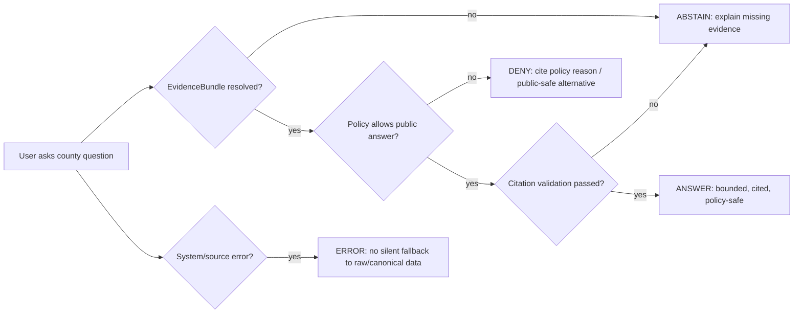
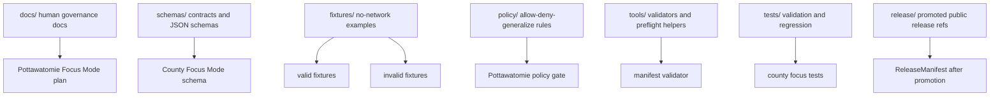
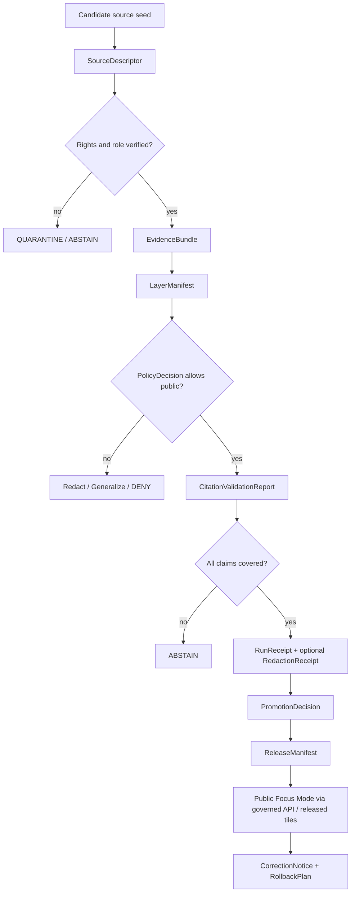

<!--
KFM_META_BLOCK_V2
doc_id: NEEDS_VERIFICATION
title: Pottawatomie County Focus Mode Build Plan
type: standard
version: v0.1
status: draft
owners:
  - NEEDS_VERIFICATION
created: 2026-05-21
updated: 2026-05-21
policy_label: public-draft
related:
  - NEEDS_VERIFICATION: docs/doctrine/directory-rules.md
  - NEEDS_VERIFICATION: docs/domains/
  - NEEDS_VERIFICATION: docs/focus-modes/
  - NEEDS_VERIFICATION: schemas/contracts/v1/
tags:
  - kfm
  - focus-mode
  - county
  - pottawatomie-county
  - kansas
notes:
  - Repo paths in this plan are PROPOSED until a live KFM checkout is mounted and inspected.
  - Public presentation must distinguish public context from sensitive locations, private property, infrastructure details, and cultural/archaeological records.
-->
<a id="top"></a>

# Pottawatomie County Focus Mode Build Plan

> **Kansas Frontier Matrix county proof-slice plan**  
> Evidence-first · map-first · time-aware · cite-or-abstain · policy-aware · auditable · reversible


**Chosen county:** Pottawatomie County, Kansas  
**Build type:** County Focus Mode proof-slice plan  
**Implementation status:** PROPOSED  
**Repo access status:** UNKNOWN — no live repository checkout was mounted or inspected for this document.  
**Primary product goal:** a public-safe county Focus Mode that lets a user inspect Pottawatomie County through governed source seeds, map layers, evidence bundles, policy decisions, and release/rollback controls without exposing raw data, private records, exact sensitive locations, or unreviewed AI output.

---

## Quick links

[Operating posture](#operating-posture) ·
[Why this county](#why-this-county) ·
[Product thesis](#product-thesis) ·
[Scope boundary](#scope-boundary) ·
[First demo layers](#first-demo-layers) ·
[User journeys](#user-journeys) ·
[UI surfaces](#ui-surfaces) ·
[Governed object model](#governed-object-model) ·
[Repository shape](#proposed-repository-shape) ·
[Build phases](#build-phases) ·
[First PR sequence](#first-pr-sequence) ·
[Acceptance checklist](#acceptance-checklist) ·
[Risk register](#risk-register) ·
[Source seed list](#source-seed-list) ·
[Open questions](#open-verification-questions) ·
[First milestone](#recommended-first-milestone)

---

## Executive build note

Pottawatomie County is a strong next KFM county Focus Mode because it is compact enough for a first public-safe slice but rich enough to test multiple KFM lanes at once: county GIS, parcel-map caution, agriculture, floodplain mapping, live water data, Tuttle Creek / Big Blue River flood-control context, U.S. 24 corridor planning, geology, historic trails, cemetery/mission sensitivity, and growing Wamego–Manhattan regional pressure.

This plan does **not** claim that any proposed file, route, schema, validator, policy, layer, source connector, fixture, CI workflow, or release artifact already exists in the Kansas Frontier Matrix repository. It is a repo-ready Markdown build plan for a future PR sequence.

---

<a id="operating-posture"></a>

## Operating posture

### KFM county Focus Mode law

Pottawatomie County Focus Mode must preserve these invariants:

1. **EvidenceBundle outranks generated language.**
2. **Public UI reads governed interfaces only** — released artifacts, governed APIs, catalog/triplet/graph records, tile services, and policy-safe runtime envelopes.
3. **Public UI must not read RAW, WORK, QUARANTINE, unpublished candidates, canonical/internal stores, direct model outputs, or source-system side effects.**
4. **Publication is a governed state transition, not a file move.**
5. **AI is interpretive only.** It may summarize, compare, explain, and route users to evidence, but it is not source authority.
6. **Cite-or-abstain is the default.** Missing source support produces `ABSTAIN`, not confident filler.
7. **Sensitive material fails closed** until reviewed, generalized, redacted, delayed, denied, or restricted by policy.
8. **Every public claim has a correction path and rollback target.**

> [!IMPORTANT]
> Pottawatomie County has county-maintained GIS layers that include parcels, roads, address points, emergency districts, historic layers, zoning, creeks, and school/taxing districts. Those are strong seeds for a Focus Mode, but KFM must not treat parcel maps as legal title, exact sensitive cultural locations as public map content, or emergency/infrastructure layers as public vulnerability disclosures.

### Truth labels used in this plan

| Label | Meaning |
|---|---|
| **CONFIRMED** | Verified from public source seeds or attached KFM doctrine available to this planning run. |
| **PROPOSED** | Recommended build design, file path, object, fixture, policy, test, or UI surface not verified as implemented. |
| **NEEDS_VERIFICATION** | Checkable before implementation, source activation, publication, or operational use. |
| **UNKNOWN** | Not established because repo, runtime, release state, source terms, or local review evidence was not inspected. |
| **DENY / ABSTAIN / ERROR** | Finite runtime or policy outcomes; not rhetorical emphasis. |

### Runtime outcome posture



---

<a id="why-this-county"></a>

## Why this county

### County-specific reason

Pottawatomie County gives KFM a high-value county slice that can test the **intersection of public GIS, growth pressure, floodplain governance, agricultural land use, historic trails, cemetery sensitivity, and transport-corridor planning**.

Strong signals:

| Signal | Why it matters for KFM |
|---|---|
| County GIS office | County GIS maintains key spatial layers such as address points, ag use, creeks, emergency districts, historic trails/schools/cemeteries, parcels, road centerlines, zoning, taxing districts, and school districts. |
| Parcel map disclaimers | Public parcel maps are useful context, but must be explicitly labeled as non-title, non-survey, and non-sovereign truth. |
| Agriculture scale | KDA reports 820 farms, 404,286 acres, and $151 million in 2022 crop/livestock sales. That makes land-cover/agriculture layers meaningful without needing private farm-level exposure. |
| Floodplain mapping activity | KDA / FEMA floodplain work for Pottawatomie County is active enough to test current-vs-draft map handling and stale-state warnings. |
| Tuttle Creek / Big Blue / Kansas River context | Flood-control and live-water-data sources test hydrology evidence bundles, operational-context disclaimers, and non-emergency posture. |
| U.S. 24 corridor | Corridor planning around Wamego–Manhattan tests roads/trade-route lane integration without claiming traffic engineering authority. |
| Historic trail and mission context | Oregon Trail, Military Road, Pike’s Peak Trail, and St. Marys mission history provide public interpretive value but require caution for cemeteries, graves, archaeological locations, tribal/cultural contexts, and private property. |

### Proof-slice value

Pottawatomie County is not just another county map. It is a **trust membrane test**:

- Can KFM expose **county GIS context** without laundering parcel geometry into legal truth?
- Can it show **draft floodplain mapping** without presenting it as effective regulatory status?
- Can it explain **Tuttle Creek flood-control context** without acting like an emergency alert system?
- Can it surface **historic trails and cemeteries** without exposing sensitive or precise grave/archaeological information?
- Can it use **AI Focus Mode** without allowing generated prose to outrank citations, source roles, policy decisions, and review state?

---

<a id="product-thesis"></a>

## Product thesis

### One-line thesis

**Pottawatomie County Focus Mode should become a public-safe, evidence-bound county dashboard that explains how land, water, transport, agriculture, geology, and heritage intersect across Pottawatomie County while keeping sensitive places, private-property assertions, infrastructure vulnerabilities, and unreviewed claims behind policy gates.**

### Product promise

A public KFM user should be able to open Pottawatomie County Focus Mode and answer:

- What public layers are available for the county?
- Which sources support each layer?
- Which layers are current, draft, derived, generalized, or restricted?
- Where do agriculture, floodplain, corridor, and heritage contexts overlap at county scale?
- What is public context, and what is deliberately withheld?
- What evidence supports the answer?
- What changed since the last released county slice?
- How can a correction or rollback be filed?

### Product non-promise

Pottawatomie County Focus Mode is **not**:

- a parcel title system,
- a legal survey,
- an emergency alert platform,
- a substitute for FEMA/KDA floodplain determinations,
- a replacement for KDOT engineering documents,
- a cultural-resource or cemetery locator,
- a private-property dossier,
- a live dam-operation or infrastructure-vulnerability monitor,
- a model-generated encyclopedia,
- or a direct browser into RAW/WORK/QUARANTINE records.

---

<a id="scope-boundary"></a>

## Scope boundary

### Included in first county slice

| Included item | Public-safe posture |
|---|---|
| County boundary and municipal/place context | Public, generalized, source-cited. |
| County GIS layer inventory | Public metadata only; no sensitive geometry by default. |
| Public parcel-map context | Display only with non-title / non-survey warning. |
| Agricultural statistics | County-level summaries only; no farm-owner inference. |
| Cropland / land-cover demo | Derived countywide summaries and generalized tiles; no private operator claims. |
| Floodplain mapping status | Explicitly label draft vs effective; cite source. |
| Big Blue / Vermillion / Kansas River hydrology seeds | Public gage/source metadata, not emergency instructions. |
| Tuttle Creek flood-control context | General public context from USACE; no operational vulnerabilities. |
| U.S. 24 corridor planning | Public corridor documents and generalized alignment context. |
| Historic trail context | Public interpretive layer; exact sensitive locations withheld or generalized. |
| KGS geology map seed | County geologic context, public-source role. |
| Evidence Drawer | Required for every public layer and answer. |
| Policy banner | Required when layer includes draft, restricted, generalized, or sensitive posture. |

### Excluded from first county slice

| Excluded item | Reason |
|---|---|
| Exact cemetery/grave coordinates | Sensitive heritage / burial context; fail closed. |
| Exact archaeological site locations | Deny by default unless steward-reviewed and generalized. |
| Living-person identity, genealogy, DNA, health, or private household data | Restricted by default. |
| Individual ownership/title conclusions | Parcel maps are not title truth. |
| Emergency district operational details beyond already-public high-level boundaries | Public-safety / infrastructure sensitivity. |
| Dam/flood-control operational vulnerabilities | Public-safety and critical-infrastructure risk. |
| Unreviewed model classifications | AI/model outputs are downstream derivatives only. |
| Source scraping that violates terms | Source rights and terms must be verified before activation. |

> [!CAUTION]
> Historic trails, mission history, cemeteries, and possible grave locations must be treated as public interpretation only when already public and appropriate. Exact locations, newly inferred sites, burial information, or culturally sensitive site details should be `DENY` or generalized until reviewed.

---

<a id="first-demo-layers"></a>

## First demo layers

### Layer stack overview

| Priority | Layer | Source seed | Public posture | Notes |
|---:|---|---|---|---|
| 1 | County boundary + municipalities | Kansas GIS / Census / county sources | Public | Basemap control layer; geometry source and vintage NEEDS_VERIFICATION. |
| 2 | County GIS public index | Pottawatomie County GIS | Public metadata | Show layer catalog, not raw GIS download. |
| 3 | Parcel context | County parcel maps / GIS viewer | Public with warning | Must show non-title, non-survey warning. |
| 4 | Agriculture summary | KDA / USDA NASS | Public aggregate | County-level farm count, farm acreage, products sold. |
| 5 | Cropland / land-cover derived layer | USDA CDL / NLCD | Public derived | Generated only after source-rights and transform receipts. |
| 6 | Draft/effective floodplain status | KDA floodplain project + effective viewer | Public with draft/effective warning | Show status, not regulatory advice. |
| 7 | Hydrology observation seeds | USGS Big Blue and Vermillion Creek gage pages | Public source metadata | Public gage metadata and snapshots; no emergency instruction. |
| 8 | Tuttle Creek context | USACE Tuttle Creek Lake | Public general context | Focus on flood-control role and source limitation. |
| 9 | U.S. 24 corridor context | KDOT access-management source | Public planning context | Wamego–Manhattan corridor seed. |
| 10 | Geology context | KGS county geologic maps / Kansas Geoportal | Public | Use source role: geologic interpretation / map product. |
| 11 | Historic trails and settlement context | County history + KHRI/KSHS seeds | Public generalized | Generalize cemeteries/graves/sensitive features. |
| 12 | Sensitive-withheld overlay | KFM policy-derived | Public explanation only | Shows why exact details are withheld; no hidden coordinates. |

### Layer gating matrix

| Layer family | Required gate before public display | Failure outcome |
|---|---|---|
| Parcel context | Source role + disclaimer + no title claims | `ABSTAIN` on ownership/title claims |
| Floodplain | Draft/effective state + source date + citation | `ABSTAIN` if status unresolved |
| Hydrology | Observation timestamp + source role + non-emergency banner | `ERROR` on stale live value if timestamp missing |
| Tuttle Creek | Public context only + infrastructure sensitivity check | `DENY` for vulnerability/operation details |
| Agriculture | Aggregate-only + no private farm inference | `DENY` for owner/operator inference |
| Historic trails | Public-source status + sensitivity screen | `DENY` for exact graves/archaeology |
| Geology | Map vintage + scale + source role | `ABSTAIN` if map scale/vintage absent |
| AI summaries | EvidenceBundle + PolicyDecision + citations | `ABSTAIN` if citation validation fails |

---

<a id="user-journeys"></a>

## User journeys

### Journey 1 — Resident checking floodplain context

**User asks:** “Is my area in a floodplain?”

KFM behavior:

1. Refuses to infer from user identity or private address unless user explicitly provides a location and policy allows.
2. Routes to public effective floodplain viewer and draft-project status.
3. Explains that KFM is not a legal/regulatory determination.
4. Shows source date and whether layer is effective, draft, or unknown.
5. Provides a public-safe answer only if a released, cited, policy-approved layer exists.

**Required outcome:** `ANSWER` with citations and caveats, or `ABSTAIN` with source routing.

### Journey 2 — Planner reviewing growth and U.S. 24 context

**User asks:** “How does development near Wamego relate to U.S. 24 and floodplain constraints?”

KFM behavior:

1. Uses county zoning/parcel context only as public planning context.
2. Uses U.S. 24 corridor seed as transport context.
3. Uses floodplain status as draft/effective-labeled context.
4. Avoids parcel-title or private-owner claims.
5. Produces a bounded map story: “corridor + floodplain + ag/land-cover context.”

**Required outcome:** `ANSWER` or `ABSTAIN` if any layer lacks release state.

### Journey 3 — Historian exploring trail crossings

**User asks:** “Where did the Oregon Trail cross Pottawatomie County?”

KFM behavior:

1. Provides generalized public trail context from county history and public historical sources.
2. Does not reveal exact suspected grave sites, cemetery micro-locations, or unreviewed archaeological coordinates.
3. Labels interpretive uncertainty and source role.
4. Offers a “public interpretation” layer rather than a site locator.

**Required outcome:** `ANSWER` with generalized geometry; `DENY` for exact sensitive site request.

### Journey 4 — Farmer/landowner reviewing agricultural context

**User asks:** “What does KFM show about agriculture in Pottawatomie County?”

KFM behavior:

1. Uses KDA/USDA county aggregates.
2. Optionally shows CDL-derived class summaries with source/transform receipt.
3. Does not infer ownership, operator identity, or farm performance.
4. Flags model/remote-sensing uncertainty.

**Required outcome:** `ANSWER` with county-level totals and source role.

### Journey 5 — Steward reviewing sensitive layer release

**User asks:** “Can this historic cemetery layer be public?”

KFM behavior:

1. Runs sensitivity policy.
2. Checks source rights, review state, geometry precision, and redaction receipt.
3. Recommends generalization or suppression unless review explicitly allows public display.
4. Emits `DENY` or `REVIEW_REQUIRED`, not a direct publication.

**Required outcome:** `DENY` / `ABSTAIN` / `REVIEW_REQUIRED` depending on policy implementation.

---

<a id="ui-surfaces"></a>

## UI surfaces

### Required Focus Mode panels

| Panel | Purpose | Pottawatomie-specific behavior |
|---|---|---|
| County Overview | County identity, status, source coverage | Shows Pottawatomie County focus slice status and open verification flags. |
| Layer Catalog | Released public layer list | Groups GIS, agriculture, floodplain, hydrology, geology, transport, heritage. |
| Evidence Drawer | Claim-to-evidence trace | Every answer and popup links to EvidenceBundle or abstains. |
| Policy Banner | Sensitivity / rights state | Shows when parcel, floodplain, heritage, or infrastructure layers are restricted/generalized. |
| Source Health | Source status and freshness | Flags draft floodplain date, live-gage timestamps, source-rights status. |
| Time Slider | Time-aware views | County stats year, floodplain map vintage, hydrology observation timestamp, release version. |
| Map Pane | Public-safe map rendering | MapLibre/PMTiles/tiles only from released artifacts. |
| Focus Answer Pane | Governed AI answer | Finite outcomes: `ANSWER`, `ABSTAIN`, `DENY`, `ERROR`. |
| Correction Drawer | Correction path | Lets user flag stale/incorrect source, geometry, citation, or sensitivity issue. |
| Release/rollback status | Publication trace | Shows release manifest ID and rollback target when available. |

### Popup design contract

Every popup should include:

- **Layer name**
- **Source role**
- **Vintage / timestamp**
- **EvidenceBundle ref**
- **Policy label**
- **Limitations**
- **Correction link**
- **Public-safety note when relevant**

Example popup shape:

```json
{
  "popup_type": "county_layer_claim",
  "county": "Pottawatomie County",
  "layer": "Draft Floodplain Mapping Context",
  "claim": "This area is inside a draft floodplain review layer.",
  "source_role": "regulatory_context_draft",
  "evidence_bundle_ref": "kfm://evidence-bundle/NEEDS_VERIFICATION",
  "policy_label": "public_context_with_warning",
  "limitations": [
    "Draft data is not the same as effective regulatory floodplain data.",
    "KFM is not a legal floodplain determination."
  ],
  "runtime_outcome": "ANSWER"
}
```

---

<a id="governed-object-model"></a>

## Governed object model

### Object families

| Object | Role in Pottawatomie Focus Mode | Status |
|---|---|---|
| `CountyFocusModeManifest` | Declares county slice, layer list, policy posture, release state. | PROPOSED |
| `SourceDescriptor` | Describes each public source seed, role, rights, access method, cadence. | PROPOSED |
| `SourceIntakeRecord` | Records source admission attempt and preflight results. | PROPOSED |
| `EvidenceRef` | Lightweight public reference to a supporting evidence bundle. | PROPOSED |
| `EvidenceBundle` | Durable evidence package for claims and layers. | PROPOSED |
| `LayerManifest` | Public layer metadata, source roles, tile refs, policy labels. | PROPOSED |
| `PolicyDecision` | Allow/deny/generalize/redact result for public exposure. | PROPOSED |
| `DecisionEnvelope` | Runtime envelope around finite outcome and reason codes. | PROPOSED |
| `CitationValidationReport` | Confirms answer citations cover material claims. | PROPOSED |
| `RunReceipt` | Records source processing, transformations, hashes, tool versions. | PROPOSED |
| `RedactionReceipt` | Records geometry generalization or suppression. | PROPOSED |
| `PromotionDecision` | Records transition from candidate to released public artifact. | PROPOSED |
| `ReleaseManifest` | Public release manifest with artifact hashes and rollback target. | PROPOSED |
| `CorrectionNotice` | Public/steward correction artifact. | PROPOSED |
| `RollbackPlan` | Reversible rollback target and procedure. | PROPOSED |

### Minimal Focus Mode manifest shape

```yaml
schema_version: v1
object_type: CountyFocusModeManifest
county:
  name: Pottawatomie County
  state: Kansas
  fips: "20149"
status: draft
truth_posture: cite_or_abstain
public_runtime_outcomes:
  - ANSWER
  - ABSTAIN
  - DENY
  - ERROR
layer_groups:
  - county_context
  - public_gis
  - parcel_context_warning
  - agriculture
  - hydrology_floodplain
  - transport_corridors
  - geology
  - heritage_public_safe
policy_defaults:
  parcel_title_claims: DENY
  exact_archaeology_locations: DENY
  exact_burial_locations: DENY
  infrastructure_vulnerabilities: DENY
  living_person_data: DENY
  draft_regulatory_layers: WARNING_REQUIRED
evidence:
  evidence_bundle_ref: NEEDS_VERIFICATION
release:
  release_manifest_ref: NEEDS_VERIFICATION
  rollback_plan_ref: NEEDS_VERIFICATION
```

### Claim model examples

| Claim type | Example | Required source support |
|---|---|---|
| Public GIS availability | “County GIS maintains road centerlines and parcel boundaries.” | County GIS source descriptor + EvidenceBundle. |
| Agricultural aggregate | “KDA reports 820 farms and 404,286 farm acres in 2022.” | KDA/USDA NASS EvidenceBundle. |
| Floodplain status | “Draft Pottawatomie floodplain data was posted as of 2026-03-09.” | KDA floodplain project EvidenceBundle. |
| Hydrology observation | “USGS has a Big Blue River near Manhattan monitoring location.” | USGS monitoring EvidenceBundle. |
| Historic trail context | “County history identifies Oregon Trail and Military Road crossings.” | County history/KSHS EvidenceBundle. |
| Sensitive withholding | “Exact suspected grave locations are withheld.” | PolicyDecision + RedactionReceipt. |

---

<a id="proposed-repository-shape"></a>

## Proposed repository shape

> [!WARNING]
> The following paths are **PROPOSED**. They must be checked against the current KFM repository, Directory Rules, accepted ADRs, existing docs, and current schema-home conventions before implementation.

### Responsibility-rooted placement

| Proposed path | Responsibility root | Purpose | Status |
|---|---|---|---|
| `docs/focus-modes/counties/pottawatomie/README.md` | `docs/` | Human-facing county Focus Mode build plan and operating notes. | PROPOSED |
| `docs/focus-modes/counties/pottawatomie/source-seeds.md` | `docs/` | Source seed register with roles, rights, cadence, and limitations. | PROPOSED |
| `docs/focus-modes/counties/pottawatomie/policy-notes.md` | `docs/` | Human-readable policy/sensitivity notes. | PROPOSED |
| `schemas/contracts/v1/focus_mode/county_focus_mode_manifest.schema.json` | `schemas/` | Machine schema for county Focus Mode manifest. | PROPOSED / NEEDS_VERIFICATION |
| `schemas/contracts/v1/focus_mode/county_layer_manifest.schema.json` | `schemas/` | Machine schema for public county layers. | PROPOSED / NEEDS_VERIFICATION |
| `fixtures/focus_mode/counties/pottawatomie/valid/` | `fixtures/` | Positive no-network fixture examples. | PROPOSED |
| `fixtures/focus_mode/counties/pottawatomie/invalid/` | `fixtures/` | Negative fail-closed fixtures. | PROPOSED |
| `policy/focus_mode/counties/pottawatomie/publication.rego` | `policy/` | County-specific policy gates when generic gates need county overrides. | PROPOSED |
| `tools/validators/focus_mode/validate_county_focus_mode.py` | `tools/` | Validator for manifest, layers, evidence refs, policy labels. | PROPOSED |
| `tests/focus_mode/counties/test_pottawatomie_focus_mode.py` | `tests/` | No-network fixture and policy tests. | PROPOSED |
| `release/focus_mode/counties/pottawatomie/` | `release/` | Released manifest/proof references after promotion only. | PROPOSED |

### Directory discipline



### Path anti-patterns to avoid

| Anti-pattern | Why it fails KFM |
|---|---|
| `pottawatomie/` as a new repo root | Topic-as-root drift; responsibility is not visible. |
| Storing source data beside docs | Collapses documentation and lifecycle custody. |
| Publishing generated PMTiles without ReleaseManifest | Treats tile as sovereign truth. |
| Putting schemas under random app folders | Creates parallel schema authority. |
| Letting UI read county GIS app directly | Bypasses governed API and release/policy gates. |
| Storing sensitive grave/archaeology locations in public fixtures | Violates deny-by-default sensitivity posture. |

---

<a id="build-phases"></a>

## Build phases

### Phase 0 — Evidence and repo boundary inventory

**Goal:** establish what exists before adding anything.

Checklist:

- [ ] Mount current KFM repo.
- [ ] Record branch, commit, dirty state, and root tree.
- [ ] Locate existing Focus Mode conventions.
- [ ] Locate existing county/domain docs.
- [ ] Locate schema home and ADRs.
- [ ] Locate policy, fixtures, validators, tests, release patterns.
- [ ] Verify no existing Pottawatomie plan already exists.
- [ ] Record all claims as CONFIRMED / PROPOSED / UNKNOWN / NEEDS_VERIFICATION.

Exit gate:

- No implementation begins until repo state and Directory Rules placement are recorded.

### Phase 1 — Source seed ledger

**Goal:** make Pottawatomie source admission inspectable before any layer is built.

Deliverables:

- Source seed table.
- Source role classification.
- Rights/terms notes.
- Source cadence/freshness notes.
- Public/sensitive posture.
- Initial EvidenceBundle stubs.

Required first source families:

- Pottawatomie County GIS.
- KDA / USDA NASS agriculture statistics.
- KDA/FEMA floodplain project and effective floodplain viewer.
- USGS Water Data monitoring locations.
- USACE Tuttle Creek Lake public context.
- KDOT U.S. 24 corridor/access management source.
- KGS county geologic maps.
- County history / KSHS/KHRI public heritage sources.

Exit gate:

- Every source has a `SourceDescriptor` fixture or a documented `ABSTAIN`.

### Phase 2 — Manifest and fixture-first county shell

**Goal:** build the county manifest and layer manifests with synthetic/public-safe fixtures only.

Deliverables:

- `CountyFocusModeManifest` fixture.
- `CountyLayerManifest` fixtures.
- Valid and invalid fixtures.
- Validator stub.
- Policy stub.
- README build notes.

Exit gate:

- Validator passes valid fixtures and fails invalid fixtures.

### Phase 3 — Hydrology and floodplain proof layer

**Goal:** create a public-safe floodplain/hydrology demonstration without emergency behavior.

Layers:

- Floodplain project status.
- Effective floodplain source routing.
- Big Blue River monitoring location seed.
- Vermillion Creek monitoring location seed.
- Tuttle Creek public context.

Controls:

- Draft/effective warning.
- Timestamp requirement.
- Non-emergency disclaimer.
- Infrastructure sensitivity rule.

Exit gate:

- Public answer cannot be produced without EvidenceBundle + PolicyDecision + CitationValidationReport.

### Phase 4 — Agriculture and land-cover proof layer

**Goal:** show county-scale agriculture without exposing private operators.

Layers:

- KDA 2022 agriculture summary.
- CDL/NLCD-derived countywide class summary.
- Ag-use layer metadata if county source terms allow.
- Optional SSURGO soil context after source vetting.

Controls:

- County aggregate only.
- No parcel-owner inference.
- No farm-performance ranking.
- Transform receipt required for derived summaries.

Exit gate:

- Invalid fixture that includes private owner inference must fail.

### Phase 5 — Heritage and public-safe history proof layer

**Goal:** support public history without becoming a site locator.

Layers:

- County history narrative seed.
- Generalized historic trail corridor.
- Public KHRI references when appropriate.
- Sensitive-withheld explanation layer.

Controls:

- Exact burial/cemetery/grave sites denied unless explicitly public and reviewed.
- Archaeological locations deny by default.
- Cultural/tribal sensitivity review before any precise geometry.

Exit gate:

- Invalid fixture containing exact suspected grave or archaeology coordinates must fail.

### Phase 6 — UI mock and governed answer path

**Goal:** wire the county shell into the governed UI pattern.

Surfaces:

- Layer catalog.
- Evidence Drawer.
- Focus Answer Pane.
- Policy banner.
- Source health panel.
- Correction drawer.
- Release/rollback status display.

Exit gate:

- AI answer pane uses finite outcomes and cannot cite missing evidence.

### Phase 7 — Release dry run

**Goal:** simulate promotion without public release.

Deliverables:

- ReleaseManifest candidate.
- RunReceipt.
- RedactionReceipt if any sensitive geometry transformed.
- PromotionDecision candidate.
- RollbackPlan.
- CorrectionNotice template.

Exit gate:

- Release dry run fails if any EvidenceRef is unresolved, any policy decision is missing, or any layer lacks source role/vintage.

---

<a id="first-pr-sequence"></a>

## First PR sequence

### PR-1 — Pottawatomie Focus Mode source ledger and docs shell

| Item | Description |
|---|---|
| Goal | Add repo-ready docs shell and source seed register. |
| Files | `docs/focus-modes/counties/pottawatomie/README.md`, `source-seeds.md`, `policy-notes.md` |
| Validation | Markdown lint; source table completeness; no fake implemented paths. |
| Rollback | Remove docs folder and register entry. |

### PR-2 — County Focus Mode contracts and manifest fixtures

| Item | Description |
|---|---|
| Goal | Add manifest schema and public-safe fixtures. |
| Files | `schemas/contracts/v1/focus_mode/*`, `fixtures/focus_mode/counties/pottawatomie/valid/*` |
| Validation | JSON Schema validation; stable spec_hash generation. |
| Rollback | Revert schema and fixture additions. |

### PR-3 — Negative fixtures and fail-closed policy

| Item | Description |
|---|---|
| Goal | Prove sensitive, stale, and unsupported claims fail closed. |
| Files | `fixtures/.../invalid/*`, `policy/focus_mode/counties/pottawatomie/publication.rego` |
| Validation | Policy denies exact graves, unresolved EvidenceRef, owner inference, emergency claim. |
| Rollback | Revert policy and invalid fixtures. |

### PR-4 — Validator and no-network test suite

| Item | Description |
|---|---|
| Goal | Validate manifest, layer, evidence, policy, and release preconditions offline. |
| Files | `tools/validators/focus_mode/validate_county_focus_mode.py`, `tests/focus_mode/counties/test_pottawatomie_focus_mode.py` |
| Validation | No-network CI; valid fixtures pass; invalid fixtures fail. |
| Rollback | Revert validator and tests. |

### PR-5 — UI/API mock envelope

| Item | Description |
|---|---|
| Goal | Add governed API mock and UI payload fixture for the county. |
| Files | `fixtures/api/focus_mode/pottawatomie/*.json`, optional `apps/...` mock integration after repo inspection |
| Validation | UI reads only governed mock envelope; no RAW/WORK/QUARANTINE reads. |
| Rollback | Remove mock integration and payload fixtures. |

---

<a id="acceptance-checklist"></a>

## Acceptance checklist

### Evidence and source controls

- [ ] Every public layer has a `SourceDescriptor`.
- [ ] Every public claim resolves to an `EvidenceBundle`.
- [ ] Every EvidenceRef is resolvable or the runtime produces `ABSTAIN`.
- [ ] Every source has role, authority, rights/terms, vintage, and access method.
- [ ] Source-currentness is checked before source activation.
- [ ] No source seed is treated as canonical truth without role labeling.

### Policy controls

- [ ] Exact archaeology locations are denied by default.
- [ ] Exact burial/cemetery/grave locations are denied or generalized unless reviewed.
- [ ] Parcel data is labeled non-title and non-survey.
- [ ] Private ownership/title conclusions are denied.
- [ ] Living-person data is denied.
- [ ] Infrastructure vulnerability details are denied.
- [ ] Draft floodplain data has draft warning.
- [ ] Hydrology observation layers include timestamps and non-emergency disclaimer.
- [ ] AI answer path requires PolicyDecision and CitationValidationReport.

### Map and UI controls

- [ ] Public UI reads only governed API / released artifact / tile service.
- [ ] MapLibre layer manifests include policy label and release ref.
- [ ] Evidence Drawer is available for every layer.
- [ ] Focus Answer Pane has finite outcomes only.
- [ ] Source Health shows stale/draft/restricted states.
- [ ] Correction Drawer routes issues to review, not direct mutation.
- [ ] Public-safe redaction/generalization is visible to users.

### Build/test controls

- [ ] Valid fixture passes.
- [ ] Invalid fixture with unresolved EvidenceRef fails.
- [ ] Invalid fixture with exact grave coordinates fails.
- [ ] Invalid fixture with parcel-title claim fails.
- [ ] Invalid fixture with stale hydrology timestamp fails.
- [ ] Invalid fixture with direct RAW/WORK/QUARANTINE read fails.
- [ ] Invalid fixture with AI answer missing citations fails.
- [ ] Release dry run has rollback target.

---

## Fixture plan

### Valid fixtures

| Fixture | Purpose |
|---|---|
| `valid/county_focus_mode_manifest.pottawatomie.json` | Minimal county Focus Mode manifest. |
| `valid/layer_manifest.public_gis_index.json` | County GIS layer catalog metadata. |
| `valid/layer_manifest.agriculture_summary_2022.json` | KDA county aggregate. |
| `valid/layer_manifest.floodplain_project_status.json` | Draft/effective floodplain status with warning. |
| `valid/layer_manifest.hydrology_gage_seed.json` | USGS gage metadata, no emergency behavior. |
| `valid/layer_manifest.heritage_generalized_trails.json` | Generalized public trail context. |
| `valid/evidence_bundle.kda_ag_2022_stub.json` | Public aggregate evidence bundle. |
| `valid/runtime_envelope.answer_public_context.json` | Governed answer with citations and policy pass. |

### Invalid fixtures

| Fixture | Failure expected |
|---|---|
| `invalid/unresolved_evidence_ref.json` | EvidenceRef cannot resolve. |
| `invalid/parcel_title_claim.json` | Treats parcel layer as legal ownership/title proof. |
| `invalid/exact_grave_location_public.json` | Attempts public exact burial/grave/cemetery-sensitive geometry. |
| `invalid/archaeology_exact_site_public.json` | Attempts public exact archaeology geometry. |
| `invalid/draft_floodplain_without_warning.json` | Draft layer lacks warning and source status. |
| `invalid/live_hydrology_no_timestamp.json` | Observation has no timestamp/vintage. |
| `invalid/infrastructure_vulnerability_popup.json` | Reveals operational/vulnerability details. |
| `invalid/ai_answer_missing_citation.json` | Generated answer lacks citation validation. |
| `invalid/raw_path_in_public_layer.json` | Public layer reads RAW/WORK/QUARANTINE path. |
| `invalid/private_farm_operator_inference.json` | Infers private farm/operator data from public layers. |

### Example invalid fixture intent

```json
{
  "object_type": "CountyLayerManifest",
  "county": "Pottawatomie County",
  "layer_id": "heritage_exact_graves_public",
  "policy_label": "public",
  "geometry_precision": "exact",
  "contains": ["suspected_grave_location"],
  "evidence_bundle_ref": "kfm://evidence-bundle/example",
  "expected_validator_result": "FAIL",
  "expected_policy_reason": "exact_burial_or_suspected_grave_location_denied_by_default"
}
```

---

<a id="risk-register"></a>

## Risk register

| Risk ID | Risk | County-specific trigger | Default control | Outcome if unresolved |
|---|---|---|---|---|
| POTT-RISK-001 | Parcel data becomes title truth | Parcel boundaries shown without disclaimer | Non-title / non-survey warning | `ABSTAIN` / `DENY` |
| POTT-RISK-002 | Draft floodplain displayed as effective | Draft FEMA/KDA layer mixed with effective viewer | Draft/effective state required | `ABSTAIN` |
| POTT-RISK-003 | Emergency-alert confusion | Hydrology/Tuttle Creek context shown as live warning | Non-emergency banner | `DENY` emergency instructions |
| POTT-RISK-004 | Infrastructure vulnerability exposure | Dam, emergency district, bridge, road detail overexposed | Public-safe generalization | `DENY` |
| POTT-RISK-005 | Sensitive cemetery/grave exposure | Historic/cemetery layers include exact coordinates | RedactionReceipt + review | `DENY` |
| POTT-RISK-006 | Archaeology site disclosure | Trail/mission context reveals site inference | Steward review + generalization | `DENY` |
| POTT-RISK-007 | Tribal/cultural sensitivity missed | Mission/trail narratives lack cultural review | Sensitivity checklist | `ABSTAIN` |
| POTT-RISK-008 | Source rights unclear | County GIS or third-party data terms not verified | SourceDescriptor rights field | `ABSTAIN` |
| POTT-RISK-009 | Stale hydrology context | Live gage value copied without timestamp | Timestamp validator | `ERROR` or `ABSTAIN` |
| POTT-RISK-010 | Farm/operator privacy leak | CDL/parcel/ag layers imply private operations | Aggregate-only policy | `DENY` |
| POTT-RISK-011 | Generated AI overclaim | Focus Mode answer invents causal explanation | Citation validation | `ABSTAIN` |
| POTT-RISK-012 | Tile treated as truth | PMTiles published without manifest/proof | ReleaseManifest required | Block promotion |
| POTT-RISK-013 | Repo path drift | County files added as root-level folder | Directory Rules check | Block PR |
| POTT-RISK-014 | Public raw-source bypass | UI loads county GIS app/data directly as truth | Governed API only | Block UI release |
| POTT-RISK-015 | Correction has no rollback | Bad public layer cannot be withdrawn | RollbackPlan required | Block release |

---

<a id="source-seed-list"></a>

## Source seed list

> [!NOTE]
> Source seed URLs are planning seeds. Before activation, each source needs rights/terms review, source role classification, access method, freshness/cadence, and EvidenceBundle coverage.

| Seed ID | Source | URL | Source role | Use in first slice | Public/sensitive posture | Verification status |
|---|---|---|---|---|---|---|
| POTT-SRC-001 | Pottawatomie County GIS Office | https://www.pottcounty.org/153/Geographic-Information-Systems-GIS | county_gis_provider | County GIS layer inventory; road/parcel/address/historic layer metadata | Public metadata; sensitive layer geometry restricted | NEEDS_VERIFICATION |
| POTT-SRC-002 | Pottawatomie County Parcel Maps | https://www.pottcounty.org/529/Parcel-Maps | county_parcel_context | Parcel map context and disclaimer | Public with non-title warning | NEEDS_VERIFICATION |
| POTT-SRC-003 | Pottawatomie County public web map | https://www.arcgis.com/apps/webappviewer/index.html?id=d40d678dec6f4ed2b66f83b06609b228 | county_gis_viewer | Public viewer seed; not canonical KFM truth | Do not bypass governed API | NEEDS_VERIFICATION |
| POTT-SRC-004 | Kansas Department of Agriculture — Pottawatomie County stats | https://www.agriculture.ks.gov/kansas-agriculture/kansas-agricultural-statistics/pottawatomie-county | agriculture_aggregate | 2022 farms, farm acres, crop/livestock sales | Public aggregate | CONFIRMED source seed |
| POTT-SRC-005 | USDA NASS 2022 County Profile — Pottawatomie County | https://www.nass.usda.gov/Publications/AgCensus/2022/Online_Resources/County_Profiles/Kansas/cp20149.pdf | agriculture_primary_profile | Cross-check KDA agriculture stats | Public aggregate | NEEDS_VERIFICATION |
| POTT-SRC-006 | KDA Pottawatomie floodplain project | https://gis2.kda.ks.gov/gis/pottawatomie/ | floodplain_draft_project | Draft mapping status and current effective viewer routing | Public with draft/effective warning | NEEDS_VERIFICATION |
| POTT-SRC-007 | Kansas Current Effective Floodplain Viewer | https://gis2.kda.ks.gov/gis/ksfloodplain/ | floodplain_effective_viewer | Effective floodplain reference routing | Public; not legal advice | NEEDS_VERIFICATION |
| POTT-SRC-008 | USGS Big Blue River near Manhattan monitoring location | https://waterdata.usgs.gov/monitoring-location/06887000/ | hydrology_observation | Gage/source metadata and time-aware hydrology fixture | Public observation; non-emergency | NEEDS_VERIFICATION |
| POTT-SRC-009 | USGS Vermillion Creek near Wamego monitoring location | https://waterdata.usgs.gov/monitoring-location/06888000/ | hydrology_observation | Gage/source metadata and time-aware hydrology fixture | Public observation; non-emergency | NEEDS_VERIFICATION |
| POTT-SRC-010 | USACE Tuttle Creek Lake | https://www.nwk.usace.army.mil/Locations/District-Lakes/Tuttle-Creek-Lake/ | flood_control_context | Public context for flood-control function | Public general context; infrastructure-sensitive details restricted | NEEDS_VERIFICATION |
| POTT-SRC-011 | KDOT Access Management / U.S. 24 Corridor Plan | https://www.ksdot.gov/doing-business/access-management | transportation_planning | U.S. 24 Wamego–Manhattan corridor context | Public planning context | NEEDS_VERIFICATION |
| POTT-SRC-012 | KGS County Geologic Maps | https://www.kgs.ku.edu/General/Geology/index.html | geology_map_index | Geology source seed | Public; scale/vintage required | NEEDS_VERIFICATION |
| POTT-SRC-013 | Kansas Geoportal KGS datasets | https://hub.kansasgis.org/search?tags=kgs | geology_data_seed | Bedrock/surficial geology data seed | Public; rights and vintage check | NEEDS_VERIFICATION |
| POTT-SRC-014 | Pottawatomie County History | https://www.pottcounty.org/305/History | public_history | Oregon Trail, Military Road, Pike’s Peak Trail, St. Marys mission context | Public narrative; sensitive geometry restricted | NEEDS_VERIFICATION |
| POTT-SRC-015 | Kansas Historic Resources Inventory | https://khri.kansasgis.org/ | historic_resource_index | Public historic-resource reference | Public reference; sensitive handling needed | NEEDS_VERIFICATION |
| POTT-SRC-016 | USDA CDL / PLANTS | NEEDS_VERIFICATION | agriculture_land_cover | Cropland/plant county reprocessing watcher | Public derived; transform receipt required | NEEDS_VERIFICATION |
| POTT-SRC-017 | NRCS SSURGO / Web Soil Survey | NEEDS_VERIFICATION | soil_context | Soil map units and limitations | Public; scale and interpretation warnings | NEEDS_VERIFICATION |
| POTT-SRC-018 | Kansas Mesonet / weather data | NEEDS_VERIFICATION | atmosphere_context | County weather/soil moisture context if allowed | Public observation; source policy check | NEEDS_VERIFICATION |

---

<a id="open-verification-questions"></a>

## Open verification questions

### Repo and placement

- [ ] Does the current KFM repo already have a county Focus Mode convention?
- [ ] What is the accepted current schema home: `schemas/contracts/v1`, `contracts/`, `jsonschema/`, or another reconciled root?
- [ ] Is there an accepted ADR for county Focus Mode path placement?
- [ ] Are county plans housed under `docs/focus-modes/counties/`, `docs/domains/counties/`, or another responsibility-rooted home?
- [ ] What validator language is repo-standard: Python, TypeScript, Rego/Conftest, or mixed?
- [ ] What CI jobs already exist for schemas, policy, fixtures, and markdown?
- [ ] Is there an existing release manifest/proof-pack convention?

### Source rights and currentness

- [ ] What are Pottawatomie County GIS terms of use for data/layers?
- [ ] Can the county ArcGIS public viewer be referenced as a source seed without automated scraping?
- [ ] Are parcel PDFs/apps redistributable or view-only?
- [ ] What is the authoritative current floodplain status for every relevant jurisdiction?
- [ ] Are draft floodplain layers downloadable, view-only, or restricted?
- [ ] What USGS parameters should be included in the public hydrology fixture?
- [ ] What KDOT U.S. 24 corridor documents are current vs historical?
- [ ] Which KGS map is current for Pottawatomie County, and what scale/vintage applies?
- [ ] Which KHRI records are public and appropriate for display?
- [ ] Which heritage locations need generalization or complete suppression?

### Policy and sensitivity

- [ ] What geometry precision is allowed for historic trails?
- [ ] Are cemetery polygons/points allowed only as public cemetery names, generalized areas, or not at all?
- [ ] What review role handles tribal/cultural sensitivity?
- [ ] What public-safe transform is required for suspected graves?
- [ ] How should emergency districts be displayed, if at all?
- [ ] What dam/flood-control context is safe for public display?
- [ ] What level of parcel context is acceptable without encouraging owner targeting?

### Product and UX

- [ ] Should Pottawatomie Focus Mode lead with flood/ag/transport or with county GIS inventory?
- [ ] Should Wamego–Manhattan U.S. 24 corridor be a story card or map layer?
- [ ] Should Tuttle Creek be a separate hydrology story node?
- [ ] Should heritage be hidden until the policy system is stronger?
- [ ] What public-safe explanation should be shown when exact sensitive locations are withheld?

---

<a id="recommended-first-milestone"></a>

## Recommended first milestone

### Milestone name

**Pottawatomie County Public-Safe Source Ledger + Flood/Agriculture/Transport Mock Focus Mode**

### Milestone goal

Deliver a no-network, fixture-first Focus Mode mock for Pottawatomie County that demonstrates:

1. county source-seed ledger,
2. public GIS metadata layer,
3. agriculture aggregate card,
4. draft/effective floodplain status card,
5. hydrology source card,
6. U.S. 24 corridor context card,
7. public-safe history card,
8. Evidence Drawer,
9. finite Focus Mode outcomes,
10. negative fixtures that prove fail-closed behavior.

### Milestone output

| Output | Required? | Notes |
|---|---:|---|
| Repo-ready Markdown plan | Yes | This document or repo-adapted version. |
| Source seed register | Yes | With source roles and rights TODOs. |
| Focus Mode manifest fixture | Yes | Synthetic/public-safe only. |
| Layer manifest fixtures | Yes | GIS, ag, floodplain, hydrology, transport, heritage. |
| Invalid fixtures | Yes | Sensitive geometry, parcel-title, stale hydrology, missing citations. |
| Validator stub | Yes | No-network. |
| Policy stub | Yes | Deny/default sensitive classes. |
| UI mock payload | Yes | Governed API envelope only. |
| Release dry-run manifest | Optional first milestone | Useful but can be PR-2/PR-3. |

### Milestone acceptance

The milestone is accepted only when:

- a user can ask “What does KFM know about Pottawatomie County?” and receive a cited, source-role-labeled, policy-safe answer;
- a user can ask for exact grave/archaeology locations and receive `DENY`;
- a user can ask for parcel ownership/title truth and receive `ABSTAIN` or `DENY`;
- a user can inspect floodplain context and see draft/effective source status;
- a user can inspect KDA agriculture aggregates without any private farm inference;
- the UI displays only governed fixtures/released mock artifacts, not raw sources;
- every mock artifact has a rollback/correction placeholder.

---

## Appendix A — Pottawatomie public-safe focus cards

### Card 1 — County GIS context

**Question:** What public GIS layers are available?

**Answer posture:** `ANSWER` only after source descriptor and EvidenceBundle exist.

**Public summary:** Pottawatomie County GIS maintains a public mapping/data program with layers that may include address points, ag use, creeks, emergency districts, historic layers, parcel boundaries, roads, school districts, subdivisions, taxing districts, and zoning.

**Warnings:** Do not treat county GIS layers as legal title, survey truth, or public authority to expose sensitive features.

### Card 2 — Agriculture context

**Question:** How significant is agriculture in the county?

**Answer posture:** `ANSWER` with KDA/USDA citation.

**Public summary:** KDA reports 820 farms, 404,286 farm acres, and $151 million in crop/livestock sales for 2022.

**Warnings:** No operator identity, parcel ownership, farm-level productivity ranking, or private inference.

### Card 3 — Floodplain and hydrology context

**Question:** What floodplain/hydrology context is available?

**Answer posture:** `ANSWER` or `ABSTAIN` depending on layer release state.

**Public summary:** KDA lists draft Pottawatomie floodplain mapping data and routes users to the Kansas effective floodplain viewer; USGS monitoring locations can seed time-aware hydrology cards; USACE provides public context for Tuttle Creek Lake flood-control purpose.

**Warnings:** Not emergency alert; not legal/regulatory determination.

### Card 4 — Transport corridor context

**Question:** Why is U.S. 24 important here?

**Answer posture:** `ANSWER` if KDOT source descriptor is valid.

**Public summary:** KDOT source seeds include a U.S. 24 Corridor Management Plan for Pottawatomie County / Wamego / Manhattan, making the corridor a useful transport/planning layer.

**Warnings:** Not an engineering recommendation; source vintage must be visible.

### Card 5 — Heritage context

**Question:** What historic context can be public?

**Answer posture:** `ANSWER` with generalized geometry; `DENY` for exact sensitive locations.

**Public summary:** County history identifies early trail crossings including Oregon Trail, Military Road, and Pike’s Peak Trail, plus the St. Marys mission context.

**Warnings:** Cemeteries, graves, archaeology, tribal/cultural sites, and private property require sensitivity review.

---

## Appendix B — Release dry-run gates



---

## Appendix C — County-specific “do not collapse” rules

| Do not collapse | Required distinction |
|---|---|
| Parcel map vs title | Parcel geometry/context is not ownership/title proof. |
| Draft floodplain vs effective floodplain | Draft review layers are not the same as effective regulatory maps. |
| USGS observation vs forecast/emergency warning | Public gage data is not KFM emergency guidance. |
| Tuttle Creek flood-control context vs operational vulnerability | Public context only; sensitive operations withheld. |
| Historic trail narrative vs archaeology site record | Public story is not a site-location release. |
| Cemetery name vs exact grave location | Exact burial/grave details denied/generalized. |
| County aggregate agriculture vs private farm inference | Aggregate stats only unless evidence and policy allow more. |
| Geologic map vs site-specific engineering | Public geology context is not engineering design. |
| AI summary vs source authority | AI answer is downstream and evidence-bound. |
| Tile/rendered map vs canonical truth | Map artifacts carry released claims; they are not sovereign truth. |

---

## Final status

**Status:** PROPOSED county Focus Mode build plan.  
**County:** Pottawatomie County, Kansas.  
**Next action:** mount repo, verify Directory Rules placement, create source-seed doc, then implement fixture-first manifest + validator + negative policy tests.  
**Public release:** not authorized by this plan. Release requires evidence, policy, review, promotion, release manifest, correction path, and rollback target.

[Back to top](#top)
