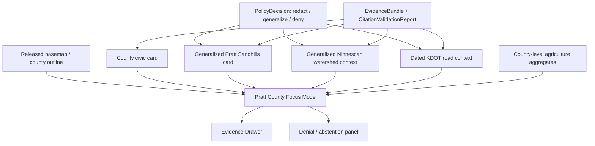
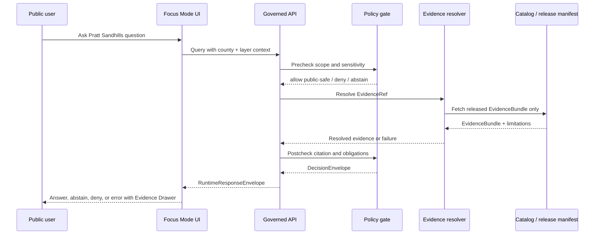
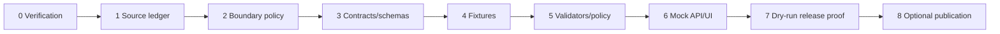

<!-- KFM_META_BLOCK_V2
 doc_id: NEEDS_VERIFICATION
 title: Pratt County Focus Mode Build Plan — Pratt Sandhills, South Fork Ninnescah, County Lake, and Wildlife-Access / Non-Live-Safety Boundary
 type: standard
 version: v1
 status: draft
 owners: [NEEDS_VERIFICATION]
 created: 2026-05-23
 updated: 2026-05-23
 policy_label: public_draft
 selected_county: Pratt County, Kansas
 proof_slice: Pratt Sandhills Wildlife Area + South Fork Ninnescah headwaters + county lake / recreation currentness + working-landscape context
 primary_public_safe_boundary: Public KFM may explain reviewed, citation-backed Pratt County landscape context, public wildlife-area context, county-civic context, and generalized watershed/agriculture context, but must not publish sensitive wildlife locations, turn recreation or county pages into live safety/access/legal guidance, expose private land/well/parcel conclusions, or transform dated maps into current routing or hazard truth.
 source_check_date: 2026-05-23
 truth_posture: CONFIRMED / PROPOSED / NEEDS_VERIFICATION / UNKNOWN
 collision_check:
   supplied_register: CONFIRMED - Pratt County is absent from the completed/collision register supplied by the user.
   uploaded_materials: CONFIRMED for searches performed - available uploaded/current project-material searches returned no Pratt County Focus Mode Build Plan hit.
   live_repository_filename_search: CONFIRMED for query executed - live GitHub search for pratt_county_focus_mode_build_plan returned no results.
   live_repository_title_search: CONFIRMED for query executed - live GitHub search for Pratt County Focus Mode returned focus-mode index/control-plane files, not a Pratt plan artifact.
   live_index: CONFIRMED - inspected live docs/focus-mode/counties/COUNTY_INDEX.md lists Pratt as not-started.
   exhaustive_history: NEEDS_VERIFICATION - all branches, Git history, archived generated outputs, unindexed project materials, and prior off-index artifacts were not exhaustively cleared.
 repository_placement:
   intended_landing_path: PROPOSED / NEEDS_VERIFICATION / CONFLICTED - docs/focus-mode/counties/pratt_county/pratt_county_focus_mode_build_plan.md
   basis: Directory Rules assign human-facing planning materials to docs/ and forbid topic/county roots; live repository search returned docs/focus-mode/counties/COUNTY_INDEX.md and docs/focus-mode/counties/README.md as the visible county-plan control lane.
 schema_contract_policy_homes: NEEDS_VERIFICATION
 review_assignments: NEEDS_VERIFICATION
 correction_path: NEEDS_VERIFICATION
 rollback_path: NEEDS_VERIFICATION
 release_status: NEEDS_VERIFICATION / no implementation, review, promotion, or publication claimed
 related:
   - Directory Rules.pdf
   - docs/focus-mode/counties/COUNTY_INDEX.md
   - Pratt County official website
   - KDWP Pratt Sandhills Wildlife Area page
 tags: [kfm, focus-mode, pratt-county, pratt-sandhills, south-fork-ninnescah, county-lake, wildlife-area, agriculture, public-safe-boundary, cite-or-abstain]
 notes:
   - Standalone downloadable planning artifact generated outside the repository.
   - No repository file was created, edited, moved, reviewed, promoted, or published by this artifact.
-->

<a id="top"></a>

# Pratt County Focus Mode Build Plan
## Pratt Sandhills, South Fork Ninnescah, County Lake, and the **Wildlife-Access / Non-Live-Safety Boundary**

> **Product thesis:** Build a public-safe Pratt County Focus Mode around Pratt Sandhills Wildlife Area, South Fork Ninnescah headwaters, county civic/recreation context, and working-landscape aggregates while denying sensitive wildlife precision, live access/safety claims, private-property/well conclusions, and legal or emergency interpretation.


| Identity field | Determination |
|---|---|
| County | **Pratt County, Kansas** |
| Selected proof slice | **Pratt Sandhills Wildlife Area + South Fork Ninnescah headwaters + county lake / recreation currentness + working-landscape aggregates** |
| Why this county is next | Pratt adds a south-central sandhill-prairie / wildlife-area proof slice that is different from wetland, reservoir, urban, oil/gas, fossil, and large-river counties. |
| Primary public-safe boundary | **No sensitive wildlife precision; no live hunting/access/road-condition/safety guidance; no private parcel, well, title, water-right, or personal-risk conclusions.** |
| Official-source check | `CONFIRMED` pages checked during this run on 2026-05-23; see [Section 15](#15-source-seed-list). |
| Collision search | `CONFIRMED` for searches executed; exhaustive repository history and unindexed archive search remain `NEEDS_VERIFICATION`. |
| Repository mutation | **None claimed or performed.** |
| Intended landing path | `PROPOSED / NEEDS_VERIFICATION / CONFLICTED`; see [Section 9](#9-proposed-repository-shape). |

**Quick links:** [1 Operating posture](#1-operating-posture) · [2 Why this county](#2-why-this-county) · [3 Product thesis](#3-product-thesis) · [4 Scope](#4-scope-boundary) · [5 Demo layers](#5-first-demo-layers) · [6 Journeys](#6-user-journeys) · [7 UI](#7-ui-surfaces) · [8 Objects](#8-governed-object-model) · [9 Repo shape](#9-proposed-repository-shape) · [10 Build phases](#10-build-phases) · [13 Fixtures](#13-fixture-plan) · [15 Sources](#15-source-seed-list) · [17 Milestone](#17-recommended-first-milestone)

---

## Executive build note

Pratt County is a strong next proof slice because it has a clear public map story and a sharp trust problem. The KDWP Pratt Sandhills page identifies an official wildlife area in Pratt County, describes sandhill prairie with moderate to steep dune topography, describes wildlife-water facilities, hunting context, road/access cautions, a designated accessible area, and special regulations. Pratt County's own website is an official civic source and visibly links county services, lake regulations, severe-weather safety, schools, taxes, and courthouse contact context. The first KFM product should expose these as **source-bounded civic and landscape context**, not as live operating instructions.

> [!CAUTION]
> **Defining boundary:** Pratt County Focus Mode must fail closed on sensitive wildlife locations, exact habitat-management detail, hunting strategy, live road/access/closure/safety advice, private land/well/parcel inference, emergency guidance, and water-right/legal conclusions. Public map layers may show generalized, released, reviewed context only.

| Evidence boundary | What can be said now |
|---|---|
| `CONFIRMED` | Pratt is absent from the supplied completed/collision register; current project-material searches did not find a Pratt county plan; live GitHub exact filename search returned no Pratt plan; the inspected live county index lists Pratt as `not-started`; official Pratt County and KDWP Pratt Sandhills pages were checked. |
| `PROPOSED` | The first product, object model, layer cards, fixtures, UI panels, policies, validators, PR sequence, and repository path. |
| `NEEDS_VERIFICATION` | Exact repository landing path; schema/contract/policy homes; source rights; county lake details beyond the homepage link; hydrology geometry authority; wildlife-area facility-coordinate redaction; review assignments; release/correction/rollback machinery. |
| `UNKNOWN` | Whether an unindexed branch/archive contains a Pratt plan; whether any current KFM runtime, API route, policy, validator, or release artifact already implements Pratt County support. |

---

<a id="1-operating-posture"></a>

## 1. Operating posture

### KFM governing rules applied to Pratt County

1. **EvidenceBundle outranks generated language.** Narrative about Pratt Sandhills, county lake context, South Fork Ninnescah, agriculture, or roads is only public product content after EvidenceBundle closure.
2. **Public UI uses governed interfaces only.** The public shell consumes released layer manifests, governed API envelopes, tile services, catalog/triplet records, and EvidenceRef-to-EvidenceBundle resolution.
3. **No public RAW / WORK / QUARANTINE access.** Live source pages, raw downloads, facility coordinates, huntable concentrations, road-condition notes, and candidate interpretations stay behind gates until reviewed.
4. **Publication is a governed state transition.** Moving a Markdown file or PMTiles file is not publication.
5. **AI outputs are downstream carriers.** AI may explain admitted evidence, deny unsafe requests, or abstain on missing evidence; it never becomes the truth source.
6. **Source roles do not collapse.** KDWP wildlife-area context is not private-land permission; county homepage links are not live emergency orders; KDOT map material is not live routing; hydrology layers are not legal water-right determinations.

### Truth-label and finite-outcome key

| Label / outcome | Meaning in this plan |
|---|---|
| `CONFIRMED` | Verified in this run from authoritative current public sources, attached doctrine, inspected live repository evidence, or generated artifact. |
| `PROPOSED` | A recommended implementation or design not verified as present. |
| `NEEDS_VERIFICATION` | Checkable before use, source admission, review, merge, or release. |
| `UNKNOWN` | Not supported from available evidence. |
| `ANSWER` | Runtime may answer with citations and bounded scope. |
| `ABSTAIN` | Runtime lacks sufficient evidence or verified temporal/currentness basis. |
| `DENY` | Runtime refuses because requested output is unsafe, sensitive, unauthorized, or outside public policy. |
| `ERROR` | Runtime cannot complete due to tool/system/source failure and must not fabricate. |

### Public trust-membrane flowchart

```mermaid
flowchart LR
  A["Official public source seed"] --> B["RAW candidate<br/>not public"]
  B --> C{"Admission precheck"}
  C -->|"rights/currentness unclear"| Q["WORK / QUARANTINE"]
  C -->|"admissible candidate"| W["WORK normalization"]
  W --> V["Validation + source-role tagging"]
  V --> P{"PolicyDecision"}
  P -->|"deny / redact / generalize"| R["Redaction or exclusion receipt"]
  P -->|"allow public-safe derivative"| E["EvidenceBundle"]
  E --> C1["Catalog / Triplet / LayerManifest"]
  C1 --> M["ReleaseManifest candidate"]
  M --> G{"Review + promotion gate"}
  G -->|"not approved"| H["Hold / correction"]
  G -->|"approved"| PUB["PUBLISHED released artifact"]
  PUB --> API["Governed API / tile service"]
  API --> UI["Public Focus Mode UI"]
  UI --> ED["Evidence Drawer + finite AI envelope"]
```



### County-specific non-negotiable guardrails

| Guardrail | Public behavior |
|---|---|
| Wildlife-area sensitivity | Generalized wildlife-area context may be shown; sensitive species, nesting, roosting, stocking, management, or hunt-optimization precision is withheld. |
| Recreation and access currentness | Public UI must link to official sources and time-stamp evidence; it must not claim current roads, closures, hunting pressure, facility status, or conditions. |
| Private land and wells | No parcel ownership, title, access, private-well safety, pumping, or water-right conclusion. |
| Hydrology | Watershed context is educational; not flood, drought, water-quality, irrigation, or emergency judgment unless separately admitted and current. |
| Agriculture | Use aggregated USDA/NASS-style county statistics only after source admission; no farm-level or operator-level inference. |
| Dated transportation maps | Dated maps are context; not live routing, emergency response, or road-condition advice. |

---

<a id="2-why-this-county"></a>

## 2. Why this county

### Selection screen against completed/collision register

| Check | Result |
|---|---|
| Supplied completed/collision register | `CONFIRMED`: Pratt County is not listed. |
| Current-session prior additions | `CONFIRMED`: prior built counties in this continuing run were excluded. |
| Project-material search | `CONFIRMED for searches performed`: no Pratt Focus Mode Build Plan found in available uploaded/project materials. |
| Live exact filename search | `CONFIRMED for query executed`: no `pratt_county_focus_mode_build_plan` result. |
| Live title search | `CONFIRMED for query executed`: returned focus-mode index/control-plane files, not a Pratt plan. |
| Live county index | `CONFIRMED`: `COUNTY_INDEX.md` lists Pratt as `not-started`. |
| Exhaustive branch/archive clearance | `NEEDS_VERIFICATION`. |

### Proof-slice rationale table

| Dimension | Pratt County proof value | Boundary it tests |
|---|---|---|
| Ecology / habitat | Pratt Sandhills Wildlife Area gives an official public wildlife-area anchor. | Sensitive wildlife and habitat precision. |
| Hydrology | South Fork Ninnescah / Ninnescah context gives headwaters and watershed learning value. | Hydrology is context, not live flood/water-quality/legal advice. |
| Recreation / access | County lake and KDWP public land pages are useful to visitors. | Public UI must not become live access, closure, road, or safety guidance. |
| Agriculture | Rural working landscape enables county-level crop/land-use aggregates. | Aggregates only; no farm, owner, well, or parcel inference. |
| Transportation | KDOT county-map seed supports road/civic context. | Dated maps do not become live routing or emergency authority. |
| Governance | Official pages include direct operational cautions and facilities. | KFM must redact or generalize exact operational/safety detail when not intended for KFM publication. |

### Why Pratt adds a distinct series proof

Pratt County is not mainly a large urban county, big reservoir county, fossil-locality county, border-war county, or major wetland refuge county. Its value is a **sandhill prairie / wildlife-access / working-landscape proof** where public data is tempting to overuse. It lets KFM prove that the public product can be useful without becoming a hunting guide, road-condition source, emergency system, private-property explainer, or sensitive ecology publisher.

### Public benefit and governance value

| Public benefit | Governance value |
|---|---|
| Learn how sandhill prairie, county roads, Ninnescah headwaters, agriculture, and public wildlife areas fit together. | Demonstrates source-role preservation and public-safe generalization. |
| Understand which official sources to consult for current rules or conditions. | Proves KFM can cite and defer rather than impersonate authorities. |
| See why some questions are denied. | Makes fail-closed policy visible in the UI. |
| Compare historical/civic context with present public-source evidence. | Demonstrates time basis and correction readiness. |

### Specific county anchors supported by official or authoritative sources

| Anchor | Source role | Use in product |
|---|---|---|
| Pratt County official website | County civic / administrative context | Official local government identity, services, quick links, contact context. |
| KDWP Pratt Sandhills Wildlife Area page | State wildlife-area / public land context | Generalized public wildlife-area card, public-safe access caveats, special-regulation awareness. |
| KDOT Pratt County map candidate | Transportation / administrative context | Dated public road/city/township context only after verification. |
| USGS / NHD / The National Map candidate | Hydrology geometry context | South Fork Ninnescah / watershed geometry after source admission. |
| USDA NASS / NRCS candidates | Agriculture / soil aggregates | County-level agricultural and soils context after rights and source checks. |

---

<a id="3-product-thesis"></a>

## 3. Product thesis

**One-sentence thesis:** Pratt County Focus Mode should let a public user explore the county's sandhill-prairie wildlife area, Ninnescah headwaters, county civic/recreation context, transportation frame, and working landscape while seeing exactly where KFM refuses live safety, access, wildlife, parcel, well, or legal conclusions.

### What the first product promises

| Promise | Bound |
|---|---|
| A public-safe map-first orientation to Pratt County. | Uses released layers only. |
| Evidence-backed cards for Pratt Sandhills and county civic context. | Every claim points to EvidenceBundle or abstains. |
| A visible time/currentness model. | Shows checked date, source date, and fitness limitation. |
| Denial examples for unsafe requests. | Denials include reason codes and alternative official-source links when appropriate. |
| A reusable county Focus Mode template. | Does not claim implementation exists. |

### What the first product does not promise

It does **not** provide live hunting/fishing/access/closure/current-road/emergency/weather/water-condition advice; exact wildlife or habitat-management locations; private land permission; parcel ownership/title; water-right/well safety; farm-level inference; legal interpretation; or current public-health/safety judgment.

---

<a id="4-scope-boundary"></a>

## 4. Scope boundary

| Scope category | Include / defer / deny | Notes |
|---|---|---|
| County outline and municipalities | Include | Public administrative context after source verification. |
| Pratt County official identity and links | Include | County website is official civic seed; not a full legal source. |
| Pratt Sandhills Wildlife Area generalized card | Include | Generalized area context and official-source citation; do not expose sensitive wildlife precision. |
| South Fork Ninnescah / Ninnescah watershed context | Include after verification | Use USGS/NHD/KDA/KWO sources; not live flood/water-quality advice. |
| County lake/recreation context | Include after verification | Use county pages; show currentness warning; no live safety claim. |
| KDOT roads and towns | Include after verification | Dated map as context only; not live routing or road conditions. |
| Agriculture aggregates | Defer to county-level source-admitted NASS/NRCS/CDL slice | No farm/operator/parcel/well inferences. |
| Wildlife facility coordinates | Deny / generalize | KDWP page may list facility coordinates; KFM should avoid exposing operational precision unless reviewed and public-safe. |
| Hunting strategy / likely animal locations | Deny | Sensitive and unsafe optimization. |
| Private land access | Deny | KFM cannot grant permission. |
| Emergency guidance | Deny | Link to official emergency/weather authorities; KFM is not an alert system. |
| Well, water-right, or legal claims | Deny | Requires official/legal authority and individual evidence outside public Focus Mode. |

> [!IMPORTANT]
> **County-specific public-safe boundary:** KFM may say “KDWP identifies Pratt Sandhills Wildlife Area as a public wildlife area in Pratt County and describes sandhill prairie and special regulations,” but it must not generate hunt plans, claim real-time access, publish sensitive wildlife precision, or translate those statements into private-land or legal conclusions.

---

<a id="5-first-demo-layers"></a>

## 5. First demo layers

### Prioritized first public-safe layer/card table

| Priority | Layer / card | Source seed | Source role | Gate | Status |
|---:|---|---|---|---|---|
| 1 | Pratt County boundary and civic identity | Pratt County official website; Census/TIGER candidate | Administrative / civic | Verify geometry authority; public fields allowlist | `PROPOSED` |
| 2 | Pratt Sandhills generalized wildlife-area card | KDWP Pratt Sandhills page | State wildlife-area / recreation | Redact sensitive precision; no live access; source-date warning | `PROPOSED` |
| 3 | South Fork Ninnescah context | USGS/NHD/KWO/KDA candidates | Hydrology observation/reference | Geometry/source role validation; no flood/legal advice | `PROPOSED` |
| 4 | County lake / recreation currentness warning card | Pratt County official lake-regulation link candidate | County recreation / rule context | Verify page, date, rights, currentness; no safety claim | `DEFER` |
| 5 | KDOT county roads context | KDOT Pratt County map candidate | Transportation reference | Verify current map date; no live routing | `DEFER` |
| 6 | Agriculture aggregate panel | USDA NASS QuickStats / CDL candidates | Statistical aggregate / derived raster | Aggregate-only; source rights; no farm inference | `DEFER` |
| 7 | Sensitive wildlife / hunting-optimization requests | User query class | Unsafe public output | Deny with reason codes | `DENY` |
| 8 | Private well/parcel/water-right requests | User query class | Unsafe/legal/private output | Deny or abstain | `DENY` |

### Mermaid map-composition diagram



### Layer-card truth contract

Every public layer card must carry `layer_id`, `county_fips`, `source_refs`, `evidence_refs`, `source_role`, `time_basis`, `public_safe_transform`, `policy_decision_ref`, `limitations`, and `rollback_ref`.

---

<a id="6-user-journeys"></a>

## 6. User journeys

| Journey | Expected outcome |
|---|---|
| “Show me what makes Pratt County's landscape distinct.” | `ANSWER`: generalized sandhill prairie, Ninnescah headwaters, county civic context, agriculture context, with citations. |
| “What official sources should I check before visiting Pratt Sandhills?” | `ANSWER`: cite KDWP and county sources; warn KFM is not live access/safety authority. |
| “How does the South Fork Ninnescah fit into the county?” | `ANSWER` if USGS/NHD evidence admitted; otherwise `ABSTAIN`. |
| “What does the map show about agriculture?” | `ANSWER` only from admitted aggregates; no farm-level details. |
| “Where exactly should I hunt quail in Pratt Sandhills today?” | `DENY`: `SENSITIVE_WILDLIFE_PRECISION`. |
| “Are the sand roads passable right now?” | `ABSTAIN`: `LIVE_ACCESS_STATUS_NOT_VERIFIED`. |
| “Who owns the land next to the wildlife area?” | `DENY`: `PRIVATE_PROPERTY_TITLE_OR_ACCESS`. |
| “Is this well safe to drink from?” | `DENY`: `PRIVATE_WELL_HEALTH_DETERMINATION`. |
| “Is the county lake safe for swimming today?” | `ABSTAIN`: `LIVE_RECREATION_SAFETY_NOT_VERIFIED`. |
| “Use the KDOT map as emergency routing.” | `DENY`: `NOT_EMERGENCY_ROUTING_AUTHORITY`. |

---

<a id="7-ui-surfaces"></a>

## 7. UI surfaces

| Surface | Pratt-specific behavior |
|---|---|
| Header | Shows “Pratt County Focus Mode”; badges: draft, public-safe, no live access/safety, no wildlife precision. |
| Map canvas | Released county outline, generalized public-safe layers, no RAW/WORK/QUARANTINE. |
| Layer drawer | Layer cards for civic, Pratt Sandhills, Ninnescah, roads, agriculture aggregates, each with source role and time basis. |
| Evidence Drawer | Shows SourceDescriptor, EvidenceBundle, checked date, policy decision, redaction/generalization obligations. |
| Answer panel | Finite `ANSWER`; cites admitted evidence only; includes limitation statements. |
| Denial panel | Explains `DENY` with reason code and safe alternative. |
| Timeline/time-basis surface | Separates checked date, map date, observation period, release date, and correction date. |
| County boundary panel | “No live access/safety or wildlife precision” always visible for Pratt. |
| Wildlife/recreation authority panel | Explains KDWP and county sources are authorities for their own pages; KFM is not. |
| Agriculture aggregate panel | County-level only, with no farm/operator/parcel inference. |
| Correction panel | Links correction notice and rollback target when available. |

### Legend vocabulary table

| Legend term | Meaning |
|---|---|
| Public-safe generalized | Geometry or details intentionally generalized or summarized. |
| Source checked | KFM verified page/source availability on stated date. |
| Currentness-limited | Source may not describe real-time conditions. |
| Denied precision | Exact or optimizing detail withheld. |
| Official-source link | User should consult source authority directly. |
| Evidence unresolved | EvidenceRef did not resolve; runtime abstains. |

### Mermaid UI/API/policy/evidence sequence



---

<a id="8-governed-object-model"></a>

## 8. Governed object model

| Object family | Pratt use | Status |
|---|---|---|
| `SourceDescriptor` | Pratt County website, KDWP Pratt Sandhills, KDOT map, USGS/NHD, USDA/NASS/NRCS candidates. | `PROPOSED` |
| `EvidenceRef` | Stable references from layer cards and answers to evidence bundles. | `PROPOSED` |
| `EvidenceBundle` | Bundle for each admitted Pratt claim. | `PROPOSED` |
| `PolicyDecision` | Deny/generalize/release obligations for wildlife/access/currentness/private-property contexts. | `PROPOSED` |
| `RuntimeResponseEnvelope` | Finite `ANSWER`, `ABSTAIN`, `DENY`, `ERROR`. | `PROPOSED` |
| `CitationValidationReport` | Verifies all public claims cite admitted public sources. | `PROPOSED` |
| `ReleaseManifest` | Lists released Pratt public-safe layers and cards. | `PROPOSED` |
| `AIReceipt` | Records prompt context, evidence refs, decision refs, and finite outcome without chain-of-thought. | `PROPOSED` |
| `CorrectionNotice` | Corrects source interpretation, geometry, or public-safe transformation. | `PROPOSED` |
| `RollbackPlan` / rollback ref | Removes or reverts Pratt release if policy or source problem found. | `PROPOSED` |
| `ReviewRecord` | Documents evidence, policy, and publication review. | `PROPOSED` |

### County-specific object candidates

| Candidate | Purpose |
|---|---|
| `PrattSandhillsPublicSafeLayer` | Generalized KDWP wildlife-area context, no sensitive precision. |
| `PrattRecreationCurrentnessBoundary` | Standard warning for lake/public-land pages. |
| `PrattNinnescahWatershedCard` | Hydrology context only; no legal/flood/water-quality conclusion. |
| `PrattAgricultureAggregateCard` | County-level NASS/CDL/NRCS aggregate display. |
| `WildlifeAccessDenyPolicy` | Denies hunt optimization, live access claims, and sensitive wildlife precision. |

### Source-role anti-collapse rules

KDWP wildlife-area page ≠ live road/access/safety status. County lake link ≠ current swimming/boating safety. KDOT map ≠ live routing. NHD flowline ≠ water-right/legal hydrology. NASS aggregate ≠ farm-level fact. Facility coordinates ≠ public KFM disclosure permission.

### Minimal public runtime response JSON example

```json
{
  "schema_version": "kfm.runtime_response.v1",
  "outcome": "ANSWER",
  "county": "Pratt County, Kansas",
  "answer": "Pratt County's first public-safe Focus Mode slice can describe the Pratt Sandhills as a KDWP wildlife area in Pratt County and explain sandhill-prairie context, with access/currentness and sensitive-wildlife limitations visible.",
  "evidence_refs": ["kfm://evidence/pratt/source/kdwp-pratt-sandhills/generalized-card"],
  "policy": {
    "decision": "ALLOW_WITH_OBLIGATIONS",
    "obligations": ["generalize_public_geometry", "no_sensitive_wildlife_precision", "show_currentness_warning", "link_official_source"]
  },
  "limitations": ["Not live road, hunting, safety, closure, or access guidance.", "Not private-land permission or legal interpretation."],
  "generated_by": "KFM governed runtime candidate",
  "ai_receipt_ref": "kfm://receipt/ai/pratt-demo-001"
}
```

### Denial JSON example

```json
{
  "schema_version": "kfm.runtime_response.v1",
  "outcome": "DENY",
  "county": "Pratt County, Kansas",
  "reason_codes": ["SENSITIVE_WILDLIFE_PRECISION", "LIVE_ACCESS_STATUS_NOT_VERIFIED"],
  "safe_message": "I cannot provide exact hunting-location optimization or live access guidance for Pratt Sandhills. Consult KDWP and local official sources for current rules and conditions.",
  "evidence_refs": ["kfm://evidence/pratt/source/kdwp-pratt-sandhills/public-page"],
  "policy_decision_ref": "kfm://policy-decision/pratt/wildlife-access-deny-demo"
}
```

### Deterministic identity candidates and `spec_hash` posture

| Item | Candidate identity |
|---|---|
| County focus document | `kfm://doc/focus-mode/county/ks/pratt/build-plan/v1` |
| Pratt Sandhills layer | `kfm://layer/ks/pratt/pratt-sandhills/public-safe/v1` |
| Ninnescah context card | `kfm://card/ks/pratt/south-fork-ninnescah/context/v1` |
| Runtime demo answer | Hash canonical JSON payload using JCS-style canonicalization. |
| `spec_hash` | `NEEDS_VERIFICATION`; compute over canonical schema + policy profile + source descriptor set. |

---

<a id="9-proposed-repository-shape"></a>

## 9. Proposed repository shape

### Directory Rules basis

`CONFIRMED` from attached Directory Rules doctrine: file location encodes ownership, governance, and lifecycle; topic alone does not justify a new root; lifecycle remains `RAW -> WORK / QUARANTINE -> PROCESSED -> CATALOG / TRIPLET -> PUBLISHED`; promotion is a governed state transition. `CONFIRMED` from live search/read operations: the visible county Focus Mode control lane includes `docs/focus-mode/counties/COUNTY_INDEX.md`, `docs/focus-mode/counties/README.md`, and a validator path. The inspected index row lists Pratt as `not-started`.

> [!WARNING]
> All paths below remain `PROPOSED / NEEDS_VERIFICATION` unless a live repository checkout, current ADRs, root README contracts, and governance authority verify them. This artifact does not create or modify the repo.

### Candidate path table

| Candidate path | Role | Status |
|---|---|---|
| `docs/focus-mode/counties/pratt_county/pratt_county_focus_mode_build_plan.md` | Human planning artifact | `PROPOSED / NEEDS_VERIFICATION / CONFLICTED` |
| `docs/focus-mode/counties/COUNTY_INDEX.md` | County status/index control file | `CONFIRMED visible`; updates `PROPOSED` |
| `schemas/contracts/v1/focus_mode/county/pratt/*.schema.json` | Contract/schema candidates | `PROPOSED / NEEDS_VERIFICATION` |
| `fixtures/focus_mode/counties/pratt/valid/*.json` | Valid fixtures | `PROPOSED / NEEDS_VERIFICATION` |
| `fixtures/focus_mode/counties/pratt/invalid/*.json` | Fail-closed fixtures | `PROPOSED / NEEDS_VERIFICATION` |
| `policy/focus_mode/counties/pratt/*.rego` | Policy candidates | `PROPOSED / NEEDS_VERIFICATION` |
| `tools/validators/focus_mode/validate_pratt_focus_mode.py` | Validator candidate | `PROPOSED / NEEDS_VERIFICATION` |
| `release/focus_mode/counties/pratt/*` | Release candidates / manifests | `PROPOSED / NEEDS_VERIFICATION`; not first PR public release |

### Proposed responsibility-rooted tree

```text
docs/focus-mode/counties/pratt_county/pratt_county_focus_mode_build_plan.md
schemas/contracts/v1/focus_mode/county/pratt/*.schema.json
fixtures/focus_mode/counties/pratt/valid/*.json
fixtures/focus_mode/counties/pratt/invalid/*.json
policy/focus_mode/counties/pratt/*.rego
tools/validators/focus_mode/validate_pratt_focus_mode.py
release/focus_mode/counties/pratt/release_manifest.candidate.json
```

### Placement prohibitions

Do not create a top-level `pratt/`, `counties/`, `wildlife/`, `sandhills/`, or `focus-pratt/` root. Do not put raw source downloads under `docs/`. Do not place schemas beside data or generated outputs without an ADR. Do not store RAW, WORK, QUARANTINE, sensitive coordinates, secrets, private wells, or unpublished candidate layers in public docs. Do not publish release artifacts by path move alone.

---

<a id="10-build-phases"></a>

## 10. Build phases

| Phase | Entry gates | Outputs | Exit validation | Rollback posture |
|---:|---|---|---|---|
| 0. Verification and collision control | Live repo, branch, index, Directory Rules, plan search | Verification receipt | No duplicate Pratt plan; path authority noted | No artifact promoted |
| 1. Source ledger/admission | Official source seeds listed | SourceDescriptor candidates | Rights/currentness/source-role review | Remove candidates |
| 2. Public-safe boundary | Pratt boundary policy drafted | Wildlife/access/currentness policy profile | Deny fixtures pass | Revert policy |
| 3. Contracts/schemas | Shared object families verified | Minimal layer/card/runtime schemas | Schema tests pass | Revert schemas |
| 4. Fixtures | Valid and invalid fixtures | No-network Pratt fixture pack | Negative cases fail closed | Delete fixtures |
| 5. Validators/policy | Fixtures exist | Validators and policy checks | `DENY` reason codes stable | Revert validators |
| 6. Mock governed API/UI | Released fixture only | Mock envelope + UI drawer | No RAW path; finite outcomes | Remove mock route |
| 7. Dry-run release proof | ReleaseManifest candidate | Proof pack, correction and rollback refs | No public publish | Revoke candidate |
| 8. Optional public-safe publication | Reviews complete | Minimal public layer/card | Promotion receipt; rollback drill | Deactivate release |



---

<a id="11-first-pr-sequence"></a>

## 11. First PR sequence

1. **Verification and documentation control.** Confirm Pratt is unused, reconcile path convention, update county index only if governance allows.
2. **Source ledger/admission and public-safe boundary.** Add source descriptors for Pratt County, KDWP Pratt Sandhills, KDOT, USGS/NHD, and USDA candidates; define redaction/currentness obligations.
3. **Contracts/schemas or shared-object reuse.** Reuse existing Focus Mode object families if present; otherwise add minimal schemas under verified schema home.
4. **Valid and invalid fixtures.** Add public-safe valid cards and fail-closed invalid examples.
5. **Policy and validators.** Implement wildlife precision, live access/safety, private property, and dated-map checks.
6. **Mock governed API/UI.** Use no-network fixtures only.
7. **Dry-run release proof.** Create release candidate, proof, correction, and rollback references; no public publish.
8. **Only then optional minimal public-safe publication.**

**Explicit non-goals for first PR:** live source integration, live KDWP/KDOT/USGS fetchers, public release, AI provider integration, public model endpoint, broad tile generation, private parcel/well data, facility coordinate publication, or operational access/safety claims.

---

<a id="12-acceptance-checklist"></a>

## 12. Acceptance checklist

### Governance and evidence

- [ ] Pratt collision check receipt exists.
- [ ] SourceDescriptor records identify source role, authority, rights, temporal basis, and limitations.
- [ ] EvidenceRefs resolve to EvidenceBundles.
- [ ] CitationValidationReport passes.
- [ ] No generated narrative is treated as proof.

### Public/sensitive boundary

- [ ] Sensitive wildlife precision denied.
- [ ] Live access/currentness questions abstain or deny.
- [ ] Private land, parcel, well, and water-right questions deny.
- [ ] Facility coordinates are withheld or justified by public-safe review.
- [ ] Dated maps show currentness warning.

### Product and UI

- [ ] Header shows public-safe boundary.
- [ ] Evidence Drawer exposes source role and limitations.
- [ ] Denial panel shows reason codes.
- [ ] Timeline/time-basis surface separates source checked date from effective date.
- [ ] Layer drawer uses only released public-safe artifacts.

### Repository, validation, release, correction and rollback

- [ ] Paths verified against Directory Rules and ADRs.
- [ ] Valid fixtures pass.
- [ ] Invalid fixtures fail closed.
- [ ] ReleaseManifest candidate includes rollback target.
- [ ] CorrectionNotice path is tested.
- [ ] No public publish before promotion.

---

<a id="13-fixture-plan"></a>

## 13. Fixture plan

### Valid fixture table

| Fixture | Purpose |
|---|---|
| `pratt_sandhills_public_safe_card.valid.json` | Generalized KDWP wildlife-area context with no sensitive precision. |
| `pratt_county_civic_identity.valid.json` | County official website civic card. |
| `pratt_ninnescah_context.valid.json` | Hydrology context with no live flood/water-quality/legal claim. |
| `pratt_agriculture_aggregate.valid.json` | County aggregate only; no farm/parcel inference. |
| `pratt_dated_kdot_map_context.valid.json` | Road context with date and non-routing limitation. |

### Invalid/fail-closed fixture table

| Fixture | Required failure |
|---|---|
| `exact_wildlife_location.invalid.json` | Fails `SENSITIVE_WILDLIFE_PRECISION`. |
| `hunt_optimization.invalid.json` | Fails `HUNT_OPTIMIZATION_DENIED`. |
| `live_access_status.invalid.json` | Fails `LIVE_ACCESS_STATUS_NOT_VERIFIED`. |
| `private_land_permission.invalid.json` | Fails `PRIVATE_PROPERTY_ACCESS_DENIED`. |
| `private_well_safety.invalid.json` | Fails `PRIVATE_WELL_HEALTH_DETERMINATION`. |
| `county_lake_safe_today.invalid.json` | Fails `LIVE_RECREATION_SAFETY_NOT_VERIFIED`. |
| `dated_map_as_live_route.invalid.json` | Fails `DATED_MAP_NOT_LIVE_ROUTING`. |
| `agriculture_operator_inference.invalid.json` | Fails `AGGREGATE_ONLY_REQUIRED`. |

### Fixture-to-test matrix

| Test | Valid fixtures | Invalid fixtures |
|---|---|---|
| Schema conformance | All valid | Must parse enough to return controlled errors |
| Evidence closure | All valid | Missing/unresolved evidence fails |
| Policy wildlife boundary | Pratt Sandhills valid | Exact wildlife/hunt optimization denied |
| Currentness boundary | KDOT/lake cards | Live access/safety denied/abstained |
| Privacy/property boundary | Agriculture aggregate valid | Private land/well/parcel denied |
| Runtime envelope | Valid answer | Deny/abstain envelope contains reason codes |

### Highest-risk invalid fixture pack

The highest-risk pack is `pratt_wildlife_access_precision_fail_closed_pack`: exact GPS hunting-location request; “best place today” species/date query; facility-coordinate copy-through without review; claim sandy township roads are passable now; private land access inference; live safety claim from stale or non-operational source; county lake safety claim without official current condition evidence.

---

<a id="14-risk-register"></a>

## 14. Risk register

| Risk | Likelihood | Impact | Required mitigation | Release posture |
|---|---:|---:|---|---|
| Sensitive wildlife precision leaks | Medium | High | Generalize, deny, policy tests, no exact occurrence/hunt guidance | Block release if failing |
| KFM becomes live access/safety source | High | High | Currentness warnings, deny/abstain live questions, official-source links | Block release if failing |
| Facility coordinates overexposed | Medium | Medium/High | Review public-safe need; redact unless justified | Hold |
| Dated KDOT map used as live routing | Medium | Medium | Time-basis labels; route-deny fixture | Hold |
| Private land/well/parcel inference | Medium | High | Deny policy; field allowlist | Block |
| Hydrology overclaim | Medium | High | Source-role separation; no legal/water-quality/flood claims | Hold/block |
| Agriculture aggregate misread as farm fact | Medium | Medium | Aggregate labels and suppression | Hold |
| Source rights/currentness unclear | Medium | High | Quarantine or defer | Hold |
| Repo path convention conflict | Medium | Medium | Directory Rules + ADR check | Hold merge |
| False implementation confidence | High | High | Truth labels and no repo-mutation claim | Block public claims |

---

<a id="15-source-seed-list"></a>

## 15. Source seed list

### Current official or authoritative public sources actually checked during this run

| Source | Authority role | Verified source anchor | Intended use | Allowed claim scope | Limitations |
|---|---|---|---|---|---|
| Pratt County official website | County civic / administrative | `https://prattcounty.org/` | County identity, courthouse/contact, county service links, lake/severe-weather link existence | County website exists and exposes public county services and links | Homepage is not a full legal, live safety, or emergency product; linked pages need direct verification. |
| KDWP Pratt Sandhills Wildlife Area | State wildlife-area / recreation authority | `https://ksoutdoors.gov/KDWP-Info/Locations/Wildlife-Areas/Public-Wildlife-Areas-in-Southwest-Kansas/Pratt-Sandhills` | Generalized wildlife-area card, public-safe regulations/currentness warning | KDWP identifies Pratt Sandhills Wildlife Area, county, landscape, history, regulations, and cautions | Contains operational/access/facility details; KFM must redact/generalize and not become live access/hunting source. |
| Live GitHub county index | Repository planning evidence | `docs/focus-mode/counties/COUNTY_INDEX.md` | Collision/status verification | Pratt listed as `not-started` in inspected index | Index says some rows are corpus presence not live lane proof; exhaustive history not checked. |
| Directory Rules attached doctrine | Placement doctrine | `Directory Rules.pdf` | Repository path basis | Responsibility root, lifecycle, no topic root, promotion rule | Actual repo convention and ADRs still need verification. |

### Candidate official sources for later verification

| Source | Role | Intended use | Check needed |
|---|---|---|---|
| KDOT Pratt County map PDF | Transportation reference | Road/town/civic context | Current URL, publication date, terms, and non-routing label. |
| USGS National Hydrography Dataset / The National Map | Hydrology geometry | South Fork Ninnescah / watershed context | Feature IDs, update date, geometry fitness. |
| Kansas Water Office / KDA DWR | Water-governance context | Basin/water planning context | Avoid legal water-right conclusions. |
| USDA NASS QuickStats | Statistical aggregate | County agriculture panel | County/year/commodity/unit semantics. |
| USDA NRCS Web Soil Survey / SSURGO | Soils | Soil map-unit context | Rights, survey area, update date, aggregation. |
| FEMA NFHL / Kansas floodplain sources | Floodplain context | Only if public-safe and current | Not emergency guidance; flood map limitations. |
| Kansas Historical Society / NRHP | Historical/cultural context | Courthouse, settlement, historic maps | No archaeology/sacred/burial precision; rights review. |
| City of Pratt / Pratt County Lake direct pages | Municipal/county recreation | Facility rules/currentness warning | Verify exact page content and currentness; no live safety. |

### Source admission checklist

- [ ] Source authority and role recorded.
- [ ] Source URL and checked date recorded.
- [ ] Rights and reuse limitations recorded.
- [ ] Temporal basis / publication / effective date recorded.
- [ ] Sensitive content screened.
- [ ] Public-safe transform recorded.
- [ ] EvidenceBundle produced.
- [ ] CitationValidationReport produced.
- [ ] PolicyDecision and obligations recorded.
- [ ] Correction and rollback path recorded.

---

<a id="16-open-verification-questions"></a>

## 16. Open verification questions

1. Does any unindexed branch, archive, Drive artifact, prior generated output, or stale path contain a Pratt County plan?
2. What is the accepted county Focus Mode path convention: `docs/focus-mode/counties/pratt_county/...`, `docs/focus-modes/pratt-county/...`, or another ADR-backed path?
3. Are `schemas/contracts/v1/...`, `contracts/...`, or another root canonical for Focus Mode payload schemas in the live repo?
4. What validator and policy engines are currently approved?
5. What public fields may be exposed from KDWP wildlife-area pages?
6. Should facility coordinates from official pages be excluded, rounded, or shown only by outbound official-source link?
7. Which hydrology source is authoritative for South Fork Ninnescah geometry in this product?
8. Is county lake content current enough to use beyond “official county link exists”?
9. Who reviews wildlife sensitivity, recreation currentness, hydrology, agriculture, and county/civic claims?
10. What correction and rollback mechanisms exist in the current repo?

---

<a id="17-recommended-first-milestone"></a>

## 17. Recommended first milestone

### Milestone name

**M1 — Pratt Sandhills Public-Safe Evidence Card and Denial Pack**

### Milestone statement

Create a no-network, fixture-first Pratt County Focus Mode proof where one generalized Pratt Sandhills public-safe card resolves to an EvidenceBundle, renders in a mock Focus Mode layer drawer, and denies exact wildlife/access/currentness/private-property requests with stable reason codes.

### Deliverables

| Deliverable | Status |
|---|---|
| Collision and placement verification receipt | `PROPOSED` |
| SourceDescriptor candidates for Pratt County and KDWP Pratt Sandhills | `PROPOSED` |
| One valid Pratt Sandhills generalized card fixture | `PROPOSED` |
| Highest-risk invalid fixture pack | `PROPOSED` |
| Wildlife/access/currentness policy file | `PROPOSED` |
| Minimal validator | `PROPOSED` |
| Mock RuntimeResponseEnvelope examples | `PROPOSED` |
| Dry-run ReleaseManifest candidate with rollback ref | `PROPOSED` |

### Definition-of-done checklist

- [ ] Pratt plan collision check documented.
- [ ] Directory Rules / ADR path decision documented.
- [ ] One public-safe card has resolvable evidence.
- [ ] No sensitive wildlife or live access details exposed.
- [ ] Invalid fixtures deny with reason codes.
- [ ] Mock UI shows boundary prominently.
- [ ] Release is dry-run only.
- [ ] Rollback target exists.

### Go / no-go decision table

| Condition | Decision |
|---|---|
| EvidenceRefs resolve, policy denies unsafe precision, and no RAW/public path exists | Go to dry-run release candidate. |
| KDWP source rights/currentness unclear | Hold; keep candidate in WORK/QUARANTINE. |
| Facility coordinates leak into public fixture | No-go; redact/generalize and retest. |
| Repository path convention unresolved | No-go for merge; keep artifact external or PR as draft. |
| Any public release proposed before review/promotion | No-go. |

---

## Appendix A — Public-safe narrative skeleton

1. **Where you are:** Pratt County is a south-central Kansas county with Pratt as the county seat and a rural working-landscape setting.
2. **What KFM can show first:** county identity, generalized Pratt Sandhills context, watershed context, road/city context, and agriculture aggregates after evidence review.
3. **What KFM withholds:** exact wildlife locations, hunt optimization, live access/safety, private land/well/parcel/legal claims.
4. **How to trust it:** every visible claim opens an Evidence Drawer showing source role, time basis, policy decision, limitations, and correction path.
5. **How to correct it:** submit correction against the claim, source, evidence bundle, or layer manifest; release can be rolled back.

---

## Appendix B — Required negative-path reason-code categories

| Category | Reason codes |
|---|---|
| Sensitive ecology | `SENSITIVE_WILDLIFE_PRECISION`, `SENSITIVE_HABITAT_MANAGEMENT_DETAIL`, `SPECIES_OCCURRENCE_EXACT_LOCATION_DENIED` |
| Recreation/access currentness | `LIVE_ACCESS_STATUS_NOT_VERIFIED`, `LIVE_RECREATION_SAFETY_NOT_VERIFIED`, `OFFICIAL_REGULATION_REQUIRED` |
| Roads/emergency | `DATED_MAP_NOT_LIVE_ROUTING`, `NOT_EMERGENCY_ROUTING_AUTHORITY`, `NOT_WEATHER_ALERT_SYSTEM` |
| Property/privacy | `PRIVATE_PROPERTY_ACCESS_DENIED`, `PARCEL_TITLE_NOT_DETERMINED`, `PRIVATE_WELL_HEALTH_DETERMINATION` |
| Water/legal | `WATER_RIGHT_LEGAL_CONCLUSION_DENIED`, `HYDROLOGY_CONTEXT_ONLY`, `FLOOD_SAFETY_NOT_VERIFIED` |
| Evidence/citation | `EVIDENCE_REF_UNRESOLVED`, `SOURCE_ROLE_UNSUPPORTED`, `CITATION_VALIDATION_FAILED` |
| Release | `UNREVIEWED_CANDIDATE`, `NO_RELEASE_MANIFEST`, `ROLLBACK_TARGET_MISSING` |

---

## Appendix C — References and evidence-use note

**Evidence-use note:** URLs below are source seeds checked or candidate source seeds. They do not by themselves authorize public release. Each must pass source admission, rights/currentness review, sensitivity review, citation validation, policy decision, review, release manifest, correction, and rollback gates.

### Checked during this run

- Pratt County official website — `https://prattcounty.org/`
- KDWP Pratt Sandhills Wildlife Area — `https://ksoutdoors.gov/KDWP-Info/Locations/Wildlife-Areas/Public-Wildlife-Areas-in-Southwest-Kansas/Pratt-Sandhills`
- Live KFM county index — `docs/focus-mode/counties/COUNTY_INDEX.md`
- Attached Directory Rules doctrine — `Directory Rules.pdf`

### Candidate source seeds requiring later verification

- KDOT Pratt County map — candidate current county map PDF and past county-map archive.
- USGS National Hydrography Dataset / The National Map — candidate South Fork Ninnescah geometry.
- Kansas Water Office and KDA Division of Water Resources — candidate water-governance context.
- USDA NASS QuickStats — candidate county-level agriculture aggregates.
- USDA NRCS Web Soil Survey / SSURGO — candidate soils context.
- FEMA NFHL / Kansas floodplain authorities — candidate floodplain context.
- Kansas Historical Society / NRHP — candidate historic/cultural context.

[↑ Back to top](#top)
