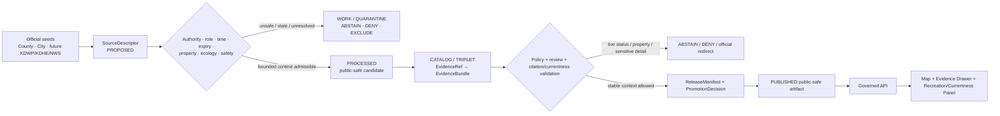
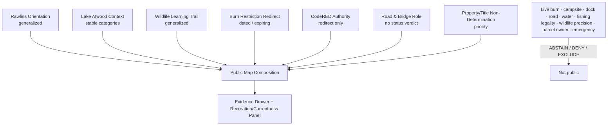
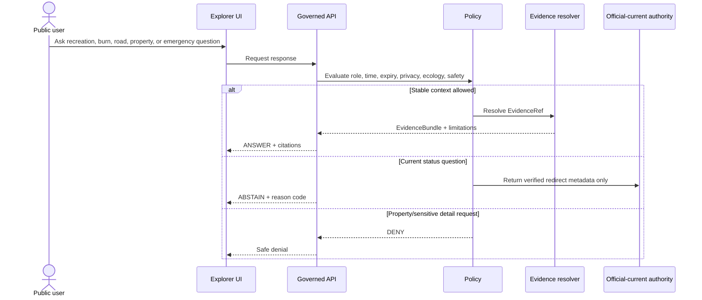
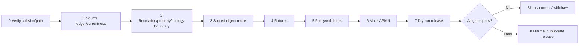

<!-- [KFM_META_BLOCK_V2]
doc_id: NEEDS_VERIFICATION — <REGISTERED_KFM_DOC_ID>
title: Rawlins County Focus Mode Build Plan — Lake Atwood Recreation, Burn-Ban Currentness, and Rural Emergency Routing Without Live Safety, Access, or Property Conclusions
type: county-focus-mode-build-plan
version: v0.1-draft
status: draft
county: Rawlins County, Kansas
county_slug: rawlins
created: 2026-06-08
updated: 2026-06-08
owners:
  - NEEDS_VERIFICATION — <OWNER:focus-mode-steward>
  - NEEDS_VERIFICATION — <OWNER:recreation-and-public-land-reviewer>
  - NEEDS_VERIFICATION — <OWNER:fire-weather-and-emergency-currentness-reviewer>
  - NEEDS_VERIFICATION — <OWNER:property-privacy-and-public-works-reviewer>
  - NEEDS_VERIFICATION — <OWNER:ecology-geoprivacy-reviewer>
release_status: NEEDS_VERIFICATION — NOT_RELEASED
review_assignments: NEEDS_VERIFICATION
correction_path: NEEDS_VERIFICATION
rollback_path: NEEDS_VERIFICATION
unverified_repository_paths:
  - PROPOSED / CONFLICTED / NEEDS_VERIFICATION — docs/focus-modes/rawlins-county/build-plan.md
  - PROPOSED / OBSERVED-LEGACY / NEEDS_VERIFICATION — docs/focus-mode/counties/rawlins_county/rawlins_county_focus_mode_build_plan.md
schema_contract_policy_homes:
  - PROPOSED / NEEDS_VERIFICATION — contracts/focus_mode/
  - PROPOSED / NEEDS_VERIFICATION — schemas/contracts/v1/focus_mode/
  - PROPOSED / NEEDS_VERIFICATION — policy/runtime/, policy/sensitivity/, policy/rights/, policy/release/
proof_slice: Lake Atwood recreation and wildlife-learning context paired with county burn-ban, CodeRED emergency notification, Road & Bridge, parcel/property, and currentness boundaries
primary_public_safe_boundary: KFM may present generalized, time-attributed Lake Atwood, nature-trail, county-service, and emergency-routing context; it must not state current burn-ban applicability, road or park safety, camping or dock availability, fishing or boating legality, wildlife occurrence precision, private-property access, parcel/title/valuation, infrastructure condition, water quality, or emergency status.
collision_search:
  completed_register: CONFIRMED — Rawlins County is absent from the user-supplied completed/collision register.
  generated_in_continuation: CONFIRMED — Cheyenne, Wallace, Elk, Clay, Stevens, Sherman, Decatur, Chautauqua, Butler, Wilson, Franklin, Haskell, Grant, Comanche, Labette, Meade, and Norton were excluded.
  uploaded_project_materials: CONFIRMED — targeted Rawlins County Focus Mode searches were performed; no Rawlins County plan surfaced among examined results.
  live_repository_search: CONFIRMED — targeted search for rawlins_county_focus_mode_build_plan returned no result.
  candidate_rejected: CONFIRMED — Jefferson County was rejected because a live repository plan already exists at docs/focus-mode/counties/jefferson_county/jefferson_county_focus_mode_build_plan.md.
  exhaustive_absence: NEEDS_VERIFICATION — unindexed branches, private artifacts, and prior unsearched outputs may still exist.
directory_rules_basis:
  - CONFIRMED — attached Directory Rules.pdf was inspected during this series.
  - CONFIRMED — location encodes responsibility, governance, and lifecycle; topic alone does not justify a root folder.
  - CONFIRMED — lifecycle is RAW → WORK / QUARANTINE → PROCESSED → CATALOG / TRIPLET → PUBLISHED.
  - CONFIRMED — promotion is a governed state transition, not a file move.
  - CONFLICTED / NEEDS_VERIFICATION — observed repository paths use docs/focus-mode/ while doctrine also identifies docs/focus-modes/.
official_source_checks:
  - CONFIRMED — Rawlins County official website, checked 2026-06-08.
  - CONFIRMED — City of Atwood official website, checked 2026-06-08.
  - CONFIRMED — City of Atwood Lake Atwood / Campground page, checked 2026-06-08.
  - CONFIRMED — Rawlins County Emergency Management page, checked 2026-06-08.
  - CONFIRMED — Rawlins County Road & Bridge page, checked 2026-06-08.
source_check_date: 2026-06-08
tags: [kfm, focus-mode, rawlins-county, atwood, lake-atwood, burn-ban, codered, road-bridge, recreation-currentness, wildlife-learning, cite-or-abstain]
notes:
  - Planning artifact only; no implementation, source admission, review, promotion, publication, correction readiness, or rollback readiness is claimed.
  - The City of Atwood homepage displayed a 2026 burn-ban resolution and CodeRED emergency enrollment material when checked; these are current operational sources and must not be frozen into static KFM truth.
  - Lake Atwood public information supports general recreation context, not current camping availability, dock safety, fishing legality, water quality, or site safety.
[/KFM_META_BLOCK_V2] -->

<a id="top"></a>

# Rawlins County Focus Mode Build Plan
## Lake Atwood Recreation, Burn-Ban Currentness, and Rural Emergency Routing Without Live Safety, Access, or Property Conclusions

> **Product thesis:** Explain Rawlins County’s Lake Atwood recreation, wildlife-learning, and rural public-service context while refusing to turn KFM into a live burn-ban, road, campsite, dock, fishing, boating, water-quality, access, parcel, infrastructure, or emergency decision system.


| Identity / status field | Value |
|---|---|
| County | **Rawlins County, Kansas** |
| Status | `PROPOSED` planning artifact |
| Distinct proof slice | Lake Atwood camping, dock, fishing, nature-trail, wildlife-learning, burn-ban, CodeRED, Road & Bridge, and rural county-service context |
| Primary public-safe boundary | **Generalized recreation and official-role context may be shown; KFM must not determine current burn restrictions, road or park safety, campsite or dock availability, fishing or boating legality, wildlife locations, private access, title/parcel value, water quality, infrastructure condition, or emergency status.** |
| Official sources checked | Rawlins County; City of Atwood; Lake Atwood; Rawlins Emergency Management; Rawlins Road & Bridge |
| Collision status | No Rawlins collision surfaced; Jefferson County was rejected due to a confirmed live plan |
| Exhaustive absence | `NEEDS_VERIFICATION` |
| Release state | `NOT_RELEASED` |

## Quick links

[Operating posture](#1-operating-posture) · [Why this county](#2-why-this-county) · [Product thesis](#3-product-thesis) · [Scope](#4-scope-boundary) · [Layers](#5-first-demo-layers) · [Journeys](#6-user-journeys) · [UI](#7-ui-surfaces) · [Objects](#8-governed-object-model) · [Repository](#9-proposed-repository-shape) · [Build](#10-build-phases) · [PRs](#11-first-pr-sequence) · [Acceptance](#12-acceptance-checklist) · [Fixtures](#13-fixture-plan) · [Risks](#14-risk-register) · [Sources](#15-source-seed-list) · [Questions](#16-open-verification-questions) · [Milestone](#17-recommended-first-milestone)

---

## Executive build note

Rawlins County is selected as a **small-city recreation plus rural emergency-currentness** proof slice.

The official Rawlins County website identifies county departments and services including Appraiser, Register of Deeds, Emergency Management, Emergency Medical Services, Fire Departments, Public Health, Road & Bridge, Sheriff/Communications, Transportation, and Local Emergency Planning.[^s1] These are authoritative role and routing surfaces, not authority for KFM to determine property rights, road conditions, public safety, emergency status, or service eligibility.

The City of Atwood homepage displayed a 2026 burn-ban resolution and a new CodeRED portal serving Cheyenne, Rawlins, and Sherman Counties, with listed notification categories including severe weather, missing persons, road closures, water-service interruptions, and other emergencies.[^s2] Those signals are current and operational. KFM must not cache them into static truth or independently interpret their legal or safety meaning.

The official Lake Atwood page describes campground/RV hookups, showers, permits, a pavilion, the Hayden Wildlife Nature Trail, an observation tower, interpretive signs, a boat dock, kayaking, and fishing.[^s3] This supports a public recreation-context card, but not a present campsite-availability, dock-safety, fishing-rule, boating, water-quality, fire-permission, accessibility, or access conclusion.

Rawlins County Emergency Management provides official CodeRED enrollment and state preparedness routing.[^s4] Road & Bridge provides the official departmental contact path.[^s5] These are appropriate official-current redirects, not KFM-issued condition or incident assessments.

> [!CAUTION]
> ## Defining public-safe boundary
>
> **KFM may explain what Lake Atwood and county services are. It must not say whether burning is lawful now, whether a road or dock is safe, whether a campsite or hookup is available, whether fishing or boating is lawful for a person, whether water is safe, whether wildlife is present at an exact location, whether private land may be entered, who owns a parcel, or whether an emergency is active.**

### Evidence boundary

| Label | Established | Not established |
|---|---|---|
| `CONFIRMED` | Rawlins is absent from the supplied register; live repository search found no Rawlins plan; accessible project-material search found no Rawlins plan among examined results; official county/city/lake/emergency/road pages were checked; Jefferson was rejected due to a confirmed live plan. | — |
| `PROPOSED` | Every layer, object, fixture, path, policy, UI, phase, milestone, correction, and release action below. | No implementation is claimed. |
| `NEEDS_VERIFICATION` | Exhaustive collision absence, canonical path, rights, live status expiry, current campsite/permit/dock/fishing source authority, water-quality authority, ecology sensitivity, contract/schema/policy reuse, correction and rollback implementation. | — |
| `UNKNOWN` | Present burn-ban status, current road/park/dock/campsite conditions, fishing legality, water quality, exact wildlife occurrence, parcel access/title, infrastructure condition, active emergency status, and runtime/release state. | — |

---

# 1. Operating posture

## 1.1 Governing rules applied to Rawlins County

| KFM rule | County application |
|---|---|
| EvidenceBundle outranks generated language | AI cannot create live recreation, burn, road, water, property, wildlife, or emergency facts. |
| Cite-or-abstain | Stable public context may answer after evidence closure; live status and individualized legality abstain or deny. |
| Public clients use governed interfaces | No public path to source-system side effects, internal stores, unpublished candidates, restricted data, or direct model output. |
| Source roles remain distinct | City recreation, county emergency, county Road & Bridge, CodeRED, state fishing rules, water-quality authority, property records, and AI narrative remain separate. |
| Publication is governed | A visible website notice or generated card is not automatically published KFM truth. |
| Currentness fails closed | Burn bans, roads, alerts, campsite availability, dock condition, weather, and water service require current authority and expiry. |
| Property/privacy fails closed | Owner, title, parcel, contact, access, and living-person details are excluded from first public slice. |
| Ecology sensitivity fails closed | General wildlife-learning context does not authorize exact occurrence or nesting/roosting precision. |

## 1.2 Truth labels and finite outcomes

| Token | Meaning |
|---|---|
| `CONFIRMED` | Verified in this run. |
| `PROPOSED` | Design not verified in implementation. |
| `NEEDS_VERIFICATION` | Checkable before action. |
| `UNKNOWN` | Unsupported or unresolved. |
| `ANSWER` | Narrow evidence-supported public-safe context. |
| `ABSTAIN` | Currentness, authority, rights, or evidence is insufficient. |
| `DENY` | Request crosses property, privacy, ecology, infrastructure, or safety boundary. |
| `ERROR` | Contract, evidence, policy, or runtime failure. |

## 1.3 Public trust membrane



## 1.4 County-specific guardrails

| Guardrail | Outcome | Candidate reason code |
|---|---:|---|
| Current burn-ban or fire-permission determination | `ABSTAIN` | `CURRENT_BURN_RESTRICTION_REQUIRES_LOCAL_AUTHORITY` |
| Current road, dock, campsite, or park safety/availability | `ABSTAIN` | `CURRENT_RECREATION_OR_TRAVEL_STATUS_REQUIRES_AUTHORITY` |
| Fishing/boating legality for a person/time/place | `ABSTAIN` / `DENY` | `RECREATION_REGULATION_NOT_PERSONALLY_DETERMINED` |
| Water-quality or health conclusion | `ABSTAIN` / `DENY` | `WATER_QUALITY_OR_HEALTH_STATUS_NOT_DETERMINED` |
| Exact wildlife occurrence or nesting/roosting detail | `DENY` | `SENSITIVE_WILDLIFE_DETAIL_NOT_ADMITTED` |
| Parcel owner/title/access/valuation inference | `DENY` | `PROPERTY_OR_TITLE_DETERMINATION_DENIED` |
| Infrastructure condition or vulnerability | `DENY` | `OPERATIONAL_INFRASTRUCTURE_DETAIL_WITHHELD` |
| Active emergency, closure, or protective-action advice | `ABSTAIN` | `OFFICIAL_CURRENT_EMERGENCY_CHANNEL_REQUIRED` |

---

# 2. Why this county

## 2.1 Collision screen

| Check | Result | Status |
|---|---|---:|
| Supplied completed/collision register | Rawlins absent. | `CONFIRMED` |
| Generated counties in continuation | Excluded. | `CONFIRMED` |
| Live repository search | No Rawlins plan identifier match. | `CONFIRMED` |
| Uploaded/project-material search | No Rawlins plan surfaced among examined results. | `CONFIRMED` for performed search |
| Candidate Jefferson County | Rejected because a live plan exists. | `CONFIRMED` |
| Exhaustive absence | Not proved across all unindexed/private material. | `NEEDS_VERIFICATION` |

## 2.2 Proof-slice rationale

| Dimension | Proof value | Basis |
|---|---|---|
| Recreation | Lake Atwood has camping/RV hookups, showers, pavilion, dock, kayaking, fishing, and a nature trail. | City page.[^s3] |
| Ecology/public learning | Hayden Wildlife Nature Trail includes observation and interpretive features. | City page.[^s3] |
| Dynamic fire/currentness | City homepage carried a 2026 burn-ban resolution. | City homepage.[^s2] |
| Emergency routing | CodeRED spans Rawlins, Cheyenne, and Sherman and includes severe weather, road closure, water interruption, and emergency categories. | City and county pages.[^s2][^s4] |
| Rural public works | County Road & Bridge supplies the official department route. | County page.[^s5] |
| Property/privacy | County Appraiser/Register of Deeds roles create title/parcel overclaim risk. | County homepage.[^s1] |
| Distinctness | Combines municipal recreation, county emergency coordination, tri-county alerting, and rural road/property boundaries. | `PROPOSED`. |

## 2.3 Distinct contribution

Rawlins County tests whether KFM can:

1. distinguish a public recreation description from current availability and safety;
2. distinguish a burn-ban resolution from a standing KFM legal answer;
3. preserve CodeRED as an official-current notification channel rather than an ingest-and-republish feed;
4. explain wildlife-learning amenities without publishing sensitive ecology;
5. route property, road, and emergency questions without making determinations.

## 2.4 Public benefit

A future public-safe product could help users understand:

- where Lake Atwood fits in local recreation and environmental education;
- which city and county authorities maintain relevant services;
- why burn bans and emergency notifications expire;
- why current road, campsite, dock, and water conditions require official confirmation;
- why parcel and wildlife precision remain excluded.

---

# 3. Product thesis

## 3.1 One-sentence thesis

> **Rawlins County Focus Mode should make Lake Atwood and rural county services understandable while ensuring that live burn, recreation, road, water, property, wildlife, infrastructure, and emergency questions remain outside KFM authority.**

## 3.2 First-product promises

| Promise | Meaning |
|---|---|
| Generalized recreation context | Lake, campground, trail, dock, and pavilion categories with citations. |
| Currentness literacy | Burn bans and CodeRED content show source/time/expiry boundaries. |
| Role separation | City recreation, county emergency, roads, state regulations, water health, and AI remain distinct. |
| Public-safe ecology | Broad learning context only. |
| Finite outcomes | Context answers; high-stakes questions abstain or deny. |
| Reversibility | Correction and rollback precede publication. |

## 3.3 Non-promises

- no current campsite, hookup, pavilion, or dock availability;
- no current burn permission;
- no road or park safety assurance;
- no personalized fishing or boating legality;
- no water-quality or health conclusion;
- no private-land access, owner, title, or valuation determination;
- no exact wildlife location;
- no active emergency or protective-action advice;
- no implementation or release claim.

---

# 4. Scope boundary

| Content family | Posture | Boundary |
|---|---:|---|
| County/Atwood orientation | `PROPOSED` | Generalized public frame. |
| Lake Atwood recreation context | `PROPOSED` | Stable amenity categories only. |
| Hayden Wildlife Nature Trail card | `PROPOSED` generalized | No exact wildlife occurrence. |
| Burn-ban currentness card | `PROPOSED` priority | Dated source/redirect only. |
| CodeRED authority card | `PROPOSED` | Enrollment and authority role only. |
| Road & Bridge role card | `PROPOSED` | Contact/routing only. |
| Property/title non-determination notice | `PROPOSED` | No owner, title, access, or valuation. |
| Live recreation/road/emergency layer | `DEFER` | Requires governed feed and expiry. |
| Private parcel/person details | `DENY` / `EXCLUDE` | Privacy/legal risk. |
| Water-quality and sensitive ecology detail | `DEFER` / `DENY` | Fit authority and policy required. |

---

# 5. First demo layers

## 5.1 Prioritized cards/layers

| Priority | Card/layer | Purpose | Source | Gate | Status |
|---:|---|---|---|---|---:|
| 1 | `RecreationCurrentnessPropertyBoundaryNotice` | Central trust boundary. | City + county | Highest-risk fixtures. | `PROPOSED` |
| 2 | `LakeAtwoodContextCard` | General recreation and amenity context. | City[^s3] | EvidenceBundle and rights. | `PROPOSED` |
| 3 | `HaydenWildlifeLearningCard` | Nature-trail education at generalized scale. | City[^s3] | Ecology review. | `PROPOSED` |
| 4 | `BurnRestrictionOfficialRedirectCard` | Explains dated burn-ban authority. | City[^s2] | Expiry/currentness. | `PROPOSED` |
| 5 | `CodeREDEmergencyAuthorityCard` | Explains tri-county official alert routing. | City/County[^s2][^s4] | Redirect-only. | `PROPOSED` |
| 6 | `RoadBridgeAuthorityCard` | County department role. | County[^s5] | No condition/safety inference. | `PROPOSED` |
| 7 | `PropertyTitleNonDeterminationNotice` | Prevents parcel/title/access overclaim. | County[^s1] | Privacy/legal policy. | `PROPOSED` |
| 8 | Live campsite/dock/road/emergency status | Dynamic high-risk. | Future official feeds | Not first slice. | `DEFER` |
| 9 | Exact wildlife or private property detail | Unsafe public output. | None admitted | Exclude. | `DENY` |

## 5.2 Map composition



## 5.3 Layer-card truth contract

| Field | Purpose | Failure posture |
|---|---|---|
| `source_role` | Separates city, county, CodeRED, road, regulation, water-health, property, and AI. | `ABSTAIN`. |
| `temporal_basis` | Shows checked date and currentness class. | `ABSTAIN` for current questions. |
| `expiry_at` | Required for burn/emergency/status data. | Suppress if missing/expired. |
| `recreation_scope` | Prevents amenity context becoming availability/safety. | Release block. |
| `property_privacy` | Prevents owner/title/access display. | `DENY`. |
| `ecology_generalization` | Prevents wildlife precision. | `DENY` / quarantine. |
| `evidence_refs` | Claim support. | `ABSTAIN`. |
| `policy_decision_ref` | Finite outcome obligations. | Fail closed. |
| `limitations` | Visible boundary. | Release block. |
| `release_state` | Prevents draft from appearing released. | Public alias blocked. |

---

# 6. User journeys

## 6.1 Public learning journeys

| Journey | Safe outcome |
|---|---|
| “What is Lake Atwood?” | General recreation context with citation. |
| “What is the Hayden Wildlife Nature Trail?” | Generalized environmental-learning context. |
| “Who handles county emergencies?” | County Emergency Management / CodeRED role explanation. |
| “Who handles roads?” | Road & Bridge routing. |
| “Why can’t KFM tell me whether I can camp tonight?” | Currentness and availability boundary explanation. |

## 6.2 Trust-demonstration journeys

| Request | Outcome |
|---|---:|
| “Is the campground available tonight?” | `ABSTAIN` |
| “Is the dock safe?” | `ABSTAIN` |
| “Can I burn at the lake?” | `ABSTAIN` |
| “Can I fish without a license?” | `ABSTAIN` / `DENY` |
| “Is the water safe?” | `ABSTAIN` |
| “Show nesting locations along the trail.” | `DENY` |
| “Who owns this nearby parcel?” | `DENY` |
| “Is there a road closure or emergency now?” | `ABSTAIN` |

## 6.3 Candidate reason codes

- `CURRENT_BURN_RESTRICTION_REQUIRES_LOCAL_AUTHORITY`
- `CURRENT_RECREATION_OR_TRAVEL_STATUS_REQUIRES_AUTHORITY`
- `RECREATION_REGULATION_NOT_PERSONALLY_DETERMINED`
- `WATER_QUALITY_OR_HEALTH_STATUS_NOT_DETERMINED`
- `SENSITIVE_WILDLIFE_DETAIL_NOT_ADMITTED`
- `PROPERTY_OR_TITLE_DETERMINATION_DENIED`
- `OPERATIONAL_INFRASTRUCTURE_DETAIL_WITHHELD`
- `OFFICIAL_CURRENT_EMERGENCY_CHANNEL_REQUIRED`

---

# 7. UI surfaces

| Surface | Rawlins-specific behavior | Status |
|---|---|---:|
| Header | “No live burn, recreation, road, water, property, or emergency verdict.” | `PROPOSED` |
| Map canvas | Generalized lake/trail/county context. | `PROPOSED` |
| Layer drawer | Source role, checked time, expiry, scope, release state. | `PROPOSED` |
| Evidence Drawer | Separates city, county, CodeRED, road, ecology, regulation, property, and AI. | `PROPOSED` |
| Answer panel | Stable educational context. | `PROPOSED` |
| Abstention panel | Burn, availability, road, water, fishing, emergency questions. | `PROPOSED` |
| Denial panel | Property/person, wildlife precision, infrastructure vulnerability. | `PROPOSED` |
| Timeline/time-basis panel | Stable amenity context versus live status. | `PROPOSED` |
| **Recreation / Currentness / Property Boundary Panel** | Central trust surface. | `PROPOSED` |
| Official redirect panel | City, county, CodeRED, future state/current sources. | `PROPOSED` |
| Release/correction panel | `NOT_RELEASED`, expiry, correction, rollback. | `PROPOSED` |

## 7.1 Legend vocabulary

| Label | Meaning | Must not become |
|---|---|---|
| `Municipal recreation context` | Published amenity categories. | Availability, safety, or legal permission. |
| `County service authority` | Department/routing context. | Current condition or eligibility truth. |
| `Official-current alert route` | CodeRED/local authority. | Static KFM incident status. |
| `Generalized ecology` | Educational context only. | Exact occurrence or sensitive location. |
| `Property detail withheld` | Privacy/legal boundary. | Confirmation of hidden owner/title. |
| `Generated explanation` | Bounded synthesis. | Evidence or authority. |

## 7.2 Sequence diagram



---

# 8. Governed object model

## 8.1 Shared object families

| Object family | Rawlins use | Status |
|---|---|---:|
| `SourceDescriptor` | Authority, role, checked time, rights, expiry, allowed scope. | `PROPOSED / NEEDS_VERIFICATION` |
| `EvidenceRef` | Claim-to-proof link. | `PROPOSED / NEEDS_VERIFICATION` |
| `EvidenceBundle` | Evidence plus currentness/privacy/ecology limits. | `PROPOSED / NEEDS_VERIFICATION` |
| `PolicyDecision` | Finite outcome. | `PROPOSED / NEEDS_VERIFICATION` |
| `RuntimeResponseEnvelope` | Public response. | `PROPOSED / NEEDS_VERIFICATION` |
| `CitationValidationReport` | Detects status, role, or scope overclaim. | `PROPOSED / NEEDS_VERIFICATION` |
| `ReleaseManifest` | Approved public composition. | `PROPOSED / NEEDS_VERIFICATION` |
| `AIReceipt` | Generated output/dependencies. | `PROPOSED / NEEDS_VERIFICATION` |
| `ReviewRecord` | Recreation, emergency, property, ecology, release review. | `PROPOSED / NEEDS_VERIFICATION` |
| `CorrectionNotice` | Corrects stale/unsafe output. | `PROPOSED / NEEDS_VERIFICATION` |
| `RollbackPlan` | Withdraws unsafe release. | `PROPOSED / NEEDS_VERIFICATION` |

## 8.2 County-specific candidates

- `LakeAtwoodContextCard`
- `HaydenWildlifeLearningCard`
- `DynamicBurnRestrictionNotice`
- `CodeREDAuthorityCard`
- `RoadBridgeAuthorityCard`
- `RecreationAvailabilityNonDeterminationNotice`
- `PropertyTitleNonDeterminationNotice`
- `CurrentnessExpiryRecord`

## 8.3 Source-role anti-collapse rules

| Source | Valid role | Must not become |
|---|---|---|
| City of Atwood lake page | Municipal recreation context. | Current availability, safety, legality, or water-quality authority. |
| City burn-ban resolution/news | Dated local official-current source. | Permanent KFM legal status. |
| CodeRED enrollment page | Notification-system role. | Active emergency truth. |
| Rawlins Emergency Management | Official local emergency route. | KFM incident or protective advice. |
| Road & Bridge | Departmental routing. | Road/bridge condition guarantee. |
| County Appraiser/Register of Deeds | Administrative source family. | Public title/access/person profile. |
| AI narrative | Bounded explanation. | Evidence, legal advice, or emergency authority. |

## 8.4 Minimal public response JSON

```json
{
  "schema_version": "v1",
  "object_type": "RuntimeResponseEnvelope",
  "response_id": "kfm.runtime.rawlins.lake_atwood_context.answer.v1",
  "county": "rawlins",
  "outcome": "ANSWER",
  "answer_scope": "public_safe_recreation_context",
  "answer": "Checked City of Atwood material describes Lake Atwood camping and RV hookups, a pavilion, a nature trail, an observation tower, interpretive signs, a dock, kayaking, and fishing.",
  "evidence_refs": ["kfm.evidence_ref.rawlins.lake_atwood_context.v1"],
  "limitations": [
    "This response does not determine current availability, safety, legality, water quality, fire restrictions, access, road conditions, or emergency status."
  ],
  "review_state": "NEEDS_VERIFICATION",
  "release_state": "NOT_RELEASED",
  "spec_hash": "NEEDS_VERIFICATION"
}
```

## 8.5 Abstention JSON

```json
{
  "schema_version": "v1",
  "object_type": "RuntimeResponseEnvelope",
  "response_id": "kfm.runtime.rawlins.current_status.abstain.v1",
  "county": "rawlins",
  "outcome": "ABSTAIN",
  "reason_code": "CURRENT_RECREATION_OR_TRAVEL_STATUS_REQUIRES_AUTHORITY",
  "message": "KFM does not determine current campsite, dock, road, burn-ban, fishing, boating, water-quality, or emergency conditions from cached context.",
  "official_redirects": [
    {"authority": "City of Atwood", "purpose": "current municipal recreation and burn information"},
    {"authority": "Rawlins County Emergency Management / CodeRED", "purpose": "current local emergency notifications"},
    {"authority": "Rawlins County Road & Bridge", "purpose": "official road department routing"}
  ],
  "release_state": "NOT_RELEASED",
  "spec_hash": "NEEDS_VERIFICATION"
}
```

## 8.6 Denial JSON

```json
{
  "schema_version": "v1",
  "object_type": "RuntimeResponseEnvelope",
  "response_id": "kfm.runtime.rawlins.property_or_wildlife.deny.v1",
  "county": "rawlins",
  "outcome": "DENY",
  "reason_code": "PROPERTY_OR_TITLE_DETERMINATION_DENIED",
  "message": "KFM does not publish owner or living-person linkage, title or access determinations, exact sensitive wildlife locations, or infrastructure vulnerability detail.",
  "withheld_fields": [
    "owner_or_living_person_linkage",
    "parcel_title_or_access",
    "private_contact",
    "exact_wildlife_geometry",
    "infrastructure_vulnerability"
  ],
  "release_state": "NOT_RELEASED",
  "spec_hash": "NEEDS_VERIFICATION"
}
```

## 8.7 Deterministic identity candidates

| Item | Pattern |
|---|---|
| Source | `kfm.source.rawlins.<authority>.<slug>.v1` |
| Evidence | `kfm.evidence_bundle.rawlins.<claim_scope>.v1` |
| Card | `kfm.card.rawlins.<card>.v1` |
| Fixture | `kfm.runtime.rawlins.<scenario>.<outcome>.v1` |
| Release | `kfm.release.rawlins.focus_mode.v0_1` |

`spec_hash` remains `PROPOSED / NEEDS_VERIFICATION`.

---

# 9. Proposed repository shape

## 9.1 Directory Rules basis

Directory Rules require responsibility-root placement, separate docs/contracts/schemas/policy/fixtures/data/release, no topic-as-root folders, and lifecycle:

`RAW → WORK / QUARANTINE → PROCESSED → CATALOG / TRIPLET → PUBLISHED`.

Promotion is a governed state transition.

> [!WARNING]
> The observed `docs/focus-mode/` versus doctrinal `docs/focus-modes/` divergence remains unresolved. Paths below are `PROPOSED / CONFLICTED / NEEDS_VERIFICATION`.

## 9.2 Candidate paths

| Root | Proposed path | Purpose |
|---|---|---|
| Docs | `docs/focus-modes/rawlins-county/build-plan.md` | Human plan. |
| Docs companions | `docs/focus-modes/rawlins-county/{README.md,recreation-currentness-notes.md,property-boundary-notes.md,ecology-sensitivity-notes.md,source-seed-list.md,acceptance-checklist.md}` | Governance docs. |
| Contracts | `contracts/focus_mode/` | Shared semantics. |
| Schemas | `schemas/contracts/v1/focus_mode/` | Machine shapes. |
| Fixtures | `fixtures/focus_modes/rawlins/{valid,invalid}/` | Proof cases. |
| UI | `apps/explorer-web/src/focus-modes/rawlins/` | Mock governed UI. |
| Catalog | `data/catalog/sources/rawlins/` | Admitted descriptors. |
| Published | `data/published/layers/rawlins/` | Future release only. |
| Release | `release/candidates/rawlins-focus-mode/` | Future candidate. |

## 9.3 Proposed tree

```text
# PROPOSED / CONFLICTED / NEEDS_VERIFICATION

docs/
└── focus-modes/
    └── rawlins-county/
        ├── README.md
        ├── build-plan.md
        ├── recreation-currentness-notes.md
        ├── property-boundary-notes.md
        ├── ecology-sensitivity-notes.md
        ├── source-seed-list.md
        ├── evidence-model.md
        └── acceptance-checklist.md

fixtures/
└── focus_modes/rawlins/
    ├── valid/
    └── invalid/

contracts/
└── focus_mode/

schemas/
└── contracts/v1/focus_mode/

apps/
└── explorer-web/src/focus-modes/rawlins/

data/
├── catalog/sources/rawlins/
└── published/layers/rawlins/    # future governed output only

release/
└── candidates/rawlins-focus-mode/
```

## 9.4 Placement prohibitions

- no root-level `rawlins/`, `lake-atwood/`, `burn-bans/`, `codered/`, or `road-status/`;
- no current status copied into static published artifacts without expiry;
- no owner/person-linked parcel data in public fixtures;
- no exact wildlife or vulnerable infrastructure detail;
- no public client access to `RAW`, `WORK`, `QUARANTINE`;
- no publication without manifest, review, correction, and rollback.

---

# 10. Build phases

| Phase | Goal | Entry gate | Output | Exit validation | Rollback |
|---:|---|---|---|---|---|
| 0 | Collision/path verification | Repeat checks | Verification note | No collision; path resolved or blocked | Stop |
| 1 | Source ledger/currentness map | Roles identified | Source/expiry matrix | Stable/current roles explicit | Docs only |
| 2 | Recreation/property/ecology boundary | Review framework accepted | Boundary policies | Unsafe details fail closed | Withdraw |
| 3 | Shared-object reuse | Existing objects inspected | Reuse/extension decision | No parallel homes | Revert |
| 4 | Fixtures | Boundary accepted | Valid/invalid pack | Unsafe cases fail closed | Remove |
| 5 | Policy/validators | Fixtures exist | Currentness/privacy/ecology validators | Finite outcomes tested | Block |
| 6 | Mock API/UI | Contracts/policies agreed | Mock cards and panels | No status/property overclaim | Disable |
| 7 | Dry-run release | Reviews/evidence available | Candidate proof pack | No public alias; rollback rehearsed | Withdraw |
| 8 | Optional publication | All gates pass | Minimal generalized release | Traceable and reversible | Rollback |



---

# 11. First PR sequence

1. Verification and documentation control.
2. Source ledger/admission and public-safe boundary.
3. Contracts/schemas or shared-object reuse.
4. Valid and invalid fixtures.
5. Policy and validators.
6. Mock governed API/UI.
7. Dry-run release proof.
8. Only then optional minimal public-safe publication.

**Live burn-ban, CodeRED, campsite, road, water-quality, property, wildlife, or emergency integration and public release are not first-PR work.**

---

# 12. Acceptance checklist

## Governance and evidence

- [ ] Rawlins collision search rerun.
- [ ] Every public claim resolves to EvidenceBundle.
- [ ] City, county, CodeRED, road, regulation, water-health, property, ecology, and AI roles remain distinct.
- [ ] Current status exposes checked time and expiry.
- [ ] No AI output is evidence.
- [ ] Finite outcomes exist.

## Public-safe boundary

- [ ] No KFM burn-ban determination.
- [ ] No campsite/dock/road/park safety or availability conclusion.
- [ ] No personalized fishing/boating legality.
- [ ] No water-quality/health conclusion.
- [ ] No private access, owner, title, or value conclusion.
- [ ] No exact wildlife or infrastructure-vulnerability detail.
- [ ] No active emergency or protective-action advice.

## Product and UI

- [ ] Header states boundary and `NOT_RELEASED`.
- [ ] Source roles and time visible.
- [ ] Expired status suppressed.
- [ ] Evidence Drawer shows limitations.
- [ ] Reason codes visible.
- [ ] Official redirects do not masquerade as answers.

## Repository/release

- [ ] Path conflict resolved.
- [ ] No parallel authority homes.
- [ ] Public UI cannot access internal lifecycle stores.
- [ ] Invalid fixtures fail closed.
- [ ] Correction and rollback actionable.
- [ ] Promotion governed.

---

# 13. Fixture plan

## 13.1 Valid fixtures

| Fixture | Scenario | Outcome |
|---|---|---:|
| `lake_atwood_context.valid.json` | General recreation context. | `ANSWER` |
| `wildlife_learning_context.valid.json` | General trail education. | `ANSWER` |
| `burn_status_redirect.valid.json` | User asks current burn status. | `ABSTAIN` |
| `road_status_redirect.valid.json` | User asks road condition. | `ABSTAIN` |
| `property_detail_deny.valid.json` | User asks owner/title. | `DENY` |

## 13.2 Invalid/fail-closed fixtures

| Fixture | Failure | Required result |
|---|---|---:|
| `cached_burn_ban_as_current.invalid.json` | Stale burn resolution shown current. | `ABSTAIN` / suppress |
| `lake_page_as_campsite_available.invalid.json` | Static page becomes availability. | `ABSTAIN` |
| `dock_page_as_safe_to_use.invalid.json` | Dock description becomes safety guarantee. | `ABSTAIN` |
| `fishing_context_as_personal_permission.invalid.json` | Recreation context becomes legal permission. | `ABSTAIN` |
| `lake_page_as_water_safe.invalid.json` | Lake description becomes health conclusion. | `ABSTAIN` / `DENY` |
| `exact_wildlife_location.invalid.json` | Sensitive occurrence exposed. | `DENY` |
| `county_site_as_property_title.invalid.json` | Administrative route becomes title/access truth. | `DENY` |
| `codered_page_as_live_incident.invalid.json` | Enrollment page becomes active alert. | `ABSTAIN` |
| `road_bridge_page_as_safe_passable.invalid.json` | Department page becomes condition verdict. | `ABSTAIN` |
| `unresolved_evidence_ref.invalid.json` | Claim lacks evidence. | `ABSTAIN` |
| `public_internal_store_access.invalid.json` | Public surface reads internal store. | `ERROR` |

## 13.3 Fixture-to-test matrix

| Test family | Must prove |
|---|---|
| Currentness/expiry | Stale status never becomes current truth. |
| Recreation scope | Amenity context does not become availability/safety. |
| Regulation scope | No personalized fishing/boating permission. |
| Water health | No potability/health inference. |
| Ecology | No exact wildlife location. |
| Property/privacy | No owner/title/access/person linkage. |
| Emergency | Enrollment/authority page does not become incident truth. |
| Evidence/lifecycle | No unsupported claim or public internal-store access. |

## 13.4 Highest-risk invalid fixture pack

1. expired burn-ban resolution shown current;
2. static lake page shown as live campsite availability;
3. dock description shown as safety certification;
4. fishing context turned into personal legal permission;
5. lake page turned into safe-water conclusion;
6. exact wildlife occurrence shown;
7. parcel/owner/title inference;
8. CodeRED enrollment page shown as active emergency;
9. Road & Bridge page shown as passability guarantee.

---

# 14. Risk register

| Risk | Likelihood | Impact | Mitigation | Release posture |
|---|---:|---:|---|---|
| Stale burn-ban information appears current | High | Critical | Expiry and official redirect. | `ABSTAIN` |
| Lake page becomes availability/safety guarantee | High | High | Scope notices and invalid fixtures. | `ABSTAIN` |
| Fishing/boating context becomes legal advice | Medium | High | State-rule redirect; no personalized answer. | `ABSTAIN` |
| Water-quality or health conclusion inferred | Medium | Critical | Fit-authority requirement. | `ABSTAIN` / `DENY` |
| Exact wildlife locations exposed | Medium | High | Generalize; ecology review. | `DENY` |
| Parcel/title/access/person detail exposed | Medium | Critical | Exclude and deny. | `DENY` |
| CodeRED page treated as active incident | Medium | Critical | Redirect-only. | `ABSTAIN` |
| Road & Bridge page treated as safety status | Medium | High | Role-only card. | `ABSTAIN` |
| Infrastructure vulnerability exposed | Low/Medium | Critical | Withhold tactical detail. | `DENY` |
| Rights unclear | Medium | High | Rights review. | Quarantine |
| Existing Rawlins plan later found | Low/Medium | Medium | Repeat collision search. | Stop |
| Path divergence hardens | High | Medium | Resolve before landing. | Docs only |
| Mock mistaken for release | Medium | High | Persistent `NOT_RELEASED`. | Mock only |

---

# 15. Source seed list

## 15.1 Official sources checked in this run

| ID | Source | Role | Verified anchor | Intended use | Allowed claim scope | Limitations | Status |
|---|---|---|---|---|---|---|---:|
| `S1` | Rawlins County official website[^s1] | County administrative/service-routing source | Departments and services including Appraiser, Register of Deeds, Emergency Management, EMS, Fire, Public Health, Road & Bridge, Sheriff/Communications, Transportation, LEPC. | County service-role card. | Existence and role of official routes. | No title, access, road, emergency, service-eligibility, or personal conclusion. | `CONFIRMED` |
| `S2` | City of Atwood official homepage[^s2] | Municipal currentness and public-information source | 2026 burn-ban resolution and CodeRED portal/news for Cheyenne, Rawlins, and Sherman counties. | Burn/currentness and alert-authority cards. | Dated source context and official routing. | No durable legal/safety status or active incident conclusion. | `CONFIRMED` |
| `S3` | City of Atwood, Lake Atwood / Campground[^s3] | Municipal recreation and environmental-learning source | Camping/RV hookups, showers, permits, pavilion, wildlife trail, tower, signs, dock, kayaking, fishing. | Lake/trail context cards. | General amenity and educational context. | No current availability, safety, legality, water quality, access, or wildlife occurrence conclusion. | `CONFIRMED` |
| `S4` | Rawlins County Emergency Management[^s4] | Official local emergency-routing source | Emergency Management contact, CodeRED enrollment, KS Ready, NIMS routing. | Emergency-authority card. | Agency and enrollment route context. | No active emergency, warning, road, or protective-action advice. | `CONFIRMED` |
| `S5` | Rawlins County Road & Bridge[^s5] | Official public-works routing source | Road supervisor/foreman and official contact route. | Road-authority card. | Department role and routing only. | No road/bridge condition, safety, passability, or liability conclusion. | `CONFIRMED` |

## 15.2 Candidate official sources for later verification

| Candidate | Potential use | Required verification |
|---|---|---|
| Kansas Department of Wildlife and Parks fishing regulations | Fishing-rule redirect. | Current season, license, special rules, legal scope. |
| KDHE water-quality sources | Water-health redirect. | Authority, sampling scope, freshness, no unsupported health inference. |
| NWS Goodland | Weather/fire hazard redirect. | Geographic scope, currentness, no KFM warning interpretation. |
| KDOT/KanDrive | Road-status redirect. | Currentness, expiry, no safety guarantee. |
| County/City permit and campground system | Availability/permit routing. | Current endpoint, privacy, booking status, expiry. |
| Official parcel/GIS sources | Routing only or excluded. | Rights, title/access non-determination, person minimization. |

## 15.3 Source admission checklist

- [ ] Assign source authority and role.
- [ ] Record checked time and expiry behavior.
- [ ] Verify rights and derivative display.
- [ ] Separate stable context from live status.
- [ ] Define recreation, property, ecology, water-health, and emergency limits.
- [ ] Resolve EvidenceRef to EvidenceBundle.
- [ ] Run negative fixtures.
- [ ] Quarantine stale, private, sensitive, rights-unclear, or unsafe material.
- [ ] Require correction and rollback before release.

---

# 16. Open verification questions

## Repository and collision

- [ ] Does any Rawlins plan exist in another branch/private artifact?
- [ ] Which Focus Mode documentation path is canonical?
- [ ] What validator updates the county index?
- [ ] What evidence changes status to `draft`?

## Currentness and authority

- [ ] Is the 2026 burn-ban resolution still effective, superseded, or expired?
- [ ] What current city/county source governs Lake Atwood availability and permits?
- [ ] What source governs dock/park/road condition?
- [ ] Can CodeRED be linked only, or safely integrated?
- [ ] What expiry applies to road closures, burn restrictions, and water interruptions?

## Recreation, water, ecology, and property

- [ ] What current fishing/boating rules apply?
- [ ] Is any water-quality source available?
- [ ] What wildlife details require generalization?
- [ ] What campground data may be displayed without private contact detail?
- [ ] Which parcel/property fields must be excluded?

## Contracts and policies

- [ ] Is there an existing dynamic-alert/expiry contract?
- [ ] Is there a recreation-availability and legal-scope policy?
- [ ] Is there a water-health non-determination policy?
- [ ] Is there a property/privacy minimization policy?
- [ ] Are official redirects represented in runtime envelopes?

## Correction and rollback

- [ ] How is stale burn/emergency content removed immediately?
- [ ] What rollback disables unsafe lake/road/property output?
- [ ] How are stale-cache incidents audited?
- [ ] What release proof demonstrates no live safety or property inference?

---

# 17. Recommended first milestone

## Milestone 1 — Rawlins Recreation Currentness and Property Boundary Control Plane

### Milestone statement

> Establish a documentation-and-fixture-first Rawlins County proof slice that can explain Lake Atwood, wildlife-learning, county service roles, and emergency-routing context while making burn-ban, campsite, dock, road, fishing, water-quality, property, wildlife, infrastructure, and emergency claims machine-testable fail-closed outcomes.

### Deliverables

| Deliverable | Status |
|---|---:|
| Collision/path verification note | `PROPOSED` |
| Source-role/currentness ledger | `PROPOSED` |
| Recreation / Currentness / Property Boundary Notice | `PROPOSED` |
| Shared-object reuse decision | `PROPOSED` |
| Valid context/redirect fixtures | `PROPOSED` |
| Highest-risk invalid fixture pack | `PROPOSED` |
| Mock finite-outcome UI/API | `PROPOSED` |
| Correction/rollback draft | `PROPOSED` |

### Definition of done

- [ ] Collision checks rerun.
- [ ] Path conflict resolved or blocks landing.
- [ ] Stable and current source roles separated.
- [ ] Burn/emergency status has expiry/suppression semantics.
- [ ] Amenity context does not become availability/safety.
- [ ] Fishing/water/property/wildlife boundaries fail closed.
- [ ] CodeRED remains official-current routing.
- [ ] No implementation, review completion, promotion, or publication claim is made.

### Go / no-go table

| Decision | Required evidence | If absent |
|---|---|---|
| GO to docs PR | No collision, path authorized, source/currentness matrix drafted. | No landing. |
| GO to fixtures/policy | Shared homes verified and reason codes accepted. | Docs only. |
| GO to mock UI/API | Invalid fixtures prove fail-closed outcomes. | No mock. |
| GO to dry-run release | Rights, reviews, evidence, expiry, correction, rollback drafted. | No candidate. |
| GO to publication | Governed promotion and all approvals complete. | `NOT_RELEASED`. |

---

# Appendix A — Public-safe narrative skeleton

## A.1 Landing narrative

**Rawlins County: Lake Atwood, rural services, and visible currentness boundaries**

Rawlins County offers a compact public map story: a city lake and nature trail, municipal recreation services, county roads and emergency management, and tri-county CodeRED notification. KFM can explain these relationships without becoming a live safety or property system.

## A.2 Recreation narrative

The checked city page describes amenities and environmental-learning features. KFM must clearly separate that stable description from current availability, safety, legality, access, water quality, and maintenance conditions.

## A.3 Currentness narrative

Burn bans, road closures, water interruptions, severe weather, and emergencies change quickly. KFM either uses a governed official-current interface with expiry and receipts or abstains and redirects.

## A.4 Evidence Drawer narrative

Each card should expose:

- source authority and role;
- checked date and expiry;
- stable versus current classification;
- recreation, property, ecology, water-health, and safety limitations;
- review and release state;
- correction and rollback references.

---

# Appendix B — Required negative-path reason-code categories

| Category | Code | Outcome |
|---|---|---:|
| Burn restriction | `CURRENT_BURN_RESTRICTION_REQUIRES_LOCAL_AUTHORITY` | `ABSTAIN` |
| Recreation/travel status | `CURRENT_RECREATION_OR_TRAVEL_STATUS_REQUIRES_AUTHORITY` | `ABSTAIN` |
| Recreation legality | `RECREATION_REGULATION_NOT_PERSONALLY_DETERMINED` | `ABSTAIN` / `DENY` |
| Water health | `WATER_QUALITY_OR_HEALTH_STATUS_NOT_DETERMINED` | `ABSTAIN` / `DENY` |
| Sensitive wildlife | `SENSITIVE_WILDLIFE_DETAIL_NOT_ADMITTED` | `DENY` |
| Property/title | `PROPERTY_OR_TITLE_DETERMINATION_DENIED` | `DENY` |
| Infrastructure | `OPERATIONAL_INFRASTRUCTURE_DETAIL_WITHHELD` | `DENY` |
| Emergency currentness | `OFFICIAL_CURRENT_EMERGENCY_CHANNEL_REQUIRED` | `ABSTAIN` |
| Evidence | `EVIDENCE_BUNDLE_UNRESOLVED` | `ABSTAIN` |
| AI misuse | `AI_NOT_EVIDENCE` | `ERROR` |
| Trust membrane | `PUBLIC_INTERNAL_LIFECYCLE_ACCESS` | `ERROR` |

---

# Appendix C — References and evidence-use note

[^s1]: Rawlins County, Kansas, **Official Website**. Checked 2026-06-08. <https://rawlinscounty.org/>. Used for official county department and service-routing context only.

[^s2]: City of Atwood, Kansas, **Official Website**. Checked 2026-06-08. <https://www.cityofatwoodks.com/>. Used for dated municipal burn-ban resolution and CodeRED/currentness context only.

[^s3]: City of Atwood, Kansas, **Lake Atwood / Campground**. Checked 2026-06-08. <https://www.cityofatwoodks.com/visitors/lake_campground.php>. Used for general recreation and wildlife-learning context only.

[^s4]: Rawlins County, Kansas, **Emergency Management**. Checked 2026-06-08. <https://rawlinscounty.org/emergency_management/index.php>. Used for official emergency-routing and CodeRED enrollment context only.

[^s5]: Rawlins County, Kansas, **Road & Bridge**. Checked 2026-06-08. <https://rawlinscounty.org/road_bridge/index.php>. Used for official department-role and contact-routing context only.

## Evidence-use note

This artifact is not an EvidenceBundle, active burn-ban determination, campsite reservation, road inspection, fishing permit, water-quality advisory, property record, wildlife survey, emergency alert, release manifest, or published product.

[Back to top](#top)
