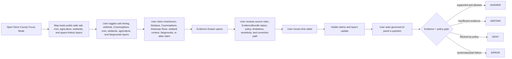
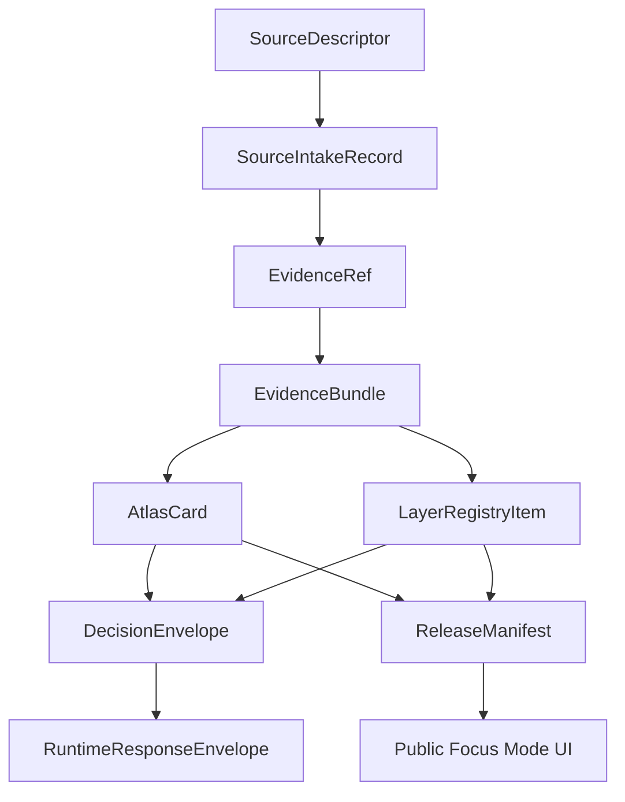

<!--
doc_id: NEEDS_VERIFICATION
title: Reno County Focus Mode Build Plan
type: standard
version: v1
status: draft
owners: [NEEDS_VERIFICATION]
created: 2026-05-21
updated: 2026-05-21
policy_label: public_draft
related:
  - docs/focus-modes/ellsworth-county/build-plan.md
  - docs/focus-modes/riley-county/build-plan.md
  - docs/focus-modes/shawnee-county/build-plan.md
  - docs/focus-modes/ford-county/build-plan.md
  - docs/focus-modes/wyandotte-county/build-plan.md
  - docs/focus-modes/sedgwick-county/build-plan.md
  - docs/focus-modes/douglas-county/build-plan.md
  - docs/focus-modes/leavenworth-county/build-plan.md
  - docs/focus-modes/reno-county/README.md
  - docs/focus-modes/reno-county/layer-registry.md
  - docs/focus-modes/reno-county/acceptance-checklist.md
tags: [kfm, focus-mode, reno-county, hutchinson, salt-mining, cosmosphere, arkansas-river, wetlands, state-fair]
notes:
  - Draft plan prepared without mounted repository inspection.
  - Paths, owners, doc IDs, schema homes, and validator names require repository verification before merge.
  - Salt mining, subsidence, space-history, hydrology, wetlands, agriculture, public-health, State Fair, and infrastructure claims require source intake and evidence review before publication.
-->

<a id="top"></a>

# Reno County Focus Mode Build Plan

> **Purpose:** establish a ninth Kansas Frontier Matrix county proof slice after Ellsworth, Riley, Shawnee, Ford, Wyandotte, Sedgwick, Douglas, and Leavenworth counties, with a distinct south-central / central Kansas profile: **Hutchinson, salt discovery and mining, Strataca, the Cosmosphere and Kansas space-history education, Arkansas River lowlands, groundwater and sinkhole risk, the Kansas State Fair, agriculture, wetlands / Central Flyway context, and public-safe infrastructure governance.**


---

## Quick links

- [1. Why Reno County](#1-why-reno-county)
- [2. Product thesis](#2-product-thesis)
- [3. Scope boundary](#3-scope-boundary)
- [4. First demo layers](#4-first-demo-layers)
- [5. User journeys](#5-user-journeys)
- [6. UI surfaces](#6-ui-surfaces)
- [7. Governed object model](#7-governed-object-model)
- [8. Proposed repository shape](#8-proposed-repository-shape)
- [9. Build phases](#9-build-phases)
- [10. First PR sequence](#10-first-pr-sequence)
- [11. Acceptance checklist](#11-acceptance-checklist)
- [12. Risk register](#12-risk-register)
- [13. Source seed list](#13-source-seed-list)
- [14. Open verification questions](#14-open-verification-questions)
- [15. Recommended first milestone](#15-recommended-first-milestone)

---

## Operating posture

> [!IMPORTANT]
> Reno County Focus Mode is a **governed salt / space-history / river-lowlands / wetlands / agriculture proof slice**, not a loose Hutchinson attractions map. It must preserve KFM’s core invariants:
>
> - EvidenceBundle outranks generated language.
> - Public clients use governed APIs, released artifacts, catalog records, tile services, and policy-safe runtime envelopes.
> - Public UI must not read directly from `RAW`, `WORK`, `QUARANTINE`, unpublished candidate data, canonical/internal stores, or direct model runtime outputs.
> - Publication is a governed state transition, not a file move.
> - AI outputs are downstream carriers, not sovereign truth.
> - Mining, subsidence, groundwater, public health, wetlands, rare species, aviation/space artifacts, fairgrounds/event safety, and infrastructure claims must remain source-bound, role-labeled, generalized where needed, and correction-friendly.

---

# 1. Why Reno County

Reno County is the right ninth Focus Mode because it gives KFM a **geology/mining + space education + river/wetlands + agriculture** proof slice.

Ellsworth County tests frontier county history, Fort Harker / Kanopolis, settlement, and environmental baseline.

Riley County tests Flint Hills ecology, Fort Riley, Konza Prairie, research-site sensitivity, and river landscapes.

Shawnee County tests state government, civil-rights history, Topeka urban geography, public institutions, and archive-heavy civic memory.

Ford County tests Dodge City, Santa Fe Trail, Fort Dodge, cattle-town public history, Arkansas River water, and High Plains agriculture.

Wyandotte County tests dense urban governance, river confluence, tribal/burial sensitivity, environmental justice, rail/industry, and immigration/labor history.

Sedgwick County tests Wichita metro, aviation, Chisholm Trail, severe weather, public health, and infrastructure sensitivity.

Douglas County tests Free-State / Bleeding Kansas history, KU, Haskell, rivers, archives, and traumatic public memory.

Leavenworth County tests Fort Leavenworth, Missouri River, territorial politics, military education, corrections, and public-safety filtering.

Reno County adds:

| KFM capability | Reno County proof value |
|---|---|
| Salt geology and mining | Hutchinson salt discovery, underground mining, Strataca, source-role distinction between geology, mining, tourism, and risk |
| Subsurface hazard handling | sinkholes, subsidence, mine geography, infrastructure risk, public-safe generalization |
| Space-history education | Cosmosphere, planetarium history, space artifacts, STEM/public-history layers |
| Arkansas River lowlands | river corridor, floodplain, groundwater, agriculture, drainage |
| Wetlands / Central Flyway context | Quivira / Cheyenne Bottoms regional link, migratory bird sensitivity, generalized ecology |
| Kansas State Fair | statewide public event geography, fairgrounds, tourism, emergency/public-safety caution |
| Agriculture and irrigation | crop, livestock, groundwater, soil, and remote-sensing layers |
| Public health and emergency management | wildfire/wind/flood/dust/severe weather, but not an alerting system |
| Archive-heavy local history | Reno County Historical Society, official county history, museum records, fair/space/salt institutions |

> [!NOTE]
> Reno County is ideal for proving that KFM can connect below-ground geology, above-ground river/agriculture systems, and space-history education without treating tourism pages, hazard maps, or model outputs as proof.

---

# 2. Product thesis

## User-facing thesis

> **Reno County Focus Mode lets a user explore how Hutchinson, salt mining, underground geology, the Arkansas River, wetlands and bird migration, agriculture, the Kansas State Fair, and the Cosmosphere shaped central Kansas — with every visible claim tied to evidence and every mining, subsidence, rare-species, groundwater, infrastructure, and public-event layer handled through public-safe policy.**

## Internal KFM thesis

Reno County should prove that Focus Mode can handle:

```text
salt geology + underground mining + sinkhole/subsidence risk + space-history education + river lowlands + wetlands + agriculture + statewide event geography
```

without exposing sensitive infrastructure, exact ecological observations, or unsupported hazard conclusions.

The system must preserve distinctions between:

- salt discovery claim vs. mining operation claim
- mine/tourism site context vs. restricted underground infrastructure
- geological observation vs. hazard interpretation vs. regulatory/public-safety statement
- river observation vs. floodplain/regulatory layer vs. hydrologic model
- wetland habitat context vs. exact sensitive species occurrence
- Cosmosphere artifact/public-history claim vs. artifact provenance/licensing claim
- State Fair public-event geography vs. active security/emergency operations
- agriculture observation vs. model vs. derived remote-sensing indicator
- source-backed claim vs. generated explanation

---

# 3. Scope boundary

## 3.1 Geography

Initial scope:

```text
Reno County, Kansas
```

Priority spatial anchors:

- Reno County boundary
- Hutchinson
- South Hutchinson
- Arkansas River corridor
- Little Arkansas / Cow Creek / local drainage context where source-supported
- Strataca / Hutchinson salt mining public-history context
- Cosmosphere / Hutchinson Community College public education context
- Kansas State Fairgrounds public-history and event context
- agricultural / irrigation / soil / land-cover context
- sinkhole/subsidence public-safe generalized context
- wetlands / Central Flyway regional context, including Quivira/Cheyenne Bottoms relationship where source-supported
- smaller communities where source-supported: Nickerson, Buhler, Haven, Pretty Prairie, Arlington, Turon, Sylvia, Plevna, Abbyville, Partridge, Langdon, Yoder, and others
- public-safe roads, rail, and transportation context

## 3.2 Time range

Initial buckets:

| Bucket | Role in demo |
|---|---|
| Before 1800 | Indigenous, river, wetlands, prairie, and pre-territorial context; public-safe and culturally cautious |
| 1800–1871 | river/trail movement, territorial and settlement lead-up |
| 1871–1887 | Hutchinson founding, rail/town growth, county-seat/public-institution context |
| 1887–1920 | salt discovery, salt industry growth, agriculture, fair/public-event emergence |
| 1921–1945 | underground mine operation, Dust Bowl / agriculture / river-lowlands context |
| 1946–1962 | postwar agriculture, education, infrastructure, fairgrounds, Hutchinson growth |
| 1962–2007 | Cosmosphere origins and growth, mining legacy, public-history/tourism development |
| 2008–present | Strataca public museum era, modern space education, water/wetland/agriculture/public-safety layers |

> [!CAUTION]
> Time buckets are planning scaffolds. They are not publication claims until evidence-reviewed.

## 3.3 Not in MVP

Do **not** include in the first Reno County MVP:

- restricted underground mine maps or operational details
- exact utility, water, rail, emergency, or fairgrounds security vulnerabilities
- exact sensitive rare species / nest / occurrence locations
- private farm household-level details
- private well details where restricted or sensitive
- individual public-health data
- active emergency operations or live alerts
- artifact provenance/licensing claims without source review
- Indigenous, burial, or sacred-site exact locations
- parcel ownership treated as title truth
- public direct model endpoint

---

# 4. First demo layers

## 4.1 MVP layer registry

| Layer ID | Layer | Domain | Purpose | Initial posture |
|---|---|---:|---|---|
| `kfm.layer.reno.county_boundary.v1` | Reno County boundary | civic | establish spatial frame | public draft |
| `kfm.layer.reno.hutchinson_context.v1` | Hutchinson civic / Salt City context | civic/history | county seat and salt-history anchor | public draft, evidence-required |
| `kfm.layer.reno.salt_mining_context.v1` | Salt discovery / mining / Strataca context | geology/mining/history | subsurface geology and public-history anchor | public-safe generalized |
| `kfm.layer.reno.subsidence_sinkhole_context.v1` | Sinkhole / subsidence context | geology/hazard | public-safe geologic hazard interpretation | generalized, not site-exact |
| `kfm.layer.reno.cosmosphere_context.v1` | Cosmosphere / space-history education context | science/history/education | Kansas space-history and STEM anchor | public draft, evidence-required |
| `kfm.layer.reno.arkansas_river_corridor.v1` | Arkansas River corridor | hydrology/agriculture | river, floodplain, groundwater, agriculture | public draft |
| `kfm.layer.reno.wetlands_flyway_context.v1` | Wetlands / Central Flyway context | ecology/wetlands | Quivira/Cheyenne Bottoms regional link | public-safe generalized |
| `kfm.layer.reno.agriculture_land_cover.v1` | Agriculture / land-cover baseline | agriculture/environment | crops, rangeland, irrigation, soil context | derived, public-safe |
| `kfm.layer.reno.state_fair_context.v1` | Kansas State Fairgrounds context | public event/civic | statewide public-event geography | public-safe, no operations |
| `kfm.layer.reno.timeline_events.v1` | Timeline events | cross-domain | temporal navigation | public draft |
| `kfm.layer.reno.atlas_claims.v1` | Atlas claim points / corridors | cross-domain | clickable evidence-backed claims | requires EvidenceRef |

## 4.2 Layer contract

Each layer must have:

```yaml
layer_id: kfm.layer.reno.<name>.v1
title: NEEDS_VERIFICATION
domain: NEEDS_VERIFICATION
layer_type: observed | derived | interpreted | modeled | administrative
geometry_type: point | line | polygon | raster | tile | mixed
source_refs: []
evidence_refs: []
policy_label: public_draft | restricted | internal | public
review_state: draft | review | published | deprecated
rights_status: unknown | public | open | controlled | restricted
sensitivity: public | generalized | restricted | review_required
temporal_scope:
  start: NEEDS_VERIFICATION
  end: NEEDS_VERIFICATION
limitations: []
correction_path: NEEDS_VERIFICATION
```

---

# 5. User journeys

## 5.1 Primary public journey



## 5.2 Example public questions

Supported after evidence review:

- “Why is Hutchinson associated with salt mining?”
- “What can KFM safely show about underground salt mines?”
- “How did the Cosmosphere begin in Hutchinson?”
- “How does the Arkansas River shape Reno County?”
- “Which sinkhole/subsidence layers are generalized and why?”
- “How do wetlands and the Central Flyway connect to Reno County’s region?”
- “Which agriculture layers are observed, modeled, derived, or interpreted?”

Should abstain or deny unless governed release permits them:

- “Show restricted underground mine maps.”
- “Show exact sensitive bird nesting locations.”
- “Show private well or farm household details.”
- “Show fairgrounds emergency/security operations.”
- “Treat a sinkhole model as a live danger alert.”
- “Treat generated text as evidence.”
- “Publish a claim with no EvidenceBundle.”

---

# 6. UI surfaces

## 6.1 Map canvas

Required:

- MapLibre GL JS map
- placeholder basemap
- Reno County boundary
- Hutchinson / Strataca / Cosmosphere / Arkansas River anchors
- clickable mock features
- selected feature highlight
- layer toggles
- scale bar
- attribution
- zoom controls
- compass / orientation affordance
- public-safe layer legend

## 6.2 Layer registry panel

Show for every layer:

| Field | Meaning |
|---|---|
| Layer name | human-readable layer title |
| Domain | geology, mining, hydrology, wetlands, agriculture, education, public event |
| Layer type | observed, derived, interpreted, modeled, administrative |
| Evidence state | resolved, unresolved, not required, pending |
| Policy label | public, public_draft, restricted, internal |
| Review state | draft, review, published, deprecated |
| Sensitivity | public, generalized, restricted, review_required |
| Time coverage | start/end or bucketed range |
| Limitations | short public-facing warning |
| Source-role warning | observation, model, regulatory, public-history interpretation, tourism context, derived layer |

## 6.3 Timeline panel

Initial buckets:

```text
Before 1800
1800–1871
1871–1887
1887–1920
1921–1945
1946–1962
1962–2007
2008–present
```

Timeline should control:

- visible atlas claims
- Hutchinson/salt cards
- Cosmosphere / space-history cards
- Arkansas River and floodplain layers
- wetlands and agriculture context layers
- fairgrounds public-event cards
- feature styling by temporal relevance

## 6.4 Evidence Drawer

When a user clicks a layer feature or atlas claim, show:

```yaml
title: NEEDS_VERIFICATION
claim_text: NEEDS_VERIFICATION
object_type: AtlasCard | LayerFeature | TimelineEvent | EvidenceBundle
spatial_scope: NEEDS_VERIFICATION
temporal_scope: NEEDS_VERIFICATION
evidence_refs: []
evidence_bundle_status: unresolved | resolved | restricted | missing
source_roles: []
interpretation_status: fact_claim | interpretation | public_history | tourism_context | derived_indicator | regulatory_context | hazard_context
policy_label: public_draft
rights_status: unknown
sensitivity: review_required
review_state: draft
limitations: []
correction_path: NEEDS_VERIFICATION
```

## 6.5 Atlas Card panel

Minimum atlas card types:

| Card type | Example |
|---|---|
| `salt_city_context` | Hutchinson |
| `geology_mining_context` | Salt discovery / mine public context |
| `subsurface_hazard_context` | sinkhole / subsidence generalized layer |
| `space_history_education_context` | Cosmosphere |
| `river_agriculture_context` | Arkansas River corridor |
| `wetlands_flyway_context` | Quivira / Cheyenne Bottoms regional relationship |
| `public_event_context` | Kansas State Fairgrounds |
| `agriculture_land_cover_context` | irrigation / crop / soil baseline |
| `derived_layer_context` | floodplain, land cover, groundwater, or hazard baseline |

## 6.6 Governed AI panel

The AI panel must only emit finite runtime outcomes:

```text
ANSWER
ABSTAIN
DENY
ERROR
```

Example response envelope:

```json
{
  "object_type": "RuntimeResponseEnvelope",
  "schema_version": "v1",
  "question": "Why is Hutchinson associated with salt mining?",
  "outcome": "ABSTAIN",
  "answer": null,
  "reason": "Evidence bundle is not yet resolved for publication-grade response.",
  "evidence_refs": [
    "kfm://evidence-ref/reno/salt-mining-context/v1"
  ],
  "policy_label": "public_draft",
  "limitations": [
    "This draft object requires source intake, rights review, and source-specific geology/mining framing before publication."
  ]
}
```

---

# 7. Governed object model

## 7.1 Object flow



## 7.2 SourceDescriptor draft

```yaml
id: kfm.source.reno.salt_discovery.placeholder
title: Reno County salt discovery / Hutchinson salt mining source placeholder
domain: geology_mining_history
source_type: official_county_or_public_history_reference
role: context_NEEDS_VERIFICATION
rights_status: unknown
spatial_coverage: Hutchinson, Reno County, Kansas
temporal_coverage: NEEDS_VERIFICATION
status: proposed
limitations:
  - Requires source intake and review before claims are published.
  - Must separate public salt-history context from restricted underground infrastructure, subsidence risk, and active operational detail.
```

## 7.3 EvidenceRef draft

```yaml
id: kfm.evidence_ref.reno.salt_mining_context.v1
bundle_id: kfm.evidence_bundle.reno.salt_mining_context.v1
claim_scope: Public-safe Hutchinson salt discovery, mining, and Strataca context within Reno County Focus Mode
resolution_required: true
```

## 7.4 EvidenceBundle draft

```yaml
id: kfm.evidence_bundle.reno.salt_mining_context.v1
resolved: false
source_refs:
  - kfm.source.reno.salt_discovery.placeholder
policy_label: public_draft
rights_status: unknown
sensitivity: review_required
review_state: draft
limitations:
  - Draft bundle. Do not publish final geology/mining claims until source-reviewed.
  - Do not include restricted underground maps, operational mine details, or infrastructure vulnerabilities.
```

## 7.5 AtlasCard draft

```yaml
id: kfm.atlas_card.reno.salt_mining_context.v1
title: Hutchinson Salt Mining / Strataca Context
card_type: geology_mining_context
spatial_scope: Hutchinson, Reno County, Kansas NEEDS_VERIFICATION
temporal_scope: NEEDS_VERIFICATION
evidence_refs:
  - kfm.evidence_ref.reno.salt_mining_context.v1
policy_label: public_draft
review_state: draft
limitations:
  - Draft card. Not a final mining, geological, safety, tourism, or regulatory authority statement.
```

## 7.6 DecisionEnvelope draft

```yaml
id: kfm.decision.reno.question.salt_mining_context.v1
question: Why is Hutchinson associated with salt mining?
outcome: ABSTAIN
reason: Evidence bundle unresolved.
evidence_refs:
  - kfm.evidence_ref.reno.salt_mining_context.v1
policy_label: public_draft
```

## 7.7 ReleaseManifest draft

```yaml
id: kfm.release.reno.focus_mode.v0_1
release_state: draft
included_layers:
  - kfm.layer.reno.county_boundary.v1
  - kfm.layer.reno.hutchinson_context.v1
  - kfm.layer.reno.salt_mining_context.v1
  - kfm.layer.reno.cosmosphere_context.v1
  - kfm.layer.reno.arkansas_river_corridor.v1
validation_state: pending
rollback_plan: required_before_publication
correction_path: required_before_publication
```

---

# 8. Proposed repository shape

> [!WARNING]
> Repository access is **not confirmed** in this planning session. Treat all paths as proposed until checked against the live branch and KFM Directory Rules.

```text
docs/
  focus-modes/
    reno-county/
      README.md
      build-plan.md
      layer-registry.md
      evidence-model.md
      acceptance-checklist.md
      source-seed-list.md
      public-safety-notes.md
      salt-mining-and-subsurface-notes.md
      cosmosphere-and-space-history-notes.md
      wetlands-and-ecology-notes.md
      agriculture-water-and-floodplain-notes.md
      state-fair-and-public-event-notes.md

data/
  catalog/
    sources/
      reno/
        source_descriptors.yaml
    stac/
      reno/
        README.md

contracts/
  focus_mode/
    focus_mode_payload.schema.json
  atlas/
    atlas_card.schema.json
  evidence/
    evidence_ref.schema.json
    evidence_bundle.schema.json
  release/
    release_manifest.schema.json

fixtures/
  focus_modes/
    reno/
      valid/
        focus_mode_payload.valid.json
        layer_registry.valid.json
        atlas_card.salt_mining.valid.json
        atlas_card.cosmosphere.valid.json
        atlas_card.arkansas_river.valid.json
        evidence_bundle.salt_mining.valid.json
        evidence_bundle.cosmosphere.valid.json
      invalid/
        unresolved_evidence_ref.invalid.json
        restricted_underground_mine_detail.invalid.json
        exact_sensitive_species_location.invalid.json
        sinkhole_model_as_live_alert.invalid.json
        private_well_or_farm_household_detail.invalid.json
        state_fair_security_operation.invalid.json
        artifact_claim_without_provenance.invalid.json
        parcel_as_title_truth.invalid.json
        missing_policy_label.invalid.json
        model_output_as_evidence.invalid.json
        public_raw_access.invalid.json

apps/
  web/
    src/
      focus-modes/
        reno/
          index.js
          layers.js
          mock-api.js
          mock-data.js
          evidence-drawer.js
          timeline.js
          ai-panel.js
          styles.css

tools/
  validators/
    validate_focus_mode_payload.py
    validate_atlas_card.py
    validate_evidence_bundle.py
    validate_layer_registry.py
```

---

# 9. Build phases

## Phase 1 — Control plane

Goal: establish Reno County Focus Mode as a governed salt/mining/space-history/wetlands/agriculture/public-event template.

Deliverables:

- `docs/focus-modes/reno-county/README.md`
- `build-plan.md`
- `layer-registry.md`
- `source-seed-list.md`
- `public-safety-notes.md`
- `salt-mining-and-subsurface-notes.md`
- `cosmosphere-and-space-history-notes.md`
- `wetlands-and-ecology-notes.md`
- `agriculture-water-and-floodplain-notes.md`
- `state-fair-and-public-event-notes.md`
- first schema references
- valid and invalid fixture plan

Definition of done:

```text
[ ] scope is explicit
[ ] salt/mining layers are public-safe and generalized
[ ] subsidence/sinkhole layers distinguish observed/model/hazard/public-safety roles
[ ] Cosmosphere/space-history layers require artifact/source provenance where needed
[ ] wetlands/ecology layers generalize sensitive species occurrences
[ ] agriculture/water/floodplain layers distinguish observed/model/regulatory/derived roles
[ ] State Fair/event layers exclude active security and emergency operations
[ ] all layers have policy labels
[ ] all claim-bearing objects require EvidenceRef
[ ] placeholders are clearly marked
```

## Phase 2 — Mock governed API

Goal: make Reno Focus Mode run without live pipelines.

Mock endpoints:

```text
GET /api/focus-modes/reno
GET /api/layers/reno
GET /api/evidence/{bundle_id}
GET /api/atlas-cards/{card_id}
POST /api/ai/answer
GET /api/releases/reno-focus-mode
```

Definition of done:

```text
[ ] mock payloads validate
[ ] unresolved evidence produces ABSTAIN
[ ] restricted underground mine requests produce DENY
[ ] exact sensitive species requests produce DENY
[ ] state-fair security operations requests produce DENY
[ ] sinkhole-model-as-live-alert payloads fail validation
[ ] invalid payloads fail closed
[ ] public layer payloads do not reference RAW / WORK / QUARANTINE
```

## Phase 3 — UI prototype

Goal: show the full Reno Focus Mode surface in a browser.

Deliverables:

- MapLibre map
- layer registry
- clickable mock Hutchinson, Strataca, Cosmosphere, Arkansas River, wetlands, agriculture, and Kansas State Fair features
- evidence drawer
- timeline
- atlas card panel
- governed AI answer panel

Definition of done:

```text
[ ] user can click salt-mining context and see public-safety limitations
[ ] user can click Cosmosphere context and see source/provenance status
[ ] user can click Arkansas River context and see hydrology/source-role status
[ ] user can click wetlands context and see ecology sensitivity limits
[ ] user can click State Fair context and see public-event limitations
[ ] user can toggle salt / sinkhole / space-history / river / wetlands / agriculture / fair layers
[ ] timeline changes visible claim set
[ ] AI panel returns all four finite outcomes through examples
```

## Phase 4 — Validators and negative fixtures

Goal: prove failure modes before publication.

Required invalid fixtures:

| Fixture | Expected failure |
|---|---|
| `unresolved_evidence_ref.invalid.json` | publication attempted with unresolved evidence |
| `restricted_underground_mine_detail.invalid.json` | restricted underground mine map/operation/infrastructure detail exposed |
| `exact_sensitive_species_location.invalid.json` | exact sensitive ecology location exposed |
| `sinkhole_model_as_live_alert.invalid.json` | model/hazard layer represented as live public alert |
| `private_well_or_farm_household_detail.invalid.json` | private well/farm/household detail exposed |
| `state_fair_security_operation.invalid.json` | event security/emergency operations exposed |
| `artifact_claim_without_provenance.invalid.json` | space artifact claim lacks provenance/source basis |
| `parcel_as_title_truth.invalid.json` | property/assessor record treated as title truth |
| `missing_policy_label.invalid.json` | public object lacks policy posture |
| `model_output_as_evidence.invalid.json` | AI output treated as proof |
| `public_raw_access.invalid.json` | public client references RAW/WORK/QUARANTINE |

## Phase 5 — Source intake upgrade

Goal: replace placeholders with inspected sources.

Deliverables:

- source descriptors
- intake records
- rights review notes
- sensitivity review notes
- evidence bundle drafts
- reviewed atlas cards
- limitations notes

Minimum real-evidence targets:

```text
[ ] one Reno County official history / county formation claim
[ ] one Hutchinson / salt discovery / salt mining claim
[ ] one Strataca public-history/mining-tourism claim
[ ] one Cosmosphere / planetarium / space-history claim
[ ] one Arkansas River / floodplain / groundwater claim
[ ] one wetlands/Central Flyway regional-context claim
[ ] one agriculture / land-cover / irrigation-context claim
[ ] one Kansas State Fair public-event/history claim
```

## Phase 6 — Release candidate

Goal: prepare `v0.1` public-safe release.

Deliverables:

- `ReleaseManifest`
- validation report
- correction path
- rollback plan
- public-safe layer manifest
- known limitations
- release notes

Definition of done:

```text
[ ] public layers have policy labels and review states
[ ] rights status is resolved or blocked
[ ] restricted underground mine/infrastructure details are excluded or generalized
[ ] exact sensitive ecology locations are excluded or generalized
[ ] State Fair security/emergency-operation details are excluded
[ ] salt/subsidence hazard claims preserve source role and uncertainty
[ ] space-history artifact claims preserve source/provenance posture
[ ] river/wetland/agriculture claims preserve source role and uncertainty
[ ] release can be rolled back
[ ] public UI only consumes governed surfaces
```

---

# 10. First PR sequence

## PR-0001 — Reno County Focus Mode Control Plane

Files:

```text
docs/focus-modes/reno-county/README.md
docs/focus-modes/reno-county/build-plan.md
docs/focus-modes/reno-county/layer-registry.md
docs/focus-modes/reno-county/source-seed-list.md
docs/focus-modes/reno-county/public-safety-notes.md
docs/focus-modes/reno-county/salt-mining-and-subsurface-notes.md
docs/focus-modes/reno-county/cosmosphere-and-space-history-notes.md
docs/focus-modes/reno-county/wetlands-and-ecology-notes.md
docs/focus-modes/reno-county/agriculture-water-and-floodplain-notes.md
docs/focus-modes/reno-county/state-fair-and-public-event-notes.md
docs/focus-modes/reno-county/acceptance-checklist.md
```

Acceptance:

```text
[ ] Focus Mode scope is clear.
[ ] Reno County is justified as a complementary proof slice.
[ ] Every planned layer has a policy posture.
[ ] Salt/mining/subsurface sensitivity rules are explicit.
[ ] Cosmosphere/artifact source-provenance boundaries are explicit.
[ ] Wetlands/ecology exact-location boundaries are explicit.
[ ] Agriculture/water/floodplain source-role boundaries are explicit.
[ ] State Fair/event public-safety boundaries are explicit.
[ ] No publication claims are made from placeholders.
```

## PR-0002 — Reno Contracts and Fixtures

Files:

```text
fixtures/focus_modes/reno/valid/focus_mode_payload.valid.json
fixtures/focus_modes/reno/valid/layer_registry.valid.json
fixtures/focus_modes/reno/valid/atlas_card.salt_mining.valid.json
fixtures/focus_modes/reno/valid/atlas_card.cosmosphere.valid.json
fixtures/focus_modes/reno/invalid/restricted_underground_mine_detail.invalid.json
fixtures/focus_modes/reno/invalid/exact_sensitive_species_location.invalid.json
fixtures/focus_modes/reno/invalid/state_fair_security_operation.invalid.json
fixtures/focus_modes/reno/invalid/missing_policy_label.invalid.json
```

Acceptance:

```text
[ ] Valid fixtures include required governed fields.
[ ] Invalid fixtures represent real failure modes.
[ ] EvidenceRef / EvidenceBundle relationship is explicit.
[ ] Mock cards remain draft until evidence intake.
```

## PR-0003 — Reno Mock API

Files:

```text
apps/web/src/focus-modes/reno/mock-api.js
apps/web/src/focus-modes/reno/layers.js
apps/web/src/focus-modes/reno/mock-data.js
```

Acceptance:

```text
[ ] Mock API returns finite runtime outcomes.
[ ] Layer registry is API-shaped, not UI-only.
[ ] Public-safe data is separated from restricted mock examples.
[ ] Sensitivity/source-role status is included for mining, hazard, ecology, water, and public-event objects.
```

## PR-0004 — Reno UI Shell

Files:

```text
apps/web/src/focus-modes/reno/index.js
apps/web/src/focus-modes/reno/evidence-drawer.js
apps/web/src/focus-modes/reno/timeline.js
apps/web/src/focus-modes/reno/ai-panel.js
apps/web/src/focus-modes/reno/styles.css
```

Acceptance:

```text
[ ] Map renders.
[ ] Layer panel renders.
[ ] Evidence Drawer renders.
[ ] Atlas Card panel renders.
[ ] Timeline filters mock claims.
[ ] AI panel demonstrates ANSWER / ABSTAIN / DENY / ERROR.
```

## PR-0005 — Validator Hardening

Files:

```text
tools/validators/validate_focus_mode_payload.py
tools/validators/validate_atlas_card.py
tools/validators/validate_evidence_bundle.py
tools/validators/validate_layer_registry.py
```

Acceptance:

```text
[ ] Public RAW / WORK / QUARANTINE references fail.
[ ] Missing EvidenceRef fails for claim-bearing objects.
[ ] Missing policy label fails.
[ ] Restricted underground mine detail fails public release.
[ ] Exact sensitive ecology location fails public release.
[ ] State Fair/event security operations fail public release.
[ ] Sinkhole model as live alert fails.
[ ] Model output as proof fails.
```

---

# 11. Acceptance checklist

```text
[ ] Reno County map loads.
[ ] User can toggle at least 5 public-safe layers.
[ ] User can click Hutchinson context and open Evidence Drawer.
[ ] User can click salt-mining / Strataca context and open Evidence Drawer.
[ ] User can click Cosmosphere context and open Evidence Drawer.
[ ] User can click Arkansas River context and open Evidence Drawer.
[ ] User can click wetlands / flyway context and see public-safe limitations.
[ ] User can click Kansas State Fair context and see event-safety limitations.
[ ] User can inspect at least 3 Atlas Cards.
[ ] Timeline control changes visible claims/layers.
[ ] Governed AI panel returns ANSWER for supported claims.
[ ] Governed AI panel returns ABSTAIN for unresolved evidence.
[ ] Governed AI panel returns DENY for restricted/sensitive requests.
[ ] Governed AI panel returns ERROR for invalid payload/system failure.
[ ] Every visible claim has EvidenceRef.
[ ] Every EvidenceRef points to an EvidenceBundle.
[ ] Every layer has policy_label.
[ ] Every layer has review_state.
[ ] Every public object has correction path.
[ ] No public UI path reads RAW, WORK, or QUARANTINE.
[ ] Restricted mine/infrastructure details are excluded or generalized.
[ ] Exact sensitive ecology locations are excluded or generalized.
[ ] State Fair/security/emergency-operation details are excluded.
[ ] Sinkhole/subsidence layers are not represented as live alerts.
[ ] ReleaseManifest exists before anything is called published.
```

---

# 12. Risk register

| Risk | Why it matters | Control |
|---|---|---|
| Underground mine layer exposes restricted maps/details | public safety and infrastructure risk | public-history/generalized layer only; deny restricted requests |
| Sinkhole/subsidence layer is treated as live warning | public-safety risk | not-an-alert warnings; observed/model/hazard labels |
| Sensitive bird/wetland locations leak | ecology and species risk | generalized ecology layer; deny exact sensitive occurrence |
| Space artifact claims lack provenance | museum/source trust risk | source/provenance required before publication |
| State Fair layer exposes security operations | public-event safety risk | public context only; deny operations/security details |
| Water/floodplain layer treated as legal advice | regulatory misuse risk | distinguish observed/model/regulatory/derived |
| Agriculture layer exposes private farm/household details | privacy risk | aggregate/generalize; deny private details |
| Generated narrative treated as source | evidence failure | model output cannot be proof |
| Mock placeholders become doctrine | demo pollution | all placeholders marked draft/unresolved |
| Hutchinson dominates county view | county-scale imbalance | include smaller communities, agriculture, river, and wetlands where evidence-supported |

---

# 13. Source seed list

> [!NOTE]
> These are **candidate source seeds**, not yet KFM-ingested sources. Each requires `SourceDescriptor`, rights review, sensitivity review, checksum/citation handling, and EvidenceBundle resolution before publication-grade use.

| Seed | Use | Starting URL |
|---|---|---|
| Reno County official history | county history, Hutchinson, salt discovery, official context | https://www.renocountyks.gov/Reno-County-History |
| Reno County official site | current county civic source routing | https://www.renocountyks.gov/ |
| City of Hutchinson official site | current city civic source routing | https://www.hutchgov.com/ |
| Strataca / Kansas Underground Salt Museum | public salt mine history and tourism context | https://underkansas.org/ |
| Cosmosphere official history | space-history education, planetarium origins, artifact/source routing | https://cosmo.org/about/about-the-cosmosphere/ |
| Cosmosphere collection page | artifact and provenance source routing | https://cosmo.org/about/world-class-collection/ |
| Kansas Sampler — Kansas Underground Salt Museum | public-history/tourism source routing | https://kansassampler.org/8wondersofkansas-overall/kansas-underground-salt-museum-hutchinson |
| GeoKansas — Cargill and other Reno County sinkholes | salt geology, sinkhole/subsidence context | https://geokansas.ku.edu/cargill-and-other-reno-county-sinkholes |
| USFWS — Quivira National Wildlife Refuge | wetlands / migratory birds / Central Flyway context | https://www.fws.gov/refuge/quivira |
| Wetlands & Wildlife National Scenic Byway | wetlands/flyway regional context | https://nsbfoundation.com/nb/wetlands-wildlife-national-scenic-byway/ |
| Kansas Wetlands Education Center | wetlands and migratory bird education context | https://wetlandscenter.fhsu.edu/ |
| Kansas State Fair official site | public-event and fairgrounds context | https://www.kansasstatefair.com/ |
| Kansas Geological Survey county geology index | geology/hydrology source routing | https://www.kgs.ku.edu/General/Geology/County/ |
| USGS National Hydrography | river and stream source routing | https://www.usgs.gov/national-hydrography |
| FEMA Flood Map Service Center | regulatory floodplain source routing | https://msc.fema.gov/portal/home |
| USDA Cropland Data Layer | agriculture / crop / land-cover source routing | https://www.nass.usda.gov/Research_and_Science/Cropland/SARS1a.php |

---

# 14. Open verification questions

```text
[ ] What is the canonical repo path for Focus Mode documents?
[ ] Does KFM already have a focus_mode_payload schema?
[ ] Does KFM already define AtlasCard fields differently?
[ ] Does KFM already define mining/subsurface sensitivity fields?
[ ] Does KFM already define sinkhole/subsidence hazard source-role fields?
[ ] Does KFM already define space artifact provenance fields?
[ ] Does KFM already define rare species/wetlands exact-location filters?
[ ] Which validators already exist?
[ ] Should Reno County share contracts with other Focus Modes or define county-specific extensions?
[ ] What public-safe geometry source should be used for county boundary?
[ ] What source authority should define Hutchinson salt discovery claims?
[ ] What source authority should define Strataca / underground mine claims?
[ ] What source authority should define Cosmosphere claims?
[ ] What source authority should define Arkansas River / groundwater / floodplain claims?
[ ] What source authority should define wetlands/Central Flyway claims?
[ ] What exact policy rule controls underground mine/infrastructure detail?
[ ] What exact policy rule controls sinkhole/subsidence public-warning boundaries?
[ ] What exact policy rule controls exact sensitive ecology locations?
[ ] What release manifest naming convention should be used?
[ ] What rollback/correction path should a county Focus Mode use?
```

---

# 15. Recommended first milestone

## Milestone 1: Reno County Focus Mode Control Plane

Build the documentation, layer registry, source seed list, public-safety notes, salt/mining/subsurface notes, Cosmosphere/space-history notes, wetlands/ecology notes, agriculture/water/floodplain notes, State Fair/public-event notes, and fixtures before the UI.

This keeps the Reno proof slice from becoming a flashy attractions map with weak mining, ecology, hazard, artifact, and event-safety boundaries.

The first concrete deliverable should be:

```text
docs/focus-modes/reno-county/build-plan.md
```

Once this is stable, use it to generate the mock API and single-file UI prototype.

---

[Back to top](#top)
