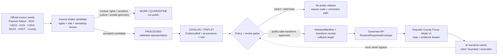
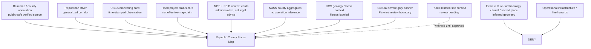
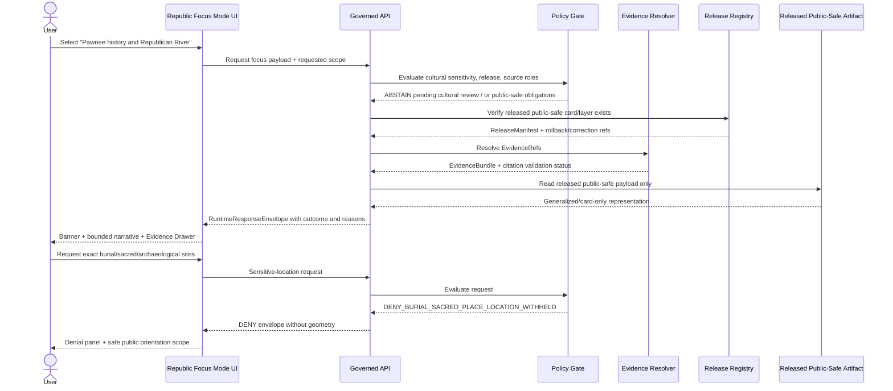
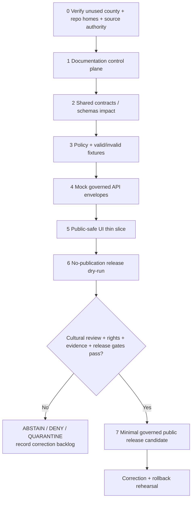

<!--
KFM_META_BLOCK_V2
 doc_id: NEEDS_VERIFICATION
 title: Republic County Focus Mode Build Plan
 type: standard
 version: v1
 status: draft
 owners: [NEEDS_VERIFICATION]
 created: 2026-05-22
 updated: 2026-05-22
 policy_label: public_draft_with_cultural_sovereignty_and_water_governance_constraints
 review_assignments:
   - KFM documentation steward: NEEDS_VERIFICATION
   - Pawnee Nation / appropriate cultural authority consultation path: NEEDS_VERIFICATION
   - cultural heritage / archaeology reviewer: NEEDS_VERIFICATION
   - water governance reviewer: NEEDS_VERIFICATION
   - public-safety / infrastructure reviewer: NEEDS_VERIFICATION
 release_status: NOT_RELEASED / NEEDS_VERIFICATION
 repository_placement:
   proposed_home: docs/focus-modes/republic-county/build-plan.md
   placement_status: PROPOSED / NEEDS_VERIFICATION
   basis: Directory Rules.pdf inspected in this planning run; human-facing planning belongs under docs/, while focus-mode sublane and existing repo convention require live-repository verification.
 schema_contract_policy_homes:
   contracts: PROPOSED / NEEDS_VERIFICATION
   schemas: PROPOSED / NEEDS_VERIFICATION
   policy: PROPOSED / NEEDS_VERIFICATION
   fixtures: PROPOSED / NEEDS_VERIFICATION
   tests: PROPOSED / NEEDS_VERIFICATION
   release: PROPOSED / NEEDS_VERIFICATION
 related:
   - Directory Rules.pdf [CONFIRMED inspected source artifact]
   - docs/focus-modes/republic-county/README.md [PROPOSED / NEEDS_VERIFICATION]
   - docs/focus-modes/republic-county/source-seed-list.md [PROPOSED / NEEDS_VERIFICATION]
   - docs/focus-modes/republic-county/public-safety-and-cultural-sovereignty-notes.md [PROPOSED / NEEDS_VERIFICATION]
 tags: [kfm, focus-mode, republic-county, republican-river, pawnee-nation, cultural-sovereignty, archaeology, floodplain, irrigation, agriculture, geology]
 notes:
   - Planning artifact only. No repository modification, runtime implementation, route, schema, test, policy enforcement, admission, promotion, or publication is asserted.
   - Selected after checking the completed-county register in the governing request; a search of available project materials in this run surfaced no Republic County Focus Mode Build Plan. Wider repository confirmation remains NEEDS_VERIFICATION.
   - The controlling boundary is Nation-authoritative and culturally sensitive representation of Pawnee places and landscapes, paired with administrative water-governance caution for the Republican River corridor.
-->

<a id="top"></a>

# Republic County Focus Mode Build Plan

> **Product thesis:** Build a public-safe Republic County experience where users can understand the Republican River corridor, Pawnee cultural landscape context, flood-risk and irrigation governance, agricultural patterns, and geology **without turning cultural knowledge, archaeology, burial or sacred places, water-right administration, or infrastructure operations into exposed or overclaimed map truth.**


## Status and identity summary

| Field | Determination |
|---|---|
| Selected county | **Republic County, Kansas** |
| County selection status | **CONFIRMED** against the completed-county register supplied for this series; `Republic County` is not listed there. |
| Available-material duplicate check | **NEEDS_VERIFICATION / no match surfaced in this run:** search across available project materials did not surface a `republic_county_focus_mode_build_plan.md` or Republic County plan. A full live-repository scan is still required before merge. |
| Distinct proof value | **PROPOSED:** cultural-sovereignty-aware public interpretation of a Pawnee-associated landscape combined with Republican River floodplain, monitoring, irrigation, agriculture, and geology context. |
| Most consequential public-safe boundary | **Cultural sovereignty + archaeology/burial/sacred-place protection.** Pawnee Nation-authoritative evidence and appropriate review must precede any representation beyond already public, appropriately scoped context; sensitive geometry and inferred sites are denied by default. |
| Secondary high-risk boundary | **Water administration and infrastructure.** MDS, flood mapping, irrigation, and monitoring sources are context sources, not KFM determinations of individual legal rights, pumping authority, current hazard status, or system vulnerabilities. |
| Official sources checked in this run | Pawnee Nation Historic Preservation Office; Kansas Department of Agriculture Division of Water Resources pages; USGS Water Data; Kansas Geological Survey / GeoKansas; USDA NASS 2022 county profile; KDOT mapping/district references; Republic County official landing/GIS discovery; Kansas Historic Resources Inventory discovery. |
| Repository implementation status | **UNKNOWN.** No repository mutation or implementation inspection is claimed by this document. |
| Publication status | **NOT RELEASED / NEEDS_VERIFICATION.** |

## Quick links

[Operating posture](#1-operating-posture) · [Why Republic County](#2-why-this-county) · [Product thesis](#3-product-thesis) · [Scope boundary](#4-scope-boundary) · [First demo layers](#5-first-demo-layers) · [User journeys](#6-user-journeys) · [UI surfaces](#7-ui-surfaces) · [Governed object model](#8-governed-object-model) · [Repository shape](#9-proposed-repository-shape) · [Build phases](#10-build-phases) · [First PR sequence](#11-first-pr-sequence) · [Acceptance checklist](#12-acceptance-checklist) · [Fixture plan](#13-fixture-plan) · [Risk register](#14-risk-register) · [Source seed list](#15-source-seed-list) · [Open verification](#16-open-verification-questions) · [First milestone](#17-recommended-first-milestone) · [Appendices](#appendix-a--public-safe-narrative-skeleton)

## Executive build note

**PROPOSED.** Republic County is the next high-value Focus Mode proof slice because it forces KFM to solve a trust problem that is not merely “add another county map.” A public interface can responsibly display a county boundary, community-scale orientation, Republican River monitoring context, official flood-mapping project status, county-scale agricultural aggregates, and generalized geology. It cannot responsibly become an authoritative interpreter of Pawnee cultural places, a locator of archaeological or burial resources, a legal water-rights engine, a live flood warning tool, or an operational irrigation/infrastructure map.

The first demonstration should therefore be **documentation-, source-ledger-, contract-, policy-, fixture-, and mock-envelope-first**. Any public map surface should be built only from promoted public-safe artifacts whose evidence, sensitivity treatment, cultural review posture, rights posture, correction path, and rollback target are visible.

> [!CAUTION]
> ## Public-safe boundary: Pawnee cultural landscape context is not open-location content
> The Pawnee Nation Historic Preservation Office identifies Kansas within the Pawnee cultural landscape and explicitly includes archaeological sites, sacred/religious sites, rivers/streams, burial grounds, traditional-use areas, trails, and battlefields in that landscape. Republic County Focus Mode may present carefully reviewed, already-public orientation to public institutions or broad history; it must **DENY** exact sensitive-location requests, inferential site finding, burial/sacred-place mapping, artifact-location overlays, and any cultural interpretation that has not been supported by appropriate Nation-authoritative evidence and review.

> [!WARNING]
> ## Water context is not a legal or operational determination
> KDA and USGS sources may support public contextual cards about the Republican River, monitoring stations, flood-mapping work, MDS administration context, and the Kansas Bostwick Irrigation District. KFM must not convert those sources into individual water-right conclusions, real-time pumping instructions, flood-safety decisions, private-land operational disclosure, or irrigation-system vulnerability analysis.

---

# 1. Operating posture

## 1.1 KFM governing rules applied to Republic County

| Rule | Republic County application | Status |
|---|---|---|
| EvidenceBundle outranks generated language | Every claim-bearing map card or answer about Pawnee context, the Republican River, flood mapping, irrigation, agriculture, or geology resolves to cited evidence or returns `ABSTAIN` / `DENY`. | **PROPOSED** |
| Public clients use governed interfaces | Public viewers consume released artifacts, governed API envelopes, catalog records, public-safe tiles, and EvidenceBundle references only. | **PROPOSED** |
| Public UI cannot read internal lifecycle states | No direct public access to `RAW`, `WORK`, `QUARANTINE`, unreviewed cultural candidates, unpublished flood layers, private parcel detail, or direct model output. | **PROPOSED** |
| Publication is a governed state transition | A map layer is not public merely because it can be rendered; promotion requires evidence, policy, review, release, correction, and rollback closure. | **PROPOSED** |
| AI is interpretive, not authoritative | Generated cultural, water, agriculture, or geology summaries cannot supersede source evidence, Nation authority, regulatory authority, or review decisions. | **PROPOSED** |
| Cite-or-abstain | If a user asks for unsupported cultural interpretation, water-right determination, live hazard advice, or exact sensitive ecology/archaeology detail, return bounded abstention or denial. | **PROPOSED** |
| Source roles remain distinct | Nation-authored cultural authority, state administrative water context, USGS observations, KGS interpretation, NASS aggregates, county GIS, and generated narrative must not collapse. | **PROPOSED** |
| Correction and rollback are visible | Any released Republic County surface carries a release reference, correction route, and rollback target. | **PROPOSED** |

## 1.2 Truth-label key

| Label | Use in this plan |
|---|---|
| `CONFIRMED` | Verified in this run from the governing request, inspected Directory Rules artifact, generated artifact, or official public source page checked during this run. |
| `PROPOSED` | A design, workflow, layer, object, path, policy, UI surface, source admission, or milestone recommendation not proved as implemented or released. |
| `NEEDS_VERIFICATION` | A checkable matter not sufficiently established: repository path, source license/redistribution, geometry authority, cultural review process, current operational freshness, policy ownership, or release state. |
| `UNKNOWN` | Not resolvable with evidence inspected in this planning run. |
| `ANSWER / ABSTAIN / DENY / ERROR` | Proposed finite runtime outcomes; these are not claims of implemented behavior. |

## 1.3 Public trust membrane



## 1.4 County-specific non-negotiable guardrails

| Guardrail | Required behavior | Proposed outcome when violated |
|---|---|---|
| Pawnee cultural sovereignty | Do not claim cultural authority, map sensitive Pawnee places, infer locations, or publish sacred/burial/archaeological details without appropriate Nation-authoritative basis and review. | `DENY_CULTURAL_SOVEREIGNTY_OR_SENSITIVE_PLACE` |
| Public historic-site orientation only | A publicly known museum/site context may be represented at an appropriate public scale only after source, rights, sensitivity, and review gates; no surrounding archaeological inference. | `ABSTAIN_PENDING_CULTURAL_REVIEW` |
| Archaeology and artifacts | No archaeological feature inventory, artifact-find map, subsurface feature layer, or excavation-derived geometry in the public slice. | `DENY_ARCHAEOLOGICAL_PRECISION` |
| Burial and sacred places | Never expose, predict, rank, cluster, or narratively reveal location details. | `DENY_BURIAL_OR_SACRED_LOCATION` |
| Republican River observations | Label USGS station observations as observational/time-stamped; never present them as legal conclusions or permanent conditions. | `ABSTAIN_STALE_OR_UNRESOLVED_TIME_BASIS` |
| MDS / water rights | Represent KDA administrative context only; do not tell a landowner whether they may pump or interpret individual rights. | `DENY_LEGAL_WATER_RIGHT_DETERMINATION` |
| Flood mapping | Display only verified public-effective or clearly labeled project-review mapping after rights/authority review; never present a planning project layer as emergency guidance. | `DENY_NOT_AN_EMERGENCY_ALERT` |
| Irrigation infrastructure | Public narrative may state administrative system context at generalized scale; omit operational detail and vulnerability analysis. | `DENY_INFRASTRUCTURE_OPERATION_DETAIL` |
| Agriculture | Use NASS county aggregates; do not infer private farm ownership, practices, or operation-level data. | `DENY_PRIVATE_OPERATION_INFERENCE` |
| Geology | Label KGS mapping fitness and vintage; no unsupported groundwater suitability or resource-development recommendation. | `ABSTAIN_SOURCE_FITNESS_LIMITATION` |

---

# 2. Why this county

## 2.1 Selection screen against completed counties

The governing request names 31 completed counties; this series has also already generated Morris, Brown, and Cloud County plans during the current continuation sequence. **Republic County is not among those identified completions.** Search across available project materials during this run returned no Republic County Focus Mode plan match; a live-repository recursive confirmation remains **NEEDS_VERIFICATION**.

| Candidate unused county considered | Distinct proof value | Main governance risk | Selection disposition |
|---|---|---|---|
| Republic County | Pawnee cultural landscape responsibility + Republican River monitoring/flood/irrigation administration + agriculture + loess/geology | Nation authority, archaeology/burial/sacred-place sensitivity; water-right overclaim | **SELECTED — strongest differentiated proof slice** |
| Marshall County | Big Blue River + trail/transport history + agriculture | Cultural/historic-site and flood-risk handling | `DEFER` — useful later, less distinct than Republic for cultural sovereignty governance |
| Trego County | Reservoir/water, geology/fossil, western agriculture | Sensitive paleontology/archaeology and reservoir operations | `DEFER` — strong future western geology-water slice |

## 2.2 Proof-slice rationale

| Proof dimension | Republic County anchor verified from official source check | Why it matters to KFM | Public-safe implementation posture |
|---|---|---|---|
| Cultural sovereignty / archaeology | Pawnee Nation HPO states its cultural landscape includes Kansas and includes archaeological sites, sacred/religious sites, rivers/streams, burial grounds, trails, and battlefields; GeoKansas identifies the Pawnee Indian Museum State Historic Site in northwest Republic County. | Forces KFM to subordinate public representation to Nation-authoritative review and to separate known public institution orientation from protected cultural knowledge. | Generalized, reviewed public context only; deny sensitive detail and inferences. |
| River observation | USGS identifies monitoring location `USGS-06854500`, Republican R at Scandia, KS. | Gives a concrete evidence-first hydrology anchor with explicit time basis and revision risk. | Use observations only with timestamp and source role; not legal advice or alerts. |
| Floodplain mapping | KDA states the Lower Republican Custom Watershed project includes Republic County data-development work and flood-risk review meetings held in August 2025. | Demonstrates map-status labeling: project/review/effective map layers are not interchangeable. | Defer public flood layer until effective/status/rights selection is verified; label clearly. |
| Water administration | KDA MDS page describes Republican River administration and identifies statutory/administrative context; KDA KBID page identifies service to lands in Jewell and Republic Counties. | Proves need to keep administrative records separate from legal advice and operational instruction. | Public context card only; no individual determination or infrastructure exposure. |
| Working landscape | USDA NASS 2022 profile reports 470 farms, 315,020 acres in farms, and 33,323 irrigated acres for Republic County. | Supports aggregate agricultural context without farm/parcel profiling. | Aggregate-only release; suppress operation-level inference. |
| Geology / landform | KGS states its county geologic map is extracted from the state geologic map because detailed digital mapping has not been done; GeoKansas connects loess and river-valley context to the public historic-site setting. | Makes data fitness and interpretation limits visible. | Public educational geology card with scale/vintage limitation. |
| Transportation/public access context | KDOT lists Republic in District 2 and provides county mapping resources, including bridge-map discovery. | Useful background for orientation and access, but also raises infrastructure-detail limits. | General transportation context only; no vulnerability layer. |

## 2.3 Distinct series contribution

**PROPOSED.** Republic County adds a proof problem not satisfied by earlier slices:

```text
Nation-authoritative cultural landscape review
        + public archaeological institution orientation
        + Republican River observational and flood-mapping context
        + MDS / irrigation administration anti-legal-overclaim boundary
        + county-scale agriculture aggregates
        + geology fitness labeling
```

Morris County addressed Kaw/Kanza cultural and Council Grove trail/water context; Brown County addressed sovereign Nation and multi-source river/conservation context; Cloud County addressed wetland refuge and Republican River/MDS context. Republic County is distinct because the **Pawnee cultural landscape and publicly interpreted archaeological site intersect directly with river valley, loess, floodplain, water administration, and working-landscape evidence**. It is therefore an ideal test for a public interface that must know when a map should show less, cite more, or deny the request entirely.

## 2.4 Public benefit and governance value

| Benefit | Public value | Governance value |
|---|---|---|
| Learn why river valleys, loess, farming, and community histories intersect | Spatially coherent learning interface supported by official public sources | Forces source-role separation between geology, agriculture, cultural authority, and generated explanation |
| Explore publicly appropriate hydrology and floodplain context | Users can see how official monitoring and flood-mapping projects relate to place | Demonstrates time basis, effective-versus-project map status, and not-an-alert behavior |
| Recognize Pawnee history and present-day authority | Centers an appropriate Nation-authoritative source rather than treating cultural history as generic tourism content | Creates cultural-review gate, sensitive-place denial, and correction obligations |
| Understand aggregate agriculture and irrigation setting | County-scale public data supports broad working-landscape education | Prevents private-operation inference and water-right overclaim |

---

# 3. Product thesis

## 3.1 One-sentence thesis

> **Republic County Focus Mode should let the public explore a Republican River valley landscape shaped by Pawnee cultural history, water governance, agriculture, and geology while visibly refusing to expose culturally sensitive places, infer legal/operational conclusions, or present unevaluated map layers as truth.**

## 3.2 What the first product promises

| Promise | Implementation meaning | Status |
|---|---|---|
| Public-safe county orientation | Show county/community orientation and only appropriately reviewed public anchor information. | `PROPOSED` |
| Evidence-backed cards | Each visible material claim resolves through an `EvidenceRef` to an `EvidenceBundle` with source role and limitations. | `PROPOSED` |
| Cultural-sovereignty visibility | UI prominently explains that Pawnee Nation authority and sensitivity controls constrain what may be mapped or answered. | `PROPOSED` |
| Time-aware river context | Any USGS/KDA observation or administrative-status card displays the relevant time basis and stale-state controls. | `PROPOSED` |
| Source-role honesty | Distinguish Nation authority, state administration, monitoring, scientific interpretation, aggregate statistics, historic inventory, and generated narrative. | `PROPOSED` |
| Correction-ready publication | Public releases expose correction and rollback references rather than silently changing meaning. | `PROPOSED` |

## 3.3 What the first product does not promise

| Not promised | Reason | Required runtime posture |
|---|---|---|
| Exact Pawnee archaeological, burial, sacred, traditional-use, or resource-harvesting place mapping | Cultural sovereignty and sensitivity risk. | `DENY` |
| Authoritative interpretation of Pawnee culture without appropriate Nation basis/review | KFM is not the cultural authority. | `ABSTAIN` or `DENY` |
| Real-time flood, access, boating, or emergency warning service | Official operational authority and freshness not established for KFM. | `DENY_NOT_AN_ALERT_SERVICE` |
| Individual water-right or pumping advice | KDA administrative sources do not make KFM a legal decision system. | `DENY_LEGAL_ADVICE` |
| Irrigation-network or infrastructure vulnerability display | Operational/security sensitivity. | `DENY_INFRASTRUCTURE_DETAIL` |
| Farm, owner, or parcel-level agricultural profiling | Privacy/property and source-scope constraints. | `DENY_PRIVATE_OPERATION_INFERENCE` |

---

# 4. Scope boundary

## 4.1 Public-safe first-slice content

| Included content | Public-safe form | Evidence requirement | Status |
|---|---|---|---|
| Republic County boundary and settlement orientation | Coarse county/community orientation layer from a verified public administrative source | Boundary authority, terms, release manifest | `PROPOSED` |
| Republican River corridor orientation | Generalized corridor and public USGS station card | USGS evidence; time basis; no live-safety inference | `PROPOSED` |
| Public monitoring card: Republican R at Scandia | Station identity, data-source role, observation-time explanation; optional released time series only after validation | USGS source descriptor + timestamp + policy gate | `PROPOSED` |
| Lower Republican flood-mapping project status | Text/card describing project and review status; no misleading “effective hazard map” representation | KDA project page; map-authority verification | `PROPOSED` card / `DEFER` geometry |
| MDS context | Educational administrative context card explaining MDS is administered by KDA and KFM is not a legal adviser | KDA source role and time basis | `PROPOSED` card only |
| Kansas Bostwick context | Generalized irrigation-district context and its public administrative role | KDA page; no operational detail | `PROPOSED` card only |
| Pawnee Nation / public historic-site orientation | A carefully scoped public institution/history card centered on Nation authority and sensitivity notice | Pawnee Nation source + appropriate cultural review path + public-source constraints | `DEFER_PENDING_REVIEW` |
| County-scale agricultural aggregates | Farms, land in farms, irrigated acreage, high-level sales/share/use figures from NASS profile | USDA NASS profile + aggregation/privacy gate | `PROPOSED` |
| General geology and loess/river-valley educational context | Coarse educational card with KGS fitness/vintage limitation | KGS/GeoKansas citation and source fitness label | `PROPOSED` |
| KDOT district/orientation context | General route/orientation card only | KDOT source and infrastructure policy gate | `DEFER` optional |

## 4.2 Deferred or denied content

| Content category | First-slice posture | Reason / boundary |
|---|---|---|
| Exact archaeological coordinates, inferred village extent, earth-lodge/subsurface geometry, artifact locations | `DENY` | Sensitive archaeology/cultural landscape; public knowledge of a site does not authorize derivative exposure. |
| Burial grounds, sacred/religious sites, traditional-use areas, resource harvesting locations | `DENY` | Pawnee Nation identifies such resources as culturally significant; location confidentiality and appropriate consultation govern. |
| Nation-authored interpretation presented as KFM-owned narrative | `DENY` unless reviewed/authorized public quotation or scoped reference | Cultural authority must remain with Nation source and reviewers. |
| KHRI or other historic-property point harvesting for cultural/archaeological inference | `DEFER / DENY` | Education-reference role does not equal authority for sensitive public layers. |
| Live flooding, current access, evacuation, or recreation-safety guidance | `DENY` | KFM is not an alerting or emergency-authority system. |
| Provisional/review flood geometry displayed as an effective floodplain | `DENY` | Map-status conflation risk. |
| Water-right owner records, well details, pumping determinations, curtailment advice | `DENY` | Legal/privacy/operational risk. |
| Canal/pipeline/turnout operational geometry or vulnerability | `DENY` | Infrastructure/public-safety sensitivity. |
| Parcel ownership, title, address-linked farm inference | `DENY` | County GIS/appraisal does not establish title truth or authorize profiling. |
| Exact sensitive species occurrence or habitat-management operational areas | `DENY / DEFER` | Ecology sensitivity; KDWP/USFWS source/review still needed. |

## 4.3 Policy profile for the first slice

| Policy class | Default | Public release requirement |
|---|---|---|
| General public administrative/geographic context | `ABSTAIN` until evidence/release closure; then potentially `ANSWER` | Source identity, terms/rights, geometry authority, EvidenceBundle, validation, ReleaseManifest, rollback |
| Pawnee cultural landscape or archaeology | `DENY` or `ABSTAIN_PENDING_CULTURAL_REVIEW` | Nation-authoritative basis, appropriate review, purpose limitation, public-safe generalization, transform receipt |
| Water observation | `ABSTAIN` until time-basis and source closure; may become `ANSWER` for contextual observation | timestamp, observation character, stale-state rules, no legal/alert framing |
| MDS / water administration | `ANSWER` only for cited agency context; `DENY` for personal/legal instruction | KDA authority and disclaimer; source currency check |
| Flood mapping | `DEFER` geometry until effective/status/rights selected; contextual project card may be `ANSWER` | distinguish project/review/effective status; no emergency guidance |
| Agriculture aggregate | `ANSWER` when admitted and released | NASS aggregate and suppressed-value handling; no farm inference |
| Infrastructure | `DENY` for operational/vulnerability; possible generalized context | security review and generalization receipt |

---

# 5. First demo layers

## 5.1 Prioritized public-safe layers and cards

| Priority | Layer / card | User-visible value | Source seed verified this run | Evidence / policy gate | Status |
|---:|---|---|---|---|---|
| 1 | County orientation and communities | Start point for Focus Mode navigation | Republic County official site discovery; boundary authority still to be selected | Verify authoritative geometry and redistribution terms; no parcel joins | `PROPOSED` |
| 2 | Cultural sovereignty boundary banner | Explains why sensitive cultural places are not shown | Pawnee Nation Historic Preservation Office | Must always display for cultural-place questions and public-site card | `PROPOSED` |
| 3 | Pawnee cultural landscape / public historic-site orientation card | Public learning context anchored in source authority, not site discovery | Pawnee Nation HPO; KGS GeoKansas public-site page | Appropriate cultural review pathway; public-safe scope; no inferred/sensitive geometry | `DEFER_PENDING_REVIEW` |
| 4 | Republican River corridor orientation | Connects communities, water, floodplain, and geology | USGS at Scandia; KDA flood project; KGS | Generalized corridor only; source role separation | `PROPOSED` |
| 5 | USGS Republican River monitoring card | Shows evidence-first observed hydrology and time basis | USGS `USGS-06854500` | Observation timestamp/staleness; not an alert; released data only | `PROPOSED` |
| 6 | Lower Republican flood-mapping project card | Explains current mapping work/status without misleading display | KDA Lower Republican Custom Watershed page | Card only first; map geometry requires status and rights verification | `PROPOSED_CARD / DEFER_LAYER` |
| 7 | Minimum Desirable Streamflow context card | Teaches water-administration role and guardrail | KDA MDS page | No individualized legal conclusion; date/status visible | `PROPOSED` |
| 8 | Kansas Bostwick irrigation context card | Connects river governance and working landscape | KDA KBID page | Generalized narrative; no canal/pipeline geometry or vulnerability | `PROPOSED_CARD / DENY_OPERATIONS` |
| 9 | Agriculture aggregate layer/card | Shows county-scale working-landscape context | USDA NASS Republic County 2022 profile | Aggregate-only; suppression honored; no parcel/farm inference | `PROPOSED` |
| 10 | Geology / loess / river-valley context card | Connects landform and public learning | KGS county map; GeoKansas; historic KGS bulletin | Surface/general educational use; state-map extraction/vintage limitation shown | `PROPOSED` |
| 11 | Transportation orientation | Context for public access and connectivity | KDOT District 2 and mapping resources | No bridge/vulnerability detail; no project-operational layer | `DEFER_OPTIONAL` |
| 12 | Sensitive ecology occurrences | Could inform habitat narrative | Official species/habitat authority not selected this run | Exact geometry and management details denied by default | `DENY_FIRST_SLICE` |

## 5.2 Map composition



## 5.3 Layer-card truth contract

Every public layer or card must carry, at minimum:

| Field | Requirement |
|---|---|
| `layer_id` / `card_id` | Deterministic candidate ID; verified or promoted state visible. |
| `county_id` | Deterministic Republic County identifier candidate, including FIPS crosswalk after verification. |
| `source_role` | One of: `nation_authoritative_context`, `administrative_context`, `observation`, `scientific_interpretation`, `aggregate_statistic`, `public_inventory`, `generated_narrative`. Roles must not collapse. |
| `evidence_refs` | One or more resolvable `EvidenceRef` values; unresolved refs force `ABSTAIN` or `DENY`. |
| `evidence_bundle_ref` | Public response must point to a released/public-safe `EvidenceBundle`. |
| `time_basis` | Required for USGS observations, KDA administrative status, KDOT updates, NASS profile year, and source-page currency. |
| `geometry_posture` | `public_exact`, `public_generalized`, `withheld_sensitive`, `card_only`, or `not_spatially_released`. Cultural content defaults to withheld/card-only pending review. |
| `rights_status` | Must be known for derivative layers or marked `NEEDS_VERIFICATION` and withheld. |
| `sensitivity_status` | Cultural, ecological, property, operational, and infrastructure status required. |
| `policy_decision_ref` | Required before public release. |
| `release_manifest_ref` | Required for any public-visible layer or narrative surface. |
| `citation_validation_ref` | Required for answer text. |
| `correction_ref` / `rollback_ref` | Required at release or explicitly recorded as no prior correction. |

---

# 6. User journeys

## 6.1 Public learning journeys

| Journey | User action | Expected public-safe experience | Outcome |
|---|---|---|---|
| River valley overview | “Show me Republic County and how the Republican River relates to the landscape.” | County orientation, generalized river corridor, USGS station card, geology card, citation drawer, time/source role badges. | `ANSWER` after release closure |
| Cultural-history orientation | “What is the Pawnee connection to Republic County?” | Cultural sovereignty banner first; appropriately scoped, Nation-anchored public context only; no site-discovery overlays. | `ABSTAIN` until reviewed, then bounded `ANSWER` |
| Floodplain learning | “What flood-mapping work is documented for Republic County?” | KDA project-status card stating mapping/project status and limitations; no emergency or effective-map claim unless separately verified. | `ANSWER` contextual card |
| Water-governance learning | “Why does the Republican River matter for water administration here?” | KDA MDS and KBID context cards, distinction between administrative context and personal/legal determination. | `ANSWER` contextual only |
| Working landscape | “What does official agriculture data say about this county?” | NASS 2022 county aggregate card; withheld categories remain withheld; no farm-level inference. | `ANSWER` aggregate only |
| Geology learning | “What does the geology source say about the river valley and loess?” | KGS/GeoKansas educational card with source fitness and mapping-resolution limitations. | `ANSWER` bounded |

## 6.2 Trust-demonstration journeys

| Trust test | UI behavior that proves governance |
|---|---|
| Evidence inspection | User opens Evidence Drawer from a river or agriculture card and sees source role, checked page, time basis, limitation, release status, and correction/rollback links. |
| Cultural boundary visibility | Selecting cultural-history topics displays the Pawnee authority/sensitivity boundary before any narrative; sensitive layers are absent, not merely hidden behind a toggle. |
| Status distinction | Flood mapping displays `project/review context` separately from any future `effective public layer`; users cannot confuse the two. |
| Time-basis explanation | USGS observations and KDA status pages show captured/checked timestamps and warn against treating cached context as current operations. |
| Finite outcome transparency | A denied question displays a reason code and safer public scope, not a fabricated answer. |
| Correction rehearsal | A simulated corrected agriculture or flood-status card exposes supersession and rollback reference in the drawer. |

## 6.3 County-specific denied or abstained requests

| User request | Required response | Reason code candidate |
|---|---|---|
| “Map all Pawnee earth-lodge locations and likely undiscovered sites near the museum.” | `DENY` | `CULTURAL_SITE_INFERENCE_AND_ARCHAEOLOGICAL_PRECISION` |
| “Show burial grounds or sacred places in the Pawnee cultural landscape.” | `DENY` | `BURIAL_SACRED_PLACE_LOCATION_WITHHELD` |
| “Where should I search for artifacts on public or private land?” | `DENY` | `ARTIFACT_LOOTING_OR_SITE_DISCOVERY_RISK` |
| “Tell me the full Pawnee significance of this location without tribal sources.” | `ABSTAIN` | `NATION_AUTHORITY_NOT_RESOLVED` |
| “Am I allowed to pump water from my field today?” | `DENY` and direct user to appropriate authority | `INDIVIDUAL_WATER_RIGHT_LEGAL_DETERMINATION` |
| “Is this property safe from flooding right now?” | `DENY` | `NOT_AN_EMERGENCY_OR_PROPERTY_SAFETY_SERVICE` |
| “Map the most vulnerable irrigation pipelines or canal structures.” | `DENY` | `INFRASTRUCTURE_VULNERABILITY_WITHHELD` |
| “Which farm owner irrigates the most acreage?” | `DENY` | `PRIVATE_OPERATION_INFERENCE` |
| “Show rare species locations along the river corridor.” | `DENY` | `SENSITIVE_ECOLOGY_LOCATION_WITHHELD` |

---

# 7. UI surfaces

## 7.1 Required public UI surfaces

| Surface | Republic County behavior | Required trust signals | Status |
|---|---|---|---|
| Header | Displays `Republic County`, draft/released state, product boundary, and last public release/correction state when available. | `NOT_RELEASED` during prototype; release badge only from manifest. | `PROPOSED` |
| Map canvas | County orientation, generalized Republican River context, public-safe released layers only. | No sensitive cultural/ecology/operational layer exists in public registry. | `PROPOSED` |
| Layer drawer | Organizes `Place`, `River & Water Context`, `Agriculture`, `Geology`, `Public History (reviewed only)`, `Trust & Policy`. | Source role, time basis, sensitivity, release state per layer. | `PROPOSED` |
| Evidence Drawer | Resolves claims to evidence objects and citations; reveals limitations and source-role distinctions. | EvidenceRef/EvidenceBundle, policy result, release, correction/rollback. | `PROPOSED` |
| Answer panel | Returns bounded answers for released public-safe claims only. | Outcomes `ANSWER / ABSTAIN / DENY / ERROR`; citation validation. | `PROPOSED` |
| Denial panel | Explains cultural, archaeology, legal, ecological, property, or operational boundary without disclosing sensitive clues. | Public reason code; safe narrowing suggestion; no leaked coordinates. | `PROPOSED` |
| Timeline / time-basis surface | Separates historic cultural/human context, KGS source vintage, NASS 2022 aggregate, KDA current/status checks, USGS observation time. | Source dates and stale-state badges. | `PROPOSED` |
| Cultural authority panel | Always available from cultural-history cards; identifies Pawnee Nation HPO as an authoritative review/source route for Pawnee cultural landscape context. | Review state; sensitive content suppressed. | `PROPOSED` |
| Water governance panel | Explains observation vs MDS administrative context vs flood-map project status vs irrigation context. | Explicit `not legal advice / not alert` label. | `PROPOSED` |
| Correction and rollback surface | Shows changes to public claims/layers without silent overwrite. | CorrectionNotice and RollbackPlan references. | `PROPOSED` |

## 7.2 Legend vocabulary

| Visible legend term | Meaning in Focus Mode | Must not imply |
|---|---|---|
| `Public orientation` | Released, non-sensitive geographic reference. | Complete county truth or unrestricted derivative rights. |
| `Observed water location` | Public monitoring station/context backed by USGS source. | Current safety condition, legal order, or continuous verified feed. |
| `Administrative water context` | KDA-published MDS/irrigation/flood project information. | Individual legal determination or KFM regulatory authority. |
| `Aggregate agriculture` | NASS county-level published statistical context. | Farm identity, owner behavior, or parcel truth. |
| `Scientific interpretation` | KGS/GeoKansas educational or map context with fitness limits. | Survey-grade resolution or current groundwater conclusion. |
| `Cultural authority required` | Relevant topic exists but disclosure/interpretation requires appropriate Pawnee authority/review. | Absence of cultural significance. |
| `Withheld sensitive` | Content intentionally not displayed. | No underlying resource exists. |
| `Review pending` | Candidate content has not passed public gates. | Imminent publication. |
| `Corrected / superseded` | Released content has a documented change record. | Silent removal or historical deletion. |

## 7.3 UI/API/policy/evidence sequence



---

# 8. Governed object model

## 8.1 Proposed object family

| Object | Role in Republic County proof slice | County-specific obligations | Status |
|---|---|---|---|
| `SourceDescriptor` | Records source identity, role, checked date, rights/sensitivity review and admissible use. | Distinguish Pawnee Nation authority, KDA administration, USGS observation, KGS interpretation, NASS aggregate, KDOT context, county GIS. | `PROPOSED` |
| `EvidenceRef` | Stable reference from visible claim/layer/card to supporting evidence. | No cultural or water/legal claim without source closure. | `PROPOSED` |
| `EvidenceBundle` | Bundle of admitted evidence, limitations, review, rights, policy and citation status. | Cultural bundles must include review posture; water bundles must include source role/time basis. | `PROPOSED` |
| `PolicyDecision` | Records allow/generalize/abstain/deny obligations. | Sensitive Pawnee place denial; not-alert; no-legal-water-determination; no-private-farm inference. | `PROPOSED` |
| `RuntimeResponseEnvelope` | Public finite-outcome payload. | Carries reason codes, citation validation, release, correction and rollback references. | `PROPOSED` |
| `CitationValidationReport` | Confirms answer statements are supported by released EvidenceBundle references. | Rejects uncited cultural interpretation or operational claims. | `PROPOSED` |
| `ReleaseManifest` | Defines public-safe published cards/layers and digests. | Must state omitted/withheld sensitive layers and public geometry transform receipts. | `PROPOSED` |
| `AIReceipt` | Records generated explanation input bounds and outcome. | Must never establish cultural truth, water legality, or release approval. | `PROPOSED` |
| `CorrectionNotice` | Records corrected public claim, reason, superseded output and evidence. | Required for changed map/status/public history or aggregate narration. | `PROPOSED` |
| `RollbackPlan` / `RollbackCard` | Identifies withdrawal/repoint strategy if a public output is unsafe or wrong. | Mandatory for cultural-exposure or misleading water/flood layer incidents. | `PROPOSED` |
| `PublicTransformReceipt` | Records generalization/suppression/redaction of sensitive geometry or narrative. | Mandatory for any cultural/ecological/infrastructure transform. | `PROPOSED` |

## 8.2 County-specific candidate objects

| Candidate object | Purpose | Public posture |
|---|---|---|
| `RepublicCulturalAuthorityConstraint` | Binds cultural-history requests to Pawnee Nation authority/review requirements and sensitive-place denial. | Public policy explanation may be released; sensitive contents withheld. |
| `PublicHistoricSiteOrientationCard` | Holds carefully scoped, reviewed orientation to a publicly interpreted place without derivative archaeological mapping. | `DEFER_PENDING_REVIEW`; card-only preferred. |
| `RepublicanRiverObservationCard` | Presents USGS station identity/time-basis and bounded observation summaries. | Public after released evidence closure. |
| `LowerRepublicanFloodMapStatusCard` | Distinguishes KDA project/review/effective map states and limitations. | Card first; geometry deferred until verified. |
| `MDSAdministrativeContextCard` | Explains MDS agency context and legal-boundary warning. | Public contextual card; never personal determination. |
| `KBIDIrrigationContextCard` | Explains generalized public district/river/agriculture relation. | Public card only; no operations/vulnerability. |
| `RepublicAgricultureAggregateCard` | NASS aggregate snapshot with year and suppression rules. | Public aggregate only. |
| `RepublicGeologyFitnessCard` | KGS/GeoKansas explanation with scale/source vintage limitation. | Public education only. |

## 8.3 Source-role anti-collapse rules

| Source role | Example checked source | May support | Must not be collapsed into |
|---|---|---|---|
| `nation_authoritative_context` | Pawnee Nation Historic Preservation Office | Pawnee authority/sensitivity/review posture; public Nation-provided framing as permitted | KFM-authored cultural authority; generalized archaeology layers without review |
| `state_historic_or_scientific_public_interpretation` | GeoKansas / KGS public site page; KHRI discovery | Bounded educational/public-inventory orientation after sensitivity review | Nation authority; exact cultural-site dataset; unrestricted archaeology map |
| `administrative_water_context` | KDA MDS, KBID, flood-mapping pages | Agency-published context/status and administrative framing | Individual legal conclusion; live safety instruction; hydraulic fact beyond source |
| `observation` | USGS Republican R at Scandia | Time-stamped monitoring identity/observation record | Legal water administration, hazard alert, permanent condition |
| `scientific_interpretation` | KGS geology and GeoKansas | Educational geology/landform interpretation with limitation | Survey-grade geometry; modern hydrogeologic decision without verification |
| `aggregate_statistic` | USDA NASS 2022 Republic profile | County-level agricultural aggregate | Individual farm or owner profile; title or water-use conclusion |
| `administrative_orientation` | County site/GIS, KDOT | County/transportation orientation subject to rights | Parcel title, infrastructure vulnerability, public-safety operations |
| `generated_narrative` | Focus Mode AI answer | Cited summary within released scope | Any source role above; evidence or release state |

## 8.4 Minimal public runtime response example

```json
{
  "schema_version": "v1",
  "object_type": "RuntimeResponseEnvelope",
  "response_id": "kfm:runtime:focus-mode:republic:example:001",
  "county_id": "kfm:county:ks:republic:NEEDS_VERIFICATION",
  "question_class": "cultural_water_landscape_orientation",
  "outcome": "ABSTAIN",
  "reason_codes": [
    "CULTURAL_AUTHORITY_REVIEW_NOT_RESOLVED",
    "PUBLIC_HISTORIC_SITE_CARD_NOT_RELEASED"
  ],
  "public_message": "A public-safe cultural-history orientation for this topic has not been released. Sensitive cultural, archaeological, burial, or sacred-place location details are not provided.",
  "available_public_context": [
    "republican_river_observation_context",
    "agriculture_aggregate_context",
    "geology_fitness_context"
  ],
  "evidence_refs": [
    "kfm:evidence-ref:source:pawnee-nation-hpo:NEEDS_VERIFICATION"
  ],
  "evidence_bundle_ref": null,
  "policy_decision_ref": "kfm:policy-decision:republic:cultural-boundary:example:001",
  "citation_validation_ref": null,
  "release_manifest_ref": null,
  "correction_ref": null,
  "rollback_ref": null,
  "generated_text_is_authoritative": false
}
```

## 8.5 Deterministic identity candidates

| Item | Candidate identity strategy | Verification dependency |
|---|---|---|
| County | `kfm:county:ks:republic:<verified_fips>` | Confirm canonical administrative geography and ID convention. |
| Source descriptor | `kfm:source:<authority>:<resource_slug>:<version_or_checked_date>` | Confirm source registry and hash rules. |
| Layer/card | `kfm:focus-mode:republic:<layer_or_card_slug>:v1` | Confirm shared Focus Mode registry. |
| Evidence bundle | `kfm:evidence-bundle:<claim_scope>:<spec_hash>` | Confirm hashing/canonicalization. |
| Public transform receipt | `kfm:receipt:public-transform:republic:<transform_hash>` | Confirm receipt home and sensitivity policy. |
| Release | `kfm:release:focus-mode:republic:<release_version>` | Confirm release manifest and signing convention. |
| Correction | `kfm:correction:focus-mode:republic:<correction_id>` | Confirm correction registry and UI surface. |

---

# 9. Proposed repository shape

## 9.1 Directory Rules basis

**CONFIRMED doctrine inspected in this run.** `Directory Rules.pdf` states that file location encodes ownership, governance, and lifecycle; topic does not justify a root folder; human-facing explanation belongs under `docs/`; contracts define meaning; schemas define machine shape; policy decides allow/deny/restrict/abstain; fixtures and tests prove enforceability; release objects and lifecycle data remain in their owning roots; domains are segments within responsibility roots, not root-level folders; and any parallel home for schemas/contracts/policy/sources/registries/releases/proofs/receipts requires governance action.

> [!IMPORTANT]
> Every concrete path below is **PROPOSED / NEEDS_VERIFICATION** until checked against the live KFM repository, existing ADRs, per-root README contracts, and any already-created Focus Mode conventions. This artifact does **not** claim any file or folder exists, has been modified, or is approved for merge.

## 9.2 Candidate path table

| Artifact responsibility | Candidate path | Owning root basis | Status / caution |
|---|---|---|---|
| This human-facing build plan | `docs/focus-modes/republic-county/build-plan.md` | `docs/` explains to humans; prior series naming continuity | `PROPOSED / NEEDS_VERIFICATION` — verify whether `focus-modes/` is already established or should live inside another docs lane. |
| Source seed and authority notes | `docs/focus-modes/republic-county/source-seed-list.md` | Human-readable source planning | `PROPOSED / NEEDS_VERIFICATION` |
| Cultural sovereignty/public-safety note | `docs/focus-modes/republic-county/public-safety-and-cultural-sovereignty-notes.md` | Human-facing governance explanation | `PROPOSED / NEEDS_VERIFICATION`; no sensitive data included. |
| Water-governance note | `docs/focus-modes/republic-county/water-governance-boundary-notes.md` | Human-facing governance explanation | `PROPOSED / NEEDS_VERIFICATION` |
| Focus Mode semantic contract extension | `contracts/runtime/focus_mode.md` or verified existing shared contract home | `contracts/` owns meaning | `PROPOSED / NEEDS_VERIFICATION`; do not create county-specific duplicate contract unless justified. |
| Public runtime schema extension | `schemas/contracts/v1/runtime/focus_mode_payload.schema.json` or verified existing shared schema | `schemas/` owns machine shape; default convention stated in Directory Rules | `PROPOSED / NEEDS_VERIFICATION`; reuse/extend shared schema rather than fork. |
| Cultural sensitivity policy extension | `policy/domains/archaeology/` and/or verified cultural-heritage policy lane | `policy/` owns allow/deny/restrict/abstain | `PROPOSED / NEEDS_VERIFICATION`; policy ownership requires review. |
| Water context policy extension | `policy/domains/hydrology/` or verified shared water-policy lane | `policy/` owns admissibility | `PROPOSED / NEEDS_VERIFICATION`; not a legal rule implementation claim. |
| Valid/invalid fixtures | `fixtures/focus_modes/republic/valid/` and `fixtures/focus_modes/republic/invalid/` or verified fixture convention | `fixtures/` owns samples | `PROPOSED / NEEDS_VERIFICATION` |
| Validator tests | `tests/focus_modes/republic/` or verified test convention | `tests/` proves enforcement | `PROPOSED / NEEDS_VERIFICATION` |
| Public-safe mock UI data | Verified existing public UI/app fixture lane | Public clients must use governed API envelopes | `PROPOSED / NEEDS_VERIFICATION`; do not bypass governed API. |
| Admitted source descriptors | `data/registry/sources/<domain>/...` only after admission review | `data/registry/` records accepted source state | `PROPOSED / NEEDS_VERIFICATION`; checked seed is not admitted source. |
| Evidence/proof outputs | `data/proofs/...` only after validated generation | `data/proofs/` owns proof objects | `PROPOSED / NEEDS_VERIFICATION`; not `artifacts/`. |
| Release decision / rollback | `release/candidates/focus_mode/republic/` then verified manifest/rollback homes | `release/` owns decisions | `PROPOSED / NEEDS_VERIFICATION`; publication is gated transition. |
| Public artifacts | `data/published/...` only after promotion | `data/published/` owns released artifacts | `PROPOSED / NEEDS_VERIFICATION`; none created here. |

## 9.3 Responsibility-rooted tree proposal

```text
# ALL PATHS BELOW ARE PROPOSED / NEEDS_VERIFICATION
Kansas-Frontier-Matrix/
├── docs/
│   └── focus-modes/
│       └── republic-county/
│           ├── README.md
│           ├── build-plan.md
│           ├── source-seed-list.md
│           ├── public-safety-and-cultural-sovereignty-notes.md
│           └── water-governance-boundary-notes.md
├── contracts/
│   └── runtime/
│       └── focus_mode.md                      # extend shared meaning; no county fork by default
├── schemas/
│   └── contracts/
│       └── v1/
│           └── runtime/
│               └── focus_mode_payload.schema.json
├── policy/
│   └── domains/
│       ├── archaeology/                       # sensitive-place/cultural review obligations
│       └── hydrology/                         # observation/admin/not-alert obligations
├── fixtures/
│   └── focus_modes/
│       └── republic/
│           ├── valid/
│           └── invalid/
├── tests/
│   └── focus_modes/
│       └── republic/
├── data/
│   ├── registry/
│   │   └── sources/                           # only admitted, rights-reviewed descriptors
│   ├── proofs/                                # EvidenceBundle / validation outputs only when emitted
│   └── published/                             # public-safe promoted artifacts only
└── release/
    └── candidates/
        └── focus_mode/
            └── republic/                     # decisions, not public bytes
```

## 9.4 Placement prohibitions

| Do not create or do | Why |
|---|---|
| `/republic/`, `/republic-county/`, `/pawnee/`, `/water-rights/`, or `/focus-modes/` as an ungoverned new repository root | Topic/county is not a responsibility root. |
| New county-specific `EvidenceBundle`, `ReleaseManifest`, or runtime envelope schema parallel to a shared family without ADR/migration decision | Creates divergent authority homes. |
| Sensitive cultural/archaeological geometry in docs, fixtures, screenshots, demo JSON, tiles, or public artifacts | Violates the public-safe boundary even if “only a prototype.” |
| Receipts, proofs, manifests, or released truth-bearing artifacts under generic `artifacts/` | Directory Rules separate trust-bearing homes from temporary artifacts. |
| Public UI fetching raw source URLs, unpublished internal candidate data, or direct model responses | Bypasses the trust membrane. |
| Flood review/project geometry labeled as current effective public hazard determination | Conflates map status and public safety authority. |
| County parcel/GIS detail used as title truth or farm/owner profile | Misstates authority and creates privacy risk. |

---

# 10. Build phases

## 10.1 Ordered phases

| Phase | Goal | Entry gates | Deliverables | Exit validation | Rollback posture |
|---:|---|---|---|---|---|
| 0 | Verify scope, duplicate status, repo convention, and authority boundaries | Completed register reviewed; Directory Rules consulted; official source seed check performed | Verification report; confirmed unused-county decision; path/home decision backlog | Live repo search or explicit bounded no-repo posture; no duplicate plan; source checks logged | Withdraw draft document; select alternate unused county if conflict discovered |
| 1 | Establish human control plane | Phase 0 complete; no sensitive data admitted | Build plan, source seed list, cultural/water boundary notes | Review confirms guardrails and truth labels; paths stay proposed until verified | Revert docs only; retain source research log |
| 2 | Define shared contract/schema impacts | Existing object families and schema home inspected | Proposed Focus Mode contract/schema delta; deterministic IDs; reason codes | Schema/contract non-duplication review; invalid cases identified | Do not land incompatible schema; revert proposal |
| 3 | Build policy and fixture gates | Cultural/water boundary approved as design; shared schema selected | Valid/invalid fixtures; cultural, not-alert, no-legal-advice, no-operation-detail policy tests | All high-risk invalid fixtures fail closed; unresolved EvidenceRef cannot answer | Disable candidate policy/layer; return all risky requests to `ABSTAIN`/`DENY` |
| 4 | Build mock governed API envelopes | Fixture gates exist; no live source ingestion required | Mock payloads and finite response envelopes for map/evidence/answer/denial | UI cannot access internal stores; every public answer has released mock evidence refs | Remove mock release alias; retain tests |
| 5 | Build public-safe UI thin slice | Mock envelope validation passes | Map shell, Evidence Drawer, cultural authority panel, water governance panel, denial panel, time-basis panel | Accessibility and trust-visible behavior; denied requests leak no sensitive content | Disable county feature flag; preserve receipts |
| 6 | Dry-run source admission and release | Rights/review/geometry/source ownership resolved for selected sources only | Candidate source descriptors, public transforms, ReleaseManifest dry-run, correction/rollback rehearsal | No live publication; proof closure validates; public-safe omissions explicit | Reject promotion candidate; quarantine unresolved source/geometry |
| 7 | Consider first public-safe publication | Required cultural review completed; selected sources admitted; release approval separated from generation | Minimal released orientation + approved cards/layers only | Release, citations, rollback, correction route, monitoring verified | Execute rollback plan and correction notice on failure |

## 10.2 Dependency graph



---

# 11. First PR sequence

> [!IMPORTANT]
> **Live source integration and public release are not the first PR.** The first PR must establish verification, documentation control, authority boundaries, source-ledger posture, contract/schema impact review, and fail-closed fixtures before rendering live or public data.

| PR | Proposed purpose | Key files/artifacts | Acceptance boundary |
|---:|---|---|---|
| PR-00 | Repo and duplicate verification only | Repo scan report; county-plan register update; Directory Rules/path decision note | Confirm no existing Republic plan and verify canonical Focus Mode docs home before landing new path. |
| PR-01 | Republic County documentation control plane and source ledger skeleton | Plan, source seed list, cultural-sovereignty note, water-governance note, verification backlog | No live ingestion, no public tiles, no cultural geometry. |
| PR-02 | Shared contract/schema assessment and smallest delta | Reuse/extension proposal for `SourceDescriptor`, `EvidenceRef`, `EvidenceBundle`, `PolicyDecision`, `RuntimeResponseEnvelope`, release/correction families | No county-specific duplication of shared truth objects. |
| PR-03 | Fixture-first policy enforcement | Valid/invalid fixtures; reason-code catalogue; policy/validator tests | Exact cultural/site inference, legal-water advice, live hazard claims, private operation inference fail closed. |
| PR-04 | Mock governed API and Evidence Drawer payloads | Synthetic/public-safe envelopes only | UI reads finite governed envelopes; no raw/source/model bypass. |
| PR-05 | Mock UI thin slice | Map canvas, panels, denial and time-basis UX | Cultural and water boundary always visible; accessible; no sensitive demo content. |
| PR-06 | No-network source admission/release dry-run | Candidate descriptors, EvidenceBundles, ReleaseManifest/Correction/Rollback mock or dry-run | No actual publication; gates and rollback proved. |
| PR-07 | Possible minimal public-safe publication proposal | Only approved public cards/layers and released manifest | Only after cultural review, source rights, evidence closure, policy and release approval are verified. |

---

# 12. Acceptance checklist

## 12.1 Governance and evidence

- [ ] `CONFIRMED`, `PROPOSED`, `NEEDS_VERIFICATION`, and `UNKNOWN` are used consistently.
- [ ] No statement claims repository implementation, routes, schemas, policies, tests, CI, release, or runtime without inspected evidence.
- [ ] Every public-facing material claim requires resolvable `EvidenceRef` → `EvidenceBundle` closure.
- [ ] `CitationValidationReport` is required for generated public answer text.
- [ ] Source roles are preserved and visible in the UI.
- [ ] `AIReceipt` never substitutes for evidence, review, policy, or release decision.
- [ ] Correction and rollback references exist before publication.

## 12.2 Public / sensitive boundary

- [ ] Pawnee Nation authority/review need is visible in the interface and documentation.
- [ ] Exact archaeological, burial, sacred/religious, traditional-use, or cultural-resource locations are not in public layers, fixtures, screenshots, logs, story exports, prompts, or generated text.
- [ ] Public historic-site context is withheld until its appropriate review and use scope are verified.
- [ ] No cultural-place inference layer or “nearby likely site” answer exists.
- [ ] USGS observations are labeled as observations with time basis and stale-state handling.
- [ ] KDA MDS/KBID context is not presented as individual legal or operational guidance.
- [ ] Flood mapping distinguishes project/review/effective state and is not an alert service.
- [ ] Irrigation/infrastructure operational or vulnerability detail is withheld.
- [ ] Agriculture remains aggregate-only; no farm/owner/parcel inference.
- [ ] Sensitive ecology is denied or generalized through reviewed transform rules.

## 12.3 Product and UI

- [ ] Header identifies product state and publication status.
- [ ] Map canvas can render only released public-safe layers.
- [ ] Layer drawer exposes source role, time basis, sensitivity, and release state.
- [ ] Evidence Drawer exposes evidence, limitations, review, release, correction, and rollback.
- [ ] Answer panel supports `ANSWER`, `ABSTAIN`, `DENY`, and `ERROR` visibly.
- [ ] Denial panel provides safe scope without leaking sensitive clues.
- [ ] Cultural authority and water-governance panels are present and prominent.
- [ ] Timeline distinguishes historic interpretation, aggregate year, project status, and observations.
- [ ] Accessibility, keyboard navigation, readable reason codes, and map alternative text are validated.

## 12.4 Repository, validation, release, correction, rollback

- [ ] Directory Rules basis is cited for any new path proposal.
- [ ] Human documents remain under the verified human-documentation responsibility root.
- [ ] No new top-level county/topic folder is created.
- [ ] Shared contract/schema/policy families are reused or changed via verified convention and ADR/migration discipline.
- [ ] Valid fixtures pass and invalid fixtures fail closed.
- [ ] Release dry-run produces proof, receipt, manifest, correction and rollback references without publishing.
- [ ] Public artifact promotion occurs only after source rights, cultural review, sensitivity, validation, evidence closure, and approval are complete.
- [ ] Rollback exercise removes or repoints public aliases without deleting provenance or correction history.

---

# 13. Fixture plan

## 13.1 Valid fixture candidates

| Fixture candidate | Demonstrates | Source posture | Expected outcome |
|---|---|---|---|
| `focus_mode_payload.public_orientation.valid.json` | County orientation with public-safe layers only | Verified boundary/geometry source required | `ANSWER` |
| `evidence_bundle.usgs_scandia_context.valid.json` | USGS station identity and observational time basis | USGS source; released/cited | `ANSWER` contextual |
| `atlas_card.kda_flood_mapping_project_status.valid.json` | Project/review map-status card, no hazard inference | KDA checked; geometry excluded | `ANSWER` card only |
| `atlas_card.mds_administrative_context.valid.json` | MDS administrative education with not-legal-advice rule | KDA checked; freshness recorded | `ANSWER` contextual |
| `atlas_card.kbid_general_context.valid.json` | General irrigation district relation, no operational geometry | KDA checked; infrastructure generalized | `ANSWER` contextual |
| `atlas_card.nass_agriculture_aggregate.valid.json` | 2022 county aggregate and suppression handling | NASS checked | `ANSWER` aggregate |
| `atlas_card.kgs_geology_fitness.valid.json` | Geology and loess/river context with mapping-resolution warning | KGS checked | `ANSWER` bounded |
| `runtime_response.cultural_context_pending_review.valid.json` | Public-safe abstention for unreleased cultural card | Pawnee authority identified; review not completed | `ABSTAIN` |
| `release_manifest.public_safe_minimum.valid.json` | A release with only non-sensitive approved cards and rollback refs | Synthetic/dry-run first | `ANSWER` only for released content |

## 13.2 Invalid / fail-closed fixture candidates

| Invalid fixture | Risk represented | Expected rejection / outcome reason |
|---|---|---|
| `exact_pawnee_archaeological_geometry.invalid.json` | Exact location or feature shape in public payload | `DENY_ARCHAEOLOGICAL_PRECISION` |
| `burial_or_sacred_place_layer.invalid.json` | Exposure of burial/sacred/religious location | `DENY_BURIAL_OR_SACRED_LOCATION` |
| `predicted_cultural_site_heatmap.invalid.json` | Model/analysis infers sensitive cultural places | `DENY_CULTURAL_SITE_INFERENCE` |
| `public_history_without_nation_review.invalid.json` | KFM answers cultural significance without appropriate source/review | `ABSTAIN_NATION_AUTHORITY_NOT_RESOLVED` |
| `flood_project_map_labeled_effective.invalid.json` | Planning/review geometry misrepresented as effective/public hazard truth | `DENY_MAP_STATUS_CONFLATION` |
| `usgs_snapshot_as_live_safety_alert.invalid.json` | Observation converted into current safety advice | `DENY_NOT_AN_ALERT_SERVICE` |
| `mds_as_personal_pumping_advice.invalid.json` | Administrative context turned into legal instruction | `DENY_LEGAL_WATER_RIGHT_DETERMINATION` |
| `irrigation_pipeline_vulnerability.invalid.json` | Sensitive infrastructure exposure | `DENY_INFRASTRUCTURE_OPERATION_DETAIL` |
| `farm_owner_inference_from_aggregate.invalid.json` | County aggregate connected to private identity/parcel | `DENY_PRIVATE_OPERATION_INFERENCE` |
| `exact_sensitive_species_point.invalid.json` | Ecological sensitivity failure | `DENY_SENSITIVE_ECOLOGY_LOCATION` |
| `unresolved_evidence_ref.invalid.json` | Claim cannot resolve to evidence | `ABSTAIN_UNRESOLVED_EVIDENCE` |
| `missing_release_manifest.invalid.json` | Public map payload without governed release | `ABSTAIN_NOT_RELEASED` |
| `ai_output_as_cultural_proof.invalid.json` | Generated language substituted for cultural evidence | `DENY_GENERATION_IS_NOT_AUTHORITY` |
| `public_raw_quarantine_access.invalid.json` | Trust membrane bypass | `ERROR_PUBLIC_INTERNAL_STORE_BYPASS` |

## 13.3 Fixture-to-test matrix

| Test family | Valid fixtures | Invalid fixtures | Must prove |
|---|---|---|---|
| Schema validation | public orientation, USGS card, NASS card, runtime abstain envelope | missing required labels/refs, malformed policy/release links | Shape is enforced but not confused with policy approval. |
| Evidence resolution | USGS/KDA/NASS/KGS evidence bundles | unresolved evidence, generated text as evidence | Claims cannot answer without evidence closure. |
| Cultural sensitivity policy | pending-review abstain envelope | exact archaeology, burial/sacred, predicted-site, unreviewed narrative | Public path fails closed for culturally sensitive content. |
| Water-governance policy | observation/admin context cards | live alert, pumping advice, map-status conflation | Administration/observation does not become law or alert. |
| Infrastructure/property policy | generalized KBID and aggregate agriculture cards | vulnerable pipelines, owner/farm inference | Operations and privacy boundaries are enforced. |
| Release/correction/rollback | synthetic public-safe release manifest | missing manifest/rollback, changed output without correction | Public visibility follows promotion and is reversible. |
| UI integration | public-safe payload + abstention/denial cases | any public sensitive payload attempt | Map and panels show reason/status without leakage. |

---

# 14. Risk register

| Risk | Likelihood | Impact | Required mitigation | Release posture |
|---|---:|---:|---|---|
| Cultural representation outruns Pawnee Nation authority or review | High | Critical | Nation-authoritative source route, appropriate review obligation, deny-by-default cultural geometry, correction/withdrawal plan | `DENY` until reviewed public-safe scope exists |
| Public map reveals archaeological, burial, sacred, or traditional-use detail | Medium | Critical | No sensitive geometry in public fixtures/artifacts; transformation receipts; negative tests; human review | `DENY` |
| Public institution orientation becomes a site-discovery aid | Medium | Critical | Card-only/generalized orientation; no proximity analytics; no downloadable sensitive layer | `DEFER` until reviewed |
| Flood project/review mapping is mistaken for effective or live hazard information | Medium | High | Explicit map-status vocabulary; no-alert banner; geometry admission review | `DEFER_LAYER`; allow context card only |
| USGS observation is treated as current safety or regulatory status | Medium | High | Time basis, freshness, role label, stale response behavior | Public only after controls |
| KDA administrative material becomes water-right legal advice | Medium | High | Not-legal-advice panel; denial cases; source-role labels | Context only; deny individual requests |
| Irrigation or transport operational detail creates vulnerability exposure | Low–Medium | High | Generalization; omit infrastructure geometry and operations | Card only / `DENY` detail |
| NASS aggregates are joined to parcels/owners or used for private inference | Low–Medium | High | Aggregate-only policy; join prohibition; fixture tests | Public aggregates only |
| KGS geology source fitness is overstated | Medium | Medium | Surface-map/state-map derivation and vintage limitation shown | Public bounded interpretation only |
| County GIS or third-party viewer terms do not permit derivative display | Medium | Medium–High | Source terms/rights verification before geometry use | `ABSTAIN` / use alternate verified boundary source |
| Sensitive ecology is inferred along river corridor | Medium | High | No occurrence layer first slice; source/review/geoprivacy gate | `DENY`/`DEFER` |
| Release lacks correction/rollback mechanism | Medium | High | Dry-run release/correction/rollback gate before public promotion | No-go until proven |

---

# 15. Source seed list

## 15.1 Official public sources checked during this run

> [!NOTE]
> `CONFIRMED checked` means the official public page was located and read during this planning run for its described support. It does **not** establish ingestion rights, redistribution permission, geometry publication authority, source-admission approval, cultural consultation completion, release state, or continuous operational freshness.

| Source seed checked | Authority / source character | What was verified during this run | Intended KFM use | Allowed claim scope in this plan | Limitations / next gate |
|---|---|---|---|---|---|
| [Pawnee Nation Historic Preservation Office](https://pawneenation.org/office-of-historic-preservation/) | Pawnee Nation official cultural-resource authority page | States HPO purpose and that the Pawnee cultural landscape includes Kansas and includes archaeological sites, sacred/religious sites, rivers/streams, burial grounds, resource harvesting areas, trails and battlefields; emphasizes consultation/sensitivity. | Governing cultural-authority and sensitivity boundary; not a dataset harvest. | Supports why public sensitive-place disclosure and unreviewed cultural interpretation must fail closed. | **NEEDS_VERIFICATION:** appropriate review/consultation process for any Republic County public representation; no sensitive geometry ingestion. |
| [GeoKansas: Pawnee Indian Museum State Historic Site](https://geokansas.ku.edu/pawnee-indian-museum-state-historic-site) | Kansas Geological Survey / University of Kansas public educational interpretation | Identifies a public historic-site context in northwest Republic County and relates river valley/loess/geology context to that public site. | Candidate educational orientation and geology context card. | Supports existence of a publicly interpreted anchor and general geology/river relationship. | **NEEDS_VERIFICATION:** cultural review and rights for derivative representation; do not derive archaeology layers or repeat sensitive detail beyond approved scope. |
| [USGS Water Data: Republican R at Scandia, KS, USGS-06854500](https://waterdata.usgs.gov/monitoring-location/USGS-06854500/) | Federal observational monitoring location | Identifies the monitoring location and official USGS data service context. | Observation/source card and potential released time-series evidence after validation. | Supports station identity and observational source role. | **NEEDS_VERIFICATION:** API usage, snapshot cadence, quality/revision handling, public artifact rights, stale-state logic; not an alert or legal source. |
| [KDA: Lower Republican Custom Watershed (Clay and Republic Counties)](https://www.agriculture.ks.gov/divisions-programs/division-of-water-resources/water-structures/floodplain-management/mapping/lower-republican-custom-watershed-clay-and-republic-counties) | State floodplain mapping project/status authority | States BLE floodplain work for the watershed; Clay and Republic counties continued into data development; Republic County kickoff April 2024 and flood-risk review meeting August 2025. | Map-status/context card; future authoritative map selection workflow. | Supports that flood mapping work/status exists for Republic County. | **NEEDS_VERIFICATION:** which geometry is effective/current and publishable; do not represent project/review map as emergency or effective determination. |
| [KDA: Minimum Desirable Streamflow](https://www.agriculture.ks.gov/divisions-programs/division-of-water-resources/water-appropriation/minimum-desirable-streamflow) | State water-administration context | Page identifies Republican River administration context, thresholds/gage references, statutory framing, and page currency information. | MDS context card and time-basis/not-legal-advice demonstration. | Supports agency-published administrative context. | Operational/current facts must be refreshed before any release; KFM does not interpret individual rights or issue instructions. |
| [KDA: Kansas Bostwick Irrigation District](https://www.agriculture.ks.gov/divisions-programs/division-of-water-resources/interstate-rivers-and-compacts/republican-river-compact/kansas-bostwick-irrigation-district) | State-published irrigation/water administration context | Identifies KBID as serving agricultural lands in Jewell and Republic Counties and describes public organizational context. | General irrigation/water-working-landscape card. | Supports high-level public administrative context only. | Do not expose operational infrastructure, private landholder detail, vulnerability, or personal water determination. |
| [USDA NASS 2022 Republic County Profile](https://www.nass.usda.gov/Publications/AgCensus/2022/Online_Resources/County_Profiles/Kansas/cp20157.pdf) | Federal official aggregate statistics | Reports 470 farms, 315,020 acres in farms, and 33,323 irrigated acres; provides aggregate categories and suppression notation. | Aggregate agriculture card/layer; working-landscape context. | Supports county-scale 2022 aggregate claims only. | Respect suppression; no operation/farm/owner inference; verify derivative-data and update conventions before publication. |
| [KGS Republic County Geologic Map](https://www.kgs.ku.edu/General/Geology/County/rs/republic.html) | State geological survey scientific/map context | States no detailed digital mapping has been done for the county and the displayed map is extracted from the state geologic map. | Geology fitness card and potential coarse educational layer. | Supports limitation-aware geology interpretation. | Geometry/scale fitness and reuse terms require verification; do not claim detailed modern mapping. |
| [KGS / GeoKansas educational page](https://geokansas.ku.edu/pawnee-indian-museum-state-historic-site) | State scientific/public education | Relates Republic County loess and river-valley setting to public educational interpretation. | Narrative/card context after cultural review. | Supports educational landform context. | Not Nation authority and not a substitute for cultural review. |
| [KDOT Districts](https://www.ksdot.gov/about/our-organization/districts) and [County Bridge Maps discovery page](https://www.ksdot.gov/about/our-organization/divisions/planning-and-development/kansas-maps-and-gis-resources/county-bridge-maps) | State transportation orientation and mapping resource | Lists Republic County within District 2 and exposes a county bridge-map resource listing. | Later orientation/source seed only. | Supports transportation-source availability. | Operational/security/publication rights and bridge-detail policy require verification; omit first-slice vulnerability content. |
| [Republic County official landing page](https://www.republiccounty.org/) | County government discovery surface | Search result exposed county landing and Republic County GIS/public record navigation. | Candidate county orientation/GIS source intake. | Supports that an official county source seed exists for later inspection. | **NEEDS_VERIFICATION:** page access, data authority, GIS terms, derivative display, parcel/privacy and update cadence before use. |
| [Kansas Historic Resources Inventory](https://khri.kansasgis.org/) | KSHS/SHPO public inventory discovery surface | Describes itself as a searchable inventory administered by SHPO at KSHS for education/reference. | Candidate built-history source investigation only. | Supports possible historic-resource source availability. | Do not use for sensitive archaeology/cultural inference; record-level admissibility and review required. |

## 15.2 Candidate official sources for later verification

| Candidate source | Source character | Intended later use | Status / verification need |
|---|---|---|---|
| Kansas Historical Society direct Pawnee Indian Museum page | State historic-site interpretation | Validate public institution summary and review pathway in coordination with Nation-authoritative source | `NEEDS_VERIFICATION` — direct page retrieval was not reliable in this run; cannot substitute for Pawnee review. |
| FEMA National Flood Hazard Layer / Kansas Floodplain Map Viewer effective data | Official floodplain geometry/status | Select effective public flood layer if terms/status satisfy gates | `NEEDS_VERIFICATION` — distinguish effective from KDA project/review mapping. |
| KDWP official Republic County public wildlife/habitat source, if applicable | State wildlife management | Generalized habitat/recreation context | `NEEDS_VERIFICATION` — species/location sensitivity and access/operations limits. |
| USFWS official listed-species or conservation source relevant to the county | Federal ecology authority | Policy-aware public conservation context | `NEEDS_VERIFICATION` — exact locations prohibited by default. |
| USDA NRCS Soil Survey / Web Soil Survey availability for Republic County | Federal soil authority | General soils/land capability education | `NEEDS_VERIFICATION` — terms, representation, and interpretive limitations. |
| KGS 2009 preliminary field mapping or newer Republic County geologic products | State scientific source | Evaluate whether improved geological geometry is fit for public layer | `NEEDS_VERIFICATION` — mapping fitness and redistribution. |
| KDA/RRCA official Republican River Compact materials | Interstate administrative context | Compact/governance card only | `NEEDS_VERIFICATION` — do not infer legal status or operational instruction. |
| Verified authoritative county boundary source and terms | Administrative geometry authority | County boundary layer | `NEEDS_VERIFICATION` — select one released/rights-clear geometry source. |

## 15.3 Source admission checklist

For every source moved from **seed** to **admitted candidate** and then to any **public release**:

- [ ] Verify publisher/authority and source role.
- [ ] Record checked URL, retrieval date/time, version/date markers, checksums where captured, and source descriptor ID.
- [ ] Verify access terms, license, redistribution, derivative-display and caching rights.
- [ ] Determine whether geometry is authoritative, contextual, provisional, effective, generalized, or prohibited.
- [ ] Assign sensitivity and public-use class before any layer generation.
- [ ] For Pawnee cultural content, establish appropriate Nation-authoritative review/consultation and omit sensitive location detail by default.
- [ ] For archaeological, burial, sacred, traditional-use, ecology, property, and infrastructure material, deny or generalize unless explicit public-safe clearance exists.
- [ ] For observations and administrative status, capture time basis and stale-state rules.
- [ ] Validate transformations and create public-transform receipts where generalization/redaction occurs.
- [ ] Resolve evidence references into an EvidenceBundle.
- [ ] Validate citations for visible narrative.
- [ ] Record policy and review decisions.
- [ ] Create ReleaseManifest, correction route, and rollback target before visibility.

---

# 16. Open verification questions

## 16.1 Repository and existing work

| Question | Status | Required verification action |
|---|---|---|
| Does a Republic County Focus Mode plan already exist in the live repository or outside currently searchable project materials? | `NEEDS_VERIFICATION` | Recursive repository/document-registry scan before merge. |
| Is `docs/focus-modes/<county>/` the established human-documentation home, or is another docs lane canonical? | `NEEDS_VERIFICATION` | Inspect repo tree, `docs/README.md`, ADRs and prior accepted county files. |
| Which shared Focus Mode contracts, schemas, fixtures, policies, validators and UI shells already exist? | `UNKNOWN` | Inspect mounted repository evidence before proposing edits. |
| Does schema home match Directory Rules default `schemas/contracts/v1/...` in current implementation? | `NEEDS_VERIFICATION` | Check ADR-0001/current tree and resolve any drift. |
| Which release/correction/rollback object family names are already canonical? | `UNKNOWN` | Inspect contracts, schemas, policies and release tree. |

## 16.2 Source authority, rights, geometry and freshness

| Question | Status | Required verification action |
|---|---|---|
| What official public geometry source should define Republic County boundaries and communities? | `NEEDS_VERIFICATION` | Select rights-clear authoritative layer; record terms and version. |
| Which floodplain geometry is currently effective and public-authoritative for UI release? | `NEEDS_VERIFICATION` | Verify FEMA/Kansas effective map status separately from KDA project/review pages. |
| May KGS/KDA/USGS/NASS/KDOT data be transformed and displayed as released KFM artifacts under intended use? | `NEEDS_VERIFICATION` | Review terms/licensing/caching/redistribution and create descriptors. |
| What update cadence and stale-state policy governs USGS observations and KDA MDS context in a public release? | `NEEDS_VERIFICATION` | Establish checked-at, refresh and abstention policy. |
| Is county GIS appropriate for a public boundary/orientation layer, and what parcel/privacy controls apply? | `NEEDS_VERIFICATION` | Inspect GIS access/terms; exclude parcel/title/private inference. |

## 16.3 Sensitivity, cultural review and publication duties

| Question | Status | Required verification action |
|---|---|---|
| What appropriate Pawnee Nation review or consultation path governs a public Republic County cultural-history representation in KFM? | `NEEDS_VERIFICATION` | Establish before any cultural card/layer is released. |
| May a public historic-site orientation card be released without spatially expanding beyond already approved public information? | `NEEDS_VERIFICATION` | Obtain cultural/policy review and define public-safe scope. |
| Which cultural, archaeology, burial/sacred-place, ecology and infrastructure reason codes/policies already exist? | `UNKNOWN` | Inspect policy tree and reuse shared rules. |
| Are correction and rollback duties sufficient for inadvertent sensitive disclosure? | `UNKNOWN` | Verify release machinery and incident/withdrawal path. |
| What reviewer separation is required for cultural review, water-source validation and release approval? | `NEEDS_VERIFICATION` | Document roles and separation-of-duties decision. |

---

# 17. Recommended first milestone

## Milestone 1 — Republic County Cultural-Sovereignty and Water-Context Proof Envelope

### Milestone statement

**PROPOSED.** Produce a no-publication, fixture-first proof package showing that Republic County Focus Mode can answer safe educational questions about the Republican River, aggregate agriculture and general geology while **abstaining from unreleased cultural-history representation and denying exact sensitive cultural/archaeological, legal-water, live-hazard and infrastructure-vulnerability requests.**

### Deliverables

| Deliverable | Purpose | Status |
|---|---|---|
| Verified path and duplicate-status note | Prevent overwrite and respect Directory Rules. | `PROPOSED` |
| This build plan adapted into verified docs home | Human control plane. | `PROPOSED` |
| Source seed/admission backlog | Separates checked seeds from admitted/released sources. | `PROPOSED` |
| Cultural sovereignty and public-safe boundary note | States Pawnee authority/review and denied disclosures. | `PROPOSED` |
| Water context boundary note | States observation/admin/flood-status/not-alert/not-legal-advice rules. | `PROPOSED` |
| Shared-object delta assessment | Establishes what to reuse rather than duplicate. | `PROPOSED` |
| Valid/invalid fixture pack | Proves fail-closed behavior. | `PROPOSED` |
| Mock RuntimeResponseEnvelope set | Demonstrates `ANSWER`, `ABSTAIN`, `DENY`, `ERROR`. | `PROPOSED` |
| Mock Evidence Drawer payloads | Demonstrates evidence/source-role/release/correction visibility. | `PROPOSED` |
| Dry-run release + rollback/correction rehearsal | Proves reversibility without public publication. | `PROPOSED` |

### Definition of done

- [ ] Live repo/doc registry is checked and Republic County is confirmed unused or conflict is resolved without overwrite.
- [ ] Directory Rules-compatible document home is verified.
- [ ] Checked source seeds are cataloged separately from admitted/released sources.
- [ ] Cultural sovereignty boundary is represented as policy and UI obligations, not just prose.
- [ ] No sensitive cultural geometry or clue-bearing narrative appears in fixtures, UI mocks, logs or exported examples.
- [ ] Water-source distinctions are enforced: observation ≠ administrative decision ≠ legal advice ≠ alert.
- [ ] Aggregate agriculture cannot be used for farm/owner inference.
- [ ] Geology cards expose mapping fitness/vintage limits.
- [ ] Valid fixtures succeed and every county-specific invalid fixture fails closed with a stable reason-code category.
- [ ] Mock public UI reads only governed envelopes and released/mock-public-safe artifacts.
- [ ] Dry-run release includes evidence closure, citation validation, policy result, correction reference and rollback target.
- [ ] Public publication remains disabled until rights, cultural review, geometry authority, review duties and release approval are verified.

### Go / no-go decision table

| Decision question | GO condition | NO-GO condition |
|---|---|---|
| County uniqueness | Live project verification shows no existing Republic plan or a documented merge/supersession path is approved. | Duplicate plan would be overwritten or authority is unresolved. |
| Cultural boundary | Appropriate Pawnee Nation authority/review pathway and public-safe scope are established for any cultural card. | Cultural interpretation or location exposure is proposed without authority/review. |
| Water context | Source roles, time basis and not-alert/not-legal-advice policies pass fixtures. | UI could suggest pumping/flood safety or status without authority. |
| Source rights | Terms/redistribution and derivative-display permissions are recorded for released artifacts. | Rights or source authority remain unclear. |
| Geometry | Boundary/public layer authority and public-safe transforms are validated. | Provisional or sensitive geometry would be displayed as released truth. |
| Validation | All required negative paths fail closed and public answers cite released evidence. | Any sensitive/uncited/unreleased request answers or leaks detail. |
| Reversibility | Release dry-run proves correction and rollback. | No rollback/correction target exists. |

---

# Appendix A — Public-safe narrative skeleton

> **Status:** `PROPOSED`; all text must be revalidated through admitted evidence, policy and release before public use.

## A.1 Landing narrative

**Republic County is a north-central Kansas landscape where the Republican River, working lands, and the deep history of human relationship with place meet.** In Focus Mode, public layers explain only what released evidence supports: generalized geography, appropriately scoped monitoring context, aggregate agriculture, and limitation-aware geology. Cultural-history representation is bounded by Pawnee Nation authority and sensitivity obligations; sensitive cultural, archaeological, burial and sacred-place details are not publicly mapped.

## A.2 Cultural authority panel copy

**Cultural authority and protection notice.** Pawnee cultural landscape knowledge is not a generic map layer. KFM presents only reviewed, public-safe context supported by appropriate sources and does not disclose or infer sensitive cultural, archaeological, burial or sacred-place information. When the requested scope exceeds approved public representation, the system abstains or denies the request.

## A.3 Water context panel copy

**Water information boundary.** This interface may show cited public context from official monitoring and state administrative sources. It is not a flood-warning service, a water-right determination system, a pumping instruction tool, or an operational infrastructure map. For current official decisions or safety actions, consult the responsible authority.

## A.4 Agriculture card copy

**Aggregate working-landscape context.** USDA NASS publishes county-level agricultural statistics. Focus Mode may explain released aggregate patterns, including the reporting year and suppression limitations, but does not identify or profile individual farms, operators or parcels.

## A.5 Geology card copy

**Geologic context with fitness limits.** Kansas Geological Survey materials provide educational context for Republic County landforms and geology. Displayed interpretations must state their map scale, derivation and date limitations; they are not parcel-scale surveys, groundwater guarantees or development recommendations.

---

# Appendix B — Required negative-path reason-code categories

| Category | Candidate reason code | Trigger examples | Public UI behavior |
|---|---|---|---|
| Cultural authority unresolved | `CULTURAL_AUTHORITY_REVIEW_NOT_RESOLVED` | Asked to explain significance beyond reviewed public scope | `ABSTAIN`; identify public-safe limitation without exposing detail |
| Sensitive cultural place | `BURIAL_SACRED_PLACE_LOCATION_WITHHELD` | Burial/sacred/traditional-use coordinate requests | `DENY`; no geometry or proximity clues |
| Archaeology inference | `CULTURAL_SITE_INFERENCE_AND_ARCHAEOLOGICAL_PRECISION` | Predicting sites/artifacts/earth-lodge distribution | `DENY`; no analytical substitutes |
| Sensitive ecology | `SENSITIVE_ECOLOGY_LOCATION_WITHHELD` | Species/habitat occurrence coordinates | `DENY` or generalized reviewed response only |
| Evidence unresolved | `UNRESOLVED_EVIDENCE_REF` | Claim lacks EvidenceBundle closure | `ABSTAIN` |
| Not released | `PUBLIC_RELEASE_NOT_ESTABLISHED` | Candidate card/layer not promoted | `ABSTAIN` |
| Citation failure | `CITATION_VALIDATION_FAILED` | Answer text unsupported by citations | `ERROR` or `ABSTAIN` |
| Flood map status conflict | `MAP_STATUS_CONFLATION` | Project/review map treated as effective truth | `DENY`; show status explanation |
| Not alert service | `NOT_AN_EMERGENCY_OR_ALERT_SERVICE` | Flood/current-safety/access request | `DENY`; route to official authority category only |
| Legal water determination | `INDIVIDUAL_WATER_RIGHT_DETERMINATION` | Personal pumping/right/permit answer request | `DENY` |
| Infrastructure exposure | `INFRASTRUCTURE_OPERATION_DETAIL_WITHHELD` | Pipeline/canal vulnerability or operational mapping | `DENY` |
| Private operation inference | `PRIVATE_FARM_OR_PROPERTY_INFERENCE` | Farm ownership/practice inferred from aggregate/parcel | `DENY` |
| Stale source | `TIME_BASIS_OR_FRESHNESS_UNRESOLVED` | Observation/admin claim outside refresh policy | `ABSTAIN` |
| Internal-store bypass | `PUBLIC_INTERNAL_LIFECYCLE_ACCESS_ATTEMPT` | Public access to raw/work/quarantine/internal model | `ERROR` and audit event |
| Correction/rollback absent | `REVERSIBILITY_NOT_ESTABLISHED` | Release lacks correction/rollback target | `ABSTAIN` / no promotion |

---

# Appendix C — References

## C.1 Official sources checked during this run

1. Pawnee Nation of Oklahoma, **Pawnee Nation Historic Preservation Office**. Checked 2026-05-22. Source character: Nation-authoritative cultural-resource/review context. <https://pawneenation.org/office-of-historic-preservation/>
2. Kansas Geological Survey / GeoKansas, **Pawnee Indian Museum State Historic Site**. Checked 2026-05-22. Source character: public educational geology and site-orientation context, not Nation authority. <https://geokansas.ku.edu/pawnee-indian-museum-state-historic-site>
3. U.S. Geological Survey, **Monitoring location Republican R at Scandia, KS — USGS-06854500**. Checked 2026-05-22. Source character: hydrologic monitoring location/observation source. <https://waterdata.usgs.gov/monitoring-location/USGS-06854500/>
4. Kansas Department of Agriculture, Division of Water Resources, **Lower Republican Custom Watershed (Clay and Republic Counties)**. Checked 2026-05-22. Source character: floodplain-mapping project/status context. <https://www.agriculture.ks.gov/divisions-programs/division-of-water-resources/water-structures/floodplain-management/mapping/lower-republican-custom-watershed-clay-and-republic-counties>
5. Kansas Department of Agriculture, Division of Water Resources, **Minimum Desirable Streamflow (MDS)**. Checked 2026-05-22. Source character: state administrative water context and time-sensitive status page. <https://www.agriculture.ks.gov/divisions-programs/division-of-water-resources/water-appropriation/minimum-desirable-streamflow>
6. Kansas Department of Agriculture, Division of Water Resources, **Kansas Bostwick Irrigation District**. Checked 2026-05-22. Source character: state-published public irrigation/Republican River administrative context. <https://www.agriculture.ks.gov/divisions-programs/division-of-water-resources/interstate-rivers-and-compacts/republican-river-compact/kansas-bostwick-irrigation-district>
7. USDA National Agricultural Statistics Service, **2022 Census of Agriculture: Republic County, Kansas County Profile**. Checked 2026-05-22. Source character: official county-scale aggregate statistics. <https://www.nass.usda.gov/Publications/AgCensus/2022/Online_Resources/County_Profiles/Kansas/cp20157.pdf>
8. Kansas Geological Survey, **Republic County Geologic Map**. Checked 2026-05-22. Source character: geological map and explicit mapping-fitness limitation. <https://www.kgs.ku.edu/General/Geology/County/rs/republic.html>
9. Kansas Department of Transportation, **Districts** and **County Bridge Maps** discovery pages. Checked 2026-05-22. Source character: transportation orientation/source discovery. <https://www.ksdot.gov/about/our-organization/districts> and <https://www.ksdot.gov/about/our-organization/divisions/planning-and-development/kansas-maps-and-gis-resources/county-bridge-maps>
10. Republic County, Kansas, **Official website / GIS discovery**. Checked through current search discovery 2026-05-22; direct page retrieval requires verification. Source character: county administrative/GIS seed. <https://www.republiccounty.org/>
11. Kansas Historical Society / SHPO, **Kansas Historic Resources Inventory**. Checked 2026-05-22. Source character: public inventory discovery/reference source. <https://khri.kansasgis.org/>

## C.2 KFM doctrine source consulted in this run

1. **Directory Rules.pdf** — attached KFM governance doctrine inspected during this run. Applied rule: file location encodes responsibility/governance/lifecycle; human explanation belongs under `docs/`; domain/county is a segment rather than a new root; lifecycle and authority homes must not be duplicated without ADR/migration discipline; path proposals remain bounded until repository evidence is inspected.

## C.3 Current-run evidence boundary

- **CONFIRMED:** The governing prompt’s completed-county register does not list Republic County; the current run checked official pages and inspected the attached Directory Rules doctrine.
- **CONFIRMED:** Search of available project materials in this run did not surface an existing Republic County Focus Mode plan.
- **NEEDS_VERIFICATION:** A full live-repository/document-registry search before merge; canonical path; existing contracts/schemas/policies/fixtures/tests; rights and redistribution terms; cultural review assignments; geometry authority; release/correction/rollback machinery.
- **UNKNOWN:** Whether any proposed repository artifact already exists or any related behavior is implemented, tested, deployed, released, or actively enforced.

---

[Back to top](#top)
