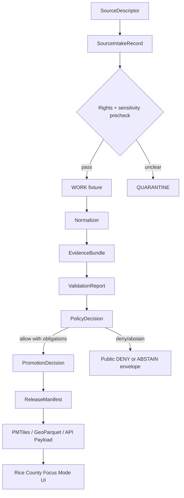
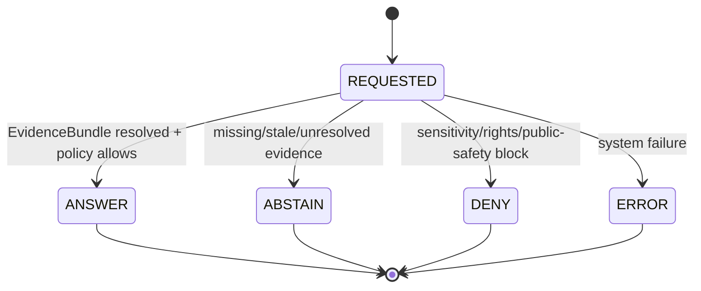
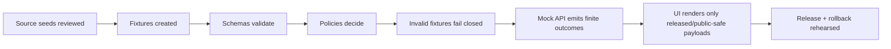

<!--
doc_id: NEEDS_VERIFICATION
title: Rice County Focus Mode Build Plan
type: standard
version: v1
status: draft
owners:
  - NEEDS_VERIFICATION
created: 2026-05-21
updated: 2026-05-21
policy_label: public
related:
  - docs/doctrine/directory-rules.md # NEEDS_VERIFICATION
  - docs/doctrine/truth-posture.md # NEEDS_VERIFICATION
  - docs/doctrine/trust-membrane.md # NEEDS_VERIFICATION
  - docs/focus-modes/counties/README.md # PROPOSED / NEEDS_VERIFICATION
tags:
  - kfm
  - focus-mode
  - kansas
  - rice-county
  - hydrology
  - agriculture
  - geology
  - cultural-heritage
notes:
  - "Repo paths in this document are PROPOSED until verified against a mounted Kansas Frontier Matrix repository."
  - "County facts and source seeds require source-rights, freshness, and authority verification before publication."
  - "Public surfaces must use governed APIs, released artifacts, catalog/triplet/graph records, tile services, EvidenceBundle resolution, and policy-safe runtime envelopes."
-->

<a id="top"></a>

# Rice County Focus Mode Build Plan

> **Status:** PROPOSED county proof-slice plan  
> **County:** Rice County, Kansas  
> **Focus Mode theme:** Arkansas River / Cow Creek agriculture-water-heritage corridor  
> **Truth posture:** cite-or-abstain · fail-closed · evidence-first · map-first · time-aware · auditable · reversible  
> **Repository posture:** NO_LOCAL_REPO_EVIDENCE for this generated plan. All file paths are PROPOSED and NEEDS_VERIFICATION before landing.

<p align="center">
  
  
  
  
  
</p>

<p align="center">
  <a href="#operating-posture">Operating posture</a> ·
  <a href="#why-this-county">Why this county</a> ·
  <a href="#first-demo-layers">Demo layers</a> ·
  <a href="#governed-object-model">Object model</a> ·
  <a href="#proposed-repository-shape">Repo shape</a> ·
  <a href="#source-seed-list">Sources</a> ·
  <a href="#recommended-first-milestone">Milestone</a>
</p>

---

## Executive determination

**Rice County is a high-value next KFM Focus Mode proof slice** because it is compact enough for a controlled county build, but rich enough to test cross-domain governance. The county brings together irrigated and dryland agriculture, Arkansas River and Cow Creek hydrology, floodplain governance, groundwater/aquifer context, U.S. 56 / K-14 / K-96 transportation corridors, Lyons and Sterling civic anchors, Quivira / Wichita and Santa Fe Trail cultural history, and land-record/property-context risks.

This plan is **not** a publication approval. It is a build plan for a future governed slice.

> [!IMPORTANT]
> Rice County Focus Mode must not expose RAW, WORK, QUARANTINE, unpublished candidates, exact sensitive cultural-resource locations, living-person details, private parcel-owner claims, operational infrastructure vulnerabilities, or direct AI output as public truth.

---

<a id="operating-posture"></a>

## Operating posture

| Rule | Rice County Focus Mode application |
|---|---|
| EvidenceBundle outranks generated language | Every UI claim about agriculture, floodplain, groundwater, roads, historic trails, or cultural history resolves to one or more EvidenceBundles. |
| Public clients use governed interfaces | The public UI reads governed API payloads, released PMTiles/GeoParquet/COG artifacts, catalog records, graph/triplet summaries, and policy-safe runtime envelopes only. |
| Publication is a governed transition | A layer moving from PROCESSED to PUBLISHED requires validation, PolicyDecision, PromotionDecision, release manifest, rollback target, and correction path. |
| AI is interpretive only | Focus Mode summaries may explain released evidence, but AI cannot create, certify, or publish truth. |
| Cite-or-abstain | If a source cannot support a county claim, the UI returns ABSTAIN with a visible missing-evidence reason. |
| Sensitive-location fail-closed | Archaeological, sacred, burial, rare-species, exact infrastructure vulnerability, and private-property-sensitive details are generalized, denied, or steward-gated. |
| Time-aware by default | Agriculture, floodplain, groundwater, road projects, and parcel context must carry effective date, observation date, source date, and release date where available. |

### County-specific posture

Rice County requires a **public-context vs. sensitive-detail split** from day one:

| Public-safe context | Sensitive or restricted detail |
|---|---|
| County boundary, cities, public roads, generalized watersheds, public floodplain viewer references, county-level agriculture statistics, public KGS geologic summaries, public museum/trail context | Exact archaeological site coordinates, burial/sacred places, living-person/property-owner assertions, private parcel geometry treated as ownership proof, emergency dispatch or response details, facility vulnerabilities, unpublished field notes, unrestricted well-level interpretations if source terms or sensitivity are unclear |

---

<a id="why-this-county"></a>

## Why this county

Rice County is a strong proof slice because it forces KFM to handle **interlocking evidence domains** without collapsing them:

1. **Agriculture is substantial and measurable.** Kansas Department of Agriculture reports 433 farms, 384,753 acres in farms, and $297 million in crop/livestock sales in 2022 for Rice County.
2. **Water is central to county interpretation.** KGS identifies Arkansas River, Cow Creek, Little Arkansas River, and tributary valley alluvium/terrace deposits as key groundwater-bearing units; Arkansas River and Cow Creek deposits can yield large quantities to wells in the KGS description.
3. **Floodplain governance is present and current enough to test source routing.** KDA’s retired Rice County Cow Creek floodplain map redirects to the Kansas Current Effective Floodplain Viewer, whose page reports current effective floodplain status and update dates.
4. **Transportation corridors are visible but not too complex.** U.S. 56, K-14, K-96, Lyons, Sterling, and Chase provide a manageable roads/settlement demo. KDOT’s U.S. 56 bridge replacement notice offers a concrete project-type source seed.
5. **Cultural history must be handled carefully.** Public sources tie Rice County to Quivira/Wichita history, Coronado-era interpretation, and Santa Fe Trail movement. That makes Rice County useful for demonstrating KFM’s exact-location suppression and public-safe cultural context posture.

> [!WARNING]
> Rice County is not a “simple farm county” slice. It is a governance slice: agriculture + groundwater + floodplain + transportation + cultural heritage + land context must remain separable, cited, and policy-controlled.

---

<a id="product-thesis"></a>

## Product thesis

**Rice County Focus Mode** should answer:

> “How do agriculture, water, transportation, and cultural-historical corridors interact across Rice County, and what can the public safely see with evidence, temporal context, and policy controls?”

The first release should feel like a **county evidence dashboard wrapped around a map**, not a raw GIS dump.

### Product promise

A public user can open Rice County Focus Mode and safely inspect:

- Where the county’s public hydrology and floodplain context sits.
- How agriculture and land-cover patterns shape county interpretation.
- Where major public roads and settlements structure access.
- How public cultural-history narratives connect to the landscape without exposing sensitive sites.
- What the system knows, what it does not know, and what it refuses to show.

### Non-promise

The Focus Mode does **not**:

- Certify legal ownership or title.
- Provide emergency warnings.
- Expose exact archaeological/sacred/burial locations.
- Replace FEMA/KDA/KGS/KDOT/County authority.
- Interpret private property status from parcels alone.
- Use AI answers as source authority.

---

<a id="scope-boundary"></a>

## Scope boundary

### Included in first proof slice

| Lane | Included first-slice scope |
|---|---|
| Spatial foundation | County boundary, municipal anchors, generalized township/range context if source-cleared. |
| Hydrology | Arkansas River, Cow Creek, Little Arkansas River, public floodplain context, watershed summary. |
| Groundwater/geology | Public KGS groundwater/geology summaries, generalized aquifer context, no well-owner exposure. |
| Agriculture | County-level ag statistics, generalized crop/pasture context, future CDL/SSURGO demo layer plan. |
| Roads / access | U.S. 56, K-14, K-96, public KDOT project seed, generalized road corridor role. |
| Settlements | Lyons, Sterling, Chase, Alden, Bushton, Little River, Geneseo as public settlement anchors. |
| Cultural heritage | Public-safe Coronado Quivira Museum / Santa Fe Trail / Quivira context, generalized only. |
| Evidence UI | Evidence Drawer, source-seed list, confidence labels, PolicyDecision and ABSTAIN surfaces. |

### Explicitly out of scope for first proof slice

| Excluded item | Reason |
|---|---|
| Exact archaeological site points | Sensitive cultural-resource risk; requires steward/cultural review and public-safe transforms. |
| Burial, sacred, or traditional cultural property locations | DENY exact public location by default. |
| Living-person genealogy or private household detail | Restricted by default; not needed for first county slice. |
| Parcel-owner labels as public “ownership truth” | Assessor/appraiser data is not title truth; land ownership requires evidence-bound temporal assertions. |
| Emergency operations detail | KFM is not an emergency alerting system. |
| Raw well records or exact vulnerability interpretations | Rights, privacy, and infrastructure sensitivity need review. |
| Live connectors | First milestone should use static, no-network fixtures and source descriptors. |

---

<a id="first-demo-layers"></a>

## First demo layers

| Layer ID | Public label | Source seed | Geometry posture | Time posture | Policy posture |
|---|---|---|---|---|---|
| `rice.boundary.v1` | Rice County boundary | Census/TIGER or Kansas Geoportal candidate | Public polygon | Source vintage + release date | Public after source-rights check |
| `rice.settlements.v1` | Cities and towns | Census places / county source candidate | Public points/polygons | Source vintage | Public |
| `rice.transport.major_corridors.v1` | U.S. 56 / K-14 / K-96 corridors | KDOT / TIGER candidate | Public lines | Source vintage + project date where applicable | Public; no vulnerability overlays |
| `rice.hydrology.public_context.v1` | Arkansas River, Cow Creek, Little Arkansas River | NHDPlus / KGS narrative candidate | Public/generalized lines | Source vintage | Public context only |
| `rice.floodplain.effective_context.v1` | Current effective floodplain context | KDA floodplain viewer / FEMA MSC | Public polygons only after source-rights and freshness review | Effective date / last updated | Public with source disclaimers |
| `rice.agriculture.county_stats.v1` | County agriculture summary | KDA / USDA Census of Agriculture | No geometry beyond county aggregate | 2022 census year | Public aggregate |
| `rice.groundwater.generalized.v1` | Generalized groundwater context | KGS / USGS publication | Generalized polygons/text callouts | Publication year + interpreted period | Public context; no sensitive well detail |
| `rice.cultural.public_context.v1` | Quivira / Santa Fe Trail public context | Coronado Quivira Museum / NPS / TravelKS | Generalized corridor/callout only | Historical period as claim scope | Restricted transform; no exact site coordinates |

### Layer dependency graph



---

<a id="user-journeys"></a>

## User journeys

### 1. Public resident: “What does the map say about flooding near Cow Creek?”

1. Opens Rice County Focus Mode.
2. Turns on public floodplain context.
3. Clicks a generalized area near Cow Creek.
4. Sees:
   - current effective floodplain source reference,
   - last checked date,
   - limitation that official determinations belong to KDA/FEMA/local floodplain administrator,
   - EvidenceBundle links,
   - no raw FEMA/KDA scrape or unpublished geometry.

**Required outcome:** `ANSWER` only if EvidenceBundle and release manifest exist; otherwise `ABSTAIN`.

### 2. Researcher: “How does groundwater shape agriculture?”

1. Opens Agriculture + Groundwater view.
2. Compares county-level farm stats with generalized KGS groundwater context.
3. Reads a public-safe explanation of Arkansas River / Cow Creek alluvium and terrace deposits.
4. Downloads only released aggregate artifacts.

**Required outcome:** clear separation between observed agriculture statistics and interpreted hydrogeologic context.

### 3. County planner: “What layers are safe for a public meeting?”

1. Opens Review Snapshot panel.
2. Filters layers by public-safe status.
3. Exports a meeting-safe map bundle with:
   - source ledger,
   - release manifest,
   - policy decisions,
   - redaction/generalization receipts,
   - rollback target.

**Required outcome:** no sensitive cultural or operational details in exported bundle.

### 4. Visitor/history user: “Where did the Santa Fe Trail pass?”

1. Opens Cultural Context panel.
2. Sees public museum/trail narrative and generalized corridor context.
3. Sensitive places are shown only as broad public-safe interpretive areas or omitted.

**Required outcome:** no exact archaeological, sacred, burial, or restricted site geometry.

---

<a id="ui-surfaces"></a>

## UI surfaces

| Surface | Purpose | Rice County specifics | Required trust affordance |
|---|---|---|---|
| County Focus Header | Establish scope and status | “Rice County · agriculture-water-heritage corridor” | County FIPS, release ID, last reviewed |
| Layer Stack | Toggle released layers | Hydrology, floodplain, agriculture, roads, settlements, cultural context | Layer status badge and policy label |
| Evidence Drawer | Explain clicked feature | Source refs, EvidenceBundle, limitations | Cite-or-abstain panel |
| Time Rail | Show time basis | 2022 ag census; publication years; floodplain effective date | Valid time vs release time |
| Policy Banner | Warn about restrictions | Cultural heritage and private-property caveats | DENY/ABSTAIN reasons |
| Source Seed Panel | Show candidate sources | KDA, KGS, KDOT, county, museum/NPS | Source role and freshness |
| Review Snapshot | Steward/public-meeting mode | Safe export checklist | Release manifest + rollback link |
| AI Summary Box | Bounded explanation | “What does this layer mean?” | AIReceipt + citation validation; never source authority |

### Runtime outcome model



---

<a id="governed-object-model"></a>

## Governed object model

### Core objects

| Object | Role in Rice County Focus Mode | Minimal fields |
|---|---|---|
| `SourceDescriptor` | Registers county, KDA, KGS, KDOT, FEMA, USDA, museum/NPS source seeds. | `source_id`, `publisher`, `source_role`, `rights_status`, `accessed_at`, `terms_ref`, `refresh_policy` |
| `SourceIntakeRecord` | Records admission of a source snapshot or manual fixture. | `intake_id`, `source_id`, `lifecycle_state`, `hash`, `operator`, `timestamp` |
| `EvidenceRef` | Points from claims/layers to evidence. | `evidence_ref_id`, `bundle_ref`, `claim_scope`, `required` |
| `EvidenceBundle` | Source-bound proof context for a layer or claim. | `bundle_id`, `sources`, `claims_supported`, `spatial_scope`, `temporal_scope`, `limitations` |
| `PolicyDecision` | Decides allow/deny/abstain/obligations. | `decision_id`, `input_ref`, `outcome`, `policy_version`, `obligations`, `reason_codes` |
| `ValidationReport` | Records schema, source, geometry, and evidence checks. | `report_id`, `target_ref`, `checks`, `failures`, `warnings` |
| `PromotionDecision` | Governs transition to PUBLISHED. | `promotion_id`, `from_state`, `to_state`, `approver`, `policy_decision_ref`, `rollback_ref` |
| `ReleaseManifest` | Public release inventory. | `release_id`, `artifacts`, `hashes`, `policy_refs`, `rollback_refs` |
| `RuntimeResponseEnvelope` | UI answer envelope. | `outcome`, `payload`, `citations`, `evidence_refs`, `policy_decision_ref`, `limitations` |
| `AIReceipt` | Records bounded AI generation. | `ai_receipt_id`, `model_ref`, `prompt_hash`, `input_evidence_refs`, `output_hash`, `citation_validation_ref` |

### County-specific claim families

| Claim family | Example public claim | Evidence requirement | Failure mode |
|---|---|---|---|
| Agriculture aggregate | “Rice County had 433 farms in 2022.” | KDA/USDA source snapshot + EvidenceBundle | ABSTAIN if source stale/unresolved |
| Hydrology context | “The county is drained largely by Arkansas River and tributaries.” | KGS/USGS publication EvidenceBundle | ABSTAIN if source not linked |
| Floodplain context | “This area intersects current effective floodplain.” | KDA/FEMA source + effective date + geometry validation | DENY/ABSTAIN if source terms/freshness unclear |
| Groundwater interpretation | “Alluvium/terrace deposits are important aquifers.” | KGS/USGS publication + limitations | ABSTAIN if over-specific |
| Cultural public context | “Santa Fe Trail history is represented by public interpretive sources.” | Museum/NPS/TravelKS public source + sensitivity transform | DENY exact site geometry |
| Road project context | “KDOT reported a U.S. 56 bridge replacement near Chase.” | KDOT notice + date + project scope | ABSTAIN if project status not refreshed |

---

<a id="proposed-repository-shape"></a>

## Proposed repository shape

> [!CAUTION]
> The following file paths are **PROPOSED**. They are based on KFM Directory Rules doctrine that responsibility roots govern placement and that topic does not justify new repo-root folders. Verify against the mounted repository and accepted ADRs before creating or moving files.

### Proposed file homes

| Responsibility root | Proposed path | Purpose | Status |
|---|---|---|---|
| Documentation | `docs/focus-modes/counties/rice_county_focus_mode_build_plan.md` | Human-readable build plan | PROPOSED / NEEDS_VERIFICATION |
| Source registry | `docs/sources/counties/rice/source_seed_register.md` | Source seed summary and authority notes | PROPOSED |
| Source descriptors | `data/source_registry/counties/rice/*.source.json` | Machine source descriptors | PROPOSED / schema home NEEDS_VERIFICATION |
| Schemas | `schemas/contracts/v1/focus_mode/county_focus_mode.schema.json` | County Focus Mode payload contract | PROPOSED / ADR check required |
| Fixtures | `fixtures/focus_mode/rice/valid/*.json` | Valid no-network fixtures | PROPOSED |
| Invalid fixtures | `fixtures/focus_mode/rice/invalid/*.json` | Negative-path fixtures | PROPOSED |
| Validators | `tools/validators/focus_mode/validate_county_focus_mode.py` | Fail-closed validation entrypoint | PROPOSED |
| Policy | `policy/focus_mode/county_publication.rego` | Public-safe publication decisions | PROPOSED / policy root naming NEEDS_VERIFICATION |
| API contract | `contracts/api/focus_mode/rice_county.openapi.yaml` | Governed API sketch | PROPOSED |
| UI notes | `docs/ui/focus-mode/rice_county_ui_contract.md` | Evidence Drawer and layer behavior | PROPOSED |
| Release | `release/focus_mode/rice/RELEASE_MANIFEST.example.json` | Release manifest fixture | PROPOSED |
| Rollback | `release/focus_mode/rice/ROLLBACK_PLAN.example.md` | Reversal path | PROPOSED |

### Directory rules basis

- Use existing responsibility roots; do **not** create a root-level `rice/` or `counties/` authority bucket.
- Keep source descriptors, schemas/contracts, fixtures, policy, tools, docs, release, and UI contracts in their appropriate roots.
- Treat this county plan as documentation and implementation guidance, not a canonical data store.
- Keep lifecycle artifacts separated: RAW/WORK/QUARANTINE/PROCESSED/CATALOG/TRIPLET/PUBLISHED are not interchangeable folders.
- Promotion must be recorded as a governed state transition.

---

<a id="build-phases"></a>

## Build phases

### Phase 0 — Evidence and path verification

- [ ] Mount or inspect current repository.
- [ ] Confirm accepted ADRs for schema home, policy root, release manifest home, and county Focus Mode docs.
- [ ] Verify Rice County has not already been implemented.
- [ ] Confirm source rights and terms for each source seed.
- [ ] Create source ledger entries with `NEEDS_VERIFICATION` cleared only when checked.

**Exit gate:** no repo path or source authority remains implied by guesswork.

### Phase 1 — No-network county fixture slice

- [ ] Create static county fixture bundle.
- [ ] Add source descriptors for KDA agriculture, KGS groundwater/geology, KDA floodplain viewer, KDOT notice, county planning/appraiser pages, and public heritage sources.
- [ ] Create valid and invalid EvidenceBundle fixtures.
- [ ] Add validator tests for EvidenceRef resolution, policy outcome, source role, and sensitivity handling.

**Exit gate:** fixture-only `ANSWER`, `ABSTAIN`, `DENY`, and `ERROR` examples exist.

### Phase 2 — Governed API contract

- [ ] Define `/focus-mode/counties/rice` payload shape.
- [ ] Define layer registry response.
- [ ] Define Evidence Drawer payload response.
- [ ] Define RuntimeResponseEnvelope finite outcomes.
- [ ] Define citation validation report fixture.

**Exit gate:** UI can run from mock governed API payloads without raw data access.

### Phase 3 — Map and layer manifest

- [ ] Create public-safe layer manifest.
- [ ] Add style and tile references as release artifacts only.
- [ ] Add PMTiles/GeoParquet/COG attestation sidecar placeholders if applicable.
- [ ] Add visible layer limitations.

**Exit gate:** public map layers have release manifest refs and rollback refs.

### Phase 4 — Evidence Drawer and Focus Mode UI

- [ ] Build Rice County header.
- [ ] Add layer toggles and policy badges.
- [ ] Add Evidence Drawer.
- [ ] Add Time Rail.
- [ ] Add Source Seed panel.
- [ ] Add AI summary stub with citation validation and AIReceipt.

**Exit gate:** user can inspect source, evidence, policy, release state, and limitations for every visible claim.

### Phase 5 — Review, release rehearsal, rollback rehearsal

- [ ] Run validation suite.
- [ ] Run policy suite.
- [ ] Produce proof pack.
- [ ] Produce release manifest.
- [ ] Produce rollback plan.
- [ ] Rehearse correction notice.

**Exit gate:** a maintainer can prove, publish, withdraw, and correct the slice without manual invention.

---

<a id="first-pr-sequence"></a>

## First PR sequence

| PR | Title | Scope | Why first |
|---|---|---|---|
| PR-1 | `docs: add Rice County Focus Mode build plan` | This Markdown plan + source seed register | Establishes documented boundary and proof-slice intent |
| PR-2 | `schemas: add county focus mode envelope contracts` | RuntimeResponseEnvelope, EvidenceBundle link shape, layer manifest | Prevents UI-first drift |
| PR-3 | `fixtures: add Rice County no-network valid and invalid fixtures` | Valid source/evidence/layer payloads plus negative fixtures | Makes validation testable |
| PR-4 | `policy: add county focus mode public-safe rules` | DENY/ABSTAIN rules for cultural, parcel, infrastructure, and evidence gaps | Ensures fail-closed posture |
| PR-5 | `tools: add focus mode fixture validator` | Schema and evidence-link validator | Gives CI a gate |
| PR-6 | `api: add mock Rice County focus mode contract` | Governed API mock | Keeps public UI away from raw data |
| PR-7 | `ui: add Rice County focus mode mock surface` | Header, layers, Evidence Drawer, time rail | Demo after governance spine exists |
| PR-8 | `release: add Rice County release/rollback rehearsal` | ReleaseManifest, ProofPack, RollbackPlan examples | Tests publication as transition |

---

## Fixture plan

### Valid fixtures

| Fixture | Purpose |
|---|---|
| `valid/rice_county_focus_mode_payload.v1.json` | Full mock API response with finite outcome `ANSWER`. |
| `valid/rice_agriculture_2022_evidence_bundle.v1.json` | KDA/USDA county ag aggregate. |
| `valid/rice_groundwater_kgs_context_bundle.v1.json` | KGS generalized groundwater source support. |
| `valid/rice_public_floodplain_context_bundle.v1.json` | KDA/FEMA effective floodplain context with disclaimers. |
| `valid/rice_cultural_public_context_redacted.v1.json` | Public heritage context with generalized geometry only. |
| `valid/rice_release_manifest.example.json` | Published artifact refs, hashes, policy refs, rollback refs. |

### Invalid / negative-path fixtures

| Fixture | Expected outcome | Trigger |
|---|---|---|
| `invalid/rice_missing_evidence_ref.json` | `ABSTAIN` | Layer has claim but no EvidenceRef. |
| `invalid/rice_unresolved_bundle.json` | `ABSTAIN` | EvidenceRef does not resolve to EvidenceBundle. |
| `invalid/rice_exact_archaeology_location.json` | `DENY` | Exact cultural-resource point in public payload. |
| `invalid/rice_parcel_owner_as_title_truth.json` | `DENY` | Parcel/appraiser record treated as legal ownership proof. |
| `invalid/rice_raw_source_url_public_payload.json` | `DENY` | Public UI references RAW/WORK/QUARANTINE source path. |
| `invalid/rice_missing_floodplain_effective_date.json` | `ABSTAIN` | Floodplain layer lacks effective/update date. |
| `invalid/rice_ai_answer_without_citations.json` | `DENY` | AI output lacks citation validation and AIReceipt. |
| `invalid/rice_bridge_vulnerability_overlay.json` | `DENY` | Infrastructure vulnerability details exposed. |

---

<a id="acceptance-checklist"></a>

## Acceptance checklist

### Evidence and source gates

- [ ] Every public claim has at least one EvidenceRef.
- [ ] Every EvidenceRef resolves to an EvidenceBundle.
- [ ] Every EvidenceBundle has source role, publisher, rights status, date basis, and limitations.
- [ ] Every source seed has source-rights and freshness status.
- [ ] No AI-generated prose is treated as evidence.

### Policy gates

- [ ] Cultural heritage details are generalized or denied.
- [ ] Archaeological/sacred/burial exact locations are absent from public artifacts.
- [ ] Parcel/appraiser data is not represented as title truth.
- [ ] Emergency/dispatch/operational details are absent.
- [ ] Infrastructure vulnerability overlays are denied.
- [ ] Unknown rights/sensitivity defaults to ABSTAIN or DENY.

### Technical gates

- [ ] Valid fixtures pass.
- [ ] Invalid fixtures fail closed.
- [ ] RuntimeResponseEnvelope only emits `ANSWER`, `ABSTAIN`, `DENY`, or `ERROR`.
- [ ] UI reads only governed mock/API payloads.
- [ ] ReleaseManifest includes artifact hashes and rollback refs.
- [ ] Rollback plan is executable by a maintainer.
- [ ] No network access is required for first test slice.

### UX gates

- [ ] Layer badges show evidence and policy status.
- [ ] Evidence Drawer exposes source, date, limitation, and policy reason.
- [ ] Time Rail distinguishes observed date, effective date, source publication date, and release date.
- [ ] ABSTAIN and DENY are understandable to public users.
- [ ] Exported map bundle is public-safe.

---

<a id="risk-register"></a>

## Risk register

| Risk | County-specific expression | Severity | Mitigation |
|---|---|---:|---|
| Cultural site exposure | Quivira/Wichita, Coronado, Santa Fe Trail, and local archaeological materials could imply sensitive site locations. | High | Use generalized public context only; require steward/cultural review for anything precise. |
| Parcel/title confusion | Public property/appraiser data may be mistaken for ownership truth. | High | Label assessor/appraiser sources as administrative context, not title proof. |
| Floodplain authority confusion | KFM map could be mistaken for official FEMA/KDA determination. | High | Prominent disclaimers, source dates, and official-source links; ABSTAIN if stale. |
| Groundwater over-interpretation | KGS generalized aquifer statements could be over-applied to specific wells/properties. | Medium | Generalize; no well-level claims without source-rights and sensitivity review. |
| Agriculture source freshness | 2022 Ag Census may be current for census but not current conditions. | Medium | Display census year and avoid current-year claims. |
| Road project staleness | KDOT project notices can change after publication. | Medium | Project layers require last checked date and review before display. |
| Raw data leakage | UI accidentally points at source staging paths. | High | Validator denies RAW/WORK/QUARANTINE refs in public payloads. |
| AI overclaim | Focus Mode summary invents unsupported relationships. | High | Citation validation, finite outcomes, AIReceipt, and EvidenceBundle-bound summaries. |
| Rights ambiguity | Third-party parcel/map services may not be reusable. | High | Prefer official/public-domain/government sources; quarantine unclear terms. |
| Map precision illusion | Public map symbology may imply certainty beyond evidence. | Medium | Use confidence badges, scale limitations, and generalized symbology. |

---

<a id="source-seed-list"></a>

## Source seed list

> [!NOTE]
> These are candidate seeds for source descriptors. They are not yet activated sources. Each needs rights, freshness, access, schema, and source-role review before ingestion.

| Source seed | Candidate role | What it supports | Initial posture | URL |
|---|---|---|---|---|
| Rice County official site | Context / county authority seed | County departments, appraiser/property links, local context | NEEDS_VERIFICATION | https://www.ricecounty.us/ |
| Rice County Planning & Zoning | Local planning / environmental governance seed | Planning/zoning mission to protect and enhance natural resources | NEEDS_VERIFICATION | https://www.ricecounty.us/departments/planning___zoning/index.php |
| Rice County Appraiser | Administrative property context seed | Appraiser office and agriculture land valuation links | RESTRICTED CONTEXT / not title truth | https://www.ricecounty.us/departments/appraiser/index.php |
| Kansas Department of Agriculture — Rice County | Agriculture aggregate seed | 2022 farms, farm acres, crop/livestock sales | PUBLIC AGGREGATE / NEEDS_VERIFICATION | https://www.agriculture.ks.gov/kansas-agriculture/kansas-agricultural-statistics/rice-county |
| USDA NASS 2022 County Profile — Rice County | Agriculture aggregate seed | Farms, land in farms, market value, expenses | PUBLIC AGGREGATE / NEEDS_VERIFICATION | https://www.nass.usda.gov/Publications/AgCensus/2022/Online_Resources/County_Profiles/Kansas/cp20159.pdf |
| K-State Rice County Extension — Crops & Livestock | Local agriculture context seed | Crop acreage and pasture context | NEEDS_VERIFICATION | https://www.rice.k-state.edu/crops-livestock/ |
| KGS — Geology and Ground-Water Resources of Rice County | Geology/groundwater source seed | Arkansas River drainage, county geography, groundwater context | PUBLIC REFERENCE / NEEDS_VERIFICATION | https://www.kgs.ku.edu/Publications/Bulletins/85/index.html |
| KGS — Rice County Ground Water chapter | Groundwater source seed | Alluvium/terrace aquifer context and yields | PUBLIC REFERENCE / NEEDS_VERIFICATION | https://www.kgs.ku.edu/General/Geology/Rice/04_gw.html |
| KGS — Rice County Geology chapter | Geology source seed | Alluvium, terrace deposits, stream-valley deposits | PUBLIC REFERENCE / NEEDS_VERIFICATION | https://www.kgs.ku.edu/General/Geology/Rice/03_rock.html |
| KDA Current Effective Floodplain Viewer | Floodplain authority seed | Current effective floodplain viewing context | PUBLIC / authority-currentness review required | https://gis2.kda.ks.gov/gis/ksfloodplain/ |
| KDA retired Rice County Cow Creek Floodplain page | Floodplain routing seed | Indicates Rice County moved into Effective Floodplain Viewer | LINEAGE / NEEDS_VERIFICATION | https://gis2.kda.ks.gov/gis/rice/ |
| KDOT U.S. 56 bridge replacement notice | Transportation project seed | U.S. 56 bridge project near Chase | PROJECT-SPECIFIC / refresh required | https://www.ksdot.gov/Home/Components/News/News/5549/712 |
| Coronado Quivira Museum | Public cultural-history seed | Quivira/Wichita, Coronado, Santa Fe Trail, Rice County history | PUBLIC CONTEXT / exact-location caution | https://cqmuseum.org/ |
| NPS Coronado Quivira Museum page | Public cultural-history seed | Museum and Santa Fe Trail / Quivira public context | PUBLIC CONTEXT / exact-location caution | https://www.nps.gov/places/coronado-quivira-museum.htm |
| TravelKS Coronado Quivira Museum listing | Public tourism/cultural seed | Public museum exhibit context | PUBLIC CONTEXT / NEEDS_VERIFICATION | https://www.travelks.com/listing/coronado-quivira-museum/2142/ |

### Source role anti-collapse rules

| Do not collapse | Reason |
|---|---|
| KDA/USDA agriculture statistics ≠ current crop condition | Census aggregates have a census year and scope. |
| KGS groundwater narrative ≠ parcel-level water right or well yield | General geologic interpretation cannot be applied as property proof. |
| Floodplain viewer context ≠ local permit determination | Official floodplain decisions remain with relevant authorities. |
| Appraiser/parcel data ≠ legal title | Administrative property data is not conclusive title evidence. |
| Museum/NPS/trail narrative ≠ exact site geometry | Cultural history must not expose sensitive places. |
| KDOT project notice ≠ live construction status | Road projects require current-status verification. |

---

<a id="open-verification-questions"></a>

## Open verification questions

### Repo and path questions

- [ ] What is the current accepted schema home: `schemas/contracts/v1`, `contracts`, `jsonschema`, or another ADR-defined root?
- [ ] Does a `docs/focus-modes/counties/` convention already exist?
- [ ] Are county Focus Mode plans stored under `docs/domains/`, `docs/focus-modes/`, `docs/atlases/`, or another docs root?
- [ ] Which policy root is canonical: `policy/` or `policies/`?
- [ ] Which validator runner is used in CI?
- [ ] What is the current MapLibre app path and layer registry format?
- [ ] What release/proof manifest conventions already exist?

### Source questions

- [ ] What official county GIS or parcel map endpoint is source-authoritative for Rice County, if any?
- [ ] What are the reuse terms for Rice County appraiser/property pages?
- [ ] Does Rice County participate in Kansas ORKA or another official parcel service?
- [ ] What is the freshest KDA/FEMA floodplain effective date for Rice County after source review?
- [ ] Are KGS publication pages acceptable as public reference sources under KFM source policy?
- [ ] What KDOT project sources are current for U.S. 56/K-14/K-96 in Rice County?
- [ ] What source terms apply to Coronado Quivira Museum material and NPS pages?
- [ ] Which cultural-history material requires steward review before even generalized display?

### Policy questions

- [ ] What is the minimum public generalization grid for cultural heritage in Rice County?
- [ ] Should Santa Fe Trail public route context be shown as a corridor, narrative-only callout, or off-map story panel?
- [ ] Are groundwater/aquifer surfaces safe as generalized map layers, or should first release use text-only callouts?
- [ ] Should parcel/property administrative sources be excluded from public map display entirely in first release?
- [ ] What warning language is required for floodplain views?

---

<a id="recommended-first-milestone"></a>

## Recommended first milestone

### Milestone: “Rice County public-safe evidence skeleton”

**Goal:** Produce a no-network, fixture-only Rice County Focus Mode that proves the trust membrane before any live connector or public publication.

### Deliverables

- [ ] `rice_county_focus_mode_build_plan.md`
- [ ] Rice County source seed register
- [ ] 6 source descriptor fixtures
- [ ] 4 valid EvidenceBundle fixtures
- [ ] 8 invalid fail-closed fixtures
- [ ] County Focus Mode payload schema
- [ ] Public-safe policy rules
- [ ] Validator stub and test matrix
- [ ] Mock governed API payload
- [ ] Map layer manifest fixture
- [ ] Evidence Drawer payload fixture
- [ ] Release manifest fixture
- [ ] Rollback plan fixture

### Definition of done



A maintainer can run the fixture validation and prove:

- public agriculture aggregate answers can be cited,
- groundwater claims remain generalized,
- floodplain layers require effective-date support,
- exact cultural-site geometry is denied,
- parcel-owner/title overclaims are denied,
- UI never reads raw/unpublished sources,
- rollback and correction paths exist.

---

## Appendix A — Proposed layer manifest sketch

```json
{
  "schema_version": "v1",
  "focus_mode_id": "kfm://focus-mode/county/ks/rice",
  "county_fips": "20159",
  "county_name": "Rice County",
  "release_state": "PROPOSED",
  "layers": [
    {
      "layer_id": "rice.agriculture.county_stats.v1",
      "public_label": "Rice County agriculture summary",
      "policy_label": "public_aggregate",
      "evidence_refs": ["kfm://evidence/rice/agriculture/2022"],
      "runtime_allowed_outcomes": ["ANSWER", "ABSTAIN", "ERROR"]
    },
    {
      "layer_id": "rice.cultural.public_context.v1",
      "public_label": "Public cultural-history context",
      "policy_label": "public_generalized",
      "geometry_precision": "generalized_or_text_only",
      "evidence_refs": ["kfm://evidence/rice/cultural/public-context"],
      "runtime_allowed_outcomes": ["ANSWER", "ABSTAIN", "DENY", "ERROR"]
    }
  ]
}
```

---

## Appendix B — Initial Rice County claim inventory

| Claim ID | Claim | Status | Required evidence |
|---|---|---|---|
| `rice.claim.ag.2022.farms` | Rice County had 433 farms in the 2022 Census of Agriculture. | PROPOSED until EvidenceBundle exists | KDA/USDA 2022 source |
| `rice.claim.ag.2022.acres` | Rice County had 384,753 acres in farms in 2022. | PROPOSED until EvidenceBundle exists | KDA/USDA 2022 source |
| `rice.claim.water.arkansas_drained` | Rice County is drained largely by Arkansas River and tributaries. | PROPOSED until EvidenceBundle exists | KGS/USGS publication |
| `rice.claim.gw.alluvium_terrace` | Unconsolidated alluvium and terrace deposits are key aquifers in Arkansas River, Cow Creek, Little Arkansas River, and tributary valleys. | PROPOSED until EvidenceBundle exists | KGS groundwater chapter |
| `rice.claim.floodplain.effective_viewer` | Rice County floodplain context should route through Kansas Current Effective Floodplain Viewer. | PROPOSED until EvidenceBundle exists | KDA floodplain viewer / retired Rice page |
| `rice.claim.cultural.santa_fe_public` | Public sources describe Santa Fe Trail history through Rice County. | PROPOSED until EvidenceBundle exists | Coronado Quivira Museum / NPS / county public page |
| `rice.claim.transport.us56_project` | KDOT reported a U.S. 56 bridge replacement project in Rice County near Chase. | PROPOSED until EvidenceBundle exists | KDOT notice; refresh before release |

---

## Appendix C — Public-safe wording examples

### ABSTAIN wording

> KFM cannot answer this Rice County question from released evidence. The required EvidenceBundle is missing, stale, or unresolved. No public claim has been made.

### DENY wording

> KFM cannot show this detail publicly because it may reveal sensitive cultural, private-property, infrastructure, or public-safety information. A generalized public context may be available if reviewed and released.

### Floodplain disclaimer wording

> This layer is public context only. Official floodplain determinations, permits, and insurance decisions must be verified through the appropriate authoritative source and local floodplain administrator.

### Parcel/title disclaimer wording

> Appraiser or parcel information is administrative context. It is not title proof and must not be used as a standalone land-ownership claim.

---

## Final status

| Item | Status |
|---|---|
| County selected | Rice County |
| Markdown generated | CONFIRMED |
| Repo edited | NO |
| Repo paths confirmed | NO — PROPOSED / NEEDS_VERIFICATION |
| Public source seeds browsed | YES |
| Ready for implementation PR | PROPOSED after repo/path/source verification |
| Ready for public release | NO |

[Back to top](#top)
