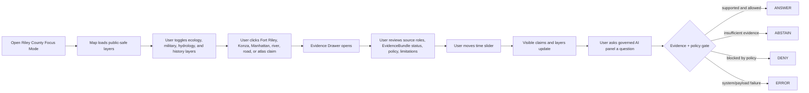
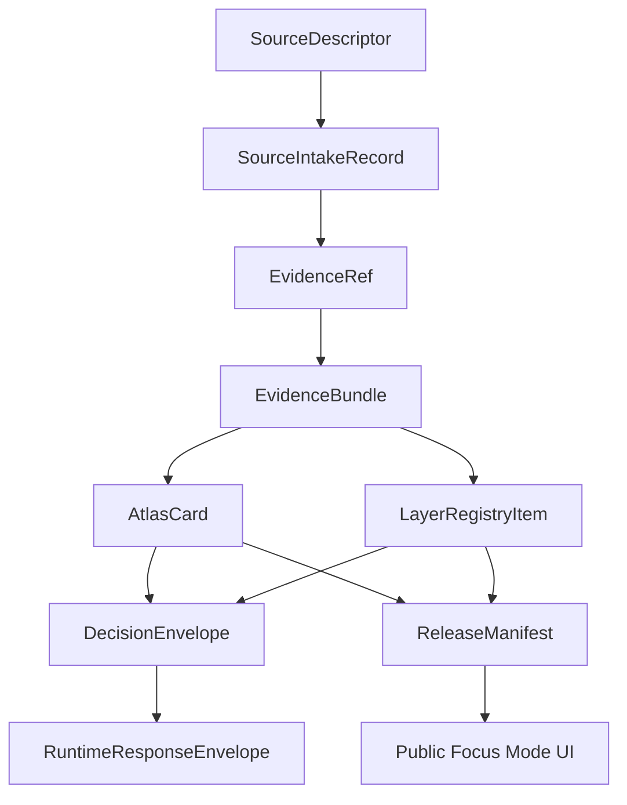

<!--
doc_id: NEEDS_VERIFICATION
title: Riley County Focus Mode Build Plan
type: standard
version: v1
status: draft
owners: [NEEDS_VERIFICATION]
created: 2026-05-21
updated: 2026-05-21
policy_label: public_draft
related:
  - docs/focus-modes/ellsworth-county/build-plan.md
  - docs/focus-modes/riley-county/README.md
  - docs/focus-modes/riley-county/layer-registry.md
  - docs/focus-modes/riley-county/acceptance-checklist.md
tags: [kfm, focus-mode, riley-county, kansas, flint-hills, fort-riley, konza-prairie]
notes:
  - Draft plan prepared without mounted repository inspection.
  - Paths, owners, doc IDs, schema homes, and validator names require repository verification before merge.
  - Historical, ecological, military, and infrastructure claims require source intake and evidence review before publication.
-->

<a id="top"></a>

# Riley County Focus Mode Build Plan

> **Purpose:** establish a second Kansas Frontier Matrix county proof slice after Ellsworth County, with a different domain profile: **Flint Hills ecology, Konza Prairie research, Fort Riley military geography, Manhattan / Kansas State University civic context, river systems, transportation corridors, and public-safe governance controls.**


---

## Quick links

- [1. Why Riley County](#1-why-riley-county)
- [2. Product thesis](#2-product-thesis)
- [3. Scope boundary](#3-scope-boundary)
- [4. First demo layers](#4-first-demo-layers)
- [5. User journeys](#5-user-journeys)
- [6. UI surfaces](#6-ui-surfaces)
- [7. Governed object model](#7-governed-object-model)
- [8. Proposed repository shape](#8-proposed-repository-shape)
- [9. Build phases](#9-build-phases)
- [10. First PR sequence](#10-first-pr-sequence)
- [11. Acceptance checklist](#11-acceptance-checklist)
- [12. Risk register](#12-risk-register)
- [13. Source seed list](#13-source-seed-list)
- [14. Open verification questions](#14-open-verification-questions)

---

## Operating posture

> [!IMPORTANT]
> Riley County Focus Mode is a **governed proof slice**, not a loose demo. It must preserve KFM’s core invariants:
>
> - EvidenceBundle outranks generated language.
> - Public clients use governed APIs, released artifacts, catalog records, tile services, and policy-safe runtime envelopes.
> - Public UI must not read directly from `RAW`, `WORK`, `QUARANTINE`, unpublished candidate data, canonical/internal stores, or direct model runtime outputs.
> - Publication is a governed state transition, not a file move.
> - AI outputs are downstream carriers, not sovereign truth.
> - Sensitive exact locations, restricted infrastructure details, living-person data, and culturally sensitive material fail closed.

---

# 1. Why Riley County

Riley County is the right second county because it exercises a **different KFM muscle** than Ellsworth County.

Ellsworth is the strong flagship for county-scale history, Fort Harker / Kanopolis, Smoky Hill River, settlement, and environmental baseline.

Riley County adds:

| KFM capability | Riley County proof value |
|---|---|
| Flint Hills ecology | Konza Prairie, tallgrass prairie, burn/grazing/research layers |
| Military geography | Fort Riley, frontier military roads, federal/military sensitivity boundaries |
| Research/university context | Kansas State University, long-running ecological data stewardship patterns |
| River confluence / hydrology | Kansas River valley context, Republican / Smoky Hill / Big Blue regional relationships |
| Urban + rural contrast | Manhattan, university, rural townships, agricultural matrix |
| Public-safe handling | military installation, research sites, sensitive ecology, infrastructure |
| Scaling template | tests Focus Mode beyond one historical county pattern |

> [!NOTE]
> This plan intentionally does **not** treat Riley County as “more important” than Ellsworth County. It is selected because it creates a complementary stress test for KFM architecture.

---

# 2. Product thesis

## User-facing thesis

> **Riley County Focus Mode lets a user see how military geography, tallgrass prairie ecology, river corridors, settlement, research institutions, and modern land use overlap through time — with every claim tied to evidence and every sensitive layer filtered through public-safe policy.**

## Internal KFM thesis

Riley County should prove that Focus Mode can handle:

```text
history + ecology + military + hydrology + civic geography + research provenance + sensitivity controls
```

without collapsing those into one vague map layer.

The system must preserve distinctions between:

- official source vs. contextual reference
- observation vs. model
- public layer vs. restricted layer
- ecological research site vs. public recreation site
- military installation boundary vs. public historical context
- claim vs. interpretation
- evidence vs. generated explanation

---

# 3. Scope boundary

## 3.1 Geography

Initial scope:

```text
Riley County, Kansas
```

Priority spatial anchors:

- Riley County boundary
- Manhattan
- Fort Riley context area
- Konza Prairie / Flint Hills context
- Kansas River valley / Blue River regional context
- Tuttle Creek Lake context
- historic road / military road corridors
- township / settlement pattern where source-supported

## 3.2 Time range

Start with broad buckets, then refine after source intake:

| Bucket | Role in demo |
|---|---|
| Before 1800 | Indigenous, ecological, and pre-territorial context; public-safe and carefully scoped |
| 1800–1853 | travel corridors, military-road precursors, regional movement context |
| 1853–1861 | Fort Riley establishment, territorial organization, early settlement |
| 1861–1877 | Civil War / frontier military context, transportation, town growth |
| 1878–1918 | railroad, agriculture, town/county development, military modernization |
| 1918–1945 | Camp Funston / military training context, public health historical caution |
| 1946–1980 | reservoir, infrastructure, university/research growth, land-use change |
| 1981–present | ecology research, urban growth, remote sensing, modern public-safe layers |

> [!CAUTION]
> These buckets are planning scaffolds. They are **not publication claims** until source-reviewed.

## 3.3 Not in MVP

Do **not** include in the first Riley County MVP:

- living-person genealogy
- DNA/genomics layers
- missing persons / active criminal case layers
- exact rare species locations
- exact archaeological, burial, or sacred-site locations
- operational military details
- emergency-response routing
- restricted infrastructure details
- private parcels as title truth
- public direct model endpoint

---

# 4. First demo layers

## 4.1 MVP layer registry

| Layer ID | Layer | Domain | Purpose | Initial posture |
|---|---|---:|---|---|
| `kfm.layer.riley.county_boundary.v1` | Riley County boundary | civic | establish spatial frame | public draft |
| `kfm.layer.riley.manhattan_context.v1` | Manhattan civic / settlement context | civic/history | county seat and urban anchor | public draft |
| `kfm.layer.riley.fort_riley_context.v1` | Fort Riley historical context | military/history | military geography anchor | public draft, evidence-required |
| `kfm.layer.riley.konza_context.v1` | Konza Prairie / Flint Hills context | ecology/research | prairie research and public-safe ecological context | public-safe generalized |
| `kfm.layer.riley.river_corridors.v1` | River and drainage context | hydrology | Kansas River valley and connected drainage context | public draft |
| `kfm.layer.riley.tuttle_creek_context.v1` | Tuttle Creek Lake context | hydrology/infrastructure | reservoir and watershed context | public draft |
| `kfm.layer.riley.military_road_context.v1` | Fort Leavenworth–Fort Riley road context | history/transportation | movement corridor and marker evidence | public draft, uncertainty shown |
| `kfm.layer.riley.land_cover_baseline.v1` | Land cover / prairie-agriculture matrix | ecology/agriculture | modern environmental baseline | derived, public-safe |
| `kfm.layer.riley.timeline_events.v1` | Timeline events | cross-domain | temporal navigation | public draft |
| `kfm.layer.riley.atlas_claims.v1` | Atlas claim points / areas | cross-domain | clickable evidence-backed claims | requires EvidenceRef |

## 4.2 Layer contract

Each layer must have:

```yaml
layer_id: kfm.layer.riley.<name>.v1
title: NEEDS_VERIFICATION
domain: NEEDS_VERIFICATION
layer_type: observed | derived | interpreted | modeled | administrative
geometry_type: point | line | polygon | raster | tile | mixed
source_refs: []
evidence_refs: []
policy_label: public_draft | restricted | internal | public
review_state: draft | review | published | deprecated
rights_status: unknown | public | open | controlled | restricted
sensitivity: public | generalized | restricted | review_required
temporal_scope:
  start: NEEDS_VERIFICATION
  end: NEEDS_VERIFICATION
limitations: []
correction_path: NEEDS_VERIFICATION
```

---

# 5. User journeys

## 5.1 Primary public journey



## 5.2 Example questions

Supported after evidence review:

- “Why is Fort Riley important to Riley County’s historical geography?”
- “What does Konza Prairie show about Flint Hills ecology?”
- “How do river corridors shape the Riley County map?”
- “What evidence supports this military-road alignment?”
- “Which layers are generalized and why?”
- “What sources support this atlas card?”

Should abstain or deny unless a governed release permits them:

- “Show exact sensitive species locations.”
- “Show restricted military infrastructure.”
- “Give private details about living people.”
- “Treat this model output as proof.”
- “Publish a claim with no EvidenceBundle.”

---

# 6. UI surfaces

## 6.1 Map canvas

Required:

- MapLibre GL JS map
- placeholder basemap
- county boundary
- clickable mock features
- layer toggles
- selected feature highlight
- scale bar
- attribution
- zoom controls
- compass / orientation affordance
- public-safe layer legend

## 6.2 Layer registry panel

Show for every layer:

| Field | Meaning |
|---|---|
| Layer name | human-readable layer title |
| Domain | history, ecology, hydrology, military, civic, agriculture |
| Layer type | observed, derived, interpreted, modeled, administrative |
| Evidence state | resolved, unresolved, not required, pending |
| Policy label | public, public_draft, restricted, internal |
| Review state | draft, review, published, deprecated |
| Sensitivity | public, generalized, restricted, review_required |
| Time coverage | start/end or bucketed range |
| Limitations | short public-facing warning |

## 6.3 Timeline panel

Initial buckets:

```text
Before 1800
1800–1853
1853–1861
1861–1877
1878–1918
1918–1945
1946–1980
1981–present
```

Timeline should control:

- visible atlas claims
- historical context layers
- event cards
- layer confidence warnings
- feature styling by temporal relevance

## 6.4 Evidence Drawer

When a user clicks a layer feature or atlas claim, show:

```yaml
title: NEEDS_VERIFICATION
claim_text: NEEDS_VERIFICATION
object_type: AtlasCard | LayerFeature | TimelineEvent | EvidenceBundle
spatial_scope: NEEDS_VERIFICATION
temporal_scope: NEEDS_VERIFICATION
evidence_refs: []
evidence_bundle_status: unresolved | resolved | restricted | missing
source_roles: []
policy_label: public_draft
rights_status: unknown
sensitivity: review_required
review_state: draft
limitations: []
correction_path: NEEDS_VERIFICATION
```

## 6.5 Atlas Card panel

Minimum atlas card types:

| Card type | Example |
|---|---|
| `historical_place_context` | Fort Riley |
| `ecology_research_context` | Konza Prairie |
| `civic_place_context` | Manhattan |
| `hydrology_context` | Tuttle Creek / river corridor |
| `transportation_corridor_context` | Fort Leavenworth–Fort Riley road |
| `derived_layer_context` | land-cover baseline |

## 6.6 Governed AI panel

The AI panel must only emit finite runtime outcomes:

```text
ANSWER
ABSTAIN
DENY
ERROR
```

Example response envelope:

```json
{
  "object_type": "RuntimeResponseEnvelope",
  "schema_version": "v1",
  "question": "What does Konza Prairie add to Riley County Focus Mode?",
  "outcome": "ABSTAIN",
  "answer": null,
  "reason": "Evidence bundle is not yet resolved for publication-grade response.",
  "evidence_refs": [
    "kfm://evidence-ref/riley/konza-context/v1"
  ],
  "policy_label": "public_draft",
  "limitations": [
    "This draft object requires source intake, rights review, and sensitivity review before publication."
  ]
}
```

---

# 7. Governed object model

## 7.1 Object flow



## 7.2 SourceDescriptor draft

```yaml
id: kfm.source.riley.konza_prairie.placeholder
title: Konza Prairie source placeholder
domain: ecology
source_type: research_site_reference
role: context_NEEDS_VERIFICATION
rights_status: unknown
spatial_coverage: Riley County / Geary County context NEEDS_VERIFICATION
temporal_coverage: NEEDS_VERIFICATION
status: proposed
limitations:
  - Requires source intake and review before claims are published.
```

## 7.3 EvidenceRef draft

```yaml
id: kfm.evidence_ref.riley.konza_context.v1
bundle_id: kfm.evidence_bundle.riley.konza_context.v1
claim_scope: Public-safe Konza Prairie / Flint Hills ecology context for Riley County Focus Mode
resolution_required: true
```

## 7.4 EvidenceBundle draft

```yaml
id: kfm.evidence_bundle.riley.konza_context.v1
resolved: false
source_refs:
  - kfm.source.riley.konza_prairie.placeholder
policy_label: public_draft
rights_status: unknown
sensitivity: review_required
review_state: draft
limitations:
  - Exact sensitive ecological observations must not be published without geoprivacy review.
  - Research data terms and allowed-use constraints require verification.
```

## 7.5 AtlasCard draft

```yaml
id: kfm.atlas_card.riley.konza_prairie.v1
title: Konza Prairie / Flint Hills Ecology Context
card_type: ecology_research_context
spatial_scope: Riley County / Flint Hills context NEEDS_VERIFICATION
temporal_scope: NEEDS_VERIFICATION
evidence_refs:
  - kfm.evidence_ref.riley.konza_context.v1
policy_label: public_draft
review_state: draft
limitations:
  - Draft card. Not a final ecological, legal, or land-management statement.
```

## 7.6 DecisionEnvelope draft

```yaml
id: kfm.decision.riley.question.konza_context.v1
question: What does Konza Prairie add to Riley County Focus Mode?
outcome: ABSTAIN
reason: Evidence bundle unresolved.
evidence_refs:
  - kfm.evidence_ref.riley.konza_context.v1
policy_label: public_draft
```

## 7.7 ReleaseManifest draft

```yaml
id: kfm.release.riley.focus_mode.v0_1
release_state: draft
included_layers:
  - kfm.layer.riley.county_boundary.v1
  - kfm.layer.riley.manhattan_context.v1
  - kfm.layer.riley.fort_riley_context.v1
  - kfm.layer.riley.konza_context.v1
  - kfm.layer.riley.river_corridors.v1
validation_state: pending
rollback_plan: required_before_publication
correction_path: required_before_publication
```

---

# 8. Proposed repository shape

> [!WARNING]
> Repository access is **not confirmed** in this planning session. Treat all paths as proposed until checked against the live branch and KFM Directory Rules.

```text
docs/
  focus-modes/
    riley-county/
      README.md
      build-plan.md
      layer-registry.md
      evidence-model.md
      acceptance-checklist.md
      source-seed-list.md
      public-safety-notes.md

data/
  catalog/
    sources/
      riley/
        source_descriptors.yaml
    stac/
      riley/
        README.md

contracts/
  focus_mode/
    focus_mode_payload.schema.json
  atlas/
    atlas_card.schema.json
  evidence/
    evidence_ref.schema.json
    evidence_bundle.schema.json
  release/
    release_manifest.schema.json

fixtures/
  focus_modes/
    riley/
      valid/
        focus_mode_payload.valid.json
        layer_registry.valid.json
        atlas_card.konza.valid.json
        atlas_card.fort_riley.valid.json
        evidence_bundle.konza.valid.json
        evidence_bundle.fort_riley.valid.json
      invalid/
        unresolved_evidence_ref.invalid.json
        exact_sensitive_ecology.invalid.json
        restricted_military_detail.invalid.json
        missing_policy_label.invalid.json
        model_output_as_evidence.invalid.json
        public_raw_access.invalid.json

apps/
  web/
    src/
      focus-modes/
        riley/
          index.js
          layers.js
          mock-api.js
          evidence-drawer.js
          timeline.js
          ai-panel.js
          styles.css

tools/
  validators/
    validate_focus_mode_payload.py
    validate_atlas_card.py
    validate_evidence_bundle.py
```

---

# 9. Build phases

## Phase 1 — Control plane

Goal: establish Riley County Focus Mode as a governed county template.

Deliverables:

- `docs/focus-modes/riley-county/README.md`
- `build-plan.md`
- `layer-registry.md`
- `source-seed-list.md`
- `public-safety-notes.md`
- first schema references
- valid and invalid fixture plan

Definition of done:

- scope is explicit
- sensitive material is denied/generalized by default
- all layers have policy labels
- all claim-bearing objects require EvidenceRef
- placeholders are clearly marked

## Phase 2 — Mock governed API

Goal: make Riley Focus Mode run without live pipelines.

Mock endpoints:

```text
GET /api/focus-modes/riley
GET /api/layers/riley
GET /api/evidence/{bundle_id}
GET /api/atlas-cards/{card_id}
POST /api/ai/answer
GET /api/releases/riley-focus-mode
```

Definition of done:

- mock payloads validate
- unresolved evidence produces `ABSTAIN`
- restricted military or exact sensitive ecology requests produce `DENY`
- invalid payloads fail closed

## Phase 3 — UI prototype

Goal: show the full Riley Focus Mode surface in a browser.

Deliverables:

- MapLibre map
- layer registry
- clickable mock Fort Riley, Konza, Manhattan, river, and road features
- evidence drawer
- timeline
- atlas card panel
- governed AI answer panel

Definition of done:

- user can click Konza context and see unresolved evidence status
- user can click Fort Riley context and see public-safe historical scope
- user can toggle hydrology / ecology / military / civic layers
- timeline changes visible claim set
- AI panel returns all four finite outcomes through examples

## Phase 4 — Validators and negative fixtures

Goal: prove failure modes before publication.

Required invalid fixtures:

| Fixture | Expected failure |
|---|---|
| `unresolved_evidence_ref.invalid.json` | publication attempted with unresolved evidence |
| `exact_sensitive_ecology.invalid.json` | exact sensitive ecology location in public payload |
| `restricted_military_detail.invalid.json` | operational/restricted military detail exposed |
| `missing_policy_label.invalid.json` | public object lacks policy posture |
| `model_output_as_evidence.invalid.json` | AI output treated as proof |
| `public_raw_access.invalid.json` | public client references RAW/WORK/QUARANTINE |

## Phase 5 — Source intake upgrade

Goal: replace placeholders with inspected sources.

Deliverables:

- source descriptors
- intake records
- rights review notes
- sensitivity review notes
- evidence bundle drafts
- reviewed atlas cards
- limitations notes

Minimum real-evidence targets:

```text
[ ] one Fort Riley public historical-context claim
[ ] one Konza Prairie public-safe ecology/research-context claim
[ ] one Manhattan civic/geographic context claim
[ ] one river/hydrology context claim
[ ] one military-road or transportation-corridor claim
```

## Phase 6 — Release candidate

Goal: prepare `v0.1` public-safe release.

Deliverables:

- `ReleaseManifest`
- validation report
- correction path
- rollback plan
- public-safe layer manifest
- known limitations
- release notes

Definition of done:

- public layers have policy labels and review states
- rights status is resolved or blocked
- sensitive layers are generalized, denied, or excluded
- release can be rolled back
- public UI only consumes governed surfaces

---

# 10. First PR sequence

## PR-0001 — Riley County Focus Mode Control Plane

Files:

```text
docs/focus-modes/riley-county/README.md
docs/focus-modes/riley-county/build-plan.md
docs/focus-modes/riley-county/layer-registry.md
docs/focus-modes/riley-county/source-seed-list.md
docs/focus-modes/riley-county/public-safety-notes.md
docs/focus-modes/riley-county/acceptance-checklist.md
```

Acceptance:

```text
[ ] Focus Mode scope is clear.
[ ] Riley County is justified as a complementary proof slice.
[ ] Every planned layer has a policy posture.
[ ] Sensitive ecology and military boundaries are explicitly controlled.
[ ] No publication claims are made from placeholders.
```

## PR-0002 — Riley Contracts and Fixtures

Files:

```text
fixtures/focus_modes/riley/valid/focus_mode_payload.valid.json
fixtures/focus_modes/riley/valid/layer_registry.valid.json
fixtures/focus_modes/riley/valid/atlas_card.konza.valid.json
fixtures/focus_modes/riley/valid/atlas_card.fort_riley.valid.json
fixtures/focus_modes/riley/invalid/exact_sensitive_ecology.invalid.json
fixtures/focus_modes/riley/invalid/restricted_military_detail.invalid.json
fixtures/focus_modes/riley/invalid/missing_policy_label.invalid.json
```

Acceptance:

```text
[ ] Valid fixtures include required governed fields.
[ ] Invalid fixtures represent real failure modes.
[ ] EvidenceRef / EvidenceBundle relationship is explicit.
[ ] Mock cards remain draft until evidence intake.
```

## PR-0003 — Riley Mock API

Files:

```text
apps/web/src/focus-modes/riley/mock-api.js
apps/web/src/focus-modes/riley/layers.js
apps/web/src/focus-modes/riley/mock-data.js
```

Acceptance:

```text
[ ] Mock API returns finite runtime outcomes.
[ ] Layer registry is API-shaped, not UI-only.
[ ] Public-safe data is separated from restricted mock examples.
```

## PR-0004 — Riley UI Shell

Files:

```text
apps/web/src/focus-modes/riley/index.js
apps/web/src/focus-modes/riley/evidence-drawer.js
apps/web/src/focus-modes/riley/timeline.js
apps/web/src/focus-modes/riley/ai-panel.js
apps/web/src/focus-modes/riley/styles.css
```

Acceptance:

```text
[ ] Map renders.
[ ] Layer panel renders.
[ ] Evidence Drawer renders.
[ ] Atlas Card panel renders.
[ ] Timeline filters mock claims.
[ ] AI panel demonstrates ANSWER / ABSTAIN / DENY / ERROR.
```

## PR-0005 — Validator Hardening

Files:

```text
tools/validators/validate_focus_mode_payload.py
tools/validators/validate_atlas_card.py
tools/validators/validate_evidence_bundle.py
tools/validators/validate_layer_registry.py
```

Acceptance:

```text
[ ] Public RAW / WORK / QUARANTINE references fail.
[ ] Missing EvidenceRef fails for claim-bearing objects.
[ ] Missing policy label fails.
[ ] Restricted military detail fails public release.
[ ] Exact sensitive ecology fails public release.
[ ] Model output as proof fails.
```

---

# 11. Acceptance checklist

```text
[ ] Riley County map loads.
[ ] User can toggle at least 5 public-safe layers.
[ ] User can click Fort Riley context and open Evidence Drawer.
[ ] User can click Konza Prairie context and open Evidence Drawer.
[ ] User can click Manhattan context and open Evidence Drawer.
[ ] User can inspect at least 3 Atlas Cards.
[ ] Timeline control changes visible claims/layers.
[ ] Governed AI panel returns ANSWER for supported claims.
[ ] Governed AI panel returns ABSTAIN for unresolved evidence.
[ ] Governed AI panel returns DENY for restricted/sensitive requests.
[ ] Governed AI panel returns ERROR for invalid payload/system failure.
[ ] Every visible claim has EvidenceRef.
[ ] Every EvidenceRef points to an EvidenceBundle.
[ ] Every layer has policy_label.
[ ] Every layer has review_state.
[ ] Every public object has correction path.
[ ] No public UI path reads RAW, WORK, or QUARANTINE.
[ ] Restricted military details are excluded.
[ ] Exact sensitive ecology locations are excluded or generalized.
[ ] ReleaseManifest exists before anything is called published.
```

---

# 12. Risk register

| Risk | Why it matters | Control |
|---|---|---|
| Fort Riley layer exposes restricted/operational details | Public safety and military sensitivity risk | historical/public context only; deny operational detail |
| Konza layer leaks exact sensitive ecology observations | Ecology sensitivity risk | generalized public-safe layer; review_required by default |
| Research data terms are ignored | Rights and reuse risk | source intake + rights_status required |
| Pretty ecology map treated as truth | Misleading users | distinguish observed/model/derived/interpreted |
| Historical route uncertainty hidden | False precision | confidence + limitations in Evidence Drawer |
| AI summarizes beyond evidence | Hallucination and trust failure | finite runtime outcomes only |
| Public UI reads draft/internal stores | Architecture violation | API contract + validator |
| Mock placeholders become doctrine | Demo pollution | mark placeholders as draft and unresolved |
| Military history collapses into folklore | Evidence discipline failure | EvidenceBundle required |
| County template becomes one-off | Scaling failure | reuse same Focus Mode contract as Ellsworth |

---

# 13. Source seed list

> [!NOTE]
> These are **candidate source seeds**, not yet KFM-ingested sources. Each requires `SourceDescriptor`, rights review, sensitivity review, checksum/citation handling, and EvidenceBundle resolution before publication-grade use.

| Seed | Use | Starting URL |
|---|---|---|
| Riley County official history PDF | county organization / local historical context | https://www.rileycountyks.gov/DocumentCenter/View/1534/F---Summary-History |
| Riley County official website | official county reference / current civic context | https://www.rileycountyks.gov/ |
| Fort Riley official history | public historical context for Fort Riley | https://home.army.mil/riley/about/history |
| Konza Prairie Biological Station | ecology/research-site context | https://kpbs.konza.k-state.edu/ |
| The Nature Conservancy — Konza Prairie | conservation/public overview context | https://www.nature.org/en-us/get-involved/how-to-help/places-we-protect/konza-prairie/ |
| Kansas Geological Survey — Riley County geology | geology / hydrology / terrain context | https://www.kgs.ku.edu/General/Geology/Riley/geog01.html |
| KGS Riley County geologic map | geology layer seed | https://www.kgs.ku.edu/General/Geology/County/rs/riley.html |
| Chapman Center Fort Leavenworth–Fort Riley Military Road | military-road historical corridor | https://ccrsdigitalprojects.com/projects/fort-leavenworth-to-fort-riley-military-road |
| Chapman Center Riley County road page | Riley-specific route markers | https://ccrsdigitalprojects.com/projects/ft-leavenworth-to-ft-riley-military-road/riley-county |
| Kansas Historical Society markers | historical marker context | https://www.kansashistory.gov/p/kansas-historical-markers/14999 |

---

# 14. Open verification questions

```text
[ ] What is the canonical repo path for Focus Mode documents?
[ ] Does KFM already have a focus_mode_payload schema?
[ ] Does KFM already define AtlasCard fields differently?
[ ] Does KFM already define layer registry schema home?
[ ] Which validators already exist?
[ ] Should Riley County share contracts with Ellsworth County or define county-specific extensions?
[ ] What public-safe geometry source should be used for county boundary?
[ ] What source authority should define Fort Riley public historical claims?
[ ] What source authority should define Konza public-safe ecology claims?
[ ] What source terms govern Konza research data reuse?
[ ] What exact policy rule controls military installation detail?
[ ] What exact policy rule controls rare/sensitive ecology observations?
[ ] What release manifest naming convention should be used?
[ ] What rollback/correction path should a county Focus Mode use?
```

---

# Recommended first milestone

## Milestone 1: Riley County Focus Mode Control Plane

Build the documentation, layer registry, source seed list, public-safety notes, and fixtures before the UI.

This keeps the Riley proof slice from becoming a flashy map with weak evidence discipline.

The first concrete deliverable should be:

```text
docs/focus-modes/riley-county/build-plan.md
```

Once this is stable, use it to generate the mock API and single-file UI prototype.

---

[Back to top](#top)
