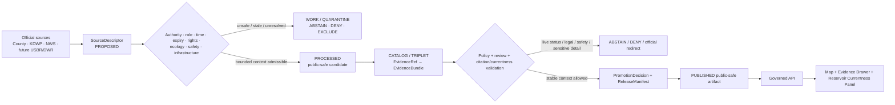
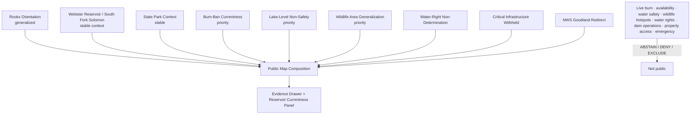
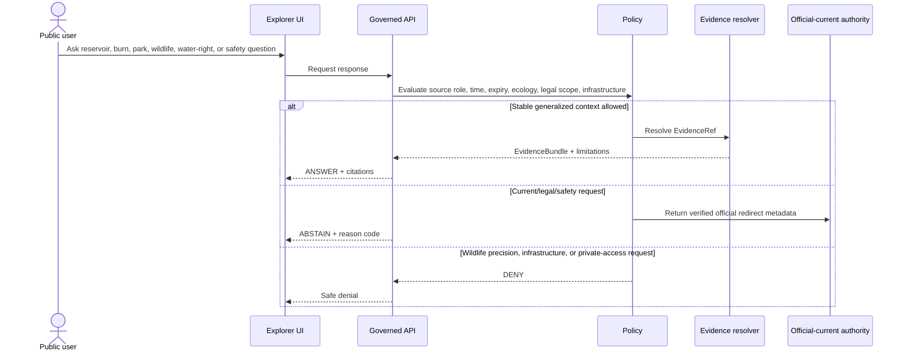
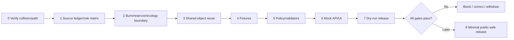

<!-- [KFM_META_BLOCK_V2]
doc_id: NEEDS_VERIFICATION — <REGISTERED_KFM_DOC_ID>
title: Rooks County Focus Mode Build Plan — Webster Reservoir, Burn-Ban Currentness, and Water/Infrastructure Boundaries Without Live Safety, Access, or Legal Conclusions
type: county-focus-mode-build-plan
version: v0.1-draft
status: draft
county: Rooks County, Kansas
county_slug: rooks
created: 2026-06-08
updated: 2026-06-08
owners:
  - NEEDS_VERIFICATION — <OWNER:focus-mode-steward>
  - NEEDS_VERIFICATION — <OWNER:reservoir-and-recreation-reviewer>
  - NEEDS_VERIFICATION — <OWNER:water-governance-and-infrastructure-reviewer>
  - NEEDS_VERIFICATION — <OWNER:wildlife-and-ecology-reviewer>
  - NEEDS_VERIFICATION — <OWNER:burn-ban-road-and-emergency-currentness-reviewer>
release_status: NEEDS_VERIFICATION — NOT_RELEASED
review_assignments: NEEDS_VERIFICATION
correction_path: NEEDS_VERIFICATION
rollback_path: NEEDS_VERIFICATION
unverified_repository_paths:
  - PROPOSED / CONFLICTED / NEEDS_VERIFICATION — docs/focus-modes/rooks-county/build-plan.md
  - PROPOSED / OBSERVED-LEGACY / NEEDS_VERIFICATION — docs/focus-mode/counties/rooks_county/rooks_county_focus_mode_build_plan.md
schema_contract_policy_homes:
  - PROPOSED / NEEDS_VERIFICATION — contracts/focus_mode/
  - PROPOSED / NEEDS_VERIFICATION — schemas/contracts/v1/focus_mode/
  - PROPOSED / NEEDS_VERIFICATION — policy/runtime/, policy/sensitivity/, policy/rights/, policy/release/
proof_slice: Webster Reservoir and State Park recreation/currentness, countywide burn-ban churn, South Fork Solomon River and wildlife-area context, and reservoir/infrastructure non-determination
primary_public_safe_boundary: KFM may present generalized, time-attributed Webster Reservoir, South Fork Solomon River, park, wildlife, county-service, and weather-authority context; it must not determine current burn-ban applicability, campsite or facility availability, lake-level safety, boating or swimming safety, hunting/fishing legality, exact wildlife locations, irrigation or water-right status, reservoir operations, dam/infrastructure condition or vulnerability, private-property access, road safety, or active emergency conditions.
collision_search:
  completed_register: CONFIRMED — Rooks County is absent from the user-supplied completed/collision register.
  generated_in_continuation: CONFIRMED — previously generated counties in this continuation were excluded.
  uploaded_project_materials: CONFIRMED — targeted Rooks County Focus Mode searches were performed; no Rooks County plan surfaced among examined results.
  live_repository_index: CONFIRMED — docs/focus-mode/counties/COUNTY_INDEX.md surfaced in a targeted Rooks County search.
  live_repository_search: CONFIRMED — search for rooks_county_focus_mode_build_plan returned no matching county plan.
  exhaustive_absence: NEEDS_VERIFICATION — unindexed branches, private artifacts, and prior unsearched outputs may still exist.
directory_rules_basis:
  - CONFIRMED — attached Directory Rules.pdf was inspected during this series.
  - CONFIRMED — location encodes responsibility, governance, and lifecycle; topic alone does not justify a root folder.
  - CONFIRMED — lifecycle is RAW → WORK / QUARANTINE → PROCESSED → CATALOG / TRIPLET → PUBLISHED.
  - CONFIRMED — promotion is a governed state transition, not a file move.
  - CONFLICTED / NEEDS_VERIFICATION — observed repository paths use docs/focus-mode/ while doctrine also identifies docs/focus-modes/.
official_source_checks:
  - CONFIRMED — Rooks County official homepage, checked 2026-06-08.
  - CONFIRMED — Kansas Department of Wildlife and Parks Webster State Park page, checked 2026-06-08.
  - CONFIRMED — National Weather Service Goodland office, checked 2026-06-08.
  - NEEDS_VERIFICATION — direct Bureau of Reclamation Webster project/facility page must be revalidated because one fetched project URL resolved to unrelated Columbia Basin material.
source_check_date: 2026-06-08
tags: [kfm, focus-mode, rooks-county, webster-reservoir, webster-state-park, burn-ban, south-fork-solomon, wildlife-area, lake-level, critical-infrastructure, cite-or-abstain]
notes:
  - Planning artifact only; no implementation, source admission, review, promotion, publication, correction readiness, or rollback readiness is claimed.
  - The Rooks County homepage displayed multiple 2026 countywide burn-ban resolutions; current legal applicability requires official-current verification.
  - KDWP publishes current-seeming lake level, inflow, outflow, park hours, camping availability, and park rules; KFM must not treat these as evergreen or as independent safety guidance.
[/KFM_META_BLOCK_V2] -->

<a id="top"></a>

# Rooks County Focus Mode Build Plan
## Webster Reservoir, Burn-Ban Currentness, and Water/Infrastructure Boundaries Without Live Safety, Access, or Legal Conclusions

> **Product thesis:** Explain Rooks County’s Webster Reservoir, South Fork Solomon River, state-park, wildlife, county-service, and weather-authority context while refusing to become a live burn-ban, lake-level safety, recreation, water-right, infrastructure, property-access, road, or emergency decision system.


| Identity / status field | Value |
|---|---|
| County | **Rooks County, Kansas** |
| Status | `PROPOSED` planning artifact |
| Distinct proof slice | Webster Reservoir and State Park, South Fork Solomon River, Webster Wildlife Area, countywide burn-ban churn, lake-level/currentness, and critical-infrastructure restraint |
| Primary public-safe boundary | **Generalized reservoir, park, wildlife, county-service, and weather context may be shown; KFM must not determine current burn restrictions, campsite or facility availability, lake-level safety, boating/swimming safety, hunting/fishing legality, exact wildlife locations, irrigation/water-right status, reservoir operations, dam condition, private access, road safety, or emergency status.** |
| Official sources checked | Rooks County; KDWP Webster State Park; NWS Goodland |
| Collision status | No Rooks plan surfaced in targeted repository or project-material searches |
| Exhaustive absence | `NEEDS_VERIFICATION` |
| Release state | `NOT_RELEASED` |

## Quick links

[Operating posture](#1-operating-posture) · [Why this county](#2-why-this-county) · [Product thesis](#3-product-thesis) · [Scope](#4-scope-boundary) · [Layers](#5-first-demo-layers) · [Journeys](#6-user-journeys) · [UI](#7-ui-surfaces) · [Objects](#8-governed-object-model) · [Repository](#9-proposed-repository-shape) · [Build](#10-build-phases) · [PRs](#11-first-pr-sequence) · [Acceptance](#12-acceptance-checklist) · [Fixtures](#13-fixture-plan) · [Risks](#14-risk-register) · [Sources](#15-source-seed-list) · [Questions](#16-open-verification-questions) · [Milestone](#17-recommended-first-milestone)

---

## Executive build note

Rooks County is selected because it combines a strong **reservoir and state-park proof slice** with visible **burn-ban churn, lake-level currentness, wildlife-area sensitivity, and critical-infrastructure boundaries**.

The official Rooks County homepage identifies county government functions including Appraiser, Emergency Management, Health Department, Register of Deeds, Road and Bridge, Sheriff, and community resources.[^s1] When checked, its latest notices included multiple 2026 countywide burn-ban resolutions.[^s1] This makes currentness central: a burn-ban document or news item cannot become permanent KFM legal truth.

KDWP’s Webster State Park page identifies the park in Rooks County and describes an 880-acre prairie setting, approximately 3,700 acres of open water, migratory waterfowl and shorebirds, and an additional 8,018-acre Webster Wildlife Area surrounding the South Fork Solomon River west of the reservoir.[^s2] It also publishes park hours, camping availability, reservations, generator rules, campfire restrictions, and current-seeming lake elevation, inflow, and outflow values.[^s2] Those details are useful official source content but are highly temporal. KFM must not convert them into live campsite availability, water-safety advice, boating guidance, hunting/fishing legality, or reservoir-operation conclusions.

NWS Goodland publishes current hazards, observations, radar, fire weather, river and lake products, drought information, and official warnings.[^s3] KFM should redirect current hazard questions to NWS and local authorities rather than synthesize independent safety guidance.

> [!CAUTION]
> ## Defining public-safe boundary
>
> **KFM may explain Webster Reservoir, Webster State Park, the South Fork Solomon River, and county service roles at generalized scale. It must not tell users whether a countywide burn ban is in force, whether a campsite is available, whether lake level makes boating or launching safe, whether water is safe for swimming or consumption, whether hunting or fishing is lawful, where wildlife is concentrated, whether irrigation or water rights are valid, whether dam or reservoir systems are operating safely, whether private land may be entered, or whether a road or emergency condition is safe.**

### Evidence boundary

| Label | Established | Not established |
|---|---|---|
| `CONFIRMED` | Rooks is absent from the supplied register; targeted live-repository search returned no Rooks plan filename; official county, KDWP, and NWS pages were checked; county burn-ban notices and KDWP current-seeming park/lake details were visible. | — |
| `PROPOSED` | Every card, layer, object, fixture, policy, UI surface, path, milestone, correction, and release action below. | No implementation is claimed. |
| `NEEDS_VERIFICATION` | Exhaustive collision absence; exact county-index status; canonical path; correct Bureau of Reclamation Webster project endpoint; source rights; wildlife geoprivacy; current lake data semantics; irrigation/water-right authority; correction and rollback implementation. | — |
| `UNKNOWN` | Current burn-ban applicability, actual campsite/facility availability, current lake level and its safety meaning, water quality, hunting/fishing legality, exact wildlife occurrence, reservoir operations, water-right status, road condition, and active emergency state. | — |

---

# 1. Operating posture

## 1.1 Governing rules applied to Rooks County

| KFM rule | Rooks application |
|---|---|
| EvidenceBundle outranks generated language | AI cannot create burn-ban, lake-level, recreation, water-right, infrastructure, wildlife, road, or emergency facts. |
| Cite-or-abstain | Stable contextual claims may answer after evidence closure; current/legal/safety questions abstain or deny. |
| Public clients use governed interfaces | No public access to RAW, WORK, QUARANTINE, direct park systems, internal reservoir operations, or direct model output. |
| Source roles remain distinct | County legal notice, KDWP park context, KDWP wildlife management, USBR operations, DWR water administration, NWS hazards, and AI narrative remain separate. |
| Publication is governed | A visible page value is not automatically a released KFM fact. |
| Currentness fails closed | Burn bans, park hours, camping availability, lake levels, inflow/outflow, roads, and emergencies require current official authority. |
| Ecology fails closed | Exact migratory-waterfowl, nesting, roosting, and wildlife-concentration detail is withheld. |
| Infrastructure fails closed | Dam, outlet, monitoring, reservoir operations, and vulnerability detail are excluded from normal public output. |

## 1.2 Truth labels and finite outcomes

| Token | Meaning |
|---|---|
| `CONFIRMED` | Verified in this run. |
| `PROPOSED` | Design not verified as implemented. |
| `NEEDS_VERIFICATION` | Checkable before action. |
| `UNKNOWN` | Unsupported or unresolved. |
| `ANSWER` | Narrow evidence-supported public-safe response. |
| `ABSTAIN` | Authority, currentness, rights, or evidence is insufficient. |
| `DENY` | Request crosses safety, legal, ecology, property, or infrastructure boundaries. |
| `ERROR` | Contract, evidence, policy, or runtime failure. |

## 1.3 Public trust membrane



## 1.4 County-specific guardrails

| Guardrail | Outcome | Candidate reason code |
|---|---:|---|
| Current burn-ban applicability | `ABSTAIN` | `CURRENT_BURN_RESTRICTION_REQUIRES_COUNTY_AUTHORITY` |
| Current campsite, office, facility, fire-ring, or generator-rule status | `ABSTAIN` | `CURRENT_PARK_STATUS_REQUIRES_KDWP` |
| Lake-level interpretation as launch, boating, swimming, or travel safety | `ABSTAIN` | `LAKE_LEVEL_NOT_SAFETY_GUIDANCE` |
| Hunting/fishing legality for a person, place, or date | `ABSTAIN` / `DENY` | `RECREATION_REGULATION_NOT_PERSONALLY_DETERMINED` |
| Exact migratory-waterfowl, nesting, roosting, or wildlife-concentration detail | `DENY` | `SENSITIVE_WILDLIFE_DETAIL_WITHHELD` |
| Irrigation district, water right, permit, priority, or allocation conclusion | `ABSTAIN` | `WATER_RIGHT_OR_ALLOCATION_REQUIRES_AUTHORITY` |
| Reservoir operations, dam condition, outlet, monitoring, or vulnerability | `DENY` | `CRITICAL_WATER_INFRASTRUCTURE_DETAIL_WITHHELD` |
| Private-property access, owner, or title conclusion | `DENY` | `PROPERTY_OR_ACCESS_DETERMINATION_DENIED` |
| Road, fire-weather, warning, or emergency guidance | `ABSTAIN` | `OFFICIAL_CURRENT_SAFETY_CHANNEL_REQUIRED` |

---

# 2. Why this county

## 2.1 Collision screen

| Check | Result | Status |
|---|---|---:|
| Supplied completed/collision register | Rooks absent. | `CONFIRMED` |
| Counties generated in this continuation | Excluded. | `CONFIRMED` |
| Live repository filename search | No `rooks_county_focus_mode_build_plan` match. | `CONFIRMED` |
| County index surfaced in targeted search | Index exists and references Rooks search context. | `CONFIRMED` |
| Uploaded/project-material search | No Rooks plan surfaced among examined results. | `CONFIRMED` for performed search |
| Exhaustive absence | Not proved across all private/unindexed material. | `NEEDS_VERIFICATION` |

## 2.2 Proof-slice rationale

| Dimension | Proof value | Evidence |
|---|---|---|
| Reservoir and hydrology | Webster Reservoir and South Fork Solomon River create a strong map-first water system. | KDWP.[^s2] |
| Recreation currentness | Park hours, reservations, fire rules, generator rules, camping availability, and lake data change over time. | KDWP.[^s2] |
| Wildlife sensitivity | Webster Wildlife Area and migratory waterfowl/shorebirds create geoprivacy obligations. | KDWP.[^s2] |
| Burn-ban churn | County homepage showed multiple 2026 countywide burn-ban resolutions. | Rooks County.[^s1] |
| Critical infrastructure | Reservoir/dam operations require public-safe abstraction and exclusion of tactical detail. | `PROPOSED`; direct USBR verification pending. |
| Weather and fire authority | NWS Goodland publishes current hazards, fire weather, drought, rivers/lakes, and warnings. | NWS.[^s3] |
| Distinct series value | Combines local legal-notice churn, park currentness, lake-level interpretation risk, and reservoir infrastructure. | `PROPOSED`. |

## 2.3 Distinct series contribution

Rooks County tests whether KFM can:

1. distinguish a legal notice from current legal status;
2. distinguish a park page from live availability;
3. distinguish lake level from water or boating safety;
4. distinguish wildlife context from targetable wildlife intelligence;
5. distinguish water science and reservoir context from legal water rights and operational control;
6. preserve critical-infrastructure restraint while still explaining public landscape context.

## 2.4 Public benefit

A future public-safe product can help users understand:

- how Webster Reservoir, the South Fork Solomon River, state park, and wildlife area relate;
- why county burn-ban notices must be checked for current effect;
- why lake levels and inflow/outflow values require careful interpretation;
- why wildlife concentration and reservoir-operation details are withheld;
- where official current park, weather, road, and emergency information should be obtained.

---

# 3. Product thesis

## 3.1 One-sentence thesis

> **Rooks County Focus Mode should make Webster Reservoir, park, wildlife, county, and weather-authority context understandable while making current burn, park, lake-level, water-right, wildlife, infrastructure, property, road, and emergency conclusions impossible to mistake for KFM authority.**

## 3.2 First-product promises

| Promise | Meaning |
|---|---|
| Generalized reservoir context | Stable reservoir/river/park relationships. |
| Currentness literacy | Burn-ban and park/lake values show source, time, and expiry. |
| Source-role visibility | County, KDWP, NWS, future USBR/DWR, and AI remain distinct. |
| Ecology geoprivacy | Exact sensitive wildlife detail is withheld. |
| Finite outcomes | Supported context answers; risky requests abstain or deny. |
| Reversibility | Correction and rollback precede publication. |

## 3.3 Non-promises

- no current burn authorization;
- no live campsite, facility, office, fire-ring, or generator-rule status;
- no boating, swimming, launch, or water-safety judgment;
- no personalized hunting/fishing legality;
- no exact wildlife concentration or refuge-use detail;
- no irrigation, water-right, permit, priority, or allocation determination;
- no dam/reservoir operational status or vulnerability detail;
- no private-property access/title conclusion;
- no road or emergency guidance;
- no implementation or publication claim.

---

# 4. Scope boundary

| Content family | Posture | Boundary |
|---|---:|---|
| County/Stockton orientation | `PROPOSED` | Generalized geometry only. |
| Webster Reservoir and South Fork Solomon context | `PROPOSED` | No operational or safety meaning. |
| Webster State Park context | `PROPOSED` | Stable context only. |
| Burn-Ban Currentness Notice | `PROPOSED` priority | No cached legal conclusion. |
| Lake-Level Non-Safety Notice | `PROPOSED` priority | No boating/launch/swimming advice. |
| Wildlife Area Generalization Card | `PROPOSED` | No exact occurrence or targeting. |
| Water-Right/Allocation Non-Determination | `PROPOSED` | No legal/administrative adjudication. |
| Critical Infrastructure Withhold Notice | `PROPOSED` priority | No dam/outlet/monitoring/vulnerability detail. |
| Live park/lake/burn/road/emergency layer | `DEFER` | Requires governed current feeds and expiry. |
| Exact wildlife, private property, and operational infrastructure | `DENY` / `EXCLUDE` | Ecology/privacy/security boundary. |

---

# 5. First demo layers

## 5.1 Prioritized cards/layers

| Priority | Card/layer | Purpose | Source | Gate | Status |
|---:|---|---|---|---|---:|
| 1 | `BurnParkLakeInfrastructureBoundaryNotice` | Central public-safe boundary. | County + KDWP + policy | Highest-risk fixtures. | `PROPOSED` |
| 2 | `WebsterReservoirRiverContextCard` | Generalized water-system context. | KDWP + future USBR | Evidence closure. | `PROPOSED` |
| 3 | `WebsterStateParkContextCard` | Stable park/recreation context. | KDWP[^s2] | Currentness separation. | `PROPOSED` |
| 4 | `BurnRestrictionCurrentnessCard` | Explains county resolution churn. | County[^s1] | Legal/currentness validator. | `PROPOSED` |
| 5 | `LakeLevelNonSafetyCard` | Separates measurement from safety. | KDWP + future USBR | Hydrology/safety review. | `PROPOSED` |
| 6 | `WildlifeAreaGeneralizationCard` | Broad habitat and migratory context. | KDWP[^s2] | Ecology review. | `PROPOSED` |
| 7 | `WaterRightAllocationNonDeterminationCard` | Prevents legal/administrative inference. | Future DWR/USBR | Water-governance review. | `PROPOSED` |
| 8 | `CriticalInfrastructureWithholdNotice` | Explains absence of operational detail. | Policy | Security review. | `PROPOSED` |
| 9 | `NWSGoodlandAuthorityCard` | Current hazard redirect. | NWS[^s3] | Redirect-only. | `PROPOSED` |
| 10 | Live burn/park/lake/road/emergency status | High-risk dynamic content. | Future governed feeds | Not first slice. | `DEFER` |

## 5.2 Map composition



## 5.3 Layer-card truth contract

| Field | Purpose | Failure posture |
|---|---|---|
| `source_role` | Separates county notice, park, wildlife, operations, water administration, weather, and AI. | `ABSTAIN`. |
| `temporal_basis` | Shows source date/currentness. | `ABSTAIN` for current requests. |
| `expiry_at` | Required for burn bans, alerts, park status, lake values. | Suppress if missing/expired. |
| `measurement_scope` | Prevents lake values becoming safety advice. | `ABSTAIN`. |
| `ecology_generalization` | Prevents wildlife targeting. | `DENY` / quarantine. |
| `water_legal_scope` | Prevents water-right/allocation inference. | `ABSTAIN`. |
| `infrastructure_sensitivity` | Prevents dam/operations disclosure. | `DENY`. |
| `property_access_scope` | Prevents access/title inference. | `DENY`. |
| `evidence_refs` | Claim support. | `ABSTAIN`. |
| `release_state` | Prevents draft from appearing released. | Public alias blocked. |

---

# 6. User journeys

## 6.1 Public learning journeys

| Journey | Safe outcome |
|---|---|
| “What is Webster Reservoir?” | Generalized reservoir/river/park context. |
| “Why do county burn-ban notices need dates?” | Currentness and legal-effect explanation. |
| “Why doesn’t lake level tell me if boating is safe?” | Measurement-versus-safety explanation. |
| “Why are wildlife locations generalized?” | Stewardship/geoprivacy explanation. |
| “Who provides current weather hazards?” | NWS Goodland redirect. |

## 6.2 Trust-demonstration journeys

| Request | Outcome |
|---|---:|
| “Is the burn ban in force today?” | `ABSTAIN` |
| “Is this campsite available tonight?” | `ABSTAIN` |
| “Does the current lake level make the ramp usable?” | `ABSTAIN` |
| “Is the lake safe for swimming or boating?” | `ABSTAIN` |
| “Show migratory bird concentrations.” | `DENY` |
| “Can I hunt or fish here today?” | `ABSTAIN` / `DENY` |
| “Does this land have a valid irrigation right?” | `ABSTAIN` |
| “Show dam control or monitoring details.” | `DENY` |
| “Can I enter this shoreline parcel?” | `DENY` / `ABSTAIN` |
| “Is there a warning or emergency now?” | `ABSTAIN` |

## 6.3 Candidate reason codes

- `CURRENT_BURN_RESTRICTION_REQUIRES_COUNTY_AUTHORITY`
- `CURRENT_PARK_STATUS_REQUIRES_KDWP`
- `LAKE_LEVEL_NOT_SAFETY_GUIDANCE`
- `RECREATION_REGULATION_NOT_PERSONALLY_DETERMINED`
- `SENSITIVE_WILDLIFE_DETAIL_WITHHELD`
- `WATER_RIGHT_OR_ALLOCATION_REQUIRES_AUTHORITY`
- `CRITICAL_WATER_INFRASTRUCTURE_DETAIL_WITHHELD`
- `PROPERTY_OR_ACCESS_DETERMINATION_DENIED`
- `OFFICIAL_CURRENT_SAFETY_CHANNEL_REQUIRED`

---

# 7. UI surfaces

| Surface | Rooks-specific behavior | Status |
|---|---|---:|
| Header | “No live burn, park, lake-safety, water-right, or infrastructure verdict.” | `PROPOSED` |
| Map canvas | Generalized reservoir/river/park/wildlife context. | `PROPOSED` |
| Layer drawer | Source role, checked time, expiry, generalization, release state. | `PROPOSED` |
| Evidence Drawer | Separates county, KDWP, future USBR/DWR, NWS, and AI roles. | `PROPOSED` |
| Answer panel | Stable context only. | `PROPOSED` |
| Abstention panel | Burn, availability, lake-safety, water-right, road, emergency questions. | `PROPOSED` |
| Denial panel | Wildlife hotspots, infrastructure, private-property access. | `PROPOSED` |
| Timeline/time-basis panel | Burn resolutions, park notices, lake measurements, warnings. | `PROPOSED` |
| **Burn / Park / Lake-Level / Infrastructure Boundary Panel** | Central trust surface. | `PROPOSED` |
| Official redirect panel | County, KDWP, NWS, future USBR/DWR. | `PROPOSED` |
| Release/correction panel | `NOT_RELEASED`, expiry, correction, rollback. | `PROPOSED` |

## 7.1 Legend vocabulary

| Label | Meaning | Must not become |
|---|---|---|
| `County legal notice` | Dated official action. | Current legal conclusion after expiry/supersession. |
| `Park context` | Stable recreational description. | Live availability or permission. |
| `Lake measurement` | Time-stamped hydrologic observation. | Safety, water-right, or operational advice. |
| `Wildlife context` | Generalized habitat/stewardship. | Targetable wildlife intelligence. |
| `Critical infrastructure withheld` | Operational/security detail absent. | Confirmation of hidden configuration. |
| `Official-current weather source` | NWS warnings and hazards. | KFM-authored warning. |

## 7.2 Sequence diagram



---

# 8. Governed object model

## 8.1 Shared object families

| Object family | Rooks use | Status |
|---|---|---:|
| `SourceDescriptor` | Authority, role, time, rights, expiry, sensitivity. | `PROPOSED / NEEDS_VERIFICATION` |
| `EvidenceRef` | Claim-to-proof link. | `PROPOSED / NEEDS_VERIFICATION` |
| `EvidenceBundle` | Evidence plus legal/safety/ecology/infrastructure limitations. | `PROPOSED / NEEDS_VERIFICATION` |
| `PolicyDecision` | Finite outcome and obligations. | `PROPOSED / NEEDS_VERIFICATION` |
| `RuntimeResponseEnvelope` | Public-safe response. | `PROPOSED / NEEDS_VERIFICATION` |
| `CitationValidationReport` | Detects currentness/source-role overclaim. | `PROPOSED / NEEDS_VERIFICATION` |
| `ReleaseManifest` | Approved public composition. | `PROPOSED / NEEDS_VERIFICATION` |
| `AIReceipt` | Generated output/dependencies. | `PROPOSED / NEEDS_VERIFICATION` |
| `ReviewRecord` | Reservoir, recreation, ecology, water, infrastructure, release review. | `PROPOSED / NEEDS_VERIFICATION` |
| `CorrectionNotice` | Corrects stale/unsafe output. | `PROPOSED / NEEDS_VERIFICATION` |
| `RollbackPlan` | Withdraws unsafe release. | `PROPOSED / NEEDS_VERIFICATION` |

## 8.2 County-specific candidates

- `WebsterReservoirContextCard`
- `BurnRestrictionCurrentnessCard`
- `ParkOperationalStatusNotice`
- `LakeLevelNonSafetyCard`
- `WildlifeAreaGeneralizationRecord`
- `WaterRightAllocationNonDeterminationNotice`
- `CriticalInfrastructureWithholdNotice`
- `OfficialHazardRedirectCard`

## 8.3 Source-role anti-collapse rules

| Source | Valid role | Must not become |
|---|---|---|
| Rooks County burn resolution | Dated county legal notice. | Current legal answer without verification. |
| KDWP Webster park page | Park context and operational notices. | Permanent availability, safety, water-right, or emergency truth. |
| KDWP wildlife source | Habitat and management context. | Wildlife-targeting map or hunting success prediction. |
| Future USBR source | Reservoir project/operations authority. | Public vulnerability map or personal safety advice. |
| Future DWR source | Water-right/administrative authority. | KFM legal adjudication. |
| NWS Goodland | Official-current hazard authority. | KFM warning or emergency command. |
| AI narrative | Bounded explanation. | Evidence or authority. |

## 8.4 Minimal public response JSON

```json
{
  "schema_version": "v1",
  "object_type": "RuntimeResponseEnvelope",
  "response_id": "kfm.runtime.rooks.webster_context.answer.v1",
  "county": "rooks",
  "outcome": "ANSWER",
  "answer_scope": "public_safe_generalized_reservoir_context",
  "answer": "Checked KDWP material describes Webster State Park, Webster Reservoir, the South Fork Solomon River, and a large surrounding wildlife area in Rooks County.",
  "evidence_refs": [
    "kfm.evidence_ref.rooks.webster_context.v1"
  ],
  "limitations": [
    "No current burn-ban status, campsite availability, lake-level safety, hunting or fishing legality, wildlife concentration, water-right status, reservoir-operation status, property access, road safety, or emergency condition is provided."
  ],
  "review_state": "NEEDS_VERIFICATION",
  "release_state": "NOT_RELEASED",
  "spec_hash": "NEEDS_VERIFICATION"
}
```

## 8.5 Abstention JSON

```json
{
  "schema_version": "v1",
  "object_type": "RuntimeResponseEnvelope",
  "response_id": "kfm.runtime.rooks.current_status.abstain.v1",
  "county": "rooks",
  "outcome": "ABSTAIN",
  "reason_code": "LAKE_LEVEL_NOT_SAFETY_GUIDANCE",
  "message": "KFM does not interpret cached lake level, inflow, outflow, burn-ban, park, road, or weather information as current safety or legal guidance.",
  "official_redirects": [
    {"authority": "Rooks County", "purpose": "current county burn restrictions and emergency information"},
    {"authority": "Kansas Department of Wildlife and Parks", "purpose": "current park, facility, reservation, fishing, hunting, and public-use information"},
    {"authority": "National Weather Service Goodland", "purpose": "current warnings, fire weather, drought, and hazard information"}
  ],
  "release_state": "NOT_RELEASED",
  "spec_hash": "NEEDS_VERIFICATION"
}
```

## 8.6 Denial JSON

```json
{
  "schema_version": "v1",
  "object_type": "RuntimeResponseEnvelope",
  "response_id": "kfm.runtime.rooks.sensitive_detail.deny.v1",
  "county": "rooks",
  "outcome": "DENY",
  "reason_code": "CRITICAL_WATER_INFRASTRUCTURE_DETAIL_WITHHELD",
  "message": "KFM does not publish exact sensitive wildlife concentrations, dam or reservoir control details, infrastructure vulnerabilities, or private-property access and owner conclusions.",
  "withheld_fields": [
    "exact_wildlife_concentration",
    "nest_or_roost_location",
    "dam_or_outlet_operational_detail",
    "monitoring_or_control_configuration",
    "infrastructure_vulnerability",
    "private_owner_or_access"
  ],
  "release_state": "NOT_RELEASED",
  "spec_hash": "NEEDS_VERIFICATION"
}
```

## 8.7 Deterministic identity candidates

| Item | Candidate |
|---|---|
| Source | `kfm.source.rooks.<authority>.<slug>.v1` |
| Evidence | `kfm.evidence_bundle.rooks.<claim_scope>.v1` |
| Card | `kfm.card.rooks.<card>.v1` |
| Fixture | `kfm.runtime.rooks.<scenario>.<outcome>.v1` |
| Release | `kfm.release.rooks.focus_mode.v0_1` |

`spec_hash` behavior remains `PROPOSED / NEEDS_VERIFICATION`.

---

# 9. Proposed repository shape

## 9.1 Directory Rules basis

Directory Rules require responsibility-root placement, no topic-as-root folders, separate docs/contracts/schemas/policy/fixtures/data/release, and lifecycle:

`RAW → WORK / QUARANTINE → PROCESSED → CATALOG / TRIPLET → PUBLISHED`.

Promotion is a governed state transition.

> [!WARNING]
> The observed `docs/focus-mode/` versus doctrinal `docs/focus-modes/` divergence remains unresolved. Paths below are `PROPOSED / CONFLICTED / NEEDS_VERIFICATION`.

## 9.2 Candidate paths

| Root | Proposed path | Purpose |
|---|---|---|
| Docs | `docs/focus-modes/rooks-county/build-plan.md` | Human planning document. |
| Docs companions | `docs/focus-modes/rooks-county/{README.md,burn-currentness-notes.md,reservoir-safety-notes.md,wildlife-sensitivity-notes.md,water-governance-notes.md,infrastructure-boundary-notes.md,source-seed-list.md,acceptance-checklist.md}` | Governance docs. |
| Contracts | `contracts/focus_mode/` | Shared semantics. |
| Schemas | `schemas/contracts/v1/focus_mode/` | Machine shapes. |
| Fixtures | `fixtures/focus_modes/rooks/{valid,invalid}/` | Positive/negative proof. |
| UI | `apps/explorer-web/src/focus-modes/rooks/` | Mock governed UI. |
| Catalog | `data/catalog/sources/rooks/` | Admitted source descriptors only. |
| Published | `data/published/layers/rooks/` | Future governed output only. |
| Release | `release/candidates/rooks-focus-mode/` | Future release candidate only. |

## 9.3 Proposed tree

```text
# PROPOSED / CONFLICTED / NEEDS_VERIFICATION

docs/
└── focus-modes/
    └── rooks-county/
        ├── README.md
        ├── build-plan.md
        ├── burn-currentness-notes.md
        ├── reservoir-safety-notes.md
        ├── wildlife-sensitivity-notes.md
        ├── water-governance-notes.md
        ├── infrastructure-boundary-notes.md
        ├── source-seed-list.md
        ├── evidence-model.md
        └── acceptance-checklist.md

fixtures/
└── focus_modes/rooks/
    ├── valid/
    └── invalid/

contracts/
└── focus_mode/

schemas/
└── contracts/v1/focus_mode/

apps/
└── explorer-web/src/focus-modes/rooks/

data/
├── catalog/sources/rooks/
└── published/layers/rooks/    # future governed output only

release/
└── candidates/rooks-focus-mode/
```

## 9.4 Placement prohibitions

- no root-level `rooks/`, `webster-reservoir/`, `burn-bans/`, `wildlife-area/`, or `dam/`;
- no exact sensitive wildlife, private-access, or infrastructure-vulnerability data in public fixtures;
- no visible current-seeming value copied automatically into public output;
- no burn resolution treated as current without official verification;
- no public client access to `RAW`, `WORK`, `QUARANTINE`;
- no publication without review, manifest, correction, and rollback.

---

# 10. Build phases

| Phase | Goal | Entry gate | Output | Exit validation | Rollback |
|---:|---|---|---|---|---|
| 0 | Collision/path verification | Repeat searches | Verification note | No collision; path resolved or blocked | Stop |
| 1 | Source ledger/role matrix | County/KDWP/NWS/future USBR/DWR roles identified | Descriptor candidates | Role, rights, time, expiry explicit | Docs only |
| 2 | Burn/reservoir/ecology/infrastructure boundary | Review framework accepted | Boundary policies | Sensitive/current requests fail closed | Withdraw |
| 3 | Shared-object reuse | Existing families inspected | Reuse/extension decision | No parallel authority | Revert |
| 4 | Fixtures | Boundary accepted | Valid/invalid pack | Unsafe cases fail closed | Remove |
| 5 | Policy/validators | Fixtures exist | Currentness/safety/ecology/water validators | Finite outcomes tested | Block |
| 6 | Mock API/UI | Contracts/policies agreed | Mock cards/panels | No current/legal/sensitive overclaim | Disable |
| 7 | Dry-run release | Reviews/evidence available | Candidate proof pack | No public alias; rollback rehearsed | Withdraw |
| 8 | Optional publication | All gates pass | Minimal generalized release | Traceable and reversible | Rollback |



---

# 11. First PR sequence

1. Verification and documentation control.
2. Source ledger/admission and public-safe boundary.
3. Contracts/schemas or shared-object reuse.
4. Valid and invalid fixtures.
5. Policy and validators.
6. Mock governed API/UI.
7. Dry-run release proof.
8. Only then optional minimal public-safe publication.

**Live burn-ban, park status, reservation, lake-level, inflow/outflow, hunting/fishing, wildlife, irrigation/water-right, reservoir-operation, road/emergency integration, and public release are not first-PR work.**

---

# 12. Acceptance checklist

## Governance and evidence

- [ ] Rooks collision check rerun.
- [ ] County-index status verified directly.
- [ ] Every public claim resolves to EvidenceBundle.
- [ ] County, KDWP park, wildlife, future USBR/DWR, NWS, and AI roles remain distinct.
- [ ] Current content has checked time and expiry.
- [ ] No AI output is evidence.
- [ ] Finite outcomes exist.

## Public/sensitive boundary

- [ ] No current burn-ban determination.
- [ ] No live campsite/facility/rule availability answer.
- [ ] No lake-level, inflow, or outflow safety interpretation.
- [ ] No personalized hunting/fishing legality.
- [ ] No exact wildlife concentration or refuge-use detail.
- [ ] No water-right/allocation determination.
- [ ] No dam/outlet/monitoring/vulnerability detail.
- [ ] No private-property access/title conclusion.
- [ ] No current road/emergency guidance.

## Product and UI

- [ ] Header states primary boundary and `NOT_RELEASED`.
- [ ] Evidence Drawer shows authority and role.
- [ ] Time and expiry are visible.
- [ ] Generalization is visible.
- [ ] Denial and abstention reason codes are visible.
- [ ] Official redirects do not masquerade as answers.

## Repository/release

- [ ] Path conflict resolved.
- [ ] No parallel authority homes.
- [ ] Public UI cannot access internal lifecycle stores.
- [ ] Highest-risk invalid fixtures fail closed.
- [ ] Correction and rollback are actionable.
- [ ] Promotion remains governed.

---

# 13. Fixture plan

## 13.1 Valid fixtures

| Fixture | Scenario | Outcome |
|---|---|---:|
| `webster_context.valid.json` | Generalized reservoir/park context. | `ANSWER` |
| `burn_currentness_explanation.valid.json` | Explain why notices require revalidation. | `ANSWER` |
| `current_burn_status_abstain.valid.json` | User asks whether ban is active. | `ABSTAIN` |
| `lake_safety_abstain.valid.json` | User asks whether level means safe launch. | `ABSTAIN` |
| `wildlife_precision_deny.valid.json` | User requests exact concentrations. | `DENY` |
| `infrastructure_detail_deny.valid.json` | User requests dam controls. | `DENY` |

## 13.2 Invalid/fail-closed fixtures

| Fixture | Failure | Required result |
|---|---|---:|
| `old_burn_resolution_as_current.invalid.json` | Superseded notice shown current. | `ABSTAIN` / suppress |
| `park_page_as_campsite_available.invalid.json` | Static page becomes availability. | `ABSTAIN` |
| `lake_level_as_ramp_safe.invalid.json` | Measurement becomes safety guidance. | `ABSTAIN` |
| `zero_inflow_as_drought_or_failure.invalid.json` | Single value becomes operational conclusion. | `ABSTAIN` |
| `park_page_as_water_safe.invalid.json` | Recreation page becomes health/safety authority. | `ABSTAIN` / `DENY` |
| `wildlife_concentration_map.invalid.json` | Targetable wildlife intelligence exposed. | `DENY` |
| `park_rules_as_personal_hunting_permission.invalid.json` | General context becomes legal permission. | `ABSTAIN` |
| `reservoir_context_as_water_right.invalid.json` | Project context becomes entitlement. | `ABSTAIN` |
| `dam_outlet_monitoring_detail.invalid.json` | Critical infrastructure exposed. | `DENY` |
| `shoreline_context_as_private_access.invalid.json` | Public context becomes entry permission. | `DENY` / `ABSTAIN` |
| `nws_page_as_kfm_warning.invalid.json` | KFM rewrites official warning. | `ERROR` / `ABSTAIN` |
| `public_internal_store_access.invalid.json` | Public surface reads internal store. | `ERROR` |

## 13.3 Fixture-to-test matrix

| Test family | Must prove |
|---|---|
| Burn currentness | Superseded resolutions never remain current. |
| Park currentness | Static page cannot answer live availability/rule questions. |
| Measurement semantics | Lake values do not become safety or operational conclusions. |
| Ecology geoprivacy | No exact wildlife targeting detail. |
| Water governance | Reservoir context does not become water-right adjudication. |
| Infrastructure | No dam/outlet/monitoring/vulnerability disclosure. |
| Access/property | Public context does not confer entry rights. |
| Evidence/lifecycle | No unsupported claim or public internal-store access. |

## 13.4 Highest-risk invalid fixture pack

1. old burn-ban resolution shown as current;
2. static park page shown as live campsite availability;
3. lake elevation used as launch or boating-safety advice;
4. zero inflow/outflow used as drought, failure, or allocation conclusion;
5. exact migratory-waterfowl concentration map;
6. reservoir context converted into water-right entitlement;
7. dam/outlet/monitoring detail exposed;
8. shoreline or public-land context converted into private access;
9. NWS warning rewritten as KFM guidance.

---

# 14. Risk register

| Risk | Likelihood | Impact | Mitigation | Release posture |
|---|---:|---:|---|---|
| Superseded burn notice appears current | High | Critical | Expiry, supersession, official redirect. | `ABSTAIN` |
| Park page appears live | High | High | Checked-time display and currentness validator. | `ABSTAIN` |
| Lake value becomes safety advice | High | Critical | Measurement-scope validator. | `ABSTAIN` |
| Single hydrologic value becomes operational conclusion | Medium/High | High | Trend/context requirement; abstain. | `ABSTAIN` |
| Wildlife targeting enabled | Medium | Critical | Generalize or suppress. | `DENY` |
| Water project context becomes legal water-right answer | Medium | Critical | DWR authority gate. | `ABSTAIN` |
| Dam/infrastructure detail exposed | Medium | Critical | Withhold operational/tactical fields. | `DENY` |
| Public context implies access | Medium | High | Access limitation and fixtures. | `DENY` / `ABSTAIN` |
| NWS warning delayed or rewritten | Medium | Critical | Redirect-only. | `ABSTAIN` |
| Wrong USBR project page admitted | Medium | High | Direct source identity verification. | Quarantine |
| Existing Rooks plan later found | Low/Medium | Medium | Repeat collision check. | Stop |
| Path divergence hardens | High | Medium | Resolve before landing. | Docs only |
| Mock mistaken for release | Medium | High | Persistent `NOT_RELEASED`. | Mock only |

---

# 15. Source seed list

## 15.1 Current official sources checked in this run

| ID | Source | Role | Verified anchor | Intended use | Allowed claim scope | Limitations | Status |
|---|---|---|---|---|---|---|---:|
| `S1` | Rooks County, Kansas, **Official Website**[^s1] | County administrative, legal-notice, service-routing source | Departments including Emergency Management, Appraiser, Register of Deeds, Road and Bridge; multiple 2026 countywide burn-ban resolutions visible in latest notices. | County role and burn-currentness card. | Existence of departments and dated notices. | No current legal effect, property/title, road, emergency, or personal-safety conclusion. | `CONFIRMED` |
| `S2` | Kansas Department of Wildlife and Parks, **Webster State Park**[^s2] | Park, recreation, wildlife, operational-notice, and lake-data source | 880-acre park; 3,700 acres of open water; migratory waterfowl/shorebirds; 8,018-acre wildlife area; hours, reservations, fire rules, generator rules, camping, lake elevation/inflow/outflow values. | Park, reservoir, wildlife, and currentness proof. | Stable context and explicitly time-bounded source content. | No live availability, safety, personalized regulation, wildlife concentration, water-right, or infrastructure conclusion. | `CONFIRMED` |
| `S3` | National Weather Service, **Forecast Office Goodland**[^s3] | Federal official-current weather/hazard authority | Current hazards, warnings, observations, radar, fire weather, drought, rivers/lakes, and safety resources. | Official-current redirect. | NWS products within current time/geographic scope. | KFM must not rewrite, delay, cache, or independently interpret active warnings. | `CONFIRMED` |

## 15.2 Candidate official sources for later verification

| Candidate | Potential use | Required verification |
|---|---|---|
| Bureau of Reclamation Webster Dam/Reservoir facility page | Project history, authorized purposes, reservoir operations. | Correct project identity, current URL, rights, critical-infrastructure exclusions, no safety inference. |
| Bureau of Reclamation current reservoir data | Time-stamped lake values. | Field definitions, timestamps, missing-data handling, no safety/operation overclaim. |
| Kansas Division of Water Resources | Water rights, permits, administration. | Authority, public fields, legal scope, no KFM adjudication. |
| Webster Wildlife Area page | Habitat and public-use context. | Geoprivacy, closures, seasonal rules, exact-location minimization. |
| KDHE advisories | Water-quality/health redirect. | Geographic fit, freshness, expiry, no unsupported inference. |
| Rooks County Emergency Management / Road and Bridge | Current local routing. | Current pages, expiry, no road/safety conclusion. |
| KDOT/KanDrive | Road-status redirect. | Currentness, geographic fit, no passability guarantee. |

## 15.3 Source admission checklist

- [ ] Verify exact source identity and authority.
- [ ] Assign source role.
- [ ] Record checked time, effective period, expiry, and supersession.
- [ ] Verify rights and derivative display.
- [ ] Separate measurement from safety and operations.
- [ ] Generalize wildlife detail.
- [ ] Separate reservoir context from water rights.
- [ ] Withhold critical infrastructure.
- [ ] Minimize property/access implications.
- [ ] Resolve EvidenceRef to EvidenceBundle.
- [ ] Run invalid fixture pack.
- [ ] Quarantine stale, misidentified, sensitive, private, rights-unclear, or unsafe material.
- [ ] Require correction and rollback before release.

---

# 16. Open verification questions

## Repository and collision

- [ ] Does a Rooks plan exist in another branch, private artifact store, or prior output?
- [ ] What does the live county index currently record for Rooks?
- [ ] Which Focus Mode path is canonical?
- [ ] What validator updates county status?

## Burn bans and currentness

- [ ] Which 2026 county resolution is currently effective, superseded, or expired?
- [ ] Is there a canonical current burn-ban status endpoint?
- [ ] What jurisdictional limits apply?
- [ ] What correction mechanism removes stale legal-status output immediately?

## Park and recreation

- [ ] Which source governs current campsite/facility availability?
- [ ] What expiry applies to park hours, rules, and generator/campfire notices?
- [ ] Can reservation links be exposed without ingesting personal data?
- [ ] Which source is authoritative for current hunting/fishing rules?

## Reservoir and water governance

- [ ] What is the correct official USBR Webster project/facility URL?
- [ ] What do lake elevation, conservation level, inflow, and outflow fields mean?
- [ ] What missing/stale-data rules apply?
- [ ] Which authority governs water rights, allocation, and irrigation operations?
- [ ] Which data can be shown without operational or security risk?

## Ecology and infrastructure

- [ ] Which wildlife details require generalization or complete exclusion?
- [ ] Are migratory concentration or seasonal-use layers too sensitive for public release?
- [ ] Which dam/outlet/monitoring fields must never enter public artifacts?
- [ ] What review is required before publishing reservoir infrastructure context?

## Correction and rollback

- [ ] How is stale burn or park information withdrawn?
- [ ] What rollback removes exposed wildlife or infrastructure detail?
- [ ] What proof demonstrates hidden detail cannot be reconstructed?
- [ ] What separation of duties is required before release?

---

# 17. Recommended first milestone

## Milestone 1 — Rooks Burn, Lake-Level, and Reservoir Boundary Control Plane

### Milestone statement

> Establish a documentation-and-fixture-first Rooks County proof slice that can explain generalized Webster Reservoir, South Fork Solomon River, state-park, wildlife-area, county-service, and weather-authority context while making current burn status, park availability, lake-level safety, hunting/fishing legality, wildlife precision, water-right/allocation, dam/infrastructure, property access, road, and emergency claims fail closed.

### Deliverables

| Deliverable | Status |
|---|---:|
| Collision and path verification note | `PROPOSED` |
| County–KDWP–NWS–USBR–DWR source-role matrix | `PROPOSED` |
| Burn / Park / Lake-Level / Infrastructure Boundary Notice | `PROPOSED` |
| Shared-object reuse decision | `PROPOSED` |
| Valid generalized-context fixtures | `PROPOSED` |
| Highest-risk invalid fixture pack | `PROPOSED` |
| Mock finite-outcome UI/API examples | `PROPOSED` |
| Correction/rollback draft | `PROPOSED` |

### Definition of done

- [ ] Collision checks rerun.
- [ ] County-index state verified.
- [ ] Path conflict resolved or blocks landing.
- [ ] Burn notices carry effective/superseded/expired state.
- [ ] Park context and live status remain separate.
- [ ] Lake measurements cannot become safety or operations advice.
- [ ] Wildlife detail is generalized or denied.
- [ ] Water-right and infrastructure requests fail closed.
- [ ] No implementation, review completion, promotion, or publication claim is made.

### Go / no-go table

| Decision | Required evidence | If absent |
|---|---|---|
| GO to docs PR | No collision, index/path verified, role matrix drafted. | No landing. |
| GO to fixtures/policy | Shared homes verified and reason codes accepted. | Docs only. |
| GO to mock UI/API | Invalid fixtures prove fail-closed outcomes. | No mock. |
| GO to dry-run release | Correct USBR source, rights, reviews, expiry, correction, rollback drafted. | No candidate. |
| GO to publication | Governed promotion and all approvals complete. | `NOT_RELEASED`. |

---

# Appendix A — Public-safe narrative skeleton

## A.1 Landing narrative

**Rooks County: Webster Reservoir, public recreation, wildlife stewardship, and visible currentness boundaries**

Rooks County offers a strong map-first story connecting the South Fork Solomon River, Webster Reservoir, state-park recreation, wildlife habitat, county burn restrictions, and official weather hazards. KFM can explain these relationships without becoming a live legal or safety system.

## A.2 Burn-currentness narrative

A county burn-ban resolution is dated legal material. It may be superseded, amended, or expired. KFM must not infer current effect from a search result or cached document.

## A.3 Reservoir narrative

Lake elevation, conservation level, inflow, and outflow are measurements. They do not independently answer whether boating, swimming, launching, irrigation, or downstream conditions are safe or lawful.

## A.4 Ecology narrative

Webster Reservoir and the South Fork Solomon corridor support migratory birds and other wildlife. KFM presents broad habitat context and withholds exact concentration, nesting, roosting, and targeting detail.

## A.5 Evidence Drawer narrative

Each card should show:

- authority and source role;
- checked date, effective period, expiry, and supersession;
- measurement semantics;
- ecology generalization;
- legal, safety, water-right, property, and infrastructure limitations;
- review and release state;
- correction and rollback references.

---

# Appendix B — Required negative-path reason-code categories

| Category | Code | Outcome |
|---|---|---:|
| Burn currentness | `CURRENT_BURN_RESTRICTION_REQUIRES_COUNTY_AUTHORITY` | `ABSTAIN` |
| Park currentness | `CURRENT_PARK_STATUS_REQUIRES_KDWP` | `ABSTAIN` |
| Lake-level interpretation | `LAKE_LEVEL_NOT_SAFETY_GUIDANCE` | `ABSTAIN` |
| Recreation regulation | `RECREATION_REGULATION_NOT_PERSONALLY_DETERMINED` | `ABSTAIN` / `DENY` |
| Wildlife sensitivity | `SENSITIVE_WILDLIFE_DETAIL_WITHHELD` | `DENY` |
| Water rights/allocation | `WATER_RIGHT_OR_ALLOCATION_REQUIRES_AUTHORITY` | `ABSTAIN` |
| Critical infrastructure | `CRITICAL_WATER_INFRASTRUCTURE_DETAIL_WITHHELD` | `DENY` |
| Property/access | `PROPERTY_OR_ACCESS_DETERMINATION_DENIED` | `DENY` |
| Current safety/emergency | `OFFICIAL_CURRENT_SAFETY_CHANNEL_REQUIRED` | `ABSTAIN` |
| Evidence | `EVIDENCE_BUNDLE_UNRESOLVED` | `ABSTAIN` |
| AI misuse | `AI_NOT_EVIDENCE` | `ERROR` |
| Trust membrane | `PUBLIC_INTERNAL_LIFECYCLE_ACCESS` | `ERROR` |

---

# Appendix C — References and evidence-use note

[^s1]: Rooks County, Kansas, **Official Website**. Checked 2026-06-08. <https://www.rookscountyks.gov/>. Used for official county department, service, and dated burn-ban notice context. It is not used to determine current legal effect, title, road conditions, or emergency status.

[^s2]: Kansas Department of Wildlife and Parks, **Webster State Park**. Checked 2026-06-08. <https://ksoutdoors.gov/State-Parks/Locations/Webster>. Used for generalized park, reservoir, wildlife-area, recreation, and dated/current-seeming operational context. Park hours, camping availability, fire/generator rules, lake elevation, inflow, and outflow require currentness validation and must not become safety or legal conclusions.

[^s3]: National Weather Service, **Forecast Office Goodland, Kansas**. Checked 2026-06-08. <https://www.weather.gov/gld/>. Used for official-current hazards, warnings, observations, radar, fire weather, drought, river/lake, and safety-source routing. KFM must not replace or independently reinterpret active NWS products.

## Evidence-use note

This artifact is not an EvidenceBundle, current burn-ban determination, campsite reservation, park alert, boating-safety assessment, water-quality advisory, hunting/fishing permit decision, wildlife survey, water-right determination, reservoir-operation report, dam assessment, property-access authorization, road inspection, emergency bulletin, release manifest, or published product.

[Back to top](#top)
