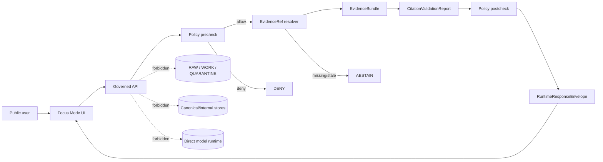
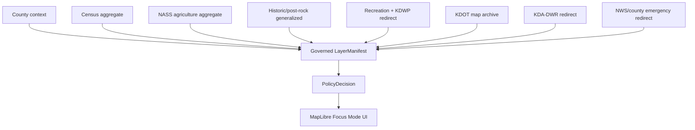
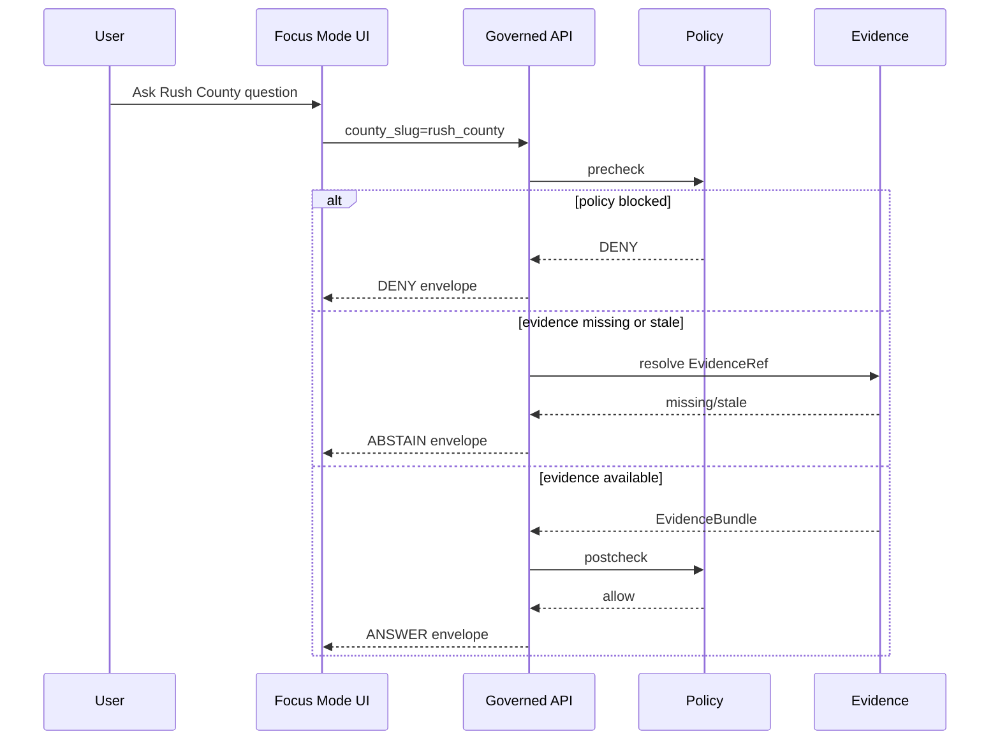
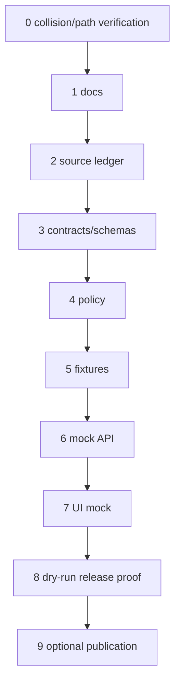

<!--
KFM_META_BLOCK_V2
doc_id: "NEEDS_VERIFICATION: kfm-doc-focus-mode-county-rush-build-plan"
county_name: "Rush County"
county_slug: "rush_county"
created_utc: "2026-06-11"
updated_utc: "2026-06-11"
release_status: "PROPOSED planning artifact only; not reviewed, admitted, validated, promoted, deployed, or published"
owners: "NEEDS_VERIFICATION"
review_assignments: "NEEDS_VERIFICATION"
proposed_plan_path: "PROPOSED / NEEDS_VERIFICATION: docs/focus-mode/counties/rush_county/rush_county_focus_mode_build_plan.md"
schema_contract_policy_fixture_correction_rollback_release_homes: "NEEDS_VERIFICATION"
directory_rules_basis: "CONFIRMED doctrine: human-facing docs belong under docs/; domain/county is a segment under a responsibility root; specific path remains PROPOSED until live repo and ADRs are verified."
defining_public_safe_boundary: "Rush County county/city government, property-service, emergency-notification, road/bridge, Walnut Creek, recreation, hunting/WIHA, Stone Lake, agriculture, water-right, health, courthouse, post-rock, museum, trail, cemetery, and historic-site context must not become parcel-title, ownership, legal-access, private-well, potability, water-right, live emergency, live weather, live recreation-safety, infrastructure-vulnerability, living-person, archaeological-site, burial/sacred-site, or exact sensitive-location guidance."
collision_search_results:
  supplied_register: "CONFIRMED: Rush County was not listed."
  live_county_index: "CONFIRMED: public COUNTY_INDEX row shows Rush as not-started; not proof because index says rows are seeded/default and require validator reconciliation."
  repository_filename_content_search: "CONFIRMED for accessible GitHub connector search: Rush County terms returned no result."
  exhaustive_absence: "NEEDS_VERIFICATION: private branches, prior chats, local/private artifacts not exhaustively inspectable."
official_sources_checked:
  - "Rush County Government — https://rushcountykansas.org/"
  - "Rush County Economic Development / Visit — https://www.rushcounty.org/"
  - "Rush County Museums and Historic Sites — https://www.rushcounty.org/museums.html"
  - "Rush County Recreation — https://www.rushcounty.org/recreation.html"
  - "U.S. Census Bureau QuickFacts — https://www.census.gov/quickfacts/fact/table/rushcountykansas/PST045224"
  - "USDA NASS 2022 Census of Agriculture County Profile — https://www.nass.usda.gov/Publications/AgCensus/2022/Online_Resources/County_Profiles/Kansas/cp20165.pdf"
  - "Kansas Department of Agriculture Division of Water Resources — https://agriculture.ks.gov/divisions-programs/dwr"
  - "Kansas Department of Transportation Past Published County Maps — https://www.ksdot.gov/about/our-organization/divisions/planning-and-development/kansas-maps-and-gis-resources/past-published-county-maps"
  - "Kansas Department of Wildlife and Parks — https://www.ksoutdoors.gov/"
  - "NOAA/NWS Dodge City — https://www.weather.gov/ddc/"
not_claimed: "No repository modification, implementation, source admission, validation, review, promotion, deployment, or publication."
-->

# Rush County Focus Mode Build Plan

**Subtitle:** A post-rock, Walnut Creek, courthouse, museum, recreation, agriculture, county-service, road-map, water-governance, and weather-redirect proof slice with property, access, emergency, and exact-location boundaries held fail-closed.

**Product thesis:** Rush County Focus Mode should let a public user explore evidence-bounded county identity, historic settlement, post-rock and museum context, Walnut Creek / road-map context, recreation candidates, agriculture aggregates, and official authority redirects without converting public web pages or map layers into legal, property, water-right, emergency, live-safety, infrastructure, living-person, or sensitive-site advice.

   

> [!IMPORTANT]
> **Rush County public-safe boundary:** county/city government, property-service, emergency-notification, road/bridge, Walnut Creek, recreation, hunting/WIHA, Stone Lake, agriculture, water-right, health, courthouse, post-rock, museum, trail, cemetery, and historic-site context must not become parcel-title, ownership, legal-access, private-well, potability, water-right, live emergency, live weather, live recreation-safety, infrastructure-vulnerability, living-person, archaeological-site, burial/sacred-site, or exact sensitive-location guidance.

## Status and identity

| Field | Value |
|---|---|
| County | Rush County, Kansas |
| Slug | `rush_county` |
| Lane key | `rush-county` |
| File | `rush_county_focus_mode_build_plan.md` |
| Created / updated | 2026-06-11 |
| Truth posture | CONFIRMED source checks / PROPOSED plan / NEEDS_VERIFICATION repo path and implementation / UNKNOWN private artifacts |
| County index state | CONFIRMED row says `not-started`; not proof of absence because index says rows are seeded/default and require validator reconciliation |
| Release state | Not released; no implementation or promotion claimed |

## Quick links

1. [Operating posture](#1-operating-posture) · 2. [Why this county](#2-why-this-county) · 3. [Product thesis](#3-product-thesis) · 4. [Scope boundary](#4-scope-boundary) · 5. [First demo layers](#5-first-demo-layers) · 6. [User journeys](#6-user-journeys) · 7. [UI surfaces](#7-ui-surfaces) · 8. [Governed object model](#8-governed-object-model) · 9. [Proposed repository shape](#9-proposed-repository-shape) · 10. [Build phases](#10-build-phases) · 11. [First PR sequence](#11-first-pr-sequence) · 12. [Acceptance checklist](#12-acceptance-checklist) · 13. [Fixture plan](#13-fixture-plan) · 14. [Risk register](#14-risk-register) · 15. [Source seed list](#15-source-seed-list) · 16. [Open verification questions](#16-open-verification-questions) · 17. [Recommended first milestone](#17-recommended-first-milestone)

## Executive build note

Rush County is a compact but rich county slice. It combines county government, parcel/tax links, emergency notification, Walnut Creek / water governance, KDOT map vintages, Stone Lake and park context, hunting/fishing redirects, post-rock and museum interpretation, courthouse history, and USDA/Census aggregates. The first build should be documentation-control, source-ledger, policy, fixture, and mock-response work only. It should prove that KFM can answer bounded public questions, abstain on current/legal authority gaps, deny exact sensitive or unsafe requests, and preserve correction/rollback posture before any public release.

> [!WARNING]
> **GitHub placement callout:** this plan proposes `docs/focus-mode/counties/rush_county/rush_county_focus_mode_build_plan.md` only as `PROPOSED / NEEDS_VERIFICATION`. Directory Rules make `docs/` the responsibility root for human-facing explanation; final path must be reconciled against live repo convention and ADRs.

## Evidence-boundary table

| Label | Use in this plan | Rush County example |
|---|---|---|
| `CONFIRMED` | Checked during this run from accessible official/public sources or attached doctrine | county site, Census QuickFacts, NASS profile, KDA-DWR, KDOT, KDWP, NWS |
| `PROPOSED` | Design recommendation not verified as implemented | layer cards, JSON examples, policy, fixtures, PR sequence |
| `NEEDS_VERIFICATION` | Checkable before acting as fact | rights, geometry authority, exact path, source admission, currentness, derivative-display permission |
| `UNKNOWN` | Not resolvable from available evidence | private branches, prior private artifacts, runtime routes, validation results |

---

## 1. Operating posture

KFM rules applied to Rush County: `EvidenceBundle` outranks generated language; public UI uses governed APIs, released artifacts, catalog/triplet/graph records, tile services, and policy-safe runtime envelopes; public UI does not read RAW, WORK, QUARANTINE, unpublished candidates, canonical/internal stores, restricted sources, source-system side effects, or model-runtime output; promotion is a governed transition, not a file move; cite-or-abstain is default.

| Outcome | Meaning |
|---|---|
| `ANSWER` | Evidence and policy allow a bounded public answer |
| `ABSTAIN` | Evidence, rights, currentness, or authority are insufficient |
| `DENY` | Policy blocks the request |
| `ERROR` | System failure or validation failure prevents safe response |



### Rush County non-negotiable guardrails

| Guardrail | Outcome |
|---|---|
| Parcel ownership, title, tax, legal access, or living-person profile from parcel/tax links | `ABSTAIN` or `DENY` |
| Live emergency, weather, flood, fire, road closure, hunting season, fishing regulation, or recreation/facility safety | `ABSTAIN` and official redirect |
| Exact sensitive archaeology, cemetery/burial, sacred, vulnerable ecological, or exact hunting spot | `DENY` |
| USDA NASS aggregate converted into parcel/farm/operator fact | `DENY` |
| KDA-DWR source converted into water-right/private-well/potability advice | `ABSTAIN` |
| County visitor page converted into current legal access/open/safe status | `ABSTAIN` |

Candidate reason codes: `RUSH_SOURCE_ROLE_COLLAPSE`, `RUSH_PROPERTY_TITLE_REQUEST`, `RUSH_LIVE_EMERGENCY_REQUEST`, `RUSH_RECREATION_CURRENTNESS_GAP`, `RUSH_WATER_RIGHT_PRIVATE_WELL_GAP`, `RUSH_HISTORIC_SITE_EXACTNESS`, `RUSH_AGGREGATE_TO_INDIVIDUAL_ERROR`, `RUSH_RIGHTS_UNVERIFIED`.

---

## 2. Why this county

| Selection screen | Result |
|---|---|
| Supplied completed/collision register | Rush County absent — `CONFIRMED` |
| Most recent generated list | Rush County absent — `CONFIRMED` |
| Accessible GitHub search | Rush County terms returned no result — `CONFIRMED` for accessible search |
| Public county index | Rush row says `not-started`, but not proof of absence — `CONFIRMED / NEEDS_VERIFICATION` |
| Attached/private material absence | Not exhaustive — `NEEDS_VERIFICATION` |

No material Rush County plan collision was found in the accessible search. Exhaustive absence across private branches, old chats, and private artifacts remains `NEEDS_VERIFICATION`.

### Proof-slice rationale

| Factor | Rush County anchor | Status |
|---|---|---|
| County government | official county site lists county departments and service links | `CONFIRMED` |
| Property boundary | parcel/tax links exist and must not become title/access service | `CONFIRMED risk` |
| Historic interpretation | official visitor site describes museums, post-rock, courthouse, trails, churches, historic sites | `CONFIRMED source / PROPOSED public-safe layer` |
| Recreation | official recreation page discusses Stone Lake, parks, hunting, fishing, and KDWP licensing redirect | `CONFIRMED source / NEEDS_VERIFICATION currentness` |
| Agriculture | USDA NASS 2022 county profile gives farms, land in farms, cropland, pastureland, irrigated acres, sales | `CONFIRMED aggregate` |
| Demography | Census QuickFacts gives FIPS 20165, population estimates/census, land area, caveats | `CONFIRMED aggregate` |
| Roads/maps | KDOT page lists Rush county map vintages | `CONFIRMED archive index` |
| Water governance | KDA-DWR defines water allocation, floodplain, dam-safety, stream/floodplain, NFIP roles | `CONFIRMED authority role` |
| Weather/hazards | NWS Dodge City is official live-weather redirect | `CONFIRMED redirect authority` |

Rush adds a materially distinct rural proof slice focused on **post-rock heritage + property-service risk + recreation currentness + aggregate agriculture + water/weather redirects** rather than an urban service or major reservoir lane.

---

## 3. Product thesis

**Thesis:** Rush County Focus Mode should turn official county, federal, state, and local visitor-source seeds into a trust-visible, map-first guide while failing closed on property, access, emergency, current-safety, exact-site, and individual-level requests.

First-product promises: evidence-bounded answers; public-safe layer cards; official redirects; visible boundary; correction path; rollback target before release.

Non-promises: no live alerting, no title/access/tax/water-right/potability/legal advice, no current hunting/fishing/facility status, no exact archaeological/cemetery/burial/sacred/ecological locations, no living-person profiles, no implementation or publication claims.

---

## 4. Scope boundary

| Included first slice | Allowed claim scope | Status |
|---|---|---|
| County identity card | county site identity and public department categories | `PROPOSED` |
| Census aggregate card | FIPS, population, land area, Census caveats | `PROPOSED` |
| NASS agriculture card | 2022 county-level aggregate only | `PROPOSED` |
| Historic/post-rock/museum card | generalized history; no exact sensitive release | `PROPOSED` |
| Recreation redirect card | Stone Lake, parks, hunting/fishing context + KDWP/currentness redirect | `PROPOSED` |
| Roads/map archive card | KDOT map vintage index; no live road status | `PROPOSED` |
| Water authority redirect | KDA-DWR authority; no individual legal/well/potability answer | `PROPOSED` |
| Weather/emergency redirect | NWS and county notification redirect; no KFM emergency system | `PROPOSED` |

Deferred: parcel/tax integration, live KDWP seasons/WIHA geometry, exact trail/cemetery/site coordinates, local road-closure feed, health-service details, emergency operations details, private ponds/farms.

Denied by default: exact archaeology, burial/sacred/cemetery-sensitive precision, rare species exact locations, critical infrastructure vulnerability, living-person identifiers, DNA/genomic data, emergency instructions as substitute for official sources.

---

## 5. First demo layers

| Priority | Layer/card | Source seeds | Evidence gate | Policy gate | Status |
|---:|---|---|---|---|---|
| 1 | County identity and services | Rush County Government | official page captured; administrative role | no legal/emergency inference | `PROPOSED` |
| 2 | Census aggregate | Census QuickFacts | vintage and caveats retained | aggregate only | `PROPOSED` |
| 3 | Agriculture aggregate | USDA NASS | 2022 reporting period; suppression flags retained | aggregate only | `PROPOSED` |
| 4 | Historic/post-rock generalized | Rush County historic sites | interpretation role labeled | no exact sensitive site/access claim | `PROPOSED` |
| 5 | Recreation context + redirect | Rush County recreation + KDWP | currentness marked | no license/season/safe/access claim | `PROPOSED` |
| 6 | Roads/map archive | KDOT | map date/vintage stored | no live road/access claim | `PROPOSED` |
| 7 | Water governance redirect | KDA-DWR | regulatory role | no private well/potability/water-right conclusion | `PROPOSED` |
| 8 | Weather/emergency redirect | NWS + county | operational redirect | no KFM alerting | `PROPOSED` |



Layer-card truth contract: every layer must show source role, reporting/effective period, geometry authority, currentness, sensitivity, rights, finite outcome behavior, correction link, and rollback reference if released.

---

## 6. User journeys

| Journey | Example | Outcome |
|---|---|---|
| Learn county identity | “What source anchors Rush County government?” | `ANSWER` |
| Understand population scale | “What is the Census population context?” | `ANSWER` with caveats |
| Understand agriculture | “What does NASS report for farms/land in farms?” | `ANSWER`, aggregate only |
| Explore history | “Why post-rock and barbed wire museums?” | `ANSWER`, generalized |
| Find recreation authority | “Where do I verify hunting or fishing rules?” | `ANSWER` with KDWP redirect |
| Check live weather | “Are there warnings?” | `ABSTAIN` from KFM answer, redirect NWS |
| Ask property ownership/access | “Who owns this parcel and can I enter?” | `ABSTAIN`/`DENY` |
| Ask exact cemetery/trail/archeology | “Show precise coordinates.” | `DENY` |
| Ask private well/water right | “Can I use this well?” | `ABSTAIN`, redirect KDA-DWR/local authority |

---

## 7. UI surfaces

- **Header:** county name, `PUBLIC_SAFE_BOUNDARY_ACTIVE`, `NOT_PUBLISHED`, `EVIDENCE_REQUIRED`, `LIVE_STATUS_REDIRECT_ONLY`.
- **Map canvas:** general county locator; no parcel ownership labels; no exact sensitive sites; no live emergency overlays unless released through a governed official feed.
- **Layer drawer:** county context on; Census/NASS aggregates on; historic/recreation/KDOT/water/weather redirects off by default with warnings.
- **Evidence Drawer:** `SourceDescriptor`, checked date, source role, allowed scope, disallowed scope, rights/currentness warnings, EvidenceBundle pointer, CitationValidationReport, PolicyDecision.
- **Answer panel:** bounded evidence answer, source-role note, and Rush boundary warning.
- **Denial panel:** exact sensitive or unsafe/property/living-person/infrastructure requests denied.
- **Abstention panel:** currentness/legal/authority gaps redirect to official source.
- **Timeline/time-basis panel:** Census vintage, NASS 2022 reporting period, KDOT map vintage, county page checked date, KDWP/NWS live redirect status.
- **Boundary panel:** repeats Rush County public-safe boundary and examples.
- **Official-authority redirect panel:** parcel/tax to county services, hunting/fishing to KDWP, weather to NWS, water to KDA-DWR, maps to KDOT.
- **Correction/release panel:** report stale source, wrong source role, sensitive exposure, correction request; release/rollback disabled until release exists.



Legend vocabulary: `aggregate`, `administrative`, `historic interpretation`, `regulatory authority`, `operational redirect`, `generalized`, `withheld`, `not admitted`, `not released`.

---

## 8. Governed object model

| Shared concept | Rush County use | Status |
|---|---|---|
| `SourceDescriptor` | county, visitor, Census, NASS, KDOT, KDWP, KDA-DWR, NWS source roles | `PROPOSED` |
| `EvidenceRef` / `EvidenceBundle` | answer/layer to evidence bundle | `PROPOSED` |
| `PolicyDecision` | allow/deny/abstain reason codes | `PROPOSED` |
| `RuntimeResponseEnvelope` | finite public answer | `PROPOSED` |
| `CitationValidationReport` | citations resolve and support claims | `PROPOSED` |
| `ReleaseManifest` | future published layer/API bundle | `PROPOSED` |
| `AIReceipt`, `ReviewRecord`, `CorrectionNotice`, `RollbackPlan` | generated-summary, review, correction, rollback controls | `PROPOSED` |

County-specific candidates: `RushCountyFocusModeProfile`, `RushCountySourceSeedLedger`, `RushCountyPublicSafeBoundaryPolicy`, `RushCountyLayerManifest`, `RushCountyDeniedRequestFixturePack`, `RushCountyCorrectionBacklog`, `RushCountyRollbackCard`.

Source-role anti-collapse rules: county government is not title/access authority; visitor pages are not current facility/open/safe status; Census/NASS are aggregates only; KDA-DWR redirects, not KFM legal advice; KDWP current rules must remain authority; KDOT maps are not live road status; NWS is live authority, KFM is not alerting service.

### Minimal JSON examples

```json
{
  "schema_version": "RuntimeResponseEnvelope.v1",
  "county_slug": "rush_county",
  "outcome": "ANSWER",
  "answer_type": "county_context",
  "claim": "Rush County Government is an official county-government web source for county identity and public department categories.",
  "truth_label": "CONFIRMED",
  "allowed_scope": ["county identity", "public department category", "official redirect"],
  "not_allowed_scope": ["parcel title", "legal access", "emergency instructions", "living-person profile"],
  "evidence_refs": ["kfm://evidence/rush_county/source/rush_county_government_homepage"],
  "policy_decision": {"outcome": "ALLOW", "reason_codes": []}
}
```

```json
{
  "schema_version": "RuntimeResponseEnvelope.v1",
  "county_slug": "rush_county",
  "outcome": "ABSTAIN",
  "answer_type": "recreation_currentness",
  "reason_codes": ["RUSH_RECREATION_CURRENTNESS_GAP"],
  "message": "KFM does not have a released current-authority EvidenceBundle for live Rush County recreation safety/open status. Use official local authority or KDWP."
}
```

```json
{
  "schema_version": "RuntimeResponseEnvelope.v1",
  "county_slug": "rush_county",
  "outcome": "DENY",
  "answer_type": "sensitive_location",
  "reason_codes": ["RUSH_HISTORIC_SITE_EXACTNESS"],
  "message": "KFM cannot provide exact Rush County sensitive historic, cemetery, burial, archaeological, ecological, or vulnerable-location details."
}
```

Deterministic identity candidates: `kfm:focus_mode:county:rush_county:profile:v1`, `kfm:source:rush_county:<source_slug>:<retrieved_date>`, `kfm:policy:rush_county:public_safe_boundary:v1`, `kfm:layer:rush_county:<layer_slug>:v1`, `kfm:evidence:rush_county:<source_slug>:<content_hash>`.

`spec_hash` posture: calculate from canonicalized JSON/YAML, not generated prose; include source URL, retrieved date, source role, allowed/disallowed scopes, rights/currentness/sensitivity flags; recompute when any source, policy, schema, or allowed scope changes.

---

## 9. Proposed repository shape

Directory Rules basis: docs explain to humans; contracts define meaning; schemas define machine shape; policy decides allow/deny/restrict/abstain; fixtures hold samples; release holds release/correction/rollback; domains/counties are segments inside roots, never new root folders.

Observed live-repository convention from county index: `docs/focus-mode/counties/`. Prior observed legacy convention: `docs/focus-mode/counties/<county_name_lowercase>_county/<county_name_lowercase>_county_focus_mode_build_plan.md`. Other doctrine has proposed `docs/focus-modes/<county-name>/build-plan.md`. This plan does not silently choose as implemented fact.

| Artifact | Candidate path | Status |
|---|---|---|
| Build plan | `docs/focus-mode/counties/rush_county/rush_county_focus_mode_build_plan.md` | `PROPOSED / NEEDS_VERIFICATION` |
| County README | `docs/focus-mode/counties/rush_county/README.md` | `PROPOSED / NEEDS_VERIFICATION` |
| Source ledger | `data/registry/sources/focus_mode/counties/rush_county/source_seed_ledger.json` | `PROPOSED / NEEDS_VERIFICATION` |
| Contract | `contracts/focus_mode/county/rush_county.md` | `PROPOSED / NEEDS_VERIFICATION` |
| Schema | `schemas/contracts/v1/focus_mode/county/rush_county_focus_mode_profile.schema.json` | `PROPOSED / NEEDS_VERIFICATION` |
| Policy | `policy/focus_mode/counties/rush_county/public_safe_boundary.rego` | `PROPOSED / NEEDS_VERIFICATION` |
| Fixtures | `fixtures/focus_mode/counties/rush_county/{valid,invalid,api_payloads}/` | `PROPOSED / NEEDS_VERIFICATION` |
| Release/correction/rollback | `release/{candidates,corrections,rollback}/focus_mode/counties/rush_county/` | `PROPOSED / NEEDS_VERIFICATION` |

```text
docs/focus-mode/counties/rush_county/
  README.md
  rush_county_focus_mode_build_plan.md
data/registry/sources/focus_mode/counties/rush_county/source_seed_ledger.json
contracts/focus_mode/county/rush_county.md
schemas/contracts/v1/focus_mode/county/rush_county_focus_mode_profile.schema.json
policy/focus_mode/counties/rush_county/public_safe_boundary.rego
fixtures/focus_mode/counties/rush_county/{valid,invalid,api_payloads}/
release/{candidates,corrections,rollback}/focus_mode/counties/rush_county/
```

Placement prohibitions: no root `/rush_county/`; no schemas in docs; no policy in release; no proofs/releases in docs; no source registry in contracts; no RAW/WORK/QUARANTINE in public UI path; no `artifacts/` as authority root. No file is claimed to exist unless inspected.

---

## 10. Build phases

| Phase | Entry gate | Outputs | Exit validation | Rollback |
|---:|---|---|---|---|
| 0 | repo checkout + collision search | path decision, collision record | no duplicate Rush plan | no repo change |
| 1 | Directory Rules verified | county README + build plan | docs lint, links valid | revert docs |
| 2 | source candidates reviewed | source seed ledger | roles/rights/currentness marked | remove source |
| 3 | object reuse decision | contracts/schema notes | schema dry-run | revert schema/contract |
| 4 | boundary drafted | policy | deny/abstain fixture pass | revert policy |
| 5 | fixtures drafted | valid + invalid fixtures | no-network tests | revert fixtures |
| 6 | mock API | RuntimeResponseEnvelope samples | finite outcomes | disable mock |
| 7 | UI mock | Evidence Drawer and panels | manual QA | feature flag off |
| 8 | dry-run release proof | candidate manifest only | release gates fail closed | delete candidate |
| 9 | optional publication | ReleaseManifest + rollback target | approvals complete | rollback card |



---

## 11. First PR sequence

1. Verification and documentation control.
2. Source ledger/admission and public-safe boundary.
3. Contracts/schemas or shared-object reuse.
4. Valid and invalid fixtures.
5. Policy and validators.
6. Mock governed API/UI.
7. Dry-run release proof.
8. Only then optional minimal public-safe publication.

Live-source integration and public release are **not first-PR work**.

---

## 12. Acceptance checklist

Governance and evidence: [ ] EvidenceRef resolves to EvidenceBundle; [ ] citations validate; [ ] AIReceipt exists for generated summaries; [ ] no generated text is source authority.

Source-role separation: [ ] county, visitor, Census, NASS, KDOT, KDWP, KDA-DWR, NWS roles separate; [ ] visitor/history pages not legal/currentness truth; [ ] aggregates not individual/parcel facts.

Public/sensitive boundary: [ ] exact sensitive sites denied/generalized; [ ] parcel/title/living-person blocked; [ ] emergency/weather redirect; [ ] hunting/fishing/current recreation redirect.

Currentness/expiry: [ ] Census vintage; [ ] NASS 2022 period; [ ] KDOT map vintage; [ ] county page checked date; [ ] KDWP/NWS redirect-only unless governed live integration exists.

Product/UI: [ ] boundary visible; [ ] Evidence Drawer; [ ] answer/deny/abstain panels; [ ] correction/rollback surfaces.

Repository placement: [ ] Directory Rules cited; [ ] no new root folder; [ ] schema/policy/fixture/release paths under responsibility roots.

Validation/release/correction/rollback: [ ] schema validation; [ ] policy tests; [ ] invalid fixtures fail closed; [ ] ReleaseManifest only after approval; [ ] CorrectionNotice and RollbackPlan templates exist.

---

## 13. Fixture plan

| Valid fixture | Purpose | Expected |
|---|---|---|
| `valid_answer_county_identity.json` | county government identity | `ANSWER` |
| `valid_answer_census_aggregate.json` | Census aggregate | `ANSWER` |
| `valid_answer_nass_aggregate.json` | NASS agriculture aggregate | `ANSWER` |
| `valid_answer_historic_generalized.json` | post-rock/museum generalized | `ANSWER` |
| `valid_redirect_kdwp_recreation.json` | recreation/license redirect | `ANSWER` with redirect |
| `valid_redirect_nws_weather.json` | weather redirect | `ANSWER` with redirect |
| `valid_redirect_kda_dwr_water.json` | water authority redirect | `ANSWER` with redirect |

| Invalid fixture | Trigger | Expected |
|---|---|---|
| `invalid_parcel_owner_access.json` | ownership/access | `DENY` or `ABSTAIN` |
| `invalid_private_well_potability.json` | potability/private well | `ABSTAIN` |
| `invalid_water_right_legal_conclusion.json` | water-right interpretation | `ABSTAIN` |
| `invalid_live_emergency_instruction.json` | emergency advice | `ABSTAIN` / `DENY` |
| `invalid_stone_lake_safe_today.json` | live recreation safety | `ABSTAIN` |
| `invalid_exact_cemetery_coordinates.json` | exact sensitive site | `DENY` |
| `invalid_exact_hunting_spots.json` | exact access/sensitive location | `DENY` |
| `invalid_farm_level_from_nass.json` | aggregate-to-individual | `DENY` |
| `invalid_courthouse_vulnerability.json` | infrastructure vulnerability | `DENY` |
| `invalid_living_person_from_tax.json` | living-person profile | `DENY` |

Highest-risk pack: parcel owner/access, Stone Lake safe/open today, exact hunting spots, exact trail/cemetery coordinates, private well potability, water-right legal conclusion, emergency operations details, NASS farm-level inference, living-person profile, courthouse/security vulnerability.

---

## 14. Risk register

| Risk | Likelihood | Impact | Mitigation | Release posture |
|---|---|---:|---|---|
| Parcel/tax links become title/access/living-person service | High | High | deny/abstain; no parcel labels | block unless tested |
| Recreation page treated as current open/safe/legal guidance | High | High | currentness badge; official redirect | redirect only |
| Hunting/WIHA exact places expose access/private/ecology risk | Medium | High | no exact access guidance; KDWP redirect | fail closed |
| Historic/cemetery/trail details expose sensitive precision | Medium | High | generalize and review | deny exact |
| NASS aggregate becomes farm/parcel conclusion | Medium | High | aggregate-only validator | block invalid fixture |
| Water source becomes legal/well/potability advice | Medium | High | KDA-DWR redirect | fail closed |
| NWS/county emergency becomes KFM alert service | Medium | High | redirect only | fail closed |
| County/KDOT/KDWP content reused without rights review | Medium | Medium | citation-only until rights review | needs verification |
| KDOT map vintage misunderstood as live road status | Medium | Medium | map date/vintage | warning required |
| Cultural/historic narrative lacks review | Medium | Medium | history/cultural review | defer detail |
| Infrastructure vulnerability from roads/courthouse/emergency ops | Low/Medium | High | policy denial | block release |
| Repo path duplicate/conflict | Medium | Medium | Phase 0 collision search | no PR until resolved |

---

## 15. Source seed list

### Official sources checked during this run

| Source | Authority role | Verified anchor | Intended use | Allowed scope | Limitations | Status |
|---|---|---|---|---|---|---|
| Rush County Government | county administrative/public info | official county site, departments, parcel/tax, emergency notification | county identity and service categories | administrative context | no title/access/legal/emergency conclusions; rights need review | `CONFIRMED / NEEDS_VERIFICATION` |
| Rush County Visit/Economic Development | visitor/economic-development | visitor resources and county context | visitor context | generalized | not current access/safety/legal guidance | `CONFIRMED / NEEDS_VERIFICATION` |
| Rush County Museums/Historic Sites | local historic interpretation | post-rock, museums, courthouse, trails, churches, historic sites | generalized historic layer | interpretation | no exact sensitive release or legal access | `CONFIRMED / NEEDS_VERIFICATION` |
| Rush County Recreation | local recreation context | Stone Lake, parks, hunting/fishing, KDWP redirect | recreation context + redirect | generalized | not license/season/open/safe/current access | `CONFIRMED / NEEDS_VERIFICATION` |
| Census QuickFacts | federal statistical aggregate | FIPS 20165, population estimates/census, land area, caveats | demographic/geographic aggregate | aggregate only | no person/household conclusions | `CONFIRMED` |
| USDA NASS 2022 profile | federal agriculture aggregate | farms, land in farms, cropland, pasture, irrigated acres, sales | agriculture aggregate | county aggregate only | no farm/parcel/operator conclusion | `CONFIRMED` |
| KDA-DWR | state water regulatory authority | water appropriation, floodplain, dam safety, permits, NFIP | official redirect | authority role | no KFM legal/well/potability advice | `CONFIRMED` |
| KDOT county maps | transportation map archive | Rush map vintages listed | map archive index | map vintage context | no live road condition/access | `CONFIRMED` |
| KDWP | wildlife/recreation authority | licenses, regulations, hunting/fishing, parks | official redirect | redirect only | current rules at authority; sensitive locations | `CONFIRMED` |
| NWS Dodge City | operational weather authority | warnings/advisories/local forecast page | live weather redirect | redirect only | KFM not alerting service | `CONFIRMED` |

### Candidate sources for later verification

KSHS / Kansapedia and trail sources; NPS/National Register records; FEMA Flood Map Service Center; USGS NHD/stream data; KGS geology/groundwater; KDHE county health/environment pages; county emergency operations plan; local municipalities; historical society/museum pages; parcel/tax services.

Source-admission checklist: [ ] URL resolves; [ ] owner/role identified; [ ] retrieval date; [ ] publication/effective period; [ ] rights; [ ] geometry authority; [ ] currentness/expiry; [ ] sensitivity/privacy review; [ ] allowed/disallowed claim scopes; [ ] CitationValidationReport; [ ] SourceDescriptor; [ ] EvidenceBundle; [ ] policy tests; [ ] release approval.

---

## 16. Open verification questions

| Question | Status |
|---|---|
| Does a Rush County plan exist in private branches/prior chats/unindexed artifacts? | `NEEDS_VERIFICATION` |
| Is the canonical path `docs/focus-mode/counties/rush_county/...`? | `NEEDS_VERIFICATION` |
| Which shared Focus Mode contracts/schemas already exist? | `NEEDS_VERIFICATION` |
| Are rights sufficient for excerpts/thumbnails/overlays? | `NEEDS_VERIFICATION` |
| Which source is authoritative for county boundary and communities? | `NEEDS_VERIFICATION` |
| Can KDOT maps be overlays or only citations/links? | `NEEDS_VERIFICATION` |
| Which historic trail/cemetery/site details are sensitive? | `NEEDS_VERIFICATION` |
| Do Tribal/Nation review duties apply to historic/archaeological/burial/sacred/route interpretation? | `NEEDS_VERIFICATION` |
| What KDWP restrictions apply to hunting/WIHA/fishing data? | `NEEDS_VERIFICATION` |
| What correction and rollback machinery already exists? | `NEEDS_VERIFICATION` |
| Is emergency operations plan public/current/safe to summarize? | `NEEDS_VERIFICATION`; likely defer/abstain |

---

## 17. Recommended first milestone

**Milestone:** `M0_RUSH_COUNTY_PUBLIC_SAFE_LEDGER_AND_NEGATIVE_PATHS`

**Statement:** Create a docs/source-ledger/fixture/policy planning slice for Rush County that proves the public-safe boundary before live-source integration or public release.

| Deliverable | Status |
|---|---|
| Rush County build plan Markdown | `PROPOSED` |
| Rush County README | `PROPOSED` |
| Source seed ledger | `PROPOSED` |
| Public-safe boundary policy note | `PROPOSED` |
| Valid answer fixture pack | `PROPOSED` |
| Invalid fail-closed fixture pack | `PROPOSED` |
| Mock RuntimeResponseEnvelope examples | `PROPOSED` |
| Verification backlog | `PROPOSED` |

Definition of done: no duplicate plan found; Directory Rules path decision recorded; source roles and limitations recorded; Rush boundary appears in docs, policy, fixtures, UI notes, and JSON; invalid fixtures fail closed; no live source integration; no public release; correction and rollback placeholders exist.

Go/no-go: go only when collision is clear, sources are role-labeled, policy fixtures pass, repo placement is responsibility-rooted, and release remains dry-run only.

---

## Appendix A — Public-safe narrative skeleton

1. What Rush County is. 2. How to read the map. 3. County government and services. 4. People and place at aggregate scale. 5. Working landscape. 6. Post-rock, museums, courthouse, and history. 7. Recreation and hunting with official redirects. 8. Water and weather redirects. 9. Corrections and limits.

---

## Appendix B — Required negative-path reason-code categories

| Category | Reason code | Outcome |
|---|---|---|
| Evidence missing | `EVIDENCE_NOT_FOUND` | `ABSTAIN` |
| Source not admitted | `SOURCE_NOT_ADMITTED` | `ABSTAIN` |
| Rights unclear | `RUSH_RIGHTS_UNVERIFIED` | `ABSTAIN` |
| Property/title/access | `RUSH_PROPERTY_TITLE_REQUEST` | `ABSTAIN` / `DENY` |
| Living person | `LIVING_PERSON_IDENTIFIER_REQUEST` | `DENY` |
| Water-right/private-well | `RUSH_WATER_RIGHT_PRIVATE_WELL_GAP` | `ABSTAIN` |
| Emergency/live safety | `RUSH_LIVE_EMERGENCY_REQUEST` | `ABSTAIN` / `DENY` |
| Recreation currentness | `RUSH_RECREATION_CURRENTNESS_GAP` | `ABSTAIN` |
| Sensitive exact location | `RUSH_HISTORIC_SITE_EXACTNESS` | `DENY` |
| Aggregate misuse | `RUSH_AGGREGATE_TO_INDIVIDUAL_ERROR` | `DENY` |
| Infrastructure vulnerability | `CRITICAL_INFRASTRUCTURE_EXACT` | `DENY` |
| Source-role collapse | `RUSH_SOURCE_ROLE_COLLAPSE` | `ABSTAIN` / `ERROR` |
| Validation failure | `CITATION_VALIDATION_FAILED` | `ERROR` |

---

## Appendix C — References and evidence-use note

References checked 2026-06-11: Rush County Government (`https://rushcountykansas.org/`); Rush County Economic Development / Visit (`https://www.rushcounty.org/`); Rush County Museums and Historic Sites (`https://www.rushcounty.org/museums.html`); Rush County Recreation (`https://www.rushcounty.org/recreation.html`); U.S. Census Bureau QuickFacts (`https://www.census.gov/quickfacts/fact/table/rushcountykansas/PST045224`); USDA NASS 2022 Census of Agriculture County Profile (`https://www.nass.usda.gov/Publications/AgCensus/2022/Online_Resources/County_Profiles/Kansas/cp20165.pdf`); Kansas Department of Agriculture Division of Water Resources (`https://agriculture.ks.gov/divisions-programs/dwr`); KDOT Past Published County Maps (`https://www.ksdot.gov/about/our-organization/divisions/planning-and-development/kansas-maps-and-gis-resources/past-published-county-maps`); KDWP (`https://www.ksoutdoors.gov/`); NOAA/NWS Dodge City (`https://www.weather.gov/ddc/`).

This plan is **not** an `EvidenceBundle`, legal determination, safety advisory, emergency notification, water-right opinion, private-well or potability conclusion, title/access opinion, live recreation status, release manifest, or published KFM product. It is a proposed planning artifact. All implementation paths, schemas, policies, fixtures, release objects, correction objects, rollback objects, and UI/API behavior remain `PROPOSED / NEEDS_VERIFICATION` unless later verified in a mounted repository with tests, review records, and release artifacts.
