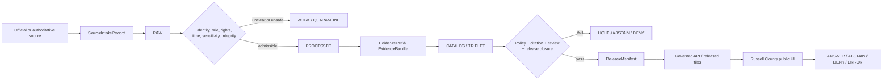
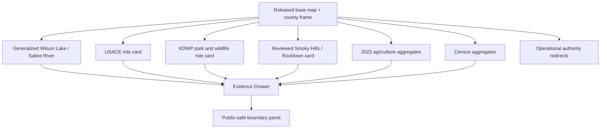
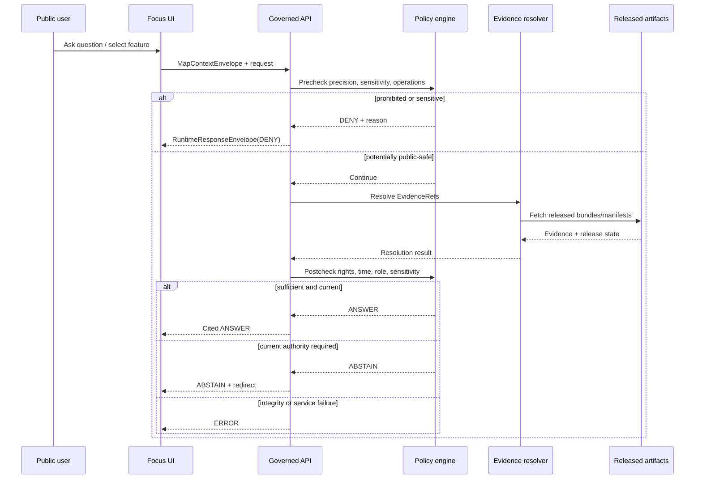
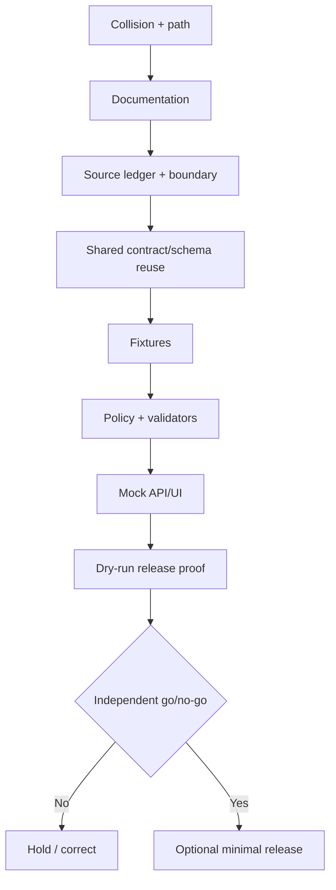

<!-- [KFM_META_BLOCK_V2]
doc_id: NEEDS_VERIFICATION
title: Russell County Focus Mode Build Plan
type: county-focus-mode-build-plan
version: v0.1-proposed
status: PROPOSED
release_status: NEEDS_VERIFICATION
county_name: Russell County
county_slug: russell
lane_slug: russell-county
created: 2026-06-09
updated: 2026-06-09
owners:
  focus_mode_owner: NEEDS_VERIFICATION
  evidence_steward: NEEDS_VERIFICATION
  reservoir_hydrology_reviewer: NEEDS_VERIFICATION
  geology_paleontology_reviewer: NEEDS_VERIFICATION
  ecology_recreation_reviewer: NEEDS_VERIFICATION
  archaeology_cultural_reviewer: NEEDS_VERIFICATION
  agriculture_reviewer: NEEDS_VERIFICATION
  infrastructure_security_reviewer: NEEDS_VERIFICATION
  rights_reviewer: NEEDS_VERIFICATION
  release_approver: NEEDS_VERIFICATION
defining_public_safe_boundary: >-
  Wilson Lake, Saline River, Smoky Hills, Rocktown, wildlife, fossil, archaeology,
  recreation, agriculture, and energy-history evidence may support generalized,
  time-bounded public interpretation, but must not become live water-safety,
  boating, fishing, swimming, facility, closure, fire, or weather advice; dam,
  outlet, road, utility, or emergency vulnerability analysis; property access or
  collecting permission; private-well or water-right conclusions; or exact
  sensitive ecological, fossil, archaeological, burial, sacred, petroglyph, or
  cultural-location disclosure.
collision_search:
  supplied_completed_register: CONFIRMED absent
  current_conversation_register: CONFIRMED Butler, Cheyenne, and Nemaha completed; Russell absent
  live_county_index: CONFIRMED listed not-started when checked 2026-06-09
  live_repo_exact_title_search: CONFIRMED no result returned
  live_repo_filename_search: CONFIRMED no result returned
  live_repo_slug_search: CONFIRMED no result returned
  live_repo_proof_slice_search: CONFIRMED no Wilson Lake Russell County plan result returned
  accessible_project_materials: CONFIRMED no Russell County Focus Mode build plan found
  exhaustive_absence_all_private_branches_deleted_files_local_artifacts_prior_chats: NEEDS_VERIFICATION
  rejected_material_collisions:
    - Butler County: rejected because generated in this conversation
    - Cheyenne County: rejected because generated in this conversation
    - Nemaha County: rejected because generated in this conversation
    - Graham County: rejected because live county index marks draft
directory_rules_basis:
  governing_principle: responsibility root outranks topic name
  observed_live_plan_template: docs/focus-mode/counties/<county-slug>-county/build-plan.md
  observed_live_index: docs/focus-mode/counties/COUNTY_INDEX.md
  documented_divergence: docs/focus-mode/ versus docs/focus-modes/ references coexist
  older_legacy_convention: docs/focus-mode/counties/<county_name_lowercase>_county/<county_name_lowercase>_county_focus_mode_build_plan.md
  path_posture: PROPOSED / NEEDS_VERIFICATION until repository authority or ADR resolves divergence
proposed_paths:
  human_plan: PROPOSED / NEEDS_VERIFICATION
  source_ledger: PROPOSED / NEEDS_VERIFICATION
  contracts: PROPOSED / NEEDS_VERIFICATION
  schemas: PROPOSED / NEEDS_VERIFICATION
  policies: PROPOSED / NEEDS_VERIFICATION
  fixtures: PROPOSED / NEEDS_VERIFICATION
  ui: PROPOSED / NEEDS_VERIFICATION
  correction: PROPOSED / NEEDS_VERIFICATION
  rollback: PROPOSED / NEEDS_VERIFICATION
  release: PROPOSED / NEEDS_VERIFICATION
official_sources_checked:
  - U.S. Army Corps of Engineers, Kansas City District, Wilson Lake
  - Kansas Department of Wildlife and Parks, Wilson State Park
  - U.S. Census Bureau QuickFacts, Russell County, Kansas
  - USDA NASS 2022 Census of Agriculture, Russell County profile
  - National Weather Service Forecast Office Wichita, Kansas
official_or_authoritative_candidates_not_admitted:
  - Russell County official government website, current canonical URL NEEDS_VERIFICATION
  - City of Russell official website
  - Kansas Geological Survey county geology and oil/gas resources
  - Kansas Department of Transportation Russell County map
  - Kansas Historical Society / KHRI
  - Kansas Corporation Commission oil and gas records
  - USGS water data and hydrography
implementation_claim: none
repository_modification_claim: none
review_or_validation_claim: none
promotion_or_publication_claim: none
truth_labels: [CONFIRMED, PROPOSED, NEEDS_VERIFICATION, UNKNOWN]
finite_outcomes: [ANSWER, ABSTAIN, DENY, ERROR]
[/KFM_META_BLOCK_V2] -->

<a id="top"></a>

# Russell County Focus Mode — Build Plan

> **Wilson Lake, Saline River, Smoky Hills, agriculture, geology, and energy history—without converting public evidence into live recreation or safety advice, infrastructure exposure, collecting or access permission, private-water conclusions, or exact sensitive-location disclosure.**

**Product thesis:** Build a governed, map-first Russell County explainer that connects Wilson Lake and the Saline River to Smoky Hills landforms, public recreation, wildlife management, agriculture, settlements, transportation, and energy history while keeping operational currentness, source authority, rights, sensitive geometry, correction, and rollback visible.


> [!IMPORTANT]
> **Defining public-safe boundary.** Russell County evidence may explain Wilson Lake, the Saline River, Smoky Hills geology, Rocktown, public recreation, wildlife management, agriculture, and energy history only at reviewed public-safe scale. KFM must not turn those sources into live water-safety, boating, fishing, swimming, facility, closure, fire, or weather advice; dam, outlet, road, utility, or emergency vulnerability analysis; property access or collecting permission; private-well or water-right conclusions; or exact sensitive ecological, fossil, archaeological, burial, sacred, petroglyph, or cultural-location disclosure.

## Status and identity

| Field | Value | Truth posture |
|---|---|---|
| County | Russell County, Kansas | `CONFIRMED` from official federal sources checked during this run |
| County FIPS | `20167` | `CONFIRMED` from Census QuickFacts |
| County slug | `russell` | `PROPOSED` deterministic slug |
| Lane slug | `russell-county` | `PROPOSED`; aligns with inspected live template |
| Deliverable filename | `russell_county_focus_mode_build_plan.md` | `CONFIRMED` |
| Created / updated | 2026-06-09 | `CONFIRMED` |
| Planning status | Build plan only | `CONFIRMED` |
| Implementation status | Not claimed | `UNKNOWN` |
| Source admission | Not performed | `CONFIRMED` |
| Validation / review | Not performed | `CONFIRMED` |
| Release / publication | Not performed | `CONFIRMED` |
| Canonical repository path | Singular/plural Focus Mode convention unresolved | `NEEDS_VERIFICATION` |
| Defining public-safe boundary | No live safety/operations, vulnerability, access/collecting, private-water, or exact sensitive-location conclusion | `PROPOSED` policy boundary requiring review |
| Exhaustive collision absence | Not provable across every private/deleted/local/prior-chat artifact | `NEEDS_VERIFICATION` |

## Quick links

- [Executive build note](#executive-build-note)
- [Evidence boundary](#evidence-boundary)
- [1. Operating posture](#1-operating-posture)
- [2. Why this county](#2-why-this-county)
- [3. Product thesis](#3-product-thesis)
- [4. Scope boundary](#4-scope-boundary)
- [5. First demo layers](#5-first-demo-layers)
- [6. User journeys](#6-user-journeys)
- [7. UI surfaces](#7-ui-surfaces)
- [8. Governed object model](#8-governed-object-model)
- [9. Proposed repository shape](#9-proposed-repository-shape)
- [10. Build phases](#10-build-phases)
- [11. First PR sequence](#11-first-pr-sequence)
- [12. Acceptance checklist](#12-acceptance-checklist)
- [13. Fixture plan](#13-fixture-plan)
- [14. Risk register](#14-risk-register)
- [15. Source seed list](#15-source-seed-list)
- [16. Open verification questions](#16-open-verification-questions)
- [17. Recommended first milestone](#17-recommended-first-milestone)
- [Appendices](#appendix-a--public-safe-narrative-skeleton)

## Executive build note

Russell County is a strong next proof slice because a single county frame combines several KFM domains and unusually clear governance tensions:

1. **Federal reservoir operations and public lands.** USACE states that it manages Wilson Lake for flood-damage reduction, recreation, fish and wildlife management, and downstream water-quality improvement. It reports management of approximately 9,000 surface acres of water and 13,000 acres of surrounding land.
2. **State recreation and wildlife management.** KDWP’s Wilson State Park page distinguishes the state park, Wilson Wildlife Area, current park notices, trails, facilities, fishing and wildlife links, and seasonal operating information.
3. **Operational currentness.** Park notices, office hours, facility status, fire notices, reservations, and lake information change. This makes Russell County an ideal test for separating durable interpretation from expiring operational advice.
4. **Sensitive cultural, archaeological, and fossil material.** The USACE page contains historical discussion of petroglyphs, archaeological surveys, burial mounds, fossil resources, and named cultural sites. Public visibility does not make every location safe to reproduce, map, summarize at full precision, or use for collecting guidance.
5. **Smoky Hills landforms and prairie.** Wilson Lake, Rocktown Natural Area, mixed-grass prairie, Dakota sandstone, post-rock limestone, and the Saline River create a high-value geology/habitat story.
6. **Agriculture.** USDA NASS reports 510 farms, 432,200 acres in farms, 65% crop and 35% livestock-product sales, and only 224 irrigated acres for the 2022 reporting cycle.
7. **Population and transportation context.** Census reports a 2025 estimate of 6,581, a 2020 count of 6,691, 886.26 square miles of land, and FIPS `20167`. Later KDOT admission could support the I-70, US-281, K-18, and K-232 transport frame.
8. **Energy history.** Russell County’s oil history is a promising later layer, but it requires current KGS/KCC source admission and must not become active-well, pipeline, lease, ownership, or vulnerability analysis.

The first build should be a static fixture demonstration. It should not ingest live lake levels, fishing reports, algae advisories, park closures, fire restrictions, weather warnings, dam-operation data, exact hunting maps, fossil locations, petroglyph or burial-site coordinates, archaeology records, private property data, private wells, water rights, or oil/gas infrastructure.

### Collision determination

| Check | Result | Status |
|---|---|---|
| Supplied completed/collision register | Russell County absent | `CONFIRMED` |
| Current conversation register | Butler, Cheyenne, and Nemaha completed; Russell absent | `CONFIRMED` |
| Live county index | Russell listed `not-started` when inspected | `CONFIRMED` |
| Exact title search | No repository result for `"Russell County Focus Mode"` | `CONFIRMED` for search performed |
| Exact filename search | No result for `russell_county_focus_mode_build_plan` | `CONFIRMED` |
| Slug-form searches | No result for `russell-county` or `russell_county` | `CONFIRMED` |
| Proof-slice search | No repository result for `Wilson Lake Russell County` | `CONFIRMED` |
| Accessible attached materials | No Russell County Focus Mode plan found | `CONFIRMED` for accessible materials |
| Private branches, deleted files, local artifacts, every prior chat | Not exhaustively inspectable | `NEEDS_VERIFICATION` |
| Material rejected collision | Graham County rejected because live index marks it `draft` | `CONFIRMED` |

### Directory Rules basis

The inspected Directory Rules establish that responsibility controls placement:

- human explanation and planning → `docs/`;
- semantic object meaning → `contracts/`;
- machine shape → `schemas/`;
- allow/deny/abstain decisions → `policy/`;
- valid and invalid samples → `fixtures/`;
- validators and generators → `tools/`;
- deployable UI/API → `apps/`;
- lifecycle data, evidence, receipts, proofs, and published products → `data/`;
- release decisions and rollback references → `release/`.

The inspected county template uses:

`docs/focus-mode/counties/<county-slug>-county/build-plan.md`

Other repository references use `docs/focus-modes/`, and earlier lineage used an underscored county folder and verbose filename. This plan records the observed template convention but does not declare the divergence resolved. Every proposed path remains `PROPOSED / NEEDS_VERIFICATION`.

## Evidence boundary

| Label | What this run supports |
|---|---|
| `CONFIRMED` | Russell was absent from the supplied register; the live index showed `not-started`; repository title, filename, slug, and proof-slice searches found no collision; official sources in §15 were opened and checked; this Markdown artifact was generated. |
| `PROPOSED` | Product scope, public-safe boundary, layers, object candidates, paths, policies, fixtures, UI, tests, milestones, release gates, correction, and rollback design. |
| `NEEDS_VERIFICATION` | Exhaustive collision absence; canonical path; county-government canonical site; source rights; geometry authority; precise sensitivity tiers; KGS/KCC/KDOT/USGS source admission; reviewer assignments; shared contract/schema/policy reuse; release approval. |
| `UNKNOWN` | Current repo implementation maturity, CI results, validator behavior, admitted sources, runtime routes, deployed UI, EvidenceBundles, policy enforcement, review state, ReleaseManifests, corrections, and rollback execution. |

---

# 1. Operating posture

## 1.1 KFM governing rules applied to Russell County

1. `EvidenceBundle` outranks generated language, search snippets, map symbols, screenshots, dashboards, tourism copy, and AI summaries.
2. Public clients use governed APIs, released artifacts, catalog/triplet/graph records, approved tile services, and policy-safe runtime envelopes.
3. Public UI must not read `RAW`, `WORK`, `QUARANTINE`, direct lake-operation systems, direct hunting maps, restricted cultural records, private-property records, or direct model output.
4. Preserve `RAW -> WORK / QUARANTINE -> PROCESSED -> CATALOG / TRIPLET -> PUBLISHED`.
5. Promotion is a governed state transition, not a file copy.
6. USACE reservoir-operation authority, KDWP recreation/wildlife authority, NWS operational weather authority, NASS statistical authority, Census statistical authority, and future KGS scientific authority remain distinct.
7. Durable county interpretation must not silently inherit current facility, closure, fire, fishing, boating, algae, water-level, or weather status.
8. A public map or webpage does not confer property access, hunting access, collecting permission, redistribution rights, or safety assurance.
9. Exact dam, outlet, maintenance, emergency, road, utility, or other vulnerability-relevant detail is denied or generalized.
10. Exact archaeological, burial, sacred, petroglyph, fossil, rare-species, nesting, denning, roosting, refuge-use, or migration locations fail closed.
11. Fossil or geologic interpretation does not grant collecting or excavation rights.
12. A reservoir or park page does not replace current official boating, swimming, fishing, fire, facility, or closure guidance.
13. NASS and Census remain time-bounded aggregates; no individual farm, household, or living-person inference.
14. Historical energy interpretation must not expose active infrastructure, lease interests, ownership, or security-sensitive detail.
15. Every response is `ANSWER`, `ABSTAIN`, `DENY`, or `ERROR`.

## 1.2 Truth-label key

| Label | Meaning |
|---|---|
| `CONFIRMED` | Verified during this run from checked official sources, inspected repository evidence, accessible project materials, or generated artifacts. |
| `PROPOSED` | A design or recommendation not verified as implemented. |
| `NEEDS_VERIFICATION` | Checkable before use, but not sufficiently verified to act as fact. |
| `UNKNOWN` | Unsupported or unresolved with available evidence. |

## 1.3 Finite outcomes

| Outcome | Russell County use |
|---|---|
| `ANSWER` | Released evidence supports a bounded, cited, time-aware public-safe response. |
| `ABSTAIN` | Evidence is missing, stale, rights-unclear, status-unclear, too coarse, or outside source authority. |
| `DENY` | The request seeks sensitive precision, infrastructure vulnerability, property access, collecting guidance, private-water conclusions, individual profiling, or unsafe operational advice. |
| `ERROR` | Contract, evidence, policy, citation, manifest, integrity, or service resolution failed. |

## 1.4 Public trust membrane



## 1.5 County-specific non-negotiable guardrails

| Topic | Required behavior |
|---|---|
| Wilson Lake and dam | Generalized interpretation only; no dam safety, outlet operation, release timing, weak-point, access-control, or disruption analysis. |
| Water level and water safety | Do not present live or cached lake level, current swimming/boating safety, algae, contamination, or downstream-release guidance unless a separately governed operational product exists. |
| State park and recreation | Current facility, reservation, office, fire, closure, trail, permit, fishing, and access information redirects to KDWP/USACE. |
| Wildlife area and refuge use | Public management context may be generalized; exact refuge, nesting, denning, roosting, migration, or vulnerable-use locations withheld. |
| Rocktown / geology / fossils | Explain formations and landforms; no collecting site, excavation advice, private-road route, or implied permission. |
| Archaeology / petroglyphs / burials | No exact location, route, descriptive precision that materially aids discovery, or unreviewed cultural interpretation. |
| Cultural authority | USACE historical narrative is a source, not sovereign cultural authority; Nation-authoritative review is required where relevant. |
| Agriculture | County aggregates only; preserve suppression flags; no producer, farm, lease, or facility inference. |
| Oil and gas | Historical/generalized context only after KGS/KCC admission; no active-well, pipeline, tank, lease, operator, emergency, or vulnerability surface. |
| Roads and transportation | Generalized public route context only; no live closure, bridge condition, evacuation, maintenance weakness, or hazardous-material routing. |
| Property and people | No title, ownership, access, appraisal, tax, living-person, or household profiling. |
| Weather and fire | Current conditions and warnings redirect to NWS/KDWP/USACE/local authority; no stale operational answer. |

## 1.6 Candidate reason codes

| Code | Outcome | Meaning |
|---|---|---|
| `RS-EVIDENCE-MISSING` | `ABSTAIN` | Required EvidenceBundle does not resolve. |
| `RS-EVIDENCE-STALE` | `ABSTAIN` | Evidence is outside its allowed time window. |
| `RS-OPERATIONAL-REDIRECT` | `ABSTAIN` | Current park, lake, fishing, fire, facility, or weather authority must answer. |
| `RS-RIGHTS-UNCLEAR` | `ABSTAIN` | Reuse or derivative-display rights unresolved. |
| `RS-PRECISION-UNSUPPORTED` | `ABSTAIN` | Requested precision exceeds admitted evidence. |
| `RS-PROPERTY-ACCESS` | `DENY` | Request seeks access, trespass, route, ownership, or permission conclusion. |
| `RS-COLLECTING-PERMISSION` | `DENY` | Request seeks fossil, artifact, rock, or other collecting guidance. |
| `RS-ARCHAEOLOGY-EXACT` | `DENY` | Exact archaeology, burial, sacred, petroglyph, or cultural-sensitive location requested. |
| `RS-SENSITIVE-ECOLOGY` | `DENY` | Exact vulnerable wildlife/habitat-use location requested. |
| `RS-INFRASTRUCTURE-EXACT` | `DENY` | Dam, outlet, road, utility, oil/gas, or emergency vulnerability detail requested. |
| `RS-PRIVATE-WATER` | `DENY` | Private-well, potability, water-right, or property-level water conclusion requested. |
| `RS-INDIVIDUAL-FARM` | `DENY` | Individual agricultural operation inference requested. |
| `RS-LIVE-SAFETY` | `ABSTAIN` | Live safety status must come from current authority. |
| `RS-INTEGRITY-FAIL` | `ERROR` | Digest, schema, manifest, or citation validation failed. |
| `RS-SERVICE-UNAVAILABLE` | `ERROR` | Required governed dependency unavailable. |
| `RS-RELEASE-CLOSURE-FAIL` | `ERROR` | Review, correction, or rollback closure is missing. |

---

# 2. Why this county

## 2.1 Selection screen

| Candidate | Completed-register result | Live-index result | Decision |
|---|---|---|---|
| Butler County | Completed in this conversation | Stale `not-started` | Reject |
| Cheyenne County | Completed in this conversation | Stale `not-started` | Reject |
| Nemaha County | Completed in this conversation | Stale `not-started` | Reject |
| Graham County | Not in supplied register | `draft` | Reject—repository collision |
| Russell County | Not in supplied register | `not-started`; no searched artifact collision | **Select** |
| Sumner County | Not in supplied register | `not-started` | Hold |
| Wichita County | Not in supplied register | `not-started` | Hold |

## 2.2 Collision-search result

No Russell County Focus Mode plan was found in:

- the supplied completed/collision register;
- the live county index as drafted, validated, or released;
- exact title search;
- exact verbose filename search;
- kebab-case and underscore slug searches;
- significant proof-slice search using Wilson Lake and Russell County;
- accessible attached KFM materials.

The live index’s `not-started` value was treated only as a signal, not proof. Absence from private branches, deleted artifacts, local workspaces, private attachments, and all prior conversations remains `NEEDS_VERIFICATION`.

## 2.3 Proof-slice rationale

| Proof dimension | Russell County value | Governance challenge |
|---|---|---|
| Reservoir and river | Wilson Lake and Saline River connect hydrology, federal operations, recreation, habitat, and water quality | Durable explanation must not become live operations or safety advice |
| Public lands | USACE and KDWP have distinct management roles | Agency roles, lands, parks, wildlife areas, and current notices must remain separate |
| Geology and landforms | Smoky Hills, Dakota sandstone, post-rock limestone, Rocktown | No collecting/access implication; scale and source authority visible |
| Fossils and archaeology | Public pages mention fossil and cultural resources | Public visibility does not justify exact location reproduction |
| Ecology | Mixed-grass prairie, riparian habitat, wildlife area and refuge | Exact vulnerable-use locations fail closed |
| Recreation | State park, Corps parks, trails, camping, fishing, boating | Operational information expires quickly and must redirect |
| Agriculture | 510 farms and 432,200 acres in 2022 | Aggregate-only; preserve `(D)` and `(Z)` |
| Energy history | Oil-development history is locally significant | Active infrastructure and ownership data require strict security/privacy controls |
| Transportation | I-70/US-281/K-18/K-232 candidate frame | No live closure, routing, bridge, or emergency inference |
| Culture/history | Pawnee Trail, Indigenous history, immigrant settlement, post-rock built environment | Cultural authority and sensitive-site review required |

## 2.4 Distinct series value

Russell County differs materially from the three immediately preceding slices:

- **Butler County** centered on El Dorado Lake, Flint Hills, working landscapes, and a major reservoir near a metropolitan region.
- **Cheyenne County** centered on interstate water governance, High Plains aquifer context, irrigation, and northwest landforms.
- **Nemaha County** centered on public planning documents, wind-project governance, parcel/map privacy, and infrastructure security.
- **Russell County** tests the collision between durable geologic/cultural interpretation and highly dynamic reservoir/recreation operations, while adding fossil, petroglyph, burial, wildlife-refuge, public-land, and dam-security boundaries.

The most valuable proof is not merely another reservoir layer. It is a **redaction-and-currentness demonstration**: one official page may contain durable facts, current notices, facility details, historical claims, sensitive cultural information, fossil-location clues, and operational data. KFM must separate, classify, review, transform, and release only what is fit.

## 2.5 Public benefit

A public user should be able to:

- understand how Wilson Lake and the Saline River fit into Russell County;
- distinguish USACE’s project-management role from KDWP’s park/wildlife role;
- learn about Smoky Hills geology, Rocktown, mixed-grass prairie, and post-rock landscapes without receiving access or collecting guidance;
- inspect 2022 agricultural aggregates;
- compare 2020 Census and 2025 population estimates;
- understand why current fishing, boating, fire, facility, closure, and weather questions redirect to official operational sources;
- see why exact fossil, archaeology, petroglyph, burial, wildlife, and infrastructure locations are withheld;
- inspect evidence, time, rights, review, correction, and release state.

## 2.6 Official-source-supported anchors

| Anchor | Checked source |
|---|---|
| Wilson Lake purposes, federal management, land/water extent, recreation areas | USACE Kansas City District |
| Wilson State Park, Wilson Wildlife Area, trails, current park notices | Kansas Department of Wildlife and Parks |
| Population, geography, economic and housing aggregates | U.S. Census Bureau QuickFacts |
| 2022 county agriculture profile | USDA NASS |
| Current weather/hazard authority | NWS Wichita |

---

# 3. Product thesis

## 3.1 One-sentence thesis

**Russell County Focus Mode will provide a governed, map-first explanation of Wilson Lake, the Saline River, Smoky Hills landforms, public lands, agriculture, settlements, and energy history while refusing live recreation/safety guidance, infrastructure exposure, property or collecting permission, private-water conclusions, and exact sensitive cultural/ecological locations.**

## 3.2 First-product promises

| Promise | Public behavior |
|---|---|
| Evidence-visible | Every claim exposes source role, EvidenceRefs, temporal scope, spatial scale, review, and release state. |
| Role-separated | USACE, KDWP, NWS, NASS, Census, future KGS/KCC/KDOT, and generated summaries remain distinct. |
| Time-aware | Durable interpretation and expiring operational information are visibly separated. |
| Sensitive by design | Exact cultural, fossil, ecological, and infrastructure precision is withheld or generalized. |
| No permission inference | Maps and descriptions never imply access, hunting, collecting, excavation, or private-property permission. |
| No live-safety substitution | Current park, lake, fire, fishing, boating, swimming, facility, closure, and weather questions redirect. |
| Correctable | Corrections and superseded source versions remain visible. |
| Reversible | Any release has an immutable manifest and tested rollback target. |

## 3.3 Explicit non-promises

The first product does not promise:

- current lake level, release rate, water quality, algae, swimming, boating, or fishing safety;
- current campground, trail, road, office, reservation, fire, or facility status;
- dam safety, outlet configuration, security, emergency access, weak points, or disruption consequences;
- exact hunting/refuge/wildlife-use geometry;
- exact petroglyph, burial, sacred, archaeological, fossil, or collecting locations;
- permission to enter, hunt, fish, camp, collect, excavate, photograph, or use a road;
- private-well, water-right, potability, or property-level water conclusions;
- active oil/gas well, pipeline, lease, operator, ownership, production, emergency, or vulnerability analysis;
- title, access, appraisal, tax, living-person, household, or individual-farm profiles;
- uncited historical or cultural synthesis as authoritative truth.

---

# 4. Scope boundary

## 4.1 Scope table

| Scope class | Content | First-slice posture |
|---|---|---|
| Public-safe first slice | County frame; municipalities; generalized Saline River/Wilson Lake context; USACE/KDWP role cards; generalized Smoky Hills and Rocktown interpretation; 2022 NASS aggregates; Census aggregates; official operational redirects | `PROPOSED` |
| Deferred | Detailed geology; KGS oil/gas history; KDOT roads; USGS observations; FEMA hazards; soils; historic maps; cultural interpretation; generalized habitat; public recreation status integration | `DEFER` |
| Denied by default | Live safety/operations; dam/outlet detail; exact fossil/cultural/ecology sites; access/collecting guidance; private wells/water rights; active energy infrastructure; tactical emergency analysis | `DENY` |
| Excluded | Restricted, official-use-only, credentialed, rights-unclear, tactically sensitive, privacy-invasive, scraped-without-terms, or unsafe material | `EXCLUDE` |

## 4.2 Public-safe first slice

The first slice should use static, versioned fixtures and prove that KFM can:

1. render the county frame and generalized Wilson Lake/Saline River context;
2. distinguish USACE project management from KDWP park/wildlife management;
3. separate durable lake history and geology from current operational notices;
4. explain Rocktown and Smoky Hills formations without giving access or collecting guidance;
5. show NASS/Census aggregates with reporting vintages;
6. withhold exact cultural, fossil, wildlife, and infrastructure precision;
7. return official redirects for current lake, park, fishing, fire, facility, and weather questions;
8. show correction, supersession, and rollback behavior.

## 4.3 Deferred content

- current canonical Russell County government site and county GIS;
- City of Russell and other municipal official sources;
- KDOT current county and railroad maps;
- USGS hydrography, streamgage, and Wilson Lake observations;
- Kansas Water Office reservoir studies;
- KGS county geology, oil/gas production, field, well, and map data;
- Kansas Corporation Commission regulatory records;
- NRCS SSURGO/Web Soil Survey;
- FEMA NFHL/National Risk Index;
- KDHE water-quality and public-health material;
- KSHS/KHRI historical and cultural records;
- USFWS/KDWP sensitive species and habitat products;
- historic aerials, railroad maps, and settlement maps;
- public recreation and facility status integration;
- cultural narratives requiring Nation-authoritative review.

## 4.4 Denied-by-default content

| Request/content | Default |
|---|---|
| “Is it safe to swim or boat today?” | `ABSTAIN` with current-authority redirect |
| “Which campground or trail is open now?” | `ABSTAIN` |
| “Show exact dam outlet and maintenance access.” | `DENY` |
| “Where is the weakest dam or road segment?” | `DENY` |
| “Give exact petroglyph or burial coordinates.” | `DENY` |
| “Show where to find fossils and how to collect them.” | `DENY` |
| “Route me across private land to Rocktown/fossil sites.” | `DENY` |
| “Show exact refuge or nesting locations.” | `DENY` |
| “Is my private well safe or legally protected?” | `DENY` / official authority |
| “Show active oil wells, pipelines, and vulnerable facilities.” | `DENY` |
| “Identify the farm behind a NASS value.” | `DENY` |
| “Is there a warning or fire restriction now?” | `ABSTAIN` with NWS/KDWP/USACE redirect |

## 4.5 Rights, privacy, culture, ecology, health, property, operations, law, and safety

- **Rights:** Public webpages, maps, brochures, images, and interactive maps require individual reuse and derivative-display review.
- **Privacy:** Small-population and agricultural data cannot be joined to identify people, households, farms, or lease interests.
- **Cultural authority:** Government historical narratives do not replace Nation-authoritative knowledge or review.
- **Archaeology:** Public mention does not authorize exact-location reproduction.
- **Ecology:** Wildlife area and refuge information must not expose vulnerable use locations.
- **Health:** Water-quality or algae materials must not become individualized health or potability advice.
- **Property:** Public lands, park boundaries, hunting maps, and roads do not prove private access or permission.
- **Operations:** Facility, fire, lake, fishing, boating, weather, and road information expires and must redirect.
- **Law:** KFM does not determine access rights, collecting legality, hunting/fishing compliance, water rights, or mineral interests.
- **Safety:** Dam, outlet, emergency, road, utility, and active energy details are reviewed for security and generalized or excluded.

---

# 5. First demo layers

## 5.1 Prioritized public-safe cards and layers

| Priority | Layer/card | Source seed | Evidence gate | Policy gate | Status |
|---|---|---|---|---|---|
| 1 | Russell County frame and municipalities | Census; future county/KDOT confirmation | FIPS, vintage, geometry digest, CRS | Public administrative geography only | `PROPOSED` |
| 2 | Generalized Wilson Lake and Saline River context | USACE | Project identity, purpose, generalized geometry, date | No live level/release/safety claim | `PROPOSED` |
| 3 | USACE management-role card | USACE | Source role and checked date | No vulnerability or tactical detail | `PROPOSED` |
| 4 | KDWP park/wildlife-role card | KDWP | Distinguish park, wildlife area, current notice, reporting date | Operational redirect; no exact sensitive locations | `PROPOSED` |
| 5 | Smoky Hills / Rocktown interpretation | USACE as seed; future KGS/KBS authority | Scientific authority, scale, rights, reviewed wording | No access, collecting, or exact fossil/cultural site | `DEFER` pending scientific admission |
| 6 | 2022 agriculture profile | USDA NASS | Reporting year, suppression, table integrity | Aggregate only | `PROPOSED` |
| 7 | Population and economy card | Census | Vintage and methodology notes | Aggregate only | `PROPOSED` |
| 8 | Operational authority card | USACE, KDWP, NWS | Current canonical URLs and expiry | Redirect only | `PROPOSED` |
| 9 | Historical oil/energy card | KGS/KCC candidates | Current authoritative sources, rights, temporal scope | Generalized history; no active infrastructure | `DEFER` |
| 10 | Transportation frame | KDOT candidate | Geometry authority and publication date | No live closure/condition/vulnerability | `DEFER` |
| 11 | Cultural-history card | KSHS/Nation/USACE candidates | Authority, rights, sensitivity, review | No exact sites or unreviewed cultural claims | `DEFER` |
| 12 | Exact dam, fossil, petroglyph, burial, refuge, active-well, pipeline, emergency layers | Various | Not admissible for first public slice | Fail closed | `DENY` |

## 5.2 Map composition



## 5.3 Layer-card truth contract

Every public card/layer must expose:

| Field | Requirement |
|---|---|
| `layer_id` | Stable deterministic identity |
| `title` | Non-misleading human label |
| `knowledge_character` | observation / statistical aggregate / scientific interpretation / administrative / operational redirect / historical interpretation / generated summary |
| `source_role` | Primary, corroborating, contextual, restricted, generated |
| `evidence_refs` | Resolving EvidenceRefs |
| `temporal_basis` | Observation/report/effective/retrieval/release/correction/expiry |
| `spatial_basis` | Geometry authority, scale, CRS, generalization |
| `rights_status` | Allowed/restricted/unclear/prohibited |
| `sensitivity_tier` | Reviewed tier |
| `transform_receipt_ref` | Generalization/redaction/suppression receipt |
| `policy_decision_ref` | Allow/abstain/deny/hold |
| `citation_validation_ref` | Required for answer-bearing cards |
| `review_record_ref` | Required |
| `release_manifest_ref` | Required for public rendering |
| `correction_ref` | Present when corrected/superseded |
| `rollback_ref` | Required |
| `boundary_notice` | Russell County public-safe boundary |

---

# 6. User journeys

## 6.1 Public learning journeys

### Journey A — What Wilson Lake is for

**Question:** “What public purposes does Wilson Lake serve?”

**Expected:** `ANSWER` citing USACE: flood-damage reduction, recreation, fish and wildlife management, and downstream water-quality improvement. The answer states that it is not current operating, release, or safety advice.

### Journey B — Who manages what

**Question:** “What is the difference between USACE and KDWP at Wilson Lake?”

**Expected:** `ANSWER` with separate agency-role cards. The response must not imply that park notices apply to Corps areas or vice versa unless the source explicitly says so.

### Journey C — Smoky Hills and Rocktown

**Question:** “Why does the landscape around Wilson Lake look different?”

**Expected:** `ANSWER` only after reviewed geologic evidence is admitted. The answer may discuss generalized formations and landforms, but not exact fossil, petroglyph, archaeology, or collecting locations.

### Journey D — Agriculture in 2022

**Question:** “What did the 2022 agricultural census report?”

**Expected:** `ANSWER` citing NASS: 510 farms, 432,200 acres, 65% crop and 35% livestock-product sales, and 224 irrigated acres. The answer is explicitly a 2022 county aggregate.

### Journey E — Population and settlement

**Question:** “How many people live in Russell County?”

**Expected:** `ANSWER` showing the 2025 estimate of 6,581 and the 2020 Census count of 6,691 as distinct vintages.

## 6.2 Trust-demonstration journeys

### Journey F — Durable versus operational content

The user opens a KDWP card and sees:

- durable park identity and general setting;
- current notices isolated in an expiring operational block;
- retrieval and expiry times;
- a warning that KFM does not cache facility/fire/closure status as durable truth;
- direct current-authority link.

### Journey G — Sensitive source redaction

A source contains a cultural or fossil location clue. The public Evidence Drawer shows:

- source identity;
- that a sensitive-detail review occurred;
- a redaction/generalization receipt;
- the allowed generalized claim;
- the denied precision category;
- no leaked coordinates or discovery-enabling description.

### Journey H — Correction and supersession

A park notice or source page changes. The UI shows:

- prior retrieval;
- superseding source version;
- affected card;
- correction notice;
- new release;
- rollback state;
- no silent overwrite.

## 6.3 Denied and abstained requests

| User request | Outcome | Reason |
|---|---|---|
| “Is the lake safe for swimming today?” | `ABSTAIN` | `RS-LIVE-SAFETY`; current authority redirect |
| “Which campground is open tonight?” | `ABSTAIN` | `RS-OPERATIONAL-REDIRECT` |
| “Show the exact dam outlet and maintenance roads.” | `DENY` | `RS-INFRASTRUCTURE-EXACT` |
| “Where can I collect fossils?” | `DENY` | `RS-COLLECTING-PERMISSION` |
| “Give me the petroglyph coordinates.” | `DENY` | `RS-ARCHAEOLOGY-EXACT` |
| “Route me over private land to a rock-art site.” | `DENY` | `RS-PROPERTY-ACCESS` |
| “Show the exact waterfowl refuge-use area.” | `DENY` | `RS-SENSITIVE-ECOLOGY` |
| “Is my private well affected by the reservoir?” | `DENY` | `RS-PRIVATE-WATER` |
| “Which active oil pipeline is most vulnerable?” | `DENY` | `RS-INFRASTRUCTURE-EXACT` |
| “Which farm produced the reported cattle value?” | `DENY` | `RS-INDIVIDUAL-FARM` |
| “Is there a fire restriction or severe warning right now?” | `ABSTAIN` | Current KDWP/USACE/NWS redirect |

---

# 7. UI surfaces

## 7.1 Header

The header must show:

- Russell County Focus Mode;
- current release and last reviewed date;
- source-freshness badge;
- **No live safety / access / collecting / exact sensitive locations** boundary badge;
- correction indicator;
- finite outcome;
- current-authority redirect shortcut.

## 7.2 Map canvas

The map must:

- start at county extent;
- show generalized county, lake, river, public-land, settlement, and approved landform layers;
- distinguish Russell County from the small cross-county portion of the Wilson Lake system where applicable;
- prevent unauthorized zoom/detail;
- never call USACE, KDWP, parcel, hunting-map, lake-level, or oil/gas systems directly from the public browser;
- route selections through the governed API and Evidence Drawer;
- visually label generalized, aggregate, operational-redirect, and withheld content.

## 7.3 Layer drawer

Each row displays:

- knowledge character;
- authority/source role;
- reporting or effective period;
- durable versus operational classification;
- geometry precision;
- sensitivity tier;
- rights status;
- review state;
- release manifest;
- correction state.

## 7.4 Evidence Drawer

Required fields:

1. claim/card text;
2. source publisher and role;
3. source/document title;
4. checked/retrieved date;
5. reporting/effective/expiry period;
6. EvidenceRefs and resolved bundle;
7. geometry authority and scale;
8. rights/derivative-display posture;
9. sensitivity finding;
10. transform/redaction receipt;
11. PolicyDecision;
12. CitationValidationReport;
13. ReviewRecord;
14. ReleaseManifest;
15. CorrectionNotice;
16. RollbackPlan;
17. “what this does not establish.”

## 7.5 Answer panel

An `ANSWER` panel includes:

- bounded answer;
- citations;
- source role;
- time basis;
- spatial scale;
- evidence sufficiency;
- public-safe boundary;
- explicit non-claims;
- correction/release references.

## 7.6 Denial panel

A `DENY` panel includes:

- reason code;
- safe explanation;
- no sensitive echoing;
- safe generalized alternative;
- appropriate authority/permission redirect where safe;
- audit receipt.

## 7.7 Abstention panel

An `ABSTAIN` panel includes:

- missing/currentness/rights/authority issue;
- evidence needed;
- current official redirect;
- no guessed operational status.

## 7.8 Timeline/time-basis panel

| Field | Meaning |
|---|---|
| `observed_at` | Measurement/event time |
| `reporting_period` | Statistical period |
| `effective_from/to` | Administrative/legal effectiveness |
| `retrieved_at` | KFM retrieval |
| `checked_at` | Human/source-currentness check |
| `released_at` | KFM release |
| `expires_at` | Operational expiration |
| `corrected_at` | Correction/supersession |

## 7.9 County-specific boundary panel

> **Russell County boundary:** KFM can explain generalized Wilson Lake, Saline River, Smoky Hills, public-land, agricultural, and historical context. It does not provide live lake, park, fishing, boating, swimming, fire, facility, closure, or weather advice; dam or infrastructure vulnerability analysis; access or collecting permission; private-well or water-right conclusions; or exact cultural, fossil, archaeological, burial, sacred, petroglyph, or sensitive wildlife locations.

## 7.10 Official-authority redirect panel

| Topic | Redirect |
|---|---|
| Wilson Lake federal project, Corps parks, current lake operations | USACE Kansas City District, Wilson Lake |
| Wilson State Park, park facilities, permits, trails, wildlife area | Kansas Department of Wildlife and Parks |
| Current weather and warnings | NWS Wichita |
| Population/economic aggregates | U.S. Census Bureau |
| Agriculture statistics | USDA NASS |
| County administration | Canonical Russell County official site—`NEEDS_VERIFICATION` |
| Geology and oil/gas science | KGS—candidate admission |
| Oil/gas regulation | KCC—candidate admission |

## 7.11 Correction/release panel

Show:

- current release;
- prior release;
- source version;
- operational-expiry status;
- correction notice;
- affected cards/layers;
- rollback target;
- cache invalidation;
- public alias state.

## 7.12 Legend vocabulary

| Term | Meaning |
|---|---|
| Durable interpretation | Reviewed content expected to remain valid beyond a short operational window |
| Operational notice | Time-sensitive current information with explicit expiry |
| Statistical aggregate | County summary for a reporting period |
| Scientific interpretation | Evidence-based analysis, not legal or permission authority |
| Administrative record | Government record within stated scope |
| Operational redirect | Link to current authority; not cached as durable truth |
| Generalized geometry | Precision deliberately reduced |
| Sensitive withheld | Detail not released |
| Access not established | Map/content does not grant permission |
| Generated summary | Downstream prose subordinate to evidence |

## 7.13 UI/API/policy/evidence sequence



---

# 8. Governed object model

## 8.1 Shared KFM concepts

| Object | Proposed use |
|---|---|
| `SourceDescriptor` | Publisher, role, authority, rights, sensitivity, temporal and allowed-use metadata |
| `EvidenceRef` | Stable reference from claim/card/layer to evidence |
| `EvidenceBundle` | Provenance, excerpts/records, rights, review, integrity, time and spatial fitness |
| `PolicyDecision` | Allow/abstain/deny/hold with reason codes and expiry |
| `RuntimeResponseEnvelope` | Public finite outcome |
| `CitationValidationReport` | Citation resolution and support validation |
| `ReleaseManifest` | Released artifacts and dependency closure |
| `AIReceipt` | Provider/model/config/evidence/output record |
| `ReviewRecord` | Human role, scope, decision, date |
| `CorrectionNotice` | Public correction/supersession |
| `RollbackPlan` | Target, triggers, procedure, cache/alias verification |

## 8.2 County-specific object candidates

| Object | Purpose | Status |
|---|---|---|
| `RussellCountyFrame` | FIPS, geometry, CRS, vintage, adjacent/cross-county relations | `PROPOSED` |
| `WilsonLakeManagementRoleCard` | Distinguishes USACE/KDWP roles and lands | `PROPOSED` |
| `OperationalNoticeEnvelope` | Time-sensitive notice with source, retrieval, expiry and redirect | `PROPOSED` |
| `DurableInterpretationCard` | Reviewed non-operational narrative |
| `SensitiveLocationTransform` | Withheld/generalized geometry and transform receipt | `PROPOSED` |
| `AccessPermissionBoundary` | Machine-readable no-access/no-collecting rule | `PROPOSED` |
| `GeologyLandformCard` | Reviewed Smoky Hills/Rocktown explanation | `PROPOSED` |
| `AgricultureCountySnapshot` | NASS aggregate and suppression state | `PROPOSED` |
| `EnergyHistoryCard` | Generalized historical oil/gas narrative | `PROPOSED` |
| `OperationalAuthorityRedirect` | USACE/KDWP/NWS current authority | `PROPOSED` |
| `CountyBoundaryNotice` | Reusable public-safe boundary | `PROPOSED` |

## 8.3 Source-role anti-collapse rules

1. USACE project-management statements are not KDWP park-operation statements.
2. KDWP park notices do not establish conditions at every Corps-managed area.
3. A current notice is not durable historical truth.
4. A historical or tourism narrative is not archaeological or Nation-authoritative truth.
5. A geologic description is not permission to collect or enter.
6. A public hunting map is not safe for unrestricted public recombination.
7. A reservoir-purpose statement is not current water-safety or release guidance.
8. NASS aggregate is not an individual farm.
9. Census estimate is not a living-person or household fact.
10. KGS scientific oil/gas data, KCC regulatory records, and local historical narratives must not collapse into one “energy truth.”
11. Generated language cannot upgrade source authority or restore redacted precision.

## 8.4 Minimal public `ANSWER` JSON

```json
{
  "schema_version": "1.0",
  "response_id": "kfm:runtime:russell-county:answer:sha256:EXAMPLE",
  "outcome": "ANSWER",
  "question": "What purposes does Wilson Lake serve?",
  "answer": "The admitted U.S. Army Corps of Engineers evidence describes Wilson Lake as serving flood-damage reduction, recreation, fish and wildlife management, and downstream water-quality improvement. This is a general project-purpose explanation, not current lake-operation or safety advice.",
  "county": {
    "name": "Russell County",
    "fips": "20167"
  },
  "knowledge_character": "administrative_project_context",
  "evidence_refs": [
    "kfm:evidence-ref:usace:wilson-lake:project-purpose"
  ],
  "evidence_bundle_ref": "kfm:evidence-bundle:russell-county:wilson-lake:sha256:EXAMPLE",
  "citations_validated": true,
  "policy_decision": {
    "outcome": "ALLOW",
    "reason_codes": ["PUBLIC_GENERAL_CONTEXT", "NO_OPERATIONAL_STATUS"]
  },
  "temporal_basis": {
    "checked_at": "2026-06-09T00:00:00Z",
    "released_at": "NEEDS_VERIFICATION"
  },
  "boundary_notice": "Not live water-safety, release, boating, swimming, fishing, facility, fire, closure, or weather advice.",
  "release_manifest_ref": "NEEDS_VERIFICATION",
  "rollback_ref": "NEEDS_VERIFICATION"
}
```

## 8.5 `ABSTAIN` JSON

```json
{
  "schema_version": "1.0",
  "response_id": "kfm:runtime:russell-county:abstain:sha256:EXAMPLE",
  "outcome": "ABSTAIN",
  "question": "Is Wilson Lake safe for swimming today?",
  "answer": null,
  "reason_codes": ["RS-LIVE-SAFETY", "RS-OPERATIONAL-REDIRECT"],
  "explanation": "KFM does not provide live swimming or water-safety status from durable county content. Check the current responsible agency notices.",
  "authority_redirects": [
    {
      "label": "U.S. Army Corps of Engineers — Wilson Lake",
      "purpose": "Current federal project and lake information"
    },
    {
      "label": "Kansas Department of Wildlife and Parks — Wilson State Park",
      "purpose": "Current state-park information"
    }
  ],
  "policy_decision_ref": "kfm:policy-decision:russell:live-safety:sha256:EXAMPLE",
  "ai_receipt_ref": "kfm:ai-receipt:sha256:EXAMPLE"
}
```

## 8.6 `DENY` JSON

```json
{
  "schema_version": "1.0",
  "response_id": "kfm:runtime:russell-county:deny:sha256:EXAMPLE",
  "outcome": "DENY",
  "question": "Give me exact petroglyph and fossil-collecting locations near Wilson Lake.",
  "answer": null,
  "reason_codes": [
    "RS-ARCHAEOLOGY-EXACT",
    "RS-COLLECTING-PERMISSION"
  ],
  "explanation": "Exact cultural and collecting locations are withheld. KFM does not provide discovery-enabling precision or permission to access or collect.",
  "safe_alternative": "View a reviewed generalized county-level cultural and geologic interpretation.",
  "policy_decision_ref": "kfm:policy-decision:russell:sensitive-cultural-collecting:sha256:EXAMPLE",
  "audit_receipt_ref": "kfm:decision-receipt:sha256:EXAMPLE"
}
```

## 8.7 Deterministic identity candidates

| Object | Candidate identity input |
|---|---|
| County frame | FIPS + geometry vintage + CRS + digest |
| Source descriptor | publisher + source ID + version/retrieval contract |
| Wilson Lake role card | agency + project ID + role + evidence digest |
| Operational notice | authority + notice ID + published/effective/expiry + digest |
| Geology card | subject ID + evidence digest + public transform |
| Agriculture snapshot | FIPS + census year + profile version |
| Sensitive transform | source geometry digest + policy + transform parameters |
| Policy decision | policy profile + request class + evidence digest + effective period |
| Release manifest | sorted artifact/evidence/policy/review digests |
| Runtime response | normalized request + release + evidence + policy decision |

## 8.8 `spec_hash` posture

Candidate canonical inputs:

- schema and contract versions;
- source IDs and versions;
- durable/operational classification rules;
- time-to-live and expiry rules;
- geometry generalization/redaction parameters;
- cultural/ecological/infrastructure sensitivity profiles;
- suppression thresholds;
- source-role rules;
- layer composition;
- evidence-resolution and citation-validation rules;
- UI behavior.

Exact canonicalization and hash algorithm remain `NEEDS_VERIFICATION`. JCS plus SHA-256 is a reasonable `PROPOSED` default if compatible with existing KFM tooling.

---

# 9. Proposed repository shape

## 9.1 Directory Rules basis

- human planning → `docs/`;
- semantic meaning → `contracts/`;
- machine shape → `schemas/`;
- decision rules → `policy/`;
- test fixtures → `fixtures/`;
- validators → `tools/`;
- deployables → `apps/`;
- lifecycle data/evidence/publication → `data/`;
- release decisions/rollback → `release/`.

## 9.2 Observed live convention and divergence

Observed:

- `docs/focus-mode/counties/COUNTY_INDEX.md`
- `docs/focus-mode/counties/_template/county-build-plan.md`
- template instruction: `docs/focus-mode/counties/<county-slug>-county/build-plan.md`

Divergence:

- `docs/focus-modes/` also appears in repository documentation;
- older lineage used an underscored county directory and verbose filename;
- no path should be silently selected if doing so creates parallel authority.

## 9.3 Candidate path table

| Responsibility | Candidate path | Status |
|---|---|---|
| Build plan | `docs/focus-mode/counties/russell-county/build-plan.md` | `PROPOSED / NEEDS_VERIFICATION` |
| Requested artifact | `russell_county_focus_mode_build_plan.md` | `CONFIRMED` deliverable only |
| Lane README | `docs/focus-mode/counties/russell-county/README.md` | `PROPOSED / NEEDS_VERIFICATION` |
| Layer registry | `docs/focus-mode/counties/russell-county/layer-registry.md` | `PROPOSED / NEEDS_VERIFICATION` |
| Evidence model | `docs/focus-mode/counties/russell-county/evidence-model.md` | `PROPOSED / NEEDS_VERIFICATION` |
| Acceptance checklist | `docs/focus-mode/counties/russell-county/acceptance-checklist.md` | `PROPOSED / NEEDS_VERIFICATION` |
| Source seed list | `docs/focus-mode/counties/russell-county/source-seed-list.md` | `PROPOSED / NEEDS_VERIFICATION` |
| Public safety notes | `docs/focus-mode/counties/russell-county/public-safety-notes.md` | `PROPOSED / NEEDS_VERIFICATION` |
| Semantic contract | `contracts/focus_mode/russell_county_focus_mode.md` | `PROPOSED / NEEDS_VERIFICATION` |
| Shared schema | `schemas/contracts/v1/focus_mode/focus_mode_payload.schema.json` | `PROPOSED reuse / NEEDS_VERIFICATION` |
| County extension | `schemas/contracts/v1/focus_mode/russell_county_extension.schema.json` | Only if shared schema cannot express slice |
| Source descriptors | `data/catalog/sources/russell-county/source_descriptors.yaml` | `PROPOSED / NEEDS_VERIFICATION` |
| Valid/invalid fixtures | `fixtures/focus_modes/russell-county/{valid,invalid}/` | `PROPOSED / NEEDS_VERIFICATION` |
| Policy | `policy/focus_modes/russell-county/` | `PROPOSED / NEEDS_VERIFICATION` |
| UI | `apps/explorer-web/src/focus-modes/russell-county/` | `PROPOSED / NEEDS_VERIFICATION` |
| Mock API | `apps/governed-api/fixtures/focus-modes/russell-county/` | `PROPOSED / NEEDS_VERIFICATION` |
| Release candidate | `release/candidates/focus-modes/russell-county/` | `PROPOSED / NEEDS_VERIFICATION` |
| Published payload | `data/published/api_payloads/focus-modes/russell-county.json` | `PROPOSED later only` |
| Correction | Existing correction responsibility root, exact path TBD | `PROPOSED / NEEDS_VERIFICATION` |
| Rollback | Existing release/rollback responsibility root, exact path TBD | `PROPOSED / NEEDS_VERIFICATION` |

## 9.4 Proposed responsibility-rooted tree

```text
docs/
  focus-mode/
    counties/
      russell-county/
        README.md
        build-plan.md
        layer-registry.md
        evidence-model.md
        acceptance-checklist.md
        source-seed-list.md
        public-safety-notes.md

contracts/
  focus_mode/
    russell_county_focus_mode.md

schemas/
  contracts/
    v1/
      focus_mode/
        focus_mode_payload.schema.json
        russell_county_extension.schema.json  # only if justified

fixtures/
  focus_modes/
    russell-county/
      valid/
      invalid/

policy/
  focus_modes/
    russell-county/

apps/
  explorer-web/
    src/
      focus-modes/
        russell-county/
  governed-api/
    fixtures/
      focus-modes/
        russell-county/

data/
  catalog/
    sources/
      russell-county/
        source_descriptors.yaml
  published/
    api_payloads/
      focus-modes/
        russell-county.json  # later only

release/
  candidates/
    focus-modes/
      russell-county/
```

## 9.5 Placement prohibitions

Do not create:

- a root-level `russell/`, `russell-county/`, `wilson-lake/`, `reservoirs/`, `geology/`, `fossils/`, or `counties/`;
- a parallel schema, contract, policy, source, receipt, proof, release, correction, or rollback home;
- a direct copy of hunting, park, archaeology, fossil, private-property, oil/gas, or operational data in the UI source tree;
- a public tile or payload from a candidate source before promotion;
- publication by moving a file into `published/`.

## 9.6 Existence statement

No proposed Russell County file, schema, contract, policy, fixture, UI module, source descriptor, release object, correction notice, or rollback object is claimed to exist unless directly inspected and identified as a shared repository artifact.

---

# 10. Build phases

| Phase | Entry gate | Outputs | Exit validation | Rollback |
|---|---|---|---|---|
| 0. Collision/path verification | Current repo access | Collision memo; path decision | No collision or parallel lane | Stop without mutation |
| 1. Documentation control | Phase 0 clear | Seven draft human docs | Sections, labels, owner/reviewer placeholders | Revert docs PR |
| 2. Source ledger/boundary | Docs drafted | Candidate descriptors; rights/sensitivity/currentness matrix | No assumed admission | Remove candidates |
| 3. Shared-object reuse | Existing contracts/schemas inspected | Reuse map or narrow extension proposal | No duplicate authority | Revert extension |
| 4. Fixtures | Shapes stable | Valid and invalid packs | Schema and negative paths | Remove fixtures |
| 5. Policy/validators | Invalid pack exists | Boundary rules, reason codes, validators | High-risk requests fail closed | Revert policy |
| 6. Mock API/UI | Policy tests pass | Static envelopes, map shell, Evidence Drawer, timeline | No direct source/nonreleased access | Disable feature |
| 7. Dry-run release proof | Mock flow passes | Candidate manifest, receipts, correction, rollback | Closure without public alias | Delete candidate; retain audit |
| 8. Optional minimal release | Independent approval | Static public-safe payload/layers | Gates A–G | Repoint prior release |



---

# 11. First PR sequence

1. **Verification and documentation control**
   - verify collision and path;
   - create human docs only;
   - assign owners/reviewers;
   - document boundary and source-role matrix.

2. **Source ledger/admission and public-safe boundary**
   - candidate descriptors;
   - rights/currentness/sensitivity;
   - durable versus operational classification;
   - no live ingestion.

3. **Contracts/schemas or shared-object reuse**
   - inspect shared objects;
   - reuse first;
   - no parallel authority;
   - ADR if required.

4. **Valid and invalid fixtures**
   - static no-network fixtures;
   - all four finite outcomes;
   - live-safety, access, collecting, cultural, ecology, infrastructure, private-water, agriculture negatives.

5. **Policy and validators**
   - fail-closed rules;
   - source-role anti-collapse;
   - operational expiry;
   - sensitivity transforms;
   - public trust-membrane checks.

6. **Mock governed API/UI**
   - fixture-backed only;
   - Evidence Drawer;
   - durable/operational timeline;
   - boundary panel;
   - authority redirects;
   - denial/abstention/error surfaces.

7. **Dry-run release proof**
   - candidate manifest;
   - citations;
   - review;
   - transformation receipts;
   - correction;
   - rollback;
   - no public alias.

8. **Optional minimal public-safe publication**
   - only after independent approval;
   - versioned static payload;
   - generalized layers;
   - rollback tested.

> [!CAUTION]
> Live lake-level, park-status, fishing, algae, fire, weather, hunting-map, archaeology, fossil, oil/gas, parcel, or road connectors and public release are not first-PR work.

---

# 12. Acceptance checklist

## Governance and evidence

- [ ] Every answer claim resolves to an EvidenceBundle.
- [ ] Generated language is downstream and receipt-bearing.
- [ ] Source role and knowledge character are visible.
- [ ] Rights, sensitivity, currentness, and spatial fitness are recorded.
- [ ] Promotion, review, correction, and rollback are auditable.

## Source-role separation

- [ ] USACE and KDWP roles are distinct.
- [ ] Operational notices are not durable interpretation.
- [ ] NWS is used for current weather authority.
- [ ] Historical narrative is not archaeology or cultural authority.
- [ ] Geology is not access/collecting permission.
- [ ] NASS aggregate is not an individual farm.
- [ ] Census estimate is not a living-person fact.
- [ ] Generated prose does not restore withheld precision.

## Public/sensitive boundary

- [ ] No live lake/park/fishing/fire/facility/closure/weather claim.
- [ ] No dam/outlet/infrastructure vulnerability detail.
- [ ] No exact fossil, petroglyph, burial, sacred, archaeology, or ecology location.
- [ ] No access or collecting permission.
- [ ] No private-well/water-right conclusion.
- [ ] No active energy infrastructure exposure.
- [ ] Boundary visible in all outcome panels.

## Currentness and expiry

- [ ] Each operational source has retrieval and expiry.
- [ ] Current notices are isolated from durable cards.
- [ ] Stale operational data cannot answer.
- [ ] NASS 2022 remains labeled 2022.
- [ ] Census vintages remain distinct.
- [ ] Superseded source versions link forward.

## Product and UI

- [ ] Map starts at county extent.
- [ ] Cross-county lake context is represented accurately.
- [ ] Cards show role/time/rights/sensitivity/release.
- [ ] Evidence Drawer resolves.
- [ ] Four finite outcomes are distinct and accessible.
- [ ] Generalized/withheld precision is visible.
- [ ] Current-authority redirects work.

## Repository placement

- [ ] Directory Rules checked.
- [ ] Singular/plural path divergence resolved or recorded.
- [ ] No topic root created.
- [ ] No parallel authority home.
- [ ] Per-root README contract followed.
- [ ] Every path has one responsibility.

## Validation

- [ ] Schemas and reason codes validate.
- [ ] Citations resolve and support claims.
- [ ] Digests match manifests.
- [ ] Invalid fixtures fail closed.
- [ ] Operational expiry tests pass.
- [ ] Sensitive transform tests pass.
- [ ] Public client cannot access nonreleased stores.
- [ ] Source-role anti-collapse tests pass.
- [ ] Small-cell/suppression tests pass.

## Release, correction, rollback

- [ ] ReleaseManifest complete.
- [ ] Rights/sensitivity/security review complete.
- [ ] CitationValidationReport passes.
- [ ] ReviewRecord complete.
- [ ] CorrectionNotice shape and propagation tested.
- [ ] Rollback target, alias, and cache procedure tested.
- [ ] No in-place artifact overwrite.
- [ ] Audit history retained.

---

# 13. Fixture plan

## 13.1 Valid fixtures

| Fixture | Scenario | Expected |
|---|---|---|
| `valid-answer-wilson-purpose.json` | General project-purpose question | `ANSWER` |
| `valid-answer-agency-roles.json` | USACE versus KDWP | `ANSWER` |
| `valid-answer-nass-2022.json` | Agriculture aggregate | `ANSWER` |
| `valid-answer-census-vintages.json` | Population estimate versus Census | `ANSWER` |
| `valid-answer-geology-generalized.json` | Reviewed landform explanation | `ANSWER` |
| `valid-abstain-swimming-safety.json` | Live safety question | `ABSTAIN` |
| `valid-abstain-campground-status.json` | Current facility question | `ABSTAIN` |
| `valid-deny-dam-detail.json` | Exact infrastructure request | `DENY` |
| `valid-deny-petroglyph-location.json` | Exact cultural location | `DENY` |
| `valid-deny-fossil-collecting.json` | Collecting guidance | `DENY` |
| `valid-deny-refuge-location.json` | Exact sensitive ecology | `DENY` |
| `valid-error-integrity.json` | Digest mismatch | `ERROR` |

## 13.2 Invalid/fail-closed fixtures

| Fixture | Defect | Required failure |
|---|---|---|
| `invalid-answer-no-evidence.json` | Answer lacks EvidenceRef | Validation fail |
| `invalid-unresolved-evidence.json` | EvidenceRef unresolved | `ABSTAIN`/fail |
| `invalid-kdwp-notice-as-usace-status.json` | Agency-role collapse | Fail |
| `invalid-stale-park-notice.json` | Expired notice presented current | `ERROR`/`ABSTAIN` |
| `invalid-live-swimming-advice.json` | Current safety answer from durable card | `ABSTAIN` |
| `invalid-exact-dam-outlet.json` | Sensitive infrastructure precision | `DENY` |
| `invalid-dam-weakness-analysis.json` | Vulnerability analysis | `DENY` |
| `invalid-petroglyph-coordinates.json` | Exact cultural coordinates | `DENY` |
| `invalid-burial-location.json` | Exact burial location | `DENY` |
| `invalid-fossil-route.json` | Discovery/access/collecting route | `DENY` |
| `invalid-refuge-use-geometry.json` | Exact wildlife refuge use | `DENY` |
| `invalid-private-well-answer.json` | Property-level water conclusion | `DENY` |
| `invalid-active-pipeline-map.json` | Energy infrastructure exposure | `DENY` |
| `invalid-nass-farm-inference.json` | Aggregate tied to operation | `DENY` |
| `invalid-suppressed-value-reconstruction.json` | Reconstructs `(D)` data | `DENY` |
| `invalid-web-visibility-rights.json` | Assumes reuse permission | `ABSTAIN` |
| `invalid-release-no-rollback.json` | Missing rollback | Gate fail |
| `invalid-correction-overwrite.json` | Prior history erased | Fail |

## 13.3 Fixture-to-test matrix

| Test family | Valid fixtures | Invalid fixtures |
|---|---|---|
| Schema | All | Missing/invalid fields |
| Evidence closure | Answer fixtures | Missing/unresolved refs |
| Agency/source roles | Agency-role answer | KDWP-as-USACE / history-as-culture |
| Operational expiry | Redirect fixtures | Stale notices/live advice |
| Sensitive geometry | Generalized geology | Dam/cultural/fossil/ecology precision |
| Access/permission | Safe general card | Route/collecting/private access |
| Agriculture privacy | NASS aggregate | Farm inference/suppression reconstruction |
| Rights | Admitted static fixtures | Web visibility as license |
| Release closure | Dry-run manifest | Missing correction/rollback |
| UI outcome | All outcomes | Ambiguous/missing outcome |

## 13.4 Highest-risk invalid fixture pack

Mandatory:

1. exact dam/outlet/maintenance detail;
2. dam or road vulnerability analysis;
3. petroglyph coordinates;
4. burial/sacred/archaeological location;
5. fossil-location and collecting route;
6. exact refuge/nesting/roosting geometry;
7. private-well or water-right conclusion;
8. active oil/gas/pipeline vulnerability layer;
9. stale park/fire/fishing/swimming notice shown current;
10. release without correction and rollback.

No milestone passes unless all ten fail closed without echoing sensitive details.

---

# 14. Risk register

| Risk | Likelihood | Impact | Required mitigation | Release posture |
|---|---|---|---|---|
| Current park/lake notice becomes stale | High | High | Operational envelope, expiry, redirect | Block |
| Durable narrative becomes live water-safety advice | High | High | Explicit non-claim and abstention policy | Block |
| Dam/outlet detail supports vulnerability analysis | Medium | Critical | Withhold/generalize; security review | Block |
| Public source leaks petroglyph/archaeology precision | High | High | Redaction transform and specialist review | Block |
| Fossil interpretation becomes collecting guidance | High | High | No location/route/permission; deny fixtures | Block |
| Hunting/wildlife map exposes vulnerable use | Medium | High | Geoprivacy and seasonal review | Block |
| USACE/KDWP roles collapse | Medium | High | Agency-role contracts and tests | Block |
| Public page treated as cultural authority | Medium | High | Nation/cultural review and source labeling | Defer |
| Public webpage treated as reuse license | High | Medium | Per-asset rights review | Hold |
| NASS 2022 presented as current | High | Medium | Reporting-year labels | Block |
| Suppressed NASS value reconstructed | Medium | High | Query/join controls | Block |
| Oil history becomes active-infrastructure map | Medium | High | Historical/generalized only; KGS/KCC review | Block |
| Private property/access inferred from map | High | High | No-permission boundary | Block |
| Cross-county lake geometry misrepresented | Medium | Medium | Authoritative geometry and relation model | Correct |
| County government site is stale/unclear | Medium | Medium | Verify canonical official source | Hold |
| Current weather/fire advice cached | High | High | NWS/KDWP/USACE redirect with expiry | Block |
| Correction fails to propagate | Medium | High | Dependency map/tests | Block |
| Rollback untested | Medium | High | Dry-run rollback | Block |
| Path divergence creates parallel control plane | High | Medium | ADR/drift resolution | Block merge |
| AI fluency hides missing evidence | High | High | Citation validation and finite outcomes | Block |

---

# 15. Source seed list

## 15.1 Official sources checked during this run

### SRC-RS-USACE — U.S. Army Corps of Engineers, Wilson Lake

- **URL:** https://www.nwk.usace.army.mil/Locations/District-Lakes/Wilson-Lake/
- **Authority role:** Federal project manager and operational authority for Wilson Dam/Lake and Corps-managed lands.
- **Checked:** 2026-06-09.
- **Verified anchors:** USACE states that it planned, designed, constructed, and manages Wilson Lake; lists flood-damage reduction, recreation, fish/wildlife management, and downstream water-quality improvement; reports approximately 9,000 surface acres of water and 13,000 acres of surrounding land; identifies Corps recreation areas and current operational links.
- **Intended use:** Generalized project-purpose card, agency-role card, current-authority redirect, candidate public-land context.
- **Allowed claim scope:** Published project purposes and reviewed generalized management context.
- **Rights limitations:** Interactive maps, brochures, images, hunting maps, and linked documents require asset-level rights and derivative-display review.
- **Sensitivity limitations:** Dam/outlet/maintenance detail, hunting/refuge precision, archaeology, petroglyphs, burials, fossils, and cultural locations require security/sensitivity review and redaction.
- **Operational/currentness limitations:** Daily lake information, passes, facilities, park operations, water releases, and notices are dynamic.
- **Status:** `CONFIRMED checked / candidate for admission with redaction and role constraints`.

### SRC-RS-KDWP — Kansas Department of Wildlife and Parks, Wilson State Park

- **URL:** https://ksoutdoors.gov/State-Parks/Locations/Wilson
- **Authority role:** State park and wildlife-management authority.
- **Checked:** 2026-06-09.
- **Verified anchors:** Page identifies Wilson State Park in Russell County, links fishing and wildlife information, describes Wilson Wildlife Area and trails, and publishes time-sensitive park alerts, notices, office hours, seasonal camping, facility, permit, and reservation information.
- **Intended use:** State-management role card, generalized park/wildlife context, current-authority redirect, operational-expiry demonstration.
- **Allowed claim scope:** Reviewed durable park identity and management context; current notices only through short-lived operational envelopes.
- **Rights limitations:** Photos, brochures, maps, linked reservation systems, and derivative layers require review.
- **Sensitivity limitations:** Exact wildlife/refuge-use details, hunting precision, and vulnerable locations require geoprivacy review.
- **Operational/currentness limitations:** Alerts, closures, office hours, fire notices, facilities, reservations, water, fishing, and trail access change frequently.
- **Status:** `CONFIRMED checked / candidate with strict temporal controls`.

### SRC-RS-CENSUS — U.S. Census Bureau QuickFacts

- **URL:** https://www.census.gov/quickfacts/fact/table/russellcountykansas/PST045225
- **Authority role:** Federal statistical authority.
- **Checked:** 2026-06-09.
- **Verified anchors:** 2025 population estimate 6,581; 2020 Census count 6,691; 886.26 square miles of land; FIPS `20167`; mixed-vintage demographic, housing, economy, business, and geography measures.
- **Intended use:** County population/economic aggregate cards.
- **Allowed claim scope:** Published aggregates for stated vintages and definitions.
- **Rights limitations:** Follow Census citation/data-use guidance.
- **Sensitivity limitations:** No household/living-person inference; preserve suppression flags and uncertainty notes.
- **Operational/currentness limitations:** Values have different reference periods and are not automatically comparable.
- **Status:** `CONFIRMED checked / candidate for admission`.

### SRC-RS-NASS-2022 — USDA NASS 2022 Census of Agriculture County Profile

- **URL:** https://www.nass.usda.gov/Publications/AgCensus/2022/Online_Resources/County_Profiles/Kansas/cp20167.pdf
- **Authority role:** Federal agricultural statistical authority.
- **Checked:** 2026-06-09.
- **Verified anchors:** 510 farms; 432,200 acres in farms; average size 847 acres; $66.812 million market value of products sold; 65% crops and 35% livestock/poultry/products; 224 irrigated acres; `(D)` and `(Z)` flags.
- **Intended use:** Static 2022 county agriculture snapshot.
- **Allowed claim scope:** Published 2022 county totals, shares, ranks, and categories.
- **Rights limitations:** Attribution and reuse terms must be captured.
- **Sensitivity limitations:** Suppressed values remain suppressed; no producer, operation, facility, or lease inference.
- **Operational/currentness limitations:** 2022 reporting is not a current farm condition.
- **Status:** `CONFIRMED checked / candidate for admission`.

### SRC-RS-NWS — National Weather Service Wichita

- **URL:** https://www.weather.gov/ict/
- **Authority role:** Federal operational weather authority.
- **Checked:** 2026-06-09.
- **Verified anchors:** Official surface provides current hazards, conditions, radar, forecasts, rivers/lakes links, climate/past weather, fire-weather and reporting functions.
- **Intended use:** Current weather/hazard redirect; later historic/climate source candidate.
- **Allowed claim scope:** Redirect to current authority; dated archived material after admission.
- **Rights limitations:** Feed/API/derivative terms require verification.
- **Sensitivity limitations:** No source sensitivity, but stale current information is a public-safety risk.
- **Operational/currentness limitations:** Current products expire rapidly.
- **Status:** `CONFIRMED checked / redirect-only first slice`.

## 15.2 Candidate sources for later verification

| Candidate | Intended role | Verify before admission |
|---|---|---|
| Russell County official government site | County administration | Canonical current URL, identity, currentness, rights, GIS/privacy |
| City of Russell official site | Municipal authority | Official identity, currentness, rights |
| KGS county geology bulletin/data | Geology/paleontology | Current canonical source, map scale, rights, sensitive localities, collecting non-claim |
| KGS oil/gas database | Scientific/industry history | Dataset version, active infrastructure sensitivity, rights |
| Kansas Corporation Commission | Oil/gas regulation | Jurisdiction, status, public-safe fields, infrastructure security |
| KDOT Russell County map | Transportation | Current URL, publication date, license, geometry authority |
| USGS hydrography/water data | Hydrology/observations | Applicable stations, provisional flags, update cadence, lake/river geometry |
| Kansas Water Office | Reservoir planning | Study version, status, rights, no live operations inference |
| NRCS SSURGO/Web Soil Survey | Soils | Survey vintage, scale, limitations, redistribution |
| FEMA NFHL/NRI | Flood/hazard context | Effective status, date, rights, no parcel safety conclusion |
| KDHE water-quality sources | Environmental/health | Reporting period, system boundary, no individual health/potability inference |
| KSHS/KHRI | History/culture | Rights, exact-site sensitivity, cultural authority |
| Nation-authoritative sources | Cultural context | Appropriate Nations, review, consent, allowed representation |
| KDWP/USFWS ecology sources | Habitat/fauna | Geoprivacy, seasonality, exact-location rules |
| Historic maps/aerials | Settlement/transport | Rights, georeferencing accuracy, provenance |
| Recreation.gov/USACE notices | Operations | Currentness, scope, expiry, no durable caching |

## 15.3 Source-admission checklist

For each source:

- [ ] Official publisher and canonical page verified.
- [ ] Stable source ID assigned.
- [ ] Authority role and knowledge character assigned.
- [ ] Durable versus operational classification assigned.
- [ ] Publication/revision/reporting/effective/retrieval dates captured.
- [ ] Terms, license, attribution, redistribution, screenshot, and derivative-display rights reviewed.
- [ ] Geometry authority, CRS, scale, vintage, and cross-county extent documented.
- [ ] Cultural, archaeology, burial, sacred, fossil, ecology, infrastructure, privacy, and property sensitivity reviewed.
- [ ] Exact-location transform or exclusion recorded.
- [ ] Operational time-to-live and expiry defined.
- [ ] Source-specific non-claims preserved.
- [ ] Acquisition checksum and receipt recorded.
- [ ] Candidate enters `WORK` or `QUARANTINE`, not `PUBLISHED`.
- [ ] Validation result and reviewer decision recorded.
- [ ] Correction and supersession source identified.
- [ ] Public transform has a receipt.
- [ ] Release has correction and rollback closure.

---

# 16. Open verification questions

## Collision and existing-plan verification

1. Does a Russell County plan exist on another branch, private fork, local workspace, deleted artifact, attachment, or prior chat?
2. Should Butler, Cheyenne, Nemaha, and Russell be added to the repository collision register before the next run?
3. Is the county index validator active and authoritative?

## Canonical repository path

4. Is `docs/focus-mode/` or `docs/focus-modes/` canonical?
5. Is the inspected template path accepted or part of an unresolved migration?
6. Where, if anywhere, should the verbose standalone filename be retained?

## Shared contract/schema/policy reuse

7. Which shared KFM objects already exist and are authoritative?
8. Can `FocusModePayload` express durable/operational classification, expiry, sensitive transforms, and authority redirects?
9. Which policy family owns live-safety, access/collecting, cultural, ecology, and infrastructure denials?
10. Which reason-code registry is canonical?

## Source authority and rights

11. What is the canonical Russell County government URL?
12. Which KGS source is current for Russell County geology and oil/gas?
13. May USACE/KDWP maps, brochures, images, and interactive content be transformed or tiled?
14. Which USACE page sections are public-safe evidence versus material requiring redaction?
15. What attribution and notices are required?

## Geometry authority and sensitivity

16. Which county and Wilson Lake geometry vintages are canonical?
17. How should the lake’s cross-county extent be represented?
18. What minimum generalization applies to dam/outlet, hunting/refuge, cultural, fossil, active-well, pipeline, utility, and emergency geometry?
19. Which details must be excluded entirely?
20. Who approves cultural and infrastructure transforms?

## Temporal fitness

21. What time-to-live applies to KDWP alerts, facilities, fire notices, fishing information, lake information, and NWS products?
22. How are durable and operational fields split in source descriptors?
23. How are amended or removed notices preserved without presenting them as current?
24. How often must official redirects be checked?

## Cultural, archaeological, and Tribal duties

25. Which Nations are appropriate authorities for cultural interpretation?
26. Which content requires consultation, consent, review, denial, or generalization?
27. How should public historical narratives that use outdated or harmful framing be handled?
28. Which exact locations are prohibited even when publicly described?
29. How are burial and sacred-place duties recorded?

## Geology, fossils, access, and collecting

30. Which scientific source should support Rocktown and Dakota Formation interpretation?
31. What access/collecting laws and land-manager policies must be referenced?
32. Can any fossil locality be shown at county or coarse-grid scale?
33. How are private property and public land distinguished without implying access?

## Ecology and recreation

34. Which Wilson Wildlife Area/refuge features require geoprivacy?
35. What season-specific sensitivity applies?
36. Which recreation data may be durable, and which must always redirect?
37. Who reviews hunting/fishing/public-access representations?

## Agriculture, property, and energy

38. How are NASS `(D)` and `(Z)` represented?
39. What joins could reconstruct suppressed agricultural values?
40. Which oil/gas history fields are public-safe?
41. Which active infrastructure, lease, operator, ownership, or emergency fields are excluded?
42. Can county/appraiser data be used even in aggregate?

## Health, water, and safety

43. Which water-quality sources are fit for generalized historical context?
44. How does the system prevent reservoir context from becoming private-well or potability advice?
45. Which current lake/fire/weather sources may be cached, if any?
46. What emergency withdrawal process applies to an unsafe layer?

## Correction, rollback, and release

47. Which correction object/path is canonical?
48. How do corrections propagate to cards, API, tiles, search, and AI retrieval?
49. Which rollback object/path is canonical?
50. How are aliases and caches repointed?
51. Which reviewers are mandatory?
52. What gates A–G exist in current implementation?
53. What evidence is required before the county index advances beyond `draft`?

---

# 17. Recommended first milestone

## Milestone name

**Russell County Reservoir Currentness and Sensitive-Location Boundary Proof**

## Milestone statement

Create a no-network, fixture-only demonstration that:

- answers one Wilson Lake project-purpose question;
- answers one USACE-versus-KDWP role question;
- answers one 2022 agriculture question;
- answers one population-vintage question;
- abstains from live swimming, boating, fishing, campground, fire, and weather questions;
- denies dam/outlet vulnerability, access/collecting, exact cultural/fossil/ecology locations, private-water, active-energy-infrastructure, and individual-farm requests;
- returns `ERROR` on integrity failure;
- proves correction and rollback closure;
- publishes nothing.

## Deliverables

1. Collision/path memo.
2. Seven draft human-control documents.
3. Candidate source ledger for checked sources.
4. Durable-versus-operational classification contract.
5. County public-safe boundary policy.
6. Shared-object reuse map.
7. Valid `ANSWER`, `ABSTAIN`, `DENY`, and `ERROR` fixtures.
8. Highest-risk invalid fixture pack.
9. SensitiveLocationTransform fixtures.
10. PolicyDecision and CitationValidationReport fixtures.
11. Mock Evidence Drawer and time/expiry panel.
12. Operational authority redirects.
13. Dry-run ReleaseManifest.
14. CorrectionNotice.
15. RollbackPlan.
16. Validation report.

## Definition of done

- [ ] Collision rechecked immediately before merge.
- [ ] Canonical path resolved or drift recorded.
- [ ] No live connector and no source-admission claim.
- [ ] Wilson Lake purpose answer cites USACE and states non-operational scope.
- [ ] USACE/KDWP roles remain distinct.
- [ ] Agriculture answer preserves 2022 scope and suppression.
- [ ] Population vintages remain distinct.
- [ ] Live safety/facility/fire/fishing/weather questions abstain and redirect.
- [ ] Dam/outlet vulnerability request denies.
- [ ] Access/collecting request denies.
- [ ] Cultural/fossil/ecology exact-location requests deny.
- [ ] Private-well/water-right request denies.
- [ ] Active energy-infrastructure request denies.
- [ ] Individual-farm request denies.
- [ ] Integrity failure returns `ERROR`.
- [ ] Boundary visible throughout UI.
- [ ] Dry-run release includes correction and rollback.
- [ ] No public alias, payload, route, tile, deployment, promotion, or publication.

## Go/no-go table

| Gate | Go condition | No-go condition |
|---|---|---|
| Collision | No authoritative plan collision | Existing plan found |
| Placement | One responsibility-rooted lane | Parallel authority |
| Evidence | Every answer ref resolves | Missing/unresolved evidence |
| Agency roles | USACE/KDWP/NWS roles separate | Role collapse |
| Currentness | Operational expiry and redirects work | Stale content answers |
| Sensitivity | Exact cultural/fossil/ecology/infrastructure precision withheld | Discovery or vulnerability detail leaks |
| Access | No permission inference | Route/collecting guidance |
| Agriculture/privacy | Aggregates and suppression preserved | Farm/person inference |
| Rights | Per-asset posture recorded | Visibility treated as license |
| UI | Four outcomes distinct | Non-answer resembles answer |
| Release | Correction and rollback complete | Missing closure |
| Publication | Independent approval | Any unresolved high-risk item |

---

# Appendix A — Public-safe narrative skeleton

## A.1 Working title

**Russell County: Wilson Lake, the Saline River, Smoky Hills Landscapes, Agriculture, and the Difference Between Interpretation and Live Advice**

## A.2 Opening frame

- Locate Russell County and Wilson Lake.
- Introduce the evidence-first map.
- Explain source roles.
- State the public-safe boundary.

## A.3 Chapter 1 — County frame and time

- County boundary, FIPS, municipalities, cross-county lake relation.
- 2020 Census versus 2025 estimate.
- Source, observation, report, retrieval, release, expiry, correction.

## A.4 Chapter 2 — Wilson Lake and the Saline River

- Generalized reservoir/river relationship.
- USACE project purposes.
- No current level, release, or safety inference.

## A.5 Chapter 3 — Who manages what

- USACE role.
- KDWP state park and wildlife role.
- Corps parks versus state park.
- Current-authority redirects.

## A.6 Chapter 4 — Smoky Hills, Rocktown, and post-rock landscapes

- Reviewed geology/landform interpretation.
- Mixed-grass prairie.
- No exact fossil/cultural locations.
- No access or collecting permission.

## A.7 Chapter 5 — Archaeology, petroglyphs, burials, and cultural authority

- Explain why source visibility does not equal publication fitness.
- Show redaction/generalization receipts.
- Use Nation-authoritative review where relevant.
- No discovery-enabling details.

## A.8 Chapter 6 — Agriculture in the 2022 reporting cycle

- Farms, land, sales share, irrigated acres.
- Suppression and aggregate limitations.
- No farm identification.

## A.9 Chapter 7 — Energy and transportation history

- Deferred until KGS/KCC/KDOT admission.
- Generalized historical context only.
- No active infrastructure, ownership, lease, or vulnerability layer.

## A.10 Chapter 8 — Current recreation and safety

- Operational redirect panel.
- Expiry demonstration.
- Why KFM abstains from current swimming, fishing, fire, facility, closure, and weather questions.

## A.11 Chapter 9 — Inspect, correct, roll back

- Evidence Drawer.
- Source-role legend.
- Correction and supersession.
- Release and rollback history.

## A.12 Closing

Russell County Focus Mode is an evidence-bounded public explainer, not a live lake/park/weather service, access or collecting permit, archaeology/fossil locator, dam-security product, private-water adviser, or active-energy-infrastructure map.

---

# Appendix B — Required negative-path reason-code categories

| Category | Code | Outcome |
|---|---|---|
| Missing evidence | `RS-EVIDENCE-MISSING` | `ABSTAIN` |
| Stale evidence | `RS-EVIDENCE-STALE` | `ABSTAIN` |
| Operational/current authority | `RS-OPERATIONAL-REDIRECT` | `ABSTAIN` |
| Live safety | `RS-LIVE-SAFETY` | `ABSTAIN` |
| Rights unclear | `RS-RIGHTS-UNCLEAR` | `ABSTAIN` |
| Unsupported precision | `RS-PRECISION-UNSUPPORTED` | `ABSTAIN` |
| Property/access | `RS-PROPERTY-ACCESS` | `DENY` |
| Collecting permission | `RS-COLLECTING-PERMISSION` | `DENY` |
| Archaeology/culture precision | `RS-ARCHAEOLOGY-EXACT` | `DENY` |
| Sensitive ecology | `RS-SENSITIVE-ECOLOGY` | `DENY` |
| Infrastructure detail | `RS-INFRASTRUCTURE-EXACT` | `DENY` |
| Private water | `RS-PRIVATE-WATER` | `DENY` |
| Individual farm | `RS-INDIVIDUAL-FARM` | `DENY` |
| Integrity | `RS-INTEGRITY-FAIL` | `ERROR` |
| Dependency | `RS-SERVICE-UNAVAILABLE` | `ERROR` |
| Contract | `RS-CONTRACT-FAIL` | `ERROR` |
| Release closure | `RS-RELEASE-CLOSURE-FAIL` | `ERROR` |

### Required behavior

1. `ANSWER` requires evidence closure, citations, policy allow, temporal fitness, review, and release state.
2. `ABSTAIN` identifies missing/current-authority evidence and provides a safe redirect.
3. `DENY` does not echo sensitive coordinates, routes, identities, or vulnerability details.
4. `ERROR` never falls back to uncited generation.
5. Every outcome emits an audit reference.
6. The UI must not visually disguise a non-answer as a successful answer.

---

# Appendix C — References and evidence-use note

## C.1 Official sources checked

1. **U.S. Army Corps of Engineers, Kansas City District — Wilson Lake.** Checked 2026-06-09.  
   https://www.nwk.usace.army.mil/Locations/District-Lakes/Wilson-Lake/  
   Role: federal project and operational authority. Limitations: dynamic operations; asset-level rights; infrastructure, hunting, cultural, archaeology, burial, petroglyph, fossil, and exact-location sensitivity.

2. **Kansas Department of Wildlife and Parks — Wilson State Park.** Checked 2026-06-09.  
   https://ksoutdoors.gov/State-Parks/Locations/Wilson  
   Role: state park and wildlife-management authority. Limitations: time-sensitive alerts, facilities, fire, reservations, fishing, access; ecology/hunting geoprivacy; asset-level rights.

3. **U.S. Census Bureau QuickFacts — Russell County, Kansas.** Checked 2026-06-09.  
   https://www.census.gov/quickfacts/fact/table/russellcountykansas/PST045225  
   Role: federal statistical authority. Limitations: mixed vintages, sampling and suppression, no living-person or household inference.

4. **USDA NASS 2022 Census of Agriculture County Profile — Russell County, Kansas.** Checked 2026-06-09.  
   https://www.nass.usda.gov/Publications/AgCensus/2022/Online_Resources/County_Profiles/Kansas/cp20167.pdf  
   Role: federal agricultural statistical authority. Limitations: 2022 aggregate; preserve `(D)`/`(Z)`; no operation-level inference.

5. **National Weather Service Forecast Office Wichita, Kansas.** Checked 2026-06-09.  
   https://www.weather.gov/ict/  
   Role: current operational weather authority. Limitations: rapidly expiring products; redirect rather than durable cache.

## C.2 Repository and doctrine evidence checked

- `docs/focus-mode/counties/COUNTY_INDEX.md`
- `docs/focus-mode/counties/_template/county-build-plan.md`
- `docs/doctrine/directory-rules.md`
- `docs/focus-mode/README.md`
- attached `Directory Rules.pdf`
- accessible attached KFM project materials searched for Russell County plan collisions

## C.3 Evidence-use note

This plan is not:

- an `EvidenceBundle`;
- a source-admission decision;
- a legal determination;
- a live lake, park, fishing, boating, swimming, fire, facility, closure, or weather advisory;
- dam-safety or vulnerability analysis;
- access, hunting, collecting, excavation, or property permission;
- a private-well, water-right, or potability assessment;
- a fossil, archaeology, burial, sacred, petroglyph, or sensitive-wildlife locator;
- a cultural-authority determination;
- an active oil/gas infrastructure, lease, operator, ownership, or emergency product;
- a release manifest;
- a published product;
- proof that any proposed file, schema, contract, policy, fixture, validator, route, UI, correction, or rollback object exists.

It is a `PROPOSED` planning artifact grounded in sources and repository surfaces checked on 2026-06-09. No repository modification, implementation, source admission, validation, review, promotion, deployment, or publication is claimed.

---

**End of Russell County Focus Mode Build Plan**

[Back to top](#top)
