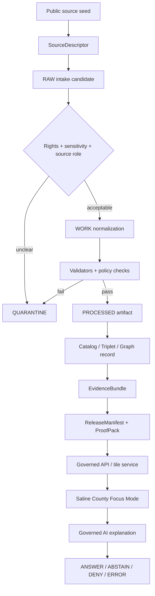
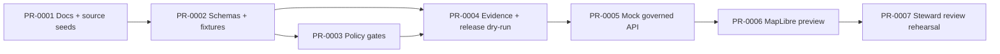
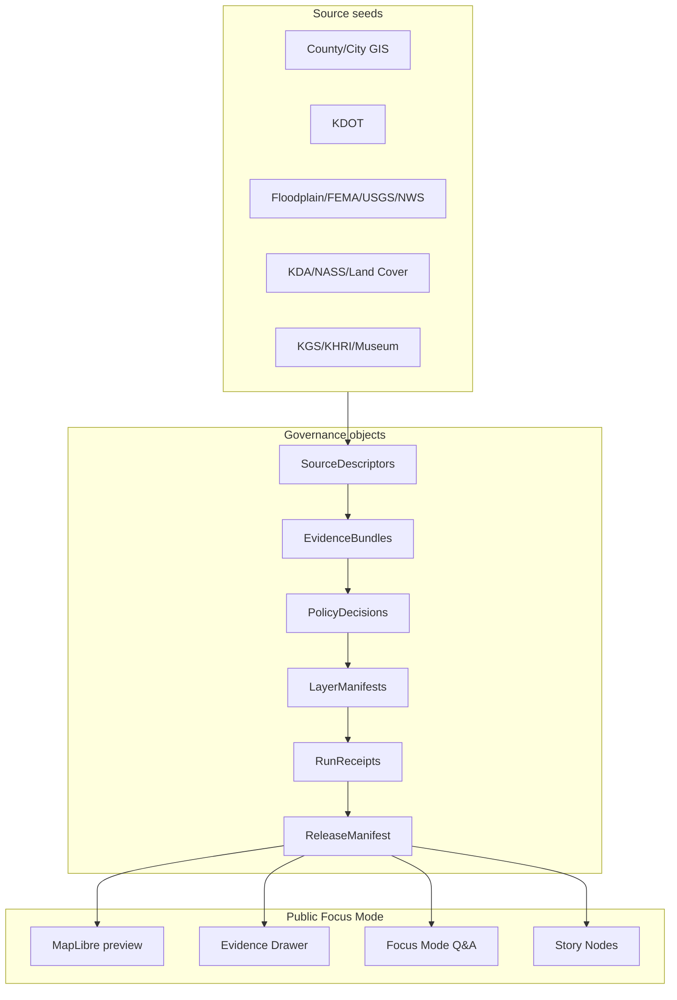

<!--
doc_id: NEEDS_VERIFICATION
title: Saline County Focus Mode Build Plan
type: standard
version: v0.1
status: draft
owners:
  - NEEDS_VERIFICATION
created: 2026-05-21
updated: 2026-05-21
policy_label: public-draft
related:
  - NEEDS_VERIFICATION: docs/doctrine/directory-rules.md
  - NEEDS_VERIFICATION: docs/focus_modes/counties/saline/README.md
  - NEEDS_VERIFICATION: schemas/contracts/v1/focus_mode/county_focus_mode_plan.schema.json
  - NEEDS_VERIFICATION: policy/focus_modes/county_publication.rego
tags:
  - kfm
  - kansas-frontier-matrix
  - focus-mode
  - county
  - saline-county
  - kansas
  - evidence-first
  - map-first
  - governed-ai
notes:
  - PROPOSED county Focus Mode build plan; not a claim of mounted-repo implementation.
  - All paths are PROPOSED until Directory Rules, current repo evidence, and ADRs are checked.
  - Public outputs must distinguish public context from sensitive, restricted, operational, or private details.
-->

<a id="top"></a>

# Saline County Focus Mode Build Plan

> **A KFM county proof-slice plan for a central Kansas hub where transportation, floodplain, agriculture, geology, civic GIS, and historic context meet under one governed map-first interface.**


**Quick links:**  
[Operating posture](#operating-posture) ·
[Why this county](#why-this-county) ·
[Product thesis](#product-thesis) ·
[Scope boundary](#scope-boundary) ·
[First demo layers](#first-demo-layers) ·
[User journeys](#user-journeys) ·
[UI surfaces](#ui-surfaces) ·
[Object model](#governed-object-model) ·
[Repository shape](#proposed-repository-shape) ·
[Build phases](#build-phases) ·
[PR sequence](#first-pr-sequence) ·
[Acceptance](#acceptance-checklist) ·
[Risks](#risk-register) ·
[Sources](#source-seed-list) ·
[Open questions](#open-verification-questions) ·
[Milestone](#recommended-first-milestone)

---

## Operating posture

**Status:** PROPOSED build plan.  
**Repo evidence:** UNKNOWN. No mounted repository was inspected for this document. Do not treat any path, route, schema, validator, fixture, workflow, or UI component below as already present.  
**County selected:** Saline County, Kansas.  
**Primary proof-slice mode:** Public-safe, fixture-first, no-network demo before any live source connector.

> [!IMPORTANT]
> KFM Focus Mode must not become a fluent county encyclopedia. It must be a governed public interface over released artifacts, catalog/triplet/graph records, tile services, EvidenceBundles, and finite runtime envelopes. The map, story cards, and AI explanations are downstream carriers only.

### Governing doctrine preserved

| Rule | Saline County application |
|---|---|
| EvidenceBundle outranks generated language | Every layer, answer, tooltip, and story card must resolve to an EvidenceBundle or abstain. |
| Public clients use governed surfaces | Public UI reads governed APIs, released artifacts, tile services, catalog records, and runtime envelopes only. |
| No public RAW / WORK / QUARANTINE | County source downloads, candidate records, scrape outputs, and unreviewed GIS products stay out of public UI. |
| Publication is a governed state transition | Promotion requires validation, policy decision, proof/receipt closure, release manifest, correction path, and rollback target. |
| AI is interpretive | Focus Mode AI may explain released facts; it must not decide truth, policy, rights, or release state. |
| Cite-or-abstain | Uncited claims, stale sources, ambiguous source roles, and unsupported map interpretation return ABSTAIN, DENY, or ERROR. |
| Sensitive details fail closed | Exact sensitive archaeology, burial/sacred sites, rare species, private property/person data, exact vulnerabilities, and restricted operations are withheld or generalized. |

### Truth labels used in this plan

| Label | Meaning |
|---|---|
| **CONFIRMED** | Verified from browsed public source or supplied KFM doctrine in this planning run. |
| **PROPOSED** | Recommended design, path, schema, fixture, policy, or build step not verified in implementation. |
| **NEEDS_VERIFICATION** | Checkable before use, but not yet checked strongly enough to act as fact. |
| **UNKNOWN** | Not verifiable in this run, usually because repo implementation, source rights, runtime, CI, dashboards, or release state were not inspected. |
| **DENY / ABSTAIN / ERROR** | Finite KFM runtime/policy outcomes, not rhetorical labels. |

---

## Why this county

**Saline County is a strong next KFM proof slice because it compresses several high-value KFM lanes into one manageable county envelope:**

1. **Transportation hub:** Salina sits at the I-70 / I-135 interchange, a statewide east-west and north-south movement node. KDOT’s interchange project page explicitly frames the interchange as crucial to statewide travel and mobility/safety planning.
2. **Hydrology and floodplain:** The Smoky Hill River / Saline River setting supports a floodplain, gage, water-quality-history, and public-safety-context demo without turning KFM into an emergency alert system.
3. **Agriculture and land cover:** Public agriculture statistics and land-cover products can demonstrate crop/land-use context, material-change watch logic, and source-role separation.
4. **Urban / county GIS:** Both county and city GIS surfaces provide public civic map seeds for property, public works, planning, and infrastructure context while forcing KFM to handle the difference between public context and authoritative legal truth.
5. **Geology and historic/cultural context:** KGS county geology resources, KHRI historic-property inventory, museum/local-history sources, and known archaeological sensitivity create a useful public-context-versus-sensitive-detail test.
6. **Good “middle complexity”:** Saline is more complex than a small rural proof slice but less overwhelming than the Kansas City, Wichita, or Topeka metro counties already covered.

> [!NOTE]
> This plan uses Saline County as a county-scale Focus Mode product. It does not claim that Saline County, the City of Salina, KDOT, USGS, FEMA, KDA, KGS, KHRI, NWS, USDA, or any other source endorses KFM.

---

## Product thesis

**Saline County Focus Mode** should let a public user ask:

> “What does the evidence-backed map say about Saline County’s central-Kansas role, floodplain context, land-use/agricultural patterns, transportation corridors, civic geography, and public historical landscape — and what must KFM refuse to reveal?”

The first product should be a **public-safe county evidence panel** with a map, time-aware layer controls, source-backed cards, and a strict separation between:

- public context,
- restricted or sensitive details,
- stale / historical evidence,
- operational feeds,
- interpreted model outputs,
- unreleased candidate artifacts.

### Product promise

| Promise | Required KFM behavior |
|---|---|
| “Show me the county in context.” | Released county boundary, municipalities, major corridors, rivers, and public facilities through governed layers. |
| “Explain why this matters.” | Evidence Drawer cards connect each layer to source role, date, method, limitations, and policy posture. |
| “Let me compare layers.” | Public-safe map overlay controls for hydrology, floodplain, land cover, agriculture, transport, geology, and historical context. |
| “Warn me when the map is not enough.” | Focus Mode must say when a layer is historical, generalized, derived, stale, incomplete, or not suitable for operational decisions. |
| “Do not expose sensitive data.” | DENY or generalize exact locations and private/operational details. |

---

## Scope boundary

### Included in the first Saline County proof slice

| Lane | Included public-safe scope | First artifact type |
|---|---|---|
| Spatial foundation | County boundary, municipalities, basic basemap context, county FIPS, projection metadata | `LayerManifest`, county fixture |
| Hydrology | Smoky Hill / Saline River public context, gage references, floodplain overlays, historical water-quality notes | EvidenceBundle-backed map layer and card |
| Hazards | Floodplain and severe-weather preparedness context; no emergency alert behavior | Public-safe risk context card |
| Roads / rail / trade routes | I-70, I-135, US-81, major nodes, public KDOT project context | Transportation context layer |
| Agriculture | 2022 Census of Agriculture county profile, land-cover/CDL-ready placeholder, material-change watch fixture | Agriculture summary card |
| Urban / settlements / infrastructure | Salina and smaller communities, civic GIS references, public planning context | Settlement layer + public services card |
| Geology / natural resources | KGS geologic map references; public geology and water-resource context | Geology context layer/card |
| Historic / cultural context | KHRI and public museum/local-history references at generalized or public-safe resolution | Historic context card |
| Governed AI / Focus Mode | Evidence-bounded answers over released fixture bundles | RuntimeResponseEnvelope fixture |

### Excluded or restricted by default

| Category | Default KFM posture | Reason |
|---|---|---|
| Exact archaeological, burial, sacred, or culturally sensitive sites | **DENY exact public location** | Public safety, stewardship, cultural sensitivity, legal/ethical risk. |
| Parcel owner names, parcel appraised values as title truth, deed interpretation | **ABSTAIN or restrict** | Assessor/appraiser data is valuation/public-service context, not title truth. |
| Exact utility, airport, bridge, rail, security, or infrastructure vulnerabilities | **DENY / generalize** | Operational security and public safety. |
| Living-person details, genealogy/DNA, private health, minors | **DENY by default** | Privacy and sensitive-person data. |
| Rare species occurrences or sensitive habitat | **Generalize / review_required** | Geoprivacy and ecological sensitivity. |
| Real-time emergency interpretation | **ABSTAIN** | KFM is not an alerting authority. Direct users to official emergency sources. |
| Unreviewed AI-generated summaries | **Not publishable** | Generated text is interpretive, not evidence. |

---

## First demo layers

> [!WARNING]
> First demo layers are PROPOSED. They must be backed by source descriptors, fixtures, policy decisions, EvidenceBundles, validation reports, receipts, and a release manifest before public use.

| Layer ID | Layer title | Public context | Sensitive detail boundary | Source seeds | First fixture |
|---|---|---|---|---|---|
| `saline_admin_context_v0` | County and municipal context | County boundary, Salina, Assaria, Brookville, Gypsum, New Cambria, and other public place context | No parcel owner labels; no private addresses as interpretive truth | Saline County official site, Census QuickFacts | `valid_saline_county_context.v1.json` |
| `saline_transport_hub_v0` | I-70 / I-135 / US-81 corridor context | Major public transportation corridors and KDOT project summary | No bridge vulnerability, design details beyond public KDOT release, or security-sensitive routing | KDOT I-135/I-70 project, KanDrive, public road basemap | `valid_saline_transport_context.v1.json` |
| `saline_floodplain_context_v0` | Floodplain and river context | Kansas effective floodplain viewer, FEMA MSC reference, Smoky Hill / Saline River public context | Not an evacuation, insurance, or emergency alert product | Kansas Floodplain Viewer, FEMA MSC, USGS, NWS gauge pages | `valid_saline_floodplain_context.v1.json` |
| `saline_ag_land_context_v0` | Agriculture and land-cover profile | Farms, acreage, crop/livestock sales, land-cover/CDL placeholder | No private farm financial details, landowner identity, or title claims | KDA Saline County ag profile, USDA NASS, Kansas land cover | `valid_saline_ag_context.v1.json` |
| `saline_geology_context_v0` | Geology and water-resource context | Surficial geology, geologic map references, water-resource framing | No quarry trespass encouragement, groundwater suitability claims without source role | KGS county geologic maps and Saline PDF | `valid_saline_geology_context.v1.json` |
| `saline_historic_context_v0` | Public historic landscape context | KHRI/public museum/local-history inventory as public education layer | Suppress/generalize sensitive archaeological or sacred details | KHRI, Smoky Hill Museum, Salina Public Library local history | `valid_saline_historic_context.v1.json` |
| `saline_weather_context_v0` | Weather and severe-weather context | NWS forecast/preparedness references; climate context only | Not emergency warning, live dispatch, or official forecast reinterpretation | NWS Salina forecast, NWS Wichita/Topeka climate/severe-weather pages | `valid_saline_weather_context.v1.json` |

### Layer trust ladder



---

## User journeys

### Journey 1 — Public resident: “What floodplain context exists near Salina?”

1. User opens Saline County Focus Mode.
2. User toggles `Floodplain and river context`.
3. UI shows public-safe floodplain layer with source badge and “not an emergency alert / not insurance advice” notice.
4. Evidence Drawer lists Kansas Floodplain Viewer, FEMA MSC, USGS/NWS gage context, effective-date fields, and limitations.
5. Focus Mode answers only from released EvidenceBundles.
6. If the user asks for property-specific legal/insurance advice, runtime returns **ABSTAIN** with official-source direction.

### Journey 2 — Planner / civic user: “Why is this county a transport hub?”

1. User toggles `Transportation hub`.
2. Map highlights I-70, I-135, US-81, Salina node, and generalized freight/airport context.
3. KDOT project card explains public project context and current source date.
4. Sensitive infrastructure details remain hidden.
5. Story Node explains that the layer is transportation context, not routing or construction guidance.

### Journey 3 — Researcher: “How do agriculture, land cover, and floodplain overlap?”

1. User turns on agriculture context, land-cover placeholder, and floodplain context.
2. UI provides aggregate county indicators, not field-owner details.
3. Cross-layer compare panel shows overlap classes only after fixtures validate.
4. Evidence Drawer separates observed statistics, land-cover classification, model outputs, and derived overlay.
5. Export is disabled until release manifest confirms public-safe artifact.

### Journey 4 — Student / local history user: “What public historic context can I explore?”

1. User opens historic context.
2. Map displays generalized public historic districts/resources and museum/library source cards.
3. Archaeological/sacred/burial-sensitive categories are hidden, generalized, or replaced with a “restricted by policy” explanation.
4. Focus Mode can explain why some details are intentionally withheld.

### Journey 5 — Steward reviewer: “Can this layer be promoted?”

1. Reviewer opens the Steward Preview for a candidate Saline layer.
2. Validation Report, PolicyDecision, EvidenceBundle, RunReceipt, and ReleaseManifest must all resolve.
3. Review panel flags unresolved source roles, missing rights status, stale timestamps, or sensitive geometry.
4. Promotion is denied until all gates pass.
5. Rollback target is generated before release.

---

## UI surfaces

### Public UI shell

| Surface | Purpose | Must show | Must not show |
|---|---|---|---|
| County Focus Header | Orient user to county and trust posture | County name, status, release date, evidence status, policy label | “Live truth” language |
| Map canvas | Public-safe spatial view | Released layers only, attribution, scale, time control, generalized sensitive layers | RAW/WORK/QUARANTINE, unreleased candidate data |
| Layer Drawer | Toggle and inspect layers | Source role, review state, sensitivity, effective date, last checked date | “Authority” claim without source role |
| Evidence Drawer | Trace selected map/card to evidence | EvidenceBundle, source refs, limitations, policy decision, receipts | Unresolved evidence, direct model text as proof |
| Focus Mode Q&A | Ask bounded questions | Finite answer outcome, citations, confidence boundary | Direct LLM answer detached from evidence |
| Story Node panel | Guided county narratives | Preapproved public-safe story cards | Generated unsourced storylines |
| Steward flags | Show why something is withheld | DENY / ABSTAIN reasons and policy references | Exact restricted details |
| Export panel | Download released artifacts | Release manifest, checksum, license/rights, rollback target | Unreleased files, direct source dumps |

### Focus Mode outcomes

| Outcome | When used | Saline example |
|---|---|---|
| `ANSWER` | EvidenceBundle resolves and policy allows public response | “The KDOT source describes the I-70/I-135 interchange in Saline County as crucial to statewide east/west and north/south travel.” |
| `ABSTAIN` | Evidence is missing, stale, ambiguous, or not fit for purpose | “KFM cannot answer parcel-level flood-insurance eligibility from this map.” |
| `DENY` | Request asks for sensitive/private/restricted details | “Exact sensitive archaeological site coordinates are not available in public Focus Mode.” |
| `ERROR` | System failure, unresolved contract, corrupted fixture, missing release object | “Layer manifest failed integrity validation; no answer produced.” |

---

## Governed object model

### First object families

| Object | Purpose | Saline County first use | Required fields / constraints |
|---|---|---|---|
| `CountyFocusModePlan` | Defines county proof-slice scope and release posture | This build plan | `county_name`, `county_fips`, `status`, `source_seed_refs`, `risk_register_ref` |
| `SourceDescriptor` | Declares source identity, role, rights, cadence, contact, and limitations | Saline GIS, KDOT, KDA, USGS, FEMA, KGS, KHRI | `source_id`, `owner`, `url`, `role`, `rights_status`, `last_checked`, `terms_notes` |
| `EvidenceRef` | Lightweight reference to evidence bundle | Each layer/card citation | Must resolve or return ABSTAIN/ERROR |
| `EvidenceBundle` | Traceable evidence package | Floodplain card, transport card, ag card | Source refs, extracted facts, dates, limitations, policy label |
| `LayerManifest` | Public layer declaration | `saline_floodplain_context_v0` | Layer id, artifact ref, style ref, sensitivity, release ref |
| `PolicyDecision` | Allow/deny/restrict decision | Sensitive archaeology, parcel owner, infrastructure restrictions | Outcome, obligations, reason codes |
| `RuntimeResponseEnvelope` | Finite Focus Mode response | Q&A mock API response | `outcome`, `answer`, `citations`, `limitations`, `policy_decision_ref` |
| `RunReceipt` | Records generation/validation run | Fixture processing dry-run | Tool version, inputs, outputs, hashes, timestamp |
| `ReleaseManifest` | Public release bill of materials | First Saline proof release | Artifact refs, checksum, review state, rollback target |
| `CorrectionNotice` | Public correction mechanism | Fix stale gage/source date or layer warning | Superseded release, reason, replacement, rollback notes |

### Minimal runtime envelope fixture

```json
{
  "schema_version": "v1",
  "object_type": "RuntimeResponseEnvelope",
  "county": {
    "name": "Saline County",
    "state": "Kansas",
    "fips": "20169"
  },
  "question": "Why is Saline County a strong KFM proof slice?",
  "outcome": "ANSWER",
  "answer_markdown": "Saline County combines a central Kansas city, major interstate interchange, river/floodplain context, agriculture, civic GIS, geology, and public historic sources in one manageable county Focus Mode.",
  "evidence_refs": [
    "kfm://evidence/saline/source-seeds/transport-hub",
    "kfm://evidence/saline/source-seeds/floodplain",
    "kfm://evidence/saline/source-seeds/agriculture"
  ],
  "policy": {
    "policy_label": "public",
    "sensitivity": "public_context",
    "obligations": [
      "No exact sensitive archaeology",
      "No parcel owner/title interpretation",
      "No emergency alert language",
      "No critical infrastructure vulnerability detail"
    ]
  },
  "limitations": [
    "PROPOSED fixture; not live KFM runtime evidence.",
    "Source authority, rights, and currentness require verification before publication."
  ]
}
```

---

## Proposed repository shape

> [!CAUTION]
> The following tree is **PROPOSED**. It is based on KFM responsibility-root doctrine, not on a mounted repo inspection. Do not create or move files until Directory Rules, live repo evidence, and applicable ADRs are checked.

### Directory Rules basis

- Root folders are responsibility boundaries, not topic buckets.
- A county must not become a new root folder.
- Documentation belongs under `docs/`.
- Machine-readable contracts/schemas belong under the accepted schema/contract home; supplied Directory Rules indicate `schemas/contracts/v1/<...>` as the default, but live repo convention still needs verification.
- Policy belongs under the policy root used by the repo; `policy/` is shown here as PROPOSED.
- Fixtures belong under `fixtures/`.
- Validators belong under `tools/validators/`.
- Released artifacts belong under governed release/catalog roots, not ad hoc `artifacts/` unless repo doctrine explicitly assigns that responsibility.

### Proposed tree

```text
docs/
  focus_modes/
    counties/
      saline/
        README.md
        saline_county_focus_mode_build_plan.md
        source_seed_register.md
        risk_register.md
        public_safe_layer_plan.md
        steward_review_notes.md

schemas/
  contracts/
    v1/
      focus_mode/
        county_focus_mode_plan.schema.json
        county_focus_mode_layer_manifest.schema.json
        county_focus_mode_runtime_response.schema.json
      evidence/
        evidence_ref.schema.json            # NEEDS_VERIFICATION: may already exist
        evidence_bundle.schema.json         # NEEDS_VERIFICATION: may already exist

fixtures/
  focus_modes/
    counties/
      saline/
        valid/
          valid_saline_county_context.v1.json
          valid_saline_transport_context.v1.json
          valid_saline_floodplain_context.v1.json
          valid_saline_ag_context.v1.json
          valid_saline_geology_context.v1.json
          valid_saline_historic_context.v1.json
          valid_saline_runtime_answer.v1.json
        invalid/
          invalid_saline_unresolved_evidence_ref.v1.json
          invalid_saline_exact_sensitive_archaeology.v1.json
          invalid_saline_parcel_title_claim.v1.json
          invalid_saline_emergency_alert_language.v1.json
          invalid_saline_infrastructure_vulnerability.v1.json
          invalid_saline_stale_operational_feed.v1.json

policy/
  focus_modes/
    county_publication.rego                 # NEEDS_VERIFICATION: repo may use policies/
    saline_public_safety.rego
    saline_sensitive_geometry.rego

tools/
  validators/
    focus_modes/
      validate_county_focus_mode_plan.py
      validate_county_layer_manifest.py
      validate_runtime_response_envelope.py

data/
  catalog/
    stac/
      focus_modes/
        counties/
          saline/
            collection.json                 # PROPOSED released/cataloged artifact only

release/
  focus_modes/
    counties/
      saline/
        release_manifest.v0.1.json
        rollback_plan.v0.1.md
```

### Placement warnings

| Proposed file family | Owning root | Why | Verification gate |
|---|---|---|---|
| Markdown build plan | `docs/` | Documentation/control-plane artifact | Confirm docs convention and naming |
| JSON Schema | `schemas/contracts/v1/` | Machine-readable contract home per supplied Directory Rules | Confirm ADR/schema-home in live repo |
| Rego policy | `policy/` | Policy gate, not validator logic | Confirm whether repo uses `policy/` or `policies/` |
| Fixtures | `fixtures/` | Validation examples and negative-path tests | Confirm fixture naming convention |
| Validators | `tools/validators/` | Fail-closed contract checks | Confirm tool language/test runner |
| STAC catalog | `data/catalog/stac/` | Catalog/release metadata, not raw data | Confirm catalog root and release process |
| Release manifest | `release/` | Publication state, rollback target | Confirm release object model |

---

## Build phases

### Phase 0 — Evidence and placement discovery

**Goal:** verify repo paths, source authority, source rights, currentness, and sensitivity before implementation.

Checklist:

- [ ] Inspect live repo root and Directory Rules.
- [ ] Confirm schema home ADR.
- [ ] Confirm policy root: `policy/` vs `policies/`.
- [ ] Confirm county Focus Mode documentation home.
- [ ] Create or update source seed register.
- [ ] Verify source terms and licenses for each seed.
- [ ] Verify no source requires credentials for public use.
- [ ] Create sensitivity review backlog.
- [ ] Record all UNKNOWNs in a verification register.

### Phase 1 — Source seed registry and no-network fixtures

**Goal:** build the public-safe proof without live ingest.

Deliverables:

- [ ] `source_seed_register.md`
- [ ] source descriptor fixture for each seed
- [ ] valid county context fixture
- [ ] invalid fixtures for unresolved evidence, sensitive coordinates, parcel title claims, emergency language, and infrastructure vulnerability claims
- [ ] initial policy decision fixtures
- [ ] `README.md` explaining public-context boundaries

### Phase 2 — Layer manifests and EvidenceBundles

**Goal:** define map layers as evidence-bound public artifacts.

Deliverables:

- [ ] `LayerManifest` schema
- [ ] `EvidenceBundle` fixtures
- [ ] `saline_admin_context_v0`
- [ ] `saline_transport_hub_v0`
- [ ] `saline_floodplain_context_v0`
- [ ] `saline_ag_land_context_v0`
- [ ] `saline_geology_context_v0`
- [ ] `saline_historic_context_v0`
- [ ] policy decisions for each layer

### Phase 3 — Mock governed API and Focus Mode runtime envelope

**Goal:** prove that the UI reads only governed envelopes.

Deliverables:

- [ ] Mock API fixtures for layer list, layer detail, EvidenceBundle, and Focus Mode answer.
- [ ] RuntimeResponseEnvelope schema.
- [ ] Finite outcomes: `ANSWER`, `ABSTAIN`, `DENY`, `ERROR`.
- [ ] Negative route fixtures showing direct model output is rejected.
- [ ] Evidence Drawer payload examples.

### Phase 4 — Validators, policy tests, and CI hooks

**Goal:** fail closed before any release.

Validation gates:

- [ ] Every EvidenceRef resolves.
- [ ] Every SourceDescriptor has source role, rights status, last checked date, and limitations.
- [ ] Every public layer has policy allow/obligation decision.
- [ ] Every sensitive layer has suppression/generalization receipt.
- [ ] Every runtime answer has citations or returns ABSTAIN.
- [ ] Every release has rollback target.
- [ ] No public layer points to RAW/WORK/QUARANTINE.

### Phase 5 — Public-safe MapLibre mock

**Goal:** create a public UI proof with static, released fixture data.

Deliverables:

- [ ] Layer drawer with policy badges.
- [ ] Evidence Drawer.
- [ ] Focus Mode card.
- [ ] Story Node sequence: “Transportation hub,” “River/floodplain context,” “Agriculture and land cover,” “Public historic landscape.”
- [ ] Export panel disabled until ReleaseManifest exists.
- [ ] Accessibility and keyboard navigation checks.

### Phase 6 — Dry-run promotion and rollback rehearsal

**Goal:** prove publication is a governed transition.

Deliverables:

- [ ] RunReceipt
- [ ] ValidationReport
- [ ] PolicyDecision report
- [ ] ReleaseManifest
- [ ] ProofPack
- [ ] RollbackPlan
- [ ] CorrectionNotice template
- [ ] dry-run release notes

---

## First PR sequence

> [!TIP]
> Keep the first PR small, reversible, and boring. The proof is not UI sparkle; the proof is trust closure.

| PR | Title | Contents | Acceptance gate |
|---|---|---|---|
| PR-0001 | Saline Focus Mode docs and source seeds | Build plan, source seed register, risk register, public-safe layer plan | Markdown lint, no unverified repo claims, source seed table complete |
| PR-0002 | County Focus Mode schemas and fixtures | `CountyFocusModePlan`, `LayerManifest`, `RuntimeResponseEnvelope`, valid/invalid fixtures | Schema validation passes; invalid fixtures fail for expected reasons |
| PR-0003 | Saline policy gates | public-context policy, sensitive geometry policy, emergency-language denial, parcel-title abstention | Policy tests pass with positive and negative cases |
| PR-0004 | EvidenceBundle and release dry-run | EvidenceBundle fixtures, RunReceipt, ReleaseManifest, RollbackPlan | Every EvidenceRef resolves; release dry-run has rollback target |
| PR-0005 | Mock governed API and UI payloads | static mock endpoints / JSON payloads for layer list, evidence drawer, Focus Mode answers | Public UI reads only governed envelopes |
| PR-0006 | MapLibre county preview | public-safe map shell with layer toggles and evidence drawer | no RAW/WORK/QUARANTINE URLs; accessibility checks pass |
| PR-0007 | Steward review rehearsal | reviewer checklist, correction notice test, rollback rehearsal | promotion/correction/rollback path documented and tested |

### PR dependency diagram



---

## Acceptance checklist

### Documentation acceptance

- [ ] KFM Meta Block V2-style comment exists.
- [ ] Truth labels are used for repo paths, source currentness, and claims.
- [ ] County choice is county-specific, not generic.
- [ ] Sensitive details are explicitly excluded.
- [ ] Source seed list includes role, use, rights/currentness notes, and limitations.
- [ ] Proposed paths include owning root and verification gate.
- [ ] Rollback/correction path is visible.

### Source and evidence acceptance

- [ ] Each source seed has a SourceDescriptor.
- [ ] Each SourceDescriptor states source role: primary, corroborating, context, operational, regulatory, historical, or restricted.
- [ ] Each layer has at least one EvidenceBundle.
- [ ] EvidenceBundle contains limitations and source date.
- [ ] No claim appears in Focus Mode without a citation or an ABSTAIN outcome.
- [ ] Stale or historical sources are labeled as such.

### Policy acceptance

- [ ] Exact sensitive archaeology is denied or generalized.
- [ ] Parcel/appraiser data is not presented as ownership/title truth.
- [ ] Floodplain context does not become legal/insurance/emergency advice.
- [ ] Infrastructure vulnerabilities are suppressed or generalized.
- [ ] Rare species/sensitive ecology exact locations are fail-closed.
- [ ] Living-person/private data is denied by default.
- [ ] No AI-generated text is treated as evidence.

### Technical acceptance

- [ ] JSON fixtures validate against schemas.
- [ ] Negative fixtures fail for the expected reason.
- [ ] Policy tests cover allow, deny, abstain, and error outcomes.
- [ ] Mock API returns only governed envelopes.
- [ ] MapLibre layer registry references released artifact IDs only.
- [ ] ReleaseManifest includes hashes, review state, and rollback target.
- [ ] CI can run offline with no network dependency.

---

## Fixture plan

### Valid fixtures

| Fixture | Purpose |
|---|---|
| `valid_saline_county_context.v1.json` | Basic county boundary and public administrative context. |
| `valid_saline_transport_context.v1.json` | Public transportation hub evidence from KDOT and public route context. |
| `valid_saline_floodplain_context.v1.json` | Public floodplain and gage context with non-emergency limitations. |
| `valid_saline_ag_context.v1.json` | Public agriculture statistics and land-cover seed references. |
| `valid_saline_geology_context.v1.json` | KGS geology and water-resource public context. |
| `valid_saline_historic_context.v1.json` | Generalized public historic-resource context. |
| `valid_saline_runtime_answer.v1.json` | Evidence-bounded Focus Mode answer with citations and limitations. |

### Invalid fixtures

| Fixture | Expected failure |
|---|---|
| `invalid_saline_unresolved_evidence_ref.v1.json` | EvidenceRef does not resolve to EvidenceBundle. |
| `invalid_saline_exact_sensitive_archaeology.v1.json` | Exact sensitive archaeology location in public payload. |
| `invalid_saline_parcel_title_claim.v1.json` | Appraiser/parcel data represented as title/ownership truth. |
| `invalid_saline_emergency_alert_language.v1.json` | Flood/weather layer claims emergency-alert authority. |
| `invalid_saline_infrastructure_vulnerability.v1.json` | Exact bridge/airport/utility vulnerability exposed. |
| `invalid_saline_stale_operational_feed.v1.json` | Operational/current layer uses stale feed without ABSTAIN/ERROR. |
| `invalid_saline_uncited_ai_answer.v1.json` | Focus Mode answer lacks citations and does not abstain. |
| `invalid_saline_raw_data_url_public.v1.json` | Public layer points directly to RAW/WORK/QUARANTINE source. |

---

## Risk register

| Risk ID | Risk | County-specific trigger | Default posture | Mitigation |
|---|---|---|---|---|
| R-001 | Floodplain map interpreted as emergency/legal advice | User asks if a property is safe, insurable, or evacuating | ABSTAIN | Provide official-source direction; show limitations and effective date. |
| R-002 | Parcel data treated as land title truth | County appraiser/GIS parcel context used as ownership proof | ABSTAIN / DENY | Label as valuation/public-service context only; no title claims. |
| R-003 | Infrastructure vulnerability exposure | I-70/I-135 bridge/airport/rail/utility details shown too precisely | DENY / generalize | Use public project summaries only; suppress vulnerability details. |
| R-004 | Sensitive archaeology disclosure | Exact archaeological, burial, sacred, or National Historic Landmark site coordinates | DENY exact public location | Use generalized public context; require steward/cultural review. |
| R-005 | Historic resources overexposure | KHRI/public historic property data copied without sensitivity screening | review_required | Split public historic context from restricted cultural-resource details. |
| R-006 | Stale operational weather/water feed | Old gage/forecast displayed as current | ERROR or ABSTAIN | Require `last_checked`, `valid_time`, staleness policy. |
| R-007 | Agriculture inference harms | Farm-level productivity, financial, or owner inference | generalize | County aggregate only; no private farm identity. |
| R-008 | Land-cover classification treated as ground truth | CDL/land-cover class shown as verified parcel crop truth | ABSTAIN on parcel claims | Label as classified/derived with year, uncertainty, and source role. |
| R-009 | Geology source overinterpretation | Public geologic map used for engineering/suitability claims | ABSTAIN | Show educational context; require engineering/geotechnical source for suitability. |
| R-010 | Rare species / ecology exposure | Sensitive occurrence points in public map | DENY exact location | Generalize, suppress, or require geoprivacy review. |
| R-011 | AI answer outruns evidence | Focus Mode invents county narrative | ERROR / ABSTAIN | Require citations, finite outcomes, and evidence resolution. |
| R-012 | Rights/source terms ambiguity | Source terms unclear or credentials needed | QUARANTINE | Do not promote until source rights and terms are verified. |
| R-013 | Parallel authority roots | County folder added at repo root | Reject PR | Follow responsibility-root placement; no topic-as-root drift. |
| R-014 | Release without rollback | Public layer published without correction/rollback target | Block promotion | Require ReleaseManifest + RollbackPlan before public surface. |
| R-015 | Public map implies endorsement | KFM appears to represent official county/city/KDOT/FEMA/USGS policy | Add disclaimer | State source role and non-endorsement; cite official source separately. |

---

## Source seed list

**Retrieval status:** Browsed public web seeds during plan creation on 2026-05-21.  
**Use status:** Source seeds are not yet KFM SourceDescriptors. They require rights, terms, cadence, schema/API, and public-use verification.

| Source seed | URL | Role | First use | Governance notes |
|---|---|---|---|---|
| Saline County official site | https://www.salinecountyks.gov/ | Primary public county context | County identity, area/population statement, departments | Verify reuse terms and whether pages are stable enough for source descriptors. |
| Saline County GIS Mapping | https://www.salinecountyks.gov/gis-mapping | Primary county GIS context | Public GIS applications and spatial data-maintenance role | Do not treat appraiser/parcel data as title truth. |
| Saline County Parcel Search | https://www.salinecountyks.gov/Appraiser/parcelsearch | Restricted/context | Public valuation context, appraiser disclaimer | Use only with strict limitations; no ownership/title claims. |
| City of Salina Maps | https://www.salina-ks.gov/maps | Municipal GIS context | Public city map/gallery and infrastructure GIS context | Avoid exact utility/security-sensitive layers unless explicitly public and reviewed. |
| U.S. Census Bureau QuickFacts | https://www.census.gov/quickfacts/fact/table/salinecountykansas/PST045225 | Primary demographic statistics | County population/context | Use table fields with vintage and source date. |
| KDOT I-135/I-70 Interchange Improvements | https://www.ksdot.gov/projects/i-135-and-i-70-interchange-improvements | Primary transportation project context | Transport hub story and project status | Date-stamp project phase; do not infer current construction beyond source. |
| KanDrive | https://kandrive.gov/ | Operational transportation context | Traffic/weather/road condition source seed | Do not use stale operational data; public UI needs staleness gate. |
| Kansas Current Effective Floodplain Viewer | https://gis2.kda.ks.gov/gis/ksfloodplain/ | Regulatory/public floodplain context | Floodplain layer seed | Must not replace FEMA MSC or legal/insurance interpretation. |
| FEMA Flood Map Service Center | https://msc.fema.gov/ | Official NFIP flood hazard source | Official flood hazard map source | Use for official flood map lookup; parcel/legal advice abstains. |
| USGS Smoky Hill River at New Cambria | https://waterdata.usgs.gov/monitoring-location/06870200/ | Primary water monitoring context | River/gage EvidenceBundle seed | Verify gage relevance to county map extent and time-series fields. |
| NOAA/NWS Smoky Hill River near Mentor gauge | https://water.noaa.gov/gauges/06866500 | Operational river forecast/gage context | Flood impact context | Staleness gate required; not emergency alert product. |
| NWS Salina forecast page | https://www.weather.gov/67401 | Operational weather context | Weather context card | Display only source time and limitations; not KFM forecast authority. |
| Kansas Department of Agriculture — Saline County ag profile | https://www.agriculture.ks.gov/kansas-agriculture/kansas-agricultural-statistics/saline-county | Primary agriculture profile | County ag facts | Keep aggregate; no private farm inference. |
| USDA NASS 2022 Census of Agriculture county profiles | https://www.nass.usda.gov/Publications/AgCensus/2022/Online_Resources/County_Profiles/Kansas/index.php | Primary agriculture source | County agriculture fixture | Use source vintage; verify downloadable profile URL for Saline. |
| Kansas Land Cover map hub | https://hub.arcgis.com/pages/69dc13ab11874803bc58fc048b5572af | Land-cover context | Land-use / land-cover layer seed | Treat as classification/derived product; include year and method. |
| Kansas Land Cover 2015 Level I | https://hub.kansasgis.org/datasets/11e22de3ffa143dfb759806b75d1d5c1/about | Land-cover dataset | Historical land-cover reference | Use year-specific context only; not current land-cover truth. |
| Kansas Geological Survey county geologic maps | https://www.kgs.ku.edu/General/Geology/index.html | Primary geology source directory | Geology layer source seed | Verify Saline map file and citation. |
| KGS Surficial Geology of Saline County PDF | https://www.kgs.ku.edu/General/Geology/County/rs/sa/gifs/M123_SalineGeology_2011_300dpi.pdf | Primary geology map | Public geology/water-resource context | Educational map context; no engineering suitability claims. |
| Kansas Historic Resources Inventory | https://khri.kansasgis.org/ | Historic-resource inventory | Historic context source seed | Review sensitivity and exact-location exposure before mapping. |
| Smoky Hill Museum collections | https://www.smokyhillmuseum.org/researching_our_history/our_collections.html | Local history context | Public history story cards | Museum collections are context; verify rights for media/text reuse. |
| Salina Public Library local history | https://salinapubliclibrary.org/research/local-history/ | Local history context | Public history source seed | Verify rights and citation requirements. |
| NPS NR/NHL record seed: Whiteford/Price Site 14SA1 | https://npgallery.nps.gov/NRHP/GetAsset/NHLS/66000350_text | Sensitive archaeology/historic source | Sensitivity test fixture only | Exact public exposure must be reviewed; do not create public coordinates layer. |

---

## Public context vs sensitive details

| Topic | Public-safe context | Restricted / fail-closed detail |
|---|---|---|
| County GIS | Department role, public map links, generalized civic layers | Parcel owner/title interpretation, private addresses as analytic truth |
| Floodplain | Effective floodplain viewer, FEMA MSC reference, source dates, limitations | Parcel-specific legal/insurance determinations |
| Water | Gage existence, hydrograph link, historical notes | Emergency instruction, stale “current” status, unsupported prediction |
| Transportation | Major routes and public KDOT project context | Detailed vulnerability, restricted design/security details |
| Agriculture | County aggregate farms/acres/sales and land-cover class summaries | Individual farm financials, landowner identities, inferred crop truth by parcel |
| Geology | Public geologic units and educational map context | Engineering/site suitability without appropriate evidence |
| Historic/cultural | Public museum/local-history stories, generalized historic districts | Sensitive archaeology, burial/sacred details, exact restricted locations |
| Weather/hazards | Official NWS link and preparedness context | KFM-issued warnings, dispatch, or emergency orders |
| Ecology | General habitat/land-cover context | Rare species precise occurrences or sensitive habitat details |

---

## Open verification questions

### Repo and Directory Rules

- [ ] What is the confirmed current repository root tree?
- [ ] Is `docs/focus_modes/counties/<county>/` an acceptable documentation home, or should county Focus Mode plans live under a domain/product root?
- [ ] Is `schemas/contracts/v1/` still the accepted schema home?
- [ ] Does the live repo use `policy/`, `policies/`, or both?
- [ ] Are Focus Mode contracts already defined elsewhere?
- [ ] Are EvidenceRef, EvidenceBundle, RuntimeResponseEnvelope, LayerManifest, and ReleaseManifest already implemented?
- [ ] What package manager and validator language are repo-native?

### Source authority and rights

- [ ] What are Saline County GIS reuse terms and attribution requirements?
- [ ] What are City of Salina map/GIS reuse terms?
- [ ] Which FEMA/Kansas floodplain product is authoritative for the first public layer?
- [ ] Which USGS/NWS gages are spatially and hydrologically appropriate for Saline County Focus Mode?
- [ ] Is the KDOT project page sufficient for public transport-hub context, or should KDOT GIS centerline/traffic counts be added?
- [ ] What KDA/NASS data fields should be promoted into the agriculture fixture?
- [ ] What KGS citation should be used for the Saline geologic map?
- [ ] Which KHRI records are public-safe for mapping, and which require suppression or generalization?

### Sensitivity and policy

- [ ] What is KFM’s exact sensitive-geometry generalization rule for archaeology and rare species?
- [ ] What review roles are required for cultural/historic resource content?
- [ ] Should the Whiteford/Price Site be used only as a negative fixture, or can a generalized public context card exist?
- [ ] What level of infrastructure generalization is required for airport/rail/highway nodes?
- [ ] How should appraiser disclaimer language be normalized into SourceDescriptor limitations?
- [ ] What staleness threshold applies to USGS/NWS/KanDrive operational feeds?

### Product and UI

- [ ] What public Focus Mode questions should be allowed for Saline County v0?
- [ ] Should the first demo use static GeoJSON, vector tiles, PMTiles, or mock layer manifests only?
- [ ] What county extent and default zoom should the public map use?
- [ ] How should export be gated until ReleaseManifest exists?
- [ ] Which accessibility checks are required before public preview?

---

## Recommended first milestone

### Milestone: `saline-focus-mode-v0-public-safe-proof`

**Goal:** Create a fixture-only, no-network Saline County Focus Mode proof slice that demonstrates the KFM trust membrane end to end.

**Milestone output:**

- public-safe county context layer,
- transportation hub context layer,
- floodplain/hydrology context layer,
- agriculture/land-cover context layer,
- geology context card,
- generalized historic context card,
- EvidenceBundle fixtures for every displayed claim,
- invalid fixtures for every high-risk failure mode,
- mock governed API payloads,
- Focus Mode finite-response examples,
- release dry-run with rollback plan.

**Definition of done:**

- [ ] All displayed claims have EvidenceRefs.
- [ ] All EvidenceRefs resolve to EvidenceBundles.
- [ ] Every layer has SourceDescriptor, LayerManifest, PolicyDecision, and sensitivity label.
- [ ] No public fixture contains RAW/WORK/QUARANTINE path.
- [ ] Sensitive archaeology and infrastructure fixtures fail closed.
- [ ] Parcel/title and emergency-alert claims abstain or deny.
- [ ] Release dry-run emits ReleaseManifest and RollbackPlan.
- [ ] Public UI mock can be reviewed without live source access.
- [ ] Documentation states what is public context and what is not released.

### Minimal first milestone diagram



---

## Final implementation note

Saline County is a good proof slice precisely because it tempts overreach: parcel GIS looks authoritative, floodplain maps look operational, transportation projects look current, archaeology records look mappable, and AI can tell a fluent civic story. KFM should turn that temptation into the test.

**A successful Saline County Focus Mode does not show everything. It shows only what has earned public release, explains why, and makes the withheld boundaries visible without exposing the withheld details.**

[Back to top](#top)
