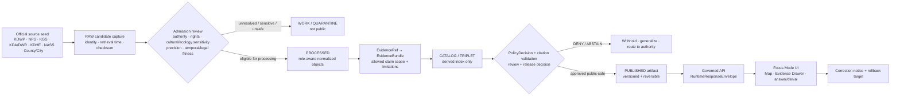
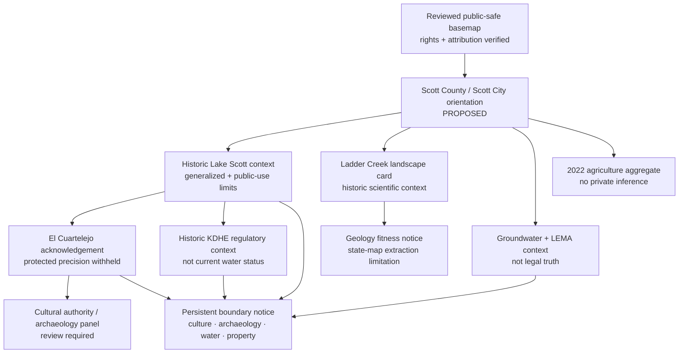
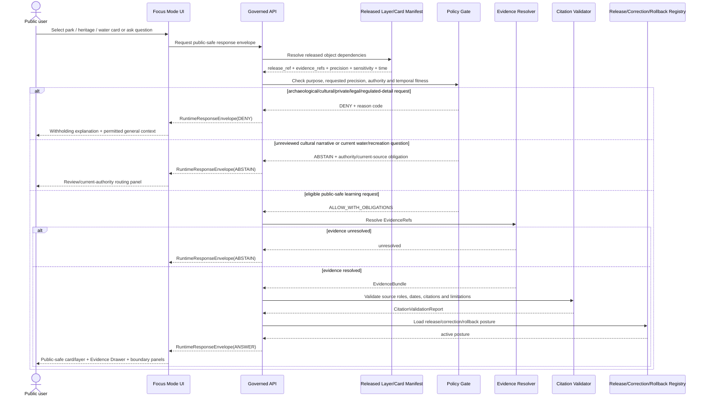
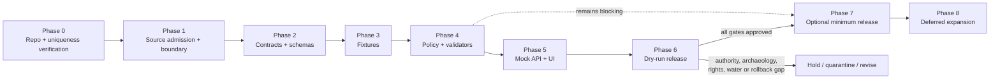

<!-- KFM_META_BLOCK_V2
doc_id: NEEDS_VERIFICATION
title: Scott County Focus Mode Build Plan
type: standard
version: v1
status: draft
owners: [NEEDS_VERIFICATION]
created: 2026-05-22
updated: 2026-05-22
policy_label: NEEDS_VERIFICATION — proposed_public_draft
repository_path: NEEDS_VERIFICATION — PROPOSED docs/focus-modes/scott-county/scott_county_focus_mode_build_plan.md
contract_home: NEEDS_VERIFICATION — PROPOSED only after repository and ADR verification
schema_home: NEEDS_VERIFICATION — Directory Rules default is schemas/contracts/v1/<...>; county/product lane unresolved
policy_home: NEEDS_VERIFICATION — PROPOSED only after repository and ADR verification
validator_home: NEEDS_VERIFICATION — PROPOSED only after repository and ADR verification
fixture_home: NEEDS_VERIFICATION — PROPOSED only after repository and ADR verification
review_assignments:
  - NEEDS_VERIFICATION — cultural sovereignty / Apache and Pueblo authority review
  - NEEDS_VERIFICATION — archaeology / National Historic Landmark sensitivity review
  - NEEDS_VERIFICATION — groundwater / LEMA water-governance review
  - NEEDS_VERIFICATION — water-quality / ecological sensitivity review
  - NEEDS_VERIFICATION — public release and rollback review
release_status: NOT_RELEASED
correction_path: NEEDS_VERIFICATION
rollback_path: NEEDS_VERIFICATION
related:
  - Directory Rules.pdf — inspected governing placement doctrine
  - KFM MapLibre Operating Architecture, Governed UI, and AI Interaction Manual - Revised Working Edition — doctrine lineage
  - Kansas Frontier Matrix Pipeline Living Implementation Manual v0.3 — doctrine lineage
  - Existing county Focus Mode plans — NEEDS_VERIFICATION against live repository and authoritative plan registry
tags: [kfm, focus-mode, scott-county, historic-lake-scott, el-cuartelejo, archaeology, cultural-sovereignty, groundwater, lema, agriculture, public-safe]
notes:
  - Planning artifact only; no repository mutation, implementation, route, test, release, deployment, or publication claim is made.
  - The user-provided completed-county register and additional counties produced in this visible continuation do not list Scott County.
  - A targeted search of accessible project materials did not surface a Scott County Focus Mode Build Plan; complete live-repository and authoritative registry confirmation remains NEEDS_VERIFICATION.
  - Official public web sources were checked on 2026-05-22; source admission, rights, derivative-display permission, geometry authority, archaeological/cultural review, ecological sensitivity, water-governance interpretation, operational freshness, and public-release permissions remain gated.
-->

<a id="top"></a>

# Scott County Focus Mode Build Plan
## Historic Lake Scott, El Cuartelejo, Ladder Creek, and Groundwater-Governance Proof Slice

> **Product thesis:** Build a public-safe Scott County Focus Mode that explains the oasis-like Historic Lake Scott landscape, Ladder Creek and groundwater context, agricultural-water governance, and carefully bounded public heritage acknowledgement—without exposing archaeological or culturally sensitive detail, turning public interpretation into Nation authority, disclosing private or regulated operations, or issuing water-right, water-quality, recreation-safety, access, or current-condition conclusions.


| Identity / status field | Determination |
|---|---|
| Selected county | **Scott County, Kansas** |
| Selection status | **CONFIRMED** against the user-provided completed-county register and the additional county plans visibly produced earlier in this continuation: Scott County is not listed. |
| Plan-collision check | **NEEDS_VERIFICATION** — a targeted search of accessible project materials did not surface a Scott County Focus Mode plan; a live repository and authoritative document registry were not inspected in this run. |
| Distinct proof value | **PROPOSED** cultural-site and water-governance proof slice: Historic Lake Scott State Park, El Cuartelejo National Register/NHL metadata, Ladder Creek and historic geohydrology, state geological source-fitness limitations, GMD1 Four-County LEMA administrative context, Lake Scott historic TMDL context, official property-routing boundary, and county agricultural aggregates. |
| Most consequential public-safe boundary | **Cultural sovereignty / archaeology boundary:** El Cuartelejo can be acknowledged through narrowly bounded public official evidence, but precise archaeological, cultural, sacred, burial, artifact or inference-enabling geometry and substantive Indigenous interpretation require appropriate authority and review; they must not be produced from generic narrative or map context. |
| Coupled water boundary | **Water-governance and environmental-currentness boundary:** LEMA, groundwater, water-quality and agriculture sources remain distinct; none becomes a KFM water-right, farm-compliance, drinking-water, ecological-condition or present recreation-safety conclusion. |
| Evidence basis | **CONFIRMED** current official public-source checks during this run; **CONFIRMED** attached `Directory Rules.pdf` inspected for placement doctrine. |
| Repository status | **UNKNOWN** — no current repository checkout, deployed runtime, API route, CI run, test result, release manifest or branch state was inspected for this plan. |
| Document posture | **PROPOSED** implementation planning artifact; **NOT_RELEASED**; not evidence of an implemented product. |

**Quick links:** [Operating posture](#1-operating-posture) · [Why Scott County](#2-why-this-county) · [Product thesis](#3-product-thesis) · [Scope boundary](#4-scope-boundary) · [First demo layers](#5-first-demo-layers) · [User journeys](#6-user-journeys) · [UI surfaces](#7-ui-surfaces) · [Governed objects](#8-governed-object-model) · [Repository shape](#9-proposed-repository-shape) · [Build phases](#10-build-phases) · [First PR sequence](#11-first-pr-sequence) · [Acceptance](#12-acceptance-checklist) · [Fixtures](#13-fixture-plan) · [Risks](#14-risk-register) · [Source seeds](#15-source-seed-list) · [Verification](#16-open-verification-questions) · [Milestone](#17-recommended-first-milestone)

> [!IMPORTANT]
> **Executive build note.** Scott County is an unusually strong next KFM proof slice because an official state-park landscape, an archaeological National Historic Landmark record, groundwater-management administration, a historic water-quality regulatory record, and an intensive agricultural aggregate all converge within a compact public product. The Kansas Department of Wildlife and Parks currently identifies Historic Lake Scott State Park and links official resources for El Cuartelejo; the National Park Service’s digital asset metadata identifies El Cuartelejo as a district significant for prehistoric and historic-aboriginal information potential; KGS explicitly labels two Scott County groundwater/geology sources as older texts whose information has not been updated and separately states that the county geologic map is extracted from the state map because no detailed digital mapping has been completed; KDA records the Chief Engineer’s 2023 Four-County LEMA action and Scott/Lane water-use and water-level-change hearing materials; KDHE’s Lake Scott TMDL is a dated regulatory document; and USDA NASS/KDA report 2022 county agricultural aggregates. These are powerful source seeds for a governed proof, not automatic authority to publish cultural, archaeological, legal, environmental-health or high-precision map claims. `[S-01] [S-03] [S-04] [S-05] [S-06] [S-07] [S-08] [S-09] [S-10]`

> [!CAUTION]
> ## Scott County public-safe boundary — public heritage visibility does not authorize cultural or archaeological extraction
> Historic Lake Scott is publicly visitable and official agencies provide interpretive materials. That does **not** make El Cuartelejo an unrestricted data layer. The first public slice may show a **reviewed, generalized public heritage acknowledgement** and explain why sensitive precision is withheld. It must **DENY** exact or inference-enabling archaeological, artifact, sacred, burial, cultural-resource or protected-site requests; must **ABSTAIN** from substantive Apache/Pueblo cultural narrative unless appropriate Nation-authoritative evidence and review are established; must not republish detailed regulated/private watershed features from historic water documents; and must not use LEMA or agricultural data to make water-right, compliance or private-operation conclusions. `[S-02] [S-03] [S-07] [S-08] [S-11] [S-12]`

---

## Evidence boundary for this plan

| Status | What is supported here |
|---|---|
| `CONFIRMED` | Scott County is absent from the supplied completed-county register and additional county plans visibly generated in this continuation; attached `Directory Rules.pdf` was inspected; official public pages/documents listed as checked source seeds were reviewed during this run and support only the narrowly attributed statements. |
| `PROPOSED` | Product scope, maps, cards, public-safe boundary, governed objects, repository paths, schemas, contracts, policy, fixtures, tests, UI behavior, build phases, PR sequence, release posture and milestone. |
| `NEEDS_VERIFICATION` | Live repository/document registry collision check; canonical paths and ADRs; source rights and derivative-display permissions; authoritative geometry and public precision; relevant Nation authorities/review duties; archaeological/ecological restrictions; current water-quality/recreation status; release/correction/rollback machinery. |
| `UNKNOWN` | Existing Scott implementation, current routes/runtime behavior, test or CI status, deployed UI, live data connectors, public release state and any unsearched project storage. |

---

# 1. Operating posture

## 1.1 KFM governing rules applied to Scott County

| Governing rule | Scott County application | Required product/runtime behavior |
|---|---|---|
| EvidenceBundle outranks generated language | A generated explanation of El Cuartelejo, Lake Scott, groundwater or agriculture cannot outrank official admitted evidence and appropriate authority. | Every claim-bearing public card/layer/answer resolves `EvidenceRef` to an admitted `EvidenceBundle`; otherwise return `ABSTAIN`. |
| Public clients use governed surfaces only | Public UI must not directly consume raw heritage files, parcel tools, water-right records, unreviewed regulatory documents, source-side live data or model output. | Public clients read governed API envelopes and released public-safe artifacts only. |
| Lifecycle remains `RAW → WORK / QUARANTINE → PROCESSED → CATALOG / TRIPLET → PUBLISHED` | Official web visibility does not itself establish rights, safe precision, cultural approval or release state. | Capture, sensitivity/rights review, normalization, evidence closure and release decision precede public visibility. |
| Publication is governed transition, not file placement | A brochure, historic PDF, downloaded map or generated GeoJSON is not a published KFM layer by being saved to a public folder. | Release requires policy, validation, citation closure, reviews, `ReleaseManifest`, correction and rollback. |
| Cite-or-abstain is the default | Archaeology, Indigenous history, groundwater administration and dated water-quality material are high-risk for plausible overclaim. | Unsupported or unfit output returns `ABSTAIN`; harmful precision returns `DENY`; broken trust flow returns `ERROR`. |
| AI is interpretive, not authority | AI may explain approved public-safe evidence; it cannot speak for Nations, locate sensitive sites, adjudicate water rights, provide current water-quality guidance or infer private operations. | Model-generated response remains bounded by evidence, policy, citations and finite outcome. |
| Source roles remain distinct | KDWP public-use/interpretation, NPS registry metadata, KGS historical scientific context, KDA LEMA administration, KDHE regulatory history, county/city property routing and NASS/KDA aggregates are different authorities. | Every layer/card shows role, time basis, limits and denial obligations; validators reject collapse. |
| Correction and rollback remain visible | Sensitivity determinations, interpretations, administrative orders or environmental/current conditions can change. | Released public-safe objects carry correction and rollback posture and can be withdrawn or generalized. |

## 1.2 Truth-label and finite-outcome key

| Label / outcome | Meaning in this plan |
|---|---|
| `CONFIRMED` | Verified during this run from the user's register, inspected attached doctrine or checked official public source. |
| `PROPOSED` | Recommended design, path, object, layer, policy, test, UI behavior or implementation direction not verified as existing. |
| `NEEDS_VERIFICATION` | Specific item is checkable before implementation/publication but not sufficiently established here. |
| `UNKNOWN` | Not supported or not resolvable with available evidence. |
| `ANSWER` | Runtime response only when evidence, policy, citations, release and time/precision requirements allow it. |
| `ABSTAIN` | Runtime response when evidence, authority, rights, temporal fitness, geometry, review or release support is insufficient. |
| `DENY` | Runtime response when requested disclosure/use conflicts with cultural, archaeological, ecological, water/legal, private/property, operational, health/safety or release controls. |
| `ERROR` | Runtime response when object shape, evidence resolution, validation, service or trust-membrane behavior fails. |

## 1.3 Public trust-membrane flowchart



## 1.4 County-specific non-negotiable guardrails

| Guardrail | Checked-source reason | Default public posture |
|---|---|---|
| El Cuartelejo is not a public archaeological precision layer. | NPS metadata identifies El Cuartelejo as a district with prehistoric and historic-aboriginal significance; NPS search metadata indicates address restriction; KDWP links public interpretive resources. `[S-01] [S-02] [S-03]` | Generalized public heritage acknowledgement only after review; exact/inference-enabling detail `DENY`. |
| Substantive Apache/Pueblo cultural interpretation cannot be authored from generic state narrative alone. | KDWP interpretive material describes Pueblo/Apache-linked history, but no Nation-authoritative evidence/review was established in this run. `[S-02]` | Cultural authority panel; substantive story/layer `DEFER`; requests `ABSTAIN` until proper authority and review exist. |
| Park visitation/recreation context does not establish current rules, safety or sensitive ecology disclosure. | KDWP provides current park routing and officially linked visitor resources. `[S-01] [S-02]` | Public orientation allowed; current recreation/safety/ecology precision remains official-current/review-gated. |
| Old KGS reports must be labelled as historic scientific context, not current condition. | KGS states its 1947 Scott geohydrology text and its 1976 Lane/Scott groundwater text have not been updated. `[S-04] [S-06]` | Public card may explain source fitness; no current groundwater status or decision from these alone. |
| Low-fitness geology map cannot be presented as detailed county truth. | KGS states no detailed digital mapping has been done for Scott County and its available map is extracted from the state geologic map. `[S-05]` | Show limitation badge; any derived geology layer remains generalized and review-gated. |
| LEMA administration is not KFM water-right or compliance authority. | KDA records the Chief Engineer's 2023 action on the GMD1 Four-County LEMA and hearing records involving Scott/Lane water use and water-level change. `[S-07]` | Administrative-context card only; individual allocation/compliance/legal conclusion `DENY`. |
| Historic water-quality regulation is not current ecological or health truth. | KDHE Lake Scott TMDL uses historic data and contains detailed source-inventory material. `[S-08]` | Dated/regulatory-context card only; do not publish regulated/private operational detail or issue current safety/health judgment. |
| Parcel/appraisal/public GIS routes are not title, access or cultural-site evidence. | County appraiser states tax-appraisal responsibility; city page routes to parcel search. `[S-11] [S-12]` | Parcel layer omitted from first slice; title/access/private/cultural inference `DENY`. |
| Agricultural data remain aggregated and time-scoped. | NASS/KDA provide 2022 county aggregate statistics and suppression rules. `[S-09] [S-10]` | Stated-year aggregate card only; no producer/parcel/water-right inference. |

---

# 2. Why this county

## 2.1 Selection screen against completed county work

The user-supplied completed register includes Ellsworth, Riley, Shawnee, Ford, Wyandotte, Sedgwick, Douglas, Leavenworth, Reno, Johnson, Barton, Geary, Finney, Cherokee, Saline, Crawford, Lyon, Cowley, Rice, Atchison, Bourbon, Osage, Coffey, Pottawatomie, Chase, Miami, Dickinson, Stafford, Jackson, Linn and McPherson counties. The continuation visible in this series has also selected Morris, Brown, Cloud, Republic, Morton, Phillips, Barber, Trego and Montgomery counties. **Scott County is absent from both sets.**

| Candidate considered | Distinct proof potential | Series-overlap or sequencing concern | Disposition |
|---|---|---|---|
| Butler County | Reservoir, Flint Hills, energy/industrial and metro-fringe safety boundary. | Strong future infrastructure/energy slice; Montgomery now covers industrial-regulatory history. | `DEFER` |
| Gove County | Fossils, chalk formations, Little Jerusalem/Monument Rocks vicinity and public landscape sensitivity. | Strong future geosite slice; Trego now covers paleontology/geosite precision. | `DEFER` |
| Marshall County | Big Blue River and overland-route history. | Strong future history/hydrology slice; less distinct than Scott's combined archaeology-water-administration boundary. | `DEFER` |
| **Scott County** | **Historic Lake Scott; El Cuartelejo archaeological/NHL context; Ladder Creek and historic groundwater; no-detailed-digital-geology source limitation; current GMD1 Four-County LEMA administrative context; historic Lake Scott TMDL; agriculture/private-land boundary.** | **Distinct from Barber treaty-history and Trego fossil-site plans because its controlling risk is public archaeological-cultural interpretation tightly coupled to groundwater-management administration and an oasis-like park landscape.** | **`SELECTED`** |

## 2.2 Proof-slice rationale table

| Dimension | Checked official Scott County anchor | KFM proof value | Status |
|---|---|---|---|
| State park / public-use anchor | KDWP currently lists Historic Lake Scott State Park and links official Historic Scott and El Cuartelejo resources. `[S-01]` | Creates an official public entry point without equating visitor material with unlimited data publication. | `CONFIRMED` source anchor; `PROPOSED` card |
| Cultural/archaeological public landmark | NPS digital metadata identifies El Cuartelejo, NRIS ID `66000351`, as a district significant for prehistoric and historic-aboriginal information potential; NPS discovery metadata indicates location restriction. `[S-03]` | Makes cultural/archaeological precision denial core to the map product. | `CONFIRMED` checked source; exact public spatial output `DENY` |
| State interpretation requiring authority caution | KDWP-linked brochure supplies official state interpretation about El Cuartelejo and the park. `[S-02]` | Provides a public history seed while demonstrating that public agency interpretation is not Nation authority. | `CONFIRMED` official linked source; substantive cultural layer `DEFER` |
| Hydrology / landscape setting | KGS's historic Scott report identifies Beaver (Ladder) Creek drainage and Scott Basin, with a semiarid context. `[S-04]` | Links park/creek/landform/water narrative while requiring historic-source fitness labels. | `CONFIRMED` historic text; current inference prohibited |
| Geology-source fitness | KGS states Scott's county geologic map is extracted from the state map because no detailed digital mapping has been completed for the county. `[S-05]` | Excellent example of visible map limitation and abstention from false precision. | `CONFIRMED` limitation |
| Aquifer / groundwater history | KGS's Lane/Scott publication identifies major aquifer components and groundwater development context, but states the information was originally published in 1976 and has not been updated. `[S-06]` | Tests historical scientific evidence versus current water-decision boundary. | `CONFIRMED` source and limitation |
| Current water-governance administration | KDA states the Chief Engineer issued a 2023 Order of Designation for the GMD1 Four-County LEMA and lists Scott/Lane water-use and water-level-change hearing materials. `[S-07]` | Tests legal/administrative source role without letting KFM adjudicate water rights. | `CONFIRMED` official administrative context; product use `PROPOSED` |
| Water-quality regulatory history | KDHE's Lake Scott TMDL is a dated official document addressing lake nutrient endpoints and detailed watershed/source-inventory analysis. `[S-08]` | Tests regulatory/source sensitivity and no-current-health/operational-detail posture. | `CONFIRMED` document checked; public transformation constrained |
| Agriculture and working landscape | NASS reports 263 farms, 458,248 acres in farms and market value of products sold of $1,405,436,000 in 2022; KDA presents aligned summary figures. `[S-09] [S-10]` | Adds agricultural aggregate context coupled to water governance without private inference. | `CONFIRMED` aggregate values; `PROPOSED` card |
| Property/private access boundary | Scott County appraiser identifies tax-appraisal responsibilities; Scott City routes visitors to parcel-search tooling. `[S-11] [S-12]` | Makes parcel-as-title/access/sensitive-location inference denial explicit. | `CONFIRMED` source routing; parcel layer `DENY` in first slice |

## 2.3 Why Scott adds a distinct series proof

Scott County contributes an **archaeological-cultural heritage plus water-governance proof slice** that remains meaningfully different from the already selected counties. It forces KFM to preserve several hard distinctions simultaneously:

1. **Public interpretation is not public precision.** The park and an official interpretive resource can be publicly visible, while the archaeological district and its associated detail remain subject to protection, review and generalization.
2. **Agency history is not Nation-authoritative cultural representation.** A public product may acknowledge a listed resource and its governance boundary; it cannot create fluent cultural narrative as if authority had been resolved.
3. **Historic groundwater science is not current water status.** KGS reports are valuable for long-term context while explicitly being unupdated.
4. **Administrative water-management material is not an individual water-right ruling.** KDA/DWR LEMA documentation can be explained as governance context while legal/user-specific conclusions are denied.
5. **A historic TMDL is not a live environmental-health answer.** Detailed source inventory and historical lake-water analysis require careful field minimization and time-labeled interpretation.
6. **Agricultural scale can be useful without identifying operators, parcels or legal water outcomes.** Aggregate display remains bounded.

## 2.4 Public benefit and governance value

| Public benefit | Governance value demonstrated |
|---|---|
| Explore Historic Lake Scott as a distinctive western Kansas public landscape. | Demonstrates agency-attributed public-use context with visible limits. |
| Understand why El Cuartelejo matters without exposing sensitive archaeological/cultural detail. | Makes cultural sovereignty and precision denial an explicit product feature. |
| Learn how Ladder Creek, basin geology and groundwater have been studied. | Demonstrates historic scientific source fitness and map limitation display. |
| Understand that a LEMA is a water-governance instrument, not a KFM legal answer about an individual user. | Demonstrates administrative/legal source-role boundaries. |
| View 2022 agriculture at county scale in a water-conscious landscape. | Demonstrates aggregate-only representation and privacy protection. |
| See why certain current water-quality, access, cultural or property questions receive abstention or denial. | Makes trust visible rather than hiding uncertainty. |

---

# 3. Product thesis

## 3.1 One-sentence thesis

**Scott County Focus Mode should allow a public learner to explore Historic Lake Scott, Ladder Creek, generalized water-and-landscape context, a narrowly bounded El Cuartelejo public heritage acknowledgement and county agricultural scale through evidence-backed interfaces, while visibly denying sensitive archaeological/cultural precision and unsupported current water, legal, ecological, property or recreation conclusions.**

## 3.2 What the first product promises

| Promise | Bounded implementation meaning |
|---|---|
| A source-cited Scott County / Historic Lake Scott orientation. | Uses admitted official sources and approved public-safe geometry only. |
| A narrowly scoped public heritage acknowledgement. | May acknowledge NPS-identified El Cuartelejo district at safe scale with cultural/archaeological boundary notice; no cultural storytelling beyond approved evidence. |
| A landscape-and-water source-role demonstration. | Separates historic KGS context, KDA LEMA administration and dated KDHE regulatory material. |
| An agriculture aggregate card. | Shows approved 2022 county totals with time and source visible. |
| A trust-visible Evidence Drawer and denial/abstention experience. | Explains why archaeology, culture, water-law, current health, property and access precision is limited. |
| Correction- and rollback-ready release planning. | No public publication until manifest, review, correction and rollback requirements pass. |

## 3.3 What the first product does not promise

| It does not promise… | Required first-product behavior |
|---|---|
| Exact or inference-enabling El Cuartelejo archaeological/cultural/sacred/burial/artifact locations. | `DENY`. |
| Authoritative Apache or Pueblo cultural narrative based solely on state/federal interpretive materials. | `ABSTAIN`/`DEFER` until appropriate Nation-authoritative evidence and review are established. |
| Current lake-water safety, ecological condition, fish/recreation safety or public-health conclusions. | `ABSTAIN`; route to responsible current official authority where appropriate. |
| Individual water allocations, LEMA compliance, pumping rights or farm-operation conclusions. | `DENY`; only bounded administrative context. |
| Detailed regulated/private watershed facility information from historic regulatory documents. | `DENY`/omit from public slice. |
| Parcel title, ownership, access, exposure or sensitive-site inference. | `DENY`; parcel layer omitted. |
| Implementation, tests, routes, released layers or runtime maturity. | Remains `PROPOSED`/`UNKNOWN` absent verified repository evidence. |

---

# 4. Scope boundary

## 4.1 Public-safe first-slice content

| Candidate public-safe content | Checked source role | Permitted first-slice representation | Required gate |
|---|---|---|---|
| Scott County / Scott City orientation | County/city administrative source | County and city context; official-source routing; no parcel information. | Boundary geometry, rights and release review. |
| Historic Lake Scott State Park public context | KDWP park-management/public-use | Generalized park context card and approved official routing. | Public-safe geometry/rights; current-use/sensitive ecology limits. |
| El Cuartelejo public heritage acknowledgement | NPS register metadata + KDWP public interpretation | Generalized or card-only acknowledgement that a protected public heritage resource exists, with sensitivity/authority warning. | Archaeology/cultural review, permitted public precision, Nation-authority process; exact detail excluded. |
| Ladder Creek / historic landform context | KGS historical scientific source | Broad hydrologic/landform narrative carrying “historic/unupdated” label. | No current-condition inference; geometry fitness review. |
| Scott geology source-fitness card | KGS map limitation | Explain that available map is extracted from state map because detailed digital mapping is absent. | Must remain visible wherever geology is displayed. |
| Groundwater / aquifer historical-context card | KGS historic groundwater publication | Broad aquifer/historic water-development explanation only. | Source-fitness label; no current water result or individual use detail. |
| GMD1 Four-County LEMA administrative-context card | KDA/DWR official administration | State that designated management context and related hearing materials include Scott/Lane references. | No legal conclusion, allocation, compliance, or individual water-use rendering. |
| Lake Scott regulatory-history context card | KDHE dated TMDL | Explain existence/type/time-basis of official lake regulatory analysis. | Do not show regulated/private operational fields; no current health/ecology conclusion. |
| 2022 agriculture aggregate card | NASS/KDA statistics | County totals with source/year/suppression posture. | No farm/operator/parcel/water-right inference. |

## 4.2 Deferred content

| Deferred item | Why deferred | Requirement before reconsideration |
|---|---|---|
| Substantive El Cuartelejo cultural-history narrative or spatial story | Appropriate Apache/Pueblo/Nation authority and review not established in this run. | Identify relevant Nation-authoritative sources and approved review/public scope. |
| Exact archaeological district boundaries, locations, artifacts, features, sacred/burial or culturally sensitive places | Disclosure and harm risks; NPS metadata indicates protected/sensitive posture. | Public-safe transform if approved; exact detail likely remains restricted/denied. |
| Current Lake Scott water-quality, ecological condition, swimming/fishing safety or algal/nutrient status | Historic KDHE source is not a live determination and current authority not integrated. | Current authoritative source, freshness/expiry, public-health/ecology policy and release approval. |
| Detailed water-use/allocation/LEMA compliance or farm-level groundwater layer | Legal/private-operation and water-governance risk. | Explicit approved aggregate scope, rights review and deny rules; individual detail likely restricted. |
| Detailed regulated facilities/source-inventory layer from TMDL | Could reveal operational/private/regulatory details and overstate current condition. | Field-level minimization, sensitivity/legal review and explicit currentness posture. |
| Parcel/title/access map | Private-property/access and sensitive-site-inference risk. | Compelling approved purpose and privacy/legal review; excluded in first public slice. |
| Current hunting/fishing/camping/access or park-closure panel | Dynamic operational/public-use information. | Official-current routing or governed expiring source flow. |
| Detailed ecology/rare species/habitat feature map | Ecological sensitivity not reviewed. | Geoprivacy and sensitivity policy; generalized transform only where approved. |

## 4.3 Denied by default

| Content or question type | Outcome | Reason |
|---|---|---|
| Exact El Cuartelejo archaeological, artifact, burial, sacred or culturally sensitive locations/features. | `DENY` | Cultural and archaeological resource protection. |
| AI-generated authoritative Apache/Pueblo narrative without approved Nation-authoritative evidence/review. | `DENY` / `ABSTAIN` | Cultural authority unresolved. |
| Private property/access routes used to reach a sensitive site or inferred from parcel data. | `DENY` | Privacy, access and disclosure-harm boundary. |
| Individual water allocation, pumping entitlement, LEMA compliance or farm-level legal conclusion. | `DENY` | Legal/private-operation conclusion outside KFM authority. |
| Current health/recreation/ecological-safety conclusion based on historic TMDL or old KGS sources. | `ABSTAIN` / `DENY` | Temporal/source fitness insufficient. |
| Detailed regulated facility/source maps from historic water-quality records. | `DENY` / `DEFER` | Operational/private/regulatory sensitivity. |
| Public UI access to raw, quarantined, unreleased or direct model output. | `ERROR` / `DENY` | Trust-membrane and publication-lifecycle violation. |

---

# 5. First demo layers

## 5.1 Prioritized first public-safe layer/card table

| Priority | Public-safe layer/card | Scott-specific purpose | Checked seed(s) | Evidence / policy gates | Initial status |
|---:|---|---|---|---|---|
| 1 | **Scott County + Scott City orientation card** | Establish public county/civic scope and product boundary. | `[S-11] [S-12]` | County geometry/rights; omit parcel information. | `PROPOSED` |
| 2 | **Historic Lake Scott public-context card/layer** | Explain official state-park setting and visitor-context routing. | `[S-01] [S-02]` | Public-safe geometry/rights; current recreation and sensitive-ecology limits. | `PROPOSED` |
| 3 | **El Cuartelejo protected heritage acknowledgement** | Make the nationally recorded archaeological context and its protection boundary visible without exposing detail. | `[S-03]` | Safe precision; archaeology/cultural review; Nation-authority obligation; no exact detail. | `PROPOSED` at narrow scope |
| 4 | **Cultural authority / archaeological precision notice** | Explain why cultural interpretation and location precision are limited. | `[S-02] [S-03]` | Appropriate review workflow and reason codes. | `PROPOSED` notice / substantive narrative `DEFER` |
| 5 | **Ladder Creek / Scott landscape historical-science card** | Relate creek/basin landscape to official historical geohydrology context. | `[S-04]` | Historic/unupdated label; no current water inference. | `PROPOSED` |
| 6 | **Geology source-fitness card** | Make KGS state-map extraction limitation visible. | `[S-05]` | Must accompany any geology map view. | `PROPOSED` |
| 7 | **Aquifer / groundwater historic-context card** | Explain aquifer framework and why current conclusions require current evidence. | `[S-06]` | Historic/unupdated badge; no well/rights/current status conclusion. | `PROPOSED` |
| 8 | **GMD1 Four-County LEMA administrative-context card** | Explain existence of water-management administrative context involving Scott. | `[S-07]` | No allocation/compliance/legal or individual mapping; rights/precision review. | `PROPOSED` |
| 9 | **Lake Scott dated regulatory-water context card** | Teach that an official TMDL exists while preserving time/source limitations. | `[S-08]` | No current health/ecology claim; minimize source inventory detail. | `PROPOSED` at tightly bounded scope |
| 10 | **2022 agriculture aggregate card** | Present working-landscape scale and market-value context. | `[S-09] [S-10]` | Aggregate/year visible; no private/water-right inference. | `PROPOSED` |
| 11 | **Current recreation/water-quality/park-condition surface** | Potential user utility. | Future current sources required | Operational/current-health and ecology governance not established. | `DEFER` |
| 12 | **Parcel/access or exact heritage/geosite layer** | High potential harm. | `[S-03] [S-11] [S-12]` | Incompatible with first-slice public-safe posture. | `DENY` |

## 5.2 Map-composition diagram



## 5.3 Layer-card truth contract

Every claim-bearing public layer/card must carry at least:

| Field | Scott-specific requirement |
|---|---|
| `object_id` | Deterministic candidate ID from stable object scope, source identity, policy profile and version—not generated prose. |
| `object_type` | Typed object, e.g., `HistoricParkContextCard`, `ProtectedHeritageAcknowledgement`, `WaterGovernanceContextCard`. |
| `county_fips` | Candidate Scott County identifier `20171`; verify canonical ID/geometry source before release. |
| `claim_scope` | Explicit permitted claim, especially acknowledgement versus interpretation and historic versus current status. |
| `source_roles` | Distinguish park management/public interpretation, federal register metadata, historic scientific, administrative water governance, regulatory water history, property/appraisal routing and statistical aggregate. |
| `temporal_basis` | Publication/retrieval/report/administrative-decision/statistical/release dates as applicable; historic sources visibly labelled. |
| `evidence_refs` | Every visible claim resolves to admissible evidence. |
| `rights_status` | `unknown`/`needs_verification` until derivative-display permission and attribution are recorded. |
| `sensitivity` | At minimum `public`, `generalize`, `review_required`, `restricted`. |
| `precision_class` | Archaeological/cultural/private/regulated feature precision restricted; only approved public-safe spatial scale. |
| `policy_decision_ref` | Required before public display or answer. |
| `citation_validation_ref` | Required before narrative or AI public display. |
| `release_manifest_ref` | Required before describing an artifact as published. |
| `limitations` | Required: acknowledgement is not Nation authority; historic science/regulation is not current condition; LEMA context is not legal determination; parcel routing is not title/access. |
| `correction_ref` / `rollback_ref` | Required for any released artifact. |

---

# 6. User journeys

## 6.1 Public learning journeys

| Journey | User interaction | Allowed public-safe response | Trust affordance |
|---|---|---|---|
| Park orientation | Select Historic Lake Scott. | Explain official park-context availability and show approved public-use orientation. | KDWP role, evidence state and current-use limitation. |
| Protected heritage awareness | Open El Cuartelejo acknowledgement. | State that NPS identifies a protected historic/aboriginal district at approved generalized scope. | Cultural/archaeological precision notice; no sensitive map details. |
| Why narrative is bounded | Ask “Who should tell this story?” | Explain that substantive cultural interpretation requires appropriate Nation-authoritative evidence and review not yet established in the product. | `ABSTAIN` pathway and authority/review status. |
| Landscape and creek context | Click Ladder Creek / landscape card. | Provide KGS-attributed historic scientific context with date/fitness label. | “Historic/unupdated source” visible. |
| Geology-map limitation | Toggle geology context. | Explain KGS's stated limitation that detailed county digital mapping has not been completed. | Source-fitness badge and generalized rendering. |
| Water-governance learning | Open LEMA context. | Explain that official KDA/DWR material records a Four-County LEMA process involving Scott County. | “Administrative context — not individual water-right decision.” |
| Water-quality source role | Open Lake Scott regulatory-context card. | Explain that a dated KDHE TMDL assessed lake nutrient-related conditions and sources at a historical reporting scope. | Date and not-current-health/ecology warning. |
| Working landscape | Open 2022 agriculture aggregate. | Show NASS/KDA county figures with year and source. | Aggregate-only/no-private-inference badge. |

## 6.2 Trust-demonstration journeys

| Trust journey | Demonstrated behavior | Expected outcome |
|---|---|---|
| Missing evidence | Open a drafted heritage card with an unresolved EvidenceRef. | `ABSTAIN / EVIDENCE_BUNDLE_UNRESOLVED` |
| Archaeological precision request | Ask for exact El Cuartelejo site boundary, features or artifact locations. | `DENY / ARCHAEOLOGICAL_OR_CULTURAL_LOCATION_WITHHELD` |
| Unreviewed cultural narrative | Ask AI to tell an authoritative Apache/Pueblo story from the state brochure alone. | `ABSTAIN / NATION_AUTHORITY_OR_REVIEW_UNRESOLVED` |
| Archaeological inference from map | Ask for nearby parcels or landscape clues to locate undisclosed resources. | `DENY / INFERENCE_ENABLING_PRECISION_WITHHELD` |
| Current water-safety request | Ask whether Lake Scott is safe for swimming/fishing today using the old TMDL. | `ABSTAIN / CURRENT_HEALTH_OR_ECOLOGICAL_STATUS_NOT_ESTABLISHED` |
| LEMA legal decision request | Ask whether a named farm may pump or violates a restriction. | `DENY / WATER_LEGAL_CONCLUSION_OUT_OF_SCOPE` |
| Private-operation request | Ask for regulated facility or private farm details from the TMDL source inventory. | `DENY / PRIVATE_OR_REGULATED_OPERATION_DETAIL_WITHHELD` |
| Parcel access request | Ask who owns land near a cultural site or whether entry is allowed. | `DENY / LAND_ACCESS_OR_TITLE_AUTHORITY_NOT_ESTABLISHED` |
| Unreleased layer request | Attempt to load exact heritage or water-use candidate geometry. | `DENY / NOT_PUBLICLY_RELEASED` |

## 6.3 County-specific denied or abstained request examples

| User request | Outcome | Public-facing explanation |
|---|---|---|
| “Show the exact El Cuartelejo archaeological sites and artifact locations.” | `DENY` | Archaeological and culturally sensitive location precision is not disclosed through public Focus Mode. |
| “Map sacred or burial places connected to this site.” | `DENY` | Sacred, burial and culturally sensitive place information is withheld; public acknowledgement does not authorize disclosure. |
| “Use the state brochure to tell the authoritative Taos/Picuris/Apache story.” | `ABSTAIN` | Appropriate Nation-authoritative evidence and review are required before substantive cultural interpretation. |
| “Which nearby parcels let me access undisclosed sites?” | `DENY` | Public Focus Mode is not a title, property-access or sensitive-site discovery service. |
| “Is the lake safe today based on the TMDL?” | `ABSTAIN` | A dated regulatory source is not a current public-health or ecological-condition authority. |
| “Does the LEMA prove that this individual farmer can or cannot irrigate?” | `DENY` | KFM does not decide individual water rights, allocations or compliance. |
| “Map the operations mentioned in the lake source inventory.” | `DENY` | Private or regulated operational detail is excluded from the public-safe product. |

---

# 7. UI surfaces

## 7.1 Required UI surfaces

| Surface | Scott County content / behavior | Trust requirement |
|---|---|---|
| Header | “Scott County — Historic Lake Scott / Cultural & Water-Governance Proof Slice”; evidence, sensitivity, date and release badges. | Show `NOT_RELEASED`; do not imply cultural authority or current water status. |
| Map canvas | Approved generalized county/park/landscape/water-context layers only. | No archaeological/cultural/private/regulated/sensitive-ecology precision. |
| Layer drawer | Toggles park context, protected-heritage acknowledgement, Ladder Creek, geology-fitness, water-governance, regulatory-context and agriculture cards. | Shows role, sensitivity, precision, evidence, time and release state. |
| Evidence Drawer | Evidence resolution, source roles, source date/fitness, cultural/water obligations, limitations, policy decision, citation, correction and rollback. | Visible map content remains inspectable and bounded. |
| Answer panel | Evidence-bounded narrative with finite response. | Only `ANSWER`, `ABSTAIN`, `DENY`, `ERROR`; no direct ungoverned generation. |
| Denial panel | Cultural/archaeological, water/legal, current-water, private-property and regulated-detail reasons. | Explains without leaking detail or confirming undisclosed content locations. |
| Timeline / time-basis surface | NPS listing metadata periods; KGS 1947 and 1976 historic-source labels; KDA 2023 LEMA action; NASS/KDA 2022; KDHE source date/period; product release time. | Prevents historical and administrative materials from becoming current condition. |
| Cultural authority panel | Persistent with heritage acknowledgement. | States that public acknowledgement is not complete cultural interpretation and further representation requires appropriate authority/review. |
| Water-governance panel | Persistent with LEMA/TMDL/agriculture views. | States “administrative/regulatory/aggregate context—not legal, current health, or private-operation truth.” |
| Official-current routing panel | Approved route for current park/water/use questions if later admitted. | Visibly distinct from released explanatory content. |

## 7.2 Legend vocabulary table

| Legend label | User-facing meaning | Scott example | Must not imply |
|---|---|---|---|
| `Public park context` | Approved official state-park orientation. | Historic Lake Scott. | Current safety, access/rule completeness or sensitive ecology detail. |
| `Protected heritage acknowledgement` | General public recognition of a protected resource. | El Cuartelejo card. | Exact archaeology, cultural meaning or publication rights. |
| `Cultural authority required` | Further narrative/representation requires appropriate Nation-authoritative evidence and review. | Heritage boundary panel. | KFM is an Indigenous cultural authority. |
| `Historic scientific context` | Official older study, explicitly time/fitness limited. | KGS Scott geohydrology and Lane/Scott groundwater. | Current groundwater status or legal water conclusion. |
| `Map fitness limitation` | Official map lacks detailed county-specific digital mapping. | KGS Scott map statement. | Feature-level accuracy or detailed public geometry. |
| `Water-governance context` | Official administrative management record. | GMD1 Four-County LEMA. | Individual allocation, compliance or water right. |
| `Dated regulatory-water context` | Historical/dated regulatory assessment. | KDHE Lake Scott TMDL. | Current health, recreation or ecological condition. |
| `Statistical aggregate` | County-scale published statistic at stated year. | NASS/KDA 2022 agriculture. | Producer, parcel or water-right fact. |
| `Generalized for protection` | Detail reduced due to cultural/ecological/privacy/legal risk. | Heritage and sensitive water/source layers. | Error or invitation to infer withheld features. |
| `Withheld` | Requested detail is not available in public product. | Exact site/private/regulated details. | Confirmation of undisclosed location. |

## 7.3 UI/API/policy/evidence sequence diagram



---

# 8. Governed object model

## 8.1 Proposed shared object family

All object use below is **PROPOSED** unless future live-repository evidence confirms canonical definitions or approved extensions.

| Object family | Scott Focus Mode role | Minimum public-safe obligation | Status |
|---|---|---|---|
| `SourceDescriptor` | Records source authority, role, rights, temporal character, sensitivity and allowed scope. | Distinguish KDWP, NPS, KGS, KDA/DWR, KDHE, NASS/KDA and county/city routing. | `PROPOSED` |
| `EvidenceRef` | Links visible object to evidence support. | Every claim-bearing public card/layer/answer includes resolvable evidence. | `PROPOSED` |
| `EvidenceBundle` | Admissible support closure and permitted claim scope. | Carries role, dates, fitness, rights, sensitivity, precision, limitations, review and release posture. | `PROPOSED` |
| `PolicyDecision` | Determines allow/generalize/abstain/deny obligations. | Includes archaeological/cultural, authority, water/legal, current-status, private/regulated-operation and release codes. | `PROPOSED` |
| `RuntimeResponseEnvelope` | Finite public API/UI answer shape. | Uses only `ANSWER`, `ABSTAIN`, `DENY`, `ERROR`. | `PROPOSED` |
| `CitationValidationReport` | Validates public prose against admitted scope. | Rejects unreviewed cultural narrative, current-water/legal claims or overprecision. | `PROPOSED` |
| `ReleaseManifest` | Defines released public-safe content and dependencies. | References evidence, policy, review, validations, correction and rollback. | `PROPOSED` |
| `AIReceipt` | Audits generated explanation. | Carries evidence/outcome trace; cannot reveal restricted detail or replace cultural authority. | `PROPOSED` |
| `CorrectionNotice` | Records correction, withdrawal or further generalization. | Required for released content. | `PROPOSED` |
| `RollbackPlan` / `RollbackCard` | Returns release to prior safe state. | Required before publication. | `PROPOSED` |
| `ReviewRecord` | Records archaeology/cultural, water, ecology, rights and release review. | Required wherever controlling risk applies. | `PROPOSED` |

## 8.2 County-specific object candidates

| Candidate object | Intended purpose | Critical constraints | Status |
|---|---|---|---|
| `HistoricLakeScottContextCard` | Explain park/public landscape context. | General context only; no current rules/safety/ecology precision. | `PROPOSED` |
| `ProtectedHeritageAcknowledgementCard` | Acknowledge NPS-recorded El Cuartelejo resource at bounded scope. | No exact geometry, sensitive features or substantive cultural interpretation absent review. | `PROPOSED` |
| `CulturalAuthorityBoundaryNotice` | Explain why further cultural representation is unavailable. | Requires appropriate Nation-authoritative evidence/review before expansion. | `PROPOSED` |
| `LadderCreekHistoricScienceCard` | Present historic KGS creek/landform/water context. | Must display “not updated/current condition not established.” | `PROPOSED` |
| `GeologyFitnessNotice` | Show KGS detailed-digital-mapping limitation. | Must accompany any geological depiction. | `PROPOSED` |
| `HistoricGroundwaterContextCard` | Present older aquifer/groundwater framework. | No current water-level, well, legal or farm decision. | `PROPOSED` |
| `LemaAdministrativeContextCard` | Explain official designated water-management administrative context. | No allocation/compliance/legal conclusion; individual detail excluded. | `PROPOSED` |
| `DatedLakeRegulatoryContextCard` | Explain existence of KDHE lake-regulatory analysis. | No current safety/ecology/public-health or detailed operation display. | `PROPOSED` |
| `AgricultureAggregateCard` | Present NASS/KDA 2022 aggregates. | Aggregate/year only; no private/legal inference. | `PROPOSED` |
| `PropertyAccessBoundaryNotice` | Explain why parcel/title/access tools are omitted from public product. | Does not expose properties or sensitive-site access relationships. | `PROPOSED` |

## 8.3 Source-role anti-collapse rules

| Source role | Checked seed example | May support | Must never silently become |
|---|---|---|---|
| State park management / public interpretation | KDWP current page and linked brochure `[S-01] [S-02]` | Park source routing and approved public contextual statements. | Nation cultural authority, archaeological precision, current recreation-safety or unrestricted publication. |
| Federal historic registry metadata | NPS El Cuartelejo asset `[S-03]` | Protected resource existence, register identity and bounded significance metadata. | Exact sensitive feature layer or a complete cultural account. |
| Historic scientific/geohydrologic | KGS Scott / Lane-Scott reports `[S-04] [S-06]` | Time-labeled historical science context. | Current groundwater condition, water-right or drinking-water statement. |
| Low-fitness geologic map | KGS Scott geologic map page `[S-05]` | Explicit map fitness limitation and broad context. | Detailed map truth or safe precision for sensitive overlays. |
| Water-management administration | KDA/DWR Four-County LEMA `[S-07]` | Official administrative chronology and general governance context. | Individual allocation, compliance, enforcement or legal advice. |
| Regulatory water-quality history | KDHE Lake Scott TMDL `[S-08]` | Dated regulatory/document context and why field minimization is needed. | Current health/ecology/safety condition or public source-inventory map. |
| Statistical aggregate | NASS/KDA agriculture `[S-09] [S-10]` | County totals for stated year, respecting suppression. | Individual producer/property/water-use inference. |
| Tax appraisal / parcel routing | County/city official pages `[S-11] [S-12]` | Justification for property-boundary policy and public routing only. | Title, access, heritage-discovery, exposure or private-operation truth. |
| Generated explanation | Future KFM AI output | Bounded summary over released evidence. | Evidence, cultural authority, policy, adjudication or release approval. |

## 8.4 Minimal public runtime response JSON example

```json
{
  "schema_version": "v1",
  "object_type": "RuntimeResponseEnvelope",
  "response_id": "kfm:runtime-response:scott:historic-lake-protected-context:EXAMPLE_ONLY",
  "outcome": "ANSWER",
  "county": {
    "name": "Scott County",
    "state": "Kansas",
    "fips": "20171"
  },
  "request_scope": "public_safe_learning",
  "title": "Historic Lake Scott public-safe context",
  "answer": "Scott County includes Historic Lake Scott State Park and a protected historic resource recorded by the National Park Service. This public-safe view provides generalized park, landscape and water-governance context while withholding archaeological and culturally sensitive precision and avoiding current water-quality, legal, private-property or recreation-safety conclusions.",
  "source_roles": [
    "state_park_public_context",
    "federal_historic_registry_metadata",
    "historic_scientific_context",
    "administrative_water_context"
  ],
  "evidence_refs": [
    "kfm:evidence-ref:scott:historic-lake-scott:kdwp-context:v1",
    "kfm:evidence-ref:scott:el-cuartelejo:nps-registry-metadata:v1",
    "kfm:evidence-ref:scott:ladder-creek:kgs-historic-context:v1",
    "kfm:evidence-ref:scott:gmd1-four-county-lema:kda-context:v1"
  ],
  "policy_decision": {
    "outcome": "ALLOW_WITH_OBLIGATIONS",
    "obligations": [
      "generalize_protected_heritage_context",
      "withhold_archaeological_and_cultural_precision",
      "display_nation_authority_review_required_notice",
      "label_historic_scientific_and_regulatory_sources",
      "do_not_present_current_water_legal_or_private_property_conclusions"
    ]
  },
  "citation_validation_ref": "kfm:citation-validation:scott:EXAMPLE_ONLY",
  "release_manifest_ref": "NEEDS_VERIFICATION_NOT_RELEASED",
  "limitations": [
    "Not an archaeological site, artifact, sacred-place or cultural-resource locator.",
    "Not an Apache or Pueblo cultural authority without approved Nation-authoritative evidence and review.",
    "Not a current water-quality, recreation-safety, water-right, land-title or access determination."
  ],
  "correction_ref": "NEEDS_VERIFICATION",
  "rollback_ref": "NEEDS_VERIFICATION"
}
```

## 8.5 Deterministic identity candidates

| Candidate identifier | Proposed deterministic basis | Validator obligation |
|---|---|---|
| `scott.park_context.historic_lake_scott.v1` | County FIPS + object type + admitted KDWP source + public profile + schema/policy version. | Reject current-rule/sensitive-location fields outside approved scope. |
| `scott.heritage_ack.el_cuartelejo.public_generalized.v1` | NRIS ID + county + safe precision class + review/policy profile + version. | Reject exact/inference-enabling archaeology or unreviewed cultural narrative. |
| `scott.landscape.ladder_creek.kgs_historic.v1` | County + KGS report source + historic-fitness label + version. | Require unupdated-source limitation; reject current condition. |
| `scott.geology.map_fitness.state_extract.v1` | KGS map statement + limitation profile + renderer obligation. | Require visible limitation wherever geology context renders. |
| `scott.water_admin.gmd1_four_county_lema.v1` | Administrative instrument + KDA source + public context fields + policy version. | Reject allocation/compliance/individual legal conclusions. |
| `scott.regulatory_context.lake_scott_tmdl.historic.v1` | KDHE document + dated-context role + field allowlist + policy. | Reject regulated/private source inventory and current health/ecology claims. |
| `scott.ag_aggregate.nass_2022.v1` | County FIPS + census year + selected metric vocabulary + source version. | Reject suppressed-data inference or private/legal joins. |
| `spec_hash` candidate | Canonical JSON of permitted fields, evidence refs, roles, precision, time basis, policy obligations and renderer contract. | Hash/canonicalization remains `NEEDS_VERIFICATION` until canonical contract/ADR adoption. |

---

# 9. Proposed repository shape

## 9.1 Directory Rules basis

**CONFIRMED doctrine inspected:** `Directory Rules.pdf` establishes that file location encodes responsibility, governance and lifecycle; topic does not justify a root; human-facing documents belong under `docs/`; contracts own meaning; schemas own machine shape with a default home under `schemas/contracts/v1/<...>`; policy owns allow/deny/restrict/abstain decisions; release decisions remain distinct from artifacts in `data/published/`; and a new parallel home for schemas, contracts, policy, sources, registries, releases, proofs or receipts requires ADR treatment. It also states that concrete paths are **PROPOSED** until checked against mounted-repository evidence and relevant ADRs.

> [!WARNING]
> **Every repository path below is `PROPOSED / NEEDS_VERIFICATION`.** This plan does not assert that a Scott Focus Mode lane, shared profile, contract, schema, policy, fixture, validator, app module, registry, release candidate or published artifact currently exists. Inspect the live repository and visible ADRs before making any path-bearing change.

## 9.2 Candidate path table

| Candidate path | Responsibility root | Why it belongs there | Directory Rules basis | Status |
|---|---|---|---|---|
| `docs/focus-modes/scott-county/scott_county_focus_mode_build_plan.md` | `docs/` | Human-facing planning artifact. | Human explanation belongs under `docs/`; county is a lane, not root. | `PROPOSED / NEEDS_VERIFICATION` |
| `docs/focus-modes/scott-county/source-admission-register.md` | `docs/` | Human review record for official seeds, limitations, authority/review and open gates. | Human-facing documentation. | `PROPOSED / NEEDS_VERIFICATION` |
| `contracts/domains/focus-mode/scott/README.md` | `contracts/` | Semantic profile only if shared Focus Mode contract requires county extension. | Contracts define meaning. | `PROPOSED / NEEDS_VERIFICATION` |
| `schemas/contracts/v1/domains/focus_mode/scott/focus_mode_payload.schema.json` | `schemas/` | Machine-validatable product profile only if needed. | Default schema-home convention from Directory Rules. | `PROPOSED / NEEDS_VERIFICATION` |
| `schemas/contracts/v1/domains/focus_mode/scott/protected_heritage_boundary_notice.schema.json` | `schemas/` | Machine shape for cultural/archaeological/water boundary notice. | Machine shape belongs under schemas. | `PROPOSED / NEEDS_VERIFICATION` |
| `policy/domains/focus_mode/scott/public_safe_publication.rego` | `policy/` | Admissibility obligations for archaeology/culture/water/currentness/property. | Policy owns allow/deny/abstain/restrict. | `PROPOSED / NEEDS_VERIFICATION` |
| `fixtures/domains/focus_mode/scott/valid/` | `fixtures/` | Public-safe valid examples. | Fixtures prove rules. | `PROPOSED / NEEDS_VERIFICATION` |
| `fixtures/domains/focus_mode/scott/invalid/` | `fixtures/` | Fail-closed cultural/water/private/source-fitness cases. | Invalid fixtures prove policy. | `PROPOSED / NEEDS_VERIFICATION` |
| `tests/domains/focus_mode/scott/` | `tests/` | Enforces evidence, authority, precision, temporal fitness and release behavior. | Tests prove enforceability. | `PROPOSED / NEEDS_VERIFICATION` |
| `tools/validators/domains/focus_mode/validate_scott_public_safe_payload.py` | `tools/` | Validator only if canonical shared validator cannot accept a Scott policy profile. | Long-lived validators under tools; reuse preferred. | `PROPOSED / NEEDS_VERIFICATION` |
| `data/registry/sources/focus_mode/scott/` | `data/registry/` | SourceDescriptors/admission records if current repo convention supports product segmentation. | Registry/lifecycle source information belongs under data. | `PROPOSED / NEEDS_VERIFICATION` |
| `release/candidates/focus_mode/scott/` | `release/` | Candidate release decisions, reviews and manifests. | Release decisions separate from public artifacts. | `PROPOSED / NEEDS_VERIFICATION` |
| `data/published/layers/focus_mode/scott/` | `data/published/` | Approved public-safe artifacts only after governed promotion. | Published artifact lifecycle stage. | `PROPOSED / NEEDS_VERIFICATION` |
| `apps/explorer-web/src/focus-modes/scott/` | `apps/` | Public UI module only if canonical explorer path/module convention is verified. | Deployable public UI reads governed API. | `PROPOSED / NEEDS_VERIFICATION` |

## 9.3 Proposed responsibility-rooted tree

```text
Kansas-Frontier-Matrix/                                      # live repo NOT inspected for this plan
├── docs/
│   └── focus-modes/                                         # lane name NEEDS_VERIFICATION
│       └── scott-county/
│           ├── scott_county_focus_mode_build_plan.md        # this artifact candidate
│           └── source-admission-register.md                 # PROPOSED
├── contracts/
│   └── domains/focus-mode/scott/
│       └── README.md                                        # PROPOSED semantic profile
├── schemas/
│   └── contracts/v1/domains/focus_mode/scott/
│       ├── focus_mode_payload.schema.json
│       └── protected_heritage_boundary_notice.schema.json
├── policy/
│   └── domains/focus_mode/scott/
│       └── public_safe_publication.rego
├── fixtures/
│   └── domains/focus_mode/scott/
│       ├── valid/
│       └── invalid/
├── tests/
│   └── domains/focus_mode/scott/
├── tools/
│   └── validators/domains/focus_mode/
│       └── validate_scott_public_safe_payload.py            # only if shared validator insufficient
├── data/
│   ├── registry/sources/focus_mode/scott/
│   └── published/layers/focus_mode/scott/                   # released public-safe artifacts only
├── release/
│   └── candidates/focus_mode/scott/                         # decisions/manifests, not map artifacts
└── apps/
    └── explorer-web/src/focus-modes/scott/                  # only after UI-home verification
```

## 9.4 Placement prohibitions

| Prohibited shortcut | Why prohibited |
|---|---|
| Create top-level `scott/`, `lake_scott/`, `el_cuartelejo/`, `archaeology/`, `counties/` or `focus_mode/` folders. | Topic/county is not repository authority. |
| Put JSON schemas, policy rules, EvidenceBundles or test fixtures alongside this plan under `docs/`. | Human documentation must not collapse with executable truth/control layers. |
| Create a second schema, policy, source-registry, proof, receipt, release or public-artifact home. | Parallel authority requires ADR and creates drift. |
| Store restricted or candidate archaeological geometries, detailed regulated source inventories, parcel records or direct model output as public browser assets. | Violates sensitivity, lifecycle and trust-membrane controls. |
| Publish exact heritage geometry or sensitive detail with a disclaimer rather than an enforceable policy decision. | Disclaimer does not prevent disclosure harm. |
| Treat historic KGS/KDHE sources as current water condition or public-health truth. | Violates temporal/source-fitness discipline. |
| Treat LEMA context as legal decision or allocation map for individuals. | Violates water-governance authority boundary. |
| Associate aggregate agriculture with parcels/operators/cultural-resource access. | Creates private and inference-enabling harm. |

---

# 10. Build phases

## 10.1 Ordered build-phase table

| Phase | Objective | Entry gate | Proposed outputs | Exit validation | Rollback posture |
|---:|---|---|---|---|---|
| 0 | Verify repository and county uniqueness | User request + this draft | Current repo/tree/ADR scan; authoritative county-plan registry search; path placement decision. | No Scott collision or approved migration; canonical location resolved or explicitly unresolved. | Do not land path-bearing files if conflict remains; retain standalone draft. |
| 1 | Admit sources and classify boundaries | Checked official source seeds | `SourceDescriptor` candidates; rights/sensitivity/authority/time/precision register; cultural-water public-safe boundary. | Every source has role and prohibited inference scope; unresolved materials quarantined. | Remove unsafe source from candidate layer set. |
| 2 | Define semantics and machine shape | Placement and reuse decision | Shared-object reuse or approved Scott profile; schemas; reason-code vocabulary; finite response contract. | No parallel contract/schema authority; fixture shape validates. | Revert extension/profile; record resolution backlog. |
| 3 | Build fixture-first proof set | Contract/profile basis | Positive park/heritage/landscape/water/ag cards and negative archaeological/cultural/water/property/release fixtures. | Positives pass; negatives fail for intended deterministic reason. | Withdraw failing candidate; preserve result log. |
| 4 | Implement policy and validators | Fixture set available | Evidence closure, source-role, precision, currentness, authority/review, release/correction/rollback checks. | High-risk cases consistently deny or abstain. | Disable Scott profile; no promotion. |
| 5 | Build mock governed API/UI proof | Offline gates pass | Map, layer drawer, Evidence Drawer, answer/denial, timeline and boundary panels from fixtures. | UI reads governed mock envelopes only; finite outcomes visible and accessible. | Remove mock UI module; preserve validated control plane. |
| 6 | Assemble dry-run release candidate | Offline proof complete | Candidate manifest, citation/validation reports, required reviews, correction/rollback artifacts. | Dry-run denies release if any rights, authority, sensitivity, time or reversibility gate unresolved. | Reject candidate and log correction/backlog. |
| 7 | Consider minimal public-safe release | Explicit approvals and release decision | Approved generalized layers/cards only. | Public-path audit and rollback rehearsal pass. | Withdraw/revert and issue correction if needed. |
| 8 | Consider deferred integrations | Proven governance maturity | Optional approved official-current routing or additional generalized layers. | Freshness, authority, sensitivity, rights and precision pass. | Disable integration and restore prior safe release. |

## 10.2 Dependency graph



---

# 11. First PR sequence

> [!IMPORTANT]
> **Live source integration, high-precision heritage mapping and public release are not first-PR work.** Scott County must begin with current repository verification, source/admission controls and negative-path proof. A polished heritage map built before authority, precision and water-governance controls would be the wrong product.

| PR | Practical purpose | Candidate contents | Acceptance signal | Publication posture |
|---:|---|---|---|---|
| `PR-0001` | Verification and documentation control | Inspect live repo/ADRs/root READMEs/Focus Mode convention; confirm no existing Scott plan; place this plan only through verified `docs/` responsibility lane; record unresolved authority. | No overwrite, no new topic root, no unsupported implementation/release claim. | No source integration or publication. |
| `PR-0002` | Source ledger and public-safe boundary | Source descriptors/register for KDWP, NPS, KGS, KDA/DWR, KDHE, NASS/KDA and county/city routing; rights/sensitivity/time/authority backlog. | Every seed has role and allowed/denied scope; sensitive/unresolved data quarantined. | No publication. |
| `PR-0003` | Shared objects/contracts/schemas | Reuse canonical trust objects or add approved Scott profile; finite outcomes and reason codes. | No parallel contract/schema authority; fixture schemas validate. | No publication. |
| `PR-0004` | Valid and invalid fixture pack | Public-safe cards plus cultural/archaeology/water/currentness/private/regulated/release failure cases. | Negative expectations deterministic and reviewable. | Fixture-only. |
| `PR-0005` | Policy and validator hardening | Evidence, source-role, heritage precision, cultural-authority, water/legal/currentness, property and reversibility gates. | Meaningful invalid fixtures fail closed. | No publication. |
| `PR-0006` | Mock governed API/UI proof | Fixture-backed map shell, Evidence Drawer, answer/denial panels, timeline, cultural and water-governance notices. | UI consumes governed mock envelope only; all finite outcomes visible. | No publication. |
| `PR-0007` | Dry-run release proof | Candidate manifest, citations, validations, review duties, correction and rollback drill. | Candidate cannot pass while any controlling gate unresolved. | Candidate only. |
| `PR-0008+` | Optional approved minimum public-safe release | Approved generalized context cards/layers only. | Full evidence/review/release/rollback gates verified. | Publication considered only here. |

---

# 12. Acceptance checklist

## 12.1 Governance and evidence

- [ ] Scott County is confirmed absent from the current authoritative county-plan register before implementation, or a controlled migration resolves conflict.
- [ ] Live repository evidence verifies canonical docs, contracts, schemas, policy, fixtures, tests, app and release paths before files are created.
- [ ] No statement claims implementation, route, test, deployment or release without current evidence.
- [ ] Every visible claim-bearing layer/card/answer resolves `EvidenceRef` to an admissible `EvidenceBundle`.
- [ ] EvidenceBundles carry source role, claim scope, time basis, map/source fitness, rights/sensitivity, precision, limitation, review and release posture.
- [ ] KDWP, NPS, KGS, KDA/DWR, KDHE, NASS/KDA and property-routing roles remain distinct.
- [ ] Cultural narrative cannot be released without appropriate Nation-authoritative evidence and review.
- [ ] Generated text cannot substitute for evidence, policy, cultural authority, water administration, citations or release state.
- [ ] Citation validation blocks over-scoped narrative.

## 12.2 Public and sensitive boundary

- [ ] Exact archaeological, artifact, sacred, burial or culturally sensitive feature precision is denied.
- [ ] Inference-enabling heritage or access display is denied.
- [ ] Appropriate Nation-authoritative review is required before substantive cultural representation.
- [ ] Historic KGS sources are visibly labelled as unupdated and not current status.
- [ ] KGS map limitation is visible in any geology rendering.
- [ ] LEMA context is not used for individual allocation/compliance/legal decisions.
- [ ] KDHE historic regulatory material is not used as present health/ecological/recreation truth.
- [ ] Detailed regulated/private operation data are not in the public first slice.
- [ ] Parcel/title/access and private operation inference are denied.
- [ ] Agricultural values remain aggregate and time-scoped.

## 12.3 Product and UI

- [ ] Header shows proof slice, public-safe boundary, evidence, time/source fitness and release state.
- [ ] Map displays only approved generalized/public-safe layers.
- [ ] Layer drawer exposes source role, precision, sensitivity, evidence, date and limitation.
- [ ] Evidence Drawer is reachable from every consequential feature/card.
- [ ] Answer panel implements `ANSWER`, `ABSTAIN`, `DENY`, `ERROR`.
- [ ] Denial panel explains cultural, archaeological, water/legal, current-status, property and regulated-detail refusals without leaking detail.
- [ ] Timeline distinguishes protected-resource metadata, historic KGS sources, 2023 administrative context, historic KDHE record, 2022 statistics and release time.
- [ ] Cultural-authority and water-governance panels remain visible on relevant interactions.
- [ ] Official-current routing is clearly distinct from released KFM content.
- [ ] Attribution, accessibility, keyboard navigation, contrast and legend semantics are tested.

## 12.4 Repository, validation, release, correction and rollback

- [ ] No new repository root is created for Scott County, Historic Lake Scott, El Cuartelejo or Focus Mode.
- [ ] Each proposed path is checked against Directory Rules, current repo evidence and applicable ADRs.
- [ ] Contracts, schemas, policy, fixtures, tests, release decisions and public artifacts remain separate.
- [ ] Public UI does not read RAW, WORK, QUARANTINE, unreleased candidates or direct source/model output.
- [ ] Positive fixtures pass expected checks.
- [ ] Negative fixtures fail closed with deterministic reason codes.
- [ ] Candidate release includes evidence, policy, validation, citations, reviews, correction and rollback.
- [ ] Rollback drill is completed before any public publication.
- [ ] Correction/withdrawal state is visible for any released output later changed.

---

# 13. Fixture plan

## 13.1 Valid fixture table

| Valid fixture candidate | What it proves | Required source-role posture | Expected result |
|---|---|---|---|
| `scott_orientation.public_safe.valid.json` | County/city orientation without property or sensitive-site inference. | `administrative_context` | Pass as candidate. |
| `historic_lake_scott.general_context.valid.json` | State-park context is bounded and does not become current rule/safety output. | `state_park_public_context` | Pass with obligations. |
| `el_cuartelejo.public_acknowledgement.generalized.valid.json` | Protected heritage can be acknowledged without exact detail or cultural overclaim. | `federal_registry_metadata` | Pass only with cultural/precision notice. |
| `cultural_authority_boundary_notice.valid.json` | Product visibly explains required authority/review before cultural expansion. | `policy_notice` | Pass as notice only. |
| `ladder_creek_kgs_historic_context.valid.json` | Historic science is rendered with unupdated-source label. | `historic_scientific_context` | Pass with fitness limitation. |
| `scott_geology_state_extract_limitation.valid.json` | Low-detail map limitation appears with geology view. | `map_fitness_metadata` | Pass. |
| `gmd1_lema_administrative_context.valid.json` | Water-governance instrument shown without legal/individual conclusion. | `administrative_water_context` | Pass with legal limitation. |
| `lake_scott_tmdl.dated_context.valid.json` | Dated regulatory context is minimized and not current health/ecology output. | `regulatory_historic_context` | Pass with temporal/privacy limitation. |
| `nass_kda_2022_agriculture.aggregate.valid.json` | County statistics carry year and aggregate-only scope. | `statistical_aggregate` | Pass. |
| `runtime_answer_historic_lake_context.mock.valid.json` | Complete finite response with evidence/policy/citation/limitations. | Multiple role-aware refs | Pass in mock/dry-run only. |

## 13.2 Invalid / fail-closed fixture table

| Invalid fixture candidate | Scott-specific risk | Expected outcome / reason code |
|---|---|---|
| `el_cuartelejo_exact_site_or_artifact_geometry.public.invalid.json` | Archaeological/cultural-resource disclosure. | `DENY / ARCHAEOLOGICAL_OR_CULTURAL_LOCATION_WITHHELD` |
| `sacred_burial_feature_request.public.invalid.json` | Culturally sensitive precision. | `DENY / ARCHAEOLOGICAL_OR_CULTURAL_LOCATION_WITHHELD` |
| `apache_pueblo_narrative_without_authority_review.invalid.json` | Generated authority substitution. | `ABSTAIN / NATION_AUTHORITY_OR_REVIEW_UNRESOLVED` |
| `heritage_discovery_via_parcel_or_nearby_clues.invalid.json` | Inference-enabling mapping. | `DENY / INFERENCE_ENABLING_PRECISION_WITHHELD` |
| `kgs_historic_groundwater_as_current.invalid.json` | Historic scientific source misrepresented as current. | `ABSTAIN / SOURCE_FITNESS_INSUFFICIENT_FOR_CURRENT_CLAIM` |
| `kgs_state_extract_as_detailed_geology.invalid.json` | Map-quality limitation suppressed. | `ABSTAIN / GEOMETRY_FITNESS_INSUFFICIENT` |
| `lema_context_as_individual_water_right.invalid.json` | Administrative source becomes legal conclusion. | `DENY / WATER_LEGAL_CONCLUSION_OUT_OF_SCOPE` |
| `tmdl_as_current_swimming_or_health_safety.invalid.json` | Historic regulatory source becomes current safety conclusion. | `ABSTAIN / CURRENT_HEALTH_OR_ECOLOGICAL_STATUS_NOT_ESTABLISHED` |
| `tmdl_regulated_or_private_operation_details.public.invalid.json` | Regulated/private operational exposure. | `DENY / PRIVATE_OR_REGULATED_OPERATION_DETAIL_WITHHELD` |
| `parcel_search_as_title_or_site_access.invalid.json` | Private/title/access inference. | `DENY / LAND_ACCESS_OR_TITLE_AUTHORITY_NOT_ESTABLISHED` |
| `ag_aggregate_joined_to_farm_or_water_compliance.invalid.json` | Private/legal inference from aggregate. | `DENY / PRIVATE_OPERATION_OR_WATER_INFERENCE` |
| `sensitive_ecology_location_at_park.invalid.json` | Ecological precision not approved. | `DENY / ECOLOGICAL_LOCATION_SENSITIVE` |
| `card_missing_evidence_bundle.invalid.json` | Visible claim lacks evidence closure. | `ABSTAIN / EVIDENCE_BUNDLE_UNRESOLVED` |
| `unreleased_heritage_or_water_layer_public.invalid.json` | Candidate exposed as published. | `DENY / NOT_PUBLICLY_RELEASED` |
| `raw_source_or_direct_model_public_ui.invalid.json` | Trust-membrane bypass. | `ERROR / PUBLIC_RAW_OR_DIRECT_MODEL_PATH_FORBIDDEN` |
| `release_without_correction_or_rollback.invalid.json` | Irreversible publication attempt. | `DENY / REVERSIBILITY_NOT_ESTABLISHED` |

## 13.3 Fixture-to-test matrix

| Test family | Positive fixture(s) | Negative fixture(s) | Required proof |
|---|---|---|---|
| Schema conformance | All positive fixtures | Malformed variants | Required roles, outcomes, dates, precision, sensitivity, release refs enforced. |
| Evidence resolution | All visible claim fixtures | Missing bundle | No `ANSWER` without evidence closure. |
| Archaeology/cultural precision | Protected acknowledgement + authority notice | Exact sites/features; nearby clue inference | Generalized acknowledgement permitted; precision denied. |
| Cultural authority | Boundary notice | Unreviewed narrative | Substantive narrative blocked without approved authority/review. |
| Scientific/map fitness | Historic KGS + map limitation | Historic/current and detailed-map misuse | Limitations visible and enforceable. |
| Water/legal/source roles | LEMA context + TMDL context | Individual rights; current health; private regulated details | Administrative/regulatory sources remain bounded. |
| Property/private inference | Orientation/property notice | Parcel/site access; private operation | Public mode denies title/access/private inference. |
| Ecology/public use | Park general context | Sensitive ecology/current-use overclaim | Sensitive/current detail fails closed. |
| Aggregate privacy | Agriculture aggregate | Farm/legal join | Aggregate-only rule enforced. |
| Citation validation | Mock runtime answer | Narrative overclaim | Public prose remains within evidence scope. |
| Public trust membrane | Governed mock response | Raw/direct-model bypass | UI uses governed surface only. |
| Release/reversibility | Dry-run candidate | Missing correction/rollback; unreleased-as-public | Promotion remains governed and reversible. |

---

# 14. Risk register

| ID | County-specific risk | Likelihood | Impact | Required mitigation | Release posture |
|---|---|---:|---:|---|---|
| `R-SC-01` | Exact archaeological/cultural/sacred/burial/artifact feature location is publicly exposed. | High | Critical | Deny precision; public-safe generalization; archaeology/cultural review; audit and negative tests. | Blocks public release of precise content. |
| `R-SC-02` | KFM produces authoritative Indigenous narrative without appropriate Nation evidence/review. | High | Critical | Cultural-authority boundary notice; deferred narrative; approved review process before expansion. | Substantive cultural layer `DEFER`. |
| `R-SC-03` | Public park/context mapping enables inference of protected resources. | Medium/High | Critical | Precision class; no nearby-clue overlay; review map composition and zoom behavior. | Block layer if inference risk persists. |
| `R-SC-04` | Historic KGS groundwater material is displayed as current condition or policy basis. | High | High | Source-fitness badge; temporal validators; current claim abstention. | Historic context only. |
| `R-SC-05` | Coarse KGS map is rendered as high-precision geology truth. | Medium | High | Visible map-fitness limitation; generalized use only; geometry selection review. | Hold detailed layer. |
| `R-SC-06` | LEMA context becomes individual allocation, compliance or water-right decision. | Medium/High | High/Critical | Role separation; legal deny tests; no individual fields in public payload. | Administrative context only. |
| `R-SC-07` | KDHE historic regulatory material becomes current health/ecology or public-use safety guidance. | High | Critical | Dated regulatory role; field minimization; current questions abstain. | Tightly bounded card only. |
| `R-SC-08` | Detailed regulated/private watershed operations are exposed from official source documents. | Medium | High | Field allowlist; no detailed public source-inventory map; privacy/regulatory review. | Detail denied/deferred. |
| `R-SC-09` | Parcel/appraisal map implies ownership, access or sensitive-site discovery. | Medium/High | High/Critical | Omit parcel layer; title/access/inference denial tests. | Public first slice `DENY`. |
| `R-SC-10` | Aggregate agriculture is linked to individual operations or legal water conclusions. | Medium | High | Aggregate-only schema; no join; deny tests. | Aggregate only. |
| `R-SC-11` | Official-source visibility is treated as publication/derivative-display permission. | High | High | Source admission/rights/geometry review; quarantine unresolved content. | No release while unresolved. |
| `R-SC-12` | Existing Scott plan/shared object/path is duplicated. | Medium | Medium/High | Phase 0 live repo/registry scan; reuse/migrate; ADR if necessary. | No repo landing before check. |
| `R-SC-13` | Generated narrative or map polish hides uncertainty, withholding or correction state. | Medium | High | Evidence Drawer, finite outcomes, citations, policy badges, AIReceipt. | Fail closed. |

---

# 15. Source seed list

## 15.1 Current official public sources actually checked during this run

**Research run date:** 2026-05-22.  
**Admission rule:** “Checked” means an official public page or official-hosted document was reviewed as a seed for this planning artifact. It does **not** establish KFM admissibility, derivative-display rights, safe public geometry, appropriate cultural authority/review, present operational or environmental status, release authorization, or implementation.

| ID | Authority / official source checked | Source character | Verified in-run anchor | Intended KFM use | Allowed claim scope in this plan | Rights / sensitivity / operational limitations |
|---|---|---|---|---|---|---|
| `S-01` | Kansas Department of Wildlife and Parks, **Historic Lake Scott** — <https://www.ksoutdoors.gov/about-kdwp/where-we-work/state-parks/historic-lake-scott> | Current state park / public source-routing page | Identifies Historic Lake Scott State Park location and currently links brochures/resources including an El Cuartelejo Pueblo resource. | Park source routing and official public-context seed. | Park identity and existence of linked public resources. | Current rules, sensitive ecology, rights, heritage precision and publication fitness require review. |
| `S-02` | Kansas Department of Wildlife and Parks, **Lake Scott State Park & Wildlife Area** brochure, official-hosted PDF — <https://ksoutdoors.gov/content/download/1028/4970/version/5/file/Scott%2BSP%2B%26%2BWA.pdf> | State public interpretation / recreation brochure; update date unclear | Describes recreational context and public interpretation of Steele homestead and El Cuartelejo; states the ruins attained National Historic Landmark status and that KSHS performed excavation/restoration in 1970. | Narrow public interpretation seed and reason to require cultural authority/archaeology controls. | KDWP-attributed public interpretation only. | Publication/update date, rights and cultural authority scope remain `NEEDS_VERIFICATION`; not sufficient for substantive Nation/cultural representation or precise mapping. |
| `S-03` | National Park Service NPGallery, **El Cuartelejo** Asset Detail — <https://npgallery.nps.gov/AssetDetail/cc62ef99-b9f7-46e8-af3e-1f6eb812077f> | Federal historic-register metadata / protected archaeological resource source | Identifies title `El Cuartelejo`, NRIS ID `66000351`, applicable criterion `INFORMATION POTENTIAL`, significance areas `PREHISTORIC` and `HISTORIC - ABORIGINAL`, and resource type `DISTRICT`; NPS discovery metadata observed in this run labels the address restricted. | Protected-heritage acknowledgement and controlling archaeological-precision boundary. | Public register metadata at safe generalized scope. | Exact location/features, derivative geometry, cultural meaning and public display precision require review; address-restricted posture supports fail-closed approach. |
| `S-04` | Kansas Geological Survey, **Geology and Ground-water Resources of Scott County, Kansas** — <https://www.kgs.ku.edu/General/Geology/Scott/index.html> | Historic scientific/geohydrology source | States report was originally published in 1947 and information has not been updated; describes Scott County drainage by Beaver (Ladder) Creek and tributaries of Smoky Hill River, Scott Basin and semiarid setting. | Historic landscape/water-context card and temporal-fitness proof. | KGS-attributed historic scientific context with limitation visible. | Not current condition, modern legal/water management or safe detailed geometry without additional verification. |
| `S-05` | Kansas Geological Survey, **Scott County Geologic Map** page — <https://www.kgs.ku.edu/General/Geology/County/rs/scott.html> | State geologic-map fitness source | States no detailed digital mapping has been done for Scott County and the displayed map is extracted from the state geologic map. | Visible map-fitness limitation and justification for generalized geology only. | State-attributed limitation and broad context. | Not adequate by itself for feature-level claims or sensitive overlay precision; rights/geometry use require admission. |
| `S-06` | Kansas Geological Survey and USGS, **Ground-Water Resources of Lane and Scott Counties, Western Kansas** — <https://www.kgs.ku.edu/Publications/Bulletins/IRR1/index.html> | Historic scientific/groundwater source | States originally published in 1976 and not updated; identifies major aquifer context in Scott County and historical groundwater-development discussion. | Historic aquifer/groundwater context and source-fitness demonstration. | Historic, labelled scientific context only. | Not current groundwater status, allocation, drinking-water advice, well detail or farm decision support. |
| `S-07` | Kansas Department of Agriculture, Division of Water Resources, **GMD1 Four-County LEMA** — <https://www.agriculture.ks.gov/divisions-programs/division-of-water-resources/managing-kansas-water-resources/local-enhanced-management-areas/gmd1-four-county-lema> | State water-administration / legal-process source | States Chief Engineer issued an Order of Designation on May 10, 2023 and an Order of Decision approving the plan on April 7, 2023; lists Scott/Lane water-use and water-level-change hearing materials. | Water-governance administrative-context card. | Existence/chronology of official management process and record categories. | Not an individual right, allocation, compliance decision or public invitation to render water-use fields; geometry/rights/legal interpretation review required. |
| `S-08` | Kansas Department of Health and Environment, **Lake Scott State Park TMDL** PDF — <https://www.kdhe.ks.gov/DocumentCenter/View/14933/Lake-Scott-State-Park-PDF> | Dated state regulatory/water-quality assessment source | Contains lake nutrient endpoint and watershed/source-inventory analysis using historic reporting-era data. | Dated regulatory-context card and field-minimization proof. | State that a KDHE regulatory analysis exists and is time/scope limited. | Not present ecological/health/recreation truth; detailed regulated/private operational fields must not be republished without necessity and review. |
| `S-09` | USDA National Agricultural Statistics Service, **2022 Census of Agriculture County Profile — Scott County, Kansas** — <https://www.nass.usda.gov/Publications/AgCensus/2022/Online_Resources/County_Profiles/Kansas/cp20171.pdf> | Federal official statistical aggregate | Reports 263 farms, 458,248 acres in farms and $1,405,436,000 market value of products sold for 2022; document states `(D)` denotes withheld data to avoid disclosing individual-operation data. | Primary agriculture aggregate card and suppression-rule model. | Selected stated-year county aggregates with suppression preserved. | No private farm/operator/property/water-right inference; reuse/citation review required. |
| `S-10` | Kansas Department of Agriculture, **Scott County statistics** — <https://www.agriculture.ks.gov/kansas-agriculture/kansas-agricultural-statistics/scott-county> | State official summary based on USDA census | States 263 farms account for 458,248 acres and $1,405 million in crop and livestock sales in 2022; attributes data to USDA 2022 Census of Agriculture. | Readable state-summary/cross-check source. | KDA-attributed aggregate summary only. | Reconcile selected fields with primary NASS profile before release; no private/legal inference. |
| `S-11` | Scott County official site, **Appraiser** — <https://scottcountyks.com/departments/appraiser.html> | County tax/appraisal administrative source | States appraiser responsibility is discovery, listing and uniform/equitable appraisal of taxable and exempt real and personal property for tax purposes. | Property-boundary guardrail source. | Appraiser purpose only. | Not title, access, archaeological-discovery or water-right truth; public parcel mapping excluded initially. |
| `S-12` | City of Scott City official site, **Parcel Search** routing — <https://www.scottcityks.org/business/parcel-search> | Municipal official routing to external parcel service | States user is leaving the official city site and will be redirected to parcel-search tooling. | Demonstrates property routing exists and must not enter public Focus Mode ungoverned. | Existence of routing only. | Third-party/external destination terms and data fitness unresolved; no public title/access/sensitive-site inference. |

## 15.2 Candidate official sources for later verification

| Candidate official source family | Potential product use | Verification required before admission/public use | Initial posture |
|---|---|---|---|
| Appropriate official Apache and Pueblo Nation/Tribal Historic Preservation sources and review pathways relevant to El Cuartelejo | Authority for any substantive cultural-history representation and review duty. | Identify appropriate Nations/authorities, permitted public statements, consultation/review expectation and protected content. | `CANDIDATE / CULTURAL_REVIEW_REQUIRED` |
| NPS/KSHS/KHRI detailed historic-register documentation | Confirm public-safe historic metadata and review protected resource handling. | Address restriction, exact features, derivative display rights, cultural/archaeological precision and review. | `CANDIDATE / RESTRICTED_REVIEW` |
| KDWP current park rules, management plans or geospatial products | Stable public-use context and safe park boundary. | Currentness, sensitive ecology, heritage fields, public geometry rights and official-rule routing. | `CANDIDATE / NEEDS_VERIFICATION` |
| KDA/DWR/KWIS public water-administration products | Bounded water-governance source routing. | Legal scope, fields allowed for public display, privacy, precision and no-adjudication policy. | `CANDIDATE / WATER_LEGAL_REVIEW` |
| GMD1 official LEMA/public transparency material | Administrative context and current instrument dates. | Role relative to KDA/DWR authority, rights, currentness, safe spatial/attribute fields. | `CANDIDATE / NEEDS_VERIFICATION` |
| KDHE current lake assessment or water-quality product, if available | More current water-quality context. | Current authority/status, health/ecology scope, fields, sensitivity, terms and non-advisory UI. | `CANDIDATE / REGULATORY_REVIEW` |
| USGS or other authoritative hydrology monitoring source for Ladder Creek/Lake Scott area | Observation-source card if relevant station exists. | County/site relevance, time basis, revisions, data terms and not-an-alert posture. | `CANDIDATE / NEEDS_VERIFICATION` |
| KGS/DASC downloadable geology or groundwater datasets | Broad released context map. | Version, rights, fitness, precision and water/legal/cultural overlay safety. | `CANDIDATE / NEEDS_VERIFICATION` |
| NRCS SSURGO / USDA land-cover products | Soil/agricultural land context. | Scale, rights, source year, no-private inference and sensitive cultural overlay rules. | `CANDIDATE / NEEDS_VERIFICATION` |
| FEMA or official flood-hazard sources | Public-safe hazard context. | Effective-date authority, rights, current-safety limitations and no-alert posture. | `CANDIDATE / NEEDS_VERIFICATION` |

## 15.3 Source admission checklist

For every Scott County source considered for a public layer, card or answer:

- [ ] Identify authoritative publisher and stable source/document identifier.
- [ ] Record retrieval date, publication/version date, effective/admin-decision date, reporting period and any currentness/expiry obligation.
- [ ] Classify role: park/public interpretation, protected federal registry metadata, Nation cultural authority, historical scientific, map-fitness, administrative water, regulatory water, statistical aggregate or property routing.
- [ ] State permitted claim scope and prohibited inference scope.
- [ ] Record rights, terms, attribution and derivative-display permission or mark `NEEDS_VERIFICATION`.
- [ ] Identify authoritative geometry and approved public precision; official prose or visitor interpretation does not by itself authorize mapping.
- [ ] Classify archaeological/cultural, ecological, water/legal, regulatory/private-operation, property/access and public-health/recreation risks.
- [ ] Determine whether the source is stable metadata, historic science, administrative record, dated regulatory record, statistical release or current operation.
- [ ] Create `EvidenceRef` and prove resolution to `EvidenceBundle` before public use.
- [ ] Apply policy decision, citation validation and required cultural/water/release reviews.
- [ ] Require `ReleaseManifest`, correction path and rollback target before publication.
- [ ] Quarantine any source, field or geometry whose authority, rights, cultural review, sensitivity, precision or time fitness remains unresolved.

---

# 16. Open verification questions

## 16.1 Repository-path and existing-plan verification

| Question | Why blocking | Status |
|---|---|---|
| Does the current live repository or authoritative document registry already contain a Scott County Focus Mode plan? | Prevent duplicate authority or overwrite. | `NEEDS_VERIFICATION` |
| What is the canonical documentation lane for county Focus Mode plans? | Determines safe Markdown placement. | `NEEDS_VERIFICATION` |
| Which accepted ADRs govern schema home, policy home, release lanes, compatibility roots and public application path? | Concrete paths cannot be treated as facts without current evidence. | `NEEDS_VERIFICATION` |
| Does a shared archaeology/cultural/water Focus Mode profile already cover the required objects and policies? | Avoid duplicate trust-bearing object families. | `NEEDS_VERIFICATION` |

## 16.2 Existing shared contract/schema/policy verification

| Question | Why blocking | Status |
|---|---|---|
| Are canonical `SourceDescriptor`, `EvidenceRef`, `EvidenceBundle`, `PolicyDecision`, `RuntimeResponseEnvelope`, `CitationValidationReport`, `ReleaseManifest`, `AIReceipt`, `CorrectionNotice` and `RollbackPlan` present? | Reuse or migrate rather than duplicate. | `NEEDS_VERIFICATION` |
| Does current repo conform to the Directory Rules default schema home under `schemas/contracts/v1/...`? | Prevent schema-authority split. | `NEEDS_VERIFICATION` |
| Is there existing policy for protected archaeology/cultural sovereignty, sensitive ecology, water/legal administration, regulatory/private operational detail and parcel/title inference? | Scott should extend common policy rather than invent a parallel dialect. | `NEEDS_VERIFICATION` |
| What are canonical fixture/test/reason-code paths and vocabularies? | Ensures Scott proof strengthens the shared trust membrane. | `NEEDS_VERIFICATION` |

## 16.3 Source authority, rights and geometry

| Question | Required verification |
|---|---|
| What geometry may safely represent Scott County, Scott City and Historic Lake Scott? | Select authoritative public-safe source; confirm version, rights, precision and attribution. |
| Can any El Cuartelejo representation be public beyond a generalized acknowledgement card? | Determine NPS/KSHS/KDWP conditions, protected precision, cultural-resource rules and appropriate Nation review. |
| Which Apache and Pueblo Nations or official preservation authorities must be involved for any substantive cultural narrative? | Identify authority rather than infer it from public interpretation. |
| What fields/geometry from KDA/DWR LEMA sources may be shown without becoming a legal/individual water product? | Establish field allowlist, aggregation and abstention behavior. |
| What use of KDHE TMDL content is safe at public scale? | Prevent current-health/ecology overclaim and regulated/private-operation exposure. |
| What modern source, if any, supersedes KGS historical material for current groundwater/geology representation? | Avoid historical-source misuse. |
| Which NASS/KDA aggregate fields are reconciled and safe for release? | Validate definitions, suppression posture, year and citations. |

## 16.4 Sensitivity and review duties

| Question | Why it matters |
|---|---|
| What exact archaeological/cultural fields, spatial precision and inference routes must be withheld? | Protects cultural resources and avoids map-enabled discovery. |
| What appropriate Nation-authoritative evidence and review process is required for public narrative? | Prevents cultural appropriation and unsupported authority claims. |
| Does any park ecology or natural-resource detail require geoprivacy/generalization? | The public park landscape may contain sensitive natural features. |
| Which current recreation or water-quality sources may be linked or integrated safely? | Prevents stale safety/public-use output. |
| Should parcel or property information be prohibited entirely in public Focus Mode? | Default omission minimizes access and archaeological-discovery risk. |
| What review is required before showing any water-use or regulatory-derived geography? | Prevents private/legal/infrastructure harm. |

## 16.5 Correction and rollback machinery

| Question | Required proof |
|---|---|
| What is the canonical `ReleaseManifest` and public artifact alias/version convention? | Required to state released truth. |
| How are cultural/archaeological sensitivity changes propagated to map artifacts, caches, cards and AI answers? | Required to prevent continuing disclosure. |
| How are administrative or regulatory updates incorporated without converting source updates into silent truth changes? | Required for time-aware auditability. |
| What public correction notice appears after withdrawal/generalization? | Required for visible accountability. |
| What rollback target and rehearsal receipt are required before publication? | Required for reversible change. |

---

# 17. Recommended first milestone

## Milestone name: **SC-01 — Historic Lake Scott Protected-Heritage & Water-Governance Evidence Drawer Proof**

### 17.1 Milestone statement

Build a **fixture-first, no-network Scott County proof package** that displays a Historic Lake Scott public-context card, a generalized El Cuartelejo protected-heritage acknowledgement, a cultural-authority boundary notice, a Ladder Creek/geology source-fitness card, a GMD1 Four-County LEMA administrative-context card, a dated Lake Scott regulatory-water context card and a 2022 agriculture aggregate card through a governed Evidence Drawer—while demonstrably denying archaeological/cultural/private precision and individual water/legal inference and abstaining from current health/ecology/recreation or unreviewed cultural-narrative claims.

### 17.2 Milestone deliverables

| Deliverable | Minimum content | Posture |
|---|---|---|
| Current placement and collision verification record | Repo/document registry inspection; Directory Rules/ADR placement rationale; no-overwrite decision. | Mandatory before repo landing. |
| Scott source-admission dossier | Source descriptors; source-role matrix; allowed claims; rights, precision, cultural authority, water/legal, temporal and privacy backlog. | `PROPOSED` until approved. |
| Public-safe positive fixture pack | Park, protected-heritage acknowledgement, authority notice, historic-science/map-fitness, LEMA, dated TMDL and agriculture aggregate. | Offline/no-network proof only. |
| High-value negative fixture pack | Exact archaeology/culture, unreviewed narrative, nearby-clue inference, current water/health, water-right/legal, regulated detail, parcel/access, ecology and release bypass. | Must fail closed. |
| Policy boundary profile | Deterministic outcomes/reason codes and visible obligations. | Blocking gate. |
| Mock governed API/UI proof | Map/layer drawer, Evidence Drawer, answer/denial, timeline, cultural and water-governance warning panels. | Fixture-backed only. |
| Dry-run release dossier | Candidate manifest, evidence/citation/validation/policy reports, review checklist, correction and rollback proof. | Candidate only; no public publication. |

### 17.3 Definition of done checklist

- [ ] Scott County remains unused in the authoritative plan registry at implementation time, or approved conflict resolution is recorded.
- [ ] Document and implementation paths are verified against current repository evidence, Directory Rules and applicable ADRs.
- [ ] All first-milestone official sources are classified by role, time basis and permitted claim scope.
- [ ] Rights, geometry, cultural authority, archaeological sensitivity, water/legal and temporal gaps block public publication until resolved.
- [ ] Historic Lake Scott context fixture passes without implying current rules/safety or sensitive precision.
- [ ] Protected-heritage acknowledgement fixture passes only at approved generalized scope and with cultural/archaeological limitation visible.
- [ ] Cultural-authority notice fixture passes without substantive unreviewed narrative.
- [ ] KGS historic-science and map-fitness fixtures pass only with limitations shown.
- [ ] LEMA administrative-context fixture passes without legal/allocation/compliance assertions.
- [ ] KDHE dated-regulatory-context fixture passes without current-health/ecology or detailed operation output.
- [ ] Agriculture aggregate fixture passes with year/source and no private/legal joins.
- [ ] Exact archaeological/cultural/sacred/burial/artifact fixture returns `DENY`.
- [ ] Unreviewed cultural-authority substitution fixture returns `ABSTAIN` or `DENY`.
- [ ] Current water/recreation/health fixture returns `ABSTAIN`.
- [ ] Water-right/private-operation/parcel-access fixtures return `DENY`.
- [ ] UI reads governed fixture responses only; no RAW/WORK/QUARANTINE/direct source/direct model path.
- [ ] Dry-run publication cannot pass without correction and rollback references.
- [ ] Milestone contains no live connector and no public release.

### 17.4 Go / no-go decision table

| Gate | `GO` condition | `NO-GO` condition |
|---|---|---|
| County uniqueness | Current authoritative registry/repo confirms no Scott plan conflict or approved migration exists. | Duplicate/conflicting plan remains unresolved. |
| Directory/authority placement | Verified responsibility-root paths and ADR decisions allow work without parallel authority. | Path relies on guessed repo shape or creates unapproved authority home. |
| Source admission | Each public candidate has documented role, rights, precision, sensitivity, temporal fitness and permitted scope adequate for dry-run. | Controlling source/rights/authority/sensitivity issue remains unresolved. |
| Cultural/archaeological boundary | Generalized acknowledgement and authority notice are approved; exact/inference tests deny correctly. | Sensitive detail or unreviewed cultural narrative reaches public output. |
| Water/legal/currentness boundary | Historic/admin/regulatory roles display limitations; legal/current-health/recreation tests fail closed. | Any bounded source produces current/legal/private `ANSWER`. |
| Property/ecology boundary | Parcel/access and sensitive-ecology controls pass. | Public display enables site discovery, access inference or ecological harm. |
| Evidence/citation | All visible claims resolve EvidenceBundles and pass citation checks in fixture/dry-run. | Unsupported narrative or unresolved evidence. |
| Reversibility | Correction and rollback objects/drill exist for release candidate. | Irreversible publication attempt. |
| Future publication | All authority, rights, policy, review, evidence and rollback gates pass. | Any controlling gap remains. |

---

# Appendix A. Public-safe narrative skeleton

This appendix is **PROPOSED** copy structure for a future public-safe product. It is not released narrative and must not be treated as authoritative public content.

## A.1 County orientation card

**Title:** Scott County: Historic Lake Scott, landscape and public responsibility  
**Permitted narrative pattern:**  
Scott County includes Historic Lake Scott State Park in a landscape shaped by canyons, creek and groundwater context, agriculture and protected public heritage. This public-safe view presents reviewed, time-labelled official context. It does not disclose archaeological or culturally sensitive details, speak authoritatively for Apache or Pueblo Nations, issue current water/recreation/safety conclusions, determine water rights or reveal private-property/access information.  
**Required roles:** administrative context; state park public context; protected heritage metadata; policy limitation.  
**Required limitation:** explanation is bounded, evidence-backed and not a sensitive-site or legal/operational service.

## A.2 Historic Lake Scott context card

**Title:** Historic Lake Scott: public park context  
**Permitted narrative pattern:**  
A reviewed KDWP-attributed card may identify Historic Lake Scott State Park and provide narrowly approved general public context.  
**Required limitation:** Current rules and safety conditions remain with responsible official authorities; sensitive natural/cultural details are not displayed.

## A.3 Protected heritage acknowledgement card

**Title:** Protected heritage: why precision is limited  
**Permitted narrative pattern:**  
A reviewed card may acknowledge that an NPS-recorded protected historic/archaeological district is associated with the public landscape and that it has prehistoric and historic-aboriginal significance.  
**Required limitation:** Exact features and cultural interpretations are withheld unless appropriate authority, evidence and review approve public representation.

## A.4 Cultural authority notice

**Title:** Cultural authority and review  
**Permitted narrative pattern:**  
Official public interpretation can indicate why a place matters, but it does not replace Apache or Pueblo Nation-authoritative evidence and appropriate review. Further cultural narrative or mapping remains unavailable until that authority path is established.  
**Withheld:** sacred, burial, archaeological, artifact and inference-enabling locations.

## A.5 Water and landscape card

**Title:** Ladder Creek and groundwater: historical science with limitations  
**Permitted narrative pattern:**  
Official KGS publications provide historic landscape and groundwater context, while clearly stating that their information has not been updated.  
**Required limitation:** Historical context is not a current groundwater, water-quality or water-right determination.

## A.6 Water-governance card

**Title:** Water management context: Four-County LEMA  
**Permitted narrative pattern:**  
A reviewed administrative card may state that KDA/DWR records a Four-County LEMA process and official 2023 designation involving areas including Scott County.  
**Required limitation:** This card does not determine an individual water allocation, pumping right or compliance status.

## A.7 Agriculture aggregate card

**Title:** Scott County agriculture — 2022 aggregate context  
**Permitted narrative pattern:**  
A source-cited card may show approved county-level farm, acreage and market-value statistics from the 2022 census.  
**Required limitation:** Aggregates do not identify a producer, parcel, water-right holder or regulated operation; suppressed data remain suppressed.

## A.8 Withheld-content explanation

**Title:** Why some detail is not shown  
**Narrative pattern:**  
Scott County’s public landscape includes a protected heritage context, water-governance records, dated environmental materials and private working landscapes. KFM may explain approved public-safe evidence, but it withholds sensitive precision and routes current legal, health, safety, access and cultural-authority questions appropriately so maps and generated text do not substitute for evidence or responsibility.

---

# Appendix B. Required negative-path reason-code categories

| Category | Proposed reason code | Trigger in Scott proof slice | Outcome |
|---|---|---|---|
| Evidence closure | `EVIDENCE_BUNDLE_UNRESOLVED` | Visible claim has no admissible evidence resolution. | `ABSTAIN` |
| Citation scope | `CITATION_VALIDATION_FAILED` | Narrative exceeds admitted scope. | `ABSTAIN` / `ERROR` |
| Source-role integrity | `SOURCE_ROLE_COLLAPSE` | Park/registry/scientific/admin/regulatory/aggregate roles flattened. | `ABSTAIN` |
| Rights/geometry | `RIGHTS_OR_GEOMETRY_AUTHORITY_UNVERIFIED` | Layer transform or geometry precision unapproved. | `ABSTAIN` |
| Archaeological/cultural location | `ARCHAEOLOGICAL_OR_CULTURAL_LOCATION_WITHHELD` | Exact site, artifact, sacred, burial or culturally sensitive location requested. | `DENY` |
| Nation authority/review | `NATION_AUTHORITY_OR_REVIEW_UNRESOLVED` | Substantive cultural representation lacks appropriate authority/review. | `ABSTAIN` / `DENY` |
| Inference-enabled precision | `INFERENCE_ENABLING_PRECISION_WITHHELD` | Map/parcel/nearby feature used to locate protected resource. | `DENY` |
| Scientific fitness | `SOURCE_FITNESS_INSUFFICIENT_FOR_CURRENT_CLAIM` | Unupdated KGS source used as current answer. | `ABSTAIN` |
| Map fitness | `GEOMETRY_FITNESS_INSUFFICIENT` | State-extracted geology map used as detailed local truth. | `ABSTAIN` |
| Water legal | `WATER_LEGAL_CONCLUSION_OUT_OF_SCOPE` | LEMA/admin material used for individual right/compliance. | `DENY` |
| Current health/ecology | `CURRENT_HEALTH_OR_ECOLOGICAL_STATUS_NOT_ESTABLISHED` | Historic TMDL used for current safety/status. | `ABSTAIN` |
| Private/regulated operations | `PRIVATE_OR_REGULATED_OPERATION_DETAIL_WITHHELD` | Detailed operation/source inventory requested publicly. | `DENY` |
| Property/access/title | `LAND_ACCESS_OR_TITLE_AUTHORITY_NOT_ESTABLISHED` | Parcel/tool used for access/title/site-discovery output. | `DENY` |
| Private operation/water inference | `PRIVATE_OPERATION_OR_WATER_INFERENCE` | Aggregate associated with farm/user/legal status. | `DENY` |
| Ecology sensitivity | `ECOLOGICAL_LOCATION_SENSITIVE` | Sensitive natural occurrence/habitat detail requested. | `DENY` |
| Release state | `NOT_PUBLICLY_RELEASED` | Candidate/restricted layer requested publicly. | `DENY` |
| Trust membrane | `PUBLIC_RAW_OR_DIRECT_MODEL_PATH_FORBIDDEN` | Public surface reaches raw/candidate/direct model content. | `ERROR` |
| Reversibility | `REVERSIBILITY_NOT_ESTABLISHED` | Candidate release lacks correction/rollback target. | `DENY` |

---

# Appendix C. References and evidence-use note

## C.1 Attached KFM doctrine consulted

| Reference | Use in this plan | Evidence posture |
|---|---|---|
| *Directory Rules.pdf* | Governs responsibility-root placement, no-topic-as-root rule, default schema-home convention, lifecycle law, release/published-artifact distinction and ADR requirements for parallel authority or structural change. | `CONFIRMED` inspected doctrine; every concrete repository path remains `PROPOSED / NEEDS_VERIFICATION`. |
| *KFM MapLibre Operating Architecture, Governed UI, and AI Interaction Manual - Revised Working Edition* | Lineage for map renderer as downstream surface, Evidence Drawer and governed AI/UI posture. | Available doctrine lineage; current implementation `UNKNOWN`. |
| *Kansas Frontier Matrix Pipeline Living Implementation Manual v0.3* | Lineage for lifecycle, governed promotion, correction and rollback posture. | Available doctrine lineage; current implementation `UNKNOWN`. |

## C.2 Official public references checked during this run

The official source-seed ledger appears in [§15.1](#151-current-official-public-sources-actually-checked-during-this-run). It supports county selection and planning decisions only within the listed allowed claim scopes. Official source availability does not itself establish public transformed-layer rights, safe archaeological or cultural precision, cultural authority, present water or recreation conditions, legal conclusions, public release approval or implemented KFM behavior.

## C.3 Final planning determination

**PROPOSED determination:** Scott County is a high-value next KFM proof slice because it requires a public map-first product to acknowledge a protected archaeological/heritage landscape without extracting it; distinguish state/federal public interpretation from appropriate Nation-authoritative cultural representation; show historic groundwater science and map-fitness limitations honestly; explain LEMA water-governance context without adjudicating individual rights; constrain dated water-quality material without making current health/ecology claims; and display agriculture only as aggregate context. The smallest sound milestone is therefore **SC-01 — Historic Lake Scott Protected-Heritage & Water-Governance Evidence Drawer Proof**, implemented through fixtures and fail-closed tests before any live integration or public release.

[Back to top](#top)
