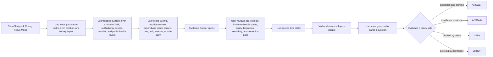
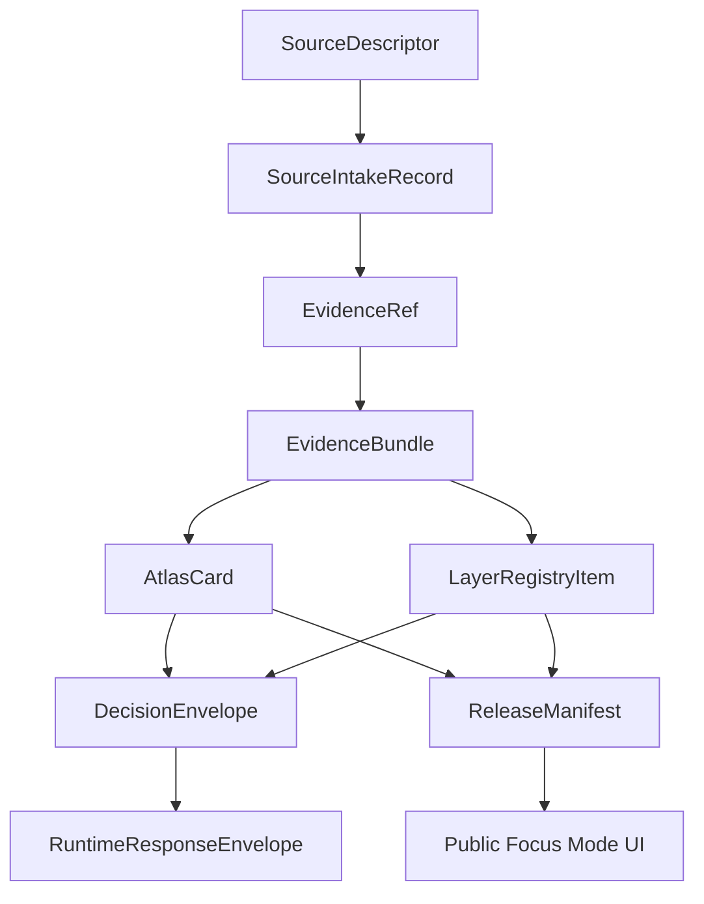

<!--
doc_id: NEEDS_VERIFICATION
title: Sedgwick County Focus Mode Build Plan
type: standard
version: v1
status: draft
owners: [NEEDS_VERIFICATION]
created: 2026-05-21
updated: 2026-05-21
policy_label: public_draft
related:
  - docs/focus-modes/ellsworth-county/build-plan.md
  - docs/focus-modes/riley-county/build-plan.md
  - docs/focus-modes/shawnee-county/build-plan.md
  - docs/focus-modes/ford-county/build-plan.md
  - docs/focus-modes/wyandotte-county/build-plan.md
  - docs/focus-modes/sedgwick-county/README.md
  - docs/focus-modes/sedgwick-county/layer-registry.md
  - docs/focus-modes/sedgwick-county/acceptance-checklist.md
tags: [kfm, focus-mode, sedgwick-county, wichita, aviation, chisholm-trail, arkansas-river, severe-weather]
notes:
  - Draft plan prepared without mounted repository inspection.
  - Paths, owners, doc IDs, schema homes, and validator names require repository verification before merge.
  - Aviation, urban, hydrology, public-health, severe-weather, property, and infrastructure claims require source intake and evidence review before publication.
-->

<a id="top"></a>

# Sedgwick County Focus Mode Build Plan

> **Purpose:** establish a sixth Kansas Frontier Matrix county proof slice after Ellsworth, Riley, Shawnee, Ford, and Wyandotte counties, with a distinct south-central Kansas profile: **Wichita, aviation manufacturing, Arkansas and Little Arkansas river geography, Chisholm Trail / cattle-era movement, oil and entrepreneurship, urban growth, public health, severe weather, floodplain/water infrastructure, and metro-scale privacy governance.**


---

## Quick links

- [1. Why Sedgwick County](#1-why-sedgwick-county)
- [2. Product thesis](#2-product-thesis)
- [3. Scope boundary](#3-scope-boundary)
- [4. First demo layers](#4-first-demo-layers)
- [5. User journeys](#5-user-journeys)
- [6. UI surfaces](#6-ui-surfaces)
- [7. Governed object model](#7-governed-object-model)
- [8. Proposed repository shape](#8-proposed-repository-shape)
- [9. Build phases](#9-build-phases)
- [10. First PR sequence](#10-first-pr-sequence)
- [11. Acceptance checklist](#11-acceptance-checklist)
- [12. Risk register](#12-risk-register)
- [13. Source seed list](#13-source-seed-list)
- [14. Open verification questions](#14-open-verification-questions)
- [15. Recommended first milestone](#15-recommended-first-milestone)

---

## Operating posture

> [!IMPORTANT]
> Sedgwick County Focus Mode is a **governed metro/aviation/water/severe-weather proof slice**, not a loose Wichita tourism map. It must preserve KFM’s core invariants:
>
> - EvidenceBundle outranks generated language.
> - Public clients use governed APIs, released artifacts, catalog records, tile services, and policy-safe runtime envelopes.
> - Public UI must not read directly from `RAW`, `WORK`, `QUARANTINE`, unpublished candidate data, canonical/internal stores, or direct model runtime outputs.
> - Publication is a governed state transition, not a file move.
> - AI outputs are downstream carriers, not sovereign truth.
> - Aviation, industrial, public-health, severe-weather, water, property, infrastructure, and urban demographic claims must remain source-bound, role-labeled, privacy-aware, and correction-friendly.

---

# 1. Why Sedgwick County

Sedgwick County is the right sixth Focus Mode because it gives KFM a **major metro, aviation-industry, severe-weather, and water-infrastructure proof slice**.

Ellsworth County tests frontier county history, Fort Harker / Kanopolis, settlement, and environmental baseline.

Riley County tests Flint Hills ecology, Fort Riley, Konza Prairie, research-site sensitivity, and river landscapes.

Shawnee County tests state government, civil-rights history, Topeka urban geography, public institutions, and archive-heavy civic memory.

Ford County tests Dodge City, Santa Fe Trail, Fort Dodge, cattle-town public history, Arkansas River water, and High Plains agriculture.

Wyandotte County tests dense urban governance, river confluence, tribal/burial sensitivity, environmental justice, rail/industry, and immigration/labor history.

Sedgwick County adds:

| KFM capability | Sedgwick County proof value |
|---|---|
| Aviation manufacturing geography | Wichita as “Air Capital,” aircraft supply chain, airport/industrial corridors |
| Large metro planning | Wichita urban growth, suburbs, roads, land-use, property-data privacy |
| River and flood-control systems | Arkansas River, Little Arkansas River, floodplain, urban water infrastructure |
| Chisholm Trail and cattle-era transition | cattle trade, early Wichita commerce, river crossings, rail transition |
| Public health and services | county health department, medical examiner/forensic center, privacy-sensitive public services |
| Severe weather and resilience | tornado/hail/wind/flood context, warnings vs. historical events vs. models |
| Entrepreneurship / industry | aircraft, oil, Koch, Pizza Hut, Coleman, commercial history |
| Sensitive infrastructure handling | airports, military base, water systems, hospitals, emergency services |

> [!NOTE]
> Sedgwick County should prove KFM can handle a modern metropolitan county with industrial, aviation, emergency-management, and public-health layers while staying public-safe and evidence-first.

---

# 2. Product thesis

## User-facing thesis

> **Sedgwick County Focus Mode lets a user explore how Wichita, aviation manufacturing, cattle-era trade, rail and road corridors, the Arkansas River system, severe weather, public health, and metro growth shaped south-central Kansas — while keeping aviation, infrastructure, property, health, and hazard claims evidence-backed and public-safe.**

## Internal KFM thesis

Sedgwick County should prove that Focus Mode can handle:

```text
metro geography + aviation industry + Chisholm Trail/cattle trade + river/flood systems + public health + severe-weather resilience + infrastructure privacy
```

without turning public services, airports, property records, weather risk, or industrial geography into unsafe or overconfident public claims.

The system must preserve distinctions between:

- public airport/aviation history vs. restricted operational details
- historical weather event vs. forecast vs. warning vs. model
- public-health aggregate context vs. private medical data
- observed floodplain vs. regulatory floodplain vs. modeled flood risk
- parcel/tax/appraisal record vs. title truth
- industry location context vs. supply-chain vulnerability
- public road/bridge data vs. critical infrastructure exposure
- source-backed claim vs. generated explanation

---

# 3. Scope boundary

## 3.1 Geography

Initial scope:

```text
Sedgwick County, Kansas
```

Priority spatial anchors:

- Sedgwick County boundary
- Wichita
- Arkansas River corridor
- Little Arkansas River corridor
- Downtown Wichita / Delano context
- Wichita aviation manufacturing and airport context, generalized/public-safe
- Chisholm Trail / cattle-era context where source-supported
- rail and highway corridors
- McConnell Air Force Base public-context layer, restricted operational detail excluded
- Wichita Dwight D. Eisenhower National Airport public-context layer
- incorporated communities where source-supported: Derby, Haysville, Maize, Valley Center, Park City, Bel Aire, Goddard, Andale, Colwich, Cheney, Clearwater, Mulvane, Mount Hope, Garden Plain, Kechi, Viola, Bentley, and others
- public-safe severe-weather and floodplain context
- public-health and service-area context, aggregated only

## 3.2 Time range

Initial buckets:

| Bucket | Role in demo |
|---|---|
| Before 1800 | Indigenous, river, prairie, and pre-territorial context; public-safe and culturally cautious |
| 1800–1867 | river movement, Chisholm Trail/cattle movement, territorial lead-up |
| 1867–1880 | county establishment, Wichita growth, cattle trade, rail transition |
| 1881–1916 | agriculture, milling, oil discovery lead-up, early city growth |
| 1917–1945 | early aircraft manufacturing, interwar/WWII aviation growth |
| 1946–1980 | suburbanization, airport/base expansion, flood-control/public works, highway era |
| 1981–2005 | metro expansion, aviation restructuring, public-health and planning systems |
| 2006–present | modern aviation supply chain, resilience, riverfront, severe-weather risk, public services |

> [!CAUTION]
> Time buckets are planning scaffolds. They are not publication claims until evidence-reviewed.

## 3.3 Not in MVP

Do **not** include in the first Sedgwick County MVP:

- restricted airport, airbase, or aviation supply-chain vulnerabilities
- household-level public-health or medical data
- private addresses or household-level demographic profiling
- active emergency operations or real-time alerting
- parcel ownership treated as title truth
- law-enforcement operational layers
- hospital/security vulnerabilities
- school security details
- restricted water-system or utility details
- unreviewed severe-weather forecasts presented as alerts
- public direct model endpoint

---

# 4. First demo layers

## 4.1 MVP layer registry

| Layer ID | Layer | Domain | Purpose | Initial posture |
|---|---|---:|---|---|
| `kfm.layer.sedgwick.county_boundary.v1` | Sedgwick County boundary | civic | establish spatial frame | public draft |
| `kfm.layer.sedgwick.wichita_context.v1` | Wichita civic / metro context | civic/history | urban and economic anchor | public draft |
| `kfm.layer.sedgwick.aviation_context.v1` | Aviation manufacturing context | industry/history | Air Capital / aviation-industry anchor | public draft, generalized |
| `kfm.layer.sedgwick.airport_base_context.v1` | Airport and McConnell public context | aviation/infrastructure | public airport/base geography without operational detail | public-safe generalized |
| `kfm.layer.sedgwick.arkansas_river_corridor.v1` | Arkansas River corridor | hydrology/urban | river, floodplain, urban-water relationship | public draft |
| `kfm.layer.sedgwick.little_arkansas_context.v1` | Little Arkansas River context | hydrology/urban | confluence and city geography | public draft |
| `kfm.layer.sedgwick.chisholm_trail_context.v1` | Chisholm Trail / cattle-era context | history/transportation | cattle movement and early Wichita trade | public draft, uncertainty shown |
| `kfm.layer.sedgwick.rail_highway_corridors.v1` | Rail and highway corridors | transportation/planning | metro growth and movement | public draft |
| `kfm.layer.sedgwick.severe_weather_context.v1` | Severe weather historical context | hazards/resilience | tornado/hail/flood historical context | public-safe; not alerting |
| `kfm.layer.sedgwick.public_health_context.v1` | Public health / service context | public health/civic | aggregate service geography | public-safe aggregated |
| `kfm.layer.sedgwick.timeline_events.v1` | Timeline events | cross-domain | temporal navigation | public draft |
| `kfm.layer.sedgwick.atlas_claims.v1` | Atlas claim points / corridors | cross-domain | clickable evidence-backed claims | requires EvidenceRef |

## 4.2 Layer contract

Each layer must have:

```yaml
layer_id: kfm.layer.sedgwick.<name>.v1
title: NEEDS_VERIFICATION
domain: NEEDS_VERIFICATION
layer_type: observed | derived | interpreted | modeled | administrative
geometry_type: point | line | polygon | raster | tile | mixed
source_refs: []
evidence_refs: []
policy_label: public_draft | restricted | internal | public
review_state: draft | review | published | deprecated
rights_status: unknown | public | open | controlled | restricted
sensitivity: public | generalized | restricted | review_required
temporal_scope:
  start: NEEDS_VERIFICATION
  end: NEEDS_VERIFICATION
limitations: []
correction_path: NEEDS_VERIFICATION
```

---

# 5. User journeys

## 5.1 Primary public journey



## 5.2 Example public questions

Supported after evidence review:

- “Why is Wichita called the Air Capital?”
- “How did the Arkansas River shape Wichita and Sedgwick County?”
- “What evidence supports this Chisholm Trail or cattle-era claim?”
- “Which aviation layers are generalized and why?”
- “How do severe-weather layers differ from warnings or forecasts?”
- “What public-safe health context can KFM show for Sedgwick County?”
- “Which layers are observed, modeled, derived, or interpreted?”

Should abstain or deny unless governed release permits them:

- “Show restricted airport or McConnell operational details.”
- “Show private household health risk.”
- “Give exact utility vulnerabilities.”
- “Treat a forecast as an official alert.”
- “Make a property-title conclusion from appraisal data.”
- “Treat generated text as evidence.”
- “Publish a claim with no EvidenceBundle.”

---

# 6. UI surfaces

## 6.1 Map canvas

Required:

- MapLibre GL JS map
- placeholder basemap
- Sedgwick County boundary
- Wichita / river / aviation anchors
- clickable mock features
- selected feature highlight
- layer toggles
- scale bar
- attribution
- zoom controls
- compass / orientation affordance
- public-safe layer legend

## 6.2 Layer registry panel

Show for every layer:

| Field | Meaning |
|---|---|
| Layer name | human-readable layer title |
| Domain | civic, aviation, industry, hydrology, hazards, public health, transportation |
| Layer type | observed, derived, interpreted, modeled, administrative |
| Evidence state | resolved, unresolved, not required, pending |
| Policy label | public, public_draft, restricted, internal |
| Review state | draft, review, published, deprecated |
| Sensitivity | public, generalized, restricted, review_required |
| Time coverage | start/end or bucketed range |
| Limitations | short public-facing warning |
| Source-role warning | observation, model, regulatory, historical interpretation, public-health aggregate, official record |

## 6.3 Timeline panel

Initial buckets:

```text
Before 1800
1800–1867
1867–1880
1881–1916
1917–1945
1946–1980
1981–2005
2006–present
```

Timeline should control:

- visible atlas claims
- aviation-industry cards
- river / floodplain context
- Chisholm Trail / cattle-era context
- severe-weather event context
- public-health/service layers
- feature styling by temporal relevance

## 6.4 Evidence Drawer

When a user clicks a layer feature or atlas claim, show:

```yaml
title: NEEDS_VERIFICATION
claim_text: NEEDS_VERIFICATION
object_type: AtlasCard | LayerFeature | TimelineEvent | EvidenceBundle
spatial_scope: NEEDS_VERIFICATION
temporal_scope: NEEDS_VERIFICATION
evidence_refs: []
evidence_bundle_status: unresolved | resolved | restricted | missing
source_roles: []
interpretation_status: fact_claim | interpretation | public_history | derived_indicator | regulatory_context | aggregate_context
policy_label: public_draft
rights_status: unknown
sensitivity: review_required
review_state: draft
limitations: []
correction_path: NEEDS_VERIFICATION
```

## 6.5 Atlas Card panel

Minimum atlas card types:

| Card type | Example |
|---|---|
| `metro_place_context` | Wichita |
| `aviation_industry_context` | Air Capital / aircraft manufacturing |
| `airport_public_context` | Wichita Dwight D. Eisenhower National Airport |
| `military_base_public_context` | McConnell Air Force Base public context |
| `river_urban_context` | Arkansas River / Little Arkansas River |
| `trail_cattle_context` | Chisholm Trail / cattle-era trade |
| `hazard_resilience_context` | severe-weather historical layer |
| `public_health_aggregate_context` | county public-health/service geography |
| `derived_layer_context` | floodplain, land cover, or resilience baseline |

## 6.6 Governed AI panel

The AI panel must only emit finite runtime outcomes:

```text
ANSWER
ABSTAIN
DENY
ERROR
```

Example response envelope:

```json
{
  "object_type": "RuntimeResponseEnvelope",
  "schema_version": "v1",
  "question": "Why is Wichita called the Air Capital?",
  "outcome": "ABSTAIN",
  "answer": null,
  "reason": "Evidence bundle is not yet resolved for publication-grade response.",
  "evidence_refs": [
    "kfm://evidence-ref/sedgwick/aviation-context/v1"
  ],
  "policy_label": "public_draft",
  "limitations": [
    "This draft object requires source intake, rights review, and source-specific aviation-history framing before publication."
  ]
}
```

---

# 7. Governed object model

## 7.1 Object flow



## 7.2 SourceDescriptor draft

```yaml
id: kfm.source.sedgwick.wichita_aviation.placeholder
title: Wichita aviation history source placeholder
domain: aviation_history
source_type: official_city_or_public_history_reference
role: context_NEEDS_VERIFICATION
rights_status: unknown
spatial_coverage: Wichita, Sedgwick County, Kansas
temporal_coverage: NEEDS_VERIFICATION
status: proposed
limitations:
  - Requires source intake and review before claims are published.
  - Must separate public aviation history from restricted operational, supply-chain, military, or infrastructure details.
```

## 7.3 EvidenceRef draft

```yaml
id: kfm.evidence_ref.sedgwick.aviation_context.v1
bundle_id: kfm.evidence_bundle.sedgwick.aviation_context.v1
claim_scope: Public-safe aviation manufacturing and Air Capital context within Sedgwick County Focus Mode
resolution_required: true
```

## 7.4 EvidenceBundle draft

```yaml
id: kfm.evidence_bundle.sedgwick.aviation_context.v1
resolved: false
source_refs:
  - kfm.source.sedgwick.wichita_aviation.placeholder
policy_label: public_draft
rights_status: unknown
sensitivity: review_required
review_state: draft
limitations:
  - Draft bundle. Do not publish final aviation-history claims until source-reviewed.
  - Do not include restricted airport, military, supply-chain, or operational detail.
```

## 7.5 AtlasCard draft

```yaml
id: kfm.atlas_card.sedgwick.aviation_context.v1
title: Wichita Aviation / Air Capital Context
card_type: aviation_industry_context
spatial_scope: Wichita, Sedgwick County, Kansas NEEDS_VERIFICATION
temporal_scope: NEEDS_VERIFICATION
evidence_refs:
  - kfm.evidence_ref.sedgwick.aviation_context.v1
policy_label: public_draft
review_state: draft
limitations:
  - Draft card. Not a final industrial, aviation, defense, safety, or economic authority statement.
```

## 7.6 DecisionEnvelope draft

```yaml
id: kfm.decision.sedgwick.question.aviation_context.v1
question: Why is Wichita called the Air Capital?
outcome: ABSTAIN
reason: Evidence bundle unresolved.
evidence_refs:
  - kfm.evidence_ref.sedgwick.aviation_context.v1
policy_label: public_draft
```

## 7.7 ReleaseManifest draft

```yaml
id: kfm.release.sedgwick.focus_mode.v0_1
release_state: draft
included_layers:
  - kfm.layer.sedgwick.county_boundary.v1
  - kfm.layer.sedgwick.wichita_context.v1
  - kfm.layer.sedgwick.aviation_context.v1
  - kfm.layer.sedgwick.arkansas_river_corridor.v1
  - kfm.layer.sedgwick.severe_weather_context.v1
validation_state: pending
rollback_plan: required_before_publication
correction_path: required_before_publication
```

---

# 8. Proposed repository shape

> [!WARNING]
> Repository access is **not confirmed** in this planning session. Treat all paths as proposed until checked against the live branch and KFM Directory Rules.

```text
docs/
  focus-modes/
    sedgwick-county/
      README.md
      build-plan.md
      layer-registry.md
      evidence-model.md
      acceptance-checklist.md
      source-seed-list.md
      public-safety-notes.md
      aviation-and-infrastructure-notes.md
      severe-weather-and-resilience-notes.md
      public-health-privacy-notes.md
      water-and-floodplain-notes.md

data/
  catalog/
    sources/
      sedgwick/
        source_descriptors.yaml
    stac/
      sedgwick/
        README.md

contracts/
  focus_mode/
    focus_mode_payload.schema.json
  atlas/
    atlas_card.schema.json
  evidence/
    evidence_ref.schema.json
    evidence_bundle.schema.json
  release/
    release_manifest.schema.json

fixtures/
  focus_modes/
    sedgwick/
      valid/
        focus_mode_payload.valid.json
        layer_registry.valid.json
        atlas_card.wichita.valid.json
        atlas_card.aviation.valid.json
        atlas_card.arkansas_river.valid.json
        evidence_bundle.aviation.valid.json
        evidence_bundle.severe_weather.valid.json
      invalid/
        unresolved_evidence_ref.invalid.json
        restricted_airport_detail.invalid.json
        restricted_military_base_detail.invalid.json
        private_household_health_detail.invalid.json
        forecast_as_official_alert.invalid.json
        parcel_as_title_truth.invalid.json
        restricted_utility_vulnerability.invalid.json
        missing_policy_label.invalid.json
        model_output_as_evidence.invalid.json
        public_raw_access.invalid.json

apps/
  web/
    src/
      focus-modes/
        sedgwick/
          index.js
          layers.js
          mock-api.js
          mock-data.js
          evidence-drawer.js
          timeline.js
          ai-panel.js
          styles.css

tools/
  validators/
    validate_focus_mode_payload.py
    validate_atlas_card.py
    validate_evidence_bundle.py
    validate_layer_registry.py
```

---

# 9. Build phases

## Phase 1 — Control plane

Goal: establish Sedgwick County Focus Mode as a governed metro/aviation/water/hazard/public-health template.

Deliverables:

- `docs/focus-modes/sedgwick-county/README.md`
- `build-plan.md`
- `layer-registry.md`
- `source-seed-list.md`
- `public-safety-notes.md`
- `aviation-and-infrastructure-notes.md`
- `severe-weather-and-resilience-notes.md`
- `public-health-privacy-notes.md`
- `water-and-floodplain-notes.md`
- first schema references
- valid and invalid fixture plan

Definition of done:

```text
[ ] scope is explicit
[ ] aviation/airport/base layers are public-safe and generalized
[ ] severe-weather layers distinguish historical event/model/forecast/warning
[ ] public-health layers are aggregate and privacy-preserving
[ ] water/floodplain layers distinguish observed/model/regulatory/derived roles
[ ] all layers have policy labels
[ ] all claim-bearing objects require EvidenceRef
[ ] placeholders are clearly marked
```

## Phase 2 — Mock governed API

Goal: make Sedgwick Focus Mode run without live pipelines.

Mock endpoints:

```text
GET /api/focus-modes/sedgwick
GET /api/layers/sedgwick
GET /api/evidence/{bundle_id}
GET /api/atlas-cards/{card_id}
POST /api/ai/answer
GET /api/releases/sedgwick-focus-mode
```

Definition of done:

```text
[ ] mock payloads validate
[ ] unresolved evidence produces ABSTAIN
[ ] restricted airport/base requests produce DENY
[ ] private household health requests produce DENY
[ ] forecast-as-alert payloads fail validation
[ ] invalid payloads fail closed
[ ] public layer payloads do not reference RAW / WORK / QUARANTINE
```

## Phase 3 — UI prototype

Goal: show the full Sedgwick Focus Mode surface in a browser.

Deliverables:

- MapLibre map
- layer registry
- clickable mock Wichita, aviation context, airport/base public context, Arkansas River, Chisholm Trail, severe-weather, and public-health features
- evidence drawer
- timeline
- atlas card panel
- governed AI answer panel

Definition of done:

```text
[ ] user can click aviation context and see evidence/source-role status
[ ] user can click airport/base public context and see sensitivity limitations
[ ] user can click severe-weather context and see not-an-alert warnings
[ ] user can click public-health context and see aggregate/privacy limitations
[ ] user can toggle aviation / river / trail / severe-weather / public-health layers
[ ] timeline changes visible claim set
[ ] AI panel returns all four finite outcomes through examples
```

## Phase 4 — Validators and negative fixtures

Goal: prove failure modes before publication.

Required invalid fixtures:

| Fixture | Expected failure |
|---|---|
| `unresolved_evidence_ref.invalid.json` | publication attempted with unresolved evidence |
| `restricted_airport_detail.invalid.json` | restricted airport operational detail in public payload |
| `restricted_military_base_detail.invalid.json` | restricted McConnell detail exposed |
| `private_household_health_detail.invalid.json` | household-level health exposure |
| `forecast_as_official_alert.invalid.json` | forecast/model represented as official alert |
| `parcel_as_title_truth.invalid.json` | property/assessor record treated as title truth |
| `restricted_utility_vulnerability.invalid.json` | infrastructure vulnerability exposed |
| `missing_policy_label.invalid.json` | public object lacks policy posture |
| `model_output_as_evidence.invalid.json` | AI output treated as proof |
| `public_raw_access.invalid.json` | public client references RAW/WORK/QUARANTINE |

## Phase 5 — Source intake upgrade

Goal: replace placeholders with inspected sources.

Deliverables:

- source descriptors
- intake records
- rights review notes
- sensitivity review notes
- evidence bundle drafts
- reviewed atlas cards
- limitations notes

Minimum real-evidence targets:

```text
[ ] one Sedgwick County establishment/name public-history claim
[ ] one Wichita aviation / Air Capital public-history claim
[ ] one Arkansas River / Little Arkansas River urban-hydrology claim
[ ] one Chisholm Trail / cattle-era movement claim
[ ] one severe-weather historical-context claim
[ ] one public-health aggregate/context claim
[ ] one airport/base public-context claim with restricted details excluded
```

## Phase 6 — Release candidate

Goal: prepare `v0.1` public-safe release.

Deliverables:

- `ReleaseManifest`
- validation report
- correction path
- rollback plan
- public-safe layer manifest
- known limitations
- release notes

Definition of done:

```text
[ ] public layers have policy labels and review states
[ ] rights status is resolved or blocked
[ ] restricted aviation/base/airport/utility details are excluded or generalized
[ ] private health, household, and property-title claims are excluded
[ ] severe-weather layers are explicitly not alerts
[ ] water/floodplain claims preserve source role and uncertainty
[ ] release can be rolled back
[ ] public UI only consumes governed surfaces
```

---

# 10. First PR sequence

## PR-0001 — Sedgwick County Focus Mode Control Plane

Files:

```text
docs/focus-modes/sedgwick-county/README.md
docs/focus-modes/sedgwick-county/build-plan.md
docs/focus-modes/sedgwick-county/layer-registry.md
docs/focus-modes/sedgwick-county/source-seed-list.md
docs/focus-modes/sedgwick-county/public-safety-notes.md
docs/focus-modes/sedgwick-county/aviation-and-infrastructure-notes.md
docs/focus-modes/sedgwick-county/severe-weather-and-resilience-notes.md
docs/focus-modes/sedgwick-county/public-health-privacy-notes.md
docs/focus-modes/sedgwick-county/water-and-floodplain-notes.md
docs/focus-modes/sedgwick-county/acceptance-checklist.md
```

Acceptance:

```text
[ ] Focus Mode scope is clear.
[ ] Sedgwick County is justified as a complementary proof slice.
[ ] Every planned layer has a policy posture.
[ ] Aviation/base/infrastructure sensitivity rules are explicit.
[ ] Public-health privacy boundaries are explicit.
[ ] Severe-weather source-role boundaries are explicit.
[ ] Water/floodplain source-role boundaries are explicit.
[ ] No publication claims are made from placeholders.
```

## PR-0002 — Sedgwick Contracts and Fixtures

Files:

```text
fixtures/focus_modes/sedgwick/valid/focus_mode_payload.valid.json
fixtures/focus_modes/sedgwick/valid/layer_registry.valid.json
fixtures/focus_modes/sedgwick/valid/atlas_card.wichita.valid.json
fixtures/focus_modes/sedgwick/valid/atlas_card.aviation.valid.json
fixtures/focus_modes/sedgwick/invalid/restricted_airport_detail.invalid.json
fixtures/focus_modes/sedgwick/invalid/private_household_health_detail.invalid.json
fixtures/focus_modes/sedgwick/invalid/forecast_as_official_alert.invalid.json
fixtures/focus_modes/sedgwick/invalid/missing_policy_label.invalid.json
```

Acceptance:

```text
[ ] Valid fixtures include required governed fields.
[ ] Invalid fixtures represent real failure modes.
[ ] EvidenceRef / EvidenceBundle relationship is explicit.
[ ] Mock cards remain draft until evidence intake.
```

## PR-0003 — Sedgwick Mock API

Files:

```text
apps/web/src/focus-modes/sedgwick/mock-api.js
apps/web/src/focus-modes/sedgwick/layers.js
apps/web/src/focus-modes/sedgwick/mock-data.js
```

Acceptance:

```text
[ ] Mock API returns finite runtime outcomes.
[ ] Layer registry is API-shaped, not UI-only.
[ ] Public-safe data is separated from restricted mock examples.
[ ] Sensitivity/source-role status is included for aviation, health, water, and hazard objects.
```

## PR-0004 — Sedgwick UI Shell

Files:

```text
apps/web/src/focus-modes/sedgwick/index.js
apps/web/src/focus-modes/sedgwick/evidence-drawer.js
apps/web/src/focus-modes/sedgwick/timeline.js
apps/web/src/focus-modes/sedgwick/ai-panel.js
apps/web/src/focus-modes/sedgwick/styles.css
```

Acceptance:

```text
[ ] Map renders.
[ ] Layer panel renders.
[ ] Evidence Drawer renders.
[ ] Atlas Card panel renders.
[ ] Timeline filters mock claims.
[ ] AI panel demonstrates ANSWER / ABSTAIN / DENY / ERROR.
```

## PR-0005 — Validator Hardening

Files:

```text
tools/validators/validate_focus_mode_payload.py
tools/validators/validate_atlas_card.py
tools/validators/validate_evidence_bundle.py
tools/validators/validate_layer_registry.py
```

Acceptance:

```text
[ ] Public RAW / WORK / QUARANTINE references fail.
[ ] Missing EvidenceRef fails for claim-bearing objects.
[ ] Missing policy label fails.
[ ] Restricted airport/base detail fails public release.
[ ] Private household health detail fails public release.
[ ] Forecast/model-as-alert fails.
[ ] Model output as proof fails.
```

---

# 11. Acceptance checklist

```text
[ ] Sedgwick County map loads.
[ ] User can toggle at least 5 public-safe layers.
[ ] User can click Wichita context and open Evidence Drawer.
[ ] User can click aviation context and open Evidence Drawer.
[ ] User can click Arkansas River context and open Evidence Drawer.
[ ] User can click severe-weather context and see not-an-alert limitations.
[ ] User can inspect at least 3 Atlas Cards.
[ ] Timeline control changes visible claims/layers.
[ ] Governed AI panel returns ANSWER for supported claims.
[ ] Governed AI panel returns ABSTAIN for unresolved evidence.
[ ] Governed AI panel returns DENY for restricted/sensitive requests.
[ ] Governed AI panel returns ERROR for invalid payload/system failure.
[ ] Every visible claim has EvidenceRef.
[ ] Every EvidenceRef points to an EvidenceBundle.
[ ] Every layer has policy_label.
[ ] Every layer has review_state.
[ ] Every public object has correction path.
[ ] No public UI path reads RAW, WORK, or QUARANTINE.
[ ] Restricted aviation/base/airport/utility details are excluded or generalized.
[ ] Private household health details are excluded.
[ ] Severe-weather layers are not represented as official alerts.
[ ] ReleaseManifest exists before anything is called published.
```

---

# 12. Risk register

| Risk | Why it matters | Control |
|---|---|---|
| Aviation layer exposes airport/base vulnerabilities | public safety risk | public context only; deny operational details |
| Severe-weather layer is mistaken for an alert | life-safety risk | not-an-alert warnings; source-role labeling |
| Public-health layer exposes private data | privacy and harm risk | aggregate only; deny household/individual claims |
| Floodplain/water layer treated as legal advice | regulatory misuse risk | distinguish observed/model/regulatory/derived |
| Property/tax data treated as title truth | legal/title error risk | explicit assessor/tax ≠ title truth rule |
| Industry layer exposes supply-chain vulnerabilities | security risk | generalized industry context |
| Generated narrative treated as source | evidence failure | model output cannot be proof |
| Mock placeholders become doctrine | demo pollution | all placeholders marked draft/unresolved |
| Wichita overwhelms county view | county-scale imbalance | include county municipalities and rural context where evidence-supported |
| Chisholm Trail/cattle claims overgeneralize route uncertainty | historical accuracy risk | uncertainty and confidence shown in Evidence Drawer |

---

# 13. Source seed list

> [!NOTE]
> These are **candidate source seeds**, not yet KFM-ingested sources. Each requires `SourceDescriptor`, rights review, sensitivity review, checksum/citation handling, and EvidenceBundle resolution before publication-grade use.

| Seed | Use | Starting URL |
|---|---|---|
| Sedgwick County official history | county establishment/name context | https://www.sedgwickcounty.org/about-sedgwick-county/history/ |
| Sedgwick County official site | current county civic / service source routing | https://www.sedgwickcounty.org/ |
| City of Wichita — About Wichita | official city history, aviation, industry, civic context | https://www.wichita.gov/591/About-Wichita |
| City of Wichita — Target Industries | aviation manufacturing and supply-chain public context | https://www.wichita.gov/267/Target-Industries |
| City of Wichita — Delano Neighborhood Planning | Chisholm Trail / cattle / neighborhood / aviation context | https://www.wichita.gov/469/Delano-Neighborhood-Planning |
| Wichita Dwight D. Eisenhower National Airport | public airport context | https://www.flywichita.com/ |
| Sedgwick County Register of Deeds local history portal | archives and historical collection source routing | https://www.sedgwickcounty.org/register-of-deeds/history/ |
| Sedgwick County Regional Forensic Science Center | public-health/forensic public context; privacy limits required | https://www.sedgwickcounty.org/forensic-science/about/ |
| Kansas Historical Society markers | public-history marker source routing | https://www.kansashistory.gov/p/kansas-historical-markers/14999 |
| Kansas Geological Survey county geology index | geology / hydrology source routing | https://www.kgs.ku.edu/General/Geology/County/ |
| USGS National Hydrography | river and stream source routing | https://www.usgs.gov/national-hydrography |
| FEMA Flood Map Service Center | regulatory floodplain source routing | https://msc.fema.gov/portal/home |
| NOAA Storm Events Database | historical severe-weather source routing | https://www.ncdc.noaa.gov/stormevents/ |
| USDA Cropland Data Layer | agriculture / land-cover source routing | https://www.nass.usda.gov/Research_and_Science/Cropland/SARS1a.php |

---

# 14. Open verification questions

```text
[ ] What is the canonical repo path for Focus Mode documents?
[ ] Does KFM already have a focus_mode_payload schema?
[ ] Does KFM already define AtlasCard fields differently?
[ ] Does KFM already define aviation/infrastructure sensitivity fields?
[ ] Does KFM already define severe-weather source-role fields?
[ ] Does KFM already define public-health aggregate/privacy fields?
[ ] Which validators already exist?
[ ] Should Sedgwick County share contracts with other Focus Modes or define county-specific extensions?
[ ] What public-safe geometry source should be used for county boundary?
[ ] What source authority should define Wichita aviation claims?
[ ] What source authority should define Chisholm Trail / cattle-era claims?
[ ] What source authority should define Arkansas River / Little Arkansas River claims?
[ ] What source authority should define severe-weather historical claims?
[ ] What exact policy rule controls airport/base operational detail?
[ ] What exact policy rule controls public-health privacy?
[ ] What exact policy rule controls forecast/model/alert distinction?
[ ] What release manifest naming convention should be used?
[ ] What rollback/correction path should a county Focus Mode use?
```

---

# 15. Recommended first milestone

## Milestone 1: Sedgwick County Focus Mode Control Plane

Build the documentation, layer registry, source seed list, public-safety notes, aviation/infrastructure notes, severe-weather notes, public-health privacy notes, water/floodplain notes, and fixtures before the UI.

This keeps the Sedgwick proof slice from becoming a flashy Wichita aviation and hazards map with weak evidence boundaries.

The first concrete deliverable should be:

```text
docs/focus-modes/sedgwick-county/build-plan.md
```

Once this is stable, use it to generate the mock API and single-file UI prototype.

---

[Back to top](#top)
