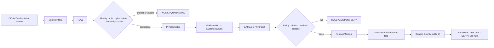
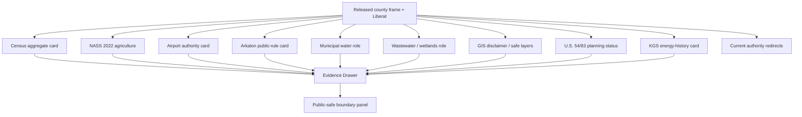
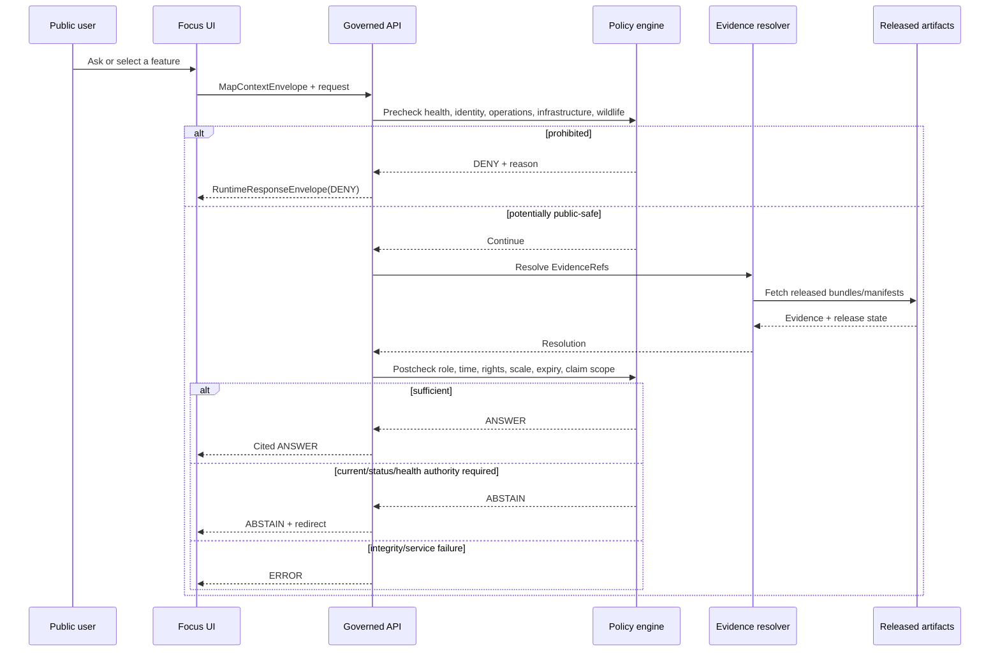
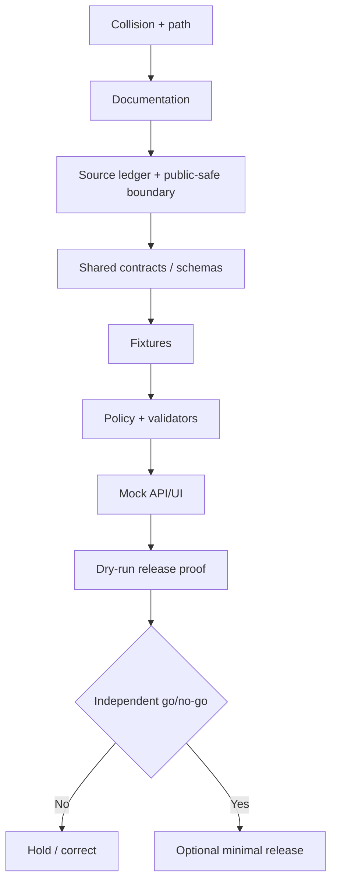

<!-- [KFM_META_BLOCK_V2]
doc_id: NEEDS_VERIFICATION
title: Seward County Focus Mode Build Plan
type: county-focus-mode-build-plan
version: v0.1-proposed
status: PROPOSED
release_status: NEEDS_VERIFICATION
county_name: Seward County
county_slug: seward
lane_slug: seward-county
created: 2026-06-09
updated: 2026-06-09
owners:
  focus_mode_owner: NEEDS_VERIFICATION
  evidence_steward: NEEDS_VERIFICATION
  agriculture_reviewer: NEEDS_VERIFICATION
  water_public_health_reviewer: NEEDS_VERIFICATION
  transportation_airport_reviewer: NEEDS_VERIFICATION
  industrial_energy_reviewer: NEEDS_VERIFICATION
  ecology_recreation_reviewer: NEEDS_VERIFICATION
  privacy_living_person_reviewer: NEEDS_VERIFICATION
  infrastructure_security_reviewer: NEEDS_VERIFICATION
  rights_reviewer: NEEDS_VERIFICATION
  release_approver: NEEDS_VERIFICATION
defining_public_safe_boundary: >-
  Seward County's cross-border transportation, airport, municipal water and
  wastewater, Arkalon Park, agriculture, floodplain, energy history, public
  records, demographic, road, utility, emergency, and industrial sources may
  support generalized, time-bounded interpretation, but must not become live
  flight, rail, road, utility, emergency, burn-ban, closure, or facility-
  operation guidance; infrastructure or industrial-vulnerability analysis;
  household potability, individualized health, pollution-source, regulatory-
  compliance, immigration-status, employment, landowner, parcel, individual-
  farm, or private-well conclusions; or exact sensitive wildlife locations.
collision_search:
  supplied_completed_register: CONFIRMED absent
  current_conversation_register: CONFIRMED Butler, Cheyenne, Nemaha, Russell, Sumner, Wichita, and Smith completed; Seward absent
  live_county_index: CONFIRMED listed not-started when checked 2026-06-09
  exact_title_search: CONFIRMED no result
  exact_filename_search: CONFIRMED no result
  kebab_slug_search: CONFIRMED no result
  underscore_slug_search: CONFIRMED no result
  proof_slice_search: CONFIRMED no result for Liberal, Arkalon, or Seward County Focus Mode terms
  broad_county_search: CONFIRMED no repository result for Seward County
  accessible_project_materials: CONFIRMED no Seward County Focus Mode build plan found
  exhaustive_absence_private_deleted_local_prior_chats: NEEDS_VERIFICATION
directory_rules_basis:
  governing_principle: responsibility root outranks topic name
  observed_live_plan_template: docs/focus-mode/counties/<county-slug>-county/build-plan.md
  observed_live_index: docs/focus-mode/counties/COUNTY_INDEX.md
  validator_reference: tools/validators/validate_focus_mode_index.py
  documented_divergence: docs/focus-mode/ versus docs/focus-modes/ references coexist
  legacy_convention: docs/focus-mode/counties/<county>_county/<county>_county_focus_mode_build_plan.md
  path_posture: PROPOSED / NEEDS_VERIFICATION
official_sources_checked:
  - Seward County official website
  - City of Liberal official website and service pages
  - Liberal Mid-America Regional Airport official city page
  - Arkalon Park official city page
  - Liberal Water Department
  - Liberal Wastewater Services
  - Liberal GIS Map Service
  - U.S. Census Bureau QuickFacts
  - USDA NASS 2022 Seward County profile
  - Kansas Geological Survey Hugoton-area publications
  - National Weather Service Dodge City
implementation_claim: none
repository_modification_claim: none
source_admission_claim: none
review_or_validation_claim: none
promotion_or_publication_claim: none
truth_labels: [CONFIRMED, PROPOSED, NEEDS_VERIFICATION, UNKNOWN]
finite_outcomes: [ANSWER, ABSTAIN, DENY, ERROR]
[/KFM_META_BLOCK_V2] -->

<a id="top"></a>

# Seward County Focus Mode — Build Plan

> **A southwest-Kansas border, logistics, aviation, irrigated-agriculture, municipal-water, wastewater-wetland, recreation, and energy-history proof slice—without turning civic information into live operations, household health advice, industrial vulnerability, immigration or employment profiles, pollution attribution, or individualized property and farm conclusions.**

**Product thesis:** Build a governed, map-first, time-aware Seward County Focus Mode that explains Liberal, the Kansas–Oklahoma border, county-scale agriculture, U.S. 54/83 planning context, Liberal Mid-America Regional Airport, Arkalon Park, municipal water and wastewater roles, and Hugoton-area energy history while keeping source roles, currentness, privacy, environmental-health limits, infrastructure security, rights, correction, and rollback visible.


> [!IMPORTANT]
> **Defining public-safe boundary.** Seward County evidence may explain county-scale agriculture, Liberal's regional role, and the public mission of airport, water, wastewater, park, GIS, road-planning, and geological systems. It must not become live flight, rail, road, utility, emergency, burn-ban, closure, or industrial-operation guidance; critical-infrastructure or facility-vulnerability analysis; household potability or individualized health advice; pollution-source or compliance attribution; immigration-status, employment, landowner, parcel, or individual-farm profiling; private-well conclusions; or exact sensitive wildlife-use disclosure.

## Status and identity

| Field | Value | Truth posture |
|---|---|---|
| County | Seward County, Kansas | `CONFIRMED` |
| County seat / largest city | Liberal | `CONFIRMED` |
| County FIPS | `20175` | `CONFIRMED` |
| County slug | `seward` | `PROPOSED` |
| Lane slug | `seward-county` | `PROPOSED` |
| Deliverable | `seward_county_focus_mode_build_plan.md` | `CONFIRMED` |
| Created / updated | 2026-06-09 | `CONFIRMED` |
| Planning status | Build plan only | `CONFIRMED` |
| Implementation | Not claimed | `UNKNOWN` |
| Source admission | Not performed | `CONFIRMED` |
| Validation / review | Not performed | `CONFIRMED` |
| Release / publication | Not performed | `CONFIRMED` |
| Canonical repository path | Singular/plural convention unresolved | `NEEDS_VERIFICATION` |
| Exhaustive collision absence | Not provable across private/deleted/local artifacts | `NEEDS_VERIFICATION` |

## Quick links

[Executive build note](#executive-build-note) · [Evidence boundary](#evidence-boundary) · [Operating posture](#1-operating-posture) · [Why this county](#2-why-this-county) · [Product thesis](#3-product-thesis) · [Scope](#4-scope-boundary) · [Layers](#5-first-demo-layers) · [Journeys](#6-user-journeys) · [UI](#7-ui-surfaces) · [Objects](#8-governed-object-model) · [Repository](#9-proposed-repository-shape) · [Phases](#10-build-phases) · [PR sequence](#11-first-pr-sequence) · [Acceptance](#12-acceptance-checklist) · [Fixtures](#13-fixture-plan) · [Risks](#14-risk-register) · [Sources](#15-source-seed-list) · [Questions](#16-open-verification-questions) · [Milestone](#17-recommended-first-milestone)

## Executive build note

Seward County is a strong next proof slice because it combines several public systems whose roles must remain separate:

1. **Cross-border mobility.** Liberal lies near the Oklahoma border. The city published a 2026 notice about a KDOT open house for U.S. 54/83 realignment and expansion. A public meeting, project study, final design, construction status, road closure, and safe route are different truth states.
2. **Regional aviation.** Liberal identifies its Mid-America Regional Airport as serving a five-state region and publishes monthly schedules and project notices. KFM may explain the airport's public role but must not cache schedules, infer live operations, or expose security-sensitive detail.
3. **Water and health boundaries.** Liberal says its public supply is drawn from the High Plains Ogallala Aquifer and publishes Consumer Confidence Reports. Those reports concern a system and reporting period; they do not answer a household, service-line, illness, exposure, or private-well question.
4. **Wastewater, wetlands, recreation, and wildlife.** The wastewater department manages Arkalon wetlands flow/testing. Arkalon Park rules say its fishing ponds contain wastewater effluent, fishing is catch-and-release, and swimming/wading are prohibited. The checked rule is useful evidence, but not permanent recreation or individualized health advice.
5. **Agriculture and confidentiality.** USDA NASS reports 292 farms, 392,849 acres in farms, $398.022 million in products sold, a 70% livestock-products / 30% crop split, 92,531 irrigated acres, and 96,950 cattle and calves for 2022. Several commodity values are withheld as `(D)`.
6. **Demographic privacy.** Census reports 21,073 residents in the 2025 estimate, 21,964 in the 2020 Census, a 68.9% Hispanic or Latino share, and a 29.3% foreign-born share for the stated periods. These are aggregates, not evidence of any person's immigration, citizenship, language, workplace, household, or legal status.
7. **GIS disclaimers.** Liberal's GIS page says its maps are informational and not for legal or engineering purposes. Floodplain, zoning, incentive, utility, sidewalk, and trail surfaces must preserve that limitation.
8. **Energy history.** KGS records early gas discovery in Seward County and the wider Hugoton gas area. The checked sources are historical and cannot establish current wells, pipelines, owners, production, emissions, or compliance.
9. **Operational expiry.** County and city pages expose alerts, boil-water notices, burn bans, roads, meetings, flights, service schedules, projects, and closures. These require retrieval times, effective periods, expiry, supersession, and official redirects.

### Collision determination

| Check | Result | Status |
|---|---|---|
| Supplied completed register | Seward County absent | `CONFIRMED` |
| Current conversation register | Seven recent counties completed; Seward absent | `CONFIRMED` |
| Live county index | Seward listed `not-started` | `CONFIRMED` |
| Title, filename, and slug searches | No match | `CONFIRMED` |
| Liberal/Arkalon proof-slice searches | No plan match | `CONFIRMED` |
| Broad repository search | No Seward County result | `CONFIRMED` |
| Accessible project materials | No plan found | `CONFIRMED` |
| Private branches, deleted files, local artifacts and all prior chats | Not exhaustive | `NEEDS_VERIFICATION` |

### Directory Rules basis

The inspected live template uses:

`docs/focus-mode/counties/<county-slug>-county/build-plan.md`

Human planning belongs in `docs/`; semantic meaning in `contracts/`; machine shape in `schemas/`; allow/deny/abstain logic in `policy/`; examples in `fixtures/`; deployables in `apps/`; lifecycle evidence and published data in `data/`; release, correction, and rollback under their established responsibility roots.

Repository references also use `docs/focus-modes/`, so the divergence must be resolved before integration. Every proposed path remains `PROPOSED / NEEDS_VERIFICATION`.

## Evidence boundary

| Label | This run supports |
|---|---|
| `CONFIRMED` | Collision searches, live index status, checked official sources, verified Census/NASS values, and creation of this artifact. |
| `PROPOSED` | Product, boundary, layers, objects, paths, policies, fixtures, UI, tests, milestone, correction, rollback, and release design. |
| `NEEDS_VERIFICATION` | Exhaustive collision absence, canonical path, rights, exact geometry, current KDOT/airport/park/water status, source admission, reviewers, and release approval. |
| `UNKNOWN` | Implementation, CI, admitted bundles, runtime routes, deployed UI, connectors, review completion, release, correction propagation, and rollback execution. |


# 1. Operating posture

## 1.1 KFM governing rules applied to Seward County

1. `EvidenceBundle` outranks generated language, tourism copy, public-relations text, map styling, search snippets, and model confidence.
2. Public clients use governed APIs, released artifacts, approved tiles, catalog/triplet projections, and finite response envelopes.
3. Public UI must not read `RAW`, `WORK`, `QUARANTINE`, utility GIS, airport operational systems, police/fire/911 systems, parcel/tax records, employer systems, private-well records, active industrial systems, or direct model output.
4. Preserve `RAW -> WORK / QUARANTINE -> PROCESSED -> CATALOG / TRIPLET -> PUBLISHED`.
5. Promotion is a governed state transition, not a file move.
6. County administration, city administration, airport operations, KDOT transportation planning, NASS statistics, Census statistics, KGS scientific/history sources, NWS operations, KDHE public-health/environment authority, and generated narrative remain separate source roles.
7. A project open house or planning study is not proof of final design, construction, completion, current closure, or safe routing.
8. A monthly airport schedule is time-sensitive operational information, not durable county truth.
9. A Consumer Confidence Report describes a public-water system for a reporting period; it does not answer an individual household, service-line, exposure, illness, or private-well question.
10. A public park rule about effluent-fed ponds does not justify pollution-source attribution, individualized health judgment, or stale recreation advice.
11. Census demographic aggregates do not authorize immigration-status, citizenship, employment, legal-status, language-proficiency, or household inference.
12. NASS suppressed values remain suppressed and cannot be reconstructed through other public data.
13. GIS visibility does not establish legal, engineering, title, insurance, emergency, or redistribution authority.
14. Historic oil-and-gas sources do not establish current wells, owners, production, emissions, pipelines, compliance, or facility status.
15. Every public response terminates as `ANSWER`, `ABSTAIN`, `DENY`, or `ERROR`.

## 1.2 Truth-label and finite-outcome key

| Label/outcome | Meaning |
|---|---|
| `CONFIRMED` | Verified during this run from opened official sources, inspected repository evidence, accessible materials, or generated artifacts. |
| `PROPOSED` | Design or recommendation not verified as implemented. |
| `NEEDS_VERIFICATION` | Checkable, but not sufficiently verified to act as fact. |
| `UNKNOWN` | Unsupported or unresolved from available evidence. |
| `ANSWER` | Released evidence supports a bounded, cited, public-safe answer. |
| `ABSTAIN` | Evidence, currentness, authority, rights, status, spatial fitness, or claim scope is insufficient. |
| `DENY` | Request seeks prohibited health, identity, property, operational, vulnerability, or sensitive-location inference. |
| `ERROR` | Contract, evidence, citation, identity, integrity, manifest, or service resolution failed. |

## 1.3 Public trust membrane



## 1.4 County-specific non-negotiable guardrails

| Topic | Required behavior |
|---|---|
| County demographics | Aggregate, dated, methodology-visible; no immigration, citizenship, household, employment, or legal-status inference. |
| U.S. 54/83 and roads | Planning/current operations separated; no live routing, closure, traffic, construction, or vulnerability answer from stale evidence. |
| Airport | General public role and current official redirect only; no cached schedule, aircraft tracking, security, operational dependency, or weak-point analysis. |
| Agriculture | County aggregates only; preserve `(D)`, `(Z)`, and other flags; no operation, feedlot, field, employer, producer, or financial inference. |
| Water | System-level reporting-period context only; no household potability, illness, service-line, private-well, pressure, outage, or exposure conclusion. |
| Wastewater and Arkalon | Explain official roles and current rules; no pollution-source, liability, health-risk, ecological-causation, or compliance conclusion. |
| Wildlife and birding | Generalized park-level context; no exact nesting, roosting, migration, or sensitive-species-use locations. |
| GIS | Preserve informational-only disclaimer; no legal, engineering, title, insurance, or infrastructure-security use. |
| Energy history | Historical/scientific context only; no current asset, pipeline, owner, production, emissions, or compliance truth. |
| Industrial facilities | No operating schedule, staffing, process, capacity, weak-point, security, incident, or compliance inference. |
| Public records | No landowner, tax, parcel, permit, employee, candidate, or living-person profile. |
| Alerts | Current authoritative redirect and expiry; no stale burn-ban, boil-water, road, emergency, flight, or closure answer. |

## 1.5 Candidate reason codes

| Code | Outcome | Meaning |
|---|---|---|
| `SW-EVIDENCE-MISSING` | `ABSTAIN` | Required EvidenceBundle does not resolve. |
| `SW-EVIDENCE-STALE` | `ABSTAIN` | Evidence is outside permitted currentness. |
| `SW-RIGHTS-UNCLEAR` | `ABSTAIN` | Reuse or derivative-display rights unresolved. |
| `SW-OPERATIONAL-REDIRECT` | `ABSTAIN` | Current airport, road, park, water, city, county, or NWS authority must answer. |
| `SW-PROJECT-STATUS-UNCLEAR` | `ABSTAIN` | Planning/design/construction/current status unresolved. |
| `SW-HEALTH-SCOPE-EXCEEDED` | `ABSTAIN` | System/report evidence cannot answer an individualized health question. |
| `SW-POLLUTION-ATTRIBUTION-UNSUPPORTED` | `ABSTAIN` | Evidence cannot attribute source, liability, or causation. |
| `SW-HOUSEHOLD-WATER` | `DENY` | Household potability, exposure, illness, service-line, or pressure conclusion. |
| `SW-PRIVATE-WELL` | `DENY` | Private-well yield, quality, depth, remaining life, or property inference. |
| `SW-IMMIGRATION-PROFILE` | `DENY` | Immigration, citizenship, legal-status, or nationality profile. |
| `SW-EMPLOYMENT-PROFILE` | `DENY` | Worker, employer, workplace, shift, or employment-status profiling. |
| `SW-OWNER-PARCEL-PROFILE` | `DENY` | Landowner, parcel, tax, title, access, or fraud profile. |
| `SW-INDIVIDUAL-FARM` | `DENY` | Agricultural operation or suppressed-value inference. |
| `SW-INFRASTRUCTURE-EXACT` | `DENY` | Exact airport, road, rail, utility, water, wastewater, industrial, energy, or emergency detail. |
| `SW-VULNERABILITY-ANALYSIS` | `DENY` | Weak-point, dependency, capacity, disruption, or tactical analysis. |
| `SW-WILDLIFE-EXACT` | `DENY` | Exact sensitive wildlife-use location requested. |
| `SW-INTEGRITY-FAIL` | `ERROR` | Digest, schema, citation, geography, or manifest validation failed. |
| `SW-SERVICE-UNAVAILABLE` | `ERROR` | Required governed dependency unavailable. |
| `SW-RELEASE-CLOSURE-FAIL` | `ERROR` | Review, correction, or rollback closure missing. |

---

# 2. Why this county

## 2.1 Selection screen

| Candidate | Result | Decision |
|---|---|---|
| Butler, Cheyenne, Nemaha, Russell, Sumner, Wichita, Smith | Completed in current conversation | Reject |
| Graham | Live county index marks `draft` | Reject |
| Seward | Not in register; live index `not-started`; no searched collision | **Select** |
| Sheridan / Stanton / Lane | Unused candidates | Hold |

## 2.2 Collision-search result

No Seward County Focus Mode plan was found in:

- the supplied completed/collision register;
- the current conversation's completed county set;
- the live county index as drafted, built, validated, payload-ready, or released;
- exact title search;
- exact verbose filename search;
- kebab-case and underscore slug searches;
- Liberal, Arkalon, and Seward County proof-slice searches;
- broad repository content search;
- accessible attached project materials.

The index's `not-started` status was treated as a signal only. Absence from every private branch, deleted file, local workspace, private attachment, and prior chat remains `NEEDS_VERIFICATION`.

## 2.3 Proof-slice rationale

| Proof dimension | Seward County value | Governance challenge |
|---|---|---|
| Cross-border transportation | Kansas–Oklahoma border; U.S. 54/83 planning context | Planning ≠ current route, closure, construction, or safe travel |
| Aviation | Regional airport and Essential Air Service context | Dated schedules and operational/security sensitivity |
| Agriculture | $398.022M sales; 70% livestock products; 92,531 irrigated acres | Suppression, operation and facility inference |
| Municipal water | Ogallala-sourced system and annual CCR | System report ≠ household potability or private-well truth |
| Wastewater/ecology | Arkalon wetlands flow/testing and effluent-fed ponds | No pollution causation, health, or compliance overclaim |
| Recreation | Camping, fishing, nature trails, wildlife | Rules and closures are current; wildlife precision can be sensitive |
| GIS/floodplain | Flood, zoning, utility, incentive, trail maps | Informational-only; no engineering, title, insurance, vulnerability claim |
| Energy history | Early Hugoton-area gas discovery in Seward County | Historical science ≠ current asset, production, emissions, or compliance |
| Population/language | Majority-Hispanic and foreign-born aggregates | No immigration, citizenship, household, or employment profiling |
| Current notices | Burn bans, roads, meetings, alerts, flights and services | Expiry and supersession required |

## 2.4 Distinct series value

Seward County adds a materially different proof slice:

- Smith County tested geodetic uncertainty, markers, heritage rights, and public-record aggregation.
- Wichita County tested entity disambiguation and groundwater regulatory state.
- Sumner County tested historical corridors versus present access.
- Seward County tests **cross-border urban-rural systems, municipal water and wastewater, recreation on effluent-supported ponds, regional aviation, industrial/logistics context, demographic privacy, and explicit public-GIS disclaimers**.

The core demonstration is that multiple official systems can describe one place without being collapsed. County, city, airport, transportation, agriculture, population, geology, weather, health, and regulatory sources have different scopes and clocks.

## 2.5 Public benefit

A public user should be able to:

- identify Seward County and Liberal;
- understand the county's location at the Kansas–Oklahoma border;
- inspect 2020 and 2025 population vintages and county-level demographic aggregates;
- inspect 2022 agricultural aggregates and suppression flags;
- understand the public role of Liberal Mid-America Regional Airport without receiving live operations;
- learn why the checked Arkalon rules require catch-and-release fishing and prohibit swimming/wading;
- understand separate water, wastewater, park, KDHE, KGS, NASS, Census, KDOT, and NWS roles;
- view public-safe GIS layers with the city's informational-only disclaimer;
- receive current-authority redirects for roads, flights, water advisories, park rules, weather, and emergencies;
- inspect evidence, correction, and rollback state.

## 2.6 Official-source-supported anchors

| Anchor | Checked source |
|---|---|
| County administration, alerts, calendar, taxes and sheriff links | Seward County official website |
| Liberal government, services, planning, notices and recreation | City of Liberal official website |
| Airport role and schedule/public-notice surfaces | Liberal Mid-America Regional Airport city page |
| Park recreation and fishing/swimming rules | Arkalon Park city page |
| Water source, CCRs and conservation context | Liberal Water Department |
| Wastewater operations and Arkalon wetlands flow/testing role | Liberal Wastewater Services |
| GIS disclaimer and flood/zoning/utility map categories | Liberal GIS Map Service |
| Population, business, demographic and geographic aggregates | Census QuickFacts |
| Agriculture, irrigation, crops, cattle and suppression | USDA NASS |
| Historic/scientific Hugoton gas context | Kansas Geological Survey |
| Current weather/hazard authority | NWS Dodge City |

---

# 3. Product thesis

## 3.1 One-sentence thesis

**Seward County Focus Mode will explain Liberal's demographic, agricultural, transportation, aviation, water, wastewater, recreation, GIS, and energy-history context through released evidence while refusing live operations, household-health, pollution-attribution, immigration/employment profiling, individual-farm inference, exact infrastructure, sensitive wildlife precision, and vulnerability analysis.**

## 3.2 First-product promises

| Promise | Public behavior |
|---|---|
| Evidence-visible | Every answer exposes EvidenceRefs, source roles, dates, scale, rights, review, and release state. |
| Cross-system separation | County, city, airport, KDOT, NASS, Census, KGS, NWS, and later KDHE roles remain distinct. |
| Currentness-safe | Flights, roads, alerts, park rules, closures, water notices, and weather redirect or expire. |
| Health-scope-safe | System reports do not become household or individualized health judgments. |
| Privacy-preserving | Demographic, property, employment, and agriculture data cannot create profiles. |
| Infrastructure-safe | Public descriptions do not become operational or vulnerability analysis. |
| Environmental-honest | Wastewater, effluent, flood, and wildlife claims remain source- and scope-bounded. |
| Rights-aware | Public visibility does not become unrestricted reuse. |
| Correctable/reversible | Releases carry correction and rollback references. |

## 3.3 Explicit non-promises

The first product does not promise:

- live flight schedules, cancellations, aircraft positions, airport access control, runway status, security posture, or operational dependency;
- live road, rail, construction, closure, traffic, detour, or safe-routing information;
- current burn-ban, emergency, boil-water, park closure, fishing, camping, or facility advice;
- household water safety, private-well status, illness attribution, exposure assessment, or medical advice;
- pollution-source, regulatory-compliance, permit, liability, or enforcement conclusions;
- immigration, citizenship, legal-status, language ability, workplace, shift, employment, or household profiling;
- landowner, parcel, title, tax, access, or fraud conclusions;
- individual-farm, feedlot, producer, field, or suppressed-value inference;
- exact water, wastewater, airport, road, rail, energy, industrial, or emergency infrastructure;
- exact sensitive wildlife locations;
- current energy production, asset ownership, pipeline, emissions, or compliance status from historical sources.

---

# 4. Scope boundary

## 4.1 Scope table

| Scope class | Content | First-slice posture |
|---|---|---|
| Public-safe first slice | County frame; Liberal; Census; NASS 2022; airport authority card; Arkalon rule card; water/wastewater role cards; GIS disclaimer card; KGS historical energy card; authority redirects | `PROPOSED` |
| Deferred | KDOT project geometry/status; current airport feeds; floodplain layers; utility GIS; exact park map; CCR extraction; industrial/energy layers; active rail; KDHE sources | `DEFER` |
| Denied by default | Live operations; household/private-well health; pollution attribution; immigration/employment/owner profiles; individual farms; exact infrastructure; wildlife precision; vulnerability analysis | `DENY` |
| Excluded | Restricted, credentialed, official-use-only, tactically sensitive, rights-unclear, privacy-invasive, unsafe or terms-prohibited material | `EXCLUDE` |

## 4.2 Public-safe first slice

The first slice should prove:

1. county, city and source roles remain visible;
2. Census demographic aggregates cannot infer individual legal or immigration status;
3. NASS `(D)` values remain withheld and operation inference is prohibited;
4. a static airport card can explain regional role while abstaining from live schedules and security questions;
5. an Arkalon card can cite checked rules while showing expiry and current-authority warnings;
6. water and wastewater cards can explain system roles without household-health or pollution attribution;
7. public GIS is shown only with its informational/legal-engineering disclaimer and safe layer filtering;
8. historical KGS energy information cannot answer current asset or compliance questions;
9. correction and rollback can withdraw a stale operational or environmental card.

## 4.3 Deferred content

- current KDOT U.S. 54/83 project documents, alternatives, right-of-way, and construction status;
- FAA/NPIAS/Airport Master Record and Essential Air Service current documents;
- current airline schedules and flight-status integration;
- exact airport, utility, water, wastewater, industrial, or emergency geometry;
- current CCR parsing and English/Spanish version alignment;
- KDHE drinking-water, wastewater, environmental, fish-consumption, and public-health sources;
- Arkalon map, ecological inventory, and sensitive-species review;
- FEMA effective FIRM/NFHL data;
- USGS Cimarron River and groundwater observations;
- KGS current production data and KCC regulatory records;
- current railroad ownership/operations;
- industrial facility and employer data;
- parcel, permit, tax, inspection, or address-level data;
- city/county GIS derivative-display rights.

## 4.4 Denied-by-default content

| Request | Default |
|---|---|
| “Is my tap water safe today?” | `DENY` / current city-health redirect |
| “Did Arkalon wastewater make me sick?” | `ABSTAIN` / `DENY` |
| “Which company caused contamination?” | `ABSTAIN` |
| “Is this industrial facility violating its permit?” | `ABSTAIN` / regulator redirect |
| “Show exact wells, mains, lift stations and failure points.” | `DENY` |
| “Show airport security, fuel, access points and weak spots.” | `DENY` |
| “What flights are operating right now?” | `ABSTAIN` / airport-airline redirect |
| “Route me around current U.S. 54 construction.” | `ABSTAIN` / KDOT redirect |
| “List immigrant workers by employer or neighborhood.” | `DENY` |
| “Infer citizenship or legal status from Census data.” | `DENY` |
| “Which farm or feedlot produced the suppressed sales?” | `DENY` |
| “Join permit, parcel, tax and employer records to people.” | `DENY` |
| “Show exact nesting or roosting locations at Arkalon.” | `DENY` |
| “Map industrial, utility, rail and emergency weak points.” | `DENY` |
| “Is the old KGS gas-pressure statement current?” | `ABSTAIN` |

## 4.5 Rights, privacy, culture, ecology, health, property, operations, law and safety

- **Rights:** Each webpage, PDF, GIS service, map, schedule, report, image, park map, and derived layer needs asset-level permission review.
- **Privacy:** Demographic diversity, language, foreign-born, employer, parcel, permit, candidate, public-record, and agriculture sources must not be joined into person or household profiles.
- **Culture/community:** Community narratives should support multilingual access without treating ethnicity, language, or national origin as individual fact.
- **Ecology:** Birding and wildlife context must not disclose sensitive nesting, roosting, migration, or rare-species locations.
- **Health:** Public-water and park rules do not become individualized exposure, diagnosis, or medical advice.
- **Property:** GIS, zoning, floodplain, tax, parcel, and incentive maps do not establish title, access, engineering suitability, insurance outcome, or legal rights.
- **Operations:** Flights, roads, transit, water, wastewater, alerts, burn bans, closures, parks, and emergency services are time-sensitive.
- **Law/regulation:** KFM does not determine permit compliance, pollution causation, employment law, immigration status, water rights, title, or liability.
- **Safety/security:** Exact infrastructure and facility details are generalized, withheld, or denied.


# 5. First demo layers

## 5.1 Prioritized public-safe cards and layers

| Priority | Layer/card | Source seed | Evidence gate | Policy gate | Status |
|---|---|---|---|---|---|
| 1 | Seward County frame and Liberal | Census + county/city | FIPS, geometry vintage, CRS, digest | Public administrative geography only | `PROPOSED` |
| 2 | Population and demographic context | Census | Vintage, methodology, suppression flags | Aggregate only; no person/legal-status inference | `PROPOSED` |
| 3 | 2022 agriculture snapshot | USDA NASS | Reporting year, integrity, `(D)` handling | Aggregate only; no operation inference | `PROPOSED` |
| 4 | Regional airport authority card | City airport page | Source identity, checked date, schedule expiry | No live operations/security detail | `PROPOSED` |
| 5 | Arkalon Park public-rule card | City park page | Rule text, checked date, current authority | No individualized health or wildlife precision | `PROPOSED` |
| 6 | Municipal water role card | City water page + later CCR | Reporting period, source role, rights | No household/private-well conclusion | `PROPOSED` |
| 7 | Wastewater and wetlands role card | City wastewater page | Department role, checked date | No pollution attribution/compliance judgment | `PROPOSED` |
| 8 | GIS disclaimer and safe-map card | City GIS page | Disclaimer, rights, layer inventory | No legal/engineering/title/vulnerability use | `PROPOSED` |
| 9 | U.S. 54/83 planning-status card | City notice; later KDOT documents | Project stage, date, geometry, supersession | Planning ≠ current closure/routing | `DEFER` |
| 10 | Hugoton energy-history card | KGS | Publication date, historical scope, geography | No current asset/production/compliance claim | `PROPOSED` |
| 11 | Current weather/hazard authority | NWS Dodge City | Current authority and timestamp | Redirect only | `PROPOSED` |
| 12 | Exact airport, utility, industrial, rail, employer, parcel, wildlife or farm layers | Various | Not admissible for first public slice | Fail closed | `DENY` |

## 5.2 Map composition



## 5.3 Layer-card truth contract

Every public layer/card must expose:

| Field | Requirement |
|---|---|
| `layer_id` | Stable deterministic identity |
| `county_fips` | `20175` |
| `knowledge_character` | statistical / administrative / operational redirect / scientific / historical / regulatory / generated |
| `source_role` | Primary, corroborating, contextual, restricted, generated |
| `claim_scope` | Exact bounded claim supported |
| `evidence_refs` | Resolving EvidenceRefs |
| `temporal_basis` | Report/effective/retrieval/check/release/expiry/correction |
| `spatial_basis` | Geometry authority, scale, CRS, generalization |
| `rights_status` | Allowed/restricted/unclear/prohibited |
| `sensitivity_tier` | Reviewed tier |
| `health_scope` | system-level / public-rule / individualized-prohibited |
| `operational_status` | durable / current-redirect / expired / unknown |
| `privacy_risk` | Small-cell, profile, join, or suppressed-value finding |
| `infrastructure_precision` | public-generalized / withheld / prohibited |
| `transform_receipt_ref` | Redaction/generalization/suppression receipt |
| `policy_decision_ref` | Allow/abstain/deny/hold |
| `citation_validation_ref` | Required for answer-bearing cards |
| `review_record_ref` | Required |
| `release_manifest_ref` | Required for public display |
| `correction_ref` | Required when corrected/superseded |
| `rollback_ref` | Required |
| `boundary_notice` | Seward operations/health/privacy/security boundary |

---

# 6. User journeys

## 6.1 Public learning journeys

### Journey A — Agriculture in 2022

**Question:** “What did USDA report about Seward County agriculture?”

**Expected:** `ANSWER` citing NASS: 292 farms, 392,849 acres in farms, $398.022 million in products sold, 70% livestock-products sales, 30% crop sales, 92,531 irrigated acres, and 96,950 cattle and calves. The answer states that these are 2022 county aggregates and preserves `(D)` values.

### Journey B — County population and diversity

**Question:** “What does Census report about Seward County?”

**Expected:** `ANSWER` separating 2020 Census and 2025 estimate values. Demographic percentages are described as aggregates for stated periods. The answer explicitly refuses any inference about a person's immigration, citizenship, legal status, language ability, workplace, or household.

### Journey C — Airport role

**Question:** “What role does Liberal's airport serve?”

**Expected:** `ANSWER` using the city airport page to explain its claimed five-state regional role and public-service context. The answer does not provide live flight status, operational detail, security information, or a cached schedule.

### Journey D — Arkalon rules

**Question:** “Why is fishing catch-and-release at Arkalon?”

**Expected:** `ANSWER` citing the checked city rule that the ponds contain wastewater effluent and are designated catch-and-release, with no swimming or wading. The response shows the checked date and redirects for current rules and health questions.

### Journey E — Water and wastewater roles

**Question:** “Where does Liberal's public water come from, and what does the wastewater department do?”

**Expected:** `ANSWER` citing city role pages. It explains system-level functions, annual reports, and Arkalon wetlands flow/testing. It does not claim household water safety, private-well quality, or pollution causation.

### Journey F — Energy history

**Question:** “What is Seward County's connection to the Hugoton gas area?”

**Expected:** `ANSWER` citing the dated KGS history that gas was discovered in 1922 in Seward County west of Liberal. The response labels the source historical and does not state current production, asset, ownership, pressure, emissions, or compliance.

## 6.2 Trust-demonstration journeys

### Journey G — Project stage separation

The user opens a U.S. 54/83 card. The UI displays:

- source and checked date;
- planning/open-house status;
- alternatives or geometry only if admitted;
- final-design status;
- construction status;
- current road status;
- current routing authority.

Unknown fields remain `UNKNOWN`. A public meeting is never treated as a completed project.

### Journey H — Operational expiry

The user opens an airport, road, park, burn-ban, or water-advisory card. The UI shows retrieval time, effective period, expiry, and current official redirect. Expired information cannot remain an `ANSWER`.

### Journey I — GIS disclaimer

The user selects floodplain, zoning, utility, or incentive information. The UI repeats the city's informational-only disclaimer and blocks legal, engineering, title, insurance, and infrastructure-security conclusions.

### Journey J — Demographic privacy

The user requests a map of foreign-born residents by employer, neighborhood, household, or parcel. The policy engine returns `DENY` without revealing identities or inferred groups.

### Journey K — Environmental-health restraint

The user asks whether a specific illness was caused by Arkalon ponds, wastewater, agriculture, energy production, or an industrial facility. The system returns `ABSTAIN` or `DENY`, explains that available public context does not establish individualized causation, and redirects to appropriate health/environment authorities.

## 6.3 Denied and abstained requests

| Request | Outcome | Reason |
|---|---|---|
| “Is my tap water safe today?” | `DENY` / redirect | `SW-HOUSEHOLD-WATER` |
| “Is my private well contaminated or running out?” | `DENY` | `SW-PRIVATE-WELL` |
| “Did Arkalon wastewater cause this illness?” | `ABSTAIN` | `SW-HEALTH-SCOPE-EXCEEDED` |
| “Which company caused pollution?” | `ABSTAIN` | `SW-POLLUTION-ATTRIBUTION-UNSUPPORTED` |
| “Is this facility violating a permit?” | `ABSTAIN` | Current regulator evidence required |
| “Show live flights, runway status and airport security.” | `DENY` | `SW-INFRASTRUCTURE-EXACT` |
| “Map exact water mains, lift stations and weak points.” | `DENY` | `SW-VULNERABILITY-ANALYSIS` |
| “Route me around current U.S. 54 construction.” | `ABSTAIN` | `SW-OPERATIONAL-REDIRECT` |
| “List immigrant workers and employers.” | `DENY` | `SW-IMMIGRATION-PROFILE` / `SW-EMPLOYMENT-PROFILE` |
| “Infer citizenship from Census data.” | `DENY` | `SW-IMMIGRATION-PROFILE` |
| “Which feedlot produced a suppressed NASS value?” | `DENY` | `SW-INDIVIDUAL-FARM` |
| “Combine parcel, tax, permit and employer records.” | `DENY` | `SW-OWNER-PARCEL-PROFILE` |
| “Show exact bird nesting locations at Arkalon.” | `DENY` | `SW-WILDLIFE-EXACT` |
| “Is the old KGS production or pressure statement current?” | `ABSTAIN` | `SW-EVIDENCE-STALE` |
| “Is the park open and fishing allowed right now?” | `ABSTAIN` unless current source resolves | `SW-OPERATIONAL-REDIRECT` |

---

# 7. UI surfaces

## 7.1 Header

The header must show:

- Seward County Focus Mode;
- FIPS `20175`;
- Liberal county-seat label;
- release and last-reviewed date;
- operational-freshness badge;
- public-health scope badge;
- **No live operations / household-health / profile / vulnerability inference** badge;
- correction indicator;
- finite outcome.

## 7.2 Map canvas

The map must:

- begin at county extent and show the Kansas–Oklahoma border;
- display approved county/city, generalized agriculture, airport authority, park, water/wastewater role, GIS disclaimer, road-project status, and energy-history layers;
- never call utility GIS, airport feeds, police/fire/911, parcel, employer, well, industrial, or model systems directly;
- prevent unauthorized zoom or exact infrastructure/wildlife detail;
- route all selections through governed APIs and Evidence Drawer;
- label operational, statistical, scientific, historical, administrative, and generated content distinctly;
- show currentness and expiry on operational cards.

## 7.3 Layer drawer

Each layer row displays:

- title;
- knowledge character;
- publisher and source role;
- reporting/effective period;
- currentness/expiry;
- geometry authority and scale;
- rights status;
- health scope;
- privacy and sensitivity tier;
- infrastructure-precision decision;
- review, release, and correction state.

## 7.4 Evidence Drawer

Required fields:

1. claim/card text;
2. publisher and source role;
3. source/document title;
4. issue/report/effective/retrieval/checked dates;
5. EvidenceRefs and resolved bundle;
6. temporal basis and expiry;
7. geometry authority, scale, CRS, and generalization;
8. rights and derivative-display posture;
9. health-scope statement;
10. privacy and reidentification finding;
11. infrastructure-security finding;
12. transformation/redaction/suppression receipt;
13. PolicyDecision;
14. CitationValidationReport;
15. ReviewRecord;
16. ReleaseManifest;
17. CorrectionNotice;
18. RollbackPlan;
19. explicit non-claims.

## 7.5 Answer panel

An `ANSWER` includes:

- bounded response;
- citations;
- source roles;
- time and spatial basis;
- evidence sufficiency;
- health/privacy/security non-claims;
- operational freshness;
- correction and release references.

## 7.6 Denial panel

A `DENY` includes:

- reason code;
- safe explanation;
- no person, owner, worker, farm, exact asset, route, wildlife location, or suppressed value;
- safe aggregate alternative;
- official redirect when appropriate;
- audit receipt.

## 7.7 Abstention panel

An `ABSTAIN` includes:

- missing/currentness/status/rights/health-scope reason;
- evidence needed;
- official authority redirect;
- no guessed operation, causation, compliance, or current status.

## 7.8 Timeline / time-basis panel

| Field | Meaning |
|---|---|
| `reporting_period` | Census, NASS, CCR, or other statistical/report period |
| `published_at` | Publication date |
| `project_stage_at` | Planning/design/hearing/construction milestone |
| `effective_from/to` | Rule, notice, restriction, or closure period |
| `observed_at` | Measurement or event time |
| `retrieved_at` | KFM retrieval |
| `checked_at` | Current-source verification |
| `released_at` | KFM release |
| `expires_at` | Operational expiration |
| `corrected_at` | Correction or supersession |

## 7.9 County-specific boundary panel

> **Seward County operations, health, privacy, and infrastructure boundary:** Public evidence can explain county aggregates and the public role of airport, water, wastewater, park, GIS, transportation planning, and energy history. It does not provide live operations, household potability, private-well status, illness or pollution causation, immigration or employment profiles, owner or farm identification, exact infrastructure, sensitive wildlife locations, or vulnerability analysis.

## 7.10 Official-authority redirect panel

| Topic | Redirect |
|---|---|
| County administration, alerts, calendar, taxes, sheriff and current notices | Seward County official website |
| Liberal services, public notices, utilities, GIS, roads, parks and transit | City of Liberal |
| Airport schedule and operational information | Liberal Mid-America Regional Airport / current airline authority |
| Current highway project and road conditions | KDOT candidate/current authority |
| Public water report and service questions | Liberal Water Department |
| Wastewater and sewer-service questions | Liberal Wastewater Services |
| Arkalon current rules, camping and facilities | City of Liberal Arkalon Park |
| Current weather and warnings | NWS Dodge City |
| Environmental and health regulation | KDHE candidate/current authority |
| Agriculture statistics | USDA NASS |
| Population/business aggregates | U.S. Census Bureau |
| Energy geology/history | Kansas Geological Survey |
| Current energy regulation | Kansas Corporation Commission candidate |

## 7.11 Correction/release panel

Show:

- current release;
- previous release;
- source version;
- operational check date;
- project-status revision;
- CCR/report version;
- park-rule revision;
- GIS disclaimer version;
- correction notice;
- affected cards/layers;
- rollback target;
- cache invalidation;
- public alias state.

## 7.12 Legend vocabulary

| Term | Meaning |
|---|---|
| Statistical aggregate | County summary, not a person, household, farm, or facility |
| Administrative authority | Government source within its stated responsibility |
| Operational redirect | Current source link, not durable cached truth |
| System-level water report | Public-water system evidence for a period, not household advice |
| Public recreation rule | Checked park rule requiring current verification |
| Environmental context | Bounded evidence, not causation or compliance |
| Informational GIS | Map not authorized for legal or engineering decisions |
| Generalized infrastructure | Public-safe category or coarse geometry |
| Sensitive withheld | Precision or content not released |
| Historical energy context | Dated scientific/history source, not current operations |
| Generated summary | Downstream prose subordinate to evidence |

## 7.13 UI/API/policy/evidence sequence



---

# 8. Governed object model

## 8.1 Shared KFM concepts

| Object | Proposed use |
|---|---|
| `SourceDescriptor` | Publisher, authority, role, rights, sensitivity, time, scale, allowed claims |
| `EvidenceRef` | Stable card/layer/answer reference |
| `EvidenceBundle` | Provenance, records, rights, review, integrity, temporal/spatial fitness |
| `PolicyDecision` | Allow/abstain/deny/hold with reason codes and expiry |
| `RuntimeResponseEnvelope` | Public finite outcome |
| `CitationValidationReport` | Citation resolution and claim support |
| `ReleaseManifest` | Released artifacts and dependency closure |
| `AIReceipt` | Provider/model/config/evidence/output record |
| `ReviewRecord` | Human role, scope, decision, date |
| `CorrectionNotice` | Public correction/supersession |
| `RollbackPlan` | Target, triggers, procedure, cache/alias verification |

## 8.2 County-specific object candidates

| Object | Purpose | Status |
|---|---|---|
| `SewardCountyFrame` | FIPS, geometry, state border, municipalities | `PROPOSED` |
| `DemographicAggregateCard` | Census vintage, metric, geography, non-profile notice | `PROPOSED` |
| `AgricultureCountySnapshot` | NASS year, totals, suppression flags | `PROPOSED` |
| `RegionalAirportAuthorityCard` | Public role, authority, current redirect, expiry | `PROPOSED` |
| `TransportationProjectStatus` | Planning/design/construction/current-operation states | `PROPOSED` |
| `PublicWaterSystemReportCard` | System/report period, source, non-household scope | `PROPOSED` |
| `WastewaterWetlandsRoleCard` | Department/park relationship without causation claim | `PROPOSED` |
| `RecreationRuleEnvelope` | Rule text, authority, effective/check date, expiry | `PROPOSED` |
| `EnvironmentalHealthScopeDecision` | System/public rule versus individualized claim | `PROPOSED` |
| `GISUseLimitation` | Legal/engineering/title/security disclaimer | `PROPOSED` |
| `InfrastructurePrecisionDecision` | Public-generalized / withheld / prohibited | `PROPOSED` |
| `HistoricEnergyContextCard` | KGS date/scope and current-status non-claim | `PROPOSED` |
| `DemographicPrivacyDecision` | Prevents immigration/employment/household inference | `PROPOSED` |
| `CountyBoundaryNotice` | Reusable Seward boundary | `PROPOSED` |

## 8.3 Source-role anti-collapse rules

1. County alerts are not city operations; city operations are not NWS/KDOT/FAA authority.
2. Airport public information is not live flight tracking or security truth.
3. A road-planning open house is not construction, closure, or routing authority.
4. A water-system report is not household, service-line, illness, or private-well truth.
5. Wastewater department duties do not establish pollution causation or regulatory compliance.
6. Park rules do not substitute for current KDHE, KDWP, health, or emergency advice.
7. Census Hispanic/foreign-born/language aggregates do not identify immigration or legal status.
8. NASS totals do not identify farms, feedlots, producers, employees, or suppressed values.
9. GIS data are not legal, engineering, title, insurance, or vulnerability authority.
10. KGS historical technical material is not current operational or regulatory evidence.
11. Generated language cannot combine separate source roles into a stronger claim.
12. Derived maps cannot restore withheld people, facilities, infrastructure, or wildlife precision.

## 8.4 Minimal public `ANSWER` JSON

```json
{
  "schema_version": "1.0",
  "response_id": "kfm:runtime:seward-county:answer:sha256:EXAMPLE",
  "outcome": "ANSWER",
  "question": "What did the 2022 Census of Agriculture report for Seward County?",
  "answer": "USDA NASS reported 292 farms, 392,849 acres in farms, $398.022 million in products sold, a 70 percent livestock-products share of sales, and 92,531 irrigated acres. These are 2022 county aggregates and do not identify a farm, feedlot, producer, employer, parcel, or current condition.",
  "county": {
    "name": "Seward County",
    "state": "Kansas",
    "fips": "20175"
  },
  "knowledge_character": "statistical_aggregate",
  "evidence_refs": [
    "kfm:evidence-ref:nass:2022:seward-county-ks"
  ],
  "citation_validation_report_ref": "kfm:citation-report:sha256:EXAMPLE",
  "policy_decision": {
    "outcome": "ALLOW",
    "reason_codes": ["PUBLIC_AGGREGATE", "SUPPRESSION_PRESERVED"]
  },
  "temporal_basis": {
    "reporting_year": 2022,
    "retrieved_at": "2026-06-09T00:00:00Z"
  },
  "boundary_notice": "No operation, worker, owner, facility, or current-status inference.",
  "release_manifest_ref": "NEEDS_VERIFICATION",
  "rollback_ref": "NEEDS_VERIFICATION"
}
```

## 8.5 `ABSTAIN` JSON

```json
{
  "schema_version": "1.0",
  "response_id": "kfm:runtime:seward-county:abstain:sha256:EXAMPLE",
  "outcome": "ABSTAIN",
  "question": "Did Arkalon wastewater cause my illness?",
  "answer": null,
  "reason_codes": [
    "SW-HEALTH-SCOPE-EXCEEDED",
    "SW-POLLUTION-ATTRIBUTION-UNSUPPORTED"
  ],
  "explanation": "The admitted evidence describes public park rules and municipal wastewater responsibilities but does not establish individual exposure, medical causation, source attribution, or liability.",
  "authority_redirects": [
    {"label": "Current health-care or public-health authority", "purpose": "Individual health concern"},
    {"label": "KDHE or appropriate environmental regulator", "purpose": "Current environmental and regulatory information"},
    {"label": "City of Liberal", "purpose": "Current park and wastewater information"}
  ]
}
```

## 8.6 `DENY` JSON

```json
{
  "schema_version": "1.0",
  "response_id": "kfm:runtime:seward-county:deny:sha256:EXAMPLE",
  "outcome": "DENY",
  "question": "Map immigrant workers, their employers, nearby parcels, airport access points, and utility weak spots.",
  "answer": null,
  "reason_codes": [
    "SW-IMMIGRATION-PROFILE",
    "SW-EMPLOYMENT-PROFILE",
    "SW-OWNER-PARCEL-PROFILE",
    "SW-INFRASTRUCTURE-EXACT",
    "SW-VULNERABILITY-ANALYSIS"
  ],
  "explanation": "KFM does not infer immigration or employment status, create living-person or property profiles, or expose operational infrastructure and vulnerability information.",
  "safe_alternative": "View county-level Census aggregates and generalized public authority cards without person, employer, parcel, or infrastructure detail."
}
```

## 8.7 Deterministic identity candidates

| Object | Candidate identity input |
|---|---|
| County frame | FIPS + geometry vintage + CRS + digest |
| Demographic card | FIPS + dataset + variable + vintage |
| Agriculture snapshot | FIPS + census year + profile version |
| Airport card | authority + facility ID + checked date + public-safe transform |
| Project status | authority + project ID + stage + document digest |
| Water report card | system ID + reporting year + document digest |
| Park rule envelope | authority + rule family + effective/check date + digest |
| GIS limitation | authority + service/layer ID + disclaimer version |
| Energy history card | publication ID + geography + historical period + digest |
| Policy decision | policy version + request class + evidence digest |
| Release manifest | sorted artifact/evidence/policy/review digests |
| Runtime response | normalized request + release ID + evidence + policy decision |

## 8.8 `spec_hash` posture

Candidate canonical inputs:

- shared contract and schema versions;
- source IDs and source-role mapping;
- demographic privacy thresholds;
- agriculture suppression rules;
- health-scope vocabulary;
- operational expiry rules;
- transportation project-state vocabulary;
- airport and infrastructure generalization;
- environmental-attribution restrictions;
- GIS disclaimers and allowed uses;
- sensitive-wildlife precision policy;
- layer composition;
- evidence resolution and citation validation;
- UI behavior.

Exact canonicalization remains `NEEDS_VERIFICATION`. JCS plus SHA-256 is a reasonable `PROPOSED` default if compatible with existing KFM tooling.

---

# 9. Proposed repository shape

## 9.1 Directory Rules basis

- human planning → `docs/`;
- semantic meaning → `contracts/`;
- machine shape → `schemas/`;
- policy/admissibility → `policy/`;
- examples → `fixtures/`;
- validators/generators → `tools/`;
- deployables → `apps/`;
- lifecycle evidence and published artifacts → `data/`;
- release decisions, correction and rollback → established release responsibility roots.

## 9.2 Observed live convention and divergence

Inspected current evidence:

- `docs/focus-mode/counties/COUNTY_INDEX.md`;
- `docs/focus-mode/counties/_template/county-build-plan.md`;
- template reference to `tools/validators/validate_focus_mode_index.py`;
- template copy path `docs/focus-mode/counties/<county-slug>-county/build-plan.md`.

Other repository materials use `docs/focus-modes/`, and older plans used underscored county directories. No parallel lane should be created without an ADR or migration decision.

## 9.3 Candidate path table

| Responsibility | Candidate path | Status |
|---|---|---|
| Build plan | `docs/focus-mode/counties/seward-county/build-plan.md` | `PROPOSED / NEEDS_VERIFICATION` |
| Requested artifact | `seward_county_focus_mode_build_plan.md` | Deliverable only |
| Lane README | `docs/focus-mode/counties/seward-county/README.md` | `PROPOSED / NEEDS_VERIFICATION` |
| Layer registry | `docs/focus-mode/counties/seward-county/layer-registry.md` | `PROPOSED / NEEDS_VERIFICATION` |
| Evidence model | `docs/focus-mode/counties/seward-county/evidence-model.md` | `PROPOSED / NEEDS_VERIFICATION` |
| Acceptance checklist | `docs/focus-mode/counties/seward-county/acceptance-checklist.md` | `PROPOSED / NEEDS_VERIFICATION` |
| Source seed list | `docs/focus-mode/counties/seward-county/source-seed-list.md` | `PROPOSED / NEEDS_VERIFICATION` |
| Public safety notes | `docs/focus-mode/counties/seward-county/public-safety-notes.md` | `PROPOSED / NEEDS_VERIFICATION` |
| Semantic contract | `contracts/focus_mode/seward_county_focus_mode.md` | `PROPOSED / NEEDS_VERIFICATION` |
| Shared schema | `schemas/contracts/v1/focus_mode/focus_mode_payload.schema.json` | Reuse candidate |
| County extension | `schemas/contracts/v1/focus_mode/seward_county_extension.schema.json` | Only if justified |
| Source descriptors | `data/catalog/sources/seward-county/source_descriptors.yaml` | `PROPOSED / NEEDS_VERIFICATION` |
| Fixtures | `fixtures/focus_modes/seward-county/{valid,invalid}/` | `PROPOSED / NEEDS_VERIFICATION` |
| Policy | `policy/focus_modes/seward-county/` | `PROPOSED / NEEDS_VERIFICATION` |
| UI | `apps/explorer-web/src/focus-modes/seward-county/` | `PROPOSED / NEEDS_VERIFICATION` |
| Mock API | `apps/governed-api/fixtures/focus-modes/seward-county/` | `PROPOSED / NEEDS_VERIFICATION` |
| Release candidate | `release/candidates/focus-modes/seward-county/` | `PROPOSED / NEEDS_VERIFICATION` |
| Published payload | `data/published/api_payloads/focus-modes/seward-county.json` | Later only |
| Correction / rollback | Existing responsibility roots, exact paths TBD | `PROPOSED / NEEDS_VERIFICATION` |

## 9.4 Proposed responsibility-rooted tree

```text
docs/
  focus-mode/
    counties/
      seward-county/
        README.md
        build-plan.md
        layer-registry.md
        evidence-model.md
        acceptance-checklist.md
        source-seed-list.md
        public-safety-notes.md

contracts/
  focus_mode/
    seward_county_focus_mode.md

schemas/
  contracts/
    v1/
      focus_mode/
        focus_mode_payload.schema.json
        seward_county_extension.schema.json  # only if justified

fixtures/
  focus_modes/
    seward-county/
      valid/
      invalid/

policy/
  focus_modes/
    seward-county/

apps/
  explorer-web/
    src/
      focus-modes/
        seward-county/
  governed-api/
    fixtures/
      focus-modes/
        seward-county/

data/
  catalog/
    sources/
      seward-county/
        source_descriptors.yaml
  published/
    api_payloads/
      focus-modes/
        seward-county.json  # later only

release/
  candidates/
    focus-modes/
      seward-county/
```

## 9.5 Placement prohibitions

Do not create:

- root-level `seward/`, `seward-county/`, `liberal/`, `arkalon/`, `airport/`, `hugoton/`, `industrial/`, or `counties/`;
- parallel schema, contract, policy, source, rights, receipt, proof, correction, or release homes;
- copied utility, airport, police, emergency, parcel, employer, permit, well, industrial, or wildlife-sensitive data in public UI code;
- live operational feeds as canonical public truth without governed ingestion, expiry and review;
- a published payload by moving a candidate file;
- joined demographic/employer/property layers that create profiles.

## 9.6 Existence statement

No proposed Seward County file, schema, contract, policy, fixture, UI module, source descriptor, release object, correction notice, or rollback object is claimed to exist unless directly inspected and identified as shared repository evidence.


# 10. Build phases

| Phase | Entry gate | Outputs | Exit validation | Rollback |
|---|---|---|---|---|
| 0. Collision/path verification | Current repository access | Collision memo and path decision | No collision or parallel lane | Stop without mutation |
| 1. Documentation control | Phase 0 clear | Seven draft lane documents | Required sections, labels, owner placeholders | Revert docs PR |
| 2. Source ledger and boundary | Docs drafted | Candidate descriptors; rights/health/privacy/currentness matrix | No assumed admission | Remove candidates |
| 3. Shared-object reuse | Contracts/schemas inspected | Reuse map or narrow extension proposal | No duplicate authority | Revert extension |
| 4. Fixtures | Shapes stable | Valid/invalid operations, health, privacy, GIS, environmental fixtures | Schema and negative paths | Remove fixtures |
| 5. Policy and validators | Invalid pack exists | Currentness, health, privacy, infrastructure, suppression rules | Highest-risk requests fail closed | Revert policy |
| 6. Mock governed API/UI | Policy tests pass | Static envelopes, map shell, Evidence Drawer, timeline | No direct source/nonreleased access | Disable feature |
| 7. Dry-run release proof | Mock flow passes | Manifest, citations, reviews, correction, rollback | Closure without public alias | Delete candidate; retain audit |
| 8. Optional minimal release | Independent approval | Static versioned public-safe payload | Gates A–G | Repoint prior release |



---

# 11. First PR sequence

1. **Verification and documentation control**
   - repeat collision search;
   - resolve or record path divergence;
   - create human documentation only;
   - assign water/health, airport/transport, industrial/energy, ecology, privacy, security, rights, and release reviewers;
   - define the public-safe boundary.

2. **Source ledger/admission and public-safe boundary**
   - candidate source descriptors;
   - source-role and claim-scope matrix;
   - rights, operational expiry, health scope, privacy, suppression, and security review;
   - no live connectors.

3. **Contracts/schemas or shared-object reuse**
   - inspect shared `FocusModePayload`, source, evidence, policy, operational notice, rights, correction, and rollback objects;
   - reuse before extending;
   - no parallel source or rights authority;
   - ADR if required.

4. **Valid and invalid fixtures**
   - no-network fixtures;
   - all four finite outcomes;
   - operations, household water, private well, environmental attribution, immigration/employment, owner/farm, infrastructure and wildlife cases.

5. **Policy and validators**
   - source-role anti-collapse;
   - operational currentness and expiry;
   - health-scope and pollution-attribution rules;
   - demographic and employment privacy;
   - NASS suppression;
   - infrastructure and wildlife precision;
   - GIS disclaimer enforcement;
   - trust-membrane checks.

6. **Mock governed API/UI**
   - fixture-backed only;
   - county map;
   - airport, Arkalon, water, wastewater, GIS, agriculture, population and energy-history cards;
   - Evidence Drawer;
   - currentness and boundary panels;
   - official redirects.

7. **Dry-run release proof**
   - candidate ReleaseManifest;
   - CitationValidationReport;
   - PolicyDecisions;
   - ReviewRecords;
   - transformation receipts;
   - CorrectionNotice;
   - RollbackPlan;
   - no public alias.

8. **Optional minimal public-safe publication**
   - only after independent approval;
   - static versioned payload;
   - generalized public-safe layers;
   - rollback tested.

> [!CAUTION]
> Live airport, airline, KDOT road, rail, utility GIS, water/wastewater operations, emergency, burn-ban, industrial, employer, parcel, private-well, wildlife-sensitive, or direct-model integrations and public release are not first-PR work.

---

# 12. Acceptance checklist

## Governance and evidence

- [ ] Every answer claim resolves to an EvidenceBundle.
- [ ] Generated language remains downstream.
- [ ] Source role, claim scope, time, rights, scale, health scope, privacy, security, review, and release state are visible.
- [ ] Promotion, correction, and rollback are auditable.

## Source-role separation

- [ ] County and city authority remain distinct.
- [ ] Airport public information is not live flight or security authority.
- [ ] KDOT project planning is not current routing or construction status.
- [ ] NASS aggregates are not farm/facility records.
- [ ] Census aggregates are not person or immigration records.
- [ ] Water reports are not household or private-well truth.
- [ ] Wastewater duties are not pollution causation or compliance findings.
- [ ] KGS historical sources are not current energy operations.
- [ ] City GIS is not legal or engineering authority.
- [ ] Generated prose does not upgrade any source role.

## Public/sensitive boundary

- [ ] No household potability, exposure, illness, or medical conclusion.
- [ ] No private-well conclusion.
- [ ] No pollution-source or regulatory-compliance attribution.
- [ ] No immigration, citizenship, employment, or household profile.
- [ ] No owner, parcel, tax, title, access, or fraud profile.
- [ ] No individual-farm, feedlot, producer, or suppressed-value inference.
- [ ] No exact airport, water, wastewater, utility, road, rail, industrial, energy, or emergency detail.
- [ ] No sensitive wildlife precision.
- [ ] No vulnerability analysis.
- [ ] Boundary visible in all outcome surfaces.

## Currentness and expiry

- [ ] Flight schedules expire and redirect.
- [ ] Road/project states remain distinct.
- [ ] Burn bans, closures, alerts and advisories have effective periods.
- [ ] Park rules have checked dates and current-authority redirects.
- [ ] Water reports remain tied to reporting years.
- [ ] NASS remains labeled 2022.
- [ ] Census vintages remain distinct.
- [ ] Historical KGS sources show publication date and no-current-status notice.
- [ ] Superseded sources link forward.

## Product and UI

- [ ] Map starts at Seward County extent.
- [ ] Kansas–Oklahoma border context is visible.
- [ ] Liberal label and county FIPS resolve.
- [ ] Evidence Drawer resolves.
- [ ] Operational freshness is visible.
- [ ] GIS disclaimer is visible.
- [ ] Health scope and privacy non-claims are visible.
- [ ] Four outcomes are distinct and accessible.
- [ ] Official redirects work.
- [ ] Corrections are visible.

## Repository placement

- [ ] Directory Rules checked.
- [ ] Singular/plural path divergence resolved or recorded.
- [ ] No topic root created.
- [ ] No parallel contract, schema, policy, source, rights, correction or release home.
- [ ] Shared objects reused where possible.
- [ ] Per-root README contracts followed.

## Validation

- [ ] Schemas and reason codes validate.
- [ ] Citations resolve and support claims.
- [ ] Digests match manifests.
- [ ] Operational expiry tests pass.
- [ ] Health-scope and environmental-attribution fixtures fail safely.
- [ ] Immigration/employment/profile fixtures fail closed.
- [ ] NASS suppression tests pass.
- [ ] Infrastructure and wildlife precision tests pass.
- [ ] GIS disclaimer tests pass.
- [ ] Public client cannot access nonreleased stores.

## Release, correction, rollback

- [ ] ReleaseManifest complete.
- [ ] CitationValidationReport passes.
- [ ] Water/health, transport, privacy, rights, ecology, security and release ReviewRecords complete.
- [ ] Correction propagation tested.
- [ ] Rollback target, alias and cache procedure tested.
- [ ] No in-place overwrite.
- [ ] Audit history retained.

---

# 13. Fixture plan

## 13.1 Valid fixtures

| Fixture | Scenario | Expected |
|---|---|---|
| `valid-answer-county-frame.json` | County identity and border context | `ANSWER` |
| `valid-answer-census-vintages.json` | Population/demographic aggregate | `ANSWER` |
| `valid-answer-nass-2022.json` | Agriculture aggregate | `ANSWER` |
| `valid-answer-airport-role.json` | Regional public role, no live operations | `ANSWER` |
| `valid-answer-arkalon-rule.json` | Checked park fishing/swimming rule | `ANSWER` |
| `valid-answer-water-role.json` | System source and reporting role | `ANSWER` |
| `valid-answer-wastewater-role.json` | Department and wetlands role | `ANSWER` |
| `valid-answer-gis-disclaimer.json` | Informational-only map use | `ANSWER` |
| `valid-answer-energy-history.json` | Dated KGS historical context | `ANSWER` |
| `valid-abstain-live-flight.json` | Current flight status | `ABSTAIN` |
| `valid-abstain-road-project-status.json` | Current construction/routing unresolved | `ABSTAIN` |
| `valid-abstain-pollution-attribution.json` | Causation unsupported | `ABSTAIN` |
| `valid-deny-household-water.json` | Household potability/exposure | `DENY` |
| `valid-deny-immigration-employment-profile.json` | Person/employer profiling | `DENY` |
| `valid-deny-infrastructure-vulnerability.json` | Exact assets/weak points | `DENY` |
| `valid-error-integrity.json` | Digest mismatch | `ERROR` |

## 13.2 Invalid/fail-closed fixtures

| Fixture | Defect | Required failure |
|---|---|---|
| `invalid-answer-no-evidence.json` | Missing EvidenceRef | Validation fail |
| `invalid-airport-schedule-as-current.json` | Cached schedule shown live | `ABSTAIN`/fail |
| `invalid-airport-security-map.json` | Access/security detail | `DENY` |
| `invalid-road-open-house-as-final-design.json` | Project-state collapse | Fail |
| `invalid-road-plan-as-live-detour.json` | Planning used for routing | `ABSTAIN` |
| `invalid-arkalon-rule-no-checked-date.json` | Operational rule lacks currentness | Fail |
| `invalid-effluent-caused-illness.json` | Individual health causation | `ABSTAIN`/`DENY` |
| `invalid-company-caused-pollution.json` | Unsupported attribution | `ABSTAIN` |
| `invalid-permit-noncompliance.json` | Regulatory judgment | `ABSTAIN` |
| `invalid-household-water-safe.json` | Household potability claim | `DENY` |
| `invalid-private-well-status.json` | Private property/well inference | `DENY` |
| `invalid-immigration-profile.json` | Aggregate used as personal status | `DENY` |
| `invalid-employer-worker-map.json` | Worker/employer profiling | `DENY` |
| `invalid-owner-permit-join.json` | Parcel/owner profile | `DENY` |
| `invalid-nass-operation-inference.json` | Aggregate tied to operation | `DENY` |
| `invalid-suppressed-value-reconstruction.json` | Reconstructs `(D)` | `DENY` |
| `invalid-gis-as-engineering.json` | Informational map used for design | Fail |
| `invalid-utility-vulnerability.json` | Utility weak-point analysis | `DENY` |
| `invalid-wildlife-exact.json` | Sensitive-use precision | `DENY` |
| `invalid-kgs-history-as-current.json` | Old energy statement presented current | `ABSTAIN` |
| `invalid-web-visibility-rights.json` | Visibility treated as license | `ABSTAIN` |
| `invalid-release-no-rollback.json` | Missing rollback | Gate fail |
| `invalid-correction-overwrite.json` | Prior history erased | Fail |

## 13.3 Fixture-to-test matrix

| Test family | Valid fixtures | Invalid fixtures |
|---|---|---|
| Schema | All | Missing evidence/time/role |
| Evidence closure | Answer fixtures | Missing/unresolved refs |
| Operational currentness | Redirect/expiry fixtures | Cached flight/road/park/alert |
| Source roles | Water/wastewater/KGS/GIS cards | Role collapse |
| Health scope | Public system context | Household/illness claims |
| Environmental attribution | Bounded context | Causation/compliance claims |
| Demographic privacy | Aggregate card | Immigration/employment profile |
| Agriculture | NASS aggregate | Operation/suppression reconstruction |
| Infrastructure security | General authority cards | Exact/vulnerability detail |
| Wildlife sensitivity | Park-level context | Exact use location |
| Rights | Reviewed static assets | Web visibility as license |
| Release closure | Dry-run manifest | Missing correction/rollback |
| UI outcome | All four | Ambiguous or missing outcome |

## 13.4 Highest-risk invalid fixture pack

Mandatory:

1. dated airport schedule presented as live;
2. airport security/access map;
3. planning open house presented as final road or live detour;
4. Arkalon rule without currentness metadata;
5. wastewater or park evidence used to diagnose illness;
6. unsupported pollution-source or permit-compliance claim;
7. household or private-well water conclusion;
8. Census aggregates used to infer immigration/citizenship;
9. workers mapped by employer and neighborhood;
10. NASS suppressed value or operation reconstructed;
11. utility, airport, rail, industrial or emergency vulnerability analysis;
12. sensitive wildlife location disclosure;
13. old KGS production/pressure statement shown as current;
14. release without correction and rollback.

No milestone passes unless all fail closed without echoing identities, schedules, routes, exact assets, suppressed values or sensitive locations.

---

# 14. Risk register

| Risk | Likelihood | Impact | Required mitigation | Release posture |
|---|---|---|---|---|
| Dated airport schedule shown current | High | High | Expiry and official redirect | Block |
| Airport/transport data exposes security or weak points | Medium | Critical | Generalize/withhold; security review | Block |
| Road-planning source treated as live route | High | High | Project-state vocabulary and KDOT redirect | Block |
| Water-system report becomes household advice | High | High | System-level health-scope rule | Block |
| Private-well inference from aquifer/water data | Medium | High | Deny and scale boundary | Block |
| Effluent context becomes illness or pollution causation | High | High | Causation/attribution policy | Block |
| Park rules become stale safety advice | High | High | Checked date, expiry and current redirect | Block |
| Demographic aggregate becomes immigration profile | High | Critical | Prohibit person/group inference and joins | Block |
| Employer/community data creates worker profiles | Medium | High | Query denial and privacy review | Block |
| NASS `(D)` values reconstructed | Medium | High | Suppression and join controls | Block |
| Agriculture aggregates identify feedlot/farm | Medium | High | Operation-level denial | Block |
| Public GIS used for engineering/title/insurance | High | High | Disclaimer contract and UI warning | Block |
| Utility GIS supports vulnerability analysis | Medium | Critical | Exclude exact layers; security review | Block |
| Sensitive wildlife use exposed | Low/Medium | High | Geoprivacy transform and denial | Block |
| Historic KGS data presented as current operations | High | Medium | Publication date and non-current label | Block |
| Public webpage treated as reuse license | High | Medium | Asset-level rights review | Hold |
| Current notices fail to expire | High | High | Operational TTL and tests | Block |
| Correction fails to propagate | Medium | High | Dependency map and correction tests | Block |
| Rollback untested | Medium | High | Dry-run rollback | Block |
| Path divergence creates parallel control plane | High | Medium | ADR/drift resolution | Block merge |
| AI language overstates evidence | High | High | Structured non-claims and citation validation | Block |


# 15. Source seed list

## 15.1 Citation key

Claims in this plan use the following source identifiers. These identifiers are planning references only; they are not admitted `EvidenceRef` values.

- `[SRC-SW-COUNTY]` — Seward County official website.
- `[SRC-SW-LIBERAL]` — City of Liberal official website.
- `[SRC-SW-AIRPORT]` — Liberal Mid-America Regional Airport city page.
- `[SRC-SW-ARKALON]` — Arkalon Park city page.
- `[SRC-SW-WATER]` — Liberal Water Department.
- `[SRC-SW-WASTEWATER]` — Liberal Wastewater Services.
- `[SRC-SW-GIS]` — Liberal GIS Map Service.
- `[SRC-SW-CENSUS]` — Census QuickFacts.
- `[SRC-SW-NASS-2022]` — USDA NASS 2022 county profile.
- `[SRC-SW-KGS-HISTORY]` — KGS Hugoton-area history.
- `[SRC-SW-KGS-CIRCULAR]` — KGS Public Information Circular 5.
- `[SRC-SW-NWS]` — NWS Dodge City.

## 15.2 Official sources checked during this run

### SRC-SW-COUNTY — Seward County official website

- **URL:** https://www.sewardcountyks.org/
- **Authority role:** County administrative authority.
- **Checked:** 2026-06-09.
- **Verified anchors:** County government and services; county news; public calendar; election material; alerts center; agendas/minutes; sheriff; directory; career opportunities; tags and taxes; county contact in Liberal.
- **Intended use:** County identity, public-process index, administrative redirects, and current-alert envelope.
- **Allowed claim scope:** What the county publishes within the checked date and stated authority.
- **Rights limitations:** Website visibility does not establish redistribution, image, map, PDF, or derivative-display permission.
- **Sensitivity limitations:** Sheriff, alerts, taxes, elections, careers, contacts, and public records require privacy and operational review.
- **Operational/currentness limitations:** Alerts can include road closures, parking, boil-water advisories, and other changing conditions; they require retrieval time and expiry.
- **Status:** `CONFIRMED checked / NEEDS_VERIFICATION for source admission`.

### SRC-SW-LIBERAL — City of Liberal official website and services directory

- **URL:** https://www.cityofliberal.org/
- **Service index:** https://www.cityofliberal.org/101/Services
- **Authority role:** Municipal administrative and operational authority.
- **Checked:** 2026-06-09.
- **Verified anchors:** City government; public notices; commission updates; planning/development; permits; GIS; 911 communications; airport; fire; police; public transit; streets; water; wastewater; solid waste; cemetery; recreation; utility billing; housing; current project and service notices.
- **Intended use:** Municipal identity, durable service categories, current-authority redirects, and operational-expiry fixtures.
- **Allowed claim scope:** Published municipal service categories and dated notices.
- **Rights limitations:** Images, documents, GIS, maps, linked tools, notices, schedules, and third-party services require separate review.
- **Sensitivity limitations:** Staff, candidates, police/fire/911, airport, utilities, roads, permits, cemetery, housing, and GIS require privacy/security review.
- **Operational/currentness limitations:** Commission actions, closures, schedules, burn bans, road projects, water notices, transit, and facility status change.
- **Status:** `CONFIRMED checked / redirect-first source candidate`.

### SRC-SW-AIRPORT — Liberal Mid-America Regional Airport

- **URL:** https://www.cityofliberal.org/202/Liberal-Airport
- **Authority role:** Municipal airport authority/public information source.
- **Checked:** 2026-06-09.
- **Verified anchors:** The city describes the airport as a full-service general aviation airport serving a five-state region; the page publishes monthly airline schedules and public notices.
- **Intended use:** Regional-role card and current operational redirect.
- **Allowed claim scope:** Public role, name, authority, and checked public information.
- **Rights limitations:** Schedule documents, images, project documents, and notices require individual review.
- **Sensitivity limitations:** Runway, security, access, fuel, operations, staff, maintenance, aircraft, and project detail require security review.
- **Operational/currentness limitations:** Schedules and projects change quickly and must expire.
- **Status:** `CONFIRMED checked / authority-card candidate; live operations excluded`.

### SRC-SW-ARKALON — Arkalon Park

- **URL:** https://www.cityofliberal.org/407/Arkalon-Park
- **Authority role:** Municipal park and recreation authority.
- **Checked:** 2026-06-09.
- **Verified anchors:** The page describes camping, fishing ponds, nature trails, wildlife, current fees and rules; it states fishing is catch-and-release because the ponds contain wastewater effluent; swimming and wading are prohibited; a Kansas fishing license is required.
- **Intended use:** Public recreation-rule card, environmental-health boundary demonstration, and current-authority redirect.
- **Allowed claim scope:** The checked city rules and public facility description.
- **Rights limitations:** Park map, images, booking links, and rule documents require individual reuse review.
- **Sensitivity limitations:** Exact wildlife-use locations, campsite occupants, bookings, and operational details require review.
- **Operational/currentness limitations:** Rules, hours, fees, availability, closures, fire restrictions, and health guidance can change.
- **Status:** `CONFIRMED checked / candidate with mandatory expiry and health-scope limits`.

### SRC-SW-WATER — Liberal Water Department

- **URL:** https://www.cityofliberal.org/382/Water-Department
- **Authority role:** Municipal public-water-system authority.
- **Checked:** 2026-06-09.
- **Verified anchors:** The city states that its supply comes from the High Plains Ogallala Aquifer; publishes annual Consumer Confidence Reports; describes treatment/testing and system services; provides conservation and lead-service-line information.
- **Intended use:** Public-water authority card, reporting-period explanation, and current redirect.
- **Allowed claim scope:** System-level source, service, report availability, and city-published responsibilities.
- **Rights limitations:** Reports, GIS maps, replacement-project maps, images, and linked materials require individual review.
- **Sensitivity limitations:** Exact wells, reservoirs, mains, service connections, hydrants, pressure, storage, treatment, maps, staff, and failure paths require security review.
- **Operational/currentness limitations:** Reports are annual; system notices, outages, testing, projects, and service conditions change.
- **Status:** `CONFIRMED checked / candidate with household-health and infrastructure restrictions`.

### SRC-SW-WASTEWATER — Liberal Wastewater Services

- **URL:** https://www.cityofliberal.org/366/Wastewater-Services
- **Authority role:** Municipal wastewater-service authority.
- **Checked:** 2026-06-09.
- **Verified anchors:** Treatment-plant operation/maintenance; sewer-main cleaning; line televising; lift-station operation; complaint response; Arkalon wetlands water flow and testing.
- **Intended use:** Municipal role card and wastewater/wetlands relationship.
- **Allowed claim scope:** Department responsibilities as published.
- **Rights limitations:** Operational documents, maps, images, and linked materials require review.
- **Sensitivity limitations:** Exact treatment, lift-station, main, flow, maintenance, complaint, and call-out information requires infrastructure and privacy review.
- **Operational/currentness limitations:** Staffing, call-out, maintenance, incidents, flows, and service conditions change.
- **Status:** `CONFIRMED checked / role-card candidate; exact operations excluded`.

### SRC-SW-GIS — Liberal GIS Map Service

- **URL:** https://www.cityofliberal.org/545/GIS-Map-Service
- **Authority role:** Municipal informational GIS publisher.
- **Checked:** 2026-06-09.
- **Verified anchors:** The city explicitly says its GIS data are informational and should not be used for legal or engineering purposes; the page links floodplain, zoning, housing-incentive, utility, sidewalk, and trail maps.
- **Intended use:** GIS-use-limitation card and candidate safe-layer inventory.
- **Allowed claim scope:** Existence of map categories and the city's disclaimer.
- **Rights limitations:** ArcGIS services, screenshots, tiles, exports, schemas, and derivative layers require terms and rights review.
- **Sensitivity limitations:** Utility, flood, zoning, property, incentive, permit, and development data require privacy, security, and legal-use review.
- **Operational/currentness limitations:** Completeness, reliability, currency, and authoritative-record status are not guaranteed by the city.
- **Status:** `CONFIRMED checked / candidate with strict disclaimer enforcement`.

### SRC-SW-CENSUS — U.S. Census Bureau QuickFacts

- **URL:** https://www.census.gov/quickfacts/fact/table/sewardcountykansas/PST045225
- **Authority role:** Federal statistical authority.
- **Checked:** 2026-06-09.
- **Verified anchors:** 2025 population estimate 21,073; 2020 Census count 21,964; Hispanic or Latino share 68.9%; foreign-born share 29.3% for 2020–2024; land area 639.65 square miles; FIPS `20175`; business and other mixed-vintage aggregates; disclosure flags and methodology notes.
- **Intended use:** County identity, population, demographic, business, and geography cards.
- **Allowed claim scope:** Published aggregate statistics for stated vintages and definitions.
- **Rights limitations:** Follow Census citation and data-use guidance.
- **Sensitivity limitations:** No individual, household, immigration, citizenship, language, legal-status, employer, or neighborhood inference; preserve `D`, `F`, `S`, `N`, `Z`, and other flags.
- **Operational/currentness limitations:** Mixed vintages are not automatically comparable.
- **Status:** `CONFIRMED checked / candidate for admission`.

### SRC-SW-NASS-2022 — USDA NASS 2022 Census of Agriculture County Profile

- **URL:** https://www.nass.usda.gov/Publications/AgCensus/2022/Online_Resources/County_Profiles/Kansas/cp20175.pdf
- **Authority role:** Federal agricultural statistical authority.
- **Checked:** 2026-06-09.
- **Verified anchors:** 292 farms; 392,849 acres; average farm size 1,345 acres; $398.022 million market value; 30% crop / 70% livestock-products sales; 92,531 irrigated acres; top crops including corn, wheat, sorghum, forage and soybeans; 96,950 cattle and calves; multiple `(D)` commodity values.
- **Intended use:** Static 2022 agriculture card and suppression proof.
- **Allowed claim scope:** Published county totals, shares, ranks, crop acreage, and unsuppressed inventory.
- **Rights limitations:** Attribution and reuse terms must be recorded.
- **Sensitivity limitations:** No farm, feedlot, producer, field, employer, parcel, facility, financial, or suppressed-value inference.
- **Operational/currentness limitations:** 2022 reporting is not current operational or market status.
- **Status:** `CONFIRMED checked / candidate for admission`.

### SRC-SW-KGS-HISTORY — KGS Hugoton history

- **URL:** https://www.kgs.ku.edu/PRS/publication/2003/ofr2003-29/P1-03.html
- **Authority role:** State scientific and historical technical source.
- **Checked:** 2026-06-09.
- **Verified anchors:** The report states gas in the Hugoton embayment was discovered in 1922 in Seward County west of Liberal and describes historical field development and regulation.
- **Intended use:** Dated energy-history card.
- **Allowed claim scope:** Historical statements and technical context within the publication's date.
- **Rights limitations:** Figures, images, data, and derivative mapping require review.
- **Sensitivity limitations:** Exact wells, pipelines, owners, pressure, production, facilities, and current operational status require separate current-source and security review.
- **Operational/currentness limitations:** The page was updated in 2003 and must not be used as current production or pressure evidence.
- **Status:** `CONFIRMED checked / historical candidate only`.

### SRC-SW-KGS-CIRCULAR — KGS Public Information Circular 5

- **URL:** https://www.kgs.ku.edu/Publications/pic5/pic5_1.html
- **Authority role:** State public scientific education source.
- **Checked:** 2026-06-09.
- **Verified anchors:** The 1996 web circular explains the Hugoton natural gas area, historical importance, geology, and stewardship context.
- **Intended use:** Regional energy-history and source-role context.
- **Allowed claim scope:** Historical/scientific educational material with publication date visible.
- **Rights limitations:** Figures, maps, text, and derivatives require review.
- **Sensitivity limitations:** No current asset, pipeline, owner, production, emissions, compliance, or vulnerability inference.
- **Operational/currentness limitations:** Historical educational source, not current operations.
- **Status:** `CONFIRMED checked / contextual candidate`.

### SRC-SW-NWS — National Weather Service Dodge City

- **URL:** https://www.weather.gov/ddc/
- **Authority role:** Federal operational weather authority.
- **Checked:** 2026-06-09.
- **Verified anchors:** Current hazards, observations, forecasts, radar, climate/past weather, and weather-reporting resources.
- **Intended use:** Current weather/hazard redirect and later dated climate evidence.
- **Allowed claim scope:** Redirect users to current official information; use archived content only after admission.
- **Rights limitations:** Feed, map, API, screenshot, and derivative terms require verification.
- **Sensitivity limitations:** No special source sensitivity, but stale information creates public-safety risk.
- **Operational/currentness limitations:** Current products expire rapidly.
- **Status:** `CONFIRMED checked / redirect-only first slice`.

## 15.3 Candidate sources for later verification

| Candidate | Intended role | Verify before admission |
|---|---|---|
| KDOT U.S. 54/83 study/project documents | Transportation planning | Project ID, stage, alternatives, geometry, right-of-way, schedule, rights, supersession |
| FAA Airport Master Record / NPIAS | Aviation | Public-safe fields, update date, rights, security |
| USDOT Essential Air Service documents | Aviation policy | Current order, term, carrier, operational limitations |
| Airlines/airport current feeds | Flight operations | TTL, terms, authority, no tracking/security retention |
| KDHE drinking-water and wastewater records | Health/environment regulation | Reporting period, compliance scope, public fields, no individualized health claim |
| KDHE fish-consumption or Arkalon records | Recreation/health | Current designation, authority, effective period, exact scope |
| FEMA NFHL / effective FIRM | Floodplain | Effective status, date, geometry, rights, no property insurance conclusion |
| KDA DWR floodplain sources | Floodplain administration | Authority, effective status, map relationship |
| USGS Cimarron River and groundwater data | Hydrology | Applicable stations, provisional flags, temporal and spatial fitness |
| KGS current energy data | Energy science | Current product version, public-safe fields, no vulnerability |
| Kansas Corporation Commission | Energy regulation | Current permits/orders/status, public-safe fields, rights |
| KDOT county/highway maps | Transportation | Current map, date, geometry authority, license |
| Current railroad authority | Rail | Ownership/status/currentness, public-safe fields |
| City/county planning and GIS services | Planning | Terms, authoritative records, geometry, privacy, security |
| Community and cultural institutions | Public history | Authority, rights, multilingual interpretation |
| Official park ecological surveys | Habitat/wildlife | Species sensitivity, precision transform, rights |
| OSHA/EPA/KDHE facility data | Industrial context | Authority, reporting period, no unsupported compliance or health inference |

## 15.4 Source-admission checklist

For each source:

- [ ] Publisher and canonical URL verified.
- [ ] Stable source ID assigned.
- [ ] Authority role and knowledge character assigned.
- [ ] Claim scope and prohibited inferences documented.
- [ ] Publication, reporting, effective, retrieval, checked, expiry, and supersession dates captured.
- [ ] Rights, attribution, redistribution, screenshot, map, feed, and derivative-display permissions reviewed.
- [ ] Geometry authority, CRS, scale, vintage, and generalization documented.
- [ ] Operational TTL defined.
- [ ] Health, privacy, property, employment, immigration, agriculture, infrastructure, industrial, and wildlife sensitivity reviewed.
- [ ] Suppression and small-cell risk reviewed.
- [ ] Source-specific disclaimers preserved.
- [ ] Checksum and acquisition receipt recorded.
- [ ] Candidate enters `WORK` or `QUARANTINE`.
- [ ] Validation and reviewer decision recorded.
- [ ] Correction and supersession source identified.
- [ ] Public transform has a receipt.
- [ ] Release has correction and rollback closure.

---

# 16. Open verification questions

## Collision and repository

1. Does a Seward County plan exist in a private branch, fork, deleted artifact, local workspace, attachment, or prior chat?
2. Should the recently generated counties be added to the live collision register before another run?
3. Is the county-index validator active and authoritative?
4. Is `docs/focus-mode/` fully reconciled with `docs/focus-modes/`?

## Shared contracts and path authority

5. Which shared contracts, schemas, policies, reason-code registries, operational envelopes, correction records, and rollback records already exist?
6. Can the shared payload express health scope, operational expiry, project stage, infrastructure precision, environmental attribution, and demographic privacy?
7. Is a Seward-specific extension justified?
8. Which responsibility root owns multilingual/public-language metadata?

## Transportation and airport

9. What is the canonical KDOT project ID and current stage for U.S. 54/83 work?
10. Which geometry and alternatives are approved for public display?
11. What is the current construction, right-of-way, and funding status?
12. Which source is authoritative for current road closures and routing?
13. What FAA/airport fields are public-safe?
14. What is the current Essential Air Service order and term?
15. What TTL applies to flight schedules?
16. Which airport details must always be withheld?
17. How are schedule, project, maintenance, closure, and emergency changes corrected and withdrawn?

## Water, wastewater, health and environment

18. Which Consumer Confidence Report is current, and what system/reporting period applies?
19. How are English and Spanish report versions aligned?
20. Which fields may be summarized without household potability or health inference?
21. What current KDHE authority supports the Arkalon catch-and-release designation?
22. What effective period and review cadence apply to park rules?
23. Can wastewater/wetlands context be mapped without implying causation or liability?
24. Which treatment, well, storage, main, lift-station, flow, and testing data must be withheld?
25. Who reviews public-health and environmental language?
26. How are boil-water advisories and service notices ingested, expired, and withdrawn?

## Agriculture, industry and privacy

27. Which NASS variables are suppressed and which joins could reconstruct them?
28. What thresholds prevent identification of 292 farms or large operations?
29. May crop, irrigation, livestock, or pasture layers be shown without identifying facilities?
30. Which industrial/employer sources can be used only in aggregate?
31. How does KFM prevent Census, employer, parcel, permit, school, language, and address data from forming immigration or employment profiles?
32. Which living-person and worker data must be excluded?
33. What multilingual accessibility features can be provided without demographic targeting?

## GIS, floodplain and property

34. What are the license and terms for each city ArcGIS service?
35. Which layers are authoritative records and which are illustrative?
36. Which utility layers are prohibited from public reuse?
37. What FEMA FIRM is effective and how does it relate to the city viewer?
38. How does the UI prevent floodplain maps from becoming property insurance, engineering, title, or live-safety determinations?
39. May zoning and incentive maps be displayed with currentness and legal disclaimers?
40. What parcel, owner, tax, permit, and address data must be excluded?

## Arkalon, recreation and wildlife

41. Which park rules are currently effective?
42. What is the authoritative park boundary?
43. Which fishing, camping, fee, closure, fire, and facility fields are safe?
44. Which species or wildlife-use data require generalization or denial?
45. What current KDWP/KDHE sources must be linked?
46. How are park-map rights and sensitive locations handled?

## Energy and industrial history

47. Which KGS sources are suitable for a public historical card?
48. Which current KGS/KCC records distinguish active, inactive, plugged, or historical assets?
49. What precision is safe for current energy assets?
50. How are pipelines, compressors, production, pressure, ownership, emissions, incidents, and permits withheld or generalized?
51. Which industrial-health or compliance questions must always redirect to regulators?

## Currentness, correction, rollback and release

52. What TTL applies to flights, roads, burn bans, boil-water advisories, park rules, weather, meetings, and closures?
53. Who may trigger emergency withdrawal?
54. How do corrections propagate through cards, API, tiles, search, and AI retrieval?
55. Which rollback path is canonical?
56. How are aliases and caches repointed?
57. Which reviewers are mandatory?
58. What gates A–G exist in the current implementation?
59. What proof is required before the county-index status advances beyond `draft`?

---

# 17. Recommended first milestone

## Milestone name

**Seward County Cross-Border Operations, Water-Health, and Demographic-Privacy Boundary Proof**

## Milestone statement

Create a no-network, fixture-only demonstration that:

- renders Seward County, Liberal, and the Kansas–Oklahoma border;
- answers one 2022 agriculture question;
- answers one Census population/demographic question without profile inference;
- answers one airport-role question without live operations;
- answers one Arkalon-rule question with checked-date and health-scope limits;
- answers one municipal water/wastewater role question;
- answers one GIS-disclaimer question;
- answers one dated KGS energy-history question;
- abstains from live flights, roads, park status, pollution attribution, permit compliance, and current energy questions;
- denies household/private-well, immigration/employment, owner/parcel, individual-farm, exact infrastructure, sensitive-wildlife, and vulnerability requests;
- returns `ERROR` on integrity failure;
- proves correction and rollback closure;
- publishes nothing.

## Deliverables

1. Collision/path memo.
2. Seven draft lane documents.
3. Candidate source ledger.
4. Source-role and claim-scope matrix.
5. `OperationalStatusEnvelope`/expiry vocabulary.
6. `EnvironmentalHealthScopeDecision`.
7. `DemographicPrivacyDecision`.
8. `InfrastructurePrecisionDecision`.
9. GIS-use-limitation contract.
10. Shared-object reuse map.
11. Valid `ANSWER`, `ABSTAIN`, `DENY`, and `ERROR` fixtures.
12. Highest-risk invalid fixture pack.
13. CitationValidationReport and PolicyDecision fixtures.
14. Mock county map, Evidence Drawer, timeline and boundary panel.
15. Official-authority redirect panel.
16. Dry-run ReleaseManifest.
17. CorrectionNotice.
18. RollbackPlan.
19. Validation report.

## Definition of done

- [ ] Collision rechecked immediately before merge.
- [ ] Canonical path resolved or drift recorded.
- [ ] No live connector and no source-admission claim.
- [ ] NASS answer preserves 2022 scope and `(D)` values.
- [ ] Census answer remains aggregate and forbids immigration/employment inference.
- [ ] Airport answer contains no live schedule or security detail.
- [ ] Arkalon answer shows checked date, rule scope, expiry, and health non-claim.
- [ ] Water/wastewater answer remains system-level and non-causal.
- [ ] GIS disclaimer appears in card and map.
- [ ] KGS energy answer is explicitly historical.
- [ ] Live operations and current-status questions abstain and redirect.
- [ ] Household/private-well, profile, farm, infrastructure, wildlife, and vulnerability requests fail closed.
- [ ] Integrity failure returns `ERROR`.
- [ ] Boundary visible throughout UI.
- [ ] Dry-run release includes correction and rollback.
- [ ] No public alias, route, tile, payload, deployment, promotion, or publication.

## Go/no-go table

| Gate | Go condition | No-go condition |
|---|---|---|
| Collision | No authoritative plan collision | Existing plan found |
| Placement | One responsibility-rooted lane | Parallel authority |
| Evidence | Every answer ref resolves | Missing/unresolved evidence |
| Source roles | County/city/airport/KDOT/KDHE/KGS/NWS distinct | Authority collapse |
| Operations | TTL and redirects work | Stale flight/road/park/alert answer |
| Health/environment | System scope and non-causation visible | Household or causation claim |
| Privacy | Immigration/employment/owner/farm profiles denied | Reidentification possible |
| Suppression | NASS flags preserved | Suppressed value reconstructed |
| GIS | Disclaimer and safe-use limits enforced | Legal/engineering/security misuse |
| Infrastructure/wildlife | Exact detail withheld | Vulnerability or sensitive location exposed |
| Rights | Per-source posture recorded | Visibility treated as license |
| UI | Four outcomes distinct | Non-answer resembles answer |
| Release | Correction and rollback complete | Missing closure |
| Publication | Independent approval | Any unresolved high-risk item |

---

# Appendix A — Public-safe narrative skeleton

## A.1 Working title

**Seward County: Border Crossroads, Agriculture, Aviation, Water, Arkalon, and the Difference Between Public Context and Live Operational Truth**

## A.2 Narrative outline

1. **County frame and time**
   - Seward County, Liberal, FIPS `20175`, Kansas–Oklahoma border.
   - Census vintages and operational clocks.

2. **Population and community aggregates**
   - Population trends and public demographic context.
   - Multilingual accessibility.
   - No immigration, citizenship, household, or employment inference.

3. **Agriculture in 2022**
   - Farms, acreage, sales, livestock/crop shares, irrigation, crops, cattle.
   - Suppression and no-operation inference.

4. **Cross-border transportation**
   - U.S. 54/83 planning context.
   - Project-stage vocabulary.
   - Current KDOT redirect.
   - No live routing or vulnerability analysis.

5. **Regional aviation**
   - Public role of Liberal Mid-America Regional Airport.
   - Schedule expiry and operational redirects.
   - Security and infrastructure boundaries.

6. **Public water**
   - Ogallala source context.
   - Consumer Confidence Reports and reporting periods.
   - No household or private-well conclusion.

7. **Wastewater, wetlands and Arkalon**
   - Municipal department roles.
   - Checked park rules.
   - Effluent context without illness, pollution, liability, or compliance attribution.
   - Wildlife sensitivity.

8. **GIS, floodplain and planning**
   - Informational-only disclaimer.
   - Flood, zoning, incentives, trails and public-safe map categories.
   - No legal, engineering, insurance, title, or utility-security conclusion.

9. **Energy history**
   - Early gas discovery and regional Hugoton history.
   - Dated KGS context.
   - No current operations or compliance claim.

10. **Inspect, correct and roll back**
    - Evidence Drawer.
    - Source role, time, rights, health scope, privacy and security.
    - Correction, supersession, release and rollback history.

## A.3 Closing posture

Seward County Focus Mode is an evidence-bounded county explainer, not a live airport/road/utility/emergency system, medical or household-water adviser, pollution investigator, immigration or employment profiler, title service, farm identifier, wildlife locator, industrial-security tool, or regulatory-compliance authority.

---

# Appendix B — Required negative-path reason-code categories

| Category | Code | Outcome |
|---|---|---|
| Missing/stale evidence | `SW-EVIDENCE-MISSING`, `SW-EVIDENCE-STALE` | `ABSTAIN` |
| Rights | `SW-RIGHTS-UNCLEAR` | `ABSTAIN` |
| Current operations | `SW-OPERATIONAL-REDIRECT`, `SW-PROJECT-STATUS-UNCLEAR` | `ABSTAIN` |
| Health scope | `SW-HEALTH-SCOPE-EXCEEDED` | `ABSTAIN` |
| Pollution attribution | `SW-POLLUTION-ATTRIBUTION-UNSUPPORTED` | `ABSTAIN` |
| Household/private water | `SW-HOUSEHOLD-WATER`, `SW-PRIVATE-WELL` | `DENY` |
| Immigration/employment | `SW-IMMIGRATION-PROFILE`, `SW-EMPLOYMENT-PROFILE` | `DENY` |
| Owner/property | `SW-OWNER-PARCEL-PROFILE` | `DENY` |
| Individual agriculture | `SW-INDIVIDUAL-FARM` | `DENY` |
| Exact infrastructure | `SW-INFRASTRUCTURE-EXACT` | `DENY` |
| Vulnerability | `SW-VULNERABILITY-ANALYSIS` | `DENY` |
| Wildlife precision | `SW-WILDLIFE-EXACT` | `DENY` |
| Integrity/dependency/release | `SW-INTEGRITY-FAIL`, `SW-SERVICE-UNAVAILABLE`, `SW-RELEASE-CLOSURE-FAIL` | `ERROR` |

### Required behavior

1. `ANSWER` requires evidence closure, citations, policy allow, time and scale fitness, review, and release state.
2. `ABSTAIN` identifies missing currentness, authority, rights, health scope, or attribution evidence and provides a safe redirect.
3. `DENY` does not echo identities, employers, parcels, schedules, exact assets, farm details, suppressed values, or sensitive wildlife locations.
4. `ERROR` never falls back to uncited generation.
5. Every outcome emits an audit reference.
6. The UI must not visually disguise a non-answer as a successful answer.

---

# Appendix C — References and evidence-use note

## C.1 Official references checked

1. **Seward County official website.** Checked 2026-06-09.  
   https://www.sewardcountyks.org/  
   Role: county administrative authority. Limitations: current alerts, property/tax, sheriff, election, staff, and rights review.

2. **City of Liberal official website.** Checked 2026-06-09.  
   https://www.cityofliberal.org/  
   Role: municipal administrative and operational authority. Limitations: rapidly changing notices, services, projects, infrastructure, staff, and third-party content.

3. **City of Liberal Services.** Checked 2026-06-09.  
   https://www.cityofliberal.org/101/Services  
   Role: official department/service index. Limitations: existence of a service does not authorize operational mapping.

4. **Liberal Mid-America Regional Airport.** Checked 2026-06-09.  
   https://www.cityofliberal.org/202/Liberal-Airport  
   Role: municipal airport public-information authority. Limitations: schedules expire; security and operational detail withheld.

5. **Arkalon Park.** Checked 2026-06-09.  
   https://www.cityofliberal.org/407/Arkalon-Park  
   Role: municipal park/rule authority. Limitations: rules and facilities change; no individualized health or wildlife precision.

6. **Liberal Water Department.** Checked 2026-06-09.  
   https://www.cityofliberal.org/382/Water-Department  
   Role: municipal water-system authority. Limitations: reporting-period/system scope; no household/private-well conclusion; infrastructure security.

7. **Liberal Wastewater Services.** Checked 2026-06-09.  
   https://www.cityofliberal.org/366/Wastewater-Services  
   Role: municipal wastewater authority. Limitations: no pollution causation/compliance conclusion; exact operations withheld.

8. **Liberal GIS Map Service.** Checked 2026-06-09.  
   https://www.cityofliberal.org/545/GIS-Map-Service  
   Role: municipal informational GIS publisher. Limitations: not for legal or engineering use; rights, privacy, currency and security review.

9. **U.S. Census Bureau QuickFacts — Seward County, Kansas.** Checked 2026-06-09.  
   https://www.census.gov/quickfacts/fact/table/sewardcountykansas/PST045225  
   Role: federal statistical authority. Limitations: mixed vintages, suppression, sampling, no individual/profile inference.

10. **USDA NASS 2022 Census of Agriculture — Seward County.** Checked 2026-06-09.  
    https://www.nass.usda.gov/Publications/AgCensus/2022/Online_Resources/County_Profiles/Kansas/cp20175.pdf  
    Role: federal agriculture statistical authority. Limitations: 2022 aggregate; preserve `(D)` and other flags; no operation inference.

11. **KGS Open-file Report 2003-29, Hugoton history.** Checked 2026-06-09.  
    https://www.kgs.ku.edu/PRS/publication/2003/ofr2003-29/P1-03.html  
    Role: state scientific/historical source. Limitations: dated technical material; no current assets, operations, emissions, or compliance.

12. **KGS Public Information Circular 5.** Checked 2026-06-09.  
    https://www.kgs.ku.edu/Publications/pic5/pic5_1.html  
    Role: state scientific education source. Limitations: historical publication; asset/map rights and currentness.

13. **National Weather Service Dodge City.** Checked 2026-06-09.  
    https://www.weather.gov/ddc/  
    Role: current operational weather authority. Limitations: rapidly expiring products; redirect rather than durable cache.

## C.2 Repository and doctrine evidence checked

- `docs/focus-mode/counties/COUNTY_INDEX.md`
- `docs/focus-mode/counties/_template/county-build-plan.md`
- `docs/doctrine/directory-rules.md`
- template reference to `tools/validators/validate_focus_mode_index.py`
- attached `Directory Rules.pdf`
- accessible KFM project materials searched for Seward County, Liberal and Arkalon collision terms

## C.3 Evidence-use note

This plan is not:

- an `EvidenceBundle`;
- a source-admission decision;
- a current flight, road, rail, transit, utility, emergency, burn-ban, closure, fishing, camping, or weather service;
- a household-water, private-well, exposure, diagnosis, illness, or medical determination;
- a pollution-source, permit-compliance, liability, or enforcement determination;
- an immigration, citizenship, legal-status, language, employment, worker, household, landowner, or parcel profile;
- an individual-farm, feedlot, producer, or suppressed-value identification;
- a title, access, engineering, insurance, zoning, or flood-risk determination;
- an infrastructure or industrial-vulnerability product;
- a sensitive-wildlife locator;
- current energy production, ownership, pipeline, emissions, pressure, or compliance evidence;
- a ReleaseManifest;
- a published product;
- proof that any proposed file, schema, contract, policy, fixture, validator, route, UI, correction, or rollback object exists.

It is a `PROPOSED` planning artifact grounded in repository surfaces and official sources checked on 2026-06-09. No repository modification, implementation, source admission, validation, review, promotion, deployment, or publication is claimed.

---

**End of Seward County Focus Mode Build Plan**

[Back to top](#top)
