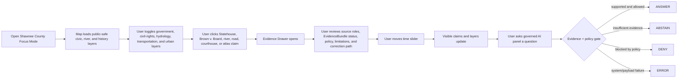
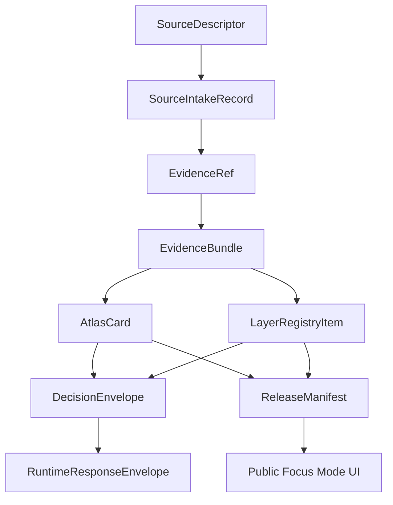

<!--
doc_id: NEEDS_VERIFICATION
title: Shawnee County Focus Mode Build Plan
type: standard
version: v1
status: draft
owners: [NEEDS_VERIFICATION]
created: 2026-05-21
updated: 2026-05-21
policy_label: public_draft
related:
  - docs/focus-modes/ellsworth-county/build-plan.md
  - docs/focus-modes/riley-county/build-plan.md
  - docs/focus-modes/shawnee-county/README.md
  - docs/focus-modes/shawnee-county/layer-registry.md
  - docs/focus-modes/shawnee-county/acceptance-checklist.md
tags: [kfm, focus-mode, shawnee-county, topeka, kansas-river, civil-rights, state-government]
notes:
  - Draft plan prepared without mounted repository inspection.
  - Paths, owners, doc IDs, schema homes, and validator names require repository verification before merge.
  - Historical, civic, civil-rights, infrastructure, and urban-planning claims require source intake and evidence review before publication.
-->

<a id="top"></a>

# Shawnee County Focus Mode Build Plan

> **Purpose:** establish a third Kansas Frontier Matrix county proof slice after Ellsworth County and Riley County, with a distinct domain profile: **state government, civil-rights history, Topeka urban geography, Kansas River corridor, rail and transportation infrastructure, county-seat transition, archives, public institutions, and civic memory.**


---

## Quick links

- [1. Why Shawnee County](#1-why-shawnee-county)
- [2. Product thesis](#2-product-thesis)
- [3. Scope boundary](#3-scope-boundary)
- [4. First demo layers](#4-first-demo-layers)
- [5. User journeys](#5-user-journeys)
- [6. UI surfaces](#6-ui-surfaces)
- [7. Governed object model](#7-governed-object-model)
- [8. Proposed repository shape](#8-proposed-repository-shape)
- [9. Build phases](#9-build-phases)
- [10. First PR sequence](#10-first-pr-sequence)
- [11. Acceptance checklist](#11-acceptance-checklist)
- [12. Risk register](#12-risk-register)
- [13. Source seed list](#13-source-seed-list)
- [14. Open verification questions](#14-open-verification-questions)
- [15. Recommended first milestone](#15-recommended-first-milestone)

---

## Operating posture

> [!IMPORTANT]
> Shawnee County Focus Mode is a **governed proof slice**, not a loose Topeka history map. It must preserve KFM’s core invariants:
>
> - EvidenceBundle outranks generated language.
> - Public clients use governed APIs, released artifacts, catalog records, tile services, and policy-safe runtime envelopes.
> - Public UI must not read directly from `RAW`, `WORK`, `QUARANTINE`, unpublished candidate data, canonical/internal stores, or direct model runtime outputs.
> - Publication is a governed state transition, not a file move.
> - AI outputs are downstream carriers, not sovereign truth.
> - Civil-rights, education, personal-history, public-institution, infrastructure, and property-related claims must stay source-bound and correction-friendly.

---

# 1. Why Shawnee County

Shawnee County is the right third Focus Mode because it gives KFM a **civic and institutional proof slice**.

Ellsworth County tests frontier history, county-scale environmental context, and settlement memory.

Riley County tests Flint Hills ecology, military geography, research-site sensitivity, Manhattan/K-State context, and river landscapes.

Shawnee County adds:

| KFM capability | Shawnee County proof value |
|---|---|
| State-government geography | Kansas State Capitol / Statehouse, agencies, public-law context |
| Civil-rights geography | Brown v. Board of Education public history, school desegregation memory, careful claim boundaries |
| Archive-heavy evidence | county records, courthouse history, state records, National Park Service, historical markers |
| Urban Focus Mode | Topeka street grid, neighborhoods, institutions, infrastructure, planning layers |
| River and floodplain context | Kansas River corridor, bridges, urban-water relationship |
| Transportation history | railroads, highways, streetcar / road corridors, state-capital connectivity |
| Public-institution sensitivity | schools, courthouses, government buildings, public facilities |
| Correction-friendly public history | heavily interpreted topics need explicit evidence, uncertainty, and limitation display |

> [!NOTE]
> Shawnee County should not be treated as simply “Topeka.” The county view should include Topeka as the dominant civic anchor while still preserving rural towns, townships, river corridors, roads, and county-level governance.

---

# 2. Product thesis

## User-facing thesis

> **Shawnee County Focus Mode lets a user explore how state government, civil-rights history, public institutions, river geography, transportation corridors, and urban growth shaped one of Kansas’s most institutionally important counties — with every visible claim tied to evidence and every sensitive or interpretive topic handled through public-safe policy.**

## Internal KFM thesis

Shawnee County should prove that Focus Mode can handle:

```text
state government + civil rights + urban history + river corridor + public institutions + archive provenance + correction workflows
```

without collapsing source-backed civic history into generic storytelling.

The system must preserve distinctions between:

- official record vs. interpretive marker
- legal decision vs. public memory
- site location vs. personal/private history
- public building vs. restricted operational detail
- source claim vs. generated explanation
- current civic function vs. historical role
- county boundary vs. city boundary vs. institutional campus
- archive citation vs. narrative summary

---

# 3. Scope boundary

## 3.1 Geography

Initial scope:

```text
Shawnee County, Kansas
```

Priority spatial anchors:

- Shawnee County boundary
- Topeka
- Kansas River corridor
- Kansas State Capitol / Statehouse area
- Brown v. Board of Education National Historical Park / Monroe School public-history context
- historic county-seat transition context: Tecumseh → Topeka
- county courthouse / public administration context
- major roads, rail, bridges, and civic corridors
- public-safe floodplain / watershed context
- selected towns and communities such as Rossville, Silver Lake, Auburn, Tecumseh, and Dover where source-supported

## 3.2 Time range

Initial buckets:

| Bucket | Role in demo |
|---|---|
| Before 1800 | Indigenous and pre-territorial context; public-safe and carefully scoped |
| 1800–1854 | movement corridors, river context, territorial lead-up |
| 1854–1861 | territorial organization, county creation, county-seat transition |
| 1861–1903 | statehood, Topeka capital context, Statehouse construction era, rail and civic growth |
| 1904–1945 | urban growth, public institutions, schools, transport, flood / infrastructure memory |
| 1946–1965 | Brown v. Board context, postwar urban change, courthouse/institutional change |
| 1966–2000 | highway era, planning, riverfront, public administration, suburban expansion |
| 2001–present | modern civic geography, public-safe planning, resilience, current institutional context |

> [!CAUTION]
> Time buckets are planning scaffolds. They are not publication claims until evidence-reviewed.

## 3.3 Not in MVP

Do **not** include in the first Shawnee County MVP:

- living-person student, school, or family records
- private addresses or household-level modern data
- law-enforcement operational details
- courthouse security details
- school security details
- restricted infrastructure details
- active case or investigative layers
- parcel ownership treated as title truth
- political-opinion profiling
- civil-rights claims without source-grounded context and correction path
- public direct model endpoint

---

# 4. First demo layers

## 4.1 MVP layer registry

| Layer ID | Layer | Domain | Purpose | Initial posture |
|---|---|---:|---|---|
| `kfm.layer.shawnee.county_boundary.v1` | Shawnee County boundary | civic | establish spatial frame | public draft |
| `kfm.layer.shawnee.topeka_context.v1` | Topeka civic context | civic/history | state capital and county seat anchor | public draft |
| `kfm.layer.shawnee.statehouse_context.v1` | Kansas State Capitol / Statehouse context | government/history | state-government geography anchor | public draft, evidence-required |
| `kfm.layer.shawnee.brown_v_board_context.v1` | Brown v. Board / Monroe School public-history context | civil-rights/history | civil-rights geography anchor | public draft, evidence-required |
| `kfm.layer.shawnee.county_seat_transition.v1` | Tecumseh to Topeka county-seat transition | county-history | county institutional history | public draft, evidence-required |
| `kfm.layer.shawnee.kansas_river_corridor.v1` | Kansas River corridor | hydrology/urban | river, bridge, floodplain, settlement relationship | public draft |
| `kfm.layer.shawnee.transportation_corridors.v1` | Rail / highway / bridge corridors | transportation/history | movement and urban growth | public draft |
| `kfm.layer.shawnee.public_institutions.v1` | Public institutions | civic | courthouse, schools, state offices, parks, public facilities | public-safe, generalized where needed |
| `kfm.layer.shawnee.land_cover_urban_baseline.v1` | Urban / rural land-cover baseline | planning/environment | urban footprint and rural matrix | derived, public-safe |
| `kfm.layer.shawnee.timeline_events.v1` | Timeline events | cross-domain | temporal navigation | public draft |
| `kfm.layer.shawnee.atlas_claims.v1` | Atlas claim points / polygons | cross-domain | clickable evidence-backed claims | requires EvidenceRef |

## 4.2 Layer contract

Each layer must have:

```yaml
layer_id: kfm.layer.shawnee.<name>.v1
title: NEEDS_VERIFICATION
domain: NEEDS_VERIFICATION
layer_type: observed | derived | interpreted | modeled | administrative
geometry_type: point | line | polygon | raster | tile | mixed
source_refs: []
evidence_refs: []
policy_label: public_draft | restricted | internal | public
review_state: draft | review | published | deprecated
rights_status: unknown | public | open | controlled | restricted
sensitivity: public | generalized | restricted | review_required
temporal_scope:
  start: NEEDS_VERIFICATION
  end: NEEDS_VERIFICATION
limitations: []
correction_path: NEEDS_VERIFICATION
```

---

# 5. User journeys

## 5.1 Primary public journey



## 5.2 Example public questions

Supported after evidence review:

- “Why is Topeka central to Shawnee County’s civic geography?”
- “What evidence supports the county-seat transition from Tecumseh to Topeka?”
- “What is the public-history context for Brown v. Board in Topeka?”
- “How did the Kansas River shape Topeka’s development?”
- “What Statehouse claims are source-supported?”
- “Which layers are generalized and why?”
- “What sources support this atlas card?”

Should abstain or deny unless governed release permits them:

- “Show private student records.”
- “Show courthouse security details.”
- “Show school security infrastructure.”
- “Give private household-level data.”
- “Make a legal conclusion from a historical summary.”
- “Treat generated text as evidence.”
- “Publish a claim with no EvidenceBundle.”

---

# 6. UI surfaces

## 6.1 Map canvas

Required:

- MapLibre GL JS map
- placeholder basemap
- Shawnee County boundary
- Topeka / county place anchors
- clickable mock features
- selected feature highlight
- layer toggles
- scale bar
- attribution
- zoom controls
- compass / orientation affordance
- public-safe layer legend

## 6.2 Layer registry panel

Show for every layer:

| Field | Meaning |
|---|---|
| Layer name | human-readable layer title |
| Domain | civil-rights, government, history, hydrology, transportation, planning |
| Layer type | observed, derived, interpreted, modeled, administrative |
| Evidence state | resolved, unresolved, not required, pending |
| Policy label | public, public_draft, restricted, internal |
| Review state | draft, review, published, deprecated |
| Sensitivity | public, generalized, restricted, review_required |
| Time coverage | start/end or bucketed range |
| Limitations | short public-facing warning |

## 6.3 Timeline panel

Initial buckets:

```text
Before 1800
1800–1854
1854–1861
1861–1903
1904–1945
1946–1965
1966–2000
2001–present
```

Timeline should control:

- visible atlas claims
- civic and institutional layers
- civil-rights public-history cards
- county-seat transition cards
- river / floodplain context layers
- feature styling by temporal relevance

## 6.4 Evidence Drawer

When a user clicks a layer feature or atlas claim, show:

```yaml
title: NEEDS_VERIFICATION
claim_text: NEEDS_VERIFICATION
object_type: AtlasCard | LayerFeature | TimelineEvent | EvidenceBundle
spatial_scope: NEEDS_VERIFICATION
temporal_scope: NEEDS_VERIFICATION
evidence_refs: []
evidence_bundle_status: unresolved | resolved | restricted | missing
source_roles: []
policy_label: public_draft
rights_status: unknown
sensitivity: review_required
review_state: draft
limitations: []
correction_path: NEEDS_VERIFICATION
```

## 6.5 Atlas Card panel

Minimum atlas card types:

| Card type | Example |
|---|---|
| `state_government_context` | Kansas State Capitol / Statehouse |
| `civil_rights_public_history_context` | Brown v. Board / Monroe School |
| `county_institution_context` | county seat / courthouse transition |
| `urban_place_context` | Topeka |
| `hydrology_urban_context` | Kansas River corridor |
| `transportation_corridor_context` | rail / highway / bridge corridor |
| `derived_layer_context` | urban land-cover baseline |

## 6.6 Governed AI panel

The AI panel must only emit finite runtime outcomes:

```text
ANSWER
ABSTAIN
DENY
ERROR
```

Example response envelope:

```json
{
  "object_type": "RuntimeResponseEnvelope",
  "schema_version": "v1",
  "question": "What is the public-history context for Brown v. Board in Topeka?",
  "outcome": "ABSTAIN",
  "answer": null,
  "reason": "Evidence bundle is not yet resolved for publication-grade response.",
  "evidence_refs": [
    "kfm://evidence-ref/shawnee/brown-v-board-context/v1"
  ],
  "policy_label": "public_draft",
  "limitations": [
    "This draft object requires source intake, rights review, and source-specific historical framing before publication."
  ]
}
```

---

# 7. Governed object model

## 7.1 Object flow



## 7.2 SourceDescriptor draft

```yaml
id: kfm.source.shawnee.brown_v_board.nps.placeholder
title: Brown v. Board of Education National Historical Park source placeholder
domain: civil_rights_history
source_type: federal_public_history_reference
role: primary_or_context_NEEDS_VERIFICATION
rights_status: unknown
spatial_coverage: Topeka, Shawnee County, Kansas
temporal_coverage: NEEDS_VERIFICATION
status: proposed
limitations:
  - Requires source intake and review before claims are published.
  - Civil-rights claims require careful distinction between legal history, public memory, and site interpretation.
```

## 7.3 EvidenceRef draft

```yaml
id: kfm.evidence_ref.shawnee.brown_v_board_context.v1
bundle_id: kfm.evidence_bundle.shawnee.brown_v_board_context.v1
claim_scope: Public-history context for Brown v. Board / Monroe School within Shawnee County Focus Mode
resolution_required: true
```

## 7.4 EvidenceBundle draft

```yaml
id: kfm.evidence_bundle.shawnee.brown_v_board_context.v1
resolved: false
source_refs:
  - kfm.source.shawnee.brown_v_board.nps.placeholder
policy_label: public_draft
rights_status: unknown
sensitivity: review_required
review_state: draft
limitations:
  - Draft bundle. Do not publish final historical/legal claims until source-reviewed.
  - Do not include private student or family-level data.
  - Public-history narrative should preserve source attribution and correction path.
```

## 7.5 AtlasCard draft

```yaml
id: kfm.atlas_card.shawnee.brown_v_board.v1
title: Brown v. Board / Monroe School Public-History Context
card_type: civil_rights_public_history_context
spatial_scope: Topeka, Shawnee County, Kansas NEEDS_VERIFICATION
temporal_scope: NEEDS_VERIFICATION
evidence_refs:
  - kfm.evidence_ref.shawnee.brown_v_board_context.v1
policy_label: public_draft
review_state: draft
limitations:
  - Draft card. Not a final legal, educational, or historical authority statement.
```

## 7.6 DecisionEnvelope draft

```yaml
id: kfm.decision.shawnee.question.brown_v_board_context.v1
question: What is the public-history context for Brown v. Board in Topeka?
outcome: ABSTAIN
reason: Evidence bundle unresolved.
evidence_refs:
  - kfm.evidence_ref.shawnee.brown_v_board_context.v1
policy_label: public_draft
```

## 7.7 ReleaseManifest draft

```yaml
id: kfm.release.shawnee.focus_mode.v0_1
release_state: draft
included_layers:
  - kfm.layer.shawnee.county_boundary.v1
  - kfm.layer.shawnee.topeka_context.v1
  - kfm.layer.shawnee.statehouse_context.v1
  - kfm.layer.shawnee.brown_v_board_context.v1
  - kfm.layer.shawnee.kansas_river_corridor.v1
validation_state: pending
rollback_plan: required_before_publication
correction_path: required_before_publication
```

---

# 8. Proposed repository shape

> [!WARNING]
> Repository access is **not confirmed** in this planning session. Treat all paths as proposed until checked against the live branch and KFM Directory Rules.

```text
docs/
  focus-modes/
    shawnee-county/
      README.md
      build-plan.md
      layer-registry.md
      evidence-model.md
      acceptance-checklist.md
      source-seed-list.md
      public-safety-notes.md
      civil-rights-framing-notes.md

data/
  catalog/
    sources/
      shawnee/
        source_descriptors.yaml
    stac/
      shawnee/
        README.md

contracts/
  focus_mode/
    focus_mode_payload.schema.json
  atlas/
    atlas_card.schema.json
  evidence/
    evidence_ref.schema.json
    evidence_bundle.schema.json
  release/
    release_manifest.schema.json

fixtures/
  focus_modes/
    shawnee/
      valid/
        focus_mode_payload.valid.json
        layer_registry.valid.json
        atlas_card.statehouse.valid.json
        atlas_card.brown_v_board.valid.json
        atlas_card.kansas_river.valid.json
        evidence_bundle.statehouse.valid.json
        evidence_bundle.brown_v_board.valid.json
      invalid/
        unresolved_evidence_ref.invalid.json
        private_student_record.invalid.json
        courthouse_security_detail.invalid.json
        school_security_detail.invalid.json
        missing_policy_label.invalid.json
        model_output_as_evidence.invalid.json
        public_raw_access.invalid.json

apps/
  web/
    src/
      focus-modes/
        shawnee/
          index.js
          layers.js
          mock-api.js
          mock-data.js
          evidence-drawer.js
          timeline.js
          ai-panel.js
          styles.css

tools/
  validators/
    validate_focus_mode_payload.py
    validate_atlas_card.py
    validate_evidence_bundle.py
    validate_layer_registry.py
```

---

# 9. Build phases

## Phase 1 — Control plane

Goal: establish Shawnee County Focus Mode as a governed civic/civil-rights/county-history template.

Deliverables:

- `docs/focus-modes/shawnee-county/README.md`
- `build-plan.md`
- `layer-registry.md`
- `source-seed-list.md`
- `public-safety-notes.md`
- `civil-rights-framing-notes.md`
- first schema references
- valid and invalid fixture plan

Definition of done:

```text
[ ] scope is explicit
[ ] sensitive personal/school/security material is denied by default
[ ] civil-rights claims require EvidenceRef and source framing
[ ] all layers have policy labels
[ ] all claim-bearing objects require EvidenceRef
[ ] placeholders are clearly marked
```

## Phase 2 — Mock governed API

Goal: make Shawnee Focus Mode run without live pipelines.

Mock endpoints:

```text
GET /api/focus-modes/shawnee
GET /api/layers/shawnee
GET /api/evidence/{bundle_id}
GET /api/atlas-cards/{card_id}
POST /api/ai/answer
GET /api/releases/shawnee-focus-mode
```

Definition of done:

```text
[ ] mock payloads validate
[ ] unresolved evidence produces ABSTAIN
[ ] private student or security-detail requests produce DENY
[ ] invalid payloads fail closed
[ ] public layer payloads do not reference RAW / WORK / QUARANTINE
```

## Phase 3 — UI prototype

Goal: show the full Shawnee Focus Mode surface in a browser.

Deliverables:

- MapLibre map
- layer registry
- clickable mock Statehouse, Brown v. Board, Topeka, Kansas River, courthouse, and county-seat-transition features
- evidence drawer
- timeline
- atlas card panel
- governed AI answer panel

Definition of done:

```text
[ ] user can click Statehouse context and see evidence status
[ ] user can click Brown v. Board context and see public-history limitations
[ ] user can click Kansas River context and see hydrology/urban limitations
[ ] user can toggle civic / civil-rights / hydrology / transportation / planning layers
[ ] timeline changes visible claim set
[ ] AI panel returns all four finite outcomes through examples
```

## Phase 4 — Validators and negative fixtures

Goal: prove failure modes before publication.

Required invalid fixtures:

| Fixture | Expected failure |
|---|---|
| `unresolved_evidence_ref.invalid.json` | publication attempted with unresolved evidence |
| `private_student_record.invalid.json` | private school/student material exposed |
| `courthouse_security_detail.invalid.json` | security-sensitive public-institution detail exposed |
| `school_security_detail.invalid.json` | school security detail exposed |
| `missing_policy_label.invalid.json` | public object lacks policy posture |
| `model_output_as_evidence.invalid.json` | AI output treated as proof |
| `public_raw_access.invalid.json` | public client references RAW/WORK/QUARANTINE |

## Phase 5 — Source intake upgrade

Goal: replace placeholders with inspected sources.

Deliverables:

- source descriptors
- intake records
- rights review notes
- sensitivity review notes
- evidence bundle drafts
- reviewed atlas cards
- limitations notes

Minimum real-evidence targets:

```text
[ ] one Statehouse public historical-context claim
[ ] one Brown v. Board / Monroe School public-history claim
[ ] one county-seat transition claim
[ ] one Kansas River / Topeka hydrology-context claim
[ ] one transportation or rail/highway-corridor claim
```

## Phase 6 — Release candidate

Goal: prepare `v0.1` public-safe release.

Deliverables:

- `ReleaseManifest`
- validation report
- correction path
- rollback plan
- public-safe layer manifest
- known limitations
- release notes

Definition of done:

```text
[ ] public layers have policy labels and review states
[ ] rights status is resolved or blocked
[ ] student, school-security, courthouse-security, and private-address details are excluded
[ ] civil-rights public-history framing is source-cited and correction-friendly
[ ] release can be rolled back
[ ] public UI only consumes governed surfaces
```

---

# 10. First PR sequence

## PR-0001 — Shawnee County Focus Mode Control Plane

Files:

```text
docs/focus-modes/shawnee-county/README.md
docs/focus-modes/shawnee-county/build-plan.md
docs/focus-modes/shawnee-county/layer-registry.md
docs/focus-modes/shawnee-county/source-seed-list.md
docs/focus-modes/shawnee-county/public-safety-notes.md
docs/focus-modes/shawnee-county/civil-rights-framing-notes.md
docs/focus-modes/shawnee-county/acceptance-checklist.md
```

Acceptance:

```text
[ ] Focus Mode scope is clear.
[ ] Shawnee County is justified as a complementary proof slice.
[ ] Every planned layer has a policy posture.
[ ] Civil-rights and public-institution boundaries are explicitly controlled.
[ ] No publication claims are made from placeholders.
```

## PR-0002 — Shawnee Contracts and Fixtures

Files:

```text
fixtures/focus_modes/shawnee/valid/focus_mode_payload.valid.json
fixtures/focus_modes/shawnee/valid/layer_registry.valid.json
fixtures/focus_modes/shawnee/valid/atlas_card.statehouse.valid.json
fixtures/focus_modes/shawnee/valid/atlas_card.brown_v_board.valid.json
fixtures/focus_modes/shawnee/invalid/private_student_record.invalid.json
fixtures/focus_modes/shawnee/invalid/courthouse_security_detail.invalid.json
fixtures/focus_modes/shawnee/invalid/missing_policy_label.invalid.json
```

Acceptance:

```text
[ ] Valid fixtures include required governed fields.
[ ] Invalid fixtures represent real failure modes.
[ ] EvidenceRef / EvidenceBundle relationship is explicit.
[ ] Mock cards remain draft until evidence intake.
```

## PR-0003 — Shawnee Mock API

Files:

```text
apps/web/src/focus-modes/shawnee/mock-api.js
apps/web/src/focus-modes/shawnee/layers.js
apps/web/src/focus-modes/shawnee/mock-data.js
```

Acceptance:

```text
[ ] Mock API returns finite runtime outcomes.
[ ] Layer registry is API-shaped, not UI-only.
[ ] Public-safe data is separated from restricted mock examples.
```

## PR-0004 — Shawnee UI Shell

Files:

```text
apps/web/src/focus-modes/shawnee/index.js
apps/web/src/focus-modes/shawnee/evidence-drawer.js
apps/web/src/focus-modes/shawnee/timeline.js
apps/web/src/focus-modes/shawnee/ai-panel.js
apps/web/src/focus-modes/shawnee/styles.css
```

Acceptance:

```text
[ ] Map renders.
[ ] Layer panel renders.
[ ] Evidence Drawer renders.
[ ] Atlas Card panel renders.
[ ] Timeline filters mock claims.
[ ] AI panel demonstrates ANSWER / ABSTAIN / DENY / ERROR.
```

## PR-0005 — Validator Hardening

Files:

```text
tools/validators/validate_focus_mode_payload.py
tools/validators/validate_atlas_card.py
tools/validators/validate_evidence_bundle.py
tools/validators/validate_layer_registry.py
```

Acceptance:

```text
[ ] Public RAW / WORK / QUARANTINE references fail.
[ ] Missing EvidenceRef fails for claim-bearing objects.
[ ] Missing policy label fails.
[ ] Private student data fails public release.
[ ] Public-institution security detail fails public release.
[ ] Model output as proof fails.
```

---

# 11. Acceptance checklist

```text
[ ] Shawnee County map loads.
[ ] User can toggle at least 5 public-safe layers.
[ ] User can click Statehouse context and open Evidence Drawer.
[ ] User can click Brown v. Board context and open Evidence Drawer.
[ ] User can click Kansas River context and open Evidence Drawer.
[ ] User can inspect at least 3 Atlas Cards.
[ ] Timeline control changes visible claims/layers.
[ ] Governed AI panel returns ANSWER for supported claims.
[ ] Governed AI panel returns ABSTAIN for unresolved evidence.
[ ] Governed AI panel returns DENY for restricted/sensitive requests.
[ ] Governed AI panel returns ERROR for invalid payload/system failure.
[ ] Every visible claim has EvidenceRef.
[ ] Every EvidenceRef points to an EvidenceBundle.
[ ] Every layer has policy_label.
[ ] Every layer has review_state.
[ ] Every public object has correction path.
[ ] No public UI path reads RAW, WORK, or QUARANTINE.
[ ] Private student data is excluded.
[ ] Courthouse/school security detail is excluded.
[ ] ReleaseManifest exists before anything is called published.
```

---

# 12. Risk register

| Risk | Why it matters | Control |
|---|---|---|
| Civil-rights history becomes oversimplified | Public-history trust failure | source-framed Atlas Cards and limitations |
| Private student/family details leak | Privacy and harm risk | deny by default; no living-person/private records |
| Public-institution security details leak | Safety risk | exclude or generalize public-institution layers |
| Legal history gets converted into legal advice | Misuse risk | historical framing only; not legal advice |
| Statehouse/current government layer implies operational access | Security and misrepresentation risk | public context only |
| Kansas River layer hides flood uncertainty | planning risk | distinguish observation/model/regulatory/derived |
| Generated narrative treated as source | evidence failure | model output cannot be proof |
| Mock placeholders become doctrine | demo pollution | all placeholders marked draft/unresolved |
| Topeka dominates county view too much | county-scale imbalance | include towns, township, river, and rural matrix where evidence-supported |
| Urban layers expose private parcel/household detail | privacy and title-risk | public-safe aggregation; assessor/tax ≠ title truth |

---

# 13. Source seed list

> [!NOTE]
> These are **candidate source seeds**, not yet KFM-ingested sources. Each requires `SourceDescriptor`, rights review, sensitivity review, checksum/citation handling, and EvidenceBundle resolution before publication-grade use.

| Seed | Use | Starting URL |
|---|---|---|
| Shawnee County visitor / county history page | courthouse and county-seat transition context | https://www.snco.gov/visitinfo/ |
| Shawnee County official site | current county civic context | https://www.snco.gov/ |
| Brown v. Board of Education National Historical Park | federal public-history context | https://www.nps.gov/brvb/ |
| Kansas Statehouse / Capitol history | state-government historical context | https://www.visittopeka.com/about-topeka/kansas-statehouse/statehouse-history/ |
| Kansas Historical Society | Statehouse, markers, state records, civic history | https://www.kshs.org/ |
| Kansas Historical Markers | marker-based public-history seed | https://www.kansashistory.gov/p/kansas-historical-markers/14999 |
| Kansas Geological Survey — county geology index | geology / terrain / hydrology source routing | https://www.kgs.ku.edu/General/Geology/County/ |
| City of Topeka official site | modern city context / planning source routing | https://www.topeka.org/ |
| National Archives / Brown case records | source routing for legal/civil-rights evidence | https://www.archives.gov/education/lessons/brown-v-board |
| Library of Congress Sanborn / historic maps search | historic urban map source routing | https://www.loc.gov/maps/ |
| USGS National Hydrography / stream data | river and hydrology source routing | https://www.usgs.gov/national-hydrography |
| FEMA flood maps | regulatory floodplain source routing | https://msc.fema.gov/portal/home |

---

# 14. Open verification questions

```text
[ ] What is the canonical repo path for Focus Mode documents?
[ ] Does KFM already have a focus_mode_payload schema?
[ ] Does KFM already define AtlasCard fields differently?
[ ] Does KFM already define civil-rights public-history handling rules?
[ ] Does KFM already define public-institution security filters?
[ ] Which validators already exist?
[ ] Should Shawnee County share contracts with Ellsworth and Riley or define county-specific extensions?
[ ] What public-safe geometry source should be used for county boundary?
[ ] What source authority should define Statehouse claims?
[ ] What source authority should define Brown v. Board public-history claims?
[ ] What source authority should define county-seat transition claims?
[ ] What source authority should define Kansas River / Topeka hydrology claims?
[ ] What exact policy rule controls school/student/private material?
[ ] What exact policy rule controls public-institution security detail?
[ ] What release manifest naming convention should be used?
[ ] What rollback/correction path should a county Focus Mode use?
```

---

# 15. Recommended first milestone

## Milestone 1: Shawnee County Focus Mode Control Plane

Build the documentation, layer registry, source seed list, public-safety notes, civil-rights framing notes, and fixtures before the UI.

This keeps the Shawnee proof slice from becoming an attractive civic map with weak evidence boundaries.

The first concrete deliverable should be:

```text
docs/focus-modes/shawnee-county/build-plan.md
```

Once this is stable, use it to generate the mock API and single-file UI prototype.

---

[Back to top](#top)
