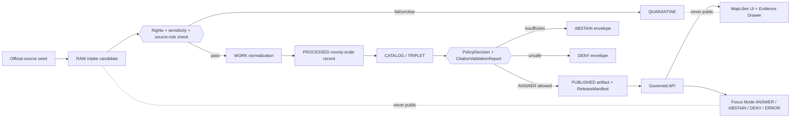
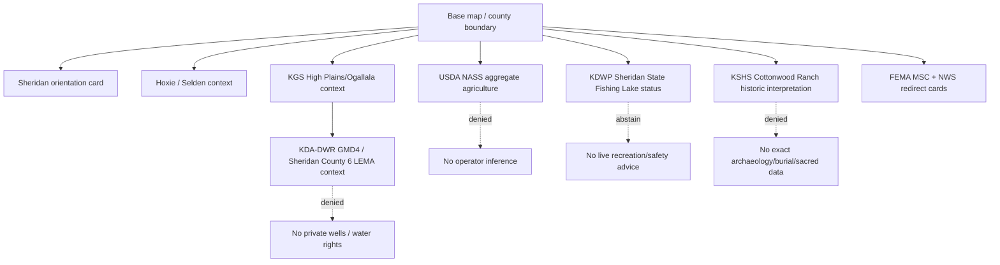
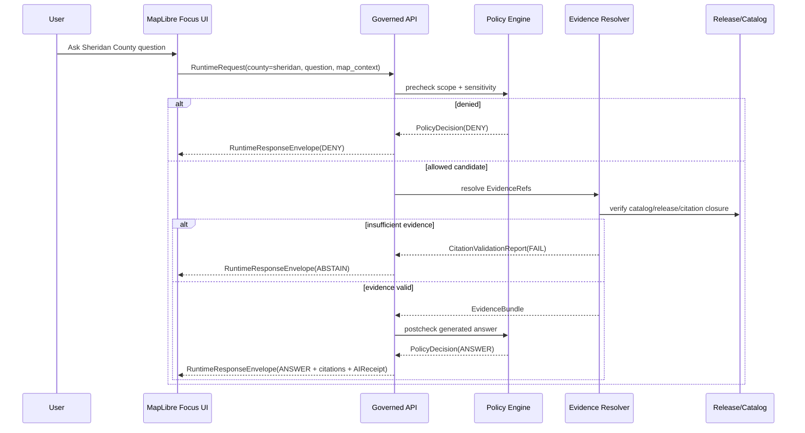
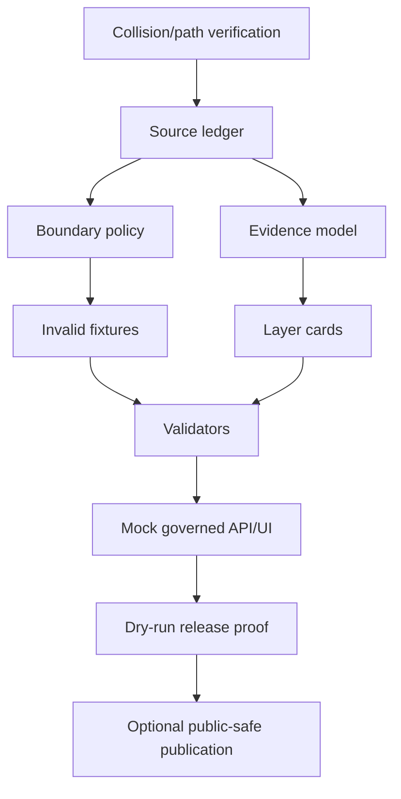

<!-- [KFM_META_BLOCK_V2]
doc_id: NEEDS_VERIFICATION
title: Sheridan County Focus Mode Build Plan
county_name: Sheridan County
county_slug: sheridan_county
kansas_county_fips: "20179"
created: 2026-06-11
updated: 2026-06-11
artifact_filename: sheridan_county_focus_mode_build_plan.md
status: PROPOSED
release_status: NEEDS_VERIFICATION
owners:
  - NEEDS_VERIFICATION:<OWNER:focus-mode-steward>
  - NEEDS_VERIFICATION:<OWNER:source-ledger-steward>
  - NEEDS_VERIFICATION:<OWNER:hydrology-water-steward>
  - NEEDS_VERIFICATION:<OWNER:agriculture-steward>
  - NEEDS_VERIFICATION:<OWNER:public-safety-policy-steward>
review_assignments:
  directory_rules_review: NEEDS_VERIFICATION
  source_admission_review: NEEDS_VERIFICATION
  rights_review: NEEDS_VERIFICATION
  sensitivity_review: NEEDS_VERIFICATION
  policy_review: NEEDS_VERIFICATION
  release_review: NEEDS_VERIFICATION
unverified_repository_paths:
  legacy_observed_pattern: docs/focus-mode/counties/sheridan_county/sheridan_county_focus_mode_build_plan.md
  canonical_doctrine_pattern: docs/focus-modes/sheridan-county/build-plan.md
  repository_path_decision: NEEDS_VERIFICATION
schema_contract_policy_fixture_homes:
  source_descriptors: NEEDS_VERIFICATION:data/registry/source_descriptors/focus_modes/sheridan_county/
  schemas: NEEDS_VERIFICATION:schemas/contracts/v1/focus_mode/
  contracts: NEEDS_VERIFICATION:contracts/focus_mode/
  policies: NEEDS_VERIFICATION:policy/focus_modes/sheridan_county/
  fixtures: NEEDS_VERIFICATION:fixtures/focus_modes/sheridan_county/
  correction_notices: NEEDS_VERIFICATION:release/correction_notices/
  rollback_cards: NEEDS_VERIFICATION:release/rollback_cards/
  release_manifests: NEEDS_VERIFICATION:release/manifests/
defining_public_safe_boundary: >
  Public county-scale High Plains/Ogallala, Sheridan County 6 LEMA, aggregate agriculture,
  public recreation-status, transportation-context, historic-site context, and FEMA/NWS hazard-context
  only; no private-well, individual water-right, irrigation-point, owner/operator, property-title,
  potability, infrastructure-vulnerability, precise sensitive ecology, archaeological/burial/sacred,
  or live emergency/recreation guidance.
collision_search_results:
  supplied_completed_collision_register: CONFIRMED_ABSENT:Sheridan County was absent from the user-supplied completed/collision register.
  live_county_index: CONFIRMED:Sheridan row is present as not-started in accessible repo index, but not-started is not proof of absence.
  filename_content_search: CONFIRMED_NO_HIT_ACCESSIBLE:sheridan_county, sheridan-county, Sheridan County Focus Mode, and county_focus_mode_build_plan accessible searches returned no file/PR/issue hit in available repo connector results.
  rejected_material_collisions:
    - Greeley County: existing accessible repo file docs/focus-mode/counties/greeley_county/greeley_county_focus_mode_build.md
    - Smith County: existing accessible repo file docs/focus-mode/counties/smith_county/smith_county_build_plan.md
    - Wichita County: existing accessible repo file docs/focus-mode/counties/wichita_county/wichita_county_build_plan.md
    - Lincoln County: existing accessible repo file docs/focus-mode/counties/lincoln_county/lincoln_county_focus_mode_build_plan.md
    - Nemaha County: existing accessible repo file docs/focus-mode/counties/nemaha_county/nemaha_county_build_plan.md
    - Ness County: existing accessible repo file docs/focus-mode/counties/ness_county/ness_county_focus_mode_build_plan.md
    - Stanton County: generated in the immediately previous artifact in this chat and therefore not eligible.
  exhaustive_absence: NEEDS_VERIFICATION:private branches, prior chats, local artifact stores, and unmounted worktrees were not fully inspectable.
directory_rules_basis:
  checked: CONFIRMED
  basis: >
    Directory Rules make placement a governance boundary. Accessible focus-mode README states
    canonical doctrine favors docs/focus-modes/<area>-county/ while docs/focus-mode/counties/
    is a legacy/divergent path. This plan records both and treats final path as NEEDS_VERIFICATION.
official_sources_checked_this_run:
  - Sheridan County official website
  - Hoxie official page on Sheridan County website
  - Selden official page on Sheridan County website
  - Kansas Department of Wildlife and Parks Sheridan State Fishing Lake page
  - Kansas Department of Agriculture Division of Water Resources
  - Kansas Department of Agriculture Northwest Kansas GMD No. 4 page
  - Kansas Geological Survey homepage and High Plains/Ogallala page
  - Kansas Historical Society Cottonwood Ranch and Register Database pages
  - USDA NASS 2022 Census of Agriculture county profile for Sheridan County, Kansas
  - U.S. Census Bureau QuickFacts for Sheridan County, Kansas
  - FEMA Flood Map Service Center
  - NOAA/NWS Goodland Forecast Office page
[/KFM_META_BLOCK_V2] -->

# Sheridan County Focus Mode Build Plan

## Public-safe subtitle

**County-scale High Plains/Ogallala, Sheridan County 6 LEMA, aggregate agriculture, public recreation-status, transportation-context, and historic-site context — without private-well, water-right, owner/operator, property-title, potability, sensitive-location, or live emergency/recreation guidance.**

> **One-line product thesis:** Build a Sheridan County Focus Mode that teaches how High Plains water governance, aggregate agriculture, public recreation-status, small-city settlement context, and state-curated historic interpretation fit together at county scale, while refusing to expose or infer private wells, individual water rights, property/title/access, precise sensitive ecology, archaeology, burial/sacred places, infrastructure vulnerabilities, or live safety decisions.


| Field | Value |
|---|---|
| County | Sheridan County, Kansas |
| Slug | `sheridan_county` |
| FIPS | `20179` |
| Created / updated | `2026-06-11` |
| Artifact | `sheridan_county_focus_mode_build_plan.md` |
| Current status | `PROPOSED` planning artifact |
| Public-safe boundary | County-scale High Plains/Ogallala + Sheridan County 6 LEMA + aggregate agriculture + public recreation-status + historic interpretation, excluding private-well/water-right/property/title/sensitive/live guidance |
| Repository modification claimed? | No |
| Source admission claimed? | No |
| Promotion/publication claimed? | No |

## Quick links

1. [Operating posture](#1-operating-posture)  
2. [Why this county](#2-why-this-county)  
3. [Product thesis](#3-product-thesis)  
4. [Scope boundary](#4-scope-boundary)  
5. [First demo layers](#5-first-demo-layers)  
6. [User journeys](#6-user-journeys)  
7. [UI surfaces](#7-ui-surfaces)  
8. [Governed object model](#8-governed-object-model)  
9. [Proposed repository shape](#9-proposed-repository-shape)  
10. [Build phases](#10-build-phases)  
11. [First PR sequence](#11-first-pr-sequence)  
12. [Acceptance checklist](#12-acceptance-checklist)  
13. [Fixture plan](#13-fixture-plan)  
14. [Risk register](#14-risk-register)  
15. [Source seed list](#15-source-seed-list)  
16. [Open verification questions](#16-open-verification-questions)  
17. [Recommended first milestone](#17-recommended-first-milestone)

## Executive build note

This is a **planning artifact** for a Sheridan County Focus Mode. It does not admit sources, create fixtures, run validators, update the repository, publish a payload, or alter any release state. Its strongest proof-slice value is the **governed collision of groundwater science, formal water-governance boundaries, aggregate agriculture, public recreation-status, and state historic interpretation** in a small High Plains county.

> [!IMPORTANT]
> **GitHub callout — public-safe boundary:** Do not merge a Sheridan County Focus Mode that can answer private-well, individual water-right, irrigation-point, owner/operator, property-title, potability, infrastructure-vulnerability, exact sensitive ecology, archaeological/burial/sacred-place, or live emergency/recreation questions. Those outcomes must return `ABSTAIN` or `DENY` through the governed response envelope.

## Evidence-boundary table

| Label | What can be said in this plan | What must not be inferred |
|---|---|---|
| `CONFIRMED` | Sheridan County was absent from the supplied collision register. Accessible repo index lists Sheridan as `not-started`, and repo focus-mode README records path divergence. Official pages checked include Sheridan County, Hoxie, Selden, KDWP, KDA-DWR, KGS, KSHS, USDA NASS, Census, FEMA MSC, and NWS Goodland. | No claim that a live repo has no private branches or prior local artifacts; no claim sources are admitted; no claim layers exist. |
| `PROPOSED` | Build a county-scale proof slice around High Plains/Ogallala + Sheridan County 6 LEMA + aggregate agriculture + KDWP renovation-status + Cottonwood Ranch interpretation. | Do not treat proposed layers, fixtures, contracts, APIs, or paths as implemented. |
| `NEEDS_VERIFICATION` | Final canonical path, source rights, derivative-display permissions, geometry authority, schema/contract reuse, validators, release owners, rollback machinery, KDOT map source availability, and whether any uninspected artifact already exists. | Do not claim exhaustive collision absence or release readiness. |
| `UNKNOWN` | Private branches, unmounted worktrees, prior chats not represented in accessible context, current CI status, runtime behavior, source-admission state, exact source licenses, and release policy enforcement. | Do not fill these gaps with generated confidence. |

---

# 1. Operating posture

## 1.1 KFM governing rules applied to Sheridan County

Sheridan County Focus Mode must preserve the KFM trust membrane:

`RAW -> WORK / QUARANTINE -> PROCESSED -> CATALOG / TRIPLET -> PUBLISHED`

Public map/UI/API/AI surfaces may consume only governed APIs, release manifests, released artifacts, catalog/triplet records, EvidenceBundles, and policy-safe runtime envelopes. Public UI must not read raw source captures, work-in-progress files, quarantined candidates, unpublished source-system records, direct model output, restricted sources, individual water-right records, private-well data, or live operational advisories.

For Sheridan County, this means the product can show **county-scale context** but must refuse **property-level or operator-level inferences**.

## 1.2 Truth-label and finite-outcome key

| Label/outcome | Meaning in this plan | Sheridan County example |
|---|---|---|
| `CONFIRMED` | Verified in this run from accessible repo evidence, attached doctrine, created artifact, or official public source opened during research. | USDA NASS 2022 county profile reports 317 farms and 46,899 irrigated acres for Sheridan County. |
| `PROPOSED` | Recommended object, path, fixture, layer, workflow, UI, or policy not verified as implemented. | A public-safe "High Plains water context" layer card. |
| `NEEDS_VERIFICATION` | Checkable, but not sufficiently verified to act as fact. | KDOT county-map derivative-display rights and exact canonical path. |
| `UNKNOWN` | Not resolvable from available evidence. | Whether a private branch already contains a Sheridan plan. |
| `ANSWER` | Evidence is sufficient and policy allows the public answer. | "The 2022 Census of Agriculture county profile reports 46,899 irrigated acres." |
| `ABSTAIN` | Evidence is missing, stale, insufficient, non-public, or temporally unfit. | "Is the lake open for fishing today?" redirects to KDWP instead of answering. |
| `DENY` | Request seeks unsafe/sensitive/restricted output. | "Show all irrigation wells or water-right owners near Hoxie." |
| `ERROR` | System cannot complete safely because of validation/runtime failure. | Citation validator fails to resolve an EvidenceRef. |

## 1.3 Public trust-membrane flowchart



## 1.4 County-specific non-negotiable guardrails

| Guardrail | Required posture |
|---|---|
| Private wells and well logs | `DENY` or aggregate/generalized-only. KGS water-data links are source candidates, not public property-level answer authority. |
| Individual water rights, diversions, allocations, irrigators, or operators | `DENY` for individual or property-level requests; `ANSWER` only for public, official, aggregate, jurisdictional, or policy-boundary context after review. |
| Sheridan County 6 LEMA | Treat as water-governance context, not as legal advice or individual compliance determination. |
| Agriculture data | Use NASS/USDA aggregates and suppression flags; never reverse-engineer suppressed or operator-specific data. |
| KDWP Sheridan State Fishing Lake | Public-status context only; not live boating/fishing/camping/safety advice. Redirect to KDWP for current rules and closures. |
| Historic/Cottonwood Ranch | Public KSHS interpretation only; no archaeological inference, burial/sacred-site mapping, or private-property access claim. |
| FEMA/NWS | Hazard context only; not flood determination, insurance advice, emergency instruction, or live warning replacement. |
| Transportation | Public route context only; no vulnerability analysis, maintenance status, or access/trespass claims. |

## 1.5 Candidate reason codes

| Code | Outcome | Meaning |
|---|---|---|
| `SRC_MISSING` | `ABSTAIN` | Required source or EvidenceBundle missing. |
| `SRC_ROLE_CONFLICT` | `ABSTAIN` | Source role cannot support requested claim. |
| `TEMPORAL_UNFIT` | `ABSTAIN` | Source is stale or annual/static while user asks live/current question. |
| `RIGHTS_UNCLEAR` | `ABSTAIN` | Redistribution or derivative display not verified. |
| `PRIVATE_WELL_OR_WATER_RIGHT` | `DENY` | Request targets private well, individual water right, diversion, owner, or operator. |
| `PROPERTY_TITLE_ACCESS` | `DENY` | Request asks for title, access, parcel/legal advice, trespass, or property conclusion. |
| `SENSITIVE_LOCATION` | `DENY` | Request asks for exact sensitive ecology, archaeology, burial, sacred, or vulnerable location. |
| `LIVE_SAFETY_REPLACEMENT` | `ABSTAIN` | Request asks KFM to replace KDWP, NWS, FEMA, emergency management, or law-enforcement guidance. |
| `VALIDATION_ERROR` | `ERROR` | Citation, schema, policy, or runtime validation failed. |

---

# 2. Why this county

## 2.1 Selection screen against completed/collision register

| Check | Result |
|---|---|
| Supplied completed/collision register | `CONFIRMED`: Sheridan County was not listed. |
| Previously generated in this chat | `CONFIRMED`: Stanton County was generated immediately before this plan; Sheridan was not. |
| Accessible live county index | `CONFIRMED`: Sheridan appears as `not-started`; this is not proof of absence. |
| Accessible repository filename/content search | `CONFIRMED_NO_HIT_ACCESSIBLE`: no Sheridan-specific Focus Mode artifact was returned by accessible connector searches. |
| Accessible project materials | `CONFIRMED_NO_MATERIAL_COLLISION_ACCESSIBLE`: no Sheridan plan surfaced in accessible project-material search. |
| Exhaustive absence | `NEEDS_VERIFICATION`: private branches, old chat artifacts, unmounted worktrees, and local artifact stores were not fully inspectable. |

## 2.2 Rejected candidate collisions

| Candidate | Material collision found | Disposition |
|---|---|---|
| Greeley County | Existing accessible repo file path `docs/focus-mode/counties/greeley_county/greeley_county_focus_mode_build.md` | Rejected |
| Smith County | Existing accessible repo file path `docs/focus-mode/counties/smith_county/smith_county_build_plan.md` | Rejected |
| Wichita County | Existing accessible repo file path `docs/focus-mode/counties/wichita_county/wichita_county_build_plan.md` | Rejected |
| Lincoln County | Existing accessible repo file path `docs/focus-mode/counties/lincoln_county/lincoln_county_focus_mode_build_plan.md` | Rejected |
| Nemaha County | Existing accessible repo file path `docs/focus-mode/counties/nemaha_county/nemaha_county_build_plan.md` | Rejected |
| Ness County | Existing accessible repo file path `docs/focus-mode/counties/ness_county/ness_county_focus_mode_build_plan.md` | Rejected |
| Stanton County | Generated immediately before this plan in current chat | Rejected |

## 2.3 Proof-slice rationale table

| Proof-slice dimension | Sheridan County value | Evidence seed | Public-safe boundary |
|---|---|---|---|
| High Plains/Ogallala | County sits within the western Kansas High Plains/Ogallala knowledge frame. | KGS High Plains/Ogallala source directory; KGS scientific role pages. | County-scale aquifer context only; no private well conclusions. |
| Formal water governance | Sheridan appears in KDA-DWR materials through GMD No. 4 and Sheridan County 6 LEMA links. | KDA-DWR DWR and GMD No. 4 pages. | Governance-boundary context only; no individual water-right or compliance advice. |
| Aggregate agriculture | 2022 NASS county profile gives farms, land in farms, irrigated acres, crop/livestock aggregates, and suppression flags. | USDA NASS 2022 county profile. | Aggregates only; respect `(D)` suppressed values. |
| Recreation-status | Sheridan State Fishing Lake has a time-sensitive renovation/closure status and reopening horizon. | KDWP Sheridan State Fishing Lake page, updated Jan. 14, 2026. | Status context only; not live safety/fishing/boating guidance. |
| Historic interpretation | Cottonwood Ranch is a KSHS state historic site. | Kansas Historical Society Cottonwood Ranch page. | Official public interpretation only; no archaeology or access inference. |
| Settlement/transportation context | Hoxie at U.S. 24/U.S. 23 and Selden on U.S. 83/Kyle Railroad context. | Hoxie and Selden official pages. | Public community context only; no operational vulnerability or access claims. |
| Hazard context | FEMA MSC and NWS Goodland support official flood-map and weather-office source roles. | FEMA MSC, NWS Goodland. | Redirect for live/current decisions; KFM not emergency system. |

## 2.4 Distinct series value

Sheridan County adds a **northwest Kansas groundwater-governance proof slice** that is stronger than a generic rural county plan because it combines:

- formal GMD/LEMA water-governance boundaries;
- High Plains/Ogallala scientific framing;
- NASS aggregate agriculture with irrigation context;
- KDWP renovation-status source-role discipline;
- KSHS historic interpretation through Cottonwood Ranch;
- small settlement/transportation context from official city pages.

This county is a good stress test for KFM because a fluent map product could easily overreach into property-level water, operator-level agriculture, live recreation safety, or legal compliance advice. The Focus Mode must make those boundaries visible.

## 2.5 Public benefit

A public user can learn how a rural High Plains county is shaped by water governance, agriculture, small towns, recreation, and historic interpretation while seeing exactly which sources support each claim and why some questions are refused.

## 2.6 County anchors supported by official sources

| Anchor | Confirmed source role | Public-safe use |
|---|---|---|
| Sheridan County official website | County/city public information portal | County and city anchor only. |
| Hoxie | Municipal public information | County-seat and route-context anchor. |
| Selden | Municipal public information | Community and U.S. 83/rail context. |
| Sheridan State Fishing Lake | KDWP public recreation/property status | Time-bounded recreation-status layer; redirect for current status. |
| GMD No. 4 / Sheridan County 6 LEMA | KDA-DWR water governance | Jurisdictional/governance context; no individual rights. |
| High Plains/Ogallala | KGS scientific context | Scientific water-resource context; no regulatory or potability authority. |
| Cottonwood Ranch | KSHS state historic interpretation | Public historic-site interpretive layer. |
| NASS county agriculture profile | USDA aggregate statistics | Aggregate agriculture and irrigation context with suppression rules. |

---

# 3. Product thesis

## 3.1 One-sentence thesis

**Sheridan County Focus Mode will show how county-scale High Plains groundwater governance, aggregate agricultural production, public recreation-status, route/settlement context, and Cottonwood Ranch historic interpretation fit together without exposing private wells, individual water rights, property/title/access, sensitive locations, or live safety guidance.**

## 3.2 First-product promises

| Promise | Status |
|---|---|
| Show county-level official-source cards for Sheridan County, Hoxie, Selden, KDWP Sheridan State Fishing Lake, KDA-DWR/GMD4, KGS High Plains/Ogallala, KSHS Cottonwood Ranch, NASS agriculture, FEMA MSC, and NWS Goodland. | `PROPOSED` |
| Provide Evidence Drawer entries with source role, temporal scope, allowed claim scope, and public-safe limits. | `PROPOSED` |
| Demonstrate `ANSWER`, `ABSTAIN`, and `DENY` examples for water, agriculture, recreation, history, and hazard requests. | `PROPOSED` |
| Carry a visible boundary panel warning that KFM does not answer private-well, individual water-right, potability, property, or live safety requests. | `PROPOSED` |
| Respect NASS suppression flags and avoid operator-level agricultural inference. | `PROPOSED` |

## 3.3 Explicit non-promises

| Non-promise | Required outcome |
|---|---|
| "Tell me whether my well is safe." | `ABSTAIN` and redirect to official testing/health authority. |
| "Show all wells or water rights near this parcel." | `DENY`. |
| "Is this property legally irrigable?" | `DENY` or `ABSTAIN`; legal/regulatory determination. |
| "Can I fish/boat/camp at Sheridan State Fishing Lake today?" | `ABSTAIN`; redirect to KDWP because current status and rules can change. |
| "Show exact rare species or archaeological locations." | `DENY`. |
| "Is this road/bridge/infrastructure vulnerable?" | `DENY`. |
| "Who owns this land?" | `DENY` or `ABSTAIN`; KFM is not title/legal advice. |

---

# 4. Scope boundary

## 4.1 Public-safe first slice

| Included public-safe slice | Notes |
|---|---|
| County boundary and city/community context | County/city official anchors only. |
| Hoxie and Selden public pages | Settlement and transport-context anchors. |
| High Plains/Ogallala context | Scientific context and county-scale water-resource framing. |
| KDA-DWR/GMD4/Sheridan County 6 LEMA context | Jurisdictional and management-context layer, not legal advice. |
| USDA NASS agriculture aggregates | 2022 county-level aggregate tables only. |
| KDWP Sheridan State Fishing Lake public-status context | Renovation/closure time-basis visible; not live advice. |
| Cottonwood Ranch public historic interpretation | KSHS public site only. |
| FEMA/NWS official-source redirects | Hazard-source authority routing and abstention triggers. |

## 4.2 Deferred content

| Deferred item | Reason |
|---|---|
| KDOT official county road-map derivative layer | KDOT map source and derivative-display rights require verification. |
| Detailed hydrologic measurements | Private-well and water-level source roles need policy design and aggregation thresholds. |
| Land ownership/parcels | High privacy/legal/title risk. |
| Facility/critical infrastructure overlays | Vulnerability risk. |
| Detailed ecological observation layers | Exact sensitive species risk. |
| Archaeology and burial-place layers | Fail-closed until cultural/sensitivity review. |

## 4.3 Denied-by-default content

| Content class | Outcome |
|---|---|
| Private wells, water testing, potability, or health inference | `DENY` or `ABSTAIN` |
| Individual water rights, irrigators, PODs, allocations, compliance | `DENY` |
| Property title, access, ownership, trespass, valuation | `DENY` / `ABSTAIN` |
| Exact sensitive ecology or wildlife observations | `DENY` |
| Archaeological, burial, sacred, or cultural-sensitive exact locations | `DENY` |
| Live weather warning, emergency instruction, fire/road closure, boating/fishing safety | `ABSTAIN` and redirect |
| Critical infrastructure vulnerability | `DENY` |

## 4.4 Excluded content

No restricted, official-use-only, non-public, rights-unclear, tactical, privacy-invasive, or unsafe source may be summarized into public product content. If source visibility is public but derivative display is unclear, the layer remains `NEEDS_VERIFICATION` or `QUARANTINE`.

## 4.5 County-specific boundaries

| Boundary type | Sheridan County policy |
|---|---|
| Sensitivity | Fail closed for wells, water rights, exact ecology, archaeology, burial/sacred, and infrastructure. |
| Privacy | Do not create living-person profiles from county/city pages, NASS producer counts, or parcel records. |
| Rights | Public website access is not redistribution permission. Verify before tile/layer use. |
| Cultural | Cottonwood Ranch may be interpreted using KSHS public text; no archaeology extrapolation. |
| Ecological | KDWP public location/status can be shown; species/occurrence precision must be generalized or withheld. |
| Health | Water-quality or potability questions are not answered from KGS/KDA/NASS. |
| Property | No parcel, title, access, ownership, or legal boundary decisions. |
| Operational | KFM is not KDWP/NWS/FEMA/emergency management. |
| Legal | No water-right, compliance, or insurance determination. |
| Public-safety | Redirect current hazard/recreation requests to official live systems. |

---

# 5. First demo layers

## 5.1 Prioritized first public-safe card/layer table

| Priority | Layer/card | Source seeds | Evidence gates | Policy gates | Status |
|---:|---|---|---|---|---|
| 1 | Sheridan County orientation card | Sheridan County official site, Hoxie, Selden | Verify official pages and current access date | No private/living-person profiling | `PROPOSED` |
| 2 | Boundary and settlement context | County official pages + candidate Census/TIGER | Verify geometry authority and current TIGER version | No parcel/property/title | `PROPOSED` |
| 3 | High Plains/Ogallala context | KGS High Plains/Ogallala pages | Verify source age and role; currentness note | No private well or potability | `PROPOSED` |
| 4 | GMD4 + Sheridan County 6 LEMA context | KDA-DWR, GMD4 page | Verify LEMA source documents and effective periods | No individual water-right answers | `PROPOSED` |
| 5 | Agriculture aggregate card | USDA NASS 2022 county profile | Verify profile URL, FIPS, suppression flags | No operator inference; respect `(D)` | `PROPOSED` |
| 6 | Sheridan State Fishing Lake status card | KDWP page | Record update date and status | No live safety/fishing/boating guidance; redirect | `PROPOSED` |
| 7 | Cottonwood Ranch historic card | KSHS Cottonwood Ranch | Verify public KSHS page | No archaeology/burial/sacred inference | `PROPOSED` |
| 8 | Flood-map authority redirect card | FEMA MSC | Verify MSC access and community-product availability | No flood determination/insurance advice | `PROPOSED` |
| 9 | Weather-office redirect card | NWS Goodland | Verify office coverage and current hazard source | No live emergency replacement | `PROPOSED` |
| 10 | KDOT route context card | KDOT county map | Verify KDOT source and derivative rights | No infrastructure vulnerability | `DEFER` |

## 5.2 Mermaid map-composition diagram



## 5.3 Layer-card truth contract

Every Sheridan layer card must include:

| Contract field | Required value |
|---|---|
| `source_role` | administrative / scientific / regulatory / aggregate / historic-interpretive / operational-notice / hazard-authority |
| `temporal_scope` | publication date, update date, reporting year, effective period, or `NEEDS_VERIFICATION` |
| `allowed_claim_scope` | exactly what the source can support |
| `not_allowed_scope` | water rights, wells, property, live safety, sensitive locations as relevant |
| `evidence_refs` | resolvable EvidenceRef candidates only |
| `policy_decision` | `ANSWER`, `ABSTAIN`, `DENY`, or `ERROR` |
| `citation_validation` | required before public answer |
| `release_state` | not public unless ReleaseManifest and rollback target exist |

---

# 6. User journeys

## 6.1 Public learning journeys

| Journey | Expected outcome | Boundary |
|---|---|---|
| "What makes Sheridan County a High Plains water-governance proof slice?" | `ANSWER`: county-scale KGS/KDA context with Evidence Drawer. | No private wells/water rights. |
| "What does agriculture look like in Sheridan County?" | `ANSWER`: NASS 2022 aggregate profile, with `(D)` suppression explained. | No farm/operator inference. |
| "What is going on with Sheridan State Fishing Lake?" | `ANSWER` only as time-bounded KDWP status; user is redirected for current rules/status. | No live safety/recreation advice. |
| "What is Cottonwood Ranch?" | `ANSWER`: KSHS public historic interpretation. | No archaeological extrapolation. |
| "Where are Hoxie and Selden in the county story?" | `ANSWER`: public municipal context. | No property/access claims. |

## 6.2 Trust-demonstration journeys

| Journey | Trust feature demonstrated |
|---|---|
| Open Evidence Drawer on "Sheridan County 6 LEMA" | Shows KDA-DWR source role, effective-period fields pending, and denial of individual water-right inferences. |
| Open Evidence Drawer on NASS irrigation number | Shows 2022 reporting year and aggregate limitations. |
| Ask a live fishing question | Returns `ABSTAIN` with KDWP redirect and `TEMPORAL_UNFIT` reason. |
| Ask for exact wells | Returns `DENY` with `PRIVATE_WELL_OR_WATER_RIGHT`. |
| Ask why a layer is missing | Shows `NEEDS_VERIFICATION` rights/currentness/geometry gate. |

## 6.3 Denied and abstained requests

| User request | Outcome | Candidate reason code |
|---|---|---|
| "Show every irrigation well near Road 70." | `DENY` | `PRIVATE_WELL_OR_WATER_RIGHT` |
| "Who owns this land by Cottonwood Ranch?" | `DENY` / `ABSTAIN` | `PROPERTY_TITLE_ACCESS` |
| "Is Sheridan State Fishing Lake safe to boat today?" | `ABSTAIN` | `LIVE_SAFETY_REPLACEMENT`, `TEMPORAL_UNFIT` |
| "Show exact archaeological sites around Studley." | `DENY` | `SENSITIVE_LOCATION` |
| "Is this parcel in a FEMA flood zone for insurance?" | `ABSTAIN` | `SRC_ROLE_CONFLICT`, `LEGAL_DETERMINATION` |
| "Is my well water safe?" | `ABSTAIN` | `HEALTH_POTABILITY` |
| "Which farms have the most cattle?" | `DENY` | `OPERATOR_INFERENCE`, `AG_SUPPRESSION` |

---

# 7. UI surfaces

## 7.1 Header

Header text:

> **Sheridan County Focus Mode**  
> County-scale High Plains/Ogallala + water-governance + aggregate agriculture + recreation-status + historic context. Private wells, individual water rights, property/title/access, sensitive exact locations, and live safety guidance are blocked.

## 7.2 Map canvas

- Default county extent.
- No raw source overlays.
- No private-well or water-right point layers.
- Public-safe generalized areas only.
- KDWP, KSHS, KDA, KGS, NASS, FEMA, and NWS source-role tags visible in legend.

## 7.3 Layer drawer

| Layer group | Visible layers | Hidden/blocked |
|---|---|---|
| Orientation | county, cities, Hoxie, Selden | parcel owners |
| Water | High Plains/Ogallala context, GMD4/LEMA context | wells, PODs, water-right owners |
| Agriculture | NASS county aggregate card | operator-level crop/livestock inference |
| Recreation | Sheridan SFL status card | live fishing/boating/camping advice |
| History | Cottonwood Ranch public KSHS card | archaeology/burial/sacred locations |
| Hazards | FEMA/NWS authority redirects | live emergency replacement |

## 7.4 Evidence Drawer

Evidence Drawer must show:

- Source name, URL, and source role.
- Checked date.
- Reporting/effective/update period.
- Allowed claim scope.
- Disallowed claim scope.
- Rights status.
- Sensitivity status.
- Citation-validation status.
- Release status.
- Rollback target if published.

## 7.5 Answer panel

The answer panel must include:

```text
Outcome: ANSWER
County: Sheridan County
Time basis: explicit reporting/update period
Boundary notice: county-scale only; no private-well/water-right/property/live guidance
Evidence: EvidenceRef list
Citation validation: PASS required
Policy decision: ALLOW_PUBLIC_SAFE_SUMMARY
```

## 7.6 Denial panel

```text
Outcome: DENY
Reason code: PRIVATE_WELL_OR_WATER_RIGHT
Message: KFM cannot expose or infer private wells, individual water rights, irrigators, diversion points, owner/operator identity, or property-level water conclusions.
Redirect: Use the appropriate official agency for legal/regulatory records and advice.
```

## 7.7 Abstention panel

```text
Outcome: ABSTAIN
Reason code: TEMPORAL_UNFIT
Message: This request asks for live or legally consequential status that KFM is not authorized to answer from a static planning layer.
Redirect: Open the current official source.
```

## 7.8 Timeline/time-basis panel

| Source | Required time basis |
|---|---|
| KDWP Sheridan SFL | Update date and renovation horizon. |
| USDA NASS | 2022 Census of Agriculture. |
| Census QuickFacts | Vintage year / ACS period. |
| KDA-DWR / GMD4 | Page checked date; effective period documents for LEMA `NEEDS_VERIFICATION`. |
| KGS | Page update date and dataset vintage. |
| KSHS | Page checked date; historic interpretation not current status. |
| FEMA MSC | Effective map product date `NEEDS_VERIFICATION`; maps may supersede. |
| NWS Goodland | Current page is live/operational; Focus Mode redirects rather than replicates warnings. |

## 7.9 County-specific boundary panel

> **Sheridan public-safe boundary:** KFM explains county-scale context. It does not expose private wells, individual water rights, irrigators, property/title/access, water potability, precise sensitive ecology, archaeology/burial/sacred locations, critical infrastructure vulnerabilities, or live safety decisions.

## 7.10 Official-authority redirect panel

| Topic | Redirect authority |
|---|---|
| Current fishing/boating/camping or closures | KDWP Sheridan State Fishing Lake page |
| Current weather/warnings | NWS Goodland / weather.gov |
| Flood-map official products | FEMA MSC |
| Water rights/legal compliance | KDA-DWR |
| Historic-site visit details | KSHS Cottonwood Ranch |
| Census/demographic source data | U.S. Census |
| Agriculture source tables | USDA NASS |

## 7.11 Correction/release panel

- "Report issue" link opens a `CorrectionNotice` candidate.
- Release state shows `NOT_RELEASED` until ReleaseManifest exists.
- Rollback target required before publication.
- Source update or KDWP status change triggers review, not automatic publication.

## 7.12 Legend vocabulary

| Legend term | Meaning |
|---|---|
| `Official source checked` | Page opened during this planning run. |
| `Candidate source` | Needs verification before admission. |
| `Aggregate only` | County-level/statistical; no operator-level inference. |
| `Redirect` | KFM abstains and points to official current authority. |
| `Blocked` | DENY due to policy-sensitive request. |
| `Temporal context` | Reporting period/update date visible. |

## 7.13 UI/API/policy/evidence sequence



---

# 8. Governed object model

## 8.1 Shared KFM concepts

| Object | Proposed Sheridan use | Status |
|---|---|---|
| `SourceDescriptor` | One descriptor per checked source: Sheridan County, Hoxie, Selden, KDWP, KDA-DWR, KGS, KSHS, NASS, Census, FEMA, NWS. | `PROPOSED` |
| `EvidenceRef` | Stable reference from layer card to EvidenceBundle. | `PROPOSED` |
| `EvidenceBundle` | Source excerpts, metadata, checked date, source role, temporal scope, rights notes. | `PROPOSED` |
| `PolicyDecision` | Allow/abstain/deny with reason code. | `PROPOSED` |
| `RuntimeResponseEnvelope` | Finite Focus Mode response. | `PROPOSED` |
| `CitationValidationReport` | Ensures every claim maps to EvidenceBundle. | `PROPOSED` |
| `ReleaseManifest` | Required before public payload/layer release. | `PROPOSED` |
| `AIReceipt` | Records model prompt, evidence refs, policy decisions, answer hash. | `PROPOSED` |
| `ReviewRecord` | Directory/source/rights/sensitivity/policy review. | `PROPOSED` |
| `CorrectionNotice` | User/steward correction path. | `PROPOSED` |
| `RollbackPlan` | Alias/artifact rollback target for any released layer. | `PROPOSED` |

## 8.2 County-specific object candidates

| Object candidate | Description | Boundary |
|---|---|---|
| `SheridanCountyFocusModeProfile` | County scope, source list, boundary labels, denied lanes. | No public data by itself. |
| `HighPlainsContextCard` | KGS High Plains/Ogallala county context. | No private wells/potability. |
| `WaterGovernanceContextCard` | KDA-DWR/GMD4/Sheridan County 6 LEMA context. | No individual water rights/compliance. |
| `NassAgricultureAggregateCard2022` | USDA NASS 2022 aggregates. | Respect suppression; no operator inference. |
| `SheridanSFLStatusCard` | KDWP renovation/closure context. | No live recreation/safety guidance. |
| `CottonwoodRanchInterpretiveCard` | KSHS public historic-site interpretation. | No archaeology/burial/sacred extrapolation. |
| `HazardAuthorityRedirectCard` | FEMA/NWS official authority routing. | No emergency/flood-insurance determinations. |

## 8.3 Source-role anti-collapse rules

| Source family | Must not be collapsed into |
|---|---|
| KGS science/data | KDA-DWR legal/regulatory decision, potability, private-well advice. |
| KDA-DWR water governance | KGS scientific measurement, private legal advice, property-level compliance. |
| USDA NASS aggregates | individual farm/operator truth. |
| KDWP recreation page | live safety oracle or legal regulation substitute. |
| KSHS historic site | archaeology/burial/sacred-location authority. |
| FEMA MSC | KFM flood determination or insurance/legal advice. |
| NWS Goodland | KFM emergency alert system. |
| County/city pages | property-title, land access, or living-person profile authority. |

## 8.4 Minimal public ANSWER JSON example

```json
{
  "county": "Sheridan County",
  "outcome": "ANSWER",
  "question": "What official sources support a county-scale water and agriculture overview?",
  "answer": "Sheridan County can be framed with county-scale High Plains/Ogallala context, KDA-DWR/GMD4 water-governance context, and USDA NASS 2022 aggregate agriculture data. This answer does not include private wells, individual water rights, property ownership, potability, or operator-level conclusions.",
  "time_basis": [
    "USDA NASS 2022 Census of Agriculture",
    "KGS/KDA pages checked 2026-06-11",
    "KDA-DWR LEMA effective periods NEEDS_VERIFICATION"
  ],
  "evidence_refs": [
    "kfm://evidence/sheridan_county/kgs_high_plains_context",
    "kfm://evidence/sheridan_county/kda_dwr_gmd4_context",
    "kfm://evidence/sheridan_county/nass_2022_county_profile"
  ],
  "policy_decision": {
    "outcome": "ANSWER",
    "reason_codes": ["PUBLIC_SAFE_COUNTY_SCALE", "AGGREGATE_ONLY"]
  },
  "citation_validation": "PASS_REQUIRED_BEFORE_PUBLIC",
  "boundary_notice": "No private wells, individual water rights, property/title/access, potability, sensitive locations, or live safety guidance."
}
```

## 8.5 ABSTAIN JSON example

```json
{
  "county": "Sheridan County",
  "outcome": "ABSTAIN",
  "question": "Can I boat at Sheridan State Fishing Lake today?",
  "answer": null,
  "reason_codes": ["LIVE_SAFETY_REPLACEMENT", "TEMPORAL_UNFIT"],
  "message": "KFM does not replace KDWP current rules, closures, or safety guidance. Open the current KDWP Sheridan State Fishing Lake page.",
  "evidence_refs": ["kfm://evidence/sheridan_county/kdwp_sheridan_sfl_status"],
  "redirect_authority": "Kansas Department of Wildlife and Parks",
  "boundary_notice": "Static Focus Mode context is not live recreation or boating guidance."
}
```

## 8.6 DENY JSON example

```json
{
  "county": "Sheridan County",
  "outcome": "DENY",
  "question": "Show me all water-right owners and irrigation wells near this property.",
  "answer": null,
  "reason_codes": ["PRIVATE_WELL_OR_WATER_RIGHT", "PROPERTY_TITLE_ACCESS"],
  "message": "KFM cannot expose or infer private wells, individual water rights, diversion points, owner/operator identity, or property-level water conclusions.",
  "evidence_refs": [],
  "policy_decision": {
    "outcome": "DENY",
    "policy": "sheridan_county_public_safe_boundary"
  }
}
```

## 8.7 Deterministic identity candidates

| Candidate | Pattern |
|---|---|
| Focus mode doc | `kfm://doc/focus-mode/sheridan-county/build-plan` |
| Source descriptor | `kfm://source/sheridan-county/<source_slug>` |
| Evidence bundle | `kfm://evidence/sheridan-county/<source_slug>/<claim_slug>/<version_hash>` |
| Layer card | `kfm://layer-card/sheridan-county/<layer_slug>` |
| Fixture | `kfm://fixture/focus-mode/sheridan-county/<valid|invalid>/<case_slug>` |
| Runtime response | `kfm://runtime-response/sheridan-county/<outcome>/<spec_hash>` |

## 8.8 `spec_hash` posture

`spec_hash` must be calculated only after schemas, source descriptors, policy files, fixture payloads, and public layer DTOs are finalized. This plan may propose candidate IDs, but it does not mint authoritative hashes.

---

# 9. Proposed repository shape

## 9.1 Directory Rules basis

Directory placement is a governance boundary. The accessible focus-mode README says the canonical doctrine is `docs/focus-modes/<area>-county/`, while `docs/focus-mode/counties/` is a retired/divergent legacy path that must not be treated as canonical merely because files exist there.

## 9.2 Observed live-repository convention and divergence

| Evidence | Path pattern | Status |
|---|---|---|
| Accessible legacy index and existing county files | `docs/focus-mode/counties/<county_name>_county/<county_name>_county_focus_mode_build_plan.md` | `CONFIRMED` as observed legacy convention, not canonical authority. |
| Accessible focus-mode README doctrine | `docs/focus-modes/<area>-county/build-plan.md` and related per-area docs | `CONFIRMED` as doctrine/restatement, final path still `NEEDS_VERIFICATION`. |
| User-required artifact filename | `sheridan_county_focus_mode_build_plan.md` | `CONFIRMED` for this downloadable artifact only. |

## 9.3 Warning

All paths below are `PROPOSED / NEEDS_VERIFICATION`. This artifact does not create repository files and does not claim any listed path exists.

## 9.4 Candidate path table

| Responsibility | Candidate path | Status |
|---|---|---|
| Human planning doc, doctrine-preferred | `docs/focus-modes/sheridan-county/build-plan.md` | `PROPOSED / NEEDS_VERIFICATION` |
| Human planning doc, legacy observed convention | `docs/focus-mode/counties/sheridan_county/sheridan_county_focus_mode_build_plan.md` | `PROPOSED / NEEDS_VERIFICATION` |
| Layer registry | `docs/focus-modes/sheridan-county/layer-registry.md` | `PROPOSED` |
| Evidence model | `docs/focus-modes/sheridan-county/evidence-model.md` | `PROPOSED` |
| Source seed list | `docs/focus-modes/sheridan-county/source-seed-list.md` | `PROPOSED` |
| Public-safety notes | `docs/focus-modes/sheridan-county/public-safety-notes.md` | `PROPOSED` |
| Source descriptors | `data/registry/source_descriptors/focus_modes/sheridan_county/` | `NEEDS_VERIFICATION` |
| Schemas | `schemas/contracts/v1/focus_mode/` | `NEEDS_VERIFICATION` |
| Contracts | `contracts/focus_mode/` | `NEEDS_VERIFICATION` |
| Fixtures | `fixtures/focus_modes/sheridan_county/` | `NEEDS_VERIFICATION` |
| UI prototype | `apps/explorer-web/src/focus-modes/sheridan-county/` | `NEEDS_VERIFICATION` |
| Validators | `tools/validators/focus_mode/` | `NEEDS_VERIFICATION` |
| Catalog | `data/catalog/domain/focus_modes/sheridan_county/` | `NEEDS_VERIFICATION` |
| Published payload | `data/published/api_payloads/focus-modes/sheridan-county.json` | `NEEDS_VERIFICATION` |
| Release candidate | `release/candidates/sheridan-county-focus-mode/` | `NEEDS_VERIFICATION` |
| Release manifest | `release/manifests/sheridan-county-focus-mode/` | `NEEDS_VERIFICATION` |
| Rollback card | `release/rollback_cards/sheridan-county-focus-mode/` | `NEEDS_VERIFICATION` |
| Correction notice | `release/correction_notices/sheridan-county-focus-mode/` | `NEEDS_VERIFICATION` |

## 9.5 Proposed responsibility-rooted tree

```text
docs/
  focus-modes/
    sheridan-county/
      README.md
      build-plan.md
      layer-registry.md
      evidence-model.md
      acceptance-checklist.md
      source-seed-list.md
      public-safety-notes.md

data/
  registry/
    source_descriptors/
      focus_modes/
        sheridan_county/
  catalog/
    domain/
      focus_modes/
        sheridan_county/
  proofs/
    evidence_bundle/
      focus_modes/
        sheridan_county/
  receipts/
    validation/
      focus_modes/
        sheridan_county/
  published/
    api_payloads/
      focus-modes/
        sheridan-county.json

fixtures/
  focus_modes/
    sheridan_county/
      valid/
      invalid/

policy/
  focus_modes/
    sheridan_county/

release/
  candidates/
    sheridan-county-focus-mode/
  manifests/
    sheridan-county-focus-mode/
  rollback_cards/
    sheridan-county-focus-mode/
  correction_notices/
    sheridan-county-focus-mode/
```

## 9.6 Placement prohibitions

Do not create:

- `sheridan_county/` at repo root.
- `water/`, `ogallala/`, `agriculture/`, or `cottonwood_ranch/` root folders.
- parallel `schemas/`, `contracts/`, `policy/`, `proofs/`, `receipts/`, `release/`, or `sources/` authority homes.
- public layers under `docs/`.
- release manifests under `artifacts/`.
- direct UI access to raw/work/quarantine.

---

# 10. Build phases

## 10.1 Ordered phase table

| Phase | Entry gates | Outputs | Exit validation | Rollback posture |
|---|---|---|---|---|
| 0. Collision and path verification | Repo mounted or connector search available | Collision report, path-decision note | No existing Sheridan artifact found or migration chosen | No repo changes |
| 1. Source ledger/admission design | Official sources listed | SourceDescriptor candidates | Rights/sensitivity/currentness checklist | Quarantine unresolved |
| 2. Boundary policy | Public-safe boundary approved | Policy reason-code draft | DENY/ABSTAIN fixtures pass | Revert policy draft |
| 3. Evidence model | Source roles separated | EvidenceBundle profiles | CitationValidationReport fixtures | Remove unverified EvidenceRefs |
| 4. Layer cards | Evidence model ready | First public-safe layer-card candidates | No denied layer exposed | Delete candidate layer cards |
| 5. Runtime examples | Contracts available | ANSWER/ABSTAIN/DENY payload fixtures | Schema validator pass | Revert fixtures |
| 6. Mock UI | UI shell available | static mock with boundary panel | No raw/work/quarantine access | Remove mock route |
| 7. Dry-run release proof | All validation green | Release candidate dossier | ReleaseManifest closure dry-run only | Rollback card test |
| 8. Optional publication | Governance approval | Minimal published payload | Promotion gates A-G | Rollback alias/cache |

## 10.2 Dependency graph



---

# 11. First PR sequence

1. **Verification and documentation control.** Mount repo; run recursive collision search; decide canonical path; record path divergence; add no public layers.
2. **Source ledger/admission and public-safe boundary.** Create source descriptor candidates and boundary notes; unresolved rights/sensitivity to quarantine.
3. **Contracts/schemas or shared-object reuse.** Reuse existing `SourceDescriptor`, `EvidenceRef`, `EvidenceBundle`, `PolicyDecision`, and `RuntimeResponseEnvelope` contracts if present; otherwise propose schema additions through the canonical home.
4. **Valid and invalid fixtures.** Add county-specific valid public-safe fixtures and invalid fail-closed fixtures.
5. **Policy and validators.** Implement reason-code policy for private wells, water rights, property, sensitive locations, live safety, and suppressed NASS data.
6. **Mock governed API/UI.** Static mock only; no live-source integration; no public release.
7. **Dry-run release proof.** Create release-candidate proof closure without publishing.
8. **Only then optional minimal public-safe publication.** After review, promotion decision, ReleaseManifest, correction notice path, and rollback card exist.

> **Live-source integration and public release are not first-PR work.**

---

# 12. Acceptance checklist

## 12.1 Governance and evidence

- [ ] Every claim has EvidenceRef candidate.
- [ ] Every EvidenceRef resolves to an EvidenceBundle candidate.
- [ ] Source roles are explicit.
- [ ] Public-safe boundary is visible in header, UI, source ledger, fixtures, policy, and release notes.
- [ ] AI output remains downstream and receipt-bearing.
- [ ] Citation validation is required before public answer.

## 12.2 Source-role separation

- [ ] KGS science not used as legal/regulatory/water-right authority.
- [ ] KDA-DWR governance not used as private legal advice.
- [ ] NASS aggregates not used for operator inference.
- [ ] KDWP status not used as live safety/recreation oracle.
- [ ] KSHS interpretation not used as archaeology/burial/sacred-place authority.
- [ ] FEMA MSC not used as KFM flood-insurance determination.
- [ ] NWS not replicated as emergency alert system.

## 12.3 Public/sensitive boundary

- [ ] Private wells blocked.
- [ ] Individual water rights blocked.
- [ ] Property/title/access blocked.
- [ ] Exact ecology blocked.
- [ ] Archaeology/burial/sacred exact locations blocked.
- [ ] Infrastructure vulnerability blocked.
- [ ] Live emergency/recreation replacement blocked.

## 12.4 Currentness and expiry

- [ ] KDWP update date captured.
- [ ] NASS reporting year captured.
- [ ] Census vintage captured.
- [ ] KDA-DWR/GMD4 effective periods verified.
- [ ] KGS dataset vintage verified.
- [ ] FEMA effective map products verified.
- [ ] NWS live redirect behavior documented.

## 12.5 Product and UI

- [ ] Map has boundary panel.
- [ ] Evidence Drawer visible.
- [ ] Denial and abstention panels tested.
- [ ] Official-authority redirect panel works.
- [ ] Legend vocabulary explains aggregate/redirect/blocked.

## 12.6 Repository placement

- [ ] Directory Rules path decision recorded.
- [ ] Legacy vs canonical path divergence resolved or documented.
- [ ] No new root folder.
- [ ] Machine schemas/contracts/policies/fixtures not placed in docs.
- [ ] Release/proof/receipt homes not placed in artifacts.

## 12.7 Validation

- [ ] Valid fixtures pass.
- [ ] Invalid fixtures fail closed.
- [ ] Source descriptor validation pass.
- [ ] Citation validation pass.
- [ ] Policy tests pass.
- [ ] No direct RAW/WORK/QUARANTINE UI path.

## 12.8 Release, correction, rollback

- [ ] ReleaseManifest candidate generated.
- [ ] PromotionDecision candidate reviewed.
- [ ] CorrectionNotice template exists.
- [ ] RollbackCard exists.
- [ ] Cache/alias rollback path tested.

---

# 13. Fixture plan

## 13.1 Valid fixture table

| Fixture | Purpose | Expected outcome |
|---|---|---|
| `valid_county_orientation_answer.json` | County/city public source summary | `ANSWER` |
| `valid_nass_2022_aggregate_answer.json` | Agriculture aggregate with year/suppression notes | `ANSWER` |
| `valid_kgs_high_plains_context_answer.json` | County-scale aquifer context | `ANSWER` |
| `valid_kda_gmd4_context_answer.json` | GMD4/LEMA public context | `ANSWER` |
| `valid_kdwp_status_context_answer.json` | Time-bounded KDWP status summary | `ANSWER` with redirect notice |
| `valid_kshs_cottonwood_answer.json` | KSHS public historic interpretation | `ANSWER` |
| `valid_fema_msc_redirect_answer.json` | Flood-map authority redirect | `ABSTAIN` or context `ANSWER` |

## 13.2 Invalid/fail-closed fixture table

| Fixture | User request | Expected outcome |
|---|---|---|
| `invalid_private_well_locations.json` | Show all wells near a road/parcel. | `DENY` |
| `invalid_water_right_owner_lookup.json` | Identify water-right owners. | `DENY` |
| `invalid_potability_advice.json` | Is my well water safe? | `ABSTAIN` |
| `invalid_irrigation_compliance.json` | Can I irrigate this property? | `DENY` / `ABSTAIN` |
| `invalid_live_lake_boating.json` | Is boating open today? | `ABSTAIN` |
| `invalid_exact_sensitive_species.json` | Show exact rare species. | `DENY` |
| `invalid_archaeology_burial_sites.json` | Show exact archaeological/burial sites. | `DENY` |
| `invalid_farm_operator_inference.json` | Which farm has the most cattle? | `DENY` |
| `invalid_infrastructure_vulnerability.json` | Which facility/bridge is vulnerable? | `DENY` |

## 13.3 Fixture-to-test matrix

| Test | Fixtures |
|---|---|
| `test_policy_private_water_denied.py` | private wells, water rights, irrigation compliance |
| `test_temporal_abstention.py` | live lake boating, live weather |
| `test_nass_suppression.py` | farm operator inference, suppressed values |
| `test_sensitive_location_denial.py` | exact ecology, archaeology, burial |
| `test_evidence_closure.py` | all valid answer fixtures |
| `test_redirect_authority.py` | KDWP, FEMA, NWS redirects |
| `test_no_raw_access.py` | all runtime fixtures |

## 13.4 Highest-risk invalid fixture pack

The highest-risk pack is `invalid_sheridan_private_water_property_pack/`:

1. private well coordinates;
2. individual water-right owner lookup;
3. irrigation compliance by parcel;
4. potability/health advice;
5. farm/operator inference;
6. parcel title/access question.

Every fixture in this pack must fail closed before any Sheridan public layer is considered.

## 13.5 Fixtures targeting the defining public-safe boundary

All valid fixtures must include:

```json
"boundary_notice": "County-scale context only. No private wells, individual water rights, property/title/access, potability, precise sensitive locations, or live safety guidance."
```

---

# 14. Risk register

| Risk | Likelihood | Impact | Required mitigation | Release posture |
|---|---:|---:|---|---|
| Private well or water-right exposure | High | High | DENY policy, no point layers, no owner/operator fields | Block release if unresolved |
| LEMA/water-governance legal overclaim | Medium | High | Source role text; legal/advice abstention | Block release if missing |
| NASS suppressed data reverse-engineering | Medium | High | Suppression-aware validators | Block release if failing |
| KDWP status becoming live safety advice | High | Medium | Time-basis label and KDWP redirect | Permit only with abstention |
| KGS science treated as potability advice | Medium | High | Health/potability abstention reason code | Block release if failing |
| KSHS historic card implying site access or archaeology | Medium | High | Public KSHS text only; no exact sensitive layers | Block release if failing |
| FEMA MSC treated as flood-insurance decision | Medium | High | Redirect and legal disclaimer | Block release if failing |
| NWS page copied into emergency alert | Medium | High | No live warning replication; redirect only | Block release if failing |
| KDOT map rights unverified | Medium | Medium | Candidate-only until rights verified | Defer layer |
| Path divergence causes duplicate plan | Medium | Medium | Directory Rules decision and collision scan | Block PR until resolved |
| Public-source rights overassumption | Medium | Medium | Rights review per source | Quarantine source |
| Unmounted prior artifact collision | Low/Medium | Medium | Mark exhaustive absence NEEDS_VERIFICATION | Accept planning only |

---

# 15. Source seed list

## 15.1 Official sources checked during this run

| Source | Authority role | Verified anchor | Intended use | Allowed claim scope | Rights limitations | Sensitivity limitations | Operational/currentness limitations | Status |
|---|---|---|---|---|---|---|---|---|
| Sheridan County official website | County/city administrative public info | County + Hoxie + Selden portal, contact anchors | County orientation | County/city public pages exist and provide local public information | Derivative use `NEEDS_VERIFICATION` | No living-person profiles | Website content can change | `CONFIRMED_CHECKED` |
| Hoxie page | Municipal public info | Hoxie as county seat, U.S. 24/U.S. 23 context | Settlement/route card | Public city context | `NEEDS_VERIFICATION` | No property/access conclusions | Current page checked only | `CONFIRMED_CHECKED` |
| Selden page | Municipal public info | Selden on U.S. 83 / Kyle Railroad context | Settlement/route card | Public city context | `NEEDS_VERIFICATION` | No property/access conclusions | Current page checked only | `CONFIRMED_CHECKED` |
| KDWP Sheridan State Fishing Lake | State recreation/property status | Closed for renovations; updated Jan. 14, 2026; reopening horizon stated | Recreation-status card | Time-bounded status and official redirect | `NEEDS_VERIFICATION` | Do not expose sensitive ecology | Status can change; not live safety advice | `CONFIRMED_CHECKED` |
| KDA-DWR | State water regulatory/governance | Administers water laws, KWAA, dams/levees/stream changes, compacts, NFIP coordination | Water-governance source role | Agency responsibility and governance context | `NEEDS_VERIFICATION` | No individual rights/compliance | Legal/effective periods require source docs | `CONFIRMED_CHECKED` |
| KDA-DWR GMD No. 4 page | Water-governance district context | Counties include Sheridan; links to Sheridan County 6 LEMA | GMD/LEMA context | District/geographic/governance overview | `NEEDS_VERIFICATION` | No individual water-right data | Several facts use 2011-2017 source periods | `CONFIRMED_CHECKED` |
| KGS homepage | Scientific/geologic/water data authority | KGS studies aquifers/rivers/streams and provides GIS/data resources | Scientific water/geology source role | Scientific context and source discovery | `NEEDS_VERIFICATION` | No private well/potability | Dataset vintage must be verified | `CONFIRMED_CHECKED` |
| KGS High Plains/Ogallala page | Scientific High Plains source directory | High Plains/Ogallala data/resources; Sheridan County 6 LEMA project link | Aquifer context | Public scientific source directory | `NEEDS_VERIFICATION` | No private wells/potability | Page updated 2007; currentness limited | `CONFIRMED_CHECKED_STALE_CONTEXT` |
| KSHS Register Database | State historic preservation/registry | Register search supports Sheridan county and Cottonwood Ranch link | Historic source discovery | Public register context | `NEEDS_VERIFICATION` | Archaeology/site-protection fail-closed | Nominations after 2024 via KHRI | `CONFIRMED_CHECKED` |
| KSHS Cottonwood Ranch | State historic interpretation | Cottonwood Ranch public site interpretation | Historic layer card | KSHS public interpretation only | `NEEDS_VERIFICATION` | No archaeology/burial/sacred extrapolation | Visit details can change | `CONFIRMED_CHECKED` |
| USDA NASS 2022 Sheridan County profile | Federal aggregate agriculture statistics | 317 farms; 469,691 land-in-farms acres; 46,899 irrigated acres; cattle/calves aggregates | Agriculture aggregate card | 2022 county aggregate statistics | Public federal data but derivative use still documented | Respect `(D)` suppression; no operator inference | 2022 reporting period only | `CONFIRMED_CHECKED` |
| U.S. Census QuickFacts | Federal demographic/economic aggregate | 2025/2024 estimates, 2020 Census, ACS/Economic Census flags | County context aggregates | County aggregate demographics/economics with caveats | Public federal data; cite properly | Do not profile living persons | Vintage/methodology caveats apply | `CONFIRMED_CHECKED` |
| FEMA Flood Map Service Center | Official flood hazard information source | MSC says it is official public source for NFIP flood hazard information and maps may supersede | Flood-map authority redirect | Redirect and official-source role | Product-specific terms `NEEDS_VERIFICATION` | No property-level flood/legal determination | Effective products change over time | `CONFIRMED_CHECKED` |
| NOAA/NWS Goodland | Weather forecast office | Goodland Forecast Office page with hazards/current conditions/local programs | Weather/hazard redirect | Official weather office routing | Public federal data but live-use rules apply | No emergency replacement | Live page changes constantly | `CONFIRMED_CHECKED` |

## 15.2 Candidate sources for later verification

| Candidate source | What must be verified before admission |
|---|---|
| KDOT Sheridan County map / county road map | Correct current official URL, publication date, derivative-display rights, geometry authority, and no vulnerability exposure. |
| Census TIGER/Line county/city boundaries | Version, geometry fitness, boundary generalization, and citation. |
| USGS National Hydrography Dataset / 3DEP | Current service, license/public domain status, geometry fitness, and not live hazard use. |
| NRCS SSURGO / Web Soil Survey | Survey-area version, rights, mapunit generalization, and no property/farm inference. |
| KGS WIZARD/WWC5/WIMAS links | Whether any data can be safely aggregated; private-well/water-right policy gate; no point exposure. |
| KDHE water quality or public health sources | Source role, reporting period, health-advice limitations, and county-scale aggregation. |
| Kansas Geoportal/DASC layers | Source authority, terms, update cadence, and geometry fitness. |
| Local emergency management pages | Official status, scope, and redirect-only behavior. |

## 15.3 Source-admission checklist

- [ ] SourceDescriptor exists.
- [ ] Source role is explicit.
- [ ] Rights and derivative-display status recorded.
- [ ] Temporal scope recorded.
- [ ] Geometry authority recorded.
- [ ] Sensitivity classification recorded.
- [ ] Public-safe transformation documented.
- [ ] EvidenceBundle candidate created.
- [ ] Citation validation passes.
- [ ] Policy gate passes.
- [ ] Release/correction/rollback path exists.

---

# 16. Open verification questions

| Topic | Question |
|---|---|
| Collision/existing-plan | Does any private branch, prior chat, local artifact, or unmounted repo path already contain a Sheridan County plan? |
| Canonical repository path | Should the plan land under `docs/focus-modes/sheridan-county/build-plan.md`, legacy `docs/focus-mode/counties/sheridan_county/`, or both via migration? |
| Shared contracts | Are current `SourceDescriptor`, `EvidenceBundle`, `PolicyDecision`, and runtime envelope schemas already implemented? |
| Source authority | Which KDA-DWR document is authoritative for Sheridan County 6 LEMA effective period and spatial boundary? |
| Rights | Which sources permit derivative map tiles, screenshots, and public layer cards? |
| Geometry authority | Which boundary and layer geometries are authoritative for county, city, GMD, LEMA, and KDWP property context? |
| Temporal fitness | How should stale KGS High Plains page dates and older GMD4 facts be presented? |
| Privacy/living persons | What county/city staff/contact fields, if any, may be displayed without creating living-person profiles? |
| Cultural/Tribal review | Are any cultural-resource, Tribal, Nation-related, burial, or sacred-place materials implicated by Cottonwood Ranch or local history cards? |
| Ecological sensitivity | Are any KDWP or biodiversity sources precise enough to require geoprivacy redaction? |
| Health/safety | What exact UI wording prevents potability, emergency, and recreation-safety overclaims? |
| Correction machinery | Where does a user correction enter the release/correction pipeline? |
| Rollback machinery | What alias, tile, payload, and cache rollback targets are required? |
| Release approval | Who approves water-governance, agriculture, recreation-status, and historic layers? |

---

# 17. Recommended first milestone

## 17.1 Milestone name

**M0 — Sheridan County public-safe source-ledger and boundary proof**

## 17.2 Milestone statement

Produce a verified, non-public, source-ledgered Sheridan County Focus Mode planning package that proves KFM can distinguish scientific water context, regulatory water-governance context, aggregate agriculture, recreation-status, historical interpretation, and official hazard redirects without exposing private wells, water rights, property/title/access, sensitive locations, or live safety guidance.

## 17.3 Deliverables

| Deliverable | Status |
|---|---|
| Collision report | `PROPOSED` |
| Directory path decision note | `PROPOSED` |
| SourceDescriptor candidates | `PROPOSED` |
| Public-safe boundary policy note | `PROPOSED` |
| Valid/invalid fixture manifest | `PROPOSED` |
| EvidenceBundle profile notes | `PROPOSED` |
| Mock runtime response examples | `PROPOSED` |
| No-publication release-readiness checklist | `PROPOSED` |

## 17.4 Definition of done

- [ ] Sheridan plan collision scan completed against mounted repo and accessible branches.
- [ ] Directory path decision recorded.
- [ ] At least ten source descriptors drafted.
- [ ] Water/private-well/water-right/property/live-safety denial fixtures pass.
- [ ] NASS suppression fixture pass.
- [ ] KDWP temporal abstention fixture pass.
- [ ] Evidence model cites all public claims.
- [ ] No public artifact released.
- [ ] Rollback and correction paths identified.

## 17.5 Go/no-go table

| Gate | Go condition | No-go condition |
|---|---|---|
| Collision | No existing Sheridan artifact found or migration path documented | Existing plan found and duplication unresolved |
| Directory | Path governed by Directory Rules | Path chosen by convenience |
| Source rights | Rights documented or source quarantined | Rights assumed from website visibility |
| Water policy | Private wells/water rights blocked | Any individual-level water output allowed |
| Agriculture policy | Suppression respected | Operator inference possible |
| Recreation policy | KDWP redirect and time-basis visible | Live advice generated |
| Historic policy | KSHS-only public interpretation | Archaeology/access inference |
| Release | ReleaseManifest + rollback target exist | Publication attempted from docs/fixtures |

---

# Appendix A — Public-safe narrative skeleton

## A.1 Future public-facing outline

1. **Welcome to Sheridan County Focus Mode**  
   Sheridan County is presented as a small High Plains county where public context about water, agriculture, settlement, recreation, and history must remain evidence-bounded.

2. **Where this county sits in the High Plains water story**  
   Use KGS and KDA-DWR source roles to explain the distinction between scientific aquifer context and water-governance/legal authority. No private wells or water rights are shown.

3. **Agriculture as an aggregate county profile**  
   Use USDA NASS 2022 county profile values with reporting-year and suppression notes. Avoid farm/operator inference.

4. **Sheridan State Fishing Lake as a time-bounded official-status example**  
   Use KDWP renovation-status context with update date and redirect. Avoid live fishing/boating/camping advice.

5. **Cottonwood Ranch and public history**  
   Use KSHS public interpretation only. Avoid archaeological or access overreach.

6. **Hoxie and Selden as official local context anchors**  
   Use municipal public pages for basic context.

7. **Why KFM refuses some questions**  
   Explain private wells, water rights, property/title/access, sensitive locations, and live safety as fail-closed boundaries.

8. **Open the Evidence Drawer**  
   Every statement exposes source role, temporal basis, and public-safe limits.

---

# Appendix B — Required negative-path reason-code categories

| Reason code | Finite outcome | Description |
|---|---|---|
| `PRIVATE_WELL_OR_WATER_RIGHT` | `DENY` | Private well, individual water right, POD, owner/operator, allocation, compliance, or irrigation-point request. |
| `POTABILITY_HEALTH_ADVICE` | `ABSTAIN` | Water quality or health question beyond admitted public evidence. |
| `PROPERTY_TITLE_ACCESS` | `DENY` / `ABSTAIN` | Property, title, access, trespass, valuation, or legal boundary question. |
| `AG_OPERATOR_INFERENCE` | `DENY` | Attempts to infer individual farm/operator data from aggregates. |
| `SUPPRESSED_STATISTIC` | `DENY` | Attempts to recover NASS `(D)` or suppressed data. |
| `LIVE_RECREATION_SAFETY` | `ABSTAIN` | Current fishing/boating/camping/access/safety status. |
| `LIVE_EMERGENCY_WEATHER` | `ABSTAIN` | Current hazard/warning/emergency guidance. |
| `FLOOD_LEGAL_DETERMINATION` | `ABSTAIN` | Property-level flood, insurance, mortgage, or permitting determination. |
| `SENSITIVE_ECOLOGY_EXACT` | `DENY` | Exact rare species, nest/den/occurrence locations. |
| `ARCHAEOLOGY_BURIAL_SACRED` | `DENY` | Archaeological/burial/sacred/Tribal-sensitive exact locations or inference. |
| `INFRASTRUCTURE_VULNERABILITY` | `DENY` | Critical infrastructure exposure or weakness. |
| `RIGHTS_UNCLEAR` | `ABSTAIN` | Source rights or derivative display unresolved. |
| `TEMPORAL_UNFIT` | `ABSTAIN` | Static/annual/stale source cannot answer live/current question. |
| `CITATION_VALIDATION_FAILED` | `ERROR` | Evidence/citation closure failed. |

---

# Appendix C — References and evidence-use note

## C.1 References checked during this planning run

1. Sheridan County official website. `https://www.sheridancountyks.gov/` Checked `2026-06-11`. Administrative/county-city public information source.  
2. Hoxie page, Sheridan County official website. `https://www.sheridancountyks.gov/hoxie` Checked `2026-06-11`. Municipal public information source.  
3. Selden page, Sheridan County official website. `https://www.sheridancountyks.gov/selden` Checked `2026-06-11`. Municipal public information source.  
4. Kansas Department of Wildlife and Parks, Sheridan State Fishing Lake. `https://ksoutdoors.gov/KDWP-Info/Locations/State-Fishing-Lakes/Northwest-Region/Sheridan` Checked `2026-06-11`. Recreation/status source with update date Jan. 14, 2026.  
5. Kansas Department of Agriculture, Division of Water Resources. `https://agriculture.ks.gov/divisions-programs/dwr` Checked `2026-06-11`. Water governance/regulatory source.  
6. Kansas Department of Agriculture, Northwest Kansas GMD No. 4. `https://agriculture.ks.gov/divisions-programs/dwr/managing-kansas-water-resources/groundwater-management-districts/gmd-no.-4` Checked `2026-06-11`. Water-governance district context source.  
7. Kansas Geological Survey homepage. `https://kgs.ku.edu/` Checked `2026-06-11`. Scientific water/geology/data source.  
8. Kansas Geological Survey High Plains/Ogallala Aquifer Information. `https://www.kgs.ku.edu/HighPlains/index.shtml` Checked `2026-06-11`. Scientific source-directory page; updated Oct. 17, 2007; currentness limited.  
9. Kansas Historical Society Register Database. `https://www.kansashistory.gov/p/register-database/14638` Checked `2026-06-11`. Historic register source-discovery page.  
10. Kansas Historical Society Cottonwood Ranch. `https://www.kansashistory.gov/p/cottonwood-ranch/19571` Checked `2026-06-11`. State historic-site interpretation source.  
11. USDA NASS 2022 Census of Agriculture County Profile: Sheridan County, Kansas. `https://www.nass.usda.gov/Publications/AgCensus/2022/Online_Resources/County_Profiles/Kansas/cp20179.pdf` Checked `2026-06-11`. Aggregate agriculture source.  
12. U.S. Census Bureau QuickFacts: Sheridan County, Kansas. `https://www.census.gov/quickfacts/fact/table/sheridancountykansas/PST045224` Checked `2026-06-11`. Demographic/economic aggregate source.  
13. FEMA Flood Map Service Center. `https://msc.fema.gov/portal/home` Checked `2026-06-11`. Official flood hazard source and redirect authority.  
14. NOAA/NWS Goodland Forecast Office. `https://www.weather.gov/gld/` Checked `2026-06-11`. Weather/hazard official-source redirect.  

## C.2 Candidate references not admitted

- KDOT Sheridan County map URL surfaced through search context but was not opened as an official source during this run. Treat KDOT route-layer use as `NEEDS_VERIFICATION`.

## C.3 Evidence-use note

This Markdown file is **not** an `EvidenceBundle`, legal determination, safety advisory, official water-right interpretation, flood-insurance determination, recreation-status authority, release manifest, or published product. It is a planning artifact that identifies how Sheridan County could become a governed Focus Mode proof slice after source admission, rights review, sensitivity review, validation, release review, correction-path setup, and rollback-path setup.
