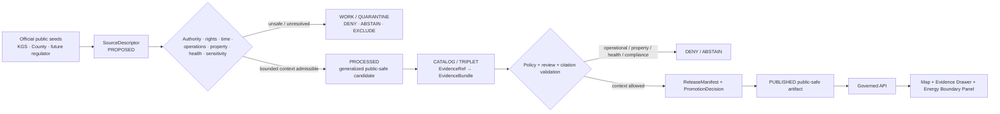
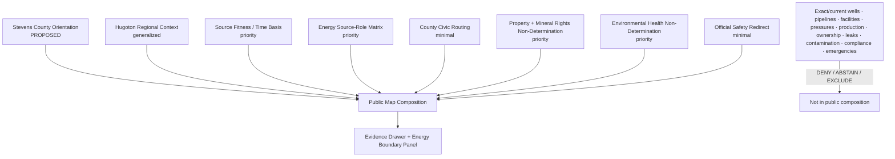
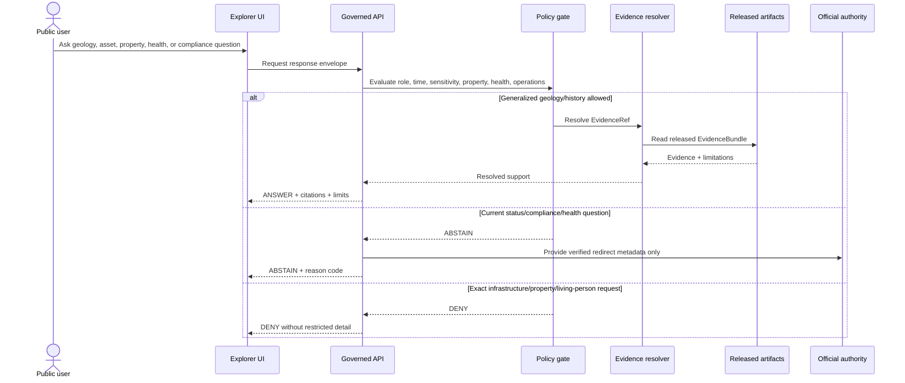
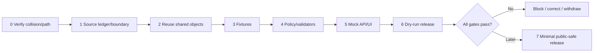

<!-- [KFM_META_BLOCK_V2]
doc_id: NEEDS_VERIFICATION — <REGISTERED_KFM_DOC_ID>
title: Stevens County Focus Mode Build Plan — Hugoton Natural Gas Area Context Without Operational, Property, Environmental-Health, or Regulatory Conclusions
type: county-focus-mode-build-plan
version: v0.1-draft
status: draft
county: Stevens County, Kansas
county_slug: stevens
created: 2026-06-08
updated: 2026-06-08
owners:
  - NEEDS_VERIFICATION — <OWNER:focus-mode-steward>
  - NEEDS_VERIFICATION — <OWNER:geology-and-energy-reviewer>
  - NEEDS_VERIFICATION — <OWNER:oil-gas-regulatory-reviewer>
  - NEEDS_VERIFICATION — <OWNER:environmental-health-and-groundwater-reviewer>
  - NEEDS_VERIFICATION — <OWNER:property-privacy-and-infrastructure-reviewer>
release_status: NEEDS_VERIFICATION — NOT_RELEASED
review_assignments: NEEDS_VERIFICATION
correction_path: NEEDS_VERIFICATION
rollback_path: NEEDS_VERIFICATION
unverified_repository_paths:
  - PROPOSED / CONFLICTED / NEEDS_VERIFICATION — docs/focus-modes/stevens-county/build-plan.md
  - PROPOSED / OBSERVED-LEGACY / NEEDS_VERIFICATION — docs/focus-mode/counties/stevens_county/stevens_county_focus_mode_build_plan.md
schema_contract_policy_homes:
  - PROPOSED / NEEDS_VERIFICATION — contracts/focus_mode/
  - PROPOSED / NEEDS_VERIFICATION — schemas/contracts/v1/focus_mode/
  - PROPOSED / NEEDS_VERIFICATION — policy/runtime/, policy/sensitivity/, policy/rights/, policy/release/
proof_slice: Hugoton natural-gas-area geology and history paired with county GIS, parcel, public works, emergency, and energy-infrastructure non-determination
primary_public_safe_boundary: KFM may present generalized, time-attributed geology, natural-resource history, and county-service context, but must not expose operational oil-and-gas infrastructure, infer well or pipeline status, determine property or mineral ownership, assess contamination or groundwater safety, issue compliance or regulatory conclusions, estimate emissions or leak risk for a specific site, or provide emergency guidance.
collision_search:
  completed_register: CONFIRMED — Stevens County is absent from the supplied completed/collision register.
  generated_in_continuation: CONFIRMED — Cheyenne, Wallace, Elk, Clay, Butler, Wilson, Franklin, Haskell, Grant, Comanche, Labette, Meade, and Norton were excluded.
  uploaded_project_materials: CONFIRMED — targeted Stevens County Focus Mode searches were performed; no Stevens County plan surfaced among examined results.
  live_repository_index: CONFIRMED — docs/focus-mode/counties/COUNTY_INDEX.md lists Stevens as not-started with validation not-run.
  live_repository_search: CONFIRMED — searches for stevens_county_focus_mode_build_plan and Stevens County Focus Mode returned no matching plan.
  exhaustive_absence: NEEDS_VERIFICATION — unindexed branches, private artifacts, and prior unsearched outputs may still exist.
directory_rules_basis:
  - CONFIRMED — Directory Rules.pdf was inspected in this series and states that location encodes responsibility, governance, and lifecycle.
  - CONFIRMED — topic does not justify a new root folder.
  - CONFIRMED — lifecycle is RAW → WORK / QUARANTINE → PROCESSED → CATALOG / TRIPLET → PUBLISHED.
  - CONFIRMED — promotion is a governed state transition, not a file move.
  - CONFLICTED / NEEDS_VERIFICATION — observed live control-plane paths use docs/focus-mode/ while doctrine also identifies docs/focus-modes/.
official_source_checks:
  - CONFIRMED — Kansas Geological Survey, Hugoton Natural Gas Area of Kansas, checked 2026-06-08.
  - CONFIRMED — Kansas Geological Survey, Hugoton Asset Management Project background, checked 2026-06-08.
  - CONFIRMED — Stevens County official website, checked 2026-06-08.
source_check_date: 2026-06-08
tags: [kfm, focus-mode, stevens-county, hugoton, natural-gas, geology, energy, groundwater, parcels, critical-infrastructure, cite-or-abstain]
notes:
  - Planning artifact only; no implementation, source admission, review, promotion, publication, correction readiness, or rollback readiness is claimed.
  - KGS pages are authoritative scientific/historical sources but are dated; their age is central to source-fitness limitations.
  - County GIS, parcel, tax, emergency, airport, public works, road-and-bridge, and planning links are routing surfaces, not KFM truth for title, access, operations, safety, or compliance.
[/KFM_META_BLOCK_V2] -->

<a id="top"></a>

# Stevens County Focus Mode Build Plan
## Hugoton Natural Gas Area Context Without Operational, Property, Environmental-Health, or Regulatory Conclusions

> **Product thesis:** Explain Stevens County’s place in the Hugoton natural gas area through official, evidence-visible geology and history while refusing to turn KFM into an operational energy map, mineral-title service, environmental-health assessor, groundwater-safety authority, regulatory decision-maker, or emergency system.


| Identity / status field | Value |
|---|---|
| County | **Stevens County, Kansas** |
| Status | `PROPOSED` planning artifact |
| Distinct proof slice | Historic/scientific Hugoton natural-gas-area interpretation paired with operational-infrastructure, property/mineral-right, groundwater, environmental-health, and regulatory non-determination |
| Primary public-safe boundary | **Generalized energy-geology and county-service context may be shown; exact or current well, pipeline, plant, pressure, production, condition, vulnerability, leak, compliance, property/mineral ownership, contamination, groundwater-safety, or emergency conclusions are denied or abstained.** |
| Official seeds checked | KGS Hugoton Natural Gas Area; KGS Hugoton Asset Management Project background; Stevens County official website |
| Collision result | No collision surfaced in checked register, repository index/searches, or examined uploaded materials |
| Exhaustive absence | `NEEDS_VERIFICATION` |
| Release state | `NOT_RELEASED` |
| Intended landing | `PROPOSED / CONFLICTED / NEEDS_VERIFICATION` |

## Quick links

[Operating posture](#1-operating-posture) · [Why this county](#2-why-this-county) · [Product thesis](#3-product-thesis) · [Scope](#4-scope-boundary) · [Demo layers](#5-first-demo-layers) · [Journeys](#6-user-journeys) · [UI](#7-ui-surfaces) · [Objects](#8-governed-object-model) · [Repository](#9-proposed-repository-shape) · [Build](#10-build-phases) · [PRs](#11-first-pr-sequence) · [Acceptance](#12-acceptance-checklist) · [Fixtures](#13-fixture-plan) · [Risks](#14-risk-register) · [Sources](#15-source-seed-list) · [Questions](#16-open-verification-questions) · [Milestone](#17-recommended-first-milestone)

---

## Executive build note

Stevens County is selected because it creates a materially different KFM trust test: **how to explain a major natural-resource landscape without becoming an operational, ownership, environmental-health, or regulatory authority**.

The Kansas Geological Survey’s public information circular describes the Hugoton natural gas area as a major southwest Kansas resource and explains its history, geology, and economic importance.[^s1] KGS’s Hugoton Asset Management Project background also identifies Stevens County as part of the Hugoton Embayment and describes technical work involving well, pressure, production, core, log, reservoir-model, and regulation-relevant data.[^s2] Those pages are useful scientific and historical evidence, but they are dated and do not establish present well condition, current production, active ownership, leak status, emissions, compliance, groundwater impact, or public safety.

The official Stevens County website exposes departments and public routes including GIS, Appraiser, Emergency Services, Airport, Planning & Zoning, Public Works, Road & Bridge, Register of Deeds, Tax Search, Public Parcel Search, and Storm Shelters.[^s3] Those are authoritative routing surfaces, not authority for KFM to determine title, mineral ownership, right-of-entry, value, zoning status, well or pipeline condition, environmental compliance, or active emergency conditions.

> [!CAUTION]
> ## Defining public-safe boundary
>
> **KFM may explain the Hugoton natural gas area at generalized county or regional scale. It must not publish exact operational energy infrastructure, identify vulnerable facilities, infer a well or pipeline’s current status, connect a living person to mineral or surface ownership, determine contamination or groundwater safety, characterize a company or property as compliant or noncompliant, estimate site-specific methane or leak risk, or provide emergency or evacuation guidance.**
>
> Requests crossing this boundary resolve to `DENY`, `ABSTAIN`, `EXCLUDE`, or a verified official-current redirect.

### Evidence boundary at authoring time

| Label | Established in this run | Not established |
|---|---|---|
| `CONFIRMED` | Stevens is absent from the supplied completed register; live county index lists Stevens `not-started` / `not-run`; targeted repository searches returned no plan; KGS and county official pages were checked. | — |
| `PROPOSED` | All layers, objects, paths, policies, fixtures, UI, milestone, and release sequence in this plan. | No implementation is claimed. |
| `NEEDS_VERIFICATION` | Comprehensive collision absence, canonical path, current source rights, current oil/gas regulator datasets, public-safe geometry, critical-infrastructure policy, environmental-health review, source freshness, correction and rollback mechanics. | — |
| `UNKNOWN` | Current well/pipeline/facility status, mineral ownership, lease terms, active production, site-specific emissions, contamination, groundwater safety, compliance, incident status, and deployed runtime state. | — |

---

# 1. Operating posture

## 1.1 Governing rules applied to Stevens County

| Rule | Stevens application |
|---|---|
| EvidenceBundle outranks generated language | AI summaries cannot create well, property, compliance, health, groundwater, or operational facts. |
| Cite-or-abstain | Stable geology/history may be answered after evidence resolution; current operational or high-stakes questions abstain or deny. |
| Public clients use governed interfaces | No public client reads raw well files, restricted operational data, unpublished candidates, internal stores, or direct model output. |
| Source roles remain distinct | KGS scientific interpretation, regulator records, county GIS/appraiser, register of deeds, emergency services, company-reported data, monitoring observations, and generated narrative cannot collapse. |
| Publication is governed | Discovery or rendering of a source does not make it public KFM truth. |
| Sensitive energy infrastructure fails closed | Exact current infrastructure and vulnerability detail is denied by default. |
| Property and living-person linkage is minimized | Parcel, owner, mineral, lease, tax, contact, and living-person details are not a public first slice. |
| Environmental and health claims require fit authority | General geology does not establish contamination, methane exposure, groundwater safety, or health impact. |

## 1.2 Truth labels and finite outcomes

| Token | Meaning |
|---|---|
| `CONFIRMED` | Verified in this run. |
| `PROPOSED` | Recommended design not verified as implemented. |
| `NEEDS_VERIFICATION` | Checkable before action. |
| `UNKNOWN` | Unsupported or unresolved. |
| `ANSWER` | Narrow evidence-supported public-safe response. |
| `ABSTAIN` | Evidence, authority, freshness, rights, or scope is insufficient. |
| `DENY` | Request crosses a protected boundary. |
| `ERROR` | Contract, evidence, policy, or runtime failure prevents trusted output. |

## 1.3 Public trust membrane



## 1.4 Non-negotiable county guardrails

| Guardrail | Default outcome | Candidate reason code |
|---|---:|---|
| Exact/current well, pipeline, compressor, plant, storage, pressure, or vulnerability detail | `DENY` | `OPERATIONAL_ENERGY_INFRASTRUCTURE_DETAIL_WITHHELD` |
| Well or pipeline active/inactive/safe/leaking status | `ABSTAIN` | `CURRENT_ASSET_STATUS_REQUIRES_REGULATORY_AUTHORITY` |
| Surface, mineral, lease, royalty, title, or access determination | `DENY` | `PROPERTY_OR_MINERAL_RIGHT_DETERMINATION_DENIED` |
| Person-linked parcel, tax, contact, lease, or ownership detail | `DENY` | `LIVING_PERSON_PROPERTY_LINKAGE_DENIED` |
| Groundwater or drinking-water safety conclusion | `DENY` / `ABSTAIN` | `GROUNDWATER_OR_HEALTH_STATUS_NOT_DETERMINED` |
| Methane, contamination, exposure, or environmental-health conclusion | `DENY` / `ABSTAIN` | `ENVIRONMENTAL_HEALTH_CONCLUSION_REQUIRES_FIT_AUTHORITY` |
| Company or site compliance/enforcement conclusion | `ABSTAIN` | `REGULATORY_COMPLIANCE_NOT_DETERMINED` |
| Emergency, evacuation, shelter, leak, fire, or road safety guidance | `ABSTAIN` | `OFFICIAL_CURRENT_SAFETY_CHANNEL_REQUIRED` |

---

# 2. Why this county

## 2.1 Collision screen

| Check | Result | Status |
|---|---|---:|
| Supplied completed/collision register | Stevens absent. | `CONFIRMED` |
| Additional generated counties | Excluded from selection. | `CONFIRMED` |
| Live `COUNTY_INDEX.md` | Stevens listed `not-started`, validation `not-run`. | `CONFIRMED` |
| Repository search | No Stevens plan identifier match. | `CONFIRMED` |
| Uploaded/File Library search | No Stevens Focus Mode plan surfaced among examined results. | `CONFIRMED` for performed search |
| Exhaustive project absence | Not proved across all hidden/unindexed material. | `NEEDS_VERIFICATION` |

## 2.2 Proof-slice rationale

| Dimension | Proof value | Basis |
|---|---|---|
| Geology and natural resources | Hugoton is a major southwest Kansas gas area with long-term scientific significance. | KGS checked source.[^s1] |
| Time-aware source fitness | Core KGS pages are older and useful for history/geology, not current operations. | Source dates and content.[^s1][^s2] |
| Industrial/critical infrastructure sensitivity | Reservoir studies involve wells, pressure, production, logs, and models that should not become public operational detail. | KGS project description.[^s2] |
| Property/mineral-right ambiguity | County GIS, Appraiser, Register of Deeds, Tax Search, and Public Parcel Search create title/ownership overclaim risk. | County official site.[^s3] |
| Environmental-health overclaim | Users may infer methane, groundwater, contamination, or health status from general energy context. | `PROPOSED` governance challenge. |
| Emergency/currentness | County Emergency Services and Storm Shelters exist as current-authority routes. | County official site.[^s3] |
| Series distinctness | Adds energy-resource and industrial sensitivity rather than reservoir recreation, scenic access, or archaeology. | `PROPOSED`. |

## 2.3 Distinct series contribution

Stevens County tests whether KFM can:

1. explain important energy geology without publishing an operational asset map;
2. preserve the difference between geological interpretation, regulator records, company data, and local property records;
3. avoid turning county GIS or tax search into title, mineral-right, lease, or access truth;
4. avoid converting historic natural-resource significance into present environmental-health judgment;
5. route current safety and regulatory questions away from static explanatory content.

## 2.4 Public benefit

A public-safe first slice can help users understand what the Hugoton natural gas area is, why Stevens County matters to southwest Kansas energy history, how scientific reservoir studies differ from regulatory or operational truth, and why exact infrastructure, ownership, and environmental-health conclusions are withheld.

---

# 3. Product thesis

## 3.1 One-sentence thesis

> **Stevens County Focus Mode should make the Hugoton natural gas area understandable as evidence-backed regional geology and history while making operational infrastructure, ownership, mineral-right, groundwater, environmental-health, compliance, and emergency conclusions impossible to mistake for KFM authority.**

## 3.2 First-product promises

| Promise | Meaning |
|---|---|
| Generalized county and regional context | No exact operational asset detail. |
| Evidence-visible natural-resource history | KGS source role and date remain visible. |
| Source-role separation | Scientific, regulatory, property, operational, monitoring, and generated sources remain distinct. |
| Explicit non-determination | UI explains why KFM denies or abstains. |
| Reversible future release | Correction and rollback required before publication. |

## 3.3 First-product non-promises

- no current well or pipeline status;
- no operational, pressure, production, vulnerability, or facility map;
- no mineral, surface, lease, royalty, title, or access determination;
- no company/site compliance judgment;
- no methane, contamination, groundwater, drinking-water, or health conclusion;
- no emergency, evacuation, shelter, fire, road, or leak guidance;
- no claim of implementation or publication.

---

# 4. Scope boundary

| Content family | First-slice posture | Boundary |
|---|---:|---|
| Stevens County orientation | `PROPOSED` | Generalized boundary only. |
| Hugoton regional geology/history card | `PROPOSED` | Dated scientific context; no current operational meaning. |
| KGS source-fitness notice | `PROPOSED` priority | Makes historical/current distinction visible. |
| Energy source-role explainer | `PROPOSED` | Scientific ≠ regulatory ≠ operator ≠ monitoring ≠ AI. |
| County service-routing card | `PROPOSED` | Department and public-route context only. |
| Property/mineral-right non-determination notice | `PROPOSED` priority | No owner, title, lease, royalty, access, or tax conclusion. |
| Environmental-health non-determination notice | `PROPOSED` priority | No methane, contamination, groundwater, or health verdict. |
| Emergency-currentness redirect | `PROPOSED` | No active status or advice. |
| Current production and facility detail | `EXCLUDE` / `DENY` | Operational sensitivity and currentness. |
| Person-linked property and mineral data | `DENY` | Privacy and legal risk. |
| Site-specific emissions, leak, contamination, or compliance | `DENY` / `ABSTAIN` | High-stakes authority required. |

---

# 5. First demo layers

## 5.1 Prioritized first public-safe layer/card table

| Priority | Layer/card | Purpose | Source seed | Gate | Status |
|---:|---|---|---|---|---:|
| 1 | `EnergyOperationsPropertyHealthBoundaryNotice` | Establishes primary public-safe limit. | KGS + county | Policy and invalid fixtures. | `PROPOSED` |
| 2 | `HugotonNaturalGasAreaContextCard` | Generalized regional geology/history. | KGS PIC 5[^s1] | Source date, EvidenceBundle, generalization. | `PROPOSED` |
| 3 | `HugotonSourceFitnessCard` | Explains why older scientific pages are not current operational truth. | KGS sources[^s1][^s2] | Temporal/source-fitness validation. | `PROPOSED` |
| 4 | `EnergySourceRoleMatrixCard` | Separates science, regulator, operator, monitoring, property, and narrative roles. | KGS + future regulator | Anti-collapse validation. | `PROPOSED` |
| 5 | `StevensCountyCivicRoutingCard` | Shows GIS, Appraiser, Emergency, Planning, Public Works, Register of Deeds, Tax Search. | County site[^s3] | Routing only; no personal/legal result. | `PROPOSED` |
| 6 | `PropertyMineralRightsNonDeterminationNotice` | Prevents title/mineral/access inference. | County site | Privacy/legal policy. | `PROPOSED` |
| 7 | `EnvironmentalHealthNonDeterminationNotice` | Prevents methane/groundwater/health overclaim. | Policy + future official sources | High-stakes gate. | `PROPOSED` |
| 8 | `OfficialCurrentSafetyRedirectCard` | Routes emergency questions to official authority. | County Emergency Services | Redirect-only. | `PROPOSED` |
| 9 | Exact wells/pipelines/facilities/current production | Operationally sensitive or high-risk. | Future regulator/operator sources | Exclude from first slice. | `DENY` / `EXCLUDE` |

## 5.2 Map composition



## 5.3 Layer-card truth contract

| Field | Purpose | Fail posture |
|---|---|---|
| `source_role` | Prevents scientific, regulatory, operator, property, monitoring, and AI collapse. | `ABSTAIN`. |
| `temporal_basis` | Exposes publication date and fitness for current claims. | `ABSTAIN` for current-status requests. |
| `spatial_generalization` | Prevents exact operational/sensitive geometry. | `DENY` or quarantine. |
| `operational_sensitivity` | Declares whether infrastructure detail is excluded. | Release block if missing. |
| `property_minimality` | Prevents person/title/mineral linkage. | `DENY`. |
| `environmental_health_scope` | Prevents contamination/health inference. | `DENY` / `ABSTAIN`. |
| `evidence_refs` | Resolves visible claim to EvidenceBundle. | `ABSTAIN`. |
| `policy_decision_ref` | Binds outcome to policy. | Fail closed. |
| `limitations` | Human-readable non-determinations. | Release block. |
| `release_state` | Prevents draft from appearing published. | Public alias blocked. |

---

# 6. User journeys

## 6.1 Public learning journeys

| Journey | Public-safe response |
|---|---|
| “What is the Hugoton natural gas area?” | Evidence-backed regional explanation with KGS date and role. |
| “Why is Stevens County part of this story?” | County-scale historical/scientific context. |
| “What kinds of county services relate to maps and property?” | Department/routing overview without person or title data. |
| “Why can’t I see exact wells or pipelines?” | Boundary explanation: operations, safety, security, currentness, and source fitness. |
| “Why won’t KFM tell me whether a well is leaking?” | High-stakes current authority and monitoring requirement. |

## 6.2 Trust-demonstration journeys

| Request | Outcome | Reason |
|---|---:|---|
| “Explain the regional gas field.” | `ANSWER` | Stable general context. |
| “Is this well active today?” | `ABSTAIN` | Current regulator/operator evidence needed. |
| “Show every pipeline and compressor station.” | `DENY` | Operational sensitivity. |
| “Who owns the minerals under this parcel?” | `DENY` | Legal/property determination. |
| “Is my groundwater contaminated by gas development?” | `DENY` / `ABSTAIN` | Fit environmental-health authority required. |
| “Is this operator in compliance?” | `ABSTAIN` | Regulator decision and temporal scope required. |
| “Is there a gas leak emergency now?” | `ABSTAIN` | Official current-safety channel required. |

## 6.3 Candidate reason codes

- `OPERATIONAL_ENERGY_INFRASTRUCTURE_DETAIL_WITHHELD`
- `CURRENT_ASSET_STATUS_REQUIRES_REGULATORY_AUTHORITY`
- `PROPERTY_OR_MINERAL_RIGHT_DETERMINATION_DENIED`
- `LIVING_PERSON_PROPERTY_LINKAGE_DENIED`
- `GROUNDWATER_OR_HEALTH_STATUS_NOT_DETERMINED`
- `ENVIRONMENTAL_HEALTH_CONCLUSION_REQUIRES_FIT_AUTHORITY`
- `REGULATORY_COMPLIANCE_NOT_DETERMINED`
- `OFFICIAL_CURRENT_SAFETY_CHANNEL_REQUIRED`
- `EVIDENCE_BUNDLE_UNRESOLVED`
- `AI_NOT_EVIDENCE`

---

# 7. UI surfaces

| Surface | Stevens-specific behavior | Status |
|---|---|---:|
| Header | “Generalized energy geology — no operational, ownership, health, or compliance verdict.” | `PROPOSED` |
| Map canvas | County/regional generalized context only. | `PROPOSED` |
| Layer drawer | Shows source role, date, generalization, sensitivity, and release status. | `PROPOSED` |
| Evidence Drawer | Separates KGS science, future regulator, county routing, monitoring, and generated narrative. | `PROPOSED` |
| Answer panel | Handles regional geology/history only. | `PROPOSED` |
| Denial panel | Handles exact infrastructure, ownership, living-person, and sensitive requests. | `PROPOSED` |
| Abstention panel | Handles current well status, compliance, environment, and emergencies. | `PROPOSED` |
| Timeline/time-basis panel | Makes dated KGS source fitness explicit. | `PROPOSED` |
| **Energy Operations / Property / Health Boundary Panel** | Central non-determination surface. | `PROPOSED` |
| Source-role legend | Scientific, regulatory, operator, administrative, monitoring, generated. | `PROPOSED` |
| Correction/release panel | Shows `NOT_RELEASED`, review gaps, future correction/rollback. | `PROPOSED` |

## 7.1 Legend vocabulary

| Label | May support | Must not become |
|---|---|---|
| `Scientific historical context` | Regional geology/history. | Current asset status or compliance. |
| `Regulatory record` | Narrow regulator-issued status in its temporal scope. | Property ownership, health, or operator narrative. |
| `County administrative routing` | Department/link discovery. | Title, mineral rights, value, access, or emergency truth. |
| `Monitoring observation` | Specific observed measurement after admission. | Generalized causal or health conclusion. |
| `Generated explanation` | Bounded synthesis. | Evidence or authority. |
| `Operational detail withheld` | Explains non-display. | Confirmation of hidden asset locations. |

## 7.2 UI/API/policy/evidence sequence



---

# 8. Governed object model

## 8.1 Shared object-family table

| Object family | Stevens use | Status |
|---|---|---:|
| `SourceDescriptor` | Authority, role, date, rights, sensitivity, allowed claims. | `PROPOSED / NEEDS_VERIFICATION` |
| `EvidenceRef` | Claim-to-evidence link. | `PROPOSED / NEEDS_VERIFICATION` |
| `EvidenceBundle` | Proof package with limitations. | `PROPOSED / NEEDS_VERIFICATION` |
| `PolicyDecision` | `ANSWER`, `ABSTAIN`, `DENY`, `ERROR`. | `PROPOSED / NEEDS_VERIFICATION` |
| `RuntimeResponseEnvelope` | Public-safe API response. | `PROPOSED / NEEDS_VERIFICATION` |
| `CitationValidationReport` | Detects source-role and temporal overclaim. | `PROPOSED / NEEDS_VERIFICATION` |
| `ReleaseManifest` | Records approved public-safe composition. | `PROPOSED / NEEDS_VERIFICATION` |
| `AIReceipt` | Records generated output and dependencies. | `PROPOSED / NEEDS_VERIFICATION` |
| `ReviewRecord` | Geology, regulator, property, health, infrastructure review. | `PROPOSED / NEEDS_VERIFICATION` |
| `CorrectionNotice` | Corrects unsafe or stale released output. | `PROPOSED / NEEDS_VERIFICATION` |
| `RollbackPlan` | Withdraws unsafe release. | `PROPOSED / NEEDS_VERIFICATION` |

## 8.2 County-specific candidates

| Object | Purpose |
|---|---|
| `HugotonRegionalContextCard` | Generalized geology/history. |
| `DatedSourceFitnessNotice` | Exposes limits of older scientific material. |
| `EnergySourceRoleMatrix` | Scientific/regulatory/operator/monitoring/property/generated separation. |
| `OperationalInfrastructureWithholdNotice` | Encodes exact/current asset restrictions. |
| `PropertyMineralRightsNonDeterminationNotice` | Encodes title/mineral/access refusal. |
| `EnvironmentalHealthNonDeterminationNotice` | Encodes groundwater/methane/health refusal. |
| `OfficialSafetyAndRegulatoryRedirectCard` | Redirect-only current authority. |

## 8.3 Minimal public response JSON

```json
{
  "schema_version": "v1",
  "object_type": "RuntimeResponseEnvelope",
  "response_id": "kfm.runtime.stevens.hugoton_context.answer.v1",
  "county": "stevens",
  "outcome": "ANSWER",
  "answer_scope": "public_safe_generalized_energy_geology",
  "answer": "Checked Kansas Geological Survey material describes the Hugoton natural gas area as a major southwest Kansas natural-resource region. This is historical and scientific context, not current operational, regulatory, property, environmental-health, or emergency information.",
  "evidence_refs": ["kfm.evidence_ref.stevens.kgs_hugoton_context.v1"],
  "source_roles": ["scientific_historical_geology"],
  "spatial_generalization": "county_or_regional_only",
  "limitations": ["No exact/current well, pipeline, plant, pressure, production, ownership, mineral-right, contamination, groundwater-safety, compliance, or emergency conclusion is provided."],
  "review_state": "NEEDS_VERIFICATION",
  "release_state": "NOT_RELEASED",
  "spec_hash": "NEEDS_VERIFICATION"
}
```

## 8.4 Denial JSON

```json
{
  "schema_version": "v1",
  "object_type": "RuntimeResponseEnvelope",
  "response_id": "kfm.runtime.stevens.exact_assets_or_ownership.deny.v1",
  "county": "stevens",
  "outcome": "DENY",
  "reason_code": "OPERATIONAL_ENERGY_INFRASTRUCTURE_DETAIL_WITHHELD",
  "message": "KFM does not expose exact operational energy-infrastructure detail or determine property, mineral, lease, royalty, title, access, or living-person linkage.",
  "withheld_fields": ["exact_operational_geometry", "asset_condition_or_vulnerability", "owner_or_living_person_linkage", "mineral_or_lease_determination", "private_contact_or_tax_detail"],
  "release_state": "NOT_RELEASED",
  "spec_hash": "NEEDS_VERIFICATION"
}
```

## 8.5 Abstention JSON

```json
{
  "schema_version": "v1",
  "object_type": "RuntimeResponseEnvelope",
  "response_id": "kfm.runtime.stevens.health_or_compliance.abstain.v1",
  "county": "stevens",
  "outcome": "ABSTAIN",
  "reason_code": "ENVIRONMENTAL_HEALTH_CONCLUSION_REQUIRES_FIT_AUTHORITY",
  "message": "General geological and historical sources do not establish current methane, leak, contamination, groundwater, health, or regulatory-compliance status for a site, property, company, or person.",
  "obligations": ["Use competent current regulatory, monitoring, environmental-health, or emergency authority.", "Do not infer status from historic KGS context or county administrative routing."],
  "release_state": "NOT_RELEASED",
  "spec_hash": "NEEDS_VERIFICATION"
}
```

## 8.6 Deterministic identity candidates

| Item | Pattern |
|---|---|
| Source | `kfm.source.stevens.<authority>.<slug>.v1` |
| Evidence | `kfm.evidence_bundle.stevens.<claim_scope>.v1` |
| Card | `kfm.card.stevens.<card>.v1` |
| Fixture | `kfm.runtime.stevens.<scenario>.<outcome>.v1` |
| Release | `kfm.release.stevens.focus_mode.v0_1` |

`spec_hash` behavior remains `PROPOSED / NEEDS_VERIFICATION` until canonical hashing utilities and identity rules are inspected.

---

# 9. Proposed repository shape

## 9.1 Directory Rules basis

Directory Rules establish that file location encodes responsibility, governance, and lifecycle; topic alone does not justify a new root; human documentation belongs under the documentation responsibility root; contracts, schemas, policies, fixtures, tools, data, and release artifacts remain separate; lifecycle remains `RAW → WORK / QUARANTINE → PROCESSED → CATALOG / TRIPLET → PUBLISHED`; and promotion is a governed state transition.

> [!WARNING]
> Observed repository control-plane paths use `docs/focus-mode/`, while doctrine also uses `docs/focus-modes/`. All new paths remain `PROPOSED / CONFLICTED / NEEDS_VERIFICATION`.

## 9.2 Candidate path table

| Root | Proposed path | Purpose |
|---|---|---|
| Docs | `docs/focus-modes/stevens-county/build-plan.md` | Human plan. |
| Docs companions | `docs/focus-modes/stevens-county/{README.md,source-seed-list.md,evidence-model.md,acceptance-checklist.md,energy-boundary-notes.md}` | Control and boundary docs. |
| Contracts | `contracts/focus_mode/` | Shared semantics. |
| Schemas | `schemas/contracts/v1/focus_mode/` | Machine shapes. |
| Fixtures | `fixtures/focus_modes/stevens/{valid,invalid}/` | Positive/negative proof. |
| UI | `apps/explorer-web/src/focus-modes/stevens/` | Mock governed UI. |
| Catalog | `data/catalog/sources/stevens/` | Admitted descriptors only. |
| Published | `data/published/layers/stevens/` | Future released artifacts only. |
| Release | `release/candidates/stevens-focus-mode/` | Future release candidate only. |

## 9.3 Proposed tree

```text
# PROPOSED / CONFLICTED / NEEDS_VERIFICATION

docs/
└── focus-modes/
    └── stevens-county/
        ├── README.md
        ├── build-plan.md
        ├── source-seed-list.md
        ├── evidence-model.md
        ├── acceptance-checklist.md
        ├── energy-boundary-notes.md
        ├── property-mineral-rights-notes.md
        └── environmental-health-nondetermination-notes.md

fixtures/
└── focus_modes/stevens/
    ├── valid/
    └── invalid/

contracts/
└── focus_mode/

schemas/
└── contracts/v1/focus_mode/

apps/
└── explorer-web/src/focus-modes/stevens/

data/
├── catalog/sources/stevens/
└── published/layers/stevens/     # future governed output only

release/
└── candidates/stevens-focus-mode/
```

## 9.4 Placement prohibitions

- no root-level `stevens/`, `hugoton/`, `natural-gas/`, `wells/`, or `pipelines/`;
- no operational source data in public documentation or UI bundles;
- no schema duplication;
- no person-linked parcel/mineral data in public fixtures;
- no direct public path to raw, work, quarantine, operator, or model runtime stores;
- no release artifact without promotion, review, correction, and rollback.

---

# 10. Build phases

| Phase | Goal | Entry gate | Output | Exit validation | Rollback |
|---:|---|---|---|---|---|
| 0 | Collision and path verification | Repeat repo/files checks | Verification note | No collision; path resolved or blocked | Stop |
| 1 | Source ledger and boundary | Source roles defined | Descriptor candidates and boundary matrix | Rights/time/sensitivity/allowed claims explicit | Docs only |
| 2 | Shared-object reuse | Inventory existing contracts/schemas/policies | Reuse or extension decision | No parallel authority | Withdraw extension |
| 3 | Valid/invalid fixtures | Boundary accepted | Fixture pack | Unsafe cases fail closed | Remove fixtures |
| 4 | Policy and validators | Fixtures exist | Policy/validator candidates | All finite outcomes tested | Block candidate |
| 5 | Mock API/UI | Contracts/policies agreed | Mock envelopes and panels | No sensitive/current/private leakage | Disable mock |
| 6 | Dry-run release proof | Reviews and tests available | Candidate manifest/proof | No public alias; rollback rehearsed | Withdraw |
| 7 | Optional future publication | All gates pass | Narrow generalized release | Traceable and reversible | Rollback |



---

# 11. First PR sequence

1. Verification and documentation control.
2. Source ledger/admission and public-safe boundary.
3. Contracts/schemas or shared-object reuse.
4. Valid and invalid fixtures.
5. Policy and validators.
6. Mock governed API/UI.
7. Dry-run release proof.
8. Only then optional minimal public-safe publication.

**Live source integration, operational asset ingestion, property/mineral data ingestion, environmental monitoring integration, and public release are not first-PR work.**

---

# 12. Acceptance checklist

## Governance and evidence

- [ ] Stevens collision check repeated immediately before landing.
- [ ] Every public claim resolves to an EvidenceBundle.
- [ ] KGS, regulator, operator, county, monitoring, and AI roles remain distinct.
- [ ] Dated KGS material is never treated as current operations.
- [ ] No AI output is evidence.
- [ ] Finite outcome fixtures exist.
- [ ] No release claim without manifest, review, correction, and rollback.

## Public-safe boundary

- [ ] Exact/current operational infrastructure excluded.
- [ ] No asset-condition, leak, pressure, production, or vulnerability inference.
- [ ] No title, mineral, lease, royalty, access, or person-linked property result.
- [ ] No groundwater, contamination, methane exposure, or health conclusion.
- [ ] No company/site compliance conclusion.
- [ ] No emergency or evacuation advice.
- [ ] County GIS/tax/parcel routes remain routing-only.

## Product and UI

- [ ] Header states primary boundary and `NOT_RELEASED`.
- [ ] Evidence Drawer displays source role and source date.
- [ ] Map uses generalized regional/county context only.
- [ ] Denial and abstention panels use safe reason codes.
- [ ] Hidden detail cannot be reconstructed from hints.
- [ ] Mock content is visibly mock/draft.

## Repository, validation, release, correction, rollback

- [ ] Path conflict resolved.
- [ ] No parallel schema/contract/policy/source/release homes.
- [ ] Public UI cannot access internal lifecycle stores.
- [ ] Highest-risk invalid fixtures fail closed.
- [ ] Correction and rollback are actionable before publication.
- [ ] Promotion is recorded as a governed state transition.

---

# 13. Fixture plan

## 13.1 Valid fixtures

| Fixture | Scenario | Expected |
|---|---|---:|
| `hugoton_regional_context.valid.json` | Generalized KGS geology/history. | `ANSWER` |
| `dated_source_fitness.valid.json` | Older source visibly limited. | `ANSWER` about limitation |
| `county_civic_routing.valid.json` | County departments/links only. | `ANSWER` about roles |
| `current_asset_status_abstain.valid.json` | User asks if well is active. | `ABSTAIN` |
| `property_mineral_rights_deny.valid.json` | User asks owner/mineral status. | `DENY` |
| `environmental_health_abstain.valid.json` | User asks contamination/health status. | `ABSTAIN` |

## 13.2 Invalid/fail-closed fixtures

| Fixture | Failure | Required result |
|---|---|---:|
| `historic_kgs_as_current_well_status.invalid.json` | Dated science becomes current asset status. | `ABSTAIN` |
| `exact_well_pipeline_facility_map.invalid.json` | Exact operations exposed. | `DENY` |
| `asset_vulnerability_or_pressure.invalid.json` | Security-sensitive operational detail. | `DENY` |
| `county_parcel_as_title_or_mineral_truth.invalid.json` | Administrative GIS becomes legal/property truth. | `DENY` |
| `living_person_property_linkage.invalid.json` | Person linked to property/mineral/tax data. | `DENY` |
| `general_geology_as_groundwater_safety.invalid.json` | Geology becomes water-health conclusion. | `DENY` / `ABSTAIN` |
| `operator_or_site_compliance_from_context.invalid.json` | General source becomes compliance finding. | `ABSTAIN` |
| `model_inferred_methane_leak.invalid.json` | Model output becomes incident fact. | `ERROR` / `ABSTAIN` |
| `emergency_services_link_as_live_emergency.invalid.json` | Routing page becomes active alert. | `ABSTAIN` |
| `unresolved_evidence_ref.invalid.json` | Claim lacks evidence. | `ABSTAIN` |
| `public_internal_store_access.invalid.json` | Public surface reads internal data. | `ERROR` |

## 13.3 Fixture-to-test matrix

| Test family | Must prove |
|---|---|
| Evidence closure | No claim without EvidenceBundle. |
| Temporal/source fitness | Dated source cannot answer current questions. |
| Operational sensitivity | Exact/current infrastructure is withheld. |
| Property/privacy | No owner, mineral, lease, tax, or living-person linkage. |
| Environmental health | No contamination, groundwater, methane, or health conclusion without fit authority. |
| Regulatory role | No compliance/enforcement inference from scientific or county context. |
| Emergency currentness | Official redirect only. |
| Trust membrane | No public access to internal lifecycle stores. |

## 13.4 Highest-risk invalid fixture pack

1. exact operational infrastructure request;
2. current well/leak/pressure/production inference from historical KGS material;
3. parcel-to-owner/mineral/lease linkage;
4. groundwater or drinking-water safety inference;
5. methane exposure or health-risk inference;
6. company/site compliance conclusion;
7. emergency-status inference from county routing;
8. AI/model output treated as evidence.

---

# 14. Risk register

| Risk | Likelihood | Impact | Mitigation | Release posture |
|---|---:|---:|---|---|
| Exact/current infrastructure exposure | High | Critical | Generalize; deny operational geometry/detail. | `DENY` |
| Dated KGS page treated as current | High | High | Source-fitness card and temporal validator. | `ABSTAIN` |
| Property/mineral/title overclaim | High | Critical | Exclude person-linked records; deny determinations. | `DENY` |
| Groundwater or health overclaim | Medium/High | Critical | Fit-authority requirement; high-stakes fixtures. | `DENY` / `ABSTAIN` |
| Methane/leak inference from model or generic data | Medium | Critical | Observation-role and model-output controls. | `ABSTAIN` |
| Compliance/enforcement overclaim | Medium | High | Regulator-only source role and time scope. | `ABSTAIN` |
| Infrastructure vulnerability/security exposure | Medium | Critical | Withhold precise or tactical detail. | `DENY` |
| County GIS used as title/access truth | High | High | Routing-only design and privacy policy. | `DENY` |
| Emergency link treated as live status | Medium | Critical | Redirect-only; no caching. | `ABSTAIN` |
| Rights unclear for maps/images/data | Medium | High | Rights review before derivative display. | Quarantine |
| Existing Stevens plan found later | Low/Medium | Medium | Repeat collision search; never overwrite. | Stop |
| Path conflict hardens | High | Medium | Resolve via doctrine/ADR before landing. | Docs only |
| Mock mistaken for release | Medium | High | Persistent `NOT_RELEASED`; no public alias. | Mock only |

---

# 15. Source seed list

## 15.1 Official sources checked in this run

| ID | Source | Role | Verified anchor | Intended use | Allowed claim scope | Limitations | Status |
|---|---|---|---|---|---|---|---:|
| `S1` | Kansas Geological Survey, **Hugoton Natural Gas Area of Kansas**[^s1] | Scientific/historical geology and natural-resource interpretation | Describes the Hugoton area’s geology, development, regional importance, and southwest Kansas scope. | Generalized regional context. | Historical/scientific context only. | Web version dated 1996; not current operational, ownership, environmental-health, compliance, or emergency evidence. | `CONFIRMED` |
| `S2` | Kansas Geological Survey, **Hugoton Asset Management Project — Background**[^s2] | Technical reservoir-study and project-history source | Identifies Stevens among Hugoton Embayment counties and describes well/log/core/pressure/production/model data used in technical study. | Source-role and sensitivity demonstration. | Historical project and scientific-method context only. | Updated 2004; no present asset condition, data rights, public-safety, ownership, leak, emissions, or compliance conclusion. | `CONFIRMED` |
| `S3` | Stevens County official website[^s3] | Local administrative and current-authority routing surface | Lists GIS, Appraiser, Emergency Services, Airport, Planning & Zoning, Public Works, Road & Bridge, Register of Deeds, Tax Search, Public Parcel Search, and Storm Shelters. | County civic-routing card. | Existence and role of public routes/departments only. | Not title, mineral, access, value, operational, health, environmental, compliance, or emergency-status evidence. | `CONFIRMED` |

## 15.2 Candidate official sources for later verification

| Candidate | Possible use | Required verification |
|---|---|---|
| Kansas Corporation Commission oil and gas records | Regulatory source-role and current-status routing. | Current endpoint, terms, temporal fields, public-safe geometry, exact asset restrictions, compliance semantics. |
| Kansas Geological Survey oil/gas databases | Generalized historic/statistical context. | Rights, update cadence, currentness, sensitive fields, no operational inference. |
| KDHE environmental and groundwater records | Narrow admitted environmental context. | Authority, sampling scope, detection limits, health interpretation, privacy, currentness. |
| EPA Greenhouse Gas Reporting Program | Facility-level reported emissions context. | Reporting year, facility identity, public-safety limits, no leak or exposure inference. |
| PHMSA pipeline public data | Generalized pipeline context. | Critical-infrastructure sensitivity, map precision, terms, currentness. |
| USDA/NRCS/KGS groundwater sources | Aquifer and landscape context. | No private-well or drinking-water conclusion. |
| Stevens County GIS/Appraiser/Register of Deeds | Routing-only or restricted property context. | Legal role, rights, person minimization, title/access non-determination. |

## 15.3 Source admission checklist

- [ ] Assign source role and temporal fitness.
- [ ] Verify rights and derivative-display permission.
- [ ] Identify operational, critical-infrastructure, property, living-person, and environmental-health sensitivity.
- [ ] Define spatial generalization.
- [ ] Separate scientific interpretation from regulatory status.
- [ ] Separate regulator status from operator claims and monitoring observations.
- [ ] Set expiry for current status.
- [ ] Resolve EvidenceRef to EvidenceBundle.
- [ ] Run negative fixtures.
- [ ] Keep unresolved or unsafe material in `WORK` or `QUARANTINE`.

---

# 16. Open verification questions

## Repository and collision

- [ ] Does any Stevens plan exist in another branch, private artifact store, or earlier unindexed output?
- [ ] Which Focus Mode documentation path is canonical?
- [ ] What validator updates `COUNTY_INDEX.md`?
- [ ] What evidence changes status from `not-started` to `draft`?

## Contracts and policies

- [ ] Which shared object families already exist?
- [ ] Is there an existing critical-infrastructure policy profile?
- [ ] Is there a property/mineral-right/living-person policy family?
- [ ] Is there a high-stakes environmental-health non-determination policy?
- [ ] Are currentness and stale-source validators implemented?

## Source authority and rights

- [ ] Which KCC and KGS current datasets are authoritative for well status?
- [ ] What operational fields must never enter public artifacts?
- [ ] What geometry resolution is safe?
- [ ] What public rights apply to KGS maps, diagrams, databases, and county GIS?
- [ ] Can county property routes be linked without ingestion?
- [ ] Which environmental-health sources can support only narrow claims?

## Review duties

- [ ] Who reviews geology/history wording?
- [ ] Who reviews operational infrastructure sensitivity?
- [ ] Who reviews property/mineral-right and living-person issues?
- [ ] Who reviews environmental-health and groundwater language?
- [ ] Who reviews regulator/compliance interpretation?
- [ ] Who owns emergency/currentness redirects?

## Correction and rollback

- [ ] What correction mechanism applies if a public card implies current well status, ownership, contamination, or compliance?
- [ ] What rollback immediately disables unsafe infrastructure or property output?
- [ ] What proof pack demonstrates that hidden operational data cannot be reconstructed?
- [ ] What release manifest and approval separation are required?

---

# 17. Recommended first milestone

## Milestone 1 — Stevens Energy Source-Role and Non-Determination Control Plane

### Milestone statement

> Establish a documentation-and-fixture-first Stevens County proof slice that can explain generalized Hugoton natural-gas-area geology and history while making exact/current operational infrastructure, ownership/mineral rights, living-person linkage, groundwater/environmental-health, compliance, and emergency claims machine-testable fail-closed outcomes.

### Deliverables

| Deliverable | Status |
|---|---:|
| Collision and path verification note | `PROPOSED` |
| Source-role ledger for KGS, future regulator, county, monitoring, operator, and generated sources | `PROPOSED` |
| Energy Operations / Property / Health Boundary Notice | `PROPOSED` |
| Shared-object reuse decision | `PROPOSED` |
| Valid generalized-context fixtures | `PROPOSED` |
| Highest-risk invalid fixture pack | `PROPOSED` |
| Mock finite-outcome API/UI examples | `PROPOSED` |
| Dry-run correction and rollback references | `PROPOSED` |

### Definition of done

- [ ] No Stevens collision surfaced in repeated checks.
- [ ] Path conflict resolved or blocks landing.
- [ ] KGS sources carry dates and source-fitness limits.
- [ ] Regulator, operator, monitoring, property, county, and AI roles are not collapsed.
- [ ] Exact/current infrastructure is denied.
- [ ] Property/mineral/living-person linkage is denied.
- [ ] Environmental-health and compliance questions abstain or deny.
- [ ] Emergency requests route only to official-current authority.
- [ ] No live integration, validation-pass, review-completion, promotion, or publication claim is made.

### Go / no-go table

| Decision | Required evidence | If absent |
|---|---|---|
| GO to docs PR | Collision clear, path authorized, source roles defined. | No landing. |
| GO to fixtures/policy | Shared homes verified, reason codes accepted. | Docs only. |
| GO to mock UI/API | Negative fixtures pass fail-closed tests. | No data-bearing mock. |
| GO to dry-run release | Rights, reviews, evidence, correction, rollback drafted. | No candidate. |
| GO to publication | Governed promotion and all approvals complete. | `NOT_RELEASED`. |

---

# Appendix A — Public-safe narrative skeleton

## A.1 Landing narrative

**Stevens County: regional energy geology with visible limits**

Stevens County sits within the Hugoton natural gas area, one of southwest Kansas’s defining natural-resource landscapes. A public-safe KFM experience can explain the regional geology, historical development, and source roles while withholding exact operational details and refusing ownership, health, compliance, or emergency judgments.

## A.2 Source-fitness narrative

The checked KGS sources remain valuable for geology and history. Their dates are visible because a historical scientific page cannot establish the current status of a well, operator, pipeline, facility, property, environmental condition, or emergency.

## A.3 County-routing narrative

The county’s official website exposes GIS, Appraiser, Emergency Services, Planning & Zoning, Public Works, Register of Deeds, Tax Search, and Public Parcel Search. KFM may explain that these official routes exist, but it does not convert them into title, mineral-right, access, operational, health, or emergency truth.

## A.4 Evidence Drawer narrative

Each card should show source authority and role, checked/publication date, allowed claim scope, operational/property/health limitations, geometry generalization, review/release state, and correction/rollback references.

---

# Appendix B — Required negative-path reason-code categories

| Category | Code | Outcome |
|---|---|---:|
| Operational infrastructure | `OPERATIONAL_ENERGY_INFRASTRUCTURE_DETAIL_WITHHELD` | `DENY` |
| Current asset status | `CURRENT_ASSET_STATUS_REQUIRES_REGULATORY_AUTHORITY` | `ABSTAIN` |
| Property/mineral rights | `PROPERTY_OR_MINERAL_RIGHT_DETERMINATION_DENIED` | `DENY` |
| Living-person property linkage | `LIVING_PERSON_PROPERTY_LINKAGE_DENIED` | `DENY` |
| Groundwater/health | `GROUNDWATER_OR_HEALTH_STATUS_NOT_DETERMINED` | `DENY` / `ABSTAIN` |
| Environmental health | `ENVIRONMENTAL_HEALTH_CONCLUSION_REQUIRES_FIT_AUTHORITY` | `ABSTAIN` |
| Compliance | `REGULATORY_COMPLIANCE_NOT_DETERMINED` | `ABSTAIN` |
| Current safety | `OFFICIAL_CURRENT_SAFETY_CHANNEL_REQUIRED` | `ABSTAIN` |
| Rights | `DERIVATIVE_DISPLAY_RIGHTS_UNRESOLVED` | `ABSTAIN` |
| Evidence | `EVIDENCE_BUNDLE_UNRESOLVED` | `ABSTAIN` |
| AI misuse | `AI_NOT_EVIDENCE` | `ERROR` |
| Trust membrane | `PUBLIC_INTERNAL_LIFECYCLE_ACCESS` | `ERROR` |

---

# Appendix C — References and evidence-use note

[^s1]: Kansas Geological Survey, **Hugoton Natural Gas Area of Kansas**, Public Information Circular 5, web version December 1996. Checked 2026-06-08. <https://www.kgs.ku.edu/Publications/pic5/pic5_1.html>. Used only for regional scientific and historical context. It does not establish current operations, ownership, environmental-health, compliance, or emergency status.

[^s2]: Kansas Geological Survey, **Hugoton Asset Management Project — Background and Outline of Technical Components**, updated June 2004. Checked 2026-06-08. <https://www.kgs.ku.edu/HAMP/background.html>. Used for technical-project and source-role context, including Stevens County’s inclusion in the Hugoton Embayment. It does not establish current asset condition, data rights, public safety, ownership, emissions, leaks, contamination, or compliance.

[^s3]: Stevens County, Kansas, **Official Website**. Checked 2026-06-08. <https://stevenscoks.org/>. Used only for official county routing and department context. It does not establish title, mineral ownership, access, value, operations, environmental-health, compliance, or active emergency conditions.

## Evidence-use note

This artifact is not an EvidenceBundle, regulator record, title opinion, mineral-right determination, environmental assessment, groundwater-safety finding, compliance decision, emergency bulletin, release manifest, or published product. It is a planning document for a future governed proof slice.

[Back to top](#top)
