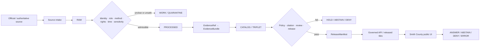
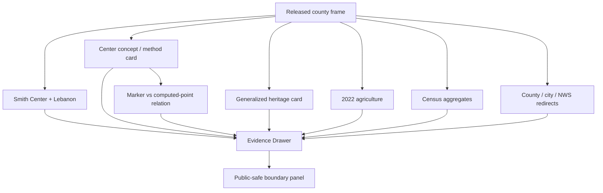
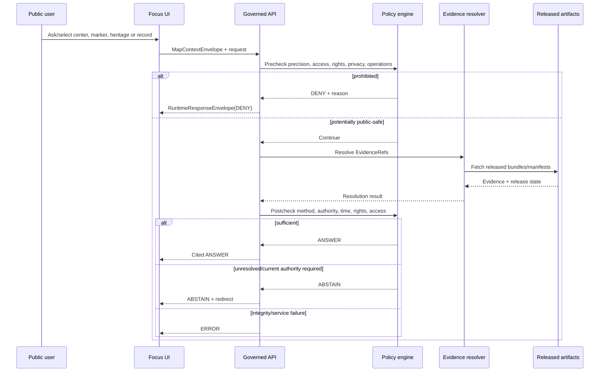
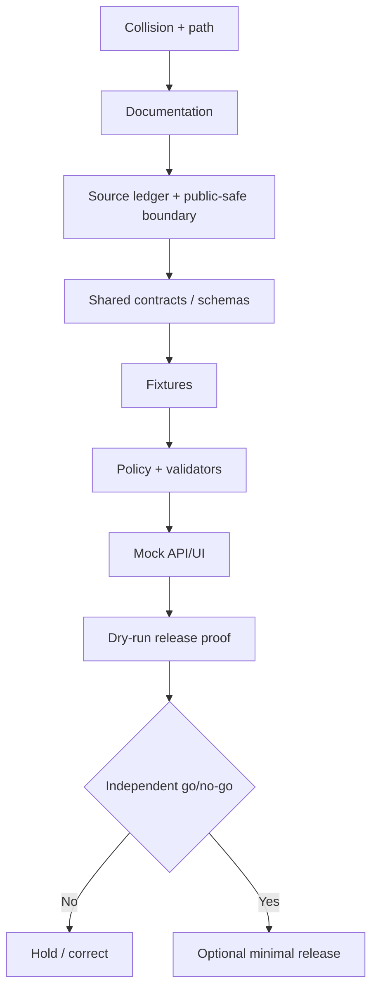

<!-- [KFM_META_BLOCK_V2]
doc_id: NEEDS_VERIFICATION
title: Smith County Focus Mode Build Plan
type: county-focus-mode-build-plan
version: v0.1-proposed
status: PROPOSED
release_status: NEEDS_VERIFICATION
county_name: Smith County
county_slug: smith
lane_slug: smith-county
created: 2026-06-09
updated: 2026-06-09
owners:
  focus_mode_owner: NEEDS_VERIFICATION
  evidence_steward: NEEDS_VERIFICATION
  geodesy_cartography_reviewer: NEEDS_VERIFICATION
  cultural_history_reviewer: NEEDS_VERIFICATION
  agriculture_reviewer: NEEDS_VERIFICATION
  municipal_water_reviewer: NEEDS_VERIFICATION
  privacy_property_reviewer: NEEDS_VERIFICATION
  infrastructure_security_reviewer: NEEDS_VERIFICATION
  rights_reviewer: NEEDS_VERIFICATION
  release_approver: NEEDS_VERIFICATION
defining_public_safe_boundary: >-
  Smith County's geographic-center marker, Lebanon visitor context, Home on the
  Range history, agriculture, property-inspection notices, municipal utilities,
  airport, roads, cemeteries, genealogy, emergency, weather, and public-record
  sources may support generalized, time-bounded interpretation, but must not
  become a claim that one marker is a mathematically exact or universally accepted
  national center; present-day property-access, route, title, landowner, genealogy,
  living-person, individual-farm, household-water, current burn-ban, live weather,
  emergency-operation, or infrastructure-vulnerability guidance; or unrestricted
  reproduction of lyrics, recordings, images, maps, or archival materials.
collision_search:
  supplied_completed_register: CONFIRMED absent
  current_conversation_register: CONFIRMED Butler, Cheyenne, Nemaha, Russell, Sumner, and Wichita completed; Smith absent
  live_county_index: CONFIRMED listed not-started when checked 2026-06-09
  exact_title_search: CONFIRMED no result returned
  exact_filename_search: CONFIRMED no result returned
  kebab_slug_search: CONFIRMED no result returned
  underscore_slug_search: CONFIRMED no result returned
  proof_slice_search: CONFIRMED no result for Lebanon geographic center Smith County
  branch_search: CONFIRMED no matching branch returned
  pull_request_search: CONFIRMED no matching pull request returned
  issue_search: CONFIRMED no matching issue returned
  accessible_project_materials: CONFIRMED no Smith County Focus Mode build plan found
  exhaustive_absence_private_branches_deleted_files_local_artifacts_prior_chats: NEEDS_VERIFICATION
  rejected_material_collisions:
    - Butler County: generated in this conversation
    - Cheyenne County: generated in this conversation
    - Nemaha County: generated in this conversation
    - Russell County: generated in this conversation
    - Sumner County: generated in this conversation
    - Wichita County: generated in this conversation
    - Graham County: live county index marks draft
directory_rules_basis:
  governing_principle: responsibility root outranks topic name
  observed_live_plan_template: docs/focus-mode/counties/<county-slug>-county/build-plan.md
  observed_live_index: docs/focus-mode/counties/COUNTY_INDEX.md
  validator_reference: tools/validators/validate_focus_mode_index.py
  documented_divergence: docs/focus-mode/ versus docs/focus-modes/ references coexist
  older_legacy_convention: docs/focus-mode/counties/<county_name_lowercase>_county/<county_name_lowercase>_county_focus_mode_build_plan.md
  path_posture: PROPOSED / NEEDS_VERIFICATION until repository authority or ADR resolves divergence
proposed_paths:
  human_plan: PROPOSED / NEEDS_VERIFICATION
  source_ledger: PROPOSED / NEEDS_VERIFICATION
  contracts: PROPOSED / NEEDS_VERIFICATION
  schemas: PROPOSED / NEEDS_VERIFICATION
  policies: PROPOSED / NEEDS_VERIFICATION
  fixtures: PROPOSED / NEEDS_VERIFICATION
  ui: PROPOSED / NEEDS_VERIFICATION
  correction: PROPOSED / NEEDS_VERIFICATION
  rollback: PROPOSED / NEEDS_VERIFICATION
  release: PROPOSED / NEEDS_VERIFICATION
official_sources_checked:
  - Smith County, Kansas official website
  - City of Smith Center official website
  - U.S. Census Bureau QuickFacts, Smith County, Kansas
  - USDA NASS 2022 Census of Agriculture, Smith County profile
  - National Weather Service Forecast Office Hastings
authoritative_candidates_checked_as_context_not_admitted:
  - Smith County county-published geographic-center and Home on the Range statements
authoritative_candidates_for_later_verification:
  - NOAA National Geodetic Survey historical geographic-center documentation
  - Kansas Historical Society / Kansas Memory
  - National Park Service National Register documentation
  - Kansas Department of Transportation county and highway maps
  - Kansas Geological Survey
  - USGS hydrography and water data
implementation_claim: none
repository_modification_claim: none
source_admission_claim: none
review_or_validation_claim: none
promotion_or_publication_claim: none
truth_labels: [CONFIRMED, PROPOSED, NEEDS_VERIFICATION, UNKNOWN]
finite_outcomes: [ANSWER, ABSTAIN, DENY, ERROR]
[/KFM_META_BLOCK_V2] -->

<a id="top"></a>

# Smith County Focus Mode — Build Plan

> **The “center of the lower 48,” Home on the Range, winter wheat, small communities, public records, and municipal services—without turning a historical marker into mathematical certainty, a visitor map into property permission, cultural material into unrestricted content, or rural public records into profiles and operational guidance.**

**Product thesis:** Build a governed, map-first, time-aware Smith County Focus Mode that explains the county, Smith Center, Lebanon, the county-published geographic-center tradition, Home on the Range heritage, 2022 agriculture, municipal authority, and official operational redirects while preserving methodological uncertainty, cultural-source roles, rights, privacy, property access, currentness, correction, and rollback.


> [!IMPORTANT]
> **Defining public-safe boundary.** Smith County can be explained through county-scale geography, the Lebanon marker tradition, Home on the Range history, agriculture, public administration, and municipal services. KFM must not present a roadside marker or local tradition as a uniquely exact, universally accepted mathematical center; imply access to private land or permission to enter a site; create title, landowner, genealogy, living-person, or individual-farm profiles; provide household-water, current burn-ban, live weather, emergency, road, airport, or utility guidance from stale evidence; expose infrastructure vulnerabilities; or reproduce lyrics, recordings, images, maps, and archival material without rights verification.

## Status and identity

| Field | Value | Truth posture |
|---|---|---|
| County | Smith County, Kansas | `CONFIRMED` |
| County seat | Smith Center | `CONFIRMED` |
| County FIPS | `20183` | `CONFIRMED` |
| County slug | `smith` | `PROPOSED` |
| Lane slug | `smith-county` | `PROPOSED` |
| Deliverable | `smith_county_focus_mode_build_plan.md` | `CONFIRMED` |
| Created / updated | 2026-06-09 | `CONFIRMED` |
| Planning status | Build plan only | `CONFIRMED` |
| Implementation | Not claimed | `UNKNOWN` |
| Source admission | Not performed | `CONFIRMED` |
| Validation / review | Not performed | `CONFIRMED` |
| Release / publication | Not performed | `CONFIRMED` |
| Canonical repository path | Singular/plural convention unresolved | `NEEDS_VERIFICATION` |
| Geographic-center claim posture | Local/county historical claim with method and precision caveat required | `PROPOSED` |
| Exhaustive collision absence | Not provable across all private/deleted/local artifacts | `NEEDS_VERIFICATION` |

## Quick links

[Executive build note](#executive-build-note) · [Evidence boundary](#evidence-boundary) · [Operating posture](#1-operating-posture) · [Why this county](#2-why-this-county) · [Product thesis](#3-product-thesis) · [Scope](#4-scope-boundary) · [Layers](#5-first-demo-layers) · [Journeys](#6-user-journeys) · [UI](#7-ui-surfaces) · [Objects](#8-governed-object-model) · [Repository](#9-proposed-repository-shape) · [Phases](#10-build-phases) · [PR sequence](#11-first-pr-sequence) · [Acceptance](#12-acceptance-checklist) · [Fixtures](#13-fixture-plan) · [Risks](#14-risk-register) · [Sources](#15-source-seed-list) · [Questions](#16-open-verification-questions) · [Milestone](#17-recommended-first-milestone)

## Executive build note

Smith County is a strong next proof slice because it combines a memorable national-scale map claim with local heritage, agricultural evidence, small-population privacy, and operational currentness:

1. **A geospatial claim that must carry method and uncertainty.** The county states that the geographic center of the contiguous 48 states is within Smith County near Lebanon. A KFM map should explain the historical designation without asserting that one monument is a uniquely exact mathematical truth.
2. **Marker versus computed point versus visitor site.** A public marker, a historically calculated point, and any nearby private parcel are separate objects. A visitor location does not establish survey precision, land ownership, road status, or permission to enter adjacent land.
3. **Cultural history and source rights.** The county states that Dr. Brewster Higley wrote the material that became “Home on the Range” in Smith County and that it later became the Kansas state song. Public interpretation must preserve source authority, variant/version history, archival provenance, and rights rather than reproducing lyrics, sheet music, recordings, photographs, or scans by default.
4. **Agriculture.** USDA NASS reports 447 farms, 551,930 acres in farms, $193.813 million in products sold, a 67% crop / 33% livestock-products sales split, and 7,429 irrigated acres for 2022.
5. **Small-population privacy.** Census reports a 2020 count of 3,570, a 2024 estimate of 3,541, and 895.46 square miles of land. Property, genealogy, cemetery, election, tax, appraisal, and agricultural records can become identifying when combined.
6. **Current public operations.** The county site carries 2026 property-inspection details and a burn-ban notice; the city publishes emergency snow-route, airport, utility, water-quality, alert, and public-safety surfaces. These are time-sensitive and unsuitable for durable caching.
7. **Public-record boundaries.** County links expose tax search, appraiser, deeds, genealogy, cemeteries, election records, and township/city officials. Public availability does not authorize title conclusions or living-person/family profiles.
8. **Municipal water and infrastructure.** Smith Center publishes water rates, a water-quality-report surface, airport, emergency services, code compliance, planning, and utility information. The first slice should use authority redirects and durable service categories, not household water advice or vulnerability mapping.

### Collision determination

| Check | Result | Status |
|---|---|---|
| Supplied completed/collision register | Smith County absent | `CONFIRMED` |
| Current conversation register | Butler, Cheyenne, Nemaha, Russell, Sumner, Wichita completed; Smith absent | `CONFIRMED` |
| Live county index | Smith listed `not-started` | `CONFIRMED` |
| Exact title search | No result for `"Smith County Focus Mode"` | `CONFIRMED` |
| Exact filename search | No result for `smith_county_focus_mode_build_plan` | `CONFIRMED` |
| Slug searches | No result for `smith-county` or `smith_county` | `CONFIRMED` |
| Proof-slice search | No result for Lebanon geographic center Smith County | `CONFIRMED` |
| Branch / PR / issue searches | No matching item | `CONFIRMED` |
| Accessible project materials | No Smith County Focus Mode plan found | `CONFIRMED` |
| Private branches, deleted files, local artifacts, all prior chats | Not exhaustive | `NEEDS_VERIFICATION` |

### Directory Rules basis

The inspected live county template identifies:

`docs/focus-mode/counties/<county-slug>-county/build-plan.md`

as the canonical template path and references the shared Focus Mode contract, schema, and validator. Other repository materials still use `docs/focus-modes/`, while older county artifacts used underscored folders and verbose filenames. The plan therefore records the inspected convention but does not claim that repository drift is fully resolved.

Responsibility roots remain:

- planning and human control → `docs/`;
- semantic meaning → `contracts/`;
- machine shape → `schemas/`;
- admissibility and finite outcomes → `policy/`;
- examples and negative paths → `fixtures/`;
- deployable UI/API → `apps/`;
- lifecycle evidence and publication → `data/`;
- release decisions and rollback → `release/`.

All proposed paths remain `PROPOSED / NEEDS_VERIFICATION`.

## Evidence boundary

| Label | What this run supports |
|---|---|
| `CONFIRMED` | Collision searches were performed; official county, city, Census, NASS, and NWS sources were opened; the county-published center and Home on the Range statements were observed; this artifact was generated. |
| `PROPOSED` | Product design, public-safe boundary, layers, object candidates, policies, fixtures, paths, UI, validation, correction, rollback, and release plan. |
| `NEEDS_VERIFICATION` | Exhaustive collision absence; canonical path; exact center methodology and coordinates; marker/site/property relationship; heritage authority; rights for lyrics/images/maps/archives; current burn-ban and operations; source admission; reviewers; release approval. |
| `UNKNOWN` | Current implementation, CI/test state, admitted EvidenceBundles, runtime routes, deployed UI, policy enforcement, review completion, release manifests, corrections, and rollback execution. |

---

# 1. Operating posture

## 1.1 KFM governing rules applied to Smith County

1. `EvidenceBundle` outranks local tradition, marker text, tourism language, AI narrative, map symbols, and search ranking.
2. Public clients use governed APIs, released artifacts, approved tiles, and finite response envelopes.
3. Public UI must not read `RAW`, `WORK`, `QUARANTINE`, tax/appraiser/deed systems, genealogy records, direct alert banners, direct utility systems, or model output.
4. Preserve `RAW -> WORK / QUARANTINE -> PROCESSED -> CATALOG / TRIPLET -> PUBLISHED`.
5. Promotion is a governed state transition, not a file move.
6. “Geographic center” must identify the target geography, method, source, date, uncertainty, and whether the point is calculated, commemorative, or visitor-facing.
7. A marker or tourism site does not establish an exact computation, property boundary, right-of-way, or access permission.
8. County history, KSHS archival authority, NPS registration, NOAA/NGS geodetic history, and generated synthesis remain distinct roles.
9. Cultural text, sheet music, audio, images, and scans require asset-level rights review.
10. NASS and Census remain time-bounded statistical aggregates.
11. Public tax, appraisal, genealogy, cemetery, election, and deed records must not become profiles of living people or families.
12. County and city operational notices require currentness and expiry.
13. Municipal water information cannot become household potability, pressure, outage, or health advice.
14. Roads, airport, utility, emergency, inspection-route, and public-safety details cannot become vulnerability analysis.
15. Every response ends as `ANSWER`, `ABSTAIN`, `DENY`, or `ERROR`.

## 1.2 Truth-label and finite-outcome key

| Label/outcome | Meaning |
|---|---|
| `CONFIRMED` | Verified during this run. |
| `PROPOSED` | Recommended, not verified as implemented. |
| `NEEDS_VERIFICATION` | Checkable before use. |
| `UNKNOWN` | Unsupported or unresolved. |
| `ANSWER` | Released evidence supports a bounded, cited answer. |
| `ABSTAIN` | Method, evidence, authority, rights, status, currentness, scale, or access is unresolved. |
| `DENY` | Request seeks prohibited precision, profiles, private access, household advice, or vulnerability analysis. |
| `ERROR` | Contract, evidence, identity, citation, integrity, release, or service resolution failed. |

## 1.3 Public trust membrane



## 1.4 County-specific non-negotiable guardrails

| Topic | Required behavior |
|---|---|
| Geographic center | State “contiguous 48 states,” source, method, uncertainty, and historical status; do not call a monument the exact universal center. |
| Marker / computed point | Model them as separate entities with explicit relationship and confidence. |
| Visitor access | No route or permission claim without current land/road authority; no private-parcel navigation. |
| Home on the Range | Generalized heritage narrative only until KSHS/NPS/rights review; no default lyric, recording, sheet-music, or archival-image reproduction. |
| Property inspections | Public notice may support an operational redirect; no household/parcel targeting, route prediction, or staff tracking. |
| Genealogy/cemeteries | Historical research context only; no living-person/family profiling or sensitive burial-location exposure. |
| Agriculture | County aggregates only; no farm, field, producer, lease, or financial inference. |
| Municipal water | Report and authority context only; no household potability, illness, pressure, outage, or network conclusion. |
| Burn bans/weather | Current authority redirect; stale or conflicting status produces `ABSTAIN`. |
| Airport/roads/utilities/emergency | No tactical routing, weak-point, dependency, capacity, outage, or disruption analysis. |
| Public records | No title, ownership, debt, fraud, valuation, access, or living-person conclusion. |
| Generated narrative | Cannot remove uncertainty, elevate authority, or restore withheld content. |

## 1.5 Candidate reason codes

| Code | Outcome | Meaning |
|---|---|---|
| `SC-EVIDENCE-MISSING` | `ABSTAIN` | Required EvidenceBundle does not resolve. |
| `SC-EVIDENCE-STALE` | `ABSTAIN` | Evidence is outside its permitted time window. |
| `SC-CENTER-METHOD-UNCLEAR` | `ABSTAIN` | Geographic-center method or target geography unresolved. |
| `SC-CENTER-PRECISION-UNSUPPORTED` | `ABSTAIN` | Requested precision exceeds evidence. |
| `SC-RIGHTS-UNCLEAR` | `ABSTAIN` | Reproduction or derivative-display rights unresolved. |
| `SC-OPERATIONAL-REDIRECT` | `ABSTAIN` | Current county/city/NWS authority must answer. |
| `SC-PROPERTY-ACCESS` | `DENY` | Request seeks access, route, trespass, easement, or ownership conclusion. |
| `SC-OWNER-PROFILE` | `DENY` | Request creates a landowner or living-person profile. |
| `SC-GENEALOGY-LIVING-PERSON` | `DENY` | Request links genealogy/public records to living people. |
| `SC-INDIVIDUAL-FARM` | `DENY` | Request infers an agricultural operation. |
| `SC-CULTURAL-ASSET-RIGHTS` | `ABSTAIN` | Cultural asset may not be reproduced without verified rights. |
| `SC-HOUSEHOLD-WATER` | `DENY` | Household potability, health, pressure, or service conclusion. |
| `SC-INFRASTRUCTURE-EXACT` | `DENY` | Exact airport, utility, road, emergency, or inspection-operation detail. |
| `SC-VULNERABILITY-ANALYSIS` | `DENY` | Weak-point, dependency, capacity, or disruption analysis. |
| `SC-INTEGRITY-FAIL` | `ERROR` | Digest, schema, citation, entity, or manifest failure. |
| `SC-SERVICE-UNAVAILABLE` | `ERROR` | Required governed dependency unavailable. |
| `SC-RELEASE-CLOSURE-FAIL` | `ERROR` | Review, correction, or rollback closure missing. |

---

# 2. Why this county

## 2.1 Selection screen

| Candidate | Result | Decision |
|---|---|---|
| Butler, Cheyenne, Nemaha, Russell, Sumner, Wichita | Completed in current conversation | Reject |
| Graham | Live county index marks `draft` | Reject |
| Smith | Not in register; live index `not-started`; no searched collision | **Select** |
| Lane / Stanton | Unused candidates | Hold |

## 2.2 Proof-slice rationale

| Proof dimension | Smith County value | Governance challenge |
|---|---|---|
| Geodesy/cartography | County-published contiguous-48 center tradition | Method, target geography, point uncertainty, marker distinction |
| Visitor geography | Lebanon and center marker | Visitor site does not establish private access |
| Cultural history | Home on the Range county association | Authority, variants, copyright/public-domain and asset rights |
| Agriculture | 447 farms and 551,930 acres in 2022 | Aggregate only; no farm inference |
| Municipal systems | Water, airport, utilities, emergency, planning | Currentness and infrastructure security |
| Public records | Tax, appraiser, deeds, genealogy, cemeteries, elections | Living-person and family reidentification |
| Property inspections | 2026 public notice with locations and schedule | Operational detail should not become tracking or targeting |
| Weather/hazards | NWS Hastings plus local alerts | Historical context distinct from current warning |
| Small population | 3,570 in 2020; 3,541 estimate in 2024 | Join risk and small-cell suppression |
| Roads/corridors | US-36/US-281 candidate context | No live road/access or route-safety inference |

## 2.3 Distinct series value

Smith County adds a proof slice that is materially different from the recent sequence:

- Wichita County tested entity disambiguation and regulatory groundwater states.
- Sumner County tested historical corridors versus present access and infrastructure operations.
- Russell County tested reservoir currentness and sensitive cultural/fossil detail.
- Smith County tests **measurement claims, commemorative markers, uncertainty, cultural rights, and public-record aggregation**.

The core demonstration is that a map can show a historically recognized center tradition without turning a marker into false precision or a nearby point into access permission.

## 2.4 Public benefit

A user should be able to:

- locate Smith County, Smith Center, and Lebanon;
- learn why the county is associated with the center of the contiguous 48 states;
- inspect the claimed method, target geography, uncertainty, and source role;
- distinguish the historical/calculated concept from a marker and visitor site;
- learn the county's Home on the Range association without receiving unlicensed media;
- inspect 2022 agriculture and Census vintages;
- see current-authority redirects for burn bans, weather, snow routes, airport, utilities, and water;
- understand why property, genealogy, cemetery, and farm joins are restricted.

## 2.5 Official-source-supported anchors

| Anchor | Checked source |
|---|---|
| County seat, county history, geographic-center and Home on the Range local statements | Smith County official website |
| City government, utilities, water-quality page, airport, emergency routes and alerts | City of Smith Center |
| Population, geography, FIPS, suppression flags | Census QuickFacts |
| 2022 farms, acreage, sales and irrigation | USDA NASS |
| Current weather and hazard authority | NWS Hastings |

---

# 3. Product thesis

## 3.1 One-sentence thesis

**Smith County Focus Mode will explain county geography, the Lebanon center tradition, Home on the Range heritage, agriculture, public administration, and municipal services through released evidence while refusing false geodetic precision, private-access inference, unverified cultural reuse, living-person or farm profiling, household-water conclusions, operational guidance, and infrastructure vulnerability.**

## 3.2 First-product promises

- Method and uncertainty visible for every center claim.
- Calculated point, monument, visitor site, and parcel modeled separately.
- Cultural authority and asset rights visible.
- Agriculture and Census remain dated aggregates.
- Public-record joins constrained by privacy policy.
- Current county/city/weather information redirects or expires.
- Corrections and supersession remain visible.
- Rollback is required before publication.

## 3.3 Explicit non-promises

No claim of a uniquely exact universal center; no private-land access, title, ownership, or navigation permission; no lyrics, sheet music, recordings, archival scans, or images without rights review; no genealogy or living-person profile; no individual-farm inference; no household-water, current burn-ban, live weather, snow-route, airport, utility, emergency, or vulnerability conclusion.

---

# 4. Scope boundary

| Scope class | Content | Posture |
|---|---|---|
| Public-safe first slice | County frame; Smith Center and Lebanon; Census/NASS cards; center-method card; marker-versus-point card; generalized Home on the Range heritage card; authority redirects | `PROPOSED` |
| Deferred | Exact historical center computation; NGS documentation; NPS/KSHS heritage records; KDOT roads; KGS geology; USGS hydrology; municipal water reports; historic maps | `DEFER` |
| Denied by default | Private access/routes; owner/genealogy profiles; individual farms; household water; exact infrastructure; live operational answers; unlicensed cultural assets | `DENY` |
| Excluded | Restricted, credentialed, rights-unclear, tactical, privacy-invasive, discovery-enabling, or unsafe material | `EXCLUDE` |

## 4.1 Public-safe first slice

The first slice should prove:

1. a geographic-center claim cannot render without target geography, method, source, uncertainty, and point type;
2. a commemorative/visitor marker is not silently treated as the computed point;
3. an exact-coordinate or access request can abstain or deny safely;
4. cultural history can be explained without reproducing protected or rights-unclear assets;
5. NASS and Census cards retain time and suppression;
6. property/genealogy/farm joins fail closed;
7. operational city/county/weather content expires or redirects;
8. a corrected center-method card can supersede a prior release without erasing history.

## 4.2 Deferred content

- NOAA/NGS historical center computation and methodology documents;
- authoritative coordinates, precision statement, and marker relationship;
- Kansas Historical Society and Kansas Memory source admission;
- NPS National Register nomination and site documentation;
- Home on the Range textual, musical, audio, image, and archival rights analysis;
- KDOT current and historic roads;
- USGS/KGS hydrology and geology;
- municipal water-quality reports and system boundaries;
- historic newspaper and plat-map sources;
- cemetery/genealogy materials;
- county/city GIS, tax, deed, appraisal, and parcel systems.

## 4.3 Denied-by-default content

| Request | Default |
|---|---|
| “Give the exact universally accepted center coordinate.” | `ABSTAIN` |
| “Route me to the original point across private land.” | `DENY` |
| “Who owns the parcel around the center?” | `DENY` |
| “Copy all Home on the Range lyrics and sheet music.” | `ABSTAIN` / rights review |
| “Download and republish the cabin photographs.” | `ABSTAIN` |
| “Build a family tree from county genealogy and deeds.” | `DENY` when living-person links are possible |
| “List properties being inspected this week and owners.” | `DENY` |
| “Which farm produced the county's cattle value?” | `DENY` |
| “Is Smith Center tap water safe for my household?” | `DENY` / official current report and health redirect |
| “Is the burn ban active right now?” | `ABSTAIN` unless a current governed operational source resolves |
| “Show airport, utility, road, and emergency weak points.” | `DENY` |
| “Use the city website's weather widget as an official forecast.” | `ABSTAIN` with NWS redirect |

## 4.4 Rights, privacy, culture, ecology, health, property, operations, law, and safety

- **Rights:** Page visibility does not establish reuse rights for text, media, maps, archives, or downloadable reports.
- **Privacy:** Small population amplifies reidentification through property, genealogy, cemetery, inspection, election, and farm joins.
- **Culture:** County heritage statements remain local historical interpretation until corroborated by KSHS/NPS and appropriate archival evidence.
- **Ecology:** Any future rare-species or habitat material requires separate sensitivity review.
- **Health:** Water-quality reports do not become individualized medical or potability judgments.
- **Property:** Marker location, road, map, parcel, tax, deed, or inspection notice does not establish access or title.
- **Operations:** Burn bans, snow routes, alerts, airport, utility, and emergency information expire.
- **Law:** KFM does not decide trespass, easement, copyright, title, public-domain status, or regulatory compliance.
- **Safety:** Exact infrastructure and operational details are generalized, redirected, or withheld.


# 5. First demo layers

## 5.1 Prioritized public-safe cards and layers

| Priority | Layer/card | Source seed | Evidence gate | Policy gate | Status |
|---|---|---|---|---|---|
| 1 | Smith County frame and communities | Census + county | FIPS, geometry vintage, CRS, digest | Public administrative geography only | `PROPOSED` |
| 2 | Smith Center and Lebanon place cards | County + city + Census | Place identity, current municipality status | No property/access inference | `PROPOSED` |
| 3 | Contiguous-48 center concept card | County statement; later NOAA/NGS | Target geography, method, date, uncertainty | No universal-exactness claim | `PROPOSED` |
| 4 | Marker-versus-computed-point card | County/local seed; later NGS/site evidence | Distinct object IDs and relationship | Marker does not establish exact point/access | `PROPOSED` |
| 5 | Home on the Range heritage card | County statement; later KSHS/NPS | Authority, chronology, variant and rights review | No unlicensed lyric/media reproduction | `DEFER` pending heritage review |
| 6 | 2022 agriculture snapshot | USDA NASS | Reporting year, integrity, suppression | Aggregate only | `PROPOSED` |
| 7 | Population and economy card | Census | Vintage and methodology | Aggregate only | `PROPOSED` |
| 8 | Smith Center municipal-authority card | City website | Current source identity and checked date | Redirect for utilities, airport, safety, water | `PROPOSED` |
| 9 | County operational-authority card | County website | Notice identity, effective/retrieval/expiry | No durable burn-ban/inspection answer | `PROPOSED` |
| 10 | Current weather authority card | NWS Hastings | Current canonical source and timestamp | Redirect only | `PROPOSED` |
| 11 | Roads, hydrology, geology, historic maps | KDOT/USGS/KGS/KSHS candidates | Rights, geometry, date, authority | No access/property/safety inference | `DEFER` |
| 12 | Owners, inspection routes, living-person genealogy, exact infrastructure | Various | Not admissible in first public slice | Fail closed | `DENY` |

## 5.2 Map composition



## 5.3 Layer-card truth contract

Every public layer/card must expose:

| Field | Requirement |
|---|---|
| `layer_id` | Stable deterministic identity |
| `subject_entity_id` | County/place/marker/computed-point/heritage object |
| `knowledge_character` | statistical / administrative / historical interpretation / geodetic interpretation / operational redirect / generated |
| `source_role` | Primary, corroborating, contextual, restricted, generated |
| `claim_scope` | Exact bounded claim the source supports |
| `center_target_geography` | Contiguous 48 / 50 states / population center / other |
| `center_method` | Computation or historical method, if known |
| `precision_statement` | Quantified or explicitly unknown |
| `point_type` | computed / commemorative marker / visitor site / generalized area |
| `evidence_refs` | Resolving EvidenceRefs |
| `temporal_basis` | Event/publication/retrieval/check/release/expiry/correction |
| `spatial_basis` | Geometry authority, scale, CRS, generalization |
| `rights_status` | Allowed/restricted/unclear/prohibited |
| `sensitivity_tier` | Reviewed tier |
| `access_status` | public-confirmed / restricted / not-established / unknown |
| `privacy_risk` | Small-cell/reidentification finding |
| `transform_receipt_ref` | Redaction/generalization/suppression receipt |
| `policy_decision_ref` | Allow/abstain/deny/hold |
| `citation_validation_ref` | Required for answer-bearing cards |
| `review_record_ref` | Required |
| `release_manifest_ref` | Required for public display |
| `correction_ref` | Required when corrected or superseded |
| `rollback_ref` | Required |
| `boundary_notice` | Center/access/rights/currentness boundary |

---

# 6. User journeys

## 6.1 Public learning journeys

### Journey A — What “center” means here

**Question:** “Why is Smith County called the center of the lower 48?”

**Expected:** `ANSWER` citing the admitted county/local and later geodetic evidence. The response identifies the target as the contiguous 48 states, explains the historical nature of the designation, and gives a method/precision caveat. It does not say the marker is a universally exact center.

### Journey B — Marker versus point

**Question:** “Is the monument the exact calculated point?”

**Expected:** `ANSWER` or `ABSTAIN` depending on admitted evidence. The UI distinguishes the commemorative/visitor marker from the historically calculated point and displays relationship confidence.

### Journey C — Visiting Lebanon

**Question:** “Can I visit the public marker?”

**Expected:** `ANSWER` only for a currently verified public visitor site and public road access. The response does not authorize entry onto adjacent private land or route the user to an unverified historical point.

### Journey D — Home on the Range heritage

**Question:** “What is Smith County's connection to Home on the Range?”

**Expected:** `ANSWER` using admitted heritage evidence and a chronology card. No lyrics, sheet music, recordings, or archival images are reproduced unless rights are separately cleared.

### Journey E — Agriculture in 2022

**Question:** “What did USDA report about Smith County agriculture?”

**Expected:** `ANSWER` citing NASS: 447 farms, 551,930 acres in farms, $193.813 million in products sold, 67% crop sales, 33% livestock-products sales, and 7,429 irrigated acres. The answer is explicitly a 2022 county aggregate.

### Journey F — Population and rural scale

**Question:** “How many people live in Smith County?”

**Expected:** `ANSWER` distinguishing the 2020 Census count of 3,570 from the 2024 estimate of 3,541 and showing land area 895.46 square miles.

## 6.2 Trust-demonstration journeys

### Journey G — Method uncertainty

The user opens the center card and sees:

- target geography;
- historical source;
- method name/description;
- stated or unresolved precision;
- calculated point versus marker;
- current access status;
- correction history;
- “not a universal mathematical exactness claim.”

### Journey H — Cultural rights

The heritage card displays:

- narrative claim;
- source role;
- work/variant identity;
- publication and archival evidence;
- text/music/audio/image rights status;
- assets omitted because rights are unresolved;
- later correction/supersession links.

### Journey I — Public-record aggregation refusal

A user requests a map combining the center, inspection areas, appraiser records, deeds, genealogy, cemetery records, and owner names. The policy engine returns `DENY` and offers a generalized county-history view without identifying people or parcels.

### Journey J — Currentness separation

The city or county changes a burn-ban, snow-route, water, utility, or emergency notice. KFM displays the current-authority redirect and an expiry state rather than treating the old notice as durable county truth.

## 6.3 Denied and abstained requests

| Request | Outcome | Reason |
|---|---|---|
| “Give me the universally exact center coordinate.” | `ABSTAIN` | `SC-CENTER-METHOD-UNCLEAR` / precision unsupported |
| “Route me to the original point across the farm.” | `DENY` | `SC-PROPERTY-ACCESS` |
| “Tell me who owns the center parcel.” | `DENY` | `SC-OWNER-PROFILE` |
| “Republish the lyrics, music, recordings, and cabin photos.” | `ABSTAIN` | `SC-CULTURAL-ASSET-RIGHTS` |
| “Build living descendants' profiles from genealogy and deeds.” | `DENY` | `SC-GENEALOGY-LIVING-PERSON` |
| “List inspected parcels and owners this week.” | `DENY` | Owner profile + operational targeting |
| “Which farm produced the county sales value?” | `DENY` | `SC-INDIVIDUAL-FARM` |
| “Is my household water safe?” | `DENY` | `SC-HOUSEHOLD-WATER` |
| “Is a burn ban active now?” | `ABSTAIN` unless a current governed source resolves | `SC-OPERATIONAL-REDIRECT` |
| “What is today's official weather from the city widget?” | `ABSTAIN` | Redirect to NWS Hastings |
| “Show airport, water, utility, and emergency weak points.” | `DENY` | `SC-VULNERABILITY-ANALYSIS` |
| “Does the marker prove public access to nearby property?” | `DENY` | `SC-PROPERTY-ACCESS` |

---

# 7. UI surfaces

## 7.1 Header

The header must show:

- Smith County Focus Mode;
- county FIPS `20183`;
- release and review date;
- center-claim method/uncertainty badge;
- **Marker ≠ exact universal center or property permission** badge;
- heritage-rights badge;
- operational freshness;
- correction indicator;
- finite outcome.

## 7.2 Map canvas

The map must:

- begin at Smith County extent;
- show Smith Center and Lebanon;
- render computed center, commemorative marker, visitor site, and generalized area with distinct symbols;
- avoid presenting an uncertainty area as a precise point;
- prevent direct property, inspection, genealogy, cemetery, utility, airport, or emergency-source access;
- use governed APIs and released tiles only;
- route selection through evidence and policy;
- display access status and rights status;
- prohibit navigation to non-public or unverified points.

## 7.3 Layer drawer

Each layer row displays:

- knowledge character;
- source role;
- target geography;
- method;
- precision/uncertainty;
- point type;
- time basis;
- geometry authority;
- rights status;
- access status;
- privacy/sensitivity;
- review, release, and correction state.

## 7.4 Evidence Drawer

Required fields:

1. subject and object type;
2. bounded claim;
3. publisher and source role;
4. source/document title;
5. historical event/publication/retrieval/check dates;
6. EvidenceRefs and resolved EvidenceBundle;
7. target geography and center method;
8. precision/uncertainty statement;
9. computed-point/marker/visitor-site relationship;
10. geometry authority, scale, CRS;
11. access and property non-claim;
12. rights status by asset type;
13. privacy/sensitivity finding;
14. transform/redaction/suppression receipt;
15. PolicyDecision;
16. CitationValidationReport;
17. ReviewRecord;
18. ReleaseManifest;
19. CorrectionNotice;
20. RollbackPlan.

## 7.5 Answer panel

An `ANSWER` includes:

- bounded answer;
- citations;
- source-role labels;
- method and uncertainty;
- time and spatial basis;
- access status;
- cultural rights/non-reproduction notice;
- explicit non-claims;
- release and correction references.

## 7.6 Denial panel

A `DENY` includes:

- reason code;
- safe explanation;
- no owner identity, private route, inspection detail, family linkage, or infrastructure echoing;
- safe generalized alternative;
- appropriate authority redirect;
- audit receipt.

## 7.7 Abstention panel

An `ABSTAIN` includes:

- unresolved method, precision, rights, currentness, or authority;
- evidence required;
- official redirect;
- no guessed coordinate, permission, rights, or operational status.

## 7.8 Timeline / time-basis panel

| Field | Meaning |
|---|---|
| `historical_event_at` | Historic writing, survey, publication, or site event |
| `method_applied_at` | Date/period of center determination |
| `marker_established_at` | Commemorative marker date |
| `published_at` | Source publication |
| `retrieved_at` | KFM retrieval |
| `checked_at` | Currentness/authority check |
| `effective_from/to` | Operational notice or policy period |
| `released_at` | KFM release |
| `expires_at` | Operational expiration |
| `corrected_at` | Correction/supersession |

## 7.9 County-specific boundary panel

> **Smith County center, access, heritage, and operations boundary:** The county is historically associated with the center of the contiguous 48 states and with Home on the Range. KFM must show method, target geography, uncertainty, object type, and source role. A marker is not a universal exact computation or permission to enter nearby land. Heritage narrative does not authorize unrestricted media reuse. Public records do not become owner, family, or farm profiles. Current water, burn-ban, weather, airport, utility, road, and emergency questions redirect to current authorities.

## 7.10 Official-authority redirect panel

| Topic | Redirect |
|---|---|
| County administration, property-office contacts, inspection and burn-ban notices | Smith County official website |
| Smith Center government, utilities, water-quality page, airport, alerts and snow routes | City of Smith Center |
| Current weather and warnings | NWS Hastings |
| Population and economic aggregates | U.S. Census Bureau |
| Agriculture statistics | USDA NASS |
| Geodetic center method/history | NOAA/NGS candidate—`NEEDS_VERIFICATION` |
| State/local heritage and archival evidence | KSHS/Kansas Memory candidate |
| National Register/site documentation | National Park Service candidate |
| Current roads and route authority | KDOT/local authority candidate |

## 7.11 Correction/release panel

Show:

- current release;
- center-method version;
- point/marker relationship version;
- heritage-source version;
- rights determination;
- current operational-source check;
- correction notice;
- affected cards/layers;
- rollback target;
- cache invalidation;
- public alias state.

## 7.12 Legend vocabulary

| Term | Meaning |
|---|---|
| Center target | Geographic unit being centered |
| Computed point | Result of a documented method |
| Uncertainty area | Range within which a result may reasonably fall |
| Commemorative marker | Public monument or plaque, not necessarily computed point |
| Visitor site | Public-facing location with verified access |
| Historical interpretation | Contextual narrative, not geodetic or legal authority |
| Access not established | No road/easement/permission conclusion |
| Cultural asset | Text, music, audio, image, scan, or object with rights duties |
| Statistical aggregate | County summary, not an individual person/farm |
| Operational redirect | Current authority link, not durable cached truth |
| Generated summary | Downstream text subordinate to evidence |

## 7.13 UI/API/policy/evidence sequence



---

# 8. Governed object model

## 8.1 Shared KFM concepts

| Object | Proposed use |
|---|---|
| `SourceDescriptor` | Publisher, role, claim scope, rights, sensitivity, time, geography |
| `EvidenceRef` | Stable claim-to-evidence link |
| `EvidenceBundle` | Provenance, records, method, rights, review, integrity, spatial/temporal fitness |
| `PolicyDecision` | Allow/abstain/deny/hold with reason codes and expiry |
| `RuntimeResponseEnvelope` | Public finite outcome |
| `CitationValidationReport` | Citation resolution and claim support |
| `ReleaseManifest` | Released artifacts and dependency closure |
| `AIReceipt` | Provider/model/config/evidence/output record |
| `ReviewRecord` | Human role, scope, decision, date |
| `CorrectionNotice` | Public correction/supersession |
| `RollbackPlan` | Target, trigger, procedure, cache/alias verification |

## 8.2 County-specific object candidates

| Object | Purpose | Status |
|---|---|---|
| `SmithCountyFrame` | FIPS, geometry, CRS, vintage, municipalities | `PROPOSED` |
| `GeographicCenterClaim` | Target geography, method, result, uncertainty, source | `PROPOSED` |
| `CenterPointRepresentation` | Computed point, marker, visitor site, uncertainty area | `PROPOSED` |
| `CenterRelationshipRecord` | Relates marker/site/point without conflation | `PROPOSED` |
| `AccessStatusDecision` | public-confirmed / not-established / restricted / unknown | `PROPOSED` |
| `HeritageNarrativeCard` | Bounded cultural-history claim and authority | `PROPOSED` |
| `CulturalAssetRightsDecision` | Text/music/audio/image/archive rights by asset | `PROPOSED` |
| `AgricultureCountySnapshot` | NASS aggregate and reporting year | `PROPOSED` |
| `PublicRecordAggregationDecision` | Prevents owner/family/farm reidentification | `PROPOSED` |
| `OperationalNoticeEnvelope` | Current county/city notice with expiry | `PROPOSED` |
| `MunicipalAuthorityCard` | Safe service categories and redirects | `PROPOSED` |
| `CountyBoundaryNotice` | Reusable center/access/rights/currentness boundary | `PROPOSED` |

## 8.3 Source-role anti-collapse rules

1. County/local history is not NOAA/NGS geodetic authority.
2. A computed point is not a commemorative marker.
3. A marker is not a parcel boundary or access right.
4. A public visitor site is not permission to enter adjacent land.
5. KSHS archival evidence, NPS registration, local site interpretation, and generated narrative remain distinct.
6. A heritage statement is not permission to reproduce lyrics, music, recordings, scans, or images.
7. Tax/appraisal/deed/genealogy/cemetery records do not become title or living-person profiles.
8. Property-inspection notices do not become owner-targeting or route tracking.
9. NASS aggregates do not identify farms.
10. City water information does not become household potability advice.
11. A city weather widget is not NWS operational authority.
12. Generated prose cannot remove uncertainty or restore withheld material.

## 8.4 Minimal public `ANSWER` JSON

```json
{
  "schema_version": "1.0",
  "response_id": "kfm:runtime:smith-county:answer:sha256:EXAMPLE",
  "outcome": "ANSWER",
  "question": "Why is Smith County associated with the center of the lower 48?",
  "answer": "Admitted county and geodetic evidence associates an area near Lebanon in Smith County with a historical determination of the geographic center of the contiguous 48 states. The displayed marker is identified as a commemorative or visitor location unless evidence establishes that it coincides with the documented computed point. The result carries method and precision limitations.",
  "county": {"name": "Smith County", "state": "Kansas", "fips": "20183"},
  "knowledge_character": "geodetic_historical_interpretation",
  "center_claim": {
    "target_geography": "contiguous_48_states",
    "method": "NEEDS_VERIFICATION",
    "precision": "NEEDS_VERIFICATION",
    "point_type": "historical_computed_point"
  },
  "evidence_refs": [
    "kfm:evidence-ref:smith-county:center-tradition",
    "kfm:evidence-ref:ngs:center-method:NEEDS_VERIFICATION"
  ],
  "policy_decision": {
    "outcome": "ALLOW",
    "reason_codes": ["METHOD_VISIBLE", "PRECISION_BOUNDED", "NO_ACCESS_INFERENCE"]
  },
  "release_manifest_ref": "NEEDS_VERIFICATION",
  "rollback_ref": "NEEDS_VERIFICATION"
}
```

## 8.5 `ABSTAIN` JSON

```json
{
  "schema_version": "1.0",
  "response_id": "kfm:runtime:smith-county:abstain:sha256:EXAMPLE",
  "outcome": "ABSTAIN",
  "question": "What is the universally exact coordinate of the center?",
  "answer": null,
  "reason_codes": [
    "SC-CENTER-METHOD-UNCLEAR",
    "SC-CENTER-PRECISION-UNSUPPORTED"
  ],
  "explanation": "The admitted evidence does not support a uniquely exact, universally accepted coordinate. Center results depend on the target geography, method, boundary model, and precision.",
  "safe_alternative": "View the historical Smith County center tradition, documented method, uncertainty, and marker relationship."
}
```

## 8.6 `DENY` JSON

```json
{
  "schema_version": "1.0",
  "response_id": "kfm:runtime:smith-county:deny:sha256:EXAMPLE",
  "outcome": "DENY",
  "question": "Route me across private land to the original point and identify the owner.",
  "answer": null,
  "reason_codes": [
    "SC-PROPERTY-ACCESS",
    "SC-OWNER-PROFILE"
  ],
  "explanation": "KFM does not provide private-property routes, infer permission, or identify owners for this purpose.",
  "safe_alternative": "View a currently verified public visitor-site card and generalized historical context."
}
```

## 8.7 Deterministic identity candidates

| Object | Candidate identity input |
|---|---|
| County frame | FIPS + geometry vintage + CRS + digest |
| Center claim | target geography + method version + boundary model + source digest |
| Computed point | center-claim ID + coordinate reference system + result digest |
| Marker | public-site authority + site ID + geometry digest |
| Relationship record | computed-point ID + marker ID + relationship type/version |
| Heritage card | subject/work ID + evidence digest + narrative version |
| Rights decision | asset ID + jurisdiction + rights evidence + decision version |
| Agriculture snapshot | FIPS + census year + profile version |
| Operational notice | authority + notice ID + effective/expiry + digest |
| Release manifest | sorted artifact/evidence/policy/review digests |

## 8.8 `spec_hash` posture

Candidate canonical inputs:

- schema and contract versions;
- center target-geography vocabulary;
- method and boundary-model identifiers;
- precision/uncertainty rules;
- point/marker/site relationship;
- access-status rules;
- cultural-asset rights profile;
- privacy/small-cell thresholds;
- operational expiry rules;
- layer composition;
- evidence and citation logic;
- UI behavior.

Exact canonicalization remains `NEEDS_VERIFICATION`. JCS plus SHA-256 is a reasonable `PROPOSED` default if compatible with KFM tooling.

---

# 9. Proposed repository shape

## 9.1 Directory Rules basis

- human planning → `docs/`;
- semantic meaning → `contracts/`;
- machine shape → `schemas/`;
- policy/admissibility → `policy/`;
- examples → `fixtures/`;
- validators/generators → `tools/`;
- deployables → `apps/`;
- lifecycle evidence and publication → `data/`;
- release decisions and rollback → `release/`.

## 9.2 Observed live convention and divergence

Inspected:

- `docs/focus-mode/counties/COUNTY_INDEX.md`
- `docs/focus-mode/counties/_template/county-build-plan.md`
- template reference to `tools/validators/validate_focus_mode_index.py`
- canonical template copy path: `docs/focus-mode/counties/<county-slug>-county/build-plan.md`

Other materials reference `docs/focus-modes/`, and older artifacts used underscored folders. No parallel lane should be created without migration authority.

## 9.3 Candidate path table

| Responsibility | Candidate path | Status |
|---|---|---|
| Build plan | `docs/focus-mode/counties/smith-county/build-plan.md` | `PROPOSED / NEEDS_VERIFICATION` |
| Requested artifact | `smith_county_focus_mode_build_plan.md` | Deliverable only |
| Lane README | `docs/focus-mode/counties/smith-county/README.md` | `PROPOSED / NEEDS_VERIFICATION` |
| Layer registry | `docs/focus-mode/counties/smith-county/layer-registry.md` | `PROPOSED / NEEDS_VERIFICATION` |
| Evidence model | `docs/focus-mode/counties/smith-county/evidence-model.md` | `PROPOSED / NEEDS_VERIFICATION` |
| Acceptance checklist | `docs/focus-mode/counties/smith-county/acceptance-checklist.md` | `PROPOSED / NEEDS_VERIFICATION` |
| Source seed list | `docs/focus-mode/counties/smith-county/source-seed-list.md` | `PROPOSED / NEEDS_VERIFICATION` |
| Public safety notes | `docs/focus-mode/counties/smith-county/public-safety-notes.md` | `PROPOSED / NEEDS_VERIFICATION` |
| Semantic contract | `contracts/focus_mode/smith_county_focus_mode.md` | `PROPOSED / NEEDS_VERIFICATION` |
| Shared schema | `schemas/contracts/v1/focus_mode/focus_mode_payload.schema.json` | Reuse candidate |
| County extension | `schemas/contracts/v1/focus_mode/smith_county_extension.schema.json` | Only if shared schema cannot express method/uncertainty/rights |
| Source descriptors | `data/catalog/sources/smith-county/source_descriptors.yaml` | `PROPOSED / NEEDS_VERIFICATION` |
| Fixtures | `fixtures/focus_modes/smith-county/{valid,invalid}/` | `PROPOSED / NEEDS_VERIFICATION` |
| Policy | `policy/focus_modes/smith-county/` | `PROPOSED / NEEDS_VERIFICATION` |
| UI | `apps/explorer-web/src/focus-modes/smith-county/` | `PROPOSED / NEEDS_VERIFICATION` |
| Mock API | `apps/governed-api/fixtures/focus-modes/smith-county/` | `PROPOSED / NEEDS_VERIFICATION` |
| Release candidate | `release/candidates/focus-modes/smith-county/` | `PROPOSED / NEEDS_VERIFICATION` |
| Published payload | `data/published/api_payloads/focus-modes/smith-county.json` | Later only |
| Correction / rollback | Existing responsibility roots, exact paths TBD | `PROPOSED / NEEDS_VERIFICATION` |

## 9.4 Proposed responsibility-rooted tree

```text
docs/
  focus-mode/
    counties/
      smith-county/
        README.md
        build-plan.md
        layer-registry.md
        evidence-model.md
        acceptance-checklist.md
        source-seed-list.md
        public-safety-notes.md

contracts/
  focus_mode/
    smith_county_focus_mode.md

schemas/
  contracts/
    v1/
      focus_mode/
        focus_mode_payload.schema.json
        smith_county_extension.schema.json  # only if justified

fixtures/
  focus_modes/
    smith-county/
      valid/
      invalid/

policy/
  focus_modes/
    smith-county/

apps/
  explorer-web/
    src/
      focus-modes/
        smith-county/
  governed-api/
    fixtures/
      focus-modes/
        smith-county/

data/
  catalog/
    sources/
      smith-county/
        source_descriptors.yaml
  published/
    api_payloads/
      focus-modes/
        smith-county.json  # later only

release/
  candidates/
    focus-modes/
      smith-county/
```

## 9.5 Placement prohibitions

Do not create:

- root-level `smith/`, `smith-county/`, `geographic-center/`, `home-on-the-range/`, `heritage/`, or `counties/`;
- parallel schema, contract, policy, source, rights, receipt, proof, correction, or release homes;
- copied tax, deed, genealogy, cemetery, inspection, utility, emergency, or owner data in public UI code;
- copied lyrics, recordings, images, archival scans, or maps without rights clearance;
- a published payload by moving a candidate file;
- a single point geometry that silently conflates computed point, marker, visitor site, and property location.

## 9.6 Existence statement

No proposed Smith County file, schema, contract, policy, fixture, UI module, source descriptor, rights record, release object, correction notice, or rollback object is claimed to exist unless directly inspected and identified as shared repository evidence.


# 10. Build phases

| Phase | Entry gate | Outputs | Exit validation | Rollback |
|---|---|---|---|---|
| 0. Collision/path verification | Current repo access | Collision memo and path decision | No collision or parallel lane | Stop without mutation |
| 1. Documentation control | Phase 0 clear | Seven draft lane documents | Required sections, labels, owner placeholders | Revert docs PR |
| 2. Source ledger and boundary | Docs drafted | Candidate descriptors; method/rights/privacy/currentness matrix | No assumed admission | Remove candidates |
| 3. Shared-object reuse | Contracts/schemas inspected | Reuse map or narrow extension proposal | No duplicate authority | Revert extension |
| 4. Fixtures | Shapes stable | Valid/invalid method, rights, access and privacy fixtures | Schema and negative paths | Remove fixtures |
| 5. Policy and validators | Invalid pack exists | Center, access, rights, privacy, operational rules | Highest-risk requests fail closed | Revert policy |
| 6. Mock governed API/UI | Policy tests pass | Static envelopes, map shell, Evidence Drawer, timeline | No direct source/nonreleased access | Disable feature |
| 7. Dry-run release proof | Mock flow passes | Candidate manifest, citations, reviews, correction, rollback | Closure without public alias | Delete candidate; retain audit |
| 8. Optional minimal release | Independent approval | Static versioned public-safe payload | Gates A–G | Repoint prior release |



---

# 11. First PR sequence

1. **Verification and documentation control**
   - repeat collision search;
   - inspect current path convention;
   - create human documentation only;
   - assign geodesy, heritage, privacy, rights, municipal, and release reviewers;
   - define the center/access/rights/currentness boundary.

2. **Source ledger/admission and public-safe boundary**
   - candidate source descriptors;
   - source-role and claim-scope matrix;
   - method and precision fields;
   - cultural-asset rights matrix;
   - currentness and privacy review;
   - no live connectors.

3. **Contracts/schemas or shared-object reuse**
   - inspect shared `FocusModePayload`, geographic entity, evidence, rights, and policy objects;
   - reuse before extending;
   - no parallel rights or heritage authority;
   - ADR if required.

4. **Valid and invalid fixtures**
   - no-network fixtures;
   - all four finite outcomes;
   - marker/point conflation, private access, owner profile, cultural-rights, household-water, farm and operational cases.

5. **Policy and validators**
   - center-method completeness;
   - precision/uncertainty validation;
   - marker/point relationship;
   - access and privacy denial;
   - cultural-asset rights;
   - operational expiry;
   - public trust-membrane checks.

6. **Mock governed API/UI**
   - fixture-backed only;
   - county map;
   - center-method card;
   - marker/point comparison;
   - generalized heritage card;
   - Evidence Drawer;
   - boundary and authority redirects.

7. **Dry-run release proof**
   - candidate ReleaseManifest;
   - CitationValidationReport;
   - method and rights reviews;
   - transformation receipts;
   - CorrectionNotice;
   - RollbackPlan;
   - no public alias.

8. **Optional minimal public-safe publication**
   - only after independent approval;
   - static versioned payload;
   - generalized layers;
   - rollback tested.

> [!CAUTION]
> Live tax, appraisal, deed, genealogy, cemetery, inspection, utility, airport, emergency, burn-ban, weather, archival-media, or property-access integrations and public release are not first-PR work.

---

# 12. Acceptance checklist

## Governance and evidence

- [ ] Every answer claim resolves to an EvidenceBundle.
- [ ] Generated language remains downstream.
- [ ] Source role, method, uncertainty, rights, time, access, privacy, review, and release state are visible.
- [ ] Promotion, correction, and rollback are auditable.

## Center claim and map integrity

- [ ] Target geography is `contiguous_48_states` where appropriate.
- [ ] Method is identified or answer abstains.
- [ ] Precision/uncertainty is explicit.
- [ ] Computed point and commemorative marker are separate objects.
- [ ] Visitor site and private property are not conflated.
- [ ] No universal-exactness claim is made.
- [ ] Geometry and CRS are documented.
- [ ] Correction can replace a center representation without erasing the prior version.

## Heritage and rights

- [ ] County/local, KSHS, NPS, archival, and generated roles are distinct.
- [ ] Narrative is supported by admitted evidence.
- [ ] Lyrics, sheet music, audio, photographs, scans, and maps have asset-level rights decisions.
- [ ] Rights-unclear assets are omitted.
- [ ] Variant/version history is preserved.
- [ ] Cultural narrative does not imply property access.

## Privacy and public records

- [ ] No title or owner conclusion.
- [ ] No living-person genealogy profile.
- [ ] No inspection-route or household targeting.
- [ ] No individual-farm inference.
- [ ] Small-cell and joined-query risk reviewed.
- [ ] Public visibility is not treated as unrestricted aggregation permission.

## Currentness and safety

- [ ] Burn-ban and county notices have retrieval and expiry.
- [ ] City snow-route, utility, airport, water, alert, and emergency material redirects or expires.
- [ ] NWS is used for current weather authority.
- [ ] No city weather widget is represented as NWS truth.
- [ ] Household-water questions fail closed.
- [ ] Infrastructure-vulnerability questions fail closed.

## Product and UI

- [ ] Map starts at Smith County extent.
- [ ] Smith Center and Lebanon labels resolve correctly.
- [ ] Computed point, marker, visitor site, and uncertainty area use distinct symbols.
- [ ] Evidence Drawer resolves.
- [ ] Method and precision are visible in the answer panel.
- [ ] Rights and access status are visible.
- [ ] Four finite outcomes are distinct and accessible.
- [ ] Official redirects work.

## Repository placement

- [ ] Directory Rules checked.
- [ ] Singular/plural path divergence resolved or recorded.
- [ ] No topic root created.
- [ ] No parallel rights, heritage, contract, schema, or policy home.
- [ ] Shared objects reused where possible.
- [ ] Per-root README contracts followed.

## Validation

- [ ] Schemas and reason codes validate.
- [ ] Citations resolve and support claims.
- [ ] Digests match manifests.
- [ ] Method/precision fixtures validate.
- [ ] Marker/point conflation fixtures fail.
- [ ] Private-access and profile fixtures fail closed.
- [ ] Cultural-rights fixtures abstain or deny.
- [ ] Operational expiry tests pass.
- [ ] Public client cannot access nonreleased stores.

## Release, correction, rollback

- [ ] ReleaseManifest complete.
- [ ] CitationValidationReport passes.
- [ ] Geodesy, heritage, privacy, rights, security, and release ReviewRecords complete.
- [ ] Correction propagation tested.
- [ ] Rollback target, alias, and cache procedure tested.
- [ ] No in-place overwrite.
- [ ] Audit history retained.

---

# 13. Fixture plan

## 13.1 Valid fixtures

| Fixture | Scenario | Expected |
|---|---|---|
| `valid-answer-county-frame.json` | County identity and FIPS | `ANSWER` |
| `valid-answer-center-bounded.json` | Historical center claim with method caveat | `ANSWER` |
| `valid-answer-marker-relation.json` | Marker distinguished from computed point | `ANSWER` |
| `valid-answer-heritage-generalized.json` | Rights-safe Home on the Range narrative | `ANSWER` |
| `valid-answer-nass-2022.json` | Agriculture aggregate | `ANSWER` |
| `valid-answer-census-vintages.json` | Population and land area | `ANSWER` |
| `valid-abstain-exact-center.json` | Universal exact coordinate requested | `ABSTAIN` |
| `valid-abstain-cultural-rights.json` | Rights-unclear media reproduction | `ABSTAIN` |
| `valid-abstain-current-burn-ban.json` | Current status unresolved | `ABSTAIN` |
| `valid-deny-private-route.json` | Route across private land | `DENY` |
| `valid-deny-owner-profile.json` | Parcel/owner query | `DENY` |
| `valid-deny-living-genealogy.json` | Living-person family profile | `DENY` |
| `valid-deny-household-water.json` | Household potability | `DENY` |
| `valid-error-integrity.json` | Digest mismatch | `ERROR` |

## 13.2 Invalid/fail-closed fixtures

| Fixture | Defect | Required failure |
|---|---|---|
| `invalid-center-no-target-geography.json` | “Center” target absent | Validation fail |
| `invalid-center-no-method.json` | Method absent but exact answer asserted | `ABSTAIN`/fail |
| `invalid-marker-as-computed-point.json` | Object conflation | Fail |
| `invalid-zero-uncertainty.json` | False exactness | Fail |
| `invalid-marker-proves-access.json` | Visitor marker used as permission | `DENY` |
| `invalid-private-route.json` | Routes across private land | `DENY` |
| `invalid-owner-center-parcel.json` | Owner profile | `DENY` |
| `invalid-inspection-owner-join.json` | Inspection areas joined to owners | `DENY` |
| `invalid-genealogy-living-person.json` | Living-person family linkage | `DENY` |
| `invalid-unlicensed-lyrics.json` | Full cultural text without rights | `ABSTAIN`/fail |
| `invalid-unlicensed-recording.json` | Audio copied without rights | `ABSTAIN`/fail |
| `invalid-unlicensed-cabin-photo.json` | Image copied without rights | `ABSTAIN`/fail |
| `invalid-nass-farm-inference.json` | Aggregate tied to farm | `DENY` |
| `invalid-household-water-safe.json` | Household potability claim | `DENY` |
| `invalid-stale-burn-ban.json` | Old notice presented current | `ABSTAIN`/`ERROR` |
| `invalid-city-weather-as-nws.json` | Wrong authority | Fail |
| `invalid-airport-utility-vulnerability.json` | Infrastructure analysis | `DENY` |
| `invalid-web-visibility-rights.json` | Visibility treated as license | `ABSTAIN` |
| `invalid-release-no-rollback.json` | Missing rollback | Gate fail |
| `invalid-correction-overwrite.json` | Prior history erased | Fail |

## 13.3 Fixture-to-test matrix

| Test family | Valid fixtures | Invalid fixtures |
|---|---|---|
| Schema | All | Missing target/method/evidence |
| Evidence closure | Answer fixtures | Missing/unresolved refs |
| Center semantics | Bounded center card | False exactness/object conflation |
| Geometry/access | Public visitor relation | Marker-as-access/private route |
| Heritage rights | Generalized narrative | Unlicensed text/audio/image |
| Privacy | Aggregates | Owner/inspection/genealogy joins |
| Agriculture | NASS aggregate | Farm inference |
| Municipal water | Authority redirect | Household potability |
| Operational currentness | Redirect fixture | Stale burn-ban/weather |
| Infrastructure security | General service card | Weak-point/dependency analysis |
| Release closure | Dry-run manifest | Missing correction/rollback |
| UI outcome | All four | Ambiguous/missing outcome |

## 13.4 Highest-risk invalid fixture pack

Mandatory:

1. marker represented as the exact computed center;
2. zero uncertainty or “universally exact” language;
3. route across private land to a historical point;
4. marker-site owner profile;
5. inspection schedule joined to household/owner data;
6. living-person genealogy assembled from county records;
7. full lyrics, recording, or archival image reproduced without rights;
8. NASS aggregate reverse-engineered to a farm;
9. household water declared safe;
10. stale burn-ban or city weather widget presented as current official truth;
11. airport/utility/emergency vulnerability analysis;
12. release without correction and rollback.

No milestone passes unless all fail closed without echoing sensitive identities, routes, or assets.

---

# 14. Risk register

| Risk | Likelihood | Impact | Required mitigation | Release posture |
|---|---|---|---|---|
| Marker shown as exact universal center | High | High | Method/target/precision contract and distinct symbols | Block |
| Computed point and visitor site conflated | High | High | Separate entities and relationship record | Block |
| Center display implies private access | Medium | High | AccessStatusDecision and deny fixtures | Block |
| Local narrative treated as geodetic authority | Medium | High | Source-role separation and NOAA/NGS verification | Hold |
| Heritage narrative reproduces rights-unclear assets | High | High | Asset-level rights decision | Block |
| Heritage variants collapsed into one canonical text | Medium | Medium | Work/variant identity and provenance | Hold |
| Parcel/tax/deed/genealogy joins profile living people | High | High | Query denial and privacy review | Block |
| Inspection notice enables household targeting | Medium | High | Operational generalization and no owner joins | Block |
| NASS values identify a farm | Medium | High | Aggregate-only policy | Block |
| 2022 agriculture shown as current | High | Medium | Reporting-year labels | Block |
| Water-quality page becomes household potability advice | Medium | High | System-level/currentness/health boundary | Block |
| Burn-ban or snow-route notice becomes stale | High | High | Expiry and official redirect | Block |
| City weather widget treated as authoritative forecast | High | High | NWS redirect and source-role test | Block |
| Airport/utility/emergency details support vulnerability analysis | Medium | Critical | Withhold/generalize/security review | Block |
| Public webpage treated as a reuse license | High | Medium | Per-asset rights review | Hold |
| Correction fails to update point/marker relationship | Medium | High | Dependency map and correction tests | Block |
| Rollback untested | Medium | High | Dry-run rollback | Block |
| Path divergence creates parallel control plane | High | Medium | ADR/drift resolution | Block merge |
| AI prose hides uncertainty | High | High | Structured method fields and cite-or-abstain | Block |


# 15. Source seed list

## 15.1 Official sources checked during this run

### SRC-SC-COUNTY — Smith County, Kansas official website

- **URL:** https://ks1495.cichosting.com/main/index.php
- **Authority role:** County administrative authority and local historical-content publisher.
- **Checked:** 2026-06-09.
- **Verified anchors:** County seat Smith Center; county organization/history summary; county-published statements connecting Smith County to the geographic center of the contiguous 48 states and to Home on the Range; elected officials; commissioners and minutes; county clerk; elections; register of deeds; genealogy; cemeteries; tax search; appraiser; emergency management; health; landfill/recycling; visitor information; 2026 property-inspection notice; burn-ban notice.
- **Intended use:** County identity, local historical-claim seed, administrative-authority redirects, currentness/expiry demonstration, and privacy-boundary fixtures.
- **Allowed claim scope:** What the county publishes, with source role and checked date visible.
- **Rights limitations:** Website visibility does not establish permission to republish images, maps, downloadable documents, genealogy material, or derivative layers.
- **Sensitivity limitations:** Tax, appraisal, deed, inspection, election, cemetery, genealogy, official/staff, emergency, and property information require privacy and operational review.
- **Operational/currentness limitations:** Property-inspection locations/schedules, burn-ban text, meetings, notices, contacts, and staff information change.
- **Status:** `CONFIRMED checked / NEEDS_VERIFICATION for admission`.

### SRC-SC-CITY — City of Smith Center official website

- **URL:** https://www.smithcenterks.com/
- **Authority role:** Municipal administrative and operational authority.
- **Checked:** 2026-06-09.
- **Verified anchors:** City government; boards and commissions; ordinances; court; budgets and transparency; meeting minutes; open records; alerts; permits; emergency services; parks; airport; public transportation; utilities; water rates and policies; water-quality report page; water-conservation information; emergency snow-route link; economic-development and land-bank pages.
- **Intended use:** Municipal identity, durable service-category card, and current-authority redirects.
- **Allowed claim scope:** Published municipal service categories and dated notices.
- **Rights limitations:** Photos, downloadable reports, maps, linked portals, weather widgets, and third-party resources require individual review.
- **Sensitivity limitations:** Airport, utilities, emergency services, open records, land-bank, property, staff, and snow-route material require security/privacy review.
- **Operational/currentness limitations:** Alerts, weather widget, water reports, routes, meetings, permits, contacts, and service status change.
- **Status:** `CONFIRMED checked / redirect-first candidate`.

### SRC-SC-CENSUS — U.S. Census Bureau QuickFacts

- **URL:** https://www.census.gov/quickfacts/fact/table/smithcountykansas/PST045225
- **Authority role:** Federal statistical authority.
- **Checked:** 2026-06-09.
- **Verified anchors:** 2024 population estimate 3,541; 2020 Census population 3,570; 895.46 square miles of land; population density 4.0 per square mile; FIPS `20183`; mixed-vintage demographic, housing, economic, business, health, and geography measures; suppression and availability flags.
- **Intended use:** County identity and public statistical aggregate cards.
- **Allowed claim scope:** Published statistics for their stated vintages, definitions, and flags.
- **Rights limitations:** Follow Census citation and data-use guidance.
- **Sensitivity limitations:** No living-person/household inference; preserve `D`, `S`, `NA`, `N`, `Z`, and related flags.
- **Operational/currentness limitations:** Values have different reference periods and should not be compared without methodology review.
- **Status:** `CONFIRMED checked / candidate for admission`.

### SRC-SC-NASS-2022 — USDA NASS 2022 Census of Agriculture County Profile

- **URL:** https://www.nass.usda.gov/Publications/AgCensus/2022/Online_Resources/County_Profiles/Kansas/cp20183.pdf
- **Authority role:** Federal agricultural statistical authority.
- **Checked:** 2026-06-09.
- **Verified anchors:** 447 farms; 551,930 acres in farms; average farm size 1,235 acres; $193.813 million market value of products sold; 67% crops and 33% livestock/poultry/products; 7,429 irrigated acres; cropland, pastureland, woodland, and other land-use totals.
- **Intended use:** Static 2022 agriculture snapshot.
- **Allowed claim scope:** Published county totals, shares, ranks, and categories for the 2022 reporting cycle.
- **Rights limitations:** Attribution and reuse terms must be captured before publication.
- **Sensitivity limitations:** No producer, operation, field, parcel, lease, facility, or financial inference; preserve all suppression flags on deeper tables.
- **Operational/currentness limitations:** 2022 reporting is not current farm or market status.
- **Status:** `CONFIRMED checked / candidate for admission`.

### SRC-SC-NWS — National Weather Service Hastings

- **URL:** https://www.weather.gov/gid/
- **Authority role:** Federal operational weather authority for the region.
- **Checked:** 2026-06-09.
- **Verified anchors:** Official weather-office surface for current hazards, observations, forecasts, radar, climate/past weather, and reporting resources.
- **Intended use:** Current weather/hazard redirect and later dated historical-climate evidence candidate.
- **Allowed claim scope:** Redirect to current official information; dated archived information only after admission.
- **Rights limitations:** Feed, API, map, screenshot, and derivative-use requirements need verification.
- **Sensitivity limitations:** No special source sensitivity, but stale weather information is a public-safety risk.
- **Operational/currentness limitations:** Current products expire rapidly and cannot be cached as durable county truth.
- **Status:** `CONFIRMED checked / redirect-only first slice`.

## 15.2 Checked local claims requiring stronger authority before admission

| Claim/source | Current evidence | Required verification |
|---|---|---|
| Contiguous-48 geographic center is in Smith County near Lebanon | County official website | NOAA/NGS historical methodology, target geography, coordinates, uncertainty, and current explanatory posture |
| Marker/visitor site relationship to calculated point | County/local context | Site authority, current public-access evidence, land status, road status, geometry and relationship |
| Home on the Range originated in Smith County | County official website | KSHS/Kansas Memory, archival publication history, work/variant identity, NPS site documentation |
| Cabin/site details | Local/county context only | NPS National Register nomination, current site owner/steward, access and rights |
| Song text/music/audio/image reuse | Not established | Public-domain/copyright analysis by asset and version; attribution and reproduction conditions |

## 15.3 Candidate sources for later verification

| Candidate | Intended role | Verify before admission |
|---|---|---|
| NOAA National Geodetic Survey | Center methodology/history | Canonical document, target geography, method, uncertainty, coordinates, current explanatory status |
| Kansas Historical Society / Kansapedia / Kansas Memory | Heritage/history | Authority, publication history, variants, rights, archival provenance |
| National Park Service / NRHP | Cabin/site history | Nomination record, site geometry, access, rights, current stewardship |
| KDOT Smith County map | Roads and communities | Current URL, publication date, geometry authority, license |
| USGS hydrography/water data | Rivers and observations | Applicable features/stations, provisional flags, geometry, time |
| Kansas Geological Survey | Geology/groundwater | Product version, scale, rights, no property-level conclusion |
| NRCS SSURGO | Soils | Survey vintage, scale, interpretation limits, redistribution |
| FEMA NFHL/NRI | Hazards | Effective status, date, rights, no parcel-level live-safety conclusion |
| KDHE | Water/environment/health | Reporting period, system boundary, no individual health conclusion |
| County tax/appraiser/deed systems | Administrative/property | Terms, title disclaimer, living-person privacy, aggregation rules |
| County genealogy/cemetery records | Historical research | Living-person exclusion, burial sensitivity, rights |
| City water-quality reports | Municipal water | Reporting period, system boundary, rights, no household potability conclusion |
| Historic newspapers/maps/atlases | Heritage and settlement | Rights, OCR quality, provenance, georeferencing confidence |
| Current visitor-site steward | Center marker/cabin access | Current public access, hours, parking, property boundary, operational notices |

## 15.4 Source-admission checklist

For each source:

- [ ] Publisher and canonical URL verified.
- [ ] Stable source ID assigned.
- [ ] Authority role and knowledge character assigned.
- [ ] Claim scope documented.
- [ ] Target geography identified.
- [ ] Method, precision, uncertainty, and point type recorded where applicable.
- [ ] Publication, event, retrieval, check, effective, and expiry dates captured.
- [ ] Rights, attribution, redistribution, screenshot, media, map, and derivative-display permissions reviewed.
- [ ] Geometry authority, CRS, scale, vintage, and generalization documented.
- [ ] Marker, computed point, visitor site, parcel, and access relationships reviewed.
- [ ] Property, living-person, genealogy, cemetery, agriculture, and small-cell privacy reviewed.
- [ ] Infrastructure and operational sensitivity reviewed.
- [ ] Source-specific non-claims preserved.
- [ ] Acquisition checksum and receipt recorded.
- [ ] Candidate enters `WORK` or `QUARANTINE`, not `PUBLISHED`.
- [ ] Validation and reviewer decision recorded.
- [ ] Correction and supersession source identified.
- [ ] Public transform has a receipt.
- [ ] Release has correction and rollback closure.

---

# 16. Open verification questions

## Collision and repository

1. Does a Smith County plan exist in a private branch, fork, deleted artifact, local workspace, attachment, or prior chat?
2. Should Butler, Cheyenne, Nemaha, Russell, Sumner, Wichita, and Smith be added to the live collision register before another run?
3. Is the county-index validator active and authoritative?
4. Is the live template lane fully reconciled with older `docs/focus-modes/` references?

## Center methodology and geometry

5. What NOAA/NGS document is canonical for the historical contiguous-48 center determination?
6. What exact target geography and boundary representation were used?
7. What method was used and what precision/uncertainty was stated?
8. Is there a single official coordinate, an uncertainty area, or only a historical approximate location?
9. What is the authoritative relationship between the historically calculated point and the public marker?
10. Which geometry represents the public visitor site?
11. What current road and land authority establishes public access?
12. How should shoreline/boundary-model changes or alternative center methods be represented?
13. Should KFM expose an exact point, a generalized point, or an uncertainty polygon?

## Heritage authority and rights

14. Which KSHS/Kansas Memory records establish the Home on the Range chronology?
15. Which work title and textual variants should receive distinct IDs?
16. Which NPS record establishes the cabin/site history?
17. Who currently owns or stewards the site?
18. What visitor access is currently authorized?
19. Which lyrics, sheet-music editions, recordings, photographs, scans, and maps are public domain or licensed?
20. What attribution is required?
21. How should disputed or variant chronology be represented?
22. Does any cultural or burial sensitivity apply to nearby locations?

## Agriculture and privacy

23. Which deeper NASS tables contain suppression flags?
24. What joins could identify one of 447 farms or an operation?
25. What small-cell threshold applies to county and township statistics?
26. May irrigation, crop, livestock, or farm-size layers be mapped without operation inference?
27. How should time series distinguish Census of Agriculture cycles?

## Property, genealogy, cemeteries, and inspections

28. May county tax/appraiser/deed data be used in any aggregate?
29. What title and ownership disclaimers are required?
30. How are living people excluded from genealogy and cemetery synthesis?
31. Which burial-place details require redaction or generalization?
32. How should 2026 property-inspection notices expire?
33. Can inspection areas be shown at any generalized scale without enabling household targeting?
34. Who reviews privacy and living-person risk?

## Municipal water and infrastructure

35. Which Smith Center water-quality report is current?
36. What system boundary and reporting period apply?
37. Can a report be summarized without household potability or health conclusions?
38. Which airport, utility, emergency, snow-route, and public-transport fields are safe?
39. Which infrastructure details must be excluded?
40. What operational time-to-live applies to city alerts and routes?

## Weather, hazards, and currentness

41. Is NWS Hastings the correct current weather office for every part of Smith County?
42. What time-to-live applies to warnings, forecasts, burn bans, and local notices?
43. How are local and federal operational-source conflicts handled?
44. Who may trigger emergency withdrawal of a stale or unsafe card?

## Contracts, correction, rollback, release

45. Can the shared Focus Mode schema express method, uncertainty, point type, relationship, access, and asset rights?
46. Which shared reason-code registry is canonical?
47. Which correction object/path is canonical?
48. How do center-method, coordinate, and heritage corrections propagate to cards, API, tiles, search, and AI retrieval?
49. Which rollback object/path is canonical?
50. How are aliases and caches repointed?
51. Which reviewers are mandatory before release?
52. What gates A–G exist in the current implementation?
53. What proof is required before county-index status advances beyond `draft`?

---

# 17. Recommended first milestone

## Milestone name

**Smith County Center-Claim, Marker-Access, and Heritage-Rights Boundary Proof**

## Milestone statement

Create a no-network, fixture-only demonstration that:

- renders Smith County, Smith Center, and Lebanon;
- answers one bounded contiguous-48 center-history question;
- distinguishes a calculated point, uncertainty area, marker, and visitor site;
- answers one 2022 agriculture question;
- answers one population-vintage question;
- presents one generalized Home on the Range heritage card without reproducing rights-unclear assets;
- abstains from universal-exact-coordinate, unverified cultural-reuse, current burn-ban, weather, and municipal-status questions;
- denies private routes, owner profiles, living-person genealogy, individual-farm, household-water, and vulnerability requests;
- returns `ERROR` on integrity failure;
- proves correction and rollback closure;
- publishes nothing.

## Deliverables

1. Collision/path memo.
2. Seven draft lane documents.
3. Candidate source ledger.
4. `GeographicCenterClaim` contract.
5. `CenterPointRepresentation` and relationship vocabulary.
6. Access-status policy.
7. Cultural-asset rights matrix.
8. Public-record aggregation policy.
9. Shared-object reuse map.
10. Valid `ANSWER`, `ABSTAIN`, `DENY`, and `ERROR` fixtures.
11. Highest-risk invalid fixture pack.
12. Method/precision validation report fixture.
13. CitationValidationReport and PolicyDecision fixtures.
14. Mock map, Evidence Drawer, and method/uncertainty panel.
15. Official-authority redirect panel.
16. Dry-run ReleaseManifest.
17. CorrectionNotice.
18. RollbackPlan.
19. Validation report.

## Definition of done

- [ ] Collision rechecked immediately before merge.
- [ ] Canonical path resolved or drift recorded.
- [ ] No live connector and no source-admission claim.
- [ ] Center answer names target geography.
- [ ] Method and precision are present or answer abstains.
- [ ] Computed point, marker, visitor site, and uncertainty area remain distinct.
- [ ] No private access or owner inference.
- [ ] Heritage card uses admitted evidence and no rights-unclear assets.
- [ ] Agriculture answer preserves 2022 scope.
- [ ] Census vintages remain distinct.
- [ ] Genealogy, inspection, farm, household-water, and infrastructure requests fail closed.
- [ ] Burn-ban/weather/current municipal questions redirect or abstain.
- [ ] Integrity failure returns `ERROR`.
- [ ] Boundary is visible throughout UI.
- [ ] Dry-run release includes correction and rollback.
- [ ] No public alias, route, tile, payload, deployment, promotion, or publication.

## Go/no-go table

| Gate | Go condition | No-go condition |
|---|---|---|
| Collision | No authoritative plan collision | Existing plan found |
| Placement | One responsibility-rooted lane | Parallel authority |
| Evidence | Every answer ref resolves | Missing/unresolved evidence |
| Center semantics | Target, method, uncertainty, point type explicit | False exactness or object conflation |
| Access | Public access separately verified | Marker used as property permission |
| Heritage | Authority and asset rights recorded | Rights-unclear media exposed |
| Privacy | Owner/family/farm joins denied | Reidentification possible |
| Currentness | Operational expiry and redirects work | Stale burn-ban/weather answer |
| Infrastructure | Exact/tactical details withheld | Vulnerability exposed |
| UI | Four outcomes distinct | Non-answer resembles answer |
| Release | Correction and rollback complete | Missing closure |
| Publication | Independent approval | Any unresolved high-risk item |

---

# Appendix A — Public-safe narrative skeleton

## A.1 Working title

**Smith County: The Center Tradition, Home on the Range, Agriculture, and the Difference Between a Map Claim, a Marker, and Public Access**

## A.2 Narrative outline

1. **County frame and time**
   - Smith County, Smith Center, Lebanon, FIPS, municipalities, Census vintages.
2. **What kind of “center”?**
   - Contiguous 48 versus 50 states versus population centers.
   - Historical method and boundary model.
   - Precision and uncertainty.
3. **Point, marker, visitor site, and property**
   - Separate map objects.
   - Relationship confidence.
   - Access not inferred.
4. **Home on the Range heritage**
   - County association.
   - KSHS/NPS/archival roles.
   - Text/music/media variants and rights.
   - No unlicensed reproduction.
5. **Agriculture in 2022**
   - Farms, acreage, sales, land use, irrigation.
   - Aggregate and privacy limitations.
6. **Public records and rural privacy**
   - Tax, appraiser, deeds, genealogy, cemeteries, elections, inspections.
   - Why separate public sources cannot automatically be joined into profiles.
7. **Smith Center municipal services**
   - Water, airport, utilities, emergency, planning, alerts and snow routes.
   - Current-authority redirects and no vulnerability analysis.
8. **Weather and operational currentness**
   - NWS Hastings.
   - Burn-ban and local-notice expiry.
9. **Inspect, correct, and roll back**
   - Evidence Drawer.
   - Method and rights review.
   - Correction, supersession, release and rollback history.

## A.3 Closing posture

Smith County Focus Mode is an evidence-bounded public explainer, not a universal-center oracle, private-property navigator, title or genealogy service, cultural-media repository, household-water adviser, live burn-ban/weather system, or infrastructure-security product.

---

# Appendix B — Required negative-path reason-code categories

| Category | Code | Outcome |
|---|---|---|
| Missing/stale evidence | `SC-EVIDENCE-MISSING`, `SC-EVIDENCE-STALE` | `ABSTAIN` |
| Center method/precision | `SC-CENTER-METHOD-UNCLEAR`, `SC-CENTER-PRECISION-UNSUPPORTED` | `ABSTAIN` |
| Rights | `SC-RIGHTS-UNCLEAR`, `SC-CULTURAL-ASSET-RIGHTS` | `ABSTAIN` |
| Operational authority | `SC-OPERATIONAL-REDIRECT` | `ABSTAIN` |
| Property/access | `SC-PROPERTY-ACCESS` | `DENY` |
| Owner profile | `SC-OWNER-PROFILE` | `DENY` |
| Living-person genealogy | `SC-GENEALOGY-LIVING-PERSON` | `DENY` |
| Individual farm | `SC-INDIVIDUAL-FARM` | `DENY` |
| Household water | `SC-HOUSEHOLD-WATER` | `DENY` |
| Exact infrastructure | `SC-INFRASTRUCTURE-EXACT` | `DENY` |
| Vulnerability analysis | `SC-VULNERABILITY-ANALYSIS` | `DENY` |
| Integrity/dependency/release | `SC-INTEGRITY-FAIL`, `SC-SERVICE-UNAVAILABLE`, `SC-RELEASE-CLOSURE-FAIL` | `ERROR` |

### Required behavior

1. `ANSWER` requires evidence closure, bounded method/uncertainty, citations, policy allow, review, and release state.
2. `ABSTAIN` identifies missing method, precision, rights, currentness, or authority and provides a safe redirect.
3. `DENY` does not echo owner identities, private routes, living-person family links, inspection details, or infrastructure.
4. `ERROR` never falls back to uncited generation.
5. Every outcome emits an audit reference.
6. The UI must not visually disguise a non-answer as a successful answer.

---

# Appendix C — References and evidence-use note

## C.1 Official references checked

1. **Smith County, Kansas official website.** Checked 2026-06-09.  
   https://ks1495.cichosting.com/main/index.php  
   Role: county administrative authority and local historical-content publisher. Limitations: current notices; property, genealogy, cemetery, inspection, emergency, and rights review.

2. **City of Smith Center official website.** Checked 2026-06-09.  
   https://www.smithcenterks.com/  
   Role: municipal administrative and operational authority. Limitations: rapidly changing alerts/routes/services; water and infrastructure security; third-party content rights.

3. **U.S. Census Bureau QuickFacts — Smith County, Kansas.** Checked 2026-06-09.  
   https://www.census.gov/quickfacts/fact/table/smithcountykansas/PST045225  
   Role: federal statistical authority. Limitations: mixed vintages, sampling and suppression, no living-person inference.

4. **USDA NASS 2022 Census of Agriculture County Profile — Smith County, Kansas.** Checked 2026-06-09.  
   https://www.nass.usda.gov/Publications/AgCensus/2022/Online_Resources/County_Profiles/Kansas/cp20183.pdf  
   Role: federal agricultural statistical authority. Limitations: 2022 aggregate; no farm/producer inference; preserve suppression.

5. **National Weather Service Forecast Office Hastings.** Checked 2026-06-09.  
   https://www.weather.gov/gid/  
   Role: current operational weather authority. Limitations: rapidly expiring products; redirect rather than durable cache.

## C.2 Repository and doctrine evidence checked

- `docs/focus-mode/counties/COUNTY_INDEX.md`
- `docs/focus-mode/counties/_template/county-build-plan.md`
- `docs/doctrine/directory-rules.md`
- template reference to `tools/validators/validate_focus_mode_index.py`
- attached `Directory Rules.pdf`
- accessible KFM project materials searched for Smith County collision terms

## C.3 Evidence-use note

This plan is not:

- an `EvidenceBundle`;
- a source-admission decision;
- an authoritative geodetic computation;
- a claim that a marker is the exact or universally accepted center;
- an access, easement, title, ownership, trespass, or route determination;
- a genealogy or living-person profile;
- an individual-farm identification;
- a copyright/public-domain determination for lyrics, music, recordings, images, scans, or maps;
- a household-water or health assessment;
- a current burn-ban, weather, road, airport, utility, emergency, or inspection advisory;
- an infrastructure-vulnerability product;
- a ReleaseManifest;
- a published product;
- proof that any proposed file, schema, contract, policy, fixture, validator, route, UI, correction, or rollback object exists.

It is a `PROPOSED` planning artifact grounded in repository surfaces and official sources checked on 2026-06-09. No repository modification, implementation, source admission, validation, review, promotion, deployment, or publication is claimed.

---

**End of Smith County Focus Mode Build Plan**

[Back to top](#top)
