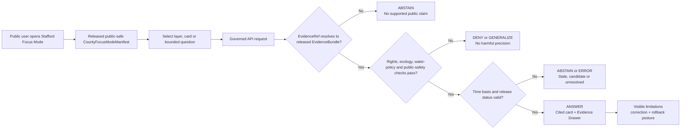
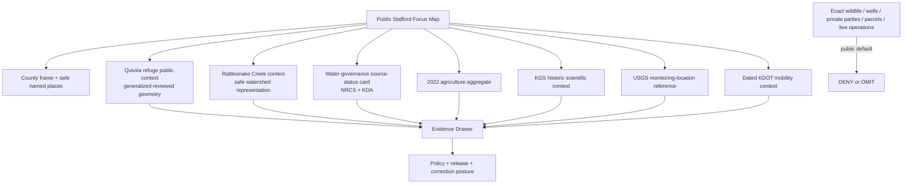
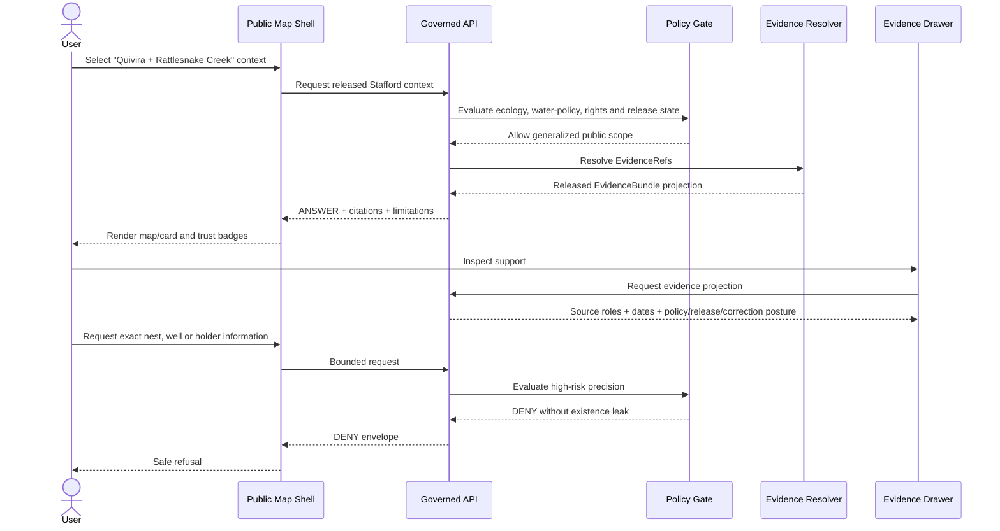
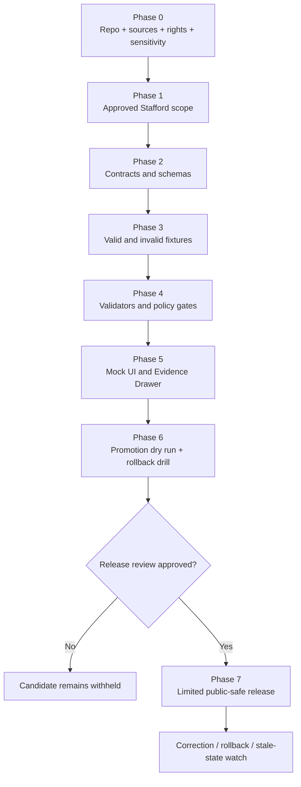

<!--
KFM_META_BLOCK_V2

doc_id: NEEDS_VERIFICATION
title: Stafford County Focus Mode Build Plan
type: standard
version: v0.1
status: draft
owners: [NEEDS_VERIFICATION]
created: 2026-05-21
updated: 2026-05-21
policy_label: public-draft
related:
  - CONFIRMED_DOCTRINE_SOURCE: Directory Rules.pdf
  - PROPOSED / NEEDS_VERIFICATION: docs/dossiers/counties/stafford/stafford_county_focus_mode_build_plan.md
  - PROPOSED / NEEDS_VERIFICATION: schemas/contracts/v1/focus/
  - PROPOSED / NEEDS_VERIFICATION: policy/focus/
  - PROPOSED / NEEDS_VERIFICATION: release/candidates/focus/counties/stafford/
tags: [kfm, focus-mode, county, stafford-county, quivira, rattlesnake-creek, hydrology, habitat, agriculture, water-governance, public-safe]
notes:
  - This is a PROPOSED county Focus Mode build plan, not a committed repository file or a released public artifact.
  - No mounted repository checkout, runtime, CI execution, workflow, branch state, release record, or dashboard was inspected for this artifact.
  - All repository paths remain NEEDS_VERIFICATION against current repository evidence, accepted ADRs, and per-root README contracts before implementation.
  - Source terms, transformed-geometry rights, schemas, validators, policy rules, review duties, release state, correction pathways, and rollback machinery remain NEEDS_VERIFICATION before publication.
  - Exact sensitive wildlife locations, nest/roost detail, private water-right or parcel inference, precise wells or vulnerability-sensitive infrastructure, and live operational/safety guidance fail closed or remain out of scope.
-->

<a id="top"></a>

# Stafford County Focus Mode Build Plan

> **A Quivira–Rattlesnake Creek proof slice for explaining wetland habitat, water-governance context, hydrogeology, agricultural scale, and dated mobility through released, evidence-bound, policy-safe KFM surfaces.**


| Field | Determination |
|---|---|
| Selected county | **Stafford County, Kansas** |
| Candidate county FIPS | `20185` — **NEEDS_VERIFICATION** against the selected authoritative identity/boundary source before fixture creation |
| Build type | County Focus Mode public-safe proof slice |
| Central theme | **Quivira National Wildlife Refuge + Rattlesnake Creek watershed + public water-governance context** |
| Implementation state | **PROPOSED** — design, fixture, validation, UI and release-gate plan only |
| Repository evidence state | **UNKNOWN in this run:** no checkout, runtime, workflow, test output or released artifact was inspected |
| Directory basis | **CONFIRMED doctrine consulted:** responsibility-root placement, schema-home default, lifecycle law and ADR-gated parallel homes in supplied *Directory Rules.pdf* |
| Proposed document home | `docs/dossiers/counties/stafford/stafford_county_focus_mode_build_plan.md` — **PROPOSED / NEEDS_VERIFICATION** |
| First milestone | **Stafford Quivira–Rattlesnake Public Context Evidence Drawer Slice** |

**Quick links** — [Operating posture](#1-operating-posture) · [Why this county](#2-why-stafford-county) · [Product thesis](#3-product-thesis) · [Scope boundary](#4-scope-boundary) · [First demo layers](#5-first-demo-layers) · [User journeys](#6-user-journeys) · [UI surfaces](#7-ui-surfaces) · [Governed object model](#8-governed-object-model) · [Repository shape](#9-proposed-repository-shape) · [Build phases](#10-build-phases) · [First PR sequence](#11-first-pr-sequence) · [Acceptance](#12-acceptance-checklist) · [Fixtures](#13-fixture-plan) · [Risk register](#14-risk-register) · [Source seeds](#15-source-seed-list) · [Verification](#16-open-verification-questions) · [Milestone](#17-recommended-first-milestone)

---

## Executive build note

**PROPOSED county choice.** Stafford County is a powerful next proof slice because it places ecological significance, water-governance records, hydrogeologic interpretation, monitoring-reference evidence, and major agricultural activity inside one county-scale public product challenge. The U.S. Fish and Wildlife Service identifies Quivira National Wildlife Refuge as a 22,135-acre refuge established in 1955 to provide and protect habitat for migratory waterfowl in the Central Flyway, with rare inland salt marsh and sand prairie. The Kansas Department of Agriculture reports 489 farms, 405,396 acres, and $238 million in crop and livestock sales in 2022. NRCS states that it has issued a Record of Decision for the Rattlesnake Creek Watershed Plan and Final Environmental Impact Statement for Stafford County. Those sources make Stafford a disciplined test of whether KFM can explain a consequential landscape without collapsing habitat, agriculture, environmental review, water administration, hydrology, infrastructure or generated narrative into one misleading map layer.[^fws-quivira] [^kda-ag] [^nrcs-rattlesnake]

**Official public source signals checked for planning on 2026-05-21:**

- Stafford County’s official site describes the county as a south-central Kansas county punctuated with grass-covered sand dunes whose economy involves agriculture, oil and utilities, and identifies Quivira as a defining public attraction.[^stafford-county]
- KDA reports **489 farms**, **405,396 acres**, and **$238 million in crop and livestock sales in 2022**, according to the USDA 2022 Census of Agriculture.[^kda-ag]
- USFWS describes **Quivira National Wildlife Refuge** as a **22,135-acre** refuge with rare inland salt marsh and sand prairie that provides vital habitat for migratory waterfowl in the Central Flyway.[^fws-quivira]
- NRCS states that a **Record of Decision** has been issued for the **Rattlesnake Creek Watershed Plan and Final Environmental Impact Statement** for Stafford County and links the ROD and Final Plan–EIS.[^nrcs-rattlesnake]
- KDA Division of Water Resources maintains a public administrative page addressing the Quivira water-right impairment record and current page status.[^kda-quivira]
- KGS identifies its **1992 Open-File Report 92-6** as a stream–aquifer and mineral-intrusion modeling study of the lower Rattlesnake Creek basin emphasizing Quivira, with the study area predominantly in Stafford County.[^kgs-rattlesnake]
- USGS exposes an official monitoring-location page for **Rattlesnake C NR Zenith, KS — USGS-07142575**, suitable as a future monitoring-reference seed only after parameter, revision, freshness and display-policy validation.[^usgs-zenith]
- KDOT maintains a dated official notice for a **U.S. 281** project in Stafford County from the U.S. 50 junction to the K‑19 junction; it is suitable for dated context, not current travel guidance.[^kdot-us281]

> [!IMPORTANT]
> **Stafford County Focus Mode is a public explanation and evidence-inspection slice. It is not a wildlife-discovery application, a water-right administration tool, a wellfield or irrigation-infrastructure map, a refuge-operations dashboard, a current road/water/flood advisory, a parcel-owner product, or an emergency-response surface.**

---

## 1. Operating posture

### 1.1 Governing rules for the Stafford slice

| Rule | Stafford County consequence |
|---|---|
| EvidenceBundle outranks generated language. | Every consequential map card, timeline item or AI-assisted explanation resolves to released evidence or yields `ABSTAIN`, `DENY` or `ERROR`. |
| Public clients use governed interfaces only. | Public UI consumes governed API envelopes and released public-safe artifacts; never RAW, WORK, QUARANTINE, unpublished candidates, canonical/internal stores, direct source-system side effects or direct model output. |
| Publication is a governed state transition. | A refuge, watershed, agriculture, source-status, monitoring or transport card becomes public only after evidence closure, validation, rights/sensitivity review, release decision, correction path and rollback target. |
| Public availability is not permission to overexpose. | Public refuge or water-management pages do not justify exact sensitive species locations, precise wells/infrastructure, private water-right detail or unsafe inference. |
| Maps and AI remain downstream carriers. | Tiles, popups, graphs and generated prose cannot substitute for source role, evidence, policy, review or release state. |
| Cite-or-abstain is default. | Missing authority, unresolved rights, unclear time state or absent release state forces bounded abstention or denial. |
| Evidence character stays visible. | Habitat description, administrative record, environmental-decision record, monitoring source, historic science, agriculture aggregate and dated transport update remain distinct. |
| High-consequence precision fails closed. | Exact ecology, private/legal water inferences, critical-infrastructure detail and live operational status are omitted, generalized, restricted or denied. |

### 1.2 Truth-label key

| Label | Meaning in this plan |
|---|---|
| **CONFIRMED** | Verified in this planning run from cited official public sources or supplied KFM doctrine. |
| **PROPOSED** | A design, path, object, fixture, policy rule, UI surface, build phase or PR step not verified as implemented. |
| **NEEDS_VERIFICATION** | Checkable before source admission, implementation, release or operational use, but not sufficiently checked yet. |
| **UNKNOWN** | Not supported strongly enough in this run. |
| **ANSWER / ABSTAIN / DENY / ERROR** | Finite public runtime outcomes used to preserve trust and policy posture. |

### 1.3 Trust-membrane decision flow



### 1.4 County-specific non-negotiable guardrails

> [!WARNING]
> **Ecology and geoprivacy boundary.** Quivira is publicly known and publicly visitable; that does not authorize KFM to publish exact occurrence, nesting, roosting, migration-concentration or habitat-management-sensitive locations. The first public slice uses refuge-scale context only.

> [!WARNING]
> **Water-right and infrastructure boundary.** Public Rattlesnake Creek/Quivira records concern water administration and watershed decisions. Focus Mode must not generate legal conclusions, identify private water-right holders, map precise irrigation or augmentation wells, or expose vulnerability-sensitive infrastructure.

> [!CAUTION]
> **Evidence-character boundary.** A KGS historical study, a USGS monitoring-location page, a KDA administrative page and an NRCS decision-record page are not interchangeable. The UI must label their distinct roles and dates.

> [!WARNING]
> **Public-safety boundary.** KFM is not a real-time water availability, refuge-operation, hunting-condition, road-condition, drought, flood or emergency authority. Current decisions remain with responsible official sources.

---

## 2. Why Stafford County

### 2.1 Proof-slice rationale

| Public question | Stafford anchor | What KFM must prove |
|---|---|---|
| How can a public map explain a significant wetland without enabling harm? | Quivira National Wildlife Refuge; public refuge context; Central Flyway habitat. | Public-safe generalization, omitted precise ecology and non-leaking denial. |
| How do water management, habitat and agriculture relate without collapsing into advocacy or legal judgment? | Rattlesnake Creek, NRCS record page, KDA administrative page, major agriculture. | Distinct source roles, bounded language, date/status transparency and no adjudication by UI or AI. |
| How does scientific evidence support context while remaining limited? | KGS stream–aquifer/mineral-intrusion study; USGS monitoring location. | Historic interpretation and monitoring reference remain separate from current operational conclusions. |
| How can agriculture be shown without exposing people or operations? | 2022 county aggregate statistics. | County totals only; no parcel, well, operator or water-use inference. |
| How should mobility context enter a water/ecology-focused product? | Dated U.S. 281/U.S. 50/K‑19 KDOT notice. | Secondary dated context, never live traffic or road-safety authority. |
| How do official public sources become governed claims? | County, federal, state and scientific sources with different purposes. | EvidenceRef → EvidenceBundle, source-role labels, policy, release, correction and rollback. |

### 2.2 Distinct contribution to the county-plan series

| Existing series emphasis | Stafford County addition |
|---|---|
| River/floodplain context in prior counties | A refuge-centered watershed with public water-management decision and administrative-record context. |
| Prairie/public-land context in Chase County | Inland salt-marsh and sand-prairie ecology with high geoprivacy pressure. |
| Agriculture cards in multiple counties | Agriculture adjacent to water/habitat governance without private water-user or parcel inference. |
| Transport corridor slices | A deliberately secondary dated mobility card, proving prioritization discipline. |
| General sensitivity constraints | Exact wildlife, wells/infrastructure, private water-right, legal-scope and current-operation denial tests in one slice. |

### 2.3 Public benefit and governance test

**Product benefit.** A public user can understand why Stafford County matters as a landscape where Quivira, Rattlesnake Creek, wetland/sand-prairie habitat, hydrogeologic interpretation and agriculture meet—with sources and limitations visible.

**Governance benefit.** Stafford forces KFM to reject dangerous precision. A compelling map cannot become a sensitive-species finder, water-right inference engine, wellfield map, irrigation-holder directory, refuge-operations dashboard or current advisory service.

---

## 3. Product thesis

### 3.1 One-sentence thesis

**Stafford County Focus Mode should let a public user explore the Quivira–Rattlesnake Creek landscape as an evidence-bound, time-aware relationship among public habitat context, scientific and monitoring references, water-governance source status, agricultural scale and dated mobility context—while denying ecological, legal, private, infrastructure and operational overreach.**

### 3.2 Product promises

| Promise | Product expression |
|---|---|
| Meaningful county narrative | Safe Quivira–Rattlesnake Creek story grounded in official sources. |
| Traceability | Each consequential card opens an Evidence Drawer with source role, date basis, limitation, policy/release state and correction/rollback reference. |
| Ecological restraint | Refuge context appears without exact sensitive wildlife or management-sensitive locations. |
| Water-governance restraint | Administrative and decision-record pages are shown as bounded context, not legal advice or private-person inference. |
| Temporal honesty | 1992 scientific context, 2022 agriculture data, current-page checks, dated transport notice and future KFM release date remain distinct. |
| Reversibility | Cards/layers remain candidates until promoted and can be corrected, withdrawn or rolled back with recorded reasons. |

### 3.3 Non-promises

| Not promised | Reason |
|---|---|
| Sensitive species, nest, roost or critical-habitat discovery at harmful precision | Ecological safety and geoprivacy fail closed. |
| Legal assessment of water rights, impairment, priority or affected owners | Authority remains with responsible official processes. |
| Exact augmentation/irrigation wells or vulnerability-sensitive infrastructure | Private-operation and infrastructure exposure risk. |
| Current water, refuge, hunting, drought, flood or emergency guidance | KFM is not an operational alert service. |
| Parcel-level farm, ownership, value or irrigation inference | Aggregate evidence cannot establish private facts. |
| Current road closure or route-safety guidance | Dated project news is not live traveler authority. |
| Unbounded AI interpretation | Generated text is evidence-subordinate, policy-checked, citation-validated and receipt-bearing. |

---

## 4. Scope boundary

### 4.1 Included public context for the first slice

| Included scope | First-slice use | Public display posture |
|---|---|---|
| Stafford County frame and safe named places | Navigation and county orientation. | Boundary/geometry authority and licensing **NEEDS_VERIFICATION** before release. |
| Generalized Quivira public refuge context | Wetland/sand-prairie/migratory-waterfowl public narrative. | Refuge-scale context only; no sensitive occurrence or management detail. |
| Rattlesnake Creek public watershed context | Connect waterway and refuge narrative at safe scale. | Reviewed generalized geometry; no current flow or water-supply interpretation. |
| FWS habitat-character card | Official public-purpose and habitat description. | Source-bounded; geoprivacy limitation visible. |
| NRCS decision-record status card | Identify public Final Plan–EIS/ROD availability and bounded status. | Public document context; no legal/implementation inference beyond source. |
| KDA administrative-record card | Identify public administrative page and stated status. | Source-status context; no legal advice or private-party inference. |
| KGS scientific-context card | Explain historical stream–aquifer/mineral-intrusion research role. | Historic/scientific label; no current management conclusion. |
| USGS monitoring-location reference | Identify official monitoring seed. | Reference initially; values only after data/revision/freshness validation. |
| Agriculture aggregate card | Display county-scale 2022 agriculture totals. | Aggregate statistics only. |
| Dated KDOT mobility context | Secondary public corridor-change card. | Date-labelled; no live traveler guidance. |

### 4.2 Deferred or denied in the first public slice

| Detail or layer | Public outcome | Reason |
|---|---|---|
| Exact sensitive species, nesting, roosting, occurrence or concentration detail | `DENY` or reviewed coarse generalization only | Ecological harm/geoprivacy risk. |
| Fine-grained refuge-management or condition layers | `DENY` / `DEFER` | Disturbance and operational-context risk. |
| Exact augmentation/irrigation wells or vulnerability-sensitive facilities | `DENY` or strongly generalize | Infrastructure/private-operation exposure. |
| Named private water-right holders, parcel irrigation conclusions or compliance status | `DENY` | Privacy, legal and source-role misuse. |
| KFM-generated legal water-right or impairment determination | `ABSTAIN` and route to official record | Not KFM authority. |
| Current refuge restrictions, hunting/wetland conditions, flood/drought or water-supply advice | `ABSTAIN` / official source only | Operational freshness and public-safety risk. |
| Parcel ownership, farm operator, tax/value or field-level inference | `DENY` or omit | Private-property and living-person risk. |
| Current road closure, passability or safe-route representation | `ABSTAIN` / official travel authority | Project notice is not traveler-status data. |
| RAW, WORK, QUARANTINE, unpublished candidates, canonical/internal stores or direct model output | `DENY` | Trust-membrane violation. |

---

## 5. First demo layers

### 5.1 Public-safe layer and card set

| Priority | Layer / card | County-specific purpose | Initial source seed | Gate | Status |
|---:|---|---|---|---|---|
| 0 | County frame and safe named places | Establish orientation without private attributes. | Boundary/place authority **NEEDS_VERIFICATION**. | Authority, rights, version and release manifest. | **PROPOSED** |
| 1 | Quivira refuge public-context layer | Introduce refuge at generalized/public scale. | USFWS Quivira page. | No sensitive occurrence/management precision; reviewed geometry. | **PROPOSED** |
| 1 | Rattlesnake Creek context layer | Connect watershed and refuge narrative safely. | NRCS/KGS/USGS; geometry authority to verify. | Safe scale; no current water-use conclusion. | **PROPOSED** |
| 1 | Habitat-character card | State refuge purpose and described habitat setting. | USFWS. | Source bounded; geoprivacy limitation. | **PROPOSED** |
| 1 | Agriculture aggregate card | Display 489 farms / 405,396 acres / $238M. | KDA/USDA 2022. | Aggregate-only validation. | **PROPOSED** |
| 1 | Water-governance source-status card | Identify NRCS/KDA public record surfaces and their roles. | NRCS; KDA DWR. | Document/status only; no legal/private-party inference. | **PROPOSED** |
| 2 | KGS historic scientific-context card | Explain study purpose and historical evidence character. | KGS OFR 92-6. | Publication-date label; no current policy claim. | **PROPOSED** |
| 2 | USGS monitoring-location card | Identify official Rattlesnake Creek monitoring seed. | USGS-07142575. | Values deferred until parameter/freshness/revision checks. | **PROPOSED** |
| 3 | Dated mobility context card | Secondary U.S. 281 corridor-change context. | KDOT dated notice. | Not live road authority. | **PROPOSED** |
| Deferred | Observation time-series chart | Future time-aware educational panel. | USGS or approved authority. | Provenance, temporal semantics, no-alert policy. | **DEFER** |
| Denied initially | Wildlife precision / wells / water-right parties / parcels / live operations | Prove safe boundary behavior. | Sensitive/operational categories. | Invalid fixtures and denial states. | **DENY** |

### 5.2 Public map composition



### 5.3 Layer-card truth contract

| Claim class | Minimum support before `ANSWER` | Required limitation |
|---|---|---|
| Quivira public habitat context | Released EvidenceBundle from approved public USFWS source and geometry posture. | No exact sensitive wildlife or habitat-management inference. |
| Water-governance source status | Released record identifying official document/status source and time basis. | Not legal advice, water-right determination or implementation proof beyond source statement. |
| Agriculture statistic | Released snapshot with source, year and unit. | County aggregate; no farm/operator/parcel/well inference. |
| KGS historic science context | Cited source with publication date and interpretation scope. | Historic/scientific context; not present operational conclusion. |
| USGS monitoring reference | Resolved source record; validated fields if future values appear. | Not warning, allocation or habitat-success authority. |
| Transport card | Official dated project/news record. | Not current road condition, routing or safety status. |
| AI-assisted explanation | Released bundles, PolicyDecision, citation validation, AIReceipt and finite outcome. | Generated language remains interpretation. |

---

## 6. User journeys

### 6.1 Public learning journeys

| Journey | User action | Governed response | Guardrail |
|---|---|---|---|
| Refuge orientation | Select Quivira public layer. | Refuge-scale card with FWS source and evidence access. | Sensitive occurrence detail omitted. |
| Creek–wetland relationship | Select Rattlesnake Creek context. | Safe watershed narrative with source-role labels. | No current flow/supply inference. |
| Water-policy literacy | Open source-status card. | NRCS/KDA record context with explicit limitation. | No adjudication or private-party exposure. |
| Agriculture overview | Select aggregate card. | KDA/USDA 2022 county summary. | No parcel, well or operator inference. |
| Scientific context | Select KGS card. | Historic scientific interpretation with publication date. | No current regulatory conclusion. |
| Monitoring literacy | Select USGS reference. | Official monitoring-location source seed card. | No safety or allocation claim. |
| Mobility context | Select dated KDOT card. | Dated secondary public context. | No live routing guidance. |

### 6.2 Trust-demonstration journeys

| Journey | Prompt or action | Outcome | Proof required |
|---|---|---|---|
| Species-location request | “Show exactly where rare birds nest in Quivira.” | `DENY`. | Geoprivacy policy and invalid fixture. |
| Water-right lookup | “Show which farms or owners are affected.” | `DENY`. | Privacy/legal/minimization test. |
| Well/infrastructure request | “Map every well and capacity.” | `DENY`. | Infrastructure sensitivity test. |
| Legal conclusion request | “Who is legally impairing the refuge?” | `ABSTAIN` and point to responsible official source. | Legal-authority test. |
| Live water question | “Is enough water reaching the refuge today?” | `ABSTAIN` unless narrowly supportable under reviewed non-operational scope. | Freshness/operations test. |
| Current road question | “Is U.S. 281 safe to travel right now?” | `ABSTAIN` and point to official travel source. | Transport operations test. |
| Unsupported AI synthesis | Request unsupported causal narrative. | `ABSTAIN`. | Citation/evidence closure. |
| Candidate bypass | Attempt to load precise unreleased layer. | `DENY`. | Release-state/trust-membrane test. |

---

## 7. UI surfaces

### 7.1 Public UI surface map

| Surface | Stafford-specific content | Must show | Must never do |
|---|---|---|---|
| Focus header | County, Quivira–Rattlesnake theme, release date/version, public-safe badge. | Non-operational purpose. | Imply completeness or live authority. |
| Map canvas | County frame, generalized refuge and creek context, safe place labels. | Source-role legend and sensitivity scale note. | Render exact wildlife, wells, private parties, parcels, raw/candidate layers. |
| Layer drawer | Refuge, watershed, agriculture, source status, KGS, USGS reference, dated mobility. | Evidence and sensitivity status per item. | Rely on client-only hidden security. |
| Evidence Drawer | EvidenceBundle projection. | Authority, role, date, limitation, policy/release/correction/rollback state. | Reveal excluded data. |
| Water-governance panel | NRCS/KDA source-status content. | “Public document context, not legal advice” badge. | Determine impairment/compliance/priority/private impacts. |
| Ecology notice | Explains omission/generalization. | Non-leaking safety rationale. | Confirm withheld species or locations. |
| Time-basis rail | 1955 refuge context; 1992 KGS report; 2022 agriculture; dated KDOT notice; KFM release date. | Temporal distinctions. | Imply synchronous/current data. |
| Answer panel | Bounded evidence-based questions. | Finite outcome, citations, limitations and receipt posture. | Query direct model or internal stores. |
| Denial panel | Wildlife/well/legal/private/operations refusal. | Safe reason category and external authority when appropriate. | Reveal sensitive existence. |

### 7.2 Layer legend vocabulary

| Legend label | Meaning | Stafford example |
|---|---|---|
| **Public ecological context** | Released general public information about an ecological setting. | Generalized Quivira context. |
| **Historic scientific context** | Cited interpretation with its own time scope. | KGS Rattlesnake Creek study. |
| **Administrative / decision-record context** | Official public record status, not KFM legal outcome. | NRCS/KDA record cards. |
| **Authoritative aggregate** | Published statistic with year and scope. | Stafford agriculture card. |
| **Monitoring reference** | Official source/location; observations separately governed. | USGS Zenith reference. |
| **Dated mobility context** | Historical public project update. | U.S. 281 notice. |
| **Withheld / generalized** | Detail omitted due to policy, rights or harm risk. | Wildlife precision, wells, private parties and live operations. |

### 7.3 UI state sequence



---

## 8. Governed object model

### 8.1 Proposed object-family slice

| Object | Purpose in Stafford slice | Minimum content | Status |
|---|---|---|---|
| `CountyFocusModeManifest` | Declares public-safe layers/cards and release state. | county identity, scope, extent ref, card/layer refs, source refs, policy profile, release/correction/rollback refs. | **PROPOSED** |
| `SourceDescriptor` | Registers authority and allowed use. | authority, source character, version/retrieval basis, terms/rights, sensitivity, allowed claims, limitations. | Reuse if present; shape **NEEDS_VERIFICATION**. |
| `PublicContextCard` | Renders bounded public narrative. | claim, EvidenceRef, time basis, limitations, policy/release refs. | **PROPOSED** |
| `RefugePublicContextRecord` | Represents refuge-scale public context. | authority, public-purpose facts, generalized geometry ref, sensitivity obligations. | **PROPOSED** |
| `WatershedContextRecord` | Represents safe Rattlesnake Creek context. | waterbody/watershed refs, source roles, public display scope, limitations. | **PROPOSED** |
| `DecisionRecordStatusCard` | Represents NRCS/KDA public source status. | authority, record type, source-stated status/date, allowed scope, prohibited inference. | **PROPOSED** |
| `AgricultureAggregateSnapshot` | Carries county aggregate values. | county, census year, measures/units, EvidenceRef, limitation. | **PROPOSED** |
| `ScientificInterpretationCard` | Carries KGS historic interpretation. | publication ID/date, study scope, interpretation, prohibited inferences. | **PROPOSED** |
| `MonitoringLocationReference` | Represents USGS source seed. | authority, monitoring ID, admitted fields if any, freshness/revision scope, limitations. | **PROPOSED** |
| `TransportationProjectContextRecord` | Carries dated KDOT context. | source, notice date, corridor scope, not-live-routing note. | **PROPOSED** |
| `EvidenceRef` | Lightweight support pointer. | resolvable ref, expected character, integrity/version fields. | Reuse shared family if present. |
| `EvidenceBundle` | Provides claim support and provenance. | source refs/snapshots, claim scope, spatial/temporal basis, rights/sensitivity/review/release state, limitations. | Reuse shared family. |
| `PolicyDecision` | Records allow/generalize/abstain/deny. | decision, reason codes, obligations, transform refs. | Reuse policy family. |
| `RedactionReceipt` / `GeneralizationReceipt` | Records safe transforms. | input precision/class, public scope, reason, reviewer/policy ref, digest. | **PROPOSED / authority NEEDS_VERIFICATION** |
| `CitationValidationReport` | Blocks unsupported language. | claim refs, evidence refs, outcome, blocked reason. | Reuse if present. |
| `RuntimeResponseEnvelope` | Carries finite public outcome. | outcome, reason code, evidence/policy/release refs, citations, limitations. | Reuse if present. |
| `ReleaseManifest` | Records approved publication. | artifact refs, validation/policy/review closure, correction/rollback targets. | Reuse if present. |
| `AIReceipt` | Captures bounded generated interpretation. | evidence refs, procedure/model ref, scope, outcome, citation/policy validation. | Reuse shared family; never direct public model output. |

### 8.2 Source-role anti-collapse rules

| Evidence character | Must remain distinct from | Why |
|---|---|---|
| FWS public refuge statement | Exact species occurrence, nesting/roosting, management condition or operational guidance | Public context does not authorize ecological exposure. |
| NRCS ROD/Final Plan–EIS page | KFM legal outcome, implementation-completion claim or private-party impact finding | Public decision-record status is not adjudication. |
| KDA DWR administrative page | Legal advice, individual-holder exposure or KFM compliance conclusion | Administrative evidence stays bounded. |
| KGS historic study | Current hydrologic status or present policy conclusion | Scientific evidence is time-scoped. |
| USGS monitoring location | Warning, allocation or habitat-success conclusion | Monitoring source is not operations authority. |
| Agriculture aggregate | Specific farmer, parcel, well or water-use inference | Aggregate must not identify private facts. |
| KDOT project notice | Current traffic, closure or safe route | Dated context is not live authority. |
| Generated prose or map narrative | Evidence, policy, legal status, review or release object | AI/maps are downstream carriers. |

### 8.3 Minimal public response envelope

```json
{
  "schema_version": "v1",
  "object_type": "RuntimeResponseEnvelope",
  "scope": {
    "county": "Stafford County, Kansas",
    "theme": "quivira_rattlesnake_public_context"
  },
  "outcome": "ANSWER",
  "claims": [
    {
      "claim_id": "stafford-claim-quivira-public-context-v1",
      "evidence_bundle_ref": "NEEDS_VERIFICATION",
      "citations": ["SEED-003-FWS-QUIVIRA"],
      "limitations": [
        "Public refuge-scale context only.",
        "Exact sensitive wildlife and management-sensitive location detail are not provided."
      ]
    }
  ],
  "policy_decision_ref": "NEEDS_VERIFICATION",
  "release_manifest_ref": "NEEDS_VERIFICATION",
  "rollback_ref": "NEEDS_VERIFICATION"
}
```

### 8.4 Deterministic identity candidates

| Candidate object | Proposed stable-key basis | Verification requirement |
|---|---|---|
| Stafford manifest | authoritative county ID/FIPS + semantic version + release digest | Confirm boundary/identifier authority and hash convention. |
| Quivira public record | official refuge ID + generalization version + evidence digest | Confirm geometry/display scope and sensitivity policy. |
| Watershed context | approved watershed/waterbody ID + representation version + digest | Confirm source and safe scale. |
| Source-status card | authority + official record identifier + status/retrieval date | Confirm stale-state and no-legal-inference policy. |
| Agriculture snapshot | county ID + census year + normalized measures/units digest | Confirm normalization schema. |
| KGS card | report identifier + release date + card semantic version | Confirm rights and historical-source label. |
| USGS reference | monitoring-location ID + admitted field schema + snapshot digest | Confirm parameter/revision/freshness rules. |
| Evidence bundle | claim set + admitted source refs + policy/release context digest | Confirm shared `EvidenceBundle` and `spec_hash` conventions. |

---

## 9. Proposed repository shape

### 9.1 Directory Rules basis

**CONFIRMED doctrine basis.** Supplied *Directory Rules.pdf* states that location encodes ownership, governance and lifecycle; topic does not justify a root; the default schema-home convention is `schemas/contracts/v1/<…>`; and KFM preserves `RAW → WORK / QUARANTINE → PROCESSED → CATALOG / TRIPLET → PUBLISHED`, with promotion treated as a governed state transition rather than a file move.

> [!IMPORTANT]
> The paths below are **PROPOSED / NEEDS_VERIFICATION**. They are responsibility-root candidates, not repository facts. Inspect the current tree, accepted ADRs and per-root README contracts before landing files.

### 9.2 Candidate path table

| Responsibility | Proposed path | Basis | Verification gate |
|---|---|---|---|
| County plan | `docs/dossiers/counties/stafford/stafford_county_focus_mode_build_plan.md` | Human-readable planning dossier. | Verify established county-plan home. |
| County orientation doc | `docs/dossiers/counties/stafford/README.md` | Scope, lineage and release/correction pointers. | Create only if parent convention exists/approved. |
| Semantic contract | `contracts/focus/county_focus_mode_manifest.md` | Meaning and finite public behavior. | Reconcile existing contracts. |
| Manifest schema | `schemas/contracts/v1/focus/county_focus_mode_manifest.schema.json` | Directory Rules schema home default. | Extend, do not duplicate. |
| Stafford card shapes | `schemas/contracts/v1/focus/` | Machine validation for safe card types. | Verify factoring against shared schema family. |
| Fixtures | `fixtures/focus/counties/stafford/{valid,invalid}/` | Offline proof cases. | Verify fixture convention. |
| Validators | `tools/validators/focus/` | Structure/evidence validation without owning policy. | Reuse existing tools if present. |
| Policy | `policy/focus/` | Allow/generalize/abstain/deny decisions. | Confirm policy root and vocabulary. |
| Tests | `tests/focus/counties/stafford/` | Contract, policy, denial and release tests. | Confirm test convention. |
| Candidate release | `release/candidates/focus/counties/stafford/` | Promotion-decision material only. | Confirm release convention. |
| Published output | `data/published/focus/counties/stafford/` | Approved public-safe artifacts only. | No candidate/raw data allowed. |
| Proof/receipt/catalog objects | Existing respective responsibility roots with Stafford identifiers | Keeps authorities separated. | Never create parallel homes. |

### 9.3 Candidate tree, not repository fact

```text
# PROPOSED / NEEDS_VERIFICATION — planning tree only

docs/dossiers/counties/stafford/
  README.md
  stafford_county_focus_mode_build_plan.md

contracts/focus/
  county_focus_mode_manifest.md
  public_context_card.md

schemas/contracts/v1/focus/
  county_focus_mode_manifest.schema.json
  refuge_public_context_record.schema.json
  watershed_context_record.schema.json
  decision_record_status_card.schema.json
  monitoring_location_reference.schema.json
  agriculture_aggregate_snapshot.schema.json
  transportation_project_context_record.schema.json

fixtures/focus/counties/stafford/
  valid/
  invalid/

policy/focus/
  public_county_focus.rego
  stafford_ecology_water_public_safety.rego

tools/validators/focus/
  validate_county_focus_mode_manifest.py
  validate_public_context_card.py
  validate_evidence_closure.py
  validate_sensitive_geometry_posture.py

tests/focus/counties/stafford/
  test_manifest_contract.py
  test_public_safe_policy.py
  test_negative_fixtures.py
  test_release_gate.py
  test_runtime_outcomes.py

release/candidates/focus/counties/stafford/

data/published/focus/counties/stafford/
```

### 9.4 Placement prohibitions

| Prohibited shortcut | Why rejected |
|---|---|
| New root `stafford/`, `quivira/`, `water_rights/` or `rattlesnake_creek/` because the topic is important | Topic is not an authority root. |
| Schemas beside source downloads or inside dossiers | Contracts, machine shape, lifecycle data and docs have separate governance. |
| Exact ecology, wells, private water-use or operations in public fixtures | Violates safety/minimization posture. |
| Treating public NRCS/KDA records as a KFM legal decision engine | Source-status evidence is not adjudication. |
| Public MapLibre loading source services, candidates, raw/internal data or direct model output | Bypasses the trust membrane. |
| Treating this plan as a released evidence product | Documentation is not publication proof. |

---

## 10. Build phases

| Phase | Goal | Deliverables | Exit validation | Rollback |
|---:|---|---|---|---|
| 0 | Verify authority and placement | Repo/path inventory; ADR/README check; source terms/sensitivity/status register. | Paths and unknowns classified; no overclaim. | No mutation. |
| 1 | Establish Stafford scope | Approved plan location; source ledger; public/sensitive matrix; prohibited-inference register. | Human review of scope and citations. | Revert docs PR. |
| 2 | Define minimum shapes | Manifest/cards/status/reference schemas and contract notes; shared-family mapping. | No duplicate authority family; schemas validate. | Revert schema wave. |
| 3 | Prove fail-closed fixtures | Valid cards; invalid ecology/well/legal/private/operation/bypass fixtures. | Invalid fixtures deterministically deny/abstain/error. | Remove integration; retain rationale. |
| 4 | Add gates | Evidence/citation, geoprivacy, legal scope, rights, time basis and release checks. | Negative-path tests pass; policy owns exposure decisions. | Disable/revert; block publish. |
| 5 | Mock governed UI | Released-fixture-only map/cards/Evidence Drawer/denial states. | No raw/candidate/direct-model path; accessibility review. | Disable route/layer. |
| 6 | Promotion dry run | Candidate ReleaseManifest, receipts/proof, correction and rollback mock. | Candidate isolated; rollback succeeds. | Discard candidate, preserve audit. |
| 7 | Optional release | Approved public-safe Stafford slice only. | Monitoring/stale-state/correction/rollback ready. | Withdraw/rollback manifest. |

### 10.1 Build dependency graph



---

## 11. First PR sequence

| PR | Purpose | Proposed contents | Must not include | Acceptance focus | Rollback |
|---:|---|---|---|---|---|
| PR-00 | Verification | Repo inventory; Directory Rules crosswalk; source/terms/sensitivity/status backlog; path decision. | Connector or public release. | Bound paths and source roles. | Revert docs only. |
| PR-01 | Documentation control | Approved plan; Stafford README if conventional; source ledger; prohibited-inference matrix. | Live map/source data. | Clear public/sensitive boundary. | Revert docs. |
| PR-02 | Contract/schema minimum | Manifest/cards/reference/status shapes; shared object mapping. | Duplicate object families or alternate schema roots. | Schema and authority reconciliation. | Revert schemas. |
| PR-03 | Fixture suite | Safe public fixtures and high-risk invalid fixtures. | Real sensitive/private data. | Deterministic fail-closed results. | Revert fixtures/tests. |
| PR-04 | Policy/validator gate | Rights, geoprivacy, legal scope, infrastructure, evidence/citation, temporal and release checks. | UI-only policy. | Finite reason-coded outcomes. | Disable/revert; no publish. |
| PR-05 | Mock public UI | Released-fixture map/cards, Evidence Drawer, legend and denial UI. | Live sources, direct AI, precise ecology/wells. | Trust-visible UI and accessibility. | Remove route/layers. |
| PR-06 | Dry-run closure | Candidate manifest, proof/receipt, correction/rollback rehearsal. | Public release. | Complete promotion/rollback proof. | Discard candidate. |
| PR-07 | Limited publication | Explicitly approved public-safe surface only. | Unresolved or sensitive detail. | Monitoring/correction readiness. | Withdraw/rollback. |

> [!IMPORTANT]
> A map of Quivira is not the first implementation step. Stafford begins with role separation, ecological and water-governance boundaries, fixtures, validation, policy and promotion proof.

---

## 12. Acceptance checklist

### 12.1 Governance and evidence

- [ ] Stafford is recorded as a **PROPOSED** proof slice, not evidence of existing implementation.
- [ ] Every displayed claim resolves through approved `EvidenceRef` → `EvidenceBundle` support or yields `ABSTAIN`, `DENY` or `ERROR`.
- [ ] Every source records authority, evidence character, time basis, terms/rights posture, limitations and allowed public claim scope.
- [ ] FWS habitat, NRCS decision-record, KDA administrative, KGS historic scientific, USGS monitoring, agriculture aggregate, KDOT transport and generated narrative remain distinct.
- [ ] Publication requires evidence, policy, validation, review as required, release state, correction path and rollback target.
- [ ] AI, if included, is evidence-subordinate, citation-validated, policy-checked and receipt-bearing.

### 12.2 Public/sensitive boundary

- [ ] No public card/layer/fixture exposes exact sensitive wildlife occurrence, nesting, roosting or management-sensitive geometry.
- [ ] No public output identifies private water-right holders, irrigation wells, parcel water-use conclusions or legal compliance posture.
- [ ] No public output exposes exact augmentation or vulnerability-sensitive infrastructure.
- [ ] No output provides current water/refuge/hunting/flood/drought/emergency guidance.
- [ ] No output exposes parcel owner/operator/tax/value data or farm-level inference.
- [ ] No denial confirms a withheld sensitive record exists.

### 12.3 Product and UI

- [ ] Public UI reads only governed API outputs and released public-safe artifacts.
- [ ] Every consequential card exposes an Evidence Drawer action.
- [ ] Legend distinguishes ecological, administrative/decision, scientific, monitoring, aggregate and dated mobility evidence characters.
- [ ] Time-basis labels separate historic publication, statistic year, current-page check, monitoring reference and release date.
- [ ] `ANSWER`, `ABSTAIN`, `DENY` and `ERROR` states are accessible without color alone.
- [ ] Safe omission/generalization is explained without revealing hidden detail.

### 12.4 Repository, validation and release

- [ ] Paths have been checked against the live repo, Directory Rules, ADRs and root README contracts.
- [ ] No parallel schema, contract, policy, source, evidence, receipt, proof, release or docs authority home is created without a recorded decision.
- [ ] Fixtures are synthetic or approved public-safe representations only.
- [ ] Invalid fixtures fail deterministically with expected reason codes.
- [ ] Promotion dry run proves candidate isolation and rollback before publication.
- [ ] Documentation updates accompany public-scope, policy, source-role, contract, placement or release changes.

---

## 13. Fixture plan

### 13.1 Valid fixtures

| Fixture ID | Scenario | Outcome | Main proof |
|---|---|---|---|
| `valid_stafford_manifest_public_safe_v1` | Manifest includes only safe cards/layers. | `ANSWER` eligible. | Evidence/release refs resolve; denied categories absent. |
| `valid_quivira_public_context_generalized_v1` | Refuge-scale public card. | `ANSWER`. | No sensitive occurrence or management detail. |
| `valid_rattlesnake_context_safe_scale_v1` | Safe watershed context. | `ANSWER`. | No current supply/legal inference. |
| `valid_kda_agriculture_2022_aggregate_v1` | 489 farms / 405,396 acres / $238M. | `ANSWER`. | Source/year/unit visible; no private inference. |
| `valid_nrcs_kda_source_status_card_v1` | Public record-status context. | `ANSWER`. | No legal adjudication/private-party result. |
| `valid_kgs_historic_science_card_v1` | Historic KGS interpretation. | `ANSWER`. | Historic role distinguished. |
| `valid_usgs_location_reference_v1` | Monitoring-location metadata without live interpretation. | `ANSWER`. | No alert/allocation conclusion. |
| `valid_kdot_dated_context_v1` | Dated U.S. 281 context. | `ANSWER`. | No current road guidance. |

### 13.2 Invalid and fail-closed fixtures

| Fixture ID | Invalid condition | Outcome | Reason-code family |
|---|---|---|---|
| `invalid_exact_sensitive_nesting_geometry_v1` | Exact sensitive nesting/roosting coordinates. | `DENY`. | `ecology.exact_sensitive_geometry` |
| `invalid_occurrence_enumeration_prompt_v1` | Response reveals sensitive species locations. | `DENY`. | `ecology.geoprivacy_required` |
| `invalid_private_water_right_holder_card_v1` | Card maps/names private holders or landowners. | `DENY`. | `privacy.private_water_use_detail` / `legal.scope_exceeded` |
| `invalid_wellfield_exact_layer_v1` | Public exact well/facility/capacity display. | `DENY`. | `infrastructure.sensitive_precision` |
| `invalid_legal_impairment_conclusion_v1` | AI claims an individual is legally impairing/noncompliant. | `ABSTAIN` / `DENY`. | `legal.authority_required` |
| `invalid_live_refuge_water_advice_v1` | Present ecological/water-condition advice without admitted authority. | `ABSTAIN`. | `operational.current_authority_required` |
| `invalid_agriculture_to_parcel_inference_v1` | Aggregate joined to infer farm/parcel/well use. | `DENY`. | `privacy.aggregate_reidentification_risk` |
| `invalid_kgs_as_current_policy_outcome_v1` | Historic study converted to current regulatory claim. | `ABSTAIN`. | `source_role.historic_science_misused` |
| `invalid_usgs_monitoring_as_warning_v1` | Monitoring page presented as warning/allocation instruction. | `ABSTAIN` / `DENY`. | `hydrology.not_alert_authority` |
| `invalid_current_road_safe_route_claim_v1` | Dated project record presented as live guidance. | `ABSTAIN`. | `transport.operational_status_misused` |
| `invalid_unresolved_evidence_ref_v1` | Display claim has missing bundle. | `ABSTAIN` / `ERROR`. | `evidence.unresolved_ref` |
| `invalid_unreleased_candidate_layer_v1` | UI loads candidate/RAW/WORK/QUARANTINE artifact. | `DENY`. | `release.not_published` / `trust_membrane.bypass` |
| `invalid_ai_uncited_water_narrative_v1` | Generated summary lacks claim-linked support. | `ABSTAIN`. | `citation.missing_support` |
| `invalid_rights_unknown_export_v1` | Public artifact derived without terms decision. | `DENY` / quarantine. | `rights.unknown_for_redistribution` |
| `invalid_denial_leaks_sensitive_presence_v1` | Refusal confirms a specific hidden record exists. | Response rejected/replaced. | `sensitivity.existence_leak` |

### 13.3 Fixture-to-test matrix

| Test family | Coverage | Pass condition |
|---|---|---|
| Manifest/schema | Safe manifest, missing bundle, candidate layer. | Valid passes; invalid fails. |
| Ecology/geoprivacy | Generalized refuge, exact species/nest/roost. | No sensitive precision or existence leak. |
| Water-policy/legal | Status card, holder/well/legal conclusion. | Status allowed; private/adjudicative claim blocked. |
| Scientific-character | Historic KGS card, historic-as-current misuse. | Role/time visible; misuse abstains. |
| Monitoring/safety | USGS reference, warning/operations misuse. | Reference allowed; advice blocked. |
| Aggregate/minimization | Agriculture card, private inference. | Aggregate allowed; inference blocked. |
| Transport/time | Dated KDOT card, safe-route request. | Context allowed; operations blocked. |
| Citation/AI | Supported narrative, unsupported narrative. | `ANSWER` only with resolved cited support. |
| Release/rollback | Candidate, public mock, rollback mock. | Candidate isolated; rollback restores safe manifest. |

---

## 14. Risk register

| ID | County-specific risk | Likelihood | Impact | Mitigation | Release posture |
|---|---|---:|---:|---|---|
| `STF-R001` | Exact sensitive wildlife locations appear through a compelling Quivira layer. | Medium | Critical | Refuge-scale representation; policy; redaction/generalization receipt; negative tests. | Deny until closed. |
| `STF-R002` | Water-management records become a KFM legal judgment or private-holder directory. | Medium | Critical | Source-status-only card; legal-scope policy; omit private fields. | Deny legal/private outputs. |
| `STF-R003` | Exact wells or vulnerability-sensitive infrastructure are exposed. | Medium | High-Critical | Omit precision; test inference/export routes. | Deny initially. |
| `STF-R004` | NRCS/KDA status changes after release and cards become stale. | Medium | High | Date tracking; stale-state watch; correction/withdrawal. | Require stale handling. |
| `STF-R005` | Historic KGS analysis is presented as current condition/policy. | Medium | High | Historic label; source-role validation. | Context only. |
| `STF-R006` | USGS reference becomes safety/allocation/habitat-success advice. | Medium | High | Reference-only first slice; strict observation rules later. | No operational conclusions. |
| `STF-R007` | Agriculture totals infer farms, wells, owners or vulnerability. | Medium | High | Aggregate-only schema; no parcel join; tests. | Aggregate only. |
| `STF-R008` | KDOT project notice is mistaken for live road status. | Low-Medium | High | Dated badge; current-authority redirect. | Context only. |
| `STF-R009` | UI loads candidate/internal/source-direct/model-direct content. | Medium | Critical | Manifest gating; API envelope; no-bypass tests. | Block release. |
| `STF-R010` | Source terms do not support republication or transformed artifacts. | Medium | High | Terms review; quarantine until approved. | Do not publish unresolved. |
| `STF-R011` | AI produces unsupported water/ecology narrative or leaks withheld detail. | Medium | Critical | Evidence/citation/policy checks; AIReceipt; denial tests. | Block on failure. |
| `STF-R012` | Proposed paths create parallel authority roots. | Medium | High | Repo inspection; ADR/migration note if needed. | Do not land unresolved paths. |
| `STF-R013` | Public surface is mistaken for current refuge/hunting/water/emergency tool. | Medium | High | Strong UI scope; no operational layers. | Public context only. |
| `STF-R014` | Publication lacks correction or rollback target. | Low-Medium | Critical | Release validation and rollback drill. | Deny publication. |

---

## 15. Source seed list

### 15.1 Official public sources checked for planning

| Seed ID | Authority / source | Evidence character | First-slice use | Status and permitted claim scope | Safety / rights note |
|---|---|---|---|---|---|
| `SEED-001-STAFFORD-COUNTY` | Stafford County official homepage[^stafford-county] | Official county description | County orientation card. | **CONFIRMED seed**; supports the county’s stated public description as accessed. | Does not establish map geometry or redistribution rights. |
| `SEED-002-KDA-AG` | KDA, **Stafford County**[^kda-ag] | Official public aggregate | Agriculture card. | **CONFIRMED** 2022 totals: 489 farms, 405,396 acres, $238M sales. | Aggregate only; no parcel/farm/well inference. |
| `SEED-003-FWS-QUIVIRA` | USFWS, **Quivira National Wildlife Refuge**[^fws-quivira] | Official refuge/habitat context | Refuge card and generalized layer. | **CONFIRMED seed**; supports public refuge purpose, acreage and described habitat setting. | Exact sensitive wildlife/management detail denied/generalized; display rights to verify. |
| `SEED-004-NRCS-RATTLESNAKE` | NRCS, **Rattlesnake Creek Watershed**[^nrcs-rattlesnake] | Official public decision-record page | Water-governance source-status card. | **CONFIRMED seed**; supports that NRCS states ROD issued and documents available. | No KFM legal or detailed infrastructure inference. |
| `SEED-005-KDA-QUIVIRA` | KDA DWR, **Quivira National Wildlife Refuge** page[^kda-quivira] | Official administrative record/status | Administrative-source card. | **CONFIRMED seed**; bounded source-status statement only. | No private-party/legal conclusion. |
| `SEED-006-KGS-RATTLESNAKE` | KGS, **OFR 92-6**[^kgs-rattlesnake] | Official historic scientific report | Historic science card. | **CONFIRMED seed**; report ID/date/study scope. | Historic/scientific context only. |
| `SEED-007-USGS-ZENITH` | USGS, **Rattlesnake C NR Zenith — USGS-07142575**[^usgs-zenith] | Official monitoring-location page | Monitoring-reference card. | **CONFIRMED seed**; displayable fields and freshness remain **NEEDS_VERIFICATION**. | Not alert/allocation/outcome authority. |
| `SEED-008-KDOT-US281` | KDOT, **U.S. 281 resurfacing in Stafford County to begin**[^kdot-us281] | Official dated project notice | Optional mobility context. | **CONFIRMED seed**; supports dated notice/corridor. | Not current travel authority. |
| `SEED-009-USDA-NASS` | USDA NASS county profile[^usda-profile] | Federal aggregate profile | Agriculture corroboration. | **CONFIRMED seed**; normalization to verify. | Aggregate use only. |

### 15.2 Source admission checklist

| Admission question | Required action before released use |
|---|---|
| Is the source authoritative for the asserted claim type? | Record role in `SourceDescriptor`; prohibit role expansion without review. |
| Does it contain or enable sensitive ecology or infrastructure precision? | Generalize, redact, omit, stage or deny; record transform and reason. |
| Does it involve water administration, rights or legal process? | Restrict to bounded public source/document status unless formally reviewed. |
| Is it operationally current or mutable? | Carry dates, stale-state rules, correction obligations and official-authority redirect. |
| Are redistribution and derivative-display terms clear? | No public tile/artifact until rights posture is approved. |
| Can each public claim be reconstructed from admitted evidence? | Require EvidenceBundle resolution, citation validation and release decision. |
| Is public availability equivalent to safe publication? | No; apply sensitivity, minimization and public-safety rules independently. |

---

## 16. Open verification questions

| ID | Question | Why it matters | Needed evidence/action | Status |
|---|---|---|---|---|
| `STF-V001` | Where do county Focus Mode Markdown plans canonically belong in the current repo? | Prevent parallel docs authority. | Inspect tree, ADRs, root READMEs and prior plans. | **NEEDS_VERIFICATION** |
| `STF-V002` | Which shared Focus Mode, EvidenceBundle, PolicyDecision, runtime, receipt, release and rollback families already exist? | Reuse, do not duplicate. | Inspect contracts/schemas/tests/docs. | **NEEDS_VERIFICATION** |
| `STF-V003` | Is `schemas/contracts/v1/focus/` accepted in current implementation? | Directory Rules gives default but repo state must be checked. | Inspect ADRs and live roots. | **NEEDS_VERIFICATION** |
| `STF-V004` | Which authoritative county/refuge/watershed geometry source and public-safe display scale are approved? | Identity, rights and sensitivity depend on geometry. | Ledger versioned source and review precision. | **NEEDS_VERIFICATION** |
| `STF-V005` | What USFWS display/redistribution and sensitivity rules apply to refuge representation? | Prevent rights/ecological exposure error. | Review services/terms/policy. | **NEEDS_VERIFICATION** |
| `STF-V006` | What NRCS/KDA page status should be represented at release time? | Status can change. | Snapshot official status; establish stale triggers. | **NEEDS_VERIFICATION** |
| `STF-V007` | What water-right/infrastructure details must be excluded or generalized? | Protect privacy, law and infrastructure. | Policy/domain review. | **NEEDS_VERIFICATION** |
| `STF-V008` | Which USGS-07142575 parameters/revisions/time semantics may display publicly? | Monitoring may imply live meaning. | Review official metadata/API and freshness rule. | **NEEDS_VERIFICATION** |
| `STF-V009` | What KGS display/derivative constraints apply to any card or geometry? | Source integrity and rights. | Review publication metadata/terms. | **NEEDS_VERIFICATION** |
| `STF-V010` | Should KDOT context enter milestone one or remain deferred? | Keep first slice focused. | Product review. | **NEEDS_VERIFICATION** |
| `STF-V011` | Which policy/reason-code family governs ecology, legal/water, infrastructure, operation and private-inference denials? | Deterministic runtime behavior. | Reconcile current policy vocabulary. | **NEEDS_VERIFICATION** |
| `STF-V012` | What correction, stale-source, withdrawal, cache invalidation and rollback capabilities exist? | Mutable status demands reversibility. | Inspect release/runtime/tests. | **NEEDS_VERIFICATION** |
| `STF-V013` | Does the project already reserve Stafford County in another plan index? | Avoid duplicate series artifacts. | Inspect county-plan inventory. | **NEEDS_VERIFICATION**; not named as completed in this conversation. |
| `STF-V014` | Who reviews ecology/sensitivity, water/legal scope, sources/rights, UI and release? | Accountability and separation of duties. | Inspect CODEOWNERS/workflows/steward roles. | **NEEDS_VERIFICATION** |

---

## 17. Recommended first milestone

### 17.1 Stafford Quivira–Rattlesnake Public Context Evidence Drawer Slice

**PROPOSED milestone.** Build a fixture-first, no-live-publication proof slice in which a public user opens Stafford County, sees a safe generalized Quivira and Rattlesnake Creek context view, selects cards for official refuge context, 2022 agriculture totals, NRCS/KDA water-governance source status, KGS historic scientific interpretation and a USGS monitoring reference, then opens an Evidence Drawer showing source roles, dates, limitations, public-safety posture, release state, correction and rollback placeholders. The milestone must visibly refuse exact wildlife locations, wells/infrastructure, private water-right or parcel inference, legal conclusions, operational refuge/water/road guidance and candidate-data access.

### 17.2 Milestone deliverables

| Deliverable | Purpose | Minimum acceptance |
|---|---|---|
| Approved Stafford documentation record | Establish narrative, exclusions and source ledger. | Reviewed truth labels, placement decision, citations and safe-scope boundary. |
| `CountyFocusModeManifest` fixture | Declare safe cards/layers only. | Displayed items resolve to evidence/release mock; denied categories absent. |
| Five required context cards | Quivira, agriculture, source status, KGS historic context, USGS reference. | Citations, dates, limitations and Evidence Drawer action. |
| Safe generalized map payload | Demonstrate composition. | No exact ecology, wells, parties, parcels or operations. |
| Optional dated KDOT card | Secondary mobility context. | Dated and explicitly non-operational, or deferred. |
| Evidence Drawer fixtures | Make support inspectable. | EvidenceRefs resolve; policy/release/correction/rollback posture visible. |
| Invalid fixture suite | Prove boundary behavior. | All high-risk requests yield required finite outcomes without leaks. |
| Validator/policy harness | Make trust executable. | Reason-coded tests pass. |
| Promotion dry-run record | Prove publication discipline. | Candidate stays non-public; rollback succeeds. |

### 17.3 Definition of done

- [ ] Repository placement and object-family reuse are verified or explicitly governed before landing files.
- [ ] Public payload has no exact sensitive wildlife, precise wells/infrastructure, private water-use/owner/parcel inference or live operational guidance.
- [ ] Five required cards expose evidence role, time basis, limitation and Evidence Drawer action.
- [ ] UI consumes governed API/released-fixture behavior only.
- [ ] Invalid fixtures deterministically yield `ABSTAIN`, `DENY` or `ERROR` without information leakage.
- [ ] AI, if used, proves cite-or-abstain and receipt-backed policy/citation validation.
- [ ] Candidate release closes evidence, policy, validation, correction and rollback requirements in dry run.
- [ ] A failure can disable or withdraw the slice without damaging canonical evidence or hiding audit history.

### 17.4 Go / no-go decision

| Condition | Decision |
|---|---|
| Source-role, rights, geoprivacy, water/legal-scope, temporal, runtime and rollback checks pass; release reviewers approve limited public scope. | **GO** for reviewed public-safe milestone release. |
| Rights, authority, schema/policy home, precise geometry, legal scope, date/status handling or rollback remain unresolved. | **NO-GO**; retain plan and fixtures as candidate work only. |
| Milestone expands to exact wildlife, wells, private water-right parties, parcel inference or live operations. | **DENY scope expansion**; require separate policy-reviewed restricted-access proposal. |

---

## Appendix A — Stafford narrative skeleton

| Story beat | Safe public question | Required support | Refusal boundary |
|---|---|---|---|
| County orientation | Why is Stafford selected? | Released scope card. | No completeness/implementation claim. |
| Refuge public context | What is Quivira publicly? | FWS-backed generalized card. | No exact sensitive ecology. |
| Creek/watershed | How does Rattlesnake Creek enter the story? | Safe-scale cited record. | No live condition/allocation/legal inference. |
| Public records | What official record surfaces frame water governance? | NRCS/KDA status cards. | No adjudication/private-party conclusion. |
| Scientific context | What research helps explain the setting? | KGS report/date/scope. | No current management conclusion. |
| Agriculture | What is the county agricultural scale? | KDA/USDA aggregate. | No parcel/farm/well inference. |
| Monitoring | Where can monitoring evidence originate? | USGS reference. | No warning/outcome conclusion. |
| Trust boundary | Why are precision layers missing? | Policy/minimization explainer. | No hidden-record confirmation. |

## Appendix B — Negative-path reason categories

| Reason category | Public wording posture | Trigger example |
|---|---|---|
| `ecology.exact_sensitive_geometry` | “Sensitive ecological location detail is withheld or generalized in this public view.” | Nest/roost/species coordinate request. |
| `ecology.geoprivacy_required` | “This view provides refuge-scale context rather than sensitive occurrence detail.” | Occurrence enumeration request. |
| `privacy.private_water_use_detail` | “This public view does not disclose private water-use or owner detail.” | Holder/owner request. |
| `infrastructure.sensitive_precision` | “Precision infrastructure detail is not provided in this public view.” | Well/facility map request. |
| `legal.authority_required` | “KFM cannot determine legal water-right outcomes; consult the responsible official authority.” | Legal impairment request. |
| `operational.current_authority_required` | “Use the responsible official source for current operational conditions.” | Current water/refuge/safety request. |
| `source_role.historic_science_misused` | “Historical scientific context cannot support that current operational conclusion.” | KGS-to-current-policy inference. |
| `privacy.aggregate_reidentification_risk` | “County aggregate information is not used to infer private detail.” | Agriculture-to-parcel request. |
| `hydrology.not_alert_authority` | “Monitoring context is not a warning or management directive.” | USGS-as-alert request. |
| `transport.operational_status_misused` | “This is dated project context, not current travel guidance.” | Current road request. |
| `evidence.unresolved_ref` | “This claim cannot be supported from released evidence.” | Missing bundle. |
| `rights.unknown_for_redistribution` | “This representation is not approved for public redistribution.” | Unreviewed export. |
| `release.not_published` | “Candidate or internal material is not available through the public surface.” | Candidate access. |
| `citation.missing_support` | “A supported answer cannot be produced from released cited evidence.” | Uncited AI. |
| `sensitivity.existence_leak` | “Additional detail cannot be provided in this public context.” | Denial leakage attempt. |

## Appendix C — References

[^stafford-county]: Stafford County, Kansas, official homepage, accessed 2026-05-21. [Source page](https://www.staffordcounty.org/).
[^kda-ag]: Kansas Department of Agriculture, **Stafford County**, data according to the USDA 2022 Census of Agriculture, accessed 2026-05-21. [Source page](https://www.agriculture.ks.gov/kansas-agriculture/kansas-agricultural-statistics/stafford-county).
[^fws-quivira]: U.S. Fish and Wildlife Service, **Quivira National Wildlife Refuge**, official refuge page, accessed 2026-05-21. [Source page](https://www.fws.gov/refuge/quivira).
[^nrcs-rattlesnake]: USDA Natural Resources Conservation Service, Kansas, **Rattlesnake Creek Watershed**, official project/record page, accessed 2026-05-21. [Source page](https://www.nrcs.usda.gov/state-offices/kansas/rattlesnake-creek-watershed).
[^kda-quivira]: Kansas Department of Agriculture, Division of Water Resources, **Quivira National Wildlife Refuge**, impairment-complaint status page, accessed 2026-05-21. [Source page](https://www.agriculture.ks.gov/divisions-programs/division-of-water-resources/water-appropriation/impairment-complaints/quivira-national-wildlife-refuge).
[^kgs-rattlesnake]: Kansas Geological Survey, **OFR 92-6 — Stream-aquifer and mineral intrusion modeling of the lower Rattlesnake Creek basin with emphasis on the Quivira National Wildlife Refuge**, originally released 1992, accessed 2026-05-21. [Source page](https://www.kgs.ku.edu/Hydro/Publications/1992/OFR92_6/index.html).
[^usgs-zenith]: U.S. Geological Survey, **Rattlesnake C NR Zenith, KS — USGS-07142575**, Water Data for the Nation, accessed 2026-05-21. [Source page](https://waterdata.usgs.gov/monitoring-location/USGS-07142575/).
[^kdot-us281]: Kansas Department of Transportation, **U.S. 281 resurfacing in Stafford County to begin**, dated 2023-08-01, accessed 2026-05-21. [Source page](https://www.ksdot.gov/Home/Components/News/News/2505/712?arch=1-5205&npage=25-5205&widgetId=5205).
[^usda-profile]: USDA National Agricultural Statistics Service, **Stafford County, Kansas — 2022 Census of Agriculture County Profile**, accessed 2026-05-21. [County profile PDF](https://www.nass.usda.gov/Publications/AgCensus/2022/Online_Resources/County_Profiles/Kansas/cp20185.pdf).

---

> **Status at handoff:** **PROPOSED** public-safe Stafford County Focus Mode Build Plan. Official public source seeds have been checked for planning. Repository implementation, placement, schemas, validators, policies, source terms, safe geometry, sensitive-detail handling, review duties, release machinery and public publication remain **NEEDS_VERIFICATION** or **UNKNOWN** until resolved through governed project work.
