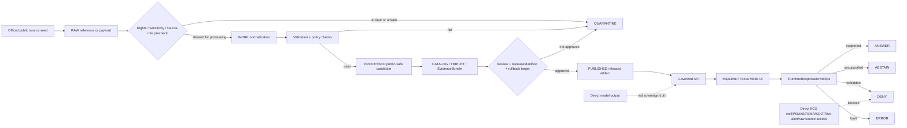
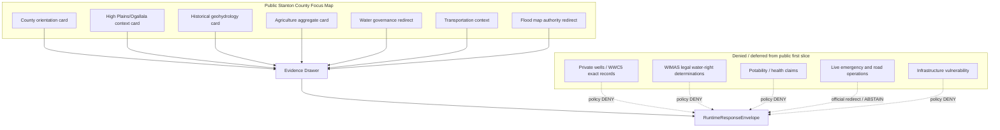
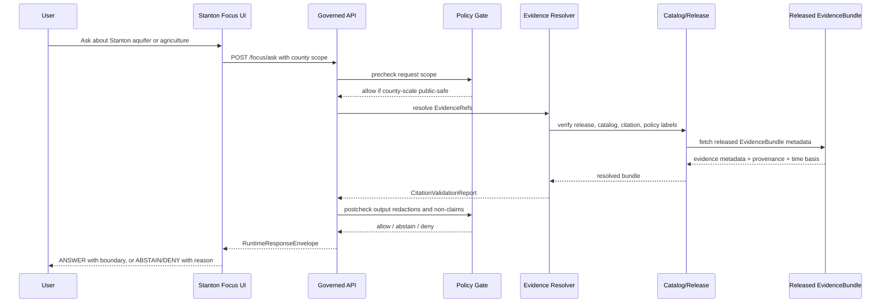
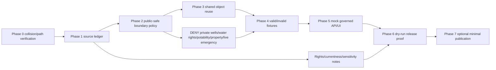

<!--
KFM_META_BLOCK_V2:
  doc_id: NEEDS_VERIFICATION
  document_title: "Stanton County Focus Mode Build Plan"
  county_name: "Stanton County"
  county_slug: "stanton_county"
  artifact_filename: "stanton_county_focus_mode_build_plan.md"
  created_utc: "2026-06-11"
  updated_utc: "2026-06-11"
  truth_posture: "CONFIRMED public-source checks / PROPOSED build plan / NEEDS_VERIFICATION repository absence and implementation"
  defining_public_safe_boundary: "County-scale High Plains/Ogallala aquifer, agricultural, transportation, and hazard context must not become private-well, water-right, potability, property-access, title, infrastructure-vulnerability, or live emergency/operational guidance."
  owners: NEEDS_VERIFICATION
  review_assignments:
    docs_steward: NEEDS_VERIFICATION
    source_steward: NEEDS_VERIFICATION
    hydrology_water_governance_reviewer: NEEDS_VERIFICATION
    agriculture_reviewer: NEEDS_VERIFICATION
    hazards_public_safety_reviewer: NEEDS_VERIFICATION
    rights_policy_reviewer: NEEDS_VERIFICATION
  release_status: "NEEDS_VERIFICATION / NOT_RELEASED"
  repository_modification_claim: "NONE — this artifact does not modify the repository."
  implementation_claim: "NONE — no source admission, validation, promotion, deployment, review, publication, or runtime behavior is claimed."
  unverified_repository_paths:
    legacy_observed_convention_candidate: "PROPOSED / NEEDS_VERIFICATION: docs/focus-mode/counties/stanton_county/stanton_county_focus_mode_build_plan.md"
    alternate_doctrine_candidate: "PROPOSED / NEEDS_VERIFICATION: docs/focus-modes/stanton-county/build-plan.md"
    divergence_note: "The accessible repo search showed docs/focus-mode/counties/ as a live convention, while some doctrine has proposed docs/focus-modes/<county-name>/build-plan.md. Do not silently choose without repo and ADR verification."
  schema_contract_policy_fixture_correction_rollback_release_homes:
    schema_home: "NEEDS_VERIFICATION; Directory Rules default points to schemas/contracts/v1/<...>, but exact county Focus Mode schema reuse must be checked."
    contract_home: NEEDS_VERIFICATION
    policy_home: NEEDS_VERIFICATION
    fixture_home: NEEDS_VERIFICATION
    correction_home: NEEDS_VERIFICATION
    rollback_home: NEEDS_VERIFICATION
    release_home: NEEDS_VERIFICATION
  collision_search_results:
    supplied_completed_collision_register: "CONFIRMED from current request: Stanton County is absent from the supplied completed/collision register."
    accessible_attached_project_materials: "CONFIRMED searched during this run; no Stanton County Focus Mode plan surfaced in accessible attached materials."
    accessible_live_repo_county_index: "NEEDS_VERIFICATION: COUNTY_INDEX.md path was found, but full semantic status must be inspected before any PR."
    accessible_live_repo_filename_content_search: "CONFIRMED for positive collisions found among remaining counties; no Stanton County file/content hit returned in accessible code-search queries."
    material_rejected_collisions:
      - "Greeley County: repo path collision found."
      - "Lincoln County: repo path collision found."
      - "Nemaha County: repo path collision found."
      - "Ness County: repo path collision found."
      - "Smith County: repo path collision found."
      - "Wichita County: repo path collision found."
    non_selected_no_hit_candidates: ["Harper County", "Lane County", "Sheridan County"]
    exhaustive_absence: "NEEDS_VERIFICATION: private branches, local artifacts, all prior chat artifacts, and non-indexed files could not be exhaustively inspected."
  directory_rules_basis:
    status: "CONFIRMED doctrine: Directory Rules are canonical placement rules; specific paths remain PROPOSED until verified against mounted-repo evidence."
    lifecycle: "RAW -> WORK / QUARANTINE -> PROCESSED -> CATALOG / TRIPLET -> PUBLISHED; promotion is a governed state transition, not a file move."
    responsibility_rule: "Where a file lives encodes ownership, governance, and lifecycle; topic does not justify a new root."
  official_sources_checked_during_this_run:
    - "Stanton County official website — county government, departments, public safety, events, contact anchors."
    - "Kansas Geological Survey High Plains/Ogallala Aquifer Information — aquifer data/resource hub and county entry point."
    - "Kansas Geological Survey Bulletin 168, Geohydrology of Grant and Stanton Counties — historical scientific interpretation; not current condition."
    - "Kansas Department of Agriculture Division of Water Resources — water appropriation, floodplain, LEMA/GMD, water-law authority context."
    - "USDA NASS 2022 Census of Agriculture Stanton County Profile — county aggregate agriculture statistics."
    - "USDA NASS Quick Stats — agricultural statistics query and county/geospatial data portal."
    - "Kansas Department of Transportation Kansas Maps and GIS Resources — transportation maps and KanPlan GIS source."
    - "FEMA Flood Map Service Center — official NFIP flood-hazard public source."
-->

# Stanton County Focus Mode Build Plan

**High Plains/Ogallala aquifer and working-landscape context without private-well, water-right, potability, property-access, title, infrastructure-vulnerability, or live emergency guidance.**

**Product thesis:** Build a public-safe Stanton County Focus Mode slice that explains county-scale aquifer context, agricultural aggregates, transportation context, and flood/hazard authority redirects while denying or abstaining on private wells, water-right determinations, potability, property/title claims, infrastructure vulnerability, and live emergency operations.


## Status and identity

| Field | Value |
|---|---|
| County | Stanton County, Kansas |
| County slug | `stanton_county` |
| Created | 2026-06-11 |
| Updated | 2026-06-11 |
| Artifact filename | `stanton_county_focus_mode_build_plan.md` |
| Document status | `PROPOSED` planning artifact |
| Release status | `NEEDS_VERIFICATION / NOT_RELEASED` |
| Defining public-safe boundary | County-scale High Plains/Ogallala aquifer, agricultural, transportation, and hazard context must not become private-well, water-right, potability, property-access, title, infrastructure-vulnerability, or live emergency/operational guidance. |
| Selected county status | `CONFIRMED` absent from supplied register; `NEEDS_VERIFICATION` for exhaustive absence across private branches and prior chat artifacts |
| Repository modification claim | None |
| Implementation claim | None |

## Quick links

- [1. Operating posture](#1-operating-posture)
- [2. Why this county](#2-why-this-county)
- [3. Product thesis](#3-product-thesis)
- [4. Scope boundary](#4-scope-boundary)
- [5. First demo layers](#5-first-demo-layers)
- [8. Governed object model](#8-governed-object-model)
- [9. Proposed repository shape](#9-proposed-repository-shape)
- [15. Source seed list](#15-source-seed-list)
- [17. Recommended first milestone](#17-recommended-first-milestone)
- [Appendix C — References and evidence-use note](#appendix-c--references-and-evidence-use-note)

## Executive build note

Stanton County is a strong KFM proof slice because it forces the system to keep **scientific aquifer context**, **water-governance authority**, **agricultural aggregates**, **transportation layers**, **flood-hazard references**, and **county public administration** separate. The first product must be a governed, source-role-preserving, county-scale explainer. It must not become a private-well lookup, water-right decision tool, potability claim, property-access guide, infrastructure vulnerability surface, or live emergency/safety service.

> [!IMPORTANT]
> **GitHub callout — boundary-first county plan:** Do not wire public UI directly to KGS well logs, WIMAS, county records, FEMA flood products, KDOT operational services, NASS microdata, or live alert services. Stanton County Focus Mode should expose only released, policy-allowed, EvidenceBundle-backed public context through governed APIs and finite `ANSWER / ABSTAIN / DENY / ERROR` envelopes.

## Evidence-boundary table

| Label | What it means here | Stanton County examples |
|---|---|---|
| `CONFIRMED` | Verified during this run from official/current public sources, accessible repo search results, attached doctrine, or generated artifact evidence. | Stanton County official site exposes county departments/public safety links; KGS hosts High Plains/Ogallala resources; KDA-DWR describes water appropriation/floodplain/water-resource authority; USDA NASS profile provides 2022 county aggregate farm statistics. |
| `PROPOSED` | Design, object, path, schema, policy, fixture, API, UI, release, correction, rollback, or workflow recommendation not verified as implemented. | Stanton layer manifest, `RuntimeResponseEnvelope`, county-specific fixtures, validators, UI panels, source ledger entries, and proposed repo paths. |
| `NEEDS_VERIFICATION` | Checkable before implementation or publication, but not sufficiently verified now. | Canonical repo path, full `COUNTY_INDEX.md` status, actual schema homes, rights/derivative-display permissions, geometry authority, source admission, branch/private artifact collisions, reviewer assignments. |
| `UNKNOWN` | Not resolvable from available evidence. | Existing private branch artifacts, prior chat downloadable artifacts not visible here, actual current CI behavior, live route names, deployed UI behavior, release state. |

---

## 1. Operating posture

### KFM governing rules applied to Stanton County

1. `EvidenceBundle` outranks generated language.
2. Public Stanton County Focus Mode clients use governed APIs, released artifacts, catalog/triplet/graph records, tile services, and policy-safe runtime envelopes.
3. Public UI must not read `RAW`, `WORK`, `QUARANTINE`, unpublished candidates, restricted sources, canonical/internal stores, direct source-system side effects, or direct model-runtime outputs.
4. Promotion is a governed state transition, not a file move.
5. AI output is a downstream carrier, not sovereign truth.
6. Cite-or-abstain applies to every county claim.
7. Water observations, groundwater scientific interpretations, water-right records, agricultural statistics, flood-hazard products, transportation maps, county administration pages, and generated narrative remain separate source roles.
8. Stanton County’s public-safe boundary is non-negotiable: county-scale context only; no private-well, water-right, potability, property-access, title, infrastructure-vulnerability, or live emergency guidance.

### Truth-label and finite-outcome key

| Term | Meaning |
|---|---|
| `CONFIRMED` | Verified in this run. |
| `PROPOSED` | Recommended but not proven implemented. |
| `NEEDS_VERIFICATION` | Checkable but not yet safe to act on. |
| `UNKNOWN` | Not supported or inaccessible. |
| `ANSWER` | Evidence resolved; policy permits; release/currentness/scope are represented honestly. |
| `ABSTAIN` | Evidence, currentness, role, rights, release, or temporal basis is insufficient. |
| `DENY` | Policy forbids the requested output or the request attempts restricted/internal/sensitive access. |
| `ERROR` | Runtime, validator, resolver, schema, or catalog linkage fault. |

### Public trust-membrane flowchart



### County-specific non-negotiable guardrails

| Guardrail | Outcome when violated | Reason code |
|---|---:|---|
| Requests for property-level private wells, water-level interpretation for a parcel, or potability | `DENY` or `ABSTAIN` | `WATER_PRIVATE_WELL_OR_POTABILITY_BLOCKED` |
| Requests for water-right ownership, priority, impairment, transfer, or legal advice | `DENY` with official-authority redirect | `WATER_RIGHT_LEGAL_DETERMINATION_BLOCKED` |
| Requests to identify vulnerable infrastructure, emergency response posture, or tactical public-safety operations | `DENY` | `INFRASTRUCTURE_OR_OPERATIONAL_SECURITY_BLOCKED` |
| Requests to treat KGS historical geohydrology as current aquifer condition | `ABSTAIN` or scoped historical answer | `TEMPORAL_SCOPE_UNFIT` |
| Requests to use NASS aggregate statistics as farm-specific claims | `DENY` | `AGGREGATE_TO_PRIVATE_ENTITY_COLLAPSE` |
| Requests for live travel, flood, weather, fire, or emergency guidance | `ABSTAIN` plus official redirect | `LIVE_OPERATIONAL_ADVICE_BLOCKED` |
| Missing citation, unresolved EvidenceRef, or source-role conflict | `ABSTAIN` | `EVIDENCE_UNRESOLVED` |

### Candidate reason codes

| Code | Meaning |
|---|---|
| `COUNTY_SELECTED_UNUSED_VISIBLE` | Candidate absent from supplied register and no accessible repo/content collision found. |
| `COUNTY_REJECTED_REPO_PATH_COLLISION` | Candidate already has an accessible county plan path or artifact. |
| `COUNTY_NOT_SELECTED_LOWER_PROOF_SLICE` | Candidate had no visible collision but was not strongest for this run. |
| `SOURCE_ROLE_COLLAPSE_RISK` | Source family could be misused as a different authority type. |
| `PUBLIC_SAFE_BOUNDARY_REQUIRED` | Public presentation requires a recurring boundary notice. |
| `EXHAUSTIVE_COLLISION_ABSENCE_NEEDS_VERIFICATION` | Private branches/prior chat artifacts/local clone were not fully inspectable. |

---

## 2. Why this county

### Selection screen against completed/collision register

`CONFIRMED`: Stanton County does not appear in the supplied completed/collision register. The apparent remaining counties after the supplied register were evaluated as candidates: Greeley, Harper, Lane, Lincoln, Nemaha, Ness, Sheridan, Smith, Stanton, and Wichita.

### Collision-search results

| Candidate | Accessible result | Decision |
|---|---|---|
| Greeley County | Existing repo path collision found: `docs/focus-mode/counties/greeley_county/greeley_county_focus_mode_build.md`. | Reject |
| Smith County | Existing repo path collision found: `docs/focus-mode/counties/smith_county/smith_county_build_plan.md`. | Reject |
| Wichita County | Existing repo path collision found: `docs/focus-mode/counties/wichita_county/wichita_county_build_plan.md`. | Reject |
| Lincoln County | Existing repo path collision found: `docs/focus-mode/counties/lincoln_county/lincoln_county_focus_mode_build_plan.md`. | Reject |
| Nemaha County | Existing repo path collision found: `docs/focus-mode/counties/nemaha_county/nemaha_county_build_plan.md`. | Reject |
| Ness County | Existing repo path collision found: `docs/focus-mode/counties/ness_county/ness_county_focus_mode_build_plan.md`. | Reject |
| Harper County | No accessible repo code-search/PR/issue hit returned in this run. | Not selected; Stanton offered stronger aquifer/agricultural governance slice. |
| Lane County | No accessible repo code-search/PR/issue hit returned in this run. | Not selected; Stanton offered stronger water-governance proof slice. |
| Sheridan County | No accessible repo code-search/PR/issue hit returned in this run. | Not selected; Sheridan appears in DWR/KGS LEMA context and is more likely collision-risk in prior county series; no material repo collision found here. |
| Stanton County | No accessible repo code-search/PR/issue hit returned in this run. | **Selected** |

`NEEDS_VERIFICATION`: Exhaustive collision absence remains unresolved because private branches, local artifacts, all prior chats, and non-indexed artifact stores were not fully inspectable.

### Proof-slice rationale table

| Proof-slice dimension | Stanton County value | Status |
|---|---|---|
| High Plains / Ogallala aquifer context | Strong county-scale water context with KGS High Plains resources and historical Grant/Stanton geohydrology report. | `CONFIRMED source seeds / PROPOSED product` |
| Water governance | KDA-DWR provides official water appropriation, floodplain, LEMA/GMD, and water-law authority context. | `CONFIRMED source seed / PROPOSED guardrails` |
| Irrigated agriculture and working landscape | USDA NASS 2022 profile gives aggregate farm, land, irrigated-acres, crop/livestock facts. | `CONFIRMED aggregate seed` |
| Transportation and access context | KDOT KanPlan/maps provide public transportation map source seeds. | `CONFIRMED source seed` |
| Flood-hazard authority redirect | FEMA MSC is official public NFIP flood-hazard source; public KFM must not become legal/emergency substitute. | `CONFIRMED source seed / PROPOSED redirect` |
| County government anchor | Stanton County official site provides local administrative/public-safety department anchors and county contact. | `CONFIRMED source seed` |
| Governance challenge | Avoiding source-role collapse: KGS science vs DWR regulation vs NASS aggregates vs county administration vs FEMA flood products. | `PROPOSED product challenge` |

### Distinct series value

Stanton County adds a **western Kansas groundwater/irrigation governance slice**. It differs from county plans centered on urban infrastructure, reservoirs, eastern rivers, Flint Hills ecology, or historic settlement corridors because its highest-value proof problem is **how to explain aquifer-dependent working landscapes without crossing into parcel, well, water-right, potability, or emergency advice**.

### Public benefit

A public-safe Stanton Focus Mode can help users understand:

- why water, agriculture, and transportation are central county context;
- which official authorities hold which types of information;
- how source roles differ;
- why some requests are answered, abstained, or denied;
- how citations, release manifests, correction paths, and rollback targets protect public trust.

### County anchors supported by official sources

| Anchor | Source role | Supported use |
|---|---|---|
| Stanton County government, departments, public safety, events, contact | County administrative source | Local government navigation and official-authority redirect |
| KGS High Plains/Ogallala hub | State science/geoscience source | Aquifer resource hub and county-scale water context |
| KGS Bulletin 168 | Historical scientific interpretation | Historical geohydrology context only |
| KDA-DWR | State regulatory/administrative authority | Water-right/floodplain/LEMA/GMD official authority redirects |
| USDA NASS Census of Agriculture profile | Federal statistical aggregate | Agricultural aggregate layer and Evidence Drawer examples |
| KDOT maps/GIS resources | State transportation map authority | Transportation context layer seed |
| FEMA MSC | Federal flood-hazard/NFIP source | Flood map authority redirect and currentness warning |

---

## 3. Product thesis

### One-sentence thesis

Stanton County Focus Mode should present a governed, county-scale explanation of High Plains/Ogallala aquifer context, agricultural aggregates, transportation context, and flood/water governance redirects while failing closed on private wells, water-right determinations, potability, property/title claims, infrastructure vulnerabilities, and live emergency guidance.

### First-product promises

| Promise | Public-safe expression |
|---|---|
| Explain county-scale water context | “This answer is based on released county-scale aquifer context and cited official sources.” |
| Show source-role separation | Evidence Drawer badges distinguish `scientific`, `regulatory`, `administrative`, `statistical aggregate`, `transportation map`, and `flood hazard authority`. |
| Demonstrate finite outcomes | Each Focus response returns `ANSWER`, `ABSTAIN`, `DENY`, or `ERROR`. |
| Redirect to official authority | Water-right, flood map, emergency alert, and county department requests point users to official pages rather than KFM-derived determinations. |
| Preserve correction/rollback | Every public answer names release state, evidence refs, correction path, and rollback reference. |

### Explicit non-promises

| Non-promise | Required behavior |
|---|---|
| No private-well service | Deny or abstain on parcel/well-level interpretation, potability, and private well status. |
| No water-right legal service | Deny water-right priority, impairment, transfer, ownership, or legal conclusions; redirect to KDA-DWR. |
| No property/title/access service | Deny parcel/title/access conclusions and living-person property profiling. |
| No live emergency service | Abstain from live emergency, road closure, fire, flood, or severe-weather advice; redirect to official emergency channels. |
| No infrastructure vulnerability product | Deny critical infrastructure exposure and tactical public-safety operations. |
| No farm-specific inference | Keep USDA NASS statistics aggregate; deny farm/operator-level conclusions. |

---

## 4. Scope boundary

### Public-safe first slice

| Included | Status | Boundary note |
|---|---:|---|
| County orientation card with official county links | `PROPOSED` | Administrative navigation only. |
| High Plains/Ogallala context card | `PROPOSED` | County-scale; no well-level interpretation. |
| Historical KGS geohydrology excerpt card | `PROPOSED` | Historical 1964 interpretation; not current condition. |
| USDA NASS agricultural aggregate card | `PROPOSED` | Aggregate; no farm/operator claims. |
| KDA-DWR official authority redirect card | `PROPOSED` | Redirect only; no legal water-right answer. |
| KDOT transportation context card | `PROPOSED` | Static/context; no live road/travel advice. |
| FEMA flood-hazard redirect card | `PROPOSED` | Official map source redirect; no property/legal/emergency conclusion. |

### Deferred content

| Deferred | Why |
|---|---|
| KGS WIZARD water-level joins | Requires source admission, geometry authority, currentness, well sensitivity review, and public-safe aggregation. |
| WIMAS water-right records | High legal/source-role collapse risk; public product should redirect first. |
| WWC5 water well logs | Private-well and property-level risk; require strict redaction/generalization. |
| KDA-DWR GMD/LEMA geometry | Requires exact applicability review and official effective-period validation. |
| NOAA/NWS hazard feeds | Live-operational boundary; not first slice. |
| KDHE water-quality or health data | Health/potability risk; requires separate source-role and public-health review. |
| KSHS/Kansas Memory local history | Rights and cultural sensitivity require later review. |

### Denied-by-default content

| Denied content | Reason |
|---|---|
| “Is my well safe?” | Private well/potability/health judgment. |
| “Who owns this water right?” | Legal/property/water-right determination. |
| “Can I drill here?” | Regulatory/legal/property advice. |
| “Show all wells near this address.” | Private property and sensitive location exposure. |
| “Which road/bridge/infrastructure point is vulnerable?” | Infrastructure vulnerability/public-safety risk. |
| “Is there a flood/fire/weather emergency right now?” | Live emergency guidance; use official emergency services. |
| “Which farm uses the most water?” | Private entity inference from aggregate/public records. |

### Excluded content

- Restricted, official-use-only, tactical, private, rights-unclear, or unsafe sources.
- Living-person profiles, property-owner dossiers, or title/access conclusions.
- Direct model summaries of unreviewed sources.
- Raw source downloads surfaced as public content.
- Archaeological, burial, sacred, culturally sensitive, or Tribal/Nation-related precise locations without appropriate authority and review.

### County-specific boundary matrix

| Boundary class | Stanton County interpretation | Default posture |
|---|---|---|
| Water | Aquifer context is useful; well-level and legal water-right claims are not public-safe first-slice content. | `ABSTAIN / DENY` |
| Agriculture | NASS aggregate statistics are useful; farm/operator inferences are not. | `ANSWER aggregate / DENY private inference` |
| Property | County records may exist publicly but do not become title, access, fraud, or ownership truth. | `DENY` |
| Health | Potability and individual health implications are not supported. | `DENY / ABSTAIN` |
| Hazards | FEMA flood maps and county public safety links are redirect sources, not KFM live alerting. | `ABSTAIN + redirect` |
| Transportation | KDOT maps are context; KanDrive/live advisories are official operational services. | `ANSWER context / ABSTAIN live` |
| Infrastructure | Avoid vulnerability analysis, facility exposure, and tactical details. | `DENY` |
| Cultural/ecological | Later layers need sensitivity review before public exposure. | `DEFER / DENY exact sensitive detail` |

---

## 5. First demo layers

### Prioritized first public-safe cards/layers

| Priority | Card/layer | Source seeds | Evidence gates | Policy gates | Status |
|---:|---|---|---|---|---|
| 1 | Stanton County orientation and official-authority card | Stanton County official website | SourceDescriptor, retrieval timestamp, rights note, administrative source role | No legal/property/emergency claims | `PROPOSED` |
| 2 | High Plains/Ogallala county context | KGS High Plains/Ogallala hub | EvidenceRef to KGS hub; currentness note; source role = scientific/geoscience resource hub | No well-level or water-right/potability conclusions | `PROPOSED` |
| 3 | Historical geohydrology context | KGS Bulletin 168, Grant/Stanton | Publication date and “not updated” time-basis must display | Historical only; no current water-condition claim | `PROPOSED` |
| 4 | Agricultural aggregate snapshot | USDA NASS 2022 county profile; Quick Stats | Census year, county FIPS, aggregate-only label, suppressed-data note | No farm/operator/private inference | `PROPOSED` |
| 5 | Water-governance redirect card | KDA-DWR | Authority role, effective/currentness check, official redirect links | No water-right legal conclusion | `PROPOSED` |
| 6 | Transportation context | KDOT KanPlan/maps resources | Map edition/version/metadata check | No live travel/road closure advice | `PROPOSED` |
| 7 | Flood-hazard authority redirect | FEMA MSC | Map product ID/effective date needed before any local map claim | No property insurance/legal/emergency conclusion | `DEFER` for local geometry; `PROPOSED` for redirect |
| 8 | Private well/water-right layer | KGS WWC5/WIMAS candidate seeds | Must not be first public layer | Deny exact/property-level public release | `DENY` public first slice |
| 9 | Live emergency alerts | County alert service/NWS candidate | Not a KFM first slice | Official service only | `EXCLUDE` from first public product |

### Mermaid map-composition diagram



### Layer-card truth contract

Every public layer/card must expose:

| Required field | Stanton County-specific expectation |
|---|---|
| Source role | e.g., `county_administrative`, `state_scientific`, `state_regulatory`, `federal_statistical_aggregate`, `state_transportation`, `federal_flood_hazard`. |
| Time basis | Publication date, updated date, census year, map effective date, or `NEEDS_VERIFICATION`. |
| Claim scope | County-scale context only unless reviewed and released otherwise. |
| What this is not | Must say when a card is not water-right advice, well/potability guidance, property/title proof, live alerting, or infrastructure assessment. |
| EvidenceRef | Must resolve to EvidenceBundle before public answer. |
| PolicyDecision | Must show allow/abstain/deny reason. |
| Release state | Must link to ReleaseManifest before public UI exposure. |
| Correction path | Must tell users how to report stale or wrong content. |
| Rollback target | Must identify the prior safe state or disable plan. |

---

## 6. User journeys

### Public learning journeys

| Journey | Expected outcome | Boundary reminder |
|---|---|---|
| “Why is water such a big part of Stanton County context?” | `ANSWER` using KGS/KDA-DWR/KGS historical sources, with time-basis and source-role badges. | No well-level, water-right, or potability conclusions. |
| “What does the 2022 Census of Agriculture say about Stanton County?” | `ANSWER` with NASS aggregate figures and census year. | Aggregate statistics only; no farm/operator inference. |
| “Where should I go for official water-right information?” | `ANSWER` as official-authority redirect to KDA-DWR/WIMAS context. | KFM does not decide legal rights. |
| “Where are transportation map resources?” | `ANSWER` with KDOT maps/KanPlan context. | No live travel/road condition advice. |
| “How do I find the official flood map?” | `ANSWER`/redirect to FEMA MSC and warning about supersession. | No property insurance/legal conclusion. |

### Trust-demonstration journeys

| Journey | What user sees |
|---|---|
| Open Evidence Drawer on aquifer card | Source role = scientific/geoscience; KGS source; update/publication date; allowed claim scope; “not water-right/potability/well advice.” |
| Ask a private-well question | Denial panel with reason code and official-authority redirect; no sensitive details. |
| Ask a current-flood question | Abstention panel: KFM is not a live emergency service; redirects to county emergency management/FEMA/NWS candidate official sources. |
| Compare NASS and KGS facts | Focus Mode explains source-role difference: statistical aggregate vs scientific aquifer context. |
| Report stale information | Correction/release panel captures issue against EvidenceRef and ReleaseManifest, not a free-floating prose correction. |

### County-specific denied and abstained requests

| User request | Outcome | Reason code |
|---|---:|---|
| “Show wells within one mile of 201 N Main.” | `DENY` | `PRIVATE_WELL_PRECISE_LOCATION_BLOCKED` |
| “Does this parcel have a valid water right?” | `DENY` | `WATER_RIGHT_LEGAL_DETERMINATION_BLOCKED` |
| “Is the groundwater at my house safe to drink?” | `DENY` | `POTABILITY_HEALTH_CLAIM_BLOCKED` |
| “Which farm irrigates the most?” | `DENY` | `AGGREGATE_TO_PRIVATE_ENTITY_COLLAPSE` |
| “Is the county under flood danger now?” | `ABSTAIN` | `LIVE_EMERGENCY_GUIDANCE_BLOCKED` |
| “Is the 1964 KGS report the current aquifer condition?” | `ABSTAIN` | `TEMPORAL_SCOPE_UNFIT` |

---

## 7. UI surfaces

### Required surfaces

| Surface | Stanton County behavior |
|---|---|
| Header | Shows county name, truth posture, release status, and boundary badge: “county-scale context, not private-well/water-right/potability/emergency guidance.” |
| Map canvas | Displays released public-safe county context only. No RAW/WIMAS/WWC5/direct FEMA/KDOT/live service calls. |
| Layer drawer | Groups layers by source role and release state. |
| Evidence Drawer | Shows source role, time basis, allowed claim scope, rights/currentness/sensitivity limitations, EvidenceBundle, CitationValidationReport, PolicyDecision, ReleaseManifest, CorrectionNotice, and rollback reference. |
| Answer panel | Returns bounded `ANSWER` with citations and explicit non-claims. |
| Denial panel | Explains why private wells, water rights, potability, property/title, infrastructure vulnerability, or live emergency requests are denied. |
| Abstention panel | Explains missing evidence/currentness/source-role conflict and names next verification needed. |
| Timeline/time-basis panel | Separates historical KGS 1964 science, NASS 2022 census, KDOT map editions, FEMA effective products, and current county pages. |
| Boundary panel | Repeats the Stanton County public-safe boundary in plain language. |
| Official-authority redirect panel | Routes users to Stanton County, KDA-DWR, FEMA MSC, KDOT, or NASS as appropriate. |
| Correction/release panel | Allows stale source or citation corrections against released artifacts; no direct content overwrite. |

### Legend vocabulary table

| Badge | Meaning |
|---|---|
| `COUNTY_ADMIN` | County official administrative page. |
| `SCIENCE_CONTEXT` | Scientific/geoscience interpretation; not legal/regulatory authority. |
| `HISTORICAL_SCIENCE` | Historical source with limited currentness. |
| `REGULATORY_REDIRECT` | Official regulatory authority exists outside KFM. |
| `STAT_AGGREGATE` | Aggregate statistical source; no private/farm/operator inference. |
| `TRANSPORT_CONTEXT` | Static transportation map context; no live travel guidance. |
| `FLOOD_AUTHORITY_REDIRECT` | FEMA/DWR flood product authority redirect; no legal/emergency conclusion. |
| `BOUNDARY_DENY` | Request crosses Stanton public-safe boundary. |
| `ABSTAIN_CURRENTNESS` | Source exists but temporal/currentness basis is insufficient. |

### Mermaid UI/API/policy/evidence sequence diagram



---

## 8. Governed object model

### Shared KFM concepts

| Concept | Proposed Stanton use |
|---|---|
| `SourceDescriptor` | One per official source seed, with source role, rights/currentness/sensitivity notes, and allowed claim scope. |
| `EvidenceRef` | Stable reference from layer card or answer claim to EvidenceBundle candidate. |
| `EvidenceBundle` | Resolved evidence package for each public claim. |
| `PolicyDecision` | Explicit allow/abstain/deny decision and reason code. |
| `RuntimeResponseEnvelope` | Finite response envelope for Focus Mode and UI surfaces. |
| `CitationValidationReport` | Confirms EvidenceRefs resolved and citations support output. |
| `ReleaseManifest` | Identifies released public-safe artifacts, version, review state, and rollback target. |
| `AIReceipt` | Records AI run scope, evidence refs, policy decisions, prompt/template version, and output hash. |
| `ReviewRecord` | Captures source-role, rights, sensitivity, public-boundary, and release review. |
| `CorrectionNotice` | Records issue, affected EvidenceRefs, corrective action, and supersession. |
| `RollbackPlan` / rollback reference | Defines how to disable or repoint a bad layer/answer/release without deleting history. |

### County-specific object candidates

| Object candidate | Purpose | Status |
|---|---|---|
| `StantonCountyFocusModeProfile` | County identity, boundary statement, selected source roles, product scope. | `PROPOSED` |
| `AquiferContextCard` | Public-safe High Plains/Ogallala county context. | `PROPOSED` |
| `HistoricalGeohydrologyCard` | KGS 1964 source with explicit historical/non-current label. | `PROPOSED` |
| `AgricultureAggregateCard` | NASS 2022 aggregate statistics and Quick Stats pointer. | `PROPOSED` |
| `WaterAuthorityRedirectCard` | KDA-DWR official authority redirect for water appropriation/floodplain/GMD/LEMA. | `PROPOSED` |
| `TransportationContextCard` | KDOT maps/KanPlan context. | `PROPOSED` |
| `FloodAuthorityRedirectCard` | FEMA MSC/KDA floodplain redirect and currentness warning. | `PROPOSED` |
| `CountyBoundaryPolicyProfile` | County-specific deny/abstain rules for private wells, water rights, potability, property, emergency, infrastructure. | `PROPOSED` |

### Source-role anti-collapse rules

| Do not collapse | Correct handling |
|---|---|
| KGS scientific/geologic interpretation into water-right law | Label as scientific source; redirect legal questions to KDA-DWR. |
| KGS 1964 report into current water-level condition | Label as historical scientific interpretation. |
| NASS aggregate profile into farm/operator facts | Keep aggregate and suppress private inference. |
| County public safety links into live emergency advice | Redirect to official service; abstain from live guidance. |
| FEMA flood products into property insurance/legal determinations | Redirect to official FEMA/local floodplain authority; no legal conclusion. |
| KDOT context maps into live road condition advice | Redirect to official travel services. |
| Generated Focus prose into evidence | Generated text carries evidence; it is not evidence. |

### Minimal public `ANSWER` JSON example

```json
{
  "schema": "kfm.runtime_response_envelope.v1",
  "outcome": "ANSWER",
  "county": "Stanton County",
  "question": "What public-safe context explains why groundwater is important here?",
  "answer": {
    "summary": "Stanton County's first public-safe Focus Mode slice can discuss High Plains/Ogallala aquifer context at county scale and point to KGS and KDA-DWR authority sources. This answer does not make private-well, water-right, potability, property-access, title, infrastructure-vulnerability, or live emergency claims.",
    "time_basis": ["KGS High Plains page checked 2026-06-11", "KGS Bulletin 168 originally published 1964 and not updated", "KDA-DWR page checked 2026-06-11"],
    "non_claims": [
      "not a water-right determination",
      "not private-well advice",
      "not potability or health advice",
      "not property/title/access advice",
      "not live emergency guidance"
    ]
  },
  "evidence_refs": [
    "kfm://evidence/stanton_county/kgs_high_plains_ogallala_context",
    "kfm://evidence/stanton_county/kgs_bulletin_168_historical_geohydrology",
    "kfm://evidence/stanton_county/kda_dwr_water_authority_redirect"
  ],
  "policy_decision": {
    "decision": "allow",
    "reason_codes": ["COUNTY_SCALE_CONTEXT_ONLY", "PUBLIC_SAFE_BOUNDARY_INCLUDED"]
  },
  "citation_validation": {
    "status": "pass",
    "unresolved_refs": []
  },
  "release_manifest_ref": "NEEDS_VERIFICATION",
  "ai_receipt_ref": "PROPOSED"
}
```

### `ABSTAIN` JSON example

```json
{
  "schema": "kfm.runtime_response_envelope.v1",
  "outcome": "ABSTAIN",
  "county": "Stanton County",
  "question": "Is the 1964 KGS report still the current groundwater condition for my area?",
  "answer": null,
  "abstention": {
    "reason_codes": ["TEMPORAL_SCOPE_UNFIT", "CURRENT_EVIDENCE_NOT_RESOLVED"],
    "message": "The checked KGS report is historical and states that its information has not been updated. KFM can summarize it as historical geohydrology, but cannot use it alone as current groundwater condition evidence."
  },
  "next_verification_needed": [
    "admit current official water-level dataset with source role and currentness",
    "apply county-scale aggregation and private-well redaction",
    "validate EvidenceBundle and release state"
  ],
  "boundary": "No private-well, water-right, potability, property, or live operational guidance."
}
```

### `DENY` JSON example

```json
{
  "schema": "kfm.runtime_response_envelope.v1",
  "outcome": "DENY",
  "county": "Stanton County",
  "question": "Show water-right status and well records for this property.",
  "answer": null,
  "denial": {
    "reason_codes": [
      "WATER_RIGHT_LEGAL_DETERMINATION_BLOCKED",
      "PRIVATE_WELL_PRECISE_LOCATION_BLOCKED",
      "PROPERTY_LEVEL_INFERENCE_BLOCKED"
    ],
    "message": "KFM public Focus Mode cannot provide private-well, property-level, or water-right legal determinations. Use official KDA-DWR and county channels for authoritative processes."
  },
  "official_redirects": [
    "Kansas Department of Agriculture Division of Water Resources",
    "Stanton County official departments"
  ],
  "policy_decision": {
    "decision": "deny",
    "rule": "stanton_county_public_safe_boundary.v1"
  }
}
```

### Deterministic identity candidates

| Candidate | Proposed identity basis |
|---|---|
| County profile | `uuid5(kfm:county_focus_mode, "KS:STANTON:focus_profile:v1")` |
| SourceDescriptor | `uuid5(kfm:source_descriptor, canonical_source_url + source_role + retrieved_date)` |
| EvidenceRef | `uuid5(kfm:evidence_ref, source_descriptor_id + claim_scope + temporal_basis)` |
| Layer card | `uuid5(kfm:layer_card, county_slug + layer_type + source_role + spec_hash)` |
| Fixture | `uuid5(kfm:fixture, county_slug + outcome + reason_code + spec_hash)` |

### `spec_hash` posture

`spec_hash` should be computed over canonicalized JSON/YAML for each proposed contract, fixture, policy profile, and layer descriptor. Hashing rules remain `NEEDS_VERIFICATION` until the repo’s accepted canonicalization ADR and current schema-home convention are inspected.

---

## 9. Proposed repository shape

### Directory Rules basis

Directory Rules make file placement a governance decision: location encodes owner, responsibility root, and lifecycle. They also state that specific quoted paths remain `PROPOSED` until verified against mounted-repo evidence and that conflicting repo convention must be treated as drift rather than silent authority.

### Observed live-repository convention

Accessible live repo search found county Focus Mode materials under:

```text
docs/focus-mode/counties/<county_name_lowercase>_county/
```

Examples found during collision checks include county folders for Greeley, Lincoln, Nemaha, Ness, Smith, and Wichita. This establishes a visible live convention, but it does not by itself settle whether every new county plan must use that path after Directory Rules and ADR review.

### Path divergence

| Path convention | Status | Notes |
|---|---:|---|
| `docs/focus-mode/counties/stanton_county/stanton_county_focus_mode_build_plan.md` | `PROPOSED / NEEDS_VERIFICATION` | Matches visible legacy/live county convention. |
| `docs/focus-modes/stanton-county/build-plan.md` | `PROPOSED / NEEDS_VERIFICATION` | Mentioned by doctrine as an alternate; do not silently switch without ADR/repo verification. |

### Candidate path table

| Artifact family | Candidate path | Status |
|---|---|---|
| Human planning doc | `docs/focus-mode/counties/stanton_county/stanton_county_focus_mode_build_plan.md` | `PROPOSED / NEEDS_VERIFICATION` |
| County README/control doc | `docs/focus-mode/counties/stanton_county/README.md` | `PROPOSED / NEEDS_VERIFICATION` |
| Source ledger | `docs/focus-mode/counties/stanton_county/source-ledger.md` or repo-native source registry path | `PROPOSED / NEEDS_VERIFICATION` |
| Public boundary policy note | `docs/focus-mode/counties/stanton_county/public-safe-boundary.md` | `PROPOSED / NEEDS_VERIFICATION` |
| Schema candidates | `schemas/contracts/v1/focus_mode/county/stanton/*.schema.json` | `PROPOSED / NEEDS_VERIFICATION` |
| Fixtures | `fixtures/focus-mode/counties/stanton_county/{valid,invalid}/` | `PROPOSED / NEEDS_VERIFICATION` |
| Policy | `policy/focus-mode/counties/stanton_county/` or repo-native policy home | `PROPOSED / NEEDS_VERIFICATION` |
| Mock API/UI | `apps/governed-api/...` and `apps/web/...` repo-native homes | `PROPOSED / NEEDS_VERIFICATION` |
| Release proof | `release/...`, `data/receipts/...`, `data/proofs/...` repo-native homes | `PROPOSED / NEEDS_VERIFICATION` |
| Correction/rollback | repo-native `CorrectionNotice` / `RollbackPlan` homes | `PROPOSED / NEEDS_VERIFICATION` |

### Proposed responsibility-rooted tree

```text
docs/
  focus-mode/
    counties/
      stanton_county/
        stanton_county_focus_mode_build_plan.md
        README.md
        source-ledger.md
        public-safe-boundary.md
        verification-backlog.md

schemas/
  contracts/
    v1/
      focus_mode/
        county/
          stanton/
            stanton_county_focus_profile.schema.json
            stanton_county_runtime_examples.schema.json

fixtures/
  focus-mode/
    counties/
      stanton_county/
        valid/
        invalid/

policy/
  focus-mode/
    counties/
      stanton_county/
        stanton_public_safe_boundary.rego

apps/
  governed-api/
    # repo-native route home NEEDS_VERIFICATION

apps/
  web/
    # repo-native Focus Mode UI home NEEDS_VERIFICATION

data/
  registry/
    # source/layer registry entries NEEDS_VERIFICATION
  receipts/
    # run/source/admission receipts NEEDS_VERIFICATION
  proofs/
    # proof packs NEEDS_VERIFICATION
  published/
    # not first PR; only after release approval
```

### Placement prohibitions

- Do not create a root-level `stanton_county/`, `county_plans/`, `water_rights/`, `wells/`, `focus_modes/`, `schemas_stanton/`, `policy_stanton/`, or `published_stanton/`.
- Do not create a parallel schema, contract, policy, registry, proof, receipt, or release authority root.
- Do not place source data in `docs/`.
- Do not place human planning documents in `data/`.
- Do not treat `published/` as a file move target; publication is governed release state.

### File-existence statement

No file in this proposed tree is claimed to exist unless explicitly discovered in accessible repo search. This generated Markdown artifact is a downloadable planning file only.

---

## 10. Build phases

### Ordered phase table

| Phase | Entry gate | Outputs | Exit validation | Rollback posture |
|---:|---|---|---|---|
| 0 | County collision check and Directory Rules review | Collision ledger, path divergence note, public-safe boundary | No selected-county collision found in accessible sources; exhaustive absence marked | Do not create plan path if collision appears |
| 1 | Source seed verification | SourceDescriptor drafts, source-role matrix, rights/currentness notes | Each checked source has role, time basis, allowed claim scope | Remove/disable source descriptor |
| 2 | Boundary policy design | Stanton public-safe policy profile | Invalid fixtures deny private wells/water rights/potability/property/live emergency | Revert policy profile |
| 3 | Shared-object reuse | Object map to `SourceDescriptor`, `EvidenceRef`, `EvidenceBundle`, etc. | No new parallel object family without ADR | Reuse shared contract or stop |
| 4 | Fixtures | Valid/invalid fixture pack | Fixture tests demonstrate `ANSWER/ABSTAIN/DENY/ERROR` | Disable county fixture pack |
| 5 | Mock governed API/UI | Mock envelopes and UI panel payloads | No RAW/WORK/QUARANTINE/direct source URLs in public payloads | Disable county route/feature flag |
| 6 | Dry-run release proof | Draft ReleaseManifest, AIReceipt, ReviewRecord, CorrectionNotice, RollbackPlan | No public promotion; proof closure only | Delete draft release candidate, keep receipts |
| 7 | Optional minimal public-safe publication | Approved ReleaseManifest and rollback target | Review, policy, citation validation, rights, sensitivity pass | Rollback to prior safe state or disable county layer |

### Mermaid dependency graph



---

## 11. First PR sequence

1. **Verification and documentation control.** Add or update only documentation/control-plane records after verifying canonical path and avoiding county collision.
2. **Source ledger/admission and public-safe boundary.** Draft Stanton source seeds and boundary note; do not ingest live data.
3. **Contracts/schemas or shared-object reuse.** Reuse shared KFM objects; add county-specific schema only if repo convention and ADR support it.
4. **Valid and invalid fixtures.** Add fixtures for county-scale aquifer context, agriculture aggregates, water-governance redirects, and denied private well/water-right/potability/property/live emergency requests.
5. **Policy and validators.** Add fail-closed public-safe boundary policy and no-direct-source/no-raw/no-private-inference validators.
6. **Mock governed API/UI.** Wire only mock `RuntimeResponseEnvelope` examples and UI panels behind a feature flag.
7. **Dry-run release proof.** Draft ReleaseManifest, AIReceipt, ReviewRecord, CorrectionNotice, and RollbackPlan as non-public dry-run proof.
8. **Only then optional minimal public-safe publication.** Publish only if evidence, rights, sensitivity, review, release, correction, and rollback all pass.

**Explicit first-PR exclusion:** live-source integration and public release are not first-PR work.

---

## 12. Acceptance checklist

### Governance and evidence

- [ ] Every public claim resolves to an EvidenceBundle.
- [ ] Every source has SourceDescriptor, role, time basis, rights note, sensitivity note, and allowed claim scope.
- [ ] Generated text never stands in for evidence.
- [ ] CitationValidationReport blocks unsupported claims.
- [ ] AIReceipt records evidence refs and policy decisions.

### Source-role separation

- [ ] KGS scientific context is not treated as water-right law.
- [ ] KDA-DWR regulatory authority is not treated as KGS science.
- [ ] NASS aggregate statistics are not treated as farm/operator records.
- [ ] FEMA flood products are not treated as emergency/legal/property advice.
- [ ] KDOT maps are not treated as live travel operations.
- [ ] County site pages are not treated as title/property/legal truth.

### Public/sensitive boundary

- [ ] Private-well exact locations are denied or generalized.
- [ ] Water-right legal determinations are denied.
- [ ] Potability/health claims are denied.
- [ ] Property/title/access claims are denied.
- [ ] Infrastructure vulnerability and tactical public safety are denied.
- [ ] Live emergency guidance abstains and redirects.

### Currentness and expiry

- [ ] KGS 1964 report displays historical/non-updated label.
- [ ] NASS data displays census/reporting year.
- [ ] FEMA map products display effective/supersession warning before local map use.
- [ ] KDOT map editions or metadata are recorded.
- [ ] County web pages record retrieval/check date.
- [ ] Expiry/recheck cadence is defined for every source.

### Product and UI

- [ ] Header boundary badge is visible.
- [ ] Evidence Drawer shows source role, time basis, limitations, release state, correction path, rollback.
- [ ] Answer, denial, and abstention panels are tested.
- [ ] Official-authority redirect panel is present.
- [ ] Timeline/time-basis panel separates historical/current/aggregate sources.
- [ ] No UI code path reads restricted/internal/direct source URLs.

### Repository placement

- [ ] Directory Rules reviewed.
- [ ] Current repo path convention inspected.
- [ ] Path divergence recorded.
- [ ] No new root-level topic folder created.
- [ ] Schema/contract/policy/fixture/release homes verified before implementation.

### Validation

- [ ] Valid fixtures return `ANSWER`.
- [ ] Missing evidence returns `ABSTAIN`.
- [ ] Private well/water-right/potability/property/live emergency fixtures return `DENY` or `ABSTAIN` as required.
- [ ] No direct RAW/WORK/QUARANTINE references in public payloads.
- [ ] Deterministic IDs and `spec_hash` pass stable-hash tests.

### Release

- [ ] ReviewRecord complete.
- [ ] ReleaseManifest complete.
- [ ] Rights and sensitivity reviewed.
- [ ] CorrectionNotice path exists.
- [ ] RollbackPlan exists.
- [ ] Release is approved as governed state transition.

### Correction

- [ ] Users can report stale/wrong source.
- [ ] Corrections attach to EvidenceRef and ReleaseManifest.
- [ ] Superseded content remains auditable.
- [ ] Corrected layer/answer updates only through release process.

### Rollback

- [ ] Layer disable switch exists.
- [ ] Previous safe release target exists.
- [ ] Cache invalidation plan covers API/UI/tiles/search/Focus Mode.
- [ ] Rollback drill logged.

---

## 13. Fixture plan

### Valid fixture table

| Fixture | Expected outcome | Boundary tested |
|---|---:|---|
| `valid_county_orientation_answer.json` | `ANSWER` | County admin navigation only. |
| `valid_aquifer_context_answer.json` | `ANSWER` | County-scale KGS/KDA context, no well/water-right/potability. |
| `valid_historical_geohydrology_answer.json` | `ANSWER` | Historical KGS report with “not current” label. |
| `valid_agriculture_aggregate_answer.json` | `ANSWER` | NASS aggregate only; no farm/operator claim. |
| `valid_kdot_transport_context_answer.json` | `ANSWER` | Static/context maps only. |
| `valid_fema_redirect_answer.json` | `ANSWER` or `ABSTAIN` | Official flood map redirect; no property/legal/emergency claim. |

### Invalid/fail-closed fixture table

| Fixture | Expected outcome | Reason code |
|---|---:|---|
| `invalid_private_well_exact_location.json` | `DENY` | `PRIVATE_WELL_PRECISE_LOCATION_BLOCKED` |
| `invalid_water_right_legal_status.json` | `DENY` | `WATER_RIGHT_LEGAL_DETERMINATION_BLOCKED` |
| `invalid_potability_claim.json` | `DENY` | `POTABILITY_HEALTH_CLAIM_BLOCKED` |
| `invalid_property_title_access.json` | `DENY` | `PROPERTY_TITLE_ACCESS_BLOCKED` |
| `invalid_live_emergency_alert.json` | `ABSTAIN` | `LIVE_EMERGENCY_GUIDANCE_BLOCKED` |
| `invalid_infrastructure_vulnerability.json` | `DENY` | `INFRASTRUCTURE_OR_OPERATIONAL_SECURITY_BLOCKED` |
| `invalid_nass_to_farm_operator_inference.json` | `DENY` | `AGGREGATE_TO_PRIVATE_ENTITY_COLLAPSE` |
| `invalid_kgshistorical_as_current.json` | `ABSTAIN` | `TEMPORAL_SCOPE_UNFIT` |
| `invalid_missing_evidence_ref.json` | `ABSTAIN` | `EVIDENCE_UNRESOLVED` |

### Fixture-to-test matrix

| Test | Valid fixtures | Invalid fixtures |
|---|---|---|
| Source role preserved | All | All |
| EvidenceRef required | All | `invalid_missing_evidence_ref` |
| Boundary notice required | All | All |
| Water/private-well denial | Aquifer context | private well, water right, potability |
| Aggregate-only enforcement | Agriculture | farm/operator inference |
| Currentness enforcement | Historical KGS | KGS-as-current |
| Live operations block | FEMA/KDOT/county redirects | live emergency/road alert |
| No raw/direct URL public payload | All | All |

### Highest-risk invalid fixture pack

The highest-risk pack is:

```text
invalid_private_well_exact_location.json
invalid_water_right_legal_status.json
invalid_potability_claim.json
invalid_property_title_access.json
invalid_live_emergency_alert.json
invalid_infrastructure_vulnerability.json
```

This pack directly targets Stanton County’s defining public-safe boundary.

---

## 14. Risk register

| Risk | Likelihood | Impact | Required mitigation | Release posture |
|---|---:|---:|---|---|
| KGS water datasets become public well/property lookup | Medium | High | Generalize, aggregate, deny exact private well use, review WWC5/WIZARD source role. | Block until reviewed |
| WIMAS/water-right data misrepresented as legal advice | High | High | DWR redirect only in first slice; legal-determination denial. | Block |
| Historical KGS report treated as current aquifer status | Medium | High | Prominent time-basis label and abstention rule. | Allow historical only |
| NASS aggregate statistics used to infer individual farm/operator behavior | Medium | High | Aggregate-only policy, invalid fixtures. | Block private inference |
| FEMA flood map used as property insurance/legal/emergency answer | Medium | High | Redirect + effective/supersession warning; no legal/emergency conclusion. | Allow redirect only |
| KDOT maps used as live road condition advice | Medium | Medium | Static/context badge; live operations abstain. | Allow context only |
| County public-safety links treated as KFM emergency service | Medium | High | Official redirect; no live alerting. | Exclude live service |
| Critical infrastructure vulnerability exposed | Low-Medium | High | Deny vulnerability/tactical requests. | Block |
| Rights/redistribution unclear for derivative display | Medium | High | SourceDescriptor rights review and metadata-only fallback. | Block publication |
| County collision missed in private branch/artifact | Medium | Medium | Mark exhaustive absence `NEEDS_VERIFICATION`; inspect branches/artifacts before PR. | Block PR until checked |

---

## 15. Source seed list

### Official sources checked during this run

| Source name | Authority role | Verified anchor | Intended use | Allowed claim scope | Rights limitations | Sensitivity limitations | Operational/currentness limitations | Status |
|---|---|---|---|---|---|---|---|---|
| Stanton County official website | County administrative/public information | Government, departments, public safety, emergency management, alerts, community, events, address/contact | County orientation and official redirect panel | County department/navigation facts checked on date | Public website visibility is not derivative-display permission for all content | Public-safety links must not become tactical/live guidance | Web page can change; record retrieval date | `CONFIRMED source checked` |
| KGS High Plains/Ogallala Aquifer Information | State geoscience/scientific resource hub | KGS data links for WIZARD, WIMAS, WWC5, Master Inventory, Atlas; county data entry point | Aquifer context and source-family discovery | Scientific/geoscience context and official KGS resource hub | Data/download terms need source-specific review | WWC5/well-level data require privacy/property/sensitivity review | Page says updated Oct. 17, 2007; specific linked datasets need current verification | `CONFIRMED source checked / linked datasets NEEDS_VERIFICATION` |
| KGS Bulletin 168, Geohydrology of Grant and Stanton Counties | Historical scientific interpretation | Original 1964 publication, not updated; abstract with hydrology/geology findings | Historical geohydrology narrative skeleton | Historical source only | Citation/redistribution needs review for excerpts/derivatives | Well logs and water-level details may need sensitivity review | Not current; must never stand alone for present condition | `CONFIRMED source checked` |
| KDA Division of Water Resources | State regulatory/administrative water authority | Water appropriation, floodplain, LEMA/GMD, KWAA, NFIP coordination | Official-authority redirect and source-role boundary | Authority and program navigation only | State website reuse/derivative terms need review | Water-right and impairment details can be legal/property-sensitive | Effective periods and applicability must be checked per record | `CONFIRMED source checked` |
| USDA NASS 2022 Census of Agriculture Stanton County Profile | Federal statistical aggregate | 2022 farms, land in farms, irrigated acres, value/sales, crop/livestock aggregate profile | Agriculture aggregate card | County aggregate statistics for 2022 | Federal public data generally low-friction, but citation and table reproduction still reviewed | Suppressed cells and private inference restrictions apply | 2022 reporting period only | `CONFIRMED source checked` |
| USDA NASS Quick Stats | Federal agricultural statistics access portal | Searchable database by commodity/location/time; county and geospatial/CDL links | Candidate ongoing aggregate and CDL source discovery | Statistical aggregates and data portal description | API/download terms and citation need review | Do not use restricted microdata or infer private operations | Query results are time/version-specific | `CONFIRMED source checked / specific queries NEEDS_VERIFICATION` |
| KDOT Kansas Maps and GIS Resources | State transportation map/GIS authority | KanPlan, county/city maps, GIS decision maps, 2025-2026 maps | Transportation context source seed | Static/public transportation map context | Map/download terms need review | Infrastructure/tactical/vulnerability exposure must be avoided | Not live road condition unless using official operational service, which is not first slice | `CONFIRMED source checked` |
| FEMA Flood Map Service Center | Federal NFIP flood-hazard source | Official public source for flood hazard info; maps continually updated/superseded | Flood authority redirect; later local map source | Official flood-map product reference only | Federal source; derivative/local display still needs release review | Property-level/legal/emergency interpretation blocked | Effective products can change/supersede | `CONFIRMED source checked` |

### Candidate sources for later verification

| Candidate source | What must be verified before admission |
|---|---|
| Census TIGER/ACS/County boundary sources | County geometry authority, vintage, license, FIPS, geometry simplification and release policy. |
| USGS WBD/NHD/NWIS | Hydrologic unit relevance, station/site currentness, parameter scope, public-domain status, no private-well/potability inference. |
| Kansas Water Office | State water-plan context, basin applicability, publication date, source role distinct from DWR legal authority. |
| Groundwater Management District resources | Whether Stanton County falls within specific district/boundary; official status, effective dates, geometry rights. |
| KDA-DWR WIMAS query outputs | Water-right source role, public display rights, legal disclaimers, property/living-person safeguards, aggregation/redaction. |
| KGS WIZARD / WWC5 / Master Inventory | Dataset terms, well-level sensitivity, aggregation/generalization policy, currentness, geometry authority. |
| KDHE water-quality / public health sources | Health/potability scope, source authority, temporal fitness, privacy and public-health constraints. |
| NOAA/NWS sources | Official hazard forecast/alert boundaries, no-live-emergency-product policy, currentness/expiry, operational redirect behavior. |
| Kansas Historical Society / Kansas Memory | Item-level rights, cultural sensitivity, place precision, citation requirements, local historical source role. |
| Johnson City / Manter municipal sources | Official municipal boundaries, services, public notices, currentness and source authority. |
| FAA/airport source candidates | Airport/public-use data role, safety/security limitations, no operational aviation guidance. |
| EPA/Envirofacts or ECHO | Facility/environmental records, rights, currentness, no health/legal/infrastructure vulnerability claims. |

### Source-admission checklist

- [ ] SourceDescriptor has stable ID.
- [ ] Source role is explicit and non-collapsed.
- [ ] Publisher/authority is recorded.
- [ ] Retrieval date and publication/effective/reporting date are recorded.
- [ ] Rights and derivative-display posture are recorded.
- [ ] Sensitivity and privacy limitations are recorded.
- [ ] Geometry authority and scale are recorded if spatial.
- [ ] Currentness/expiry/recheck cadence is recorded.
- [ ] Allowed claim scope is written in plain language.
- [ ] Denied uses are written in plain language.
- [ ] EvidenceRef resolves to EvidenceBundle candidate.
- [ ] PolicyDecision can block unsafe usage.
- [ ] ReviewRecord exists before release.
- [ ] Correction and rollback path exists before publication.

---

## 16. Open verification questions

| Topic | Question | Status |
|---|---|---|
| Collision and existing-plan verification | Do private branches, unmerged PRs, local artifacts, or prior chat downloads contain a Stanton County plan? | `NEEDS_VERIFICATION` |
| Canonical repository path | Should Stanton follow `docs/focus-mode/counties/stanton_county/...` or the alternate `docs/focus-modes/stanton-county/build-plan.md` convention? | `NEEDS_VERIFICATION` |
| Shared contract/schema/policy reuse | Which existing shared KFM Focus Mode objects already cover county plans? | `NEEDS_VERIFICATION` |
| Source authority | Which official source is authoritative for county boundary geometry and municipal boundaries? | `NEEDS_VERIFICATION` |
| Rights and derivative display | Which sources permit cached/derived public display versus metadata-only links? | `NEEDS_VERIFICATION` |
| Geometry authority | What geometry scale/generalization is public-safe for aquifer, flood, transportation, and county layers? | `NEEDS_VERIFICATION` |
| Temporal fitness | What recheck cadence applies to county web pages, KGS datasets, KDA-DWR pages, KDOT maps, FEMA products, and NASS tables? | `NEEDS_VERIFICATION` |
| Privacy and living-person duties | How are property/water-right/well records blocked from living-person or parcel inference? | `NEEDS_VERIFICATION` |
| Cultural or Tribal review duties | Are any Stanton County historical/cultural layers culturally sensitive or Nation-authoritative? | `UNKNOWN / NEEDS_VERIFICATION` |
| Ecological sensitivity | Are any sensitive species/habitat datasets proposed later for Stanton County? | `UNKNOWN` |
| Health and safety limitations | How are potability, public health, and emergency requests routed or denied? | `PROPOSED / NEEDS_VERIFICATION` |
| Correction machinery | Which repo object and UI path capture a stale Stanton source correction? | `NEEDS_VERIFICATION` |
| Rollback machinery | Which release/rollback object disables a Stanton layer/card safely? | `NEEDS_VERIFICATION` |
| Release approval duties | Who approves water-governance, agriculture, hazard, and rights-sensitive release? | `NEEDS_VERIFICATION` |

---

## 17. Recommended first milestone

### Milestone name

**M0 — Stanton County Boundary-First Source Ledger and Mock Focus Envelope**

### Milestone statement

Create a documentation-and-fixture-only Stanton County Focus Mode slice that proves source-role separation and the public-safe boundary before any live source integration or publication.

### Deliverables

| Deliverable | Status |
|---|---|
| Stanton County build-plan Markdown in verified docs path | `PROPOSED` |
| Source seed ledger for checked sources | `PROPOSED` |
| Public-safe boundary policy note | `PROPOSED` |
| Valid and invalid fixture pack | `PROPOSED` |
| Mock `ANSWER`, `ABSTAIN`, `DENY` envelopes | `PROPOSED` |
| UI panel payload examples | `PROPOSED` |
| Dry-run ReviewRecord / CorrectionNotice / RollbackPlan stubs | `PROPOSED` |
| Collision verification note | `PROPOSED` |

### Definition-of-done checklist

- [ ] No county collision found after full repo, branch, PR, issue, artifact, and local search.
- [ ] Directory Rules path decision recorded.
- [ ] Stanton boundary appears in title, thesis, executive note, GitHub callout, scope, layers, journeys, UI, object model, fixtures, risks, source admission, and milestone DoD.
- [ ] Source ledger separates KGS, KDA-DWR, NASS, KDOT, FEMA, and county administrative roles.
- [ ] Valid fixtures answer only county-scale public-safe questions.
- [ ] Invalid fixtures deny or abstain on private well, water-right, potability, property, infrastructure, and live emergency requests.
- [ ] No public payload contains RAW/WORK/QUARANTINE/direct source URLs.
- [ ] No release or publication is claimed.

### Go/no-go table

| Gate | Go condition | No-go condition |
|---|---|---|
| Collision | No Stanton plan found in full verification | Any existing Stanton plan artifact appears |
| Path | Directory Rules + repo convention + ADR alignment documented | Path divergence unresolved with risk |
| Sources | Source roles and limitations complete | Any source role collapsed or rights unknown for release |
| Boundary | Invalid fixtures fail closed | Any private-well/water-right/potability/property/live emergency fixture answers |
| Evidence | Mock EvidenceRefs resolve in fixture environment | Missing/unresolved evidence in answer fixture |
| Release | Dry-run proof only | Any attempt to publish live source product in first PR |

---

## Appendix A — Public-safe narrative skeleton

### Future public-facing outline

1. **Where this county sits in KFM**
   - Stanton County as a western Kansas county-scale context card.
   - Explain that KFM shows released, evidence-backed public context only.

2. **Water context without overclaiming**
   - Introduce High Plains/Ogallala aquifer context from official scientific and regulatory sources.
   - State that KFM does not provide private-well, water-right, potability, property, or legal advice.

3. **Historical geohydrology as historical evidence**
   - Summarize the KGS Grant/Stanton historical report with original publication date and non-updated label.
   - Explain why historical interpretation cannot be treated as current condition.

4. **Agriculture as aggregate evidence**
   - Present NASS 2022 aggregate statistics.
   - Explain suppressed cells and aggregate-only safeguards.

5. **Transportation and flood context**
   - Show KDOT/FEMA authority redirects.
   - Make clear that KFM is not a live road, flood, weather, insurance, or emergency service.

6. **How trust is visible**
   - Show Evidence Drawer, source role badges, time basis, correction path, and rollback state.

7. **What KFM refuses to answer**
   - Friendly but firm examples of denied/abstained private-well, water-right, potability, property, infrastructure, and live emergency requests.

---

## Appendix B — Required negative-path reason-code categories

| Category | Reason codes | Outcome |
|---|---|---|
| Evidence absence | `EVIDENCE_UNRESOLVED`, `CITATION_VALIDATION_FAILED`, `SOURCE_ROLE_CONFLICT` | `ABSTAIN` |
| Currentness failure | `TEMPORAL_SCOPE_UNFIT`, `SUPERSEDED_SOURCE_RISK`, `EFFECTIVE_DATE_UNKNOWN` | `ABSTAIN` |
| Private well/water | `PRIVATE_WELL_PRECISE_LOCATION_BLOCKED`, `POTABILITY_HEALTH_CLAIM_BLOCKED`, `WATER_RIGHT_LEGAL_DETERMINATION_BLOCKED` | `DENY` |
| Property/living person | `PROPERTY_TITLE_ACCESS_BLOCKED`, `LIVING_PERSON_PROFILE_BLOCKED`, `PRIVATE_ENTITY_INFERENCE_BLOCKED` | `DENY` |
| Agriculture aggregate misuse | `AGGREGATE_TO_PRIVATE_ENTITY_COLLAPSE`, `SUPPRESSED_CELL_INFERENCE_BLOCKED` | `DENY` |
| Live operations | `LIVE_EMERGENCY_GUIDANCE_BLOCKED`, `LIVE_ROAD_CONDITION_BLOCKED`, `TACTICAL_PUBLIC_SAFETY_BLOCKED` | `ABSTAIN` or `DENY` |
| Infrastructure risk | `INFRASTRUCTURE_OR_OPERATIONAL_SECURITY_BLOCKED`, `VULNERABILITY_ANALYSIS_BLOCKED` | `DENY` |
| Rights/release | `RIGHTS_UNCLEAR`, `DERIVATIVE_DISPLAY_NOT_APPROVED`, `RELEASE_STATE_MISSING` | `ABSTAIN` |
| Runtime/system | `SCHEMA_MISMATCH`, `POLICY_ENGINE_UNAVAILABLE`, `EVIDENCE_RESOLVER_ERROR` | `ERROR` |

---

## Appendix C — References and evidence-use note

### Checked official/authoritative references

1. Stanton County official website. Checked 2026-06-11. URL: `https://www.stantoncountyks.com/`
   - Evidence use: county administrative/public-safety/department/contact/event anchors.
   - Limitations: not legal/property/title/emergency advice; page can change.

2. Kansas Geological Survey, High Plains/Ogallala Aquifer Information. Checked 2026-06-11. URL: `https://www.kgs.ku.edu/HighPlains/index.shtml`
   - Evidence use: KGS aquifer resource hub and linked source-family discovery.
   - Limitations: linked datasets need separate admission; page update date and individual dataset currentness must be tracked.

3. Kansas Geological Survey Bulletin 168, *Geohydrology of Grant and Stanton Counties, Kansas*. Checked 2026-06-11. URL: `https://www.kgs.ku.edu/General/Geology/Stanton/index.html`
   - Evidence use: historical scientific context.
   - Limitations: originally published 1964; page states information has not been updated; not current condition.

4. Kansas Department of Agriculture, Division of Water Resources. Checked 2026-06-11. URL: `https://agriculture.ks.gov/divisions-programs/dwr`
   - Evidence use: water appropriation, floodplain, DWR law/program authority, LEMA/GMD redirects.
   - Limitations: KFM cannot provide legal determinations; effective periods and record-specific details require official verification.

5. USDA NASS 2022 Census of Agriculture County Profile, Stanton County, Kansas. Checked 2026-06-11. URL: `https://www.nass.usda.gov/Publications/AgCensus/2022/Online_Resources/County_Profiles/Kansas/cp20187.pdf`
   - Evidence use: aggregate agricultural statistics.
   - Limitations: 2022 reporting period; aggregate only; suppressed/private inference blocked.

6. USDA NASS Quick Stats. Checked 2026-06-11. URL: `https://www.nass.usda.gov/Quick_Stats/`
   - Evidence use: agricultural data portal and candidate ongoing source.
   - Limitations: specific queries, API terms, and output versions require separate admission.

7. Kansas Department of Transportation, Kansas Maps and GIS Resources. Checked 2026-06-11. URL: `https://www.ksdot.gov/about/our-organization/divisions/planning-and-development/kansas-maps-and-gis-resources`
   - Evidence use: transportation map/GIS source seed.
   - Limitations: no live travel/road-condition advice; map version/metadata required before public layer.

8. FEMA Flood Map Service Center. Checked 2026-06-11. URL: `https://msc.fema.gov/portal/home`
   - Evidence use: official NFIP flood-hazard source redirect.
   - Limitations: products can change or be superseded; no property/legal/insurance/emergency determination.

### Evidence-use note

This Markdown plan is **not** an `EvidenceBundle`, legal determination, water-right determination, private-well or potability advisory, health or safety advisory, emergency alert, transportation operations guide, release manifest, or published KFM product. It is a planning artifact that identifies a public-safe Stanton County proof slice, source seeds, boundary rules, fixtures, and proposed repository shape. Any future public output must pass source admission, rights review, sensitivity review, validation, EvidenceBundle resolution, policy decisions, review records, release manifest creation, correction machinery, and rollback readiness.
