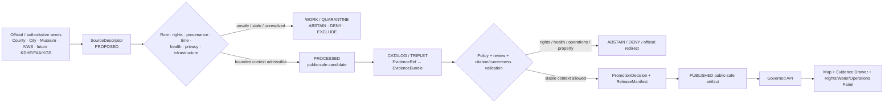
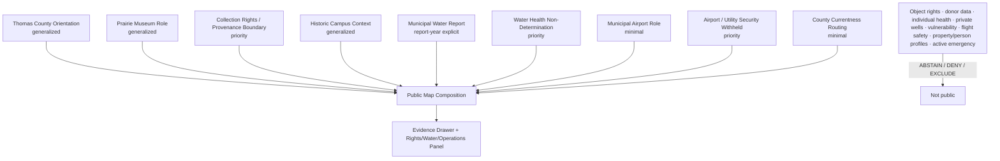
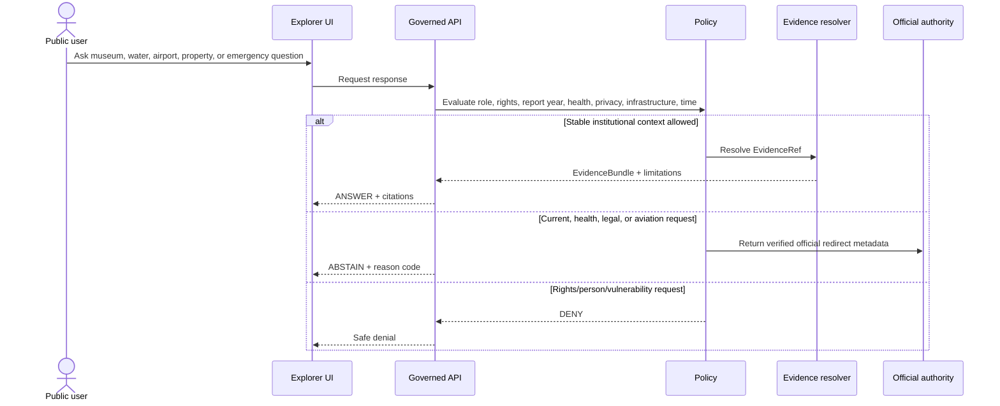
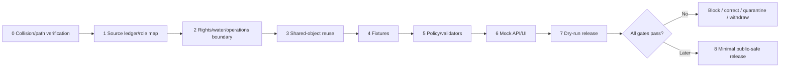

<!-- [KFM_META_BLOCK_V2]
doc_id: NEEDS_VERIFICATION — <REGISTERED_KFM_DOC_ID>
title: Thomas County Focus Mode Build Plan — High Plains Heritage, Municipal Water, and Airport Operations Without Collection-Rights, Health, Property, or Aviation-Safety Conclusions
type: county-focus-mode-build-plan
version: v0.1-draft
status: draft
county: Thomas County, Kansas
county_slug: thomas
created: 2026-06-08
updated: 2026-06-08
owners:
  - NEEDS_VERIFICATION — <OWNER:focus-mode-steward>
  - NEEDS_VERIFICATION — <OWNER:museum-and-cultural-collections-reviewer>
  - NEEDS_VERIFICATION — <OWNER:water-quality-and-utility-reviewer>
  - NEEDS_VERIFICATION — <OWNER:airport-and-critical-infrastructure-reviewer>
  - NEEDS_VERIFICATION — <OWNER:property-privacy-and-release-reviewer>
release_status: NEEDS_VERIFICATION — NOT_RELEASED
review_assignments: NEEDS_VERIFICATION
correction_path: NEEDS_VERIFICATION
rollback_path: NEEDS_VERIFICATION
unverified_repository_paths:
  - PROPOSED / CONFLICTED / NEEDS_VERIFICATION — docs/focus-modes/thomas-county/build-plan.md
  - PROPOSED / OBSERVED-LEGACY / NEEDS_VERIFICATION — docs/focus-mode/counties/thomas_county/thomas_county_focus_mode_build_plan.md
schema_contract_policy_homes:
  - PROPOSED / NEEDS_VERIFICATION — contracts/focus_mode/
  - PROPOSED / NEEDS_VERIFICATION — schemas/contracts/v1/focus_mode/
  - PROPOSED / NEEDS_VERIFICATION — policy/runtime/, policy/sensitivity/, policy/rights/, policy/release/
proof_slice: Prairie Museum and Thomas County Historical Society collections, Colby municipal water reporting and 2026 waterline work, Colby Municipal Airport, county property-fraud/tax-roll routing, and burn-ban currentness
primary_public_safe_boundary: KFM may present generalized, time-attributed museum, county-service, municipal-water-reporting, and airport-role context; it must not infer ownership, provenance, cultural authority, donor rights, or permission to reproduce collection objects; convert an annual consumer-confidence report into current household or private-well health advice; expose operational utility or airport vulnerability; issue aviation, burn-ban, road, or emergency guidance; determine title, parcel access, property fraud, or living-person details; or treat dated public notices as evergreen truth.
collision_search:
  completed_register: CONFIRMED — Thomas County is absent from the user-supplied completed/collision register.
  generated_in_continuation: CONFIRMED — previously generated counties in this continuation were excluded.
  uploaded_project_materials: CONFIRMED — targeted Thomas County Focus Mode searches were performed; no Thomas County plan surfaced among examined results.
  live_repository_search: CONFIRMED — search for thomas_county_focus_mode_build_plan returned no matching county plan.
  live_repository_index: CONFIRMED — docs/focus-mode/counties/COUNTY_INDEX.md lists Thomas as not-started with validation not-run.
  exhaustive_absence: NEEDS_VERIFICATION — unindexed branches, private artifacts, and prior unsearched outputs may still exist.
directory_rules_basis:
  - CONFIRMED — attached Directory Rules.pdf is available to the series and has been inspected in prior county-plan runs.
  - CONFIRMED — location encodes responsibility, governance, and lifecycle; topic alone does not justify a new root.
  - CONFIRMED — lifecycle is RAW → WORK / QUARANTINE → PROCESSED → CATALOG / TRIPLET → PUBLISHED.
  - CONFIRMED — promotion is a governed state transition, not a file move.
  - CONFLICTED / NEEDS_VERIFICATION — observed repository paths use docs/focus-mode/ while doctrine also identifies docs/focus-modes/.
official_source_checks:
  - CONFIRMED — Thomas County official website, checked 2026-06-08.
  - CONFIRMED — City of Colby official website and 2025 Water Quality Report for Year 2024 page, checked 2026-06-08.
  - CONFIRMED — City of Colby Municipal Airport page, checked 2026-06-08.
  - CONFIRMED — Prairie Museum of Art & History / Thomas County Historical Society official website, checked 2026-06-08.
  - CONFIRMED — National Weather Service Goodland office, checked 2026-06-08.
  - NEEDS_VERIFICATION — direct groundwater-management, KGS county-geology, and Kansas water-right sources should be admitted before groundwater or water-right publication.
source_check_date: 2026-06-08
tags: [kfm, focus-mode, thomas-county, colby, prairie-museum, water-quality, waterline-project, municipal-airport, property-privacy, burn-ban, cite-or-abstain]
notes:
  - Planning artifact only; no implementation, source admission, review, promotion, publication, correction readiness, or rollback readiness is claimed.
  - The county homepage displayed a lifted burn-ban notice; this is current operational/legal information and must not be frozen into static KFM truth.
  - The city’s airport page publishes runway, weather-observation, communications, service, hours, and contact details; public KFM output must preserve useful public context while withholding vulnerability-enabling combinations and refusing operational or safety interpretation.
  - Museum collection descriptions establish institutional role, not ownership, cultural authority, unrestricted reproduction rights, or provenance completeness.
[/KFM_META_BLOCK_V2] -->

<a id="top"></a>

# Thomas County Focus Mode Build Plan
## High Plains Heritage, Municipal Water, and Airport Operations Without Collection-Rights, Health, Property, or Aviation-Safety Conclusions

> **Product thesis:** Explain Thomas County’s High Plains heritage institutions, municipal-water reporting, county services, and Colby airport role while refusing to become a collection-rights, provenance, household-health, private-well, infrastructure-vulnerability, aviation-safety, property, burn-ban, road, or emergency authority.


| Identity / status field | Value |
|---|---|
| County | **Thomas County, Kansas** |
| Status | `PROPOSED` planning artifact |
| Distinct proof slice | Prairie Museum collections and historic buildings, annual municipal-water reporting and waterline work, Colby Municipal Airport, county property/tax routing, and burn-ban currentness |
| Primary public-safe boundary | **Generalized institutional and public-service context may be shown; KFM must not infer collection ownership or reproduction rights, present an annual water report as current individualized health advice, expose airport or utility vulnerabilities, issue aviation or emergency guidance, or determine title, access, fraud, or living-person information.** |
| Official sources checked | Thomas County; City of Colby; Colby water-quality report page; Colby Municipal Airport; Prairie Museum; NWS Goodland |
| Collision status | No Thomas County plan surfaced; live index records `not-started` / `not-run` |
| Exhaustive absence | `NEEDS_VERIFICATION` |
| Release state | `NOT_RELEASED` |

## Quick links

[Operating posture](#1-operating-posture) · [Why this county](#2-why-this-county) · [Product thesis](#3-product-thesis) · [Scope](#4-scope-boundary) · [Layers](#5-first-demo-layers) · [Journeys](#6-user-journeys) · [UI](#7-ui-surfaces) · [Objects](#8-governed-object-model) · [Repository](#9-proposed-repository-shape) · [Build](#10-build-phases) · [PRs](#11-first-pr-sequence) · [Acceptance](#12-acceptance-checklist) · [Fixtures](#13-fixture-plan) · [Risks](#14-risk-register) · [Sources](#15-source-seed-list) · [Questions](#16-open-verification-questions) · [Milestone](#17-recommended-first-milestone)

---

## Executive build note

Thomas County is selected because it creates a distinct **heritage collections + municipal water + aviation operations** proof slice.

The official Thomas County website exposes government and department routing, tax-roll search, property-fraud alerts, notifications, election information, and current notices. When checked, it displayed a “Thomas County Burn Ban Lifted” notice.[^s1] That notice is useful as currentness evidence, but it must not become a permanent KFM legal conclusion.

The City of Colby website identifies public utilities, parks, police, permits, the municipal airport, a water-quality report, lead-service-line survey, utility billing, streets, wastewater, and a 2026 waterline-improvement project.[^s2] The city’s consumer-confidence page identifies a **2025 Water Quality Report for Year 2024**.[^s3] That temporal scope must remain visible: an annual report cannot become a real-time statement about a particular tap, premise, private well, illness, contamination event, or future condition.

The official Colby Municipal Airport page describes Shalz Field’s runways, public services, terminal, weather-observation equipment, communications, and airport data.[^s4] These are legitimate public aviation-context facts, but KFM must not convert them into current flight-planning, runway-condition, weather, fuel-availability, after-hours-service, security, or emergency guidance. Vulnerability-enabling combinations of infrastructure details should be minimized even when individual facts are public.

The Prairie Museum of Art & History / Thomas County Historical Society describes itself as a repository for regional history and the international Kuska Collection, with dolls, glass, ceramics, clothing, paintings, historic buildings, and educational programs.[^s5] That establishes institutional and interpretive roles. It does not establish complete provenance, unrestricted image rights, donor permissions, cultural authority for every object, ownership free of claims, or permission for KFM to reproduce collection media.

> [!CAUTION]
> ## Defining public-safe boundary
>
> **KFM may explain Thomas County’s heritage institutions, municipal-water reporting, city utilities, and municipal-airport role. It must not infer ownership, cultural authority, provenance completeness, or reproduction rights for museum objects; treat a dated annual water report as current household or private-well health advice; expose utility or airport vulnerabilities; issue aviation, fire, road, or emergency guidance; or convert tax-roll, fraud-alert, and parcel routes into title, access, or living-person profiles.**

### Evidence boundary

| Label | Established | Not established |
|---|---|---|
| `CONFIRMED` | Thomas is absent from the supplied register; repository search found no Thomas plan; live index lists `not-started` / `not-run`; county, city, water-report, airport, museum, and NWS pages were checked. | — |
| `PROPOSED` | Every card, object, policy, fixture, path, UI, workflow, release, correction, and rollback element below. | No implementation is claimed. |
| `NEEDS_VERIFICATION` | Exhaustive collision absence; canonical path; museum object-level rights/provenance; water-report data fitness; groundwater and water-right sources; operational-security review; shared contracts/policies; correction and rollback implementation. | — |
| `UNKNOWN` | Current burn restrictions, present water-system incidents, individual tap/private-well safety, current runway/fuel/weather/service conditions, object-level provenance and rights, parcel title/access, road status, and active emergency conditions. | — |

---

# 1. Operating posture

## 1.1 Governing rules applied to Thomas County

| KFM rule | Thomas County application |
|---|---|
| EvidenceBundle outranks generated language | AI cannot create collection rights, provenance, water-health, airport-condition, property, or emergency truth. |
| Cite-or-abstain | Stable institutional context may answer; individualized, current, legal, health, and operational questions abstain or deny. |
| Public clients use governed interfaces | No public access to RAW museum records, internal utility systems, airport operational systems, unpublished candidates, or direct model output. |
| Source roles remain distinct | Museum interpretation, historical-society records, city water reporting, utility operations, airport administration, FAA/NWS aviation sources, county property routing, and AI narrative remain separate. |
| Publication is governed | Public website visibility is not automatic permission to ingest, derive, or republish. |
| Rights and cultural authority fail closed | Object images, donor records, cultural descriptions, and international artifacts require item-level review. |
| Water-health claims fail closed | Annual consumer-confidence reporting does not establish current individualized health or private-well safety. |
| Operational-security claims fail closed | Airport and utility context must not become vulnerability analysis or real-time operational advice. |

## 1.2 Truth labels and finite outcomes

| Token | Meaning |
|---|---|
| `CONFIRMED` | Verified in this run. |
| `PROPOSED` | Design not verified as implemented. |
| `NEEDS_VERIFICATION` | Checkable before action. |
| `UNKNOWN` | Unsupported or unresolved. |
| `ANSWER` | Narrow evidence-supported public-safe context. |
| `ABSTAIN` | Authority, currentness, rights, or evidence is insufficient. |
| `DENY` | Request crosses rights, privacy, health, property, or infrastructure boundaries. |
| `ERROR` | Contract, evidence, policy, or runtime failure. |

## 1.3 Public trust membrane



## 1.4 County-specific guardrails

| Guardrail | Outcome | Candidate reason code |
|---|---:|---|
| Object ownership, donor rights, provenance completeness, or unrestricted reproduction | `ABSTAIN` / `DENY` | `COLLECTION_RIGHTS_OR_PROVENANCE_NOT_ESTABLISHED` |
| Cultural authority inferred from museum possession | `ABSTAIN` | `MUSEUM_CUSTODY_NOT_CULTURAL_AUTHORITY` |
| Annual water report used as current tap/private-well health advice | `ABSTAIN` / `DENY` | `ANNUAL_WATER_REPORT_NOT_INDIVIDUAL_HEALTH_GUIDANCE` |
| Waterline project or utility details used for vulnerability analysis | `DENY` | `CRITICAL_UTILITY_DETAIL_WITHHELD` |
| Airport page used for current runway, weather, fuel, service, or flight-safety decisions | `ABSTAIN` | `CURRENT_AVIATION_STATUS_REQUIRES_OFFICIAL_AUTHORITY` |
| Airport or communications detail assembled into vulnerability map | `DENY` | `AVIATION_INFRASTRUCTURE_DETAIL_WITHHELD` |
| Tax roll/property-fraud route used as title, access, or person profile | `DENY` | `PROPERTY_OR_LIVING_PERSON_DETERMINATION_DENIED` |
| Burn-ban, road, warning, or emergency status | `ABSTAIN` | `OFFICIAL_CURRENT_SAFETY_CHANNEL_REQUIRED` |

---

# 2. Why this county

## 2.1 Collision screen

| Check | Result | Status |
|---|---|---:|
| Supplied completed/collision register | Thomas absent. | `CONFIRMED` |
| Counties generated in this continuation | Excluded. | `CONFIRMED` |
| Live repository filename search | No `thomas_county_focus_mode_build_plan` match. | `CONFIRMED` |
| Live county index | Thomas listed `not-started`, validation `not-run`. | `CONFIRMED` |
| Uploaded/project-material search | No Thomas plan surfaced among examined results. | `CONFIRMED` for performed search |
| Exhaustive absence | Not proved across all private/unindexed material. | `NEEDS_VERIFICATION` |

## 2.2 Proof-slice rationale

| Dimension | Proof value | Evidence |
|---|---|---|
| Heritage and collections | Prairie Museum is a regional repository and home of the Kuska Collection and historic buildings. | Museum.[^s5] |
| Rights/provenance governance | International artifacts and varied object types require item-level rights, cultural-authority, and provenance controls. | `PROPOSED` governance inference from collection character. |
| Municipal water | City exposes annual consumer-confidence reporting, lead-line survey, water/wastewater functions, and a 2026 waterline project. | City.[^s2][^s3] |
| Aviation | City operates Shalz Field and publishes public airport infrastructure and service information. | City airport page.[^s4] |
| Property/privacy | County exposes tax-roll search and property-fraud alert routing. | County.[^s1] |
| Currentness | County displayed a lifted burn-ban notice; airport, water, museum hours, and city notices can change. | County/City/Museum.[^s1][^s2][^s5] |
| Distinctness | Combines collections governance, annual public-health reporting limits, and operational-infrastructure restraint. | `PROPOSED`. |

## 2.3 Distinct series contribution

Thomas County tests whether KFM can:

1. describe a museum collection without assuming object-level rights or cultural authority;
2. preserve the reporting year and system scope of a consumer-confidence report;
3. prevent municipal water reporting from becoming individualized medical or private-well advice;
4. present an airport as civic infrastructure without issuing flight or operational guidance;
5. minimize public property and living-person details;
6. manage fast-changing burn, utility, museum, airport, and emergency information.

## 2.4 Public benefit

A future public-safe product could help users understand:

- the Prairie Museum’s role in preserving High Plains history;
- why collection custody, ownership, provenance, rights, and cultural authority are different;
- what a municipal consumer-confidence report can and cannot establish;
- how Colby’s airport and utility roles fit the county;
- why current safety, property, and operational questions redirect to official sources.

---

# 3. Product thesis

## 3.1 One-sentence thesis

> **Thomas County Focus Mode should connect heritage collections, municipal water, civic infrastructure, and county services while making collection rights, cultural authority, individualized health, property, operational security, aviation safety, and current emergency boundaries explicit and enforceable.**

## 3.2 First-product promises

| Promise | Meaning |
|---|---|
| Institutional-role clarity | Museum, historical society, city, county, water utility, airport, and NWS roles remain distinct. |
| Time-bounded water reporting | Reporting year, system scope, and limitations are visible. |
| Rights-aware heritage context | Object-level rights and provenance remain unclaimed until reviewed. |
| Infrastructure minimization | Useful civic context without vulnerability-enabling detail. |
| Finite outcomes | Supported context answers; risky questions abstain or deny. |
| Reversibility | Correction and rollback precede publication. |

## 3.3 Non-promises

- no claim of complete provenance, clear title, donor permission, cultural authority, or reproduction rights;
- no current household, premise, or private-well health conclusion;
- no diagnosis or exposure conclusion;
- no airport operational, runway-condition, fuel, weather, or flight-safety guidance;
- no utility or aviation vulnerability detail;
- no title, parcel access, fraud, or living-person conclusion;
- no current burn, road, warning, or emergency determination;
- no implementation or publication claim.

---

# 4. Scope boundary

| Content family | Posture | Boundary |
|---|---:|---|
| County/Colby orientation | `PROPOSED` | Generalized public geometry. |
| Prairie Museum Institutional Role Card | `PROPOSED` | Institution and mission only. |
| Collection Rights/Provenance Notice | `PROPOSED` priority | No object-level ownership or reuse claim. |
| Historic Buildings Context Card | `PROPOSED` generalized | No current visitor/access guarantee. |
| Municipal Water Report Card | `PROPOSED` | Explicit report year and system scope. |
| Water Health Non-Determination Notice | `PROPOSED` priority | No individualized or private-well advice. |
| Municipal Airport Role Card | `PROPOSED` | Civic context only. |
| Airport/Utility Security Notice | `PROPOSED` priority | No vulnerability-enabling composition. |
| County Property/Notification Routing Card | `PROPOSED` minimal | No owner/title/person profile. |
| Live airport, utility, burn, road, or emergency status | `DEFER` | Requires governed official-current interfaces. |
| Object media, donor files, exact operational details, living-person data | `DENY` / `EXCLUDE` | Rights/privacy/security boundary. |

---

# 5. First demo layers

## 5.1 Prioritized first public-safe layers/cards

| Priority | Card/layer | Purpose | Source seed | Gate | Status |
|---:|---|---|---|---|---:|
| 1 | `RightsWaterOperationsBoundaryNotice` | Makes defining boundary unavoidable. | Museum + City + County + policy | Highest-risk fixtures. | `PROPOSED` |
| 2 | `PrairieMuseumInstitutionalRoleCard` | Explains museum/historical-society role. | Museum[^s5] | EvidenceBundle and rights. | `PROPOSED` |
| 3 | `CollectionRightsProvenanceNotice` | Prevents custody-to-rights overclaim. | Museum + policy | Object-level review required. | `PROPOSED` |
| 4 | `HistoricCampusGeneralizedCard` | Cooper Barn and historic-building context. | Museum[^s5] | No current visitor guarantee. | `PROPOSED` |
| 5 | `ColbyWaterReportContextCard` | Exposes report year and municipal-system scope. | City[^s3] | Water-health review. | `PROPOSED` |
| 6 | `WaterHealthNonDeterminationCard` | Prevents individualized inference. | City + future KDHE | Fit-authority gate. | `PROPOSED` |
| 7 | `ColbyMunicipalAirportRoleCard` | General civic/transportation context. | City airport[^s4] | Operational-security review. | `PROPOSED` |
| 8 | `AirportUtilitySecurityWithholdNotice` | Explains minimization of operational detail. | Policy | Security gate. | `PROPOSED` |
| 9 | `ThomasCountyCurrentnessRoutingCard` | Burn notice, notifications, property routes. | County[^s1] | Privacy/currentness gate. | `PROPOSED` |
| 10 | Live operational and person-linked layers | Unsafe first slice. | Future governed sources | Not first PR. | `DEFER` / `DENY` |

## 5.2 Map composition



## 5.3 Layer-card truth contract

| Field | Purpose | Failure posture |
|---|---|---|
| `source_role` | Separates museum, historical society, city utility, airport, county, NWS, and AI. | `ABSTAIN`. |
| `temporal_basis` | Preserves report year, checked date, and operational currentness. | `ABSTAIN` for current requests. |
| `rights_status` | Records ownership/reproduction/provenance review. | Suppress media if unresolved. |
| `cultural_authority_scope` | Prevents custody from becoming cultural authority. | `ABSTAIN`. |
| `water_system_scope` | Identifies the covered public water system/reporting year. | `ABSTAIN`. |
| `health_scope` | Blocks individualized or private-well inference. | `DENY` / `ABSTAIN`. |
| `infrastructure_sensitivity` | Minimizes airport/utility operational detail. | `DENY`. |
| `property_privacy` | Prevents owner/person/title profiles. | `DENY`. |
| `evidence_refs` | Resolves claims to evidence. | `ABSTAIN`. |
| `release_state` | Prevents proposed content from appearing released. | Public alias blocked. |

---

# 6. User journeys

## 6.1 Public learning journeys

| Journey | Safe outcome |
|---|---|
| “What is the Prairie Museum?” | Institutional mission and generalized collection context. |
| “What is the Kuska Collection?” | Bounded description without rights/provenance overclaim. |
| “What does the city water report cover?” | Reporting year and municipal-system explanation. |
| “Why can’t this report tell me whether my tap is safe today?” | Temporal/system/health limitation explanation. |
| “What role does Colby Municipal Airport play?” | General civic and transportation context. |
| “Why are some airport details omitted?” | Operational-security and currentness explanation. |

## 6.2 Trust-demonstration journeys

| Request | Outcome |
|---|---:|
| “Download and republish every museum object image.” | `DENY` / `ABSTAIN` |
| “Does the museum legally own every object?” | `ABSTAIN` |
| “Does museum custody make its interpretation culturally authoritative?” | `ABSTAIN` |
| “Is my home’s water safe today?” | `ABSTAIN` |
| “Is my private well contaminated?” | `DENY` / `ABSTAIN` |
| “Show the most vulnerable airport or water-system components.” | `DENY` |
| “Is the runway safe and fuel available now?” | `ABSTAIN` |
| “Who owns this parcel and may I enter?” | `DENY` |
| “Is the burn ban active now?” | `ABSTAIN` |
| “Is there a warning or emergency now?” | `ABSTAIN` |

## 6.3 Candidate reason codes

- `COLLECTION_RIGHTS_OR_PROVENANCE_NOT_ESTABLISHED`
- `MUSEUM_CUSTODY_NOT_CULTURAL_AUTHORITY`
- `ANNUAL_WATER_REPORT_NOT_INDIVIDUAL_HEALTH_GUIDANCE`
- `PRIVATE_WELL_STATUS_REQUIRES_FIT_AUTHORITY`
- `CRITICAL_UTILITY_DETAIL_WITHHELD`
- `CURRENT_AVIATION_STATUS_REQUIRES_OFFICIAL_AUTHORITY`
- `AVIATION_INFRASTRUCTURE_DETAIL_WITHHELD`
- `PROPERTY_OR_LIVING_PERSON_DETERMINATION_DENIED`
- `OFFICIAL_CURRENT_SAFETY_CHANNEL_REQUIRED`

---

# 7. UI surfaces

| Surface | Thomas County behavior | Status |
|---|---|---:|
| Header | “No collection-rights, individual-health, property, aviation-safety, or live emergency verdict.” | `PROPOSED` |
| Map canvas | Generalized institutional and civic context. | `PROPOSED` |
| Layer drawer | Source role, checked time, report year, rights, sensitivity, release state. | `PROPOSED` |
| Evidence Drawer | Separates museum, historical society, city utility, airport, county, NWS, future KDHE/FAA, and AI. | `PROPOSED` |
| Answer panel | Stable context only. | `PROPOSED` |
| Abstention panel | Rights, provenance, water health, airport status, burn, road, emergency. | `PROPOSED` |
| Denial panel | Donor/person data, vulnerability maps, title/access profiles. | `PROPOSED` |
| Timeline/time-basis panel | Collection history, report year, notice date, operational time. | `PROPOSED` |
| **Rights / Water / Operations Boundary Panel** | Central trust surface. | `PROPOSED` |
| Official redirect panel | Museum operator, city utility, airport/FAA sources, county, NWS. | `PROPOSED` |
| Release/correction panel | `NOT_RELEASED`, review gaps, correction, rollback. | `PROPOSED` |

## 7.1 Legend vocabulary

| Label | Meaning | Must not become |
|---|---|---|
| `Museum institutional source` | Mission, exhibits, collection categories, visitor context. | Proof of object ownership, provenance, or unrestricted reuse. |
| `Annual water report` | Dated public-water-system compliance/reporting context. | Real-time or individualized health guarantee. |
| `Municipal airport source` | Public airport description and administration. | Current flight-planning or safety authority. |
| `County routing source` | Notifications, tax roll, property-fraud and civic links. | Title, access, fraud finding, or living-person profile. |
| `Operational detail withheld` | Security/currentness minimization. | Confirmation of hidden vulnerabilities. |
| `Generated explanation` | Bounded synthesis. | Evidence or authority. |

## 7.2 UI/API/policy/evidence sequence



---

# 8. Governed object model

## 8.1 Proposed shared object families

| Object family | Thomas County use | Status |
|---|---|---:|
| `SourceDescriptor` | Authority, role, rights, time, system scope, sensitivity. | `PROPOSED / NEEDS_VERIFICATION` |
| `EvidenceRef` | Claim-to-proof link. | `PROPOSED / NEEDS_VERIFICATION` |
| `EvidenceBundle` | Evidence plus rights/health/operations limitations. | `PROPOSED / NEEDS_VERIFICATION` |
| `PolicyDecision` | Finite outcome and obligations. | `PROPOSED / NEEDS_VERIFICATION` |
| `RuntimeResponseEnvelope` | Public-safe response. | `PROPOSED / NEEDS_VERIFICATION` |
| `CitationValidationReport` | Detects time, rights, health, and role overclaim. | `PROPOSED / NEEDS_VERIFICATION` |
| `ReleaseManifest` | Approved public composition. | `PROPOSED / NEEDS_VERIFICATION` |
| `AIReceipt` | Generated output/dependencies. | `PROPOSED / NEEDS_VERIFICATION` |
| `ReviewRecord` | Rights, museum, water, health, infrastructure, privacy review. | `PROPOSED / NEEDS_VERIFICATION` |
| `CorrectionNotice` | Corrects stale or unsafe output. | `PROPOSED / NEEDS_VERIFICATION` |
| `RollbackPlan` | Withdraws unsafe release. | `PROPOSED / NEEDS_VERIFICATION` |

## 8.2 County-specific object candidates

- `PrairieMuseumInstitutionalRoleCard`
- `CollectionRightsProvenanceRecord`
- `CulturalAuthorityLimitationNotice`
- `MunicipalWaterReportContextCard`
- `WaterHealthNonDeterminationNotice`
- `ColbyMunicipalAirportRoleCard`
- `OperationalInfrastructureWithholdNotice`
- `CountyCurrentnessRoutingCard`

## 8.3 Source-role anti-collapse rules

| Source | Valid role | Must not become |
|---|---|---|
| Prairie Museum | Institutional, collection-category, program, visitor, and local-history context. | Automatic proof of title, provenance, reproduction rights, or cultural authority. |
| Thomas County Historical Society | Local historical stewardship and records. | Sole authority for every cultural/historical claim. |
| City water report | Annual public-water-system reporting. | Current individualized medical, exposure, or private-well advice. |
| City utility project notice | Public project/currentness context. | Vulnerability map or service guarantee. |
| City airport page | Municipal airport context. | Current aeronautical, weather, runway, fuel, or flight-safety authority. |
| FAA/NWS aviation sources | Current official operational/weather authority. | KFM-generated operational command. |
| County tax/fraud routes | Administrative routing. | Title, access, fraud finding, or person profile. |
| AI narrative | Bounded explanation. | Evidence, legal opinion, health assessment, or operational authority. |

## 8.4 Minimal public runtime response JSON

```json
{
  "schema_version": "v1",
  "object_type": "RuntimeResponseEnvelope",
  "response_id": "kfm.runtime.thomas.institutional_context.answer.v1",
  "county": "thomas",
  "outcome": "ANSWER",
  "answer_scope": "public_safe_institutional_context",
  "answer": "Checked Prairie Museum material describes the institution as a repository for the Thomas County Historical Society, home to the Kuska Collection, and an educational site with historic buildings. Checked City of Colby material identifies municipal water reporting and a municipal airport.",
  "evidence_refs": [
    "kfm.evidence_ref.thomas.prairie_museum_role.v1",
    "kfm.evidence_ref.thomas.colby_civic_roles.v1"
  ],
  "limitations": [
    "No object ownership, complete provenance, reproduction rights, cultural authority, individualized water-health conclusion, private-well status, current airport condition, property right, or emergency status is provided."
  ],
  "review_state": "NEEDS_VERIFICATION",
  "release_state": "NOT_RELEASED",
  "spec_hash": "NEEDS_VERIFICATION"
}
```

## 8.5 Abstention JSON

```json
{
  "schema_version": "v1",
  "object_type": "RuntimeResponseEnvelope",
  "response_id": "kfm.runtime.thomas.water_or_airport_status.abstain.v1",
  "county": "thomas",
  "outcome": "ABSTAIN",
  "reason_code": "ANNUAL_WATER_REPORT_NOT_INDIVIDUAL_HEALTH_GUIDANCE",
  "message": "The checked city page identifies a 2025 consumer-confidence report for reporting year 2024. KFM does not use that annual system-level report to determine current conditions at a particular tap, premise, or private well and does not provide current airport or aviation-safety status from cached municipal context.",
  "official_redirects": [
    {"authority": "City of Colby Public Utilities", "purpose": "current municipal water-system questions"},
    {"authority": "appropriate health or environmental authority", "purpose": "individual exposure or health concerns"},
    {"authority": "FAA, airport operator, and current aviation-weather services", "purpose": "current airport and flight-safety information"}
  ],
  "release_state": "NOT_RELEASED",
  "spec_hash": "NEEDS_VERIFICATION"
}
```

## 8.6 Denial JSON

```json
{
  "schema_version": "v1",
  "object_type": "RuntimeResponseEnvelope",
  "response_id": "kfm.runtime.thomas.rights_privacy_infrastructure.deny.v1",
  "county": "thomas",
  "outcome": "DENY",
  "reason_code": "AVIATION_INFRASTRUCTURE_DETAIL_WITHHELD",
  "message": "KFM does not assemble vulnerability-enabling airport or utility detail and does not publish unresolved museum-object rights, donor records, living-person linkage, title determinations, or private access profiles.",
  "withheld_fields": [
    "operational_vulnerability",
    "restricted_airport_or_utility_detail",
    "donor_or_private_collection_record",
    "unresolved_object_rights",
    "owner_or_living_person_linkage",
    "parcel_title_or_access"
  ],
  "release_state": "NOT_RELEASED",
  "spec_hash": "NEEDS_VERIFICATION"
}
```

## 8.7 Deterministic identity candidates

| Item | Candidate |
|---|---|
| Source | `kfm.source.thomas.<authority>.<slug>.v1` |
| Evidence | `kfm.evidence_bundle.thomas.<claim_scope>.v1` |
| Card | `kfm.card.thomas.<card>.v1` |
| Fixture | `kfm.runtime.thomas.<scenario>.<outcome>.v1` |
| Release | `kfm.release.thomas.focus_mode.v0_1` |

`spec_hash` behavior remains `PROPOSED / NEEDS_VERIFICATION`.

---

# 9. Proposed repository shape

## 9.1 Directory Rules basis

Directory Rules require responsibility-root placement, no topic-as-root folders, separate documentation/contracts/schemas/policy/fixtures/data/release responsibilities, and lifecycle:

`RAW → WORK / QUARANTINE → PROCESSED → CATALOG / TRIPLET → PUBLISHED`.

Promotion is a governed state transition, not a file move.

> [!WARNING]
> The observed `docs/focus-mode/` versus doctrinal `docs/focus-modes/` divergence remains unresolved. Every path below is `PROPOSED / CONFLICTED / NEEDS_VERIFICATION`.

## 9.2 Candidate paths

| Responsibility root | Proposed path | Purpose |
|---|---|---|
| Human documentation | `docs/focus-modes/thomas-county/build-plan.md` | This planning document. |
| Companion docs | `docs/focus-modes/thomas-county/{README.md,collection-rights-notes.md,water-health-notes.md,airport-security-notes.md,property-privacy-notes.md,source-seed-list.md,acceptance-checklist.md}` | Governance documentation. |
| Contracts | `contracts/focus_mode/` | Shared semantics. |
| Schemas | `schemas/contracts/v1/focus_mode/` | Machine shapes. |
| Fixtures | `fixtures/focus_modes/thomas/{valid,invalid}/` | Positive and fail-closed proof. |
| UI | `apps/explorer-web/src/focus-modes/thomas/` | Mock governed UI only. |
| Catalog | `data/catalog/sources/thomas/` | Admitted descriptors only. |
| Published | `data/published/layers/thomas/` | Future governed output only. |
| Release | `release/candidates/thomas-focus-mode/` | Future candidate proof only. |

## 9.3 Proposed responsibility-rooted tree

```text
# PROPOSED / CONFLICTED / NEEDS_VERIFICATION

docs/
└── focus-modes/
    └── thomas-county/
        ├── README.md
        ├── build-plan.md
        ├── collection-rights-notes.md
        ├── water-health-notes.md
        ├── airport-security-notes.md
        ├── property-privacy-notes.md
        ├── source-seed-list.md
        ├── evidence-model.md
        └── acceptance-checklist.md

fixtures/
└── focus_modes/thomas/
    ├── valid/
    └── invalid/

contracts/
└── focus_mode/

schemas/
└── contracts/v1/focus_mode/

apps/
└── explorer-web/src/focus-modes/thomas/

data/
├── catalog/sources/thomas/
└── published/layers/thomas/    # future governed output only

release/
└── candidates/thomas-focus-mode/
```

## 9.4 Placement prohibitions

- no root-level `thomas/`, `prairie-museum/`, `water-quality/`, `airport/`, or `property-fraud/`;
- no donor records, unresolved object media, living-person details, or title/access profiles in public fixtures;
- no annual water report promoted directly into individualized health truth;
- no airport and utility facts assembled into vulnerability-enabling products;
- no public client access to `RAW`, `WORK`, `QUARANTINE`, unpublished candidates, or canonical/internal stores;
- no publication without evidence closure, policy decision, review, manifest, correction, and rollback.

---

# 10. Build phases

| Phase | Goal | Entry gate | Output | Exit validation | Rollback posture |
|---:|---|---|---|---|---|
| 0 | Collision and path verification | Repeat searches | Verification note | No collision; path resolved or blocked | Stop |
| 1 | Source ledger and role map | Museum/city/county/NWS/future KDHE/FAA sources identified | Descriptor candidates | Roles, rights, time, health, sensitivity explicit | Docs only |
| 2 | Rights/water/operations boundary | Review framework accepted | Boundary policies | High-risk requests fail closed | Withdraw |
| 3 | Shared-object reuse | Existing families inspected | Reuse/extension decision | No parallel authority homes | Revert |
| 4 | Fixtures | Boundary accepted | Valid/invalid pack | Highest-risk cases fail closed | Remove |
| 5 | Policy and validators | Fixtures exist | Rights/time/health/security/privacy validators | Finite outcomes tested | Block |
| 6 | Mock API/UI | Contracts/policies agreed | Mock cards and panels | No rights/health/operations overclaim | Disable |
| 7 | Dry-run release | Reviews/evidence available | Candidate proof pack | No public alias; rollback rehearsed | Withdraw |
| 8 | Optional publication | All gates pass | Minimal generalized release | Traceable, correctable, reversible | Rollback |



---

# 11. First PR sequence

1. Verification and documentation control.
2. Source ledger/admission and public-safe boundary.
3. Contracts/schemas or shared-object reuse.
4. Valid and invalid fixtures.
5. Policy and validators.
6. Mock governed API/UI.
7. Dry-run release proof.
8. Only then optional minimal public-safe publication.

**Museum media ingestion, object-level rights conclusions, groundwater/water-right integration, live utility or airport integration, property/person data, current burn/road/emergency integration, and public release are not first-PR work.**

---

# 12. Acceptance checklist

## Governance and evidence

- [ ] Thomas collision check rerun.
- [ ] Live index state reverified.
- [ ] Every public claim resolves to EvidenceBundle.
- [ ] Museum, historical society, city utility, airport, county, NWS, future KDHE/FAA/KGS, and AI roles remain distinct.
- [ ] Report year and currentness are visible.
- [ ] No AI output is evidence.
- [ ] Finite outcomes exist.

## Public/sensitive boundary

- [ ] No claim of complete provenance, object title, reproduction rights, or donor permission.
- [ ] No museum-custody-to-cultural-authority inference.
- [ ] No annual-report-to-individual-health inference.
- [ ] No private-well safety conclusion.
- [ ] No airport or utility vulnerability detail.
- [ ] No current runway, fuel, weather, or flight-safety answer.
- [ ] No title, access, fraud, or living-person profile.
- [ ] No current burn, road, warning, or emergency answer.

## Product and UI

- [ ] Header states boundary and `NOT_RELEASED`.
- [ ] Evidence Drawer shows source role.
- [ ] Rights/provenance state visible.
- [ ] Water report year and system scope visible.
- [ ] Operational-detail minimization visible.
- [ ] Denial and abstention reason codes visible.
- [ ] Official redirects do not masquerade as answers.

## Repository, validation, release, correction, rollback

- [ ] Path conflict resolved.
- [ ] No parallel authority homes.
- [ ] Public UI cannot access internal lifecycle stores.
- [ ] Highest-risk invalid fixtures fail closed.
- [ ] Correction path is actionable.
- [ ] Rollback target is identified and tested.
- [ ] Promotion remains governed.

---

# 13. Fixture plan

## 13.1 Valid fixtures

| Fixture | Scenario | Expected outcome |
|---|---|---:|
| `museum_institutional_role.valid.json` | General museum role. | `ANSWER` |
| `water_report_scope.valid.json` | Explain 2025 report for year 2024. | `ANSWER` |
| `water_health_abstain.valid.json` | User asks current tap safety. | `ABSTAIN` |
| `airport_current_status_abstain.valid.json` | User asks runway/fuel/weather status. | `ABSTAIN` |
| `collection_rights_abstain.valid.json` | User asks whether every object is cleared for reuse. | `ABSTAIN` |
| `infrastructure_vulnerability_deny.valid.json` | User requests vulnerable components. | `DENY` |

## 13.2 Invalid/fail-closed fixtures

| Fixture | Invalid behavior | Required result |
|---|---|---:|
| `museum_custody_as_clear_title.invalid.json` | Possession becomes ownership proof. | `ABSTAIN` |
| `museum_custody_as_cultural_authority.invalid.json` | Custody becomes cultural authority. | `ABSTAIN` |
| `website_image_as_reuse_permission.invalid.json` | Public image becomes unrestricted license. | `DENY` / `ABSTAIN` |
| `annual_report_as_current_tap_safe.invalid.json` | Dated report becomes live health guarantee. | `ABSTAIN` |
| `city_report_as_private_well_safe.invalid.json` | Municipal report becomes private-well evidence. | `DENY` / `ABSTAIN` |
| `waterline_project_as_vulnerability_map.invalid.json` | Project notice becomes attack/failure analysis. | `DENY` |
| `airport_page_as_current_runway_safe.invalid.json` | Static page becomes operational safety. | `ABSTAIN` |
| `airport_data_composed_as_vulnerability.invalid.json` | Public details combined into harmful analysis. | `DENY` |
| `tax_roll_as_title_or_access.invalid.json` | Search route becomes title/access truth. | `DENY` |
| `property_fraud_alert_as_fraud_finding.invalid.json` | Alert service becomes allegation. | `DENY` |
| `burn_lifted_notice_as_evergreen.invalid.json` | Dated notice becomes permanent current status. | `ABSTAIN` |
| `public_internal_store_access.invalid.json` | Public UI reads internal stores. | `ERROR` |

## 13.3 Fixture-to-test matrix

| Test family | Must prove |
|---|---|
| Collection rights | Custody and public display do not prove title or reuse rights. |
| Cultural authority | Museum interpretation remains role-bounded. |
| Water temporal scope | Reporting year cannot become live individualized advice. |
| Water system scope | Municipal report cannot answer private-well questions. |
| Infrastructure security | Public facts cannot be composed into vulnerability analysis. |
| Aviation currentness | Static airport context cannot answer operational safety. |
| Property/privacy | Tax/fraud routes do not become owner/title/person claims. |
| Trust membrane | No unsupported claim or public internal-store access. |

## 13.4 Highest-risk invalid fixture pack

1. museum custody represented as clear title;
2. museum possession represented as cultural authority;
3. public object image treated as unrestricted reuse permission;
4. annual water report represented as current tap safety;
5. municipal report represented as private-well safety;
6. waterline notice transformed into vulnerability analysis;
7. airport page represented as current runway/fuel/weather safety;
8. public airport details composed into a vulnerability map;
9. tax-roll search transformed into title/access truth;
10. lifted burn-ban notice represented as evergreen status.

---

# 14. Risk register

| Risk | Likelihood | Impact | Required mitigation | Release posture |
|---|---:|---:|---|---|
| Museum custody becomes ownership/reuse claim | High | Critical | Item-level rights review; cite-or-abstain. | `ABSTAIN` |
| Museum custody becomes cultural authority | Medium/High | High | Authority-role field and review. | `ABSTAIN` |
| Public images treated as licensed | High | High | Rights metadata and media suppression. | `DENY` / quarantine |
| Dated water report becomes live health guarantee | High | Critical | Year/system-scope validator. | `ABSTAIN` |
| Municipal report becomes private-well advice | Medium/High | Critical | Source-scope validator. | `DENY` / `ABSTAIN` |
| Waterline project exposes vulnerabilities | Medium | Critical | Security review and detail minimization. | `DENY` |
| Static airport page becomes current safety source | High | Critical | Official-current aviation redirect. | `ABSTAIN` |
| Public airport facts composed into harmful analysis | Medium | Critical | Composition-aware security policy. | `DENY` |
| Property routes become title/person profile | High | Critical | Privacy minimization and nondetermination. | `DENY` |
| Burn-lift notice becomes evergreen status | High | High | Effective-time and supersession rules. | `ABSTAIN` |
| Existing Thomas plan later found | Low/Medium | Medium | Repeat collision checks. | Stop |
| Path divergence hardens | High | Medium | Resolve before landing. | Docs only |
| Mock mistaken for release | Medium | High | Persistent `NOT_RELEASED`. | Mock only |

---

# 15. Source seed list

## 15.1 Current official or authoritative sources actually checked

| ID | Source | Authority role | Verified anchor | Intended use | Allowed claim scope | Limitations | Status |
|---|---|---|---|---|---|---|---:|
| `S1` | Thomas County, Kansas, **Official Website**[^s1] | County administrative/current-notice routing | Departments/resources; tax-roll search; property-fraud-alert signup; notifications; “Thomas County Burn Ban Lifted” news item. | County role and currentness card. | Existence of routes and dated notice. | No title, owner profile, fraud finding, current burn status after supersession, road, or emergency conclusion. | `CONFIRMED` |
| `S2` | City of Colby, Kansas, **Official Website**[^s2] | Municipal government, utility, project, recreation, airport, and service source | Public utilities, water report, lead-line survey, airport, parks, police, permits, 2026 waterline project. | City role and source-routing cards. | Existence of official municipal functions and dated project context. | No individualized health, infrastructure vulnerability, operational guarantee, or living-person conclusion. | `CONFIRMED` |
| `S3` | City of Colby, **Consumer Confidence Report**[^s3] | Annual municipal public-water reporting source | Page identifies “2025 Water Quality Report for Year 2024.” | Report-year/system-scope proof. | Dated annual reporting context for the covered municipal system. | No real-time tap, premise, private-well, diagnosis, exposure, or future-condition conclusion. | `CONFIRMED` |
| `S4` | City of Colby, **Colby Municipal Airport**[^s4] | Municipal airport descriptive/administrative source | Shalz Field location, runway types, terminal, public services, weather-observation and airport-data categories. | Airport-role card. | General civic and publicly described airport context. | No current runway/fuel/weather/service/flight-safety claim; vulnerability-enabling combinations minimized. | `CONFIRMED` |
| `S5` | Prairie Museum of Art & History / Thomas County Historical Society[^s5] | Museum, collection, public-history, education, and visitor source | Institutional mission; repository role; Kuska Collection categories; Cooper Barn and outdoor historic buildings; hours/admission. | Museum institutional-role and currentness cards. | Institution, mission, generalized collection/building, and dated visitor context. | No object title, complete provenance, reproduction rights, donor permission, cultural authority, or evergreen hours claim. | `CONFIRMED` |
| `S6` | National Weather Service, **Forecast Office Goodland**[^s6] | Federal official-current weather/hazard authority | Current hazards, warnings, observations, radar, fire weather, drought, river/lake, and safety resources. | Official-current redirect. | NWS-issued products within temporal/geographic scope. | KFM must not rewrite, delay, cache, or independently interpret active warnings. | `CONFIRMED` |

## 15.2 Candidate official sources for later verification

| Candidate | Potential use | Required verification |
|---|---|---|
| KDHE public-water and drinking-water records | Regulatory/compliance and current advisory routing. | System identity, report period, current advisory state, health scope, rights. |
| Northwest Kansas Groundwater Management District No. 4 | Groundwater management context. | Thomas County coverage, current policies, public fields, no water-right adjudication. |
| Kansas Division of Water Resources | Water-right and permit routing. | Authority, currentness, legal scope, no KFM individual-right conclusion. |
| Kansas Geological Survey county/aquifer sources | High Plains geology and groundwater science. | Current map/data version, scale, rights, no private-well/parcel inference. |
| FAA Chart Supplement / NOTAM / airport data | Current aviation authority. | Current official source, temporal semantics, no KFM flight planning. |
| KDOT airport and road sources | Transportation context/current redirects. | Currentness, rights, no safety or passability guarantee. |
| Museum object catalog and donor/provenance records | Object-level heritage context. | Rights, privacy, donor restrictions, cultural authority, sensitivity, review state. |

## 15.3 Source admission checklist

- [ ] Verify exact source identity and authority.
- [ ] Assign explicit source role.
- [ ] Record checked date, report year, effective period, revision, and expiry.
- [ ] Verify object-level rights and derivative-display permission.
- [ ] Record provenance completeness and dispute status.
- [ ] Separate museum custody from cultural authority.
- [ ] Separate annual water reporting from current individualized health.
- [ ] Separate municipal system data from private-well questions.
- [ ] Apply composition-aware infrastructure security review.
- [ ] Minimize property and living-person fields.
- [ ] Resolve every EvidenceRef to EvidenceBundle.
- [ ] Run highest-risk invalid fixtures.
- [ ] Quarantine stale, private, rights-unclear, sensitive, or unsafe material.
- [ ] Require correction and rollback before release.

---

# 16. Open verification questions

## Repository and collision

- [ ] Does a Thomas County plan exist in another branch, private artifact store, or prior output?
- [ ] Is `docs/focus-mode/` or `docs/focus-modes/` canonical?
- [ ] What validator updates Thomas from `not-started` to `draft`?
- [ ] What index, manifest, and review changes are required?

## Museum rights, provenance, and cultural authority

- [ ] Which object records have verified ownership, donor permission, and reproduction rights?
- [ ] Which collections contain culturally sensitive, sacred, funerary, Indigenous, or contested material?
- [ ] What source communities or Nations hold cultural authority?
- [ ] Which donor/living-person fields are private?
- [ ] May collection images or metadata be redistributed?
- [ ] What correction path handles provenance disputes or repatriation claims?

## Water reporting and health

- [ ] What exact public-water system is covered by the 2024 report?
- [ ] What parameters, locations, dates, and compliance periods are represented?
- [ ] Is a newer report or active advisory available?
- [ ] What source is authoritative for current incidents?
- [ ] How are household plumbing, service lines, and private wells kept out of unsupported conclusions?
- [ ] Which KDHE review is required?

## Airport and operational security

- [ ] Which airport fields are safe for ordinary public KFM display?
- [ ] Which combinations become vulnerability-enabling?
- [ ] What FAA/KDOT source is authoritative for current data?
- [ ] How should NOTAM, weather, runway, and service questions be redirected?
- [ ] What correction/expiry behavior applies to static airport-page details?

## Property, burn, roads, and emergencies

- [ ] Which tax-roll fields must be excluded or minimized?
- [ ] How should property-fraud-alert services be represented without implying fraud?
- [ ] What notice superseded or followed the lifted burn-ban item?
- [ ] Which county road/emergency channels are official-current?
- [ ] What expiry and audit rules apply?

## Correction and rollback

- [ ] How is an improperly reused museum image withdrawn?
- [ ] How is a stale water or airport statement suppressed?
- [ ] What rollback removes vulnerability-enabling or person-linked output?
- [ ] What proof demonstrates that withheld details cannot be reconstructed?
- [ ] What separation of duties is required before release?

---

# 17. Recommended first milestone

## Milestone 1 — Thomas Rights, Water-Scope, and Operational-Minimization Control Plane

### Milestone statement

> Establish a documentation-and-fixture-first Thomas County proof slice that can explain the Prairie Museum’s institutional role, the temporal scope of municipal-water reporting, and the civic role of Colby Municipal Airport while making collection rights, provenance, cultural authority, individualized health, private wells, infrastructure vulnerabilities, aviation safety, property/person profiles, burn status, road status, and emergency guidance fail closed.

### Deliverables

| Deliverable | Status |
|---|---:|
| Collision and path verification note | `PROPOSED` |
| Museum–city–county–water–airport–NWS source-role matrix | `PROPOSED` |
| Rights / Water / Operations Boundary Notice | `PROPOSED` |
| Object-rights/provenance review template | `PROPOSED` |
| Water-report temporal/system-scope template | `PROPOSED` |
| Infrastructure-composition sensitivity decision | `PROPOSED` |
| Valid generalized-context fixtures | `PROPOSED` |
| Highest-risk invalid fixture pack | `PROPOSED` |
| Mock finite-outcome UI/API examples | `PROPOSED` |
| Correction and rollback draft | `PROPOSED` |

### Definition of done

- [ ] Collision checks rerun and index state reverified.
- [ ] Path governance resolved or blocks landing.
- [ ] Museum custody, ownership, rights, provenance, and cultural authority remain separate.
- [ ] Water report year and municipal-system scope are machine-visible.
- [ ] Annual reporting cannot become individualized/private-well health advice.
- [ ] Airport/utility detail passes composition-aware security review.
- [ ] Current operational and safety questions redirect or abstain.
- [ ] Property and living-person data remain minimized.
- [ ] No implementation, review completion, promotion, or publication claim is made.

### Go / no-go decision table

| Decision | Required evidence | If absent |
|---|---|---|
| GO to documentation PR | No collision, index/path verified, source-role matrix drafted. | Do not land. |
| GO to fixtures and policy | Shared homes verified and reason codes accepted. | Documentation only. |
| GO to mock API/UI | Invalid fixtures demonstrate fail-closed behavior. | Do not build mock surface. |
| GO to dry-run release | Rights, water, security, privacy, correction, and rollback reviews complete. | No release candidate. |
| GO to publication | Governed promotion and all approvals complete. | Remain `NOT_RELEASED`. |

---

# Appendix A — Public-safe narrative skeleton

## A.1 Landing narrative

**Thomas County: High Plains heritage, public water reporting, and visible operational boundaries**

Thomas County offers a map-first story connecting regional history, museum collections, historic buildings, municipal water, county services, and aviation. KFM can explain those institutions while keeping rights, health, property, and operations visible and bounded.

## A.2 Museum narrative

The Prairie Museum and Thomas County Historical Society preserve and interpret regional history and varied collections. Institutional custody does not by itself prove title, complete provenance, reproduction rights, donor permission, or cultural authority.

## A.3 Water narrative

The city identifies a 2025 water-quality report covering reporting year 2024. That report is time-bounded and system-bounded. It does not answer whether a specific tap or private well is safe today.

## A.4 Airport narrative

The municipal airport is part of local transportation infrastructure. Stable civic context may be shown, but current weather, NOTAMs, runway conditions, fuel availability, and flight-safety decisions require current official aviation sources.

## A.5 Evidence Drawer narrative

Each public card should expose:

- source authority and role;
- checked date, report year, effective period, and expiry;
- rights/provenance/cultural-authority state;
- water-system and health scope;
- infrastructure-sensitivity decision;
- privacy limitations;
- review and release state;
- correction and rollback references.

---

# Appendix B — Required negative-path reason-code categories

| Category | Code | Outcome |
|---|---|---:|
| Collection rights/provenance | `COLLECTION_RIGHTS_OR_PROVENANCE_NOT_ESTABLISHED` | `ABSTAIN` / `DENY` |
| Cultural authority | `MUSEUM_CUSTODY_NOT_CULTURAL_AUTHORITY` | `ABSTAIN` |
| Annual water report scope | `ANNUAL_WATER_REPORT_NOT_INDIVIDUAL_HEALTH_GUIDANCE` | `ABSTAIN` / `DENY` |
| Private well | `PRIVATE_WELL_STATUS_REQUIRES_FIT_AUTHORITY` | `ABSTAIN` / `DENY` |
| Utility security | `CRITICAL_UTILITY_DETAIL_WITHHELD` | `DENY` |
| Aviation currentness | `CURRENT_AVIATION_STATUS_REQUIRES_OFFICIAL_AUTHORITY` | `ABSTAIN` |
| Aviation security | `AVIATION_INFRASTRUCTURE_DETAIL_WITHHELD` | `DENY` |
| Property/living person | `PROPERTY_OR_LIVING_PERSON_DETERMINATION_DENIED` | `DENY` |
| Current safety/emergency | `OFFICIAL_CURRENT_SAFETY_CHANNEL_REQUIRED` | `ABSTAIN` |
| Evidence closure | `EVIDENCE_BUNDLE_UNRESOLVED` | `ABSTAIN` |
| AI misuse | `AI_NOT_EVIDENCE` | `ERROR` |
| Trust membrane | `PUBLIC_INTERNAL_LIFECYCLE_ACCESS` | `ERROR` |

---

# Appendix C — References and evidence-use note

[^s1]: Thomas County, Kansas, **Official Website**. Checked 2026-06-08. <https://www.thomascountyks.gov/>. Used for official county-government, notification, tax-roll, property-fraud-alert, and dated burn-ban-notice context. It is not used for title, fraud findings, current burn legality, roads, or emergency conclusions.

[^s2]: City of Colby, Kansas, **Official Website**. Checked 2026-06-08. <https://www.cityofcolbyks.gov/>. Used for municipal department, utility, project, airport, recreation, permit, and public-routing context. It is not used for individualized health, property, operational vulnerability, or current safety conclusions.

[^s3]: City of Colby, **Consumer Confidence Report**. Checked 2026-06-08. <https://www.cityofcolbyks.gov/64/Consumer-Confidence-Report>. The page identifies a “2025 Water Quality Report for Year 2024.” Used only for annual reporting scope and source-role context.

[^s4]: City of Colby, **Colby Municipal Airport**. Checked 2026-06-08. <https://www.cityofcolbyks.gov/8/Colby-Municipal-Airport>. Used for general municipal-airport and publicly described infrastructure/service context. It is not used for current runway, fuel, weather, NOTAM, service, flight-planning, security, or safety conclusions.

[^s5]: Prairie Museum of Art & History / Thomas County Historical Society, **Official Website**. Checked 2026-06-08. <https://prairiemuseum.org/>. Used for institutional mission, repository role, Kuska Collection categories, historic-building campus, programs, and dated visitor context. It is not used to establish object title, complete provenance, reproduction rights, donor permission, cultural authority, or evergreen hours.

[^s6]: National Weather Service, **Forecast Office Goodland, Kansas**. Checked 2026-06-08. <https://www.weather.gov/gld/>. Used for official-current hazards, warnings, observations, radar, fire weather, drought, river/lake, and safety routing. KFM must not replace, delay, or independently reinterpret active NWS products.

## Evidence-use note

This document is not an EvidenceBundle, museum catalog-rights determination, provenance certificate, cultural-authority statement, water-health advisory, private-well test, utility-operational report, airport-status source, flight-planning product, title opinion, fraud finding, burn authorization, road inspection, emergency bulletin, ReleaseManifest, or published product.

[Back to top](#top)
