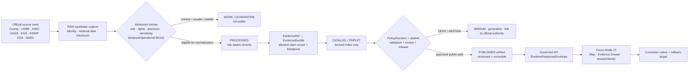
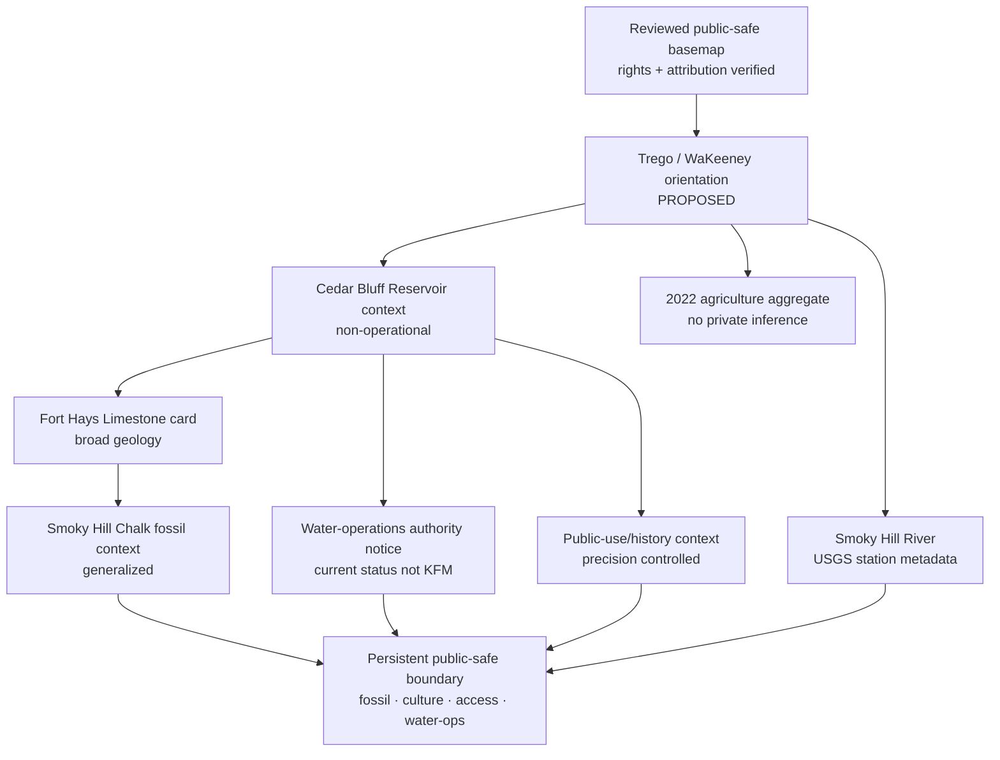
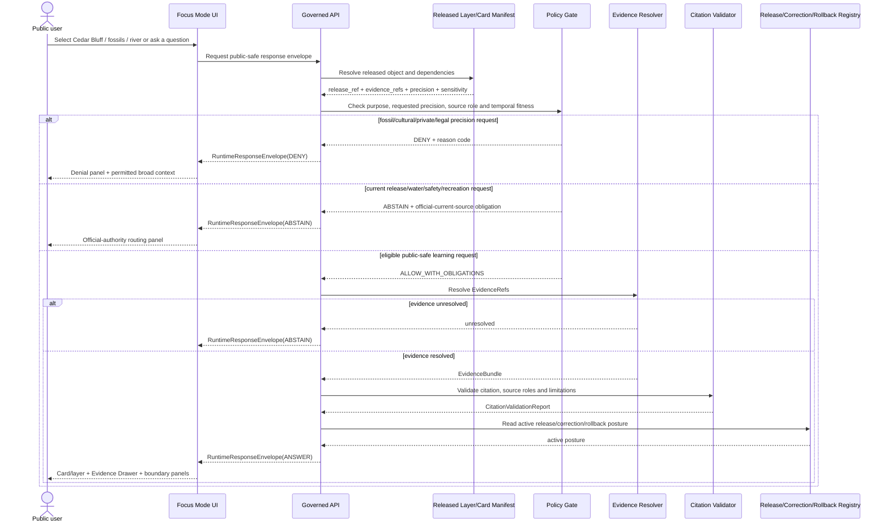
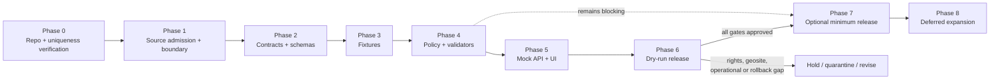

<!-- KFM_META_BLOCK_V2
doc_id: NEEDS_VERIFICATION
title: Trego County Focus Mode Build Plan
type: standard
version: v1
status: draft
owners: [NEEDS_VERIFICATION]
created: 2026-05-22
updated: 2026-05-22
policy_label: NEEDS_VERIFICATION — proposed_public_draft
repository_path: NEEDS_VERIFICATION — PROPOSED docs/focus-modes/trego-county/trego_county_focus_mode_build_plan.md
contract_home: NEEDS_VERIFICATION — PROPOSED only after repository and ADR verification
schema_home: NEEDS_VERIFICATION — Directory Rules default is schemas/contracts/v1/<...>; Focus Mode county/product lane unresolved
policy_home: NEEDS_VERIFICATION — PROPOSED only after repository and ADR verification
validator_home: NEEDS_VERIFICATION — PROPOSED only after repository and ADR verification
fixture_home: NEEDS_VERIFICATION — PROPOSED only after repository and ADR verification
review_assignments:
  - NEEDS_VERIFICATION — paleontology / geosite sensitivity reviewer
  - NEEDS_VERIFICATION — cultural-resource / historic-inscription reviewer
  - NEEDS_VERIFICATION — reservoir-operations / water-governance reviewer
  - NEEDS_VERIFICATION — ecology / public-use reviewer
  - NEEDS_VERIFICATION — release and rollback reviewer
release_status: NOT_RELEASED
correction_path: NEEDS_VERIFICATION
rollback_path: NEEDS_VERIFICATION
related:
  - Directory Rules.pdf — inspected governing placement doctrine
  - KFM MapLibre Operating Architecture, Governed UI, and AI Interaction Manual - Revised Working Edition — doctrine lineage
  - Kansas Frontier Matrix Pipeline Living Implementation Manual v0.3 — doctrine lineage
  - Existing county Focus Mode plans — NEEDS_VERIFICATION against live repository and authoritative plan registry
tags:
  - kfm
  - focus-mode
  - trego-county
  - cedar-bluff-reservoir
  - smoky-hill-river
  - smoky-hill-chalk
  - fossils
  - paleontology
  - water-operations
  - public-safe
notes:
  - Planning artifact only; no repository mutation, implementation, route, test, release, deployment, or publication claim is made.
  - The user-provided completed-county register and earlier selected counties visible in this continuation do not list Trego County.
  - A targeted search of accessible project materials did not surface a Trego County Focus Mode Build Plan; complete live-repository and document-registry confirmation remains NEEDS_VERIFICATION.
  - Official public web sources were checked on 2026-05-22; source admission, rights, derivative-display permission, geometry authority, geosite/paleontological/cultural sensitivity, operational freshness, public-safety, and public-release permissions remain gated.
-->

<a id="top"></a>

# Trego County Focus Mode Build Plan
## Cedar Bluff Reservoir, Smoky Hill Chalk, Fossil-Site Protection, and Water-Operations Proof Slice

> **Product thesis:** Build a public-safe Trego County Focus Mode that explains Cedar Bluff Reservoir and the Smoky Hill River alongside Cretaceous chalk, fossil-bearing landscapes, recreation and county-scale agriculture—without publishing collecting-enabling fossil/geosite precision, historic-cultural resource precision, private-access inference, dam/river operational detail, or current water/safety/legal conclusions.


| Identity / status field | Determination |
|---|---|
| Selected county | **Trego County, Kansas** |
| Selection status | **CONFIRMED** against the user-provided completed-county register and county plans visibly created earlier in this continuation: Trego County is not listed. |
| Plan-collision check | **NEEDS_VERIFICATION** — a targeted search of accessible project materials did not surface a Trego County Focus Mode Build Plan; no current live-repository or authoritative document-registry inspection was conducted for this artifact. |
| Distinct proof value | **PROPOSED** paleontology/geosite-and-reservoir proof slice: Cedar Bluff Dam and Reservoir, Smoky Hill River monitoring, state recreation/wildlife context, Cedar Bluff release operations, Smoky Hill Chalk and Fort Hays Limestone, abundant fossil-bearing formations, mid-1800s inscription/public-history context, and agricultural aggregates. |
| Most consequential public-safe boundary | **Fossil/geosite, cultural-resource, and water-operations boundary:** precise fossil/collecting sites, historic inscriptions or other cultural-resource features, fragile bluff/geosite access, private property/access, and dam/release operational detail must fail closed or be generalized; official water-source records must not become KFM current safety, release, flood, municipal-water or water-right conclusions. |
| Evidence basis | **CONFIRMED** current official public-source checks during this run; **CONFIRMED** attached `Directory Rules.pdf` inspected for placement doctrine. |
| Repository status | **UNKNOWN** — no live repository checkout, branch state, deployed runtime, route inventory, CI run, test execution or release manifest was inspected in this build-plan run. |
| Document posture | **PROPOSED** implementation planning artifact; **NOT_RELEASED**; not evidence of an implemented Trego County product. |

**Quick links:** [Operating posture](#1-operating-posture) · [Why Trego County](#2-why-this-county) · [Product thesis](#3-product-thesis) · [Scope boundary](#4-scope-boundary) · [First demo layers](#5-first-demo-layers) · [User journeys](#6-user-journeys) · [UI surfaces](#7-ui-surfaces) · [Governed objects](#8-governed-object-model) · [Repository shape](#9-proposed-repository-shape) · [Build phases](#10-build-phases) · [First PR sequence](#11-first-pr-sequence) · [Acceptance](#12-acceptance-checklist) · [Fixtures](#13-fixture-plan) · [Risks](#14-risk-register) · [Source seeds](#15-source-seed-list) · [Verification](#16-open-verification-questions) · [Milestone](#17-recommended-first-milestone)

> [!IMPORTANT]
> **Executive build note.** Trego County is a strong next Focus Mode proof because it makes KFM reconcile three highly visible but differently governed landscapes in one product. The U.S. Bureau of Reclamation places Cedar Bluff Dam and Reservoir in Trego County and describes the unit’s transition from an originally irrigation-centered project to reservoir capacities controlled in part for municipal water, recharge, fish, wildlife and recreation purposes. The Kansas Water Office published a dated 2025 Cedar Bluff release notice that illustrates why releases and downstream effects must remain time-bounded official operational context, not a static KFM claim. USGS identifies a Smoky Hill River monitoring location at Cedar Bluff Dam. Kansas Geological Survey describes Fort Hays Limestone at Cedar Bluff and fossil-bearing Smoky Hill Chalk in Trego County, including aquatic-reptile and fish fossils and badlands topography. Kansas Department of Agriculture reports 387 farms accounting for 490,680 acres and $68 million in crop and livestock sales in 2022. These checked official sources justify a high-value public-safe proof; they do not authorize exact fossil/geosite display, collecting guidance, current water operations, or public release. `[S-02] [S-03] [S-04] [S-05] [S-06] [S-10]`

> [!CAUTION]
> ## Trego County public-safe boundary — the spectacular landscape is not a location-disclosure product
> The Smoky Hill Chalk and Cedar Bluff landscape invites exploration, but KFM must not become a fossil-collecting locator, historic-inscription locator, private-land access guide or reservoir-operations dashboard. A public-safe first slice may explain generalized geology, reservoir purpose, river observation-source identity, recreation context and agricultural aggregates. It must **DENY** precise or inference-enabling fossil locality, collecting, historic-carving, archaeological/cultural-resource, fragile-geosite or private-access requests; and it must **ABSTAIN** from current release, lake-level, downstream safety, flood, municipal water, recreation-rule or legal water-right conclusions unless an appropriately governed current-authority flow is later approved. `[S-02] [S-03] [S-04] [S-05] [S-07] [S-08]`

---

## Evidence boundary for this plan

| Status | What is supported here |
|---|---|
| `CONFIRMED` | Trego County is absent from the supplied completed-county register and the visibly generated continuation-plan selections; the attached Directory Rules doctrine was inspected; official public webpages/PDFs listed as checked source seeds were reviewed in this run and support the narrowly attributed claims. |
| `PROPOSED` | Product thesis, scope, layers, cards, policy boundary, governed objects, repository paths, schemas/contracts/policies, fixtures, tests, UI behavior, build phases, PR sequence, release design and milestone. |
| `NEEDS_VERIFICATION` | Current live-repo/document-registry collision scan; canonical paths and ADRs; source rights; exact geometry authority and permitted precision; paleontological/geosite/cultural-resource sensitivity; recreation and water-operation freshness; release/correction/rollback implementation. |
| `UNKNOWN` | Existing Trego implementation, KFM runtime behavior, current routes, tests/CI status, deployed interfaces, active source integrations, release state and unsearched project storage outside available materials. |

---

# 1. Operating posture

## 1.1 KFM governing rules applied to Trego County

| Governing rule | Trego County application | Required product/runtime behavior |
|---|---|---|
| EvidenceBundle outranks generated language | A striking chalk-bluff map, fossil summary or reservoir story cannot prove itself. | Every public claim-bearing layer/card/answer must resolve `EvidenceRef` to an admitted `EvidenceBundle`; unresolved content yields `ABSTAIN`. |
| Public clients use governed surfaces only | Public UI must not consume raw gage queries, unreviewed release notices, candidate fossil/geosite files, direct source-side effects or direct model output. | Public clients read governed API envelopes and released public-safe artifacts only. |
| Lifecycle remains `RAW → WORK / QUARANTINE → PROCESSED → CATALOG / TRIPLET → PUBLISHED` | Official public availability does not equal permission to publish transformed location data or operational state. | Rights, sensitivity, precision, time-fitness and policy review precede promotion. |
| Publication is a governed transition, not a file move | A downloaded KGS/KDWP/USBR file or generated layer is not released because it is stored in a public path. | Require validation, evidence closure, policy, reviews, citations, `ReleaseManifest`, correction and rollback. |
| Cite-or-abstain is default | Fossil localities, reservoir releases and public-history features are easily overstated from attractive source fragments. | Unsupported or temporally unfit outputs return `ABSTAIN`; unsafe disclosure returns `DENY`; bypass/failure returns `ERROR`. |
| AI is interpretive, not authority | AI may summarize released evidence; it may not reveal collecting sites, interpret operational releases, determine access or provide water/safety/legal conclusions. | Generated answers are evidence-scoped, policy-gated and receipt-bearing when used. |
| Source roles remain distinct | County civic material, USBR project/operations context, KWO operational notice, USGS observations, KGS geology, KDWP public-use/wildlife/historic context and NASS/KDA aggregates differ. | UI and validators preserve source-role, time-basis and permitted-claim boundaries. |
| Correction and rollback are mandatory for released output | Operational releases, public-use conditions, source corrections or new sensitivity determinations can change permissible public output. | Released products expose correction/rollback references and can be withdrawn or generalized. |

## 1.2 Truth-label and finite-outcome key

| Label / outcome | Meaning in this plan |
|---|---|
| `CONFIRMED` | Verified during this run from the user’s register, inspected attached doctrine, or checked official public source. |
| `PROPOSED` | Design, path, layer, object, schema, policy, fixture, UI behavior or implementation plan not verified as implemented. |
| `NEEDS_VERIFICATION` | Specific item is checkable before implementation/publication, but not established strongly enough now. |
| `UNKNOWN` | Not established from evidence available in this run. |
| `ANSWER` | Runtime response only when admitted evidence, policy, citation, release and time/precision requirements permit. |
| `ABSTAIN` | Runtime response when evidence, fitness, authority, rights, geometry, freshness or release support is insufficient. |
| `DENY` | Runtime response where requested disclosure/use conflicts with geosite, paleontological, cultural, ecological, private, operational, safety, legal or release restrictions. |
| `ERROR` | Runtime response when required shape, resolver, policy engine, validator or governed service fails. |

## 1.3 Public trust-membrane flowchart



## 1.4 County-specific non-negotiable guardrails

| Guardrail | Checked-source reason | Default public posture |
|---|---|---|
| Do not publish exact fossil locality, collecting-location or exposed-bed detail. | KGS states the Smoky Hill Chalk Member in Trego County is noted for abundant fossils including mosasaurs, plesiosaurs and fish remains. `[S-06]` | Broad fossil-bearing landscape explanation only; collecting-enabling precision `DENY`. |
| Do not publish precise historic inscriptions, artifact locations or culturally sensitive feature geometry from Threshing Machine Canyon. | A KDWP-origin Cedar Bluff park publication describes culturally significant sites and mid-1800s carvings in Threshing Machine Canyon. `[S-08]` | High-level public-history context may be considered after review; exact feature capture/location `DENY` or `DEFER`. |
| Do not infer land access or collecting permission from public-land/recreation context. | State park/wildlife public-use material does not resolve property, permits, collecting rules or access outside approved public-use scope. `[S-08] [S-09]` | No collecting/access advice; link to responsible official authority where appropriate. |
| Keep water operations distinct from educational reservoir context. | USBR states Cedar Bluff Dam and Reservoir is operated and maintained by Reclamation; KWO’s dated release notice describes scheduled releases and possible downstream impacts. `[S-02] [S-03]` | Static product explains project purpose/role; current releases and downstream consequences are official operational matters and not first-slice KFM layers. |
| Do not turn a monitoring station into an alert, safety or legal decision. | USGS identifies monitoring location `USGS-06862000` at Cedar Bluff Dam. `[S-04]` | Observation-source metadata card only unless later governed; no flood/release/recreation safety claim. |
| Clearly label geologic/scientific source fitness and interpretive scope. | KGS provides formation and GeoKansas interpretive pages; the latter notes reservoir levels fluctuate. `[S-05] [S-06]` | Broad scientific/historic context only; no present operational inference from interpretive pages. |
| Recreation/wildlife context does not authorize current rule or sensitive ecology claims. | KDWP-origin material identifies recreation/wildlife opportunities; current regulations, habitat sensitivity and location precision remain separate questions. `[S-08] [S-09]` | Generalized recreation/wildlife orientation only; current permission and sensitive ecology `DEFER`/`DENY`. |
| Agricultural information remains aggregate. | KDA reports 2022 county totals derived from USDA Census of Agriculture; direct NASS county profile was checked. `[S-10] [S-11]` | Aggregate card only; no operator/parcel/water-use inference. |

---

# 2. Why this county

## 2.1 Selection screen against completed county work

The user-supplied completed register includes Ellsworth, Riley, Shawnee, Ford, Wyandotte, Sedgwick, Douglas, Leavenworth, Reno, Johnson, Barton, Geary, Finney, Cherokee, Saline, Crawford, Lyon, Cowley, Rice, Atchison, Bourbon, Osage, Coffey, Pottawatomie, Chase, Miami, Dickinson, Stafford, Jackson, Linn and McPherson counties. The continuation visible in this series has also selected Morris, Brown, Cloud, Republic, Morton, Phillips and Barber counties. **Trego County is absent from both sets.**

| Candidate considered | Distinct proof potential | Series-overlap or sequencing concern | Disposition |
|---|---|---|---|
| Butler County | Reservoir, Flint Hills, industrial/energy and urban-fringe risk. | Strong future infrastructure-energy slice, but larger exposure surface than necessary for the next discrete proof. | `DEFER` |
| Gove County | Chalk formations, fossils and public scenic geography. | Excellent fossil/geosite candidate, but Trego adds federal reservoir operations and water-governance evidence in the same county. | `DEFER` |
| Marshall County | Big Blue River and historic transportation/settlement context. | Strong but less distinct from existing river-history product types. | `DEFER` |
| **Trego County** | **Cedar Bluff federal reservoir; water-release operational boundary; Smoky Hill River station; Fort Hays Limestone and fossil-bearing Smoky Hill Chalk; public recreation/wildlife; historic inscriptions/cultural features; agriculture aggregates.** | **Distinct proof slice combining geosite/paleontology disclosure safety with reservoir-operations/time-fitness governance.** | **`SELECTED`** |

## 2.2 Proof-slice rationale table

| Dimension | Checked official Trego County anchor | Proof value for KFM | Status |
|---|---|---|---|
| County/civic context | Official Trego County site identifies WaKeeney and exposes county services, public notices and emergency-management routing. `[S-01]` | Provides local administrative orientation and operational-source routing boundary. | `CONFIRMED` checked source; `PROPOSED` card |
| Federal reservoir/water project | USBR places Cedar Bluff Dam and Reservoir in Trego County and describes Cedar Bluff Unit roles, operation and reallocation after irrigation delivery ceased. `[S-02]` | Tests water-project source role and non-legal public explanation. | `CONFIRMED` source anchor; `PROPOSED` card |
| Time-sensitive water operations | Kansas Water Office published a dated 2025 Cedar Bluff release notice describing releases and downstream streamflow/property-channel impacts. `[S-03]` | Makes operational freshness and no-alert/non-advice behavior visible. | `CONFIRMED` historic operational notice; live use `DEFER` |
| River observation source | USGS identifies monitoring location `USGS-06862000`, Smoky Hill River at Cedar Bluff Dam, Kansas. `[S-04]` | Supports observation-source/time-basis card, distinct from reservoir decision and safety authority. | `CONFIRMED` source anchor; `PROPOSED` card |
| Reservoir/bluff geology | KGS GeoKansas states Cedar Bluff overlooks Cedar Bluff Reservoir on the Smoky Hill River in Trego County and identifies Fort Hays Limestone formed from Cretaceous inland-sea sediments. `[S-05]` | Supplies visually interpretable geologic context without exact collectible locality. | `CONFIRMED` source anchor; `PROPOSED` card |
| Fossil-bearing chalk / badlands | KGS describes Trego’s Smoky Hill Chalk Member as fossil-rich, with aquatic-reptile and fish remains, and notes badlands-type topography. `[S-06]` | Forces fossil/geosite precision-denial policy into public map design. | `CONFIRMED` source statement; exact location `DENY` |
| Public recreation/historic-cultural context | KDWP-origin Cedar Bluff park publication identifies recreation and public-use facilities and refers to culturally significant sites, Threshing Machine Canyon and mid-1800s carvings. `[S-08]` | Provides recreation/history context while requiring anti-disclosure and current-rule boundaries. | `CONFIRMED` document checked; hosting/currentness/precision use `NEEDS_VERIFICATION` |
| Wildlife-area/public-use seed | KDWP Cedar Bluff Wildlife Area official search result identifies Cedar Bluff Wildlife Area in Trego County. `[S-09]` | Candidate ecology/recreation source lane. | `CONFIRMED` official search-result identity; content admission `NEEDS_VERIFICATION` |
| Agriculture | KDA states that Trego County had 387 farms accounting for 490,680 acres and $68 million in crop and livestock sales in 2022, based on USDA Census of Agriculture; NASS county profile was directly checked. `[S-10] [S-11]` | Adds county aggregate context without private-farm inference. | `CONFIRMED` KDA values; `PROPOSED` card |
| Public-private / property sensitivity | County site provides services and public records pathways; reservoir/public-use settings may intersect private lands or access limits requiring verification. `[S-01] [S-02]` | Requires map to avoid title/access/collecting inference. | `NEEDS_VERIFICATION` for any spatial product |

## 2.3 Why Trego adds a distinct series proof

Trego County adds a **reservoir-and-paleontology trust proof** not yet represented by the prior selected counties. A first-slice Trego product forces KFM to demonstrate that:

1. **A fossil-bearing geologic formation is publicly teachable without becoming a collecting-site locator.** General geology and paleontology are appropriate; exact locations and access/collection guidance are not automatically public-safe.
2. **Public-history features and carved inscriptions require care even when publicly referenced.** A state publication’s general visitor narrative does not automatically authorize KFM to digitize precise inscriptions or other sensitive features.
3. **A reservoir is simultaneously an interpreted landscape, managed public-use setting and operational water system.** USBR and KWO sources support different claim scopes; neither becomes a general-purpose AI safety answer.
4. **A USGS monitoring station is not a release decision, alert system or water-right adjudicator.** Observation-source evidence remains separate from operational and legal authority.
5. **Agricultural context can be public and useful while remaining aggregate.** County statistics must not be mapped into individual operation or water-use conclusions.

## 2.4 Public benefit and governance value

| Public benefit | Governance value demonstrated |
|---|---|
| Understand Cedar Bluff Reservoir and the Smoky Hill River as a linked public landscape. | Demonstrates distinct administrative, observational and operational water source roles. |
| Learn how chalk and limestone reveal a Cretaceous inland-sea landscape. | Demonstrates broad scientific interpretation with precision controls. |
| Learn why fossil-bearing landscapes are protected from collecting-enabling location disclosure. | Makes denial/generalization a visible trust feature. |
| See historic/public-use context without oversharing precise inscriptions or culturally sensitive detail. | Demonstrates public-history vs cultural-resource disclosure boundary. |
| View county agricultural scale alongside water/recreation context. | Demonstrates aggregate-only public information. |
| Be directed to official current sources for releases, lake conditions, access or rules. | Demonstrates safe abstention instead of stale operational claims. |

---

# 3. Product thesis

## 3.1 One-sentence thesis

**Trego County Focus Mode should let a public learner explore Cedar Bluff Reservoir, Smoky Hill River, broad fossil-bearing chalk and limestone context, public-use history and county agriculture through inspectable evidence while visibly refusing fossil/geosite, cultural-feature, private-access and current reservoir-operation precision that would exceed public-safe authority.**

## 3.2 What the first product promises

| Promise | Bounded meaning |
|---|---|
| A source-cited Trego County and Cedar Bluff orientation view. | Uses admitted, reviewed official public context and approved geometry only. |
| A broad geology/paleontology explanation. | Explains formation context and fossil-bearing character without collecting-enabling locations. |
| A reservoir/water-role explanation. | Distinguishes USBR project administration, KWO dated operational notices and USGS observation metadata. |
| A public-use/history boundary card. | Presents only approved general context and explains why precise features/details are withheld. |
| A county-scale agriculture card. | Shows stated-year aggregates only, with source and limitation visible. |
| A trust-visible denial/abstention experience. | Users see why certain location, access, water and safety questions cannot be answered. |
| Correction- and rollback-ready planning. | No artifact is called published without governed release and reversibility. |

## 3.3 What the first product does not promise

| It does not promise… | Required first-product behavior |
|---|---|
| Exact fossil locations, productive outcrops, collecting guidance or permission. | `DENY`; provide broad geological context only. |
| Exact historic carvings, sensitive cultural/archaeological details or artifact locations. | `DENY` or `DEFER`; approved high-level public history only after review. |
| Current Cedar Bluff release schedule, lake level, downstream impact, flood, boating or recreation-safety guidance. | `ABSTAIN`; direct to official current authority where appropriate. |
| Legal conclusions about storage rights, municipal water, recharge, irrigation or private property. | `DENY`/`ABSTAIN`; show bounded administrative context only. |
| Parcel/title/private access or collecting access determination. | `DENY`; omit parcel/access layer in public first slice. |
| Public sensitive wildlife locations or current hunting/fishing permissions. | `DENY`/`ABSTAIN`; general public-use context only. |
| Any claim that a Trego Focus Mode has already been implemented, tested or released. | Maintain `PROPOSED`/`UNKNOWN` posture pending implementation evidence. |

---

# 4. Scope boundary

## 4.1 Public-safe first-slice content

| Candidate public-safe content | Checked source role | Permitted first-slice representation | Required gate |
|---|---|---|---|
| Trego County / WaKeeney civic orientation | County administrative/civic | County orientation and official-service/source routing. | County geometry source and rights verification. |
| Cedar Bluff Reservoir public context | USBR project administration + KGS interpretive context | Generalized reservoir footprint/card and stated project-history/purpose context. | Rights, geometry, operations/safety precision and release review. |
| Smoky Hill River observation-source card | USGS monitoring metadata | Station identity and later approved timestamped observations if admitted. | Time/freshness and no-alert/no-release-decision rule. |
| Cedar Bluff/Fort Hays Limestone explanation | KGS scientific interpretation | Broad landscape/geology explanation. | No geosite-collecting precision; citation validation. |
| Smoky Hill Chalk fossil-bearing context card | KGS scientific interpretation | General fossil-bearing formation and paleoenvironment learning content. | Exact fossil localities/collecting advice denied; sensitivity/land-access review. |
| Water-operations deferral notice | USBR/KWO administrative and operational sources | Explains why current releases/downstream impacts are not a static KFM layer. | Official-current routing; no operational payload in first release. |
| General public-use/historic context | KDWP-origin park publication | Approved general park/recreation and historic-context narrative at low precision. | Current regulations/access and precise inscription/cultural-feature review required. |
| 2022 agriculture aggregate card | KDA/NASS statistical aggregate | County farm/acreage/sales summary with year/source. | Aggregate-only policy and no private inference. |

## 4.2 Deferred content

| Deferred item | Why deferred | Requirement before reconsideration |
|---|---|---|
| Exact fossil site/outcrop/collection-success map | Collecting, property/access, resource depletion and potential sensitive-geosite risk. | Paleontology/geosite policy, land-access/rights review and approved generalized representation; exact locations likely remain denied. |
| Exact Threshing Machine Canyon carvings, artifact points or other cultural-resource geometry | Precise documentation could increase damage or remove cultural-resource context. | Cultural-resource review, rights and public-safe precision; exact feature display likely denied. |
| Current reservoir releases, lake level, downstream streamflow impact or flood/safety panel | Operational and potentially safety-critical; KWO notice demonstrates changing release decisions. | Official-current integration, expiry/freshness SLA, non-alert design and release review. |
| Dam/outlet/spillway/operational infrastructure detail | May expose vulnerability or mislead safety/operations interpretation. | Explicit infrastructure public-benefit and exposure review; likely generalized only. |
| Current hunting, fishing, boating, campsite or access status | Dynamic rules and local conditions require responsible authority. | Approved link-out or governed current-authority envelope. |
| Detailed wildlife occurrence/habitat-management map | Ecological/geoprivacy concerns not assessed. | Sensitivity profile, generalization review and source rights. |
| Parcel/title/private-access representation | Access/title/privacy and collecting-route inference risk. | Compelling approved public purpose and legal/privacy review; excluded by default. |
| Water storage/right/recharge legal interpretations | Administrative/operational sources do not authorize KFM legal determination. | Explicit legal-source authority and product scope; likely out of public mode. |

## 4.3 Denied by default

| Content or question type | Outcome | Reason |
|---|---|---|
| Exact fossil locality, productive outcrop or collecting route/permission request. | `DENY` | Geosite/resource protection, access and collecting-risk boundary. |
| Exact culturally significant carving, archaeological feature or artifact location. | `DENY` | Cultural-resource preservation and precision-disclosure risk. |
| Dam/release/operational infrastructure details presented as vulnerability or user decision support. | `DENY` / `DEFER` | Operational/public-safety and infrastructure exposure. |
| Current flood, release, lake-level, downstream property impact, boating safety or municipal-water advice from KFM. | `ABSTAIN` / `DENY` | Requires responsible current operational authority. |
| Statement that an individual farm/landowner has water rights, is affected by a release, or is compliant/noncompliant. | `DENY` | Legal/private-operation inference outside KFM authority. |
| Public species-occurrence or sensitive habitat precision. | `DENY` | Ecology/geoprivacy not established. |
| Public UI access to raw source captures, quarantined material or direct model output. | `ERROR` / `DENY` | Trust-membrane/lifecycle violation. |

---

# 5. First demo layers

## 5.1 Prioritized first public-safe layer/card table

| Priority | Public-safe layer/card | Trego-specific purpose | Checked seed(s) | Evidence / policy gates | Initial status |
|---:|---|---|---|---|---|
| 1 | **Trego County + WaKeeney orientation card** | Establish county civic context and product boundary. | `[S-01]` | Boundary geometry/rights; no property/private detail. | `PROPOSED` |
| 2 | **Cedar Bluff Reservoir public-context layer/card** | Explain reservoir in Trego and broad project/purpose setting. | `[S-02] [S-05]` | Official public-safe geometry; no operational infrastructure detail; release review. | `PROPOSED` |
| 3 | **Smoky Hill River / USGS station metadata card** | Expose official observation-source identity. | `[S-04]` | Time/source-role label; not release/flood/safety advice. | `PROPOSED` |
| 4 | **Fort Hays Limestone / Cedar Bluff geology card** | Explain bluff and Cretaceous inland-sea setting. | `[S-05]` | Public broad context only; no collecting/access statement. | `PROPOSED` |
| 5 | **Smoky Hill Chalk fossil-bearing landscape card** | Explain fossil/paleoenvironment significance. | `[S-06]` | Generalized only; exact localities/collecting denied; geosite policy. | `PROPOSED` |
| 6 | **Fossil/geosite withholding notice** | Make non-disclosure of productive sites and collecting routes visible. | `[S-06]` | Reason code and denial UI; no location leakage. | `PROPOSED` |
| 7 | **Reservoir-operations authority notice** | Explain why current releases/levels/downstream effects route to official current sources. | `[S-02] [S-03]` | No static status; freshness and official-authority rule. | `PROPOSED` notice / live layer `DEFER` |
| 8 | **General Cedar Bluff public-use/history card** | Provide approved high-level recreation/history context. | `[S-08] [S-09]` | Hosting/currentness/rights; no precise carvings/sensitive resources or current permission. | `PROPOSED` at narrow scope / precision `DEFER` |
| 9 | **2022 agriculture aggregate card** | Provide working-landscape scale. | `[S-10] [S-11]` | Aggregate only; no private/water inference; year visible. | `PROPOSED` |
| 10 | **Current release/lake-level/condition layer** | Potential water/current-use utility. | `[S-03]` | Operational governance not established. | `DEFER` |
| 11 | **Exact fossil/carving/geosite layer** | Attractive exploratory layer but high risk. | `[S-06] [S-08]` | Precision unsafe in public first slice. | `DENY` |
| 12 | **Parcel/access route layer** | Potential access product. | `[S-01]` | Private/title/access risk. | `DENY` in first slice |

## 5.2 Map-composition diagram



## 5.3 Layer-card truth contract

Every claim-bearing public layer/card must carry at least:

| Field | Trego-specific contract requirement |
|---|---|
| `object_id` | Deterministic candidate ID derived from stable object scope/source/policy/version inputs. |
| `object_type` | Typed artifact, e.g., `ReservoirContextCard`, `FossilLandscapeContextCard`, `OperationsAuthorityNotice`. |
| `county_fips` | Candidate Trego identifier `20195`; authoritative canonical identifier/geometry source remains to be verified before release. |
| `claim_scope` | Narrow statement of what the card may assert. |
| `source_roles` | Distinguish county civic, reservoir administration, operational water notice, observation metadata, scientific geology, public-use/history, ecology/recreation and statistical aggregate. |
| `temporal_basis` | Publication/retrieval/measurement/operational period/release times; dated operations must never appear as current by default. |
| `evidence_refs` | Resolvable references supporting visible claims. |
| `rights_status` | `unknown` or `needs_verification` until display/transform rights are recorded. |
| `sensitivity` | At minimum `public`, `generalize`, `review_required`, `restricted`. |
| `precision_class` | Exact fossil/cultural/geosite/sensitive ecology precision not public. |
| `policy_decision_ref` | Required before public release or answer. |
| `citation_validation_ref` | Required before narrative or AI public display. |
| `release_manifest_ref` | Required before an artifact is represented as published. |
| `limitations` | Required: not collecting/access authority; not current release/water/safety/legal advice; sensitive precision withheld. |
| `correction_ref` / `rollback_ref` | Required for any released artifact. |

---

# 6. User journeys

## 6.1 Public learning journeys

| Journey | User interaction | Allowed public-safe response | Trust affordance |
|---|---|---|---|
| Reservoir orientation | Open “Cedar Bluff Reservoir.” | Explain reviewed public reservoir context, project role and setting on the Smoky Hill River. | Evidence Drawer separates USBR administrative role from KWO operations and USGS observations. |
| Chalk and inland sea | Open “Cedar Bluff geology.” | Explain Fort Hays Limestone and Cretaceous inland-sea context from KGS. | Scientific-source role and no-collecting-precision notice. |
| Fossil-bearing landscape | Ask why the area matters for paleontology. | Explain broad Smoky Hill Chalk fossil context and why exact localities are withheld. | `Generalized for geosite protection` badge. |
| River observation | Select the Smoky Hill River card. | Display official monitoring-location identity and bounded explanation. | “Observation source — not an alert or release decision” badge. |
| Water operations | Ask why current reservoir releases are not a map toggle. | Explain that release operations are time-sensitive official decisions and cite dated example context. | `Official current authority required` panel. |
| Public-use/history | Open Cedar Bluff public-use card. | Display only approved general park/history context and a precision warning for culturally significant features. | No exact inscription geometry; official current-use routing. |
| Agriculture | Open 2022 agriculture card. | Display county aggregate farms, acreage and sales values. | Statistical-aggregate role; no private operator inference. |

## 6.2 Trust-demonstration journeys

| Trust journey | Demonstrated behavior | Expected outcome |
|---|---|---|
| Missing evidence closure | Open a drafted fossil/context card without a resolved EvidenceBundle. | `ABSTAIN / EVIDENCE_BUNDLE_UNRESOLVED` |
| Fossil collecting request | Ask for coordinates of fossil-bearing beds or best collecting sites. | `DENY / PALEONTOLOGICAL_LOCATION_WITHHELD` |
| Cultural-feature precision | Ask for exact carvings or any archaeological/artifact feature locations. | `DENY / CULTURAL_RESOURCE_LOCATION_WITHHELD` |
| Private access question | Ask whether one may cross a parcel or collect at a shown bluff. | `DENY / LAND_ACCESS_OR_COLLECTING_AUTHORITY_NOT_ESTABLISHED` |
| Current release/safety question | Ask whether Cedar Bluff is releasing water now or whether downstream property is safe. | `ABSTAIN / OFFICIAL_CURRENT_WATER_OPERATIONS_REQUIRED` |
| Station-as-alert misuse | Ask for a flood/safety conclusion from the station marker. | `DENY / NOT_AN_EMERGENCY_ALERT_SYSTEM` |
| Water-right inference | Ask whether a named user has a storage/recharge/water entitlement. | `DENY / WATER_LEGAL_CONCLUSION_OUT_OF_SCOPE` |
| Current recreation rule | Ask whether fishing, hunting or boating is permitted today. | `ABSTAIN / OFFICIAL_CURRENT_REGULATION_REQUIRED` |
| Unreleased layer request | Attempt to open exact geosite/carving candidate data. | `DENY / NOT_PUBLICLY_RELEASED` |

## 6.3 County-specific denied or abstained request examples

| User request | Outcome | Explanation shown to public user |
|---|---|---|
| “Map exact mosasaur and plesiosaur fossil sites near Cedar Bluff.” | `DENY` | Productive fossil localities and collecting-enabling precision are withheld in public Focus Mode. |
| “Give me GPS coordinates for the carvings in Threshing Machine Canyon.” | `DENY` | Precise historic/cultural-resource feature locations are not reproduced in public output. |
| “Which outcrops can I legally collect from and how do I access them?” | `DENY` / `ABSTAIN` | KFM is not a land-access or collecting-permission authority; consult responsible land and regulatory authorities. |
| “Are reservoir releases happening now, and will my downstream land be affected?” | `ABSTAIN` | Current release operations and downstream impacts must be confirmed through official current sources. |
| “Does the USGS marker prove boating is safe today?” | `DENY` | A monitoring station is not a public-safety or boating-advisory service. |
| “Does the reservoir record prove that my farm has a water right?” | `DENY` | KFM does not issue private legal or water-right determinations. |
| “Can I hunt or fish at Cedar Bluff today?” | `ABSTAIN` | Current regulations and site conditions must be checked through the responsible official source. |

---

# 7. UI surfaces

## 7.1 Required UI surfaces

| Surface | Trego County content/behavior | Trust requirement |
|---|---|---|
| Header | “Trego County — Cedar Bluff & Fossil Landscape Proof Slice”; evidence, sensitivity, time and release badges. | Display `NOT_RELEASED` until verified; no current-operation implication. |
| Map canvas | Approved public-safe county/reservoir/river/general geology layers only. | No exact fossil/geosite/cultural/private/infrastructure precision. |
| Layer drawer | Toggles reservoir context, river station, geology/fossil cards, public-use/history and agriculture. | Show role, sensitivity, precision, evidence, limitation and release status. |
| Evidence Drawer | Source roles, evidence resolution, time basis, precision policy, citations, review, correction and rollback references. | Visible claims never stand alone as map decoration. |
| Answer panel | Evidence-bounded narrative with finite response. | Only `ANSWER`, `ABSTAIN`, `DENY`, `ERROR`; no free-form ungoverned AI answer. |
| Denial panel | Clear fossil/geosite, cultural-feature, access, water-operation, safety and legal reason codes. | Explain without revealing protected detail. |
| Timeline/time-basis surface | Dam/reservoir construction context, KGS interpretation date/fitness where available, KWO dated operational notice, NASS/KDA 2022, release date. | Separates stable interpretation from dated operations/current status. |
| Fossil/geosite protection panel | Persistent warning on chalk/fossil interactions. | No reverse-inference by selected map extent or zoom. |
| Reservoir-operations authority panel | Persistent notice on reservoir/release/river interactions. | Current operations must route to official authority, not cached KFM state. |
| Official-current routing panel | Approved links to current agency pages where applicable. | Link-out is visually different from released claims. |

## 7.2 Legend vocabulary table

| Legend label | User-facing meaning | Trego example | Must not imply |
|---|---|---|---|
| `Reservoir context` | Reviewed non-operational public explanation of reservoir setting/purpose. | Cedar Bluff Reservoir card. | Current release, water availability, safety, rights or dam operations. |
| `Observation source` | Official monitoring-location or admitted timestamped observation. | USGS Smoky Hill River at Cedar Bluff Dam. | Flood/safety alert, release decision or legal status. |
| `Broad geologic context` | Reviewed generalized scientific interpretation. | Fort Hays Limestone / Smoky Hill Chalk. | Collecting permission or exact fossil locality. |
| `Fossil-bearing landscape — generalized` | General paleontological significance without site precision. | Smoky Hill Chalk card. | Productive site location or resource availability. |
| `Public-use/history context` | Approved high-level recreation/history information. | Cedar Bluff / Threshing Machine Canyon context. | Exact carvings, access permission or complete cultural meaning. |
| `Official current source required` | Operational/rules matter must be checked with responsible agency. | Releases, lake conditions, fishing/hunting/boating. | KFM is official real-time authority. |
| `Statistical aggregate` | Stated-year county statistic. | KDA/NASS 2022 agriculture. | Individual farm/parcel or water-use truth. |
| `Generalized for protection` | Detail intentionally withheld or reduced. | Fossil/cultural/geosite layers. | Missing-data error or invitation to infer hidden data. |
| `Withheld` | Requested public disclosure not permitted. | Exact fossil/carving/access request. | Hidden locations are discoverable via neighboring map clues. |

## 7.3 UI/API/policy/evidence sequence



---

# 8. Governed object model

## 8.1 Proposed shared object family

All object use below is **PROPOSED** unless a future live-repository inspection verifies canonical implementations or approved extensions.

| Object family | Trego Focus Mode role | Minimum public-safe obligation | Status |
|---|---|---|---|
| `SourceDescriptor` | Records authority, role, rights, temporal character, precision and sensitivity posture. | Distinguish county, USBR, KWO, USGS, KGS, KDWP, KDA and NASS. | `PROPOSED` |
| `EvidenceRef` | Points visible output to support. | Each claim-bearing card/layer/answer requires resolvable evidence. | `PROPOSED` |
| `EvidenceBundle` | Bundles admissible support and bounded claim scope. | Carries role, time, rights/sensitivity, precision, limitation, review and release posture. | `PROPOSED` |
| `PolicyDecision` | Determines allow/generalize/abstain/deny obligations. | Includes fossil/geosite, cultural-resource, operational water, access, safety, legal and ecology codes. | `PROPOSED` |
| `RuntimeResponseEnvelope` | Provides finite public result shape. | Uses only `ANSWER`, `ABSTAIN`, `DENY`, `ERROR`. | `PROPOSED` |
| `CitationValidationReport` | Confirms visible narrative is evidence-bounded. | Rejects unsupported fossil, operational or historical overclaims. | `PROPOSED` |
| `ReleaseManifest` | Declares released public-safe object set and dependencies. | References evidence, policy, validation, review, correction and rollback. | `PROPOSED` |
| `AIReceipt` | Audits generated explanation over admitted evidence. | Cannot elevate generated narrative or reveal restricted precision. | `PROPOSED` |
| `CorrectionNotice` | Records correction, generalization or withdrawal after release. | Required for released cards/layers. | `PROPOSED` |
| `RollbackPlan` / `RollbackCard` | Reverts released public product safely. | Required before publication. | `PROPOSED` |
| `ReviewRecord` | Records geosite/cultural/water/ecology/rights/release review. | Required for any higher-risk public representation. | `PROPOSED` |

## 8.2 County-specific object candidates

| Candidate object | Intended purpose | Critical constraints | Status |
|---|---|---|---|
| `ReservoirContextCard` | Explain Cedar Bluff Reservoir public context and project-role separation. | Non-operational; no water-right, current-release, flood/safety or infrastructure-vulnerability conclusions. | `PROPOSED` |
| `ReservoirOperationsAuthorityNotice` | Explain why releases/current conditions require official current sources. | Link-out/abstention posture only in first slice. | `PROPOSED` |
| `RiverObservationSourceCard` | Display USGS station identity/time basis. | Not a release decision, flood alert or recreation-safety statement. | `PROPOSED` |
| `CedarBluffGeologyCard` | Explain Fort Hays Limestone and inland-sea context. | Broad landscape interpretation only. | `PROPOSED` |
| `FossilLandscapeContextCard` | Explain Smoky Hill Chalk fossil significance. | Exact localities/collecting advice withheld; precision policy visible. | `PROPOSED` |
| `PaleontologicalLocationWithholdingNotice` | Explain geosite/resource protection. | Must not leak locations through bounding, zoom or narrative hints. | `PROPOSED` |
| `HistoricCulturalFeatureBoundaryNotice` | Explain why precise carvings/resource features are not published. | No exact feature geometry or unsupported cultural narrative. | `PROPOSED` |
| `CedarBluffPublicUseCard` | Present approved general recreation/history context. | No current rules/permissions and no sensitive ecology precision. | `PROPOSED` |
| `AgricultureAggregateCard` | Present KDA/NASS 2022 county totals. | Aggregate only; no private/water inference. | `PROPOSED` |
| `PrivateAccessCollectingNotice` | Explain omission of parcel/access/collection-permission display. | No public parcel/access layer in first slice. | `PROPOSED` |

## 8.3 Source-role anti-collapse rules

| Source role | Checked seed example | May support | Must never silently become |
|---|---|---|---|
| County administrative/civic routing | Trego County official site `[S-01]` | County/place orientation and official routing. | Title/access authority, water authority or fossil collecting permission. |
| Federal reservoir administration | USBR Cedar Bluff Unit pages `[S-02]` | Project location, administrative/purpose history and bounded operations-role context. | Current release/safety decision, user water-right ruling or public vulnerability layer. |
| State operational water notice | Kansas Water Office dated release notice `[S-03]` | Example of time-sensitive operational decision requiring current-source handling. | Durable KFM current status or a general legal/impact conclusion. |
| Observation metadata | USGS station `[S-04]` | Station identity and approved timestamped observations. | Release decision, flood/safety alert or complete condition interpretation. |
| Scientific geologic interpretation | KGS Cedar Bluff and Trego formations `[S-05] [S-06]` | Broad geology/paleoenvironment/fossil-bearing formation context. | Exact fossil locality/collecting/access display. |
| Public recreation/history context | KDWP-origin park publication `[S-08]` and KDWP wildlife-area seed `[S-09]` | General public visitor/history/context after admission. | Current permission, exact cultural feature, sensitive wildlife or comprehensive history. |
| Statistical aggregate | KDA/NASS `[S-10] [S-11]` | County-level stated-year agricultural values. | Private farm/landowner/water-use conclusion. |
| Generated explanation | Future KFM AI output | Explanation within admitted released evidence scope. | Source authority, policy, release approval or proof. |

## 8.4 Minimal public runtime response JSON example

```json
{
  "schema_version": "v1",
  "object_type": "RuntimeResponseEnvelope",
  "response_id": "kfm:runtime-response:trego:cedar-bluff-fossil-landscape:EXAMPLE_ONLY",
  "outcome": "ANSWER",
  "county": {
    "name": "Trego County",
    "state": "Kansas",
    "fips": "20195"
  },
  "request_scope": "public_safe_learning",
  "title": "Cedar Bluff Reservoir and fossil-bearing chalk context",
  "answer": "Trego County contains Cedar Bluff Reservoir on the Smoky Hill River and broad exposures of limestone and chalk interpreted by Kansas Geological Survey sources. This public-safe view explains reservoir and fossil-bearing landscape context without displaying precise fossil localities, historic cultural-resource features, private access routes, or current water-operation and safety information.",
  "source_roles": [
    "federal_reservoir_administration",
    "observation_metadata",
    "scientific_geologic_interpretation"
  ],
  "evidence_refs": [
    "kfm:evidence-ref:trego:cedar-bluff:usbr-context:v1",
    "kfm:evidence-ref:trego:smoky-hill-usgs-06862000:metadata:v1",
    "kfm:evidence-ref:trego:smoky-hill-chalk:kgs-context:v1"
  ],
  "policy_decision": {
    "outcome": "ALLOW_WITH_OBLIGATIONS",
    "obligations": [
      "generalize_geologic_context",
      "withhold_paleontological_location_precision",
      "withhold_cultural_resource_precision",
      "display_official_current_water_operations_notice",
      "do_not_present_access_safety_or_legal_conclusions"
    ]
  },
  "citation_validation_ref": "kfm:citation-validation:trego:EXAMPLE_ONLY",
  "release_manifest_ref": "NEEDS_VERIFICATION_NOT_RELEASED",
  "limitations": [
    "Not a fossil-collecting or land-access guide.",
    "Not a current reservoir-release, lake-level, downstream-safety, flood, recreation-rule or water-right determination.",
    "Precise paleontological and cultural-resource features are not displayed."
  ],
  "correction_ref": "NEEDS_VERIFICATION",
  "rollback_ref": "NEEDS_VERIFICATION"
}
```

## 8.5 Deterministic identity candidates

| Candidate identifier | Proposed deterministic basis | Validator obligation |
|---|---|---|
| `trego.reservoir_context.cedar_bluff.v1` | County FIPS + object family + admitted USBR source + allowed claim scope + schema/policy version. | Reject current-operation/safety/legal fields outside approved profile. |
| `trego.observation_metadata.usgs_06862000.v1` | USGS station ID + allowed metadata fields + time-basis/source-role profile. | Reject alert/release-decision claims. |
| `trego.geology.cedar_bluff_fort_hays_context.v1` | County + KGS source + generalized precision class + policy version. | Reject collecting/access or high-precision geosite content. |
| `trego.paleontology.smoky_hill_chalk_generalized.v1` | County + formation + admitted KGS evidence + sensitivity/precision profile. | Reject exact fossil-locality or productive-site fields. |
| `trego.operations_notice.current_authority_required.v1` | County + official source roles + abstention reason vocabulary. | Reject copied dated operational event as current KFM status. |
| `trego.ag_aggregate.kda_nass_2022.v1` | County FIPS + census year + metrics vocabulary + source version. | Reject private linkage and missing year. |
| `spec_hash` candidate | Canonical JSON of permitted fields, evidence refs, source roles, precision class, policy obligations and render contract. | Hash/canonicalization algorithm remains `NEEDS_VERIFICATION` until adopted through canonical contract/ADR. |

---

# 9. Proposed repository shape

## 9.1 Directory Rules basis

**CONFIRMED doctrine inspected:** `Directory Rules.pdf` establishes that location encodes responsibility, governance and lifecycle; topic does not justify a root folder; human-facing documents belong under `docs/`; object meaning belongs under `contracts/`; machine-checkable shape belongs by default under `schemas/contracts/v1/<...>`; policy owns allow/deny/restrict/abstain decisions; release decisions remain distinct from artifacts in `data/published/`; and new or parallel homes for schemas, contracts, policy, sources, registries, releases, proofs or receipts require ADR treatment. The document also states that any specific path remains **PROPOSED** until checked against mounted-repository evidence and applicable ADRs.

> [!WARNING]
> **All repository paths below are `PROPOSED / NEEDS_VERIFICATION`.** This plan does not assert that a Trego lane, shared Focus Mode lane, contracts, schemas, policies, fixtures, tests, validators, public UI module, release registry or public artifacts currently exist. Current repository evidence and ADRs must be inspected before any path-bearing change.

## 9.2 Candidate path table

| Candidate path | Responsibility root | Why it belongs there | Directory Rules basis | Status |
|---|---|---|---|---|
| `docs/focus-modes/trego-county/trego_county_focus_mode_build_plan.md` | `docs/` | Human-facing product/build plan. | Docs explain to humans; county is a lane, not root. | `PROPOSED / NEEDS_VERIFICATION` |
| `docs/focus-modes/trego-county/source-admission-register.md` | `docs/` | Human-review register for official seeds, precision, rights and operational gates. | Human-facing review documentation. | `PROPOSED / NEEDS_VERIFICATION` |
| `contracts/domains/focus-mode/trego/README.md` | `contracts/` | Semantics for Trego profile only if shared Focus Mode contract requires an extension. | Contracts define meaning. | `PROPOSED / NEEDS_VERIFICATION` |
| `schemas/contracts/v1/domains/focus_mode/trego/focus_mode_payload.schema.json` | `schemas/` | Machine shape for public payload/profile only if needed. | Default schema-home convention under Directory Rules. | `PROPOSED / NEEDS_VERIFICATION` |
| `schemas/contracts/v1/domains/focus_mode/trego/public_safe_boundary_notice.schema.json` | `schemas/` | Machine shape for geosite/operations denial notices. | Machine shape belongs under schemas. | `PROPOSED / NEEDS_VERIFICATION` |
| `policy/domains/focus_mode/trego/public_safe_publication.rego` | `policy/` | Allow/generalize/abstain/deny obligations for fossil/cultural/operations/access/water risk. | Policy owns admissibility/release decisions. | `PROPOSED / NEEDS_VERIFICATION` |
| `fixtures/domains/focus_mode/trego/valid/` | `fixtures/` | Valid public-safe proof samples. | Fixtures prove rules. | `PROPOSED / NEEDS_VERIFICATION` |
| `fixtures/domains/focus_mode/trego/invalid/` | `fixtures/` | Fail-closed samples for high-risk boundary. | Invalid fixtures prove policy behavior. | `PROPOSED / NEEDS_VERIFICATION` |
| `tests/domains/focus_mode/trego/` | `tests/` | Enforce evidence, precision, operations, source-role and release behavior. | Tests prove enforceability. | `PROPOSED / NEEDS_VERIFICATION` |
| `tools/validators/domains/focus_mode/validate_trego_public_safe_payload.py` | `tools/` | Validator only if shared canonical validators cannot express a policy profile. | Repo-wide trust-bearing validation belongs under tools; reuse preferred. | `PROPOSED / NEEDS_VERIFICATION` |
| `data/registry/sources/focus_mode/trego/` | `data/registry/` | Source descriptors/admission state if current convention supports this product lane. | Source identity/rights/sensitivity belongs in registry lifecycle. | `PROPOSED / NEEDS_VERIFICATION` |
| `release/candidates/focus_mode/trego/` | `release/` | Candidate release decisions/manifests/reviews. | Release owns decisions, not public data objects. | `PROPOSED / NEEDS_VERIFICATION` |
| `data/published/layers/focus_mode/trego/` | `data/published/` | Approved public-safe artifacts only after promotion. | Published lifecycle stage. | `PROPOSED / NEEDS_VERIFICATION` |
| `apps/explorer-web/src/focus-modes/trego/` | `apps/` | Public UI module only if canonical app/module convention is verified. | Deployable public code belongs in apps and reads governed API. | `PROPOSED / NEEDS_VERIFICATION` |

## 9.3 Proposed responsibility-rooted tree

```text
Kansas-Frontier-Matrix/                                    # live repo NOT inspected for this plan
├── docs/
│   └── focus-modes/                                       # lane name NEEDS_VERIFICATION
│       └── trego-county/
│           ├── trego_county_focus_mode_build_plan.md      # this document candidate
│           └── source-admission-register.md               # PROPOSED
├── contracts/
│   └── domains/focus-mode/trego/
│       └── README.md                                      # PROPOSED meaning/profile
├── schemas/
│   └── contracts/v1/domains/focus_mode/trego/
│       ├── focus_mode_payload.schema.json
│       └── public_safe_boundary_notice.schema.json
├── policy/
│   └── domains/focus_mode/trego/
│       └── public_safe_publication.rego
├── fixtures/
│   └── domains/focus_mode/trego/
│       ├── valid/
│       └── invalid/
├── tests/
│   └── domains/focus_mode/trego/
├── tools/
│   └── validators/domains/focus_mode/
│       └── validate_trego_public_safe_payload.py          # only if shared validator insufficient
├── data/
│   ├── registry/sources/focus_mode/trego/
│   └── published/layers/focus_mode/trego/                 # released artifacts only
├── release/
│   └── candidates/focus_mode/trego/                       # decisions/manifests, not map artifacts
└── apps/
    └── explorer-web/src/focus-modes/trego/                # only after UI-home verification
```

## 9.4 Placement prohibitions

| Prohibited shortcut | Why prohibited |
|---|---|
| Create a root-level `trego/`, `cedar_bluff/`, `fossils/`, `paleontology/`, `reservoir/`, `counties/` or `focus_mode/` folder. | Topic does not establish root authority. |
| Put schemas, Rego policy, evidence bundles or fixture authority beside this Markdown under `docs/`. | Human documentation must not collapse with executable trust layers. |
| Create a new schema, source registry, policy, release, receipt or proof home for a county feature. | Parallel authority requires ADR and creates drift. |
| Store raw KWO operational notices, live source payloads or high-precision geosite candidates as public UI data. | Bypasses lifecycle, freshness and policy controls. |
| Publish exact fossil or cultural-feature geometry with only a disclaimer. | Disclaimer cannot prevent resource-disclosure harm. |
| Treat map tiles/markers or generated prose as authority for current reservoir/water/safety status. | Renderers and AI are downstream carriers only. |
| Copy operational release status into durable map narrative without expiry/official authority. | Creates stale public-safety and water-governance risk. |
| Use county/aggregate statistics to infer individual water use or legal entitlement. | Violates aggregate/private/legal boundaries. |

---

# 10. Build phases

## 10.1 Ordered build-phase table

| Phase | Objective | Entry gate | Proposed outputs | Exit validation | Rollback posture |
|---:|---|---|---|---|---|
| 0 | Verify repository and series uniqueness | User request + this draft | Current repo/tree/ADR scan; authoritative county-plan registry search; path placement decision. | No Trego collision or approved migration; canonical path resolved or tracked as unresolved. | Retain standalone draft and make no repo placement if conflict persists. |
| 1 | Classify sources and controlling boundaries | Checked official sources | Source descriptors; rights/sensitivity/precision/time-fitness/allowed-claim register; geosite/operations boundary. | Each candidate source has role and prohibited inference scope; unresolved items quarantined. | Remove unsafe/unverified source from candidate layers. |
| 2 | Define product semantics and shape | Responsibility/path and reuse decision | Shared object extensions or approved Trego profile; schemas; reason codes; runtime envelope. | No parallel contract/schema authority; fixtures validate shape. | Revert extension/profile; record migration/backlog. |
| 3 | Build fixture-first proof set | Contract/profile basis | Positive Trego cards and negative fossil/cultural/water/access/release fixtures. | Valid fixtures pass; invalid fixtures fail for intended deterministic code. | Withdraw invalid candidate and retain result log. |
| 4 | Implement policy and validators | Fixture set complete | Precision, evidence, source-role, temporal/operational, release/correction/rollback policy/validators. | High-risk outputs reliably deny/abstain. | Disable Trego profile; no publication. |
| 5 | Build mock governed API/UI | Offline policy/validator success | Layer drawer, Evidence Drawer, answer/denial, timeline, fossil/geosite and operations notices from fixtures. | UI reads governed mock responses only and exposes finite outcomes. | Remove demonstration module; preserve validated evidence objects. |
| 6 | Assemble dry-run release candidate | All offline gates pass | Candidate manifest, citation report, validation report, review requirements, correction/rollback plan. | Dry-run blocks unresolved rights, sensitivity, operational freshness or reversibility. | Reject candidate and file correction items. |
| 7 | Consider minimal public-safe release | Explicit approvals and release decision | Approved generalized cards/layers only. | Public-path audit and rollback rehearsal succeed. | Withdraw artifact/revert alias and issue correction. |
| 8 | Consider deferred expansions | Governance maturity demonstrated | Potential official-current routing or additional reviewed generalized layers. | Freshness, authority, precision and rights pass. | Disable expansion and return to prior release. |

## 10.2 Dependency graph



---

# 11. First PR sequence

> [!IMPORTANT]
> **Live source integration, current water/recreation operations and public release are not first-PR work.** The first PR must verify repository authority and documentation placement. The first product proof must remain no-network and fail closed on the county’s fossil/geosite and operational-water boundary.

| PR | Practical purpose | Candidate contents | Acceptance signal | Publication posture |
|---:|---|---|---|---|
| `PR-0001` | Verification and documentation control | Inspect live repo/ADRs/root READMEs/Focus Mode lane; confirm no existing Trego plan; land this plan only through verified docs responsibility root; document unresolved authority. | No overwrite, no topic root, no unsupported implementation claims. | No source integration; no publication. |
| `PR-0002` | Source ledger and public-safe boundary | Source descriptors/register for checked official sources; allowed claim scope; rights, geosite/cultural, operations/currentness, ecology and private-access backlog. | Each seed is role-classified; unresolved sources/precision remain quarantined. | No publication. |
| `PR-0003` | Shared objects/contracts/schemas | Reuse canonical trust objects; add Trego profile only if justified; finite outcomes/reason codes. | No parallel authority home; schema validates offline fixtures. | No publication. |
| `PR-0004` | Valid/invalid fixture pack | Reservoir, river, geology, fossil-context, history notice and agriculture positives; fossil/cultural/operations/access/legal/release negatives. | Negative-path expectations are deterministic. | Fixture only. |
| `PR-0005` | Policy and validators | Evidence closure, role integrity, precision, operational time-fitness, release, correction/rollback gates. | Meaningful high-risk fixtures fail closed. | No publication. |
| `PR-0006` | Mock governed API/UI proof | Fixture-backed map shell, Evidence Drawer, answer/denial panels, timeline, geosite and operations notices. | UI accesses governed mock envelope only; finite outcomes visible. | No publication. |
| `PR-0007` | Dry-run release proof | Candidate manifest, citations, validation, required reviews, correction and rollback drill. | Candidate is denied if any controlling gate unresolved. | Candidate only. |
| `PR-0008+` | Optional approved public-safe release | Only approved generalized public-safe layers/cards. | Full release and rollback gates proven. | Publication considered only here. |

---

# 12. Acceptance checklist

## 12.1 Governance and evidence

- [ ] Trego County is absent from the authoritative current county-plan register before implementation, or an approved migration/supersession resolves any collision.
- [ ] Live repository evidence verifies canonical docs, contracts, schemas, policy, fixtures, tests, app and release homes before file creation.
- [ ] No statement falsely claims implementation, route, test result, deployment or release state.
- [ ] Every visible claim-bearing card/layer/answer resolves `EvidenceRef` to an admitted `EvidenceBundle`.
- [ ] Every EvidenceBundle records source role, claim scope, time basis, rights/sensitivity, precision, limitation, review and release posture.
- [ ] USBR project context, KWO operations, USGS observation, KGS geology, KDWP public-use/history and KDA/NASS aggregates remain distinct.
- [ ] AI output cannot substitute for evidence, collecting/access permission, operational authority, policy or release state.
- [ ] Citation validation blocks any public narrative exceeding admitted source scope.

## 12.2 Public and sensitive boundary

- [ ] Exact fossil localities, productive beds and collecting-enabling geosite precision are denied.
- [ ] Exact historic carvings, culturally sensitive, archaeological or artifact features are denied or withheld through approved policy.
- [ ] Collecting and land-access permission is never inferred from map display.
- [ ] Sensitive ecology detail is denied or generalized if ever considered.
- [ ] Current reservoir release, lake-level, downstream impact, flood/safety or municipal-water claims are not presented as static KFM output.
- [ ] USGS station information is never treated as a warning system or release decision.
- [ ] Current recreation permissions/rules are routed to official authority.
- [ ] Aggregate agriculture is not joined to individual properties, operators or water rights.
- [ ] Infrastructure-sensitive dam/outlet detail is deferred or appropriately generalized after review.

## 12.3 Product and UI

- [ ] Header exposes county, proof slice, evidence, sensitivity, time basis and release state.
- [ ] Map renders only approved public-safe generalized layers.
- [ ] Layer drawer exposes role, precision, sensitivity, evidence and release status.
- [ ] Evidence Drawer is reachable from all consequential visible features.
- [ ] Answer panel implements `ANSWER`, `ABSTAIN`, `DENY`, `ERROR`.
- [ ] Denial panel explains fossil/geosite/cultural/access/water-operations refusals without leaking locations.
- [ ] Timeline distinguishes stable/history/scientific source dates, dated operations notices, observation time and release time.
- [ ] Fossil/geosite and operations-authority panels remain visible on relevant interactions.
- [ ] Official-current routing is visibly distinct from released KFM claims.
- [ ] Attribution, accessible navigation, color contrast and legend semantics are verified.

## 12.4 Repository, validation, release, correction and rollback

- [ ] No root is created merely for Trego, Cedar Bluff, fossils, reservoir or Focus Mode.
- [ ] Proposed paths are checked against Directory Rules, current repo evidence and ADRs.
- [ ] Contracts, schemas, policy, fixtures, tests, release decisions and public artifacts remain separate.
- [ ] Public UI does not read RAW, WORK, QUARANTINE, unreleased candidates or direct source/model output.
- [ ] Positive fixtures pass their intended checks.
- [ ] Negative fixtures fail closed with stable reason codes.
- [ ] Candidate release includes evidence, policy, validation, citation, review, correction and rollback references.
- [ ] Rollback drill completes before any public publication.
- [ ] Corrections or withdrawn features are visible to users of released output.

---

# 13. Fixture plan

## 13.1 Valid fixture table

| Valid fixture candidate | What it proves | Required source-role posture | Expected result |
|---|---|---|---|
| `trego_orientation.public_safe.valid.json` | County/civic orientation without private/property inference. | `county_administrative_context` | Pass as candidate. |
| `cedar_bluff_reservoir.context_non_operational.valid.json` | Reservoir explanation has no current operational/safety/legal content. | `federal_reservoir_administration`, `scientific_context` | Pass with operations limitation. |
| `smoky_hill_usgs_06862000.metadata.valid.json` | Monitoring site is represented as observation metadata only. | `observation_metadata` | Pass with no-alert limitation. |
| `cedar_bluff_fort_hays_geology.generalized.valid.json` | Broad geological interpretation does not reveal sensitive geosite precision. | `scientific_geologic_interpretation` | Pass. |
| `smoky_hill_chalk_fossil_context.generalized.valid.json` | Paleontological significance is explained without localities or collecting advice. | `scientific_geologic_interpretation` | Pass with location-withholding obligation. |
| `water_operations_official_authority_notice.valid.json` | Dated operational example is presented only as routing/risk rationale. | `operational_water_notice` | Pass as notice; not status. |
| `cedar_bluff_public_use_history.generalized.valid.json` | Narrow public-use/history card carries precision/current-rule limitations. | `public_use_history_context` | Pass with review obligations. |
| `kda_nass_2022_agriculture.aggregate.valid.json` | County aggregates carry source/year and no private link. | `statistical_aggregate` | Pass. |
| `runtime_answer_cedar_bluff_context.mock.valid.json` | Full mock envelope shows evidence/policy/citation/limitations. | Multiple role-aware refs | Pass in mock/dry-run only. |

## 13.2 Invalid / fail-closed fixture table

| Invalid fixture candidate | Trego-specific risk | Expected outcome / reason code |
|---|---|---|
| `mosasaur_plesiosaur_fossil_localities_exact.public.invalid.json` | Fossil collecting/resource disclosure. | `DENY / PALEONTOLOGICAL_LOCATION_WITHHELD` |
| `productive_outcrop_collecting_route.public.invalid.json` | Collecting-enabling geosite/access disclosure. | `DENY / GEOSITE_ACCESS_OR_COLLECTING_WITHHELD` |
| `threshing_machine_canyon_carvings_exact.public.invalid.json` | Precise historic/cultural feature disclosure. | `DENY / CULTURAL_RESOURCE_LOCATION_WITHHELD` |
| `private_land_collecting_permission_from_map.invalid.json` | Property/access/collecting inference. | `DENY / LAND_ACCESS_OR_COLLECTING_AUTHORITY_NOT_ESTABLISHED` |
| `kwo_2025_release_shown_as_current.invalid.json` | Dated operational notice copied as current state. | `ABSTAIN / OFFICIAL_CURRENT_WATER_OPERATIONS_REQUIRED` |
| `usgs_station_as_flood_or_boating_warning.invalid.json` | Observation metadata misused for safety advice. | `DENY / NOT_AN_EMERGENCY_ALERT_SYSTEM` |
| `reservoir_context_as_storage_right_or_legal_finding.invalid.json` | Legal/water entitlement inference. | `DENY / WATER_LEGAL_CONCLUSION_OUT_OF_SCOPE` |
| `current_fishing_hunting_boating_permission.invalid.json` | Stale/current recreation-rule misuse. | `ABSTAIN / OFFICIAL_CURRENT_REGULATION_REQUIRED` |
| `sensitive_wildlife_occurrence_detail.invalid.json` | Ecological location disclosure. | `DENY / ECOLOGICAL_LOCATION_SENSITIVE` |
| `ag_aggregate_joined_to_operator_or_water_right.invalid.json` | Private-operation/legal inference. | `DENY / PRIVATE_OPERATION_INFERENCE` |
| `card_missing_evidence_bundle.invalid.json` | Visible claim lacks evidence closure. | `ABSTAIN / EVIDENCE_BUNDLE_UNRESOLVED` |
| `unreleased_fossil_or_operations_layer_public.invalid.json` | Candidate exposed as published. | `DENY / NOT_PUBLICLY_RELEASED` |
| `raw_source_or_direct_model_public_ui.invalid.json` | Trust membrane bypass. | `ERROR / PUBLIC_RAW_OR_DIRECT_MODEL_PATH_FORBIDDEN` |
| `release_without_correction_or_rollback.invalid.json` | Irreversible publication attempt. | `DENY / REVERSIBILITY_NOT_ESTABLISHED` |

## 13.3 Fixture-to-test matrix

| Test family | Positive fixture(s) | Negative fixture(s) | Required proof |
|---|---|---|---|
| Schema conformance | All positive fixtures | Malformed variants | Required fields, source roles, finite outcomes, time, sensitivity and release refs enforced. |
| Evidence resolution | All visible claim fixtures | Missing bundle | No public `ANSWER` without admitted evidence closure. |
| Paleontology/geosite protection | Fossil generalized card | Exact fossil/outcrop/collecting route | Broad education permitted; location/collecting precision denied. |
| Cultural-resource precision | Generalized public-history card | Exact carvings/resource feature | Sensitive precision withheld. |
| Property/access/collecting | Orientation/public-use cards | Private access permission variant | No public access/title/collecting determination. |
| Operational water/freshness | Operations notice only | Dated release shown as current | Current status abstains/routes to authority. |
| Observation vs safety | USGS metadata | Station-as-alert | Observation cannot become safety/alert conclusion. |
| Water/legal role | Reservoir context | Storage/right/legal finding | Administrative context cannot become legal decision. |
| Ecology/recreation currentness | Public-use context | Sensitive occurrence/current permission | Sensitive/current use fails closed. |
| Aggregate privacy | Agriculture aggregate | Operator/water-right join | Aggregate remains non-private. |
| Citation validation | Mock runtime answer | Narrative overclaim variant | Generated prose remains inside admitted claim scope. |
| Public trust membrane | Governed mock response | Raw/direct-model bypass | UI consumes governed public-safe surface only. |
| Release/reversibility | Dry-run manifest | No correction/rollback; unreleased-as-public | Promotion blocked unless reversible. |

---

# 14. Risk register

| ID | County-specific risk | Likelihood | Impact | Required mitigation | Release posture |
|---|---|---:|---:|---|---|
| `R-TR-01` | Exact fossil localities or collecting-enabling outcrop routes are exposed. | High | High/Critical | Paleontology/geosite precision policy; generalized context only; denial tests; audit trail. | Exact layer `DENY`; blocks release. |
| `R-TR-02` | Historic carvings or other cultural/archaeological features are reproduced at damaging precision. | Medium | High | Cultural-resource review; generalized public-history card; precision denial. | Precise layer `DENY`/`DEFER`. |
| `R-TR-03` | Public map implies access or collection permission on private or controlled land. | Medium/High | High | No parcel/access/collecting layer; persistent disclaimer; denial fixture. | Public first slice omits/denies. |
| `R-TR-04` | Dated KWO release notice or USBR role is portrayed as current release/lake/flood/safety status. | High | Critical | Official-current-source abstention; expiry/freshness controls for any future operational integration. | Dynamic layer `DEFER`. |
| `R-TR-05` | Dam/outlet/reservoir operational detail exposes vulnerability or misinforms user action. | Medium | High/Critical | Generalized purpose context only; infrastructure precision review. | Detailed operations `DEFER`/`DENY`. |
| `R-TR-06` | USGS station metadata becomes warning, safety or release-decision authority. | Medium | High | Observation-role badge; no-alert validator; official routing. | Metadata only initially. |
| `R-TR-07` | Recreation/wildlife content becomes current permission or exposes sensitive ecology. | Medium | High | General context only; current-regulation routing; ecology policy. | Dynamic/sensitive layers `DEFER`. |
| `R-TR-08` | Agriculture aggregate is joined to individual operations or legal water claims. | Medium | High | Aggregate-only profile; private/legal inference denial tests. | Reviewed aggregate only. |
| `R-TR-09` | Source public availability is mistaken for derivative-display rights or safe geometry precision. | High | High | Source admission and rights/geometry review; quarantine unresolved candidates. | No publication while unresolved. |
| `R-TR-10` | Existing Trego plan/shared contract/path is duplicated. | Medium | Medium/High | Phase 0 live repo and registry scan; reuse or migration/ADR. | No repo landing before check. |
| `R-TR-11` | Generated narrative suppresses uncertainty, withheld precision or correction state. | Medium | High | Evidence Drawer, citation validation, finite outcomes, AIReceipt. | Fail closed. |
| `R-TR-12` | Highly visible geology/recreation design pressures trust controls out of interface. | Medium | High | Boundary panels and denial journeys required for acceptance. | Block product approval if absent. |

---

# 15. Source seed list

## 15.1 Current official public sources actually checked during this run

**Research run date:** 2026-05-22.  
**Admission rule:** “Checked” means an official public page or official-origin document was reviewed as a seed for this planning artifact. It does **not** establish KFM admissibility, data rights, derivative-display permission, geometry authority, safe location precision, collecting permission, operational currency, release authorization or implemented behavior.

| ID | Authority / official source checked | Source character | Verified in-run anchor | Intended KFM use | Allowed claim scope in this plan | Rights / sensitivity / operational limitation |
|---|---|---|---|---|---|---|
| `S-01` | Trego County official site — <https://tregocountyks.gov/> | County administrative/civic source | Identifies Trego County, WaKeeney, public-notice and emergency-management routing; presents general county history/recreation context. | County/civic orientation and official local-routing seed. | County and civic routing context as stated. | Not source of title/access/collecting/water-operation authority; boundary geometry and reuse require verification. |
| `S-02` | U.S. Bureau of Reclamation, Cedar Bluff Unit page — <https://www.usbr.gov/projects/index.php?id=434> | Federal reservoir/project administration and operations context | States construction history; irrigation design/use history; no water delivery after 1978; reservoir-capacity control roles; Cedar Bluff Dam and Reservoir operated and maintained by Reclamation; recreation administered by KDWP. | Reservoir-purpose/source-role card and operational-boundary rationale. | USBR-attributed non-live administrative/project context only. | Current operations, detailed infrastructure, water rights, safety and derivative geometry require further review. |
| `S-03` | Kansas Water Office, Cedar Bluff Reservoir Release Scheduled, posted 2025-04-28 — <https://www.kwo.ks.gov/Home/Components/News/News/32/75> | State operational/time-sensitive water notice | Describes scheduled May 2025 releases, downstream streamflow/property-channel notice and continuing evaluation/adjustment. | Demonstrate why operational water state is time-sensitive and should not be a static public layer. | Historical example of official operational responsibility and temporal variability. | Not current status in 2026; no release/safety/property-impact advice may be derived without current official confirmation. |
| `S-04` | U.S. Geological Survey Water Data for the Nation, `USGS-06862000` Smoky Hill River at Cedar Bluff Dam, KS — <https://waterdata.usgs.gov/monitoring-location/USGS-06862000/> | Official observation/monitoring-location source | Identifies the Smoky Hill River monitoring location at Cedar Bluff Dam. | River observation-source metadata card and later admitted time-aware observation candidate. | Monitoring-location identity and bounded observation-source context. | Not a flood alert, release decision, recreation-safety or legal authority; data freshness/revisions/terms must be governed. |
| `S-05` | Kansas Geological Survey / GeoKansas, Cedar Bluff State Park — <https://geokansas.ku.edu/cedar-bluff-state-park> | State scientific/geologic public interpretation | States Cedar Bluff overlooks Cedar Bluff Reservoir on the Smoky Hill River in Trego County; identifies Fort Hays Limestone and Cretaceous inland-sea origin; notes reservoir level fluctuation historically. | Broad geology and reservoir-landscape interpretation card. | KGS-attributed broad environmental/geologic context only. | Not current lake-level/operational truth; geosite precision and derivative-display rights require review. |
| `S-06` | Kansas Geological Survey, Trego County — Formations — <https://www.kgs.ku.edu/General/Geology/Trego/07_form.html> | State scientific/geologic reference | Describes Fort Hays Limestone and Smoky Hill Chalk; states the Smoky Hill Chalk contains abundant fossils including aquatic reptiles and fish remains; notes badlands-type topography. | Fossil-bearing landscape explanation and geosite-withholding rationale. | Broad scientific formation/fossil context with attribution. | Exact fossil localities/collecting detail/access not permitted by this plan; source date/rights and safe precision require verification. |
| `S-07` | U.S. Bureau of Reclamation, *The Cedar Bluff Unit* PDF — <https://www.usbr.gov/projects/pdf.php?id=157> | Federal historical project narrative / administrative history | States Cedar Bluff Dam and Reservoir are in Trego County; describes multi-purpose development history, irrigation abandonment, recreation/flood control/municipal-and-industrial uses. | Historical project/context cross-check and time-aware card candidate. | Dated/history-attributed context only. | Source fitness for current operations is insufficient; no current operational/legal/safety display. |
| `S-08` | Kansas Department of Wildlife and Parks-origin Cedar Bluff State Park brochure accessed via Kansas state tourism asset host — <https://assets.simpleviewinc.com/simpleview/image/upload/v1/clients/kansas/CEDAR_BLUFF_SP_aa473ae1-e348-416e-a62d-444bd74c947d.pdf> | Official-origin state recreation/public-history brochure; hosting/currentness `NEEDS_VERIFICATION` | Describes Cedar Bluff State Park, recreation/wildlife context, culturally significant sites, Butterfield Trail, Threshing Machine Canyon and mid-1800s carvings. | Candidate narrow public-use/history card and cultural-feature-withholding rationale. | High-level attributed brochure statements only after admission. | Hosting/currentness/rights require verification; no precise carvings/cultural-resource mapping; current regulations/permissions not established. |
| `S-09` | Kansas Department of Wildlife and Parks, Cedar Bluff Wildlife Area official page/search result — <https://ksoutdoors.gov/KDWPT-Info/Locations/Wildlife-Areas/Region-1/Cedar-Bluff> | State wildlife/public-use source seed | Official search result identifies Cedar Bluff Wildlife Area in Trego County; full page fetch was restricted during this run. | Candidate ecology/public-use source for later admission. | Source identity only in this plan. | Content, rights, current conditions, sensitive ecology and safe public geometry remain `NEEDS_VERIFICATION`. |
| `S-10` | Kansas Department of Agriculture, Trego County statistics — <https://www.agriculture.ks.gov/kansas-agriculture/kansas-agricultural-statistics/trego-county> | State official statistical summary based on USDA census | Reports 387 farms accounting for 490,680 acres and $68 million in crop and livestock sales in 2022; attributes data to USDA 2022 Census of Agriculture. | Public agricultural aggregate card. | KDA-attributed stated-year aggregate only. | No private farm/operator/water-use inference; reconcile fields with primary NASS profile before release. |
| `S-11` | USDA National Agricultural Statistics Service, 2022 Census of Agriculture County Profile: Trego County, Kansas — <https://www.nass.usda.gov/Publications/AgCensus/2022/Online_Resources/County_Profiles/Kansas/cp20195.pdf> | Federal official statistical aggregate profile | Direct county profile PDF was accessed during this research run. | Primary aggregate source candidate supporting/reconciling KDA summary. | Admission candidate for county-scale stated-year statistics only. | Extract/validate chosen fields and citation/terms before release; no private/operator/legal inference. |

## 15.2 Candidate official sources for later verification

| Candidate official source family | Potential product use | Verification required before admission/public use | Initial posture |
|---|---|---|---|
| KDWP live Cedar Bluff State Park/Reservoir pages and current regulations | Current official public-use routing and stable non-sensitive context. | Accessible authoritative endpoint, currency, rights, current-condition fields and no-permission/no-alert design. | `CANDIDATE / OPERATIONAL_REVIEW` |
| Kansas Water Office reservoir pages / future release notices | Official current water-operations routing. | Freshness, expiry, public-safety responsibilities, operational scope and correction handling. | `CANDIDATE / OPERATIONAL_DEFER` |
| Bureau of Reclamation stable data/geospatial products for Cedar Bluff | Reservoir public-safe geometry and administrative context. | Data terms, safe precision, infrastructure exposure and current-versus-historic source fitness. | `CANDIDATE / NEEDS_VERIFICATION` |
| FEMA NFHL / official flood authorities | Effective flood-hazard context around the Smoky Hill corridor. | Coverage, effective date, rights, non-alert boundary and public interpretation. | `CANDIDATE / NEEDS_VERIFICATION` |
| KGS downloadable Trego geology data or approved GeoKansas mapping products | Generalized geology layer. | Dataset rights, version, exact geosite suppression and scale fitness. | `CANDIDATE / GEOSITE_REVIEW` |
| Kansas Historical Society / SHPO sources for Cedar Bluff / Smoky Hill Trail / cultural resources | Reviewed public history or cultural-resource boundary. | Sensitivity, exact-feature fields, public precision, appropriate cultural review and rights. | `CANDIDATE / CULTURAL_REVIEW` |
| Appropriate Tribal/Nation official preservation sources where cultural-resource representation is proposed | Cultural sovereignty and authority review. | Determine relevant authorities and permitted public scope before cultural narrative or spatial representation. | `CANDIDATE / REVIEW_REQUIRED` |
| KDWP sensitive-species/ecology review sources | Public-safe wildlife/habitat layer policy. | Geoprivacy, seasonal sensitivity, safe aggregation and display rights. | `CANDIDATE / ECOLOGY_REVIEW` |
| NRCS SSURGO / Web Soil Survey | Soils and erosion/geologic/agricultural context. | Survey coverage/version, rights, scale fitness and no-private inference. | `CANDIDATE / NEEDS_VERIFICATION` |
| KDOT official county/byway/road sources | Public orientation and stable corridor context. | Stable-versus-current distinction, rights and no-road-safety-status rule. | `CANDIDATE / NEEDS_VERIFICATION` |
| U.S. Census boundary products | County/place orientation geometry. | Vintage, attribution and canonical geometry decision. | `CANDIDATE / NEEDS_VERIFICATION` |

## 15.3 Source admission checklist

For every Trego source considered for a public layer, card or answer:

- [ ] Identify authoritative publisher, source title and stable source/document ID.
- [ ] Record retrieval date, publication/version date, observation period and any operational event/expiry date.
- [ ] Classify role: county civic, reservoir administration, operational water notice, observation, scientific geology, recreation/history, ecology or statistical aggregate.
- [ ] State permitted claim scope and explicitly prohibited inference scope.
- [ ] Record rights/license/terms, attribution and derivative-display permission or mark `NEEDS_VERIFICATION`.
- [ ] Select authoritative geometry and approved precision; prose that names a place is not automatically a public geometry license.
- [ ] Classify paleontological/geosite, cultural-resource, ecological, private/property/access, infrastructure, operations, safety and legal risk.
- [ ] Establish whether source is stable context, historical narrative, current observation, operational notice or statistical release.
- [ ] Create `EvidenceRef` and prove resolution to `EvidenceBundle` before public use.
- [ ] Apply policy decision, citation validation and any required review.
- [ ] Require `ReleaseManifest`, correction path and rollback target before publication.
- [ ] Quarantine any source, field or spatial precision with unresolved authority, rights, sensitivity, time fitness or operational safety posture.

---

# 16. Open verification questions

## 16.1 Repository-path and existing-plan verification

| Question | Why blocking | Status |
|---|---|---|
| Does the current live repository or canonical document registry already contain a Trego County Focus Mode plan? | Prevent duplicate authority or overwrite. | `NEEDS_VERIFICATION` |
| What is the canonical documentation lane for county Focus Mode plans? | Determines safe Markdown placement. | `NEEDS_VERIFICATION` |
| Which accepted ADRs govern schema home, policy home, release lanes, compatibility roots and public app path? | Concrete file paths must not be treated as facts without current evidence. | `NEEDS_VERIFICATION` |
| Does a shared Focus Mode/county profile already cover these object/policy needs? | Reuse rather than create county-specific parallel trust objects. | `NEEDS_VERIFICATION` |

## 16.2 Existing shared contract/schema/policy verification

| Question | Why blocking | Status |
|---|---|---|
| Are canonical `SourceDescriptor`, `EvidenceRef`, `EvidenceBundle`, `PolicyDecision`, `RuntimeResponseEnvelope`, `CitationValidationReport`, `ReleaseManifest`, `AIReceipt`, `CorrectionNotice` and `RollbackPlan` already present? | Must reuse, extend or formally migrate—not duplicate. | `NEEDS_VERIFICATION` |
| Does current repository follow the Directory Rules default schema home `schemas/contracts/v1/<...>`? | Prevents schema authority split. | `NEEDS_VERIFICATION` |
| Is there a shared policy for geosite/paleontology, cultural resources, sensitive ecology, private property, operations freshness and water-legal abstention? | Trego should not introduce inconsistent trust behavior. | `NEEDS_VERIFICATION` |
| What are canonical fixture/test/reason-code paths and naming conventions? | Enables consistent fail-closed proof. | `NEEDS_VERIFICATION` |

## 16.3 Source authority, rights and geometry

| Question | Required verification |
|---|---|
| Which source is authoritative for public-safe county, reservoir, river and broad geology geometries? | Publisher, version, rights, precision and attribution. |
| Can a public geometry show Cedar Bluff/Smoky Hill Chalk without enabling fossil-site inference or collecting? | Paleontological/geosite review and generalized precision class. |
| May any historic feature or inscription context be spatially represented? | Cultural-resource review, rights and safe public scope. |
| What USBR/KWO operational fields are entirely excluded from public first slice? | Infrastructure/operations/public-safety policy and source freshness. |
| Can USGS current observations ever be displayed without implying alerts or release status? | Observation/time-fitness/revision/non-alert controls. |
| Which KDA/NASS fields are reconciled and acceptable for public aggregate display? | Validate primary statistics, citation, year and no-private-inference policy. |
| Is the KDWP-origin brochure current and admissible, and what official endpoint should supersede it? | Hosting/currentness/rights and official-authority verification. |

## 16.4 Sensitivity and review duties

| Question | Why it matters |
|---|---|
| What paleontological/geosite classes require withholding, generalization or steward-only access? | Fossil-resource and fragile-landform harm prevention. |
| Which cultural-resource or historic-inscription features require protection and what authority/review applies? | Public visitor narratives do not resolve sensitive-publication scope. |
| Which wildlife/habitat details require geoprivacy or seasonal withholding? | Ecology context may increase location harm. |
| What access/collecting/property disclaimer has approved public wording? | Prevents trespass/resource-removal implications. |
| What reservoir/river current-operation information may be routed, if any, without becoming KFM authority? | Prevents public safety and water-governance overclaim. |
| Is any private-property information necessary in public mode? | Default omission better preserves privacy/access posture. |

## 16.5 Correction and rollback machinery

| Question | Required proof |
|---|---|
| What is the canonical `ReleaseManifest` and public artifact-alias convention? | Required to state release truth. |
| How are fossil/geosite/cultural sensitivity classifications tightened after release and caches withdrawn? | Required to prevent continuing disclosure. |
| How do updated operational notices or source corrections propagate to evidence, cards, map artifacts and AI answers? | Required for time-aware correction. |
| What visible correction notice appears after withdrawal or further generalization? | Required for inspectable trust. |
| What rollback target and drill receipt are required before public publication? | Required for reversible change. |

---

# 17. Recommended first milestone

## Milestone name: **TR-01 — Cedar Bluff / Fossil-Landscape Public-Safe Evidence Drawer Proof**

### 17.1 Milestone statement

Build a **fixture-first, no-network Trego County proof package** that displays a generalized Cedar Bluff Reservoir context card, a Smoky Hill River observation-source card, a broad Fort Hays Limestone/Smoky Hill Chalk and fossil-bearing landscape card, a water-operations authority notice, a narrowly bounded public-use/history card and a 2022 agriculture aggregate card through a governed Evidence Drawer—while demonstrably denying fossil-locality, collecting, cultural-feature and private-access precision and abstaining from current release, safety, recreation-permission and legal water conclusions.

### 17.2 Milestone deliverables

| Deliverable | Minimum content | Posture |
|---|---|---|
| Current placement and collision verification record | Repo/document registry inspection; Directory Rules/ADR placement rationale; no-overwrite decision. | Mandatory before repo landing. |
| Trego source-admission dossier | Source descriptors; roles; allowed claims; rights; precision; sensitivity; temporal/operational fitness; review backlog. | `PROPOSED` until approved. |
| Public-safe positive fixture pack | Reservoir context, river station, geology/fossil card, operations notice, public-use/history card, agriculture aggregate. | Offline/no-network proof only. |
| High-value negative fixture pack | Fossil sites/collecting, carvings/cultural feature, private access, current release/safety, legal water, current recreation, sensitive ecology and release bypass. | Must fail closed. |
| Policy boundary profile | Deterministic reason codes and obligations. | Blocking gate. |
| Mock governed UI/API proof | Map/layer drawer, Evidence Drawer, answer/denial, timeline, geosite and operations notices. | Fixture-backed only. |
| Dry-run release dossier | Candidate manifest, evidence/citation/validation/policy reports, reviews, correction and rollback proof. | Candidate only; no publication. |

### 17.3 Definition of done checklist

- [ ] Trego County remains unused in the authoritative plan registry at implementation time, or an approved conflict resolution is recorded.
- [ ] Document and implementation paths are verified against live repository evidence, Directory Rules and applicable ADRs.
- [ ] All first-milestone official sources are classified by role and permitted claim scope.
- [ ] Rights, geometry, sensitivity, operational freshness and review gaps block public publication until resolved.
- [ ] Generalized reservoir-context fixture passes without current operations or legal/safety conclusions.
- [ ] River observation-source fixture passes with visible non-alert/time-basis limitations.
- [ ] Generalized geology/fossil card passes with location/collecting withholding obligations.
- [ ] Public-use/history card passes only with cultural-feature and current-rule limitations.
- [ ] Agriculture aggregate passes with source/year and no private linkage.
- [ ] Exact fossil locality/collecting fixture returns `DENY`.
- [ ] Exact cultural feature/carving fixture returns `DENY`.
- [ ] Private access/collecting permission fixture returns `DENY`.
- [ ] Current water-release/downstream-safety fixture returns `ABSTAIN` with official-current-authority obligation.
- [ ] USGS-station-as-alert fixture fails closed.
- [ ] Current recreation-rule and water-right/legal fixtures fail closed.
- [ ] UI reads only governed fixture responses; no RAW/WORK/QUARANTINE/direct source/direct model path.
- [ ] Dry-run publication cannot pass without correction and rollback references.
- [ ] Milestone contains no live connector and no public release.

### 17.4 Go / no-go decision table

| Gate | `GO` condition | `NO-GO` condition |
|---|---|---|
| County uniqueness | Current authoritative registry/repo confirms no Trego plan conflict or approved migration exists. | Duplicate/conflicting plan unresolved. |
| Directory/authority placement | Verified responsibility-root paths and ADR decisions permit the work without parallel authority. | Path relies on guessed repo shape or creates unapproved authority home. |
| Source admission | Public candidate has recorded role, rights, precision, sensitivity and temporal fitness adequate for dry-run. | Controlling rights/authority/sensitivity/geometry issue remains unresolved. |
| Fossil/geosite boundary | Broad context is safe; exact locality/collecting tests deny correctly. | Productive-site or collecting precision reaches public payload. |
| Cultural/private boundary | Historic-feature and private-access precision tests deny correctly. | Location/access implication is public. |
| Water/operations boundary | Operations/currentness/safety/legal tests abstain or deny correctly. | Any dated or operational source produces an unbounded `ANSWER`. |
| Evidence/citation | All visible claims resolve EvidenceBundles and citations in fixture/dry-run. | Unsupported claim or unresolved evidence. |
| Reversibility | Correction and rollback artifacts/drill exist for release candidate. | Irreversible publication attempt. |
| Future publication | All authority, rights, policy, reviews, evidence and rollback gates pass. | Any controlling gap remains. |

---

# Appendix A. Public-safe narrative skeleton

This appendix is **PROPOSED** copy structure for a future public-safe product. It is not released narrative and must not be treated as an authoritative public artifact.

## A.1 County orientation card

**Title:** Trego County: Cedar Bluff Reservoir and the Smoky Hill landscape  
**Permitted narrative pattern:**  
Trego County includes Cedar Bluff Reservoir on the Smoky Hill River and broad chalk-and-limestone landscape context. A public-safe view may connect reviewed reservoir, river, geology, public-use/history and county-scale agricultural information. It does not disclose precise fossil localities or cultural-resource features, establish collecting or land-access permission, or provide current water-operation, safety, recreation-rule or legal conclusions.  
**Required roles:** county civic; reservoir administration; scientific geology; observation metadata.  
**Required limitation:** explanatory context only; current official authorities control operational matters.

## A.2 Cedar Bluff reservoir card

**Title:** Cedar Bluff Reservoir: public landscape and project context  
**Permitted narrative pattern:**  
A reviewed source-cited card may state that Cedar Bluff Dam and Reservoir are located in Trego County and explain bounded federal project/purpose history.  
**Required limitation:** Not a current reservoir-release, lake-level, flood, downstream-impact, municipal-water or water-right service.

## A.3 Smoky Hill River observation card

**Title:** Smoky Hill River: observation-source context  
**Permitted narrative pattern:**  
A public card may identify the official USGS monitoring location at Cedar Bluff Dam and display approved time-scoped observations only after admission.  
**Required limitation:** A monitoring location is not a release decision, alert system, recreation-safety statement or legal conclusion.

## A.4 Geology and fossil-bearing landscape card

**Title:** Chalk, limestone and a Cretaceous inland sea  
**Permitted narrative pattern:**  
A KGS-attributed card may explain broad Fort Hays Limestone and Smoky Hill Chalk context and note that the formation is known for fossils.  
**Required limitation:** Exact fossil localities, productive outcrops, collecting guidance and private access routes are withheld.

## A.5 Public-use/history boundary card

**Title:** Visiting the landscape responsibly  
**Permitted narrative pattern:**  
Approved high-level public-use and public-history context may be displayed where source rights, currentness and sensitivity checks permit.  
**Required limitation:** This is not permission to access restricted/private land, locate precise carvings or cultural features, collect fossils, or rely on stale regulations.

## A.6 Agriculture aggregate card

**Title:** Trego County agriculture — 2022 aggregate context  
**Permitted narrative pattern:**  
A source-cited card may show county-level farms, acres and sales metrics for the stated census year.  
**Required limitation:** Aggregate facts do not identify or assess an individual producer, parcel, storage right or water use.

## A.7 Withheld-content explanation

**Title:** Why some map detail is not shown  
**Narrative pattern:**  
Trego County’s Cedar Bluff and chalk landscapes include fossil-bearing geologic resources, public-history features, public-use considerations and time-sensitive water operations. KFM may explain reviewed public context, but it withholds location precision and routes current operational questions to responsible official sources so maps and generated text do not cause harm or substitute for authority.

---

# Appendix B. Required negative-path reason-code categories

| Category | Proposed reason code | Trigger in Trego proof slice | Outcome |
|---|---|---|---|
| Evidence closure | `EVIDENCE_BUNDLE_UNRESOLVED` | Visible claim has no admissible evidence resolution. | `ABSTAIN` |
| Citation scope | `CITATION_VALIDATION_FAILED` | Narrative exceeds admitted support. | `ABSTAIN` / `ERROR` |
| Source-role integrity | `SOURCE_ROLE_COLLAPSE` | Administrative/operational/observation/geology/public-use/aggregate roles flattened. | `ABSTAIN` |
| Rights/geometry | `RIGHTS_OR_GEOMETRY_AUTHORITY_UNVERIFIED` | Layer geometry or transformation is unapproved. | `ABSTAIN` |
| Paleontological location | `PALEONTOLOGICAL_LOCATION_WITHHELD` | Exact fossil localities/productive beds requested. | `DENY` |
| Geosite/collecting | `GEOSITE_ACCESS_OR_COLLECTING_WITHHELD` | Collecting route/access/permission requested. | `DENY` |
| Cultural-resource location | `CULTURAL_RESOURCE_LOCATION_WITHHELD` | Exact carved/archaeological/cultural feature requested. | `DENY` |
| Private property/access | `LAND_ACCESS_OR_COLLECTING_AUTHORITY_NOT_ESTABLISHED` | Map used to infer permission or title/access. | `DENY` |
| Operational water status | `OFFICIAL_CURRENT_WATER_OPERATIONS_REQUIRED` | Current release/lake-level/downstream effect request. | `ABSTAIN` |
| Emergency boundary | `NOT_AN_EMERGENCY_ALERT_SYSTEM` | Station or layer used for flood/safety/boating advisory. | `DENY` |
| Water/legal conclusion | `WATER_LEGAL_CONCLUSION_OUT_OF_SCOPE` | Storage/right/municipal/recharge/private-user legal conclusion. | `DENY` |
| Recreation rules | `OFFICIAL_CURRENT_REGULATION_REQUIRED` | Current fishing/hunting/boating/access permission requested. | `ABSTAIN` |
| Ecology sensitivity | `ECOLOGICAL_LOCATION_SENSITIVE` | Exact sensitive species/habitat detail requested. | `DENY` |
| Private operation | `PRIVATE_OPERATION_INFERENCE` | Agriculture/source data linked to producer or entitlement. | `DENY` |
| Release state | `NOT_PUBLICLY_RELEASED` | Candidate/restricted layer requested as public. | `DENY` |
| Trust membrane | `PUBLIC_RAW_OR_DIRECT_MODEL_PATH_FORBIDDEN` | Public surface reaches raw/candidate/direct-model output. | `ERROR` |
| Reversibility | `REVERSIBILITY_NOT_ESTABLISHED` | Candidate release lacks correction/rollback target. | `DENY` |

---

# Appendix C. References and evidence-use note

## C.1 Attached KFM doctrine consulted

| Reference | Use in this plan | Evidence posture |
|---|---|---|
| *Directory Rules.pdf* | Governs responsibility-root placement, no topic-as-root rule, default schema-home convention, lifecycle law, release/published-artifact separation and ADR requirements for authority-home changes. | `CONFIRMED` inspected doctrine; every concrete repository path remains `PROPOSED / NEEDS_VERIFICATION`. |
| *KFM MapLibre Operating Architecture, Governed UI, and AI Interaction Manual - Revised Working Edition* | Lineage for renderer-as-downstream surface, trust-visible UI and Evidence Drawer posture. | Available doctrine lineage; current implementation `UNKNOWN`. |
| *Kansas Frontier Matrix Pipeline Living Implementation Manual v0.3* | Lineage for lifecycle, promotion, correction and rollback planning. | Available doctrine lineage; current implementation `UNKNOWN`. |

## C.2 Official public references checked during this run

The checked official source-seed ledger is provided in [§15.1](#151-current-official-public-sources-actually-checked-during-this-run). It supports county selection and planning decisions only within the listed allowed claim scopes. Official source availability does not by itself authorize public transformed layers, safe exact spatial precision, fossil collecting, public cultural-feature reproduction, current operational display or implemented KFM behavior.

## C.3 Final planning determination

**PROPOSED determination:** Trego County is a high-value next KFM proof slice because it forces a public map-first product to distinguish broad geologic learning from fossil-locality disclosure; historic/public-use context from precise cultural-resource publication; USBR reservoir administration and KWO operational decisions from USGS observation metadata; public recreation from current permission; and county agricultural aggregates from private legal or water-use inference. The smallest sound milestone is therefore **TR-01 — Cedar Bluff / Fossil-Landscape Public-Safe Evidence Drawer Proof**, implemented with fixtures and fail-closed tests before any live operational connector or public release.

[Back to top](#top)
