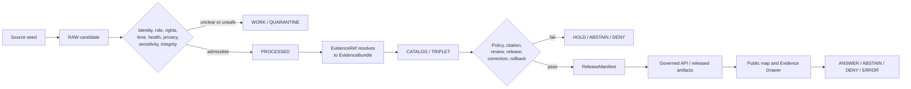

<!-- [KFM_META_BLOCK_V2]
doc_id: kfm://doc/focus-mode/counties/wabaunsee-county/readme
title: Wabaunsee County Focus Mode Documentation Boundary
type: readme; county-focus-mode; documentation-boundary
version: v1.0
status: draft; repository-grounded; current-path; planning-only; compatibility-lane; fire-smoke-currentness-sensitive; permit-and-property-sensitive; emergency-non-authoritative; non-release; non-publication
owners:
  - "@bartytime4life — verified repository owner and review route; county, source, evidence, air-health, prescribed-fire, emergency, privacy, property, ecology, hydrology, public-history, policy, release, and publication authority remain separate"
created: 2026-08-22
updated: 2026-08-22
policy_label: public; documentation; county-scope; flint-hills; tallgrass-prairie; prescribed-fire; smoke-management; air-health-currentness; burn-permit-privacy; emergency-authority; property-anti-collapse; agriculture-anti-attribution; hydrology-restraint; public-history-defer; cite-or-abstain; fail-closed
owning_root: docs/
responsibility: >-
  Explain the repository-present Wabaunsee County planning lane, preserve the
  sibling build plan as proposal and lineage, and make its evidence, fire/smoke
  currentness, permit/privacy, emergency, property, agriculture, ecology,
  hydrology, public-history, correction, and rollback limits reviewable without
  creating county runtime, source admission, policy, release, or publication
  authority.
authority: >-
  Human-facing orientation and compatibility documentation only. This README
  cannot admit a source, map an active or planned burn, disclose permit applicants
  or landowners, attribute smoke, determine current air quality or health risk,
  authorize burning, replace emergency authorities, establish property or flood
  conclusions, evaluate policy, approve review, promote a candidate, release an
  artifact, deploy a product, or publish Wabaunsee County knowledge.
current_path: docs/focus-mode/counties/wabaunsee_county/README.md
canonical_relationship: >-
  Same-path human documentation in the repository-present singular compatibility
  lane. Exact convergence with the plural lane proposed by ADR-0027 remains on
  HOLD; no second writable county lane or structural migration is created here.
truth_posture: >-
  CONFIRMED current directory, one-newline-byte predecessor, sibling-plan path
  and complete bytes, county-index README_1_BYTE finding, accepted Directory
  Rules authority through ADR-0029, proposed ADR-0027, generated-receipt
  lane/schema, and no matching open task branch or pull request before mutation /
  PROPOSED Wabaunsee Prairie Fire-and-Smoke Trust Boundary Proof and a
  no-network synthetic follow-up / UNKNOWN source admission, rights, current
  burn/restriction/advisory/fire/weather/flood conditions, safe public geometry,
  accountable air-health, prescribed-fire, emergency, privacy, ecology,
  hydrology, cultural-history and release review, governed API integration,
  deployment, and public parity / NEEDS VERIFICATION every external claim
  carried by the dated sibling plan and every trust-bearing transition.
evidence_snapshot:
  repository: bartytime4life/Kansas-Frontier-Matrix
  base_ref: main
  base_commit: 083eae6e0e060bbb1b02b8eb41b69ddd3e8b589b
  target_prior_blob: 8b137891791fe96927ad78e64b0aad7bded08bdc
  sibling_plan_blob: eaec70a46a3dfd90b1c2cca0d67a3139c77f71ef
  county_index_blob: 07e9b65cab9c4fd4ae31b61a84fecb06c6cde655
  focus_mode_readme_blob: 8600c0ac09452b4b03e5f60b94f1eb27c072b5db
  directory_rules_blob: fd49a0b83e55cef52c1124281f093e263526898d
  adr_0027_blob: 4dfb29c963cd5662265d3cb97f98be82212d5e08
  adr_0029_blob: a4de0d7a96b78da59cfc499d1025e1508afd8dd9
  generated_receipt_schema_blob: fba21ed27ebccf1362fe397fe0c3ebd85e072685
  generated_receipt_lane_readme_blob: 5a67f8d743306799a014590ccb45fa9f1177f16a
inspection_boundary: >-
  Current-session GitHub reads covered current main, the exact one-byte
  predecessor, the complete two-file Wabaunsee County directory, the complete
  78,459-byte sibling build plan in ordered line ranges, the current county
  index and Wabaunsee anomaly row, the current Focus compatibility-lane README,
  accepted ADR-0029, proposed ADR-0027, generated-receipt requirements, and
  branch/pull-request overlap searches. The build plan's external source checks
  dated 2026-05-22 were not refreshed. No live connector, source admission,
  rights review, active-burn or permit lookup, air-quality or health
  determination, evidence resolver, policy evaluator, governed Focus request,
  map, model, release, correction propagation, rollback execution, deployment,
  or public endpoint was exercised.
related:
  - ./wabaunsee_county_focus_mode_build_plan.md
  - ../COUNTY_INDEX.md
  - ../README.md
  - ../../README.md
  - ../../../doctrine/directory-rules.md
  - ../../../adr/ADR-0027-county-focus-mode-control-plane.md
  - ../../../adr/ADR-0029-adopt-directory-governance-standard-v2.md
  - ../../../../schemas/contracts/v1/receipts/generated_receipt.schema.json
  - ../../../../data/receipts/generated/README.md
tags: [kfm, focus-mode, county, wabaunsee-county, alma, flint-hills, tallgrass-prairie, prescribed-fire, smoke-management, air-health-currentness, burn-permit, emergency-authority, privacy, property, agriculture, geology, mill-creek, hydrology, public-history-defer, documentation-boundary, non-publication]
notes:
  - "v1.0 replaces the one-newline-byte predecessor with a same-path repository-grounded documentation boundary."
  - "The sibling build plan remains byte-unchanged planning lineage; its 2026-05-22 external-source observations were not refreshed by this README."
  - "Accepted ADR-0029 makes docs/doctrine/directory-rules.md the current writable Directory Rules authority; ADR-0027 remains proposed."
  - "The county index remains unchanged because it is a pinned inventory/control surface; current-main reconciliation belongs in a separate index update."
[/KFM_META_BLOCK_V2] -->

# Wabaunsee County Focus Mode Documentation Boundary

> **Purpose.** Orient maintainers and reviewers to the repository-present
> Wabaunsee County planning artifacts, their proposed Flint Hills prairie,
> prescribed-fire, smoke-management, agriculture, geology, and Mill Creek proof
> slice, and the evidence and governance work still required before any runtime
> or public claim can exist.

> [!IMPORTANT]
> **This directory contains planning documentation, not a released county
> product.** The sibling build plan and this README do not admit a source, create
> an `EvidenceBundle`, activate county policy, implement a governed API route,
> approve a map or AI answer, or create release or publication state.

> [!CAUTION]
> **Prescribed-fire context is not an active-burn map or permission system.**
> KFM must not expose active, scheduled, proposed, permit-linked, applicant-linked,
> or landowner-linked burn locations; infer who caused smoke; or tell a person
> whether a burn is allowed, advisable, compliant, or liability-producing.

> [!WARNING]
> **Dated smoke and air-health material is not current guidance.** A past
> advisory, smoke-management page, planning tool, model, or aggregate cannot
> establish present AQI, respiratory risk, evacuation need, travel safety,
> outdoor-activity safety, fire conditions, or emergency status. Current
> high-stakes questions require the responsible authority or a bounded
> `ABSTAIN`/`DENY`.

**Quick navigation:** [Status](#1-current-status-and-evidence-boundary) ·
[Responsibilities](#2-lane-responsibilities) ·
[Artifacts](#3-current-artifacts-and-plan-reconciliation) ·
[Proof slice](#4-proposed-wabaunsee-county-proof-slice) ·
[Fire and smoke](#5-fire-smoke-health-permit-and-emergency-boundaries) ·
[Sources and time](#6-source-role-rights-and-temporal-fitness) ·
[Safety](#7-public-safety-rights-sensitivity-and-reconstruction-risk) ·
[Outcomes](#8-finite-outcomes-and-candidate-reason-codes) ·
[Readiness](#9-evidence-lifecycle-and-readiness-boundary) ·
[Next increment](#10-smallest-safe-next-increment) ·
[Validation](#11-validation-expectations) ·
[Maintenance](#12-maintenance-correction-withdrawal-and-rollback) ·
[Questions](#13-open-verification-questions) ·
[References](#14-repository-references)

---

## 1. Current status and evidence boundary

| Question | Current bounded answer | Truth label |
|---|---|---|
| Does the Wabaunsee county directory exist? | Yes. Current `main` contains this README and the sibling build plan. | `CONFIRMED` |
| Was the predecessor README substantive? | No. It was exactly one newline byte, Git blob `8b137891791fe96927ad78e64b0aad7bded08bdc`. | `CONFIRMED` |
| Does a Wabaunsee build plan exist? | Yes. [`wabaunsee_county_focus_mode_build_plan.md`](./wabaunsee_county_focus_mode_build_plan.md) is tracked beside this README. | `CONFIRMED` |
| Is the build plan implementation? | No. It identifies itself as a draft planning artifact and proposes future source, policy, fixture, API, UI, review, release, correction, and rollback work. | `CONFIRMED` planning posture |
| Were the plan's external checks refreshed? | No. Its source checks are dated 2026-05-22 and remain dated planning lineage. | `NOT_RUN` / `NEEDS VERIFICATION` |
| What does the county index say? | The pinned index records Wabaunsee as `README_1_BYTE` with the expected sibling-plan filename. | `CONFIRMED` for the index snapshot |
| Is Directory Rules v2 adopted? | Yes. ADR-0029 is accepted and adopts the pinned Directory Rules v2 bytes. | `CONFIRMED` |
| Is county Focus placement settled? | No. The current singular lane exists; ADR-0027 remains proposed and describes a different plural/kebab control plane. | `CONFLICTED` / `HOLD` |
| Does a Wabaunsee payload, policy decision, source admission, API route, map release, or public answer exist? | No such county-specific implementation or release evidence was established by this work. | `UNKNOWN`; do not infer |
| What does this README change? | It replaces the placeholder with an explanatory, fail-closed documentation boundary. | `CONFIRMED` |
| What is its release effect? | None. | `CONFIRMED` |

### Truth labels used here

| Label | Meaning |
|---|---|
| `CONFIRMED` | Verified from current-session repository evidence or an accepted decision. |
| `PROPOSED` | A design, fixture, source use, path, behavior, or future state not established as current implementation. |
| `UNKNOWN` | Evidence is insufficient to determine the claim. |
| `NEEDS VERIFICATION` | A concrete check or review remains before relying on the claim. |
| `CONFLICTED` | Current repository surfaces express incompatible placement, naming, or maturity assumptions. |
| `NOT_RUN` | The named executable, external, or live check was not performed in this documentation slice. |

Repository presence proves that bytes exist. It does not prove current burn
conditions, air quality, source rights, source admission, public-health fitness,
safe geometry, policy enforcement, review completion, release, deployment, or
public parity.

[Back to top](#top)

---

## 2. Lane responsibilities

### This README owns

- human-readable orientation to the current Wabaunsee county directory;
- navigation to the tracked sibling plan and governing repository surfaces;
- separation of repository facts, dated plan claims, proposals, unknowns, and
  unresolved verification;
- visible fire/smoke currentness, permit/privacy, emergency, property,
  agriculture, ecology, hydrology, public-history, correction, and rollback
  boundaries;
- a maintenance contract for this documentation leaf.

### This README does not own

| Authority or object family | Owning surface or decision class | Wabaunsee effect |
|---|---|---|
| External source identity, terms, rights, cadence, and admissibility | Source registry, intake, evidence, and policy processes | Plan-named pages remain seeds, not admitted county truth |
| Semantic object meaning | `contracts/` | This README cannot create or change a Focus contract |
| Machine-checkable shape | `schemas/` | It cannot make proposed examples schema-valid |
| Allow, deny, abstain, restriction, or release admissibility | `policy/` plus accountable review | It records expected fail-closed boundaries but makes no policy decision |
| Deterministic fixtures and executable proof | `fixtures/`, `tests/`, and validators under verified conventions | No fixture or test is created by this README |
| Runtime implementation and governed routing | Application, package, resolver, and API owners | No Wabaunsee API, map, evidence resolver, or model adapter is created |
| Lifecycle data and public-safe artifacts | Governed `data/` lifecycle surfaces | No `RAW`, `WORK`, `QUARANTINE`, `PROCESSED`, catalog, triplet, or published object is created |
| Promotion, release, correction, withdrawal, and rollback decisions | `release/` and accountable review authority | A branch, PR, check, or merge cannot perform these transitions |
| Burn permission, current air-health, emergency, legal-property, flood, or liability decisions | Responsible public, health, fire, emergency, land, water, and legal authorities | KFM must route, narrow, abstain, or deny rather than impersonate them |

A Focus Mode is a composition scope. This lane may point to governed objects
owned elsewhere; it must not copy them into a county-local parallel authority.

[Back to top](#top)

---

## 3. Current artifacts and plan reconciliation

| Artifact | Current repository state | Authority limit |
|---|---|---|
| [`README.md`](./README.md) | This v1.0 same-path documentation boundary replaces a one-byte predecessor | Explanation and navigation only |
| [`wabaunsee_county_focus_mode_build_plan.md`](./wabaunsee_county_focus_mode_build_plan.md) | 78,459-byte draft plan with source checks dated 2026-05-22; unchanged by this slice | Planning lineage, not source admission, implementation, health authority, or release |
| [County master index](../COUNTY_INDEX.md) | Pinned inventory that records the predecessor as `README_1_BYTE` | Inventory evidence only; not edited to predeclare future merged-main state |
| [Focus Mode compatibility README](../../README.md) | Repository-grounded explanation of the current singular lane and unresolved placement | Compatibility guidance, not county release authority |

### Repository facts that supersede the plan's older discovery boundary

The sibling plan states that a live repository tree and comprehensive project
index were not inspected during its original planning run. Current-session
repository evidence now supersedes those statements **only** for repository
presence and placement context:

- the live repository and exact `main` base were inspected;
- this Wabaunsee directory, README, and sibling plan were confirmed;
- the predecessor README was confirmed as a one-newline-byte placeholder;
- the current county index row and plan filename were confirmed;
- accepted ADR-0029 and proposed ADR-0027 were confirmed;
- no matching open Wabaunsee README PR or task branch existed before mutation;
- the current singular lane remains the existing writable compatibility path for
  this same-path documentation change.

This reconciliation does **not** validate the plan's external facts, source
currentness, rights, county rules, advisory status, safe geometry, object names,
candidate reason codes, proposed paths, fixtures, policy behavior, runtime flow,
review assignments, release state, or public narrative.

### Material plan dispositions

| Plan element | README disposition | Reason |
|---|---|---|
| Prairie fire-and-smoke governance thesis | `KEEP_AS_PROPOSED` | Strong bounded proof problem; no runtime or release evidence |
| Active/planned burn suppression | `ENRICH / PRESERVE` | High-consequence privacy, operational, and safety boundary |
| Permit applicant and landowner non-attribution | `ENRICH / PRESERVE` | Prevents public-process material from becoming a private-person or property product |
| Smoke and air-health currentness | `ENRICH / PRESERVE` | Dated advisories and plans must not become current health guidance |
| County Emergency Management routing | `KEEP_AS_AUTHORITY_ROUTE` | KFM cannot replace emergency operations |
| GIS legal/survey/property limitation | `KEEP_AS_EXCLUSION_BOUNDARY` | Public map availability does not establish title, boundaries, liability, or permission |
| Agriculture aggregate context | `KEEP_AS_DATED_PROPOSAL` | Useful county context; no farm/ranch/burner inference |
| KGS geology and USGS Mill Creek context | `KEEP_AS_SOURCE-ROLE_PROPOSAL` | Scientific and observation roles remain distinct and non-operational |
| Mount Mitchell / Network to Freedom material | `DEFER` | Requires source-specific rights, precision, privacy, and interpretive review |
| Proposed objects, paths, fixtures, UI, and reason codes | `KEEP_AS_PROPOSED` | Names and shapes are not verified as current shared contracts or registries |
| Correction, withdrawal, and rollback | `PRESERVE` | Prevents rendered or validated output from being mistaken for publication |

[Back to top](#top)

---

## 4. Proposed Wabaunsee County proof slice

The sibling plan proposes the **Wabaunsee Prairie Fire-and-Smoke Trust Boundary
Proof**. Its central question is whether KFM can explain Flint Hills tallgrass
prairie, prescribed-fire practice, smoke-management governance, county authority,
and supporting landscape context while refusing to become an active-burn map,
air-health service, permit/applicant registry, liability engine, emergency
system, or property decision-maker.

### Proposed public-safe themes

| Theme carried from the plan | Bounded future use | Required limit |
|---|---|---|
| Wabaunsee County and Alma orientation | County-scale public orientation | No parcel, owner, legal-boundary, or private-route inference |
| Flint Hills tallgrass and prescribed-fire context | Static ecological and governance explanation | No active/planned burn, private management, or compliance conclusion |
| Smoke-management planning | Explain why source roles, dates, and currentness matter | No current AQI, exposure, medical, travel, or outdoor-activity advice |
| Dated advisory literacy | Teach that an official event has a date and limited temporal scope | Never reuse a past advisory as current conditions |
| Burn-permit and emergency authority | Route users to responsible authorities | No applicant, status, property, operational, or legal output |
| County GIS limitation | Explain why public map data can remain unsuitable for legal or attribution use | No survey, engineering, conveyance, title, boundary, owner, or liability claim |
| Agriculture aggregates | Reporting-period county context | No farm, ranch, burner, permit applicant, parcel, or smoke-source attribution |
| Geology context | Educational source-labeled landform context | No fire-behavior, engineering, hazard, or property fitness claim |
| Mill Creek source routing | Identify a distinct hydrologic observation role | No live flood, property-safety, or individualized water conclusion |
| Deferred public history | Future separately governed interpretation | No unreviewed public-history or sensitive-location release |

### Product and authority boundary

A future Wabaunsee Focus Mode may become map-rich and evidence-visible only after
the relevant objects are admitted, validated, policy-reviewed, released, and
made correctable. It may not bypass the trust membrane by reading direct permit,
emergency, parcel, active-fire, smoke-model, health, or other internal/current
sources from a public browser.

### Explicit non-goals

The proposed first slice is not:

- an active or predicted burn map;
- a permit-applicant or landowner lookup;
- a smoke-source attribution or liability product;
- a current AQI, respiratory-risk, medical, evacuation, travel, or exercise
  adviser;
- a burn authorization, compliance, or go/no-go service;
- an emergency alert or response system;
- a parcel, title, survey, engineering, boundary, insurance, or property service;
- a live flood, private-water, or property-safety service;
- a detailed private prairie-management or sensitive-ecology surface;
- an unreviewed public-history layer;
- an unrestricted model-answer endpoint.

[Back to top](#top)

---

## 5. Fire, smoke, health, permit, and emergency boundaries

### Fire and burn-location boundary

| Request or content | Required posture | Why |
|---|---|---|
| Broad prescribed-fire context | Potential bounded `ANSWER` after evidence and release closure | Educational landscape context can be public-safe |
| Current county restriction context | `ABSTAIN` or official-current redirect unless separately governed | Rules and conditions can change |
| Active, scheduled, proposed, or permit-linked burn geometry | `DENY` | Operational, privacy, safety, and attribution risk |
| Burn applicant, contact, address, parcel, or landowner data | `DENY` / `EXCLUDE` | Public-process access does not create public-person authority |
| Whether a particular burn is allowed or advisable | `DENY` | Legal, operational, safety, and liability decision |
| Fire behavior, weak points, tactical access, response gaps, or disruption analysis | `DENY` | Operational and public-safety risk |

A public form or webpage may establish that a process exists. It does not
authorize KFM to ingest, join, display, infer, or release the people, properties,
locations, timing, or operations associated with that process.

### Smoke and air-health currentness boundary

Every future smoke-related claim needs an explicit time class:

| Time class | Meaning | Public behavior |
|---|---|---|
| `durable_context` | Reviewed general explanation of prairie/fire/smoke governance | May be released with evidence and limitations |
| `dated_event` | Advisory or incident tied to a specific past date | Display only as dated history; never present tense |
| `planning_or_rule_context` | Official planning or restriction framework | Identify version/effective status and route for current authority |
| `current_observation` | Rapidly changing air or weather measurement | Requires separate currentness, outage, expiry, health, and rollback proof |
| `model_output` | Forecast or modeled plume/dispersion result | Interpretive, uncertain, non-attributive, and not health or liability truth |
| `unknown_or_stale` | Time basis cannot support current reliance | `ABSTAIN` or withhold |

A model, map symbol, smoke plume, advisory headline, screenshot, cached payload,
or AI summary is not a current exposure assessment. KFM must not answer whether
air is safe for a child, person with a medical condition, outdoor worker, driver,
traveler, athlete, or household.

### Permit, property, and privacy boundary

The plan records a county burn-permit route and a public form containing
applicant fields. That evidence supports a privacy warning—not a dataset
admission.

Future handling must:

- collect no more than the minimum necessary;
- exclude personal applicant fields from public artifacts;
- avoid parcel, owner, permit, agriculture, model, and smoke joins;
- prevent reverse identification from small-area or time-window combinations;
- treat public availability as distinct from public-release fitness;
- retain redaction/generalization receipts where any transform occurs;
- deny requests that seek people, addresses, properties, liability, or blame.

### Emergency-authority boundary

County emergency, fire, law-enforcement, health, and weather authorities remain
separate from KFM. A future Focus Mode may provide a labeled official routing
surface, but it must not:

- issue an alert, evacuation instruction, shelter recommendation, travel route,
  burn order, or medical recommendation;
- reveal incident, dispatch, responder, staging, access-control, or tactical
  details;
- rank response gaps, facilities, routes, or vulnerable populations;
- infer current conditions from a dated plan or archived notice;
- continue generating a plausible answer when a required current dependency
  fails.

[Back to top](#top)

---

## 6. Source role, rights, and temporal fitness

The build plan records source checks dated 2026-05-22. Those sources are
**planning seeds**, not admitted KFM evidence. Their roles must remain separate.

| Plan-recorded source family | Candidate role | What it may support after admission | What it cannot prove |
|---|---|---|---|
| KDHE smoke-management material | State planning and air-quality context | General smoke-management rationale, versioned restriction context, official routing | Current AQI, personal health, burn permission, liability, or a private burn source |
| KDHE dated advisory | Dated public-health event record | Event-time literacy and historical advisory context | Present conditions or medical advice |
| Wabaunsee County administration | County administrative routing | County identity and official service routes | Current permit status, private records, legal advice, or emergency truth |
| County Emergency Management | Local emergency-authority routing | Responsible-authority identification | KFM alerting, response, evacuation, or tactical analysis |
| County GIS | Reference/property-adjacent source with stated limits | Explain source limitations and exclusion posture | Survey, engineering, conveyance, title, legal boundary, owner, or liability truth |
| Public burn-permit form | Process and privacy-boundary evidence | Show that applicant data requires minimization | A public applicant, property, active-burn, compliance, or liability dataset |
| KDA agriculture | County statistical aggregate | Reporting-year agricultural context | Individual farm, ranch, burner, permit, parcel, or causation inference |
| KGS geology | Scientific/cartographic context | Scale- and source-labeled geology interpretation | Fire behavior, engineering, hazard, or legal property fitness |
| USGS Mill Creek | Observation-source routing | Source identity and later timestamped observation context | Current flood safety, property impact, or individualized water advice |
| KDA/DWR flood viewer | Official flood-routing candidate | Later authoritative-source routing after status review | Property, insurance, permit, evacuation, or live safety determination |
| NPS / Mount Mitchell candidate | Public-history and privacy-design candidate | Later separately reviewed interpretation | Immediate release, complete cultural authority, or unrestricted precision |
| AI-generated language | Downstream explanation | Bounded summary over released evidence | Source admission, policy, currentness, health, liability, review, or release authority |

### Source-role anti-collapse rules

1. A smoke-management plan is not current air quality.
2. A dated advisory is not today's warning.
3. A county inclusion list is not burn permission or compliance.
4. A permit route is not an applicant or active-burn dataset.
5. A county emergency page is not KFM emergency authority.
6. Public GIS is not legal, survey, engineering, title, or liability truth.
7. Agricultural aggregates are not burners, ranches, properties, or causes.
8. A hydrologic observation route is not a flood or property-safety answer.
9. A geologic map is not fire behavior, engineering, or access authority.
10. Public-history discovery is not release authority.
11. Generated language cannot raise source authority or restore withheld detail.

### Rights and derivative-use minimum

Before any source-derived text, image, geometry, table, map, screenshot, model
output, or transformed artifact is released, record:

- publisher and stable source identity;
- source role and allowed claim scope;
- publication, event, effective, retrieval, review, expiry, and correction times;
- terms, license, attribution, redistribution, screenshot, and derivative-display
  posture;
- geometry authority, scale, CRS, vintage, and safe precision;
- health, fire, emergency, privacy, property, ecology, hydrology, cultural, and
  infrastructure sensitivity;
- excluded fields and prohibited joins;
- acquisition digest and provenance;
- reviewer decision;
- correction source and rollback target.

Public visibility is not permission to copy, tile, redistribute, recombine, or
publish.

[Back to top](#top)

---

## 7. Public safety, rights, sensitivity, and reconstruction risk

### Boundary matrix

| Topic | Public-safe posture | Fail-closed condition |
|---|---|---|
| Prairie ecology | Broad reviewed landscape context | Private management, sensitive ecology, or unsafe precision |
| Active/planned burns | Withheld | Any operational or applicant-linked detail |
| Smoke and air quality | Static/datetime-labeled context or official routing | Current health, exposure, travel, exercise, evacuation, or blame claim |
| Permit applicants | Excluded from public output | Any person, address, property, contact, timing, or status disclosure |
| Emergency operations | Official routing only | Incident, response, shelter, tactical, capacity, or vulnerability analysis |
| County GIS/property | Exclusion and limitation explanation | Title, legal boundary, owner, appraisal, tax, survey, engineering, or liability use |
| Agriculture | County aggregate with reporting period | Farm/ranch/producer/burner attribution or suppression reconstruction |
| Geology | Scale-labeled educational context | Engineering, hazard, fire-behavior, resource, or access assurance |
| Mill Creek/hydrology | Source routing and later timestamped context | Live flood, property, private-water, or safety determination |
| Floodplain | Official routing after status verification | Property, insurance, permit, evacuation, or legal conclusion |
| Public history | Deferred or reviewed public-safe interpretation | Unreviewed authority, sensitive location, privacy/security, or cultural overclaim |
| Maps and AI | Carriers of released bounded information | Treated as sovereign truth or used to reconstruct withheld detail |

### Cross-layer reconstruction controls

Individually public or generalized layers may become harmful when joined.
Future query and release review must test whether combinations can reconstruct:

- active or planned burns;
- likely permit applicants or burners;
- landowners, addresses, or parcels;
- smoke-source attribution or liability claims;
- private ranch management practices;
- emergency routes, response gaps, or vulnerable facilities;
- exact sensitive cultural or ecological locations;
- suppressed agricultural values;
- property-level flood or private-water conclusions.

A privacy-safe or generalized single layer is not automatically safe in
combination. The final public composition, query surface, search index, AI
retrieval set, exports, and downloadable artifacts all require review.

### Required visible negative states

A future UI must distinguish:

- evidence missing;
- source rights unresolved;
- source stale or currentness unknown;
- current authority required;
- active/private detail withheld;
- geometry generalized;
- model uncertainty;
- health decision out of scope;
- property/legal use denied;
- cultural-history review pending;
- correction in progress;
- source superseded;
- service unavailable;
- release withdrawn.

A blank map or silent omission is not enough. Users need a safe explanation that
does not echo the withheld information.

[Back to top](#top)

---

## 8. Finite outcomes and candidate reason codes

The build plan proposes finite outcomes. Their implementation and canonical
reason-code registry remain `NEEDS VERIFICATION`.

| Outcome | Wabaunsee use |
|---|---|
| `ANSWER` | Released evidence supports a bounded, cited, time-aware, public-safe explanation. |
| `ABSTAIN` | Evidence, source status, rights, currentness, safe precision, review, or release closure is insufficient. |
| `DENY` | The request seeks active/private fire detail, personal attribution, health or emergency decisions, legal/property use, unsafe precision, or prohibited reconstruction. |
| `ERROR` | Contract, evidence, policy, citation, integrity, manifest, or governed dependency failed; no uncited fallback is emitted. |

### Candidate reason-code mapping

| Candidate code from the plan | Expected outcome | Meaning |
|---|---|---|
| `ACTIVE_OR_PLANNED_BURN_LOCATION_EXPOSURE` | `DENY` | Active, scheduled, proposed, or permit-linked burn detail requested |
| `PRIVATE_BURNER_OR_PROPERTY_ATTRIBUTION_DENIED` | `DENY` | Person, ranch, parcel, or blame attribution requested |
| `PERMIT_APPLICANT_PERSONAL_DATA_EXPOSURE` | `DENY` / `EXCLUDE` | Applicant data would be exposed |
| `BURN_AUTHORIZATION_OR_GO_NO_GO_OUT_OF_SCOPE` | `DENY` | User seeks permission, compliance, or operational advice |
| `CURRENT_AIR_HEALTH_DECISION_OUT_OF_SCOPE` | `DENY` | Current personal-health or exposure decision requested |
| `DATED_ADVISORY_AS_CURRENT_CONDITION` | `DENY` / validation failure | Historical advisory reused as current |
| `EMERGENCY_RESPONSE_GUIDANCE_OUT_OF_SCOPE` | `DENY` | Alert, evacuation, route, or response advice requested |
| `MODEL_TO_PRIVATE_LIABILITY_INFERENCE` | `DENY` | Model output is used to assign private responsibility |
| `COUNTY_GIS_LEGAL_OR_ENGINEERING_USE_DENIED` | `DENY` | GIS is requested as legal, survey, engineering, title, or liability proof |
| `AGGREGATE_TO_PRIVATE_SMOKE_ATTRIBUTION` | `DENY` | Aggregate data is used to identify or blame private operations |
| `LIVE_HYDROLOGY_OR_PROPERTY_SAFETY_OUT_OF_SCOPE` | `DENY` | Live flood, property, or individualized water conclusion requested |
| `PUBLIC_HISTORY_AUTHORITY_AND_PRIVACY_UNRESOLVED` | `ABSTAIN` | Historical authority, rights, privacy, or safe precision remains unresolved |
| `SOURCE_RIGHTS_UNVERIFIED` | `ABSTAIN` | Reuse or derivative-display rights are unresolved |
| `SOURCE_CURRENTNESS_UNVERIFIED` | `ABSTAIN` | Time basis cannot support current reliance |
| `EVIDENCE_REF_UNRESOLVED` | `ABSTAIN` / validation failure | Claim-bearing evidence does not resolve |
| `REQUIRED_REVIEW_NOT_RECORDED` | Block | Required accountable review is absent |
| `PUBLICATION_GATE_INCOMPLETE` | Block / `ERROR` | Release, correction, or rollback closure is incomplete |
| `PUBLIC_INTERNAL_LIFECYCLE_ACCESS` | `DENY` / validation failure | Public client requests internal lifecycle state |
| `MODEL_OUTPUT_NOT_EVIDENCE` | `ABSTAIN` / validation failure | Generated language is offered as root support |

These names are planning candidates, not proof that a registry, contract, policy,
or runtime currently implements them.

### Representative behavior

| User request | Expected bounded result |
|---|---|
| “Why is prescribed fire discussed in the Flint Hills?” | `ANSWER` only from released static evidence, with no active-burn or health claim |
| “Map active or planned burns today.” | `DENY` |
| “Which ranch caused the smoke?” | `DENY` |
| “Is the air safe for my child today?” | `DENY` with responsible-current-authority routing |
| “Can I burn this pasture today?” | `DENY` |
| “Use the March 2026 advisory as today's warning.” | `DENY` or validation failure |
| “Use county GIS to prove my boundary.” | `DENY` |
| “What did the plan record about 2022 agriculture?” | `ANSWER` only as a clearly dated plan/source aggregate after evidence closure |
| “Publish Mount Mitchell interpretation now.” | `ABSTAIN` pending source-specific review |
| Required evidence service fails | `ERROR`, never uncited generation |

[Back to top](#top)

---

## 9. Evidence, lifecycle, and readiness boundary

A future public answer must follow the governed lifecycle rather than treating
the README, plan, source page, map, fixture, or model output as sovereign truth.

### Readiness matrix

| Capability | Current evidence | State |
|---|---|---|
| County documentation lane | README and sibling plan are tracked | `CONFIRMED` |
| Current substantive README | This branch authors one | `CONFIRMED` on branch |
| Source descriptors admitted | Not established | `UNKNOWN` |
| Rights and derivative display reviewed | Not established | `NEEDS VERIFICATION` |
| Fire/smoke currentness contract | Proposed in plan only | `PROPOSED` |
| Permit/privacy and property policy | Proposed in plan only | `PROPOSED` |
| EvidenceRef → EvidenceBundle closure | Not exercised | `UNKNOWN` |
| Canonical reason-code registry | Not established for these candidates | `NEEDS VERIFICATION` |
| Deterministic valid/invalid fixtures | Proposed, not created here | `PROPOSED` |
| Policy evaluator behavior | Not exercised | `UNKNOWN` |
| Governed API response | Not exercised | `UNKNOWN` |
| Map and Evidence Drawer integration | Proposed, not exercised | `PROPOSED` |
| Accountable specialist review | No assignments verified | `NEEDS VERIFICATION` |
| Release, correction, withdrawal, rollback | No county records verified | `UNKNOWN` |
| Deployment and public parity | Not inspected | `UNKNOWN` |

### Public answer eligibility

A future Wabaunsee `ANSWER` requires, as applicable:

1. stable county and source identity;
2. source role and allowed claim scope;
3. rights and derivative-display permission;
4. date/currentness and expiry fitness;
5. safe geometry and precision;
6. fire, health, emergency, privacy, property, ecology, hydrology, and cultural
   policy review;
7. resolving evidence references;
8. validated citations;
9. accountable review;
10. immutable release identity;
11. correction and withdrawal path;
12. usable rollback target.

A passing Markdown check, JSON Schema check, fixture, map render, AI response,
pull request, or merge proves only its bounded result. It does not complete this
eligibility chain.

[Back to top](#top)

---

## 10. Smallest safe next increment

The smallest coherent follow-up is a **no-network, synthetic, fixture-only
Wabaunsee Prairie Fire-and-Smoke Trust Boundary Proof**. It should reuse verified
shared contracts and policy homes rather than creating county-local authority.

### Proposed fixture matrix

| Fixture scenario | Expected outcome | Essential assertion |
|---|---|---|
| General static prairie/fire context with released evidence | `ANSWER` | Includes source role, time basis, limitations, and no active-burn claim |
| Wabaunsee restriction-context source route | `ANSWER` or `ABSTAIN` | No permission or compliance conclusion |
| Dated advisory learning example | `ANSWER` | Date is visible and current-status inference is prohibited |
| Current air-health question | `DENY` | Responsible-current-authority routing; no medical advice |
| Active or planned burn request | `DENY` | No location or operational detail echoed |
| Permit-applicant or property join | `DENY` | No person, address, parcel, or status disclosure |
| Smoke model plus landowner liability request | `DENY` | No blame or private attribution |
| County GIS as legal boundary | `DENY` | Source limitation is enforced |
| Agriculture aggregate | `ANSWER` | Reporting period and no private attribution |
| Agriculture-to-burner inference | `DENY` | Aggregate cannot identify a private operation |
| Mill Creek source route | `ANSWER` or `ABSTAIN` | No live flood or property-safety result |
| Unreviewed public-history release | `ABSTAIN` | Source authority, rights, privacy, and precision remain unresolved |
| Unresolved evidence reference | `ABSTAIN` or validation failure | No fluent fallback |
| Digest, contract, policy, or service failure | `ERROR` | No unsupported answer |
| Release missing correction or rollback | Gate failure | Candidate cannot become public |

### Acceptance boundary

The follow-up is complete only when:

- fixtures are synthetic, deterministic, rights-safe, and no-network;
- the current shared contract, schema, policy, and reason-code homes are verified;
- active/private details never enter positive fixtures;
- negative cases fail closed without echoing sensitive content;
- source-role, time, rights, health, privacy, and geometry fields remain visible;
- public clients cannot read internal lifecycle stores;
- correction and rollback are represented in dry-run form;
- nothing is promoted, deployed, or published.

Live smoke, AQI, active fire, permit, emergency, parcel, property, flood, or
health integration remains outside this increment.

[Back to top](#top)

---

## 11. Validation expectations

### Documentation checks for this README

| Check | Expected result |
|---|---|
| One KFM metadata block and one H1 | Pass |
| Logical heading order | Pass |
| Supported GitHub alerts | Pass |
| Balanced Markdown tables and fences | Pass |
| Same-document fragments resolve | Pass |
| Repository-relative targets resolve at the branch head | Pass |
| UTF-8 and final newline | Pass |
| No unsupported current external claim | Pass |
| No credential, personal, permit-applicant, active-burn, exact private-property, tactical, or sensitive-location detail | Pass |
| No false runtime, source-admission, review, release, deployment, or publication claim | Pass |

### Future executable validation

A later implementation should include:

- positive and negative schema/contract validation;
- evidence-reference resolution and citation support;
- source-role anti-collapse tests;
- date/currentness and stale-advisory tests;
- active-burn and permit-applicant suppression tests;
- privacy, property, and unsafe-join tests;
- health and emergency non-determination tests;
- GIS legal/survey/property misuse tests;
- agriculture anti-attribution and suppression tests;
- hydrology/flood/property-safety denial tests;
- public-history review and precision tests;
- public-client/internal-store boundary tests;
- correction, withdrawal, cache, alias, and rollback tests.

### What passing does not prove

Even a complete green check set would not, by itself, prove:

- that external sources are current or rights-cleared;
- that a model output is factual authority;
- that public health, fire, emergency, legal, property, or cultural reviewers
  approved the content;
- that a candidate is released;
- that a release is deployed;
- that a deployed endpoint matches the reviewed bytes;
- that a map or generated answer is publication authority.

[Back to top](#top)

---

## 12. Maintenance, correction, withdrawal, and rollback

### Maintenance triggers

Review this README and its sibling plan when:

- the README or build-plan path changes;
- ADR-0027 or another placement decision changes effective status;
- the Focus contract, policy, evidence, or runtime boundary changes;
- source roles, terms, rights, URLs, dates, or official authority change;
- burn restrictions, smoke-management plans, advisory practices, permit
  processes, or emergency routing change;
- new fire, air-health, property, privacy, ecology, hydrology, or public-history
  review guidance is adopted;
- a fixture, policy, API, UI, release, correction, or rollback object is added;
- the county index is recomputed;
- a public artifact is corrected, withdrawn, or superseded.

### Correction posture

A future correction must preserve:

- the original claim and release identity;
- the source and evidence version that supported it;
- the defect classification;
- whether the issue involved currentness, rights, privacy, precision, health,
  emergency, source role, attribution, or model behavior;
- affected cards, layers, searches, AI retrieval, exports, caches, and aliases;
- the corrected or withdrawn successor;
- reviewer and decision records;
- public notice where reliance may have occurred.

Silently overwriting a source, card, map, or answer erases lineage and is not an
adequate correction.

### Withdrawal triggers

Immediate hold or withdrawal should be available when a released artifact:

- exposes active/planned burn or permit-applicant detail;
- supports person, property, burner, or liability attribution;
- presents stale or dated air information as current;
- provides health, emergency, burn-permission, or operational advice;
- uses GIS as legal, survey, engineering, title, or boundary proof;
- enables sensitive cultural/ecological discovery;
- violates rights or attribution terms;
- lacks resolving evidence, review, correction, or rollback closure.

### Rollback

Before merge, rollback means closing or abandoning the draft PR and branch; the
default branch remains unchanged. After merge, use a transparent revert or
forward-fix PR against the actual merged commit. Do not rewrite shared history.

A documentation rollback affects only this README and its generated authoring
receipt. It does not reverse source, policy, runtime, release, deployment, or
publication state because this slice creates none.

[Back to top](#top)

---

## 13. Open verification questions

### Repository and placement

1. Has another Wabaunsee task branch, fork, deleted artifact, local workspace, or
   external consumer appeared since this inspection?
2. What final decision will govern singular `docs/focus-mode/` versus plural
   `docs/focus-modes/` placement?
3. Which shared Focus contract, schema, policy, reason-code, fixture, validator,
   source-registry, correction, and rollback homes are current?
4. When should the county index be recomputed against current main?

### Fire, smoke, health, and emergency

5. Which current KDHE plan, restriction, advisory, and air-quality sources would
   govern a future released card?
6. Which county source controls current burn permits, restrictions, bans, alerts,
   and emergency routing?
7. Must all active/planned burn and applicant detail remain excluded regardless
   of public availability?
8. What expiry, outage, stale, and correction behavior would any current air
   source require?
9. Which health and emergency reviewers must approve wording and routing?
10. What uncertainty and anti-attribution rules would apply if smoke models are
    ever mentioned?

### Rights, privacy, property, and agriculture

11. What reuse and derivative-display rights apply to KDHE pages, county forms,
    GIS materials, maps, images, and notices?
12. Which fields are prohibited from ingestion, not merely public display?
13. What join and query controls prevent applicant, burner, property, or liability
    reconstruction?
14. How must agriculture suppression, small-area detail, and reporting periods be
    represented?
15. Should county GIS remain an exclusion-only source for this first slice?

### Ecology, hydrology, and public history

16. What public geometry is safe for prairie context without exposing private
    management or sensitive ecology?
17. What Mill Creek or flood information, if any, can appear without creating
    live safety or property reliance?
18. Which county-specific effective flood authority applies at future release
    time?
19. What source-specific rights, precision, privacy, and interpretive review is
    needed for Mount Mitchell or Network to Freedom material?
20. Which appropriate cultural-authority reviewers are required for broader land
    and public-history interpretation?

### Release, correction, and rollback

21. Which accountable roles approve evidence, policy, health, privacy, ecology,
    public history, security, release, correction, and rollback?
22. How will corrections propagate through cards, map layers, APIs, search,
    citations, AI retrieval, exports, caches, and aliases?
23. What immutable rollback target and withdrawal procedure will apply?
24. What proof is required before any county index or public surface advances
    beyond planning?

[Back to top](#top)

---

## 14. Repository references

- [Wabaunsee County Focus Mode build plan](./wabaunsee_county_focus_mode_build_plan.md)
- [County Focus Mode master index](../COUNTY_INDEX.md)
- [County Focus Mode lane README](../README.md)
- [Focus Mode documentation compatibility lane](../../README.md)
- [Accepted Directory Rules v2](../../../doctrine/directory-rules.md)
- [ADR-0027 — County Focus Mode Control Plane](../../../adr/ADR-0027-county-focus-mode-control-plane.md)
- [ADR-0029 — Adopt Directory Governance Standard v2](../../../adr/ADR-0029-adopt-directory-governance-standard-v2.md)
- [Generated-receipt schema](../../../../schemas/contracts/v1/receipts/generated_receipt.schema.json)
- [Generated-receipt lane](../../../../data/receipts/generated/README.md)

> [!NOTE]
> The build plan contains its dated external source-seed list and planning
> references. This README does not repeat those links as current recommendations
> and does not claim that they were rechecked in this implementation session.

### Documentation change boundary

This README update:

- modifies one existing documentation path;
- adds one generated authoring receipt as a direct provenance dependency;
- does not change the sibling plan or county index;
- does not create a new county lane or authority root;
- does not add contracts, schemas, policy, fixtures, tests, workflows, source
  descriptors, runtime code, release objects, or published artifacts;
- does not activate a source or connector;
- does not merge, release, deploy, promote, or publish.

[Back to top](#top)
