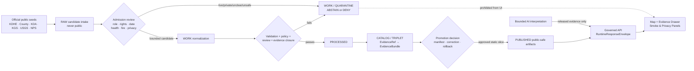
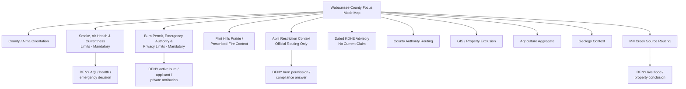
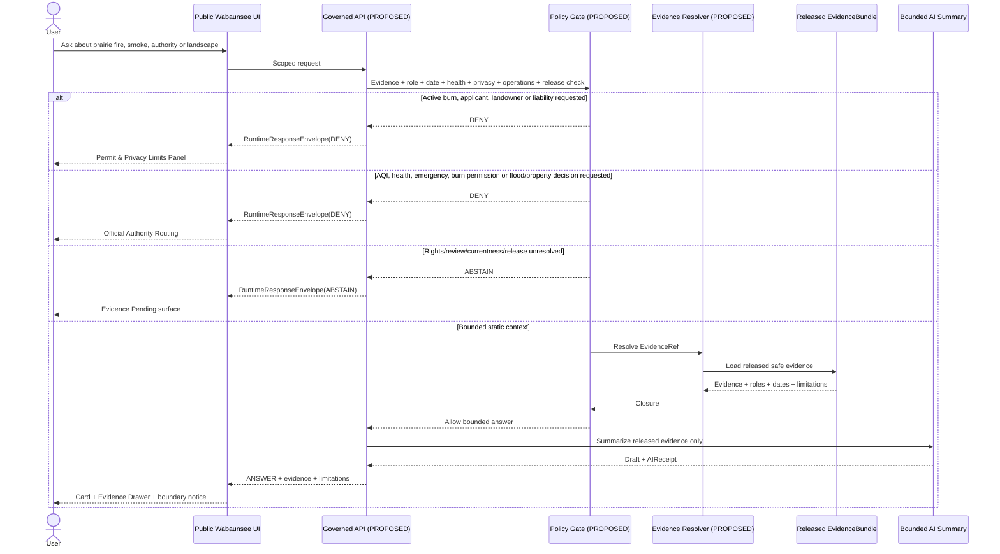
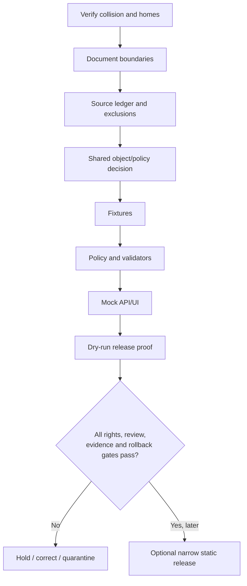

<!-- KFM_META_BLOCK_V2
doc_id: NEEDS_VERIFICATION
title: Wabaunsee County Focus Mode Build Plan
type: standard
version: v1
status: draft
owners: [NEEDS_VERIFICATION]
created: 2026-05-22
updated: 2026-05-22
policy_label: public_draft
repository_path: NEEDS_VERIFICATION - candidate only: docs/focus-modes/wabaunsee-county/wabaunsee_county_focus_mode_build_plan.md
schema_contract_policy_homes: NEEDS_VERIFICATION - inspect the live repository, accepted ADRs, root README contracts and shared authority homes before adding schema, contract, policy, fixture, registry, proof, receipt, release or published-artifact paths
review_assignments: NEEDS_VERIFICATION - air-health/currentness, prescribed-fire/local-authority, emergency, privacy/property, prairie/ecology, hydrology/flood, public-history, rights, documentation and release review duties
correction_path: NEEDS_VERIFICATION
rollback_path: NEEDS_VERIFICATION
release_status: NEEDS_VERIFICATION - planning artifact only; no implementation, promotion or publication claimed
related:
  - Directory Rules.pdf (consulted in this run)
  - KFM county Focus Mode completed-county register supplied in the series prompt
  - Harvey, Allen, Pawnee, Marion and Neosho County artifacts generated in this visible continuation sequence
tags: [kfm, focus-mode, wabaunsee-county, alma, flint-hills, tallgrass-prairie, prescribed-fire, smoke-management, air-quality, burn-permit, mill-creek, agriculture, public-safe-boundary]
notes:
  - CONFIRMED: Wabaunsee County is absent from the supplied completed-county register and from subsequent county artifacts visible in this continuation.
  - CONFIRMED: Accessible uploaded/File Library project materials were searched during this run; no Wabaunsee County Focus Mode Build Plan artifact was returned.
  - CONFIRMED: Directory Rules.pdf was consulted before repository-path proposals were made.
  - CONFIRMED: Official/authoritative public-source pages were checked during this run for KDHE Flint Hills Smoke Management and a dated 2026 smoke advisory, Wabaunsee County administration/emergency/GIS/burn-permit context, KDA agricultural aggregates, KGS geology, USGS Mill Creek source routing, Kansas effective floodplain routing and the NPS Network to Freedom listing framework.
  - CONFIRMED: KDHE lists Wabaunsee among counties affected by April burn restrictions in its Flint Hills Smoke Management page.
  - CONFIRMED: KDHE issued a prescribed-burn air-quality health advisory dated 2026-03-20; this is dated evidence, not current conditions on 2026-05-22 or later.
  - NEEDS_VERIFICATION: Current local burn rules or alerts, current air/fire conditions, derivative-display rights, safe geometry, later cultural-history review and final release machinery.
  - PROPOSED: Wabaunsee County is selected as the next tallgrass-prairie prescribed-fire, smoke/currentness and private-burner non-attribution proof slice.
-->

<a id="top"></a>

# Wabaunsee County Focus Mode Build Plan

> **Product thesis:** Build a public-safe Wabaunsee County Focus Mode around Flint Hills tallgrass prairie, prescribed-fire and smoke-management governance, Alma/Mill Creek context, geology and county-scale agriculture—without publishing active or predicted burn locations, identifying permit applicants or landowners, converting dated air-advisory or modeled-smoke material into live health guidance, or issuing burn, emergency, property, flood, liability or unreviewed public-history conclusions.


| Identity / status field | Determination |
|---|---|
| Selected county | **Wabaunsee County, Kansas** |
| Selection status | **PROPOSED** as the next KFM county Focus Mode proof slice. |
| Completed-register comparison | **CONFIRMED** within available series evidence: Wabaunsee County is absent from the supplied completed register and from visible continuation artifacts for Harvey, Allen, Pawnee, Marion and Neosho Counties. |
| Available-material collision search | **CONFIRMED** for accessible project materials searched in this run: no Wabaunsee County Focus Mode plan artifact was returned. |
| Full collision verification | **NEEDS_VERIFICATION** because no live repository tree or comprehensive project index was inspected. |
| Distinct proof value | Flint Hills/tallgrass prescribed-fire governance, smoke/air-health currentness, county burn-permit and emergency authority, applicant/property minimization, agriculture, geology, Mill Creek and later public-history restraint. |
| Defining public-safe boundary | **Fire/smoke currentness and private-burner non-attribution:** KFM may explain official context and route users to authoritative sources; it must not map active/planned burns, disclose applicant or landowner detail, attribute smoke, issue AQI/health/emergency/burn decisions, or treat a dated advisory or planning tool as current truth. |
| Document posture | Repo-ready future implementation planning artifact; not implemented, promoted or published. |
| Proposed placement | `docs/focus-modes/wabaunsee-county/wabaunsee_county_focus_mode_build_plan.md` — `PROPOSED / NEEDS_VERIFICATION`. |
| First milestone | **Wabaunsee Prairie Fire-and-Smoke Trust Boundary Proof** |

## Quick links

[Executive build note](#executive-build-note) · [Evidence boundary](#evidence-boundary-table) · [Operating posture](#1-operating-posture) · [Why this county](#2-why-this-county) · [Product thesis](#3-product-thesis) · [Scope boundary](#4-scope-boundary) · [First demo layers](#5-first-demo-layers) · [User journeys](#6-user-journeys) · [UI surfaces](#7-ui-surfaces) · [Governed object model](#8-governed-object-model) · [Repository shape](#9-proposed-repository-shape) · [Build phases](#10-build-phases) · [First PR sequence](#11-first-pr-sequence) · [Acceptance checklist](#12-acceptance-checklist) · [Fixture plan](#13-fixture-plan) · [Risk register](#14-risk-register) · [Source seeds](#15-source-seed-list) · [Verification questions](#16-open-verification-questions) · [First milestone](#17-recommended-first-milestone) · [Appendices](#appendix-a---public-safe-narrative-skeleton)

<a id="executive-build-note"></a>

## Executive build note

**PROPOSED.** Wabaunsee County is an unusually strong proof slice because official evidence links an ecologically meaningful landscape-management practice to public-health, currentness, privacy and emergency-authority boundaries.

Kansas Department of Health and Environment (KDHE) describes the Flint Hills as a major remaining unplowed tallgrass prairie region and explains that fire is used as a range-management tool to limit woody and weed intrusion and support rangeland productivity. KDHE states that seasonal prescribed burning can increase particulate matter and ozone precursors and that the State developed a Flint Hills Smoke Management Plan to address air-quality concerns. Its current planning page lists **Wabaunsee County** among counties affected by April burn restrictions and states that Smoke Management Plan revision meetings began in November 2024. `[SRC-WAB-001]`

KDHE also provides a concrete dated health-currentness anchor: on **March 20, 2026**, it issued an air-quality health advisory due to prescribed burns, stating that burn activity and remnant smoke could elevate pollutant levels across central and eastern Kansas and that smoke can be carried long distances. This is verified as a dated official advisory, but it is not evidence of current air quality on the build-plan date or at any future release time. `[SRC-WAB-002]`

Wabaunsee County's official site exposes a Burn Permit route and identifies Emergency Management as responsible for coordinating disaster mitigation, preparedness, response and recovery. Its official GIS page states that digital information is for reference or tax-assessment purposes and is not for survey, engineering, legal conveyance or boundary-survey use. A publicly routed county burn-permit form requests personal applicant fields and asks whether burning exceeds 20 acres for range or pasture management. These sources support authority routing and privacy controls—not a public burn-location, applicant, property or liability map. `[SRC-WAB-003]` `[SRC-WAB-004]` `[SRC-WAB-005]` `[SRC-WAB-006]`

The safe first product is not a live burn or AQI service. It is a **prairie fire-and-smoke governance trust proof**: static, source-attributed tallgrass/prescribed-fire context; mandatory smoke/currentness and permit/privacy panels; dated advisory teaching context; local-authority routing; bounded agriculture, geology and Mill Creek cards; and negative fixtures proving that KFM will refuse active-burn disclosure, private attribution, health decisions and emergency substitution.

> [!CAUTION]
> ## Defining public-safe boundary — prescribed-fire context is not a live burn map, smoke forecast or health/emergency decision
> KDHE identifies Wabaunsee in a Flint Hills smoke-management and April-restriction context, and the county provides burn-permit and emergency-management routes. Those facts support a bounded explanation of how prairie fire, smoke, ranchland and public governance interact.
>
> They do **not** authorize KFM to map active or proposed burns; expose applicant or private-ranch detail; assign smoke responsibility; tell a user whether to burn, evacuate, travel or exercise outdoors; provide current AQI or respiratory-risk guidance; or substitute for county, KDHE, fire or emergency authorities.

<a id="evidence-boundary-table"></a>

## Evidence-boundary table

| Truth label | Supported in this run | Not established by this document |
|---|---|---|
| `CONFIRMED` | Wabaunsee is not in the supplied completed register; accessible project-file search found no Wabaunsee plan; Directory Rules was consulted; official sources in §15 were checked; KDHE lists Wabaunsee within April burn-restriction context; this Markdown artifact was generated. | No repository implementation, source admission, rights clearance, current fire/smoke status, approved geometry, completed review, policy/test/API/UI behavior, release or publication. |
| `PROPOSED` | County selection; product, UI, object, fixture, repository-path, policy, PR and milestone design. | A proposal does not prove implementation or approval. |
| `NEEDS_VERIFICATION` | Live collision/path and ADR check; shared object homes; current local burn rules/alerts; rights; safe map precision; currentness/health integration; cultural-history review; correction/rollback machinery. | Checkable issues cannot be treated as passed release gates. |
| `UNKNOWN` | Any Wabaunsee plan outside searched materials; current KFM implementation maturity; routes/tests/workflows; reviewers and release state. | Unsupported assumptions remain outside claim scope. |

---

## 1. Operating posture

### Governing rules applied to Wabaunsee County

| KFM rule | Wabaunsee consequence |
|---|---|
| EvidenceBundle outranks generated language. | Every public statement about prairie fire, smoke, permits, health, agriculture, geology, Mill Creek or history requires admitted evidence, role, date and limitation. |
| Public clients use governed released interfaces only. | Public UI must not read `RAW`, `WORK`, `QUARANTINE`, permit applicants, planned/active burns, raw AQI/smoke model results, internal emergency records or direct model output. |
| Cite-or-abstain. | Missing freshness, rights, safe precision, health/privacy review or release closure yields `ABSTAIN`, `DENY` or `ERROR`. |
| Publication is a governed state transition. | A card, map tile, warning or AI summary is not public truth merely because it renders. |
| Source roles remain distinct. | KDHE planning/health, county permit/emergency/GIS, KDA statistics, KGS science, USGS observations and NPS history candidates do not collapse. |
| Risk-bearing outputs fail closed. | Active fire, smoke exposure, personal health, burn permission, emergency response, parcels and private attribution are withheld or denied. |
| AI is interpretive only. | AI cannot recommend burning, certify air safety, expose applicants, assign liability or promote a release. |
| Correction and rollback remain visible. | Future releases must be withdrawable if stale, over-precise, privacy-invasive or unsafe. |

### Truth-label and finite-outcome key

| Key | Meaning |
|---|---|
| `CONFIRMED` | Verified in this run from project doctrine, searched materials, official sources or generated artifact output. |
| `PROPOSED` | Future recommendation not verified as implemented. |
| `NEEDS_VERIFICATION` | Checkable but unresolved for action or publication. |
| `UNKNOWN` | Not established from available evidence. |
| `ANSWER` | Bounded response supported by released evidence and passed gates. |
| `ABSTAIN` | Evidence, rights, freshness, safe scale or review is insufficient. |
| `DENY` | Request conflicts with health, privacy, emergency, property, operations or publication policy. |
| `ERROR` | Governed failure with no unsupported claim returned. |
| `DEFER` | Candidate held for later verification. |
| `EXCLUDE` | Candidate not suitable for first public product. |

### Public trust-membrane flowchart



### County-specific non-negotiable guardrails

1. **Active-burn suppression.** No public active, scheduled, proposed or applicant-linked burn geography or operational fields.
2. **Permit/privacy restraint.** A public permit form establishes process and privacy sensitivity, not a public permit/applicant dataset.
3. **Air-health currentness.** Dated advisories and smoke-planning pages teach context; they cannot become present AQI or medical guidance.
4. **No burn authorization.** KFM never decides whether an individual burn may or should occur, is compliant or creates liability.
5. **No emergency substitution.** County Emergency Management and responsible authorities remain the operational routes; KFM is not alerting or response.
6. **Prairie interpretation at safe scale.** Tallgrass/fire context may be shown broadly; no private ranch management or sensitive ecological detail.
7. **Property/GIS exclusion.** County GIS limitations prohibit its transformation into legal, survey, engineering, owner or smoke-liability output.
8. **Hydrology/flood restraint.** Mill Creek and floodplain sources may be routed; no live flood/property/safety result.
9. **Agriculture non-attribution.** County aggregate facts cannot identify burners or responsible operations.
10. **History expansion deferred.** Any Mount Mitchell/Network to Freedom content requires separate source, rights and interpretive review.

---

## 2. Why this county

### Selection screen against the completed-county register

| Test | Result | Status |
|---|---|---|
| In user-supplied completed register? | No Wabaunsee match. | `CONFIRMED` within available register |
| In visible continuation artifacts after that register? | No match among Harvey, Allen, Pawnee, Marion or Neosho artifacts. | `CONFIRMED` in visible context |
| Existing accessible uploaded/File Library plan? | Searches for Wabaunsee county plan, expected filename and smoke/fire Focus Mode terms returned no Wabaunsee plan artifact. | `CONFIRMED` for searched materials |
| Live repository/project-index collision check complete? | No. | `NEEDS_VERIFICATION` |
| Adds a distinct proof slice? | Yes: prescribed fire, smoke/air-health currentness, local permit privacy and emergency non-replacement. | `PROPOSED`, supported by checked sources |
| Official seed strength? | KDHE, County, KDA, KGS, USGS and NPS sources were checked. | `CONFIRMED` source checks |

### Proof-slice rationale

| Dimension | Checked authoritative anchor | KFM value | Public-safe constraint |
|---|---|---|---|
| Tallgrass prairie / prescribed fire | KDHE explains Flint Hills prairie and range-fire context. | Safe landscape/ecology education. | No active burn/private management layer. |
| Smoke and air-quality planning | KDHE identifies air-quality concerns from seasonal burning and Smoke Management Plan development. | Health/currentness trust proof. | No live AQI or personal-health answer. |
| Wabaunsee-specific policy context | KDHE lists Wabaunsee among April-restriction counties. | County-specific official seed. | No burn permission or compliance conclusion. |
| Dated advisory evidence | KDHE March 20, 2026 health advisory. | Shows why time labels matter. | Not current conditions. |
| Local permit and emergency role | County routes Burn Permit and identifies Emergency Management responsibilities. | Local authority-routing proof. | No permit applicant or operational map. |
| GIS/property limitation | County GIS states reference/tax-only and not survey/engineering/legal-boundary use. | Privacy/property exclusion proof. | No parcel/owner/liability join. |
| Working landscape | KDA reports 618 farms, 383,644 acres and $86 million in 2022 sales. | Aggregate agricultural context. | No farm/ranch smoke attribution. |
| Geology | KGS publishes Wabaunsee Map M-111, scale 1:50,000. | Background landform/science context. | Not fire behavior or engineering proof. |
| Hydrology | USGS identifies Mill Creek near Paxico source route. | Later hydrologic routing context. | No live flood/safety output. |
| Later public history | NPS Network to Freedom framework; Mount Mitchell candidate surfaced. | Potential later separately governed card. | Not admitted in first slice. |

### Why Wabaunsee is different

This slice is different from recent plans because the central risk is not a reservoir advisory, a wildlife-area targeting surface, household remediation, or cultural-site burial precision. Here, an accepted land-management practice and ecological story can create rapidly changing **air-health and emergency** consequences while involving private permits and property. KFM must make the public-value story visible while deliberately refusing the tempting live/attributive outputs.

### Public benefit and governance value

| Public benefit | Governance value |
|---|---|
| Learn why prairie fire is discussed in Flint Hills context. | Evidence-linked ecological interpretation. |
| Understand why smoke management exists. | Public-health role and currentness separation. |
| See that official burn/emergency routes exist. | Authority routing without operational takeover. |
| Understand why burners and parcels are not mapped. | Privacy and anti-attribution made visible. |
| Explore agriculture, geology and Mill Creek context. | Role-separated supporting context. |
| Inspect limits and future correction/rollback posture. | Trust-visible Focus Mode design. |

---

## 3. Product thesis

### One-sentence thesis

**Wabaunsee County Focus Mode should present tallgrass prairie, prescribed-fire and smoke-management governance as static, source-linked public context while refusing active-burn disclosure, permit/private attribution, current air-health or emergency decisions, property claims and unreviewed public-history expansion.**

### What the first product promises

| Promise | Proposed public behavior |
|---|---|
| Broad Wabaunsee/Flint Hills orientation | Static county and KDHE-backed context. |
| Currentness before health interpretation | Mandatory Smoke, Air Health & Currentness panel. |
| Authority/privacy before permit questions | Mandatory Burn Permit, Emergency Authority & Privacy panel. |
| Separate supporting context | Agriculture, geology and Mill Creek cards remain role-labeled. |
| Future history treated cautiously | NPS/Mount Mitchell candidate remains deferred. |
| Governed, reversible responses | Finite outcomes, evidence, limitations, review/release and rollback posture. |

### What the first product does not promise

- No live fire, smoke plume, AQI, emergency or health dashboard.
- No burn-permission, compliance, liability or evacuation decision.
- No permit-applicant, landowner, parcel or smoke-source attribution map.
- No detailed private prairie-management or modeled-smoke exploitation surface.
- No flood, survey, engineering, insurance or legal-property answer.
- No released public-history layer without separate verification.
- No claim that implementation or publication exists.

---

## 4. Scope boundary

### Public-safe first-slice content

| First-slice content | Source basis | Required limit | Status |
|---|---|---|---|
| County / Alma orientation | County official site | Public-place context only. | `PROPOSED` |
| Flint Hills tallgrass / prescribed-fire card | KDHE smoke-plan page | Broad static context; no active burns. | `PROPOSED` |
| **Smoke, Air Health & Currentness Limits panel** | KDHE plan and dated advisory | Mandatory; no present health/AQI decision. | `PROPOSED` — mandatory |
| **Burn Permit, Emergency Authority & Privacy Limits panel** | County, EM, permit form, GIS terms | Mandatory; no applicants, parcels or operations. | `PROPOSED` — mandatory |
| Wabaunsee April-restriction context card | KDHE list | Official-source routing; no compliance outcome. | `PROPOSED` |
| Dated KDHE advisory learning card | KDHE 2026-03-20 advisory | Event/time awareness only. | `PROPOSED` |
| County authority-routing card | County and EM pages | Responsible-source route only. | `PROPOSED` |
| GIS/property exclusion card | County GIS terms | Explains excluded private/legal fields. | `PROPOSED` |
| Agriculture aggregate card | KDA | County aggregate, 2022 date. | `PROPOSED` |
| Geology context card | KGS | Background/source context only. | `PROPOSED` |
| Mill Creek routing card | USGS | Official-source identity only. | `PROPOSED` |
| NPS/Mount Mitchell candidate note | NPS framework | Later-verification note only. | `DEFER` |

### Deferred content

| Candidate | Why deferred | Unlock needed |
|---|---|---|
| Live fire/smoke/AQI layer | High-stakes and current. | Authority, update/expiry/outage, health and rollback proof. |
| Burn permit or burn-ban status | Private/legal/operational. | Current authority, privacy minimization and no-decision review; likely link-out only. |
| Active/planned burn map | Privacy and attribution risk. | `DENY` for first product. |
| Smoke-model plume layer | Could be mistaken for exposure or liability truth. | Model/uncertainty/health/privacy review. |
| County parcel or owner join | Property/privacy/legal-risk. | Excluded from first slice. |
| Live Mill Creek or flood UI | Dynamic safety/property risk. | Currentness/no-safety policy. |
| Detailed prairie management overlay | Private-management/ecological-risk. | Rights, safe scale and ecology/privacy review. |
| Mount Mitchell history card | Separate historical authority/review need. | Source-specific verification and review. |

### Denied-by-default requests

| Request | Outcome | Reason |
|---|---|---|
| Show active or scheduled burns today. | `DENY` | Operational/private safety risk. |
| Identify who caused smoke at my address. | `DENY` | Private attribution and liability inference. |
| Tell me whether to burn my pasture. | `DENY` | Authority/compliance/safety decision. |
| Tell me whether air is safe for my child today. | `DENY` | Current personal-health judgment. |
| Reuse the March 2026 advisory as today's warning. | `DENY` | Dated evidence is not current condition. |
| Show smoke models with affected owners or liability. | `DENY` | Model and property misuse. |
| Use county GIS as legal boundary evidence. | `DENY` | Official source limitation. |
| Infer burners from agriculture statistics. | `DENY` | Aggregate-to-private attribution. |
| Use Mill Creek data for present property safety. | `DENY` | Hydrology/high-stakes decision. |
| Publish Mount Mitchell content without review. | `ABSTAIN` | Authority/rights/privacy unresolved. |

---

## 5. First demo layers

### Prioritized first public-safe layer/card table

| Priority | Layer or card | Source seeds | Gate | Status |
|---:|---|---|---|---|
| 1 | Wabaunsee / Alma orientation | County | Safe geometry; no property fields. | `PROPOSED` |
| 2 | **Smoke, Air Health & Currentness Limits** | KDHE | Mandatory; no AQI/health decision. | `PROPOSED` |
| 3 | **Burn Permit, Emergency Authority & Privacy Limits** | County/EM/permit/GIS | Mandatory; no applicant/active-burn display. | `PROPOSED` |
| 4 | Flint Hills prairie/fire context | KDHE | Broad static narrative only. | `PROPOSED` |
| 5 | April restriction context/routing | KDHE | No compliance/burn permission. | `PROPOSED` |
| 6 | Dated March 20, 2026 advisory example | KDHE | No current condition claim. | `PROPOSED` |
| 7 | County official-authority routing | County/EM | No current status or personal fields. | `PROPOSED` |
| 8 | GIS/property exclusion | County GIS | No parcel/legal join. | `PROPOSED` |
| 9 | Agriculture aggregate | KDA | Aggregate only. | `PROPOSED` |
| 10 | Geology/source context | KGS | No operational or engineering conclusion. | `PROPOSED` |
| 11 | Mill Creek source routing | USGS | No live/flood/safety result. | `PROPOSED`; dynamic use `DEFER` |
| — | Active burn/smoke/AQI layer | Future current sources | Health/privacy/currentness proof absent. | `DENY` / `DEFER` |
| — | Permit-applicant/property layer | Candidate county data | Not public-safe. | `DENY` / `EXCLUDE` |
| — | Mount Mitchell history layer | NPS/county candidate | Review not completed. | `DEFER` |

### Map-composition diagram



### Layer-card truth contract

| Required field or obligation | Wabaunsee rule |
|---|---|
| `card_id`, `layer_id`, `schema_version` | Deterministic identity and controlled version. |
| `county_id` | `ks-wabaunsee`; regional claims separately scoped. |
| `claim_scope` | Narrow educational/routing purpose and forbidden transformations. |
| `source_role_refs[]` | Preserve KDHE, county, KDA, KGS, USGS and NPS candidate roles. |
| `evidence_ref` | Resolves to an admitted `EvidenceBundle` before claim display. |
| `fire_smoke_currentness_posture` | Static context, dated example, routing-only, stale/withheld or separately approved current state. |
| `air_health_non_determination_posture` | No current AQI, medical, exposure, outdoor-activity or evacuation advice. |
| `permit_privacy_posture` | No applicant, property or active-burn exposure. |
| `operations_minimization_posture` | No incident/dispatch/current operations detail. |
| `property_legal_posture` | No survey, engineering, conveyance, boundary, owner or liability use. |
| `agriculture_anti_attribution_posture` | Aggregate only; no burner/smoke inference. |
| `hydrology_flood_posture` | Source-routing only; no live safety/property result. |
| `cultural_history_posture` | Deferred unless independently admitted/reviewed. |
| `geometry_posture` | Broad/generalized/withheld/deferred/approved with transform receipt where needed. |
| `time_basis` | Source date, advisory date, plan update, reference year or expiry visible. |
| `policy_decision_ref`, `review_record_refs[]` | Required for display/release. |
| `citation_validation_ref`, `release_manifest_ref` | Required before published claims. |
| `correction_ref`, `rollback_ref` | Required before any public release. |

---

## 6. User journeys

### Public learning journeys

| User action | Safe experience | Boundary behavior |
|---|---|---|
| Why does fire matter here? | KDHE-backed prairie/fire context card. | No active burn or private ranch claim. |
| Why does smoke management exist? | Smoke/Health panel explains official planning and date sensitivity. | No current AQI/health answer. |
| Is Wabaunsee in April restriction context? | Card states KDHE includes Wabaunsee and routes to official current authority. | No compliance decision. |
| Has smoke prompted a health advisory? | Dated March 20, 2026 teaching card. | Not today's status. |
| Where do permit or emergency questions go? | County official-routing card. | No applicant or operations display. |
| Why aren't parcels shown? | GIS exclusion panel explains source limits. | No liability/property join. |
| What is the farm/rangeland context? | KDA aggregate card. | No burner attribution. |
| What science/water context exists? | KGS and USGS routing cards. | No engineering/flood/safety result. |

### Trust-demonstration journeys

| Trust test | UI behavior | Outcome |
|---|---|---|
| Open Evidence Drawer on prairie/fire card | Shows KDHE role, dates, limitations, privacy/currentness and release placeholders. | `ANSWER` for bounded context |
| Ask for live burns | Refusal with official-source routing. | `DENY` |
| Ask who caused smoke | Refusal without naming private parties. | `DENY` |
| Ask whether air is safe today | Refusal with current official-health/air routing. | `DENY` |
| Treat dated advisory as live | Currentness warning refuses reuse. | `DENY` / `ABSTAIN` |
| Ask whether a burn is allowed | Local-authority routing; no KFM authorization. | `DENY` |
| Ask for agriculture totals | Display bounded aggregate. | `ANSWER` |
| Missing rights/review/freshness | Withhold claim-bearing output. | `ABSTAIN` |
| Public request targets RAW/WORK/private data | Block. | `DENY` / `ERROR` |

### Required denied or abstained examples

| Query | Outcome | Candidate reason code |
|---|---|---|
| “Map active and planned burns today.” | `DENY` | `ACTIVE_OR_PLANNED_BURN_LOCATION_EXPOSURE` |
| “Which ranch caused smoke downwind?” | `DENY` | `PRIVATE_BURNER_OR_PROPERTY_ATTRIBUTION_DENIED` |
| “Should I burn today?” | `DENY` | `BURN_AUTHORIZATION_OR_GO_NO_GO_OUT_OF_SCOPE` |
| “Is the air safe for my medical condition today?” | `DENY` | `CURRENT_AIR_HEALTH_DECISION_OUT_OF_SCOPE` |
| “Use March's advisory as current conditions.” | `DENY` | `DATED_ADVISORY_AS_CURRENT_CONDITION` |
| “Overlay smoke model and landowners for liability.” | `DENY` | `MODEL_TO_PRIVATE_LIABILITY_INFERENCE` |
| “Use county GIS as legal boundary evidence.” | `DENY` | `COUNTY_GIS_LEGAL_OR_ENGINEERING_USE_DENIED` |
| “Infer likely burners from farm totals.” | `DENY` | `AGGREGATE_TO_PRIVATE_SMOKE_ATTRIBUTION` |
| “Publish Mount Mitchell interpretation now.” | `ABSTAIN` | `PUBLIC_HISTORY_AUTHORITY_AND_PRIVACY_UNRESOLVED` |

---

## 7. UI surfaces

### Required surface register

| Surface | Role | Trust-visible requirements | Status |
|---|---|---|---|
| Header | “Wabaunsee County — Tallgrass Prairie, Fire & Smoke Governance Context.” | Draft/release state and boundary badge. | `PROPOSED` |
| Map canvas | Static/generalized safe artifacts only. | No active burn, plume/AQI, applicant, parcel, emergency or unreviewed history layer. | `PROPOSED` |
| Layer drawer | Organizes context/routing cards. | Source role, date/currentness, limitations, evidence/release visible. | `PROPOSED` |
| Evidence Drawer | Primary trust inspection. | EvidenceBundle, source role, date, health/privacy/operations limits, reviews, corrections and rollback refs. | `PROPOSED` |
| Answer panel | Bounded response output. | Finite outcome, citations and limitations. | `PROPOSED` |
| Denial panel | Safe refusal. | Reason code and official routing; no withheld details. | `PROPOSED` |
| Timeline/time-basis | Separates landscape context, planning/rules, dated advisory, 2022 agriculture and future current data. | Prevents static/event/current collapse. | `PROPOSED` |
| **Smoke, Air Health & Currentness Limits** | Primary health/currentness boundary. | Mandatory on smoke/AQI/health interaction. | `PROPOSED` |
| **Burn Permit, Emergency Authority & Privacy Limits** | Primary authority/privacy boundary. | Mandatory on permits/burns/emergency/property interaction. | `PROPOSED` |
| Prairie/Working Landscape panel | Bounded ecological/agricultural context. | No private practice or attribution. | `PROPOSED` |
| Hydrology/Flood/Property panel | Controls Mill Creek/GIS/flood requests. | No live safety/legal/property results. | `PROPOSED` |
| Correction/withdrawal surface | Future reversibility. | Shows supersession/withdrawal/rollback where released. | `PROPOSED` |

### Legend vocabulary

| Label | User meaning | Constraint |
|---|---|---|
| `Flint Hills prairie context — static` | Tallgrass/prescribed-fire explanation. | Not live burn data. |
| `Smoke-management context` | Official planning rationale. | Not current AQI/health guidance. |
| `Restriction source route` | Official county inclusion in restriction context. | Not legal/compliance answer. |
| `Dated advisory example` | Historical official advisory. | Not current condition. |
| `Local permit/emergency authority` | Official routing. | No applicant/status disclosure. |
| `Private/property detail excluded` | Source not used for public mapping. | No owner/parcel/liability map. |
| `Statistical aggregate — 2022` | Agriculture summary. | No attribution. |
| `Scientific context` | KGS background source. | Not operational judgment. |
| `Observation source — dynamic use deferred` | USGS Mill Creek route. | Not live flood/safety advice. |
| `Public-history candidate deferred` | Potential future reviewed lane. | Not first-slice claim. |

### UI / API / policy / evidence sequence diagram



---

## 8. Governed object model

### Shared KFM object-family proposal

| Object family | Wabaunsee application | Trust control | Status |
|---|---|---|---|
| `SourceDescriptor` | Classifies KDHE, county, KDA, KGS, USGS and NPS-candidate sources. | Role, scope, rights, date/currentness and exclusions. | `PROPOSED`; home verification required |
| `EvidenceRef` | Claim-to-evidence link. | Must resolve before claim-bearing display. | `PROPOSED` |
| `EvidenceBundle` | Admitted evidence and limitations. | Time, health, privacy, operations and role boundaries. | `PROPOSED` |
| `PolicyDecision` | Allow/abstain/deny/review decision. | Fire/currentness/privacy/property/release gates. | `PROPOSED` |
| `RuntimeResponseEnvelope` | Public response carrier. | `ANSWER`, `ABSTAIN`, `DENY`, `ERROR` only. | `PROPOSED` |
| `CitationValidationReport` | Narrative support check. | Rejects live/private/health/legal overclaim. | `PROPOSED` |
| `ReleaseManifest` | Future release record. | Requires evidence, reviews and reversal closure. | `PROPOSED` |
| `AIReceipt` | AI operation record. | AI cannot confer authority or safety. | `PROPOSED` |
| `CorrectionNotice` | Correction/withdrawal carrier. | Required for stale/unsafe released claims. | `PROPOSED` |
| `RollbackPlan` | Reversal target. | Required before release. | `PROPOSED` |
| `ReviewRecord` | Steward/reviewer decision record. | Health/privacy/currentness/release review. | `PROPOSED` |

### County-specific candidates

| Object | Purpose | Required policy behavior |
|---|---|---|
| `SmokeAirHealthCurrentnessBoundaryNotice` | Explains currentness/health limits. | Deny present AQI/health answers. |
| `BurnPermitPrivacyBoundaryNotice` | Explains permit/private limits. | Deny applicant/property/active burn output. |
| `ActiveBurnOperationsSuppressionDecision` | Records why active detail is absent. | No active/proposed geography. |
| `FlintHillsPrairieFireContextCard` | Broad KDHE context. | Static/non-operational only. |
| `AprilRestrictionOfficialRoutingCard` | Wabaunsee KDHE list context. | No permission/compliance outcome. |
| `DatedSmokeAdvisoryLearningCard` | Historical currentness teaching. | Date and no-current-status mandatory. |
| `CountyPermitEmergencyRoutingCard` | Official local routing. | No permit/emergency status. |
| `GisPropertyExclusionNotice` | County GIS restraint. | No property/legal join. |
| `AgricultureAggregateSnapshot` | KDA metrics. | Aggregate only. |
| `MillCreekObservationRoutingCard` | USGS route. | Dynamic interpretation deferred. |
| `PublicHistoryExpansionDeferNotice` | NPS candidate restraint. | No unreviewed history layer. |

### Source-role anti-collapse rules

| Roles that must remain distinct | Why | Enforcement |
|---|---|---|
| KDHE plan/advisory ↔ current health status | Date-sensitive and high-stakes. | Currentness field and deny fixtures. |
| KDHE county listing ↔ burn permission | Listing is not legal answer. | Routing card only. |
| County permit route ↔ applicant/active-burn map | Process is not disclosure authority. | Suppression policy. |
| County emergency role ↔ KFM emergency advice | Official responsibility cannot be replaced. | Denial and routing. |
| GIS ↔ legal/property truth | County disclaims use. | Exclusion object. |
| KDA aggregate ↔ burner attribution | Aggregates are non-causal. | No join. |
| USGS source ↔ live flood/safety | Observation route is not advice. | Dynamic use deferred. |
| KGS map ↔ operational judgment | Background science only. | Source-fitness label. |
| NPS candidate ↔ released history product | Separate admission required. | `DEFER`. |
| AI narrative ↔ authority/evidence | Fluency is not proof. | Evidence/policy/receipt gate. |

### Minimal public runtime response JSON example

```json
{
  "schema_version": "v1",
  "object_type": "RuntimeResponseEnvelope",
  "response_id": "kfm.response.wabaunsee.prairie_fire_smoke_context.v1",
  "county_id": "ks-wabaunsee",
  "outcome": "ANSWER",
  "question_scope": "Bounded static public context for prescribed fire and smoke-management governance.",
  "answer": "Kansas Department of Health and Environment publicly describes Flint Hills prescribed fire as part of tallgrass-prairie and rangeland management and identifies Wabaunsee County within its April burn-restriction context. This public view is educational and static: it does not map active or planned burns, identify permit applicants or landowners, provide current air-quality or health advice, authorize a burn, replace emergency authorities, or determine property, flood or liability outcomes.",
  "evidence_refs": [
    "kfm.evidence_ref.wabaunsee.kdhe.smoke_management_context.v1",
    "kfm.evidence_ref.wabaunsee.county.permit_emergency_privacy_boundary.v1"
  ],
  "policy": {
    "decision": "allow_bounded_static_context",
    "boundary_notice": "SMOKE_CURRENTNESS_AND_PRIVATE_BURNER_NON_ATTRIBUTION_LIMITS_APPLY"
  },
  "limitations": [
    "Consult responsible current official sources for fire, smoke, air-quality, health or emergency information.",
    "No applicant, landowner, active burn or smoke-source attribution is displayed."
  ],
  "citations_validated": true,
  "release_manifest_ref": "NEEDS_VERIFICATION",
  "review_record_refs": ["NEEDS_VERIFICATION"],
  "correction_ref": "NEEDS_VERIFICATION",
  "rollback_ref": "NEEDS_VERIFICATION",
  "spec_hash": "NEEDS_VERIFICATION"
}
```

### Deterministic identity and `spec_hash` posture

| Candidate ID | Intent | Status |
|---|---|---|
| `kfm.source.wabaunsee.<authority>.<resource>.v1` | Authority/resource/admission identity. | `PROPOSED` |
| `kfm.card.wabaunsee.smoke_air_health_currentness_boundary.v1` | Primary boundary notice. | `PROPOSED` |
| `kfm.card.wabaunsee.burn_permit_privacy_boundary.v1` | Authority/privacy notice. | `PROPOSED` |
| `kfm.card.wabaunsee.prairie_fire_context.v1` | Static context card. | `PROPOSED` |
| `kfm.card.wabaunsee.dated_smoke_advisory_example.2026_03_20.v1` | Dated event-learning card. | `PROPOSED` |
| `kfm.layer.wabaunsee.<public_safe_scope>.v1` | Generalized map scope. | `PROPOSED` |
| `kfm.evidence_ref.wabaunsee.<claim_scope>.v1` | Evidence resolution target. | `PROPOSED` |
| `spec_hash` | Hash of meaning-bearing payload, evidence refs, time/currentness, geometry/privacy/operations posture and release declaration, using a verified canonical KFM algorithm. | `PROPOSED / NEEDS_VERIFICATION` |

---

## 9. Proposed repository shape

### Directory Rules basis

**CONFIRMED doctrine inspected during this run.** `Directory Rules.pdf` states that file location encodes responsibility, governance and lifecycle; topic does not justify a root folder; docs explain, contracts define meaning, schemas define machine-checkable shape, policy governs actions and exposure, fixtures/tests prove behavior, data contains lifecycle state, and release owns promotion/correction/rollback decisions. The document identifies `schemas/contracts/v1/<...>` as the default schema-home convention and preserves:

`RAW -> WORK / QUARANTINE -> PROCESSED -> CATALOG / TRIPLET -> PUBLISHED`

Promotion remains a governed state transition, not a file move.

> [!WARNING]
> All paths below are **`PROPOSED / NEEDS_VERIFICATION`** until checked against a live KFM repository, accepted ADRs, root README contracts and existing authority homes. This artifact does not modify a repository and does not claim any path exists.

### Candidate path table

| Responsibility | Candidate path | Basis | Status |
|---|---|---|---|
| This plan | `docs/focus-modes/wabaunsee-county/wabaunsee_county_focus_mode_build_plan.md` | Human-facing plan under `docs/`. | `PROPOSED / NEEDS_VERIFICATION` |
| Boundary/docs companions | `docs/focus-modes/wabaunsee-county/{README.md,public-safe-boundary.md,fire-smoke-currentness-and-privacy.md,source-seed-list.md,layer-registry.md,acceptance-checklist.md}` | Human-facing explanation only. | `PROPOSED` |
| Semantic contracts, only if required | `contracts/domains/focus_mode/wabaunsee/` | Contracts own meaning; shared reuse preferred. | `NEEDS_VERIFICATION` |
| Schemas, only if required | `schemas/contracts/v1/domains/focus_mode/wabaunsee/` | Default schema-home doctrine. | `NEEDS_VERIFICATION` |
| Policy, only if required | `policy/domains/focus_mode/wabaunsee/` or verified shared profile | Policy owns allow/deny/abstain. | `NEEDS_VERIFICATION` |
| Fixtures | `fixtures/domains/focus_mode/wabaunsee/{valid,invalid}/` | Fixtures own test inputs. | `NEEDS_VERIFICATION` |
| Tests | `tests/domains/focus_mode/wabaunsee/` | Tests prove behavior. | `NEEDS_VERIFICATION` |
| Validators | `tools/validators/focus_mode/` or verified canonical lane | Reusable tools only. | `NEEDS_VERIFICATION` |
| Source registry | `data/registry/sources/focus_mode/wabaunsee/` or verified existing home | Source/lifecycle responsibility. | `NEEDS_VERIFICATION` |
| Future processed/catalog state | `data/processed/focus_mode/wabaunsee/`, `data/catalog/domain/focus_mode/wabaunsee/` | Lifecycle only after admission. | `PROPOSED`; not created |
| Future public assets | `data/published/layers/focus_mode/wabaunsee/` | Only after promotion. | `PROPOSED`; not created |
| Release decisions | `release/candidates/focus_mode/wabaunsee/` and verified decision homes | Release owns reversal. | `NEEDS_VERIFICATION`; not created |

### Proposed responsibility-rooted tree

```text
# Candidate target only — not an observed repository tree.
docs/
  focus-modes/
    wabaunsee-county/
      README.md
      wabaunsee_county_focus_mode_build_plan.md
      public-safe-boundary.md
      fire-smoke-currentness-and-privacy.md
      source-seed-list.md
      layer-registry.md
      acceptance-checklist.md

contracts/
  domains/focus_mode/wabaunsee/       # only if shared contracts cannot be reused
schemas/
  contracts/v1/domains/focus_mode/wabaunsee/  # only after live verification
policy/
  domains/focus_mode/wabaunsee/       # prefer shared policy reuse
fixtures/
  domains/focus_mode/wabaunsee/
    valid/
    invalid/
tests/
  domains/focus_mode/wabaunsee/
data/
  registry/sources/focus_mode/wabaunsee/
  processed/focus_mode/wabaunsee/     # future admitted products only
  catalog/domain/focus_mode/wabaunsee/
  published/layers/focus_mode/wabaunsee/ # future promoted artifacts only
release/
  candidates/focus_mode/wabaunsee/    # future decisions only
```

### Placement prohibitions

- No top-level `wabaunsee/`, `flint-hills/`, `smoke/`, `burn-permits/`, `air-quality/` or `mount-mitchell/` authority root.
- No parallel contract/schema/policy/source/receipt/proof/release/published home without ADR or migration decision.
- No active burns, permit applicants, landowners, raw AQI/model output, emergency operations or unreviewed heritage detail in public lanes.
- No public map assets under `release/`; no release decisions under `data/published/`.
- No parcel/owner/agriculture joins that produce smoke attribution, liability or compliance claims.
- No existence claims for proposed paths without repository evidence.

---

## 10. Build phases

| Phase | Goal | Entry gate | Outputs | Exit validation | Rollback |
|---:|---|---|---|---|---|
| 0 | Verify collision, paths and authority homes | This artifact and accessible searches. | Repo/index/ADR/root README scan; landing decision. | No duplicate; path recorded. | Do not land while unresolved. |
| 1 | Document the trust boundaries | Phase 0 result. | Plan and boundary companions. | Health/privacy/currentness visible. | Revert docs only. |
| 2 | Source ledger and exclusions | Checked sources identified. | Candidate descriptors; rights/date/scope/exclusion fields. | No over-scoped source use. | Withdraw admission candidate. |
| 3 | Shared object/schema/policy decision | Existing homes verified. | Reuse map; minimal extensions only. | No authority drift. | Supersede extension. |
| 4 | Fixture-first negative paths | Scope agreed. | Valid/invalid fixtures. | Highest risks fail closed. | Revert fixtures. |
| 5 | Policy and validators | Fixtures in repo. | Gates for evidence, currentness, health, privacy, operations and release. | Tests pass in verified environment. | Roll back candidate change. |
| 6 | Mock governed API/UI | Stable fixture behavior. | Evidence Drawer, panels, map/cards. | Mock released envelopes only. | Remove mocks. |
| 7 | No-network release dry run | Mock slice valid. | Manifest/citation/review/AI/correction/rollback outline. | Withdrawal rehearsal works. | Invalidate candidate manifest. |
| 8 | Optional static publication | Explicit closure and approval. | Narrow static context/routing release. | Safe, bounded and reversible. | Withdraw/rollback. |
| 9 | Optional expansion | Separate proof complete. | Later source routing/history only. | No live/private overreach. | Return to static slice. |



---

## 11. First PR sequence

> [!IMPORTANT]
> **Live source integration and public release are not first-PR work.** The first work must establish currentness, health, privacy, emergency and active-burn suppression controls.

| PR | Sequence | Proposed contents | Acceptance |
|---:|---|---|---|
| 1 | Verification and documentation control | Live collision/path/home verification; plan and boundary docs if approved. | No implementation/release claim. |
| 2 | Source ledger/admission and boundary | Source roles, rights/time/scope backlog, excluded-detail register. | Static context only. |
| 3 | Contracts/schemas or shared reuse | Verify/reuse core KFM families; only necessary extension. | No parallel homes. |
| 4 | Valid/invalid fixtures | Fire/currentness/privacy/property/history/release cases. | Unsafe behavior defined first. |
| 5 | Policy and validators | Fail-closed gates. | Deny/abstain validated. |
| 6 | Mock governed API/UI | Fixture-only Evidence Drawer and mandatory panels. | No live/private path. |
| 7 | Dry-run release proof | Manifest/citation/review/correction/rollback rehearsal. | No publication. |
| 8 | Only then optional static release | Narrow static context after approval. | No operational/health/private outputs. |

**Explicit first-PR exclusions:** active/planned burns; applicant/private-property content; live smoke/AQI/health/emergency; smoke-model liability; burn permission/compliance; parcel/legal mapping; public release; direct public model endpoint; unreviewed Mount Mitchell/history content.

---

## 12. Acceptance checklist

### Governance and evidence

- [ ] Live uniqueness and path verification completed before landing.
- [ ] Every consequential public claim resolves to a public-safe `EvidenceBundle`.
- [ ] Source role, time/currentness, rights, scale, exclusions and review duties are recorded.
- [ ] KDHE, county, KDA, KGS, USGS and NPS-candidate roles stay separate.
- [ ] Finite outcomes are modeled and testable.
- [ ] Missing evidence, rights, freshness, safe scale or review fails closed.

### Public/sensitive boundary

- [ ] Smoke/Air Health/Currentness panel is mandatory.
- [ ] Burn Permit/Emergency/Privacy panel is mandatory.
- [ ] No active/planned burn or permit-applicant display.
- [ ] No landowner/property smoke attribution.
- [ ] No dated advisory is rendered as current conditions.
- [ ] No burn authorization, AQI/health, evacuation or emergency answer.
- [ ] No GIS legal/survey/engineering/property output.
- [ ] No aggregate-to-private burner inference.
- [ ] No unreviewed public-history expansion.

### Product and UI

- [ ] Header exposes draft/release state and primary boundary.
- [ ] Map shows static/generalized safe artifacts only.
- [ ] Layer drawer and Evidence Drawer expose roles, dates and limitations.
- [ ] Denial panel safely routes current/high-stakes questions.
- [ ] Timeline separates landscape context, plan/restriction context, dated advisory and later current sources.
- [ ] Users can learn about prairie fire/smoke governance without relying on KFM for action.

### Repository, validation, release, correction and rollback

- [ ] Shared authority homes verified before county additions.
- [ ] Valid/invalid fixtures cover highest risks.
- [ ] No public `RAW`/`WORK`/`QUARANTINE` or unresolved evidence access.
- [ ] Dry-run release validates correction and rollback posture.
- [ ] No release absent manifest, reviews, correction and rollback.
- [ ] No repository modification or publication claimed without evidence.

---

## 13. Fixture plan

### Valid fixtures

| Fixture | Demonstrates | Minimum safe content |
|---|---|---|
| `wabaunsee_county_public_orientation.valid.json` | County context | No property/private fields. |
| `smoke_air_health_currentness_notice.valid.json` | Health/currentness boundary | KDHE role and no-health rule. |
| `burn_permit_emergency_privacy_notice.valid.json` | Local/privacy boundary | No applicant/active-burn fields. |
| `flint_hills_prairie_fire_context.valid.json` | Broad fire context | Static narrative only. |
| `wabaunsee_april_restriction_context.valid.json` | Official county-list context | Routing-only posture. |
| `kdhe_smoke_advisory_2026_03_20_dated_example.valid.json` | Dated advisory literacy | Event date, no current status. |
| `county_authority_routing.valid.json` | Responsible routing | No operational status. |
| `gis_property_exclusion.valid.json` | Transparent exclusion | Stated GIS limitation. |
| `wabaunsee_agriculture_aggregate_2022.valid.json` | Aggregate context | Year/metrics/no attribution. |
| `wabaunsee_geology_source_fitness.valid.json` | Background science | Map scope/limitations. |
| `mill_creek_usgs_source_routing.valid.json` | Water source route | No live result. |
| `public_history_expansion_deferred.valid.json` | Honest future scope | NPS candidate/defer status. |

### Invalid / fail-closed fixtures

| Fixture | Unsafe behavior | Expected outcome |
|---|---|---|
| `active_burn_location_map.invalid.json` | Active/scheduled burn mapping. | `DENY` |
| `permit_applicant_property_join.invalid.json` | Applicant/property join. | `DENY` |
| `smoke_source_landowner_attribution.invalid.json` | Private liability attribution. | `DENY` |
| `dated_advisory_as_current_aqi.invalid.json` | Historic-as-current health state. | `DENY` / fail |
| `personal_air_health_advice.invalid.json` | Personal health recommendation. | `DENY` |
| `burn_go_no_go_compliance.invalid.json` | Burn permission/compliance. | `DENY` |
| `emergency_evacuation_or_travel_advice.invalid.json` | Emergency action advice. | `DENY` |
| `smoke_model_to_liability.invalid.json` | Model-based blame. | `DENY` |
| `county_gis_as_legal_boundary.invalid.json` | Legal/survey misuse. | `DENY` |
| `ag_aggregate_to_burn_source.invalid.json` | Aggregate attribution. | `DENY` |
| `usgs_mill_creek_to_property_safety.invalid.json` | Live property safety. | `DENY` |
| `mount_mitchell_unreviewed_public_history.invalid.json` | Unreviewed history release. | `ABSTAIN` |
| `source_role_collapse.invalid.json` | Fused current fire-health truth. | `ABSTAIN` / fail |
| `unresolved_evidence_ref.invalid.json` | Missing EvidenceBundle. | `ABSTAIN` / fail |
| `rights_or_health_privacy_review_missing.invalid.json` | Required closure absent. | Block / `ABSTAIN` |
| `missing_release_correction_rollback.invalid.json` | Public without reversal. | Fail |
| `public_raw_work_quarantine_access.invalid.json` | Internal-state public access. | `DENY` / fail |

### Fixture-to-test matrix

| Test objective | Valid fixtures | Invalid fixtures | Proof |
|---|---|---|---|
| Static context without active operations | fire/restriction cards | active burn; compliance | Context allowed; action denied. |
| Smoke currentness and health | notice; dated advisory | dated-as-current; health; emergency | Learning allowed; advice denied. |
| Privacy/property | permit notice; GIS exclusion | applicant join; attribution; model liability; GIS misuse | No personal/legal output. |
| Science/statistics/hydrology | agriculture; geology; Mill Creek | aggregate attribution; property safety | Bounded context only. |
| History defer | deferred card | unreviewed history | Future candidate does not publish. |
| Evidence/review/release | all valid | unresolved/ref missing/release failures | Governance closure required. |

---

## 14. Risk register

| Risk | Likelihood before controls | Impact | Mitigation | Release posture |
|---|---:|---:|---|---|
| Active/planned burns exposed | High | Severe | Static only; suppression and deny tests. | Block. |
| Applicants/landowners linked to smoke | Medium/High | Severe | No personal/parcel join; privacy policy. | Deny/block. |
| Dated advisory represented as present health status | High | Severe | Currentness panel and stale tests. | Block. |
| KFM issues burn/emergency guidance | Medium/High | Severe | Official routing and denial. | Deny. |
| Model or aggregate data used to assign blame | Medium | High/Severe | No model-to-liability or aggregate attribution. | Deny. |
| County GIS used for legal/property outputs | Medium | High | Exclusion card and no fields. | Exclude. |
| Detailed prairie management creates privacy/ecology harm | Medium | High | Broad context and review. | Withhold. |
| Dynamic smoke/fire future integration becomes stale | High if premature | Severe | Routing-only default; expiry/withdrawal proof. | No dynamic release. |
| Hydrology/flood source produces safety/property reliance | Medium | High | Routing only; deny high-stakes claims. | Defer. |
| Public-history expansion lacks review | Medium | High | Separate milestone and admission. | Defer. |
| Rights unresolved | Medium | High | Rights checklist and no derived release. | Hold. |
| Duplicate plan/path drift missed | Medium | Medium | Live collision/path check. | No merge. |
| AI overclaims authority or safety | Medium | Severe | Evidence/policy/receipt gates. | Block. |

---

## 15. Source seed list

Checked-at date: **2026-05-22**. Checked public pages are source seeds for planning, not admitted KFM data or released artifacts.

### Official or authoritative public sources checked in this run

| Source ID | Checked source and role | Verified anchor | Intended safe use | Limits |
|---|---|---|---|---|
| `SRC-WAB-001` | [KDHE — Flint Hills Smoke Management Plan Development](https://www.kdhe.ks.gov/508/Flint-Hills-Smoke-Management-Plan-Develo) — state air/planning authority | Flint Hills tallgrass/fire/smoke context; plan development; Wabaunsee included among affected April-restriction counties; update meetings began November 2024. | Prairie/fire/smoke context and official routing. | No current AQI, permission, compliance, attribution or dynamic layer; version/rights verification required. |
| `SRC-WAB-002` | [KDHE — Air Quality Health Advisory due to Prescribed Burns, March 20, 2026](https://www.coronavirus.kdheks.gov/m/newsflash/home/detail/1887) — dated health/advisory record | Burn/remnant smoke expected to elevate pollutants in central/eastern Kansas; smoke may travel long distances and affect health. | Dated currentness teaching card. | Not current conditions or KFM health advice. |
| `SRC-WAB-003` | [Wabaunsee County — Official Website](https://www.wbcounty.org/) — county administration | Alma county route; Burn Permit and Emergency Alerts links. | Orientation and official-source routing. | No permit/emergency status or private record admission. |
| `SRC-WAB-004` | [Wabaunsee County — Emergency Management](https://www.wbcounty.org/1203/Emergency-Management) — local emergency authority | County states EM coordinates mitigation, preparedness, response and recovery and maintains plans. | Authority/non-replacement panel. | No operational plan, incident or emergency decision output. |
| `SRC-WAB-005` | [Wabaunsee County — GIS Web Mapping Service](https://www.wbcounty.org/1242/GIS-Web-Mapping-Service) — property/reference source | County states data may change and are for reference/tax assessment, not survey, engineering, legal conveyance or boundary survey. | GIS/property exclusion card. | No parcel/owner/legal/liability or smoke join. |
| `SRC-WAB-006` | [Wabaunsee County Emergency Management — Burn Permit Application](https://wbcso.org/wp-content/uploads/Burn-Permit-App-2020.pdf) — public process-form source | Form requests applicant personal fields and asks whether burn exceeds 20 acres for range/pasture management. | Privacy/process boundary evidence only. | No applicant, permit-status, property or active-burn product; current form/rule fitness requires verification. |
| `SRC-WAB-007` | [KDA — Wabaunsee County Agricultural Statistics](https://www.agriculture.ks.gov/kansas-agriculture/kansas-agricultural-statistics/wabaunsee-county) — statistical aggregate | 618 farms, 383,644 acres, $86 million crop/livestock sales in 2022 according to USDA Census. | Agriculture aggregate card. | No ranch/burn/smoke/compliance attribution. |
| `SRC-WAB-008` | [KGS — Wabaunsee County Geologic Map Page](https://www.kgs.ku.edu/General/Geology/County/tw/wabaunsee.html) — scientific/cartographic source | Map M-111; source lineage from 1959 publication modified and published in 2007; 1:50,000 scale. | Geology/source-context card. | Not fire-behavior, engineering or current hazard evidence; map rights/scale review required. |
| `SRC-WAB-009` | [USGS — Mill C NR Paxico, KS, USGS-06888500](https://waterdata.usgs.gov/monitoring-location/USGS-06888500/) — federal observation routing | Official monitoring location operated in cooperation with Kansas Water Office and USGS matching funds. | Mill Creek source-routing card. | No live water/flood/property/safety conclusion in first slice. |
| `SRC-WAB-010` | [NPS — Explore Network to Freedom Listings](https://www.nps.gov/subjects/undergroundrailroad/ntf-listings.htm) — federal public-history/privacy-design framework | NPS states locations have verifiable Underground Railroad connections and excludes listings requesting specific-location privacy/security from displayed data; search surfaced Mount Mitchell Heritage Prairie candidate. | Deferred public-history/privacy-design note. | Source-specific Mount Mitchell admission, rights, geometry and interpretation review needed; not a first-slice layer. |
| `SRC-WAB-011` | [KDA/DWR — Kansas Current Effective Floodplain Viewer](https://gis2.kda.ks.gov/gis/ksfloodplain/) — state flood-routing candidate | Viewer states update date of January 8, 2026 and routes to mapping projects/FEMA MSC. | Later official flood-routing candidate. | County-specific/effective/rights review required; no property/insurance/permit output. |

### Candidate official sources for later verification

| Candidate family | Later use | Required verification |
|---|---|---|
| Current KDHE plan revisions, April restrictions and current advisories | Updated official-routing cards. | Controlling version, expiry/currentness, no-health/no-compliance UX and rollback. |
| Current county burn rules, burn-ban notices and emergency alert surfaces | Official local routing. | Version/legal meaning, private fields and operations minimization. |
| AirNow or KDHE current air-monitor sources | Later official-current air routing only. | Health/currentness/outage/expiry; no medical advice or burner attribution. |
| Smoke-model documentation | Explain modeled-vs-observed later. | Uncertainty, rights, no-liability and no-private-operation display. |
| County-specific effective flood products | Later official flood route. | Effective status, rights, no parcel/insurance/permit decision. |
| USGS/Kansas Water Office Mill Creek products | Later timestamped route. | Revision/stale/no-safety policy. |
| USDA/NASS underlying profile | Reproducible aggregate evidence. | Stable source and display terms. |
| NPS Mount Mitchell record and appropriate local/history evidence | Separately reviewed history card. | Rights, display precision, privacy/security and interpretive review. |

### Source admission checklist

- [ ] Verify authority, identity and stable source reference.
- [ ] Record retrieval and source/advisory/update/effective/reference dates.
- [ ] Assign exact source role.
- [ ] Define permitted claim and forbidden transformations.
- [ ] Verify rights, attribution and derivative-display permissions.
- [ ] Apply health/currentness, fire/operations, emergency, privacy/property, agriculture/attribution, hydrology/flood and history classifications.
- [ ] Establish safe geometry/detail posture and any transform receipt.
- [ ] Exclude or quarantine applicant, active-burn, incident and private-property detail.
- [ ] Prevent unsafe joins and model-to-liability transformations.
- [ ] Resolve public claims through `EvidenceRef` to `EvidenceBundle`.
- [ ] Record policy and review decisions.
- [ ] Require manifest, correction and rollback before release.
- [ ] Recheck official conditions and source status immediately before release.

---

## 16. Open verification questions

### Repository and collision

- [ ] Does the live repo contain an existing Wabaunsee, Flint Hills smoke, prescribed-fire, Mount Mitchell or Mill Creek plan?
- [ ] Is `docs/focus-modes/<county>/` the approved docs lane?
- [ ] Do accepted ADRs or root READMEs change any proposed path?
- [ ] Is a county-plan index/lineage register required?

### Shared object and policy authority

- [ ] Are the proposed KFM object families already implemented?
- [ ] Is `schemas/contracts/v1/...` still the canonical schema home?
- [ ] Is there an existing air-quality/currentness, fire/operations, emergency/privacy or history policy to reuse?
- [ ] Which fixtures, tests, validators and UI surfaces are canonical?

### Fire, smoke, health, privacy and emergency

- [ ] What current KDHE plan/restriction versions would control future public cards?
- [ ] What county source controls current permits/bans/emergency routing?
- [ ] Must all active/proposed burn and applicant detail remain excluded regardless of public availability?
- [ ] What expiry/outage/fail-safe behavior would any current air source require?
- [ ] What model/observation warning is required if smoke models are ever mentioned?
- [ ] What rights apply to KDHE maps, county forms and derived displays?

### Prairie, hydrology, property and public history

- [ ] What is the safe geometry for public prairie context?
- [ ] What Mill Creek content, if any, may later appear without safety/property reliance?
- [ ] What county-specific effective flood source applies at future release time?
- [ ] Should county GIS remain exclusion-only?
- [ ] How will agriculture remain separate from smoke-source inference?
- [ ] What source-specific review is needed for Mount Mitchell?
- [ ] What appropriate cultural-authority review applies if broader land-history interpretation is later considered?

### Correction and rollback

- [ ] What canonical release, correction, withdrawal and rollback homes/shapes apply?
- [ ] How would a released card be withdrawn if misread as health/fire/emergency guidance or found to expose private detail?
- [ ] How are source updates and rights changes propagated?
- [ ] How are withdrawn artifacts retained for audit?

### Final uniqueness confirmation

- [ ] Immediately before merge, rerun live repository and project-index search for an existing Wabaunsee plan.

---

## 17. Recommended first milestone

## Milestone 1 — Wabaunsee Prairie Fire-and-Smoke Trust Boundary Proof

### Milestone statement

Create the documentation-, source-ledger-, policy-profile- and fixture-first control plane proving that KFM can present **bounded static public context about Flint Hills tallgrass prairie and prescribed-fire/smoke governance in Wabaunsee County** while refusing active-burn disclosure, private permit/property attribution, current AQI/health/emergency guidance, burn authorization and unsupported property or public-history conclusions.

### Deliverables

| Deliverable | Purpose | Status |
|---|---|---|
| Verified landing decision | Prevent duplicate or wrong-home work. | `NEEDS_VERIFICATION` |
| `public-safe-boundary.md` candidate | Consolidate smoke/currentness, privacy and authority limits. | `PROPOSED` |
| Fire/smoke/currentness and privacy review note | Document required reviews. | `PROPOSED` |
| Source admission and exclusion ledger | Preserve roles, rights, dates and withheld classes. | `PROPOSED` |
| Minimal layer/card registry | Define narrow first product. | `PROPOSED` |
| Valid/invalid fixtures | Make failure behavior testable. | `PROPOSED` |
| Shared-object/path verification memo | Avoid authority-home drift. | `PROPOSED` |
| Mock Evidence Drawer/panel specification | Demonstrate UI without release. | `PROPOSED` |
| No-network dry-run release outline | Demonstrate reversal closure. | `PROPOSED` |

### Definition of done

- [ ] Live collision/path/home verification is completed before landing.
- [ ] Primary boundaries appear throughout docs, UI, ledger, fixtures and risks.
- [ ] No active/proposed burn, applicant, landowner, parcel or smoke attribution output enters first product.
- [ ] No dated advisory becomes current AQI/health/emergency advice.
- [ ] No burn authorization/compliance or property/legal answer enters first product.
- [ ] No unreviewed history expansion enters first product.
- [ ] Fixtures specify finite outcomes.
- [ ] Mock UI uses released-envelope simulations only.
- [ ] No public release or public model endpoint is included.
- [ ] Correction and rollback obligations remain explicit.

### Go / no-go decision table

| Decision | `GO` only when | `NO-GO` condition |
|---|---|---|
| Land document | No collision and approved docs lane verified. | Existing plan/path conflict. |
| Admit static source | Role, rights, date, safe scale, privacy/health and allowed use recorded. | Any unresolved high-significance gap. |
| Build mock UI | Static fixtures and denial behavior suffice. | Requires live/private/operational data. |
| Create static release candidate | Evidence/policy/rights/review/correction/rollback closure complete. | Health/currentness/privacy/emergency gap. |
| Expand later | Separate dynamic-status or history proof approved. | Risk of private attribution or public reliance. |

---

## Appendix A — Public-safe narrative skeleton

> **Draft narrative — not published content**
>
> Wabaunsee County may be explored through public, evidence-linked context about Flint Hills tallgrass prairie, prescribed fire and smoke-management governance. KDHE publicly explains that prescribed fire is used in Flint Hills rangeland management, that seasonal burning can affect downwind air quality and that Wabaunsee County is included in an April burn-restriction context. Wabaunsee County provides public burn-permit and emergency-management routes, while its GIS terms make clear that county mapping information is for reference or tax-assessment purposes rather than legal, survey or engineering use. A first KFM experience may present these bounded facts alongside agriculture, geology and Mill Creek official-source context. It must not map active burns, disclose applicants or private properties, assign smoke responsibility, issue current air-health or emergency advice, authorize burning, make flood/property decisions or publish unreviewed public history. Every future released claim must remain evidence-linked, source-role-visible, time-aware, public-safe, correctable and reversible.

### Candidate first-view sequence

1. Wabaunsee County / Alma orientation.
2. Smoke, Air Health & Currentness Limits panel.
3. Burn Permit, Emergency Authority & Privacy Limits panel.
4. Flint Hills prescribed-fire context.
5. Wabaunsee April restriction source-routing card.
6. Dated KDHE advisory teaching card.
7. County authority routing.
8. GIS/property exclusion.
9. Agriculture aggregate.
10. Geology and Mill Creek source routing.
11. Deferred public-history note.
12. Evidence Drawer, denial outcomes and correction/rollback explanation.

---

## Appendix B — Required negative-path reason-code categories

| Category | Candidate code | Required posture |
|---|---|---|
| Active/proposed burn exposure | `ACTIVE_OR_PLANNED_BURN_LOCATION_EXPOSURE` | `DENY` |
| Private burner/property attribution | `PRIVATE_BURNER_OR_PROPERTY_ATTRIBUTION_DENIED` | `DENY` |
| Permit personal data | `PERMIT_APPLICANT_PERSONAL_DATA_EXPOSURE` | `DENY` / `EXCLUDE` |
| Burn authorization/compliance | `BURN_AUTHORIZATION_OR_GO_NO_GO_OUT_OF_SCOPE` | `DENY` |
| Current air-health decision | `CURRENT_AIR_HEALTH_DECISION_OUT_OF_SCOPE` | `DENY` |
| Dated advisory as current | `DATED_ADVISORY_AS_CURRENT_CONDITION` | `DENY` / fail |
| Emergency guidance | `EMERGENCY_RESPONSE_GUIDANCE_OUT_OF_SCOPE` | `DENY` |
| Model-to-liability | `MODEL_TO_PRIVATE_LIABILITY_INFERENCE` | `DENY` |
| GIS legal/property misuse | `COUNTY_GIS_LEGAL_OR_ENGINEERING_USE_DENIED` | `DENY` |
| Aggregate private attribution | `AGGREGATE_TO_PRIVATE_SMOKE_ATTRIBUTION` | `DENY` |
| Live hydrology/property safety | `LIVE_HYDROLOGY_OR_PROPERTY_SAFETY_OUT_OF_SCOPE` | `DENY` |
| History authority/privacy unresolved | `PUBLIC_HISTORY_AUTHORITY_AND_PRIVACY_UNRESOLVED` | `ABSTAIN` |
| Minimum necessary not established | `MINIMUM_NECESSARY_DISPLAY_NOT_ESTABLISHED` | `ABSTAIN` |
| Rights unverified | `SOURCE_RIGHTS_UNVERIFIED` | `ABSTAIN` |
| Source currentness unverified | `SOURCE_CURRENTNESS_UNVERIFIED` | `ABSTAIN` |
| Source-role collapse | `SOURCE_ROLE_COLLAPSE_REQUESTED` | `ABSTAIN` / fail |
| Evidence unresolved | `EVIDENCE_REF_UNRESOLVED` | `ABSTAIN` / fail |
| Review missing | `REQUIRED_REVIEW_NOT_RECORDED` | Block |
| Release closure incomplete | `PUBLICATION_GATE_INCOMPLETE` | Block |
| Internal lifecycle public access | `PUBLIC_INTERNAL_LIFECYCLE_ACCESS` | `DENY` / fail |
| Model output as evidence | `MODEL_OUTPUT_NOT_EVIDENCE` | `ABSTAIN` / fail |

---

## Appendix C — References and evidence-use note

### Evidence-use note

This is a **future implementation planning artifact**, not a released Wabaunsee County Focus Mode product.

- `Directory Rules.pdf` was consulted and supports the responsibility-root and lifecycle posture in §9; it does not prove any proposed repository path exists.
- Wabaunsee was compared against the supplied completed register and accessible project-material search; final live-repository collision verification is still required.
- Public pages below were checked as planning source seeds only; they are not admitted KFM data or released artifacts.
- KDHE sources support static planning and dated-event context, not KFM current air-health, fire or emergency guidance.
- County sources support official routing and privacy constraints, not applicant/property or active-burn publication.
- NPS material is only a later public-history candidate, not part of the first product.

### Checked official or authoritative references

- `SRC-WAB-001` — Kansas Department of Health and Environment. **Flint Hills Smoke Management Plan Development.** Checked 2026-05-22.  
  <https://www.kdhe.ks.gov/508/Flint-Hills-Smoke-Management-Plan-Develo>
- `SRC-WAB-002` — Kansas Department of Health and Environment. **KDHE Issues Air Quality Health Advisory due to Prescribed Burns.** Posted/updated 2026-03-20; checked 2026-05-22.  
  <https://www.coronavirus.kdheks.gov/m/newsflash/home/detail/1887>
- `SRC-WAB-003` — Wabaunsee County, Kansas. **Official Website.** Checked 2026-05-22.  
  <https://www.wbcounty.org/>
- `SRC-WAB-004` — Wabaunsee County, Kansas. **Emergency Management.** Checked 2026-05-22.  
  <https://www.wbcounty.org/1203/Emergency-Management>
- `SRC-WAB-005` — Wabaunsee County, Kansas. **GIS Web Mapping Service.** Checked 2026-05-22.  
  <https://www.wbcounty.org/1242/GIS-Web-Mapping-Service>
- `SRC-WAB-006` — Wabaunsee County Emergency Management. **Burn Permit Application.** Checked 2026-05-22 for privacy/process boundary only.  
  <https://wbcso.org/wp-content/uploads/Burn-Permit-App-2020.pdf>
- `SRC-WAB-007` — Kansas Department of Agriculture. **Wabaunsee County Agricultural Statistics.** Checked 2026-05-22.  
  <https://www.agriculture.ks.gov/kansas-agriculture/kansas-agricultural-statistics/wabaunsee-county>
- `SRC-WAB-008` — Kansas Geological Survey. **Wabaunsee County Geologic Map Page.** Checked 2026-05-22.  
  <https://www.kgs.ku.edu/General/Geology/County/tw/wabaunsee.html>
- `SRC-WAB-009` — U.S. Geological Survey. **Mill C NR Paxico, KS — USGS-06888500.** Checked 2026-05-22 as source-routing candidate only.  
  <https://waterdata.usgs.gov/monitoring-location/USGS-06888500/>
- `SRC-WAB-010` — National Park Service. **Explore Network to Freedom Listings.** Checked 2026-05-22 as later history/privacy-design candidate only.  
  <https://www.nps.gov/subjects/undergroundrailroad/ntf-listings.htm>
- `SRC-WAB-011` — Kansas Department of Agriculture / Division of Water Resources. **Kansas Current Effective Floodplain Viewer.** Checked 2026-05-22 as later routing candidate only.  
  <https://gis2.kda.ks.gov/gis/ksfloodplain/>

### Artifact status statement

**PROPOSED planning artifact only.** This document selects and designs a possible Wabaunsee County Focus Mode slice. It does not claim repository modification, source admission, rights clearance, approved public geometry, health/fire/privacy/emergency or public-history review completion, implemented schemas/policies/tests/runtime, promotion, release or publication.

[Back to top](#top)
