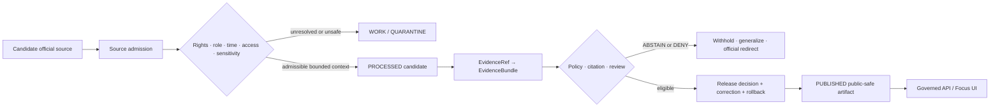

<!-- [KFM_META_BLOCK_V2]
doc_id: "kfm://doc/focus-mode/counties/wallace-county/readme"
title: "Wallace County Focus Mode Documentation Boundary"
type: "readme; county-focus-mode; documentation-boundary"
version: "v1.0"
status: "draft; repository-grounded; current-path; planning-only; compatibility-lane; private-land-sensitive; geohazard-non-determination; groundwater-non-determination; wildlife-sensitive; current-safety-redirect; non-release; non-publication"
owners:
  - "@bartytime4life — verified repository owner and current review route"
  - "NEEDS VERIFICATION — Focus Mode, source, evidence, land-access, recreation-safety, geology, geohazards, groundwater, ecology, rights, emergency, policy, release, correction, and rollback stewardship"
created: "2026-08-22"
updated: "2026-08-22"
policy_label: "public; documentation; county-scope; compatibility; cite-or-abstain; private-land-non-permission; route-and-site-safety-non-determination; geohazard-non-certification; groundwater-non-determination; wildlife-generalization; official-current-redirect"
owning_root: "docs/"
responsibility: >-
  Explain the repository-present Wallace County planning lane, preserve the
  sibling build plan as dated proposal and lineage, and make its evidence,
  source-role, private-land, access, route-safety, geohazard, groundwater,
  wildlife, rights, currentness, review, correction, and rollback limits
  inspectable without creating county runtime, source admission, policy,
  release, or publication authority.
authority: >-
  Human-readable orientation and boundary documentation only. This README and
  its sibling build plan do not admit sources, grant access to private land,
  verify current permission or route conditions, certify current sinkhole risk,
  determine groundwater or property suitability, expose sensitive wildlife,
  issue emergency guidance, validate payloads, evaluate policy, approve review,
  release artifacts, deploy a product, or publish Wallace County knowledge.
current_path: "docs/focus-mode/counties/wallace_county/README.md"
canonical_relationship: >-
  Same-path human documentation in the repository-present singular
  compatibility lane. Exact convergence with any plural or kebab-case Focus
  Mode control plane remains on HOLD unless an accepted decision and reviewed
  migration authorize it.
truth_posture: >-
  CONFIRMED current directory, one-byte newline predecessor README, sibling
  Wallace County build-plan path and bytes, accepted Directory Rules v2 posture,
  current parent compatibility documentation, current-main checkpoint, and no
  matching open Wallace README pull request or task branch before mutation /
  PROPOSED the sibling plan's Mount Sunflower, private-land visitor-context,
  High Plains/Ogallala, sinkhole-science, geohazard-boundary, official-alert,
  fixture, policy, runtime, and release designs / UNKNOWN source admission,
  current landowner permission, current route or site conditions, present
  sinkhole or subsidence status, parcel or groundwater risk, public-safe
  geometry, accountable review, EvidenceRef-to-EvidenceBundle closure, active
  Focus policy, county runtime, release, correction propagation, rollback
  execution, deployment, and public parity / NEEDS VERIFICATION every external,
  access, rights, geological, groundwater, wildlife, currentness, engineering,
  insurance, emergency, and public-use claim carried by the sibling plan.
evidence_snapshot:
  repository: "bartytime4life/Kansas-Frontier-Matrix"
  base_ref: "main"
  base_commit: "2e0b52937a0e139a1e9d3af0daa9b1752a4a1cd7"
  target_prior_blob: "8b137891791fe96927ad78e64b0aad7bded08bdc"
  target_prior_bytes: 1
  sibling_plan_path: "docs/focus-mode/counties/wallace_county/wallace_county_focus_mode_build_plan.md"
  sibling_plan_blob: "3f5e4b2339cf43e4bfaed0f762a998bbcaba4504"
  directory_rules_path: "docs/doctrine/directory-rules.md"
  directory_rules_blob: "fd49a0b83e55cef52c1124281f093e263526898d"
  directory_rules_adr: "docs/adr/ADR-0029-adopt-directory-governance-standard-v2.md"
  directory_rules_adr_blob: "a4de0d7a96b78da59cfc499d1025e1508afd8dd9"
  focus_parent_blob: "8600c0ac09452b4b03e5f60b94f1eb27c072b5db"
  county_parent_blob: "48621badd51614db7bff0882c19096fa388234ac"
inspection_boundary: >-
  Current-session GitHub reads covered the one-byte predecessor README, the
  exact two-file Wallace County directory inventory, the complete sibling build
  plan in bounded line ranges, current main, accepted ADR-0029, adopted Directory
  Rules bytes, the Focus Mode parent and county parent documentation, generated
  receipt guidance and schema, the pull-request template, representative
  pull-request workflows, and bounded branch/PR overlap searches. The build
  plan's external source pages and 2026-05-24 observations were not rechecked.
  No live source admission, landowner or access verification, road or weather
  service, geohazard survey, groundwater assessment, ecology review, evidence
  resolver, policy evaluator, governed API request, map render, model call,
  release record, correction propagation, rollback drill, deployment, or public
  endpoint was exercised.
related:
  - "./wallace_county_focus_mode_build_plan.md"
  - "../COUNTY_INDEX.md"
  - "../README.md"
  - "../../README.md"
  - "../../../doctrine/directory-rules.md"
  - "../../../adr/ADR-0029-adopt-directory-governance-standard-v2.md"
  - "../../../../data/receipts/generated/README.md"
  - "../../../../.github/PULL_REQUEST_TEMPLATE.md"
tags: [kfm, focus-mode, county, wallace-county, mount-sunflower, high-plains, ogallala, private-land, access, sinkholes, geohazards, groundwater, wildlife, emergency-currentness, documentation-boundary, non-publication]
notes:
  - "v1.0 replaces the one-byte newline predecessor with a same-path repository-grounded documentation boundary."
  - "The sibling build plan remains byte-unchanged dated planning lineage; its external-source checks and factual claims were not refreshed or admitted by this change."
  - "This file does not settle singular-versus-plural placement, rename the plan, recompute the shared county index, or authorize a county-lane migration."
[/KFM_META_BLOCK_V2] -->

# Wallace County Focus Mode Documentation Boundary

> **Purpose.** Explain the repository-present Wallace County planning lane and
> the evidence, private-land, access, route-safety, geohazard, groundwater,
> wildlife, rights, currentness, review, correction, and rollback conditions
> that must remain visible before any Wallace County Focus Mode can become more
> than a proposal.

> [!IMPORTANT]
> **This directory contains planning documentation, not a released county
> product.** The sibling build plan and this README do not admit a source,
> resolve an `EvidenceBundle`, activate Focus policy, implement a governed API
> route, approve a map or AI answer, or create promotion, release, deployment,
> or publication state.

> [!CAUTION]
> **Public attraction context is not current private-land permission.** The
> sibling plan records dated official-source statements about Mount Sunflower
> and private ownership. KFM must not turn those statements into current entry,
> parking, crossing, collection, route, passability, livestock, weather, or
> visitor-safety authorization.

> [!WARNING]
> **Documented sinkhole science is not a present hazard certificate.** Historical
> or generalized geological context cannot establish current parcel risk,
> buildability, insurability, engineering suitability, groundwater or well
> safety, road safety, land value, or emergency status.

> [!WARNING]
> **KFM is not an emergency or current-conditions service.** Current weather,
> roads, access, protective action, or incident questions require qualified
> official authorities. A future Wallace surface may provide an official-current
> redirect, but must not cache, reinterpret, or replace active alerts.

**Quick navigation:** [Status](#1-current-status-and-evidence-boundary) ·
[Responsibilities](#2-lane-responsibilities) ·
[Artifacts](#3-current-artifacts-and-plan-reconciliation) ·
[Proposed slice](#4-proposed-wallace-county-proof-slice) ·
[Private land](#5-mount-sunflower-private-land-and-access-boundary) ·
[Geohazards](#6-sinkhole-geohazard-groundwater-and-property-boundary) ·
[Wildlife and current conditions](#7-wildlife-current-conditions-and-emergency-boundary) ·
[Source fitness](#8-source-role-temporal-rights-and-geometry-fitness) ·
[Outcomes](#9-finite-outcomes-and-proposed-reason-codes) ·
[Readiness](#10-current-readiness-boundary) ·
[Follow-up](#11-smallest-safe-follow-up) ·
[Questions](#12-open-verification-questions) ·
[Validation](#13-validation-expectations) ·
[Maintenance](#14-maintenance-correction-and-rollback) ·
[References](#15-references)

---

## 1. Current status and evidence boundary

| Question | Current bounded answer | Truth label |
|---|---|---|
| Does the Wallace County directory exist? | Yes. The current tree contains this README and one sibling build plan. | `CONFIRMED` |
| What did the predecessor README contain? | One newline byte at blob `8b137891791fe96927ad78e64b0aad7bded08bdc`. | `CONFIRMED` |
| Does a Wallace County build plan exist? | Yes. [`wallace_county_focus_mode_build_plan.md`](./wallace_county_focus_mode_build_plan.md) is tracked at blob `3f5e4b2339cf43e4bfaed0f762a998bbcaba4504`. | `CONFIRMED` path and bytes |
| Is the sibling plan accepted implementation? | No. It identifies itself as a draft planning artifact and disclaims implementation, release, and publication. | `CONFIRMED` planning posture |
| Were the plan's 2026-05-24 external-source observations rechecked for this README? | No. This change inspected repository evidence only. | `NOT_RUN` / `NEEDS VERIFICATION` |
| Are Directory Rules v2 operative? | ADR-0029 is accepted and adopts the pinned `docs/doctrine/directory-rules.md` bytes. | `CONFIRMED` / `ACCEPTED` |
| Is county Focus placement fully settled? | No. The current singular lane exists; the parent Focus README keeps exact structural convergence on `HOLD`, while the county parent retains older plural-path claims. | `CONFLICTED` / `HOLD` |
| Is there a current Wallace payload, active policy decision, county API route, released map, or public answer? | No such end-to-end Wallace implementation or release evidence was established in this work. | `UNKNOWN`; do not infer |
| What does this README change? | It replaces the one-byte placeholder with a repository-grounded, fail-closed documentation boundary while leaving the sibling plan and non-documentation surfaces unchanged. | `CONFIRMED` |
| What is its release/publication effect? | None. | `CONFIRMED` |

### Truth labels used here

| Label | Meaning |
|---|---|
| `CONFIRMED` | Verified from current-session repository evidence. |
| `PROPOSED` | Design, source seed, behavior, path, fixture, or follow-up not established as current implementation. |
| `UNKNOWN` | Evidence is insufficient to determine the claim. |
| `NEEDS VERIFICATION` | A concrete source, access, rights, reviewer, policy, runtime, or currentness check remains. |
| `CONFLICTED` | Current repository surfaces or planning materials express incompatible placement, naming, or maturity assumptions. |
| `NOT_RUN` | The named executable, external-source, runtime, or release check was not performed in this documentation slice. |

Repository presence proves bytes exist. It does not prove current access,
geological safety, groundwater condition, source rights, safe geometry, policy
enforcement, release fitness, or public parity.

[Back to top](#top)

---

## 2. Lane responsibilities

### This README owns

- a human-readable explanation of the current Wallace County directory;
- links to the tracked sibling plan and nearby repository control surfaces;
- separation of repository evidence, dated planning lineage, proposals, and
  unresolved verification;
- explicit private-land, access, route-safety, geohazard, groundwater,
  wildlife, rights, currentness, and public-safety boundaries;
- readiness, maintenance, correction, and rollback expectations for this
  documentation slice.

### This README does not own

| Authority or object family | Owning surface or decision class | Wallace effect |
|---|---|---|
| Source identity, authority, rights, terms, cadence, and admissibility | Source registry, source review, evidence, and policy surfaces | Plan-named sources remain candidates, not admitted county truth |
| Current private-land permission or owner consent | Current fit authority and land-access review | Public attraction language cannot authorize entry |
| Roads, weather, passability, parking, livestock, or visitor safety | Qualified current official authorities | KFM must abstain or redirect |
| Semantic meaning | `contracts/` | This README cannot create or amend shared Focus/evidence meaning |
| Machine-checkable shape | `schemas/` | It cannot make planning examples schema-valid |
| Allow, deny, abstain, restriction, or release admissibility | `policy/` plus accountable review | It documents expected fail-closed behavior but makes no policy decision |
| Geological, geotechnical, engineering, or hazard certification | Qualified scientific/professional authority | General sinkhole context cannot become a present risk verdict |
| Groundwater, private-well, potability, or liability determination | Qualified water, health, legal, and scientific authority | Mechanism descriptions do not establish individual conditions |
| Wildlife occurrence and sensitive habitat precision | Ecology and geoprivacy review | Exact public precision remains denied or deferred |
| Runtime implementation and governed public routing | Application, package, API, and runtime owners | No Wallace resolver, API, map, search, or model adapter is created |
| Lifecycle data and public-safe artifacts | Governed data lifecycle surfaces | No `RAW`, `WORK`, `QUARANTINE`, `PROCESSED`, catalog, triplet, or published object is created |
| Promotion, release, correction, withdrawal, and rollback decisions | Release and accountable review authority | A branch, PR, check, or merge cannot perform these transitions |
| Singular-versus-plural Focus Mode migration | Separate accepted structural decision and migration evidence | Existing compatibility path remains single-write |

A Focus Mode is a composition scope. This directory may point to governed
objects owned elsewhere; it must not create county-local copies of canonical
source, evidence, policy, geology, property, emergency, or release authority.

[Back to top](#top)

---

## 3. Current artifacts and plan reconciliation

| Artifact | Current repository state | Authority limit |
|---|---|---|
| [`README.md`](./README.md) | This same-path documentation boundary replaces a one-byte newline predecessor | Explanation and navigation only |
| [`wallace_county_focus_mode_build_plan.md`](./wallace_county_focus_mode_build_plan.md) | Large draft plan dated 2026-05-24; unchanged by this slice | Planning lineage, not source admission, implementation, policy, or release |
| [County master index](../COUNTY_INDEX.md) | Shared inventory/collision-prevention surface | Not recomputed in this county-only slice |
| [County lane README](../README.md) | Parent document with older plural-path assertions | Documentation lineage; does not override accepted Directory Rules or current Focus parent |
| [Focus Mode README](../../README.md) | Repository-grounded singular compatibility boundary | Keeps exact structural convergence on `HOLD` |
| [Directory Rules](../../../doctrine/directory-rules.md) | Exact bytes adopted by accepted ADR-0029 | Placement doctrine, not source/release authority |
| [ADR-0029](../../../adr/ADR-0029-adopt-directory-governance-standard-v2.md) | Accepted decision adopting Directory Rules v2 bytes | Governs placement and migration discipline |

### Repository facts that supersede older plan-discovery uncertainty

The sibling plan was written while repository absence and collision uncertainty
were still open. Current repository evidence supersedes that uncertainty only
for these facts:

- the current repository and exact base commit were inspected;
- this Wallace County directory exists;
- the directory contains `README.md` and the tracked Wallace build plan;
- the sibling build plan is the existing Wallace planning artifact at this path;
- bounded open-PR and task-branch searches found no overlapping Wallace README
  work before this change.

This does **not** validate the plan's external facts, current landowner wishes,
source rights, proposed contracts, schemas, policies, fixtures, reason codes,
runtime examples, release sequence, or publication readiness.

### Material plan dispositions

| Build-plan element | Current treatment |
|---|---|
| Wallace as a newly selected or `not-started` county | `STALE` planning lineage. The repository now contains the plan; no shared-index recomputation occurs here. |
| Mount Sunflower as a Wallace public-attraction/high-point theme | `PROPOSED` public-safe context requiring admitted evidence and visible private-land limits. |
| The plan's recorded 4,039-foot, High Plains/Ogallala, private-ownership, visitor-access, wildlife, sinkhole-dimension, and alert-system observations | Dated 2026-05-24 source-check statements inside the plan; `NEEDS VERIFICATION` before current use and not independently repeated here. |
| Current visitor permission, parking, route, road, weather, livestock, or site conditions | `UNKNOWN` / excluded from this documentation update. |
| The documented 2013 sinkhole and proposed scientific explanation | `PROPOSED` historical/scientific context only; never a present parcel or safety certificate. |
| Generalized prairie/wildlife material | `DEFER` pending ecology, source-role, rights, and geoprivacy review. |
| Proposed plural/kebab-case county tree | `HOLD`; no parallel lane, move, rename, or alias is created. |
| Proposed cards, schemas, endpoints, fixtures, validators, policies, reason codes, and response envelopes | `PROPOSED` until current contracts and implementation are inspected and tested. |
| Release manifest, correction, withdrawal, and rollback concepts | Required future trust transitions; current execution is `UNKNOWN`. |

The plan remains valuable because it identifies Wallace County's distinctive
proof burden. This README narrows its authority so maintainers can retain those
ideas without mistaking planning prose for current permission, hazard truth, or
implemented capability.

[Back to top](#top)

---

## 4. Proposed Wallace County proof slice

**PROPOSED thesis:** Wallace County can prove that a public-facing high-point
narrative and documented sinkhole science remain useful while private-land
permission, route and site safety, wildlife precision, present hazard
certification, groundwater conclusions, emergency status, and uncited model
interpretation remain visibly outside KFM authority.

### Proposed public-safe composition

| Proposed element | Public value | Required boundary | Status |
|---|---|---|---|
| Wallace County orientation | Establish a bounded county frame | County geometry is not parcel, access, risk, or jurisdictional advice | `PROPOSED` |
| Mount Sunflower topographic context | Explain a state high-point and broad High Plains setting | Current permission, route, parking, site condition, and safety are not inferred | `PROPOSED` |
| Private-land visitor boundary | Teach why public description and private ownership can coexist | No current entry, crossing, collection, or consent statement | `PROPOSED` |
| High Plains/Ogallala interpretation | Provide broad landform and geology context | No aquifer, private-well, property, engineering, or water-safety conclusion | `PROPOSED` |
| Wallace sinkhole-science context | Explain the plan's dated account of a documented event and mechanism | No present parcel, road, home, farm, facility, or visitor risk certification | `PROPOSED` |
| Geohazard non-determination notice | Make high-stakes refusal visible | No buildability, insurability, purchase, remediation, or liability advice | `PROPOSED` |
| Official-current redirect | Route urgent/current questions to responsible authorities | No cached KFM alert, status, or protective-action interpretation | `PROPOSED` |
| Generalized prairie/wildlife context | Explain broad setting after review | No exact nests, dens, seasonal concentration, rare species, or sensitive habitat geometry | `DEFER` |

### Composition and anti-inference rule

A future Focus Mode may connect released themes only through governed
identifiers and public-safe transforms. Public layers must not be recombined to
reconstruct withheld detail. Prohibited examples include:

- deriving a current private route or implied permission from attraction,
  road, parcel, and map layers;
- targeting an owner, residence, farm, or visitor destination from public
  property context;
- converting a historical sinkhole card plus geology and parcel geometry into
  a present hazard score;
- inferring private-well or drinking-water safety from a generalized mechanism
  involving groundwater;
- locating sensitive wildlife by combining broad habitat language with imagery
  or user-contributed observations;
- treating an emergency redirect, old notice, screenshot, or model summary as
  current official incident status.

### Future trust path

This diagram is a proposed trust flow. It does not establish current Wallace
objects or lifecycle state.

[Back to top](#top)

---

## 5. Mount Sunflower, private-land, and access boundary

### Public description is not permission

The sibling plan records dated official-source statements describing Mount
Sunflower as both publicly visitable in the source's published context and
privately owned. A future KFM card may explain that distinction after source
admission, but must not transform it into:

- current landowner consent;
- an easement, right-of-way, or public-land determination;
- permission to park, cross, enter, collect, camp, or leave a public road;
- a statement that the site is open, staffed, maintained, accessible, or safe;
- a route that bypasses current conditions or private boundaries.

A statement was public on a page at a checked date. That is not the same object
as current permission.

### Route, road, weather, livestock, and site conditions

Static attraction prose cannot establish current:

- road or driveway passability;
- parking availability;
- weather, visibility, heat, cold, wind, or storm fitness;
- livestock, gate, fencing, or agricultural-operation conditions;
- accessibility, maintenance, signage, or visitor facilities;
- emergency response availability.

Requests for these conditions should result in `ABSTAIN`, a safe explanation,
and a verified current-authority redirect when one is separately admitted.

### Property and personal information

This lane must not publish or infer:

- landowner identity or contact details;
- parcel ownership, title, valuation, access rights, or litigation;
- private addresses or household information;
- collection or trespass advice;
- a route constructed from property, road, imagery, or user-trace joins.

Publicly accessible records do not automatically authorize aggregation into a
visitor, owner, or property profile.

### Geometry and display

A future public map should use only reviewed public-safe geometry. Depending on
source rights, access sensitivity, and reviewer findings, the safe result may be
a generalized place card or broad area rather than an exact point or route.

> [!IMPORTANT]
> The right question for KFM is not “Can the map technically show a coordinate?”
> It is “Does released evidence and policy support this public precision without
> implying permission, safety, or private-property authority?”

[Back to top](#top)

---

## 6. Sinkhole, geohazard, groundwater, and property boundary

### Historical/scientific context

The sibling plan records a 2026-05-24 check of Kansas Geological Survey material
about a Wallace County sinkhole and a likely subsurface mechanism. That material
may support a future time-attributed scientific explainer after admission. It
does not, by itself, establish:

- present sinkhole or subsidence activity;
- likelihood at another location;
- a parcel, road, home, farm, facility, or attraction risk;
- a current inspection or monitoring result;
- engineering, geotechnical, remediation, insurance, financial, or legal advice.

### No parcel-risk or safety certificate

A future card must not produce a binary safe/unsafe label, probability, risk
score, buffer, setback, hotspot, or parcel ranking unless a separate
fit-for-purpose governed product, authority, evidence, policy, and review path
exists. That higher-stakes product is outside this README and the proposed first
slice.

### Groundwater and well non-determination

A scientific mechanism that mentions groundwater does not establish:

- private-well condition;
- drinking-water potability;
- aquifer contamination, quantity, drawdown, or impairment;
- liability, causation, responsibility, or regulatory status;
- safe drilling, pumping, construction, or land use.

KFM should deny individualized groundwater, health, liability, or engineering
conclusions and direct users to qualified authorities or professionals.

### Insurance, purchase, and construction questions

Questions such as “Is this property safe to buy, build on, insure, farm, or
visit?” are high-consequence determinations. Generalized historical geoscience
is not sufficient evidence. The public result should be `DENY` or `ABSTAIN`,
with no guessed risk score and no false reassurance.

### Spatial generalization

Even publicly available sinkhole imagery or location detail requires rights,
context, and harmful-precision review. A public-safe scientific card may need
county-scale or generalized spatial treatment. Exact geometry is not presumed
safe merely because a source is public.

[Back to top](#top)

---

## 7. Wildlife, current conditions, and emergency boundary

### Wildlife and ecology

The sibling plan records broad wildlife language from a county attraction page.
That is an attraction-context statement, not an admitted occurrence dataset.
Future ecology content requires:

- authoritative ecological source roles;
- rights and derivative-use review;
- seasonal and observation-time semantics;
- rare-species and breeding-location review;
- geoprivacy transforms and anti-reconstruction checks.

Exact nests, dens, roosts, breeding areas, seasonal concentrations, or sensitive
habitat features remain denied or generalized by default.

### Current access, road, and weather questions

KFM must not infer current conditions from a dated page, cached screenshot,
historic observation, or generated summary. These questions require current,
fit official authority:

- “Can I visit today?”
- “Is the road passable?”
- “Is there dangerous weather?”
- “Is the site open or safe?”
- “Are there closures, livestock, or emergency restrictions?”

A future UI may show a clearly labeled redirect. It must not silently copy the
redirect target's volatile content into durable KFM truth.

### Emergency and protective-action questions

The plan records a county alert surface as an official-current routing seed.
That supports a proposed redirect role only. KFM must not:

- issue or restate an active warning as its own;
- infer whether an emergency is occurring;
- recommend evacuation, shelter, travel, or protective action;
- preserve an old alert as current;
- let model output fill an alert or status gap.

When required trust components fail, the result is `ABSTAIN` or `ERROR`, never
uncited emergency guidance.

[Back to top](#top)

---

## 8. Source role, temporal, rights, and geometry fitness

The build plan names source families and records checks made on 2026-05-24.
Those sources remain planning seeds until admitted through current KFM source,
evidence, rights, sensitivity, and release controls.

| Candidate source role | What it may support after admission | What it must not silently become |
|---|---|---|
| Scientific/topographic source | Generalized high-point and regional geology context | Current access, route safety, parcel risk, groundwater, or emergency authority |
| County attraction/public-information source | Source-attributed local context and private-ownership statement | Current consent, title, access right, wildlife dataset, or safety guarantee |
| Scientific/geohazard-history source | Dated event and mechanism explanation | Present hazard map, engineering report, parcel rating, insurance or purchase advice |
| County official-alert routing source | Link/redirect to responsible current channel | Cached KFM alert, model-issued warning, or current incident conclusion |
| Later road/weather/access source | Redirect or bounded current context after admission | Perpetual route or site-safety truth |
| Later ecology source | Generalized reviewed habitat/fauna context | Exact sensitive occurrence or breeding precision |
| AI-generated explanation | Bounded interpretation over released evidence | Source admission, evidence, permission, professional opinion, policy, review, or release truth |

### Time semantics

A future claim may require several distinct times:

| Time field | Wallace use |
|---|---|
| `published_at` | When the source published the statement |
| `retrieved_at` | When KFM acquired or checked the source |
| `valid_from` / `valid_to` | When permission, road, weather, alert, or other operational status applies |
| `event_at` | When a documented geological event occurred |
| `observed_at` | When a scientific or operational observation was made |
| `reviewed_at` | When qualified review approved a bounded use |
| `released_at` | When KFM released a public-safe artifact |
| `expires_at` | When an operational redirect or status must stop being treated as current |
| `corrected_at` | When a claim or artifact was corrected or superseded |

A source-check date is not an automatic validity end date, and source
publication is not KFM release.

### Rights and derivative display

Public availability does not establish permission to reproduce or transform
images, maps, route information, detailed coordinates, or other assets. Before
public display, the future source record should establish:

- publisher and asset identity;
- terms, license, and attribution;
- transform and derivative-display permission;
- whether exact geometry is necessary and safe;
- whether private, ecological, or hazard precision must be redacted or
  generalized;
- correction and withdrawal handling if rights or source posture changes.

### Geometry authority

The plan does not admit a county boundary, attraction point, route, sinkhole
geometry, parcel layer, or wildlife layer. Future geometry needs source identity,
vintage, CRS, scale, accuracy, generalization, rights, and sensitivity review.
A coordinate without those fields is not a governed map claim.

[Back to top](#top)

---

## 9. Finite outcomes and proposed reason codes

A future governed Wallace runtime should terminate with one of four outcomes:

| Outcome | Wallace example | Minimum trust condition |
|---|---|---|
| `ANSWER` | A released evidence bundle supports a bounded, dated high-point or historical sinkhole-science explanation. | Evidence resolves, policy allows, citations validate, limitations are visible, and the artifact is released |
| `ABSTAIN` | Current access, route, road, weather, site condition, rights, or emergency authority is unresolved. | The system states what is missing and offers a safe redirect when available |
| `DENY` | A request seeks private access, parcel risk, engineering/insurance advice, groundwater verdicts, sensitive wildlife, or harmful precision. | Policy blocks the request without echoing protected details |
| `ERROR` | Evidence resolution, contract validation, policy evaluation, integrity, or governed service fails. | No fallback to uncited generation |

### Proposed reason-code family

These codes are copied from the sibling plan as **PROPOSED vocabulary**. Their
presence here does not prove an active policy or runtime implementation.

| Proposed code | Trigger | Expected outcome |
|---|---|---|
| `PRIVATE_ACCESS_PERMISSION_REQUIRES_CURRENT_AUTHORITY` | Published attraction context is used as present entry or consent authority | `ABSTAIN` / `DENY` |
| `CURRENT_ROUTE_OR_SITE_SAFETY_REQUIRES_AUTHORITY` | Route, passability, parking, weather, livestock, access, or site-safety assurance is requested | `ABSTAIN` |
| `SENSITIVE_WILDLIFE_DETAIL_NOT_ADMITTED` | Exact ecological or breeding-location detail is requested | `DENY` |
| `HISTORIC_SINKHOLE_CONTEXT_NOT_CURRENT_HAZARD_CERTIFICATION` | A documented event is used to assess present location risk | `DENY` / `ABSTAIN` |
| `PROPERTY_OR_ENGINEERING_HAZARD_DETERMINATION_DENIED` | Buildability, purchase, insurability, engineering, remediation, or suitability advice is requested | `DENY` |
| `GROUNDWATER_SAFETY_OR_LIABILITY_DETERMINATION_DENIED` | General mechanism is used to infer well, drinking-water, aquifer, causation, or liability status | `DENY` |
| `OFFICIAL_EMERGENCY_ALERT_CHANNEL_REQUIRED` | Current incident, warning, or protective-action information is requested | `ABSTAIN` |
| `DERIVATIVE_DISPLAY_RIGHTS_UNRESOLVED` | Asset reuse or transformed public display lacks rights evidence | `ABSTAIN` / quarantine |
| `SOURCE_ADMISSION_UNRESOLVED` | A candidate source is invoked before admission | `ABSTAIN` / quarantine |
| `EVIDENCE_BUNDLE_UNRESOLVED` | A claim lacks resolved evidence | `ABSTAIN` |
| `AI_NOT_EVIDENCE` | Generated language is treated as proof or official determination | `ERROR` / release block |
| `PUBLIC_INTERNAL_LIFECYCLE_ACCESS` | A public surface reads `RAW`, `WORK`, or `QUARANTINE` | `ERROR` / release block |

### Required refusal behavior

- `ABSTAIN` identifies the unresolved authority, currentness, evidence, or rights
  requirement without guessing.
- `DENY` does not reveal private routes, owner information, sensitive wildlife,
  parcel scores, or vulnerability details.
- `ERROR` does not fall back to model-generated content.
- Every outcome keeps source role, limitations, and audit references visible.
- A negative outcome must not be styled as a successful answer.

[Back to top](#top)

---

## 10. Current readiness boundary

| Capability or gate | Current status | What would be needed |
|---|---|---|
| Wallace README and sibling build plan | `CONFIRMED` present | Human review of this documentation change |
| Current source admission | `UNKNOWN` | Verified descriptors, terms, roles, cadence, limitations, and approval |
| Current Mount Sunflower permission | `UNKNOWN` | Fit current authority without exposing private-person data |
| Route, road, weather, livestock, or site conditions | `UNKNOWN` | Current official authority and expiry-aware handling |
| Source and derivative-display rights | `NEEDS VERIFICATION` | Asset-level terms, attribution, and transform permission |
| County orientation geometry | `NEEDS VERIFICATION` | Authoritative source, vintage, CRS, accuracy, rights, and generalization |
| Sinkhole-science spatial treatment | `NEEDS VERIFICATION` | Geological review, source rights, claim scope, and harmful-precision decision |
| Present geohazard assessment | Not established and outside proposed first slice | Separate high-stakes evidence, policy, professional review, and product boundary |
| Groundwater or private-well assessment | Not established and outside proposed first slice | Qualified evidence and authority; individualized public verdict remains denied |
| Wildlife/ecology source and geoprivacy review | `UNKNOWN` | Fit sources, policy, generalization, and anti-reconstruction testing |
| Wallace EvidenceRef → EvidenceBundle closure | `UNKNOWN` | Admitted evidence objects and deterministic resolution |
| Active Wallace policy bindings and reason codes | `UNKNOWN` / `PROPOSED` | Current policy implementation and allow/abstain/deny/error tests |
| Wallace fixtures and validators | `PROPOSED` | Verified homes, deterministic valid/invalid fixtures, and focused tests |
| Governed Wallace API/runtime | `UNKNOWN` | Authenticated governed service using released evidence and active policy |
| MapLibre/Evidence Drawer implementation | `UNKNOWN` | Governed payloads, public-safe layers, accessibility, and visible negative states |
| Review assignments | `NEEDS VERIFICATION` | Named accountable access, geology, ecology, rights, emergency, and release reviewers |
| Release manifest and decision | `UNKNOWN` | Identity, evidence, rights, sensitivity, validation, review, correction, and rollback closure |
| Correction, withdrawal, and rollback execution | `UNKNOWN` | Tested propagation, aliases/cache handling, supersession, and audit lineage |
| Public deployment/parity | `UNKNOWN` | Separate deployment and public-surface evidence after release |

A documentation edit cannot promote any row in this table.

[Back to top](#top)

---

## 11. Smallest safe follow-up

**PROPOSED next implementation:** create a deterministic, no-network,
synthetic Wallace fixture slice only after current contracts, policy vocabulary,
and fixture placement are verified.

The slice should prove both bounded context and the highest-risk negative paths:

| Synthetic scenario | Expected outcome |
|---|---|
| Released generalized high-point/topographic context with resolved evidence | `ANSWER` |
| Released historical sinkhole-science context with explicit non-determination | `ANSWER` |
| Current private-land entry or consent question | `ABSTAIN` or `DENY` according to governing policy |
| Route, road, weather, parking, livestock, or site-safety question | `ABSTAIN` |
| Exact nest, den, rare-species, or sensitive habitat request | `DENY` |
| Parcel sinkhole-risk, buildability, purchase, insurance, or engineering request | `DENY` |
| Private-well, drinking-water, aquifer, or liability request | `DENY` |
| Current emergency or protective-action request | `ABSTAIN` with official redirect |
| Rights-unclear image/map/geometry publication | `ABSTAIN` / quarantine |
| Missing or unresolved EvidenceRef | `ABSTAIN` or fail-closed `ERROR` under the governing contract |
| Public client attempts `RAW`, `WORK`, `QUARANTINE`, or direct-model access | `ERROR` / denied path |
| Candidate release lacks correction or rollback support | Release `DENY` / block |

### Acceptance boundary for that follow-up

- no network or live source integration;
- synthetic and rights-safe fixtures only;
- shared contracts and policy reused rather than duplicated;
- exact unsafe locations, private details, and active alert content excluded;
- finite outcomes tested positively and negatively;
- no public alias, deployment, release, or publication claim;
- rollback means removing or reverting an unmerged synthetic slice without
  creating a second authority.

No exact fixture path is asserted here. Placement remains `PROPOSED / NEEDS
VERIFICATION` until current repository conventions and accepted authority are
checked for that implementation.

[Back to top](#top)

---

## 12. Open verification questions

### Repository and placement

- Does a current accepted decision assign an exact final county Focus
  documentation tree, or does singular/plural convergence remain on `HOLD`?
- Should the shared county index be recomputed through a full inventory after
  this README changes, rather than patched for one county?
- Does the current Focus validator apply to this compatibility lane, or only to
  a different proposed seven-file layout?
- Which shared contract, schema, fixture, policy, reason-code, and validator
  families should a future Wallace slice reuse?

### Source, access, rights, and geometry

- What current authority, if any, may confirm public visitor access without
  collecting or exposing private owner information?
- Which source establishes current road, weather, or site conditions, and what
  expiry rule applies?
- Which source assets may be reproduced, transformed, or displayed publicly?
- What public-safe precision is appropriate for Mount Sunflower context?
- What public-safe spatial generalization is appropriate for the sinkhole
  science card?
- What authoritative county boundary should be used, with which CRS, vintage,
  rights, and simplification receipt?

### Geology, groundwater, and ecology

- Which qualified geologist or geohazard reviewer approves the public wording
  and spatial scope?
- What evidence would be required before any present hazard context could be
  shown without becoming parcel-scale certification?
- Which groundwater questions are categorically outside the public product?
- Which ecological authority and geoprivacy rule govern broad prairie/wildlife
  context and exact sensitive locations?
- What anti-reconstruction tests prevent public layers from recreating withheld
  property, hazard, or wildlife precision?

### Review, release, correction, and rollback

- Who owns access/currentness, geology, ecology, rights, emergency, policy, and
  release review?
- What evidence pack proves that a public card cannot be mistaken for current
  permission or present hazard certification?
- What correction process applies if source posture, permission context, or
  scientific interpretation changes?
- What rollback target can remove unsafe output while preserving audit and
  supersession history?
- Which caches, aliases, generated carriers, indexes, and public clients would
  need correction propagation after a future release?

[Back to top](#top)

---

## 13. Validation expectations

### Documentation-scoped checks for this README

- target remains at the existing tracked path;
- sibling build plan remains present and byte-unchanged;
- one H1 and logical heading order;
- explicit anchors and same-document links resolve;
- repository-relative links point to inspected current paths;
- truth labels distinguish repository facts, dated plan statements, proposals,
  unknowns, conflicts, and checks not run;
- no current permission, route, safety, hazard, groundwater, wildlife, or
  emergency claim is introduced;
- no private owner information, exact sensitive wildlife, or parcel-risk score
  is included;
- no source, contract, schema, policy, fixture, validator, workflow, runtime,
  release, deployment, or public state is changed;
- generated receipt remains provenance-only with human review pending.

### Future changed-area validation

A later behavioral Wallace slice should include, as applicable:

- contract and schema validation;
- positive and negative fixture tests;
- evidence-reference resolution;
- source-role and temporal-fitness checks;
- private-access/currentness policy tests;
- sinkhole-science versus present-hazard non-determination tests;
- groundwater, property, engineering, insurance, and wildlife denial tests;
- rights and geometry-generalization checks;
- public trust-membrane tests;
- accessible visible `ANSWER`, `ABSTAIN`, `DENY`, and `ERROR` states;
- correction and rollback rehearsal before any public release.

### What passing does not prove

A green documentation, schema, policy, fixture, or workflow result does not by
itself prove:

- current landowner permission or site access;
- current roads, weather, livestock, or visitor safety;
- present sinkhole or subsidence status;
- parcel, engineering, insurance, groundwater, or water-safety conclusions;
- ecological public-safety approval;
- source rights or permission to reproduce assets;
- runtime correctness beyond tested fixtures;
- review approval, release readiness, deployment, or publication.

[Back to top](#top)

---

## 14. Maintenance, correction, and rollback

### Documentation maintenance triggers

Re-review this README when any of the following changes:

- the sibling build plan, its filename, or county directory inventory;
- accepted Directory Rules or Focus Mode placement decisions;
- source admission or rights posture;
- current access-authority design;
- geological/geohazard or groundwater review;
- wildlife/ecology sensitivity policy;
- Wallace fixtures, policy bindings, reason codes, runtime, or UI;
- release, correction, withdrawal, rollback, deployment, or public-surface
  evidence.

### Correction discipline

When a documentation claim is wrong or stale:

1. identify the affected claim, path, source, and pinned version;
2. determine whether the defect is documentation-only or reaches evidence,
   policy, released artifacts, indexes, caches, or clients;
3. issue a transparent correction or forward-fix;
4. preserve prior version and supersession lineage;
5. do not overwrite evidence, review, release, or correction history;
6. confirm that no parallel writable authority was created.

### Rollback before merge

Before merge, rollback means closing or abandoning the draft pull request and
branch. Remote branch deletion is a separate action and is not implied.

### Rollback after merge

After merge, use a transparent revert or forward-fix pull request against the
actual merged commit. Do not rewrite shared history. The sibling build plan and
other county files remain independently addressable.

### Future public correction

A future public Wallace release may require more than a Git revert. Correction
could include:

- withdrawing or superseding a public card;
- disabling an alias or layer;
- invalidating caches and generated carriers;
- updating citations and EvidenceBundles;
- correcting access/currentness or scientific wording;
- notifying affected clients;
- preserving the prior release and reason for correction;
- executing the recorded rollback target.

This README creates none of those release states. It makes the obligation
visible.

[Back to top](#top)

---

## 15. References

### Current repository evidence

- [Wallace County build plan](./wallace_county_focus_mode_build_plan.md) —
  detailed dated planning lineage and source-check record.
- [County master index](../COUNTY_INDEX.md) — shared inventory and collision
  surface; not recomputed by this slice.
- [County lane README](../README.md) — parent documentation, including older
  path assumptions that remain in conflict with current Focus compatibility
  guidance.
- [Focus Mode README](../../README.md) — current singular compatibility-lane
  boundary and structural `HOLD`.
- [Directory Rules](../../../doctrine/directory-rules.md) — adopted placement
  doctrine bytes.
- [ADR-0029](../../../adr/ADR-0029-adopt-directory-governance-standard-v2.md) —
  accepted decision adopting Directory Rules v2.
- [Generated receipt lane](../../../../data/receipts/generated/README.md) —
  provenance-only process-memory requirements.
- [Pull-request template](../../../../.github/PULL_REQUEST_TEMPLATE.md) —
  review, coordination, validation, and rollback intake requirements.

### Evidence-use note

The sibling build plan records official-source checks performed on 2026-05-24.
This README uses that plan to preserve scope, terminology, risk boundaries, and
open questions. It does not independently verify the source pages, treat their
statements as current permission or present hazard evidence, or convert the plan
into an `EvidenceBundle`, `PolicyDecision`, `ReviewRecord`, `ReleaseManifest`,
engineering assessment, access authorization, emergency bulletin, or published
product.

---

**End of Wallace County Focus Mode Documentation Boundary**

[Back to top](#top)
