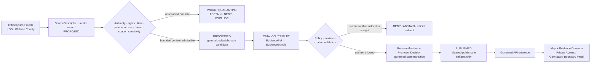
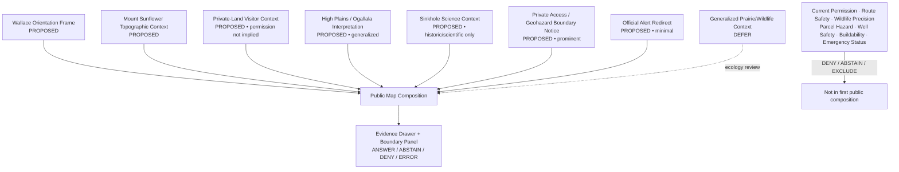
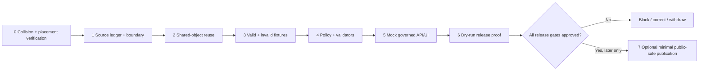

<!-- [KFM_META_BLOCK_V2]
doc_id: NEEDS_VERIFICATION — <REGISTERED_KFM_DOC_ID>
title: Wallace County Focus Mode Build Plan — Mount Sunflower Private-Land Context and Sinkhole Science Without Live Access or Hazard Verdicts
type: county-focus-mode-build-plan
version: v0.1-draft
status: draft
owners:
  - NEEDS_VERIFICATION — <OWNER:focus-mode-steward>
  - NEEDS_VERIFICATION — <OWNER:geology-and-geohazards-reviewer>
  - NEEDS_VERIFICATION — <OWNER:land-access-and-public-safety-reviewer>
created: 2026-05-24
updated: 2026-05-24
policy_label: public_draft
county: Wallace County, Kansas
county_slug: wallace
proof_slice: Mount Sunflower public-attraction/private-property context paired with Kansas Geological Survey Wallace County sinkhole science and official-alert currentness boundaries
primary_public_safe_boundary: Official public pages may support generalized, time-attributed interpretation of Mount Sunflower and documented sinkhole science; KFM must not convert a published landowner-access statement into present permission or route safety, expose private-property or sensitive wildlife detail, or convert a historical sinkhole account into a current parcel hazard, engineering, insurance, emergency, groundwater-safety, or land-suitability conclusion.
release_status: NEEDS_VERIFICATION — NOT_RELEASED planning artifact; no release record created or inspected
review_assignments:
  - NEEDS_VERIFICATION — source admission and rights reviewer
  - NEEDS_VERIFICATION — private-land/access and recreation-safety reviewer
  - NEEDS_VERIFICATION — geology/geohazards and environmental-claim reviewer
  - NEEDS_VERIFICATION — emergency/currentness reviewer
  - NEEDS_VERIFICATION — public-safe release reviewer
correction_path: NEEDS_VERIFICATION — no implemented correction path asserted
rollback_path: NEEDS_VERIFICATION — no implemented rollback path asserted
unverified_repository_paths:
  - PROPOSED / NEEDS_VERIFICATION — docs/focus-modes/wallace-county/build-plan.md
  - PROPOSED / NEEDS_VERIFICATION — docs/focus-modes/wallace-county/
  - PROPOSED / NEEDS_VERIFICATION — fixtures/focus_modes/wallace/
schema_contract_policy_homes:
  - PROPOSED / NEEDS_VERIFICATION — contracts/focus_mode/
  - PROPOSED / NEEDS_VERIFICATION — schemas/contracts/v1/focus_mode/
  - PROPOSED / NEEDS_VERIFICATION — policy/runtime/, policy/sensitivity/, policy/rights/, policy/release/
collision_search:
  completed_register: CONFIRMED — Wallace County is absent from the user-supplied completed/collision register; Butler, Wilson, Franklin, Haskell, Grant, Comanche, Labette, Meade, Norton, and Cheyenne were additionally excluded because artifacts were generated earlier in this continuing series.
  available_project_materials: CONFIRMED — Wallace-targeted searches across accessible uploaded/project materials and File Library were performed on 2026-05-24; returned plan artifacts belonged to other counties and did not surface a Wallace County Focus Mode Build Plan.
  live_repository_index: CONFIRMED — docs/focus-mode/counties/COUNTY_INDEX.md on main was inspected and lists Wallace as not-started with validation not-run.
  live_repository_control_plane: CONFIRMED — docs/doctrine/directory-rules.md and docs/focus-mode/README.md were inspected during this continuing session; doctrine names docs/focus-modes/<area>-<scope>/ while observed control-plane files are located beneath docs/focus-mode/, requiring reconciliation before repository landing.
  live_repository_target_search: CONFIRMED — targeted searches for wallace_county_focus_mode_build_plan, Wallace County Focus Mode, wallace-county, and Mount Sunflower Wallace County Sinkholes private property access returned no matching live-repository result.
  exhaustive_absence: NEEDS_VERIFICATION — unindexed branches, private artifacts, and unsearched prior outputs may still exist.
directory_rules_basis:
  - CONFIRMED — attached Directory Rules.pdf was inspected during this continuing session and is treated as governing doctrine.
  - CONFIRMED — live docs/doctrine/directory-rules.md states that file location encodes responsibility and lifecycle; topic does not justify a root folder; it records the lifecycle RAW → WORK / QUARANTINE → PROCESSED → CATALOG / TRIPLET → PUBLISHED and states promotion is a governed state transition, not a file move.
  - CONFIRMED — live docs/doctrine/directory-rules.md describes Focus Modes as multi-root compositional proof slices using docs/focus-modes/<area>/ and related responsibility-root lanes, not new root folders.
  - NEEDS_VERIFICATION / DIVERGENCE — observed live county index and README are under docs/focus-mode/ while doctrine and README text refer to docs/focus-modes/; landing requires reconciliation before repository work.
official_source_checks:
  - CONFIRMED — Kansas Geological Survey / GeoKansas, Mount Sunflower page, checked 2026-05-24.
  - CONFIRMED — Kansas Geological Survey / GeoKansas, Wallace County Sinkholes page, checked 2026-05-24.
  - CONFIRMED — Wallace County official government, Mount Sunflower page, checked 2026-05-24.
  - CONFIRMED — Wallace County official government, Alerts & Notifications page, checked 2026-05-24.
source_check_date: 2026-05-24
tags: [kfm, focus-mode, wallace-county, mount-sunflower, high-plains, private-land, sinkholes, geohazards, groundwater, emergency-currentness, cite-or-abstain, public-safe]
notes:
  - This document is a planning artifact and does not claim implementation, source admission, rights clearance, policy approval, review completion, promotion, publication, correction readiness, or rollback readiness.
  - Official sources document Mount Sunflower as a privately owned attraction context and the 2013 Wallace County sinkhole as a scientific/geologic account; neither authorizes present access nor establishes present parcel-scale hazard or safety.
  - EvidenceBundle outranks generated language; emergency alerts and current-condition decisions remain with official-current authority.
[/KFM_META_BLOCK_V2] -->

<a id="top"></a>

# Wallace County Focus Mode Build Plan
## Mount Sunflower Private-Land Context and Sinkhole Science Without Live Access or Hazard Verdicts

> **Product thesis:** Present Wallace County’s Mount Sunflower and sinkhole-geology context through official, evidence-visible interpretation while refusing to treat public-attraction pages as present access permission or documented sinkhole science as a live property, safety, groundwater, or emergency judgment.


| Identity / status field | Value |
|---|---|
| County selected | **Wallace County, Kansas** |
| Draft status | `PROPOSED` planning artifact; no implementation, review, promotion, or publication asserted |
| Distinct proof slice | Mount Sunflower as a publicly described but privately owned high point, paired with KGS-documented sinkhole science and official alert/currentness routing |
| Most consequential public-safe boundary | **A public attraction on private land and a documented geohazard event may be explained, but KFM must not state present landowner permission, route/passability or site safety, parcel risk, current sinkhole likelihood, groundwater safety, engineering suitability, insurance meaning, or emergency status.** |
| Official seeds checked in this run | KGS / GeoKansas Mount Sunflower; KGS / GeoKansas Wallace County Sinkholes; Wallace County Mount Sunflower; Wallace County Alerts & Notifications |
| Live index collision check | `CONFIRMED` inspected: Wallace row presently says `not-started` / `not-run` |
| Targeted repository search | `CONFIRMED` performed; no Wallace plan collision surfaced |
| Accessible project-material search | `CONFIRMED` performed; no Wallace plan surfaced among examined results |
| Exhaustive collision absence | `NEEDS_VERIFICATION` |
| Intended landing location | `PROPOSED / NEEDS_VERIFICATION` — `docs/focus-modes/wallace-county/build-plan.md` |
| Release / review / rollback | `NOT_RELEASED`; review, correction, and rollback mechanisms `NEEDS_VERIFICATION` |

## Quick links

[Operating posture](#1-operating-posture) · [Why this county](#2-why-this-county) · [Product thesis](#3-product-thesis) · [Scope boundary](#4-scope-boundary) · [First demo layers](#5-first-demo-layers) · [User journeys](#6-user-journeys) · [UI surfaces](#7-ui-surfaces) · [Governed object model](#8-governed-object-model) · [Repository shape](#9-proposed-repository-shape) · [Build phases](#10-build-phases) · [First PR sequence](#11-first-pr-sequence) · [Acceptance checklist](#12-acceptance-checklist) · [Fixture plan](#13-fixture-plan) · [Risk register](#14-risk-register) · [Sources](#15-source-seed-list) · [Verification](#16-open-verification-questions) · [First milestone](#17-recommended-first-milestone) · [Appendices](#appendix-a--public-safe-narrative-skeleton)

---

## Executive build note

**Wallace County is selected as a private-land visitor-context and geohazard non-determination proof slice.** The checked Kansas Geological Survey / GeoKansas Mount Sunflower page identifies Mount Sunflower in Wallace County as Kansas’s highest point at 4,039 feet, explains its High Plains / Ogallala Formation setting, and states that the site is on private property while the landowners allow visitor access.[^s1] The checked official Wallace County Mount Sunflower page likewise identifies Mount Sunflower as privately owned land and describes the site’s prairie and wildlife context.[^s3]

The checked KGS Wallace County Sinkholes page provides a separate scientific anchor: it states that a Wallace County sinkhole appeared in 2013, grew to more than 200 feet across and 90 feet deep, and was interpreted by KGS as likely caused by natural dissolution of underground halite by groundwater before collapse.[^s2] That is valuable geological context, but it is not a present hazard survey for a home, parcel, road, farm, visitor destination, or public facility. The checked Wallace County Alerts & Notifications page establishes that the county uses a designated emergency-alert mechanism for emergency and automated weather alerts; KFM therefore remains an interpretive layer, not the alert channel.[^s4]

This proof slice is materially different from the preceding counties: it requires KFM to preserve the difference between **public visibility and private-land permission**, and between **documented geologic history and present safety or property-risk judgment**.

> [!CAUTION]
> ## Public-safe boundary — published access context and documented sinkholes are not current permission or current hazard certification
>
> **KFM may eventually show admitted, generalized Mount Sunflower and Wallace sinkhole-geology context. KFM must not represent that a visitor is presently authorized to enter private land, that a road or site is safe or accessible now, that wildlife may be precisely located, or that a parcel, well, residence, roadway, facility, or visitor location is safe, unsafe, insurable, buildable, at risk of collapse, or under emergency conditions.**
>
> Requests of that kind resolve to `ABSTAIN`, `DENY`, or an official-current redirect unless separately admitted, fit-for-purpose authority supports the narrow claim.

### Evidence-boundary table at authoring time

| Label | What is established for this plan | What is not established |
|---|---|---|
| `CONFIRMED` | KGS checked page identifies Mount Sunflower in Wallace County, its elevation and High Plains/Ogallala explanation, and states it is privately owned with visitor access allowed by landowners at publication context; official county page independently identifies Mount Sunflower as privately owned and provides public-attraction context; KGS checked sinkhole page describes the 2013 sinkhole and likely salt-dissolution mechanism; official county alerts page identifies its emergency-alert service; live repository index and Directory Rules/control-plane evidence were inspected; targeted collision searches were performed. | — |
| `PROPOSED` | Focus Mode thesis, public-safe card/layer set, UI panels, governed object candidates, fixtures, reason codes, build phases, first milestone, and intended responsibility-rooted repository paths. | No proposed component is represented as implemented. |
| `NEEDS_VERIFICATION` | Comprehensive collision absence; repository landing after singular/plural path divergence; authoritative county/map geometry; current access permission; derivative-display rights; public-safe sinkhole spatial generalization; any present hazard or road-condition source; contracts/schemas/policies; review assignments; correction and rollback machinery. | — |
| `UNKNOWN` | Present visitor access terms, private-owner preferences, road/passability/weather conditions, current sinkhole or subsidence status at any location, individual groundwater or property risk, current emergency conditions, any unindexed prior Wallace plan, and any eventual release/runtime state. | — |

---

# 1. Operating posture

## 1.1 KFM governing rules applied to Wallace County

| KFM rule | Wallace County application |
|---|---|
| EvidenceBundle outranks generated language | No public card, map feature, or AI answer may treat attraction prose or geologic explanation as access permission, hazard certification, or current emergency evidence. |
| Cite-or-abstain | Generalized high-point and historical sinkhole-science context may be answered only after evidence closure; present permission, safety, property risk, or emergency questions abstain or deny by default. |
| Public clients consume governed surfaces only | An eventual public UI may consume released public-safe artifacts and policy-safe envelopes only; it must never read `RAW`, `WORK`, `QUARANTINE`, restricted captures, private contact material, or direct model output. |
| Source roles remain distinct | KGS scientific interpretation, county attraction/public-information surfaces, county alert routing, any later engineering/hazard source, and generated narrative may not collapse into a single truth layer. |
| Publication is a governed state transition | A public webpage, scraped description, geologic map, or generated narrative does not become published KFM content merely by being discovered or rendered. |
| Sensitive/private and safety-relevant material fails closed | Private-land permission, precise visitor/access cues, sensitive wildlife detail, parcel hazard assessment, and alert/status claims are withheld unless explicitly admitted and safe. |
| AI is interpretive only | AI may explain evidence-bounded context and refusal rationale; it cannot authorize access, give site-safety assurance, rate land suitability, or replace county emergency alerts. |

## 1.2 Truth-label and finite-outcome key

| Token | Meaning in this plan |
|---|---|
| `CONFIRMED` | Verified in this run from checked official sources, inspected repository/control-plane evidence, attached governing evidence, or generated artifact evidence. |
| `PROPOSED` | Design recommendation or planned artifact not verified as implemented. |
| `NEEDS_VERIFICATION` | Checkable before action but not sufficiently established now. |
| `UNKNOWN` | Not resolved from available admissible evidence in this run. |
| `ANSWER` | Bounded public-safe context supported by resolved admitted evidence and allowed policy. |
| `ABSTAIN` | Source fitness, freshness, authority, rights, permission, sensitivity, or evidentiary sufficiency is unresolved. |
| `DENY` | Request crosses private-access, sensitive-location, hazard-certification, property, public-safety, or emergency boundary. |
| `ERROR` | Contract, evidence, validation, or governed-runtime failure prevents trusted output. |

## 1.3 Public trust-membrane flow



## 1.4 County-specific non-negotiable guardrails

| Guardrail | Required posture | Default outcome when violated |
|---|---|---|
| Private-property visitor access | A published statement that landowners allow access is time-bounded context, not KFM-issued current permission or an easement. | `ABSTAIN` / `DENY` — `PRIVATE_ACCESS_PERMISSION_REQUIRES_CURRENT_AUTHORITY` |
| Route and visitor safety | No road, pasture, weather, fence, parking, livestock, site-condition, or accessibility assurance is derived from attraction pages. | `ABSTAIN` — `CURRENT_ROUTE_OR_SITE_SAFETY_REQUIRES_AUTHORITY` |
| Wildlife precision | County attraction prose mentioning wildlife does not authorize exact occurrence or nesting/denning mapping. | `DENY` — `SENSITIVE_WILDLIFE_DETAIL_NOT_ADMITTED` |
| Sinkhole science vs present risk | A documented 2013 collapse and interpreted mechanism do not determine present parcel-level or site-specific risk. | `DENY` / `ABSTAIN` — `HISTORIC_SINKHOLE_CONTEXT_NOT_CURRENT_HAZARD_CERTIFICATION` |
| Property/engineering/insurance conclusions | KFM does not assess buildability, insurability, land value, engineering suitability, purchase decisions, or groundwater safety. | `DENY` — `PROPERTY_OR_ENGINEERING_HAZARD_DETERMINATION_DENIED` |
| Groundwater interpretation | Groundwater in the sinkhole mechanism cannot become a private-well, drinking-water, aquifer-condition, or liability determination. | `DENY` — `GROUNDWATER_SAFETY_OR_LIABILITY_DETERMINATION_DENIED` |
| Emergency/current alerts | County official alert systems remain the current notification authority; KFM does not replicate alerts or issue protective action advice. | `ABSTAIN` — `OFFICIAL_EMERGENCY_ALERT_CHANNEL_REQUIRED` |
| Asset rights and reuse | Images, maps, or detailed derivative representations require rights and release review. | `ABSTAIN` / quarantine — `DERIVATIVE_DISPLAY_RIGHTS_UNRESOLVED` |

---

# 2. Why this county

## 2.1 Selection and collision screen

| Screen | Result | Status | Effect on selection |
|---|---|---:|---|
| User-supplied completed/collision register | Wallace County is not listed. | `CONFIRMED` | Eligible to evaluate. |
| Plans generated earlier in this continuation | Butler, Wilson, Franklin, Haskell, Grant, Comanche, Labette, Meade, Norton, and Cheyenne were excluded from reselection. | `CONFIRMED` | Avoids known generated duplicates. |
| Accessible uploaded/project-material and File Library search | Wallace-targeted searches were performed; returned plan artifacts belonged to other counties and no Wallace plan surfaced among examined results. | `CONFIRMED` for performed search; `NEEDS_VERIFICATION` exhaustively | Candidate not rejected. |
| Live repository county index | Inspected `docs/focus-mode/counties/COUNTY_INDEX.md`; Wallace is listed `not-started` with validation `not-run`. | `CONFIRMED` observation only | Candidate not rejected; not proof of absence outside indexed scope. |
| Live repository control plane | Inspected doctrine and README/control-plane evidence; a singular/plural focus-mode path divergence remains. | `CONFIRMED` | Future landing must remain `PROPOSED / NEEDS_VERIFICATION`. |
| Live repository targeted content search | Searches for `wallace_county_focus_mode_build_plan`, `Wallace County Focus Mode`, `wallace-county`, and proof-slice terms returned no result. | `CONFIRMED` for performed searches | No collision discovered. |
| Exhaustive project-wide uniqueness | Not all branches, private artifacts, or prior unindexed outputs were proven absent. | `NEEDS_VERIFICATION` | Recheck immediately before any repository landing. |

> [!NOTE]
> Wallace County was selected only after collision screening against the supplied register, known outputs generated in this continuation, accessible uploaded/File Library materials, and inspected live repository evidence. No collision surfaced in the performed checks; exhaustive absence remains a required pre-landing verification gate.

## 2.2 Proof-slice rationale

| Selection dimension | Wallace County proof value | Evidence basis / status |
|---|---|---|
| Geology and topography | KGS identifies Mount Sunflower as Kansas’s highest point and explains its High Plains / Ogallala Formation context. | `CONFIRMED` official source checked.[^s1] |
| Private-land/public-attraction boundary | KGS and the county page identify Mount Sunflower as privately owned land; KGS states landowners allow visitor access. | `CONFIRMED` source statement; current permission `UNKNOWN`.[^s1][^s3] |
| Wildlife/privacy boundary | Official county attraction page describes abundant wildlife and birds raising young on the prairie. | `CONFIRMED` context; precise wildlife mapping `DENY` by proposal.[^s3] |
| Geohazard/scientific context | KGS documents the 2013 sinkhole, its dimensions, and likely natural salt-dissolution mechanism. | `CONFIRMED` official scientific context.[^s2] |
| Present-hazard non-determination | A general scientific/historical page may be misread as a property, insurance, engineering, groundwater, or visitor-safety judgment. | `PROPOSED` governance challenge grounded in source role.[^s2] |
| Emergency/currentness boundary | County official page identifies a dedicated emergency-alert system and automated weather-alert messaging. | `CONFIRMED` official routing/currentness context.[^s4] |
| Series distinctness | Combines a public-facing destination on private land with a documented geological collapse narrative and alert-system boundary. | `PROPOSED` proof value. |

## 2.3 Why Wallace adds a distinct series proof

| Completed or generated proof slice | Boundary already tested | What Wallace adds without duplicating it |
|---|---|---|
| Cheyenne County | Arikaree Breaks travel/currentness and Republican River Compact nondetermination. | A public attraction whose official description expressly depends on **private-land access**, plus sinkhole risk overclaim restraint. |
| Gove County | Fossil/scientific-locality and private-well non-determination. | A topographic destination/visitor-access issue paired with subsidence/sinkhole interpretation, not fossil locality. |
| Comanche County | Caves/rock-art/sensitive cultural/geological locality restraint. | Property permission and present geohazard certification boundary without cultural-resource precision. |
| Reno County | Salt-mining/sinkhole and urban/environmental context. | Rural High Plains natural salt-dissolution interpretation plus private visitor destination and county alert channel. |
| Norton / Butler Counties | Reservoir/recreation dynamic safety and access. | Non-reservoir scenic access permission and terrestrial geohazard currentness. |

## 2.4 Public benefit and governance value

A public-safe Wallace Focus Mode can help users understand:

- why Mount Sunflower is Kansas’s highest point and how the High Plains/Ogallala landscape relates to that elevation;
- that an attraction may be publicly described while remaining privately owned;
- how KGS explains a notable Wallace County sinkhole and natural subsurface processes;
- why generalized geological education is not the same as a present safety, engineering, insurance, groundwater, or property-risk assessment;
- why emergency/current-condition needs remain with the county’s official alert pathway.

## 2.5 Specific county anchors supported by checked official sources

| Anchor | Supported statement for this plan | Source role | Status |
|---|---|---|---:|
| Mount Sunflower | KGS identifies it in Wallace County as Kansas’s highest point at 4,039 feet. | Scientific/topographic context | `CONFIRMED` |
| High Plains / Ogallala setting | KGS explains that Rocky Mountain-derived sediment formed the Ogallala Formation underlying the High Plains. | Scientific/geologic interpretation | `CONFIRMED` |
| Private ownership/access statement | KGS states Mount Sunflower is on private property and landowners allow visitors; county page identifies the site as privately owned. | Public-attraction / access-context statement | `CONFIRMED` as source statement; present permission `UNKNOWN` |
| Public wildlife context | County attraction page describes wildlife and birds using the prairie around Mount Sunflower. | Public-attraction/ecology narrative | `CONFIRMED` general context only |
| 2013 sinkhole | KGS states a 2013 Wallace County sinkhole grew beyond 200 feet across and 90 feet deep. | Geological/hazard-history context | `CONFIRMED` |
| Sinkhole mechanism | KGS states natural dissolution of underground halite by groundwater likely caused the collapse. | Scientific interpretation | `CONFIRMED` |
| Emergency alerts | County alerts page identifies CivicReady messaging for emergency and automated weather alerts. | Official-current emergency routing | `CONFIRMED` |

---

# 3. Product thesis

## 3.1 One-sentence thesis

> **Wallace County Focus Mode should let the public explore evidence-backed Mount Sunflower and sinkhole-science context while making it impossible to mistake KFM for present private-land permission, route safety, wildlife-location, geohazard certification, groundwater-safety, property-suitability, insurance, or emergency authority.**

## 3.2 What the first product promises

| Promise | Implementation meaning |
|---|---|
| A bounded Wallace county frame | Public-safe orientation extent after authoritative geometry and rights admission. |
| Generalized Mount Sunflower context | KGS-supported high-point and High Plains explanation with visible private-property limitation. |
| Private-access boundary clarity | Every attraction-oriented surface explains that public description does not equal current KFM access authorization. |
| Sinkhole-science context | KGS-supported account of the documented event and mechanism as historical/scientific context only. |
| Safety and alert boundary visibility | Current conditions, emergency alerts, and protective decisions remain routed to official authority. |
| Finite outcomes and reversibility | Supported context may result in `ANSWER`; permission/risk/currentness questions result in `ABSTAIN` or `DENY`; eventual release requires correction/rollback. |

## 3.3 What the first product does not promise

| Non-promise | Required user-facing posture |
|---|---|
| Permission to visit, park, cross, enter, or collect on private property now | Abstain or deny; verify through proper current authority outside KFM. |
| Safe route, passable roads, livestock conditions, site accessibility, or weather fitness | Abstain; current conditions are not established by attraction pages. |
| Exact wildlife, nesting, denning, or sensitive habitat locations | Deny or defer pending ecological/sensitivity review. |
| Whether a property or location is at risk from sinkhole collapse now | Deny or abstain; require fit professional/current authority. |
| Engineering, building, insurance, real-estate, groundwater, or drinking-water suitability | Deny; not a KFM public-context conclusion. |
| Emergency alerting or hazard-response instructions | Redirect to official current channels; KFM is not an alerting system. |
| Implemented or released feature | This artifact plans a proof slice; it does not claim the slice exists. |

---

# 4. Scope boundary

## 4.1 Public-safe first-slice classification

| Content family | First-slice posture | Why | Governing boundary |
|---|---:|---|---|
| Wallace county orientation extent | `PROPOSED` public-safe | Establishes bounded spatial frame; geometry source and rights still need admission. | No parcel, access, or risk inference. |
| `MountSunflowerTopographicContextCard` | `PROPOSED` public-safe after admission | KGS supports stable high-point and geologic context. | No present access or route-safety promise. |
| `PrivateLandVisitorBoundaryNotice` | `PROPOSED` **priority public-safe card** | The public attraction is explicitly on private land. | Current permission must not be inferred. |
| `HighPlainsOgallalaInterpretationCard` | `PROPOSED` generalized public-safe | Educational geology at broad scale. | No groundwater quantity/quality/property conclusion. |
| `WallaceSinkholeScienceContextCard` | `PROPOSED` public-safe after review | KGS supports historical event/mechanism explanation. | No present hazard certification or parcel safety inference. |
| `GeohazardNonDeterminationNotice` | `PROPOSED` **priority public-safe card** | Prevents scientific context becoming safety/engineering/insurance truth. | Deny parcel or visitor safety verdicts. |
| `OfficialEmergencyAlertRedirectCard` | `PROPOSED` minimal redirect | County confirms its emergency-alert channel. | No alert content caching or KFM emergency guidance. |
| Generalized prairie/wildlife context | `DEFER` | Official page supports broad context, but ecology roles and sensitivity review are needed. | No exact occurrence or nesting data. |
| Current private-access/permission status | `EXCLUDE` / `DENY` | Time-sensitive and owner-controlled; no fit admission in this run. | No public KFM permission answer. |
| Current road/site/travel conditions | `EXCLUDE` / `ABSTAIN` | Requires competent current authority. | No static route-safety layer. |
| Parcel-scale sinkhole/hazard susceptibility | `DENY` / `DEFER` | Needs specialized evidence and policy; high-stakes interpretation. | Not in public first slice. |
| Well/groundwater/insurance/buildability determinations | `DENY` | Not supported by public-science context. | Not a KFM public product. |

## 4.2 Public-safe content requirements

Every first-slice object must expose, where applicable:

- official source authority and declared source role;
- checked date and temporal scope;
- EvidenceRef resolution state;
- rights and derivative-display posture;
- private-land/public-access limitation;
- spatial generalization or withhold posture;
- geohazard non-determination limitation;
- current/emergency redirect posture;
- review, release, correction, and rollback state once those processes exist.

## 4.3 Denied-by-default and abstained content

| Public request example | Outcome | Candidate reason code |
|---|---:|---|
| “Can I enter Mount Sunflower today because the map says visitors are allowed?” | `ABSTAIN` / `DENY` | `PRIVATE_ACCESS_PERMISSION_REQUIRES_CURRENT_AUTHORITY` |
| “Give me a safe route across the property and tell me whether roads are passable.” | `ABSTAIN` / `DENY` | `CURRENT_ROUTE_OR_SITE_SAFETY_REQUIRES_AUTHORITY` |
| “Show exactly where wildlife nests or dens around the attraction.” | `DENY` | `SENSITIVE_WILDLIFE_DETAIL_NOT_ADMITTED` |
| “Is my parcel near a sinkhole likely to collapse?” | `DENY` / `ABSTAIN` | `HISTORIC_SINKHOLE_CONTEXT_NOT_CURRENT_HAZARD_CERTIFICATION` |
| “Is this property safe to buy, build on, insure, farm, or visit?” | `DENY` | `PROPERTY_OR_ENGINEERING_HAZARD_DETERMINATION_DENIED` |
| “Does the sinkhole page mean my groundwater or well is unsafe?” | `DENY` | `GROUNDWATER_SAFETY_OR_LIABILITY_DETERMINATION_DENIED` |
| “Tell me whether a local emergency is happening right now.” | `ABSTAIN` / official redirect | `OFFICIAL_EMERGENCY_ALERT_CHANNEL_REQUIRED` |
| “Publish high-resolution KGS/county images or location details without rights review.” | `ABSTAIN` / quarantine | `DERIVATIVE_DISPLAY_RIGHTS_UNRESOLVED` |

---

# 5. First demo layers

## 5.1 Prioritized first public-safe layer/card table

| Priority | Layer or card | Public purpose | Checked source seed | Evidence / policy gate | Status |
|---:|---|---|---|---|---:|
| 1 | `PrivateAccessAndGeohazardBoundaryNotice` | Establishes the defining trust limit before exploration. | KGS Mount Sunflower + KGS Sinkholes + county alerts[^s1][^s2][^s4] | Access, hazard, currentness, and rights policy; high-risk fixtures. | `PROPOSED` |
| 2 | `MountSunflowerTopographicContextCard` | Presents Kansas-highest-point and generalized High Plains context. | KGS Mount Sunflower[^s1] | Source admission; EvidenceBundle; private-land badge. | `PROPOSED` |
| 3 | `PrivateLandVisitorContextCard` | Makes the official private-land/public-attraction distinction explicit. | KGS + Wallace County Mount Sunflower[^s1][^s3] | No current-permission inference; no access route. | `PROPOSED` |
| 4 | `HighPlainsOgallalaInterpretationCard` | Adds broad, educational geologic explanation. | KGS Mount Sunflower[^s1] | Scientific context only; no groundwater/property inference. | `PROPOSED` |
| 5 | `WallaceSinkholeScienceContextCard` | Explains documented collapse and likely mechanism. | KGS Wallace County Sinkholes[^s2] | Historic/scientific badge; no present hazard or parcel conclusion. | `PROPOSED` |
| 6 | `GeohazardNonDeterminationNotice` | Prevents map/AI overclaim about present risk. | KGS sinkhole source + policy boundary[^s2] | Deny high-stakes inference; show limitations. | `PROPOSED` |
| 7 | `OfficialAlertRedirectCard` | Routes emergency/current-condition questions to official service. | Wallace County Alerts & Notifications[^s4] | No alert caching or emergency interpretation. | `PROPOSED` |
| 8 | Generalized prairie/wildlife context | Could explain broad ecosystem setting without precise locations. | Wallace County attraction page[^s3] | Ecology source-role and geoprivacy review. | `DEFER` |
| 9 | Current private-access, road, or property-permission layer | Too likely to become permission/safety claim. | No admitted fit source in this run. | Not a first-slice public layer. | `EXCLUDE` |
| 10 | Parcel-level sinkhole susceptibility / buildability / insurance layer | High-stakes interpretation outside public proof slice. | No admitted fit source in this run. | Denied by default. | `DENY` |

## 5.2 Public-safe map composition



## 5.3 Layer-card truth contract

| Required field | Purpose | Failure posture |
|---|---|---|
| `layer_id` / `card_id` | Stable public-object reference candidate. | `ERROR` when missing. |
| `county_scope: wallace` | Prevent scope drift. | `ABSTAIN` if mismatched. |
| `source_role` | Distinguish topographic/scientific context, attraction/access context, geohazard history, and official alert routing. | `ABSTAIN`; no release if absent. |
| `temporal_basis` | Captures checked date and whether claim is stable context, historical event, or current-source dependent. | `ABSTAIN` for current-permission/safety questions. |
| `private_land_posture` | Makes land ownership/access limitation explicit. | `DENY` or release block if attraction content lacks it. |
| `spatial_generalization` | Prevents precise private, wildlife, or hazard-target geometry from becoming public by default. | `DENY` / quarantine. |
| `hazard_claim_scope` | Limits sinkhole science to documented scientific context. | `DENY` / `ABSTAIN` for property or safety determination. |
| `evidence_refs` | Requires claim support through EvidenceBundle resolution. | `ABSTAIN`; release block if unresolved. |
| `rights_status` | Tracks derivative-display or asset reuse permissions. | Quarantine or abstain if unresolved. |
| `policy_decision_ref` | Binds public output to evaluated boundary. | Fail closed if absent. |
| `limitations` | Human-visible boundary text for access, hazard, groundwater, and emergency questions. | Public validation failure if absent. |
| `correction_ref` / `rollback_ref` | Enables future reversal and correction. | No publication without closure. |

---

# 6. User journeys

## 6.1 Public learning journeys

| Journey | User action | Public-safe response | Trust affordance |
|---|---|---|---|
| State-high-point orientation | Opens Wallace and selects Mount Sunflower. | Shows generalized KGS-supported high-point and High Plains context. | Private-property badge and Evidence Drawer limitation. |
| Private-land literacy | Opens visitor-context card. | Explains that official pages describe private ownership and visitor access, but KFM does not issue current permission. | Boundary panel visible alongside all attraction content. |
| Sinkhole-science learning | Opens sinkhole context. | Shows KGS-documented 2013 collapse and likely salt-dissolution interpretation. | “Scientific/historical context — not current hazard assessment” badge. |
| Current safety need | Asks about a current emergency or safety risk. | Returns abstention and official alert routing where appropriate. | KFM refuses to function as alert authority. |

## 6.2 Trust-demonstration journeys

| Query or interaction | Expected outcome | Demonstrated KFM property |
|---|---:|---|
| “What official source identifies Mount Sunflower as Kansas’s highest point?” | `ANSWER` after evidence resolution | Official scientific context with citation. |
| “Why does KFM say this is private-land context?” | `ANSWER` about evidence limitation | Explicit permission boundary. |
| “What does KGS say happened in the 2013 Wallace County sinkhole?” | `ANSWER` within historic/scientific scope | Source-role discipline. |
| “Does that mean this parcel is unsafe today?” | `DENY` / `ABSTAIN` | No property-risk certification from general evidence. |
| User opens a card without a resolved EvidenceBundle | `ABSTAIN` | Evidence closure required. |

## 6.3 Denied or abstained requests with reason codes

| Request | Runtime result | Public explanation seed | Candidate reason code |
|---|---:|---|---|
| “The page says visitors are allowed; can I enter right now?” | `ABSTAIN` / `DENY` | KFM does not convert published private-land context into current authorization. | `PRIVATE_ACCESS_PERMISSION_REQUIRES_CURRENT_AUTHORITY` |
| “Provide a safe driving route and confirm site conditions.” | `ABSTAIN` | Route and site safety require fit current authority and conditions. | `CURRENT_ROUTE_OR_SITE_SAFETY_REQUIRES_AUTHORITY` |
| “Map dens, nests, or exact wildlife locations near the site.” | `DENY` | Sensitive wildlife precision is not admitted for public release. | `SENSITIVE_WILDLIFE_DETAIL_NOT_ADMITTED` |
| “Does my land face sinkhole collapse risk?” | `DENY` / `ABSTAIN` | A documented sinkhole account is not parcel-scale hazard certification. | `HISTORIC_SINKHOLE_CONTEXT_NOT_CURRENT_HAZARD_CERTIFICATION` |
| “Is land near here buildable or safe to insure?” | `DENY` | KFM does not issue engineering, insurance, or property-suitability judgments. | `PROPERTY_OR_ENGINEERING_HAZARD_DETERMINATION_DENIED` |
| “Is my well or groundwater unsafe because KGS mentions groundwater?” | `DENY` | Scientific mechanism is not drinking-water or liability evaluation. | `GROUNDWATER_SAFETY_OR_LIABILITY_DETERMINATION_DENIED` |
| “Is there an emergency happening now?” | `ABSTAIN` / redirect | Use official county emergency-alert channel. | `OFFICIAL_EMERGENCY_ALERT_CHANNEL_REQUIRED` |
| “Show unreviewed source imagery and exact features publicly.” | `ABSTAIN` / quarantine | Derivative-display rights and sensitivity are unresolved. | `DERIVATIVE_DISPLAY_RIGHTS_UNRESOLVED` |

---

# 7. UI surfaces

## 7.1 Required UI surfaces

| Surface | Public function | Wallace-specific trust behavior | Status |
|---|---|---|---:|
| Header | Identifies county, evidence/release state, and primary boundary. | Persistent badge: “Private-land context; no live access or geohazard verdict.” | `PROPOSED` |
| Map canvas | Displays released public-safe composition only. | Generalized attraction/geology cards; no permission route, wildlife point, or parcel-risk layer. | `PROPOSED` |
| Layer drawer | Lets users explore allowed contextual layers. | Shows source-role, private-land, generalization, and non-determination badges. | `PROPOSED` |
| Evidence Drawer | Resolves visible claims to sources and limitations. | Separates KGS topographic, KGS sinkhole, county attraction, and alert-routing roles. | `PROPOSED` |
| Answer panel | Provides supported contextual responses. | May explain height, broad geology, or documented sinkhole science; not current access or risk. | `PROPOSED` |
| Denial panel | Explains withheld questions safely. | Handles permission, hazard certification, property, groundwater, wildlife, and emergency prompts. | `PROPOSED` |
| Timeline / time-basis surface | Exposes stable, historical, and current-source-dependent material. | Labels sinkhole as documented event context and permission/status as current verification required. | `PROPOSED` |
| **Private Access / Geohazard Boundary Panel** | Central county-specific trust panel. | Visible with attraction, sinkhole, map click, and AI answer interactions. | `PROPOSED` |
| Official-current redirect panel | Routes urgent/current questions away from KFM. | Shows official county alerts surface for emergencies without repeating live status. | `PROPOSED` |
| Release/correction panel | Exposes future release and reversibility status. | Displays `NOT_RELEASED` in draft/mock output. | `PROPOSED` |

## 7.2 Legend vocabulary table

| UI label | Meaning | May support | Must not be used as |
|---|---|---|---|
| `Scientific topographic context` | KGS-backed high-point and High Plains explanation. | Generalized educational narrative. | Access permission, route safety, property-risk, or groundwater answer. |
| `Private-land public context` | Official pages state the attraction is privately owned. | Explaining why permission is not presumed. | Current owner authorization or easement. |
| `Documented sinkhole science` | KGS-described historical event and interpreted mechanism. | General geological education. | Present hazard certification, engineering report, or insurance conclusion. |
| `Official-alert redirect` | County emergency alert surface exists. | Directing current emergency needs to authority. | Cached KFM alert or safety statement. |
| `Wildlife precision withheld` | Exact ecology details are not public-safe by default. | Explaining missing geometry. | Hinting where sensitive species occur. |
| `Draft / mock` | Planning/testing state. | UI/policy proof behavior. | Published or current truth. |

## 7.3 UI / API / policy / evidence sequence diagram

```mermaid
sequenceDiagram
    actor U as Public user
    participant UI as Explorer UI
    participant API as Governed API
    participant P as Policy gate
    participant E as Evidence resolver
    participant R as Released artifacts
    participant O as Official-current route
    U->>UI: Open Wallace / ask attraction or sinkhole question
    UI->>API: Request public context envelope
    API->>P: Evaluate scope, source role, privacy, time, hazard, rights
    alt Generalized context allowed
        P->>E: Resolve EvidenceRef
        E->>R: Read released public-safe EvidenceBundle
        R-->>E: EvidenceBundle + limitations
        E-->>API: Resolved evidence
        API-->>UI: ANSWER + citations + boundary notice
        UI-->>U: Context card + Evidence Drawer
    else Current access, route safety, or emergency question
        P-->>API: ABSTAIN + official-current obligation
        API->>O: Verified redirect only
        API-->>UI: ABSTAIN envelope; no KFM permission or alert verdict
        UI-->>U: Boundary panel + official route
    else Parcel hazard, groundwater, wildlife, or engineering conclusion
        P-->>API: DENY + safe reason code
        API-->>UI: DENY envelope; no restricted/detail leakage
        UI-->>U: Non-determination explanation
    end
```

---

# 8. Governed object model

## 8.1 Proposed shared object-family use

| Object family | Role in the Wallace proof slice | Wallace-specific requirement | Implementation status |
|---|---|---|---:|
| `SourceDescriptor` | Declares source authority, role, checked date, rights, sensitivity, and intended use. | Keep KGS scientific context, county attraction context, and emergency-routing source distinct. | `PROPOSED / NEEDS_VERIFICATION` |
| `EvidenceRef` | Stable link from a visible claim/card to supporting evidence. | Required for high-point, private-land, sinkhole-science, and boundary statements. | `PROPOSED / NEEDS_VERIFICATION` |
| `EvidenceBundle` | Resolved proof package outranking generated language. | Retains private-access, geohazard, groundwater, rights, and currentness limitations. | `PROPOSED / NEEDS_VERIFICATION` |
| `PolicyDecision` | Allows, abstains, or denies a public response. | Must deny or abstain for permission, hazard certification, property, wildlife precision, and current emergency requests. | `PROPOSED / NEEDS_VERIFICATION` |
| `RuntimeResponseEnvelope` | Carries `ANSWER`, `ABSTAIN`, `DENY`, or `ERROR`. | Refusals must not leak private, sensitive, or hazardous-location detail. | `PROPOSED / NEEDS_VERIFICATION` |
| `CitationValidationReport` | Confirms claims remain within evidence and role scope. | Must fail if access statement becomes permission or sinkhole science becomes present risk. | `PROPOSED / NEEDS_VERIFICATION` |
| `ReleaseManifest` | Records any approved public-safe composition. | Cannot include current-access, parcel-hazard, sensitive-wildlife, or emergency assertions without approved scope. | `PROPOSED / NEEDS_VERIFICATION` |
| `AIReceipt` | Records generated output dependencies and policy decision. | AI cannot issue permission or safety determinations. | `PROPOSED / NEEDS_VERIFICATION` |
| `ReviewRecord` | Records required review findings. | Access/privacy, geohazard/high-stakes, ecology, rights, and release reviews required. | `PROPOSED / NEEDS_VERIFICATION` |
| `CorrectionNotice` | Corrects public output if a limitation fails or source changes. | Required if public wording is misconstrued as present permission/risk certification. | `PROPOSED / NEEDS_VERIFICATION` |
| `RollbackPlan` / rollback reference | Enables reversible withdrawal of unsafe output. | Required before publication is claimed. | `PROPOSED / NEEDS_VERIFICATION` |

## 8.2 County-specific object candidates

| Candidate object | Purpose | Public-safe fields | Excluded meaning |
|---|---|---|---|
| `MountSunflowerTopographicContextCard` | Presents KGS-supported high-point and High Plains context. | county, public label, elevation claim, source role, checked date, EvidenceRef, limitations. | No access, route, safety, land-value, or groundwater meaning. |
| `PrivateLandVisitorBoundaryNotice` | Makes time-bounded/private access status explicit. | source statement, no-current-permission limitation, redirect posture, reason codes. | No owner contact, route, easement, or permission claim. |
| `HighPlainsOgallalaInterpretationCard` | Provides broad landform/geologic explanation. | regional/generalized narrative, evidence, source role. | No private well, aquifer condition, or site suitability. |
| `WallaceSinkholeScienceContextCard` | Presents documented sinkhole history and likely mechanism. | event year, generalized county scope, mechanism summary, evidence, limitations. | No exact unsafe-target mapping or present parcel risk. |
| `GeohazardNonDeterminationNotice` | Encodes high-stakes refusal posture. | denied claim classes, reason codes, source fitness requirement. | No risk score or assurance. |
| `OfficialEmergencyAlertRedirectCard` | Routes current emergency needs to official channel. | official authority, purpose, checked date, redirect limitation. | No copied alert/status interpretation. |

## 8.3 Source-role anti-collapse rules

| Source family | Valid role in Wallace Focus Mode | Must not collapse into |
|---|---|---|
| KGS Mount Sunflower | Scientific/topographic interpretation plus source-stated private-land visitor context. | Present access permission, route safety, property value, wildlife location, or emergency evidence. |
| Wallace County Mount Sunflower | Local public-attraction context and source-stated private ownership. | Owner consent, current opening status, sensitive ecology, title, or permission determination. |
| KGS Wallace County Sinkholes | Historical/scientific geohazard interpretation. | Parcel-risk map, current collapse forecast, engineering advice, groundwater safety, or insurance decision. |
| Wallace County Alerts & Notifications | Official-current emergency-notification routing. | KFM alert content, emergency advice, or persistent incident status. |
| Later licensed hazard/engineering data | Candidate present-risk context only after high-stakes admission. | Casual public prediction or legal/financial conclusion. |
| Generated AI narrative | Downstream evidence/policy-bounded explanation. | Evidence, permission, professional opinion, official alert, review, or release truth. |

## 8.4 Minimal public runtime response JSON — allowed attraction/geology context

```json
{
  "schema_version": "v1",
  "object_type": "RuntimeResponseEnvelope",
  "response_id": "kfm.runtime.wallace.mount_sunflower_context.answer.v1",
  "county": "wallace",
  "outcome": "ANSWER",
  "answer_scope": "public_safe_topographic_context",
  "answer": "Checked Kansas Geological Survey material identifies Mount Sunflower in Wallace County as Kansas's highest point at 4,039 feet and explains its High Plains / Ogallala Formation setting.",
  "evidence_refs": [
    "kfm.evidence_ref.wallace.kgs_mount_sunflower.v1"
  ],
  "source_roles": [
    "scientific_topographic_context"
  ],
  "spatial_generalization": "public_attraction_context_only",
  "temporal_basis": {
    "source_checked_on": "2026-05-24",
    "claim_currentness": "published_context_only"
  },
  "limitations": [
    "The source describes private-property visitor access, but this response does not provide current access permission, route safety, or landowner authorization.",
    "This response does not determine wildlife locations, property suitability, groundwater condition, or hazard status."
  ],
  "policy_label": "public_safe_candidate",
  "review_state": "NEEDS_VERIFICATION",
  "release_state": "NOT_RELEASED",
  "citation_validation": "NEEDS_VERIFICATION",
  "spec_hash": "NEEDS_VERIFICATION"
}
```

## 8.5 Minimal public runtime response JSON — allowed sinkhole-science context

```json
{
  "schema_version": "v1",
  "object_type": "RuntimeResponseEnvelope",
  "response_id": "kfm.runtime.wallace.sinkhole_science.answer.v1",
  "county": "wallace",
  "outcome": "ANSWER",
  "answer_scope": "public_safe_historic_geoscience_context",
  "answer": "Checked Kansas Geological Survey material describes a Wallace County sinkhole that appeared in 2013 and states that natural dissolution of underground halite by groundwater likely caused the collapse.",
  "evidence_refs": [
    "kfm.evidence_ref.wallace.kgs_sinkhole_science.v1"
  ],
  "source_roles": [
    "scientific_geohazard_context"
  ],
  "temporal_basis": {
    "source_checked_on": "2026-05-24",
    "event_scope": "documented_2013_event_context"
  },
  "limitations": [
    "This response does not certify present hazard at any parcel, road, residence, well, facility, or attraction.",
    "This response is not engineering, groundwater-safety, insurance, land-purchase, or emergency guidance."
  ],
  "policy_label": "public_safe_candidate",
  "review_state": "NEEDS_VERIFICATION",
  "release_state": "NOT_RELEASED",
  "citation_validation": "NEEDS_VERIFICATION",
  "spec_hash": "NEEDS_VERIFICATION"
}
```

## 8.6 Abstention JSON — current private access or site safety

```json
{
  "schema_version": "v1",
  "object_type": "RuntimeResponseEnvelope",
  "response_id": "kfm.runtime.wallace.current_access_or_route.abstain.v1",
  "county": "wallace",
  "outcome": "ABSTAIN",
  "reason_code": "PRIVATE_ACCESS_PERMISSION_REQUIRES_CURRENT_AUTHORITY",
  "message": "Official public pages describe Mount Sunflower as privately owned and describe visitor access in their published context. KFM does not determine current permission, route conditions, or visitor safety.",
  "evidence_refs": [
    "kfm.evidence_ref.wallace.private_land_boundary.v1"
  ],
  "obligations": [
    "Do not provide route, parking, crossing, entry, livestock, weather, or site-safety assurance.",
    "Use a verified current authority route only if separately admitted."
  ],
  "policy_label": "public_abstain",
  "review_state": "NEEDS_VERIFICATION",
  "release_state": "NOT_RELEASED",
  "spec_hash": "NEEDS_VERIFICATION"
}
```

## 8.7 Denial JSON — parcel geohazard or groundwater-safety determination

```json
{
  "schema_version": "v1",
  "object_type": "RuntimeResponseEnvelope",
  "response_id": "kfm.runtime.wallace.parcel_hazard_or_groundwater.deny.v1",
  "county": "wallace",
  "outcome": "DENY",
  "reason_code": "PROPERTY_OR_ENGINEERING_HAZARD_DETERMINATION_DENIED",
  "message": "KFM does not determine present sinkhole risk, buildability, insurability, groundwater safety, or site suitability for a property or person from generalized historical geoscience context.",
  "evidence_refs": [
    "kfm.evidence_ref.wallace.geohazard_nondetermination.v1"
  ],
  "withheld_fields": [
    "parcel_hazard_score",
    "private_property_detail",
    "groundwater_or_well_safety_judgment",
    "engineering_or_insurance_advice",
    "sensitive_location_geometry"
  ],
  "policy_label": "public_deny",
  "review_state": "NEEDS_VERIFICATION",
  "release_state": "NOT_RELEASED",
  "spec_hash": "NEEDS_VERIFICATION"
}
```

## 8.8 Deterministic identity candidates and `spec_hash` posture

| Item | Candidate identity pattern | Hash posture |
|---|---|---|
| Source descriptor | `kfm.source.wallace.<authority>.<source_slug>.v1` | Hash normalized identity, source role, checked date, rights, sensitivity, access/hazard limits, and allowed scope. |
| Evidence bundle | `kfm.evidence_bundle.wallace.<claim_scope>.v1` | Hash admitted evidence, generalization, access/hazard limitations, and policy/review links. |
| Card/layer | `kfm.card.wallace.<public_safe_card>.v1` / `kfm.layer.wallace.<layer>.v1` | Hash display specification plus evidence, policy, and redaction/currentness constraints. |
| Runtime fixture | `kfm.runtime.wallace.<scenario>.<outcome>.v1` | Hash fixture according to verified canonical utility. |
| Release candidate | `kfm.release.wallace.focus_mode.v0_1` | Hash manifest, reviews, proof results, correction path, and rollback target. |

> [!IMPORTANT]
> These identity patterns and `spec_hash` behaviors are `PROPOSED`. Existing identifier grammar, hashing utilities, and shared object contracts must be verified before implementation.

---

# 9. Proposed repository shape

## 9.1 Directory Rules basis and observed live-repository convention

| Finding | Label | Consequence for this plan |
|---|---:|---|
| Attached `Directory Rules.pdf` was available and inspected during this continuing session. | `CONFIRMED` | Paths must be responsibility-rooted, lifecycle-aware, and reversible. |
| Live `docs/doctrine/directory-rules.md` states: “Where a file lives encodes who owns it, what governance it answers to, and what lifecycle it belongs to. Topic does not justify a root folder; responsibility does.” | `CONFIRMED` repository doctrine | Wallace cannot become a root-level topical folder. |
| Live doctrine records lifecycle `RAW → WORK / QUARANTINE → PROCESSED → CATALOG / TRIPLET → PUBLISHED` and says promotion is a governed state transition, not a file move. | `CONFIRMED` repository doctrine | No source capture or planning file is publication. |
| Live doctrine defines a Focus Mode as a multi-root proof slice, including a documentation lane under `docs/focus-modes/<area>/`. | `CONFIRMED` repository doctrine | Intended documentation path follows plural `docs/focus-modes/`, pending reconciliation. |
| Observed repository index is at `docs/focus-mode/counties/COUNTY_INDEX.md` and lists Wallace `not-started`; observed README itself is at `docs/focus-mode/README.md` while its content names `docs/focus-modes/`. | `CONFIRMED` observed divergence | Do not silently create or move repository lanes; reconcile path authority first. |

> [!WARNING]
> **All new repository paths below remain `PROPOSED / NEEDS_VERIFICATION`.** No repository file has been created or modified by this plan. The observed singular/plural Focus Mode control-plane divergence must be resolved before any path-bearing implementation.

## 9.2 Candidate path table

| Responsibility root | Proposed path | Purpose | Verification gate |
|---|---|---|---|
| Human documentation | `docs/focus-modes/wallace-county/build-plan.md` | This plan in the Focus Mode documentation lane. | Reconcile `docs/focus-mode/` vs `docs/focus-modes/`; confirm index/update workflow. |
| Human documentation companions | `docs/focus-modes/wallace-county/{README.md,layer-registry.md,evidence-model.md,acceptance-checklist.md,source-seed-list.md,public-safety-notes.md,private-access-and-geohazard-boundary-notes.md}` | Lane control and public-safe boundary docs. | Confirm required lane packet and naming. |
| Semantic contracts | `contracts/focus_mode/` | Shared object meanings, reused rather than duplicated. | Inspect existing contracts and ADR posture. |
| Machine schemas | `schemas/contracts/v1/focus_mode/` | Shared machine-checkable shapes. | Verify ADR-0001/schema-home evidence and existing definitions. |
| Fixtures | `fixtures/focus_modes/wallace/{valid,invalid}/` | Valid/invalid finite-outcome proof material. | Verify fixture-home and naming conventions. |
| UI shell | `apps/explorer-web/src/focus-modes/wallace/` | Mock/public UI behind governed API only. | Verify app convention and interface contracts. |
| Validators | `tools/validators/` | Shared evidence, rights, access, hazard, currentness, and release checks. | Inspect existing validator registry; no duplicate family. |
| Source catalog | `data/catalog/sources/wallace/source_descriptors.yaml` | Admitted public-source descriptors only. | Verify catalog/source-registry convention and admission workflow. |
| Published artifacts | `data/published/layers/wallace/`, `data/published/api_payloads/focus-modes/wallace.json` | Future released public-safe artifacts only. | Governed promotion, proof, review, correction, rollback required. |
| Release decisions | `release/candidates/wallace-focus-mode/`, `release/manifests/wallace-focus-mode-v<n>.json` | Future release decision/manifests only. | Release workflow verified; not first-PR output. |
| Optional pipeline composition | `pipeline_specs/focus_modes/wallace/` | Only if a distinct composition pipeline is justified. | Avoid if shared composition suffices. |

## 9.3 Proposed responsibility-rooted tree

```text
# PROPOSED / NEEDS_VERIFICATION — no repository changes asserted

docs/
└── focus-modes/
    └── wallace-county/
        ├── README.md
        ├── build-plan.md
        ├── layer-registry.md
        ├── evidence-model.md
        ├── acceptance-checklist.md
        ├── source-seed-list.md
        ├── public-safety-notes.md
        └── private-access-and-geohazard-boundary-notes.md

contracts/
└── focus_mode/                         # shared semantic family; verify/reuse

schemas/
└── contracts/v1/focus_mode/            # shared machine shape; verify/reuse

fixtures/
└── focus_modes/wallace/
    ├── valid/
    │   ├── focus_mode_payload.public_safe_context.valid.json
    │   ├── evidence_bundle.mount_sunflower_context.valid.json
    │   ├── evidence_bundle.sinkhole_science_context.valid.json
    │   ├── runtime_response.private_access_boundary.valid.json
    │   └── runtime_response.official_alert_redirect.valid.json
    └── invalid/
        ├── published_access_as_current_permission.invalid.json
        ├── route_or_site_safety_from_attraction_page.invalid.json
        ├── sensitive_wildlife_precision.invalid.json
        ├── historic_sinkhole_as_parcel_hazard.invalid.json
        ├── sinkhole_context_as_buildability_or_insurance.invalid.json
        ├── groundwater_mechanism_as_well_safety.invalid.json
        ├── county_alert_surface_as_kfm_emergency_status.invalid.json
        ├── rights_unresolved_asset_publication.invalid.json
        ├── unresolved_evidence_ref.invalid.json
        ├── model_output_as_evidence.invalid.json
        └── public_raw_work_quarantine_access.invalid.json

apps/
└── explorer-web/src/focus-modes/wallace/     # mock/UI only after contract verification

data/
├── catalog/sources/wallace/                  # admitted source descriptors only
└── published/                                # prohibited until governed promotion

release/
├── candidates/wallace-focus-mode/            # later candidate only
└── manifests/                                # later governed release only
```

## 9.4 Placement prohibitions

- Do **not** create root-level `wallace/`, `mount-sunflower/`, `sinkholes/`, `geohazards/`, or `focus_modes/` authority folders.
- Do **not** place machine schemas beside instance data or under a competing schema home.
- Do **not** treat an attraction description as a permission registry or an alert page as cached KFM emergency truth.
- Do **not** put unreviewed private-access, precise wildlife, parcel-hazard, well-safety, engineering, or insurance content in public artifacts.
- Do **not** let public UI, map tiles, narrative cards, or AI answers read `RAW`, `WORK`, or `QUARANTINE`.
- Do **not** populate `data/published/` or `release/manifests/` because a plan or source seed exists.
- Do **not** bypass correction and rollback planning for any eventual status-bearing or risk-bearing output.

---

# 10. Build phases

| Phase | Goal | Entry gates | Planned outputs | Exit validation | Rollback posture |
|---:|---|---|---|---|---|
| 0 | Verify collision and control-plane placement | Register checked; live index/doctrine/README inspected; Wallace searches repeated near PR time | Verification note; reconciled landing decision; collision receipt candidate | No surfaced Wallace collision; path divergence resolved or blocks work | Stop without repository addition if unresolved |
| 1 | Admit source ledger and public-safe boundary | KGS/county sources inventoried; roles, rights, access, hazard, and currentness questions explicit | Descriptor candidates; Private Access / Geohazard Boundary Notice; claim-scope matrix | Each source has role, time, rights, sensitivity, and allowed-scope posture | Preserve notes only; no public output |
| 2 | Confirm shared-object reuse | Existing contract/schema/policy/fixture families inspected | Reuse decision or governed extension proposal | No parallel authority home | Withdraw extension; keep docs only |
| 3 | Build valid and invalid fixtures | Boundary and object-shape proposals sufficiently clear | Public-safe context fixtures plus highest-risk invalid pack | Unsafe permission/hazard/currentness cases fail closed | Remove unaccepted fixtures; no public effect |
| 4 | Policy and validator proof | Fixture set exists; shared home verified | Policy candidates and checks for evidence/access/hazard/currentness/rights | Finite outcomes exercised; no pass claimed without run evidence | Block candidate; retain failure record |
| 5 | Mock governed API and UI | Object/policy posture agreed | Mock envelopes; Evidence Drawer; Boundary Panel; redirect behavior | No sensitive/private/risk-bearing detail; `NOT_RELEASED` visible | Disable mock component/route |
| 6 | Dry-run release proof | Source admission, reviews, and tests available | Candidate manifest; proof report; correction/rollback drafts | No public alias; release rehearsal only | Withdraw candidate |
| 7 | Optional minimal public-safe publication | Explicit evidence, rights, policy, review, release approvals | Narrow context via governed surfaces only | Limitations visible; correction/rollback actionable | Activate recorded rollback/correction |



---

# 11. First PR sequence

> [!IMPORTANT]
> **Live source integration and public release are not first-PR work.** First work must resolve placement/collision questions and encode the private-access and geohazard non-determination boundary before any status-bearing or risk-bearing behavior is attempted.

| Order | Proposed PR objective | Principal content | Acceptance emphasis |
|---:|---|---|---|
| 1 | Verification and documentation control | Repeat Wallace collision search; resolve or block Focus Mode path divergence; authorized docs only. | No duplicate plan; no guessed canonical landing. |
| 2 | Source ledger/admission and public-safe boundary | KGS/county source candidates; rights/role/currentness/sensitivity matrix; boundary notices. | Attraction context does not become permission; geoscience does not become hazard certification. |
| 3 | Contracts/schemas or shared-object reuse | Inspect shared object families and existing homes; reuse or govern extension. | No parallel schema/contract/policy/source/release home. |
| 4 | Valid and invalid fixtures | Safe context responses plus permission/hazard/groundwater/emergency/privacy failures. | Fail-closed proof before integration. |
| 5 | Policy and validators | Evidence, access, sensitive-wildlife, geohazard, currentness, and rights gates. | All finite outcomes represented; unsafe cases block. |
| 6 | Mock governed API/UI | Mock envelopes; Evidence Drawer; Private Access / Geohazard Boundary Panel. | Demonstrate trust, not current product. |
| 7 | Dry-run release proof | Candidate manifest, validation/review report, correction and rollback references. | Rehearsal only; no publication. |
| 8 | Only then optional minimal public-safe publication | Narrow generalized layer/card release after approved gates. | Traceable, bounded, reversible output only. |

---

# 12. Acceptance checklist

## 12.1 Governance and evidence

- [ ] Collision check is repeated immediately before any repository landing.
- [ ] Wallace remains absent from newly discovered existing county-plan artifacts.
- [ ] Every public claim-bearing layer, card, or answer resolves `EvidenceRef` to `EvidenceBundle`.
- [ ] Every admitted source declares role, checked date, rights, sensitivity, access/hazard/currentness limitations, and permitted claim scope.
- [ ] KGS scientific sources, county attraction sources, county emergency-routing source, and generated narrative remain distinct.
- [ ] Generated language is never treated as permission, hazard proof, engineering assessment, or official alert.
- [ ] `ANSWER`, `ABSTAIN`, `DENY`, and `ERROR` examples/fixtures exist.
- [ ] No validation, review, release, or publication claim is made without execution/governance evidence.

## 12.2 Public/private/safety boundary

- [ ] Private Access / Geohazard Boundary Panel is prominent in every relevant experience.
- [ ] All Mount Sunflower context displays `private_land_posture` and states that current permission is not determined.
- [ ] No route, passability, parking, property-entry, livestock, or visitor-safety recommendation is provided.
- [ ] Wildlife context, if later admitted, is generalized and contains no precise sensitive geometry.
- [ ] Sinkhole-science content is labelled documented scientific context, not current hazard assessment.
- [ ] No parcel, well, building, road, purchase, insurance, engineering, or groundwater-safety conclusion is generated.
- [ ] No emergency alert content is cached into a KFM status card; official county alert routing is preserved.
- [ ] Rights review precedes public asset reproduction or derivative display.

## 12.3 Product and UI

- [ ] Header identifies county, evidence/release state, and “No live access or geohazard verdict.”
- [ ] Map renders only admitted and released public-safe context in any eventual public mode.
- [ ] Layer drawer exposes source role, checked date, private-land posture, and risk/currentness limitation.
- [ ] Evidence Drawer separates topographic interpretation, attraction context, sinkhole science, and official-current routing.
- [ ] Answer panel supports only bounded scientific/public-context questions.
- [ ] Denial panel safely handles access, hazard, groundwater, wildlife, property, and emergency requests.
- [ ] Timeline/time-basis surface makes historical-event versus current-condition distinction explicit.
- [ ] Mock/demo output remains visibly `NOT_RELEASED`.

## 12.4 Repository, validation, release, correction, and rollback

- [ ] Directory Rules basis is cited in any future path-bearing PR.
- [ ] `docs/focus-mode/` versus `docs/focus-modes/` divergence is reconciled or blocks landing.
- [ ] Existing contracts, schemas, policies, fixtures, and validator families are inspected before extension.
- [ ] No parallel schema, contract, policy, source-registry, proof, receipt, release, or published-artifact authority home is created.
- [ ] Public UI has no path to `RAW`, `WORK`, or `QUARANTINE`.
- [ ] Candidate release proves no access-permission, parcel-hazard, groundwater-safety, wildlife-precision, or emergency-status overclaim.
- [ ] Correction and rollback references exist before publication.
- [ ] Promotion, if ever approved, is recorded as a governed state transition rather than a file move.

---

# 13. Fixture plan

## 13.1 Valid fixture table

| Fixture candidate | Scenario | Evidence requirement | Expected outcome | Status |
|---|---|---|---:|---:|
| `focus_mode_payload.public_safe_context.valid.json` | Initial payload contains generalized Mount Sunflower, sinkhole-science, boundary, and official redirect cards only. | Resolved public-safe evidence refs or explicit mock state. | Future schema/policy pass. | `PROPOSED` |
| `evidence_bundle.mount_sunflower_context.valid.json` | KGS-backed high-point/geology context. | Source descriptor with private-land limitation. | `ANSWER` eligible after release. | `PROPOSED` |
| `evidence_bundle.sinkhole_science_context.valid.json` | KGS-backed historical geoscience context. | Source descriptor with no-current-hazard limitation. | `ANSWER` eligible after release. | `PROPOSED` |
| `runtime_response.private_access_boundary.valid.json` | User asks why current permission is not returned. | Private-land policy and source-context evidence. | `ANSWER` about boundary / `ABSTAIN` about permission. | `PROPOSED` |
| `runtime_response.official_alert_redirect.valid.json` | User requests current emergency information. | Official-current redirect behavior. | `ABSTAIN` with redirect. | `PROPOSED` |
| `runtime_response.property_hazard_deny.valid.json` | User requests property safety or buildability judgment. | Policy decision. | `DENY`. | `PROPOSED` |

## 13.2 Invalid / fail-closed fixture table

| Invalid fixture | Failure exercised | Expected outcome / failed rule | Primary boundary relevance |
|---|---|---|---|
| `published_access_as_current_permission.invalid.json` | Published private-land visitor context becomes current permission statement. | `ABSTAIN` / `DENY`; `PRIVATE_ACCESS_PERMISSION_REQUIRES_CURRENT_AUTHORITY`. | Highest |
| `route_or_site_safety_from_attraction_page.invalid.json` | Attraction context becomes route/passability/site-safety guidance. | `ABSTAIN`; `CURRENT_ROUTE_OR_SITE_SAFETY_REQUIRES_AUTHORITY`. | Highest |
| `sensitive_wildlife_precision.invalid.json` | Public card maps sensitive wildlife or breeding precision. | `DENY`; `SENSITIVE_WILDLIFE_DETAIL_NOT_ADMITTED`. | High |
| `historic_sinkhole_as_parcel_hazard.invalid.json` | KGS event narrative becomes current risk for a parcel/site. | `DENY` / `ABSTAIN`; `HISTORIC_SINKHOLE_CONTEXT_NOT_CURRENT_HAZARD_CERTIFICATION`. | Highest |
| `sinkhole_context_as_buildability_or_insurance.invalid.json` | General geoscience becomes building/insurance/purchase advice. | `DENY`; `PROPERTY_OR_ENGINEERING_HAZARD_DETERMINATION_DENIED`. | Highest |
| `groundwater_mechanism_as_well_safety.invalid.json` | Mechanism statement becomes a well/drinking-water or liability judgment. | `DENY`; `GROUNDWATER_SAFETY_OR_LIABILITY_DETERMINATION_DENIED`. | High |
| `county_alert_surface_as_kfm_emergency_status.invalid.json` | Official alert-routing source becomes KFM current incident/status answer. | `ABSTAIN`; `OFFICIAL_EMERGENCY_ALERT_CHANNEL_REQUIRED`. | High |
| `rights_unresolved_asset_publication.invalid.json` | Image/map asset is published without rights/admission review. | `ABSTAIN` / quarantine; `DERIVATIVE_DISPLAY_RIGHTS_UNRESOLVED`. | High |
| `unresolved_evidence_ref.invalid.json` | Public claim lacks resolved EvidenceBundle. | `ABSTAIN`; release block. | Core invariant |
| `model_output_as_evidence.invalid.json` | Generated explanation is treated as supporting evidence. | `ERROR` / release block; `AI_NOT_EVIDENCE`. | Core invariant |
| `public_raw_work_quarantine_access.invalid.json` | Public payload references internal lifecycle stores. | `ERROR` / release block; `PUBLIC_INTERNAL_LIFECYCLE_ACCESS`. | Core invariant |

## 13.3 Fixture-to-test matrix

| Test family | Valid fixtures | Invalid fixtures | Required result |
|---|---|---|---|
| Evidence closure | Mount Sunflower and sinkhole EvidenceBundles | unresolved evidence; AI-as-evidence | No public claim without resolved evidence. |
| Private-access boundary | Private-access boundary response | published-access-as-current-permission; route/site safety | No permission or travel-safety conclusion. |
| Wildlife/sensitivity | Generalized context only | sensitive wildlife precision | No unsafe ecological detail. |
| Geohazard non-determination | Sinkhole-science context | parcel hazard; buildability/insurance | No current property/safety/risk conclusion. |
| Groundwater claim scope | General mechanism limitation | groundwater-as-well-safety invalid | No private water or liability verdict. |
| Emergency currentness | Official-alert redirect | alert surface as KFM current status | No KFM emergency replacement. |
| Rights/publication | Metadata-only references | unresolved asset publication | No public derivative display without review. |
| Lifecycle membrane | Public-safe payload | internal-store access | No public trust-path bypass. |
| Release closure | Candidate-only artifact | missing review/correction/rollback | No published state without closure. |

## 13.4 Highest-risk invalid fixture pack — private access and current geohazard overclaim

| Pack element | Trigger | Required detection | Expected public behavior |
|---|---|---|---|
| Permission inflation | Source-stated visitor access becomes “you may enter now.” | Access-scope/currentness gate fails. | `ABSTAIN` / `DENY`; no permission statement. |
| Site safety inflation | Attraction page becomes safe-route, accessible-now, or weather/road assurance. | Currentness/public-safety gate fails. | `ABSTAIN`; official-current authority required. |
| Hazard certification inflation | Historic sinkhole context becomes present parcel/site collapse assessment. | Hazard-claim-scope gate fails. | `DENY` / `ABSTAIN`; no risk rating. |
| Financial/engineering inference | Generalized geoscience becomes buildability, insurability, property-purchase, or remediation advice. | High-stakes interpretation policy fails. | `DENY`; no professional conclusion. |
| Groundwater overclaim | Mechanism involving groundwater becomes private-well or drinking-water condition. | Source-role and claim-scope gate fails. | `DENY`; no safety/liability conclusion. |
| Emergency replacement | County alert source becomes model-issued alert/status. | Operational-currentness policy fails. | `ABSTAIN`; official channel redirect only. |

---

# 14. Risk register

| Risk | Likelihood | Impact | Required mitigation | Release posture |
|---|---:|---:|---|---|
| Attraction context is interpreted as current private-land permission | High | High | Prominent private-land notice; no route/access UI; abstention fixtures. | No permission-bearing layer. |
| Map creates unsafe route or site-confidence signal | Medium/High | High | No turn-by-turn/access guidance; currentness panel; route-safety abstention. | `ABSTAIN` by default. |
| Wildlife context exposes sensitive locations | Medium | High | Generalize or exclude ecology; geoprivacy review. | `DEFER` / `DENY`. |
| Sinkhole science is misunderstood as current parcel-risk certification | High | Critical | Historic/scientific label; no parcel layers; high-risk invalid fixtures. | `DENY` / `ABSTAIN`. |
| Geologic context becomes engineering, insurance, or purchase advice | Medium/High | Critical | High-stakes refusal rule; professional-source requirement outside product. | `DENY`. |
| Groundwater mechanism becomes well-safety or aquifer-liability claim | Medium | Critical | Source-role limitation; no private-well layer. | `DENY`. |
| Emergency alert service is duplicated or stale content shown as current | Medium | Critical | Redirect-only policy; no cached status card. | `ABSTAIN`. |
| Rights and derivative display of images/maps remain unclear | Medium | High | Rights/admission review before assets enter release candidate. | Quarantine until resolved. |
| AI collapses scientific, attraction, property, and emergency source roles | High | High | Role-labelled EvidenceBundles, citation validation, policy-scoped response envelope. | Block answer/release. |
| Singular/plural Focus Mode path drift hardens | High | Medium | Reconcile before any repository landing. | Planning artifact only. |
| Existing Wallace plan discovered late | Low/Medium | Medium | Repeat collision search before a PR; never overwrite. | Stop and reconcile. |
| Mock content mistaken for published truth | Medium | High | Persistent `NOT_RELEASED` state, no public alias, release gating. | Mock only. |

---

# 15. Source seed list

## 15.1 Current official public sources actually checked in this run

| ID | Checked source | Authority / source role | Verified source anchor | Intended public-safe use | Allowed claim scope | Rights, sensitivity, operational/currentness, and publication limitations | Status |
|---|---|---|---|---|---|---|---:|
| `S1` | Kansas Geological Survey / GeoKansas, **Mount Sunflower**[^s1] | Official scientific/topographic and public-geology interpretation source | Identifies Mount Sunflower in Wallace County as Kansas’s highest point at 4,039 feet; explains High Plains/Ogallala Formation setting; states it is on private property and that landowners allow visitors. | Generalized high-point/geology context card and Private-Land Boundary Notice. | Published scientific and private-land context only. | No present permission, easement, route/passability, wildlife precision, safety, title, land-use, groundwater, or emergency claim; image/derivative rights require admission review. | `CONFIRMED` checked |
| `S2` | Kansas Geological Survey / GeoKansas, **Wallace County Sinkholes**[^s2] | Official scientific/geohazard history and interpretation source | Describes 2013 collapse dimensions and states natural dissolution of underground halite by groundwater likely caused the sinkhole. | Historical sinkhole-science context and Geohazard Non-Determination Notice. | Documented event and KGS interpretation only. | Does not certify present risk, property safety, engineering suitability, insurance, groundwater/drinking-water condition, emergency status, or exact public geometry fitness. | `CONFIRMED` checked |
| `S3` | Wallace County, Kansas, **Mount Sunflower**[^s3] | Local official public-attraction context | Describes site environment and wildlife and states Mount Sunflower is privately owned land. | Local corroborating public-context card and private-property boundary. | Official attraction description and private-ownership statement only. | Not current access permission, wildlife occurrence dataset, route safety, title record, or public-land status; derivative display requires review. | `CONFIRMED` checked |
| `S4` | Wallace County, Kansas, **Alerts & Notifications**[^s4] | Official-current public notification / emergency-routing surface | States Wallace County uses CivicReady to send emergency alerts and identifies emergency and automated weather alerts as message types. | Official Alert Redirect Card and emergency-currentness boundary. | Existence and role of official alert pathway only. | KFM must not cache or summarize active alerts into a public status judgment; no emergency advice or current event assertion made here. | `CONFIRMED` checked |

## 15.2 Candidate official sources for later verification

| Candidate official source family | Candidate use | Why later, not now | Required pre-admission verification |
|---|---|---|---|
| Wallace County / owner-authorized current visitor-access publication, if one exists | Current access redirect/status design. | Private permission is sensitive and changeable; no stable KFM permission surface admitted. | Authority, consent, currentness, terms, contact/privacy minimization, expiry. |
| Wallace County / KDOT / official road-weather sources | Current route/passability redirect. | Travel safety requires present conditions; not established by attraction pages. | Coverage, update cadence, expiry, liability, allowed fields. |
| KGS formal publication on Wallace sinkholes or land subsidence | Expanded generalized hazard-science card. | Public web page is sufficient for MVP; higher-stakes interpretation needs full source admission. | Rights, scientific scope, geometry generalization, no parcel-risk use. |
| NWS Goodland products or county emergency alerts | Current hazard/emergency redirect only. | KFM must not become alert surface. | Geographic applicability, expiry, redirect-only handling, auditability. |
| Kansas official county-boundary source or Census TIGER/Line | County orientation geometry. | No geometry source admitted for this artifact. | Authority, vintage, CRS, rights, simplification receipt. |
| Official ecology sources for shortgrass prairie species context | Generalized habitat/fauna card. | County attraction prose alone is insufficient for ecological public layer and could imply sensitive occurrences. | Source role, geoprivacy, rights, seasonal/rare-species review. |

## 15.3 Source admission checklist

- [ ] Create or reuse a verified `SourceDescriptor` contract and canonical source-registry/catalog home.
- [ ] Record publisher, source identity, checked date, source role, stable locator, and source fitness.
- [ ] Declare source roles: `scientific_topographic_context`, `private_land_attraction_context`, `scientific_geohazard_context`, and `official_emergency_redirect`.
- [ ] Record rights/terms and derivative-display permission before publishing images, maps, detailed coordinates, or transformed assets.
- [ ] Record private-land/access posture before admitting any attraction feature or navigation affordance.
- [ ] Record geometry generalization and sensitivity posture before representing sinkhole or wildlife content.
- [ ] Record currentness/expiry obligations for any alert, route, weather, access, safety, or hazard-status information.
- [ ] Preserve geohazard non-determination: scientific context never becomes parcel, engineering, insurance, groundwater, or emergency truth.
- [ ] Resolve `EvidenceRef` to `EvidenceBundle` before claim promotion.
- [ ] Run the highest-risk invalid fixture pack before any release candidate.
- [ ] Keep unresolved, sensitive, unsafe, rights-unclear, or stale material in `WORK` or `QUARANTINE`; never summarize it into public product truth.

---

# 16. Open verification questions

## 16.1 Repository-path and existing-plan verification

- [ ] Has any Wallace County Focus Mode Build Plan been created in an unindexed branch, private artifact store, or prior output not returned by accessible searches?
- [ ] How should live singular `docs/focus-mode/` control-plane/index paths be reconciled with doctrine and README text referring to plural `docs/focus-modes/`?
- [ ] When should a drafted county plan alter the index: at artifact creation, after a complete lane packet exists, or only after validation?
- [ ] Does an accepted ADR already resolve the observed singular/plural path divergence?
- [ ] Has any validator actually been run for the county index on the branch intended for landing?

## 16.2 Existing shared contract/schema/policy family verification

- [ ] Which shared `SourceDescriptor`, `EvidenceRef`, `EvidenceBundle`, `PolicyDecision`, `RuntimeResponseEnvelope`, `CitationValidationReport`, `ReviewRecord`, `ReleaseManifest`, `CorrectionNotice`, and `RollbackPlan` definitions exist in the current repo?
- [ ] Are `contracts/focus_mode/`, `schemas/contracts/v1/focus_mode/`, `fixtures/focus_modes/<area>/`, and `apps/explorer-web/src/focus-modes/<area>/` established and authoritative?
- [ ] Does a reason-code vocabulary already cover private access, present hazard certification, sensitive ecology, groundwater determinations, rights, and emergency redirect behavior?
- [ ] What validators and policy gates enforce public trust-membrane and AI-not-evidence rules?

## 16.3 Source authority, rights, access, geometry, and currentness

- [ ] What official, currently authorized mechanism—if any—may confirm present visitor permission for Mount Sunflower without collecting or exposing private-person data?
- [ ] What authoritative public county-boundary geometry and derivative-display rights should be admitted?
- [ ] Which KGS and county images/maps/content may be reused or transformed in a public product?
- [ ] What coordinate/generalization threshold is appropriate for a public sinkhole-science card without enabling unsafe visitation or property inference?
- [ ] Is a fit official source available for current roads, site conditions, hazards, or emergency redirects without KFM reproducing active alerts?
- [ ] What evidence would be required before any higher-level present hazard context may be displayed, while still avoiding parcel-scale determination?

## 16.4 Sensitivity and review duties

- [ ] Which reviewer owns private-land/access and consent-currentness policy?
- [ ] Which geologist/geohazard reviewer approves public wording and spatial generalization for sinkhole context?
- [ ] Which ecology/geoprivacy rule governs wildlife mentions around Mount Sunflower?
- [ ] Which county alert/emergency-routing fields may be surfaced without turning KFM into an alert service?
- [ ] Should all current-access and current-hazard requests automatically abstain, or may a governed official-current redirect appear?

## 16.5 Correction, rollback, and release machinery

- [ ] What release object and manifest naming convention is canonical?
- [ ] What correction process applies if a published attraction card is read as permission or a sinkhole card is read as property-risk certification?
- [ ] What rollback target disables unsafe output immediately while retaining the audit record?
- [ ] What proof pack demonstrates no private-access, current-safety, wildlife, parcel-risk, groundwater, engineering, insurance, or emergency overclaim before publication?

---

# 17. Recommended first milestone

## Milestone 1 — Wallace Private Access and Geohazard Non-Determination Control Plane

### Milestone statement

> Establish a documentation-and-fixture-first Wallace County proof slice in which admitted generalized Mount Sunflower and documented sinkhole-science context may be explained, while current private-land permission, route/site safety, sensitive wildlife precision, parcel hazard, groundwater safety, engineering/insurance suitability, and emergency-status claims are machine-testable fail-closed outcomes.

### Planned milestone deliverables

| Deliverable | Purpose | Status |
|---|---|---:|
| Placement and collision verification note | Confirms Wallace remains unused and records/resolves path divergence before any landing. | `PROPOSED` |
| Wallace build plan and companion boundary notes | Establishes first-slice scope and private-access/geohazard rule. | `PROPOSED` |
| Checked-source seed ledger | Records KGS and county source roles, rights, currentness, and claim limitations. | `PROPOSED` |
| Shared-object reuse decision | Prevents parallel contract/schema/policy/source/release authority homes. | `PROPOSED` |
| Valid public-safe context fixture set | Demonstrates bounded high-point and sinkhole-science responses. | `PROPOSED` |
| Highest-risk invalid overclaim pack | Demonstrates permission, route-safety, parcel-risk, well-safety, rights, wildlife, and alert failures. | `PROPOSED` |
| Mock finite-outcome response examples | Demonstrates `ANSWER`, `ABSTAIN`, `DENY`, `ERROR` without release. | `PROPOSED` |

### Definition-of-done checklist

- [ ] Collision checks are rerun immediately before a repository PR; no Wallace collision is surfaced.
- [ ] Intended documentation lane is reconciled with Directory Rules and observed live control-plane/index convention.
- [ ] KGS Mount Sunflower descriptor candidate retains scientific role and private-land/current-permission limitation.
- [ ] County Mount Sunflower descriptor candidate retains attraction role, private-property limitation, and wildlife-geoprivacy boundary.
- [ ] KGS Sinkholes descriptor candidate retains documented scientific/historical role and no-current-hazard/no-property-verdict limitation.
- [ ] County Alerts descriptor candidate is limited to official-current routing; no alert/status content is republished.
- [ ] `PrivateAccessAndGeohazardBoundaryNotice` is specified and visible in mock/public design.
- [ ] `DENY` fixtures cover property/engineering/groundwater/sensitive-wildlife/rights violations.
- [ ] `ABSTAIN` fixtures cover current permission, route/site safety, and emergency-currentness questions.
- [ ] No live integration, validation-pass, review-completion, promotion, or publication claim is made.
- [ ] Correction and rollback obligations are documented for any future release.

### Go / no-go decision table

| Decision | Required evidence | Result if absent |
|---|---|---|
| **GO** to documentation/control-plane PR | Resolved landing path, repeated no-collision check, source-role ledger, and reviewer path. | No repository landing. |
| **GO** to fixtures/policy PR | Verified shared-object homes and agreed boundary/reason-code contract. | Planning documents only. |
| **GO** to mock UI/API | Fixture and policy execution evidence demonstrates fail-closed finite outcomes. | No data-bearing mock surface. |
| **GO** to dry-run release proof | Admitted sources, rights/sensitivity/currentness review, evidence closure, citation validation, and correction/rollback drafts. | No release candidate. |
| **GO** to public publication | Governed promotion decision and completed public-safe gates. | `NOT_RELEASED`; abstain from publication claims. |

---

# Appendix A — Public-safe narrative skeleton

## A.1 Landing narrative

**Wallace County: Kansas’s high point and subsurface-change science with visible private-access and safety limits**

Wallace County offers a compelling geography lesson: KGS identifies Mount Sunflower as Kansas’s highest point and explains its High Plains setting, while another KGS page documents a dramatic 2013 sinkhole and its likely salt-dissolution mechanism. A public-safe Focus Mode can explain both subjects, but it must keep private-land access and present hazard judgment outside the map’s authority.

## A.2 Private-land boundary narrative

Mount Sunflower is publicly described by official sources and is also described as privately owned. An official-source statement about visitors is useful evidence for public context, not a perpetual KFM permission. KFM should display the private-land limitation prominently and should not offer entry, parking, crossing, route, collection, or site-safety guidance.

## A.3 Geohazard boundary narrative

The Wallace County sinkhole account is scientific and educational. It describes a documented event and interpreted mechanism; it does not establish current risk for a parcel, well, building, road, visitor, farm, or investment. KFM therefore shows the event as time-attributed scientific context and denies present safety, engineering, insurance, groundwater, and property determinations.

## A.4 Map narrative

A public-safe map may eventually include:

1. a verified Wallace county orientation frame;
2. a KGS-attributed Mount Sunflower topographic context card;
3. a prominent private-land visitor boundary notice;
4. a generalized High Plains / Ogallala interpretation card;
5. a KGS-attributed sinkhole-science context card;
6. a prominent geohazard non-determination notice;
7. a minimal official emergency-alert redirect.

It does not include current permission, access routes, site-safety assurance, precise sensitive wildlife, parcel-level hazard, well-safety, buildability, insurance, or emergency-status content.

## A.5 Evidence Drawer narrative

For each visible card, the Evidence Drawer should show:

- **Source role:** scientific/topographic, attraction/private-land context, scientific/geohazard history, or official-current redirect;
- **Temporal basis:** checked date and whether content is stable context, documented event, or current-source dependent;
- **Allowed claim scope:** generalized educational context only;
- **Forbidden inference:** permission, route safety, wildlife precision, present hazard, groundwater safety, property/insurance/engineering judgment, or emergency status;
- **Review/release state:** draft until all gates pass;
- **Correction/rollback:** required before any future release.

---

# Appendix B — Required negative-path reason-code categories

| Reason-code category | Candidate code | Trigger | Expected outcome |
|---|---|---|---:|
| Current private-land permission | `PRIVATE_ACCESS_PERMISSION_REQUIRES_CURRENT_AUTHORITY` | User seeks entry/access authority from published attraction context. | `ABSTAIN` / `DENY` |
| Route/site safety currentness | `CURRENT_ROUTE_OR_SITE_SAFETY_REQUIRES_AUTHORITY` | User seeks passability, safety, accessibility, weather, livestock, or site-condition assurance. | `ABSTAIN` |
| Sensitive wildlife precision | `SENSITIVE_WILDLIFE_DETAIL_NOT_ADMITTED` | Exact ecological location or breeding/denning detail requested. | `DENY` |
| Historic sinkhole vs present hazard | `HISTORIC_SINKHOLE_CONTEXT_NOT_CURRENT_HAZARD_CERTIFICATION` | Documented event used to assess current location risk. | `DENY` / `ABSTAIN` |
| Property/engineering/insurance determination | `PROPERTY_OR_ENGINEERING_HAZARD_DETERMINATION_DENIED` | Buildability, purchase, insurability, engineering, or suitability advice requested. | `DENY` |
| Groundwater safety/liability | `GROUNDWATER_SAFETY_OR_LIABILITY_DETERMINATION_DENIED` | Sinkhole mechanism used to infer well, drinking-water, aquifer, or liability status. | `DENY` |
| Official emergency channel | `OFFICIAL_EMERGENCY_ALERT_CHANNEL_REQUIRED` | Present incident, protective-action, or alert request. | `ABSTAIN` |
| Rights clearance | `DERIVATIVE_DISPLAY_RIGHTS_UNRESOLVED` | Asset reproduction/derived map publication lacks permission posture. | `ABSTAIN` / quarantine |
| Source admission unresolved | `SOURCE_ADMISSION_UNRESOLVED` | Candidate source invoked before rights/sensitivity/currentness admission. | `ABSTAIN` / quarantine |
| Evidence unresolved | `EVIDENCE_BUNDLE_UNRESOLVED` | Claim lacks resolved evidence. | `ABSTAIN` |
| Generated output misuse | `AI_NOT_EVIDENCE` | Generated narrative presented as proof or official determination. | `ERROR` / release block |
| Trust-membrane violation | `PUBLIC_INTERNAL_LIFECYCLE_ACCESS` | Public surface reads `RAW`, `WORK`, or `QUARANTINE`. | `ERROR` / release block |

---

# Appendix C — References and evidence-use note

## C.1 Official public sources checked on 2026-05-24

[^s1]: Kansas Geological Survey / GeoKansas, **Mount Sunflower**. Checked 2026-05-24. [Official source page](https://geokansas.ku.edu/mount-sunflower). Used for the official scientific/topographic context that Mount Sunflower in Wallace County is Kansas’s highest point at 4,039 feet, its generalized High Plains/Ogallala Formation explanation, and the page’s stated private-property/visitor-access context. It is not used to establish current permission, route safety, title, wildlife precision, groundwater condition, or emergency status.

[^s2]: Kansas Geological Survey / GeoKansas, **Wallace County Sinkholes**. Checked 2026-05-24. [Official source page](https://geokansas.ku.edu/wallace-county-sinkholes). Used for the official scientific context that a Wallace County sinkhole appeared in 2013, grew beyond 200 feet across and 90 feet deep, and was interpreted by KGS as likely caused by natural dissolution of underground halite by groundwater. It is not used to make present parcel, safety, engineering, insurance, groundwater, or emergency conclusions.

[^s3]: Wallace County, Kansas, **Mount Sunflower**. Checked 2026-05-24. [Official source page](https://wallacecountyks.gov/188/Mount-Sunflower). Used for local public-attraction context and the source statement that the site is privately owned land, plus broad prairie/wildlife description. It is not used as current permission, title, route, access-safety, or sensitive-ecology authority.

[^s4]: Wallace County, Kansas, **Alerts & Notifications**. Checked 2026-05-24. [Official source page](https://wallacecountyks.gov/251/Alerts-Notifications). Used solely to establish that the county identifies CivicReady for emergency alerts and automated weather alerts, supporting an official-current redirect posture. This plan does not reproduce active alerts or provide emergency guidance.

## C.2 Repository and project-material evidence checked

| Evidence inspected | Use in this plan | Status |
|---|---|---:|
| Uploaded `Directory Rules.pdf` | Governing responsibility-root, lifecycle, public trust path, and no-parallel-authority basis. | `CONFIRMED` inspected in continuing session |
| Live repository `docs/doctrine/directory-rules.md` on `main` | Canonical placement doctrine, lifecycle invariant, and Focus Mode multi-root pattern. | `CONFIRMED` inspected |
| Live repository `docs/focus-mode/counties/COUNTY_INDEX.md` on `main` | Collision/index check; Wallace observed `not-started` / `not-run`; singular path observed. | `CONFIRMED` inspected |
| Live repository `docs/focus-mode/README.md` on `main` | Control-plane evidence and singular/plural path divergence. | `CONFIRMED` inspected |
| Targeted live-repository searches for Wallace plan/county/proof terms | Collision prevention. | `CONFIRMED` performed; no match surfaced |
| Targeted accessible uploaded/project-material and File Library searches for Wallace plan terms | Collision prevention against visible corpus. | `CONFIRMED` performed; returned plan artifacts belonged to other counties; no Wallace plan surfaced among examined results; exhaustive absence `NEEDS_VERIFICATION` |

## C.3 Evidence-use note

This build plan is **not** an `EvidenceBundle`, source-admission record, `PolicyDecision`, `ReviewRecord`, `ReleaseManifest`, engineering/hazard assessment, land-access authorization, emergency bulletin, or published product. Official source checking in this run supports Wallace County selection and a conservative public-safe boundary. Any future implementation must separately admit source material, verify rights, access/currentness and sensitivity posture, resolve EvidenceRefs, validate contracts and fixtures, pass policy/review/release gates, and preserve correction and rollback before public publication.

---

[Back to top](#top)
