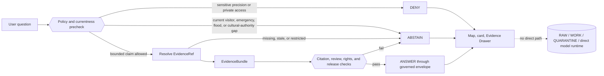

<!-- [KFM_META_BLOCK_V2]
doc_id: "kfm://doc/focus-mode/counties/washington-county/readme"
title: "Washington County Focus Mode Planning Lane"
type: "readme"
version: "v1.0"
status: "draft; repository-grounded; planning-only; compatibility-lane; heritage-sensitive; burial-and-archaeology-sensitive; visitor-currentness-non-authoritative; emergency-and-flood-redirect-only; non-release; non-publication"
owners:
  - "@bartytime4life — verified CODEOWNERS review route; Focus Mode stewardship NEEDS VERIFICATION"
  - "NEEDS VERIFICATION — heritage, archaeology, burial/cemetery, Indigenous/cultural authority, genealogy/privacy, property/access, visitor-currentness, emergency/flood, rights, evidence, policy, release, correction, and rollback review"
created: "2026-08-22"
updated: "2026-08-22"
policy_label: "public; documentation; county-scope; compatibility; cite-or-abstain; burial-precision-deny; archaeology-precision-deny; private-access-non-determination; visitor-currentness-abstain; emergency-and-flood-redirect; non-publication"
owning_root: "docs/"
responsibility: "Orient maintainers to the Washington County planning artifacts tracked in the singular Focus Mode compatibility lane; preserve Hollenberg Station, overland-trail, burial/cemetery, archaeology, genealogy/privacy, private-property/access, cultural-authority, visitor-currentness, emergency/flood, evidence, review, correction, and public-safety boundaries; and identify the smallest safe next repository slice without creating source, contract, schema, policy, lifecycle, release, or publication authority."
authority: "Human-readable navigation and boundary documentation only. This README and its linked build plan do not admit sources, validate county facts, expose grave/person or archaeological precision, determine access/title, provide current visitor or emergency guidance, establish cultural authority, evaluate policy, approve release, deploy a product, or publish a claim."
truth_posture: "CONFIRMED current repository path, one-byte predecessor, two-file county directory, linked build-plan bytes, current County Index row, accepted ADR-0029, proposed ADR-0027, current Focus documentation compatibility boundary, CODEOWNERS route, and generated-receipt schema / PROPOSED the build plan's Hollenberg Station, Oregon-California Trail, Pony Express, civic-context, cemetery-boundary, visitor-currentness, emergency/flood redirect, card, layer, fixture, reason-code, UI, and runtime designs / LINEAGE the plan's 2026-05-23 external-source observations and original plural-path proposal / UNKNOWN source admission, current external facts, rights, geometry authority, evidence closure, policy outcomes, runtime behavior, stewardship, release, correction propagation, rollback execution, deployment, and public parity / NEEDS VERIFICATION every historical, cultural, burial, archaeological, genealogical, property, access, visitor, emergency, flood, rights, currentness, and public-use claim."
current_path: "docs/focus-mode/counties/washington_county/README.md"
evidence_snapshot:
  - "repository=bartytime4life/Kansas-Frontier-Matrix"
  - "base_ref=main"
  - "base_commit=2e0b52937a0e139a1e9d3af0daa9b1752a4a1cd7"
  - "target_prior_blob=8b137891791fe96927ad78e64b0aad7bded08bdc"
  - "build_plan_path=docs/focus-mode/counties/washington_county/washington_county_focus_mode_build_plan.md"
  - "build_plan_blob=da2e9a026e77b6b9795166433a87b388593ec07d"
  - "county_index_blob=07e9b65cab9c4fd4ae31b61a84fecb06c6cde655"
  - "focus_mode_readme_blob=8600c0ac09452b4b03e5f60b94f1eb27c072b5db"
  - "county_lane_readme_blob=48621badd51614db7bff0882c19096fa388234ac"
  - "directory_rules_blob=fd49a0b83e55cef52c1124281f093e263526898d"
  - "adr_0027_blob=4dfb29c963cd5662265d3cb97f98be82212d5e08"
  - "adr_0029_blob=a4de0d7a96b78da59cfc499d1025e1508afd8dd9"
  - "codeowners_blob=dd2a84aa514d8ecd9208bc347f90f9a2ed37dd61"
  - "generated_receipt_schema_blob=fba21ed27ebccf1362fe397fe0c3ebd85e072685"
inspection_boundary: "Current-session GitHub reads covered the complete one-byte predecessor README, the complete Washington County build plan in bounded line ranges, the direct county directory, current County Index, current Focus documentation parent surfaces, accepted Directory Rules v2 and ADR-0029, proposed ADR-0027, CODEOWNERS, the generated-receipt schema, and matching open pull requests and task branches. The build plan's 2026-05-23 external-source checks were not refreshed. No source admission, rights review, archaeology or burial review, cultural-authority review, private record, property record, current visitor/travel feed, emergency/flood feed, policy evaluation, EvidenceBundle resolver, governed Focus request, model call, release record, correction propagation, rollback drill, deployment, or public endpoint was exercised."
related:
  - "./washington_county_focus_mode_build_plan.md"
  - "../README.md"
  - "../COUNTY_INDEX.md"
  - "../../README.md"
  - "../../../doctrine/directory-rules.md"
  - "../../../adr/ADR-0027-county-focus-mode-control-plane.md"
  - "../../../adr/ADR-0029-adopt-directory-governance-standard-v2.md"
tags: ["kfm", "focus-mode", "washington-county", "hollenberg-station", "oregon-california-trail", "pony-express", "heritage", "burial-sensitivity", "archaeology", "genealogy-privacy", "private-access", "cultural-authority", "visitor-currentness", "emergency-redirect", "flood-redirect", "compatibility", "non-publication"]
notes:
  - "v1.0 replaces the one-byte placeholder with a same-path, repository-grounded Washington County planning-lane boundary."
  - "The linked build plan remains byte-unchanged planning lineage; its dated external observations are not silently refreshed, admitted, implemented, released, or published."
  - "This edit does not decide singular-versus-plural Focus Mode placement, modify the shared County Index, or authorize migration."
[/KFM_META_BLOCK_V2] -->

# Washington County Focus Mode

> **Purpose.** Orient maintainers to the Washington County planning lane,
> preserve the build plan's Hollenberg Station and overland-trail thesis, and
> make burial, archaeology, genealogy/privacy, access, cultural-authority,
> visitor-currentness, emergency, flood, correction, and publication boundaries
> unmistakable.

> [!IMPORTANT]
> **This directory contains planning documentation, not a released county
> product.** The tracked build plan proposes a public-safe proof slice around
> Hollenberg Pony Express Station, broad Oregon-California Trail and Pony Express
> relationships, and county civic context. The plan and this README do not admit
> sources, resolve evidence, activate policy, validate runtime behavior, deploy a
> product, or publish county knowledge.

> [!CAUTION]
> **The existing path remains a compatibility lane.** Accepted ADR-0029 adopts
> Directory Rules v2, while ADR-0027 still proposes a plural, kebab-case county
> control plane. This update modifies the tracked README in place. Any move,
> rename, alias retirement, shared-index rewrite, or parallel-tree creation
> remains on **HOLD**.

> [!WARNING]
> **Public heritage context is not burial, archaeology, genealogy, access,
> cultural, visitor, emergency, flood, title, or safety authority.** County and
> state public pages may support bounded orientation after governed admission.
> They must not become grave/person maps, exact trail or artifact discovery
> surfaces, descendant or living-person linkage, private-land access advice,
> culturally authoritative narrative, current visitor guidance, emergency
> direction, flood/legal determinations, or direct model output presented as
> evidence.

**Quick navigation:** [Status](#1-status-and-authority) ·
[Responsibilities](#2-lane-responsibilities) ·
[Artifacts](#3-current-artifacts-and-plan-reconciliation) ·
[Proof slice](#4-proposed-county-proof-slice) ·
[Source roles](#5-source-role-and-temporal-fitness) ·
[Trust boundaries](#6-heritage-burial-archaeology-access-and-currentness-boundaries) ·
[Outcomes](#7-finite-outcomes-and-candidate-reason-codes) ·
[Interfaces](#8-proposed-cards-and-interfaces) ·
[Readiness](#9-current-readiness-boundary) ·
[Repository surfaces](#10-supporting-repository-surfaces) ·
[Next slice](#11-smallest-safe-follow-up) ·
[Open questions](#12-open-verification-questions) ·
[Validation](#13-validation-expectations) ·
[Maintenance](#14-maintenance-correction-and-rollback) ·
[References](#15-references)

---

## 1. Status and authority

| Question | Repository-grounded answer | Effect |
|---|---|---|
| Does the Washington County lane exist? | **CONFIRMED.** The tracked path is `docs/focus-mode/counties/washington_county/`. | The current files may be inspected and documented. |
| Was the predecessor README substantive? | **No.** The pinned predecessor blob was exactly one newline. | This v1.0 becomes the first substantive leaf boundary; prior intent remains unknown. |
| What build artifact is present? | [`washington_county_focus_mode_build_plan.md`](./washington_county_focus_mode_build_plan.md), blob `da2e9a026e77…`. | Treat as dated `PROPOSED` planning lineage. |
| What does the County Index report? | The current v1.5 index records Washington as `README_1_BYTE` with the expected county-local plan filename. | Only the README-byte finding becomes stale after this branch; lifecycle and validation remain unproved. |
| Is exact Focus documentation placement settled? | **No.** The singular tree is present; ADR-0027's plural target remains proposed. | Same-path documentation may proceed; structural migration remains held. |
| Is Washington County implemented or public? | **No evidence inspected here supports that conclusion.** | No runtime, release, deployment, or publication claim is permitted. |

### Truth labels used here

| Label | Meaning in this README |
|---|---|
| `CONFIRMED` | Verified from current repository paths, blobs, complete file reads, directory listings, or governing repository records. |
| `PROPOSED` | Design, fixture, reason code, interface, source use, or future work not implemented or accepted. |
| `UNKNOWN` | Evidence is insufficient to establish the claim. |
| `NEEDS VERIFICATION` | A concrete repository, source, rights, review, currentness, or runtime check remains. |
| `LINEAGE` | Retained dated planning material that is useful for context but is not current authority. |

[↑ Back to top](#top)

---

## 2. Lane responsibilities

### This README owns

- orientation to the current two-file Washington County directory;
- a bounded summary of the linked plan's proposal and non-goals;
- source-role and temporal-fitness guidance;
- burial, cemetery-person, genealogy/privacy, archaeology, private-access,
  cultural-authority, visitor-currentness, emergency, flood, property, and
  public-safety boundaries;
- finite future outcome vocabulary;
- current repository maturity and explicit unknowns;
- a fixture-first next-work packet; and
- documentation-scoped validation, correction, and rollback guidance.

### This README does not own

| Concern | Owning responsibility |
|---|---|
| Washington County historical, cultural, archaeological, burial, property, visitor, emergency, or flood truth | admitted sources, resolved evidence, qualified review, and governing policy |
| Focus semantic meaning and machine shape | verified contract and schema responsibility roots |
| Policy allow/generalize/abstain/deny decisions | `policy/` and accepted policy surfaces |
| Deterministic fixtures, validators, and executable proof | `fixtures/`, `tests/`, and `tools/validators/` under verified current conventions |
| Governed request handling | governed application/API responsibility roots |
| Map, timeline, Evidence Drawer, and boundary-panel rendering | governed Explorer/UI responsibility roots |
| Source identity, admission, rights, and evidence objects | source/evidence responsibility roots |
| Release, correction, withdrawal, cache invalidation, and rollback | release and lifecycle object families |

A Focus Mode is a composition scope. It is not a new domain root, source
registry, canonical store, policy engine, release lane, or public truth surface.

[↑ Back to top](#top)

---

## 3. Current artifacts and plan reconciliation

| Artifact | Pinned state | Actual role | README treatment |
|---|---|---|---|
| [`README.md`](./README.md) | Prior blob `8b137891791f…`; one newline. | Leaf orientation. | Replaced in place with this planning and trust boundary. |
| [`washington_county_focus_mode_build_plan.md`](./washington_county_focus_mode_build_plan.md) | Blob `da2e9a026e77…`; created and updated 2026-05-23. | Detailed Washington County build-plan proposal. | Kept byte-unchanged and treated as dated planning lineage. |
| [County Index](../COUNTY_INDEX.md) | Blob `07e9b65cab9c…`; v1.5 snapshot. | Shared inventory and collision-prevention surface. | Not partially edited; a full 105-county recount belongs in a separate pinned slice. |
| [Focus Mode lane README](../../README.md) | Blob `8600c0ac0945…`. | Current singular compatibility-lane orientation. | Confirms same-path documentation and keeps exact convergence on hold. |
| [County lane README](../README.md) | Blob `48621badd516…`. | Older county control-plane restatement. | Useful lineage, but conflicting canonical-path statements do not outrank accepted governance. |

### Plan elements carried forward

| Build-plan element | Current README posture |
|---|---|
| Hollenberg Pony Express Station as the first public-history anchor | `PROPOSED`, source-bounded future card |
| Broad Oregon-California Trail and Pony Express relationship | `PROPOSED`, generalized only |
| Washington, Hanover, and Hollenberg civic orientation | `PROPOSED`, administrative context only |
| County cemetery map/list routes | `PROPOSED` boundary explanation; person-linked layer withheld |
| Visitor information dated to the plan's 2026-05-23 source check | `LINEAGE`; current status not refreshed |
| County Emergency Management and FEMA routing | `PROPOSED` redirect-only behavior |
| Agriculture and local hydrology | `DEFER` until suitable admitted sources and review exist |
| Exact graves, burials, trail traces, artifacts, sacred places, private access, or living-person linkage | `DENY`, `EXCLUDE`, or `DEFER` in any first public slice |
| Cards, layers, schemas, reason codes, fixtures, UI, APIs, and runtime envelopes | `PROPOSED` until implemented and tested |
| Review, release, correction, and rollback | Required future trust transitions; currently `UNKNOWN` or `NEEDS VERIFICATION` |

The README does not refresh the build plan's external source checks, repeat its
historical statements as independently verified current facts, or turn linked
public pages into admitted KFM sources.

[↑ Back to top](#top)

---

## 4. Proposed county proof slice

**PROPOSED thesis:** Washington County can demonstrate how KFM presents
source-attributed public history and civic orientation while visibly refusing
burial/person precision, unreviewed archaeology, private-access inference,
culturally unauthorized narrative, and stale visitor or emergency guidance.

### First-slice composition

1. **County and civic orientation.** Present Washington County and broad named
   place context without parcel, title, household, or access inference.
2. **Hollenberg historic-site card.** Explain only the source-attributed,
   reviewed public-history scope supported by admitted evidence.
3. **Broad trail relationship.** Show generalized Oregon-California Trail and
   Pony Express context without trail-rut, artifact, archaeological, or
   private-property precision.
4. **Visitor-currentness notice.** Make the plan's dated source check visible
   and refuse current hours, access, road, or safety conclusions without fresh
   authoritative evidence.
5. **Cemetery and burial boundary card.** Explain why official county map/list
   routes do not automatically become grave/person/genealogy layers.
6. **Emergency and flood authority redirects.** Route users to responsible
   current authorities without making KFM an alert, evacuation, insurance,
   legal, or personal-safety service.
7. **Evidence and limitation surfaces.** Require visible source role, date,
   evidence state, sensitivity, release state, correction, and rollback
   posture.

### Non-goals

This slice is not a grave locator, genealogy service, descendant finder,
archaeological-site map, artifact-hunting guide, private-land access advisor,
title/easement system, culturally authoritative history generator, live
visitor-information service, emergency alert platform, flood/legal
determination service, or unrestricted AI question-answering surface.

[↑ Back to top](#top)

---

## 5. Source role and temporal fitness

Different source families support different claim classes and clocks. Their
roles must remain separate.

| Source-role class | Potential bounded use after admission | Unsafe collapse |
|---|---|---|
| State historic-site interpretation | Public-history context within the source's stated scope | Archaeological inventory, burial authority, comprehensive cultural history, or current visitor status |
| Visitor-information page | Displayed season/hours with retrieval and publication dates | Current open/closed, road, access, or travel-safety guarantee |
| County civic/administrative page | Department and place-routing context | Title, ownership, access, legal, genealogy, or current operational conclusion |
| Cemetery map/list route | Explain that an official route exists | Grave-level map, named-person layer, descendant inference, or bulk genealogy service |
| Emergency-management source | Responsible current-authority redirect | KFM emergency alert, evacuation instruction, or cached operational answer |
| FEMA or other flood-product route | Source discovery and product-role explanation | Individualized flood safety, insurance, legal, or emergency decision |
| Archaeology or cultural-authority source | Narrow reviewed context under appropriate authority | Exact sensitive location disclosure or generated Nation/cultural authority |
| Parcel, appraisal, or deeds source | Potential internal routing under strict policy | Title truth, private access, owner profile, or household inference |
| Map, tile, or derived geometry | Carrier of a released public-safe projection | Evidence, source authority, or publication proof by itself |
| AI-generated explanation | Bounded interpretation over released evidence | Root truth, source admission, policy decision, cultural authority, or release authority |

### Required time fields

Future visible claims should distinguish, where material:

- historical event or valid time;
- source publication or revision time;
- retrieval/check time;
- currentness window and expiry;
- KFM transform time;
- review time;
- release time; and
- supersession or correction time.

A source may remain authoritative for stable historical context while being
unfit for current visitor, road, emergency, flood, access, or safety claims.

[↑ Back to top](#top)

---

## 6. Heritage, burial, archaeology, access, and currentness boundaries

> [!WARNING]
> **Burial and cemetery-person precision:** public availability of a county
> cemetery route does not authorize KFM to expose grave coordinates, names,
> descendant relationships, living-person links, or bulk genealogy output.

> [!WARNING]
> **Archaeology and trail precision:** broad public interpretation of a station
> or trail does not authorize precise trail traces, ruts, artifacts, subsurface
> targets, sacred places, or unreviewed archaeological locations.

> [!CAUTION]
> **Private access and property:** historical significance, public maps, or
> route context do not determine title, easement, right-of-entry, trespass
> permission, or safe access across private land.

> [!CAUTION]
> **Cultural authority:** generated language and general public-history sources
> do not authorize definitive Indigenous, Nation, displacement, sacred-place, or
> culturally authoritative interpretation without suitable evidence and review.

> [!WARNING]
> **Visitor, emergency, and flood currentness:** dated visitor pages and official
> emergency or flood routes must not become KFM statements about current hours,
> closures, road conditions, travel safety, active hazards, evacuation, legal
> status, insurance, or personal action.

### Guardrail matrix

| Request class | Default future posture | Required public behavior |
|---|---|---|
| Bounded reviewed Hollenberg public-history question | `ANSWER` only after evidence, policy, review, and release closure | Cite source role, historical scope, limitations, and release state |
| Why cemetery details are withheld | `ANSWER` about the boundary | Explain non-display without leaking names or coordinates |
| Grave, burial, cemetery-person, descendant, or living-person request | `DENY` | Emit no sensitive detail |
| Exact trail rut, artifact, archaeological, sacred, or culturally sensitive location | `DENY` | Use broad context or no geometry |
| Private-land route, title, access, easement, or trespass permission | `DENY` | Route to appropriate authority; no property inference |
| Definitive cultural or Nation-specific interpretation without suitable authority | `ABSTAIN` or `DENY` | Explain the authority/review gap |
| Current site hours, directions, access, road, or travel-safety question | `ABSTAIN` | Provide a verified official-current redirect only |
| Active emergency, flood, evacuation, insurance, or legal question | `ABSTAIN` or `DENY` | Do not substitute KFM for responsible authority |
| Public client requests RAW, WORK, QUARANTINE, restricted source, or direct model output | `DENY` or `ERROR` | Preserve the trust membrane |

Public availability does not itself establish redistribution rights,
transformation permission, safe precision, policy approval, or release fitness.

[↑ Back to top](#top)

---

## 7. Finite outcomes and candidate reason codes

A future governed Washington runtime should converge on the finite KFM outcome
family:

| Outcome | Washington County example |
|---|---|
| `ANSWER` | Released evidence supports a bounded Hollenberg, civic, broad-trail, boundary, or source-role explanation and policy permits it. |
| `ABSTAIN` | Current visitor, road, emergency, flood, cultural-authority, evidence, rights, or temporal fitness is unresolved. |
| `DENY` | The request seeks burial/person precision, genealogy/living-person linkage, exact archaeology, private access/title, sensitive cultural detail, or internal lifecycle data. |
| `ERROR` | Evidence resolution, policy evaluation, citation validation, contract validation, or another required trust component fails. |

### Candidate examples from the linked plan

These names are **PROPOSED** and unregistered. They must not be treated as
current contract or policy vocabulary.

| Candidate reason code | Outcome | Intended boundary |
|---|---:|---|
| `DENY_BURIAL_OR_CEMETERY_PERSON_PRECISION` | `DENY` | Grave, burial, or person-linked cemetery detail |
| `DENY_GENEALOGY_OR_LIVING_PERSON_LINKAGE` | `DENY` | Descendant or living-person derivation |
| `DENY_UNREVIEWED_ARCHAEOLOGICAL_PRECISION` | `DENY` | Exact trail, artifact, or archaeological detail |
| `DENY_PRIVATE_ACCESS_OR_TITLE_INFERENCE` | `DENY` | Access, easement, title, or trespass conclusion |
| `ABSTAIN_CULTURAL_AUTHORITY_NOT_ESTABLISHED` | `ABSTAIN` | Missing suitable cultural/Nation authority and review |
| `ABSTAIN_VISITOR_CURRENTNESS_UNVERIFIED` | `ABSTAIN` | Current site hours, access, or travel status unsupported |
| `ABSTAIN_CURRENT_EMERGENCY_AUTHORITY_REQUIRED` | `ABSTAIN` | Active emergency or current-safety question |
| `ABSTAIN_REGULATORY_PRODUCT_NOT_PERSONAL_DECISION` | `ABSTAIN` | Flood product misused as personal/legal verdict |
| `ERROR_UNRESOLVED_EVIDENCE_REF` | `ERROR` | Required evidence does not resolve |
| `ERROR_GENERATED_LANGUAGE_AS_EVIDENCE` | `ERROR` | Model output is treated as proof |
| `DENY_TRUST_MEMBRANE_BYPASS` | `DENY` | Public access attempts internal lifecycle material |
| `DENY_RELEASE_WITHOUT_REVIEW_OR_ROLLBACK` | `DENY` | Candidate lacks required review/correction/rollback closure |

The governing reason-code registry, contract semantics, and policy bindings all
remain `NEEDS VERIFICATION`.

[↑ Back to top](#top)

---

## 8. Proposed cards and interfaces

All items below remain `PROPOSED`.

| Surface | Purpose | Required visible limit |
|---|---|---|
| `HollenbergHistoricSiteContextCard` | Source-attributed public-history orientation | Not archaeology, burial authority, cultural completeness, or current visitor status |
| `OverlandTrailBroadRelationshipCard` | Generalized trail/Pony Express relationship | No precise trace, artifact, or private-access implication |
| `VisitorCurrentnessNotice` | Make source date and currentness gap visible | No current hours/access/travel guarantee |
| `CemeteryRouteWithheldLayerNotice` | Explain why official routes do not become public person layers | No names, graves, descendant linkage, or hidden-geometry hints |
| `CulturalAuthorityHoldNotice` | Expose missing authority/review for consequential cultural claims | No generated definitive narrative |
| `EmergencyAuthorityRedirectCard` | Route users to responsible current authority | No KFM emergency instruction |
| `FloodProductAuthorityCard` | Explain product/source role | No personal safety, insurance, legal, or emergency verdict |
| `EvidenceDrawer` | Resolve visible claims to evidence, source role, time, limits, review, and release state | Must fail closed if evidence or policy is unresolved |
| `HeritageBoundaryPanel` | Persistent burial/archaeology/access/currentness explanation | Cannot reveal restricted detail while explaining denial |
| `CorrectionAndReleasePanel` | Show review, correction, supersession, withdrawal, and rollback state | Draft content must never appear released |

### Proposed trust flow

[↑ Back to top](#top)

---

## 9. Current readiness boundary

| Capability | Current bounded status |
|---|---|
| Washington README and county-local build plan | **CONFIRMED present** |
| Plan identity and county scope | **CONFIRMED as Washington planning lineage** |
| Current external source facts | **NOT REFRESHED** |
| Source admission and rights | **UNKNOWN / NEEDS VERIFICATION** |
| Safe historic/trail geometry authority | **UNKNOWN** |
| Burial/cemetery/genealogy review | **UNKNOWN** |
| Archaeology and cultural-authority review | **UNKNOWN** |
| Visitor-currentness and official redirect rules | **PROPOSED / UNKNOWN implementation** |
| EvidenceRef → EvidenceBundle closure | **UNKNOWN** |
| Washington-specific policy bindings | **PROPOSED / UNKNOWN implementation** |
| Deterministic fixtures and negative cases | **PROPOSED** |
| Governed API/runtime behavior | **UNKNOWN** |
| MapLibre layers, cards, timeline, and Evidence Drawer | **UNKNOWN** |
| ReviewRecord, release manifest, correction, withdrawal, and rollback | **UNKNOWN** |
| Deployment and public parity | **UNKNOWN** |

A documentation edit cannot upgrade any of these trust-bearing states.

[↑ Back to top](#top)

---

## 10. Supporting repository surfaces

| Surface | Current role | Boundary |
|---|---|---|
| [Linked build plan](./washington_county_focus_mode_build_plan.md) | Detailed dated county proposal | Planning lineage, not source admission or implementation |
| [County Index](../COUNTY_INDEX.md) | Shared inventory and collision-prevention snapshot | Stale after many leaf merges; no lifecycle or publication authority |
| [County lane README](../README.md) | Historical control-plane restatement | Does not override accepted governance |
| [Focus Mode README](../../README.md) | Current singular compatibility-lane orientation | Exact structural convergence remains held |
| [Directory Rules](../../../doctrine/directory-rules.md) | Accepted bytes through ADR-0029 | Governs responsibility and migration; does not grant release |
| [ADR-0027](../../../adr/ADR-0027-county-focus-mode-control-plane.md) | Proposed county-control-plane decision | Cannot authorize migration or lifecycle promotion |
| [ADR-0029](../../../adr/ADR-0029-adopt-directory-governance-standard-v2.md) | Accepted Directory Rules adoption decision | Supports same-path docs work and controlled migration discipline |
| [CODEOWNERS](../../../../.github/CODEOWNERS) | Verified GitHub review routing to `@bartytime4life` | Not stewardship assignment, policy approval, or publication authority |
| [Generated-receipt schema](../../../../schemas/contracts/v1/receipts/generated_receipt.schema.json) | Machine shape for AI authoring provenance | Receipt conformance is not artifact correctness or merge approval |
| [Generated-receipt lane](../../../../data/receipts/generated/README.md) | Provenance/process-memory boundary | Receipt is not proof, catalog closure, release, or publication |

[↑ Back to top](#top)

---

## 11. Smallest safe follow-up

**PROPOSED next implementation:** create a deterministic, no-network Washington
heritage-sensitivity and currentness fixture packet without activating live
sources or public delivery.

### Acceptance matrix

| Fixture or request class | Expected result |
|---|---:|
| Released fixture evidence supports bounded Hollenberg public-history context | `ANSWER` |
| Released fixture explains why cemetery detail is withheld | `ANSWER` |
| Grave, burial, cemetery-person, descendant, or living-person request | `DENY` |
| Exact trail rut, artifact, archaeological, sacred, or sensitive-location request | `DENY` |
| Private-land access, title, easement, or trespass inference | `DENY` |
| Definitive cultural claim without suitable authority/review | `ABSTAIN` |
| Current site hours, access, roads, or travel-safety question with stale evidence | `ABSTAIN` |
| Active emergency, flood, evacuation, insurance, or legal question | `ABSTAIN` or `DENY` |
| Evidence reference cannot resolve | `ABSTAIN` or fail-closed `ERROR` under the governing contract |
| Public payload references RAW, WORK, QUARANTINE, restricted data, or direct model output | `DENY` or `ERROR` |
| Candidate release lacks review, correction, or rollback closure | `DENY` |

### Bounded deliverables

1. synthetic source-role descriptors with no external payload;
2. one bounded public-history `ANSWER` fixture;
3. one boundary-explanation `ANSWER` fixture;
4. burial/person, archaeology, private-access, cultural-authority, stale-visitor,
   emergency/flood, missing-evidence, and trust-membrane negative fixtures;
5. deterministic outcome assertions;
6. no-network validator tests;
7. an explicit no-publication statement; and
8. rollback by removing the unmerged synthetic packet.

Before selecting paths, inspect accepted Directory Rules, current conventions,
existing contracts/schemas/policies, and any active overlapping work.

[↑ Back to top](#top)

---

## 12. Open verification questions

### Sources, rights, and evidence

- Which current official and authoritative sources may support a narrow
  Washington County public slice?
- What text, media, and geometry reuse rights apply?
- What broad trail geometry, if any, is authoritative and safe for public use?
- May county cemetery routes be linked without ingestion, and what
  person-linkage or derivative-display restrictions apply?
- What source can establish current visitor status after the plan's dated
  source check?
- Which EvidenceBundle and citation-validation families should be reused?

### Sensitivity and authority

- Who reviews burial, cemetery-person, genealogy, archaeology, and precise
  historic-site location handling?
- What appropriate authority and consultation route governs Indigenous,
  Nation-specific, sacred-place, displacement, and cultural interpretation?
- What policy profile controls property/access inference and living-person
  linkage?
- What currentness and official-redirect rules govern visitor, road,
  emergency, flood, and travel questions?

### Repository and implementation

- Is there any newer or parallel Washington County artifact in unindexed
  history or storage?
- What accepted path and naming decision governs future county control-plane
  convergence?
- Which existing contracts, schemas, policies, fixtures, validators, and
  reason-code registries must be reused?
- When should the shared County Index be recomputed against the complete current
  105-county tree?
- What correction and rollback objects govern an accidental sensitive-location
  leak or stale current-guidance answer?

[↑ Back to top](#top)

---

## 13. Validation expectations

### Validation appropriate to this README update

- current `main`, target blob, directory inventory, and linked-plan blob pinned;
- complete predecessor README and complete linked build plan read;
- no matching open Washington README PR or task branch before mutation;
- same-path placement reviewed against accepted ADR-0029 and proposed ADR-0027;
- one metadata block and one H1;
- unique explicit anchors and resolving local fragments;
- supported GitHub alerts, balanced fences, no tabs or trailing whitespace, and
  a final newline;
- repository-relative links limited to inspected paths;
- no external fact silently refreshed;
- no grave/person, archaeology, private-access, cultural-authority, current
  visitor, emergency, flood, title, or safety claim introduced;
- exact final artifact hash and Git blob read-back;
- generated receipt validated against the repository schema;
- base-to-head diff limited to the intended README and receipt; and
- hosted checks reported separately from documentation truth.

### What passing checks do not prove

They do not prove source truth, source rights, archaeological or cultural
review, safe geometry, visitor currentness, emergency or flood fitness,
EvidenceBundle closure, policy correctness, runtime behavior, release
eligibility, deployment, or publication.

[↑ Back to top](#top)

---

## 14. Maintenance, correction, and rollback

Re-review this README when:

- the sibling build plan changes;
- Washington County source admission or review begins;
- visitor/currentness, archaeology, burial, genealogy/privacy, cultural,
  property/access, emergency, or flood policy changes;
- ADR-0027 changes status;
- Focus Mode placement or validator wiring changes;
- a Washington fixture, API, UI, release, correction, or rollback artifact is
  implemented;
- the shared County Index is recomputed; or
- a source correction, rights change, sensitivity finding, or harm report
  invalidates a proposed use.

### Before merge

Close or abandon the draft pull request and feature branch. No default-branch
bytes need to change. Remote branch deletion is a separate action.

### After merge

Use a transparent revert or bounded forward-fix pull request against the actual
merged commit. Do not rewrite shared history.

A future public Washington release would require more than a Git revert. Its
correction process must identify affected evidence, cards, layers, tiles,
caches, generated explanations, citations, manifests, and downstream clients;
preserve the supersession record; and restore the last approved public-safe
state.

[↑ Back to top](#top)

---

## 15. References

### Repository evidence

- [Washington County build plan](./washington_county_focus_mode_build_plan.md)
- [County Focus Mode Index](../COUNTY_INDEX.md)
- [County lane README](../README.md)
- [Focus Mode compatibility-lane README](../../README.md)
- [Accepted Directory Rules bytes](../../../doctrine/directory-rules.md)
- [ADR-0027 — County Focus Mode Control Plane](../../../adr/ADR-0027-county-focus-mode-control-plane.md)
- [ADR-0029 — Adopt Directory Governance Standard v2](../../../adr/ADR-0029-adopt-directory-governance-standard-v2.md)
- [Generated-receipt schema](../../../../schemas/contracts/v1/receipts/generated_receipt.schema.json)
- [Generated-receipt lane](../../../../data/receipts/generated/README.md)

### Evidence-use note

The linked plan records a 2026-05-23 source-check run and lists the external
pages it examined. This README uses that plan only as dated planning lineage.
It does not independently verify, refresh, admit, quote as current authority, or
publish those external sources.

[↑ Back to top](#top)
