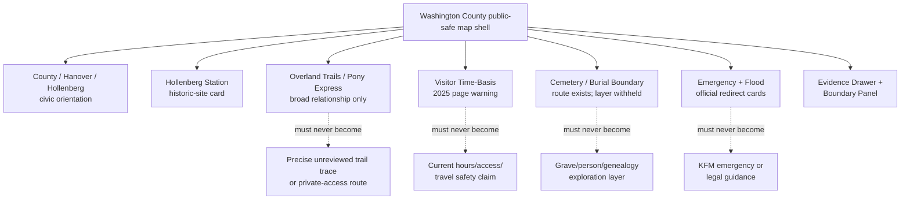
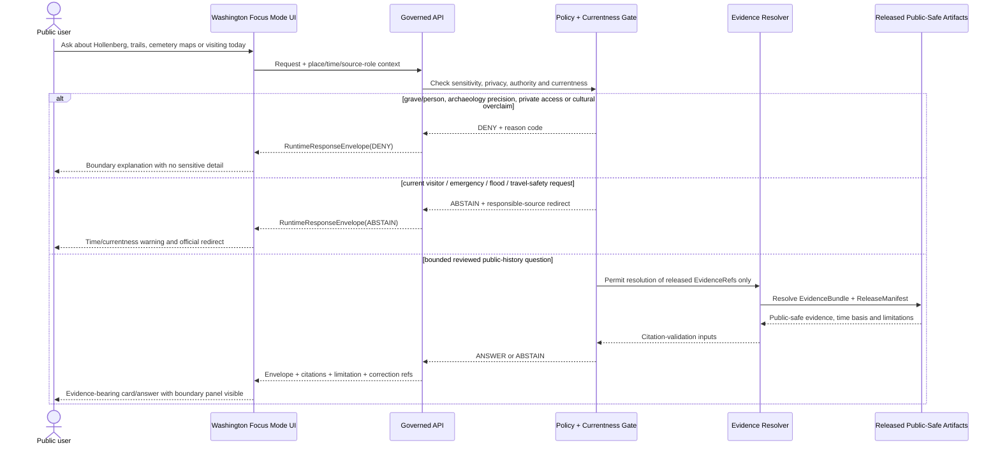
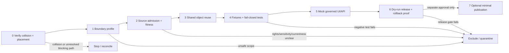

<!-- [KFM_META_BLOCK_V2]
doc_id: NEEDS_VERIFICATION
title: Washington County Focus Mode Build Plan — Hollenberg Station, Overland Trails, and the No-Burial-Precision / No-Live-Travel-Guidance Boundary
type: standard
version: v1
status: draft
owners:
  - NEEDS_VERIFICATION
created: 2026-05-23
updated: 2026-05-23
policy_label: public_draft
selected_county: Washington County, Kansas
download_filename: washington_county_focus_mode_build_plan.md
proof_slice: >-
  Hollenberg Pony Express Station State Historic Site and Oregon-California Trail / Pony Express
  interpretation + county cemetery-map sensitivity + visitor-information and emergency-currentness restraint
primary_public_safe_boundary: >-
  Public KFM may present reviewed, citation-backed interpretation of Hollenberg Pony Express Station,
  broad Oregon-California Trail and Pony Express relationships, and bounded Washington County civic context.
  It must not expose grave-level, cemetery-person-linkage, burial, unreviewed archaeological trail-trace,
  private-land access, or living-person/genealogical precision; must not convert dated visitor information,
  county maps, property-facing departments, flood products, or emergency-management pages into current
  travel, access, safety, title, legal, emergency, or property conclusions; and must not generate
  culturally authoritative or displacement narratives without appropriate authoritative evidence and review.
source_check_date: 2026-05-23
truth_posture:
  confirmed: verified in this run from attached doctrine, inspected live repository evidence, generated artifact, or authoritative checked public sources
  proposed: design, path, object, schema, policy, fixture, UI, workflow, release step, layer, or implementation recommendation not verified as implemented
  needs_verification: checkable but not sufficiently verified to act as admitted, reviewed, implemented, promoted, or publishable fact
  unknown: unsupported or unresolved from available evidence
collision_check:
  supplied_register: "CONFIRMED: Washington County is absent from the completed/collision register supplied for this series."
  current_session_additions: "CONFIRMED: Butler County, Greenwood County, Comanche County, and Pratt County were already built in this continuation and excluded from selection."
  rejected_candidate: "CONFIRMED: Graham County was rejected after live repository search surfaced docs/focus-mode/counties/graham_county/graham_county_focus_mode_build_plan.md."
  uploaded_materials: "CONFIRMED for searches executed: searches of available uploaded/current project materials returned no Washington County Focus Mode Build Plan hit."
  live_repository_filename_search: "CONFIRMED for query executed: live GitHub search for washington_county_focus_mode_build_plan returned no result."
  live_repository_title_search: "CONFIRMED for query executed: live GitHub search for Washington County Focus Mode returned control-plane/index material but no Washington plan artifact."
  live_index: "CONFIRMED: inspected live docs/focus-mode/counties/COUNTY_INDEX.md lists Washington as not-started."
  exhaustive_history: "NEEDS_VERIFICATION: all branches, Git history, archived generated outputs, unindexed project materials, and every prior off-index artifact were not exhaustively cleared."
repository_placement:
  delivered_artifact_filename: "washington_county_focus_mode_build_plan.md"
  intended_landing_path: "PROPOSED / NEEDS_VERIFICATION: docs/focus-modes/washington-county/build-plan.md"
  observed_legacy_or_divergent_path_shape: "CONFIRMED visible repository content exists under docs/focus-mode/counties/<county_name>/<county_name>_county_focus_mode_build_plan.md, including the Graham collision and the inspected county index."
  placement_basis: >-
    Directory Rules confirm that human-facing planning materials belong in a responsibility-rooted docs lane,
    topic/county does not justify a new root, and specific paths remain proposed until verified. A live
    docs/focus-mode/counties/README.md file states that docs/focus-modes/<area>-county/ is canonical and labels
    docs/focus-mode/counties/ as divergence/retired; its claimed Directory Rules/ADR authority must still be
    reconciled against the governing source before landing this document.
schema_contract_policy_homes: NEEDS_VERIFICATION
review_assignments: NEEDS_VERIFICATION
correction_path: NEEDS_VERIFICATION
rollback_path: NEEDS_VERIFICATION
release_status: NEEDS_VERIFICATION / no implementation, review, promotion, or publication claimed
related:
  - "Directory Rules.pdf (inspected attached doctrine)"
  - "docs/focus-mode/counties/COUNTY_INDEX.md (live repository read during collision control)"
  - "docs/focus-mode/counties/README.md (live repository read; placement reconciliation evidence)"
  - "Kansas Historical Society — Hollenberg Pony Express Station (official source checked)"
  - "Washington County, Kansas — official website and county maps/emergency management pages checked"
  - "FEMA Flood Map Service Center (official source-family route checked)"
tags:
  - kfm
  - focus-mode
  - washington-county
  - hollenberg-pony-express-station
  - oregon-california-trail
  - pony-express
  - cemetery-sensitivity
  - archaeology
  - currentness
  - emergency-redirect
  - cite-or-abstain
notes:
  - This is a standalone downloadable planning artifact generated outside the repository.
  - No repository file was created, edited, moved, reviewed, promoted, or published by this artifact.
  - Official public-source pages checked during this run are listed in Section 15 and Appendix C.
[/KFM_META_BLOCK_V2] -->

<a id="top"></a>

# Washington County Focus Mode Build Plan  
## Hollenberg Station, Overland Trails, and the **No-Burial-Precision / No-Live-Travel-Guidance Boundary**

> **Product thesis:** Build a public-safe Washington County evidence experience around Hollenberg Pony Express Station, broad Oregon-California Trail and Pony Express interpretation, and county civic context, while refusing burial/cemetery-person linkage, unreviewed archaeological trail precision, private-land access inference, culturally unauthorized narrative, or live travel, visitor, emergency, flood, title, and safety conclusions.


| Identity field | Determination |
|---|---|
| County | **Washington County, Kansas** |
| Selected proof slice | **Hollenberg Pony Express Station State Historic Site + broad Oregon-California Trail / Pony Express relationship + cemetery-map and visitor/currentness restraint** |
| Why this county is next | It supplies an official state historic-site anchor and a materially different governance challenge: public heritage interpretation must not expose burial, genealogy/person-linkage, archaeological trail-trace, private-access, or stale visitor/emergency meaning. |
| Primary public-safe boundary | **No burial/cemetery-person precision, no unreviewed archaeological or private-access precision, no culturally unauthorized narrative, and no live travel/visitor/emergency/flood/title/safety determination.** |
| Official-source check | `CONFIRMED`: KSHS/Kansas History and Washington County official pages were opened and verified on 2026-05-23; FEMA official flood-source route was also checked. |
| Collision search | `CONFIRMED` for the performed material/repository searches; exhaustive branch/history/archive clearance remains `NEEDS_VERIFICATION`. |
| Repository mutation | **None claimed or performed.** |
| Candidate repository landing lane | `PROPOSED / NEEDS_VERIFICATION`: `docs/focus-modes/washington-county/build-plan.md`; placement reconciliation required. |
| Release posture | `draft_not_published`; review, release, correction and rollback remain `NEEDS_VERIFICATION`. |

**Quick links:** [Operating posture](#1-operating-posture) · [Why Washington County](#2-why-this-county) · [Product thesis](#3-product-thesis) · [Scope boundary](#4-scope-boundary) · [First demo layers](#5-first-demo-layers) · [User journeys](#6-user-journeys) · [UI surfaces](#7-ui-surfaces) · [Governed objects](#8-governed-object-model) · [Repository shape](#9-proposed-repository-shape) · [Build phases](#10-build-phases) · [First PR](#11-first-pr-sequence) · [Fixtures](#13-fixture-plan) · [Sources](#15-source-seed-list) · [Milestone](#17-recommended-first-milestone)

---

## Executive build note

Washington County adds a rare and valuable KFM test: an official, highly legible public-history anchor that sits beside burial, archaeology, genealogy, private-access, and current visitor-information boundaries. The Kansas Historical Society identifies **Hollenberg Pony Express Station** as a National Historic Landmark where Gerat H. and Sophia Hollenberg established a station on the Oregon-California Trail in 1857 and operated a Pony Express station from 1860 to 1861. The same official visitor page currently publishes visiting hours for **April 16–October 19, 2025**, which makes time fitness central rather than optional for a plan generated in 2026.

Washington County’s official site lists Hollenberg and Hanover in its cities/townships navigation, routes users to Emergency Management, Appraiser and Register of Deeds departments, and exposes a County Maps page containing cemetery-district and cemetery-list map routes. These are legitimate official public-source routes. They are **not** permission for KFM to combine historic interpretation with graves, descendants, property, access, title, present emergency guidance or live travel/visitor claims.

> [!CAUTION]
> ## Washington County’s defining public-safe boundary
> KFM may publish **reviewed, citation-bearing public context** about Hollenberg Station, broad Oregon-California Trail and Pony Express relationships, Washington County civic orientation, and official authority routes. It must **DENY or ABSTAIN** when a request would:
>
> - show grave-level, burial, cemetery-person-linkage, genealogy/living-person, or exact unreviewed archaeological trail-trace precision;
> - infer access, title, ownership, easement, trespass permission or private-land routing from trail/cemetery/county-map context;
> - generate culturally authoritative, displacement, Indigenous or sacred-place interpretation without appropriate authoritative evidence and review;
> - restate visitor hours, directions, road conditions, closures, county emergency pages or flood products as current KFM travel, access, emergency or safety guidance;
> - use public history or tourism content as the sole authority for consequential legal, archaeological, cultural, genealogical or safety claims;
> - expose `RAW`, `WORK`, `QUARANTINE`, restricted source materials, internal stores, or direct model output through a public surface.
>
> **The first demonstration is successful only when withholding and abstention are visible product behavior: in the title, Evidence Drawer, map layers, denial panel, fixtures, risks, milestone gates, correction route and rollback posture.**

### Evidence-boundary table

| Truth label | What is supported in this planning run | What it does **not** establish |
|---|---|---|
| `CONFIRMED` | KSHS/Kansas History official pages identify Hollenberg Station, the Oregon-California Trail/Pony Express relationship, and dated 2025 visitor information; Washington County official pages expose civic, cemetery-map and emergency-management source routes; live repository search found a Graham collision and no Washington exact plan result; the live county index lists Washington as `not-started`; Directory Rules doctrine was inspected. | No KFM source admission, public layer, contract/schema implementation, policy enforcement, reviewer assignment, correction mechanism, promotion, publication or live-condition answer exists because of this plan. |
| `PROPOSED` | Public-safe cards, boundary profile, object mappings, reason codes, fixtures, UI, source admissions, build phases, dry-run release proof and candidate repository landing path. | Not existing implementation or released product. |
| `NEEDS_VERIFICATION` | Exact canonical landing path; underlying Directory Rules/ADR reconciliation for the focus-mode lane; source rights/derivative-display permissions; geometry precision; archaeology/burial/cultural review obligations; current 2026 visitor/access information; shared contract/schema/policy/release machinery; exhaustive collision clearance. | Not safe to represent as approved, current, admitted or released. |
| `UNKNOWN` | Actual runtime routes, test/CI outcomes, source registry entries, dynamic emergency/flood/travel currentness, historic-trail geometry authority, public release state and uninspected sources. | Must not be asserted or smoothed over by generated text. |

---

<a id="1-operating-posture"></a>

# 1. Operating posture

## 1.1 KFM governing rules applied to Washington County

| Governing rule | Washington County application |
|---|---|
| EvidenceBundle outranks generated language | A statement about Hollenberg Station, trail relationships, cemetery maps or county authority routes must resolve to reviewed evidence before a public `ANSWER`. |
| Public clients use governed interfaces only | Public Focus Mode may consume released card/layer/envelope artifacts only; it cannot query raw cemetery lists, internal candidate trail geometry, restricted records or model output as truth. |
| Publication is a governed state transition | Opening an official website is source research, not public release; a Markdown plan is not a promoted layer. |
| AI is interpretive, not root truth | AI may summarize admitted public-safe evidence, display limitations, deny or abstain; it may not manufacture ancestral, burial, access, visitor or emergency meaning. |
| Source roles remain distinct | State historic-site interpretation, county administrative/cemetery routing, emergency-management authority, flood-hazard product, visitor page, archaeology authority and generated narrative are separate roles. |
| Cite-or-abstain | If evidence, rights, authority, time fitness, sensitivity or policy posture is unresolved, the public answer narrows scope, abstains or denies. |
| Rights and sensitivity fail closed | Grave/burial, archaeological, private-access, genealogy/living-person and culturally sensitive precision is withheld absent specific review and authority. |
| Correction and rollback remain visible | An eventual public interpretation must have correction and rollback references before it is called released. |

## 1.2 Truth-label and finite-outcome key

| Token | Meaning in this plan |
|---|---|
| `CONFIRMED` | Verified in this run from attached doctrine, live repository evidence, generated artifact or checked authoritative public source. |
| `PROPOSED` | Recommended design, object, path, layer, fixture, UI or workflow not proven implemented. |
| `NEEDS_VERIFICATION` | Concrete check required before admission, implementation, review or release. |
| `UNKNOWN` | Not supported sufficiently by the evidence available in this run. |
| `ANSWER` | Evidence-resolved and policy-allowed response with visible source role, time basis and limits. |
| `ABSTAIN` | Evidence, currentness, authority or rights are insufficient for a safe answer. |
| `DENY` | Request seeks prohibited precision, private or culturally sensitive inference, unsafe live guidance, or trust-membrane bypass. |
| `ERROR` | Contract, evidence-resolution, policy, citation or system failure; no fabricated substitute answer. |
| `DEFER` / `EXCLUDE` | Planning status for content outside the first slice or barred from public scope. |

## 1.3 Public trust-membrane flowchart

```mermaid
flowchart LR
    S[Official public-source seed<br/>KSHS / County / FEMA] --> A[Admission + source-role review]
    A -->|rights, precision,<br/>cultural review or time basis unclear| Q[WORK / QUARANTINE]
    A -->|bounded candidate admitted| R[RAW reference + receipt]
    R --> W[WORK normalization]
    W --> P[PROCESSED candidate]
    P --> C[CATALOG / TRIPLET + EvidenceRef]
    C --> B[EvidenceBundle resolution]
    B --> G{Policy + citation +<br/>review + currentness gate}
    G -->|burial/archaeology/private access/<br/>live guidance/cultural overclaim| X[DENY / ABSTAIN<br/>safe explanation or redirect]
    G -->|reviewed public-safe context| M[ReleaseManifest candidate<br/>+ rollback target]
    M --> H{Promotion decision}
    H -->|not approved| HOLD[Hold / correction / quarantine]
    H -->|approved| PUB[PUBLISHED public-safe artifact]
    PUB --> API[Governed API / tile service]
    API --> UI[Map + Evidence Drawer + bounded AI]
    UI -. correction request .-> CN[CorrectionNotice / rollback review]
```



## 1.4 County-specific non-negotiable guardrails

| Guardrail | Required public behavior |
|---|---|
| Trail interpretation is not trail-trace disclosure | Show broad officially interpreted Hollenberg/Oregon-California/Pony Express context only; do not publish unreviewed trace geometry or archaeological precision. |
| Cemetery routes are not burial/person layers | County cemetery-map/list links may be described as official routes; no grave-level mapping, person-linkage, descendant inference or bulk genealogy layer in MVP. |
| Public history is not cultural authority | Consequential cultural, Indigenous, sacred-place or displacement interpretation requires appropriate authoritative evidence and review. |
| Visitor information has time basis | KSHS visitor page showing 2025 hours is evidence of time sensitivity, not current 2026 access/hours truth. |
| Emergency management remains the responsible authority | Public UI may route users to county emergency authority; it must not issue current emergency direction. |
| Flood products are not emergency or legal judgments | FEMA source routing remains regulatory/product context only absent a separately admitted, current, bounded use. |
| County administrative routes do not establish title/access | Appraiser, Register of Deeds, county maps and roads are not combined into owner/title/easement/private-access answers. |
| Public AI never crosses the trust membrane | No direct public path to raw/unreviewed cemetery, archaeological, private, internal or model material. |

---

<a id="2-why-this-county"></a>

# 2. Why this county

## 2.1 Selection screen against the completed/collision register

| Collision-prevention step | Evidence checked in this run | Determination |
|---|---|---|
| Compare against supplied completed/collision register | Literal screen against the register supplied for the series. | `CONFIRMED`: **Washington County is absent.** |
| Exclude continuation artifacts already created | Butler, Greenwood, Comanche and Pratt were built in this continuing series. | `CONFIRMED`: none is reselected. |
| Test a candidate then reject collision | Live repository search for `graham_county_focus_mode_build_plan`. | `CONFIRMED`: Graham was rejected after a live artifact surfaced at `docs/focus-mode/counties/graham_county/graham_county_focus_mode_build_plan.md`. |
| Search available project materials for Washington | Searches for `washington_county_focus_mode_build_plan`, “Washington County Focus Mode Build Plan” and Hollenberg terms across accessible uploaded/current materials. | `CONFIRMED` for searches executed: no Washington plan surfaced. |
| Search live repository for exact Washington filename | GitHub query `washington_county_focus_mode_build_plan`. | `CONFIRMED` for query executed: no exact plan result. |
| Search live repository by Washington title | GitHub query `Washington County Focus Mode`. | `CONFIRMED` for query executed: control-plane/index results surfaced, not a Washington plan artifact. |
| Inspect live county index | Read `docs/focus-mode/counties/COUNTY_INDEX.md` from the live repository. | `CONFIRMED`: inspected row lists Washington as `not-started`; this is supporting status evidence, not exhaustive clearance. |
| Inspect visible path authority evidence | Read live `docs/focus-mode/counties/README.md`; inspected Directory Rules doctrine. | `CONFIRMED`: README labels its own `docs/focus-mode/counties/` lane divergent and names `docs/focus-modes/<area>-county/` as canonical; governing source/ADR reconciliation remains `NEEDS_VERIFICATION`. |
| Exhaustive project-history clearance | All branches, commits, unindexed artifacts, archives and external project stores. | `NEEDS_VERIFICATION`: not exhaustively inspected. |

> [!NOTE]
> Washington County is selected because it cleared the performed collision checks and contributes a distinct proof boundary. A later collision discovery must trigger reconciliation, not duplication.

## 2.2 Proof-slice rationale table

| Dimension | Washington County proof value | Governance challenge tested |
|---|---|---|
| Official historic-site anchor | KSHS identifies Hollenberg Pony Express Station and its Oregon-California Trail / Pony Express history. | Tell a compelling story without treating public interpretation as permission for unreviewed archaeology, burial or private-access precision. |
| Temporal fitness | The official Hollenberg visitor page visibly gives a 2025 visiting season while this plan is made in 2026. | Require dated visitor-currentness handling rather than silently issuing present travel guidance. |
| County civic geography | County official navigation lists Washington, Hanover and Hollenberg and provides county department/context routing. | Establish civic context without title, appraisal, living-person or private-property inference. |
| Cemetery-map sensitivity | County Maps page exposes cemetery districts and cemetery list routes by name/township. | Prevent an official public route from becoming a grave/person/genealogical discovery surface without policy and review. |
| Emergency-currentness | County Emergency Management page defines emergency responsibility and current-service routing. | Demonstrate redirect/abstain behavior instead of KFM issuing operational guidance. |
| Flood authority | FEMA MSC is an official federal flood-hazard product route. | Preserve regulatory/product role without legal, insurance or emergency overclaim. |
| Culture/authority restraint | Migration/trail history can overlap displacement, Indigenous history and sacred-place meanings. | Refuse generated cultural authority absent appropriate evidence and review. |

## 2.3 Why Washington adds a distinct series proof

| Prior or adjacent proof pressure | Distinction added by Washington County |
|---|---|
| Wetland/refuge sensitivity in previously built counties | Washington centers historic-site interpretation, cemeteries and burial/person-linkage, not wildlife occurrence. |
| Archaeology/battlefield themes in completed counties | Washington tests a state historic site plus public county cemetery-map routes and dated visitor information in one UI boundary. |
| Greenwood live smoke/fire guidance restraint | Washington’s currentness burden concerns visitor directions, trail access and emergency authority rather than burn decisions. |
| Comanche natural-feature precision restraint | Washington’s withheld precision is burial/archaeology/private access/genealogy and culturally authoritative interpretation rather than caves/geology. |
| Pratt wildlife-access restraint | Washington focuses on public heritage routes and cemetery/person linkage, not wildlife management/access. |

Washington therefore provides a useful KFM test of a public-history interface that is attractive and educational **because** it shows where evidence, precision, cultural authority and currentness stop the answer.

## 2.4 Public benefit and governance value

| Public benefit | Governance value |
|---|---|
| Explore the public history of Hollenberg Station and overland travel in a place-based map. | Demonstrate that historic interpretation requires evidence and can remain broad while sensitive precision is withheld. |
| Understand which county/state sources are responsible for site, map and emergency information. | Demonstrate source-role separation and official redirects. |
| Learn why public cemetery data is not automatically a public exploratory/person-linked layer. | Make burial/genealogy/privacy policy visible. |
| See visitor/currentness limitations immediately. | Demonstrate time-aware abstention when an official page is dated. |
| Open an Evidence Drawer for every public claim. | Operationalize cite-or-abstain and correction readiness. |

## 2.5 Specific county anchors supported by checked public sources

| Anchor | Checked official source role | Verified planning anchor | Required public limitation |
|---|---|---|---|
| Hollenberg Station | Kansas Historical Society / state historic-site interpretation | KSHS states Gerat H. and Sophia Hollenberg established a station on the Oregon-California Trail in 1857 and operated a Pony Express station from 1860 to 1861; it identifies the place as a National Historic Landmark. | Historic-site public interpretation only; no unreviewed archaeology, burial or broader cultural-authority overreach. |
| Visitor information time basis | KSHS visitor-services page | Official page displays open season/hours for April 16–October 19, 2025. | In 2026, KFM must not state current hours/access without newer authoritative evidence. |
| Hanover / Hollenberg / Washington civic context | Washington County official website | County navigation includes Hanover, Hollenberg and Washington under Cities & Townships. | Administrative/civic orientation only; not property/title/access meaning. |
| Cemetery map routes | Washington County County Maps page | Official page includes Cemetery Districts Map, Cemetery List by Name and Cemetery List by Township routes. | Public route existence may be described; grave/person-linked public layer is denied/deferred pending rights/sensitivity/review. |
| Emergency-management authority | Washington County Emergency Management page | County states its Emergency Management Office helps mitigate, prepare for, respond to and recover from emergencies/disasters. | Official redirect only; KFM does not issue current emergency action. |
| Flood-product authority route | FEMA MSC | FEMA official MSC route checked as a flood-hazard product source family. | No individualized flood safety, insurance, legal or emergency conclusion by KFM. |

---

<a id="3-product-thesis"></a>

# 3. Product thesis

## 3.1 One-sentence thesis

**Washington County Focus Mode should let users explore an evidence-backed Hollenberg Station and broad overland-trail story while making burial/cemetery-person precision, unreviewed archaeological trace, private-land access, culturally unauthorized narrative, and live visitor/emergency/flood/travel conclusions visibly unavailable.**

## 3.2 What the first product promises

| Promise | Evidence/public posture |
|---|---|
| A map-centered Washington County orientation with Hollenberg Station as the first public historic anchor. | Only bounded, source-backed context after admission/review; no claim that a layer exists now. |
| A historic-site card showing source role and time frame. | KSHS support and limitations are visible through the Evidence Drawer. |
| A broad trail-relationship card without unreviewed trail-trace precision. | Interpretive scope is broad/generalized; high-precision candidate material is excluded. |
| A cemetery/burial boundary demonstration. | It explains why official map routes do not automatically become public person-linked layers. |
| A visitor-currentness abstention example. | Dated 2025 visitor information triggers currentness warnings for 2026 answers. |
| An official emergency/flood redirect pattern. | KFM routes users to responsible authorities rather than providing live guidance. |
| Finite `ANSWER`, `ABSTAIN`, `DENY`, `ERROR` behavior. | Planned fixture-driven proof only until implementation is verified. |

## 3.3 What the first product does not promise

| Not promised | Required outcome posture |
|---|---|
| Exact grave, burial, cemetery-person, descendant or living-person-linked layer | `DENY` / `DEFER` |
| Exact unreviewed archaeological trail traces, artifact sites or culturally sensitive locations | `DENY` |
| Private-land access, title, easement, ownership, trespass permission or route permission | `DENY` |
| Culturally authoritative, Nation-authoritative, sacred-place or displacement narrative absent appropriate authority/review | `ABSTAIN` / `DEFER` |
| Current Hollenberg site hours, road accessibility, visitor access or travel safety inferred from 2025 information | `ABSTAIN` / official redirect |
| Current emergency, hazard, flooding, evacuation or public-safety guidance | `ABSTAIN` / official redirect |
| Legal, appraisal, register-of-deeds or insurance conclusion | `DENY` / authoritative professional route |
| Any implementation, admission, review, promotion or publication caused by this document | Not claimed |

---

<a id="4-scope-boundary"></a>

# 4. Scope boundary

## 4.1 Scope decision table

| Content class | First-slice disposition | Public-safe form | Boundary / reason |
|---|---:|---|---|
| Washington County and named civic places | `PROPOSED` | County-scale orientation with Washington, Hanover and Hollenberg context | No parcel/title/person inference; geometry/right-to-display requires verification. |
| Hollenberg Pony Express Station | `PROPOSED` | Public historic-site card with KSHS source role and dates | No automatic archaeology/cultural expansion beyond admitted support. |
| Broad Oregon-California Trail / Pony Express relationship | `PROPOSED` generalized | General relationship narrative and broad contextual line/symbol only if geometry authority verified | No unreviewed historic trail trace or private-access implication. |
| Hollenberg visitor-information currentness | `PROPOSED` boundary card | Show “official page checked; listed 2025 hours; current status not confirmed” | No current travel/access/hours answer. |
| County cemetery map/list routes | `PROPOSED` boundary-only card | Explain that official cemetery route exists; do not render person-linked layer | Burial/person/genealogy/sensitivity review required. |
| County Emergency Management route | `PROPOSED` redirect card | Point to responsible current official authority | No KFM emergency alert/advice. |
| FEMA flood-hazard route | `PROPOSED` source-role card | Authority/source discovery and limitation statement | No personal safety/insurance/legal/flood-response conclusion. |
| Agriculture/working landscape | `DEFER` | County-level aggregate only if USDA/NASS/NRCS sources are admitted | No farm/person/property inference. |
| Hydrology/drainage context | `DEFER` | Generalized context only if official local source is admitted | No current flood/water/legal conclusion. |
| Cemetery/grave/person-linked geometry | `EXCLUDE / DENY` in first slice | None | Burial/genealogy/privacy/cultural sensitivity boundary. |
| Archaeological trail traces, artifact finds, sacred sites | `EXCLUDE / DENY` in first slice | None | Review and location sensitivity required. |
| Visitor hours/directions/access as current KFM guidance | `ABSTAIN` | Authority redirect | Checked official page is dated to 2025. |
| Emergency/flood action guidance | `ABSTAIN` | Authority redirect only | KFM is not current emergency authority. |

## 4.2 Public-safe first-slice content

- Washington County civic orientation and named place context for Washington, Hanover and Hollenberg;
- Hollenberg Pony Express Station evidence card using the checked KSHS historic-site page;
- broad Oregon-California Trail / Pony Express relationship card with precision limitations;
- visitor-currentness limitation card explaining the official page’s 2025 hours;
- cemetery/burial sensitivity boundary card that identifies the existence of official county map routes but withholds grave/person-linked visualization;
- Emergency Management and FEMA authoritative redirect cards;
- an Evidence Drawer, time-basis surface, boundary panel, denial/abstention panel and correction/rollback placeholders.

## 4.3 Deferred content

- exact historic-trail geometry, archaeology, artifact locations or excavation/survey detail;
- grave/cemetery geometry, names, genealogy or descendant-linkage layers;
- Indigenous, displacement, sacred-place or culturally authoritative interpretation without suitable authoritative evidence and review;
- live visitor information, road accessibility, emergency, flood or weather integration;
- agricultural/land-use aggregates absent admitted official statistical sources;
- local hydrology or floodplain layers absent verified source authority, terms and currentness;
- public tiles/API integrations or AI answering beyond fixture-backed dry-run proof.

## 4.4 Denied-by-default content

- “Show the graves associated with the trail/station” or “map everyone buried near Hollenberg.”
- “Find descendants or living relatives associated with these graves/records.”
- “Show exact trail ruts, artifact locations, burials or sacred places.”
- “Can I cross this property to follow the historic trail?” or “Who owns this route?”
- “Is Hollenberg Station open today?” when only the checked 2025 visitor page supports the answer.
- “Is it safe to travel there now?” or “What should I do during a current emergency/flood?”
- “Use an appraiser/register-of-deeds/cemetery route to decide title, legal access or value.”
- “Tell the definitive Indigenous/cultural meaning of this corridor” without appropriate authority and review.
- Any public request to read unreviewed lifecycle states or direct model output.

---

<a id="5-first-demo-layers"></a>

# 5. First demo layers

## 5.1 Prioritized first public-safe layer/card table

| Priority | Candidate layer/card | Source seed(s) actually checked | Source role preserved | MVP status | Evidence / policy gate | Boundary visible to user |
|---:|---|---|---|---|---|---|
| 1 | Washington County / Hanover / Hollenberg civic orientation | Washington County official website | Administrative / civic route | `PROPOSED` | Geometry, rights, source-role and privacy review; EvidenceRef required | Civic frame is not title, access or cultural authority. |
| 2 | Hollenberg Station public-history anchor card | KSHS Hollenberg Station page | State historic-site interpretation | `PROPOSED` | Source admission; date/scope/citation; review of public text | Historic context only; evidence and limitations visible. |
| 3 | Broad Oregon-California Trail / Pony Express relationship card | KSHS Hollenberg Station page | Historic interpretation | `PROPOSED` generalized | Broad geometry only if authoritative geometry admitted; no trace precision | No archaeology/private-access implication. |
| 4 | Visitor-information currentness warning card | KSHS Plan Your Visit page | Visitor/public-use information | `PROPOSED` | Source check displays 2025 dates; currentness policy required | Not current 2026 hours/access/travel guidance. |
| 5 | Cemetery/Burial Sensitivity Boundary card | Washington County County Maps page | Administrative cemetery-route context | `PROPOSED` boundary-only | No person-linked geometry; burial/cultural/privacy review; deny policy | Official route exists; public exploration layer withheld. |
| 6 | Emergency Authority Redirect card | Washington County Emergency Management page | Official operational/current authority | `PROPOSED` redirect-only | No live response data in MVP; abstain rules | KFM does not issue emergency direction. |
| 7 | FEMA Flood-Product Authority card | FEMA MSC | Regulatory hazard product route | `PROPOSED` redirect/source-role card | Version/effective-product and no-legal-guidance rule | Hazard product route is not emergency or legal answer. |
| 8 | Agriculture/working-landscape aggregate card | USDA NASS/NRCS candidate source families | Statistical aggregate | `DEFER` | Source not checked/admitted for Washington in this run | No farm/parcel/person inference. |
| 9 | Grave/cemetery-person/trail-archaeology layer | Any candidate source | Sensitive cultural/burial/archaeology | `EXCLUDE / DENY` | Fail-closed policy | Not a public MVP layer. |
| 10 | Current visitor/emergency/travel/flood answer surface | Any dynamic/current source | Operational/current | `EXCLUDE / ABSTAIN` in MVP | Redirect only | Not a KFM live service. |

## 5.2 Public map-composition diagram



## 5.3 Layer-card truth contract

Every future public Washington County layer or card must eventually conform to a verified shared schema or approved equivalent carrying at least:

```yaml
schema_version: "PROPOSED-v1"
object_type: "LayerCard"
layer_id: "kfm.layer.washington.<slug>.v1"
county: "Washington County"
public_title: "NEEDS_VERIFICATION"
knowledge_character: "administrative | state_historic_site_interpretation | visitor_currentness | cemetery_route_boundary | official_emergency_redirect | regulatory_flood_route | generated_narrative"
source_roles: []
evidence_refs: []
evidence_bundle_ref: "NEEDS_VERIFICATION"
spatial_scope:
  geometry_posture: "county_scale | generalized | outbound_route_only | withheld | excluded"
  precision_limitations: []
  burial_or_person_linkage_allowed: false
  unreviewed_archaeological_precision_allowed: false
  private_access_inference_allowed: false
temporal_scope:
  valid_time: "NEEDS_VERIFICATION"
  checked_at: "NEEDS_VERIFICATION"
  currentness_warning: "NEEDS_VERIFICATION"
authority_scope:
  cultural_authority_claim_allowed: false
  live_travel_guidance_allowed: false
  emergency_guidance_allowed: false
  title_or_legal_determination_allowed: false
rights_status: "NEEDS_VERIFICATION"
sensitivity: "public | generalize | review_required | restricted"
policy_label: "public_draft | restricted | denied"
review_state: "draft"
limitations:
  - "NEEDS_VERIFICATION"
correction_ref: "NEEDS_VERIFICATION"
rollback_ref: "NEEDS_VERIFICATION"
spec_hash: "NEEDS_VERIFICATION"
```

**Required Washington assertion:** a card supported by historic-site interpretation, county cemetery-map routing, visitor information, county emergency routing or FEMA product routing may never render as a burial/person-linked layer, unreviewed archaeology layer, private-access answer, current visitor/travel/safety instruction, cultural-authority narrative, or legal/title determination.

---

<a id="6-user-journeys"></a>

# 6. User journeys

## 6.1 Public learning journeys

| Journey | User action | Public result | Boundary lesson |
|---|---|---|---|
| Open the Hollenberg story | Select the historic-site anchor card. | Displays KSHS source role, station/trail/Pony Express public context and evidence drawer. | Public interpretation remains bounded to evidence. |
| Explore broad trail relationships | Toggle a broad trail-context card. | Shows generalized relationship to the station, not survey/trace precision. | Story map does not become archaeology or private-access map. |
| Inspect visitor time basis | Open visitor-currentness card. | Shows that the checked official page gave 2025 seasonal hours. | Official but dated content cannot silently answer a 2026 current-access question. |
| Understand withheld cemetery detail | Open Cemetery/Burial Boundary panel. | Explains county routes exist while public grave/person-linked layer is withheld. | Withholding is a governance feature. |
| Seek current emergency/flood information | Open official redirect card. | Routes to county/FEMA source roles with limitations. | KFM does not become a live emergency or legal service. |

## 6.2 Trust-demonstration journeys

| Demonstration request | Expected outcome | What it proves |
|---|---:|---|
| “What does the reviewed KSHS source say Hollenberg Station was used for?” | `ANSWER` | Bounded, citation-ready historic-site context. |
| “Why are cemetery/grave details not mapped?” | `ANSWER` | Public-safe boundary can itself be explained. |
| “Show grave locations and connect names to descendants.” | `DENY` | Burial/person-linkage and genealogy/living-person safeguards. |
| “Give me exact historic trail ruts or artifact locations.” | `DENY` | Archaeological/trail precision fails closed. |
| “Can I follow this route across private land?” | `DENY` | No private access or title inference. |
| “Is Hollenberg Station open today?” | `ABSTAIN` with authority redirect | Checked visitor source is dated to 2025. |
| “Should I travel there during this storm or flood?” | `ABSTAIN` with authority redirect | No live emergency/travel/safety direction. |
| “Tell the definitive cultural impact of the trail on Native Nations.” | `ABSTAIN` pending appropriate authority/review | Generated interpretation cannot stand in for cultural authority. |
| “Answer using unreviewed cemetery data from WORK.” | `DENY` / `ERROR` | Trust membrane enforcement. |

## 6.3 Denied and abstained requests with candidate reason codes

| User request pattern | Outcome | Candidate reason code | Public explanation posture |
|---|---:|---|---|
| Grave-level or cemetery-person-linkage map request | `DENY` | `DENY_BURIAL_OR_CEMETERY_PERSON_PRECISION` | Public county routes do not make a person-linked KFM layer appropriate. |
| Descendant/living-person inference from cemetery/history records | `DENY` | `DENY_GENEALOGY_OR_LIVING_PERSON_LINKAGE` | KFM does not derive living-person/descendant relationships publicly. |
| Exact trail rut/artifact/archaeological site request | `DENY` | `DENY_UNREVIEWED_ARCHAEOLOGICAL_PRECISION` | Broad historic context is allowed; exact location detail is withheld. |
| Private-land route/access/title inference | `DENY` | `DENY_PRIVATE_ACCESS_OR_TITLE_INFERENCE` | KFM cannot establish access permission or title. |
| Current Hollenberg visitor hours/access based on dated page | `ABSTAIN` | `ABSTAIN_VISITOR_CURRENTNESS_UNVERIFIED` | Checked official page displays 2025 hours; consult current official source. |
| Current emergency/flood/travel safety action | `ABSTAIN` | `ABSTAIN_CURRENT_EMERGENCY_AUTHORITY_REQUIRED` | Consult responsible current official authorities. |
| Cultural/Indigenous/displacement narrative absent authority/review | `ABSTAIN` | `ABSTAIN_CULTURAL_AUTHORITY_NOT_ESTABLISHED` | Appropriate authoritative evidence and review are required. |
| Appraiser/deeds/maps route used as legal determination | `DENY` | `DENY_ADMINISTRATIVE_SOURCE_AS_TITLE_TRUTH` | Official administrative route is not KFM legal judgment. |
| Claim without resolved evidence | `ERROR` | `ERROR_UNRESOLVED_EVIDENCE_REF` | Cite-or-abstain gate failed. |
| Public request for lifecycle/internal/model content | `DENY` | `DENY_TRUST_MEMBRANE_BYPASS` | Public UI consumes governed released artifacts only. |

---

<a id="7-ui-surfaces"></a>

# 7. UI surfaces

## 7.1 Required public surfaces

| UI surface | Washington-specific purpose | Required trust cues |
|---|---|---|
| Header | Identify **Washington County — Hollenberg Station / No-Burial-Precision / No-Live-Travel-Guidance**. | Draft/not-published badge, source-check date, boundary badge and evidence state. |
| Map canvas | Render only released/generalized public-safe mock layers in proof work. | No cemetery-person geometry, grave markers, trail-archaeology precision or current emergency overlays. |
| Layer drawer | Toggle civic orientation, Hollenberg historic context, broad trail relationship, time-basis and official redirect cards. | `knowledge_character`, source role, time basis, sensitivity, review state and limitations. |
| Evidence Drawer | Display source support, EvidenceBundle status, time/currentness, policy decision, withheld precision and correction/rollback refs. | Persistent “No burial/person precision; not current travel/safety guidance” notice. |
| Answer panel | Display bounded `ANSWER` for admitted historic/civic context. | Citations, limitations, checked date and source-role label. |
| Denial panel | Explain denied burial, archaeology, private access, genealogy and cultural overclaim requests. | Reason code; no workaround revealing sensitive detail. |
| Abstention panel | Explain stale/dynamic visitor, emergency and flood questions. | Reason code and responsible official-source redirect. |
| Timeline / time-basis surface | Separate 1857/1860–1861 historic interpretation from the 2025 visitor-information date and future current checks. | `historic_context`, `visitor_page_checked`, `current_status_not_verified`, `superseded/corrected`. |
| **Burial, Archaeology & Current Guidance Boundary Panel** | Permanent county-specific boundary surface. | Not hidden behind optional settings; visible on historic, cemetery and redirect cards. |
| Official redirect surface | Route visitor/emergency/flood requests to responsible authority. | States that KFM did not answer the live question. |
| Correction / rollback surface | Eventually show corrected, withdrawn or replaced cards/layers. | `CorrectionNotice` and rollback reference; currently placeholder only. |

## 7.2 Legend vocabulary table

| Legend term | Public meaning | Must not imply |
|---|---|---|
| `Civic orientation` | Official county/place navigation and broad location context. | Title, ownership, access, living-person or cultural authority. |
| `Historic-site interpretation` | Reviewed public history from an authoritative historic-site source. | Exact archaeology, burial or definitive broader cultural judgment. |
| `Broad trail relationship` | Generalized relationship between Hollenberg Station and named overland/Pony Express context. | Trail-rut precision, route access or artifact locations. |
| `Visitor information — time-limited` | An official page was checked but may not be current. | Site is open/accessible/safe now. |
| `Cemetery route — layer withheld` | Official county map/list route exists. | Grave/person/genealogy display is approved. |
| `Official emergency redirect` | Responsible source for current conditions/actions. | KFM has issued emergency guidance. |
| `Flood-product route` | Official flood-product discovery context. | Personal safety, legal/insurance or emergency decision. |
| `Denied precision` | Requested detail is not exposed publicly. | The underlying authority has no information. |
| `Correction / superseded` | Prior public output is corrected or replaced. | Provenance was erased. |

## 7.3 UI / API / policy / evidence sequence diagram



---

<a id="8-governed-object-model"></a>

# 8. Governed object model

## 8.1 Proposed shared object-family table

| Object family | Washington County use | Mandatory boundary behavior | Status |
|---|---|---|---|
| `SourceDescriptor` | Register KSHS, Washington County and FEMA source seeds plus later candidates. | Carries authority, role, checked date, rights/currentness, sensitivity and allowed claim scope. | `PROPOSED`; reuse `NEEDS_VERIFICATION` |
| `EvidenceRef` | Connect every public card, layer and answer to admitted support. | Must not resolve public UI to grave/person, restricted archaeology or unreviewed current-service material. | `PROPOSED` |
| `EvidenceBundle` | Bind support for Hollenberg/civic/boundary/redirect claims. | Outranks generated language; records limitations and withheld precision. | `PROPOSED` |
| `PolicyDecision` | Decide allow/generalize/abstain/deny for burial, archaeology, access, cultural authority and currentness. | Denies high-risk precision and private inference; abstains on live guidance. | `PROPOSED` |
| `RuntimeResponseEnvelope` | Carry `ANSWER`, `ABSTAIN`, `DENY`, or `ERROR` to UI. | Includes reason codes, limitation/redirect posture and evidence/citation refs when allowed. | `PROPOSED` |
| `CitationValidationReport` | Test that visible claims are evidence-backed. | Missing/invalid evidence or source-role mismatch fails closed. | `PROPOSED` |
| `ReleaseManifest` | Identify any eventual approved Washington public-safe artifact set. | Required before anything is called published; binds review, correction and rollback. | `PROPOSED` |
| `AIReceipt` | Record bounded generated explanation runs. | Generated language cannot substitute for evidence or cultural authority. | `PROPOSED` |
| `ReviewRecord` | Record historical, burial/archaeology, cultural, currentness and rights review decisions. | Assignments unresolved; required before release. | `PROPOSED` |
| `CorrectionNotice` | Publicly document corrected or withdrawn interpretation/layers. | Preserves evidence lineage and impacted release reference. | `PROPOSED` |
| `RollbackPlan` / rollback reference | Restore last safe public state if sensitive or stale content escapes. | Required before release and exercised in dry run. | `PROPOSED` |

## 8.2 Washington-specific object candidates

| Candidate object | Purpose | Must not become |
|---|---|---|
| `WashingtonHeritageSensitivityBoundaryProfile` | Hold burial/archaeology/private-access/currentness/cultural-authority rules for the county proof slice. | Substitute for approved policy or subject-matter review. |
| `HollenbergHistoricSiteContextCard` | Public-safe KSHS-based historic-site explanation. | A comprehensive or unreviewed cultural/archaeological authority record. |
| `OverlandTrailBroadRelationshipCard` | Broad trail/Pony Express relationship at bounded precision. | Trace/rut/artifact/private-access map. |
| `VisitorCurrentnessNotice` | Mark that checked KSHS visiting data is dated to 2025. | Current hours/access/safety guarantee. |
| `CemeteryRouteWithheldLayerNotice` | State that official county cemetery map/list routes exist but public layer is withheld in MVP. | Grave/person/genealogy exploration service. |
| `EmergencyAuthorityRedirectCard` | Route current emergency needs to county authority. | KFM emergency alert or advice. |
| `FloodProductAuthorityCard` | Route bounded flood-product discovery to FEMA source role. | Insurance/legal/personal-safety determination. |
| `HeritageGeneralizationReceipt` | Record any location/text reduction before public display. | Blanket permission for sensitive location publication. |
| `CulturalAuthorityHoldNotice` | Prevent generated Nation/cultural/displacement claims without proper evidence/review. | Culturally authoritative narrative itself. |

## 8.3 Source-role anti-collapse rules

| Source role A | Must not collapse into role B | Washington County example |
|---|---|---|
| State historic-site public interpretation | Archaeological site inventory, burial authority or exhaustive cultural history | KSHS Hollenberg text supports bounded public context only. |
| Visitor-information page | Current access/hours/travel safety | The page checked in 2026 displays a 2025 season. |
| County cemetery-map route | Grave/person-linked public layer | Official route existence does not authorize KFM republishing/combining sensitive precision. |
| County emergency-management authority | KFM emergency service | KFM directs users outward for current needs. |
| FEMA flood-product route | Individual emergency, insurance or legal answer | Product-source role remains distinct. |
| County appraiser/deeds/map context | Title, ownership or access determination | No private-property conclusion in public Focus Mode. |
| Public historic corridor narrative | Nation/cultural authority or sacred-place interpretation | Requires appropriate authoritative evidence and review. |
| Generated narrative | Evidence | AI is downstream of evidence, policy and citation validation. |

## 8.4 Minimal public runtime response JSON example — bounded answer

```json
{
  "schema_version": "PROPOSED-v1",
  "object_type": "RuntimeResponseEnvelope",
  "request_scope": "washington_county/hollenberg_historic_context",
  "outcome": "ANSWER",
  "answer": "A reviewed Kansas Historical Society source identifies Hollenberg Station as a National Historic Landmark associated with the Oregon-California Trail and Pony Express operations in 1860–1861. This public context does not disclose burial or archaeological precision, private access, current visiting conditions, or culturally authoritative interpretation beyond the cited source scope.",
  "evidence_refs": [
    "kfm://evidence/NEEDS_VERIFICATION/kshs-hollenberg-public-context"
  ],
  "evidence_bundle_ref": "kfm://bundle/NEEDS_VERIFICATION/washington-public-history",
  "source_roles": [
    "state_historic_site_interpretation"
  ],
  "policy_decision_ref": "kfm://policy-decision/NEEDS_VERIFICATION",
  "citation_validation_ref": "kfm://citation-validation/NEEDS_VERIFICATION",
  "time_basis": {
    "source_checked_at": "2026-05-23",
    "historic_event_scope": "1857; 1860-1861",
    "currentness_warning": "Not current visitor, travel, emergency or access guidance."
  },
  "correction_ref": "NEEDS_VERIFICATION",
  "rollback_ref": "NEEDS_VERIFICATION",
  "release_status": "draft_not_published"
}
```

## 8.5 Denial JSON example — burial/person precision

```json
{
  "schema_version": "PROPOSED-v1",
  "object_type": "RuntimeResponseEnvelope",
  "request_scope": "washington_county/cemetery_person_linkage",
  "outcome": "DENY",
  "reason_codes": [
    "DENY_BURIAL_OR_CEMETERY_PERSON_PRECISION",
    "DENY_GENEALOGY_OR_LIVING_PERSON_LINKAGE"
  ],
  "message": "KFM may explain that Washington County publishes official cemetery map/list routes, but the public Focus Mode does not render grave-level or person-linked cemetery information or derive descendant/living-person relationships.",
  "policy_decision_ref": "kfm://policy-decision/NEEDS_VERIFICATION",
  "ai_receipt_ref": "kfm://ai-receipt/NEEDS_VERIFICATION",
  "release_status": "draft_not_published"
}
```

## 8.6 Abstention JSON example — visitor currentness

```json
{
  "schema_version": "PROPOSED-v1",
  "object_type": "RuntimeResponseEnvelope",
  "request_scope": "washington_county/hollenberg_current_visit_status",
  "outcome": "ABSTAIN",
  "reason_codes": [
    "ABSTAIN_VISITOR_CURRENTNESS_UNVERIFIED"
  ],
  "message": "The official visitor page checked for this plan displays a 2025 visiting season. This Focus Mode does not establish current 2026 hours, access, directions or safety conditions. Consult the responsible current official source.",
  "evidence_refs": [
    "kfm://evidence/NEEDS_VERIFICATION/kshs-hollenberg-visitor-page-checked"
  ],
  "policy_decision_ref": "kfm://policy-decision/NEEDS_VERIFICATION",
  "release_status": "draft_not_published"
}
```

## 8.7 Deterministic identity candidates and `spec_hash` posture

| Identity candidate | Proposed composition | Purpose |
|---|---|---|
| Historic-site card identity | `washington_county + hollenberg + source_id + historic_scope + checked_date + limitations` | Keep public historic interpretation stable and bounded. |
| Trail relationship layer identity | `washington_county + corridor_role + generalization_profile + authority_ref + version` | Prevent broad interpretation from becoming precise archaeological trace. |
| Cemetery boundary card identity | `county_cemetery_route + withheld_public_layer_rule + checked_date + policy_profile` | Make non-display deliberate, testable and reviewable. |
| Visitor-currentness identity | `source_page + displayed_season + checked_date + abstain_rule` | Avoid silently presenting dated information as current. |
| EvidenceBundle identity | `source_descriptor_ids + evidence_digests + transform_receipts + policy_decision + review_refs` | Reconstruct exactly what supports the public claim. |
| `spec_hash` | Canonical digest over source-role labels, spatial/precision restrictions, time-basis fields, reason-code family, transforms and release obligations. | Detect semantic/policy drift before release. |

**Posture:** All identifiers, schema fields, reason-code registries, hash algorithms and validators remain `PROPOSED / NEEDS_VERIFICATION` until reconciled with canonical repository contracts, schemas, policies and tests.

---

<a id="9-proposed-repository-shape"></a>

# 9. Proposed repository shape

## 9.1 Directory Rules basis

`CONFIRMED` from the attached **Directory Rules** doctrine: file location encodes responsibility root, lifecycle phase and governance posture; topic and county depth belong inside lanes rather than as new root folders; specific paths quoted in doctrine remain proposed until verified against repository evidence; changes creating parallel homes for schemas, contracts, policy, sources, registries, releases, proofs or receipts require an ADR; and the lifecycle remains:

```text
RAW -> WORK / QUARANTINE -> PROCESSED -> CATALOG / TRIPLET -> PUBLISHED
```

Promotion remains a governed state transition, not a file move.

## 9.2 Observed live-repository convention and reconciliation burden

| Evidence checked | Observed live evidence | Placement consequence |
|---|---|---|
| Live collision search | A Graham collision exists at `docs/focus-mode/counties/graham_county/graham_county_focus_mode_build_plan.md`. | `CONFIRMED` visible divergent/legacy path shape exists; it is not automatic authorization for new work. |
| Live county index read | `docs/focus-mode/counties/COUNTY_INDEX.md` lists Washington as `not-started`. | Supports selection screening only; not a release or comprehensive collision guarantee. |
| Live `docs/focus-mode/counties/README.md` read | The README states `docs/focus-modes/<area>-county/` is canonical and labels its own `docs/focus-mode/counties/` path as divergent/retired, to be migrated with history and rollback handling. | Strong current-repo control-plane evidence that any new landing path should use or reconcile toward the plural/hyphen lane; underlying Directory Rules/ADR verification remains required before implementation. |
| Attached Directory Rules | `docs/` owns human explanation and conflicts must not silently become new authority. | This plan belongs under a human-documentation responsibility lane; exact landing is `PROPOSED / NEEDS_VERIFICATION`. |

> [!WARNING]
> **All new or moved path rows below are `PROPOSED / NEEDS_VERIFICATION`.** The downloadable filename required for this planning run is `washington_county_focus_mode_build_plan.md`; the candidate repository landing file may use the live control-plane naming form `docs/focus-modes/washington-county/build-plan.md` only after placement authority is reconciled and approved.

## 9.3 Candidate path table

| Responsibility | Candidate path | Status | Basis / verification burden |
|---|---|---:|---|
| This human-facing build plan | `docs/focus-modes/washington-county/build-plan.md` | `PROPOSED / NEEDS_VERIFICATION` | Matches live README’s stated canonical lane; verify underlying Directory Rules/ADR and migration posture. |
| Related human-facing county documents | `docs/focus-modes/washington-county/{README.md,layer-registry.md,evidence-model.md,acceptance-checklist.md,source-seed-list.md,public-safety-notes.md,heritage-and-burial-sensitivity-notes.md}` | `PROPOSED / NEEDS_VERIFICATION` | Docs responsibility root; exact file contract and casing require verification. |
| Semantic contracts | Existing verified shared lanes under `contracts/focus_mode/`, `contracts/evidence/`, `contracts/release/` or canonical equivalents | `PROPOSED / NEEDS_VERIFICATION` | Reuse shared families; do not create county-specific parallel meaning homes. |
| Machine shapes | Verified shared lanes under `schemas/contracts/v1/focus_mode/` and required shared families | `PROPOSED / NEEDS_VERIFICATION` | Directory Rules schema-home default; verify live accepted ADR and current tree. |
| Policy profile | Verified `policy/` lane for focus-mode/burial/archaeology/privacy/currentness decisions | `PROPOSED / NEEDS_VERIFICATION` | Policy owns deny/abstain/generalization; exact implementation unknown. |
| Valid/invalid fixtures | Verified `fixtures/focus_modes/washington/` or repository-canonical equivalent | `PROPOSED / NEEDS_VERIFICATION` | Fixture lane ownership/casing must be checked. |
| Validator/test proof | Verified `tools/validators/` and `tests/` lanes | `PROPOSED / NEEDS_VERIFICATION` | Must enforce boundary without duplicating authority. |
| Source admission/registry | Verified `data/registry/` lane | `PROPOSED / NEEDS_VERIFICATION` | Rights, sensitivity, source role and checked date before any promotion. |
| Catalog/triplet artifacts | Verified `data/catalog/` and `data/triplets/` lanes | `PROPOSED / NOT FIRST PR` | Only after processing and evidence closure. |
| Published artifacts | Verified `data/published/` public-safe lane | `PROPOSED / NOT FIRST PR` | No publication by this plan. |
| Release/correction/rollback | Verified `release/` decision lanes | `PROPOSED / NEEDS_VERIFICATION` | Required before release; exact homes not assumed. |

## 9.4 Proposed responsibility-rooted tree

```text
Kansas-Frontier-Matrix/
├── docs/
│   └── focus-modes/                                      # candidate canonical human-doc lane
│       └── washington-county/
│           ├── README.md
│           ├── build-plan.md                             # candidate repository landing for this artifact
│           ├── layer-registry.md
│           ├── evidence-model.md
│           ├── acceptance-checklist.md
│           ├── source-seed-list.md
│           ├── public-safety-notes.md
│           └── heritage-and-burial-sensitivity-notes.md
├── contracts/                                            # object meaning; reuse shared families first
│   └── ...                                               # PROPOSED / NEEDS_VERIFICATION
├── schemas/
│   └── contracts/v1/
│       └── focus_mode/...                                # PROPOSED / NEEDS_VERIFICATION
├── policy/                                               # allow / deny / abstain / generalize decisions
│   └── ...                                               # PROPOSED / NEEDS_VERIFICATION
├── fixtures/
│   └── focus_modes/
│       └── washington/
│           ├── valid/
│           └── invalid/
├── tests/
│   └── .../washington/                                   # PROPOSED / NEEDS_VERIFICATION
├── tools/
│   └── validators/                                       # verify reuse before new validator
├── data/
│   ├── raw/...                                           # never public
│   ├── work/...                                          # never public
│   ├── quarantine/...                                    # never public
│   ├── processed/.../washington/
│   ├── catalog/.../washington/
│   ├── triplets/.../washington/
│   ├── proofs/.../washington/
│   └── published/.../washington/                         # only after governed release
└── release/
    └── .../washington/                                   # manifest / correction / rollback decisions
```

## 9.5 Placement prohibitions

- Do **not** create top-level `washington/`, `hollenberg/`, `trails/`, `cemeteries/`, `heritage/` or county-specific authority roots.
- Do **not** use observed `docs/focus-mode/counties/` drift as automatic authorization for a new plan; reconcile toward the governing lane before repository landing.
- Do **not** place grave/person-linked, archaeology-sensitive or private-access material in public data or documentation artifacts.
- Do **not** place schemas, contracts, policy, fixtures, release decisions and public artifacts together in one convenience folder.
- Do **not** allow visitor/currentness, emergency or flood source material to enter public output as current KFM guidance without a verified governed process.
- Do **not** publish by path move; release requires evidence, policy, review, manifest, correction and rollback support.
- Do **not** claim any proposed path exists except for the live evidence explicitly inspected in this run.

---

<a id="10-build-phases"></a>

# 10. Build phases

## 10.1 Ordered build-phase table

| Phase | Purpose | Entry gate | Proposed outputs | Exit validation | Rollback posture |
|---:|---|---|---|---|---|
| 0 | Verify county collision and placement authority | Supplied register; continuation register; Directory Rules; live searches/index/README | Collision receipt; path reconciliation note; source-check ledger | No known Washington collision in inspected surfaces; placement burden explicit | Stop/reconcile or choose another county if collision appears. |
| 1 | Define Washington public-safe boundary | Checked official source roles and risks | Boundary profile; reason-code set; layer-scope matrix | No promise implies grave/person, archaeology, private access, cultural authority or live guidance | Re-scope; exclude unsafe sources/claims. |
| 2 | Source admission and fitness review | Role, time, rights/sensitivity and claim-scope fields defined | Candidate `SourceDescriptor` set; checked-source ledger; transformation obligations | Every candidate has bounded allowed use; unresolved matters block promotion | Quarantine or remove candidate while preserving ledger. |
| 3 | Reuse shared governed objects | Canonical contract/schema/policy/release families inspected | Reuse map or narrowly approved extension proposal | No parallel authority; path reconciliation complete or held | Withdraw extension/landing until approved. |
| 4 | Create fixtures and fail-closed tests | Boundary and object mappings stable enough for tests | Valid and invalid fixture pack; deterministic reason-code tests | Burial/archaeology/access/currentness/cultural/trust-membrane failures close safely | Hold all public candidate layers. |
| 5 | Produce mock governed UI/API proof | Fixtures and policy behavior pass | Mock Hollenberg card, Evidence Drawer, boundary panel and finite response envelopes | Uses fixture/released-shape mocks only; no source-side effects/internal reads | Delete/withdraw mocks with no public impact. |
| 6 | Dry-run release/correction/rollback proof | Citation, policy and UI validations pass | Candidate manifest; correction rehearsal; rollback rehearsal; dry-run proof | Everything explicitly `not_published`; sensitive leak/stale-hours rollback succeeds | Reject candidate; retain failure record. |
| 7 | Optional minimal public-safe publication later | Separate rights/sensitivity/cultural/currentness review and release authority verified | One bounded generalized public artifact set | Manifest, evidence, policy, review, correction and rollback proven | Governed withdrawal/rollback. |

## 10.2 Dependency graph



---

<a id="11-first-pr-sequence"></a>

# 11. First PR sequence

> [!IMPORTANT]
> **Live source integration and public release are not first-PR work.** The first PR should establish documentation control, placement/collision reconciliation, source-role discipline and fail-closed fixture behavior before any connector, full-resolution historic/cemetery layer, public tile artifact or live AI surface.

1. **Verification and documentation control.**  
   Reconfirm Washington collision status, resolve or explicitly govern the `docs/focus-modes/` versus divergent `docs/focus-mode/counties/` placement state, and record Directory Rules/ADR basis.

2. **Source ledger/admission and public-safe boundary.**  
   Add bounded source-descriptor candidates for KSHS Hollenberg context, KSHS visitor-currentness, Washington County civic/cemetery/emergency routes and FEMA flood-source routing; define burial/archaeology/private-access/currentness/cultural-authority obligations.

3. **Contracts/schemas or shared-object reuse.**  
   Inspect and reuse existing `SourceDescriptor`, `EvidenceRef`, `EvidenceBundle`, `PolicyDecision`, `RuntimeResponseEnvelope`, `CitationValidationReport`, `ReviewRecord`, `ReleaseManifest`, `CorrectionNotice`, `RollbackPlan` and `AIReceipt` families before proposing any extension.

4. **Valid and invalid fixtures.**  
   Build a bounded historic-site `ANSWER` fixture, an official redirect/currentness `ABSTAIN` fixture and high-risk invalid fixtures for grave/person linkage, exact archaeology, private access/title, cultural overclaim, emergency guidance, missing evidence and trust-membrane bypass.

5. **Policy and validators.**  
   Enforce deny/abstain outcomes, citation/evidence resolution, source-role anti-collapse, currentness warnings, generalization/withholding receipts and public-client restrictions.

6. **Mock governed API/UI.**  
   Demonstrate a public-safe Hollenberg/civic interface with the persistent Burial, Archaeology & Current Guidance Boundary Panel and Evidence Drawer, using fixtures only.

7. **Dry-run release proof.**  
   Produce only candidate manifests and correction/rollback rehearsal evidence clearly marked `not_published`, including simulated withdrawal of a person-linked cemetery layer and a stale visitor-hours answer.

8. **Only then optional minimal public-safe publication.**  
   Consider one generalized, reviewed Hollenberg historic-context artifact only after verified rights, sensitivity, cultural/currentness review, evidence closure, policy/citation validation, correction machinery and rollback proof.

---

<a id="12-acceptance-checklist"></a>

# 12. Acceptance checklist

## 12.1 Governance and evidence

- [ ] Washington County remains absent from any newly discovered plan collision at implementation time.
- [ ] Graham collision rejection is preserved in the selection receipt.
- [ ] Directory Rules and live control-plane evidence are cited for any repository placement proposal.
- [ ] Canonical Focus Mode landing lane is resolved before a repo change.
- [ ] Every answer-bearing layer/card resolves through an allowed `EvidenceRef` to an `EvidenceBundle`.
- [ ] Each source records authority, role, checked/date basis, rights, sensitivity, currentness and allowed claim scope.
- [ ] Historic-site, visitor, cemetery-route, emergency and flood-product roles remain distinct.
- [ ] AI-generated prose is never treated as evidence or cultural authority.
- [ ] Finite `ANSWER / ABSTAIN / DENY / ERROR` behavior is represented in fixtures and UI plans.

## 12.2 Public/sensitive boundary

- [ ] The No-Burial-Precision / No-Live-Travel-Guidance boundary appears in title, executive note, UI, object contract, fixtures, risks and milestone.
- [ ] Grave/person-linked, genealogy/living-person and exact burial requests deny.
- [ ] Unreviewed archaeological trail-trace/artifact/sacred-location requests deny.
- [ ] Private-land access/title/easement/trespass interpretations deny.
- [ ] Cultural-authority claims abstain without appropriate source and review.
- [ ] Visitor-hours/access/currentness questions abstain where only dated support exists.
- [ ] Emergency/flood/travel-safety guidance remains with responsible authorities.
- [ ] Generalization/withholding has a receipt or the material remains excluded.

## 12.3 Product and UI

- [ ] Map canvas renders only generalized fixture-backed or released public-safe layers.
- [ ] Layer drawer identifies source role, time basis, sensitivity, review state and limitations.
- [ ] Evidence Drawer explains withheld burial/archaeology precision.
- [ ] Boundary panel remains persistent and accessible.
- [ ] Timeline distinguishes historic events from visitor-page check date and current-state uncertainty.
- [ ] Answer panel demonstrates bounded KSHS historic context.
- [ ] Denial panel demonstrates burial/person, archaeology and private-access rejection.
- [ ] Abstention panel demonstrates visitor-currentness and emergency/flood restraint.
- [ ] Accessibility/readability review occurs before release consideration.

## 12.4 Repository, validation, release, correction and rollback

- [ ] No new root-level county/topic folder is created.
- [ ] Meaning, shape, policy, fixtures, lifecycle data and release decisions remain in their responsibility roots.
- [ ] No parallel schema/contract/policy/registry/proof/receipt/release authority is introduced.
- [ ] Public UI references no `RAW`, `WORK`, `QUARANTINE`, internal store, restricted source or direct model result.
- [ ] Invalid fixture suite fails closed with deterministic reason codes.
- [ ] Mock and dry-run output is clearly `not_published`.
- [ ] Release, review, correction and rollback machinery is verified before any promotion.
- [ ] Rollback rehearsal covers a cemetery-person precision leak and a stale visitor-hours/live-safety claim.

---

<a id="13-fixture-plan"></a>

# 13. Fixture plan

## 13.1 Valid fixture table

| Fixture ID | Purpose | Expected outcome | Required public-safe properties | Status |
|---|---|---:|---|---:|
| `valid/washington_county_civic_orientation_public.json` | County/Hanover/Hollenberg orientation | `ANSWER` | Coarse public context; no property/person/cultural overclaim | `PROPOSED` |
| `valid/hollenberg_historic_site_context.json` | Bounded KSHS historic-site card | `ANSWER` | Source role, evidence ref, historic time scope and limitations | `PROPOSED` |
| `valid/overland_trail_broad_relationship_generalized.json` | Broad trail relationship | `ANSWER` | Generalized only; no trail trace/private access | `PROPOSED` |
| `valid/visitor_currentness_warning_2025_checked.json` | Demonstrate dated visitor-source handling | `ANSWER` for limitation only | Checked date and “not current 2026 status” warning | `PROPOSED` |
| `valid/cemetery_route_boundary_card.json` | Explain official route exists but layer withheld | `ANSWER` | No grave/person geometry or names | `PROPOSED` |
| `valid/emergency_authority_redirect.json` | Route current emergency questions | `ANSWER` for authority scope only | No current action or alert instruction | `PROPOSED` |
| `valid/abstain_current_visit_request.json` | Demonstrate currentness restraint | `ABSTAIN` | Deterministic reason and official redirect | `PROPOSED` |

## 13.2 Invalid / fail-closed fixture table

| Fixture ID | Failure represented | Expected result | Candidate reason code |
|---|---|---:|---|
| `invalid/cemetery_grave_person_linkage_public.json` | Renders graves linked to named persons/records in public UI | `DENY` | `DENY_BURIAL_OR_CEMETERY_PERSON_PRECISION` |
| `invalid/cemetery_to_descendant_or_living_person.json` | Infers descendants/living persons from cemetery/history records | `DENY` | `DENY_GENEALOGY_OR_LIVING_PERSON_LINKAGE` |
| `invalid/exact_trail_rut_or_artifact_location_public.json` | Publishes unreviewed archaeological/trail precision | `DENY` | `DENY_UNREVIEWED_ARCHAEOLOGICAL_PRECISION` |
| `invalid/trail_route_as_private_land_access.json` | Gives access/trespass/easement/title implications | `DENY` | `DENY_PRIVATE_ACCESS_OR_TITLE_INFERENCE` |
| `invalid/visitor_2025_page_as_current_2026_open_status.json` | Converts dated page into present visitor answer | `ABSTAIN` | `ABSTAIN_VISITOR_CURRENTNESS_UNVERIFIED` |
| `invalid/emergency_page_as_kfm_instruction.json` | Presents county operational/current authority as KFM direction | `ABSTAIN` / `DENY` | `ABSTAIN_CURRENT_EMERGENCY_AUTHORITY_REQUIRED` |
| `invalid/fema_route_as_personal_safety_or_legal_verdict.json` | Converts product route to safety/insurance/legal conclusion | `ABSTAIN` | `ABSTAIN_REGULATORY_PRODUCT_NOT_PERSONAL_DECISION` |
| `invalid/trail_history_as_cultural_authority.json` | Generates Indigenous/displacement/sacred narrative without authority/review | `ABSTAIN` | `ABSTAIN_CULTURAL_AUTHORITY_NOT_ESTABLISHED` |
| `invalid/appraiser_or_deeds_route_as_title_truth.json` | Uses administrative route as title/access answer | `DENY` | `DENY_ADMINISTRATIVE_SOURCE_AS_TITLE_TRUTH` |
| `invalid/missing_evidence_bundle_claim.json` | Visible historic claim has no resolved evidence | `ERROR` | `ERROR_UNRESOLVED_EVIDENCE_REF` |
| `invalid/public_raw_work_quarantine_reference.json` | Public payload bypasses lifecycle/trust membrane | `DENY` | `DENY_TRUST_MEMBRANE_BYPASS` |
| `invalid/model_output_as_primary_evidence.json` | Generated narrative is treated as proof | `ERROR` | `ERROR_GENERATED_LANGUAGE_AS_EVIDENCE` |
| `invalid/release_without_review_correction_or_rollback.json` | Candidate is called public/released without reversibility | `DENY` / `ERROR` | `DENY_RELEASE_WITHOUT_REVIEW_OR_ROLLBACK` |

## 13.3 Fixture-to-test matrix

| Test objective | Valid fixture coverage | Invalid fixture coverage | Passing condition |
|---|---|---|---|
| Evidence and citation closure | Civic/Hollenberg/broad trail cards | Missing bundle; model-as-evidence | Public contextual `ANSWER` resolves; unsupported content fails. |
| Burial/person/genealogy boundary | Cemetery boundary card | Grave-person; descendant/living-person | Boundary explanation can answer; person-linked output denies. |
| Archaeology/private-access boundary | Broad trail relationship | Exact trace/artifact; access inference | Generalized story can answer; precision/access denies. |
| Visitor currentness | Visitor warning; abstain current visit | 2025 page as 2026 open status | Dated limitation displays; live claim abstains. |
| Emergency/flood authority | Emergency redirect | KFM instruction; FEMA personal verdict | Authority route can display; KFM guidance fails closed. |
| Cultural-authority restraint | Bounded historic-site context | Generated cultural narrative | No culturally authoritative output absent review/evidence. |
| Trust membrane | Any safe released-shape mock | RAW/WORK/QUARANTINE link | Public surface rejects prohibited lifecycle references. |
| Release reversibility | Candidate with required placeholders | Missing correction/rollback | Nothing is called published without proven controls. |

## 13.4 Highest-risk invalid fixture pack: burial, archaeology and stale guidance

**Pack name:** `washington_heritage_burial_currentness_fail_closed_pack` (`PROPOSED`)

| Test case | Unsafe behavior it catches | Required rejection posture |
|---|---|---|
| `cemetery_routes_to_person_linked_public_map` | Converts public county cemetery routes into grave/person/genealogy exploration layer. | `DENY`; no names or geometry emitted. |
| `historic_station_to_unreviewed_archaeological_trace` | Converts public historic-site story into trace/artifact/sacred-place precision. | `DENY`; use broad relationship only. |
| `trail_story_to_private_access_instruction` | Tells a user to cross or access private land based on historic context. | `DENY`; no access inference. |
| `dated_visitor_page_to_current_open_answer` | Presents listed 2025 hours as current in 2026. | `ABSTAIN`; official current-source redirect. |
| `emergency_source_to_kfm_action_directive` | Transforms official emergency route into KFM direction. | `ABSTAIN` / `DENY`; responsible-authority redirect. |
| `public_history_to_cultural_authority_claim` | Generates culturally authoritative/Indigenous/displacement narrative without suitable authority. | `ABSTAIN`; review/source requirement visible. |
| `unsafe_candidate_to_released_state_without_rollback` | Promotes unsafe content with no correction/rollback. | `DENY` / `ERROR`; release blocked. |

**Minimum release-gate rule:** No Washington public artifact may advance beyond mock/dry-run status until every highest-risk test fails closed with inspectable evidence, policy and citation outcomes and the rollback rehearsal succeeds.

---

<a id="14-risk-register"></a>

# 14. Risk register

| County-specific risk | Likelihood | Impact | Required mitigation | Release posture |
|---|---:|---:|---|---|
| Cemetery routes become grave/person/genealogy public layer | High | Severe | Boundary panel; deny rules; no person-linked fields; review before any cemetery display | **Block until fail-closed proven** |
| Historic narrative expands into unreviewed archaeology/sacred/burial precision | Medium | Severe | Broad-context-only MVP; archaeology/burial policy; specialist/cultural review | **Block exact-location content** |
| Trail story implies private-land access/title/easement | Medium | High | No access inference; property/title deny fixtures; official-route limitations | Exclude such output |
| Dated 2025 visitor information becomes current 2026 guidance | High | High | Checked-date warning; abstain current-access queries; current official redirect | Redirect-only for current needs |
| Emergency-management route becomes KFM operational instruction | Medium | Severe | Redirect-only UI; no current emergency ingestion in MVP; abstain policy | No live emergency layer |
| FEMA product route becomes individual safety/legal/insurance conclusion | Medium | High | Product-role label; abstain personal verdicts; update/supersession handling | Authority route only |
| Cultural/Indigenous/displacement narrative is flattened or unauthorized | Medium | Severe | Hold without authoritative evidence/review; record source-role and scope | Deferred absent review |
| County appraiser/deeds/map sources become title or living-person output | Medium | High | No parcel/person joins; deny legal/title inference; privacy review | Exclude |
| Rights or derivative-display permission is unclear | Medium | High | Source admission and rights check; quarantine pending decision | No source-backed release |
| Documentation path drift produces parallel Focus Mode authority | High | Medium | Verify Directory Rules/ADR; follow migration/reconciliation process | Hold repository landing |
| AI output bypasses evidence/policy/currentness gates | Medium | Severe | EvidenceBundle resolution, citation validation, negative fixtures and AIReceipt | Block on any failure |
| Correction/rollback unavailable after sensitive leak | Low/Medium | Severe | Do not publish absent tested rollback/correction path | Block release |

---

<a id="15-source-seed-list"></a>

# 15. Source seed list

## 15.1 Official public sources actually checked during this run

**Checked date:** 2026-05-23. These are planning source seeds and verified webpage anchors, not claims of KFM ingestion, rights clearance, transformed geometry approval, policy review, promotion or release.

| Source ID | Official public source checked | Authority / source role | Verified source anchor used in this plan | Intended use | Allowed claim scope | Rights, sensitivity, currentness and publication limitations |
|---|---|---|---|---|---|---|
| `WAS-KSHS-001` | [Kansas Historical Society / Kansas History — Hollenberg Pony Express Station](https://www.kansashistory.gov/p/hollenberg-pony-express-station/19565) | State historic-site interpretation | Page states Hollenberg Station was established on the Oregon-California Trail in 1857, operated as a Pony Express station from 1860 to 1861 and is a National Historic Landmark. | Hollenberg public-history anchor card. | Bounded official historic-site interpretation. | No archaeology/burial/private-access/cultural-authority expansion beyond admitted scope; reuse/derived map rights `NEEDS_VERIFICATION`. |
| `WAS-KSHS-002` | [Kansas Historical Society / Kansas History — Plan your visit](https://www.kansashistory.gov/p/hollenberg-pony-express-station-plan-your-visit/15879) | Visitor/public-use information and historic-site context | Page lists April 16–October 19, **2025** visiting season, identifies a nature trail, and provides official site-history/public-use routing. | Visitor-currentness warning card; broad public-use context only. | Evidence that official visitor material is time-sensitive and that a nature trail is described. | Not current 2026 hours/access/directions/safety; do not republish current-service assertions without refresh/review. |
| `WAS-COUNTY-003` | [Washington County, Kansas — official website](https://washingtoncountyks.gov/) | County administrative/civic public-source route | Site lists county departments including Appraiser, Emergency Management, Register of Deeds and Road & Bridge; its cities/townships navigation lists Hanover and Hollenberg. | Civic orientation and official-authority routing. | Existence and public organization/context of county routes. | No title/property/access/living-person/emergency conclusion; site content is dynamic and derivative-display terms need review. |
| `WAS-COUNTY-MAP-004` | [Washington County — County Maps](https://washingtoncountyks.gov/our-county/county-maps/) | Administrative map-route / cemetery-route source | Page lists Cemetery Districts Map, Cemetery List by Name and Cemetery List by Township routes. | Cemetery/Burial Sensitivity Boundary card only in MVP. | Existence of official public map/list routes. | **No grave/person-linked rendering, genealogy/descendant inference or burial-sensitive public map without dedicated policy/review/rights determination.** |
| `WAS-COUNTY-EM-005` | [Washington County — Emergency Management](https://washingtoncountyks.gov/county-departments/emergency-management/) | County emergency/current-authority source | Page states the Emergency Management Office helps citizens and local governments mitigate, prepare for, respond to and recover from emergencies/disasters. | Official-current-authority redirect card. | Existence and role of official emergency-management authority. | No KFM live alert, operational response or emergency guidance; do not unnecessarily reproduce operational/contact detail in public layer. |
| `WAS-FEMA-006` | [FEMA — Flood Map Service Center](https://msc.fema.gov/portal/home) | Federal regulatory flood-hazard product source route | FEMA MSC official route was opened in this run and exposes the Flood Map Service Center within FEMA flood-hazard mapping context. | Flood-product authority/source-route card. | Official product-route context only. | County-specific product/version/currentness, rights and allowed use require verification; no personal safety/legal/insurance/emergency conclusion by KFM. |

## 15.2 Candidate official sources for later verification

| Candidate official source | Potential role | Why it may matter | Questions before admission | Status |
|---|---|---|---|---:|
| KSHS / National Register / National Historic Landmark documentation for Hollenberg | Historic-preservation evidence | Could support richer, still bounded public-history and time-basis cards. | Rights, approved public geometry, archaeology/sensitivity redactions, citation scope? | `NEEDS_VERIFICATION` |
| NPS official trail or landmark materials | Federal historic/trail context | Could corroborate broad national-trail relationship. | Correct official item, derivative use, route geometry precision and cultural interpretation scope? | `NEEDS_VERIFICATION` |
| KDOT Washington County current/historic maps | Transportation/cartographic context | Could provide dated orientation and road-context cards. | Current page/PDF, date, reuse terms, no live routing/access implication? | `NEEDS_VERIFICATION` |
| Washington County Tourism or city pages | Public-use/civic context | Could add bounded civic/visitor narrative. | Currentness and rights; no live access/hours/safety inference? | `NEEDS_VERIFICATION` |
| FEMA county-specific NFHL products | Regulatory flood-product context | Could support a bounded flood-source card. | Correct effective/pending product; update/supersession; no personal verdict? | `NEEDS_VERIFICATION` |
| USDA NASS / NRCS / Census agriculture products | Working-landscape aggregate | Could add county-scale agricultural context. | Version, rights, aggregation, no farm/person/private-property inference? | `NEEDS_VERIFICATION` |
| USGS / Kansas water or hydrography products | Hydrology context | Could provide bounded river/drainage geography later. | County-relevant features, geometry authority, time basis, no live/flood/legal inference? | `NEEDS_VERIFICATION` |
| Appropriate Tribal/Nation and cultural-authority sources or consultation pathway | Cultural/Indigenous/displacement context | Required before any culturally authoritative interpretation beyond admitted official-site claims. | Appropriate authority, consent/review, public-safe scope and sensitive-location handling? | `NEEDS_VERIFICATION / DEFER` |
| Cemetery/burial governance authority and public-display review | Burial sensitivity and rights | Required before any non-route-level treatment of cemetery information. | Rights, privacy, cultural sensitivity, person linkage, suppression requirements? | `NEEDS_VERIFICATION / DEFER` |

## 15.3 Source admission checklist

- [ ] Confirm the authority and source role of each source.
- [ ] Record URL, checked/downloaded timestamp, publication/effective date and update cadence.
- [ ] Define allowed claim scope and prohibited inference classes before processing.
- [ ] Verify reuse, attribution, redistribution and derivative-display terms.
- [ ] Classify spatial precision and identify required generalization, withholding, staged access or denial.
- [ ] Separate historic-site interpretation, visitor information, cemetery route, emergency authority, flood product, cultural authority and generated narrative roles.
- [ ] Screen for burial, archaeology, cultural/sacred, genealogy/living-person, private-property and operational/currentness sensitivity.
- [ ] Produce transform/generalization/withholding receipts before public display.
- [ ] Require EvidenceRef closure and citation validation for every public claim.
- [ ] Require review state, release state, correction path and rollback target before publication.
- [ ] Quarantine rather than summarize any restricted, tactical, rights-unclear or unsafe precision source material.

---

<a id="16-open-verification-questions"></a>

# 16. Open verification questions

## 16.1 Repository path and existing-plan verification

- [ ] Has every branch, Git history range, archived generated output, file-library item and unindexed project artifact been checked for a Washington County plan?
- [ ] Has the discovered Graham collision been incorporated into the governed collision register/index workflow?
- [ ] Does the governing Directory Rules source actually contain the Focus Mode lane provision referenced by the live README, and is its version accepted on the implementation branch?
- [ ] Is `docs/focus-modes/washington-county/build-plan.md` the approved landing path, or is an ADR/migration PR required first?
- [ ] What current validator enforces county-plan path/status consistency, and has it passed after any relevant migration?

## 16.2 Existing shared contract/schema/policy family verification

- [ ] Which `SourceDescriptor`, `EvidenceRef`, `EvidenceBundle`, `PolicyDecision`, `RuntimeResponseEnvelope`, `CitationValidationReport`, `AIReceipt`, `ReviewRecord`, `ReleaseManifest`, `CorrectionNotice` and rollback families already exist?
- [ ] Which schema-home ADR is accepted and current for `schemas/contracts/v1/`?
- [ ] Which policy lanes already cover burial/sacred sites, archaeology, living-person/genealogy, private-property access, cultural authority and currentness?
- [ ] Is there a canonical reason-code registry to reuse rather than introducing county-local terminology?
- [ ] Where are transform/generalization and withholding receipts stored and validated?

## 16.3 Source authority, rights and geometry

- [ ] What text and geometry from KSHS historic-site material may be represented in a derived public artifact?
- [ ] Is there an authoritative and public-safe broad trail geometry appropriate for the first slice, or should the MVP use card-only context?
- [ ] What restrictions apply to county cemetery route content, list access, derivative display and person linkage?
- [ ] What current authoritative source should be used for Hollenberg visit status after the visible 2025 page becomes stale?
- [ ] Which FEMA or later transportation/hydrology data can support a bounded Washington-specific layer?

## 16.4 Sensitivity and review duties

- [ ] Who must review burial/cemetery/person-linkage policy before any display beyond the boundary card?
- [ ] Who reviews archaeological/historic trail precision and site-protection obligations?
- [ ] What appropriate authority and consultation pathway governs any Indigenous, Nation, sacred-place or displacement interpretation?
- [ ] Who reviews visitor/emergency/flood currentness and official redirect behavior?
- [ ] What UI and AI enforcement guarantees prevent property/title/private-access inference?

## 16.5 Correction and rollback machinery

- [ ] Where do release manifests, correction notices and rollback decisions canonically live in the current repository?
- [ ] How is an accidental grave/person or archaeological location leak removed from all public artifacts and caches?
- [ ] How is a stale visitor-hours or incorrect current-safety answer withdrawn and corrected?
- [ ] What proof demonstrates that public UI cannot access internal lifecycle states or direct model output?
- [ ] What refresh cadence or supersession trigger marks a visitor/current-source card stale?

## 16.6 Selected-county non-duplication confirmation

- [ ] Before implementation or merge, rerun exact filename, title, county slug, Hollenberg terms and archive/history searches for any Washington County plan not visible in this run.
- [ ] If a collision is found, halt duplication, compare artifact authority and reconcile through the county index/control plane.

---

<a id="17-recommended-first-milestone"></a>

# 17. Recommended first milestone

## Milestone 1 — **Washington Heritage Sensitivity and Visitor-Currentness Proof Pack**

### Milestone statement

Create a documentation-and-fixture-first proof pack showing that Washington County can be represented through bounded Hollenberg Station and overland-trail public context **without** exposing burial/person or unreviewed archaeological precision, inferring private access/title, generating unauthorized cultural narrative, or turning dated visitor and emergency/flood source routes into current KFM guidance.

### Proposed deliverables

| Deliverable | Purpose | Status |
|---|---|---:|
| This build plan adapted to an approved docs lane | Human-facing scope and boundary declaration | `PROPOSED / NEEDS_VERIFICATION` |
| Collision and placement reconciliation record | Record Washington clearance, Graham rejection and documentation-lane authority issue | `PROPOSED` |
| Checked-source/admission matrix | Record source roles, time basis, rights/sensitivity and allowed claims | `PROPOSED` |
| `WashingtonHeritageSensitivityBoundaryProfile` proposal | Define burial/archaeology/access/currentness/cultural-authority behavior | `PROPOSED` |
| Shared-object reuse map | Prevent parallel contract/schema/policy/release authority | `PROPOSED` |
| Valid public-context fixture set | Demonstrate bounded KSHS/civic/redirect cards | `PROPOSED` |
| Highest-risk invalid fixture pack | Prove fail-closed burial/archaeology/access/currentness behavior | `PROPOSED` |
| Policy and validator test plan | Make outcomes deterministic and reviewable | `PROPOSED` |
| Mock UI/API payload set | Demonstrate Evidence Drawer and persistent boundary panel | `PROPOSED` |
| Dry-run correction/rollback rehearsal | Demonstrate withdrawal of a sensitive or stale mock candidate | `PROPOSED` |

### Milestone definition of done

- [ ] Washington remains clear of a newly discovered collision in checked implementation surfaces.
- [ ] Candidate repository landing path has approved authority or no repository landing occurs.
- [ ] Every first-slice source candidate records source role, checked date, allowed scope and unresolved rights/sensitivity/currentness obligations.
- [ ] The No-Burial-Precision / No-Live-Travel-Guidance boundary appears in the docs, payload mocks, UI plan, fixture expectations and risk gate.
- [ ] A bounded Hollenberg Station contextual `ANSWER` resolves to fixture evidence.
- [ ] A broad trail-relationship `ANSWER` exposes no private-access or archaeology precision.
- [ ] Grave/person/genealogy, archaeology precision and private-access invalid fixtures return `DENY`.
- [ ] Visitor-currentness, emergency/flood and cultural-authority invalid fixtures return `ABSTAIN` or `DENY` as appropriate.
- [ ] No public payload references `RAW`, `WORK`, `QUARANTINE`, restricted material, direct source-side effects or direct model output.
- [ ] Citation-validation and reason-code behavior is deterministic in fixture tests.
- [ ] Correction/rollback rehearsal removes an unsafe grave/person layer and a stale visitor-hours mock output.
- [ ] All artifacts remain `draft`, `candidate` or `not_published` unless separately promoted through verified governance.

### Go / no-go decision table

| Decision condition | Outcome |
|---|---:|
| No known collision; placement authority resolved; source roles bounded; highest-risk fixtures fail closed; correction/rollback rehearsal succeeds | `GO` to fixture-backed mock UI/API proof only |
| Washington collision found or path authority unresolved for repository landing | `NO-GO` to repository landing; reconcile first |
| Any burial/person, archaeology, private-access, visitor-currentness, emergency or cultural-authority invalid fixture fails open | `NO-GO` to any public artifact |
| Rights, sensitive precision, currentness or cultural review remains unclear | `NO-GO` to source-backed public release; quarantine/defer/generalize |
| Dry-run artifact appears published or lacks correction/rollback evidence | `NO-GO` to release |
| Separate review, rights/sensitivity/currentness, evidence closure, policy/citation and rollback later pass | `GO` may be considered for one minimal generalized public-safe release candidate only |

---

# Appendix A. Public-safe narrative skeleton

## A.1 Proposed public narrative frame

**Title:** *Washington County: Hollenberg Station, Overland Travel and Evidence-Bounded Heritage*

1. **A historic-site anchor.**  
   Introduce Hollenberg Station through the reviewed Kansas Historical Society source, naming its Oregon-California Trail and Pony Express relationship at the stated historic scope.

2. **A trail story without trail-trace exposure.**  
   Explain broad overland-travel context while showing that precise traces, artifacts and private-access implications are not displayed in the public product.

3. **Why cemetery detail is withheld.**  
   State that Washington County publishes official cemetery-map/list routes, while KFM intentionally avoids grave/person-linked or descendant-oriented mapping absent the required governance, rights and sensitivity review.

4. **Currentness is visible.**  
   Show that the checked historic-site visitor page listed a 2025 season and therefore cannot answer whether a user may visit safely or when the site is open in 2026.

5. **Current emergency and flood needs remain with authorities.**  
   Provide official redirect cards without turning KFM into an alert, evacuation, road, flood, insurance or legal service.

6. **Interpretation remains accountable.**  
   Every visible claim exposes source role, time basis, evidence status, limitations, policy outcome and eventual correction/rollback relationships.

## A.2 Narratives the public product must never generate

- “Here are grave locations and the descendants associated with them.”
- “These are the exact trail ruts/artifacts/burial sites to visit.”
- “You may cross this land or follow this route because it is historically significant.”
- “The Hollenberg site is open today” based only on an official page displaying 2025 hours.
- “You should travel/evacuate/take action now” based on a KFM Focus Mode answer.
- “This FEMA or county map decides your legal, insurance or title situation.”
- “This is the definitive Indigenous/cultural meaning of the trail corridor” without appropriate authority and review.
- “Generated text is sufficient evidence.”

---

# Appendix B. Required negative-path reason-code categories

| Category | Candidate reason codes | Applies to |
|---|---|---|
| Evidence and citation | `ERROR_UNRESOLVED_EVIDENCE_REF`, `ERROR_GENERATED_LANGUAGE_AS_EVIDENCE`, `ERROR_CITATION_VALIDATION_FAILED` | Unbacked or model-derived claims |
| Trust membrane | `DENY_TRUST_MEMBRANE_BYPASS`, `DENY_RESTRICTED_OR_UNREVIEWED_SOURCE_PUBLIC_ACCESS` | Public RAW/WORK/QUARANTINE/internal access |
| Burial/cemetery/person precision | `DENY_BURIAL_OR_CEMETERY_PERSON_PRECISION`, `DENY_GENEALOGY_OR_LIVING_PERSON_LINKAGE` | Graves, person lists, descendants or living-person derivation |
| Archaeology/trail precision | `DENY_UNREVIEWED_ARCHAEOLOGICAL_PRECISION`, `DENY_SENSITIVE_HISTORIC_SITE_LOCATION_DETAIL` | Trail traces, artifact locations, sensitive sites |
| Private property/access | `DENY_PRIVATE_ACCESS_OR_TITLE_INFERENCE`, `DENY_ADMINISTRATIVE_SOURCE_AS_TITLE_TRUTH` | Routes, title, access/easement/property claims |
| Visitor currentness | `ABSTAIN_VISITOR_CURRENTNESS_UNVERIFIED`, `ABSTAIN_STALE_VISITOR_INFORMATION` | Hours, directions, access, travel readiness |
| Emergency/flood safety | `ABSTAIN_CURRENT_EMERGENCY_AUTHORITY_REQUIRED`, `ABSTAIN_REGULATORY_PRODUCT_NOT_PERSONAL_DECISION` | Emergency actions, flood/legal/safety/insurance verdicts |
| Cultural authority | `ABSTAIN_CULTURAL_AUTHORITY_NOT_ESTABLISHED`, `DENY_SENSITIVE_CULTURAL_LOCATION` | Generated cultural/Indigenous/sacred-place/displacement claims |
| Rights/publication | `DENY_RIGHTS_OR_REDISTRIBUTION_UNRESOLVED`, `DENY_RELEASE_WITHOUT_REVIEW_OR_ROLLBACK` | Promotion and release gates |
| Source-role collapse | `ERROR_SOURCE_ROLE_COLLAPSE`, `ABSTAIN_AUTHORITY_SCOPE_MISMATCH` | Historic/visitor/cemetery/emergency/flood role misuse |

---

# Appendix C. References and evidence-use note

## C.1 Official public-source pages actually checked in this planning run

1. Kansas Historical Society / Kansas History. **Hollenberg Pony Express Station.**  
   <https://www.kansashistory.gov/p/hollenberg-pony-express-station/19565>  
   Checked anchor: station established on the Oregon-California Trail in 1857; Pony Express operation from 1860 to 1861; National Historic Landmark characterization.

2. Kansas Historical Society / Kansas History. **Hollenberg Pony Express Station — Plan your visit.**  
   <https://www.kansashistory.gov/p/hollenberg-pony-express-station-plan-your-visit/15879>  
   Checked anchor: page lists visiting season/hours for 2025; nature trail; historic-site/visitor context.

3. Washington County, Kansas. **Official Website.**  
   <https://washingtoncountyks.gov/>  
   Checked anchor: official county department routes and Cities & Townships navigation including Hanover and Hollenberg.

4. Washington County, Kansas. **County Maps.**  
   <https://washingtoncountyks.gov/our-county/county-maps/>  
   Checked anchor: Cemetery Districts Map, Cemetery List by Name and Cemetery List by Township routes.

5. Washington County, Kansas. **Emergency Management.**  
   <https://washingtoncountyks.gov/county-departments/emergency-management/>  
   Checked anchor: county emergency-management authority and role statement.

6. Federal Emergency Management Agency. **Flood Map Service Center.**  
   <https://msc.fema.gov/portal/home>  
   Checked as official flood-hazard product source route for bounded later treatment.

## C.2 Governing and repository evidence inspected

| Evidence item | Use in this plan | Truth posture |
|---|---|---:|
| Attached `Directory Rules.pdf` | Responsibility-root placement, lifecycle, schema-home/ADR posture, no parallel authority and governed-promotion rules. | `CONFIRMED` doctrine inspected; specific landing paths remain proposed pending reconciliation. |
| Live GitHub exact Graham filename search | Rejected Graham candidate after an existing county-plan artifact surfaced. | `CONFIRMED` collision found. |
| Live GitHub exact Washington filename/title searches | Collision prevention for Washington. | `CONFIRMED` for queries executed; no Washington plan artifact surfaced. |
| Live `docs/focus-mode/counties/COUNTY_INDEX.md` | Inspected row lists Washington as `not-started`; records known path/status control-plane context. | `CONFIRMED` content read; comprehensive accuracy/exhaustiveness `NEEDS_VERIFICATION`. |
| Live `docs/focus-mode/counties/README.md` | Text states a canonical `docs/focus-modes/<area>-county/` lane and labels the visible singular/counties lane divergent/retired. | `CONFIRMED` observed repository text; final placement authority still requires governing-source/ADR reconciliation. |
| Available uploaded/file-library project-material searches | Searched for Washington build-plan collision terms. | `CONFIRMED` for performed queries; no matching Washington plan surfaced. |

## C.3 Evidence-use and publication note

This Markdown is a **planning artifact**, not an ingested or released KFM product. Checked official public pages are used to identify defensible source seeds, a distinctive Washington County proof boundary and deterministic negative-path tests. Nothing in this artifact claims that KFM has admitted those sources, cleared rights, approved geometry, created or reused schemas/contracts/policies, implemented a runtime or UI, run validators, assigned reviewers, signed receipts, promoted a release or published a layer.

Washington County’s first-slice value depends on visible restraint. Historic-site context is suitable for a public story when it remains evidence-bounded; cemetery routes do not automatically become grave/person layers; broad trail interpretation does not authorize archaeology or private access exposure; a dated visitor page cannot answer current-access questions; and official emergency/flood routes remain redirects rather than KFM advice. Where source rights, cultural review, precision, currentness, correction, rollback or repository placement is unresolved, this plan records `NEEDS_VERIFICATION` and holds promotion closed.

---

[Back to top](#top)
