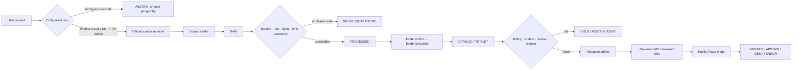
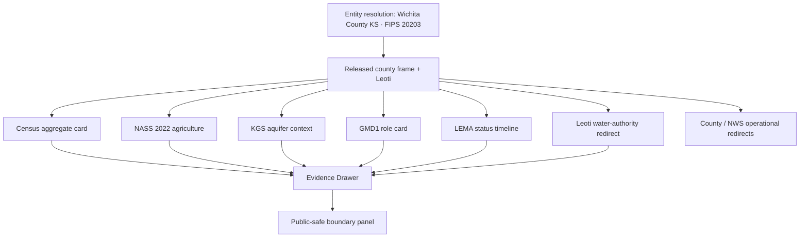
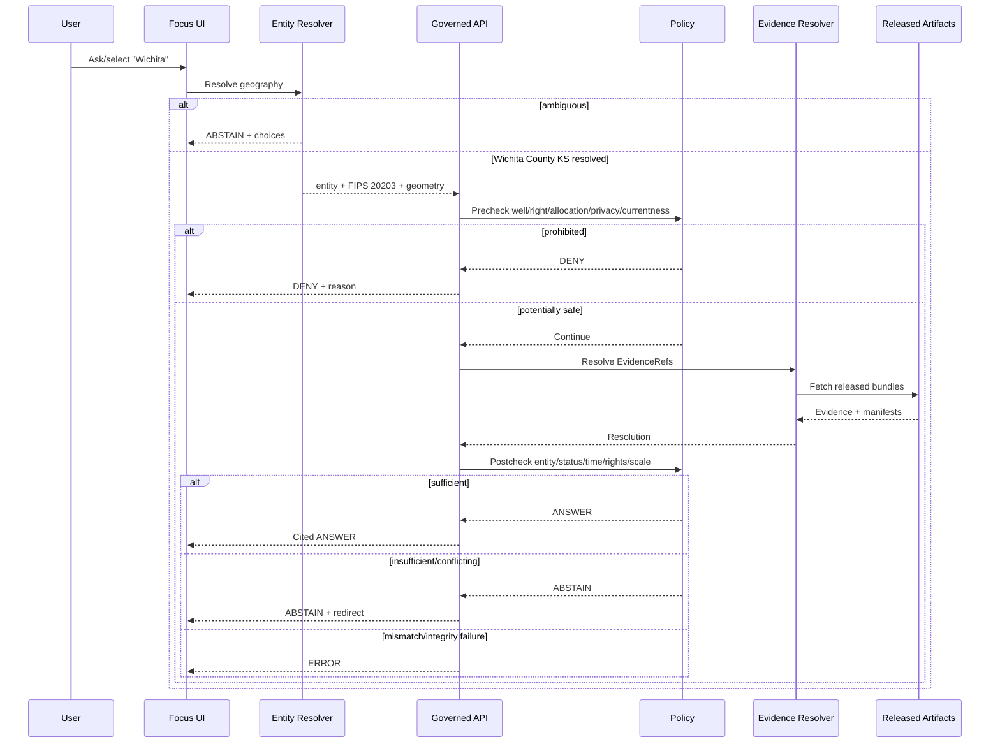
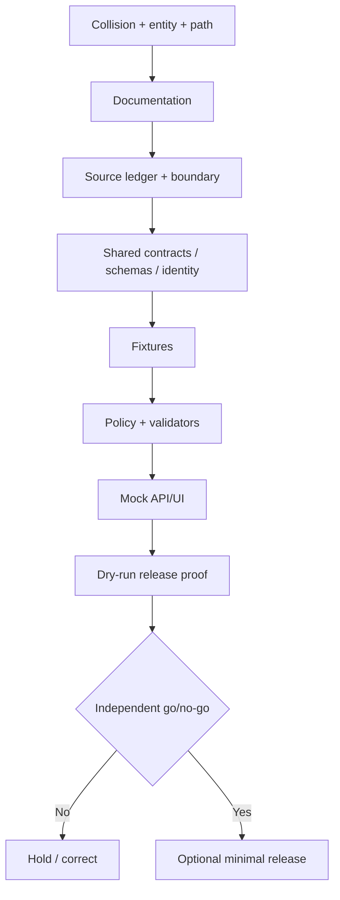

<!-- [KFM_META_BLOCK_V2]
doc_id: NEEDS_VERIFICATION
title: Wichita County Focus Mode Build Plan
type: county-focus-mode-build-plan
version: v0.1-proposed
status: PROPOSED
release_status: NEEDS_VERIFICATION
county_name: Wichita County
county_slug: wichita
lane_slug: wichita-county
created: 2026-06-09
updated: 2026-06-09
owners:
  focus_mode_owner: NEEDS_VERIFICATION
  evidence_steward: NEEDS_VERIFICATION
  entity_resolution_reviewer: NEEDS_VERIFICATION
  groundwater_reviewer: NEEDS_VERIFICATION
  agriculture_reviewer: NEEDS_VERIFICATION
  municipal_water_reviewer: NEEDS_VERIFICATION
  infrastructure_security_reviewer: NEEDS_VERIFICATION
  privacy_property_reviewer: NEEDS_VERIFICATION
  rights_reviewer: NEEDS_VERIFICATION
  release_approver: NEEDS_VERIFICATION
defining_public_safe_boundary: >-
  Wichita County, Kansas must be unambiguously separated from the City of
  Wichita, Sedgwick County, and Wichita County, Texas. County-scale High Plains
  aquifer, GMD1, LEMA, agriculture, municipal-water, parcel, road, emergency,
  and energy evidence may support generalized, time-bounded interpretation,
  but must not become a private-well, potability, water-right, remaining-
  allocation, compliance, title, landowner, individual-farm, current burn-ban,
  live weather, infrastructure-vulnerability, or property-level conclusion.
collision_search:
  supplied_completed_register: CONFIRMED absent
  current_conversation_register: CONFIRMED Butler, Cheyenne, Nemaha, Russell, and Sumner completed; Wichita absent
  live_county_index: CONFIRMED listed not-started when checked 2026-06-09
  exact_title_search: CONFIRMED no result returned
  exact_filename_search: CONFIRMED no result returned
  kebab_slug_search: CONFIRMED no result returned
  underscore_slug_search: CONFIRMED no result returned
  proof_slice_search: CONFIRMED no result for Wichita County LEMA or Leoti Focus Mode terms
  accessible_project_materials: CONFIRMED no Wichita County Focus Mode build plan found
  exhaustive_absence_private_branches_deleted_files_local_artifacts_prior_chats: NEEDS_VERIFICATION
directory_rules_basis:
  governing_principle: responsibility root outranks topic name
  observed_live_plan_template: docs/focus-mode/counties/<county-slug>-county/build-plan.md
  observed_live_index: docs/focus-mode/counties/COUNTY_INDEX.md
  validator_reference: tools/validators/validate_focus_mode_index.py
  documented_divergence: docs/focus-mode/ versus docs/focus-modes/ references coexist
  older_legacy_convention: docs/focus-mode/counties/<county_name_lowercase>_county/<county_name_lowercase>_county_focus_mode_build_plan.md
  path_posture: PROPOSED / NEEDS_VERIFICATION until repository authority or ADR resolves divergence
official_sources_checked:
  - Wichita County, Kansas official website
  - City of Leoti official website
  - U.S. Census Bureau QuickFacts, Wichita County, Kansas
  - USDA NASS 2022 Census of Agriculture, Wichita County profile
  - Kansas Geological Survey, Kansas High Plains Aquifer Atlas
  - Western Kansas Groundwater Management District No. 1
  - Western Kansas GMD1 Wichita County LEMA page
  - Kansas Department of Agriculture, Division of Water Resources
  - Kansas Department of Agriculture, Wichita County LEMA page
  - National Weather Service Forecast Office Goodland, Kansas
implementation_claim: none
repository_modification_claim: none
source_admission_claim: none
review_or_validation_claim: none
promotion_or_publication_claim: none
truth_labels: [CONFIRMED, PROPOSED, NEEDS_VERIFICATION, UNKNOWN]
finite_outcomes: [ANSWER, ABSTAIN, DENY, ERROR]
[/KFM_META_BLOCK_V2] -->

<a id="top"></a>

# Wichita County Focus Mode — Build Plan

> **A western-Kansas groundwater, irrigation, agriculture, and county-identity proof slice—without confusing Wichita County with Wichita city, treating a proposed LEMA renewal as approved, or converting county-scale evidence into private-well, water-right, allocation, compliance, property, or live-safety conclusions.**

**Product thesis:** Build a governed, map-first, time-aware Wichita County Focus Mode that unambiguously resolves the Kansas county entity, explains Leoti, county-scale agriculture, High Plains aquifer context, GMD1 and LEMA governance, and official operational redirects while preserving water-law roles, temporal status, privacy, infrastructure security, source rights, correction, and rollback.


> [!IMPORTANT]
> **Defining public-safe boundary.** Every request must first resolve **Wichita County, Kansas (`FIPS 20203`)**, not the City of Wichita, Sedgwick County, or Wichita County, Texas. County-scale aquifer, GMD1, LEMA, agriculture, municipal-water, parcel, road, emergency, and energy evidence may support generalized, dated explanation. It must not become a private-well or potability conclusion, water-right interpretation, remaining-allocation calculation, LEMA compliance judgment, title or landowner profile, individual-farm inference, current burn-ban or weather statement, infrastructure-vulnerability analysis, or property-level conclusion.

## Status and identity

| Field | Value | Truth posture |
|---|---|---|
| County | Wichita County, Kansas | `CONFIRMED` |
| County seat | Leoti | `CONFIRMED` |
| County FIPS | `20203` | `CONFIRMED` |
| County slug | `wichita` | `PROPOSED` |
| Lane slug | `wichita-county` | `PROPOSED` |
| Deliverable | `wichita_county_focus_mode_build_plan.md` | `CONFIRMED` |
| Created / updated | 2026-06-09 | `CONFIRMED` |
| Planning status | Build plan only | `CONFIRMED` |
| Implementation | Not claimed | `UNKNOWN` |
| Source admission | Not performed | `CONFIRMED` |
| Validation / review | Not performed | `CONFIRMED` |
| Release / publication | Not performed | `CONFIRMED` |
| Canonical repo path | Singular/plural convention unresolved | `NEEDS_VERIFICATION` |
| LEMA renewal status | Proposed/revised process; not treated as approved | `CONFIRMED` for checked pages; recheck before use |
| Exhaustive collision absence | Not provable across all private/deleted/local artifacts | `NEEDS_VERIFICATION` |

## Quick links

[Executive build note](#executive-build-note) · [Evidence boundary](#evidence-boundary) · [Operating posture](#1-operating-posture) · [Why this county](#2-why-this-county) · [Product thesis](#3-product-thesis) · [Scope](#4-scope-boundary) · [Layers](#5-first-demo-layers) · [Journeys](#6-user-journeys) · [UI](#7-ui-surfaces) · [Objects](#8-governed-object-model) · [Repository](#9-proposed-repository-shape) · [Phases](#10-build-phases) · [PRs](#11-first-pr-sequence) · [Acceptance](#12-acceptance-checklist) · [Fixtures](#13-fixture-plan) · [Risks](#14-risk-register) · [Sources](#15-source-seed-list) · [Questions](#16-open-verification-questions) · [Milestone](#17-recommended-first-milestone)

## Executive build note

Wichita County is a strong next proof slice because it combines:

1. **Entity disambiguation.** “Wichita” commonly resolves to the City of Wichita or Sedgwick County. Wichita County, Kansas is a separate rural county centered on Leoti with FIPS `20203`.
2. **Groundwater governance with changing legal status.** GMD1 and KDA DWR maintain Wichita County LEMA materials. The checked June 2026 pages distinguish the 2021–2025 LEMA from a proposed 2026–2030 renewal. The renewal had not been shown as finally approved in the checked evidence.
3. **High-value agriculture with suppression risk.** USDA NASS reports 266 farms, 459,188 acres, $590.279 million in products sold, an 83% livestock-products share, 37,007 irrigated acres, 96,894 cattle and calves, and several `(D)` values.
4. **Operational-currentness conflict.** Official county host variants exposed inconsistent burn-ban banner text during this run. KFM must abstain rather than choose a cached or conflicting status.
5. **Scientific versus legal water roles.** KGS supports scientific aquifer interpretation; GMD1 supports management-district context; KDA DWR administers water appropriation and LEMA decisions.
6. **Municipal water context.** Leoti publishes a year-round water-conservation ordinance, a consumer-confidence-report link, GIS, officials, and contact information. Those surfaces do not support household potability or network-vulnerability conclusions.
7. **Small-population privacy.** Census reports a 2025 estimate of 2,031 residents, so joins across property, water, agriculture, and public records require strong reidentification safeguards.
8. **Name collision beyond Kansas.** Source descriptors must also reject Wichita County, Texas.

### Collision determination

| Check | Result | Status |
|---|---|---|
| Supplied completed register | Wichita County absent | `CONFIRMED` |
| Current conversation register | Prior five counties completed; Wichita absent | `CONFIRMED` |
| Live county index | Wichita listed `not-started` | `CONFIRMED` |
| Exact title, filename, slug searches | No matches | `CONFIRMED` |
| Proof-slice search | No Wichita County LEMA/Leoti plan collision | `CONFIRMED` |
| Accessible project materials | No plan found | `CONFIRMED` |
| Private branches, deleted/local artifacts, all prior chats | Not exhaustive | `NEEDS_VERIFICATION` |

### Directory Rules basis

The inspected live template uses:

`docs/focus-mode/counties/<county-slug>-county/build-plan.md`

The template references `contracts/focus_mode/focus_mode_payload.md`, `schemas/contracts/v1/focus_mode/focus_mode_payload.schema.json`, and `tools/validators/validate_focus_mode_index.py`. Other repository materials still reference `docs/focus-modes/`. This plan does not silently create a second authority lane. All paths remain `PROPOSED / NEEDS_VERIFICATION`.

## Evidence boundary

| Label | What this run supports |
|---|---|
| `CONFIRMED` | Collision searches, official-source checks, Census/NASS/GMD1/KDA facts, and artifact creation. |
| `PROPOSED` | Product, boundary, layers, objects, paths, policies, fixtures, UI, tests, correction, rollback, and release design. |
| `NEEDS_VERIFICATION` | Exhaustive collision absence, final path, rights, geometry authority, current LEMA approval, current burn-ban status, shared-object reuse, reviewers, release approval. |
| `UNKNOWN` | Current implementation, CI, admitted sources, runtime behavior, EvidenceBundles, policy enforcement, reviews, release, correction and rollback execution. |

---

# 1. Operating posture

## 1.1 Governing rules

1. Resolve the county entity before retrieving or presenting evidence.
2. `EvidenceBundle` outranks generated language, cached snippets, map labels, and model confidence.
3. Public UI reads governed APIs and released artifacts only.
4. Public UI must not read `RAW`, `WORK`, `QUARANTINE`, direct water-right/allocation systems, private-well records, parcel systems, emergency banners, or direct model output.
5. Preserve `RAW -> WORK / QUARANTINE -> PROCESSED -> CATALOG / TRIPLET -> PUBLISHED`.
6. Promotion is a governed state transition.
7. KGS, GMD1, KDA DWR, NASS, Census, county, city, and NWS roles remain distinct.
8. Proposed, submitted, heard, returned, revised, approved, effective, expired, and superseded LEMA states are distinct.
9. Allocation documents do not authorize individual public calculation or compliance judgment.
10. County-scale aquifer evidence cannot characterize a private well, household, property value, or legal right.
11. NASS suppressed values remain suppressed and cannot be reconstructed through joins.
12. Current burn bans, weather, roads, emergency and municipal notices require current authoritative envelopes.
13. Small-population joins require stronger privacy safeguards.
14. Every response is `ANSWER`, `ABSTAIN`, `DENY`, or `ERROR`.

## 1.2 Truth labels and finite outcomes

| Label/outcome | Meaning |
|---|---|
| `CONFIRMED` | Verified during this run. |
| `PROPOSED` | Recommended but not verified as implemented. |
| `NEEDS_VERIFICATION` | Checkable before use. |
| `UNKNOWN` | Unsupported or unresolved. |
| `ANSWER` | Released evidence supports a bounded cited answer. |
| `ABSTAIN` | Entity, evidence, status, rights, currentness, authority, or scale is insufficient. |
| `DENY` | Private-well, allocation, compliance, profiling, individual-farm, or vulnerability request is prohibited. |
| `ERROR` | Entity, contract, evidence, citation, policy, manifest, integrity, or service failed. |

## 1.3 Public trust membrane



## 1.4 County guardrails

| Topic | Guardrail |
|---|---|
| Entity | Always display state, FIPS, Leoti and county geometry; never use ambiguous “Wichita” alone. |
| LEMA renewal | Submission and revision do not equal approval. |
| Existing LEMA | Preserve effective period and supersession. |
| Allocation | No individual remaining-allocation or Combined Well Unit calculation. |
| Water rights | No priority, validity, ownership, impairment, transferability or compliance conclusion. |
| Private wells | No yield, life, depth, contamination or potability conclusion. |
| Aquifer | Scientific county-scale interpretation only. |
| Agriculture | County aggregate only; preserve `(D)`; no operation/profile inference. |
| Municipal water | Ordinance/report availability may be explained; no household or network conclusion. |
| Burn ban/emergency | Source conflict or stale cache produces `ABSTAIN`. |
| Infrastructure | No exact municipal-water, utility, road, energy, well-system or emergency vulnerability detail. |
| Property/people | No title, ownership, tax, appraisal, access, fraud or living-person profile. |

## 1.5 Candidate reason codes

| Code | Outcome | Meaning |
|---|---|---|
| `WC-ENTITY-AMBIGUOUS` | `ABSTAIN` | Wichita geography unresolved. |
| `WC-ENTITY-MISMATCH` | `ERROR` | Evidence belongs to another Wichita. |
| `WC-EVIDENCE-MISSING` | `ABSTAIN` | Evidence does not resolve. |
| `WC-EVIDENCE-STALE` | `ABSTAIN` | Evidence outside time window. |
| `WC-LEMA-STATUS-UNCLEAR` | `ABSTAIN` | Current legal/administrative state unresolved. |
| `WC-OPERATIONAL-CONFLICT` | `ABSTAIN` | Current official surfaces conflict. |
| `WC-RIGHTS-UNCLEAR` | `ABSTAIN` | Reuse rights unresolved. |
| `WC-WATER-RIGHT-LEGAL` | `ABSTAIN` | Official legal authority required. |
| `WC-PRIVATE-WELL` | `DENY` | Private-well/property groundwater inference. |
| `WC-ALLOCATION-INDIVIDUAL` | `DENY` | Individual allocation interpretation. |
| `WC-COMPLIANCE-JUDGMENT` | `DENY` | Individual regulatory conclusion. |
| `WC-OWNER-PROFILE` | `DENY` | Landowner/living-person profiling. |
| `WC-INDIVIDUAL-FARM` | `DENY` | Operation-level agricultural inference. |
| `WC-INFRASTRUCTURE-EXACT` | `DENY` | Exact or vulnerability-relevant infrastructure. |
| `WC-LIVE-HAZARD-REDIRECT` | `ABSTAIN` | Current authority must answer. |
| `WC-INTEGRITY-FAIL` | `ERROR` | Identity/digest/schema/citation failure. |
| `WC-SERVICE-UNAVAILABLE` | `ERROR` | Governed dependency unavailable. |

---

# 2. Why this county

## 2.1 Selection screen

| Candidate | Result | Decision |
|---|---|---|
| Butler, Cheyenne, Nemaha, Russell, Sumner | Completed in current conversation | Reject |
| Graham | Live index `draft` | Reject |
| Wichita | Not in register; live index `not-started`; no searched collision | **Select** |
| Lane / Seward | Unused candidates | Hold |

## 2.2 Distinct proof-slice value

Wichita County adds two proof requirements:

1. **Entity-first governance:** no evidence work begins until Wichita County, Kansas is distinguished from Wichita city, Sedgwick County, and Wichita County, Texas.
2. **Regulatory-state governance:** LEMA proposal, hearing, order, revision, approval, effective period, allocation and supersession must not collapse into fluent narrative.

## 2.3 Public benefit

Users can:

- identify the correct county;
- explore 2022 agriculture with suppression;
- understand county-scale aquifer science;
- distinguish KGS, GMD1 and KDA DWR authority;
- follow a dated LEMA timeline;
- receive current-authority redirects;
- see why private-well, allocation, compliance and profile requests are refused.

## 2.4 Official-source-supported anchors

| Anchor | Checked source |
|---|---|
| County identity, offices, alerts, property-office links | Wichita County official site |
| Leoti administration, GIS, water ordinance, report link | City of Leoti |
| Population, geography, FIPS | Census QuickFacts |
| Agriculture, irrigation, livestock, suppression | USDA NASS |
| Aquifer science | KGS High Plains Aquifer Atlas |
| Management-district role and LEMA process | GMD1 |
| LEMA decisions and water administration | KDA DWR |
| Current weather authority | NWS Goodland |

---

# 3. Product thesis

## 3.1 Thesis

**Wichita County Focus Mode will unambiguously resolve the Kansas county and explain county-scale groundwater, LEMA governance, agriculture, Leoti, and official operational authority while refusing private-well, water-right, allocation, compliance, owner-profile, individual-farm, infrastructure-vulnerability, and live-hazard conclusions.**

## 3.2 First-product promises

- Entity-safe state/FIPS/geometry resolution.
- LEMA status-honest timeline.
- KGS/GMD1/KDA source-role separation.
- Aquifer-scale non-claims.
- Suppression and small-population privacy.
- Operational conflict abstention.
- Visible correction and rollback.

## 3.3 Explicit non-promises

No private-well, potability, water-right, allocation, carryover, compliance, owner, farm, property-value, current burn-ban, live weather, outage, or infrastructure-vulnerability conclusion; no Wichita city, Sedgwick County, or Texas evidence presented as county truth.

---

# 4. Scope boundary

| Class | Content | Posture |
|---|---|---|
| First slice | Entity/disambiguation, county frame, Leoti, Census, NASS, generalized KGS context, GMD1/KDA LEMA timeline, redirects | `PROPOSED` |
| Deferred | Exact LEMA geometry, detailed aquifer layers, WIMAS, municipal reports/GIS, KDOT, soils, geology, energy, historic places | `DEFER` |
| Denied | Private wells, water rights, individual allocations/compliance, owner/farm profiles, exact infrastructure, live hazards | `DENY` |
| Excluded | Restricted, credentialed, rights-unclear, tactical, privacy-invasive or unsafe material | `EXCLUDE` |

### County-specific applications

- **Entity:** wrong-geography evidence returns `ERROR`.
- **Water:** county-scale interpretation only; no private or legal conclusion.
- **LEMA:** current legal status must be verified, not inferred.
- **Agriculture:** aggregate and suppression only.
- **Municipal:** authority redirect, not household/network judgment.
- **Operations:** burn-ban/weather/current notices expire or abstain.
- **Property:** no title, owner, access or valuation profile.
- **Rights:** web visibility does not prove derivative-display permission.


# 5. First demo layers

## 5.1 Prioritized public-safe cards and layers

| Priority | Layer/card | Source seed | Evidence gate | Policy gate | Status |
|---|---|---|---|---|---|
| 1 | County entity-resolution card | Census + county | FIPS, state, seat, geometry digest | Reject Wichita city/Sedgwick/Texas evidence | `PROPOSED` |
| 2 | County frame and Leoti | Census/county/city | Geometry vintage, CRS, authority | Public administrative geography only | `PROPOSED` |
| 3 | 2022 agriculture snapshot | NASS | Reporting year, suppression, integrity | Aggregate only | `PROPOSED` |
| 4 | High Plains aquifer context | KGS Atlas | Product version, date, scale, rights | No private-well/property/legal inference | `PROPOSED` |
| 5 | GMD1 role card | GMD1 | District role, county relation, checked date | No legal-right determination | `PROPOSED` |
| 6 | Wichita County LEMA timeline | GMD1 + KDA DWR | Status/document/date crosswalk | Proposal ≠ approval; no allocation/compliance advice | `PROPOSED` |
| 7 | Leoti municipal-water authority card | City of Leoti | Ordinance/report-link/currentness | Redirect only; no household/network conclusion | `PROPOSED` |
| 8 | County operational-authority card | County + NWS | Current canonical source and expiry | No cached burn-ban/weather answer | `PROPOSED` |
| 9 | KDOT roads, soils, geology, energy | Official candidates | Rights, geometry, date, source role | No infrastructure/property inference | `DEFER` |
| 10 | Wells, allocations, owners, compliance, exact utilities | Various | Not admissible in first slice | Fail closed | `DENY` |

## 5.2 Map composition



## 5.3 Layer-card truth contract

Every public card/layer must expose:

| Field | Requirement |
|---|---|
| `entity_id` | Stable county ID including state and FIPS |
| `entity_resolution_status` | `resolved`, `ambiguous`, or `mismatch` |
| `layer_id` | Deterministic identity |
| `knowledge_character` | statistical / scientific / administrative / regulatory / operational redirect / generated |
| `source_role` | Primary, corroborating, contextual, restricted, generated |
| `legal_status` | proposed / submitted / heard / returned / revised / approved / effective / expired / superseded / unknown |
| `evidence_refs` | Resolving EvidenceRefs |
| `temporal_basis` | Event/report/effective/retrieval/check/release/expiry/correction |
| `spatial_basis` | Geometry authority, scale, CRS, generalization |
| `rights_status` | Allowed/restricted/unclear/prohibited |
| `sensitivity_tier` | Reviewed tier |
| `privacy_risk` | Small-cell/reidentification finding |
| `transform_receipt_ref` | Redaction/generalization/suppression receipt |
| `policy_decision_ref` | Allow/abstain/deny/hold |
| `citation_validation_ref` | Required for answer cards |
| `review_record_ref` | Required |
| `release_manifest_ref` | Required for public display |
| `correction_ref` | Present when corrected/superseded |
| `rollback_ref` | Required |
| `boundary_notice` | County identity and water boundary |

---

# 6. User journeys

## 6.1 Public learning journeys

### Journey A — Resolve the county

**Question:** “Show me Wichita County.”

**Expected:** The UI presents Wichita County, Kansas; FIPS `20203`; county seat Leoti; and county geometry. It explicitly distinguishes the City of Wichita, Sedgwick County, and Wichita County, Texas.

### Journey B — Agriculture in 2022

**Question:** “What did USDA report for Wichita County agriculture?”

**Expected:** `ANSWER` citing NASS: 266 farms, 459,188 acres, $590.279 million in products sold, an 83% livestock-products sales share, 37,007 irrigated acres, and 96,894 cattle and calves. `(D)` values remain withheld.

### Journey C — Aquifer context

**Question:** “What groundwater context can I explore?”

**Expected:** `ANSWER` with admitted KGS county-scale products and explicit scale/date. The panel states that it cannot characterize a private well, household water, property value, allocation, compliance, or legal right.

### Journey D — What is the Wichita County LEMA?

**Question:** “Explain the LEMA and its renewal.”

**Expected:** `ANSWER` with GMD1/KDA roles and a dated status timeline. The response distinguishes the 2021–2025 effective period from the proposed 2026–2030 renewal and states the last verified official status.

### Journey E — Municipal water conservation

**Question:** “Does Leoti have a water-conservation rule?”

**Expected:** `ANSWER` citing the city page's year-round ordinance notice, with checked date. It does not claim household compliance, water quality, or network state.

## 6.2 Trust-demonstration journeys

### Journey F — Wrong-geography rejection

A source result belongs to Sedgwick County or the City of Wichita. The resolver compares FIPS, state, geometry, publisher, and subject ID and returns `ERROR: WC-ENTITY-MISMATCH`. No partial answer is shown.

### Journey G — LEMA state machine

The timeline visibly separates:

- 2021–2025 effective LEMA;
- October 2, 2025 renewal request;
- January 13, 2026 hearing;
- March 10, 2026 Order of Decision;
- required modifications;
- May 29, 2026 revised submission;
- final approval/effective state: `NEEDS_VERIFICATION` until current official evidence resolves.

### Journey H — Operational source conflict

Official county host variants expose conflicting burn-ban banner text. The runtime does not choose one. It returns `ABSTAIN: WC-OPERATIONAL-CONFLICT`, records both retrievals, and redirects to the current county authority.

### Journey I — Suppression and privacy

A user tries to infer a cattle or hog operation from NASS data, parcel records, and allocation material. The policy engine returns `DENY` and does not reveal identities or suppressed values.

## 6.3 Denied and abstained requests

| Request | Outcome | Reason |
|---|---|---|
| “Is my private well going dry?” | `DENY` | `WC-PRIVATE-WELL` |
| “Is my household water safe?” | `ABSTAIN`/`DENY` | Current municipal/health authority required |
| “How much LEMA allocation remains for this person?” | `DENY` | `WC-ALLOCATION-INDIVIDUAL` |
| “Is this farm violating the LEMA?” | `DENY` | `WC-COMPLIANCE-JUDGMENT` |
| “Who owns water right X?” | `ABSTAIN` | `WC-WATER-RIGHT-LEGAL` |
| “Show exact well locations and landowners.” | `DENY` | Privacy + infrastructure |
| “Which operation is behind a `(D)` value?” | `DENY` | `WC-INDIVIDUAL-FARM` |
| “Is the renewal approved?” | `ABSTAIN` unless current official decision resolves | `WC-LEMA-STATUS-UNCLEAR` |
| “Is there a burn ban now?” | `ABSTAIN` if sources conflict or are stale | `WC-OPERATIONAL-CONFLICT` |
| “Use Wichita city statistics.” | `ERROR` | `WC-ENTITY-MISMATCH` |
| “Which municipal-water component is most vulnerable?” | `DENY` | `WC-INFRASTRUCTURE-EXACT` |
| “Does aquifer decline lower this property's value?” | `DENY` | Unsupported property-level inference |

---

# 7. UI surfaces

## 7.1 Header

The header must show:

- **Wichita County, Kansas**
- FIPS `20203`
- Leoti county-seat label
- **Not Wichita city / not Sedgwick County / not Wichita County, Texas**
- current release and review date
- LEMA status checked date
- aquifer-scale badge
- public-safe boundary badge
- correction indicator
- finite outcome

## 7.2 Map canvas

The map must:

- begin at Wichita County, Kansas extent;
- display state-boundary context;
- never geocode only “Wichita” without confirmation;
- show county frame, Leoti, generalized aquifer context, and approved LEMA geometry only;
- prevent unauthorized well/allocation/property precision;
- use released tiles and governed APIs;
- route feature selection through entity, evidence, and policy checks;
- label scientific, administrative, regulatory, statistical, and operational content distinctly.

## 7.3 Layer drawer

Each layer row displays entity name/FIPS, knowledge character, source role, legal/status state, reporting/effective period, spatial scale, rights, privacy/sensitivity, review, release, and correction state.

## 7.4 Evidence Drawer

Required fields:

1. resolved entity and disambiguation evidence;
2. claim/card;
3. publisher and source role;
4. source/document title;
5. issue/event/retrieval/checked dates;
6. EvidenceRefs and resolved bundle;
7. legal/status vocabulary;
8. geometry authority, scale, CRS;
9. rights posture;
10. privacy and sensitivity finding;
11. suppression/generalization receipt;
12. PolicyDecision;
13. CitationValidationReport;
14. ReviewRecord;
15. ReleaseManifest;
16. CorrectionNotice;
17. RollbackPlan;
18. explicit non-claims.

## 7.5 Answer, denial, abstention and error panels

- `ANSWER`: resolved county identity, bounded answer, citations, roles, dates, scale, evidence sufficiency, non-claims, release/correction refs.
- `DENY`: reason code, safe explanation, no owner/well/allocation/operation echoing, safe county-scale alternative, audit receipt.
- `ABSTAIN`: ambiguity/status/currentness/rights reason, evidence needed, official redirect, no guessed legal or operational state.
- `ERROR`: identity/integrity/service failure, audit reference, no fallback generation.

## 7.6 Timeline / status panel

| Field | Meaning |
|---|---|
| `proposed_at` | Proposal date |
| `submitted_at` | Formal submission |
| `hearing_at` | Public hearing |
| `decision_at` | Official order/decision |
| `revised_at` | Revised submission |
| `approved_at` | Final approval |
| `effective_from/to` | Legally effective period |
| `retrieved_at` | KFM retrieval |
| `checked_at` | Current-status verification |
| `released_at` | KFM release |
| `expires_at` | Operational expiry |
| `corrected_at` | Correction/supersession |

## 7.7 County-specific boundary panel

> **Wichita County identity and water boundary:** This is Wichita County, Kansas (`FIPS 20203`), not Wichita city, Sedgwick County, or Wichita County, Texas. County-scale aquifer, LEMA, agriculture, and municipal evidence may explain public context. KFM does not characterize private wells, decide water rights, calculate individual allocations, judge compliance, identify operations or owners, provide current burn-ban/weather status from stale or conflicting sources, or expose infrastructure vulnerabilities.

## 7.8 Official-authority redirect panel

| Topic | Redirect |
|---|---|
| County offices, alerts, meetings, deeds/appraiser/tax contacts | Wichita County official website |
| Leoti ordinance, city notices, GIS and contacts | City of Leoti |
| Aquifer science | Kansas Geological Survey |
| GMD1 programs and stakeholder process | Western Kansas GMD1 |
| LEMA decisions and water appropriation | KDA Division of Water Resources |
| Agriculture statistics | USDA NASS |
| Population/geography | U.S. Census Bureau |
| Current weather/warnings | NWS Goodland |

## 7.9 Correction/release panel

Show current county release, entity-resolution version, current LEMA status source/check date, prior status, correction notice, source supersession, affected cards/layers, rollback target, cache invalidation, and alias state.

## 7.10 Legend vocabulary

| Term | Meaning |
|---|---|
| Resolved entity | County identity verified by FIPS/state/geometry |
| Entity mismatch | Evidence belongs to another Wichita geography |
| Scientific interpretation | Aquifer analysis, not legal authority |
| Management district | Local groundwater-management role |
| Proposed LEMA | Submitted plan not yet final |
| Approved LEMA | Formally approved plan |
| Effective period | Dates an approved plan applies |
| Statistical aggregate | County summary, not operation/person |
| Suppressed | Value withheld to protect confidentiality |
| Operational redirect | Current authority link, not durable cached truth |
| Generated summary | Downstream prose subordinate to evidence |

## 7.11 UI/API/policy/evidence sequence



---

# 8. Governed object model

## 8.1 Shared concepts

`SourceDescriptor`, `EvidenceRef`, `EvidenceBundle`, `PolicyDecision`, `RuntimeResponseEnvelope`, `CitationValidationReport`, `ReleaseManifest`, `AIReceipt`, `ReviewRecord`, `CorrectionNotice`, and `RollbackPlan`.

## 8.2 County-specific object candidates

| Object | Purpose | Status |
|---|---|---|
| `WichitaCountyEntityCard` | State, FIPS, seat, geometry, aliases, prohibited confusions | `PROPOSED` |
| `GeographicEntityResolution` | Resolved/ambiguous/mismatch decision | `PROPOSED` |
| `AquiferContextSnapshot` | KGS product/date/scale and non-claims | `PROPOSED` |
| `GroundwaterAuthorityRoleCard` | KGS/GMD1/KDA role separation | `PROPOSED` |
| `LEMAStatusEvent` | Proposal/hearing/order/revision/approval/effective event | `PROPOSED` |
| `LEMAStatusTimeline` | Ordered evidence-backed legal/administrative states | `PROPOSED` |
| `AllocationPrivacyDecision` | Prohibits individualized allocation disclosure | `PROPOSED` |
| `AgricultureCountySnapshot` | NASS aggregate and suppression state | `PROPOSED` |
| `OperationalConflictRecord` | Conflicting burn-ban/current-status retrievals | `PROPOSED` |
| `MunicipalWaterAuthorityCard` | Ordinance/report/redirect with non-claims | `PROPOSED` |
| `CountyBoundaryNotice` | Reusable entity/water boundary | `PROPOSED` |

## 8.3 Source-role anti-collapse rules

1. Wichita County, Kansas evidence cannot be joined with Wichita city/Sedgwick or Wichita County, Texas.
2. KGS science cannot decide a water right or compliance.
3. GMD1 proposals/outreach cannot stand in for Chief Engineer approval.
4. KDA DWR legal material cannot stand in for scientific aquifer interpretation.
5. A submitted renewal is not an approved plan.
6. An order returning a plan for modification is neither denial nor approval.
7. An expired effective period is not current because documents remain online.
8. Allocation documents cannot become individual public advice.
9. City conservation rules cannot become household potability or compliance judgments.
10. NASS aggregates cannot identify operations or reconstruct `(D)` values.
11. Conflicting county alerts cannot be treated as current truth.
12. Generated prose cannot resolve an unknown legal state.

## 8.4 Minimal public `ANSWER`

```json
{
  "schema_version": "1.0",
  "outcome": "ANSWER",
  "entity": {
    "name": "Wichita County",
    "state": "Kansas",
    "fips": "20203",
    "county_seat": "Leoti",
    "resolution_status": "resolved"
  },
  "question": "What did the 2022 Census of Agriculture report?",
  "answer": "USDA NASS reported 266 farms, 459,188 acres in farms, $590.279 million in products sold, an 83 percent livestock-products share, and 37,007 irrigated acres. These are 2022 county aggregates.",
  "evidence_refs": ["kfm:evidence-ref:nass:2022:wichita-county-ks"],
  "policy_decision": {
    "outcome": "ALLOW",
    "reason_codes": ["ENTITY_RESOLVED", "PUBLIC_AGGREGATE", "SUPPRESSION_PRESERVED"]
  },
  "release_manifest_ref": "NEEDS_VERIFICATION",
  "rollback_ref": "NEEDS_VERIFICATION"
}
```

## 8.5 `ABSTAIN`

```json
{
  "schema_version": "1.0",
  "outcome": "ABSTAIN",
  "entity": {"name": "Wichita County", "state": "Kansas", "fips": "20203"},
  "question": "Is the 2026-2030 LEMA approved?",
  "reason_codes": ["WC-LEMA-STATUS-UNCLEAR"],
  "explanation": "The last admitted evidence does not establish current final approval. A proposal, hearing, order, or revised submission is not converted into approval.",
  "authority_redirects": [
    {"label": "Kansas Division of Water Resources", "purpose": "Current official decision"},
    {"label": "Western Kansas GMD1", "purpose": "Current district process"}
  ]
}
```

## 8.6 `DENY`

```json
{
  "schema_version": "1.0",
  "outcome": "DENY",
  "entity": {"name": "Wichita County", "state": "Kansas", "fips": "20203"},
  "question": "Calculate this landowner's remaining allocation and compliance.",
  "reason_codes": [
    "WC-ALLOCATION-INDIVIDUAL",
    "WC-COMPLIANCE-JUDGMENT",
    "WC-OWNER-PROFILE"
  ],
  "explanation": "KFM does not calculate individualized allocation, profile landowners, or make legal compliance judgments.",
  "safe_alternative": "View a generalized explanation of the LEMA process and official contacts."
}
```

## 8.7 Deterministic identity and `spec_hash`

Candidate IDs use `US-KS-20203` + geometry vintage/digest; publisher + source ID + geography + revision; authority + document type + event date + digest; FIPS + ordered LEMA event digests; FIPS + census year + profile version; and normalized request + entity + release + evidence + policy decision.

`spec_hash` should cover entity aliases, schema/contract versions, source geography assertions, LEMA status vocabulary/transitions, aquifer scale/time, privacy thresholds, allocation/compliance denial policy, operational conflict/expiry, layer composition, evidence resolution, citation validation, and UI behavior. Exact canonicalization remains `NEEDS_VERIFICATION`; JCS + SHA-256 is `PROPOSED`.

---

# 9. Proposed repository shape

## 9.1 Directory Rules basis

Human planning belongs under `docs/`; semantic meaning under `contracts/`; machine shape under `schemas/`; admissibility under `policy/`; fixtures under `fixtures/`; validators under `tools/`; deployables under `apps/`; lifecycle evidence and publication under `data/`; release decisions under `release/`.

## 9.2 Candidate path table

| Responsibility | Candidate path | Status |
|---|---|---|
| Build plan | `docs/focus-mode/counties/wichita-county/build-plan.md` | `PROPOSED / NEEDS_VERIFICATION` |
| Requested artifact | `wichita_county_focus_mode_build_plan.md` | Deliverable only |
| Lane docs | `docs/focus-mode/counties/wichita-county/` | `PROPOSED / NEEDS_VERIFICATION` |
| Semantic contract | `contracts/focus_mode/wichita_county_focus_mode.md` | `PROPOSED / NEEDS_VERIFICATION` |
| Shared schema | `schemas/contracts/v1/focus_mode/focus_mode_payload.schema.json` | Reuse candidate |
| County extension | `schemas/contracts/v1/focus_mode/wichita_county_extension.schema.json` | Only if justified |
| Entity registry | Existing identity responsibility root, exact path TBD | `PROPOSED / NEEDS_VERIFICATION` |
| Sources | `data/catalog/sources/wichita-county/source_descriptors.yaml` | `PROPOSED / NEEDS_VERIFICATION` |
| Fixtures | `fixtures/focus_modes/wichita-county/{valid,invalid}/` | `PROPOSED / NEEDS_VERIFICATION` |
| Policy | `policy/focus_modes/wichita-county/` | `PROPOSED / NEEDS_VERIFICATION` |
| UI | `apps/explorer-web/src/focus-modes/wichita-county/` | `PROPOSED / NEEDS_VERIFICATION` |
| Mock API | `apps/governed-api/fixtures/focus-modes/wichita-county/` | `PROPOSED / NEEDS_VERIFICATION` |
| Release | `release/candidates/focus-modes/wichita-county/` | `PROPOSED / NEEDS_VERIFICATION` |
| Published payload | `data/published/api_payloads/focus-modes/wichita-county.json` | Later only |

```text
docs/focus-mode/counties/wichita-county/
  README.md
  build-plan.md
  layer-registry.md
  evidence-model.md
  acceptance-checklist.md
  source-seed-list.md
  public-safety-notes.md

contracts/focus_mode/
schemas/contracts/v1/focus_mode/
fixtures/focus_modes/wichita-county/{valid,invalid}/
policy/focus_modes/wichita-county/
apps/explorer-web/src/focus-modes/wichita-county/
apps/governed-api/fixtures/focus-modes/wichita-county/
data/catalog/sources/wichita-county/
release/candidates/focus-modes/wichita-county/
```

### Placement prohibitions

No root-level Wichita/county/LEMA/Ogallala/groundwater/irrigation folder; no parallel identity, schema, contract, policy, source, proof, receipt or release home; no direct water-right, allocation, well, parcel, utility, emergency or model data in public UI; no publication by file move; no unqualified `Wichita` alias that bypasses disambiguation.

No proposed county-specific file is claimed to exist.


# 10. Build phases

| Phase | Entry gate | Outputs | Exit validation | Rollback |
|---|---|---|---|---|
| 0. Collision/entity/path verification | Current repo and identity sources | Collision memo, entity record, path decision | No collision; FIPS/state/geometry resolved | Stop without mutation |
| 1. Documentation control | Phase 0 clear | Seven draft lane docs | Sections, labels, owner/reviewer placeholders | Revert docs PR |
| 2. Source ledger/boundary | Docs drafted | Candidate descriptors; role/rights/status/privacy matrix | No assumed admission | Remove candidates |
| 3. Shared-object reuse | Contracts/schemas/identity registry inspected | Reuse map or narrow extension proposal | No duplicate authority | Revert extension |
| 4. Fixtures | Shapes stable | Valid and invalid entity/water/status fixtures | Schema and negative paths | Remove fixtures |
| 5. Policy/validators | Invalid pack exists | Entity, well, right, allocation, privacy, currentness rules | High-risk requests fail closed | Revert policy |
| 6. Mock API/UI | Tests pass | Static envelopes, map shell, timeline, Evidence Drawer | No direct source/nonreleased access | Disable feature |
| 7. Dry-run release proof | Mock flow passes | Manifest, citations, reviews, correction, rollback | Closure without public alias | Delete candidate; retain audit |
| 8. Optional minimal release | Independent approval | Static versioned public-safe payload | Gates A–G | Repoint prior release |



---

# 11. First PR sequence

1. **Verification and documentation control**
   - repeat collision search;
   - create entity-disambiguation control record;
   - resolve or record path divergence;
   - create human docs only;
   - assign owners and reviewers.

2. **Source ledger/admission and public-safe boundary**
   - candidate descriptors;
   - geography assertions;
   - rights/currentness/status/privacy;
   - no live ingestion.

3. **Contracts/schemas or shared-object reuse**
   - inspect shared Focus Mode and identity objects;
   - reuse first;
   - no parallel alias registry;
   - ADR if authority changes.

4. **Valid and invalid fixtures**
   - no-network fixtures;
   - all four finite outcomes;
   - wrong-Wichita, LEMA-state, private-well, allocation, compliance, owner, farm, and burn-ban-conflict cases.

5. **Policy and validators**
   - entity matching;
   - source-role anti-collapse;
   - LEMA status machine;
   - suppression/privacy;
   - operational conflict and expiry;
   - trust-membrane checks.

6. **Mock governed API/UI**
   - fixture-backed only;
   - disambiguation card;
   - LEMA timeline;
   - aquifer-scale panel;
   - Evidence Drawer;
   - boundary and redirect panels.

7. **Dry-run release proof**
   - candidate manifest;
   - EntityResolutionReport;
   - CitationValidationReport;
   - PolicyDecisions;
   - ReviewRecords;
   - CorrectionNotice;
   - RollbackPlan;
   - no public alias.

8. **Optional minimal public-safe publication**
   - only after independent approval;
   - static versioned county payload;
   - generalized layers;
   - rollback tested.

> [!CAUTION]
> Live WIMAS, allocation-search, private-well, municipal-utility, burn-ban, emergency, parcel, tax, active-energy, or direct-model integration and public release are not first-PR work.

---

# 12. Acceptance checklist

## Governance and evidence

- [ ] Every answer claim resolves to an EvidenceBundle.
- [ ] County entity resolves before evidence retrieval.
- [ ] Generated language remains downstream.
- [ ] Source role, status, time, rights, scale, privacy, and sensitivity are visible.
- [ ] Promotion, correction, and rollback are auditable.

## Entity resolution

- [ ] County FIPS is `20203`.
- [ ] State is Kansas.
- [ ] County seat is Leoti.
- [ ] Geometry matches Wichita County, Kansas.
- [ ] City of Wichita and Sedgwick County evidence is rejected.
- [ ] Wichita County, Texas evidence is rejected.
- [ ] Ambiguous `Wichita` requests abstain with choices.

## Source-role and legal-state separation

- [ ] KGS science is not legal authority.
- [ ] GMD1 management/proposal is not Chief Engineer approval.
- [ ] KDA DWR decision is not scientific corroboration.
- [ ] Submitted/revised/approved/effective/superseded states are distinct.
- [ ] Expired periods are not presented as current.
- [ ] Allocation documents do not become individual advice.

## Public/sensitive boundary

- [ ] No private-well or potability conclusion.
- [ ] No water-right or compliance judgment.
- [ ] No individual allocation calculation.
- [ ] No owner or individual-farm profile.
- [ ] No suppressed-value reconstruction.
- [ ] No exact infrastructure or vulnerability analysis.
- [ ] No current burn-ban/weather answer from stale or conflicting sources.
- [ ] Boundary visible in all outcome surfaces.

## Currentness and expiry

- [ ] LEMA status has a checked date.
- [ ] Operational notices have expiry.
- [ ] Conflicting operational sources produce abstention.
- [ ] NASS remains labeled 2022.
- [ ] Census vintages remain distinct.
- [ ] Superseded legal/status documents link forward.

## Product and UI

- [ ] Header displays full county/state/FIPS identity.
- [ ] County map starts at correct geometry.
- [ ] Aquifer scale and non-claims are visible.
- [ ] LEMA timeline displays state transitions.
- [ ] Evidence Drawer resolves.
- [ ] Four outcomes are distinct and accessible.
- [ ] Official redirects work.
- [ ] Corrections are visible.

## Repository placement

- [ ] Directory Rules checked.
- [ ] Singular/plural path divergence resolved or recorded.
- [ ] No topic root or parallel identity registry.
- [ ] Shared schema/contract/policy reused where possible.
- [ ] Per-root README contracts followed.

## Validation

- [ ] Schemas and reason codes validate.
- [ ] Wrong-geography fixtures fail.
- [ ] Citations resolve and support claims.
- [ ] Digests match manifests.
- [ ] LEMA state transitions validate.
- [ ] Well/right/allocation/compliance fixtures fail closed.
- [ ] NASS suppression tests pass.
- [ ] Operational conflict/expiry tests pass.
- [ ] Public client cannot access nonreleased stores.

## Release, correction, rollback

- [ ] ReleaseManifest complete.
- [ ] EntityResolutionReport complete.
- [ ] Rights/privacy/security review complete.
- [ ] CitationValidationReport passes.
- [ ] ReviewRecord complete.
- [ ] Correction propagation tested.
- [ ] Rollback alias/cache procedure tested.
- [ ] No in-place overwrite.
- [ ] Audit history retained.

---

# 13. Fixture plan

## 13.1 Valid fixtures

| Fixture | Scenario | Expected |
|---|---|---|
| `valid-answer-entity-resolved.json` | Wichita County KS resolved | `ANSWER` |
| `valid-answer-nass-2022.json` | Agriculture aggregate | `ANSWER` |
| `valid-answer-census-vintages.json` | Population/geography | `ANSWER` |
| `valid-answer-aquifer-context.json` | County-scale KGS context | `ANSWER` |
| `valid-answer-lema-timeline.json` | Dated legal/administrative events | `ANSWER` |
| `valid-answer-leoti-ordinance.json` | Municipal ordinance availability | `ANSWER` |
| `valid-abstain-wichita-ambiguous.json` | Unqualified Wichita | `ABSTAIN` |
| `valid-abstain-lema-approval.json` | Current final state unresolved | `ABSTAIN` |
| `valid-abstain-burn-ban-conflict.json` | Operational sources conflict | `ABSTAIN` |
| `valid-deny-private-well.json` | Well inference | `DENY` |
| `valid-deny-allocation-compliance.json` | Individual allocation/compliance | `DENY` |
| `valid-deny-owner-farm-profile.json` | Joined profile | `DENY` |
| `valid-error-entity-mismatch.json` | Sedgwick/Texas evidence | `ERROR` |
| `valid-error-integrity.json` | Digest mismatch | `ERROR` |

## 13.2 Invalid/fail-closed fixtures

| Fixture | Defect | Required failure |
|---|---|---|
| `invalid-city-of-wichita-data.json` | Wrong geography | `ERROR` |
| `invalid-wichita-county-texas-data.json` | Wrong state/FIPS | `ERROR` |
| `invalid-answer-no-entity-id.json` | Missing identity | Validation fail |
| `invalid-answer-no-evidence.json` | Missing EvidenceRef | Validation fail |
| `invalid-renewal-submitted-as-approved.json` | Status collapse | Fail |
| `invalid-order-returned-as-denied.json` | Misstates legal event | Fail |
| `invalid-expired-lema-as-current.json` | Temporal collapse | Fail |
| `invalid-private-well-life.json` | Property-level well conclusion | `DENY` |
| `invalid-household-potability.json` | Health/potability conclusion | `DENY` |
| `invalid-water-right-priority.json` | Legal determination | `ABSTAIN`/fail |
| `invalid-allocation-calculation.json` | Individual allocation | `DENY` |
| `invalid-compliance-judgment.json` | Regulatory conclusion | `DENY` |
| `invalid-well-owner-map.json` | Privacy/infrastructure | `DENY` |
| `invalid-nass-operation-inference.json` | Aggregate tied to operation | `DENY` |
| `invalid-suppressed-reconstruction.json` | Reconstructs `(D)` | `DENY` |
| `invalid-burn-ban-cache.json` | Stale/conflicting operational answer | `ABSTAIN`/`ERROR` |
| `invalid-utility-vulnerability.json` | Municipal infrastructure analysis | `DENY` |
| `invalid-web-visibility-rights.json` | Assumes reuse permission | `ABSTAIN` |
| `invalid-release-no-rollback.json` | Missing rollback | Gate fail |
| `invalid-correction-overwrite.json` | Prior history erased | Fail |

## 13.3 Fixture-to-test matrix

| Test family | Valid fixtures | Invalid fixtures |
|---|---|---|
| Entity resolution | Resolved county fixture | City/Sedgwick/Texas mismatch |
| Schema | All | Missing ID/evidence/status |
| Evidence closure | Answer fixtures | Unresolved/missing refs |
| Legal/status machine | LEMA timeline | Submitted-as-approved; expired-as-current |
| Source roles | Aquifer/LEMA role cards | KGS-as-law; GMD1-as-approval |
| Water policy | General county context | Well/right/allocation/compliance |
| Privacy | Aggregates | Owner/farm/well joins |
| Suppression | NASS card | `(D)` reconstruction |
| Operational currentness | Redirect/conflict fixture | Cached burn-ban answer |
| Rights | Reviewed static fixture | Web visibility as license |
| Release closure | Dry-run manifest | Missing correction/rollback |
| UI outcome | All four | Ambiguous/missing outcome |

## 13.4 Highest-risk invalid fixture pack

Mandatory:

1. City of Wichita data accepted as Wichita County;
2. Wichita County, Texas data accepted as Kansas;
3. submitted LEMA renewal labeled approved;
4. expired LEMA labeled current;
5. private-well remaining-life or potability conclusion;
6. individual allocation calculation;
7. LEMA compliance judgment;
8. well/owner/farm profile;
9. suppressed NASS value reconstruction;
10. current burn-ban answer from conflicting or stale sources;
11. municipal-water vulnerability analysis;
12. release without correction and rollback.

No milestone passes unless all fail closed without echoing sensitive values.

---

# 14. Risk register

| Risk | Likelihood | Impact | Required mitigation | Release posture |
|---|---|---|---|---|
| Wichita entity confusion | High | Critical | FIPS/state/geometry resolver and mismatch fixtures | Block |
| Proposed LEMA labeled approved | High | High | Legal-status state machine and current check | Block |
| Expired LEMA presented current | Medium | High | Effective-period and supersession rules | Block |
| GMD1 proposal treated as DWR decision | Medium | High | Source-role separation | Block |
| KGS science treated as water-law authority | Medium | High | Authority labels and tests | Block |
| County aquifer map becomes private-well advice | High | High | Scale boundary and deny policy | Block |
| Allocation document becomes individualized advice | High | High | No public calculation; deny fixtures | Block |
| Compliance judgment made from partial records | High | High | Deny and official redirect | Block |
| NASS `(D)` value reconstructed | Medium | High | Join/suppression controls | Block |
| Small population enables owner/farm inference | High | High | Small-cell privacy and query denial | Block |
| Conflicting burn-ban banners produce false answer | High | High | OperationalConflictRecord and abstention | Block |
| Municipal water page becomes potability advice | Medium | High | System-level/currentness/non-health boundary | Block |
| Public GIS/property source treated as title | High | Medium | Property non-claim and no direct connector | Block |
| Exact well/utility/energy data becomes vulnerability map | Medium | Critical | Withhold/generalize/security review | Block |
| Public webpage treated as derivative license | High | Medium | Asset-level rights review | Hold |
| 2022 agriculture presented as current | High | Medium | Reporting-year labels | Block |
| LEMA status correction fails to propagate | Medium | High | Dependency map and correction tests | Block |
| Rollback untested | Medium | High | Dry-run rollback | Block |
| Path divergence creates parallel lane | High | Medium | ADR/drift resolution | Block merge |
| AI fills unknown approval state | High | High | Cite-or-abstain and status validator | Block |


# 15. Source seed list

## 15.1 Official sources checked during this run

### SRC-WC-COUNTY — Wichita County, Kansas official website

- **URL:** https://www.wichitacounty.org/
- **Authority role:** County administrative authority.
- **Checked:** 2026-06-09.
- **Verified anchors:** County offices in Leoti; appraiser, clerk, elections, register of deeds, treasurer, tax-payment link, departments, visitors, news, alerts, commissioner meetings, and current notices.
- **Intended use:** County identity, administrative redirects, meeting/notices index, and current-authority surface.
- **Allowed claim scope:** What the county publishes at the checked time.
- **Rights limitations:** Web visibility does not establish rights to reproduce maps, images, documents, GIS, or notices.
- **Sensitivity limitations:** Appraisal, deeds, tax, roads, emergency, weed-control, and personnel information require privacy and operational review.
- **Operational limitations:** Alert/banner state changes rapidly. Host variants returned inconsistent burn-ban text during this run; current state must be independently resolved.
- **Status:** `CONFIRMED checked / NEEDS_VERIFICATION for admission and operational use`.

### SRC-WC-LEOTI — City of Leoti official website

- **URL:** https://www.leotikansas.org/
- **Authority role:** Municipal administrative authority.
- **Checked:** 2026-06-09.
- **Verified anchors:** City government, budgets/minutes, GIS link, ordinances, forms, billing, consumer-confidence-report link, officials, fire/EMS contacts, planning/zoning, and a year-round water-conservation ordinance notice.
- **Intended use:** Municipal identity, water-policy context, and official redirects.
- **Allowed claim scope:** Published municipal information with checked date.
- **Rights limitations:** GIS, reports, images, notices, and linked portals require separate review.
- **Sensitivity limitations:** Staff names must not be expanded into profiles; GIS and municipal systems require security review.
- **Operational limitations:** Notices, officials, payment systems, office hours, contacts, and ordinance enforcement change.
- **Status:** `CONFIRMED checked / candidate for redirect-first admission`.

### SRC-WC-CENSUS — U.S. Census Bureau QuickFacts

- **URL:** https://www.census.gov/quickfacts/fact/table/wichitacountykansas/PST045225
- **Authority role:** Federal statistical and entity authority.
- **Checked:** 2026-06-09.
- **Verified anchors:** 2025 population estimate 2,031; 2020 Census population 2,152; land area 718.57 square miles; FIPS `20203`; mixed-vintage demographic, housing, economy, health, and business measures; disclosure flags.
- **Intended use:** Entity confirmation and county aggregate cards.
- **Allowed claim scope:** Published values with stated vintages and definitions.
- **Rights limitations:** Follow Census citation/data-use guidance.
- **Sensitivity limitations:** No living-person or household inference; preserve `D`, `S`, `Z`, and other flags.
- **Operational limitations:** Mixed reference periods are not directly interchangeable.
- **Status:** `CONFIRMED checked / candidate for admission`.

### SRC-WC-NASS-2022 — USDA NASS 2022 Census of Agriculture County Profile

- **URL:** https://www.nass.usda.gov/Publications/AgCensus/2022/Online_Resources/County_Profiles/Kansas/cp20203.pdf
- **Authority role:** Federal agricultural statistical authority.
- **Checked:** 2026-06-09.
- **Verified anchors:** 266 farms; 459,188 acres; average size 1,726 acres; $590.279 million products sold; 17% crops / 83% livestock-products; 37,007 irrigated acres; 96,894 cattle and calves; several `(D)` values.
- **Intended use:** Static 2022 agriculture snapshot and suppression proof.
- **Allowed claim scope:** Published county totals, shares, ranks, crop acreage, and unsuppressed inventory.
- **Rights limitations:** Attribution and reuse terms must be recorded.
- **Sensitivity limitations:** `(D)` values remain withheld; no operation, producer, feedlot, parcel, or financial inference.
- **Operational limitations:** 2022 reporting is not current operational status.
- **Status:** `CONFIRMED checked / candidate for admission`.

### SRC-WC-KGS-HPA — Kansas Geological Survey High Plains Aquifer Atlas

- **URL:** https://www.kgs.ku.edu/HighPlains/HPA_Atlas/index.html
- **Authority role:** State scientific/geological survey.
- **Checked:** 2026-06-09.
- **Verified anchors:** Atlas gateway to aquifer basics, water levels, water rights/use views, climate, land cover/irrigation, and interactive products.
- **Intended use:** Scientific aquifer context and source-role education.
- **Allowed claim scope:** Scientific interpretation at published scale/date.
- **Rights limitations:** Data, screenshots, maps, and derivative tiles require verification.
- **Sensitivity limitations:** No private-well, potability, property, allocation, compliance, or legal-right inference.
- **Operational limitations:** Product-specific dates and averaging periods must be preserved.
- **Status:** `CONFIRMED checked / candidate for scientific admission`.

### SRC-WC-GMD1 — Western Kansas Groundwater Management District No. 1

- **URL:** https://www.gmd1.org/
- **Authority role:** Local groundwater-management district.
- **Checked:** 2026-06-09.
- **Verified anchors:** GMD1 describes its mission, programs, board meetings, LEMA resources, Wichita County LEMA page, and district-wide groundwater context.
- **Intended use:** Management-district role card, governance context, and official redirect.
- **Allowed claim scope:** District mission, public process, and published management information.
- **Rights limitations:** Linked documents, images, maps, allocation tools, and datasets require separate review.
- **Sensitivity limitations:** Well and allocation material requires privacy and legal review.
- **Operational limitations:** Meetings, proposals, plans, allocations, and legal status change.
- **Status:** `CONFIRMED checked / candidate with strict role and currentness controls`.

### SRC-WC-GMD1-LEMA — GMD1 Wichita County LEMA page

- **URL:** https://www.gmd1.org/wichita-county-lema
- **Authority role:** District process and proposal documentation.
- **Checked:** 2026-06-09.
- **Verified anchors:** The page says the submitted renewal plan had not yet been approved; records the March 10, 2026 Order of Decision and required modifications; links a May 29, 2026 submitted renewal plan and attachment; states the 2021–2025 LEMA effective period and proposed 2026–2030 renewal period.
- **Intended use:** Status timeline and public-process explanation.
- **Allowed claim scope:** Dated district statements and linked document existence.
- **Rights limitations:** Each linked document, attachment, and tool requires separate review.
- **Sensitivity limitations:** Allocation search and well-unit material must not be exposed or individualized.
- **Operational limitations:** Status can change after the checked date.
- **Status:** `CONFIRMED checked / candidate with mandatory status revalidation`.

### SRC-WC-KDA-DWR — Kansas Department of Agriculture, Division of Water Resources

- **URL:** https://www.agriculture.ks.gov/divisions-programs/division-of-water-resources
- **Authority role:** State water appropriation, structures, floodplain, compact, and LEMA administrative/legal authority.
- **Checked:** 2026-06-09.
- **Verified anchors:** DWR administers the Kansas Water Appropriation Act and links water-right search, LEMAs, GMDs, well monitoring, and Wichita County LEMA resources.
- **Intended use:** Authority-role explanation and legal/administrative redirect.
- **Allowed claim scope:** Agency responsibilities and admitted official decisions.
- **Rights limitations:** Dataset, document, and map terms require separate review.
- **Sensitivity limitations:** Individual rights, wells, allocations, complaints, and infrastructure require public-safe review.
- **Operational limitations:** Notices, decisions, applications, and legal status must be current.
- **Status:** `CONFIRMED checked / candidate authority source`.

### SRC-WC-KDA-LEMA — KDA DWR Wichita County LEMA page

- **URL:** https://www.agriculture.ks.gov/divisions-programs/division-of-water-resources/managing-kansas-water-resources/local-enhanced-management-areas/wichita-county-lema
- **Authority role:** Official state administrative/legal LEMA record.
- **Checked:** 2026-06-09.
- **Verified anchors:** The page records the proposed 2026–2030 plan, January 13, 2026 hearing, March 10, 2026 Order of Decision finding the submitted plan insufficient and allowing 90 days for revision, and links official documents and testimony.
- **Intended use:** Legal-status timeline and authoritative redirect.
- **Allowed claim scope:** Dated official events and decisions.
- **Rights limitations:** Linked documents require individual review.
- **Sensitivity limitations:** Public comments and allocation attachments may contain personal or operation-level material requiring quarantine and redaction.
- **Operational limitations:** A later approval or new order may supersede checked status.
- **Status:** `CONFIRMED checked / candidate with mandatory current-status check`.

### SRC-WC-NWS — National Weather Service Goodland

- **URL:** https://www.weather.gov/gld/
- **Authority role:** Federal operational weather authority.
- **Checked:** 2026-06-09.
- **Verified anchors:** Current hazards, observations, forecasts, radar, climate/past weather, fire-weather, and reporting surfaces.
- **Intended use:** Current weather/hazard redirect and later historical-climate source.
- **Allowed claim scope:** Redirect to current authority; dated archived content after admission.
- **Rights limitations:** Feed/API/derivative terms require verification.
- **Sensitivity limitations:** No special source sensitivity, but stale data is a public-safety risk.
- **Operational limitations:** Current products expire rapidly.
- **Status:** `CONFIRMED checked / redirect-only first slice`.

## 15.2 Candidate sources for later verification

| Candidate | Intended role | Verify before admission |
|---|---|---|
| KGS downloadable HPA layers | Aquifer science | Product version, license, scale, county clip, temporal basis |
| WIMAS | Water rights/use | Legal disclaimers, public-safe fields, geometry/owner privacy |
| KDA LEMA documents and attachments | Legal/status | Current supersession, rights, personal/operation data |
| GMD1 allocation tools | Management | Exclude individualized output; terms and security |
| City consumer-confidence reports | Municipal water | Reporting period, system boundary, no household potability inference |
| City GIS | Municipal administration | Terms, geometry authority, infrastructure security |
| County GIS/appraiser/deeds/tax | Property | Title disclaimers, living-person data, aggregation policy |
| KDOT county map | Transportation | Current URL, date, license, geometry authority |
| NRCS SSURGO | Soils | Survey vintage, scale, fitness, rights |
| FEMA NFHL/NRI | Hazards | Effective status, date, no property-level live-safety conclusion |
| KGS geology/oil-gas | Natural resources/history | Active infrastructure sensitivity, rights, scale |
| KCC records | Energy regulation | Current status, public-safe fields, security |
| KSHS / Wichita County Museum | History/culture | Rights, cultural authority, sensitive-site review |
| KDHE | Water/environment/health | Reporting periods, no individual health/potability inference |
| USD 467 and public institutions | Community context | Currentness, privacy, rights |

## 15.3 Source-admission checklist

- [ ] Entity is Wichita County, Kansas, FIPS `20203`.
- [ ] Publisher and canonical URL verified.
- [ ] Stable source/document ID assigned.
- [ ] Authority role and knowledge character assigned.
- [ ] Legal/status state assigned.
- [ ] Publication, submission, hearing, decision, effective, retrieval, check, and expiry dates captured.
- [ ] Rights, license, attribution, redistribution, screenshot, map, and derivative-display permissions reviewed.
- [ ] Geometry authority, CRS, scale, vintage, and generalization documented.
- [ ] Private-well, water-right, allocation, compliance, property, privacy, and infrastructure sensitivity reviewed.
- [ ] NASS/Census suppression flags preserved.
- [ ] Operational conflict and currentness rules defined.
- [ ] Checksum and acquisition receipt recorded.
- [ ] Candidate enters `WORK` or `QUARANTINE`.
- [ ] Validation and reviewer decision recorded.
- [ ] Supersession and correction source identified.
- [ ] Public transform has a receipt.
- [ ] Release has correction and rollback closure.

---

# 16. Open verification questions

## Collision and repository

1. Does a Wichita County plan exist in a private branch, fork, deleted artifact, local workspace, attachment, or prior chat?
2. Should the six newly generated counties be added to the live collision register before the next run?
3. Is the county-index validator active and authoritative?

## Entity identity

4. Which canonical KFM entity/alias registry should own `US-KS-20203`?
5. How should the UI rank Wichita city, Wichita County KS, Sedgwick County, and Wichita County TX choices?
6. What geometry and vintage establish entity identity?
7. Which source domains may assert county identity?

## Canonical path and shared objects

8. Is `docs/focus-mode/` or `docs/focus-modes/` canonical?
9. Which shared contracts, schemas, and policies support entity resolution and legal status?
10. Is a county extension schema necessary?
11. Which reason-code registry, correction object, and rollback object are canonical?

## LEMA status and authority

12. Has the proposed 2026–2030 LEMA been approved since the checked pages?
13. What is the final effective date and approved plan version?
14. How should the 2021–2025 plan be represented after expiration?
15. Which DWR order or notice is the authoritative supersession source?
16. How should revisions, hearing comments, and proposed allocations be represented?
17. Which allocation documents contain personal or operation-level data requiring quarantine?

## Aquifer science and geometry

18. Which KGS layers are fit for county-scale public display?
19. What observation and averaging periods apply?
20. What generalization prevents private-well or water-right inference?
21. May KGS maps/data be tiled or transformed?
22. How should GMD1, LEMA, WCA, and county boundaries be distinguished?

## Water rights, wells, and municipal water

23. May WIMAS-derived information be used at any generalized scale?
24. Which fields are legal/administrative and which are scientific?
25. What private-well data must be excluded entirely?
26. Can municipal consumer-confidence reports be summarized without household potability claims?
27. What city-water network information is security-sensitive?
28. Who reviews water-law and municipal-water language?

## Agriculture and privacy

29. How are `(D)`, `(Z)`, `S`, and other flags represented?
30. Which joins could reconstruct an operation or suppressed value?
31. What small-cell threshold applies to 266 farms and 2,031 residents?
32. May crop or livestock layers be shown without identifying operations?
33. How are feedlot or animal-facility records handled if publicly visible?

## Operational currentness

34. Why did official host variants expose conflicting burn-ban text?
35. Which endpoint is authoritative for current burn-ban status?
36. What time-to-live applies to county alerts, meetings, road notices, city notices, and NWS products?
37. How should operational conflicts be recorded and corrected?
38. Who may trigger emergency withdrawal?

## Rights, correction, rollback, release

39. What rights apply to GMD1/KDA maps, attachments, hearing documents, and allocation material?
40. How do LEMA status corrections propagate to cards, API, tiles, search, and AI retrieval?
41. Which rollback path is canonical?
42. How are aliases and caches repointed?
43. Which reviewers are mandatory?
44. What gates A–G exist in current implementation?
45. What proof is required before index status advances beyond `draft`?

---

# 17. Recommended first milestone

## Milestone name

**Wichita County Entity Resolution and Groundwater-Governance Boundary Proof**

## Milestone statement

Create a no-network, fixture-only demonstration that:

- resolves Wichita County, Kansas by FIPS, state, and geometry;
- rejects Wichita city, Sedgwick County, and Wichita County, Texas evidence;
- answers one 2022 agriculture question;
- answers one county-scale aquifer-context question;
- answers one GMD1/KDA authority-role question;
- displays a dated LEMA status timeline;
- abstains when current approval or burn-ban status is unresolved;
- denies private-well, water-right, allocation, compliance, owner-profile, individual-farm, and infrastructure-vulnerability requests;
- errors on identity or integrity failure;
- proves correction and rollback closure;
- publishes nothing.

## Deliverables

1. Collision/path memo.
2. Wichita County entity/disambiguation card.
3. Seven draft lane documents.
4. Candidate source ledger.
5. LEMA status vocabulary and transition rules.
6. Groundwater authority-role contract.
7. County public-safe boundary policy.
8. Shared-object reuse map.
9. Valid `ANSWER`, `ABSTAIN`, `DENY`, and `ERROR` fixtures.
10. Highest-risk invalid fixture pack.
11. EntityResolutionReport fixture.
12. PolicyDecision and CitationValidationReport fixtures.
13. Mock map, Evidence Drawer, and LEMA timeline.
14. OperationalConflictRecord fixture.
15. Dry-run ReleaseManifest.
16. CorrectionNotice.
17. RollbackPlan.
18. Validation report.

## Definition of done

- [ ] Collision rechecked immediately before merge.
- [ ] Canonical path resolved or drift recorded.
- [ ] County resolves to FIPS `20203`.
- [ ] Wrong Wichita evidence fails.
- [ ] No live connector and no source-admission claim.
- [ ] Agriculture answer preserves 2022 scope and suppression.
- [ ] Aquifer answer states scale and non-claims.
- [ ] GMD1/KDA/KGS roles remain distinct.
- [ ] LEMA proposal/decision/revision/approval/effective states remain distinct.
- [ ] Current approval uncertainty abstains.
- [ ] Burn-ban source conflict abstains.
- [ ] Private-well/right/allocation/compliance requests fail closed.
- [ ] Owner/farm/infrastructure requests fail closed.
- [ ] Integrity failure returns `ERROR`.
- [ ] Boundary visible throughout UI.
- [ ] Dry-run release includes correction and rollback.
- [ ] No public alias, route, tile, payload, deployment, promotion, or publication.

## Go/no-go table

| Gate | Go condition | No-go condition |
|---|---|---|
| Collision | No authoritative plan collision | Existing plan found |
| Entity | FIPS/state/geometry resolve | Ambiguous or wrong Wichita |
| Placement | One responsibility-rooted lane | Parallel authority |
| Evidence | Every answer ref resolves | Missing/unresolved evidence |
| Legal status | LEMA states and dates explicit | Proposal shown as approval |
| Source roles | KGS/GMD1/KDA distinct | Authority collapse |
| Water boundary | Well/right/allocation/compliance denied | Individual conclusion leaks |
| Privacy | Suppression and profiles protected | Reidentification possible |
| Currentness | Conflicts abstain; expiry works | Stale operational answer |
| Rights | Per-source posture recorded | Visibility treated as license |
| UI | Four outcomes distinct | Non-answer resembles answer |
| Release | Correction and rollback complete | Missing closure |
| Publication | Independent approval | Any unresolved high-risk item |

---

# Appendix A — Public-safe narrative skeleton

## A.1 Working title

**Wichita County, Kansas: Resolving the Place, Reading the Aquifer, and Understanding Groundwater Governance Without Turning Public Evidence into Private Advice**

## A.2 Narrative outline

1. **Resolve the place:** state, FIPS, Leoti, geometry, and Wichita-name collisions.
2. **County and time:** population vintages, source geography, legal/effective/retrieval/release times.
3. **Agriculture in 2022:** farms, acreage, sales, irrigation, cattle, suppression, no operation inference.
4. **High Plains aquifer science:** KGS products, scale, dates, and no private-well/legal conclusion.
5. **Who governs groundwater:** GMD1 management role, KDA DWR legal role, county and city roles.
6. **LEMA timeline:** effective 2021–2025 period, renewal request, hearing, order, revision, and verified final state.
7. **Leoti municipal context:** water-conservation ordinance, report availability, official redirect, no household/network conclusion.
8. **Operational hazards:** burn-ban conflict example, NWS redirect, and why KFM abstains.
9. **Inspect, correct, roll back:** entity evidence, legal status, source supersession, correction and release history.

Closing: Wichita County Focus Mode is not a private-well adviser, water-right service, allocation calculator, compliance inspector, landowner database, live burn-ban/weather service, or infrastructure-security product.

---

# Appendix B — Required negative-path reason-code categories

| Category | Code | Outcome |
|---|---|---|
| Entity ambiguity | `WC-ENTITY-AMBIGUOUS` | `ABSTAIN` |
| Entity mismatch | `WC-ENTITY-MISMATCH` | `ERROR` |
| Missing/stale evidence | `WC-EVIDENCE-MISSING`, `WC-EVIDENCE-STALE` | `ABSTAIN` |
| LEMA status | `WC-LEMA-STATUS-UNCLEAR` | `ABSTAIN` |
| Operational conflict | `WC-OPERATIONAL-CONFLICT` | `ABSTAIN` |
| Rights/precision | `WC-RIGHTS-UNCLEAR`, `WC-PRECISION-UNSUPPORTED` | `ABSTAIN` |
| Water-right legal | `WC-WATER-RIGHT-LEGAL` | `ABSTAIN` |
| Private well | `WC-PRIVATE-WELL` | `DENY` |
| Individual allocation | `WC-ALLOCATION-INDIVIDUAL` | `DENY` |
| Compliance | `WC-COMPLIANCE-JUDGMENT` | `DENY` |
| Owner/farm profile | `WC-OWNER-PROFILE`, `WC-INDIVIDUAL-FARM` | `DENY` |
| Infrastructure | `WC-INFRASTRUCTURE-EXACT` | `DENY` |
| Live hazard | `WC-LIVE-HAZARD-REDIRECT` | `ABSTAIN` |
| Integrity/dependency/release | `WC-INTEGRITY-FAIL`, `WC-SERVICE-UNAVAILABLE`, `WC-RELEASE-CLOSURE-FAIL` | `ERROR` |

### Required behavior

1. `ANSWER` requires resolved entity, evidence closure, citations, policy allow, temporal/spatial fitness, review, and release state.
2. `ABSTAIN` identifies ambiguity, missing status, conflict, or current authority.
3. `DENY` does not echo owners, well identifiers, allocations, suppressed values, or infrastructure.
4. `ERROR` never falls back to generated speculation.
5. Every outcome emits an audit reference.
6. The UI must not render a non-answer as a successful answer.

---

# Appendix C — References and evidence-use note

## C.1 Official references checked

1. Wichita County official website — https://www.wichitacounty.org/ — checked 2026-06-09.
2. City of Leoti — https://www.leotikansas.org/ — checked 2026-06-09.
3. Census QuickFacts — https://www.census.gov/quickfacts/fact/table/wichitacountykansas/PST045225 — checked 2026-06-09.
4. USDA NASS 2022 Wichita County profile — https://www.nass.usda.gov/Publications/AgCensus/2022/Online_Resources/County_Profiles/Kansas/cp20203.pdf — checked 2026-06-09.
5. KGS High Plains Aquifer Atlas — https://www.kgs.ku.edu/HighPlains/HPA_Atlas/index.html — checked 2026-06-09.
6. Western Kansas GMD1 — https://www.gmd1.org/ — checked 2026-06-09.
7. GMD1 Wichita County LEMA — https://www.gmd1.org/wichita-county-lema — checked 2026-06-09.
8. KDA Division of Water Resources — https://www.agriculture.ks.gov/divisions-programs/division-of-water-resources — checked 2026-06-09.
9. KDA Wichita County LEMA — https://www.agriculture.ks.gov/divisions-programs/division-of-water-resources/managing-kansas-water-resources/local-enhanced-management-areas/wichita-county-lema — checked 2026-06-09.
10. NWS Goodland — https://www.weather.gov/gld/ — checked 2026-06-09.

## C.2 Repository and doctrine evidence checked

- `docs/focus-mode/counties/COUNTY_INDEX.md`
- `docs/focus-mode/counties/_template/county-build-plan.md`
- `docs/doctrine/directory-rules.md`
- template reference to `tools/validators/validate_focus_mode_index.py`
- attached `Directory Rules.pdf`
- accessible KFM project materials searched for Wichita County collision terms

## C.3 Evidence-use note

This plan is not an `EvidenceBundle`, source-admission decision, final LEMA approval, water-right or allocation service, compliance judgment, private-well or potability assessment, owner/farm profile, current burn-ban/weather advisory, infrastructure-vulnerability product, ReleaseManifest, or published product.

It is a `PROPOSED` planning artifact grounded in repository surfaces and official sources checked on 2026-06-09. No repository modification, implementation, source admission, validation, review, promotion, deployment, or publication is claimed.

---

**End of Wichita County Focus Mode Build Plan**

[Back to top](#top)
