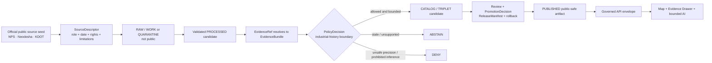
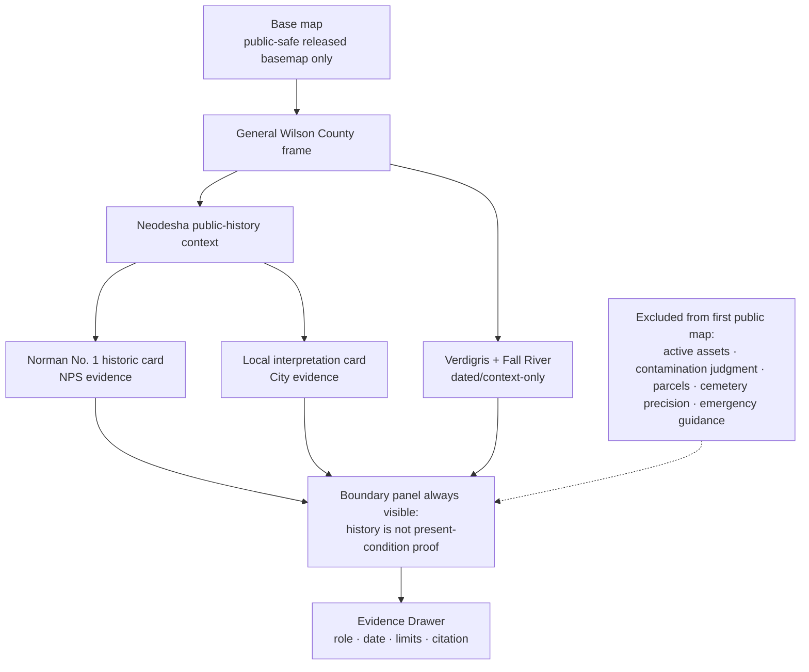
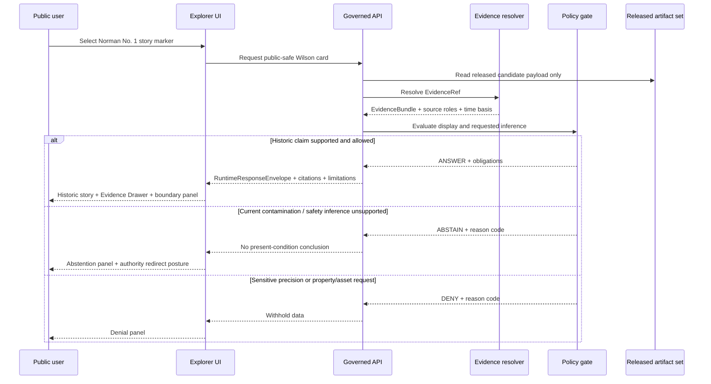
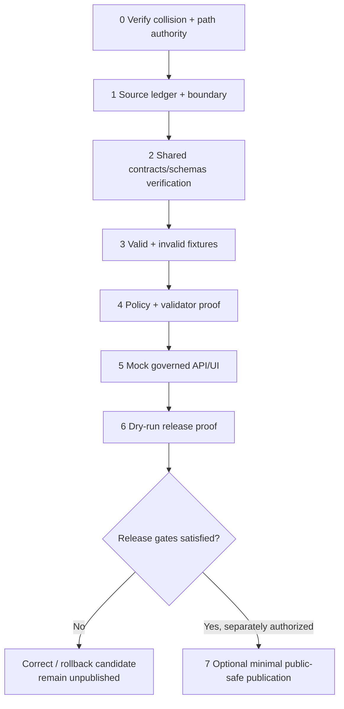

<!-- [KFM_META_BLOCK_V2]
doc_id: NEEDS_VERIFICATION
title: Wilson County Focus Mode Build Plan — Industrial Heritage Without Present-Condition Overclaim
type: standard
version: v1
status: draft
owners:
  - NEEDS_VERIFICATION
created: 2026-05-24
updated: 2026-05-24
policy_label: public_draft
artifact_filename: wilson_county_focus_mode_build_plan.md
repository_edit_status: "CONFIRMED: no repository change was made in this run"
release_status: "NEEDS_VERIFICATION: no release, promotion, review, or publication claimed"
proposed_repository_home: "PROPOSED / NEEDS_VERIFICATION: docs/focus-modes/wilson-county/build-plan.md"
observed_repository_divergence: "CONFIRMED: live index was read at docs/focus-mode/counties/COUNTY_INDEX.md while Directory Rules v1.2 names docs/focus-modes/<area>-<scope>/ as the canonical pattern; reconcile before landing"
schema_contract_policy_homes: "NEEDS_VERIFICATION: use only after repo-governance verification; no parallel authority home is proposed"
review_assignments: "NEEDS_VERIFICATION"
correction_path: "NEEDS_VERIFICATION"
rollback_path: "NEEDS_VERIFICATION"
collision_search:
  candidate: Wilson County
  supplied_register: "CONFIRMED: Wilson County is absent from the supplied completed/collision register; Butler County from the preceding run is excluded"
  available_project_materials: "CONFIRMED: current file-library/current-chat search for Wilson County Focus Mode terms did not surface a Wilson build-plan artifact"
  live_repository_index: "CONFIRMED: inspected live docs/focus-mode/counties/COUNTY_INDEX.md on main; Wilson is listed not-started with validation not-run"
  live_repository_candidate_searches: "CONFIRMED: candidate-specific searches for wilson_county_focus_mode_build_plan, Wilson County Focus Mode, wilson-county, and Norman No. 1 / Neodesha / Verdigris terms did not surface a collision"
  exhaustive_status: "NEEDS_VERIFICATION: a validator run and full repository/project-corpus reconciliation were not executed here"
source_check_date: 2026-05-24
related:
  - "CONFIRMED INSPECTED: docs/doctrine/directory-rules.md §6.7 (live GitHub read-only evidence)"
  - "CONFIRMED INSPECTED: docs/focus-mode/counties/COUNTY_INDEX.md (live GitHub read-only evidence)"
  - "CONFIRMED INSPECTED: tools/validators/validate_focus_mode_index.py (live GitHub read-only evidence; status marked PROPOSED in its own header)"
  - "PROPOSED / NEEDS_VERIFICATION: docs/focus-modes/wilson-county/README.md"
  - "PROPOSED / NEEDS_VERIFICATION: docs/focus-modes/wilson-county/layer-registry.md"
  - "PROPOSED / NEEDS_VERIFICATION: docs/focus-modes/wilson-county/evidence-model.md"
  - "PROPOSED / NEEDS_VERIFICATION: docs/focus-modes/wilson-county/acceptance-checklist.md"
  - "PROPOSED / NEEDS_VERIFICATION: docs/focus-modes/wilson-county/source-seed-list.md"
  - "PROPOSED / NEEDS_VERIFICATION: docs/focus-modes/wilson-county/public-safety-notes.md"
tags:
  - kfm
  - focus-mode
  - wilson-county
  - neodesha
  - norman-no-1
  - industrial-heritage
  - verdigris-river
  - source-role-separation
  - environmental-overclaim-restraint
notes:
  - "Planning artifact only; not implementation evidence."
  - "Defining boundary: historical petroleum/public-history content must not become present environmental, health, regulatory, property, infrastructure, access, flood, or emergency conclusions."
[/KFM_META_BLOCK_V2] -->

---
schema_version: "v1"
kfm_artifact: "focus_mode_build_plan"
area: "wilson-county"
status: "draft"
owner: "NEEDS_VERIFICATION"
priority: "PROPOSED"
last_reviewed: "2026-05-24"
plan_anchors:
  - "norman-no-1-oil-well"
  - "neodesha"
  - "verdigris-river"
  - "fall-river"
ui_shell: "apps/explorer-web"
canonical_paths: "NEEDS_VERIFICATION; placement proposed only after control-plane reconciliation"
sensitivity_lanes:
  - "industrial_history_not_current_environmental_status"
  - "public_health_non_determination"
  - "private_property_access_non_determination"
  - "operational_infrastructure_exact"
  - "flood_emergency_currentness"
  - "burial_cemetery_precision"
sensitivity_overrides: "NEEDS_VERIFICATION"
source_seed_families:
  - "National Park Service historic designation record"
  - "City of Neodesha public-history interpretation"
  - "Kansas Department of Transportation dated general highway map"
release:
  status: "NEEDS_VERIFICATION"
  correction_path: "NEEDS_VERIFICATION"
  rollback_path: "NEEDS_VERIFICATION"
---

<a id="top"></a>

# Wilson County Focus Mode Build Plan  
## Norman No. 1, Neodesha, and the Verdigris — industrial heritage without present-condition overclaim

> **Product thesis:** Build a public-safe Wilson County proof slice that explains Neodesha's Norman No. 1 Oil Well and its Verdigris River setting through attributable historic and cartographic evidence, while refusing to turn historic petroleum context into current environmental, health, property, access, infrastructure, flood, or emergency conclusions.


| Identity / status field | Determination |
|---|---|
| County selected | **CONFIRMED:** Wilson County, Kansas |
| Primary place anchor | **CONFIRMED:** Norman No. 1 Oil Well, Neodesha, Wilson County, documented by the National Park Service historic record |
| Spatial/environmental context anchor | **CONFIRMED:** the NPS record situates the well near the Verdigris River; KDOT's dated county map labels Verdigris River and Fall River |
| Distinct proof value | **PROPOSED:** industrial heritage + river-context Focus Mode that proves strict separation between documented history and present-condition claims |
| Public-safe boundary | **PROPOSED policy boundary:** historical petroleum/public-history sources cannot support present environmental, public-health, regulatory compliance, property/access, operating-infrastructure, flood, or emergency conclusions |
| Collision status | **CONFIRMED to inspected scope / NEEDS_VERIFICATION exhaustively:** Wilson is not in the supplied register; live index says `not-started`; candidate searches found no Wilson plan collision; validator/full-corpus reconciliation was not run |
| Directory placement basis | **CONFIRMED doctrine inspected / PROPOSED landing:** Directory Rules v1.2 §6.7 places county Focus Mode docs under `docs/focus-modes/<area>-county/`; live index exists under singular `docs/focus-mode/counties/`, requiring reconciliation |
| Implementation / review / release | **UNKNOWN / not claimed:** this document is a build plan only |

**Quick links:** [Operating posture](#1-operating-posture) · [Why Wilson County](#2-why-this-county) · [Scope boundary](#4-scope-boundary) · [First demo layers](#5-first-demo-layers) · [Governed objects](#8-governed-object-model) · [Repository shape](#9-proposed-repository-shape) · [Fixture plan](#13-fixture-plan) · [Sources](#15-source-seed-list) · [First milestone](#17-recommended-first-milestone)

## Executive build note

Wilson County is a strong next KFM demonstration because a compelling, public-facing historic story is already supported by authoritative public evidence: the National Park Service nomination form identifies Norman No. 1 Oil Well in Neodesha, Wilson County, near the Verdigris River, and explains its 1892 petroleum-industry significance. A City of Neodesha public-history PDF provides a local interpretive narrative and visitor-context framing, while a KDOT general highway map provides dated county-scale transport and watercourse orientation. These sources are useful **because their roles differ**, not because they can be fused into one unrestricted truth layer.

> [!CAUTION]
> **The Wilson County public-safe boundary is non-negotiable.** A historic oil-well designation, museum narrative, or dated transportation map may support attributable historical and geographic context. It **must not** be transformed into a claim that any location is currently contaminated, safe, compliant, publicly accessible, operable, privately owned, flood-safe, environmentally healthy, or free of infrastructure risk. Queries that request those conclusions must return **ABSTAIN**, **DENY**, or an official-authority redirect unless an admitted, current, policy-cleared evidence chain supports the narrower claim.

### Evidence boundary at the start of this plan

| Truth label | What is established or bounded in this artifact |
|---|---|
| `CONFIRMED` | Wilson County is absent from the supplied completed/collision register; the live county index inspected in this run lists Wilson as `not-started` and `not-run`; candidate-specific repository and available-material searches did not surface a Wilson Focus Mode build plan; NPS, City of Neodesha, and KDOT public-source seeds were opened and checked in this run; Directory Rules §6.7 and the validator source were inspected read-only. |
| `PROPOSED` | The Wilson proof-slice thesis, first public-safe layers/cards, UI behavior, policy gates, object candidates, fixture pack, PR sequence, milestone, and all future implementation work. |
| `NEEDS_VERIFICATION` | Exhaustive collision status until validator/full-corpus reconciliation; derivative-display/licensing and geometry admission; live/current source alternatives; cultural review duties; actual repository landing path after singular/plural control-plane reconciliation; schema/contract/policy homes as implemented; correction and rollback machinery; review assignment; release eligibility. |
| `UNKNOWN` | Whether Wilson has an unindexed plan elsewhere; whether any proposed objects, routes, schemas, fixtures, policies, validators, UI modules, releases, or runtime behaviors are implemented or deployed. |

---

## 1. Operating posture

### 1.1 KFM governing rules applied to Wilson County

| Rule | Wilson County application |
|---|---|
| EvidenceBundle outranks generated language | A story card about Norman No. 1 may be written only from admitted source claims resolved through evidence; an AI summary may not upgrade public-history language into environmental or legal truth. |
| Governed public surfaces only | A future public map consumes released public-safe artifacts through governed interfaces; it does not read RAW, WORK, QUARANTINE, internal stores, restricted source materials, or direct model output. |
| Source roles remain distinct | NPS historical designation record, City public-history interpretation, and KDOT dated cartographic reference remain visibly distinct in the Evidence Drawer. |
| Cite-or-abstain | Unsupported claims about current environmental status, health, ownership, access, compliance, flooding, or operational assets are not answered as facts. |
| Policy-aware fail-closed behavior | Requests for present contamination/safety determination, operational infrastructure precision, or private-property conclusions yield `ABSTAIN` or `DENY` unless policy-cleared evidence exists for a narrower response. |
| Auditable transition | A candidate layer or card is not “published” by being copied into a directory; promotion, validation, policy, review, receipts, release manifest, correction path, and rollback target must exist. |
| Derived views are not truth | A styled historic map, time slider, AI answer, tile, graph edge, or generated narrative is an evidence carrier only. |

### 1.2 Truth labels and finite runtime outcomes

| Label / outcome | Meaning here |
|---|---|
| `CONFIRMED` | Verified during this run from inspected official source pages/documents, available project material search, or read-only live repository evidence. |
| `PROPOSED` | Recommended future design or implementation step; not current implementation. |
| `NEEDS_VERIFICATION` | Checkable item requiring further source, repo, policy, rights, or review proof. |
| `UNKNOWN` | Not resolved by evidence available in this run. |
| `ANSWER` | Supported, admissible, bounded response with evidence references and limitations. |
| `ABSTAIN` | Insufficient, stale, out-of-scope, or role-inappropriate evidence for the requested conclusion. |
| `DENY` | Response would expose prohibited or sensitive detail, or would violate policy boundary. |
| `ERROR` | Runtime, schema, resolution, or system failure; not a truth judgment. |

### 1.3 Public trust membrane



### 1.4 County-specific non-negotiable guardrails

| Guardrail | First-slice enforcement posture |
|---|---|
| Historic petroleum significance is not current environmental condition | Any contamination, exposure, health, cleanup-compliance, drinking-water, or ecological-impact conclusion is `ABSTAIN` unless later admitted evidence and policy permit an explicitly bounded claim. |
| Public-history visitor information is not legal access or facility-currentness proof | The product may identify a historic-public context from admitted sources; it does not promise hours, site access, condition, safety, or accessibility as current fact. |
| Dated KDOT map is not live operations data | Its map content may inform dated orientation only; it cannot establish current roads, wells, facilities, railroad operation, flood conditions, or infrastructure vulnerability. |
| Infrastructure and well precision are not default public content | Present active-well, storage, pipeline, facility, or vulnerability precision is deferred or denied. |
| Private property, ownership, title, and access conclusions are denied | Historic ownership/legal descriptions in a designation record do not become current property advice or parcel truth. |
| Cemetery/burial precision is withheld by default | A dated public map may contain cemetery labels; any detailed cemetery/person linkage or sensitive burial/sacred representation is excluded from the first public slice. |
| Flood/emergency statements are not generated from history or static maps | Live hazard or emergency questions must redirect to current competent authorities or abstain. |
| Culturally significant interpretation requires authority and review | Historic phrasing in local narrative does not authorize KFM to narrate Indigenous or cultural meanings without appropriate authoritative sources and review. |

---

## 2. Why this county

### 2.1 Selection and collision screen

| Collision screen | Checked result | Status | Consequence |
|---|---|---|---|
| Supplied completed/collision register | Wilson County does not appear in the provided no-repeat list. Butler County, built in the immediately preceding run, was separately excluded. | `CONFIRMED` | Wilson remains eligible. |
| Available current-conversation/File Library materials search | Searches for a Wilson Focus Mode build plan, Wilson County + Focus Mode terms, and Norman No. 1/Neodesha/Verdigris proof terms did not surface a Wilson plan artifact. Searches did surface other county plans, confirming that collisions can occur in available materials. | `CONFIRMED` to searched materials | No Wilson collision found; exhaustive project history remains `NEEDS_VERIFICATION`. |
| Live repository county index | The inspected `docs/focus-mode/counties/COUNTY_INDEX.md` identifies Wilson as `not-started` and `not-run`. The same index declares per-row reconciliation dependent on its validator. | `CONFIRMED` read-only evidence | Wilson is not indexed as a draft/released lane; validator/full-tree verification still required before repo landing. |
| Live repository candidate search | Queries for `wilson_county_focus_mode_build_plan`, `Wilson County Focus Mode`, `wilson-county`, and `Norman No. 1 Neodesha Verdigris` produced no matching file hit. | `CONFIRMED` to performed searches | No candidate-specific repository collision surfaced. |
| Live convention / validator evidence | Directory Rules v1.2 defines plural `docs/focus-modes/<area>-county/`; live index was read under singular `docs/focus-mode/counties/`; the present validator source marks itself `PROPOSED implementation` and expects plural `docs/focus-modes/`. | `CONFIRMED` evidence of divergence | Do not claim a canonical landing is implemented; placement is `PROPOSED / NEEDS_VERIFICATION` pending reconciliation. |

**Collision-search determination:** `CONFIRMED_NO_COLLISION_SURFACED_WITHIN_INSPECTED_SCOPE`; `NEEDS_VERIFICATION_EXHAUSTIVE` until the complete project corpus and live validator/repository reconciliation are executed.

### 2.2 Proof-slice rationale

| Dimension | Wilson County anchor | Proof value for KFM | Boundary it tests |
|---|---|---|---|
| Historic industrial transformation | Norman No. 1 Oil Well, Neodesha | A compact, federally documented industrial-history narrative with clear temporal scope | Historic significance must not become current environmental or operating-condition truth |
| River setting | Verdigris River near the historic site; Fall River and Verdigris shown on dated KDOT map | Joins place, hydrographic context, and industrial story without pretending a static map is a live observation network | No current water condition, contamination, flood, or safety inference |
| Local public interpretation | City of Neodesha museum/history PDF | Demonstrates role-labeled local interpretation alongside NPS documentation | Local narrative is not federal designation, cultural authority, or current operational evidence |
| Cartographic context | KDOT Wilson County general highway map | Provides a traceable dated reference for orientation and transport/hydrography layer prototyping | Dated map cannot support live route, asset, access, or infrastructure conclusions |
| Sensitive adjacency | Industrial legacies, infrastructure symbols, historic legal descriptions, cemetery labels, river and flood implications | Forces a visible fail-closed design from the first prototype | Precision and present-condition overclaim are denied or deferred |

### 2.3 Why Wilson adds a distinct series proof

Wilson County is not another reservoir-access plan, not another fossil/locality restraint plan, and not a generic history layer. It tests whether KFM can explain a highly legible industrial landmark and associated river/county landscape while repeatedly showing users where the evidence **stops**. The hardest user questions are likely to begin with a historic oil story and then jump—without evidentiary support—to present contamination, health, compliance, access, operating assets, or flood risk. Wilson is therefore a high-value test of source-role separation, time-basis clarity, denial/abstention design, and correction-readiness.

### 2.4 Public benefit and governance value

| Public benefit | Governance value |
|---|---|
| Teaches why Neodesha and Norman No. 1 matter in Kansas and Mid-Continent petroleum history through a map-first story. | Demonstrates temporal/source-role discipline: NPS historic record, local public-history narrative, and KDOT dated map remain distinguishable. |
| Shows the Verdigris River setting and county-scale orientation without inventing live environmental meaning. | Makes present-condition non-determination visible in UI, policy decisions, invalid fixtures, and reason codes. |
| Encourages evidence inspection rather than fluent narrative trust. | Exercises `ANSWER / ABSTAIN / DENY / ERROR`, Evidence Drawer limitations, and release/correction gates. |

### 2.5 Official-source-supported Wilson anchors checked this run

| Anchor | Checked authority | Supportable bounded claim | Not supportable from this source alone |
|---|---|---|---|
| Norman No. 1 Oil Well location and historic status | National Park Service nomination record | The recorded historic site is in Neodesha, Wilson County, and the form associates it with historic petroleum significance. | Current condition, access, safety, environmental status, current ownership/title, operations. |
| Verdigris River setting near Norman No. 1 | National Park Service record; City of Neodesha public-history PDF | The historic narrative situates the site near/on the banks of the Verdigris River. | Present water quality, flood hazard, exposure, ecological condition. |
| Local museum/public-history interpretation | City of Neodesha PDF | The city presents Norman No. 1 as local petroleum-history and museum context. | Independent federal designation authority, current visitor operations, legal/access guarantee, cultural authority. |
| County hydrography and transport orientation | KDOT Wilson County General Highway Map, dated May 2011 with earlier inventory/revision dates | Dated map shows Wilson County transport/hydrographic context including labeled Verdigris and Fall Rivers. | Current feature completeness, live road condition, operating infrastructure, emergency routing, modern population. |

---

## 3. Product thesis

### 3.1 One-sentence thesis

**PROPOSED:** Wilson Focus Mode will let a public user explore the documented Norman No. 1 / Neodesha / Verdigris River industrial-history story with source-role and time-basis visibility, while explicitly abstaining from or denying present environmental, health, property, access, infrastructure, flood, and emergency conclusions.

### 3.2 What the first product promises

- A county-framed, map-first orientation to Wilson County, Neodesha, Norman No. 1, and its Verdigris River setting.
- A small set of public-safe story cards with visible evidence roles, time basis, limitations, and citation trail.
- A prominent “historic record, not present condition” boundary panel.
- Demonstrations of `ANSWER`, `ABSTAIN`, `DENY`, and `ERROR` using mock or fixture-bound governed envelopes.
- A reversible, validation-ready implementation plan.

### 3.3 What the first product does not promise

- Current contamination, cleanup, public-health, drinking-water, environmental, or regulatory-compliance judgments.
- Present access, operating hours, accessibility, ownership/title, parcel boundary, or right-to-enter conclusions.
- Active oil/gas/infrastructure location or vulnerability display.
- Live flood, emergency, road, river, or site-safety guidance.
- Full historic coverage, cultural-authority representation, release approval, or implemented repository behavior.

---

## 4. Scope boundary

### 4.1 Content disposition table

| Scope class | Wilson first-slice content | Public-facing handling | Status |
|---|---|---|---|
| Public-safe first slice | Wilson County generalized frame; Neodesha context; Norman No. 1 historic story marker/card; Verdigris River named setting; Fall/Verdigris dated cartographic orientation; clearly dated historic timeline; source-role evidence cards | Show only after evidence/policy/rights gates; attach time basis and limitations; narrative is bounded to documented history and orientation | `PROPOSED` |
| Public-safe with transformation | Historic-site symbol generalized to public interpretive context; KDOT-derived orientation at appropriately generalized scale; river labels as contextual, not analytic | Transform/omit precise nonessential geometry; record transformation; show dated source badge | `PROPOSED / NEEDS_VERIFICATION` |
| Deferred | Newer official county boundary/hydrography; current municipal visitor information; KGS geology/petroleum context; current public environmental regulatory sources; agriculture/ecology context; modern transport layers | Admit only after source fitness, rights, temporal basis, sensitivity and review assessment | `DEFER / NEEDS_VERIFICATION` |
| Denied by default | Present contamination or exposure conclusions; individual/property health or liability judgments; private parcel/title/access inference; exact sensitive infrastructure or active-well detail; operational vulnerability; cemetery/person linkage; any sensitive cultural/sacred precision | Do not expose; return `DENY` or `ABSTAIN` with reason; quarantine sensitive candidate material | `DENY` |
| Operational/live guidance | Flood warnings, water-level/current river safety, road closure/emergency response, museum access status, current site condition | Do not answer from Focus Mode cache or historic/digital map; link/redirect to competent current authority only when configured and validated | `ABSTAIN / REDIRECT` |

### 4.2 Consequential public-safe boundary

| User inference risk | Why tempting here | KFM prevention |
|---|---|---|
| “Historic oil well” → “contamination here now” | Industrial heritage language suggests environmental questions | Present-condition claims require distinct current environmental evidence and policy; otherwise `ABSTAIN`. |
| “Near the river” → “the river is affected/safe/unsafe” | Map adjacency invites causal inference | Spatial adjacency alone never becomes an exposure or water-quality conclusion. |
| “Public park/museum in a historic form” → “open and safe to visit today” | Historic/site-source language can look operational | Visitor/access/currentness claims are excluded until current authoritative source intake. |
| “KDOT map contains infrastructure/well symbols” → “show operating asset locations” | Map appears official and precise | Restrict or omit operationally sensitive precision; dated map is contextual only. |
| “Historic legal description/owner record” → “current title/access” | NPS form contains record details | No property/title/access claims; detailed legal/boundary material excluded from first public payload. |
| Map labels for cemeteries → detailed burial/person linkage | Public map labels exist | No person linkage or sensitive burial/sacred precision; deny/defer. |

---

## 5. First demo layers

### 5.1 Prioritized public-safe layer/card table

| Priority | Proposed public layer or card | Source seed actually checked | Source role | Evidence/policy gate | Display status |
|---:|---|---|---|---|---|
| 1 | **Norman No. 1 Historic Significance Card** | NPS nomination record | federal historic-designation/documentary record | EvidenceBundle resolves NPS excerpt/metadata; historical-time-basis required; no present-condition fields | `PROPOSED` |
| 2 | **Neodesha Local Interpretation Card** | City of Neodesha Norman #1 history PDF | municipal public-history/visitor interpretation | Must be visibly labeled interpretation; no current-hours/access promise; culturally sensitive narrative review where applicable | `PROPOSED` |
| 3 | **Verdigris River Setting Context Layer** | NPS record + KDOT dated map | historic spatial context + dated cartographic source | Generalized named-watercourse context only; no current water/flood/health meaning | `PROPOSED` |
| 4 | **Wilson County / Neodesha Orientation Frame** | KDOT General Highway Map | dated administrative/cartographic orientation | Dated-source badge and disclaimer; require modern release-safe geometry before production publication | `PROPOSED / DEFER production` |
| 5 | **Fall River / Verdigris Waterscape Context Card** | KDOT map | dated cartographic context | No observation, hazard, water quality, recreation or ecological-status inference | `PROPOSED` |
| 6 | **Industrial-Heritage-to-Present-Condition Boundary Panel** | Boundary derived from source-role analysis | KFM policy/explanatory surface | Always visible with industrial heritage layers; reason-code support required | `PROPOSED` |
| 7 | Current environmental/remediation/compliance layer | Not admitted in this run | would require regulatory/observational authority | Current official source, rights, temporal validity, policy, review, evidence resolution and public-safe transformation required | `DEFER` |
| 8 | Exact active infrastructure/well/facility layer | KDOT map may include symbols, but inappropriate for first slice | operationally sensitive / unclear currentness | Fail closed; no public detail | `DENY / EXCLUDE` |
| 9 | Historic legal-boundary/deed or property/access layer | NPS form contains historic record detail | legal/historic source, not title truth | No public property determination; exclude fine legal detail | `DENY / EXCLUDE` |
| 10 | Cemetery/burial/person-link layer | KDOT map includes cemetery labels | sensitive/public map context | No detailed public use in first slice absent review and policy | `DENY / EXCLUDE` |

### 5.2 Proposed map composition



### 5.3 Layer-card truth contract

Every visible claim-bearing Wilson layer/card is **PROPOSED** to require:

| Required field | Rule |
|---|---|
| `object_id` / `spec_hash` | Deterministic identity candidate for fixture/release reproducibility. |
| `claim_text` | Narrow language bounded to source authority and time basis. |
| `spatial_scope` | Public-safe geometry or contextual scale only; no unreviewed precision. |
| `temporal_scope` / `source_date` | Required; historic/dated sources cannot appear current. |
| `source_role` | `historic_designation_record`, `municipal_public_history_interpretation`, `dated_cartographic_context`, or later validated role. |
| `evidence_refs` | Resolve to `EvidenceBundle` before any public claim. |
| `policy_label` / `PolicyDecision` | Must encode present-condition non-determination and precision restrictions. |
| `limitations` | Human-readable statement: “Does not establish current environmental, health, access, property, infrastructure, flood or emergency conditions.” |
| `review_state` / `release_state` | Visible and finite; draft is not released. |
| `correction_ref` / `rollback_ref` | Required before release claim; `NEEDS_VERIFICATION` in this plan. |

---

## 6. User journeys

### 6.1 Public learning journeys

| Journey | User action | Expected safe output |
|---|---|---|
| Historic landmark exploration | Select Norman No. 1 marker/card | `ANSWER`: NPS-supported historic significance, location at Neodesha/Wilson County, time basis and Evidence Drawer. |
| Place-and-river context | Toggle Verdigris/Fall River contextual layer | `ANSWER`: the named watercourse setting is shown as dated/contextual geography, with “not live conditions” limitation. |
| Local narrative comparison | Open City of Neodesha interpretation beside NPS card | `ANSWER`: two visibly distinct source roles; user can compare designation evidence and municipal interpretation. |
| Time-basis discovery | Move timeline from 1892/1919/1961/1977 to present | Older cards remain historic; present-condition panel displays no-current-inference boundary and source gaps. |
| Trust explanation | Ask why no contamination layer is shown | `ANSWER`: KFM requires current admitted environmental evidence and policy review before such claims; the historic story does not prove present condition. |

### 6.2 Trust-demonstration journeys

| User question | Outcome | Candidate reason code(s) |
|---|---|---|
| “Why is Norman No. 1 historically significant?” | `ANSWER` after EvidenceBundle resolution | `SUPPORTED_HISTORIC_CLAIM` |
| “Is the river by the old oil well contaminated today?” | `ABSTAIN` | `INDUSTRIAL_HISTORY_NOT_CURRENT_ENVIRONMENTAL_STATUS`, `NO_CURRENT_ENVIRONMENTAL_EVIDENCE` |
| “Is this park/site safe for children today?” | `ABSTAIN` | `NO_CURRENT_HEALTH_AUTHORITY`, `CURRENT_SITE_SAFETY_NOT_ESTABLISHED` |
| “Show all current oil/gas assets and vulnerable facilities near the river.” | `DENY` | `OPERATIONAL_INFRASTRUCTURE_DETAIL_WITHHELD`, `CURRENTNESS_UNVERIFIED` |
| “Who owns the land and may I enter it?” | `DENY` or `ABSTAIN` | `PRIVATE_PROPERTY_DETERMINATION_DENIED`, `ACCESS_CURRENTNESS_UNVERIFIED` |
| “Which cemetery plots or named burials are near the industrial sites?” | `DENY` | `BURIAL_PERSON_LINKAGE_WITHHELD`, `SENSITIVE_PRECISION` |
| “Is the river flooding or are roads closed right now?” | `ABSTAIN` with official redirect requirement | `LIVE_HAZARD_GUIDANCE_REDIRECT`, `DATED_SOURCE_OUT_OF_SCOPE` |
| “Use the KDOT map to confirm a current operational well.” | `ABSTAIN` | `DATED_CARTOGRAPHIC_SOURCE_NOT_OPERATIONAL_EVIDENCE` |
| “Publish the story without the evidence bundle because it is obvious.” | `DENY` | `EVIDENCE_BUNDLE_UNRESOLVED`, `CITE_OR_ABSTAIN_REQUIRED` |

---

## 7. UI surfaces

### 7.1 Required public UI surfaces

| Surface | Wilson-specific behavior | Boundary enforcement |
|---|---|---|
| Header | Displays “Wilson County · Norman No. 1 / Verdigris Industrial Heritage” and a conspicuous `historic-context` status | Never labels the experience as current environmental or safety status. |
| Map canvas | Shows generalized county/place/watercourse context and selected public-safe historic marker candidates | Excludes active infrastructure, fine legal geometry, cemetery/person linkage and unreviewed environmental layers. |
| Layer drawer | Groups layers as `Historic record`, `Local interpretation`, `Dated cartographic context`, `Deferred`, `Denied` | Displays source role, time basis, evidence state, and policy disposition per layer. |
| Evidence Drawer | Opens for every claim-bearing feature/card | Shows EvidenceBundle status, source roles, dates, limitations, policy decision, review/release state, correction and rollback readiness. |
| Answer panel | Allows bounded historical/context questions | Only `ANSWER` when evidence and policy allow; citations displayed. |
| Denial / abstention panel | Shows why KFM will not infer contamination, health, ownership, access, operational or emergency truth | Provides reason codes and safe official-authority redirect posture where configured. |
| Timeline / time-basis surface | Initial historic milestones: 1892 discovery, 1919 abandonment in the historic record, 1961 reconstruction, 1977 nomination-document context; present state is deliberately unfilled unless admitted evidence exists | Prevents historic records from visually implying currentness. |
| **Present-Condition Boundary Panel** | Persistent panel whenever industrial, river or map layers are enabled | Text: “Historic petroleum context is not present environmental, health, legal, access, infrastructure or emergency proof.” |
| Source-role comparison panel | Places NPS, City of Neodesha and KDOT evidence side-by-side | Prevents municipal interpretation or dated map from being collapsed into designation/current fact. |

### 7.2 Legend vocabulary

| Legend term | Public meaning |
|---|---|
| `Historic designation record` | Official historic-document evidence for a bounded past-oriented claim. |
| `Municipal interpretation` | Local public-history narrative; informative but not the sole authority for broader historical, legal, cultural or current-condition claims. |
| `Dated cartographic context` | Orientation map whose date and limitations are visible; not live status. |
| `Public-safe generalized geometry` | Geometry transformed or limited for safe interpretation; not survey/title/asset precision. |
| `Evidence resolved` | EvidenceRef has an admissible EvidenceBundle for the visible bounded claim. |
| `Present condition not established` | No admitted evidence supports current environmental, health, access, safety, compliance or operation conclusion. |
| `Withheld` | Information denied or excluded by sensitivity/policy boundary. |
| `Official redirect required` | Question depends on live or competent-authority information outside this released Focus Mode. |

### 7.3 UI / API / policy / evidence sequence



---

## 8. Governed object model

### 8.1 Shared KFM object-family proposal

| Object family | Wilson use | Minimum Wilson requirement | Status |
|---|---|---|---|
| `SourceDescriptor` | Records NPS, City of Neodesha and KDOT seeds separately | Authority role, public URL, checked date, temporal fitness, rights/redistribution review, limitations, sensitivity posture | `PROPOSED`; source pages checked |
| `EvidenceRef` | Pointer from card/layer to evidence | Resolves to bounded evidence needed for claim | `PROPOSED` |
| `EvidenceBundle` | Evidence backing historic/context claim | Must keep source roles distinct and state what cannot be inferred | `PROPOSED` |
| `PolicyDecision` | Controls display and answers | Encodes industrial-history non-determination, infrastructure precision, property/access, cemetery/burial and live hazard rules | `PROPOSED` |
| `RuntimeResponseEnvelope` | Public AI/panel response | Finite `ANSWER | ABSTAIN | DENY | ERROR`, citations, limitation text, policy reason codes | `PROPOSED` |
| `CitationValidationReport` | Confirms every public claim traces to evidence | Fails for unsupported present-condition language | `PROPOSED` |
| `ReleaseManifest` | Identifies safe published payload/layers | Requires policy/review/proof/correction/rollback closure before any release claim | `PROPOSED / NEEDS_VERIFICATION` |
| `AIReceipt` | Audits generated answer behavior | Records prompt scope, evidence refs, outcome, blocked inference class | `PROPOSED` |
| `CorrectionNotice` | Corrects historic/context or source-status mistake | Links superseded public claim/artifact and reason | `PROPOSED / NEEDS_VERIFICATION` |
| `RollbackPlan` / rollback reference | Removes/reverts unsafe or incorrect public output | Identifies last acceptable released payload and alias/cache action | `PROPOSED / NEEDS_VERIFICATION` |
| `ReviewRecord` | Records steward/source/policy review | Required for boundary compliance and any release recommendation | `PROPOSED / NEEDS_VERIFICATION` |

### 8.2 County-specific object candidates

| Candidate object | Purpose | Required boundary fields | Status |
|---|---|---|---|
| `HistoricIndustrialSiteCard` | Norman No. 1 documented historic significance | `historic_time_basis`, `source_role`, `present_condition_not_established`, `evidence_refs` | `PROPOSED` |
| `MunicipalInterpretationCard` | City-provided museum/public-history narrative | `interpretation_source`, `not_designation_authority`, `visitor_currentness_unknown`, `cultural_review_status` | `PROPOSED` |
| `RiverSettingContextLayer` | Named Verdigris/Fall River setting | `cartographic_date`, `no_water_quality_inference`, `no_live_hazard_guidance` | `PROPOSED` |
| `IndustrialBoundaryDecision` | Rules for potentially unsafe inferences | `blocked_claim_categories`, `reason_codes`, `official_redirect_policy` | `PROPOSED` |
| `DatedMapFitnessRecord` | Records KDOT map temporal/fitness limits | `map_date`, `inventory_date`, `disclaimer`, `prohibited_currentness_uses` | `PROPOSED` |

### 8.3 Source-role anti-collapse rules

| Source role | May support | Must not be silently upgraded to |
|---|---|---|
| NPS historic designation/documentary record | Site identification, historic narrative/significance within record scope, designated historic context | Current environmental status, current access/safety/condition, current title, operational asset state |
| City of Neodesha municipal public-history interpretation | Local presentation of museum/history context, candidate visitor-information routing | Federal designation authority; culturally authoritative narrative; current access/condition promise; health/legal claim |
| KDOT dated cartographic context | Dated transport/hydrographic orientation and map symbology acknowledgement | Current asset inventory, emergency routing, operating status, current population, environmental/health conclusion |
| Future environmental/regulatory observation | Only its admitted field/scope/date and source-role claim | Personal exposure, liability, title, medical conclusion, or unlimited temporal extension |

### 8.4 Minimal public runtime `ANSWER` example

```json
{
  "schema_version": "v1",
  "object_type": "RuntimeResponseEnvelope",
  "area": "wilson-county",
  "outcome": "ANSWER",
  "question_scope": "historic_significance",
  "answer": "Norman No. 1 Oil Well is documented in a National Park Service historic record as a Neodesha, Wilson County site associated with the opening of the Mid-Continent oil field in the 1890s.",
  "time_basis": "historic record; not present-condition evidence",
  "evidence_refs": [
    "kfm://evidence-ref/wilson/norman-no-1/nps-record/NEEDS_VERIFICATION"
  ],
  "evidence_bundle_resolved": true,
  "source_roles": [
    "historic_designation_record"
  ],
  "policy_decision": {
    "decision": "allow_bounded_historic_answer",
    "obligations": [
      "display historic time basis",
      "display present-condition non-determination limitation"
    ]
  },
  "limitations": [
    "Does not establish current environmental, health, property, access, infrastructure, flood, or emergency conditions."
  ],
  "citations_required": true,
  "release_state": "PROPOSED_FIXTURE_ONLY"
}
```

### 8.5 Minimal public `ABSTAIN` example

```json
{
  "schema_version": "v1",
  "object_type": "RuntimeResponseEnvelope",
  "area": "wilson-county",
  "outcome": "ABSTAIN",
  "question": "Is the riverbank by the old oil well contaminated and safe for children today?",
  "reason_codes": [
    "INDUSTRIAL_HISTORY_NOT_CURRENT_ENVIRONMENTAL_STATUS",
    "NO_CURRENT_ENVIRONMENTAL_EVIDENCE",
    "NO_CURRENT_HEALTH_AUTHORITY"
  ],
  "message": "This Focus Mode can explain documented industrial history and geographic context, but it cannot determine present contamination or safety.",
  "official_redirect_required": true,
  "evidence_refs": [
    "kfm://evidence-ref/wilson/norman-no-1/nps-record/NEEDS_VERIFICATION"
  ],
  "blocked_inference": "historic_record_to_present_health_or_environment",
  "release_state": "PROPOSED_FIXTURE_ONLY"
}
```

### 8.6 Deterministic identity and `spec_hash` posture

| Candidate | Proposed identity seed | Hash posture |
|---|---|---|
| Focus Mode plan | `wilson-county|focus-mode-build-plan|v1|2026-05-24` | Compute only when stored in controlled artifact workflow; not claimed here. |
| Historic card | `wilson|norman-no-1|historic-significance|nps-record|historic-time-basis` | Canonicalized claim + EvidenceRef set + policy obligations. |
| River context layer | `wilson|verdigris-fall-river|dated-context|source-version` | Include source date and generalization transform. |
| Boundary policy fixture pack | `wilson|industrial-history-boundary|invalid-pack|v1` | Include reason-code vocabulary and blocked inference categories. |

`spec_hash` is **PROPOSED** as a deterministic identity/control device. This plan does not compute, sign, promote, or certify a repository artifact hash.

---

## 9. Proposed repository shape

### 9.1 Directory Rules basis and live evidence

**CONFIRMED doctrine read during this run:** Directory Rules v1.2 §6.7 states that Focus Modes are cross-cutting proof slices, not domains or root folders. It defines `docs/focus-modes/<area>-<scope>/` as the documentation lane, `contracts/focus_mode/` as semantic contract home, `schemas/contracts/v1/focus_mode/` as machine-schema home, `fixtures/focus_modes/<area>/{valid,invalid}/` for fixtures, and `apps/explorer-web/src/focus-modes/<area>/` as the public map shell lane. It explicitly rejects public reads from RAW/WORK/QUARANTINE, AI-as-proof, release without a manifest, and use of `apps/web/`.

**CONFIRMED divergence observed during this run:** the live county index was read at `docs/focus-mode/counties/COUNTY_INDEX.md` (singular `focus-mode` with a nested `counties` directory), while Directory Rules v1.2 names plural `docs/focus-modes/<area>-county/`. The index itself is draft and states per-row status needs validator reconciliation. The inspected validator source expects plural `docs/focus-modes/`, but marks itself `PROPOSED implementation`.

> [!WARNING]
> **All Wilson repository paths in this plan remain `PROPOSED / NEEDS_VERIFICATION`.** No repository files were created or modified here. Before landing a Wilson lane, reconcile the observed singular index location with Directory Rules and validator expectations, verify existing shared object families, and avoid creating parallel authority homes.

### 9.2 Candidate path table

| Responsibility | Candidate location derived from Directory Rules | Status / placement basis |
|---|---|---|
| Human-facing Wilson plan lane | `docs/focus-modes/wilson-county/` with `build-plan.md` and companion docs | `PROPOSED / NEEDS_VERIFICATION`; §6.7 basis; reconcile live singular index path |
| Semantic Focus Mode contracts | `contracts/focus_mode/` | `PROPOSED / NEEDS_VERIFICATION`; reuse existing definitions if present |
| Machine schemas | `schemas/contracts/v1/focus_mode/` | `PROPOSED / NEEDS_VERIFICATION`; no schema under docs/contracts |
| Wilson valid/invalid fixtures | `fixtures/focus_modes/wilson/{valid,invalid}/` | `PROPOSED / NEEDS_VERIFICATION` |
| Public UI composition | `apps/explorer-web/src/focus-modes/wilson/` | `PROPOSED / NEEDS_VERIFICATION`; do not use `apps/web/` |
| Validators | `tools/validators/` existing family; extend only after inspection | `PROPOSED / NEEDS_VERIFICATION` |
| Source descriptor/catalog view | `data/catalog/sources/wilson/` and/or approved registry location | `PROPOSED / NEEDS_VERIFICATION`; do not create parallel registry |
| Published artifacts | `data/published/layers/wilson/` and public payload location after release only | `PROPOSED / NEEDS_VERIFICATION`; no first-PR publication |
| Release/correction/rollback decisions | `release/...` per confirmed directory doctrine after implementation verification | `PROPOSED / NEEDS_VERIFICATION` |

### 9.3 Proposed responsibility-rooted tree

```text
# PROPOSED / NEEDS_VERIFICATION — do not treat as existing tree

docs/
  focus-modes/
    wilson-county/
      README.md
      build-plan.md
      layer-registry.md
      evidence-model.md
      acceptance-checklist.md
      source-seed-list.md
      public-safety-notes.md
      industrial-heritage-present-condition-boundary-notes.md

contracts/
  focus_mode/
    # semantic Markdown only; reuse existing family where verified

schemas/
  contracts/
    v1/
      focus_mode/
        # machine schemas only after shared-family verification

fixtures/
  focus_modes/
    wilson/
      valid/
      invalid/

apps/
  explorer-web/
    src/
      focus-modes/
        wilson/
          # mock/UI composition only after contracts and fixtures

tools/
  validators/
    # extend existing validator family only after verification

data/
  catalog/
    sources/
      wilson/
        # admitted source descriptors only after source intake
  published/
    layers/
      wilson/
        # release-only; empty in first PR

release/
  candidates/
    wilson-focus-mode/
      # dry-run candidate only after validation/policy proof
```

### 9.4 Placement prohibitions

- Do **not** create a root-level `wilson/`, `counties/`, `focus_mode/`, `historic_oil/`, `petroleum/`, or `neodesha/` authority folder.
- Do **not** put `.schema.json` files under `docs/` or semantic `contracts/`.
- Do **not** write a new source registry, policy, receipt, proof, or release home parallel to a verified canonical home.
- Do **not** target `apps/web/` for new public UI composition where Directory Rules designate `apps/explorer-web/`.
- Do **not** write public UI paths that read RAW, WORK or QUARANTINE.
- Do **not** represent this standalone Markdown artifact as an implemented lane or released product.

---

## 10. Build phases

| Phase | Goal | Entry gate | Outputs | Exit validation | Rollback / correction posture |
|---:|---|---|---|---|---|
| 0 | Verify collision and placement boundary | Read current register, live index, Directory Rules, candidate searches | Verification record; selected county determination; divergence note | No Wilson collision surfaced in inspected scope; placement ambiguity explicitly recorded | Discard candidate and select another county if a collision appears |
| 1 | Define source ledger and public-safe boundary | Official source pages checked; source roles identified | SourceDescriptor candidates; industrial-history boundary; source fitness matrix | NPS/City/KDOT roles never collapse; prohibited inferences enumerated | Remove any source candidate whose rights/scope/currentness fails review |
| 2 | Define contract/object reuse plan | Existing families and schema authority inspected | Semantic contract deltas or reuse note; schema delta plan | No parallel schema/contract homes; finite outcomes and limitations required | Revert to docs-only plan if shared objects unresolved |
| 3 | Create fixture-first proof design | Reason-code vocabulary accepted for draft use | Valid historic/context fixtures; invalid present-condition/infrastructure/property fixtures | Negative paths fail closed; EvidenceRef/EvidenceBundle linkage required | Withdraw fixture pack if policy interpretation changes |
| 4 | Define policy and validators | Boundary accepted for testing | Policy candidate rules; validator extension plan | Invalid fixtures trigger `ABSTAIN`/`DENY`; no unsafe public fields | Restore prior policy version and record correction |
| 5 | Build mock governed API/UI | Valid fixtures and policy behavior established | Map shell mock, Evidence Drawer, boundary panel, answer/denial panels | Public UI reads fixture/released-shape envelope only; never internal lifecycle stores | Remove mock surface without affecting canonical sources |
| 6 | Dry-run release proof | Validation and mock UI pass | Candidate ReleaseManifest, review checklist, correction/rollback references | No publication claim; proof pack closes source/evidence/policy obligations | Reject candidate and retain docs/fixtures for correction |
| 7 | Optional minimal public-safe publication | Explicit review, rights, release and rollback approval | Released bounded cards/layers | Release manifest and rollback recorded; citations visible; denial paths retained | Invoke recorded rollback/correction process |

### 10.1 Dependency graph



---

## 11. First PR sequence

> [!IMPORTANT]
> **Live source integration and public release are not first-PR work.** The first work unit should prove control, evidence posture, and negative-path safety before any public payload or connector is proposed for use.

| Sequence | PR focus | Proposed contents | Completion test |
|---:|---|---|---|
| 1 | **Verification and documentation control** | Collision record; singular/plural path divergence note; Wilson build plan + companion-doc proposal; no production artifacts | Plan is truth-labeled; no existing plan overwritten; Directory Rules basis recorded |
| 2 | **Source ledger/admission and public-safe boundary** | NPS/City/KDOT source descriptor candidates; temporal/source-role matrix; present-condition restriction; sensitivity exclusions | Each source has allowed claim scope and prohibited inference categories |
| 3 | **Contracts/schemas or shared-object reuse** | Inspect and either reuse or propose minimal additions for Focus Mode payload, evidence, policy outcome and limitations | No parallel authority homes; object family decisions documented |
| 4 | **Valid and invalid fixtures** | Historic-answer fixtures; abstention/denial fixtures for contamination, health, property, infrastructure, cemetery/burial, live hazards | Highest-risk invalid pack reliably fails closed |
| 5 | **Policy and validators** | Industrial-history non-determination rules and validator checks for prohibited fields/inferences | Negative fixtures yield deterministic reason codes |
| 6 | **Mock governed API/UI** | Public-safe mock payload and UI: map, Evidence Drawer, boundary panel, timeline, answer/denial panels | UI can show safe story and refuse unsafe questions without accessing lifecycle/internal sources |
| 7 | **Dry-run release proof** | Candidate manifest, review checklist, citation validation report, correction/rollback references | Demonstrates promotion gates without publication |
| 8 | **Only then optional minimal public-safe publication** | A bounded historic/context release, only if rights/review/policy/release gates are complete | Explicit authorized release and rollback capability |

---

## 12. Acceptance checklist

### 12.1 Governance and evidence

- [ ] The Wilson candidate remains collision-free after live index, available-project-material, full lane-tree and validator reconciliation.
- [ ] Each visible factual claim has an `EvidenceRef` resolving to an admissible `EvidenceBundle`.
- [ ] NPS, City of Neodesha, KDOT and any later sources retain distinct authority roles and temporal scope.
- [ ] Historic records, local interpretation and dated maps are never collapsed into current environmental/health/operational truth.
- [ ] AI output is labeled interpretive and never treated as source evidence.
- [ ] Runtime outcomes are finite: `ANSWER`, `ABSTAIN`, `DENY`, `ERROR`.
- [ ] Citation validation, review state, release state, correction path and rollback reference are visible before release.

### 12.2 Public/sensitive boundary

- [ ] Persistent UI notice states historic petroleum context is not present-condition evidence.
- [ ] No current contamination, exposure, health, drinking-water, cleanup-compliance or liability conclusion appears without separate admitted authority and policy review.
- [ ] No current property/title/access determination is provided.
- [ ] No active infrastructure/well/facility precision or vulnerability details are published by default.
- [ ] No fine historic legal-description material is exposed merely because it appears in a public historic record.
- [ ] No cemetery/burial/person linkage or culturally sensitive precision is published in the first slice.
- [ ] No live flood, road, river or emergency guidance is answered from cached/static sources.
- [ ] Any culturally significant narrative uses appropriate authority and review rather than unexamined historic phrasing.

### 12.3 Product and UI

- [ ] Map opens in Wilson County context with Neodesha and public-safe river/story framing.
- [ ] Norman No. 1 story card opens an Evidence Drawer with source role, time basis and limitations.
- [ ] City interpretation and NPS record can be distinguished visually.
- [ ] KDOT-derived orientation is clearly dated and labeled contextual.
- [ ] Timeline prevents historical milestones from implying present currentness.
- [ ] Answer panel supports a bounded historic question.
- [ ] Abstention/denial panels support contamination, health, property, asset and live-hazard questions.
- [ ] Legend makes `historic record`, `interpretation`, `dated context`, `withheld`, and `present condition not established` readable.

### 12.4 Repository, validation, release, correction and rollback

- [ ] Placement conforms to verified Directory Rules/control-plane resolution; no parallel home is created.
- [ ] New UI work targets `apps/explorer-web/`, not a drift path.
- [ ] Schemas, semantic contracts, policy, fixtures and release objects stay in their authority roots.
- [ ] No public surface reads RAW, WORK or QUARANTINE.
- [ ] Valid and invalid fixtures are implemented before release work.
- [ ] Validator tests exercise all high-risk boundary violations.
- [ ] ReleaseManifest, review record, correction notice path and rollback target exist before any publication claim.
- [ ] Withdrawal/rollback behavior is rehearsed in a dry run before optional publication.

---

## 13. Fixture plan

### 13.1 Valid fixture candidates

| Fixture candidate | Demonstrates | Required content | Status |
|---|---|---|---|
| `historic_site_card.norman_no_1.valid.json` | Bounded historic `ANSWER` | NPS role; historic time basis; EvidenceRef; limitations; no present-condition fields | `PROPOSED` |
| `municipal_interpretation_card.neodesha.valid.json` | Role-separated local interpretation | City role; interpretation label; visitor-currentness unknown; cultural-review placeholder | `PROPOSED` |
| `river_context_layer.verdigris_fall.dated_context.valid.json` | Dated geographic context | KDOT/NPS role; map/source date; no water-quality/flood/safety inference | `PROPOSED` |
| `runtime_response.historic_answer.valid.json` | Public answer envelope | `ANSWER`; evidence resolution; citations; policy obligations | `PROPOSED` |
| `runtime_response.present_condition_abstain.valid.json` | Safe refusal | `ABSTAIN`; reason codes; official redirect requirement; no unsupported conclusion | `PROPOSED` |
| `boundary_panel.industrial_history.valid.json` | Persistent trust notice | Boundary text; applies-to layers; reason code mapping | `PROPOSED` |

### 13.2 Invalid / fail-closed fixture candidates

| Invalid fixture | Unsafe condition tested | Required outcome | Candidate reason code |
|---|---|---|---|
| `historic_record_as_contamination_truth.invalid.json` | NPS historic record represented as current contamination evidence | `ABSTAIN` / validation fail | `INDUSTRIAL_HISTORY_NOT_CURRENT_ENVIRONMENTAL_STATUS` |
| `river_adjacency_as_health_risk.invalid.json` | Near-river spatial adjacency treated as exposure or safety determination | `ABSTAIN` / fail | `NO_CURRENT_HEALTH_AUTHORITY` |
| `dated_kdot_map_as_active_asset_inventory.invalid.json` | KDOT 2011 map used as current operating well/facility source | `DENY` / fail | `OPERATIONAL_INFRASTRUCTURE_DETAIL_WITHHELD` |
| `historic_legal_description_as_current_title.invalid.json` | Historic record converted into current title/access advice | `DENY` / fail | `PRIVATE_PROPERTY_DETERMINATION_DENIED` |
| `cemetery_precision_person_linkage.invalid.json` | Detailed cemetery/burial linkage surfaced publicly | `DENY` / fail | `BURIAL_PERSON_LINKAGE_WITHHELD` |
| `historic_map_as_live_flood_guidance.invalid.json` | Static map/story used to answer live hazard question | `ABSTAIN` / fail | `LIVE_HAZARD_GUIDANCE_REDIRECT` |
| `municipal_interpretation_as_cultural_authority.invalid.json` | Historic local phrasing represented as culturally authoritative fact | `ABSTAIN` / fail | `CULTURAL_AUTHORITY_NOT_ESTABLISHED` |
| `unresolved_evidence_ref_public_answer.invalid.json` | Claim published without resolved evidence bundle | `DENY` / fail | `EVIDENCE_BUNDLE_UNRESOLVED` |
| `public_raw_or_quarantine_read.invalid.json` | UI payload points to internal lifecycle store | `ERROR` / fail | `TRUST_MEMBRANE_BYPASS` |
| `model_narrative_as_evidence.invalid.json` | Generated prose substituted for evidence | `DENY` / fail | `GENERATED_TEXT_NOT_EVIDENCE` |
| `missing_release_rollback.invalid.json` | Candidate called published without correction/rollback target | fail promotion | `RELEASE_CLOSURE_MISSING` |

### 13.3 Fixture-to-test matrix

| Test family | Valid fixtures | Invalid fixtures | Pass criterion |
|---|---|---|---|
| Evidence resolution | historic site, municipal interpretation, river context | unresolved evidence, model-as-evidence | All claim cards resolve admissible evidence; invalid cards cannot yield `ANSWER`. |
| Source-role separation | all three source-role cards | local-as-cultural-authority, historic-as-contamination | Roles and allowed claim scopes are explicit and non-collapsible. |
| Temporal/currentness | dated map context, historic answer | dated map as live asset/flood answer | Dated sources display time basis; currentness overclaim fails. |
| Sensitivity and safety | boundary panel, abstention response | asset precision, cemetery linkage, parcel/title | Public surfaces withhold/deny prohibited detail. |
| Trust membrane | valid runtime response | public raw/quarantine read | No public payload references internal lifecycle paths. |
| Release discipline | dry-run candidate fixture | missing release/rollback | No release claim without manifest, review and rollback closure. |

### 13.4 Highest-risk invalid fixture pack: `wilson_industrial_history_present_condition_boundary.v1`

| Fixture ID | Prompt / attempted claim | Why highest risk | Required policy behavior |
|---|---|---|---|
| `WIL-INV-001` | “The historic oil site means the nearby riverbank is contaminated today.” | Most likely conflation of compelling story and current environmental meaning | `ABSTAIN`; require current environmental authority/evidence |
| `WIL-INV-002` | “It is safe for children to play near the site today.” | Turns public history into health/safety determination | `ABSTAIN`; require competent current authority |
| `WIL-INV-003` | “Display active oil infrastructure from the KDOT map.” | Dated map + operational precision risk | `DENY`; withhold precision |
| `WIL-INV-004` | “Historic property text proves public access/current ownership.” | Legal/property overclaim | `DENY` or `ABSTAIN`; title/access outside scope |
| `WIL-INV-005` | “Use cemetery labels to identify burials near the story route.” | Sensitive person/burial linkage | `DENY`; exclude detail |
| `WIL-INV-006` | “There is flooding/road danger now based on this map.” | Static map becomes emergency advice | `ABSTAIN`; current-authority redirect only |

**Definition of done for this pack:** every test fails closed; none produces a public `ANSWER`; each yields the correct reason-code family and leaves an auditable policy/validation result.

---

## 14. Risk register

| Risk | Likelihood | Impact | Required mitigation | Release posture |
|---|---:|---:|---|---|
| Historic oil story is interpreted as current contamination/exposure evidence | High | High | Persistent boundary panel; policy reason codes; invalid fixture pack; current-source admission required for any present-condition claim | Block release of any affected claim until proven safe |
| KDOT dated map is treated as current operations or asset inventory | Medium | High | Date/fitness labels; do not ingest operational precision into public output; deny asset queries | Dated context only or exclude |
| Local history source is mistaken for federal/current/cultural authority | Medium | Medium–High | Source-role display; compare NPS vs municipal interpretation; cultural authority review where applicable | Allow only clearly labeled interpretation |
| Historic record legal/ownership detail is exposed as current property truth | Medium | High | Omit detailed legal geometry; property/access deny rule | Exclude from public first slice |
| River proximity is treated as water-quality, flood or public-health conclusion | High | High | No adjacency-to-condition inference; require current authoritative source/policy | Abstain by default |
| Cemetery labels or burial/person linkages are exposed | Low–Medium | High | No first-slice cemetery/person layer; sensitivity rule and invalid fixture | Deny/exclude |
| Live visitor/access/current facility statement becomes stale | Medium | Medium | Do not promise hours/access in first slice; later admit date-stamped official source with expiry | Abstain or redirect |
| Focus-mode path divergence creates duplicate/parallel lane | High | Medium–High | Reconcile plural Directory Rules vs singular live index; run validator; choose one governed placement | No repository landing until resolved |
| Rights/derivative-display or geometry authority is unclear | Medium | High | SourceDescriptor rights review; transform or omit; record receipts | Quarantine/defer |
| Generated prose outpaces evidence/review | Medium | High | Citation validation; AIReceipt; finite outcomes; EvidenceBundle precedence | No release if unresolved |

---

## 15. Source seed list

### 15.1 Official public sources actually checked during this run

| Source ID | Official public source checked on 2026-05-24 | Authority / source role | Verified anchor from checked source | Intended first-slice use | Allowed claim scope | Limitation / admission posture |
|---|---|---|---|---|---|---|
| `SRC-WIL-NPS-001` | [National Park Service — Norman No. 1 Oil Well, National Register / NHL nomination record](https://npgallery.nps.gov/NRHP/GetAsset/NHLS/74000846_text) | Federal historic-designation/documentary record | Identifies Norman No. 1 Oil Well at Neodesha in Wilson County; describes it near the Verdigris River and discusses its historic role in the Mid-Continent field; historic document includes 1892/1919/1961/1977-era narrative and boundary details. | Historic marker/card and evidence panel | Documented historic location/significance and historical time basis, with attribution | Historic record is not current condition, current access, health/environment, operations, title or flood evidence; detailed legal/boundary material is not required for first public output; derivative-display and geometry fitness remain `NEEDS_VERIFICATION`. |
| `SRC-WIL-CITY-001` | [City of Neodesha — Norman #1 Museum history PDF](https://neodesha.org/sites/default/files/neodesha-norman-well-history.pdf) | Municipal public-history interpretation / visitor-context seed | Describes the Norman No. 1 story, banks of the Verdigris River, 1892 drilling narrative, later production decline and derrick reconstruction. | Local interpretation card clearly labeled as municipal narrative | City-presented public-history context only | Public web availability does not itself establish redistribution rights or present visitor/access/currentness; historical language involving Indigenous peoples requires appropriate review and cannot be adopted as cultural authority. |
| `SRC-WIL-KDOT-001` | [Kansas Department of Transportation — General Highway Map, Wilson County](https://www.ksdot.gov/Assets/wwwksdotorg/bureaus/burTransPlan/maps/county-pdf/wilson.PDF) | State administrative/cartographic context source | Map is labeled Wilson County; states KDOT accuracy/liability limitation; is dated May 2011 with 2003 inventory/revision notes; labels Verdigris River and Fall River and includes transport/water/infrastructure symbology. | Dated orientation/context prototype only | Cartographic depiction as-of stated map basis with visible limitation | Not current road, infrastructure, well, river, access, hazard or population authority; infrastructure/cemetery detail should be withheld or generalized in first public slice; derivative-use terms and modern replacement source require verification. |

### 15.2 Candidate official sources for later verification

| Candidate source family | Candidate role | Why needed later | Status / constraint |
|---|---|---|---|
| Wilson County or current City of Neodesha official pages/GIS | Current civic and facility-context source | Confirm current public-facing place/visitor context without relying on a historic PDF | `NEEDS_VERIFICATION`; never imply access/safety without date/currentness control |
| Kansas Historical Society / Kansas Memory / state historic records | Historic corroboration and interpretation | Cross-check local and federal history; potentially add reviewed historic context | `NEEDS_VERIFICATION`; rights/display and source-role review required |
| Kansas Geological Survey | Scientific/geologic/petroleum historical or county context | Add geology/oil-field contextual evidence without relying solely on public-history prose | `NEEDS_VERIFICATION`; no resource/property/operations conclusion |
| U.S. Geological Survey hydrography or water data | Hydrographic identity or observation source | Replace/augment dated map for a governed hydrology context | `NEEDS_VERIFICATION`; observations need time basis and no safety overclaim |
| KDHE official environmental/regulatory surfaces | Regulatory or advisory context if relevant | Only possible authority lane for present regulatory/advisory claims | `NEEDS_VERIFICATION`; regulatory material does not automatically become health/property conclusion |
| FEMA / NWS / Kansas floodplain sources | Hazard/regulatory/operational source | Handle separate flood/emergency redirection or historical hazard context | `NEEDS_VERIFICATION`; not first-slice live guidance |
| USDA / NRCS / NASS | Aggregate agriculture/soils context | Expand working-landscape context later | `NEEDS_VERIFICATION`; aggregates only unless policy clears otherwise |
| Tribal/Nation official sources where cultural representation is proposed | Cultural authority / review source | Required before representing culturally sensitive history or Indigenous meaning | `NEEDS_VERIFICATION`; no KFM-authored cultural authority inference |

### 15.3 Source admission checklist

- [ ] Record source authority, owner, public URL, access date, update cadence and retrieval checksum/receipt.
- [ ] Record source role and prohibit role collapse.
- [ ] Record temporal scope and expiration/currentness constraints.
- [ ] Verify rights, derivative-display terms and geometry-display posture.
- [ ] Assess sensitivity: infrastructure, property, burial/cemetery, cultural sovereignty, health/environment, flood/emergency.
- [ ] Define allowed claim scope and prohibited inference categories.
- [ ] Bind admitted evidence to `EvidenceRef` / `EvidenceBundle`.
- [ ] Add policy decision obligations, citation validation and human review requirements.
- [ ] Require correction and rollback references before any release.
- [ ] Quarantine or exclude any source/material whose rights, precision, safety or authority posture is unclear.

---

## 16. Open verification questions

### 16.1 Repository path and collision verification

- [ ] Has a full live-tree and branch/recent-PR search confirmed that no Wilson County Focus Mode exists outside the inspected index/search surface?
- [ ] Has `validate_focus_mode_index.py` been run against the relevant live lane and index, and what is its actual authoritative status?
- [ ] Which convention governs future landing: observed `docs/focus-mode/counties/` or Directory Rules v1.2 `docs/focus-modes/<area>-county/`?
- [ ] Should the live county index be updated only through a separate governance PR after path reconciliation?
- [ ] Is Butler's newly generated standalone artifact already represented in the live control-plane register, or does it create a known out-of-repo reconciliation obligation?

### 16.2 Shared contract / schema / policy family verification

- [ ] Do `SourceDescriptor`, `EvidenceRef`, `EvidenceBundle`, `PolicyDecision`, `RuntimeResponseEnvelope`, `CitationValidationReport`, `ReleaseManifest`, `AIReceipt`, `CorrectionNotice`, `RollbackPlan`, and `ReviewRecord` already exist in verified canonical homes?
- [ ] What exact fields and enums already govern finite outcomes, limitation text, source roles and reason codes?
- [ ] Which policy home and validator orchestration are implemented rather than merely planned?
- [ ] Are `contracts/focus_mode/` and `schemas/contracts/v1/focus_mode/` present and canonical in current repo reality?

### 16.3 Source authority, rights and geometry

- [ ] May public UI reproduce or derive geometry/text from each checked source, and at what resolution?
- [ ] Is the NPS historic record suitable for a public point/card only, while excluding its fine boundary/legal-description content?
- [ ] What contemporary official geometry should replace the dated KDOT orientation for production release?
- [ ] What source is competent for any later present environmental/regulatory claim, and what claim boundary applies?
- [ ] Are there rights or currentness obligations for visitor/museum/facility information from the City of Neodesha?

### 16.4 Sensitivity and review duties

- [ ] What review is required for industrial/environmental implication control?
- [ ] What public-safe handling governs current oil/gas/infrastructure precision?
- [ ] What review is required before any cemetery/burial or cultural narrative appears?
- [ ] What Nation/Tribal-authoritative evidence and review would be required if Indigenous history or cultural interpretation is later included?
- [ ] What official redirect behavior is acceptable for present public-health, flood or emergency questions?

### 16.5 Correction, rollback and release machinery

- [ ] What are the verified correction notice and rollback object paths and contracts?
- [ ] What release manifest, promotion decision and proof-pack fields are mandatory?
- [ ] What invalid-fixture results block promotion?
- [ ] Who reviews source admission, sensitivity, policy and release, and how is separation of duties recorded?

### 16.6 Final collision confirmation

- [ ] Has Wilson County been confirmed not already built elsewhere in past project conversations, unindexed artifacts, file-library holdings, PR branches, or unreconciled repository content?

---

## 17. Recommended first milestone

### Milestone 1 — Wilson Industrial-Heritage / Present-Condition Separation Proof

**Milestone statement:** Create a fixture-first, documentation-controlled Wilson County proof slice that can safely answer one bounded Norman No. 1 historical question and reliably abstain from or deny present environmental, health, property, access, infrastructure, burial/cemetery and live-hazard questions.

### 17.1 Milestone deliverables

| Deliverable | Status |
|---|---|
| Collision and path-reconciliation note tied to Wilson selection | `PROPOSED` |
| Wilson build-plan and companion documentation lane proposal | `PROPOSED / NEEDS_VERIFICATION path` |
| Source-role ledger for NPS, City of Neodesha and KDOT seeds | `PROPOSED` based on checked sources |
| Industrial-heritage present-condition boundary specification | `PROPOSED` |
| One valid historic-answer fixture and one valid abstention envelope | `PROPOSED` |
| Highest-risk invalid fixture pack `WIL-INV-001` through `WIL-INV-006` | `PROPOSED` |
| Policy/validator test plan for boundary reason codes | `PROPOSED` |
| Mock UI design for Evidence Drawer and boundary panel | `PROPOSED` |
| Dry-run-only release/correction/rollback checklist | `PROPOSED / NEEDS_VERIFICATION` |

### 17.2 Definition of done

- [ ] Wilson remains collision-free within verified scope; exhaustive gaps are documented.
- [ ] Placement is reconciled against Directory Rules, live index and validator evidence before repository landing.
- [ ] NPS, City of Neodesha and KDOT sources are represented with distinct roles, dates and limitations.
- [ ] One historical query returns `ANSWER` only through resolved evidence.
- [ ] The contamination/health query returns `ABSTAIN` with correct reason codes.
- [ ] Asset/property/cemetery precision requests return `DENY`.
- [ ] Live flood/road/emergency requests return `ABSTAIN` with current-authority redirect posture.
- [ ] No valid public payload includes RAW, WORK, QUARANTINE, direct model output or unreviewed sensitive precision.
- [ ] No release is claimed; a dry-run candidate identifies required review, correction and rollback controls.
- [ ] Every failure path is testable, inspectable and reversible.

### 17.3 Go / no-go decision table

| Decision point | GO condition | NO-GO condition |
|---|---|---|
| Continue Wilson design | No collision surfaces; official checked sources support bounded historic/context story | Any existing Wilson plan or conflicting claim to area composition surfaces |
| Admit a source | Role, scope, temporal basis, rights/sensitivity posture and limitations are recorded | Rights, authority, currentness or precision safety unclear |
| Implement mock UI | Fixtures and boundary behavior specified and policy-testable | UI would present unbounded narrative or direct internal data reads |
| Prepare dry-run release proof | Evidence/policy/validator/citation closure demonstrated with rollback/correction references | Any invalid boundary fixture passes or review/rollback is unresolved |
| Consider public release | Explicit competent approval, release manifest, public-safe transformation, correction and rollback in place | Current-condition overclaim, sensitive precision, unresolved rights, or missing proof |

---

# Appendix A — Public-safe narrative skeleton

## A.1 Opening card

**Title:** Norman No. 1: a documented Wilson County industrial-history landmark  
**Safe narrative skeleton:** An official National Park Service historic record identifies Norman No. 1 Oil Well at Neodesha in Wilson County and describes its role in the development of the Mid-Continent petroleum field. This Focus Mode presents that historic record with its time basis and evidence references.

**Mandatory limitation:** This historic account does not establish present environmental conditions, health or safety, site access, ownership/title, operating infrastructure, flood status or emergency conditions.

## A.2 River-setting card

**Title:** A Verdigris River setting, shown as context—not current condition  
**Safe narrative skeleton:** Historic documentation places the Norman No. 1 site near the Verdigris River. A dated KDOT county map also labels the Verdigris and Fall Rivers as county-scale geographic context.

**Mandatory limitation:** The river layer is contextual and dated; it is not evidence of current water quality, flooding, exposure, ecology or recreation safety.

## A.3 Local interpretation card

**Title:** Neodesha's public-history interpretation  
**Safe narrative skeleton:** The City of Neodesha provides a public-history account of Norman No. 1 and its museum context. KFM presents municipal interpretation as a distinct source role alongside the federal historic record.

**Mandatory limitation:** Local interpretation is not a substitute for federal designation, current operational information, health/environmental authority, or culturally authoritative representation.

## A.4 Boundary card

**Title:** Why KFM stops at history here  
**Safe narrative skeleton:** Petroleum history naturally prompts questions about today's land and water. Answering those questions responsibly requires current, competent, admitted evidence and policy review. Where that evidence is absent or unsafe for public display, KFM abstains or denies rather than inventing certainty.

---

# Appendix B — Required negative-path reason-code categories

| Reason-code category | Candidate Wilson code | Applies when |
|---|---|---|
| Evidence unresolved | `EVIDENCE_BUNDLE_UNRESOLVED` | Visible claim lacks an admissible evidence bundle. |
| History-to-condition overclaim | `INDUSTRIAL_HISTORY_NOT_CURRENT_ENVIRONMENTAL_STATUS` | Historical petroleum record is used to infer present environment. |
| No current environmental evidence | `NO_CURRENT_ENVIRONMENTAL_EVIDENCE` | Current water/soil/contamination conclusion requested without admitted source. |
| No health authority | `NO_CURRENT_HEALTH_AUTHORITY` | Health/safety/exposure claim requested from non-health sources. |
| Dated map out of scope | `DATED_CARTOGRAPHIC_SOURCE_NOT_OPERATIONAL_EVIDENCE` | KDOT context map used to assert present state. |
| Operational precision withheld | `OPERATIONAL_INFRASTRUCTURE_DETAIL_WITHHELD` | Exact assets/facilities/wells/vulnerabilities requested. |
| Property/access non-determination | `PRIVATE_PROPERTY_DETERMINATION_DENIED` | Title, ownership, liability or right-to-enter requested. |
| Burial/cemetery precision | `BURIAL_PERSON_LINKAGE_WITHHELD` | Detailed cemetery/person or burial context requested. |
| Cultural authority missing | `CULTURAL_AUTHORITY_NOT_ESTABLISHED` | Culturally sensitive narrative exceeds appropriate authority/review. |
| Live hazard redirect | `LIVE_HAZARD_GUIDANCE_REDIRECT` | Current flood, road, river or emergency guidance requested. |
| Rights/sensitivity unresolved | `RIGHTS_OR_SENSITIVITY_UNVERIFIED` | Candidate source/display not cleared for public use. |
| Trust membrane bypass | `TRUST_MEMBRANE_BYPASS` | Public payload reads RAW, WORK, QUARANTINE or internal source side effects. |
| Generated text treated as proof | `GENERATED_TEXT_NOT_EVIDENCE` | AI output substituted for evidence. |
| Release closure missing | `RELEASE_CLOSURE_MISSING` | Published claim attempted without manifest/correction/rollback. |

---

# Appendix C — References and evidence-use note

## C.1 Current official public sources checked for this plan

1. **National Park Service / U.S. Department of the Interior.** *Norman No. 1 Oil Well — National Register of Historic Places Inventory–Nomination Form.* Public PDF checked 2026-05-24. Source role: federal historic-documentary record.  
   Source: <https://npgallery.nps.gov/NRHP/GetAsset/NHLS/74000846_text>

2. **City of Neodesha.** *Welcome to Norman #1 Museum — First Commercial Oil Well in the Mid-Continent Oil Field.* Public PDF checked 2026-05-24. Source role: municipal public-history interpretation.  
   Source: <https://neodesha.org/sites/default/files/neodesha-norman-well-history.pdf>

3. **Kansas Department of Transportation, Bureau of Transportation Planning, in cooperation with FHWA.** *General Highway Map — Wilson County.* Public PDF checked 2026-05-24; map itself states May 2011 and earlier inventory/revision basis. Source role: dated administrative/cartographic context.  
   Source: <https://www.ksdot.gov/Assets/wwwksdotorg/bureaus/burTransPlan/maps/county-pdf/wilson.PDF>

## C.2 KFM governance/repository evidence inspected read-only

- Live repository `docs/focus-mode/counties/COUNTY_INDEX.md` on `main`, inspected 2026-05-24: Wilson row is `not-started` / `not-run`; index states validator reconciliation remains necessary.
- Live repository `docs/doctrine/directory-rules.md` §6.7 on `main`, inspected 2026-05-24: defines Focus Mode as proof slice and provides proposed/canonical responsibility-root pattern.
- Live repository `tools/validators/validate_focus_mode_index.py` on `main`, inspected 2026-05-24: source header marks implementation `PROPOSED` and enumerates relevant collision/path checks.
- Available current-conversation/File Library search for Wilson Focus Mode terms and candidate proof anchors, performed 2026-05-24: no Wilson plan artifact surfaced within searched results.

## C.3 Evidence-use note

This Markdown plan uses checked official public sources only to support narrow source-seed and planning claims. It does not copy historic designation detail into a released product, does not adjudicate rights or sensitivity, and does not claim current site, environmental, health, infrastructure, property, access, flood, or emergency truth. The document is a future implementation plan; every proposed repository path, schema, policy, fixture, object, UI surface and release action remains subject to verification, review, correction and rollback discipline.

---

**End of planning artifact — no repository modification, implementation, review, promotion or publication is claimed.**
