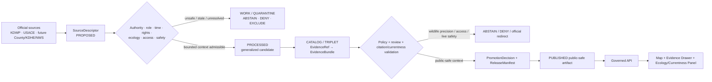
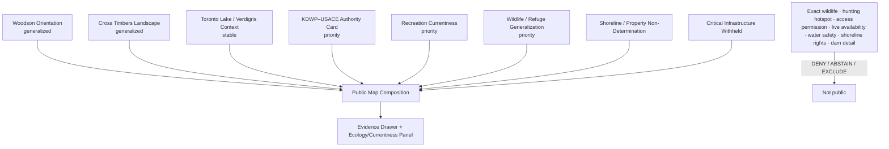
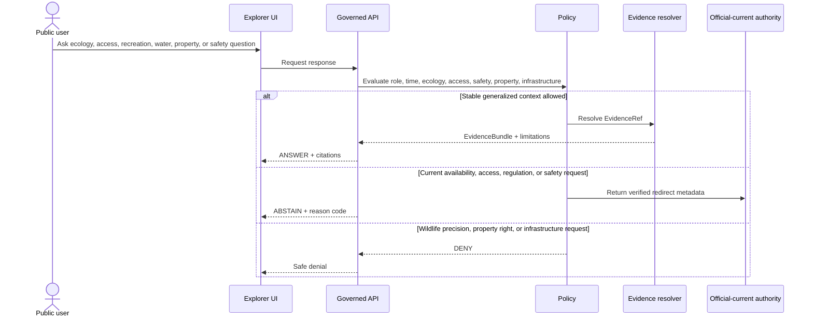
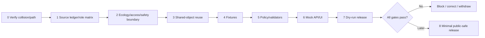

<!-- [KFM_META_BLOCK_V2]
doc_id: NEEDS_VERIFICATION — <REGISTERED_KFM_DOC_ID>
title: Woodson County Focus Mode Build Plan — Cross Timbers, Toronto Lake, and Public-Use Currentness Without Wildlife, Access, Safety, or Infrastructure Conclusions
type: county-focus-mode-build-plan
version: v0.1-draft
status: draft
county: Woodson County, Kansas
county_slug: woodson
created: 2026-06-08
updated: 2026-06-08
owners:
  - NEEDS_VERIFICATION — <OWNER:focus-mode-steward>
  - NEEDS_VERIFICATION — <OWNER:ecology-and-wildlife-reviewer>
  - NEEDS_VERIFICATION — <OWNER:reservoir-and-recreation-currentness-reviewer>
  - NEEDS_VERIFICATION — <OWNER:public-land-access-and-regulation-reviewer>
  - NEEDS_VERIFICATION — <OWNER:critical-infrastructure-and-release-reviewer>
release_status: NEEDS_VERIFICATION — NOT_RELEASED
review_assignments: NEEDS_VERIFICATION
correction_path: NEEDS_VERIFICATION
rollback_path: NEEDS_VERIFICATION
unverified_repository_paths:
  - PROPOSED / CONFLICTED / NEEDS_VERIFICATION — docs/focus-modes/woodson-county/build-plan.md
  - PROPOSED / OBSERVED-LEGACY / NEEDS_VERIFICATION — docs/focus-mode/counties/woodson_county/woodson_county_focus_mode_build_plan.md
schema_contract_policy_homes:
  - PROPOSED / NEEDS_VERIFICATION — contracts/focus_mode/
  - PROPOSED / NEEDS_VERIFICATION — schemas/contracts/v1/focus_mode/
  - PROPOSED / NEEDS_VERIFICATION — policy/runtime/, policy/sensitivity/, policy/rights/, policy/release/
proof_slice: Cross Timbers oak-savanna and Toronto Lake public-use context paired with exact wildlife-location, hunting-access, trail/camping-currentness, shoreline, water-safety, and dam/infrastructure restraint
primary_public_safe_boundary: KFM may present generalized, time-attributed Cross Timbers, Toronto Lake, state-park, habitat, and agency-role context; it must not expose exact sensitive wildlife, nesting, roosting, hunting, or refuge-use locations, imply permission to enter public or private land, determine current trail/campsite/cabin availability, hunting/fishing legality, water or boating safety, lake-level safety, shoreline rights, dam/infrastructure condition or vulnerability, road status, or active emergency conditions.
collision_search:
  completed_register: CONFIRMED — Woodson County is absent from the user-supplied completed/collision register.
  generated_in_continuation: CONFIRMED — counties already generated in this continuation, including Kingman and Kearny, were excluded.
  uploaded_project_materials: CONFIRMED — targeted Woodson County Focus Mode searches were performed; no Woodson County plan surfaced among examined results.
  live_repository_search: CONFIRMED — search for woodson_county_focus_mode_build_plan returned no matching plan.
  rejected_candidate: CONFIRMED — Greenwood County was rejected after a live repository plan collision was found.
  exhaustive_absence: NEEDS_VERIFICATION — unindexed branches, private artifacts, and prior unsearched outputs may still exist.
directory_rules_basis:
  - CONFIRMED — attached Directory Rules.pdf was inspected during this series.
  - CONFIRMED — location encodes responsibility, governance, and lifecycle; topic alone does not justify a root folder.
  - CONFIRMED — lifecycle is RAW → WORK / QUARANTINE → PROCESSED → CATALOG / TRIPLET → PUBLISHED.
  - CONFIRMED — promotion is a governed state transition, not a file move.
  - CONFLICTED / NEEDS_VERIFICATION — observed repository paths use docs/focus-mode/ while doctrine also identifies docs/focus-modes/.
official_source_checks:
  - CONFIRMED — Kansas Department of Wildlife and Parks, Cross Timbers State Park page, checked 2026-06-08.
  - CONFIRMED — U.S. Army Corps of Engineers, Toronto Lake page, checked 2026-06-08.
  - NEEDS_VERIFICATION — Woodson County official website was identified but not sufficiently opened and verified for detailed county-service claims in this run.
  - NEEDS_VERIFICATION — direct current NWS jurisdiction, KDHE water-quality, KDWP wildlife-area, and road/emergency sources should be admitted before publication.
source_check_date: 2026-06-08
tags: [kfm, focus-mode, woodson-county, cross-timbers, toronto-lake, chautauqua-hills, oak-savanna, wildlife-area, recreation-currentness, sensitive-ecology, cite-or-abstain]
notes:
  - Planning artifact only; no implementation, source admission, review, promotion, publication, correction readiness, or rollback readiness is claimed.
  - KDWP publishes exact trail-start and cabin coordinates; this plan treats those as source-visible operational details that require deliberate public-display review rather than automatic replication.
  - USACE identifies lake-level, shoreline-management, boundary-plat, water-safety, recreation-closure, and master-plan surfaces; those roles must remain distinct and must not be collapsed into one public truth layer.
[/KFM_META_BLOCK_V2] -->

<a id="top"></a>

# Woodson County Focus Mode Build Plan
## Cross Timbers, Toronto Lake, and Public-Use Currentness Without Wildlife, Access, Safety, or Infrastructure Conclusions

> **Product thesis:** Explain Woodson County’s Cross Timbers oak-savanna, Toronto Lake, public recreation, habitat, and agency roles while refusing to become a wildlife-location, hunting-access, trail-availability, shoreline-rights, water-safety, dam-condition, road-status, or emergency authority.


| Identity / status field | Value |
|---|---|
| County | **Woodson County, Kansas** |
| Status | `PROPOSED` planning artifact |
| Distinct proof slice | Cross Timbers oak-savanna, Toronto Lake, Toronto Wildlife Area, trail/cabin/camping context, lake-level/shoreline-management authority, and public-use currentness |
| Primary public-safe boundary | **Generalized landscape and agency-role context may be shown; exact sensitive wildlife or refuge-use locations, access permission, live recreation status, legal hunting/fishing conclusions, water safety, shoreline rights, dam/infrastructure condition, road status, and emergency guidance are denied or abstained.** |
| Official sources checked | KDWP Cross Timbers State Park; USACE Toronto Lake |
| Collision status | No Woodson collision surfaced; Greenwood County was rejected after a live collision |
| Exhaustive absence | `NEEDS_VERIFICATION` |
| Release state | `NOT_RELEASED` |

## Quick links

[Operating posture](#1-operating-posture) · [Why this county](#2-why-this-county) · [Product thesis](#3-product-thesis) · [Scope](#4-scope-boundary) · [Layers](#5-first-demo-layers) · [Journeys](#6-user-journeys) · [UI](#7-ui-surfaces) · [Objects](#8-governed-object-model) · [Repository](#9-proposed-repository-shape) · [Build](#10-build-phases) · [PRs](#11-first-pr-sequence) · [Acceptance](#12-acceptance-checklist) · [Fixtures](#13-fixture-plan) · [Risks](#14-risk-register) · [Sources](#15-source-seed-list) · [Questions](#16-open-verification-questions) · [Milestone](#17-recommended-first-milestone)

---

## Executive build note

Woodson County is selected as a distinct **Cross Timbers ecology + reservoir public-use currentness** proof slice.

KDWP’s official Cross Timbers State Park page places the park west of Yates Center and south of Toronto. It describes forested floodplains, prairie terraces, oak savanna, diverse flora and fauna, campgrounds, trails, cabins, fishing, and the adjacent 4,600-acre Toronto Wildlife Area.[^s1] The same page publishes trail starts, permit statements, campground counts, reservability, cabin details, office hours, and reservation links. Those details are useful but operationally sensitive to time and public-use interpretation. KFM must not freeze them into evergreen availability, legality, or access truth.

USACE’s official Toronto Lake page distinguishes multiple roles: recreation, lake level, water safety, shoreline management, survey boundary plats, master planning, recreation closures, hunting information, and project administration.[^s2] It states that all recreation areas at Toronto Lake are managed by KDWP and describes the Chautauqua Hills/Cross Timbers habitat and public hunting management of Duck Island and the upper lake.[^s2] This makes source-role separation essential: a lake-level page is not a boating-safety decision; a boundary plat is not a title opinion; a hunting-management statement is not personalized legal permission; and a habitat description is not authority to expose exact wildlife locations.

> [!CAUTION]
> ## Defining public-safe boundary
>
> **KFM may explain Woodson County’s Cross Timbers, Toronto Lake, state-park, and habitat context at generalized scale. It must not publish exact nesting, roosting, hunting, refuge-use, or sensitive-species locations; imply access to private land or closed areas; guarantee that a trail, campsite, cabin, road, or facility is open; determine hunting or fishing legality; declare water or boating conditions safe; interpret lake levels as travel or launch advice; determine shoreline rights; or expose dam and infrastructure condition or vulnerability.**

### Evidence boundary

| Label | Established | Not established |
|---|---|---|
| `CONFIRMED` | Woodson is absent from the supplied register; targeted live repository search returned no Woodson plan; Greenwood was rejected because a live plan exists; KDWP and USACE official pages were checked. | — |
| `PROPOSED` | Every card, layer, object, policy, fixture, path, UI surface, milestone, correction, and release action below. | No implementation is claimed. |
| `NEEDS_VERIFICATION` | Comprehensive collision absence; county-index state; canonical path; county-government routing; source rights; wildlife geoprivacy; current closures; KDHE water-quality authority; NWS/road/emergency sources; shared contracts and rollback implementation. | — |
| `UNKNOWN` | Current campsite/cabin/trail availability, actual permit requirements at request time, hunting/fishing legality, exact wildlife occurrence, water safety, lake-level implications, shoreline rights, dam condition, road status, and active emergency conditions. | — |

---

# 1. Operating posture

## 1.1 Governing rules applied to Woodson County

| KFM rule | Woodson application |
|---|---|
| EvidenceBundle outranks generated language | AI cannot create wildlife, access, public-use, water-safety, shoreline, infrastructure, or emergency facts. |
| Cite-or-abstain | Stable landscape and source-role context may answer; current or individualized questions abstain or deny. |
| Public clients use governed interfaces | No public access to raw wildlife observations, restricted habitat records, unpublished closures, internal project systems, or direct model output. |
| Source roles remain distinct | KDWP park, wildlife-area management, USACE lake level, water safety, shoreline management, boundary plats, KDHE health advisories, county roads, and AI remain separate. |
| Publication is governed | Visible source coordinates or operational details are not automatically approved public KFM content. |
| Ecology fails closed | Exact sensitive wildlife and refuge-use locations are generalized or withheld. |
| Access and legal meaning fail closed | Public-history or habitat context does not grant entry, hunting, camping, or shoreline rights. |
| Infrastructure and safety fail closed | Dam, lake level, closures, roads, and water conditions require current authority. |

## 1.2 Truth labels and finite outcomes

| Token | Meaning |
|---|---|
| `CONFIRMED` | Verified in this run. |
| `PROPOSED` | Design not verified as implemented. |
| `NEEDS_VERIFICATION` | Checkable before action. |
| `UNKNOWN` | Unsupported or unresolved. |
| `ANSWER` | Narrow evidence-supported public-safe response. |
| `ABSTAIN` | Authority, currentness, rights, or evidence is insufficient. |
| `DENY` | Request crosses ecology, access, privacy, legal, infrastructure, or safety boundaries. |
| `ERROR` | Contract, evidence, policy, or runtime failure. |

## 1.3 Public trust membrane



## 1.4 County-specific guardrails

| Guardrail | Outcome | Candidate reason code |
|---|---:|---|
| Exact wildlife, nesting, roosting, refuge-use, or hunting-hotspot detail | `DENY` | `SENSITIVE_WILDLIFE_OR_REFUGE_DETAIL_WITHHELD` |
| Private-land, closed-area, shoreline, or special-permit access conclusion | `DENY` / `ABSTAIN` | `PUBLIC_CONTEXT_NOT_ACCESS_PERMISSION` |
| Current campsite, cabin, trail, restroom, or facility availability | `ABSTAIN` | `CURRENT_RECREATION_STATUS_REQUIRES_AUTHORITY` |
| Hunting/fishing legality for a person, place, or date | `ABSTAIN` / `DENY` | `RECREATION_REGULATION_NOT_PERSONALLY_DETERMINED` |
| Swimming, boating, launch, or water-quality safety | `ABSTAIN` | `WATER_OR_BOATING_SAFETY_NOT_DETERMINED` |
| Lake-level interpretation as launch/travel/safety advice | `ABSTAIN` | `LAKE_LEVEL_NOT_SAFETY_GUIDANCE` |
| Shoreline, boundary, title, or adjacent-landowner determination | `DENY` | `SHORELINE_OR_PROPERTY_RIGHT_DETERMINATION_DENIED` |
| Dam or infrastructure condition/vulnerability | `DENY` | `CRITICAL_WATER_INFRASTRUCTURE_DETAIL_WITHHELD` |
| Road closure or emergency status | `ABSTAIN` | `OFFICIAL_CURRENT_SAFETY_CHANNEL_REQUIRED` |

---

# 2. Why this county

## 2.1 Collision screen

| Check | Result | Status |
|---|---|---:|
| Supplied completed/collision register | Woodson absent. | `CONFIRMED` |
| Counties generated in this continuation | Excluded. | `CONFIRMED` |
| Live repository filename search | No Woodson plan match. | `CONFIRMED` |
| Uploaded/project-material search | No Woodson plan surfaced among examined results. | `CONFIRMED` for performed search |
| Rejected candidate | Greenwood rejected due to a confirmed live plan collision. | `CONFIRMED` |
| Exhaustive absence | Not proved across all private/unindexed material. | `NEEDS_VERIFICATION` |

## 2.2 Proof-slice rationale

| Dimension | Proof value | Evidence |
|---|---|---|
| Ecology | Oak savanna, forested floodplains, prairie terraces, diverse flora/fauna. | KDWP.[^s1] |
| Public recreation | Trails, camping, cabins, fishing, mountain biking, backcountry camping by special permit. | KDWP.[^s1] |
| Wildlife sensitivity | Adjacent 4,600-acre Toronto Wildlife Area and waterfowl/upland-game management. | KDWP/USACE.[^s1][^s2] |
| Reservoir governance | Lake level, closures, shoreline plans, boundary plats, water safety, and master planning are distinct authority surfaces. | USACE.[^s2] |
| Access/legal ambiguity | Trail permits, public hunting, shoreline, adjacent lands, and precise coordinates can be overread as permission. | KDWP/USACE.[^s1][^s2] |
| Operational currentness | Reservability, office hours, closures, and lake-level information change. | KDWP/USACE.[^s1][^s2] |
| Distinct series value | Combines ecology geoprivacy, public-use legal scope, and reservoir authority separation. | `PROPOSED`. |

## 2.3 Distinct series contribution

Woodson County tests whether KFM can:

1. explain a high-value habitat region without enabling wildlife targeting;
2. use park information without promising availability or access;
3. distinguish lake level from water or boating safety;
4. distinguish shoreline plans and boundary plats from title and access rights;
5. distinguish general hunting management from personalized legal permission;
6. keep dam/infrastructure detail outside normal public products.

## 2.4 Public benefit

A public-safe product can explain:

- what the Cross Timbers and Chautauqua Hills landscape is;
- why Toronto Lake and the Verdigris River matter;
- how KDWP and USACE responsibilities differ;
- why exact wildlife locations are withheld;
- why users must verify current access, regulations, closures, and safety with official sources.

---

# 3. Product thesis

## 3.1 One-sentence thesis

> **Woodson County Focus Mode should make Cross Timbers ecology and Toronto Lake public-use governance understandable while making wildlife precision, access permission, live availability, personalized regulation, water safety, shoreline rights, infrastructure, road, and emergency conclusions impossible to mistake for KFM authority.**

## 3.2 First-product promises

| Promise | Meaning |
|---|---|
| Generalized landscape context | Oak-savanna, prairie, forest, lake, and river relationships. |
| Source-role visibility | KDWP and USACE roles remain distinct. |
| Ecology geoprivacy | Sensitive wildlife detail is withheld. |
| Currentness literacy | Operational park/lake details show dates and expiry. |
| Finite outcomes | Supported context answers; risky requests abstain or deny. |
| Reversibility | Correction and rollback precede publication. |

## 3.3 Non-promises

- no exact wildlife/refuge-use or hunting-hotspot locations;
- no entry, camping, backcountry, shoreline, or private-land permission;
- no current campsite/cabin/trail availability;
- no personalized hunting/fishing legality;
- no swimming, boating, water-quality, or launch-safety conclusion;
- no shoreline/title/boundary-right conclusion;
- no dam or infrastructure status/vulnerability;
- no road/emergency guidance;
- no implementation or publication claim.

---

# 4. Scope boundary

| Content family | Posture | Boundary |
|---|---:|---|
| Woodson County orientation | `PROPOSED` | Generalized geometry only. |
| Cross Timbers landscape card | `PROPOSED` | Broad habitat interpretation. |
| Toronto Lake / Verdigris context | `PROPOSED` | No live water or safety meaning. |
| KDWP–USACE authority card | `PROPOSED` priority | Source-role separation. |
| Recreation-currentness notice | `PROPOSED` priority | No live availability or access promise. |
| Wildlife/refuge generalization card | `PROPOSED` | No exact occurrence or targeting. |
| Shoreline/property non-determination notice | `PROPOSED` | No boundary/title/access conclusion. |
| Live closures/lake-level/facility layer | `DEFER` | Requires expiry, receipts, correction, rollback. |
| Exact wildlife/hunting/refuge detail | `DENY` / `EXCLUDE` | Ecology/public-safety boundary. |
| Dam/infrastructure detail | `DENY` / `EXCLUDE` | Critical-infrastructure boundary. |

---

# 5. First demo layers

## 5.1 Prioritized cards/layers

| Priority | Card/layer | Purpose | Source | Gate | Status |
|---:|---|---|---|---|---:|
| 1 | `EcologyAccessWaterSafetyBoundaryNotice` | Central public-safe boundary. | KDWP + USACE | Highest-risk fixtures. | `PROPOSED` |
| 2 | `CrossTimbersLandscapeCard` | Generalized oak-savanna/floodplain/prairie context. | KDWP[^s1] | EvidenceBundle and rights. | `PROPOSED` |
| 3 | `TorontoLakeVerdigrisContextCard` | Reservoir and river setting. | USACE[^s2] | No live-safety inference. | `PROPOSED` |
| 4 | `KDWPUSACEAuthoritySeparationCard` | Explains management roles. | KDWP/USACE[^s1][^s2] | Source-role validator. | `PROPOSED` |
| 5 | `RecreationCurrentnessCard` | Explains permits, availability, reservations, hours, closures. | KDWP/USACE | Expiry/currentness. | `PROPOSED` |
| 6 | `WildlifeRefugeGeneralizationCard` | Broad wildlife-area stewardship. | KDWP/USACE | Ecology review. | `PROPOSED` |
| 7 | `ShorelinePropertyNonDeterminationNotice` | Prevents boundary/title/access overclaim. | USACE policy surfaces | Legal/property review. | `PROPOSED` |
| 8 | `CriticalInfrastructureWithholdNotice` | Explains why dam details are absent. | Policy | Security review. | `PROPOSED` |
| 9 | Live facility/closure/lake-level status | Dynamic high-risk content. | Future governed source | Not first slice. | `DEFER` |
| 10 | Exact wildlife/refuge/hunting/infrastructure detail | Unsafe. | — | Exclude. | `DENY` |

## 5.2 Map composition



## 5.3 Layer-card truth contract

| Field | Purpose | Failure posture |
|---|---|---|
| `source_role` | Separates park, wildlife, lake-level, shoreline, safety, regulation, and AI roles. | `ABSTAIN`. |
| `temporal_basis` | Shows source date/currentness. | `ABSTAIN` for current requests. |
| `expiry_at` | Required for closures, availability, lake-level status. | Suppress if absent/expired. |
| `ecology_generalization` | Prevents exact wildlife/refuge precision. | `DENY` / quarantine. |
| `access_scope` | Prevents context from becoming permission. | `ABSTAIN` / release block. |
| `water_safety_scope` | Prevents lake context becoming safety advice. | `ABSTAIN`. |
| `property_legal_scope` | Prevents shoreline/boundary/title inference. | `DENY`. |
| `infrastructure_sensitivity` | Prevents dam/vulnerability disclosure. | `DENY`. |
| `evidence_refs` | Claim support. | `ABSTAIN`. |
| `release_state` | Prevents draft from appearing public. | Public alias blocked. |

---

# 6. User journeys

## 6.1 Public learning journeys

| Journey | Safe outcome |
|---|---|
| “What is the Cross Timbers landscape?” | Generalized ecology/landform explanation. |
| “How do KDWP and USACE roles differ?” | Agency-role answer with citations. |
| “Why are wildlife locations generalized?” | Stewardship and geoprivacy explanation. |
| “Why can’t KFM tell me whether a cabin is available?” | Operational currentness explanation. |
| “Why doesn’t a boundary plat prove my shoreline rights?” | Property/legal non-determination explanation. |

## 6.2 Trust-demonstration journeys

| Request | Outcome |
|---|---:|
| “Show exact waterfowl roosts or turkey locations.” | `DENY` |
| “Can I enter this shoreline or backcountry segment?” | `ABSTAIN` / `DENY` |
| “Is this trail open today?” | `ABSTAIN` |
| “Can I hunt here today?” | `ABSTAIN` / `DENY` |
| “Is the lake safe for boating or swimming?” | `ABSTAIN` |
| “Does this lake level mean the ramp is usable?” | `ABSTAIN` |
| “Where is the property boundary?” | `DENY` / official survey redirect |
| “Show dam vulnerabilities.” | `DENY` |
| “Is there a closure or emergency now?” | `ABSTAIN` |

## 6.3 Candidate reason codes

- `SENSITIVE_WILDLIFE_OR_REFUGE_DETAIL_WITHHELD`
- `PUBLIC_CONTEXT_NOT_ACCESS_PERMISSION`
- `CURRENT_RECREATION_STATUS_REQUIRES_AUTHORITY`
- `RECREATION_REGULATION_NOT_PERSONALLY_DETERMINED`
- `WATER_OR_BOATING_SAFETY_NOT_DETERMINED`
- `LAKE_LEVEL_NOT_SAFETY_GUIDANCE`
- `SHORELINE_OR_PROPERTY_RIGHT_DETERMINATION_DENIED`
- `CRITICAL_WATER_INFRASTRUCTURE_DETAIL_WITHHELD`
- `OFFICIAL_CURRENT_SAFETY_CHANNEL_REQUIRED`

---

# 7. UI surfaces

| Surface | Woodson-specific behavior | Status |
|---|---|---:|
| Header | “No wildlife precision, access permission, live availability, water-safety, or infrastructure verdict.” | `PROPOSED` |
| Map canvas | Generalized habitat/reservoir context only. | `PROPOSED` |
| Layer drawer | Source role, checked time, expiry, generalization, release state. | `PROPOSED` |
| Evidence Drawer | Separates KDWP, USACE, future KDHE/NWS/county, and AI roles. | `PROPOSED` |
| Answer panel | Stable landscape and agency-role answers. | `PROPOSED` |
| Abstention panel | Access, availability, regulation, lake-level, water-safety, closure questions. | `PROPOSED` |
| Denial panel | Exact wildlife, property rights, critical infrastructure. | `PROPOSED` |
| Timeline/time-basis panel | Stable park context versus current closures/levels. | `PROPOSED` |
| **Ecology / Access / Water-Safety Boundary Panel** | Central trust surface. | `PROPOSED` |
| Official redirect panel | KDWP, USACE, future KDHE/NWS/county. | `PROPOSED` |
| Release/correction panel | `NOT_RELEASED`, expiry, correction, rollback. | `PROPOSED` |

## 7.1 Legend vocabulary

| Label | Meaning | Must not become |
|---|---|---|
| `Generalized habitat context` | Public-scale ecology. | Exact wildlife occurrence. |
| `Park management source` | KDWP recreation/management role. | Live availability or personal permission. |
| `Federal project source` | USACE project/lake role. | Title, shoreline right, or safety guarantee. |
| `Operational status` | Expiring closure/level/facility information. | Evergreen truth. |
| `Sensitive detail withheld` | Ecology/security boundary. | Confirmation of hidden locations. |
| `Generated explanation` | Bounded synthesis. | Evidence or authority. |

## 7.2 Sequence diagram



---

# 8. Governed object model

## 8.1 Shared object families

| Object family | Woodson use | Status |
|---|---|---:|
| `SourceDescriptor` | Authority, role, time, rights, sensitivity, allowed claims. | `PROPOSED / NEEDS_VERIFICATION` |
| `EvidenceRef` | Claim-to-proof link. | `PROPOSED / NEEDS_VERIFICATION` |
| `EvidenceBundle` | Evidence plus ecology/access/safety limitations. | `PROPOSED / NEEDS_VERIFICATION` |
| `PolicyDecision` | Finite outcome and obligations. | `PROPOSED / NEEDS_VERIFICATION` |
| `RuntimeResponseEnvelope` | Public-safe response. | `PROPOSED / NEEDS_VERIFICATION` |
| `CitationValidationReport` | Detects role/currentness overclaim. | `PROPOSED / NEEDS_VERIFICATION` |
| `ReleaseManifest` | Approved public composition. | `PROPOSED / NEEDS_VERIFICATION` |
| `AIReceipt` | Generated output/dependencies. | `PROPOSED / NEEDS_VERIFICATION` |
| `ReviewRecord` | Ecology, access, recreation, property, infrastructure review. | `PROPOSED / NEEDS_VERIFICATION` |
| `CorrectionNotice` | Corrects stale/unsafe output. | `PROPOSED / NEEDS_VERIFICATION` |
| `RollbackPlan` | Withdraws unsafe release. | `PROPOSED / NEEDS_VERIFICATION` |

## 8.2 County-specific candidates

- `CrossTimbersLandscapeCard`
- `TorontoLakeVerdigrisContextCard`
- `KDWPUSACEAuthoritySeparationCard`
- `WildlifeRefugeGeneralizationRecord`
- `RecreationCurrentnessNotice`
- `AccessPermissionNonDeterminationNotice`
- `ShorelinePropertyNonDeterminationNotice`
- `CriticalWaterInfrastructureWithholdNotice`

## 8.3 Source-role anti-collapse rules

| Source | Valid role | Must not become |
|---|---|---|
| KDWP Cross Timbers page | Park, habitat, trail, camping, cabin, fishing context. | Live availability, legal permission, water safety, exact wildlife truth. |
| KDWP wildlife management | Stewardship and public-use regulation. | Hunting success prediction or sensitive hotspot map. |
| USACE Toronto page | Federal project, lake, level, safety, shoreline, planning role. | Title opinion, launch-safety decision, or infrastructure-vulnerability map. |
| Future KDHE source | Current health/advisory role. | Universal or permanent water-safety conclusion. |
| Future county/NWS source | Road/emergency/weather authority. | Static KFM incident status. |
| AI narrative | Bounded explanation. | Evidence or operational authority. |

## 8.4 Minimal public runtime response JSON

```json
{
  "schema_version": "v1",
  "object_type": "RuntimeResponseEnvelope",
  "response_id": "kfm.runtime.woodson.cross_timbers_context.answer.v1",
  "county": "woodson",
  "outcome": "ANSWER",
  "answer_scope": "public_safe_generalized_landscape_context",
  "answer": "Checked KDWP and USACE material describes Toronto Lake at the northern end of the Cross Timbers/Chautauqua Hills region, with oak-dominated uplands, prairie terraces, forested floodplains, and diverse habitat.",
  "evidence_refs": [
    "kfm.evidence_ref.woodson.cross_timbers_toronto_context.v1"
  ],
  "limitations": [
    "No exact wildlife locations, access permission, current facility status, hunting or fishing legality, water or boating safety, shoreline rights, infrastructure condition, road status, or emergency condition is provided."
  ],
  "review_state": "NEEDS_VERIFICATION",
  "release_state": "NOT_RELEASED",
  "spec_hash": "NEEDS_VERIFICATION"
}
```

## 8.5 Abstention JSON

```json
{
  "schema_version": "v1",
  "object_type": "RuntimeResponseEnvelope",
  "response_id": "kfm.runtime.woodson.access_or_current_status.abstain.v1",
  "county": "woodson",
  "outcome": "ABSTAIN",
  "reason_code": "CURRENT_RECREATION_STATUS_REQUIRES_AUTHORITY",
  "message": "KFM does not determine current trail, campsite, cabin, permit, closure, hunting, fishing, lake-level safety, road, or emergency status from cached context.",
  "official_redirects": [
    {"authority": "Kansas Department of Wildlife and Parks", "purpose": "current park, permit, facility, hunting, and fishing information"},
    {"authority": "U.S. Army Corps of Engineers", "purpose": "official project, lake-level, shoreline-management, closure, and water-safety information"}
  ],
  "release_state": "NOT_RELEASED",
  "spec_hash": "NEEDS_VERIFICATION"
}
```

## 8.6 Denial JSON

```json
{
  "schema_version": "v1",
  "object_type": "RuntimeResponseEnvelope",
  "response_id": "kfm.runtime.woodson.sensitive_detail.deny.v1",
  "county": "woodson",
  "outcome": "DENY",
  "reason_code": "SENSITIVE_WILDLIFE_OR_REFUGE_DETAIL_WITHHELD",
  "message": "KFM does not publish exact sensitive wildlife, nesting, roosting, refuge-use, or hunting-hotspot locations and does not expose critical dam or infrastructure vulnerabilities.",
  "withheld_fields": [
    "exact_sensitive_species_geometry",
    "nest_or_roost_location",
    "hunting_hotspot",
    "refuge_use_pattern",
    "dam_or_control_structure_detail",
    "infrastructure_vulnerability"
  ],
  "release_state": "NOT_RELEASED",
  "spec_hash": "NEEDS_VERIFICATION"
}
```

## 8.7 Deterministic identity candidates

| Item | Candidate |
|---|---|
| Source | `kfm.source.woodson.<authority>.<slug>.v1` |
| Evidence | `kfm.evidence_bundle.woodson.<claim_scope>.v1` |
| Card | `kfm.card.woodson.<card>.v1` |
| Fixture | `kfm.runtime.woodson.<scenario>.<outcome>.v1` |
| Release | `kfm.release.woodson.focus_mode.v0_1` |

`spec_hash` behavior remains `PROPOSED / NEEDS_VERIFICATION`.

---

# 9. Proposed repository shape

## 9.1 Directory Rules basis

Directory Rules require responsibility-root placement, no topic-as-root folders, separate docs/contracts/schemas/policy/fixtures/data/release, and lifecycle:

`RAW → WORK / QUARANTINE → PROCESSED → CATALOG / TRIPLET → PUBLISHED`.

Promotion is a governed state transition.

> [!WARNING]
> The observed `docs/focus-mode/` versus doctrinal `docs/focus-modes/` divergence remains unresolved. Paths below are `PROPOSED / CONFLICTED / NEEDS_VERIFICATION`.

## 9.2 Candidate paths

| Root | Proposed path | Purpose |
|---|---|---|
| Docs | `docs/focus-modes/woodson-county/build-plan.md` | Human planning document. |
| Docs companions | `docs/focus-modes/woodson-county/{README.md,ecology-sensitivity-notes.md,recreation-currentness-notes.md,access-property-notes.md,infrastructure-boundary-notes.md,source-seed-list.md,acceptance-checklist.md}` | Governance docs. |
| Contracts | `contracts/focus_mode/` | Shared semantics. |
| Schemas | `schemas/contracts/v1/focus_mode/` | Machine shapes. |
| Fixtures | `fixtures/focus_modes/woodson/{valid,invalid}/` | Positive/negative proof. |
| UI | `apps/explorer-web/src/focus-modes/woodson/` | Mock governed UI. |
| Catalog | `data/catalog/sources/woodson/` | Admitted source descriptors only. |
| Published | `data/published/layers/woodson/` | Future governed output only. |
| Release | `release/candidates/woodson-focus-mode/` | Future release candidate only. |

## 9.3 Proposed tree

```text
# PROPOSED / CONFLICTED / NEEDS_VERIFICATION

docs/
└── focus-modes/
    └── woodson-county/
        ├── README.md
        ├── build-plan.md
        ├── ecology-sensitivity-notes.md
        ├── recreation-currentness-notes.md
        ├── access-property-notes.md
        ├── infrastructure-boundary-notes.md
        ├── source-seed-list.md
        ├── evidence-model.md
        └── acceptance-checklist.md

fixtures/
└── focus_modes/woodson/
    ├── valid/
    └── invalid/

contracts/
└── focus_mode/

schemas/
└── contracts/v1/focus_mode/

apps/
└── explorer-web/src/focus-modes/woodson/

data/
├── catalog/sources/woodson/
└── published/layers/woodson/    # future governed output only

release/
└── candidates/woodson-focus-mode/
```

## 9.4 Placement prohibitions

- no root-level `woodson/`, `cross-timbers/`, `toronto-lake/`, `wildlife-area/`, or `dam/`;
- no exact sensitive wildlife, hunting-hotspot, private-access, shoreline-title, or infrastructure-vulnerability data in public fixtures;
- no visible source coordinate copied automatically into public output;
- no live status frozen without expiry and receipts;
- no public client access to `RAW`, `WORK`, `QUARANTINE`;
- no publication without review, manifest, correction, and rollback.

---

# 10. Build phases

| Phase | Goal | Entry gate | Output | Exit validation | Rollback |
|---:|---|---|---|---|---|
| 0 | Collision/path verification | Repeat searches | Verification note | No collision; path resolved or blocked | Stop |
| 1 | Source ledger/role matrix | KDWP/USACE roles identified | Descriptor candidates | Role, rights, time, sensitivity explicit | Docs only |
| 2 | Ecology/access/safety boundary | Review framework accepted | Boundary policies | Sensitive/current requests fail closed | Withdraw |
| 3 | Shared-object reuse | Existing families inspected | Reuse/extension decision | No parallel authority | Revert |
| 4 | Fixtures | Boundary accepted | Valid/invalid pack | Unsafe cases fail closed | Remove |
| 5 | Policy/validators | Fixtures exist | Ecology/currentness/access validators | Finite outcomes tested | Block |
| 6 | Mock API/UI | Contracts/policies agreed | Mock cards/panels | No sensitive or current overclaim | Disable |
| 7 | Dry-run release | Reviews/evidence available | Candidate proof pack | No public alias; rollback rehearsed | Withdraw |
| 8 | Optional publication | All gates pass | Minimal generalized release | Traceable and reversible | Rollback |



---

# 11. First PR sequence

1. Verification and documentation control.
2. Source ledger/admission and public-safe boundary.
3. Contracts/schemas or shared-object reuse.
4. Valid and invalid fixtures.
5. Policy and validators.
6. Mock governed API/UI.
7. Dry-run release proof.
8. Only then optional minimal public-safe publication.

**Live closures, lake levels, reservations, hunting/fishing status, exact wildlife data, shoreline-property data, infrastructure data, road/emergency integration, and public release are not first-PR work.**

---

# 12. Acceptance checklist

## Governance and evidence

- [ ] Woodson collision check rerun.
- [ ] Every public claim resolves to EvidenceBundle.
- [ ] KDWP park, wildlife, USACE project, lake-level, shoreline, safety, future KDHE/NWS/county, and AI roles remain distinct.
- [ ] Current content has checked time and expiry.
- [ ] No AI output is evidence.
- [ ] Finite outcomes exist.

## Public/sensitive boundary

- [ ] No exact sensitive wildlife/refuge/hunting-hotspot detail.
- [ ] No access permission or private-land implication.
- [ ] No live campsite/cabin/trail/facility status.
- [ ] No personalized hunting/fishing legality.
- [ ] No water/boating/launch-safety conclusion.
- [ ] No shoreline/title/boundary-right determination.
- [ ] No critical dam/infrastructure detail.
- [ ] No current road/emergency guidance.

## Product and UI

- [ ] Header states primary boundary and `NOT_RELEASED`.
- [ ] Evidence Drawer shows authority and source role.
- [ ] Time and expiry are visible.
- [ ] Generalization is visible.
- [ ] Denial and abstention reason codes are visible.
- [ ] Official redirects do not masquerade as answers.

## Repository/release

- [ ] Path conflict resolved.
- [ ] No parallel authority homes.
- [ ] Public UI cannot access internal lifecycle stores.
- [ ] Highest-risk invalid fixtures fail closed.
- [ ] Correction and rollback are actionable.
- [ ] Promotion remains governed.

---

# 13. Fixture plan

## 13.1 Valid fixtures

| Fixture | Scenario | Outcome |
|---|---|---:|
| `cross_timbers_context.valid.json` | Generalized landscape context. | `ANSWER` |
| `kdwp_usace_roles.valid.json` | Agency-role separation. | `ANSWER` |
| `current_trail_status_abstain.valid.json` | User asks whether trail is open. | `ABSTAIN` |
| `water_safety_abstain.valid.json` | User asks boating/swimming safety. | `ABSTAIN` |
| `wildlife_precision_deny.valid.json` | User requests exact roost/nest locations. | `DENY` |
| `infrastructure_detail_deny.valid.json` | User requests dam vulnerability. | `DENY` |

## 13.2 Invalid/fail-closed fixtures

| Fixture | Failure | Required result |
|---|---|---:|
| `exact_wildlife_hotspot.invalid.json` | Wildlife targeting enabled. | `DENY` |
| `trail_coordinate_as_access_permission.invalid.json` | Published coordinate becomes entry permission. | `DENY` / `ABSTAIN` |
| `park_page_as_cabin_available.invalid.json` | Static page becomes availability. | `ABSTAIN` |
| `permit_text_as_current_authorization.invalid.json` | General permit statement becomes legal permission. | `ABSTAIN` |
| `lake_level_as_boating_safe.invalid.json` | Level becomes safety conclusion. | `ABSTAIN` |
| `absence_of_closure_as_open.invalid.json` | No visible closure becomes proof of access. | `ABSTAIN` |
| `boundary_plat_as_title.invalid.json` | Survey plat becomes ownership/right conclusion. | `DENY` |
| `shoreline_plan_as_private_right.invalid.json` | Plan becomes private entitlement. | `DENY` |
| `dam_detail_public.invalid.json` | Critical infrastructure detail exposed. | `DENY` |
| `ai_hunting_advice.invalid.json` | AI synthesizes hunting permission/success advice. | `ERROR` / `ABSTAIN` |
| `unresolved_evidence_ref.invalid.json` | Claim lacks evidence. | `ABSTAIN` |
| `public_internal_store_access.invalid.json` | Public surface reads internal store. | `ERROR` |

## 13.3 Fixture-to-test matrix

| Test family | Must prove |
|---|---|
| Ecology geoprivacy | No exact wildlife targeting detail. |
| Access/legal scope | Coordinates and context do not confer permission. |
| Currentness | Static pages cannot answer live availability/closure questions. |
| Water safety | Lake level and park context do not become safety advice. |
| Property/shoreline | Plats/plans do not become title or private rights. |
| Infrastructure | No dam/control/vulnerability detail. |
| Evidence closure | No claim without EvidenceBundle. |
| Trust membrane | No public internal-store access. |

## 13.4 Highest-risk invalid fixture pack

1. exact roost/nest/hunting-hotspot map;
2. trail coordinates used as access permission;
3. static campground/cabin page used as live availability;
4. lake level used as boating/launch safety;
5. absence of closure used as proof of open access;
6. boundary plat used as title or shoreline-right proof;
7. dam/control-structure vulnerability exposed;
8. AI-generated personalized hunting or fishing permission.

---

# 14. Risk register

| Risk | Likelihood | Impact | Mitigation | Release posture |
|---|---:|---:|---|---|
| Sensitive wildlife targeting enabled | High | Critical | Generalize, suppress, reviewer approval. | `DENY` |
| Source coordinates imply access | High | High | Access-scope validator and UI notice. | `DENY` / `ABSTAIN` |
| Static park page appears current | High | High | Expiry and official redirect. | `ABSTAIN` |
| Hunting/fishing context becomes legal advice | Medium/High | High | Regulation-role separation. | `ABSTAIN` |
| Lake level becomes safety advice | Medium | Critical | Level/safety separation. | `ABSTAIN` |
| Plats/plans become title/shoreline rights | Medium | Critical | Property/legal nondetermination. | `DENY` |
| Dam/infrastructure detail exposed | Medium | Critical | Withhold operational/tactical fields. | `DENY` |
| Rights unclear for maps/images | Medium | High | Rights review. | Quarantine |
| Existing Woodson plan later found | Low/Medium | Medium | Repeat collision check. | Stop |
| Path divergence hardens | High | Medium | Resolve before landing. | Docs only |
| Mock mistaken for release | Medium | High | Persistent `NOT_RELEASED`. | Mock only |

---

# 15. Source seed list

## 15.1 Current official sources checked in this run

| ID | Source | Role | Verified anchor | Intended use | Allowed claim scope | Limitations | Status |
|---|---|---|---|---|---|---|---:|
| `S1` | Kansas Department of Wildlife and Parks, **Cross Timbers State Park**[^s1] | State park, public-use, habitat, trail, camping, cabin, fishing, wildlife-area source | Park location; oak savanna, prairie, forested floodplains; campgrounds; trails; cabins; adjacent 4,600-acre Toronto Wildlife Area. | Landscape, park, authority, and currentness cards. | Generalized stable context and explicitly dated/current source details within scope. | No live availability, legal permission, water safety, exact wildlife locations, or private access conclusion. | `CONFIRMED` |
| `S2` | U.S. Army Corps of Engineers, **Toronto Lake**[^s2] | Federal reservoir-project, lake-level, shoreline, safety, recreation, planning, and management-role source | Verdigris River setting; Cross Timbers/Chautauqua Hills habitat; KDWP management of recreation areas; public-hunting management; lake-level, shoreline, plats, safety, closures, and plan links. | Reservoir context and source-role separation. | Project and generalized habitat/management context. | No title/right, launch safety, hunting permission, current closure, wildlife precision, or infrastructure vulnerability conclusion. | `CONFIRMED` |

## 15.2 Candidate official sources for later verification

| Candidate | Potential use | Required verification |
|---|---|---|
| KDWP Toronto Wildlife Area page | Wildlife/refuge and public-use context. | Current URL, geoprivacy, closures, exact-location policy, regulation scope. |
| KDHE harmful-algal-bloom and fish-consumption advisories | Current water-health redirect. | Geographic fit, freshness, expiry, claim scope. |
| USACE lake-level and recreation-closure feeds | Current status routing. | Machine-read rights, timestamp, expiry, no safety inference. |
| Woodson County official government | Roads, emergency, property, public works routing. | Current pages, rights, privacy, no title/safety conclusions. |
| NWS Wichita or applicable forecast office | Current weather/hazard routing. | County jurisdiction, currentness, no KFM warning rewrite. |
| KDOT/KanDrive | Road-status routing. | Currentness, expiry, no passability guarantee. |
| Kansas Historical Society / Osage Nation official sources | Cultural-landscape context. | Authority, terminology, cultural review, no appropriation. |

## 15.3 Source admission checklist

- [ ] Assign authority and source role.
- [ ] Record checked time and expiry behavior.
- [ ] Verify rights and derivative display.
- [ ] Generalize sensitive wildlife and refuge detail.
- [ ] Separate access from context.
- [ ] Separate lake level from water/boating safety.
- [ ] Separate boundary plats/shoreline plans from title and rights.
- [ ] Withhold dam and infrastructure detail.
- [ ] Resolve EvidenceRef to EvidenceBundle.
- [ ] Run invalid fixture pack.
- [ ] Quarantine stale, sensitive, private, rights-unclear, or unsafe material.
- [ ] Require correction and rollback before release.

---

# 16. Open verification questions

## Repository and collision

- [ ] Does a Woodson plan exist in another branch, private artifact store, or prior output?
- [ ] What does the live county index currently record for Woodson?
- [ ] Which Focus Mode path is canonical?
- [ ] What validator updates county status?

## Ecology and wildlife

- [ ] Which wildlife/refuge details must be generalized or excluded?
- [ ] Are exact trail/cabin coordinates appropriate for KFM public output?
- [ ] What closure or seasonal-use controls apply?
- [ ] What Osage Nation review is appropriate for historical/cultural references?

## Recreation and currentness

- [ ] Which source is authoritative for live campsite/cabin/trail availability?
- [ ] What expiry applies to office hours, permit statements, and reservations?
- [ ] Can KFM link to reservation systems without ingesting user data?
- [ ] What source is authoritative for hunting/fishing legality at request time?

## Water, shoreline, and infrastructure

- [ ] Which source can support lake-level context without safety inference?
- [ ] Which KDHE source governs algae or fish-consumption advisories?
- [ ] What shoreline/boundary materials may be linked but not interpreted?
- [ ] Which dam and project fields must remain excluded?
- [ ] What current water-safety source is appropriate?

## Correction and rollback

- [ ] How is stale facility or closure information suppressed?
- [ ] What rollback removes exposed wildlife or infrastructure detail?
- [ ] How are harmful access or property implications corrected?
- [ ] What proof demonstrates hidden sensitive details cannot be reconstructed?

---

# 17. Recommended first milestone

## Milestone 1 — Woodson Ecology, Access, and Reservoir Currentness Control Plane

### Milestone statement

> Establish a documentation-and-fixture-first Woodson County proof slice that can explain generalized Cross Timbers and Toronto Lake context while making wildlife precision, access permission, live recreation status, personalized regulation, lake-level safety, water/boating safety, shoreline/property rights, dam/infrastructure detail, road status, and emergency guidance fail closed.

### Deliverables

| Deliverable | Status |
|---|---:|
| Collision and path verification note | `PROPOSED` |
| KDWP–USACE source-role matrix | `PROPOSED` |
| Ecology / Access / Water-Safety Boundary Notice | `PROPOSED` |
| Shared-object reuse decision | `PROPOSED` |
| Valid generalized-context fixtures | `PROPOSED` |
| Highest-risk invalid fixture pack | `PROPOSED` |
| Mock finite-outcome UI/API examples | `PROPOSED` |
| Correction/rollback draft | `PROPOSED` |

### Definition of done

- [ ] Collision checks rerun.
- [ ] County-index state verified.
- [ ] Path conflict resolved or blocks landing.
- [ ] KDWP and USACE roles remain distinct.
- [ ] Exact wildlife/refuge detail is generalized or denied.
- [ ] Source coordinates do not imply access.
- [ ] Current availability and lake-level safety fail closed.
- [ ] Plats/plans cannot become title or shoreline-right truth.
- [ ] Dam/infrastructure detail is withheld.
- [ ] No implementation, review completion, promotion, or publication claim is made.

### Go / no-go table

| Decision | Required evidence | If absent |
|---|---|---|
| GO to docs PR | No collision, index/path verified, role matrix drafted. | No landing. |
| GO to fixtures/policy | Shared homes verified and reason codes accepted. | Docs only. |
| GO to mock UI/API | Invalid fixtures prove fail-closed outcomes. | No mock. |
| GO to dry-run release | Rights, reviews, evidence, expiry, correction, rollback drafted. | No candidate. |
| GO to publication | Governed promotion and all approvals complete. | `NOT_RELEASED`. |

---

# Appendix A — Public-safe narrative skeleton

## A.1 Landing narrative

**Woodson County: Cross Timbers ecology, Toronto Lake, and visible public-use boundaries**

Woodson County offers a strong map-first story connecting oak savanna, prairie terraces, forested floodplains, the Verdigris River, Toronto Lake, state-park recreation, and wildlife management. KFM can explain these relationships while withholding exact sensitive locations and refusing live access or safety decisions.

## A.2 Ecology narrative

The Cross Timbers landscape supports diverse habitat. KFM presents ecological patterns at generalized scale and does not publish exact nesting, roosting, refuge-use, or hunting-hotspot locations.

## A.3 Public-use narrative

A park or trail page describes facilities and management. It does not prove that a site is open, available, legal to enter, safe, or suitable at the moment of a request.

## A.4 Reservoir narrative

Lake level, water safety, shoreline management, boundary plats, and dam operations are different authority domains. KFM does not collapse them into a single answer.

## A.5 Evidence Drawer narrative

Each card should show:

- authority and source role;
- checked date and expiry;
- generalization level;
- access and legal scope;
- ecology, water-safety, property, and infrastructure limitations;
- review and release state;
- correction and rollback references.

---

# Appendix B — Required negative-path reason-code categories

| Category | Code | Outcome |
|---|---|---:|
| Wildlife/refuge sensitivity | `SENSITIVE_WILDLIFE_OR_REFUGE_DETAIL_WITHHELD` | `DENY` |
| Access | `PUBLIC_CONTEXT_NOT_ACCESS_PERMISSION` | `DENY` / `ABSTAIN` |
| Recreation currentness | `CURRENT_RECREATION_STATUS_REQUIRES_AUTHORITY` | `ABSTAIN` |
| Recreation regulation | `RECREATION_REGULATION_NOT_PERSONALLY_DETERMINED` | `ABSTAIN` / `DENY` |
| Water/boating safety | `WATER_OR_BOATING_SAFETY_NOT_DETERMINED` | `ABSTAIN` |
| Lake-level interpretation | `LAKE_LEVEL_NOT_SAFETY_GUIDANCE` | `ABSTAIN` |
| Shoreline/property rights | `SHORELINE_OR_PROPERTY_RIGHT_DETERMINATION_DENIED` | `DENY` |
| Critical infrastructure | `CRITICAL_WATER_INFRASTRUCTURE_DETAIL_WITHHELD` | `DENY` |
| Current safety/emergency | `OFFICIAL_CURRENT_SAFETY_CHANNEL_REQUIRED` | `ABSTAIN` |
| Evidence | `EVIDENCE_BUNDLE_UNRESOLVED` | `ABSTAIN` |
| AI misuse | `AI_NOT_EVIDENCE` | `ERROR` |
| Trust membrane | `PUBLIC_INTERNAL_LIFECYCLE_ACCESS` | `ERROR` |

---

# Appendix C — References and evidence-use note

[^s1]: Kansas Department of Wildlife and Parks, **Cross Timbers State Park**. Checked 2026-06-08. <https://www.ksoutdoors.gov/about-kdwp/where-we-work/state-parks/cross-timbers>. Used for generalized park, Cross Timbers, camping, trail, cabin, fishing, and wildlife-area context. Exact coordinates, availability, permits, and operational details require separate public-display and currentness review.

[^s2]: U.S. Army Corps of Engineers, Tulsa District, **Toronto Lake**. Checked 2026-06-08. <https://www.swt.usace.army.mil/Locations/Tulsa-District-Lakes/Kansas/Toronto-Lake/>. Used for federal project, Verdigris River, Cross Timbers/Chautauqua Hills, KDWP management, public-hunting management, lake-level, shoreline, water-safety, closure, and planning source-role context. It is not used for title, access, current closure, personalized hunting permission, water safety, or dam-condition conclusions.

## Evidence-use note

This artifact is not an EvidenceBundle, wildlife survey, hunting permit decision, access authorization, campground reservation, closure notice, water-safety advisory, lake-level safety interpretation, boundary survey, title opinion, shoreline-right determination, dam assessment, emergency bulletin, release manifest, or published product.

[Back to top](#top)
