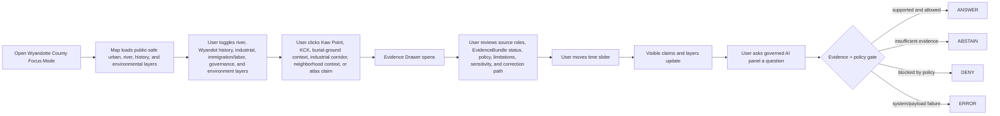
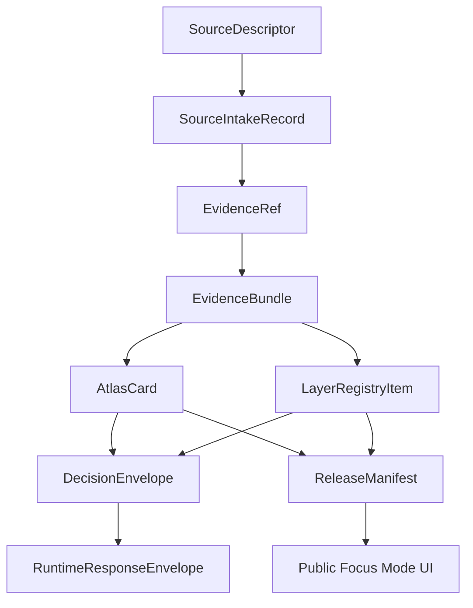

<!--
doc_id: NEEDS_VERIFICATION
title: Wyandotte County Focus Mode Build Plan
type: standard
version: v1
status: draft
owners: [NEEDS_VERIFICATION]
created: 2026-05-21
updated: 2026-05-21
policy_label: public_draft
related:
  - docs/focus-modes/ellsworth-county/build-plan.md
  - docs/focus-modes/riley-county/build-plan.md
  - docs/focus-modes/shawnee-county/build-plan.md
  - docs/focus-modes/ford-county/build-plan.md
  - docs/focus-modes/wyandotte-county/README.md
  - docs/focus-modes/wyandotte-county/layer-registry.md
  - docs/focus-modes/wyandotte-county/acceptance-checklist.md
tags: [kfm, focus-mode, wyandotte-county, kansas-city-kansas, kaw-point, wyandot, urban-history, environmental-justice]
notes:
  - Draft plan prepared without mounted repository inspection.
  - Paths, owners, doc IDs, schema homes, and validator names require repository verification before merge.
  - Indigenous, civic, industrial, environmental, transportation, immigration, and public-health claims require source intake and evidence review before publication.
-->

<a id="top"></a>

# Wyandotte County Focus Mode Build Plan

> **Purpose:** establish a fifth Kansas Frontier Matrix county proof slice after Ellsworth, Riley, Shawnee, and Ford counties, with a distinct Kansas City metro profile: **Kansas City, Kansas; Kaw Point; the Kansas–Missouri river confluence; Wyandot history and burial-ground sensitivity; immigration and labor; rail/industry; environmental justice; highways; public health; and unified city-county governance.**


---

## Quick links

- [1. Why Wyandotte County](#1-why-wyandotte-county)
- [2. Product thesis](#2-product-thesis)
- [3. Scope boundary](#3-scope-boundary)
- [4. First demo layers](#4-first-demo-layers)
- [5. User journeys](#5-user-journeys)
- [6. UI surfaces](#6-ui-surfaces)
- [7. Governed object model](#7-governed-object-model)
- [8. Proposed repository shape](#8-proposed-repository-shape)
- [9. Build phases](#9-build-phases)
- [10. First PR sequence](#10-first-pr-sequence)
- [11. Acceptance checklist](#11-acceptance-checklist)
- [12. Risk register](#12-risk-register)
- [13. Source seed list](#13-source-seed-list)
- [14. Open verification questions](#14-open-verification-questions)
- [15. Recommended first milestone](#15-recommended-first-milestone)

---

## Operating posture

> [!IMPORTANT]
> Wyandotte County Focus Mode is a **governed urban/river/tribal-history proof slice**, not a loose Kansas City tourism map. It must preserve KFM’s core invariants:
>
> - EvidenceBundle outranks generated language.
> - Public clients use governed APIs, released artifacts, catalog records, tile services, and policy-safe runtime envelopes.
> - Public UI must not read directly from `RAW`, `WORK`, `QUARANTINE`, unpublished candidate data, canonical/internal stores, or direct model runtime outputs.
> - Publication is a governed state transition, not a file move.
> - AI outputs are downstream carriers, not sovereign truth.
> - Indigenous history, burial-ground context, immigration/labor history, environmental justice, public health, infrastructure, and property-related claims must remain source-bound, sensitivity-reviewed, and correction-friendly.

---

# 1. Why Wyandotte County

Wyandotte County is the right fifth Focus Mode because it gives KFM a **dense urban, river-confluence, tribal-history, and environmental-justice proof slice**.

Ellsworth County tests frontier county history, Fort Harker / Kanopolis, settlement, and environmental baseline.

Riley County tests Flint Hills ecology, Fort Riley, Konza Prairie, research-site sensitivity, and river landscapes.

Shawnee County tests state government, civil-rights history, Topeka urban geography, public institutions, and archive-heavy civic memory.

Ford County tests Dodge City, Santa Fe Trail, Fort Dodge, cattle-town public history, Arkansas River water, and High Plains agriculture.

Wyandotte County adds:

| KFM capability | Wyandotte County proof value |
|---|---|
| Metro urban complexity | Kansas City, Kansas; neighborhoods; municipal/county consolidation |
| River confluence geography | Kaw Point, Kansas River, Missouri River, floodplain, industrial waterfront |
| Indigenous/tribal history | Wyandot naming, Huron/Wyandot National Burying Ground, removal/allotment sensitivity |
| Environmental justice | industrial corridors, floodplain exposure, public health, brownfields/source-role caution |
| Immigration and labor history | packinghouse, rail, industrial workforce, neighborhood change |
| Infrastructure density | highways, rail, bridges, utilities, ports/riverfront, public-safe filtering |
| Governance model | Unified Government of Wyandotte County and Kansas City, Kansas |
| Public-safety challenge | dense city layers must avoid private-address, security, and household-level exposure |

> [!NOTE]
> Wyandotte County should prove KFM can work in a dense urban setting without losing evidence discipline, privacy boundaries, or sensitivity handling.

---

# 2. Product thesis

## User-facing thesis

> **Wyandotte County Focus Mode lets a user explore how the Kansas and Missouri river confluence, Wyandot history, Kansas City, Kansas, industrial corridors, immigration, railroads, neighborhoods, environmental conditions, and unified government shaped one of Kansas’s most urban counties — with every visible claim tied to evidence and every sensitive layer filtered through public-safe policy.**

## Internal KFM thesis

Wyandotte County should prove that Focus Mode can handle:

```text
urban geography + river confluence + Indigenous history + burial-ground sensitivity + industrial infrastructure + environmental justice + immigration/labor history + unified governance
```

without turning a dense city map into unsafe household-level exposure or unsourced public narrative.

The system must preserve distinctions between:

- tribal history vs. local public-history summary
- burial-ground/sacred-site context vs. public tourist marker
- river observation vs. floodplain/regulatory layer vs. industrial interpretation
- environmental observation vs. modeled burden vs. public-health conclusion
- rail/highway infrastructure vs. restricted operational detail
- neighborhood history vs. living-person/private-address data
- parcel/assessor record vs. title truth
- official government source vs. interpretive civic narrative
- source claim vs. generated explanation

---

# 3. Scope boundary

## 3.1 Geography

Initial scope:

```text
Wyandotte County, Kansas
```

Priority spatial anchors:

- Wyandotte County boundary
- Kansas City, Kansas
- Kaw Point / Kansas River and Missouri River confluence
- Kansas River corridor
- Missouri River corridor
- downtown Kansas City, Kansas civic core
- Wyandot National Burying Ground / Huron Cemetery context with sensitivity handling
- industrial / rail / highway corridors, public-safe and generalized
- Kansas City, Kansas neighborhoods, public-safe and source-supported
- Bonner Springs, Edwardsville, Lake Quivira, and other incorporated/community contexts where source-supported
- Village West / Kansas Speedway / Legends context, public-safe civic/economic layer
- public-health/environmental context layers, aggregated or generalized

## 3.2 Time range

Initial buckets:

| Bucket | Role in demo |
|---|---|
| Before 1800 | Indigenous, river-confluence, and pre-territorial context; public-safe and culturally cautious |
| 1800–1843 | river travel, trade routes, pre-removal context |
| 1843–1859 | Wyandot removal/resettlement context, burial-ground sensitivity, county formation lead-up |
| 1859–1900 | county creation, Kansas City / Wyandotte urban growth, rail/industry beginnings |
| 1901–1945 | industrial expansion, packinghouse/rail labor, urban neighborhood development |
| 1946–1980 | highway era, suburbanization, industrial change, floodplain/public health context |
| 1981–1997 | economic restructuring, governance change lead-up |
| 1997–present | Unified Government, redevelopment, Village West, modern environmental justice and planning |

> [!CAUTION]
> Time buckets are planning scaffolds. They are not publication claims until evidence-reviewed.

## 3.3 Not in MVP

Do **not** include in the first Wyandotte County MVP:

- exact locations of sensitive burial, sacred, or archaeological sites beyond already-public, sensitivity-reviewed civic context
- tribal claims without culturally cautious source framing
- living-person household data
- private addresses or parcel-level modern socioeconomic profiling
- title conclusions from assessor/property data
- law-enforcement operational details
- school/security/infrastructure vulnerabilities
- public-health diagnosis at household or individual level
- unreviewed environmental justice conclusions
- real-time emergency alerting
- public direct model endpoint

---

# 4. First demo layers

## 4.1 MVP layer registry

| Layer ID | Layer | Domain | Purpose | Initial posture |
|---|---|---:|---|---|
| `kfm.layer.wyandotte.county_boundary.v1` | Wyandotte County boundary | civic | establish spatial frame | public draft |
| `kfm.layer.wyandotte.kck_context.v1` | Kansas City, Kansas context | civic/history | urban and county-seat anchor | public draft |
| `kfm.layer.wyandotte.kaw_point_confluence.v1` | Kaw Point / river confluence | hydrology/history | Kansas–Missouri confluence anchor | public draft, evidence-required |
| `kfm.layer.wyandotte.wyandot_history_context.v1` | Wyandot history context | Indigenous/public history | naming, removal, settlement, governance sensitivity | public draft, review-required |
| `kfm.layer.wyandotte.burying_ground_context.v1` | Wyandot National Burying Ground context | sacred/burial/public history | public-safe sensitivity anchor | restricted/public-safe generalized |
| `kfm.layer.wyandotte.rail_industrial_corridors.v1` | Rail and industrial corridors | transportation/industry | economic and labor geography | public draft, generalized |
| `kfm.layer.wyandotte.environmental_context.v1` | Environmental context | environment/public health | floodplain, brownfield/source-role-aware context | public-safe, aggregated |
| `kfm.layer.wyandotte.immigration_labor_context.v1` | Immigration and labor history | social history | workforce and neighborhood development | public draft, privacy-reviewed |
| `kfm.layer.wyandotte.unified_government_context.v1` | Unified Government context | civic/governance | consolidated government geography | public draft |
| `kfm.layer.wyandotte.timeline_events.v1` | Timeline events | cross-domain | temporal navigation | public draft |
| `kfm.layer.wyandotte.atlas_claims.v1` | Atlas claim points / corridors | cross-domain | clickable evidence-backed claims | requires EvidenceRef |

## 4.2 Layer contract

Each layer must have:

```yaml
layer_id: kfm.layer.wyandotte.<name>.v1
title: NEEDS_VERIFICATION
domain: NEEDS_VERIFICATION
layer_type: observed | derived | interpreted | modeled | administrative
geometry_type: point | line | polygon | raster | tile | mixed
source_refs: []
evidence_refs: []
policy_label: public_draft | restricted | internal | public
review_state: draft | review | published | deprecated
rights_status: unknown | public | open | controlled | restricted
sensitivity: public | generalized | restricted | review_required
temporal_scope:
  start: NEEDS_VERIFICATION
  end: NEEDS_VERIFICATION
limitations: []
correction_path: NEEDS_VERIFICATION
```

---

# 5. User journeys

## 5.1 Primary public journey



## 5.2 Example public questions

Supported after evidence review:

- “Why is Kaw Point important to Wyandotte County geography?”
- “How do the Kansas and Missouri Rivers shape Kansas City, Kansas?”
- “What public-safe context can KFM show for Wyandot history?”
- “Why is the burial-ground layer restricted or generalized?”
- “How did rail and industrial corridors shape KCK?”
- “What changed after the Unified Government was formed?”
- “Which environmental layers are observations, models, regulatory layers, or derived indicators?”

Should abstain or deny unless governed release permits them:

- “Show exact sensitive burial or sacred-site details.”
- “Show private household-level environmental health risk.”
- “Show restricted infrastructure vulnerabilities.”
- “Use neighborhood history to profile living people.”
- “Treat an environmental index as a medical conclusion.”
- “Treat generated text as evidence.”
- “Publish a claim with no EvidenceBundle.”

---

# 6. UI surfaces

## 6.1 Map canvas

Required:

- MapLibre GL JS map
- placeholder basemap
- Wyandotte County boundary
- KCK / Kaw Point / river confluence anchors
- clickable mock features
- selected feature highlight
- layer toggles
- scale bar
- attribution
- zoom controls
- compass / orientation affordance
- public-safe layer legend

## 6.2 Layer registry panel

Show for every layer:

| Field | Meaning |
|---|---|
| Layer name | human-readable layer title |
| Domain | civic, Indigenous history, hydrology, industry, environment, labor, governance |
| Layer type | observed, derived, interpreted, modeled, administrative |
| Evidence state | resolved, unresolved, not required, pending |
| Policy label | public, public_draft, restricted, internal |
| Review state | draft, review, published, deprecated |
| Sensitivity | public, generalized, restricted, review_required |
| Time coverage | start/end or bucketed range |
| Limitations | short public-facing warning |
| Source-role warning | observation, model, regulatory, narrative, official record, public-history interpretation |

## 6.3 Timeline panel

Initial buckets:

```text
Before 1800
1800–1843
1843–1859
1859–1900
1901–1945
1946–1980
1981–1997
1997–present
```

Timeline should control:

- visible atlas claims
- Wyandot history / public-history cards
- river-confluence and floodplain context
- rail / industrial / labor history layers
- governance-context layers
- environmental context layers
- feature styling by temporal relevance

## 6.4 Evidence Drawer

When a user clicks a layer feature or atlas claim, show:

```yaml
title: NEEDS_VERIFICATION
claim_text: NEEDS_VERIFICATION
object_type: AtlasCard | LayerFeature | TimelineEvent | EvidenceBundle
spatial_scope: NEEDS_VERIFICATION
temporal_scope: NEEDS_VERIFICATION
evidence_refs: []
evidence_bundle_status: unresolved | resolved | restricted | missing
source_roles: []
interpretation_status: fact_claim | interpretation | public_history | sacred_sensitive | derived_indicator | regulatory_context
policy_label: public_draft
rights_status: unknown
sensitivity: review_required
review_state: draft
limitations: []
correction_path: NEEDS_VERIFICATION
```

## 6.5 Atlas Card panel

Minimum atlas card types:

| Card type | Example |
|---|---|
| `urban_place_context` | Kansas City, Kansas |
| `river_confluence_context` | Kaw Point / Kansas–Missouri confluence |
| `indigenous_public_history_context` | Wyandot history |
| `sacred_burial_context` | Wyandot National Burying Ground |
| `rail_industrial_context` | rail / stockyards / industrial corridors |
| `immigration_labor_context` | workforce and neighborhood history |
| `environmental_context` | floodplain / brownfield / air-water indicator layer |
| `governance_context` | Unified Government |
| `derived_layer_context` | environmental justice or land-cover baseline |

## 6.6 Governed AI panel

The AI panel must only emit finite runtime outcomes:

```text
ANSWER
ABSTAIN
DENY
ERROR
```

Example response envelope:

```json
{
  "object_type": "RuntimeResponseEnvelope",
  "schema_version": "v1",
  "question": "Why is Kaw Point important to Wyandotte County geography?",
  "outcome": "ABSTAIN",
  "answer": null,
  "reason": "Evidence bundle is not yet resolved for publication-grade response.",
  "evidence_refs": [
    "kfm://evidence-ref/wyandotte/kaw-point-confluence/v1"
  ],
  "policy_label": "public_draft",
  "limitations": [
    "This draft object requires source intake, rights review, and source-specific historical and hydrological framing before publication."
  ]
}
```

---

# 7. Governed object model

## 7.1 Object flow



## 7.2 SourceDescriptor draft

```yaml
id: kfm.source.wyandotte.kaw_point.placeholder
title: Kaw Point / Kansas-Missouri River confluence source placeholder
domain: hydrology_history
source_type: public_history_or_geography_reference
role: context_NEEDS_VERIFICATION
rights_status: unknown
spatial_coverage: Kaw Point, Kansas City, Kansas, Wyandotte County
temporal_coverage: NEEDS_VERIFICATION
status: proposed
limitations:
  - Requires source intake and review before claims are published.
  - Must separate geographic observation, public-history narrative, and hydrologic interpretation.
```

## 7.3 EvidenceRef draft

```yaml
id: kfm.evidence_ref.wyandotte.kaw_point_confluence.v1
bundle_id: kfm.evidence_bundle.wyandotte.kaw_point_confluence.v1
claim_scope: Public-safe Kaw Point and Kansas-Missouri river confluence context within Wyandotte County Focus Mode
resolution_required: true
```

## 7.4 EvidenceBundle draft

```yaml
id: kfm.evidence_bundle.wyandotte.kaw_point_confluence.v1
resolved: false
source_refs:
  - kfm.source.wyandotte.kaw_point.placeholder
policy_label: public_draft
rights_status: unknown
sensitivity: review_required
review_state: draft
limitations:
  - Draft bundle. Do not publish final historical, hydrological, or public-land claims until source-reviewed.
  - Do not treat generated summary as evidence.
```

## 7.5 AtlasCard draft

```yaml
id: kfm.atlas_card.wyandotte.kaw_point.v1
title: Kaw Point / River Confluence Context
card_type: river_confluence_context
spatial_scope: Kansas City, Kansas / Wyandotte County NEEDS_VERIFICATION
temporal_scope: NEEDS_VERIFICATION
evidence_refs:
  - kfm.evidence_ref.wyandotte.kaw_point_confluence.v1
policy_label: public_draft
review_state: draft
limitations:
  - Draft card. Not a final historical, hydrological, regulatory, or land-management authority statement.
```

## 7.6 DecisionEnvelope draft

```yaml
id: kfm.decision.wyandotte.question.kaw_point_context.v1
question: Why is Kaw Point important to Wyandotte County geography?
outcome: ABSTAIN
reason: Evidence bundle unresolved.
evidence_refs:
  - kfm.evidence_ref.wyandotte.kaw_point_confluence.v1
policy_label: public_draft
```

## 7.7 ReleaseManifest draft

```yaml
id: kfm.release.wyandotte.focus_mode.v0_1
release_state: draft
included_layers:
  - kfm.layer.wyandotte.county_boundary.v1
  - kfm.layer.wyandotte.kck_context.v1
  - kfm.layer.wyandotte.kaw_point_confluence.v1
  - kfm.layer.wyandotte.wyandot_history_context.v1
  - kfm.layer.wyandotte.environmental_context.v1
validation_state: pending
rollback_plan: required_before_publication
correction_path: required_before_publication
```

---

# 8. Proposed repository shape

> [!WARNING]
> Repository access is **not confirmed** in this planning session. Treat all paths as proposed until checked against the live branch and KFM Directory Rules.

```text
docs/
  focus-modes/
    wyandotte-county/
      README.md
      build-plan.md
      layer-registry.md
      evidence-model.md
      acceptance-checklist.md
      source-seed-list.md
      public-safety-notes.md
      tribal-and-burial-sensitivity-notes.md
      environmental-justice-notes.md
      urban-privacy-notes.md

data/
  catalog/
    sources/
      wyandotte/
        source_descriptors.yaml
    stac/
      wyandotte/
        README.md

contracts/
  focus_mode/
    focus_mode_payload.schema.json
  atlas/
    atlas_card.schema.json
  evidence/
    evidence_ref.schema.json
    evidence_bundle.schema.json
  release/
    release_manifest.schema.json

fixtures/
  focus_modes/
    wyandotte/
      valid/
        focus_mode_payload.valid.json
        layer_registry.valid.json
        atlas_card.kaw_point.valid.json
        atlas_card.kck.valid.json
        atlas_card.wyandot_context.valid.json
        evidence_bundle.kaw_point.valid.json
        evidence_bundle.wyandot_context.valid.json
      invalid/
        unresolved_evidence_ref.invalid.json
        exact_sensitive_burial_site.invalid.json
        tribal_claim_without_review.invalid.json
        private_household_environmental_health.invalid.json
        restricted_infrastructure_detail.invalid.json
        parcel_as_title_truth.invalid.json
        missing_policy_label.invalid.json
        model_output_as_evidence.invalid.json
        public_raw_access.invalid.json

apps/
  web/
    src/
      focus-modes/
        wyandotte/
          index.js
          layers.js
          mock-api.js
          mock-data.js
          evidence-drawer.js
          timeline.js
          ai-panel.js
          styles.css

tools/
  validators/
    validate_focus_mode_payload.py
    validate_atlas_card.py
    validate_evidence_bundle.py
    validate_layer_registry.py
```

---

# 9. Build phases

## Phase 1 — Control plane

Goal: establish Wyandotte County Focus Mode as a governed urban/tribal/river/environmental-justice template.

Deliverables:

- `docs/focus-modes/wyandotte-county/README.md`
- `build-plan.md`
- `layer-registry.md`
- `source-seed-list.md`
- `public-safety-notes.md`
- `tribal-and-burial-sensitivity-notes.md`
- `environmental-justice-notes.md`
- `urban-privacy-notes.md`
- first schema references
- valid and invalid fixture plan

Definition of done:

```text
[ ] scope is explicit
[ ] burial/sacred-site exactness is denied/generalized by default
[ ] tribal/Indigenous claims require source and cultural-review posture
[ ] environmental justice layers preserve source-role and uncertainty
[ ] urban/private household-level exposure is prohibited
[ ] all layers have policy labels
[ ] all claim-bearing objects require EvidenceRef
[ ] placeholders are clearly marked
```

## Phase 2 — Mock governed API

Goal: make Wyandotte Focus Mode run without live pipelines.

Mock endpoints:

```text
GET /api/focus-modes/wyandotte
GET /api/layers/wyandotte
GET /api/evidence/{bundle_id}
GET /api/atlas-cards/{card_id}
POST /api/ai/answer
GET /api/releases/wyandotte-focus-mode
```

Definition of done:

```text
[ ] mock payloads validate
[ ] unresolved evidence produces ABSTAIN
[ ] exact sensitive burial/sacred-site requests produce DENY
[ ] private household environmental-health requests produce DENY
[ ] invalid payloads fail closed
[ ] public layer payloads do not reference RAW / WORK / QUARANTINE
```

## Phase 3 — UI prototype

Goal: show the full Wyandotte Focus Mode surface in a browser.

Deliverables:

- MapLibre map
- layer registry
- clickable mock KCK, Kaw Point, Wyandot history, burial-ground context, rail/industrial corridor, environmental context, and governance features
- evidence drawer
- timeline
- atlas card panel
- governed AI answer panel

Definition of done:

```text
[ ] user can click Kaw Point context and see evidence/source-role status
[ ] user can click Wyandot history context and see sensitivity/review posture
[ ] user can click environmental context and see observation/model/regulatory/derived warnings
[ ] user can toggle river / Indigenous history / industry / environment / governance layers
[ ] timeline changes visible claim set
[ ] AI panel returns all four finite outcomes through examples
```

## Phase 4 — Validators and negative fixtures

Goal: prove failure modes before publication.

Required invalid fixtures:

| Fixture | Expected failure |
|---|---|
| `unresolved_evidence_ref.invalid.json` | publication attempted with unresolved evidence |
| `exact_sensitive_burial_site.invalid.json` | exact sensitive burial/sacred-site detail in public payload |
| `tribal_claim_without_review.invalid.json` | Indigenous/tribal claim without source/review posture |
| `private_household_environmental_health.invalid.json` | household-level environmental-health exposure |
| `restricted_infrastructure_detail.invalid.json` | infrastructure vulnerability exposed |
| `parcel_as_title_truth.invalid.json` | property/assessor record treated as title truth |
| `missing_policy_label.invalid.json` | public object lacks policy posture |
| `model_output_as_evidence.invalid.json` | AI output treated as proof |
| `public_raw_access.invalid.json` | public client references RAW/WORK/QUARANTINE |

## Phase 5 — Source intake upgrade

Goal: replace placeholders with inspected sources.

Deliverables:

- source descriptors
- intake records
- rights review notes
- sensitivity review notes
- evidence bundle drafts
- reviewed atlas cards
- limitations notes

Minimum real-evidence targets:

```text
[ ] one Kaw Point / Kansas-Missouri confluence public geography claim
[ ] one Kansas City, Kansas / Wyandotte County civic governance claim
[ ] one Wyandot history public-safe context claim
[ ] one burial-ground public-history claim with sensitivity restrictions
[ ] one rail/industrial corridor claim
[ ] one environmental context claim with source-role labeling
[ ] one Unified Government context claim
```

## Phase 6 — Release candidate

Goal: prepare `v0.1` public-safe release.

Deliverables:

- `ReleaseManifest`
- validation report
- correction path
- rollback plan
- public-safe layer manifest
- known limitations
- release notes

Definition of done:

```text
[ ] public layers have policy labels and review states
[ ] rights status is resolved or blocked
[ ] exact sensitive burial/sacred-site details are excluded or generalized
[ ] private household and restricted infrastructure details are excluded
[ ] Indigenous/tribal claims preserve source and review posture
[ ] environmental justice claims preserve source role, uncertainty, and limits
[ ] release can be rolled back
[ ] public UI only consumes governed surfaces
```

---

# 10. First PR sequence

## PR-0001 — Wyandotte County Focus Mode Control Plane

Files:

```text
docs/focus-modes/wyandotte-county/README.md
docs/focus-modes/wyandotte-county/build-plan.md
docs/focus-modes/wyandotte-county/layer-registry.md
docs/focus-modes/wyandotte-county/source-seed-list.md
docs/focus-modes/wyandotte-county/public-safety-notes.md
docs/focus-modes/wyandotte-county/tribal-and-burial-sensitivity-notes.md
docs/focus-modes/wyandotte-county/environmental-justice-notes.md
docs/focus-modes/wyandotte-county/urban-privacy-notes.md
docs/focus-modes/wyandotte-county/acceptance-checklist.md
```

Acceptance:

```text
[ ] Focus Mode scope is clear.
[ ] Wyandotte County is justified as a complementary proof slice.
[ ] Every planned layer has a policy posture.
[ ] Tribal/burial sensitivity rules are explicit.
[ ] Environmental justice source-role boundaries are explicit.
[ ] Urban privacy boundaries are explicit.
[ ] No publication claims are made from placeholders.
```

## PR-0002 — Wyandotte Contracts and Fixtures

Files:

```text
fixtures/focus_modes/wyandotte/valid/focus_mode_payload.valid.json
fixtures/focus_modes/wyandotte/valid/layer_registry.valid.json
fixtures/focus_modes/wyandotte/valid/atlas_card.kaw_point.valid.json
fixtures/focus_modes/wyandotte/valid/atlas_card.wyandot_context.valid.json
fixtures/focus_modes/wyandotte/invalid/exact_sensitive_burial_site.invalid.json
fixtures/focus_modes/wyandotte/invalid/private_household_environmental_health.invalid.json
fixtures/focus_modes/wyandotte/invalid/missing_policy_label.invalid.json
```

Acceptance:

```text
[ ] Valid fixtures include required governed fields.
[ ] Invalid fixtures represent real failure modes.
[ ] EvidenceRef / EvidenceBundle relationship is explicit.
[ ] Mock cards remain draft until evidence intake.
```

## PR-0003 — Wyandotte Mock API

Files:

```text
apps/web/src/focus-modes/wyandotte/mock-api.js
apps/web/src/focus-modes/wyandotte/layers.js
apps/web/src/focus-modes/wyandotte/mock-data.js
```

Acceptance:

```text
[ ] Mock API returns finite runtime outcomes.
[ ] Layer registry is API-shaped, not UI-only.
[ ] Public-safe data is separated from restricted mock examples.
[ ] Sensitivity status is included for tribal/burial/environmental objects.
```

## PR-0004 — Wyandotte UI Shell

Files:

```text
apps/web/src/focus-modes/wyandotte/index.js
apps/web/src/focus-modes/wyandotte/evidence-drawer.js
apps/web/src/focus-modes/wyandotte/timeline.js
apps/web/src/focus-modes/wyandotte/ai-panel.js
apps/web/src/focus-modes/wyandotte/styles.css
```

Acceptance:

```text
[ ] Map renders.
[ ] Layer panel renders.
[ ] Evidence Drawer renders.
[ ] Atlas Card panel renders.
[ ] Timeline filters mock claims.
[ ] AI panel demonstrates ANSWER / ABSTAIN / DENY / ERROR.
```

## PR-0005 — Validator Hardening

Files:

```text
tools/validators/validate_focus_mode_payload.py
tools/validators/validate_atlas_card.py
tools/validators/validate_evidence_bundle.py
tools/validators/validate_layer_registry.py
```

Acceptance:

```text
[ ] Public RAW / WORK / QUARANTINE references fail.
[ ] Missing EvidenceRef fails for claim-bearing objects.
[ ] Missing policy label fails.
[ ] Exact sensitive burial/sacred-site detail fails public release.
[ ] Private household environmental-health detail fails public release.
[ ] Restricted infrastructure detail fails public release.
[ ] Model output as proof fails.
```

---

# 11. Acceptance checklist

```text
[ ] Wyandotte County map loads.
[ ] User can toggle at least 5 public-safe layers.
[ ] User can click Kaw Point context and open Evidence Drawer.
[ ] User can click Kansas City, Kansas context and open Evidence Drawer.
[ ] User can click Wyandot history context and open Evidence Drawer.
[ ] User can inspect at least 3 Atlas Cards.
[ ] Timeline control changes visible claims/layers.
[ ] Governed AI panel returns ANSWER for supported claims.
[ ] Governed AI panel returns ABSTAIN for unresolved evidence.
[ ] Governed AI panel returns DENY for restricted/sensitive requests.
[ ] Governed AI panel returns ERROR for invalid payload/system failure.
[ ] Every visible claim has EvidenceRef.
[ ] Every EvidenceRef points to an EvidenceBundle.
[ ] Every layer has policy_label.
[ ] Every layer has review_state.
[ ] Every public object has correction path.
[ ] No public UI path reads RAW, WORK, or QUARANTINE.
[ ] Exact sensitive burial/sacred-site details are excluded or generalized.
[ ] Private household environmental-health detail is excluded.
[ ] Restricted infrastructure detail is excluded.
[ ] ReleaseManifest exists before anything is called published.
```

---

# 12. Risk register

| Risk | Why it matters | Control |
|---|---|---|
| Tribal/burial history is flattened into tourist narrative | cultural harm and evidence failure | source/cultural-review posture; sensitivity restrictions |
| Exact sensitive burial or sacred details leak | cultural and safety risk | deny/generalize by default |
| Environmental justice layer becomes unsupported accusation | legal/social harm risk | source-role labels, uncertainty, limitations |
| Household-level health risk is exposed | privacy and harm risk | aggregate/generalize; deny household-level claims |
| Infrastructure detail reveals vulnerabilities | public safety risk | public-safe generalization and deny restricted details |
| Parcel or assessor data treated as title truth | legal/title error risk | explicit assessor/tax ≠ title truth rule |
| Generated narrative treated as source | evidence failure | model output cannot be proof |
| Urban density overwhelms UI | usability failure | Focus Mode filters and grouped layers |
| Mock placeholders become doctrine | demo pollution | all placeholders marked draft/unresolved |
| County view becomes only KCK | county-scale imbalance | include Bonner Springs, Edwardsville, Lake Quivira, river corridors, and county governance where evidence-supported |

---

# 13. Source seed list

> [!NOTE]
> These are **candidate source seeds**, not yet KFM-ingested sources. Each requires `SourceDescriptor`, rights review, sensitivity review, checksum/citation handling, and EvidenceBundle resolution before publication-grade use.

| Seed | Use | Starting URL |
|---|---|---|
| Unified Government of Wyandotte County / Kansas City, KS — About WyCo & KCK | county geography, current governance, official context | https://www.wycokck.org/Government/About-WyCo-and-KCK |
| Unified Government homepage | official current civic source routing | https://www.wycokck.org/ |
| GeoKansas — Kaw Point Park | Kansas/Missouri river confluence and geography context | https://geokansas.ku.edu/kaw-point-park |
| Visit Kansas City, KS — Wyandott National Burying Ground | public visitor context; sensitivity review required | https://www.visitkansascityks.com/listing/wyandott-national-burying-ground/58/ |
| KCUR — historic American Indian cemetery in downtown KCK | public-history narrative seed; source-role caution | https://www.kcur.org/show/central-standard/2014-10-29/the-story-behind-the-historic-american-indian-cemetery-in-downtown-kck |
| Kansas Historical Society markers | marker-based public-history seed | https://www.kansashistory.gov/p/kansas-historical-markers/14999 |
| Kansas Geological Survey county geology index | geology/hydrology source routing | https://www.kgs.ku.edu/General/Geology/County/ |
| USGS National Hydrography | river and stream source routing | https://www.usgs.gov/national-hydrography |
| EPA EJScreen | environmental justice screening context; source-role restrictions required | https://www.epa.gov/ejscreen |
| EPA Envirofacts | regulated facility / environmental records source routing | https://www.epa.gov/enviro |
| FEMA Flood Map Service Center | floodplain/regulatory source routing | https://msc.fema.gov/portal/home |
| Library of Congress maps | historic urban/rail/river maps source routing | https://www.loc.gov/maps/ |
| Wyandotte County historical archive transcription seed | older local history source routing; bias/source-role caution | https://www.ksgenweb.org/archives/wyandott/history/1911/volume1/index.html |

---

# 14. Open verification questions

```text
[ ] What is the canonical repo path for Focus Mode documents?
[ ] Does KFM already have a focus_mode_payload schema?
[ ] Does KFM already define AtlasCard fields differently?
[ ] Does KFM already define tribal/burial sensitivity fields?
[ ] Does KFM already define environmental justice source-role fields?
[ ] Which validators already exist?
[ ] Should Wyandotte County share contracts with Ellsworth, Riley, Shawnee, and Ford or define county-specific extensions?
[ ] What public-safe geometry source should be used for county boundary?
[ ] What source authority should define Kaw Point claims?
[ ] What source authority should define Wyandot history claims?
[ ] What source authority should define burial-ground public-history claims?
[ ] What source authority should define Unified Government claims?
[ ] What source authority should define environmental context claims?
[ ] What exact policy rule controls sacred/burial/archaeological site exactness?
[ ] What exact policy rule controls private household environmental-health claims?
[ ] What exact policy rule controls infrastructure vulnerability exposure?
[ ] What release manifest naming convention should be used?
[ ] What rollback/correction path should a county Focus Mode use?
```

---

# 15. Recommended first milestone

## Milestone 1: Wyandotte County Focus Mode Control Plane

Build the documentation, layer registry, source seed list, public-safety notes, tribal/burial sensitivity notes, environmental justice notes, urban privacy notes, and fixtures before the UI.

This keeps the Wyandotte proof slice from becoming a dense urban map that accidentally exposes sensitive cultural, household, or infrastructure details.

The first concrete deliverable should be:

```text
docs/focus-modes/wyandotte-county/build-plan.md
```

Once this is stable, use it to generate the mock API and single-file UI prototype.

---

[Back to top](#top)
