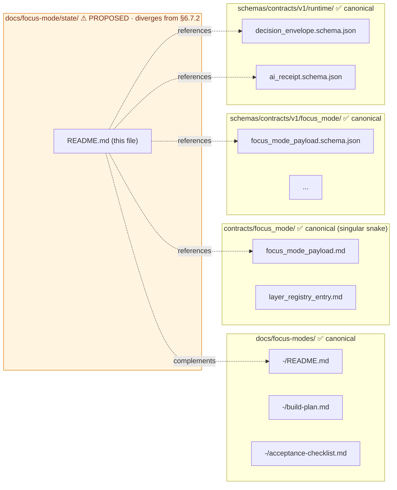
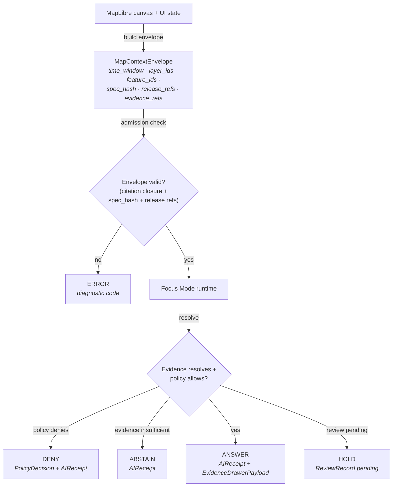
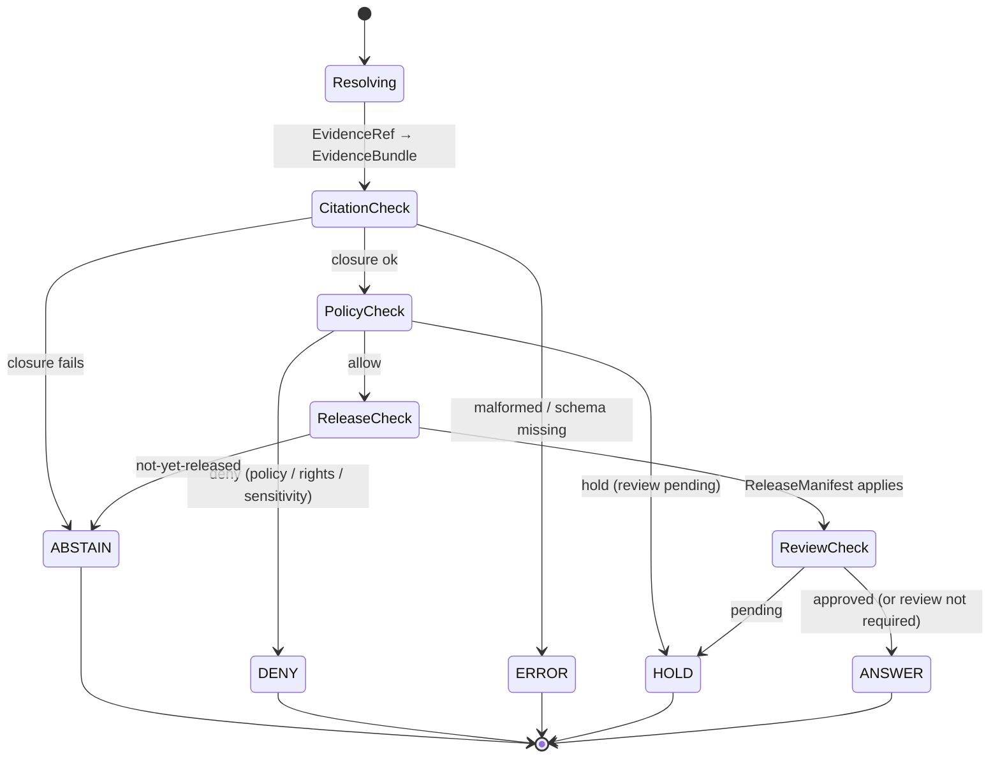

<!-- [KFM_META_BLOCK_V2]
doc_id: kfm://doc/focus-mode-state-readme
title: Focus Mode — State Doctrine
type: standard
version: v0.1
status: draft
owners: <FOCUS-MODE-DOCTRINE-OWNER> · NEEDS VERIFICATION
created: 2026-05-24
updated: 2026-05-24
policy_label: public
related:
  - directory-rules.md §6.7
  - docs/focus-modes/README.md (PROPOSED, per directory-rules.md §6.7.3)
  - docs/standards/PROV.md
  - contracts/focus_mode/focus_mode_payload.md (PROPOSED)
  - schemas/contracts/v1/focus_mode/focus_mode_payload.schema.json (PROPOSED)
  - schemas/contracts/v1/runtime/decision_envelope.schema.json (PROPOSED)
tags: [kfm, focus-mode, state, governance, finite-outcomes, lifecycle]
notes:
  - Path placement diverges from Directory Rules v1.2 §6.7.2 canonical pattern; see §2.1 below and OPEN-DR-09 (PROPOSED).
  - No mounted repo evidence in this session; all repo-shaped claims labeled PROPOSED.
[/KFM_META_BLOCK_V2] -->

<a id="top"></a>

# Focus Mode — State Doctrine

> *Canonical reference for what "state" means inside a Focus Mode: the finite outcomes a Focus Mode may return, the lifecycle stages an artifact passes through before reaching one, and the review and revocation states that gate publication.*

<!-- Badge row — placeholders pending canonical badge targets (PROPOSED) -->


**Status:** draft · **Owners:** `<FOCUS-MODE-DOCTRINE-OWNER>` *(NEEDS VERIFICATION)* · **Last updated:** 2026-05-24

> [!CAUTION]
> **Path placement diverges from Directory Rules v1.2 §6.7.2.**
> The canonical `docs/` lane for Focus Mode artifacts is `docs/focus-modes/<area>-<scope>/` (plural, kebab-case + scope suffix). This file lives at `docs/focus-mode/state/README.md` — **singular** `focus-mode/` and **no area-scope segment**. This is recorded below as **OPEN-DR-09 (PROPOSED)** and SHOULD be reconciled by ADR before further state-doctrine artifacts land. See [§2 — Repo fit](#2-repo-fit--directory-rules-basis) for the path-prefix lint exposure and migration options. **PROPOSED**

---

## Table of contents

1. [Scope](#1-scope)
2. [Repo fit — Directory Rules basis](#2-repo-fit--directory-rules-basis)
3. [What lives here](#3-what-lives-here)
4. [What does NOT live here](#4-what-does-not-live-here)
5. [Directory tree (PROPOSED)](#5-directory-tree-proposed)
6. [State families at a glance](#6-state-families-at-a-glance)
7. [Finite outcome state — ANSWER · ABSTAIN · DENY · ERROR · HOLD](#7-finite-outcome-state)
8. [Lifecycle state — RAW → PUBLISHED](#8-lifecycle-state)
9. [Review and release state](#9-review-and-release-state)
10. [Payload state and MapContextEnvelope state](#10-payload-state-and-mapcontextenvelope-state)
11. [Revocation and rollback state](#11-revocation-and-rollback-state)
12. [State transition diagrams](#12-state-transition-diagrams)
13. [Validators, tests, and receipts](#13-validators-tests-and-receipts)
14. [Anti-patterns](#14-anti-patterns)
15. [Open questions and ADR triggers](#15-open-questions-and-adr-triggers)
16. [Related docs](#16-related-docs)
17. [Appendix — glossary, vocabularies, references](#17-appendix)

---

## 1. Scope

This README defines **what "state" means inside a Focus Mode** and how the various state families are *named, owned, transitioned, and audited* across the KFM trust path:

> `SourceDescriptor → SourceIntakeRecord → EvidenceRef → EvidenceBundle → Claim/AtlasCard → DecisionEnvelope → ReleaseManifest → Public UI` — **CONFIRMED doctrine.** *(directory-rules.md §6.7.1)*

The doc is **cross-cutting** — it applies to every Focus Mode area (county, region, corridor, state-level) — and is **doctrine-class**, not area-scoped. It is the place where a reader confirms which state vocabularies are canonical, which transitions are governed, and which receipts are required.

> [!NOTE]
> **Why a single state-doctrine doc.** The corpus introduces multiple state vocabularies (finite outcomes; lifecycle gates; review state; release state; payload state; revocation state) across separate carriers. This README consolidates them so a reader can move from one vocabulary to the next without losing the trust path. **PROPOSED.**

[↑ Back to top](#top)

---

## 2. Repo fit — Directory Rules basis

### 2.1 Path divergence (must be resolved)

| Concern | Requested path | Canonical pattern *(Directory Rules v1.2 §6.7.2)* | Recommended resolution |
|---|---|---|---|
| Plural vs singular | `docs/focus-mode/...` | `docs/focus-modes/...` *(plural)* | Migrate to plural; **PROPOSED** |
| Area-scope segment missing | `docs/focus-mode/state/` | `docs/focus-modes/<area>-<scope>/` *(e.g., `ellsworth-county`, `kansas-state`)* | Decide whether `state/` here means **scope suffix `-state`** *(area=Kansas)*, **a control-plane "state" topic** *(cross-cutting doctrine)*, or **UI state management** *(would live under `apps/`, not `docs/`)*. Record decision in ADR. **PROPOSED.** |
| Path-prefix linter exposure | `focus-mode/` at top of `docs/` | Linter rejects any new `focus_mode/`, `focus-mode/`, `focus_modes/`, `focus-modes/` *root-of-repo* path *(§13.5 anti-pattern)*. Inside `docs/`, only the plural `focus-modes/` lane is canonical. *(directory-rules.md §6.7.5, §13.5)* | Treat current path as **PROPOSED** until ADR-reconciled. |

> [!IMPORTANT]
> **OPEN-DR-09 (PROPOSED).** Decide one of:
> 1. Rename this file to `docs/focus-modes/README.md` *(canonical doctrine landing)* and keep state-specific subsections inside it, OR
> 2. Rename to `docs/focus-modes/kansas-state/README.md` *(if "state" was intended as scope = the state of Kansas)*, OR
> 3. Keep `docs/focus-mode/state/` ONLY if an ADR formally carves out a non-Focus-Mode doctrinal lane for state vocabularies *(low recommendation; collides with §13.5)*.
> Until the ADR lands, **no path, schema, contract, or release artifact below this README is canonical**.

### 2.2 Where this doc sits relative to canonical responsibility roots



[↑ Back to top](#top)

---

## 3. What lives here

| Content | Why it belongs in a state-doctrine doc | Truth label |
|---|---|---|
| **Definitions** of every state vocabulary used by Focus Mode | Reader needs one place to disambiguate "state" *(finite outcome vs lifecycle stage vs review state vs UI state)* | CONFIRMED doctrine; PROPOSED placement |
| **State-transition diagrams** with required artifacts at each transition | Transitions are governed — each one binds a receipt, evidence ref, policy decision, or release manifest | CONFIRMED doctrine; PROPOSED placement |
| **Mappings** from finite-outcome state ↔ lifecycle stage ↔ surface | Same answer can mean different things on different surfaces *(Evidence Drawer vs Layer Manifest vs Focus Mode answer)* | CONFIRMED doctrine *(Atlas v1.1 §24.3.2)* |
| **Pointers** to canonical schemas, contracts, validators | A doctrine doc cites; it does not duplicate machine artifacts | CONFIRMED doctrine |
| **Open questions** and **ADR triggers** for state vocabulary changes | State vocabulary is stable on purpose; renames are ADR-class | CONFIRMED doctrine *(directory-rules.md §2.4)* |

[↑ Back to top](#top)

---

## 4. What does NOT live here

| Excluded | Why | Canonical home |
|---|---|---|
| `.schema.json` files for any state envelope | Schema home rule *(directory-rules.md §6.4, ADR-0001)* | `schemas/contracts/v1/focus_mode/` or `schemas/contracts/v1/runtime/` |
| Rego policy implementing state-transition gates | Policy home rule *(directory-rules.md §6.5)* | `policy/` |
| Validators or admission-check scripts | Validator home rule *(directory-rules.md §7.5)* | `tools/validators/` |
| Area-specific Focus Mode build plans, acceptance checklists, layer registries | These are area-scoped artifacts, not doctrine | `docs/focus-modes/<area>-<scope>/` |
| UI state-machine implementation *(React/Vue/MapLibre store)* | UI code home | `apps/explorer-web/src/focus-modes/<area>/` |
| Release manifests, candidate dossiers | Release home | `release/manifests/`, `release/candidates/<area>-focus-mode/` |
| Fixtures exercising state transitions | Fixture home | `fixtures/focus_modes/<area>/{valid,invalid}/` |

> [!WARNING]
> **Do not let this doc absorb implementation.** A doctrine doc that grows schemas, policies, validators, or UI code inside `docs/` becomes a parallel authority and violates Directory Rules §6.4 *(schema)*, §6.5 *(policy)*, §7.5 *(tools)*. Keep this file lean and reference-only.

[↑ Back to top](#top)

---

## 5. Directory tree (PROPOSED)

**PROPOSED — assumes OPEN-DR-09 resolves to "keep this lane".** If OPEN-DR-09 resolves to *migrate*, the tree below moves wholesale to the canonical lane.

```text
docs/focus-mode/state/        ⚠ PROPOSED · diverges from §6.7.2
├── README.md                 ◄── this file (PROPOSED)
├── finite-outcomes.md        ◄── per-outcome semantics (PROPOSED)
├── lifecycle-states.md       ◄── RAW → PUBLISHED gates and required artifacts (PROPOSED)
├── review-state.md           ◄── ReviewRecord lifecycle, HOLD semantics (PROPOSED)
├── payload-state.md          ◄── FocusModePayload state, freshness, citation closure (PROPOSED)
├── map-context-state.md      ◄── MapContextEnvelope shape and freshness rules (PROPOSED)
├── revocation-state.md       ◄── revocation manifest, TTL, spec_hash binding (PROPOSED)
└── transitions/              ◄── individual transition specs (PROPOSED)
    ├── answer-to-abstain.md
    ├── candidate-to-hold.md
    ├── hold-to-deny.md
    ├── published-to-revoked.md
    └── rollback-to-prior.md
```

> [!NOTE]
> Each file under `transitions/` is a *prose transition spec* — pre-conditions, post-conditions, required receipts, and rollback target. Machine state-machine specs (if introduced) go under `schemas/contracts/v1/runtime/` per §6.4, not here.

[↑ Back to top](#top)

---

## 6. State families at a glance

> **CONFIRMED doctrine.** A Focus Mode operates over **five state families** that are independent vocabularies but interlock at well-defined points. None of them is reducible to another; collapsing them is the canonical anti-pattern. *(Atlas v1.1 §24.3, Doctrine Synthesis §11, MapLibre v2.1 ML-O-067/068/069.)*

| # | Family | Vocabulary | Authority object | Governing surface |
|---|---|---|---|---|
| 1 | **Finite outcome** | `ANSWER` · `ABSTAIN` · `DENY` · `ERROR` · `HOLD` · `PASS` · `FAIL` | `DecisionEnvelope` + `AIReceipt` | Every governed API surface, validator, policy gate, Focus Mode answer |
| 2 | **Lifecycle** | `RAW` · `WORK` · `QUARANTINE` · `PROCESSED` · `CATALOG/TRIPLET` · `PUBLISHED` | `SourceDescriptor`, `EvidenceRef`, `EvidenceBundle`, `ReleaseManifest` | Pipeline gates A–G *(Doctrine Synthesis Part X)* |
| 3 | **Review** | `draft` · `pending` · `approved` · `rejected` · `held` · `superseded` | `ReviewRecord` + `PolicyDecision` | Promotion gate, sensitive-lane review |
| 4 | **Payload / context** | `fresh` · `stale` · `not-yet-released` · `revoked-but-cached` · `unknown` | `FocusModePayload`, `MapContextEnvelope`, `EvidenceDrawerPayload` | Focus Mode runtime, Evidence Drawer |
| 5 | **Revocation / rollback** | `live` · `revoked` · `rolled-back` · `superseded-by` | Revocation manifest, `CorrectionNotice`, `RollbackCard`, rollback target | Public UI, Evidence Drawer, governed API |

> [!IMPORTANT]
> **Collapse is the failure mode.** Conflating finite outcome with lifecycle stage *(e.g., treating `PROCESSED` as `ANSWER`)*, or review state with release state *(e.g., treating `approved` as `PUBLISHED`)*, breaks cite-or-abstain. The §14 anti-pattern register tracks these explicitly.

[↑ Back to top](#top)

---

## 7. Finite outcome state

> **Evidence basis:** Atlas v1.1 §24.3.1; Doctrine Synthesis §11; Governed AI / AIReceipt doctrine carriers (SRC-GAI).
> **Doctrine status:** CONFIRMED finite-outcome enum; PROPOSED runtime implementation; UNKNOWN repo-state.

Every Focus Mode answer, governed-API response, validator return, and policy decision **MUST** terminate in exactly one of these outcomes. Silent fall-through to a different lane is a doctrine violation.

| Outcome | When *(CONFIRMED doctrine)* | Required artifacts | Public-surface effect |
|---|---|---|---|
| **`ANSWER`** | Evidence sufficient · policy permits · release state allows · review *(if required)* recorded. | `EvidenceBundle` resolved; `PolicyDecision = ALLOW`; `ReleaseManifest` applies. | Substantive answer with Evidence Drawer and citation. |
| **`ABSTAIN`** | Evidence insufficient · cannot cite · evidence stale and no released alternative. | `AIReceipt` with reason; **no claim emitted**. | Non-substantive note with reason; **never invents**. |
| **`DENY`** | Policy · rights · sensitivity · or release state forbids the answer. Sensitive lanes default here. | `PolicyDecision = DENY` + reason code; `AIReceipt` records denial. | Denial reason; offers non-restricted alternative where possible. |
| **`ERROR`** | Governed API cannot evaluate — missing schema, malformed query, contract violation, infra failure. | Error envelope with diagnostic code; **no claim leakage**. | Finite, actionable error; never silently falls through. |
| **`HOLD`** | Promotion/release/correction paused pending steward, rights-holder, or policy review. | `ReviewRecord` pending; `PolicyDecision = HOLD`; no public claim while held. | Surface remains in prior state; no silent rollback. |
| **`PASS`** *(validator-class)* | Validator/admission check completed; input acceptable. | `ValidationReport` PASS. | Internal only; does not emit a public answer. |
| **`FAIL`** *(validator-class)* | Validator/admission check completed; input unacceptable. | `ValidationReport` with failure list. | Promotion blocked; quarantine where appropriate. |

### 7.1 Outcome × surface mapping *(CONFIRMED doctrine — Atlas v1.1 §24.3.2)*

| Surface | Outcomes returned | Forbidden behavior |
|---|---|---|
| Source summary resolver | `ANSWER` / `ABSTAIN` / `DENY` / `ERROR` | Returning raw source bytes; returning quarantined source as `ANSWER`. |
| Domain feature/detail lookup | `ANSWER` / `ABSTAIN` / `DENY` / `ERROR` | Returning an unreleased candidate as `ANSWER`; exposing internal store identifiers. |
| Layer manifest resolver | `ANSWER` / `DENY` / `ERROR` | Returning a layer without `ReleaseManifest`; serving `WORK` or `CATALOG` layers to public clients. |
| Evidence resolver | `ANSWER` / `ABSTAIN` / `DENY` / `ERROR` | Returning a bundle whose `EvidenceRef` chain fails closure. |
| **Focus Mode runtime** | **`ANSWER` / `ABSTAIN` / `DENY` / `ERROR`** | **Returning prose-only output without `AIReceipt`; treating model recall as evidence.** |
| Review queue surface | `ALLOW` / `RESTRICT` / `DENY` / `ERROR` *(role-scoped)* | Surfacing held items to public role; bypassing separation of duties. |

[↑ Back to top](#top)

---

## 8. Lifecycle state

> **Evidence basis:** Atlas v1.1 Part I.H; Doctrine Synthesis Part X (Pipeline gates A–G); directory-rules.md §9.
> **Doctrine status:** CONFIRMED doctrine; PROPOSED stage-by-stage repo implementation; UNKNOWN repo-state.

The KFM lifecycle is a **default-deny promotion pipeline**: each stage holds an explicit gate; promotion is a *governed state transition*, not a file move.

| Stage | Handling | Gate | Required artifact at exit |
|---|---|---|---|
| **`RAW`** | Capture immutable source payload or reference with source role, rights, sensitivity, citation, time, hash. | `SourceDescriptor` exists. | `SourceDescriptor`, `SourceIntakeRecord`. |
| **`WORK` / `QUARANTINE`** | Normalize schema, geometry, time, identity, evidence, rights, policy; **hold failures**. | Validation and policy gate pass — or quarantine reason recorded. | `ValidationReport`, `PolicyDecision`, quarantine reason *(if held)*. |
| **`PROCESSED`** | Emit validated normalized objects, receipts, public-safe candidates. | `EvidenceRef`, `ValidationReport`, digest closure exist. | `EvidenceRef`, `EvidenceBundle` *(candidate)*. |
| **`CATALOG` / `TRIPLET`** | Emit catalog records, `EvidenceBundle`s, graph/triplet projections, release candidates. | Catalog/proof closure passes. | `EvidenceBundle` *(released)*, catalog record, release candidate. |
| **`PUBLISHED`** | Serve released public-safe artifacts through governed APIs and manifests. | `ReleaseManifest`, correction path, rollback target, review/policy state exist. | `ReleaseManifest`, `CorrectionNotice` *(if applicable)*, rollback target. |

> [!NOTE]
> **Trust-membrane rule.** Public clients and normal UI surfaces *(including Focus Mode UI)* read **only** `PUBLISHED` artifacts via governed APIs. Focus Mode UI under `apps/explorer-web/src/focus-modes/<area>/` **never** reads `RAW` / `WORK` / `QUARANTINE` directly. *(directory-rules.md §6.7.5, §7.1)*

[↑ Back to top](#top)

---

## 9. Review and release state

> **Evidence basis:** Atlas v1.1 §24.3, §24.11; Doctrine Synthesis §11.
> **Doctrine status:** CONFIRMED doctrine; PROPOSED vocabulary stability; UNKNOWN repo implementation.

Review state is **orthogonal** to lifecycle state. An artifact may be `PROCESSED` *(lifecycle)* and simultaneously `pending` *(review)*. Promotion from `PROCESSED` to `PUBLISHED` typically requires the review state to be `approved`.

| Review state | Meaning | Allowed forward transitions | Required artifact |
|---|---|---|---|
| `draft` | Authored, not yet submitted for review. | → `pending` | `ReviewRecord` *(draft)* |
| `pending` | Submitted; awaiting reviewer decision. | → `approved`, `rejected`, `held` | `ReviewRecord` *(pending)* |
| `held` | Paused by steward, rights-holder, or policy review. | → `pending`, `rejected` | `ReviewRecord` *(held)* + `PolicyDecision = HOLD` |
| `approved` | Reviewer accepted; release gate may now evaluate. | → `superseded` *(on later revision)* | `ReviewRecord` *(approved)* + reviewer identity *(separation-of-duties applies on sensitive lanes)* |
| `rejected` | Reviewer declined; artifact does not advance. | terminal *(unless re-authored)* | `ReviewRecord` *(rejected)* + reason |
| `superseded` | Later approved revision exists; this one no longer current. | terminal | `supersession_chain` entry |

> [!IMPORTANT]
> **Separation of duties.** Where maturity justifies it, the author of a Focus Mode payload and the approver of its release **MUST** be different identities. This is enforced at the `pending → approved` transition for sensitive-lane content. *(Atlas v1.1 §24, Doctrine Synthesis §11.)*

[↑ Back to top](#top)

---

## 10. Payload state and MapContextEnvelope state

> **Evidence basis:** Atlas v1.1 §20.3, §24.11.4; MapLibre v2.1 ML-O-067/068/069/070; KFM-P13-FEAT-0001 *(Focus Mode provenance and trace lenses)*; KFM-P15-FEAT-0002 *(trust badge)*; KFM-P21-FEAT-0002 *(HUC12 viewport pulls)*.
> **Doctrine status:** PROPOSED for individual cards; CONFIRMED for envelope shape doctrine.

### 10.1 `FocusModePayload` state

A `FocusModePayload` carries the bounded, released, citation-closed evidence a Focus Mode answer is built from. Its **freshness state** is independent of the underlying artifact's lifecycle state.

| Payload state | When | Public effect |
|---|---|---|
| `fresh` | All cited evidence is `PUBLISHED`, in-window, and not revoked. | `ANSWER` allowed *(subject to policy)*. |
| `stale` | Underlying evidence has been superseded or has aged past its freshness window. | `ABSTAIN` unless a released alternative is found and re-bound. |
| `not-yet-released` | At least one referenced artifact is still `PROCESSED` or `CATALOG`. | `ABSTAIN` *(never `ANSWER`)*. |
| `revoked-but-cached` | Evidence has been revoked but UI still holds a cached payload. | `ABSTAIN` and surface revocation reason; never `ANSWER`. |
| `unknown` | Payload is well-formed but evidence resolution returned `ERROR`. | `ERROR` envelope; never silently `ANSWER`. |

### 10.2 `MapContextEnvelope` state

The `MapContextEnvelope` is what the Focus Mode runtime sees of the map: camera, layer IDs, feature IDs, temporal snapshot, release refs, selected evidence refs. It **MUST** include `time_window`, `layer_ids`, `feature_ids`, `spec_hash`, and a release-ref binding before the runtime accepts it. *(MapLibre v2.1 ML-O-069, CONFIRMED doctrine.)*



> [!NOTE]
> **Per KFM-P21-FEAT-0002 (PROPOSED).** Viewport pulls *(e.g., HUC12 boundaries)* are permitted **only when scoped, policy-aware, and tied to `SourceDescriptor`s**. An unbounded "fetch what's on screen" pattern breaks scope governance and is not allowed.

[↑ Back to top](#top)

---

## 11. Revocation and rollback state

> **Evidence basis:** KFM-P19-FEAT-0002 *(Focus Mode revocation verifier, PROPOSED)*; KFM-P7-PROG-0005 *(Detached payload mode, CONFIRMED)*; Atlas v1.1 §20.3 *(Correction/Rollback capability matrix)*.

| Revocation/rollback state | Meaning | Required artifact | Required check before serving |
|---|---|---|---|
| `live` | Artifact is the current released form. | `ReleaseManifest` current | Standard release-state check. |
| `revoked` | Issuer published a revocation; artifact MUST NOT serve. | Revocation manifest *(signed)*, TTL, `spec_hash` binding | Revocation manifest signature + TTL + `spec_hash` + run-receipt attestations *(PROPOSED — KFM-P19-FEAT-0002)*. |
| `rolled-back` | A prior `ReleaseManifest` has been re-promoted as current. | `RollbackCard` + prior release-manifest reference | Rollback receipt + supersession chain. |
| `superseded-by` | A newer release replaces this one; old version remains addressable. | `supersession_chain` entry; new `ReleaseManifest` | Surface "superseded — see <new>"; do not silently swap. |

> [!CAUTION]
> **Cached-but-revoked is a doctrine boundary.** If a Focus Mode UI holds a payload locally and the underlying evidence is revoked while the user is mid-session, the runtime **MUST** transition the answer to `ABSTAIN` with a revocation reason. **Silently continuing to render the cached payload violates cite-or-abstain.** *(KFM-P19-FEAT-0002, PROPOSED.)*

[↑ Back to top](#top)

---

## 12. State transition diagrams

### 12.1 Finite-outcome decision flow inside Focus Mode



### 12.2 Lifecycle promotion with required artifacts

```mermaid
flowchart LR
  RAW["RAW<br/><i>SourceDescriptor</i>"] -->|validate + policy| WQ["WORK / QUARANTINE<br/><i>ValidationReport · PolicyDecision</i>"]
  WQ -->|closure passes| PROC["PROCESSED<br/><i>EvidenceRef · digest closure</i>"]
  PROC -->|catalog closure| CAT["CATALOG / TRIPLET<br/><i>EvidenceBundle · release candidate</i>"]
  CAT -->|release gate| PUB["PUBLISHED<br/><i>ReleaseManifest · rollback target</i>"]
  PUB -. correction .-> CORR["CorrectionNotice<br/><i>+ rollback target</i>"]
  CORR -. supersedes .-> PUB
  classDef quarantine fill:#fff4e0,stroke:#d97706,color:#7c2d12;
  class WQ quarantine;
```



[↑ Back to top](#top)

---

## 13. Validators, tests, and receipts

> [!NOTE]
> **Authorities only.** This doc enumerates *which* validator families and *which* receipt types apply to each state. Implementations live at canonical homes; this section is **reference**, not source.

| State family | Validator family *(home: `tools/validators/`)* | Receipt / record type | Negative case required *(PROPOSED)* |
|---|---|---|---|
| Finite outcome | `validate_decision_envelope.py` *(PROPOSED)* | `DecisionEnvelope`, `AIReceipt` | Surface returning unenum'd outcome → `ERROR`. |
| Lifecycle | `validate_evidence_bundle.py`, `validate_release_manifest.py` *(PROPOSED)* | `ValidationReport`, `ReleaseManifest` | Promotion attempted without `EvidenceBundle` closure → `FAIL`. |
| Review | `validate_review_record.py` *(PROPOSED)* | `ReviewRecord`, `PolicyDecision` | Same identity authors and approves sensitive-lane release → `FAIL`. |
| Payload / context | `validate_focus_mode_payload.py` *(PROPOSED — directory-rules.md §6.7.2)* | `FocusModePayload`, `MapContextEnvelope`, `EvidenceDrawerPayload` | Public Focus Mode renders `WORK`-stage geometry → `FAIL`. |
| Revocation / rollback | `validate_revocation_manifest.py` *(PROPOSED)* | Revocation manifest, `RollbackCard`, `CorrectionNotice` | Cached revoked payload served as `ANSWER` → `FAIL`. |

> **CI invocation.** Per `directory-rules.md §7.5.a` *(OPEN-DR-07)*, the canonical orchestrator is `python tools/validate_all.py`. **PROPOSED — verify at next mounted-repo session.**

[↑ Back to top](#top)

---

## 14. Anti-patterns

| Anti-pattern | Why it breaks the trust path | Mitigation |
|---|---|---|
| **State-family collapse** — treating `PROCESSED` *(lifecycle)* as `ANSWER` *(outcome)*. | Conflates "validated artifact exists" with "public claim allowed". | Separate vocabularies in this doc; validator checks every transition. |
| **Silent fall-through** — returning prose without an explicit outcome envelope. | Breaks cite-or-abstain; makes audit impossible. | Every governed surface returns one of seven finite outcomes; no other path. *(§7.)* |
| **Cached-but-revoked render** — UI keeps rendering revoked evidence. | Violates revocation; serves stale or denied content. | KFM-P19-FEAT-0002 verifier *(PROPOSED)*; revocation manifest TTL check. |
| **Review = Release** — treating an approved review record as published. | Skips release manifest, rollback target, correction path. | Lifecycle gate requires `ReleaseManifest`, not just `ReviewRecord`. |
| **AI as truth source** — model output stored as evidence object. | Violates governed-AI rule. | `AIReceipt` records context + provider + hashes; never persists hidden chain-of-thought as evidence. |
| **Outcome enum drift** — adding a new outcome without an ADR. | Breaks downstream consumers that join on outcome string. | Outcome vocabulary changes are ADR-class. *(directory-rules.md §2.4.)* |
| **State doc absorbs implementation** — schemas/policies/validators land here. | Creates parallel authority outside canonical roots. | Keep this doc reference-only; §4 lists what doesn't belong. |

[↑ Back to top](#top)

---

## 15. Open questions and ADR triggers

| Open item | Class | Suggested ADR title *(PROPOSED)* |
|---|---|---|
| **OPEN-DR-09** — Reconcile `docs/focus-mode/state/` path divergence vs canonical `docs/focus-modes/<area>-<scope>/`. | Directory Rules §2.4 *(structural)* | "Focus Mode state-doctrine lane placement". |
| Should the outcome enum include a distinct `STALE` or remain folded into `ABSTAIN`? | Vocabulary | "Finite outcome vocabulary v2 — STALE handling". |
| Should `HOLD` be modeled as an outcome **or** a review state **or** both? *(Currently both — Atlas v1.1 §24.3.1 and review-state §9.)* | Vocabulary / collision | "HOLD modeling — outcome vs review-state collision". |
| Obligations enforcement point — pre-emit vs consumer-enforced? *(KFM atlas open question.)* | Runtime | "Decision-envelope obligations enforcement". |
| Receipt schema layout — `schemas/contracts/v1/receipts/` vs `schemas/contracts/v1/<domain>/receipts/`? | Schema home | ADR-S-03 *(PROPOSED — Atlas v1.1 §24.12)*. |
| Path-prefix linter rule for `focus-mode/` *(singular)* inside `docs/`. | Lint / CI | "Path-prefix linter — singular focus-mode rejection". |

> [!IMPORTANT]
> **Until OPEN-DR-09 resolves, this doc is doctrinally usable but structurally provisional.** Cite it as `kfm://doc/focus-mode-state-readme` *(stable doc_id)*, not as a path.

[↑ Back to top](#top)

---

## 16. Related docs

- `directory-rules.md` *(v1.2 §6.7 Focus Mode placement contract)*
- `docs/focus-modes/README.md` *(PROPOSED — canonical doctrine landing; pending OPEN-DR-08)*
- `docs/standards/PROV.md` *(W3C PROV-O / PAV provenance standards profile)*
- `contracts/focus_mode/focus_mode_payload.md` *(PROPOSED — semantic contract)*
- `schemas/contracts/v1/focus_mode/focus_mode_payload.schema.json` *(PROPOSED — machine schema)*
- `schemas/contracts/v1/runtime/decision_envelope.schema.json` *(PROPOSED — finite-outcome envelope)*
- `schemas/contracts/v1/runtime/ai_receipt.schema.json` *(PROPOSED — AIReceipt)*
- `kfm_unified_doctrine_synthesis.md` *(§11 finite outcome envelope vocabulary)*
- `Master_MapLibre_Components-Functions-Features_v2_1_FULL.md` *(Focus Mode placement contract; ML-O-067/068/069)*
- `KFM_Domains_v1_1_plus_Pass23_Pass32_Consolidated_Atlas` *(§24.3 Master Decision Outcome Envelope Reference)*
- `tools/validators/` *(home for all state validators — PROPOSED)*

[↑ Back to top](#top)

---

## 17. Appendix

<details>
<summary><strong>17.1 Glossary of state vocabularies</strong></summary>

| Term | Family | Definition *(CONFIRMED doctrine unless noted)* |
|---|---|---|
| `ANSWER` | Finite outcome | Substantive response with resolved evidence, allowing policy, applicable release manifest. |
| `ABSTAIN` | Finite outcome | Non-substantive response when evidence is insufficient, citation closure fails, or no released alternative exists. |
| `DENY` | Finite outcome | Refusal because policy, rights, sensitivity, or release state forbids the answer. |
| `ERROR` | Finite outcome | Diagnostic refusal because the governed API cannot evaluate the request. |
| `HOLD` | Finite outcome **and** review state *(see open question §15)* | Pending steward, rights-holder, or policy review. |
| `PASS` / `FAIL` | Validator-class outcome | Internal validator/admission-check terminals; never directly emit a public answer. |
| `RAW` → `PUBLISHED` | Lifecycle | The five-stage default-deny pipeline; promotion is a governed state transition. |
| `ReviewRecord` | Review state carrier | `draft` / `pending` / `held` / `approved` / `rejected` / `superseded`. |
| `FocusModePayload` | Payload state | Bounded, released, citation-closed evidence projection for one Focus Mode answer. |
| `MapContextEnvelope` | Context state | Camera + layer IDs + feature IDs + temporal snapshot + release refs + selected evidence refs *(MapLibre v2.1 ML-O-069)*. |
| `EvidenceDrawerPayload` | UI projection | Governed UI projection of `EvidenceBundle` + citations + policy/review/release/correction state. |
| `AIReceipt` | Audit record | Context + provider/model profile + hashes + policy decisions for a Focus Mode answer. |
| `DecisionEnvelope` | Outcome carrier | `decision_id` + `outcome` + `policy_family` + `reasons[]` + `obligations[]` + `evaluated_at`. |
| `ReleaseManifest` | Release state | Authoritative record of what is `PUBLISHED`, with correction path and rollback target. |
| `CorrectionNotice` / `RollbackCard` | Correction state | Public-visible records of correction or rollback against a prior `ReleaseManifest`. |
| Revocation manifest | Revocation state | Signed record of a revocation, with TTL and `spec_hash` binding *(KFM-P19-FEAT-0002, PROPOSED)*. |

</details>

<details>
<summary><strong>17.2 Cross-vocabulary mapping (state × surface × required receipt)</strong></summary>

| Surface | Lifecycle stages consumed | Outcomes returned | Required receipt at `ANSWER` |
|---|---|---|---|
| Focus Mode runtime | `PUBLISHED` only | `ANSWER` / `ABSTAIN` / `DENY` / `ERROR` *(+ `HOLD` if review pending)* | `AIReceipt` + `EvidenceDrawerPayload` + `DecisionEnvelope` |
| Evidence Drawer | `PUBLISHED` *(via Focus Mode payload)* | `ANSWER` / `ABSTAIN` / `DENY` / `ERROR` | `EvidenceDrawerPayload` *(projection of `EvidenceBundle`)* |
| Layer manifest resolver | `PUBLISHED` | `ANSWER` / `DENY` / `ERROR` *(no `ABSTAIN`)* | `ReleaseManifest` reference |
| Review queue | All stages *(role-scoped)* | `ALLOW` / `RESTRICT` / `DENY` / `ERROR` | `ReviewRecord` + `PolicyDecision` |
| Validator orchestrator | All stages | `PASS` / `FAIL` | `ValidationReport` |

</details>

<details>
<summary><strong>17.3 Source attribution</strong></summary>

- **SRC-DOCTRINE** — `kfm_unified_doctrine_synthesis.md` *(§11 finite outcome envelope vocabulary; §10 governance objects)*.
- **SRC-ATLAS-V11** — `KFM_Domains_v1_1_plus_Pass23_Pass32_Consolidated_Atlas` *(§24.3 outcome envelope; §24.11.4 AI surface health; §24.12 ADR backlog)*.
- **SRC-DIR-V12** — `directory-rules.md` *(§6.7 Focus Mode placement contract; §6.7.5 What a Focus Mode is NOT; §13.5 anti-patterns)*.
- **SRC-MAPMASTER-V21** — `Master_MapLibre_Components-Functions-Features_v2.1` *(ML-O-027/028/029/030/031/032/033/034/035/047/048/049/050/051/067/068/069/070)*.
- **SRC-REPO-STRUCT** — `kfm_repository_structure_guiding_document.md` *(§8 Focus Mode placement contract; §6 target tree)*.
- **SRC-GAI** — Governed AI / AIReceipt doctrine carriers *(finite envelope; cite-or-abstain; ABSTAIN/DENY/ERROR outcomes)*.
- **SRC-AIBOC** — `ai-build-operating-contract.md` *(priority order; truth labels; verification threshold; core invariants)*.
- **Idea cards cited:** KFM-P13-FEAT-0001 *(provenance and trace lenses)*, KFM-P13-FEAT-0002 *(smoke event timeline)*, KFM-P13-FEAT-0003 *(promotion gate reader surface)*, KFM-P15-FEAT-0002 *(trust badge)*, KFM-P19-FEAT-0002 *(revocation verifier)*, KFM-P21-FEAT-0002 *(HUC12 viewport pulls)*, KFM-P26-FEAT-0003 *(runtime citation route)*, KFM-P26-FEAT-0009 *(Ecology Focus Mode proof view)*, KFM-P7-PROG-0005 *(detached payload mode)*.

</details>

<details>
<summary><strong>17.4 Truth-label legend</strong></summary>

- **CONFIRMED** — verified this session from attached docs, workspace evidence, tests, logs, or generated artifacts.
- **PROPOSED** — design, recommendation, file path, placement, or inference not yet verified in implementation.
- **INFERRED** — reasonably derivable from visible evidence but not directly stated.
- **NEEDS VERIFICATION** — checkable, but not yet checked strongly enough to act as fact.
- **UNKNOWN** — not verified strongly enough in this session, or not resolvable without more evidence.
- **EXTERNAL** — sourced from authoritative external research *(not applied in this doc; no external research was triggered)*.

</details>

---

**Related docs (mini)** · [directory-rules.md §6.7](../../directory-rules.md) · [docs/focus-modes/README.md (PROPOSED)](../../focus-modes/README.md) · [contracts/focus_mode/focus_mode_payload.md (PROPOSED)](../../../contracts/focus_mode/focus_mode_payload.md) · [schemas/contracts/v1/runtime/decision_envelope.schema.json (PROPOSED)](../../../schemas/contracts/v1/runtime/decision_envelope.schema.json)

**Last updated:** 2026-05-24 · **Doc version:** v0.1 · **Doc status:** draft · **Path status:** PROPOSED *(OPEN-DR-09)*

[↑ Back to top](#top)
