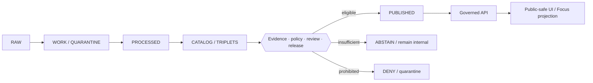
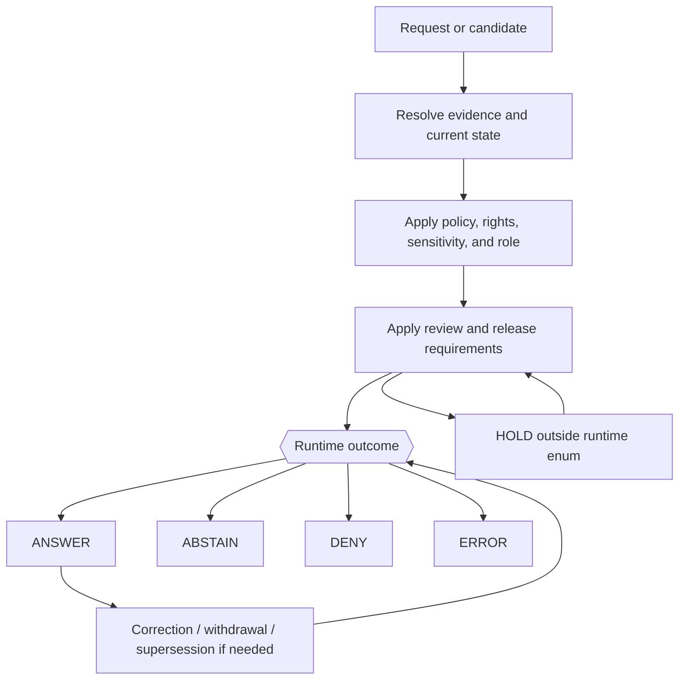

<!-- [KFM_META_BLOCK_V2]
doc_id: kfm://doc/focus-mode-state-readme
title: Focus Mode State Documentation Boundary
type: readme; focus-mode; system-state; geographic-state-boundary; compatibility-lane
version: v1.2
status: draft; repository-grounded; mixed-authority; compatibility-lane; non-release; non-publication
owner: "@bartytime4life via CODEOWNERS; Focus Mode, state-vocabulary, runtime, review, release, and independent publication authority NEEDS VERIFICATION"
created: 2026-05-24
updated: 2026-08-22
policy_label: public; documentation; focus-mode; system-state; geographic-state; finite-outcomes; lifecycle; review; payload; map-context; revocation; cite-or-abstain; fail-closed
owning_root: docs/
responsibility: >-
  Explain the repository-present docs/focus-mode/state compatibility lane,
  distinguish system and trust state from the proposed Kansas geographic
  state-scale Focus composition, inventory the tracked state documents, and
  expose current contract, schema, validation, migration, review, release,
  correction, and rollback boundaries without creating machine, policy,
  lifecycle, scope-registration, release, deployment, or publication authority.
authority: >-
  Human-readable navigation, reconciliation, and maintenance guidance only.
  Current runtime shape belongs to contracts and schemas; policy decisions,
  evidence closure, review records, release manifests, corrections, withdrawals,
  and rollback records remain in their owning responsibility roots.
current_path: docs/focus-mode/state/README.md
canonical_relationship: >-
  Same-path documentation boundary inside the repository-present singular Focus
  compatibility lane. Accepted Directory Rules v2 permits this docs-root repair
  but does not resolve the mixed state tree's final split or migration. Exact
  future placement remains HOLD pending an accepted decision, consumer closure,
  validated migration, and rollback plan.
truth_posture: >-
  CONFIRMED current main, target and sibling blobs, the complete tracked state
  tree, the repository-grounded transitions boundary README, accepted ADR-0029
  and adopted Directory Rules v2, proposed ADR-0028, current parent Focus
  compatibility guidance, the repository-present RuntimeResponseEnvelope
  contract/schema/validator/fixtures, and the four machine-enumerated runtime
  outcomes ANSWER, ABSTAIN, DENY, and ERROR / PROPOSED geographic kansas-state
  scope, state-domain profile, sibling review, payload, map-context, revocation,
  and transition vocabularies, and future state-aware validation / CONFIRMED
  finite-outcomes.md now reconciles the repository's four-outcome runtime
  machine shape while preserving v0.1 reason codes as lineage / CONFLICTED
  geographic-state and system-state material in one writable tree, and sibling
  review and transition prose that still treats HOLD as a runtime outcome /
  UNKNOWN end-to-end Focus service behavior, source admission,
  EvidenceRef-to-EvidenceBundle closure, policy evaluation, accountable review,
  state-scale payloads, release, correction propagation, rollback execution,
  deployment, and public parity / NEEDS VERIFICATION final state-tree ownership,
  accepted scope identity, controlled vocabularies, external consumers,
  link/anchor migration, and every public-use claim.
evidence_snapshot:
  repository: bartytime4life/Kansas-Frontier-Matrix
  base_ref: main
  base_commit: c3f85604a8792e6147e2006256019926880cb3ef
  target_prior_blob: 38c53a9a22ccaf5987630ec3a736a0fc551abbb7
  parent_focus_readme_blob: 8600c0ac09452b4b03e5f60b94f1eb27c072b5db
  state_index_blob: 8d0b631bd53e6af3747417ee813c791fc67a9c3c
  finite_outcomes_blob: bd188a69890f43698422b2bd27c76c74958c5feb
  finite_outcomes_commit: aba7628e8934b3c034eda5e384c2f945652fe7fd
  lifecycle_states_blob: 3826306d620de81840a8140a5645d64c7a630242
  review_state_blob: 0dd5a1089455f560975057c6b5e7ef9e5b1f333d
  payload_state_blob: 9556743d908b1adf318e0037529c
  map_context_state_blob: 5707de7d264724dc6afc85eb397e3815f2a8cdf1
  revocation_state_blob: 89c032bb7e8e08dbfbf9b6c9e73f4ea97acdbcea
  state_template_blob: e7d2f2542ddcfee416c4d3fd709e972ff193d446
  transitions_readme_prior_blob: e25f1814e51579d5f55c0f1fe0135ddb28a47f4a
  transitions_readme_blob: 220f7d6b7c2cd486267490a986d943a509d54347
  directory_rules_blob: fd49a0b83e55cef52c1124281f093e263526898d
  adr_0028_blob: d14ea2b4ad57294ab52da643c954a7f83d5e24e9
  adr_0029_blob: a4de0d7a96b78da59cfc499d1025e1508afd8dd9
  runtime_response_contract_blob: 9dfc286984b5b52b383753fe6215a2b31df8c876
  runtime_response_schema_blob: 8b86e7db8b18b65a56a4e639dfc54e1b2db93155
  runtime_response_validator_blob: 44ce7d51038a9adf9fcbdb18108cc27da8381e33
  ui_focus_response_contract_blob: 5fe3e2763d2b3735e94a53a416114d9b37e7be64
  ui_map_context_contract_blob: c6367306f14f9da56b3e3cbe7fad9d5545a0cdbf
  focus_mode_payload_contract_blob: 7fe687d587cd60dafd6e3fa34306cd58fd125c73
  focus_schema_family_readme_blob: 2b75990b53dea2841c28410f0d9dc9fb10a60f33
  codeowners_blob: dd2a84aa514d8ecd9208bc347f90f9a2ed37dd61
inspection_boundary: >-
  Current-session GitHub reads covered the complete prior README, every direct
  child of docs/focus-mode/state, the prior one-byte transitions README and its
  repository-grounded replacement, every transition specification filename and
  body, the state index and template inventory, the parent Focus README,
  accepted Directory Rules evidence, ADR-0028, runtime and UI Focus contracts,
  the runtime schema, validator and fixture family, the Focus schema-family
  index, CODEOWNERS, applicable documentation workflow triggers, open
  pull-request overlap, and task-branch overlap. No source was admitted, no
  evidence or policy service was exercised, no state-scale payload was built,
  no map or model call ran, and no release, correction, rollback, deployment, or
  public endpoint was exercised.
related:
  - ../README.md
  - ./STATE_INDEX.md
  - ./_template/state-build-plan.md
  - ./finite-outcomes.md
  - ./lifecycle-states.md
  - ./review-state.md
  - ./payload-state.md
  - ./map-context-state.md
  - ./revocation-state.md
  - ./transitions/README.md
  - ../../doctrine/directory-rules.md
  - "../../adr/ADR-0028 — State-scale Focus Mode scope.md"
  - ../../adr/ADR-0029-adopt-directory-governance-standard-v2.md
  - ../../../contracts/runtime/runtime_response_envelope.md
  - ../../../schemas/contracts/v1/runtime/runtime_response_envelope.schema.json
  - ../../../tools/validators/validate_runtime_response_envelope.py
  - ../../../contracts/ui/focus_response.md
  - ../../../contracts/ui/map_context_envelope.md
  - ../../../contracts/focus_mode/focus_mode_payload.md
  - ../../../schemas/contracts/v1/focus/README.md
  - ../../../tools/validators/validate_focus_mode_index.py
  - ../../../.github/CODEOWNERS
tags: [kfm, focus-mode, state, system-state, geographic-state, runtime-envelope, finite-outcomes, lifecycle, review, payload, map-context, revocation, transitions, compatibility, non-publication]
notes:
  - "v1.0 replaces stale no-repository-evidence and Directory Rules v1.2 assumptions with current repository evidence and accepted Directory Rules v2."
  - "v1.1 reconciles finite-outcomes.md with the current four-outcome runtime machine shape and records the one-byte transitions README added on current main."
  - "v1.2 records the repository-grounded transitions boundary README, removes stale placeholder claims, and leaves sibling transition semantics and structural migration unchanged."
  - "The state tree remains mixed authority. This update documents the split requirement but does not move, rename, copy, or delete any state artifact."
  - "The currently tracked RuntimeResponseEnvelope schema enumerates ANSWER, ABSTAIN, DENY, and ERROR. HOLD and PASS/FAIL remain separate review, placement, promotion, or validator concepts unless a later accepted contract changes that boundary."
  - "The geographic STATE_INDEX and state-build-plan template remain proposed ADR-0028 lineage; no kansas-state lane or state-scale release is claimed."
[/KFM_META_BLOCK_V2] -->

<a id="top"></a>
<a id="focus-mode--state-doctrine"></a>

# Focus Mode State Documentation Boundary

> **Purpose.** Explain the mixed state documentation currently tracked under
> `docs/focus-mode/state/`, keep its two meanings of **state** distinct, and show
> which repository surfaces can support a claim about runtime, lifecycle, review,
> payload, map context, geographic scope, revocation, correction, or rollback.

> [!IMPORTANT]
> **This directory is documentation and design lineage, not a canonical state
> machine or released Focus product.** It cannot register a Kansas state-scale
> scope, select a runtime outcome, resolve evidence, evaluate policy, approve a
> review, issue a release, revoke a public artifact, execute rollback, or publish.

> [!CAUTION]
> **`state` is overloaded here.** The tree combines proposed
> **geographic state-scale composition** material with cross-cutting
> **system/trust state** documentation. Those responsibilities may reference one
> another, but they must not become one independently writable authority.

> [!WARNING]
> **The current repository's client-facing runtime envelope has four machine
> outcomes: `ANSWER`, `ABSTAIN`, `DENY`, and `ERROR`.** The sibling
> [`finite-outcomes.md`](./finite-outcomes.md) now reconciles that boundary and
> preserves its older seven-item vocabulary only as labeled lineage. `HOLD` is
> currently a review, placement, promotion, correction, or workflow posture;
> `PASS` and `FAIL` are validator results. None belongs to the current
> `RuntimeResponseEnvelope.outcome` enum.

> [!NOTE]
> **Placement remains bounded.** Accepted Directory Rules v2 supports a same-path
> repair under `docs/`; it does not choose the final home or split for this mixed
> tree. Structural convergence remains **HOLD** pending an accepted decision,
> consumer and anchor inventory, migration validation, and rollback plan.

**Quick navigation:** [Status](#1-status-and-evidence-boundary) ·
[Responsibilities](#2-responsibility-and-placement-boundary) ·
[Two meanings](#3-two-meanings-of-state) ·
[Inventory](#4-current-directory-inventory) ·
[Authority](#5-current-authority-and-implementation-map) ·
[Outcomes](#6-runtime-outcomes-and-state-family-separation) ·
[Lifecycle](#7-lifecycle-and-trust-membrane) ·
[Review](#8-review-hold-and-release-boundary) ·
[Payload and map](#9-payload-map-context-and-freshness) ·
[Revocation](#10-revocation-correction-and-rollback) ·
[Transitions](#11-transition-documents-and-governed-change) ·
[Validation](#12-validation-tests-and-receipts) ·
[Anti-patterns](#13-anti-patterns) ·
[Open work](#14-open-questions-and-adr-triggers) ·
[Maintenance](#15-maintenance-correction-and-rollback) ·
[References](#16-related-docs) · [Glossary](#17-appendix)

---

<a id="1-scope"></a>

## 1. Status and evidence boundary

| Question | Current bounded answer | Truth label |
|---|---|---|
| Does this README exist at the requested path? | Yes. The prior v1.1 file was tracked at blob `38c53a9a22ccaf5987630ec3a736a0fc551abbb7`. | `CONFIRMED` |
| What owns this file? | `docs/` owns human-readable explanation and navigation. CODEOWNERS routes review to `@bartytime4life`; that route is not policy, release, or publication approval. | `CONFIRMED` |
| Does the surrounding state tree exist? | Yes. The tree contains this README, a proposed geographic state index and template, six state-family documents, five transition specifications, and a repository-grounded transitions boundary README. | `CONFIRMED` |
| Is this tree one coherent authority? | No. Geographic state-scope planning and system/trust-state doctrine are mixed beneath one path. | `CONFLICTED` |
| Is ADR-0028 accepted? | No. It remains proposed and therefore does not register `kansas-state`, authorize a state lane, or select a migration target. | `CONFIRMED` proposed status |
| Is Directory Rules v2 effective? | Yes through accepted ADR-0029, which adopts the exact bytes at `docs/doctrine/directory-rules.md`. | `CONFIRMED` |
| What is the current runtime outcome shape? | The repository-present `RuntimeResponseEnvelope` schema enumerates `ANSWER`, `ABSTAIN`, `DENY`, and `ERROR`. | `CONFIRMED` machine shape; contract status remains proposed |
| Is an end-to-end Focus runtime proven? | No authenticated state-scale or general Focus service, live evidence resolution, active policy evaluation, accountable release, or public endpoint was verified here. | `UNKNOWN`; do not infer |
| Does this README change runtime or release state? | No. It changes documentation only. | `CONFIRMED` |
| Is the final state-tree path settled? | No. Same-path maintenance is allowed; split, move, rename, mirror, or deletion remains `HOLD`. | `CONFIRMED` current disposition |

### Truth labels used here

| Label | Meaning |
|---|---|
| `CONFIRMED` | Verified from current-session repository bytes or remote state. |
| `PROPOSED` | Design, vocabulary, path, behavior, or scope not accepted or proven as current implementation. |
| `CONFLICTED` | Current sources or writable surfaces make incompatible claims. |
| `LINEAGE` | Retained prior design or doctrine carrier; not current authority by itself. |
| `UNKNOWN` | Evidence does not establish the claim. |
| `NEEDS VERIFICATION` | A concrete repository, policy, evidence, reviewer, migration, or runtime check remains. |
| `NOT_RUN` | The named executable or external check was not performed in this documentation slice. |
| `HOLD` | Proceeding would cross an unresolved authority, placement, review, sensitivity, or release boundary. |

Repository presence proves that bytes exist. It does not prove semantic acceptance,
runtime behavior, evidence sufficiency, policy permission, release eligibility, or
public parity.

[Back to top](#top)

---

<a id="2-repo-fit--directory-rules-basis"></a>
<a id="21-path-divergence-must-be-resolved"></a>
<a id="3-what-lives-here"></a>
<a id="4-what-does-not-live-here"></a>

## 2. Responsibility and placement boundary

### This README owns

- current navigation for the tracked state tree;
- a repository-grounded inventory of its direct children and transition documents;
- separation of geographic scope state from system/trust state;
- explanation of current contract, schema, validator, fixture, review, release,
  correction, and rollback boundaries;
- compatibility anchors for inbound links to the v0.1 README;
- maintenance and rollback guidance for this documentation artifact.

### This README does not own

| Responsibility | Owning surface or decision class | Effect here |
|---|---|---|
| Client-facing runtime envelope meaning | [`contracts/runtime/runtime_response_envelope.md`](../../../contracts/runtime/runtime_response_envelope.md) | This README must not redefine the runtime enum or fields |
| Runtime machine shape | [`schemas/contracts/v1/runtime/runtime_response_envelope.schema.json`](../../../schemas/contracts/v1/runtime/runtime_response_envelope.schema.json) | Current four-outcome shape outranks stale prose for machine compatibility |
| UI Focus response projection | [`contracts/ui/focus_response.md`](../../../contracts/ui/focus_response.md) | UI projection must preserve runtime state; it is not runtime authority |
| Map request-context meaning | [`contracts/ui/map_context_envelope.md`](../../../contracts/ui/map_context_envelope.md) | Map context is immutable request context, not evidence or an answer |
| Focus payload semantics | [`contracts/focus_mode/focus_mode_payload.md`](../../../contracts/focus_mode/focus_mode_payload.md) | Semantic proposal; no state-scale payload is established here |
| Source and evidence truth | Source registries, `EvidenceRef`, and `EvidenceBundle` owners | State prose cannot admit a source or close evidence |
| Policy and sensitivity decisions | `policy/` plus accountable review | Documentation may describe fail-closed posture but cannot decide |
| Lifecycle instances | Governed data and catalog/triplet stores | This tree does not store or promote lifecycle objects |
| Geographic state-scope identity | Accepted scope decision and machine registration | ADR-0028 remains proposed; `kansas-state` is not registered by this README |
| Review and separation of duties | Review records and accountable reviewer assignments | CODEOWNERS routing is not proof of completed review |
| Release, withdrawal, correction, and rollback | `release/` and governed accountability objects | A Markdown edit or merge creates none of these states |
| UI or API implementation | Application and runtime roots | No route, renderer, resolver, model adapter, or public client changes here |

### Directory Rules basis

Accepted Directory Rules v2 treats a path as an authority claim, assigns one
authority owner per artifact, and returns `SPLIT` when one artifact contains
multiple independently writable authorities. It also distinguishes current
repository drift from adopted placement authority.

For this task:

| Decision | Outcome | Basis |
|---|---|---|
| Update this existing README in place | `PLACE` | Same `docs/` responsibility, no authority or lifecycle change |
| Treat current tree as final canonical structure | `DENY` | Current mixed tree cannot become canon by drift |
| Move or rename the tree now | `HOLD` | Final owners, targets, consumers, anchors, and rollback are unresolved |
| Create a parallel plural Focus tree | `DENY` | Would create parallel writable authority without an accepted migration |
| Split geographic and system-state material later | `PROPOSED` / `HOLD` | ADR-0028 identifies the need; placement decision and migration evidence remain open |

This update therefore makes no structural claim beyond the current same-path
documentation boundary.

[Back to top](#top)

---

## 3. Two meanings of `state`

The current tree carries two materially different concepts.

| Meaning | Current artifacts | Correct interpretation | Current posture |
|---|---|---|---|
| **System/trust state** | `finite-outcomes.md`, `lifecycle-states.md`, `review-state.md`, `payload-state.md`, `map-context-state.md`, `revocation-state.md`, and `transitions/` | Cross-cutting documentation about response, lifecycle, review, freshness, context, correction, and rollback concepts | Tracked draft lineage; finite outcomes and the transition boundary README are reconciled, while review/HOLD and other sibling vocabularies remain mixed or stale |
| **Geographic state-scale Focus composition** | `STATE_INDEX.md` and `_template/state-build-plan.md` | Proposed Kansas-wide composition scope with direct evidence, domain-profile, sensitivity, release, correction, and rollback duties | Proposed under ADR-0028; no registered lane, state-aware validator, payload, or release verified |

> [!IMPORTANT]
> A statewide geographic composition may use system-state concepts, but it cannot
> own or redefine them. Conversely, a system-state document cannot create a
> Kansas-wide scope merely because both use the word `state`.

### What the mix does not prove

- that `kansas-state` is registered or admitted;
- that the state index is validator-clean or lifecycle-significant;
- that any sibling vocabulary is accepted as a canonical machine enum;
- that a public runtime consumes these Markdown files;
- that review, release, correction, or rollback machinery exists for a state-scale product;
- that moving files would resolve the semantic conflict without consumer breakage.

[Back to top](#top)

---

<a id="5-directory-tree-proposed"></a>

## 4. Current directory inventory

The v0.1 README described the tree as proposed. The files below are now
**repository-present**; their presence does not promote their internal proposals.

```text
docs/focus-mode/state/
├── README.md
├── STATE_INDEX.md
├── _template/
│   └── state-build-plan.md
├── finite-outcomes.md
├── lifecycle-states.md
├── map-context-state.md
├── payload-state.md
├── review-state.md
├── revocation-state.md
└── transitions/
    ├── README.md
    ├── answer-to-abstain.md
    ├── candidate-to-hold.md
    ├── hold-to-deny.md
    ├── published-to-revoked.md
    └── rollback-to-prior.md
```

### Direct-child disposition

| Artifact | Current role | Current evidence-backed disposition |
|---|---|---|
| [`README.md`](./README.md) | State-tree navigation and reconciliation boundary | `PLACE`; this document |
| [`STATE_INDEX.md`](./STATE_INDEX.md) | Proposed single-row Kansas geographic state index | `LINEAGE` / `PROPOSED`; inert pending ADR-0028 and machine closure |
| [`_template/state-build-plan.md`](./_template/state-build-plan.md) | Proposed geographic state build-plan template | `LINEAGE` / `PROPOSED`; no state lane created |
| [`finite-outcomes.md`](./finite-outcomes.md) | Repository-grounded four-outcome documentation boundary with retained v0.1 anchors and reason-code lineage | `PLACE` / reconciled; contract, schema, policy, and runtime authority remain separate |
| [`lifecycle-states.md`](./lifecycle-states.md) | Lifecycle and promotion-gate prose | Core lifecycle shorthand retained; detailed gates and paths remain proposal/verification-sensitive |
| [`review-state.md`](./review-state.md) | ReviewRecord and HOLD proposal | `PROPOSED`; HOLD/runtime collision remains unresolved |
| [`payload-state.md`](./payload-state.md) | FocusModePayload freshness and citation-closure proposal | `PROPOSED`; no state-scale payload or old asserted machine schema verified |
| [`map-context-state.md`](./map-context-state.md) | Older MapContextEnvelope proposal | `LINEAGE`; newer UI semantic contract/schema family is the current repository seam |
| [`revocation-state.md`](./revocation-state.md) | Revocation-manifest and rollback-state proposal | `PROPOSED`; no public verifier or state-scale execution verified |
| [`transitions/`](./transitions/README.md) | Repository-grounded boundary README plus five prose transition specifications | `PLACE` for the README; sibling specs remain `LINEAGE` / `PROPOSED` and are not executable state-machine proof |

### Transition-document inventory

| Transition document | Intended concept | Boundary |
|---|---|---|
| [`README.md`](./transitions/README.md) | State-transition documentation boundary, inventory, and navigation | Same-path `PLACE`; documentation only, with machine/runtime and release authority kept elsewhere |
| [`answer-to-abstain.md`](./transitions/answer-to-abstain.md) | Response narrows when evidence or currentness no longer supports an answer | Must preserve correction/revocation state; prose is not runtime execution |
| [`candidate-to-hold.md`](./transitions/candidate-to-hold.md) | Candidate pauses pending rights, policy, sensitivity, or review | HOLD is not publication and not a current runtime-envelope outcome |
| [`hold-to-deny.md`](./transitions/hold-to-deny.md) | Held candidate resolves to a denial or rejection | Requires owning policy/review records; Markdown cannot issue them |
| [`published-to-revoked.md`](./transitions/published-to-revoked.md) | Released artifact is withdrawn | Requires governed revocation, correction, cache, and public-state handling |
| [`rollback-to-prior.md`](./transitions/rollback-to-prior.md) | Prior released state becomes current through governed rollback | A Git revert alone is not public rollback |

[Back to top](#top)

---

<a id="6-state-families-at-a-glance"></a>

## 5. Current authority and implementation map

| Surface | What is confirmed now | What it cannot prove |
|---|---|---|
| Parent [`docs/focus-mode/README.md`](../README.md) | Singular compatibility lane exists; geographic and system state are mixed; migration is held | Final canonical path or accepted scope |
| [`RuntimeResponseEnvelope` contract](../../../contracts/runtime/runtime_response_envelope.md) | Tracked v0.4 contract points to a paired runtime schema and documents four client outcomes | Live service behavior, evidence resolution, policy correctness, or release |
| [Runtime schema](../../../schemas/contracts/v1/runtime/runtime_response_envelope.schema.json) | Closed object; enum is `ANSWER`, `ABSTAIN`, `DENY`, `ERROR`; `ANSWER` requires evidence refs and precision disclosure | Accepted semantics, truthful evidence, policy permission, or public deployment |
| [Runtime validator](../../../tools/validators/validate_runtime_response_envelope.py) and [fixtures](../../../fixtures/contracts/v1/runtime/runtime_response_envelope/README.md) | Repository-present deterministic shape and precision checks with positive/negative fixture lanes | Evidence closure, policy, review, release, or publication |
| [`FocusResponse` contract](../../../contracts/ui/focus_response.md) | UI response is a projection downstream of the runtime envelope | Runtime outcome authority or answer truth |
| [`MapContextEnvelope` contract](../../../contracts/ui/map_context_envelope.md) | Renderer-neutral, immutable, released-input-only request-context proposal | Evidence, policy, review, release, or answer authority |
| [`FocusModePayload` contract](../../../contracts/focus_mode/focus_mode_payload.md) | Semantic planning contract exists | Machine schema closure at the old `focus_mode` path, state-scale payload, or public release |
| [`schemas/contracts/v1/focus/`](../../../schemas/contracts/v1/focus/README.md) | Mixed scaffold and compatibility family exists; runtime alias points to the runtime schema | Settled request/response schema ownership or mature Focus runtime |
| [`validate_focus_mode_index.py`](../../../tools/validators/validate_focus_mode_index.py) | Tracked proposed validator is explicitly county-focused and recognizes county/region/corridor scopes | State-scope validation, current singular-tree validity, or state release |
| [`STATE_INDEX.md`](./STATE_INDEX.md) | One proposed `kansas-state` planning row exists | Registered scope, matching lane, validation, payload, release, or publication |
| [Transition boundary README](./transitions/README.md) | Repository-grounded inventory and authority separation for five prose transition specifications | Executable transition logic, reason-code authority, review, revocation, or rollback behavior |
| ADR-0028 | Documents the proposed state-scope and required split between geographic and system state | Acceptance, path resolution, implementation, or release |
| ADR-0029 and Directory Rules v2 | Establish accepted placement authority and finite placement outcomes | Domain truth, runtime behavior, rights, sensitivity, or publication |

### Maturity summary

| Capability | Current status |
|---|---|
| State-tree bytes and navigation | `CONFIRMED` |
| System-state prose corpus | `CONFIRMED` presence; finite outcomes and transition boundary reconciled, remaining siblings mixed in freshness and authority |
| Runtime four-outcome machine shape | `CONFIRMED` repository shape; contract/schema remain marked proposed |
| Runtime envelope validator and fixtures | `CONFIRMED` repository implementation |
| Geographic `kansas-state` identity | `PROPOSED`; not accepted or registered |
| State-aware Focus index validation | `ABSENT / NEEDS IMPLEMENTATION` |
| State-scale `FocusModePayload` | `UNKNOWN`; no verified instance |
| Live evidence and policy evaluation | `UNKNOWN` |
| Accountable review and separation of duties | `UNKNOWN` |
| State-scale release, correction, and rollback | `UNKNOWN` |
| Deployment and public parity | `UNKNOWN` |

[Back to top](#top)

---

<a id="7-finite-outcome-state"></a>

## 6. Runtime outcomes and state-family separation

### Current runtime/client outcomes

The tracked runtime schema currently permits exactly four client-facing outcomes.

| Outcome | Current bounded meaning | Evidence and disclosure posture |
|---|---|---|
| `ANSWER` | The runtime may return a governed response under the current envelope proposal | Requires at least one `EvidenceRef` and `precision_actually_used`; still does not prove evidence resolution or policy/release correctness |
| `ABSTAIN` | The runtime declines to answer because support, currentness, rights, context, or another prerequisite is insufficient | Must not carry answer-shaped precision disclosure |
| `DENY` | Policy, role, sensitivity, access, or release posture blocks delivery | Must not leak restricted payload or protected precision |
| `ERROR` | The runtime cannot complete safely or deterministically | Diagnostic state; not evidence for or against the underlying claim |

### Concepts that are not current runtime outcomes

| Concept | Correct current class | Why it remains separate |
|---|---|---|
| `HOLD` | Placement, review, promotion, correction, or workflow posture | The runtime schema does not enumerate it; held public behavior must resolve through the accepted runtime contract rather than a fifth ad hoc outcome |
| `PASS` | Validator/admission result | A green check does not emit a public answer or authorize release |
| `FAIL` | Validator/admission result | A red check blocks or narrows work; it is not a client truth judgment |
| `approved`, `rejected`, `held` | Review-state proposal | Review status is orthogonal to runtime response and lifecycle |
| `RAW`, `PROCESSED`, `PUBLISHED` | Lifecycle state | Lifecycle location does not determine the client outcome by itself |
| `fresh`, `stale`, `revoked-but-cached` | Payload or correction posture proposals | These may influence the four outcomes but do not replace them |

> [!CAUTION]
> The sibling [`finite-outcomes.md`](./finite-outcomes.md) now preserves the
> current four-outcome runtime boundary. [`review-state.md`](./review-state.md)
> and some transition documents remain useful but stale lineage for the
> unresolved HOLD model; maintainers must not treat their older outcome-state
> HOLD claims as current runtime machine authority.

### State-family orthogonality

One request may involve all of these dimensions at once:

```text
artifact lifecycle:     PROCESSED
review posture:         held
payload freshness:      stale
correction posture:     superseded
runtime outcome:        ABSTAIN
validator result:       PASS or FAIL for a particular check
```

None of those values may be silently substituted for another.

[Back to top](#top)

---

<a id="8-lifecycle-state"></a>

## 7. Lifecycle and trust membrane

KFM preserves the lifecycle shorthand:

```text
RAW -> WORK / QUARANTINE -> PROCESSED -> CATALOG / TRIPLETS -> PUBLISHED
```

Promotion is a governed state transition, not a file move, commit, pull request,
workflow badge, merge, release-page entry, or UI render.

| Stage | Bounded responsibility | Public-client posture |
|---|---|---|
| `RAW` | Capture source material or references with identity and provenance | Internal; never a normal public-client source |
| `WORK` / `QUARANTINE` | Transform, assess, validate, or hold unresolved rights, sensitivity, identity, or quality issues | Internal; fail closed |
| `PROCESSED` | Produce validated normalized candidates and supporting accountability material | Internal candidate state; not public release |
| `CATALOG` / `TRIPLETS` | Index, relate, and prepare governed evidence or release candidates | Derived or candidate state; not sovereign truth |
| `PUBLISHED` | Released public-safe artifacts available through governed interfaces | Only after evidence, policy, review, release, correction, and rollback closure appropriate to the claim |


```mermaid
flowchart LR
    RAW["RAW"] --> WQ["WORK / QUARANTINE"]
    WQ --> PROC["PROCESSED"]
    PROC --> CAT["CATALOG / TRIPLETS"]
    CAT --> GATE{{"Evidence · policy · review · release"}}
    GATE -->|eligible| PUB["PUBLISHED"]
    GATE -->|insufficient| ABS["ABSTAIN / remain internal"]
    GATE -->|prohibited| DENY["DENY / quarantine"]
    PUB --> API["Governed API"]
    API --> UI["Public-safe UI / Focus projection"]
```

### Trust-membrane rules

- Public and ordinary UI clients consume governed interfaces or released
  public-safe artifacts, not RAW, WORK, QUARANTINE, canonical/internal, proof,
  or direct model stores.
- `EvidenceRef` must resolve to admissible `EvidenceBundle` support before a
  consequential claim can be presented as supported.
- Maps, graphs, indexes, summaries, state tables, and generated language remain
  projections; they do not become sovereign truth.
- A document that describes lifecycle stages does not own the machine state or
  move an object through it.
- Passing a schema or validator is necessary evidence for its bounded check, not
  proof of source truth, policy approval, release, or publication.

[Back to top](#top)

---

<a id="9-review-and-release-state"></a>

## 8. Review, HOLD, and release boundary

The tracked review-state document proposes six ReviewRecord states and uses
`HOLD` in both review and runtime senses. Current repository evidence does not
close that collision.

| Topic | Current bounded treatment |
|---|---|
| Draft and pending review | Useful planning concepts; exact accepted contract and machine vocabulary require verification |
| `HOLD` | Fail-closed review, placement, promotion, or correction posture; not in the current runtime outcome schema |
| Approval | May satisfy a review gate; never equals release or publication |
| Rejection | Stops the reviewed candidate; does not erase history |
| Supersession | Requires explicit lineage to a successor; must not silently overwrite prior state |
| Separation of duties | Preferred and required where consequence justifies it; current independent reviewer identities remain unverified |
| CODEOWNERS | Routes GitHub review to `@bartytime4life`; does not create a ReviewRecord or release approval |
| Release | Requires a distinct release decision/manifest, evidence and policy closure, correction path, and rollback target |

### Fail-closed HOLD behavior

A HOLD should identify:

1. the exact object or transition held;
2. the reason category;
3. the owner of the unresolved decision;
4. evidence required to clear the hold;
5. what remains usable while held;
6. whether public state must abstain, deny, remain unchanged, or be withdrawn;
7. the correction and rollback implications.

This README records no active HOLD object beyond placement and verification
posture. It creates no review or policy decision.

[Back to top](#top)

---

<a id="10-payload-state-and-mapcontextenvelope-state"></a>

## 9. Payload, map context, and freshness

### Focus payload

The tracked [`payload-state.md`](./payload-state.md) proposes freshness and
citation-closure states for a `FocusModePayload`. The semantic payload contract
exists, but the old asserted machine path
`schemas/contracts/v1/focus_mode/focus_mode_payload.schema.json` was not present
at the inspected commit.

Therefore:

- payload-state vocabularies remain `PROPOSED`;
- no state-scale payload instance is confirmed;
- no payload state can authorize an answer by itself;
- citation closure is claim-specific and requires governed resolution;
- stale, unresolved, withdrawn, or unreleased support must narrow the runtime
  result rather than being filled by model language.

### Map context

The current repository has a newer, renderer-neutral UI
[`MapContextEnvelope`](../../../contracts/ui/map_context_envelope.md) proposal.
That contract names a paired schema, fixtures, validator, and tests; their
execution was not verified in this task. The envelope defines request context,
not evidence or an answer.

| Context property | Bounded rule |
|---|---|
| Layer and feature identity | Stable KFM identifiers; no renderer-internal object leakage |
| Release references | Context may name released inputs; downstream services re-check current state |
| Evidence references | Pointers only; they must still resolve through governed evidence interfaces |
| Time and area scope | Explicit and bounded; cannot upgrade the evidence's own temporal or spatial support |
| Deterministic identity | Supports replay and comparison; hash integrity is not truth |
| Expiration | Prevents stale UI context from being treated as current |
| Policy and sensitivity | Evaluated downstream; map context does not grant permission |
| Renderer neutrality | MapLibre or another admitted renderer cannot become evidence authority |

### Freshness boundary

Freshness is not one global boolean. At minimum, maintainers must distinguish:

- request-context freshness;
- source observation time;
- evidence validity and supersession;
- policy version and effective period;
- review and release state;
- correction, withdrawal, and cache state.

A current map envelope cannot make stale evidence current, and a fresh evidence
bundle cannot authorize a denied or unreleased response.

[Back to top](#top)

---

<a id="11-revocation-and-rollback-state"></a>

## 10. Revocation, correction, and rollback

The tracked [`revocation-state.md`](./revocation-state.md) is a draft proposal.
It usefully preserves the principle that post-release change is governed, but
its manifest fields, TTLs, signatures, reason codes, and execution remain
`PROPOSED` unless confirmed by current contracts, schemas, validators, policy,
and release evidence.

| Concept | Governing requirement | What this README proves |
|---|---|---|
| Correction | Identify the affected claim/artifact, cause, successor or narrowed state, and public notice path | Principle only |
| Withdrawal/revocation | Stop serving the affected released form and preserve why it was withdrawn | No executed revocation |
| Supersession | Retain old addressable lineage and point to the successor | No state-scale successor |
| Rollback | Restore an eligible prior released state through a governed decision and receipts | No rollback execution |
| Cache invalidation | Prevent clients from continuing to render withdrawn or superseded content | Not exercised |
| Git revert | Correct repository bytes | Insufficient by itself for public correction or rollback |

> [!WARNING]
> A Git revert can restore documentation bytes. It cannot by itself retract
> cached public artifacts, update governed APIs, issue correction notices,
> withdraw evidence, or reconstruct public reliance.

[Back to top](#top)

---

<a id="12-state-transition-diagrams"></a>

## 11. Transition documents and governed change

The [transition boundary README](./transitions/README.md) and five sibling
transition files are human-readable design and review aids. They do not execute
state changes and must not become a second contract, policy engine, or release
ledger.


```mermaid
flowchart TD
    REQUEST["Request or candidate"] --> RESOLVE["Resolve evidence and current state"]
    RESOLVE --> POLICY["Apply policy, rights, sensitivity, and role"]
    POLICY --> REVIEW["Apply review and release requirements"]
    REVIEW --> OUTCOME{{"Runtime outcome"}}
    OUTCOME --> ANSWER["ANSWER"]
    OUTCOME --> ABSTAIN["ABSTAIN"]
    OUTCOME --> DENY["DENY"]
    OUTCOME --> ERROR["ERROR"]
    REVIEW --> HOLD["HOLD outside runtime enum"]
    HOLD --> REVIEW
    ANSWER --> CORRECT["Correction / withdrawal / supersession if needed"]
    CORRECT --> OUTCOME
```

### Transition-document use rule

A transition document is useful when it records:

- preconditions and blocked states;
- one authority owner;
- source and evidence requirements;
- policy and sensitivity obligations;
- review identity and separation-of-duties expectations;
- finite success and failure outcomes;
- emitted receipts or records;
- correction, supersession, withdrawal, and rollback effects.

It is not sufficient evidence that the transition exists in runtime.

[Back to top](#top)

---

<a id="13-validators-tests-and-receipts"></a>

## 12. Validation, tests, and receipts

### Current repository evidence

| Validation surface | Current status | Bounded conclusion |
|---|---|---|
| Runtime response schema | Present, closed, four outcomes, conditional answer precision | Confirms machine shape only |
| Runtime response validator | Present and deterministic | Confirms implemented local shape/semantic checks |
| Runtime valid/invalid fixture lanes | Present | Confirms test carriers exist; individual hosted/local results remain separate |
| Focus schema family | Present but mixed scaffolds/compatibility | Does not establish final Focus request/response ownership |
| County Focus index validator | Present, proposed, county-only, targets a different layout | Not a state-tree or state-scope validator |
| State index validator | Not verified | State planning row remains unvalidated |
| Transition documentation boundary | Present and repository-grounded | Confirms navigation and authority separation only; sibling execution remains unproved |
| README/Markdown checks | Applicable to this change | Prove document structure and link integrity only |
| Source, evidence, policy, review, release, correction, rollback | `NOT_RUN` | No operational state claim allowed |

### Validation expected for this README change

- one H1 and one complete `KFM_META_BLOCK_V2`;
- unique explicit compatibility anchors;
- balanced fenced blocks and valid Mermaid syntax;
- consistent tables;
- all same-document fragments resolve;
- repository-relative links resolve at the pinned base;
- UTF-8 with LF line endings and a final newline;
- no tabs, trailing whitespace, conflict markers, or decorative badge assertions;
- no claim that an ADR, contract, schema, validator, workflow, commit, or PR
  creates release/publication authority;
- preserved core lifecycle and trust-membrane invariants;
- explicit alignment of finite-outcomes.md with the four-outcome runtime machine
  shape, while keeping HOLD and PASS/FAIL in separate state families;
- the transition boundary README and all five sibling specifications remain
  reachable from this index.

### What a green check does not prove

A passing README, schema, validator, unit test, security scan, release dry run, or
rollback drill does not by itself establish:

- source truth or rights;
- EvidenceBundle closure;
- policy correctness;
- accountable human review;
- state-scope acceptance;
- release or publication;
- deployed runtime behavior;
- correction propagation or public rollback.

[Back to top](#top)

---

<a id="14-anti-patterns"></a>

## 13. Anti-patterns

| Anti-pattern | Failure | Required posture |
|---|---|---|
| State-family collapse | Treating lifecycle, review, payload, correction, validator, and runtime values as one enum | Keep separate carriers and mappings |
| Geographic/system-state collapse | Using one `state/` path as authority for both Kansas scope and cross-cutting runtime doctrine | Split only through accepted placement and migration |
| Seven-outcome runtime claim | Treating `HOLD`, `PASS`, or `FAIL` as current runtime-envelope outcomes | Preserve four machine outcomes; track other classes separately |
| Review equals release | Treating approval or CODEOWNERS routing as publication | Require distinct release and rollback closure |
| Schema-valid equals true | Treating valid JSON as evidence, policy, or release proof | Resolve evidence and governing state |
| Current map equals current evidence | Treating viewport time or camera state as observation freshness | Preserve source/evidence time |
| Candidate equals published | Serving PROCESSED or CATALOG material to a public role | Use governed released projection only |
| Cached-but-withdrawn render | Continuing to serve corrected or revoked material | Abstain/deny/withdraw and invalidate caches |
| Prose transition equals implementation | Claiming a state transition exists because a Markdown spec exists | Require contract, schema, code, fixtures, tests, and runtime evidence |
| Proposed ADR as authority | Using ADR-0028 to register or move state scope before acceptance | Keep implementation and migration held |
| Parallel Focus tree | Creating `docs/focus-modes/` while the current tree remains writable | Deny until accepted migration and single-writer cutover |
| Git state equals public state | Treating commit, PR, merge, tag, or release page as KFM publication | Preserve governed release, correction, and rollback |

[Back to top](#top)

---

<a id="15-open-questions-and-adr-triggers"></a>

## 14. Open questions and ADR triggers

| Open item | Current status | Decision or evidence needed |
|---|---|---|
| Split geographic state scope from system/trust state | `HOLD` | Accepted decision naming each authority owner and final target |
| Accept or reject `scope_kind: state` and `scope_id: kansas-state` | `PROPOSED` under ADR-0028 | ADR acceptance with domain-profile, evidence, policy, release, correction, and rollback consequences |
| Reconcile `finite-outcomes.md` with four-outcome runtime schema | `RESOLVED IN v1.1` for this documentation surface | Preserve contract/schema authority; correct remaining review/HOLD sibling prose separately |
| Replace the transition README placeholder | `RESOLVED IN v1.2` for documentation navigation | Preserve the new README's docs-only boundary; reconcile sibling semantics separately |
| Model HOLD | `NEEDS VERIFICATION` | Decide review/placement/promotion carrier and public runtime projection |
| Settle Focus request/response schema ownership | `CONFLICTED` | Resolve UI/focus/runtime overlap without parallel schema authority |
| Close `FocusModePayload` machine shape | `UNKNOWN` | Accepted semantic owner, schema, validator, positive/negative fixtures, compatibility plan |
| Define state-aware Focus index validation | `ABSENT` | Accepted state scope plus deterministic no-network validator and negative fixtures |
| Inventory inbound links and external consumers | `NEEDS VERIFICATION` | Repository and external consumer closure before move/rename |
| Define accountable independent review routes | `NEEDS VERIFICATION` | Verified identities and assignments, not placeholder roles |
| Prove correction/withdrawal/rollback behavior | `UNKNOWN` | Executable governed flow, receipts, cache handling, and drill evidence |

### Changes that require more than a README edit

- adding or removing a runtime outcome;
- accepting geographic state scope;
- moving, splitting, renaming, mirroring, or deleting the current tree;
- changing the authority owner of runtime, payload, review, or correction state;
- introducing a new canonical schema or policy home;
- allowing public clients to consume a new state class;
- changing release, correction, withdrawal, or rollback semantics.

[Back to top](#top)

---

## 15. Maintenance, correction, and rollback

### Update this README when

- the state tree adds, removes, renames, or moves a direct child;
- the transition boundary README or its five sibling specifications change
  inventory, authority posture, or compatibility status;
- ADR-0028 changes effective status;
- accepted placement authority resolves the mixed state tree;
- the runtime outcome enum changes through an accepted contract/schema process;
- HOLD gains an accepted carrier or client projection;
- state-aware validation is implemented or registered;
- Focus payload, map-context, review, revocation, or correction contracts change;
- a state-scale release, correction, withdrawal, or rollback becomes verifiable;
- an inbound-link or external-consumer inventory changes migration risk.

### Documentation correction

A correction should:

1. pin the affected README version and repository commit;
2. identify the false, stale, or conflicted claim;
3. cite the newer contract, schema, test, decision, or runtime evidence;
4. preserve compatibility anchors where feasible;
5. state whether sibling docs also need correction;
6. avoid changing machine or policy authority through prose;
7. define rollback to a known prior blob or a bounded forward fix.

### Rollback

Before merge, close or abandon the draft pull request and branch. Branch deletion
is a separate action.

After merge, restore prior blob
`38c53a9a22ccaf5987630ec3a736a0fc551abbb7` through a transparent revert or
apply a bounded forward correction. Do not rewrite shared history.

Because this change is documentation-only, repository rollback affects this
README. Any future public state artifact would require its own correction,
withdrawal, cache invalidation, supersession, and rollback process.

[Back to top](#top)

---

<a id="16-related-docs"></a>

## 16. Related docs

### Current Focus and placement boundaries

- [Parent Focus compatibility README](../README.md)
- [Accepted Directory Rules v2 bytes](../../doctrine/directory-rules.md)
- [ADR-0028 — proposed state-scale Focus scope](../../adr/ADR-0028%20%E2%80%94%20State-scale%20Focus%20Mode%20scope.md)
- [ADR-0029 — accepted Directory Rules adoption](../../adr/ADR-0029-adopt-directory-governance-standard-v2.md)
- [CODEOWNERS review routing](../../../.github/CODEOWNERS)

### Current runtime, UI, payload, schema, and validation seams

- [`RuntimeResponseEnvelope` semantic contract](../../../contracts/runtime/runtime_response_envelope.md)
- [Runtime response machine schema](../../../schemas/contracts/v1/runtime/runtime_response_envelope.schema.json)
- [Runtime response validator](../../../tools/validators/validate_runtime_response_envelope.py)
- [Runtime response fixture README](../../../fixtures/contracts/v1/runtime/runtime_response_envelope/README.md)
- [`FocusResponse` UI projection contract](../../../contracts/ui/focus_response.md)
- [`MapContextEnvelope` UI semantic contract](../../../contracts/ui/map_context_envelope.md)
- [`FocusModePayload` semantic contract](../../../contracts/focus_mode/focus_mode_payload.md)
- [Focus schema-family index](../../../schemas/contracts/v1/focus/README.md)
- [Proposed county Focus index validator](../../../tools/validators/validate_focus_mode_index.py)

### State-tree documents

- [Geographic state index](./STATE_INDEX.md)
- [State build-plan template](./_template/state-build-plan.md)
- [Finite-outcome documentation boundary](./finite-outcomes.md)
- [Lifecycle-state lineage](./lifecycle-states.md)
- [Review-state lineage](./review-state.md)
- [Payload-state lineage](./payload-state.md)
- [Map-context-state lineage](./map-context-state.md)
- [Revocation-state lineage](./revocation-state.md)
- [Transition documentation boundary](./transitions/README.md)

[Back to top](#top)

---

<a id="17-appendix"></a>
<a id="17-appendix--glossary-vocabularies-references"></a>

## 17. Appendix

### 17.1 State-family glossary

| Term | Family | Bounded meaning |
|---|---|---|
| `ANSWER` | Runtime outcome | Client may render a governed response under the current proposed envelope shape |
| `ABSTAIN` | Runtime outcome | Support or another prerequisite is insufficient; do not infer |
| `DENY` | Runtime outcome | Policy, role, sensitivity, access, or release posture blocks delivery |
| `ERROR` | Runtime outcome | Runtime cannot complete safely or deterministically |
| `HOLD` | Review/placement/promotion posture | Decision is intentionally paused; not a current runtime enum value |
| `PASS` / `FAIL` | Validator result | Bounded check result; not a public truth judgment |
| `RAW` through `PUBLISHED` | Lifecycle | Governed data/evidence promotion stages |
| `ReviewRecord` | Review | Proposed carrier for draft, pending, held, approved, rejected, superseded |
| `FocusModePayload` | Payload | Proposed governed projection for a bounded Focus composition |
| `MapContextEnvelope` | Request context | Immutable renderer-neutral map/request context; not evidence |
| `EvidenceRef` | Evidence pointer | Must resolve through governed interfaces before supporting a claim |
| `EvidenceBundle` | Evidence support | Outranks generated language for supported claims |
| `RuntimeResponseEnvelope` | Trust membrane | Client-facing finite outcome and supporting governance posture |
| `ReleaseManifest` | Release | Distinct record of released eligibility; not created by Git state |
| Correction / withdrawal / rollback | Accountability | Governed post-release change with visible lineage and public effects |
| Transition specification | Documentation | Human-readable design/review aid, not an executable state machine |

### 17.2 Compatibility anchors retained

The following v0.1 anchors remain available in this file for inbound links:

- `#focus-mode--state-doctrine`
- `#1-scope`
- `#2-repo-fit--directory-rules-basis`
- `#21-path-divergence-must-be-resolved`
- `#3-what-lives-here`
- `#4-what-does-not-live-here`
- `#5-directory-tree-proposed`
- `#6-state-families-at-a-glance`
- `#7-finite-outcome-state`
- `#8-lifecycle-state`
- `#9-review-and-release-state`
- `#10-payload-state-and-mapcontextenvelope-state`
- `#11-revocation-and-rollback-state`
- `#12-state-transition-diagrams`
- `#13-validators-tests-and-receipts`
- `#14-anti-patterns`
- `#15-open-questions-and-adr-triggers`
- `#16-related-docs`
- `#17-appendix`

### 17.3 Self-check

| Check | Result expected for this revision |
|---|---|
| One H1 | yes |
| Metadata block | one complete `KFM_META_BLOCK_V2` |
| Current base and blobs recorded | yes |
| Current state tree inventoried | yes |
| Geographic/system state separated | yes |
| Four current runtime outcomes preserved | yes |
| HOLD and PASS/FAIL separated | yes |
| Core lifecycle preserved | yes |
| Transition boundary README current and linked | yes |
| Proposed ADRs remain proposed | yes |
| No structural migration | yes |
| No runtime, release, deployment, or publication claim | yes |
| Correction and rollback visible | yes |
| Legacy anchors preserved | yes |

---

**Current document status:** repository-grounded draft · **Path posture:** same-path
`PLACE`; structural split/migration `HOLD` · **Runtime outcome shape:** four
machine-enumerated values, proposal status retained · **Release/publication
effect:** none.

[Back to top](#top)
